> [!review] Review 1
> Contents


> [!review] Review 1
> 1. Draw a diagram of the complex plane ($z$-plane). Label the following:
> a.) complex number and its associated ordered pair $(x, y)$.
> b.) the real axis
> c.) abscissa of the complex number
> d.) the imaginary axis
> e.) the ordinate of the complex number
> 2. Does the correspondence between complex numbers $z=x+i y$ and points $(x, y)$ in the plane form a bijection? **(Hint: There are two ways to think about complex numbers geometrically.)**?
> 3. Does the correspondence between real numbers and complex numbers form a bijection? Explain. Why is this an important consideration for the way we depict complex numbers in the complex plane 
> 4. What are purely real and purely imaginary numbers?


##### review 1(a - e)

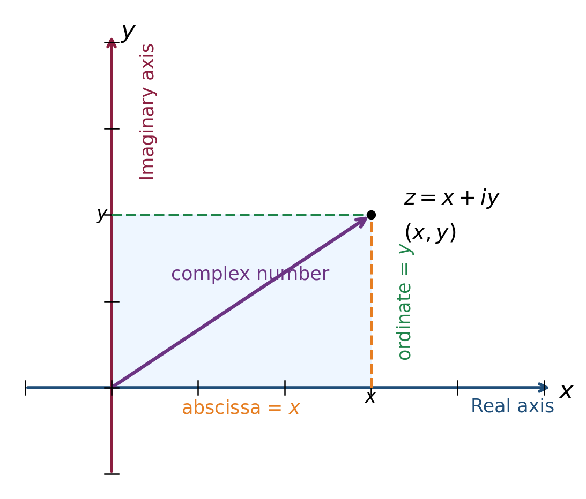

```Python title:"Diagram of the Complex Plane"
from pathlib import Path
import matplotlib
matplotlib.use('Agg')
import matplotlib.pyplot as plt
from matplotlib.patches import FancyArrowPatch

out = Path('images/review-1-complex-plane-diagram.png')

x = 3
y = 2

fig, ax = plt.subplots(figsize=(6, 6), dpi=180)
ax.set_xlim(-1.2, 5.4)
ax.set_ylim(-1.2, 4.4)
ax.set_aspect('equal')
ax.axis('off')

# Light guides for the abscissa and ordinate regions
ax.fill_between([0, x], 0, y, color='#cfe8ff', alpha=0.35)
ax.fill_between([0, x], 0, 0, color='#ffe0cc', alpha=0.4)

# Axes
ax.add_patch(FancyArrowPatch((-1.0, 0), (5.1, 0), arrowstyle='->', mutation_scale=14, lw=2.2, color='#1f4e79'))
ax.add_patch(FancyArrowPatch((0, -1.0), (0, 4.1), arrowstyle='->', mutation_scale=14, lw=2.2, color='#8b1e3f'))

# Tick marks
for k in range(-1, 6):
    ax.plot([k, k], [-0.08, 0.08], color='black', lw=1)
for k in range(-1, 5):
    ax.plot([-0.08, 0.08], [k, k], color='black', lw=1)

# Projection lines and vector
ax.plot([x, x], [0, y], linestyle='--', lw=2, color='#e67e22')
ax.plot([0, x], [y, y], linestyle='--', lw=2, color='#1e8449')
ax.add_patch(FancyArrowPatch((0, 0), (x, y), arrowstyle='->', mutation_scale=16, lw=2.6, color='#6c3483'))
ax.plot(x, y, 'ko', ms=6)

# Labels
ax.text(5.16, -0.12, '$x$', fontsize=18)
ax.text(0.1, 4.05, '$y$', fontsize=18)
ax.text(4.15, -0.28, 'Real axis', fontsize=14, color='#1f4e79')
ax.text(0.32, 3.2, 'Imaginary axis', fontsize=14, color='#8b1e3f', rotation=90, va='center')
ax.text(x / 2, -0.3, 'abscissa = $x$', fontsize=14, color='#e67e22', ha='center')
ax.text(x + 0.28, y / 2, 'ordinate = $y$', fontsize=14, color='#1e8449', rotation=90, va='center')
ax.text(x / 2 + 0.1, y / 2 + 0.25, 'complex number', fontsize=14, color='#6c3483', ha='center')
ax.text(x + 0.38, y + 0.12, '$z=x+iy$', fontsize=16)
ax.text(x + 0.38, y - 0.28, '$(x,y)$', fontsize=16)
ax.text(x, -0.17, '$x$', fontsize=14, ha='center')
ax.text(-0.18, y, '$y$', fontsize=14, va='center')

plt.tight_layout(pad=0.3)
fig.savefig(out, facecolor='white', bbox_inches='tight', pad_inches=0.08)
```


```mathematica title:"Diagram of the Complex Plane"
x = 3; 
y = 2;

Show[
 Graphics[
  {
   {Lighter[Blue, 0.9], Opacity[0.35], Rectangle[{0, 0}, {5, 4}]},
   {Lighter[Red, 0.92], Opacity[0.25], Rectangle[{0, 0}, {5, 4}]},

   {Blue, Thick, Arrow[{{-1, 0}, {4.9, 0}}]},
   {Red, Thick, Arrow[{{0, -1}, {0, 3.9}}]},

   {Orange, Dashed, Thick, Line[{{x, 0}, {x, y}}]},
   {Darker[Green], Dashed, Thick, Line[{{0, y}, {x, y}}]},

   {Purple, Thick, Arrow[{{0, 0}, {x, y}}]},
   {Black, PointSize[0.025], Point[{x, y}]},

   Text[Style["Real axis", 16, Blue], {4.2, -0.22}],
   Text[Style["Imaginary axis", 16, Red], {0.25, 3.1}, {0, 0}, Pi/2],

   Text[Style["complex number", 16, Purple], {x/2, y + 0.16}],
   Text[Style["abscissa = x", 16, Orange], {x/2, -0.28}],
   Text[Style["ordinate = y", 16, Darker[Green]], {x + 0.28, y/2}, {0, 0}, Pi/2],

   Text[Style["x", 16, Black], {x, -0.12}],
   Text[Style["y", 16, Black], {-0.12, y}],
   Text[Style["z = x + i y", 18, Black], {x + 0.55, y + 0.15}],
   Text[Style["(x, y)", 18, Black], {x + 0.42, y - 0.25}]
  }
 ],
 Axes -> False,
 PlotRange -> {{-1, 5}, {-1, 4}},
 AspectRatio -> 1,
 ImageSize -> 600,
 Background -> White
]
```


> [!figure] Figure 1
> 
> 
> Figure 1 The complex plane.


##### review 2

Yes. The correspondence between complex numbers

$$
z=x+i y
$$

and points

$$
(x,y)
$$

in the plane is a bijection. Every complex number determines exactly one ordered pair of real numbers, namely its real and imaginary parts, and every ordered pair of real numbers determines exactly one complex number.

This is why the complex plane is the correct geometric model for complex numbers. Geometrically, we can think of a complex number in two equivalent ways: as a point $(x,y)$ in the plane, or as the vector from the origin to that point. These are two different geometric interpretations, but they are based on the same one-to-one correspondence between complex numbers and points in the plane.


##### review 3

The correspondence between real numbers and complex numbers does not form a bijection from $\mathbb{R}$ onto $\mathbb{C}$. If we identify a real number $x$ with the complex number

$$
x+0 i,
$$

then every real number does correspond to a complex number, and different real numbers give different complex numbers. So this correspondence is one-to-one. However, it is not onto, because complex numbers such as

$$
2+3 i
\qquad \text{or} \qquad
-i
$$

do not come from real numbers.

This is important for the geometry of complex numbers. Real numbers can be represented completely on a line, because each real number needs only one coordinate. Complex numbers cannot be represented completely on a line, because a general complex number

$$
z=x+i y
$$

needs two real coordinates, $x$ and $y$. That is why the complex numbers are depicted in the plane. In the complex plane, every complex number can be viewed as a point $(x,y)$ and also as the vector from the origin to that point.


##### review 4

Purely real numbers are complex numbers of the form

$$
a+0 i,
$$

so they lie on the real axis. Purely imaginary numbers are complex numbers of the form

$$
0+i b=i b,
$$

so they lie on the imaginary axis. Thus a complex number is purely real exactly when its imaginary part is $0$, and it is purely imaginary exactly when its real part is $0$.


---


> [!NOTE]
> Historically, the geometric representation of complex numbers is due to Gauss and two lesser known mathematicians: the Frenchman Jean Robert Argand (1768-1822) and a Norwegian surveyor Caspar Wessel (1745-1818). This relatively simple idea dispelled the mystery and skepticism surrounding complex numbers. Much as real numbers are represented as points on a line, complex numbers are represented as points in the plane. As you will soon see, our ability to visualize complex numbers will greatly enhance our understanding of facts concerning complex numbers, and in some cases greatly simplify their proofs.


> [!exercise] Exercise 1: Points and Vectors in the Plane
> Label the following points in the complex plane: $3,0, i, 2-i,-4+3 i$. Draw their associated vectors, emanating from the origin.


The points are

$$
3=(3,0), \qquad 0=(0,0), \qquad i=(0,1), \qquad 2-i=(2,-1), \qquad -4+3 i=(-4,3).
$$

Their associated vectors are the vectors drawn from the origin to each of these points. The point $0$ lies at the origin, so its associated vector is the zero vector and is not drawn as a nontrivial arrow.

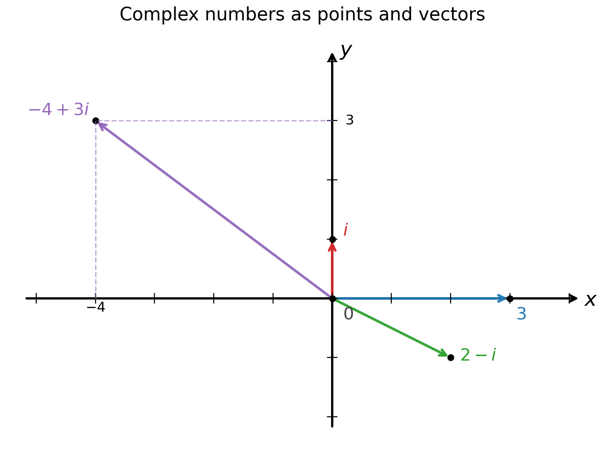

```Python title:"Exercise 1: Points and Vectors in the Plane"
from pathlib import Path
import matplotlib
matplotlib.use('Agg')
import matplotlib.pyplot as plt
from matplotlib.patches import FancyArrowPatch

out = Path('images/exercise-1-points-vectors.png')

points = [
    (3, 0, r'$3$', '#1f77b4'),
    (0, 0, r'$0$', '#444444'),
    (0, 1, r'$i$', '#d62728'),
    (2, -1, r'$2-i$', '#2ca02c'),
    (-4, 3, r'$-4+3i$', '#9467bd'),
]

fig, ax = plt.subplots(figsize=(7.4, 6.4), dpi=180)
ax.set_xlim(-5.5, 4.5)
ax.set_ylim(-2.5, 4.5)
ax.set_aspect('equal')
ax.axis('off')

# Axes
ax.add_patch(FancyArrowPatch((-5.2, 0), (4.2, 0), arrowstyle='->', mutation_scale=14, lw=2.0, color='black'))
ax.add_patch(FancyArrowPatch((0, -2.2), (0, 4.2), arrowstyle='->', mutation_scale=14, lw=2.0, color='black'))
for k in range(-5, 5):
    ax.plot([k, k], [-0.08, 0.08], color='black', lw=0.9)
for k in range(-2, 5):
    ax.plot([-0.08, 0.08], [k, k], color='black', lw=0.9)
ax.text(4.25, -0.12, '$x$', fontsize=18)
ax.text(0.12, 4.1, '$y$', fontsize=18)

# Vectors and points
for x, y, label, color in points:
    if not (x == 0 and y == 0):
        ax.add_patch(FancyArrowPatch((0, 0), (x, y), arrowstyle='->', mutation_scale=14, lw=2.2, color=color, alpha=0.95))
    ax.plot(x, y, 'o', color='black', ms=5)

    if (x, y) == (3, 0):
        offset = (0.10, -0.35)
    elif (x, y) == (0, 0):
        offset = (0.18, -0.35)
    elif (x, y) == (0, 1):
        offset = (0.18, 0.06)
    elif (x, y) == (2, -1):
        offset = (0.15, -0.05)
    else:
        offset = (-1.15, 0.10)
    ax.text(x + offset[0], y + offset[1], label, fontsize=15, color=color)

# Coordinate hints for the point -4 + 3i
ax.plot([-4, -4], [0, 3], linestyle='--', lw=1.2, color='#9467bd', alpha=0.55)
ax.plot([0, -4], [3, 3], linestyle='--', lw=1.2, color='#9467bd', alpha=0.55)
ax.text(-4, -0.22, '$-4$', fontsize=12, ha='center')
ax.text(0.22, 3, '$3$', fontsize=12, va='center')

ax.set_title('Complex numbers as points and vectors', fontsize=16, pad=10)
plt.tight_layout(pad=0.4)
fig.savefig(out, facecolor='white', bbox_inches='tight', pad_inches=0.08)
```

```mathematica title:"Exercise 1: Points and Vectors in the Plane"
pts = {
   {3, 0, Style["3", 18, Blue], Blue},
   {0, 0, Style["0", 18, GrayLevel[0.35]], GrayLevel[0.35]},
   {0, 1, Style["i", 18, Red], Red},
   {2, -1, Style["2 - i", 18, Darker[Green]], Darker[Green]},
   {-4, 3, Style["-4 + 3 i", 18, Purple], Purple}
   };

Show[
 Graphics[
  {
   {Black, Thick, Arrow[{{-5.2, 0}, {4.2, 0}}]},
   {Black, Thick, Arrow[{{0, -2.2}, {0, 4.2}}]},
   Table[Line[{{k, -0.08}, {k, 0.08}}], {k, -5, 4}],
   Table[Line[{{-0.08, k}, {0.08, k}}], {k, -2, 4}],
   Text[Style["x", 20, Italic], {4.3, -0.1}],
   Text[Style["y", 20, Italic], {0.12, 4.1}],

   Table[
    {
     If[pts[[j, 1]] == 0 && pts[[j, 2]] == 0,
      Nothing,
      {pts[[j, 4]], Thick, Arrow[{{0, 0}, {pts[[j, 1]], pts[[j, 2]]}}]}
      ],
     {Black, PointSize[0.02], Point[{pts[[j, 1]], pts[[j, 2]]}]}
     },
    {j, Length[pts]}
    ],

   Text[Style["3", 18, Blue], {3.2, -0.28}],
   Text[Style["0", 18, GrayLevel[0.35]], {0.18, -0.28}],
   Text[Style["i", 18, Red], {0.18, 1.08}],
   Text[Style["2 - i", 18, Darker[Green]], {2.45, -1.0}],
   Text[Style["-4 + 3 i", 18, Purple], {-4.55, 3.18}],

   {Purple, Dashed, Line[{{-4, 0}, {-4, 3}}]},
   {Purple, Dashed, Line[{{0, 3}, {-4, 3}}]},
   Text[Style["-4", 14], {-4, -0.2}],
   Text[Style["3", 14], {0.22, 3}]
   }
  ],
 PlotRange -> {{-5.5, 4.5}, {-2.5, 4.5}},
 AspectRatio -> 1,
 ImageSize -> 650,
 Background -> White
]
```

> [!figure] Figure 2
> 
> 
> Figure 2 Complex numbers as points and vectors. The complex number 3, being purely real, lies on the horizontal axis; while $i$, being purely imaginary, lies on the vertical axis. Note that one cannot really draw a vector to represent 0 , whose point is at the origin.


---


## 1.2.1 Geometric Interpretation of Algebraic Rules


> [!review] Review 2
> 1. Draw a diagram illustrating the head-to-tail method for computing $z_1+z_2$ in the complex plane. Label $z_1, z_2$, and the resultant.
> 2. Let $z=x+i y$. Describe geometrically what multiplication by -1 does to $z$ in the complex plane, and verify this algebraically. Using this, describe two distinct geometric methods for computing $z_1-z_2$, and draw a diagram illustrating each.
> 3. Let $z=x+i y$. State the conjugate $\bar{z}$ and describe its geometric relationship to $z$ in the complex plane. Draw a diagram illustrating the relationship. What axis plays the role of the mirror, and why?


##### review 1


To add two complex numbers geometrically, draw the vectors for $z_1$ and $z_2$ in the complex plane, then slide the vector for $z_2$ so that its tail begins at the head of $z_1$. The vector from the origin to the final head is the resultant $z_1+z_2$. In the diagram below, $z_1=2+i$, $z_2=\frac{3}{2}+2i$, and therefore
$$
z_1+z_2=(2+i)+\left(\frac{3}{2}+2i\right)=\frac{7}{2}+3i.
$$

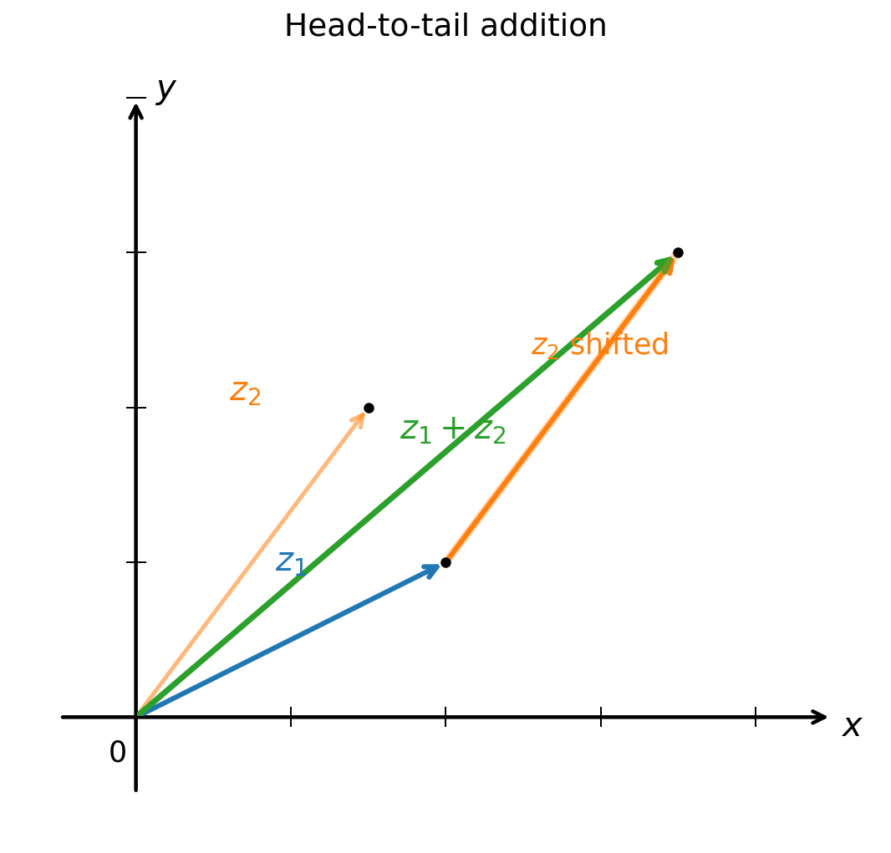

```python title:"Review 2.1: Head-to-Tail Addition"
from pathlib import Path

import matplotlib.pyplot as plt
from matplotlib.patches import FancyArrowPatch

out = Path("/Users/gradyclopton/ObsidianVaults/complex_analysis/Books/Asmar Applied Complex Analysis with Applications to Differential Equations/Chapter 01 Complex Numbers and Functions/images/review-2-head-to-tail.png")

z1 = (2.0, 1.0)
z2 = (1.5, 2.0)
sum_vec = (z1[0] + z2[0], z1[1] + z2[1])
z2_shifted_tail = z1
z2_shifted_head = sum_vec

fig, ax = plt.subplots(figsize=(7.2, 6.2), dpi=180)
ax.set_xlim(-0.6, 4.3)
ax.set_ylim(-0.6, 3.8)
ax.set_aspect("equal")
ax.axis("off")

# Axes
ax.add_patch(FancyArrowPatch((-0.4, 0), (4.1, 0), arrowstyle="->", mutation_scale=14, lw=1.8, color="black"))
ax.add_patch(FancyArrowPatch((0, -0.4), (0, 3.6), arrowstyle="->", mutation_scale=14, lw=1.8, color="black"))
for k in range(0, 5):
    ax.plot([k, k], [-0.06, 0.06], color="black", lw=0.8)
for k in range(0, 4):
    ax.plot([-0.06, 0.06], [k, k], color="black", lw=0.8)
ax.text(4.14, -0.08, "$x$", fontsize=16)
ax.text(0.08, 3.55, "$y$", fontsize=16)
ax.text(-0.12, -0.16, "$0$", fontsize=14)

# Vectors
ax.add_patch(FancyArrowPatch((0, 0), z1, arrowstyle="->", mutation_scale=16, lw=2.4, color="#1f77b4"))
ax.add_patch(FancyArrowPatch(z2_shifted_tail, z2_shifted_head, arrowstyle="->", mutation_scale=16, lw=2.4, color="#d62728"))
ax.add_patch(FancyArrowPatch((0, 0), sum_vec, arrowstyle="->", mutation_scale=18, lw=2.6, color="#2ca02c"))

# Guide line showing the original placement of z2
ax.add_patch(FancyArrowPatch((0, 0), z2, arrowstyle="->", mutation_scale=14, lw=1.5, linestyle="--", color="#d62728", alpha=0.45))

for pt in [z1, z2_shifted_head]:
    ax.plot(pt[0], pt[1], "o", color="black", ms=4.8)

ax.text(1.05, 0.78, "$z_1$", color="#1f77b4", fontsize=17)
ax.text(2.55, 2.1, "$z_2$", color="#d62728", fontsize=17)
ax.text(1.9, 1.95, "$z_1+z_2$", color="#2ca02c", fontsize=17)
ax.text(0.85, 2.55, "slide $z_2$ to the head of $z_1$", color="#444444", fontsize=12)
ax.set_title("Head-to-tail addition in the complex plane", fontsize=16, pad=10)

plt.tight_layout(pad=0.35)
fig.savefig(out, facecolor="white", bbox_inches="tight", pad_inches=0.08)
```

```mathematica title:"Review 2.1: Head-to-Tail Addition"
z1 = {2, 1};
z2 = {3/2, 2};
sum = z1 + z2;

Show[
 Graphics[
  {
   {Black, Thick, Arrow[{{-0.4, 0}, {4.1, 0}}]},
   {Black, Thick, Arrow[{{0, -0.4}, {0, 3.6}}]},
   Table[Line[{{k, -0.06}, {k, 0.06}}], {k, 0, 4}],
   Table[Line[{{-0.06, k}, {0.06, k}}], {k, 0, 3}],
   Text[Style["x", 18, Italic], {4.15, -0.08}],
   Text[Style["y", 18, Italic], {0.08, 3.55}],
   Text[Style["0", 16], {-0.12, -0.16}],

   {Blue, Thick, Arrow[{{0, 0}, z1}]},
   {Red, Thick, Arrow[{z1, sum}]},
   {Darker[Green], Thick, Arrow[{{0, 0}, sum}]},
   {Directive[Red, Dashed, Opacity[0.45]], Arrow[{{0, 0}, z2}]},

   {Black, PointSize[0.02], Point[z1], Point[sum]},

   Text[Style["z1", 17, Blue], {1.1, 0.78}],
   Text[Style["z2", 17, Red], {2.55, 2.08}],
   Text[Style["z1 + z2", 17, Darker[Green]], {1.95, 1.95}],
   Text[
    Style["slide z2 to the head of z1", 12, GrayLevel[0.3]],
    {1.45, 2.55}
    ]
   }
  ],
 PlotRange -> {{-0.6, 4.3}, {-0.6, 3.8}},
 AspectRatio -> 1,
 ImageSize -> 520,
 Background -> White
]
```


##### review 2


Multiplication by $-1$ reflects a complex number through the origin. If $z=x+iy$, then
$$
-z=-1(x+iy)=-x-iy,
$$
so the point $(x,y)$ becomes $(-x,-y)$. This gives two geometric ways to compute $z_1-z_2$. The first is to reflect $z_2$ through the origin to obtain $-z_2$, and then use vector addition to form $z_1+(-z_2)$. The second is to draw $z_1$ and $z_2$ from the origin and then draw the vector from the head of $z_2$ to the head of $z_1$; that vector is exactly $z_1-z_2$. In the example below, $z_1=2+2i$ and $z_2=3-i$, so
$$
z_1-z_2=(2+2i)-(3-i)=-1+3i.
$$

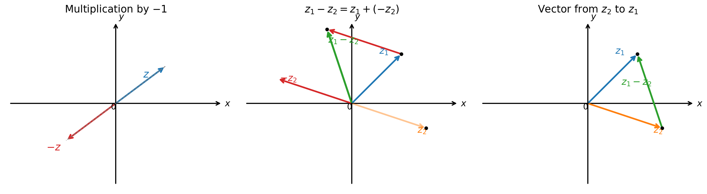

```python title:"Review 2.2: Multiplication by -1 and Two Subtraction Methods"
from pathlib import Path

import matplotlib.pyplot as plt
from matplotlib.patches import FancyArrowPatch

out = Path("/Users/gradyclopton/ObsidianVaults/complex_analysis/Books/Asmar Applied Complex Analysis with Applications to Differential Equations/Chapter 01 Complex Numbers and Functions/images/review-2-subtraction-methods.png")

fig, axes = plt.subplots(1, 3, figsize=(12.8, 4.2), dpi=180)

def setup_axes(ax, xlim, ylim):
    ax.set_xlim(*xlim)
    ax.set_ylim(*ylim)
    ax.set_aspect("equal")
    ax.axis("off")
    ax.add_patch(FancyArrowPatch((xlim[0] + 0.1, 0), (xlim[1] - 0.1, 0), arrowstyle="->", mutation_scale=13, lw=1.5, color="black"))
    ax.add_patch(FancyArrowPatch((0, ylim[0] + 0.1), (0, ylim[1] - 0.1), arrowstyle="->", mutation_scale=13, lw=1.5, color="black"))
    for k in range(int(xlim[0]) + 1, int(xlim[1])):
        ax.plot([k, k], [-0.05, 0.05], color="black", lw=0.75)
    for k in range(int(ylim[0]) + 1, int(ylim[1])):
        ax.plot([-0.05, 0.05], [k, k], color="black", lw=0.75)
    ax.text(xlim[1] - 0.03, -0.12, "$x$", fontsize=14)
    ax.text(0.09, ylim[1] - 0.02, "$y$", fontsize=14)
    ax.text(-0.16, -0.16, "$0$", fontsize=13)

# Panel 1: multiplication by -1
ax = axes[0]
setup_axes(ax, (-3.4, 3.4), (-2.6, 2.6))
z = (2, 1.5)
neg_z = (-2, -1.5)
ax.add_patch(FancyArrowPatch((0, 0), z, arrowstyle="->", mutation_scale=15, lw=2.2, color="#1f77b4"))
ax.add_patch(FancyArrowPatch((0, 0), neg_z, arrowstyle="->", mutation_scale=15, lw=2.2, color="#d62728"))
ax.plot([z[0], neg_z[0]], [z[1], neg_z[1]], linestyle="--", lw=1.1, color="#888888")
ax.text(1.25, 0.95, "$z$", fontsize=17, color="#1f77b4")
ax.text(-2.6, -1.9, "$-z$", fontsize=17, color="#d62728")
ax.set_title("Multiplication by $-1$", fontsize=16, pad=10)

# Panel 2: z1 + (-z2)
ax = axes[1]
setup_axes(ax, (-4.6, 4.6), (-2.2, 4.2))
z1 = (2, 2)
z2 = (3, -1)
neg_z2 = (-3, 1)
diff = (z1[0] - z2[0], z1[1] - z2[1])
ax.add_patch(FancyArrowPatch((0, 0), z1, arrowstyle="->", mutation_scale=15, lw=2.2, color="#1f77b4"))
ax.add_patch(FancyArrowPatch((0, 0), z2, arrowstyle="->", mutation_scale=15, lw=2.0, color="#ff7f0e", alpha=0.35))
ax.add_patch(FancyArrowPatch((0, 0), neg_z2, arrowstyle="->", mutation_scale=15, lw=2.2, color="#d62728"))
ax.add_patch(FancyArrowPatch(z1, diff, arrowstyle="->", mutation_scale=15, lw=2.2, color="#2ca02c"))
for pt in [z1, diff, z2]:
    ax.plot(pt[0], pt[1], "o", color="black", ms=4.6)
ax.text(1.55, 1.95, "$z_1$", fontsize=17, color="#1f77b4")
ax.text(-3.35, 0.95, "$-z_2$", fontsize=17, color="#d62728")
ax.text(2.75, -1.25, "$z_2$", fontsize=17, color="#ff7f0e")
ax.text(-1.75, 3.05, "$z_1-z_2$", fontsize=17, color="#2ca02c")
ax.set_title(r"$z_1-z_2=z_1+(-z_2)$", fontsize=16, pad=10)

# Panel 3: vector from z2 to z1
ax = axes[2]
setup_axes(ax, (-0.8, 4.6), (-1.6, 4.2))
ax.add_patch(FancyArrowPatch((0, 0), z1, arrowstyle="->", mutation_scale=15, lw=2.2, color="#1f77b4"))
ax.add_patch(FancyArrowPatch((0, 0), z2, arrowstyle="->", mutation_scale=15, lw=2.2, color="#ff7f0e"))
ax.add_patch(FancyArrowPatch(z2, z1, arrowstyle="->", mutation_scale=15, lw=2.2, color="#2ca02c"))
for pt in [z1, z2]:
    ax.plot(pt[0], pt[1], "o", color="black", ms=4.6)
ax.text(1.55, 1.95, "$z_1$", fontsize=17, color="#1f77b4")
ax.text(2.85, -1.25, "$z_2$", fontsize=17, color="#ff7f0e")
ax.text(1.15, 0.85, "$z_1-z_2$", fontsize=17, color="#2ca02c")
ax.set_title(r"Vector from $z_2$ to $z_1$", fontsize=16, pad=10)

plt.tight_layout(pad=0.55, w_pad=1.1)
fig.savefig(out, facecolor="white", bbox_inches="tight", pad_inches=0.08)
```

```mathematica title:"Review 2.2: Multiplication by -1 and Two Subtraction Methods"
setupAxes[xmin_, xmax_, ymin_, ymax_] := {
   {Black, Thick, Arrow[{{xmin + 0.1, 0}, {xmax - 0.1, 0}}]},
   {Black, Thick, Arrow[{{0, ymin + 0.1}, {0, ymax - 0.1}}]},
   Table[Line[{{k, -0.05}, {k, 0.05}}], {k, Ceiling[xmin], Floor[xmax] - 1}],
   Table[Line[{{-0.05, k}, {0.05, k}}], {k, Ceiling[ymin], Floor[ymax] - 1}],
   Text[Style["x", 16, Italic], {xmax - 0.03, -0.12}],
   Text[Style["y", 16, Italic], {0.09, ymax - 0.02}],
   Text[Style["0", 14], {-0.16, -0.16}]
   };

z = {2, 3/2};
negz = -z;
z1 = {2, 2};
z2 = {3, -1};
negz2 = -z2;
diff = z1 - z2;

GraphicsRow[
 {
  Graphics[
   {
    setupAxes[-3.4, 3.4, -2.6, 2.6],
    {Blue, Thick, Arrow[{{0, 0}, z}]},
    {Red, Thick, Arrow[{{0, 0}, negz}]},
    {Directive[GrayLevel[0.55], Dashed], Line[{z, negz}]},
    Text[Style["z", 17, Blue], {1.25, 0.95}],
    Text[Style["-z", 17, Red], {-2.6, -1.9}]
    },
   PlotRange -> {{-3.4, 3.4}, {-2.6, 2.6}},
   AspectRatio -> 1,
   ImageSize -> 350,
   Background -> White,
   PlotLabel -> Style["Multiplication by -1", 18]
   ],
  Graphics[
   {
    setupAxes[-4.6, 4.6, -2.2, 4.2],
    {Blue, Thick, Arrow[{{0, 0}, z1}]},
    {Directive[Orange, Opacity[0.35], Thick], Arrow[{{0, 0}, z2}]},
    {Red, Thick, Arrow[{{0, 0}, negz2}]},
    {Darker[Green], Thick, Arrow[{z1, diff}]},
    {Black, PointSize[0.02], Point[z1], Point[z2], Point[diff]},
    Text[Style["z1", 17, Blue], {1.55, 1.95}],
    Text[Style["-z2", 17, Red], {-3.35, 0.95}],
    Text[Style["z2", 17, Orange], {2.75, -1.25}],
    Text[Style["z1 - z2", 17, Darker[Green]], {-1.75, 3.05}]
    },
   PlotRange -> {{-4.6, 4.6}, {-2.2, 4.2}},
   AspectRatio -> 1,
   ImageSize -> 350,
   Background -> White,
   PlotLabel -> Style[TraditionalForm[z1 - z2 == z1 + (-z2)], 18]
   ],
  Graphics[
   {
    setupAxes[-0.8, 4.6, -1.6, 4.2],
    {Blue, Thick, Arrow[{{0, 0}, z1}]},
    {Orange, Thick, Arrow[{{0, 0}, z2}]},
    {Darker[Green], Thick, Arrow[{z2, z1}]},
    {Black, PointSize[0.02], Point[z1], Point[z2]},
    Text[Style["z1", 17, Blue], {1.55, 1.95}],
    Text[Style["z2", 17, Orange], {2.85, -1.25}],
    Text[Style["z1 - z2", 17, Darker[Green]], {1.15, 0.85}]
    },
   PlotRange -> {{-0.8, 4.6}, {-1.6, 4.2}},
   AspectRatio -> 1,
   ImageSize -> 350,
   Background -> White,
   PlotLabel -> Style["Vector from z2 to z1", 18]
   ]
  },
 Spacings -> 20
]
```


##### review 3


If $z=x+iy$, then its conjugate is
$$
\bar z=x-iy.
$$
Geometrically, $z=(x,y)$ and $\bar z=(x,-y)$ have the same real part but opposite imaginary parts, so one is the reflection of the other across the real axis. The real axis is the mirror because reflecting across it keeps the horizontal coordinate $x$ fixed and reverses only the vertical coordinate $y$.

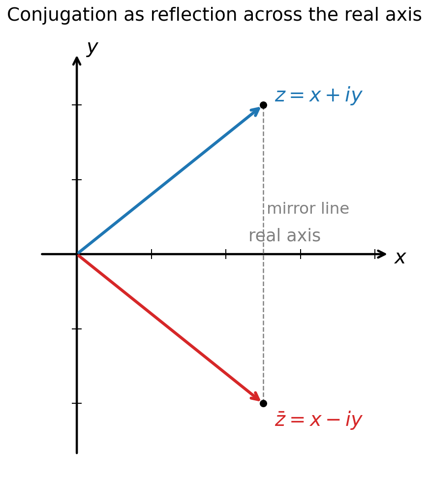

```python title:"Review 2.3: Conjugation as Reflection Across the Real Axis"
from pathlib import Path

import matplotlib.pyplot as plt
from matplotlib.patches import FancyArrowPatch

out = Path("/Users/gradyclopton/ObsidianVaults/complex_analysis/Books/Asmar Applied Complex Analysis with Applications to Differential Equations/Chapter 01 Complex Numbers and Functions/images/review-2-conjugation.png")

z = (2.5, 2.0)
zbar = (2.5, -2.0)

fig, ax = plt.subplots(figsize=(7.2, 6.2), dpi=180)
ax.set_xlim(-0.8, 4.2)
ax.set_ylim(-3.0, 3.0)
ax.set_aspect("equal")
ax.axis("off")

ax.add_patch(FancyArrowPatch((-0.6, 0), (4.0, 0), arrowstyle="->", mutation_scale=14, lw=1.8, color="black"))
ax.add_patch(FancyArrowPatch((0, -2.8), (0, 2.8), arrowstyle="->", mutation_scale=14, lw=1.8, color="black"))
for k in range(0, 5):
    ax.plot([k, k], [-0.06, 0.06], color="black", lw=0.8)
for k in range(-2, 3):
    ax.plot([-0.06, 0.06], [k, k], color="black", lw=0.8)
ax.text(4.05, -0.08, "$x$", fontsize=16)
ax.text(0.08, 2.75, "$y$", fontsize=16)
ax.text(-0.12, -0.16, "$0$", fontsize=14)

ax.plot([-0.35, 3.7], [0, 0], linestyle="--", lw=1.0, color="#666666", alpha=0.7)
ax.text(2.6, 0.18, "real axis", fontsize=12, color="#555555")

ax.add_patch(FancyArrowPatch((0, 0), z, arrowstyle="->", mutation_scale=16, lw=2.4, color="#1f77b4"))
ax.add_patch(FancyArrowPatch((0, 0), zbar, arrowstyle="->", mutation_scale=16, lw=2.4, color="#d62728"))
ax.plot([z[0], zbar[0]], [z[1], zbar[1]], linestyle=":", lw=1.3, color="#2ca02c")

for pt in [z, zbar]:
    ax.plot(pt[0], pt[1], "o", color="black", ms=4.8)

ax.text(1.35, 1.18, "$z$", fontsize=18, color="#1f77b4")
ax.text(1.25, -1.35, r"$\bar z$", fontsize=18, color="#d62728")
ax.text(2.72, 0.28, "same real part", fontsize=11.5, color="#2ca02c", rotation=90, va="bottom")
ax.text(2.75, 2.18, "$z=(x,y)$", fontsize=14, color="#1f77b4")
ax.text(2.65, -2.45, r"$\bar z=(x,-y)$", fontsize=14, color="#d62728")
ax.set_title("Conjugation reflects across the real axis", fontsize=16, pad=10)

plt.tight_layout(pad=0.35)
fig.savefig(out, facecolor="white", bbox_inches="tight", pad_inches=0.08)
```

```mathematica title:"Review 2.3: Conjugation as Reflection Across the Real Axis"
z = {5/2, 2};
zbar = {5/2, -2};

Show[
 Graphics[
  {
   {Black, Thick, Arrow[{{-0.6, 0}, {4.0, 0}}]},
   {Black, Thick, Arrow[{{0, -2.8}, {0, 2.8}}]},
   Table[Line[{{k, -0.06}, {k, 0.06}}], {k, 0, 4}],
   Table[Line[{{-0.06, k}, {0.06, k}}], {k, -2, 2}],
   Text[Style["x", 18, Italic], {4.05, -0.08}],
   Text[Style["y", 18, Italic], {0.08, 2.75}],
   Text[Style["0", 16], {-0.12, -0.16}],

   {Directive[GrayLevel[0.45], Dashed], Line[{{-0.35, 0}, {3.7, 0}}]},
   Text[Style["real axis", 12, GrayLevel[0.35]], {2.6, 0.18}],

   {Blue, Thick, Arrow[{{0, 0}, z}]},
   {Red, Thick, Arrow[{{0, 0}, zbar}]},
   {Directive[Darker[Green], Dotted, Thick], Line[{z, zbar}]},
   {Black, PointSize[0.02], Point[z], Point[zbar]},

   Text[Style["z", 18, Blue], {1.35, 1.18}],
   Text[Style[Overscript["z", "_"], 18, Red], {1.25, -1.35}],
   Text[Style["same real part", 11.5, Darker[Green]], {2.72, 0.28}, {0, 0}, Pi/2],
   Text[Style["z = (x, y)", 14, Blue], {2.75, 2.18}],
   Text[Style["z̄ = (x, -y)", 14, Red], {2.65, -2.45}]
   }
  ],
 PlotRange -> {{-0.8, 4.2}, {-3.0, 3.0}},
 AspectRatio -> 1,
 ImageSize -> 520,
 Background -> White
]
```


---


The vector representation allows us to add complex numbers by adding their vectors in the plane, with the usual head-to-tail or parallelogram methods (see Figure 3).

> [!figure] Figure 3: Head-to-Tail Method
> 
> 
> Figure 3 Vector addition of complex numbers: the head-to-tail method. Slide $z_{2}$ over so its tail lies atop $z_{1}$ 's head. The resultant vector is then $z_{1}+z_{2}$.


Multiplying a complex number by -1 has the effect of reflecting it about the origin. If $z=x+i y=(x, y)$, then $-z=-x-i y=(-x,-y)$. This will allow us to subtract complex numbers. The complex subtraction $z_{1}-z_{2}$ can be performed by first multiplying the $z_{2}$ vector by -1 , then adding the resultant to $z_{1}$. Alternatively, we can draw both vectors with their tails at the origin, and the difference will be the vector that points from the head of $z_{2}$ to the head of $z_{1}$ (see Figure 4).


> [!figure] Figure 4
> 
> 
> Figure 4 Subtraction: We will find $z_{1}-z_{2}$. We could take $-z_{2}$, then add it to $z_{1}$. Or we could take the vector with its tail at $z_{2}$ 's head, and its head at $z_{1}$ 's head.


Conjugation has an interesting interpretation in the complex plane. Since the conjugate of $z=x+i y=(x, y)$ is $\bar{z}=x-i y=(x,-y)$, conjugates are reflections of each other across the real axis (see Figure 5).


> [!figure] Figure 5
> 
> 
> Figure 5 Complex conjugation reflects a point about the horizontal axis.


> [!exercise] Exercise 2
> Vector addition and subtraction of complex numbers Let $z_{1}=2+i$ and $z_{2}=3-3 i$. Find graphically $z_{1}+z_{2}$ and $z_{1}-z_{2}$.

First draw the points in the plane and their associated vectors (see Figure 3). Then take $z_{2}$ 's vector and slide it so its tail lies on $z_{1}$ 's head. This gives $z_{1}+z_{2}=5-2 i$.

Take $z_{2}$ and reflect it about the origin to get $-z_{2}$. Now add $-z_{2}$ to $z_{1}$ as vectors to get $z_{1}-z_{2}$. The result is $z_{1}-z_{2}=-1+4 i$ (see Figure 4).


## 1.2.2 The Absolute Value


> [!review] Review 3
> 1. Define the modulus $|z|$ of a complex number $z=x+i y$. Draw a diagram in the complex plane illustrating its geometric meaning. Then verify that the definition is consistent with the familiar absolute value when $z$ is real.
> 2. Prove the following two properties of the modulus directly from the definition: (a) $|z|=0 \Leftrightarrow z=0$, and (b) $|-z|=|z|$.
> 3. Let $z_1, z_2$ be complex numbers. Derive an expression for $\left|z_1-z_2\right|$ and give its geometric interpretation in the complex plane. How does this expression relate to the familiar distance formula from Cartesian geometry, and why?

##### review 1

If $z=x+iy$, the modulus of $z$ is defined by
$$
|z|=\sqrt{x^2+y^2}.
$$
Geometrically, the point $z=(x,y)$ forms a right triangle with legs of lengths $|x|$ and $|y|$, so $|z|$ is the distance from the origin to the point $z$. If $z$ is real, then $y=0$, and therefore
$$
|z|=\sqrt{x^2+0^2}=\sqrt{x^2}=|x|,
$$
which is exactly the usual absolute value on the real line.

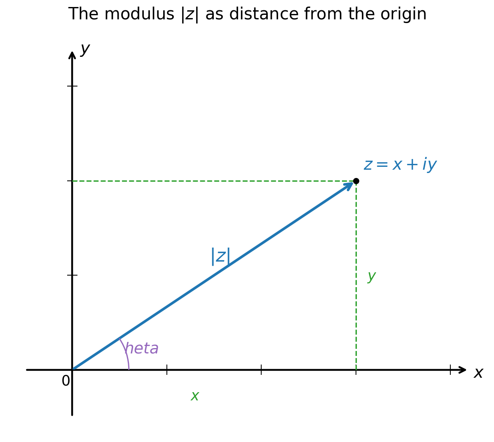

```python title:"Review 3.1: The Modulus as Distance from the Origin"
from pathlib import Path

import matplotlib.pyplot as plt
from matplotlib.patches import Arc, FancyArrowPatch

out = Path("/Users/gradyclopton/ObsidianVaults/complex_analysis/Books/Asmar Applied Complex Analysis with Applications to Differential Equations/Chapter 01 Complex Numbers and Functions/images/review-3-modulus.png")

z = (3.0, 2.0)

fig, ax = plt.subplots(figsize=(6.6, 5.9), dpi=180)
ax.set_xlim(-0.7, 4.4)
ax.set_ylim(-0.7, 3.6)
ax.set_aspect("equal")
ax.axis("off")

ax.add_patch(FancyArrowPatch((-0.5, 0), (4.2, 0), arrowstyle="->", mutation_scale=14, lw=1.8, color="black"))
ax.add_patch(FancyArrowPatch((0, -0.5), (0, 3.4), arrowstyle="->", mutation_scale=14, lw=1.8, color="black"))
for k in range(0, 5):
    ax.plot([k, k], [-0.05, 0.05], color="black", lw=0.8)
for k in range(0, 4):
    ax.plot([-0.05, 0.05], [k, k], color="black", lw=0.8)
ax.text(4.24, -0.08, "$x$", fontsize=16)
ax.text(0.08, 3.35, "$y$", fontsize=16)
ax.text(-0.12, -0.16, "$0$", fontsize=14)

ax.add_patch(FancyArrowPatch((0, 0), z, arrowstyle="->", mutation_scale=16, lw=2.5, color="#1f77b4"))
ax.plot([z[0], z[0]], [0, z[1]], linestyle="--", color="#2ca02c", lw=1.3)
ax.plot([0, z[0]], [z[1], z[1]], linestyle="--", color="#2ca02c", lw=1.3)
ax.plot(z[0], z[1], "o", color="black", ms=5)

arc = Arc((0, 0), 1.2, 1.2, angle=0, theta1=0, theta2=33.69, lw=1.2, color="#9467bd")
ax.add_patch(arc)
ax.text(0.55, 0.18, r"$\theta$", fontsize=15, color="#9467bd")
ax.text(1.45, 1.15, "$|z|$", fontsize=18, color="#1f77b4")
ax.text(3.08, 2.12, "$z=x+iy$", fontsize=16, color="#1f77b4")
ax.text(1.25, -0.32, "$x$", fontsize=14, color="#2ca02c")
ax.text(3.12, 0.95, "$y$", fontsize=14, color="#2ca02c")
ax.set_title("The modulus $|z|$ as distance from the origin", fontsize=16, pad=10)

plt.tight_layout(pad=0.35)
fig.savefig(out, facecolor="white", bbox_inches="tight", pad_inches=0.08)
```

```mathematica title:"Review 3.1: The Modulus as Distance from the Origin"
z = {3, 2};

Show[
 Graphics[
  {
   {Black, Thick, Arrow[{{-0.5, 0}, {4.2, 0}}]},
   {Black, Thick, Arrow[{{0, -0.5}, {0, 3.4}}]},
   Table[Line[{{k, -0.05}, {k, 0.05}}], {k, 0, 4}],
   Table[Line[{{-0.05, k}, {0.05, k}}], {k, 0, 3}],
   Text[Style["x", 18, Italic], {4.24, -0.08}],
   Text[Style["y", 18, Italic], {0.08, 3.35}],
   Text[Style["0", 16], {-0.12, -0.16}],

   {Blue, Thick, Arrow[{{0, 0}, z}]},
   {Directive[Darker[Green], Dashed], Line[{{3, 0}, {3, 2}}]},
   {Directive[Darker[Green], Dashed], Line[{{0, 2}, {3, 2}}]},
   {Black, PointSize[0.02], Point[z]},
   {Purple, Circle[{0, 0}, 0.6, {0, ArcTan[2/3]}]},

   Text[Style["\[Theta]", 15, Purple], {0.55, 0.18}],
   Text[Style["|z|", 18, Blue], {1.45, 1.15}],
   Text[Style["z = x + i y", 16, Blue], {3.08, 2.12}],
   Text[Style["x", 14, Darker[Green]], {1.25, -0.32}],
   Text[Style["y", 14, Darker[Green]], {3.12, 0.95}]
   }
  ],
 PlotRange -> {{-0.7, 4.4}, {-0.7, 3.6}},
 AspectRatio -> 1,
 ImageSize -> 500,
 Background -> White
]
```

##### review 2

From the definition,
$$
|z|=\sqrt{x^2+y^2}.
$$
For part (a), if $|z|=0$, then
$$
\sqrt{x^2+y^2}=0.
$$
Since a square root is zero only when its radicand is zero,
$$
x^2+y^2=0.
$$
But $x^2\ge 0$ and $y^2\ge 0$, so the only way their sum can be zero is that
$$
x=0 \quad \text{and} \quad y=0.
$$
Hence $z=x+iy=0$. Conversely, if $z=0$, then $x=0$ and $y=0$, so
$$
|z|=\sqrt{0^2+0^2}=0.
$$
Therefore,
$$
|z|=0 \Longleftrightarrow z=0.
$$

For part (b), if $z=x+iy$, then
$$
-z=-x-iy.
$$
Therefore,
$$
|-z|=\sqrt{(-x)^2+(-y)^2}=\sqrt{x^2+y^2}=|z|.
$$
So the modulus is unchanged by reflection through the origin.

##### review 3

Let
$$
z_1=x_1+i y_1,\qquad z_2=x_2+i y_2.
$$
Then
$$
z_1-z_2=(x_1-x_2)+i(y_1-y_2).
$$
Applying the definition of modulus gives
$$
\left|z_1-z_2\right|
=\sqrt{(x_1-x_2)^2+(y_1-y_2)^2}.
$$
This is exactly the Cartesian distance formula between the points $(x_1,y_1)$ and $(x_2,y_2)$. Geometrically, $\left|z_1-z_2\right|$ is the length of the vector from the point $z_2$ to the point $z_1$, so it measures the distance between the two complex numbers in the plane. The reason the formula matches the usual distance formula is that complex numbers are represented by points in the Euclidean plane, and the modulus is defined from the Pythagorean theorem.

---

We now discuss an important geometric aspect of complex numbers. For a complex number $z=x+i y$, we define the norm or modulus or absolute value of $z$ by

> [!definition] Norm of $z$ (or Modulus of $z$)
> 
> $$
> |z|=\sqrt{x^{2}+y^{2}}
> $$
> 

If $z=x$ is real, then $|z|=\sqrt{x^{2}}=|x|$. Thus the absolute value of a complex number $z$ reduces to the familiar absolute value when $z$ is real. Just as the absolute value $|x|$ of a real number $x$ represents the distance from $x$ to the origin on the real line, the absolute value $|z|$ of a complex number $z$ represents the distance from the point $z$ to the origin in the complex plane (see Figure 6). 


> [!figure] Figure 6
> 
> 
> Figure 6 The distance from $z$ to the origin is $|z|$.


It is easy to see from (1) or Figure 6 that

$$
|z|=0 \Leftrightarrow z=0 ;
$$

and

$$
|-z|=|z| .
$$

If $z_{1}=x_{1}+i y_{1}$ and $z_{2}=x_{2}+i y_{2}$, applying (1) to the complex number $z_{1}-z_{2}=\left(x_{1}-x_{2}\right)+i\left(y_{1}-y_{2}\right)$, we obtain

$$
\left|z_{1}-z_{2}\right|=\sqrt{\left(x_{1}-x_{2}\right)^{2}+\left(y_{1}-y_{2}\right)^{2}}
$$

which is the familiar formula for distance between the points ( $x_{1}, y_{1}$ ) and $\left(x_{2}, y_{2}\right)$. Thus $\left|z_{1}-z_{2}\right|$ has a concrete geometric interpretation as the distance between (the points) $z_{1}$ and $z_{2}$ (see Figure 7).


> [!figure] Figure 7
> 
> 
> 
> Figure 7 The distance from $z_{1}$ to $z_{2}$ is $\left|z_{1}-z_{2}\right|$.


> [!exercise] Exercise 3
> 1. Let $z_1=2+4 i$ and $z_2=5+i$. Compute $\left|z_1\right|$ and $\left|z_2\right|$, then plot both numbers in the complex plane. What does the inequality $\left|z_1\right|<\left|z_2\right|$ mean geometrically?
> 2. Using the same $z_1$ and $z_2$, compute $\left|z_1-z_2\right|$ and give its geometric interpretation. Draw the vector $z_1-z_2$ in the complex plane and label its length.

##### problem 3.1


We compute
$$
\left|z_1\right|=\left|2+4i\right|=\sqrt{2^2+4^2}=\sqrt{4+16}=\sqrt{20}=2\sqrt{5}\approx 4.472
$$
and
$$
\left|z_2\right|=\left|5+i\right|=\sqrt{5^2+1^2}=\sqrt{25+1}=\sqrt{26}\approx 5.099.
$$
Thus
$$
\left|z_1\right|<\left|z_2\right|.
$$
Geometrically, this means that the point representing $z_2$ lies farther from the origin than the point representing $z_1$.


##### problem 3.2


First compute the difference:
$$
z_1-z_2=(2+4i)-(5+i)=2+4i-5-i=-3+3i.
$$
Then
$$
\left|z_1-z_2\right|=\left|-3+3i\right|=\sqrt{(-3)^2+3^2}=\sqrt{9+9}=\sqrt{18}=3\sqrt{2}\approx 4.243.
$$
Geometrically, $\left|z_1-z_2\right|$ is the distance between the points $z_1$ and $z_2$ in the complex plane. It is also the length of the vector from the head of $z_2$ to the head of $z_1$.

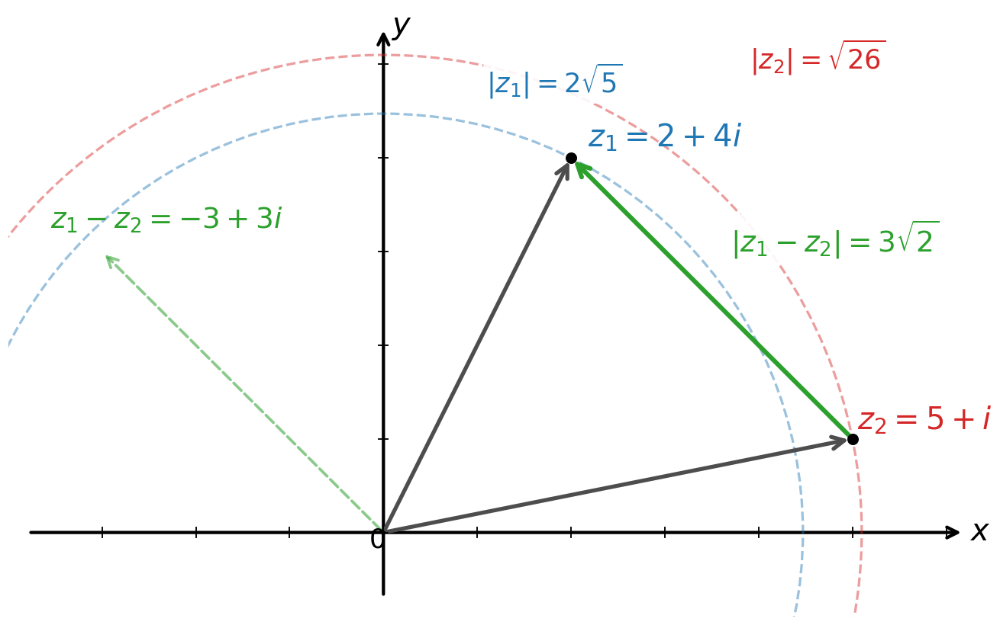

```python title:"Exercise 3.2: Distance Vector in the Complex Plane"
from pathlib import Path

import numpy as np
import matplotlib.pyplot as plt
from matplotlib.patches import Circle, FancyArrowPatch

out = Path("/Users/gradyclopton/ObsidianVaults/complex_analysis/Books/Asmar Applied Complex Analysis with Applications to Differential Equations/Chapter 01 Complex Numbers and Functions/images/exercise-3-modulus-distance-rings.png")

z1 = np.array([2.0, 4.0])
z2 = np.array([5.0, 1.0])
diff = z1 - z2
r1 = np.hypot(*z1)
r2 = np.hypot(*z2)

fig, ax = plt.subplots(figsize=(7.4, 6.0), dpi=180)
ax.set_xlim(-4.0, 6.4)
ax.set_ylim(-0.9, 5.6)
ax.set_aspect("equal")
ax.axis("off")

ax.add_patch(FancyArrowPatch((-3.8, 0), (6.2, 0), arrowstyle="->", mutation_scale=14, lw=1.7, color="black"))
ax.add_patch(FancyArrowPatch((0, -0.7), (0, 5.4), arrowstyle="->", mutation_scale=14, lw=1.7, color="black"))
for k in range(-3, 7):
    ax.plot([k, k], [-0.06, 0.06], color="black", lw=0.75)
for k in range(0, 6):
    ax.plot([-0.06, 0.06], [k, k], color="black", lw=0.75)
ax.text(6.25, -0.08, "$x$", fontsize=16)
ax.text(0.08, 5.32, "$y$", fontsize=16)
ax.text(-0.16, -0.16, "$0$", fontsize=14)

z1_color = "#1f77b4"
z2_color = "#d62728"
diff_color = "#2ca02c"
base_color = "#4d4d4d"

ax.add_patch(Circle((0, 0), r1, fill=False, linestyle="--", lw=1.3, edgecolor=z1_color, alpha=0.45))
ax.add_patch(Circle((0, 0), r2, fill=False, linestyle="--", lw=1.3, edgecolor=z2_color, alpha=0.45))

ax.add_patch(FancyArrowPatch((0, 0), tuple(z1), arrowstyle="->", mutation_scale=16, lw=2.1, color=base_color))
ax.add_patch(FancyArrowPatch((0, 0), tuple(z2), arrowstyle="->", mutation_scale=16, lw=2.1, color=base_color))
ax.add_patch(FancyArrowPatch(tuple(z2), tuple(z1), arrowstyle="->", mutation_scale=16, lw=2.4, color=diff_color))
ax.add_patch(FancyArrowPatch((0, 0), tuple(diff), arrowstyle="->", mutation_scale=14, lw=1.5, linestyle="--", color=diff_color, alpha=0.55))

for pt in [z1, z2]:
    ax.plot(pt[0], pt[1], "o", color="black", ms=5)

ax.text(2.18, 4.08, "$z_1=2+4i$", color=z1_color, fontsize=16)
ax.text(5.05, 1.10, "$z_2=5+i$", color=z2_color, fontsize=16)
ax.text(3.7, 3.0, "$|z_1-z_2|=3\\sqrt{2}$", color=diff_color, fontsize=15,
        bbox=dict(boxstyle="round,pad=0.15", facecolor="white", edgecolor="none", alpha=0.92))
ax.text(-3.55, 3.25, "$z_1-z_2=-3+3i$", color=diff_color, fontsize=15)
ax.text(1.1, 4.7, "$|z_1|=2\\sqrt{5}$", color=z1_color, fontsize=14,
        bbox=dict(boxstyle="round,pad=0.12", facecolor="white", edgecolor="none", alpha=0.9))
ax.text(3.9, 4.95, "$|z_2|=\\sqrt{26}$", color=z2_color, fontsize=14,
        bbox=dict(boxstyle="round,pad=0.12", facecolor="white", edgecolor="none", alpha=0.9))

plt.tight_layout(pad=0.25)
fig.savefig(out, facecolor="white", bbox_inches="tight", pad_inches=0.06)
```

```mathematica title:"Exercise 3.2: Distance Vector in the Complex Plane"
z1 = {2, 4};
z2 = {5, 1};
diff = z1 - z2;
r1 = Norm[z1];
r2 = Norm[z2];

Show[
 Graphics[
  {
   {Black, Thick, Arrow[{{-3.8, 0}, {6.2, 0}}]},
   {Black, Thick, Arrow[{{0, -0.7}, {0, 5.4}}]},
   Table[Line[{{k, -0.06}, {k, 0.06}}], {k, -3, 6}],
   Table[Line[{{-0.06, k}, {0.06, k}}], {k, 0, 5}],
   Text[Style["x", 18, Italic], {6.25, -0.08}],
   Text[Style["y", 18, Italic], {0.08, 5.32}],
   Text[Style["0", 16], {-0.16, -0.16}],

   {Directive[Blue, Dashed, Opacity[0.45]], Circle[{0, 0}, r1]},
   {Directive[Red, Dashed, Opacity[0.45]], Circle[{0, 0}, r2]},
   {Directive[GrayLevel[0.3], Thick], Arrow[{{0, 0}, z1}]},
   {Directive[GrayLevel[0.3], Thick], Arrow[{{0, 0}, z2}]},
   {Darker[Green], Thick, Arrow[{z2, z1}]},
   {Directive[Darker[Green], Dashed, Opacity[0.55]], Arrow[{{0, 0}, diff}]},
   {Black, PointSize[0.02], Point[z1], Point[z2]},

   Text[Style["z1 = 2 + 4 i", 16, Blue], {2.18, 4.08}],
   Text[Style["z2 = 5 + i", 16, Red], {5.05, 1.1}, {-1, 0}],
   Text[
    Framed[
     Style["|z1 - z2| = 3 Sqrt[2]", 15, Darker[Green]],
     Background -> White,
     FrameStyle -> None,
     FrameMargins -> Tiny
     ],
    {3.7, 3.0}
    ],
   Text[Style["z1 - z2 = -3 + 3 i", 15, Darker[Green]], {-3.55, 3.25}],
   Text[
    Framed[
     Style["|z1| = 2 Sqrt[5]", 14, Blue],
     Background -> White,
     FrameStyle -> None,
     FrameMargins -> Tiny
     ],
    {1.1, 4.7}
    ],
   Text[
    Framed[
     Style["|z2| = Sqrt[26]", 14, Red],
     Background -> White,
     FrameStyle -> None,
     FrameMargins -> Tiny
     ],
    {3.9, 4.95}
    ]
   }
  ],
 PlotRange -> {{-4.0, 6.4}, {-0.9, 5.6}},
 AspectRatio -> 1,
 ImageSize -> 560,
 Background -> White
]
```


---


> [!figure] Figure 8
> 
> 
> Figure 8


---


> [!review] Review 4
> Explain why the inequality $z_1 \leq z_2$ is generally meaningless for complex numbers, but $\left|z_1\right| \leq\left|z_2\right|$ is not. What property do the real numbers have that the complex numbers lack?

The inequality $z_1\le z_2$ is generally meaningless for complex numbers because the complex numbers do not come with a natural linear order compatible with their algebraic structure. On the real line, any two numbers can be compared: for every $x,y\in\mathbb R$, exactly one of the statements
$$
x<y,\qquad x=y,\qquad x>y
$$
holds. This is what it means for the real numbers to be linearly ordered.

The complex numbers do not have such an ordering. Geometrically, they lie in a plane rather than on a line, so there is no natural notion of one complex number being “less than” or “greater than” another. For example, if $z_1=1+i$ and $z_2=1-i$, neither one is naturally less than the other.

By contrast, $\left|z_1\right|\le \left|z_2\right|$ is meaningful because $\left|z_1\right|$ and $\left|z_2\right|$ are real numbers. The modulus measures distance from the origin, so this inequality simply means that $z_1$ is no farther from the origin than $z_2$. Thus the real numbers have a linear ordering, while the complex numbers do not.


> [!exercise] Exercise 4: Circles, Disks, and Ellipses
> (a) Find and plot the points $z$ satisfying
> 
> $$
> |z+4-i|=2
> $$
> 
> (b) Find and plot the points $z$ satisfying
> 
> $$
> |z+4-i| \leq 2
> $$
> 
> (c) Find and plot all complex numbers $z$ such that
> 
> $$
> |z+2+2 i|+|z+1+i|=4
> $$
> 


##### problem a


Let $z=x+iy$. Then
$$
|z+4-i|=2
$$
means
$$
\left|(x+4)+i(y-1)\right|=2.
$$
Therefore
$$
\sqrt{(x+4)^2+(y-1)^2}=2,
$$
so
$$
(x+4)^2+(y-1)^2=4.
$$
This is a circle with center $(-4,1)$, that is, the complex number $-4+i$, and radius $2$.

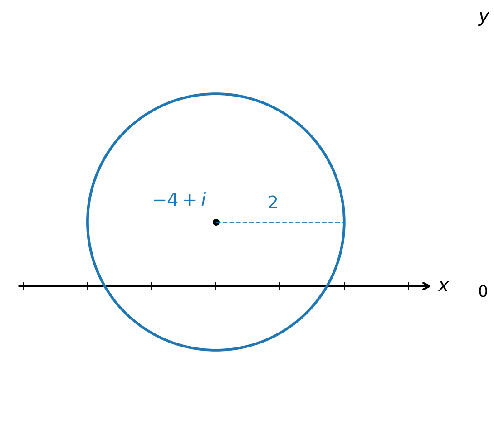

```python title:"Exercise 4(a): Circle |z + 4 - i| = 2"
from pathlib import Path

import matplotlib
matplotlib.use("Agg")
import matplotlib.pyplot as plt
from matplotlib.patches import Circle, FancyArrowPatch

out = Path("/Users/gradyclopton/ObsidianVaults/complex_analysis/Books/Asmar Applied Complex Analysis with Applications to Differential Equations/Chapter 01 Complex Numbers and Functions/images/exercise-4a-circle.png")

center = (-4, 1)
r = 2

fig, ax = plt.subplots(figsize=(6.2, 5.4), dpi=180)
ax.set_xlim(-7.3, -0.4)
ax.set_ylim(-2.4, 4.4)
ax.set_aspect("equal")
ax.axis("off")

ax.add_patch(FancyArrowPatch((-7.1, 0), (-0.6, 0), arrowstyle="->", mutation_scale=14, lw=1.7, color="black"))
ax.add_patch(FancyArrowPatch((0, -2.2), (0, 4.2), arrowstyle="->", mutation_scale=14, lw=1.7, color="black"))
for k in range(-7, 1):
    ax.plot([k, k], [-0.05, 0.05], color="black", lw=0.75)
for k in range(-2, 5):
    ax.plot([-0.05, 0.05], [k, k], color="black", lw=0.75)
ax.text(-0.55, -0.08, "$x$", fontsize=16)
ax.text(0.08, 4.12, "$y$", fontsize=16)
ax.text(0.08, -0.16, "$0$", fontsize=14)

ax.add_patch(Circle(center, r, fill=False, lw=2.3, edgecolor="#1f77b4"))
ax.plot(*center, "o", color="black", ms=5)
ax.plot([center[0], center[0] + r], [center[1], center[1]], linestyle="--", color="#1f77b4", lw=1.1)
ax.text(center[0] - 1.0, center[1] + 0.25, "$-4+i$", fontsize=16, color="#1f77b4")
ax.text(center[0] + 0.8, center[1] + 0.22, "$2$", fontsize=15, color="#1f77b4")

plt.tight_layout(pad=0.2)
fig.savefig(out, facecolor="white", bbox_inches="tight", pad_inches=0.05)
```

```mathematica title:"Exercise 4(a): Circle |z + 4 - i| = 2"
center = {-4, 1};
r = 2;

Show[
 Graphics[
  {
   {Black, Thick, Arrow[{{-7.1, 0}, {-0.6, 0}}]},
   {Black, Thick, Arrow[{{0, -2.2}, {0, 4.2}}]},
   Table[Line[{{k, -0.05}, {k, 0.05}}], {k, -7, 0}],
   Table[Line[{{-0.05, k}, {0.05, k}}], {k, -2, 4}],
   Text[Style["x", 18, Italic], {-0.55, -0.08}],
   Text[Style["y", 18, Italic], {0.08, 4.12}],
   Text[Style["0", 16], {0.08, -0.16}],

   {Blue, Thick, Circle[center, r]},
   {Black, PointSize[0.02], Point[center]},
   {Directive[Blue, Dashed], Line[{center, center + {r, 0}}]},
   Text[Style["-4 + i", 16, Blue], center + {-1.0, 0.25}],
   Text[Style["2", 15, Blue], center + {0.8, 0.22}]
   }
  ],
 PlotRange -> {{-7.3, -0.4}, {-2.4, 4.4}},
 AspectRatio -> 1,
 ImageSize -> 520,
 Background -> White
]
```


> [!figure] Figure 9: problems a and b
> 
> 
> Figure 9


##### problem b


The inequality
$$
|z+4-i|\le 2
$$
means that the distance from $z$ to the point $-4+i$ is at most $2$. Therefore the set consists of all points on the circle from part (a) together with all points inside it. In other words, the solution set is the closed disk centered at $-4+i$ with radius $2$.

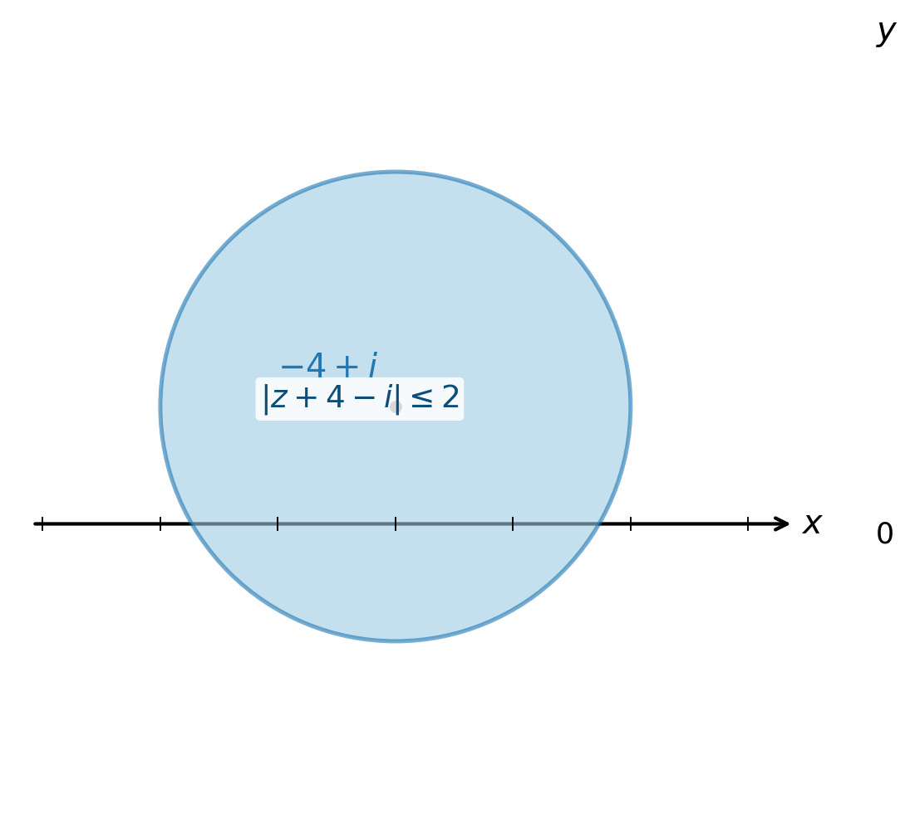

```python title:"Exercise 4(b): Disk |z + 4 - i| <= 2"
from pathlib import Path

import matplotlib
matplotlib.use("Agg")
import matplotlib.pyplot as plt
from matplotlib.patches import Circle, FancyArrowPatch

out = Path("/Users/gradyclopton/ObsidianVaults/complex_analysis/Books/Asmar Applied Complex Analysis with Applications to Differential Equations/Chapter 01 Complex Numbers and Functions/images/exercise-4b-disk.png")

center = (-4, 1)
r = 2

fig, ax = plt.subplots(figsize=(6.2, 5.4), dpi=180)
ax.set_xlim(-7.3, -0.4)
ax.set_ylim(-2.4, 4.4)
ax.set_aspect("equal")
ax.axis("off")

ax.add_patch(FancyArrowPatch((-7.1, 0), (-0.6, 0), arrowstyle="->", mutation_scale=14, lw=1.7, color="black"))
ax.add_patch(FancyArrowPatch((0, -2.2), (0, 4.2), arrowstyle="->", mutation_scale=14, lw=1.7, color="black"))
for k in range(-7, 1):
    ax.plot([k, k], [-0.05, 0.05], color="black", lw=0.75)
for k in range(-2, 5):
    ax.plot([-0.05, 0.05], [k, k], color="black", lw=0.75)
ax.text(-0.55, -0.08, "$x$", fontsize=16)
ax.text(0.08, 4.12, "$y$", fontsize=16)
ax.text(0.08, -0.16, "$0$", fontsize=14)

ax.add_patch(Circle(center, r, facecolor="#9ecae1", edgecolor="#1f77b4", lw=2.0, alpha=0.6))
ax.plot(*center, "o", color="black", ms=5)
ax.text(center[0] - 1.0, center[1] + 0.25, "$-4+i$", fontsize=16, color="#1f77b4")
ax.text(
    -5.15,
    1.0,
    r"$|z+4-i|\leq 2$",
    fontsize=15,
    color="#0b4f79",
    bbox=dict(boxstyle="round,pad=0.15", facecolor="white", edgecolor="none", alpha=0.85),
)

plt.tight_layout(pad=0.2)
fig.savefig(out, facecolor="white", bbox_inches="tight", pad_inches=0.05)
```

```mathematica title:"Exercise 4(b): Disk |z + 4 - i| <= 2"
center = {-4, 1};
r = 2;

Show[
 Graphics[
  {
   {Black, Thick, Arrow[{{-7.1, 0}, {-0.6, 0}}]},
   {Black, Thick, Arrow[{{0, -2.2}, {0, 4.2}}]},
   Table[Line[{{k, -0.05}, {k, 0.05}}], {k, -7, 0}],
   Table[Line[{{-0.05, k}, {0.05, k}}], {k, -2, 4}],
   Text[Style["x", 18, Italic], {-0.55, -0.08}],
   Text[Style["y", 18, Italic], {0.08, 4.12}],
   Text[Style["0", 16], {0.08, -0.16}],

   {Directive[RGBColor[0.62, 0.79, 0.88], Opacity[0.6]], Disk[center, r]},
   {Blue, Thick, Circle[center, r]},
   {Black, PointSize[0.02], Point[center]},
   Text[Style["-4 + i", 16, Blue], center + {-1.0, 0.25}],
   Text[
    Framed[
     Style["|z + 4 - i| <= 2", 15, RGBColor[0.04, 0.31, 0.47]],
     Background -> White,
     FrameStyle -> None,
     FrameMargins -> Tiny
     ],
    {-5.15, 1.0}
    ]
   }
  ],
 PlotRange -> {{-7.3, -0.4}, {-2.4, 4.4}},
 AspectRatio -> 1,
 ImageSize -> 520,
 Background -> White
]
```

##### problem c


Let $z=x+iy$. Then
$$
|z+2+2i|+|z+1+i|=4
$$
means that the sum of the distances from the point $z$ to the two fixed points
$$
-2-2i \quad \text{and} \quad -1-i
$$
is equal to $4$. By the geometric definition of an ellipse, this locus is an ellipse with foci at $-2-2i$ and $-1-i$.

Its center is the midpoint of the foci,
$$
\frac{(-2,-2)+(-1,-1)}{2}=\left(-\frac32,-\frac32\right).
$$
Since the constant sum of distances is $4$, the semimajor axis is
$$
a=\frac{4}{2}=2.
$$
The distance between the foci is $\sqrt{2}$, so
$$
2c=\sqrt{2}
\quad\Longrightarrow\quad
c=\frac{\sqrt{2}}{2}.
$$
Hence
$$
b=\sqrt{a^2-c^2}
=\sqrt{4-\frac12}
=\sqrt{\frac72}
=\frac{\sqrt{14}}{2}.
$$
Thus the locus is an ellipse centered at $\left(-\frac32,-\frac32\right)$, with major axis along the line $y=x$.

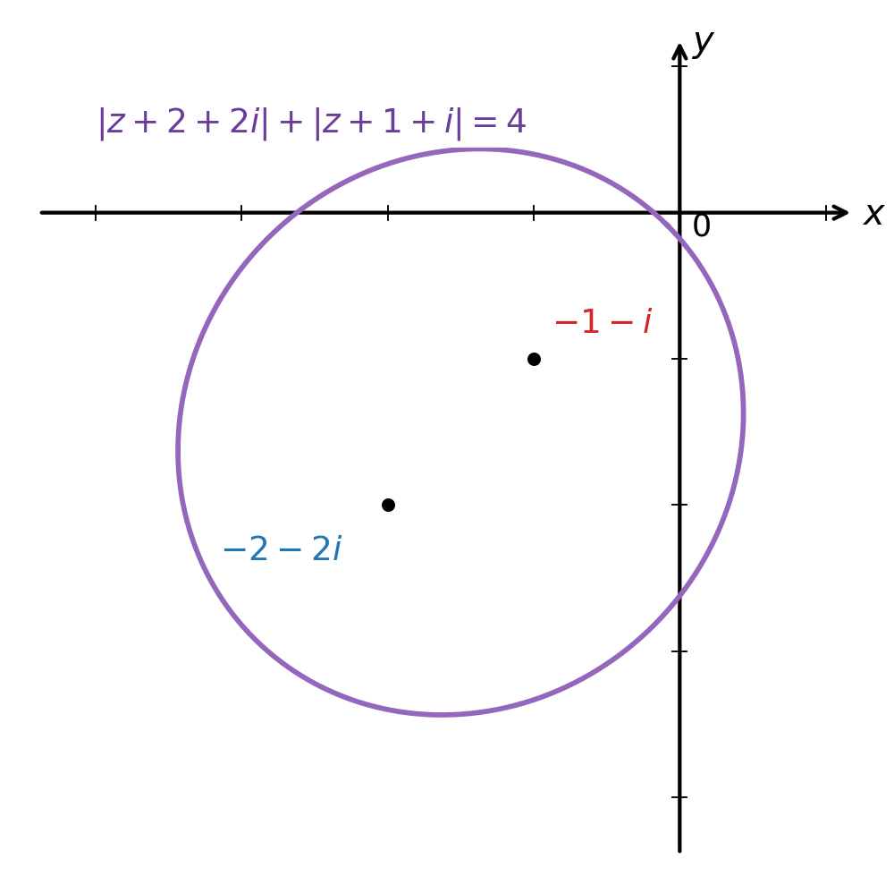

```python title:"Exercise 4(c): Ellipse |z + 2 + 2i| + |z + 1 + i| = 4"
from pathlib import Path
import math

import numpy as np
import matplotlib
matplotlib.use("Agg")
import matplotlib.pyplot as plt
from matplotlib.patches import FancyArrowPatch

out = Path("/Users/gradyclopton/ObsidianVaults/complex_analysis/Books/Asmar Applied Complex Analysis with Applications to Differential Equations/Chapter 01 Complex Numbers and Functions/images/exercise-4c-ellipse.png")

f1 = np.array([-2.0, -2.0])
f2 = np.array([-1.0, -1.0])
center = (f1 + f2) / 2
u = np.array([1.0, 1.0]) / math.sqrt(2)
v = np.array([-1.0, 1.0]) / math.sqrt(2)
a = 2.0
c = np.linalg.norm(f2 - f1) / 2
b = math.sqrt(a * a - c * c)
t = np.linspace(0, 2 * math.pi, 600)
pts = center[:, None] + a * np.cos(t) * u[:, None] + b * np.sin(t) * v[:, None]

fig, ax = plt.subplots(figsize=(6.3, 5.5), dpi=180)
ax.set_xlim(-4.6, 1.4)
ax.set_ylim(-4.6, 1.4)
ax.set_aspect("equal")
ax.axis("off")

ax.add_patch(FancyArrowPatch((-4.4, 0), (1.2, 0), arrowstyle="->", mutation_scale=14, lw=1.7, color="black"))
ax.add_patch(FancyArrowPatch((0, -4.4), (0, 1.2), arrowstyle="->", mutation_scale=14, lw=1.7, color="black"))
for k in range(-4, 2):
    ax.plot([k, k], [-0.05, 0.05], color="black", lw=0.75)
    ax.plot([-0.05, 0.05], [k, k], color="black", lw=0.75)
ax.text(1.25, -0.08, "$x$", fontsize=16)
ax.text(0.08, 1.1, "$y$", fontsize=16)
ax.text(0.08, -0.16, "$0$", fontsize=14)

ax.plot(pts[0], pts[1], color="#9467bd", lw=2.3)
ax.plot(f1[0], f1[1], "o", color="black", ms=5)
ax.plot(f2[0], f2[1], "o", color="black", ms=5)
ax.text(f1[0] - 1.15, f1[1] - 0.38, "$-2-2i$", fontsize=15, color="#1f77b4")
ax.text(f2[0] + 0.12, f2[1] + 0.18, "$-1-i$", fontsize=15, color="#d62728")
ax.text(
    -4.0,
    0.55,
    "$|z+2+2i|+|z+1+i|=4$",
    fontsize=15,
    color="#6a3d9a",
    bbox=dict(boxstyle="round,pad=0.15", facecolor="white", edgecolor="none", alpha=0.88),
)

plt.tight_layout(pad=0.2)
fig.savefig(out, facecolor="white", bbox_inches="tight", pad_inches=0.05)
```

```mathematica title:"Exercise 4(c): Ellipse |z + 2 + 2i| + |z + 1 + i| = 4"
f1 = {-2, -2};
f2 = {-1, -1};
center = (f1 + f2)/2;
u = {1, 1}/Sqrt[2];
v = {-1, 1}/Sqrt[2];
a = 2;
c = Norm[f2 - f1]/2;
b = Sqrt[a^2 - c^2];

pts[t_] := center + a Cos[t] u + b Sin[t] v;

Show[
 Graphics[
  {
   {Black, Thick, Arrow[{{-4.4, 0}, {1.2, 0}}]},
   {Black, Thick, Arrow[{{0, -4.4}, {0, 1.2}}]},
   Table[Line[{{k, -0.05}, {k, 0.05}}], {k, -4, 1}],
   Table[Line[{{-0.05, k}, {0.05, k}}], {k, -4, 1}],
   Text[Style["x", 18, Italic], {1.25, -0.08}],
   Text[Style["y", 18, Italic], {0.08, 1.1}],
   Text[Style["0", 16], {0.08, -0.16}],

   {RGBColor[0.58, 0.4, 0.78], Thick, Line[Table[pts[t], {t, 0, 2 Pi, 2 Pi/400}]]},
   {Black, PointSize[0.02], Point[f1], Point[f2]},
   Text[Style["-2 - 2 i", 15, Blue], f1 + {-1.15, -0.38}],
   Text[Style["-1 - i", 15, Red], f2 + {0.12, 0.18}],
   Text[
    Framed[
     Style["|z + 2 + 2 i| + |z + 1 + i| = 4", 15, RGBColor[0.42, 0.24, 0.6]],
     Background -> White,
     FrameStyle -> None,
     FrameMargins -> Tiny
     ],
    {-4.0, 0.55}
    ]
   }
  ],
 PlotRange -> {{-4.6, 1.4}, {-4.6, 1.4}},
 AspectRatio -> 1,
 ImageSize -> 520,
 Background -> White
]
```


> [!figure] Figure 10: problem c
> 
> 
> Figure 10


---


> [!review] Review 5
> 1. Show that the modulus of a complex number can be written as an expression involving the complex number and its complex conjugate.
> 2. What is the absolute value of the product of the following? Prove each of your statements.
> a. two complex numbers
> b. n complex numbers that are not all equal to each other
> c. n complex numbers that are all equal to each other
> 3. What is the absolute value of a quotient? Prove it.


##### review 1

Let $z=x+iy$. Then
$$
\bar z=x-iy.
$$
Therefore
$$
z\bar z=(x+iy)(x-iy)=x^2+y^2.
$$
But
$$
|z|=\sqrt{x^2+y^2},
$$
so
$$
|z|=\sqrt{z\bar z}.
$$
Equivalently,
$$
|z|^2=z\bar z.
$$

##### review 2a

For two complex numbers $z_1$ and $z_2$,
$$
|z_1z_2|^2=(z_1z_2)\overline{(z_1z_2)}.
$$
Using $\overline{z_1z_2}=\bar z_1\bar z_2$, we get
$$
|z_1z_2|^2=(z_1z_2)(\bar z_1\bar z_2)=(z_1\bar z_1)(z_2\bar z_2)=|z_1|^2|z_2|^2.
$$
Both sides are nonnegative real numbers, so taking square roots gives
$$
|z_1z_2|=|z_1||z_2|.
$$

##### review 2b

For $n$ complex numbers $z_1,z_2,\dots,z_n$, the same rule extends to
$$
|z_1z_2\cdots z_n|=|z_1||z_2|\cdots |z_n|.
$$
This follows by repeated use of part (a):
$$
|z_1z_2\cdots z_n|
=|(z_1z_2\cdots z_{n-1})z_n|
=|z_1z_2\cdots z_{n-1}||z_n|
=\cdots
=|z_1||z_2|\cdots |z_n|.
$$
Whether the numbers are equal or not does not affect the argument.


##### review 2c

If all $n$ factors are equal to the same complex number $z$, then
$$
|z^n|=|zz\cdots z|.
$$
Applying part (b) gives
$$
|z^n|=|z||z|\cdots |z|=|z|^n.
$$

##### review 3

Let $z_2\ne 0$. Then
$$
\left|\frac{z_1}{z_2}\right|^2
=\left(\frac{z_1}{z_2}\right)\overline{\left(\frac{z_1}{z_2}\right)}
=\left(\frac{z_1}{z_2}\right)\left(\frac{\bar z_1}{\bar z_2}\right)
=\frac{z_1\bar z_1}{z_2\bar z_2}
=\frac{|z_1|^2}{|z_2|^2}.
$$
Again both sides are nonnegative real numbers, so taking square roots gives
$$
\left|\frac{z_1}{z_2}\right|=\frac{|z_1|}{|z_2|}.
$$

---

The absolute value of complex numbers enjoys many interesting properties, including all those of the usual absolute value of real numbers.

> [!identity] Identities Involving the Absolute Value
> Let $z, z_{1}, z_{2}, \ldots$ be any complex numbers. We have
> 
> $$
> |z|=\sqrt{z \bar{z}}, \quad \text { and also } \quad|z|^{2}=z \bar{z} .
> $$
> 
> Furthermore
> 
> $$
> |z|=|\bar{z}| .
> $$
> 
> The absolute value of a product satisfies
> 
> $$
> \begin{gathered}
> \left|z_{1} z_{2}\right|=\left|z_{1}\right|\left|z_{2}\right| \\
> \left|z_{1} z_{2} \cdots z_{n}\right|=\left|z_{1}\right|\left|z_{2}\right| \cdots\left|z_{n}\right| \\
> \left|z^{n}\right|=|z|^{n} \quad(n=1,2, \ldots)
> \end{gathered}
> $$
> 
> The absolute value of a quotient satisfies
> 
> $$
> \left|\frac{z_{1}}{z_{2}}\right|=\frac{\left|z_{1}\right|}{\left|z_{2}\right|} \quad\left(z_{2} \neq 0\right)
> $$
> 


> [!NOTE]
> (10) states that the absolute value of a product is the product of the absolute values.
> (13) states that the absolute value of a quotient is the quotient of the absolute values.


> [!exercise] Exercise 5: Moduli of products and quotients
> Compute the given absolute value. Take $n$ to be a positive integer.
> (a) $|(1+i) \overline{(2-i)}|$.
> (b) $\left|(1-i)^{4}(1+2 i)(1+\sqrt{2} i)\right|$.
> (c) $\left|i^{n}\right|$.
> (d) $\left|\frac{1+2 i}{1-i}\right|$.
> (e) $\left|\frac{(3+4 i)^{2}(3-i)^{10}}{(3+i)^{9}}\right|$.


##### problem a

$$
\begin{aligned}
\left|(1+i)\overline{(2-i)}\right|
&=\left|(1+i)(2+i)\right| \\
&=|1+i|\,|2+i| \\
&=\sqrt{1^2+1^2}\,\sqrt{2^2+1^2} \\
&=\sqrt{2}\,\sqrt{5} \\
&=\sqrt{10}.
\end{aligned}
$$

##### problem b

$$
\begin{aligned}
\left|(1-i)^4(1+2i)(1+\sqrt{2}\,i)\right|
&=|(1-i)^4|\,|1+2i|\,|1+\sqrt{2}\,i| \\
&=|1-i|^4\,|1+2i|\,|1+\sqrt{2}\,i| \\
&=\left(\sqrt{1^2+(-1)^2}\right)^4\sqrt{1^2+2^2}\sqrt{1^2+(\sqrt{2})^2} \\
&=(\sqrt{2})^4\sqrt{5}\sqrt{3} \\
&=4\sqrt{15}.
\end{aligned}
$$

##### problem c

$$
\begin{aligned}
|i^n|
&=|i|^n \\
&=\left(\sqrt{0^2+1^2}\right)^n \\
&=1^n \\
&=1.
\end{aligned}
$$

##### problem d

$$
\begin{aligned}
\left|\frac{1+2i}{1-i}\right|
&=\frac{|1+2i|}{|1-i|} \\
&=\frac{\sqrt{1^2+2^2}}{\sqrt{1^2+(-1)^2}} \\
&=\frac{\sqrt{5}}{\sqrt{2}} \\
&=\frac{\sqrt{10}}{2}.
\end{aligned}
$$

##### problem e

$$
\begin{aligned}
\left|\frac{(3+4i)^2(3-i)^{10}}{(3+i)^9}\right|
&=\frac{|(3+4i)^2|\,|(3-i)^{10}|}{|(3+i)^9|} \\
&=\frac{|3+4i|^2\,|3-i|^{10}}{|3+i|^9} \\
&=\frac{\left(\sqrt{3^2+4^2}\right)^2\left(\sqrt{3^2+(-1)^2}\right)^{10}}{\left(\sqrt{3^2+1^2}\right)^9} \\
&=\frac{5^2(\sqrt{10})^{10}}{(\sqrt{10})^9} \\
&=\frac{25\cdot 10^5}{10^4\sqrt{10}} \\
&=\frac{250}{\sqrt{10}} \\
&=25\sqrt{10}.
\end{aligned}
$$


---


> [!review] Review 6
> 1. Using an elementary geometric fact about right triangles, derive inequalities relating $|z|$ to $|\operatorname{Re} z|$ and $|\operatorname{Im} z|$ individually, and then to their sum. Draw a diagram supporting your argument.
> 2. State and prove the triangle inequality. What fact from geometry motivates it, and why is it called what it is? Draw a diagram. Then state the generalization to $n$ complex numbers and explain why it follows from the two-term case.
> 3. Find and prove both an upper and a lower bound for $\left|z_1 \pm z_2\right|$.

##### review 1

Let
$$
z=x+iy.
$$
In the complex plane, the point $z$ forms a right triangle with horizontal leg length
$$
|\operatorname{Re} z|=|x|
$$
and vertical leg length
$$
|\operatorname{Im} z|=|y|.
$$
The hypotenuse has length
$$
|z|.
$$
Since in a right triangle the hypotenuse is at least as long as either leg, we obtain
$$
|\operatorname{Re} z|\le |z|,
\qquad
|\operatorname{Im} z|\le |z|.
$$
Also, the straight-line distance from the origin to $z$ is no greater than the broken path that first moves horizontally and then vertically, so
$$
|z|\le |\operatorname{Re} z|+|\operatorname{Im} z|.
$$

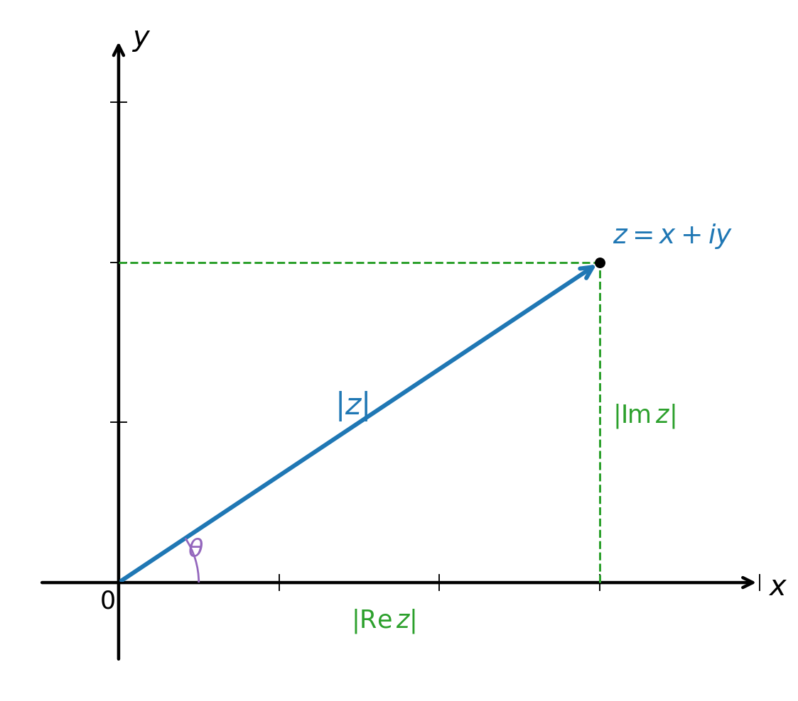

```python title:"Review 6.1: Right-Triangle Bounds for |z|"
from pathlib import Path

import matplotlib
matplotlib.use("Agg")
import matplotlib.pyplot as plt
from matplotlib.patches import Arc, FancyArrowPatch

out = Path("/Users/gradyclopton/ObsidianVaults/complex_analysis/Books/Asmar Applied Complex Analysis with Applications to Differential Equations/Chapter 01 Complex Numbers and Functions/images/review-6-right-triangle.png")

x, y = 3.0, 2.0

fig, ax = plt.subplots(figsize=(6.2, 5.6), dpi=180)
ax.set_xlim(-0.7, 4.2)
ax.set_ylim(-0.7, 3.6)
ax.set_aspect("equal")
ax.axis("off")

ax.add_patch(FancyArrowPatch((-0.5, 0), (4.0, 0), arrowstyle="->", mutation_scale=14, lw=1.8, color="black"))
ax.add_patch(FancyArrowPatch((0, -0.5), (0, 3.4), arrowstyle="->", mutation_scale=14, lw=1.8, color="black"))
for k in range(0, 5):
    ax.plot([k, k], [-0.05, 0.05], color="black", lw=0.75)
for k in range(0, 4):
    ax.plot([-0.05, 0.05], [k, k], color="black", lw=0.75)
ax.text(4.05, -0.08, "$x$", fontsize=16)
ax.text(0.08, 3.35, "$y$", fontsize=16)
ax.text(-0.12, -0.16, "$0$", fontsize=14)

ax.add_patch(FancyArrowPatch((0, 0), (x, y), arrowstyle="->", mutation_scale=16, lw=2.4, color="#1f77b4"))
ax.plot([0, x], [y, y], linestyle="--", lw=1.2, color="#2ca02c")
ax.plot([x, x], [0, y], linestyle="--", lw=1.2, color="#2ca02c")
ax.plot(x, y, "o", color="black", ms=5)
arc = Arc((0, 0), 1.0, 1.0, angle=0, theta1=0, theta2=33.7, lw=1.1, color="#9467bd")
ax.add_patch(arc)
ax.text(0.43, 0.16, r"$\theta$", color="#9467bd", fontsize=14)
ax.text(1.35, 1.05, "$|z|$", color="#1f77b4", fontsize=17)
ax.text(1.45, -0.28, r"$|\operatorname{Re} z|$", color="#2ca02c", fontsize=14)
ax.text(3.08, 1.0, r"$|\operatorname{Im} z|$", color="#2ca02c", fontsize=14)
ax.text(3.08, 2.12, "$z=x+iy$", color="#1f77b4", fontsize=15)

plt.tight_layout(pad=0.2)
fig.savefig(out, facecolor="white", bbox_inches="tight", pad_inches=0.05)
```

```mathematica title:"Review 6.1: Right-Triangle Bounds for |z|"
x = 3;
y = 2;

Show[
 Graphics[
  {
   {Black, Thick, Arrow[{{-0.5, 0}, {4.0, 0}}]},
   {Black, Thick, Arrow[{{0, -0.5}, {0, 3.4}}]},
   Table[Line[{{k, -0.05}, {k, 0.05}}], {k, 0, 4}],
   Table[Line[{{-0.05, k}, {0.05, k}}], {k, 0, 3}],
   Text[Style["x", 18, Italic], {4.05, -0.08}],
   Text[Style["y", 18, Italic], {0.08, 3.35}],
   Text[Style["0", 16], {-0.12, -0.16}],

   {Blue, Thick, Arrow[{{0, 0}, {x, y}}]},
   {Directive[Darker[Green], Dashed], Line[{{0, y}, {x, y}}]},
   {Directive[Darker[Green], Dashed], Line[{{x, 0}, {x, y}}]},
   {Black, PointSize[0.02], Point[{x, y}]},
   {Purple, Circle[{0, 0}, 0.5, {0, ArcTan[y/x]}]},

   Text[Style["\[Theta]", 14, Purple], {0.43, 0.16}],
   Text[Style["|z|", 17, Blue], {1.35, 1.05}],
   Text[Style["|Re z|", 14, Darker[Green]], {1.45, -0.28}],
   Text[Style["|Im z|", 14, Darker[Green]], {3.08, 1.0}],
   Text[Style["z = x + i y", 15, Blue], {3.08, 2.12}]
   }
  ],
 PlotRange -> {{-0.7, 4.2}, {-0.7, 3.6}},
 AspectRatio -> 1,
 ImageSize -> 520,
 Background -> White
]
```

##### review 2

The triangle inequality states that
$$
|z_1+z_2|\le |z_1|+|z_2|.
$$
To see this geometrically, draw the vector for $z_1$ from the origin, then place the tail of the vector for $z_2$ at the head of $z_1$. The vector from the origin to the final endpoint is $z_1+z_2$. These three segments form a triangle, and in any triangle the length of one side is no greater than the sum of the lengths of the other two sides. Hence
$$
|z_1+z_2|\le |z_1|+|z_2|.
$$
It is called the triangle inequality precisely because the proof comes from this fact about triangles.

For $n$ complex numbers, the generalization is
$$
|z_1+z_2+\cdots+z_n|\le |z_1|+|z_2|+\cdots+|z_n|.
$$
This follows by repeated application of the two-term case:
$$
|z_1+\cdots+z_n|
\le |z_1+\cdots+z_{n-1}|+|z_n|
\le \cdots
\le |z_1|+\cdots+|z_n|.
$$

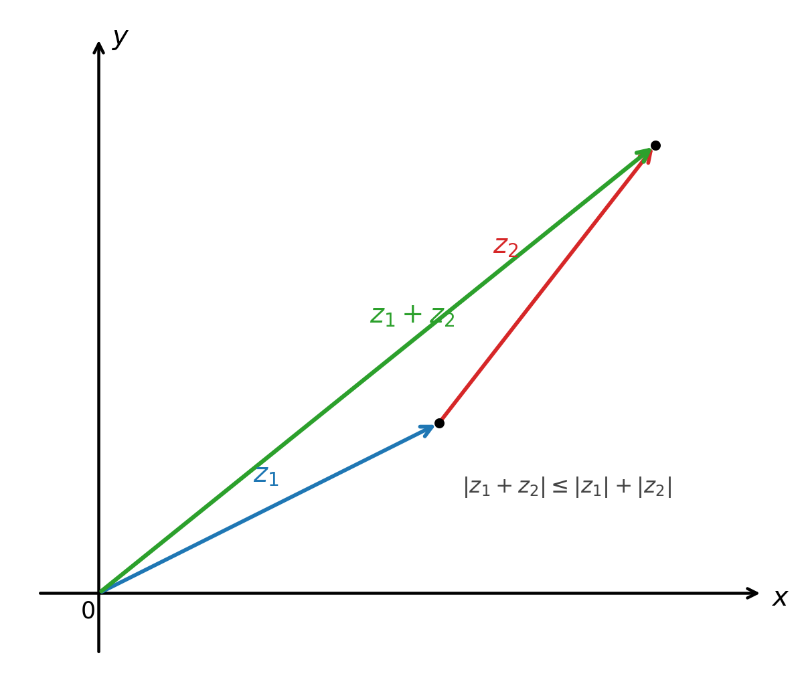

```python title:"Review 6.2: Triangle Inequality"
from pathlib import Path

import matplotlib
matplotlib.use("Agg")
import matplotlib.pyplot as plt
from matplotlib.patches import FancyArrowPatch

out = Path("/Users/gradyclopton/ObsidianVaults/complex_analysis/Books/Asmar Applied Complex Analysis with Applications to Differential Equations/Chapter 01 Complex Numbers and Functions/images/review-6-triangle-inequality.png")

z1 = (2.2, 1.1)
z2 = (1.4, 1.8)
sumv = (z1[0] + z2[0], z1[1] + z2[1])

fig, ax = plt.subplots(figsize=(6.6, 5.7), dpi=180)
ax.set_xlim(-0.6, 4.5)
ax.set_ylim(-0.6, 3.8)
ax.set_aspect("equal")
ax.axis("off")
ax.add_patch(FancyArrowPatch((-0.4, 0), (4.3, 0), arrowstyle="->", mutation_scale=14, lw=1.8, color="black"))
ax.add_patch(FancyArrowPatch((0, -0.4), (0, 3.6), arrowstyle="->", mutation_scale=14, lw=1.8, color="black"))
ax.text(4.35, -0.08, "$x$", fontsize=16)
ax.text(0.08, 3.55, "$y$", fontsize=16)
ax.text(-0.12, -0.16, "$0$", fontsize=14)

ax.add_patch(FancyArrowPatch((0, 0), z1, arrowstyle="->", mutation_scale=16, lw=2.3, color="#1f77b4"))
ax.add_patch(FancyArrowPatch(z1, sumv, arrowstyle="->", mutation_scale=16, lw=2.3, color="#d62728"))
ax.add_patch(FancyArrowPatch((0, 0), sumv, arrowstyle="->", mutation_scale=17, lw=2.5, color="#2ca02c"))
for pt in [z1, sumv]:
    ax.plot(pt[0], pt[1], "o", color="black", ms=5)
ax.text(1.0, 0.72, "$z_1$", color="#1f77b4", fontsize=16)
ax.text(2.55, 2.2, "$z_2$", color="#d62728", fontsize=16)
ax.text(1.75, 1.75, "$z_1+z_2$", color="#2ca02c", fontsize=16)
ax.text(2.35, 0.65, r"$|z_1+z_2|\leq |z_1|+|z_2|$", color="#444444", fontsize=13)

plt.tight_layout(pad=0.2)
fig.savefig(out, facecolor="white", bbox_inches="tight", pad_inches=0.05)
```

```mathematica title:"Review 6.2: Triangle Inequality"
z1 = {2.2, 1.1};
z2 = {1.4, 1.8};
sum = z1 + z2;

Show[
 Graphics[
  {
   {Black, Thick, Arrow[{{-0.4, 0}, {4.3, 0}}]},
   {Black, Thick, Arrow[{{0, -0.4}, {0, 3.6}}]},
   Text[Style["x", 18, Italic], {4.35, -0.08}],
   Text[Style["y", 18, Italic], {0.08, 3.55}],
   Text[Style["0", 16], {-0.12, -0.16}],

   {Blue, Thick, Arrow[{{0, 0}, z1}]},
   {Red, Thick, Arrow[{z1, sum}]},
   {Darker[Green], Thick, Arrow[{{0, 0}, sum}]},
   {Black, PointSize[0.02], Point[z1], Point[sum]},

   Text[Style["z1", 16, Blue], {1.0, 0.72}],
   Text[Style["z2", 16, Red], {2.55, 2.2}],
   Text[Style["z1 + z2", 16, Darker[Green]], {1.75, 1.75}],
   Text[Style["|z1 + z2| <= |z1| + |z2|", 13, GrayLevel[0.28]], {2.35, 0.65}]
   }
  ],
 PlotRange -> {{-0.6, 4.5}, {-0.6, 3.8}},
 AspectRatio -> 1,
 ImageSize -> 520,
 Background -> White
]
```

##### review 3

An upper bound follows immediately from the triangle inequality:
$$
|z_1\pm z_2|\le |z_1|+|z_2|.
$$
For a lower bound, apply the triangle inequality to
$$
z_1=(z_1\pm z_2)\mp z_2.
$$
Then
$$
|z_1|
=|(z_1\pm z_2)\mp z_2|
\le |z_1\pm z_2|+|z_2|,
$$
so
$$
|z_1|-|z_2|\le |z_1\pm z_2|.
$$
Interchanging the roles of $z_1$ and $z_2$ gives
$$
|z_2|-|z_1|\le |z_1\pm z_2|.
$$
Therefore
$$
\bigl||z_1|-|z_2|\bigr|\le |z_1\pm z_2|\le |z_1|+|z_2|.
$$

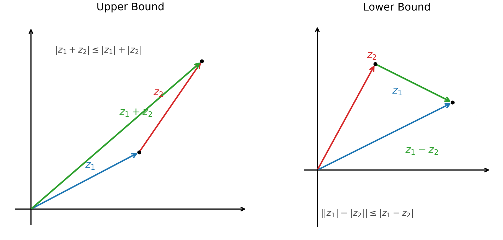

```python title:"Review 6.3: Upper and Lower Bounds for |z1 ± z2|"
from pathlib import Path

import matplotlib
matplotlib.use("Agg")
import matplotlib.pyplot as plt
from matplotlib.patches import FancyArrowPatch

out = Path("/Users/gradyclopton/ObsidianVaults/complex_analysis/Books/Asmar Applied Complex Analysis with Applications to Differential Equations/Chapter 01 Complex Numbers and Functions/images/review-6-bounds-sum-difference-v2.png")

fig, axes = plt.subplots(1, 2, figsize=(10.8, 4.6), dpi=180)

z1 = (1.9, 1.0)
z2 = (1.1, 1.6)
sumv = (z1[0] + z2[0], z1[1] + z2[1])
w1 = (2.8, 1.4)
w2 = (1.2, 2.2)

for ax in axes:
    ax.set_aspect("equal")
    ax.axis("off")

ax = axes[0]
ax.set_xlim(-0.5, 4.0)
ax.set_ylim(-0.5, 3.4)
ax.add_patch(FancyArrowPatch((-0.3, 0), (3.8, 0), arrowstyle="->", mutation_scale=13, lw=1.6, color="black"))
ax.add_patch(FancyArrowPatch((0, -0.3), (0, 3.2), arrowstyle="->", mutation_scale=13, lw=1.6, color="black"))
ax.add_patch(FancyArrowPatch((0, 0), z1, arrowstyle="->", mutation_scale=15, lw=2.1, color="#1f77b4"))
ax.add_patch(FancyArrowPatch(z1, sumv, arrowstyle="->", mutation_scale=15, lw=2.1, color="#d62728"))
ax.add_patch(FancyArrowPatch((0, 0), sumv, arrowstyle="->", mutation_scale=16, lw=2.3, color="#2ca02c"))
for pt in [z1, sumv]:
    ax.plot(pt[0], pt[1], "o", color="black", ms=4.6)
ax.text(0.95, 0.72, "$z_1$", color="#1f77b4", fontsize=15)
ax.text(2.15, 2.0, "$z_2$", color="#d62728", fontsize=15)
ax.text(1.55, 1.65, "$z_1+z_2$", color="#2ca02c", fontsize=15)
ax.text(0.42, 2.75, r"$|z_1+z_2|\leq |z_1|+|z_2|$", fontsize=13, color="#444444")
ax.set_title("Upper Bound", fontsize=15, pad=8)

ax = axes[1]
ax.set_xlim(-0.5, 3.8)
ax.set_ylim(-1.4, 3.2)
ax.add_patch(FancyArrowPatch((-0.3, 0), (3.6, 0), arrowstyle="->", mutation_scale=13, lw=1.6, color="black"))
ax.add_patch(FancyArrowPatch((0, -1.2), (0, 3.0), arrowstyle="->", mutation_scale=13, lw=1.6, color="black"))
ax.add_patch(FancyArrowPatch((0, 0), w1, arrowstyle="->", mutation_scale=15, lw=2.1, color="#1f77b4"))
ax.add_patch(FancyArrowPatch((0, 0), w2, arrowstyle="->", mutation_scale=15, lw=2.1, color="#d62728"))
ax.add_patch(FancyArrowPatch(w2, w1, arrowstyle="->", mutation_scale=15, lw=2.3, color="#2ca02c"))
ax.text(1.55, 1.58, "$z_1$", color="#1f77b4", fontsize=15)
ax.text(1.02, 2.32, "$z_2$", color="#d62728", fontsize=15)
ax.text(1.92, 0.35, "$z_1-z_2$", color="#2ca02c", fontsize=15)
ax.text(0.08, -0.95, r"$||z_1|-|z_2||\leq |z_1-z_2|$", fontsize=13, color="#444444")
ax.set_title("Lower Bound", fontsize=15, pad=8)

plt.tight_layout(pad=0.3, w_pad=1.0)
fig.savefig(out, facecolor="white", bbox_inches="tight", pad_inches=0.05)
```

```mathematica title:"Review 6.3: Upper and Lower Bounds for |z1 ± z2|"
z1 = {1.9, 1.0};
z2 = {1.1, 1.6};
sum = z1 + z2;
w1 = {2.8, 1.4};
w2 = {1.2, 2.2};

GraphicsRow[
 {
  Graphics[
   {
    {Black, Thick, Arrow[{{-0.3, 0}, {3.8, 0}}]},
    {Black, Thick, Arrow[{{0, -0.3}, {0, 3.2}}]},
    {Blue, Thick, Arrow[{{0, 0}, z1}]},
    {Red, Thick, Arrow[{z1, sum}]},
    {Darker[Green], Thick, Arrow[{{0, 0}, sum}]},
    {Black, PointSize[0.018], Point[z1], Point[sum]},
    Text[Style["z1", 15, Blue], {0.95, 0.72}],
    Text[Style["z2", 15, Red], {2.15, 2.0}],
    Text[Style["z1 + z2", 15, Darker[Green]], {1.55, 1.65}],
    Text[Style["|z1 + z2| <= |z1| + |z2|", 13, GrayLevel[0.28]], {0.42, 2.75}]
    },
   PlotRange -> {{-0.5, 4.0}, {-0.5, 3.4}},
   AspectRatio -> 1,
   ImageSize -> 360,
   Background -> White,
   PlotLabel -> Style["Upper Bound", 16]
   ],
  Graphics[
   {
    {Black, Thick, Arrow[{{-0.3, 0}, {3.6, 0}}]},
    {Black, Thick, Arrow[{{0, -1.2}, {0, 3.0}}]},
    {Blue, Thick, Arrow[{{0, 0}, w1}]},
    {Red, Thick, Arrow[{{0, 0}, w2}]},
    {Darker[Green], Thick, Arrow[{w2, w1}]},
    Text[Style["z1", 15, Blue], {1.55, 1.58}],
    Text[Style["z2", 15, Red], {1.02, 2.32}],
    Text[Style["z1 - z2", 15, Darker[Green]], {1.92, 0.35}],
    Text[Style["||z1| - |z2|| <= |z1 - z2|", 13, GrayLevel[0.28]], {0.08, -0.95}]
    },
   PlotRange -> {{-0.5, 3.8}, {-1.4, 3.2}},
   AspectRatio -> 1,
   ImageSize -> 360,
   Background -> White,
   PlotLabel -> Style["Lower Bound", 16]
   ]
  },
 Spacings -> 20
]
```


---

In addition to the identities that we just proved, the absolute value satisfies fundamental inequalities, which are in some cases immediate consequences of elementary facts from geometry. Let us recall two facts and then list the inequalities that will be obtained as a consequence.

- In a right triangle, the hypotenuse is larger than either one of the other two sides.
- In any triangle, the sum of two sides is larger than the third side.


> [!identity] Inequalities Involving the Absolute Value
> Let $z, z_{1}, z_{2}, \ldots$ be complex numbers. We have
> 
> $$
> \begin{gathered}
> |\operatorname{Re} z| \leq|z|, \quad|\operatorname{Im} z| \leq|z| ; \\
> |z| \leq|\operatorname{Re} z|+|\operatorname{Im} z| .
> \end{gathered}
> $$
> 
> The absolute value of a sum satisfies the fundamental inequality
> 
> $$
> \left|z_{1}+z_{2}\right| \leq\left|z_{1}\right|+\left|z_{2}\right|
> $$
> 
> known as the triangle inequality. More generally,
> 
> $$
> \left|z_{1}+z_{2}+\cdots+z_{n}\right| \leq\left|z_{1}\right|+\left|z_{2}\right|+\cdots+\left|z_{n}\right| .
> $$
> 
> The absolute value of a difference satisfies
> 
> $$
> \left|z_{1}-z_{2}\right| \leq\left|z_{1}\right|+\left|z_{2}\right|
> $$
> 
> A lower bound for $\left|z_{1} \pm z_{2}\right|$ is provided by
> 
> $$
> \left|z_{1} \pm z_{2}\right| \geq\left|\left|z_{1}\right|-\right| z_{2} \|
> $$
> 

**proof:**

[use figures 11 and 12 for proof]


> [!figure] Figure 11
> 
> 
> Figure 11


> [!figure] Figure 12
> 
> 
> Figure 12


---


> [!review] Review 7
> 1. The lower bound $\left|z_1-z_2\right| \geq\left|\left|z_1\right|-\left|z_2\right|\right|$ was proved geometrically. How does the corresponding inequality for $\left|z_1+z_2\right|$ follow from it, and why is this a one-line argument?
> 2. Prove the triangle inequality algebraically. Your proof should clearly identify the key inequality step and justify it using previously established properties.

##### review 1

The inequality for the sum follows by applying the difference inequality to $z_1$ and $-z_2$:
$$
|z_1+z_2|
=|z_1-(-z_2)|
\ge \bigl||z_1|-|-z_2|\bigr|.
$$
Since
$$
|-z_2|=|z_2|,
$$
this becomes
$$
|z_1+z_2|\ge \bigl||z_1|-|z_2|\bigr|.
$$
It is a one-line argument because no new proof is needed; one simply replaces $z_2$ by $-z_2$ in the already established inequality for $|z_1-z_2|$.

##### review 2

To prove the triangle inequality algebraically, compute
$$
\begin{aligned}
|z_1+z_2|^2
&=(z_1+z_2)\overline{(z_1+z_2)} \\
&=(z_1+z_2)(\bar z_1+\bar z_2) \\
&=z_1\bar z_1+z_1\bar z_2+z_2\bar z_1+z_2\bar z_2 \\
&=|z_1|^2+|z_2|^2+z_1\bar z_2+\overline{z_1\bar z_2} \\
&=|z_1|^2+|z_2|^2+2\operatorname{Re}(z_1\bar z_2).
\end{aligned}
$$
The key inequality step is
$$
\operatorname{Re}(w)\le |w|
$$
for every complex number $w$. Applying this with $w=z_1\bar z_2$ gives
$$
2\operatorname{Re}(z_1\bar z_2)\le 2|z_1\bar z_2|.
$$
Using the multiplicative property of the modulus,
$$
|z_1\bar z_2|=|z_1|\,|\bar z_2|=|z_1|\,|z_2|,
$$
so
$$
\begin{aligned}
|z_1+z_2|^2
&\le |z_1|^2+|z_2|^2+2|z_1||z_2| \\
&=(|z_1|+|z_2|)^2.
\end{aligned}
$$
Both sides are nonnegative, so taking square roots yields
$$
|z_1+z_2|\le |z_1|+|z_2|.
$$


> [!exercise] Exercise 6: Estimating the size of an absolute value
> What is an upper bound for $\left|z^{5}-4\right|$ if $|z| \leq 1$ ?

Using the triangle inequality,
$$
\begin{aligned}
|z^5-4|
&\le |z^5|+|4| \\
&=|z|^5+4.
\end{aligned}
$$
Since $|z|\le 1$, we have
$$
|z|^5\le 1^5=1,
$$
and therefore
$$
|z^5-4|\le 1+4=5.
$$
So an upper bound is
$$
5.
$$
In fact, this bound is attained when $z=-1$, since then $|z|=1$ and
$$
|z^5-4|=|-1-4|=5.
$$


> [!NOTE]
> You should be cautioned that, in general, the triangle inequality is considered as a crude inequality, which means that it will not yield least upper bound estimates as it did in this case. See Exercise 33 for an illustration.


---


> [!exercise] Exercise 7: Inequalities
> Show that for any complex numbers $z$ and $a$
> 
> $$
> \frac{1}{|a|+|z|} \leq\left|\frac{1}{a+z}\right| \leq \frac{1}{\| a|-|z|}
> $$
> 
> 

Assume $a+z\ne 0$, so that $\dfrac{1}{a+z}$ is defined. By the triangle inequality,
$$
|a+z|\le |a|+|z|.
$$
By the reverse triangle inequality,
$$
\bigl||a|-|z|\bigr|\le |a+z|.
$$
Combining these gives
$$
\bigl||a|-|z|\bigr|\le |a+z|\le |a|+|z|.
$$
Since the reciprocal function is decreasing on the positive real numbers, taking reciprocals yields
$$
\frac{1}{|a|+|z|}\le \frac{1}{|a+z|}\le \frac{1}{\bigl||a|-|z|\bigr|},
$$
whenever the right-hand denominator is nonzero. Using
$$
\left|\frac{1}{a+z}\right|=\frac{1}{|a+z|},
$$
we obtain
$$
\frac{1}{|a|+|z|}\le \left|\frac{1}{a+z}\right|\le \frac{1}{\bigl||a|-|z|\bigr|}.
$$
Thus the desired inequalities follow directly from the upper and lower bounds for $|a+z|$.


---


> [!exercise] Exercise 8: Tricks with the absolute value
> (a) What is an upper bound for $|z-3|$ if $|z-i| \leq 1$ ?
> (b) What is a lower bound for $|z-3|$ if $|z-i| \leq 1$ ?

##### problem a

Using
$$
z-3=(z-i)+(i-3),
$$
the triangle inequality gives
$$
\begin{aligned}
|z-3|
&=|(z-i)+(i-3)| \\
&\le |z-i|+|i-3|.
\end{aligned}
$$
Since
$$
|z-i|\le 1
$$
and
$$
|i-3|=|-3+i|=\sqrt{(-3)^2+1^2}=\sqrt{10},
$$
we obtain
$$
|z-3|\le 1+\sqrt{10}.
$$
So an upper bound is
$$
1+\sqrt{10}.
$$


##### problem b

Again write
$$
z-3=(z-i)+(i-3).
$$
Using the reverse triangle inequality,
$$
\begin{aligned}
|z-3|
&=|(z-i)+(i-3)| \\
&\ge \bigl||i-3|-|z-i|\bigr|.
\end{aligned}
$$
Since
$$
|i-3|=\sqrt{10}
$$
and
$$
|z-i|\le 1,
$$
it follows that
$$
|z-3|\ge \sqrt{10}-1.
$$
So a lower bound is
$$
\sqrt{10}-1.
$$


> [!exercise] Exercise 9
> In problems 1-6, plot the points $z,-z, \bar{z}$ and the associated vectors emanating from the origin. In each case, compute the modulus of $z$.
> 
> 1. $1-i$.
> 2. $\quad \frac{\sqrt{2}}{2}+i \frac{\sqrt{2}}{2}$.
> 3. $3 i+5$.
> 4. $\quad i^{7}$.
> 5. $\overline{1-i}$.
> 6. $(1+i)^{2}$.
##### problem 1

For $z=1-i$, the three points are

$$
z=1-i, \qquad -z=-1+i, \qquad \bar{z}=1+i .
$$

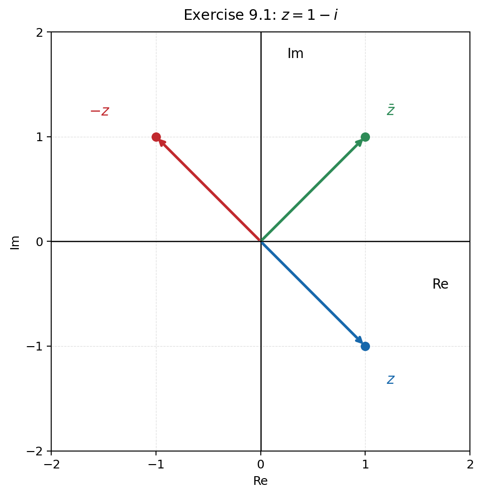

Thus $z$ is plotted at $(1,-1)$, $-z$ at $(-1,1)$, and $\bar{z}$ at $(1,1)$. The modulus is

$$
|z|=\sqrt{1^{2}+(-1)^{2}}=\sqrt{2} .
$$


```python title:"Exercise 9.1: Plot of z, -z, and Conjugate"
from pathlib import Path
import matplotlib.pyplot as plt

points = [
    ("$z$", 1, -1, "#1768ac", 0.20, -0.18),
    ("$-z$", -1, 1, "#c1292e", -0.62, 0.20),
    (r"$\bar{z}$", 1, 1, "#2e8b57", 0.20, 0.20),
]

fig, ax = plt.subplots(figsize=(5.8, 5.8), dpi=180)
ax.set_xlim(-2, 2)
ax.set_ylim(-2, 2)
ax.set_aspect("equal", adjustable="box")
ax.axhline(0, color="black", linewidth=1)
ax.axvline(0, color="black", linewidth=1)
ax.grid(True, linestyle="--", linewidth=0.5, alpha=0.35)
ax.set_xlabel("Re")
ax.set_ylabel("Im")
ax.set_title(r"Exercise 9.1: $z=1-i$")

for label, x, y, color, dx, dy in points:
    ax.annotate("", xy=(x, y), xytext=(0, 0), arrowprops=dict(arrowstyle="->", lw=2.2, color=color))
    ax.scatter([x], [y], s=42, color=color, zorder=3)
    ax.text(x + dx, y + dy, label, color=color, fontsize=12)

fig.tight_layout()
output = Path("images/exercise9-problem1.png")
fig.savefig(output, bbox_inches="tight")
plt.show()

```

```mathematica title:"Exercise 9.1: Plot of z, -z, and Conjugate"
points = {
  {HoldForm[z], {1, -1}, RGBColor[0.090, 0.408, 0.675], {0.20, -0.18}},
  {HoldForm[-z], {-1, 1}, RGBColor[0.757, 0.161, 0.180], {-0.35, 0.20}},
  {Conjugate[z], {1, 1}, RGBColor[0.180, 0.545, 0.341], {0.28, 0.20}}
};

Graphics[
 {
  Table[{pt[[3]], Thick, Arrow[{{0, 0}, pt[[2]]}]}, {pt, points}],
  Table[{pt[[3]], PointSize[0.018], Point[pt[[2]]]}, {pt, points}],
  Table[
   Text[Style[TraditionalForm[pt[[1]]], 14, pt[[3]]], pt[[2]] + pt[[4]]],
   {pt, points}
  ]
 },
 Axes -> True,
 AxesOrigin -> {0, 0},
 GridLines -> Automatic,
 GridLinesStyle -> Directive[GrayLevel[0.8], Dashed],
 PlotRange -> {{-2, 2}, {-2, 2}},
 PlotRangePadding -> Scaled[0.08],
 AspectRatio -> 1,
 AxesLabel -> (Style[#, 14] & /@ {"Re", "Im"}),
 ImageSize -> 360
]
```

##### problem 2

For

$$
z=\frac{\sqrt{2}}{2}+i \frac{\sqrt{2}}{2},
$$

we have

$$
-z=-\frac{\sqrt{2}}{2}-i \frac{\sqrt{2}}{2}, \qquad \bar{z}=\frac{\sqrt{2}}{2}-i \frac{\sqrt{2}}{2} .
$$

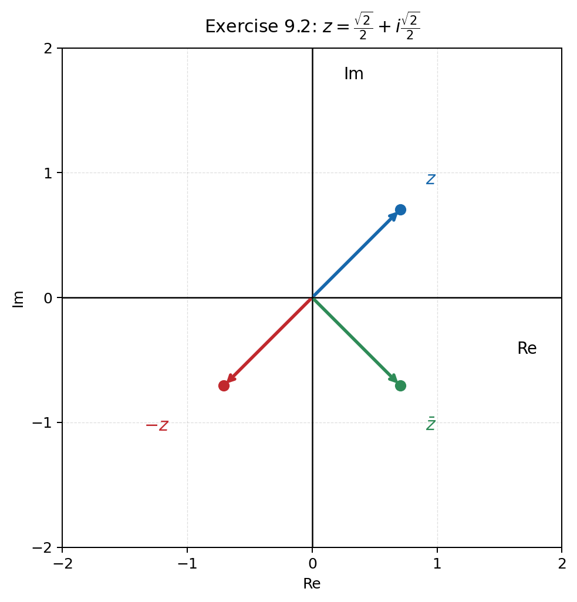

So the three points are reflections of one another across the origin and the real axis. The modulus is

$$
|z|=\sqrt{\left(\frac{\sqrt{2}}{2}\right)^{2}+\left(\frac{\sqrt{2}}{2}\right)^{2}}=\sqrt{\frac{1}{2}+\frac{1}{2}}=1 .
$$


```python title:"Exercise 9.2: Plot of z, -z, and Conjugate"
from pathlib import Path
import math
import matplotlib.pyplot as plt

s = math.sqrt(2) / 2
points = [
    ("$z$", s, s, "#1768ac", 0.18, 0.16),
    ("$-z$", -s, -s, "#c1292e", -0.62, -0.22),
    (r"$\bar{z}$", s, -s, "#2e8b57", 0.18, -0.22),
]

fig, ax = plt.subplots(figsize=(5.8, 5.8), dpi=180)
ax.set_xlim(-2, 2)
ax.set_ylim(-2, 2)
ax.set_aspect("equal", adjustable="box")
ax.axhline(0, color="black", linewidth=1)
ax.axvline(0, color="black", linewidth=1)
ax.grid(True, linestyle="--", linewidth=0.5, alpha=0.35)
ax.set_xlabel("Re")
ax.set_ylabel("Im")
ax.set_title(r"Exercise 9.2: $z=\frac{\sqrt{2}}{2}+i\frac{\sqrt{2}}{2}$")

for label, x, y, color, dx, dy in points:
    ax.annotate("", xy=(x, y), xytext=(0, 0), arrowprops=dict(arrowstyle="->", lw=2.2, color=color))
    ax.scatter([x], [y], s=42, color=color, zorder=3)
    ax.text(x + dx, y + dy, label, color=color, fontsize=12)

fig.tight_layout()
output = Path("images/exercise9-problem2.png")
fig.savefig(output, bbox_inches="tight")
plt.show()

```

```mathematica title:"Exercise 9.2: Plot of z, -z, and Conjugate"
s = N[Sqrt[2]/2];
points = {
  {HoldForm[z], {s, s}, RGBColor[0.090, 0.408, 0.675], {0.18, 0.16}},
  {HoldForm[-z], {-s, -s}, RGBColor[0.757, 0.161, 0.180], {-0.45, -0.22}},
  {Conjugate[z], {s, -s}, RGBColor[0.180, 0.545, 0.341], {0.30, -0.22}}
};

Graphics[
 {
  Table[{pt[[3]], Thick, Arrow[{{0, 0}, pt[[2]]}]}, {pt, points}],
  Table[{pt[[3]], PointSize[0.018], Point[pt[[2]]]}, {pt, points}],
  Table[
   Text[Style[TraditionalForm[pt[[1]]], 14, pt[[3]]], pt[[2]] + pt[[4]]],
   {pt, points}
  ]
 },
 Axes -> True,
 AxesOrigin -> {0, 0},
 GridLines -> Automatic,
 GridLinesStyle -> Directive[GrayLevel[0.8], Dashed],
 PlotRange -> {{-2, 2}, {-2, 2}},
 PlotRangePadding -> Scaled[0.08],
 AspectRatio -> 1,
 AxesLabel -> (Style[#, 14] & /@ {"Re", "Im"}),
 ImageSize -> 360
]
```

##### problem 3

For $z=3i+5=5+3i$, we obtain

$$
z=5+3i, \qquad -z=-5-3i, \qquad \bar{z}=5-3i .
$$

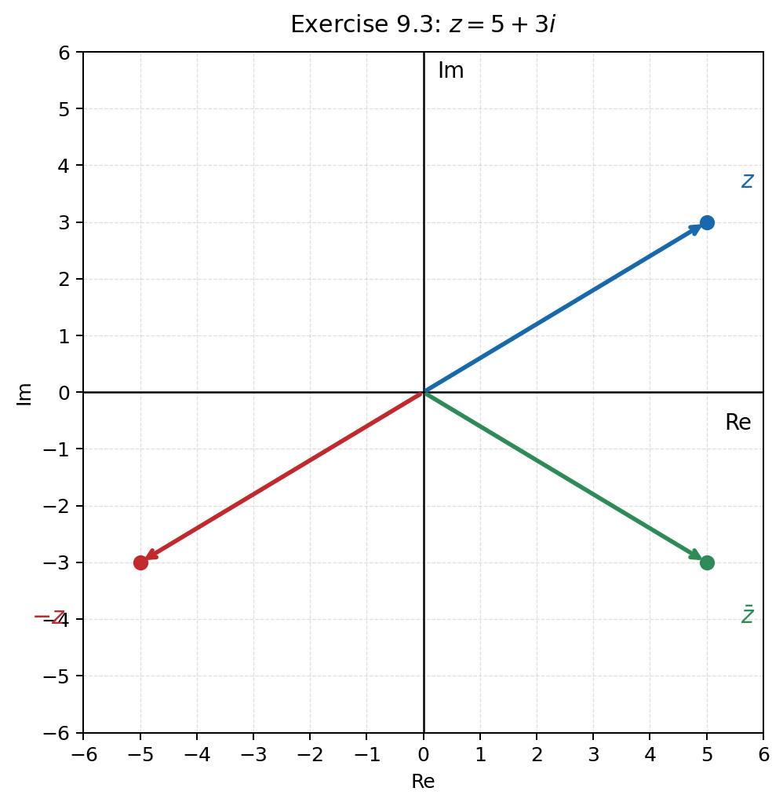

Hence the points are $(5,3)$, $(-5,-3)$, and $(5,-3)$. The modulus is

$$
|z|=\sqrt{5^{2}+3^{2}}=\sqrt{25+9}=\sqrt{34} .
$$


```python title:"Exercise 9.3: Plot of z, -z, and Conjugate"
from pathlib import Path
import matplotlib.pyplot as plt

points = [
    ("$z$", 5, 3, "#1768ac", 0.32, 0.22),
    ("$-z$", -5, -3, "#c1292e", -1.55, -0.42),
    (r"$\bar{z}$", 5, -3, "#2e8b57", 0.32, -0.42),
]

fig, ax = plt.subplots(figsize=(6.2, 6.2), dpi=180)
ax.set_xlim(-7, 7)
ax.set_ylim(-5, 5)
ax.set_aspect("equal", adjustable="box")
ax.axhline(0, color="black", linewidth=1)
ax.axvline(0, color="black", linewidth=1)
ax.grid(True, linestyle="--", linewidth=0.5, alpha=0.35)
ax.set_xlabel("Re")
ax.set_ylabel("Im")
ax.set_title(r"Exercise 9.3: $z=5+3i$")

for label, x, y, color, dx, dy in points:
    ax.annotate("", xy=(x, y), xytext=(0, 0), arrowprops=dict(arrowstyle="->", lw=2.2, color=color))
    ax.scatter([x], [y], s=42, color=color, zorder=3)
    ax.text(x + dx, y + dy, label, color=color, fontsize=12)

fig.tight_layout()
output = Path("images/exercise9-problem3.png")
fig.savefig(output, bbox_inches="tight")
plt.show()

```

```mathematica title:"Exercise 9.3: Plot of z, -z, and Conjugate"
points = {
  {HoldForm[z], {5, 3}, RGBColor[0.090, 0.408, 0.675], {0.32, 0.22}},
  {HoldForm[-z], {-5, -3}, RGBColor[0.757, 0.161, 0.180], {-0.95, -0.42}},
  {Conjugate[z], {5, -3}, RGBColor[0.180, 0.545, 0.341], {0.55, -0.42}}
};

Graphics[
 {
  Table[{pt[[3]], Thick, Arrow[{{0, 0}, pt[[2]]}]}, {pt, points}],
  Table[{pt[[3]], PointSize[0.016], Point[pt[[2]]]}, {pt, points}],
  Table[
   Text[Style[TraditionalForm[pt[[1]]], 14, pt[[3]]], pt[[2]] + pt[[4]]],
   {pt, points}
  ]
 },
 Axes -> True,
 AxesOrigin -> {0, 0},
 GridLines -> Automatic,
 GridLinesStyle -> Directive[GrayLevel[0.8], Dashed],
 PlotRange -> {{-7, 7}, {-5, 5}},
 PlotRangePadding -> Scaled[0.06],
 AspectRatio -> 1,
 AxesLabel -> (Style[#, 14] & /@ {"Re", "Im"}),
 ImageSize -> 380
]
```

##### problem 4

First simplify $i^{7}$:

$$
i^{7}=i^{4} i^{3}=1 \cdot(-i)=-i .
$$

Therefore

$$
z=-i, \qquad -z=i, \qquad \bar{z}=i .
$$

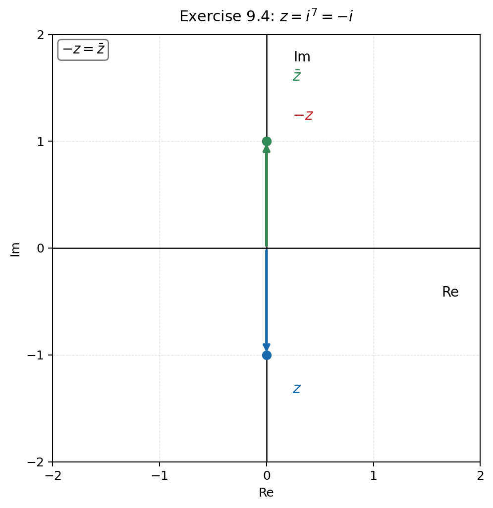

In this case, $-z$ and $\bar{z}$ are the same point. The modulus is

$$
|z|=|-i|=1 .
$$


```python title:"Exercise 9.4: Plot of z, -z, and Conjugate"
from pathlib import Path
import matplotlib.pyplot as plt

points = [
    ("$z$", 0, -1, "#1768ac", 0.18, -0.22),
    ("$-z$", 0, 1, "#c1292e", 0.18, 0.18),
    (r"$\bar{z}$", 0, 1, "#2e8b57", 0.18, 0.40),
]

fig, ax = plt.subplots(figsize=(5.8, 5.8), dpi=180)
ax.set_xlim(-2, 2)
ax.set_ylim(-2, 2)
ax.set_aspect("equal", adjustable="box")
ax.axhline(0, color="black", linewidth=1)
ax.axvline(0, color="black", linewidth=1)
ax.grid(True, linestyle="--", linewidth=0.5, alpha=0.35)
ax.set_xlabel("Re")
ax.set_ylabel("Im")
ax.set_title(r"Exercise 9.4: $z=i^7=-i$")

for label, x, y, color, dx, dy in points:
    ax.annotate("", xy=(x, y), xytext=(0, 0), arrowprops=dict(arrowstyle="->", lw=2.2, color=color))
    ax.scatter([x], [y], s=42, color=color, zorder=3)
    ax.text(x + dx, y + dy, label, color=color, fontsize=12)

fig.tight_layout()
output = Path("images/exercise9-problem4.png")
fig.savefig(output, bbox_inches="tight")
plt.show()

```

```mathematica title:"Exercise 9.4: Plot of z, -z, and Conjugate"
points = {
  {HoldForm[z], {0, -1}, RGBColor[0.090, 0.408, 0.675], {0.18, -0.22}},
  {HoldForm[-z], {0, 1}, RGBColor[0.757, 0.161, 0.180], {0.18, 0.18}},
  {Conjugate[z], {0, 1}, RGBColor[0.180, 0.545, 0.341], {0.38, 0.42}}
};

Graphics[
 {
  Table[{pt[[3]], Thick, Arrow[{{0, 0}, pt[[2]]}]}, {pt, points}],
  Table[{pt[[3]], PointSize[0.018], Point[pt[[2]]]}, {pt, points}],
  Table[
   Text[Style[TraditionalForm[pt[[1]]], 14, pt[[3]]], pt[[2]] + pt[[4]]],
   {pt, points}
  ]
 },
 Axes -> True,
 AxesOrigin -> {0, 0},
 GridLines -> Automatic,
 GridLinesStyle -> Directive[GrayLevel[0.8], Dashed],
 PlotRange -> {{-2, 2}, {-2, 2}},
 PlotRangePadding -> Scaled[0.08],
 AspectRatio -> 1,
 AxesLabel -> (Style[#, 14] & /@ {"Re", "Im"}),
 ImageSize -> 360
]
```

##### problem 5

Since

$$
z=\overline{1-i}=1+i,
$$

we have

$$
z=1+i, \qquad -z=-1-i, \qquad \bar{z}=1-i .
$$

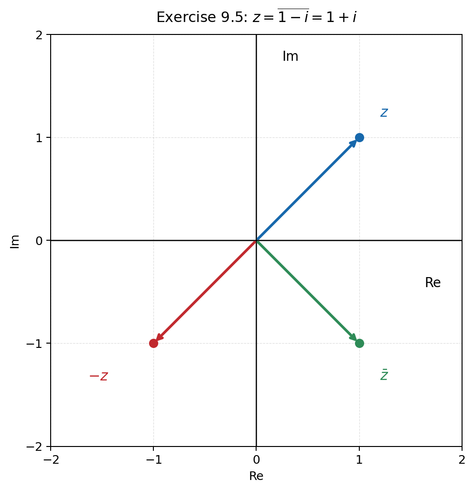

Thus the points are $(1,1)$, $(-1,-1)$, and $(1,-1)$. The modulus is

$$
|z|=\sqrt{1^{2}+1^{2}}=\sqrt{2} .
$$


```python title:"Exercise 9.5: Plot of z, -z, and Conjugate"
from pathlib import Path
import matplotlib.pyplot as plt

points = [
    ("$z$", 1, 1, "#1768ac", 0.20, 0.20),
    ("$-z$", -1, -1, "#c1292e", -0.62, -0.22),
    (r"$\bar{z}$", 1, -1, "#2e8b57", 0.20, -0.22),
]

fig, ax = plt.subplots(figsize=(5.8, 5.8), dpi=180)
ax.set_xlim(-2, 2)
ax.set_ylim(-2, 2)
ax.set_aspect("equal", adjustable="box")
ax.axhline(0, color="black", linewidth=1)
ax.axvline(0, color="black", linewidth=1)
ax.grid(True, linestyle="--", linewidth=0.5, alpha=0.35)
ax.set_xlabel("Re")
ax.set_ylabel("Im")
ax.set_title(r"Exercise 9.5: $z=\overline{1-i}=1+i$")

for label, x, y, color, dx, dy in points:
    ax.annotate("", xy=(x, y), xytext=(0, 0), arrowprops=dict(arrowstyle="->", lw=2.2, color=color))
    ax.scatter([x], [y], s=42, color=color, zorder=3)
    ax.text(x + dx, y + dy, label, color=color, fontsize=12)

fig.tight_layout()
output = Path("images/exercise9-problem5.png")
fig.savefig(output, bbox_inches="tight")
plt.show()

```

```mathematica title:"Exercise 9.5: Plot of z, -z, and Conjugate"
points = {
  {HoldForm[z], {1, 1}, RGBColor[0.090, 0.408, 0.675], {0.20, 0.20}},
  {HoldForm[-z], {-1, -1}, RGBColor[0.757, 0.161, 0.180], {-0.40, -0.22}},
  {Conjugate[z], {1, -1}, RGBColor[0.180, 0.545, 0.341], {0.36, -0.22}}
};

Graphics[
 {
  Table[{pt[[3]], Thick, Arrow[{{0, 0}, pt[[2]]}]}, {pt, points}],
  Table[{pt[[3]], PointSize[0.018], Point[pt[[2]]]}, {pt, points}],
  Table[
   Text[Style[TraditionalForm[pt[[1]]], 14, pt[[3]]], pt[[2]] + pt[[4]]],
   {pt, points}
  ]
 },
 Axes -> True,
 AxesOrigin -> {0, 0},
 GridLines -> Automatic,
 GridLinesStyle -> Directive[GrayLevel[0.8], Dashed],
 PlotRange -> {{-2, 2}, {-2, 2}},
 PlotRangePadding -> Scaled[0.08],
 AspectRatio -> 1,
 AxesLabel -> (Style[#, 14] & /@ {"Re", "Im"}),
 ImageSize -> 360
]
```

##### problem 6

First expand $(1+i)^{2}$:

$$
(1+i)^{2}=1+2i+i^{2}=2i .
$$

So

$$
z=2i, \qquad -z=-2i, \qquad \bar{z}=-2i .
$$

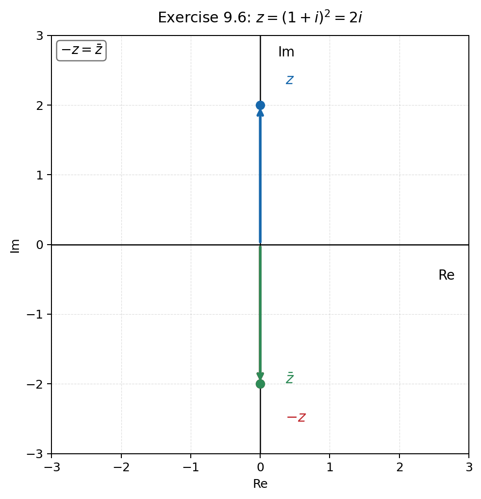

Here again $-z$ and $\bar{z}$ coincide. The modulus is

$$
|z|=|2i|=2 .
$$


```python title:"Exercise 9.6: Plot of z, -z, and Conjugate"
from pathlib import Path
import matplotlib.pyplot as plt

points = [
    ("$z$", 0, 2, "#1768ac", 0.18, 0.12),
    ("$-z$", 0, -2, "#c1292e", 0.18, -0.22),
    (r"$\bar{z}$", 0, -2, "#2e8b57", 0.18, -0.46),
]

fig, ax = plt.subplots(figsize=(5.8, 5.8), dpi=180)
ax.set_xlim(-2, 2)
ax.set_ylim(-3, 3)
ax.set_aspect("equal", adjustable="box")
ax.axhline(0, color="black", linewidth=1)
ax.axvline(0, color="black", linewidth=1)
ax.grid(True, linestyle="--", linewidth=0.5, alpha=0.35)
ax.set_xlabel("Re")
ax.set_ylabel("Im")
ax.set_title(r"Exercise 9.6: $z=(1+i)^2=2i$")

for label, x, y, color, dx, dy in points:
    ax.annotate("", xy=(x, y), xytext=(0, 0), arrowprops=dict(arrowstyle="->", lw=2.2, color=color))
    ax.scatter([x], [y], s=42, color=color, zorder=3)
    ax.text(x + dx, y + dy, label, color=color, fontsize=12)

fig.tight_layout()
output = Path("images/exercise9-problem6.png")
fig.savefig(output, bbox_inches="tight")
plt.show()

```

```mathematica title:"Exercise 9.6: Plot of z, -z, and Conjugate"
points = {
  {HoldForm[z], {0, 2}, RGBColor[0.090, 0.408, 0.675], {0.18, 0.12}},
  {HoldForm[-z], {0, -2}, RGBColor[0.757, 0.161, 0.180], {0.18, -0.22}},
  {Conjugate[z], {0, -2}, RGBColor[0.180, 0.545, 0.341], {0.40, -0.46}}
};

Graphics[
 {
  Table[{pt[[3]], Thick, Arrow[{{0, 0}, pt[[2]]}]}, {pt, points}],
  Table[{pt[[3]], PointSize[0.018], Point[pt[[2]]]}, {pt, points}],
  Table[
   Text[Style[TraditionalForm[pt[[1]]], 14, pt[[3]]], pt[[2]] + pt[[4]]],
   {pt, points}
  ]
 },
 Axes -> True,
 AxesOrigin -> {0, 0},
 GridLines -> Automatic,
 GridLinesStyle -> Directive[GrayLevel[0.8], Dashed],
 PlotRange -> {{-2, 2}, {-3, 3}},
 PlotRangePadding -> Scaled[0.08],
 AspectRatio -> 1,
 AxesLabel -> (Style[#, 14] & /@ {"Re", "Im"}),
 ImageSize -> 360
]
```


> [!exercise] Exercise 10
> 7. Let
> 
> $$
> z_{1}=i, z_{2}=\frac{\sqrt{2}}{2}+i \frac{\sqrt{2}}{2}, z_{3}=\frac{\sqrt{2}}{2}-i \frac{\sqrt{2}}{2}, z_{4}=\frac{1}{2}+i \frac{3}{2} .
> $$
> 
> (a) Plot $z_{2}, z_{3}$, and $z_{2}+z_{3}$ on the same complex plane. Explain in words how you constructed $z_{2}+z_{3}$.
> (b) Plot the points $z_{1}, z_{2}, z_{3}, z_{4}$, compute their moduli, and decide which point or points are closest to the origin.
> (c) Find graphically $z_{1}-z_{2}, z_{2}-z_{3}$, and $z_{3}-z_{4}$.
> (d) Which one of the points $z_{2}$ or $z_{4}$ is closer to $z_{1}$ ?


##### problem 10a

We first compute the sum:

$$
\begin{aligned}
z_{2}+z_{3} & =\left(\frac{\sqrt{2}}{2}+i \frac{\sqrt{2}}{2}\right)+\left(\frac{\sqrt{2}}{2}-i \frac{\sqrt{2}}{2}\right) \\
& =\left(\frac{\sqrt{2}}{2}+\frac{\sqrt{2}}{2}\right)+i\left(\frac{\sqrt{2}}{2}-\frac{\sqrt{2}}{2}\right)=\sqrt{2} .
\end{aligned}
$$

Thus the three points are

$$
z_{2}=\left(\frac{\sqrt{2}}{2}, \frac{\sqrt{2}}{2}\right), \qquad z_{3}=\left(\frac{\sqrt{2}}{2},-\frac{\sqrt{2}}{2}\right), \qquad z_{2}+z_{3}=(\sqrt{2}, 0) .
$$

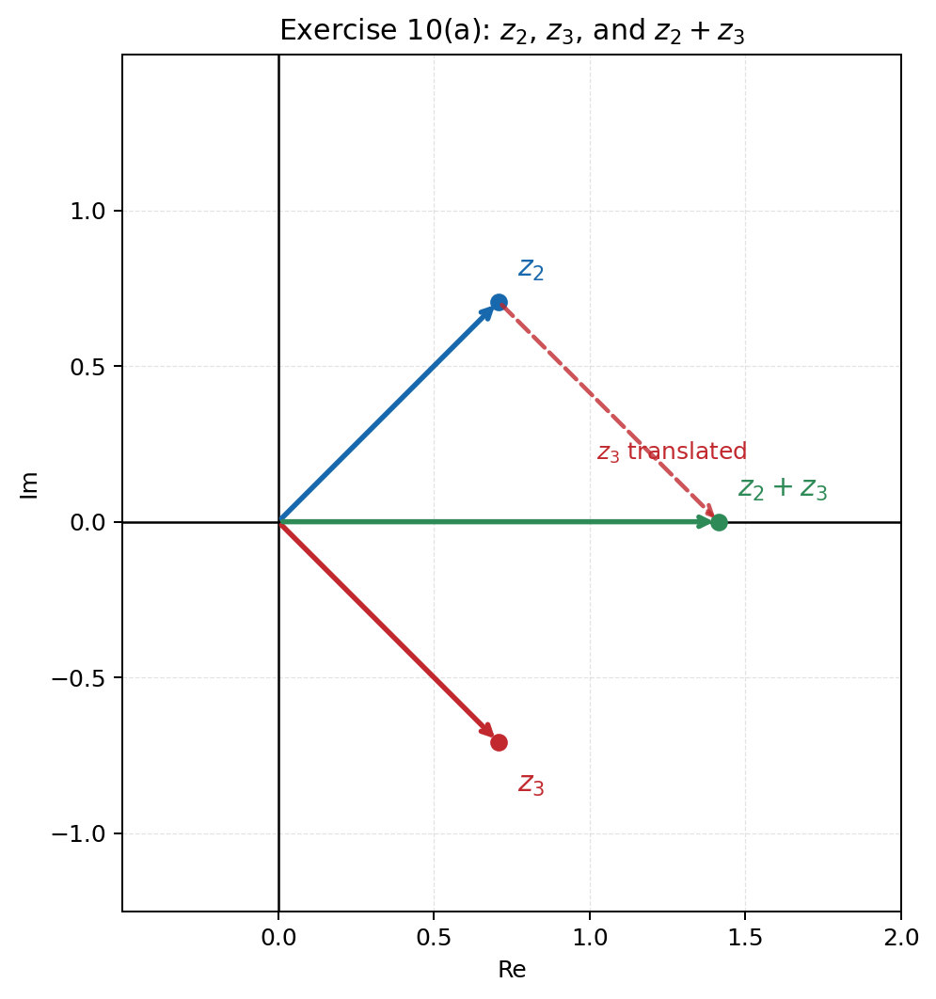

To construct $z_{2}+z_{3}$ graphically, draw the vectors for $z_{2}$ and $z_{3}$ from the origin, then slide the vector $z_{3}$ parallel to itself until its tail is at the head of $z_{2}$. The head of the translated vector lands at $(\sqrt{2}, 0)$, so the resultant vector from the origin is $z_{2}+z_{3}$. Since the imaginary parts cancel, the sum lies on the real axis.

```python title:"Exercise 10(a): Graphical Sum z2 + z3"
from pathlib import Path
import math
import matplotlib.pyplot as plt

sqrt2 = math.sqrt(2)
z2 = (sqrt2 / 2, sqrt2 / 2)
z3 = (sqrt2 / 2, -sqrt2 / 2)
z2_plus_z3 = (sqrt2, 0)

fig, ax = plt.subplots(figsize=(6.2, 6.0), dpi=180)
ax.set_xlim(-0.5, 2.0)
ax.set_ylim(-1.25, 1.5)
ax.set_aspect("equal", adjustable="box")
ax.axhline(0, color="black", lw=1)
ax.axvline(0, color="black", lw=1)
ax.grid(True, linestyle="--", linewidth=0.5, alpha=0.35)
ax.set_xticks([0, 0.5, 1.0, 1.5, 2.0])
ax.set_yticks([-1.0, -0.5, 0, 0.5, 1.0])
ax.set_xlabel("Re")
ax.set_ylabel("Im")
ax.set_title(r"Exercise 10(a): $z_2$, $z_3$, and $z_2+z_3$")

for point, color, label, dx, dy in [
    (z2, "#1768ac", r"$z_2$", 0.06, 0.10),
    (z3, "#c1292e", r"$z_3$", 0.06, -0.18),
    (z2_plus_z3, "#2e8b57", r"$z_2+z_3$", 0.08, 0.08),
]:
    ax.annotate("", xy=point, xytext=(0, 0), arrowprops=dict(arrowstyle="->", lw=2.2, color=color))
    ax.scatter([point[0]], [point[1]], s=42, color=color, zorder=3)
    ax.text(point[0] + dx, point[1] + dy, label, color=color, fontsize=12)

ax.annotate(
    "",
    xy=z2_plus_z3,
    xytext=z2,
    arrowprops=dict(arrowstyle="->", lw=1.8, color="#c1292e", linestyle="--", alpha=0.8),
)
ax.text(1.02, 0.20, r"$z_3$ translated", color="#c1292e", fontsize=10)

fig.tight_layout()
output = Path("images/exercise10-problema.png")
fig.savefig(output, bbox_inches="tight")
plt.show()
```

```mathematica title:"Exercise 10(a): Graphical Sum z2 + z3"
sqrt2 = N[Sqrt[2]];
z2 = {sqrt2/2, sqrt2/2};
z3 = {sqrt2/2, -sqrt2/2};
z2Plusz3 = {sqrt2, 0};

Graphics[
 {
  {RGBColor[0.090, 0.408, 0.675], Thick, Arrow[{{0, 0}, z2}]},
  {RGBColor[0.757, 0.161, 0.180], Thick, Arrow[{{0, 0}, z3}]},
  {RGBColor[0.180, 0.545, 0.341], Thick, Arrow[{{0, 0}, z2Plusz3}]},
  {Directive[RGBColor[0.757, 0.161, 0.180], Dashed, Opacity[0.8]], 
   Arrow[{z2, z2Plusz3}]},
  {RGBColor[0.090, 0.408, 0.675], PointSize[0.018], Point[z2]},
  {RGBColor[0.757, 0.161, 0.180], PointSize[0.018], Point[z3]},
  {RGBColor[0.180, 0.545, 0.341], PointSize[0.018], Point[z2Plusz3]},
  Text[Style[TraditionalForm[Subscript[z, 2]], 14, RGBColor[0.090, 0.408, 0.675]], z2 + {0.08, 0.10}],
  Text[Style[TraditionalForm[Subscript[z, 3]], 14, RGBColor[0.757, 0.161, 0.180]], z3 + {0.08, -0.16}],
  Text[Style[TraditionalForm[Subscript[z, 2] + Subscript[z, 3]], 14, RGBColor[0.180, 0.545, 0.341]], z2Plusz3 + {0.12, 0.10}],
  Text[Style["translated z3", 11, RGBColor[0.757, 0.161, 0.180]], {1.28, 0.22}]
 },
 Axes -> True,
 AxesOrigin -> {0, 0},
 GridLines -> {Range[0, 2, 0.5], Range[-1, 1, 0.5]},
 GridLinesStyle -> Directive[GrayLevel[0.8], Dashed],
 PlotRange -> {{-0.5, 2.0}, {-1.25, 1.5}},
 PlotRangePadding -> Scaled[0.06],
 AspectRatio -> 1,
 AxesLabel -> (Style[#, 14] & /@ {"Re", "Im"}),
 ImageSize -> 380
]
```

##### problem 10b

The moduli are

$$
|z_{1}|=|i|=1,
$$

$$
\left|z_{2}\right|=\sqrt{\left(\frac{\sqrt{2}}{2}\right)^{2}+\left(\frac{\sqrt{2}}{2}\right)^{2}}=1,
$$

$$
\left|z_{3}\right|=\sqrt{\left(\frac{\sqrt{2}}{2}\right)^{2}+\left(-\frac{\sqrt{2}}{2}\right)^{2}}=1,
$$

and

$$
\left|z_{4}\right|=\sqrt{\left(\frac{1}{2}\right)^{2}+\left(\frac{3}{2}\right)^{2}}=\sqrt{\frac{1}{4}+\frac{9}{4}}=\frac{\sqrt{10}}{2} .
$$

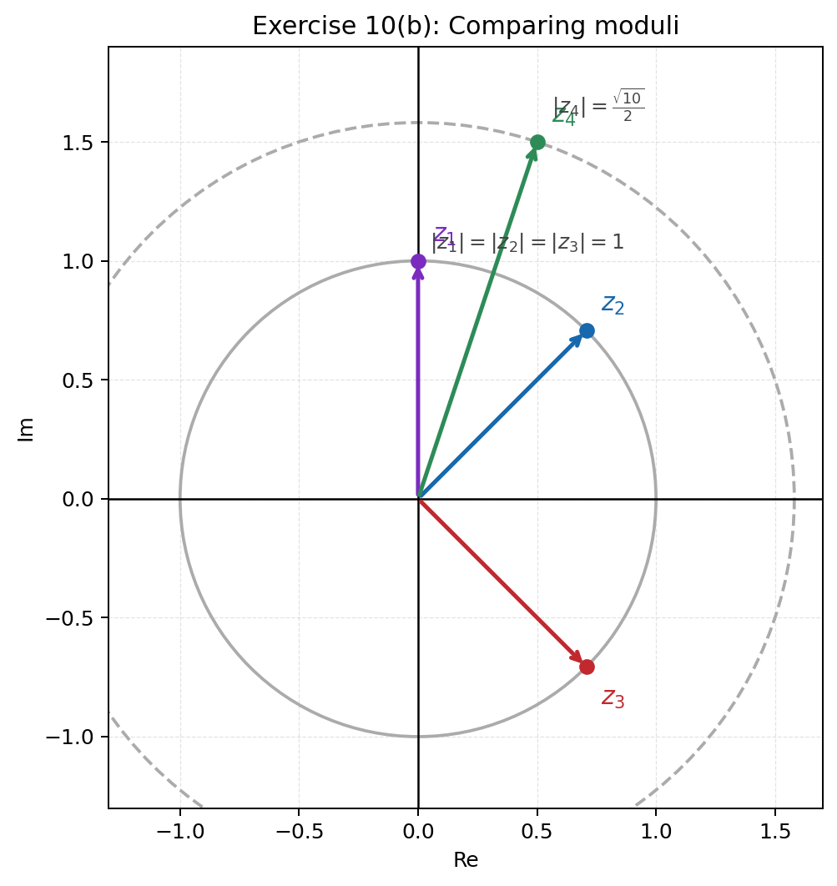

Therefore $z_{1}$, $z_{2}$, and $z_{3}$ are all at distance $1$ from the origin, while $z_{4}$ is farther away. The points closest to the origin are $z_{1}$, $z_{2}$, and $z_{3}$.

```python title:"Exercise 10(b): Moduli Comparison Plot"
from pathlib import Path
import math
import matplotlib.pyplot as plt
from matplotlib.patches import Circle

sqrt2 = math.sqrt(2)
z1 = (0, 1)
z2 = (sqrt2 / 2, sqrt2 / 2)
z3 = (sqrt2 / 2, -sqrt2 / 2)
z4 = (0.5, 1.5)

fig, ax = plt.subplots(figsize=(6.2, 6.0), dpi=180)
ax.set_xlim(-1.3, 1.7)
ax.set_ylim(-1.3, 1.9)
ax.set_aspect("equal", adjustable="box")
ax.axhline(0, color="black", lw=1)
ax.axvline(0, color="black", lw=1)
ax.grid(True, linestyle="--", linewidth=0.5, alpha=0.35)
ax.set_xlabel("Re")
ax.set_ylabel("Im")
ax.set_title(r"Exercise 10(b): Comparing moduli")

for radius, style in [(1, "-"), (math.sqrt(10) / 2, "--")]:
    ax.add_patch(Circle((0, 0), radius, fill=False, linestyle=style, lw=1.5, color="#666666", alpha=0.55))

for point, color, label, dx, dy in [
    (z1, "#7b2cbf", r"$z_1$", 0.06, 0.08),
    (z2, "#1768ac", r"$z_2$", 0.06, 0.08),
    (z3, "#c1292e", r"$z_3$", 0.06, -0.16),
    (z4, "#2e8b57", r"$z_4$", 0.06, 0.08),
]:
    ax.annotate("", xy=point, xytext=(0, 0), arrowprops=dict(arrowstyle="->", lw=2.0, color=color))
    ax.scatter([point[0]], [point[1]], s=42, color=color, zorder=3)
    ax.text(point[0] + dx, point[1] + dy, label, color=color, fontsize=12)

ax.text(0.05, 1.05, r"$|z_1|=|z_2|=|z_3|=1$", fontsize=10, color="#444444")
ax.text(0.56, 1.62, r"$|z_4|=\frac{\sqrt{10}}{2}$", fontsize=10, color="#444444")

fig.tight_layout()
output = Path("images/exercise10-problemb.png")
fig.savefig(output, bbox_inches="tight")
plt.show()
```

```mathematica title:"Exercise 10(b): Moduli Comparison Plot"
sqrt2 = N[Sqrt[2]];
z1 = {0, 1};
z2 = {sqrt2/2, sqrt2/2};
z3 = {sqrt2/2, -sqrt2/2};
z4 = {1/2, 3/2};

Graphics[
 {
  {Directive[GrayLevel[0.4], Opacity[0.6]], Circle[{0, 0}, 1]},
  {Directive[GrayLevel[0.4], Dashed, Opacity[0.6]], Circle[{0, 0}, N[Sqrt[10]/2]]},
  Table[{col, Thick, Arrow[{{0, 0}, pt}], PointSize[0.018], Point[pt],
    Text[Style[TraditionalForm[lbl], 14, col], pt + off]},
   { {pt, col, lbl, off},
    {
     {z1, RGBColor[0.482, 0.173, 0.749], Subscript[z, 1], {0.08, 0.10}},
     {z2, RGBColor[0.090, 0.408, 0.675], Subscript[z, 2], {0.08, 0.10}},
     {z3, RGBColor[0.757, 0.161, 0.180], Subscript[z, 3], {0.08, -0.16}},
     {z4, RGBColor[0.180, 0.545, 0.341], Subscript[z, 4], {0.08, 0.10}}
    }}
  ],
  Text[Style[TraditionalForm[Abs[Subscript[z, 1]] == Abs[Subscript[z, 2]] == Abs[Subscript[z, 3]] == 1], 11, GrayLevel[0.25]], {0.55, 1.08}],
  Text[Style[TraditionalForm[Abs[Subscript[z, 4]] == Sqrt[10]/2], 11, GrayLevel[0.25]], {0.95, 1.62}]
 },
 Axes -> True,
 AxesOrigin -> {0, 0},
 GridLines -> Automatic,
 GridLinesStyle -> Directive[GrayLevel[0.8], Dashed],
 PlotRange -> {{-1.3, 1.7}, {-1.3, 1.9}},
 PlotRangePadding -> Scaled[0.06],
 AspectRatio -> 1,
 AxesLabel -> (Style[#, 14] & /@ {"Re", "Im"}),
 ImageSize -> 380
]
```

##### problem 10c

Reading each difference as the vector from the head of the second point to the head of the first point, we obtain

$$
\begin{aligned}
z_{1}-z_{2} & =i-\left(\frac{\sqrt{2}}{2}+i \frac{\sqrt{2}}{2}\right) \\
& =-\frac{\sqrt{2}}{2}+i\left(1-\frac{\sqrt{2}}{2}\right),
\end{aligned}
$$

$$
\begin{aligned}
z_{2}-z_{3} & =\left(\frac{\sqrt{2}}{2}+i \frac{\sqrt{2}}{2}\right)-\left(\frac{\sqrt{2}}{2}-i \frac{\sqrt{2}}{2}\right) \\
& =i \sqrt{2},
\end{aligned}
$$

and

$$
\begin{aligned}
z_{3}-z_{4} & =\left(\frac{\sqrt{2}}{2}-i \frac{\sqrt{2}}{2}\right)-\left(\frac{1}{2}+i \frac{3}{2}\right) \\
& =\left(\frac{\sqrt{2}-1}{2}\right)-i\left(\frac{\sqrt{2}+3}{2}\right) .
\end{aligned}
$$

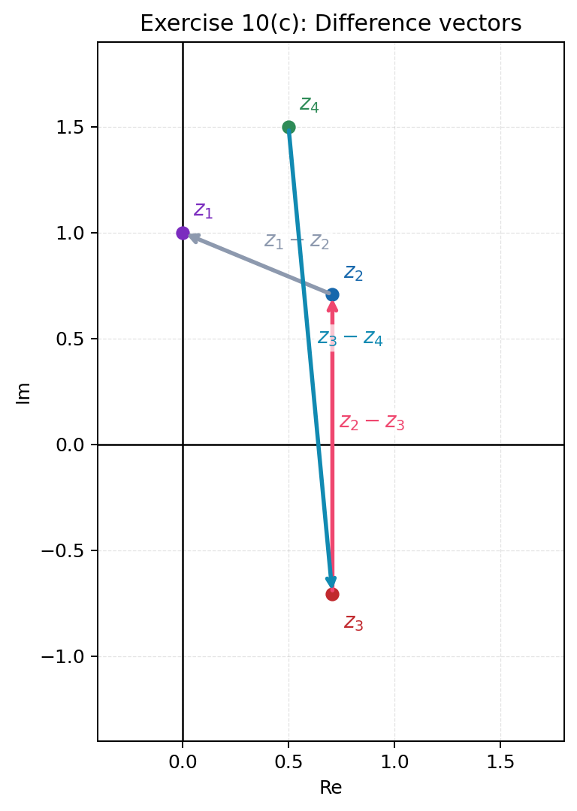

So graphically, $z_{1}-z_{2}$ is the arrow from $z_{2}$ to $z_{1}$, $z_{2}-z_{3}$ is the arrow from $z_{3}$ to $z_{2}$, and $z_{3}-z_{4}$ is the arrow from $z_{4}$ to $z_{3}$.

```python title:"Exercise 10(c): Difference Vectors Plot"
from pathlib import Path
import math
import matplotlib.pyplot as plt

sqrt2 = math.sqrt(2)
z1 = (0, 1)
z2 = (sqrt2 / 2, sqrt2 / 2)
z3 = (sqrt2 / 2, -sqrt2 / 2)
z4 = (0.5, 1.5)

fig, ax = plt.subplots(figsize=(6.4, 6.1), dpi=180)
ax.set_xlim(-0.4, 1.8)
ax.set_ylim(-1.4, 1.9)
ax.set_aspect("equal", adjustable="box")
ax.axhline(0, color="black", lw=1)
ax.axvline(0, color="black", lw=1)
ax.grid(True, linestyle="--", linewidth=0.5, alpha=0.35)
ax.set_xlabel("Re")
ax.set_ylabel("Im")
ax.set_title(r"Exercise 10(c): Difference vectors")

for point, color, label, dx, dy in [
    (z1, "#7b2cbf", r"$z_1$", 0.05, 0.08),
    (z2, "#1768ac", r"$z_2$", 0.05, 0.08),
    (z3, "#c1292e", r"$z_3$", 0.05, -0.16),
    (z4, "#2e8b57", r"$z_4$", 0.05, 0.08),
]:
    ax.scatter([point[0]], [point[1]], s=40, color=color, zorder=3)
    ax.text(point[0] + dx, point[1] + dy, label, color=color, fontsize=11)

for start, end, color, label in [
    (z2, z1, "#8d99ae", r"$z_1-z_2$"),
    (z3, z2, "#ef476f", r"$z_2-z_3$"),
    (z4, z3, "#118ab2", r"$z_3-z_4$"),
]:
    ax.annotate("", xy=end, xytext=start, arrowprops=dict(arrowstyle="->", lw=2.2, color=color))
    mx = (start[0] + end[0]) / 2
    my = (start[1] + end[1]) / 2
    ax.text(
        mx + 0.03,
        my + 0.08,
        label,
        color=color,
        fontsize=11,
        bbox=dict(boxstyle="round,pad=0.15", facecolor="white", edgecolor="none", alpha=0.7),
    )

fig.tight_layout()
output = Path("images/exercise10-problemc.png")
fig.savefig(output, bbox_inches="tight")
plt.show()
```

```mathematica title:"Exercise 10(c): Difference Vectors Plot"
sqrt2 = N[Sqrt[2]];
z1 = {0, 1};
z2 = {sqrt2/2, sqrt2/2};
z3 = {sqrt2/2, -sqrt2/2};
z4 = {1/2, 3/2};

Graphics[
 {
  Table[{col, PointSize[0.018], Point[pt],
    Text[Style[TraditionalForm[lbl], 13, col], pt + off]},
   { {pt, col, lbl, off},
    {
     {z1, RGBColor[0.482, 0.173, 0.749], Subscript[z, 1], {0.05, 0.08}},
     {z2, RGBColor[0.090, 0.408, 0.675], Subscript[z, 2], {0.05, 0.08}},
     {z3, RGBColor[0.757, 0.161, 0.180], Subscript[z, 3], {0.05, -0.16}},
     {z4, RGBColor[0.180, 0.545, 0.341], Subscript[z, 4], {0.05, 0.08}}
    }}
  ],
  {RGBColor[0.553, 0.600, 0.682], Thick, Arrow[{z2, z1}]},
  {RGBColor[0.937, 0.278, 0.435], Thick, Arrow[{z3, z2}]},
  {RGBColor[0.067, 0.541, 0.698], Thick, Arrow[{z4, z3}]},
  Text[Style[TraditionalForm[Subscript[z, 1] - Subscript[z, 2]], 12, RGBColor[0.553, 0.600, 0.682], Background -> White], Mean[{z2, z1}] + {0.03, 0.08}],
  Text[Style[TraditionalForm[Subscript[z, 2] - Subscript[z, 3]], 12, RGBColor[0.937, 0.278, 0.435], Background -> White], Mean[{z3, z2}] + {0.03, 0.08}],
  Text[Style[TraditionalForm[Subscript[z, 3] - Subscript[z, 4]], 12, RGBColor[0.067, 0.541, 0.698], Background -> White], Mean[{z4, z3}] + {0.03, 0.08}]
 },
 Axes -> True,
 AxesOrigin -> {0, 0},
 GridLines -> Automatic,
 GridLinesStyle -> Directive[GrayLevel[0.8], Dashed],
 PlotRange -> {{-0.4, 1.8}, {-1.4, 1.9}},
 PlotRangePadding -> Scaled[0.06],
 AspectRatio -> 1,
 AxesLabel -> (Style[#, 14] & /@ {"Re", "Im"}),
 ImageSize -> 390
]
```

##### problem 10d

To decide which point is closer to $z_{1}$, compare the two distances

$$
\left|z_{2}-z_{1}\right|=\left|\frac{\sqrt{2}}{2}+i \frac{\sqrt{2}}{2}-i\right|=\left|\frac{\sqrt{2}}{2}+i\left(\frac{\sqrt{2}}{2}-1\right)\right|
$$

and

$$
\left|z_{4}-z_{1}\right|=\left|\frac{1}{2}+i \frac{3}{2}-i\right|=\left|\frac{1}{2}+i \frac{1}{2}\right| .
$$

Now compute:

$$
\left|z_{2}-z_{1}\right|=\sqrt{\left(\frac{\sqrt{2}}{2}\right)^{2}+\left(\frac{\sqrt{2}}{2}-1\right)^{2}}=\sqrt{2-\sqrt{2}},
$$

$$
\left|z_{4}-z_{1}\right|=\sqrt{\left(\frac{1}{2}\right)^{2}+\left(\frac{1}{2}\right)^{2}}=\frac{1}{\sqrt{2}} .
$$

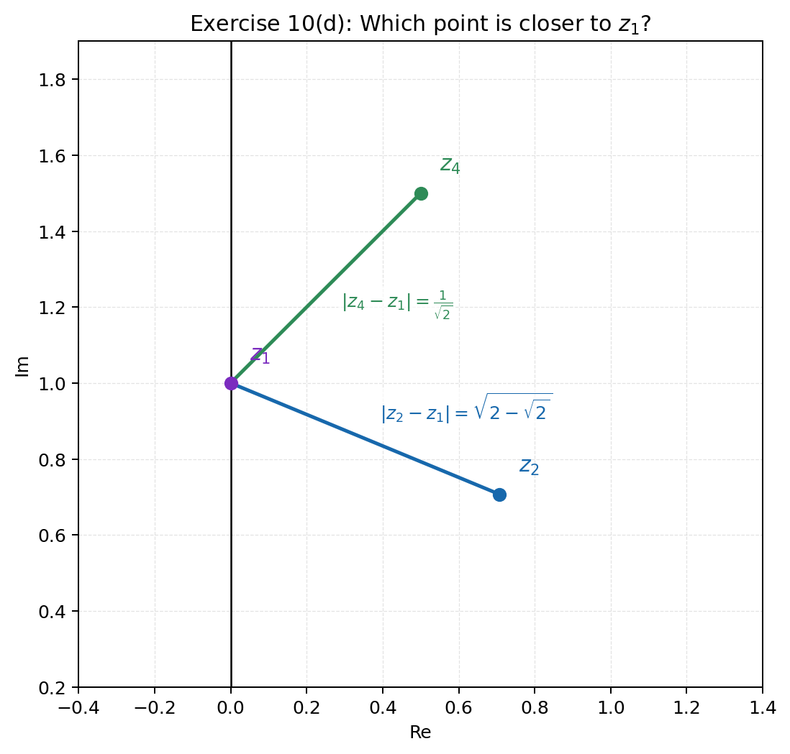

Since

$$
2-\sqrt{2}\approx 0.586>0.5=\frac{1}{2},
$$

we have

$$
\sqrt{2-\sqrt{2}}>\frac{1}{\sqrt{2}} .
$$

Hence $z_{4}$ is closer to $z_{1}$ than $z_{2}$ is.

```python title:"Exercise 10(d): Distance Comparison Plot"
from pathlib import Path
import math
import matplotlib.pyplot as plt

sqrt2 = math.sqrt(2)
z1 = (0, 1)
z2 = (sqrt2 / 2, sqrt2 / 2)
z4 = (0.5, 1.5)

fig, ax = plt.subplots(figsize=(6.2, 6.0), dpi=180)
ax.set_xlim(-0.4, 1.4)
ax.set_ylim(0.2, 1.9)
ax.set_aspect("equal", adjustable="box")
ax.axhline(0, color="black", lw=1)
ax.axvline(0, color="black", lw=1)
ax.grid(True, linestyle="--", linewidth=0.5, alpha=0.35)
ax.set_xlabel("Re")
ax.set_ylabel("Im")
ax.set_title(r"Exercise 10(d): Which point is closer to $z_1$?")

for point, color, label, dx, dy in [
    (z1, "#7b2cbf", r"$z_1$", 0.05, 0.06),
    (z2, "#1768ac", r"$z_2$", 0.05, 0.06),
    (z4, "#2e8b57", r"$z_4$", 0.05, 0.06),
]:
    ax.scatter([point[0]], [point[1]], s=45, color=color, zorder=3)
    ax.text(point[0] + dx, point[1] + dy, label, color=color, fontsize=12)

for end, color, label, yoff in [
    (z2, "#1768ac", r"$|z_2-z_1|=\sqrt{2-\sqrt{2}}$", 0.05),
    (z4, "#2e8b57", r"$|z_4-z_1|=\frac{1}{\sqrt{2}}$", -0.05),
]:
    ax.plot([z1[0], end[0]], [z1[1], end[1]], color=color, lw=2)
    mx = (z1[0] + end[0]) / 2
    my = (z1[1] + end[1]) / 2
    ax.text(
        mx + 0.04,
        my + yoff,
        label,
        color=color,
        fontsize=10,
        bbox=dict(boxstyle="round,pad=0.15", facecolor="white", edgecolor="none", alpha=0.7),
    )

fig.tight_layout()
output = Path("images/exercise10-problemd.png")
fig.savefig(output, bbox_inches="tight")
plt.show()
```

```mathematica title:"Exercise 10(d): Distance Comparison Plot"
sqrt2 = N[Sqrt[2]];
z1 = {0, 1};
z2 = {sqrt2/2, sqrt2/2};
z4 = {1/2, 3/2};

Graphics[
 {
  Table[{col, PointSize[0.020], Point[pt],
    Text[Style[TraditionalForm[lbl], 14, col], pt + off]},
   { {pt, col, lbl, off},
    {
     {z1, RGBColor[0.482, 0.173, 0.749], Subscript[z, 1], {0.05, 0.06}},
     {z2, RGBColor[0.090, 0.408, 0.675], Subscript[z, 2], {0.05, 0.06}},
     {z4, RGBColor[0.180, 0.545, 0.341], Subscript[z, 4], {0.05, 0.06}}
    }}
  ],
  {RGBColor[0.090, 0.408, 0.675], Thick, Line[{z1, z2}]},
  {RGBColor[0.180, 0.545, 0.341], Thick, Line[{z1, z4}]},
  Text[Style[TraditionalForm[Abs[Subscript[z, 2] - Subscript[z, 1]] == Sqrt[2 - Sqrt[2]]], 11, RGBColor[0.090, 0.408, 0.675], Background -> White], Mean[{z1, z2}] + {0.12, 0.08}],
  Text[Style[TraditionalForm[Abs[Subscript[z, 4] - Subscript[z, 1]] == 1/Sqrt[2]], 11, RGBColor[0.180, 0.545, 0.341], Background -> White], Mean[{z1, z4}] + {0.14, -0.08}]
 },
 Axes -> True,
 AxesOrigin -> {0, 0},
 GridLines -> Automatic,
 GridLinesStyle -> Directive[GrayLevel[0.8], Dashed],
 PlotRange -> {{-0.4, 1.4}, {0.2, 1.9}},
 PlotRangePadding -> Scaled[0.06],
 AspectRatio -> 1,
 AxesLabel -> (Style[#, 14] & /@ {"Re", "Im"}),
 ImageSize -> 380
]
```


> [!exercise] Exercise 11
> 8. Let $z_{1}=i, z_{2}=1+2 i$.
> (a) On the same complex plane, plot $z_{1}, z_{2}, z_{1}+z_{2}, z_{1}-z_{2}, z_{2}-z_{1}$.
> (b) How does vector $z_{1}-z_{2}$ compare with $z_{2}-z_{1}$ ?
> (c) On the same complex plane, plot the vectors $z_{2}$ and $i z_{2}$. How do these vectors compare? Describe in general the vector $i z$ in comparison with vector $z$.
> (d) Describe in general the vector $z / i$ in comparison with $z$.


##### problem 11a

First compute the required sums and differences:

$$
z_{1}=i, \qquad z_{2}=1+2i,
$$

$$
z_{1}+z_{2}=i+(1+2i)=1+3i,
$$

$$
z_{1}-z_{2}=i-(1+2i)=-1-i,
$$

and

$$
z_{2}-z_{1}=(1+2i)-i=1+i .
$$

Thus the five points to plot are

$$
z_{1}=(0,1), \qquad z_{2}=(1,2), \qquad z_{1}+z_{2}=(1,3), \qquad z_{1}-z_{2}=(-1,-1), \qquad z_{2}-z_{1}=(1,1) .
$$

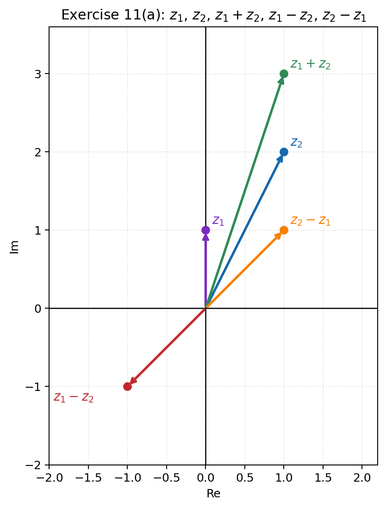

```python title:"Exercise 11(a): Sums and Differences Plot"
from pathlib import Path
import matplotlib.pyplot as plt

z1 = (0, 1)
z2 = (1, 2)
z1_plus_z2 = (1, 3)
z1_minus_z2 = (-1, -1)
z2_minus_z1 = (1, 1)

fig, ax = plt.subplots(figsize=(6.6, 6.2), dpi=180)
ax.set_xlim(-2.0, 2.2)
ax.set_ylim(-2.0, 3.6)
ax.set_aspect("equal", adjustable="box")
ax.axhline(0, color="black", lw=1)
ax.axvline(0, color="black", lw=1)
ax.grid(True, linestyle="--", linewidth=0.5, alpha=0.35)
ax.set_xlabel("Re")
ax.set_ylabel("Im")
ax.set_title(r"Exercise 11(a): $z_1$, $z_2$, $z_1+z_2$, $z_1-z_2$, $z_2-z_1$")

for point, color, label, dx, dy in [
    (z1, "#7b2cbf", r"$z_1$", 0.08, 0.08),
    (z2, "#1768ac", r"$z_2$", 0.08, 0.08),
    (z1_plus_z2, "#2e8b57", r"$z_1+z_2$", 0.08, 0.08),
    (z1_minus_z2, "#c1292e", r"$z_1-z_2$", -0.95, -0.18),
    (z2_minus_z1, "#f77f00", r"$z_2-z_1$", 0.08, 0.08),
]:
    ax.annotate("", xy=point, xytext=(0, 0), arrowprops=dict(arrowstyle="->", lw=2.1, color=color))
    ax.scatter([point[0]], [point[1]], s=42, color=color, zorder=3)
    ax.text(point[0] + dx, point[1] + dy, label, color=color, fontsize=11)

fig.tight_layout()
output = Path("images/exercise11-problema.png")
fig.savefig(output, bbox_inches="tight")
plt.show()
```

```mathematica title:"Exercise 11(a): Sums and Differences Plot"
z1 = {0, 1};
z2 = {1, 2};
z1Plusz2 = {1, 3};
z1Minusz2 = {-1, -1};
z2Minusz1 = {1, 1};

Graphics[
 {
  Table[{col, Thick, Arrow[{{0, 0}, pt}], PointSize[0.018], Point[pt],
    Text[Style[TraditionalForm[lbl], 13, col], pt + off]},
   { {pt, col, lbl, off},
    {
     {z1, RGBColor[0.482, 0.173, 0.749], Subscript[z, 1], {0.08, 0.08}},
     {z2, RGBColor[0.090, 0.408, 0.675], Subscript[z, 2], {0.08, 0.08}},
     {z1Plusz2, RGBColor[0.180, 0.545, 0.341], Subscript[z, 1] + Subscript[z, 2], {0.20, 0.08}},
     {z1Minusz2, RGBColor[0.757, 0.161, 0.180], Subscript[z, 1] - Subscript[z, 2], {-0.55, -0.18}},
     {z2Minusz1, RGBColor[0.969, 0.498, 0.000], Subscript[z, 2] - Subscript[z, 1], {0.18, 0.08}}
    }}
  ]
 },
 Axes -> True,
 AxesOrigin -> {0, 0},
 GridLines -> Automatic,
 GridLinesStyle -> Directive[GrayLevel[0.8], Dashed],
 PlotRange -> {{-2.0, 2.2}, {-2.0, 3.6}},
 PlotRangePadding -> Scaled[0.06],
 AspectRatio -> 1,
 AxesLabel -> (Style[#, 14] & /@ {"Re", "Im"}),
 ImageSize -> 390
]
```

##### problem 11b

The two vectors are negatives of each other:

$$
z_{1}-z_{2}=-1-i,
$$

$$
z_{2}-z_{1}=1+i=-( -1-i)=-(z_{1}-z_{2}) .
$$

Therefore $z_{1}-z_{2}$ and $z_{2}-z_{1}$ have the same length but point in opposite directions. Geometrically, they are reflections of each other through the origin.

##### problem 11c

We compute

$$
i z_{2}=i(1+2i)=i+2i^{2}=i-2=-2+i .
$$

So the two vectors are

$$
z_{2}=(1,2), \qquad i z_{2}=(-2,1) .
$$

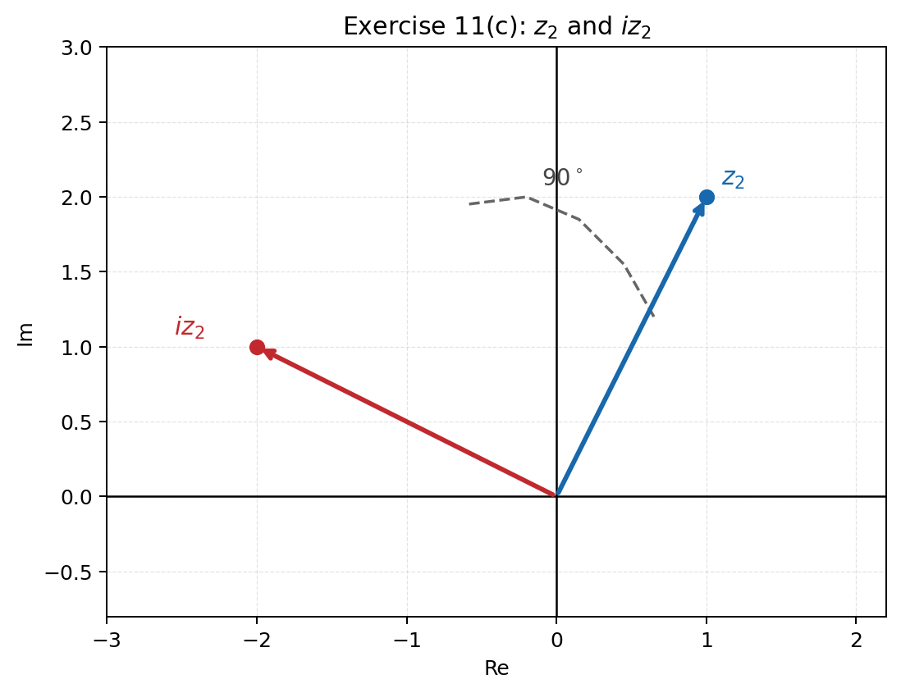

The vector $iz_{2}$ is obtained from $z_{2}$ by rotating it $90^\circ$ counterclockwise about the origin. Its length is unchanged. In general, multiplication by $i$ rotates any complex number $z$ by $90^\circ$ counterclockwise while preserving its modulus.

```python title:"Exercise 11(c): Rotation by i"
from pathlib import Path
import matplotlib.pyplot as plt

z2 = (1, 2)
iz2 = (-2, 1)

fig, ax = plt.subplots(figsize=(6.2, 6.2), dpi=180)
ax.set_xlim(-3.0, 2.2)
ax.set_ylim(-0.8, 3.0)
ax.set_aspect("equal", adjustable="box")
ax.axhline(0, color="black", lw=1)
ax.axvline(0, color="black", lw=1)
ax.grid(True, linestyle="--", linewidth=0.5, alpha=0.35)
ax.set_xlabel("Re")
ax.set_ylabel("Im")
ax.set_title(r"Exercise 11(c): $z_2$ and $iz_2$")

for point, color, label, dx, dy in [
    (z2, "#1768ac", r"$z_2$", 0.10, 0.08),
    (iz2, "#c1292e", r"$iz_2$", -0.55, 0.08),
]:
    ax.annotate("", xy=point, xytext=(0, 0), arrowprops=dict(arrowstyle="->", lw=2.3, color=color))
    ax.scatter([point[0]], [point[1]], s=45, color=color, zorder=3)
    ax.text(point[0] + dx, point[1] + dy, label, color=color, fontsize=12)

arc_x = [0.65, 0.45, 0.15, -0.2, -0.6]
arc_y = [1.2, 1.55, 1.85, 2.0, 1.95]
ax.plot(arc_x, arc_y, color="#666666", lw=1.4, linestyle="--")
ax.text(-0.1, 2.08, r"$90^\circ$", color="#444444", fontsize=11)

fig.tight_layout()
output = Path("images/exercise11-problemc.png")
fig.savefig(output, bbox_inches="tight")
plt.show()
```

```mathematica title:"Exercise 11(c): Rotation by i"
z2 = {1, 2};
iz2 = {-2, 1};
angle1 = ArcTan[1, 2];
angle2 = ArcTan[-2, 1];

Graphics[
 {
  {RGBColor[0.090, 0.408, 0.675], Thick, Arrow[{{0, 0}, z2}], PointSize[0.020], Point[z2]},
  {RGBColor[0.757, 0.161, 0.180], Thick, Arrow[{{0, 0}, iz2}], PointSize[0.020], Point[iz2]},
  {Directive[GrayLevel[0.4], Dashed], Circle[{0, 0}, 1.1, {angle1, angle2}]},
  Text[Style[TraditionalForm[Subscript[z, 2]], 14, RGBColor[0.090, 0.408, 0.675]], z2 + {0.14, 0.08}],
  Text[Style[TraditionalForm[I Subscript[z, 2]], 14, RGBColor[0.757, 0.161, 0.180]], iz2 + {-0.45, 0.08}],
  Text[Style["90°", 12, GrayLevel[0.25], Background -> White], {-0.15, 2.05}]
 },
 Axes -> True,
 AxesOrigin -> {0, 0},
 GridLines -> Automatic,
 GridLinesStyle -> Directive[GrayLevel[0.8], Dashed],
 PlotRange -> {{-3.0, 2.2}, {-0.8, 3.0}},
 PlotRangePadding -> Scaled[0.06],
 AspectRatio -> 1,
 AxesLabel -> (Style[#, 14] & /@ {"Re", "Im"}),
 ImageSize -> 380
]
```

##### problem 11d

Since

$$
\frac{1}{i}=-i,
$$

we have

$$
\frac{z}{i}=-iz .
$$

From part (c), multiplication by $i$ rotates a vector $90^\circ$ counterclockwise. Multiplication by $-i$ therefore rotates a vector $90^\circ$ clockwise, again without changing its length. Hence the vector $\frac{z}{i}$ is the vector $z$ rotated $90^\circ$ clockwise about the origin.


> [!exercise] Exercise 12
> In Exercises 9-14, compute the given modulus.
> 9. $|(1+i)(1-i)(1+3 i)|$.
> 10. $\left|\overline{(2+3 i)^{8}}\right|$.
> 11. $\left|\left(\frac{\sqrt{2}}{2}+i \frac{\sqrt{2}}{2}\right)^{27}\right|$.
> 12. $\left|\frac{1+i}{(1-i)(1+3 i)}\right|$.
> 13. $\left|\frac{i}{\overline{2-i}}\right|$.
> 14. $\left|\frac{(1+i)^{5}}{(-2+2 i)^{5}}\right|$.

##### problem 12.9

$$
\begin{aligned}
|(1+i)(1-i)(1+3i)|
&=|1+i|\,|1-i|\,|1+3i| \\
&=\sqrt{1^{2}+1^{2}}\,\sqrt{1^{2}+(-1)^{2}}\,\sqrt{1^{2}+3^{2}} \\
&=\sqrt{2}\,\sqrt{2}\,\sqrt{10} \\
&=2\sqrt{10}.
\end{aligned}
$$

##### problem 12.10

$$
\begin{aligned}
\left|\overline{(2+3i)^{8}}\right|
&=|(2+3i)^{8}| \\
&=|2+3i|^{8} \\
&=\left(\sqrt{2^{2}+3^{2}}\right)^{8} \\
&=\left(\sqrt{13}\right)^{8} \\
&=\left(\left(\sqrt{13}\right)^{2}\right)^{4} \\
&=13^{4} \\
&=28561.
\end{aligned}
$$

##### problem 12.11

$$
\begin{aligned}
\left|\left(\frac{\sqrt{2}}{2}+i \frac{\sqrt{2}}{2}\right)^{27}\right|
&=\left|\frac{\sqrt{2}}{2}+i \frac{\sqrt{2}}{2}\right|^{27} \\
&=\left(\sqrt{\left(\frac{\sqrt{2}}{2}\right)^{2}+\left(\frac{\sqrt{2}}{2}\right)^{2}}\right)^{27} \\
&=\left(\sqrt{\frac{1}{2}+\frac{1}{2}}\right)^{27} \\
&=1^{27} \\
&=1.
\end{aligned}
$$

##### problem 12.12

$$
\begin{aligned}
\left|\frac{1+i}{(1-i)(1+3i)}\right|
&=\frac{|1+i|}{|(1-i)(1+3i)|} \\
&=\frac{|1+i|}{|1-i|\,|1+3i|} \\
&=\frac{\sqrt{1^{2}+1^{2}}}{\sqrt{1^{2}+(-1)^{2}}\,\sqrt{1^{2}+3^{2}}} \\
&=\frac{\sqrt{2}}{\sqrt{2}\,\sqrt{10}} \\
&=\frac{1}{\sqrt{10}}.
\end{aligned}
$$

##### problem 12.13

$$
\begin{aligned}
\left|\frac{i}{\overline{2-i}}\right|
&=\frac{|i|}{|\overline{2-i}|} \\
&=\frac{|i|}{|2-i|} \\
&=\frac{\sqrt{0^{2}+1^{2}}}{\sqrt{2^{2}+(-1)^{2}}} \\
&=\frac{1}{\sqrt{5}}.
\end{aligned}
$$

##### problem 12.14

$$
\begin{aligned}
\left|\frac{(1+i)^{5}}{(-2+2i)^{5}}\right|
&=\frac{|(1+i)^{5}|}{|(-2+2i)^{5}|} \\
&=\frac{|1+i|^{5}}{|-2+2i|^{5}} \\
&=\left(\frac{|1+i|}{|-2+2i|}\right)^{5} \\
&=\left(\frac{\sqrt{1^{2}+1^{2}}}{\sqrt{(-2)^{2}+2^{2}}}\right)^{5} \\
&=\left(\frac{\sqrt{2}}{\sqrt{8}}\right)^{5} \\
&=\left(\frac{\sqrt{2}}{2\sqrt{2}}\right)^{5} \\
&=\left(\frac{1}{2}\right)^{5} \\
&=\frac{1}{32}.
\end{aligned}
$$


> [!exercise] Exercise 13
> In problems 15-20, describe and plot the set of points satisfying the given equation.
> 15. $|z-4|=3$.
> 16. $|z+2+i|=1$.
> 17. $|z-i|=-1$.
> 18. $|z+1|+|z-1|=4$.
> 19. $|z-i|+|z|=2$.
> 20. $|2 z|+|2 z-1|=4$.

##### problem 13.15

The equation

$$
|z-4|=3
$$

describes all points whose distance from the point $4$ is $3$. Therefore the set is the circle centered at $4$ on the real axis, with radius $3$.

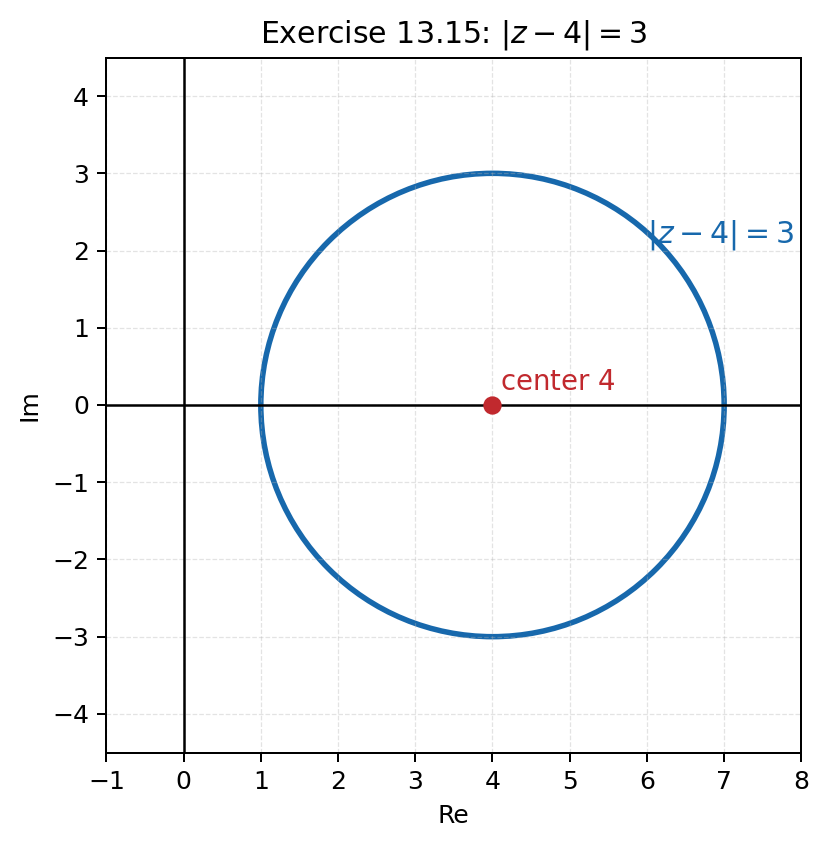

```python title:"Exercise 13.15: Circle Plot"
from pathlib import Path
import matplotlib.pyplot as plt
from matplotlib.patches import Circle

fig, ax = plt.subplots(figsize=(6.2, 4.8), dpi=180)
ax.set_xlim(-1, 8)
ax.set_ylim(-4.5, 4.5)
ax.set_aspect("equal", adjustable="box")
ax.axhline(0, color="black", lw=1)
ax.axvline(0, color="black", lw=1)
ax.grid(True, linestyle="--", linewidth=0.5, alpha=0.35)
ax.add_patch(Circle((4, 0), 3, fill=False, color="#1768ac", lw=2.2))
ax.scatter([4], [0], color="#c1292e", s=40, zorder=3)
ax.text(4.1, 0.2, r"center $4$", color="#c1292e", fontsize=11)
ax.text(6.0, 2.1, r"$|z-4|=3$", color="#1768ac", fontsize=12)
ax.set_xlabel("Re")
ax.set_ylabel("Im")
ax.set_title(r"Exercise 13.15: $|z-4|=3$")

fig.tight_layout()
output = Path("images/exercise13-problem15.png")
fig.savefig(output, bbox_inches="tight")
plt.show()
```

```mathematica title:"Exercise 13.15: Circle Plot"
Graphics[
 {
  {RGBColor[0.090, 0.408, 0.675], Thick, Circle[{4, 0}, 3]},
  {RGBColor[0.757, 0.161, 0.180], PointSize[0.020], Point[{4, 0}]},
  Text[Style["center 4", 12, RGBColor[0.757, 0.161, 0.180]], {4.55, 0.25}],
  Text[Style[TraditionalForm[Abs[z - 4] == 3], 13, RGBColor[0.090, 0.408, 0.675]], {6.0, 2.1}]
 },
 Axes -> True,
 AxesOrigin -> {0, 0},
 GridLines -> Automatic,
 GridLinesStyle -> Directive[GrayLevel[0.8], Dashed],
 PlotRange -> {{-1, 8}, {-4.5, 4.5}},
 PlotRangePadding -> Scaled[0.06],
 AspectRatio -> 1,
 AxesLabel -> (Style[#, 14] & /@ {"Re", "Im"}),
 ImageSize -> 380
]
```

##### problem 13.16

Rewrite the equation as

$$
|z-(-2-i)|=1 .
$$

So the set is the circle centered at $-2-i$, with radius $1$.

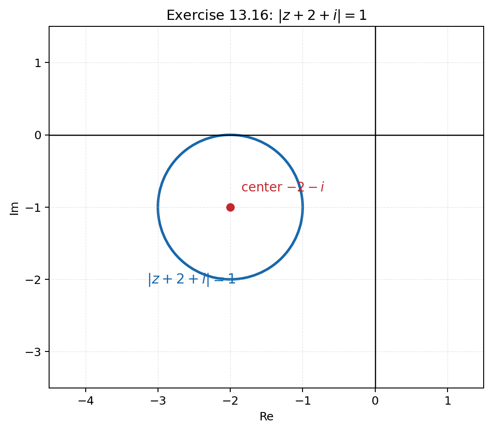

```python title:"Exercise 13.16: Circle Plot"
from pathlib import Path
import matplotlib.pyplot as plt
from matplotlib.patches import Circle

fig, ax = plt.subplots(figsize=(6.0, 5.4), dpi=180)
ax.set_xlim(-4.5, 1.5)
ax.set_ylim(-3.5, 1.5)
ax.set_aspect("equal", adjustable="box")
ax.axhline(0, color="black", lw=1)
ax.axvline(0, color="black", lw=1)
ax.grid(True, linestyle="--", linewidth=0.5, alpha=0.35)
ax.add_patch(Circle((-2, -1), 1, fill=False, color="#1768ac", lw=2.2))
ax.scatter([-2], [-1], color="#c1292e", s=40, zorder=3)
ax.text(-1.85, -0.78, r"center $-2-i$", color="#c1292e", fontsize=11)
ax.text(-3.15, -2.05, r"$|z+2+i|=1$", color="#1768ac", fontsize=12)
ax.set_xlabel("Re")
ax.set_ylabel("Im")
ax.set_title(r"Exercise 13.16: $|z+2+i|=1$")

fig.tight_layout()
output = Path("images/exercise13-problem16.png")
fig.savefig(output, bbox_inches="tight")
plt.show()
```

```mathematica title:"Exercise 13.16: Circle Plot"
Graphics[
 {
  {RGBColor[0.090, 0.408, 0.675], Thick, Circle[{-2, -1}, 1]},
  {RGBColor[0.757, 0.161, 0.180], PointSize[0.020], Point[{-2, -1}]},
  Text[Style["center -2-i", 12, RGBColor[0.757, 0.161, 0.180]], {-1.15, -0.75}],
  Text[Style[TraditionalForm[Abs[z + 2 + I] == 1], 13, RGBColor[0.090, 0.408, 0.675]], {-2.75, -2.05}]
 },
 Axes -> True,
 AxesOrigin -> {0, 0},
 GridLines -> Automatic,
 GridLinesStyle -> Directive[GrayLevel[0.8], Dashed],
 PlotRange -> {{-4.5, 1.5}, {-3.5, 1.5}},
 PlotRangePadding -> Scaled[0.06],
 AspectRatio -> 1,
 AxesLabel -> (Style[#, 14] & /@ {"Re", "Im"}),
 ImageSize -> 380
]
```

##### problem 13.17

Since an absolute value is always nonnegative, we have

$$
|z-i| \geq 0
$$

for every complex number $z$. Hence it is impossible to have

$$
|z-i|=-1 .
$$

Therefore the solution set is empty.

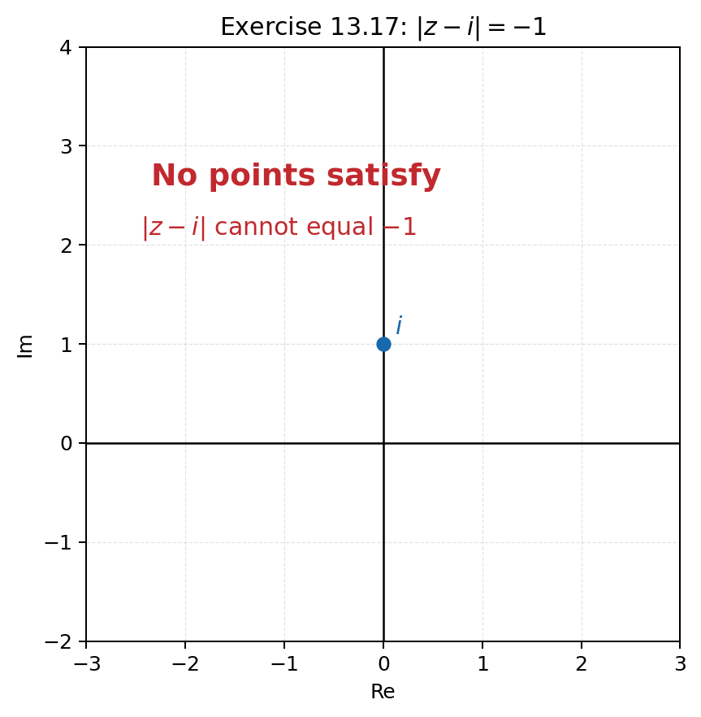

```python title:"Exercise 13.17: Empty-Set Illustration"
from pathlib import Path
import matplotlib.pyplot as plt

fig, ax = plt.subplots(figsize=(6.0, 5.0), dpi=180)
ax.set_xlim(-3, 3)
ax.set_ylim(-2, 4)
ax.set_aspect("equal", adjustable="box")
ax.axhline(0, color="black", lw=1)
ax.axvline(0, color="black", lw=1)
ax.grid(True, linestyle="--", linewidth=0.5, alpha=0.35)
ax.scatter([0], [1], color="#1768ac", s=40, zorder=3)
ax.text(0.12, 1.1, r"$i$", color="#1768ac", fontsize=12)
ax.text(-2.35, 2.6, "No points satisfy", color="#c1292e", fontsize=15, weight="bold")
ax.text(-2.45, 2.1, r"$|z-i|$ cannot equal $-1$", color="#c1292e", fontsize=12)
ax.set_xlabel("Re")
ax.set_ylabel("Im")
ax.set_title(r"Exercise 13.17: $|z-i|=-1$")

fig.tight_layout()
output = Path("images/exercise13-problem17.png")
fig.savefig(output, bbox_inches="tight")
plt.show()
```

```mathematica title:"Exercise 13.17: Empty-Set Illustration"
Graphics[
 {
  {RGBColor[0.090, 0.408, 0.675], PointSize[0.020], Point[{0, 1}]},
  Text[Style[TraditionalForm[I], 14, RGBColor[0.090, 0.408, 0.675]], {0.18, 1.15}],
  Text[Style["No points satisfy", 16, RGBColor[0.757, 0.161, 0.180], Bold], {-0.4, 2.7}],
  Text[Style["|z - i| cannot equal -1", 13, RGBColor[0.757, 0.161, 0.180]], {-0.2, 2.15}]
 },
 Axes -> True,
 AxesOrigin -> {0, 0},
 GridLines -> Automatic,
 GridLinesStyle -> Directive[GrayLevel[0.8], Dashed],
 PlotRange -> {{-3, 3}, {-2, 4}},
 PlotRangePadding -> Scaled[0.06],
 AspectRatio -> 1,
 AxesLabel -> (Style[#, 14] & /@ {"Re", "Im"}),
 ImageSize -> 360
]
```

##### problem 13.18

Write the equation in focus form:

$$
|z-(-1)|+|z-1|=4 .
$$

Thus the sum of the distances from $z$ to the two points $-1$ and $1$ is constant. Therefore the set is an ellipse with foci at $-1$ and $1$. Since the constant sum is $4$, we have $2a=4$, so $a=2$. The center is the origin.

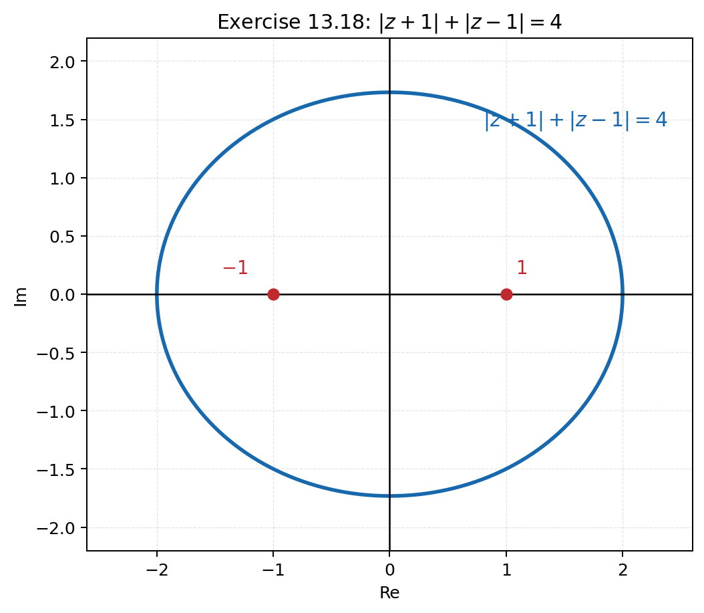

```python title:"Exercise 13.18: Ellipse Plot"
from pathlib import Path
import math
import numpy as np
import matplotlib.pyplot as plt

t = np.linspace(0, 2 * np.pi, 600)
a = 2
b = math.sqrt(3)
x = a * np.cos(t)
y = b * np.sin(t)

fig, ax = plt.subplots(figsize=(6.4, 5.2), dpi=180)
ax.plot(x, y, color="#1768ac", lw=2.2)
ax.scatter([-1, 1], [0, 0], color="#c1292e", s=40, zorder=3)
ax.text(-1.45, 0.18, r"$-1$", color="#c1292e", fontsize=11)
ax.text(1.08, 0.18, r"$1$", color="#c1292e", fontsize=11)
ax.text(0.8, 1.45, r"$|z+1|+|z-1|=4$", color="#1768ac", fontsize=12)
ax.axhline(0, color="black", lw=1)
ax.axvline(0, color="black", lw=1)
ax.grid(True, linestyle="--", linewidth=0.5, alpha=0.35)
ax.set_xlim(-2.6, 2.6)
ax.set_ylim(-2.2, 2.2)
ax.set_aspect("equal", adjustable="box")
ax.set_xlabel("Re")
ax.set_ylabel("Im")
ax.set_title(r"Exercise 13.18: $|z+1|+|z-1|=4$")

fig.tight_layout()
output = Path("images/exercise13-problem18.png")
fig.savefig(output, bbox_inches="tight")
plt.show()
```

```mathematica title:"Exercise 13.18: Ellipse Plot"
a = 2;
b = Sqrt[3];

Graphics[
 {
  {RGBColor[0.090, 0.408, 0.675], Thick, Line[Table[{a Cos[t], b Sin[t]}, {t, 0, 2 Pi, 2 Pi/400}]]},
  {RGBColor[0.757, 0.161, 0.180], PointSize[0.020], Point[{-1, 0}], Point[{1, 0}]},
  Text[Style["-1", 12, RGBColor[0.757, 0.161, 0.180]], {-1.25, 0.18}],
  Text[Style["1", 12, RGBColor[0.757, 0.161, 0.180]], {1.15, 0.18}],
  Text[Style[TraditionalForm[Abs[z + 1] + Abs[z - 1] == 4], 13, RGBColor[0.090, 0.408, 0.675]], {1.0, 1.45}]
 },
 Axes -> True,
 AxesOrigin -> {0, 0},
 GridLines -> Automatic,
 GridLinesStyle -> Directive[GrayLevel[0.8], Dashed],
 PlotRange -> {{-2.6, 2.6}, {-2.2, 2.2}},
 PlotRangePadding -> Scaled[0.06],
 AspectRatio -> 1,
 AxesLabel -> (Style[#, 14] & /@ {"Re", "Im"}),
 ImageSize -> 390
]
```

##### problem 13.19

This equation says

$$
|z-i|+|z-0|=2 .
$$

So the sum of the distances from $z$ to the two points $0$ and $i$ is constant. Hence the set is an ellipse with foci at $0$ and $i$. Since the constant sum is $2$, we have $2a=2$, so $a=1$. The center is the midpoint of the foci, namely $\frac{i}{2}$.

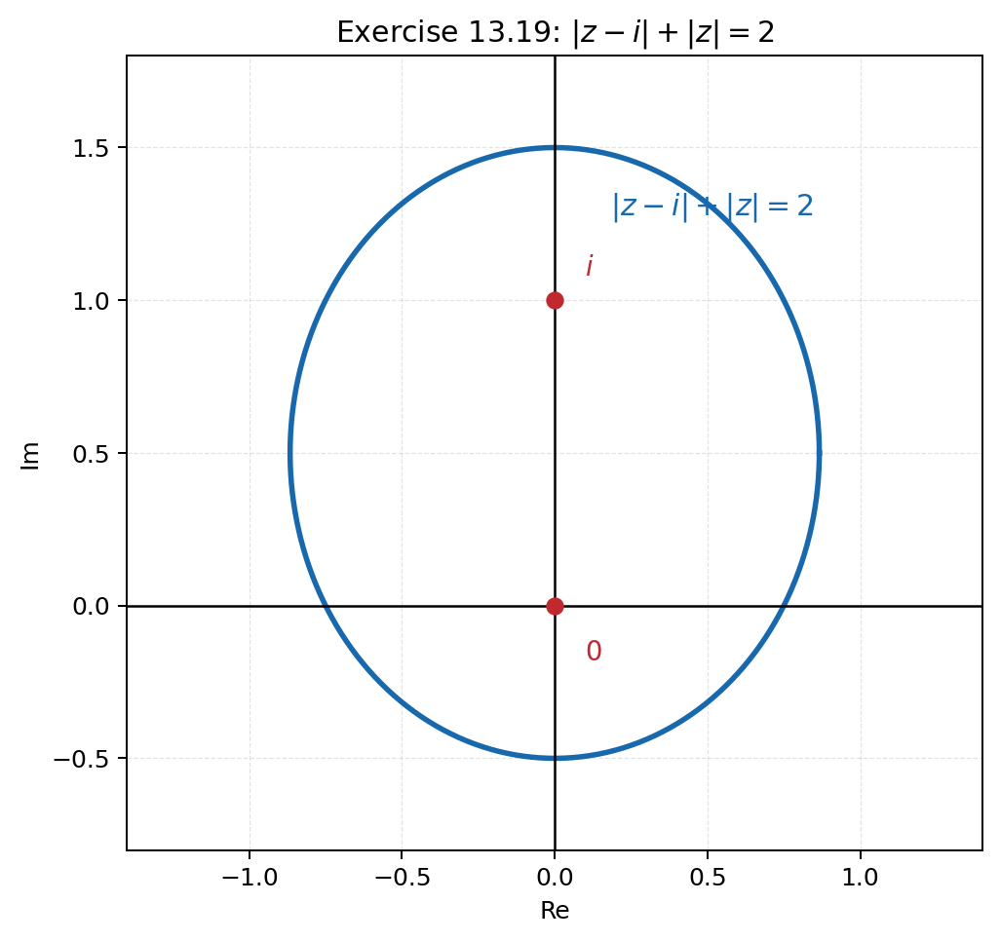

```python title:"Exercise 13.19: Ellipse Plot"
from pathlib import Path
import math
import numpy as np
import matplotlib.pyplot as plt

t = np.linspace(0, 2 * np.pi, 600)
a = 1
b = math.sqrt(3) / 2
x = b * np.cos(t)
y = 0.5 + a * np.sin(t)

fig, ax = plt.subplots(figsize=(5.8, 6.2), dpi=180)
ax.plot(x, y, color="#1768ac", lw=2.2)
ax.scatter([0, 0], [0, 1], color="#c1292e", s=40, zorder=3)
ax.text(0.1, -0.18, r"$0$", color="#c1292e", fontsize=11)
ax.text(0.1, 1.08, r"$i$", color="#c1292e", fontsize=11)
ax.text(0.18, 1.28, r"$|z-i|+|z|=2$", color="#1768ac", fontsize=12)
ax.axhline(0, color="black", lw=1)
ax.axvline(0, color="black", lw=1)
ax.grid(True, linestyle="--", linewidth=0.5, alpha=0.35)
ax.set_xlim(-1.4, 1.4)
ax.set_ylim(-0.8, 1.8)
ax.set_aspect("equal", adjustable="box")
ax.set_xlabel("Re")
ax.set_ylabel("Im")
ax.set_title(r"Exercise 13.19: $|z-i|+|z|=2$")

fig.tight_layout()
output = Path("images/exercise13-problem19.png")
fig.savefig(output, bbox_inches="tight")
plt.show()
```

```mathematica title:"Exercise 13.19: Ellipse Plot"
a = 1;
b = Sqrt[3]/2;

Graphics[
 {
  {RGBColor[0.090, 0.408, 0.675], Thick, Line[Table[{b Cos[t], 1/2 + a Sin[t]}, {t, 0, 2 Pi, 2 Pi/400}]]},
  {RGBColor[0.757, 0.161, 0.180], PointSize[0.020], Point[{0, 0}], Point[{0, 1}]},
  Text[Style["0", 12, RGBColor[0.757, 0.161, 0.180]], {0.12, -0.16}],
  Text[Style[TraditionalForm[I], 12, RGBColor[0.757, 0.161, 0.180]], {0.12, 1.10}],
  Text[Style[TraditionalForm[Abs[z - I] + Abs[z] == 2], 13, RGBColor[0.090, 0.408, 0.675]], {0.45, 1.28}]
 },
 Axes -> True,
 AxesOrigin -> {0, 0},
 GridLines -> Automatic,
 GridLinesStyle -> Directive[GrayLevel[0.8], Dashed],
 PlotRange -> {{-1.4, 1.4}, {-0.8, 1.8}},
 PlotRangePadding -> Scaled[0.06],
 AspectRatio -> 1,
 AxesLabel -> (Style[#, 14] & /@ {"Re", "Im"}),
 ImageSize -> 370
]
```

##### problem 13.20

Derivation Mode:

$$
\begin{aligned}
|2z|+|2z-1|
&=4 \\
2|z|+|2z-1|
&=4 \\
2|z|+|2z-2\cdot \tfrac{1}{2}|
&=4 \\
2|z|+|2(z-\tfrac{1}{2})|
&=4 \\
2|z|+2|z-\tfrac{1}{2}|
&=4 \\
|z|+|z-\tfrac{1}{2}|
&=2 .
\end{aligned}
$$

So the set is an ellipse with foci at $0$ and $\frac{1}{2}$ on the real axis. Since the constant sum is $2$, we have $2a=2$, so $a=1$. The center is the midpoint of the foci, namely $\frac{1}{4}$.

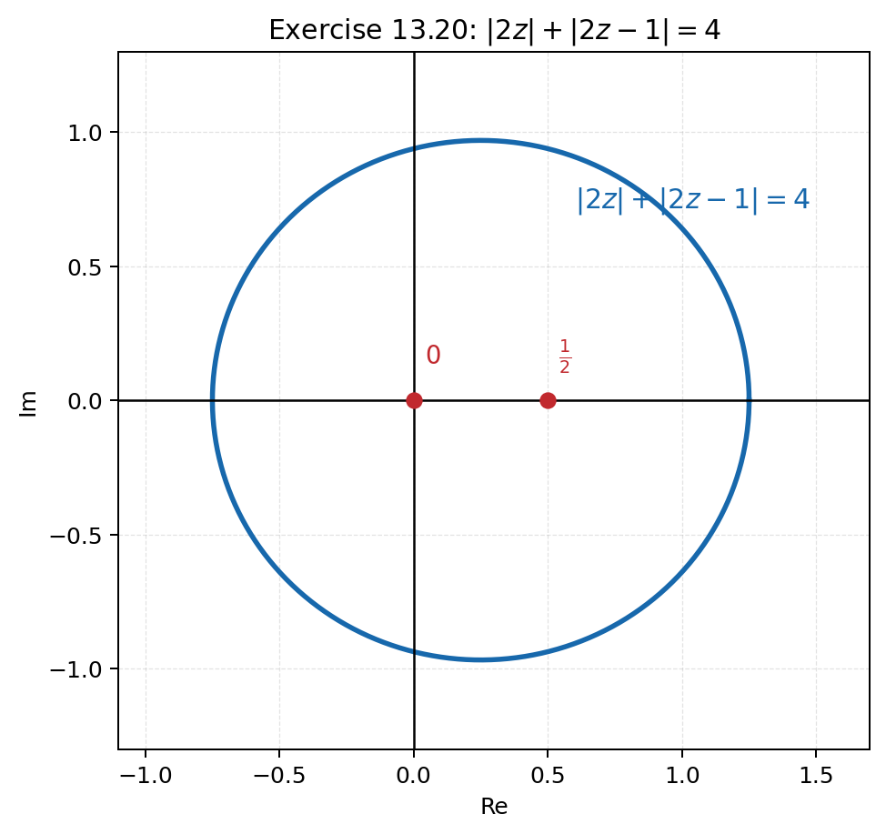

```python title:"Exercise 13.20: Ellipse Plot"
from pathlib import Path
import math
import numpy as np
import matplotlib.pyplot as plt

t = np.linspace(0, 2 * np.pi, 600)
a = 1
b = math.sqrt(15) / 4
x = 0.25 + a * np.cos(t)
y = b * np.sin(t)

fig, ax = plt.subplots(figsize=(6.6, 5.2), dpi=180)
ax.plot(x, y, color="#1768ac", lw=2.2)
ax.scatter([0, 0.5], [0, 0], color="#c1292e", s=40, zorder=3)
ax.text(0.04, 0.14, r"$0$", color="#c1292e", fontsize=11)
ax.text(0.54, 0.14, r"$\frac{1}{2}$", color="#c1292e", fontsize=11)
ax.text(0.6, 0.72, r"$|2z|+|2z-1|=4$", color="#1768ac", fontsize=12)
ax.axhline(0, color="black", lw=1)
ax.axvline(0, color="black", lw=1)
ax.grid(True, linestyle="--", linewidth=0.5, alpha=0.35)
ax.set_xlim(-1.1, 1.7)
ax.set_ylim(-1.3, 1.3)
ax.set_aspect("equal", adjustable="box")
ax.set_xlabel("Re")
ax.set_ylabel("Im")
ax.set_title(r"Exercise 13.20: $|2z|+|2z-1|=4$")

fig.tight_layout()
output = Path("images/exercise13-problem20.png")
fig.savefig(output, bbox_inches="tight")
plt.show()
```

```mathematica title:"Exercise 13.20: Ellipse Plot"
a = 1;
b = Sqrt[15]/4;

Graphics[
 {
  {RGBColor[0.090, 0.408, 0.675], Thick, Line[Table[{1/4 + a Cos[t], b Sin[t]}, {t, 0, 2 Pi, 2 Pi/400}]]},
  {RGBColor[0.757, 0.161, 0.180], PointSize[0.020], Point[{0, 0}], Point[{1/2, 0}]},
  Text[Style["0", 12, RGBColor[0.757, 0.161, 0.180]], {0.05, 0.14}],
  Text[Style[TraditionalForm[1/2], 12, RGBColor[0.757, 0.161, 0.180]], {0.62, 0.14}],
  Text[Style[TraditionalForm[Abs[2 z] + Abs[2 z - 1] == 4], 13, RGBColor[0.090, 0.408, 0.675]], {0.72, 0.72}]
 },
 Axes -> True,
 AxesOrigin -> {0, 0},
 GridLines -> Automatic,
 GridLinesStyle -> Directive[GrayLevel[0.8], Dashed],
 PlotRange -> {{-1.1, 1.7}, {-1.3, 1.3}},
 PlotRangePadding -> Scaled[0.06],
 AspectRatio -> 1,
 AxesLabel -> (Style[#, 14] & /@ {"Re", "Im"}),
 ImageSize -> 390
]
```


> [!exercise] Exercise 14
> 21. Derive the equation of the ellipse in problem 20.
> 22. Derive the equation of the circle in problem 16.


##### problem 14.21

From problem 20, the ellipse is described by

$$
|2z|+|2z-1|=4 .
$$

Derivation Mode:

$$
\begin{aligned}
|2z|+|2z-1|
&=4 \\
2|z|+|2z-1|
&=4 \\
2|z|+|2z-2\cdot \tfrac{1}{2}|
&=4 \\
2|z|+|2(z-\tfrac{1}{2})|
&=4 \\
2|z|+2|z-\tfrac{1}{2}|
&=4 \\
|z|+|z-\tfrac{1}{2}|
&=2 .
\end{aligned}
$$

Now write $z=x+iy$ and center the equation at the midpoint $\frac{1}{4}$ of the foci:

$$
\begin{aligned}
\sqrt{x^{2}+y^{2}}+\sqrt{\left(x-\tfrac{1}{2}\right)^{2}+y^{2}}
&=2 \\
\sqrt{\left(\left(x-\tfrac{1}{4}\right)+\tfrac{1}{4}\right)^{2}+y^{2}}+\sqrt{\left(\left(x-\tfrac{1}{4}\right)-\tfrac{1}{4}\right)^{2}+y^{2}}
&=2 .
\end{aligned}
$$

Let

$$
u=x-\tfrac{1}{4} .
$$

Then

$$
\sqrt{\left(u+\tfrac{1}{4}\right)^{2}+y^{2}}+\sqrt{\left(u-\tfrac{1}{4}\right)^{2}+y^{2}}=2 .
$$

Continue in Derivation Mode:

$$
\begin{aligned}
\sqrt{\left(u+\tfrac{1}{4}\right)^{2}+y^{2}}
&=2-\sqrt{\left(u-\tfrac{1}{4}\right)^{2}+y^{2}} \\
\left(u+\tfrac{1}{4}\right)^{2}+y^{2}
&=4-4\sqrt{\left(u-\tfrac{1}{4}\right)^{2}+y^{2}}+\left(u-\tfrac{1}{4}\right)^{2}+y^{2} \\
u^{2}+\tfrac{u}{2}+\tfrac{1}{16}+y^{2}
&=4-4\sqrt{\left(u-\tfrac{1}{4}\right)^{2}+y^{2}}+u^{2}-\tfrac{u}{2}+\tfrac{1}{16}+y^{2} \\
\tfrac{u}{2}
&=4-4\sqrt{\left(u-\tfrac{1}{4}\right)^{2}+y^{2}}-\tfrac{u}{2} \\
u
&=4-4\sqrt{\left(u-\tfrac{1}{4}\right)^{2}+y^{2}} \\
4\sqrt{\left(u-\tfrac{1}{4}\right)^{2}+y^{2}}
&=4-u \\
\sqrt{\left(u-\tfrac{1}{4}\right)^{2}+y^{2}}
&=1-\tfrac{u}{4} \\
\left(u-\tfrac{1}{4}\right)^{2}+y^{2}
&=\left(1-\tfrac{u}{4}\right)^{2} \\
u^{2}-\tfrac{u}{2}+\tfrac{1}{16}+y^{2}
&=1-\tfrac{u}{2}+\tfrac{u^{2}}{16} \\
16u^{2}-8u+1+16y^{2}
&=16-8u+u^{2} \\
15u^{2}+16y^{2}
&=15 \\
u^{2}+\tfrac{16}{15}y^{2}
&=1 \\
\left(x-\tfrac{1}{4}\right)^{2}+\tfrac{16}{15}y^{2}
&=1 .
\end{aligned}
$$

Therefore the Cartesian equation of the ellipse is

$$
\left(x-\tfrac{1}{4}\right)^{2}+\frac{16}{15}y^{2}=1,
$$

or equivalently

$$
\frac{\left(x-\tfrac{1}{4}\right)^{2}}{1}+\frac{y^{2}}{15/16}=1 .
$$

##### problem 14.22

From problem 16, the circle is described by

$$
|z+2+i|=1 .
$$

Write $z=x+iy$. Then, in Derivation Mode,

$$
\begin{aligned}
|z+2+i|
&=1 \\
|(x+iy)+2+i|
&=1 \\
|(x+2)+i(y+1)|
&=1 \\
\sqrt{(x+2)^{2}+(y+1)^{2}}
&=1 \\
(x+2)^{2}+(y+1)^{2}
&=1 .
\end{aligned}
$$

Therefore the Cartesian equation of the circle is

$$
(x+2)^{2}+(y+1)^{2}=1 .
$$

> [!exercise] Exercise 15
> 23. Lines in the complex plane. (a) Show that the set of points $z$ in the complex plane with $\operatorname{Re} z=a$ ( $a$ real) is the vertical line $x=a$.
> (b) Show that the set of points $z$ in the complex plane with $\operatorname{Im} z=b$ ( $b$ real) is the horizontal line $y=b$.
> (c) Let $z_{1} \neq z_{2}$ be two points in the complex plane. Show that the set of points $z$ such that $z=z_{1}+t\left(z_{2}-z_{1}\right)$, where $t$ is real, is the line going through $z_{1}$ and $z_{2}$. Illustrate your answer graphically by plotting the vectors $z_{1}, z_{1}+z_{2}$, and $z_{1}+t\left(z_{2}-z_{1}\right)$ for several values of $t$.

##### problem 15.23a

Let

$$
z=x+iy .
$$

Then

$$
\operatorname{Re} z=x .
$$

So the condition

$$
\operatorname{Re} z=a
$$

means exactly that

$$
x=a,
$$

while $y$ is arbitrary. Hence the set of all points $z$ satisfying $\operatorname{Re} z=a$ is the vertical line $x=a$.

##### problem 15.23b

Again let

$$
z=x+iy .
$$

Then

$$
\operatorname{Im} z=y .
$$

So the condition

$$
\operatorname{Im} z=b
$$

means exactly that

$$
y=b,
$$

while $x$ is arbitrary. Hence the set of all points $z$ satisfying $\operatorname{Im} z=b$ is the horizontal line $y=b$.

##### problem 15.23c

Write

$$
z_{1}=x_{1}+iy_{1}, \qquad z_{2}=x_{2}+iy_{2} .
$$

Then

$$
z_{2}-z_{1}=(x_{2}-x_{1})+i(y_{2}-y_{1}) .
$$

For real $t$,

$$
\begin{aligned}
z
&=z_{1}+t(z_{2}-z_{1}) \\
&=(x_{1}+iy_{1})+t\bigl((x_{2}-x_{1})+i(y_{2}-y_{1})\bigr) \\
&=\bigl(x_{1}+t(x_{2}-x_{1})\bigr)+i\bigl(y_{1}+t(y_{2}-y_{1})\bigr) .
\end{aligned}
$$

So the coordinates of $z$ are

$$
x=x_{1}+t(x_{2}-x_{1}), \qquad y=y_{1}+t(y_{2}-y_{1}) .
$$

These are precisely the parametric equations of the line through the two points $(x_{1},y_{1})$ and $(x_{2},y_{2})$. Also, when $t=0$ we get $z=z_{1}$, and when $t=1$ we get $z=z_{2}$. As $t$ ranges over all real numbers, the point $z$ runs through the entire line through $z_{1}$ and $z_{2}$.

For illustration, take

$$
z_{1}=1+i, \qquad z_{2}=3+2i .
$$

Then

$$
z_{1}+t(z_{2}-z_{1})=1+i+t(2+i),
$$

which traces the line through $1+i$ and $3+2i$.

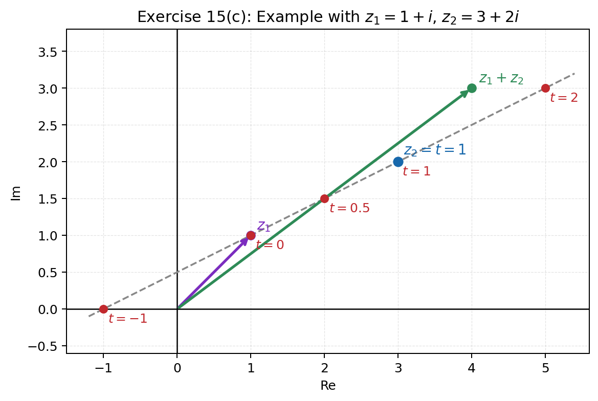

```python title:"Exercise 15.23(c): Line Plot"
from pathlib import Path
import numpy as np
import matplotlib.pyplot as plt

z1 = np.array([1.0, 1.0])
z2 = np.array([3.0, 2.0])
z1_plus_z2 = z1 + z2

t_values = [-1, 0, 0.5, 1, 2]
line_points = [z1 + t * (z2 - z1) for t in t_values]

fig, ax = plt.subplots(figsize=(6.6, 5.6), dpi=180)
ax.set_xlim(-1.5, 5.6)
ax.set_ylim(-0.6, 3.8)
ax.set_aspect("equal", adjustable="box")
ax.axhline(0, color="black", lw=1)
ax.axvline(0, color="black", lw=1)
ax.grid(True, linestyle="--", linewidth=0.5, alpha=0.35)
ax.set_xlabel("Re")
ax.set_ylabel("Im")
ax.set_title(r"Exercise 15(c): Example with $z_1=1+i$, $z_2=3+2i$")

xs = np.linspace(-1.2, 5.4, 200)
ys = 1 + 0.5 * (xs - 1)
ax.plot(xs, ys, linestyle="--", color="#888888", lw=1.4)

for point, color, label, dx, dy in [
    (z1, "#7b2cbf", r"$z_1$", 0.08, 0.08),
    (z1_plus_z2, "#2e8b57", r"$z_1+z_2$", 0.10, 0.08),
]:
    ax.annotate("", xy=point, xytext=(0, 0), arrowprops=dict(arrowstyle="->", lw=2.1, color=color))
    ax.scatter([point[0]], [point[1]], s=42, color=color, zorder=3)
    ax.text(point[0] + dx, point[1] + dy, label, color=color, fontsize=11)

for t, point in zip(t_values, line_points):
    ax.scatter([point[0]], [point[1]], color="#c1292e", s=34, zorder=4)
    ax.text(point[0] + 0.06, point[1] - 0.18, rf"$t={t}$", color="#c1292e", fontsize=10)

ax.scatter([z2[0]], [z2[1]], color="#1768ac", s=50, zorder=5)
ax.text(z2[0] + 0.08, z2[1] + 0.10, r"$z_2=t=1$", color="#1768ac", fontsize=11)

fig.tight_layout()
output = Path("images/exercise15-problem23c.png")
fig.savefig(output, bbox_inches="tight")
plt.show()
```

```mathematica title:"Exercise 15.23(c): Line Plot"
z1 = {1, 1};
z2 = {3, 2};
z1Plusz2 = z1 + z2;
tValues = {-1, 0, 1/2, 1, 2};
linePoints = z1 + # (z2 - z1) & /@ tValues;

Graphics[
 {
  {Directive[GrayLevel[0.55], Dashed], Line[Table[{x, 1 + (x - 1)/2}, {x, -1.2, 5.4, 0.05}]]},
  {RGBColor[0.482, 0.173, 0.749], Thick, Arrow[{{0, 0}, z1}], PointSize[0.018], Point[z1]},
  {RGBColor[0.180, 0.545, 0.341], Thick, Arrow[{{0, 0}, z1Plusz2}], PointSize[0.018], Point[z1Plusz2]},
  Text[Style[TraditionalForm[Subscript[z, 1]], 13, RGBColor[0.482, 0.173, 0.749]], z1 + {0.08, 0.08}],
  Text[Style[TraditionalForm[Subscript[z, 1] + Subscript[z, 2]], 13, RGBColor[0.180, 0.545, 0.341]], z1Plusz2 + {0.14, 0.08}],
  Table[
   {
    RGBColor[0.757, 0.161, 0.180], PointSize[0.016], Point[linePoints[[k]]],
    Text[Style["t = " <> ToString[tValues[[k]], InputForm], 11, RGBColor[0.757, 0.161, 0.180]], linePoints[[k]] + {0.16, -0.18}]
   },
   {k, Length[tValues]}
  ],
  {RGBColor[0.090, 0.408, 0.675], PointSize[0.020], Point[z2]},
  Text[Style[TraditionalForm[Subscript[z, 2]], 13, RGBColor[0.090, 0.408, 0.675]], z2 + {0.10, 0.10}]
 },
 Axes -> True,
 AxesOrigin -> {0, 0},
 GridLines -> Automatic,
 GridLinesStyle -> Directive[GrayLevel[0.8], Dashed],
 PlotRange -> {{-1.5, 5.6}, {-0.6, 3.8}},
 PlotRangePadding -> Scaled[0.06],
 AspectRatio -> 1,
 AxesLabel -> (Style[#, 14] & /@ {"Re", "Im"}),
 ImageSize -> 400
]
```


> [!exercise] Exercise 16
> 24. Show that three distinct points $z_{1}, z_{2}$, and $z_{3}$ lie on the same line if and only if
> 
> $$
> \frac{z_{1}-z_{2}}{z_{1}-z_{3}}=t
> $$
> 
> where $t$ is real. (Compare with problem 23(c).)


]

We prove both directions.

First assume that $z_{1}$, $z_{2}$, and $z_{3}$ lie on the same line, with $z_{1}\neq z_{3}$. By problem 23(c), every point on the line through $z_{1}$ and $z_{3}$ has the form

$$
z=z_{1}+s(z_{3}-z_{1}),
$$

where $s$ is real. Since $z_{2}$ lies on that line, there exists a real number $s$ such that

$$
z_{2}=z_{1}+s(z_{3}-z_{1}) .
$$

Then

$$
\begin{aligned}
z_{1}-z_{2}
&=z_{1}-\bigl(z_{1}+s(z_{3}-z_{1})\bigr) \\
&=-s(z_{3}-z_{1}) \\
&=s(z_{1}-z_{3}) .
\end{aligned}
$$

Since $z_{1}\neq z_{3}$, we may divide by $z_{1}-z_{3}$ and obtain

$$
\frac{z_{1}-z_{2}}{z_{1}-z_{3}}=s .
$$

Because $s$ is real, the quotient is real.

Conversely, assume that

$$
\frac{z_{1}-z_{2}}{z_{1}-z_{3}}=t
$$

for some real number $t$. Then

$$
z_{1}-z_{2}=t(z_{1}-z_{3}) .
$$

Rearranging,

$$
\begin{aligned}
z_{2}
&=z_{1}-t(z_{1}-z_{3}) \\
&=z_{1}+t(z_{3}-z_{1}) .
\end{aligned}
$$

This has the form

$$
z=z_{1}+t(z_{3}-z_{1}),
$$

with $t$ real. By problem 23(c), this means that $z_{2}$ lies on the line through $z_{1}$ and $z_{3}$. Hence $z_{1}$, $z_{2}$, and $z_{3}$ are collinear.

Therefore,

$$
z_{1}, z_{2}, z_{3} \text{ lie on the same line } \Longleftrightarrow \frac{z_{1}-z_{2}}{z_{1}-z_{3}} \text{ is real.}
$$

> [!exercise] Exercise 17
> 25. Parabolas. Recall from geometry that a parabola is the set of points in the plane that are equidistant from a fixed line (called the directrix) and a fixed point not on the line (called the focus).
> (a) Using this description and the geometric interpretation of the absolute value, argue that the set of points $z$ satisfying
> 
> $$
> |z-1-i|=\operatorname{Re}(z)+1
> $$
> 
> is a parabola. Find its directrix and its focus and then plot it.
> (b) More generally, describe the set of points $z$ such that
> 
> $$
> \left|z-z_{0}\right|=\operatorname{Re}(z)-a,
> $$
> 
> where $a$ is a real number.


##### problem 17.25a

Let

$$
z=x+iy .
$$

Then

$$
|z-1-i|=\sqrt{(x-1)^{2}+(y-1)^{2}}
$$

and

$$
\operatorname{Re}(z)+1=x+1 .
$$

So the equation

$$
|z-1-i|=\operatorname{Re}(z)+1
$$

becomes

$$
\sqrt{(x-1)^{2}+(y-1)^{2}}=x+1 .
$$

Now $x+1$ is the distance from the point $(x,y)$ to the vertical line $x=-1$, provided $x\ge -1$. Thus the equation says that the distance from $(x,y)$ to the point $(1,1)$ equals the distance from $(x,y)$ to the line $x=-1$.

Therefore the set is a parabola with focus

$$
1+i
$$

and directrix

$$
x=-1 .
$$

To find its Cartesian equation, use Derivation Mode:

$$
\begin{aligned}
\sqrt{(x-1)^{2}+(y-1)^{2}}
&=x+1 \\
(x-1)^{2}+(y-1)^{2}
&=(x+1)^{2} \\
x^{2}-2x+1+y^{2}-2y+1
&=x^{2}+2x+1 \\
y^{2}-2y+1
&=4x \\
(y-1)^{2}
&=4x .
\end{aligned}
$$

So the parabola has equation

$$
(y-1)^{2}=4x,
$$

with vertex at $(0,1)$.

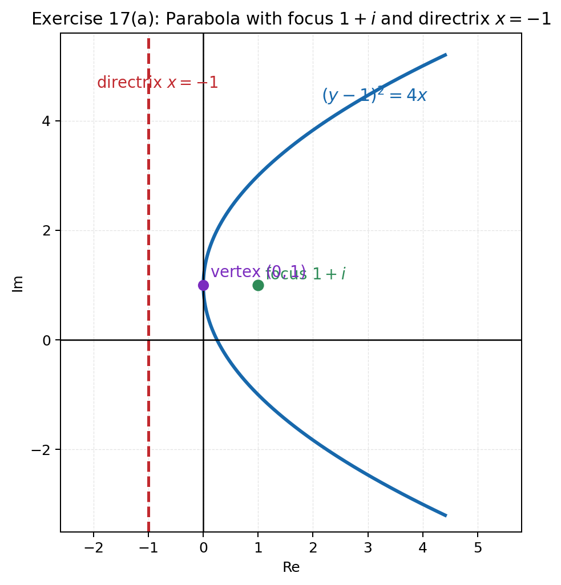

```python title:"Exercise 17.25(a): Parabola Plot"
from pathlib import Path
import numpy as np
import matplotlib.pyplot as plt

ys = np.linspace(-3.2, 5.2, 600)
xs = (ys - 1) ** 2 / 4

fig, ax = plt.subplots(figsize=(6.8, 5.8), dpi=180)
ax.plot(xs, ys, color="#1768ac", lw=2.4)
ax.axvline(-1, color="#c1292e", lw=2, linestyle="--")
ax.scatter([1], [1], color="#2e8b57", s=50, zorder=4)
ax.scatter([0], [1], color="#7b2cbf", s=45, zorder=4)
ax.text(1.12, 1.1, r"focus $1+i$", color="#2e8b57", fontsize=11)
ax.text(-1.95, 4.6, r"directrix $x=-1$", color="#c1292e", fontsize=11)
ax.text(0.12, 1.15, r"vertex $(0,1)$", color="#7b2cbf", fontsize=11)
ax.text(2.15, 4.35, r"$(y-1)^2=4x$", color="#1768ac", fontsize=12)
ax.axhline(0, color="black", lw=1)
ax.axvline(0, color="black", lw=1)
ax.grid(True, linestyle="--", linewidth=0.5, alpha=0.35)
ax.set_xlim(-2.6, 5.8)
ax.set_ylim(-3.5, 5.6)
ax.set_aspect("equal", adjustable="box")
ax.set_xlabel("Re")
ax.set_ylabel("Im")
ax.set_title(r"Exercise 17(a): Parabola with focus $1+i$ and directrix $x=-1$")

fig.tight_layout()
output = Path("images/exercise17-problema.png")
fig.savefig(output, bbox_inches="tight")
plt.show()
```

```mathematica title:"Exercise 17.25(a): Parabola Plot"
curve = Table[{(y - 1)^2/4, y}, {y, -3.2, 5.2, 0.03}];

Graphics[
 {
  {RGBColor[0.090, 0.408, 0.675], Thick, Line[curve]},
  {Directive[RGBColor[0.757, 0.161, 0.180], Dashed, Thick], Line[{{-1, -3.5}, {-1, 5.6}}]},
  {RGBColor[0.180, 0.545, 0.341], PointSize[0.020], Point[{1, 1}]},
  {RGBColor[0.482, 0.173, 0.749], PointSize[0.020], Point[{0, 1}]},
  Text[Style["focus 1 + i", 12, RGBColor[0.180, 0.545, 0.341]], {1.8, 1.15}],
  Text[Style["directrix x = -1", 12, RGBColor[0.757, 0.161, 0.180]], {-1.55, 4.6}],
  Text[Style["vertex (0, 1)", 12, RGBColor[0.482, 0.173, 0.749]], {0.95, 1.15}],
  Text[Style["(y - 1)^2 = 4 x", 13, RGBColor[0.090, 0.408, 0.675]], {3.4, 4.35}]
 },
 Axes -> True,
 AxesOrigin -> {0, 0},
 GridLines -> Automatic,
 GridLinesStyle -> Directive[GrayLevel[0.8], Dashed],
 PlotRange -> {{-2.6, 5.8}, {-3.5, 5.6}},
 PlotRangePadding -> Scaled[0.06],
 AspectRatio -> 1,
 AxesLabel -> (Style[#, 14] & /@ {"Re", "Im"}),
 ImageSize -> 400
]
```

##### problem 17.25b

Write

$$
z=x+iy, \qquad z_{0}=x_{0}+iy_{0} .
$$

Then

$$
\left|z-z_{0}\right|=\sqrt{(x-x_{0})^{2}+(y-y_{0})^{2}}
$$

and

$$
\operatorname{Re}(z)-a=x-a .
$$

So the equation

$$
\left|z-z_{0}\right|=\operatorname{Re}(z)-a
$$

becomes

$$
\sqrt{(x-x_{0})^{2}+(y-y_{0})^{2}}=x-a .
$$

The right-hand side is the distance from $(x,y)$ to the vertical line $x=a$, provided $x\ge a$. Hence, when $x_{0}>a$, the set is the parabola with focus

$$
z_{0}
$$

and directrix

$$
x=a .
$$

Its Cartesian equation follows from Derivation Mode:

$$
\begin{aligned}
\sqrt{(x-x_{0})^{2}+(y-y_{0})^{2}}
&=x-a \\
(x-x_{0})^{2}+(y-y_{0})^{2}
&=(x-a)^{2} \\
x^{2}-2x_{0}x+x_{0}^{2}+(y-y_{0})^{2}
&=x^{2}-2ax+a^{2} \\
2(x_{0}-a)x
&=(y-y_{0})^{2}+x_{0}^{2}-a^{2} \\
2(x_{0}-a)x
&=(y-y_{0})^{2}+(x_{0}-a)(x_{0}+a) \\
x
&=\frac{(y-y_{0})^{2}}{2(x_{0}-a)}+\frac{x_{0}+a}{2} .
\end{aligned}
$$

Thus, for $x_{0}>a$, the parabola opens to the right, has vertex

$$
\left(\frac{x_{0}+a}{2},\,y_{0}\right),
$$

focus $z_{0}$, and directrix $x=a$.

If $x_{0}=a$, the equation reduces to

$$
\sqrt{(x-a)^{2}+(y-y_{0})^{2}}=x-a,
$$

which forces

$$
y=y_{0}, \qquad x\ge a,
$$

so the set degenerates to a ray. If $x_{0}<a$, there are no solutions, because the squared equation gives only points with $x<a$, while the original equation requires $x\ge a$.

> [!exercise] Exercise 18
> 26. (a) With the help of problem 25, describe the set of points $z$ such that
> 
> $$
> |z-i|=\operatorname{Im}(z)+2 .
> $$
> 
> (b) More generally, describe the set of points $z$ such that
> 
> $$
> \left|z-z_{0}\right|=\operatorname{Im}(z)-a,
> $$
> 
> where $a$ is a real number.


##### problem 18.26a

Let

$$
z=x+iy .
$$

Then

$$
|z-i|=\sqrt{x^{2}+(y-1)^{2}}
$$

and

$$
\operatorname{Im}(z)+2=y+2 .
$$

So the equation

$$
|z-i|=\operatorname{Im}(z)+2
$$

becomes

$$
\sqrt{x^{2}+(y-1)^{2}}=y+2 .
$$

Now $y+2$ is the distance from the point $(x,y)$ to the horizontal line $y=-2$, provided $y\ge -2$. Thus the set is the parabola with focus

$$
i
$$

and directrix

$$
y=-2 .
$$

To find its Cartesian equation, use Derivation Mode:

$$
\begin{aligned}
\sqrt{x^{2}+(y-1)^{2}}
&=y+2 \\
x^{2}+(y-1)^{2}
&=(y+2)^{2} \\
x^{2}+y^{2}-2y+1
&=y^{2}+4y+4 \\
x^{2}-6y-3
&=0 \\
x^{2}
&=6y+3 \\
x^{2}
&=6\left(y+\tfrac{1}{2}\right) .
\end{aligned}
$$

So the parabola opens upward, has vertex

$$
\left(0,-\tfrac{1}{2}\right),
$$

focus $i$, and directrix $y=-2$.

##### problem 18.26b

Write

$$
z=x+iy, \qquad z_{0}=x_{0}+iy_{0} .
$$

Then

$$
\left|z-z_{0}\right|=\sqrt{(x-x_{0})^{2}+(y-y_{0})^{2}}
$$

and

$$
\operatorname{Im}(z)-a=y-a .
$$

So the equation

$$
\left|z-z_{0}\right|=\operatorname{Im}(z)-a
$$

becomes

$$
\sqrt{(x-x_{0})^{2}+(y-y_{0})^{2}}=y-a .
$$

The right-hand side is the distance from $(x,y)$ to the horizontal line $y=a$, provided $y\ge a$. Hence, when $y_{0}>a$, the set is the parabola with focus

$$
z_{0}
$$

and directrix

$$
y=a .
$$

Its Cartesian equation follows from Derivation Mode:

$$
\begin{aligned}
\sqrt{(x-x_{0})^{2}+(y-y_{0})^{2}}
&=y-a \\
(x-x_{0})^{2}+(y-y_{0})^{2}
&=(y-a)^{2} \\
(x-x_{0})^{2}+y^{2}-2y_{0}y+y_{0}^{2}
&=y^{2}-2ay+a^{2} \\
2(y_{0}-a)y
&=(x-x_{0})^{2}+y_{0}^{2}-a^{2} \\
2(y_{0}-a)y
&=(x-x_{0})^{2}+(y_{0}-a)(y_{0}+a) \\
y
&=\frac{(x-x_{0})^{2}}{2(y_{0}-a)}+\frac{y_{0}+a}{2} .
\end{aligned}
$$

Thus, for $y_{0}>a$, the parabola opens upward, has vertex

$$
\left(x_{0},\,\frac{y_{0}+a}{2}\right),
$$

focus $z_{0}$, and directrix $y=a$.

If $y_{0}=a$, the equation becomes

$$
\sqrt{(x-x_{0})^{2}+(y-a)^{2}}=y-a,
$$

which forces

$$
x=x_{0}, \qquad y\ge a,
$$

so the set degenerates to a vertical ray. If $y_{0}<a$, there are no solutions, because the squared equation gives only points with $y<a$, while the original equation requires $y\ge a$.

> [!exercise] Exercise 19 
> 27. The multiplicative inverse. Show that if $z \neq 0$, then
> 
> $$
> z^{-1}=\frac{\bar{z}}{|z|^{2}} .
> $$
> 
> 


Since $z\neq 0$, we have

$$
|z|^{2}=z\bar{z}\neq 0 .
$$

Now compute

$$
\begin{aligned}
z\left(\frac{\bar{z}}{|z|^{2}}\right)
&=\frac{z\bar{z}}{|z|^{2}} \\
&=\frac{|z|^{2}}{|z|^{2}} \\
&=1 .
\end{aligned}
$$

Thus $\frac{\bar{z}}{|z|^{2}}$ is a multiplicative inverse of $z$. Since the multiplicative inverse is unique, it follows that

$$
z^{-1}=\frac{\bar{z}}{|z|^{2}} .
$$


> [!exercise] Exercise 20
> 28. Use Figure 13 to argue a proof for $\left|z_1+z_2\right| \leq\left|z_1\right|+\left|z_2\right|$.


In Figure 13, the vectors $z_{1}$ and $z_{2}$ are placed head-to-tail, so the third side of the triangle is the vector $z_{1}+z_{2}$. Therefore the three side lengths of the triangle are

$$
\left|z_{1}\right|, \qquad \left|z_{2}\right|, \qquad \left|z_{1}+z_{2}\right| .
$$

By the ordinary triangle inequality from Euclidean geometry, the length of any one side of a triangle is less than or equal to the sum of the lengths of the other two sides. Applying that fact to the side of length $\left|z_{1}+z_{2}\right|$, we obtain

$$
\left|z_{1}+z_{2}\right| \leq\left|z_{1}\right|+\left|z_{2}\right| .
$$

This proves the triangle inequality for complex numbers.


> [!figure] Figure 13
> 
> 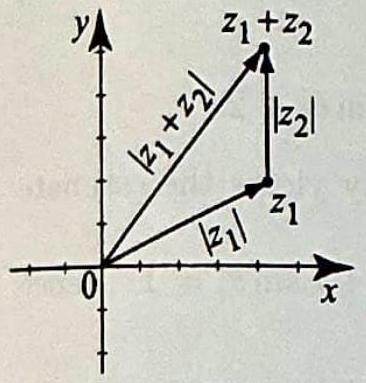
> Figure 13 Triangle inequality, problem 28.


> [!exercise] Exercise 21
> 29. Use Figure 14 to argue a proof for $\left|z_1 \pm z_2\right| \geq\left|\left|z_1\right|-\left|z_2\right|\right|$.


In Figure 14, the points $0$, $z_{1}$, and $z_{2}$ form a triangle whose side lengths are

$$
\left|z_{1}\right|, \qquad \left|z_{2}\right|, \qquad \left|z_{1}-z_{2}\right| .
$$

For any triangle with side lengths $a$, $b$, and $c$, one side is at least the difference of the other two:

$$
c \geq |a-b| .
$$

Applying this to the side of length $\left|z_{1}-z_{2}\right|$, we get

$$
\left|z_{1}-z_{2}\right| \geq\left|\left|z_{1}\right|-\left|z_{2}\right|\right| .
$$

This proves the minus-sign case.

For the plus-sign case, replace $z_{2}$ by $-z_{2}$. Since $\left|-z_{2}\right|=\left|z_{2}\right|$, the same geometric argument gives

$$
\left|z_{1}+z_{2}\right|
=\left|z_{1}-(-z_{2})\right|
\geq\left|\left|z_{1}\right|-\left|-z_{2}\right|\right|
=\left|\left|z_{1}\right|-\left|z_{2}\right|\right| .
$$

Therefore

$$
\left|z_{1}\pm z_{2}\right|\geq\left|\left|z_{1}\right|-\left|z_{2}\right|\right| .
$$


> [!figure] Figure 14
> 
> 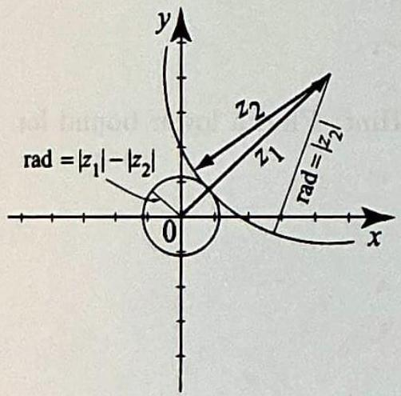
> Figure 14 For Exercise 29.
> 


> [!exercise] Exercise 22
> 30. Equality in the triangle inequality. When do we have
> 
> $$
> \left|z_{1}+z_{2}\right|=\left|z_{1}\right|+\left|z_{2}\right| ?
> $$
> 
> To answer this question, review the algebraic proof of the triangle inequality and note that the string of equalities in the proof was broken when we replaced $2 \operatorname{Re}\left(z_{1} \overline{z_{2}}\right)$ by $2\left|z_{1}\right|\left|z_{2}\right|$. Thus we have an equality in the triangle inequality if and only if $\operatorname{Re}\left(z_{1} \overline{z_{2}}\right)=\left|z_{1}\right|\left|z_{2}\right|$. Show that this is the case if and only either $z_{1}$ or $z_{2}$ is zero or $z_{1}=\alpha z_{2}$, where $\alpha$ is a positive real number. Geometrically, this states that $z_{1}$ and $z_{2}$ are on the same side of the ray issued from the origin.
> 
> 


From the algebraic proof of the triangle inequality, we have equality

$$
\left|z_{1}+z_{2}\right|=\left|z_{1}\right|+\left|z_{2}\right|
$$

if and only if

$$
\operatorname{Re}\left(z_{1}\overline{z_{2}}\right)=\left|z_{1}\right|\left|z_{2}\right| .
$$

We now determine when this happens.

If either $z_{1}=0$ or $z_{2}=0$, then equality is immediate, since

$$
\left|z_{1}+z_{2}\right|=\left|z_{1}\right|+\left|z_{2}\right|
$$

reduces to a trivial identity.

Now assume that $z_{1}\neq 0$ and $z_{2}\neq 0$. Set

$$
w=z_{1}\overline{z_{2}} .
$$

Then

$$
|w|=\left|z_{1}\overline{z_{2}}\right|=\left|z_{1}\right|\left|z_{2}\right| .
$$

So the condition becomes

$$
\operatorname{Re}(w)=|w| .
$$

Write $w=u+iv$, where $u$ and $v$ are real. Then, in Derivation Mode,

$$
\begin{aligned}
\operatorname{Re}(w)=|w|
&\Longleftrightarrow u=\sqrt{u^{2}+v^{2}} \\
&\Longleftrightarrow u^{2}=u^{2}+v^{2} \quad \text{and } u\ge 0 \\
&\Longleftrightarrow v^{2}=0 \quad \text{and } u\ge 0 \\
&\Longleftrightarrow v=0 \quad \text{and } u\ge 0 \\
&\Longleftrightarrow w \text{ is a nonnegative real number.}
\end{aligned}
$$

Hence

$$
\operatorname{Re}\left(z_{1}\overline{z_{2}}\right)=\left|z_{1}\right|\left|z_{2}\right|
$$

if and only if

$$
z_{1}\overline{z_{2}}=\beta
$$

for some real number $\beta\ge 0$.

Since $z_{2}\neq 0$, we may divide by $\overline{z_{2}}$:

$$
\begin{aligned}
z_{1}\overline{z_{2}}=\beta
&\Longleftrightarrow z_{1}=\frac{\beta}{\overline{z_{2}}} \\
&\Longleftrightarrow z_{1}=\frac{\beta z_{2}}{z_{2}\overline{z_{2}}} \\
&\Longleftrightarrow z_{1}=\frac{\beta}{|z_{2}|^{2}}\,z_{2} .
\end{aligned}
$$

If we let

$$
\alpha=\frac{\beta}{|z_{2}|^{2}},
$$

then $\alpha\ge 0$ is real, and

$$
z_{1}=\alpha z_{2} .
$$

Because we are in the case $z_{1}\neq 0$ and $z_{2}\neq 0$, we must actually have $\alpha>0$.

Conversely, if

$$
z_{1}=\alpha z_{2}
$$

with $\alpha>0$ real, then

$$
\begin{aligned}
z_{1}\overline{z_{2}}
&=\alpha z_{2}\overline{z_{2}} \\
&=\alpha |z_{2}|^{2},
\end{aligned}
$$

which is a positive real number. Therefore

$$
\operatorname{Re}\left(z_{1}\overline{z_{2}}\right)=\alpha |z_{2}|^{2}=\left|z_{1}\right|\left|z_{2}\right|,
$$

and equality holds in the triangle inequality.

So we conclude:

$$
\left|z_{1}+z_{2}\right|=\left|z_{1}\right|+\left|z_{2}\right|
$$

if and only if either $z_{1}=0$, or $z_{2}=0$, or

$$
z_{1}=\alpha z_{2}
$$

for some positive real number $\alpha$.

Geometrically, this means that $z_{1}$ and $z_{2}$ point in exactly the same direction from the origin.


> [!exercise] Exercise 23
> 31. (a) Give an example to show that, in general, $z^{2} \neq|z|^{2}$.
> (b) Show that $z^{2}=|z|^{2} \Leftrightarrow \operatorname{Im} z=0$.

##### problem 23.31a

Take

$$
z=1+i .
$$

Then

$$
z^{2}=(1+i)^{2}=1+2i+i^{2}=2i,
$$

while

$$
|z|^{2}=|1+i|^{2}=1^{2}+1^{2}=2 .
$$

Since

$$
2i \neq 2,
$$

this example shows that, in general,

$$
z^{2}\neq |z|^{2} .
$$

##### problem 23.31b

Let

$$
z=x+iy .
$$

Then

$$
z^{2}=(x+iy)^{2}=x^{2}-y^{2}+2ixy
$$

and

$$
|z|^{2}=x^{2}+y^{2} .
$$

Notice that $|z|^{2}$ is always real. Therefore, if

$$
z^{2}=|z|^{2},
$$

then the imaginary part of $z^{2}$ must be zero. Use Derivation Mode:

$$
\begin{aligned}
z^{2}=|z|^{2}
&\Longleftrightarrow x^{2}-y^{2}+2ixy=x^{2}+y^{2} \\
&\Longleftrightarrow -y^{2}+2ixy=y^{2} \\
&\Longleftrightarrow 2ixy=2y^{2} \\
&\Longleftrightarrow \begin{cases}
2xy=0,\\
2y^{2}=0
\end{cases} \\
&\Longleftrightarrow y=0 .
\end{aligned}
$$

Thus

$$
z^{2}=|z|^{2} \Longrightarrow \operatorname{Im} z=0 .
$$

Conversely, if $\operatorname{Im} z=0$, then $y=0$, so $z=x$ is real. In that case,

$$
z^{2}=x^{2}
$$

and

$$
|z|^{2}=|x|^{2}=x^{2} .
$$

Hence

$$
\operatorname{Im} z=0 \Longrightarrow z^{2}=|z|^{2} .
$$

Therefore

$$
z^{2}=|z|^{2} \Longleftrightarrow \operatorname{Im} z=0 .
$$


> [!exercise] Exercise 24
> 32. Parallelogram identity. (a) Consider an arbitrary parallelogram as in Figure 15, with sides $a, b$, and diagonals $c$ and $d$. Prove the following identity:
> 
> $$
> c^{2}+d^{2}=2\left(a^{2}+b^{2}\right) .
> $$
> 
> (The identity states the well-known fact that, in a parallelogram, the sum of the squares of the diagonals is equal to the sum of the squares of the sides.) In your
> proof, use the law of $\operatorname{cosines} r^{2}+s^{2}-2 r s \cos \alpha=a^{2}$, where $\alpha$ is the angle opposite the side $a$, and $r$ and $s$ are the other two sides.
> (b) Let $u$ and $v$ be arbitrary complex numbers. Form the parallelogram with sides $u$ and $v$. Plot $u+v$ and $u-v$ as diagonals of this parallelogram.
> (c) Using parts (a) and (b), show from geometric considerations that for any complex numbers $u$ and $v$
> 
> $$
> |u+v|^{2}+|u-v|^{2}=2\left(|u|^{2}+|v|^{2}\right) .
> $$
> 
> This is known as the parallelogram identity for complex numbers.
> (d) Prove the parallelogram identity algebraically using (8).

##### problem 24.32a

Let $\alpha$ be the angle between the two sides of lengths $a$ and $b$. One diagonal lies opposite the angle $\alpha$, while the other lies opposite the supplementary angle $\pi-\alpha$. By the law of cosines,

$$
c^{2}=a^{2}+b^{2}-2ab\cos\alpha
$$

and

$$
d^{2}=a^{2}+b^{2}-2ab\cos(\pi-\alpha) .
$$

Since

$$
\cos(\pi-\alpha)=-\cos\alpha,
$$

we get

$$
d^{2}=a^{2}+b^{2}+2ab\cos\alpha .
$$

Adding the two equations,

$$
\begin{aligned}
c^{2}+d^{2}
&=\left(a^{2}+b^{2}-2ab\cos\alpha\right)+\left(a^{2}+b^{2}+2ab\cos\alpha\right) \\
&=2a^{2}+2b^{2} \\
&=2\left(a^{2}+b^{2}\right) .
\end{aligned}
$$

This proves the parallelogram identity for the side lengths and diagonals of an arbitrary parallelogram.

##### problem 24.32b

If the parallelogram has adjacent sides represented by the vectors $u$ and $v$, then its four vertices are

$$
0, \qquad u, \qquad v, \qquad u+v .
$$

So one diagonal runs from $0$ to $u+v$, and therefore is represented by the vector

$$
u+v .
$$

The other diagonal runs from the vertex $v$ to the vertex $u$, so it is represented by the vector

$$
u-v .
$$

For illustration, take

$$
u=2+i, \qquad v=1+2i .
$$

Then the parallelogram has vertices

$$
0, \qquad 2+i, \qquad 1+2i, \qquad 3+3i,
$$

with diagonals $u+v=3+3i$ and $u-v=1-i$.

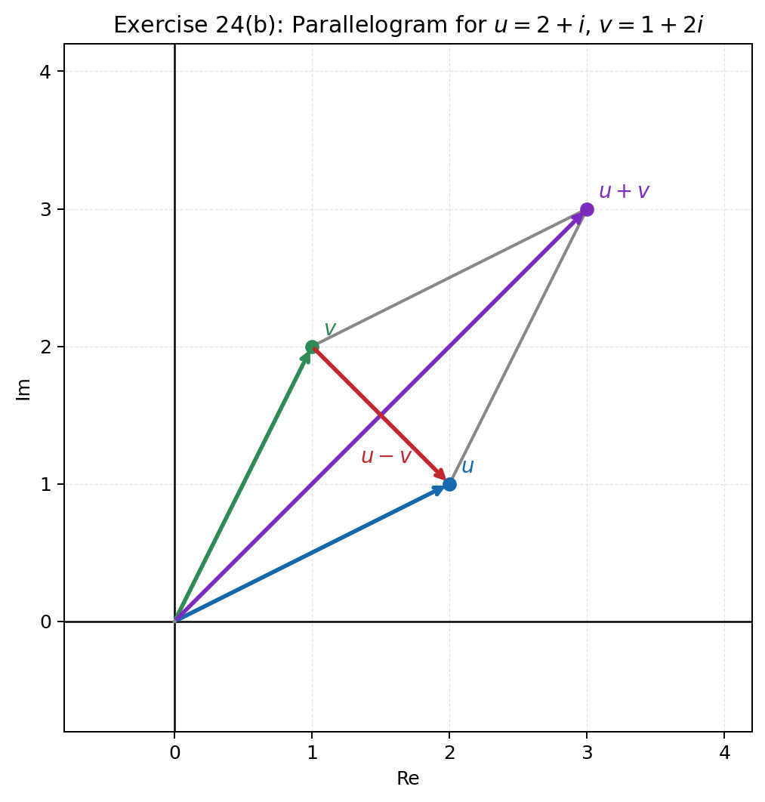

```python title:"Exercise 24.32(b): Parallelogram Plot"
from pathlib import Path
import numpy as np
import matplotlib.pyplot as plt

u = np.array([2.0, 1.0])
v = np.array([1.0, 2.0])
uv = u + v

fig, ax = plt.subplots(figsize=(6.6, 6.0), dpi=180)
ax.set_xlim(-0.8, 4.2)
ax.set_ylim(-0.8, 4.2)
ax.set_aspect("equal", adjustable="box")
ax.axhline(0, color="black", lw=1)
ax.axvline(0, color="black", lw=1)
ax.grid(True, linestyle="--", linewidth=0.5, alpha=0.35)
ax.set_xlabel("Re")
ax.set_ylabel("Im")
ax.set_title(r"Exercise 24(b): Parallelogram for $u=2+i$, $v=1+2i$")

verts = np.array([[0, 0], u, uv, v, [0, 0]])
ax.plot(verts[:, 0], verts[:, 1], color="#888888", lw=1.6)

for pt, color, label, dx, dy in [
    (u, "#1768ac", r"$u$", 0.08, 0.08),
    (v, "#2e8b57", r"$v$", 0.08, 0.08),
    (uv, "#7b2cbf", r"$u+v$", 0.08, 0.08),
]:
    ax.annotate("", xy=pt, xytext=(0, 0), arrowprops=dict(arrowstyle="->", lw=2.2, color=color))
    ax.scatter([pt[0]], [pt[1]], s=42, color=color, zorder=3)
    ax.text(pt[0] + dx, pt[1] + dy, label, color=color, fontsize=11)

ax.annotate("", xy=u, xytext=v, arrowprops=dict(arrowstyle="->", lw=2.2, color="#c1292e"))
mid = (u + v) / 2
ax.text(mid[0] - 0.15, mid[1] - 0.35, r"$u-v$", color="#c1292e", fontsize=11)

fig.tight_layout()
output = Path("images/exercise24-problemb.png")
fig.savefig(output, bbox_inches="tight")
plt.show()
```

```mathematica title:"Exercise 24.32(b): Parallelogram Plot"
u = {2, 1};
v = {1, 2};
uv = u + v;
verts = {{0, 0}, u, uv, v, {0, 0}};

Graphics[
 {
  {GrayLevel[0.55], Thick, Line[verts]},
  {RGBColor[0.090, 0.408, 0.675], Thick, Arrow[{{0, 0}, u}], PointSize[0.018], Point[u]},
  {RGBColor[0.180, 0.545, 0.341], Thick, Arrow[{{0, 0}, v}], PointSize[0.018], Point[v]},
  {RGBColor[0.482, 0.173, 0.749], Thick, Arrow[{{0, 0}, uv}], PointSize[0.018], Point[uv]},
  {RGBColor[0.757, 0.161, 0.180], Thick, Arrow[{v, u}]},
  Text[Style[TraditionalForm[HoldForm[u]], 13, RGBColor[0.090, 0.408, 0.675]], u + {0.10, 0.08}],
  Text[Style[TraditionalForm[HoldForm[v]], 13, RGBColor[0.180, 0.545, 0.341]], v + {0.10, 0.08}],
  Text[Style[TraditionalForm[HoldForm[u + v]], 13, RGBColor[0.482, 0.173, 0.749]], uv + {0.12, 0.08}],
  Text[Style[TraditionalForm[HoldForm[u - v]], 13, RGBColor[0.757, 0.161, 0.180]], Mean[{u, v}] + {-0.12, -0.35}]
 },
 Axes -> True,
 AxesOrigin -> {0, 0},
 GridLines -> Automatic,
 GridLinesStyle -> Directive[GrayLevel[0.8], Dashed],
 PlotRange -> {{-0.8, 4.2}, {-0.8, 4.2}},
 PlotRangePadding -> Scaled[0.06],
 AspectRatio -> 1,
 AxesLabel -> (Style[#, 14] & /@ {"Re", "Im"}),
 ImageSize -> 390
]
```

##### problem 24.32c

In the parallelogram determined by the vectors $u$ and $v$, the side lengths are

$$
|u| \qquad \text{and} \qquad |v|,
$$

and the diagonal lengths are

$$
|u+v| \qquad \text{and} \qquad |u-v| .
$$

Applying part (a) with

$$
a=|u|, \qquad b=|v|, \qquad c=|u+v|, \qquad d=|u-v|,
$$

we obtain

$$
|u+v|^{2}+|u-v|^{2}=2\left(|u|^{2}+|v|^{2}\right) .
$$

This is the parallelogram identity for complex numbers.

##### problem 24.32d

Using (8), namely $|w|^{2}=w\overline{w}$, we compute in Derivation Mode:

$$
\begin{aligned}
|u+v|^{2}+|u-v|^{2}
&=(u+v)\overline{(u+v)}+(u-v)\overline{(u-v)} \\
&=(u+v)(\bar{u}+\bar{v})+(u-v)(\bar{u}-\bar{v}) \\
&=u\bar{u}+u\bar{v}+v\bar{u}+v\bar{v}+u\bar{u}-u\bar{v}-v\bar{u}+v\bar{v} \\
&=2u\bar{u}+2v\bar{v} \\
&=2|u|^{2}+2|v|^{2} \\
&=2\left(|u|^{2}+|v|^{2}\right) .
\end{aligned}
$$

This completes the algebraic proof.


> [!figure] FIgure 15
> 
> 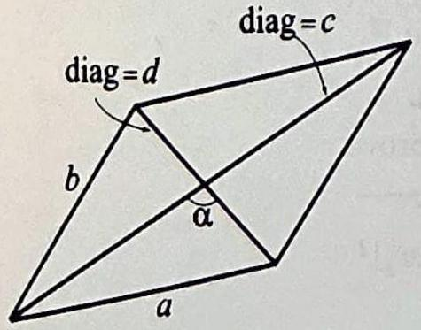
> Figure 15 Parallelogram identity, problem 32.
> 


> [!exercise] Exercise 25
> 33. The triangle inequality is crude. (a) Justify each step in the following estimate
> 
> $$
> |\cos \theta+i \sin \theta| \leq|\cos \theta|+|i \sin \theta|=|\cos \theta|+|\sin \theta| \leq 2 .
> $$
> 
> Thus, a straightforward application of the triangle inequality yields the estimate $|\cos \theta+i \sin \theta| \leq 2$.
> (b) Use the definition of the absolute value to show $|\cos \theta+i \sin \theta|=1$. Hence the estimate in (a) is not the best possible estimate.

##### problem 25.33a

Each step is justified as follows:

$$
\begin{aligned}
|\cos \theta+i \sin \theta|
&\leq |\cos \theta|+|i\sin \theta| \qquad \text{(triangle inequality)} \\
&=|\cos \theta|+|i|\,|\sin \theta| \qquad \text{(absolute value of a product)} \\
&=|\cos \theta|+|\sin \theta| \qquad \text{since } |i|=1 \\
&\leq 1+1 \qquad \text{since } |\cos\theta|\leq 1,\ |\sin\theta|\leq 1 \\
&=2 .
\end{aligned}
$$

##### problem 25.33b

Using the definition of absolute value,

$$
\begin{aligned}
|\cos \theta+i \sin \theta|
&=\sqrt{\cos^{2}\theta+\sin^{2}\theta} \\
&=\sqrt{1} \\
&=1 .
\end{aligned}
$$

So the exact value is $1$, whereas part (a) only gave the upper bound $2$. Hence the estimate in part (a) is not best possible.


> [!exercise] Exercise 26
> 34. (a) Use the triangle inequality to show that $|z-1| \leq 2$ for $|z| \leq 1$.
> (b) Explain your result in (a) geometrically.
> (c) Is the upper bound in (a) best possible?

##### problem 26.34a

If $|z|\leq 1$, then by the triangle inequality,

$$
\begin{aligned}
|z-1|
&=|z+(-1)| \\
&\leq |z|+|-1| \\
&=|z|+1 \\
&\leq 1+1 \\
&=2 .
\end{aligned}
$$

Thus $|z-1|\leq 2$ whenever $|z|\leq 1$.

##### problem 26.34b

The condition $|z|\leq 1$ means that $z$ lies in the closed unit disk centered at the origin. The quantity $|z-1|$ is the distance from the point $z$ to the point $1$ on the real axis. So part (a) says that every point in the unit disk is at distance at most $2$ from the point $1$. Equivalently, the unit disk centered at $0$ lies inside the disk of radius $2$ centered at $1$.

##### problem 26.34c

Yes. The bound is best possible, because equality can occur. Take

$$
z=-1 .
$$

Then $|z|=1$, so $z$ satisfies the hypothesis, and

$$
|z-1|=|-1-1|=|-2|=2 .
$$

Therefore no number smaller than $2$ can be an upper bound.


> [!exercise] Exercise 27
> 35. Find an upper bound for $|z-4|$ if $|z-3 i| \leq 1$.
> 36. Find a lower bound for $|z-4|$ if $|z-3 i| \leq 1$.
> 37. Find an upper bound for $\left|\frac{1}{z-4}\right|$ if $|z-1| \leq 1$. (Hint: Find a lower bound for $|z-4|$.)
> 38. Find an upper bound for $\left|\frac{1}{1-z}\right|$ if $|z-i| \leq \frac{1}{2}$.
> 39. Find an upper bound for $\left|\frac{1}{z^{2}+z+1}\right|$ if $|z| \leq \frac{1}{2}$.
> 40. Find a lower bound for $\left|\frac{1}{z^{2}+z+1}\right|$ if $|z| \leq \frac{1}{2}$.

##### problem 27.35

Write

$$
z-4=(z-3i)+(-4+3i) .
$$

Then, by the triangle inequality,

$$
\begin{aligned}
|z-4|
&\leq |z-3i|+|-4+3i| \\
&\leq 1+\sqrt{(-4)^{2}+3^{2}} \\
&=1+5 \\
&=6 .
\end{aligned}
$$

So an upper bound is

$$
6 .
$$

##### problem 27.36

Again write

$$
z-4=(z-3i)+(-4+3i) .
$$

Now use the reverse triangle inequality:

$$
\begin{aligned}
|z-4|
&\geq \bigl||z-3i|-|-4+3i|\bigr| \\
&=\bigl||z-3i|-5\bigr| \\
&\geq 5-1 \\
&=4 .
\end{aligned}
$$

So a lower bound is

$$
4 .
$$

##### problem 27.37

If $|z-1|\leq 1$, then

$$
z-4=(z-1)-3 .
$$

Hence

$$
\begin{aligned}
|z-4|
&\geq \bigl||z-1|-|3|\bigr| \\
&=|\,|z-1|-3\,| \\
&\geq 3-1 \\
&=2 .
\end{aligned}
$$

Therefore

$$
\left|\frac{1}{z-4}\right|=\frac{1}{|z-4|}\leq \frac{1}{2} .
$$

So an upper bound is

$$
\frac{1}{2} .
$$

##### problem 27.38

Write

$$
1-z=(1-i)-(z-i) .
$$

Then

$$
\begin{aligned}
|1-z|
&\geq \bigl||1-i|-|z-i|\bigr| \\
&\geq \sqrt{1^{2}+(-1)^{2}}-\frac{1}{2} \\
&=\sqrt{2}-\frac{1}{2} .
\end{aligned}
$$

Thus

$$
\left|\frac{1}{1-z}\right|=\frac{1}{|1-z|}\leq \frac{1}{\sqrt{2}-\frac{1}{2}} .
$$

So an upper bound is

$$
\frac{1}{\sqrt{2}-\frac{1}{2}} .
$$

##### problem 27.39

To get an upper bound for the reciprocal, we need a lower bound for the denominator. By the reverse triangle inequality,

$$
\begin{aligned}
|z^{2}+z+1|
&\geq 1-|z|-|z^{2}| \\
&\geq 1-\frac{1}{2}-\left(\frac{1}{2}\right)^{2} \\
&=1-\frac{1}{2}-\frac{1}{4} \\
&=\frac{1}{4} .
\end{aligned}
$$

Therefore

$$
\left|\frac{1}{z^{2}+z+1}\right|=\frac{1}{|z^{2}+z+1|}\leq 4 .
$$

So an upper bound is

$$
4 .
$$

##### problem 27.40

To get a lower bound for the reciprocal, we need an upper bound for the denominator. By the triangle inequality,

$$
\begin{aligned}
|z^{2}+z+1|
&\leq |z^{2}|+|z|+1 \\
&\leq \left(\frac{1}{2}\right)^{2}+\frac{1}{2}+1 \\
&=\frac{1}{4}+\frac{1}{2}+1 \\
&=\frac{7}{4} .
\end{aligned}
$$

Therefore

$$
\left|\frac{1}{z^{2}+z+1}\right|=\frac{1}{|z^{2}+z+1|}\geq \frac{4}{7} .
$$

So a lower bound is

$$
\frac{4}{7} .
$$


> [!exercise] Exercise 28
> 41. Project Problem: Cauchy-Schwarz inequality. Suppose that $v_{1}, v_{2}$, $\ldots, v_{n}$ and $w_{1}, w_{2}, \ldots, w_{n}$ are arbitrary complex numbers. Our goal in this exercise is to prove the Cauchy-Schwarz inequality, which states that
> 
> $$
> \left|\sum_{j=1}^{n} \overline{v_{j}} w_{j}\right| \leq \sqrt{\sum_{j=1}^{n}\left|v_{j}\right|^{2}} \sqrt{\sum_{j=1}^{n}\left|w_{j}\right|^{2}} . \tag{21}
> $$
> 
> (a) Show that in order to prove (21). it is enough to prove
> 
> $$
> \sum_{j=1}^{n}\left|v_{j}\right|\left|w_{j}\right| \leq \sqrt{\sum_{j=1}^{n}\left|v_{j}\right|^{2}} \sqrt{\sum_{j=1}^{n}\left|w_{j}\right|^{2}} . \tag{22}
> $$
> 
> (b) Prove (22) in the case $\sum_{j=1}^{n}\left|v_{j}\right|^{2}=1$ and $\sum_{j=1}^{n}\left|w_{j}\right|^{2}=1$. (Hint: Start with the inequality $0 \leq \sum_{j=1}^{n}\left(\left|v_{j}\right|-\left|w_{j}\right|\right)^{2}$. Expand and simplify.)
> (c) Prove (22) in the general case. (Hint: Let $v=\left(v_1, v_2, \ldots, v_n\right)$ and $w= \left(w_1, w_2, \ldots, w_n\right)$, and think of $v$ and $w$ as vectors. Without loss of generality, $v$ and $w$ are not identically 0 . Let $\|v\|=\sqrt{\sum_{j=1}^n\left|v_j\right|^2}$ and define $\|w\|$ similarly. Show that you can apply the result of (b) to the vectors $\frac{1}{\|v\|} v$ and $\frac{1}{\|w\|} w$.)

##### problem 28.41a

To prove (21), start with the triangle inequality:

$$
\left|\sum_{j=1}^{n}\overline{v_{j}}w_{j}\right|
\leq \sum_{j=1}^{n}\left|\overline{v_{j}}w_{j}\right| .
$$

Using the absolute value of a product and the fact that $|\overline{v_j}|=|v_j|$, we get

$$
\left|\sum_{j=1}^{n}\overline{v_{j}}w_{j}\right|
\leq \sum_{j=1}^{n}|v_{j}||w_{j}| .
$$

Therefore, if we can prove

$$
\sum_{j=1}^{n}|v_{j}||w_{j}|
\leq \sqrt{\sum_{j=1}^{n}|v_{j}|^{2}} \sqrt{\sum_{j=1}^{n}|w_{j}|^{2}},
$$

which is (22), then it immediately follows that

$$
\left|\sum_{j=1}^{n}\overline{v_{j}}w_{j}\right|
\leq \sqrt{\sum_{j=1}^{n}|v_{j}|^{2}} \sqrt{\sum_{j=1}^{n}|w_{j}|^{2}} .
$$

So proving (22) is enough to prove (21).

##### problem 28.41b

Assume

$$
\sum_{j=1}^{n}|v_{j}|^{2}=1, \qquad \sum_{j=1}^{n}|w_{j}|^{2}=1 .
$$

Now use the hint and work in Derivation Mode:

$$
\begin{aligned}
0
&\leq \sum_{j=1}^{n}\left(|v_{j}|-|w_{j}|\right)^{2} \\
&= \sum_{j=1}^{n}\left(|v_{j}|^{2}-2|v_{j}||w_{j}|+|w_{j}|^{2}\right) \\
&= \sum_{j=1}^{n}|v_{j}|^{2}-2\sum_{j=1}^{n}|v_{j}||w_{j}|+\sum_{j=1}^{n}|w_{j}|^{2} \\
&= 1-2\sum_{j=1}^{n}|v_{j}||w_{j}|+1 \\
&= 2-2\sum_{j=1}^{n}|v_{j}||w_{j}| .
\end{aligned}
$$

Hence

$$
2\sum_{j=1}^{n}|v_{j}||w_{j}| \leq 2,
$$

so

$$
\sum_{j=1}^{n}|v_{j}||w_{j}| \leq 1 .
$$

But under our normalization,

$$
\sqrt{\sum_{j=1}^{n}|v_{j}|^{2}} \sqrt{\sum_{j=1}^{n}|w_{j}|^{2}}
=\sqrt{1}\sqrt{1}
=1 .
$$

Therefore

$$
\sum_{j=1}^{n}|v_{j}||w_{j}| \leq \sqrt{\sum_{j=1}^{n}|v_{j}|^{2}} \sqrt{\sum_{j=1}^{n}|w_{j}|^{2}} .
$$

This proves (22) in the normalized case.

##### problem 28.41c

Now consider the general case. If all $v_j=0$, then

$$
\sum_{j=1}^{n}|v_{j}||w_{j}|=0,
$$

so (22) is trivial. Likewise, if all $w_j=0$, then (22) is also trivial. So we may assume that $v$ and $w$ are not identically zero.

Define

$$
\|v\|=\sqrt{\sum_{j=1}^{n}|v_{j}|^{2}}, \qquad \|w\|=\sqrt{\sum_{j=1}^{n}|w_{j}|^{2}} .
$$

Then $\|v\|>0$ and $\|w\|>0$. Consider the normalized vectors

$$
\widetilde{v}=\frac{1}{\|v\|}v, \qquad \widetilde{w}=\frac{1}{\|w\|}w .
$$

Their components are

$$
\widetilde{v}_{j}=\frac{v_{j}}{\|v\|}, \qquad \widetilde{w}_{j}=\frac{w_{j}}{\|w\|} .
$$

Now use Derivation Mode:

$$
\begin{aligned}
\sum_{j=1}^{n}|\widetilde{v}_{j}|^{2}
&= \sum_{j=1}^{n}\left|\frac{v_{j}}{\|v\|}\right|^{2} \\
&= \sum_{j=1}^{n}\frac{|v_{j}|^{2}}{\|v\|^{2}} \\
&= \frac{1}{\|v\|^{2}}\sum_{j=1}^{n}|v_{j}|^{2} \\
&= \frac{\|v\|^{2}}{\|v\|^{2}} \\
&= 1,
\end{aligned}
$$

and similarly

$$
\sum_{j=1}^{n}|\widetilde{w}_{j}|^{2}=1 .
$$

So part (b) applies to $\widetilde v$ and $\widetilde w$:

$$
\sum_{j=1}^{n}|\widetilde{v}_{j}||\widetilde{w}_{j}| \leq 1 .
$$

Substitute the definitions and simplify in Derivation Mode:

$$
\begin{aligned}
\sum_{j=1}^{n}\left|\frac{v_{j}}{\|v\|}\right|\left|\frac{w_{j}}{\|w\|}\right|
&\leq 1 \\
\sum_{j=1}^{n}\frac{|v_{j}||w_{j}|}{\|v\|\|w\|}
&\leq 1 \\
\frac{1}{\|v\|\|w\|}\sum_{j=1}^{n}|v_{j}||w_{j}|
&\leq 1 \\
\sum_{j=1}^{n}|v_{j}||w_{j}|
&\leq \|v\|\|w\| \\
&= \sqrt{\sum_{j=1}^{n}|v_{j}|^{2}} \sqrt{\sum_{j=1}^{n}|w_{j}|^{2}} .
\end{aligned}
$$

This proves (22) in general. By part (a), (21) follows:

$$
\left|\sum_{j=1}^{n}\overline{v_{j}}w_{j}\right|
\leq \sqrt{\sum_{j=1}^{n}|v_{j}|^{2}} \sqrt{\sum_{j=1}^{n}|w_{j}|^{2}} .
$$
