# 1.3 Polar Form

In the previous section, we represented complex numbers as points in the plane and used Cartesian coordinates. In this section, we will use polar coordinates and obtain the so-called polar representation or polar form of

> [!figure] Figure 1
> 
> 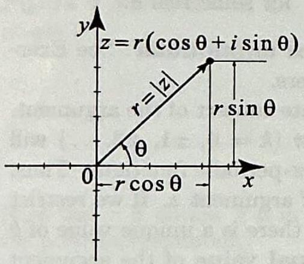
> Figure 1 Polar coordinates.

## 1.3.1 POLAR FORM OF COMPLEX NUMBERS

> [!review] Review 1
> 1. How is a point $P=(x, y) \neq(0,0)$ represented in polar coordinates? What do $r$ and $\theta$ mean?
> 2. In polar coordinates, which direction of rotation is positive?
> 3. Write the coordinate-change formulas $x$ and $y$ in terms of $r$ and $\theta$. What restriction is placed on $r$ ?
> 4. Write the polar form of a complex number $z=x+i y$. What are $r$ and $\theta$ called?
> 5. Write the formulas for $r$ in terms of $x, y$, and $z$.
> 6. Draw a figure depicting the polar coordinate system.
> 7. Write the argument identities for $\cos \theta$ and $\sin \theta$, and the formula for $\tan \theta$. State the conditions under which they are valid.
> 8. Write $\operatorname{Re} z$ and $\operatorname{Im} z$ in terms of $r$ and $\theta$.
> 9. What happens to the argument when $z=0$ ?
> 10. Show why $|z|=1$ exactly when $z=\cos \theta+i \sin \theta$ for some real $\theta$.
> 11. What does unimodular mean?


##### review 1.1

A point $P=(x,y) \neq (0,0)$ is represented in polar coordinates as

$$
P=(r,\theta),
$$

where $r$ is the distance from $P$ to the origin and $\theta$ is the angle measured from the positive $x$-axis to the ray from the origin to $P$.


##### review 1.2

In polar coordinates, counterclockwise rotation is positive, while clockwise rotation is negative.


##### review 1.3

The coordinate-change formulas are

$$
x=r \cos \theta,
\qquad
y=r \sin \theta,
$$

with the restriction

$$
r \geq 0.
$$


##### review 1.4

If

$$
z=x+i y,
$$

then its polar form is

$$
z=r(\cos \theta+i \sin \theta).
$$

Here $r$ is the modulus of $z$, and $\theta$ is an argument of $z$.


##### review 1.5

The modulus can be written as

$$
r=\sqrt{x^{2}+y^{2}}=|z|=\sqrt{z \bar{z}}.
$$

##### review 1.6


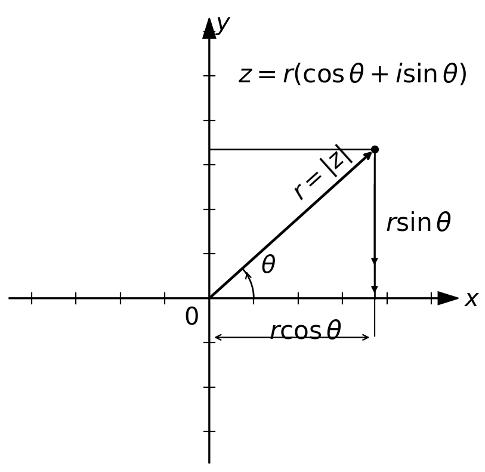


```python title:"polar coordinate system"
from pathlib import Path
import matplotlib
matplotlib.use('Agg')
import matplotlib.pyplot as plt
from matplotlib.patches import FancyArrow, Arc
import numpy as np

out = Path('images/review-1-6-polar-figure.png')

fig, ax = plt.subplots(figsize=(6.4, 4.9), dpi=160)
ax.set_xlim(-4.6, 6.1)
ax.set_ylim(-3.8, 6.6)
ax.set_aspect('equal')
ax.axis('off')

# Axes with arrowheads
ax.add_patch(FancyArrow(-4.5, 0, 10.1, 0, width=0.015, head_width=0.28, head_length=0.45,
                        length_includes_head=True, color='black'))
ax.add_patch(FancyArrow(0, -3.7, 0, 10.0, width=0.015, head_width=0.28, head_length=0.45,
                        length_includes_head=True, color='black'))

# Tick marks
for x in range(-4, 6):
    if x != 0:
        ax.plot([x, x], [-0.12, 0.12], color='black', lw=1)
for y in range(-3, 7):
    if y != 0:
        ax.plot([-0.12, 0.12], [y, y], color='black', lw=1)

# Point in polar form
r = 5.0
th = np.deg2rad(42)
px = r * np.cos(th)
py = r * np.sin(th)

# Radius vector and point
ax.annotate('', xy=(px, py), xytext=(0, 0), arrowprops=dict(arrowstyle='->', lw=2, color='black'))
ax.plot(px, py, 'ko', ms=5)

# Projections
ax.plot([px, px], [0, py], color='black', lw=1.2)
ax.plot([0, px], [py, py], color='black', lw=1.2)
ax.plot([px, px], [0, -0.85], color='black', lw=1.0)

# Angle arc
arc = Arc((0, 0), 2.0, 2.0, angle=0, theta1=0, theta2=np.rad2deg(th), lw=1.2, color='black')
ax.add_patch(arc)

# Small arrow on arc to suggest positive direction
ax.annotate('', xy=(1.05 * np.cos(th * 0.92), 1.05 * np.sin(th * 0.92)),
            xytext=(1.0 * np.cos(th * 0.72), 1.0 * np.sin(th * 0.72)),
            arrowprops=dict(arrowstyle='->', lw=1.0, color='black'))

# Labels
ax.text(5.72, -0.18, r'$x$', fontsize=18)
ax.text(0.12, 6.02, r'$y$', fontsize=18)
ax.text(-0.58, -0.58, r'$0$', fontsize=18)
ax.text(2.05, 2.18, r'$r=|z|$', fontsize=18, rotation=np.rad2deg(th), rotation_mode='anchor')
ax.text(1.15, 0.58, r'$\theta$', fontsize=18)
ax.text(1.35, -0.92, r'$r\cos\theta$', fontsize=19)
ax.text(px + 0.25, py / 2, r'$r\sin\theta$', fontsize=19, va='center')
ax.text(0.65, 4.85, r'$z=r(\cos\theta+i\sin\theta)$', fontsize=19)

# Small dimension arrows for components
ax.annotate('', xy=(px, 0.68), xytext=(px, py - 0.12),
            arrowprops=dict(arrowstyle='-|>', lw=1.0, color='black'))
ax.annotate('', xy=(px, 0.05), xytext=(px, py - 0.72),
            arrowprops=dict(arrowstyle='-|>', lw=1.0, color='black'))
ax.annotate('', xy=(0.05, -0.88), xytext=(px - 0.05, -0.88),
            arrowprops=dict(arrowstyle='<->', lw=1.0, color='black'))

plt.tight_layout(pad=0.2)
fig.savefig(out, facecolor='white', bbox_inches='tight', pad_inches=0.05)
```


```mathematica title:"polar coordinate system"
Manipulate[
 Module[
  {
   x = rv Cos[tv],
   y = rv Sin[tv],
   arcRadius = 0.9,
   ticks,
   thetaLabelPos,
   rLabelPos,
   xArrowY,
   yArrowX,
   xTextPos,
   yTextPos,
   rotationAngle,
   perp,
   axisColor = GrayLevel[0.2],
   radiusColor = RGBColor[0.1, 0.35, 0.85],
   xProjColor = RGBColor[0.85, 0.35, 0.1],
   yProjColor = RGBColor[0.1, 0.6, 0.2],
   angleColor = RGBColor[0.55, 0.2, 0.7],
   pointColor = Black
   },
  
  ticks = Join[
    Table[Line[{{k, -0.08}, {k, 0.08}}], {k, -5, 5}],
    Table[Line[{{-0.08, k}, {0.08, k}}], {k, -5, 6}]
    ];
  
  perp = 0.28 Normalize[{-y, x}];
  rLabelPos = {x/2, y/2} + perp;
  rotationAngle = If[-Pi/2 <= tv <= Pi/2, tv, tv + Pi];
  thetaLabelPos = 1.12 {Cos[tv/2], Sin[tv/2]};
  xArrowY = If[y >= 0, -0.9, 0.9];
  yArrowX = If[x >= 0, x + 0.45, x - 0.45];
  xTextPos = {x/2, xArrowY + 0.38 Sign[xArrowY]};
  yTextPos = {yArrowX + 0.85 Sign[yArrowX], y/2};
  
  Graphics[
   {
    axisColor,
    AbsoluteThickness[1.5],
    
    Arrow[{{-5.9, 0}, {5.9, 0}}],
    Arrow[{{0, -5.9}, {0, 6.6}}],
    ticks,
    
    radiusColor,
    AbsoluteThickness[2],
    Arrow[{{0, 0}, {x, y}}],
    pointColor,
    PointSize[0.02],
    Point[{x, y}],
    
    xProjColor,
    AbsoluteThickness[1.2],
    Line[{{x, 0}, {x, y}}],
    yProjColor,
    Line[{{0, y}, {x, y}}],
    
    angleColor,
    Circle[{0, 0}, arcRadius, {0, tv}],
    Arrow[{
      {arcRadius Cos[0.72 tv], arcRadius Sin[0.72 tv]},
      {arcRadius Cos[0.92 tv], arcRadius Sin[0.92 tv]}
      }],
    
    axisColor,
    Text[Style["x", 22, Italic, axisColor], {5.98, -0.18}],
    Text[Style["y", 22, Italic, axisColor], {0.22, 6.15}],
    Text[Style["0", 20, axisColor], {-0.35, -0.42}],
    
    Text[
     Style[
      Column[
       {
        TraditionalForm[HoldForm[z == r (Cos[\[Theta]] + I Sin[\[Theta]])]],
        Style[
         Row[
          {
           "z = ",
           NumberForm[rv, {3, 1}],
           " (cos(",
           NumberForm[tv/Degree, {4, 0}],
           "\[Degree]) + i sin(",
           NumberForm[tv/Degree, {4, 0}],
           "\[Degree]))"
           }
          ],
         17
         ]
        },
       Center
       ],
      21,
      radiusColor,
      Background -> White
      ],
     {0, 6.1}
     ],
    
    Text[
     Rotate[
      Style[
       Column[
        {
         TraditionalForm[HoldForm[r == Abs[z]]],
         Style[Row[{NumberForm[rv, {3, 1}], " = |z|"}], 15]
         },
        Center
        ],
       17,
       radiusColor,
       Background -> White
       ],
      rotationAngle
      ],
     rLabelPos
     ],
    
    White,
    EdgeForm[None],
    Disk[thetaLabelPos, 0.24],
    
    Text[
     Style[
      Column[
       {
        TraditionalForm[HoldForm[\[Theta]]],
        Style[Row[{NumberForm[tv/Degree, {4, 0}], "\[Degree]"}], 15]
        },
       Center
       ],
      17,
      angleColor,
      Background -> White
      ],
     thetaLabelPos
     ],
    
    Text[
     Style[
      Column[
       {
        TraditionalForm[HoldForm[r Cos[\[Theta]]]],
        Style[NumberForm[x, {4, 2}], 15]
        },
       Center
       ],
      17,
      xProjColor,
      Background -> White
      ],
     xTextPos
     ],
    
    Text[
     Style[
      Column[
       {
        TraditionalForm[HoldForm[r Sin[\[Theta]]]],
        Style[NumberForm[y, {4, 2}], 15]
        },
       Center
       ],
      17,
      yProjColor,
      Background -> White
      ],
     yTextPos
     ],
    
    axisColor,
    AbsoluteThickness[1],
    Line[{{0, 0}, {0, xArrowY}}],
    Line[{{x, 0}, {x, xArrowY}}],
    Line[{{x, 0}, {yArrowX, 0}}],
    Line[{{x, y}, {yArrowX, y}}],
    
    yProjColor,
    Arrowheads[{{0.03, 0}, {0.03, 1}}],
    Arrow[{{yArrowX, 0.05 Sign[y]}, {yArrowX, y - 0.05 Sign[y]}}],
    
    xProjColor,
    Arrowheads[{{0.03, 0}, {0.03, 1}}],
    Arrow[{{0.05 Sign[x], xArrowY}, {x - 0.05 Sign[x], xArrowY}}]
    },
   PlotRange -> {{-6.1, 6.1}, {-6.1, 6.8}},
   ImageSize -> 560,
   Background -> White
   ]
  ],
 {{rv, 5, "r"}, 0.5, 5.5, Appearance -> "Labeled"},
 {{tv, 42 Degree, "\[Theta]"}, -175 Degree, 180 Degree, Appearance -> "Labeled"},
 TrackedSymbols :> {rv, tv}
]
```

##### review 1.7

The argument identities are

$$
\cos \theta=\frac{x}{r},
\qquad
\sin \theta=\frac{y}{r},
$$

which are valid when

$$
r \neq 0,
$$

and

$$
\tan \theta=\frac{y}{x},
$$

which is valid when

$$
x \neq 0.
$$


##### review 1.8

In polar form,

$$
\operatorname{Re} z=r \cos \theta,
\qquad
\operatorname{Im} z=r \sin \theta.
$$


##### review 1.9

When

$$
z=0,
$$

we have

$$
r=0,
$$

and the argument is not defined.


##### review 1.10

We have

$$
|z|=1
\iff r=1.
$$

If $r=1$, then the polar form becomes

$$
z=r(\cos \theta+i \sin \theta)=\cos \theta+i \sin \theta.
$$

Conversely, if

$$
z=\cos \theta+i \sin \theta,
$$

then it is in polar form with modulus

$$
r=1,
$$

so

$$
|z|=1.
$$

Therefore

$$
|z|=1
\iff
z=\cos \theta+i \sin \theta
\quad \text{for some real } \theta.
$$


##### review 1.11

A complex number is unimodular if its modulus is $1$. Equivalently, it is a complex number lying on the unit circle.


---


> [!review] Review 2
> 1. Why do the argument identities fail to determine a unique value for $\arg z$ ? What restriction on $\theta$ resolves this, and what is the resulting unique value called? State the interval precisely, paying attention to which endpoints are included or excluded.
> 2. Explain the difference between $\arg z$ and $\operatorname{Arg} z$. Write an expression for the full set $\arg z$ in terms of $\operatorname{Arg} z$, and characterize what kind of mathematical object each is. What notational convention is sometimes used when selecting a specific value from $\arg z$ ?


##### problem 1

Let

$$
z=x+iy\neq 0.
$$

An angle $\theta$ is called an argument of $z$ if it satisfies the argument identities

$$
\cos\theta=\frac{x}{|z|},
\qquad
\sin\theta=\frac{y}{|z|}.
$$

These identities do not determine a unique value of $\theta$ because the sine and cosine functions are $2\pi$-periodic. In derivation form,

$$
\begin{aligned}
\cos(\theta+2k\pi)
&=\cos\theta, \\
\sin(\theta+2k\pi)
&=\sin\theta,
\end{aligned}
\qquad
k\in\mathbb{Z}.
$$

So if one angle $\theta$ satisfies

$$
\cos\theta=\frac{x}{|z|},
\qquad
\sin\theta=\frac{y}{|z|},
$$

then every angle of the form

$$
\theta+2k\pi,
\qquad
k\in\mathbb{Z},
$$

also satisfies the same two identities. Thus the argument is not unique.

To obtain a unique value, we restrict $\theta$ to the interval

$$
-\pi<\theta\le \pi.
$$

This interval excludes the left endpoint

$$
-\pi
$$

and includes the right endpoint

$$
\pi.
$$

With this restriction, there is exactly one value of $\theta$ satisfying the argument identities. This unique value is called the principal value of the argument and is denoted by

$$
\operatorname{Arg} z.
$$

So the defining statement is

$$
-\pi<\operatorname{Arg} z\le \pi.
$$

##### problem 2

The symbols

$$
\arg z
\qquad\text{and}\qquad
\operatorname{Arg} z
$$

do not mean the same thing.

The symbol

$$
\operatorname{Arg} z
$$

denotes the single principal value of the argument, namely the unique number in the interval

$$
(-\pi,\pi]
$$

that is an argument of $z$.

By contrast,

$$
\arg z
$$

denotes the full set of all arguments of $z$. Therefore,

$$
\arg z=\{\operatorname{Arg} z+2k\pi:k\in\mathbb{Z}\}.
$$

Equivalently, if $\theta$ is any one argument of $z$, then

$$
\arg z=\{\theta+2k\pi:k\in\mathbb{Z}\}.
$$

So

$$
\operatorname{Arg} z
$$

is a single real number, while

$$
\arg z
$$

is a set of real numbers. In other words,

$$
\operatorname{Arg} z
$$

is single-valued, whereas

$$
\arg z
$$

is multi-valued or set-valued.

Sometimes one abuses notation and writes

$$
\arg z=\theta+2k\pi
$$

or even simply

$$
\arg z=\theta
$$

to indicate that one specific value has been selected from the set

$$
\arg z.
$$


---

We now shift our attention to the more delicate subject of the argument. If $\theta$ is any angle that satisfies "the argument identities", then $\theta+2 k \pi(k=0, \pm 1, \pm 2, \ldots)$ will also satisfy the argument identities, because the cosine and sine are $2 \pi$-periodic functions. Thus, the argument identities do not determine a unique value of argument $z$. If we restrict the choice of $\theta$ to the interval $-\pi<\theta \leq \pi$, then there is a unique value of $\theta$ that satisfies (4). We call this value ==the principal value of the argument== and denote it by $\operatorname{Arg} z$. Thus, by definition, if $z=x+i y$, then

> [!NOTE] The argument identities in terms of the principal value
> 
> $$
> -\pi<\operatorname{Arg} z \leq \pi, \quad \cos (\operatorname{Arg} z)=\frac{x}{|z|}, \quad \sin (\operatorname{Arg} z)=\frac{y}{|z|}
> $$
> 

The set of all values of the argument will be denoted by

$$
\arg z=\{\theta+2 k \pi: k=0, \pm 1, \pm 2, \ldots\},
$$

where $\theta$ is any angle that satisfies (4). In particular, we have

$$
\arg z=\{\operatorname{Arg} z+2 k \pi: k=0, \pm 1, \pm 2, \ldots\} .
$$

Unlike $\operatorname{Arg} z$, which is $\operatorname{single}$-valued, $\arg z$ is multi-valued or set-valued. Sometimes we will abuse notation and write $\arg z=\theta+2 k \pi$ or simply $\arg z=\theta$ to denote a specific value of the argument from the set $\arg z$.

> [!table] Table 1
> Table 1 contains some special values that will be useful in the examples and exercises.
> 
>
>
> | $\theta$ | 0 | $\frac{\pi}{6}$ | $\frac{\pi}{4}$ | $\frac{\pi}{3}$ | $\frac{\pi}{2}$ | $\frac{2 \pi}{3}$ | $\frac{3 \pi}{4}$ | $\frac{5 \pi}{6}$ | $\pi$ | $\frac{7 \pi}{6}$ | $\frac{5 \pi}{4}$ | $\frac{4 \pi}{3}$ | $\frac{3 \pi}{2}$ | $\frac{5 \pi}{3}$ | $\frac{7 \pi}{4}$ | $\frac{11 \pi}{6}$ |
> | :--- | :--- | :--- | :--- | :--- | :--- | :--- | :--- | :--- | :--- | :--- | :--- | :--- | :--- | :--- | :--- | :--- |
> | $\cos \theta$ | 1 | $\frac{\sqrt{3}}{2}$ | $\frac{\sqrt{2}}{2}$ | $\frac{1}{2}$ | 0 | $-\frac{1}{2}$ | $-\frac{\sqrt{2}}{2}$ | $-\frac{\sqrt{3}}{2}$ | -1 | $-\frac{\sqrt{3}}{2}$ | $-\frac{\sqrt{2}}{2}$ | $-\frac{1}{2}$ | 0 | $\frac{1}{2}$ | $\frac{\sqrt{2}}{2}$ | $\frac{\sqrt{3}}{2}$ |
> | $\sin \theta$ | 0 | $\frac{1}{2}$ | $\frac{\sqrt{2}}{2}$ | $\frac{\sqrt{3}}{2}$ | 1 | $\frac{\sqrt{3}}{2}$ | $\frac{\sqrt{2}}{2}$ | $\frac{1}{2}$ | 0 | $-\frac{1}{2}$ | $-\frac{\sqrt{2}}{2}$ | $-\frac{\sqrt{3}}{2}$ | -1 | $-\frac{\sqrt{3}}{2}$ | $-\frac{\sqrt{2}}{2}$ | $-\frac{1}{2}$ |
> | $\tan \theta$ | 0 | $\frac{\sqrt{3}}{3}$ | 1 | $\sqrt{3}$ | not defined | $-\sqrt{3}$ | -1 | $-\frac{\sqrt{3}}{3}$ | 0 | $\frac{\sqrt{3}}{3}$ | 1 | $\sqrt{3}$ | not defined | $-\sqrt{3}$ | -1 | $-\frac{\sqrt{3}}{3}$ |
> 
> Table 1. Special trigonometric values.


> [!exercise] Exercise 1
> Find the modulus, argument, principal value of the argument, and polar form of the given complex number.
> (a) $z_{1}=5$.
> (b) $z_{2}=-3 i$.
> (c) $z_{3}=\sqrt{3}+i$.
> (d) $z_{4}=1+i$.
> (e) $z_{5}=1-i$.
> (f) $\quad z_{6}=-1-i$.

##### problem 1a

For a complex number written in rectangular form as

$$
z=x+i y,
$$

the formulas we use are

$$
|z|=\sqrt{x^{2}+y^{2}},
$$

and

$$
z=r(\cos \theta+i \sin \theta),
\qquad
r=|z|,
\qquad
x=r \cos \theta,
\qquad
y=r \sin \theta .
$$

Also, the principal value of the argument is the unique angle

$$
\operatorname{Arg} z \in(-\pi, \pi] .
$$

Now apply these formulas to

$$
z_{1}=5=5+0 i .
$$

So

$$
x=5,
\qquad
y=0 .
$$

The modulus is

$$
\begin{aligned}
\left|z_{1}\right|
&=\sqrt{x^{2}+y^{2}} \\
&=\sqrt{5^{2}+0^{2}} \\
&=\sqrt{25+0} \\
&=\sqrt{25} \\
&=5 .
\end{aligned}
$$

To find the argument, use

$$
\begin{aligned}
x
&=r \cos \theta \\
5
&=5 \cos \theta \\
\frac{5}{5}
&=\cos \theta \\
1
&=\cos \theta,
\end{aligned}
\qquad
\begin{aligned}
y
&=r \sin \theta \\
0
&=5 \sin \theta \\
\frac{0}{5}
&=\sin \theta \\
0
&=\sin \theta .
\end{aligned}
$$

Thus we need

$$
\cos \theta=1
\qquad \text { and } \qquad
\sin \theta=0,
$$

which happens when

$$
\theta=2 k \pi,
\qquad
k \in \mathbb{Z} .
$$

Therefore the argument is

$$
\arg z_{1}=\{2 k \pi: k \in \mathbb{Z}\} .
$$

Among these values, the one in the interval $(-\pi, \pi]$ is

$$
\operatorname{Arg} z_{1}=0 .
$$

The polar form is

$$
z_{1}=r(\cos \theta+i \sin \theta)=5(\cos \theta+i \sin \theta),
\qquad
\theta=2 k \pi,\ k \in \mathbb{Z} .
$$

In particular, using the principal argument $\theta=0$,

$$
\begin{aligned}
z_{1}
&=5(\cos 0+i \sin 0) \\
&=5(1+i \cdot 0) \\
&=5 .
\end{aligned}
$$

So the final answers are:

$$
\left|z_{1}\right|=5,
\qquad
\arg z_{1}=2 k \pi \text { for } k \in \mathbb{Z},
\qquad
\operatorname{Arg} z_{1}=0,
$$

and

$$
z_{1}=5(\cos \theta+i \sin \theta),
\qquad
\theta=2 k \pi,\ k \in \mathbb{Z} .
$$


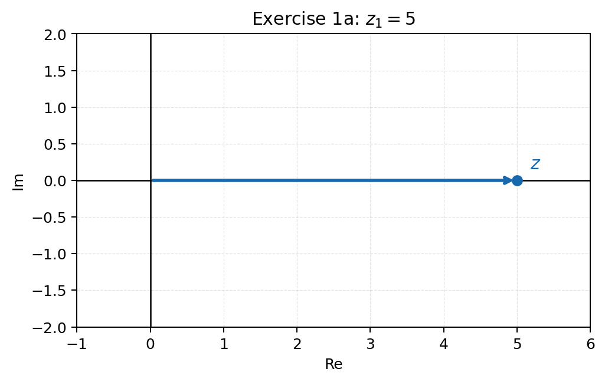

```python title:"problem 1a"
from pathlib import Path
import matplotlib.pyplot as plt

x = 5.0
y = 0.0

fig, ax = plt.subplots(figsize=(5.8, 5.8), dpi=180)
ax.set_xlim(-1, 6)
ax.set_ylim(-2, 2)
ax.set_aspect("equal", adjustable="box")
ax.axhline(0, color="black", linewidth=1)
ax.axvline(0, color="black", linewidth=1)
ax.grid(True, linestyle="--", linewidth=0.5, alpha=0.35)
ax.set_xlabel("Re")
ax.set_ylabel("Im")
ax.set_title(r"Exercise 1a: $z_1=5$")

ax.annotate("", xy=(x, y), xytext=(0, 0), arrowprops=dict(arrowstyle="->", lw=2.2, color="#1768ac"))
ax.scatter([x], [y], s=42, color="#1768ac", zorder=3)
ax.text(x + 0.18, y + 0.16, "$z$", color="#1768ac", fontsize=12)

fig.tight_layout()
output = Path("images/exercise1-problem1a.png")
fig.savefig(output, bbox_inches="tight")
plt.show()

```


##### problem 1b


$$
z_{2}=-3 i=0-3 i .
$$

So

$$
x=0,
\qquad
y=-3 .
$$

The modulus is

$$
\begin{aligned}
\left|z_{2}\right|
&=\sqrt{x^{2}+y^{2}} \\
&=\sqrt{0^{2}+(-3)^{2}} \\
&=\sqrt{0+9} \\
&=\sqrt{9} \\
&=3 .
\end{aligned}
$$

To find the argument, use

$$
\begin{aligned}
x
&=r \cos \theta \\
0
&=3 \cos \theta \\
\frac{0}{3}
&=\cos \theta \\
0
&=\cos \theta,
\end{aligned}
\qquad
\begin{aligned}
y
&=r \sin \theta \\
-3
&=3 \sin \theta \\
\frac{-3}{3}
&=\sin \theta \\
-1
&=\sin \theta .
\end{aligned}
$$

Thus we need

$$
\cos \theta=0
\qquad \text { and } \qquad
\sin \theta=-1 .
$$

From the special trigonometric values, this happens when

$$
\theta=-\frac{\pi}{2}+2 k \pi,
\qquad
k \in \mathbb{Z} .
$$

Equivalently,

$$
\theta=\frac{3 \pi}{2}+2 k \pi,
\qquad
k \in \mathbb{Z} .
$$

Therefore the argument is

$$
\arg z_{2}=\left\{-\frac{\pi}{2}+2 k \pi: k \in \mathbb{Z}\right\} .
$$

Among these values, the one in the interval $(-\pi, \pi]$ is

$$
\operatorname{Arg} z_{2}=-\frac{\pi}{2} .
$$

The polar form is

$$
z_{2}=r(\cos \theta+i \sin \theta)=3(\cos \theta+i \sin \theta),
\qquad
\theta=-\frac{\pi}{2}+2 k \pi,\ k \in \mathbb{Z} .
$$

In particular, using the principal argument $\theta=-\frac{\pi}{2}$,

$$
\begin{aligned}
z_{2}
&=3\left(\cos \left(-\frac{\pi}{2}\right)+i \sin \left(-\frac{\pi}{2}\right)\right) \\
&=3(0+i(-1)) \\
&=3(0-i) \\
&=-3 i .
\end{aligned}
$$

So the final answers are:

$$
\left|z_{2}\right|=3,
\qquad
\arg z_{2}=-\frac{\pi}{2}+2 k \pi \text { for } k \in \mathbb{Z},
\qquad
\operatorname{Arg} z_{2}=-\frac{\pi}{2},
$$

and

$$
z_{2}=3(\cos \theta+i \sin \theta),
\qquad
\theta=-\frac{\pi}{2}+2 k \pi,\ k \in \mathbb{Z} .
$$


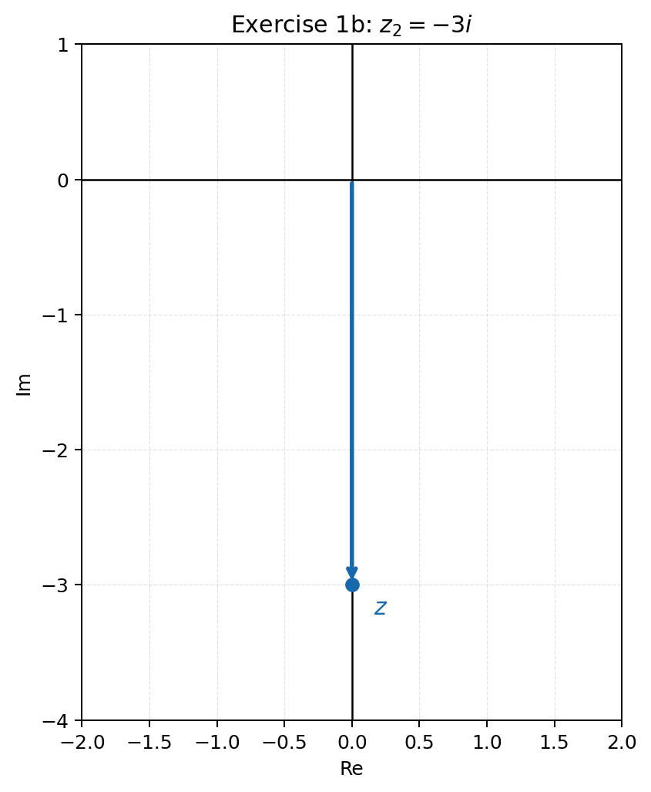

```python title:""
from pathlib import Path
import matplotlib.pyplot as plt

x = 0.0
y = -3.0

fig, ax = plt.subplots(figsize=(5.8, 5.8), dpi=180)
ax.set_xlim(-2, 2)
ax.set_ylim(-4, 1)
ax.set_aspect("equal", adjustable="box")
ax.axhline(0, color="black", linewidth=1)
ax.axvline(0, color="black", linewidth=1)
ax.grid(True, linestyle="--", linewidth=0.5, alpha=0.35)
ax.set_xlabel("Re")
ax.set_ylabel("Im")
ax.set_title(r"Exercise 1b: $z_2=-3i$")

ax.annotate("", xy=(x, y), xytext=(0, 0), arrowprops=dict(arrowstyle="->", lw=2.2, color="#1768ac"))
ax.scatter([x], [y], s=42, color="#1768ac", zorder=3)
ax.text(x + 0.16, y - 0.22, "$z$", color="#1768ac", fontsize=12)

fig.tight_layout()
output = Path("images/exercise1-problem1b.png")
fig.savefig(output, bbox_inches="tight")
plt.show()

```

##### problem 1c


$$
z_{3}=\sqrt{3}+i .
$$

So

$$
x=\sqrt{3},
\qquad
y=1 .
$$

The modulus is

$$
\begin{aligned}
\left|z_{3}\right|
&=\sqrt{x^{2}+y^{2}} \\
&=\sqrt{\left(\sqrt{3}\right)^{2}+1^{2}} \\
&=\sqrt{3+1} \\
&=\sqrt{4} \\
&=2 .
\end{aligned}
$$

To find the argument, use

$$
\begin{aligned}
x
&=r \cos \theta \\
\sqrt{3}
&=2 \cos \theta \\
\frac{\sqrt{3}}{2}
&=\cos \theta,
\end{aligned}
\qquad
\begin{aligned}
y
&=r \sin \theta \\
1
&=2 \sin \theta \\
\frac{1}{2}
&=\sin \theta .
\end{aligned}
$$

Thus we need

$$
\cos \theta=\frac{\sqrt{3}}{2}
\qquad \text { and } \qquad
\sin \theta=\frac{1}{2} .
$$

Therefore 

$$
\tan \theta=\frac{y}{x}=\frac{\sin \theta}{\cos \theta} = \frac{\frac{1}{2}}{\frac{\sqrt{3}}{2}} = \frac{1}{\sqrt{3}}
$$

Therefore

$$
\theta=\arctan \left(\frac{1}{\sqrt{3}}\right)=\frac{\pi}{6}
$$

Since

$$
x=\sqrt{3}>0
\qquad \text { and } \qquad
y=1>0,
$$

the point lies in Quadrant I, so $\theta=\frac{\pi}{6}$ is the correct principal angle.

So
$$
\theta=\frac{\pi}{6}+2 k \pi,
\qquad
k \in \mathbb{Z} .
$$

Therefore the argument is

$$
\arg z_{3}=\left\{\frac{\pi}{6}+2 k \pi: k \in \mathbb{Z}\right\} .
$$

Among these values, the one in the interval $(-\pi, \pi]$ is

$$
\operatorname{Arg} z_{3}=\frac{\pi}{6} .
$$

The polar form is

$$
z_{3}=r(\cos \theta+i \sin \theta)=2(\cos \theta+i \sin \theta),
\qquad
\theta=\frac{\pi}{6}+2 k \pi,\ k \in \mathbb{Z} .
$$

In particular, using the principal argument $\theta=\frac{\pi}{6}$,

$$
\begin{aligned}
z_{3}
&=2\left(\cos \frac{\pi}{6}+i \sin \frac{\pi}{6}\right) \\
&=2\left(\frac{\sqrt{3}}{2}+i \cdot \frac{1}{2}\right) \\
&=2 \cdot \frac{\sqrt{3}}{2}+2 \cdot i \cdot \frac{1}{2} \\
&=\sqrt{3}+i .
\end{aligned}
$$

So the final answers are:

$$
\left|z_{3}\right|=2,
\qquad
\arg z_{3}=\frac{\pi}{6}+2 k \pi \text { for } k \in \mathbb{Z},
\qquad
\operatorname{Arg} z_{3}=\frac{\pi}{6},
$$

and

$$
z_{3}=2(\cos \theta+i \sin \theta),
\qquad
\theta=\frac{\pi}{6}+2 k \pi,\ k \in \mathbb{Z} .
$$

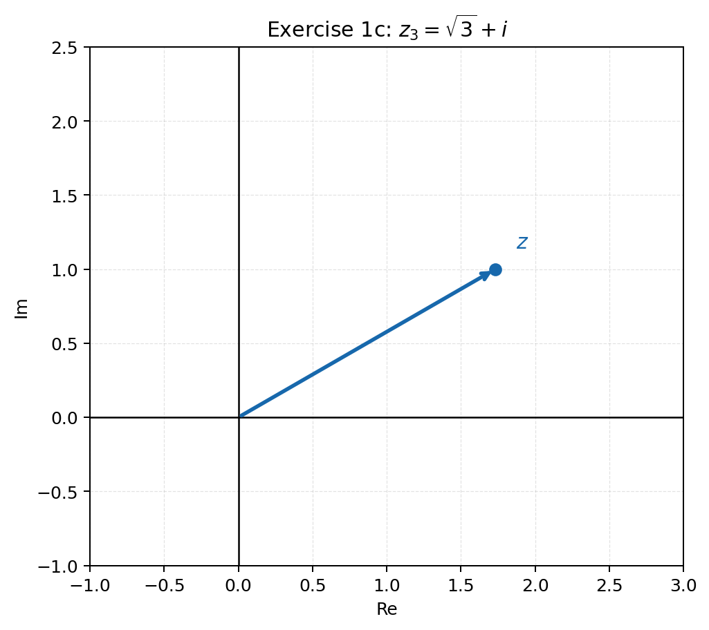

```python title:""
from pathlib import Path
import math
import matplotlib.pyplot as plt

x = math.sqrt(3)
y = 1.0

fig, ax = plt.subplots(figsize=(5.8, 5.8), dpi=180)
ax.set_xlim(-1, 3)
ax.set_ylim(-1, 2.5)
ax.set_aspect("equal", adjustable="box")
ax.axhline(0, color="black", linewidth=1)
ax.axvline(0, color="black", linewidth=1)
ax.grid(True, linestyle="--", linewidth=0.5, alpha=0.35)
ax.set_xlabel("Re")
ax.set_ylabel("Im")
ax.set_title(r"Exercise 1c: $z_3=\sqrt{3}+i$")

ax.annotate("", xy=(x, y), xytext=(0, 0), arrowprops=dict(arrowstyle="->", lw=2.2, color="#1768ac"))
ax.scatter([x], [y], s=42, color="#1768ac", zorder=3)
ax.text(x + 0.14, y + 0.14, "$z$", color="#1768ac", fontsize=12)

fig.tight_layout()
output = Path("images/exercise1-problem1c.png")
fig.savefig(output, bbox_inches="tight")
plt.show()

```

##### problem 1d


$$
z_{4}=1+i .
$$

So

$$
x=1,
\qquad
y=1 .
$$

The modulus is

$$
\begin{aligned}
\left|z_{4}\right|
&=\sqrt{x^{2}+y^{2}} \\
&=\sqrt{1^{2}+1^{2}} \\
&=\sqrt{1+1} \\
&=\sqrt{2} .
\end{aligned}
$$

To find the argument, use

$$
\begin{aligned}
x
&=r \cos \theta \\
1
&=\sqrt{2} \cos \theta \\
\frac{1}{\sqrt{2}}
&=\cos \theta,
\end{aligned}
\qquad
\begin{aligned}
y
&=r \sin \theta \\
1
&=\sqrt{2} \sin \theta \\
\frac{1}{\sqrt{2}}
&=\sin \theta .
\end{aligned}
$$


Also,

$$
\tan \theta=\frac{y}{x}=\frac{\sin \theta}{\cos \theta}=\frac{1}{1}=1 .
$$

Therefore

$$
\theta=\arctan (1)=\frac{\pi}{4} .
$$

Since

$$
x=1>0
\qquad \text { and } \qquad
y=1>0,
$$

the point lies in Quadrant I, so $\theta=\frac{\pi}{4}$ is the correct principal angle.

So

$$
\theta=\frac{\pi}{4}+2 k \pi,
\qquad
k \in \mathbb{Z} .
$$

Therefore the argument is

$$
\arg z_{4}=\left\{\frac{\pi}{4}+2 k \pi: k \in \mathbb{Z}\right\} .
$$

Among these values, the one in the interval $(-\pi, \pi]$ is

$$
\operatorname{Arg} z_{4}=\frac{\pi}{4} .
$$

The polar form is

$$
z_{4}=r(\cos \theta+i \sin \theta)=\sqrt{2}(\cos \theta+i \sin \theta),
\qquad
\theta=\frac{\pi}{4}+2 k \pi,\ k \in \mathbb{Z} .
$$

In particular, using the principal argument $\theta=\frac{\pi}{4}$,

$$
\begin{aligned}
z_{4}
&=\sqrt{2}\left(\cos \frac{\pi}{4}+i \sin \frac{\pi}{4}\right) \\
&=\sqrt{2}\left(\frac{\sqrt{2}}{2}+i \cdot \frac{\sqrt{2}}{2}\right) \\
&=\sqrt{2} \cdot \frac{\sqrt{2}}{2}+\sqrt{2} \cdot i \cdot \frac{\sqrt{2}}{2} \\
&=\frac{2}{2}+i \cdot \frac{2}{2} \\
&=1+i .
\end{aligned}
$$

So the final answers are:

$$
\left|z_{4}\right|=\sqrt{2},
\qquad
\arg z_{4}=\frac{\pi}{4}+2 k \pi \text { for } k \in \mathbb{Z},
\qquad
\operatorname{Arg} z_{4}=\frac{\pi}{4},
$$

and

$$
z_{4}=\sqrt{2}(\cos \theta+i \sin \theta),
\qquad
\theta=\frac{\pi}{4}+2 k \pi,\ k \in \mathbb{Z} .
$$

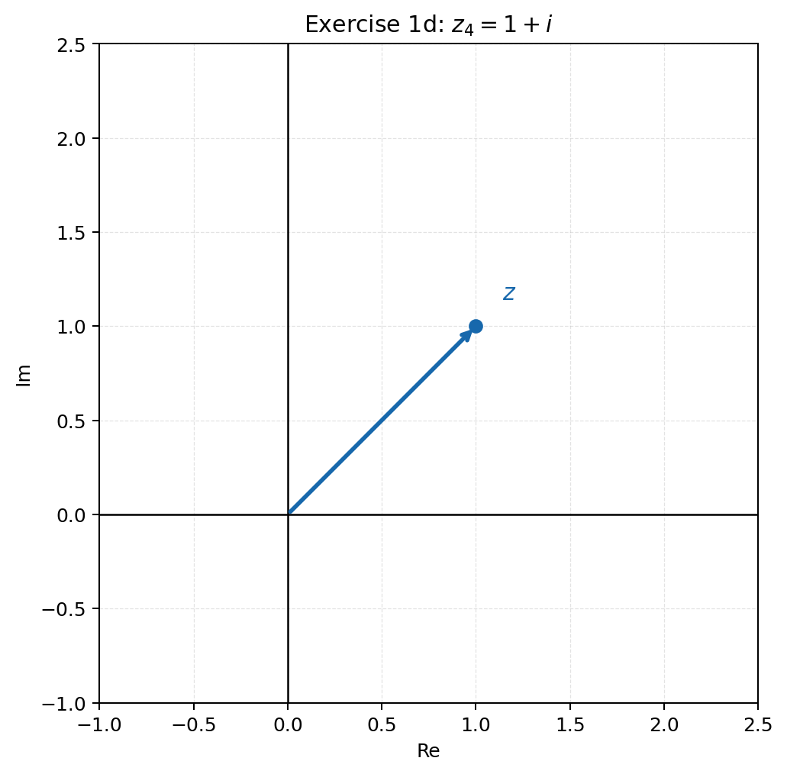

```python title:""
from pathlib import Path
import matplotlib.pyplot as plt

x = 1.0
y = 1.0

fig, ax = plt.subplots(figsize=(5.8, 5.8), dpi=180)
ax.set_xlim(-1, 2.5)
ax.set_ylim(-1, 2.5)
ax.set_aspect("equal", adjustable="box")
ax.axhline(0, color="black", linewidth=1)
ax.axvline(0, color="black", linewidth=1)
ax.grid(True, linestyle="--", linewidth=0.5, alpha=0.35)
ax.set_xlabel("Re")
ax.set_ylabel("Im")
ax.set_title(r"Exercise 1d: $z_4=1+i$")

ax.annotate("", xy=(x, y), xytext=(0, 0), arrowprops=dict(arrowstyle="->", lw=2.2, color="#1768ac"))
ax.scatter([x], [y], s=42, color="#1768ac", zorder=3)
ax.text(x + 0.14, y + 0.14, "$z$", color="#1768ac", fontsize=12)

fig.tight_layout()
output = Path("images/exercise1-problem1d.png")
fig.savefig(output, bbox_inches="tight")
plt.show()

```

##### problem 1e


Now apply these formulas to

$$
z_{5}=1-i .
$$

So

$$
x=1,
\qquad
y=-1 .
$$

The modulus is

$$
\begin{aligned}
\left|z_{5}\right|
&=\sqrt{x^{2}+y^{2}} \\
&=\sqrt{1^{2}+(-1)^{2}} \\
&=\sqrt{1+1} \\
&=\sqrt{2} .
\end{aligned}
$$

To find the argument, use

$$
\begin{aligned}
x
&=r \cos \theta \\
1
&=\sqrt{2} \cos \theta \\
\frac{1}{\sqrt{2}}
&=\cos \theta,
\end{aligned}
\qquad
\begin{aligned}
y
&=r \sin \theta \\
-1
&=\sqrt{2} \sin \theta \\
\frac{-1}{\sqrt{2}}
&=\sin \theta .
\end{aligned}
$$

Since

$$
\tan \theta=\frac{y}{x}=\frac{\sin \theta}{\cos \theta}=\frac{-1}{1}=-1 .
$$

we have

$$
\theta=\arctan (-1)=-\frac{\pi}{4} .
$$

Since

$$
x=1>0
\qquad \text { and } \qquad
y=-1<0,
$$

the point lies in Quadrant IV, so $\theta=-\frac{\pi}{4}$ is the correct principal angle.

So

$$
\theta=-\frac{\pi}{4}+2 k \pi,
\qquad
k \in \mathbb{Z} .
$$

Therefore the argument is

$$
\arg z_{5}=\left\{-\frac{\pi}{4}+2 k \pi: k \in \mathbb{Z}\right\} .
$$

Among these values, the one in the interval $(-\pi, \pi]$ is

$$
\operatorname{Arg} z_{5}=-\frac{\pi}{4} .
$$

The polar form is

$$
z_{5}=r(\cos \theta+i \sin \theta)=\sqrt{2}(\cos \theta+i \sin \theta),
\qquad
\theta=-\frac{\pi}{4}+2 k \pi,\ k \in \mathbb{Z} .
$$

In particular, using the principal argument $\theta=-\frac{\pi}{4}$,

$$
\begin{aligned}
z_{5}
&=\sqrt{2}\left(\cos \left(-\frac{\pi}{4}\right)+i \sin \left(-\frac{\pi}{4}\right)\right) \\
&=\sqrt{2}\left(\frac{\sqrt{2}}{2}+i \cdot \left(-\frac{\sqrt{2}}{2}\right)\right) \\
&=\sqrt{2} \cdot \frac{\sqrt{2}}{2}+\sqrt{2} \cdot i \cdot \left(-\frac{\sqrt{2}}{2}\right) \\
&=\frac{2}{2}+i \cdot \left(-\frac{2}{2}\right) \\
&=1-i .
\end{aligned}
$$

So the final answers are:

$$
\left|z_{5}\right|=\sqrt{2},
\qquad
\arg z_{5}=-\frac{\pi}{4}+2 k \pi \text { for } k \in \mathbb{Z},
\qquad
\operatorname{Arg} z_{5}=-\frac{\pi}{4},
$$

and

$$
z_{5}=\sqrt{2}(\cos \theta+i \sin \theta),
\qquad
\theta=-\frac{\pi}{4}+2 k \pi,\ k \in \mathbb{Z} .
$$

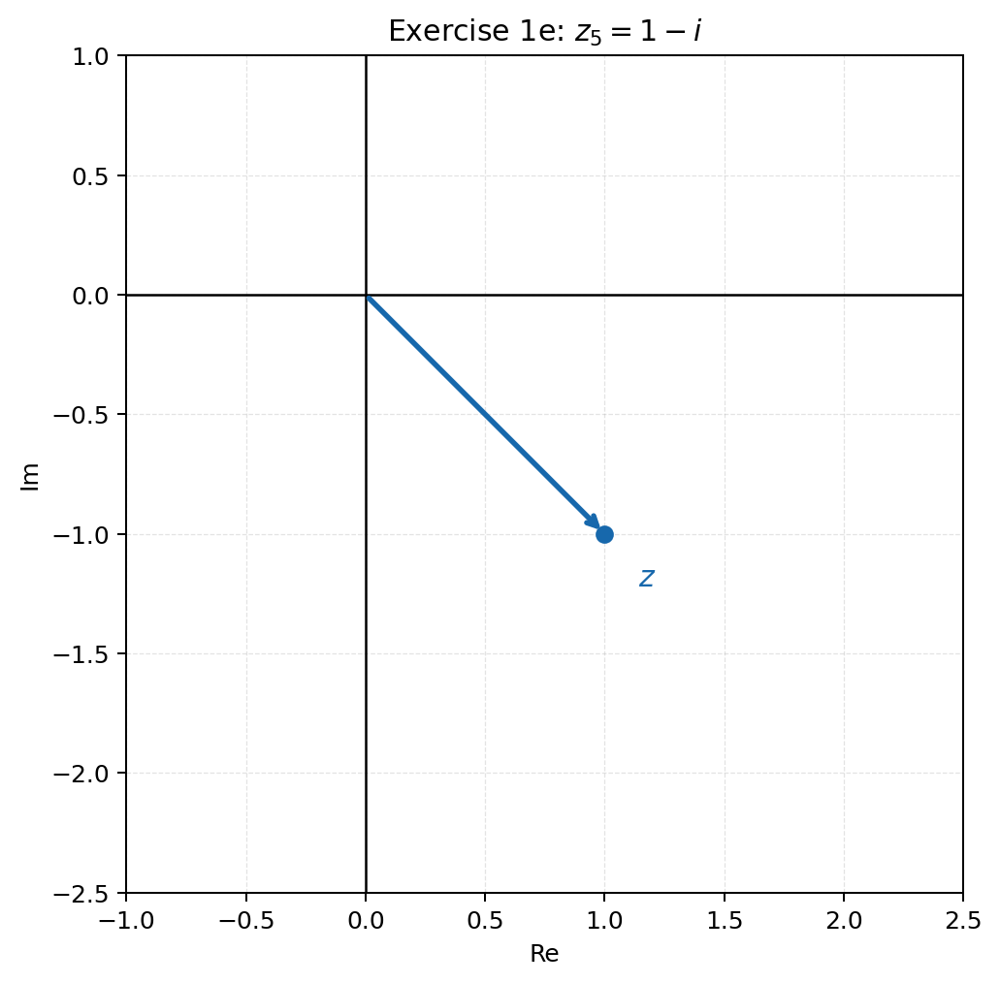


```python title:""
from pathlib import Path
import matplotlib.pyplot as plt

x = 1.0
y = -1.0

fig, ax = plt.subplots(figsize=(5.8, 5.8), dpi=180)
ax.set_xlim(-1, 2.5)
ax.set_ylim(-2.5, 1)
ax.set_aspect("equal", adjustable="box")
ax.axhline(0, color="black", linewidth=1)
ax.axvline(0, color="black", linewidth=1)
ax.grid(True, linestyle="--", linewidth=0.5, alpha=0.35)
ax.set_xlabel("Re")
ax.set_ylabel("Im")
ax.set_title(r"Exercise 1e: $z_5=1-i$")

ax.annotate("", xy=(x, y), xytext=(0, 0), arrowprops=dict(arrowstyle="->", lw=2.2, color="#1768ac"))
ax.scatter([x], [y], s=42, color="#1768ac", zorder=3)
ax.text(x + 0.14, y - 0.22, "$z$", color="#1768ac", fontsize=12)

fig.tight_layout()
output = Path("images/exercise1-problem1e.png")
fig.savefig(output, bbox_inches="tight")
plt.show()

```


##### problem 1f


Now apply these formulas to

$$
z_{6}=-1-i .
$$

So

$$
x=-1,
\qquad
y=-1 .
$$

The modulus is

$$
\begin{aligned}
\left|z_{6}\right|
&=\sqrt{x^{2}+y^{2}} \\
&=\sqrt{(-1)^{2}+(-1)^{2}} \\
&=\sqrt{1+1} \\
&=\sqrt{2} .
\end{aligned}
$$

To find the argument, use

$$
\begin{aligned}
x
&=r \cos \theta \\
-1
&=\sqrt{2} \cos \theta \\
\frac{-1}{\sqrt{2}}
&=\cos \theta,
\end{aligned}
\qquad
\begin{aligned}
y
&=r \sin \theta \\
-1
&=\sqrt{2} \sin \theta \\
\frac{-1}{\sqrt{2}}
&=\sin \theta .
\end{aligned}
$$


We have,

$$
\tan \theta=\frac{y}{x}=\frac{\sin \theta}{\cos \theta}=\frac{-1}{-1}=1 .
$$

Therefore the reference angle is

$$
\arctan (1)=\frac{\pi}{4} .
$$

Since

$$
x=-1<0
\qquad \text { and } \qquad
y=-1<0,
$$

the point lies in Quadrant III. The angle in Quadrant III with reference angle $\frac{\pi}{4}$ is

$$
\theta=\pi+\frac{\pi}{4}=\frac{5 \pi}{4} .
$$

To write the principal value in the interval $(-\pi, \pi]$, subtract $2 \pi$:

$$
\theta=\frac{5 \pi}{4}-2 \pi=\frac{5 \pi}{4}-\frac{8 \pi}{4}=-\frac{3 \pi}{4} .
$$

So

$$
\theta=-\frac{3 \pi}{4}+2 k \pi,
\qquad
k \in \mathbb{Z} .
$$

Therefore the argument is

$$
\arg z_{6}=\left\{-\frac{3 \pi}{4}+2 k \pi: k \in \mathbb{Z}\right\} .
$$

Among these values, the one in the interval $(-\pi, \pi]$ is

$$
\operatorname{Arg} z_{6}=-\frac{3 \pi}{4} .
$$

The polar form is

$$
z_{6}=r(\cos \theta+i \sin \theta)=\sqrt{2}(\cos \theta+i \sin \theta),
\qquad
\theta=-\frac{3 \pi}{4}+2 k \pi,\ k \in \mathbb{Z} .
$$

In particular, using the principal argument $\theta=-\frac{3 \pi}{4}$,

$$
\begin{aligned}
z_{6}
&=\sqrt{2}\left(\cos \left(-\frac{3 \pi}{4}\right)+i \sin \left(-\frac{3 \pi}{4}\right)\right) \\
&=\sqrt{2}\left(-\frac{\sqrt{2}}{2}+i \cdot \left(-\frac{\sqrt{2}}{2}\right)\right) \\
&=\sqrt{2} \cdot \left(-\frac{\sqrt{2}}{2}\right)+\sqrt{2} \cdot i \cdot \left(-\frac{\sqrt{2}}{2}\right) \\
&=-\frac{2}{2}+i \cdot \left(-\frac{2}{2}\right) \\
&=-1-i .
\end{aligned}
$$

So the final answers are:

$$
\left|z_{6}\right|=\sqrt{2},
\qquad
\arg z_{6}=-\frac{3 \pi}{4}+2 k \pi \text { for } k \in \mathbb{Z},
\qquad
\operatorname{Arg} z_{6}=-\frac{3 \pi}{4},
$$

and

$$
z_{6}=\sqrt{2}(\cos \theta+i \sin \theta),
\qquad
\theta=-\frac{3 \pi}{4}+2 k \pi,\ k \in \mathbb{Z} .
$$

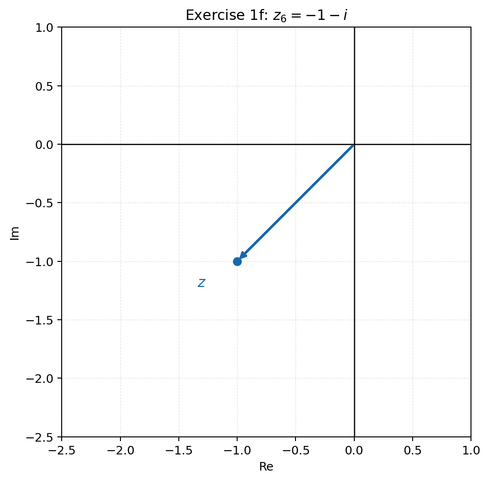


```python title:""
from pathlib import Path
import matplotlib.pyplot as plt

x = -1.0
y = -1.0

fig, ax = plt.subplots(figsize=(5.8, 5.8), dpi=180)
ax.set_xlim(-2.5, 1)
ax.set_ylim(-2.5, 1)
ax.set_aspect("equal", adjustable="box")
ax.axhline(0, color="black", linewidth=1)
ax.axvline(0, color="black", linewidth=1)
ax.grid(True, linestyle="--", linewidth=0.5, alpha=0.35)
ax.set_xlabel("Re")
ax.set_ylabel("Im")
ax.set_title(r"Exercise 1f: $z_6=-1-i$")

ax.annotate("", xy=(x, y), xytext=(0, 0), arrowprops=dict(arrowstyle="->", lw=2.2, color="#1768ac"))
ax.scatter([x], [y], s=42, color="#1768ac", zorder=3)
ax.text(x - 0.34, y - 0.22, "$z$", color="#1768ac", fontsize=12)

fig.tight_layout()
output = Path("images/exercise1-problem1f.png")
fig.savefig(output, bbox_inches="tight")
plt.show()

```


> [!figure] Figure 2
> 
> 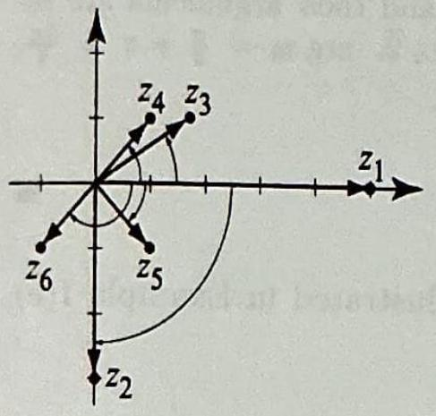
> Figure 2 The points in Example 1. Note that $r$ is always $\geq 0$ in the polar representation.


> [!review] Review 3
> 1. Prove the identities: (a) $\arg \bar{z}=-\arg z$, (b) $\arg (-z)=\arg z+\pi$
> 2. Why does $\theta=\tan ^{-1}\left(\frac{y}{x}\right)$ fail to determine $\theta$ in general? Draw a plot to illustrate your point. What property of the tangent function allows us to correct for this, and how? 
> 3. Using Q2, derive the piecewise formula for $\operatorname{Arg} z$ when $x \neq 0$. What determines the choice of correction in each case?
> 4. What alternative expression gives $\operatorname{Arg} z$ when $x=0$ ?


##### problem 1

Assume $z\neq 0$, since the argument is undefined at $z=0$.

We use the polar form

$$
z=r(\cos \theta+i\sin \theta), \qquad r=|z|>0,
$$

the conjugation rule

$$
\overline{a+ib}=a-ib,
$$

and the angle identities

$$
\cos(-\theta)=\cos\theta, \qquad \sin(-\theta)=-\sin\theta,
$$

$$
\cos(\theta+\pi)=-\cos\theta, \qquad \sin(\theta+\pi)=-\sin\theta.
$$

Also,

$$
-\arg z=\{-\theta:\theta\in\arg z\}, \qquad \arg z+\pi=\{\theta+\pi:\theta\in\arg z\}.
$$

For (a), let $\theta\in\arg z$. Then

$$
\begin{aligned}
z
&=r(\cos\theta+i\sin\theta), \\
\overline{z}
&=\overline{r(\cos\theta+i\sin\theta)}, \\
&=r(\cos\theta-i\sin\theta), \\
&=r(\cos(-\theta)+i\sin(-\theta)).
\end{aligned}
$$

So $-\theta\in\arg \overline{z}$. Therefore

$$
\arg \overline{z}\supseteq -\arg z.
$$

Conversely, let $\phi\in\arg \overline{z}$. Then

$$
\begin{aligned}
\overline{z}
&=r(\cos\phi+i\sin\phi), \\
z
&=\overline{r(\cos\phi+i\sin\phi)}, \\
&=r(\cos\phi-i\sin\phi), \\
&=r(\cos(-\phi)+i\sin(-\phi)).
\end{aligned}
$$

So $-\phi\in\arg z$, which means $\phi\in-\arg z$. Therefore

$$
\arg \overline{z}\subseteq -\arg z.
$$

Combining the two inclusions gives

$$
\arg \overline{z}=-\arg z.
$$

For (b), let $\theta\in\arg z$. Then

$$
\begin{aligned}
z
&=r(\cos\theta+i\sin\theta), \\
-z
&=-r(\cos\theta+i\sin\theta), \\
&=r(-\cos\theta-i\sin\theta), \\
&=r(\cos(\theta+\pi)+i\sin(\theta+\pi)).
\end{aligned}
$$

So $\theta+\pi\in\arg(-z)$. Therefore

$$
\arg(-z)\supseteq \arg z+\pi.
$$

Conversely, let $\phi\in\arg(-z)$. Then

$$
\begin{aligned}
-z
&=r(\cos\phi+i\sin\phi), \\
z
&=-r(\cos\phi+i\sin\phi), \\
&=r(-\cos\phi-i\sin\phi), \\
&=r(\cos(\phi-\pi)+i\sin(\phi-\pi)).
\end{aligned}
$$

So $\phi-\pi\in\arg z$, which means $\phi\in\arg z+\pi$. Therefore

$$
\arg(-z)\subseteq \arg z+\pi.
$$

Hence

$$
\arg(-z)=\arg z+\pi.
$$


##### problem 2

We use the formulas

$$
\tan\theta=\frac{y}{x}\qquad (x\neq 0),
$$

$$
\tan(\theta+k\pi)=\tan\theta \qquad (k\in\mathbb{Z}),
$$

and the principal range of the inverse tangent

$$
\tan^{-1}(u)\in\left(-\frac{\pi}{2},\frac{\pi}{2}\right).
$$

The difficulty is that the tangent function is not one-to-one on all of $\mathbb{R}$. Different angles can have the same tangent value. For example,

$$
\begin{aligned}
\theta
&=\frac{4\pi}{3}, \\
\tan\theta
&=\tan\left(\pi+\frac{\pi}{3}\right), \\
&=\tan\frac{\pi}{3}, \\
&=\sqrt{3}.
\end{aligned}
$$

But

$$
\tan^{-1}(\sqrt{3})=\frac{\pi}{3}\neq \frac{4\pi}{3}.
$$

So the formula

$$
\theta=\tan^{-1}\left(\frac{y}{x}\right)
$$

does not determine $\theta$ in general. It returns only the representative in the interval

$$
\left(-\frac{\pi}{2},\frac{\pi}{2}\right).
$$

The property that fixes the problem is the $\pi$-periodicity of the tangent:

$$
\tan(\theta+k\pi)=\tan\theta.
$$

Therefore, if

$$
\tan\theta=\frac{y}{x},
$$

then the full family of solutions is

$$
\theta=\tan^{-1}\left(\frac{y}{x}\right)+k\pi, \qquad k\in\mathbb{Z}.
$$

The correct value of $k$ is chosen so that $\theta$ lands in the correct quadrant. If we want the principal value, we also require

$$
-\pi<\theta\leq\pi.
$$

The following Mathematica code plots $y=\tan\theta$ and the horizontal line $y=\sqrt{3}$, showing that both $\theta=\frac{\pi}{3}$ and $\theta=\frac{4\pi}{3}$ have the same tangent:


```mathematica title:""
Show[
 Plot[
  {Tan[t], Sqrt[3]},
  {t, 0, 3 Pi/2 - 0.05},
  Exclusions -> {Pi/2},
  PlotRange -> {-5, 5},
  PlotStyle -> {
    Directive[Blue, Thick],
    Directive[Red, Dashed, Thick]
  },
  AxesLabel -> {Style["\[Theta]", 14], None},
  Ticks -> {
    {
      {0, "0"},
      {Pi/3, "\[Pi]/3"},
      {Pi/2, "\[Pi]/2"},
      {Pi, "\[Pi]"},
      {4 Pi/3, "4\[Pi]/3"},
      {3 Pi/2, "3\[Pi]/2"}
    },
    Automatic
  },
  GridLines -> {{Pi/3, Pi/2, 4 Pi/3}, None},
  GridLinesStyle -> Directive[GrayLevel[0.8], Dashed],
  ImageSize -> Large
 ],
 Graphics[{
   Black, PointSize[0.02],
   Point[{Pi/3, Sqrt[3]}],
   Point[{4 Pi/3, Sqrt[3]}],
   Text[Style["(\[Pi]/3, \!\(\*SqrtBox[\(3\)]\))", 13], {Pi/3, Sqrt[3]}, {-1.2, -1.2}],
   Text[Style["(4\[Pi]/3, \!\(\*SqrtBox[\(3\)]\))", 13], {4 Pi/3, Sqrt[3]}, {1.2, 1.2}]
 }]
]
```


##### problem 3

We use the formulas

$$
\tan\theta=\frac{y}{x}\qquad (x\neq 0),
$$

$$
\theta=\tan^{-1}\left(\frac{y}{x}\right)+k\pi, \qquad k\in\mathbb{Z},
$$

and the principal-value restriction

$$
-\pi<\operatorname{Arg} z\leq\pi.
$$

Set

$$
\alpha=\tan^{-1}\left(\frac{y}{x}\right).
$$

Then

$$
-\frac{\pi}{2}<\alpha<\frac{\pi}{2},
$$

and

$$
\tan\alpha=\frac{y}{x}.
$$

Since also

$$
\tan\theta=\frac{y}{x},
$$

we get

$$
\tan\theta=\tan\alpha.
$$

By the $\pi$-periodicity of the tangent,

$$
\theta=\alpha+k\pi, \qquad k\in\mathbb{Z}.
$$

Now choose $k$ so that $\theta$ is in the correct quadrant and also satisfies

$$
-\pi<\theta\leq\pi.
$$

If $x>0$, then $z$ is in quadrant I or IV. In both cases the principal argument already lies in

$$
\left(-\frac{\pi}{2},\frac{\pi}{2}\right),
$$

so we choose $k=0$. Thus

$$
\operatorname{Arg} z=\alpha=\tan^{-1}\left(\frac{y}{x}\right).
$$

If $x<0$ and $y\geq 0$, then

$$
\frac{y}{x}\leq 0,
$$

so

$$
-\frac{\pi}{2}<\alpha\leq 0.
$$

Adding $\pi$ gives

$$
\frac{\pi}{2}<\alpha+\pi\leq\pi.
$$

**That is exactly the principal-value interval for quadrant II together with the point on the negative real axis.** Hence we choose $k=1$, and

$$
\operatorname{Arg} z=\alpha+\pi=\tan^{-1}\left(\frac{y}{x}\right)+\pi.
$$

If $x<0$ and $y<0$, then

$$
\frac{y}{x}>0,
$$

so

$$
0<\alpha<\frac{\pi}{2}.
$$

Subtracting $\pi$ gives

$$
-\pi<\alpha-\pi<-\frac{\pi}{2}.
$$

**That is exactly the principal-value interval for quadrant III.** Hence we choose $k=-1$, and

$$
\operatorname{Arg} z=\alpha-\pi=\tan^{-1}\left(\frac{y}{x}\right)-\pi.
$$

Therefore, for $x\neq 0$,

$$
\operatorname{Arg} z=
\begin{cases}
\tan^{-1}\left(\frac{y}{x}\right), & \text{if } x>0, \\[6pt]
\tan^{-1}\left(\frac{y}{x}\right)+\pi, & \text{if } x<0 \text{ and } y\geq 0, \\[6pt]
\tan^{-1}\left(\frac{y}{x}\right)-\pi, & \text{if } x<0 \text{ and } y<0.
\end{cases}
$$


##### problem 4

We use the principal-value restriction

$$
-\pi<\operatorname{Arg} z\leq\pi,
$$

and the polar-coordinate identities

$$
\cos\theta=\frac{x}{r}, \qquad \sin\theta=\frac{y}{r}.
$$

If $x=0$ and $z\neq 0$, then

$$
z=iy
$$

with

$$
y\neq 0.
$$

Also,

$$
r=|z|=|y|.
$$

Then

$$
\cos\theta=\frac{x}{r}=\frac{0}{|y|}=0,
$$

and

$$
\sin\theta=\frac{y}{r}=\frac{y}{|y|}.
$$

If $y>0$, then

$$
\frac{y}{|y|}=1,
$$

so

$$
\cos\theta=0, \qquad \sin\theta=1,
$$

which gives the principal angle

$$
\theta=\frac{\pi}{2}.
$$

If $y<0$, then

$$
\frac{y}{|y|}=-1,
$$

so

$$
\cos\theta=0, \qquad \sin\theta=-1,
$$

which gives the principal angle

$$
\theta=-\frac{\pi}{2}.
$$

Therefore, when $x=0$ and $z\neq 0$,

$$
\operatorname{Arg} z=\operatorname{Arg}(iy)=
\begin{cases}
\frac{\pi}{2}, & \text{if } y>0, \\[6pt]
-\frac{\pi}{2}, & \text{if } y<0.
\end{cases}
$$

If $z=0$, the argument is undefined.


---


The following properties of the argument were illustrated in Example 1(e) and (f) (for proofs, see Exercise 26):

$$
\begin{gathered}
\arg \bar{z}=-\arg z \\
\arg (-z)=\arg z+\pi
\end{gathered}
$$

It is tempting to compute the argument $\theta$ of a complex number $z=x+i y$ by taking the inverse tangent on both sides of (6) and writing $\theta=\tan ^{-1}\left(\frac{y}{x}\right)$. This formula is true only if $\theta$ is in the interval $\left(-\frac{\pi}{2}, \frac{\pi}{2}\right)$, because the inverse tangent takes its values in the interval $\left(-\frac{\pi}{2}, \frac{\pi}{2}\right)$ (see Figure 3); and so it will not yield values of $\theta$ that are outside this interval. For example, if $\theta=\frac{4 \pi}{3}$, from Table 1 we have $\tan \frac{4 \pi}{3}=\sqrt{3}$. However, $\tan ^{-1} \sqrt{3}=\frac{\pi}{3}$ and not $\frac{4 \pi}{3}$. To overcome this problem, recall that the tangent is $\pi$-periodic. That means, for all $\theta$,

$$
\tan \theta=\tan (\theta+k \pi) \quad(k=0, \pm 1, \pm 2, \ldots) .
$$


> [!figure] Figure 3
> 
> 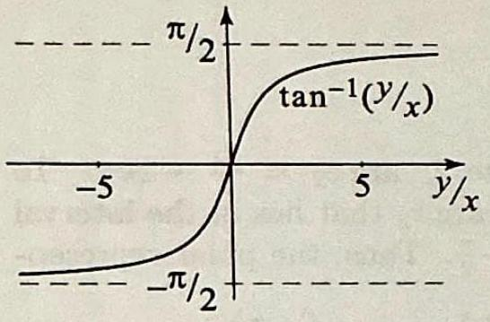
> Figure 3 The inverse tangent takes its values in $\left(\frac{-\pi}{2}, \frac{\pi}{2}\right)$.

For $z=x+i y$ :
$x>0 \Leftrightarrow \quad z$ is in the first or fourth quadrants;
$x<0$ and $y>0 \Leftrightarrow z$ is in the second quadrant;
$x<0$ and $y<0 \Leftrightarrow z$ is in the third quadrant.

Also, since $\tan \theta=\frac{y}{x}$, we conclude that

$$
\theta=\tan ^{-1}\left(\frac{y}{x}\right)+k \pi \quad(x \neq 0),
$$

where the choice of $k$ depends on $z$. You can check that for $z=x+i y$ with $x \neq 0$,

$$
\operatorname{Arg} z= \begin{cases}\tan ^{-1}\left(\frac{y}{x}\right) & \text { if } x>0 \\ \tan ^{-1}\left(\frac{y}{x}\right)+\pi & \text { if } x<0 \text { and } y \geq 0 \\ \tan ^{-1}\left(\frac{y}{x}\right)-\pi & \text { if } x<0 \text { and } y<0\end{cases}
$$

For example, in Figure 4, the point $z_{1}=2+3 i$ is in the first quadrant. Using a calculator, we find $\operatorname{Arg} z_{1}=\tan ^{-1} \frac{3}{2} \approx 0.983$. The point $z_{2}=-2-3 i$, is in the third quadrant, $\operatorname{Arg} z_{2}=\tan ^{-1} \frac{3}{2}-\pi \approx-2.159$. (We remind you that all angles are measured in radians.)


> [!figure] Figure 4
> 
> 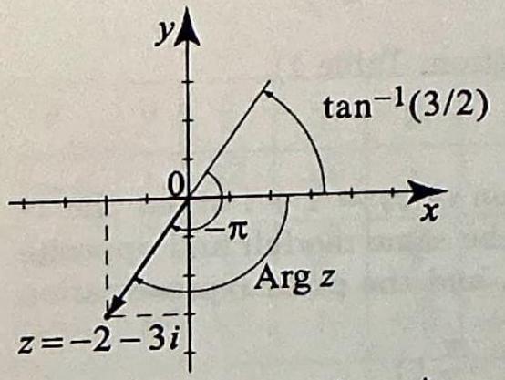
> Figure 4 Computing $\operatorname{Arg} z$ using (14).


When $x$ is zero, we cannot use (13). In this case,

$$
\operatorname{Arg} z=\operatorname{Arg}(i y)= \begin{cases}\frac{\pi}{2} & \text { if } y>0 \\ -\frac{\pi}{2} & \text { if } y<0\end{cases}
$$

## Multiplication, Inverses, and Division in Polar Form

> [!review] Review 4
> 1. Derive the polar form of the product of two complex numbers. What does it reveal about how moduli and arguments combine under multiplication? Create a python plot to illustrate the concept, then create a mathematica demonstration using the manipulate function.
> 2. Derive the polar form of the inverse of a nonzero complex number. What are the modulus and argument of $z^{-1}$ in terms of those of $z$ ?
> 3. Using your results from Q1 and Q2, derive the polar form of the quotient $\frac{z_1}{z_2}$. What does it reveal about how moduli and arguments combine under division? Create a python plot to illustrate the concept, then create a mathematica demonstration using the manipulate function.


##### problem 1

Let

$$
z_{1}=r_{1}\left(\cos \theta_{1}+i \sin \theta_{1}\right),
\qquad
z_{2}=r_{2}\left(\cos \theta_{2}+i \sin \theta_{2}\right),
\qquad
r_{1}>0,\ r_{2}>0,
$$

with $\theta_{1}\in\arg z_{1}$ and $\theta_{2}\in\arg z_{2}$.

To derive the polar form of the product, expand directly and then use the angle-addition identities.

$$
\begin{aligned}
z_{1} z_{2}
&=\left[r_{1}\left(\cos \theta_{1}+i \sin \theta_{1}\right)\right]\left[r_{2}\left(\cos \theta_{2}+i \sin \theta_{2}\right)\right] \\
&=r_{1} r_{2}\left(\cos \theta_{1}+i \sin \theta_{1}\right)\left(\cos \theta_{2}+i \sin \theta_{2}\right) \\
&=r_{1} r_{2}\left(\cos \theta_{1} \cos \theta_{2}+i \cos \theta_{1} \sin \theta_{2}+i \sin \theta_{1} \cos \theta_{2}+i^{2} \sin \theta_{1} \sin \theta_{2}\right) \\
&=r_{1} r_{2}\left(\cos \theta_{1} \cos \theta_{2}+i \cos \theta_{1} \sin \theta_{2}+i \sin \theta_{1} \cos \theta_{2}-\sin \theta_{1} \sin \theta_{2}\right) \\
&=r_{1} r_{2}\left[\left(\cos \theta_{1} \cos \theta_{2}-\sin \theta_{1} \sin \theta_{2}\right)+i\left(\sin \theta_{1} \cos \theta_{2}+\cos \theta_{1} \sin \theta_{2}\right)\right] \\
&=r_{1} r_{2}\left[\cos \left(\theta_{1}+\theta_{2}\right)+i \sin \left(\theta_{1}+\theta_{2}\right)\right].
\end{aligned}
$$

So the polar form of the product is

$$
z_{1} z_{2}=r_{1} r_{2}\left[\cos \left(\theta_{1}+\theta_{2}\right)+i \sin \left(\theta_{1}+\theta_{2}\right)\right].
$$

This immediately gives the modulus:

$$
\left|z_{1} z_{2}\right|=r_{1} r_{2}=\left|z_{1}\right|\left|z_{2}\right|.
$$

For the argument, write the full argument sets explicitly:

$$
\arg z_{1}=\left\{\theta_{1}+2 m \pi: m \in \mathbb{Z}\right\},
\qquad
\arg z_{2}=\left\{\theta_{2}+2 n \pi: n \in \mathbb{Z}\right\}.
$$

Then

$$
\begin{aligned}
\arg \left(z_{1} z_{2}\right)
&=\left\{\theta_{1}+\theta_{2}+2 k \pi: k \in \mathbb{Z}\right\} \\
&=\left\{\theta_{1}+\theta_{2}+2(m+n)\pi: m,n \in \mathbb{Z}\right\} \\
&=\left\{\left(\theta_{1}+2 m \pi\right)+\left(\theta_{2}+2 n \pi\right): m,n \in \mathbb{Z}\right\} \\
&=\arg z_{1}+\arg z_{2}.
\end{aligned}
$$

Thus multiplication in polar form does two things at once: it multiplies the moduli and adds the arguments. If one uses principal arguments instead of full argument sets, then

$$
\operatorname{Arg}\left(z_{1} z_{2}\right)
$$

is the unique number in $(-\pi,\pi]$ congruent to

$$
\operatorname{Arg} z_{1}+\operatorname{Arg} z_{2}
$$

modulo $2\pi$.

The following plot illustrates this with

$$
z_{1}=2\left(\cos \frac{\pi}{6}+i \sin \frac{\pi}{6}\right),
\qquad
z_{2}=\frac{3}{2}\left(\cos \frac{\pi}{3}+i \sin \frac{\pi}{3}\right),
$$

for which

$$
z_{1} z_{2}=3\left(\cos \frac{\pi}{2}+i \sin \frac{\pi}{2}\right)=3 i .
$$

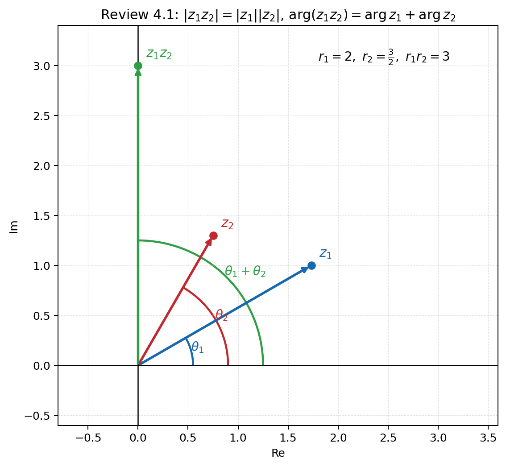


```python title:""
from pathlib import Path
import math
import matplotlib.pyplot as plt
from matplotlib.patches import Arc

def add_angle_arc(ax, theta, radius, color, label, label_angle=None):
    arc = Arc(
        (0, 0),
        2 * radius,
        2 * radius,
        angle=0,
        theta1=0,
        theta2=math.degrees(theta),
        color=color,
        lw=1.8,
    )
    ax.add_patch(arc)
    if label_angle is None:
        label_angle = theta / 2
    ax.text(
        radius * math.cos(label_angle),
        radius * math.sin(label_angle),
        label,
        color=color,
        fontsize=11,
    )

r1, theta1 = 2.0, math.pi / 6
r2, theta2 = 1.5, math.pi / 3
rp, thetap = r1 * r2, theta1 + theta2

points = {
    "z1": (r1 * math.cos(theta1), r1 * math.sin(theta1)),
    "z2": (r2 * math.cos(theta2), r2 * math.sin(theta2)),
    "z1z2": (rp * math.cos(thetap), rp * math.sin(thetap)),
}

fig, ax = plt.subplots(figsize=(6.4, 6.0), dpi=180)
ax.set_aspect("equal", adjustable="box")
ax.set_xlim(-0.8, 3.6)
ax.set_ylim(-0.6, 3.4)
ax.axhline(0, color="black", lw=1)
ax.axvline(0, color="black", lw=1)
ax.grid(True, linestyle="--", linewidth=0.5, alpha=0.35)
ax.set_xlabel("Re")
ax.set_ylabel("Im")
ax.set_title(r"Review 4.1: $|z_1z_2|=|z_1||z_2|$, $\arg(z_1z_2)=\arg z_1+\arg z_2$")

colors = {"z1": "#1768ac", "z2": "#c1292e", "z1z2": "#2f9e44"}
labels = {"z1": r"$z_1$", "z2": r"$z_2$", "z1z2": r"$z_1z_2$"}

for key in ["z1", "z2", "z1z2"]:
    x, y = points[key]
    ax.annotate(
        "",
        xy=(x, y),
        xytext=(0, 0),
        arrowprops=dict(arrowstyle="->", lw=2.2, color=colors[key]),
    )
    ax.scatter([x], [y], s=42, color=colors[key], zorder=3)
    ax.text(x + 0.08, y + 0.08, labels[key], color=colors[key], fontsize=12)

add_angle_arc(ax, theta1, 0.55, colors["z1"], r"$\theta_1$")
add_angle_arc(ax, theta2, 0.9, colors["z2"], r"$\theta_2$", label_angle=theta2 / 2 + 0.02)
add_angle_arc(ax, thetap, 1.25, colors["z1z2"], r"$\theta_1+\theta_2$", label_angle=thetap / 2 + 0.02)
ax.text(1.8, 3.05, r"$r_1=2,\ r_2=\frac{3}{2},\ r_1r_2=3$", fontsize=11)

fig.tight_layout()
output = Path("images/review-4-multiplication.png")
fig.savefig(output, bbox_inches="tight")
plt.show()
```

```mathematica title:""
Manipulate[
 Module[
  {
   z1 = r1 Exp[I theta1],
   z2 = r2 Exp[I theta2],
   zp,
   range = 5
  },
  zp = z1 z2;
  Graphics[
   {
    Thick,
    Blue, Arrow[{{0, 0}, {Re[z1], Im[z1]}}],
    Red, Arrow[{{0, 0}, {Re[z2], Im[z2]}}],
    Darker[Green], Arrow[{{0, 0}, {Re[zp], Im[zp]}}],
    Blue, PointSize[0.02], Point[{Re[z1], Im[z1]}],
    Red, PointSize[0.02], Point[{Re[z2], Im[z2]}],
    Darker[Green], PointSize[0.02], Point[{Re[zp], Im[zp]}],
    Text[Style["z1", 14, Blue], {Re[z1], Im[z1]}, {1, -1}],
    Text[Style["z2", 14, Red], {Re[z2], Im[z2]}, {1, 1}],
    Text[Style["z1 z2", 14, Darker[Green]], {Re[zp], Im[zp]}, {1, 1}]
   },
   Axes -> True,
   AxesLabel -> {"Re", "Im"},
   PlotRange -> {{-range, range}, {-range, range}},
   ImageSize -> Large,
   GridLines -> Automatic,
   PlotLabel ->
    Row[{
      "|z1 z2| = ", NumberForm[Abs[zp], {4, 2}],
      " = |z1||z2|,   Arg(z1 z2) = ",
      NumberForm[Arg[zp], {4, 2}],
      " = Arg(z1) + Arg(z2) mod 2\[Pi]"
    }]
  ]
 ],
 {{r1, 2}, 0.5, 3.5, Appearance -> "Labeled"},
 {{theta1, Pi/6}, -Pi, Pi, Appearance -> "Labeled"},
 {{r2, 3/2}, 0.5, 3.5, Appearance -> "Labeled"},
 {{theta2, Pi/3}, -Pi, Pi, Appearance -> "Labeled"}
]
```

##### problem 2

Assume $z \neq 0$, and write

$$
z=r(\cos \theta+i \sin \theta),
\qquad
r=|z|>0,
\qquad
\theta\in\arg z.
$$

Now compute the reciprocal directly.

$$
\begin{aligned}
z^{-1}
&=\frac{1}{z} \\
&=\frac{1}{r(\cos \theta+i \sin \theta)} \\
&=\frac{1}{r} \cdot \frac{1}{\cos \theta+i \sin \theta} \\
&=\frac{1}{r} \cdot \frac{\cos \theta-i \sin \theta}{(\cos \theta+i \sin \theta)(\cos \theta-i \sin \theta)} \\
&=\frac{1}{r} \cdot \frac{\cos \theta-i \sin \theta}{\cos ^{2} \theta-i \cos \theta \sin \theta+i \sin \theta \cos \theta-i^{2} \sin ^{2} \theta} \\
&=\frac{1}{r} \cdot \frac{\cos \theta-i \sin \theta}{\cos ^{2} \theta+\sin ^{2} \theta} \\
&=\frac{1}{r}\left(\cos \theta-i \sin \theta\right) \\
&=\frac{1}{r}\left(\cos (-\theta)+i \sin (-\theta)\right).
\end{aligned}
$$

Therefore the polar form of the inverse is

$$
z^{-1}=\frac{1}{r}\left(\cos (-\theta)+i \sin (-\theta)\right).
$$

So the modulus and argument behave as follows:

$$
\left|z^{-1}\right|=\frac{1}{r}=\frac{1}{|z|},
$$

and

$$
\arg \left(z^{-1}\right)=-\arg z.
$$

More explicitly, if

$$
\arg z=\left\{\theta+2 k \pi: k \in \mathbb{Z}\right\},
$$

then

$$
\begin{aligned}
\arg \left(z^{-1}\right)
&=\left\{-\theta+2 k \pi: k \in \mathbb{Z}\right\} \\
&=\left\{-(\theta+2 m \pi): m \in \mathbb{Z}\right\} \\
&=-\arg z.
\end{aligned}
$$

For principal arguments, the clean statement is that

$$
\operatorname{Arg}\left(z^{-1}\right)
$$

is the unique number in $(-\pi,\pi]$ congruent to

$$
-\operatorname{Arg} z
$$

modulo $2\pi$.

##### problem 3

Let

$$
z_{1}=r_{1}\left(\cos \theta_{1}+i \sin \theta_{1}\right),
\qquad
z_{2}=r_{2}\left(\cos \theta_{2}+i \sin \theta_{2}\right),
\qquad
r_{1}>0,\ r_{2}>0,
$$

with $\theta_{1}\in\arg z_{1}$ and $\theta_{2}\in\arg z_{2}$. Since $z_{2}\neq 0$, Problem 2 gives

$$
z_{2}^{-1}=\frac{1}{r_{2}}\left(\cos (-\theta_{2})+i \sin (-\theta_{2})\right).
$$

Now use

$$
\frac{z_{1}}{z_{2}}=z_{1} z_{2}^{-1},
$$

and then apply the product formula from Problem 1.

$$
\begin{aligned}
\frac{z_{1}}{z_{2}}
&=z_{1} z_{2}^{-1} \\
&=\left[r_{1}\left(\cos \theta_{1}+i \sin \theta_{1}\right)\right]\left[\frac{1}{r_{2}}\left(\cos (-\theta_{2})+i \sin (-\theta_{2})\right)\right] \\
&=\frac{r_{1}}{r_{2}}\left(\cos \theta_{1}+i \sin \theta_{1}\right)\left(\cos (-\theta_{2})+i \sin (-\theta_{2})\right) \\
&=\frac{r_{1}}{r_{2}}\left[\cos \left(\theta_{1}+(-\theta_{2})\right)+i \sin \left(\theta_{1}+(-\theta_{2})\right)\right] \\
&=\frac{r_{1}}{r_{2}}\left[\cos \left(\theta_{1}-\theta_{2}\right)+i \sin \left(\theta_{1}-\theta_{2}\right)\right].
\end{aligned}
$$

So the polar form of the quotient is

$$
\frac{z_{1}}{z_{2}}=\frac{r_{1}}{r_{2}}\left[\cos \left(\theta_{1}-\theta_{2}\right)+i \sin \left(\theta_{1}-\theta_{2}\right)\right].
$$

Hence

$$
\left|\frac{z_{1}}{z_{2}}\right|=\frac{r_{1}}{r_{2}}=\frac{|z_{1}|}{|z_{2}|}.
$$

For the arguments,

$$
\arg z_{1}=\left\{\theta_{1}+2 m \pi: m \in \mathbb{Z}\right\},
\qquad
\arg z_{2}=\left\{\theta_{2}+2 n \pi: n \in \mathbb{Z}\right\},
$$

so

$$
\begin{aligned}
\arg \left(\frac{z_{1}}{z_{2}}\right)
&=\left\{\theta_{1}-\theta_{2}+2 k \pi: k \in \mathbb{Z}\right\} \\
&=\left\{\theta_{1}-\theta_{2}+2(m-n)\pi: m,n \in \mathbb{Z}\right\} \\
&=\left\{\left(\theta_{1}+2 m \pi\right)-\left(\theta_{2}+2 n \pi\right): m,n \in \mathbb{Z}\right\} \\
&=\arg z_{1}-\arg z_{2}.
\end{aligned}
$$

Thus division in polar form divides the moduli and subtracts the arguments. If one uses principal arguments instead of full argument sets, then

$$
\operatorname{Arg}\left(\frac{z_{1}}{z_{2}}\right)
$$

is the unique number in $(-\pi,\pi]$ congruent to

$$
\operatorname{Arg} z_{1}-\operatorname{Arg} z_{2}
$$

modulo $2\pi$.

The following plot illustrates this with

$$
z_{1}=3\left(\cos \frac{5 \pi}{6}+i \sin \frac{5 \pi}{6}\right),
\qquad
z_{2}=\frac{3}{2}\left(\cos \frac{\pi}{3}+i \sin \frac{\pi}{3}\right),
$$

for which

$$
\frac{z_{1}}{z_{2}}=2\left(\cos \frac{\pi}{2}+i \sin \frac{\pi}{2}\right)=2 i .
$$

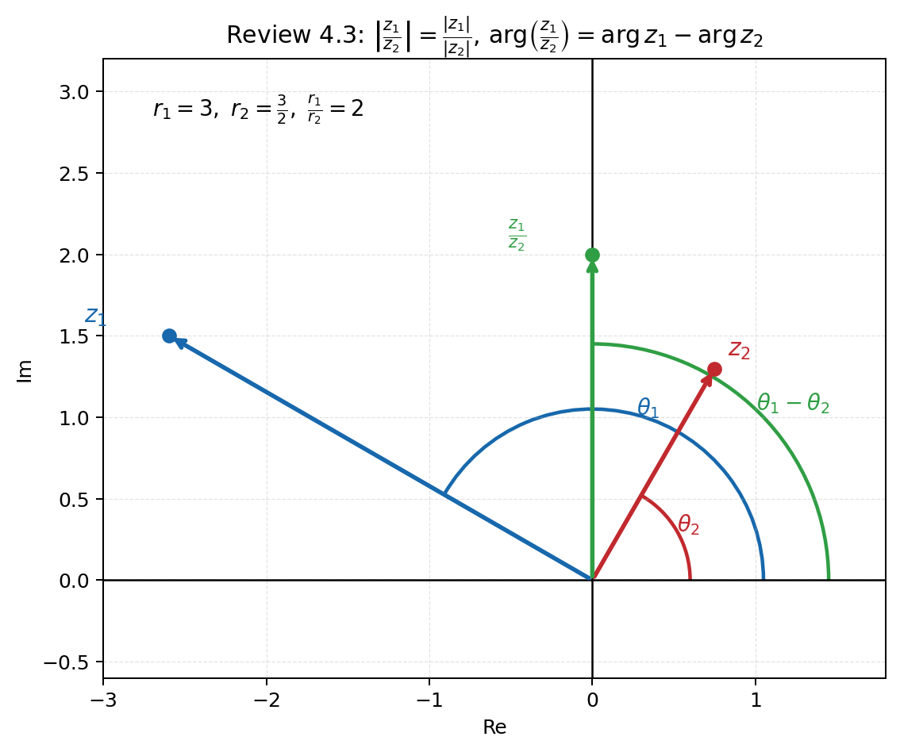

```python title:""
from pathlib import Path
import math
import matplotlib.pyplot as plt
from matplotlib.patches import Arc

def add_angle_arc(ax, theta, radius, color, label, label_angle=None):
    arc = Arc(
        (0, 0),
        2 * radius,
        2 * radius,
        angle=0,
        theta1=0,
        theta2=math.degrees(theta),
        color=color,
        lw=1.8,
    )
    ax.add_patch(arc)
    if label_angle is None:
        label_angle = theta / 2
    ax.text(
        radius * math.cos(label_angle),
        radius * math.sin(label_angle),
        label,
        color=color,
        fontsize=11,
    )

r1, theta1 = 3.0, 5 * math.pi / 6
r2, theta2 = 1.5, math.pi / 3
rq, thetaq = r1 / r2, theta1 - theta2

points = {
    "z1": (r1 * math.cos(theta1), r1 * math.sin(theta1)),
    "z2": (r2 * math.cos(theta2), r2 * math.sin(theta2)),
    "z1_over_z2": (rq * math.cos(thetaq), rq * math.sin(thetaq)),
}

fig, ax = plt.subplots(figsize=(6.4, 6.0), dpi=180)
ax.set_aspect("equal", adjustable="box")
ax.set_xlim(-3.0, 1.8)
ax.set_ylim(-0.6, 3.2)
ax.axhline(0, color="black", lw=1)
ax.axvline(0, color="black", lw=1)
ax.grid(True, linestyle="--", linewidth=0.5, alpha=0.35)
ax.set_xlabel("Re")
ax.set_ylabel("Im")
ax.set_title(r"Review 4.3: $\left|\frac{z_1}{z_2}\right|=\frac{|z_1|}{|z_2|}$, $\arg\!\left(\frac{z_1}{z_2}\right)=\arg z_1-\arg z_2$")

colors = {"z1": "#1768ac", "z2": "#c1292e", "z1_over_z2": "#2f9e44"}
labels = {"z1": r"$z_1$", "z2": r"$z_2$", "z1_over_z2": r"$\frac{z_1}{z_2}$"}

for key in ["z1", "z2", "z1_over_z2"]:
    x, y = points[key]
    ax.annotate(
        "",
        xy=(x, y),
        xytext=(0, 0),
        arrowprops=dict(arrowstyle="->", lw=2.2, color=colors[key]),
    )
    ax.scatter([x], [y], s=42, color=colors[key], zorder=3)
    dx = 0.08 if x >= 0 else -0.52
    ax.text(x + dx, y + 0.08, labels[key], color=colors[key], fontsize=12)

add_angle_arc(ax, theta2, 0.6, colors["z2"], r"$\theta_2$")
add_angle_arc(ax, theta1, 1.05, colors["z1"], r"$\theta_1$", label_angle=theta1 / 2)
add_angle_arc(ax, thetaq, 1.45, colors["z1_over_z2"], r"$\theta_1-\theta_2$", label_angle=thetaq / 2 + 0.02)
ax.text(-2.7, 2.85, r"$r_1=3,\ r_2=\frac{3}{2},\ \frac{r_1}{r_2}=2$", fontsize=11)

fig.tight_layout()
output = Path("images/review-4-division.png")
fig.savefig(output, bbox_inches="tight")
plt.show()
```

```mathematica title:""
Manipulate[
 Module[
  {
   z1 = r1 Exp[I theta1],
   z2 = r2 Exp[I theta2],
   zq,
   range = 5
  },
  zq = z1/z2;
  Graphics[
   {
    Thick,
    Blue, Arrow[{{0, 0}, {Re[z1], Im[z1]}}],
    Red, Arrow[{{0, 0}, {Re[z2], Im[z2]}}],
    Darker[Green], Arrow[{{0, 0}, {Re[zq], Im[zq]}}],
    Blue, PointSize[0.02], Point[{Re[z1], Im[z1]}],
    Red, PointSize[0.02], Point[{Re[z2], Im[z2]}],
    Darker[Green], PointSize[0.02], Point[{Re[zq], Im[zq]}],
    Text[Style["z1", 14, Blue], {Re[z1], Im[z1]}, {1, -1}],
    Text[Style["z2", 14, Red], {Re[z2], Im[z2]}, {1, 1}],
    Text[Style["z1 / z2", 14, Darker[Green]], {Re[zq], Im[zq]}, {1, 1}]
   },
   Axes -> True,
   AxesLabel -> {"Re", "Im"},
   PlotRange -> {{-range, range}, {-range, range}},
   ImageSize -> Large,
   GridLines -> Automatic,
   PlotLabel ->
    Row[{
      "|z1 / z2| = ", NumberForm[Abs[zq], {4, 2}],
      " = |z1|/|z2|,   Arg(z1 / z2) = ",
      NumberForm[Arg[zq], {4, 2}],
      " = Arg(z1) - Arg(z2) mod 2\[Pi]"
    }]
  ]
 ],
 {{r1, 3}, 0.5, 4.0, Appearance -> "Labeled"},
 {{theta1, 5 Pi/6}, -Pi, Pi, Appearance -> "Labeled"},
 {{r2, 3/2}, 0.5, 4.0, Appearance -> "Labeled"},
 {{theta2, Pi/3}, -Pi, Pi, Appearance -> "Labeled"}
]
```

---

The polar form of complex numbers gives us a new insight into multiplication and related operations on complex numbers. Let $z_{1}=r_{1}\left(\cos \theta_{1}+i \sin \theta_{1}\right)$ and $z_{2}=r_{2}\left(\cos \theta_{2}+i \sin \theta_{2}\right)$ be two nonzero complex numbers. We compute their product directly, using $i^{2}=-1$ :

$$
\begin{aligned}
z_{1} z_{2} & =r_{1}\left(\cos \theta_{1}+i \sin \theta_{1}\right) r_{2}\left(\cos \theta_{2}+i \sin \theta_{2}\right) \\
& =r_{1} r_{2}\left[\left(\cos \theta_{1} \cos \theta_{2}-\sin \theta_{1} \sin \theta_{2}\right)+i\left(\sin \theta_{1} \cos \theta_{2}+\cos \theta_{1} \sin \theta_{2}\right)\right]
\end{aligned}
$$

We recognize the trigonometric expressions as the sum angle formulas for the cosine and sine:

$$
\cos \left(\theta_{1}+\theta_{2}\right)=\cos \theta_{1} \cos \theta_{2}-\sin \theta_{1} \sin \theta_{2}
$$

and

$$
\sin \left(\theta_{1}+\theta_{2}\right)=\sin \theta_{1} \cos \theta_{2}+\cos \theta_{1} \sin \theta_{2} .
$$

Therefore, the polar form of the product

$$
z_{1} z_{2}=r_{1} r_{2}\left[\cos \left(\theta_{1}+\theta_{2}\right)+i \sin \left(\theta_{1}+\theta_{2}\right)\right] .
$$

By taking the modulus of both sides of (16), we have

$$
\left|z_{1} z_{2}\right|=\left|z_{1}\right|\left|z_{2}\right|
$$

which is a fact we already know from Section 1.2. By taking the argument of both sides of (16), we obtain

$$
\arg \left(z_{1} z_{2}\right)=\theta_{1}+\theta_{2}=\arg z_{1}+\arg z_{2} .
$$

More precisely,

$$
\arg \left(z_{1} z_{2}\right)=\left\{\theta_{1}+\theta_{2}+2 k \pi: k=0, \pm 1, \pm 2, \ldots\right\} .
$$

Identities (17) and (18) tell us that when we multiply two complex numbers in polar form, we multiply their moduli and add their arguments. See Figure 5.


> [!figure] Figure 5
> 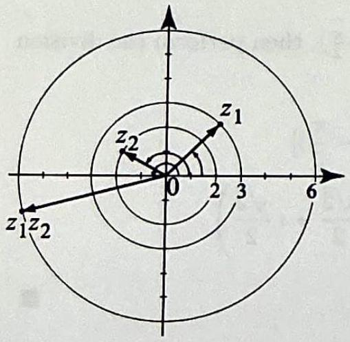
> Figure 5 To multiply in polar form, add the arguments and multiply the moduli.


Suppose that $z_{1} \neq 0$, and $z_{2}=z_{1}^{-1}$ in (16). Since $z_{1} z_{2}=z_{1} z_{1}^{-1}=1$, we obtain

$$
1=r_{1} r_{2}\left[\cos \left(\theta_{1}+\theta_{2}\right)+i \sin \left(\theta_{1}+\theta_{2}\right)\right] .
$$

Hence from (8), $r_{1} r_{2}=1$ and $\theta_{1}+\theta_{2}=0$, because the modulus of 1 is 1 and its argument is 0 . Hence $r_{2}=\frac{1}{r_{1}}$ and $\theta_{2}=-\theta_{1}$. So the polar form of the inverse of a complex number $z$ is given by

$$
z^{-1}=\frac{1}{r}(\cos (-\theta)+i \sin (-\theta))=\frac{1}{r}(\cos \theta-i \sin \theta) .
$$

Consider now arbitrary $z_{1}$ and $z_{2} \neq 0$. Since $\frac{z_{1}}{z_{2}}=z_{1} z_{2}^{-1}$, then by (16) and (19), we obtain the polar form of a quotient

$$
\frac{z_{1}}{z_{2}}=\frac{r_{1}}{r_{2}}\left(\cos \left(\theta_{1}-\theta_{2}\right)+i \sin \left(\theta_{1}-\theta_{2}\right)\right)
$$

Thus to divide two complex numbers in polar form, we divide their moduli and subtract their arguments (Figure 6).


> [!figure] Figure 6
> 
> 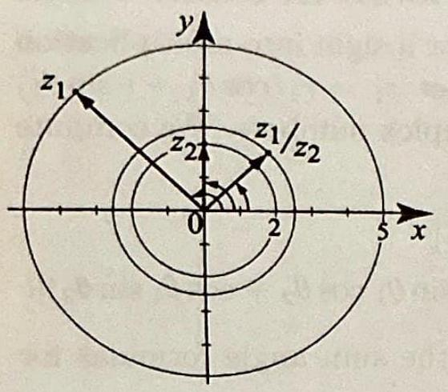
> Figure 6 Division in polar form.


> [!exercise] Exercise 2
> (a) Let $z_{1}=3\left(\cos \frac{\pi}{4}+i \sin \frac{\pi}{4}\right)$ and $z_{2}=2\left(\cos \frac{5 \pi}{6}+i \sin \frac{5 \pi}{6}\right)$. Calculate $z_{1} z_{2}$.
> (b) Let $z_{1}=5\left(\cos \frac{3 \pi}{4}+i \sin \frac{3 \pi}{4}\right)$ and $z_{2}=2 i$. Calculate $\frac{z_{1}}{z_{2}}$.

##### problem 2a

Use the product formula in polar form:

$$
\begin{aligned}
z_{1}z_{2}
& =3\left(\cos \frac{\pi}{4}+i \sin \frac{\pi}{4}\right)\cdot 2\left(\cos \frac{5\pi}{6}+i \sin \frac{5\pi}{6}\right) \\
& =(3\cdot 2)\left(\cos \left(\frac{\pi}{4}+\frac{5\pi}{6}\right)+i \sin \left(\frac{\pi}{4}+\frac{5\pi}{6}\right)\right) \\
& =6\left(\cos \left(\frac{3\pi}{12}+\frac{10\pi}{12}\right)+i \sin \left(\frac{3\pi}{12}+\frac{10\pi}{12}\right)\right) \\
& =6\left(\cos \frac{13\pi}{12}+i \sin \frac{13\pi}{12}\right).
\end{aligned}
$$

Therefore

$$
z_{1}z_{2}=6\left(\cos \frac{13\pi}{12}+i \sin \frac{13\pi}{12}\right).
$$

##### problem 2b

First write $z_{2}=2i$ in polar form:

$$
2i=2\left(\cos \frac{\pi}{2}+i \sin \frac{\pi}{2}\right).
$$

Now use the quotient formula in polar form:

$$
\begin{aligned}
\frac{z_{1}}{z_{2}}
& =\frac{5\left(\cos \frac{3\pi}{4}+i \sin \frac{3\pi}{4}\right)}{2\left(\cos \frac{\pi}{2}+i \sin \frac{\pi}{2}\right)} \\
& =\frac{5}{2}\left(\cos \left(\frac{3\pi}{4}-\frac{\pi}{2}\right)+i \sin \left(\frac{3\pi}{4}-\frac{\pi}{2}\right)\right) \\
& =\frac{5}{2}\left(\cos \frac{\pi}{4}+i \sin \frac{\pi}{4}\right).
\end{aligned}
$$

Therefore

$$
\frac{z_{1}}{z_{2}}=\frac{5}{2}\left(\cos \frac{\pi}{4}+i \sin \frac{\pi}{4}\right).
$$


## De Moivre's Identity

> [!review] Review 5
> Describe the pattern that leads to De Moivre's identity. State and prove the identity. Then extend it to compute $z^n$ for a complex number $z=r(\cos \theta+i \sin \theta)$ of arbitrary modulus.


The pattern comes directly from the multiplication rule in polar form. If

$$
z=\cos \theta+i \sin \theta,
$$

then $|z|=1$, so each time we multiply by another copy of $z$, the modulus stays equal to $1$ while the argument increases by another $\theta$. Writing out the first few powers makes the pattern visible:

$$
\begin{aligned}
z
&=\cos \theta+i \sin \theta, \\
z^{2}
&=z \cdot z, \\
&=(\cos \theta+i \sin \theta)(\cos \theta+i \sin \theta), \\
&=\cos 2 \theta+i \sin 2 \theta, \\
z^{3}
&=z^{2} \cdot z, \\
&=(\cos 2 \theta+i \sin 2 \theta)(\cos \theta+i \sin \theta), \\
&=\cos 3 \theta+i \sin 3 \theta, \\
z^{4}
&=z^{3} \cdot z, \\
&=(\cos 3 \theta+i \sin 3 \theta)(\cos \theta+i \sin \theta), \\
&=\cos 4 \theta+i \sin 4 \theta.
\end{aligned}
$$

So the pattern is

$$
(\cos \theta+i \sin \theta)^{n}=\cos n \theta+i \sin n \theta.
$$

This is De Moivre's identity: For every positive integer $n$ and every real number $\theta$,

$$\boxed{(\cos \theta+i \sin \theta)^n=\cos n \theta+i \sin n \theta.}$$

We now prove the identity by mathematical induction on $n$.

For the base case $n=1$,

$$
\begin{aligned}
(\cos \theta+i \sin \theta)^{1}
&=\cos \theta+i \sin \theta \\
&=\cos (1 \cdot \theta)+i \sin (1 \cdot \theta).
\end{aligned}
$$

So the formula is true when $n=1$.

Now assume that for some positive integer $n$,

$$
(\cos \theta+i \sin \theta)^{n}=\cos n \theta+i \sin n \theta.
$$

We must prove that

$$
(\cos \theta+i \sin \theta)^{n+1}=\cos (n+1)\theta+i \sin (n+1)\theta.
$$

Using the induction hypothesis and then multiplying explicitly, we get

$$
\begin{aligned}
(\cos \theta+i \sin \theta)^{n+1}
&=(\cos \theta+i \sin \theta)^{n}(\cos \theta+i \sin \theta) \\
&=(\cos n \theta+i \sin n \theta)(\cos \theta+i \sin \theta) \\
&=\cos n \theta \cos \theta+i \cos n \theta \sin \theta+i \sin n \theta \cos \theta+i^{2} \sin n \theta \sin \theta \\
&=\cos n \theta \cos \theta+i \cos n \theta \sin \theta+i \sin n \theta \cos \theta-\sin n \theta \sin \theta \\
&=\left(\cos n \theta \cos \theta-\sin n \theta \sin \theta\right)+i\left(\sin n \theta \cos \theta+\cos n \theta \sin \theta\right) \\
&=\cos (n \theta+\theta)+i \sin (n \theta+\theta) \\
&=\cos ((n+1)\theta)+i \sin ((n+1)\theta).
\end{aligned}
$$

This is exactly the desired statement for $n+1$. Therefore, by induction, De Moivre's identity holds for every positive integer $n$.

We can now extend the identity to a complex number with modulus $r$. Let

$$
z=r(\cos \theta+i \sin \theta),
\qquad r \geq 0.
$$

If $r>0$, then

$$
\begin{aligned}
z^{n}
&=\left[r(\cos \theta+i \sin \theta)\right]^{n} \\
&=r^{n}(\cos \theta+i \sin \theta)^{n} \\
&=r^{n}\left(\cos n \theta+i \sin n \theta\right).
\end{aligned}
$$

So for a nonzero complex number in polar form, the $n$th power is obtained by raising the modulus to the $n$th power and multiplying the argument by $n$:

$$
z^{n}=r^{n}\left(\cos n \theta+i \sin n \theta\right).
$$

If $r=0$, then $z=0$, and for every positive integer $n$,

$$
z^{n}=0.
$$

Thus the complete power rule is:

$$
z^{n}=
\begin{cases}
r^{n}\left(\cos n \theta+i \sin n \theta\right), & r>0, \\
0, & r=0.
\end{cases}
$$

In words: powers of complex numbers in polar form are easy to compute because the modulus is raised to the power and the argument is multiplied by that power.


---


If we take the number $z=1(\cos \theta+i \sin \theta)$ and multiply it by itself, using (16), we get

$$
z z=(1 \cdot 1)[\cos (\theta+\theta)+i \sin (\theta+\theta)]=\cos 2 \theta+i \sin 2 \theta
$$

Computing successive powers of $z$, a pattern emerges:

$$
\begin{aligned}
z & =\cos \theta+i \sin \theta \\
z^{2} & =\cos 2 \theta+i \sin 2 \theta \\
z^{3} & =\cos 3 \theta+i \sin 3 \theta
\end{aligned}
$$

⋮

We have the following useful identity.


> [!equation] De Moivre's Identity
> For any positive integer $n$ and real number $\theta$,
> 
> $$
> (\cos \theta+i \sin \theta)^{n}=\cos n \theta+i \sin n \theta .
> $$
> 

Proof We prove the statement by mathematical induction. For $n=1$, the statement is true, since we have trivially $(\cos \theta+i \sin \theta)^{1}=\cos 1 \cdot \theta+i \sin 1 \cdot \theta$. Now for the inductive step: We assume the statement is true for $n$, and prove that it is true for $n+1$. Let us compute

$$
\begin{aligned}
(\cos \theta+i \sin \theta)^{n+1} & =(\cos \theta+i \sin \theta)^{n}(\cos \theta+i \sin \theta) \\
& =(\cos n \theta+i \sin n \theta)(\cos \theta+i \sin \theta)
\end{aligned}
$$

**(by induction hypothesis)**

$$
=\cos (n+1) \theta+i \sin (n+1) \theta \quad[\text { by }(16)] .
$$

By induction, the statement holds for all positive integers $n$.
We can also use De Moivre's identity to calculate powers of complex numbers of arbitrary modulus $r \neq 0$. For if $z=r(\cos \theta+i \sin \theta)$, then

$$
\begin{aligned}
z^{n} & =[r(\cos \theta+i \sin \theta)]^{n} \\
& =r^{n}(\cos \theta+i \sin \theta)^{n} \\
& =r^{n}(\cos n \theta+i \sin n \theta)
\end{aligned}
$$


> [!exercise] Coterminal Angle Drill
> Reduce each angle to:
> 1. a coterminal angle in the interval $[0,2\pi)$,
> 2. its principal representative in the interval $(-\pi,\pi]$.
> 
> (a) $\frac{11\pi}{4}$
> 
> (b) $\frac{43\pi}{4}$
> 
> (c) $\frac{67\pi}{6}$
> 
> (d) $-\frac{25\pi}{6}$
> 


The key idea is that two angles are coterminal precisely when they differ by an integer multiple of $2\pi$:

$$
\theta \sim \theta+2k\pi,
\qquad
k\in\mathbb{Z}.
$$

When an angle is written in the form

$$
\frac{m\pi}{n},
$$

it is often fastest to rewrite $2\pi$ with denominator $n$ first. Since

$$
2\pi=\frac{2n\pi}{n}.
$$

So for an angle of the form $\frac{m\pi}{n}$, one full revolution has the same denominator and becomes $\frac{2n\pi}{n}$. Then we divide $m$ by $2n$:

$$
m=(2n)q+r,
\qquad
0\le r<2n.
$$

This gives

$$
\frac{m\pi}{n}
=\frac{(2n)q\pi+r\pi}{n}
=2q\pi+\frac{r\pi}{n}.
$$

The quotient $q$ tells us how many full copies of $2\pi$ to remove, and the remainder $r$ gives the reduced angle in $[0,2\pi)$.

##### part (a)

We reduce

$$
\frac{11\pi}{4}.
$$

Because the denominator is $4$, we rewrite $2\pi$ with denominator $4$:

$$
2\pi=\frac{8\pi}{4},
$$

we subtract one full copy of $2\pi$:

$$
\begin{aligned}
\frac{11\pi}{4}
&=\frac{11\pi}{4}-2\pi \\
&=\frac{11\pi}{4}-\frac{8\pi}{4} \\
&=\frac{3\pi}{4}.
\end{aligned}
$$

Therefore the representative in $[0,2\pi)$ is

$$
\frac{3\pi}{4}.
$$

Now check whether this is already in $(-\pi,\pi]$. Since

$$
-\pi<\frac{3\pi}{4}\leq\pi,
$$

the principal representative is also

$$
\frac{3\pi}{4}.
$$

##### part (b)

We reduce

$$
\frac{43\pi}{4}.
$$

Again, because the denominator is $4$, we rewrite one full revolution as

$$
2\pi=\frac{8\pi}{4}.
$$

Now divide $43$ by $8$:

$$
\begin{aligned}
43
&=8\cdot 5+3, \\
\frac{43}{8}
&=5+\frac{3}{8}.
\end{aligned}
$$

So

$$
\frac{43\pi}{4}
=5(2\pi)+\frac{3\pi}{4}.
$$

In derivation form,

$$
\begin{aligned}
\frac{43\pi}{4}
&=\frac{40\pi}{4}+\frac{3\pi}{4} \\
&=10\pi+\frac{3\pi}{4} \\
&=5(2\pi)+\frac{3\pi}{4}.
\end{aligned}
$$

Hence the representative in $[0,2\pi)$ is

$$
\frac{3\pi}{4}.
$$

Since

$$
-\pi<\frac{3\pi}{4}\leq\pi,
$$

the principal representative is again

$$
\frac{3\pi}{4}.
$$

##### part (c)

We reduce

$$
\frac{67\pi}{6}.
$$

Now the denominator is $6$, so we rewrite one full revolution with denominator $6$:

$$
2\pi=\frac{12\pi}{6}.
$$

Divide $67$ by $12$:

$$
\begin{aligned}
67
&=12\cdot 5+7, \\
\frac{67}{12}
&=5+\frac{7}{12}.
\end{aligned}
$$

Therefore

$$
\frac{67\pi}{6}
=5(2\pi)+\frac{7\pi}{6}.
$$

Equivalently,

$$
\begin{aligned}
\frac{67\pi}{6}
&=\frac{60\pi}{6}+\frac{7\pi}{6} \\
&=10\pi+\frac{7\pi}{6} \\
&=5(2\pi)+\frac{7\pi}{6}.
\end{aligned}
$$

So the representative in $[0,2\pi)$ is

$$
\frac{7\pi}{6}.
$$

But

$$
\frac{7\pi}{6}>\pi,
$$

so to move into $(-\pi,\pi]$, subtract another $2\pi$:

$$
\begin{aligned}
\frac{7\pi}{6}-2\pi
&=\frac{7\pi}{6}-\frac{12\pi}{6} \\
&=-\frac{5\pi}{6}.
\end{aligned}
$$

Thus the principal representative is

$$
-\frac{5\pi}{6}.
$$

##### part (d)

We reduce

$$
-\frac{25\pi}{6}.
$$

Because

$$
2\pi=\frac{12\pi}{6},
$$

we add copies of $2\pi$ until the angle lands in $[0,2\pi)$:

$$
\begin{aligned}
-\frac{25\pi}{6}+2\pi
&=-\frac{25\pi}{6}+\frac{12\pi}{6} \\
&=-\frac{13\pi}{6},
\end{aligned}
$$

which is still negative, so add another $2\pi$:

$$
\begin{aligned}
-\frac{13\pi}{6}+2\pi
&=-\frac{13\pi}{6}+\frac{12\pi}{6} \\
&=-\frac{\pi}{6},
\end{aligned}
$$

which is still not in $[0,2\pi)$, so add one more $2\pi$:

$$
\begin{aligned}
-\frac{\pi}{6}+2\pi
&=-\frac{\pi}{6}+\frac{12\pi}{6} \\
&=\frac{11\pi}{6}.
\end{aligned}
$$

Therefore the representative in $[0,2\pi)$ is

$$
\frac{11\pi}{6}.
$$

To find the principal representative, subtract $2\pi$ once:

$$
\begin{aligned}
\frac{11\pi}{6}-2\pi
&=\frac{11\pi}{6}-\frac{12\pi}{6} \\
&=-\frac{\pi}{6}.
\end{aligned}
$$

Since

$$
-\pi<-\frac{\pi}{6}\leq\pi,
$$

the principal representative is

$$
-\frac{\pi}{6}.
$$


> [!exercise] Exercise 3
> Calculate $(2+2 i)^{11}$.


First write $2+2i$ in polar form:

$$
\begin{aligned}
2+2i
& =\sqrt{2^{2}+2^{2}}\left(\cos \frac{\pi}{4}+i \sin \frac{\pi}{4}\right) \\
& =\sqrt{8}\left(\cos \frac{\pi}{4}+i \sin \frac{\pi}{4}\right) \\
& =2^{3/2}\left(\cos \frac{\pi}{4}+i \sin \frac{\pi}{4}\right).
\end{aligned}
$$

Now apply De Moivre's identity:

$$
\begin{aligned}
(2+2i)^{11}
& =\left(2^{3/2}\left(\cos \frac{\pi}{4}+i \sin \frac{\pi}{4}\right)\right)^{11} \\
& =2^{33/2}\left(\cos \frac{11\pi}{4}+i \sin \frac{11\pi}{4}\right) \\
& =2^{33/2}\left(\cos \frac{3\pi}{4}+i \sin \frac{3\pi}{4}\right) \\
& =2^{33/2}\left(-\frac{\sqrt{2}}{2}+i\frac{\sqrt{2}}{2}\right) \\
& =2^{33/2}\cdot \frac{\sqrt{2}}{2}(-1+i) \\
& =2^{33/2-1/2}(-1+i) \\
& =2^{16}(-1+i).
\end{aligned}
$$

Therefore

$$
(2+2i)^{11}=2^{16}(-1+i).
$$

> [!exercise] Exercise 4
> Use De Moivre's identity with $n=2$ to recover the double-angle formulas for $\cos 2 \theta$ and $\sin 2 \theta$.


By De Moivre's identity with $n=2$,

$$
(\cos \theta+i \sin \theta)^{2}=\cos 2\theta+i \sin 2\theta.
$$

Now expand the left-hand side:

$$
\begin{aligned}
(\cos \theta+i \sin \theta)^{2}
& =\cos ^{2}\theta+2i\cos \theta \sin \theta+i^{2}\sin ^{2}\theta \\
& =\cos ^{2}\theta+2i\cos \theta \sin \theta-\sin ^{2}\theta \\
& =\left(\cos ^{2}\theta-\sin ^{2}\theta\right)+i\left(2\sin \theta \cos \theta\right).
\end{aligned}
$$

Therefore

$$
\cos 2\theta+i \sin 2\theta
=\left(\cos ^{2}\theta-\sin ^{2}\theta\right)+i\left(2\sin \theta \cos \theta\right).
$$

Equating real and imaginary parts gives the double-angle formulas

$$
\cos 2\theta=\cos ^{2}\theta-\sin ^{2}\theta,
\qquad
\sin 2\theta=2\sin \theta \cos \theta.
$$

## Roots of Complex Numbers


> [!review] Review 6
> 1. Define the $n$th root of a complex number.
> 2. Write $w=\rho(\cos \phi+i \sin \phi)$ and $z=r(\cos \theta+i \sin \theta)$. Using $z^n=w$, derive the modulus and argument of $z$. Why do only the values $k=0,1, \ldots, n-1$ yield distinct roots?
> 3. State the formula for the $n$th roots of $w$. Define the principal $n$th root and explain how it is obtained from the formula.


##### problem 1

A complex number $z$ is called an $n$th root of $w$ if

$$
z^{n}=w.
$$

In this section we are mainly interested in the case

$$
w\neq 0,
$$

because then $w$ has a polar form

$$
w=\rho(\cos \phi+i\sin \phi),
\qquad
\rho>0.
$$

For completeness, note that if

$$
w=0,
$$

then the only $n$th root is

$$
z=0,
$$

since

$$
z^{n}=0
\quad\Longrightarrow\quad
z=0.
$$

##### problem 2

Assume

$$
w=\rho(\cos \phi+i\sin \phi),
\qquad
z=r(\cos \theta+i\sin \theta),
$$

with

$$
\rho>0,
\qquad
r>0,
$$

and suppose that

$$
z^{n}=w.
$$

Using De Moivre's identity,

$$
\begin{aligned}
z^{n}
&=\left[r(\cos \theta+i\sin \theta)\right]^{n} \\
&=r^{n}(\cos \theta+i\sin \theta)^{n} \\
&=r^{n}(\cos n\theta+i\sin n\theta).
\end{aligned}
$$

Since also

$$
z^{n}=w=\rho(\cos \phi+i\sin \phi),
$$

we obtain

$$
r^{n}(\cos n\theta+i\sin n\theta)=\rho(\cos \phi+i\sin \phi).
$$

Now compare moduli. Equal complex numbers have equal moduli, so

$$
r^{n}=\rho.
$$

Because

$$
r>0
\qquad\text{and}\qquad
\rho>0,
$$

we take the positive real $n$th root and get

$$
r=\rho^{1/n}.
$$

Now compare arguments. If two nonzero complex numbers are equal, then their arguments differ by an integer multiple of $2\pi$. Therefore

$$
n\theta=\phi+2k\pi,
\qquad
k\in\mathbb{Z}.
$$

Solving for $\theta$ gives

$$
\theta=\frac{\phi}{n}+\frac{2k\pi}{n},
\qquad
k\in\mathbb{Z}.
$$

Thus every root has modulus

$$
r=\rho^{1/n}
$$

and argument

$$
\theta=\frac{\phi}{n}+\frac{2k\pi}{n},
\qquad
k\in\mathbb{Z}.
$$

It remains to explain why only

$$
k=0,1,\ldots,n-1
$$

produce distinct roots.

First, if $k$ is replaced by $k+n$, then

$$
\begin{aligned}
\frac{\phi}{n}+\frac{2(k+n)\pi}{n}
&=\frac{\phi}{n}+\frac{2k\pi}{n}+\frac{2n\pi}{n} \\
&=\frac{\phi}{n}+\frac{2k\pi}{n}+2\pi.
\end{aligned}
$$

But adding $2\pi$ to an argument does not change the complex number. Hence the values $k$ and $k+n$ produce the same root.

More generally, if

$$
k_{2}=k_{1}+mn
\qquad
(m\in\mathbb{Z}),
$$

then

$$
\frac{\phi}{n}+\frac{2k_{2}\pi}{n}
=\frac{\phi}{n}+\frac{2k_{1}\pi}{n}+2m\pi,
$$

so $k_{1}$ and $k_{2}$ give the same root.

Now we show that the roots coming from

$$
k=0,1,\ldots,n-1
$$

are all different. Suppose two of them were equal, say the roots corresponding to $k_{1}$ and $k_{2}$ with

$$
0\le k_{1},k_{2}\le n-1.
$$

Then their arguments would differ by a multiple of $2\pi$:

$$
\begin{aligned}
\left(\frac{\phi}{n}+\frac{2k_{1}\pi}{n}\right)-\left(\frac{\phi}{n}+\frac{2k_{2}\pi}{n}\right)
&=2m\pi
\qquad (m\in\mathbb{Z}) \\
\frac{2(k_{1}-k_{2})\pi}{n}
&=2m\pi \\
\frac{k_{1}-k_{2}}{n}
&=m \\
k_{1}-k_{2}
&=mn.
\end{aligned}
$$

But

$$
-(n-1)\le k_{1}-k_{2}\le n-1,
$$

and the only multiple of $n$ in that interval is $0$. Therefore

$$
k_{1}-k_{2}=0,
$$

so

$$
k_{1}=k_{2}.
$$

Thus the $n$ values

$$
k=0,1,\ldots,n-1
$$

give exactly the $n$ distinct roots.

##### problem 3

Combining the modulus and argument from Problem 2, the $n$th roots of

$$
w=\rho(\cos \phi+i\sin \phi),
\qquad
\rho>0,
$$

are

$$
z_{k+1}
=\rho^{1/n}\left[\cos\left(\frac{\phi}{n}+\frac{2k\pi}{n}\right)+i\sin\left(\frac{\phi}{n}+\frac{2k\pi}{n}\right)\right],
\qquad
k=0,1,\ldots,n-1.
$$

The principal $n$th root is defined to be the unique root whose principal argument is

$$
\operatorname{Arg} z=\frac{\operatorname{Arg} w}{n}.
$$

To obtain it from the general formula, choose

$$
\phi=\operatorname{Arg} w
$$

and then take

$$
k=0.
$$

Thus the principal $n$th root is

$$
\rho^{1/n}\left[\cos\left(\frac{\operatorname{Arg} w}{n}\right)+i\sin\left(\frac{\operatorname{Arg} w}{n}\right)\right].
$$

In words, to find the principal root, take the principal argument of $w$, divide that argument by $n$, and use the positive real $n$th root of the modulus.


---

We first define an $n$th root of a complex number.


> [!definition] nth Root of a Complex Number
> Let $w \neq 0$ be a given complex number and $n$ a positive integer. A number $z$ is called an $n$th root of $w$ if $z^{n}=w$.

Our goal is to find the roots of the given number $w$. De Moivre's formula for calculating powers can in essence be worked "backward" to find roots of complex numbers.

Write $w=\rho(\cos \phi+i \sin \phi)$ and $z=r(\cos \theta+i \sin \theta)$. The equation $z^{n}=w$ tells us (using (21)) that

$$
r^{n}(\cos n \theta+i \sin n \theta)=\rho(\cos \phi+i \sin \phi)
$$

Two complex numbers are equal only if their moduli are equal, so $r^{n}=\rho$. Thus, take $r=\rho^{1 / n}$ (meaning the real root of a real number). Also, when two complex numbers are equal, their arguments must differ by $2 k \pi$, where $k$ is an integer. So

$$
n \theta=\phi+2 k \pi, \quad \text { or } \quad \theta=\frac{\phi}{n}+\frac{2 k \pi}{n} .
$$

If we take the values $k=0,1, \ldots, n-1$, we will get $n$ values of $\theta$ that yield $n$ distinct roots of $w$. Any other value of $k$ will produce a root identical to one of these, since when $k$ increases by $n$, the argument of $z$ increases by $2 \pi$. Thus we have a formula for the $n$ roots of a complex number $w$.

### FORMULA FOR THE $\boldsymbol{n}$ th ROOTS

Let $w=\rho(\cos \phi+i \sin \phi) \neq 0$. The $n$th roots of $w$ are the solutions of the equation $z^{n}=w$. They are given by

> [!equation] Formula for the nth Roots of a Complex Number $w$
> 
> $$
> z_{k+1}=\rho^{1 / n}\left[\cos \left(\frac{\phi}{n}+\frac{2 k \pi}{n}\right)+i \sin \left(\frac{\phi}{n}+\frac{2 k \pi}{n}\right)\right]
> $$
> 

$k=0,1, \ldots, n-1$.
The unique number $z$ such that $z^{n}=w$ and $\operatorname{Arg} z=\frac{\operatorname{Arg} w}{n}$ is called the principal $n$th root of $w$. The principal root is obtained from (23) by taking $\phi=\operatorname{Arg} w$ and $k=0$.


> [!exercise] Exercise 5
> Find and plot all numbers $z$ such that $z^{6}=1$. What is the principal sixth root of 1?


##### problem 5

Write

$$
1=\cos 0+i\sin 0.
$$

We want to solve

$$
z^{6}=1.
$$

By the formula for the sixth roots of a complex number,

$$
z_{k+1}=\cos \left(\frac{0}{6}+\frac{2k\pi}{6}\right)+i\sin \left(\frac{0}{6}+\frac{2k\pi}{6}\right)
=\cos \frac{k\pi}{3}+i\sin \frac{k\pi}{3},
\qquad k=0,1,\ldots,5.
$$

Thus the six roots are

$$
\begin{aligned}
z_{1}&=1, \\
z_{2}&=\frac{1}{2}+i\frac{\sqrt{3}}{2}, \\
z_{3}&=-\frac{1}{2}+i\frac{\sqrt{3}}{2}, \\
z_{4}&=-1, \\
z_{5}&=-\frac{1}{2}-i\frac{\sqrt{3}}{2}, \\
z_{6}&=\frac{1}{2}-i\frac{\sqrt{3}}{2}.
\end{aligned}
$$

The principal sixth root is obtained by taking $k=0$, so

$$
z_{1}=1.
$$

The six roots are displayed in Figure 7. 


> [!figure] Figure 7
> 
> 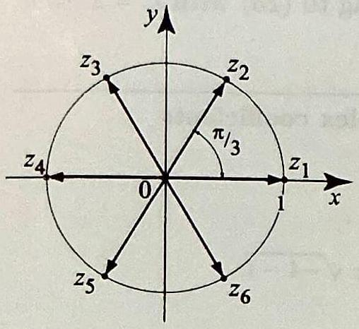
> Figure 7 Sixth roots of unity.


Since they all have the same modulus, they all lie on the same circle centered at the origin. They have a common angular separation of $\pi / 3$. This particular set of roots is symmetric about the horizontal axis because we are finding the roots of a real number; the polynomial equation $z^{6}=1$ has real coefficients, and nonreal solutions come in conjugate pairs (see Section 1, Exercise 29).


> [!exercise] Exercise 6: Finding roots of complex numbers
> Find and plot all numbers $z$ such that $(z+1)^{3}=2+2 i$.


Let

$$
w=z+1.
$$

Then

$$
w^{3}=2+2i.
$$

Write the right-hand side in polar form:

$$
\begin{aligned}
2+2i
&=\sqrt{2^{2}+2^{2}}\left(\cos \theta+i\sin \theta\right) \\
&=\sqrt{4+4}\left(\cos \frac{\pi}{4}+i\sin \frac{\pi}{4}\right) \\
&=\sqrt{8}\left(\cos \frac{\pi}{4}+i\sin \frac{\pi}{4}\right) \\
&=2\sqrt{2}\left(\cos \frac{\pi}{4}+i\sin \frac{\pi}{4}\right).
\end{aligned}
$$

Hence the three cube roots are

$$
\begin{aligned}
w_{k+1}
&=(2\sqrt{2})^{1/3}\left(\cos \left(\frac{1}{3}\cdot \frac{\pi}{4}+\frac{2k\pi}{3}\right)+i\sin \left(\frac{1}{3}\cdot \frac{\pi}{4}+\frac{2k\pi}{3}\right)\right) \\
&=(2^{3/2})^{1/3}\left(\cos \left(\frac{\pi}{12}+\frac{2k\pi}{3}\right)+i\sin \left(\frac{\pi}{12}+\frac{2k\pi}{3}\right)\right) \\
&=2^{1/2}\left(\cos \left(\frac{\pi}{12}+\frac{2k\pi}{3}\right)+i\sin \left(\frac{\pi}{12}+\frac{2k\pi}{3}\right)\right) \\
&=\sqrt{2}\left(\cos \left(\frac{\pi}{12}+\frac{2k\pi}{3}\right)+i\sin \left(\frac{\pi}{12}+\frac{2k\pi}{3}\right)\right),
\qquad k=0,1,2.
\end{aligned}
$$

Since $z=w-1$, the corresponding solutions are

$$
z_{k+1}=-1+\sqrt{2}\left(\cos \left(\frac{\pi}{12}+\frac{2k\pi}{3}\right)+i\sin \left(\frac{\pi}{12}+\frac{2k\pi}{3}\right)\right),
\qquad k=0,1,2.
$$

Writing these explicitly,

$$
\begin{aligned}
z_{1}
&=-1+\sqrt{2}\left(\cos \frac{\pi}{12}+i\sin \frac{\pi}{12}\right) \\
&=-1+\sqrt{2}\left(\frac{\sqrt{6}+\sqrt{2}}{4}+i\frac{\sqrt{6}-\sqrt{2}}{4}\right) \\
&=-1+\frac{\sqrt{3}+1}{2}+i\frac{\sqrt{3}-1}{2} \\
&=\frac{\sqrt{3}-1}{2}+i\frac{\sqrt{3}-1}{2},
\end{aligned}
$$

$$
\begin{aligned}
z_{2}
&=-1+\sqrt{2}\left(\cos \frac{3\pi}{4}+i\sin \frac{3\pi}{4}\right) \\
&=-1+\sqrt{2}\left(-\frac{\sqrt{2}}{2}+i\frac{\sqrt{2}}{2}\right) \\
&=-1+(-1+i) \\
&=-2+i,
\end{aligned}
$$

and

$$
\begin{aligned}
z_{3}
&=-1+\sqrt{2}\left(\cos \frac{17\pi}{12}+i\sin \frac{17\pi}{12}\right) \\
&=-1+\sqrt{2}\left(-\frac{\sqrt{6}-\sqrt{2}}{4}-i\frac{\sqrt{6}+\sqrt{2}}{4}\right) \\
&=-1-\frac{\sqrt{3}-1}{2}-i\frac{\sqrt{3}+1}{2} \\
&=-\frac{\sqrt{3}+1}{2}-i\frac{\sqrt{3}+1}{2}.
\end{aligned}
$$

Therefore the solutions are

$$
\left\{
\frac{\sqrt{3}-1}{2}+i\frac{\sqrt{3}-1}{2},\,
-2+i,\,
-\frac{\sqrt{3}+1}{2}-i\frac{\sqrt{3}+1}{2}
\right\}.
$$

These three points are displayed in Figure 8.


> [!figure] Figure 8
> 
> 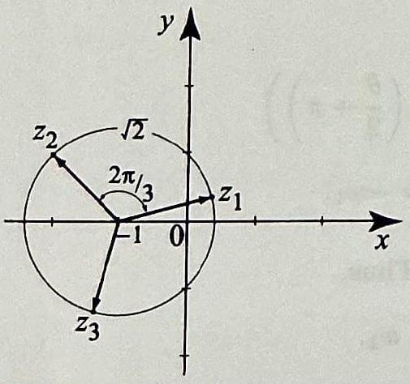
> Figure 8 Solutions in Example 6.


> [!review] Review 7
> 1. The quadratic formula was derived in Section 1.1 for real coefficients. Does it still hold when $a, b, c$ are complex? What changes in its interpretation?
> 2. What does $\pm \sqrt{b^2-4 a c}$ mean when $b^2-4 a c$ is complex, and how do you compute it?


##### problem 1

Yes. The quadratic formula still holds when

$$
a,b,c\in\mathbb{C},
\qquad
a\neq 0.
$$

The reason is that the derivation uses only algebraic operations that are valid in the complex numbers: addition, subtraction, multiplication, division by a nonzero number, and taking square roots at the final step.

Let

$$
az^2+bz+c=0,
\qquad
a\neq 0.
$$

Then

$$
\begin{aligned}
az^2+bz+c
&=0, \\
az^2+bz
&=-c, \\
z^2+\frac{b}{a}z
&=-\frac{c}{a}, \\
z^2+\frac{b}{a}z+\left(\frac{b}{2a}\right)^2
&=-\frac{c}{a}+\left(\frac{b}{2a}\right)^2, \\
\left(z+\frac{b}{2a}\right)^2
&=-\frac{c}{a}+\frac{b^2}{4a^2}, \\
\left(z+\frac{b}{2a}\right)^2
&=\frac{-4ac+b^2}{4a^2}, \\
\left(z+\frac{b}{2a}\right)^2
&=\frac{b^2-4ac}{4a^2}.
\end{aligned}
$$

Now take square roots:

$$
z+\frac{b}{2a}=\pm \sqrt{\frac{b^2-4ac}{4a^2}}.
$$

Since

$$
\sqrt{4a^2}=2a
$$

up to the usual choice of sign already absorbed by the symbol $\pm$, this becomes

$$
z+\frac{b}{2a}=\pm \frac{\sqrt{b^2-4ac}}{2a}.
$$

Therefore

$$
\begin{aligned}
z
&=-\frac{b}{2a}\pm \frac{\sqrt{b^2-4ac}}{2a} \\
&=\frac{-b\pm \sqrt{b^2-4ac}}{2a}.
\end{aligned}
$$

So the formula itself does not change:

$$
z=\frac{-b\pm \sqrt{b^2-4ac}}{2a}.
$$

What changes is the interpretation of the square root. Over the real numbers, a negative discriminant has no real square root. Over the complex numbers, every nonzero complex number has two complex square roots, and $0$ has one square root, namely $0$. Thus the quadratic formula always makes sense in $\mathbb{C}$.

##### problem 2

Let

$$
\Delta=b^2-4ac.
$$

When $\Delta$ is complex, the symbol

$$
\pm\sqrt{\Delta}
$$

means the two complex numbers whose squares equal $\Delta$.

More precisely:

1. If
   $$
   \Delta=0,
   $$
   then
   $$
   \sqrt{\Delta}=0,
   $$
   so the two signs give the same value, and the quadratic has the repeated root
   $$
   z=-\frac{b}{2a}.
   $$

2. If
   $$
   \Delta\neq 0,
   $$
   write $\Delta$ in polar form:
   $$
   \Delta=\rho(\cos\phi+i\sin\phi),
   \qquad
   \rho=|\Delta|>0.
   $$

To compute the square roots, solve

$$
w^2=\Delta.
$$

Write

$$
w=r(\cos\theta+i\sin\theta).
$$

Then by De Moivre's identity,

$$
\begin{aligned}
w^2
&=\left[r(\cos\theta+i\sin\theta)\right]^2 \\
&=r^2(\cos 2\theta+i\sin 2\theta).
\end{aligned}
$$

Since

$$
w^2=\Delta=\rho(\cos\phi+i\sin\phi),
$$

we must have

$$
r^2=\rho
\qquad\text{and}\qquad
2\theta=\phi+2k\pi,
\quad
k\in\mathbb{Z}.
$$

Thus

$$
r=\rho^{1/2}
\qquad\text{and}\qquad
\theta=\frac{\phi}{2}+k\pi.
$$

So the two square roots are obtained by taking

$$
k=0
\qquad\text{and}\qquad
k=1:
$$

$$
\begin{aligned}
w_1
&=\rho^{1/2}\left(\cos\frac{\phi}{2}+i\sin\frac{\phi}{2}\right), \\
w_2
&=\rho^{1/2}\left(\cos\left(\frac{\phi}{2}+\pi\right)+i\sin\left(\frac{\phi}{2}+\pi\right)\right).
\end{aligned}
$$

Using

$$
\cos(\alpha+\pi)=-\cos\alpha,
\qquad
\sin(\alpha+\pi)=-\sin\alpha,
$$

we get

$$
\begin{aligned}
w_2
&=\rho^{1/2}\left(-\cos\frac{\phi}{2}-i\sin\frac{\phi}{2}\right) \\
&=-\rho^{1/2}\left(\cos\frac{\phi}{2}+i\sin\frac{\phi}{2}\right) \\
&=-w_1.
\end{aligned}
$$

Therefore

$$
\pm\sqrt{\Delta}
=
\pm \rho^{1/2}\left(\cos\frac{\phi}{2}+i\sin\frac{\phi}{2}\right).
$$

Substituting into the quadratic formula gives the two solutions

$$
z=\frac{-b\pm \rho^{1/2}\left(\cos\frac{\phi}{2}+i\sin\frac{\phi}{2}\right)}{2a}.
$$

So when $b^2-4ac$ is complex, you compute $\pm\sqrt{b^2-4ac}$ by:

$$
\text{(i) finding the polar form of } \Delta,
\qquad
\text{(ii) taking the square root of the modulus,}
\qquad
\text{(iii) halving the argument.}
$$

The second square root is just the negative of the first.


---


As a final application, we revisit the quadratic equation

$$
a z^{2}+b z+c=0 \quad(a \neq 0)
$$

where $a, b, c$ are now complex numbers. Following the algebraic manipulations in Section 1.1 for solving the equation with real coefficients, we arrive
at the solution

$$
z=\frac{-b \pm \sqrt{b^{2}-4 a c}}{2 a}
$$

where now $\pm \sqrt{b^{2}-4 a c}$ represents the two complex square roots of $b^{2}-4 a c$. These square roots can be computed by appealing to (23) with $n=2$, thus yielding the solutions of (24).


> [!exercise] Exercise 7: Quadratic Equation with Complex Coefficients
> Solve $z^{2}-2 i z+3+i=0$.


##### problem 7

Apply the quadratic formula:

$$
\begin{aligned}
z
&=\frac{-(-2i)\pm \sqrt{(-2i)^2-4(1)(3+i)}}{2(1)} \\
&=\frac{2i\pm \sqrt{4i^2-12-4i}}{2} \\
&=\frac{2i\pm \sqrt{-4-12-4i}}{2} \\
&=\frac{2i\pm \sqrt{-16-4i}}{2} \\
&=\frac{2i\pm \sqrt{4(-4-i)}}{2} \\
&=\frac{2i\pm 2\sqrt{-4-i}}{2} \\
&=i\pm \sqrt{-4-i}.
\end{aligned}
$$

So it remains to compute the two square roots of $-4-i$. Let

$$
\sqrt{-4-i}=x+iy,
$$

where $x,y\in\mathbb{R}$. Then

$$
\begin{aligned}
(x+iy)^2
&=x^2+2ixy+i^2y^2 \\
&=x^2-y^2+i(2xy).
\end{aligned}
$$

Since $(x+iy)^2=-4-i$, we must have

$$
x^2-y^2=-4,\qquad 2xy=-1.
$$

Also,

$$
\begin{aligned}
x^2+y^2
&=|(x+iy)^2| \\
&=|-4-i| \\
&=\sqrt{(-4)^2+(-1)^2} \\
&=\sqrt{16+1} \\
&=\sqrt{17}.
\end{aligned}
$$

Now add and subtract:

$$
\begin{aligned}
2x^2
&=(x^2+y^2)+(x^2-y^2) \\
&=\sqrt{17}+(-4) \\
&=\sqrt{17}-4,
\end{aligned}
$$

so

$$
x^2=\frac{\sqrt{17}-4}{2},
$$

and

$$
\begin{aligned}
2y^2
&=(x^2+y^2)-(x^2-y^2) \\
&=\sqrt{17}-(-4) \\
&=\sqrt{17}+4,
\end{aligned}
$$

so

$$
y^2=\frac{\sqrt{17}+4}{2}.
$$

Because $2xy=-1<0$, the numbers $x$ and $y$ have opposite signs. Hence the two square roots of $-4-i$ are

$$
\pm \left(-\sqrt{\frac{\sqrt{17}-4}{2}}+i\sqrt{\frac{\sqrt{17}+4}{2}}\right).
$$

Therefore

$$
\begin{aligned}
z_1
&=i+\left(-\sqrt{\frac{\sqrt{17}-4}{2}}+i\sqrt{\frac{\sqrt{17}+4}{2}}\right) \\
&=-\sqrt{\frac{\sqrt{17}-4}{2}}+i\left(1+\sqrt{\frac{\sqrt{17}+4}{2}}\right),
\end{aligned}
$$

and

$$
\begin{aligned}
z_2
&=i-\left(-\sqrt{\frac{\sqrt{17}-4}{2}}+i\sqrt{\frac{\sqrt{17}+4}{2}}\right) \\
&=\sqrt{\frac{\sqrt{17}-4}{2}}+i\left(1-\sqrt{\frac{\sqrt{17}+4}{2}}\right).
\end{aligned}
$$

Thus the solutions are

$$
\left\{
-\sqrt{\frac{\sqrt{17}-4}{2}}+i\left(1+\sqrt{\frac{\sqrt{17}+4}{2}}\right),\,
\sqrt{\frac{\sqrt{17}-4}{2}}+i\left(1-\sqrt{\frac{\sqrt{17}+4}{2}}\right)
\right\}.
$$


## Exercises 1.3

> [!exercise] Exercise 8
> In problems 1-4, draw the complex number, given in its polar form.
> 
> 1. $3\left(\cos \frac{7 \pi}{12}+i \sin \frac{7 \pi}{12}\right)$.
> 2. $\quad \sqrt{2}\left(\cos \frac{-\pi}{2}+i \sin \frac{-\pi}{2}\right)$.
> 3. $\frac{1}{2}\left(\cos \frac{64 \pi}{3}+i \sin \frac{64 \pi}{3}\right)$.
> 4. $3\left(\cos \frac{-72 \pi}{11}+i \sin \frac{-72 \pi}{11}\right)$.


##### problem 1

Let

$$
z=3\left(\cos \frac{7 \pi}{12}+i \sin \frac{7 \pi}{12}\right).
$$

Using angle-addition formulas,

$$
\cos \frac{7 \pi}{12}=\cos \left(\frac{\pi}{3}+\frac{\pi}{4}\right)=\frac{1}{2} \cdot \frac{\sqrt{2}}{2}-\frac{\sqrt{3}}{2} \cdot \frac{\sqrt{2}}{2}=\frac{\sqrt{2}-\sqrt{6}}{4},
$$

and

$$
\sin \frac{7 \pi}{12}=\sin \left(\frac{\pi}{3}+\frac{\pi}{4}\right)=\frac{\sqrt{3}}{2} \cdot \frac{\sqrt{2}}{2}+\frac{1}{2} \cdot \frac{\sqrt{2}}{2}=\frac{\sqrt{6}+\sqrt{2}}{4}.
$$

Therefore

$$
z=\frac{3(\sqrt{2}-\sqrt{6})}{4}+i \frac{3(\sqrt{6}+\sqrt{2})}{4}.
$$

So the point is

$$
\left(\frac{3(\sqrt{2}-\sqrt{6})}{4}, \frac{3(\sqrt{6}+\sqrt{2})}{4}\right),
$$

which lies in the second quadrant.

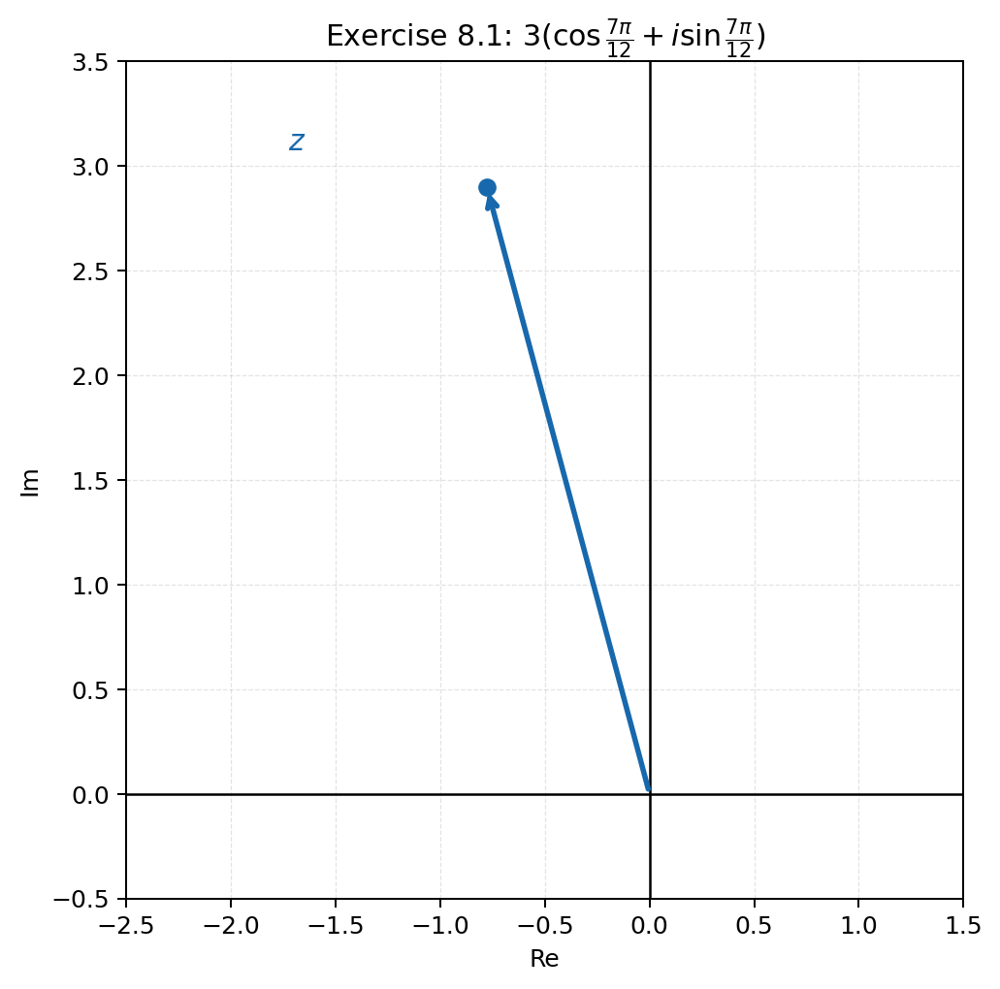

```python
from pathlib import Path
import math
import matplotlib.pyplot as plt

x = 3 * math.cos(7 * math.pi / 12)
y = 3 * math.sin(7 * math.pi / 12)

fig, ax = plt.subplots(figsize=(5.8, 5.8), dpi=180)
ax.set_xlim(-2.5, 1.5)
ax.set_ylim(-0.5, 3.5)
ax.set_aspect("equal", adjustable="box")
ax.axhline(0, color="black", linewidth=1)
ax.axvline(0, color="black", linewidth=1)
ax.grid(True, linestyle="--", linewidth=0.5, alpha=0.35)
ax.set_xlabel("Re")
ax.set_ylabel("Im")
ax.set_title(r"Exercise 8.1: $3(\cos \frac{7\pi}{12} + i\sin \frac{7\pi}{12})$")

ax.annotate("", xy=(x, y), xytext=(0, 0), arrowprops=dict(arrowstyle="->", lw=2.2, color="#1768ac"))
ax.scatter([x], [y], s=42, color="#1768ac", zorder=3)
ax.text(x - 0.95, y + 0.18, "$z$", color="#1768ac", fontsize=12)

fig.tight_layout()
output = Path("images/exercise8-problem1.png")
fig.savefig(output, bbox_inches="tight")
plt.show()

```

##### problem 2

Let

$$
z=\sqrt{2}\left(\cos \frac{-\pi}{2}+i \sin \frac{-\pi}{2}\right).
$$

Since

$$
\cos \frac{-\pi}{2}=0 \quad \text{and} \quad \sin \frac{-\pi}{2}=-1,
$$

we get

$$
z=\sqrt{2}(0-i)=-\sqrt{2}\, i.
$$

Thus the point is $(0,-\sqrt{2})$, which lies on the negative imaginary axis.

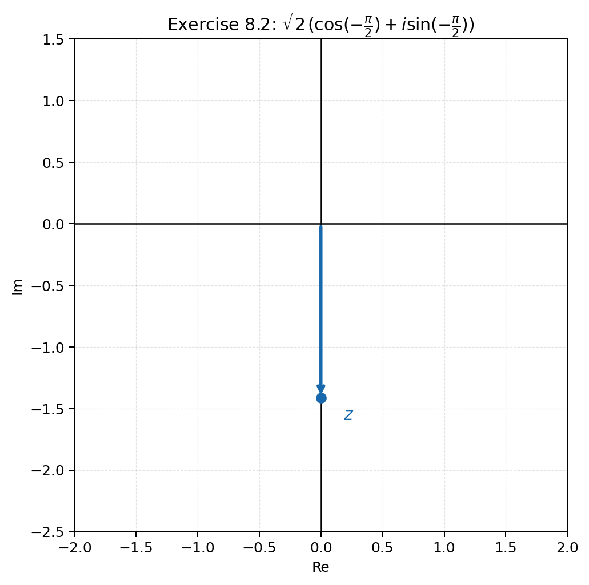

```python
from pathlib import Path
import math
import matplotlib.pyplot as plt

x = 0
y = -math.sqrt(2)

fig, ax = plt.subplots(figsize=(5.8, 5.8), dpi=180)
ax.set_xlim(-2, 2)
ax.set_ylim(-2.5, 1.5)
ax.set_aspect("equal", adjustable="box")
ax.axhline(0, color="black", linewidth=1)
ax.axvline(0, color="black", linewidth=1)
ax.grid(True, linestyle="--", linewidth=0.5, alpha=0.35)
ax.set_xlabel("Re")
ax.set_ylabel("Im")
ax.set_title(r"Exercise 8.2: $\sqrt{2}(\cos(-\frac{\pi}{2}) + i\sin(-\frac{\pi}{2}))$")

ax.annotate("", xy=(x, y), xytext=(0, 0), arrowprops=dict(arrowstyle="->", lw=2.2, color="#1768ac"))
ax.scatter([x], [y], s=42, color="#1768ac", zorder=3)
ax.text(x + 0.18, y - 0.18, "$z$", color="#1768ac", fontsize=12)

fig.tight_layout()
output = Path("images/exercise8-problem2.png")
fig.savefig(output, bbox_inches="tight")
plt.show()

```

##### problem 3

Let

$$
z=\frac{1}{2}\left(\cos \frac{64 \pi}{3}+i \sin \frac{64 \pi}{3}\right).
$$

Because sine and cosine are $2 \pi$-periodic,

$$
\frac{64 \pi}{3}=\frac{60 \pi}{3}+\frac{4 \pi}{3}=20 \pi+\frac{4 \pi}{3},
$$

so this angle is coterminal with $\frac{4 \pi}{3}$. Hence

$$
z=\frac{1}{2}\left(\cos \frac{4 \pi}{3}+i \sin \frac{4 \pi}{3}\right)=\frac{1}{2}\left(-\frac{1}{2}-i \frac{\sqrt{3}}{2}\right)=-\frac{1}{4}-i \frac{\sqrt{3}}{4}.
$$

Thus the point is

$$
\left(-\frac{1}{4},-\frac{\sqrt{3}}{4}\right),
$$

which lies in the third quadrant.

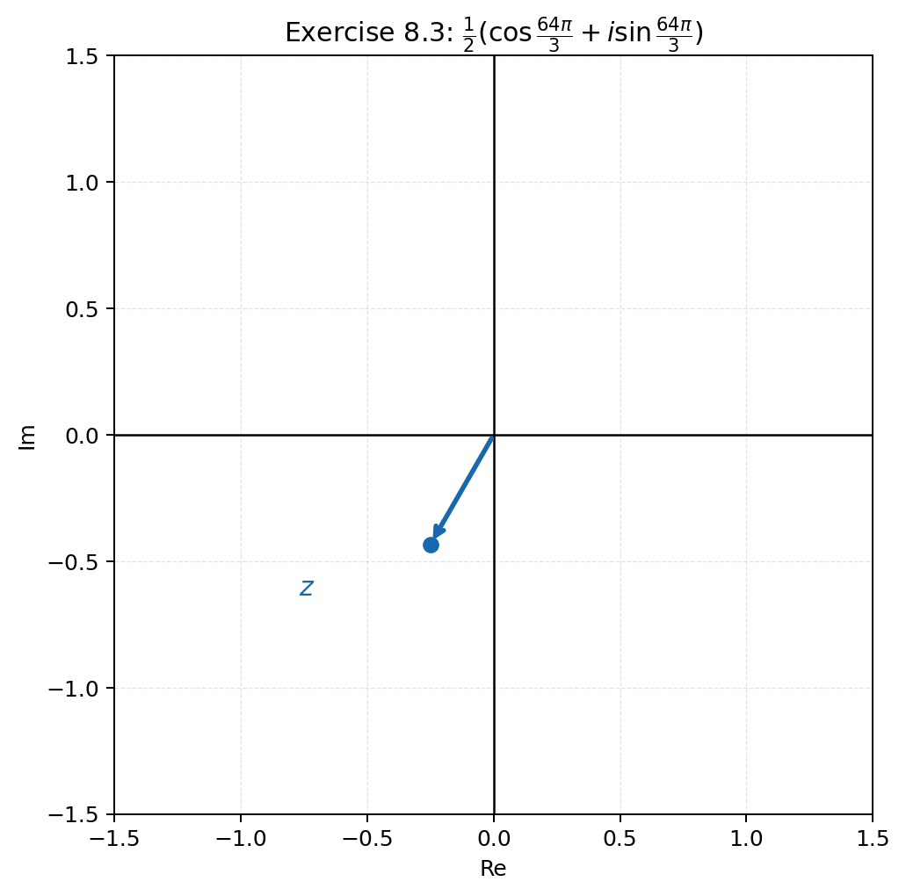

```python
from pathlib import Path
import math
import matplotlib.pyplot as plt

x = 0.5 * math.cos(64 * math.pi / 3)
y = 0.5 * math.sin(64 * math.pi / 3)

fig, ax = plt.subplots(figsize=(5.8, 5.8), dpi=180)
ax.set_xlim(-1.5, 1.5)
ax.set_ylim(-1.5, 1.5)
ax.set_aspect("equal", adjustable="box")
ax.axhline(0, color="black", linewidth=1)
ax.axvline(0, color="black", linewidth=1)
ax.grid(True, linestyle="--", linewidth=0.5, alpha=0.35)
ax.set_xlabel("Re")
ax.set_ylabel("Im")
ax.set_title(r"Exercise 8.3: $\frac{1}{2}(\cos \frac{64\pi}{3} + i\sin \frac{64\pi}{3})$")

ax.annotate("", xy=(x, y), xytext=(0, 0), arrowprops=dict(arrowstyle="->", lw=2.2, color="#1768ac"))
ax.scatter([x], [y], s=42, color="#1768ac", zorder=3)
ax.text(x - 0.52, y - 0.20, "$z$", color="#1768ac", fontsize=12)

fig.tight_layout()
output = Path("images/exercise8-problem3.png")
fig.savefig(output, bbox_inches="tight")
plt.show()

```

##### problem 4

Let

$$
z=3\left(\cos \frac{-72 \pi}{11}+i \sin \frac{-72 \pi}{11}\right).
$$

Reducing the angle modulo $2 \pi=\frac{22 \pi}{11}$ gives

$$
\frac{-72 \pi}{11}+\frac{66 \pi}{11}=\frac{-6 \pi}{11},
$$

so

$$
z=3\left(\cos \frac{-6 \pi}{11}+i \sin \frac{-6 \pi}{11}\right)=3\left(\cos \frac{6 \pi}{11}-i \sin \frac{6 \pi}{11}\right).
$$

This gives the Cartesian form

$$
z=3 \cos \frac{6 \pi}{11}-3 i \sin \frac{6 \pi}{11} \approx-0.427-2.969 i.
$$

Thus the point is approximately $(-0.427,-2.969)$, which lies in the third quadrant.

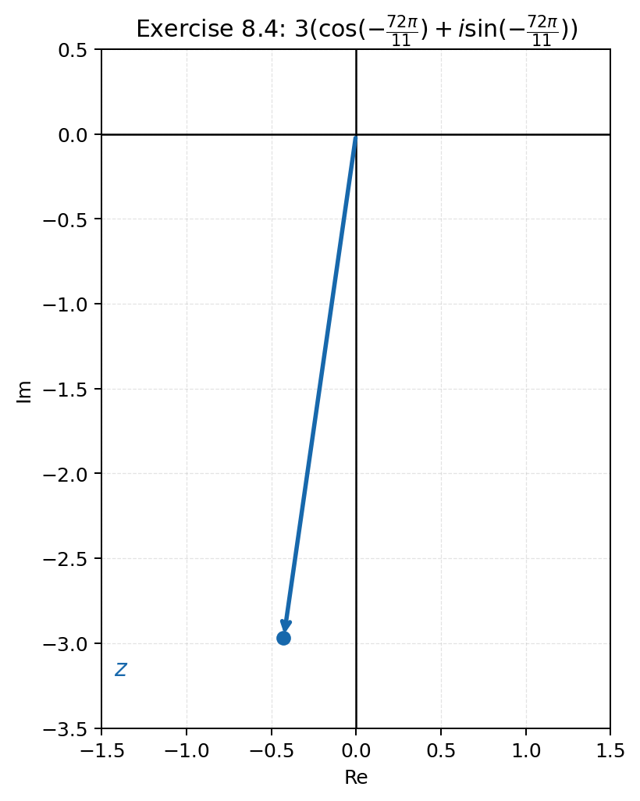

```python
from pathlib import Path
import math
import matplotlib.pyplot as plt

x = 3 * math.cos(-72 * math.pi / 11)
y = 3 * math.sin(-72 * math.pi / 11)

fig, ax = plt.subplots(figsize=(5.8, 5.8), dpi=180)
ax.set_xlim(-1.5, 1.5)
ax.set_ylim(-3.5, 0.5)
ax.set_aspect("equal", adjustable="box")
ax.axhline(0, color="black", linewidth=1)
ax.axvline(0, color="black", linewidth=1)
ax.grid(True, linestyle="--", linewidth=0.5, alpha=0.35)
ax.set_xlabel("Re")
ax.set_ylabel("Im")
ax.set_title(r"Exercise 8.4: $3(\cos(-\frac{72\pi}{11}) + i\sin(-\frac{72\pi}{11}))$")

ax.annotate("", xy=(x, y), xytext=(0, 0), arrowprops=dict(arrowstyle="->", lw=2.2, color="#1768ac"))
ax.scatter([x], [y], s=42, color="#1768ac", zorder=3)
ax.text(x - 1.00, y - 0.22, "$z$", color="#1768ac", fontsize=12)

fig.tight_layout()
output = Path("images/exercise8-problem4.png")
fig.savefig(output, bbox_inches="tight")
plt.show()

```


> [!exercise] Exercise 9
> In problems 5-12, represent the given number in polar form.
> 5. $-3-3 i$.
> 6. $-\frac{\sqrt{3}}{2}+\frac{i}{2}$.
> 7. $-1-\sqrt{3} i$.
> 8. $1+i$.
> 9. $-\frac{i}{2}$.
> 10. $\frac{1+i}{1+\sqrt{3} i}$.
> 11. $\frac{1+i}{1-i}$.
> 12. $\frac{i}{10+10 i}$.

##### problem 5

Let $z=-3-3 i$. Its modulus is

$$
r=|z|=\sqrt{(-3)^{2}+(-3)^{2}}=\sqrt{9+9}=3 \sqrt{2}.
$$

The point lies in the third quadrant, and its reference angle is $\frac{\pi}{4}$. Hence an argument is $\frac{5 \pi}{4}$, while the principal value is $-\frac{3 \pi}{4}$. A convenient polar form is

$$
-3-3 i=3 \sqrt{2}\left(\cos \frac{5 \pi}{4}+i \sin \frac{5 \pi}{4}\right) .
$$

##### problem 6

Let

$$
z=-\frac{\sqrt{3}}{2}+\frac{i}{2}.
$$

Its modulus is

$$
r=|z|=\sqrt{\left(-\frac{\sqrt{3}}{2}\right)^{2}+\left(\frac{1}{2}\right)^{2}}=\sqrt{\frac{3}{4}+\frac{1}{4}}=1.
$$

From Table 1,

$$
\cos \frac{5 \pi}{6}=-\frac{\sqrt{3}}{2}, \qquad \sin \frac{5 \pi}{6}=\frac{1}{2}.
$$

Therefore

$$
-\frac{\sqrt{3}}{2}+\frac{i}{2}=\cos \frac{5 \pi}{6}+i \sin \frac{5 \pi}{6}.
$$

##### problem 7

Let

$$
z=-1-\sqrt{3} i.
$$

Its modulus is

$$
r=|z|=\sqrt{(-1)^{2}+(-\sqrt{3})^{2}}=\sqrt{1+3}=2.
$$

The point lies in the third quadrant, and the reference angle is $\frac{\pi}{3}$. Hence an argument is $\frac{4 \pi}{3}$, while the principal value is $-\frac{2 \pi}{3}$. Thus

$$
-1-\sqrt{3} i=2\left(\cos \frac{4 \pi}{3}+i \sin \frac{4 \pi}{3}\right) .
$$

##### problem 8

This was already found in Example 1(d). Since

$$
r=|1+i|=\sqrt{1^{2}+1^{2}}=\sqrt{2},
$$

and

$$
\cos \frac{\pi}{4}=\sin \frac{\pi}{4}=\frac{\sqrt{2}}{2},
$$

we obtain

$$
1+i=\sqrt{2}\left(\cos \frac{\pi}{4}+i \sin \frac{\pi}{4}\right) .
$$

##### problem 9

Let

$$
z=-\frac{i}{2}.
$$

Its modulus is

$$
r=|z|=\frac{1}{2},
$$

and the point lies on the negative imaginary axis, so the principal argument is $-\frac{\pi}{2}$. Hence

$$
-\frac{i}{2}=\frac{1}{2}\left(\cos \left(-\frac{\pi}{2}\right)+i \sin \left(-\frac{\pi}{2}\right)\right) .
$$

##### problem 10

Write the numerator and denominator in polar form:

$$
1+i=\sqrt{2}\left(\cos \frac{\pi}{4}+i \sin \frac{\pi}{4}\right), \qquad 1+\sqrt{3} i=2\left(\cos \frac{\pi}{3}+i \sin \frac{\pi}{3}\right) .
$$

Then, using the quotient formula in polar form,

$$
\begin{aligned}
\frac{1+i}{1+\sqrt{3} i}
& =\frac{\sqrt{2}\left(\cos \frac{\pi}{4}+i \sin \frac{\pi}{4}\right)}{2\left(\cos \frac{\pi}{3}+i \sin \frac{\pi}{3}\right)} \\
& =\frac{\sqrt{2}}{2}\left(\cos \left(\frac{\pi}{4}-\frac{\pi}{3}\right)+i \sin \left(\frac{\pi}{4}-\frac{\pi}{3}\right)\right) \\
& =\frac{\sqrt{2}}{2}\left(\cos \left(-\frac{\pi}{12}\right)+i \sin \left(-\frac{\pi}{12}\right)\right) .
\end{aligned}
$$

So a polar form is

$$
\frac{1+i}{1+\sqrt{3} i}=\frac{\sqrt{2}}{2}\left(\cos \left(-\frac{\pi}{12}\right)+i \sin \left(-\frac{\pi}{12}\right)\right) .
$$

##### problem 11

Again write both numbers in polar form:

$$
1+i=\sqrt{2}\left(\cos \frac{\pi}{4}+i \sin \frac{\pi}{4}\right), \qquad 1-i=\sqrt{2}\left(\cos \left(-\frac{\pi}{4}\right)+i \sin \left(-\frac{\pi}{4}\right)\right) .
$$

Then

$$
\begin{aligned}
\frac{1+i}{1-i}
& =\frac{\sqrt{2}\left(\cos \frac{\pi}{4}+i \sin \frac{\pi}{4}\right)}{\sqrt{2}\left(\cos \left(-\frac{\pi}{4}\right)+i \sin \left(-\frac{\pi}{4}\right)\right)} \\
& =\cos \left(\frac{\pi}{4}-\left(-\frac{\pi}{4}\right)\right)+i \sin \left(\frac{\pi}{4}-\left(-\frac{\pi}{4}\right)\right) \\
& =\cos \frac{\pi}{2}+i \sin \frac{\pi}{2}.
\end{aligned}
$$

Therefore

$$
\frac{1+i}{1-i}=\cos \frac{\pi}{2}+i \sin \frac{\pi}{2}.
$$

##### problem 12

Write the numerator and denominator in polar form:

$$
i=\cos \frac{\pi}{2}+i \sin \frac{\pi}{2}, \qquad 10+10 i=10 \sqrt{2}\left(\cos \frac{\pi}{4}+i \sin \frac{\pi}{4}\right) .
$$

Now divide:

$$
\begin{aligned}
\frac{i}{10+10 i}
& =\frac{\cos \frac{\pi}{2}+i \sin \frac{\pi}{2}}{10 \sqrt{2}\left(\cos \frac{\pi}{4}+i \sin \frac{\pi}{4}\right)} \\
& =\frac{1}{10 \sqrt{2}}\left(\cos \left(\frac{\pi}{2}-\frac{\pi}{4}\right)+i \sin \left(\frac{\pi}{2}-\frac{\pi}{4}\right)\right) \\
& =\frac{1}{10 \sqrt{2}}\left(\cos \frac{\pi}{4}+i \sin \frac{\pi}{4}\right) .
\end{aligned}
$$

Hence

$$
\frac{i}{10+10 i}=\frac{1}{10 \sqrt{2}}\left(\cos \frac{\pi}{4}+i \sin \frac{\pi}{4}\right) .
$$


> [!exercise] Exercise 10
> In problems 13-16, you are given a complex number $z$. Find $\operatorname{Arg} z$ with the help of (14) or (15); then find $\arg z$. If needed, use a calculator to compute $\tan ^{-1}$.
> 13. $13+2 i$.
> 14. $-3-32 i$.
> 15. $-1+\frac{1}{2} i$.
> 16. $-\frac{3 \pi}{2} i$.


> [!equation]
> 
> $$
> \operatorname{Arg} z= \begin{cases}\tan ^{-1}\left(\frac{y}{x}\right) & \text { if } x>0 \\ \tan ^{-1}\left(\frac{y}{x}\right)+\pi & \text { if } x<0 \text { and } y \geq 0 \\ \tan ^{-1}\left(\frac{y}{x}\right)-\pi & \text { if } x<0 \text { and } y<0\end{cases} \tag{14}
> $$
> 
> $$\operatorname{Arg} z=\operatorname{Arg}(i y)= \begin{cases}\frac{\pi}{2} & \text { if } y>0 \\ -\frac{\pi}{2} & \text { if } y<0\end{cases} \tag{15}$$
> 
> 

##### problem 13

Let

$$
z=13+2 i.
$$

Here $x=13>0$, so by (14),

$$
\operatorname{Arg} z=\tan ^{-1}\left(\frac{y}{x}\right)=\tan ^{-1}\left(\frac{2}{13}\right)\approx 0.153.
$$

Therefore

$$
\arg z=\left\{\tan ^{-1}\left(\frac{2}{13}\right)+2 k \pi: k=0, \pm 1, \pm 2, \ldots\right\}.
$$

##### problem 14

Let

$$
z=-3-32 i.
$$

Here $x=-3<0$ and $y=-32<0$, so by (14),

$$
\begin{aligned}
\operatorname{Arg} z
& =\tan ^{-1}\left(\frac{y}{x}\right)-\pi \\
& =\tan ^{-1}\left(\frac{-32}{-3}\right)-\pi \\
& =\tan ^{-1}\left(\frac{32}{3}\right)-\pi \\
& \approx 1.477-\pi \\
& \approx -1.664.
\end{aligned}
$$

Hence

$$
\arg z=\left\{\tan ^{-1}\left(\frac{32}{3}\right)-\pi+2 k \pi: k=0, \pm 1, \pm 2, \ldots\right\}.
$$

##### problem 15

Let

$$
z=-1+\frac{i}{2}.
$$

Here $x=-1<0$ and $y=\frac{1}{2}>0$, so by (14),

$$
\begin{aligned}
\operatorname{Arg} z
& =\tan ^{-1}\left(\frac{y}{x}\right)+\pi \\
& =\tan ^{-1}\left(\frac{1 / 2}{-1}\right)+\pi \\
& =\tan ^{-1}\left(-\frac{1}{2}\right)+\pi \\
& =\pi-\tan ^{-1}\left(\frac{1}{2}\right) \\
& \approx 2.678.
\end{aligned}
$$

Therefore

$$
\arg z=\left\{\pi-\tan ^{-1}\left(\frac{1}{2}\right)+2 k \pi: k=0, \pm 1, \pm 2, \ldots\right\}.
$$

##### problem 16

Let

$$
z=-\frac{3 \pi}{2} i.
$$

Here $x=0$ and $y<0$, so the inverse tangent formula does not apply. By (15),

$$
\operatorname{Arg} z=-\frac{\pi}{2}.
$$

Hence

$$
\arg z=\left\{-\frac{\pi}{2}+2 k \pi: k=0, \pm 1, \pm 2, \ldots\right\}.
$$


> [!exercise] Exercise 11
> In problems 17-20, find the polar form of the given number.
> 17. $(-\sqrt{3}+i)^{3}$.
> 18. $(-2-3 i)^{17}$.
> 19. $\left(\frac{1-i}{1+i}\right)^{10}$.
> 20. $\frac{i}{(1+2 \sqrt{3} i)^{5}}$.

##### problem 17

First write the base in polar form:

$$
-\sqrt{3}+i=2\left(\cos \frac{5 \pi}{6}+i \sin \frac{5 \pi}{6}\right) .
$$

Now apply De Moivre's identity:

$$
\begin{aligned}
(-\sqrt{3}+i)^{3}
& =\left(2\left(\cos \frac{5 \pi}{6}+i \sin \frac{5 \pi}{6}\right)\right)^{3} \\
& =2^{3}\left(\cos \left(3 \cdot \frac{5 \pi}{6}\right)+i \sin \left(3 \cdot \frac{5 \pi}{6}\right)\right) \\
& =8\left(\cos \frac{5 \pi}{2}+i \sin \frac{5 \pi}{2}\right) \\
& =8\left(\cos \frac{\pi}{2}+i \sin \frac{\pi}{2}\right) .
\end{aligned}
$$

So the polar form is

$$
(-\sqrt{3}+i)^{3}=8\left(\cos \frac{\pi}{2}+i \sin \frac{\pi}{2}\right) .
$$

##### problem 18

First write the base in polar form. Its modulus is

$$
r=\sqrt{(-2)^{2}+(-3)^{2}}=\sqrt{13},
$$

and since the point lies in the third quadrant, one argument is

$$
\theta=\pi+\tan ^{-1}\left(\frac{3}{2}\right).
$$

Hence

$$
-2-3 i=\sqrt{13}\left(\cos \left(\pi+\tan ^{-1}\left(\frac{3}{2}\right)\right)+i \sin \left(\pi+\tan ^{-1}\left(\frac{3}{2}\right)\right)\right) .
$$

Now apply De Moivre's identity:

$$
\begin{aligned}
(-2-3 i)^{17}
& =\left(\sqrt{13}\left(\cos \left(\pi+\tan ^{-1}\left(\frac{3}{2}\right)\right)+i \sin \left(\pi+\tan ^{-1}\left(\frac{3}{2}\right)\right)\right)\right)^{17} \\
& =(\sqrt{13})^{17}\left(\cos \left(17 \pi+17 \tan ^{-1}\left(\frac{3}{2}\right)\right)+i \sin \left(17 \pi+17 \tan ^{-1}\left(\frac{3}{2}\right)\right)\right) \\
& =13^{17 / 2}\left(\cos \left(17 \tan ^{-1}\left(\frac{3}{2}\right)-5 \pi\right)+i \sin \left(17 \tan ^{-1}\left(\frac{3}{2}\right)-5 \pi\right)\right) .
\end{aligned}
$$

So a polar form is

$$
(-2-3 i)^{17}=13^{17 / 2}\left(\cos \left(17 \tan ^{-1}\left(\frac{3}{2}\right)-5 \pi\right)+i \sin \left(17 \tan ^{-1}\left(\frac{3}{2}\right)-5 \pi\right)\right) .
$$

##### problem 19

From Exercise 11, problem 11, we know that

$$
\frac{1-i}{1+i}=\cos \left(-\frac{\pi}{2}\right)+i \sin \left(-\frac{\pi}{2}\right) .
$$

Therefore

$$
\begin{aligned}
\left(\frac{1-i}{1+i}\right)^{10}
& =\left(\cos \left(-\frac{\pi}{2}\right)+i \sin \left(-\frac{\pi}{2}\right)\right)^{10} \\
& =\cos \left(10 \cdot \left(-\frac{\pi}{2}\right)\right)+i \sin \left(10 \cdot \left(-\frac{\pi}{2}\right)\right) \\
& =\cos (-5 \pi)+i \sin (-5 \pi) \\
& =\cos \pi+i \sin \pi .
\end{aligned}
$$

Thus the polar form is

$$
\left(\frac{1-i}{1+i}\right)^{10}=\cos \pi+i \sin \pi .
$$

##### problem 20

Write the denominator in polar form:

$$
1+2 \sqrt{3} i=\sqrt{13}\left(\cos \left(\tan ^{-1}(2 \sqrt{3})\right)+i \sin \left(\tan ^{-1}(2 \sqrt{3})\right)\right) .
$$

Hence

$$
\begin{aligned}
\frac{i}{(1+2 \sqrt{3} i)^{5}}
& =\frac{\cos \frac{\pi}{2}+i \sin \frac{\pi}{2}}{\left(\sqrt{13}\left(\cos \left(\tan ^{-1}(2 \sqrt{3})\right)+i \sin \left(\tan ^{-1}(2 \sqrt{3})\right)\right)\right)^{5}} \\
& =\frac{\cos \frac{\pi}{2}+i \sin \frac{\pi}{2}}{13^{5 / 2}\left(\cos \left(5 \tan ^{-1}(2 \sqrt{3})\right)+i \sin \left(5 \tan ^{-1}(2 \sqrt{3})\right)\right)} \\
& =\frac{1}{13^{5 / 2}}\left(\cos \left(\frac{\pi}{2}-5 \tan ^{-1}(2 \sqrt{3})\right)+i \sin \left(\frac{\pi}{2}-5 \tan ^{-1}(2 \sqrt{3})\right)\right) .
\end{aligned}
$$

So the polar form is

$$
\frac{i}{(1+2 \sqrt{3} i)^{5}}=\frac{1}{13^{5 / 2}}\left(\cos \left(\frac{\pi}{2}-5 \tan ^{-1}(2 \sqrt{3})\right)+i \sin \left(\frac{\pi}{2}-5 \tan ^{-1}(2 \sqrt{3})\right)\right) .
$$


> [!exercise] Exercise 12
> In problems 21-24, find the real and imaginary parts of the given number.
> 21. $(1+i)^{30}$.
> 22. $\left(\cos \frac{2 \pi}{17}+i \sin \frac{2 \pi}{17}\right)^{170}$.
> 23. $\left(\frac{1-i}{1+i}\right)^{4}$.
> 24. $\frac{-i}{(1+i)^{5}}$.

##### problem 21

First write $1+i$ in polar form:

$$
1+i=\sqrt{2}\left(\cos \frac{\pi}{4}+i \sin \frac{\pi}{4}\right) .
$$

Then

$$
\begin{aligned}
(1+i)^{30}
& =\left(\sqrt{2}\left(\cos \frac{\pi}{4}+i \sin \frac{\pi}{4}\right)\right)^{30} \\
& =(\sqrt{2})^{30}\left(\cos \frac{30 \pi}{4}+i \sin \frac{30 \pi}{4}\right) \\
& =2^{15}\left(\cos \frac{15 \pi}{2}+i \sin \frac{15 \pi}{2}\right) \\
& =2^{15}\left(\cos \frac{3 \pi}{2}+i \sin \frac{3 \pi}{2}\right) \\
& =-2^{15} i.
\end{aligned}
$$

Therefore

$$
\operatorname{Re}(1+i)^{30}=0, \qquad \operatorname{Im}(1+i)^{30}=-2^{15}=-32768.
$$

##### problem 22

By De Moivre's identity,

$$
\begin{aligned}
\left(\cos \frac{2 \pi}{17}+i \sin \frac{2 \pi}{17}\right)^{170}
& =\cos \left(170 \cdot \frac{2 \pi}{17}\right)+i \sin \left(170 \cdot \frac{2 \pi}{17}\right) \\
& =\cos 20 \pi+i \sin 20 \pi \\
& =1.
\end{aligned}
$$

Hence

$$
\operatorname{Re}=1, \qquad \operatorname{Im}=0.
$$

##### problem 23

From problem 19 above,

$$
\frac{1-i}{1+i}=\cos \left(-\frac{\pi}{2}\right)+i \sin \left(-\frac{\pi}{2}\right).
$$

Therefore

$$
\begin{aligned}
\left(\frac{1-i}{1+i}\right)^{4}
& =\left(\cos \left(-\frac{\pi}{2}\right)+i \sin \left(-\frac{\pi}{2}\right)\right)^{4} \\
& =\cos \left(4 \cdot \left(-\frac{\pi}{2}\right)\right)+i \sin \left(4 \cdot \left(-\frac{\pi}{2}\right)\right) \\
& =\cos (-2 \pi)+i \sin (-2 \pi) \\
& =1.
\end{aligned}
$$

So

$$
\operatorname{Re}=1, \qquad \operatorname{Im}=0.
$$

##### problem 24

Write the denominator in polar form:

$$
1+i=\sqrt{2}\left(\cos \frac{\pi}{4}+i \sin \frac{\pi}{4}\right).
$$

Then

$$
\begin{aligned}
\frac{-i}{(1+i)^{5}}
& =\frac{\cos \left(-\frac{\pi}{2}\right)+i \sin \left(-\frac{\pi}{2}\right)}{\left(\sqrt{2}\left(\cos \frac{\pi}{4}+i \sin \frac{\pi}{4}\right)\right)^{5}} \\
& =\frac{\cos \left(-\frac{\pi}{2}\right)+i \sin \left(-\frac{\pi}{2}\right)}{2^{5 / 2}\left(\cos \frac{5 \pi}{4}+i \sin \frac{5 \pi}{4}\right)} \\
& =\frac{1}{2^{5 / 2}}\left(\cos \left(-\frac{\pi}{2}-\frac{5 \pi}{4}\right)+i \sin \left(-\frac{\pi}{2}-\frac{5 \pi}{4}\right)\right) \\
& =\frac{1}{2^{5 / 2}}\left(\cos \left(-\frac{7 \pi}{4}\right)+i \sin \left(-\frac{7 \pi}{4}\right)\right) \\
& =\frac{1}{2^{5 / 2}}\left(\cos \frac{\pi}{4}+i \sin \frac{\pi}{4}\right) \\
& =\frac{1}{2^{5 / 2}}\left(\frac{\sqrt{2}}{2}+i \frac{\sqrt{2}}{2}\right) \\
& =\frac{1}{8}+\frac{i}{8}.
\end{aligned}
$$

Hence

$$
\operatorname{Re}=\frac{1}{8}, \qquad \operatorname{Im}=\frac{1}{8}.
$$


> [!exercise] Exercise 13
> 25. What are the real and imaginary parts of $i^{n}$, where $n$ is an integer?

Write $i$ in polar form:

$$
i=\cos \frac{\pi}{2}+i \sin \frac{\pi}{2}.
$$

By De Moivre's identity,

$$
\begin{aligned}
i^{n}
& =\left(\cos \frac{\pi}{2}+i \sin \frac{\pi}{2}\right)^{n} \\
& =\cos \frac{n \pi}{2}+i \sin \frac{n \pi}{2}.
\end{aligned}
$$

Therefore

$$
\operatorname{Re}\left(i^{n}\right)=\cos \frac{n \pi}{2}, \qquad \operatorname{Im}\left(i^{n}\right)=\sin \frac{n \pi}{2}.
$$

Equivalently,

$$
i^{n}= \begin{cases}1 & \text { if } n \equiv 0 \pmod{4}, \\ i & \text { if } n \equiv 1 \pmod{4}, \\ -1 & \text { if } n \equiv 2 \pmod{4}, \\ -i & \text { if } n \equiv 3 \pmod{4} .\end{cases}
$$

So

$$
\operatorname{Re}\left(i^{n}\right)= \begin{cases}1 & \text { if } n \equiv 0 \pmod{4}, \\ 0 & \text { if } n \equiv 1 \pmod{4}, \\ -1 & \text { if } n \equiv 2 \pmod{4}, \\ 0 & \text { if } n \equiv 3 \pmod{4},\end{cases}
\qquad
\operatorname{Im}\left(i^{n}\right)= \begin{cases}0 & \text { if } n \equiv 0 \pmod{4}, \\ 1 & \text { if } n \equiv 1 \pmod{4}, \\ 0 & \text { if } n \equiv 2 \pmod{4}, \\ -1 & \text { if } n \equiv 3 \pmod{4} .\end{cases}
$$


> [!exercise] Exercise 14
> 26. Prove the following identities:
> $\begin{gathered}\arg \bar{z}=-\arg z \\ \arg (-z)=\arg z+\pi\end{gathered}$

Assume $z \neq 0$ and let

$$
z=r(\cos \theta+i \sin \theta),
$$

where $\theta$ is any argument of $z$, so $\theta \in \arg z$.

For the conjugate,

$$
\begin{aligned}
\bar{z}
& =r(\cos \theta-i \sin \theta) \\
& =r(\cos (-\theta)+i \sin (-\theta)).
\end{aligned}
$$

Hence $-\theta$ is an argument of $\bar{z}$, and therefore

$$
\arg \bar{z}=\{-\theta+2 k \pi: k \in \mathbb{Z}\}.
$$

On the other hand,

$$
-\arg z=-\{\theta+2 k \pi: k \in \mathbb{Z}\}=\{-\theta-2 k \pi: k \in \mathbb{Z}\}.
$$

Since $k$ ranges over all integers, these two sets are the same. Thus

$$
\arg \bar{z}=-\arg z.
$$

For $-z$, we have

$$
\begin{aligned}
-z
& =r(-\cos \theta-i \sin \theta) \\
& =r(\cos (\theta+\pi)+i \sin (\theta+\pi)).
\end{aligned}
$$

Hence $\theta+\pi$ is an argument of $-z$, so

$$
\arg (-z)=\{\theta+\pi+2 k \pi: k \in \mathbb{Z}\}.
$$

But

$$
\arg z+\pi=\{\theta+2 k \pi+\pi: k \in \mathbb{Z}\}=\{\theta+\pi+2 k \pi: k \in \mathbb{Z}\}.
$$

Therefore

$$
\arg (-z)=\arg z+\pi.
$$


> [!exercise] Exercise 15
> 27. Show that
> 
> $$
> \left(\frac{1+i \tan \theta}{1-i \tan \theta}\right)^{n}=\frac{1+i \tan n \theta}{1-i \tan n \theta}
> $$
> 

Assume both sides are defined.

Start with the left-hand fraction:

$$
\begin{aligned}
\frac{1+i \tan \theta}{1-i \tan \theta}
& =\frac{1+i \frac{\sin \theta}{\cos \theta}}{1-i \frac{\sin \theta}{\cos \theta}} \\
& =\frac{\frac{\cos \theta+i \sin \theta}{\cos \theta}}{\frac{\cos \theta-i \sin \theta}{\cos \theta}} \\
& =\frac{\cos \theta+i \sin \theta}{\cos \theta-i \sin \theta} \\
& =\frac{\cos \theta+i \sin \theta}{\cos (-\theta)+i \sin (-\theta)} \\
& =\cos (\theta-(-\theta))+i \sin (\theta-(-\theta)) \\
& =\cos 2 \theta+i \sin 2 \theta.
\end{aligned}
$$

Raise both sides to the $n$th power:

$$
\begin{aligned}
\left(\frac{1+i \tan \theta}{1-i \tan \theta}\right)^{n}
& =\left(\cos 2 \theta+i \sin 2 \theta\right)^{n} \\
& =\cos 2 n \theta+i \sin 2 n \theta.
\end{aligned}
$$

Now simplify the right-hand fraction:

$$
\begin{aligned}
\frac{1+i \tan n \theta}{1-i \tan n \theta}
& =\frac{1+i \frac{\sin n \theta}{\cos n \theta}}{1-i \frac{\sin n \theta}{\cos n \theta}} \\
& =\frac{\frac{\cos n \theta+i \sin n \theta}{\cos n \theta}}{\frac{\cos n \theta-i \sin n \theta}{\cos n \theta}} \\
& =\frac{\cos n \theta+i \sin n \theta}{\cos n \theta-i \sin n \theta} \\
& =\frac{\cos n \theta+i \sin n \theta}{\cos (-n \theta)+i \sin (-n \theta)} \\
& =\cos (n \theta-(-n \theta))+i \sin (n \theta-(-n \theta)) \\
& =\cos 2 n \theta+i \sin 2 n \theta.
\end{aligned}
$$

Both sides are equal to $\cos 2 n \theta+i \sin 2 n \theta$, so

$$
\left(\frac{1+i \tan \theta}{1-i \tan \theta}\right)^{n}=\frac{1+i \tan n \theta}{1-i \tan n \theta}.
$$


> [!exercise] Exercise 16
> 28. Show that $\bar{z}$ and $z^{-1}$ are parallel, using their polar forms. Find the positive constant $\alpha$ such that $\bar{z}=\alpha z^{-1}$.

Assume $z \neq 0$ and write

$$
z=r(\cos \theta+i \sin \theta), \qquad r=|z|>0.
$$

Then

$$
\begin{aligned}
\bar{z}
& =r(\cos \theta-i \sin \theta) \\
& =r(\cos (-\theta)+i \sin (-\theta)),
\end{aligned}
$$

and

$$
\begin{aligned}
z^{-1}
& =\frac{1}{r(\cos \theta+i \sin \theta)} \\
& =\frac{1}{r}(\cos (-\theta)+i \sin (-\theta)).
\end{aligned}
$$

So $\bar{z}$ and $z^{-1}$ have the same argument $-\theta$, hence they are parallel. Moreover,

$$
\begin{aligned}
\bar{z}
& =r(\cos (-\theta)+i \sin (-\theta)) \\
& =r^{2} \cdot \frac{1}{r}(\cos (-\theta)+i \sin (-\theta)) \\
& =r^{2} z^{-1}.
\end{aligned}
$$

Therefore

$$
\bar{z}=\alpha z^{-1} \quad \text { with } \quad \alpha=r^{2}=|z|^{2}>0.
$$


> [!exercise] Exercise 17
> 29. Suppose $z_{1}, z_{2}, \ldots, z_{n}$ are complex numbers with respective moduli $r_{1}, r_{2}$, $\ldots, r_{n}$ and arguments $\theta_{1}, \theta_{2}, \ldots, \theta_{n}$. Show that
> 
> $$
> z_{1} z_{2} \cdots z_{n}=r_{1} r_{2} \cdots r_{n}\left[\cos \left(\theta_{1}+\theta_{2}+\cdots+\theta_{n}\right)+i \sin \left(\theta_{1}+\theta_{2}+\cdots+\theta_{n}\right)\right]
> $$
> 

Write each factor in polar form:

$$
z_{j}=r_{j}\left(\cos \theta_{j}+i \sin \theta_{j}\right), \qquad j=1,2, \ldots, n.
$$

Then, applying the product formula for two complex numbers repeatedly,

$$
\begin{aligned}
z_{1} z_{2}
& =r_{1} r_{2}\left(\cos \left(\theta_{1}+\theta_{2}\right)+i \sin \left(\theta_{1}+\theta_{2}\right)\right), \\
\left(z_{1} z_{2}\right) z_{3}
& =r_{1} r_{2} r_{3}\left(\cos \left(\theta_{1}+\theta_{2}+\theta_{3}\right)+i \sin \left(\theta_{1}+\theta_{2}+\theta_{3}\right)\right),
\end{aligned}
$$

and continuing in the same way gives

$$
\begin{aligned}
z_{1} z_{2} \cdots z_{n}
& =r_{1} r_{2} \cdots r_{n}\left(\cos \left(\theta_{1}+\theta_{2}+\cdots+\theta_{n}\right)+i \sin \left(\theta_{1}+\theta_{2}+\cdots+\theta_{n}\right)\right).
\end{aligned}
$$

This is exactly the required formula.


> [!exercise] Exercise 18
> 30. (a) Show that if $z_{1}, z_{2}, \ldots, z_{n}$ are all unimodular, then so is $z_{1} z_{2} \cdots z_{n}$.
> (b) Let $n$ be a positive integer and $z$ a nonzero complex number. Show that $z$ is unimodular if and only if all its $n$th roots are unimodular.

##### part (a)

If each $z_{j}$ is unimodular, then $|z_{j}|=1$ for $j=1,2, \ldots, n$. By the product formula for moduli,

$$
\left|z_{1} z_{2} \cdots z_{n}\right|=\left|z_{1}\right|\left|z_{2}\right| \cdots\left|z_{n}\right|=1 \cdot 1 \cdots 1=1.
$$

Hence $z_{1} z_{2} \cdots z_{n}$ is unimodular.

##### part (b)

First suppose that $z$ is unimodular, so $|z|=1$. Let $w$ be any $n$th root of $z$, so

$$
w^{n}=z.
$$

Taking moduli,

$$
\left|w^{n}\right|=|z|=1.
$$

Since $\left|w^{n}\right|=|w|^{n}$, we get

$$
|w|^{n}=1.
$$

Because $|w| \geq 0$, it follows that

$$
|w|=1.
$$

So every $n$th root of $z$ is unimodular.

Conversely, suppose that all $n$th roots of $z$ are unimodular. Let $w$ be one of these roots. Then

$$
w^{n}=z
$$

and

$$
|w|=1.
$$

Therefore

$$
|z|=\left|w^{n}\right|=|w|^{n}=1^{n}=1.
$$

Hence $z$ is unimodular.

Thus $z$ is unimodular if and only if all its $n$th roots are unimodular.


> [!exercise] Exercise 19
> 31. (a) Show that two nonzero complex numbers $z_{1}$ and $z_{2}$ represent perpendicular vectors only if $\arg \left(\frac{z_{1}}{z_{2}}\right)=\frac{\pi}{2}+k \pi$, where $k$ is an integer.
> (b) Show that two nonzero complex numbers $z_{1}$ and $z_{2}$ represent parallel vectors only if $\arg \left(\frac{z_{1}}{z_{2}}\right)=2 k \pi$, where $k$ is an integer.

Let

$$
z_{1}=r_{1}\left(\cos \theta_{1}+i \sin \theta_{1}\right), \qquad z_{2}=r_{2}\left(\cos \theta_{2}+i \sin \theta_{2}\right),
$$

with $r_{1}, r_{2}>0$. Then

$$
\frac{z_{1}}{z_{2}}=\frac{r_{1}}{r_{2}}\left(\cos \left(\theta_{1}-\theta_{2}\right)+i \sin \left(\theta_{1}-\theta_{2}\right)\right).
$$

So every argument of $\dfrac{z_{1}}{z_{2}}$ has the form

$$
\theta_{1}-\theta_{2}+2 k \pi, \qquad k \in \mathbb{Z}.
$$

##### part (a)

If the vectors represented by $z_{1}$ and $z_{2}$ are perpendicular, then the angle between them is

$$
\theta_{1}-\theta_{2}=\frac{\pi}{2}+m \pi
$$

for some integer $m$. Therefore

$$
\arg \left(\frac{z_{1}}{z_{2}}\right)=\left\{\frac{\pi}{2}+m \pi+2 k \pi: k \in \mathbb{Z}\right\}.
$$

Since $m \pi+2 k \pi=(m+2 k) \pi$, this becomes

$$
\arg \left(\frac{z_{1}}{z_{2}}\right)=\left\{\frac{\pi}{2}+j \pi: j \in \mathbb{Z}\right\}.
$$

Hence

$$
\arg \left(\frac{z_{1}}{z_{2}}\right)=\frac{\pi}{2}+k \pi.
$$

##### part (b)

If the vectors represented by $z_{1}$ and $z_{2}$ are parallel, then their directions differ by an integer multiple of $2 \pi$, so

$$
\theta_{1}-\theta_{2}=2 m \pi
$$

for some integer $m$. Therefore

$$
\arg \left(\frac{z_{1}}{z_{2}}\right)=\left\{2 m \pi+2 k \pi: k \in \mathbb{Z}\right\}=\left\{2 j \pi: j \in \mathbb{Z}\right\}.
$$

Hence

$$
\arg \left(\frac{z_{1}}{z_{2}}\right)=2 k \pi.
$$


> [!exercise] Exercise 20
> 32. Suppose $z=r(\cos \theta+i \sin \theta)$. What become of its polar coordinates $r$ and $\theta$ if we multiply it by
> (a) a positive real number $\alpha$ ?
> (b) a negative real number $-\alpha$ ?
> (c) a unimodular complex number $\cos \phi+i \sin \phi$ ?

Let

$$
z=r(\cos \theta+i \sin \theta).
$$

##### part (a)

If $\alpha>0$, then

$$
\alpha=\alpha(\cos 0+i \sin 0).
$$

Therefore

$$
\begin{aligned}
\alpha z
& =\alpha(\cos 0+i \sin 0)\, r(\cos \theta+i \sin \theta) \\
& =\alpha r(\cos \theta+i \sin \theta).
\end{aligned}
$$

So the new polar coordinates are

$$
r \mapsto \alpha r, \qquad \theta \mapsto \theta.
$$

##### part (b)

If $-\alpha$ is a negative real number with $\alpha>0$, then

$$
-\alpha=\alpha(\cos \pi+i \sin \pi).
$$

Hence

$$
\begin{aligned}
(-\alpha) z
& =\alpha(\cos \pi+i \sin \pi)\, r(\cos \theta+i \sin \theta) \\
& =\alpha r(\cos (\theta+\pi)+i \sin (\theta+\pi)).
\end{aligned}
$$

So the new polar coordinates are

$$
r \mapsto \alpha r, \qquad \theta \mapsto \theta+\pi.
$$

##### part (c)

If we multiply by the unimodular number $\cos \phi+i \sin \phi$, then

$$
\begin{aligned}
(\cos \phi+i \sin \phi) z
& =(\cos \phi+i \sin \phi)\, r(\cos \theta+i \sin \theta) \\
& =r(\cos (\theta+\phi)+i \sin (\theta+\phi)).
\end{aligned}
$$

So the new polar coordinates are

$$
r \mapsto r, \qquad \theta \mapsto \theta+\phi.
$$


> [!exercise] Exercise 21
> In problems 33-38, solve the given equation and plot the solutions. In each case, determine the principal root.
> 33. $z^{4}=i$.
> 34. $z^{3}=1+i$.
> 35. $z^{6}=128$.
> 36. $z^{5}=-30$.
> 37. $z^{7}=-1$.
> 38. $z^{8}=-\frac{\pi}{2}$.

##### problem 33

Write

$$
i=\cos \frac{\pi}{2}+i \sin \frac{\pi}{2}.
$$

If $z^{4}=i$, then

$$
z_{k+1}=\cos \left(\frac{\pi}{8}+\frac{k \pi}{2}\right)+i \sin \left(\frac{\pi}{8}+\frac{k \pi}{2}\right), \qquad k=0,1,2,3.
$$

Thus the four solutions are

$$
\begin{aligned}
z_{1}&=\cos \frac{\pi}{8}+i \sin \frac{\pi}{8}, \\
z_{2}&=\cos \frac{5 \pi}{8}+i \sin \frac{5 \pi}{8}, \\
z_{3}&=\cos \frac{9 \pi}{8}+i \sin \frac{9 \pi}{8}, \\
z_{4}&=\cos \frac{13 \pi}{8}+i \sin \frac{13 \pi}{8}.
\end{aligned}
$$

The principal root is

$$
z_{1}=\cos \frac{\pi}{8}+i \sin \frac{\pi}{8}.
$$

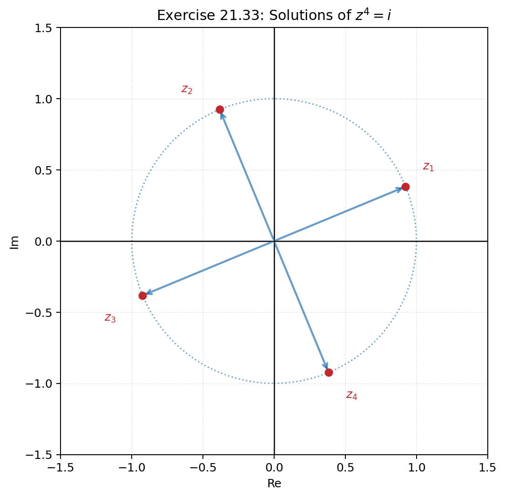

```python
from pathlib import Path
import math
import cmath
import matplotlib.pyplot as plt

w = 1j
n = 4
rho = abs(w)
phi = cmath.phase(w)
root_mod = rho ** (1 / n)

roots = []
for k in range(n):
    theta = (phi + 2 * math.pi * k) / n
    z = root_mod * complex(math.cos(theta), math.sin(theta))
    roots.append((k + 1, z))

fig, ax = plt.subplots(figsize=(6.1, 6.1), dpi=180)
ax.set_xlim(-1.5, 1.5)
ax.set_ylim(-1.5, 1.5)
ax.set_aspect("equal", adjustable="box")
ax.axhline(0, color="black", linewidth=1)
ax.axvline(0, color="black", linewidth=1)
ax.grid(True, linestyle="--", linewidth=0.5, alpha=0.35)
ax.set_xlabel("Re")
ax.set_ylabel("Im")
ax.set_title(r"Exercise 21.33: Solutions of $z^4=i$")

circle = plt.Circle((0, 0), root_mod, color="#1768ac", fill=False, linestyle=":", linewidth=1.2, alpha=0.6)
ax.add_patch(circle)

for idx, z in roots:
    ax.annotate("", xy=(z.real, z.imag), xytext=(0, 0), arrowprops=dict(arrowstyle="->", lw=1.7, color="#1768ac", alpha=0.65))
    ax.scatter([z.real], [z.imag], s=38, color="#c1292e", zorder=3)
    dx = 0.12 if z.real >= 0 else -0.27
    dy = 0.12 if z.imag >= 0 else -0.18
    if abs(z.real) < 0.15:
        dx = 0.12
    if abs(z.imag) < 0.15:
        dy = 0.12
    ax.text(z.real + dx, z.imag + dy, fr"$z_{{{idx}}}$", fontsize=10, color="#c1292e")

fig.tight_layout()
output = Path("images/exercise21-problem33.png")
fig.savefig(output, bbox_inches="tight")
plt.show()

```


##### problem 34

Write

$$
1+i=\sqrt{2}\left(\cos \frac{\pi}{4}+i \sin \frac{\pi}{4}\right).
$$

If $z^{3}=1+i$, then

$$
z_{k+1}=2^{1 / 6}\left(\cos \left(\frac{\pi}{12}+\frac{2 k \pi}{3}\right)+i \sin \left(\frac{\pi}{12}+\frac{2 k \pi}{3}\right)\right), \qquad k=0,1,2.
$$

Hence the three roots are

$$
\begin{aligned}
z_{1}&=2^{1 / 6}\left(\cos \frac{\pi}{12}+i \sin \frac{\pi}{12}\right), \\
z_{2}&=2^{1 / 6}\left(\cos \frac{3 \pi}{4}+i \sin \frac{3 \pi}{4}\right), \\
z_{3}&=2^{1 / 6}\left(\cos \frac{17 \pi}{12}+i \sin \frac{17 \pi}{12}\right).
\end{aligned}
$$

The principal root is

$$
z_{1}=2^{1 / 6}\left(\cos \frac{\pi}{12}+i \sin \frac{\pi}{12}\right).
$$

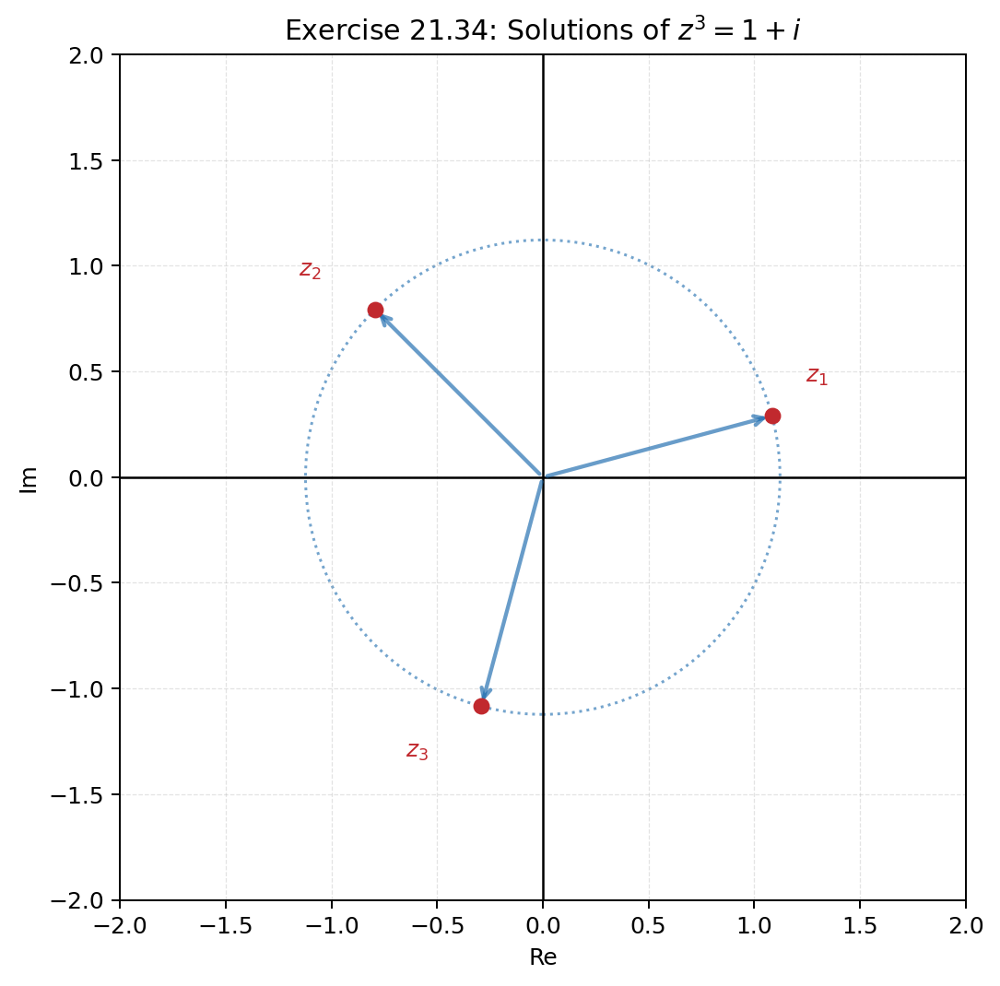

```python
from pathlib import Path
import math
import cmath
import matplotlib.pyplot as plt

w = 1 + 1j
n = 3
rho = abs(w)
phi = cmath.phase(w)
root_mod = rho ** (1 / n)

roots = []
for k in range(n):
    theta = (phi + 2 * math.pi * k) / n
    z = root_mod * complex(math.cos(theta), math.sin(theta))
    roots.append((k + 1, z))

fig, ax = plt.subplots(figsize=(6.1, 6.1), dpi=180)
ax.set_xlim(-1.5, 1.5)
ax.set_ylim(-1.5, 1.5)
ax.set_aspect("equal", adjustable="box")
ax.axhline(0, color="black", linewidth=1)
ax.axvline(0, color="black", linewidth=1)
ax.grid(True, linestyle="--", linewidth=0.5, alpha=0.35)
ax.set_xlabel("Re")
ax.set_ylabel("Im")
ax.set_title(r"Exercise 21.34: Solutions of $z^3=1+i$")

circle = plt.Circle((0, 0), root_mod, color="#1768ac", fill=False, linestyle=":", linewidth=1.2, alpha=0.6)
ax.add_patch(circle)

for idx, z in roots:
    ax.annotate("", xy=(z.real, z.imag), xytext=(0, 0), arrowprops=dict(arrowstyle="->", lw=1.7, color="#1768ac", alpha=0.65))
    ax.scatter([z.real], [z.imag], s=38, color="#c1292e", zorder=3)
    dx = 0.12 if z.real >= 0 else -0.32
    dy = 0.12 if z.imag >= 0 else -0.20
    if abs(z.real) < 0.15:
        dx = 0.12
    if abs(z.imag) < 0.15:
        dy = 0.12
    ax.text(z.real + dx, z.imag + dy, fr"$z_{{{idx}}}$", fontsize=10, color="#c1292e")

fig.tight_layout()
output = Path("images/exercise21-problem34.png")
fig.savefig(output, bbox_inches="tight")
plt.show()

```

##### problem 35

Write

$$
128=128(\cos 0+i \sin 0).
$$

If $z^{6}=128$, then

$$
z_{k+1}=128^{1 / 6}\left(\cos \frac{k \pi}{3}+i \sin \frac{k \pi}{3}\right)=2^{7 / 6}\left(\cos \frac{k \pi}{3}+i \sin \frac{k \pi}{3}\right),
\qquad k=0,1,\ldots,5.
$$

So the six solutions are

$$
\begin{aligned}
z_{1}&=2^{7 / 6}, \\
z_{2}&=2^{7 / 6}\left(\cos \frac{\pi}{3}+i \sin \frac{\pi}{3}\right), \\
z_{3}&=2^{7 / 6}\left(\cos \frac{2 \pi}{3}+i \sin \frac{2 \pi}{3}\right), \\
z_{4}&=2^{7 / 6}\left(\cos \pi+i \sin \pi\right), \\
z_{5}&=2^{7 / 6}\left(\cos \frac{4 \pi}{3}+i \sin \frac{4 \pi}{3}\right), \\
z_{6}&=2^{7 / 6}\left(\cos \frac{5 \pi}{3}+i \sin \frac{5 \pi}{3}\right).
\end{aligned}
$$

The principal root is

$$
z_{1}=2^{7 / 6}.
$$

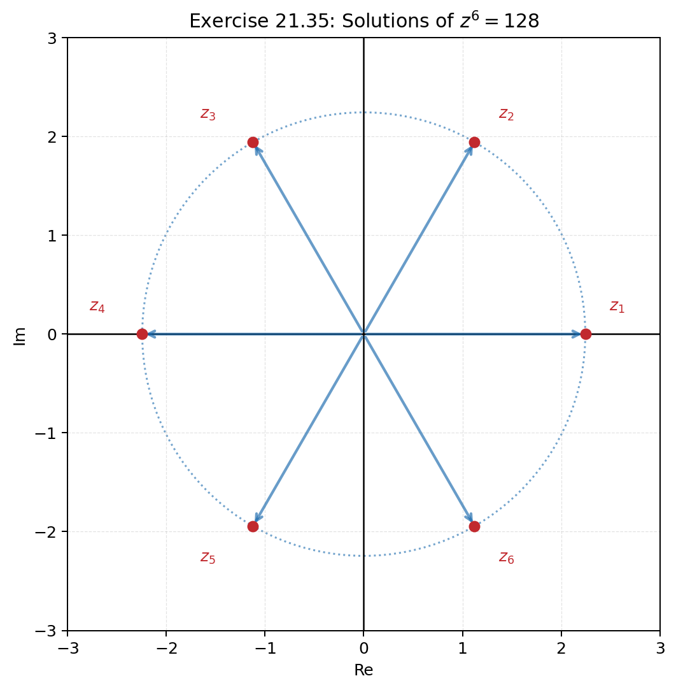

```python
from pathlib import Path
import math
import cmath
import matplotlib.pyplot as plt

w = 128 + 0j
n = 6
rho = abs(w)
phi = cmath.phase(w)
root_mod = rho ** (1 / n)

roots = []
for k in range(n):
    theta = (phi + 2 * math.pi * k) / n
    z = root_mod * complex(math.cos(theta), math.sin(theta))
    roots.append((k + 1, z))

fig, ax = plt.subplots(figsize=(6.1, 6.1), dpi=180)
ax.set_xlim(-3, 3)
ax.set_ylim(-3, 3)
ax.set_aspect("equal", adjustable="box")
ax.axhline(0, color="black", linewidth=1)
ax.axvline(0, color="black", linewidth=1)
ax.grid(True, linestyle="--", linewidth=0.5, alpha=0.35)
ax.set_xlabel("Re")
ax.set_ylabel("Im")
ax.set_title(r"Exercise 21.35: Solutions of $z^6=128$")

circle = plt.Circle((0, 0), root_mod, color="#1768ac", fill=False, linestyle=":", linewidth=1.2, alpha=0.6)
ax.add_patch(circle)

for idx, z in roots:
    ax.annotate("", xy=(z.real, z.imag), xytext=(0, 0), arrowprops=dict(arrowstyle="->", lw=1.7, color="#1768ac", alpha=0.65))
    ax.scatter([z.real], [z.imag], s=38, color="#c1292e", zorder=3)
    dx = 0.18 if z.real >= 0 else -0.52
    dy = 0.18 if z.imag >= 0 else -0.28
    if abs(z.real) < 0.2:
        dx = 0.18
    if abs(z.imag) < 0.2:
        dy = 0.18
    ax.text(z.real + dx, z.imag + dy, fr"$z_{{{idx}}}$", fontsize=10, color="#c1292e")

fig.tight_layout()
output = Path("images/exercise21-problem35.png")
fig.savefig(output, bbox_inches="tight")
plt.show()

```

##### problem 36

Write

$$
-30=30(\cos \pi+i \sin \pi).
$$

If $z^{5}=-30$, then

$$
z_{k+1}=30^{1 / 5}\left(\cos \left(\frac{\pi}{5}+\frac{2 k \pi}{5}\right)+i \sin \left(\frac{\pi}{5}+\frac{2 k \pi}{5}\right)\right), \qquad k=0,1,2,3,4.
$$

Thus the five roots are

$$
\begin{aligned}
z_{1}&=30^{1 / 5}\left(\cos \frac{\pi}{5}+i \sin \frac{\pi}{5}\right), \\
z_{2}&=30^{1 / 5}\left(\cos \frac{3 \pi}{5}+i \sin \frac{3 \pi}{5}\right), \\
z_{3}&=30^{1 / 5}\left(\cos \pi+i \sin \pi\right), \\
z_{4}&=30^{1 / 5}\left(\cos \frac{7 \pi}{5}+i \sin \frac{7 \pi}{5}\right), \\
z_{5}&=30^{1 / 5}\left(\cos \frac{9 \pi}{5}+i \sin \frac{9 \pi}{5}\right).
\end{aligned}
$$

The principal root is

$$
z_{1}=30^{1 / 5}\left(\cos \frac{\pi}{5}+i \sin \frac{\pi}{5}\right).
$$

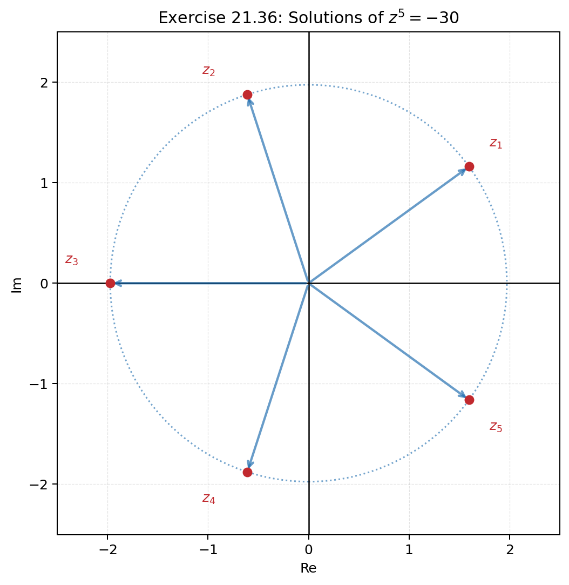

```python
from pathlib import Path
import math
import cmath
import matplotlib.pyplot as plt

w = -30 + 0j
n = 5
rho = abs(w)
phi = cmath.phase(w)
root_mod = rho ** (1 / n)

roots = []
for k in range(n):
    theta = (phi + 2 * math.pi * k) / n
    z = root_mod * complex(math.cos(theta), math.sin(theta))
    roots.append((k + 1, z))

fig, ax = plt.subplots(figsize=(6.1, 6.1), dpi=180)
ax.set_xlim(-2.5, 2.5)
ax.set_ylim(-2.5, 2.5)
ax.set_aspect("equal", adjustable="box")
ax.axhline(0, color="black", linewidth=1)
ax.axvline(0, color="black", linewidth=1)
ax.grid(True, linestyle="--", linewidth=0.5, alpha=0.35)
ax.set_xlabel("Re")
ax.set_ylabel("Im")
ax.set_title(r"Exercise 21.36: Solutions of $z^5=-30$")

circle = plt.Circle((0, 0), root_mod, color="#1768ac", fill=False, linestyle=":", linewidth=1.2, alpha=0.6)
ax.add_patch(circle)

for idx, z in roots:
    ax.annotate("", xy=(z.real, z.imag), xytext=(0, 0), arrowprops=dict(arrowstyle="->", lw=1.7, color="#1768ac", alpha=0.65))
    ax.scatter([z.real], [z.imag], s=38, color="#c1292e", zorder=3)
    dx = 0.16 if z.real >= 0 else -0.42
    dy = 0.16 if z.imag >= 0 else -0.24
    if abs(z.real) < 0.2:
        dx = 0.16
    if abs(z.imag) < 0.2:
        dy = 0.16
    ax.text(z.real + dx, z.imag + dy, fr"$z_{{{idx}}}$", fontsize=10, color="#c1292e")

fig.tight_layout()
output = Path("images/exercise21-problem36.png")
fig.savefig(output, bbox_inches="tight")
plt.show()

```

##### problem 37

Write

$$
-1=\cos \pi+i \sin \pi.
$$

If $z^{7}=-1$, then

$$
z_{k+1}=\cos \left(\frac{\pi}{7}+\frac{2 k \pi}{7}\right)+i \sin \left(\frac{\pi}{7}+\frac{2 k \pi}{7}\right), \qquad k=0,1,\ldots,6.
$$

So the seven roots are

$$
\begin{aligned}
z_{1}&=\cos \frac{\pi}{7}+i \sin \frac{\pi}{7}, \\
z_{2}&=\cos \frac{3 \pi}{7}+i \sin \frac{3 \pi}{7}, \\
z_{3}&=\cos \frac{5 \pi}{7}+i \sin \frac{5 \pi}{7}, \\
z_{4}&=\cos \pi+i \sin \pi, \\
z_{5}&=\cos \frac{9 \pi}{7}+i \sin \frac{9 \pi}{7}, \\
z_{6}&=\cos \frac{11 \pi}{7}+i \sin \frac{11 \pi}{7}, \\
z_{7}&=\cos \frac{13 \pi}{7}+i \sin \frac{13 \pi}{7}.
\end{aligned}
$$

The principal root is

$$
z_{1}=\cos \frac{\pi}{7}+i \sin \frac{\pi}{7}.
$$

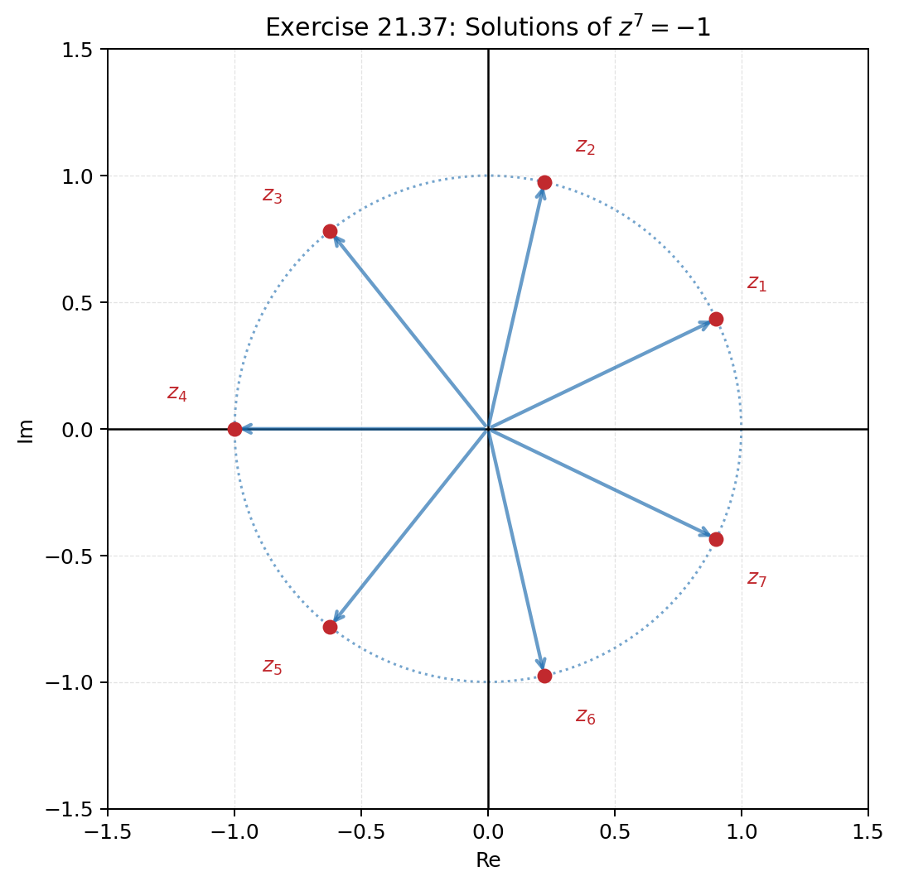

```python
from pathlib import Path
import math
import cmath
import matplotlib.pyplot as plt

w = -1 + 0j
n = 7
rho = abs(w)
phi = cmath.phase(w)
root_mod = rho ** (1 / n)

roots = []
for k in range(n):
    theta = (phi + 2 * math.pi * k) / n
    z = root_mod * complex(math.cos(theta), math.sin(theta))
    roots.append((k + 1, z))

fig, ax = plt.subplots(figsize=(6.1, 6.1), dpi=180)
ax.set_xlim(-1.5, 1.5)
ax.set_ylim(-1.5, 1.5)
ax.set_aspect("equal", adjustable="box")
ax.axhline(0, color="black", linewidth=1)
ax.axvline(0, color="black", linewidth=1)
ax.grid(True, linestyle="--", linewidth=0.5, alpha=0.35)
ax.set_xlabel("Re")
ax.set_ylabel("Im")
ax.set_title(r"Exercise 21.37: Solutions of $z^7=-1$")

circle = plt.Circle((0, 0), root_mod, color="#1768ac", fill=False, linestyle=":", linewidth=1.2, alpha=0.6)
ax.add_patch(circle)

for idx, z in roots:
    ax.annotate("", xy=(z.real, z.imag), xytext=(0, 0), arrowprops=dict(arrowstyle="->", lw=1.7, color="#1768ac", alpha=0.65))
    ax.scatter([z.real], [z.imag], s=38, color="#c1292e", zorder=3)
    dx = 0.12 if z.real >= 0 else -0.28
    dy = 0.12 if z.imag >= 0 else -0.18
    if abs(z.real) < 0.15:
        dx = 0.12
    if abs(z.imag) < 0.15:
        dy = 0.12
    ax.text(z.real + dx, z.imag + dy, fr"$z_{{{idx}}}$", fontsize=10, color="#c1292e")

fig.tight_layout()
output = Path("images/exercise21-problem37.png")
fig.savefig(output, bbox_inches="tight")
plt.show()

```

##### problem 38

Write

$$
-\frac{\pi}{2}=\frac{\pi}{2}(\cos \pi+i \sin \pi).
$$

If $z^{8}=-\frac{\pi}{2}$, then

$$
z_{k+1}=\left(\frac{\pi}{2}\right)^{1 / 8}\left(\cos \left(\frac{\pi}{8}+\frac{k \pi}{4}\right)+i \sin \left(\frac{\pi}{8}+\frac{k \pi}{4}\right)\right), \qquad k=0,1,\ldots,7.
$$

Thus the eight roots are

$$
\begin{aligned}
z_{1}&=\left(\frac{\pi}{2}\right)^{1 / 8}\left(\cos \frac{\pi}{8}+i \sin \frac{\pi}{8}\right), \\
z_{2}&=\left(\frac{\pi}{2}\right)^{1 / 8}\left(\cos \frac{3 \pi}{8}+i \sin \frac{3 \pi}{8}\right), \\
z_{3}&=\left(\frac{\pi}{2}\right)^{1 / 8}\left(\cos \frac{5 \pi}{8}+i \sin \frac{5 \pi}{8}\right), \\
z_{4}&=\left(\frac{\pi}{2}\right)^{1 / 8}\left(\cos \frac{7 \pi}{8}+i \sin \frac{7 \pi}{8}\right), \\
z_{5}&=\left(\frac{\pi}{2}\right)^{1 / 8}\left(\cos \frac{9 \pi}{8}+i \sin \frac{9 \pi}{8}\right), \\
z_{6}&=\left(\frac{\pi}{2}\right)^{1 / 8}\left(\cos \frac{11 \pi}{8}+i \sin \frac{11 \pi}{8}\right), \\
z_{7}&=\left(\frac{\pi}{2}\right)^{1 / 8}\left(\cos \frac{13 \pi}{8}+i \sin \frac{13 \pi}{8}\right), \\
z_{8}&=\left(\frac{\pi}{2}\right)^{1 / 8}\left(\cos \frac{15 \pi}{8}+i \sin \frac{15 \pi}{8}\right).
\end{aligned}
$$

The principal root is

$$
z_{1}=\left(\frac{\pi}{2}\right)^{1 / 8}\left(\cos \frac{\pi}{8}+i \sin \frac{\pi}{8}\right).
$$

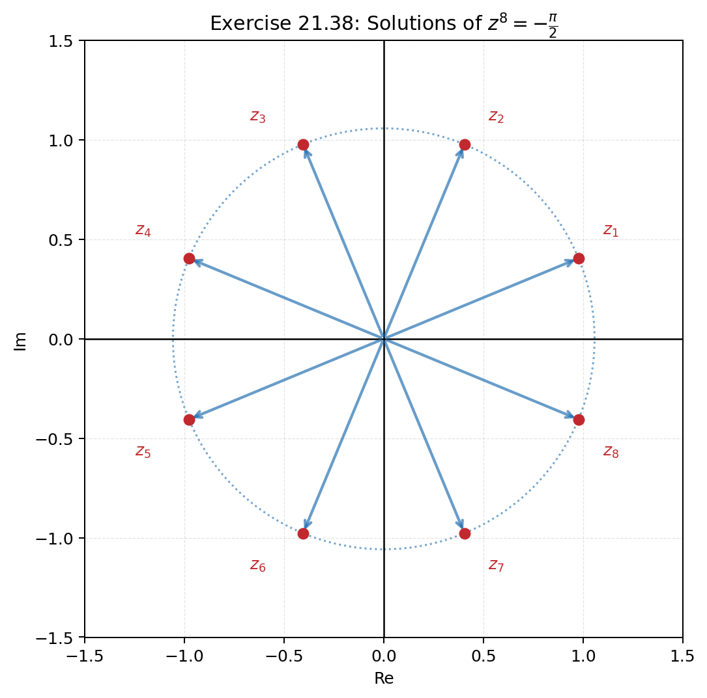

```python
from pathlib import Path
import math
import cmath
import matplotlib.pyplot as plt

w = -math.pi / 2
n = 8
rho = abs(w)
phi = cmath.phase(w)
root_mod = rho ** (1 / n)

roots = []
for k in range(n):
    theta = (phi + 2 * math.pi * k) / n
    z = root_mod * complex(math.cos(theta), math.sin(theta))
    roots.append((k + 1, z))

fig, ax = plt.subplots(figsize=(6.1, 6.1), dpi=180)
ax.set_xlim(-1.5, 1.5)
ax.set_ylim(-1.5, 1.5)
ax.set_aspect("equal", adjustable="box")
ax.axhline(0, color="black", linewidth=1)
ax.axvline(0, color="black", linewidth=1)
ax.grid(True, linestyle="--", linewidth=0.5, alpha=0.35)
ax.set_xlabel("Re")
ax.set_ylabel("Im")
ax.set_title(r"Exercise 21.38: Solutions of $z^8=-\frac{\pi}{2}$")

circle = plt.Circle((0, 0), root_mod, color="#1768ac", fill=False, linestyle=":", linewidth=1.2, alpha=0.6)
ax.add_patch(circle)

for idx, z in roots:
    ax.annotate("", xy=(z.real, z.imag), xytext=(0, 0), arrowprops=dict(arrowstyle="->", lw=1.7, color="#1768ac", alpha=0.65))
    ax.scatter([z.real], [z.imag], s=38, color="#c1292e", zorder=3)
    dx = 0.12 if z.real >= 0 else -0.28
    dy = 0.12 if z.imag >= 0 else -0.18
    if abs(z.real) < 0.15:
        dx = 0.12
    if abs(z.imag) < 0.15:
        dy = 0.12
    ax.text(z.real + dx, z.imag + dy, fr"$z_{{{idx}}}$", fontsize=10, color="#c1292e")

fig.tight_layout()
output = Path("images/exercise21-problem38.png")
fig.savefig(output, bbox_inches="tight")
plt.show()

```


> [!exercise] Exercise 22
> In problems 39-42, solve the given equation.
> 39. $(z+2)^{3}=3 i$.
> 40. $(z-i)^{4}=1$.
> 41. $(z-5)^{3}=-125$.
> 42. $(3 z-2)^{4}=11$.

##### problem 39

Let

$$
w=z+2.
$$

Then the equation becomes

$$
w^{3}=3 i=3\left(\cos \frac{\pi}{2}+i \sin \frac{\pi}{2}\right).
$$

Therefore the three cube roots are

$$
w_{k+1}=3^{1 / 3}\left(\cos \left(\frac{\pi}{6}+\frac{2 k \pi}{3}\right)+i \sin \left(\frac{\pi}{6}+\frac{2 k \pi}{3}\right)\right), \qquad k=0,1,2.
$$

That is,

$$
\begin{aligned}
w_{1}&=3^{1 / 3}\left(\cos \frac{\pi}{6}+i \sin \frac{\pi}{6}\right), \\
w_{2}&=3^{1 / 3}\left(\cos \frac{5 \pi}{6}+i \sin \frac{5 \pi}{6}\right), \\
w_{3}&=3^{1 / 3}\left(\cos \frac{3 \pi}{2}+i \sin \frac{3 \pi}{2}\right).
\end{aligned}
$$

Since $z=w-2$, the solutions are

$$
\begin{aligned}
z_{1}&=\frac{\sqrt{3}}{2} 3^{1 / 3}-2+i \frac{3^{1 / 3}}{2}, \\
z_{2}&=-\frac{\sqrt{3}}{2} 3^{1 / 3}-2+i \frac{3^{1 / 3}}{2}, \\
z_{3}&=-2-i 3^{1 / 3}.
\end{aligned}
$$

##### problem 40

Let

$$
w=z-i.
$$

Then

$$
w^{4}=1.
$$

The fourth roots of $1$ are

$$
w_{1}=1, \qquad w_{2}=i, \qquad w_{3}=-1, \qquad w_{4}=-i.
$$

Since $z=w+i$, we get

$$
\begin{aligned}
z_{1}&=1+i, \\
z_{2}&=2 i, \\
z_{3}&=-1+i, \\
z_{4}&=0.
\end{aligned}
$$

##### problem 41

Let

$$
w=z-5.
$$

Then

$$
w^{3}=-125=125(\cos \pi+i \sin \pi).
$$

Hence the three cube roots are

$$
w_{k+1}=5\left(\cos \left(\frac{\pi}{3}+\frac{2 k \pi}{3}\right)+i \sin \left(\frac{\pi}{3}+\frac{2 k \pi}{3}\right)\right), \qquad k=0,1,2.
$$

So

$$
\begin{aligned}
w_{1}&=5\left(\cos \frac{\pi}{3}+i \sin \frac{\pi}{3}\right)=\frac{5}{2}+i \frac{5 \sqrt{3}}{2}, \\
w_{2}&=5\left(\cos \pi+i \sin \pi\right)=-5, \\
w_{3}&=5\left(\cos \frac{5 \pi}{3}+i \sin \frac{5 \pi}{3}\right)=\frac{5}{2}-i \frac{5 \sqrt{3}}{2}.
\end{aligned}
$$

Since $z=w+5$, the solutions are

$$
\begin{aligned}
z_{1}&=\frac{15}{2}+i \frac{5 \sqrt{3}}{2}, \\
z_{2}&=0, \\
z_{3}&=\frac{15}{2}-i \frac{5 \sqrt{3}}{2}.
\end{aligned}
$$

##### problem 42

Let

$$
w=3 z-2.
$$

Then

$$
w^{4}=11=11(\cos 0+i \sin 0).
$$

Hence the four fourth roots are

$$
w_{k+1}=11^{1 / 4}\left(\cos \frac{k \pi}{2}+i \sin \frac{k \pi}{2}\right), \qquad k=0,1,2,3.
$$

Thus

$$
w_{1}=11^{1 / 4}, \qquad w_{2}=i 11^{1 / 4}, \qquad w_{3}=-11^{1 / 4}, \qquad w_{4}=-i 11^{1 / 4}.
$$

Since

$$
z=\frac{w+2}{3},
$$

the solutions are

$$
\begin{aligned}
z_{1}&=\frac{2+11^{1 / 4}}{3}, \\
z_{2}&=\frac{2+i 11^{1 / 4}}{3}, \\
z_{3}&=\frac{2-11^{1 / 4}}{3}, \\
z_{4}&=\frac{2-i 11^{1 / 4}}{3}.
\end{aligned}
$$

> [!exercise] Exercise 23
> In problems 43-46, solve the given equation.
> 43. $z^{2}-2(1+i) z+i=0$.
> 44. $2 z^{2}-z-1-i=0$.
> 45. $z^{2}+z+\frac{i}{4}=0$.
> 46. $z^{2}+i z+1=0$.

##### problem 43

Apply the quadratic formula:

$$
\begin{aligned}
z
& =\frac{2(1+i) \pm \sqrt{[-2(1+i)]^{2}-4 i}}{2} \\
& =\frac{2(1+i) \pm \sqrt{4(1+i)^{2}-4 i}}{2} \\
& =\frac{2(1+i) \pm \sqrt{4(1+2 i+i^{2})-4 i}}{2} \\
& =\frac{2(1+i) \pm \sqrt{4(2 i)-4 i}}{2} \\
& =\frac{2(1+i) \pm \sqrt{4 i}}{2}.
\end{aligned}
$$

Since

$$
\sqrt{4 i}= \pm \sqrt{2}(1+i),
$$

we obtain

$$
z=\frac{2(1+i) \pm \sqrt{2}(1+i)}{2}=(1+i)\left(1 \pm \frac{\sqrt{2}}{2}\right).
$$

So the two roots are

$$
z_{1}=(1+i)\left(1+\frac{\sqrt{2}}{2}\right), \qquad z_{2}=(1+i)\left(1-\frac{\sqrt{2}}{2}\right).
$$

##### problem 44

By the quadratic formula,

$$
\begin{aligned}
z
& =\frac{1 \pm \sqrt{(-1)^{2}-4(2)(-1-i)}}{2 \cdot 2} \\
& =\frac{1 \pm \sqrt{1+8+8 i}}{4} \\
& =\frac{1 \pm \sqrt{9+8 i}}{4}.
\end{aligned}
$$

To simplify $\sqrt{9+8 i}$, write

$$
\sqrt{9+8 i}=a+i b, \qquad a,b \in \mathbb{R}, \ a,b>0.
$$

Then

$$
(a+i b)^{2}=a^{2}-b^{2}+2 a b\, i=9+8 i,
$$

so

$$
a^{2}-b^{2}=9, \qquad 2 a b=8.
$$

Hence

$$
a^{2}+b^{2}=\sqrt{9^{2}+8^{2}}=\sqrt{145}.
$$

Therefore

$$
a^{2}=\frac{\sqrt{145}+9}{2}, \qquad b^{2}=\frac{\sqrt{145}-9}{2},
$$

and so

$$
\sqrt{9+8 i}=\sqrt{\frac{\sqrt{145}+9}{2}}+i \sqrt{\frac{\sqrt{145}-9}{2}}.
$$

Thus the roots are

$$
z_{1,2}=\frac{1 \pm \left(\sqrt{\frac{\sqrt{145}+9}{2}}+i \sqrt{\frac{\sqrt{145}-9}{2}}\right)}{4}.
$$

##### problem 45

Again apply the quadratic formula:

$$
\begin{aligned}
z
& =\frac{-1 \pm \sqrt{1-4 \cdot \frac{i}{4}}}{2} \\
& =\frac{-1 \pm \sqrt{1-i}}{2}.
\end{aligned}
$$

So the two solutions are

$$
z_{1,2}=\frac{-1 \pm \sqrt{1-i}}{2}.
$$

##### problem 46

Using the quadratic formula,

$$
\begin{aligned}
z
& =\frac{-i \pm \sqrt{i^{2}-4}}{2} \\
& =\frac{-i \pm \sqrt{-1-4}}{2} \\
& =\frac{-i \pm \sqrt{-5}}{2} \\
& =\frac{-i \pm i \sqrt{5}}{2}.
\end{aligned}
$$

Hence

$$
z_{1}=\frac{i(-1+\sqrt{5})}{2}, \qquad z_{2}=-\frac{i(1+\sqrt{5})}{2}.
$$

> [!exercise] Exercise 24
> In problems 47-50, use De Moivre's identity to derive the given trigonometric identity. (More generally, see Exercise 56.)
> 47. $\cos (3 \theta)=\cos ^{3} \theta-3 \cos \theta \sin ^{2} \theta$.
> 48. $\sin (3 \theta)=3 \cos ^{2} \theta \sin \theta-\sin ^{3} \theta$.
> 49. $\cos (4 \theta)=\cos ^{4} \theta-6 \cos ^{2} \theta \sin ^{2} \theta+\sin ^{4} \theta$.
> 50. $\sin (4 \theta)=4 \cos ^{3} \theta \sin \theta-4 \cos \theta \sin ^{3} \theta$.

##### problem 47

By De Moivre's identity,

$$
(\cos \theta+i \sin \theta)^{3}=\cos (3 \theta)+i \sin (3 \theta).
$$

Expanding the left-hand side,

$$
\begin{aligned}
(\cos \theta+i \sin \theta)^{3}
& =\cos ^{3} \theta+3 \cos ^{2} \theta(i \sin \theta)+3 \cos \theta(i \sin \theta)^{2}+(i \sin \theta)^{3} \\
& =\cos ^{3} \theta+3 i \cos ^{2} \theta \sin \theta+3 \cos \theta i^{2} \sin ^{2} \theta+i^{3} \sin ^{3} \theta \\
& =\cos ^{3} \theta+3 i \cos ^{2} \theta \sin \theta-3 \cos \theta \sin ^{2} \theta-i \sin ^{3} \theta \\
& =\left(\cos ^{3} \theta-3 \cos \theta \sin ^{2} \theta\right)+i\left(3 \cos ^{2} \theta \sin \theta-\sin ^{3} \theta\right).
\end{aligned}
$$

Comparing real parts gives

$$
\cos (3 \theta)=\cos ^{3} \theta-3 \cos \theta \sin ^{2} \theta.
$$

##### problem 48

Using the same expansion from problem 47,

$$
(\cos \theta+i \sin \theta)^{3}
=\left(\cos ^{3} \theta-3 \cos \theta \sin ^{2} \theta\right)+i\left(3 \cos ^{2} \theta \sin \theta-\sin ^{3} \theta\right).
$$

Since De Moivre also gives

$$
(\cos \theta+i \sin \theta)^{3}=\cos (3 \theta)+i \sin (3 \theta),
$$

comparing imaginary parts yields

$$
\sin (3 \theta)=3 \cos ^{2} \theta \sin \theta-\sin ^{3} \theta.
$$

##### problem 49

Again by De Moivre's identity,

$$
(\cos \theta+i \sin \theta)^{4}=\cos (4 \theta)+i \sin (4 \theta).
$$

Expand the left-hand side:

$$
\begin{aligned}
(\cos \theta+i \sin \theta)^{4}
& =\cos ^{4} \theta+4 \cos ^{3} \theta(i \sin \theta)+6 \cos ^{2} \theta(i \sin \theta)^{2}+4 \cos \theta(i \sin \theta)^{3}+(i \sin \theta)^{4} \\
& =\cos ^{4} \theta+4 i \cos ^{3} \theta \sin \theta+6 \cos ^{2} \theta i^{2} \sin ^{2} \theta+4 \cos \theta i^{3} \sin ^{3} \theta+i^{4} \sin ^{4} \theta \\
& =\cos ^{4} \theta+4 i \cos ^{3} \theta \sin \theta-6 \cos ^{2} \theta \sin ^{2} \theta-4 i \cos \theta \sin ^{3} \theta+\sin ^{4} \theta \\
& =\left(\cos ^{4} \theta-6 \cos ^{2} \theta \sin ^{2} \theta+\sin ^{4} \theta\right)+i\left(4 \cos ^{3} \theta \sin \theta-4 \cos \theta \sin ^{3} \theta\right).
\end{aligned}
$$

Comparing real parts gives

$$
\cos (4 \theta)=\cos ^{4} \theta-6 \cos ^{2} \theta \sin ^{2} \theta+\sin ^{4} \theta.
$$

##### problem 50

Using the same expansion from problem 49 together with

$$
(\cos \theta+i \sin \theta)^{4}=\cos (4 \theta)+i \sin (4 \theta),
$$

we compare imaginary parts and obtain

$$
\sin (4 \theta)=4 \cos ^{3} \theta \sin \theta-4 \cos \theta \sin ^{3} \theta.
$$


> [!exercise] Exercise 25
> 51. Roots of unity. Let $n$ be a positive integer. Solve $z^{n}=1$. These $n$ values of $z$ are called the $n$th roots of unity and are denoted by $\omega_{1}, \ldots, \omega_{n}$.

Write

$$
1=\cos 0+i \sin 0.
$$

We want to solve

$$
z^{n}=1.
$$

By the formula for the $n$th roots of a complex number,

$$
\omega_{k+1}=\cos \left(\frac{2 k \pi}{n}\right)+i \sin \left(\frac{2 k \pi}{n}\right), \qquad k=0,1,\ldots,n-1.
$$

Thus the $n$th roots of unity are

$$
\omega_{1}=1, \quad \omega_{2}=\cos \frac{2 \pi}{n}+i \sin \frac{2 \pi}{n}, \quad \ldots, \quad \omega_{n}=\cos \frac{2(n-1) \pi}{n}+i \sin \frac{2(n-1) \pi}{n}.
$$

Equivalently, the complete set of solutions is

$$
\left\{\cos \left(\frac{2 k \pi}{n}\right)+i \sin \left(\frac{2 k \pi}{n}\right): k=0,1,\ldots,n-1\right\}.
$$

These points all lie on the unit circle and are equally spaced, with angular separation

$$
\frac{2 \pi}{n}.
$$

The principal root is obtained by taking $k=0$, so the principal $n$th root of unity is

$$
\omega_{1}=1.
$$


> [!exercise] Exercise 26
> 52. Use the fact that
> 
> $$
> \cos \left(\frac{\phi}{n}+\frac{2 k \pi}{n}\right)+i \sin \left(\frac{\phi}{n}+\frac{2 k \pi}{n}\right)=\left[\cos \left(\frac{\phi}{n}\right)+i \sin \left(\frac{\phi}{n}\right)\right]\left[\cos \left(\frac{2 k \pi}{n}\right)+i \sin \left(\frac{2 k \pi}{n}\right)\right]
> $$
> 
> to show that the roots of the equation $z^{n}=w$ are $w_{p}^{1 / n} \omega_{j}$ where $w_{p}^{1 / n}$ is the principal root of $w$ and $\omega_{j}$ is an $n$th root of unity, $j=1,2, \ldots, n$.

Write

$$
w=\rho(\cos \phi+i \sin \phi), \qquad \rho>0.
$$

Then the principal $n$th root of $w$ is

$$
w_{p}^{1 / n}=\rho^{1 / n}\left(\cos \frac{\phi}{n}+i \sin \frac{\phi}{n}\right),
$$

and the $n$th roots of unity are

$$
\omega_{j}=\cos \left(\frac{2 (j-1) \pi}{n}\right)+i \sin \left(\frac{2 (j-1) \pi}{n}\right), \qquad j=1,2,\ldots,n.
$$

From the formula for the $n$th roots of $w$, the roots of $z^{n}=w$ are

$$
z_{j}=\rho^{1 / n}\left(\cos \left(\frac{\phi}{n}+\frac{2 (j-1) \pi}{n}\right)+i \sin \left(\frac{\phi}{n}+\frac{2 (j-1) \pi}{n}\right)\right), \qquad j=1,2,\ldots,n.
$$

Now use the given identity:

$$
\begin{aligned}
z_{j}
& =\rho^{1 / n}\left(\cos \left(\frac{\phi}{n}+\frac{2 (j-1) \pi}{n}\right)+i \sin \left(\frac{\phi}{n}+\frac{2 (j-1) \pi}{n}\right)\right) \\
& =\rho^{1 / n}\left(\cos \frac{\phi}{n}+i \sin \frac{\phi}{n}\right)\left(\cos \frac{2 (j-1) \pi}{n}+i \sin \frac{2 (j-1) \pi}{n}\right) \\
& =\left[\rho^{1 / n}\left(\cos \frac{\phi}{n}+i \sin \frac{\phi}{n}\right)\right]\left(\cos \frac{2 (j-1) \pi}{n}+i \sin \frac{2 (j-1) \pi}{n}\right) \\
& =w_{p}^{1 / n}\,\omega_{j}.
\end{aligned}
$$

Therefore the roots of the equation $z^{n}=w$ are exactly

$$
w_{p}^{1 / n}\omega_{1}, \quad w_{p}^{1 / n}\omega_{2}, \quad \ldots, \quad w_{p}^{1 / n}\omega_{n}.
$$


> [!exercise] Exercise 27
> 
> 53. Summing roots of unity. Let $\omega_{1}, \omega_{2}, \ldots, \omega_{n}$ denote the $n$th roots of unity where $n \geq 2$; that is $\omega_{j}^{n}=1$ for $j=1,2, \ldots, n$. Pick and fix any root $\omega_{0} \neq 1$ from the set $\left(\omega_{j}\right)_{j=1}^{n}$.
> (a) Show that $\omega_{0} \omega_{j}$ is an $n$th root of unity for $j=1,2, \ldots, n$. **Hint: Verify the equation $z^{n}=1$.**
> (b) Show that $\omega_{0} \omega_{j} \neq \omega_{0} \omega_{k}$ if $j \neq k$. Conclude that the set $\left(\omega_{0} \omega_{j}\right)_{j=1}^{n}$ is the same as the set of all $n$ roots of unity.
> (c) Show that the sum of the $n$ roots of unity is zero. That is, show that
> 
> $$
> \omega_{1}+\omega_{2}+\cdots+\omega_{n}=0 .
> $$
> 
> (**Hint: $\omega_{1}+\omega_{2}+\cdots+\omega_{n}=\omega_{0} \omega_{1}+\omega_{0} \omega_{2}+\cdots+\omega_{0} \omega_{n}$; why? Factor $\omega_{0}$ and conclude that the sum has to be 0** .)
> (d) Show directly that
> 
> $$
> 1+\omega_{0}+\omega_{0}^{2}+\cdots+\omega_{0}^{n-1}=0 .
> $$
> 
> (**Hint: Multiply the left side by $1-\omega_{0} \neq 0$.**)
> 
> 

##### part (a)

For each $j=1,2,\ldots,n$, we have

$$
\omega_{j}^{n}=1
$$

and, because $\omega_{0}$ is also an $n$th root of unity,

$$
\omega_{0}^{n}=1.
$$

Therefore

$$
\begin{aligned}
\left(\omega_{0}\omega_{j}\right)^{n}
& =\omega_{0}^{n}\omega_{j}^{n} \\
& =1 \cdot 1 \\
& =1.
\end{aligned}
$$

Hence $\omega_{0}\omega_{j}$ is an $n$th root of unity.

##### part (b)

Suppose

$$
\omega_{0}\omega_{j}=\omega_{0}\omega_{k}.
$$

Since $\omega_{0}\neq 0$, we may divide by $\omega_{0}$ and obtain

$$
\omega_{j}=\omega_{k}.
$$

Thus if $j\neq k$, then

$$
\omega_{0}\omega_{j}\neq \omega_{0}\omega_{k}.
$$

So the numbers

$$
\omega_{0}\omega_{1},\ \omega_{0}\omega_{2},\ \ldots,\ \omega_{0}\omega_{n}
$$

are $n$ distinct $n$th roots of unity. Since there are exactly $n$ roots of $z^{n}=1$, the set

$$
\left(\omega_{0}\omega_{j}\right)_{j=1}^{n}
$$

must be the same as the set

$$
\left(\omega_{j}\right)_{j=1}^{n}.
$$

##### part (c)

Let

$$
S=\omega_{1}+\omega_{2}+\cdots+\omega_{n}.
$$

By part (b), multiplication by $\omega_{0}$ only permutes the set of roots, so

$$
S=\omega_{0}\omega_{1}+\omega_{0}\omega_{2}+\cdots+\omega_{0}\omega_{n}.
$$

Factor out $\omega_{0}$:

$$
S=\omega_{0}\left(\omega_{1}+\omega_{2}+\cdots+\omega_{n}\right)=\omega_{0}S.
$$

Hence

$$
(1-\omega_{0})S=0.
$$

Since $\omega_{0}\neq 1$, we have $1-\omega_{0}\neq 0$, so it follows that

$$
S=0.
$$

Therefore

$$
\omega_{1}+\omega_{2}+\cdots+\omega_{n}=0.
$$

##### part (d)

Let

$$
T=1+\omega_{0}+\omega_{0}^{2}+\cdots+\omega_{0}^{n-1}.
$$

Then

$$
\begin{aligned}
(1-\omega_{0})T
& =(1-\omega_{0})(1+\omega_{0}+\omega_{0}^{2}+\cdots+\omega_{0}^{n-1}) \\
& =(1+\omega_{0}+\omega_{0}^{2}+\cdots+\omega_{0}^{n-1})-(\omega_{0}+\omega_{0}^{2}+\cdots+\omega_{0}^{n}) \\
& =1-\omega_{0}^{n} \\
& =1-1 \\
& =0.
\end{aligned}
$$

Since $1-\omega_{0}\neq 0$, we conclude that

$$
T=0.
$$

Hence

$$
1+\omega_{0}+\omega_{0}^{2}+\cdots+\omega_{0}^{n-1}=0.
$$


> [!exercise] Exercise 28
> 
> 
> 54. Project Problem. Our goal in this exercise is to solve the equation
> 
> $$
> z^{n}=(z+1)^{n} .
> $$
> 
> This polynomial equation is actually of order $n-1$, since upon expanding, the terms in $z^{n}$ will cancel.
> (a) Divide both sides of (27) by $(z+1)^{n}$ (evidently, $z+1$ cannot be zero) and conclude that $\frac{z}{z+1}$ must be one of the $n$th roots of unity (see Exercise 51). Hence $z=(z+1) \omega_{k}$, where $\omega_{k}=\cos \left(\frac{2 k \pi}{n}\right)+i \sin \left(\frac{2 k \pi}{n}\right)$, for $k=1,2, \ldots, n-1$. We must throw out $k=0$ because $z=z+1$ cannot be correct.
> (b) Write $z=x+i y$ and solve for $x$ and $y$ by equating real and imaginary parts in $z=(z+1) \omega_{k}$. Obtain the answers
> 
> $$
> x=-\frac{1}{2} \quad \text { and } \quad y_{k}=\frac{\sin (2 k \pi / n)}{2(1-\cos (2 k \pi / n))}=\frac{1}{2} \cot (k \pi / n) .
> $$
> 
> (c) Apply the result of (b) to solve $(z+1)^{7}=z^{7}$.
> 
> 
> 

##### part (a)

Starting from

$$
z^{n}=(z+1)^{n},
$$

note first that $z+1 \neq 0$, for otherwise $z=-1$ and the equation would give

$$
(-1)^{n}=0,
$$

which is impossible. Hence we may divide by $(z+1)^{n}$:

$$
\left(\frac{z}{z+1}\right)^{n}=1.
$$

Therefore

$$
\frac{z}{z+1}
$$

must be an $n$th root of unity. So

$$
\frac{z}{z+1}=\omega_{k}=\cos \left(\frac{2 k \pi}{n}\right)+i \sin \left(\frac{2 k \pi}{n}\right),
\qquad k=0,1,\ldots,n-1.
$$

Equivalently,

$$
z=(z+1)\omega_{k}.
$$

We must exclude $k=0$, because $\omega_{0}=1$ would give

$$
z=z+1,
$$

which is impossible. Thus

$$
k=1,2,\ldots,n-1.
$$

##### part (b)

Write

$$
z=x+i y
$$

and let

$$
\alpha=\frac{2 k \pi}{n}.
$$

Then

$$
\omega_{k}=\cos \alpha+i \sin \alpha,
$$

so the equation $z=(z+1)\omega_k$ becomes

$$
x+i y=(x+1+i y)(\cos \alpha+i \sin \alpha).
$$

Expand the right-hand side:

$$
\begin{aligned}
x+i y
& =(x+1)\cos \alpha+i y \cos \alpha+i(x+1)\sin \alpha+i^{2} y \sin \alpha \\
& =\bigl((x+1)\cos \alpha-y \sin \alpha\bigr)+i\bigl(y \cos \alpha+(x+1)\sin \alpha\bigr).
\end{aligned}
$$

Equating real and imaginary parts gives

$$
x=(x+1)\cos \alpha-y \sin \alpha
$$

and

$$
y=y \cos \alpha+(x+1)\sin \alpha.
$$

From the second equation,

$$
\begin{aligned}
y-y \cos \alpha
& =(x+1)\sin \alpha \\
y(1-\cos \alpha)
& =(x+1)\sin \alpha.
\end{aligned}
$$

Hence

$$
y=\frac{(x+1)\sin \alpha}{1-\cos \alpha}.
$$

Substitute this into the first equation:

$$
\begin{aligned}
x
& =(x+1)\cos \alpha-\frac{(x+1)\sin ^{2} \alpha}{1-\cos \alpha}.
\end{aligned}
$$

Use

$$
\sin ^{2} \alpha=(1-\cos \alpha)(1+\cos \alpha)
$$

to obtain

$$
\begin{aligned}
x
& =(x+1)\cos \alpha-(x+1)(1+\cos \alpha) \\
& =-x-1.
\end{aligned}
$$

Therefore

$$
2x=-1,
$$

so

$$
x=-\frac{1}{2}.
$$

Now return to

$$
y(1-\cos \alpha)=(x+1)\sin \alpha
$$

and substitute $x=-\frac{1}{2}$:

$$
\begin{aligned}
y(1-\cos \alpha)
& =\frac{1}{2}\sin \alpha,
\end{aligned}
$$

which gives

$$
y=\frac{\sin \alpha}{2(1-\cos \alpha)}.
$$

Since $\alpha=\frac{2k\pi}{n}$,

$$
y_{k}=\frac{\sin (2 k \pi / n)}{2(1-\cos (2 k \pi / n))}.
$$

Now let $\beta=\frac{k\pi}{n}$. Then $\alpha=2\beta$, so

$$
\begin{aligned}
y_{k}
& =\frac{\sin 2\beta}{2(1-\cos 2\beta)} \\
& =\frac{2 \sin \beta \cos \beta}{2\cdot 2 \sin ^{2} \beta} \\
& =\frac{\cos \beta}{2 \sin \beta} \\
& =\frac{1}{2}\cot \beta \\
& =\frac{1}{2}\cot \left(\frac{k\pi}{n}\right).
\end{aligned}
$$

Thus

$$
x=-\frac{1}{2}, \qquad y_{k}=\frac{\sin (2 k \pi / n)}{2(1-\cos (2 k \pi / n))}=\frac{1}{2}\cot \left(\frac{k\pi}{n}\right).
$$

##### part (c)

For $(z+1)^{7}=z^{7}$, set $n=7$. Then part (b) gives the six solutions

$$
z_{k}=-\frac{1}{2}+\frac{i}{2}\cot \left(\frac{k\pi}{7}\right),
\qquad k=1,2,\ldots,6.
$$

That is,

$$
\begin{aligned}
z_{1}&=-\frac{1}{2}+\frac{i}{2}\cot \frac{\pi}{7}, \\
z_{2}&=-\frac{1}{2}+\frac{i}{2}\cot \frac{2\pi}{7}, \\
z_{3}&=-\frac{1}{2}+\frac{i}{2}\cot \frac{3\pi}{7}, \\
z_{4}&=-\frac{1}{2}+\frac{i}{2}\cot \frac{4\pi}{7}, \\
z_{5}&=-\frac{1}{2}+\frac{i}{2}\cot \frac{5\pi}{7}, \\
z_{6}&=-\frac{1}{2}+\frac{i}{2}\cot \frac{6\pi}{7}.
\end{aligned}
$$

These are the $7-1=6$ distinct solutions.


## Chebyshev Polynomials

In the remaining problems, we present a family of polynomials, known as the Chebyshev polynomials. These polynomials have useful applications in numerical analysis. Our presentation will use De Moivre's identity and the following well-known formula.


> [!exercise] Exercise 29
> 55. The binomial formula. Use mathematical induction to prove that for any complex numbers $a$ and $b$ and any positive integer $n$
> 
> $$
> (a+b)^{n}=a^{n}+\binom{n}{1} a^{n-1} b^{1}+\binom{n}{2} a^{n-2} b^{2}+\cdots+\binom{n}{n-1} a^{1} b^{n-1}+b^{n},
> $$
> 
> where for $0 \leq m \leq n$, the binomial coefficient $\binom{n}{m}$ (read it " $n$ choose $m$ ") is defined by
> 
> $$
> \binom{n}{m}=\frac{n!}{(n-m)!m!},
> $$
> 
> with $0!=1$ as a convention. Using the summation notation, the binomial formula becomes
> 
> $$
> (a+b)^{n}=\sum_{m=0}^{n}\binom{n}{m} a^{n-m} b^{m}
> $$
> 
> **Hint: You should come up with two sums. Shift the index on one summation so the summand looks like the other. Pull off the $a^{n+1}$ and $b^{n+1}$ terms. Then use the identity of Pascal's triangle:**
> 
> $$
> \binom{n}{m-1}+\binom{n}{m}=\binom{n+1}{m} \cdot
> $$
> 
> 

We prove the binomial formula by induction on $n$.

For $n=1$,

$$
(a+b)^{1}=a+b=\binom{1}{0} a^{1}+\binom{1}{1} b^{1},
$$

so the formula is true in the base case.

Now assume that for some positive integer $n$,

$$
(a+b)^{n}=\sum_{m=0}^{n}\binom{n}{m} a^{n-m} b^{m}.
$$

Then

$$
\begin{aligned}
(a+b)^{n+1}
& =(a+b)(a+b)^{n} \\
& =(a+b)\sum_{m=0}^{n}\binom{n}{m} a^{n-m} b^{m} \\
& =a\sum_{m=0}^{n}\binom{n}{m} a^{n-m} b^{m}+b\sum_{m=0}^{n}\binom{n}{m} a^{n-m} b^{m} \\
& =\sum_{m=0}^{n}\binom{n}{m} a^{n+1-m} b^{m}+\sum_{m=0}^{n}\binom{n}{m} a^{n-m} b^{m+1}.
\end{aligned}
$$

Shift the index in the second sum by letting $j=m+1$:

$$
\begin{aligned}
\sum_{m=0}^{n}\binom{n}{m} a^{n-m} b^{m+1}
& =\sum_{j=1}^{n+1}\binom{n}{j-1} a^{n+1-j} b^{j}.
\end{aligned}
$$

Therefore

$$
\begin{aligned}
(a+b)^{n+1}
& =\sum_{m=0}^{n}\binom{n}{m} a^{n+1-m} b^{m}+\sum_{m=1}^{n+1}\binom{n}{m-1} a^{n+1-m} b^{m} \\
& =a^{n+1}+\sum_{m=1}^{n}\binom{n}{m} a^{n+1-m} b^{m}+b^{n+1}+\sum_{m=1}^{n}\binom{n}{m-1} a^{n+1-m} b^{m} \\
& =a^{n+1}+\sum_{m=1}^{n}\left[\binom{n}{m}+\binom{n}{m-1}\right] a^{n+1-m} b^{m}+b^{n+1} \\
& =a^{n+1}+\sum_{m=1}^{n}\binom{n+1}{m} a^{n+1-m} b^{m}+b^{n+1} \\
& =\sum_{m=0}^{n+1}\binom{n+1}{m} a^{n+1-m} b^{m}.
\end{aligned}
$$

Thus the formula holds for $n+1$. By mathematical induction,

$$
(a+b)^{n}=\sum_{m=0}^{n}\binom{n}{m} a^{n-m} b^{m}
$$

for every positive integer $n$.


> [!exercise] Exercise 30
> 
> 
> 56. (a) Use De Moivre's identity and the binomial formula to show that, for $n=1,2, \ldots$,
> 
> $$
> \cos n \theta=\sum_{k=0}^{\left[\frac{n}{2}\right]}\binom{n}{2 k}(\cos \theta)^{n-2 k}(-1)^{k}(\sin \theta)^{2 k}
> $$
> 
> and
> 
> $$
> \sin n \theta=\sum_{k=0}^{\left[\frac{n-1}{2}\right]}\binom{n}{2 k+1}(\cos \theta)^{n-2 k-1}(-1)^{k}(\sin \theta)^{2 k+1},
> $$
> 
> where, for a real number $s,[s]$ denotes the greatest integer not larger than $s$.
> (b) Show that
> 
> $$
> \cos n \theta=\sum_{k=0}^{\left[\frac{n}{2}\right]}\binom{n}{2 k}(\cos \theta)^{n-2 k}(-1)^{k}\left(1-\cos ^{2} \theta\right)^{k}
> $$
> 
> (c) Derive the results of problems 47 and 48 from (a).
> 
##### part (a)

By De Moivre's identity,

$$
(\cos \theta+i \sin \theta)^{n}=\cos n \theta+i \sin n \theta.
$$

By the binomial formula,

$$
\begin{aligned}
(\cos \theta+i \sin \theta)^{n}
& =\sum_{m=0}^{n}\binom{n}{m}(\cos \theta)^{n-m}(i \sin \theta)^{m}.
\end{aligned}
$$

Separate the even and odd powers of $i$.

If $m=2k$, then

$$
i^{2k}=(-1)^{k}.
$$

If $m=2k+1$, then

$$
i^{2k+1}=i(-1)^{k}.
$$

Hence

$$
\begin{aligned}
(\cos \theta+i \sin \theta)^{n}
& =\sum_{k=0}^{\left[\frac{n}{2}\right]}\binom{n}{2k}(\cos \theta)^{n-2k}i^{2k}(\sin \theta)^{2k} \\
& \quad +\sum_{k=0}^{\left[\frac{n-1}{2}\right]}\binom{n}{2k+1}(\cos \theta)^{n-2k-1}i^{2k+1}(\sin \theta)^{2k+1} \\
& =\sum_{k=0}^{\left[\frac{n}{2}\right]}\binom{n}{2k}(\cos \theta)^{n-2k}(-1)^{k}(\sin \theta)^{2k} \\
& \quad +\, i\sum_{k=0}^{\left[\frac{n-1}{2}\right]}\binom{n}{2k+1}(\cos \theta)^{n-2k-1}(-1)^{k}(\sin \theta)^{2k+1}.
\end{aligned}
$$

Comparing real and imaginary parts with

$$
\cos n \theta+i \sin n \theta
$$

gives

$$
\cos n \theta=\sum_{k=0}^{\left[\frac{n}{2}\right]}\binom{n}{2k}(\cos \theta)^{n-2k}(-1)^{k}(\sin \theta)^{2k}
$$

and

$$
\sin n \theta=\sum_{k=0}^{\left[\frac{n-1}{2}\right]}\binom{n}{2k+1}(\cos \theta)^{n-2k-1}(-1)^{k}(\sin \theta)^{2k+1}.
$$

##### part (b)

From part (a),

$$
\cos n \theta=\sum_{k=0}^{\left[\frac{n}{2}\right]}\binom{n}{2k}(\cos \theta)^{n-2k}(-1)^{k}(\sin \theta)^{2k}.
$$

Since

$$
\sin ^{2}\theta=1-\cos ^{2}\theta,
$$

we have

$$
(\sin \theta)^{2k}=(\sin ^{2}\theta)^{k}=(1-\cos ^{2}\theta)^{k}.
$$

Substituting this into the preceding formula gives

$$
\cos n \theta=\sum_{k=0}^{\left[\frac{n}{2}\right]}\binom{n}{2k}(\cos \theta)^{n-2k}(-1)^{k}\left(1-\cos ^{2}\theta\right)^{k}.
$$

##### part (c)

Take $n=3$ in the formulas from part (a). Then

$$
\begin{aligned}
\cos 3\theta
& =\binom{3}{0}\cos ^{3}\theta-\binom{3}{2}\cos \theta \sin ^{2}\theta \\
& =\cos ^{3}\theta-3\cos \theta \sin ^{2}\theta,
\end{aligned}
$$

which is the identity in problem 47.

Also,

$$
\begin{aligned}
\sin 3\theta
& =\binom{3}{1}\cos ^{2}\theta \sin \theta-\binom{3}{3}\sin ^{3}\theta \\
& =3\cos ^{2}\theta \sin \theta-\sin ^{3}\theta,
\end{aligned}
$$

which is the identity in problem 48.


> [!NOTE]
> With the Roman alphabet, Chebyshev may be spelled a variety of ways, including Tchebichef. Hence $T_{n}$.


> [!exercise] Exercise 31
> 57. Chebyshev polynomials. It is clear from (31) that $\cos n \theta$ can be expressed as a polynomial of degree $n$ in $\cos \theta$. So, for $n=0,1,2, \ldots$, we define the $n$th Chebyshev polynomial $T_{n}$ by the formula
> 
> $$
> T_{n}(\cos \theta)=\cos n \theta, \quad n=0,1,2, \ldots .
> $$
> 
> (a) Obtain the formula
> 
> $$
> T_{n}(x)=\sum_{k=0}^{\left[\frac{n}{2}\right]}\binom{n}{2 k}(-1)^{k} x^{n-2 k}\left(1-x^{2}\right)^{k}
> $$
> 
> (b) Use (33) to derive the following list of Chebyshev polynomials:
> 
> $$
> \begin{array}{lll}
> T_{0}(x)=1, & T_{1}(x)=x, & T_{2}(x)=-1+2 x^{2} \\
> T_{3}(x)=-3 x+4 x^{3}, & T_{4}(x)=1-8 x^{2}+8 x^{4}, & T_{5}(x)=5 x-20 x^{3}+16 x^{5}
> \end{array}
> $$
> 
> 

##### part (a)

From Exercise 30(b), we have

$$
\cos n \theta=\sum_{k=0}^{\left[\frac{n}{2}\right]}\binom{n}{2k}(\cos \theta)^{n-2k}(-1)^{k}\left(1-\cos ^{2}\theta\right)^{k}.
$$

By definition of the Chebyshev polynomial,

$$
T_{n}(\cos \theta)=\cos n \theta.
$$

Now set

$$
x=\cos \theta.
$$

Then

$$
T_{n}(x)=\sum_{k=0}^{\left[\frac{n}{2}\right]}\binom{n}{2k}(-1)^{k}x^{n-2k}\left(1-x^{2}\right)^{k}.
$$

This is the required formula.

##### part (b)

Use the formula from part (a).

For $n=0$,

$$
T_{0}(x)=\binom{0}{0}(-1)^{0}x^{0}(1-x^{2})^{0}=1.
$$

For $n=1$,

$$
T_{1}(x)=\binom{1}{0}(-1)^{0}x^{1}(1-x^{2})^{0}=x.
$$

For $n=2$,

$$
\begin{aligned}
T_{2}(x)
& =\binom{2}{0}x^{2}-\binom{2}{2}(1-x^{2}) \\
& =x^{2}-(1-x^{2}) \\
& =-1+2x^{2}.
\end{aligned}
$$

For $n=3$,

$$
\begin{aligned}
T_{3}(x)
& =\binom{3}{0}x^{3}-\binom{3}{2}x(1-x^{2}) \\
& =x^{3}-3x(1-x^{2}) \\
& =x^{3}-3x+3x^{3} \\
& =-3x+4x^{3}.
\end{aligned}
$$

For $n=4$,

$$
\begin{aligned}
T_{4}(x)
& =\binom{4}{0}x^{4}-\binom{4}{2}x^{2}(1-x^{2})+\binom{4}{4}(1-x^{2})^{2} \\
& =x^{4}-6x^{2}(1-x^{2})+(1-2x^{2}+x^{4}) \\
& =x^{4}-6x^{2}+6x^{4}+1-2x^{2}+x^{4} \\
& =1-8x^{2}+8x^{4}.
\end{aligned}
$$

For $n=5$,

$$
\begin{aligned}
T_{5}(x)
& =\binom{5}{0}x^{5}-\binom{5}{2}x^{3}(1-x^{2})+\binom{5}{4}x(1-x^{2})^{2} \\
& =x^{5}-10x^{3}(1-x^{2})+5x(1-2x^{2}+x^{4}) \\
& =x^{5}-10x^{3}+10x^{5}+5x-10x^{3}+5x^{5} \\
& =5x-20x^{3}+16x^{5}.
\end{aligned}
$$

Hence

$$
\begin{array}{lll}
T_{0}(x)=1, & T_{1}(x)=x, & T_{2}(x)=-1+2 x^{2} \\
T_{3}(x)=-3 x+4 x^{3}, & T_{4}(x)=1-8 x^{2}+8 x^{4}, & T_{5}(x)=5 x-20 x^{3}+16 x^{5}
\end{array}
$$


> [!exercise] Exercise 32
> 58. Properties of the Chebyshev polynomials. Derive the following properties of Chebyshev polynomials. These properties are characteristic of many other families of functions that we will encounter when solving important differential equations such as the Legendre, Laguerre, and Bessel differential equations.
> (a) $\quad T_{n}(1)=1$ and $T_{n}(-1)=(-1)^{n}$.
> (b) $T_{n}(0)=\cos \left(\frac{n \pi}{2}\right)=0$ if $n$ is odd and $(-1)^{k}$ if $n=2 k$.
> (c) $\left|T_{n}(x)\right| \leq 1$ for all $x$ in $[-1,1]$.
> (d) $T_{n}(x)$ is a polynomial of degree $n$. (Hint: Induction on $n$ and (33).]
> (e) Derive the recurrence relation $T_{n+1}(x)+T_{n-1}(x)=2 x T_{n}(x)$. (**Hint: Use the trigonometric identities $\cos (a \pm b)=\cos a \cos b \mp \sin a \sin b$ and (32)**.)
> (f) Show that $T_{n}(x)$ has $n$ simple zeros in $[-1,1]$ at the points $\alpha_{k}=\cos \left(\frac{2 k-1}{2 n} \pi\right)$, $k=1,2, \ldots, n$.
> (g) Show that $T_{n}(x)$ assumes its absolute extrema in $[-1,1]$ at the points $\beta_{k}= \cos \left(\frac{k}{n} \pi\right), k=0,1,2, \ldots, n$, with $T_{n}\left(\beta_{k}\right)=(-1)^{k}$.
> (h) Illustrate graphically your answers in (f) and (g) by plotting the first ten Chebyshev polynomials.
> (i) Show that for $m \neq n$
> 
> $$
> \int_{-1}^{1} T_{m}(x) T_{n}(x) \frac{d x}{\sqrt{1-x^{2}}}=0
> $$
> 
> (**Hint: Change variables: $x=\cos \theta$.**)
> (j) Show that for $n=0,1,2, \ldots$,
> 
> $$
> \int_{-1}^{1}\left[T_{n}(x)\right]^{2} \frac{d x}{\sqrt{1-x^{2}}}= \begin{cases}\pi & \text { if } n=0 \\ \frac{\pi}{2} & \text { if } n \geq 1\end{cases}
> $$
> 
> 

##### part (a)

Since

$$
T_{n}(\cos \theta)=\cos n \theta,
$$

we take $\theta=0$ to get

$$
T_{n}(1)=T_{n}(\cos 0)=\cos 0=1.
$$

Also, take $\theta=\pi$ to get

$$
T_{n}(-1)=T_{n}(\cos \pi)=\cos n \pi=(-1)^{n}.
$$

##### part (b)

Since

$$
0=\cos \frac{\pi}{2},
$$

we have

$$
T_{n}(0)=T_{n}\left(\cos \frac{\pi}{2}\right)=\cos \left(\frac{n\pi}{2}\right).
$$

If $n$ is odd, then $\cos \left(\frac{n\pi}{2}\right)=0$. If $n=2k$, then

$$
T_{2k}(0)=\cos (k\pi)=(-1)^{k}.
$$

##### part (c)

Let $x\in[-1,1]$. Then there exists $\theta\in[0,\pi]$ such that

$$
x=\cos \theta.
$$

Therefore

$$
\left|T_{n}(x)\right|=\left|T_{n}(\cos \theta)\right|=\left|\cos n\theta\right|\le 1.
$$

##### part (d)

From Exercise 31(a),

$$
T_{n}(x)=\sum_{k=0}^{\left[\frac{n}{2}\right]}\binom{n}{2k}(-1)^{k}x^{n-2k}(1-x^{2})^{k}.
$$

Each summand is a polynomial, so $T_n(x)$ is a polynomial. Also, each summand has degree

$$
(n-2k)+2k=n,
$$

or less after expansion. The coefficient of $x^{n}$ is

$$
\sum_{k=0}^{\left[\frac{n}{2}\right]}\binom{n}{2k},
$$

because the highest-degree term in $(1-x^{2})^{k}$ is $(-1)^{k}x^{2k}$, and

$$
(-1)^{k}\cdot (-1)^{k}=1.
$$

Now

$$
\sum_{k=0}^{\left[\frac{n}{2}\right]}\binom{n}{2k}=2^{n-1}\neq 0 \qquad (n\ge 1),
$$

so the coefficient of $x^{n}$ is nonzero. Hence $T_n(x)$ is a polynomial of degree $n$.

##### part (e)

Let $x=\cos \theta$. Then

$$
T_{n+1}(x)+T_{n-1}(x)=\cos((n+1)\theta)+\cos((n-1)\theta).
$$

Using the identity

$$
\cos(a+b)+\cos(a-b)=2\cos a \cos b
$$

with $a=n\theta$ and $b=\theta$, we obtain

$$
\begin{aligned}
T_{n+1}(x)+T_{n-1}(x)
& =2\cos(n\theta)\cos\theta \\
& =2x\,T_n(x).
\end{aligned}
$$

Thus

$$
T_{n+1}(x)+T_{n-1}(x)=2xT_n(x).
$$

##### part (f)

The zeros of $T_n$ satisfy

$$
T_n(x)=0.
$$

Write $x=\cos \theta$ with $\theta\in[0,\pi]$. Then

$$
T_n(x)=\cos n\theta,
$$

so the zeros occur when

$$
\cos n\theta=0.
$$

Thus

$$
n\theta=\frac{(2k-1)\pi}{2}, \qquad k=1,2,\ldots,n,
$$

and hence

$$
\theta_k=\frac{2k-1}{2n}\pi.
$$

Therefore the zeros are

$$
\alpha_k=\cos \left(\frac{2k-1}{2n}\pi\right), \qquad k=1,2,\ldots,n.
$$

To see that they are simple, differentiate

$$
T_n(\cos \theta)=\cos n\theta
$$

with respect to $\theta$:

$$
-T_n'(\cos\theta)\sin\theta=-n\sin n\theta.
$$

So

$$
T_n'(\cos\theta)=\frac{n\sin n\theta}{\sin\theta}.
$$

At $\theta=\theta_k$, we have $\sin(n\theta_k)=\pm1\neq0$ and $\sin\theta_k\neq0$, so

$$
T_n'(\alpha_k)\neq 0.
$$

Hence each zero is simple.

##### part (g)

Again let $x=\cos\theta$ with $\theta\in[0,\pi]$. Then

$$
T_n(x)=\cos n\theta.
$$

Since

$$
-1\le \cos n\theta \le 1,
$$

the absolute extrema of $T_n$ on $[-1,1]$ are $\pm1$. These occur when

$$
n\theta=k\pi, \qquad k=0,1,2,\ldots,n,
$$

that is, when

$$
\theta_k=\frac{k\pi}{n}.
$$

Therefore the extremal points are

$$
\beta_k=\cos\left(\frac{k\pi}{n}\right), \qquad k=0,1,2,\ldots,n.
$$

At these points,

$$
T_n(\beta_k)=T_n\left(\cos\frac{k\pi}{n}\right)=\cos(k\pi)=(-1)^k.
$$

##### part (h)

The first ten Chebyshev polynomials are shown below.

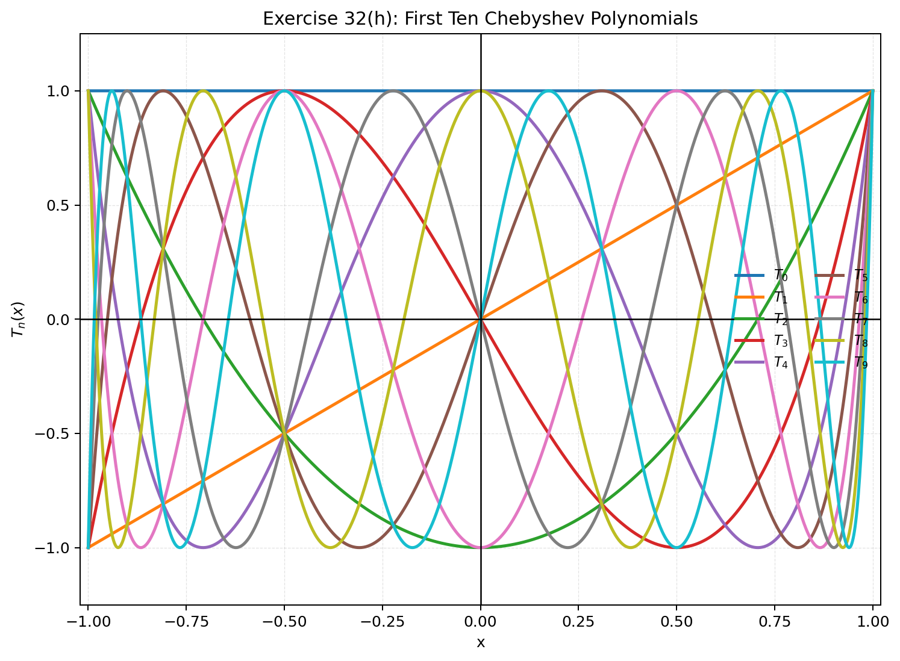

```python
from pathlib import Path
import numpy as np
import matplotlib.pyplot as plt

x = np.linspace(-1, 1, 1200)
T0 = np.ones_like(x)
T1 = x.copy()
polys = [T0, T1]

# Use the recurrence T_{n+1}(x) = 2x T_n(x) - T_{n-1}(x)
for _ in range(1, 9):
    polys.append(2 * x * polys[-1] - polys[-2])

fig, ax = plt.subplots(figsize=(8.4, 6.2), dpi=180)
colors = plt.cm.tab10(np.linspace(0, 1, 10))

for n, y in enumerate(polys[:10]):
    ax.plot(x, y, lw=2, color=colors[n], label=fr"$T_{n}$")

ax.set_xlim(-1.02, 1.02)
ax.set_ylim(-1.25, 1.25)
ax.axhline(0, color="black", linewidth=1)
ax.axvline(0, color="black", linewidth=1)
ax.grid(True, linestyle="--", linewidth=0.5, alpha=0.35)
ax.set_xlabel("x")
ax.set_ylabel(r"$T_n(x)$")
ax.set_title("Exercise 32(h): First Ten Chebyshev Polynomials")
ax.legend(ncol=2, fontsize=9, frameon=False)

fig.tight_layout()
output = Path("images/exercise32-first-ten-chebyshev.png")
fig.savefig(output, bbox_inches="tight")
plt.show()

```

##### part (i)

Let

$$
I_{mn}=\int_{-1}^{1}T_m(x)T_n(x)\frac{dx}{\sqrt{1-x^2}}, \qquad m\ne n.
$$

Use the substitution

$$
x=\cos\theta, \qquad dx=-\sin\theta\,d\theta.
$$

As $x$ goes from $-1$ to $1$, $\theta$ goes from $\pi$ to $0$, and on $[0,\pi]$,

$$
\sqrt{1-x^2}=\sqrt{1-\cos^2\theta}=\sin\theta.
$$

Therefore

$$
\begin{aligned}
I_{mn}
& =\int_{\pi}^{0}T_m(\cos\theta)T_n(\cos\theta)\frac{-\sin\theta\,d\theta}{\sin\theta} \\
& =\int_{0}^{\pi}\cos(m\theta)\cos(n\theta)\,d\theta.
\end{aligned}
$$

Now use

$$
\cos(m\theta)\cos(n\theta)=\frac{1}{2}\left[\cos((m-n)\theta)+\cos((m+n)\theta)\right].
$$

Hence

$$
\begin{aligned}
I_{mn}
& =\frac{1}{2}\int_{0}^{\pi}\cos((m-n)\theta)\,d\theta+\frac{1}{2}\int_{0}^{\pi}\cos((m+n)\theta)\,d\theta \\
& =\frac{1}{2}\left[\frac{\sin((m-n)\theta)}{m-n}\right]_{0}^{\pi}
 +\frac{1}{2}\left[\frac{\sin((m+n)\theta)}{m+n}\right]_{0}^{\pi} \\
& =0,
\end{aligned}
$$

since $m\pm n$ are nonzero integers. Therefore

$$
\int_{-1}^{1}T_m(x)T_n(x)\frac{dx}{\sqrt{1-x^2}}=0 \qquad (m\ne n).
$$

##### part (j)

Let

$$
I_n=\int_{-1}^{1}[T_n(x)]^2\frac{dx}{\sqrt{1-x^2}}.
$$

Using the same substitution $x=\cos\theta$, we get

$$
\begin{aligned}
I_n
& =\int_{0}^{\pi}\cos^2(n\theta)\,d\theta.
\end{aligned}
$$

If $n=0$, then

$$
I_0=\int_0^\pi 1\,d\theta=\pi.
$$

If $n\ge1$, use

$$
\cos^2(n\theta)=\frac{1+\cos(2n\theta)}{2}.
$$

Then

$$
\begin{aligned}
I_n
& =\int_0^\pi \frac{1+\cos(2n\theta)}{2}\,d\theta \\
& =\frac{1}{2}\int_0^\pi 1\,d\theta+\frac{1}{2}\int_0^\pi \cos(2n\theta)\,d\theta \\
& =\frac{\pi}{2}+\frac{1}{2}\left[\frac{\sin(2n\theta)}{2n}\right]_0^\pi \\
& =\frac{\pi}{2}.
\end{aligned}
$$

Therefore

$$
\int_{-1}^{1}[T_n(x)]^2\frac{dx}{\sqrt{1-x^2}}
=\begin{cases}
\pi & \text{if } n=0,\\
\frac{\pi}{2} & \text{if } n\ge1.
\end{cases}
$$
