# 1.5 The Complex Exponential

> [!review] Review 1
> 1. Why is the power series a natural starting point for defining $e^z$ ? What property of $e^z$ does the series definition make immediately obvious?
> 2. Starting from the power series definition of $e^{i y}$, derive Euler's identity $e^{i y}=\cos y+ i \sin y$ by separating the series into real and imaginary parts.
> 3. Using Euler's identity and the property $e^{z_1+z_2}=e^{z_1} e^{z_2}$, write $e^z$ in Cartesian form for $z=x+i y$, and identify $\operatorname{Re}\left(e^z\right)$ and $\operatorname{Im}\left(e^z\right)$.
> 4. Verify that $e^{z_1+z_2}=e^{z_1} e^{z_2}$ using the Cartesian form $e^z=e^x(\cos y+i \sin y)$.

##### review 1.1

The power series is a natural starting point because it already defines the real exponential for every real number $x$, so it gives a direct extension of the same familiar function to complex inputs:

$$
e^{z}=\sum_{n=0}^{\infty}\frac{z^{n}}{n!}.
$$

It is also a natural definition because power series are easy to manipulate and lead to the standard exponential identities.

The series definition makes one property immediately obvious: when $z=x$ is real, this definition reduces to the usual real exponential series. Thus the complex exponential truly extends the real one.


##### review 1.2

Starting from the power series,

$$
\begin{aligned}
e^{i y}
&=\sum_{n=0}^{\infty}\frac{(i y)^{n}}{n!} \\
&=1+\frac{i y}{1!}+\frac{(i y)^{2}}{2!}+\frac{(i y)^{3}}{3!}+\frac{(i y)^{4}}{4!}+\frac{(i y)^{5}}{5!}+\cdots \\
&=1+i y+\frac{i^{2} y^{2}}{2!}+\frac{i^{3} y^{3}}{3!}+\frac{i^{4} y^{4}}{4!}+\frac{i^{5} y^{5}}{5!}+\cdots \\
&=1+i y-\frac{y^{2}}{2!}-i \frac{y^{3}}{3!}+\frac{y^{4}}{4!}+i \frac{y^{5}}{5!}-\cdots \\
&=\left(1-\frac{y^{2}}{2!}+\frac{y^{4}}{4!}-\cdots\right)+i\left(y-\frac{y^{3}}{3!}+\frac{y^{5}}{5!}-\cdots\right) \\
&=\cos y+i \sin y .
\end{aligned}
$$

Therefore

$$
e^{i y}=\cos y+i \sin y.
$$


##### review 1.3

Let

$$
z=x+i y .
$$

Then

$$
\begin{aligned}
e^{z}
&=e^{x+i y} \\
&=e^{x} e^{i y} \\
&=e^{x}(\cos y+i \sin y) \\
&=e^{x} \cos y+i e^{x} \sin y .
\end{aligned}
$$

So the Cartesian form is

$$
e^{z}=e^{x} \cos y+i e^{x} \sin y,
$$

and therefore

$$
\operatorname{Re}(e^{z})=e^{x} \cos y,
\qquad
\operatorname{Im}(e^{z})=e^{x} \sin y.
$$


##### review 1.4

Write

$$
z_{1}=x_{1}+i y_{1},
\qquad
z_{2}=x_{2}+i y_{2}.
$$

Then

$$
\begin{aligned}
e^{z_{1}+z_{2}}
&=e^{(x_{1}+x_{2})+i(y_{1}+y_{2})} \\
&=e^{x_{1}+x_{2}}\left(\cos (y_{1}+y_{2})+i \sin (y_{1}+y_{2})\right) \\
&=e^{x_{1}} e^{x_{2}}\left(\cos y_{1} \cos y_{2}-\sin y_{1} \sin y_{2}+i\left(\sin y_{1} \cos y_{2}+\cos y_{1} \sin y_{2}\right)\right).
\end{aligned}
$$

On the other hand,

$$
\begin{aligned}
e^{z_{1}} e^{z_{2}}
&=e^{x_{1}}(\cos y_{1}+i \sin y_{1}) \, e^{x_{2}}(\cos y_{2}+i \sin y_{2}) \\
&=e^{x_{1}} e^{x_{2}}(\cos y_{1}+i \sin y_{1})(\cos y_{2}+i \sin y_{2}) \\
&=e^{x_{1}} e^{x_{2}}\left(\cos y_{1} \cos y_{2}+i \cos y_{1} \sin y_{2}+i \sin y_{1} \cos y_{2}+i^{2} \sin y_{1} \sin y_{2}\right) \\
&=e^{x_{1}} e^{x_{2}}\left(\cos y_{1} \cos y_{2}-\sin y_{1} \sin y_{2}+i\left(\sin y_{1} \cos y_{2}+\cos y_{1} \sin y_{2}\right)\right).
\end{aligned}
$$

The two expressions are identical. Hence

$$
e^{z_{1}+z_{2}}=e^{z_{1}} e^{z_{2}}.
$$

---

In this section, we introduce the complex exponential function $e^{z}$. Unlike in calculus, where $e^{x}$ was introduced separately from the trigonometric functions, here we will use the exponential function $e^{z}$ to define the trigonometric functions of a complex variable $z$. This makes $e^{z}$ one of the most important functions in this book.

As a first step toward defining $e^{z}$, ask yourself how you might compute $e^{x}$ for a given real number $x$. One way is to use the power series

$$
e^{x}=1+\frac{x}{1!}+\frac{x^{2}}{2!}+\frac{x^{3}}{3!}+\cdots \quad(-\infty<x<\infty) .
$$

In fact, we can take this series to be the definition of $e^{x}$ and use properties of power series to study $e^{x}$. Guided by this approach, we define the complex exponential function by a power series

$$
e^{z}=\sum_{n=0}^{\infty} \frac{z^{n}}{n!}=1+\frac{z}{1!}+\frac{z^{2}}{2!}+\frac{z^{3}}{3!}+\cdots, \quad \text { for all complex } z
$$

Sometimes the exponential function is written as $\exp (z)$. Of course, we have not yet defined what we mean by an infinite series of complex numbers. However, we are familiar with infinite sums of real numbers, and as you
will see in Chapter 4, the theory of series extends to complex numbers. As a consequence, we will show that the series in (1) converges for all $z$ and defines a function that enjoys some of the familiar properties of the exponential function. In particular, we will show that the rule

$$
e^{z_{1}+z_{2}}=e^{z_{1}} e^{z_{2}}
$$

holds for all complex numbers $z_{1}$ and $z_{2}$. Because we have used the exponential power series to define $e^{z}$, it is clear that $e^{z}$ reduces to the real exponential when $z=x$ is real.

Our next step will be to unlock the mystery of $e^{z}$ by expressing it in terms of familiar functions. Write $z=x+i y$, where $x$ and $y$ are real. By (2), we have

$$
e^{z}=e^{x+i y}=e^{x} e^{i y}
$$

The first factor, $e^{x}$, is the familiar real exponential function from calculus. To compute the second factor, we use (1) and get

$$
\begin{aligned}
e^{i y} & =1+i y+\frac{(i y)^{2}}{2!}+\frac{(i y)^{3}}{3!}+\frac{(i y)^{4}}{4!}+\frac{(i y)^{5}}{5!}+\cdots \\
& =1+i y-\frac{y^{2}}{2!}-i \frac{y^{3}}{3!}+\frac{y^{4}}{4!}+i \frac{y^{5}}{5!}+\cdots
\end{aligned}
$$

If we regroup the terms in the series, a step that will be justified in Chapter 4, we obtain

$$
\begin{aligned}
e^{i y} & =\left(1-\frac{y^{2}}{2!}+\frac{y^{4}}{4!}-\cdots\right)+i\left(y-\frac{y^{3}}{3!}+\frac{y^{5}}{5!}-\cdots\right) \\
& =\cos y+i \sin y
\end{aligned}
$$

where we have recognized the power series expansions for the cosine and sine functions (converging for all $y$ ),

$$
\cos y=\sum_{n=0}^{\infty} \frac{(-1)^{n} y^{2 n}}{(2 n)!} \text { and } \sin y=\sum_{n=0}^{\infty} \frac{(-1)^{n} y^{2 n+1}}{(2 n+1)!} .
$$

Thus the desired expression

$$
e^{z}=e^{x} e^{i y}=e^{x}(\cos y+i \sin y)
$$

Consequently,

$$
\operatorname{Re} e^{z}=e^{x} \cos y \quad \text { and } \quad \operatorname{Im} e^{z}=e^{x} \sin y
$$


> [!figure] Figure 1
> 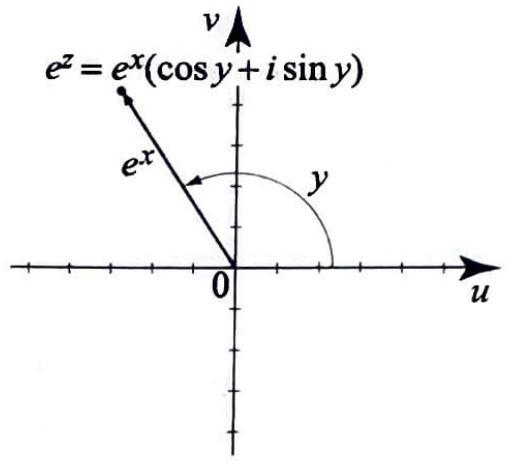
> Figure 1 For $z=x+i y$, $e^{z}$ has modulus $e^{x}$ and argument $y$ :
> $$
> \begin{aligned}
> & \left|e^{z}\right|=e^{x} \\
> & \arg \left(e^{z}\right)=y .
> \end{aligned}
> $$
> 

We summarize these results for ease of reference.

> [!equation] The Complex Exponential
> The complex exponential $e^{z}$ is defined for all $z$ as in (1). For $z=x+i y$, we have
> (4)
> 
> $$
> e^{z}=e^{x}(\cos y+i \sin y) \tag{4}
> $$
> 
> In particular, for $z=i \theta$, with $\theta$ real, we have the identity
> 
> $$
> e^{i \theta}=\cos \theta+i \sin \theta, \tag{5}
> $$
> 
> known as ==Euler's identity==.


> [!exercise] Exercise 1: Finding $e^{z}$
> **Part I:** Compute $e^{z}$ for the given $z$.
> (a) $2+i \pi$.
> (b) $3-i \frac{\pi}{3}$.
> (c) $-1+i \frac{\pi}{2}$.
> (d) $\quad i \frac{5 \pi}{4}$.
>
>**Part II:** The real exponential function $e^x$ satisfies $e^x>0$ for all real $x$. Does $e^z$ have any analogous restriction on its values? Determine all $w \in \mathbb{C}$ for which $e^z=w$ has no solution, and explain why.


##### Part I problem 1a

$$
\begin{aligned}
e^{2+i \pi}
&=e^{2}(\cos \pi+i \sin \pi) \\
&=e^{2}(-1+0 i) \\
&=-e^{2} .
\end{aligned}
$$


##### Part I problem 1b

$$
\begin{aligned}
e^{3-i \frac{\pi}{3}}
&=e^{3}\left(\cos \left(-\frac{\pi}{3}\right)+i \sin \left(-\frac{\pi}{3}\right)\right) \\
&=e^{3}\left(\frac{1}{2}-i \frac{\sqrt{3}}{2}\right) .
\end{aligned}
$$


##### Part I problem 1c

$$
\begin{aligned}
e^{-1+i \frac{\pi}{2}}
&=e^{-1}\left(\cos \frac{\pi}{2}+i \sin \frac{\pi}{2}\right) \\
&=e^{-1}(0+i) \\
&=\frac{i}{e} .
\end{aligned}
$$


##### Part I problem 1d

$$
\begin{aligned}
e^{i \frac{5 \pi}{4}}
&=\cos \frac{5 \pi}{4}+i \sin \frac{5 \pi}{4} \\
&=-\frac{\sqrt{2}}{2}-i \frac{\sqrt{2}}{2} .
\end{aligned}
$$


##### Part II

The analogous restriction is that $e^{z}$ can never be zero. Indeed, if $z=x+i y$, then

$$
\left|e^{z}\right|=e^{x}>0 .
$$

So the equation

$$
e^{z}=w
$$

has no solution when

$$
w=0 .
$$

Conversely, every nonzero complex number does occur as a value of $e^{z}$. If

$$
w=r(\cos \theta+i \sin \theta)=r e^{i \theta},
\qquad
r>0,
$$

then taking

$$
z=\ln r+i \theta
$$

gives

$$
\begin{aligned}
e^{z}
&=e^{\ln r+i \theta} \\
&=e^{\ln r}(\cos \theta+i \sin \theta) \\
&=r(\cos \theta+i \sin \theta) \\
&=w .
\end{aligned}
$$

In fact, there are infinitely many such solutions:

$$
z=\ln r+i(\theta+2 k \pi),
\qquad
k \in \mathbb{Z} .
$$

Therefore the only complex number $w$ for which $e^{z}=w$ has no solution is

$$
w=0,
$$

and the range of the complex exponential is

$$
\mathbb{C} \backslash\{0\} .
$$


---

> [!review] Review 2
> 1. For $z=x+i y$, identify $\left|e^z\right| \operatorname{and} \arg \left(e^z\right)$ directly from the polar form $e^z=e^x(\cos y+ i \sin y)$. Why does $\left|e^z\right|>0$ for all $z$, and what does this immediately imply about the range of $e^z$ ?
> 2. Using the property $e^{z_1+z_2}=e^{z_1} e^{z_2}$, derive the identity $e^{-z}=1 / e^z$. What familiar fact about $e^x$ from calculus does this generalize?
> 3. Compute the modulus and argument of $e^z$ for $z=2+i \frac{\pi}{3}$ and write the result in polar form $r e^{i \theta}$.


##### review 2.1

For

$$
z=x+i y,
$$

we have

$$
e^{z}=e^{x}(\cos y+i \sin y).
$$

This is already in polar form, so

$$
\left|e^{z}\right|=e^{x},
\qquad
\arg \left(e^{z}\right)=y+2 k \pi,
\qquad
k \in \mathbb{Z}.
$$

Because $e^{x}>0$ for every real number $x$, we have

$$
\left|e^{z}\right|=e^{x}>0
$$

for every complex number $z$. Therefore $e^{z}$ can never be zero, so the range of the exponential function is

$$
\mathbb{C} \backslash\{0\}.
$$


##### review 2.2

Using the product rule,

$$
\begin{aligned}
e^{z} e^{-z}
&=e^{z+(-z)} \\
&=e^{0} \\
&=1 .
\end{aligned}
$$

Therefore $e^{-z}$ is the multiplicative inverse of $e^{z}$, so

$$
e^{-z}=\frac{1}{e^{z}}.
$$

This generalizes the familiar real-variable identity

$$
e^{-x}=\frac{1}{e^{x}}.
$$


##### review 2.3

Let

$$
z=2+i \frac{\pi}{3}.
$$

Then

$$
\begin{aligned}
e^{z}
&=e^{2+i \frac{\pi}{3}} \\
&=e^{2} e^{i \frac{\pi}{3}} \\
&=e^{2}\left(\cos \frac{\pi}{3}+i \sin \frac{\pi}{3}\right).
\end{aligned}
$$

So the modulus is

$$
r=e^{2},
$$

and an argument is

$$
\theta=\frac{\pi}{3}.
$$

Hence the polar form is

$$
e^{z}=e^{2} e^{i \frac{\pi}{3}}.
$$


---

Looking back at (4), and recalling the well-known fact from calculus that $e^{x}>0$ for all $x$, it follows immediately that (4) is the polar form of $e^{z}$ (see (2), Section 1.3), where the modulus of $e^{z}$ is $e^{x}$ and its argument is $y+2 k \pi$,
where $k$ is an integer (see Figure 1). We have the following results.

> [!figure] Figure 2
> Figure 2 To plot a point in exponential notation $z=r e^{i \theta}$, move a distance $r$ along the ray extending from the origin to $e^{i \theta}$.
> 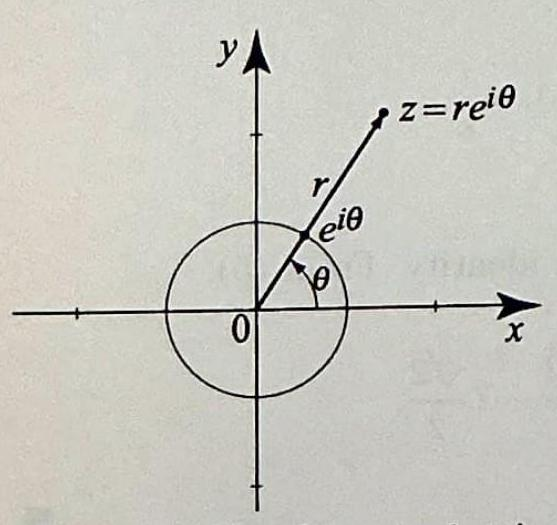
> 
> 


The exponential notation, $z=r e^{i \theta}$, enables us to operate on complex numbers in a very convenient way, as we now show.


> [!equation] modulus and argument of the complex exponential
> For $z=x+i y$, the modulus of $e^{z}$ is
> 
> $$
> \left|e^{z}\right|=e^{x}>0 .
> $$
> 
> Consequently, $e^{z}$ is never zero. The argument of $e^{z}$ is
> 
> $$
> \arg \left(e^{z}\right)=y+2 k \pi \quad(z=x+i y),
> $$
> 
> where $k$ is an integer.


Using the exponent rule (2) and the fact that $e^{0}=1$, we can write

$$
1=e^{z-z}=e^{z} e^{-z} .
$$

Thus, for any complex number $z$, the multiplicative inverse of $e^{z}$ is $e^{-z}$; equivalently,

$$
e^{-z}=\frac{1}{e^{z}}
$$

# 1.5.1 Exponential and Polar Representations


> [!review] Review 3
> 1. Using Euler's identity, explain how the polar form $z=r(\cos \theta+i \sin \theta)$ leads directly to the exponential representation $z=r e^{i \theta}$.
> 2. What does it mean for a complex number to be unimodular? Why do all unimodular complex numbers lie on the unit circle, and how does every nonzero complex number relate to a unimodular one?


##### review 3.1

Using Euler's identity,

$$
e^{i \theta}=\cos \theta+i \sin \theta,
$$

the polar form

$$
z=r(\cos \theta+i \sin \theta)
$$

becomes

$$
\begin{aligned}
z
&=r(\cos \theta+i \sin \theta) \\
&=r e^{i \theta} .
\end{aligned}
$$

So Euler's identity turns the trigonometric factor in polar form into the exponential factor $e^{i\theta}$ immediately.


##### review 3.2

A complex number is unimodular if its modulus is $1$. Thus

$$
|z|=1.
$$

If $z$ is written in polar form as

$$
z=r(\cos \theta+i \sin \theta),
$$

then unimodular means $r=1$, so

$$
z=\cos \theta+i \sin \theta=e^{i \theta}.
$$

Because points with modulus $1$ are exactly the points whose distance from the origin is $1$, all unimodular complex numbers lie on the unit circle.

Every nonzero complex number can be written as

$$
z=r e^{i \theta},
\qquad
r>0,
$$

so every nonzero complex number is a positive real multiple of the unimodular number $e^{i\theta}$. Equivalently,

$$
\frac{z}{|z|}=e^{i \theta}
$$

is unimodular.


---


Euler's identity (5) provides us with yet another convenient way of representing complex numbers. Indeed, if $z=r(\cos \theta+i \sin \theta)$ is a complex number in polar form, then since $e^{i \theta}=\cos \theta+i \sin \theta$, we obtain the exponential representation or polar form $z=r e^{i \theta}$.

From this representation it is clear that

$$
|z|=1 \Leftrightarrow r=1 \Leftrightarrow z=e^{i \theta},
$$

where $\theta$ is the argument of $z$. Thus the complex numbers $e^{i \theta}$ are the ==unimodular== complex numbers. Because their distance to the origin always equals 1 , all the complex numbers $e^{i \theta}$ lie on the unit circle. All other nonzero complex numbers are positive multiples of some $e^{i \theta}$. This fact is illustrated geometrically in Figure 2, where the ray from the origin to $z=r e^{i \theta}$ intersects the unit circle at the point $e^{i \theta}$. To go from the origin to $z$, we move in the direction of $e^{i \theta}$ by a distance $r=|z|$.
where $\theta$ is the argument of $z$. Thus the complex numbers $e^{i \theta}$ are the unimodular complex numbers. Because their distance to the origin always equals 1 , all the complex numbers $e^{i \theta}$ lie on the unit circle. All other nonzero complex numbers are positive multiples of some $e^{i \theta}$. This fact is illustrated geometrically in Figure 2 , where the ray from the origin to $z=r e^{i \theta}$ intersects the unit circle at the point $e^{i \theta}$. To go from the origin to $z$, we move in the direction of $e^{i \theta}$ by a distance $r=|z|$. The exponential notation, $z=r e^{i \theta}$, enables us to operate on complex numbers in a very convenient way, as we now show.


> [!review] Review 4
> 1. Prove each of the identities (8)-(12) using the exponential representation $z=r e^{i \theta}$.
> 2. State the geometric rule for multiplying and dividing two unimodular numbers $e^{i \theta_1}$ and $e^{i \theta_2}$, and verify it using (11) and (12).


---


> [!equation] exponential representation of complex numbers
> The exponential representation of $z=r(\cos \theta+i \sin \theta)$ is
> (8) $\quad z=r e^{i \theta}, \quad|z|=r \quad$ and $\quad \arg z=\theta+2 k \pi$. 
> 
> We have
> $$\bar{z}=r e^{-i \theta} \tag{9}$$
> 
> 
> $$
> z^{-1}=\frac{1}{r} e^{-i \theta} \quad(z \neq 0) \tag{10}
> $$
> 
> If $z_{1}=r_{1} e^{i \theta_{1}}$ and $z_{2}=r_{2} e^{i \theta_{2}}$, then
> 
> $$
> \begin{aligned}
> (11) \quad z_{1} z_{2} & =r_{1} r_{2} e^{i\left(\theta_{1}+\theta_{2}\right)} \\
> (12) \quad \frac{z_{1}}{z_{2}} & =\frac{r_{1}}{r_{2}} e^{i\left(\theta_{1}-\theta_{2}\right)} \quad\left(z_{2} \neq 0\right)
> \end{aligned}
> $$
> 
> 


> [!figure] Figure 3
> 
> 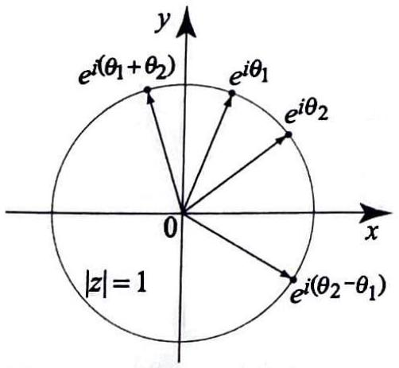
> Figure 3 To multiply two unimodular numbers we add their arguments, and to divide them we subtract their arguments.

Multiplication and division of unimodular numbers are particularly easy to describe using the complex exponential. Indeed, if $z_{1}=e^{i \theta_{1}}$ and $z_{2}=e^{i \theta_{2}}$, then from (11) and (12) we get

$$
z_{1} z_{2}=e^{i \theta_{1}} e^{i \theta_{2}}=e^{i\left(\theta_{1}+\theta_{2}\right)}
$$

and

$$
\frac{z_{1}}{z_{2}}=\frac{e^{i \theta_{1}}}{e^{i \theta_{2}}}=e^{i\left(\theta_{1}-\theta_{2}\right)}
$$

Thus, to multiply two unimodular numbers we add their arguments, and to divide them we subtract their arguments. (See Figure 3.)


> [!exercise] Exercise 2: Exponential representations
> Let $z_{1}=-7 \sqrt{3}+7 i$ and $z_{2}=1+i$. Express the following complex expressions in exponential form. Also give your answer in Cartesian form in (d) and (e).
> (a) $z_{1}$.
> (b) $z_{2}$.
> (c) $z_{1} z_{2}$.
> (d) $\frac{1}{z_{2}}$.
> (e) $\frac{z_{1}}{z_{2}}$.


##### problem 2a

We have

$$
\begin{aligned}
\left|z_{1}\right|
&=\sqrt{(-7 \sqrt{3})^{2}+7^{2}} \\
&=\sqrt{147+49} \\
&=14 .
\end{aligned}
$$

Since $z_{1}$ lies in the second quadrant and

$$
\tan \theta=\frac{7}{-7 \sqrt{3}}=-\frac{1}{\sqrt{3}},
$$

we have

$$
\operatorname{Arg} z_{1}=\frac{5 \pi}{6} .
$$

Therefore

$$
z_{1}=14 e^{i \frac{5 \pi}{6}} .
$$


##### problem 2b

We have

$$
\begin{aligned}
\left|z_{2}\right|
&=\sqrt{1^{2}+1^{2}} \\
&=\sqrt{2} .
\end{aligned}
$$

Since $z_{2}=1+i$ lies in the first quadrant,

$$
\operatorname{Arg} z_{2}=\frac{\pi}{4} .
$$

Therefore

$$
z_{2}=\sqrt{2} e^{i \frac{\pi}{4}} .
$$


##### problem 2c

Using parts (a), (b), and the multiplication rule for exponential form,

$$
\begin{aligned}
z_{1} z_{2}
&=14 e^{i \frac{5 \pi}{6}} \cdot \sqrt{2} e^{i \frac{\pi}{4}} \\
&=14 \sqrt{2} e^{i\left(\frac{5 \pi}{6}+\frac{\pi}{4}\right)} \\
&=14 \sqrt{2} e^{i \frac{13 \pi}{12}} .
\end{aligned}
$$


##### problem 2d

Using part (b) and the reciprocal rule,

$$
\begin{aligned}
\frac{1}{z_{2}}
&=\frac{1}{\sqrt{2}} e^{-i \frac{\pi}{4}} .
\end{aligned}
$$

In Cartesian form,

$$
\begin{aligned}
\frac{1}{z_{2}}
&=\frac{1}{\sqrt{2}}\left(\cos \left(-\frac{\pi}{4}\right)+i \sin \left(-\frac{\pi}{4}\right)\right) \\
&=\frac{1}{\sqrt{2}}\left(\frac{\sqrt{2}}{2}-i \frac{\sqrt{2}}{2}\right) \\
&=\frac{1}{2}-i \frac{1}{2} .
\end{aligned}
$$


##### problem 2e

Using parts (a), (b), and the quotient rule,

$$
\begin{aligned}
\frac{z_{1}}{z_{2}}
&=\frac{14 e^{i \frac{5 \pi}{6}}}{\sqrt{2} e^{i \frac{\pi}{4}}} \\
&=\frac{14}{\sqrt{2}} e^{i\left(\frac{5 \pi}{6}-\frac{\pi}{4}\right)} \\
&=7 \sqrt{2} e^{i \frac{7 \pi}{12}} .
\end{aligned}
$$

In Cartesian form,

$$
\begin{aligned}
\frac{z_{1}}{z_{2}}
&=7 \sqrt{2}\left(\cos \frac{7 \pi}{12}+i \sin \frac{7 \pi}{12}\right) \\
&=7 \sqrt{2}\left(\frac{1-\sqrt{3}}{2 \sqrt{2}}+i \frac{1+\sqrt{3}}{2 \sqrt{2}}\right) \\
&=\frac{7}{2}\left((1-\sqrt{3})+i(1+\sqrt{3})\right) .
\end{aligned}
$$


---


# 1.5.2 The Exponential as a Mapping

> [!review] Review 5
> 1. The real exponential function $e^x$ is one-to-one. Explain why $e^z$ is not, and identify exactly what freedom exists in choosing $z$ such that $e^z=w$ for a given nonzero $w$.
> 2. Prove (13): $e^z=1$ if and only if $z=2 k \pi i$ for some integer $k$.
> 3. Using (13), prove (14): $e^{z_1}=e^{z_2}$ if and only if $z_1=z_2+2 k \pi i$.
> 4. What does it mean for a complex function to be periodic? Using (14), show that $e^z$ is periodic and identify its period. How does this compare to the periodicity of $\cos y$ and $\sin y$ ?


##### review 5.1

The function $e^z$ is not one-to-one because different complex numbers can differ by integer multiples of $2\pi i$ and still have the same exponential:

$$
e^{z+2k\pi i}=e^z e^{2k\pi i}=e^z,
\qquad
k\in\mathbb Z.
$$

If $w\neq 0$ and

$$
w=re^{i\theta},
\qquad
r>0,
$$

then every solution of $e^z=w$ is of the form

$$
z=\ln r+i(\theta+2k\pi),
\qquad
k\in\mathbb Z.
$$

So the freedom is exactly that the imaginary part may be changed by any integer multiple of $2\pi$.


##### review 5.2

Let

$$
z=x+iy.
$$

Then

$$
\begin{aligned}
e^z=1
&\iff e^x(\cos y+i\sin y)=1 \\
&\iff e^x=1 \text{ and } \cos y+i\sin y=1 \\
&\iff x=0 \text{ and } y=2k\pi,\ k\in\mathbb Z \\
&\iff z=2k\pi i,\ k\in\mathbb Z.
\end{aligned}
$$

Therefore

$$
e^z=1 \iff z=2k\pi i,\qquad k\in\mathbb Z.
$$


##### review 5.3

Using (13),

$$
\begin{aligned}
e^{z_1}=e^{z_2}
&\iff \frac{e^{z_1}}{e^{z_2}}=1 \\
&\iff e^{z_1-z_2}=1 \\
&\iff z_1-z_2=2k\pi i,\ k\in\mathbb Z \\
&\iff z_1=z_2+2k\pi i,\ k\in\mathbb Z.
\end{aligned}
$$

Therefore

$$
e^{z_1}=e^{z_2}\iff z_1=z_2+2k\pi i,\qquad k\in\mathbb Z.
$$


##### review 5.4

A complex function $f$ is periodic with period $\tau\neq 0$ if

$$
f(z+\tau)=f(z)
$$

for every $z$ in its domain.

By review 5.3,

$$
e^{z+2\pi i}=e^z
$$

for every complex number $z$. Hence $e^z$ is periodic, with period $2\pi i$.

This is analogous to the periodicity of $\cos y$ and $\sin y$, which satisfy

$$
\cos(y+2\pi)=\cos y,
\qquad
\sin(y+2\pi)=\sin y.
$$

The difference is that the period of $e^z$ is vertical in the complex plane, namely $2\pi i$, while the real trigonometric functions have real period $2\pi$.


---

It is important to explore how the exponential function maps complex numbers. The following result shows that the exponential function, unlike its real counterpart, is not one-to-one.


> [!equation] mapping properties of the exponential
> We have
> 
> $$
> e^{z}=1 \quad \text { if and only if } \quad z=2 k \pi i, \text { for some integer } k . \tag{13}
> $$
> 
> Also,
> 
> $$
> e^{z_{1}}=e^{z_{2}} \quad \text { if and only if } \quad z_{1}=z_{2}+2 k \pi i, \text { for some integer } k . \tag{14}
> $$
> 


A complex-valued function $f(z)$ is periodic with period $\tau \neq 0$ if for all $z$ in the domain of definition of $f$, we have $f(z+\tau)=f(z)$. From (14), it follows that, for all complex numbers $z$,

$$
e^{z}=e^{z+2 \pi i}
$$

Hence the exponential function $e^{z}$ is periodic with period $2 \pi i$.
Now we show an example of the exponential function mapping a specific region.


> [!exercise] Exercise 3
> (a) Consider the rectangular area
> 
> $$
> S=\{z=x+i y:-1 \leq x \leq 1,0 \leq y \leq \pi\} .
> $$
> 
> Find the image of $S$ under the mapping $f(z)=e^{z}$.
>
> (b) Check that the rectangular boundary of the area $S$ is mapped to the boundary of the semiannular area $f[S]$.
> 
> (c) Find all solutions $z \in \mathbb{C}$ to the equation $e^z=w$, where $w \neq 0$. Show that the solution set is of the form $z_0+2 \pi i k$ for $k \in \mathbb{Z}$, where $z_0$ is any particular solution. Hence explain why $e^z$ is not injective on $\mathbb{C}$, and identify the largest horizontal strip on which $e^z$ is injective.

##### problem 3a

Let

$$
z=x+i y,
\qquad
-1 \leq x \leq 1,
\qquad
0 \leq y \leq \pi .
$$

Then

$$
e^{z}=e^{x+i y}=e^{x}(\cos y+i \sin y) .
$$

Hence the modulus of $w=e^{z}$ is

$$
|w|=e^{x},
\qquad
e^{-1} \leq |w| \leq e,
$$

and the argument is

$$
\operatorname{Arg} w=y,
\qquad
0 \leq \operatorname{Arg} w \leq \pi .
$$

Therefore the image is the closed semiannulus in the upper half-plane:

$$
f[S]=\left\{w: e^{-1} \leq|w| \leq e,\ 0 \leq \operatorname{Arg} w \leq \pi\right\} .
$$


##### problem 3b

The boundary of the rectangle consists of four sides.

For the left side $x=-1$, we have

$$
w=e^{-1}(\cos y+i \sin y),
\qquad
0 \leq y \leq \pi,
$$

which is the upper semicircle of radius $e^{-1}$.

For the right side $x=1$, we have

$$
w=e(\cos y+i \sin y),
\qquad
0 \leq y \leq \pi,
$$

which is the upper semicircle of radius $e$.

For the bottom side $y=0$, we have

$$
w=e^{x},
\qquad
-1 \leq x \leq 1,
$$

which is the real interval

$$
[e^{-1}, e] .
$$

For the top side $y=\pi$, we have

$$
w=e^{x+i \pi}=-e^{x},
\qquad
-1 \leq x \leq 1,
$$

which is the real interval

$$
[-e,-e^{-1}] .
$$

These four images are exactly the four boundary pieces of the semiannulus found in part (a). So the rectangular boundary is mapped to the boundary of $f[S]$.


> [!figure] Figure 4
> Figure 4 As usual, we denote the image of a point $P$ in the $x y$-plane by the point $P^{\prime}$ in the $u v$-plane. The mapping $w=e^{z}$ takes the vertical line segment $E F$ to a semicircle in the $u v$-plane with $u$-intercepts at $E^{\prime}$ and $F^{\prime}$.
> 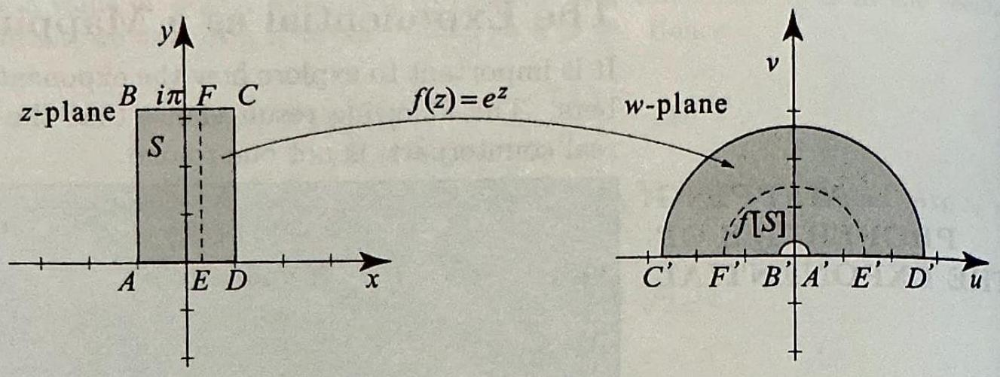
> 


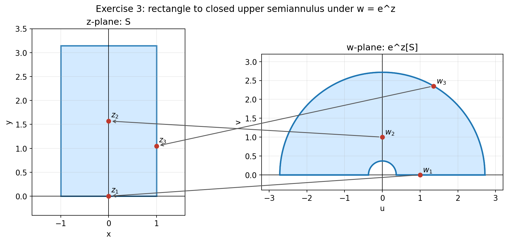


```python
from pathlib import Path
import numpy as np
import matplotlib.pyplot as plt
from matplotlib.patches import Rectangle, Wedge, ConnectionPatch

out = Path("/Users/gradyclopton/ObsidianVaults/complex_analysis/Books/Asmar Applied Complex Analysis with Applications to Differential Equations/Chapter 01 Complex Numbers and Functions/images/exercise3-mapping.png")
out.parent.mkdir(parents=True, exist_ok=True)

plt.rcParams.update({
    "figure.dpi": 170,
    "font.size": 11,
    "axes.titlesize": 13,
    "axes.labelsize": 11,
})

fill_color = "#cfe8ff"
boundary_color = "#1f77b4"
point_color = "#c0392b"
arrow_color = "#555555"


def setup_axes(ax, xlim, ylim, xlabel, ylabel, title):
    ax.set_xlim(*xlim)
    ax.set_ylim(*ylim)
    ax.set_aspect("equal", adjustable="box")
    ax.axhline(0, color="black", lw=0.8)
    ax.axvline(0, color="black", lw=0.8)
    ax.grid(True, alpha=0.25)
    ax.set_xlabel(xlabel)
    ax.set_ylabel(ylabel)
    ax.set_title(title)


def add_connection(fig, ax1, p1, ax2, p2):
    con = ConnectionPatch(
        xyA=p2,
        coordsA=ax2.transData,
        xyB=p1,
        coordsB=ax1.transData,
        arrowstyle="->",
        lw=1.2,
        color=arrow_color,
        shrinkA=5,
        shrinkB=5,
    )
    fig.add_artist(con)


fig, (ax1, ax2) = plt.subplots(1, 2, figsize=(10.5, 4.8), constrained_layout=True)
setup_axes(ax1, (-1.6, 1.6), (-0.4, 3.5), "x", "y", "z-plane: S")
setup_axes(ax2, (-3.2, 3.2), (-0.4, 3.2), "u", "v", "w-plane: e^z[S]")

rect = Rectangle((-1, 0), 2, np.pi, facecolor=fill_color, edgecolor=boundary_color, lw=2, alpha=0.9)
ax1.add_patch(rect)

semiannulus = Wedge((0, 0), np.e, 0, 180, width=np.e - np.exp(-1), facecolor=fill_color, edgecolor=boundary_color, lw=2, alpha=0.9)
ax2.add_patch(semiannulus)

th = np.linspace(0, np.pi, 400)
ax2.plot(np.exp(-1) * np.cos(th), np.exp(-1) * np.sin(th), color=boundary_color, lw=2)
ax2.plot(np.e * np.cos(th), np.e * np.sin(th), color=boundary_color, lw=2)
ax2.plot([np.exp(-1), np.e], [0, 0], color=boundary_color, lw=2)
ax2.plot([-np.e, -np.exp(-1)], [0, 0], color=boundary_color, lw=2)

points = [0 + 0j, 1j * np.pi / 2, 1 + 1j * np.pi / 3]
for k, z in enumerate(points, start=1):
    w = np.exp(z)
    ax1.plot(z.real, z.imag, "o", color=point_color)
    ax2.plot(w.real, w.imag, "o", color=point_color)
    ax1.text(z.real + 0.05, z.imag + 0.08, rf"$z_{k}$")
    ax2.text(w.real + 0.07, w.imag + 0.07, rf"$w_{k}$")
    add_connection(fig, ax1, (z.real, z.imag), ax2, (w.real, w.imag))

fig.suptitle("Exercise 3: rectangle to closed upper semiannulus under w = e^z")
fig.savefig(out, bbox_inches="tight")
plt.close(fig)
```


```mathematica
Manipulate[
 Module[
  {
   z = x + I y,
   w, zPoint, wPoint, segZ, segW, leftPlot, rightPlot
   },
  
  w = Exp[z];
  zPoint = {x, y};
  wPoint = {Re[w], Im[w]};
  
  segZ = Table[{x0, t}, {t, 0, Pi, Pi/120}];
  segW = Table[Exp[x0] {Cos[t], Sin[t]}, {t, 0, Pi, Pi/120}];
  
  leftPlot =
   Graphics[
    {
     {LightBlue, Opacity[0.5], EdgeForm[{Thick, Blue}],
      Rectangle[{-1, 0}, {1, Pi}]},
     If[showSegment, {Blue, Thick, Line[segZ]}, {}],
     {Red, PointSize[0.025], Point[zPoint]},
     Text[Style["z", 16, Bold], zPoint + {0.08, 0.08}]
     },
    Axes -> True,
    GridLines -> Automatic,
    PlotRange -> {{-1.6, 1.6}, {-0.4, 3.5}},
    AspectRatio -> Automatic,
    ImageSize -> 420,
    PlotLabel -> Style["z-plane: S", 18],
    AxesLabel -> {"x", "y"}
    ];
  
  rightPlot =
   Graphics[
    {
     {LightBlue, Opacity[0.5], EdgeForm[{Thick, Blue}],
      Annulus[{0, 0}, {Exp[-1], E}, {0, Pi}]},
     If[showSegment, {Blue, Thick, Line[segW]}, {}],
     {Red, PointSize[0.025], Point[wPoint]},
     Text[Style["w", 16, Bold], wPoint + {0.08, 0.08}]
     },
    Axes -> True,
    GridLines -> Automatic,
    PlotRange -> {{-3.2, 3.2}, {-0.4, 3.2}},
    AspectRatio -> Automatic,
    ImageSize -> 560,
    PlotLabel -> Style["w-plane: e^z[S]", 18],
    AxesLabel -> {"u", "v"}
    ];
  
  Column[
   {
    Style[
     "Exercise 3: interactive map under w = e^z",
     22, Bold
     ],
    GraphicsRow[{leftPlot, rightPlot}, Spacings -> 30],
    Style[
     Row[{
       "z = ", NumberForm[x, {3, 2}], " + ",
       NumberForm[y, {3, 2}], " i",
       "    \[LongRightArrow]    w = ",
       NumberForm[Re[w], {5, 3}], " + ",
       NumberForm[Im[w], {5, 3}], " i"
       }],
     15
     ]
    }
   ]
  ],
 {{x, 0, "x"}, -1, 1, Appearance -> "Labeled"},
 {{y, Pi/2, "y"}, 0, Pi, Appearance -> "Labeled"},
 Delimiter,
 {{showSegment, True, "show image of vertical segment x = x0"}, {True, False}},
 {{x0, 0, "x0"}, -1, 1, Appearance -> "Labeled"},
 TrackedSymbols :> {x, y, showSegment, x0}
]
```


##### problem 3c

Let

$$
w=r e^{i \theta},
\qquad
r>0 .
$$

If $e^{z}=w$ and $z=x+i y$, then

$$
e^{x}(\cos y+i \sin y)=r(\cos \theta+i \sin \theta) .
$$

Therefore

$$
e^{x}=r
\qquad
\text { and } \qquad
y=\theta+2 \pi k
$$

for some integer $k$. Hence

$$
x=\ln r
$$

and all solutions are

$$
z=\ln r+i(\theta+2 \pi k),
\qquad
k \in \mathbb{Z} .
$$

If we choose one particular solution

$$
z_{0}=\ln r+i \theta,
$$

then the full solution set is

$$
z=z_{0}+2 \pi i k,
\qquad
k \in \mathbb{Z} .
$$

Thus $e^{z}$ is not injective on $\mathbb{C}$, because distinct numbers that differ by $2 \pi i k$ have the same exponential.

The largest horizontal strip on which $e^{z}$ is injective has height $2 \pi$. A standard choice is

$$
\{z=x+i y:-\infty<x<\infty,\ 0 \leq y<2 \pi\} .
$$

More generally, any horizontal strip of height $2 \pi$ with one boundary excluded is an injective strip for $e^{z}$.


# 1.5.3 Trigonometric Functions via Euler's Identity

> [!review] Review 6
> 1. Using Euler's identity, derive the exponential forms of $\cos \theta$ and $\sin \theta$.
> 2. What is linearization? Using the exponential forms from Question 1, linearize $\cos ^2 \theta \sin \theta$ and express it as a linear combination of $\sin \theta$ and $\sin (3 \theta)$.
> 3. Why is the exponential form of $\cos \theta$ and $\sin \theta$ better suited for linearization than working directly with trigonometric identities?


##### review 6.1

Using Euler's identity,

$$
e^{i \theta}=\cos \theta+i \sin \theta
$$

and replacing $\theta$ by $-\theta$, we also have

$$
e^{-i \theta}=\cos \theta-i \sin \theta.
$$

Adding the two equations gives

$$
\begin{aligned}
e^{i \theta}+e^{-i \theta}
&=(\cos \theta+i \sin \theta)+(\cos \theta-i \sin \theta) \\
&=2 \cos \theta,
\end{aligned}
$$

so

$$
\cos \theta=\frac{e^{i \theta}+e^{-i \theta}}{2}.
$$

Subtracting gives

$$
\begin{aligned}
e^{i \theta}-e^{-i \theta}
&=(\cos \theta+i \sin \theta)-(\cos \theta-i \sin \theta) \\
&=2 i \sin \theta,
\end{aligned}
$$

so

$$
\sin \theta=\frac{e^{i \theta}-e^{-i \theta}}{2 i}.
$$


##### review 6.2

Linearization means rewriting a product or power of trigonometric functions as a linear combination of sines and cosines of multiples of the angle.

Using the exponential forms,

$$
\begin{aligned}
\cos ^2 \theta \sin \theta
&=\left(\frac{e^{i \theta}+e^{-i \theta}}{2}\right)^2 \left(\frac{e^{i \theta}-e^{-i \theta}}{2 i}\right) \\
&=\frac{1}{8 i}\left(e^{i \theta}+e^{-i \theta}\right)^2\left(e^{i \theta}-e^{-i \theta}\right) \\
&=\frac{1}{8 i}\left(e^{2 i \theta}+2+e^{-2 i \theta}\right)\left(e^{i \theta}-e^{-i \theta}\right) \\
&=\frac{1}{8 i}\left(e^{3 i \theta}-e^{i \theta}+2 e^{i \theta}-2 e^{-i \theta}+e^{-i \theta}-e^{-3 i \theta}\right) \\
&=\frac{1}{8 i}\left(e^{3 i \theta}+e^{i \theta}-e^{-i \theta}-e^{-3 i \theta}\right) \\
&=\frac{1}{8 i}\left(e^{3 i \theta}-e^{-3 i \theta}\right)+\frac{1}{8 i}\left(e^{i \theta}-e^{-i \theta}\right) \\
&=\frac{1}{4} \sin 3 \theta+\frac{1}{4} \sin \theta .
\end{aligned}
$$

Therefore

$$
\cos ^2 \theta \sin \theta=\frac{1}{4} \sin \theta+\frac{1}{4} \sin 3 \theta.
$$


##### review 6.3

The exponential form is better suited for linearization because products and powers become algebraic expressions in $e^{i\theta}$ and $e^{-i\theta}$. After expanding, we combine exponents and then convert the resulting exponentials back into sines or cosines.

So instead of searching for the right trigonometric identity each time, we use a systematic algebraic method:

$$
\text{multiply powers of } e^{i\theta}
\longrightarrow
\text{add or subtract exponents}
\longrightarrow
\text{rewrite in terms of } \sin(k\theta),\ \cos(k\theta).
$$

That makes complicated products much easier to linearize than working directly with ad hoc trigonometric identities.


---


Let $\theta$ be an arbitrary real number. Euler's identity tells us that

$$
e^{i \theta}=\cos \theta+i \sin \theta
$$

and

$$
e^{-i \theta}=\cos \theta-i \sin \theta .
$$

Adding these two identities and dividing by 2 , we get

$$
\cos \theta=\frac{e^{i \theta}+e^{-i \theta}}{2} .
$$

Similarly, subtracting and dividing by $2 i$, we get

$$
\sin \theta=\frac{e^{i \theta}-e^{-i \theta}}{2 i} .
$$

These expressions enable us in certain cases to use to our advantage elementary properties of the exponential function in handling tricky problems
involving products of the cosine and sine functions. For example, suppose $p$ is a positive integer. You can express the product $\cos ^{m} \theta \sin ^{n} \theta$, where $m$ and $n$ are nonnegative integers such that $m+n=p$, as a linear combination of terms involving $\cos (j \theta)$ and $\sin (k \theta)$, where $1 \leq j, k \leq p$. This process is called linearization and has many useful applications in calculus. We illustrate with an example.


> [!exercise] Exercise 4: Linearizing powers of the cosine
> Linearize $\cos ^{3} \theta$.


Using

$$
\cos \theta=\frac{e^{i \theta}+e^{-i \theta}}{2},
$$

we obtain

$$
\begin{aligned}
\cos ^{3} \theta
&=\left(\frac{e^{i \theta}+e^{-i \theta}}{2}\right)^{3} \\
&=\frac{1}{8}\left(e^{i \theta}+e^{-i \theta}\right)^{3} \\
&=\frac{1}{8}\left(e^{3 i \theta}+3 e^{i \theta} e^{-i \theta} e^{i \theta}+3 e^{i \theta} e^{-i \theta} e^{-i \theta}+e^{-3 i \theta}\right) \\
&=\frac{1}{8}\left(e^{3 i \theta}+3 e^{i \theta}+3 e^{-i \theta}+e^{-3 i \theta}\right) \\
&=\frac{1}{8}\left[\left(e^{3 i \theta}+e^{-3 i \theta}\right)+3\left(e^{i \theta}+e^{-i \theta}\right)\right] \\
&=\frac{1}{8}\left(2 \cos 3 \theta+3 \cdot 2 \cos \theta\right) \\
&=\frac{1}{4}\left(\cos 3 \theta+3 \cos \theta\right) .
\end{aligned}
$$

Therefore,

$$
\cos ^{3} \theta=\frac{3 \cos \theta+\cos 3 \theta}{4} .
$$


---


> [!exercise] Exercise 5
> evaluate $\int \cos ^{3} \theta d \theta$


Using the result of Exercise 4,

$$
\cos ^{3} \theta=\frac{3 \cos \theta+\cos 3 \theta}{4},
$$

we obtain

$$
\begin{aligned}
\int \cos ^{3} \theta \, d \theta
&=\int \frac{3 \cos \theta+\cos 3 \theta}{4} \, d \theta \\
&=\frac{1}{4}\int 3 \cos \theta \, d \theta+\frac{1}{4}\int \cos 3 \theta \, d \theta \\
&=\frac{3}{4}\sin \theta+\frac{1}{4}\cdot \frac{1}{3}\sin 3 \theta+C \\
&=\frac{3}{4}\sin \theta+\frac{1}{12}\sin 3 \theta+C .
\end{aligned}
$$

Therefore,

$$
\int \cos ^{3} \theta \, d \theta=\frac{3}{4}\sin \theta+\frac{1}{12}\sin 3 \theta+C .
$$


---


In the following section, we will use the expressions (16) and (17) for the cosine and sine in terms of the exponential to generalize trigonometric functions to complex variables. Finally, we mention that (16) and (17) are extremely useful in the theory of Fourier series, where they are used to relate the real form to the complex form of Fourier series. This is developed in Chapter 7 on Fourier series.


# Exercises 1.5

> [!exercise] Exercise 6
> In problems 1-10, write the given complex number in the form $a+i b$.
> 
> 1. $e^{i \pi}$.
> 2. $e^{2 i \pi}$.
> 3. $e^{200 i \pi}$.
> 4. $e^{201 i \pi}$.
> 5. $e^{i \frac{3 \pi}{4}}$.
> 6. $e^{2-i \frac{\pi}{4}}$.
> 7. $e^{-1-i \frac{\pi}{6}}$.
> 8. $-2 e^{i+\pi}$.
> 9. $3 e^{3+i \frac{\pi}{2}}$.
> 10. $e^{701 i \frac{\pi}{4}}$.


##### problem 1

$$
\begin{aligned}
e^{i \pi}
&=\cos \pi+i \sin \pi \\
&=-1+0 i .
\end{aligned}
$$


##### problem 2

$$
\begin{aligned}
e^{2 i \pi}
&=\cos 2 \pi+i \sin 2 \pi \\
&=1+0 i .
\end{aligned}
$$


##### problem 3

$$
\begin{aligned}
e^{200 i \pi}
&=\cos 200 \pi+i \sin 200 \pi \\
&=\cos (100 \cdot 2 \pi)+i \sin (100 \cdot 2 \pi) \\
&=1+0 i .
\end{aligned}
$$


##### problem 4

$$
\begin{aligned}
e^{201 i \pi}
&=\cos 201 \pi+i \sin 201 \pi \\
&=\cos (200 \pi+\pi)+i \sin (200 \pi+\pi) \\
&=\cos \pi+i \sin \pi \\
&=-1+0 i .
\end{aligned}
$$


##### problem 5

$$
\begin{aligned}
e^{i \frac{3 \pi}{4}}
&=\cos \frac{3 \pi}{4}+i \sin \frac{3 \pi}{4} \\
&=-\frac{\sqrt{2}}{2}+i \frac{\sqrt{2}}{2} .
\end{aligned}
$$


##### problem 6

$$
\begin{aligned}
e^{2-i \frac{\pi}{4}}
&=e^{2} e^{-i \frac{\pi}{4}} \\
&=e^{2}\left(\cos \left(-\frac{\pi}{4}\right)+i \sin \left(-\frac{\pi}{4}\right)\right) \\
&=e^{2}\left(\frac{\sqrt{2}}{2}-i \frac{\sqrt{2}}{2}\right) \\
&=\frac{e^{2} \sqrt{2}}{2}-i \frac{e^{2} \sqrt{2}}{2} .
\end{aligned}
$$


##### problem 7

$$
\begin{aligned}
e^{-1-i \frac{\pi}{6}}
&=e^{-1} e^{-i \frac{\pi}{6}} \\
&=e^{-1}\left(\cos \left(-\frac{\pi}{6}\right)+i \sin \left(-\frac{\pi}{6}\right)\right) \\
&=e^{-1}\left(\frac{\sqrt{3}}{2}-i \frac{1}{2}\right) \\
&=\frac{\sqrt{3}}{2 e}-i \frac{1}{2 e} .
\end{aligned}
$$


##### problem 8

$$
\begin{aligned}
-2 e^{i+\pi}
&=-2 e^{\pi+i} \\
&=-2 e^{\pi} e^{i} \\
&=-2 e^{\pi}(\cos 1+i \sin 1) \\
&=-2 e^{\pi} \cos 1-i \, 2 e^{\pi} \sin 1 .
\end{aligned}
$$


##### problem 9

$$
\begin{aligned}
3 e^{3+i \frac{\pi}{2}}
&=3 e^{3} e^{i \frac{\pi}{2}} \\
&=3 e^{3}\left(\cos \frac{\pi}{2}+i \sin \frac{\pi}{2}\right) \\
&=3 e^{3}(0+i) \\
&=0+3 e^{3} i .
\end{aligned}
$$


##### problem 10

$$
\begin{aligned}
e^{701 i \frac{\pi}{4}}
&=\cos \frac{701 \pi}{4}+i \sin \frac{701 \pi}{4} \\
&=\cos \left(\frac{696 \pi}{4}+\frac{5 \pi}{4}\right)+i \sin \left(\frac{696 \pi}{4}+\frac{5 \pi}{4}\right) \\
&=\cos \left(87 \cdot 2 \pi+\frac{5 \pi}{4}\right)+i \sin \left(87 \cdot 2 \pi+\frac{5 \pi}{4}\right) \\
&=\cos \frac{5 \pi}{4}+i \sin \frac{5 \pi}{4} \\
&=-\frac{\sqrt{2}}{2}-i \frac{\sqrt{2}}{2} .
\end{aligned}
$$


> [!exercise] Exercise 7
> In problems 11-18, express the given complex number in the exponential form re $e^{i \theta}$. (You may notice that these are the same complex numbers as in problems 5-12 in Section 1.3.)
> 11. $-3-3 i$.
> 12. $-\frac{\sqrt{3}}{2}+\frac{i}{2}$.
> 13. $-1-\sqrt{3} i$.
> 14. $1+i$.
> 15. $-\frac{i}{2}$.
> 16. $\frac{1+i}{1+\sqrt{3} i}$.
> 17. $\frac{1+i}{1-i}$.
> 18. $\frac{i}{10+10 i}$.


##### problem 11

$$
\begin{aligned}
r
&=\left|-3-3 i\right| \\
&=\sqrt{(-3)^{2}+(-3)^{2}} \\
&=\sqrt{9+9} \\
&=3 \sqrt{2},
\end{aligned}
$$

and an argument is $\frac{5 \pi}{4}$. Hence

$$
-3-3 i=3 \sqrt{2} e^{i \frac{5 \pi}{4}} .
$$


##### problem 12

$$
\begin{aligned}
r
&=\left|-\frac{\sqrt{3}}{2}+\frac{i}{2}\right| \\
&=\sqrt{\left(-\frac{\sqrt{3}}{2}\right)^{2}+\left(\frac{1}{2}\right)^{2}} \\
&=\sqrt{\frac{3}{4}+\frac{1}{4}} \\
&=1,
\end{aligned}
$$

and an argument is $\frac{5 \pi}{6}$. Therefore

$$
-\frac{\sqrt{3}}{2}+\frac{i}{2}=e^{i \frac{5 \pi}{6}} .
$$


##### problem 13

$$
\begin{aligned}
r
&=\left|-1-\sqrt{3} i\right| \\
&=\sqrt{(-1)^{2}+(-\sqrt{3})^{2}} \\
&=\sqrt{1+3} \\
&=2,
\end{aligned}
$$

and an argument is $\frac{4 \pi}{3}$. Hence

$$
-1-\sqrt{3} i=2 e^{i \frac{4 \pi}{3}} .
$$


##### problem 14

$$
\begin{aligned}
r
&=|1+i| \\
&=\sqrt{1^{2}+1^{2}} \\
&=\sqrt{2},
\end{aligned}
$$

and an argument is $\frac{\pi}{4}$. Therefore

$$
1+i=\sqrt{2} e^{i \frac{\pi}{4}} .
$$


##### problem 15

$$
\begin{aligned}
r
&=\left|-\frac{i}{2}\right| \\
&=\frac{1}{2},
\end{aligned}
$$

and an argument is $-\frac{\pi}{2}$. Hence

$$
-\frac{i}{2}=\frac{1}{2} e^{-i \frac{\pi}{2}} .
$$


##### problem 16

$$
\begin{aligned}
\frac{1+i}{1+\sqrt{3} i}
&=\frac{\sqrt{2} e^{i \frac{\pi}{4}}}{2 e^{i \frac{\pi}{3}}} \\
&=\frac{\sqrt{2}}{2} e^{i\left(\frac{\pi}{4}-\frac{\pi}{3}\right)} \\
&=\frac{\sqrt{2}}{2} e^{-i \frac{\pi}{12}} .
\end{aligned}
$$


##### problem 17

$$
\begin{aligned}
\frac{1+i}{1-i}
&=\frac{\sqrt{2} e^{i \frac{\pi}{4}}}{\sqrt{2} e^{-i \frac{\pi}{4}}} \\
&=e^{i\left(\frac{\pi}{4}-\left(-\frac{\pi}{4}\right)\right)} \\
&=e^{i \frac{\pi}{2}} .
\end{aligned}
$$


##### problem 18

$$
\begin{aligned}
\frac{i}{10+10 i}
&=\frac{e^{i \frac{\pi}{2}}}{10 \sqrt{2} e^{i \frac{\pi}{4}}} \\
&=\frac{1}{10 \sqrt{2}} e^{i\left(\frac{\pi}{2}-\frac{\pi}{4}\right)} \\
&=\frac{1}{10 \sqrt{2}} e^{i \frac{\pi}{4}} .
\end{aligned}
$$


> [!exercise] Exercise 8
> In problems 19-24, write the given complex number in the form $a+i b$, where $a$ and $b$ are real.
> 19. $e^{i}$.
> 20. $e^{1+\sqrt{2} i \pi}$.
> 21. $\left|e^{-i \frac{\pi}{12}}\right|$.
> 22. $e^{-1-i} \overline{e^{1+2 i}}$.
> 23. $\frac{e^{3-i}}{e^{-1+2 i}}$.
> 24. $e^{1-60 i \pi}\left|e^{-1+200 i}\right|$.


##### problem 19

$$
\begin{aligned}
e^{i}
&=\cos 1+i \sin 1 .
\end{aligned}
$$


##### problem 20

$$
\begin{aligned}
e^{1+\sqrt{2} i \pi}
&=e \, e^{i \sqrt{2} \pi} \\
&=e\left(\cos (\sqrt{2} \pi)+i \sin (\sqrt{2} \pi)\right) \\
&=e \cos (\sqrt{2} \pi)+i e \sin (\sqrt{2} \pi) .
\end{aligned}
$$


##### problem 21

$$
\begin{aligned}
\left|e^{-i \frac{\pi}{12}}\right|
&=e^{\operatorname{Re}\left(-i \frac{\pi}{12}\right)} \\
&=e^{0} \\
&=1 \\
&=1+0 i .
\end{aligned}
$$


##### problem 22

$$
\begin{aligned}
e^{-1-i} \overline{e^{1+2 i}}
&=e^{-1-i} e^{1-2 i} \\
&=e^{-3 i} \\
&=\cos (-3)+i \sin (-3) \\
&=\cos 3-i \sin 3 .
\end{aligned}
$$


##### problem 23

$$
\begin{aligned}
\frac{e^{3-i}}{e^{-1+2 i}}
&=e^{(3-i)-(-1+2 i)} \\
&=e^{3-i+1-2 i} \\
&=e^{4-3 i} \\
&=e^{4} e^{-3 i} \\
&=e^{4}(\cos (-3)+i \sin (-3)) \\
&=e^{4} \cos 3-i e^{4} \sin 3 .
\end{aligned}
$$


##### problem 24

$$
\begin{aligned}
e^{1-60 i \pi}\left|e^{-1+200 i}\right|
&=e^{1-60 i \pi} e^{-1} \\
&=e^{-60 i \pi} \\
&=\cos (-60 \pi)+i \sin (-60 \pi) \\
&=1+0 i .
\end{aligned}
$$


> [!exercise] Exercise 9
> 25. Find the real and imaginary parts of the following functions.
> (a) $e^{3 z}$.
> (b) $e^{z^{2}}$.
> (c) $e^{\bar{z}}$.
> (d) $e^{i z}$.
> 

Let

$$
z=x+i y .
$$


##### problem 25(a)

$$
\begin{aligned}
e^{3 z}
&=e^{3(x+i y)} \\
&=e^{3 x+3 i y} \\
&=e^{3 x} e^{3 i y} \\
&=e^{3 x}(\cos 3 y+i \sin 3 y) \\
&=e^{3 x} \cos 3 y+i e^{3 x} \sin 3 y .
\end{aligned}
$$

So

$$
u(x, y)=e^{3 x} \cos 3 y,
\qquad
v(x, y)=e^{3 x} \sin 3 y .
$$


##### problem 25(b)

$$
\begin{aligned}
z^{2}
&=(x+i y)^{2} \\
&=x^{2}+2 x i y+(i y)^{2} \\
&=x^{2}+2 x i y-y^{2} \\
&=x^{2}-y^{2}+2 x y \, i .
\end{aligned}
$$

Therefore

$$
\begin{aligned}
e^{z^{2}}
&=e^{x^{2}-y^{2}+2 x y \, i} \\
&=e^{x^{2}-y^{2}} e^{2 x y \, i} \\
&=e^{x^{2}-y^{2}}(\cos (2 x y)+i \sin (2 x y)) \\
&=e^{x^{2}-y^{2}} \cos (2 x y)+i e^{x^{2}-y^{2}} \sin (2 x y) .
\end{aligned}
$$

So

$$
u(x, y)=e^{x^{2}-y^{2}} \cos (2 x y),
\qquad
v(x, y)=e^{x^{2}-y^{2}} \sin (2 x y) .
$$


##### problem 25(c)

$$
\begin{aligned}
\bar{z}
&=x-i y .
\end{aligned}
$$

Hence

$$
\begin{aligned}
e^{\bar{z}}
&=e^{x-i y} \\
&=e^{x} e^{-i y} \\
&=e^{x}(\cos (-y)+i \sin (-y)) \\
&=e^{x}(\cos y-i \sin y) \\
&=e^{x} \cos y-i e^{x} \sin y .
\end{aligned}
$$

So

$$
u(x, y)=e^{x} \cos y,
\qquad
v(x, y)=-e^{x} \sin y .
$$


##### problem 25(d)

$$
\begin{aligned}
i z
&=i(x+i y) \\
&=i x+i^{2} y \\
&=i x-y \\
&=-y+i x .
\end{aligned}
$$

Therefore

$$
\begin{aligned}
e^{i z}
&=e^{-y+i x} \\
&=e^{-y} e^{i x} \\
&=e^{-y}(\cos x+i \sin x) \\
&=e^{-y} \cos x+i e^{-y} \sin x .
\end{aligned}
$$

So

$$
u(x, y)=e^{-y} \cos x,
\qquad
v(x, y)=e^{-y} \sin x .
$$


> [!exercise] Exercise 10
> 26. (a) For all complex numbers $z$, show that $\left(e^{z}\right)^{n}=e^{n z}, n=0, \pm 1, \pm 2, \ldots$.
> (b) Show that $\overline{e^{z}}=e^{\bar{z}}$.
> (c) Show that $e^{z+i \pi}=-e^{z}$.


##### problem 26(a)

If $n=0$, then

$$
\left(e^{z}\right)^{0}=1=e^{0}=e^{0 z}.
$$

If $n$ is a positive integer, then

$$
\begin{aligned}
\left(e^{z}\right)^{n}
&=\underbrace{e^{z} e^{z} \cdots e^{z}}_{n \text { factors }} \\
&=e^{z+z+\cdots+z} \\
&=e^{n z} .
\end{aligned}
$$

If $n$ is a negative integer, write $n=-m$ with $m>0$. Then

$$
\begin{aligned}
\left(e^{z}\right)^{n}
&=\left(e^{z}\right)^{-m} \\
&=\frac{1}{\left(e^{z}\right)^{m}} \\
&=\frac{1}{e^{m z}} \\
&=e^{-m z} \\
&=e^{n z} .
\end{aligned}
$$

Therefore,

$$
\left(e^{z}\right)^{n}=e^{n z},
\qquad
n=0, \pm 1, \pm 2, \ldots
$$


##### problem 26(b)

Let

$$
z=x+i y .
$$

Then

$$
\begin{aligned}
\overline{e^{z}}
&=\overline{e^{x+i y}} \\
&=\overline{e^{x}(\cos y+i \sin y)} \\
&=e^{x}(\cos y-i \sin y) \\
&=e^{x}\left(\cos (-y)+i \sin (-y)\right) \\
&=e^{x-i y} \\
&=e^{\bar{z}} .
\end{aligned}
$$


##### problem 26(c)

$$
\begin{aligned}
e^{z+i \pi}
&=e^{z} e^{i \pi} \\
&=e^{z}(\cos \pi+i \sin \pi) \\
&=e^{z}(-1+0 i) \\
&=-e^{z} .
\end{aligned}
$$


> [!exercise] Exercise 11
> In problems 27-32, show that the shaded area $S$ in the $z$-plane is mapped to the shaded area in the $w$-plane by the given mapping $f(z)$.


##### problem 27

> [!figure] Figure 5
> 
> 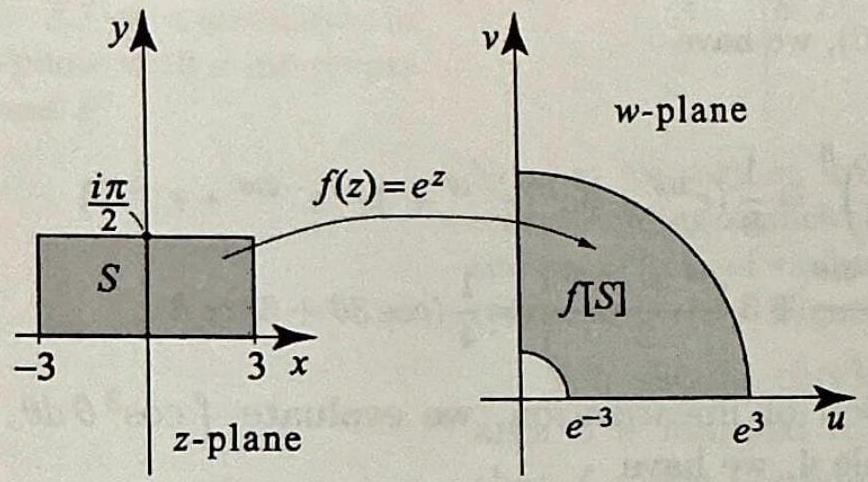
> Figure 5

```mathematica
Manipulate[
 Module[
  {
   z = x + I y, w, zPoint, wPoint, green = RGBColor[0.1, 0.6, 0.2],
   xLine, yLine, segmentZ, segmentW, leftPlot, rightPlot
   },
  
  w = Exp[z];
  zPoint = {x, y};
  wPoint = {Re[w], Im[w]};
  xLine = -3 + 6 sLine;
  yLine = (Pi/2) sLine;
  
  segmentZ =
   Switch[
    segmentType,
    "Vertical",
    Table[{xLine, t}, {t, 0, Pi/2, Pi/160}],
    "Horizontal",
    Table[{t, yLine}, {t, -3, 3, 6/160}]
    ];
  
  segmentW =
   Switch[
    segmentType,
    "Vertical",
    Table[Exp[xLine] {Cos[t], Sin[t]}, {t, 0, Pi/2, Pi/160}],
    "Horizontal",
    Table[Exp[t] {Cos[yLine], Sin[yLine]}, {t, -3, 3, 6/160}]
    ];
  
  leftPlot =
   Graphics[
    {
     {LightBlue, Opacity[0.35], EdgeForm[{Thick, Blue}],
      Rectangle[{-3, 0}, {3, Pi/2}]},
     If[showSegment, {green, Thick, Line[segmentZ]}, {}],
     {Red, PointSize[0.026], Point[zPoint]},
     Text[Style["z", 15, Bold, Red], zPoint + {0.12, 0.08}]
     },
    Axes -> True,
    GridLines -> Automatic,
    PlotRange -> {{-3.5, 3.5}, {-0.2, 1.9}},
    ImageSize -> 420,
    PlotLabel -> Style["Problem 27: z-plane", 18],
    AxesLabel -> {"x", "y"}
    ];
  
  rightPlot =
   Graphics[
    {
     {LightBlue, Opacity[0.35], EdgeForm[{Thick, Blue}],
      Annulus[{0, 0}, {Exp[-3], Exp[3]}, {0, Pi/2}]},
     If[showSegment, {green, Thick, Line[segmentW]}, {}],
     {Red, PointSize[0.026], Point[wPoint]},
     Text[Style["e^z", 15, Bold, Red], wPoint + {0.35, 0.25}]
     },
    Axes -> True,
    GridLines -> Automatic,
    PlotRange -> {{-1, 22}, {-1, 22}},
    ImageSize -> 520,
    PlotLabel -> Style["w-plane: quarter-annulus", 18],
    AxesLabel -> {"u", "v"}
    ];
  
  Column[
   {
    Style["Problem 27: w = e^z", 21, Bold],
    GraphicsRow[{leftPlot, rightPlot}, Spacings -> 28],
    Style[
     Row[{
       "z = ", NumberForm[x, {4, 2}], " + ",
       NumberForm[y, {4, 2}], " i",
       "    \[LongRightArrow]    w = ",
       NumberForm[Re[w], {6, 3}], " + ",
       NumberForm[Im[w], {6, 3}], " i"
       }],
     14
     ],
    Style[
     If[
      segmentType == "Vertical",
      Row[{"Green segment: x = ", NumberForm[xLine, {4, 2}]}],
      Row[{"Green segment: y = ", NumberForm[yLine, {4, 2}]}]
      ],
     13, green
     ]
    }
   ]
  ],
 {{x, 0, "x"}, -3, 3, Appearance -> "Labeled"},
 {{y, Pi/4, "y"}, 0, Pi/2, Appearance -> "Labeled"},
 Delimiter,
 {{showSegment, True, "show green interior segment"}, {True, False}},
 {{segmentType, "Vertical", "green segment type"}, {"Vertical", "Horizontal"}},
 {{sLine, 0.5, "segment position"}, 0, 1, Appearance -> "Labeled"},
 TrackedSymbols :> {x, y, showSegment, segmentType, sLine}
]
```

Here

$$
S=\{z=x+i y:-3 \leq x \leq 3,\ 0 \leq y \leq \tfrac{\pi}{2}\}.
$$

Since

$$
w=e^{z}=e^{x}(\cos y+i \sin y),
$$

we have

$$
|w|=e^{x},
\qquad
\arg w=y .
$$

Therefore

$$
e^{-3} \leq |w| \leq e^{3},
\qquad
0 \leq \arg w \leq \frac{\pi}{2}.
$$

So

$$
f[S]=\left\{w:e^{-3} \leq|w| \leq e^{3},\ 0 \leq \arg w \leq \frac{\pi}{2}\right\},
$$

which is the closed quarter-annulus in the first quadrant.

##### problem 28 

> [!figure] Figure 6
> 
> 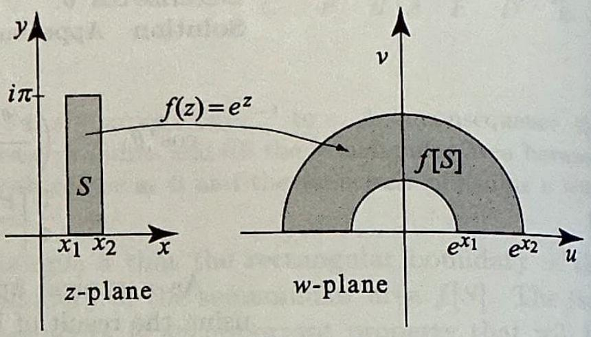
> Figure 6

```mathematica
Manipulate[
 Module[
  {
   x2 = x1 + width, x, y, z, w, zPoint, wPoint, rMin, rMax,
   xLine, yLine, segmentZ, segmentW, green = RGBColor[0.1, 0.6, 0.2],
   leftPlot, rightPlot
   },
  
  x = x1 + sx width;
  y = Pi sy;
  z = x + I y;
  w = Exp[z];
  zPoint = {x, y};
  wPoint = {Re[w], Im[w]};
  rMin = Exp[x1];
  rMax = Exp[x2];
  xLine = x1 + sLine (x2 - x1);
  yLine = Pi sLine;
  
  segmentZ =
   Switch[
    segmentType,
    "Vertical",
    Table[{xLine, t}, {t, 0, Pi, Pi/160}],
    "Horizontal",
    Table[{t, yLine}, {t, x1, x2, (x2 - x1)/160}]
    ];
  
  segmentW =
   Switch[
    segmentType,
    "Vertical",
    Table[Exp[xLine] {Cos[t], Sin[t]}, {t, 0, Pi, Pi/160}],
    "Horizontal",
    Table[Exp[t] {Cos[yLine], Sin[yLine]}, {t, x1, x2, (x2 - x1)/160}]
    ];
  
  leftPlot =
   Graphics[
    {
     {LightBlue, Opacity[0.35], EdgeForm[{Thick, Blue}],
      Rectangle[{x1, 0}, {x2, Pi}]},
     If[showSegment, {green, Thick, Line[segmentZ]}, {}],
     {Red, PointSize[0.026], Point[zPoint]},
     Text[Style["z", 15, Bold, Red], zPoint + {0.08, 0.1}]
     },
    Axes -> True,
    GridLines -> Automatic,
    PlotRange -> {{x1 - 0.5, x2 + 0.5}, {-0.2, Pi + 0.3}},
    ImageSize -> 420,
    PlotLabel -> Style["Problem 28: z-plane", 18],
    AxesLabel -> {"x", "y"}
    ];
  
  rightPlot =
   Graphics[
    {
     {LightBlue, Opacity[0.35], EdgeForm[{Thick, Blue}],
      Annulus[{0, 0}, {rMin, rMax}, {0, Pi}]},
     If[showSegment, {green, Thick, Line[segmentW]}, {}],
     {Red, PointSize[0.026], Point[wPoint]},
     Text[Style["e^z", 15, Bold, Red], wPoint + {0.1, 0.18}]
     },
    Axes -> True,
    GridLines -> Automatic,
    PlotRange -> {{-1.15 rMax, 1.15 rMax}, {-0.4, 1.15 rMax}},
    ImageSize -> 520,
    PlotLabel -> Style["w-plane: upper semiannulus", 18],
    AxesLabel -> {"u", "v"}
    ];
  
  Column[
   {
    Style["Problem 28: w = e^z", 21, Bold],
    GraphicsRow[{leftPlot, rightPlot}, Spacings -> 28],
    Style[
     Row[{
       "x1 = ", NumberForm[x1, {4, 2}], ",   x2 = ", NumberForm[x2, {4, 2}],
       "    and    z = ", NumberForm[x, {4, 2}], " + ", NumberForm[y, {4, 2}], " i",
       "    \[LongRightArrow]    w = ", NumberForm[Re[w], {6, 3}], " + ",
       NumberForm[Im[w], {6, 3}], " i"
       }],
     14
     ],
    Style[
     If[
      segmentType == "Vertical",
      Row[{"Green segment: x = ", NumberForm[xLine, {4, 2}]}],
      Row[{"Green segment: y = ", NumberForm[yLine, {4, 2}]}]
      ],
     13, green
     ]
    }
   ]
  ],
 {{x1, -0.8, "x1"}, -1.5, 0.5, Appearance -> "Labeled"},
 {{width, 1.2, "x2 - x1"}, 0.4, 2.2, Appearance -> "Labeled"},
 {{sx, 0.5, "horizontal position"}, 0, 1, Appearance -> "Labeled"},
 {{sy, 0.5, "vertical position"}, 0, 1, Appearance -> "Labeled"},
 Delimiter,
 {{showSegment, True, "show green interior segment"}, {True, False}},
 {{segmentType, "Vertical", "green segment type"}, {"Vertical", "Horizontal"}},
 {{sLine, 0.5, "segment position"}, 0, 1, Appearance -> "Labeled"},
 TrackedSymbols :> {x1, width, sx, sy, showSegment, segmentType, sLine}
]
```

Here

$$
S=\{z=x+i y:x_{1} \leq x \leq x_{2},\ 0 \leq y \leq \pi\}.
$$

Again,

$$
|w|=e^{x},
\qquad
\arg w=y .
$$

Hence

$$
e^{x_{1}} \leq |w| \leq e^{x_{2}},
\qquad
0 \leq \arg w \leq \pi.
$$

Therefore

$$
f[S]=\left\{w:e^{x_{1}} \leq|w| \leq e^{x_{2}},\ 0 \leq \arg w \leq \pi\right\},
$$

the closed upper semiannulus between the circles of radii $e^{x_{1}}$ and $e^{x_{2}}$.


##### problem 29 

> [!figure] Figure 7
> 
> 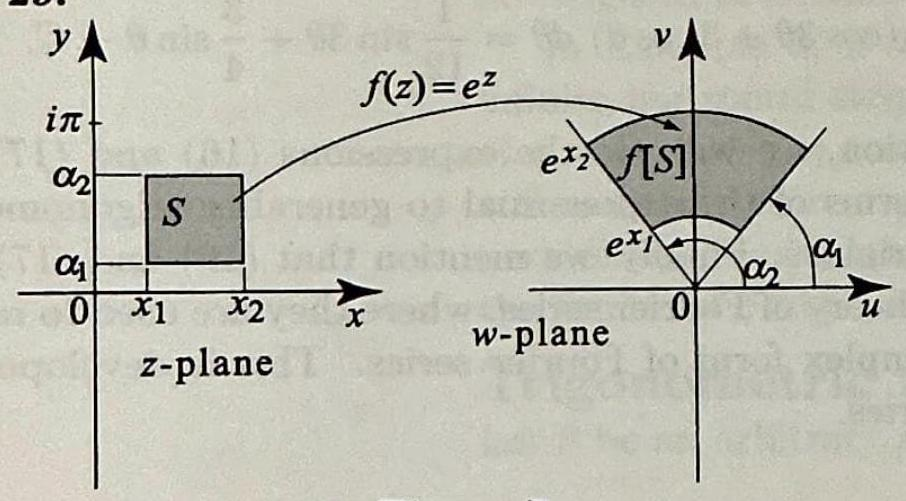
> Figure 7

```mathematica
Manipulate[
 Module[
  {
   x2 = x1 + width, a2 = a1 + dAlpha, x, y, z, w, zPoint, wPoint,
   rMin, rMax, xLine, yLine, segmentZ, segmentW,
   green = RGBColor[0.1, 0.6, 0.2], leftPlot, rightPlot
   },
  
  x = x1 + sx width;
  y = a1 + sy dAlpha;
  z = x + I y;
  w = Exp[z];
  zPoint = {x, y};
  wPoint = {Re[w], Im[w]};
  rMin = Exp[x1];
  rMax = Exp[x2];
  xLine = x1 + sLine (x2 - x1);
  yLine = a1 + sLine (a2 - a1);
  
  segmentZ =
   Switch[
    segmentType,
    "Vertical",
    Table[{xLine, t}, {t, a1, a2, (a2 - a1)/160}],
    "Horizontal",
    Table[{t, yLine}, {t, x1, x2, (x2 - x1)/160}]
    ];
  
  segmentW =
   Switch[
    segmentType,
    "Vertical",
    Table[Exp[xLine] {Cos[t], Sin[t]}, {t, a1, a2, (a2 - a1)/160}],
    "Horizontal",
    Table[Exp[t] {Cos[yLine], Sin[yLine]}, {t, x1, x2, (x2 - x1)/160}]
    ];
  
  leftPlot =
   Graphics[
    {
     {LightBlue, Opacity[0.35], EdgeForm[{Thick, Blue}],
      Rectangle[{x1, a1}, {x2, a2}]},
     If[showSegment, {green, Thick, Line[segmentZ]}, {}],
     {Red, PointSize[0.026], Point[zPoint]},
     Text[Style["z", 15, Bold, Red], zPoint + {0.08, 0.08}]
     },
    Axes -> True,
    GridLines -> Automatic,
    PlotRange -> {{x1 - 0.5, x2 + 0.5}, {0, Pi + 0.3}},
    ImageSize -> 420,
    PlotLabel -> Style["Problem 29: z-plane", 18],
    AxesLabel -> {"x", "y"}
    ];
  
  rightPlot =
   Graphics[
    {
     {LightBlue, Opacity[0.35], EdgeForm[{Thick, Blue}],
      Annulus[{0, 0}, {rMin, rMax}, {a1, a2}]},
     If[showSegment, {green, Thick, Line[segmentW]}, {}],
     {Red, PointSize[0.026], Point[wPoint]},
     Text[Style["e^z", 15, Bold, Red], wPoint + {0.12, 0.12}]
     },
    Axes -> True,
    GridLines -> Automatic,
    PlotRange -> {{-1.15 rMax, 1.15 rMax}, {-0.4, 1.15 rMax}},
    ImageSize -> 520,
    PlotLabel -> Style["w-plane: annular sector", 18],
    AxesLabel -> {"u", "v"}
    ];
  
  Column[
   {
    Style["Problem 29: w = e^z", 21, Bold],
    GraphicsRow[{leftPlot, rightPlot}, Spacings -> 28],
    Style[
     Row[{
       "\!\(\*SubscriptBox[\(\[Alpha]\), \(1\)]\) = ", NumberForm[a1, {4, 2}],
       ",   \!\(\*SubscriptBox[\(\[Alpha]\), \(2\)]\) = ", NumberForm[a2, {4, 2}],
       "    and    z = ", NumberForm[x, {4, 2}], " + ", NumberForm[y, {4, 2}], " i"
       }],
     14
     ],
    Style[
     If[
      segmentType == "Vertical",
      Row[{"Green segment: x = ", NumberForm[xLine, {4, 2}]}],
      Row[{"Green segment: y = ", NumberForm[yLine, {4, 2}]}]
      ],
     13, green
     ]
    }
   ]
  ],
 {{x1, -0.8, "x1"}, -1.5, 0.5, Appearance -> "Labeled"},
 {{width, 1.0, "x2 - x1"}, 0.4, 2.0, Appearance -> "Labeled"},
 {{a1, 0.4, "\!\(\*SubscriptBox[\(\[Alpha]\), \(1\)]\)"}, 0.1, 2.0, Appearance -> "Labeled"},
 {{dAlpha, 0.9, "\!\(\*SubscriptBox[\(\[Alpha]\), \(2\)]\) - \!\(\*SubscriptBox[\(\[Alpha]\), \(1\)]\)"}, 0.2, 1.0, Appearance -> "Labeled"},
 {{sx, 0.5, "horizontal position"}, 0, 1, Appearance -> "Labeled"},
 {{sy, 0.5, "vertical position"}, 0, 1, Appearance -> "Labeled"},
 Delimiter,
 {{showSegment, True, "show green interior segment"}, {True, False}},
 {{segmentType, "Vertical", "green segment type"}, {"Vertical", "Horizontal"}},
 {{sLine, 0.5, "segment position"}, 0, 1, Appearance -> "Labeled"},
 TrackedSymbols :> {x1, width, a1, dAlpha, sx, sy, showSegment, segmentType, sLine}
]
```

Here

$$
S=\{z=x+i y:x_{1} \leq x \leq x_{2},\ \alpha_{1} \leq y \leq \alpha_{2}\}.
$$

Under $w=e^{z}$, we still have

$$
|w|=e^{x},
\qquad
\arg w=y .
$$

So

$$
e^{x_{1}} \leq |w| \leq e^{x_{2}},
\qquad
\alpha_{1} \leq \arg w \leq \alpha_{2}.
$$

Hence

$$
f[S]=\left\{w:e^{x_{1}} \leq|w| \leq e^{x_{2}},\ \alpha_{1} \leq \arg w \leq \alpha_{2}\right\},
$$

which is the closed annular sector shown in the figure.


##### problem 30

> [!figure] Figure 8
> 
> 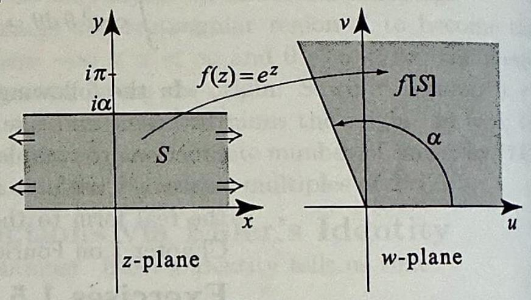
> Figure 8

```mathematica
Manipulate[
 Module[
  {
   x, y, z, w, zPoint, wPoint, rMax, xLine, yLine, segmentZ, segmentW,
   green = RGBColor[0.1, 0.6, 0.2], leftPlot, rightPlot
   },
  
  x = -visibleX + 2 visibleX sx;
  y = alpha sy;
  z = x + I y;
  w = Exp[z];
  zPoint = {x, y};
  wPoint = {Re[w], Im[w]};
  rMax = Exp[visibleX];
  xLine = -visibleX + 2 visibleX sLine;
  yLine = alpha sLine;
  
  segmentZ =
   Switch[
    segmentType,
    "Vertical",
    Table[{xLine, t}, {t, 0, alpha, alpha/160}],
    "Horizontal",
    Table[{t, yLine}, {t, -visibleX, visibleX, 2 visibleX/160}]
    ];
  
  segmentW =
   Switch[
    segmentType,
    "Vertical",
    Table[Exp[xLine] {Cos[t], Sin[t]}, {t, 0, alpha, alpha/160}],
    "Horizontal",
    Table[Exp[t] {Cos[yLine], Sin[yLine]}, {t, -visibleX, visibleX, 2 visibleX/160}]
    ];
  
  leftPlot =
   Graphics[
    {
     {LightBlue, Opacity[0.35], EdgeForm[{Thick, Blue}],
      Rectangle[{-visibleX, 0}, {visibleX, alpha}]},
     If[showSegment, {green, Thick, Line[segmentZ]}, {}],
     {Black, Arrowheads[0.03],
      Arrow[{{-visibleX, 0.25 alpha}, {-visibleX - 0.45, 0.25 alpha}}],
      Arrow[{{-visibleX, 0.75 alpha}, {-visibleX - 0.45, 0.75 alpha}}],
      Arrow[{{visibleX, 0.25 alpha}, {visibleX + 0.45, 0.25 alpha}}],
      Arrow[{{visibleX, 0.75 alpha}, {visibleX + 0.45, 0.75 alpha}}]},
     {Red, PointSize[0.026], Point[zPoint]},
     Text[Style["z", 15, Bold, Red], zPoint + {0.12, 0.08}]
     },
    Axes -> True,
    GridLines -> Automatic,
    PlotRange -> {{-visibleX - 0.7, visibleX + 0.7}, {-0.2, Max[alpha + 0.3, 1.2]}},
    ImageSize -> 420,
    PlotLabel -> Style["Problem 30: strip (windowed view)", 18],
    AxesLabel -> {"x", "y"}
    ];
  
  rightPlot =
   Graphics[
    {
     {LightBlue, Opacity[0.35], EdgeForm[{Thick, Blue}],
      Disk[{0, 0}, rMax, {0, alpha}]},
     If[showSegment, {green, Thick, Line[segmentW]}, {}],
     {Red, PointSize[0.026], Point[wPoint]},
     Text[Style["e^z", 15, Bold, Red], wPoint + {0.12, 0.12}]
     },
    Axes -> True,
    GridLines -> Automatic,
    PlotRange -> {{-1.15 rMax, 1.15 rMax}, {-0.4, 1.15 rMax}},
    ImageSize -> 520,
    PlotLabel -> Style["w-plane: sector (clipped view)", 18],
    AxesLabel -> {"u", "v"}
    ];
  
  Column[
   {
    Style["Problem 30: w = e^z", 21, Bold],
    GraphicsRow[{leftPlot, rightPlot}, Spacings -> 28],
    Style[
     "The left panel shows a finite window of the infinite strip; the right panel shows the corresponding clipped sector.",
     13
     ],
    Style[
     If[
      segmentType == "Vertical",
      Row[{"Green segment: x = ", NumberForm[xLine, {4, 2}]}],
      Row[{"Green segment: y = ", NumberForm[yLine, {4, 2}]}]
      ],
     13, green
     ]
    }
   ]
  ],
 {{alpha, 1.2, "\[Alpha]"}, 0.2, 2.8, Appearance -> "Labeled"},
 {{visibleX, 2.4, "display half-width"}, 1.0, 3.5, Appearance -> "Labeled"},
 {{sx, 0.5, "horizontal position"}, 0, 1, Appearance -> "Labeled"},
 {{sy, 0.5, "vertical position"}, 0, 1, Appearance -> "Labeled"},
 Delimiter,
 {{showSegment, True, "show green interior segment"}, {True, False}},
 {{segmentType, "Vertical", "green segment type"}, {"Vertical", "Horizontal"}},
 {{sLine, 0.5, "segment position"}, 0, 1, Appearance -> "Labeled"},
 TrackedSymbols :> {alpha, visibleX, sx, sy, showSegment, segmentType, sLine}
]
```

Here the strip is

$$
S=\{z=x+i y:-\infty<x<\infty,\ 0 \leq y \leq \alpha\}.
$$

Since

$$
|w|=e^{x},
\qquad
\arg w=y,
$$

and $x$ ranges over all real numbers, $|w|=e^{x}$ ranges over all positive real numbers. Thus

$$
0<|w|<\infty,
\qquad
0 \leq \arg w \leq \alpha.
$$

Therefore

$$
f[S]=\left\{w:w \neq 0,\ 0 \leq \arg w \leq \alpha\right\},
$$

the closed sector of angle $\alpha$, excluding the origin.


##### problem 31. 

> [!figure] Figure 9
> 
> 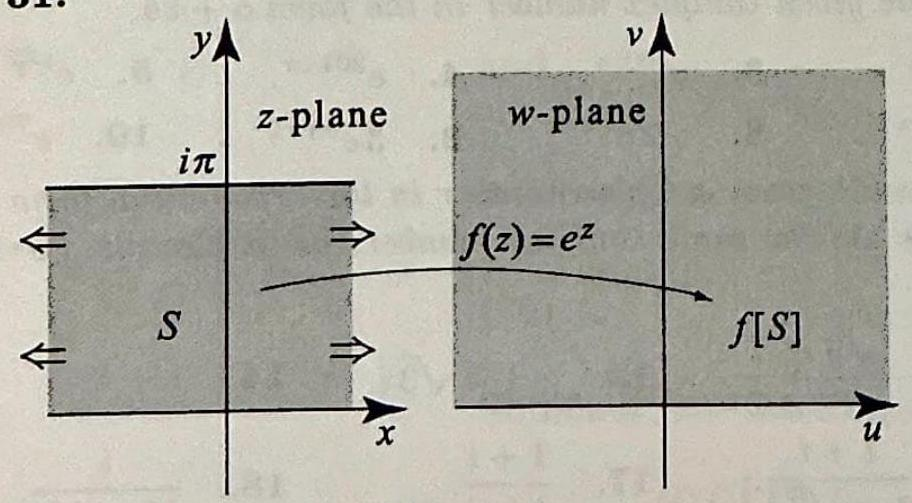
> Figure 9

```mathematica
Manipulate[
 Module[
  {
   x, y, z, w, zPoint, wPoint, rMax, xLine, yLine, segmentZ, segmentW,
   green = RGBColor[0.1, 0.6, 0.2], leftPlot, rightPlot
   },
  
  x = -visibleX + 2 visibleX sx;
  y = Pi sy;
  z = x + I y;
  w = Exp[z];
  zPoint = {x, y};
  wPoint = {Re[w], Im[w]};
  rMax = Exp[visibleX];
  xLine = -visibleX + 2 visibleX sLine;
  yLine = Pi sLine;
  
  segmentZ =
   Switch[
    segmentType,
    "Vertical",
    Table[{xLine, t}, {t, 0, Pi, Pi/160}],
    "Horizontal",
    Table[{t, yLine}, {t, -visibleX, visibleX, 2 visibleX/160}]
    ];
  
  segmentW =
   Switch[
    segmentType,
    "Vertical",
    Table[Exp[xLine] {Cos[t], Sin[t]}, {t, 0, Pi, Pi/160}],
    "Horizontal",
    Table[Exp[t] {Cos[yLine], Sin[yLine]}, {t, -visibleX, visibleX, 2 visibleX/160}]
    ];
  
  leftPlot =
   Graphics[
    {
     {LightBlue, Opacity[0.35], EdgeForm[{Thick, Blue}],
      Rectangle[{-visibleX, 0}, {visibleX, Pi}]},
     If[showSegment, {green, Thick, Line[segmentZ]}, {}],
     {Black, Arrowheads[0.03],
      Arrow[{{-visibleX, Pi/4}, {-visibleX - 0.45, Pi/4}}],
      Arrow[{{-visibleX, 3 Pi/4}, {-visibleX - 0.45, 3 Pi/4}}],
      Arrow[{{visibleX, Pi/4}, {visibleX + 0.45, Pi/4}}],
      Arrow[{{visibleX, 3 Pi/4}, {visibleX + 0.45, 3 Pi/4}}]},
     {Red, PointSize[0.026], Point[zPoint]},
     Text[Style["z", 15, Bold, Red], zPoint + {0.12, 0.12}]
     },
    Axes -> True,
    GridLines -> Automatic,
    PlotRange -> {{-visibleX - 0.7, visibleX + 0.7}, {-0.2, Pi + 0.3}},
    ImageSize -> 420,
    PlotLabel -> Style["Problem 31: strip (windowed view)", 18],
    AxesLabel -> {"x", "y"}
    ];
  
  rightPlot =
   Graphics[
    {
     {LightBlue, Opacity[0.35], EdgeForm[{Thick, Blue}],
      Disk[{0, 0}, rMax, {0, Pi}]},
     If[showSegment, {green, Thick, Line[segmentW]}, {}],
     {Red, PointSize[0.026], Point[wPoint]},
     Text[Style["e^z", 15, Bold, Red], wPoint + {0.12, 0.12}]
     },
    Axes -> True,
    GridLines -> Automatic,
    PlotRange -> {{-1.15 rMax, 1.15 rMax}, {-0.4, 1.15 rMax}},
    ImageSize -> 520,
    PlotLabel -> Style["w-plane: upper half-plane (clipped view)", 18],
    AxesLabel -> {"u", "v"}
    ];
  
  Column[
   {
    Style["Problem 31: w = e^z", 21, Bold],
    GraphicsRow[{leftPlot, rightPlot}, Spacings -> 28],
    Style[
     "The right panel is a finite-radius view of the upper half-plane image.",
     13
     ],
    Style[
     If[
      segmentType == "Vertical",
      Row[{"Green segment: x = ", NumberForm[xLine, {4, 2}]}],
      Row[{"Green segment: y = ", NumberForm[yLine, {4, 2}]}]
      ],
     13, green
     ]
    }
   ]
  ],
 {{visibleX, 2.3, "display half-width"}, 1.0, 3.5, Appearance -> "Labeled"},
 {{sx, 0.5, "horizontal position"}, 0, 1, Appearance -> "Labeled"},
 {{sy, 0.5, "vertical position"}, 0, 1, Appearance -> "Labeled"},
 Delimiter,
 {{showSegment, True, "show green interior segment"}, {True, False}},
 {{segmentType, "Vertical", "green segment type"}, {"Vertical", "Horizontal"}},
 {{sLine, 0.5, "segment position"}, 0, 1, Appearance -> "Labeled"},
 TrackedSymbols :> {visibleX, sx, sy, showSegment, segmentType, sLine}
]
```

Here

$$
S=\{z=x+i y:-\infty<x<\infty,\ 0 \leq y \leq \pi\}.
$$

Then

$$
|w|=e^{x}>0,
\qquad
0 \leq \arg w \leq \pi.
$$

Because $x$ runs through all real numbers, $|w|=e^{x}$ runs through all positive radii. Hence

$$
f[S]=\left\{w:w \neq 0,\ 0 \leq \arg w \leq \pi\right\}.
$$

Equivalently,

$$
f[S]=\{w:\operatorname{Im} w \geq 0,\ w \neq 0\},
$$

the closed upper half-plane with the origin omitted.


##### problem 32

> [!figure] Figure 10
> 
> 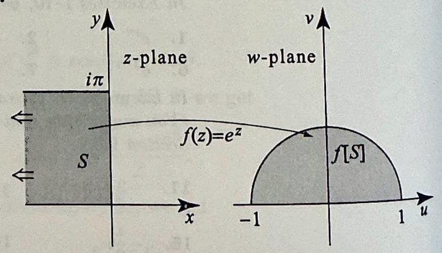
> Figure 10

```mathematica
Manipulate[
 Module[
  {
   x, y, z, w, zPoint, wPoint, xLine, yLine, segmentZ, segmentW,
   green = RGBColor[0.1, 0.6, 0.2], leftPlot, rightPlot
   },
  
  x = -visibleX + visibleX sx;
  y = Pi sy;
  z = x + I y;
  w = Exp[z];
  zPoint = {x, y};
  wPoint = {Re[w], Im[w]};
  xLine = -visibleX + visibleX sLine;
  yLine = Pi sLine;
  
  segmentZ =
   Switch[
    segmentType,
    "Vertical",
    Table[{xLine, t}, {t, 0, Pi, Pi/160}],
    "Horizontal",
    Table[{t, yLine}, {t, -visibleX, 0, visibleX/160}]
    ];
  
  segmentW =
   Switch[
    segmentType,
    "Vertical",
    Table[Exp[xLine] {Cos[t], Sin[t]}, {t, 0, Pi, Pi/160}],
    "Horizontal",
    Table[Exp[t] {Cos[yLine], Sin[yLine]}, {t, -visibleX, 0, visibleX/160}]
    ];
  
  leftPlot =
   Graphics[
    {
     {LightBlue, Opacity[0.35], EdgeForm[{Thick, Blue}],
      Rectangle[{-visibleX, 0}, {0, Pi}]},
     If[showSegment, {green, Thick, Line[segmentZ]}, {}],
     {Black, Arrowheads[0.03],
      Arrow[{{-visibleX, Pi/4}, {-visibleX - 0.45, Pi/4}}],
      Arrow[{{-visibleX, 3 Pi/4}, {-visibleX - 0.45, 3 Pi/4}}]},
     {Red, PointSize[0.026], Point[zPoint]},
     Text[Style["z", 15, Bold, Red], zPoint + {0.08, 0.12}]
     },
    Axes -> True,
    GridLines -> Automatic,
    PlotRange -> {{-visibleX - 0.7, 0.7}, {-0.2, Pi + 0.3}},
    ImageSize -> 420,
    PlotLabel -> Style["Problem 32: left half-strip (windowed view)", 18],
    AxesLabel -> {"x", "y"}
    ];
  
  rightPlot =
   Graphics[
    {
     {LightBlue, Opacity[0.35], EdgeForm[{Thick, Blue}],
      Disk[{0, 0}, 1, {0, Pi}]},
     {White, Disk[{0, 0}, 0.04]},
     Text[Style["0 omitted", 12], {0.22, 0.12}],
     If[showSegment, {green, Thick, Line[segmentW]}, {}],
     {Red, PointSize[0.026], Point[wPoint]},
     Text[Style["e^z", 15, Bold, Red], wPoint + {0.08, 0.12}]
     },
    Axes -> True,
    GridLines -> Automatic,
    PlotRange -> {{-1.2, 1.2}, {-0.25, 1.2}},
    ImageSize -> 520,
    PlotLabel -> Style["w-plane: upper half-disk", 18],
    AxesLabel -> {"u", "v"}
    ];
  
  Column[
   {
    Style["Problem 32: w = e^z", 21, Bold],
    GraphicsRow[{leftPlot, rightPlot}, Spacings -> 28],
    Style[
     "The image is the upper half-disk of radius 1, with the origin omitted.",
     13
     ],
    Style[
     If[
      segmentType == "Vertical",
      Row[{"Green segment: x = ", NumberForm[xLine, {4, 2}]}],
      Row[{"Green segment: y = ", NumberForm[yLine, {4, 2}]}]
      ],
     13, green
     ]
    }
   ]
  ],
 {{visibleX, 2.5, "left cutoff"}, 0.8, 4.0, Appearance -> "Labeled"},
 {{sx, 0.7, "horizontal position"}, 0, 1, Appearance -> "Labeled"},
 {{sy, 0.5, "vertical position"}, 0, 1, Appearance -> "Labeled"},
 Delimiter,
 {{showSegment, True, "show green interior segment"}, {True, False}},
 {{segmentType, "Vertical", "green segment type"}, {"Vertical", "Horizontal"}},
 {{sLine, 0.5, "segment position"}, 0, 1, Appearance -> "Labeled"},
 TrackedSymbols :> {visibleX, sx, sy, showSegment, segmentType, sLine}
]
```

Here

$$
S=\{z=x+i y:x \leq 0,\ 0 \leq y \leq \pi\}.
$$

Under $w=e^{z}$,

$$
|w|=e^{x} \leq 1,
\qquad
0 \leq \arg w \leq \pi.
$$

Also $e^{x}>0$ for every finite $x$, so $w \neq 0$. Therefore

$$
f[S]=\left\{w:0<|w| \leq 1,\ 0 \leq \arg w \leq \pi\right\}.
$$

Equivalently,

$$
f[S]=\{w:\operatorname{Im} w \geq 0,\ 0<|w| \leq 1\},
$$

the closed upper half-disk of radius $1$, with the origin omitted.


> [!exercise] Exercise 12
> In problems 33-36, (a) linearize the integrand; (b) evaluate the given integral.
> 33. $\quad \int \sin ^{4} \theta d \theta$. 34. 
> 34. $\quad \int \cos ^{5} \theta d \theta$. 
> 35. $\quad \int \cos ^{6} \theta d \theta$. 36. 
> 36. $\quad \int \sin ^{3} \theta \cos ^{5} \theta d \theta$


##### problem 33

For the linearization,

$$
\begin{aligned}
\sin ^{4} \theta
&=\left(\frac{1-\cos 2 \theta}{2}\right)^{2} \\
&=\frac{1}{4}\left(1-2 \cos 2 \theta+\cos ^{2} 2 \theta\right) \\
&=\frac{1}{4}\left(1-2 \cos 2 \theta+\frac{1+\cos 4 \theta}{2}\right) \\
&=\frac{3}{8}-\frac{1}{2} \cos 2 \theta+\frac{1}{8} \cos 4 \theta .
\end{aligned}
$$

Therefore

$$
\begin{aligned}
\int \sin ^{4} \theta \, d \theta
&=\int \left(\frac{3}{8}-\frac{1}{2} \cos 2 \theta+\frac{1}{8} \cos 4 \theta\right) d \theta \\
&=\frac{3}{8} \theta-\frac{1}{2} \cdot \frac{1}{2} \sin 2 \theta+\frac{1}{8} \cdot \frac{1}{4} \sin 4 \theta+C \\
&=\frac{3}{8} \theta-\frac{1}{4} \sin 2 \theta+\frac{1}{32} \sin 4 \theta+C .
\end{aligned}
$$


##### problem 34

A convenient linearization is

$$
\cos ^{5} \theta=\frac{10 \cos \theta+5 \cos 3 \theta+\cos 5 \theta}{16}.
$$

Hence

$$
\begin{aligned}
\int \cos ^{5} \theta \, d \theta
&=\int \frac{10 \cos \theta+5 \cos 3 \theta+\cos 5 \theta}{16} \, d \theta \\
&=\frac{10}{16} \sin \theta+\frac{5}{16} \cdot \frac{1}{3} \sin 3 \theta+\frac{1}{16} \cdot \frac{1}{5} \sin 5 \theta+C \\
&=\frac{5}{8} \sin \theta+\frac{5}{48} \sin 3 \theta+\frac{1}{80} \sin 5 \theta+C .
\end{aligned}
$$


##### problem 35

For the linearization,

$$
\cos ^{6} \theta=\frac{10+15 \cos 2 \theta+6 \cos 4 \theta+\cos 6 \theta}{32}.
$$

Therefore

$$
\begin{aligned}
\int \cos ^{6} \theta \, d \theta
&=\int \frac{10+15 \cos 2 \theta+6 \cos 4 \theta+\cos 6 \theta}{32} \, d \theta \\
&=\frac{10}{32} \theta+\frac{15}{32} \cdot \frac{1}{2} \sin 2 \theta+\frac{6}{32} \cdot \frac{1}{4} \sin 4 \theta+\frac{1}{32} \cdot \frac{1}{6} \sin 6 \theta+C \\
&=\frac{5}{16} \theta+\frac{15}{64} \sin 2 \theta+\frac{3}{64} \sin 4 \theta+\frac{1}{192} \sin 6 \theta+C .
\end{aligned}
$$


##### problem 36

Using linearization formulas for the odd powers,

$$
\sin ^{3} \theta=\frac{3 \sin \theta-\sin 3 \theta}{4},
\qquad
\cos ^{5} \theta=\frac{10 \cos \theta+5 \cos 3 \theta+\cos 5 \theta}{16}.
$$

Thus

$$
\begin{aligned}
\sin ^{3} \theta \cos ^{5} \theta
&=\frac{1}{64}\left(3 \sin \theta-\sin 3 \theta\right)\left(10 \cos \theta+5 \cos 3 \theta+\cos 5 \theta\right) \\
&=\frac{3}{64} \sin 2 \theta+\frac{1}{64} \sin 4 \theta-\frac{1}{64} \sin 6 \theta-\frac{1}{128} \sin 8 \theta .
\end{aligned}
$$

Therefore

$$
\begin{aligned}
\int \sin ^{3} \theta \cos ^{5} \theta \, d \theta
&=\int \left(\frac{3}{64} \sin 2 \theta+\frac{1}{64} \sin 4 \theta-\frac{1}{64} \sin 6 \theta-\frac{1}{128} \sin 8 \theta\right) d \theta \\
&=-\frac{3}{64} \cdot \frac{1}{2} \cos 2 \theta-\frac{1}{64} \cdot \frac{1}{4} \cos 4 \theta+\frac{1}{64} \cdot \frac{1}{6} \cos 6 \theta+\frac{1}{128} \cdot \frac{1}{8} \cos 8 \theta+C \\
&=-\frac{3}{128} \cos 2 \theta-\frac{1}{256} \cos 4 \theta+\frac{1}{384} \cos 6 \theta+\frac{1}{1024} \cos 8 \theta+C .
\end{aligned}
$$


> [!exercise] Exercise 13
> 37. Show that for all complex numbers $z,\left|e^{z}\right| \leq e^{|z|}$. When does equality hold?
> 

##### problem 37

Let

$$
z=x+i y .
$$

Then

$$
\left|e^{z}\right|=e^{x}.
$$

Also,

$$
|z|=\sqrt{x^{2}+y^{2}} \geq|x| \geq x .
$$

Since the real exponential function is increasing, it follows that

$$
e^{x} \leq e^{|z|}.
$$

Therefore

$$
\left|e^{z}\right| \leq e^{|z|}.
$$

Equality holds if and only if

$$
x=|z|.
$$

But

$$
|z|=\sqrt{x^{2}+y^{2}},
$$

so $x=|z|$ happens exactly when $y=0$ and $x \geq 0$. Hence equality holds precisely for

$$
z \in[0, \infty) .
$$


> [!exercise] Exercise 14
> 38. Differences and similarities. In the text, we pointed out a few similarities and differences between $e^{z}$ and $e^{x}$. In what follows we consider some additional ones. For each part, either prove your answer or provide an example to show that the statement is false.
> (a) The function $e^{x}$ is one to one. Is $e^{z}$ one to one?
> (b) The function $e^{x}$ is increasing (if $x_{1}<x_{2}$ then $e^{x_{1}}<e^{x_{2}}$ ). If $\left|z_{1}\right|<\left|z_{2}\right|$ do we have $\left|e^{z_{1}}\right|<\left|e^{z_{2}}\right|$ ?
> (c) The function $e^{x}$ never vanishes. Can $e^{z}$ vanish?
> (d) The function $e^{x}$ is always positive. Is $e^{z}$ always real and positive?
> (e) The modulus or absolute value of $e^{x}$ is $e^{x}$. What is the absolute value of $e^{z}$ ?
> (f) We have $e^{x}=1 \Leftrightarrow x=0$. Do we have $e^{z}=1 \Leftrightarrow z=0$ ?


##### problem 38(a)

No. The function $e^{z}$ is not one to one on $\mathbb{C}$, because

$$
e^{0}=1=e^{2 \pi i}.
$$

So distinct complex numbers can have the same exponential.


##### problem 38(b)

No. The statement is false. For example, let

$$
z_{1}=i,
\qquad
z_{2}=-2 .
$$

Then

$$
\left|z_{1}\right|=1<2=\left|z_{2}\right|,
$$

but

$$
\left|e^{z_{1}}\right|=\left|e^{i}\right|=1
$$

while

$$
\left|e^{z_{2}}\right|=\left|e^{-2}\right|=e^{-2}<1 .
$$

So $\left|z_{1}\right|<\left|z_{2}\right|$ does not imply $\left|e^{z_{1}}\right|<\left|e^{z_{2}}\right|$.


##### problem 38(c)

No. The function $e^{z}$ never vanishes, because if $z=x+i y$, then

$$
\left|e^{z}\right|=e^{x}>0 .
$$

Hence $e^{z} \neq 0$ for every complex number $z$.


##### problem 38(d)

No. In general $e^{z}$ is not always real and positive. For example,

$$
e^{i \pi}=-1,
$$

which is real but not positive, and

$$
e^{i}=\cos 1+i \sin 1,
$$

which is not even real.


##### problem 38(e)

If $z=x+i y$, then

$$
e^{z}=e^{x}(\cos y+i \sin y),
$$

so

$$
\left|e^{z}\right|=e^{x}=e^{\operatorname{Re} z}.
$$


##### problem 38(f)

No. We have

$$
e^{z}=1
$$

if and only if

$$
z=2 k \pi i,
\qquad
k \in \mathbb{Z}.
$$

Indeed, if $z=x+i y$, then $e^{z}=1$ implies

$$
e^{x}=1
\qquad
\text{and}
\qquad
\cos y+i \sin y=1.
$$

Therefore

$$
x=0
\qquad
\text{and}
\qquad
y=2 k \pi,
\quad
k \in \mathbb{Z},
$$

so

$$
z=2 k \pi i .
$$

Thus $e^{z}=1$ does not force $z=0$; it forces $z$ to be an integer multiple of $2 \pi i$.


> [!exercise] Exercise 15
> 39. Show that $\left|e^{z}\right| \leq 1$ if and only if $\operatorname{Re} z \leq 0$. When does equality hold?


##### problem 39

Let

$$
z=x+i y .
$$

Then

$$
\left|e^{z}\right|=e^{x}=e^{\operatorname{Re} z}.
$$

So

$$
\left|e^{z}\right| \leq 1
\iff
e^{x} \leq 1
\iff
x \leq 0
\iff
\operatorname{Re} z \leq 0 .
$$

Equality holds when

$$
\left|e^{z}\right|=1
\iff
e^{x}=1
\iff
x=0
\iff
\operatorname{Re} z=0 .
$$

Thus equality holds exactly for purely imaginary numbers $(z=i y)$.


> [!exercise] Exercise 16
> 
> 40. **Project Problem: The Dirichlet kernel.** 
> (a) For $z \neq 1$ and $n= 1,2, \ldots$, show that
> 
> $$
> 1+z+z^{2}+\cdots+z^{n}=\frac{1-z^{n+1}}{1-z}
> $$
> 
> (b) Take $z=e^{i \theta}$, where $\theta$ is a real number $\neq 2 k \pi$ ( $k$ an integer), and obtain
> 
> $$
> 1+e^{i \theta}+e^{2 i \theta}+\cdots+e^{i n \theta}=\frac{i}{2} \frac{\left(1-e^{i(n+1) \theta}\right) e^{-i \frac{\theta}{2}}}{\sin \frac{\theta}{2}}
> $$
> 
> **(Hint: After substituting $z=e^{i \theta}$, multiply and divide by $e^{-i \frac{\theta}{2}}$; then use (17).)** (c) Take the real and imaginary parts of the identity in (b) to obtain
> 
> $$
> 1+\cos \theta+\cos 2 \theta+\cdots+\cos n \theta=\frac{1}{2}+\frac{\sin \left[\left(n+\frac{1}{2}\right) \theta\right]}{2 \sin \frac{\theta}{2}}
> $$
> 
> and
> 
> $$
> \sin \theta+\sin 2 \theta+\cdots+\sin n \theta=\frac{\cos \frac{\theta}{2}-\sin \left[(n+1) \frac{\theta}{2}\right]}{2 \sin \frac{\theta}{2}}
> $$
> 
> (d) Derive the identity
> 
> $$
> \frac{1}{2}+\cos \theta+\cos 2 \theta+\cdots+\cos n \theta=\frac{\sin \left[\left(n+\frac{1}{2}\right) \theta\right]}{2 \sin \frac{\theta}{2}}
> $$
> 
> This finite sum of cosines is a constant multiple of the Dirichlet kernel (see Section 7.6). It plays an important role in the theory of Fourier series. The sum of sines in (c) is known as the conjugate Dirichlet kernel of order $n$ and is also useful in the theory of Fourier series.
> 

##### problem 40(a)

For $z \neq 1$,

$$
\begin{aligned}
(1-z)\left(1+z+z^{2}+\cdots+z^{n}\right)
&=\left(1+z+z^{2}+\cdots+z^{n}\right)-\left(z+z^{2}+z^{3}+\cdots+z^{n+1}\right) \\
&=1-z^{n+1}.
\end{aligned}
$$

Since $z \neq 1$, we have $1-z \neq 0$, so we may divide by $1-z$ and obtain

$$
1+z+z^{2}+\cdots+z^{n}=\frac{1-z^{n+1}}{1-z}.
$$


##### problem 40(b)

Take

$$
z=e^{i \theta},
\qquad
\theta \neq 2 k \pi .
$$

Then $z \neq 1$, so part (a) gives

$$
\begin{aligned}
1+e^{i \theta}+e^{2 i \theta}+\cdots+e^{i n \theta}
&=\frac{1-e^{i(n+1) \theta}}{1-e^{i \theta}} \\
&=\frac{1-e^{i(n+1) \theta}}{1-e^{i \theta}} \cdot \frac{e^{-i \frac{\theta}{2}}}{e^{-i \frac{\theta}{2}}} \\
&=\frac{\left(1-e^{i(n+1) \theta}\right)e^{-i \frac{\theta}{2}}}{e^{-i \frac{\theta}{2}}-e^{i \frac{\theta}{2}}} \\
&=\frac{\left(1-e^{i(n+1) \theta}\right)e^{-i \frac{\theta}{2}}}{-2 i \sin \frac{\theta}{2}} \\
&=\frac{i}{2} \frac{\left(1-e^{i(n+1) \theta}\right)e^{-i \frac{\theta}{2}}}{\sin \frac{\theta}{2}} .
\end{aligned}
$$

This is the required identity.

It is also convenient to rewrite it in the equivalent symmetric form

$$
\begin{aligned}
1+e^{i \theta}+e^{2 i \theta}+\cdots+e^{i n \theta}
&=\frac{i}{2} \frac{\left(1-e^{i(n+1) \theta}\right)e^{-i \frac{\theta}{2}}}{\sin \frac{\theta}{2}} \\
&=\frac{i}{2} \frac{\left(-2 i e^{i(n+1) \frac{\theta}{2}} \sin \left((n+1) \frac{\theta}{2}\right)\right)e^{-i \frac{\theta}{2}}}{\sin \frac{\theta}{2}} \\
&=e^{i n \frac{\theta}{2}} \frac{\sin \left((n+1) \frac{\theta}{2}\right)}{\sin \frac{\theta}{2}} .
\end{aligned}
$$


##### problem 40(c)

From part (b),

$$
\begin{aligned}
1+e^{i \theta}+e^{2 i \theta}+\cdots+e^{i n \theta}
&=e^{i n \frac{\theta}{2}} \frac{\sin \left((n+1) \frac{\theta}{2}\right)}{\sin \frac{\theta}{2}} \\
&=\left(\cos \frac{n \theta}{2}+i \sin \frac{n \theta}{2}\right)\frac{\sin \left((n+1) \frac{\theta}{2}\right)}{\sin \frac{\theta}{2}} .
\end{aligned}
$$

Taking real parts, we obtain

$$
\begin{aligned}
1+\cos \theta+\cos 2 \theta+\cdots+\cos n \theta
&=\frac{\sin \left((n+1) \frac{\theta}{2}\right)\cos \left(\frac{n \theta}{2}\right)}{\sin \frac{\theta}{2}} \\
&=\frac{\frac{1}{2}\left[\sin \left(\left(n+\frac{1}{2}\right) \theta\right)+\sin \frac{\theta}{2}\right]}{\sin \frac{\theta}{2}} \\
&=\frac{1}{2}+\frac{\sin \left[\left(n+\frac{1}{2}\right) \theta\right]}{2 \sin \frac{\theta}{2}} .
\end{aligned}
$$

Taking imaginary parts, we obtain

$$
\begin{aligned}
\sin \theta+\sin 2 \theta+\cdots+\sin n \theta
&=\frac{\sin \left((n+1) \frac{\theta}{2}\right)\sin \left(\frac{n \theta}{2}\right)}{\sin \frac{\theta}{2}} \\
&=\frac{\frac{1}{2}\left[\cos \frac{\theta}{2}-\cos \left(\left(n+\frac{1}{2}\right) \theta\right)\right]}{\sin \frac{\theta}{2}} \\
&=\frac{\cos \frac{\theta}{2}-\cos \left[\left(n+\frac{1}{2}\right) \theta\right]}{2 \sin \frac{\theta}{2}} .
\end{aligned}
$$

The sine-sum formula in the prompt appears to contain a typo; the correct expression has

$$
\cos \left[\left(n+\frac{1}{2}\right) \theta\right]
$$

in the numerator.


##### problem 40(d)

From part (c),

$$
1+\cos \theta+\cos 2 \theta+\cdots+\cos n \theta
=\frac{1}{2}+\frac{\sin \left[\left(n+\frac{1}{2}\right) \theta\right]}{2 \sin \frac{\theta}{2}} .
$$

Subtract $\frac{1}{2}$ from both sides:

$$
\frac{1}{2}+\cos \theta+\cos 2 \theta+\cdots+\cos n \theta
=\frac{\sin \left[\left(n+\frac{1}{2}\right) \theta\right]}{2 \sin \frac{\theta}{2}} .
$$
