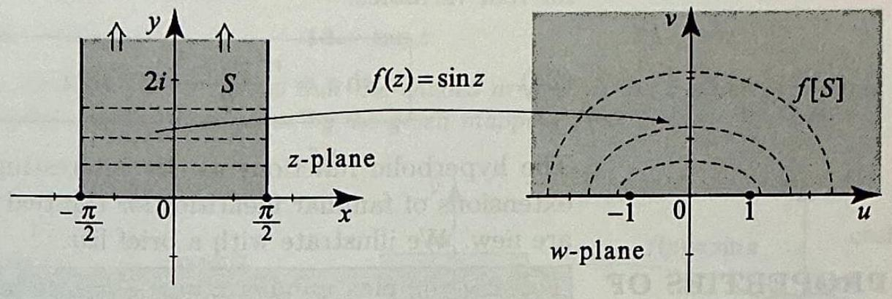
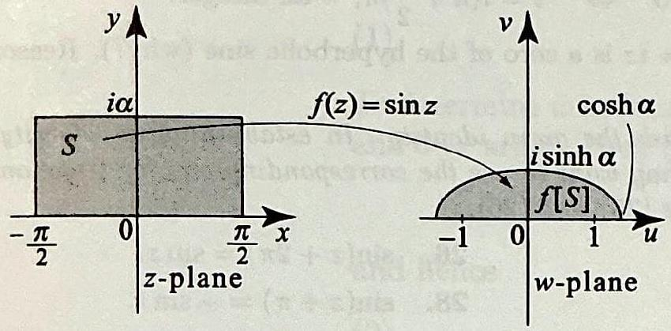
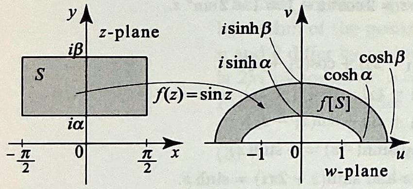
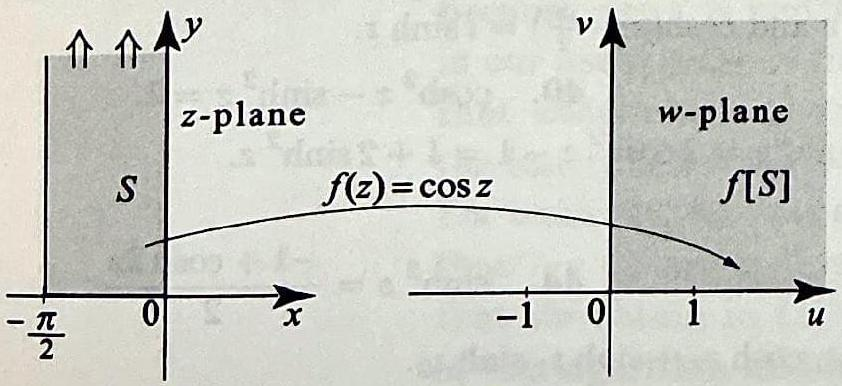
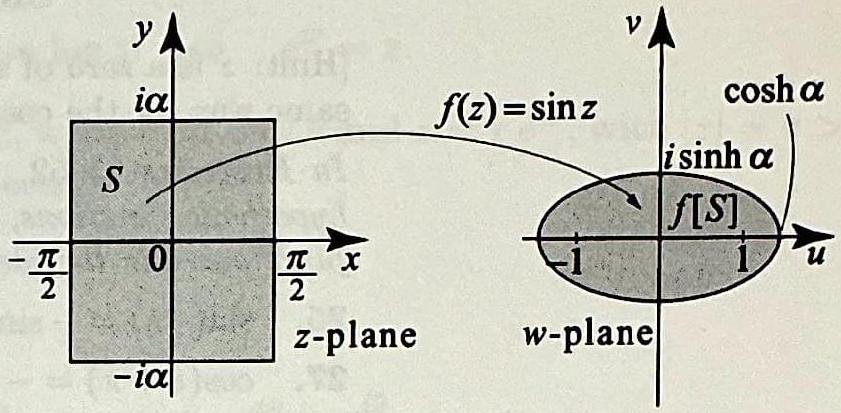
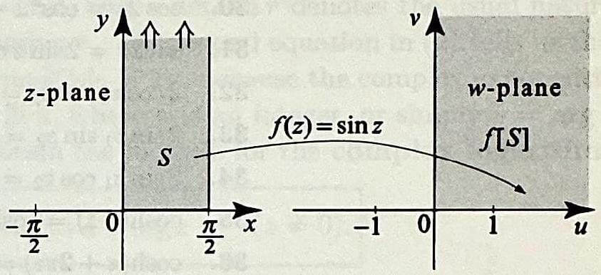
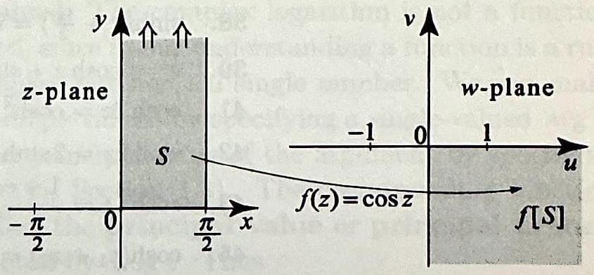

# 1.6 Trigonometric and Hyperbolic Functions

In the previous section, we defined the complex exponential function $e^{z}$ as an extension of the real exponential function $e^{x}$. The function $e^{x}$ is one of the so-called elementary functions from calculus. Elementary functions comprise
among other functions the trigonometric functions, the hyperbolic functions, the logarithmic functions, and raising numbers to powers. Our goal in this and the following section is to extend some of the elementary functions to complex numbers and study their basic properties. These new functions will provide us with ample examples to test the theory of derivatives and integrals that will be presented in the following chapters.

## Trigonometric Functions

Let $\theta$ be any real number. Using Euler's identity, we showed in Section 1.5, (16) and (17), that
(1)

$$
\cos \theta=\frac{e^{i \theta}+e^{-i \theta}}{2} \text { and } \sin \theta=\frac{e^{i \theta}-e^{-i \theta}}{2 i} .
$$

Motivated by these identities, we define the complex cosine and sine functions for all complex numbers $z$ by the formulas

$$
\cos z=\frac{e^{i z}+e^{-i z}}{2}
$$

and

$$
\sin z=\frac{e^{i z}-e^{-i z}}{2 i}
$$

You should keep in mind that these are new functions, even though they are named after familiar functions. As you will soon see, they share similar properties with the usual cosine and sine functions, but they assume complex values and are not bounded in absolute value.

## EXAMPLE 1 Finding $\cos z$ and $\sin z$

(a) Compute $\cos (2+i \pi)$.
(b) Compute $\sin \left(i \frac{5 \pi}{4}\right)$.

Solution We use the definitions. For (a), we have from (2),

$$
\begin{aligned}
\cos (2+i \pi) & =\frac{1}{2}\left(e^{i(2+i \pi)}+e^{-i(2+i \pi)}\right) \\
& =\frac{1}{2}\left(e^{-\pi+2 i}+e^{\pi-2 i}\right)=\frac{1}{2}\left(e^{-\pi} e^{2 i}+e^{\pi} e^{-2 i}\right) \\
& =\frac{1}{2}\left(e^{-\pi}[\cos (2)+i \sin (2)]+e^{\pi}[\cos (2)-i \sin (2)]\right) \\
& =\cos (2) \frac{e^{\pi}+e^{-\pi}}{2}-i \sin (2) \frac{e^{\pi}-e^{-\pi}}{2} \\
& =\cos (2) \cosh \pi-i \sin (2) \sinh \pi
\end{aligned}
$$

where $\cosh \pi$ and $\sinh \pi$ are the real hyperbolic functions evaluated at $\pi$.

PROPERTIES OF TRIGONOMETRIC FUNCTIONS

For (b), we use (3) and proceed in a similar way:

$$
\begin{aligned}
\sin \left(i \frac{5 \pi}{4}\right) & =\frac{1}{2 i}\left(e^{i\left(i \frac{5 \pi}{4}\right)}-e^{-i\left(i \frac{5 \pi}{4}\right)}\right) \\
& =\frac{-i}{2}\left(e^{-\frac{5 \pi}{4}}-e^{\frac{5 \pi}{4}}\right)=i \sinh \left(\frac{5 \pi}{4}\right)
\end{aligned}
$$

The appearance of the hyperbolic functions in the expressions of the real and imaginary parts of the complex cosine and sine functions was not a coincidence. In fact, general formulas of this nature will be derived later in this section.

A function $f(z)$ is said to be even if $f(z)=f(-z)$ and odd if $f(-z)= -f(z)$, for all $z$ in the domain of definition of $f$. We can show from their definitions that the cosine is even while the sine is odd; also, both of them are $2 \pi$-periodic. In fact, the complex trigonometric functions satisfy many identities that we are familiar with for real trigonometric functions.

Let $z=x+i y$ be a complex number. Then

$$
\begin{array}{cc}
\cos (-z)=\cos z, & \sin (-z)=-\sin z \\
\cos (z+2 \pi)=\cos z & \sin (z+2 \pi)=\sin z \\
\sin \left(z+\frac{\pi}{2}\right)=\cos z \\
e^{i z}=\cos z+i \sin z \\
\cos ^{2} z+\sin ^{2} z=1
\end{array}
$$

Proof To prove the first identity in (4), we appeal to (2):

$$
\cos (-z)=\frac{e^{i(-z)}+e^{-i(-z)}}{2}=\frac{e^{-i z}+e^{i z}}{2}=\frac{e^{i z}+e^{-i z}}{2}=\cos z .
$$

The second identity in (4) is proved similarly by appealing to (3) (Exercise 25). In proving (5), we will use the fact that $e^{ \pm 2 \pi i}=1$. We have

$$
\cos (z+2 \pi)=\frac{e^{i(z+2 \pi)}+e^{-i(z+2 \pi)}}{2}=\frac{e^{i z} e^{2 \pi i}+e^{-i z} e^{-2 \pi i}}{2}=\frac{e^{i z}+e^{-i z}}{2}=\cos z
$$

This proves the first identity in (5). The proof of second the identity in (5) is similar (Exercise 26). To prove (6), we calculate

$$
\sin \left(z+\frac{\pi}{2}\right)=\frac{e^{i(z+\pi / 2)}-e^{-i(z+\pi / 2)}}{2 i}=\frac{i e^{i z}-(-i) e^{-i z}}{2 i}=\cos z
$$

You should recognize (7) as Euler's identity (5), Section 1.3, where we have replaced the real argument $\theta$ by a complex argument $z$. To prove (7), we simply multiply (2) by 2 and (3) by $2 i$ and add the resulting identities.

Identity (8) is the analog of the famous Pythagorean identity relating the real cosine and sine functions. We prove it with a trick based on the complex exponential function, which emphasizes the relationships between the trigonometric and
exponential functions. Using (7), we have

$$
1=e^{i z} e^{-i z}=\overbrace{(\cos z+i \sin z)}^{e^{i z}} \overbrace{(\cos z-i \sin z)}^{e^{-i z}}=\cos ^{2} z+\sin ^{2} z .
$$

The familiar angle-addition and half-angle formulas also apply to the complex cosine and sine.

## TRIGONOMETRIC IDENTITIES

Let $z, z_{1}, z_{2}$ be a complex numbers. Then

$$
\begin{gathered}
\cos \left(z_{1}+z_{2}\right)=\cos z_{1} \cos z_{2}-\sin z_{1} \sin z_{2} \\
\sin \left(z_{1}+z_{2}\right)=\sin z_{1} \cos z_{2}+\cos z_{1} \sin z_{2} \\
\cos ^{2} z=\frac{1+\cos (2 z)}{2} \\
\sin ^{2} z=\frac{1-\cos (2 z)}{2}
\end{gathered}
$$

Proof Expanding the right side of (9), it equals

$$
\frac{\left(e^{i z_{1}}+e^{-i z_{1}}\right)\left(e^{i z_{2}}+e^{-i z_{2}}\right)}{2^{2}}-\frac{\left(e^{i z_{1}}-e^{-i z_{1}}\right)\left(e^{i z_{2}}-e^{-i z_{2}}\right)}{(2 i)^{2}} .
$$

Expanding the numerators and adding the fractions, all terms in $e^{i\left(z_{1}-z_{2}\right)}$ and $e^{i\left(z_{2}-z_{1}\right)}$ cancel and we are left with $\frac{2 e^{i\left(z_{1}+z_{2}\right)}+2 e^{-i\left(z_{1}+z_{2}\right)}}{4}$, which is the same as $\cos \left(z_{1}+z_{2}\right)$. The proof of (10) is similar. Now, setting $z_{1}=z_{2}=z$ in (9) yields

$$
\cos 2 z=\cos ^{2} z-\sin ^{2} z .
$$

Replacing $\sin ^{2} z$ by $1-\cos ^{2} z$, we conclude (11). Replacing $\cos ^{2} z$ by $1-\sin ^{2} z$, we conclude (12). $\square$

Up to this point our statements about the complex trigonometric functions have been no different than those statements for real trigonometric functions. Now we show how they can behave differently. From (2), we have, for any real $y$,

$$
\cos (i y)=\frac{e^{i(i y)}+e^{-i(i y)}}{2}=\frac{e^{y}+e^{-y}}{2}=\cosh y
$$

and

$$
\sin (i y)=\frac{e^{i(i y)}-e^{-i(i y)}}{2 i}=i \frac{e^{y}-e^{-y}}{2}=i \sinh y,
$$

where $\cosh y$ and $\sinh y$ are the real hyperbolic functions from calculus. We are now in a position to express $\cos z$ and $\sin z$ in terms of their real and
imaginary parts, and also to compute their moduli.

REAL AND IMAGINARY PARTS AND MODULI OF TRIGONOMETRIC FUNCTIONS

Let $z=x+i y$ be a complex number. Then

$$
\begin{gathered}
\cos z=\cos x \cosh y-i \sin x \sinh y \\
\sin z=\sin x \cosh y+i \cos x \sinh y \\
|\cos z|=\sqrt{\cos ^{2} x+\sinh ^{2} y} \\
|\sin z|=\sqrt{\sin ^{2} x+\sinh ^{2} y}
\end{gathered}
$$

Proof To prove (15), we appeal to (9) and (13)-(14) and write

$$
\begin{aligned}
\cos z & =\cos (x+i y) \\
& =\cos x \cos (i y)-\sin x \sin (i y) \\
& =\cos x \cosh y-i \sin x \sinh y
\end{aligned}
$$

The proof of (16) is similar and is left to Exercise 21. To prove (17), we use (15) and the definition of the modulus of a complex number ((1), Section 1.2). We also use the identity $\cosh ^{2} y-\sinh ^{2} y=1$ for real hyperbolic functions. We get

$$
\begin{aligned}
|\cos z|^{2} & =\cos ^{2} x \cosh ^{2} y+\sin ^{2} x \sinh ^{2} y \\
& =\cos ^{2} x\left(1+\sinh ^{2} y\right)+\sin ^{2} x \sinh ^{2} y \\
& =\cos ^{2} x+\sinh ^{2} y\left(\cos ^{2} x+\sin ^{2} x\right) \\
& =\cos ^{2} x+\sinh ^{2} y
\end{aligned}
$$

The proof of (18) is similar and is left to Exercise 21.
The following example is intended to show you that, unlike $\cos x$ and $\sin x$, the complex functions $\cos z$ and $\sin z$ are not bounded.

EXAMPLE $2 \cos z$ and $\sin z$ are not bounded
Show that $\cos z$ and $\sin z$ are not bounded over the complex plane.
Solution For $z=x+i y$, using (17), we obtain $|\cos z|=\sqrt{\cos ^{2} x+\sinh ^{2} y} \geq \sqrt{\sinh ^{2} y}=|\sinh y|$. Similarly, using (18), we obtain $|\sin z|=\sqrt{\sin ^{2} x+\sinh ^{2} y} \geq \sqrt{\sinh ^{2} y}=|\sinh y|$. As $y \rightarrow \infty$, we have $\sinh y \rightarrow \infty$; and as $y \rightarrow-\infty$, we have $\sinh y \rightarrow-\infty$. Hence $|\cos z|$ and $|\sin z|$ blow up to infinity as $|\operatorname{Im} z|$ tends to infinity.

## EXAMPLE 3 Zeros of the sine and cosine

(a) Show that $\sin z=0 \Leftrightarrow z=k \pi$, for some integer $k$.
(b) Show $\cos z=0 \Leftrightarrow z=\frac{\pi}{2}+k \pi$, for some integer $k$.

Thus $\cos z$ and $\sin z$ have the same zeros as their real counterparts, $\cos x$ and $\sin x$.
Solution (a) Suppose that $z=x+i y$ is a point in the plane and that $\sin z=0$. We know then that $|\sin z|=0$, so by (18) we have $\sin x=0$ and $\sinh y=0$. The real function $\sinh y$ equals zero $\Leftrightarrow y=0$, and the real function $\sin x$ equals zero $\Leftrightarrow x=k \pi$ for some integer $k$. Hence (a) holds.
(b) Now that we have the zeros of the sine, we can easily find the zeros of the cosine using (6). We have

$$
\begin{aligned}
\cos z=0 & \Leftrightarrow \sin \left(z+\frac{\pi}{2}\right)=0 \\
& \Leftrightarrow z+\frac{\pi}{2}=k \pi, \text { for some integer } k \\
& \Leftrightarrow z=-\frac{\pi}{2}+k \pi, \text { for some integer } k
\end{aligned}
$$

Replacing $k$ by $k+1$, we obtain (b).
In our next example, we consider a mapping by the function $\sin z$.

## EXAMPLE 4 The mapping $w=\sin z$

Find the image under the mapping $f(z)=\sin z$ of the semi-infinite strip

$$
S=\left\{z=x+i y:-\frac{\pi}{2} \leq x \leq \frac{\pi}{2}, y \geq 0\right\}
$$

Solution As in previous examples of mappings, we will first find the image under $f$ of a simple curve in the domain of definition, often a line segment or line. Then we will sweep the domain of definition with this curve and keep track of the area that is swept by the image. Fix $0 \leq y_{0}<\infty$ and consider the horizontal line segment $E F$ defined by: $y=y_{0},-\frac{\pi}{2} \leq x \leq \frac{\pi}{2}$. Let $u+i v$ denote the image of a point $z=x+i y_{0}$ on $E F$. Using (16), we get

$$
u+i v=\sin \left(x+i y_{0}\right)=\sin x \cosh y_{0}+i \cos x \sinh y_{0}
$$

Hence

$$
u=\sin x \cosh y_{0} \quad \text { and } \quad v=\cos x \sinh y_{0}
$$

If $y_{0}=0$, we see that $v=0$ and $u=\sin x$, which shows that the image of the interval $-\frac{\pi}{2} \leq x \leq \frac{\pi}{2}$ under the mapping $\sin z$ is the interval $-1 \leq u \leq 1$. The case $y_{0}>0$ is more interesting. In this case, we have

$$
\frac{u}{\cosh y_{0}}=\sin x \quad \text { and } \quad \frac{v}{\sinh y_{0}}=\cos x
$$

Note that $v \geq 0$ because $\cos x \geq 0$ for $-\frac{\pi}{2} \leq x \leq \frac{\pi}{2}$. Squaring both equations in (19) then adding them, we get

$$
\left(\frac{u}{\cosh y_{0}}\right)^{2}+\left(\frac{v}{\sinh y_{0}}\right)^{2}=\sin ^{2} x+\cos ^{2} x=1
$$

Hence as $x$ varies in the interval $-\frac{\pi}{2} \leq x \leq \frac{\pi}{2}$, the point $(u, v)$ traces the upper semi-ellipse

$$
\left(\frac{u}{\cosh y_{0}}\right)^{2}+\left(\frac{v}{\sinh y_{0}}\right)^{2}=1, \quad v \geq 0
$$

The $u$-intercepts of the ellipse are at $u= \pm \cosh y_{0}$ and the $v$-intercept is at $v= \sinh y_{0}$. As $y_{0} \rightarrow \infty, \cosh y_{0}$ and $\sinh y_{0}$ tend to $\infty$. And as $y_{0} \rightarrow 0, \sinh y_{0} \rightarrow 0$ and $\cosh y_{0} \rightarrow 1$. So, as $y_{0}$ varies in the interval $0<y_{0}<\infty$, the upper semi-ellipses ${ }^{\text {fill }}$

Figure 1 The mapping $w= \sin z$ takes the horizontal line segment $y=y_{0}>0,-\frac{\pi}{2} \leq x \leq \frac{\pi}{2}$ onto the upper semiellipse

$$
\left(\frac{u}{\cosh y_{0}}\right)^{2}+\left(\frac{v}{\sinh y_{0}}\right)^{2}=1,
$$

$v \geq 0$.

OTHER TRIGONOMETRIC FUNCTIONS
the upper half $w$-plane $v \geq 0$, including the $u$-axis (Figure 1). You should verify (Exercise 23) that the boundary of $S$ gets mapped to the boundary of $f[S]$, namely, the $u$-axis. $\square$

The other trigonometric functions are defined for complex variables in terms of the cosine and sine in accordance with the real definitions.

With $\cos z=\frac{e^{i z}+e^{-i z}}{2}$ and $\sin z=\frac{e^{i z}-e^{-i z}}{2 i}$, the other trigonometric functions are defined by

$$
\begin{aligned}
& \tan z=\frac{\sin z}{\cos z}(\cos z \neq 0) \\
& \cot z=\frac{\cos z}{\sin z}(\sin z \neq 0)
\end{aligned}
$$

$$
\sec z=\frac{1}{\cos z}(\cos z \neq 0)
$$

$$
\csc z=\frac{1}{\sin z}(\sin z \neq 0)
$$

Like the complex cosine and sine functions, these functions share several properties with their real counterparts. The following is one illustration.

## EXAMPLE $5 \tan z$ is $\pi$-periodic

Show that $\tan z_{1}=\tan z_{2}$ if and only if $z_{1}=z_{2}+k \pi$, where $k$ is an integer.
Solution Note that $\tan z$ is not defined for $z=\frac{\pi}{2}+k \pi$. For $z_{1}, z_{2} \neq \frac{\pi}{2}+k \pi$, we have

$$
\begin{aligned}
\tan z_{1}=\tan z_{2} & \Leftrightarrow \frac{\sin z_{1}}{\cos z_{1}}=\frac{\sin z_{2}}{\cos z_{2}} \\
& \Leftrightarrow \sin z_{1} \cos z_{2}-\cos z_{1} \sin z_{2}=0 \\
& \Leftrightarrow \sin \left(z_{1}-z_{2}\right)=0 \quad \text { (use (10) with } z_{2} \text { replaced by }\left(-z_{2}\right) \text { ) } \\
& \Leftrightarrow z_{1}-z_{2}=k \pi \quad \Leftrightarrow \quad z_{1}=z_{2}+k \pi,
\end{aligned}
$$

where the step before last follows from Example 3(a).

## Hyperbolic Functions

We define the hyperbolic functions for complex variables exactly as we do for real variables:

$$
\cosh z=\frac{e^{z}+e^{-z}}{2} \quad \text { and } \quad \sinh z=\frac{e^{z}-e^{-z}}{2}
$$

The hyperbolic functions satisfy interesting identities. Some of them are extensions of familiar identities for the real hyperbolic functions, and some are new. We illustrate with a brief list.

PROPERTIES OF HYPERBOLIC FUNCTIONS

For any complex number $z=x+i y$, we have

$$
\begin{gathered}
\cosh i z=\cos z \\
\sinh i z=i \sin z \\
\cosh ^{2} z-\sinh ^{2} z=1 \\
=\cosh x \cos y+i \sinh x \sin y \\
=\sinh x \cos y+i \cosh x \sin y
\end{gathered}
$$

These and many more identities (Exercises 35-52) can be proved from the definitions (24). Finally, we define the other hyperbolic functions in terms of $\cosh z$ and $\sinh z$.

OTHER HYPERBOLIC FUNCTIONS

With $\cosh z=\frac{e^{z}+e^{-z}}{2}$ and $\sinh z=\frac{e^{z}-e^{-z}}{2}$, the other hyperbolic functions are defined by

$$
\tanh z=\frac{\sinh z}{\cosh z}(\cosh z \neq 0)
$$

$$
\operatorname{sech} z=\frac{1}{\cosh z}(\cosh z \neq 0)
$$

$$
\operatorname{csch} z=\frac{1}{\sinh z}(\sinh z \neq 0)
$$

$$
\operatorname{coth} z=\frac{\cosh z}{\sinh z}(\sinh z \neq 0)
$$

## Exercises 1.6

In Exercises 1-4, (a) evaluate $\cos z$ and $\sin z$ for the given $z$, using the definitions (2) and (3). (b) Verify that your answers satisfy (15) and (16).

1. $i$.
2. $-2 i$.
3. $\frac{\pi}{2}+2 i$.
4. $\pi-i$.

In Exercises 5-8, for the given $z$, (a) evaluate $\cos z$, $\sin z$, and $\tan z$, using (15) and (16). (b) Compute $|\cos z|$ and $|\sin z|$. (c) Plot the points $\cos z$, $\sin z$, and $\tan z$.
5. $1+i$.
6. $1-i$.
7. $\frac{3 \pi}{2}+i$.
8. $\frac{\pi}{6}-i$.

In Exercises 9-14, express the given function $f(z)$ in the form $f(z)=u(x, y)+ i v(x, y)$, where $u$ and $v$ are the real and imaginary parts of $f(z)$.
9. $\sin (2 z)$.
10. $\cos \left(z^{2}\right)$.
11. $\sin (z)+2 z$.
12. $z \cos z$.
13. $\tan z$.
14. $\sec z$.

In Exercises 15-20, show that the shaded area $S$ in the $z$-plane is mapped to the shaded area in the $w$-plane by the given mapping $f(z)$.
15.

Figure 2

17. 

Figure 4

19. 

Figure 6

16. 

Figure 3

18. 

Figure 5

20. 

Figure 7

21. Establish (16) and (18).
22. Explain why $\cos z$ and $\sin z$ are not bounded in absolute value.
23. More on Example 4. In this exercise, we study further the mapping $f(z)=\sin z$ of Example 4.
(a) Show that the half-line $x=\frac{\pi}{2}, y \geq 0$, is mapped to the half-line $u \geq 1, v=0$.
(b) Show that the half-line $x=\frac{-\pi}{2}$ is mapped to the half-line $u \leq-1, v=0$.
(c) Conclude that the boundary of the set $S$ in Example 4 is mapped to the boundary of the set $f[S]$.
(d) Recall from your calculus course that an ellipse of the form $\frac{x^{2}}{a^{2}}+\frac{y^{2}}{b^{2}}=1$ with $0<b<a$ has its foci at $x= \pm \sqrt{a^{2}-b^{2}}$. Show that all the ellipses in Example 4 have the same foci located on the $u$-axis at $u= \pm 1$.
24. Zeros of hyperbolic functions. Show that

$$
\sinh z=0 \quad \Leftrightarrow \quad z=i k \pi, k \text { an integer; }
$$

and

$$
\cosh z=0 \quad \Leftrightarrow \quad z=i\left(k+\frac{1}{2}\right) \pi, k \text { an integer. }
$$

[Hint: $z$ is a zero of $\sin z \Leftrightarrow i z$ is a zero of the hyperbolic sine (why?). Reason the same way for the cosine.]
In Exercises 25-52, establish the given identity. In establishing an identity with hyperbolic functions, you may want to use the corresponding one for trigonometric functions and the identities (25) and (26).
25. $\sin (-z)=-\sin z$.
26. $\sin (z+2 \pi)=\sin z$.
27. $\cos (z+\pi)=-\cos z$.
28. $\sin (z+\pi)=-\sin z$.
29. $\sin \left(z_{1}+z_{2}\right)=\sin z_{1} \cos z_{2}+\cos z_{1} \sin z_{2}$.
30. $\cos 2 z=\cos ^{2} z-\sin ^{2} z=2 \cos ^{2} z-1=1-2 \sin ^{2} z$.
31. $\sin 2 z=2 \sin z \cos z$.
32. $2 \cos z_{1} \cos z_{2}=\cos \left(z_{1}-z_{2}\right)+\cos \left(z_{1}+z_{2}\right)$.
33. $2 \sin z_{1} \sin z_{2}=\cos \left(z_{1}-z_{2}\right)-\cos \left(z_{1}+z_{2}\right)$.
34. $2 \sin z_{1} \cos z_{2}=\sin \left(z_{1}+z_{2}\right)+\sin \left(z_{1}-z_{2}\right)$.
35. $\cosh (-z)=\cosh z$ and $\sinh (-z)=-\sinh z$.
36. $\cosh (z+2 \pi i)=\cosh z$ and $\sinh (z+2 \pi i)=\sinh z$.
37. $\cosh (z+\pi i)=-\cosh z$ and $\sinh (z+\pi i)=-\sinh z$.
38. $\sinh \left(z+\frac{i \pi}{2}\right)=i \cosh z$ and $\cosh \left(z+\frac{i \pi}{2}\right)=i \sinh z$.
39. $e^{z}=\cosh z+\sinh z$. 40. $\cosh ^{2} z-\sinh ^{2} z=1$.
41. $\cosh 2 z=\cosh ^{2} z+\sinh ^{2} z=2 \cosh ^{2} z-1=1+2 \sinh ^{2} z$.
42. $\sinh 2 z=2 \sinh z \cosh z$.
43. $\cosh ^{2} z=\frac{1+\cosh 2 z}{2}$.
44. $\sinh ^{2} z=\frac{-1+\cosh 2 z}{2}$.
45. $\cosh \left(z_{1}+z_{2}\right)=\cosh z_{1} \cosh z_{2}+\sinh z_{1} \sinh z_{2}$.
46. $\sinh \left(z_{1}+z_{2}\right)=\sinh z_{1} \cosh z_{2}+\cosh z_{1} \sinh z_{2}$.
47. $2 \cosh z_{1} \cosh z_{2}=\cosh \left(z_{1}+z_{2}\right)+\cosh \left(z_{1}-z_{2}\right)$.
48. $2 \sinh z_{1} \sinh z_{2}=\cosh \left(z_{1}+z_{2}\right)-\cosh \left(z_{1}-z_{2}\right)$.
49. $2 \sinh z_{1} \cosh z_{2}=\sinh \left(z_{1}+z_{2}\right)+\sinh \left(z_{1}-z_{2}\right)$.
50. $\cosh z=\cosh x \cos y+i \sinh x \sin y$, and $\sinh z=\sinh x \cos y+i \cosh x \sin y$.
51. $|\cosh z|=\sqrt{\sinh ^{2} x+\cos ^{2} y}$.
52. $|\sinh z|=\sqrt{\sinh ^{2} x+\sin ^{2} y}$.
53. Show that either $\tan z=i$ or $\tan z=-i$ has no solution. [Hint: Use (15) and (16).]
