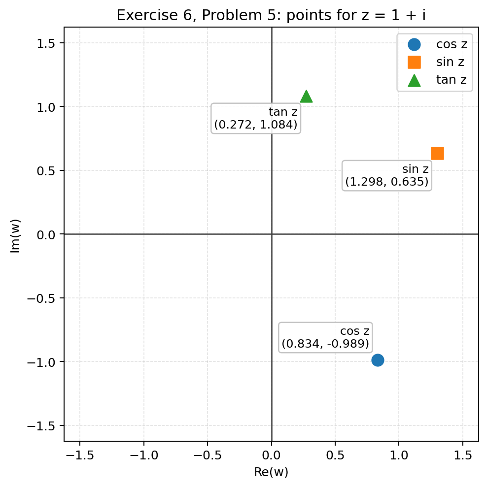
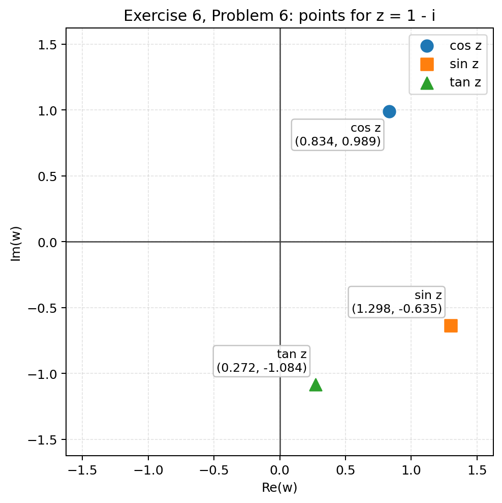
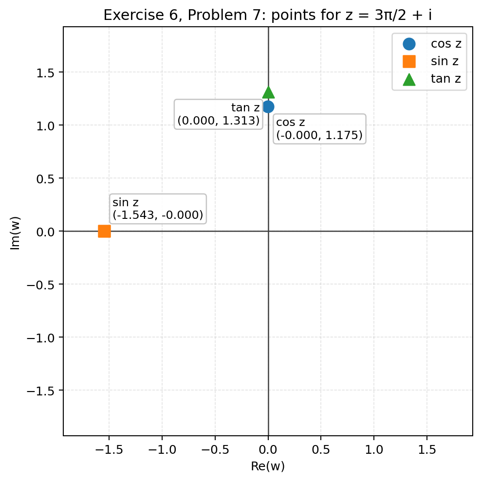
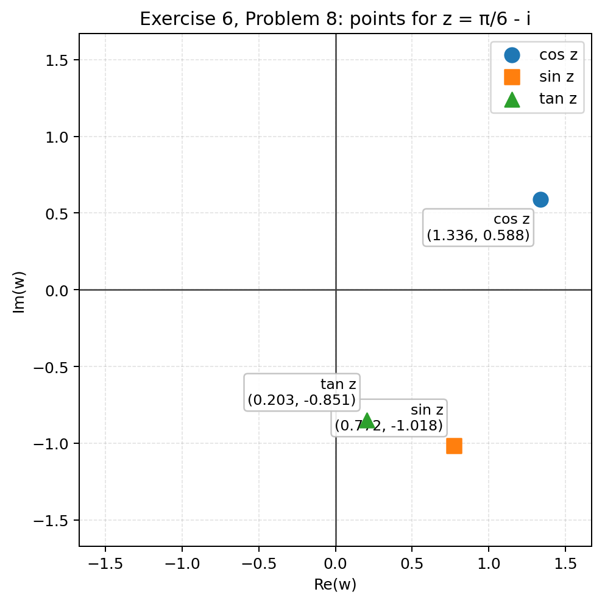

# 1.6 Trigonometric and Hyperbolic Functions

In the previous section, we defined the complex exponential function $e^{z}$ as an extension of the real exponential function $e^{x}$. The function $e^{x}$ is one of the so-called elementary functions from calculus. Elementary functions comprise
among other functions the trigonometric functions, the hyperbolic functions, the logarithmic functions, and raising numbers to powers. Our goal in this and the following section is to extend some of the elementary functions to complex numbers and study their basic properties. These new functions will provide us with ample examples to test the theory of derivatives and integrals that will be presented in the following chapters.


## 1.6.1 Trigonometric Functions


> [!review] Trigonometric Functions
> 1. Starting from Euler's formula for real $\theta$, derive expressions for $\cos \theta$ and $\sin \theta$ in terms of $e^{i \theta}$ and $e^{-i \theta}$. Use these identities to motivate definitions of $\cos z$ and $\sin z$ for complex $z$, and explain why those definitions agree with the usual real-valued sine and cosine when $z \in \mathbb{R}$.
> 2. $\cos z$ and $\sin z$ are not bounded in absolute value. In what two respects does this mark a departure from their real counterparts, and which feature of the complex exponential is responsible?


##### problem 1

Start with Euler's formula for real $\theta$:

$$
\begin{aligned}
e^{i \theta}
&=\cos \theta+i \sin \theta .
\end{aligned}
$$

Replace $\theta$ by $-\theta$. Since cosine is even and sine is odd on the real line,

$$
\begin{aligned}
e^{-i \theta}
&=\cos (-\theta)+i \sin (-\theta) \\
&=\cos \theta-i \sin \theta .
\end{aligned}
$$

Now add the two equations:

$$
\begin{aligned}
e^{i \theta}+e^{-i \theta}
&=(\cos \theta+i \sin \theta)+(\cos \theta-i \sin \theta) \\
&=\cos \theta+i \sin \theta+\cos \theta-i \sin \theta \\
&=\cos \theta+\cos \theta+i \sin \theta-i \sin \theta \\
&=2 \cos \theta,
\end{aligned}
$$

so

$$
\begin{aligned}
\cos \theta
&=\frac{e^{i \theta}+e^{-i \theta}}{2} .
\end{aligned}
$$

Next subtract:

$$
\begin{aligned}
e^{i \theta}-e^{-i \theta}
&=(\cos \theta+i \sin \theta)-(\cos \theta-i \sin \theta) \\
&=\cos \theta+i \sin \theta-\cos \theta+i \sin \theta \\
&=\cos \theta-\cos \theta+i \sin \theta+i \sin \theta \\
&=2 i \sin \theta,
\end{aligned}
$$

so

$$
\begin{aligned}
\sin \theta
&=\frac{e^{i \theta}-e^{-i \theta}}{2 i} .
\end{aligned}
$$

These formulas motivate the complex definitions because the exponential function has already been defined for every complex number $z$. The most natural extension is therefore to keep the same algebraic formulas and define

$$
\cos z=\frac{e^{i z}+e^{-i z}}{2}
\quad \text{and} \quad
\sin z=\frac{e^{i z}-e^{-i z}}{2 i}
$$

for all complex $z$. This is natural because it extends the real formulas without changing their form and lets sine and cosine inherit their basic structure from the exponential function.

These definitions agree with the usual real-valued sine and cosine on $\mathbb{R}$ because if $z=\theta$ is real, then

$$
\begin{aligned}
\cos z
&=\frac{e^{i z}+e^{-i z}}{2} \\
&=\frac{e^{i \theta}+e^{-i \theta}}{2} \\
&=\cos \theta,
\end{aligned}
$$

and

$$
\begin{aligned}
\sin z
&=\frac{e^{i z}-e^{-i z}}{2 i} \\
&=\frac{e^{i \theta}-e^{-i \theta}}{2 i} \\
&=\sin \theta .
\end{aligned}
$$

So the complex definitions genuinely extend, rather than replace, the ordinary real sine and cosine.


##### problem 2

For real variables, cosine and sine have two familiar features: they are real-valued, and they are bounded by $1$ in absolute value. For complex variables, both features fail. In general, $\cos z$ and $\sin z$ can be genuinely complex numbers, and they are not bounded in absolute value.

To see the source of this change, write

$$
z=x+i y .
$$

Then

$$
\begin{aligned}
i z
&=i(x+i y) \\
&=i x+i^{2} y \\
&=i x-y,
\end{aligned}
$$

and

$$
\begin{aligned}
-i z
&=-i(x+i y) \\
&=-i x-i^{2} y \\
&=-i x+y .
\end{aligned}
$$

Hence

$$
\begin{aligned}
e^{i z}
&=e^{i x-y} \\
&=e^{-y} e^{i x},
\end{aligned}
$$

so

$$
|e^{i z}|=e^{-y},
$$

and similarly

$$
\begin{aligned}
e^{-i z}
&=e^{-i x+y} \\
&=e^{y} e^{-i x},
\end{aligned}
$$

so

$$
|e^{-i z}|=e^{y} .
$$

The crucial point is that when $z$ is not real, the exponents $i z$ and $-i z$ are not purely imaginary; they have real parts $-y$ and $y$. That introduces the factors $e^{-y}$ and $e^{y}$, which can become arbitrarily large.

This is already visible on the imaginary axis. If $z=i y$, then

$$
\begin{aligned}
\cos (i y)
&=\frac{e^{i(i y)}+e^{-i(i y)}}{2} \\
&=\frac{e^{-y}+e^{y}}{2},
\end{aligned}
$$

so

$$
\cos (i y)=\cosh y,
$$

and

$$
\begin{aligned}
\sin (i y)
&=\frac{e^{i(i y)}-e^{-i(i y)}}{2 i} \\
&=\frac{e^{-y}-e^{y}}{2 i} \\
&=i \frac{e^{y}-e^{-y}}{2},
\end{aligned}
$$

so

$$
\sin (i y)=i \sinh y .
$$

Therefore

$$
|\cos (i y)|=\cosh y \to \infty
\quad \text{and} \quad
|\sin (i y)|=|\sinh y| \to \infty
\quad \text{as } |y| \to \infty .
$$

So the departure from the real case is that the complex sine and cosine are not confined to real values and are not bounded in magnitude, and the reason is the exponential growth coming from the real parts of $i z$ and $-i z$.


> [!exercise] Exercise 1: Finding $\cos z$ and $\sin z$
> (a) Compute $\cos (2+i \pi)$.
> (b) Compute $\sin \left(i \frac{5 \pi}{4}\right)$.


##### problem 1.a

$$
\begin{aligned}
\cos (2+i \pi)
&=\frac{e^{i(2+i \pi)}+e^{-i(2+i \pi)}}{2} \\
&=\frac{e^{2 i-\pi}+e^{-2 i+\pi}}{2} \\
&=\frac{e^{-\pi} e^{2 i}+e^{\pi} e^{-2 i}}{2} \\
&=\frac{e^{-\pi}(\cos 2+i \sin 2)+e^{\pi}(\cos 2-i \sin 2)}{2} \\
&=\frac{e^{-\pi} \cos 2+i e^{-\pi} \sin 2+e^{\pi} \cos 2-i e^{\pi} \sin 2}{2} \\
&=\frac{(e^{-\pi}+e^{\pi}) \cos 2+i(e^{-\pi}-e^{\pi}) \sin 2}{2} \\
&=\frac{e^{\pi}+e^{-\pi}}{2} \cos 2-i \frac{e^{\pi}-e^{-\pi}}{2} \sin 2 \\
&=\cos 2 \cosh \pi-i \sin 2 \sinh \pi .
\end{aligned}
$$


##### problem 1.b

$$
\begin{aligned}
\sin \left(i \frac{5 \pi}{4}\right)
&=\frac{e^{i\left(i \frac{5 \pi}{4}\right)}-e^{-i\left(i \frac{5 \pi}{4}\right)}}{2 i} \\
&=\frac{e^{-\frac{5 \pi}{4}}-e^{\frac{5 \pi}{4}}}{2 i} \\
&=\frac{-\left(e^{\frac{5 \pi}{4}}-e^{-\frac{5 \pi}{4}}\right)}{2 i} \\
&=i \frac{e^{\frac{5 \pi}{4}}-e^{-\frac{5 \pi}{4}}}{2} \\
&=i \sinh \left(\frac{5 \pi}{4}\right) .
\end{aligned}
$$


---


> [!Review] Trigonometric Functions II
> 1. Do the cosine and sine functions, when extended to the complex numbers, preserve evenness and oddness? 
> 2. What is the periodicity of cosine and sine functions when extended to the complex plane? 
> 3. Show that $\cos z$ is a cofunction of $\sin z$.


##### problem 1

The complex cosine remains even, and the complex sine remains odd.

Using the definitions,

$$
\begin{aligned}
\cos (-z)
&=\frac{e^{i(-z)}+e^{-i(-z)}}{2} \\
&=\frac{e^{-i z}+e^{i z}}{2} \\
&=\frac{e^{i z}+e^{-i z}}{2} \\
&=\cos z .
\end{aligned}
$$

So $\cos z$ is even.

Likewise,

$$
\begin{aligned}
\sin (-z)
&=\frac{e^{i(-z)}-e^{-i(-z)}}{2 i} \\
&=\frac{e^{-i z}-e^{i z}}{2 i} \\
&=-\frac{e^{i z}-e^{-i z}}{2 i} \\
&=-\sin z .
\end{aligned}
$$

So $\sin z$ is odd.


##### problem 2

Both complex cosine and complex sine are $2 \pi$-periodic.

For cosine,

$$
\begin{aligned}
\cos (z+2 \pi)
&=\frac{e^{i(z+2 \pi)}+e^{-i(z+2 \pi)}}{2} \\
&=\frac{e^{i z+2 \pi i}+e^{-i z-2 \pi i}}{2} \\
&=\frac{e^{i z} e^{2 \pi i}+e^{-i z} e^{-2 \pi i}}{2} \\
&=\frac{e^{i z}\cdot 1+e^{-i z}\cdot 1}{2} \\
&=\frac{e^{i z}+e^{-i z}}{2} \\
&=\cos z .
\end{aligned}
$$

For sine,

$$
\begin{aligned}
\sin (z+2 \pi)
&=\frac{e^{i(z+2 \pi)}-e^{-i(z+2 \pi)}}{2 i} \\
&=\frac{e^{i z+2 \pi i}-e^{-i z-2 \pi i}}{2 i} \\
&=\frac{e^{i z} e^{2 \pi i}-e^{-i z} e^{-2 \pi i}}{2 i} \\
&=\frac{e^{i z}\cdot 1-e^{-i z}\cdot 1}{2 i} \\
&=\frac{e^{i z}-e^{-i z}}{2 i} \\
&=\sin z .
\end{aligned}
$$

So extending sine and cosine to the complex plane does not change their basic period: each still has period $2 \pi$.


##### problem 3

To show that $\cos z$ is a cofunction of $\sin z$, we prove

$$
\sin \left(z+\frac{\pi}{2}\right)=\cos z .
$$

Starting from the definition of sine,

$$
\begin{aligned}
\sin \left(z+\frac{\pi}{2}\right)
&=\frac{e^{i\left(z+\frac{\pi}{2}\right)}-e^{-i\left(z+\frac{\pi}{2}\right)}}{2 i} \\
&=\frac{e^{i z+i \frac{\pi}{2}}-e^{-i z-i \frac{\pi}{2}}}{2 i} \\
&=\frac{e^{i z} e^{i \frac{\pi}{2}}-e^{-i z} e^{-i \frac{\pi}{2}}}{2 i} \\
&=\frac{e^{i z}(i)-e^{-i z}(-i)}{2 i} \\
&=\frac{i e^{i z}+i e^{-i z}}{2 i} \\
&=\frac{i\left(e^{i z}+e^{-i z}\right)}{2 i} \\
&=\frac{e^{i z}+e^{-i z}}{2} \\
&=\cos z .
\end{aligned}
$$

Thus $\cos z$ is indeed the cofunction of $\sin z$, exactly as in the real-variable case.


---


A function $f(z)$ is said to be even if $f(z)=f(-z)$ and odd if $f(-z)= -f(z)$, for all $z$ in the domain of definition of $f$. We can show from their definitions that the cosine is even while the sine is odd; also, both of them are $2 \pi$-periodic. In fact, the complex trigonometric functions satisfy many identities that we are familiar with for real trigonometric functions.


> [!identity] Properties of Trigonometric Functions
> Let $z=x+i y$ be a complex number. Then
> 
> $$
> \begin{array}{cc}
> \cos (-z)=\cos z, & \sin (-z)=-\sin z \\
> \cos (z+2 \pi)=\cos z & \sin (z+2 \pi)=\sin z \\
> \sin \left(z+\frac{\pi}{2}\right)=\cos z \\
> e^{i z}=\cos z+i \sin z \\
> \cos ^{2} z+\sin ^{2} z=1
> \end{array}
> $$
> 


---

The addition formulas (first two lines) say that if you know how sine and cosine behave on two complex numbers separately, you can determine how they behave on the sum. The


> [!review]
> 1.) If $\sin z_1, \cos z_1, \sin z_2$, and $\cos z_2$ are known, can $\sin \left(z_1+z_2\right)$ and $\cos \left(z_1+z_2\right)$ be determined as in the real case?
> 2.) Do the usual power-reduction identities for $\sin ^2 z$ and $\cos ^2 z$ remain valid for complex numbers?


##### problem 1

The complex addition formulas show that knowing $\sin z_{1}$, $\cos z_{1}$, $\sin z_{2}$, and $\cos z_{2}$ is enough to determine $\sin (z_{1}+z_{2})$ and $\cos (z_{1}+z_{2})$.

Specifically,

$$
\cos \left(z_{1}+z_{2}\right)=\cos z_{1} \cos z_{2}-\sin z_{1} \sin z_{2}
$$

and

$$
\sin \left(z_{1}+z_{2}\right)=\sin z_{1} \cos z_{2}+\cos z_{1} \sin z_{2} .
$$

So if the sine and cosine of the two complex numbers are already known separately, then the sine and cosine of their sum follow directly by substitution into these formulas. In that sense, the same principle from real trigonometry remains valid in the complex plane.


##### problem 2

Yes. The usual power-reduction identities remain valid for complex numbers:

$$
\cos ^{2} z=\frac{1+\cos (2 z)}{2},
\qquad
\sin ^{2} z=\frac{1-\cos (2 z)}{2} .
$$

For cosine, start from the addition formula with $z_{1}=z_{2}=z$:

$$
\begin{aligned}
\cos (2 z)
&=\cos (z+z) \\
&=\cos z \cos z-\sin z \sin z \\
&=\cos ^{2} z-\sin ^{2} z .
\end{aligned}
$$

Using

$$
\cos ^{2} z+\sin ^{2} z=1,
$$

we get

$$
\begin{aligned}
1+\cos (2 z)
&=\left(\cos ^{2} z+\sin ^{2} z\right)+\left(\cos ^{2} z-\sin ^{2} z\right) \\
&=\cos ^{2} z+\sin ^{2} z+\cos ^{2} z-\sin ^{2} z \\
&=\cos ^{2} z+\cos ^{2} z \\
&=2 \cos ^{2} z,
\end{aligned}
$$

so

$$
\cos ^{2} z=\frac{1+\cos (2 z)}{2} .
$$

Similarly,

$$
\begin{aligned}
1-\cos (2 z)
&=\left(\cos ^{2} z+\sin ^{2} z\right)-\left(\cos ^{2} z-\sin ^{2} z\right) \\
&=\cos ^{2} z+\sin ^{2} z-\cos ^{2} z+\sin ^{2} z \\
&=\sin ^{2} z+\sin ^{2} z \\
&=2 \sin ^{2} z,
\end{aligned}
$$

so

$$
\sin ^{2} z=\frac{1-\cos (2 z)}{2} .
$$

So the usual power-reduction formulas from real trigonometry continue to hold in the complex plane.


---


The familiar angle-addition and half-angle formulas also apply to the complex cosine and sine.


> [!identity] Trigonometric Identities
> Let $z, z_{1}, z_{2}$ be a complex numbers. Then
> 
> $$
> \begin{gathered}
> \cos \left(z_{1}+z_{2}\right)=\cos z_{1} \cos z_{2}-\sin z_{1} \sin z_{2} \\
> \sin \left(z_{1}+z_{2}\right)=\sin z_{1} \cos z_{2}+\cos z_{1} \sin z_{2} \\
> \cos ^{2} z=\frac{1+\cos (2 z)}{2} \\
> \sin ^{2} z=\frac{1-\cos (2 z)}{2}
> \end{gathered}
> $$
> 


> [!review]
>  1. What happens when you evaluate $\cos z$ and $\sin z$ at a purely imaginary input $z=i y$ ? Why should the connection to hyperbolic functions be expected from the exponential definitions, rather than being a coincidence?
> 
> 2. Derive the real-and-imaginary-part decompositions of cos $z$ and $\sin z$.
> 
> 3. In the modulus formulas for $|\cos z|$ and $|\sin z|$, one of the two terms under the square root depends only on $x$ and the other only on $y$. Which term is responsible for the unboundedness of these functions, and why does it grow without limit as $z$ moves away from the real axis? 
> 
> 4. When $y=0$, do the modulus formulas recover the familiar bounds $|\cos x| \leq 1$ and $|\sin x| \leq 1$ ? What does the $y$-dependent term reduce to at $y=0$ that makes this work?
> 
	
	

##### problem 1

If $z=i y$, then

$$
\begin{aligned}
\cos (i y)
&=\frac{e^{i(i y)}+e^{-i(i y)}}{2} \\
&=\frac{e^{-y}+e^{y}}{2} \\
&=\frac{e^{y}+e^{-y}}{2} \\
&=\cosh y,
\end{aligned}
$$

and

$$
\begin{aligned}
\sin (i y)
&=\frac{e^{i(i y)}-e^{-i(i y)}}{2 i} \\
&=\frac{e^{-y}-e^{y}}{2 i} \\
&=i \frac{e^{y}-e^{-y}}{2} \\
&=i \sinh y .
\end{aligned}
$$

So at a purely imaginary input, cosine becomes the real hyperbolic cosine and sine becomes $i$ times the real hyperbolic sine.

This is not a coincidence. It follows directly from the exponential definitions, because

$$
\cosh y=\frac{e^{y}+e^{-y}}{2},
\qquad
\sinh y=\frac{e^{y}-e^{-y}}{2},
$$

and substituting $z=i y$ turns the exponents $i z$ and $-i z$ into the real numbers $-y$ and $y$.


##### problem 2

Let

$$
z=x+i y .
$$

Then

$$
\begin{aligned}
\cos z
&=\frac{e^{i z}+e^{-i z}}{2} \\
&=\frac{e^{i(x+i y)}+e^{-i(x+i y)}}{2} \\
&=\frac{e^{i x-y}+e^{-i x+y}}{2} \\
&=\frac{e^{-y} e^{i x}+e^{y} e^{-i x}}{2} \\
&=\frac{e^{-y}(\cos x+i \sin x)+e^{y}(\cos x-i \sin x)}{2} \\
&=\frac{e^{-y} \cos x+i e^{-y} \sin x+e^{y} \cos x-i e^{y} \sin x}{2} \\
&=\frac{(e^{-y}+e^{y}) \cos x+i(e^{-y}-e^{y}) \sin x}{2} \\
&=\frac{e^{y}+e^{-y}}{2} \cos x-i \frac{e^{y}-e^{-y}}{2} \sin x \\
&=\cos x \cosh y-i \sin x \sinh y .
\end{aligned}
$$

Thus

$$
\operatorname{Re}(\cos z)=\cos x \cosh y,
\qquad
\operatorname{Im}(\cos z)=-\sin x \sinh y .
$$

Similarly,

$$
\begin{aligned}
\sin z
&=\frac{e^{i z}-e^{-i z}}{2 i} \\
&=\frac{e^{i(x+i y)}-e^{-i(x+i y)}}{2 i} \\
&=\frac{e^{i x-y}-e^{-i x+y}}{2 i} \\
&=\frac{e^{-y} e^{i x}-e^{y} e^{-i x}}{2 i} \\
&=\frac{e^{-y}(\cos x+i \sin x)-e^{y}(\cos x-i \sin x)}{2 i} \\
&=\frac{e^{-y} \cos x+i e^{-y} \sin x-e^{y} \cos x+i e^{y} \sin x}{2 i} \\
&=\frac{(e^{-y}-e^{y}) \cos x+i(e^{-y}+e^{y}) \sin x}{2 i} \\
&=i \frac{e^{y}-e^{-y}}{2} \cos x+\frac{e^{-y}+e^{y}}{2} \sin x \\
&=\sin x \cosh y+i \cos x \sinh y .
\end{aligned}
$$

Thus

$$
\operatorname{Re}(\sin z)=\sin x \cosh y,
\qquad
\operatorname{Im}(\sin z)=\cos x \sinh y .
$$


##### problem 3

The term responsible for the unboundedness is the $y$-dependent term

$$
\sinh ^{2} y .
$$

Indeed,

$$
|\cos z|=\sqrt{\cos ^{2} x+\sinh ^{2} y},
\qquad
|\sin z|=\sqrt{\sin ^{2} x+\sinh ^{2} y} .
$$

The $x$-dependent terms, $\cos ^{2} x$ and $\sin ^{2} x$, are bounded between $0$ and $1$. But

$$
\begin{aligned}
\sinh y
&=\frac{e^{y}-e^{-y}}{2}.
\end{aligned}
$$

As $y \to \infty$,

$$
\begin{aligned}
\sinh y
&=\frac{e^{y}-e^{-y}}{2} \\
&\sim \frac{e^{y}}{2} \\
&\to \infty,
\end{aligned}
$$

and as $y \to -\infty$,

$$
\begin{aligned}
|\sinh y|
&=\left|\frac{e^{y}-e^{-y}}{2}\right| \\
&=\frac{e^{-y}-e^{y}}{2} \\
&\sim \frac{e^{-y}}{2} \\
&\to \infty .
\end{aligned}
$$

So as $z=x+i y$ moves away from the real axis, $|y|$ grows, and the hyperbolic term grows exponentially. That is what makes $|\cos z|$ and $|\sin z|$ unbounded.
##### problem 4

Yes. When $y=0$, the modulus formulas reduce to the familiar real-variable bounds.

Since

$$
\begin{aligned}
\sinh 0
&=\frac{e^{0}-e^{0}}{2} \\
&=\frac{1-1}{2} \\
&=0,
\end{aligned}
$$

we have

$$
\begin{aligned}
|\cos (x+i 0)|
&=\sqrt{\cos ^{2} x+\sinh ^{2} 0} \\
&=\sqrt{\cos ^{2} x+0} \\
&=\sqrt{\cos ^{2} x} \\
&=|\cos x| \\
&\leq 1,
\end{aligned}
$$

and

$$
\begin{aligned}
|\sin (x+i 0)|
&=\sqrt{\sin ^{2} x+\sinh ^{2} 0} \\
&=\sqrt{\sin ^{2} x+0} \\
&=\sqrt{\sin ^{2} x} \\
&=|\sin x| \\
&\leq 1 .
\end{aligned}
$$

So the $y$-dependent term reduces to $0$ at $y=0$, and that is exactly what restores the usual bounds on the real axis.


---

Up to this point our statements about the complex trigonometric functions have been no different than those statements for real trigonometric functions. Now we show how they can behave differently. From (2), we have, for any real $y$,

$$
\cos (i y)=\frac{e^{i(i y)}+e^{-i(i y)}}{2}=\frac{e^{y}+e^{-y}}{2}=\cosh y
$$

and

$$
\sin (i y)=\frac{e^{i(i y)}-e^{-i(i y)}}{2 i}=i \frac{e^{y}-e^{-y}}{2}=i \sinh y,
$$

where $\cosh y$ and $\sinh y$ are the real hyperbolic functions from calculus. We are now in a position to express $\cos z$ and $\sin z$ in terms of their real and
imaginary parts, and also to compute their moduli.


> [!identity] Real and Imaginary Parts of Moduli of Trigonometric Functions
> Let $z=x+i y$ be a complex number. Then
> 
> $$
> \begin{gathered}
> \cos z=\cos x \cosh y-i \sin x \sinh y \\
> \sin z=\sin x \cosh y+i \cos x \sinh y \\
> |\cos z|=\sqrt{\cos ^{2} x+\sinh ^{2} y} \\
> |\sin z|=\sqrt{\sin ^{2} x+\sinh ^{2} y}
> \end{gathered}
> $$
> 


---


The following example is intended to show you that, unlike $\cos x$ and $\sin x$, the complex functions $\cos z$ and $\sin z$ are not bounded.


> [!exercise] Exercise 2: Zeros of the sine and cosine
> (a) Show that $\sin z=0 \Leftrightarrow z=k \pi$, for some integer $k$.
> (b) Show $\cos z=0 \Leftrightarrow z=\frac{\pi}{2}+k \pi$, for some integer $k$.
> Thus $\cos z$ and $\sin z$ have the same zeros as their real counterparts, $\cos x$ and $\sin x$.


##### problem 3.a

Write

$$
z=x+i y .
$$

From the real-and-imaginary-part formula,

$$
\sin z=\sin x \cosh y+i \cos x \sinh y .
$$

Now

$$
\begin{aligned}
\sin z=0
&\Longleftrightarrow \sin x \cosh y+i \cos x \sinh y=0 \\
&\Longleftrightarrow \sin x \cosh y=0 \quad \text{and} \quad \cos x \sinh y=0 .
\end{aligned}
$$

Since

$$
\cosh y=\frac{e^{y}+e^{-y}}{2}>0
$$

for every real $y$, the first equation gives

$$
\sin x=0 \Longleftrightarrow x=k \pi
$$

for some integer $k$.

Then

$$
\cos x=\cos (k \pi)=(-1)^{k} \neq 0,
$$

so the second equation becomes

$$
\sinh y=0 .
$$

But

$$
\begin{aligned}
\sinh y=0
&\Longleftrightarrow \frac{e^{y}-e^{-y}}{2}=0 \\
&\Longleftrightarrow e^{y}-e^{-y}=0 \\
&\Longleftrightarrow e^{y}=e^{-y} \\
&\Longleftrightarrow e^{2 y}=1 \\
&\Longleftrightarrow y=0 .
\end{aligned}
$$

Therefore

$$
z=x+i y=k \pi+i \cdot 0=k \pi .
$$

So

$$
\sin z=0 \Longleftrightarrow z=k \pi,
$$

for some integer $k$.


##### problem 3.b

Again write

$$
z=x+i y .
$$

From the real-and-imaginary-part formula,

$$
\cos z=\cos x \cosh y-i \sin x \sinh y .
$$

Now

$$
\begin{aligned}
\cos z=0
&\Longleftrightarrow \cos x \cosh y-i \sin x \sinh y=0 \\
&\Longleftrightarrow \cos x \cosh y=0 \quad \text{and} \quad \sin x \sinh y=0 .
\end{aligned}
$$

Since

$$
\cosh y=\frac{e^{y}+e^{-y}}{2}>0
$$

for every real $y$, the first equation gives

$$
\cos x=0 \Longleftrightarrow x=\frac{\pi}{2}+k \pi
$$

for some integer $k$.

Then

$$
\sin x=\sin \left(\frac{\pi}{2}+k \pi\right)=(-1)^{k} \neq 0,
$$

so the second equation becomes

$$
\sinh y=0 .
$$

As above, this implies

$$
y=0 .
$$

Therefore

$$
z=x+i y=\frac{\pi}{2}+k \pi+i \cdot 0=\frac{\pi}{2}+k \pi .
$$

So

$$
\cos z=0 \Longleftrightarrow z=\frac{\pi}{2}+k \pi,
$$

for some integer $k$.


---


In our next example, we consider a mapping by the function $\sin z$.


> [!exercise] Exercise 4
> Find the image under the mapping $f(z)=\sin z$ of the semi-infinite strip
> 
> $$
> S=\left\{z=x+i y:-\frac{\pi}{2} \leq x \leq \frac{\pi}{2}, y \geq 0\right\}
> $$
> 
> Use Mathematica manipulate the plot the transformation.


##### solution

Write

$$
z=x+i y
\qquad \text{and} \qquad
w=u+i v=\sin z .
$$

Then

$$
\begin{aligned}
w
&=\sin (x+i y) \\
&=\sin x \cosh y+i \cos x \sinh y,
\end{aligned}
$$

so

$$
u=\sin x \cosh y,
\qquad
v=\cos x \sinh y .
$$

For a fixed value $y=y_{0} > 0$,

$$
\begin{aligned}
\left(\frac{u}{\cosh y_{0}}\right)^{2}+\left(\frac{v}{\sinh y_{0}}\right)^{2}
&=\left(\frac{\sin x \cosh y_{0}}{\cosh y_{0}}\right)^{2}+\left(\frac{\cos x \sinh y_{0}}{\sinh y_{0}}\right)^{2} \\
&=\sin ^{2} x+\cos ^{2} x \\
&=1 .
\end{aligned}
$$

Since $-\frac{\pi}{2} \leq x \leq \frac{\pi}{2}$, we have $\cos x \geq 0$, and since $y_{0} > 0$, we have $\sinh y_{0} > 0$. Hence

$$
v=\cos x \sinh y_{0} \geq 0 .
$$

So each horizontal segment

$$
\left\{x+i y_{0}:-\frac{\pi}{2} \leq x \leq \frac{\pi}{2}\right\}
$$

is mapped to the upper semiellipse

$$
\left(\frac{u}{\cosh y_{0}}\right)^{2}+\left(\frac{v}{\sinh y_{0}}\right)^{2}=1,
\qquad
v \geq 0 .
$$

Now examine the boundary of $S$.

If $y=0$, then

$$
\sin (x+i 0)=\sin x,
$$

so the bottom edge maps to the interval $[-1,1]$ on the real axis.

If $x=\frac{\pi}{2}$, then

$$
\begin{aligned}
\sin \left(\frac{\pi}{2}+i y\right)
&=\sin \frac{\pi}{2} \cosh y+i \cos \frac{\pi}{2} \sinh y \\
&=1 \cdot \cosh y+i \cdot 0 \\
&=\cosh y,
\end{aligned}
$$

so the right edge maps to $[1,\infty)$.

If $x=-\frac{\pi}{2}$, then

$$
\begin{aligned}
\sin \left(-\frac{\pi}{2}+i y\right)
&=\sin \left(-\frac{\pi}{2}\right) \cosh y+i \cos \left(-\frac{\pi}{2}\right) \sinh y \\
&=-1 \cdot \cosh y+i \cdot 0 \\
&=-\cosh y,
\end{aligned}
$$

so the left edge maps to $(-\infty,-1]$.

Therefore the boundary of $S$ maps onto the entire real axis.

For the interior of the strip, we have

$$
-\frac{\pi}{2}<x<\frac{\pi}{2},
\qquad
y>0,
$$

so

$$
\cos x>0,
\qquad
\sinh y>0,
$$

and therefore

$$
v=\cos x \sinh y>0 .
$$

Thus interior points map into the open upper half-plane.

Conversely, let $u+i v$ be any point with $v>0$, and define

$$
F(t)=\frac{u^{2}}{1+t}+\frac{v^{2}}{t},
\qquad t>0 .
$$

Then

$$
\lim _{t \to 0^{+}} F(t)=\infty
\qquad \text{and} \qquad
\lim _{t \to \infty} F(t)=0 .
$$

Since $F$ is continuous, there exists $t>0$ such that

$$
\frac{u^{2}}{1+t}+\frac{v^{2}}{t}=1 .
$$

Choose $y \geq 0$ so that

$$
t=\sinh ^{2} y .
$$

Then

$$
1+t=1+\sinh ^{2} y=\cosh ^{2} y,
$$

so

$$
\frac{u^{2}}{\cosh ^{2} y}+\frac{v^{2}}{\sinh ^{2} y}=1 .
$$

Hence there exists $x \in \left[-\frac{\pi}{2}, \frac{\pi}{2}\right]$ with

$$
\sin x=\frac{u}{\cosh y},
\qquad
\cos x=\frac{v}{\sinh y},
$$

and therefore

$$
u=\sin x \cosh y,
\qquad
v=\cos x \sinh y .
$$

Thus every point with $v>0$ lies in $\sin [S]$, and the boundary contributes all points with $v=0$.

Therefore

$$
\sin [S]=\left\{u+i v: v \geq 0\right\},
$$

the closed upper half-plane.


```Mathematica title:""
Manipulate[
 Module[
  {
   z = x0 + I y0, w, zPoint, wPoint,
   blue = RGBColor[0.15, 0.42, 0.85],
   green = RGBColor[0.12, 0.62, 0.22],
   red = RGBColor[0.85, 0.16, 0.10],
   displayY, sliceZ, sliceW, leftPlot, rightPlot
   },
  
  displayY = Max[displayHeight, y0, ySlice, 1];
  w = Sin[z];
  zPoint = {x0, y0};
  wPoint = {Re[w], Im[w]};
  
  sliceZ = Table[{t, ySlice}, {t, -Pi/2, Pi/2, Pi/180}];
  sliceW =
   Table[
    {Re[Sin[t + I ySlice]], Im[Sin[t + I ySlice]]},
    {t, -Pi/2, Pi/2, Pi/180}
    ];
  
  leftPlot =
   Graphics[
    {
     {LightBlue, Opacity[0.32], EdgeForm[{Thick, blue}],
      Rectangle[{-Pi/2, 0}, {Pi/2, displayY}]},
     If[showSlice, {green, Thick, Line[sliceZ]}, {}],
     {red, PointSize[0.026], Point[zPoint]},
     Text[Style["z", 15, Bold, red], zPoint + {0.10, 0.12}]
     },
    Axes -> True,
    GridLines -> Automatic,
    PlotRange -> {{-Pi/2 - 0.25, Pi/2 + 0.25}, {-0.1, displayY + 0.25}},
    ImageSize -> 420,
    PlotLabel -> Style["Exercise 4: z-plane strip", 18],
    AxesLabel -> {"x", "y"}
    ];
  
  rightPlot =
   Show[
    RegionPlot[
     uu^2/Cosh[displayY]^2 + vv^2/Sinh[displayY]^2 <= 1 && vv >= 0,
     {uu, -Cosh[displayY] - 0.6, Cosh[displayY] + 0.6},
     {vv, 0, Sinh[displayY] + 0.6},
     PlotStyle -> Directive[LightBlue, Opacity[0.32]],
     BoundaryStyle -> {Thick, blue},
     Axes -> True,
     GridLines -> Automatic,
     PlotPoints -> 70,
     MaxRecursion -> 2,
     PlotRange -> {{-Cosh[displayY] - 0.6, Cosh[displayY] + 0.6}, {-0.1, Sinh[displayY] + 0.6}},
     ImageSize -> 500,
     PlotLabel -> Style["w-plane: upper half-plane filling by semiellipses", 18],
     AxesLabel -> {"u", "v"}
     ],
    Graphics[
     {
      If[showSlice, {green, Thick, Line[sliceW]}, {}],
      {red, PointSize[0.026], Point[wPoint]},
      Text[Style["sin z", 15, Bold, red], wPoint + {0.28, 0.18}]
      }
     ]
    ];
  
  Column[
   {
    Style["Exercise 4: w = sin z", 21, Bold],
    GraphicsRow[{leftPlot, rightPlot}, Spacings -> 28],
    Style[
     Row[{
       "z = ", NumberForm[x0, {4, 2}], " + ", NumberForm[y0, {4, 2}], " i",
       "    \[LongRightArrow]    sin z = ",
       NumberForm[Re[w], {6, 3}], " + ", NumberForm[Im[w], {6, 3}], " i"
       }],
     14
     ],
    Style[
     Row[{
       "Green slice: y = ", NumberForm[ySlice, {4, 2}],
       " maps to  u^2/cosh^2(", NumberForm[ySlice, {4, 2}],
       ") + v^2/sinh^2(", NumberForm[ySlice, {4, 2}], ") = 1,  v \[GreaterEqual] 0."
       }],
     13, green
     ],
    Style[
     "As the slice height increases, the semiellipses expand and fill the upper half-plane.",
     13
     ]
    }
   ]
  ],
 {{x0, 0, "x"}, -Pi/2, Pi/2, Appearance -> "Labeled"},
 {{y0, 0.8, "y"}, 0, 4, Appearance -> "Labeled"},
 Delimiter,
 {{showSlice, True, "show green horizontal slice"}, {True, False}},
 {{ySlice, 0.8, "slice height"}, 0, 4, Appearance -> "Labeled"},
 {{displayHeight, 2.5, "display height"}, 1, 5, Appearance -> "Labeled"},
 TrackedSymbols :> {x0, y0, showSlice, ySlice, displayHeight}
]
```


---


> [!figure] Figure 1
> 
> 
> 
> Figure 1 The mapping $w= \sin z$ takes the horizontal line segment $y=y_{0}>0,-\frac{\pi}{2} \leq x \leq \frac{\pi}{2}$ onto the upper semiellipse
> 
> $$
> \left(\frac{u}{\cosh y_{0}}\right)^{2}+\left(\frac{v}{\sinh y_{0}}\right)^{2}=1,
> $$
> 
> $v \geq 0$.


> [!NOTE]
> You should verify (Problem 23) that the boundary of $S$ gets mapped to the boundary of $f[S]$, namely, the $u$-axis.


---


> [!review]
> 1. Once $\cos z$ and $\sin z$ have been defined for complex $z$, how are the remaining four trigonometric functions defined? Are these definitions any different from the real case, or is the only new content already contained in $\cos z$ and $\sin z$ themselves?
> 
>  2. Each of $\tan z, \cot z, \sec z$, and $\csc z$ is undefined at certain points. Where do those singularities come from, and - given what you know about the zeros of $\cos z$ and $\sin z$ from Exercise 3 - are they located in the same places as in the real case?
> 
> 3. $\tan x$ is $\pi$-periodic on the real line. Should you expect $\tan z$ to remain $\pi$ periodic over all of $\mathbb{C}$, and what property of $\cos z$ and $\sin z$ would you use to verify this?


##### problem 1

Once $\cos z$ and $\sin z$ are defined, the remaining four trigonometric functions are defined exactly as in the real case:

$$
\tan z=\frac{\sin z}{\cos z},
\qquad
\cot z=\frac{\cos z}{\sin z},
\qquad
\sec z=\frac{1}{\cos z},
\qquad
\csc z=\frac{1}{\sin z},
$$

with the usual restrictions that the denominators must be nonzero.

So there is no new formal definition beyond the real one. The genuinely new content lies in the complex sine and cosine themselves. Once those are known, the other trigonometric functions are obtained from them by the same quotient and reciprocal operations used on the real line.


##### problem 2

The singularities come entirely from division by zero. For $\tan z$ and $\sec z$, the denominator is $\cos z$, so

$$
\cos z=0
\Longleftrightarrow
z=\frac{\pi}{2}+k \pi
$$

for some integer $k$. Therefore

$$
\tan z
\quad \text{and} \quad
\sec z
$$

are undefined exactly at

$$
z=\frac{\pi}{2}+k \pi .
$$

For $\cot z$ and $\csc z$, the denominator is $\sin z$, so

$$
\sin z=0
\Longleftrightarrow
z=k \pi
$$

for some integer $k$. Therefore

$$
\cot z
\quad \text{and} \quad
\csc z
$$

are undefined exactly at

$$
z=k \pi .
$$

Thus the singularities occur in the same locations as in the real case. What is new in the complex setting is not where these singularities are, but that the functions are now defined on the whole complex plane except at those points.


##### problem 3

You should expect $\tan z$ to remain $\pi$-periodic on $\mathbb{C}$ because $\sin z$ and $\cos z$ both change sign when $z$ is shifted by $\pi$.

Indeed,

$$
\begin{aligned}
\sin (z+\pi)
&=\sin z \cos \pi+\cos z \sin \pi \\
&=\sin z(-1)+\cos z(0) \\
&=-\sin z,
\end{aligned}
$$

and

$$
\begin{aligned}
\cos (z+\pi)
&=\cos z \cos \pi-\sin z \sin \pi \\
&=\cos z(-1)-\sin z(0) \\
&=-\cos z .
\end{aligned}
$$

Therefore

$$
\begin{aligned}
\tan (z+\pi)
&=\frac{\sin (z+\pi)}{\cos (z+\pi)} \\
&=\frac{-\sin z}{-\cos z} \\
&=\frac{\sin z}{\cos z} \\
&=\tan z,
\end{aligned}
$$

whenever $\cos z \neq 0$.

So $\tan z$ is $\pi$-periodic over its domain, just as in the real case.


---


The other trigonometric functions are defined for complex variables in terms of the cosine and sine in accordance with the real definitions.

> [!identity] Other Trigonometric Functions
> 
> With $\cos z=\frac{e^{i z}+e^{-i z}}{2}$ and $\sin z=\frac{e^{i z}-e^{-i z}}{2 i}$, the other trigonometric functions are defined by
> 
> $$
> \begin{aligned}
> & \tan z=\frac{\sin z}{\cos z}(\cos z \neq 0) \\
> & \cot z=\frac{\cos z}{\sin z}(\sin z \neq 0)
> \end{aligned}
> $$
> 
> $$
> \sec z=\frac{1}{\cos z}(\cos z \neq 0)
> $$
> 
> $$
> \csc z=\frac{1}{\sin z}(\sin z \neq 0)
> $$
> 

Like the complex cosine and sine functions, these functions share several properties with their real counterparts. The following is one illustration.


> [!exercise] $5 \tan z$ is $\pi$-periodic
> Show that $\tan z_{1}=\tan z_{2}$ if and only if $z_{1}=z_{2}+k \pi$, where $k$ is an integer.


Assume $\tan z_{1}$ and $\tan z_{2}$ are defined, so

$$
\cos z_{1} \neq 0
\qquad \text{and} \qquad
\cos z_{2} \neq 0 .
$$

Then

$$
\begin{aligned}
\tan z_{1}=\tan z_{2}
&\Longleftrightarrow \frac{\sin z_{1}}{\cos z_{1}}=\frac{\sin z_{2}}{\cos z_{2}} \\
&\Longleftrightarrow \sin z_{1} \cos z_{2}=\sin z_{2} \cos z_{1} \\
&\Longleftrightarrow \sin z_{1} \cos z_{2}-\cos z_{1} \sin z_{2}=0 \\
&\Longleftrightarrow \sin \left(z_{1}-z_{2}\right)=0 .
\end{aligned}
$$

From the zeros of the complex sine,

$$
\sin \left(z_{1}-z_{2}\right)=0
\Longleftrightarrow
z_{1}-z_{2}=k \pi
$$

for some integer $k$. Hence

$$
\tan z_{1}=\tan z_{2}
\Longleftrightarrow
z_{1}=z_{2}+k \pi .
$$

Conversely, if

$$
z_{1}=z_{2}+k \pi,
$$

then

$$
\begin{aligned}
\tan z_{1}
&=\tan \left(z_{2}+k \pi\right) \\
&=\frac{\sin \left(z_{2}+k \pi\right)}{\cos \left(z_{2}+k \pi\right)} \\
&=\frac{(-1)^{k} \sin z_{2}}{(-1)^{k} \cos z_{2}} \\
&=\tan z_{2} .
\end{aligned}
$$

So $\tan z$ is $\pi$-periodic, and its values repeat exactly when the inputs differ by an integer multiple of $\pi$.


# 1.6.2 Hyperbolic Functions


> [!review] Review 6
> 1. Define the hyperbolic functions $\cosh z$ and $\sinh z$.
> 2. Are trig and hyperbolic functions two separate families of functions in the complex plane? Why or why not?
> 3. Does the pythagorean identity hold for the hyperbolic functions?
> 4. Can $\cosh z$ and $\sinh z$ be decomposed into real and imaginary parts?
> 5. With $\cosh z=\frac{e^{z}+e^{-z}}{2}$ and $\sinh z=\frac{e^{z}-e^{-z}}{2}$, write the definitions for the other functions.


##### problem 1

The complex hyperbolic functions are defined by

$$
\cosh z=\frac{e^{z}+e^{-z}}{2}
\qquad \text{and} \qquad
\sinh z=\frac{e^{z}-e^{-z}}{2} .
$$

These are exactly the same formal definitions used for real variables; the only difference is that now $z$ may be any complex number.


##### problem 2

They are not completely separate families. In the complex plane, the trigonometric and hyperbolic functions are closely connected through multiplication by $i$.

Indeed,

$$
\begin{aligned}
\cosh (i z)
&=\frac{e^{i z}+e^{-i z}}{2} \\
&=\cos z,
\end{aligned}
$$

and

$$
\begin{aligned}
\sinh (i z)
&=\frac{e^{i z}-e^{-i z}}{2} \\
&=i \frac{e^{i z}-e^{-i z}}{2 i} \\
&=i \sin z .
\end{aligned}
$$

So the trigonometric functions can be recovered from the hyperbolic ones by replacing the argument with $i z$, and conversely the hyperbolic functions live in the same exponential framework. In that sense, they are two aspects of one larger complex theory rather than unrelated families.


##### problem 3

Yes, but the sign is different from the ordinary trigonometric identity. The hyperbolic analogue is

$$
\cosh ^{2} z-\sinh ^{2} z=1 .
$$

Using the definitions,

$$
\begin{aligned}
\cosh ^{2} z-\sinh ^{2} z
&=\left(\frac{e^{z}+e^{-z}}{2}\right)^{2}-\left(\frac{e^{z}-e^{-z}}{2}\right)^{2} \\
&=\frac{(e^{z}+e^{-z})^{2}-(e^{z}-e^{-z})^{2}}{4} \\
&=\frac{\left(e^{2 z}+2 e^{z} e^{-z}+e^{-2 z}\right)-\left(e^{2 z}-2 e^{z} e^{-z}+e^{-2 z}\right)}{4} \\
&=\frac{e^{2 z}+2 e^{z} e^{-z}+e^{-2 z}-e^{2 z}+2 e^{z} e^{-z}-e^{-2 z}}{4} \\
&=\frac{4 e^{z} e^{-z}}{4} \\
&=e^{z-z} \\
&=e^{0} \\
&=1 .
\end{aligned}
$$

So the hyperbolic Pythagorean identity does hold, but with a minus sign instead of a plus sign.


##### problem 4

Yes. If

$$
z=x+i y,
$$

then $\cosh z$ and $\sinh z$ can be written in terms of their real and imaginary parts.

For $\cosh z$,

$$
\begin{aligned}
\cosh z
&=\frac{e^{z}+e^{-z}}{2} \\
&=\frac{e^{x+i y}+e^{-x-i y}}{2} \\
&=\frac{e^{x} e^{i y}+e^{-x} e^{-i y}}{2} \\
&=\frac{e^{x}(\cos y+i \sin y)+e^{-x}(\cos y-i \sin y)}{2} \\
&=\frac{e^{x} \cos y+i e^{x} \sin y+e^{-x} \cos y-i e^{-x} \sin y}{2} \\
&=\frac{(e^{x}+e^{-x}) \cos y+i(e^{x}-e^{-x}) \sin y}{2} \\
&=\cosh x \cos y+i \sinh x \sin y .
\end{aligned}
$$

Thus

$$
\operatorname{Re}(\cosh z)=\cosh x \cos y,
\qquad
\operatorname{Im}(\cosh z)=\sinh x \sin y .
$$

For $\sinh z$,

$$
\begin{aligned}
\sinh z
&=\frac{e^{z}-e^{-z}}{2} \\
&=\frac{e^{x+i y}-e^{-x-i y}}{2} \\
&=\frac{e^{x} e^{i y}-e^{-x} e^{-i y}}{2} \\
&=\frac{e^{x}(\cos y+i \sin y)-e^{-x}(\cos y-i \sin y)}{2} \\
&=\frac{e^{x} \cos y+i e^{x} \sin y-e^{-x} \cos y+i e^{-x} \sin y}{2} \\
&=\frac{(e^{x}-e^{-x}) \cos y+i(e^{x}+e^{-x}) \sin y}{2} \\
&=\sinh x \cos y+i \cosh x \sin y .
\end{aligned}
$$

Thus

$$
\operatorname{Re}(\sinh z)=\sinh x \cos y,
\qquad
\operatorname{Im}(\sinh z)=\cosh x \sin y .
$$


##### problem 5

The other hyperbolic functions are defined in the same way as in the real case:

$$
\tanh z=\frac{\sinh z}{\cosh z},
\qquad
\operatorname{sech} z=\frac{1}{\cosh z},
$$

with $\cosh z \neq 0$, and

$$
\operatorname{csch} z=\frac{1}{\sinh z},
\qquad
\operatorname{coth} z=\frac{\cosh z}{\sinh z},
$$

with $\sinh z \neq 0$.

Using

$$
\cosh z=\frac{e^{z}+e^{-z}}{2},
\qquad
\sinh z=\frac{e^{z}-e^{-z}}{2},
$$

we can write each one explicitly in exponential form.

$$
\begin{aligned}
\tanh z
&=\frac{\sinh z}{\cosh z} \\
&=\frac{\frac{e^{z}-e^{-z}}{2}}{\frac{e^{z}+e^{-z}}{2}} \\
&=\frac{e^{z}-e^{-z}}{e^{z}+e^{-z}} .
\end{aligned}
$$

$$
\begin{aligned}
\operatorname{sech} z
&=\frac{1}{\cosh z} \\
&=\frac{1}{\frac{e^{z}+e^{-z}}{2}} \\
&=\frac{2}{e^{z}+e^{-z}} .
\end{aligned}
$$

$$
\begin{aligned}
\operatorname{csch} z
&=\frac{1}{\sinh z} \\
&=\frac{1}{\frac{e^{z}-e^{-z}}{2}} \\
&=\frac{2}{e^{z}-e^{-z}} .
\end{aligned}
$$

$$
\begin{aligned}
\operatorname{coth} z
&=\frac{\cosh z}{\sinh z} \\
&=\frac{\frac{e^{z}+e^{-z}}{2}}{\frac{e^{z}-e^{-z}}{2}} \\
&=\frac{e^{z}+e^{-z}}{e^{z}-e^{-z}} .
\end{aligned}
$$

So the quotient-and-reciprocal definitions do indeed lead directly to exponential formulas.


---


We define the hyperbolic functions for complex variables exactly as we do for real variables:

$$
\cosh z=\frac{e^{z}+e^{-z}}{2} \quad \text { and } \quad \sinh z=\frac{e^{z}-e^{-z}}{2}
$$

The hyperbolic functions satisfy interesting identities. Some of them are extensions of familiar identities for the real hyperbolic functions, and some are new. We illustrate with a brief list.


> [!identity] Properties of Hyperbolic Functions
> For any complex number $z=x+i y$, we have
> 
> $$
> \begin{gathered}
> \cosh i z=\cos z \\
> \sinh i z=i \sin z \\
> \cosh ^{2} z-\sinh ^{2} z=1 \\
> \cosh z =\cosh x \cos y+i \sinh x \sin y \\
> \sinh z =\sinh x \cos y+i \cosh x \sin y
> \end{gathered}
> $$
> 


> [!NOTE]
> These and many more identities (Problems 35-52) can be proved from the definitions (24). 


Finally, we define the other hyperbolic functions in terms of $\cosh z$ and $\sinh z$.


> [!definition] Definitions of Other Hyperbolic Functions
> With $\cosh z=\frac{e^{z}+e^{-z}}{2}$ and $\sinh z=\frac{e^{z}-e^{-z}}{2}$, the other hyperbolic functions are defined by
> 
> $$
> \tanh z=\frac{\sinh z}{\cosh z}(\cosh z \neq 0)
> $$
> 
> $$
> \operatorname{sech} z=\frac{1}{\cosh z}(\cosh z \neq 0)
> $$
> 
> $$
> \operatorname{csch} z=\frac{1}{\sinh z}(\sinh z \neq 0)
> $$
> 
> $$
> \operatorname{coth} z=\frac{\cosh z}{\sinh z}(\sinh z \neq 0)
> $$
> 


# Exercises 1.6


> [!exercise] Exercise 5
> 
> In problems 1-4, 
> (a) evaluate $\cos z$ and $\sin z$ for the given $z$, using the definitions $\cos z=\frac{e^{i z}+e^{-i z}}{2}$ and $\sin z=\frac{e^{i z}-e^{-i z}}{2 i}$. 
> (b) Verify that your answers satisfy the following.
> $$
> \cos z=\cos x \cosh y-i \sin x \sinh y,
> $$
> $$
> \sin z=\sin x \cosh y+i \cos x \sinh y,
> $$
>  1. $i$.
> 2. $-2 i$.
> 3. $\frac{\pi}{2}+2 i$.
> 4. $\pi-i$.


##### problem 1

For

$$
z=i,
$$

we have

$$
\begin{aligned}
\cos i
&=\frac{e^{i(i)}+e^{-i(i)}}{2} \\
&=\frac{e^{-1}+e^{1}}{2} \\
&=\frac{e+e^{-1}}{2} \\
&=\cosh 1,
\end{aligned}
$$

and

$$
\begin{aligned}
\sin i
&=\frac{e^{i(i)}-e^{-i(i)}}{2 i} \\
&=\frac{e^{-1}-e^{1}}{2 i} \\
&=i \frac{e^{1}-e^{-1}}{2} \\
&=i \sinh 1 .
\end{aligned}
$$

To verify the formulas, write

$$
z=x+i y=0+i \cdot 1,
$$

so $x=0$ and $y=1$. Then

$$
\begin{aligned}
\cos z
&=\cos x \cosh y-i \sin x \sinh y \\
&=\cos 0 \cosh 1-i \sin 0 \sinh 1 \\
&=1 \cdot \cosh 1-i \cdot 0 \cdot \sinh 1 \\
&=\cosh 1,
\end{aligned}
$$

and

$$
\begin{aligned}
\sin z
&=\sin x \cosh y+i \cos x \sinh y \\
&=\sin 0 \cosh 1+i \cos 0 \sinh 1 \\
&=0 \cdot \cosh 1+i \cdot 1 \cdot \sinh 1 \\
&=i \sinh 1 .
\end{aligned}
$$


##### problem 2

For

$$
z=-2 i,
$$

we have

$$
\begin{aligned}
\cos (-2 i)
&=\frac{e^{i(-2 i)}+e^{-i(-2 i)}}{2} \\
&=\frac{e^{2}+e^{-2}}{2} \\
&=\cosh 2,
\end{aligned}
$$

and

$$
\begin{aligned}
\sin (-2 i)
&=\frac{e^{i(-2 i)}-e^{-i(-2 i)}}{2 i} \\
&=\frac{e^{2}-e^{-2}}{2 i} \\
&=-i \frac{e^{2}-e^{-2}}{2} \\
&=-i \sinh 2 .
\end{aligned}
$$

To verify the formulas, write

$$
z=x+i y=0+i(-2),
$$

so $x=0$ and $y=-2$. Then

$$
\begin{aligned}
\cos z
&=\cos x \cosh y-i \sin x \sinh y \\
&=\cos 0 \cosh (-2)-i \sin 0 \sinh (-2) \\
&=1 \cdot \cosh 2-i \cdot 0 \cdot (-\sinh 2) \\
&=\cosh 2,
\end{aligned}
$$

and

$$
\begin{aligned}
\sin z
&=\sin x \cosh y+i \cos x \sinh y \\
&=\sin 0 \cosh (-2)+i \cos 0 \sinh (-2) \\
&=0 \cdot \cosh 2+i \cdot 1 \cdot (-\sinh 2) \\
&=-i \sinh 2 .
\end{aligned}
$$


##### problem 3

For

$$
z=\frac{\pi}{2}+2 i,
$$

we have

$$
\begin{aligned}
\cos \left(\frac{\pi}{2}+2 i\right)
&=\frac{e^{i\left(\frac{\pi}{2}+2 i\right)}+e^{-i\left(\frac{\pi}{2}+2 i\right)}}{2} \\
&=\frac{e^{i \frac{\pi}{2}-2}+e^{-i \frac{\pi}{2}+2}}{2} \\
&=\frac{e^{-2} e^{i \frac{\pi}{2}}+e^{2} e^{-i \frac{\pi}{2}}}{2} \\
&=\frac{e^{-2}(i)+e^{2}(-i)}{2} \\
&=i \frac{e^{-2}-e^{2}}{2} \\
&=-i \frac{e^{2}-e^{-2}}{2} \\
&=-i \sinh 2,
\end{aligned}
$$

and

$$
\begin{aligned}
\sin \left(\frac{\pi}{2}+2 i\right)
&=\frac{e^{i\left(\frac{\pi}{2}+2 i\right)}-e^{-i\left(\frac{\pi}{2}+2 i\right)}}{2 i} \\
&=\frac{e^{-2} e^{i \frac{\pi}{2}}-e^{2} e^{-i \frac{\pi}{2}}}{2 i} \\
&=\frac{e^{-2}(i)-e^{2}(-i)}{2 i} \\
&=\frac{i\left(e^{-2}+e^{2}\right)}{2 i} \\
&=\frac{e^{2}+e^{-2}}{2} \\
&=\cosh 2 .
\end{aligned}
$$

To verify the formulas, write

$$
z=x+i y=\frac{\pi}{2}+i \cdot 2,
$$

so $x=\frac{\pi}{2}$ and $y=2$. Then

$$
\begin{aligned}
\cos z
&=\cos x \cosh y-i \sin x \sinh y \\
&=\cos \frac{\pi}{2} \cosh 2-i \sin \frac{\pi}{2} \sinh 2 \\
&=0 \cdot \cosh 2-i \cdot 1 \cdot \sinh 2 \\
&=-i \sinh 2,
\end{aligned}
$$

and

$$
\begin{aligned}
\sin z
&=\sin x \cosh y+i \cos x \sinh y \\
&=\sin \frac{\pi}{2} \cosh 2+i \cos \frac{\pi}{2} \sinh 2 \\
&=1 \cdot \cosh 2+i \cdot 0 \cdot \sinh 2 \\
&=\cosh 2 .
\end{aligned}
$$


##### problem 4

For

$$
z=\pi-i,
$$

we have

$$
\begin{aligned}
\cos (\pi-i)
&=\frac{e^{i(\pi-i)}+e^{-i(\pi-i)}}{2} \\
&=\frac{e^{i \pi+1}+e^{-i \pi-1}}{2} \\
&=\frac{e \, e^{i \pi}+e^{-1} e^{-i \pi}}{2} \\
&=\frac{e(-1)+e^{-1}(-1)}{2} \\
&=-\frac{e+e^{-1}}{2} \\
&=-\cosh 1,
\end{aligned}
$$

and

$$
\begin{aligned}
\sin (\pi-i)
&=\frac{e^{i(\pi-i)}-e^{-i(\pi-i)}}{2 i} \\
&=\frac{-e-(-e^{-1})}{2 i} \\
&=\frac{-e+e^{-1}}{2 i} \\
&=i \frac{e-e^{-1}}{2} \\
&=i \sinh 1 .
\end{aligned}
$$

To verify the formulas, write

$$
z=x+i y=\pi+i(-1),
$$

so $x=\pi$ and $y=-1$. Then

$$
\begin{aligned}
\cos z
&=\cos x \cosh y-i \sin x \sinh y \\
&=\cos \pi \cosh (-1)-i \sin \pi \sinh (-1) \\
&=(-1)\cosh 1-i \cdot 0 \cdot (-\sinh 1) \\
&=-\cosh 1,
\end{aligned}
$$

and

$$
\begin{aligned}
\sin z
&=\sin x \cosh y+i \cos x \sinh y \\
&=\sin \pi \cosh (-1)+i \cos \pi \sinh (-1) \\
&=0 \cdot \cosh 1+i(-1)(-\sinh 1) \\
&=i \sinh 1 .
\end{aligned}
$$


> [!exercise] Exercise 6
> 
> In problems 5-8, for the given $z$, 
> (a) evaluate $\cos z$, $\sin z$, and $\tan z$, using the following:
> $$\cos z=\cos x \cosh y-i \sin x \sinh y \tag{15}$$ 
> $$\sin z=\sin x \cosh y+i \cos x \sinh y \tag{16}$$
> (b) Compute $|\cos z|$ and $|\sin z|$. 
> (c) Plot the points $\cos z$, $\sin z$, and $\tan z$.
> 5. $1+i$.
> 6. $1-i$.
> 7. $\frac{3 \pi}{2}+i$.
> 8. $\frac{\pi}{6}-i$.
> 
> 


Using (15) and (16), if $z=x+i y$, then

$$
\begin{aligned}
\tan z
&=\frac{\sin z}{\cos z} \\
&=\frac{\sin x \cosh y+i \cos x \sinh y}{\cos x \cosh y-i \sin x \sinh y} \\
&=\frac{\left(\sin x \cosh y+i \cos x \sinh y\right)\left(\cos x \cosh y+i \sin x \sinh y\right)}{\left(\cos x \cosh y\right)^{2}+\left(\sin x \sinh y\right)^{2}} \\
&=\frac{\sin x \cos x \cosh ^{2} y+i \sin ^{2} x \cosh y \sinh y+i \cos ^{2} x \sinh y \cosh y+i^{2} \cos x \sin x \sinh ^{2} y}{\cos ^{2} x \cosh ^{2} y+\sin ^{2} x \sinh ^{2} y} \\
&=\frac{\sin x \cos x\left(\cosh ^{2} y-\sinh ^{2} y\right)+i \sinh y \cosh y\left(\sin ^{2} x+\cos ^{2} x\right)}{\cos ^{2} x \cosh ^{2} y+\sin ^{2} x \sinh ^{2} y} \\
&=\frac{\sin x \cos x+i \sinh y \cosh y}{\cos ^{2} x \cosh ^{2} y+\sin ^{2} x \sinh ^{2} y} \\
&=\frac{\frac{\sin 2 x}{2}+i \frac{\sinh 2 y}{2}}{\cos ^{2} x\left(1+\sinh ^{2} y\right)+\sin ^{2} x \sinh ^{2} y} \\
&=\frac{\frac{\sin 2 x}{2}+i \frac{\sinh 2 y}{2}}{\cos ^{2} x+\sinh ^{2} y} \\
&=\frac{\frac{\sin 2 x}{2}+i \frac{\sinh 2 y}{2}}{\frac{\cos 2 x+1}{2}+\frac{\cosh 2 y-1}{2}} \\
&=\frac{\sin 2 x+i \sinh 2 y}{\cos 2 x+\cosh 2 y} .
\end{aligned}
$$


##### problem 5

###### part a

For

$$
z=1+i,
$$

we have $x=1$ and $y=1$. Hence

$$
\cos z=\cos 1 \cosh 1-i \sin 1 \sinh 1,
$$

$$
\sin z=\sin 1 \cosh 1+i \cos 1 \sinh 1,
$$

$$
\tan z=\frac{\sin 2+i \sinh 2}{\cos 2+\cosh 2} .
$$

###### part b

$$
|\cos z|=\sqrt{\cos ^{2} 1+\sinh ^{2} 1},
\qquad
|\sin z|=\sqrt{\sin ^{2} 1+\sinh ^{2} 1} .
$$

###### part c

The plotted points are

$$
\cos z=\left(\cos 1 \cosh 1,\,-\sin 1 \sinh 1\right),
$$

$$
\sin z=\left(\sin 1 \cosh 1,\,\cos 1 \sinh 1\right),
$$

$$
\tan z=\left(\frac{\sin 2}{\cos 2+\cosh 2},\,\frac{\sinh 2}{\cos 2+\cosh 2}\right).
$$

```python
import cmath
import matplotlib.pyplot as plt

z = 1 + 1j
points = {
    "cos z": cmath.cos(z),
    "sin z": cmath.sin(z),
    "tan z": cmath.tan(z),
}

xs = [w.real for w in points.values()]
ys = [w.imag for w in points.values()]
lim = 1.25 * max([1.0] + [abs(v) for v in xs] + [abs(v) for v in ys])

fig, ax = plt.subplots(figsize=(6.8, 5.6), dpi=180)
ax.axhline(0, color="0.25", linewidth=1)
ax.axvline(0, color="0.25", linewidth=1)
ax.grid(True, linestyle="--", linewidth=0.6, alpha=0.4)

colors = {"cos z": "#1f77b4", "sin z": "#ff7f0e", "tan z": "#2ca02c"}
markers = {"cos z": "o", "sin z": "s", "tan z": "^"}

for name, w in points.items():
    ax.scatter(w.real, w.imag, s=90, color=colors[name], marker=markers[name], zorder=3, label=name)
    dx = 0.04 * lim if w.real <= 0 else -0.04 * lim
    dy = 0.05 * lim if w.imag <= 0 else -0.05 * lim
    ha = "left" if dx > 0 else "right"
    va = "bottom" if dy > 0 else "top"
    ax.text(
        w.real + dx,
        w.imag + dy,
        f"{name}\n({w.real:.3f}, {w.imag:.3f})",
        fontsize=9.5,
        ha=ha,
        va=va,
        bbox=dict(boxstyle="round,pad=0.25", fc="white", ec="0.75", alpha=0.9),
    )

ax.set_xlim(-lim, lim)
ax.set_ylim(-lim, lim)
ax.set_aspect("equal", adjustable="box")
ax.set_xlabel("Re(w)")
ax.set_ylabel("Im(w)")
ax.set_title("Exercise 6, Problem 5: points for z = 1 + i")
ax.legend(loc="upper right", frameon=True)
fig.tight_layout()
fig.savefig(
    "/Users/gradyclopton/ObsidianVaults/complex_analysis/Books/Asmar Applied Complex Analysis with Applications to Differential Equations/Chapter 01 Complex Numbers and Functions/images/exercise6_problem5_plot.png",
    bbox_inches="tight",
)
plt.close(fig)
```




##### problem 6

###### part a

For

$$
z=1-i,
$$

we have $x=1$ and $y=-1$. Hence

$$
\cos z=\cos 1 \cosh 1+i \sin 1 \sinh 1,
$$

$$
\sin z=\sin 1 \cosh 1-i \cos 1 \sinh 1,
$$

$$
\tan z=\frac{\sin 2-i \sinh 2}{\cos 2+\cosh 2} .
$$

###### part b

$$
|\cos z|=\sqrt{\cos ^{2} 1+\sinh ^{2} 1},
\qquad
|\sin z|=\sqrt{\sin ^{2} 1+\sinh ^{2} 1} .
$$

###### part c

The plotted points are

$$
\cos z=\left(\cos 1 \cosh 1,\,\sin 1 \sinh 1\right),
$$

$$
\sin z=\left(\sin 1 \cosh 1,\,-\cos 1 \sinh 1\right),
$$

$$
\tan z=\left(\frac{\sin 2}{\cos 2+\cosh 2},\,-\frac{\sinh 2}{\cos 2+\cosh 2}\right).
$$

```python
import cmath
import matplotlib.pyplot as plt

z = 1 - 1j
points = {
    "cos z": cmath.cos(z),
    "sin z": cmath.sin(z),
    "tan z": cmath.tan(z),
}

xs = [w.real for w in points.values()]
ys = [w.imag for w in points.values()]
lim = 1.25 * max([1.0] + [abs(v) for v in xs] + [abs(v) for v in ys])

fig, ax = plt.subplots(figsize=(6.8, 5.6), dpi=180)
ax.axhline(0, color="0.25", linewidth=1)
ax.axvline(0, color="0.25", linewidth=1)
ax.grid(True, linestyle="--", linewidth=0.6, alpha=0.4)

colors = {"cos z": "#1f77b4", "sin z": "#ff7f0e", "tan z": "#2ca02c"}
markers = {"cos z": "o", "sin z": "s", "tan z": "^"}

for name, w in points.items():
    ax.scatter(w.real, w.imag, s=90, color=colors[name], marker=markers[name], zorder=3, label=name)
    dx = 0.04 * lim if w.real <= 0 else -0.04 * lim
    dy = 0.05 * lim if w.imag <= 0 else -0.05 * lim
    ha = "left" if dx > 0 else "right"
    va = "bottom" if dy > 0 else "top"
    ax.text(
        w.real + dx,
        w.imag + dy,
        f"{name}\n({w.real:.3f}, {w.imag:.3f})",
        fontsize=9.5,
        ha=ha,
        va=va,
        bbox=dict(boxstyle="round,pad=0.25", fc="white", ec="0.75", alpha=0.9),
    )

ax.set_xlim(-lim, lim)
ax.set_ylim(-lim, lim)
ax.set_aspect("equal", adjustable="box")
ax.set_xlabel("Re(w)")
ax.set_ylabel("Im(w)")
ax.set_title("Exercise 6, Problem 6: points for z = 1 - i")
ax.legend(loc="upper right", frameon=True)
fig.tight_layout()
fig.savefig(
    "/Users/gradyclopton/ObsidianVaults/complex_analysis/Books/Asmar Applied Complex Analysis with Applications to Differential Equations/Chapter 01 Complex Numbers and Functions/images/exercise6_problem6_plot.png",
    bbox_inches="tight",
)
plt.close(fig)
```





##### problem 7

###### part a

For

$$
z=\frac{3 \pi}{2}+i,
$$

we have $x=\frac{3 \pi}{2}$ and $y=1$. Hence

$$
\begin{aligned}
\cos z
&=\cos \frac{3 \pi}{2} \cosh 1-i \sin \frac{3 \pi}{2} \sinh 1 \\
&=0-i(-1)\sinh 1 \\
&=i \sinh 1,
\end{aligned}
$$

$$
\begin{aligned}
\sin z
&=\sin \frac{3 \pi}{2} \cosh 1+i \cos \frac{3 \pi}{2} \sinh 1 \\
&=-\cosh 1+i \cdot 0 \\
&=-\cosh 1,
\end{aligned}
$$

$$
\begin{aligned}
\tan z
&=\frac{\sin 3 \pi+i \sinh 2}{\cos 3 \pi+\cosh 2} \\
&=\frac{0+i \sinh 2}{-1+\cosh 2} \\
&=\frac{i \cdot 2 \sinh 1 \cosh 1}{2 \sinh ^{2} 1} \\
&=i \coth 1 .
\end{aligned}
$$

###### part b

$$
|\cos z|=\sqrt{\cos ^{2} \frac{3 \pi}{2}+\sinh ^{2} 1}=\sinh 1,
$$

$$
|\sin z|=\sqrt{\sin ^{2} \frac{3 \pi}{2}+\sinh ^{2} 1}=\sqrt{1+\sinh ^{2} 1}=\cosh 1 .
$$

###### part c

The plotted points are

$$
\cos z=(0,\sinh 1),
\qquad
\sin z=(-\cosh 1,0),
\qquad
\tan z=(0,\coth 1) .
$$

```python
import cmath
import math
import matplotlib.pyplot as plt

z = 1.5 * math.pi + 1j
points = {
    "cos z": cmath.cos(z),
    "sin z": cmath.sin(z),
    "tan z": cmath.tan(z),
}

xs = [w.real for w in points.values()]
ys = [w.imag for w in points.values()]
lim = 1.25 * max([1.0] + [abs(v) for v in xs] + [abs(v) for v in ys])

fig, ax = plt.subplots(figsize=(6.8, 5.6), dpi=180)
ax.axhline(0, color="0.25", linewidth=1)
ax.axvline(0, color="0.25", linewidth=1)
ax.grid(True, linestyle="--", linewidth=0.6, alpha=0.4)

colors = {"cos z": "#1f77b4", "sin z": "#ff7f0e", "tan z": "#2ca02c"}
markers = {"cos z": "o", "sin z": "s", "tan z": "^"}

for name, w in points.items():
    ax.scatter(w.real, w.imag, s=90, color=colors[name], marker=markers[name], zorder=3, label=name)
    dx = 0.04 * lim if w.real <= 0 else -0.04 * lim
    dy = 0.05 * lim if w.imag <= 0 else -0.05 * lim
    ha = "left" if dx > 0 else "right"
    va = "bottom" if dy > 0 else "top"
    ax.text(
        w.real + dx,
        w.imag + dy,
        f"{name}\n({w.real:.3f}, {w.imag:.3f})",
        fontsize=9.5,
        ha=ha,
        va=va,
        bbox=dict(boxstyle="round,pad=0.25", fc="white", ec="0.75", alpha=0.9),
    )

ax.set_xlim(-lim, lim)
ax.set_ylim(-lim, lim)
ax.set_aspect("equal", adjustable="box")
ax.set_xlabel("Re(w)")
ax.set_ylabel("Im(w)")
ax.set_title("Exercise 6, Problem 7: points for z = 3π/2 + i")
ax.legend(loc="upper right", frameon=True)
fig.tight_layout()
fig.savefig(
    "/Users/gradyclopton/ObsidianVaults/complex_analysis/Books/Asmar Applied Complex Analysis with Applications to Differential Equations/Chapter 01 Complex Numbers and Functions/images/exercise6_problem7_plot.png",
    bbox_inches="tight",
)
plt.close(fig)
```





##### problem 8

###### part a

For

$$
z=\frac{\pi}{6}-i,
$$

we have $x=\frac{\pi}{6}$ and $y=-1$. Hence

$$
\begin{aligned}
\cos z
&=\cos \frac{\pi}{6} \cosh 1-i \sin \frac{\pi}{6} \sinh (-1) \\
&=\frac{\sqrt{3}}{2} \cosh 1+i \frac{1}{2} \sinh 1,
\end{aligned}
$$

$$
\begin{aligned}
\sin z
&=\sin \frac{\pi}{6} \cosh 1+i \cos \frac{\pi}{6} \sinh (-1) \\
&=\frac{1}{2} \cosh 1-i \frac{\sqrt{3}}{2} \sinh 1,
\end{aligned}
$$

$$
\begin{aligned}
\tan z
&=\frac{\sin \frac{\pi}{3}-i \sinh 2}{\cos \frac{\pi}{3}+\cosh 2} \\
&=\frac{\frac{\sqrt{3}}{2}-i \sinh 2}{\frac{1}{2}+\cosh 2} \\
&=\frac{\sqrt{3}-2 i \sinh 2}{1+2 \cosh 2} .
\end{aligned}
$$

###### part b

$$
|\cos z|=\sqrt{\cos ^{2} \frac{\pi}{6}+\sinh ^{2} 1}
=\sqrt{\frac{3}{4}+\sinh ^{2} 1},
$$

$$
|\sin z|=\sqrt{\sin ^{2} \frac{\pi}{6}+\sinh ^{2} 1}
=\sqrt{\frac{1}{4}+\sinh ^{2} 1} .
$$

###### part c

The plotted points are

$$
\cos z=\left(\frac{\sqrt{3}}{2} \cosh 1,\,\frac{1}{2} \sinh 1\right),
$$

$$
\sin z=\left(\frac{1}{2} \cosh 1,\,-\frac{\sqrt{3}}{2} \sinh 1\right),
$$

$$
\tan z=\left(\frac{\sqrt{3}}{1+2 \cosh 2},\,-\frac{2 \sinh 2}{1+2 \cosh 2}\right).
$$

```python
import cmath
import math
import matplotlib.pyplot as plt

z = math.pi / 6 - 1j
points = {
    "cos z": cmath.cos(z),
    "sin z": cmath.sin(z),
    "tan z": cmath.tan(z),
}

xs = [w.real for w in points.values()]
ys = [w.imag for w in points.values()]
lim = 1.25 * max([1.0] + [abs(v) for v in xs] + [abs(v) for v in ys])

fig, ax = plt.subplots(figsize=(6.8, 5.6), dpi=180)
ax.axhline(0, color="0.25", linewidth=1)
ax.axvline(0, color="0.25", linewidth=1)
ax.grid(True, linestyle="--", linewidth=0.6, alpha=0.4)

colors = {"cos z": "#1f77b4", "sin z": "#ff7f0e", "tan z": "#2ca02c"}
markers = {"cos z": "o", "sin z": "s", "tan z": "^"}

for name, w in points.items():
    ax.scatter(w.real, w.imag, s=90, color=colors[name], marker=markers[name], zorder=3, label=name)
    dx = 0.04 * lim if w.real <= 0 else -0.04 * lim
    dy = 0.05 * lim if w.imag <= 0 else -0.05 * lim
    ha = "left" if dx > 0 else "right"
    va = "bottom" if dy > 0 else "top"
    ax.text(
        w.real + dx,
        w.imag + dy,
        f"{name}\n({w.real:.3f}, {w.imag:.3f})",
        fontsize=9.5,
        ha=ha,
        va=va,
        bbox=dict(boxstyle="round,pad=0.25", fc="white", ec="0.75", alpha=0.9),
    )

ax.set_xlim(-lim, lim)
ax.set_ylim(-lim, lim)
ax.set_aspect("equal", adjustable="box")
ax.set_xlabel("Re(w)")
ax.set_ylabel("Im(w)")
ax.set_title("Exercise 6, Problem 8: points for z = π/6 - i")
ax.legend(loc="upper right", frameon=True)
fig.tight_layout()
fig.savefig(
    "/Users/gradyclopton/ObsidianVaults/complex_analysis/Books/Asmar Applied Complex Analysis with Applications to Differential Equations/Chapter 01 Complex Numbers and Functions/images/exercise6_problem8_plot.png",
    bbox_inches="tight",
)
plt.close(fig)
```





> [!exercise] Exercise 8
> In problems 9-14, express the given function $f(z)$ in the form $f(z)=u(x, y)+ i v(x, y)$, where $u$ and $v$ are the real and imaginary parts of $f(z)$.
> 9. $\sin (2 z)$.
> 10. $\cos \left(z^{2}\right)$.
> 11. $\sin (z)+2 z$.
> 12. $z \cos z$.
> 13. $\tan z$.
> 14. $\sec z$.


##### problem 9

Write

$$
z=x+i y.
$$

Then

$$
\begin{aligned}
\sin (2 z)
&=\sin \bigl(2 x+i(2 y)\bigr) \\
&=\sin (2 x) \cosh (2 y)+i \cos (2 x) \sinh (2 y) .
\end{aligned}
$$

Hence

$$
u(x, y)=\sin (2 x) \cosh (2 y),
\qquad
v(x, y)=\cos (2 x) \sinh (2 y) .
$$


##### problem 10

Write

$$
z=x+i y.
$$

Then

$$
\begin{aligned}
z^{2}
&=(x+i y)^{2} \\
&=x^{2}+2 i x y+i^{2} y^{2} \\
&=x^{2}-y^{2}+2 i x y .
\end{aligned}
$$

Therefore

$$
\begin{aligned}
\cos \left(z^{2}\right)
&=\cos \bigl((x^{2}-y^{2})+i(2 x y)\bigr) \\
&=\cos \left(x^{2}-y^{2}\right) \cosh (2 x y)-i \sin \left(x^{2}-y^{2}\right) \sinh (2 x y) .
\end{aligned}
$$

Hence

$$
u(x, y)=\cos \left(x^{2}-y^{2}\right) \cosh (2 x y),
\qquad
v(x, y)=-\sin \left(x^{2}-y^{2}\right) \sinh (2 x y) .
$$


##### problem 11

Write

$$
z=x+i y.
$$

Then

$$
\begin{aligned}
\sin (z)+2 z
&=\left(\sin x \cosh y+i \cos x \sinh y\right)+2(x+i y) \\
&=\left(\sin x \cosh y+i \cos x \sinh y\right)+(2 x+2 i y) \\
&=\left(\sin x \cosh y+2 x\right)+i\left(\cos x \sinh y+2 y\right) .
\end{aligned}
$$

Hence

$$
u(x, y)=\sin x \cosh y+2 x,
\qquad
v(x, y)=\cos x \sinh y+2 y .
$$


##### problem 12

Write

$$
z=x+i y.
$$

Then

$$
\begin{aligned}
z \cos z
&=(x+i y)\left(\cos x \cosh y-i \sin x \sinh y\right) \\
&=x \cos x \cosh y-i x \sin x \sinh y+i y \cos x \cosh y-i^{2} y \sin x \sinh y \\
&=x \cos x \cosh y-i x \sin x \sinh y+i y \cos x \cosh y+y \sin x \sinh y \\
&=\left(x \cos x \cosh y+y \sin x \sinh y\right)+i\left(y \cos x \cosh y-x \sin x \sinh y\right) .
\end{aligned}
$$

Hence

$$
u(x, y)=x \cos x \cosh y+y \sin x \sinh y,
\qquad
v(x, y)=y \cos x \cosh y-x \sin x \sinh y .
$$


##### problem 13

Write

$$
z=x+i y.
$$

Using the identity derived above,

$$
\begin{aligned}
\tan z
&=\frac{\sin 2 x+i \sinh 2 y}{\cos 2 x+\cosh 2 y} \\
&=\frac{\sin 2 x}{\cos 2 x+\cosh 2 y}+i \frac{\sinh 2 y}{\cos 2 x+\cosh 2 y} .
\end{aligned}
$$

Hence, where $\cos 2 x+\cosh 2 y \neq 0$,

$$
u(x, y)=\frac{\sin 2 x}{\cos 2 x+\cosh 2 y},
\qquad
v(x, y)=\frac{\sinh 2 y}{\cos 2 x+\cosh 2 y} .
$$


##### problem 14

Write

$$
z=x+i y.
$$

Then

$$
\begin{aligned}
\sec z
&=\frac{1}{\cos z} \\
&=\frac{1}{\cos x \cosh y-i \sin x \sinh y} \\
&=\frac{\cos x \cosh y+i \sin x \sinh y}{\left(\cos x \cosh y\right)^{2}+\left(\sin x \sinh y\right)^{2}} \\
&=\frac{\cos x \cosh y+i \sin x \sinh y}{\cos ^{2} x \cosh ^{2} y+\sin ^{2} x \sinh ^{2} y} \\
&=\frac{\cos x \cosh y+i \sin x \sinh y}{\cos ^{2} x\left(1+\sinh ^{2} y\right)+\sin ^{2} x \sinh ^{2} y} \\
&=\frac{\cos x \cosh y+i \sin x \sinh y}{\cos ^{2} x+\sinh ^{2} y} \\
&=\frac{\cos x \cosh y+i \sin x \sinh y}{\frac{1+\cos 2 x}{2}+\frac{\cosh 2 y-1}{2}} \\
&=\frac{2 \cos x \cosh y+2 i \sin x \sinh y}{\cos 2 x+\cosh 2 y} .
\end{aligned}
$$

Hence, where $\cos 2 x+\cosh 2 y \neq 0$,

$$
u(x, y)=\frac{2 \cos x \cosh y}{\cos 2 x+\cosh 2 y},
\qquad
v(x, y)=\frac{2 \sin x \sinh y}{\cos 2 x+\cosh 2 y} .
$$


> [!exercise] Exercise 8
> 
> In problems 15-20, show that the shaded area $S$ in the $z$-plane is mapped to the shaded area in the $w$-plane by the given mapping $f(z)$.
> 
> 
> 
> 15. 
> 
> > [!figure] Figure 2: Problem 15
> > 
> > 
> > Figure 2
> 
> 
> 16. 
> 
> > [!figure] Figure 3: Problem 16
> > 
> > 
> > Figure 3
> > 
> 
> 17. 
> 
> > [!figure] Figure 4: Problem 17
> > 
> > 
> > Figure 4
> 
> 
> 18. 
> 
> > [!figure] Figure 5: Problem 18
> > 
> > 
> > Figure 5
> 
> 
> 
> 19. 
> 
> > [!figure] Figure 6: Problem 19
> > 
> > 
> > Figure 6
> 
> 
> 20. 
> 
> > [!figure] Figure 7: Problem 20
> > 
> > 
> > Figure 7
> 
> 


##### problem 15

Write

$$
z=x+i y,
\qquad
w=u+i v=\sin z .
$$

Then

$$
u=\sin x \cosh y,
\qquad
v=\cos x \sinh y .
$$

Here

$$
-\frac{\pi}{2} \leq x \leq \frac{\pi}{2},
\qquad
0 \leq y \leq \alpha .
$$

For a fixed value $y=c$ with $0 \leq c \leq \alpha$, we have

$$
\begin{aligned}
\frac{u^{2}}{\cosh ^{2} c}+\frac{v^{2}}{\sinh ^{2} c}
&=\frac{\sin ^{2} x \cosh ^{2} c}{\cosh ^{2} c}+\frac{\cos ^{2} x \sinh ^{2} c}{\sinh ^{2} c} \\
&=\sin ^{2} x+\cos ^{2} x \\
&=1 .
\end{aligned}
$$

So each horizontal segment $y=c$ is mapped to the upper half of the ellipse

$$
\frac{u^{2}}{\cosh ^{2} c}+\frac{v^{2}}{\sinh ^{2} c}=1,
\qquad
v \geq 0,
$$

because $\cos x \geq 0$ on $\left[-\frac{\pi}{2}, \frac{\pi}{2}\right]$, hence $v=\cos x \sinh c \geq 0$.

When $c=0$, this becomes

$$
v=0,
\qquad
u=\sin x,
\qquad
-1 \leq u \leq 1,
$$

which is the interval $[-1,1]$ on the real axis. When $c=\alpha$, we get the upper half of

$$
\frac{u^{2}}{\cosh ^{2} \alpha}+\frac{v^{2}}{\sinh ^{2} \alpha}=1 .
$$

As $c$ varies from $0$ to $\alpha$, these nested upper half ellipses fill exactly the shaded region in the $w$-plane. Therefore $S$ is mapped onto the shaded half-elliptic region.

```Mathematica title:""
Manipulate[
 Module[
  {
   z = x0 + I y0, w, zPoint, wPoint,
   blue = RGBColor[0.15, 0.42, 0.85],
   green = RGBColor[0.12, 0.62, 0.22],
   red = RGBColor[0.85, 0.16, 0.10],
   sliceZ, sliceW, leftPlot, rightPlot
   },
  
  w = Sin[z];
  zPoint = {x0, y0};
  wPoint = {Re[w], Im[w]};
  
  sliceZ = Table[{t, ySlice}, {t, -Pi/2, Pi/2, Pi/180}];
  sliceW =
   Table[
    {Re[Sin[t + I ySlice]], Im[Sin[t + I ySlice]]},
    {t, -Pi/2, Pi/2, Pi/180}
    ];
  
  leftPlot =
   Graphics[
    {
     {LightBlue, Opacity[0.32], EdgeForm[{Thick, blue}],
      Rectangle[{-Pi/2, 0}, {Pi/2, alpha}]},
     If[showSlice, {green, Thick, Line[sliceZ]}, {}],
     {red, PointSize[0.026], Point[zPoint]},
     Text[Style["z", 15, Bold, red], zPoint + {0.10, 0.12}]
     },
    Axes -> True,
    GridLines -> Automatic,
    PlotRange -> {{-Pi/2 - 0.25, Pi/2 + 0.25}, {-0.1, alpha + 0.25}},
    ImageSize -> 420,
    PlotLabel -> Style["Problem 15: z-plane rectangle", 18],
    AxesLabel -> {"x", "y"}
    ];
  
  rightPlot =
   Show[
    RegionPlot[
     uu^2/Cosh[alpha]^2 + vv^2/Sinh[alpha]^2 <= 1 && vv >= 0,
     {uu, -Cosh[alpha] - 0.6, Cosh[alpha] + 0.6},
     {vv, 0, Sinh[alpha] + 0.6},
     PlotStyle -> Directive[LightBlue, Opacity[0.32]],
     BoundaryStyle -> {Thick, blue},
     Axes -> True,
     GridLines -> Automatic,
     PlotPoints -> 70,
     MaxRecursion -> 2,
     PlotRange -> {{-Cosh[alpha] - 0.6, Cosh[alpha] + 0.6}, {-0.1, Sinh[alpha] + 0.6}},
     ImageSize -> 500,
     PlotLabel -> Style["w-plane: upper half-ellipse", 18],
     AxesLabel -> {"u", "v"}
     ],
    Graphics[
     {
      If[showSlice, {green, Thick, Line[sliceW]}, {}],
      {red, PointSize[0.026], Point[wPoint]},
      Text[Style["sin z", 15, Bold, red], wPoint + {0.28, 0.18}]
      }
     ]
    ];
  
  Column[
   {
    Style["Problem 15: w = sin z", 21, Bold],
    GraphicsRow[{leftPlot, rightPlot}, Spacings -> 28],
    Style[
     Row[{
       "z = ", NumberForm[x0, {4, 2}], " + ", NumberForm[y0, {4, 2}], " i",
       "    \[LongRightArrow]    sin z = ",
       NumberForm[Re[w], {6, 3}], " + ", NumberForm[Im[w], {6, 3}], " i"
       }],
     14
     ],
    Style[
     Row[{
       "Green slice: y = ", NumberForm[ySlice, {4, 2}],
       " maps to the upper half of  u^2/cosh^2(", NumberForm[ySlice, {4, 2}],
       ") + v^2/sinh^2(", NumberForm[ySlice, {4, 2}], ") = 1."
       }],
     13, green
     ]
    }
   ]
  ],
 {{alpha, 1.2, "alpha"}, 0.3, 3, Appearance -> "Labeled"},
 Delimiter,
 {{x0, 0, "x"}, -Pi/2, Pi/2, Appearance -> "Labeled"},
 {{y0, 0.6, "y"}, 0, Dynamic[alpha], Appearance -> "Labeled"},
 Delimiter,
 {{showSlice, True, "show green horizontal slice"}, {True, False}},
 {{ySlice, 0.8, "slice height"}, 0, Dynamic[alpha], Appearance -> "Labeled"},
 TrackedSymbols :> {alpha, x0, y0, showSlice, ySlice}
]
```


##### problem 16

Again let

$$
w=u+i v=\sin z,
\qquad
u=\sin x \cosh y,
\qquad
v=\cos x \sinh y,
$$

with

$$
-\frac{\pi}{2} \leq x \leq \frac{\pi}{2},
\qquad
-\alpha \leq y \leq \alpha .
$$

For each fixed $y=c$,

$$
\begin{aligned}
\frac{u^{2}}{\cosh ^{2} c}+\frac{v^{2}}{\sinh ^{2} c}
&=\frac{\sin ^{2} x \cosh ^{2} c}{\cosh ^{2} c}+\frac{\cos ^{2} x \sinh ^{2} c}{\sinh ^{2} c} \\
&=\sin ^{2} x+\cos ^{2} x \\
&=1 .
\end{aligned}
$$

Thus $y=c$ maps to an ellipse. If $c>0$, we obtain the upper half; if $c<0$, we obtain the lower half; if $c=0$, we obtain the segment $[-1,1]$ on the real axis.

At the extreme values $y=\pm \alpha$, the boundary maps to

$$
\frac{u^{2}}{\cosh ^{2} \alpha}+\frac{v^{2}}{\sinh ^{2} \alpha}=1 .
$$

As $y$ runs from $-\alpha$ to $\alpha$, the image consists of all ellipses inside this outer one. Hence $S$ is mapped onto the filled ellipse

$$
\frac{u^{2}}{\cosh ^{2} \alpha}+\frac{v^{2}}{\sinh ^{2} \alpha} \leq 1 .
$$

```Mathematica title:""
Manipulate[
 Module[
  {
   z = x0 + I y0, w, zPoint, wPoint,
   blue = RGBColor[0.15, 0.42, 0.85],
   green = RGBColor[0.12, 0.62, 0.22],
   red = RGBColor[0.85, 0.16, 0.10],
   sliceZ, sliceW, leftPlot, rightPlot, vShift
   },
  
  w = Sin[z];
  zPoint = {x0, y0};
  wPoint = {Re[w], Im[w]};
  vShift = If[Im[w] >= 0, 0.18, -0.18];
  
  sliceZ = Table[{t, ySlice}, {t, -Pi/2, Pi/2, Pi/180}];
  sliceW =
   Table[
    {Re[Sin[t + I ySlice]], Im[Sin[t + I ySlice]]},
    {t, -Pi/2, Pi/2, Pi/180}
    ];
  
  leftPlot =
   Graphics[
    {
     {LightBlue, Opacity[0.32], EdgeForm[{Thick, blue}],
      Rectangle[{-Pi/2, -alpha}, {Pi/2, alpha}]},
     If[showSlice, {green, Thick, Line[sliceZ]}, {}],
     {red, PointSize[0.026], Point[zPoint]},
     Text[Style["z", 15, Bold, red], zPoint + {0.10, If[y0 >= 0, 0.12, -0.16]}]
     },
    Axes -> True,
    GridLines -> Automatic,
    PlotRange -> {{-Pi/2 - 0.25, Pi/2 + 0.25}, {-alpha - 0.25, alpha + 0.25}},
    ImageSize -> 420,
    PlotLabel -> Style["Problem 16: z-plane rectangle", 18],
    AxesLabel -> {"x", "y"}
    ];
  
  rightPlot =
   Show[
    RegionPlot[
     uu^2/Cosh[alpha]^2 + vv^2/Sinh[alpha]^2 <= 1,
     {uu, -Cosh[alpha] - 0.6, Cosh[alpha] + 0.6},
     {vv, -Sinh[alpha] - 0.6, Sinh[alpha] + 0.6},
     PlotStyle -> Directive[LightBlue, Opacity[0.32]],
     BoundaryStyle -> {Thick, blue},
     Axes -> True,
     GridLines -> Automatic,
     PlotPoints -> 70,
     MaxRecursion -> 2,
     PlotRange -> {{-Cosh[alpha] - 0.6, Cosh[alpha] + 0.6}, {-Sinh[alpha] - 0.6, Sinh[alpha] + 0.6}},
     ImageSize -> 500,
     PlotLabel -> Style["w-plane: filled ellipse", 18],
     AxesLabel -> {"u", "v"}
     ],
    Graphics[
     {
      If[showSlice, {green, Thick, Line[sliceW]}, {}],
      {red, PointSize[0.026], Point[wPoint]},
      Text[Style["sin z", 15, Bold, red], wPoint + {0.28, vShift}]
      }
     ]
    ];
  
  Column[
   {
    Style["Problem 16: w = sin z", 21, Bold],
    GraphicsRow[{leftPlot, rightPlot}, Spacings -> 28],
    Style[
     Row[{
       "z = ", NumberForm[x0, {4, 2}], " + ", NumberForm[y0, {4, 2}], " i",
       "    \[LongRightArrow]    sin z = ",
       NumberForm[Re[w], {6, 3}], " + ", NumberForm[Im[w], {6, 3}], " i"
       }],
     14
     ],
    Style[
     Row[{
       "Green slice: y = ", NumberForm[ySlice, {4, 2}],
       " maps to  u^2/cosh^2(", NumberForm[Abs[ySlice], {4, 2}],
       ") + v^2/sinh^2(", NumberForm[Abs[ySlice], {4, 2}], ") = 1."
       }],
     13, green
     ]
    }
   ]
  ],
 {{alpha, 1.2, "alpha"}, 0.3, 3, Appearance -> "Labeled"},
 Delimiter,
 {{x0, 0, "x"}, -Pi/2, Pi/2, Appearance -> "Labeled"},
 {{y0, 0.4, "y"}, Dynamic[-alpha], Dynamic[alpha], Appearance -> "Labeled"},
 Delimiter,
 {{showSlice, True, "show green horizontal slice"}, {True, False}},
 {{ySlice, 0.8, "slice height"}, Dynamic[-alpha], Dynamic[alpha], Appearance -> "Labeled"},
 TrackedSymbols :> {alpha, x0, y0, showSlice, ySlice}
]
```


##### problem 17

Let

$$
w=u+i v=\sin z,
\qquad
u=\sin x \cosh y,
\qquad
v=\cos x \sinh y,
$$

where

$$
-\frac{\pi}{2} \leq x \leq \frac{\pi}{2},
\qquad
\alpha \leq y \leq \beta .
$$

For a fixed $y=c$ with $\alpha \leq c \leq \beta$,

$$
\begin{aligned}
\frac{u^{2}}{\cosh ^{2} c}+\frac{v^{2}}{\sinh ^{2} c}
&=\frac{\sin ^{2} x \cosh ^{2} c}{\cosh ^{2} c}+\frac{\cos ^{2} x \sinh ^{2} c}{\sinh ^{2} c} \\
&=\sin ^{2} x+\cos ^{2} x \\
&=1 .
\end{aligned}
$$

Since $x \in \left[-\frac{\pi}{2}, \frac{\pi}{2}\right]$, we again have $\cos x \geq 0$, so $v \geq 0$. Therefore each horizontal segment $y=c$ maps to the upper half of the ellipse

$$
\frac{u^{2}}{\cosh ^{2} c}+\frac{v^{2}}{\sinh ^{2} c}=1 .
$$

The lower boundary $y=\alpha$ maps to the upper half of

$$
\frac{u^{2}}{\cosh ^{2} \alpha}+\frac{v^{2}}{\sinh ^{2} \alpha}=1,
$$

and the upper boundary $y=\beta$ maps to the upper half of

$$
\frac{u^{2}}{\cosh ^{2} \beta}+\frac{v^{2}}{\sinh ^{2} \beta}=1 .
$$

Hence the image is exactly the shaded half-elliptic strip between these two upper half ellipses.

```Mathematica title:""
Manipulate[
 Module[
  {
   z = x0 + I y0, w, zPoint, wPoint,
   blue = RGBColor[0.15, 0.42, 0.85],
   green = RGBColor[0.12, 0.62, 0.22],
   red = RGBColor[0.85, 0.16, 0.10],
   sliceZ, sliceW, leftPlot, rightPlot
   },
  
  w = Sin[z];
  zPoint = {x0, y0};
  wPoint = {Re[w], Im[w]};
  
  sliceZ = Table[{t, ySlice}, {t, -Pi/2, Pi/2, Pi/180}];
  sliceW =
   Table[
    {Re[Sin[t + I ySlice]], Im[Sin[t + I ySlice]]},
    {t, -Pi/2, Pi/2, Pi/180}
    ];
  
  leftPlot =
   Graphics[
    {
     {LightBlue, Opacity[0.32], EdgeForm[{Thick, blue}],
      Rectangle[{-Pi/2, alpha}, {Pi/2, beta}]},
     If[showSlice, {green, Thick, Line[sliceZ]}, {}],
     {red, PointSize[0.026], Point[zPoint]},
     Text[Style["z", 15, Bold, red], zPoint + {0.10, 0.12}]
     },
    Axes -> True,
    GridLines -> Automatic,
    PlotRange -> {{-Pi/2 - 0.25, Pi/2 + 0.25}, {alpha - 0.25, beta + 0.25}},
    ImageSize -> 420,
    PlotLabel -> Style["Problem 17: z-plane strip", 18],
    AxesLabel -> {"x", "y"}
    ];
  
  rightPlot =
   Show[
    RegionPlot[
     uu^2/Cosh[beta]^2 + vv^2/Sinh[beta]^2 <= 1 &&
      uu^2/Cosh[alpha]^2 + vv^2/Sinh[alpha]^2 >= 1 &&
      vv >= 0,
     {uu, -Cosh[beta] - 0.6, Cosh[beta] + 0.6},
     {vv, 0, Sinh[beta] + 0.6},
     PlotStyle -> Directive[LightBlue, Opacity[0.32]],
     BoundaryStyle -> {Thick, blue},
     Axes -> True,
     GridLines -> Automatic,
     PlotPoints -> 80,
     MaxRecursion -> 2,
     PlotRange -> {{-Cosh[beta] - 0.6, Cosh[beta] + 0.6}, {-0.1, Sinh[beta] + 0.6}},
     ImageSize -> 500,
     PlotLabel -> Style["w-plane: upper half-elliptic band", 18],
     AxesLabel -> {"u", "v"}
     ],
    Graphics[
     {
      If[showSlice, {green, Thick, Line[sliceW]}, {}],
      {red, PointSize[0.026], Point[wPoint]},
      Text[Style["sin z", 15, Bold, red], wPoint + {0.28, 0.18}]
      }
     ]
    ];
  
  Column[
   {
    Style["Problem 17: w = sin z", 21, Bold],
    GraphicsRow[{leftPlot, rightPlot}, Spacings -> 28],
    Style[
     Row[{
       "z = ", NumberForm[x0, {4, 2}], " + ", NumberForm[y0, {4, 2}], " i",
       "    \[LongRightArrow]    sin z = ",
       NumberForm[Re[w], {6, 3}], " + ", NumberForm[Im[w], {6, 3}], " i"
       }],
     14
     ],
    Style[
     Row[{
       "Green slice: y = ", NumberForm[ySlice, {4, 2}],
       " maps to the upper half of  u^2/cosh^2(", NumberForm[ySlice, {4, 2}],
       ") + v^2/sinh^2(", NumberForm[ySlice, {4, 2}], ") = 1."
       }],
     13, green
     ]
    }
   ]
  ],
 {{alpha, 0.8, "alpha"}, 0.3, 2.5, Appearance -> "Labeled"},
 {{beta, 1.6, "beta"}, Dynamic[alpha + 0.2], 4, Appearance -> "Labeled"},
 Delimiter,
 {{x0, 0, "x"}, -Pi/2, Pi/2, Appearance -> "Labeled"},
 {{y0, 1.1, "y"}, Dynamic[alpha], Dynamic[beta], Appearance -> "Labeled"},
 Delimiter,
 {{showSlice, True, "show green horizontal slice"}, {True, False}},
 {{ySlice, 1.1, "slice height"}, Dynamic[alpha], Dynamic[beta], Appearance -> "Labeled"},
 TrackedSymbols :> {alpha, beta, x0, y0, showSlice, ySlice}
]
```


##### problem 18

Let

$$
w=u+i v=\sin z,
\qquad
u=\sin x \cosh y,
\qquad
v=\cos x \sinh y,
$$

with

$$
0 \leq x \leq \frac{\pi}{2},
\qquad
y \geq 0 .
$$

Because

$$
\sin x \geq 0,
\qquad
\cos x \geq 0,
\qquad
\cosh y \geq 1,
\qquad
\sinh y \geq 0,
$$

we have

$$
u \geq 0,
\qquad
v \geq 0 .
$$

So the image lies in the first quadrant.

For a fixed $y=c \geq 0$,

$$
\begin{aligned}
\frac{u^{2}}{\cosh ^{2} c}+\frac{v^{2}}{\sinh ^{2} c}
&=\frac{\sin ^{2} x \cosh ^{2} c}{\cosh ^{2} c}+\frac{\cos ^{2} x \sinh ^{2} c}{\sinh ^{2} c} \\
&=\sin ^{2} x+\cos ^{2} x \\
&=1 .
\end{aligned}
$$

Thus each horizontal ray $y=c$ maps to a quarter-ellipse in the first quadrant, with endpoints

$$
x=0 \Longrightarrow w=i \sinh c,
\qquad
x=\frac{\pi}{2} \Longrightarrow w=\cosh c .
$$

When $c=0$, the image is the segment $[0,1]$ on the real axis. As $c$ increases, these quarter-ellipses expand and sweep through the first quadrant.

To see that every interior point of the first quadrant occurs, take $u>0$ and $v>0$. Define

$$
G(s)=\frac{u^{2}}{1+s}+\frac{v^{2}}{s},
\qquad
s>0 .
$$

Then $G(s)$ decreases continuously from $+\infty$ to $0$, so there exists $s>0$ such that $G(s)=1$. Set

$$
s=\sinh ^{2} y .
$$

Then

$$
\cosh ^{2} y=1+\sinh ^{2} y=1+s,
$$

and

$$
\frac{u^{2}}{\cosh ^{2} y}+\frac{v^{2}}{\sinh ^{2} y}=1 .
$$

Now define

$$
\sin x=\frac{u}{\cosh y},
\qquad
\cos x=\frac{v}{\sinh y} .
$$

These satisfy

$$
\sin ^{2} x+\cos ^{2} x=1,
$$

with $\sin x \geq 0$ and $\cos x \geq 0$, so $x \in \left[0, \frac{\pi}{2}\right]$. Thus every interior point of the first quadrant is attained. The boundary points also occur: the positive real axis comes from $y=0$, the positive imaginary axis comes from $x=0$, and the origin comes from $z=0$. Therefore $f[S]$ is exactly the first quadrant.

```Mathematica title:""
Manipulate[
 Module[
  {
   z = x0 + I y0, w, zPoint, wPoint,
   blue = RGBColor[0.15, 0.42, 0.85],
   green = RGBColor[0.12, 0.62, 0.22],
   red = RGBColor[0.85, 0.16, 0.10],
   displayY, sliceZ, sliceW, leftPlot, rightPlot
   },
  
  displayY = Max[displayHeight, y0, ySlice, 1];
  w = Sin[z];
  zPoint = {x0, y0};
  wPoint = {Re[w], Im[w]};
  
  sliceZ = Table[{t, ySlice}, {t, 0, Pi/2, Pi/180}];
  sliceW =
   Table[
    {Re[Sin[t + I ySlice]], Im[Sin[t + I ySlice]]},
    {t, 0, Pi/2, Pi/180}
    ];
  
  leftPlot =
   Graphics[
    {
     {LightBlue, Opacity[0.32], EdgeForm[{Thick, blue}],
      Rectangle[{0, 0}, {Pi/2, displayY}]},
     If[showSlice, {green, Thick, Line[sliceZ]}, {}],
     {red, PointSize[0.026], Point[zPoint]},
     Text[Style["z", 15, Bold, red], zPoint + {0.10, 0.12}]
     },
    Axes -> True,
    GridLines -> Automatic,
    PlotRange -> {{-0.1, Pi/2 + 0.25}, {-0.1, displayY + 0.25}},
    ImageSize -> 420,
    PlotLabel -> Style["Problem 18: z-plane strip", 18],
    AxesLabel -> {"x", "y"}
    ];
  
  rightPlot =
   Show[
    RegionPlot[
     uu >= 0 && vv >= 0,
     {uu, -0.1, Cosh[displayY] + 0.6},
     {vv, -0.1, Sinh[displayY] + 0.6},
     PlotStyle -> Directive[LightBlue, Opacity[0.32]],
     BoundaryStyle -> {Thick, blue},
     Axes -> True,
     GridLines -> Automatic,
     PlotPoints -> 70,
     MaxRecursion -> 2,
     PlotRange -> {{-0.1, Cosh[displayY] + 0.6}, {-0.1, Sinh[displayY] + 0.6}},
     ImageSize -> 500,
     PlotLabel -> Style["w-plane: first quadrant", 18],
     AxesLabel -> {"u", "v"}
     ],
    Graphics[
     {
      If[showSlice, {green, Thick, Line[sliceW]}, {}],
      {red, PointSize[0.026], Point[wPoint]},
      Text[Style["sin z", 15, Bold, red], wPoint + {0.28, 0.18}]
      }
     ]
    ];
  
  Column[
   {
    Style["Problem 18: w = sin z", 21, Bold],
    GraphicsRow[{leftPlot, rightPlot}, Spacings -> 28],
    Style[
     Row[{
       "z = ", NumberForm[x0, {4, 2}], " + ", NumberForm[y0, {4, 2}], " i",
       "    \[LongRightArrow]    sin z = ",
       NumberForm[Re[w], {6, 3}], " + ", NumberForm[Im[w], {6, 3}], " i"
       }],
     14
     ],
    Style[
     Row[{
       "Green slice: y = ", NumberForm[ySlice, {4, 2}],
       " maps to a quarter-ellipse joining  i sinh(", NumberForm[ySlice, {4, 2}],
       ")  to  cosh(", NumberForm[ySlice, {4, 2}], ")."
       }],
     13, green
     ],
    Style[
     "As the slice height increases, the quarter-ellipses expand and fill the first quadrant.",
     13
     ]
    }
   ]
  ],
 {{x0, Pi/4, "x"}, 0, Pi/2, Appearance -> "Labeled"},
 {{y0, 0.8, "y"}, 0, 4, Appearance -> "Labeled"},
 Delimiter,
 {{showSlice, True, "show green horizontal slice"}, {True, False}},
 {{ySlice, 0.8, "slice height"}, 0, 4, Appearance -> "Labeled"},
 {{displayHeight, 2.5, "display height"}, 1, 5, Appearance -> "Labeled"},
 TrackedSymbols :> {x0, y0, showSlice, ySlice, displayHeight}
]
```


##### problem 19

Let

$$
w=u+i v=\cos z .
$$

Then

$$
u=\cos x \cosh y,
\qquad
v=-\sin x \sinh y .
$$

Here

$$
-\frac{\pi}{2} \leq x \leq 0,
\qquad
y \geq 0 .
$$

On this strip,

$$
\cos x \geq 0,
\qquad
\sin x \leq 0,
\qquad
\cosh y \geq 1,
\qquad
\sinh y \geq 0,
$$

so

$$
u \geq 0,
\qquad
v \geq 0 .
$$

Thus the image lies in the first quadrant.

For a fixed $y=c \geq 0$,

$$
\begin{aligned}
\frac{u^{2}}{\cosh ^{2} c}+\frac{v^{2}}{\sinh ^{2} c}
&=\frac{\cos ^{2} x \cosh ^{2} c}{\cosh ^{2} c}+\frac{\sin ^{2} x \sinh ^{2} c}{\sinh ^{2} c} \\
&=\cos ^{2} x+\sin ^{2} x \\
&=1 .
\end{aligned}
$$

So $y=c$ maps to a quarter-ellipse in the first quadrant. Its endpoints are

$$
x=-\frac{\pi}{2} \Longrightarrow w=i \sinh c,
\qquad
x=0 \Longrightarrow w=\cosh c .
$$

When $c=0$, this reduces to the segment $[0,1]$ on the real axis, and as $c$ increases the quarter-ellipses sweep out the whole first quadrant. The same argument as in Problem 18 gives every interior point of the first quadrant, while the boundary points come from $y=0$, from $x=-\frac{\pi}{2}$, and from $x=0$. Therefore $f[S]$ is exactly the first quadrant.

```Mathematica title:""
Manipulate[
 Module[
  {
   z = x0 + I y0, w, zPoint, wPoint,
   blue = RGBColor[0.15, 0.42, 0.85],
   green = RGBColor[0.12, 0.62, 0.22],
   red = RGBColor[0.85, 0.16, 0.10],
   displayY, sliceZ, sliceW, leftPlot, rightPlot
   },
  
  displayY = Max[displayHeight, y0, ySlice, 1];
  w = Cos[z];
  zPoint = {x0, y0};
  wPoint = {Re[w], Im[w]};
  
  sliceZ = Table[{t, ySlice}, {t, -Pi/2, 0, Pi/180}];
  sliceW =
   Table[
    {Re[Cos[t + I ySlice]], Im[Cos[t + I ySlice]]},
    {t, -Pi/2, 0, Pi/180}
    ];
  
  leftPlot =
   Graphics[
    {
     {LightBlue, Opacity[0.32], EdgeForm[{Thick, blue}],
      Rectangle[{-Pi/2, 0}, {0, displayY}]},
     If[showSlice, {green, Thick, Line[sliceZ]}, {}],
     {red, PointSize[0.026], Point[zPoint]},
     Text[Style["z", 15, Bold, red], zPoint + {0.10, 0.12}]
     },
    Axes -> True,
    GridLines -> Automatic,
    PlotRange -> {{-Pi/2 - 0.25, 0.1}, {-0.1, displayY + 0.25}},
    ImageSize -> 420,
    PlotLabel -> Style["Problem 19: z-plane strip", 18],
    AxesLabel -> {"x", "y"}
    ];
  
  rightPlot =
   Show[
    RegionPlot[
     uu >= 0 && vv >= 0,
     {uu, -0.1, Cosh[displayY] + 0.6},
     {vv, -0.1, Sinh[displayY] + 0.6},
     PlotStyle -> Directive[LightBlue, Opacity[0.32]],
     BoundaryStyle -> {Thick, blue},
     Axes -> True,
     GridLines -> Automatic,
     PlotPoints -> 70,
     MaxRecursion -> 2,
     PlotRange -> {{-0.1, Cosh[displayY] + 0.6}, {-0.1, Sinh[displayY] + 0.6}},
     ImageSize -> 500,
     PlotLabel -> Style["w-plane: first quadrant", 18],
     AxesLabel -> {"u", "v"}
     ],
    Graphics[
     {
      If[showSlice, {green, Thick, Line[sliceW]}, {}],
      {red, PointSize[0.026], Point[wPoint]},
      Text[Style["cos z", 15, Bold, red], wPoint + {0.28, 0.18}]
      }
     ]
    ];
  
  Column[
   {
    Style["Problem 19: w = cos z", 21, Bold],
    GraphicsRow[{leftPlot, rightPlot}, Spacings -> 28],
    Style[
     Row[{
       "z = ", NumberForm[x0, {4, 2}], " + ", NumberForm[y0, {4, 2}], " i",
       "    \[LongRightArrow]    cos z = ",
       NumberForm[Re[w], {6, 3}], " + ", NumberForm[Im[w], {6, 3}], " i"
       }],
     14
     ],
    Style[
     Row[{
       "Green slice: y = ", NumberForm[ySlice, {4, 2}],
       " maps to a quarter-ellipse from  i sinh(", NumberForm[ySlice, {4, 2}],
       ")  to  cosh(", NumberForm[ySlice, {4, 2}], ")."
       }],
     13, green
     ]
    }
   ]
  ],
 {{x0, -Pi/4, "x"}, -Pi/2, 0, Appearance -> "Labeled"},
 {{y0, 0.8, "y"}, 0, 4, Appearance -> "Labeled"},
 Delimiter,
 {{showSlice, True, "show green horizontal slice"}, {True, False}},
 {{ySlice, 0.8, "slice height"}, 0, 4, Appearance -> "Labeled"},
 {{displayHeight, 2.5, "display height"}, 1, 5, Appearance -> "Labeled"},
 TrackedSymbols :> {x0, y0, showSlice, ySlice, displayHeight}
]
```


##### problem 20

Again

$$
w=u+i v=\cos z,
\qquad
u=\cos x \cosh y,
\qquad
v=-\sin x \sinh y,
$$

but now

$$
0 \leq x \leq \frac{\pi}{2},
\qquad
y \geq 0 .
$$

Hence

$$
\cos x \geq 0,
\qquad
\sin x \geq 0,
\qquad
\cosh y \geq 1,
\qquad
\sinh y \geq 0,
$$

so

$$
u \geq 0,
\qquad
v \leq 0 .
$$

Therefore the image lies in the fourth quadrant.

For a fixed $y=c \geq 0$,

$$
\begin{aligned}
\frac{u^{2}}{\cosh ^{2} c}+\frac{v^{2}}{\sinh ^{2} c}
&=\frac{\cos ^{2} x \cosh ^{2} c}{\cosh ^{2} c}+\frac{\sin ^{2} x \sinh ^{2} c}{\sinh ^{2} c} \\
&=\cos ^{2} x+\sin ^{2} x \\
&=1 .
\end{aligned}
$$

Thus $y=c$ maps to a quarter-ellipse in the fourth quadrant, with endpoints

$$
x=0 \Longrightarrow w=\cosh c,
\qquad
x=\frac{\pi}{2} \Longrightarrow w=-i \sinh c .
$$

When $c=0$, we get the segment $[0,1]$ on the real axis. As $c$ increases, these quarter-ellipses fill the entire fourth quadrant. Equivalently, replacing $v$ by $-v$ reduces this case to the same argument as in Problem 19, and the boundary comes from $y=0$, $x=0$, and $x=\frac{\pi}{2}$. Hence $f[S]$ is exactly the shaded fourth quadrant.

```Mathematica title:""
Manipulate[
 Module[
  {
   z = x0 + I y0, w, zPoint, wPoint,
   blue = RGBColor[0.15, 0.42, 0.85],
   green = RGBColor[0.12, 0.62, 0.22],
   red = RGBColor[0.85, 0.16, 0.10],
   displayY, sliceZ, sliceW, leftPlot, rightPlot
   },
  
  displayY = Max[displayHeight, y0, ySlice, 1];
  w = Cos[z];
  zPoint = {x0, y0};
  wPoint = {Re[w], Im[w]};
  
  sliceZ = Table[{t, ySlice}, {t, 0, Pi/2, Pi/180}];
  sliceW =
   Table[
    {Re[Cos[t + I ySlice]], Im[Cos[t + I ySlice]]},
    {t, 0, Pi/2, Pi/180}
    ];
  
  leftPlot =
   Graphics[
    {
     {LightBlue, Opacity[0.32], EdgeForm[{Thick, blue}],
      Rectangle[{0, 0}, {Pi/2, displayY}]},
     If[showSlice, {green, Thick, Line[sliceZ]}, {}],
     {red, PointSize[0.026], Point[zPoint]},
     Text[Style["z", 15, Bold, red], zPoint + {0.10, 0.12}]
     },
    Axes -> True,
    GridLines -> Automatic,
    PlotRange -> {{-0.1, Pi/2 + 0.25}, {-0.1, displayY + 0.25}},
    ImageSize -> 420,
    PlotLabel -> Style["Problem 20: z-plane strip", 18],
    AxesLabel -> {"x", "y"}
    ];
  
  rightPlot =
   Show[
    RegionPlot[
     uu >= 0 && vv <= 0,
     {uu, -0.1, Cosh[displayY] + 0.6},
     {vv, -Sinh[displayY] - 0.6, 0.1},
     PlotStyle -> Directive[LightBlue, Opacity[0.32]],
     BoundaryStyle -> {Thick, blue},
     Axes -> True,
     GridLines -> Automatic,
     PlotPoints -> 70,
     MaxRecursion -> 2,
     PlotRange -> {{-0.1, Cosh[displayY] + 0.6}, {-Sinh[displayY] - 0.6, 0.1}},
     ImageSize -> 500,
     PlotLabel -> Style["w-plane: fourth quadrant", 18],
     AxesLabel -> {"u", "v"}
     ],
    Graphics[
     {
      If[showSlice, {green, Thick, Line[sliceW]}, {}],
      {red, PointSize[0.026], Point[wPoint]},
      Text[Style["cos z", 15, Bold, red], wPoint + {0.28, -0.18}]
      }
     ]
    ];
  
  Column[
   {
    Style["Problem 20: w = cos z", 21, Bold],
    GraphicsRow[{leftPlot, rightPlot}, Spacings -> 28],
    Style[
     Row[{
       "z = ", NumberForm[x0, {4, 2}], " + ", NumberForm[y0, {4, 2}], " i",
       "    \[LongRightArrow]    cos z = ",
       NumberForm[Re[w], {6, 3}], " + ", NumberForm[Im[w], {6, 3}], " i"
       }],
     14
     ],
    Style[
     Row[{
       "Green slice: y = ", NumberForm[ySlice, {4, 2}],
       " maps to a quarter-ellipse from  cosh(", NumberForm[ySlice, {4, 2}],
       ")  to  -i sinh(", NumberForm[ySlice, {4, 2}], ")."
       }],
     13, green
     ]
    }
   ]
  ],
 {{x0, Pi/4, "x"}, 0, Pi/2, Appearance -> "Labeled"},
 {{y0, 0.8, "y"}, 0, 4, Appearance -> "Labeled"},
 Delimiter,
 {{showSlice, True, "show green horizontal slice"}, {True, False}},
 {{ySlice, 0.8, "slice height"}, 0, 4, Appearance -> "Labeled"},
 {{displayHeight, 2.5, "display height"}, 1, 5, Appearance -> "Labeled"},
 TrackedSymbols :> {x0, y0, showSlice, ySlice, displayHeight}
]
```


> [!exercise] Exercise
> 15. Establish the following:
> a. $\sin z=\sin x \cosh y+i \cos x \sinh y$
> b. $|\sin z|=\sqrt{\sin ^2 x+\sinh ^2 y}$


##### problem 9.a

Write

$$
z=x+i y .
$$

Then

$$
\begin{aligned}
\sin z
&=\frac{e^{i z}-e^{-i z}}{2 i} \\
&=\frac{e^{i(x+i y)}-e^{-i(x+i y)}}{2 i} \\
&=\frac{e^{i x-y}-e^{-i x+y}}{2 i} \\
&=\frac{e^{-y} e^{i x}-e^{y} e^{-i x}}{2 i} \\
&=\frac{e^{-y}(\cos x+i \sin x)-e^{y}(\cos x-i \sin x)}{2 i} \\
&=\frac{e^{-y} \cos x+i e^{-y} \sin x-e^{y} \cos x+i e^{y} \sin x}{2 i} \\
&=\frac{\left(e^{-y}-e^{y}\right) \cos x+i\left(e^{-y}+e^{y}\right) \sin x}{2 i} \\
&=\frac{e^{-y}+e^{y}}{2} \sin x-\frac{e^{-y}-e^{y}}{2} i \cos x \\
&=\sin x \cosh y+i \cos x \sinh y .
\end{aligned}
$$

Therefore

$$
\sin z=\sin x \cosh y+i \cos x \sinh y .
$$


##### problem 9.b

Using part (a),

$$
\sin z=\sin x \cosh y+i \cos x \sinh y .
$$

Hence

$$
\begin{aligned}
|\sin z|^{2}
&=\left(\sin x \cosh y\right)^{2}+\left(\cos x \sinh y\right)^{2} \\
&=\sin ^{2} x \cosh ^{2} y+\cos ^{2} x \sinh ^{2} y \\
&=\sin ^{2} x\left(1+\sinh ^{2} y\right)+\cos ^{2} x \sinh ^{2} y \\
&=\sin ^{2} x+\sin ^{2} x \sinh ^{2} y+\cos ^{2} x \sinh ^{2} y \\
&=\sin ^{2} x+\left(\sin ^{2} x+\cos ^{2} x\right) \sinh ^{2} y \\
&=\sin ^{2} x+1 \cdot \sinh ^{2} y \\
&=\sin ^{2} x+\sinh ^{2} y .
\end{aligned}
$$

Therefore

$$
|\sin z|=\sqrt{\sin ^2 x+\sinh ^2 y} .
$$


> [!exercise] Exercise
> 16. Explain why $\cos z$ and $\sin z$ are not bounded in absolute value.


##### problem 16

Write

$$
z=x+i y .
$$

From the formulas established earlier,

$$
|\cos z|=\sqrt{\cos ^2 x+\sinh ^2 y},
\qquad
|\sin z|=\sqrt{\sin ^2 x+\sinh ^2 y} .
$$

Now $\cos ^2 x$ and $\sin ^2 x$ are always between $0$ and $1$, but $\sinh ^2 y$ can be arbitrarily large as $|y| \to \infty$. Therefore both moduli can become arbitrarily large.

For example, if we take $x=0$, then

$$
|\cos (i y)|=\sqrt{\cos ^2 0+\sinh ^2 y}
=\sqrt{1+\sinh ^2 y}
=\cosh y,
$$

and $\cosh y \to \infty$ as $|y| \to \infty$.

Also,

$$
|\sin \left(\frac{\pi}{2}+i y\right)|
=\sqrt{\sin ^2 \frac{\pi}{2}+\sinh ^2 y}
=\sqrt{1+\sinh ^2 y}
=\cosh y,
$$

and again $\cosh y \to \infty$ as $|y| \to \infty$.

Hence neither $\cos z$ nor $\sin z$ is bounded in absolute value on the complex plane.


> [!exercise] Exercise
> 17. More on exercise 4. In this exercise, we study further the mapping $f(z)=\sin z$ of Example 4.
> (a) Show that the half-line $x=\frac{\pi}{2}, y \geq 0$, is mapped to the half-line $u \geq 1, v=0$.
> (b) Show that the half-line $x=\frac{-\pi}{2}$ is mapped to the half-line $u \leq-1, v=0$.
> (c) Conclude that the boundary of the set $S$ in Example 4 is mapped to the boundary of the set $f[S]$.
> (d) Recall from your calculus course that an ellipse of the form $\frac{x^{2}}{a^{2}}+\frac{y^{2}}{b^{2}}=1$ with $0<b<a$ has its foci at $x= \pm \sqrt{a^{2}-b^{2}}$. Show that all the ellipses in exercise 4 have the same foci located on the $u$-axis at $u= \pm 1$.


##### problem 17.a

For the mapping

$$
w=\sin z,
\qquad
z=x+i y,
$$

we have

$$
w=\sin x \cosh y+i \cos x \sinh y .
$$

Hence

$$
u=\sin x \cosh y,
\qquad
v=\cos x \sinh y .
$$

On the half-line

$$
x=\frac{\pi}{2},
\qquad
y \geq 0,
$$

we get

$$
\sin x=\sin \frac{\pi}{2}=1,
\qquad
\cos x=\cos \frac{\pi}{2}=0 .
$$

Therefore

$$
u=\cosh y,
\qquad
v=0 .
$$

Since $y \geq 0$, we have $\cosh y \geq 1$. Thus the image is the half-line

$$
u \geq 1,
\qquad
v=0 .
$$


##### problem 17.b

Now take

$$
x=-\frac{\pi}{2},
\qquad
y \geq 0 .
$$

Then

$$
\sin x=\sin \left(-\frac{\pi}{2}\right)=-1,
\qquad
\cos x=\cos \left(-\frac{\pi}{2}\right)=0 .
$$

So

$$
u=-\cosh y,
\qquad
v=0 .
$$

Since $y \geq 0$, again $\cosh y \geq 1$, hence

$$
u \leq -1,
\qquad
v=0 .
$$

Therefore the half-line $x=-\frac{\pi}{2}$ is mapped to the half-line

$$
u \leq -1,
\qquad
v=0 .
$$


##### problem 17.c

In Example 4,

$$
S=\left\{x+i y:-\frac{\pi}{2} \leq x \leq \frac{\pi}{2},\ y \geq 0\right\} .
$$

Its boundary consists of three pieces:

$$
y=0,
\qquad
-\frac{\pi}{2} \leq x \leq \frac{\pi}{2},
$$

$$
x=\frac{\pi}{2},
\qquad
y \geq 0,
$$

and

$$
x=-\frac{\pi}{2},
\qquad
y \geq 0 .
$$

From parts (a) and (b), the two vertical boundary half-lines map to

$$
u \geq 1,\ v=0
\qquad \text{and} \qquad
u \leq -1,\ v=0 .
$$

For the bottom edge $y=0$,

$$
w=\sin (x+i \cdot 0)=\sin x,
$$

so

$$
v=0,
\qquad
-1 \leq u \leq 1 .
$$

Combining these three images, the entire boundary of $S$ maps to

$$
v=0,
$$

that is, the real axis. But in Example 4 the image $f[S]$ is the closed upper half-plane

$$
f[S]=\{u+i v: v \geq 0\} .
$$

Its boundary is exactly the real axis. Therefore the boundary of $S$ is mapped to the boundary of $f[S]$.


##### problem 17.d

For a fixed value $y=y_{0}>0$, the image curve in Exercise 4 is

$$
\frac{u^{2}}{\cosh ^{2} y_{0}}+\frac{v^{2}}{\sinh ^{2} y_{0}}=1,
\qquad
v \geq 0 .
$$

This is half of an ellipse with

$$
a=\cosh y_{0},
\qquad
b=\sinh y_{0} .
$$

Its foci are located at

$$
u=\pm \sqrt{a^{2}-b^{2}}
=\pm \sqrt{\cosh ^{2} y_{0}-\sinh ^{2} y_{0}}
=\pm \sqrt{1}
=\pm 1,
$$

because

$$
\cosh ^{2} y_{0}-\sinh ^{2} y_{0}=1 .
$$

So every ellipse arising from the mapping has the same two foci, namely

$$
u=\pm 1
$$

on the $u$-axis.


> [!exercise]
> 21. Zeros of hyperbolic functions. Show that
> 
> $$
> \sinh z=0 \quad \Leftrightarrow \quad z=i k \pi, k \text { an integer; }
> $$
> 
> and
> 
> $$
> \cosh z=0 \quad \Leftrightarrow \quad z=i\left(k+\frac{1}{2}\right) \pi, k \text { an integer. }
> $$
> 
> **(Hint: $z$ is a zero of $\sin z \Leftrightarrow i z$ is a zero of the hyperbolic sine (why?). Reason the same way for the cosine.)**


##### problem 21

From the definitions,

$$
\begin{aligned}
\sin (i z)
&=\frac{e^{i(i z)}-e^{-i(i z)}}{2 i} \\
&=\frac{e^{-z}-e^{z}}{2 i} \\
&=i \frac{e^{z}-e^{-z}}{2} \\
&=i \sinh z .
\end{aligned}
$$

Therefore

$$
\sinh z=0
\quad \Longleftrightarrow \quad
\sin (i z)=0 .
$$

But we already know that

$$
\sin w=0
\quad \Longleftrightarrow \quad
w=k \pi
$$

for some integer $k$. Taking $w=i z$, we obtain

$$
\sin (i z)=0
\quad \Longleftrightarrow \quad
i z=k \pi
\quad \Longleftrightarrow \quad
z=-i k \pi .
$$

Since $-k$ is also an integer, this is equivalent to

$$
\sinh z=0
\quad \Longleftrightarrow \quad
z=i k \pi,
\qquad
k \in \mathbb{Z} .
$$

Now use the cosine. From the definition,

$$
\begin{aligned}
\cos (i z)
&=\frac{e^{i(i z)}+e^{-i(i z)}}{2} \\
&=\frac{e^{-z}+e^{z}}{2} \\
&=\cosh z .
\end{aligned}
$$

Hence

$$
\cosh z=0
\quad \Longleftrightarrow \quad
\cos (i z)=0 .
$$

We already know that

$$
\cos w=0
\quad \Longleftrightarrow \quad
w=\frac{\pi}{2}+k \pi
$$

for some integer $k$. Taking $w=i z$, we get

$$
\cos (i z)=0
\quad \Longleftrightarrow \quad
i z=\frac{\pi}{2}+k \pi
\quad \Longleftrightarrow \quad
z=-i\left(\frac{\pi}{2}+k \pi\right) .
$$

Rewrite this as

$$
z=i\left(-k-\frac{1}{2}\right) \pi .
$$

Since $-k-1$ is an integer whenever $k$ is, the quantity $-k-\frac{1}{2}$ has the form $m+\frac{1}{2}$ for some integer $m$. Therefore

$$
\cosh z=0
\quad \Longleftrightarrow \quad
z=i\left(k+\frac{1}{2}\right) \pi,
\qquad
k \in \mathbb{Z} .
$$


> [!exercise] Exercise
> In problems 25-52, establish the given identity. In establishing an identity with hyperbolic functions, you may want to use the corresponding one for trigonometric functions and the identities (25) and (26).
> 22. $\sin (-z)=-\sin z$.
> 23. $\sin (z+2 \pi)=\sin z$.
> 24. $\cos (z+\pi)=-\cos z$.
> 25. $\sin (z+\pi)=-\sin z$.
> 26. $\sin \left(z_{1}+z_{2}\right)=\sin z_{1} \cos z_{2}+\cos z_{1} \sin z_{2}$.
> 27. $\cos 2 z=\cos ^{2} z-\sin ^{2} z=2 \cos ^{2} z-1=1-2 \sin ^{2} z$.
> 28. $\sin 2 z=2 \sin z \cos z$.
> 29. $2 \cos z_{1} \cos z_{2}=\cos \left(z_{1}-z_{2}\right)+\cos \left(z_{1}+z_{2}\right)$.
> 30. $2 \sin z_{1} \sin z_{2}=\cos \left(z_{1}-z_{2}\right)-\cos \left(z_{1}+z_{2}\right)$.
> 31. $2 \sin z_{1} \cos z_{2}=\sin \left(z_{1}+z_{2}\right)+\sin \left(z_{1}-z_{2}\right)$.
> 32. $\cosh (-z)=\cosh z$ and $\sinh (-z)=-\sinh z$.
> 33. $\cosh (z+2 \pi i)=\cosh z$ and $\sinh (z+2 \pi i)=\sinh z$.
> 34. $\cosh (z+\pi i)=-\cosh z$ and $\sinh (z+\pi i)=-\sinh z$.
> 35. $\sinh \left(z+\frac{i \pi}{2}\right)=i \cosh z$ and $\cosh \left(z+\frac{i \pi}{2}\right)=i \sinh z$.
> 36. $e^{z}=\cosh z+\sinh z$. 
> 37. $\cosh ^{2} z-\sinh ^{2} z=1$.
> 38. $\cosh 2 z=\cosh ^{2} z+\sinh ^{2} z=2 \cosh ^{2} z-1=1+2 \sinh ^{2} z$.
> 39. $\sinh 2 z=2 \sinh z \cosh z$.
> 40. $\cosh ^{2} z=\frac{1+\cosh 2 z}{2}$.
> 41. $\sinh ^{2} z=\frac{-1+\cosh 2 z}{2}$.
> 42. $\cosh \left(z_{1}+z_{2}\right)=\cosh z_{1} \cosh z_{2}+\sinh z_{1} \sinh z_{2}$.
> 43. $\sinh \left(z_{1}+z_{2}\right)=\sinh z_{1} \cosh z_{2}+\cosh z_{1} \sinh z_{2}$.
> 44. $2 \cosh z_{1} \cosh z_{2}=\cosh \left(z_{1}+z_{2}\right)+\cosh \left(z_{1}-z_{2}\right)$.
> 45. $2 \sinh z_{1} \sinh z_{2}=\cosh \left(z_{1}+z_{2}\right)-\cosh \left(z_{1}-z_{2}\right)$.
> 46. $2 \sinh z_{1} \cosh z_{2}=\sinh \left(z_{1}+z_{2}\right)+\sinh \left(z_{1}-z_{2}\right)$.
> 47. $\cosh z=\cosh x \cos y+i \sinh x \sin y$, and $\sinh z=\sinh x \cos y+i \cosh x \sin y$.
> 48. $|\cosh z|=\sqrt{\sinh ^{2} x+\cos ^{2} y}$.
> 49. $|\sinh z|=\sqrt{\sinh ^{2} x+\sin ^{2} y}$.


##### problem 22

Using the definition of sine,

$$
\begin{aligned}
\sin (-z)
&=\frac{e^{i(-z)}-e^{-i(-z)}}{2 i} \\
&=\frac{e^{-i z}-e^{i z}}{2 i} \\
&=-\frac{e^{i z}-e^{-i z}}{2 i} \\
&=-\sin z .
\end{aligned}
$$


##### problem 23

Using $e^{2 \pi i}=e^{-2 \pi i}=1$,

$$
\begin{aligned}
\sin (z+2 \pi)
&=\frac{e^{i(z+2 \pi)}-e^{-i(z+2 \pi)}}{2 i} \\
&=\frac{e^{i z} e^{2 \pi i}-e^{-i z} e^{-2 \pi i}}{2 i} \\
&=\frac{e^{i z}-e^{-i z}}{2 i} \\
&=\sin z .
\end{aligned}
$$


##### problem 24

Using $e^{i \pi}=e^{-i \pi}=-1$,

$$
\begin{aligned}
\cos (z+\pi)
&=\frac{e^{i(z+\pi)}+e^{-i(z+\pi)}}{2} \\
&=\frac{e^{i z} e^{i \pi}+e^{-i z} e^{-i \pi}}{2} \\
&=\frac{-e^{i z}-e^{-i z}}{2} \\
&=-\cos z .
\end{aligned}
$$


##### problem 25

Again $e^{i \pi}=e^{-i \pi}=-1$, so

$$
\begin{aligned}
\sin (z+\pi)
&=\frac{e^{i(z+\pi)}-e^{-i(z+\pi)}}{2 i} \\
&=\frac{e^{i z} e^{i \pi}-e^{-i z} e^{-i \pi}}{2 i} \\
&=\frac{-e^{i z}+e^{-i z}}{2 i} \\
&=-\frac{e^{i z}-e^{-i z}}{2 i} \\
&=-\sin z .
\end{aligned}
$$


##### problem 26

$$
\begin{aligned}
\sin \left(z_{1}+z_{2}\right)
&=\frac{e^{i\left(z_{1}+z_{2}\right)}-e^{-i\left(z_{1}+z_{2}\right)}}{2 i} \\
&=\frac{e^{i z_{1}} e^{i z_{2}}-e^{-i z_{1}} e^{-i z_{2}}}{2 i} \\
&=\frac{\left(e^{i z_{1}}-e^{-i z_{1}}\right)\left(e^{i z_{2}}+e^{-i z_{2}}\right)+\left(e^{i z_{1}}+e^{-i z_{1}}\right)\left(e^{i z_{2}}-e^{-i z_{2}}\right)}{4 i} \\
&=\frac{e^{i z_{1}} e^{i z_{2}}+e^{i z_{1}} e^{-i z_{2}}-e^{-i z_{1}} e^{i z_{2}}-e^{-i z_{1}} e^{-i z_{2}}}{4 i} \\
&\quad+\frac{e^{i z_{1}} e^{i z_{2}}-e^{i z_{1}} e^{-i z_{2}}+e^{-i z_{1}} e^{i z_{2}}-e^{-i z_{1}} e^{-i z_{2}}}{4 i} \\
&=\frac{2 e^{i z_{1}} e^{i z_{2}}-2 e^{-i z_{1}} e^{-i z_{2}}}{4 i} \\
&=\frac{e^{i\left(z_{1}+z_{2}\right)}-e^{-i\left(z_{1}+z_{2}\right)}}{2 i} \\
&=\left(\frac{e^{i z_{1}}-e^{-i z_{1}}}{2 i}\right)\left(\frac{e^{i z_{2}}+e^{-i z_{2}}}{2}\right)+\left(\frac{e^{i z_{1}}+e^{-i z_{1}}}{2}\right)\left(\frac{e^{i z_{2}}-e^{-i z_{2}}}{2 i}\right) \\
&=\sin z_{1} \cos z_{2}+\cos z_{1} \sin z_{2} .
\end{aligned}
$$


##### problem 27

Using Problem 26 with $z_{1}=z_{2}=z$,

$$
\begin{aligned}
\cos 2 z
&=\cos (z+z) \\
&=\cos z \cos z-\sin z \sin z \\
&=\cos ^{2} z-\sin ^{2} z .
\end{aligned}
$$

Then

$$
\begin{aligned}
\cos 2 z
&=\cos ^{2} z-\sin ^{2} z \\
&=\cos ^{2} z-\left(1-\cos ^{2} z\right) \\
&=2 \cos ^{2} z-1,
\end{aligned}
$$

and also

$$
\begin{aligned}
\cos 2 z
&=\cos ^{2} z-\sin ^{2} z \\
&=\left(1-\sin ^{2} z\right)-\sin ^{2} z \\
&=1-2 \sin ^{2} z .
\end{aligned}
$$


##### problem 28

Using Problem 26 with $z_{1}=z_{2}=z$,

$$
\begin{aligned}
\sin 2 z
&=\sin (z+z) \\
&=\sin z \cos z+\cos z \sin z \\
&=2 \sin z \cos z .
\end{aligned}
$$


##### problem 29

Using the cosine addition formulas,

$$
\begin{aligned}
\cos \left(z_{1}-z_{2}\right)+\cos \left(z_{1}+z_{2}\right)
&=\left(\cos z_{1} \cos z_{2}+\sin z_{1} \sin z_{2}\right)+\left(\cos z_{1} \cos z_{2}-\sin z_{1} \sin z_{2}\right) \\
&=\cos z_{1} \cos z_{2}+\sin z_{1} \sin z_{2}+\cos z_{1} \cos z_{2}-\sin z_{1} \sin z_{2} \\
&=2 \cos z_{1} \cos z_{2} .
\end{aligned}
$$


##### problem 30

Again,

$$
\begin{aligned}
\cos \left(z_{1}-z_{2}\right)-\cos \left(z_{1}+z_{2}\right)
&=\left(\cos z_{1} \cos z_{2}+\sin z_{1} \sin z_{2}\right)-\left(\cos z_{1} \cos z_{2}-\sin z_{1} \sin z_{2}\right) \\
&=\cos z_{1} \cos z_{2}+\sin z_{1} \sin z_{2}-\cos z_{1} \cos z_{2}+\sin z_{1} \sin z_{2} \\
&=2 \sin z_{1} \sin z_{2} .
\end{aligned}
$$


##### problem 31

Using the sine addition formulas,

$$
\begin{aligned}
\sin \left(z_{1}+z_{2}\right)+\sin \left(z_{1}-z_{2}\right)
&=\left(\sin z_{1} \cos z_{2}+\cos z_{1} \sin z_{2}\right)+\left(\sin z_{1} \cos z_{2}-\cos z_{1} \sin z_{2}\right) \\
&=\sin z_{1} \cos z_{2}+\cos z_{1} \sin z_{2}+\sin z_{1} \cos z_{2}-\cos z_{1} \sin z_{2} \\
&=2 \sin z_{1} \cos z_{2} .
\end{aligned}
$$


##### problem 32

From the definitions,

$$
\begin{aligned}
\cosh (-z)
&=\frac{e^{-z}+e^{z}}{2} \\
&=\frac{e^{z}+e^{-z}}{2} \\
&=\cosh z,
\end{aligned}
$$

and

$$
\begin{aligned}
\sinh (-z)
&=\frac{e^{-z}-e^{z}}{2} \\
&=-\frac{e^{z}-e^{-z}}{2} \\
&=-\sinh z .
\end{aligned}
$$


##### problem 33

Since $e^{2 \pi i}=1$ and $e^{-2 \pi i}=1$,

$$
\begin{aligned}
\cosh (z+2 \pi i)
&=\frac{e^{z+2 \pi i}+e^{-(z+2 \pi i)}}{2} \\
&=\frac{e^{z} e^{2 \pi i}+e^{-z} e^{-2 \pi i}}{2} \\
&=\frac{e^{z}+e^{-z}}{2} \\
&=\cosh z,
\end{aligned}
$$

and

$$
\begin{aligned}
\sinh (z+2 \pi i)
&=\frac{e^{z+2 \pi i}-e^{-(z+2 \pi i)}}{2} \\
&=\frac{e^{z} e^{2 \pi i}-e^{-z} e^{-2 \pi i}}{2} \\
&=\frac{e^{z}-e^{-z}}{2} \\
&=\sinh z .
\end{aligned}
$$


##### problem 34

Since $e^{\pi i}=-1$ and $e^{-\pi i}=-1$,

$$
\begin{aligned}
\cosh (z+\pi i)
&=\frac{e^{z+\pi i}+e^{-(z+\pi i)}}{2} \\
&=\frac{e^{z} e^{\pi i}+e^{-z} e^{-\pi i}}{2} \\
&=\frac{-e^{z}-e^{-z}}{2} \\
&=-\cosh z,
\end{aligned}
$$

and

$$
\begin{aligned}
\sinh (z+\pi i)
&=\frac{e^{z+\pi i}-e^{-(z+\pi i)}}{2} \\
&=\frac{e^{z} e^{\pi i}-e^{-z} e^{-\pi i}}{2} \\
&=\frac{-e^{z}+e^{-z}}{2} \\
&=-\sinh z .
\end{aligned}
$$


##### problem 35

$$
\begin{aligned}
\sinh \left(z+\frac{i \pi}{2}\right)
&=\frac{e^{z+\frac{i \pi}{2}}-e^{-\left(z+\frac{i \pi}{2}\right)}}{2} \\
&=\frac{e^{z} e^{\frac{i \pi}{2}}-e^{-z} e^{-\frac{i \pi}{2}}}{2} \\
&=\frac{i e^{z}-(-i) e^{-z}}{2} \\
&=\frac{i e^{z}+i e^{-z}}{2} \\
&=i \frac{e^{z}+e^{-z}}{2} \\
&=i \cosh z,
\end{aligned}
$$

and

$$
\begin{aligned}
\cosh \left(z+\frac{i \pi}{2}\right)
&=\frac{e^{z+\frac{i \pi}{2}}+e^{-\left(z+\frac{i \pi}{2}\right)}}{2} \\
&=\frac{e^{z} e^{\frac{i \pi}{2}}+e^{-z} e^{-\frac{i \pi}{2}}}{2} \\
&=\frac{i e^{z}+(-i) e^{-z}}{2} \\
&=\frac{i e^{z}-i e^{-z}}{2} \\
&=i \frac{e^{z}-e^{-z}}{2} \\
&=i \sinh z .
\end{aligned}
$$


##### problem 36

$$
\begin{aligned}
\cosh z+\sinh z
&=\frac{e^{z}+e^{-z}}{2}+\frac{e^{z}-e^{-z}}{2} \\
&=\frac{e^{z}+e^{-z}+e^{z}-e^{-z}}{2} \\
&=\frac{2 e^{z}}{2} \\
&=e^{z} .
\end{aligned}
$$


##### problem 37

$$
\begin{aligned}
\cosh ^{2} z-\sinh ^{2} z
&=\left(\frac{e^{z}+e^{-z}}{2}\right)^{2}-\left(\frac{e^{z}-e^{-z}}{2}\right)^{2} \\
&=\frac{\left(e^{z}+e^{-z}\right)^{2}-\left(e^{z}-e^{-z}\right)^{2}}{4} \\
&=\frac{\left(e^{2 z}+2+e^{-2 z}\right)-\left(e^{2 z}-2+e^{-2 z}\right)}{4} \\
&=\frac{4}{4} \\
&=1 .
\end{aligned}
$$


##### problem 38

Using the hyperbolic addition formula proved below in Problem 42,

$$
\begin{aligned}
\cosh 2 z
&=\cosh (z+z) \\
&=\cosh z \cosh z+\sinh z \sinh z \\
&=\cosh ^{2} z+\sinh ^{2} z .
\end{aligned}
$$

Then, from Problem 37,

$$
\begin{aligned}
\cosh 2 z
&=\cosh ^{2} z+\sinh ^{2} z \\
&=\cosh ^{2} z+\left(\cosh ^{2} z-1\right) \\
&=2 \cosh ^{2} z-1,
\end{aligned}
$$

and also

$$
\begin{aligned}
\cosh 2 z
&=\cosh ^{2} z+\sinh ^{2} z \\
&=\left(1+\sinh ^{2} z\right)+\sinh ^{2} z \\
&=1+2 \sinh ^{2} z .
\end{aligned}
$$


##### problem 39

Using Problem 43 below with $z_{1}=z_{2}=z$,

$$
\begin{aligned}
\sinh 2 z
&=\sinh (z+z) \\
&=\sinh z \cosh z+\cosh z \sinh z \\
&=2 \sinh z \cosh z .
\end{aligned}
$$


##### problem 40

From Problem 38,

$$
\begin{aligned}
\cosh 2 z
&=2 \cosh ^{2} z-1 .
\end{aligned}
$$

Therefore

$$
\begin{aligned}
\cosh 2 z+1
&=2 \cosh ^{2} z,
\end{aligned}
$$

so

$$
\cosh ^{2} z=\frac{1+\cosh 2 z}{2} .
$$


##### problem 41

From Problem 38,

$$
\begin{aligned}
\cosh 2 z
&=1+2 \sinh ^{2} z .
\end{aligned}
$$

Therefore

$$
\begin{aligned}
\cosh 2 z-1
&=2 \sinh ^{2} z,
\end{aligned}
$$

so

$$
\sinh ^{2} z=\frac{-1+\cosh 2 z}{2} .
$$


##### problem 42

$$
\begin{aligned}
\cosh \left(z_{1}+z_{2}\right)
&=\frac{e^{z_{1}+z_{2}}+e^{-\left(z_{1}+z_{2}\right)}}{2} \\
&=\frac{e^{z_{1}} e^{z_{2}}+e^{-z_{1}} e^{-z_{2}}}{2} \\
&=\frac{\left(e^{z_{1}}+e^{-z_{1}}\right)\left(e^{z_{2}}+e^{-z_{2}}\right)+\left(e^{z_{1}}-e^{-z_{1}}\right)\left(e^{z_{2}}-e^{-z_{2}}\right)}{4} \\
&=\frac{e^{z_{1}} e^{z_{2}}+e^{z_{1}} e^{-z_{2}}+e^{-z_{1}} e^{z_{2}}+e^{-z_{1}} e^{-z_{2}}}{4} \\
&\quad+\frac{e^{z_{1}} e^{z_{2}}-e^{z_{1}} e^{-z_{2}}-e^{-z_{1}} e^{z_{2}}+e^{-z_{1}} e^{-z_{2}}}{4} \\
&=\frac{2 e^{z_{1}} e^{z_{2}}+2 e^{-z_{1}} e^{-z_{2}}}{4} \\
&=\left(\frac{e^{z_{1}}+e^{-z_{1}}}{2}\right)\left(\frac{e^{z_{2}}+e^{-z_{2}}}{2}\right)+\left(\frac{e^{z_{1}}-e^{-z_{1}}}{2}\right)\left(\frac{e^{z_{2}}-e^{-z_{2}}}{2}\right) \\
&=\cosh z_{1} \cosh z_{2}+\sinh z_{1} \sinh z_{2} .
\end{aligned}
$$


##### problem 43

$$
\begin{aligned}
\sinh \left(z_{1}+z_{2}\right)
&=\frac{e^{z_{1}+z_{2}}-e^{-\left(z_{1}+z_{2}\right)}}{2} \\
&=\frac{e^{z_{1}} e^{z_{2}}-e^{-z_{1}} e^{-z_{2}}}{2} \\
&=\frac{\left(e^{z_{1}}-e^{-z_{1}}\right)\left(e^{z_{2}}+e^{-z_{2}}\right)+\left(e^{z_{1}}+e^{-z_{1}}\right)\left(e^{z_{2}}-e^{-z_{2}}\right)}{4} \\
&=\frac{e^{z_{1}} e^{z_{2}}+e^{z_{1}} e^{-z_{2}}-e^{-z_{1}} e^{z_{2}}-e^{-z_{1}} e^{-z_{2}}}{4} \\
&\quad+\frac{e^{z_{1}} e^{z_{2}}-e^{z_{1}} e^{-z_{2}}+e^{-z_{1}} e^{z_{2}}-e^{-z_{1}} e^{-z_{2}}}{4} \\
&=\frac{2 e^{z_{1}} e^{z_{2}}-2 e^{-z_{1}} e^{-z_{2}}}{4} \\
&=\left(\frac{e^{z_{1}}-e^{-z_{1}}}{2}\right)\left(\frac{e^{z_{2}}+e^{-z_{2}}}{2}\right)+\left(\frac{e^{z_{1}}+e^{-z_{1}}}{2}\right)\left(\frac{e^{z_{2}}-e^{-z_{2}}}{2}\right) \\
&=\sinh z_{1} \cosh z_{2}+\cosh z_{1} \sinh z_{2} .
\end{aligned}
$$


##### problem 44

Using Problem 42,

$$
\begin{aligned}
\cosh \left(z_{1}+z_{2}\right)+\cosh \left(z_{1}-z_{2}\right)
&=\left(\cosh z_{1} \cosh z_{2}+\sinh z_{1} \sinh z_{2}\right)+\left(\cosh z_{1} \cosh z_{2}-\sinh z_{1} \sinh z_{2}\right) \\
&=2 \cosh z_{1} \cosh z_{2} .
\end{aligned}
$$


##### problem 45

Again using Problem 42,

$$
\begin{aligned}
\cosh \left(z_{1}+z_{2}\right)-\cosh \left(z_{1}-z_{2}\right)
&=\left(\cosh z_{1} \cosh z_{2}+\sinh z_{1} \sinh z_{2}\right)-\left(\cosh z_{1} \cosh z_{2}-\sinh z_{1} \sinh z_{2}\right) \\
&=2 \sinh z_{1} \sinh z_{2} .
\end{aligned}
$$


##### problem 46

Using Problem 43,

$$
\begin{aligned}
\sinh \left(z_{1}+z_{2}\right)+\sinh \left(z_{1}-z_{2}\right)
&=\left(\sinh z_{1} \cosh z_{2}+\cosh z_{1} \sinh z_{2}\right)+\left(\sinh z_{1} \cosh z_{2}-\cosh z_{1} \sinh z_{2}\right) \\
&=2 \sinh z_{1} \cosh z_{2} .
\end{aligned}
$$


##### problem 47

Write

$$
z=x+i y .
$$

Then

$$
\begin{aligned}
\cosh z
&=\frac{e^{z}+e^{-z}}{2} \\
&=\frac{e^{x+i y}+e^{-x-i y}}{2} \\
&=\frac{e^{x} e^{i y}+e^{-x} e^{-i y}}{2} \\
&=\frac{e^{x}(\cos y+i \sin y)+e^{-x}(\cos y-i \sin y)}{2} \\
&=\frac{\left(e^{x}+e^{-x}\right) \cos y+i\left(e^{x}-e^{-x}\right) \sin y}{2} \\
&=\cosh x \cos y+i \sinh x \sin y .
\end{aligned}
$$

Also,

$$
\begin{aligned}
\sinh z
&=\frac{e^{z}-e^{-z}}{2} \\
&=\frac{e^{x+i y}-e^{-x-i y}}{2} \\
&=\frac{e^{x} e^{i y}-e^{-x} e^{-i y}}{2} \\
&=\frac{e^{x}(\cos y+i \sin y)-e^{-x}(\cos y-i \sin y)}{2} \\
&=\frac{\left(e^{x}-e^{-x}\right) \cos y+i\left(e^{x}+e^{-x}\right) \sin y}{2} \\
&=\sinh x \cos y+i \cosh x \sin y .
\end{aligned}
$$


##### problem 48

Using Problem 47,

$$
\cosh z=\cosh x \cos y+i \sinh x \sin y .
$$

Hence

$$
\begin{aligned}
|\cosh z|^{2}
&=\left(\cosh x \cos y\right)^{2}+\left(\sinh x \sin y\right)^{2} \\
&=\cosh ^{2} x \cos ^{2} y+\sinh ^{2} x \sin ^{2} y \\
&=\left(1+\sinh ^{2} x\right) \cos ^{2} y+\sinh ^{2} x \sin ^{2} y \\
&=\cos ^{2} y+\sinh ^{2} x \cos ^{2} y+\sinh ^{2} x \sin ^{2} y \\
&=\cos ^{2} y+\sinh ^{2} x\left(\cos ^{2} y+\sin ^{2} y\right) \\
&=\cos ^{2} y+\sinh ^{2} x .
\end{aligned}
$$

Therefore

$$
|\cosh z|=\sqrt{\sinh ^{2} x+\cos ^{2} y} .
$$


##### problem 49

Using Problem 47,

$$
\sinh z=\sinh x \cos y+i \cosh x \sin y .
$$

Hence

$$
\begin{aligned}
|\sinh z|^{2}
&=\left(\sinh x \cos y\right)^{2}+\left(\cosh x \sin y\right)^{2} \\
&=\sinh ^{2} x \cos ^{2} y+\cosh ^{2} x \sin ^{2} y \\
&=\sinh ^{2} x \cos ^{2} y+\left(1+\sinh ^{2} x\right) \sin ^{2} y \\
&=\sin ^{2} y+\sinh ^{2} x \cos ^{2} y+\sinh ^{2} x \sin ^{2} y \\
&=\sin ^{2} y+\sinh ^{2} x\left(\cos ^{2} y+\sin ^{2} y\right) \\
&=\sin ^{2} y+\sinh ^{2} x .
\end{aligned}
$$

Therefore

$$
|\sinh z|=\sqrt{\sinh ^{2} x+\sin ^{2} y} .
$$


> [!exercise] Exercise
> 50. Show that either $\tan z=i$ or $\tan z=-i$ has no solution. **Hint: Use $$\begin{aligned} & \cos z=\cos x \cosh y-i \sin x \sinh y \\ & \sin z=\sin x \cosh y+i \cos x \sinh y\end{aligned}$$**


##### problem 50

Write

$$
z=x+i y .
$$

Assume first that

$$
\tan z=i .
$$

Then

$$
\frac{\sin z}{\cos z}=i,
$$

so

$$
\sin z=i \cos z .
$$

Using the given formulas,

$$
\sin x \cosh y+i \cos x \sinh y=i\left(\cos x \cosh y-i \sin x \sinh y\right) .
$$

Therefore

$$
\sin x \cosh y+i \cos x \sinh y=i \cos x \cosh y+\sin x \sinh y .
$$

Equating real and imaginary parts, we get

$$
\sin x \cosh y=\sin x \sinh y,
\qquad
\cos x \sinh y=\cos x \cosh y .
$$

Thus

$$
\sin x\left(\cosh y-\sinh y\right)=0,
\qquad
\cos x\left(\sinh y-\cosh y\right)=0 .
$$

Since

$$
\cosh y-\sinh y=e^{-y} \neq 0,
$$

both equations reduce to

$$
\sin x=0,
\qquad
\cos x=0 .
$$

But no real number $x$ satisfies both $\sin x=0$ and $\cos x=0$. This contradiction shows that

$$
\tan z=i
$$

has no solution.

Now assume

$$
\tan z=-i .
$$

Then

$$
\sin z=-i \cos z,
$$

so

$$
\sin x \cosh y+i \cos x \sinh y=-i\left(\cos x \cosh y-i \sin x \sinh y\right) .
$$

Hence

$$
\sin x \cosh y+i \cos x \sinh y=-i \cos x \cosh y-\sin x \sinh y .
$$

Equating real and imaginary parts gives

$$
\sin x \cosh y=-\sin x \sinh y,
\qquad
\cos x \sinh y=-\cos x \cosh y .
$$

Therefore

$$
\sin x\left(\cosh y+\sinh y\right)=0,
\qquad
\cos x\left(\sinh y+\cosh y\right)=0 .
$$

Since

$$
\cosh y+\sinh y=e^{y} \neq 0,
$$

we again obtain

$$
\sin x=0,
\qquad
\cos x=0 .
$$

This is impossible. So

$$
\tan z=-i
$$

also has no solution.

Therefore neither equation

$$
\tan z=i
\qquad \text{nor} \qquad
\tan z=-i
$$

has a solution in the complex plane.


