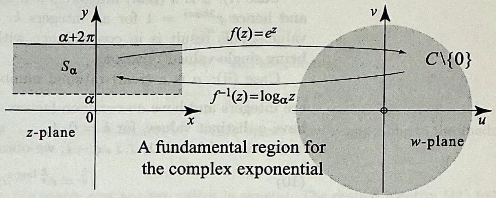
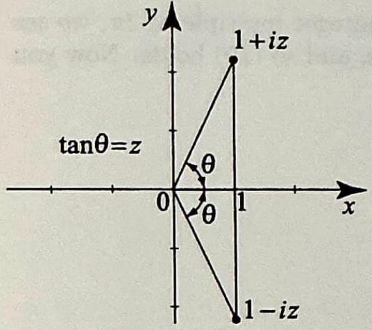

> [!review]
> 1. How is the complex logarithm defined? Why does this definition produce multiple values, and what property of the complex exponential is responsible?
> 
> 2. Derive the formula for $\log z$. How does this equation separate into two conditions - one that determines $u$ and one that determines $v$ ?
> 
> 3. The formula $\log z=\ln |z|+i \arg z$ has a real part and an imaginary part. Why is only one of them responsible for the multi-valuedness?
> 
> 4. What is the principal branch of the logarithm, and what choice makes it singlevalued? How do all other values of $\log z$ relate to the principal value?
> 
> 5. Does $\log z$ exist for $z=0$ ? Why or why not?
> 
>  6. Why is the complex logarithm needed before you can define expressions like $i^i$ ?


##### problem 1

The complex logarithm is defined by reversing the exponential:

$$
w=\log z
\quad \Longleftrightarrow \quad
e^{w}=z,
\qquad
z \neq 0 .
$$

This produces multiple values because the complex exponential is periodic. If

$$
e^{w}=z,
$$

then also

$$
e^{w+2 \pi i k}=e^{w} e^{2 \pi i k}=e^{w}=z
$$

for every integer $k$. So once one logarithm of $z$ is known, infinitely many others are obtained by adding integer multiples of $2 \pi i$. The property responsible is the $2 \pi i$-periodicity of the complex exponential.


##### problem 2

Write

$$
w=u+i v
\qquad \text{and} \qquad
z=r e^{i \theta},
$$

where $r=|z|>0$ and $\theta=\arg z$. Then

$$
\begin{aligned}
e^{w}=z
&\Longleftrightarrow e^{u+i v}=r e^{i \theta} \\
&\Longleftrightarrow e^{u} e^{i v}=r e^{i \theta} .
\end{aligned}
$$

This separates into

$$
e^{u}=r
\qquad \text{and} \qquad
e^{i v}=e^{i \theta} .
$$

The first equation determines the real part:

$$
u=\ln r=\ln |z| .
$$

The second determines the imaginary part. Since $e^{i v}=e^{i \theta}$, the angles differ by an integer multiple of $2 \pi$, so

$$
v=\theta+2 k \pi,
\qquad
k \in \mathbb{Z},
$$

or simply

$$
v=\arg z .
$$

Therefore

$$
\log z=\ln |z|+i \arg z .
$$


##### problem 3

In

$$
\log z=\ln |z|+i \arg z,
$$

the real part $\ln |z|$ is single-valued because $|z|$ is a single positive number for each nonzero $z$, and the real logarithm of a positive number is single-valued.

The multi-valuedness comes only from the imaginary part, because $\arg z$ is not unique:

$$
\arg z=\theta+2 k \pi,
\qquad
k \in \mathbb{Z} .
$$

Thus the ambiguity in $\log z$ is exactly

$$
i(2 k \pi)=2 k \pi i .
$$

So only the argument contributes the multiple values.


##### problem 4

The principal branch of the logarithm is obtained by choosing the principal argument

$$
-\pi<\operatorname{Arg} z \leq \pi .
$$

With this single-valued choice of argument, the logarithm becomes the single-valued function

$$
\operatorname{Log} z=\ln |z|+i \operatorname{Arg} z,
\qquad
z \neq 0 .
$$

In the notation used in this text, this principal value is denoted by $\log z$ when the principal branch is intended.

All other values of the complex logarithm differ from the principal value by integer multiples of $2 \pi i$:

$$
\log z=\operatorname{Log} z+2 k \pi i,
\qquad
k \in \mathbb{Z} .
$$

So the principal branch picks one representative from the full infinite family of logarithm values.


##### problem 5

The logarithm does not exist at $z=0$.

By definition, a logarithm of $0$ would be a number $w$ such that

$$
e^{w}=0 .
$$

But the complex exponential is never zero. If $w=u+i v$, then

$$
e^{w}=e^{u} e^{i v},
$$

and therefore

$$
|e^{w}|=e^{u}>0 .
$$

So there is no complex number $w$ with $e^{w}=0$. Hence $\log 0$ is undefined.


##### problem 6

To define a complex power $z^{a}$, one uses

$$
z^{a}=e^{a \log z},
\qquad
z \neq 0 .
$$

So the logarithm must be defined first. Without a definition of $\log z$, an expression like

$$
i^{i}
$$

has no meaning, because there is no direct real-variable rule for raising a complex number to a complex exponent.

Once the logarithm is available,

$$
i^{i}=e^{i \log i},
$$

and since $\log i$ is multi-valued, the power can also be multi-valued. This is exactly why the logarithm is the essential intermediate step in defining complex powers.


+++++


In this section we define the complex logarithms and define what it means to raise a complex number to a complex power. Thus we will be able to compute expressions like $\log i$ and $i^{i}$.

The logarithm was defined in elementary algebra as the inverse of the exponential function. We will follow this idea in defining the complex logarithm, $\log z$ for $z \neq 0$. Thus,

$$
w=\log z \quad \Leftrightarrow \quad e^{w}=z .
$$

To determine $w$ in terms of $z$, write $w=u+i v$ and $z=r e^{i \theta}$, with $|z|=r>0$ and $\theta=\arg z$. Then (1) becomes

$$
e^{u} e^{i v}=r e^{i \theta}
$$

and hence

$$
e^{u}=r \quad \text { and } \quad e^{i v}=e^{i \theta}
$$

The first equation gives $u=\ln r$, where here $\ln r$ denotes the usual natural logarithm of the positive number $r$. The second equation in (2) tells us that $v$ and $\theta$ differ by an integer multiple of $2 \pi$, because the complex exponential is $2 \pi i$ periodic. So $v=\theta+2 k \pi$, where $k$ is an integer, or simply $v=\arg z$. Putting this together, we obtain the formula for the complex logarithm:

$$
\log z=\ln |z|+i \arg z \quad(z \neq 0)
$$

Unlike the real logarithm, this formula defines a multiple-valued function, because $\arg z$ is multiple-valued. The complex logarithm is not a function in our usual sense of the word, since in our understanding a function is a rule that assigns to a given complex number $z$ a single number. We can make the function defined by (3) single-valued by specifying a single-valued $\arg z$. For example, we can use the principal value of the argument by specifying that $-\pi<\arg z \leq \pi$ (see (9), Section 1.3). The corresponding function that we obtain in (3) is called the principal value or principal branch of the logarithm and is denoted by $\log z$. Thus

$$
\log z=\ln |z|+i \operatorname{Arg} z \quad(z \neq 0)
$$

Recalling that $\arg z=\operatorname{Arg} z+2 k \pi$, where $k$ is an integer, we see from (3) and (4) that all the values of $\log z$ differ from the principal value by $2 k \pi i$. Thus

$$
\log z=\log z+2 k \pi i \quad(z \neq 0)
$$


> [!exercise] Exercise 1: Evaluating Logarithms
> Find the following logarithms.
> (a) $\log i$.
> (b) $\operatorname{Log} i$.
> (c) $\log (1+i)$.
> (d) $\log (-2)$.
> 


##### problem 1.a

Since

$$
|i|=1
\qquad \text{and} \qquad
\arg i=\frac{\pi}{2}+2 k \pi,
\qquad
k \in \mathbb{Z},
$$

we have

$$
\begin{aligned}
\log i
&=\ln |i|+i \arg i \\
&=\ln 1+i\left(\frac{\pi}{2}+2 k \pi\right) \\
&=i\left(\frac{\pi}{2}+2 k \pi\right) .
\end{aligned}
$$

Therefore

$$
\log i=i\left(\frac{\pi}{2}+2 k \pi\right),
\qquad
k \in \mathbb{Z} .
$$


##### problem 1.b

Using the principal branch,

$$
\operatorname{Arg} i=\frac{\pi}{2} .
$$

Hence

$$
\begin{aligned}
\operatorname{Log} i
&=\ln |i|+i \operatorname{Arg} i \\
&=\ln 1+i \frac{\pi}{2} \\
&=i \frac{\pi}{2} .
\end{aligned}
$$


##### problem 1.c

First compute the modulus and argument:

$$
|1+i|=\sqrt{1^{2}+1^{2}}=\sqrt{2},
\qquad
\arg (1+i)=\frac{\pi}{4}+2 k \pi,
\qquad
k \in \mathbb{Z} .
$$

Therefore

$$
\begin{aligned}
\log (1+i)
&=\ln |1+i|+i \arg (1+i) \\
&=\ln \sqrt{2}+i\left(\frac{\pi}{4}+2 k \pi\right) .
\end{aligned}
$$

So

$$
\log (1+i)=\ln \sqrt{2}+i\left(\frac{\pi}{4}+2 k \pi\right),
\qquad
k \in \mathbb{Z} .
$$


##### problem 1.d

For $-2$, we have

$$
|-2|=2
\qquad \text{and} \qquad
\arg (-2)=\pi+2 k \pi,
\qquad
k \in \mathbb{Z} .
$$

Hence

$$
\begin{aligned}
\log (-2)
&=\ln |-2|+i \arg (-2) \\
&=\ln 2+i(\pi+2 k \pi) .
\end{aligned}
$$

Therefore

$$
\log (-2)=\ln 2+i(2 k+1)\pi,
\qquad
k \in \mathbb{Z} .
$$


++++


> [!review]
> 1. The principal branch restricts $\arg z$ to ( $-\pi, \pi$ ]. But any real number $\alpha$ can serve as a cutoff, restricting $\arg _\alpha z$ to $(\alpha, \alpha+2 \pi]$. How does each choice of $\alpha$ produce a different single-valued branch of the logarithm, and in what sense is the principal branch just one case of this?
> 
> 2. Compute $\log _{3 \pi / 4}(i)$. Why must $\arg _{3 \pi / 4}(i)$ be taken as $\frac{5 \pi}{2}$ rather than $\frac{\pi}{2}$ ?
> 3. Different branches of the logarithm assign different values to the same $\boldsymbol{z}$. Do they disagree about everything, or is there a part of $\log _\alpha z$ that all branches share?
> 
> 4. The exponential maps the horizontal strip $S_\alpha=\{z: \alpha<\operatorname{Im} z \leq \alpha+2 \pi\}$ one-to-one onto $\mathbb{C} \backslash\{0\}$. What role do the width of the strip and the half-open boundary each play in making this true?
> 
>  5. Since $e^z$ maps $S_\alpha$ one-to-one onto $\mathbb{C} \backslash\{0\}$, what does this tell you about the relationship between $e^z$ restricted to $S_\alpha$ and the branch $\log _\alpha z$ ?
> 6. For $\alpha$ real, show that the fundamental region $S_{\alpha}$ of $e^{z}$ is the infinite horizontal strip > $S_{\alpha}=\{z: \alpha<\operatorname{Im} z \leq \alpha+2 \pi\}$. Write code for a Mathematica visualization of this mapping.


##### problem 1

For any real number $\alpha$, we make the argument single-valued by requiring

$$
\alpha<\arg _{\alpha} z \leq \alpha+2 \pi .
$$

Then we define the corresponding branch of the logarithm by

$$
\log _{\alpha} z=\ln |z|+i \arg _{\alpha} z .
$$

Different choices of $\alpha$ choose different intervals of length $2 \pi$ for the argument, so they produce different single-valued logarithms. The principal branch is just the special case

$$
\alpha=-\pi,
$$

because then

$$
-\pi<\arg z \leq \pi,
$$

which is exactly the principal argument convention.


##### problem 2

For $i$, we have

$$
|i|=1 .
$$

For the branch with cutoff $\alpha=\frac{3 \pi}{4}$, the argument must satisfy

$$
\frac{3 \pi}{4}<\arg _{\frac{3 \pi}{4}} z \leq \frac{11 \pi}{4} .
$$

Now $\frac{\pi}{2}$ is not allowed, because

$$
\frac{\pi}{2}<\frac{3 \pi}{4} .
$$

But

$$
\frac{5 \pi}{2}=\frac{\pi}{2}+2 \pi
$$

does lie in the required interval. Therefore

$$
\arg _{\frac{3 \pi}{4}}(i)=\frac{5 \pi}{2},
$$

and so

$$
\begin{aligned}
\log _{\frac{3 \pi}{4}}(i)
&=\ln |i|+i \arg _{\frac{3 \pi}{4}}(i) \\
&=\ln 1+i \frac{5 \pi}{2} \\
&=i \frac{5 \pi}{2} .
\end{aligned}
$$


##### problem 3

Different branches do not disagree about everything. They all share the same real part,

$$
\ln |z| .
$$

What changes from branch to branch is only the imaginary part, because different branches choose different single-valued arguments. Thus

$$
\log _{\alpha} z=\ln |z|+i \arg _{\alpha} z,
$$

and only $\arg _{\alpha} z$ depends on the choice of $\alpha$.


##### problem 4

The width $2 \pi$ is what makes the strip capture exactly one full turn of the argument. Since

$$
e^{x+i y}=e^{x} e^{i y},
$$

changing $y$ by $2 \pi$ does not change the image:

$$
e^{x+i(y+2 \pi)}=e^{x+i y} .
$$

So a strip of height $2 \pi$ contains exactly one representative of each angle modulo $2 \pi$.

The half-open boundary is what makes the mapping one-to-one. If both boundary lines were included, then two points whose imaginary parts differ by $2 \pi$ would both lie in the region and would have the same image under the exponential. By including one boundary and excluding the other, we avoid that duplication while still covering every nonzero complex number exactly once.


##### problem 5

Since $e^z$ maps $S_\alpha$ one-to-one onto $\mathbb{C}\backslash\{0\}$, the restricted exponential

$$
e^z\big|_{S_\alpha}
$$

has an inverse. That inverse is precisely the branch $\log_\alpha z$. In other words,

$$
\log _{\alpha}(e^z)=z
\qquad \text{for } z \in S_\alpha,
$$

and

$$
e^{\log _{\alpha} z}=z
\qquad \text{for } z \in \mathbb{C}\backslash\{0\} .
$$

So $\log _{\alpha} z$ is the inverse of the exponential after the exponential has been restricted to the fundamental strip $S_\alpha$.


##### problem 6

We show that

$$
S_{\alpha}=\{z=x+i y:\alpha<y \leq \alpha+2 \pi\}
$$

is a fundamental region for $e^z$.

First, if

$$
z=x+i y \in S_\alpha,
$$

then

$$
e^z=e^{x+i y}=e^x e^{i y} .
$$

Since $e^x>0$, the image can never be $0$. So the image lies in $\mathbb{C}\backslash\{0\}$.

Now let

$$
w \in \mathbb{C}\backslash\{0\} .
$$

Write

$$
w=r e^{i \theta},
\qquad
r>0 .
$$

Choose

$$
x=\ln r .
$$

Because the interval

$$
(\alpha,\alpha+2 \pi]
$$

has length $2 \pi$, there is a unique number $y$ in that interval such that

$$
y=\theta+2 k \pi
$$

for some integer $k$. Then

$$
z=x+i y \in S_\alpha,
$$

and

$$
\begin{aligned}
e^z
&=e^{x+i y} \\
&=e^x e^{i y} \\
&=e^{\ln r} e^{i(\theta+2 k \pi)} \\
&=r e^{i \theta} e^{2 k \pi i} \\
&=r e^{i \theta} \\
&=w .
\end{aligned}
$$

So $e^z$ maps $S_\alpha$ onto $\mathbb{C}\backslash\{0\}$.

To prove one-to-one, suppose

$$
e^{z_1}=e^{z_2},
$$

where

$$
z_1=x_1+i y_1,
\qquad
z_2=x_2+i y_2,
\qquad
z_1,z_2 \in S_\alpha .
$$

Then

$$
e^{x_1} e^{i y_1}=e^{x_2} e^{i y_2} .
$$

Taking moduli gives

$$
e^{x_1}=e^{x_2},
$$

so

$$
x_1=x_2 .
$$

Then

$$
e^{i y_1}=e^{i y_2},
$$

which implies

$$
y_1-y_2=2 k \pi
$$

for some integer $k$. But both $y_1$ and $y_2$ lie in the interval

$$
(\alpha,\alpha+2 \pi],
$$

whose length is exactly $2 \pi$, with one endpoint excluded. Therefore the only possible multiple of $2 \pi$ their difference can be is $0$. Hence

$$
y_1=y_2,
$$

and therefore

$$
z_1=z_2 .
$$

So $e^z$ is one-to-one on $S_\alpha$, and $S_\alpha$ is indeed a fundamental region of the exponential map.

```Mathematica title:""
Manipulate[
 Module[
  {
   yActual = alpha + yOffset,
   ySlice = alpha + ySliceOffset,
   z, w, zPoint, wPoint,
   blue = RGBColor[0.15, 0.42, 0.85],
   green = RGBColor[0.12, 0.62, 0.22],
   red = RGBColor[0.85, 0.16, 0.10],
   displayWidth, rMin, rMax, sliceZ, sliceW, leftPlot, rightPlot
   },
  
  displayWidth = Max[xWindow, Abs[x0], 1];
  rMin = Exp[-displayWidth];
  rMax = Exp[displayWidth];
  z = x0 + I yActual;
  w = Exp[z];
  zPoint = {Re[z], Im[z]};
  wPoint = {Re[w], Im[w]};
  
  sliceZ = Table[{t, ySlice}, {t, -displayWidth, displayWidth, displayWidth/90}];
  sliceW = Table[{Re[Exp[t + I ySlice]], Im[Exp[t + I ySlice]]}, {t, -displayWidth, displayWidth, displayWidth/90}];
  
  leftPlot =
   Graphics[
    {
     {LightBlue, Opacity[0.32], EdgeForm[{Thick, blue}],
      Rectangle[{-displayWidth, alpha}, {displayWidth, alpha + 2 Pi}]},
     {Directive[blue, Thick], Line[{{-displayWidth, alpha + 2 Pi}, {displayWidth, alpha + 2 Pi}}]},
     {Directive[blue, Dashed, Thick], Line[{{-displayWidth, alpha}, {displayWidth, alpha}}]},
     If[showSlice, {green, Thick, Line[sliceZ]}, {}],
     {red, PointSize[0.026], Point[zPoint]},
     Text[Style["z", 15, Bold, red], zPoint + {0.12, 0.16}]
     },
    Axes -> True,
    GridLines -> Automatic,
    PlotRange -> {{-displayWidth - 0.3, displayWidth + 0.3}, {alpha - 0.35, alpha + 2 Pi + 0.35}},
    ImageSize -> 430,
    PlotLabel -> Style["Review 2.6: z-plane strip S_alpha", 18],
    AxesLabel -> {"x", "y"}
    ];
  
  rightPlot =
   Show[
    RegionPlot[
     rMin^2 <= uu^2 + vv^2 <= rMax^2,
     {uu, -rMax - 0.6, rMax + 0.6},
     {vv, -rMax - 0.6, rMax + 0.6},
     PlotStyle -> Directive[LightBlue, Opacity[0.32]],
     BoundaryStyle -> {Thick, blue},
     Axes -> True,
     GridLines -> Automatic,
     PlotPoints -> 70,
     MaxRecursion -> 2,
     PlotRange -> {{-rMax - 0.6, rMax + 0.6}, {-rMax - 0.6, rMax + 0.6}},
     ImageSize -> 500,
     PlotLabel -> Style["w-plane: annulus window for e^z(S_alpha)", 18],
     AxesLabel -> {"u", "v"}
     ],
    Graphics[
     {
      If[showSlice, {green, Thick, Line[sliceW]}, {}],
      {red, PointSize[0.026], Point[wPoint]},
      Text[Style["e^z", 15, Bold, red], wPoint + {0.25, 0.25}]
      }
     ]
    ];
  
  Column[
   {
    Style["Review 2.6: w = e^z on the fundamental strip", 21, Bold],
    GraphicsRow[{leftPlot, rightPlot}, Spacings -> 28],
    Style[
     Row[{
       "z = ", NumberForm[Re[z], {5, 2}], " + ", NumberForm[Im[z], {5, 2}], " i",
       "    \[LongRightArrow]    e^z = ",
       NumberForm[Re[w], {7, 3}], " + ", NumberForm[Im[w], {7, 3}], " i"
       }],
     14
     ],
    Style[
     Row[{
       "Green slice: y = ", NumberForm[ySlice, {5, 2}],
       " maps to a radial segment at angle ", NumberForm[ySlice, {5, 2}],
       " with radii from e^(-X) to e^X."
       }],
     13, green
     ],
    Style[
     "Dashed lower boundary is excluded; solid upper boundary is included. Together with width 2π, this makes the map one-to-one.",
     13
     ]
    }
   ]
  ],
 {{alpha, -Pi, "alpha"}, -2 Pi, 2 Pi, Appearance -> "Labeled"},
 Delimiter,
 {{xWindow, 2.0, "display half-width X"}, 0.8, 3.5, Appearance -> "Labeled"},
 {{x0, 0.5, "x"}, Dynamic[-xWindow], Dynamic[xWindow], Appearance -> "Labeled"},
 {{yOffset, 1.0, "y offset from alpha"}, 0.01, 2 Pi, Appearance -> "Labeled"},
 Delimiter,
 {{showSlice, True, "show green horizontal slice"}, {True, False}},
 {{ySliceOffset, 1.0, "slice offset from alpha"}, 0.01, 2 Pi, Appearance -> "Labeled"},
 TrackedSymbols :> {alpha, xWindow, x0, yOffset, showSlice, ySliceOffset},
 SaveDefinitions -> True
]
```


+++++


As you can imagine, we could have specified a different range of values of $\arg z$ in defining a logarithmic function out of (3). In fact, given any real number $\alpha$, we can specify that $\alpha<\arg z \leq \alpha+2 \pi$. This will assign a single value to $\arg z$, denoted by $\arg _{\alpha} z$. For $z \neq 0$, using $\arg _{\alpha} z$ in (3), we obtain the corresponding function, called a branch of the logarithm,

$$
\log _{\alpha} z=\ln |z|+i \arg _{\alpha} z, \quad \text { where } \alpha<\arg _{\alpha} z \leq \alpha+2 \pi .
$$

For example, for $\alpha=\frac{3 \pi}{4}$, we have $\frac{3 \pi}{4}<\arg _{\frac{3 \pi}{4}} z \leq \frac{3 \pi}{4}+2 \pi$. If we want to compute $\log _{\frac{3 \pi}{4}}(i)$, we first compute

$$
\arg _{\frac{3 \pi}{4}}(i)=\frac{5 \pi}{2} .
$$

Then from (6)

$$
\log _{\frac{3 \pi}{4}}(i)=\ln 1+i \frac{5 \pi}{2}=i \frac{5 \pi}{2} .
$$


To discuss the mapping properties of the logarithm, you should check that for any real $\alpha$, the exponential function maps the period strip or fundamental region

$$
S_{\alpha}=\{z=x+i y: \alpha<y \leq \alpha+2 \pi\}
$$

one-to-one onto the complex plane minus the origin, which we write as $\mathbb{C} \backslash \{0\}$. Thus the branch of the logarithm $\log _{\alpha} z$ maps the punctured plane $\mathbb{C} \backslash\{0\}$ back onto the fundamental region $S_{\alpha}$ (see Figure 1).

> [!figure] Figure ,
> 
> 
> 
> Figure 1 For $\alpha$ real, the fundamental region $S_{\alpha}$ of $e^{z}$ is the infinite horizontal strip
> $S_{\alpha}=\{z: \alpha<\operatorname{Im} z \leq \alpha+2 \pi\}$.
> The upper boundary line, $\operatorname{Im} z=\alpha+2 \pi$, is included in $S_{\alpha}$, but the lower boundary line, $\operatorname{Im} z=\alpha$, is not. If we were to include the line $\operatorname{Im} z=\alpha$, then $e^{z}$ would cease to be one-to-one in the region.


# 1.7.1 Complex Powers

> [!review]
> 1. How is the complex power $z^a$ defined, and why must $z \neq 0$ ?
> 2. Why does defining $z^a$ in the complex plane require more care than defining $x^a$ for positive real numbers?
> 3. What is the principal value of $z^a$, and how is it obtained from the principal logarithm?
> 4. Write a few examples of some valid branches.
> 
> **Note:** Please wrap Log and Arg in \operatorname{} so that the mathematics will render correctly.


##### problem 1

For a complex number $z \neq 0$, the complex power is defined by

$$
z^{a}=e^{a \log z}.
$$

This mirrors the real formula $x^{a}=e^{a \ln x}$ for $x>0$. The condition $z \neq 0$ is essential because $\log z$ does not exist at $z=0$. Indeed, there is no complex number $w$ such that

$$
e^{w}=0,
$$

so $0$ has no complex logarithm. Since the definition of $z^{a}$ is built from $\log z$, the expression is only defined this way for nonzero $z$.


##### problem 2

In the real case, if $x>0$, then $\ln x$ is single-valued, so

$$
x^{a}=e^{a \ln x}
$$

gives one value. In the complex case, the difficulty is that $\log z$ is multiple-valued because the argument is multiple-valued:

$$
\log z=\ln |z|+i \arg z,
\qquad
\arg z=\theta+2 \pi k,
\qquad
k \in \mathbb{Z}.
$$

If $w$ is one value of $\log z$, then every value of $\log z$ has the form

$$
w+2 \pi i k,
\qquad
k \in \mathbb{Z}.
$$

Therefore the corresponding values of $z^{a}$ are

$$
\begin{aligned}
e^{a w},
\qquad
e^{a(w+2 \pi i k)}
&=e^{a w+a(2 \pi i k)} \\
&=e^{a w} e^{2 \pi i a k},
\qquad
k \in \mathbb{Z}.
\end{aligned}
$$

Unless the factor $e^{2 \pi i a k}$ is always equal to $1$, different choices of the logarithm give different values. That is why defining $z^{a}$ in the complex plane requires branch choices and more care than the positive-real case.


##### problem 3

The principal value of $z^{a}$ is the branch obtained from the principal logarithm. Since

$$
\operatorname{Log} z=\ln |z|+i \operatorname{Arg} z,
\qquad
-\pi<\operatorname{Arg} z \leq \pi,
$$

the principal value is

$$
z^{a}=e^{a \operatorname{Log} z}.
$$

Equivalently,

$$
\begin{aligned}
z^{a}
&=e^{a \operatorname{Log} z} \\
&=e^{a(\ln |z|+i \operatorname{Arg} z)}.
\end{aligned}
$$

So one obtains the principal value by choosing the principal argument $\operatorname{Arg} z$ and then substituting the resulting principal logarithm into the defining formula for the power.


##### problem 4

Every single-valued branch of the logarithm produces a valid single-valued branch of the power function. If

$$
\log _{\alpha} z=\ln |z|+i \arg _{\alpha} z,
\qquad
\alpha<\arg _{\alpha} z \leq \alpha+2 \pi,
$$

then the corresponding branch of $z^{a}$ is

$$
z^{a}=e^{a \log _{\alpha} z}.
$$

For example, the principal branch is

$$
z^{a}=e^{a \operatorname{Log} z}.
$$

If $\alpha=0$, another valid branch is

$$
z^{a}=e^{a \log _{0} z},
\qquad
0<\arg _{0} z \leq 2 \pi.
$$

If $\alpha=\frac{3 \pi}{4}$, another valid branch is

$$
z^{a}=e^{a \log _{\frac{3 \pi}{4}} z},
\qquad
\frac{3 \pi}{4}<\arg _{\frac{3 \pi}{4}} z \leq \frac{11 \pi}{4}.
$$

So the branches differ only by the branch of the logarithm used in the definition.


+++++


In direct analogy with calculus, for a complex number $z \neq 0$, we define the complex power

$$
z^{a}=e^{a \log z} \quad(z \neq 0)
$$

where $\log z$ is the complex $\log$ arithm (3). Since $\log z$ is multiple-valued, it follows from (8) that $z^{a}$ is in general multiple-valued. By specifying a branch of the logarithm, we obtain a single-valued branch of the complex power function from (8). In particular, if we choose the principal logarithm (4), we obtain the principal value of $z^{a}$ :

$$
z^{a}=e^{a \operatorname{Log} z} \quad(z \neq 0)
$$


> [!exercise] Exercise 2: Evaluating complex powers
> Compute $(-i)^{1+i}$ using (a) the principal branch of the logarithm; (b) the branch of the logarithm with a branch cut at angle $\alpha=0$.


##### problem a

Using the principal branch,

$$
\operatorname{Arg}(-i)=-\frac{\pi}{2},
\qquad
\operatorname{Log}(-i)=\ln |-i|+i \operatorname{Arg}(-i)=\ln 1+i\left(-\frac{\pi}{2}\right)=-\frac{\pi i}{2}.
$$

Therefore

$$
\begin{aligned}
(-i)^{1+i}
&=e^{(1+i)\operatorname{Log}(-i)} \\
&=e^{(1+i)\left(-\frac{\pi i}{2}\right)} \\
&=e^{-\frac{\pi i}{2}-\frac{\pi i^{2}}{2}} \\
&=e^{\frac{\pi}{2}-\frac{\pi i}{2}} \\
&=e^{\frac{\pi}{2}} e^{-\frac{\pi i}{2}} \\
&=e^{\frac{\pi}{2}}\left(\cos\left(-\frac{\pi}{2}\right)+i \sin\left(-\frac{\pi}{2}\right)\right) \\
&=e^{\frac{\pi}{2}}(0-i) \\
&=-i e^{\frac{\pi}{2}} .
\end{aligned}
$$


##### problem b

For the branch with cut angle $\alpha=0$, we use

$$
0<\operatorname{arg}_{0} z \leq 2 \pi.
$$

Since $-i$ lies on the negative imaginary axis,

$$
\operatorname{arg}_{0}(-i)=\frac{3 \pi}{2},
\qquad
\operatorname{log}_{0}(-i)=\ln |-i|+i \operatorname{arg}_{0}(-i)=\ln 1+i \frac{3 \pi}{2}=\frac{3 \pi i}{2}.
$$

Hence

$$
\begin{aligned}
(-i)^{1+i}
&=e^{(1+i)\operatorname{log}_{0}(-i)} \\
&=e^{(1+i)\left(\frac{3 \pi i}{2}\right)} \\
&=e^{\frac{3 \pi i}{2}+\frac{3 \pi i^{2}}{2}} \\
&=e^{-\frac{3 \pi}{2}+\frac{3 \pi i}{2}} \\
&=e^{-\frac{3 \pi}{2}} e^{\frac{3 \pi i}{2}} \\
&=e^{-\frac{3 \pi}{2}}\left(\cos\left(\frac{3 \pi}{2}\right)+i \sin\left(\frac{3 \pi}{2}\right)\right) \\
&=e^{-\frac{3 \pi}{2}}(0-i) \\
&=-i e^{-\frac{3 \pi}{2}} .
\end{aligned}
$$


---


> [!review]
> 1. For which types of $a$ is $z^a$ single-valued, finitely many-valued, or infinitely manyvalued, and what determines which case applies?
> 2. Why does the case $a=\frac{p}{q}$ produce exactly $q$ distinct values rather than some other number, and how do these values correspond to branches, including the principal branch?
> 3. In what sense is the definition $z^a=e^{a \log z}$ inconsistent with the exponential function $e^z$, and how is this inconsistency resolved by convention?
> 4. Why should we expect the inverse trigonometric functions to be multiple-valued, given what we know about complex powers and logarithms?


##### problem 1

The number of values of $z^{a}$ is determined by the number of distinct values of

$$
e^{2 \pi i a k},
\qquad
k \in \mathbb{Z},
$$

because different values of the logarithm differ by $2 \pi i k$. Thus:

If $a$ is an integer, then

$$
e^{2 \pi i a k}=1
$$

for every integer $k$, so $z^{a}$ is single-valued.

If $a=\frac{p}{q}$ is a rational number in lowest terms, then

$$
e^{2 \pi i a k}=e^{2 \pi i \frac{p k}{q}}
$$

takes only finitely many values, and in fact exactly $q$ of them. So $z^{a}$ is finitely many-valued.

If $a$ is an irrational real number or a complex number with nonzero imaginary part, then the values

$$
e^{2 \pi i a k}
$$

are all distinct as $k$ varies, so $z^{a}$ is infinitely many-valued.


##### problem 2

Let

$$
a=\frac{p}{q},
$$

where $p$ and $q$ have no common factor. Then the possible multiplicative factors are

$$
e^{2 \pi i \frac{p k}{q}},
\qquad
k \in \mathbb{Z}.
$$

First,

$$
e^{2 \pi i \frac{p(k+q)}{q}}
=e^{2 \pi i \frac{p k}{q}} e^{2 \pi i p}
=e^{2 \pi i \frac{p k}{q}},
$$

so the values repeat with period $q$. Hence there can be at most $q$ distinct values.

Now suppose

$$
e^{2 \pi i \frac{p k_{1}}{q}}=e^{2 \pi i \frac{p k_{2}}{q}}.
$$

Then

$$
2 \pi \frac{p(k_{1}-k_{2})}{q}
$$

must be an integer multiple of $2 \pi$, so

$$
\frac{p(k_{1}-k_{2})}{q} \in \mathbb{Z}.
$$

Since $p$ and $q$ are relatively prime, this implies that $q$ divides $k_{1}-k_{2}$. Therefore the values for

$$
k=0,1,\dots,q-1
$$

are all distinct. So there are exactly $q$ branches.

These branches may be written as

$$
z^{\frac{p}{q}}=e^{\frac{p}{q}\log z} e^{2 \pi i \frac{p k}{q}},
\qquad
k=0,1,\dots,q-1.
$$

The branch corresponding to $k=0$ is the principal branch.


##### problem 3

The inconsistency appears when we treat $e$ as an ordinary base in the power formula:

$$
e^{a \log e}.
$$

But

$$
\log e=1+2 \pi i k,
\qquad
k \in \mathbb{Z},
$$

so the values produced by the power definition are

$$
\begin{aligned}
e^{a(1+2 \pi i k)}
&=e^{a} e^{2 \pi i a k},
\qquad
k \in \mathbb{Z},
\end{aligned}
$$

which are generally multiple-valued. For $k=0$, this agrees with the usual exponential value $e^{a}$, but for other integers $k$ it gives different values. That conflicts with the exponential function $e^{z}$, which was defined earlier as a single-valued function.

The resolution is a convention: $e^{z}$ always means the exponential function, not the multiple-valued power obtained by substituting the base $e$ into the formula $z^{a}=e^{a \log z}$.


##### problem 4

We should expect the inverse trigonometric functions to be multiple-valued because they are expressed in terms of complex logarithms and complex powers, and those operations are multiple-valued in general. For example, the inverse sine formula involves both a logarithm and a square root:

$$
\sin ^{-1} z=-i \log \left(i z+\left(1-z^{2}\right)^{\frac{1}{2}}\right).
$$

The square root contributes two values in general, and the logarithm contributes infinitely many values. As a result, the inverse trigonometric functions inherit this multi-valued behavior. Equivalently, the original trigonometric functions are not one-to-one in the complex plane, so solving equations such as

$$
\sin w=z
$$

naturally produces many solutions.


+++++


For $z \neq 0$, is the function $z^{a}$, defined by (8), always multiple-valued? $\mathrm{T}_{0}$ answer this question, let us use the formula for $\log z$ from (5) and write

$$
z^{a}=e^{a \log z}=e^{a(\log z+2 k \pi i)}=e^{a \log z} e^{2 k a \pi i}
$$

where $k$ is an integer. To determine the number of distinct values of $z^{a}$, we must determine the number of distinct values taken by $e^{2 k a \pi i}$ as $k$ varies over the integers. We distinguish three cases.

**Case (i):** $a$ is a (real) integer. Then $2 k a \pi i$ is an integer multiple of $2 \pi i$, and hence $e^{2 k a \pi i}=1$ for all integers $k$. The expression $z^{a}$ has only one value. This result is in concordance with our notion of $z^{n}, z^{-1}$, etc., as being single-valued functions.

**Case (ii):** $a$ is a (real) rational number. Write $a=\frac{p}{q}$, where $p$ and $q$ are integers and have no common factors. The quantity $e^{2 k a \pi i}=e^{2 \pi i \frac{p k}{q}}$ will have $q$ distinct values, for $k=0,1, \ldots, q-1$ (see Exercise 38). Thus, for each value of $k=0,1, \ldots, q-1$, we obtain a distinct power function

$$
z^{\frac{p}{q}}=e^{\frac{p}{q} \log z} e^{2 \pi i \frac{p k}{q}}
$$

called a branch of $z^{\frac{p}{q}}$. The branch for $k=0$ is called the principal branch of $z^{\frac{p}{q}}$. This result is in concordance with our notion of $n$th roots $z^{1 / n}$; there are $n$ of them. Note also that case (i) is just case (ii) with $q=1$.

**Case (iii):** $a$ is a complex number not of either of the preceding two types. This is the case when $a$ is an irrational real number or a complex number with a nonzero imaginary part. Then the quantities $e^{2 k a \pi i}$ are distinct for all integers $k$ (Exercise 39), and $z^{a}$ has an infinite number of values. As in case (ii), each value of $k$ determines a branch of $z^{a}$, except that here we have infinitely many distinct branches.

Note that our definition of a complex power is inconsistent with our definition of the complex exponential $e^{z}$. According to (8), we can take $e$ and raise it to the power $a$, resulting in

$$
e^{a}=e^{a \log e}=e^{a \ln e} e^{a 2 k \pi i}
$$

which is, in general, multiple-valued. We must distinguish this concept of "raising $e$ to the power $a$ " from our previous, single-valued definition of the "exponential function." As a convention, $e^{z}$ will always refer to the exponential function, unless otherwise stated.

The last example of this section deals with inverse trigonometric functions. These will be computed using complex powers and logarithms, and so they will be multiple-valued in general. For example, the inverse sine of $z$ is any complex number $w=\sin ^{-1} z \operatorname{such}$ that $\sin w=z$. As you will see, the solutions of the last equation form an infinite set, and so $\sin ^{-1} z$ is infinite-valued.

## EXAMPLE 3 Computing the inverse sine function

> [!exercise] Example 3: Computing the Inverse Sine Function
> Show that
> 
> $$
> \sin ^{-1} z=-i \log \left(i z+\left(1-z^{2}\right)^{\frac{1}{2}}\right)
> $$
> 
> where the complex logarithm is given by (3). (For a given $z$, the square root takes two values in general, and the complex logarithm is infinite-valued. As a result the inverse sine is infinite-valued.)

Let

$$
w=\sin ^{-1} z.
$$

Then

$$
\sin w=z.
$$

Using the exponential form of the sine,

$$
\begin{aligned}
z
&=\sin w \\
&=\frac{e^{i w}-e^{-i w}}{2 i}.
\end{aligned}
$$

Multiply by $2 i$:

$$
2 i z=e^{i w}-e^{-i w}.
$$

Now multiply by $e^{i w}$:

$$
2 i z e^{i w}=e^{2 i w}-1.
$$

Rearranging,

$$
e^{2 i w}-2 i z e^{i w}-1=0.
$$

Let

$$
u=e^{i w}.
$$

Then

$$
u^{2}-2 i z u-1=0.
$$

Applying the quadratic formula,

$$
\begin{aligned}
u
&=\frac{2 i z \pm \sqrt{(-2 i z)^{2}-4(1)(-1)}}{2} \\
&=\frac{2 i z \pm \sqrt{-4 z^{2}+4}}{2} \\
&=\frac{2 i z \pm \sqrt{4(1-z^{2})}}{2} \\
&=\frac{2 i z \pm 2\left(1-z^{2}\right)^{\frac{1}{2}}}{2} \\
&=i z \pm \left(1-z^{2}\right)^{\frac{1}{2}}.
\end{aligned}
$$

Since $u=e^{i w}$, we obtain

$$
e^{i w}=i z \pm \left(1-z^{2}\right)^{\frac{1}{2}}.
$$

Taking the logarithm,

$$
i w=\log \left(i z \pm \left(1-z^{2}\right)^{\frac{1}{2}}\right).
$$

Therefore

$$
w=-i \log \left(i z \pm \left(1-z^{2}\right)^{\frac{1}{2}}\right).
$$

Because $\left(1-z^{2}\right)^{\frac{1}{2}}$ already denotes the two square-root values, we can write this compactly as

$$
\sin ^{-1} z=-i \log \left(i z+\left(1-z^{2}\right)^{\frac{1}{2}}\right).
$$

This is multiple-valued because the square root contributes two values and the logarithm contributes infinitely many values.


++++


## Exercises 1.7

> [!exercise] Exercise 4
> In problems 1-4, evaluate $\log z$ for the given $z$.
> 
> 1. $2 i$.
> 2. $-3-3 i$.
> 3. $5 e^{i \frac{\pi}{7}}$.
> 4. $e^{2+i \frac{2 \pi}{11}}$.


##### problem 1

Since

$$
|2 i|=2
\qquad \text{and} \qquad
2 i=2 e^{i\left(\frac{\pi}{2}+2 \pi k\right)},
\qquad
k \in \mathbb{Z},
$$

we have

$$
\begin{aligned}
\log (2 i)
&=\ln |2 i|+i\left(\frac{\pi}{2}+2 \pi k\right) \\
&=\ln 2+i\left(\frac{\pi}{2}+2 \pi k\right),
\qquad
k \in \mathbb{Z}.
\end{aligned}
$$


##### problem 2

First compute the modulus:

$$
|-3-3 i|=\sqrt{(-3)^{2}+(-3)^{2}}=\sqrt{18}=3 \sqrt{2}.
$$

The point $-3-3 i$ lies in the third quadrant, so

$$
-3-3 i=3 \sqrt{2}\, e^{i\left(-\frac{3 \pi}{4}+2 \pi k\right)},
\qquad
k \in \mathbb{Z}.
$$

Therefore

$$
\begin{aligned}
\log (-3-3 i)
&=\ln |{-3-3 i}|+i\left(-\frac{3 \pi}{4}+2 \pi k\right) \\
&=\ln \left(3 \sqrt{2}\right)+i\left(-\frac{3 \pi}{4}+2 \pi k\right),
\qquad
k \in \mathbb{Z}.
\end{aligned}
$$


##### problem 3

Here the number is already in polar form:

$$
z=5 e^{i \frac{\pi}{7}}.
$$

So

$$
|z|=5
\qquad \text{and the arguments are} \qquad
\frac{\pi}{7}+2 \pi k,
\qquad
k \in \mathbb{Z}.
$$

Hence

$$
\begin{aligned}
\log \left(5 e^{i \frac{\pi}{7}}\right)
&=\ln 5+i\left(\frac{\pi}{7}+2 \pi k\right),
\qquad
k \in \mathbb{Z}.
\end{aligned}
$$


##### problem 4

Write

$$
z=e^{2+i \frac{2 \pi}{11}}=e^{2} e^{i \frac{2 \pi}{11}}.
$$

Thus

$$
|z|=e^{2}
\qquad \text{and the arguments are} \qquad
\frac{2 \pi}{11}+2 \pi k,
\qquad
k \in \mathbb{Z}.
$$

Therefore

$$
\begin{aligned}
\log \left(e^{2+i \frac{2 \pi}{11}}\right)
&=\ln \left(e^{2}\right)+i\left(\frac{2 \pi}{11}+2 \pi k\right) \\
&=2+i\left(\frac{2 \pi}{11}+2 \pi k\right),
\qquad
k \in \mathbb{Z}.
\end{aligned}
$$

> [!exercise] Exercise 5
> In problems 5-8, evaluate $\log z$ for the given $z$.
> 5. $3+i \sqrt{3}$.
> 6. $e^{3-i \frac{3 \pi}{2}}$.
> 7. $e^{i \frac{5 \pi}{7}} e^{i \frac{3 \pi}{7}}$.
> 8. $-\alpha$, where $\alpha>0$.


##### problem 5

First compute the modulus:

$$
\left|3+i \sqrt{3}\right|
=\sqrt{3^{2}+\left(\sqrt{3}\right)^{2}}
=\sqrt{9+3}
=\sqrt{12}
=2 \sqrt{3}.
$$

Since $3+i \sqrt{3}$ lies in the first quadrant,

$$
3+i \sqrt{3}=2 \sqrt{3}\, e^{i\left(\frac{\pi}{6}+2 \pi k\right)},
\qquad
k \in \mathbb{Z}.
$$

Therefore

$$
\begin{aligned}
\log \left(3+i \sqrt{3}\right)
&=\ln \left|3+i \sqrt{3}\right|+i\left(\frac{\pi}{6}+2 \pi k\right) \\
&=\ln \left(2 \sqrt{3}\right)+i\left(\frac{\pi}{6}+2 \pi k\right),
\qquad
k \in \mathbb{Z}.
\end{aligned}
$$


##### problem 6

Write

$$
z=e^{3-i \frac{3 \pi}{2}}=e^{3} e^{-i \frac{3 \pi}{2}}.
$$

Since

$$
e^{-i \frac{3 \pi}{2}}=i,
$$

we have

$$
z=i e^{3}.
$$

Thus

$$
|z|=e^{3}
\qquad \text{and the arguments are} \qquad
\frac{\pi}{2}+2 \pi k,
\qquad
k \in \mathbb{Z}.
$$

Hence

$$
\begin{aligned}
\log \left(e^{3-i \frac{3 \pi}{2}}\right)
&=\ln \left(e^{3}\right)+i\left(\frac{\pi}{2}+2 \pi k\right) \\
&=3+i\left(\frac{\pi}{2}+2 \pi k\right),
\qquad
k \in \mathbb{Z}.
\end{aligned}
$$


##### problem 7

First simplify:

$$
e^{i \frac{5 \pi}{7}} e^{i \frac{3 \pi}{7}}
=e^{i \left(\frac{5 \pi}{7}+\frac{3 \pi}{7}\right)}
=e^{i \frac{8 \pi}{7}}.
$$

So

$$
|z|=1
\qquad \text{and the arguments are} \qquad
\frac{8 \pi}{7}+2 \pi k,
\qquad
k \in \mathbb{Z}.
$$

Therefore

$$
\begin{aligned}
\log \left(e^{i \frac{5 \pi}{7}} e^{i \frac{3 \pi}{7}}\right)
&=\ln 1+i\left(\frac{8 \pi}{7}+2 \pi k\right) \\
&=i\left(\frac{8 \pi}{7}+2 \pi k\right),
\qquad
k \in \mathbb{Z}.
\end{aligned}
$$


##### problem 8

Since $\alpha>0$, we have

$$
|-\alpha|=\alpha
\qquad \text{and the arguments are} \qquad
\pi+2 \pi k,
\qquad
k \in \mathbb{Z}.
$$

Therefore

$$
\begin{aligned}
\log (-\alpha)
&=\ln |-\alpha|+i(\pi+2 \pi k) \\
&=\ln \alpha+i(\pi+2 \pi k),
\qquad
k \in \mathbb{Z}.
\end{aligned}
$$

> [!exercise] Exercise 6
> In problems 9-12, evaluate the given logarithm.
> 9. $\log _{\pi} 1$.
> 10. $\log _{\sqrt{3}}(1+i)$. 11. $\log _{5}(-i e)$.
> 12. $\log _{\frac{\pi}{2}} i$.


##### problem 9

For the branch with $\alpha=\pi$, we require

$$
\pi<\operatorname{arg}_{\pi} z \leq 3 \pi.
$$

Since the arguments of $1$ are

$$
2 \pi k,
\qquad
k \in \mathbb{Z},
$$

the value in the interval $(\pi,3\pi]$ is

$$
\operatorname{arg}_{\pi}(1)=2 \pi.
$$

Therefore

$$
\begin{aligned}
\operatorname{log}_{\pi}(1)
&=\ln |1|+i \operatorname{arg}_{\pi}(1) \\
&=\ln 1+i(2 \pi) \\
&=2 \pi i.
\end{aligned}
$$


##### problem 10

For the branch with $\alpha=\sqrt{3}$, we require

$$
\sqrt{3}<\operatorname{arg}_{\sqrt{3}} z \leq \sqrt{3}+2 \pi.
$$

Now

$$
1+i=\sqrt{2}\, e^{i\left(\frac{\pi}{4}+2 \pi k\right)},
\qquad
k \in \mathbb{Z}.
$$

Since

$$
\frac{\pi}{4}<\sqrt{3},
$$

the acceptable value is

$$
\operatorname{arg}_{\sqrt{3}}(1+i)=\frac{\pi}{4}+2 \pi.
$$

Hence

$$
\begin{aligned}
\operatorname{log}_{\sqrt{3}}(1+i)
&=\ln |1+i|+i \operatorname{arg}_{\sqrt{3}}(1+i) \\
&=\ln \sqrt{2}+i\left(\frac{\pi}{4}+2 \pi\right).
\end{aligned}
$$


##### problem 11

For the branch with $\alpha=5$, we require

$$
5<\operatorname{arg}_{5} z \leq 5+2 \pi.
$$

Since

$$
-i e=e\, e^{i\left(-\frac{\pi}{2}+2 \pi k\right)},
\qquad
k \in \mathbb{Z},
$$

the angles are

$$
-\frac{\pi}{2}+2 \pi k.
$$

The value in the interval $(5,5+2\pi]$ is

$$
\operatorname{arg}_{5}(-i e)=\frac{7 \pi}{2}.
$$

Therefore

$$
\begin{aligned}
\operatorname{log}_{5}(-i e)
&=\ln |-i e|+i \operatorname{arg}_{5}(-i e) \\
&=\ln e+i \frac{7 \pi}{2} \\
&=1+\frac{7 \pi i}{2}.
\end{aligned}
$$


##### problem 12

For the branch with $\alpha=\frac{\pi}{2}$, we require

$$
\frac{\pi}{2}<\operatorname{arg}_{\frac{\pi}{2}} z \leq \frac{5 \pi}{2}.
$$

The arguments of $i$ are

$$
\frac{\pi}{2}+2 \pi k,
\qquad
k \in \mathbb{Z}.
$$

Because the lower endpoint is not included, $\frac{\pi}{2}$ is not allowed. The acceptable value is

$$
\operatorname{arg}_{\frac{\pi}{2}}(i)=\frac{5 \pi}{2}.
$$

Thus

$$
\begin{aligned}
\operatorname{log}_{\frac{\pi}{2}}(i)
&=\ln |i|+i \operatorname{arg}_{\frac{\pi}{2}}(i) \\
&=\ln 1+i \frac{5 \pi}{2} \\
&=\frac{5 \pi i}{2}.
\end{aligned}
$$

> [!exercise] Exercise 7
> In problems 13-18, solve the given equation.
> 13. $e^{z}=3$.
> 14. $e^{-z}=1+i$.
> 15. $e^{z+3}=i$.
> 16. $e^{2 z}+3 e^{z}+2=0$.
> 17. $e^{2 z}+5=0$.
> 18. $e^{z}=\frac{1+i}{1-i}$.


##### problem 13

We solve

$$
e^{z}=3.
$$

Taking the logarithm,

$$
z=\log 3.
$$

Since $3$ is a positive real number,

$$
\log 3=\ln 3+2 \pi i k,
\qquad
k \in \mathbb{Z}.
$$

Therefore

$$
z=\ln 3+2 \pi i k,
\qquad
k \in \mathbb{Z}.
$$


##### problem 14

We solve

$$
e^{-z}=1+i.
$$

Taking the logarithm,

$$
-z=\log (1+i).
$$

Now

$$
1+i=\sqrt{2}\, e^{i\left(\frac{\pi}{4}+2 \pi k\right)},
\qquad
k \in \mathbb{Z},
$$

so

$$
\log (1+i)=\ln \sqrt{2}+i\left(\frac{\pi}{4}+2 \pi k\right).
$$

Hence

$$
\begin{aligned}
z
&=-\log (1+i) \\
&=-\ln \sqrt{2}-i\left(\frac{\pi}{4}+2 \pi k\right),
\qquad
k \in \mathbb{Z}.
\end{aligned}
$$


##### problem 15

We solve

$$
e^{z+3}=i.
$$

Taking the logarithm,

$$
z+3=\log i.
$$

Since

$$
\log i=i\left(\frac{\pi}{2}+2 \pi k\right),
\qquad
k \in \mathbb{Z},
$$

we obtain

$$
\begin{aligned}
z
&=-3+\log i \\
&=-3+i\left(\frac{\pi}{2}+2 \pi k\right),
\qquad
k \in \mathbb{Z}.
\end{aligned}
$$


##### problem 16

We solve

$$
e^{2 z}+3 e^{z}+2=0.
$$

Let

$$
u=e^{z}.
$$

Then

$$
u^{2}+3 u+2=0.
$$

Factor:

$$
(u+1)(u+2)=0.
$$

So either

$$
u=-1
\qquad \text{or} \qquad
u=-2.
$$

Thus either

$$
e^{z}=-1
$$

or

$$
e^{z}=-2.
$$

For $e^{z}=-1$,

$$
z=\log (-1)=i(\pi+2 \pi k)=i(2 k+1)\pi,
\qquad
k \in \mathbb{Z}.
$$

For $e^{z}=-2$,

$$
z=\log (-2)=\ln 2+i(\pi+2 \pi k)=\ln 2+i(2 k+1)\pi,
\qquad
k \in \mathbb{Z}.
$$

Therefore the full solution set is

$$
z=i(2 k+1)\pi
\quad \text{or} \quad
z=\ln 2+i(2 k+1)\pi,
\qquad
k \in \mathbb{Z}.
$$


##### problem 17

We solve

$$
e^{2 z}+5=0,
$$

so

$$
e^{2 z}=-5.
$$

Taking the logarithm,

$$
2 z=\log (-5).
$$

Since

$$
\log (-5)=\ln 5+i(\pi+2 \pi k),
\qquad
k \in \mathbb{Z},
$$

we get

$$
\begin{aligned}
z
&=\frac{1}{2}\log (-5) \\
&=\frac{1}{2}\left(\ln 5+i(\pi+2 \pi k)\right) \\
&=\frac{1}{2}\ln 5+i\left(\frac{\pi}{2}+k \pi\right),
\qquad
k \in \mathbb{Z}.
\end{aligned}
$$


##### problem 18

First simplify the right-hand side:

$$
\begin{aligned}
\frac{1+i}{1-i}
&=\frac{(1+i)^{2}}{(1-i)(1+i)} \\
&=\frac{1+2 i+i^{2}}{1-i^{2}} \\
&=\frac{1+2 i-1}{1+1} \\
&=\frac{2 i}{2} \\
&=i.
\end{aligned}
$$

So the equation becomes

$$
e^{z}=i.
$$

Taking the logarithm,

$$
z=\log i=i\left(\frac{\pi}{2}+2 \pi k\right),
\qquad
k \in \mathbb{Z}.
$$


> [!exercise] Exercise 8
> 18. (a) Compute $\log \left(e^{i \pi}\right), \log \left(e^{3 i \pi}\right)$, and $\log \left(e^{5 i \pi}\right)$.
> (b) Show that $\log \left(e^{z}\right)=z$ if and only if $-\pi<\operatorname{Im} z \leq \pi$.


##### problem 18(a)

Using the principal branch,

$$
e^{i \pi}=e^{3 i \pi}=e^{5 i \pi}=-1.
$$

Therefore

$$
\operatorname{Log}\left(e^{i \pi}\right)
=\operatorname{Log}\left(e^{3 i \pi}\right)
=\operatorname{Log}\left(e^{5 i \pi}\right)
=\operatorname{Log}(-1)
=i \pi.
$$

So all three values are

$$
i \pi.
$$


##### problem 18(b)

Write

$$
z=x+i y.
$$

Then

$$
e^{z}=e^{x+i y}=e^{x} e^{i y}.
$$

The modulus of $e^{z}$ is

$$
\left|e^{z}\right|=e^{x},
$$

so

$$
\ln \left|e^{z}\right|=\ln \left(e^{x}\right)=x.
$$

For the principal logarithm,

$$
\operatorname{Log}\left(e^{z}\right)=\ln \left|e^{z}\right|+i \operatorname{Arg}\left(e^{z}\right)=x+i \operatorname{Arg}\left(e^{z}\right).
$$

Therefore

$$
\operatorname{Log}\left(e^{z}\right)=z
$$

if and only if

$$
x+i \operatorname{Arg}\left(e^{z}\right)=x+i y,
$$

which holds if and only if

$$
\operatorname{Arg}\left(e^{z}\right)=y.
$$

Now $\operatorname{Arg}\left(e^{z}\right)$ is the principal argument of $e^{x} e^{i y}$, so it is equal to $y$ exactly when $y$ already lies in the principal range

$$
-\pi<y \leq \pi.
$$

Since $y=\operatorname{Im} z$, we conclude that

$$
\operatorname{Log}\left(e^{z}\right)=z
\quad \text{if and only if} \quad
-\pi<\operatorname{Im} z \leq \pi.
$$


> [!exercise] 
> 19. Show that $\log z=i \arg z$ if and only if $z$ is unimodular.

For $z \neq 0$, we have

$$
\log z=\ln |z|+i \operatorname{arg} z.
$$

Suppose first that

$$
\log z=i \operatorname{arg} z.
$$

Then

$$
\ln |z|+i \operatorname{arg} z=i \operatorname{arg} z,
$$

so

$$
\ln |z|=0.
$$

Therefore

$$
|z|=1,
$$

which means that $z$ is unimodular.

Conversely, suppose that $z$ is unimodular. Then

$$
|z|=1.
$$

Hence

$$
\ln |z|=\ln 1=0.
$$

Substituting into the logarithm formula,

$$
\log z=\ln |z|+i \operatorname{arg} z=0+i \operatorname{arg} z=i \operatorname{arg} z.
$$

Therefore

$$
\log z=i \operatorname{arg} z
$$

if and only if $z$ is unimodular.


> [!exercise] 
> 20. Compute $\log (-1), \log i$, and $\log (-i)$ and conclude that, unlike the identity for the usual real logarithm, in general, $\log \left(z_{1} z_{2}\right)$ is not equal to $\log z_{1}+ \log z_{2}$. The situation is not all that hopeless. See Project Problem 37.

Interpreting $\log$ here as the principal logarithm, we use

$$
\operatorname{Log} z=\ln |z|+i \operatorname{Arg} z,
\qquad
-\pi<\operatorname{Arg} z \leq \pi.
$$

For $z=-1$,

$$
\begin{aligned}
\operatorname{Log}(-1)
&=\ln |-1|+i \operatorname{Arg}(-1) \\
&=\ln 1+i \pi \\
&=i \pi.
\end{aligned}
$$

For $z=i$,

$$
\begin{aligned}
\operatorname{Log}(i)
&=\ln |i|+i \operatorname{Arg}(i) \\
&=\ln 1+i \frac{\pi}{2} \\
&=\frac{\pi i}{2}.
\end{aligned}
$$

For $z=-i$,

$$
\begin{aligned}
\operatorname{Log}(-i)
&=\ln |-i|+i \operatorname{Arg}(-i) \\
&=\ln 1+i\left(-\frac{\pi}{2}\right) \\
&=-\frac{\pi i}{2}.
\end{aligned}
$$

To see that the usual logarithm rule fails in general, take

$$
z_{1}=z_{2}=-1.
$$

Then

$$
\begin{aligned}
\operatorname{Log}(z_{1} z_{2})
&=\operatorname{Log}(1) \\
&=\ln 1+i \operatorname{Arg}(1) \\
&=0,
\end{aligned}
$$

while

$$
\begin{aligned}
\operatorname{Log}(z_{1})+\operatorname{Log}(z_{2})
&=\operatorname{Log}(-1)+\operatorname{Log}(-1) \\
&=i \pi+i \pi \\
&=2 \pi i.
\end{aligned}
$$

Since

$$
0 \neq 2 \pi i,
$$

we conclude that, in general,

$$
\operatorname{Log}\left(z_{1} z_{2}\right)\neq \operatorname{Log}(z_{1})+\operatorname{Log}(z_{2}).
$$


> [!exercise] 
> 21. For which $\alpha$ is $\log _{\alpha} 1=0$ ?


We have

$$
\operatorname{log}_{\alpha} z=\ln |z|+i \operatorname{arg}_{\alpha} z,
\qquad
\alpha<\operatorname{arg}_{\alpha} z \leq \alpha+2 \pi.
$$

For $z=1$,

$$
|1|=1,
$$

so

$$
\operatorname{log}_{\alpha} 1=\ln 1+i \operatorname{arg}_{\alpha}(1)=i \operatorname{arg}_{\alpha}(1).
$$

Therefore

$$
\operatorname{log}_{\alpha} 1=0
$$

if and only if

$$
\operatorname{arg}_{\alpha}(1)=0.
$$

Now the arguments of $1$ are

$$
2 \pi k,
\qquad
k \in \mathbb{Z}.
$$

So $0$ is the chosen branch value exactly when

$$
\alpha<0 \leq \alpha+2 \pi.
$$

This is equivalent to

$$
-2 \pi \leq \alpha<0.
$$

Hence

$$
\operatorname{log}_{\alpha} 1=0
\quad \text{if and only if} \quad
-2 \pi \leq \alpha<0.
$$


> [!exercise] 
> In problems 23-26, evaluate the principal value of the given power.
> 23. $5^{i}$.
> 24. $(1+i)^{3+i}$.
> 25. $(-5)^{1-i}$.
> 26. $\left(\frac{1+i}{1-i}\right)^{i}$.


##### problem 23

The principal value is

$$
5^{i}=e^{i \operatorname{Log} 5}.
$$

Since

$$
\operatorname{Log} 5=\ln 5,
$$

we obtain

$$
\begin{aligned}
5^{i}
&=e^{i \ln 5}.
\end{aligned}
$$

Equivalently,

$$
5^{i}=\cos (\ln 5)+i \sin (\ln 5).
$$


##### problem 24

The principal value is

$$
(1+i)^{3+i}=e^{(3+i)\operatorname{Log}(1+i)}.
$$

Now

$$
\operatorname{Log}(1+i)=\ln |1+i|+i \operatorname{Arg}(1+i)=\ln \sqrt{2}+i \frac{\pi}{4}.
$$

Therefore

$$
\begin{aligned}
(1+i)^{3+i}
&=e^{(3+i)\left(\ln \sqrt{2}+i \frac{\pi}{4}\right)} \\
&=e^{3 \ln \sqrt{2}+3 i \frac{\pi}{4}+i \ln \sqrt{2}+i^{2} \frac{\pi}{4}} \\
&=e^{3 \ln \sqrt{2}-\frac{\pi}{4}+i\left(\frac{3 \pi}{4}+\ln \sqrt{2}\right)} \\
&=e^{3 \ln \sqrt{2}-\frac{\pi}{4}} e^{i\left(\frac{3 \pi}{4}+\ln \sqrt{2}\right)} \\
&=2^{3 / 2} e^{-\pi / 4} e^{i\left(\frac{3 \pi}{4}+\ln \sqrt{2}\right)}.
\end{aligned}
$$


##### problem 25

The principal value is

$$
(-5)^{1-i}=e^{(1-i)\operatorname{Log}(-5)}.
$$

Since

$$
\operatorname{Log}(-5)=\ln 5+i \pi,
$$

we get

$$
\begin{aligned}
(-5)^{1-i}
&=e^{(1-i)(\ln 5+i \pi)} \\
&=e^{\ln 5+i \pi-i \ln 5-i^{2} \pi} \\
&=e^{\ln 5+\pi+i(\pi-\ln 5)} \\
&=5 e^{\pi} e^{i(\pi-\ln 5)}.
\end{aligned}
$$


##### problem 26

First simplify the base:

$$
\begin{aligned}
\frac{1+i}{1-i}
&=\frac{(1+i)^{2}}{(1-i)(1+i)} \\
&=\frac{1+2 i+i^{2}}{1-i^{2}} \\
&=\frac{1+2 i-1}{1+1} \\
&=\frac{2 i}{2} \\
&=i.
\end{aligned}
$$

So the principal value is

$$
\left(\frac{1+i}{1-i}\right)^{i}=i^{i}=e^{i \operatorname{Log}(i)}.
$$

Since

$$
\operatorname{Log}(i)=i \frac{\pi}{2},
$$

we obtain

$$
\begin{aligned}
i^{i}
&=e^{i\left(i \frac{\pi}{2}\right)} \\
&=e^{-\pi / 2}.
\end{aligned}
$$


> [!exercise] 
> In problems 27-30, state how many values the given power takes, and find them.
> 27. $(3 i)^{4}$.
> 28. $(1+i \sqrt{3})^{\frac{2}{7}}$.
> 29. $i^{i}$.
> 30. $(-e)^{\frac{i}{2}}$.


##### problem 27

Since the exponent $4$ is an integer, the power is single-valued.

Using the usual rules,

$$
\begin{aligned}
(3 i)^{4}
&=3^{4} i^{4} \\
&=81 \cdot 1 \\
&=81.
\end{aligned}
$$

So this power takes exactly one value:

$$
81.
$$


##### problem 28

Since

$$
\frac{2}{7}
$$

is a rational number in lowest terms, the power takes exactly $7$ values.

Now

$$
1+i \sqrt{3}=2 e^{i\left(\frac{\pi}{3}+2 \pi k\right)},
\qquad
k \in \mathbb{Z},
$$

so

$$
\log (1+i \sqrt{3})=\ln 2+i\left(\frac{\pi}{3}+2 \pi k\right).
$$

Therefore

$$
\begin{aligned}
(1+i \sqrt{3})^{\frac{2}{7}}
&=e^{\frac{2}{7}\log (1+i \sqrt{3})} \\
&=e^{\frac{2}{7}\left(\ln 2+i\left(\frac{\pi}{3}+2 \pi k\right)\right)} \\
&=e^{\frac{2}{7}\ln 2} e^{i\left(\frac{2 \pi}{21}+\frac{4 \pi k}{7}\right)} \\
&=2^{2 / 7} e^{i\left(\frac{2 \pi}{21}+\frac{4 \pi k}{7}\right)}.
\end{aligned}
$$

The $7$ distinct values are obtained for

$$
k=0,1,\dots,6,
$$

namely

$$
2^{2 / 7} e^{i\left(\frac{2 \pi}{21}+\frac{4 \pi k}{7}\right)},
\qquad
k=0,1,\dots,6.
$$


##### problem 29

Since the exponent $i$ has nonzero imaginary part, the power takes infinitely many values.

Now

$$
\log i=i\left(\frac{\pi}{2}+2 \pi k\right),
\qquad
k \in \mathbb{Z}.
$$

Hence

$$
\begin{aligned}
i^{i}
&=e^{i \log i} \\
&=e^{i \cdot i\left(\frac{\pi}{2}+2 \pi k\right)} \\
&=e^{-\left(\frac{\pi}{2}+2 \pi k\right)} \\
&=e^{-\frac{\pi}{2}-2 \pi k},
\qquad
k \in \mathbb{Z}.
\end{aligned}
$$

So $i^{i}$ has infinitely many values, namely

$$
e^{-\frac{\pi}{2}-2 \pi k},
\qquad
k \in \mathbb{Z}.
$$


##### problem 30

Since the exponent

$$
\frac{i}{2}
$$

has nonzero imaginary part, the power takes infinitely many values.

Now

$$
\log (-e)=\ln e+i(\pi+2 \pi k)=1+i(\pi+2 \pi k),
\qquad
k \in \mathbb{Z}.
$$

Therefore

$$
\begin{aligned}
(-e)^{\frac{i}{2}}
&=e^{\frac{i}{2}\log (-e)} \\
&=e^{\frac{i}{2}\left(1+i(\pi+2 \pi k)\right)} \\
&=e^{\frac{i}{2}+\frac{i^{2}}{2}(\pi+2 \pi k)} \\
&=e^{\frac{i}{2}-\frac{1}{2}(\pi+2 \pi k)} \\
&=e^{-\frac{(2 k+1)\pi}{2}} e^{i / 2},
\qquad
k \in \mathbb{Z}.
\end{aligned}
$$

So $(-e)^{i / 2}$ has infinitely many values, namely

$$
e^{-\frac{(2 k+1)\pi}{2}} e^{i / 2},
\qquad
k \in \mathbb{Z}.
$$


> [!exercise] Exercise 13
> 30. Find all solutions of $\cos z=\sin z$.

We solve

$$
\cos z=\sin z.
$$

Move all terms to one side:

$$
\sin z-\cos z=0.
$$

Use the identity

$$
\sin z-\cos z=\sqrt{2}\,\sin \left(z-\frac{\pi}{4}\right).
$$

So

$$
\sqrt{2}\,\sin \left(z-\frac{\pi}{4}\right)=0,
$$

hence

$$
\sin \left(z-\frac{\pi}{4}\right)=0.
$$

The zeros of the sine function occur at integer multiples of $\pi$, so

$$
z-\frac{\pi}{4}=k \pi,
\qquad
k \in \mathbb{Z}.
$$

Therefore

$$
z=\frac{\pi}{4}+k \pi,
\qquad
k \in \mathbb{Z}.
$$

So all solutions are

$$
\boxed{z=\frac{\pi}{4}+k \pi,\qquad k \in \mathbb{Z}.}
$$


> [!exercise] Exercise 14
> 31. (a) Use the definition (2) from Section 1.6 to find the formula
> 
> $$
> \cos ^{-1} z=-i \log \left(z+\left(z^{2}-1\right)^{\frac{1}{2}}\right)
> $$
> 
> (b) Derive an expression for $\cos ^{-1} z$ more quickly using (6) from Section 1.6 and (11) from this section.


##### problem a

Let

$$
w=\cos ^{-1} z.
$$

Then

$$
\cos w=z.
$$

Using the definition of cosine,

$$
\begin{aligned}
z
&=\cos w \\
&=\frac{e^{i w}+e^{-i w}}{2}.
\end{aligned}
$$

Multiply by $2$:

$$
2 z=e^{i w}+e^{-i w}.
$$

Now multiply by $e^{i w}$:

$$
2 z e^{i w}=e^{2 i w}+1.
$$

Rearranging,

$$
e^{2 i w}-2 z e^{i w}+1=0.
$$

Let

$$
u=e^{i w}.
$$

Then

$$
u^{2}-2 z u+1=0.
$$

Applying the quadratic formula,

$$
\begin{aligned}
u
&=\frac{2 z \pm \sqrt{(2 z)^{2}-4}}{2} \\
&=\frac{2 z \pm \sqrt{4 z^{2}-4}}{2} \\
&=\frac{2 z \pm 2\left(z^{2}-1\right)^{\frac{1}{2}}}{2} \\
&=z \pm \left(z^{2}-1\right)^{\frac{1}{2}}.
\end{aligned}
$$

Since $u=e^{i w}$, we obtain

$$
e^{i w}=z \pm \left(z^{2}-1\right)^{\frac{1}{2}}.
$$

Taking the logarithm,

$$
i w=\log \left(z \pm \left(z^{2}-1\right)^{\frac{1}{2}}\right).
$$

Therefore

$$
w=-i \log \left(z \pm \left(z^{2}-1\right)^{\frac{1}{2}}\right).
$$

Because $\left(z^{2}-1\right)^{\frac{1}{2}}$ already denotes the two square-root values, we can write this compactly as

$$
\cos ^{-1} z=-i \log \left(z+\left(z^{2}-1\right)^{\frac{1}{2}}\right).
$$


##### problem b

Using the identity

$$
\cos w=\sin \left(\frac{\pi}{2}-w\right),
$$

we obtain

$$
\cos ^{-1} z=\frac{\pi}{2}-\sin ^{-1} z.
$$

From Example 3,

$$
\sin ^{-1} z=-i \log \left(i z+\left(1-z^{2}\right)^{\frac{1}{2}}\right).
$$

Therefore

$$
\begin{aligned}
\cos ^{-1} z
&=\frac{\pi}{2}+i \log \left(i z+\left(1-z^{2}\right)^{\frac{1}{2}}\right).
\end{aligned}
$$

Now choose the square root so that

$$
\left(1-z^{2}\right)^{\frac{1}{2}}=-i\left(z^{2}-1\right)^{\frac{1}{2}}.
$$

Then

$$
\begin{aligned}
i z+\left(1-z^{2}\right)^{\frac{1}{2}}
&=i z-i\left(z^{2}-1\right)^{\frac{1}{2}} \\
&=i\left(z-\left(z^{2}-1\right)^{\frac{1}{2}}\right).
\end{aligned}
$$

Also,

$$
\begin{aligned}
\left(z+\left(z^{2}-1\right)^{\frac{1}{2}}\right)\left(z-\left(z^{2}-1\right)^{\frac{1}{2}}\right)
&=z^{2}-\left(z^{2}-1\right) \\
&=1,
\end{aligned}
$$

so

$$
z-\left(z^{2}-1\right)^{\frac{1}{2}}
=\frac{1}{z+\left(z^{2}-1\right)^{\frac{1}{2}}}.
$$

Hence

$$
i z+\left(1-z^{2}\right)^{\frac{1}{2}}
=\frac{i}{z+\left(z^{2}-1\right)^{\frac{1}{2}}}.
$$

Substitute this into the formula for $\cos ^{-1} z$:

$$
\begin{aligned}
\cos ^{-1} z
&=\frac{\pi}{2}+i \log \left(\frac{i}{z+\left(z^{2}-1\right)^{\frac{1}{2}}}\right) \\
&=\frac{\pi}{2}+i\left(\log i-\log \left(z+\left(z^{2}-1\right)^{\frac{1}{2}}\right)\right).
\end{aligned}
$$

Using

$$
\log i=i \frac{\pi}{2},
$$

we get

$$
\begin{aligned}
\cos ^{-1} z
&=\frac{\pi}{2}+i\left(i \frac{\pi}{2}-\log \left(z+\left(z^{2}-1\right)^{\frac{1}{2}}\right)\right) \\
&=\frac{\pi}{2}-\frac{\pi}{2}-i \log \left(z+\left(z^{2}-1\right)^{\frac{1}{2}}\right) \\
&=-i \log \left(z+\left(z^{2}-1\right)^{\frac{1}{2}}\right).
\end{aligned}
$$


> [!exercise] 
> 32. (a) Verify from the definition (20) in Section 1.6 that, for suitable $w$,
> 
> $$
> 1+i \tan w=\frac{2 e^{i w}}{e^{i w}+e^{-i w}}
> $$
> 
> (b) Verify similarly that
> 
> $$
> 1-i \tan w=\frac{2 e^{-i w}}{e^{i w}+e^{-i w}}
> $$
> 
> (c) Divide the quantities in parts (a) and (b) and conclude the formula
> 
> $$
> \tan ^{-1} z=\frac{i}{2} \log \frac{1-i z}{1+i z} \quad(z \neq \pm i)
> $$
> 
> 


##### problem 32(a)

Using the definition

$$
\tan w=\frac{\sin w}{\cos w},
$$

we have

$$
\begin{aligned}
1+i \tan w
&=1+i \frac{\sin w}{\cos w} \\
&=\frac{\cos w+i \sin w}{\cos w}.
\end{aligned}
$$

Now use

$$
\cos w=\frac{e^{i w}+e^{-i w}}{2}
\qquad \text{and} \qquad
\sin w=\frac{e^{i w}-e^{-i w}}{2 i}.
$$

Then

$$
\begin{aligned}
\cos w+i \sin w
&=\frac{e^{i w}+e^{-i w}}{2}+i \frac{e^{i w}-e^{-i w}}{2 i} \\
&=\frac{e^{i w}+e^{-i w}}{2}+\frac{e^{i w}-e^{-i w}}{2} \\
&=\frac{e^{i w}+e^{-i w}+e^{i w}-e^{-i w}}{2} \\
&=\frac{2 e^{i w}}{2} \\
&=e^{i w}.
\end{aligned}
$$

Therefore

$$
\begin{aligned}
1+i \tan w
&=\frac{e^{i w}}{\frac{e^{i w}+e^{-i w}}{2}} \\
&=\frac{2 e^{i w}}{e^{i w}+e^{-i w}}.
\end{aligned}
$$


##### problem 32(b)

Similarly,

$$
\begin{aligned}
1-i \tan w
&=1-i \frac{\sin w}{\cos w} \\
&=\frac{\cos w-i \sin w}{\cos w}.
\end{aligned}
$$

Now

$$
\begin{aligned}
\cos w-i \sin w
&=\frac{e^{i w}+e^{-i w}}{2}-i \frac{e^{i w}-e^{-i w}}{2 i} \\
&=\frac{e^{i w}+e^{-i w}}{2}-\frac{e^{i w}-e^{-i w}}{2} \\
&=\frac{e^{i w}+e^{-i w}-e^{i w}+e^{-i w}}{2} \\
&=\frac{2 e^{-i w}}{2} \\
&=e^{-i w}.
\end{aligned}
$$

Therefore

$$
\begin{aligned}
1-i \tan w
&=\frac{e^{-i w}}{\frac{e^{i w}+e^{-i w}}{2}} \\
&=\frac{2 e^{-i w}}{e^{i w}+e^{-i w}}.
\end{aligned}
$$


##### problem 32(c)

Divide the formulas from parts (a) and (b):

$$
\begin{aligned}
\frac{1+i \tan w}{1-i \tan w}
&=\frac{\frac{2 e^{i w}}{e^{i w}+e^{-i w}}}{\frac{2 e^{-i w}}{e^{i w}+e^{-i w}}} \\
&=\frac{2 e^{i w}}{e^{i w}+e^{-i w}} \cdot \frac{e^{i w}+e^{-i w}}{2 e^{-i w}} \\
&=\frac{e^{i w}}{e^{-i w}} \\
&=e^{2 i w}.
\end{aligned}
$$

Now let

$$
z=\tan w.
$$

Then

$$
\frac{1+i z}{1-i z}=e^{2 i w}.
$$

Taking the logarithm,

$$
2 i w=\operatorname{log}\left(\frac{1+i z}{1-i z}\right).
$$

Hence

$$
\begin{aligned}
w
&=\frac{1}{2 i}\operatorname{log}\left(\frac{1+i z}{1-i z}\right) \\
&=-\frac{i}{2}\operatorname{log}\left(\frac{1+i z}{1-i z}\right) \\
&=\frac{i}{2}\operatorname{log}\left(\frac{1-i z}{1+i z}\right).
\end{aligned}
$$

Since $w=\tan ^{-1} z$, we conclude that

$$
\tan ^{-1} z=\frac{i}{2}\operatorname{log}\left(\frac{1-i z}{1+i z}\right),
\qquad
z \neq \pm i.
$$


> [!exercise] Exercise 16
> 33. Verify that
> 
> $$
> \sinh ^{-1} z=\log \left(z+\left(z^{2}+1\right)^{\frac{1}{2}}\right)
> $$
> 
> 34. Verify that
> 
> $$
> \cosh ^{-1} z=\log \left(z+\left(z^{2}-1\right)^{\frac{1}{2}}\right)
> $$
> 
> 35. Verify that
> 
> $$
> \tanh ^{-1} z=\frac{1}{2} \log \frac{1+z}{1-z} \quad(z \neq \pm 1)
> $$
> 
> **(Hint: Consider $1+\tanh w$ and $1-\tanh w$.)**


##### problem 33

Let

$$
w=\sinh ^{-1} z.
$$

Then

$$
\sinh w=z.
$$

Using the definition of the hyperbolic sine,

$$
\begin{aligned}
z
&=\sinh w \\
&=\frac{e^{w}-e^{-w}}{2}.
\end{aligned}
$$

Multiply by $2$:

$$
2 z=e^{w}-e^{-w}.
$$

Now multiply by $e^{w}$:

$$
2 z e^{w}=e^{2 w}-1.
$$

Rearranging,

$$
e^{2 w}-2 z e^{w}-1=0.
$$

Let

$$
u=e^{w}.
$$

Then

$$
u^{2}-2 z u-1=0.
$$

Applying the quadratic formula,

$$
\begin{aligned}
u
&=\frac{2 z \pm \sqrt{(2 z)^{2}-4(1)(-1)}}{2} \\
&=\frac{2 z \pm \sqrt{4 z^{2}+4}}{2} \\
&=\frac{2 z \pm 2\left(z^{2}+1\right)^{\frac{1}{2}}}{2} \\
&=z \pm \left(z^{2}+1\right)^{\frac{1}{2}}.
\end{aligned}
$$

Since $u=e^{w}$, we obtain

$$
e^{w}=z \pm \left(z^{2}+1\right)^{\frac{1}{2}}.
$$

Taking the logarithm,

$$
w=\operatorname{log}\left(z \pm \left(z^{2}+1\right)^{\frac{1}{2}}\right).
$$

Because $\left(z^{2}+1\right)^{\frac{1}{2}}$ already denotes the two square-root values, we can write this compactly as

$$
\sinh ^{-1} z=\operatorname{log}\left(z+\left(z^{2}+1\right)^{\frac{1}{2}}\right).
$$


##### problem 34

Let

$$
w=\cosh ^{-1} z.
$$

Then

$$
\cosh w=z.
$$

Using the definition of the hyperbolic cosine,

$$
\begin{aligned}
z
&=\cosh w \\
&=\frac{e^{w}+e^{-w}}{2}.
\end{aligned}
$$

Multiply by $2$:

$$
2 z=e^{w}+e^{-w}.
$$

Now multiply by $e^{w}$:

$$
2 z e^{w}=e^{2 w}+1.
$$

Rearranging,

$$
e^{2 w}-2 z e^{w}+1=0.
$$

Let

$$
u=e^{w}.
$$

Then

$$
u^{2}-2 z u+1=0.
$$

Applying the quadratic formula,

$$
\begin{aligned}
u
&=\frac{2 z \pm \sqrt{(2 z)^{2}-4}}{2} \\
&=\frac{2 z \pm \sqrt{4 z^{2}-4}}{2} \\
&=\frac{2 z \pm 2\left(z^{2}-1\right)^{\frac{1}{2}}}{2} \\
&=z \pm \left(z^{2}-1\right)^{\frac{1}{2}}.
\end{aligned}
$$

Since $u=e^{w}$, we obtain

$$
e^{w}=z \pm \left(z^{2}-1\right)^{\frac{1}{2}}.
$$

Taking the logarithm,

$$
w=\operatorname{log}\left(z \pm \left(z^{2}-1\right)^{\frac{1}{2}}\right).
$$

Because $\left(z^{2}-1\right)^{\frac{1}{2}}$ already denotes the two square-root values, we can write this compactly as

$$
\cosh ^{-1} z=\operatorname{log}\left(z+\left(z^{2}-1\right)^{\frac{1}{2}}\right).
$$


##### problem 35

Let

$$
w=\tanh ^{-1} z.
$$

Then

$$
\tanh w=z.
$$

Using

$$
\tanh w=\frac{\sinh w}{\cosh w},
$$

we compute

$$
\begin{aligned}
1+\tanh w
&=1+\frac{\sinh w}{\cosh w} \\
&=\frac{\cosh w+\sinh w}{\cosh w}.
\end{aligned}
$$

Now

$$
\begin{aligned}
\cosh w+\sinh w
&=\frac{e^{w}+e^{-w}}{2}+\frac{e^{w}-e^{-w}}{2} \\
&=\frac{e^{w}+e^{-w}+e^{w}-e^{-w}}{2} \\
&=\frac{2 e^{w}}{2} \\
&=e^{w},
\end{aligned}
$$

so

$$
1+\tanh w=\frac{e^{w}}{\cosh w}.
$$

Similarly,

$$
\begin{aligned}
1-\tanh w
&=1-\frac{\sinh w}{\cosh w} \\
&=\frac{\cosh w-\sinh w}{\cosh w},
\end{aligned}
$$

and

$$
\begin{aligned}
\cosh w-\sinh w
&=\frac{e^{w}+e^{-w}}{2}-\frac{e^{w}-e^{-w}}{2} \\
&=\frac{e^{w}+e^{-w}-e^{w}+e^{-w}}{2} \\
&=\frac{2 e^{-w}}{2} \\
&=e^{-w},
\end{aligned}
$$

so

$$
1-\tanh w=\frac{e^{-w}}{\cosh w}.
$$

Therefore

$$
\begin{aligned}
\frac{1+\tanh w}{1-\tanh w}
&=\frac{\frac{e^{w}}{\cosh w}}{\frac{e^{-w}}{\cosh w}} \\
&=\frac{e^{w}}{e^{-w}} \\
&=e^{2 w}.
\end{aligned}
$$

Now let $z=\tanh w$. Then

$$
\frac{1+z}{1-z}=e^{2 w}.
$$

Taking the logarithm,

$$
2 w=\operatorname{log}\left(\frac{1+z}{1-z}\right).
$$

Hence

$$
w=\frac{1}{2}\operatorname{log}\left(\frac{1+z}{1-z}\right).
$$

Since $w=\tanh ^{-1} z$, we conclude that

$$
\tanh ^{-1} z=\frac{1}{2}\operatorname{log}\left(\frac{1+z}{1-z}\right),
\qquad
z \neq \pm 1.
$$


> [!exercise] Exercise 17
> 37. **Project Problem:** Set equations and $\log$ operations. In this problem we define what we mean by an equation like $\log \left(z_{1} z_{2}\right)=\log z_{1}+\log z_{2}$ and see when equations like this are true. For $z \neq 0$, recall that $\log z$ is multiple-valued. Let us denote the set of all values of $\log z$ using set notation, and so by (5)
> 
> $$
> \log z=\{w: w=\log z+2 k \pi i \text { for some integer } k\} .
> $$
> 
> Our first example is fully worked out, to help you get the idea. We define the sum of two sets $S_{1}$ and $S_{2}$ to be the set
> 
> $$
> S_{1}+S_{2}=\left\{z: z=\zeta_{1}+\zeta_{2} \text { for some } \zeta_{1} \in S_{1}, \zeta_{2} \in S_{2}\right\}
> $$
> 
> With this definition, we will show that
> 
> $$
> \log \left(z_{1} z_{2}\right)=\log z_{1}+\log z_{2}
> $$
> 
> Each side of the equation is a set; we must show that they have precisely the same elements. The left side is the set of all $\ln \left|z_{1} z_{2}\right|+i \arg \left(z_{1} z_{2}\right)$. From calculus we know that $\ln \left|z_{1} z_{2}\right|=\ln \left|z_{1}\right|+\ln \left|z_{2}\right|$, and since $\arg \left(z_{1} z_{2}\right)=\operatorname{Arg}\left(z_{1} z_{2}\right)+2 k \pi$, hence
> 
> $$
> \log \left(z_{1} z_{2}\right)=\left\{z: z=\ln \left|z_{1}\right|+\ln \left|z_{2}\right|+i \operatorname{Arg}\left(z_{1} z_{2}\right)+2 k \pi i \text { for some integer } k\right\} .
> $$
> 
> Using (18) to figure out the right side, we get
> 
> $$
> \begin{aligned}
> \log z_{1} & +\log z_{2}=\left\{z: z=\ln \left|z_{1}\right|+\ln \left|z_{2}\right|\right. \\
> & \left.+i \operatorname{Arg} z_{1}+i \operatorname{Arg} z_{2}+2 k \pi i+2 j \pi i \text { for some integers } j, k\right\}
> \end{aligned}
> $$
> 
> Since $\operatorname{Arg}\left(z_{1} z_{2}\right)$ differs from $\operatorname{Arg} z_{1}+\operatorname{Arg} z_{2}$ by an integer multiple of $2 \pi$, we see that the sets $\log z_{1}+\log z_{2}$ and $\log \left(z_{1} z_{2}\right)$ are the same, and so (19) holds. Now you can apply this technique to the following problems.
> (a) The negative of a set $S$ is the set
> 
> $$
> -S=\{z:-z \in S\} .
> $$
> 
> With this definition, show that
> 
> $$
> \log \left(z^{-1}\right)=-\log z
> $$
> 
> (b) The difference of two sets $S_{1}$ and $S_{2}$ is the set
> 
> $$
> S_{1}-S_{2}=\left\{z: z=\zeta_{1}-\zeta_{2} \text { for some } \zeta_{1} \in S_{1}, \zeta_{2} \in S_{2}\right\}
> $$
> 
> With this definition, show that
> 
> $$
> \log \left(\frac{z_{1}}{z_{2}}\right)=\log z_{1}-\log z_{2}
> $$
> 
> (c) The scalar product of a set $S$ with the complex number $a$ is the set
> 
> $$
> a S=\{z: z=a \zeta \text { for some } \zeta \in S\} .
> $$
> 
> We know from (19) that $\log \left(z^{2}\right)=\log z+\log z$. Show that it is not true that $\log \left(z^{2}\right)=2 \log z$. If we use $S_{1} \supset S_{2}$ to mean that $S_{2}$ is a subset of $S_{1}$, show that
> 
> $$
> \log \left(z^{2}\right) \supset 2 \log z .
> $$
> 

##### problem 37(a)

We want to show that

$$
\log \left(z^{-1}\right)=-\log z.
$$

Take any element of $\log \left(z^{-1}\right)$. It has the form

$$
\begin{aligned}
w
&=\ln \left|z^{-1}\right|+i \operatorname{Arg}\left(z^{-1}\right)+2 k \pi i \\
&=-\ln |z|+i \operatorname{Arg}\left(z^{-1}\right)+2 k \pi i.
\end{aligned}
$$

Now $\operatorname{Arg}\left(z^{-1}\right)$ differs from $-\operatorname{Arg} z$ by an integer multiple of $2 \pi$, so for some integer $m$,

$$
\operatorname{Arg}\left(z^{-1}\right)=-\operatorname{Arg} z+2 m \pi.
$$

Hence

$$
\begin{aligned}
w
&=-\ln |z|+i\left(-\operatorname{Arg} z+2 m \pi\right)+2 k \pi i \\
&=-\left(\ln |z|+i \operatorname{Arg} z+2(-m-k)\pi i\right).
\end{aligned}
$$

The quantity in parentheses is an element of $\log z$, so $w \in -\log z$. Thus

$$
\log \left(z^{-1}\right) \subset -\log z.
$$

The reverse inclusion is proved the same way: if $w \in -\log z$, then $w=-\zeta$ for some $\zeta \in \log z$, and $w$ has the form required for an element of $\log \left(z^{-1}\right)$. Therefore

$$
\log \left(z^{-1}\right)=-\log z.
$$


##### problem 37(b)

Using part (a),

$$
\log \left(z_{2}^{-1}\right)=-\log z_{2}.
$$

Now apply the already proved product rule for sets:

$$
\begin{aligned}
\log \left(\frac{z_{1}}{z_{2}}\right)
&=\log \left(z_{1} z_{2}^{-1}\right) \\
&=\log z_{1}+\log \left(z_{2}^{-1}\right) \\
&=\log z_{1}-\log z_{2}.
\end{aligned}
$$

Hence

$$
\log \left(\frac{z_{1}}{z_{2}}\right)=\log z_{1}-\log z_{2}.
$$


##### problem 37(c)

First show that equality need not hold. Take

$$
z=-1.
$$

Then

$$
z^{2}=1,
$$

so

$$
\log \left(z^{2}\right)=\log 1=\{2 k \pi i : k \in \mathbb{Z}\}.
$$

On the other hand,

$$
\log (-1)=\{i \pi+2 k \pi i : k \in \mathbb{Z}\},
$$

so

$$
\begin{aligned}
2 \log (-1)
&=\{2(i \pi+2 k \pi i): k \in \mathbb{Z}\} \\
&=\{(4 k+2)\pi i : k \in \mathbb{Z}\}.
\end{aligned}
$$

Since

$$
0 \in \log 1
\qquad \text{but} \qquad
0 \notin 2 \log (-1),
$$

it is not true in general that

$$
\log \left(z^{2}\right)=2 \log z.
$$

Now prove the inclusion. Let

$$
w \in 2 \log z.
$$

Then there exists $\zeta \in \log z$ such that

$$
w=2 \zeta.
$$

Write

$$
\zeta=\ln |z|+i \operatorname{Arg} z+2 k \pi i
$$

for some integer $k$. Then

$$
\begin{aligned}
w
&=2 \ln |z|+2 i \operatorname{Arg} z+4 k \pi i.
\end{aligned}
$$

Since

$$
\ln \left|z^{2}\right|=2 \ln |z|,
$$

and $\operatorname{Arg}\left(z^{2}\right)$ differs from $2 \operatorname{Arg} z$ by an integer multiple of $2 \pi$, for some integer $m$ we have

$$
2 \operatorname{Arg} z=\operatorname{Arg}\left(z^{2}\right)+2 m \pi.
$$

Substitute this into $w$:

$$
\begin{aligned}
w
&=2 \ln |z|+i\left(\operatorname{Arg}\left(z^{2}\right)+2 m \pi\right)+4 k \pi i \\
&=\ln \left|z^{2}\right|+i \operatorname{Arg}\left(z^{2}\right)+2(m+2k)\pi i.
\end{aligned}
$$

This is exactly the form of an element of $\log \left(z^{2}\right)$. Therefore

$$
w \in \log \left(z^{2}\right),
$$

and hence

$$
\log \left(z^{2}\right) \supset 2 \log z.
$$


> [!exercise] Exercise 18
> 37. **Project Problem:** Rational powers. In this problem we prove that for rational $a=\frac{p}{q}, p$ and $q$ having no common factors, the expression $z^{a}$ has exactly $q$ distinct values.
> (a) Show that all values for $z^{a}$ are of the form $e^{(p / q) \log z} e^{2 k p \pi i / q}$.
> (b) Define $E_{n}=e^{2 n p \pi i / q}$, for all integers $n$. Argue that $E_{n}=E_{n+q}$ for all $n$ and hence there can be at most $q$ distinct values for $z^{a}$. Without loss of generality we need only consider $0 \leq n \leq q-1$.
> 
> (c) Suppose that $E_{j}=E_{l}$ for some $0 \leq j<l \leq q-1$. Use (14) from Section 1.5 to conclude that
> 
> $$
> \frac{p(l-j)}{q}=k
> $$
> 
> for some integer $k$.
> (d) Argue that (26) is impossible; for $\frac{p(l-j)}{q}$ to be an integer, all the prime factors of $q$ must be canceled by terms in the numerator. However, $p$ has none of them, and $l-j$ cannot have all of them since $l-j<q$. Conclude that all $E_{n}$ are distinct for $0 \leq n \leq q-1$, and hence $z^{\frac{p}{q}}$ has $q$ distinct values.


##### problem 37(a)

Let

$$
a=\frac{p}{q}.
$$

Then

$$
\begin{aligned}
z^{a}
&=e^{a \log z} \\
&=e^{\frac{p}{q}\log z}.
\end{aligned}
$$

If $w$ is one value of $\log z$, then all values of $\log z$ are

$$
w+2 k \pi i,
\qquad
k \in \mathbb{Z}.
$$

Therefore all values of $z^{a}$ are

$$
\begin{aligned}
e^{\frac{p}{q}(w+2 k \pi i)}
&=e^{\frac{p}{q}w} e^{\frac{p}{q} 2 k \pi i} \\
&=e^{(p / q)\log z} e^{2 k p \pi i / q}.
\end{aligned}
$$

So every value has the form

$$
e^{(p / q)\log z} e^{2 k p \pi i / q}.
$$


##### problem 37(b)

Define

$$
E_{n}=e^{2 n p \pi i / q}.
$$

Then

$$
\begin{aligned}
E_{n+q}
&=e^{2(n+q)p \pi i / q} \\
&=e^{2 n p \pi i / q} e^{2 p \pi i} \\
&=e^{2 n p \pi i / q} \\
&=E_{n}.
\end{aligned}
$$

Thus the sequence repeats every $q$ steps. Therefore there can be at most $q$ distinct values among the $E_n$, and hence at most $q$ distinct values of

$$
z^{p / q}=e^{(p / q)\log z} E_n.
$$

So it is enough to consider

$$
0 \leq n \leq q-1.
$$


##### problem 37(c)

Suppose

$$
E_{j}=E_{l}
$$

for some

$$
0 \leq j<l \leq q-1.
$$

Then

$$
e^{2 j p \pi i / q}=e^{2 l p \pi i / q}.
$$

Using the fact that $e^{u}=e^{v}$ if and only if

$$
u-v=2 k \pi i
$$

for some integer $k$, we obtain

$$
\frac{2 l p \pi i}{q}-\frac{2 j p \pi i}{q}=2 k \pi i.
$$

Therefore

$$
\frac{2 p(l-j)\pi i}{q}=2 k \pi i,
$$

and dividing by $2 \pi i$ gives

$$
\frac{p(l-j)}{q}=k
$$

for some integer $k$.


##### problem 37(d)

The equation

$$
\frac{p(l-j)}{q}=k
$$

would mean that

$$
q \mid p(l-j).
$$

But $p$ and $q$ have no common factors, so none of the prime factors of $q$ can be canceled by $p$. Hence every prime factor of $q$ would have to divide

$$
l-j.
$$

That is impossible, because

$$
0<l-j<q.
$$

A positive integer strictly smaller than $q$ cannot contain all prime factors of $q$ with the necessary multiplicities to make it divisible by $q$. Therefore (26) is impossible.

So no two of

$$
E_{0},E_{1},\dots,E_{q-1}
$$

are equal. Hence these $q$ values are distinct. Since part (b) showed that there can be at most $q$ values, it follows that there are exactly $q$ distinct values.

Therefore

$$
z^{p / q}
$$

has exactly $q$ distinct values.


> [!exercise] Exercise 19
> 38. **Project Problem:** Nonreal and irrational powers. In this problem we prove that if $\operatorname{Im} a \neq 0$ or $\operatorname{Re} a$ is irrational, $z^{a}$ has an infinite number of values.
> (a) Write $a=\alpha+i \beta$ and show that all values for $z^{a}$ are of the form
> 
> $$
> e^{a \log z} e^{-\beta 2 k \pi} e^{\alpha 2 k \pi i} .
> $$
> 
> (b) Define $E_{n}=e^{\beta 2 n \pi} e^{\alpha 2 n \pi i}$ for all integers $n$. Argue that if $\beta \neq 0$, then $\left|E_{n}\right|$ are all distinct, and hence all values of $E_{n}$ are distinct. Thus $z^{a}$ has an infinite number of values.
> (c) Otherwise, if $\beta=0$ and $\alpha$ is irrational, we have $E_{n}=e^{\alpha 2 n \pi i}$. Suppose $E_{j}=E_{l}$ for some $j<l$. Use (14), Section 1.5, to conclude that $\alpha(l-j)=k$ for some integer $k$. However, this is impossible because $\alpha$ is irrational. Hence all $E_{n}$ are distinct and $z^{a}$ has an infinite number of values.


##### problem 38(a)

Write

$$
a=\alpha+i \beta.
$$

Then

$$
\begin{aligned}
z^{a}
&=e^{a \log z}.
\end{aligned}
$$

If $w$ is one value of $\log z$, then all values are

$$
w+2 k \pi i,
\qquad
k \in \mathbb{Z}.
$$

Therefore

$$
\begin{aligned}
e^{a(w+2 k \pi i)}
&=e^{a w} e^{a 2 k \pi i} \\
&=e^{a \log z} e^{(\alpha+i \beta)2 k \pi i} \\
&=e^{a \log z} e^{\alpha 2 k \pi i+\beta 2 k \pi i^{2}} \\
&=e^{a \log z} e^{-\beta 2 k \pi} e^{\alpha 2 k \pi i}.
\end{aligned}
$$

So all values of $z^{a}$ are of the form

$$
e^{a \log z} e^{-\beta 2 k \pi} e^{\alpha 2 k \pi i}.
$$


##### problem 38(b)

Define

$$
E_{n}=e^{\beta 2 n \pi} e^{\alpha 2 n \pi i}.
$$

If $\beta \neq 0$, then

$$
\begin{aligned}
\left|E_{n}\right|
&=\left|e^{\beta 2 n \pi}\right|\left|e^{\alpha 2 n \pi i}\right| \\
&=e^{\beta 2 n \pi} \cdot 1 \\
&=e^{\beta 2 n \pi}.
\end{aligned}
$$

If $n \neq m$, then

$$
\beta 2 n \pi \neq \beta 2 m \pi,
$$

so

$$
e^{\beta 2 n \pi} \neq e^{\beta 2 m \pi}.
$$

Hence

$$
\left|E_{n}\right| \neq \left|E_{m}\right|
\qquad \text{whenever } n \neq m.
$$

So the moduli are all distinct, and therefore the numbers $E_n$ themselves are all distinct. Since the values of $z^{a}$ are obtained by multiplying a fixed factor $e^{a \log z}$ by the distinct factors $E_n$, it follows that $z^{a}$ has an infinite number of values.


##### problem 38(c)

Now suppose

$$
\beta=0
$$

and $\alpha$ is irrational. Then

$$
E_{n}=e^{\alpha 2 n \pi i}.
$$

Suppose

$$
E_{j}=E_{l}
$$

for some

$$
j<l.
$$

Then

$$
e^{\alpha 2 j \pi i}=e^{\alpha 2 l \pi i}.
$$

Using the fact that $e^{u}=e^{v}$ if and only if

$$
u-v=2 k \pi i
$$

for some integer $k$, we obtain

$$
\alpha 2 l \pi i-\alpha 2 j \pi i=2 k \pi i.
$$

Thus

$$
\alpha 2(l-j)\pi i=2 k \pi i.
$$

Dividing by $2 \pi i$ gives

$$
\alpha(l-j)=k
$$

for some integer $k$.

But $l-j$ is a nonzero integer, and multiplying an irrational number $\alpha$ by a nonzero integer cannot produce an integer. This is impossible. Therefore no two $E_n$ are equal.

Hence all $E_n$ are distinct, and so $z^{a}$ has an infinite number of values.


> [!exercise] Exercise 20
> 39. Show that the formula for the inverse tangent (13) holds for real $z$, by using the geometric interpretation of the tangent function and Figure 2.
> 
> 
> > [!figure] Figure 2
> > 
> > 
> > Figure 2 for Exercise 40.
> 

Let

$$
\theta=\tan ^{-1} z
$$

for real $z$. Then

$$
-\frac{\pi}{2}<\theta<\frac{\pi}{2}
\qquad \text{and} \qquad
\tan \theta=z.
$$

Geometrically, the point

$$
1+i z
$$

lies in the complex plane with real part $1$ and imaginary part $z$, so its argument is exactly $\theta$. Hence

$$
1+i z=\sqrt{1+z^{2}}\, e^{i \theta}.
$$

Similarly,

$$
1-i z=\sqrt{1+z^{2}}\, e^{-i \theta}.
$$

Therefore

$$
\begin{aligned}
\frac{1-i z}{1+i z}
&=\frac{\sqrt{1+z^{2}}\, e^{-i \theta}}{\sqrt{1+z^{2}}\, e^{i \theta}} \\
&=e^{-2 i \theta}.
\end{aligned}
$$

Since

$$
-\frac{\pi}{2}<\theta<\frac{\pi}{2},
$$

we have

$$
-\pi<-2 \theta<\pi,
$$

so $-2\theta$ is the principal argument of $\frac{1-i z}{1+i z}$. Hence

$$
\operatorname{Log}\left(\frac{1-i z}{1+i z}\right)=-2 i \theta.
$$

Now substitute into the formula:

$$
\begin{aligned}
\frac{i}{2}\operatorname{Log}\left(\frac{1-i z}{1+i z}\right)
&=\frac{i}{2}(-2 i \theta) \\
&=\theta \\
&=\tan ^{-1} z.
\end{aligned}
$$

Thus, for real $z$, the complex formula reduces to the usual real inverse tangent:

$$
\tan ^{-1} z=\frac{i}{2}\operatorname{Log}\left(\frac{1-i z}{1+i z}\right).
$$
