# 1.4 Complex Functions

> [!review] Review 1
> 1. Define complex-valued function $f$ of a complex variable $z$, domain of definition, value of $f$ at $z$.
> 2. By convention, when a function is given by a formula and the domain is not specified, what is the domain taken to be?
> 3. How many dimensions are required to visualize a complex function? 
> 4. Draw a diagram illustrating how mappings by a complex-valued function are visualized. Write the coordinate transformation relations for $z$ and $w$. Label the axes according to convention.
> 5. Define the image $f[S]$ of a set $S$ under a mapping $f$.

##### problem 1

If

$$
z=re^{i\theta}=r(\cos\theta+i\sin\theta),
$$

then a complex function may be written in polar form as

$$
f(z)=f\left(re^{i\theta}\right)=u(r,\theta)+iv(r,\theta),
$$

where $u(r,\theta)$ and $v(r,\theta)$ are the real and imaginary parts of the function, now expressed as functions of the polar coordinates $r$ and $\theta$.

A complex-valued function $f$ of a complex variable $z$ is a rule that assigns to each complex number $z$ in a set $S$ a complex number $f(z)$. The set $S\subseteq \mathbb{C}$ is called the domain of definition of $f$. If $z\in S$, then the complex number $f(z)$ is called the value of $f$ at $z$. We often write

$$
w=f(z).
$$

##### problem 2

If the output is also written in polar form as

$$
w=f(z)=\rho(\cos\phi+i\sin\phi),
$$

then the modulus and argument of $w$ are functions of the polar coordinates of $z$. In particular,

$$
\rho(r,\theta)=\left|f\left(re^{i\theta}\right)\right|
$$

and

$$
\phi(r,\theta)=\arg f\left(re^{i\theta}\right).
$$

So the polar coordinates of the image point are obtained by expressing both $|f(z)|$ and $\arg f(z)$ in terms of $r$ and $\theta$.

When a function is given by a formula and the domain is not specified, the domain is taken to be the largest set on which the formula makes sense.

##### problem 3

To visualize a complex-valued function requires four dimensions: two dimensions for the variable $z$ and two dimensions for the values $w=f(z)$.

##### problem 4

A complex mapping is visualized by using two planes: the $z$-plane for the input and the $w$-plane for the output. We write

$$
z=x+iy
$$

in the domain plane, so its axes are labeled $x$ and $y$, and we write

$$
w=u+iv
$$

in the image plane, so its axes are labeled $u$ and $v$. The mapping sends the point $(x,y)$ in the $z$-plane to the point $(u,v)$ in the $w$-plane, where

$$
\begin{aligned}
z&=x+iy, \\
w&=f(z)=u+iv.
\end{aligned}
$$

Equivalently,

$$
\begin{aligned}
u&=\operatorname{Re} f(x+iy), \\
v&=\operatorname{Im} f(x+iy).
\end{aligned}
$$

##### problem 5

The image $f[S]$ of a set $S$ under a mapping $f$ is the set of all points $w$ such that $w=f(z)$ for some $z$ in $S$. In symbols,

$$
f[S]=\{w: w=f(z)\text{ for some } z\in S\}.
$$

+++++

So far we have introduced complex numbers, both in Cartesian and polar forms, and we have studied their algebraic and geometric properties. We now move to the topic of functions of a complex variable.

A ==complex-valued function $f$ of a complex variable $z$== is a rule that assigns to each complex number $z$ in a set $S$ a complex number $f(z)$. The set $S$ is a subset of the complex numbers and is called the ==domain of definition== of $f$. The complex number $f(z)$ is called the value of $f$ at $z$ and is sometimes written $w=f(z)$. For example the function $f(z)=z^{3}$ is a rule that assigns to each $z$ the complex number $w=z^{3}$. When a function is given by a formula and the domain is not specified, the domain is taken to be the largest set on which the formula makes sense. In the case $f(z)=z^{3}$, the domain is the set of all complex numbers $\mathbb{C}$.

Back in calculus, a real-valued function $y=g(x)$ of a real variable $x$ was represented as a graph in the $x y$-plane. The graph contains vital information about the function and allows us to easily visualize and deduce properties of $g(x)$. In the complex case, we are not as fortunate. To visualize a complex-valued function $f(z)$ requires four dimensions: two dimensions for the variable $z$ and two for the values $w=f(z)$. Since a four-dimensional picture is not practical, instead we will use two planes, the $z$-plane and the $w$-plane, and visualize the function as a mapping from a subset of one plane to the other (see Figure 1). 

> [!figure] Figure 1
> 
> 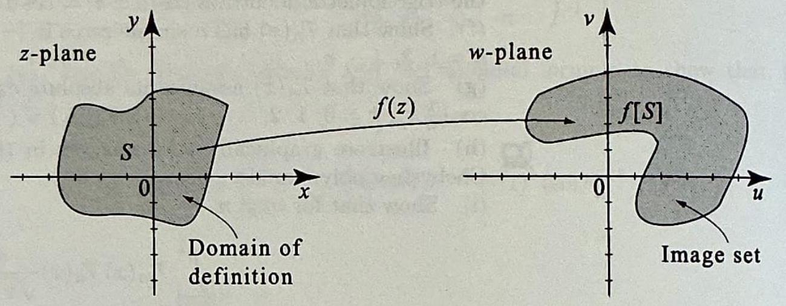
> 
> 
> Figure 1 To visualize a mapping by a complex-valued function $w=f(z)$, we use two planes: the $z$ - or $x y$-plane for the domain of definition and the $w$ - or $u v$-plane for the image.

As usual, we will write $z=x+i y$, and also write $w=u+i v$. Thus as a convention, the $z$-plane axes will be labeled by $x$ and $y$ and those of the $w$-plane by $u$ and $v$. The image $f[S]$ of a set S under a mapping $f$ is the set of all points $w$ such that $w=f(z)$ for some $z$ in $S$. We illustrate the mapping process with basic examples including some familiar geometric transformations.

> [!exercise] Exercise 1: Translation
> Let $S$ denote the disk
> 
> $$
> S=\{z:|z| \leq 1\}
> $$
> 
> Find the image of $S$ under the mapping $f(z)=z+2+i$. Make a plot mathematica.

Write

$$
w=f(z)=z+2+i.
$$

Then

$$
z=w-(2+i).
$$

Since

$$
S=\{z:|z|\le 1\},
$$

a point $w$ lies in the image exactly when the corresponding point

$$
z=w-(2+i)
$$

satisfies

$$
|z|\le 1.
$$

Substituting gives

$$
|w-(2+i)|\le 1.
$$

Therefore

$$
f[S]=\{w:|w-2-i|\le 1\},
$$

which is the disk of radius $1$ centered at $2+i$.

++++

For any $z$ in $S$, the number $f(z)$ is found by adding $z$ to $2+i$ as vectors. Hence the function translates the point $z$ two units to the right and one unit up. The image of $S$, then, is the set $S$ translated two units to the right and one unit up (see Figure 2).

> [!figure] Figure 2
> 
> 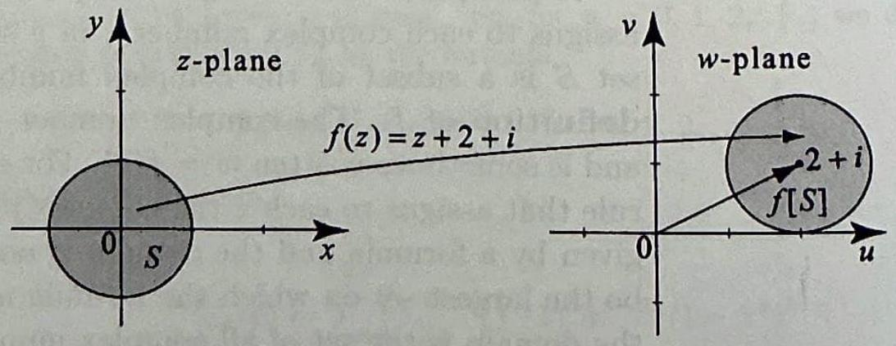
> 
> Figure 2 A ==translation== is a mapping of the form $f(z)= z+b$, where $b$ is a complex number. In Example 1, $b= 2+i$.

Consequently, the image of the disk is a disk of the same radius, centered at $2+i$ (the image of the original center). Hence,

$$
f[S]=\{w:|w-2-i| \leq 1\} .
$$

> [!review] Review 2
> Two transformations that occur during multiplication of complex numbers becomes apparent when we those numbers polar form? What transformations are they? Does it matter which order these transformations are applied? What happens when $r = 1$? What are mappings of the form $f(z)=r z$?

##### review 2

When a complex constant is written in polar form as

$$
a=r(\cos \theta+i\sin \theta),
$$

the mapping

$$
f(z)=az
$$

has two geometric effects. It multiplies the modulus of $z$ by $r$, which is a dilation, and it adds $\theta$ to the argument of $z$, which is a rotation.

It does not matter which order these two transformations are applied. Multiplication by the real number $r$ and multiplication by the unit complex number $\cos \theta+i\sin \theta$ commute, so the final result is the same either way.

When

$$
r=1,
$$

the modulus is unchanged, so the mapping becomes a pure rotation:

$$
f(z)=(\cos \theta+i\sin \theta)z.
$$

Mappings of the form

$$
f(z)=rz,
\qquad r>0,
$$

are dilations by a factor of $r$.

---

Our next example deals with functions of the form $f(z)=a z$, where ${ }^{a}$ is a complex constant. To understand these mappings, recall that when we multiply two complex numbers in polar form, we multiply their moduli and add their arguments. Writing $a$ in polar form as $a=r(\cos \theta+i \sin \theta)$, we see that the mapping $f(z)=r(\cos \theta+i \sin \theta) z$ has two effects: It multiplies the modulus of $z$ by $r>0$ (a dilation) and adds $\theta$ to the argument of $z$ (a rotation). Since multiplication is commutative, these operations of dilation and rotation may be applied in either order. When $r=1$, we obtain the mapping $f(z)=(\cos \theta+i \sin \theta) z$, which is a rotation by the angle $\theta$. Mappings of the form $f(z)=r z$, where $r>0$, are dilations by a factor $r$.

> [!exercise] Exercise 2: Dialations and Rotations
> Let $S$ be the points lying inside and on the square of side length 2 centered at the point 2 on the real axis.
> (a) What is the image of $S$ under the mapping $f(z)=3 z$ ?
> (b) What is the image of $S$ under the mapping $g(z)=2 i z$ ?

##### problem 2a

The square has side length $2$ and is centered at the point $2$ on the real axis, so its center is

$$
2+0i.
$$

Since the square is axis-parallel, its horizontal coordinate runs from $1$ to $3$ and its vertical coordinate runs from $-1$ to $1$. Thus its vertices are

$$
1+i,\qquad 1-i,\qquad 3+i,\qquad 3-i.
$$

Now apply

$$
f(z)=3z.
$$

This mapping is a dilation by a factor of $3$ about the origin, so every point is pushed three times as far from the origin and the shape remains a square. To determine the image exactly, map the four vertices:

$$
\begin{aligned}
f(1+i)&=3+3i, \\
f(1-i)&=3-3i, \\
f(3+i)&=9+3i, \\
f(3-i)&=9-3i.
\end{aligned}
$$

Therefore the image is the square with vertices

$$
3+3i,\qquad 3-3i,\qquad 9+3i,\qquad 9-3i.
$$

Equivalently, it is the square of side length $6$ centered at

$$
f(2)=6.
$$

So

$$
f[S]=\{w=u+iv: 3\le u\le 9,\ -3\le v\le 3\}.
$$

> [!figure] Figure 3
> 
> 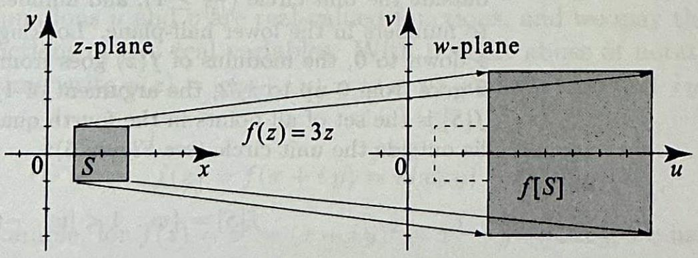
> 
> Figure 3 Images of the corners are computed explicitly using the formula for $f$
> 
> $$
> \begin{aligned}
> & f(1+i)=3+3 i \\
> & f(1-i)=3-3 i \\
> & f(3+i)=9+3 i \\
> & f(3-i)=9-3 i
> \end{aligned}
> $$
> 
> They form the corners of the image.

##### problem 2b

Now consider

$$
g(z)=2iz.
$$

Multiplication by $2i$ has two effects:

$$
2i=2\left(\cos \frac{\pi}{2}+i\sin \frac{\pi}{2}\right),
$$

so the mapping is a dilation by a factor of $2$, followed by a counterclockwise rotation through the angle

$$
\frac{\pi}{2}.
$$

Again we determine the image by mapping the vertices of the original square:

$$
\begin{aligned}
g(1+i)&=2i(1+i)=2i+2i^2=-2+2i, \\
g(1-i)&=2i(1-i)=2i-2i^2=2+2i, \\
g(3+i)&=2i(3+i)=6i+2i^2=-2+6i, \\
g(3-i)&=2i(3-i)=6i-2i^2=2+6i.
\end{aligned}
$$

Therefore the image is the square with vertices

$$
-2+2i,\qquad 2+2i,\qquad -2+6i,\qquad 2+6i.
$$

Its center is the image of the original center:

$$
g(2)=4i,
$$

and its side length is doubled from $2$ to $4$. Hence

$$
g[S]=\{w=u+iv:-2\le u\le 2,\ 2\le v\le 6\}.
$$

> [!figure] Figure 4
> 
> 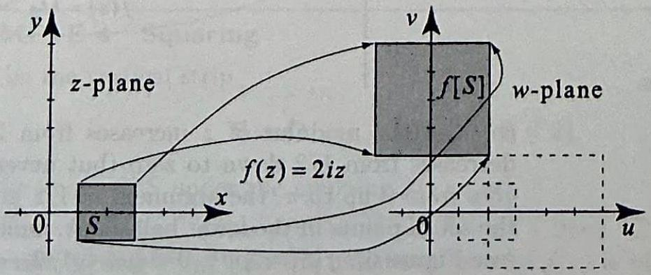
> 
>
>Figure 5 The inversion
> Figure 4 The mapping $g(z)=2 i z$ is a composition of two mappings: a dilation by a factor of 2 , followed by a counterclockwise rotation by an angle of $\pi / 2$. The angle of rotation is the argument of $2 i$.

++++

> [!review] Review 3
> 1. What are mappings of the type $f(z)=a z+b$ called, and why is it important that $a \neq 0$? What types of simpler transformations can linear transformations always be broken down into?
> 2. What do we call the transformation $f(z)$?

##### problem 1

Mappings of the form

$$
f(z)=az+b,
$$

where $a$ and $b$ are complex constants and

$$
a\neq 0,
$$

are called linear transformations. The condition $a\neq 0$ is important because if

$$
a=0,
$$

then

$$
f(z)=b,
$$

which is a constant mapping. Linear transformations can always be viewed as combinations of simpler geometric transformations: a dilation, a rotation, and a translation.

##### problem 2

The transformation

$$
f(z)=z
$$

is called the identity transformation.

+++++

Examples 1 and 2 deal with mappings of the type $f(z)=a z+b$, where $a$ and $b$ are complex constants and $a \neq 0$. These are called ==linear transformations== and can always be thought of in terms of a dilation, a rotation, and a translation. These transformations map regions to geometrically similar regions. It is important that $a \neq 0$ because otherwise the transformation would be a constant. The transformation $f(z)=z$ is called the identity transformation for obvious reasons. The next transformation is not linear.

> [!exercise] Exercise 3: Inversion
> Find the image of the following sets under the mapping $f(z)=1 / z$.
> (a) $S=\{z: 0<|z|<1,0 \leq \arg z \leq \pi / 2\}$.
> (b) $S=\{z: 2 \leq|z|, 0 \leq \arg z \leq \pi\}$.

##### problem 3a

Write

$$
z=r(\cos \theta+i\sin \theta),
\qquad 0<r<1,
\qquad 0\le \theta\le \frac{\pi}{2}.
$$

Then

$$
\frac{1}{z}=\frac{1}{r}\bigl(\cos(-\theta)+i\sin(-\theta)\bigr).
$$

So under the inversion

$$
w=\frac{1}{z},
$$

the modulus becomes

$$
|w|=\frac{1}{|z|}=\frac{1}{r}>1,
$$

and the argument becomes

$$
\arg w=-\arg z=-\theta,
\qquad
-\frac{\pi}{2}\le \arg w\le 0.
$$

Therefore

$$
f[S]=\left\{w: |w|>1,\ -\frac{\pi}{2}\le \arg w\le 0\right\}.
$$

##### problem 3b

Now write

$$
z=r(\cos \theta+i\sin \theta),
\qquad r\ge 2,
\qquad 0\le \theta\le \pi.
$$

Again,

$$
\frac{1}{z}=\frac{1}{r}\bigl(\cos(-\theta)+i\sin(-\theta)\bigr),
$$

so

$$
|w|=\frac{1}{r}\le \frac{1}{2},
\qquad |w|>0,
$$

because $z\neq 0$, and

$$
\arg w=-\theta,
\qquad
-\pi\le \arg w\le 0.
$$

Therefore

$$
f[S]=\left\{w: 0<|w|\le \frac{1}{2},\ -\pi\le \arg w\le 0\right\}.
$$

++++

Solution (a) From (19) in Section 1.3, we know that for $z=r(\cos \theta+i \sin \theta) \neq$ 0 , we have

$$
\frac{1}{z}=\frac{1}{r}(\cos (-\theta)+i \sin (-\theta)) .
$$

According to this formula, the modulus of the number $f(z)$ is the reciprocal of the modulus of $z$ and the argument of $f(z)$ is the negative of the argument of $z$. Consequently, numbers inside the unit circle $(|z| \leq 1)$ get mapped to numbers outside the unit circle $\left(\frac{1}{|z|} \geq 1\right)$, and numbers in the upper half-plane get mapped to numbers in the lower half-plane. Looking at $S$, as the modulus of $z$ goes from 1 down to 0 , the modulus of $f(z)$ goes from 1 up to infinity. As the argument of $z$ goes from 0 up to $\pi / 2$, the argument of $1 / z$ goes from 0 down to $-\pi / 2$. Hence $f[S]$ is the set of all points in the fourth quadrant, including the border axes, that lie outside the unit circle (see Figure 5):

$$
f[S]=\{w: 1<|w|,-\pi / 2 \leq \arg z \leq 0\} .
$$

> [!figure] Figure 5
> 
> 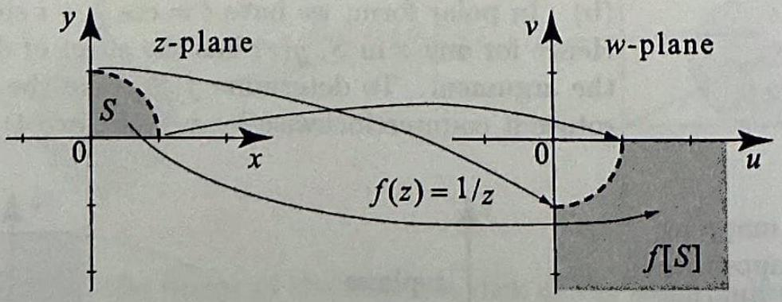
> 
> $$
> w=\frac{1}{z}
> $$
> 
> has the effect of inverting the modulus and changing the sign of the argument:
> 
> $$
> \begin{aligned}
> & |w|=\frac{1}{|z|} \\
> & \operatorname{Arg} w=-\operatorname{Arg} z .
> \end{aligned}
> $$
> 

(b) As the modulus of $z$ increases from 2 up to infinity, the modulus of $1 / z$ decreases from $1 / 2$ down to zero (but never equals zero). As the argument of $z$ goes from 0 up to $\pi$, the argument of $1 / z$ goes from 0 down to $-\pi$. Hence $f[S]$ is the set of points in the lower half-plane, including the real axis, with $0<|w|<1 / 2$ (see Figure 6): $f[S]=\{w: 0<|w|<1 / 2,-\pi \leq \arg z \leq 0\}$.

> [!figure] Figure 6
> Figure 6 Under the inversion
> 
> $$
> f(z)=\frac{1}{z},
> $$
> 
> points outside the circle of radius $2,|z| \geq 2$, get mapped to points inside the circle of radius $\frac{1}{2},|w| \leq \frac{1}{2}$.
> 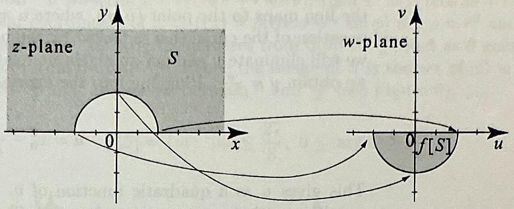
> 

> [!review] Review 4
> What is a linear fractional transformation? What are the restrictions on this form? What happens when $ad = bc$?

##### review 4

A linear fractional transformation is a mapping of the form

$$
w=\frac{az+b}{cz+d},
$$

where $a$, $b$, $c$, and $d$ are complex constants. It is also called a bilinear transformation or a Möbius transformation.

The restriction on this form is that

$$
ad\neq bc.
$$

This condition is necessary so that the transformation is not degenerate. If

$$
ad=bc,
$$

then the numerator and denominator are proportional, so the expression does not define a genuine linear fractional transformation. In that case, wherever the denominator is nonzero, the value of

$$
\frac{az+b}{cz+d}
$$

is constant.

+++++

The function $f(z)=\frac{1}{z}$ in Example 3 is a special case of a general type of mapping of the form

> [!definition] Linear Fractional Transformation (Bilinear Transformation, Möbius Transformation) 
> $$
> w=\frac{a z+b}{c z+d} \quad(a d \neq b c)
> $$

known as a ==linear fractional transformation==, also known as a bilinear transformation or Möbius transformation. Here $a, b, c, d$ are complex numbers, and you can check that when $a d=b c, w$ is constant. Linear fractional transformations are studied extensively in Chapter 6. They have many important applications that will occur throughout the book.

## Real and Imaginary Parts of Functions

> [!review] Review 5
> 1. Given a complex function $f(z)$, define $u$ and $v$ and explain what kind of objects they are. Write $f(z)$ in terms of $u$ and $v$. What notational convention is being used when we write $u(x+i y)=u(x, y)$, and why is it called an abuse of notation?
> 2. What is the practical utility of decomposing $f(z)$ into $u(x, y)$ and $v(x, y)$ ?

##### problem 1

Given a complex function $f(z)$, we define

$$
u(z)=\operatorname{Re} f(z),
\qquad
v(z)=\operatorname{Im} f(z).
$$

The functions $u$ and $v$ are real-valued functions. If we write

$$
z=x+iy,
$$

then we may regard $u$ and $v$ as functions of the two real variables $x$ and $y$. Thus

$$
f(z)=f(x+iy)=u(x,y)+iv(x,y).
$$

When we write

$$
u(x+iy)=u(x,y),
$$

or similarly for $v$, we are using a slight abuse of notation. It is called an abuse of notation because the left-hand side treats $u$ as a function of the complex variable $z=x+iy$, while the right-hand side treats the same symbol $u$ as a function of the two real variables $x$ and $y$. The notation is convenient, even though the two viewpoints are formally different.

##### problem 2

The practical value of decomposing

$$
f(z)=u(x,y)+iv(x,y)
$$

is that it allows us to study a complex mapping by means of two real-valued functions. In particular, we can determine algebraically the image of a set by finding relations between the real coordinates

$$
u=\operatorname{Re} f(z),
\qquad
v=\operatorname{Im} f(z),
$$

and the original coordinates $x$ and $y$. This is especially useful when the geometry of the mapping is not immediately obvious.

+++++

Given a complex function $f(z)$, let $u(z)=\operatorname{Re} f(z)$ and $v(z)=\operatorname{Im} f(z)$. The functions $u$ and $v$ are real-valued functions, and we may think of them as functions of two real variables. With a slight abuse of notation, we will sometime write $u(z)=u(x+i y)=u(x, y)$, and $v(z)=v(x+i y)=v(x, y)$. Thus

$$
f(z)=f(x+i y)=u(x, y)+i v(x, y) .
$$

For example, for $f(z)=z^{2}=(x+i y)^{2}=x^{2}-y^{2}+2 i x y$, we have

$$
u(x, y)=x^{2}-y^{2} \quad \text { and } \quad v(x, y)=2 x y .
$$

As we now illustrate, the functions $u(x, y)$ and $v(x, y)$ may be used to determine algebraically the image of a set when the answer is not geometrically obvious.

> [!exercise] Exercise 4: Squaring
> Let $S$ be the vertical strip
> 
> $$
> S=\{z=x+i y: 1 \leq x \leq 2\} .
> $$
> 
> Find the image of $S$ under the mapping $f(z)=z^{2}$. Plot the mapping.

Write

$$
z=x+iy.
$$

Then

$$
f(z)=z^{2}=(x+iy)^{2}=x^{2}-y^{2}+2ixy.
$$

So if

$$
w=u+iv=f(z),
$$

then

$$
u=x^{2}-y^{2},
\qquad
v=2xy.
$$

To understand the image of the whole strip

$$
1\le x\le 2,
$$

fix one value

$$
x=x_{0},
\qquad 1\le x_{0}\le 2.
$$

Along this vertical line,

$$
u=x_{0}^{2}-y^{2},
\qquad
v=2x_{0}y.
$$

Solve the second equation for $y$:

$$
y=\frac{v}{2x_{0}}.
$$

Substitute into the first equation:

$$
\begin{aligned}
u
&=x_{0}^{2}-\left(\frac{v}{2x_{0}}\right)^{2} \\
&=x_{0}^{2}-\frac{v^{2}}{4x_{0}^{2}}.
\end{aligned}
$$

For each fixed $x_{0}$, this is a left-opening parabola in the $w$-plane. As $x_{0}$ ranges from $1$ to $2$, these parabolas sweep out the image region. The left boundary comes from

$$
x_{0}=1,
$$

which gives

$$
u=1-\frac{v^{2}}{4},
$$

and the right boundary comes from

$$
x_{0}=2,
$$

which gives

$$
u=4-\frac{v^{2}}{16}.
$$

Therefore

$$
f[S]=\left\{w=u+iv:1-\frac{v^{2}}{4}\le u\le 4-\frac{v^{2}}{16}\right\}.
$$

++++

Solution As before, write $f(z)=z^{2}=x^{2}-y^{2}+2 i x y$. Thus the real part of $f(z)$ is $u(x, y)=x^{2}-y^{2}$ and the imaginary part of $f(z)$ is $v(x, y)=2 x y$. Let us
fix $1 \leq x_{0} \leq 2$, and find the image of the vertical line $x=x_{0}$. A point $\left(x_{0}, y\right)$ on the line maps to the point $(u, v)$, where $u=x_{0}^{2}-y^{2}, v=2 x_{0} y$. To determine the equation of the curve that is traced by the point $(u, v)$ as $y$ varies from $-\infty$ to $\infty$, we will eliminate $y$ and get an algebraic relation between $u$ and $v$. From $v=2 x_{0 y}$, we obtain $y=\frac{v}{2 x_{0}}$. Plugging into the expression for $u$, we obtain

$$
u=x_{0}^{2}-\frac{v^{2}}{4 x_{0}^{2}}
$$

This gives $u$ as a quadratic function of $v$. Hence the graph is a leftward-facing parabola with a vertex at $(u, v)=\left(x_{0}^{2}, 0\right)$ and $v$-intercepts at $\left(0, \pm 2 x_{0}^{2}\right)$. As $x_{0}$ ranges from 1 up to 2 , the corresponding parabolas in the $w$-plane sweep out a parabolic region, which is described as follows (see Figure 7). Since all points lie to the right of the parabola, where $x_{0}=1$, and to the left of the parabola, where $x_{0}=2$, we have

$$
f[S]=\left\{w=u+i v: 1-\frac{v^{2}}{4} \leq u \leq 4-\frac{v^{2}}{16}\right\}
$$

> [!figure] Figure 7
>  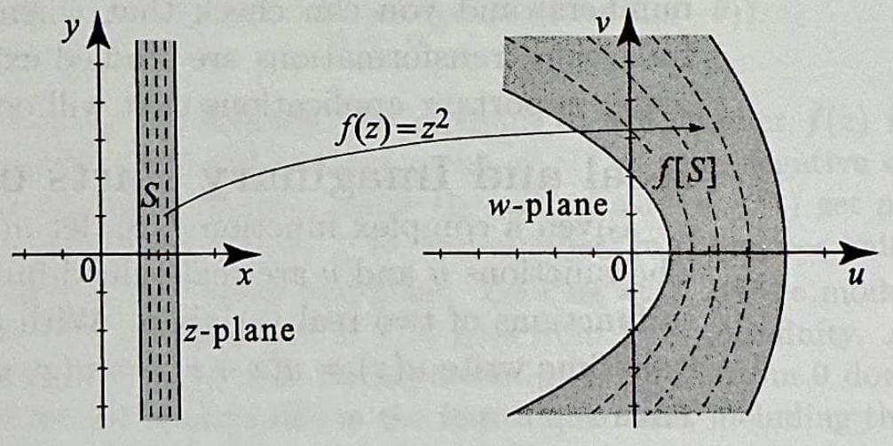
> 
> Figure 7 For $1 \leq x_{0} \leq 2$, the image of a line $x=x_{0}$ under the mapping $f(z)=z^{2}$ is a parabola
> 
> $$
> u=x_{0}^{2}-\frac{v^{2}}{4 x_{0}^{2}}
> $$
> 
> As we vary $x_{0}$ from 1 to 2 , these parabolas sweep out a parabolic region, which determines $f[S]$.

# Mappings in Polar Coordinates

> [!review] Review 6
> 1. Some complex functions are more naturally expressed in polar coordinates. Write $f(z)$ in polar form, identifying its real and imaginary parts as functions of $r$ and $\theta$.
> 2. If the output $w=f(z)$ is also written in polar form, express the modulus and argument of $w$ as functions of the polar coordinates of $z$.

##### problem 1

If

$$
z=re^{i\theta}=r(\cos\theta+i\sin\theta),
$$

then a complex function may be written in polar form as

$$
f(z)=f\left(re^{i\theta}\right)=u(r,\theta)+iv(r,\theta),
$$

where $u(r,\theta)$ and $v(r,\theta)$ are the real and imaginary parts of the function, expressed as functions of the polar coordinates $r$ and $\theta$.

##### problem 2

If the image point is also written in polar form as

$$
w=f(z)=\rho(\cos\phi+i\sin\phi),
$$

then the modulus and argument of $w$ are functions of the polar coordinates of $z$. In particular,

$$
\rho(r,\theta)=\left|f\left(re^{i\theta}\right)\right|
$$

and

$$
\phi(r,\theta)=\arg f\left(re^{i\theta}\right).
$$

Thus the polar coordinates of the output are obtained by expressing $|f(z)|$ and $\arg f(z)$ in terms of $r$ and $\theta$.

+++++

Some complex functions and regions are more naturally suited to polar coordinates. Hence it may be to our advantage to write a function as

$$
f(z)=f\left(r e^{i \theta}\right)=u(r, \theta)+i v(r, \theta)
$$

We may even write $w=f(z)$ in polar coordinates as $w=\rho(\cos \phi+i \sin \phi)$. Then we may identify the polar coordinates of $w$ as functions of the polar coordinates of $z: \rho(r, \theta)=\left|f\left(r e^{i \theta}\right)\right|$ and $\phi(r, \theta)=\arg f\left(r e^{i \theta}\right)$. The next example uses such polar coordinates to track the mapping of circular sectors.

> [!exercise] Exercise 5: Mapping Sectors
> Let $S$ be the sector
> 
> $$
> S=\left\{z:|z| \leq \frac{3}{2}, 0 \leq \arg z \leq \frac{\pi}{4} .\right\}
> $$
> 
> Find the image of $S$ under the mapping $f(z)=z^{3}$.

Write

$$
z=r(\cos\theta+i\sin\theta),
\qquad
0\le r\le \frac{3}{2},
\qquad
0\le \theta\le \frac{\pi}{4}.
$$

Then

$$
z^3=r^3(\cos 3\theta+i\sin 3\theta).
$$

So if

$$
w=f(z)=\rho(\cos\phi+i\sin\phi),
$$

then the polar coordinates of $w$ are

$$
\rho=r^3,
\qquad
\phi=3\theta.
$$

As $r$ varies from $0$ to $\frac{3}{2}$, we get

$$
0\le \rho\le \left(\frac{3}{2}\right)^3=\frac{27}{8}.
$$

As $\theta$ varies from $0$ to $\frac{\pi}{4}$, we get

$$
0\le \phi\le 3\cdot\frac{\pi}{4}=\frac{3\pi}{4}.
$$

Therefore the image is the sector

$$
f[S]=\left\{w:|w|\le \frac{27}{8},\ 0\le \arg w\le \frac{3\pi}{4}\right\}.
$$

++++

Solution If we write $z=r(\cos \theta+i \sin \theta)$, then $z^{3}=r^{3}(\cos 3 \theta+i \sin 3 \theta)$. Hence the polar coordinates of $w=f(z)=\rho(\cos \phi+i \sin \phi)$ are $\rho=r^{3}$ and $\phi=3 \theta$. As $r$ increases from 0 up to $\frac{3}{2}, \rho$ increases from 0 up to $\frac{27}{8}$; and as $\theta$ goes from 0 up to $\frac{\pi}{4}, \phi$ goes from 0 up to $\frac{3 \pi}{4}$. Hence the image of $S$ is the set of all $w$ with modulus less than $\frac{27}{8}$ and arguments between 0 and $\frac{3 \pi}{4}$ (see Figure 8):

$$
f[S]=\left\{w:|w| \leq \frac{27}{8}, 0 \leq \arg w \leq \frac{3 \pi}{4}\right\} .
$$

> [!figure] Figure 8
> 
> Figure 8 The mapping
> 
> $$
> w=z^{3}
> $$
> 
> has the effect of cubing the norm and tripling the argument:
> 
> $$
> \begin{aligned}
> & |w|=|z|^{3} \\
> & \arg w=3 \operatorname{Arg} z
> \end{aligned}
> $$
> 
> 
> 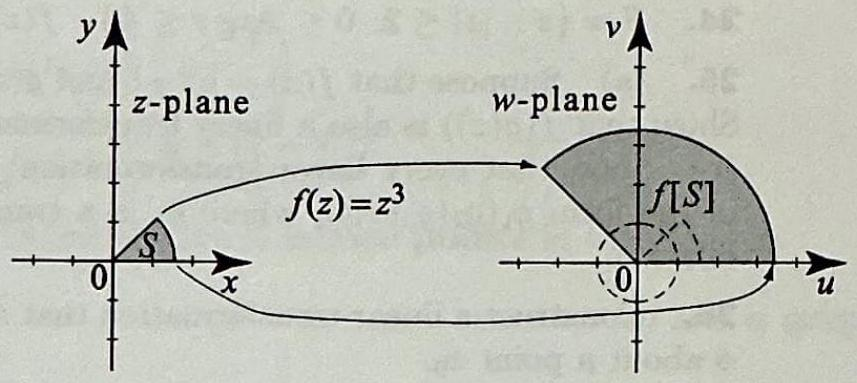
> 

All the mappings considered in the examples have been one-to-one, in that distinct points $z_{1}$ and $z_{2}$ always map to distinct points $f\left(z_{1}\right)$ and $f\left(z_{2}\right)$. It is possible that more than one point on the $z$-plane will map to the same point on the $w$-plane. Such mappings are not one-to-one, and we are already familiar with some of them. For example, the function $f(z)=z^{2}$ with domain of definition $\mathbb{C}$ will map $z$ and $-z$ to the same point in the $w$-plane.

## Exercises 1.4

> [!exercise] Exercise 6
> In problems 1-6, evaluate $w=f(z)$ for the given value of $z$.
> 1. $f(z)=z+i, z=3+4 i$.
> 2. $f(z)=3 i z, z=-5 i$.
> 3. $f(z)=\operatorname{Re}(z)-2 i \operatorname{Im} z, z=-4+i$.
> 4. $f(z)=z^{10}+\bar{z}, z=-\sqrt{3}+i$.
> 5. $f(z)=\left(z^{2}+2\right)^{\frac{1}{2}}$ (principal root), $z=1+i$.
> 6. $f(z)=\frac{z-1}{z+1}, z=i+1$.

Solution We substitute the given value of $z$ into each formula and simplify.

##### problem 1

$$
\begin{aligned}
w&=f(3+4 i) \\
&=(3+4 i)+i \\
&=3+5 i .
\end{aligned}
$$

##### problem 2

$$
\begin{aligned}
w&=f(-5 i) \\
&=3 i(-5 i) \\
&=-15 i^{2} \\
&=15 .
\end{aligned}
$$

##### problem 3

$$
\begin{aligned}
w&=f(-4+i) \\
&=\operatorname{Re}(-4+i)-2 i \operatorname{Im}(-4+i) \\
&=-4-2 i(1) \\
&=-4-2 i .
\end{aligned}
$$

##### problem 4

$$
\begin{aligned}
z&=-\sqrt{3}+i \\
&=2\left(\cos \frac{5 \pi}{6}+i \sin \frac{5 \pi}{6}\right) .
\end{aligned}
$$

Then

$$
\begin{aligned}
z^{10}&=2^{10}\left(\cos \frac{50 \pi}{6}+i \sin \frac{50 \pi}{6}\right) \\
&=1024\left(\cos \frac{25 \pi}{3}+i \sin \frac{25 \pi}{3}\right) \\
&=1024\left(\cos \frac{\pi}{3}+i \sin \frac{\pi}{3}\right) \\
&=1024\left(\frac{1}{2}+\frac{\sqrt{3}}{2} i\right) \\
&=512+512 \sqrt{3}\, i .
\end{aligned}
$$

Also,

$$
\bar{z}=-\sqrt{3}-i .
$$

Hence

$$
\begin{aligned}
w&=f(z) \\
&=z^{10}+\bar{z} \\
&=\left(512+512 \sqrt{3}\, i\right)+\left(-\sqrt{3}-i\right) \\
&=(512-\sqrt{3})+(512 \sqrt{3}-1) i .
\end{aligned}
$$

##### problem 5

$$
\begin{aligned}
z^{2}+2&=(1+i)^{2}+2 \\
&=1+2 i+i^{2}+2 \\
&=1+2 i-1+2 \\
&=2+2 i .
\end{aligned}
$$

Now

$$
\begin{aligned}
2+2 i&=2 \sqrt{2}\left(\cos \frac{\pi}{4}+i \sin \frac{\pi}{4}\right) .
\end{aligned}
$$

Therefore the principal square root is

$$
\begin{aligned}
w&=\left(2+2 i\right)^{1 / 2} \\
&=\left(2 \sqrt{2}\right)^{1 / 2}\left(\cos \frac{\pi}{8}+i \sin \frac{\pi}{8}\right) \\
&=2^{3 / 4}\left(\cos \frac{\pi}{8}+i \sin \frac{\pi}{8}\right) .
\end{aligned}
$$

Equivalently,

$$
w=\sqrt{1+\sqrt{2}}+i \sqrt{\sqrt{2}-1} .
$$

##### problem 6

$$
\begin{aligned}
w&=f(1+i) \\
&=\frac{(1+i)-1}{(1+i)+1} \\
&=\frac{i}{2+i} \\
&=\frac{i}{2+i} \cdot \frac{2-i}{2-i} \\
&=\frac{i(2-i)}{(2+i)(2-i)} \\
&=\frac{2 i-i^{2}}{4-i^{2}} \\
&=\frac{2 i+1}{5} \\
&=\frac{1+2 i}{5} .
\end{aligned}
$$

> [!exercise] Exercise 7
> In problems 7-12, express $f(z)$ in the form $u(x, y)+i v(x, y)$ where $u$ and $v$ are the real and imaginary parts of $f$.
> 7. $f(z)=i z+2-i$.
> 8. $f(z)=z^{2}+3 z+1+3 i$.
> 9. $f(z)=z^{3}$.
> 10. $f(z)=2 \bar{z}+\frac{1}{2+i}$.
> 11. $f(z)=\frac{1}{z+1}$.
> 12. $f(z)=|z|^{3}$.

##### problem 7

Let $z=x+i y$. Then

$$
\begin{aligned}
f(z)&=i z+2-i \\
&=i(x+i y)+2-i \\
&=i x+i^{2} y+2-i \\
&=i x-y+2-i \\
&=(2-y)+i(x-1) .
\end{aligned}
$$

Thus

$$
u(x, y)=2-y, \qquad v(x, y)=x-1 .
$$

##### problem 8

Let $z=x+i y$. Then

$$
\begin{aligned}
f(z)&=z^{2}+3 z+1+3 i \\
&=(x+i y)^{2}+3(x+i y)+1+3 i \\
&=x^{2}+2 i x y+i^{2} y^{2}+3 x+3 i y+1+3 i \\
&=x^{2}+2 i x y-y^{2}+3 x+3 i y+1+3 i \\
&=\left(x^{2}-y^{2}+3 x+1\right)+i(2 x y+3 y+3) .
\end{aligned}
$$

Thus

$$
u(x, y)=x^{2}-y^{2}+3 x+1, \qquad v(x, y)=2 x y+3 y+3 .
$$

##### problem 9

Let $z=x+i y$. Then

$$
\begin{aligned}
f(z)&=z^{3} \\
&=(x+i y)^{3} \\
&=(x+i y)(x+i y)^{2} \\
&=(x+i y)\left(x^{2}+2 i x y+i^{2} y^{2}\right) \\
&=(x+i y)\left(x^{2}+2 i x y-y^{2}\right) \\
&=x\left(x^{2}+2 i x y-y^{2}\right)+i y\left(x^{2}+2 i x y-y^{2}\right) \\
&=x^{3}+2 i x^{2} y-x y^{2}+i x^{2} y+2 i^{2} x y^{2}-i y^{3} \\
&=x^{3}+2 i x^{2} y-x y^{2}+i x^{2} y-2 x y^{2}-i y^{3} \\
&=\left(x^{3}-3 x y^{2}\right)+i\left(3 x^{2} y-y^{3}\right) .
\end{aligned}
$$

Thus

$$
u(x, y)=x^{3}-3 x y^{2}, \qquad v(x, y)=3 x^{2} y-y^{3} .
$$

##### problem 10

Let $z=x+i y$. Then $\bar{z}=x-i y$, so

$$
\begin{aligned}
f(z)&=2 \bar{z}+\frac{1}{2+i} \\
&=2(x-i y)+\frac{1}{2+i} \\
&=2 x-2 i y+\frac{1}{2+i} \cdot \frac{2-i}{2-i} \\
&=2 x-2 i y+\frac{2-i}{(2+i)(2-i)} \\
&=2 x-2 i y+\frac{2-i}{4-i^{2}} \\
&=2 x-2 i y+\frac{2-i}{5} \\
&=2 x-2 i y+\frac{2}{5}-\frac{1}{5} i \\
&=\left(2 x+\frac{2}{5}\right)+i\left(-2 y-\frac{1}{5}\right) .
\end{aligned}
$$

Thus

$$
u(x, y)=2 x+\frac{2}{5}, \qquad v(x, y)=-2 y-\frac{1}{5} .
$$

##### problem 11

Let $z=x+i y$. Then

$$
\begin{aligned}
f(z)&=\frac{1}{z+1} \\
&=\frac{1}{x+1+i y} \\
&=\frac{1}{x+1+i y} \cdot \frac{x+1-i y}{x+1-i y} \\
&=\frac{x+1-i y}{(x+1+i y)(x+1-i y)} \\
&=\frac{x+1-i y}{(x+1)^{2}-i^{2} y^{2}} \\
&=\frac{x+1-i y}{(x+1)^{2}+y^{2}} \\
&=\frac{x+1}{(x+1)^{2}+y^{2}}+i\left(\frac{-y}{(x+1)^{2}+y^{2}}\right) .
\end{aligned}
$$

Thus

$$
u(x, y)=\frac{x+1}{(x+1)^{2}+y^{2}}, \qquad v(x, y)=-\frac{y}{(x+1)^{2}+y^{2}} .
$$

##### problem 12

Let $z=x+i y$. Then

$$
\begin{aligned}
f(z)&=|z|^{3} \\
&=\left(\sqrt{x^{2}+y^{2}}\right)^{3} \\
&=\left(x^{2}+y^{2}\right)^{3 / 2}+i(0) .
\end{aligned}
$$

Thus

$$
u(x, y)=\left(x^{2}+y^{2}\right)^{3 / 2}, \qquad v(x, y)=0 .
$$

> [!exercise] Exercise 8
> In problems 13-18, find the largest subset of $\mathbb{C}$ on which the given formula makes sense and hence defines a function.
> 13. $f(z)=\frac{1}{z}$.
> 14. $f(z)=3+i z^{2}$.
> 15. $f(z)=\frac{1}{1+z^{2}}$.
> 16. $f(z)=2+i \operatorname{Arg} z$.
> 17. $f(z)=z^{\frac{1}{2}}$ (principal root).
> 18. $f(z)=\frac{z-2 i}{2 z+i}$.
> 19. Find a linear transformation $f(z)$ such that $f(1)=3+i$ and $f(3 i)=-2+6 i$.
> 20. Find a linear transformation $f(z)$ such that $f(2-i)=-3-3 i$ and $f(2)= -2-2 i$.

Solution For 13-18, we determine where each formula is defined and single-valued.

##### problem 13

The formula

$$
f(z)=\frac{1}{z}
$$

makes sense exactly when the denominator is not zero. Hence the largest possible domain is

$$
\mathbb{C} \backslash\{0\} .
$$

##### problem 14

The formula

$$
f(z)=3+i z^{2}
$$

involves only squaring, multiplication, and addition, all of which are defined for every complex number. Hence the largest possible domain is

$$
\mathbb{C} .
$$

##### problem 15

The formula

$$
f(z)=\frac{1}{1+z^{2}}
$$

makes sense when

$$
1+z^{2} \neq 0 .
$$

So we solve

$$
\begin{aligned}
1+z^{2}&=0 \\
z^{2}&=-1 \\
z&=\pm i .
\end{aligned}
$$

Therefore the largest possible domain is

$$
\mathbb{C} \backslash\{i,-i\} .
$$

##### problem 16

The function

$$
f(z)=2+i \operatorname{Arg} z
$$

is defined whenever the principal argument $\operatorname{Arg} z$ is defined. This fails only at $z=0$. Hence the largest possible domain is

$$
\mathbb{C} \backslash\{0\} .
$$

##### problem 17

The formula

$$
f(z)=z^{1 / 2}
$$

with the principal root specified gives one distinguished square root for each nonzero complex number, and for $z=0$ we have the unique square root $0$. Hence the largest possible domain is

$$
\mathbb{C} .
$$

##### problem 18

The formula

$$
f(z)=\frac{z-2 i}{2 z+i}
$$

makes sense when the denominator is not zero. Thus

$$
\begin{aligned}
2 z+i&\neq 0 \\
2 z&\neq-i \\
z&\neq-\frac{i}{2} .
\end{aligned}
$$

Therefore the largest possible domain is

$$
\mathbb{C} \backslash\left\{-\frac{i}{2}\right\} .
$$

##### problem 19

Let

$$
f(z)=a z+b .
$$

Then the conditions become

$$
\begin{aligned}
f(1)&=a+b=3+i, \\
f(3 i)&=3 i a+b=-2+6 i .
\end{aligned}
$$

Subtract the first equation from the second:

$$
\begin{aligned}
(3 i a+b)-(a+b)&=(-2+6 i)-(3+i) \\
a(3 i-1)&=-5+5 i .
\end{aligned}
$$

So

$$
\begin{aligned}
a&=\frac{-5+5 i}{3 i-1} \\
&=\frac{-5+5 i}{-1+3 i} \\
&=\frac{-5+5 i}{-1+3 i} \cdot \frac{-1-3 i}{-1-3 i} \\
&=\frac{(-5+5 i)(-1-3 i)}{(-1)^{2}-(3 i)^{2}} \\
&=\frac{5+15 i-5 i-15 i^{2}}{1-9 i^{2}} \\
&=\frac{20+10 i}{10} \\
&=2+i .
\end{aligned}
$$

Then

$$
\begin{aligned}
b&=3+i-a \\
&=3+i-(2+i) \\
&=1 .
\end{aligned}
$$

Hence

$$
f(z)=(2+i) z+1 .
$$

##### problem 20

Let

$$
f(z)=a z+b .
$$

Then

$$
\begin{aligned}
f(2-i)&=a(2-i)+b=-3-3 i, \\
f(2)&=2 a+b=-2-2 i .
\end{aligned}
$$

Subtract the second equation from the first:

$$
\begin{aligned}
\left(a(2-i)+b\right)-(2 a+b)&=(-3-3 i)-(-2-2 i) \\
2 a-i a+b-2 a-b&=-1-i \\
-i a&=-1-i .
\end{aligned}
$$

Therefore

$$
\begin{aligned}
a&=\frac{-1-i}{-i} \\
&=\frac{-1-i}{-i} \cdot i \\
&=(-1-i) i \\
&=-i-i^{2} \\
&=1-i .
\end{aligned}
$$

Then

$$
\begin{aligned}
b&=-2-2 i-2 a \\
&=-2-2 i-2(1-i) \\
&=-2-2 i-2+2 i \\
&=-4 .
\end{aligned}
$$

Hence

$$
f(z)=(1-i) z-4 .
$$

> [!exercise] Exercise 9
> In problems 21-24, find the image $f[S]$ under the given linear transformation. Draw a picture of $S$ and $f[S]$, and depict arrows mapping select points.
> 21. $S=\{z:|z|<1\}, \quad f(z)=4 z$.
> 22. $S=\{z: \operatorname{Re} z>0\}, \quad f(z)=z+i$.
> 23. $S=\{z: \operatorname{Re} z>0, \operatorname{Im} z>0\}, f(z)=-z+2 i$.
> 24. $S=\left\{z:|z| \leq 2,0 \leq \operatorname{Arg} z \leq \frac{\pi}{2}\right\} \quad f(z)=i z+2$.

Solution We identify each mapping as a composition of simple geometric transformations.

##### problem 21

Here

$$
f(z)=4 z
$$

is a dilation by a factor of $4$ about the origin. The set

$$
S=\{z:|z|<1\}
$$

is the open unit disk, so its image is the open disk of radius $4$ centered at the origin:

$$
f[S]=\{w:|w|<4\} .
$$

![[Pasted image 20260409005720.png]]

##### problem 22

Here

$$
f(z)=z+i
$$

is a translation upward by one unit. Write $z=x+i y$. Then

$$
w=f(z)=x+i(y+1) .
$$

Hence

$$
\operatorname{Re} w=x=\operatorname{Re} z .
$$

Since $S=\{z: \operatorname{Re} z>0\}$, we obtain

$$
f[S]=\{w: \operatorname{Re} w>0\} .
$$

So the right half-plane maps to itself.

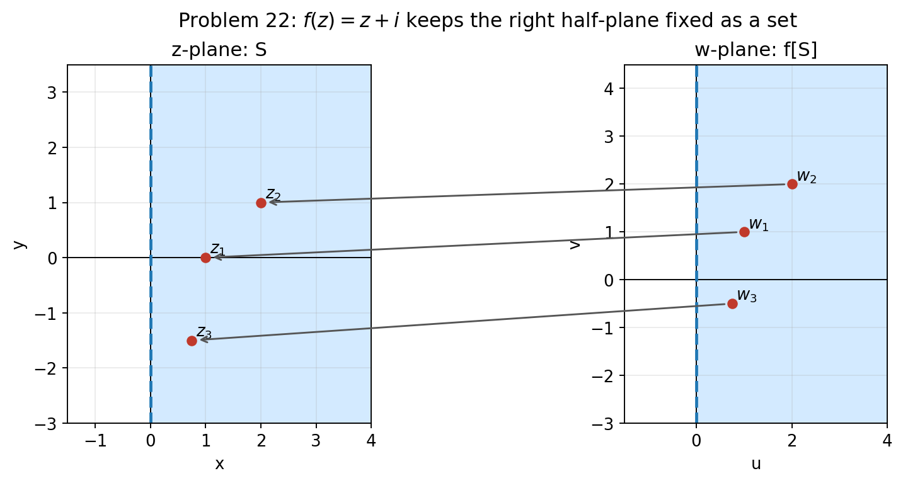

##### problem 23

Write $z=x+i y$ with

$$
x>0, \qquad y>0 .
$$

Then

$$
\begin{aligned}
w&=f(z) \\
&=-z+2 i \\
&=-(x+i y)+2 i \\
&=-x+i(2-y) .
\end{aligned}
$$

Thus

$$
\operatorname{Re} w=-x<0
$$

and

$$
\operatorname{Im} w=2-y<2 .
$$

Conversely, if $u<0$ and $v<2$, then choosing

$$
x=-u>0, \qquad y=2-v>0
$$

gives

$$
-x+i(2-y)=u+i v .
$$

Therefore

$$
f[S]=\{w: \operatorname{Re} w<0,\ \operatorname{Im} w<2\} .
$$

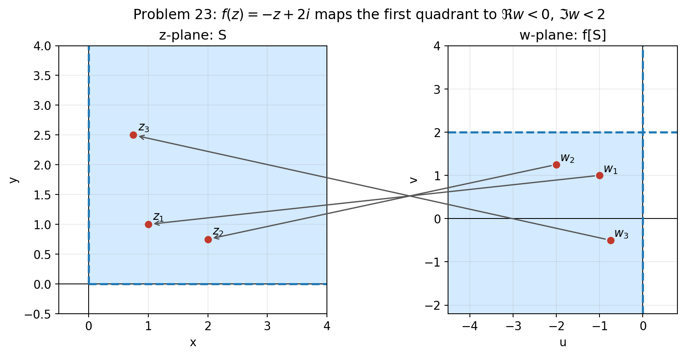

##### problem 24

The map

$$
f(z)=i z+2
$$

is a rotation by $\frac{\pi}{2}$ counterclockwise, followed by a translation two units to the right.

Write

$$
z=r(\cos \theta+i \sin \theta),
\qquad
0 \leq r \leq 2,
\qquad
0 \leq \theta \leq \frac{\pi}{2} .
$$

Then

$$
\begin{aligned}
w-2&=i z \\
&=i r(\cos \theta+i \sin \theta) \\
&=r\left(\cos \left(\theta+\frac{\pi}{2}\right)+i \sin \left(\theta+\frac{\pi}{2}\right)\right) .
\end{aligned}
$$

Hence

$$
|w-2|=r \leq 2
$$

and

$$
\operatorname{Arg}(w-2)=\theta+\frac{\pi}{2},
\qquad
\frac{\pi}{2} \leq \operatorname{Arg}(w-2) \leq \pi .
$$

Therefore

$$
f[S]=\left\{w:|w-2| \leq 2,\ \frac{\pi}{2} \leq \operatorname{Arg}(w-2) \leq \pi\right\} .
$$

This is the quarter-disk of radius $2$ centered at $2$, lying above and to the left of the center.

> [!exercise] Exercise 10
> 25. (a) Suppose that $f(z)=a z+b$ and $g(z)=c z+d$ are linear transformations. Show that $f(g(z))$ is also a linear transformation.
> (b) Show that every linear transformation $f(z)=a z+b, a \neq 0$ can be written in the form $g_{1}\left(g_{2}\left(g_{3}(z)\right)\right)$, where $g_{1}$ is a translation, $g_{2}$ is a rotation, and $g_{3}$ is a dilation.
> 26. Construct a linear transformation that rotates all points in the plane an angle $\phi$ about a point $z_{0}$
> 27. Let $f(z)=a z$ and $g(z)=z+b$. Show that $f(g(z))=g(f(z))$ for all $z$ if and only if $a=1$ or $b=0$.
> 28. Show that for each linear transformation $f(z)=a z+b$, there exists a linear transformation $g(z)$ such that $f(g(z))=g(f(z))=z$ for all complex $z$.
> 

##### problem 25a

Let

$$
f(z)=a z+b, \qquad g(z)=c z+d,
$$

where $a \neq 0$ and $c \neq 0$. Then

$$
\begin{aligned}
f(g(z))&=f(c z+d) \\
&=a(c z+d)+b \\
&=a c z+a d+b \\
&=(a c) z+(a d+b) .
\end{aligned}
$$

Since $a \neq 0$ and $c \neq 0$, we have $a c \neq 0$. Therefore $f(g(z))$ is again of the form

$$
\alpha z+\beta
$$

with $\alpha \neq 0$, so $f(g(z))$ is a linear transformation.

##### problem 25b

Let

$$
f(z)=a z+b, \qquad a \neq 0 .
$$

Write $a$ in polar form:

$$
a=r(\cos \theta+i \sin \theta),
\qquad r=|a|>0 .
$$

Now define

$$
g_{3}(z)=r z,
\qquad
g_{2}(z)=(\cos \theta+i \sin \theta) z,
\qquad
g_{1}(z)=z+b .
$$

Then $g_{3}$ is a dilation, $g_{2}$ is a rotation, and $g_{1}$ is a translation. Also,

$$
\begin{aligned}
g_{1}\left(g_{2}\left(g_{3}(z)\right)\right)
&=g_{1}\left(g_{2}(r z)\right) \\
&=g_{1}\left((\cos \theta+i \sin \theta) r z\right) \\
&=r(\cos \theta+i \sin \theta) z+b \\
&=a z+b \\
&=f(z) .
\end{aligned}
$$

Therefore every linear transformation can be written as a translation composed with a rotation composed with a dilation.

##### problem 26

To rotate about the point $z_{0}$, we first translate $z_{0}$ to the origin, then rotate by $\phi$, then translate back. Thus

$$
\begin{aligned}
f(z)
&=(\cos \phi+i \sin \phi)\left(z-z_{0}\right)+z_{0}.
\end{aligned}
$$

This is a linear transformation because

$$
\begin{aligned}
f(z)
&=(\cos \phi+i \sin \phi) z+z_{0}-(\cos \phi+i \sin \phi) z_{0} \\
&=(\cos \phi+i \sin \phi) z+\left(1-\cos \phi-i \sin \phi\right) z_{0} .
\end{aligned}
$$

The coefficient of $z$ is $\cos \phi+i \sin \phi$, whose modulus is $1$, so the map is a pure rotation together with the needed translations to keep $z_{0}$ fixed.

##### problem 27

We compute both compositions:

$$
\begin{aligned}
f(g(z))
&=f(z+b) \\
&=a(z+b) \\
&=a z+a b ,
\end{aligned}
$$

and

$$
\begin{aligned}
g(f(z))
&=g(a z) \\
&=a z+b .
\end{aligned}
$$

Hence

$$
f(g(z))=g(f(z)) \text { for all } z
$$

if and only if

$$
\begin{aligned}
a z+a b&=a z+b \\
a b&=b \\
b(a-1)&=0 .
\end{aligned}
$$

Therefore

$$
f(g(z))=g(f(z)) \text { for all } z
$$

if and only if

$$
a=1 \quad \text { or } \quad b=0 .
$$

##### problem 28

Let

$$
f(z)=a z+b, \qquad a \neq 0 .
$$

We seek a linear transformation

$$
g(z)=c z+d
$$

such that

$$
f(g(z))=g(f(z))=z .
$$

Take

$$
g(z)=\frac{z-b}{a}=\frac{1}{a} z-\frac{b}{a} .
$$

Then

$$
\begin{aligned}
f(g(z))
&=a\left(\frac{z-b}{a}\right)+b \\
&=z-b+b \\
&=z ,
\end{aligned}
$$

and

$$
\begin{aligned}
g(f(z))
&=\frac{(a z+b)-b}{a} \\
&=\frac{a z}{a} \\
&=z .
\end{aligned}
$$

Therefore

$$
g(z)=\frac{z-b}{a}
$$

is the required linear transformation.

> [!exercise] Exercise 11
> 29. Find the image of the set $S=\{z: z$ is real $\}$ under the mapping $f(z)=\operatorname{Arg} z$.
> 30. Find the image of the set $S=\{z:|z| \leq 1\}$ under the mapping $f(z)=z+\bar{z}$. 
> 

Solution

##### problem 29

The set $S$ consists of all real numbers. The function $\operatorname{Arg} z$ is not defined at $z=0$, so only nonzero real numbers contribute to the image.

If $z>0$, then

$$
\operatorname{Arg} z=0 .
$$

If $z<0$, then

$$
\operatorname{Arg} z=\pi
$$

because $\operatorname{Arg} z$ is the principal argument. Therefore

$$
f[S]=\{0, \pi\} .
$$

##### problem 30

Let

$$
z=x+i y .
$$

Then

$$
\begin{aligned}
f(z)
&=z+\bar{z} \\
&=(x+i y)+(x-i y) \\
&=2 x .
\end{aligned}
$$

Thus every image point is real. Since $|z| \leq 1$, we have

$$
x^{2}+y^{2} \leq 1,
$$

so in particular

$$
-1 \leq x \leq 1 .
$$

Hence

$$
-2 \leq 2 x \leq 2 .
$$

Conversely, for any real number $w$ with $-2 \leq w \leq 2$, choose

$$
x=\frac{w}{2}, \qquad y=0 .
$$

Then $|z|=|x| \leq 1$, so $z=x$ belongs to $S$, and

$$
f(z)=2 x=w .
$$

Therefore

$$
f[S]=\{w: w \text { is real and } -2 \leq w \leq 2\} .
$$

> [!exercise] Exercise 12
> problems 31-34, find the image $f[S]$ under the inversion $f(z)=\frac{1}{z}$. Draw a picture of $S$ and $f[S]$, and depict arrows mapping select points.
> 31. $S=\{z: 0<|z| \leq 1\}$.
> 32. $S=\{z:|z| \geq 1$,$\} .$
> 33. $S=\left\{z: 0<|z| \leq 3, \frac{\pi}{3} \leq \operatorname{Arg} z \leq \frac{2 \pi}{3}\right\}$.
> 34. $S=\left\{z: z \neq 0,0 \leq \operatorname{Arg} z \leq \frac{\pi}{2}\right\}$.
> 

For the inversion

$$
f(z)=\frac{1}{z},
$$

we use the polar-coordinate facts

$$
|w|=\frac{1}{|z|}, \qquad \operatorname{Arg} w=-\operatorname{Arg} z .
$$

##### problem 31

Here

$$
0<|z| \leq 1 .
$$

Taking reciprocals gives

$$
|w|=\frac{1}{|z|} \geq 1 .
$$

Every value $|w| \geq 1$ occurs, since for any such $w$ we may take $z=\frac{1}{w}$. Therefore

$$
f[S]=\{w:|w| \geq 1\} .
$$

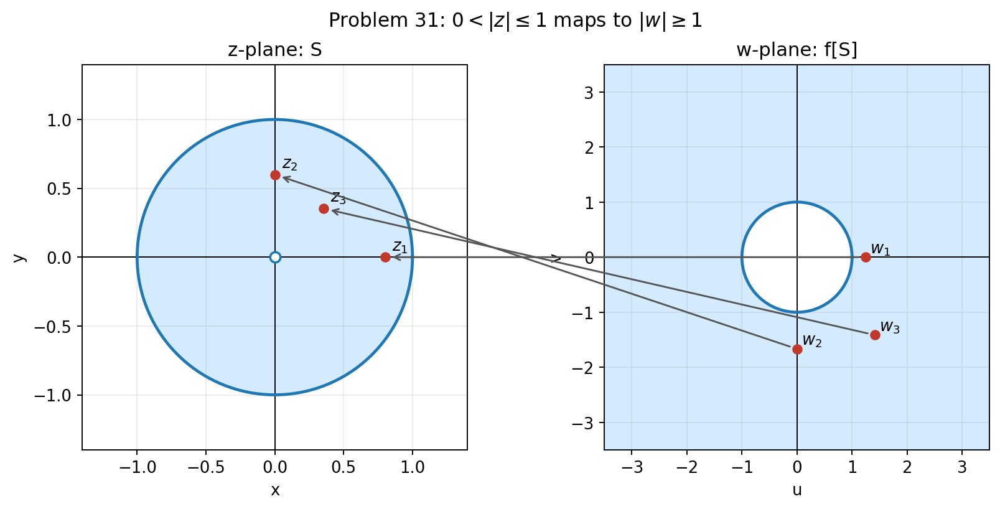

##### problem 32

Here

$$
|z| \geq 1 .
$$

Hence

$$
0<|w|=\frac{1}{|z|} \leq 1 .
$$

The value $|w|=0$ never occurs, because $1 / z \neq 0$ for every complex number $z \neq 0$. Therefore

$$
f[S]=\{w: 0<|w| \leq 1\} .
$$

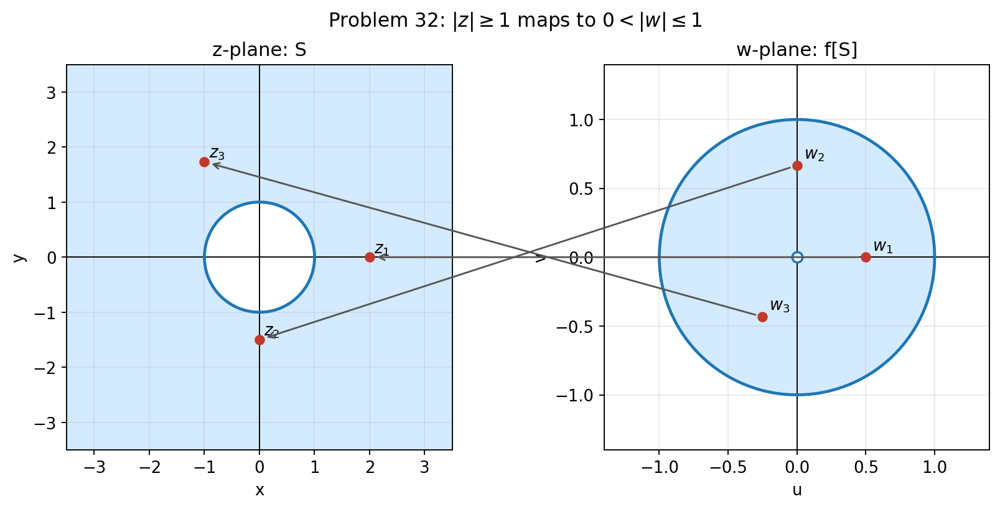

##### problem 33

We are given

$$
0<|z| \leq 3,
\qquad
\frac{\pi}{3} \leq \operatorname{Arg} z \leq \frac{2 \pi}{3} .
$$

Then

$$
|w|=\frac{1}{|z|} \geq \frac{1}{3}
$$

and

$$
\operatorname{Arg} w=-\operatorname{Arg} z,
\qquad
-\frac{2 \pi}{3} \leq \operatorname{Arg} w \leq-\frac{\pi}{3} .
$$

Therefore

$$
f[S]=\left\{w:|w| \geq \frac{1}{3},-\frac{2 \pi}{3} \leq \operatorname{Arg} w \leq-\frac{\pi}{3}\right\} .
$$

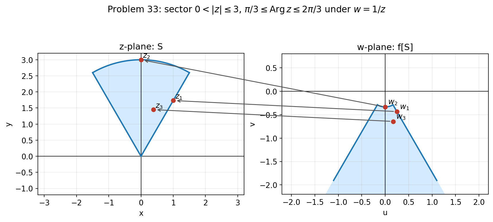

##### problem 34

We are given

$$
z \neq 0,
\qquad
0 \leq \operatorname{Arg} z \leq \frac{\pi}{2} .
$$

Since $z$ can have any positive modulus,

$$
|w|=\frac{1}{|z|}
$$

can be any positive number. Also,

$$
\operatorname{Arg} w=-\operatorname{Arg} z,
\qquad
-\frac{\pi}{2} \leq \operatorname{Arg} w \leq 0 .
$$

Therefore

$$
f[S]=\left\{w: w \neq 0,-\frac{\pi}{2} \leq \operatorname{Arg} w \leq 0\right\} .
$$

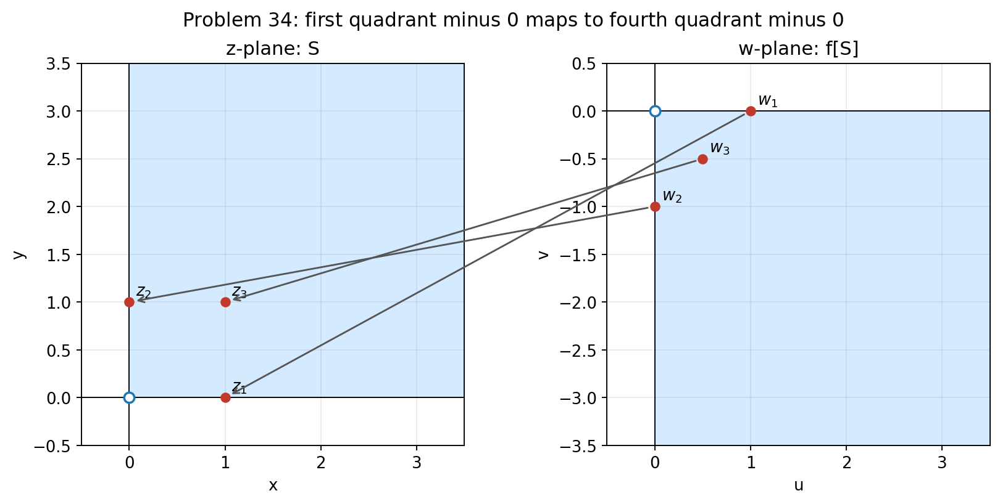

> [!exercise] Exercise 13
> 35. Let $f(z)=\frac{1}{z}$.
> (a) Show that the image of the circle $|z|=a>0$ is the circle $|w|=\frac{1}{a}$.
> (b) Show that the image of the ray $\operatorname{Arg} z=\alpha \quad(z \neq 0)$ is the ray $\operatorname{Arg} w=-\alpha (w \neq 0)$.

##### problem 13a

Let $z$ lie on the circle $|z|=a$, where $a>0$. If

$$
w=\frac{1}{z},
$$

then

$$
|w|=\left|\frac{1}{z}\right|=\frac{1}{|z|}=\frac{1}{a} .
$$

So every image point lies on the circle

$$
|w|=\frac{1}{a} .
$$

Conversely, if $|w|=\frac{1}{a}$ and we set

$$
z=\frac{1}{w},
$$

then

$$
|z|=\left|\frac{1}{w}\right|=\frac{1}{|w|}=\frac{1}{1 / a}=a .
$$

Thus every point on the circle $|w|=\frac{1}{a}$ comes from a point on the circle $|z|=a$. Therefore the image of the circle $|z|=a$ is exactly the circle

$$
|w|=\frac{1}{a} .
$$

##### problem 13b

Let $z \neq 0$ lie on the ray

$$
\operatorname{Arg} z=\alpha .
$$

Write

$$
z=r(\cos \alpha+i \sin \alpha),
\qquad
r>0 .
$$

Then

$$
\begin{aligned}
w=\frac{1}{z}
&=\frac{1}{r}(\cos (-\alpha)+i \sin (-\alpha)) .
\end{aligned}
$$

Hence

$$
\operatorname{Arg} w=-\alpha,
\qquad
w \neq 0 .
$$

So every point on the ray $\operatorname{Arg} z=\alpha$ maps to the ray $\operatorname{Arg} w=-\alpha$.

Conversely, if $w \neq 0$ satisfies

$$
\operatorname{Arg} w=-\alpha,
$$

then $z=\frac{1}{w}$ satisfies

$$
\operatorname{Arg} z=-\operatorname{Arg} w=\alpha .
$$

Therefore the image of the ray $\operatorname{Arg} z=\alpha$ is exactly the ray

$$
\operatorname{Arg} w=-\alpha .
$$

> [!exercise] Exercise 14
> 36. Show that for $f(z)=1 / z, f(z)=g(h(z))=h(g(z))$, where $g(z)=\bar{z}$ and $h(z)=\frac{z}{|z|^{2}}$.

We assume $z \neq 0$, since all three expressions are undefined at $z=0$.

First compute $g(h(z))$:

$$
\begin{aligned}
g(h(z))
&=g\left(\frac{z}{|z|^{2}}\right) \\
&=\overline{\frac{z}{|z|^{2}}} \\
&=\frac{\bar{z}}{|z|^{2}} .
\end{aligned}
$$

But

$$
\begin{aligned}
\frac{1}{z}
&=\frac{1}{z} \cdot \frac{\bar{z}}{\bar{z}} \\
&=\frac{\bar{z}}{z \bar{z}} \\
&=\frac{\bar{z}}{|z|^{2}} .
\end{aligned}
$$

Hence

$$
g(h(z))=\frac{1}{z}=f(z) .
$$

Now compute $h(g(z))$:

$$
\begin{aligned}
h(g(z))
&=h(\bar{z}) \\
&=\frac{\bar{z}}{|\bar{z}|^{2}} .
\end{aligned}
$$

Since

$$
|\bar{z}|=|z|,
$$

we get

$$
\begin{aligned}
h(g(z))
&=\frac{\bar{z}}{|z|^{2}} \\
&=\frac{1}{z} \\
&=f(z) .
\end{aligned}
$$

Therefore

$$
f(z)=g(h(z))=h(g(z))
$$

for all $z \neq 0$.

> [!exercise] Exercise 15
> 37. (a) Show that $f(z)=\frac{1}{z}$ is never zero for any complex $z$.
> (b) Let $S$ be any subset of the complex numbers that does not include zero. Show that $f[S]$ is a subset of the complex numbers that does not include zero.
> (c) Show that $f(f(z))=z$ for all $z \neq 0$.
> (d) Show that $f[f[S]]=S$.

##### problem 15a

Assume $z \neq 0$ and suppose

$$
\frac{1}{z}=0 .
$$

Multiplying both sides by $z$ gives

$$
1=0,
$$

which is impossible. Therefore $f(z)=\frac{1}{z}$ is never zero for any complex number in its domain.

##### problem 15b

Let $w \in f[S]$. By definition, there exists some $z \in S$ such that

$$
w=f(z)=\frac{1}{z} .
$$

Since $S$ does not contain zero, we have $z \neq 0$. By part (a), $\frac{1}{z} \neq 0$. Hence

$$
w \neq 0 .
$$

Therefore every element of $f[S]$ is nonzero, so $f[S]$ is a subset of the complex numbers that does not include zero.

##### problem 15c

For $z \neq 0$,

$$
\begin{aligned}
f(f(z))
&=f\left(\frac{1}{z}\right) \\
&=\frac{1}{1 / z} \\
&=z .
\end{aligned}
$$

##### problem 15d

Let $w \in f[f[S]]$. Then there exists some $u \in f[S]$ such that

$$
w=f(u) .
$$

Also, since $u \in f[S]$, there exists some $z \in S$ such that

$$
u=f(z) .
$$

Hence

$$
\begin{aligned}
w
&=f(u) \\
&=f(f(z)) \\
&=z
\end{aligned}
$$

by part (c). Since $z \in S$, we have $w \in S$. Thus

$$
f[f[S]] \subseteq S .
$$

Conversely, let $z \in S$. Then $f(z) \in f[S]$, so applying $f$ again gives

$$
f(f(z))=z .
$$

Thus $z \in f[f[S]]$, and therefore

$$
S \subseteq f[f[S]] .
$$

Combining the two inclusions, we obtain

$$
f[f[S]]=S .
$$

> [!exercise] Exercise 16
> 38. Find a linear fractional transformation $f(z)=\frac{a z+b}{c z+d}$ such that $f(0)=-5+i$, $f(2)=-\frac{8}{5}-i \frac{11}{5}, f(-2 i)=5-2 i$. **(Hint: In solving for $a, b, c, d$, keep in mind that these are not uniquely determined. Once you determine that a coefficient is not zero, say $a \neq 0$, you may set it equal to 1 .)**
> 39. Find a linear fractional transformation $f(z)=\frac{a z+b}{c z+d}$ such that $f(0)=-2 i$, $f(9 i)=-\frac{i}{5}, f(4-i)=\frac{1}{2}$.

##### problem 38

Let

$$
f(z)=\frac{a z+b}{c z+d} .
$$

Since the coefficients are determined only up to a nonzero common factor, we set

$$
d=1 .
$$

From $f(0)=-5+i$, we get

$$
\frac{b}{1}=-5+i,
$$

so

$$
b=-5+i .
$$

Now use $f(2)=-\frac{8}{5}-\frac{11}{5} i$:

$$
\frac{2 a-5+i}{2 c+1}=-\frac{8}{5}-\frac{11}{5} i .
$$

Multiplying through gives

$$
\begin{aligned}
2 a-5+i
&=\left(-\frac{8}{5}-\frac{11}{5} i\right)(2 c+1) \\
10 a-25+5 i
&=(-16-22 i) c-8-11 i \\
10 a+(16+22 i) c
&=17-16 i .
\end{aligned}
$$

Next use $f(-2 i)=5-2 i$:

$$
\frac{-2 i a-5+i}{-2 i c+1}=5-2 i .
$$

Multiplying through gives

$$
\begin{aligned}
-2 i a-5+i
&=(5-2 i)(-2 i c+1) \\
-2 i a-5+i
&=(-4-10 i) c+5-2 i \\
-2 i a+(4+10 i) c
&=10-3 i .
\end{aligned}
$$

Multiply the second equation by $5$:

$$
-10 i a+(20+50 i) c=50-15 i .
$$

Multiply the first equation by $i$:

$$
10 i a+(-22+16 i) c=16+17 i .
$$

Adding these two equations eliminates $a$:

$$
\begin{aligned}
(-2+66 i) c
&=66+2 i \\
c
&=\frac{66+2 i}{-2+66 i} \\
&=-i .
\end{aligned}
$$

Substitute $c=-i$ into

$$
10 a+(16+22 i) c=17-16 i :
$$

$$
\begin{aligned}
10 a+(16+22 i)(-i)
&=17-16 i \\
10 a+22-16 i
&=17-16 i \\
10 a
&=-5 \\
a
&=-\frac{1}{2} .
\end{aligned}
$$

Therefore one suitable transformation is

$$
f(z)=\frac{-\frac{1}{2} z-5+i}{1-i z} .
$$

##### problem 39

Let

$$
f(z)=\frac{a z+b}{c z+d} .
$$

Again we set

$$
d=1 .
$$

From $f(0)=-2 i$, we get

$$
b=-2 i .
$$

Now use $f(9 i)=-\frac{i}{5}$:

$$
\frac{9 i a-2 i}{9 i c+1}=-\frac{i}{5} .
$$

Multiplying through gives

$$
\begin{aligned}
9 i a-2 i
&=-\frac{i}{5}(9 i c+1) \\
45 i a-10 i
&=9 c-i \\
5 i a-c
&=i .
\end{aligned}
$$

Hence

$$
c=5 i a-i=i(5 a-1) .
$$

Now use $f(4-i)=\frac{1}{2}$:

$$
\frac{a(4-i)-2 i}{c(4-i)+1}=\frac{1}{2} .
$$

Multiplying through gives

$$
\begin{aligned}
2(a(4-i)-2 i)
&=c(4-i)+1 \\
8 a-2 i a-4 i
&=(4-i) c+1 .
\end{aligned}
$$

Substitute $c=i(5 a-1)$:

$$
\begin{aligned}
8 a-2 i a-4 i
&=(4-i) i(5 a-1)+1 \\
&=(1+4 i)(5 a-1)+1 \\
&=5 a+20 i a-4 i .
\end{aligned}
$$

Therefore

$$
\begin{aligned}
8 a-2 i a-4 i
&=5 a+20 i a-4 i \\
3 a-22 i a
&=0 \\
a(3-22 i)
&=0 .
\end{aligned}
$$

Thus

$$
a=0 .
$$

Then

$$
c=i(5 a-1)=-i .
$$

So

$$
f(z)=\frac{-2 i}{1-i z} .
$$

Multiplying numerator and denominator by $i$, we obtain the cleaner equivalent form

$$
f(z)=\frac{2}{z+i} .
$$

> [!exercise] Exercise 17
> 40. Find the function $f(z)=\frac{1}{c z+d}$ so that $f(1)=\frac{2-i}{5}$ and $f\left(-\frac{i}{2}\right)$ is not defined. A point $z_{0}$ is called a fixed point of a function $f(z)$ if $f\left(z_{0}\right)=z_{0}$. In Exercises 4144, determine the fixed points of the given function.
> 41. $f(z)=\frac{1}{z}$.
> 42. $f(z)=a z+b$. **(Hint: Take two cases: $a=1$ and $a \neq 1$ )**
> 43. $f(z)=2\left(z+\frac{1}{z}\right)$.
> 44. $f(z)=\frac{-6 i+(2+3 i) z}{z}$.

##### problem 40

We seek

$$
f(z)=\frac{1}{c z+d}
$$

such that $f\left(-\frac{i}{2}\right)$ is undefined. Hence the denominator must vanish at $z=-\frac{i}{2}$:

$$
\begin{aligned}
c\left(-\frac{i}{2}\right)+d&=0 \\
d&=\frac{i c}{2} .
\end{aligned}
$$

Now use the condition

$$
f(1)=\frac{2-i}{5} .
$$

Then

$$
\begin{aligned}
\frac{1}{c+d}&=\frac{2-i}{5} \\
c+d&=\frac{5}{2-i} \\
&=\frac{5(2+i)}{(2-i)(2+i)} \\
&=2+i .
\end{aligned}
$$

Substitute $d=\frac{i c}{2}$:

$$
\begin{aligned}
c+\frac{i c}{2}&=2+i \\
c\left(1+\frac{i}{2}\right)&=2+i \\
c \cdot \frac{2+i}{2}&=2+i \\
c&=2 .
\end{aligned}
$$

Therefore

$$
d=\frac{i c}{2}=i
$$

and

$$
f(z)=\frac{1}{2 z+i} .
$$

##### problem 41

Fixed points satisfy

$$
\frac{1}{z}=z,
\qquad
z \neq 0 .
$$

Thus

$$
\begin{aligned}
1&=z^{2} \\
z&=\pm 1 .
\end{aligned}
$$

So the fixed points are

$$
z=1, \qquad z=-1 .
$$

##### problem 42

Fixed points satisfy

$$
a z+b=z .
$$

We take two cases.

If $a=1$, then

$$
z+b=z,
$$

so

$$
b=0 .
$$

Hence:

$$
\text { if } a=1 \text { and } b=0, \text { every } z \text { is a fixed point; }
$$

and

$$
\text { if } a=1 \text { and } b \neq 0, \text { there are no fixed points. }
$$

If $a \neq 1$, then

$$
\begin{aligned}
a z+b&=z \\
(a-1) z&=-b \\
z&=\frac{b}{1-a} .
\end{aligned}
$$

So when $a \neq 1$, the unique fixed point is

$$
z=\frac{b}{1-a} .
$$

##### problem 43

Fixed points satisfy

$$
2\left(z+\frac{1}{z}\right)=z,
\qquad
z \neq 0 .
$$

Then

$$
\begin{aligned}
2 z+\frac{2}{z}&=z \\
z+\frac{2}{z}&=0 \\
z^{2}+2&=0 \\
z^{2}&=-2 \\
z&=\pm i \sqrt{2} .
\end{aligned}
$$

So the fixed points are

$$
z=i \sqrt{2}, \qquad z=-i \sqrt{2} .
$$

##### problem 44

Fixed points satisfy

$$
\frac{-6 i+(2+3 i) z}{z}=z,
\qquad
z \neq 0 .
$$

Multiply through by $z$:

$$
\begin{aligned}
-6 i+(2+3 i) z&=z^{2} \\
z^{2}-(2+3 i) z+6 i&=0 .
\end{aligned}
$$

Factor:

$$
\begin{aligned}
z^{2}-(2+3 i) z+6 i
&=(z-2)(z-3 i) .
\end{aligned}
$$

Therefore the fixed points are

$$
z=2, \qquad z=3 i .
$$

> [!exercise] Exercise 18
> 45. Define the set of lattice points in the plane as
> 
> $$
> L=\{z: z=m+i n, \quad m \text { and } n \text { integers }\} .
> $$
> 
> Consider the mapping $f(z)=z^{2}$ and the image $f[L]$.
> (a) Show that if $w$ is in $f[L],-w, \bar{w}$, and $-\operatorname{Re} w+i \operatorname{Im} w$ are in $f[L]$.
> (b) Show that if $w$ is in $f[L], w$ is also in $L$.
> (c) Show that if $w$ is in $f[L], f(w)$ is in $f[L]$.

Suppose

$$
w \in f[L] .
$$

Then there exist integers $m$ and $n$ such that

$$
z=m+i n \in L
$$

and

$$
\begin{aligned}
w&=f(z)=z^{2} \\
&=(m+i n)^{2} \\
&=m^{2}+2 m n i+i^{2} n^{2} \\
&=m^{2}-n^{2}+2 m n i .
\end{aligned}
$$

Hence

$$
\operatorname{Re} w=m^{2}-n^{2},
\qquad
\operatorname{Im} w=2 m n .
$$

##### problem 45a

First,

$$
\begin{aligned}
\bar{w}
&=m^{2}-n^{2}-2 m n i \\
&=(m-i n)^{2} \\
&=(m+i(-n))^{2} .
\end{aligned}
$$

Since $m$ and $-n$ are integers, $m+i(-n) \in L$, so

$$
\bar{w} \in f[L] .
$$

Next,

$$
\begin{aligned}
-\operatorname{Re} w+i \operatorname{Im} w
&=-(m^{2}-n^{2})+2 m n i \\
&=n^{2}-m^{2}+2 m n i \\
&=(n+i m)^{2} .
\end{aligned}
$$

Since $n+i m \in L$, we have

$$
-\operatorname{Re} w+i \operatorname{Im} w \in f[L] .
$$

Finally,

$$
\begin{aligned}
-w
&=-(m^{2}-n^{2})-2 m n i \\
&=n^{2}-m^{2}-2 m n i \\
&=(n-i m)^{2} \\
&=(n+i(-m))^{2} .
\end{aligned}
$$

Since $n+i(-m) \in L$, we conclude

$$
-w \in f[L] .
$$

##### problem 45b

From

$$
w=m^{2}-n^{2}+2 m n i,
$$

we see that both the real part and the imaginary part of $w$ are integers. Therefore

$$
w \in L .
$$

##### problem 45c

If $w \in f[L]$, then by part (b) we know that

$$
w \in L .
$$

Hence

$$
f(w)=w^{2}
$$

is the square of a lattice point, so by definition

$$
f(w) \in f[L] .
$$
