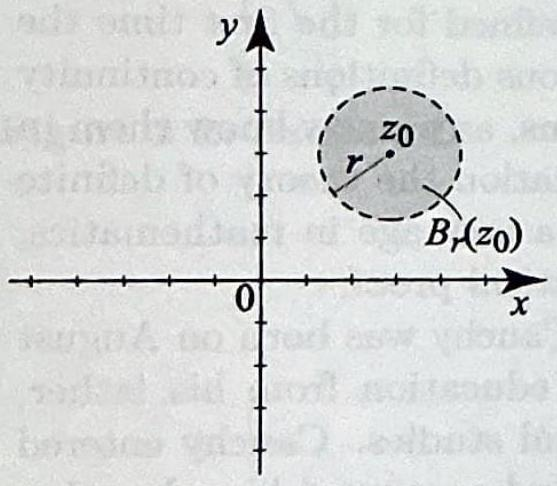
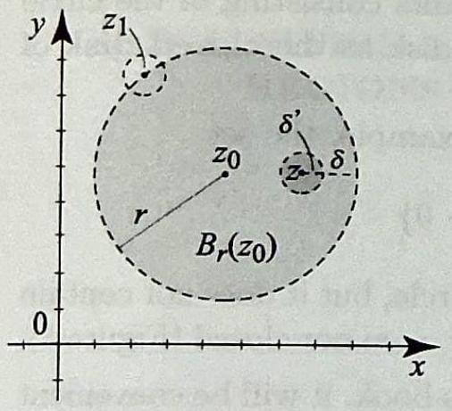
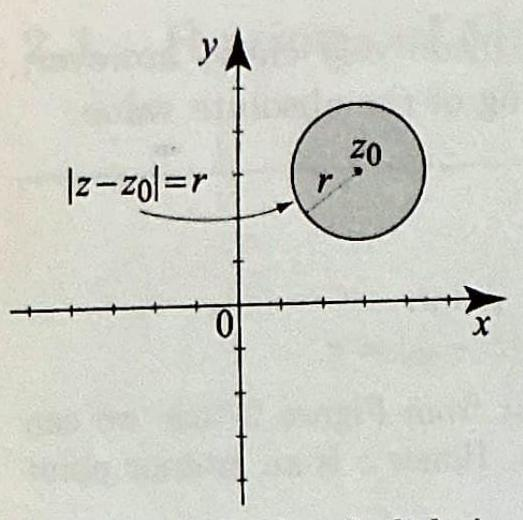
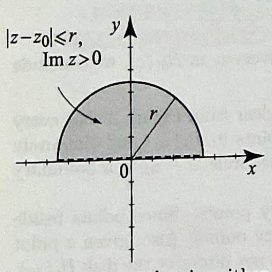
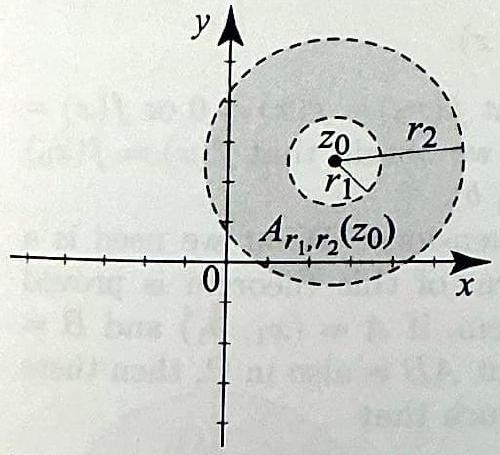
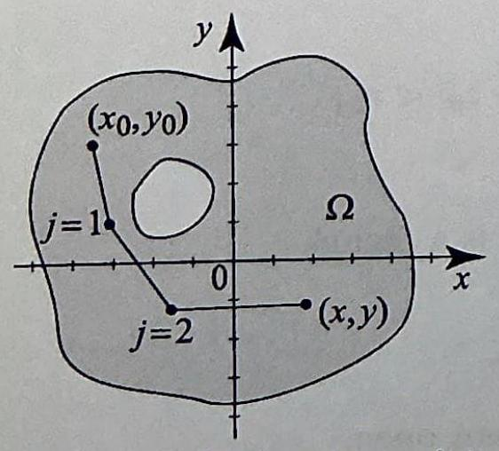
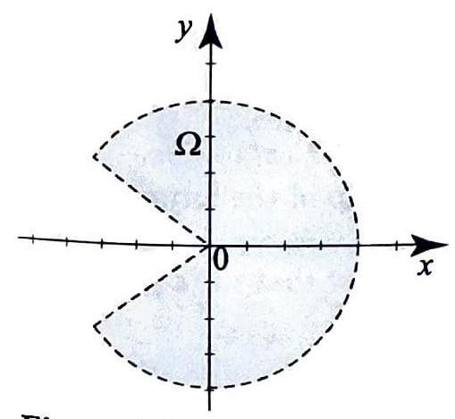
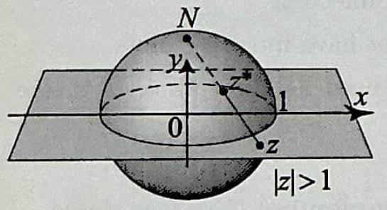
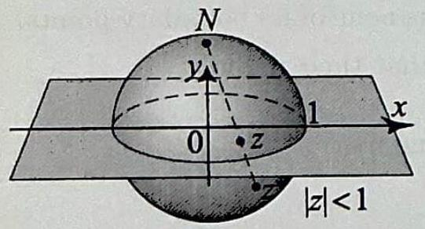

## Topics to Review

In this chapter we will present the fundamental definition of a derivative of a function of a complex variable. Like the definition from calculus, here the derivative will be defined as the limit of a difference quotient (although its existence will have consequences that have no analog in calculus). So it is helpful to review the basic definitions from calculus of limits, continuity, and derivatives.

## Looking Ahead

Complex analysis is about the study of analytic functions. These are functions that have a derivative in an open set. This fundamental notion of analyticity is presented in Section 2.3. Sections 2.1 and 2.2 pave the way for Section 2.3. So you may want to go over them relatively quickly. Section 2.4 contains the Cauchy-Riemann equations, which are fundamental both in theory and applications. Section 2.5 presents some interesting applications of complex analysis to the solution of boundary value problems, more precisely, Dirichlet problems. It is a mixture of theoretical results about analytic and harmonic functions and their applications to the solution of Dirichlet problems. Section 2.5 sets the stage for the applications that will follow in the book and justifies the need for the development of complex analysis. You should at least read through it and try some applications. Section 2.6 contains a proof related to the Cauchy-Riemann equations. It can be skipped without affecting the continuity of the course.

## 2 ANALYTIC FUNCTIONS

I get up at 4 o'clock each morning and I am busy from then on ... Today I drew the plans for forges that I am to have built in granite. I am also constructing two lighthouses, one on each of the two piers that are located at the entrance of the harbor. I do not get tired of working; on the contrary, it invigorates me and I am in perfect health...
-Augustin Louis Cauchy
In the previous chapter, we introduced complex numbers and complex functions. In this chapter, we begin our analysis of complex functions, which will occupy us through Chapter 6. Most of what we will present is due to Cauchy and was prepared for a course that he taught at the Institut de France in 1814 and later at the Ecole Polytechnique. Cauchy single-handedly defined the derivative and integral of complex functions and developed one of the most fruitful theories of mathematics. As Cauchy developed his theory, he defined for the first time the notion of limit for functions and gave rigorous definitions of continuity and differentiability for real-valued functions, as we now know them in calculus. He also developed on solid foundation the theory of definite integrals and series. With Cauchy began a new age in mathematics, an age of rigor and insistence on mathematical proof.

So who was Cauchy? Augustin Louis Cauchy was born on August 21, 1789 in Paris. He received his early education from his father, Louis-François Cauchy, a master of classical studies. Cauchy entered the Ecole Polytechnique in Paris in 1805 and continued his education as a civil engineer at the Ecole des Ponts et Chaussées. He began his career as a military engineer, working in Napoleon's administration from 1810 to 1813 . His mathematical talents were soon discovered by leading mathematicians, among them was Joseph Louis Lagrange, who persuaded Cauchy to leave his career as an engineer and devote himself to mathematics. Cauchy's mathematical output was phenomenal. He is considered to be one of the greatest mathematicians. His contributions cover many areas of pure and applied mathematics, including the theory of heat, the theory of light, the mathematical theory of elasticity, and fluid dynamics. Cauchy's contributions to modern calculus are so fundamental that he "has come to be regarded as the creator of calculus in the modern sense," from The History of Mathematics, An Introduction, 3rd edition, by David M. Burton (McGraw-Hill, 1997).

# 2.1 Regions of the Complex Plane

In the previous chapter, we defined some elementary functions of a complex variable. An important part of a function is its domain of definition. In calculus, functions were usually defined over intervals. In dealing with functions of a complex variable, intervals will be replaced by subsets of the complex plane. The picture is no longer as simple as the one on the real line. For this reason, it is necessary to understand basic properties of subsets of the complex plane, which will assist us in our analytical study of functions of a complex variable.

## DEFINITION 1 NEIGHBORHOOD

Figure 1 An $r$-neighborhood $B_{r}\left(z_{0}\right)$ does not include the points on the circle

$\left|z-z_{0}\right|=r$.

DEFINITION 2 INTERIOR AND BOUNDARY POINTS

## Open Sets

One very useful definition in this book is that of a neighborhood of a point. It is the analog of an open interval in one dimension.
Let $r>0$ be a positive real number and $z_{0}$ a point in the plane. The $r$-neighborhood of $z_{0}$ is the set of all complex numbers $z$ satisfying

$$
\left|z-z_{0}\right|<r .
$$

We denote this set by $B_{r}\left(z_{0}\right)$.
By interpreting the absolute value as a distance, we see from (1) that $B_{r}\left(z_{0}\right)$ is the disk centered at $z_{0}$ with radius $r>0$. The fact that the inequality in (1) is strict tells us that we should not include the points on the circle $\left|z-z_{0}\right|=r$ as part of the $r$-neighborhood of $z_{0}$. This is indicated in Figure 1, where we used a dashed line to plot the circle $\left|z-z_{0}\right|=r$.

Sometimes we will not specify the value of $r$ and will simply refer to $B_{r}\left(z_{0}\right)$ as a neighborhood of $z_{0}$.

A neighborhood of $z_{0}$ from which we have deleted the center $z_{0}$ is called a deleted neighborhood or punctured neighborhood of $z_{0}$ and is sometimes denoted by $B_{r}^{\prime}\left(z_{0}\right)$. Thus

$$
B_{r}^{\prime}\left(z_{0}\right)=\left\{z: 0<\left|z-z_{0}\right|<r\right\} .
$$

Let $S$ be a subset of the complex numbers. A point $z_{0}$ in $S$ is called an interior point of $S$ if we can find a neighborhood of $z_{0}$ that is wholly contained in $S$. A point $z$ in the complex plane is called a boundary point of $S$ if every neighborhood of $z$ contains at least one point in $S$ and at least one point not in $S$. The set of all boundary points of $S$ is called the boundary of $S$.

From the definitions, every point in $S$ is either an interior point or a boundary point. If a point is an interior point of $S$, then it cannot be a boundary point of $S$. Also, while an interior point of $S$ is necessarily a point in $S$, a boundary point of $S$ need not be in $S$.

Figure 2 The point $z$ is an interior point of $B_{r}\left(z_{0}\right)$, while $z_{1}$ is a boundary point.

## DEFINITION 3 OPEN SETS

The geometric concepts in Definition 2 are intuitively clear; however, dealing with them often requires delicate handling of the absolute value.

## EXAMPLE 1 Interior and boundary points

Consider an $r$-neighborhood $B_{r}\left(z_{0}\right)$, where $r>0$.
(a) Show that every point $z$ of $B_{r}\left(z_{0}\right)$ is an interior point.
(b) Show that the boundary of $B_{r}\left(z_{0}\right)$ is the circle $\left|z-z_{0}\right|=r$.

Solution (a) Pick a point $z$ in $B_{r}\left(z_{0}\right)$. It is clear from Figure 2 that we can find a disk centered at $z$, which lies wholly in $B_{r}\left(z_{0}\right)$. Hence $z$ is an interior point of $B_{r}\left(z_{0}\right)$.

If we want to give an analytic proof of this simple geometric argument, here is one way to proceed. Let $\delta=\left|z-z_{0}\right|$. By definition of $B_{r}\left(z_{0}\right)$, we have $0 \leq \delta<r$. Let $\delta^{\prime}=r-\delta$. For any $w$ in the neighborhood $B_{\delta^{\prime}}(z)$, we have $|w-z|<\delta^{\prime}$ and so, by the triangle inequality,

$$
\left|w-z_{0}\right| \leq|w-z|+\left|z-z_{0}\right|<\delta^{\prime}+\delta=r .
$$

Hence $w$ belongs to $B_{r}\left(z_{0}\right)$, and since this is true of every $w$ in $B_{\delta^{\prime}}(z)$, we conclude that $B_{\delta^{\prime}}(z)$ is contained in $B_{r}\left(z_{0}\right)$
(b) Pick a point $z_{1}$ on the circle $\left|z-z_{0}\right|=r$. It is clear from Figure 2 that every disk centered at $z_{1}$ will contain (infinitely many) points in $B_{r}\left(z_{0}\right)$ and (infinitely many) points not in $B_{r}\left(z_{0}\right)$. Hence every point on the circle $\left|z-z_{0}\right|$ is a boundary point of $B_{r}\left(z_{0}\right)$.

We now show that no other points are boundary points. Since points inside the circle are interior points, they cannot be boundary points. Also, given a point outside the circle we can enclose it in a disk that does not intersect the disk $B_{r}\left(z_{0}\right)$. Hence such a point is not a boundary point.

Note that in this example, none of the boundary points of $B_{r}\left(z_{0}\right)$ belong to $B_{r}\left(z_{0}\right)$.

We come now to an important definition.
A subset $S$ of the complex numbers is called open if every point in $S$ is an interior point of $S$.

Thus $S$ is open if around each point $z$ in $S$ you can find a neighborhood $B_{r}(z)$ that is wholly contained in $S$. The radius of $B_{r}(z)$ depends on $z$. Here are some useful examples to keep in mind.

- The empty set, denoted as usual by $\emptyset$, is open. Because there are no points in $\emptyset$, the definition of open sets is vacuously satisfied.
- The set of all complex numbers $\mathbb{C}$ is open.
- Any $r$-neighborhood, $B_{r}\left(z_{0}\right)$, is open. We just verified in Example 1(a) that every point in $B_{r}\left(z_{0}\right)$ is an interior point.
- The set of all $z$ such that $\left|z-z_{0}\right|>r$ is open. This set is called a neighborhood of $\infty$. To justify this terminology, see Exercise 23.

Figure 3 A closed disk includes its boundary, the circle $\left|z-z_{0}\right|=r$.

Figure 4 A set that is neither open nor closed.

An $r$-neighborhood, $B_{r}\left(z_{0}\right)$, is more commonly called an open disk of radius $r$, centered at $z_{0}$.

You can show that a set is open if and only if it contains none of its boundary points (Exercise 18). Sets that contain all of their boundary points are called closed. The complex plane $\mathbb{C}$ and the empty set $\emptyset$ are closed since they trivially contain their empty sets of boundary points. The disk

$$
\left\{z:\left|z-z_{0}\right| \leq r\right\}
$$

is closed because it contains all its boundary points consisting of the circle $\left|z-z_{0}\right|=r$ (Figure 3). We will refer to such a disk as the closed disk of radius $r$, centered at $z_{0}$.

Some sets are neither open nor closed. For example, the set

$$
\left\{z:\left|z-z_{0}\right| \leq r ; \operatorname{Im} z>0\right\}
$$

contains the boundary points on the upper semicircle, but it does not contain the points on the $x$-axis. Hence, this set is neither open nor closed (Figure 4).

For our next topic and for use throughout this book, it will be convenient to introduce some set notation. If a point $z$ is in a set $S$, we say that $z$ is an element of $S$ and write $z \in S$. If $z$ does not belong to $S$, we will write $z \notin S$. Let $A$ and $B$ be two sets of complex numbers. The union of $A$ and $B$, denoted $A \cup B$, is the set

$$
A \cup B=\{z: z \in A \text { or } z \in B\} .
$$

The intersection of $A$ and $B$, denoted $A \cap B$, is the set

$$
A \cap B=\{z: z \in A \text { and } z \in B\} .
$$

Two sets $A$ and $B$ are disjoint if $A \cap B=\emptyset$. The set difference between $A$ and $B$ is the set

$$
A \backslash B=\{z: z \in A \text { and } z \notin B\} .
$$

We will say that $A$ is a subset of $B$ or that $B$ contains $A$ and write $A \subset B$ or $B \supset A$ if every element of $A$ is also an element of $B: z \in A \Rightarrow z \in B$.

## Connected Sets

A basic result from calculus states that if $f^{\prime}(x)=0$ for all $x$ in $(a, b)$, then $f$ is a constant. This result is not true if the domain of definition of the function is not connected. For example, consider the function

$$
f(x)= \begin{cases}1 & \text { if } 0<x<1 \\ -1 & \text { if } 2<x<3\end{cases}
$$

DEFINITION 4 POLYGONALLY CONNECTED SETS

DEFINITION 5 REGIONS

PROPOSITION 1 CHARACTERIZATION OF REGIONS

Figure 5 An open annulus $A_{r_{1}, r_{2}}\left(z_{0}\right)$ is a region. Note how two arbitrary points $A$ and $B$ in $A_{r_{1}, r_{2}}\left(z_{0}\right)$ can be joined by a polygonal line contained in the annulus.

whose domain of definition is $(0,1) \cup(2,3)$. We have $f^{\prime}(x)=0$ for all $x$ in $(0,1) \cup(2,3)$, but clearly $f$ is not constant. This example shows you how crucial connectedness is in calculus. For subsets of the plane, one way to define connectedness is as follows.

A subset $S$ of the complex plane is called polygonally connected or connected if any two points in $S$ can be joined by a polygonal line consisting of a finite number of line segments joined end to end and wholly contained in $S$ (Figure 6).

The following definition combines two important properties.
A nonempty subset $S$ of the complex plane is called a region (or domain) if it is open and connected.

Caution: Some authors use the term domain instead of region and use the term region to denote a subset of the complex plane that may be open or closed. In this book, it is important to keep in mind that regions are always open. The term domain will be used only in connection with its usual meaning as in "domain of definition" of a function.

Connected open sets or regions have the following useful characterization, which is intuitively clear. Its proof is left as an exercise.
A nonempty open subset $S$ of the complex plane is a region if and only if it cannot be written as the disjoint union of two nonempty open subsets. Equivalently, if $S$ is a region (nonempty connected open subset of $\mathbb{C}$ ) and $S=A \cup B$, where $A$ and $B$ are open and disjoint, then either $A=\emptyset$ or $B=\emptyset$.

Here are some useful examples of regions.

- An open disk $B_{r}\left(z_{0}\right)$ is a region.
- A punctured disk centered at $z_{0}, B_{r}^{\prime}\left(z_{0}\right)=\left\{z: 0<\left|z-z_{0}\right|<r\right\}$, is a region.
- An open annulus centered at $z_{0}$,

$$
A_{r_{1}, r_{2}}\left(z_{0}\right)=\left\{z: r_{1}<\left|z-z_{0}\right|<r_{2}\right\}
$$

is a region (Figure 5).

- The open upper half-plane $\{z: \operatorname{Im} z>0\}$ is a region.
- The complex plane is a region.

Here are sets that are not regions.

- A closed disk is not a region because it is not open.
- The union of two disjoint open disks (for example, $B_{1}(0) \cup B_{\frac{1}{2}}(2 i)$ ) is not a region because it is not connected.
- An interval $(a, b)$ is not a region because it is not an open subset of the complex plane.
We end the section with an application of connectedness to functions of two variables. This is our generalization to two dimensions of the fact that a function with zero derivative is constant.

Suppose that $u(x, y)$ is a real-valued function of $(x, y)$ defined on a nonempty open set $\Omega$. If we fix $y$, we can think of $u$ as a function of $x$

The limit in (2) involves the values of $u$ at the point ( $x+ h, y)$. You should convince yourself that this point belongs to $\Omega$ if $h$ is sufficiently small, because $\Omega$ is open. It is in this sense that we will interpret expressions involving limits.

## THEOREM 1

Figure 6 Joining two points in a connected region by a polygonal line.

$$
\frac{\partial u}{\partial x}=\lim _{h \rightarrow 0} \frac{u(x+h, y)-u(x, y)}{h} .
$$

Similarly, we can fix $x$, think of $u(x, y)$ as a function of $y$, and take its partial derivative with respect to $y$. Thus

$$
\frac{\partial u}{\partial y}=\lim _{h \rightarrow 0} \frac{u(x, y+h)-u(x, y)}{h} .
$$

Suppose that $u$ is a real-valued function defined over a region $\Omega$ such that $u_{x}(x, y)=0$ and $u_{y}(x, y)=0$ for all $(x, y)$ in $\Omega$. Then $u(x, y)$ is constant for all $(x, y)$ in $\Omega$.
Proof As a motivation, let us first recall the proof of the corresponding one dimensional result: If $f^{\prime}(x)=0$ for all $x$ in $(a, b)$, then $f(x)=c$ for all $x$ in $(a, b)$. Fix a point $x_{0}$ in $(a, b)$. Let $x$ be in $(a, b)$, and say $a<x<x_{0}<b$. The mean value theorem asserts that there is a point $x_{1}$ in ( $x, x_{0}$ ) such that

$$
f\left(x_{0}\right)-f(x)=f^{\prime}\left(x_{1}\right)\left(x_{0}-x\right)
$$

Since $f^{\prime}$ is identically zero in $\left(x, x_{0}\right)$, we conclude that $f\left(x_{0}\right)-f(x)=0$ or $f(x)= f\left(x_{0}\right)$. The case $x<x_{0}<b$ is treated similarly, and we obtain that $f(x)=f\left(x_{0}\right)$ for all $x$ in ( $a, b$ ). In other words, $f$ is constant in ( $a, b$ ).

This simple proof can be repeated in higher dimensions. What we need is a mean value theorem in higher dimensions. One form of this theorem is proved in Section 2.6, Theorem 5. According to that theorem, if $A=\left(x_{1}, y_{1}\right)$ and $B=$ ( $x_{2}, y_{2}$ ) are two points in $\Omega$ such that the line segment $A B$ is also in $\Omega$, then there exists a point $C=\left(x_{3}, y_{3}\right)$ on the line segment $A B$ such that

$$
u\left(x_{2}, y_{2}\right)-u\left(x_{1}, y_{1}\right)=u_{x}\left(x_{3}, y_{3}\right)\left(x_{2}-x_{1}\right)+u_{y}\left(x_{3}, y_{3}\right)\left(y_{2}-y_{1}\right)
$$

It is now easy to prove Theorem 1. Fix a point $\left(x_{0}, y_{0}\right)$ in $\Omega$. Given a point $(x, y)$ in $\Omega$, connect $\left(x_{0}, y_{0}\right)$ to $(x, y)$ by a finite number of line segments joined end to end and wholly contained in $\Omega$. (Here we have used the fact that $\Omega$ is a region.) Let $\left(x_{j}, y_{j}\right), j=0,1, \ldots, n$ denote the endpoints of the consecutive line segments, starting with $\left(x_{0}, y_{0}\right)$ and ending with $\left(x_{n}, y_{n}\right)=(x, y)$ (see Figure 6). Apply (4) to each line segment and use the fact that the partial derivatives are zero to conclude that $u\left(x_{j-1}, y_{j-1}\right)=u\left(x_{j}, y_{j}\right)$, and hence that $u\left(x_{0}, y_{0}\right)=u(x, y)$. $\square$

Figure 7 For Exercise 22.

## Exercises 2.1

In Exercises 1-4, identify the interior points and boundary points of the given set.

1. $\{z:|z| \leq 1\}$.
2. $\{z: 0<|z| \leq 1\}$.
3. $\{z=x+i y: 0<x<1, y=0\}$.
4. $\{z: 1<|z-i| \leq 2\}$.

In Exercises 5-12, draw the given set of points. Is the set open? closed? connected? a region? Justify your answers.
5. $\{z: \operatorname{Re} z>0\}$.
6. $\{z: \operatorname{Im} z \leq 1\}$.
7. $B_{1}(i) \cup B_{1}(0)$.
8. $\left\{z: z \neq 0,|\operatorname{Arg} z|<\frac{\pi}{4}\right\}$.
9. $\left\{z: z \neq 0,|\operatorname{Arg} z|<\frac{\pi}{4}\right\} \cup\{0\}$.
10. $\{z:|z+5+i|<1\}$.
11. $\{z:|\operatorname{Re}(z+3+i)|>1\}$.
12. $\{z:|z-3 i|>1\}$.

In Exercises 13-16, construct an example to illustrate the given statement.
13. The union of two connected sets need not be connected.
14. A set with an infinite number of points need not have interior points.
15. If $A$ is a subset of $B$, then the boundary of $A$ need not be contained in the boundary of $B$.
16. The boundary of a region could be empty.
17. Prove that a set $S$ is open if and only if its complement, $\mathbb{C} \backslash S$, is closed.
18. Show that a set $S$ is open if and only if it contains none of its boundary points.
19. Suppose that $A_{1}, A_{2}, \ldots$ are open sets. Show that their union

$$
\bigcup_{n=1}^{\infty} A_{n}=\left\{z: z \in A_{n} \text { for some } n\right\}
$$

is also open.
20. (a) Suppose that $A_{1}, A_{2}, \ldots$, are open sets. Show that a finite intersection

$$
\bigcap_{n=1}^{N} A_{n}=\left\{z: z \in A_{n} \text { for all } 1 \leq n \leq N\right\}
$$

is also open. [Hint: Pick a neighborhood that is contained in all the $A_{n}$ 's.]
(b) Show that the infinite intersection

$$
\bigcap_{n=1}^{\infty} A_{n}=\left\{z: z \in A_{n} \text { for all } n\right\}
$$

need not be open. [Hint: Consider $A_{n}=\left\{z:|z|<\frac{1}{n}\right\}$.]
21. Suppose that $A$ and $B$ are two regions with nonempty intersection. Show that $A \cup B$ is also a region.
22. Project Problem: Is it true that if $u_{y}(x, y)=0$ for all $(x, y)$ in a region $\Omega$, then $u(x, y)=\phi(x)$; that is, $u$ depends only on $x$ ? The answer is no in general, as the following counterexamples show.
(a) For $(x, y)$ in the region $\Omega$ shown in Figure 7, consider the function

$$
u(x, y)= \begin{cases}0 & \text { if } x>0, \\ \operatorname{sgn} y & \text { if } x \leq 0,\end{cases}
$$

Figure 8 Stereographic projection and the Riemann sphere. For $|z|>1$, the point $z^{*}$ is in the northern hemisphere. For $|z|<1$, the point $z^{*}$ is in the southern hemisphere. For $|z|=1$, the points $z$ and $z^{*}$ are coincident.

where the signum function is defined by $\operatorname{sgn} y=-1,0,1$, according as $y<0$, $y=0$, or $y>0$. Show that $u_{y}(x, y)=0$ for all $(x, y)$ in $\Omega$ but that $u$ is not a function of $x$ alone.
(b) Note that in the previous example $u_{x}$ does not exist for $x=0$. We now construct a function over the same region $\Omega$ for which the partials exist, $u_{y}=0$, and $u$ is not a function of $x$ alone. Show that these properties hold for

$$
u(x, y)= \begin{cases}0 & \text { if } x>0, \\ e^{-1 / x^{2}} \operatorname{sgn} y & \text { if } x \leq 0 .\end{cases}
$$

(c) Come up with a general condition on $\Omega$ that guarantees that whenever $u_{y}=0$ on $\Omega$ then $u$ depends only on $x$. [Hint: Use the mean value theorem as applied to vertical line segments in $\Omega$.]
23. Project Problem: Stereographic projection. Suppose that a sphere of radius one, called a Riemann sphere, is positioned on the complex plane with its equator coinciding with the unit circle (Figure 8). Let $N$ be the north pole of the sphere and let $z$ be any point in the complex plane. The line from $N$ to $z$ intersects the sphere at one other point $z^{\star}$. Conversely, if $z^{\star}$ is any point of the sphere other than the north pole, then the line from $N$ to $z^{\star}$ will intersect the plane at a single point $z$. It is not difficult to convince yourself that the mapping $P$ that takes $z^{\star}$ to $z$ is one-to-one from the sphere minus the north pole onto the complex plane. This mapping, known as the stereographic projection, was introduced by the German mathematician Bernhard Riemann (1826-1866). It enables us to represent points in the complex plane by points on the sphere, and vice versa. This also suggests that we introduce the point at infinity, $z=\infty$, as the image of the north pole by the stereographic projection. Thus $P(N)=\infty$. The complex plane together with this point at infinity is called the extended complex plane and written $\mathbb{C} \cup\{\infty\}$. It is in one-to-one correspondence with the whole sphere. As you will now discover, several issues concerning $\infty$ can be clarified by thinking in terms of the sphere and its projections. Answer parts (a)-(e) by using geometric reasoning with the help of Figure 8.
(a) Consider a circle $C$ on the sphere that is parallel to the complex plane (these are called parallels of latitude). What is its image under $P$ ?
(b) Which points on the sphere are mapped to the set of all $z$ in the plane such that $|z|>R$. Can you now justify the terminology "neighborhood of infinity"?
(c) What is the image under $P$ of a great circle passing through the poles?
(d) What is the image under $P$ of a circle passing through the north pole but not the south pole?
(e) Argue geometrically that $z^{\star}$ approaches $N$ if and only if $P\left(z^{\star}\right) \rightarrow \infty$.

Your answers in (a)-(e) can be justified also with the help of the formulas that you will derive in parts (f)-(h).
(f) Let $z^{\star}=\left(x_{1}, x_{2}, x_{3}\right)$ and $P\left(z^{\star}\right)=x+i y=(x, y)$. Show that the equation of the line through $z^{\star}$ and $z$ is

$$
\frac{x_{1}-0}{x-0}=\frac{x_{2}-0}{y-0}=\frac{x_{3}-1}{0-1} .
$$

(g) Use $(f)$ and the equation of the Riemann sphere $x_{1}^{2}+x_{2}^{2}+x_{3}^{2}=1$ to derive

$$
x_{1}=\frac{2 x}{x^{2}+y^{2}+1}, \quad x_{2}=\frac{2 y}{x^{2}+y^{2}+1}, \quad x_{3}=1-\frac{2}{x^{2}+y^{2}+1}
$$

(h) Conversely, solve for $x$ and $y$ in (f) and get

$$
x=\frac{x_{1}}{1-x_{3}}, \quad y=\frac{x_{2}}{1-x_{3}}
$$
