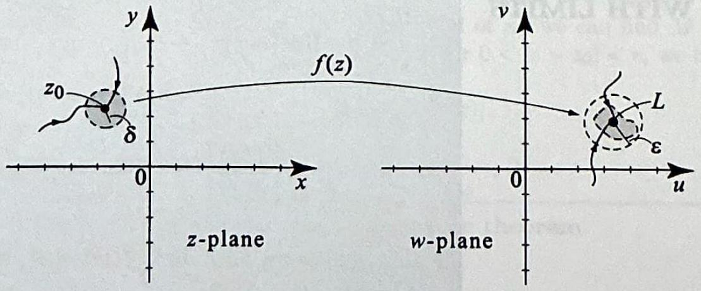
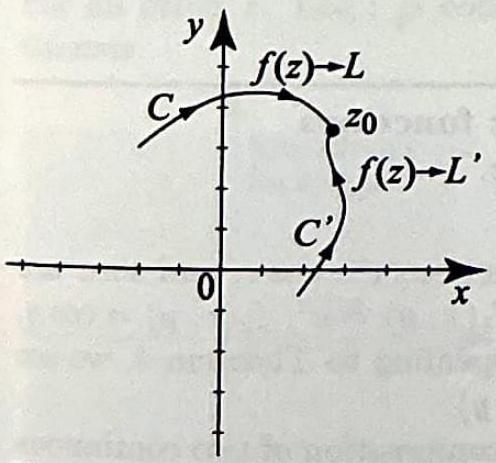
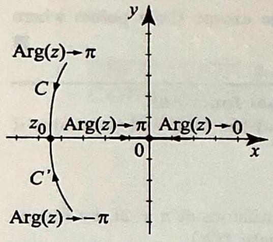
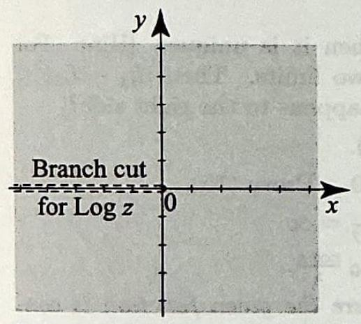
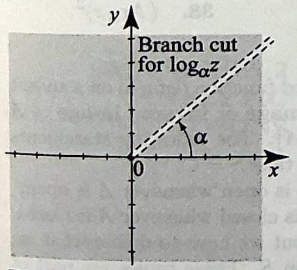

> [!review] Review 1
> Contents

When we define the derivative of a complex-valued function in Section 2.3, we will model our definition after the familiar derivative of a real-valued function from calculus. As you recall, such a derivative was defined by taking limits. Therefore, before we study differentiation, we must define limits of complex functions. We will also define continuous functions by appealing to limits.

> [!definition] limit of a complex-valued function
> We say that a complex-valued function $f(z)$ has a limit $L$ as $z$ approaches $z_{0}$, and we write
> 
> $$
> \lim _{z \rightarrow z_{0}} f(z)=L \quad \text { or } \quad f(z) \rightarrow L \text { as } z \rightarrow z_{0},
> $$
> 
> if given any $\epsilon>0$, there exists a $\delta>0$ such that
> 
> $$
> |f(z)-L|<\epsilon \quad \text { whenever } 0<\left|z-z_{0}\right|<\delta .
> $$
> 

If the limit of a function exists at a point, then it is unique (Exercise 27). This is referred to as the uniqueness property of limits.

> [!figure] Figure 1
> 
> 
> 
> To say that $f(z) \rightarrow L$ as $z \rightarrow z_{0}$ is a strong assertion; it states that no matter how $z$ approaches $z_{0}$ (and there are many possible ways in the plane), the distance from $f(z)$ to $L$ will tend to zero. By contrast, for limits of functions on the real line, a point $x$ can approach $x_{0}$ from only two directions.

Geometrically, interpreting the absolute value $|f(z)-L|$ as the distance between $f(z)$ and $L$, we see from (1) that the function $f(z)$ has limit $L$ as $z \rightarrow z_{0}$ if and only if the distance from $f(z)$ to $L$ tends to zero as $z$ tends to $z_{0}$. Thus, $\lim _{z \rightarrow z_{0}} f(z)=L$ if and only if

$$
\lim _{z \rightarrow z_{0}}|f(z)-L|=0
$$

Note that in (1) the value of $f$ at $z_{0}$ is immaterial, and in fact $f$ need not even be defined at $z_{0}$. Note also that the expression $|f(z)-L|$ that appears
in (1) and (2) is real-valued. So even though we will be computing limits of complex-valued functions, we will be working with real quantities.

> [!exercise] Exercise 1: Two simple limits
> Prove that:
> (a) $\lim _{z \rightarrow z_{0}} z=z_{0}$; and 
> (b) $\lim _{z \rightarrow z_{0}} c=c$, where $c$ is a constant.

##### problem a

##### problem b

---

> [!review] Review 2
> Contents

Computing more complicated limits by recourse to the $\epsilon \delta$-definition (1) is not always easy. To simplify this task, we will use properties of limits.

> [!theorem] Theorem 1: Operations with Limits
> Suppose $\lim _{z \rightarrow z_{0}} f(z)$ and $\lim _{z \rightarrow z_{0}} g(z)$ both exist and $c_{1}, c_{2}$ are complex constants, Then
> 
> 
> $$
> \lim _{z \rightarrow z_{0}}\left[c_{1} f(z)+c_{2} g(z)\right]=c_{1} \lim _{z \rightarrow z_{0}} f(z)+c_{2} \lim _{z \rightarrow z_{0}} g(z), \tag{3}
> $$
> 
> $$
> \lim _{z \rightarrow z_{0}}[f(z) g(z)]=\lim _{z \rightarrow z_{0}} f(z), \lim _{z \rightarrow z_{0}} g(z), \tag{4}
> $$
> 
> (5) $\lim _{z \rightarrow z_{0}}\left[\frac{f(z)}{g(z)}\right]=\frac{\lim _{z \rightarrow z_{0}} f(z)}{\lim _{z \rightarrow z_{0}} g(z)}$, provided $\lim _{z \rightarrow z_{0}} g(z) \neq 0$.
> 
> If $\lim _{z \rightarrow z_{0}} g(z)=w_{0}$ and $\lim _{w \rightarrow w_{0}} f(w)=A$, then
> 
> 
> $$
> \lim _{z \rightarrow z_{0}} f(g(z))=A=f\left(\lim _{z \rightarrow z_{0}} g(z)\right) \tag{6}
> $$
> 
> 

The function $f(g(z))$ is called the composition of $f$ and $g$ and is also denoted $(f \circ g)(z)$. The proofs of (3)-(6) are similar to the proofs of the corresponding results from calculus. They are left to the exercises. Next, we illustrate these properties with some applications.

> [!theorem] Theorem 2: The Squeeze Theorem
> (i) Suppose that $f(z) \rightarrow 0$ as $z \rightarrow z_0$ and $|g(z)| \leq|f(z)|$ in a deleted neighborhood of $z_0$. Then $g(z) \rightarrow 0$ as $z \rightarrow z_0$.
> (ii) Suppose that $f(z) \rightarrow 0$ as $z \rightarrow z_0$ and $g(z)$ is bounded in a deleted neighborhood of $z_0$. Then $f(z) g(z) \rightarrow 0$ as $z \rightarrow z_0$.

> [!exercise] Exercise 2: Operations on limits
> Suppose that $\lim _{z \rightarrow i} f(z)=2+i$ and $\lim _{z \rightarrow i} g(z)=3-i$. Find
> 
> $$
> L=\lim _{z \rightarrow i}\left[(f(z))^{2}+\frac{(3+i) g(z)}{z}\right]
> $$
> 

---

> [!review] Review 3
> Contents

Our next result is an analog of the squeeze theorem from calculus. To state it we will need the following definition. A function $g(z)$ is bounded in a set $S$ if there is a positive real number $M$ such that $|g(z)| \leq M$ for all $z$ in $S$.

> [!theorem] Theorem 2: Squeeze Theorem
> (i) Suppose that $f(z) \rightarrow 0$ as $z \rightarrow z_{0}$ and $|g(z)| \leq|f(z)|$ in a deleted neighborhood of $z_{0}$. Then $g(z) \rightarrow 0$ as $z \rightarrow z_{0}$.
> (ii) Suppose that $f(z) \rightarrow 0$ as $z \rightarrow z_{0}$ and $g(z)$ is bounded in a deleted neighborhood of $z_{0}$. Then $f(z) g(z) \rightarrow 0$ as $z \rightarrow z_{0}$.

**proof:**

---

> [!exercise] Exercise 3: An application of the squeeze theorem 
> Compute $\lim _{z \rightarrow 0} y e^{i /|z|}$.

> [!NOTE]
> It is interesting to note that if $h(z)$ is real-valued, then $\left|e^{i h(z)}\right|=1$ no matter how large $h(z)$ is. In Example 3, $h(z)=1 /|z| \rightarrow \infty$ as $z \rightarrow 0$, and still $\left|e^{i /|z|}\right|=1$.

---

> [!review] Review 4
> Contents

Consider a complex-valued function $f(z)=u(x, y)+i v(x, y)$. It is often advantageous to study the limit of $f$ by using properties of the limits of the real and imaginary parts of $f$. This is possible because of the following fact.

> [!theorem] Theorem 3: REAL AND IMAGINARY PARTS OF LIMITS
> Given a complex-valued function $f(z)=u(x, y)+i v(x, y)$ and a complex number $L=a+i b$, then
> (8) $\lim _{z \rightarrow z_{0}} f(z)=L \Longleftrightarrow \lim _{z \rightarrow z_{0}} u(x, y)=a$ and $\lim _{z \rightarrow z_{0}} v(x, y)=b$.

**Proof:**

> [!NOTE]
> 
> Inequalities (14), Section 1.2, state that for any complex number $w$,
> 
> $$
> |\operatorname{Re} w| \leq|w|
> $$
> 
> and
> 
> $$
> |\operatorname{Im} w| \leq|w| .
> $$
> 
> Inequality (15), Section 1.2, states that
> 
> $$
> |w| \leq|\operatorname{Re} w|+|\operatorname{Im} w| .
> $$
> 

---

> [!review] Review 5
> Contents

We have avoided thus far dealing with limits that involve $\infty$. What do we mean by statements such as $\lim _{z \rightarrow z_{0}} f(z)=\infty$ or $\lim _{z \rightarrow \infty} f(z)=L$ or even $\lim _{z \rightarrow \infty} f(z)=\infty$ ? We answer these questions and complete our discussion of limits by introducing the following definitions.

> [!definition] Limits Involving Infinity
> (i) We write $\lim _{z \rightarrow z_{0}} f(z)=\infty$ to mean that for any $M>0$ there is a $\delta>0$ such that $\left|z-z_{0}\right|<\delta \Rightarrow|f(z)|>M$.
> (ii) We write $\lim _{z \rightarrow \infty} f(z)=L$ to mean that for any $\epsilon>0$ there is an $R>0$ such that $|z|>R \Rightarrow|f(z)-L|<\epsilon$.
> (iii) We write $\lim _{z \rightarrow \infty} f(z)=\infty$ to mean that for any $M>0$ there is an $R>0$ such that $|z|>R \Rightarrow|f(z)|>M$.

Looking at these definitions, we see that $z \rightarrow \infty$ means that the real quantity $|z| \rightarrow \infty$, and similarly $f(z) \rightarrow \infty$ means that $|f(z)| \rightarrow \infty$. Hence

$$
\lim _{z \rightarrow z_{0}} f(z)=\infty \quad \Leftrightarrow \quad \lim _{z \rightarrow z_{0}}|f(z)|=\infty ;
$$

$$
\lim _{z \rightarrow \infty} f(z)=L \Leftrightarrow \lim _{z \rightarrow \infty}|f(z)-L|=0 ;
$$

$$
\lim _{z \rightarrow \infty} f(z)=\infty \quad \Leftrightarrow \quad \lim _{z \rightarrow \infty}|f(z)|=\infty .
$$

Limits at infinity can also be reduced to limits at $z_{0}=0$ by means of the inversion $1 / z$. The idea is that taking the limit as $z \rightarrow \infty$ of $f(z)$ is the same thing as taking the limit as $z \rightarrow 0$ of $f\left(\frac{1}{z}\right)$. So you can check that

$$
\lim _{z \rightarrow \infty} f(z)=L \quad \Leftrightarrow \quad \lim _{z \rightarrow 0} f\left(\frac{1}{z}\right)=L
$$

and

$$
\lim _{z \rightarrow \infty} f(z)=\infty \quad \Leftrightarrow \quad \lim _{z \rightarrow 0} f\left(\frac{1}{z}\right)=\infty .
$$

These equivalent statements are sometimes useful. For example, appealing to (15), we have

$$
\lim _{z \rightarrow \infty} \frac{1}{z}=\lim _{z \rightarrow 0} \frac{1}{1 / z}=\lim _{z \rightarrow 0} z=0
$$

Similarly, for any constant $c$ and positive integer $n$, we have

$$
\lim _{z \rightarrow \infty} \frac{c}{z^{n}}=\lim _{z \rightarrow 0} \frac{c}{1 / z^{n}}=\lim _{z \rightarrow 0} c z^{n}=0
$$

> [!exercise] Exercise 4: Limits at $\infty$
> Find:
> (a) $\lim _{z \rightarrow \infty} \frac{z-1}{z+i} ; \quad$ and
> (b) $\lim _{z \rightarrow \infty} \frac{2 z+3 i}{z^{2}+z+1}$.
> 

---

> [!review] Review 6
> Contents

While we have successfully used skills from calculus to guide us in taking complex-valued limits, you should be cautioned in using real-variable intuition. For example, the $\operatorname{limit}_{\text {lim }} \lim _{z \rightarrow \infty} e^{-z}$ is not 0 ; in fact, the limit does not exist (Exercise 21).

Often, the limit of $f(z)$ as $z$ approaches $z_{0}$ will equal $f\left(z_{0}\right)$. Functions that satisfy this requirement are said to be continuous.

> [!definition] Continuous Function
> Suppose $f(z)$ is defined on a neighborhood of $z_{0}$. We say that $f(z)$ is continuous at the point $z_{0}$ if $\lim _{z \rightarrow z_{0}} f(z)$ exists and equals $f\left(z_{0}\right)$. We say $f$ is continuous on a set $S$ if it is continuous at every point in $S$.

We see from Example 1 that the functions $f(z)=z$ and $f(z)=c$ are continuous at all points in the plane. To check the continuity of more complicated functions, we can appeal to the properties of limits. Since continuity is defined in terms of limits, many properties of limits extend to continuous functions.

> [!theorem] Theorem 4 Properties of Continuous Functions
> (i) If $f(z)$ and $g(z)$ are continuous at $z_{0}$, and $c_{1}, c_{2}$ are complex constants, then the following functions are continuous at $z_{0}$ :
> 
> $$
> c_{1} f(z)+c_{2} g(z), \quad f(z) g(z), \quad \frac{f(z)}{g(z)}\left(\text { provided } g\left(z_{0}\right) \neq 0\right)
> $$
> 
> (ii) If $g$ is continuous at $z_{0}$ and $f$ is continuous at $g\left(z_{0}\right)$, then the composition $h(z)=f(g(z))$ is continuous at $z_{0}$.
> (iii) If $g(z)$ is real-valued and continuous at $z_{0}$ and $f(x)$ is continuous at $x_{0}=g\left(z_{0}\right)$, then the composition $h(z)=f(g(z))$ is continuous at $z_{0}$.
> (iv) The function $f(z)=u(z)+i v(z)$ is continuous if and only if $u$ and $v$ are continuous.

**proof:**

## EXAMPLE 5 Polynomial and rational functions

> [!example] Example 5: Polynomial and Rational Functions
> (a) Show that a polynomial $p(z)=a_{n} z^{n}+a_{n-1} z^{n-1}+\cdots+a_{0}$ is continuous at all points in the plane.
> (b) A rational function is a function of the form
> 
> $$
> r(z)=\frac{p(z)}{q(z)}
> $$
> 
> where $p$ and $q$ are polynomials. Show that a rational function is continuous at all points where $q(z) \neq 0$.

---

## EXAMPLE 6 Limits and continuity of rational functions

> [!exercise]
> For the given rational function $f(z)=p(z) / q(z)$, find the limit and determine if the function is continuous at the given point.
> (a) $\lim _{z \rightarrow 2 i} \frac{2 z^{2}-i}{z+2}$.
> (b) $\lim _{z \rightarrow i} \frac{z-i}{z^{2}+1}$.

---

> [!review] Review 7
> Contents

In Example 6(b), because $\lim _{z \rightarrow i} f(z)$ exists at the point of discontinuity $z=i$, we can remove the discontinuity of $f(z)$ and make it continuous at $z=i$ by redefining $f(i)=-i / 2$. Such a point of discontinuity is called a **removable discontinuity**. If the discontinuity at a point cannot be removed, then it is called a nonremovable discontinuity.

Our next example involves a function with infinitely many nonremovable discontinuities. In the example, we will use the uniqueness property of limits to show that a limit fails to exist. The method works as follows. If you can show that $f(z) \rightarrow L$ as $z$ approaches $z_{0}$ on curve $C$ _(Figure 2)_, but $f(z) \rightarrow L^{\prime}$ as $z$ approaches $z_{0}$ on curve $C^{\prime}$, and $L \neq L^{\prime}$, then, by the uniqueness of limits, we conclude that $\lim _{z \rightarrow z_{0}} f(z)$ does not exist.

> [!figure] Figure 2
> 
> 
> If $L \neq L^{\prime}$, then the limit at $z_{0}$ cannot exist.

## EXAMPLE 7 The nonremovable discontinuities of $\operatorname{Arg} z$

> [!exercise] Exercise 7
> [Need to Create Question]

**Solution:** The principal branch of the argument $\operatorname{Arg} z$ takes the value of argument $z$ that is in the interval $-\pi<\operatorname{Arg} z \leq \pi$. It is not defined at $z=0$ and hence $\operatorname{Arg} z$ is not continuous at $z=0$. We will show that $z=0$ is not a removable discontinuity by showing that $\lim _{z \rightarrow 0} \operatorname{Arg} z$ does not exist. Indeed, if $z=x>0$, then $\operatorname{Arg} z=0$ and so $\lim _{z=x \nmid 0} \operatorname{Arg} z=0$, where the down-arrow denotes the limit from the right, also denoted by $\lim _{z=x \rightarrow 0+} \operatorname{Arg} z$. However, if $z=x<0$, then $\operatorname{Arg} z=\pi$ and so $\lim _{z=x \uparrow 0} \operatorname{Arg} z=\pi$, where the up-arrow denotes the limit from the left, also denoted by $\lim _{z=x \rightarrow 0^{-}} \operatorname{Arg} z$. By the uniqueness of limits, we conclude that $\lim _{z \rightarrow 0} \operatorname{Arg} z$ doe not exist.

Also, for a point on the negative $x$-axis, $z_{0}=x_{0}<0$, we have $\operatorname{Arg} z_{0}=\pi$. If $z$ approaches $z_{0}$ from the second quadrant, say along curve $C$ in _Figure 3_, we have $\lim _{z \rightarrow z_{0}} \operatorname{Arg} z=\pi=\operatorname{Arg} z_{0}$. But if $z$ approaches $z_{0}$ from the third quadrant, say along curve $C^{\prime}$ in _Figure 3_, we have $\lim _{z \rightarrow z_{0}} \operatorname{Arg} z=-\pi$. Hence $\operatorname{Arg} z$ is not continuous at $z_{0}$ and the discontinuity is not removable, because $\lim _{z \rightarrow z_{0}} \operatorname{Arg} z$ does not exist for such $z_{0}$.

> [!figure] Figure 3
> 
> 
> Figure $3 \operatorname{Arg} z$ has nonremovable discontinuities at $z=$ 0 and at all negative real $z$. For all other $z, \operatorname{Arg} z$ is continuous.

It is not hard to show, using geometric considerations, that for $z \neq 0$ and $z$ not on the negative $x$-axis, $\operatorname{Arg} z$ is continuous. Since the set of points of continuity of $\operatorname{Arg} z$ is the complex plane $\mathbb{C}$ minus the interval $(-\infty, 0]$ on the real line, the principal branch of the argument is continuous on $\mathbb{C} \backslash(\infty, 0]$.

---

> [!review] Review 8
> Contents

Many important functions of several variables are made up of products, quotients and linear combinations of functions of a single variable. For example, the function $u(x, y)=e^{x} \cos y$ is the product of two functions of a single variable each; namely, $e^{x}$ and $\cos y$. The exponential function $e^{z}=e^{x}(\cos y+i \sin y)$ is a linear combination of two products of functions of a single variable. In establishing the continuity of such functions, the following simple observations are very useful.

> [!proposition] Proposition 1
> Suppose that $\phi(x)$ is a continuous function of a single variable $x$ over an interval $(a, b)$. Then the function of two variables $f(x, y)=\phi(x)$ is continuous at $\left(x_{0}, y_{0}\right)$ whenever $x_{0}$ is in $(a, b)$. Similarly, $g(x, y)=\phi(y)$ is continuous, at $\left(x_{0}, y_{0}\right)$ whenever $y_{0}$ is in $(a, b)$.

**Proof**

Combined with Theorem 4, this proposition becomes a very powerful tool. Here are some interesting applications.

> [!exercise] Exercise 8: Exponential and trigonometric functions
> Show that the following are continuous functions of $z$.
> (a) $e^{z}$.
> (b) $\cos z$.

---

We give one more example of a continuous function.

> [!exercise] Exercise 9
> Show that the absolute value $|z|$ is continuous.

## Continuity of the Logarithms

Understanding the behavior of the logarithm is crucial to certain applications. We will prove the following important result, which should not surprise you in view of what we already know about $\operatorname{Arg} z$ and $|z|$.

> [!theorem] Theorem 5: THEOREM 5 CONTINUITY OF THE LOGARITHM
> The principal branch of the logarithm
> 
> $$
> \log (z)=\ln |z|+i \operatorname{Arg}(z), \quad-\pi<\operatorname{Arg} z \leq \pi \quad(z \neq 0),
> $$
> 
> is continuous for all $z$ in $\mathbb{C} \backslash(-\infty, 0]$. For $z$ in $(-\infty, 0]$, the discontinuities of $\log z$ are not removable _(Figure 4)_.

> [!figure] Figure 4
> 
> 
> Figure $4 \log z$ has nonremovable discontinuities at $z=$ 0 and at all negative real $z$. For all other $z, \log z$ is continuous.

**Proof** 

---

> [!review] Review 9
> Contents

A discussion similar to the preceding one shows that a branch of the logarithm, $\log _{\alpha} z$, is continuous at all $z$ except for nonremovable discontinuities at $z=0$ and $z$ on the ray at angle $\alpha$. The set of nonremovable discontinuities of $\log _{\alpha} z$ is called a branch cut. Thus, for example, the branch cut of $\log z$ is $(-\infty, 0]$ (Figure 4), and the branch cut of $\log _{\alpha} z$ is the ray at angle $\alpha$ (Figure 5).

> [!figure] Figure 5
> 
> 
> Figure 5 The branch cut of $\log _{\alpha} z$ is the ray at angle $\alpha$. The branch cut is the set of nonremovable discontinuities of $\log _{\alpha} z$.

## Exercises 2.2

> [!exercise] Exercise 10
> In problems 1-12, evaluate the given limit and justify each step by using properties of limits from this section. **(Hint: In evaluating limits involving elementary functions such as exponential or trigonometric functions, you may want to express them in terms of their real and imaginary parts and use results from calculus.)**
> 
> 1. $\lim _{z \rightarrow i} 3 z^{2}+2 z-1$.
> 2. $\lim _{z \rightarrow 2+i} z+\frac{1}{z}$.
> 3. $\lim _{z \rightarrow 0} \frac{z}{\cos z}$.
> 4. $\lim _{z \rightarrow 2} \frac{z^{4}-16}{z-2}$.
> 5. $\lim _{z \rightarrow i} \frac{1}{z-i}-\frac{1}{z^{2}+1}$.
> 6. $\lim _{z \rightarrow 0} z \operatorname{Arg} z$.
> 7. $\lim _{z \rightarrow 0} z e^{i \operatorname{Re} z}$.
> 8. $\lim _{z \rightarrow i} \operatorname{Re}(z) \sin z$.
> 9. $\lim _{z \rightarrow-3}(\operatorname{Arg} z)^{2}$.
> 10. $\lim _{z \rightarrow 1}(z+1) \operatorname{Im}(i z)$.
> 11. $\lim _{z \rightarrow 0} \sin \bar{z}$.
> 12. $\lim _{z \rightarrow 0} z e^{i /|z|^{2}}$.

> [!exercise] Exercise 11
> In problems 13-18, evaluate the given limit involving $\infty$. Justify your steps.
> 13. $\lim _{z \rightarrow \infty} \frac{z+1}{3 i z+2}$.
> 14. $\lim _{z \rightarrow \infty} \frac{z^{2}+i}{z^{3}+3 z^{2}+z+1}$.
> 15. $\lim _{z \rightarrow \infty}\left(\frac{z^{3}+i}{z^{3}-i}\right)^{2}$.
> 16. $\lim _{z \rightarrow i} \frac{1}{z^{2}+1}$.
> 17. $\lim _{z \rightarrow 1} \frac{-1}{(z-1)^{2}}$.
> 18. $\lim _{z \rightarrow \infty} \frac{\log z}{z}$.

> [!exercise] Exercise 12
> In problems 19-26, show that the given limit at $z_{0}$ does not exist by approaching $z_{0}$ from different directions. If the limit involves $z \rightarrow \infty$, try some of the following directions: the positive $x$-axis, the negative $x$-axis, the positive $y$-axis ( $z=i y, y>$ 0 ), or the negative $y$-axis ( $z=i y, y<0$ ).
> 19. $\lim _{z \rightarrow-3} \operatorname{Arg} z$.
> 20. $\lim _{z \rightarrow-1} \log z$.
> 21. $\lim _{z \rightarrow \infty} e^{-z}$.
> 22. $\lim _{z \rightarrow 0} \frac{\bar{z}}{z}$.
> 23. $\lim _{z \rightarrow 0} e^{1 / z}$.
> 24. $\lim _{z \rightarrow 0} \frac{\operatorname{Re} z}{|z|^{2}}$.
> 25. $\lim _{z \rightarrow 0} \frac{z}{|z|}$.
> 26. $\lim _{z \rightarrow 0} \frac{\operatorname{Im} z}{z}$.

> [!exercise] Exercise 13
> 27. Show that if the limit of a function exists then it is unique. (Hint: For the case of a finite limit, suppose $L_{1}$ and $L_{2}$ are two limits. Then $\left|L_{1}-L_{2}\right| \leq \left|L_{1}-f(z)\right|+\left|L_{2}-f(z)\right|$ (why?). As $z \rightarrow z_{0}$, what happens to the right side?)

> [!exercise] Exercise 14
> 28. Use the triangle inequality and the fact that $\lim _{z \rightarrow z_0} f(z)=L$ if and only if $\lim _{z \rightarrow z_0}|f(z)-L|=0$ to prove the following: 
> $$\quad \lim _{z \rightarrow z_0}\left[c_1 f(z)+c_2 g(z)\right]=c_1 \lim _{z \rightarrow z_0} f(z)+c_2 \lim _{z \rightarrow z_0} g(z)$$
> 

> [!exercise] Exercise 15
> 29. Show that $\lim _{z \rightarrow \infty} f(z)=L \quad \Leftrightarrow \quad \lim _{z \rightarrow 0} f\left(\frac{1}{z}\right)=L$.
> 30. Show that $\lim _{z \rightarrow \infty} f(z)=\infty \quad \Leftrightarrow \quad \lim _{z \rightarrow 0} f\left(\frac{1}{z}\right)=\infty$.
> 31. Show that $\lim _{z \rightarrow z_{0}} f(z)=0 \Leftrightarrow \lim _{z \rightarrow z_{0}} \frac{1}{f(z)}=\infty$.
> 32. Use the result of problem 31 to evaluate $\lim _{z \rightarrow 0} \frac{\cos z}{z}$.

> [!exercise] Exercise 16
> In problems 33-40, determine the set of points where the given function is continuous. For a point of discontinuity, determine whether it is removable or not. Whenever possible, use properties from this section; in particular, use Proposition 1 and Theorem 4.
> 33. $\frac{z-i}{z+1+3 i}$.
> 34. $\frac{2 z+1}{z^{2}+3 z+2}$.
> 35. $\bar{z}$.
> 36. $\log (z+1)$.
> 37. $\sin z$.
> 38. $(\operatorname{Arg} z)^{2}$.
> 39. $z(\operatorname{Arg} z)^{2}$.
> 40. $\frac{z}{|z|}$.

> [!exercise] Exercise 17
> 41. Pre-image of sets. Let $f$ be a complex-valued function defined on a subset $S$ of $\mathbb{C}$. If $A$ is a set of complex numbers, the pre-image or inverse image of $A$ by $f$ is the set $f^{-1}[A]=\{z \in S: f(z)$ belongs to $A\}$. The following statements are true for arbitrary sets $S$. To simplify the proofs, take $S=\mathbb{C}$.
> (a) Show that $f$ is continuous if and only if $f^{-1}[A]$ is open whenever $A$ is open.
> (b) Show that $f$ is continuous if and only if $f^{-1}[A]$ is closed whenever $A$ is closed. (If $S$ is a proper subset of $\mathbb{C}$, (a) and (b) still hold, but we have to define what we mean for a set such as $f^{-1}[A]$ to be open or closed in $S$. These topics are part of elementary topology and will not be emphasized in this book.)

> [!exercise] Exercise 18
> 42. Continuity and boundedness. Show that if $f$ is continuous at $z_{0}$, then it is bounded in a neighborhood of $z_{0}$.
> 43. Show that a discontinuity at $z=z_{0}$ of a function $f(z)=u(z)+i v(z)$ is it is bounded in a neighborhood of $z_{0}$. removable if and only if $z_{0}$ is a removable discontinuity of both $u$ and $v$.
