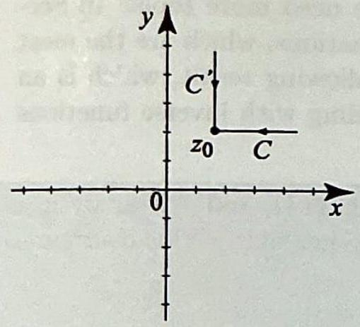
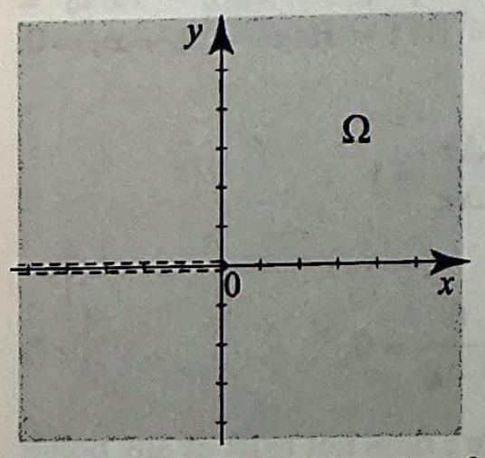
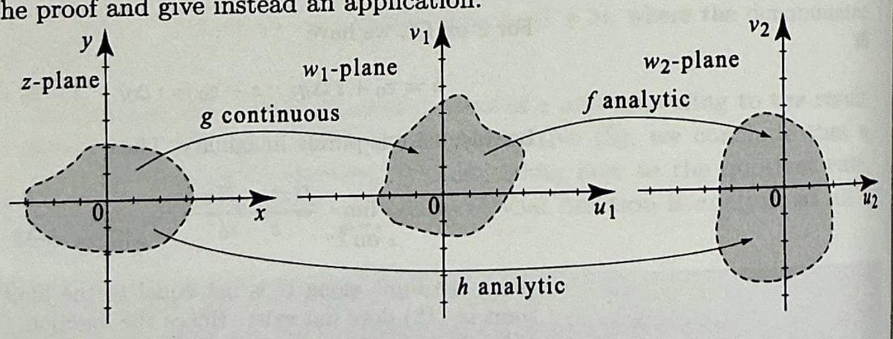

# 2.3 Analytic Functions

For a real-valued function $f(x)$ defined on an open interval containing the point $x_{0}$, we defined the derivative at $x_{0}$ to be $f^{\prime}\left(x_{0}\right)=\lim _{x \rightarrow x_{0}} \frac{f(x)-f\left(x_{0}\right)}{x-x_{0}}$, when the limit exists. Our definition for the derivative of a complex function $f(z)$ is a natural extension of the real case.

## DEFINITION 1 COMPLEX DERIVATIVE

DEFINITION 2 ANALYTIC FUNCTIONS

Let $f(z)$ be defined on a neighborhood of $z_{0}$. If

$$
\lim _{z \rightarrow z_{0}} \frac{f(z)-f\left(z_{0}\right)}{z-z_{0}}
$$

exists, then $f$ is said to be differentiable at the point $z_{0}$, and the number

$$
f^{\prime}\left(z_{0}\right)=\lim _{z \rightarrow z_{0}} \frac{f(z)-f\left(z_{0}\right)}{z-z_{0}}
$$

is called the derivative of $f$ at $z_{0}$.
We can also use the Leibniz notation for the derivative, $\frac{d f}{d z}\left(z_{0}\right)$, or $\left.\frac{d f}{d z}\right|_{z=z_{0}}$. We can recast the difference quotient and define the derivative as

$$
f^{\prime}\left(z_{0}\right)=\lim _{\Delta z \rightarrow 0} \frac{f\left(z_{0}+\Delta z\right)-f\left(z_{0}\right)}{\Delta z}
$$

While this extension looks similar to the definition of a derivative for functions defined on the real line, we are asking a lot more in the complex case. In the real case, $x$ can only approach $x_{0}$ from either the right or the left. In the complex case, $z$ can approach $z_{0}$ from any number of directions. For the derivative to exist, we are requiring that the limit exists no matter how we approach $z_{0}$ in (1).

We now introduce a fundamental definition in the theory of complex variables.

A function $f(z)$ defined on an open set $S$ is said to be analytic on $S$ if $f^{\prime}(z)$ exists and is continuous for all $z$ in $S$. We say $f(z)$ is analytic at a point if $f(z)$ is analytic on some open set containing that point. We say $f(z)$ is entire if $f(z)$ is analytic on $\mathbb{C}$.

It is important to note that while differentiability is defined at a specific point, analyticity is defined on an open set. Even when we say "analytic at a point," we really mean analytic on some open set containing this point.

In Section 3.9, we will prove a theoretical result, called Goursat's theorem. It asserts that the mere existence of $f^{\prime}(z)$ in an open set implies that $f^{\prime}(z)$ is continuous. Thus our requirement that $f^{\prime}(z)$ be continuous in the definition of analytic functions is redundant; we have included it to make some initial proofs easier to understand.

EXAMPLE 1 Some simple entire functions
Show the following functions are entire (analytic at every point in the complex plane), and find their derivatives.
(a) $f(z)=2+4 i$.
(b) $f(z)=(3-i) z$.
(c) $f(z)=z^{2}$.

Solution We use the difference quotient as in (1) to calculate the derivatives.
(a) Fix any $z_{0}$ in the plane. Since $f=2+4 i$ is constant, $f(z)=f\left(z_{0}\right)$ for any $z$. Hence $\frac{f(z)-f\left(z_{0}\right)}{z-z_{0}}=0$. Taking the limit as $z \rightarrow z_{0}$, we get $f^{\prime}\left(z_{0}\right)=0$. Thus $f^{\prime}(z)=0$ for all $z$. Since $f^{\prime}(z)$ is obviously continuous, it follows that $f(z)=2+4 i$ is analytic on $\mathbb{C}$, or entire.
(b) Fix any $z_{0}$ in the plane. We have

$$
f^{\prime}\left(z_{0}\right)=\lim _{z \rightarrow z_{0}} \frac{f(z)-f\left(z_{0}\right)}{z-z_{0}}=\lim _{z \rightarrow z_{0}} \frac{(3-i)(z)-(3-i)\left(z_{0}\right)}{z-z_{0}}=3-i
$$

Thus $f^{\prime}(z)=3-i$ for all $z$. Since $f^{\prime}(z)$ is continuous, it follows that $f(z)=(3-i) z$ is entire.
(c) Fix any $z_{0}$ in the plane. We have

$$
f^{\prime}\left(z_{0}\right)=\lim _{z \rightarrow z_{0}} \frac{z^{2}-z_{0}^{2}}{z-z_{0}}=\lim _{z \rightarrow z_{0}} \frac{\left(z-z_{0}\right)\left(z+z_{0}\right)}{z-z_{0}}=\lim _{z \rightarrow z_{0}} z+z_{0}=2 z_{0}
$$

Thus $f^{\prime}(z)=2 z$ for all $z$. Since $f^{\prime}(z)$ is continuous, it follows that $f(z)=z^{2}$ is entire.

The following useful formulas can be derived by the methods of Example 1(a) and (b):

$$
\begin{aligned}
f(z)=c(\text { a constant }) & \Rightarrow f^{\prime}(z)=0 \\
f(z)=z & \Rightarrow f^{\prime}(z)=1
\end{aligned}
$$

Our first theorem is the analog of the well-known fact from calculus that states that if a function has a derivative then it is continuous. The proof is also similar to the real variable case.

THEOREM 1 DIFFERENTIABLE IMPLIES CONTINUOUS

Suppose $f(z)$ is differentiable at $z_{0}$. Then $f(z)$ is continuous at $z_{0}$.
Proof We must show that $\lim _{z \rightarrow z_{0}} f(z)=f\left(z_{0}\right)$. Equivalently, we will show that $\lim _{z \rightarrow z_{0}}\left(f(z)-f\left(z_{0}\right)\right)=0$. Using the fact that the limit of a product is the product of the limits ((4), Section 2.2), we have

$$
\begin{aligned}
\lim _{z \rightarrow z_{0}} f(z)-f\left(z_{0}\right) & =\lim _{z \rightarrow z_{0}} \frac{f(z)-f\left(z_{0}\right)}{z-z_{0}}\left(z-z_{0}\right) \\
& =\lim _{z \rightarrow z_{0}} \frac{f(z)-f\left(z_{0}\right)}{z-z_{0}} \lim _{z \rightarrow z_{0}}\left(z-z_{0}\right)=f^{\prime}\left(z_{0}\right) \cdot 0=0
\end{aligned}
$$

Equivalently, Theorem 1 states that if a function is not continuous, it cannot be differentiable. The converse of Theorem 1, however, is not trueFor example, $\bar{z}$ is continuous but nowhere differentiable (see Example 4 in this section).

Because the definition of the derivative in the complex case is modeled after the definition of the derivative in the real case, it should not surprise you that many of the properties of derivatives that you are familiar with from calculus hold for analytic functions.

## THEOREM 2 PROPERTIES OF ANALYTIC FUNCTIONS

Suppose that $f$ and $g$ are analytic on an open set $S$ and $c_{1}, c_{2}$ are complex constants. Then $c_{1} f+c_{2} g$ and $f g$ are analytic on $S$ with

$$
\begin{aligned}
\left(c_{1} f+c_{2} g\right)^{\prime}(z) & =c_{1} f^{\prime}(z)+c_{2} g^{\prime}(z) \text { and } \\
(f g)^{\prime}(z) & =f^{\prime}(z) g(z)+f(z) g^{\prime}(z) .
\end{aligned}
$$

Also, $\frac{f}{g}$ is analytic on $S$ minus the points where $g=0$, and

$$
\left(\frac{f}{g}\right)^{\prime}(z)=\frac{f^{\prime}(z) g(z)-f(z) g^{\prime}(z)}{(g(z))^{2}} \quad(g(z) \neq 0) .
$$

If $g$ is analytic at $z_{0}$ and $f$ is analytic at $g\left(z_{0}\right)$, then the composition $(f \circ g)(z)$ is analytic at $z_{0}$ and we have the chain rule

$$
(f \circ g)^{\prime}\left(z_{0}\right)=f^{\prime}\left(g\left(z_{0}\right)\right) g^{\prime}\left(z_{0}\right) .
$$

Proof The proof of each part involves two steps. First we must establish the existence of a derivative, then show that it is continuous. Because the right side of each formula in the theorem is constructed using continuous functions according to rules that preserve continuity, the continuity of the derivatives follows immediately once we establish the formulas (5)-(8).

We will prove the product rule (6) to illustrate to you that the methods from calculus apply here. The proofs of (5) and (7) are relegated to the exercises. The chain rule (8) is more delicate-we will prove it in the appendix to this section, where we use a new formalism to express differentiability.

Appealing to the definition of the derivative and using the continuity of $g$ (Theorem 1), we have

$$
\begin{aligned}
(f g)^{\prime}\left(z_{0}\right) & =\lim _{z \rightarrow z_{0}} \frac{f(z) g(z)-f\left(z_{0}\right) g\left(z_{0}\right)}{z-z_{0}} \\
& =\lim _{z \rightarrow z_{0}} \frac{f(z) g(z)-f\left(z_{0}\right) g(z)+f\left(z_{0}\right) g(z)-f\left(z_{0}\right) g\left(z_{0}\right)}{z-z_{0}} \\
& =\lim _{z \rightarrow z_{0}} g(z) \frac{f(z)-f\left(z_{0}\right)}{z-z_{0}}+\lim _{z \rightarrow z_{0}} f\left(z_{0}\right) \frac{g(z)-g\left(z_{0}\right)}{z-z_{0}} \\
& =g\left(z_{0}\right) f^{\prime}\left(z_{0}\right)+f\left(z_{0}\right) g^{\prime}\left(z_{0}\right)
\end{aligned}
$$ $\square$

## EXAMPLE 2 Analyticity of $z^{n}$ for $n=1,2, \ldots$

Use (1) to show that for $n=1,2, \ldots$

$$
\frac{d}{d z} z^{n}=n z^{n-1} .
$$

Conclude that $f(z)=z^{n}$ is entire.
Solution We give a proof by induction. The case $n=1$ was already stated in (4). Suppose as an induction hypothesis that (9) holds for $n$; we will prove that it holds for $n+1$. Given $h(z)=z^{n+1}$, write it as a product, $h(z)=z^{n} z$. Applying the product rule for differentiation (6) and the induction hypothesis, we get

$$
h^{\prime}(z)=\left(z^{n}\right)^{\prime} z+z^{n} z^{\prime}=n z^{n-1} z+z^{n}=(n+1) z^{n}
$$

as desired. Hence (9) holds for all $n$. Looking at the right side of (9), it is clear that the derivative of $f(z)=z^{n}$ is continuous for all $z$. Hence $z^{n}$ is entire.

## EXAMPLE 3 Analyticity of a rational function

Find the derivative of

$$
f(z)=\frac{(z+1)(z+i)^{2}}{z+1-3 i}
$$

and determine where $f(z)$ is analytic.
Solution The formal manipulations are exactly as if we were working with a real function and treating the complex numbers as real constants. We use the quotient and product rules for differentiation, (7) and (6), and get

$$
\begin{aligned}
f^{\prime}(z) & =\frac{\left((z+i)^{2}+(z+1) 2(z+i)\right)(z+1-3 i)-(z+1)(z+i)^{2}}{(z+1-3 i)^{2}} \\
& =\frac{2 z^{3}+(4-7 i) z^{2}+(14-2 i) z+(6+5 i)}{(z+1-3 i)^{2}}
\end{aligned}
$$

The function is analytic at all $z$ except at $z=-1+3 i$, where the denominator vanishes.

By using linear combinations of powers of $z$ and appealing to the result of Example 2 and the linearity of the derivative (5), we conclude that a polynomial is an entire function. By appealing now to the quotient rule, as we did in Example 3, we see that a rational function is analytic at all $z$ where $g(z) \neq 0$.

THEOREM 3 POLYNOMIALS AND RATIONAL FUNCTIONS

Let $n$ be a nonnegative integer. A polynomial of degree $n, p(z)=a_{n} z^{n}+ a_{n-1} z^{n-1}+\cdots+a_{1} z+a_{0}$, is entire. Its derivative is given by

$$
p^{\prime}(z)=n a_{n} z^{n-1}+(n-1) a_{n-1} z^{n-1}+\cdots+a_{1} z .
$$

A rational function $f(z)=p(z) / q(z)$, where $p(z)$ and $q(z)$ are polynomials, is analytic at all points $z$ where $q(z) \neq 0$. Its derivative is given by

$$
f^{\prime}(z)=\frac{p^{\prime}(z) q(z)-p(z) q^{\prime}(z)}{q(z)^{2}}
$$

Typically, any function that algebraically manipulates $z$ will be differentiable; however, not every complex-valued function is analytic. Functions like $\operatorname{Re} z, \operatorname{Im} z, \bar{z}$, and $|z|$ will have at best limited differentiability.

Figure 1 On $C, \Delta z=\Delta x$. On $C^{\prime}, \Delta z=i \Delta y$.

## EXAMPLE 4 Functions that are nowhere analytic

Show that the functions
(a) $f(z)=\bar{z}$ and
(b) $f(z)=\operatorname{Re} z$
are not analytic at any point.
Solution In order to show that a function $f(z)$ is not analytic at a point $z_{0}$, we will show that the limit (1) that defines the derivative does not exist. For this purpose, we will approach $z_{0}$ from two different directions and show that the limits that we obtain are not equal. Since the value of a limit must be unique, we will then conclude that the limit and hence the derivative do not exist.
(a) Fix a point $z_{0}=x_{0}+i y_{0}$ in the plane. Our goal is to show that the limit

$$
\lim _{z \rightarrow z_{0}} \frac{f(z)-f\left(z_{0}\right)}{z-z_{0}}
$$

does not exist. We will approach $z_{0}$ from the two directions as indicated in Figure 1. For $z$ on $C$, we have

$$
z=z_{0}+\Delta x ; \quad z-z_{0}=\Delta x ; \quad f(z)-f\left(z_{0}\right)=\bar{z}-\overline{z_{0}}=\overline{z-z_{0}}=\overline{\Delta x}=\Delta x,
$$

because $\Delta x$ is real. Thus,

$$
\lim _{\substack{z \rightarrow z_{0} \\ z \text { on } C}} \frac{f(z)-f\left(z_{0}\right)}{z-z_{0}}=\lim _{\substack{z \rightarrow z_{0} \\ z \text { on } C}} \frac{\Delta x}{\Delta x}=\lim _{\substack{z \rightarrow z_{0} \\ z \text { on } C}} 1=1 .
$$

For $z$ on $C^{\prime}$, we have

$$
z=z_{0}+i \Delta y ; \quad z-z_{0}=i \Delta y ; \quad \bar{z}-\overline{z_{0}}=\overline{z-z_{0}}=\overline{i \Delta y}=-i \Delta y,
$$

because $i \Delta y$ is purely imaginary. Thus,

$$
\lim _{\substack{z \rightarrow z_{0} \\ z \text { on } C^{\prime}}} \frac{f(z)-f\left(z_{0}\right)}{z-z_{0}}=\lim _{\substack{z \rightarrow z_{0} \\ z \text { on } C^{\prime}}} \frac{-i \Delta y}{i \Delta y}=\lim _{\substack{z \rightarrow z_{0} \\ z \text { on } C^{\prime}}}-1=-1 .
$$

Since the limit along $C$ is not equal to the limit along $C^{\prime}$, we conclude that the limit in (12) does not exist. Hence the function $f(z)=\bar{z}$ is nowhere analytic.
(b) We take the same approach as in (a) and use the same directions along $C$ and $C^{\prime}$. It is easy to check that for $z$ on $C f(z)-f\left(z_{0}\right)=\operatorname{Re} z-\operatorname{Re} z_{0}= x_{0}+\Delta x-x_{0}=\Delta x$, while for $z$ on $C^{\prime} f(z)-f\left(z_{0}\right)=\operatorname{Re} z-\operatorname{Re} z_{0}=x_{0}-x_{0}=0$. Using this information, we obtain

$$
\lim _{\substack{z \rightarrow z_{0} \\ z \text { on } C}} \frac{f(z)-f\left(z_{0}\right)}{z-z_{0}}=\lim _{\substack{z \rightarrow z_{0} \\ z \text { on } C}} \frac{\Delta x}{\Delta x}=1
$$

and

$$
\lim _{\substack{z \rightarrow z_{0} \\ z \text { on } C^{\prime}}} \frac{f(z)-f\left(z_{0}\right)}{z-z_{0}}=\lim _{\substack{z \rightarrow z_{0} \\ z \text { on } C^{\prime}}} \frac{0}{i \Delta y}=0 .
$$

This shows that the limit defining the derivative of $\operatorname{Re} z$ does not exist at any point; and hence $\operatorname{Re} z$ is nowhere analytic.

There is another quick proof of (b) based on the result of (a) and the identity $\bar{z}=2 \operatorname{Re} z-z$. In fact, if $\operatorname{Re} z$ has a derivative at $z_{0}$, then by the properties of the derivative it would follow that $\bar{z}$ has a derivative at $z_{0}$, which contradicts (a).

Other interesting examples of functions that fail to be analytic at certain points in the plane are presented in the exercises.

So far we have been successful at differentiating polynomials and rational functions. To go beyond these examples we need more tools. In Section 2.4 we will present the Cauchy-Riemann equations, which are the most important tools for checking analyticity. The following result, which is an inside-out chain rule of sorts, is useful when dealing with inverse functions such as logarithms and powers.

## THEOREM 4 ANALYTICITY OF COMPOSED FUNCTIONS

Figure 2 Unlike the chain rule, where we suppose that $f$ and $g$ are analytic and conclude that $h=g \circ f$ is analytic, in Theorem 4, we suppose that $g$ is continuous, and $f$ and the composed function $h$ are analytic, and then we conclude that $g$ is analytic.

Figure 3 Branch cut of $\log z$.

Suppose that $h(z)=f(g(z))$ is analytic on a region $\Omega$, and $f$ is analytic at $g(z)$ with $f^{\prime}(g(z)) \neq 0$ for all $z$ in $\Omega$. Suppose further that $g(z)$ is continuous on $\Omega$ (Figure 2). Then $g$ is analytic on $\Omega$ and

$$
g^{\prime}(z)=\frac{h^{\prime}(z)}{f^{\prime}(g(z))}
$$

As in the case of the chain rule, the proof of this theorem will be greatly simplified by using the formalisms presented in the appendix. We postpone the proof and give instead an application.

Figure 2 Unlike the chain rule, where we suppose that $f$ and $g$ are analytic and conclude that $h=g \circ f$ is analytic, in Theorem 4, we suppose that $g$ is continuous, and $f$ and the composed function $h$ are analytic, and then we conclude that $g$ is analytic.

## EXAMPLE 5 Analyticity of $n$th roots

Show that the principal branch of the $n$th root, $g(z)=z^{1 / n}(n=0,1,2, \ldots)$, is analytic in the region $\Omega$ that consists of all $z \neq 0$ and not on the negative real axis. Also show that for $z$ in $\Omega$, we have

$$
g^{\prime}(z)=\frac{1}{n} z^{(1-n) / n}
$$

Solution From (10), Section 1.7, we have

$$
g(z)=e^{\frac{1}{n} \log z}
$$

where $\log z$ is the principal branch of the logarithm. We showed in the previous section that $e^{z}$ is continuous for all $z$, and since $\log z$ is continuous in $\Omega$ (see

THEOREM 5 DIFFERENTIABILITY

Figure 3), it follows that $g(z)$ is continuous in $\Omega$, being the composition of two continuous functions. Taking $f(z)=z^{n}, h(z)=f(g(z))=\left(z^{1 / n}\right)^{n}=z$, we see clearly that $f$ and $h$ are analytic, and thus the hypotheses of Theorem 4 are satisfied. Consequently, $g(z)$ is analytic on $\Omega$ and

$$
g^{\prime}(z)=\frac{h^{\prime}(z)}{f^{\prime}(g(z))}=\frac{1}{n\left(z^{1 / n}\right)^{n-1}}=\frac{1}{n} z^{(1-n) / n}
$$

## Appendix: Proofs Related to Differentiation

Suppose that $f(z)$ has a derivative at $z_{0}$ and let

$$
\epsilon(z)=\frac{f(z)-f\left(z_{0}\right)}{z-z_{0}}-f^{\prime}\left(z_{0}\right)
$$

Then $\epsilon(z) \rightarrow 0$ as $z \rightarrow z_{0}$, because the difference quotient in (14) tends to $f^{\prime}\left(z_{0}\right)$. Solving for $f(z)$ in (14) we obtain

$$
f(z)=\overbrace{f\left(z_{0}\right)+f^{\prime}\left(z_{0}\right)\left(z-z_{0}\right)}^{\text {linear function of } z}+\epsilon(z)\left(z-z_{0}\right) .
$$

This expression shows that, near a point where $f$ is differentiable, $f(z)$ is approximately a linear function. The converse is also true. We summarize these results as follows.

A function $f(z)$ is differentiable at $z_{0}$ if and only if it can be written in the form

$$
f(z)=f\left(z_{0}\right)+A\left(z-z_{0}\right)+\epsilon(z)\left(z-z_{0}\right)
$$

where $A=f^{\prime}\left(z_{0}\right)$ and $\epsilon(z) \rightarrow 0$ as $z \rightarrow z_{0}$.
Proof We have already established the theorem in one direction. For the other direction, suppose that $f(z)$ can be written as in (16). Then, for $z \neq z_{0}$,

$$
\frac{f(z)-f\left(z_{0}\right)}{z-z_{0}}=A+\epsilon(z) .
$$

Taking the limit as $z \rightarrow z_{0}$ and using the fact that $\epsilon(z) \rightarrow 0$, we conclude that $f^{\prime}\left(z_{0}\right)$ exists and equals $A$.
The formalism of Theorem 5 simplifies greatly proofs related to differentiation.
Proof of the chain rule Suppose $g$ is analytic at $z_{0}$ and $f$ is analytic at $g\left(z_{0}\right)$. We want to show that

$$
(f \circ g)^{\prime}\left(z_{0}\right)=f^{\prime}\left(g\left(z_{0}\right)\right) g^{\prime}\left(z_{0}\right)
$$

Since $g$ is differentiable at $z_{0}$, appealing to Theorem 5 , we can write

$$
\frac{g(z)-g\left(z_{0}\right)}{z-z_{0}}=g^{\prime}\left(z_{0}\right)+\epsilon(z), \quad \epsilon(z) \rightarrow 0 \text { as } z \rightarrow z_{0}
$$

Also, $f$ is differentiable at $g\left(z_{0}\right)$, so by Theorem 5 we can write

$$
f(w)-f\left(g\left(z_{0}\right)\right)=f^{\prime}\left(g\left(z_{0}\right)\right)\left(w-g\left(z_{0}\right)\right)+\eta(w)\left(w-g\left(z_{0}\right)\right), \quad \eta(w) \rightarrow 0 \text { as } w \rightarrow g\left(z_{0}\right) .
$$

Replacing $w$ by $g(z)$, dividing by $z-z_{0}$, and using (19), we obtain
(20) $\frac{f(g(z))-f\left(g\left(z_{0}\right)\right)}{z-z_{0}}=f^{\prime}\left(g\left(z_{0}\right)\right)\left(g^{\prime}\left(z_{0}\right)+\epsilon(z)\right)+\eta(g(z))\left(g^{\prime}\left(z_{0}\right)+\epsilon(z)\right)$.

As $z \rightarrow z_{0}, \epsilon(z) \rightarrow 0, g(z) \rightarrow g\left(z_{0}\right)$ by continuity, and so $\eta(g(z)) \rightarrow 0$. Using this in (20), we conclude that

$$
\lim _{z \rightarrow z_{0}} \frac{f(g(z))-f\left(g\left(z_{0}\right)\right)}{z-z_{0}}=f^{\prime}\left(g\left(z_{0}\right)\right) g^{\prime}\left(z_{0}\right),
$$

as asserted by the chain rule.
Proof of Theorem 4 Let $z_{0}$ be in $\Omega$. Given $h(z)=f(g(z))$ analytic at $z_{0}, f$ analytic at $g\left(z_{0}\right)$ with $f^{\prime}\left(g\left(z_{0}\right)\right) \neq 0$, and $g$ continuous at $z_{0}$, once we show that

$$
g^{\prime}\left(z_{0}\right)=\frac{h^{\prime}\left(z_{0}\right)}{f^{\prime}\left(g\left(z_{0}\right)\right)}
$$

then since $h^{\prime}, f^{\prime}$ and $g$ are continuous and $f^{\prime}\left(g\left(z_{0}\right)\right) \neq 0$, it will follow that $g^{\prime}$ is continuous at $z_{0}$ and hence $g$ is analytic at $z_{0}$. Applying Theorem 5 to $h(z)= f(g(z))$, we have

$$
f(g(z))=f\left(g\left(z_{0}\right)\right)+h^{\prime}\left(z_{0}\right)\left(z-z_{0}\right)+\epsilon(z)\left(z-z_{0}\right), \quad \epsilon(z) \rightarrow 0 \text { as } z \rightarrow z_{0}
$$

Applying Theorem 5 to $f$ at $g\left(z_{0}\right)$, we have

$$
f(g(z))=f\left(g\left(z_{0}\right)\right)+f^{\prime}\left(g\left(z_{0}\right)\right)\left(g(z)-g\left(z_{0}\right)\right)+\eta(g(z))\left(g(z)-g\left(z_{0}\right)\right)
$$

where $\eta(g(z)) \rightarrow 0$ as $g(z) \rightarrow g\left(z_{0}\right)$ or, equivalently, as $z \rightarrow z_{0}$ by continuity of $g$ at $z_{0}$. Subtract (23) from (22) and rearrange the terms to get

$$
\frac{g(z)-g\left(z_{0}\right)}{z-z_{0}}=\frac{h^{\prime}\left(z_{0}\right)+\epsilon(z)}{f^{\prime}\left(g\left(z_{0}\right)\right)+\eta(g(z))}
$$

As $z \rightarrow z_{0}, \epsilon(z) \rightarrow 0$ and $\eta(g(z)) \rightarrow 0$, implying (21).

## Exercises 2.3

In Exercises 1-12, determine the set on which the given function is analytic and compute its derivative. In Exercises 9-12, use the principal branch of the power.

1. $3(z-1)^{2}+2(z-1)$.
2. $z^{3}+\frac{z}{1+i}$.
3. $\operatorname{Im} z$.
4. $\left(\frac{z-2+i}{z-1+i}\right)^{2}$.
5. $\frac{1}{z^{3}+1}$.
6. $8 \bar{z}+i$.
7. $\frac{1}{z^{2}-(1-2 i) z-3-i}$.
8. $\frac{1}{z^{2}+(1+2 i) z+3-i}$.
9. $z^{2 / 3}$.
10. $(z-1)^{\frac{1}{2}}$.
11. $(z-3+i)^{1 / 10}$.
12. $\frac{1}{(z+1)^{1 / 2}}$.

In Exercises 13-16, evaluate the given limit by identifying it with a derivative at a point. In Exercises 15-16, use the principal branch of the power.
13. $\lim _{z \rightarrow 1} \frac{z^{100}-1}{z-1}$.
14. $\lim _{z \rightarrow i} \frac{z^{99}+i}{z-i}$.
15. $\lim _{z \rightarrow 0} \frac{1}{z \sqrt{1+z}}-\frac{1}{z}$.
16. $\lim _{z \rightarrow 1} \frac{z^{1 / 3}-1}{z-1}$.
17. Determine the set on which

$$
f(z)= \begin{cases}z & \text { if }|z| \leq 1 \\ z^{2} & \text { if }|z|>1\end{cases}
$$

is analytic and compute its derivative. Justify your answer.
18. (a) Show that the derivative of $f(z)=|z|^{2}$ exists at $z=0$ and does not exist at all other points. [Hint: Proceed as in Example 4.]
(b) At which points is $f$ analytic?
19. Show that $f(z)=|z|$ is nowhere differentiable. [Hint: Compute the limit in
(1) by letting $z=\alpha z_{0}$ with $\alpha>0$; then $\alpha<0$.]
20. For this exercise, refer to (10), Section 1.7.
(a) Show that the three branches of $z^{1 / 3}$ are

$$
b_{1}(z)=e^{\frac{1}{3} \log z} ; \quad b_{2}(z)=e^{\frac{1}{3} \log z} e^{\frac{2 \pi i}{3}} ; \quad b_{3}(z)=e^{\frac{1}{3} \log z} e^{\frac{4 \pi i}{3}} .
$$

(b) Use Theorem 4 to show that

$$
b_{j}^{\prime}(z)=\frac{b_{j}(z)}{3 z} \quad(j=1,2,3) .
$$

21. Refer to (10), Section 1.7. Use Theorem 4 to show that for any integer $p$ and positive integer $q$,

$$
\frac{d}{d z} z^{p / q}=\frac{p}{q z} z^{p / q},
$$

where we are using the same branch of the power on both sides. [Hint: In applying Theorem 4, take $g(z)=z^{p / q}$ and $f(z)=z^{q}$.]
22. Linearity of the derivative. Prove (5) using the definition (1) and appealing to the linearity of limits, (3), Section 2.2.
23. Quotient rule. (a) Prove the following special case of the quotient rule (7):

$$
\left(\frac{1}{f}\right)^{\prime}\left(z_{0}\right)=-\frac{f^{\prime}\left(z_{0}\right)}{\left(f\left(z_{0}\right)\right)^{2}} \quad\left(f\left(z_{0}\right) \neq 0\right) .
$$

[Hint: Start by writing the difference quotient for $\frac{1}{f(z)}$ as

$$
\left.\frac{\frac{1}{f(z)}-\frac{1}{f\left(z_{0}\right)}}{z-z_{0}}=-\frac{1}{f(z) f\left(z_{0}\right)} \frac{f(z)-f\left(z_{0}\right)}{z-z_{0}}\right]
$$

(b) Prove the quotient rule (7) by using the product rule (6) and (25).
24. Product rule. We proved the product rule (6) in the text by mimicking the usual proof from calculus. Provide a shorter proof by using Theorem 5.
25. Derivative of $z^{n}$. In the text we showed that for positive integers $n, \frac{d}{d z} z^{n}= n z^{n-1}$. Construct a different proof starting with the definition (1) and using the identity

$$
z^{n}-z_{0}^{n}=\left(z-z_{0}\right)\left(z^{n-1}+z^{n-2} z_{0}+\cdots+z_{0}^{n-1}\right) .
$$

26. Derivative of $z^{n}, n$ negative. Show that the formula in Example 2 holds for negative $n$ where $z \neq 0$. Conclude that $z^{n}$ is analytic for all $z \neq 0$, when $n$ is a negative integer.
27. L'Hospital's rule. Prove the following version of L'Hospital's rule. If $f(z)$ and $g(z)$ are differentiable at $z_{0}$ and $f\left(z_{0}\right)=g\left(z_{0}\right)=0$, but $g^{\prime}\left(z_{0}\right) \neq 0$, then

$$
\lim _{z \rightarrow z_{0}} \frac{f(z)}{g(z)}=\frac{f^{\prime}\left(z_{0}\right)}{g^{\prime}\left(z_{0}\right)}
$$

[Hint: $\frac{f(z)}{g(z)}=\frac{f(z)-f\left(z_{0}\right)}{z-z_{0}} \frac{1}{\frac{g(z)-g\left(z_{0}\right)}{z-z_{0}}}$. Another way to proceed is to use Theorem 5.]
28. Find the following limits by using L'Hospital's rule.
(a) $\lim _{z \rightarrow i} \frac{\left(z^{2}+1\right)^{7}}{z^{6}+1}$.
(b) $\lim _{z \rightarrow i} \frac{z^{3}+(1-3 i) z^{2}+(i-3) z+2+i}{z-i}$.
