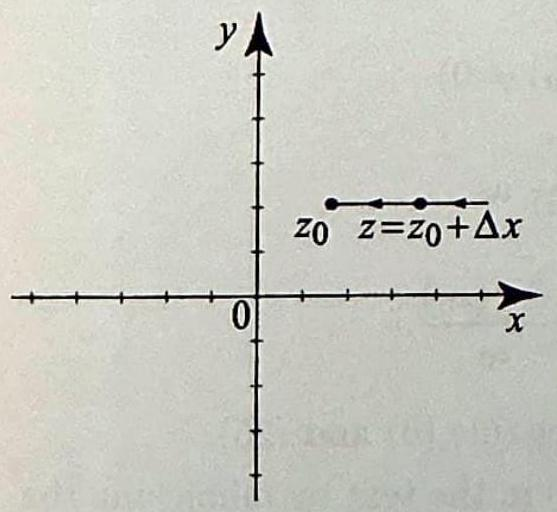
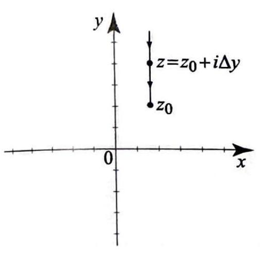
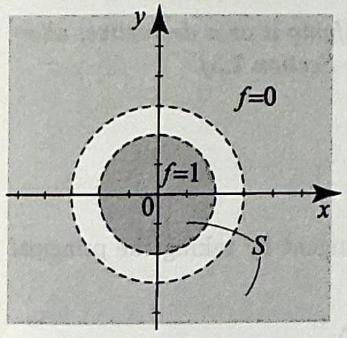

# 2.4 The Cauchy-Riemann Equations

> [!review]
> 1. If $f=u+i v$ is analytic on an open set, what equations must the partial derivatives of $u$ and $v$ satisfy, and what can be said about the continuity of those partial derivatives? Prove your answer.
> 2. Conversely, what conditions on $u$ and $v$ are sufficient to guarantee that $f=u+i v$ is analytic on an open set?

The fact that the derivative of $\bar{z}$ does not exist (Example 4, Section 2.3) should tell you that there is something special about complex-valued functions with derivatives. As you will see, the existence of the derivative implies special relationships between the real and imaginary parts of the functions. These relationships are known as the Cauchy-Riemann equations, which we now derive.

Suppose that $f(z)=f(x+i y)=u(x, y)+i v(x, y)$ is analytic in an open set $S$ and let $z_{0}=x_{0}+i y_{0}=\left(x_{0}, y_{0}\right)$ be a point in $S$. Consequently, the derivative at $z_{0}$ exists and is given by

$$
f^{\prime}\left(z_{0}\right)=\lim _{z \rightarrow z_{0}} \frac{f(z)-f\left(z_{0}\right)}{z-z_{0}}=\lim _{\Delta z \rightarrow 0} \frac{f\left(z_{0}+\Delta z\right)-f\left(z_{0}\right)}{\Delta z}
$$

To derive the Cauchy-Riemann equations, we will simply compute this limit Suppose that $z$ approaches $z_{0}$ along the direction of the $x$-axis, as in _Figure 1_ . 
Then $z=z_{0}+\Delta x=\left(x_{0}+\Delta x, y_{0}\right), \Delta z=z-z_{0}=\Delta x$, and (1) becomes

$$
\begin{aligned}
& \text { 2) } f^{\prime}\left(z_{0}\right)=\lim _{\Delta x \rightarrow 0} \frac{f\left(x_{0}+\Delta x+i y_{0}\right)-f\left(x_{0}+i y_{0}\right)}{\Delta x} \\
& =\lim _{\Delta x \rightarrow 0}\left(\frac{u\left(x_{0}+\Delta x, y_{0}\right)-u\left(x_{0}, y_{0}\right)}{\Delta x}+i \frac{v\left(x_{0}+\Delta x, y_{0}\right)-v\left(x_{0}, y_{0}\right)}{\Delta x}\right) \\
& =\lim _{\Delta x \rightarrow 0} \frac{u\left(x_{0}+\Delta x, y_{0}\right)-u\left(x_{0}, y_{0}\right)}{\Delta x}+i \lim _{\Delta x \rightarrow 0} \frac{v\left(x_{0}+\Delta x, y_{0}\right)-v\left(x_{0}, y_{0}\right)}{\Delta x},
\end{aligned}
$$

where the last step is justified by Theorem 3, Section 2.2, which asserts that the limit of a complex-valued function exists if and only if the limits of its real and imaginary parts exist. 

> [!figure] Figure 1
> 
> 
> Figure 1 For $z$ approaching $z_{0}$ in the direction of the $x$ axis, $\Delta z=\Delta x$.

Recognizing the last two limits on the right as the partial derivatives with respect to $x$ of $u$ and $v$ (see (2) and (3), Section 2.1), we obtain
which is an expression of the derivative of $f$ in terms of the partial derivatives with respect to $x$ of $u$ and $v$. We now repeat the preceding steps, going back to (1) and taking the limit as $z$ approaches $z_{0}$ from the direction of the $y$ axis, as in _Figure 2_. Then $z=z_{0}+i \Delta y=\left(x_{0}, y_{0}+\Delta y\right), \Delta z=z-z_{0}=i \Delta y$. Proceed as in (2), note that $i \Delta y \rightarrow 0$ if and only if $\Delta y \rightarrow 0$, and obtain

$$
\begin{aligned}
& f^{\prime}\left(z_{0}\right)=\lim _{\Delta y \rightarrow 0} \frac{f\left(x_{0}+i\left(y_{0}+\Delta y\right)\right)-f\left(x_{0}+i y_{0}\right)}{i \Delta y} \\
= & \lim _{\Delta y \rightarrow 0}\left(\frac{u\left(x_{0}, y_{0}+\Delta y\right)-u\left(x_{0}, y_{0}\right)}{i \Delta y}+i \frac{v\left(x_{0}, y_{0}+\Delta y\right)-v\left(x_{0}, y_{0}\right)}{i \Delta y}\right) \\
= & \lim _{\Delta y \rightarrow 0} \frac{v\left(x_{0}, y_{0}+\Delta y\right)-v\left(x_{0}, y_{0}\right)}{\Delta y}-i \lim _{\Delta y \rightarrow 0} \frac{u\left(x_{0}, y_{0}+\Delta y\right)-u\left(x_{0}, y_{0}\right)}{\Delta y},
\end{aligned}
$$

where in the last step we have used $1 / i=-i$ and rearranged the terms. 

> [!figure] Figure 2
> 
> 
> Figure 2 For $z$ approaching $z_{0}$ in the direction of the $y$ axis, $\Delta z=i \Delta y$.

Recognizing the partial derivatives with respect to $y$ of $v$ and $u$, we obtain

$$
f^{\prime}\left(z_{0}\right)=\frac{\partial v}{\partial y}\left(x_{0}, y_{0}\right)-i \frac{\partial u}{\partial y}\left(x_{0}, y_{0}\right),
$$

which is this time an expression of the derivative of $f$ in terms of the partial derivatives with respect to $y$ of $u$ and $v$. Now comes the startling result. Equate real and imaginary parts in (3) and (5) and get

> [!equation] The Cauchy-Reimann Equations
> 
> $$
> \frac{\partial u}{\partial x}=\frac{\partial v}{\partial y} \quad \text { and } \quad \frac{\partial u}{\partial y}=-\frac{\partial v}{\partial x}
> $$
> 

Thus, in order for $f$ to be analytic, $u$ and $v$ must satisfy the Cauchy-Riemann equations. Moreover, since $f$ is analytic, $f^{\prime}$ is continuous, and it follows from (3) and (5) and Theorem 4(iv), Section 2.2, that $\frac{\partial u}{\partial x}, \frac{\partial v}{\partial x}, \frac{\partial u}{\partial y}$, and $\frac{\partial v}{\partial y}$ are all continuous. The converse of these statements is also true. In applications, we will need the converse, since to establish the analyticity of a function, it is often easier to check the Cauchy-Riemann equations and the continuity of the partial derivatives. Because the proof of the converse requires advanced topics from calculus of several variables, we postpone it until Section 2.6, where it will be treated in detail. Let us now summarize our discussion
and proceed with the applications. To simplify the notation, we will denote partial derivatives with subscripts, $\frac{\partial u}{\partial x}=u_{x}, \frac{\partial u}{\partial y}=u_{y}$, and so on.

> [!review]
> 1. How can the analyticity of $f=u+i v$ on an open set be characterized in terms of the partial derivatives of $u$ and $v$ ?
> 2. If $f=u+i v$ is analytic on an open set, how can the derivative $f^{\prime}(z)$ be expressed in terms of the partial derivatives of $u$ and $v$ ? Give two equivalent expressions.

> [!theorem] Theorem 1: The Cauchy-Reimann Equations
> The function $f(z)=u(x, y)+i v(x, y)$ is analytic in an open set $S$ if and only if the partial derivatives of $u$ and $v$ are continuous and satisfy the Cauchy-Riemann equations
> (7)
> 
> $$
> u_{x}=v_{y} \quad \text { and } \quad u_{y}=-v_{x} .
> $$
> 
> The derivative $f^{\prime}(z)$ is given as either of
> 
> $$
> f^{\prime}(z)=u_{x}(x, y)+i v_{x}(x, y) \text { or } f^{\prime}(z)=v_{y}(x, y)-i u_{y}(x, y) .
> $$
> 

The Cauchy-Riemann equations appeared in 1821 in the early work of Cauchy on integrals of complex-valued functions. Their connection to the existence of the derivative, as stated in Theorem 1, appeared in 1851 in the doctoral dissertation of the great German mathematician, Bernhard Riemann (1826-1866). As it should be obvious to any one who has studied calculus, Riemann's work shaped the development of modern calculus. His study of complex functions was motivated by his work in hydrodynamics, fluid flow and other applied problems. Some of these applications and their connection to the Cauchy-Riemann equations will be explored in the following section and Chapter 6.

Our first example is perhaps the most important example of an analytic function.

> [!exercise] Exercise 1: $e^z$ is entire.
> 
> 1.) Show that $e^{z}$ is entire and
> 
> $$
> \frac{d}{d z} e^{z}=e^{z} .
> $$
> 
> 
> 2.) Show that if $f(z)$ is analytic on an open set, then $e^{f(z)}$ is analytic on that set and
> 
> $$
> \frac{d}{d z} e^{f(z)}=f^{\prime}(z) e^{f(z)}
> $$
> 
> 

++++

Combining the chain rule with the result of Example 1, we see that $e^{f(z)}$ is analytic wherever $f(z)$ is analytic and

$$
\frac{d}{d z} e^{f(z)}=f^{\prime}(z) e^{f(z)}
$$

> [!exercise] Exercise 2: $\sin z$ is entire.
> Show that $\sin z$ is entire and
> 
> $$
> \frac{d}{d z} \sin z=\cos z
> $$
> 

++++

Following the methods of Example 2, we can check the analyticity and compute the derivatives of $\cos z, \tan z$, and all other trigonometric and hyperbolic functions. Among the elementary functions, we are then left with
the logarithm and those functions defined using the logarithm, such as complex powers. To handle them, we will appeal to Theorem 4, Section 2.3.

> [!exercise] Exercise 3: $\log z$ is analytic except on the branch cut.
> Show that the principal branch of the logarithm, $\log z$, is analytic on $\mathbb{C} \backslash(-\infty, 0]$, and that
> 
> $$
> \frac{d}{d z} \log z=\frac{1}{z}
> $$
> 
> Thus the familiar formula from calculus still holds.

> [!review]
> 1. Where is each branch $\log _\alpha z$ of the logarithm analytic, and what is its derivative? Prove your answer.
> 2. For a complex constant $a \neq 0$, where is the principal branch of the power $z^a=e^{a \log z}$ analytic, and what is its derivative? Prove your answer.

+++++

Using the method of Example 3, we can show that any branch of the logarithm, $\log _{\alpha} z$, is analytic everywhere except at its branch cut (the ray at angle $\alpha$ ), and

$$
\frac{d}{d z} \log _{\alpha} z=\frac{1}{z}
$$

As a consequence, any function constructed from the logarithms according to rules that preserve analyticity will be analytic on an appropriate domain. As an illustration, take the principal branch of a power,

$$
z^{a}=e^{a \log z} \quad(\text { where } a \neq 0 \text { is a complex number }) .
$$

Since $\log z$ is analytic except at its branch cut, and $e^{z}$ is entire, it follows that $z^{a}$ is analytic, except at the branch cut of $\log z$. To compute its derivative, we use the chain rule and the derivatives of $e^{z}$ and $\log z$ and get

$$
\frac{d}{d z} z^{a}=a z^{a-1}
$$

with principal branches of the power on both sides.
We started this section with the example of $\bar{z}$ and how it fails to be analytic at all points. This should be obvious now from the Cauchy-Riemann equations. If you write $\bar{z}=x-i y$, then $u_{x}=1, v_{y}=-1$, showing that the Cauchy-Riemann equations do not hold at any point. As our next example illustrates, we can use the Cauchy-Riemann equations to show the failure of analyticity in less obvious situations.

> [!exercise] Exercise 4: Failure of analyticity
> Use the Cauchy-Riemann equations to show that $f(z)=x^{2}+i(2 y+x)$ fails to be analytic at all points.

++++

> [!review]
> 1. If the Cauchy-Riemann equations hold at a single point of a function's domain, is the function necessarily analytic at that point?
> 2. If an analytic function has zero derivative throughout a region $\Omega$, what can be concluded about the function on $\Omega$ ? Prove your answer.
> 3. Is it possible for a non-constant analytic function to have zero derivative throughout its domain?
> 4. If two analytic functions on a region have the same real part, or the same imaginary part, what can be concluded about their relationship on the region? Prove your answer.

The Cauchy-Riemann equations may hold only at one point (see Exercise 13 for an illustration). This does not imply that the function is analytic at that point, since analyticity requires that these equations be satisfied in a neighborhood.

The final applications show how the Cauchy-Riemann equations can be used to derive important results of theoretical nature.

> [!theorem] Theorem 2
> Suppose that $f(z)=u(x, y)+i v(x, y)$ is analytic in a region (open and connected) $\Omega$ and $f^{\prime}(z)=0$ for all $z$ in $\Omega$. Then $f$ is constant in $\Omega$.

The connectedness of $\Omega$ in the theorem is essential. For example, the function $f$, defined on the set $S$ in _Figure 3_, by

$$
f(z)= \begin{cases}1 & \text { if }|z|<2 \\ 0 & \text { if }|z|>3\end{cases}
$$

has zero derivative but is not constant.

> [!figure] Figure 3
> 
> 
> Figure 3 A nonconstant function with zero derivative. Its domain of definition is the nonconnected shaded area.

> [!corollary] Corollary 3 
> Suppose that $f$ and $g$ are analytic in a region $\Omega$. If either $\operatorname{Re} f=\operatorname{Re} g$ on $\Omega$ or $\operatorname{Im} f=\operatorname{Im} g$ on $\Omega$, then $f(z)=g(z)+c$ on $\Omega$, where $c$ is a constant.

**Proof** 

## Exercises 2.4

> [!exercise] Exercise 5
> In problems 1-14, use the Cauchy-Riemann equations (Theorem 1) to determine the set on which the given function is analytic and compute its derivative using either one of equations (8).
> 
> 1. $z$.
> 2. $z^{2}$.
> 3. $e^{z^{2}}$.
> 4. $2 x+3 i y$.
> 5. $e^{\bar{z}}$.
> 6. $\frac{y-i x}{x^{2}+y^{2}}$.
> 7. $\left(\frac{1}{z+1}\right)^{2}$.
> 8. $\frac{z}{z-i}$.
> 9. $z e^{z}$.
> 10. $\cos z$.
> 11. $\tan z$.
> 12. $\cosh z$.
> 13. $|z|^{2}$.
> 14. $\frac{x^{4}+i 2 x y\left(x^{2}+y^{2}\right)-y^{4}+x-i y}{x^{2}+y^{2}}$.
> 
> 

> [!exercise] Exercise 6
> In problems 15-26, use properties of the derivative to compute the derivative of the given function and determine the set on which it is analytic. In problems 23-26, use the principal branch of the power.
> 15. $z e^{z^{2}}$.
> 16. $\left(1+e^{z}\right)^{5}$.
> 17. $\sin z \cos z$.
> 18. $\log (z+1)$.
> 19. $\frac{\log (3 z-1)}{z^{2}+1}$.
> 20. $\sinh (3 z+i)$.
> 21. $\cosh \left(z^{2}+3 i\right)$.
> 22. $\log _{\frac{\pi}{2}}(z+1)$.
> 23. $z^{i}$.
> 24. $(z+1)^{1 / 2}$.
> 25. $\frac{1}{(z-i)^{1 / 2}}$.
> 26. $z^{z}$.

> [!exercise] Exercise 7
> In problems 27-30, compute the given limit by identifying it as a derivative; alternatively, you may use L'Hospital's rule (problem 27, Section 2.3).
> 27. $\lim _{z \rightarrow 0} \frac{\sin z}{z}$.
> 28. $\lim _{z \rightarrow 0} \frac{e^{z}-1}{z}$.
> 29. $\lim _{z \rightarrow 0} \frac{\log (z+1)}{z}$.
> 30. $\lim _{z \rightarrow i} \frac{1+i z}{z(z-i)}$.
> 

> [!exercise] Exercise 8
> 31. Define the principal branch of the inverse tangent by taking the principal branch of the logarithm in (13), Section 1.7:
> 
> $$
> \tan ^{-1} z=\frac{i}{2} \log \left(\frac{1-i z}{1+i z}\right)
> $$
> 
> Compute the derivative of $\tan ^{-1} z$. 32. Complete the proof of Corollary 1 by treating the case $\operatorname{Im} f=\operatorname{Im} g$ on $\Omega$.

> [!exercise] Exercise 9
> 33. Suppose that $f=u+i v$ is analytic in a region $\Omega$. Show that
> (a) $f^{\prime}(z)=u_{x}-i u_{y}$, also $f^{\prime}(z)=v_{y}+i v_{x}$; and
> (b) $\left|f^{\prime}(z)\right|^{2}=u_{x}^{2}+u_{y}^{2}=v_{x}^{2}+v_{y}^{2}$.
> (c) Conclude from (a) or (b) that if either Re $f$ or $\operatorname{Im} f$ is constant in $\Omega$, then $f$ is constant in $\Omega$.

> [!exercise] Exercise 10
> 34. Suppose that $f(z)$ and $\overline{f(z)}$ are analytic in a region $\Omega$. Show that $f(z)$ must be constant in $\Omega$. (Hint: Consider $f(z)+\overline{f(z)}$ and use Exercise 33.)

> [!exercise] Exercise 11
> 35. Let us define the partial derivatives of a complex-valued function $f=u+i v$ as $f_{x}=u_{x}+i v_{x}$ and $f_{y}=u_{y}+i v_{y}$. Show that the Cauchy-Riemann equations are equivalent to $f_{x}+i f_{y}=0$.

> [!exercise] Exercise 12
> 36. Suppose that $f$ is analytic in a region $\Omega$ and $f[\Omega]$ is a subset of a line. Show that $f$ must be constant in $\Omega$. (Hint: Rotate the line to make it horizontal or vertical and apply one of problem 33.)

> [!exercise] Exercise 13
> 37. Suppose that $f=u+i v$ is analytic in a region $\Omega$ and $\operatorname{Re} f=\operatorname{Im} f$. Show that $f$ must be constant in $\Omega$. (Hint: Use problem 36 or prove it directly from the Cauchy-Riemann equations.)

> [!exercise] Exercise 14
> 38. Suppose that $f=u+i v$ is analytic in a region $\Omega$ and $|f|$ is constant in $\Omega$. Show that $f$ must be constant in $\Omega$ as follows.
> (a) Show that $u^{2}+v^{2}=c$ where $c$ is a nonnegative constant, and that we need only consider the case $c>0$.
> (b) Obtain the following system of equations in the unknowns $u_{x}, u_{y}$ :
> 
> $$
> \left\{\begin{array}{l}
> u u_{x}-v u_{y}=0 \\
> v u_{x}+u u_{y}=0
> \end{array}\right.
> $$
> 
> **(Hint: Differentiate $u^{2}+v^{2}=c$ with respect to $x$ then differentiate it with respect to $y$ and use the Cauchy-Riemann equations.)**
> (c) Show that the only solutions of the equations in (b) are $u_{x}=0$ and $u_{y}=0$.
> **(Hint: The determinant of the system is $>0$.)**
> (d) Show that $v_{x}, v_{y}$ and $f^{\prime}$ are zero on $\Omega$, and conclude that $f$ is constant.

> [!exercise] Exercise 15
> 
> 39. Project Problem: Cauchy-Riemann equations in polar form. In this problem we express the Cauchy-Riemann equations in polar coordinates. Recall the relationships between Cartesian and polar coordinates:
> 
> $$
> x=r \cos \theta \quad \text { and } \quad y=r \sin \theta
> $$
> 
> For convenience, we write $u(r, \theta)=u(r \cos \theta, r \sin \theta)=u(x, y)$ and $v(r, \theta)= v(r \cos \theta, r \sin \theta)=v(x, y)$.
> (a) The multivariable chain rule from calculus (see also (13), Section 2.6) states that
> 
> $$
> \begin{array}{ll}
> \frac{\partial u}{\partial r}=\frac{\partial u}{\partial x} \frac{\partial x}{\partial r}+\frac{\partial u}{\partial y} \frac{\partial y}{\partial r}, & \frac{\partial u}{\partial \theta}=\frac{\partial u}{\partial x} \frac{\partial x}{\partial \theta}+\frac{\partial u}{\partial y} \frac{\partial y}{\partial \theta} \\
> \frac{\partial v}{\partial r}=\frac{\partial v}{\partial x} \frac{\partial x}{\partial r}+\frac{\partial v}{\partial y} \frac{\partial y}{\partial r}, & \frac{\partial v}{\partial \theta}=\frac{\partial v}{\partial x} \frac{\partial x}{\partial \theta}+\frac{\partial v}{\partial y} \frac{\partial y}{\partial \theta} .
> \end{array}
> $$
> 
> Show that
> 
> $$
> \begin{array}{ll}
> \frac{\partial u}{\partial r}=\cos \theta \frac{\partial u}{\partial x}+\sin \theta \frac{\partial u}{\partial y}, & \frac{\partial u}{\partial \theta}=-r \sin \theta \frac{\partial u}{\partial x}+r \cos \theta \frac{\partial u}{\partial y} \\
> \frac{\partial v}{\partial r}=\cos \theta \frac{\partial v}{\partial x}+\sin \theta \frac{\partial v}{\partial y}, & \frac{\partial v}{\partial \theta}=-r \sin \theta \frac{\partial v}{\partial x}+r \cos \theta \frac{\partial v}{\partial y}
> \end{array}
> $$
> 
> (b) Derive the polar form of the Cauchy-Riemann equations:
> 
> $$
> u_{r}=\frac{1}{r} v_{\theta} \quad \text { and } \quad v_{r}=-\frac{1}{r} u_{\theta}
> $$
> 
> Thus we can state Theorem 1 in polar form as follows. The function $f(z)= u(r, \theta)+i v(r, \theta)$ is analytic at $z_{0} \neq 0$ if and only if, in a neighborhood of $z_{0}$,
> $u_{r}, u_{\theta}, v_{r}$, and $v_{\theta}$ are continuous and satisfy the polar form of the Cauchy-Riemann equations.
> (c) Show that the derivative $f^{\prime}(z)$ is given by
> 
> $$
> f^{\prime}(z)=e^{-i \theta}\left(u_{r}+i v_{r}\right) .
> $$
> 
> This represents $f^{\prime}(z)$ in terms of a radial directional derivative of $u$ and $v$ divided by the unimodular number $e^{i \theta}$ that gives the direction of $f^{\prime}(z)$.
> 
> 

> [!exercise] Exercise 16
> In problems 40-42, use the polar form of the Cauchy-Riemann equations to check the analyticity and find the derivative of the given function.
> 40. $f(z)=z^{n}=r^{n}(\cos (n \theta)+i \sin (n \theta))(n= \pm 1, \pm 2, \ldots)$.
> 41. $f(z)=\log z=\ln |z|+i \operatorname{Arg} z$.
> 42. $f(z)=\sin (\log z)$.

> [!exercise] Exercise 17
> 43. Jacobian of a transformation. The Jacobian of the mapping $(x, y) \mapsto (u(x, y), v(x, y))$ is the following determinant:
> 
> $$
> J=\operatorname{det}\left|\begin{array}{ll}
> \frac{\partial u}{\partial x} & \frac{\partial u}{\partial y} \\
> \frac{\partial v}{\partial x} & \frac{\partial v}{\partial y}
> \end{array}\right| .
> $$
> 
> Suppose that $f=u+i v$ is analytic. Show that the Jacobian equals $\left|f^{\prime}(z)\right|^{2}$. You may recall from calculus of several variables that a mapping is locally invertible at every point where the Jacobian is nonzero. This exercise suggests that a similar result holds for $f$. Indeed, there is an inverse function theorem that states that if $f^{\prime}\left(z_{0}\right) \neq 0$, then in some neighborhood of $z_{0}, f$ is one-to-one and has an inverse function that is itself analytic in a neighborhood of $f\left(z_{0}\right)$ (see Section 5.7).

