There are many important applications of complex analysis that highlight its pivotal place in the solution of real-world problems. The ones that we present in this section deal with a fundamental equation of applied mathematics, known as Laplace's equation. This equation models important phenomena in engineering and physics, such as steady-state temperature distributions, electrostatic potentials, and fluid flow, to name just a few. For clarity's sake, we will base our presentation around steady-state temperature problems. The solutions that we present use almost all the material that we have covered thus far, and more important, they stress the need for further development of the theory.


# 2.5.1 Laplace's Equation and Harmonic Functions


> [!review]
> 1. A homogeneous plate with insulated lateral surfaces has its boundary held at a fixed temperature distribution $b(x, y)$ that does not vary in time. What happens to the temperature inside the plate over time, and what partial differential equation is satisfied by this long-term temperature distribution?
> 2. Define the Laplacian $\Delta u$ of a twice-differentiable real-valued function $u(x, y)$.
> 3. What does the Laplacian of a function $u$ measure about $u$ 's behavior near a point, and what does this imply about a function whose Laplacian is zero?
> 4. What does it mean for a real-valued function $u$ to be harmonic on a region $\Omega$ in the plane?
> 5. What makes an equation a partial differential equation?
> 6. What is a boundary value problem, and what special case of a boundary value problem is known as a Dirichlet problem?


+++++


> [!exercise]
> Verify that constants and the functions $u(x, y)=x, u(x, y)=y, u(x, y)=x y$ are each harmonic on $\mathbb{R}^2$.


++++


Consider a two-dimensional plate of homogeneous material, with instlated lateral surfaces. We represent this plate by a region $\Omega$ in the complex plane (see _Figure 1_). Suppose that the temperature of the points on the boundary of the plate is given by a function of position $b(x, y)$ that does not change with time. It is a fact from thermodynamics that the temperature inside the plate will eventually reach and remain at an equilibrium


> [!figure] Figure 1
> 
> 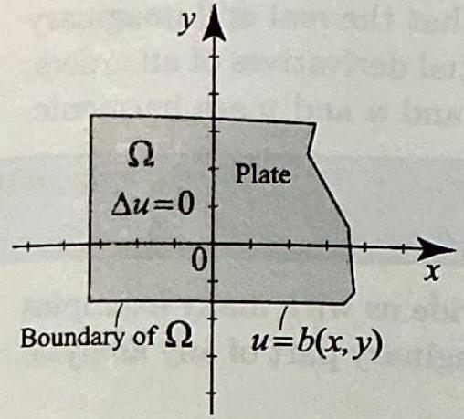
> Figure 1 The steady-state temperature distribution satisfies Laplace's equation.


The Laplacian is named after the great French mathematician and physicist PierreSimon de Laplace (17491827). The Laplacian appeared for the first time in a memoir of Laplace in 1784, in which he completely determined the attraction of a spheroid on the points outside it. The Laplacian of a function measures the difference between the value of the function at a point and the average value of the function in a neighborhood of that point. Thus a function that does not vary abruptly has a very small Laplacian. Harmonic functions have a zero Laplacian; they vary in a very regular way. Examples of such functions include the temperature distribution in a plate, the potential of the attractive force due to a sphere, the function that gives the brightness of colors in an image.
distribution, known as the steady-state distribution. For ( $x, y$ ) in $\Omega$, let $u(x, y)$ denote this steady-state temperature distribution. It is also a fact from thermodynamics that $u(x, y)$ satisfies the (two-dimensional) Laplace's equation

$$
\Delta u=\frac{\partial^{2} u}{\partial x^{2}}+\frac{\partial^{2} u}{\partial y^{2}}=0
$$

Here $\Delta u$ is the Laplacian of $u$, which by definition is $\frac{\partial^{2} u}{\partial x^{2}}+\frac{\partial^{2} u}{\partial y^{2}}$. Since Laplace's equation involves partial derivatives, it is called a partial differential equation. Any real-valued function that satisfies Laplace's equation on a region $\Omega$ and has continuous first and second partial derivatives is called harmonic on $\Omega$. Constant functions are clearly harmonic on the entire plane, and so are the functions $u(x, y)=x, u(x, y)=y, u(x, y)=x y$. Less obvious examples of harmonic functions will be derived from Theorem 1 later in this section.

To determine the steady-state temperature inside the plate, we must solve Laplace's equation inside of $\Omega$ subject to the condition $u(x, y)= b(x, y)$ on the boundary of $\Omega$, known as a boundary condition. A problem consisting of a partial differential equation along with specified boundary conditions is known as a boundary value problem. The special case involving Laplace's equation with specified boundary values is known as a Dirichlet problem. Solving Dirichlet problems is of paramount importance in applied mathematics, engineering, and physics. Many methods have been developed. The ones that we will present in this section provide a beautiful application of complex analysis.


# 2.5.2 Connection with Analytic Functions


> [!review]
> How can analytic functions be used to produce harmonic functions? Prove your answer.


Let $f=u+i v$ be an analytic function. We know that $u$ and $v$ satisfy the Cauchy-Riemann equations (Theorem 1, Section 2.4),

$$
\frac{\partial u}{\partial x}=\frac{\partial v}{\partial y} \quad \text { and } \quad \frac{\partial u}{\partial y}=-\frac{\partial v}{\partial x} .
$$

Let us suppose for a moment that we can differentiate $u$ and $v$ twice and interchange the order of partial derivatives. Then

$$
\frac{\partial^{2} u}{\partial x^{2}}=\frac{\partial}{\partial x}\left(\frac{\partial u}{\partial x}\right)=\frac{\partial}{\partial x}\left(\frac{\partial v}{\partial y}\right)=\frac{\partial}{\partial y}\left(\frac{\partial v}{\partial x}\right)=\frac{\partial}{\partial y}\left(-\frac{\partial u}{\partial y}\right)=-\frac{\partial^{2} u}{\partial y^{2}},
$$

and hence $\frac{\partial^{2} u}{\partial x^{2}}+\frac{\partial^{2} u}{\partial y^{2}}=0$. In other words, $u$ satisfies Laplace's equation. Reasoning in a similar way, we can show that $v$ also satisfies Laplace's equation.

Recall from calculus that in order to justify the interchange of partial derivatives as we needed to do above, it is enough to know that all first and


second partial derivatives are continuous. One of the major results that we will develop in the following chapter guarantees that the real and imaginary parts of an analytic function have continuous partial derivatives of all orders. Thus, the steps that we used above are justified and $u$ and $v$ are harmonic.


> [!theorem] Theorem 1: Analytic and Harmonic Functions
> Suppose that $f=u+i v$ is analytic on an open set $S$. Then its real and inaginary parts $u(x, y)$ and $v(x, y)$ are harmonic on $S$.


What this result effectively does for us is provide us with many examples of harmonic functions; simply take the real or imaginary part of any analytic function.


> [!exercise] Exercise 1: Harmonic functions
> Show that the following are harmonic functions in the stated region.
> (a) $u(x, y)=x^{2}-y^{2}$ on $\mathbb{C}$.
> (b) $u(x, y)=e^{x} \sin y$ on $\mathbb{C}$.
> (c) $u(x, y)=\operatorname{Arg} z(z=(x, y))$ on the region $\Omega=\mathbb{C} \backslash(-\infty, 0]$.
> (d) $u(x, y)=\ln |z|=\ln \sqrt{x^{2}+y^{2}}$ on the region $\mathbb{C} \backslash\{0\}$.


++++


> [!review]
> 1. Under what conditions is a linear combination $a u+b v$ of two functions $u, v$ harmonic on an open set $S$ ? Prove your answer.
> 2. What can be said about the pointwise product $u v$ of two harmonic functions $u, v$ on an open set $S$ ? Justify your answer.


+++++


> [!exercise]
> 1. Show that $\phi(x, y)=2\left(x^2-y^2\right)+7$ is harmonic on $\mathbb{R}^2$.
> 2. Show that $\phi(x, y)=(a x+b)(c y+d)$ is harmonic on $\mathbb{R}^2$ for any real constants $a, b, c, d$ .
> 3. Show that $u(x, y)=x^2$ is not harmonic on $\mathbb{R}^2$.


++++


> [!proposition] Proposition 1: Linearity
> Suppose that $u$ and $v$ are harmonic on an open set $S$, and $a, b$ are resed constants. Then $a u(x, y)+b v(x, y)$ is harmonic on $S$.


For example, $\phi(x, y)=2\left(x^{2}-y^{2}\right)+7$ is harmonic, being of the form $\phi(x, y)=2 u(x, y)+7$ where $u$ is the harmonic function of Example 1(a). Also the function $\phi(x, y)=(a x+b)(c y+d)$, where $a, b, c, d$ are real constants, is harmonic, being a linear combination of the harmonic functions $x, y, x y$, and constants.

You should be cautioned that the product of two harmonic functions need not be harmonic. For example, $u(x, y)=x$ is harmonic, but $(u(x, y))^{2}=x^{2}$ is not.


# 2.5.3 Harmonic Conjugates


> [!review]
> Given a harmonic function $u$ on a region $\Omega$, what additional function must be supplied to produce an analytic function $f$ on $\Omega$ with $\operatorname{Re}(f)=u$, and what properties must it satisfy? Is the required function always guaranteed to exist on $\Omega$ ?


+++++


Reading Theorem 1, it is natural to ask the following question: Given a harmonic function $u$ in a region $\Omega$, can we find another harmonic function $v$ in $\Omega$ such that $f=u+i v$ is analytic in $\Omega$ ? Such a function $v$ is called a harmonic conjugate of $u$. Conditions for the existence of a harmonic conjugate will be established in Chapter 3. For now, just keep in mind that the existence of a harmonic conjugate depends on the nature of the region under consideration. For example, the function $\ln |z|$ is harmonic in $\Omega= \mathbb{C} \backslash\{0\}$ (Example 1(d)); but $\ln |z|$ has no harmonic conjugate in that region (Exercise 33). It does, however, have a harmonic conjugate in $\mathbb{C} \backslash(-\infty, 0]$, namely $\operatorname{Arg} z$. As our next example shows, by integrating the CauchyRiemann equations, we can always find the harmonic conjugate in a region such as the entire complex plane, a disk, or a rectangle. (More generally, we will show in Chapter 3 that we can find a harmonic conjugate if the region is simply connected. This more restrictive concept of connectedness is extremely important and will be at the heart of Chapter 3.)


> [!exercise] Exercise 2: Finding harmonic conjugates
> Show that $u(x, y)=x^{2}-y^{2}+x$ is harmonic in the entire plane and find a harmonic conjugate.


++++


> [!review]
> Given that $v$ is a harmonic conjugate of a harmonic function $u$, how can a harmonic conjugate of $v$ be expressed in terms of $u$ ? Prove your answer.


+++++


So, from Example 2, a harmonic conjugate of $u(x, y)=x^{2}-y^{2}+x$ is $v(x, y)=2 x y+y$. What is a harmonic conjugate of $v(x, y)=2 x y+y$ ? Surely it is related to $u$. Indeed, you can check that a conjugate of $v$ is $-u(x, y)=-x^{2}+y^{2}-x$. More generally, we have the following useful result.

> [!proposition] Proposition 2
> Suppose that $u$ is harmonic and that $v$ is a harmonic conjugate of $u$. Then $-u$ is a harmonic conjugate of $v$.


**Proof** 


> [!review]
> 1. If $v_1$ and $v_2$ are both harmonic conjugates of the same harmonic function $u$ on a region $\Omega$, how must $v_1$ and $v_2$ be related? Prove your answer.
> 2. If $v$ is a harmonic conjugate of a harmonic function $u$ on a region $\Omega$, determine whether $v$ is also a harmonic conjugate of $u+c$ for every real constant $c$. Prove your answer.
> 3. What does it mean for two curves in the plane to be orthogonal at a point of intersection, and what does it mean for two families of curves to be orthogonal?
> 4. What is the geometric relationship between the level curves of a harmonic function $u$ and those of its harmonic conjugate $v$ on a region $\Omega$ ? Prove your answer.


+++++


In Example 2, we found the harmonic conjugate of $u$ up to an arbitrary additive real constant. In fact, the following properties of the harmonic conjugate are not hard to prove (Exercise 18).


> [!proposition] Proposition 3
> Suppose that $u$ is a harmonic function in a region $\Omega$. Then
> (i) if $v_{1}$ and $v_{2}$ are harmonic conjugates of $u$ in $\Omega$, then $v_{1}$ and $v_{2}$ must differ by a real constant.
> (ii) If $v$ is a harmonic conjugate of $u$, then $v$ is also a harmonic conjugate of $u+c$ where $c$ is any real constant.


The function $u$ and its conjugate $v$ have a very interesting geometric relationship based on the notion of orthogonal curves.

Suppose that two curves $C_{1}$ and $C_{2}$ meet at a point $A$. The curves are said to be orthogonal if their respective tangent lines $L_{1}$ and $L_{2}$ (at $A$ ) are orthogonal (_Figure 2_). 


> [!figure] Figure 2
> 
> 
> 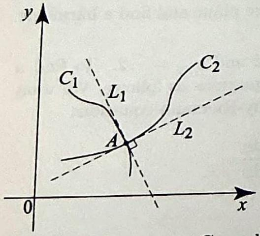
> Figure 2 The curves $C_{1}$ and $C_{2}$ are orthogonal at $A$ if the tangent lines $L_{1}$ and $L_{2}$ (at $A$ ) are orthogonal.


We also say that $C_{1}$ and $C_{2}$ intersect at a right angle at $A$. Recall that if $m_{1}$ and $m_{2}$ denote the respective slopes of the tangent lines, and if neither is zero, then $L_{1}$ and $L_{2}$ are orthogonal if and only if

$$
m_{1} m_{2}=-1
$$

Two families of curves are said to be orthogonal if each curve from one family intersects the curves from the other family at right angles.

Consider the level curves of a harmonic function $u(x, y)$ in a region $\Omega$. These are the curves determined by the implicit relation

$$
u(x, y)=C_{1}
$$

where $C_{1}$ is a constant (in the range of $u$ ). Since $u$ is harmonic, it has continuous partial derivatives, and hence we can use the chain rule, Theorem 4, Section 2.6, to differentiate both sides of (4) with respect to $x$ and get

$$
\frac{\partial u}{\partial x} \frac{d x}{d x}+\frac{\partial u}{\partial y} \frac{d y}{d x}=0
$$

But $d x / d x=1$, so if $\frac{\partial u}{\partial y} \neq 0$, we can solve for $d y / d x$ and get

$$
\frac{d y}{d x}=-\frac{\frac{\partial u}{\partial x}}{\frac{\partial u}{\partial y}}
$$

This gives the slope of the tangent line at a point on a level curve. Now suppose that we can find a harmonic conjugate $v(x, y)$ of $u(x, y)$ in $\Omega$ and let us consider the level curves

$$
v(x, y)=C_{2}
$$

where $C_{2}$ is a constant (in the range of $v$ ). Since $v$ is harmonic, arguing as we did with $u$, we find that the slope of the tangent line at a point on a level curve is

$$
\frac{d y}{d x}=-\frac{\frac{\partial v}{\partial x}}{\frac{\partial v}{\partial y}}=\frac{\frac{\partial u}{\partial y}}{\frac{\partial u}{\partial x}}
$$

since by the Cauchy-Riemann equations, $\partial v / \partial x=-\partial u / \partial y$ and $\partial v / \partial y= \partial u / \partial x$. Comparing (6) and (7), we see that the slopes of the tangent lines satisfy the orthogonality relation (3), and hence the level curves of $u$ are orthogonal to the level curves of $v$. This orthogonality relation also holds when the tangents are horizontal and vertical. We thus have the following result.

> [!theorem] Theorem 2: Orthogonality of Level Curves
> Suppose that $u$ is a harmonic function in a region $\Omega$ and let $v$ be a harmonic conjugate of $u$ in $\Omega$, so that $f=u+i v$ is analytic in $\Omega$. Then, the two families of level curves, $u(x, y)=C_{1}$ and $v(x, y)=C_{2}$, are orthogonal at every point where $f^{\prime}(z) \neq 0$.
> 


As an illustration, we show in _Figure 3(a) and (b)_ the level curves of the harmonic function $u=x^{2}-y^{2}+x$ and its conjugate $v(x, y)=2 x y+y$ (see Exercise 2). The graphs of the two families are superposed in Figure 3(c) to illustrate their orthogonality.


> [!figure] FIgure 3
> 
> ```horizontal
> 
> 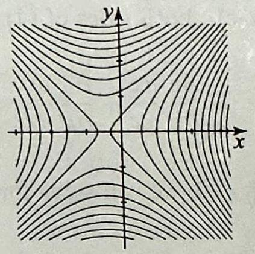
> (a)
> ---
> 
> 
> 
> 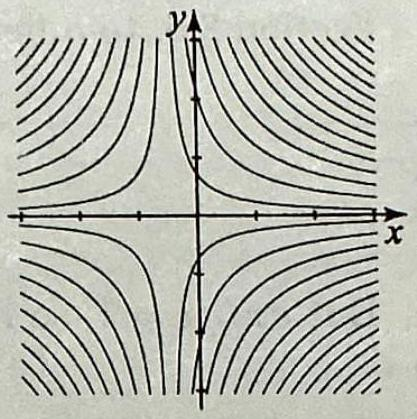
> (b)
> 
> ---
> 
> 
> 
> 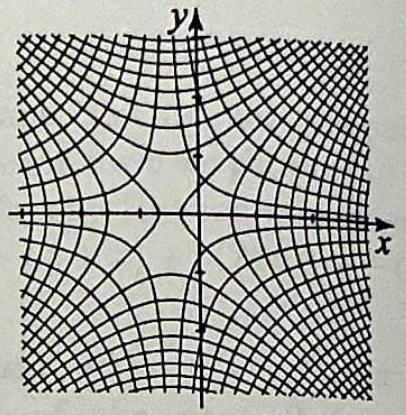
> (c)
> 
> ```
> 
> 
> Figure 3 (a) Level curves of $u(x, y)=x^{2}-y^{2}+x$.
> (b) Level curves of $v(x, y)=2 x y+y$.
> (c) The level curves of $u$ and $v$ are orthogonal.
> 
> 


# 2.5.4 Solving and Interpreting Dirichlet Problems


> [!review]
> 1. What characterizes the harmonic functions (on appropriate subdomains of $\mathbb{C}$ ) that are constant on rays from the origin? For what class of Dirichlet problems are such functions natural candidate solutions?
> 2. What characterizes the harmonic functions on $\mathbb{R}^2$ that are independent of $y$ ? Prove your answer. For what class of Dirichlet problems are such functions natural candidate solutions?


+++++


> [!exercise]
> Let $u=a \operatorname{Arg} z+b$. Show that $u(x, y)=a \operatorname{Arg} z+b$ (for real constants $a, b$ ) is harmonic on $\mathbb{C} \backslash(-\infty, 0]$ and is constant on rays from the origin.


++++


> [!exercise]
> Let $u=a \ln |z|+b$. Show that $u(z)=a \ln |z|+b$ (for real constants $a, b$ ) is harmonic on $\mathbb{C} \backslash\{0\}$ and depends only on $|z|$.


++++


We now return to our main topic: that of solving Dirichlet problems. Let us first mention an interesting example of a harmonic function, $u(x, y)= a \operatorname{Arg} z+b$, which is harmonic by Example 1(c) and Proposition 1. Because $\operatorname{Arg} z$ is constant on rays (independent of $r$ ), it follows that $u=a \operatorname{Arg} z+b$ is also constant on rays. (In fact, this is the only harmonic function with such a property. See Exercise 49.) Thus $u$ is a good candidate for a solution of Dirichlet problems in which the boundary data is constant on rays or independent of $r$. We illustrate these ideas with an example.


> [!exercise] Exercise 3: A Dirichlet problem in a quadrant
> 
> Find the steady-state temperature $u(x, y)$ in a large sheet of metal occupying a quadrant of the plane, whose boundary is held at the constant temperatures $100^{\circ}$ on the bottom edge and $50^{\circ}$ on the left edge.
> 
> > [!figure]
> > 
> > 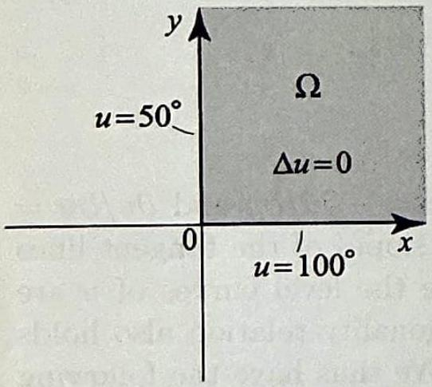
> > Dirichlet problem
> > 
> > 
> 
> 


++++


> [!figure] Figure 5: For Exercise 3
> 
> 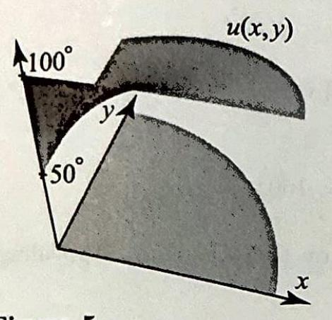
> Figure 5


In contrast to $\operatorname{Arg} z$ we can find harmonic functions which are independent of the argument and depend only on $r=|z|$. An example of such a function is $u(z)=a \ln |z|+b$, where $a$ and $b$ are real constants. By Example $1(\mathrm{~d})$, this function is harmonic in $\mathbb{C} \backslash\{0\}$. It is a good candidate for a solution of Dirichlet problems in which the boundary data is constant on circles. See Exercises 29-32 for illustrations.


> [!exercise] Exercise 4: Dirichlet problem in an infinite strip
> Solve the Dirichlet problem on the infinite strip $\{(x, y): 0<y<1\}$ with boundary conditions $u=0^{\circ}$ on $y=0$ and $u=100^{\circ}$ on $y=1$.
> 
> > [!figure] Figure 6: For Exercise 4
> > 
> > 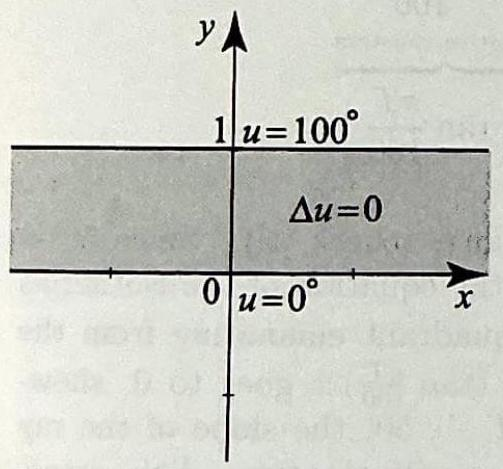
> > Figure 6 Dirichlet problem in Example 4.
> 
> 
> 


++++


In Example 4 we used a harmonic function that was independent of $x$. Similarly, we can find harmonic functions that are independent of $y$ (hence $u_{y}=0$ and $u_{y y}=0$ ). You can show in this case that $u=a x+b$, where $a$ and $b$ are real constants. This function is a good candidate for solving Dirichlet problems in infinite vertical strips with constant boundary data. See problems 25 and 26 for illustrations.


# 2.5.5 Harmonic Conjugates, Isotherms, and Heat Flow


> [!review]
> 1.) What are isotherms in a steady-state heat distribution on a plate, and in terms of the temperature function $u(x, y)$, what curves do they correspond to?
> 2.) Why are the curves of heat flow in a steady-state temperature distribution orthogonal to the isotherms?
> 3.) How can a harmonic conjugate $v$ of a steady-state temperature distribution $u$ be used to determine the curves of heat flow on the plate, and why does this method work?
> 


In Example 3, the temperature of the boundary is kept at two constant values, $100^{\circ}$ and $50^{\circ}$. Our physical intuition tells us that, because the plate is insulated, the temperature of the points inside the plate will vary between these two values and will equal those values only at the boundary. It is natural to ask for those points inside the plate with the same temperature $u(x, y)=T$, where $50<T<100$. These points lie on curves inside the plate, called curves of constant temperature or isotherms. Isotherms have many practical applications. Computing them will lead us to interesting properties of harmonic functions.


You should recall from vector calculus that the gradient vector $\nabla u=\left(u_{x}, u_{y}\right)$ points in the direction of greatest change in a function. The gradient is perpendicular to level curves of $u(x, y)$. Fourier's law states that heat flows along $-\nabla u$, and thus curves of heat flow are orthogonal to level curves of $u$, and hence coincident with level curves of $v$.


> [!exercise] Exercise 5: Isotherms
> 
> Find the isotherms in Exercise 3.
> 
> 
> > [!figure] Figure 7: For Exercise 5
> > 
> > 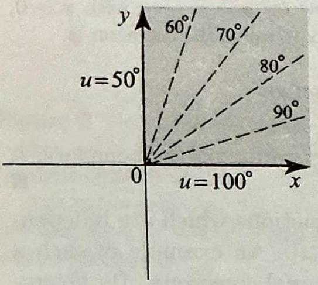
> > 
> > Figure 7 Isotherms in Example 5.
> 
> 
> 


++++


Related to the topic of isotherms is the topic of curves of heat flow. These are the curves along which the heat is flowing inside the plate. To determine these curves, we use Fourier's law of heat conduction, which states that heat flows from hot to cold in the direction in which the temperature difference is the greatest. If along the isotherms the temperature difference is zero, then it should make sense that in the direction perpendicular to the isotherms the temperature difference is the greatest. Hence the curves of heat flow are orthogonal to the isotherms.

So to find the curves of heat flow in a plate, it is enough to find a harmonic conjugate $v(x, y)$ of the steady-state temperature distribution $u(x, y)$, since by Theorem 2 the level curves of $v$ are orthogonal to the level curves of $u$ We illustrate this process with an example.


> [!exercise] Exercise 6: Curves of Heat Flow
> 
> 
> Find the curves of heat flow in Example 3.
> 
> 
> > [!figure] Figure 8: For Exercise 6
> > 
> > 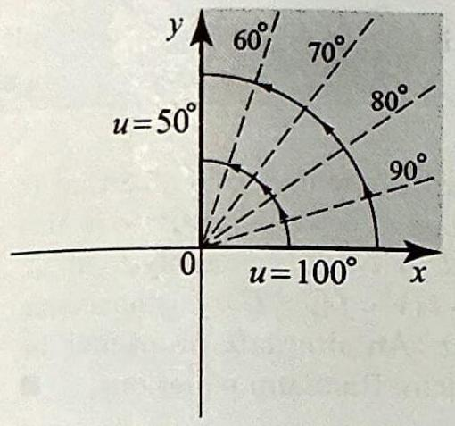
> > Figure 8 Curves of heat flow in Example 6, along with the isotherms.
> 
> 
> 


++++


# 2.5.6 Conformal Mappings


> [!review]
> 1.) What strategic idea underlies the method of conformal mappings for solving Dirichlet problems?
> 2.) What does it mean for a mapping $w=f(z)$ to be a conformal mapping of a region $\Omega$, and what geometric properties does such a mapping have that make it suitable for transforming a Dirichlet problem on $\Omega$ into one posed on the image region?
> 3.) If $U$ is a harmonic function on a region $\Omega^{\prime}$ and we pull it back to a region $\Omega$ via a mapping $w=f(z)$ (forming $u(z)=U(f(z))$ ), under what hypotheses on $f$ is $u$ guaranteed to be harmonic on $\Omega$ ? Prove your answer.


+++++


We conclude our panoramic overview of Dirichlet problems and their solutions by mentioning the method of conformal mappings, which is of wide use in complex analysis. In the past you have certainly used methods to transform a difficult problem to one with a known solution or whose solution is easier to find. For example, some integrals are simplified by using changes of variables, some differential equations are simplified by applying a Laplace transform, and so on. In solving Dirichlet problems, it is sometimes advantageous to map the region under consideration to a simpler region or one on which the transformed problem is easier to solve. This is the idea behind the method of conformal mappings, which we now explain.

Let a Dirichlet problem be given on a region $\Omega$ with boundary $\Gamma$. Suppose that we want to solve this problem by somehow transforming it first to the $w$ plane by means of a mapping $w=f(z)$, where $f$ is analytic in $\Omega$. If $f^{\prime}(z) \neq 0$ for all $z$ in $\Omega$, we call $f$ a conformal mapping of $\Omega$. Conformal mappings have important properties that will be studied in detail in Chapter 6. For example, if $f$ is conformal, then the image of $\Omega, \Omega^{\prime}=f[\Omega]$, is also a region (open, connected set); moreover, if $f$ is one-to-one, then $f$ will map $\Gamma$ onto $\Gamma^{\prime}$, the boundary of $\Omega^{\prime}$. In the examples of this section, these properties can be checked on a case-by-case basis.

In transforming the Dirichlet problem, we need to know what happens to Laplace's equation under our transformation $w=f(z)$ and what happens to the boundary conditions. Because $f$ maps boundary to boundary, the boundary conditions on $\Gamma$ will be transformed into boundary conditions on $\Gamma^{\prime}$ as we will explain shortly. However, the most important feature of this method is stated in the next theorem and tells us that Laplace's equation is invariant under a change of variables using a conformal mapping.


> [!NOTE]
> To understand the meaning of $U \circ f(z)$ where $f$ is complexvalued and $U$ is a function of two variables, write $U \circ f(z)=U(\operatorname{Re} f(z), \operatorname{Im} f(z))$. For example, if $f(z)= e^{z}=e^{x} \cos y+i e^{x} \sin y$ and $U(s, t)=s t$, then $U \circ f(z)= e^{2 x} \cos y \sin y$.


> [!Theorem] Theorem 3: Invariance of Laplace's Equation
> Suppose that $f$ is an analytic mapping of $\Omega$ into $\Omega^{\prime}$ and $U$ is a harmonic function on $\Omega^{\prime}$. Then $U \circ f$ is harmonic in $\Omega$. Thus, if $U$ satisfies $\Delta U=0$ on $\Omega^{\prime}$, then $u=U \circ f$ satisfies $\Delta u=0$ on $\Omega$.

**Proof** 


> [!review]
> Given a Dirichlet problem on a region $\Omega$ (Laplace's equation with prescribed boundary data $b$ on $\Gamma$ ), and an analytic mapping $w=f(z)$ that is one-to-one on $\Omega$ and its boundary, how can $f$ be used to transform the problem into a Dirichlet problem posed on the image region, and how does a solution of the transformed problem then yield a solution of the original? Prove your answer.


+++++


Now suppose that you want to use a conformal mapping $w=f(z)$ to solve the Dirichlet problem $\Delta u=0$ in $\Omega$ and $u(z)=b(z)$ on the boundary $\Gamma$ of $\Omega$. Suppose also that $f$ is one-to-one on $\Omega$ and its boundary $\Gamma$. Here is how the method works (see _Figure 9_ as you read through the steps).


> [!figure] Figure 9: For Proof to Theorem 3
> 
> 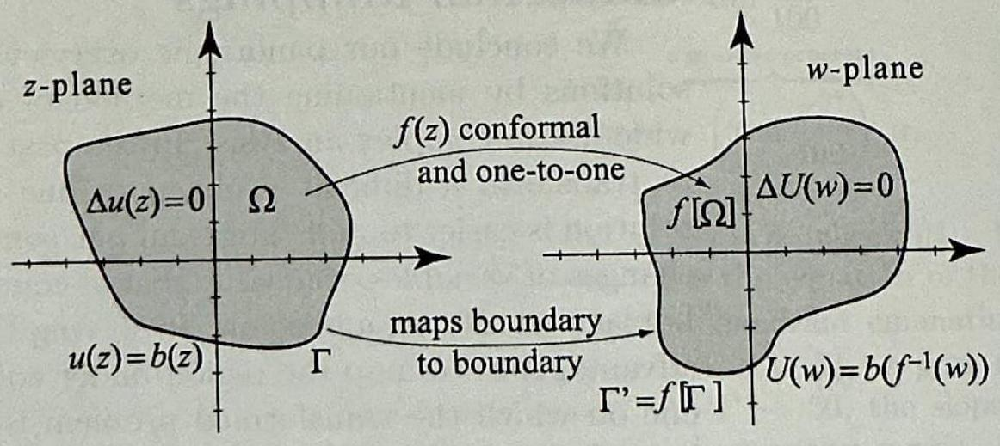
> 
> The conformal mapping method. If $f(z)$ is analytic and one-to-one on $\Omega$ and its boundary $\Gamma$, then $\Omega^{\prime}= f[\Omega]$ is a region with boundary $\Gamma^{\prime}=f[\Gamma]$. The boundary function $b(z)$ ( $z$ on $\Gamma$ ) is used to define a boundary function $b \circ f^{-1}(w)$ for all $w$ on $\Gamma$, where $f^{-1}$ is the inverse of $f$.


Step 1: Describe clearly the region $\Omega^{\prime}=f[\Omega]$ and its boundary $\Gamma^{\prime}=f[\Gamma]$ in the $w$-plane.
Step 2: Since $f$ is one-to-one, we have an inverse function $f^{-1}$ defined on $\Omega^{\prime}$ and $\Gamma^{\prime}$. For $w$ on $\Gamma^{\prime}, f^{-1}(w)$ is on $\Gamma$ and so we can define the function $b \circ f^{-1}(w)$ for all $w$ on $\Gamma^{\prime}$. This determines the boundary values on $\Gamma^{\prime}$.
Step 3: Set up and solve the Dirichlet problem on $\Omega^{\prime}$ consisting of Laplace's equation $\Delta U(w)=0$ for all $w$ in $\Omega^{\prime}$ and $U(w)=b \circ f^{-1}(w)$ for all $w$ on $\Gamma^{\prime}$. (This is our transformed Dirichlet problem.)
Step 4 Let $u(z)=U \circ f(z)$ for all $z$ in $\Omega$. Then $u(z)$ is a solution of out original Dirichlet problem on $\Omega$. Indeed, by Theorem 3, $u$ is harmonic in $\Omega$. For $z$ on the boundary $\Gamma$, we have $f(z)$ on the boundary $\Gamma^{\prime}$, and using the fact that $U(w)=b \circ f^{-1}(w)$ on $\Gamma^{\prime}$, we obtain for $z$ on $\Gamma, u(z)=U \circ f(z)= b \circ f^{-1}(f(z))=b(z)$. Hence $u$ satisfies the desired boundary condition.

In most examples, Steps 2 and 3 can be done without actually computives $f^{-1}$, as we illustrate in our next example.


> [!exercise] Exercise 7
> (a) Solve the Dirichlet problem in the semi-infinite strip $\Omega$ shown in _Figure 10_.
> (b) Discuss the isotherms and lines of heat flow of the solution.
> 
> 
> > [!figure] Figure 10
> > 
> > 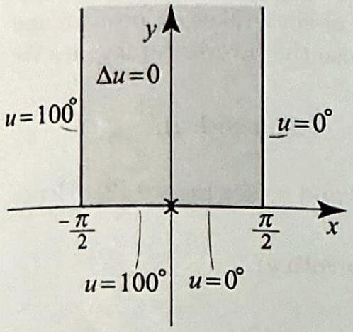
> > Dirichlet problem in Exercise 7.
> 
> 


##### problem 7.a


> [!figure] Figure 11: For problem 7.a
> 
> 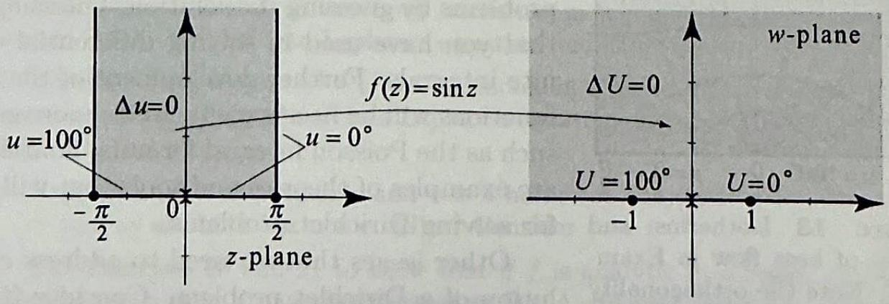
> 
> Mapping the semiinfinite vertical strip onto the upper half-plane. Note the boundary correspondence.


> [!figure] Figure 12: For Problem 7.a
> 
> 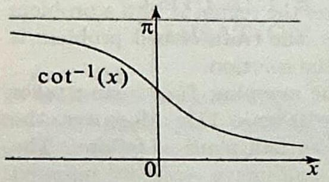
> Figure 12 The inverse cotangent takes its values in $(0, \pi)$.


##### problem 7.b


> [!figure] Figure 13: For Problem 7.b
> 
> 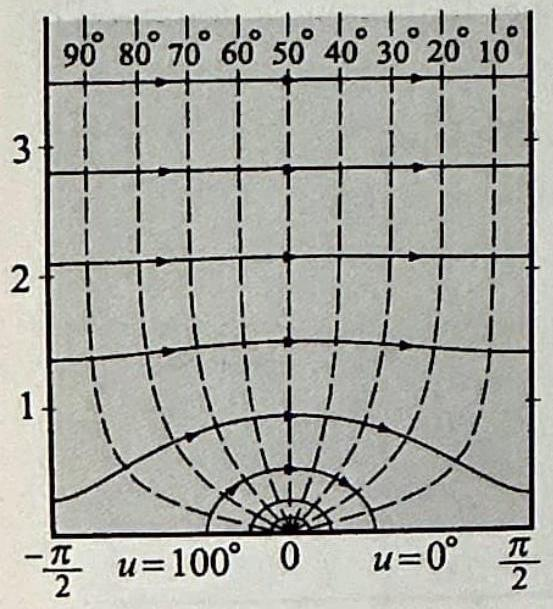
> 
> Isotherms and curves of heat flow in Example 7. Note the orthogonality of the curves.


---


> [!review]
> Why might the boundary data of a Dirichlet problem fail to determine a unique solution, and what additional condition on the solution restores uniqueness?


+++++


> [!exercise]
> Show that if $u(x, y)$ is the solution to the Dirichlet problem of Example 3 (Laplace's equation on the first quadrant with $u=100$ on the positive $x$-axis and $u=50$ on the positive $y$-axis), then $\psi(x, y)=u(x, y)+x y$ is also a solution.


++++


So far we have used our knowledge of analytic functions to solve Dirichlet problems by guessing the solution. Guessing is certainly a legitimate method that you have used in solving differential equations and computing indefinite integrals. Further development of the theory of analytic and harmonic functions will be necessary to tackle more general Dirichlet problems. Topics such as the Poisson integral formula, Fourier series, and conformal mappings are examples of theories and tools that will provide us with systematic ways for solving Dirichlet problems.

Other issues that we need to address concern the uniqueness of the solution of a Dirichlet problem. Consider the problem in Example 3, whose solution is $u(x, y)=-\frac{100}{\pi} \tan ^{-1}\left(\frac{y}{x}\right)+100$. If we add to this solution the harmonic function $\phi(x, y)=x y$, we obtain the harmonic function $\psi(x, y)= u(x, y)+x y$, which solves Laplace's equation. Moreover, because $x y$ vanishes on the boundary of the first quadrant, $\psi(x, y)$ and $u(x, y)$ have the same boundary values. Thus, $\psi$ is another solution of the Dirichlet problem in Example 3. This is quite disturbing since we want to think of the solution ${ }^{25}$
representing a temperature distribution and as such it must be unique. As it turns out, if in addition to the boundary conditions in a Dirichlet problem we add the condition that the solution be bounded (which is effectively a boundary condition at infinity), then the solution will be unique. For example, with this additional boundedness assumption, we can no longer add the function $x y$ to the solution in Example 3 to obtain another solution.

Uniqueness results for the solution of Dirichlet problems will be derived from theoretical properties of analytic and harmonic functions, including results such as the maximum principle. All these topics will be addressed as part of the remainder of this book.


## Exercises 2.5

> [!exercise] Exercise 8
> In problemss 1-12, determine the set on which the given function is harmonic. You may verify Laplace's equation (1) directly or use Theorem 1.
> 
> 1. $x^{2}-y^{2}+2 x-y$.
> 2. $\frac{1}{x^{2}-y^{2}}$.
> 3. $e^{x} \cos y$.
> 4. $\frac{y}{x^{2}+y^{2}}$.
> 5. $\frac{1}{x+y}$.
> 6. $\sinh x \cos y$.
> 7. $\cos x \cosh y$.
> 8. $e^{2 x} \cos (2 y)$.
> 9. $e^{x^{2}-y^{2}} \cos (2 x y)$.
> 10. $\ln \left(x^{2}+y^{2}\right)$.
> 11. $\ln \left((x-1)^{2}+y^{2}\right)$.
> 12. $\arg _{\frac{\pi}{2}} z$.


> [!exercise] Exercise 9
> In Problems 13-16, find a harmonic conjugate $v(x, y)$ of the given harmonic function $u(x, y)$ by using the method of Example 2 . Check your answer by verifying the Cauchy-Riemann equations.
> 13. $x+2 y$.
> 14. $x^{2}-y^{2}-x y$.
> 15. $e^{y} \cos x$.
> 16. $\cos x \sinh y$.


> [!exercise] Exercise 10
> 17. Let $n$ be any integer. (a) Show that $u(r, \theta)=r^{n} \cos (n \theta)$ and $v(r, \theta)= r^{n} \sin (n \theta)$ are harmonic on $\mathbb{C}$ if $n \geq 0$ and on $\mathbb{C} \backslash\{0\}$ if $n<0$. (b) Find their respective harmonic conjugates. **(Hint: Consider $f(z)=z^{n}$ in polar coordinates.)**


> [!exercise] Exercise 11
> 18. (a) Prove Proposition 1.
> (b) Prove Proposition 3.


> [!exercise] Exercise 12
> 19. Show that if $u$ and $u^{2}$ are both harmonic in a region $\Omega$, then $u$ must be constant. **(Hint: Plug $u^{2}$ into Laplace's equation and show that $u_{x}=u_{y}=0$.)**
> 20. Show that if $u, v$, and $u^{2}+v^{2}$ are harmonic in a region $\Omega$, then $u$ and $v$ must be constant. **(Hint: Plug $u^{2}+v^{2}$ into Laplace's equation and show that $u_{x}=u_{y}=0$ and $v_{x}=v_{y}=0$.)**
> 21. Suppose that $u$ is harmonic and $v$ is a harmonic conjugate of $u$. Show that $u^{2}-v^{2}$ and $u v$ are both harmonic. **(Hint: Consider $(u+i v)^{2}$.)**


> [!exercise] Exercise 13
> 22. Use Exercises 20 and 21 to show that if $f$ is analytic in a region $\Omega$ and $|f|$ is constant in $\Omega$, then $f$ must be constant in $\Omega$. (A different proof was outlined in Exercise 38, Section 2.4.)


> [!exercise] Exercise 14
> 23. **Translating and dilating a harmonic function.** Suppose that $u$ is harmonic. Show that the following functions are also harmonic:
> (a) $\quad u(x-\alpha, y-\beta)$, where $\alpha$ and $\beta$ are real numbers;
> (b) $u(\alpha x, \alpha y)$, where $\alpha \neq 0$ is a real number.


> [!exercise] Exercise 15
> 24. (a) Suppose that $u(x, y)$ is harmonic. Show that $u(x,-y)$ is also harmonic.
> 
> (b) Suppose that $u(x, y)$ is harmonic. Show that $u\left(\frac{x}{x^{2}+y^{2}}, \frac{y}{x^{2}+y^{2}}\right)$ is harmonic.
> **(Hint: Compose $u$ with the analytic function $\frac{1}{z}$; use Theorem 3 and part (a).)**
> 
> 


> [!exercise] Exercise 16
> 
> 
> 25. **Harmonic functions independent of $y$.** 
> (a) Suppose that $u(x, y)$ is a harmonic function whose values depend only on $x$ and not on $y$. Using Laplace's equation, show that $u(x, y)=a x+b$, where $a$ and $b$ are real constants.
> (b) Consider the Dirichlet problem in the infinite vertical strip in _Figure 14_. Because the boundary values do not depend on $y$, it is plausible to try for a solution a harmonic function whose values do not depend on $y$. Solve the problem, using (a).
> 
> 
> > [!figure] Figure 14
> > 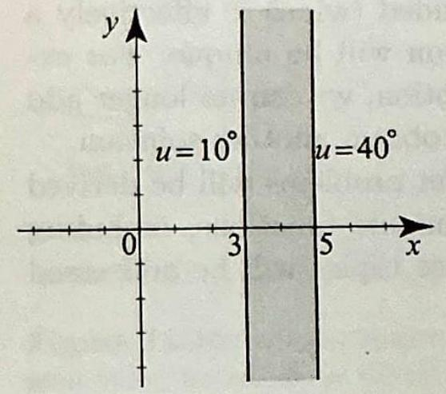
> > Dirichlet problem in problem 25.
> 
> 
> (c) Determine and plot the isotherms and curves of heat flow.
> 
> 


> [!exercise] Exercise 17
> 
> 26. **A Dirichlet problem in an infinite vertical strip.** 
> (a) Solve the Dirichlet problem in _Figure 15_.
> 
> > [!figure] Figure 15
> > 
> > ![[Pasted image 20260401005538.png|300]]
> > Dirichlet problem in Problem 26.
> 
> 
> (b) Determine and plot the isotherms and curves of heat flow.
> 
> 


> [!exercise] Exercise 18
> 
> 27. Harmonic functions independent of $r$. 
> (a) Solve the Dirichlet problem in _Figure 16_. Because the boundary values do not depend on $r$, you should try for a solution a harmonic function whose values do not depend on $r$.
> 
> 
> > [!figure] Figure 16
> > 
> > 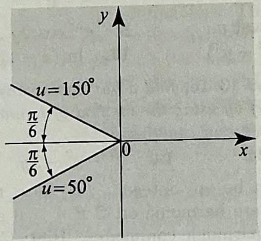
> > Dirichlet problem in Exercise 27.
> 
> 
> (b) Determine and plot the isotherms and curves of heat flow.
> 
> 


> [!exercise] Exercise 19
> 
> 
> 28. A Dirichlet problem in a wedge. 
> (a) Solve the Dirichlet problem in _Figure 17_.
> > [!figure] Figure 17
> > 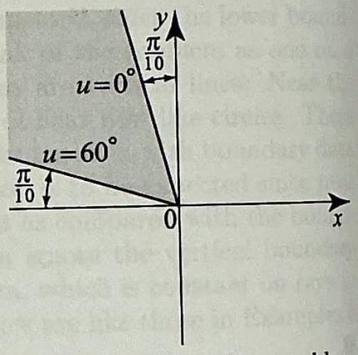
> > Dirichlet problem in Exercise 28.
> 
> (b) Determine and plot the isotherms and curves of heat flow.


> [!exercise] Exercise 20
> 29. Harmonic functions independent of $\theta$. Suppose that $u(r, \theta)$ is a harmonic function, in polar coordinates.
> (a) Suppose that $u$ depends only on $r$ and not $\theta$; hence $u(r, \theta)=u(r)$. Using the polar form of the Laplacian (12) in Exercise 47, show that $u(r)$ satisfies the (ordinary) differential equation in $r$
> 
> $$
> u_{r r}+\frac{1}{r} u_{r}=0,
> $$
> 
> known as an Euler equation. This is perhaps the simplest second order linear differential equation with nonconstant coefficients. To find its general solution, we
> (b) Multiply the Euler equation by the integrating factor $r$ and notice that the need two linearly independent solutions. left side is now exact. Integrate to conclude $r u_{r}=c_{1}$, where $c_{1}$ is the constant of
> 
> 
> > [!figure] Figure 21
> > 
> > 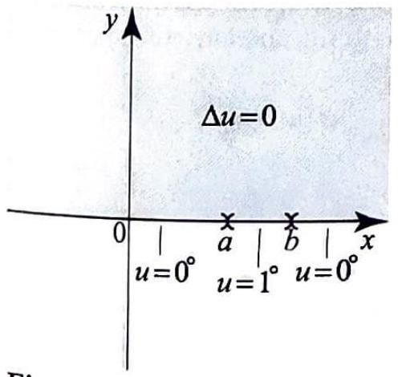
> > Figure 21 Dirichlet problem for problem 35.
> 
> integration. Integrate again and find the general solution
> 
> 
> 
> $$
> u(r)=c_{1} \ln r+c_{2} .
> $$
> 


> [!exercise] Exercise 21
> 
> 30. Dirichlet problems in annular regions. The annular region $A_{R_{1}, R_{2}}$ in _Figure 18_ is centered at the origin with inner radius $R_{1}$ and outer radius $R_{2}$. Consider the Dirichlet problem in $A_{R_{1}, R_{2}}$ with constant boundary conditions $u\left(R_{1}, \theta\right)= T_{1}$ and $u\left(R_{2}, \theta\right)=T_{2}$ for all $\theta$. Show that the solution of the problem is
> 
> 
> > [!figure] Figure 18
> > 
> > 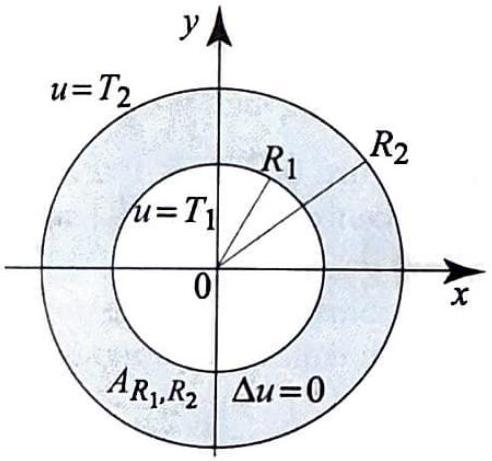
> > Figure 18 Dirichlet problem in problem 30.
> 
> 
> $$
> u(r, \theta)=u(r)=T_{1}+\left(T_{2}-T_{1}\right) \frac{\ln \left(r / R_{1}\right)}{\ln \left(R_{2} / R_{1}\right)}
> $$
> 
> **(Hint: Since the boundary conditions are independent of $\theta$, you should try a harmonic function independent of $\theta$. According to Problem 29, try $u(r)=c_{1} \ln r+c_{2}$.)** 


> [!exercise] Exercise 22
> 
> 
> Problems 31-32 are Dirichlet problems described by the corresponding figures. In each case, (a) solve the Dirichlet problem.
> (b) Determine the isotherms.
> (c) Determine the curves of heat flow. (d) Plot the isotherms and curves of heat flow.
> 
> 
> > [!figure] Figure 19
> > 
> > 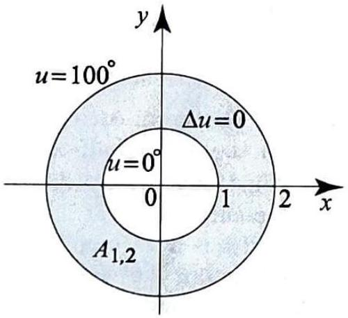
> > 
> > Dirichlet problem in problem 31.
> 
> 
> 
> 
> > [!figure] Figure 20
> > 
> > 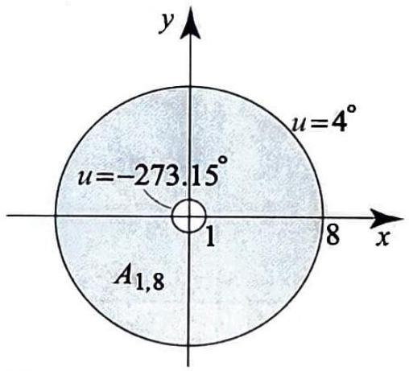
> > 
> > Dirichlet problem in problem 32.
> 
> 
> 
> 


> [!exercise] Exercise 23
> 33. Nonexistence of a harmonic conjugate. In Example 1(d), we showed that $\ln |z|$ is harmonic in $\mathbb{C} \backslash\{0\}$. We also know that $\ln |z|$ has a harmonic conjugate in $\mathbb{C} \backslash(-\infty, 0]$. In fact, since $\ln |z|$ is the real part of the analytic function $\log _{\alpha} z$, it has a harmonic conjugate in the complex plane minus the ray emanating from the origin at angle $\alpha$. In this exercise, we will show that $\ln |z|$ does not have a harmonic conjugate in $\mathbb{C} \backslash\{0\}$.
> (a) Suppose that $\phi(z)$ is a harmonic conjugate of $\ln |z|$ in $\mathbb{C} \backslash\{0\}$. Show that $\phi(z)=\operatorname{Arg}(z)+c$ for all $z$ in $\mathbb{C} \backslash(-\infty, 0]$. **(Hint: The functions $\ln |z|+i \phi(z)$ and $\log z$ are analytic in the region $\mathbb{C} \backslash(-\infty, 0]$ and have the same real parts. Use Corollary 1, Section 2.4.])**
> (b) Argue that, since $\phi(z)$ is harmonic in $\mathbb{C} \backslash\{0\}, \phi(z)$ is continuous on $(-\infty, 0)$. Obtain a contradiction using (a) and the fact that the discontinuities of $\operatorname{Arg} z$ are not removable on the negative $x$-axis (Example 7, Section 2.2).


> [!exercise] Exercise 24
> 34. (a) Suppose that $f$ is analytic on $\Omega, U$ is harmonic on $f[\Omega]$, and $u=U \circ f$. Then $u$ is harmonic in $\Omega$ by Theorem 3. Suppose that $V$ is a harmonic conjugate of $U$. Show that $V \circ f$ is a harmonic conjugate of $u$.
> (b) Derive the isotherms and curves of heat flow in Exercise 7.


> [!exercise] Exercise 25
> 
> 35. Harmonic measure of an interval. A very important Dirichlet problem is described in the upper half-plane with boundary data on the $x$-axis given by
> 
> $$
> u(x, 0)= \begin{cases}1 & \text { if } a<x<b \\ 0 & \text { otherwise }\end{cases}
> $$
> 
> where $a<b$ are fixed real numbers (see Figure 21). We will outline a solution of this problem using basic geometry and properties of harmonic functions.
> (a) For $z$ in the upper half-plane, let $\alpha(z)$ denote the angle at $z$ subtended by the interval $[a, b]$ (_Figure 22_). Show that $\alpha(z)=\operatorname{Arg}(z-b)-\operatorname{Arg}(z-a)$. The function $\alpha(z)$ is called the harmonic measure of the interval $(a, b)$. **(Hint: We have $\alpha_{1}=\operatorname{Arg}(z-b), \alpha_{2}=\operatorname{Arg}(z-a)$, and $\alpha(z)=\alpha_{1}-\alpha_{2}$ _(Figure 22)_.)**
> 
> > [!figure] Figure 22
> > 
> > 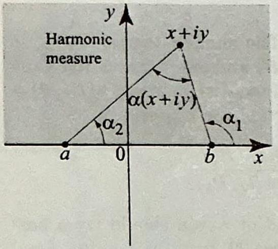
> > 
> > Figure 22 The harmonic measure of an interval is the difference of two translated arguments:
> > 
> > $$
> > \begin{aligned}
> > \alpha(z)=\operatorname{Arg} & (z-b) -\operatorname{Arg}(z-a)
> > \end{aligned}
> > $$
> > 
> 
> 
> (b) Show that $\alpha(z)$ is harmonic. **(Hint: problem 23(a).)**
> (c) Show geometrically that
> 
> $$
> \lim _{y \downarrow 0} \alpha(x+i y)= \begin{cases}0 & \text { if } x>b, \\ \pi & \text { if } a<x<b, \\ 0 & \text { if } x<a .\end{cases}
> $$
> 
> (d) Conclude that $u(x, y)=\frac{1}{\pi} \alpha(x+i y)$ is a solution of the Dirichlet problem in Figure 21.
> 
> 


> [!exercise] Exercise 26
> 
> 
> 36. (a) Solve the Dirichlet problem in _Figure 23_.
> 
> 
> > [!figure] Figure 23
> > 
> > 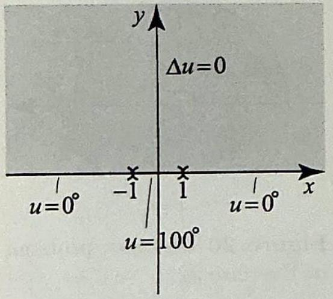
> > Figure 23 Dirichlet problem for problem 36.
> 
> 
> 
> (b) Show that the isotherm corresponding to the temperature $0<T<100$ consists of the arc in the upper half-plane of the circle with center $\left(0, \cot \frac{\pi T}{100}\right)$ and radius $\left|\csc \frac{\pi T}{100}\right|$. Justify your answer using facts from plane geometry.
> (c) What are the curves of heat flow? **(Hint: You know a harmonic conjugate of $\operatorname{Arg} z$. Show that if $v$ is a harmonic conjugate of $u$, then a harmonic conjugate of $u(z-a) \pm u(z-b)$ is $v(z-a) \pm v(z-b)$.)**
> (d) Plot the isotherms and curves of heat flow.
> 


> [!exercise] Exercise 27
> 37. Solve the Dirichlet problem in the upper half-plane with boundary data on the $x$-axis given by
> 
> $$
> u(x, 0)= \begin{cases}T_{1} & \text { if } a<x<b \\ T_{2} & \text { otherwise }\end{cases}
> $$
> 
> where $a<b$ are fixed real numbers. **(Hint: Use Exercise 35 and the fact that constant functions are harmonic.)**


> [!exercise] Exercise 28
> 
> 
> 38. **Project Problem:** Harmonic measures of two disjoint intervals. In this exercise, we generalize the result of Exercise 35 by solving the Dirichlet problem in the upper half-plane with boundary data
> 
> $$
> u(x, 0)= \begin{cases}T_{1} & \text { if } a<x<b \\ T_{2} & \text { if } c<x<d \\ 0 & \text { otherwise }\end{cases}
> $$
> 
> where $a<b \leq c<d$ (_Figure 24_).
> 
> 
> > [!figure] Figure 24
> > 
> > 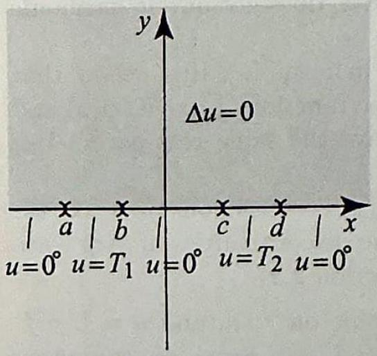
> > Figure 24 Dirichlet problem for problem 38.
> 
> 
> 
> (a) Show that if $u_{1}$ is a solution of the Dirichlet problem in the upper half-plane with boundary conditions
> 
> $$
> u_{1}(x, 0)= \begin{cases}T_{1} & \text { if } a<x<b \\ 0 & \text { otherwise }\end{cases}
> $$
> 
> and $u_{2}$ is a solution of the Dirichlet problem in the upper half-plane with boundary conditions
> 
> $$
> u_{2}(x, 0)= \begin{cases}T_{2} & \text { if } c<x<d \\ 0 & \text { otherwise }\end{cases}
> $$
> 
> then the solution of the Dirichlet problem in the upper half-plane with boundary data $u(x, 0)$ is $u(x, y)=u_{1}(x, y)+u_{2}(x, y)$.
> (b) Show that $u(x, y)=\frac{T_{1}}{\pi} \alpha_{1}(z)+\frac{T_{2}}{\pi} \alpha_{2}(z)$ where $\alpha_{1}(z)$, respectively, $\alpha_{2}(z)$, is the angle at $z$ subtended by the interval $(a, b)$, respectively, $(c, d)$.


> [!exercise] Exercise 29
> 
> 
> 39. (a) Solve the Dirichlet problem in _Figure 25_.
> 
> 
> > [!figure] Figure 25
> > 
> > 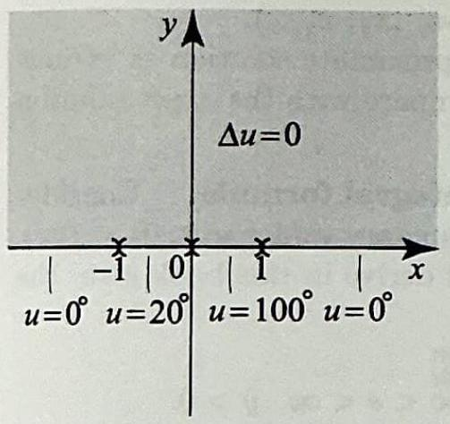
> > Figure 25 Dirichlet problem for problem 39.
> 
> 
> (b) Plot the isotherms.


> [!exercise] Exercise 30
> 
> 40. **Project Problem:** Harmonic measures of several disjoint intervals. Generalize the result of Exercise 38 as follows. Suppose that $I_{1}, I_{2}, \ldots, I_{n}$ are disjoint open intervals on the $x$-axis, and $T_{1}, T_{2}, \ldots, T_{n}$ are real numbers. Consider the Dirichlet problem in the upper half-plane with boundary condition
> 
> $$
> u(x, 0)= \begin{cases}T_{j} & \text { if } x \in I_{j} \\ 0 & \text { otherwise }\end{cases}
> $$
> 
> Show that the solution is
> 
> $$
> u(x, y)=\frac{1}{\pi} \sum_{j=1}^{n} T_{j} \alpha_{j}(z)
> $$
> 
> where $\alpha_{j}(z)$ is the angle at $z$ subtended by the interval $I_{j}$.


> [!exercise] Exercise 31
> 
> 41. **Project Problem:** Approximation of steady-state solutions. Consider the Dirichlet problem in the upper half-plane with boundary values $u(x, 0)= f(x)(-\infty<x<\infty)$, where $f(x)$ is an arbitrary function that represents the temperature of the points on the $x$-axis. Such a temperature distribution will be bounded and piecewise continuous. There is an analytical solution of the Dirichlet problem, given by an integral involving $f(x)$, known as the Poisson integral of $f$ (see Exercise 42). In this exercise, we will show how we can use the result of Exercise 40 to approximate the solution for a given $f(x)$. The approach that we take has some merit, since it can be used to obtain approximate numerical values for the steady-state temperature. Moreover, we will use it in Exercise 42 to justify the Poisson integral formula. The rigorous derivation of this formula will be given in a later chapter.
> 
> To be able to compare our numerical approximation with the exact solution, let us take $f(x)=\frac{1}{1+x^{2}},-\infty<x<\infty$. In this case, using properties of the Poisson integral, we will show in a later chapter that the solution is
> 
> $$
> u(x, y)=\frac{1+y}{x^{2}+(1+y)^{2}}
> $$
> 
> (a) Verify that $u$ is indeed harmonic in the upper half-plane and that it equals $f(x)=\frac{1}{1+x^{2}}$ on the $x$-axis.
> (b) We now pretend that we do not know the exact solution and proceed to find an approximate solution. The idea is to approximate $f(x)$ by a function that takes on constant values on disjoint intervals. Take the interval ( $-5,5$ ) and subdivide it
> into 40 smaller intervals of equal length, $\left(x_{j}, x_{j+1}\right), j=1,2, \ldots, 40$. Approximate $f$ on ( $x_{j}, x_{j+1}$ ) by $f\left(x_{j}\right)$, and by 0 outside the interval ( $-5,5$ ). Thus the boundary values are now replaced by
> 
> $$
> u(x, 0)= \begin{cases}\frac{1}{1+x_{j}^{2}} & \text { if } x_{j}<x<x_{j+1} \\ 0 & \text { otherwise }\end{cases}
> $$
> 
> Show that the solution is
> 
> $$
> u(x, y)=\frac{1}{\pi} \sum_{j=1}^{40} \frac{1}{1+x_{j}^{2}} \alpha_{j}(z)
> $$
> 
> where $\alpha_{j}(z)$ is the angle at $z$ subtended by the interval $\left(x_{j}, x_{j+1}\right)$.
> (c) With the help of a computer, evaluate your approximate solution at various points, $z_{0}=x_{0}+i y_{0}$, in the upper half-plane and compare with the exact solution (10).
> 
> 


> [!exercise] Exercise 32
> 
> 
> 42. **Project Problem:** Justifying the Poisson integral formula. Consider the Dirichlet problem in the upper half-plane with boundary values $u(x, 0)=f(x)$, $-\infty<x<\infty$. One of the major results that we will derive in this book gives the solution as
> 
> $$
> u(s, y)=\frac{y}{\pi} \int_{-\infty}^{\infty} \frac{f(x)}{(s-x)^{2}+y^{2}} d x, \quad-\infty<s<\infty, y>0
> $$
> 
> This is known as the Poisson integral formula or the Poisson integral of $f$. Our goal in this exercise is to motivate this formula by sketching a proof using the numerical scheme of Exercise 41.
> (a) Based on the approach in Exercise 41, explain how you would derive the approximate solution
> 
> $$
> u_{\mathrm{app}}(s, y)=\frac{1}{\pi} \sum_{j=1}^{n} f\left(x_{j}\right) \alpha_{j}(s, y)
> $$
> 
> where $x_{j}$ are equally spaced points on the $x$-axis and $\alpha_{j}(s, y)$ is the angle at $z= s+i y$ subtended by the interval ( $x_{j}, x_{j+1}$ ).
> (b) Use the result of Exercise 35(a) to write
> 
> $$
> u_{\mathrm{app}}(s, y)=\frac{1}{\pi} \sum_{j=1}^{n} f\left(x_{j}\right)\left(\operatorname{Arg}\left(z-x_{j+1}\right)-\operatorname{Arg}\left(z-x_{j}\right)\right)
> $$
> 
> where $z=s+i y$.
> (c) Use the mean value theorem to show that there exists a $\xi_{j}$ in the interval $\left(x_{j}, x_{j+1}\right)$ such that $\operatorname{Arg}\left(z-x_{j+1}\right)-\operatorname{Arg}\left(z-x_{j}\right)=\frac{y}{\left(s-\xi_{j}\right)^{2}+y^{2}} \Delta x$, where $\Delta x= x_{j+1}-x_{j}$.
> (d) Thus the approximate solution
> 
> $$
> u_{\mathrm{app}}(s, y)=\frac{y}{\pi} \sum_{j=1}^{n} \frac{f\left(x_{j}\right)}{\left(s-\xi_{j}\right)^{2}+y^{2}} \Delta x
> $$
> 
> 
> 
> 
> **(Hints: In problem 43, use the conformal mapping $f(z)= \sin z$.**
> **In Exercise 44, use the conformal mapping $f(z)=z^{2}$. Solve the transformed problem by using problem 36.)**
> 
> **(Hints: In problem 45, use the conformal mapping $f(z)= \sin z$, then the result of problem 36. In problem 46, use the conformal mapping $f(z)=z^{4}$, then the result of problem 36.)**
> 
> Let $\Delta x \rightarrow 0$ and explain why $u_{\mathrm{app}}(s, y)$ should approach the Poisson integral (11). **(Hint: Interpret $u_{\mathrm{app}}(s, y)$ as a Riemann sum that approximates the Poisson integral (11).)**
> 
> 
> > [!NOTE]
> > What we have done in problem 42 is not exactly a proof of the Poisson integral formula, since Riemann sums are defined for functions on finite intervals and we have used them on the interval $(-\infty, \infty)$. However, if we know that $f(x)$ is continuous and equal to zero outside an interval $[a, b]$ (no matter how large the interval is), then the preceding proof works, giving you a simple proof of an important result in applied mathematics for the class of continuous functions vanishing outside a bounded interval. Often in analysis, knowing that a result is true for this class of continuous functions is a good indication that the result is also true for a larger class of functions. In particular, to extend the Poisson integral formula to a larger class of functions $f(x)$ satisfying some general integrability conditions, we use standard techniques from analysis to approximate $f(x)$ by continuous functions that vanish outside a bounded interval, and then use this approximation to establish the Poisson integral formula for $f$.
> 
> 
> 


> [!exercise] Exercise 33
> 
> Project Problems: Conformal mapping method. Exercises 43-46 are Dirichlet problems described by the corresponding figures. In each case, 
> (a) solve the problem by following the four steps, as we did in Exercise 7.
> (b) Determine and plot the isotherms.
> 
> 
> 
> > [!figure] Figure 26
> > 
> > 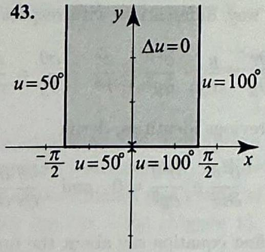
> > Dirichlet problem in problem 43.
> 
> 
> 
> > [!figure] Figure 27
> > 
> > 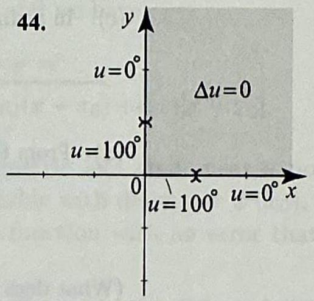
> > Dirichlet problem in problem 44.
> 
> 
> 
> > [!figure] Figure 28
> > 
> > 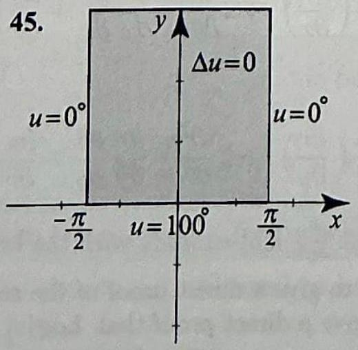
> > Dirichlet problem in problem 45.
> 
> 
> 
> > [!figure] Figure 29
> > 
> > 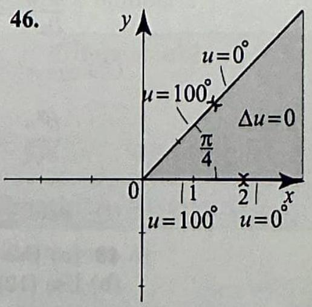
> > Dirichlet problem in problem 46.
> 
> 


> [!exercise] Exercise 34
> 
> 43. **Project Problem:** Laplacian in polar coordinates. In this exercise, you are asked to derive the polar form of the Laplacian
> 
> $$
> \Delta u=\frac{\partial^{2} u}{\partial r^{2}}+\frac{1}{r} \frac{\partial u}{\partial r}+\frac{1}{r^{2}} \frac{\partial^{2} u}{\partial \theta^{2}}
> $$
> 
> The derivation is straightforward but a little tedious. To organize your approach, follow the outlined steps.
> (a) Recall the relationship between rectangular and polar coordinates
> 
> $$
> x=r \cos \theta, \quad y=r \sin \theta, \quad r^{2}=x^{2}+y^{2}, \quad \tan \theta=\frac{y}{x}
> $$
> 
> Differentiate $r^{2}=x^{2}+y^{2}$ with respect to $x$ once, then a second time, and obtain
> 
> $$
> \frac{\partial r}{\partial x}=\frac{x}{r}, \quad \frac{\partial^{2} r}{\partial x^{2}}=\frac{y^{2}}{r^{3}}
> $$
> 
> (b) Differentiate $\tan \theta=\frac{y}{x}$ with respect to $x$ once, then a second time, and get
> 
> $$
> \frac{\partial \theta}{\partial x}=-\frac{y}{r^{2}}, \quad \frac{\partial^{2} \theta}{\partial x^{2}}=\frac{2 x y}{r^{4}}
> $$
> 
> (c) In a similar way, differentiate with respect to $y$ and obtain
> 
> $$
> \frac{\partial r}{\partial y}=\frac{y}{r}, \quad \frac{\partial^{2} r}{\partial y^{2}}=\frac{x^{2}}{r^{3}}, \quad \frac{\partial \theta}{\partial y}=\frac{x}{r^{2}}, \quad \frac{\partial^{2} \theta}{\partial y^{2}}=-\frac{2 x y}{r^{4}}
> $$
> 
> (d) From the previous identities, derive
> 
> $$
> \frac{\partial^{2} \theta}{\partial x^{2}}+\frac{\partial^{2} \theta}{\partial y^{2}}=0 \quad \text { and } \quad \frac{\partial \theta}{\partial x} \frac{\partial r}{\partial x}+\frac{\partial \theta}{\partial y} \frac{\partial r}{\partial y}=0
> $$
> 
> (What does the first equation say about the function $\theta(x, y) ?$ )
> (e) Use the chain rule in two dimensions ((13), Section 2.6) to derive
> 
> $$
> \frac{\partial^{2} u}{\partial x^{2}}=\frac{\partial^{2} u}{\partial r^{2}}\left(\frac{\partial r}{\partial x}\right)^{2}+2 \frac{\partial^{2} u}{\partial \theta \partial r} \frac{\partial r}{\partial x} \frac{\partial \theta}{\partial x}+\frac{\partial u}{\partial r} \frac{\partial^{2} r}{\partial x^{2}}+\frac{\partial^{2} u}{\partial \theta^{2}}\left(\frac{\partial \theta}{\partial x}\right)^{2}+\frac{\partial u}{\partial \theta} \frac{\partial^{2} \theta}{\partial x^{2}}
> $$
> 
> Change $x$ to $y$ and obtain
> 
> $$
> \frac{\partial^{2} u}{\partial y^{2}}=\frac{\partial^{2} u}{\partial r^{2}}\left(\frac{\partial r}{\partial y}\right)^{2}+2 \frac{\partial^{2} u}{\partial \theta \partial r} \frac{\partial r}{\partial y} \frac{\partial \theta}{\partial y}+\frac{\partial u}{\partial r} \frac{\partial^{2} r}{\partial y^{2}}+\frac{\partial^{2} u}{\partial \theta^{2}}\left(\frac{\partial \theta}{\partial y}\right)^{2}+\frac{\partial u}{\partial \theta} \frac{\partial^{2} \theta}{\partial y^{2}}
> $$
> 
> (f) Add $\frac{\partial^{2} u}{\partial x^{2}}$ and $\frac{\partial^{2} u}{\partial y^{2}}$ and simplify with the help of (d) to derive (12).


> [!exercise] Exercise 35
> 44. (a) Use (12) to give a direct proof of the result of problem 17(a).
> (b) Use (12) to give a direct proof that $\log |z|$ is harmonic for all $z \neq 0$.


> [!exercise] Exercise 36
> 45. Show that if $u$ is harmonic and independent of $r$, then $u_{\theta \theta}=0$. Conclude that $u=a \theta+b$; equivalently, $u=a \arg _{\alpha} z+b$, where $\arg _{\alpha} z$ is a branch of the argument.


