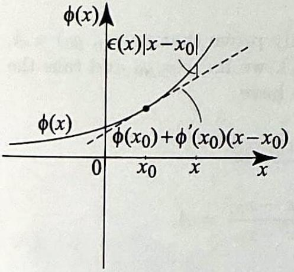
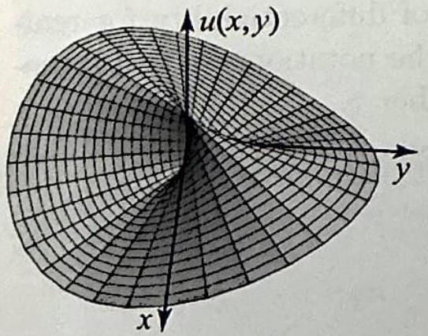
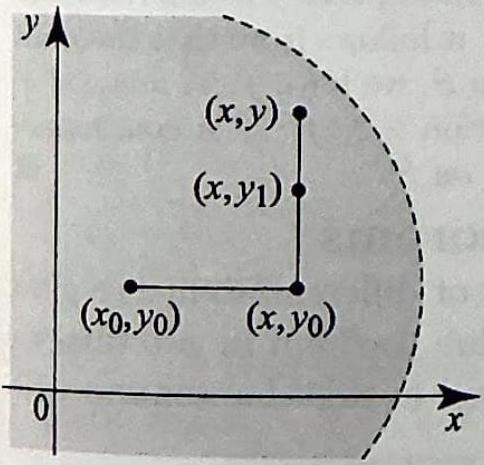
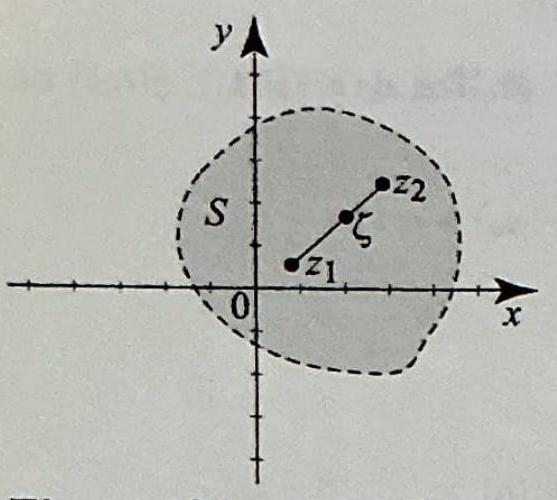

> [!review]
> 1.) How is differentiability defined for a real-valued function $u(x, y)$ at a point $z_0=\left(x_0, y_0\right)$, and how does this definition parallel the corresponding notion for a real-valued function of one variable?
> 2.) Suppose a real-valued function $u(x, y)$ is differentiable at a point $z_0$. What does this imply about the continuity of $u$ at $z_0$, and about the existence and values of the partial derivatives of $u$ at $z_0$ ? Prove your answer.

+++++

Our goal in this section is to fulfill our promise of completing the proof of the Cauchy-Riemann theorem, which we stated in Section 2.4. The material that is required for the proof is interesting in its own right. It deals with the concept of differentiation for functions of several variables. We will also apply it to give simple proofs of the chain rule and the mean value theorem in two dimensions.

As a motivation, let us begin by reviewing a geometric interpretation of the derivative of a real-valued function of one variable, $\phi(x)$. When we say that $\phi^{\prime}\left(x_{0}\right)$ exists, we mean that the limit $\lim _{x \rightarrow x_{0}} \frac{\phi(x)-\phi\left(x_{0}\right)}{x-x_{0}}$ exists and equals a finite number $\phi^{\prime}\left(x_{0}\right)$. If we set

$$
r(x)=\phi^{\prime}\left(x_{0}\right)-\frac{\phi(x)-\phi\left(x_{0}\right)}{x-x_{0}}
$$

then $\lim _{x \rightarrow x_{0}} r(x)=0$. Solving for $\phi(x)$, we obtain

$$
\phi(x)=\phi\left(x_{0}\right)+\phi^{\prime}\left(x_{0}\right)\left(x-x_{0}\right)+r(x)\left(x-x_{0}\right) .
$$

Let $\epsilon(x)=r(x) \frac{x-x_{0}}{\left|x-x_{0}\right|}$, then, because $\frac{x-x_{0}}{\left|x-x_{0}\right|}= \pm 1$ and $r(x) \rightarrow 0$ as $x \rightarrow x_{0}$, it follows that $\epsilon(x) \rightarrow 0$ as $x \rightarrow x_{0}$, and we have

$$
\phi(x)=\overbrace{\phi\left(x_{0}\right)+\phi^{\prime}\left(x_{0}\right)\left(x-x_{0}\right)}^{\text {tangent line at } x_{0}}+\epsilon(x)\left|x-x_{0}\right| .
$$

This expresses the well-known geometric fact that, near a point $x=x_{0}$ where the function $\phi(x)$ is differentiable with derivative $\phi^{\prime}\left(x_{0}\right)$, the tangent line approximates the graph of the function with an error that tends to 0 faster than $\left|x-x_{0}\right|$ (_Figure 1_).

> [!figure] Figure 1
> 
> 
> Figure 1 Approximation of a differentiable function by the tangent line.

With (1) in mind, we introduce the notion of differentiability for realvalued functions of two variables. To simplify the notation, we will sometimes denote a point $(x, y)$ by the complex number $z$.

> [!definition] Differentiability of Real-Valued Functions of Two Variables
> We call a real-valued function $u(x, y)$ differentiable at $z_{0}=\left(x_{0}, y_{0}\right)$ if it can be written in the form
> 
> $$
> u(z)=u\left(z_{0}\right)+A\left(x-x_{0}\right)+B\left(y-y_{0}\right)+\epsilon(z)\left|z-z_{0}\right|
> $$
> 
> where $A$ and $B$ are (real) constants and $\epsilon(z) \rightarrow 0$ as $z \rightarrow z_{0}$.

In proofs, we will need to know limits such as
(3) $\lim _{z \rightarrow z_{0}} \epsilon(z) \frac{\left|z-z_{0}\right|}{z-z_{0}}=0, \quad \lim _{z \rightarrow z_{0}} \epsilon(z) \frac{\left|x-x_{0}\right|}{x-x_{0}}=0, \quad \lim _{z \rightarrow z_{0}} \epsilon(z) \frac{x-x_{0}}{\left|z-z_{0}\right|}=0$.

These are all of the form $\epsilon(z)$ times a bounded function, and hence by the squeeze theorem they tend to zero as $z \rightarrow z_{0}$, because $\epsilon(z)$ tends to zero. For example,

$$
\left|\epsilon(z) \frac{x-x_{0}}{\left|z-z_{0}\right|}\right|=|\epsilon(z)| \overbrace{\frac{\left|x-x_{0}\right|}{\left|z-z_{0}\right|}}^{\leq 1} \leq|\epsilon(z)|
$$

where the inequality $\frac{\left|x-x_{0}\right|}{\left|z-z_{0}\right|}=\frac{\left|\operatorname{Re}\left(z-z_{0}\right)\right|}{\left|z-z_{0}\right|} \leq 1$ follows from (14), Section 1.2.
Our first result states that a differentiable function is continuous and has partial derivatives.

> [!Theorem] Theorem 1
> Suppose $u(x, y)$ is differentiable at $z_{0}=x_{0}+i y_{0}$, so that (2) holds. Then 
> (i) $u(x, y)$ is continuous at $z_{0}$; and
> (ii) $u_{x}, u_{y}$ exist at $z_{0}$ and $u_{x}\left(z_{0}\right)=A, u_{y}\left(z_{0}\right)=B$.

**Proof** 

> [!review]
> 1.) Suppose a real-valued function $u(x, y)$ has partial derivatives $u_x\left(z_0\right)$ and $u_y\left(z_0\right)$ at a point $z_0$. What, if anything, does this imply about the continuity or differentiability of $u$ at $z_0$ ?
> 2.) What additional hypothesis on the partial derivatives of a real-valued function $u(x, y)$, beyond their mere existence at $z_0$, is sufficient to guarantee that $u$ is differentiable at $z_0$ ? Prove your answer.
> 3.) What conditions on the partial derivatives of the real and imaginary parts $u, v$ of a complex-valued function $f(z)=u(x, y)+i v(x, y)$ are sufficient to guarantee that $f$ is analytic on an open set? Prove your answer.

+++++

> [!exercise]
> For the function
> 
> $$
> u(x, y)= \begin{cases}\frac{x y}{x^2+y^2} & (x, y) \neq(0,0) \\ 0 & (x, y)=(0,0)\end{cases}
> $$
> 
> verify that $u_x(0,0)=0$ and $u_y(0,0)=0$, and show that $u$ is not continuous at $(0,0)$. Conclude from Theorem 1 that $u$ is not differentiable at $(0,0)$.

++++

The converse of part (ii) of Theorem 1 is not true. A function of two variables may have partial derivatives and yet fail to be differentiable at a point. In fact, the function may not even be continuous at that point. As an illustration, consider

$$
u(x, y)= \begin{cases}\frac{x y}{x^{2}+y^{2}} & (x, y) \neq(0,0) \\ 0 & (x, y)=(0,0)\end{cases}
$$

It is a good exercise to check that $u_{x}(0,0)=0$ and $u_{y}(0,0)=0$, but $u$ is not continuous at $(0,0)$. Hence by Theorem 1(i), $u$ is not differentiable at $(0,0)$. The graph of $u$ is shown in _Figure 2_.

> [!figure] Figure 2
> 
> 
> Figure 2 A discontinuous function with partial derivatives at $(0,0)$. The function is not differentiable at $(0,0)$.

$u(x, y)-u\left(x, y_{0}\right)$, think of $x$ as fixed, and apply the mean value theorem in the second variable.

To obtain differentiability at a point, more is needed than the existence of the partial derivatives. We have the following interesting result.

> [!Theorem] Theorem 2: Sufficient Conditions for Differentiability
> Let $u$ be a real-valued function defined on a neighborhood of $z_{0}$. If
> (i) $u_{x}\left(z_{0}\right)$ and $u_{y}\left(z_{0}\right)$ exist, and
> (ii) either $u_{x}(z)$ or $u_{y}(z)$ is continuous at $z_{0}$,
> then $u$ is differentiable at $z_{0}$, and (2) holds with $A=u_{x}\left(x_{0}, y_{0}\right), B= u_{y}\left(x_{0}, y_{0}\right)$.

**Proof** 

> [!figure] Figure 3: For Proof to Theorem 3
> 
> 
> Figure 3 In the expression

---

We are now in a position to complete the proof of the Cauchy-Riemann equations theorem.

> [!theorem] Theorem 4: The Chain Rule
> Let $f(z)=u(x, y)+i v(x, y)$ be a complex-valued function, defined in an open set $S$. If $u_{x}, u_{y}, v_{x}$, and $v_{y}$ are continuous and satisfy the CauchyRiemann equations in $S$, then $f(z)$ is analytic on $S$.

**Proof** 

# 2.6.1 Chain Rule and Mean Value Theorems

> [!review]
> 1.) If a differentiable real-valued function $u(x, y)$ is composed with a curve $(x(t), y(t))$ whose components are differentiable in $t$, how does the rate of change of the composite $U(t)= u(x(t), y(t))$ express in terms of the partial derivatives of $u$ and the derivatives of $x$ and $y$ ? Prove your answer.
> 2.) Suppose $x$ and $y$ are differentiable functions of two parameters $s$ and $t$. How do the partial derivatives of $U(s, t)=u(x(s, t), y(s, t))$ express in terms of the partial derivatives of $u, x$, and $y$ ? Prove your answer.
> 3.) Can the total finite change of a differentiable real-valued function of two variables along a line segment in its domain be computed using the function's partial derivatives at a single intermediate point on the segment? Prove your answer.

+++++

We can use Definition 1 and basic properties of differentiability to give simple proofs of the chain rule and the mean value theorem in two dimensions. These fundamental results were already used in this chapter and will be used again.

> [!theorem] Theorem 4: The Chain Rule
> Suppose that $u(x, y)$ is a differentiable function of $(x, y)$ in an open set $S$, where $x=x(t)$ and $y=y(t)$ are both differentiable functions of $t$. Then the function $U(t)=u(x(t), y(t))$ is a differentiable function of $t$ and
> 
> $$
> \frac{d U}{d t}=\frac{\partial u}{\partial x} \frac{d x}{d t}+\frac{\partial u}{\partial y} \frac{d y}{d t}
> $$
> 

In particular, if the partial derivatives of $u$ are continuous, then by Theorem $2, u$ is differentiable and the chain rule (11) holds.
Proof Here again, we will use the notation $z=(x, y)$. For $z_{0}=\left(x\left(t_{0}\right), y\left(t_{0}\right)\right)$ in $S$, by Definition 1 and Theorem 1(ii), we have

$$
u(z)-u\left(z_{0}\right)=u_{x}\left(z_{0}\right)\left(x-x_{0}\right)+u_{y}\left(z_{0}\right)\left(y-y_{0}\right)+\epsilon(z)\left|z-z_{0}\right|
$$

and so

$$
\begin{aligned}
& \frac{u(x(t), y(t))-u\left(x\left(t_{0}\right), y\left(t_{0}\right)\right)}{t-t_{0}} \\
& \quad=u_{x}\left(z_{0}\right) \frac{x(t)-x\left(t_{0}\right)}{t-t_{0}}+u_{y}\left(z_{0}\right) \frac{y(t)-y\left(t_{0}\right)}{t-t_{0}}+\epsilon(z) \frac{\left|z-z_{0}\right|}{t-t_{0}}
\end{aligned}
$$

As $t \rightarrow t_{0}, \frac{x(t)-x\left(t_{0}\right)}{t-t_{0}} \rightarrow \frac{d x}{d t}\left(t_{0}\right)$ and $\frac{y(t)-y\left(t_{0}\right)}{t-t_{0}} \rightarrow \frac{d y}{d t}\left(t_{0}\right)$, and hence (11) will follow from (12) once we prove that $\lim _{t \rightarrow t_{0}} \epsilon(z) \frac{\left|z-z_{0}\right|}{t-t_{0}}=0$. As $t \rightarrow t_{0}, z \rightarrow z_{0}$ and hence $\epsilon(z) \rightarrow 0$. So it suffices to show that $\frac{\left|z-z_{0}\right|}{t-t_{0}}$ is bounded in a neighborhood of $t_{0}$. We have

$$
\left|\frac{\left|z-z_{0}\right|}{t-t_{0}}\right|=\left|\frac{x-x_{0}}{t-t_{0}}+i \frac{y-y_{0}}{t-t_{0}}\right| \rightarrow\left|\frac{d x}{d t}\left(t_{0}\right)+i \frac{d y}{d t}\left(t_{0}\right)\right|
$$

and since this function has a limit, it is bounded in a neighborhood of $t_{0}$.
There is also a version of the chain rule in the situation where $x$ and $y$ are differentiable functions of two variables, $s$ and $t$. In that case, we set $U(s, t)=u(x(s, t), y(s, t))$, and then

$$
\begin{aligned}
& \frac{\partial U}{\partial s}=\frac{\partial u}{\partial x} \frac{\partial x}{\partial s}+\frac{\partial u}{\partial y} \frac{\partial y}{\partial s} \\
& \frac{\partial U}{\partial t}=\frac{\partial u}{\partial x} \frac{\partial x}{\partial t}+\frac{\partial u}{\partial y} \frac{\partial y}{\partial t}
\end{aligned}
$$

The first formula follows by applying (11) to $U(s, t)$ while keeping $t$ fixed, and the second follows by applying (11) while keeping $s$ fixed.

We conclude this section with the mean value theorem in two dimensions.

> [!theorem] Theorem 5: The Mean Value Theorem in Two Dimensions
> 
> 
> Suppose $u(x, y)$ is a differentiable real-valued function of ( $x, y$ ) in an open set $S$. Suppose that the line segment $\left[z_1, z_2\right]$ joining $z_1=\left(x_1, y_1\right)$ to $z_2=\left(x_2, y_2\right)$ lies entirely in $S$. Then there exists a point $\zeta$ on $\left[z_1, z_2\right]$ (see _Figure 4_) such that
> 
> $$
> u\left(z_2\right)-u\left(z_1\right)=u_x(\zeta)\left(x_2-x_1\right)+u_y(\zeta)\left(y_2-y_1\right)
> $$
> 
> > [!figure] Figure 4: For Theorem 5
> > 
> > 
> > Figure 4 Mean value theorem in two dimensions.
> 
> 
> 
> 

**Proof:** 

# Exercises 2.6

> [!exercise] Exercise 1
> 1. Show that the partial derivatives $u_{x}$ and $u_{y}$ of the function given by the following function exist for all $(x, y)$ but that the function is not continuous at $(0,0)$:
> 
> 
> $$u(x, y)= \begin{cases}\frac{x y}{x^2+y^2} & (x, y) \neq(0,0) \\ 0 & (x, y)=(0,0)\end{cases}$$
> 

> [!exercise] Exercise 2
> 2. The function $\phi(x)=x^{2}$ is differentiable at $x_{0}=1$. Find the function $\epsilon(x)$ such that
> 
> $$
> \phi(x)=\phi(1)+\phi^{\prime}(1)(x-1)+\epsilon(x)|x-1|
> $$
> 
> and verify directly that $\epsilon \rightarrow 0$ as $x \rightarrow 1$.

> [!exercise] Exercise 3
> 3. Show directly from Definition 1 that any linear function $u(x, y)=A x+B y+C$ is differentiable.

> [!exercise] Exercise 4
> 4. Prove that if $\epsilon(z) \rightarrow 0$ as $z \rightarrow z_{0}$, then (a) $\epsilon(z) \frac{x-x_{0}}{\left|x-x_{0}\right|} \rightarrow 0$ as $z \rightarrow z_{0}$, and (b) $\epsilon(z) \frac{z-z_{0}}{\left|z-z_{0}\right|} \rightarrow 0$ as $z \rightarrow z_{0}$.

> [!exercise] Exercise 5
>  5. Using (1), (2), and the squeeze theorem, show that if $f(x)$ is differentiable at $x_{0}$ and $g(y)$ is differentiable at $y_{0}$, then $u(x, y)=f(x) g(y)$ is differentiable at $\left(x_{0}, y_{0}\right)$.
> 
> $$
> \phi(x)=\overbrace{\phi\left(x_0\right)+\phi^{\prime}\left(x_0\right)\left(x-x_0\right)}^{\text {tangent line at } x_0}+\epsilon(x)\left|x-x_0\right| \tag{1}
> $$
> 
> $$
> u(z)=u\left(z_0\right)+A\left(x-x_0\right)+B\left(y-y_0\right)+\epsilon(z)\left|z-z_0\right| \tag{2}
> $$
> 
> where $A$ and $B$ are (real) constants and $\epsilon(z) \rightarrow 0$ as $z \rightarrow z_0$.

> [!exercise] Exercise 6
> 6. Show that if $u(x, y), v(x, y)$ are differentiable and $c_{1}, c_{2}$ are constants, then $c_{1} u(x, y)+c_{2} v(x, y)$ and $u(x, y) v(x, y)$ are also differentiable.

> [!exercise] Exercise 7
> 7. Recast the function $u(x, y)$ in polar coordinates by setting $x=r \cos \theta$, $y=r \sin \theta$. Show that $u(x, y)=\frac{1}{2} \sin (2 \theta)$, and use this formulation to describe the behavior of the function.
> 
> 
> $$
> u(x, y)= \begin{cases}\frac{x y}{x^2+y^2} & (x, y) \neq(0,0) \\ 0 & (x, y)=(0,0)\end{cases}
> $$
> 
> 

> [!exercise] Exercise 8
> 8. By reversing the steps of Theorem 3, show that if $f=u+i v$ is analytic on an open set $S$, then $u$ and $v$ are differentiable on $S$.

