> [!aside]
> **Topics to Review**
> 
> The definition of path in Section 3.1 is based on the parametric form of curves from calculus. The definition of path integral in Section 3.2 is based on the definition of definite integrals as a limit of Riemann sums, from calculus. A good understanding of these notions and the fundamental theorem of calculus are required. We will also use basic properties of continuous functions in proofs. (For example, if $f$ is continuous on $[a, b]$, then $f$ attains its maximum and minimum values in $[a, b]$.)
> 
> **Looking Ahead**
> 
> Sections 3.1 and 3.2 contain essential definitions and properties pertaining to path integrals. They should be covered in detail. Section 3.3 gives necessary and sufficient conditions for independence of path. These statements are important on a theoretical side, but not very useful from a practical side. So, if proofs are not stressed, this section can be skipped or covered quickly. Section 3.4 is the heart of the subject. A thorough treatment is required. The mathematical definition of deformation of path in Section 3.4 can be skipped. Sections 3.6 and 3.7 are very important. They include striking applications of Cauchy's theorem. They should be covered thoroughly. Section 3.8 is optional; it continues our parallel study of harmonic functions and Dirichlet problems. Section 3.9 contains one theoretical result and can be omitted entirely without affecting the continuity of the course.

> [!quote]  -Augustin Louis Cauchy
> There is no let up! No end to it! ... Innumerable calculations. Endless fighting. Signs. Formulas. Theorems besetting me from dawn to dusk. 

Having studied the derivative in Chapter 2, our next step is to study the integral of a function of a complex variable. If $f(z)$ is defined on a subset $\Omega$ of $\mathbb{C}$ and $z_{1}$ and $z_{2}$ are points in $\Omega$, how can we define the integral of $f$ from $z_{1}$ to $z_{2}$ ? First we must define the notion of path $\gamma$ in $\Omega$ from $z_{1}$ to $z_{2}$ (Section 3.1); then we will define the integral over this path (Section 3.2), denoted by $\int_{\gamma} f(z) d z$. In Section 3.2, an expression of this integral is given in terms of the usual Riemann integral from calculus, but applied to complex-valued functions on an interval $[a, b]$.

The most important question in this chapter concerns the independence of path: When does $\int_{\gamma} f(z) d z$ depend only on $z_{1}$ and $z_{2}$ and not on $\gamma$ ? The answer to this question is provided by Cauchy's theorem (Theorem 2, Section 3.4). Cauchy's theorem is to complex analysis what the fundamental theorem of calculus is to calculus. The discussion of Cauchy's theorem in Section 3.4 will lead us to important topics such as simple connectedness of regions in $\mathbb{C}$. We will derive very useful versions of Cauchy's theorem for simply and multiply connected regions.

The proof of Cauchy's theorem is nontrivial. It will be presented in complete detail in Section 3.5.

In Sections 3.6 and 3.7 we start the applications of Cauchy's theorem and derive Cauchy's generalized integral formula, which is the basis for all the applications that will follow. We illustrate the power of this theory by giving a simple proof of the fundamental theorem of algebra (Section 3.7) and by deriving various striking properties of analytic functions, including the mean value property and the maximum modulus principle.

In Section 3.8, we use the theory of analytic functions to study harmonic functions and the solution of Dirichlet problems. In particular, we will give a simple derivation of the famous Poisson integral formula, by using a simple change of variables and the mean value property of analytic functions.

# 3.1 Contours and Paths in the Complex Plane

> [!review] Review 1
> 1. Define the parametric form of a curve. What does each value of $t$ determine, and over what set does $t$ typically range?
> 2. Curve Parametrization.
> a. Give a parametrization of the semicircle $y = \sqrt{1 - x^2}$, $-1 \leq x \leq 1$. 
> b. Explain how you would plot this parametric curve form by hand. Create a table of values that can be used to plot the parametric curve by hand.
> c. Use python to plot the curve.
> d. Write mathematica code to plot the curve.
> e. Write another mathematica code that uses manipulate to show the curve being traced.
> 3. Give two distinct parametrizations of the interval $[0, 1]$, each with domain $0 \leq t \leq 1$.
> 4. A curve may have more than one parametrization. By convention, how is a curve referred to, and why is this convention adopted?    
> 5. Let $\gamma(t)$, $a \leq t \leq b$, be a parametrization of a curve. Define the initial point of $\gamma$, the terminal point of $\gamma$, and what it means for a curve to be closed.
> 6. Define positive and negative orientation for circles and circular arcs.
> 7. Write the complex notation for the parametric form of a curve $\gamma$ on $a \leq t \leq b$, and describe what kind of function this makes $\gamma$.

---

You may recall the notion of a curve from calculus as being the graph of a
function $y=f(x)$. More generally, you may recall the parametric form of a curve, which represents a curve by expressing $x$ and $y$ as functions of a third variable $t$. For example, the semi-circle $y=\sqrt{1-x^2},-1 \leq x \leq 1$, in _Figure 1_ can be parametrized by 
$$
x=x(t)=\cos t, \quad y=y(t)=\sin t, \quad 0 \leq t \leq \pi .
$$

> [!figure] Figure 1
> 
> 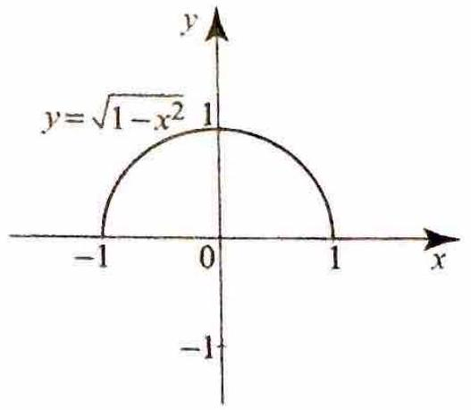
> Figure 1

A parametric form of a curve is thus a representation of the curve by a pair of equations: $x=x(t)$ and $y=y(t)$, where $t$ ranges over a set of real numbers, usually a closed interval $[a, b]$ (see _Figure 2_). Each value of $t$ determines a point $\gamma(t)=(x(t), y(t))$, which traces the curve as $t$ varies.

> [!figure] Figure 2
> 
> 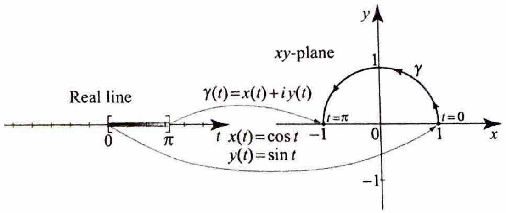
> 
> Figure 2 A parametric interval mapping to a curve.

A curve may have more than one parametrization. For example, the interval $[0,1]$ can be parametrized as $\gamma_{1}(t)=t, 0 \leq t \leq 1$ or $\gamma_{2}(t)=t^{2}, 0 \leq t \leq 1$. Both $\gamma_{1}$ and $\gamma_{2}$ represent the same curve. In our analysis, we will always choose and work with a specific parametrization of the curve. For that reason, it will be convenient to refer to a curve by its parametrization $\gamma(t)$ or simply $\gamma$, even though the curve may have more than one parametrization.

Let $\gamma(t), a \leq t \leq b$, be a parametrization of a curve. As $t$ varies from $a$ to $b$ the point $\gamma(t)$ traces the curve in a specific direction, starting with $\gamma(a)$, the initial point of $\gamma$, and ending at $\gamma(b)$, the terminal point of $\gamma$. For continuous curves, this direction is usually denoted by an arrow on the curve. A curve is closed if $\gamma(a)=\gamma(b)$. For circles and circular arcs, if the arrow points in the counterclockwise direction, we will say that the curve has positive orientation. Curves traversed in the clockwise direction have negative orientation (see _Figure 3_).

> [!figure] Figure 3
> 
> 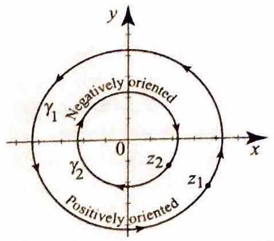
> Figure 3 Negative and positive orientation.

Since $z=x+i y$, it makes sense to adopt the notation $z(t)=x(t)+i y(t)$. In particular, we can write the parametric form of a curve $\gamma$ using complex notation as

$$
\gamma(t)=x(t)+i y(t), \quad a \leq t \leq b,
$$

and think of the curve as the graph of a complex-valued function of a real variable $t$. The following examples illustrate the use of the complex notation.

> [!exercise] Exercise 1: Parametric forms of arcs, circles, and line segments
> 1. Write a parametrization for the positively oriented arc from $e^{i \pi / 6}$ to $e^{i 2 \pi / 3}$. Identify its initial and terminal points.
> 2. Write a parametrization for the positively oriented circle centered at $z_0=2-3 i$ with radius $R=4$. Expand into the form $\gamma(t)=u(t)+i v(t)$.
> 3. Identify the curve parametrized by $\gamma(t)=-1+i+3 e^{i t}, 0 \leq t \leq 2 \pi$. State its center and radius.
> 4. Write a parametrization for the directed line segment $\left[z_1, z_2\right]$ where $z_1=1+i$ and $z_2=4-2 i$. Identify its initial and terminal points.

EXAMPLE 1 Parametric forms of arcs, circles, and line segments (a) The arc in _Figure 4(a)_ is conveniently parametrized by $\gamma(t)=e^{i t}=\cos t+i \sin t$, $\alpha \leq t \leq \beta$. Its initial point is $e^{i \alpha}$ and its terminal point is $e^{i \beta}$.

> [!figure] Figure 4a
> 
> 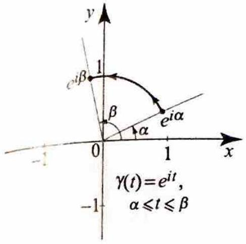
> 
> Figure 4(a) A positively oriented arc with initial point $e^{i \alpha}$ and terminal point $e^{i \beta}$.

(b) The positively oriented circle in _Figure 4(b)_ is parametrized by

$$
\gamma(t)=e^{i t}=\cos t+i \sin t, \quad 0 \leq t \leq 2 \pi .
$$

The circle is a closed curve with initial point $\gamma(0)=1$ and terminal point $\gamma(2 \pi)=1$. 

> [!figure] Figure 4b
> 
> 
> 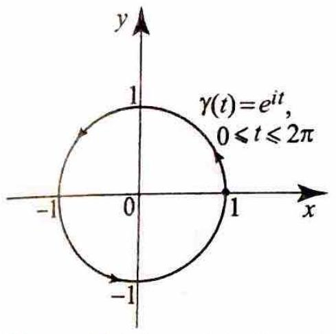
> 
> Figure 4(b) A positively oriented circle.

(c) The circle in _Figure 4(c)_ is centered at $z_{0}$ with radius $R>0$. We obtain its parametrization by dilating and then translating the equation in (b). This gives

$$
\gamma(t)=z_{0}+R e^{i t}=z_{0}+R(\cos t+i \sin t), \quad 0 \leq t \leq 2 \pi .
$$

For example, the equation

$$
\gamma(t)=1+i+2 e^{i t}, \quad 0 \leq t \leq 2 \pi,
$$

represents a circle centered at the point ( 1,1 ), with radius 2 .

> [!figure] Figure 4c
> 
> 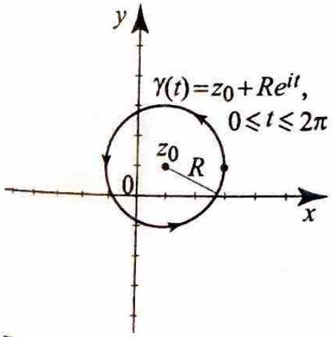
> 
> Figure 4(c) Dilating and then translating a circle.

(d) Let $z_{1}$ and $z_{2}$ be arbitrary complex numbers. A directed line segment $\left[z_{1}, z_{2}\right]$ is the path $\gamma$ over $[0,1]$ defined by

$$
\gamma(t)=(1-t) z_{1}+t z_{2}, \quad 0 \leq t \leq 1 .
$$

Its initial point is $\gamma(0)=z_{1}$ and its terminal point is $\gamma(1)=z_{2}$. $\square$

---

As our next example illustrates, there is definitely an advantage in using the complex notation, especially when the parametric representation of a curve involves trigonometric functions.

> [!exercise] Exercise 2: A hypotrochoid in complex notation
> A hypotrochoid is a curve given in parametric form by
> 
> $$
> x(t)=a \cos t+b \cos \left(\frac{a t}{2}\right), \quad y(t)=a \sin t-b \sin \left(\frac{a t}{2}\right) .
> $$
> 
> Express the equation of the hypotrochoid in complex notation.

> [!figure] Figure 5: For exercise 2
> 
> 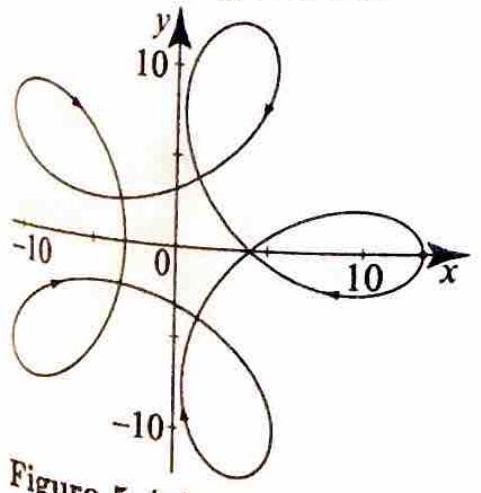
> Figure 5 A hypotrochoid.

---

> [!review] Review 2
> Contents

If $\gamma(t)$ is a curve parametrized by the interval $[a, b]$, the reverse of $\gamma$ is the curve $\gamma_{r}(t)$ (sometimes written $-\gamma$ ) parametrized by the same interval $[a, b]$ and given by

$$
\gamma_{r}(t)=\gamma(b+a-t) .
$$

The reverse of $\gamma$ traces the same set of points as $\gamma$ but in the opposite direction, starting with $\gamma_{r}(a)=\gamma(b)$ and ending with $\gamma_{r}(b)=\gamma(a)$.

The reverse of the directed line segment $\left[z_{1}, z_{2}\right]$ in Example 1(d) is clearly the line segment $\left[z_{2}, z_{1}\right]$ with equation

$$
\gamma_{r}(t)=\gamma(1-t)=t z_{1}+(1-t) z_{2}, \quad 0 \leq t \leq 1 .
$$

The curves in Example 1 are all continuous, as can be seen from their graphs. In fact, these curves have differentiability properties that will be needed when studying integrals along curves. Recall that a curve is given as the graph of a complex-valued function of a real variable. So, in order to study their differentiability properties, we next investigate the derivative of a complex-valued function of a real variable (not to be confused with the derivative of a complex-valued function of a complex variable, $f^{\prime}(z)$ ).

# 3.1.1 Complex-Valued Functions of a Real Variable

> [!review] Review 3
> Contents

Given a complex-valued function of a real variable $f(t)=u(t)+i v(t)$, we define the derivative of $f$ in the usual way by

$$
f^{\prime}(t)=\frac{d}{d t} f(t)=\lim _{h \rightarrow 0} \frac{f(t+h)-f(t)}{h} .
$$

As we did in the proof of Theorem 3, Section 2.2, you can show that $f^{\prime}(t)$ exists if and only if $u^{\prime}(t)$ and $v^{\prime}(t)$ both exist, and

$$
f^{\prime}(t)=u^{\prime}(t)+i v^{\prime}(t)
$$

The derivative of a complex-valued function of a real variable satisfies many properties similar to those of the usual derivative of a real-valued function. In particular, if $f$ and $g$ are complex-valued differentiable functions, $\alpha$ and $\beta$ are complex numbers, then

$$
\begin{aligned}
& (\alpha f(t)+\beta g(t))^{\prime}=\alpha f^{\prime}(t)+\beta g^{\prime}(t), \\
& (f(t) g(t))^{\prime}=f^{\prime}(t) g(t)+g^{\prime}(t) f(t), \\
& \left(\frac{f(t)}{g(t)}\right)^{\prime}=\frac{f^{\prime}(t) g(t)-g^{\prime}(t) f(t)}{g(t)^{2}} \quad(g(t) \neq 0), \\
& (f(g(t)))^{\prime}=f^{\prime}(g(t)) g^{\prime}(t) .
\end{aligned}
$$

We leave the verification of these rules as an exercise.

> [!exercise] Exercise 3: Derivative of $e^{\alpha t}$
> Suppose that $\alpha=a+i b$ is a complex number. Show that $\frac{d}{d t} e^{\alpha t}=\alpha e^{\alpha t}$. Hence we recover the same formula from calculus. In particular, if $\alpha=i \omega$ is purely imaginary, then
> 
> $$
> \frac{d}{d t} e^{i \omega t}=i \omega e^{i \omega t} .
> $$
> 

---

> [!review] Review 4
> Contents

Having stated properties of the derivative of a real-valued function that hold for complex-valued functions of a real variable, we should caution you that not all properties of derivatives that hold in the real case hold in the complex case. Most notably, the mean value property does not hold for complex-valued functions. In the real case, the mean value property states that if $f$ is continuous on $[a, b]$ and differentiable on $(a, b)$, then $f(b)-f(a)= f^{\prime}(c)(b-a)$ for some $c$ in $(a, b)$. This property does not hold for complexvalued functions. To see this, consider $f(x)=e^{i x}$ for $x$ in $[0,2 \pi]$. Then $f$ is continuous on $[0,2 \pi]$ and has a derivative $f^{\prime}(x)=i e^{i x}$ on $(0,2 \pi)$. Also, $f(2 \pi)-f(0)=1-1=0$, but $f^{\prime}(x)$ never vanishes since $\left|f^{\prime}(x)\right|=\left|i e^{i x}\right|= \left|e^{i x}\right|=1$. Hence there is no number $c$ in $(0,2 \pi)$ such that $f(2 \pi)-f(0)= (2 \pi-0) f^{\prime}(c)$, and so the mean value property does not hold (_Figure 6_).

> [!figure] Figure 6
> 
> 
> ![[Pasted image 20260401051005.png|500]]
> 
> Figure $6 f(2 \pi)-f(0)=0$, but $f^{\prime}(x) \neq 0$ for all $x$ in ( $0,2 \pi$ ) showing that the mean value property fails for complex-valued functions.

Before returning to the main topic of curves, we show with an application how complex-valued functions can simplify greatly the solution of problems involving real-valued functions.

> [!exercise] Exercise 4: A second order ordinary differential equation
> Find a particular solution $y_{p}(x)$ of
> 
> $$
> y^{\prime \prime}-2 y^{\prime}+y=\cos 2 x .
> $$
> 
> This is a second order linear differential equation with constant coefficients. It is nonhomogeneous because of the term $\cos 2 x$ (see Appendix A.2).

> [!Note]
> Whereas the solution $y_{p}$ of (11) has to include a sine and a cosine term to account for the derivatives of $\cos 2 x$, in finding a particular solution of (12) we can try $y=A e^{2 i x}$ for the good reason that the derivative of an exponential function is again another exponential function.

---

In the exercises, we illustrate the use of the method of Example 4 in solving other interesting nonhomogeneous differential equations.

# 3.1.2 Contours and Paths

> [!review] Review 5
> Contents

Returning to our discussion of complex-valued functions of a real variable. we introduce the following useful definitions.

> [!definition] Definition 1: Piecewise Continuous and Piecewise Smooth Functions
> A complex-valued function of a real variable $f(t)$ is said to be piecewise continuous on $[a, b]$ if the following hold:
> (i) $f(t)$ exists and is continuous for all but finitely many points in $(a, b)$.
> (ii) At any point $c$ in $(a, b)$ where $f$ fails to be continuous. both the left limit $\lim f(t)$ and the right limit $\lim f(t)$ exist and are finite.
> (iii) At the endpoints, the right limit $\lim _{t, a} f(t)$ and the left limit $\lim _{t \mid b} f(t)$ exist and are finite.
> The function $f(t)$ is said to be piecewise smooth on $[a, b]$ if $f$ and $f^{\prime}$ are both piecewise continuous on $[a, b]$.

If $f$ and $f^{\prime}$ are both continuous on $[a, b]$ we will say that $f$ is smooth or continuously differentiable on $[a, b]$.

We are now in a position to introduce the notion of path, which is fundamental to our development of the theory of integration. Recall that we have referred to a curve by its parametrization $\gamma(t)$. In addition, we will attribute to the curve the analytical properties of the function $\gamma(t)$, such as continuity and differentiability. Thus, when we talk about a continuous curve or a differentiable curve, we have in mind a specific parametrization with these properties.

> [!definition] Definition 2: Path or Contour
> By a path or a contour we mean a continuous piecewise smooth curve $\gamma(t)$ over a closed interval $[a, b]$.

A path $\gamma$ is continuously differentiable or smooth on $[a, b]$ if $\gamma(t)$ and $\gamma^{\prime}(t)$ are continuous on $[a, b]$. Thus, according to Definition 2, a path or a contour $\gamma$ is a finite sequence of continuously differentiable curves, $\gamma_{1}, \gamma_{2}, \ldots, \gamma_{n}$, joined together end-to-end. In this case, it is sometimes convenient to write $\gamma=\left(\gamma_{1}, \gamma_{2}, \ldots, \gamma_{n}\right)$. The path is closed if the initial point of $\gamma_{1}$ is joined to the terminal point of $\gamma_{n}$.

> [!exercise] Exercise 5: Path
> Formulate exercise statement.

The path $\gamma$ in _Figure 7_ is made up of three smooth curves: the line segment $\gamma_{1}= [-2,-1]$; the semi-circle $\gamma_{2}$; and the line segment $\gamma_{3}=[1,2]$. We can parametrize $\gamma$ by the interval [-2,2] as follows:

$$
\gamma(t)= \begin{cases}t & \text { if }-2 \leq t \leq-1, \\ e^{i \frac{\pi}{2}(1-t)} & \text { if }-1 \leq t \leq 1 . \\ t & \text { if } 1 \leq t \leq 2 .\end{cases}
$$

The choice of the interval $[-2,2]$ was just for convenience. Other closed intervals can be used to parametrize $\gamma$.

---

> [!figure] Figure 7: For exercise 5
> 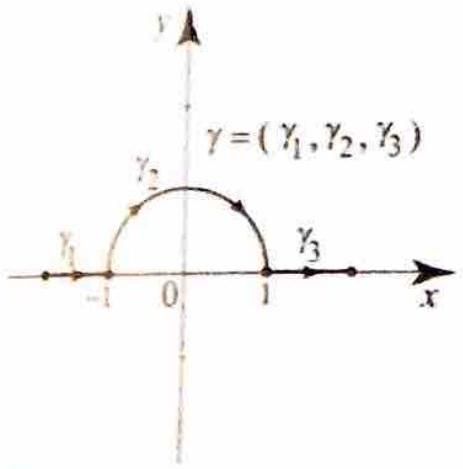
> Figure 7 for Example 5.

---

## EXAMPLE 6 

> [!exercise] Exercise 6: Polygonal paths
> Need to formulate exercise statement

A polygonal path. $\gamma=\left[z_{1}, z_{2}, \ldots, z_{n}\right]$, consists of a directed broken line going through the points $z_{1}, z_{2} \ldots, z_{n}$, with initial point $z_{1}$ and terminal point $z_{n}$. The path is closed if $z_{1}=z_{n}$. As an illustration, let $z_{1}=0, z_{2}=1+i$, and $z_{3}=-1+i$; then $\gamma=\left[z_{1}, z_{2}, z_{3}, z_{1}\right]$ is a closed polygonal path. To find the equation of $\gamma$, we start by finding the equations of the paths $\gamma_{1}, \gamma_{2}$, and $\gamma_{3}$, shown in _Figure 8_. From Example 1(d), we have

$$
\begin{array}{ll}
\gamma_{1}(t)=(1+i) t, & 0 \leq t \leq 1 ; \\
\gamma_{2}(t)=(1-t)(1+i)+t(-1+i)=(1+i)-2 t, & 0 \leq t \leq 1 ; \\
\gamma_{3}(t)=(1-t)(-1+i) . & 0 \leq t \leq 1 .
\end{array}
$$

We can now use these equations to parametrize $\gamma$ over a closed interval, say $[0,1$. This can be done by reparanetrizing $\gamma_{1}$ over $\left[0, \frac{1}{3}\right], \gamma_{2}$ over $\left[\frac{1}{3}, \frac{2}{3}\right], \gamma_{3}$ over $\left[\frac{2}{3}, 1\right]$, and

> [!figure] Figure 8: For Exercise 6
> 
> 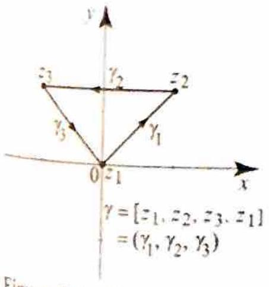
> 
> Eigure 8 for Example 6.

then pasting the three equations to form the path $\gamma$ (_Figure 9_). 

> [!figure] Figure 9
> 
> 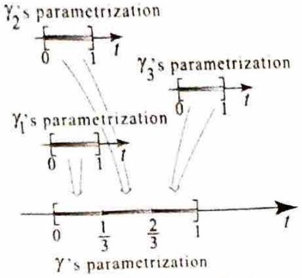
> Figure 9 for Example 6.

To parametrize $\gamma_{1}$ over $\left[0, \frac{1}{3}\right]$, it suffices to change $t$ to $3 t$. This yields

$$
\gamma_{1}(t)=3 t(1+i), \quad 0 \leq t \leq \frac{1}{3} .
$$

To parametrize $\gamma_{2}$ over $\left[\frac{1}{3}, \frac{2}{3}\right]$, we first scale down by changing $t$ to $3 t$,

$$
\gamma_{2}(t)=(1+i)-6 t, \quad 0 \leq t \leq \frac{1}{3} .
$$

We then shift to the right by $\frac{1}{3}$ units and get

$$
\gamma_{2}(t)=(1+i)-6\left(t-\frac{1}{3}\right)=3+i-6 t, \quad \frac{1}{3} \leq t \leq \frac{2}{3} .
$$

For $\gamma_{3}$, we first scale by a factor of $\frac{1}{3}$ and get

$$
\gamma_{3}(t)=(1-3 t)(-1+i), \quad 0 \leq t \leq \frac{1}{3} .
$$

We then shift to the right by $\frac{2}{3}$ units and get

$$
\gamma_{3}(t)=\left(1-3\left(t-\frac{2}{3}\right)\right)(-1+i)=(-1+i)(3-3 t), \quad \frac{2}{3} \leq t \leq 1 .
$$

Pasting the equations together, we obtain

$$
\gamma(t)= \begin{cases}3 t(1+i) & \text { if } 0 \leq t \leq \frac{1}{3}, \\ 3+i-6 t & \text { if } \frac{1}{3} \leq t \leq \frac{2}{3}, \\ (-1+i)(3-3 t) & \text { if } \frac{2}{3} \leq t \leq 1 .\end{cases}
$$

The polygonal path $\gamma$ is clearly continuous with a piecewise continuous derivative. It is thus a path in the sense of Definition 2.

---

Our next example shows two interesting cases of paths.

> [!exercise] Exercise 7: Degenerate and doubly traced paths
> (a) Describe the path given by $\gamma(t)=z_{0}, a \leq t \leq b$.
> (b) Describe the path given by $\gamma_{2}(t)=R e^{i t}, 0 \leq t \leq 4 \pi$, and describe how it is different from $\gamma_{1}(t)=\operatorname{Re}^{i t}, 0 \leq t \leq 2 \pi$.

Solution (a) As $t$ ranges through the interval $[a, b]$, the value of $\gamma(t)$ remains fixed at the point $z_{0}$. Clearly $\gamma(t)$ is continuous and $\gamma^{\prime}(t)=0$ is also continuous, so $\gamma(t)$ is a path, which has degenerated to a single point (_Figure 10_).

> [!figure] Figure 10: For Example 7a
> 
> 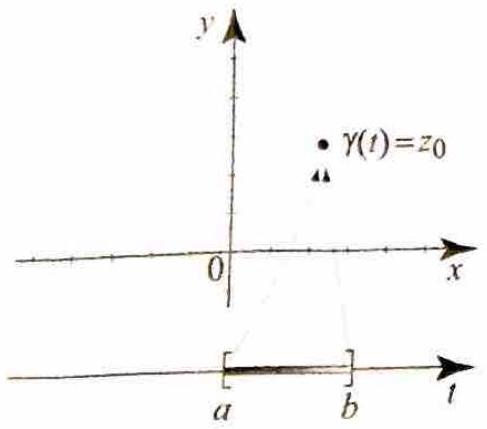
> Figure 10 A path that degenerates to a point.

(b) Points on the path $\gamma_{2}(t)$ are on the circle of radius $R$, centered at the origin.

As $t$ ranges from 0 to $4 \pi, \gamma(t)$ traces around the circle twice. The path is shown in _Figure 11_; double arrows show that the path is traced twice in the counterclockwise direction. 

> [!figure] Figure 11: For Example 7b
> 
> 
> 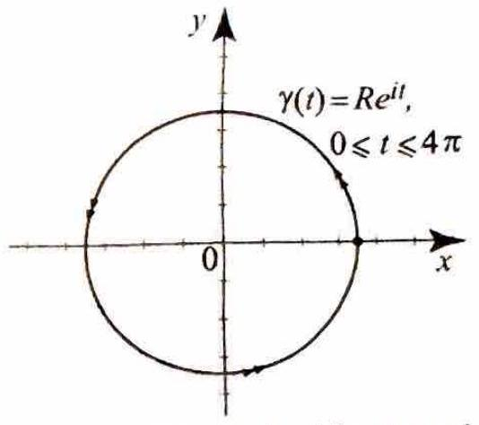
> Figure 11 A doubly traced circle.

The path $\gamma_{1}(t)$ traces around the circle only once. The two paths are not the same but have the same graphs. $\square$

---

As a convention, whenever we refer to a closed path, we mean the path that is traversed only once, unless otherwise stated. As an illustration, we will call the path $\gamma_{2}(t)$ in Example 7(b) the circle of radius $R$, centered at 0 , traversed twice in the positive direction.

Our final example is a differentiable curve that is not a path.

> [!exercise] Exercise 8: A curve that is not a path
> Need to formulate exercise statement.

Let $f(t)=t^{2} \sin \frac{1}{t}$ for $t \neq 0$ and $f(0)=0$, and define a curve $\gamma(t)=t+i f(t)$, where $-\pi \leq t \leq \pi$. The graph of $\gamma$ is simply the graph of $f(t)$ over the interval $[-\pi, \pi]$. For $t \neq 0$, we have $f^{\prime}(t)=2 t \sin \frac{1}{t}-\cos \frac{1}{t}$, and $f^{\prime}(0)=0$ (use the definition of the derivative and the squeeze theorem). So $f(t)$ is continuous and differentiable on the closed interval $[-\pi, \pi]$. But $f^{\prime}(t)$ is discontinuous at 0 and neither the left nor the right limits of $f^{\prime}(t)$ exist at 0 (see Exercise 1, Section 3.9). So $\gamma^{\prime}(t)$ is not piecewise continuous in $[-\pi, \pi]$ and hence $\gamma(t)$ is not a path. The graphs of $f$ and $f^{\prime}$ are shown in _Figure 12_. Note the discontinuity at 0 of $f^{\prime}(t)$.

> [!figure] Figure 12
> 
> 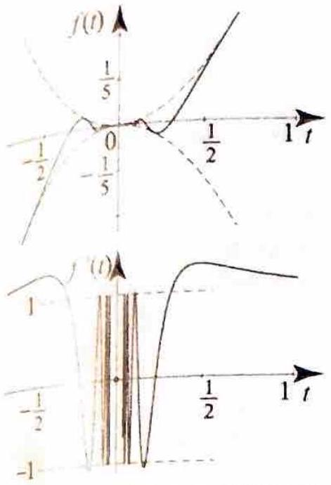
> Figure $12 f(t)$ is continuous and even differentiable, but its graph is not a path.

---

## Exercises 3.1

> [!exercise] Exercise 9
> 
> 
> In problems 1-14, a curve is given. Parametrize it over a suitable interval $[a, b]$ and plot the curve when the graph is not given.
> 
> 1. The line segment with initial point $z_{1}=1+i$ and terminal point $z_{2}=-1-2 i$.
> 2. The line segment through the origin as initial point and terminal point $z=e^{i \frac{\pi}{3}}$.
> 3. The counterclockwise circle with center at $3 i$ and radius 1 .
> 4. The clockwise circle with center at $-2-i$ and radius 3 .
> 5. The positively oriented arc on the unit circle such that $-\frac{\pi}{4} \leq \arg z \leq \frac{\pi}{4}$.
> 6. The negatively oriented arc on the unit circle such that $-\frac{\pi}{4} \leq \arg z \leq \frac{\pi}{4}$.
> 7. The directed line segment $\left[z_{1}, z_{2}, z_{3}, z_{1}\right]$ where $z_{1}=0, z_{2}=i$, and $z_{3}=-1$.
> 8. The directed line segment $\left[z_{1}, z_{2}, z_{3}, z_{4}\right]$ where $z_{1}=1, z_{2}=2, z_{3}=i$, and $z_{4}=2 i$.
> 9. The contour in Figure 13.
> 
> 
> > [!figure] Figure 13
> > 
> > 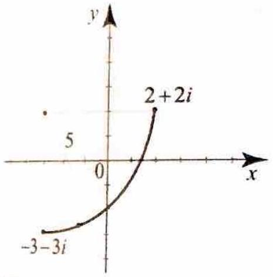
> > Figure 13 Arc of a circle with center at $-3+2 i$ and radius 5 .
> 
> 
> 10. The contour in _Figure 14_.
> 
> 
> > [!figure] Figure 14
> > 
> > 
> > 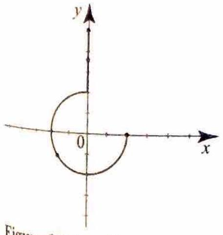
> > Figure 14 Arc of a circle with center at 0 and radius 2 .
> 
> 
> 
> 11. The contour in _Figure 15_.
> 
> > [!figure] Figure 15
> > 
> > ![[Screenshot 2026-04-01 at 5.42.59 AM.png]]
> > 
> > Figure 15 Arc of a parabola for Exercise 11.
> 
> 
> 
> 12. The reverse of the contour in Figure 13.
> 13. The reverse of the contour in Figure 14.
> 14. The reverse of the contour in Figure 15.
> 
> 
> 

> [!exercise] Exercise 10
> In problems 15-18, plot the given path.
> 15. $\gamma(t)=t e^{-i t}, 0 \leq t \leq 2 \pi$.
> 16. $\gamma(t)=2 \cos t+i \sin t, 0 \leq t \leq 2 \pi$.
> 17. $\gamma(t)=t+i \sin (\pi t), 0 \leq t \leq 1$.
> 18. $\gamma(t)=t^{2}+i t,-3 \leq t \leq 3$.

> [!exercise] Exercise 11
> In problems 19 24, find the derivative of the given function.
> 19. $f(t)=t e^{-i t}$.
> 20. $f(t)=e^{2 i t^{2}}$.
> 21. $f(t)=(2+i) \cos (3 i t)$.
> 22. $f(t)=\frac{2+i+t}{-i-2 t}$.
> 23. $f(t)=\left(\frac{t+i}{t-i}\right)^{2}$.
> 24. $f(t)=\log (i t)$.

> [!exercise] Exercise 12
> In problemss 25-28, find a particular solution of the given differential equation. Use the technique of Example 4. (Hint for Exercise 27: Think of an exponential function whose real part is $e^{t} \cos t$.)
> 25. $y^{\prime \prime}+y^{\prime}+y=\cos t$.
> 26. $y^{\prime \prime}+y=\sin 3 t$.
> 27. $y^{\prime \prime}-y=e^{t} \cos t$.
> 28. $y^{\prime \prime}+y^{\prime}+y=t \cos t$.

> [!exercise] Exercise 13
> 
> **Using complex methods.** Very often when we use complex methods to solve a real problem, we end up solving two problems: one associated with the real part of the solution and one with its imaginary part. For example, when we solved the differential equation $y^{\prime \prime}-2 y^{\prime}+y=\cos 2 x$ in Example 4, we also obtained the solution to $y^{\prime \prime}-2 y^{\prime}+y=\sin 2 x$, as can be seen from taking the imaginary part of $y=\left(-\frac{3}{25}+i \frac{4}{25}\right) e^{2 i x}$, which is the solution of $y^{\prime \prime}-2 y^{\prime}+y=e^{i 2 x}$.
> 
> 
> In problemss 29-30, you are given a real differential equation. Find a particular solution by envisioning the equation as the real or imaginary part of a complex differential equation. Also, state the corresponding problem and a particular solution for the other part of the complex differential equation.
> 29. $y^{\prime \prime}-2 y^{\prime}-3 y=\cos 4 t$.
> 30. $y^{\prime \prime}+y^{\prime}+y=3+\sin 2 t$.
> 
> 

> [!exercise] Exercise 14
> 
> In problems 31-34, a curve is given in parametric form. (a) Find the equation of the curve in complex form. (b) Plot the curve for specific values of $a$ and $b$ of your choice.
> 31. A hypocycloid $(a>b)$
> 
> $$
> \begin{aligned}
> & x(t)=(a-b) \cos t+b \cos \left(\frac{a-b}{b} t\right), \\
> & y(t)=(a-b) \sin t-b \sin \left(\frac{a-b}{b} t\right) .
> \end{aligned}
> $$
> 
> 32. An epitrochoid
> 
> $$
> \begin{gathered}
> x(t)=a \cos t-b \cos \left(\frac{a t}{2}\right) \\
> y(t)=a \sin t-b \sin \left(\frac{a t}{2}\right)
> \end{gathered}
> $$
> 
> 33. An epicycloid
> 
> $$
> \begin{aligned}
> & x(t)=(a+b) \cos t-b \cos \left(\frac{a+b}{b} t\right), \\
> & y(t)=(a+b) \sin t-b \sin \left(\frac{a+b}{b} t\right) .
> \end{aligned}
> $$
> 
> 34. A trochoid
> 
> $$
> \begin{gathered}
> x(t)=a t-b \sin t \\
> y(t)=a-b \cos t
> \end{gathered}
> $$
> 