> [!aside]
> **Topics to Review**
> 
> The definition of path in Section 3.1 is based on the parametric form of curves from calculus. The definition of path integral in Section 3.2 is based on the definition of definite integrals as a limit of Riemann sums, from calculus. A good understanding of these notions and the fundamental theorem of calculus are required. We will also use basic properties of continuous functions in proofs. (For example, if $f$ is continuous on $[a, b]$, then $f$ attains its maximum and minimum values in $[a, b]$.)
> 
> **Looking Ahead**
> 
> Sections 3.1 and 3.2 contain essential definitions and properties pertaining to path integrals. They should be covered in detail. Section 3.3 gives necessary and sufficient conditions for independence of path. These statements are important on a theoretical side, but not very useful from a practical side. So, if proofs are not stressed, this section can be skipped or covered quickly. Section 3.4 is the heart of the subject. A thorough treatment is required. The mathematical definition of deformation of path in Section 3.4 can be skipped. Sections 3.6 and 3.7 are very important. They include striking applications of Cauchy's theorem. They should be covered thoroughly. Section 3.8 is optional; it continues our parallel study of harmonic functions and Dirichlet problems. Section 3.9 contains one theoretical result and can be omitted entirely without affecting the continuity of the course.


> [!quote]  -Augustin Louis Cauchy
> There is no let up! No end to it! ... Innumerable calculations. Endless fighting. Signs. Formulas. Theorems besetting me from dawn to dusk. 


Having studied the derivative in Chapter 2, our next step is to study the integral of a function of a complex variable. If $f(z)$ is defined on a subset $\Omega$ of $\mathbb{C}$ and $z_{1}$ and $z_{2}$ are points in $\Omega$, how can we define the integral of $f$ from $z_{1}$ to $z_{2}$ ? First we must define the notion of path $\gamma$ in $\Omega$ from $z_{1}$ to $z_{2}$ (Section 3.1); then we will define the integral over this path (Section 3.2), denoted by $\int_{\gamma} f(z) d z$. In Section 3.2, an expression of this integral is given in terms of the usual Riemann integral from calculus, but applied to complex-valued functions on an interval $[a, b]$.

The most important question in this chapter concerns the independence of path: When does $\int_{\gamma} f(z) d z$ depend only on $z_{1}$ and $z_{2}$ and not on $\gamma$ ? The answer to this question is provided by Cauchy's theorem (Theorem 2, Section 3.4). Cauchy's theorem is to complex analysis what the fundamental theorem of calculus is to calculus. The discussion of Cauchy's theorem in Section 3.4 will lead us to important topics such as simple connectedness of regions in $\mathbb{C}$. We will derive very useful versions of Cauchy's theorem for simply and multiply connected regions.

The proof of Cauchy's theorem is nontrivial. It will be presented in complete detail in Section 3.5.

In Sections 3.6 and 3.7 we start the applications of Cauchy's theorem and derive Cauchy's generalized integral formula, which is the basis for all the applications that will follow. We illustrate the power of this theory by giving a simple proof of the fundamental theorem of algebra (Section 3.7) and by deriving various striking properties of analytic functions, including the mean value property and the maximum modulus principle.

In Section 3.8, we use the theory of analytic functions to study harmonic functions and the solution of Dirichlet problems. In particular, we will give a simple derivation of the famous Poisson integral formula, by using a simple change of variables and the mean value property of analytic functions.

# 3.1 Contours and Paths in the Complex Plane


> [!review] Review 1
> 1. Define the parametric form of a curve. What does each value of $t$ determine, and over what set does $t$ typically range?
> 2. Curve Parametrization.
> a. Give a parametrization of the semicircle $y = \sqrt{1 - x^2}$, $-1 \leq x \leq 1$. 
> b. Explain how you would plot this parametric curve form by hand. Create a table of values that can be used to plot the parametric curve by hand.
> c. Use python to plot the curve.
> d. Write mathematica code to plot the curve.
> e. Write another mathematica code that uses manipulate to show the curve being traced.
> 3. Give two distinct parametrizations of the interval $[0, 1]$, each with domain $0 \leq t \leq 1$.
> 4. A curve may have more than one parametrization. By convention, how is a curve referred to, and why is this convention adopted?    
> 5. Let $\gamma(t)$, $a \leq t \leq b$, be a parametrization of a curve. Define the initial point of $\gamma$, the terminal point of $\gamma$, and what it means for a curve to be closed.
> 6. Define positive and negative orientation for circles and circular arcs.
> 7. Write the complex notation for the parametric form of a curve $\gamma$ on $a \leq t \leq b$, and describe what kind of function this makes $\gamma$.


##### solution

##### problem 1

The parametric form of a curve is a representation of the coordinates of points on the curve as functions of a real parameter $t$. In the plane, one writes

$$
x=x(t), \qquad y=y(t),
$$

for $t$ in some interval

$$
a\le t\le b.
$$

Each value of $t$ determines one point on the curve, namely

$$
(x(t),y(t)).
$$

Thus a curve is traced by allowing $t$ to vary over an interval of real numbers, usually a closed interval $[a,b]$.

##### problem 2(a)

For the upper semicircle

$$
y=\sqrt{1-x^2},\qquad -1\le x\le 1,
$$

a standard parametrization is

$$
x=\cos t,\qquad y=\sin t,\qquad 0\le t\le \pi.
$$

Indeed,

$$
x^2+y^2=\cos^2 t+\sin^2 t=1,
$$

and since

$$
0\le t\le \pi,
$$

we have

$$
\sin t\ge 0,
$$

so the point lies on the upper semicircle.

##### problem 2(b)

To plot this parametrized curve by hand, choose several values of $t$ between $0$ and $\pi$, compute the corresponding values of $x=\cos t$ and $y=\sin t$, plot the points, and then connect them in the order of increasing $t$.

A convenient table is

$$
\begin{array}{c|c|c}
t & x=\cos t & y=\sin t \\ \hline
0 & 1 & 0 \\
\frac{\pi}{6} & \frac{\sqrt3}{2} & \frac12 \\
\frac{\pi}{4} & \frac{\sqrt2}{2} & \frac{\sqrt2}{2} \\
\frac{\pi}{3} & \frac12 & \frac{\sqrt3}{2} \\
\frac{\pi}{2} & 0 & 1 \\
\frac{2\pi}{3} & -\frac12 & \frac{\sqrt3}{2} \\
\frac{3\pi}{4} & -\frac{\sqrt2}{2} & \frac{\sqrt2}{2} \\
\frac{5\pi}{6} & -\frac{\sqrt3}{2} & \frac12 \\
\pi & -1 & 0
\end{array}
$$

These points begin at $(1,0)$, rise to $(0,1)$, and end at $(-1,0)$.

##### problem 2(c)


```python title:""
import numpy as np
import matplotlib.pyplot as plt

t = np.linspace(0, np.pi, 400)
x = np.cos(t)
y = np.sin(t)

plt.figure(figsize=(5, 5))
plt.plot(x, y, linewidth=2)
plt.axhline(0, color="black", linewidth=0.8)
plt.axvline(0, color="black", linewidth=0.8)
plt.gca().set_aspect("equal", adjustable="box")
plt.xlim(-1.1, 1.1)
plt.ylim(-0.1, 1.1)
plt.title("Upper Semicircle")
plt.xlabel("x")
plt.ylabel("y")
plt.grid(True, alpha=0.3)
plt.show()
```

##### problem 2(d)


```Mathematica title:""
ParametricPlot[
  {Cos[t], Sin[t]},
  {t, 0, Pi},
  AxesLabel -> {"x", "y"},
  PlotRange -> {{-1.1, 1.1}, {-0.1, 1.1}},
  AspectRatio -> Automatic
]
```

##### problem 2(e)


```Mathematica title:""
Manipulate[
  Column[
    {
      Graphics[
        {
          Blue,
          Thick,
          Line@Table[{Cos[t], Sin[t]}, {t, 0, s, Pi/200}],
          Red,
          PointSize[Large],
          Point[{Cos[s], Sin[s]}]
        },
        PlotRange -> {{-1.1, 1.1}, {-0.1, 1.1}},
        Axes -> True,
        AxesLabel -> {"x", "y"},
        AspectRatio -> Automatic
      ],
      Row[
        {
          "x = ",
          NumberForm[Cos[s], {6, 4}],
          ", y = ",
          NumberForm[Sin[s], {6, 4}]
        }
      ]
    }
  ],
  {s, 0, Pi}
]
```

##### problem 3

Two distinct parametrizations of the interval $[0,1]$ with domain $0\le t\le 1$ are

$$
\gamma_1(t)=t,\qquad 0\le t\le 1,
$$

and

$$
\gamma_2(t)=t^2,\qquad 0\le t\le 1.
$$

Both trace the same interval $[0,1]$, but they do so at different speeds.

##### problem 4

By convention, a curve is referred to by its parametrization. This convention is adopted because the same geometric set of points may be traced in different ways, with different starting points, speeds, and orientations. The parametrization records not only the set of points but also how the curve is traversed.

##### problem 5

If

$$
\gamma(t),\qquad a\le t\le b,
$$

is a parametrization of a curve, then the initial point of $\gamma$ is

$$
\gamma(a),
$$

and the terminal point of $\gamma$ is

$$
\gamma(b).
$$

The curve is said to be closed if its initial and terminal points are the same, that is, if

$$
\gamma(a)=\gamma(b).
$$

##### problem 6

For a circle or circular arc, positive orientation means that the curve is traced counterclockwise as viewed in the complex plane. Negative orientation means that the curve is traced clockwise.

##### problem 7

If

$$
x=x(t),\qquad y=y(t),\qquad a\le t\le b,
$$

is the parametric form of a curve, then its complex notation is

$$
\gamma(t)=x(t)+iy(t),\qquad a\le t\le b.
$$

Thus $\gamma$ is a complex-valued function of a real variable, defined on the interval $[a,b]$.


+++++


> [!exercise] parametrization of the upper semicircle
> 
> 1. Find a parametrization of the upper semicircle $y=\sqrt{1-x^2},-1 \leq x \leq 1$, in complex notation. Identify the initial point, terminal point, and orientation.


##### solution

For the upper semicircle $y=\sqrt{1-x^2}$, $-1\le x\le 1$, a standard parametrization is

$$
x=\cos t,\qquad y=\sin t,\qquad 0\le t\le \pi.
$$

In complex notation, this becomes

$$
\gamma(t)=x(t)+iy(t)=\cos t+i\sin t=e^{it},
\qquad
0\le t\le \pi.
$$

To check that this really parametrizes the upper semicircle, note first that $x(t)=\cos t$, so because $0\le t\le \pi$, we have $-1\le \cos t\le 1$, hence $-1\le x(t)\le 1$.

Also,

$$
\begin{aligned}
1-x(t)^2
&=1-\cos^2 t \\
&=\sin^2 t.
\end{aligned}
$$

Therefore $\sqrt{1-x(t)^2}=\sqrt{\sin^2 t}=|\sin t|$. Since $0\le t\le \pi$, we have $\sin t\ge 0$, so $|\sin t|=\sin t$. Because $y(t)=\sin t$, it follows that $y(t)=\sqrt{1-x(t)^2}$. Thus the point $(x(t),y(t))$ lies on the curve $y=\sqrt{1-x^2}$ with $-1\le x\le 1$.

The initial point is $\gamma(0)=e^{i\cdot 0}=e^0=1$, and the terminal point is $\gamma(\pi)=e^{i\pi}=-1$.

To describe the orientation, observe that $\gamma(0)=1$, $\gamma\!\left(\frac{\pi}{2}\right)=e^{i\pi/2}=i$, and $\gamma(\pi)=-1$. So as $t$ increases from $0$ to $\pi$, the point moves from $1$ to $i$ to $-1$, which is motion along the upper semicircle in the counterclockwise direction.

Therefore the orientation is counterclockwise, that is, positive orientation.


++++


> [!exercise] multiple parametrizations of $[ 0,1 ]$
> 
> 1. Verify that $\gamma_1(t)=t$ and $\gamma_2(t)=t^2$, both for $0 \leq t \leq 1$, parametrize the same directed segment $[0,1] \subset \mathbb{R}$. Identify the initial and terminal points of each, and describe in what sense the two parametrizations differ even though they represent the same curve.


##### solution

For

$$
\gamma_1(t)=t,
\qquad
0\le t\le 1,
$$

we have $\gamma_1(t)\in [0,1]$ for every $t\in [0,1]$, and as $t$ runs from $0$ to $1$, the value of $\gamma_1(t)$ runs through every point of the interval $[0,1]$ exactly once.

For

$$
\gamma_2(t)=t^2,
\qquad
0\le t\le 1,
$$

we again have $\gamma_2(t)\in [0,1]$ for every $t\in [0,1]$, because squaring a number in $[0,1]$ keeps it in $[0,1]$. Also, if $x\in [0,1]$, then

$$
t=\sqrt{x}
$$

satisfies $0\le t\le 1$, and

$$
\gamma_2(t)=t^2=(\sqrt{x})^2=x.
$$

So $\gamma_2$ also traces every point of the interval $[0,1]$.

Thus both $\gamma_1$ and $\gamma_2$ parametrize the same directed segment $[0,1]\subset \mathbb{R}$.

For $\gamma_1$, the initial point is

$$
\gamma_1(0)=0
$$

and the terminal point is

$$
\gamma_1(1)=1.
$$

For $\gamma_2$, the initial point is

$$
\gamma_2(0)=0
$$

and the terminal point is

$$
\gamma_2(1)=1.
$$

So both parametrizations have the same initial point and the same terminal point, and both move from $0$ to $1$.

They differ in the way the interval is traced. The parametrization $\gamma_1(t)=t$ moves at constant speed, since

$$
\gamma_1'(t)=1.
$$

The parametrization $\gamma_2(t)=t^2$ does not move at constant speed, since

$$
\gamma_2'(t)=2t.
$$

At the beginning, when $t=0$, the speed is $0$, and as $t$ increases the speed increases. So $\gamma_2$ starts more slowly than $\gamma_1$ and then speeds up, even though both represent the same directed curve.


++++


Exercise (in-text example: multiple parametrizations of [ 0,1 ])
1. Verify that $\gamma_1(t)=t$ and $\gamma_2(t)=t^2$, both for $0 \leq t \leq 1$, parametrize the same directed segment $[0,1] \subset \mathbb{R}$. Identify the initial and terminal points of each, and describe in what sense the two parametrizations differ even though they represent the same curve.


You may recall the notion of a curve from calculus as being the graph of a
function $y=f(x)$. More generally, you may recall the parametric form of a curve, which represents a curve by expressing $x$ and $y$ as functions of a third variable $t$. For example, the semi-circle $y=\sqrt{1-x^2},-1 \leq x \leq 1$, in _Figure 1_ can be parametrized by 
$$
x=x(t)=\cos t, \quad y=y(t)=\sin t, \quad 0 \leq t \leq \pi .
$$


> [!figure] Figure 1
> 
> 
> Figure 1


A parametric form of a curve is thus a representation of the curve by a pair of equations: $x=x(t)$ and $y=y(t)$, where $t$ ranges over a set of real numbers, usually a closed interval $[a, b]$ (see _Figure 2_). Each value of $t$ determines a point $\gamma(t)=(x(t), y(t))$, which traces the curve as $t$ varies.


> [!figure] Figure 2
> 
> 
> 
> Figure 2 A parametric interval mapping to a curve.


A curve may have more than one parametrization. For example, the interval $[0,1]$ can be parametrized as $\gamma_{1}(t)=t, 0 \leq t \leq 1$ or $\gamma_{2}(t)=t^{2}, 0 \leq t \leq 1$. Both $\gamma_{1}$ and $\gamma_{2}$ represent the same curve. In our analysis, we will always choose and work with a specific parametrization of the curve. For that reason, it will be convenient to refer to a curve by its parametrization $\gamma(t)$ or simply $\gamma$, even though the curve may have more than one parametrization.

Let $\gamma(t), a \leq t \leq b$, be a parametrization of a curve. As $t$ varies from $a$ to $b$ the point $\gamma(t)$ traces the curve in a specific direction, starting with $\gamma(a)$, the initial point of $\gamma$, and ending at $\gamma(b)$, the terminal point of $\gamma$. For continuous curves, this direction is usually denoted by an arrow on the curve. A curve is closed if $\gamma(a)=\gamma(b)$. For circles and circular arcs, if the arrow points in the counterclockwise direction, we will say that the curve has positive orientation. Curves traversed in the clockwise direction have negative orientation (see _Figure 3_).


> [!figure] Figure 3
> 
> 
> Figure 3 Negative and positive orientation.


Since $z=x+i y$, it makes sense to adopt the notation $z(t)=x(t)+i y(t)$. In particular, we can write the parametric form of a curve $\gamma$ using complex notation as

$$
\gamma(t)=x(t)+i y(t), \quad a \leq t \leq b,
$$


and think of the curve as the graph of a complex-valued function of a real variable $t$. The following examples illustrate the use of the complex notation.


> [!exercise] Exercise 1: Parametric forms of arcs, circles, and line segments
> 1. Write a parametrization for the positively oriented arc from $e^{i \pi / 6}$ to $e^{i 2 \pi / 3}$. Identify its initial and terminal points.
> 2. Write a parametrization for the positively oriented circle centered at $z_0=2-3 i$ with radius $R=4$. Expand into the form $\gamma(t)=u(t)+i v(t)$.
> 3. Identify the curve parametrized by $\gamma(t)=-1+i+3 e^{i t}, 0 \leq t \leq 2 \pi$. State its center and radius.
> 4. Write a parametrization for the directed line segment $\left[z_1, z_2\right]$ where $z_1=1+i$ and $z_2=4-2 i$. Identify its initial and terminal points.


##### solution

##### problem 1

The standard parametrization of a positively oriented arc on the unit circle is $\gamma(t)=e^{it}$, with $t$ running through the corresponding interval of angles. Since the initial point is $e^{i\pi/6}$ and the terminal point is $e^{i2\pi/3}$, a parametrization is

$$
\gamma(t)=e^{it},
\qquad
\frac{\pi}{6}\le t\le \frac{2\pi}{3}.
$$

The initial point is $\gamma\!\left(\frac{\pi}{6}\right)=e^{i\pi/6}$, and the terminal point is $\gamma\!\left(\frac{2\pi}{3}\right)=e^{i2\pi/3}$.

> [!figure] Python figure for Problem 1
> 
> 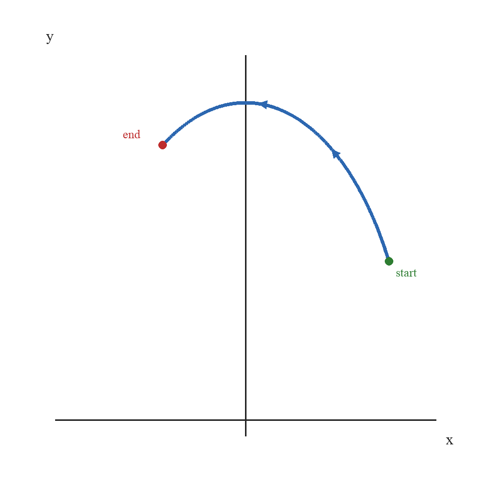
> 
> The Python rendering is intentionally minimal: it shows the geometry and the counterclockwise direction without trying to duplicate every annotation from the text.

A Mathematica plot of this arc, with an arrow showing the positive orientation, is:

```Mathematica
Graphics[
  {
    Blue,
    AbsoluteThickness[3],
    Arrowheads[{{0.055, 0.3}, {0.055, 0.55}, {0.055, 0.8}}],
    Arrow@Table[{Cos[t], Sin[t]}, {t, Pi/6, 2 Pi/3, (2 Pi/3 - Pi/6)/240}],
    Green,
    PointSize[Large],
    Point[{Cos[Pi/6], Sin[Pi/6]}],
    Red,
    PointSize[Large],
    Point[{Cos[2 Pi/3], Sin[2 Pi/3]}]
  },
  PlotRange -> {{-1.2, 1.2}, {-0.1, 1.2}},
  Axes -> True,
  AxesLabel -> {"x", "y"},
  AxesStyle -> Directive[Black, AbsoluteThickness[1.2]],
  LabelStyle -> Directive[Black, 14],
  PlotRangePadding -> Scaled[0.04],
  ImageSize -> 340,
  Background -> White,
  AspectRatio -> Automatic
]
```

The following Python code generates the embedded figure. The helper functions defined here will also be reused in Problems 2--4.

```python
import math
from pathlib import Path

import numpy as np
from PIL import Image, ImageDraw, ImageFont

W, H = 980, 980
M = 110
BG = "white"
AX = (0, 0, 0)
BLUE = (44, 103, 176)
GREEN = (46, 125, 50)
RED = (190, 45, 45)
BLACK = (45, 45, 45)

outdir = Path("images")
outdir.mkdir(exist_ok=True)

font = ImageFont.truetype(
    "/System/Library/Fonts/Supplemental/Times New Roman.ttf", 30
)
small = ImageFont.truetype(
    "/System/Library/Fonts/Supplemental/Times New Roman.ttf", 24
)


def make_canvas(xmin, xmax, ymin, ymax):
    image = Image.new("RGB", (W, H), BG)
    draw = ImageDraw.Draw(image)

    def pt(x, y):
        px = M + (x - xmin) / (xmax - xmin) * (W - 2 * M)
        py = H - M - (y - ymin) / (ymax - ymin) * (H - 2 * M)
        return px, py

    if xmin <= 0 <= xmax:
        draw.line([pt(0, ymin), pt(0, ymax)], fill=AX, width=3)
    if ymin <= 0 <= ymax:
        draw.line([pt(xmin, 0), pt(xmax, 0)], fill=AX, width=3)

    draw.text((W - M + 20, H - M - 10), "x", fill=AX, font=font)
    draw.text((M - 18, M - 55), "y", fill=AX, font=font)
    return image, draw, pt


def draw_arrowhead(draw, p_prev, p_tip, color, head=20,
                   half_angle=math.pi / 7):
    dx = p_tip[0] - p_prev[0]
    dy = p_tip[1] - p_prev[1]
    angle = math.atan2(dy, dx)
    left = (
        p_tip[0] - head * math.cos(angle - half_angle),
        p_tip[1] - head * math.sin(angle - half_angle),
    )
    right = (
        p_tip[0] - head * math.cos(angle + half_angle),
        p_tip[1] - head * math.sin(angle + half_angle),
    )
    draw.polygon([p_tip, left, right], fill=color)


def draw_point(draw, p, color, r=10):
    x, y = p
    draw.ellipse((x - r, y - r, x + r, y + r), fill=color, outline=color)


def add_arrowheads(draw, points, positions, color):
    n = len(points)
    for fraction in positions:
        i = max(1, min(n - 1, int(fraction * (n - 1))))
        draw_arrowhead(draw, points[i - 1], points[i], color)


image, draw, pt = make_canvas(-1.15, 1.15, -0.05, 1.15)
t = np.linspace(np.pi / 6, 2 * np.pi / 3, 500)
curve = [pt(float(np.cos(s)), float(np.sin(s))) for s in t]
draw.line(curve, fill=BLUE, width=7)
add_arrowheads(draw, curve, [0.32, 0.62], BLUE)

z_initial = np.exp(1j * np.pi / 6)
z_terminal = np.exp(1j * 2 * np.pi / 3)
draw_point(draw, pt(z_initial.real, z_initial.imag), GREEN)
draw_point(draw, pt(z_terminal.real, z_terminal.imag), RED)

draw.text(
    (pt(z_initial.real, z_initial.imag)[0] + 18,
     pt(z_initial.real, z_initial.imag)[1] + 10),
    "start",
    fill=GREEN,
    font=small,
)
draw.text(
    (pt(z_terminal.real, z_terminal.imag)[0] - 80,
     pt(z_terminal.real, z_terminal.imag)[1] - 36),
    "end",
    fill=RED,
    font=small,
)

image.save(outdir / "exercise1_problem1_python.png")
```

##### problem 2

A positively oriented circle centered at $z_0$ with radius $R$ is parametrized by $\gamma(t)=z_0+Re^{it}$ for $0\le t\le 2\pi$. Here $z_0=2-3i$ and $R=4$, so

$$
\gamma(t)=2-3i+4e^{it},
\qquad
0\le t\le 2\pi.
$$

Now expand $e^{it}$:

$$
\begin{aligned}
\gamma(t)
&=2-3i+4(\cos t+i\sin t) \\
&=2+4\cos t+i(-3+4\sin t).
\end{aligned}
$$

Thus in the form $\gamma(t)=u(t)+iv(t)$, we have

$$
u(t)=2+4\cos t,
\qquad
v(t)=-3+4\sin t.
$$

> [!figure] Python figure for Problem 2
> 
> 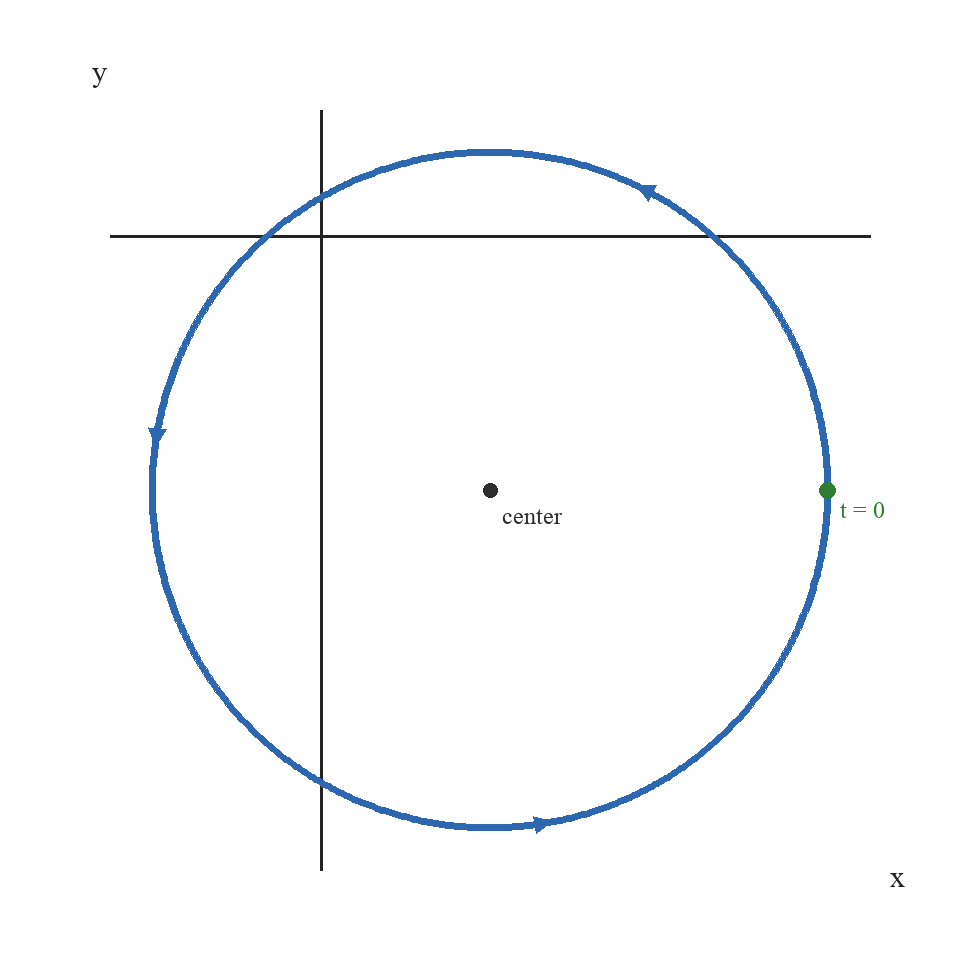
> 
> The Python rendering keeps only the center, one distinguished point, and the orientation.

A Mathematica plot of this circle is:

```Mathematica
Graphics[
  {
    Blue,
    AbsoluteThickness[3],
    Arrowheads[{{0.05, 0.18}, {0.05, 0.48}, {0.05, 0.78}}],
    Arrow@Table[{2 + 4 Cos[t], -3 + 4 Sin[t]}, {t, 0, 2 Pi, 2 Pi/300}],
    Black,
    PointSize[Medium],
    Point[{2, -3}],
    Green,
    PointSize[Large],
    Point[{6, -3}],
    Red,
    PointSize[Large],
    Point[{2, 1}]
  },
  PlotRange -> {{-2.8, 6.8}, {-7.8, 1.8}},
  Axes -> True,
  AxesLabel -> {"x", "y"},
  AxesStyle -> Directive[Black, AbsoluteThickness[1.2]],
  LabelStyle -> Directive[Black, 14],
  PlotRangePadding -> Scaled[0.04],
  ImageSize -> 340,
  Background -> White,
  AspectRatio -> Automatic
]
```

Using the same helper functions as in Problem 1, the following Python code generates the embedded figure:

```python
image, draw, pt = make_canvas(-2.5, 6.5, -7.5, 1.5)
t = np.linspace(0, 2 * np.pi, 600)
curve = [pt(2 + 4 * np.cos(s), -3 + 4 * np.sin(s)) for s in t]
draw.line(curve, fill=BLUE, width=7)
add_arrowheads(draw, curve, [0.18, 0.48, 0.78], BLUE)

draw_point(draw, pt(2, -3), BLACK, r=8)
draw_point(draw, pt(6, -3), GREEN)

draw.text((pt(2, -3)[0] + 16, pt(2, -3)[1] + 12),
          "center", fill=BLACK, font=small)
draw.text((pt(6, -3)[0] + 14, pt(6, -3)[1] + 10),
          "t = 0", fill=GREEN, font=small)

image.save(outdir / "exercise1_problem2_python.png")
```

##### problem 3

We are given

$$
\gamma(t)=-1+i+3e^{it},
\qquad
0\le t\le 2\pi.
$$

This has the standard form $\gamma(t)=z_0+Re^{it}$ with $z_0=-1+i$ and $R=3$. Therefore the curve is the positively oriented circle centered at $-1+i$ with radius $3$.

> [!figure] Python figure for Problem 3
> 
> 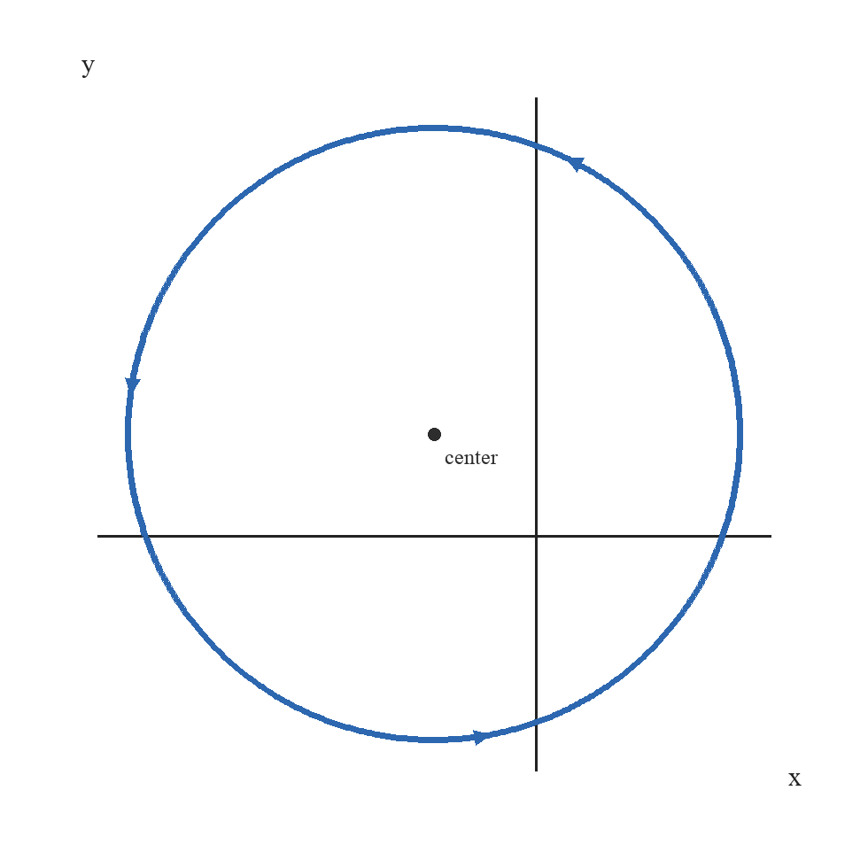
> 
> The Python rendering is stripped down to the center and the direction of traversal.

A Mathematica plot of this circle is:

```Mathematica
Graphics[
  {
    Blue,
    AbsoluteThickness[3],
    Arrowheads[{{0.05, 0.18}, {0.05, 0.48}, {0.05, 0.78}}],
    Arrow@Table[{-1 + 3 Cos[t], 1 + 3 Sin[t]}, {t, 0, 2 Pi, 2 Pi/300}],
    Black,
    PointSize[Medium],
    Point[{-1, 1}],
    Green,
    PointSize[Large],
    Point[{2, 1}]
  },
  PlotRange -> {{-4.6, 2.6}, {-2.6, 4.6}},
  Axes -> True,
  AxesLabel -> {"x", "y"},
  AxesStyle -> Directive[Black, AbsoluteThickness[1.2]],
  LabelStyle -> Directive[Black, 14],
  PlotRangePadding -> Scaled[0.04],
  ImageSize -> 340,
  Background -> White,
  AspectRatio -> Automatic
]
```

Using the same helper functions as in Problem 1, the following Python code generates the embedded figure:

```python
image, draw, pt = make_canvas(-4.3, 2.3, -2.3, 4.3)
t = np.linspace(0, 2 * np.pi, 600)
curve = [pt(-1 + 3 * np.cos(s), 1 + 3 * np.sin(s)) for s in t]
draw.line(curve, fill=BLUE, width=7)
add_arrowheads(draw, curve, [0.18, 0.48, 0.78], BLUE)

draw_point(draw, pt(-1, 1), BLACK, r=8)
draw_point(draw, pt(2, 1), GREEN)

draw.text((pt(-1, 1)[0] + 16, pt(-1, 1)[1] + 12),
          "center", fill=BLACK, font=small)

image.save(outdir / "exercise1_problem3_python.png")
```

##### problem 4

A directed line segment from $z_1$ to $z_2$ is parametrized by $\gamma(t)=(1-t)z_1+tz_2$ for $0\le t\le 1$. Here $z_1=1+i$ and $z_2=4-2i$, so

$$
\gamma(t)=(1-t)(1+i)+t(4-2i),
\qquad
0\le t\le 1.
$$

Now expand:

$$
\begin{aligned}
\gamma(t)
&=1+i-t-ti+4t-2it \\
&=1+3t+i(1-3t).
\end{aligned}
$$

Thus one parametrization is

$$
\gamma(t)=1+3t+i(1-3t),
\qquad
0\le t\le 1.
$$

The initial point is $\gamma(0)=1+i=z_1$, and the terminal point is $\gamma(1)=4-2i=z_2$.

> [!figure] Python figure for Problem 4
> 
> 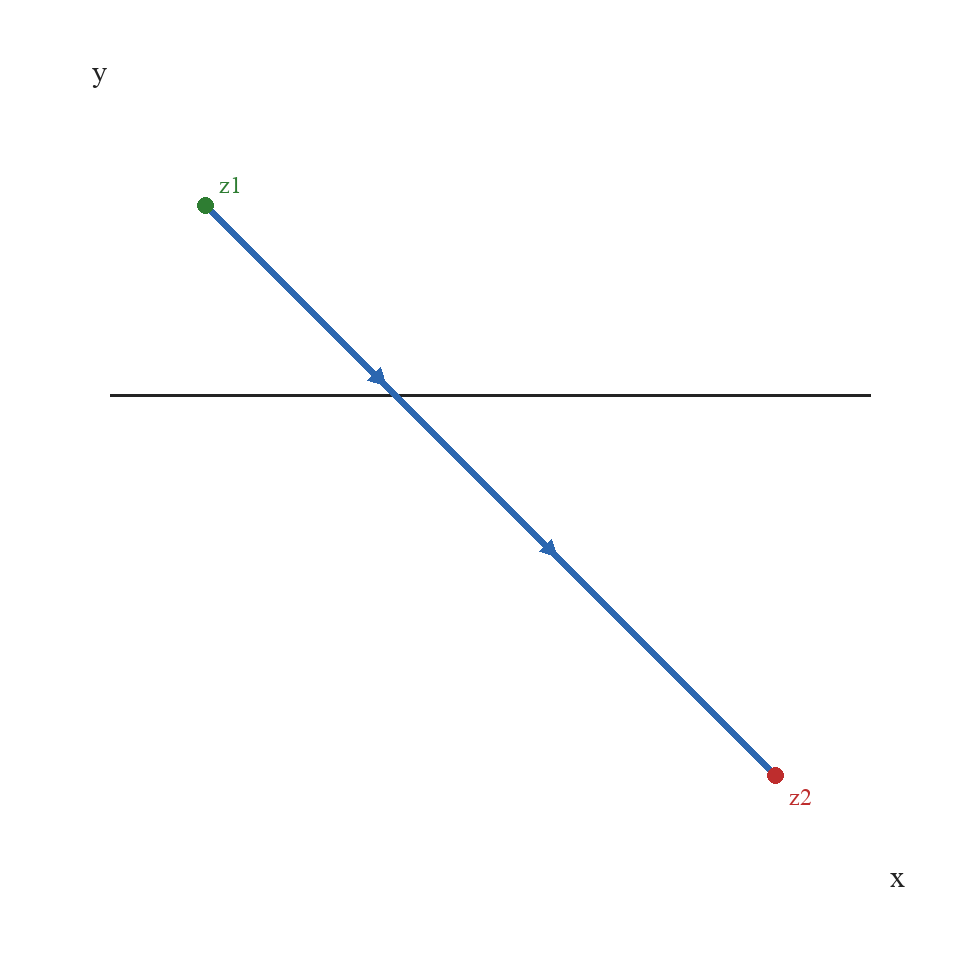
> 
> The Python rendering keeps the segment itself and its direction, with only the endpoint labels retained.

A Mathematica plot of this directed line segment is:

```Mathematica
Graphics[
  {
    Blue,
    AbsoluteThickness[3],
    Arrowheads[{{0.06, 0.32}, {0.06, 0.62}}],
    Arrow[{{1, 1}, {4, -2}}],
    Green,
    PointSize[Large],
    Point[{1, 1}],
    Red,
    PointSize[Large],
    Point[{4, -2}]
  },
  PlotRange -> {{0.3, 4.7}, {-2.7, 1.7}},
  Axes -> True,
  AxesLabel -> {"x", "y"},
  AxesStyle -> Directive[Black, AbsoluteThickness[1.2]],
  LabelStyle -> Directive[Black, 14],
  PlotRangePadding -> Scaled[0.04],
  ImageSize -> 340,
  Background -> White,
  AspectRatio -> Automatic
]
```

Using the same helper functions as in Problem 1, the following Python code generates the embedded figure:

```python
image, draw, pt = make_canvas(0.5, 4.5, -2.5, 1.5)
t = np.linspace(0, 1, 400)
curve = [pt(1 + 3 * s, 1 - 3 * s) for s in t]
draw.line(curve, fill=BLUE, width=7)
add_arrowheads(draw, curve, [0.32, 0.62], BLUE)

draw_point(draw, pt(1, 1), GREEN)
draw_point(draw, pt(4, -2), RED)

draw.text((pt(1, 1)[0] + 18, pt(1, 1)[1] - 42),
          "z1", fill=GREEN, font=small)
draw.text((pt(4, -2)[0] + 18, pt(4, -2)[1] + 10),
          "z2", fill=RED, font=small)

image.save(outdir / "exercise1_problem4_python.png")
```


++++


EXAMPLE 1 Parametric forms of arcs, circles, and line segments (a) The arc in _Figure 4(a)_ is conveniently parametrized by $\gamma(t)=e^{i t}=\cos t+i \sin t$, $\alpha \leq t \leq \beta$. Its initial point is $e^{i \alpha}$ and its terminal point is $e^{i \beta}$.


> [!figure] Figure 4a
> 
> 
> 
> Figure 4(a) A positively oriented arc with initial point $e^{i \alpha}$ and terminal point $e^{i \beta}$.


(b) The positively oriented circle in _Figure 4(b)_ is parametrized by

$$
\gamma(t)=e^{i t}=\cos t+i \sin t, \quad 0 \leq t \leq 2 \pi .
$$

The circle is a closed curve with initial point $\gamma(0)=1$ and terminal point $\gamma(2 \pi)=1$. 


> [!figure] Figure 4b
> 
> 
> 
> 
> Figure 4(b) A positively oriented circle.


(c) The circle in _Figure 4(c)_ is centered at $z_{0}$ with radius $R>0$. We obtain its parametrization by dilating and then translating the equation in (b). This gives

$$
\gamma(t)=z_{0}+R e^{i t}=z_{0}+R(\cos t+i \sin t), \quad 0 \leq t \leq 2 \pi .
$$

For example, the equation

$$
\gamma(t)=1+i+2 e^{i t}, \quad 0 \leq t \leq 2 \pi,
$$

represents a circle centered at the point ( 1,1 ), with radius 2 .


> [!figure] Figure 4c
> 
> 
> 
> Figure 4(c) Dilating and then translating a circle.


(d) Let $z_{1}$ and $z_{2}$ be arbitrary complex numbers. A directed line segment $\left[z_{1}, z_{2}\right]$ is the path $\gamma$ over $[0,1]$ defined by

$$
\gamma(t)=(1-t) z_{1}+t z_{2}, \quad 0 \leq t \leq 1 .
$$

Its initial point is $\gamma(0)=z_{1}$ and its terminal point is $\gamma(1)=z_{2}$. $\square$

---


As our next example illustrates, there is definitely an advantage in using the complex notation, especially when the parametric representation of a curve involves trigonometric functions.


> [!exercise] Exercise 2: A hypotrochoid in complex notation
> A hypotrochoid is a curve given in parametric form by
> 
> $$
> x(t)=a \cos t+b \cos \left(\frac{a t}{2}\right), \quad y(t)=a \sin t-b \sin \left(\frac{a t}{2}\right) .
> $$
> 
> Express the equation of the hypotrochoid in complex notation.


##### solution

Write the hypotrochoid in complex notation as

$$
z(t)=x(t)+iy(t).
$$

Substituting the given formulas for $x(t)$ and $y(t)$ gives

$$
\begin{aligned}
z(t)
&=a\cos t+b\cos\left(\frac{at}{2}\right)
+i\left(a\sin t-b\sin\left(\frac{at}{2}\right)\right) \\
&=a(\cos t+i\sin t)
+b\left(\cos\left(\frac{at}{2}\right)-i\sin\left(\frac{at}{2}\right)\right).
\end{aligned}
$$

Now apply Euler's formulas
$\cos \theta+i\sin \theta=e^{i\theta}$ and
$\cos \theta-i\sin \theta=e^{-i\theta}$:

$$
z(t)=ae^{it}+be^{-iat/2}.
$$

Therefore the equation of the hypotrochoid in complex notation is

$$
z(t)=ae^{it}+be^{-iat/2}.
$$

To reproduce the hypotrochoid shown in Figure 5, take $a=8$, $b=5$, and $0\le t\le 2\pi$. Then

$$
z(t)=8e^{it}+5e^{-4it},
$$

so that
$x(t)=8\cos t+5\cos 4t$ and
$y(t)=8\sin t-5\sin 4t$.

> [!figure] Python figure for Exercise 2
> 
> 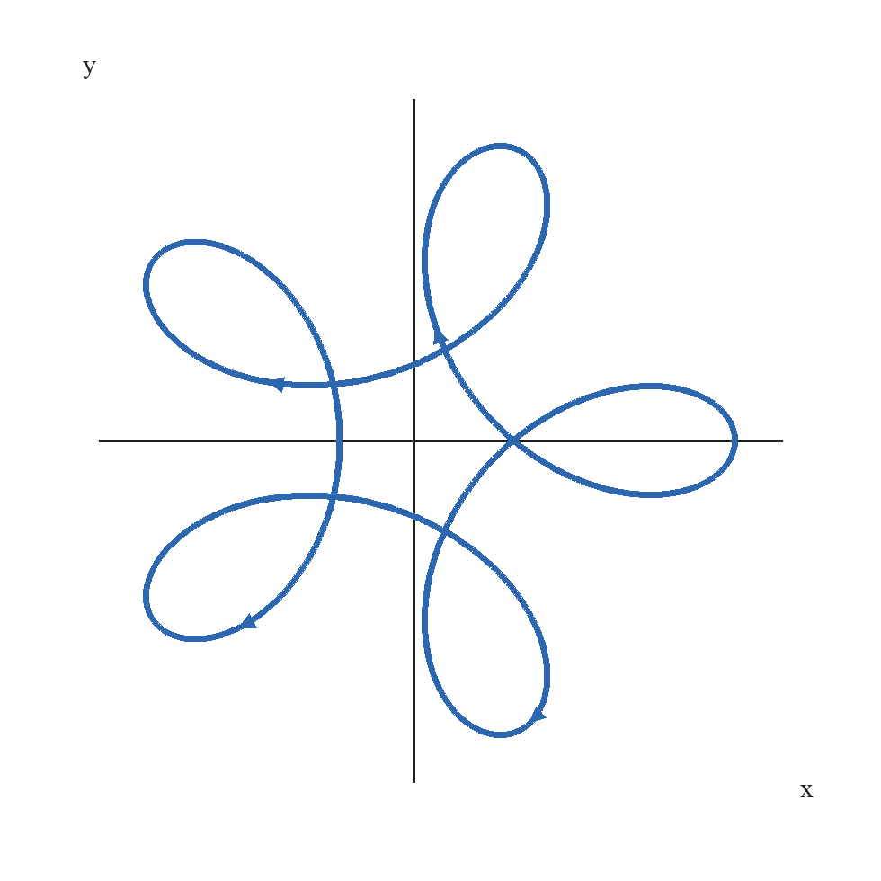
> 
> This Python rendering uses $a=8$, $b=5$, and equal scaling in the horizontal and vertical directions so the curve is not distorted.

A Mathematica plot of this hypotrochoid is:

```Mathematica title:""
Graphics[
  {
    Blue,
    AbsoluteThickness[3],
    Arrowheads[{{0.05, 0.12}, {0.05, 0.33}, {0.05, 0.56}, {0.05, 0.79}}],
    Arrow@Table[
      {8 Cos[t] + 5 Cos[4 t], 8 Sin[t] - 5 Sin[4 t]},
      {t, 0, 2 Pi, 2 Pi/1200}
    ]
  },
  PlotRange -> All,
  Axes -> True,
  AxesLabel -> {"x", "y"},
  AxesStyle -> Directive[Black, AbsoluteThickness[1.2]],
  LabelStyle -> Directive[Black, 14],
  PlotRangePadding -> Scaled[0.06],
  ImageSize -> 340,
  Background -> White,
  AspectRatio -> Automatic
]
```

The following Python code generates the embedded figure:


```python title:""
import math
from pathlib import Path

import numpy as np
from PIL import Image, ImageDraw, ImageFont

W, H = 980, 980
M = 110
BG = "white"
AX = (35, 35, 35)
BLUE = (44, 103, 176)

outdir = Path("images")
outdir.mkdir(exist_ok=True)

font = ImageFont.truetype(
    "/System/Library/Fonts/Supplemental/Times New Roman.ttf", 30
)


def make_canvas(xmin, xmax, ymin, ymax):
    image = Image.new("RGB", (W, H), BG)
    draw = ImageDraw.Draw(image)

    def pt(x, y):
        px = M + (x - xmin) / (xmax - xmin) * (W - 2 * M)
        py = H - M - (y - ymin) / (ymax - ymin) * (H - 2 * M)
        return px, py

    if xmin <= 0 <= xmax:
        draw.line([pt(0, ymin), pt(0, ymax)], fill=AX, width=3)
    if ymin <= 0 <= ymax:
        draw.line([pt(xmin, 0), pt(xmax, 0)], fill=AX, width=3)

    draw.text((W - M + 20, H - M - 10), "x", fill=AX, font=font)
    draw.text((M - 18, M - 55), "y", fill=AX, font=font)
    return image, draw, pt


def draw_arrowhead(draw, p_prev, p_tip, color, head=20,
                   half_angle=math.pi / 7):
    dx = p_tip[0] - p_prev[0]
    dy = p_tip[1] - p_prev[1]
    angle = math.atan2(dy, dx)
    left = (
        p_tip[0] - head * math.cos(angle - half_angle),
        p_tip[1] - head * math.sin(angle - half_angle),
    )
    right = (
        p_tip[0] - head * math.cos(angle + half_angle),
        p_tip[1] - head * math.sin(angle + half_angle),
    )
    draw.polygon([p_tip, left, right], fill=color)


def add_arrowheads(draw, points, positions, color):
    n = len(points)
    for fraction in positions:
        i = max(1, min(n - 1, int(fraction * (n - 1))))
        draw_arrowhead(draw, points[i - 1], points[i], color)


a = 8
b = 5
t = np.linspace(0, 2 * np.pi, 2400)
x = a * np.cos(t) + b * np.cos(a * t / 2)
y = a * np.sin(t) - b * np.sin(a * t / 2)

xmin, xmax = float(np.min(x)), float(np.max(x))
ymin, ymax = float(np.min(y)), float(np.max(y))
padx = 0.08 * (xmax - xmin)
pady = 0.08 * (ymax - ymin)

image, draw, pt = make_canvas(
    xmin - padx, xmax + padx, ymin - pady, ymax + pady
)
curve = [pt(float(xx), float(yy)) for xx, yy in zip(x, y)]
draw.line(curve, fill=BLUE, width=7)
add_arrowheads(draw, curve, [0.12, 0.33, 0.56, 0.79], BLUE)

image.save(outdir / "exercise2_hypotrochoid_python.png")
```


++++


> [!figure] Figure 5: For exercise 2
> 
> 
> Figure 5 A hypotrochoid.


> [!review]
> How can a curve $\gamma:[a, b] \rightarrow \mathbb{C}$ be reparametrized so that the same set of points is traced in the opposite direction, using a parametrization still defined on $[a, b]$ ?


##### solution

To trace the same curve in the opposite direction while keeping the parameter interval $[a,b]$, define

$$
\gamma_r(t)=\gamma(a+b-t),
\qquad
a\le t\le b.
$$

This works because as $t$ increases from $a$ to $b$, the quantity $a+b-t$ decreases from $b$ to $a$. Indeed,
$a+b-a=b$ and $a+b-b=a$, so the parameter inside $\gamma$ runs through the original interval in reverse order.

The endpoints are therefore reversed:
$\gamma_r(a)=\gamma(b)$ and $\gamma_r(b)=\gamma(a)$.

Moreover, the set of points traced by $\gamma_r$ is the same as the set of points traced by $\gamma$, because $\gamma_r(t)$ is obtained by evaluating $\gamma$ at the same parameter values, only in the opposite order.

Thus $\gamma_r(t)=\gamma(a+b-t)$ is a reparametrization of $\gamma$ that traces the same curve in the opposite direction.


+++++


> [!exercise]
> Given the directed line segment $\left[z_1, z_2\right]$ parametrized by $\gamma(t)=(1-t) z_1+t z_2$ for $0 \leq t \leq$ 1 , compute its reverse $\gamma_r$ using the general formula $\gamma_r(t)=\gamma(b+a-t)$, and verify that $\gamma_r$ traces the segment from $z_2$ to $z_1$.


##### solution

Here the original parametrization is

$$
\gamma(t)=(1-t)z_1+t z_2,
\qquad
0\le t\le 1.
$$

Since the interval is $[0,1]$, we have $a=0$ and $b=1$. Therefore the general reverse-path formula gives

$$
\gamma_r(t)=\gamma(b+a-t)=\gamma(1-t).
$$

Now substitute $1-t$ into the formula for $\gamma$:

$$
\begin{aligned}
\gamma_r(t)
&=\gamma(1-t) \\
&=\bigl(1-(1-t)\bigr)z_1+(1-t)z_2 \\
&=t z_1+(1-t)z_2.
\end{aligned}
$$

Thus the reverse parametrization is

$$
\gamma_r(t)=t z_1+(1-t)z_2,
\qquad
0\le t\le 1.
$$

To verify that this traces the segment from $z_2$ to $z_1$, evaluate the endpoints:
$\gamma_r(0)=z_2$ and $\gamma_r(1)=z_1$.

So $\gamma_r$ traces the same line segment, but it starts at $z_2$ and ends at $z_1$. Hence it is the reverse of the directed segment $\left[z_1,z_2\right]$.


++++


If $\gamma(t)$ is a curve parametrized by the interval $[a, b]$, the reverse of $\gamma$ is the curve $\gamma_{r}(t)$ (sometimes written $-\gamma$ ) parametrized by the same interval $[a, b]$ and given by

$$
\gamma_{r}(t)=\gamma(b+a-t) .
$$

The reverse of $\gamma$ traces the same set of points as $\gamma$ but in the opposite direction, starting with $\gamma_{r}(a)=\gamma(b)$ and ending with $\gamma_{r}(b)=\gamma(a)$.

The reverse of the directed line segment $\left[z_{1}, z_{2}\right]$ in Example 1(d) is clearly the line segment $\left[z_{2}, z_{1}\right]$ with equation

$$
\gamma_{r}(t)=\gamma(1-t)=t z_{1}+(1-t) z_{2}, \quad 0 \leq t \leq 1 .
$$

The curves in Example 1 are all continuous, as can be seen from their graphs. In fact, these curves have differentiability properties that will be needed when studying integrals along curves. Recall that a curve is given as the graph of a complex-valued function of a real variable. So, in order to study their differentiability properties, we next investigate the derivative of a complex-valued function of a real variable (not to be confused with the derivative of a complex-valued function of a complex variable, $f^{\prime}(z)$ ).


# 3.1.1 Complex-Valued Functions of a Real Variable


> [!review]
> 1.) How is the derivative of a complex-valued function $f(t)=u(t)+i v(t)$ of a real variable defined, and under what conditions on $u$ and $v$ does this derivative exist? Express $f^{\prime}(t)$ in terms of $u^{\prime}$ and $v^{\prime}$, and prove your answer.
> 2.) What are the rules for differentiating linear combinations (with complex-scalar coefficients), products, quotients, and compositions of complex-valued functions of a real variable? Prove each rule.


##### solution

##### problem 1

Let

$$
f(t)=u(t)+iv(t),
$$

where $u$ and $v$ are real-valued functions of the real variable $t$. The derivative of $f$ is defined by

$$
f'(t)=\lim_{h\to 0}\frac{f(t+h)-f(t)}{h},
$$

provided this limit exists.

Now compute the difference quotient:

$$
\begin{aligned}
\frac{f(t+h)-f(t)}{h}
&=\frac{u(t+h)+iv(t+h)-u(t)-iv(t)}{h} \\
&=\frac{u(t+h)-u(t)}{h}
+i\frac{v(t+h)-v(t)}{h}.
\end{aligned}
$$

Suppose first that $u'(t)$ and $v'(t)$ both exist. Then taking limits as $h\to 0$ gives

$$
\begin{aligned}
f'(t)
&=\lim_{h\to 0}\left(
\frac{u(t+h)-u(t)}{h}
+i\frac{v(t+h)-v(t)}{h}
\right) \\
&=\lim_{h\to 0}\frac{u(t+h)-u(t)}{h}
+i\lim_{h\to 0}\frac{v(t+h)-v(t)}{h} \\
&=u'(t)+iv'(t).
\end{aligned}
$$

So if $u'(t)$ and $v'(t)$ exist, then $f'(t)$ exists and
$f'(t)=u'(t)+iv'(t)$.

Conversely, suppose that $f'(t)$ exists. Then

$$
\frac{f(t+h)-f(t)}{h}
=
\frac{u(t+h)-u(t)}{h}
+i\frac{v(t+h)-v(t)}{h}
$$

has a limit as $h\to 0$. Two complex numbers are equal if and only if their real parts are equal and their imaginary parts are equal, so the real part and imaginary part of this quotient must each have limits. Therefore

$$
\lim_{h\to 0}\frac{u(t+h)-u(t)}{h}
\quad\text{and}\quad
\lim_{h\to 0}\frac{v(t+h)-v(t)}{h}
$$

both exist. That is, $u'(t)$ and $v'(t)$ both exist. Moreover, the same identity shows that

$$
f'(t)=u'(t)+iv'(t).
$$

Thus $f'(t)$ exists if and only if $u'(t)$ and $v'(t)$ both exist, and in that case

$$
f'(t)=u'(t)+iv'(t).
$$

##### problem 2

Let $f$ and $g$ be complex-valued differentiable functions of the real variable $t$, and let $\alpha$ and $\beta$ be complex constants.

For linear combinations, start from the definition:

$$
\begin{aligned}
\frac{d}{dt}\bigl(\alpha f(t)+\beta g(t)\bigr)
&=\lim_{h\to 0}
\frac{\alpha f(t+h)+\beta g(t+h)-\alpha f(t)-\beta g(t)}{h} \\
&=\lim_{h\to 0}
\left(
\alpha\frac{f(t+h)-f(t)}{h}
+\beta\frac{g(t+h)-g(t)}{h}
\right) \\
&=\alpha\lim_{h\to 0}\frac{f(t+h)-f(t)}{h}
+\beta\lim_{h\to 0}\frac{g(t+h)-g(t)}{h} \\
&=\alpha f'(t)+\beta g'(t).
\end{aligned}
$$

So

$$
\bigl(\alpha f(t)+\beta g(t)\bigr)'=\alpha f'(t)+\beta g'(t).
$$

For products, write

$$
\begin{aligned}
\frac{d}{dt}\bigl(f(t)g(t)\bigr)
&=\lim_{h\to 0}\frac{f(t+h)g(t+h)-f(t)g(t)}{h}.
\end{aligned}
$$

Add and subtract $f(t+h)g(t)$ inside the numerator:

$$
\begin{aligned}
\frac{f(t+h)g(t+h)-f(t)g(t)}{h}
&=\frac{f(t+h)g(t+h)-f(t+h)g(t)}{h} \\
&\qquad
+\frac{f(t+h)g(t)-f(t)g(t)}{h} \\
&=f(t+h)\frac{g(t+h)-g(t)}{h}
+g(t)\frac{f(t+h)-f(t)}{h}.
\end{aligned}
$$

Now let $h\to 0$. Since differentiability implies continuity, $f(t+h)\to f(t)$. Hence

$$
\begin{aligned}
\frac{d}{dt}\bigl(f(t)g(t)\bigr)
&=f(t)\,g'(t)+g(t)\,f'(t).
\end{aligned}
$$

Therefore

$$
\bigl(f(t)g(t)\bigr)'=f'(t)g(t)+g'(t)f(t).
$$

For quotients, assume $g(t)\ne 0$. Apply the product rule to
$f(t)/g(t)=f(t)\bigl(g(t)^{-1}\bigr)$, so it is enough to differentiate $g(t)^{-1}$.

Since

$$
g(t)\,g(t)^{-1}=1,
$$

differentiating both sides gives

$$
g'(t)g(t)^{-1}+g(t)\bigl(g(t)^{-1}\bigr)'=0.
$$

Solving for $\bigl(g(t)^{-1}\bigr)'$ gives

$$
\begin{aligned}
g(t)\bigl(g(t)^{-1}\bigr)'
&=-g'(t)g(t)^{-1}, \\
\bigl(g(t)^{-1}\bigr)'
&=-g'(t)g(t)^{-2}.
\end{aligned}
$$

Now use the product rule:

$$
\begin{aligned}
\left(\frac{f(t)}{g(t)}\right)'
&=\bigl(f(t)g(t)^{-1}\bigr)' \\
&=f'(t)g(t)^{-1}+f(t)\bigl(g(t)^{-1}\bigr)' \\
&=\frac{f'(t)}{g(t)}-f(t)\frac{g'(t)}{g(t)^2} \\
&=\frac{f'(t)g(t)-g'(t)f(t)}{g(t)^2}.
\end{aligned}
$$

Thus

$$
\left(\frac{f(t)}{g(t)}\right)'
=\frac{f'(t)g(t)-g'(t)f(t)}{g(t)^2},
\qquad g(t)\ne 0.
$$

For compositions, let $F(t)=f(g(t))$. Then

$$
\frac{F(t+h)-F(t)}{h}
=
\frac{f(g(t+h))-f(g(t))}{h}.
$$

Insert the factor $g(t+h)-g(t)$:

$$
\frac{f(g(t+h))-f(g(t))}{h}
=
\frac{f(g(t+h))-f(g(t))}{g(t+h)-g(t)}
\cdot
\frac{g(t+h)-g(t)}{h},
$$

provided $g(t+h)\ne g(t)$. As $h\to 0$, the second factor tends to $g'(t)$, and the first factor tends to $f'(g(t))$ because $g(t+h)\to g(t)$. Therefore

$$
\frac{d}{dt}f(g(t))=f'(g(t))\,g'(t).
$$

So the differentiation rules are

$$
\bigl(\alpha f(t)+\beta g(t)\bigr)'=\alpha f'(t)+\beta g'(t),
$$

$$
\bigl(f(t)g(t)\bigr)'=f'(t)g(t)+g'(t)f(t),
$$

$$
\left(\frac{f(t)}{g(t)}\right)'
=\frac{f'(t)g(t)-g'(t)f(t)}{g(t)^2},
\qquad g(t)\ne 0,
$$

and

$$
\frac{d}{dt}f(g(t))=f'(g(t))\,g'(t).
$$


+++++


Given a complex-valued function of a real variable $f(t)=u(t)+i v(t)$, we define the derivative of $f$ in the usual way by

$$
f^{\prime}(t)=\frac{d}{d t} f(t)=\lim _{h \rightarrow 0} \frac{f(t+h)-f(t)}{h} .
$$

As we did in the proof of Theorem 3, Section 2.2, you can show that $f^{\prime}(t)$ exists if and only if $u^{\prime}(t)$ and $v^{\prime}(t)$ both exist, and

$$
f^{\prime}(t)=u^{\prime}(t)+i v^{\prime}(t)
$$

The derivative of a complex-valued function of a real variable satisfies many properties similar to those of the usual derivative of a real-valued function. In particular, if $f$ and $g$ are complex-valued differentiable functions, $\alpha$ and $\beta$ are complex numbers, then

$$
\begin{aligned}
& (\alpha f(t)+\beta g(t))^{\prime}=\alpha f^{\prime}(t)+\beta g^{\prime}(t), \\
& (f(t) g(t))^{\prime}=f^{\prime}(t) g(t)+g^{\prime}(t) f(t), \\
& \left(\frac{f(t)}{g(t)}\right)^{\prime}=\frac{f^{\prime}(t) g(t)-g^{\prime}(t) f(t)}{g(t)^{2}} \quad(g(t) \neq 0), \\
& (f(g(t)))^{\prime}=f^{\prime}(g(t)) g^{\prime}(t) .
\end{aligned}
$$

We leave the verification of these rules as an exercise.


> [!exercise] Exercise 3: Derivative of $e^{\alpha t}$
> Suppose that $\alpha=a+i b$ is a complex number. Show that $\frac{d}{d t} e^{\alpha t}=\alpha e^{\alpha t}$. Hence we recover the same formula from calculus. In particular, if $\alpha=i \omega$ is purely imaginary, then
> 
> $$
> \frac{d}{d t} e^{i \omega t}=i \omega e^{i \omega t} .
> $$
> 


##### solution

Write

$$
\alpha=a+ib,
$$

where $a$ and $b$ are real numbers. Then

$$
e^{\alpha t}=e^{(a+ib)t}=e^{at}e^{ibt}.
$$

Using Euler's formula, we have

$$
e^{ibt}=\cos(bt)+i\sin(bt),
$$

so

$$
e^{\alpha t}=e^{at}\bigl(\cos(bt)+i\sin(bt)\bigr).
$$

Now differentiate. Using the product rule and the fact that
$\dfrac{d}{dt}e^{at}=ae^{at}$,
$\dfrac{d}{dt}\cos(bt)=-b\sin(bt)$, and
$\dfrac{d}{dt}\sin(bt)=b\cos(bt)$, we get

$$
\begin{aligned}
\frac{d}{dt}e^{\alpha t}
&=\frac{d}{dt}\left(e^{at}\bigl(\cos(bt)+i\sin(bt)\bigr)\right) \\
&=ae^{at}\bigl(\cos(bt)+i\sin(bt)\bigr)
+e^{at}\bigl(-b\sin(bt)+ib\cos(bt)\bigr) \\
&=e^{at}\left(a\cos(bt)+ia\sin(bt)-b\sin(bt)+ib\cos(bt)\right).
\end{aligned}
$$

Now factor the real and imaginary parts:

$$
\begin{aligned}
\frac{d}{dt}e^{\alpha t}
&=e^{at}\left(\bigl(a\cos(bt)-b\sin(bt)\bigr)
+i\bigl(a\sin(bt)+b\cos(bt)\bigr)\right).
\end{aligned}
$$

Next compute $\alpha e^{\alpha t}$:

$$
\begin{aligned}
\alpha e^{\alpha t}
&=(a+ib)e^{at}\bigl(\cos(bt)+i\sin(bt)\bigr) \\
&=e^{at}(a+ib)\bigl(\cos(bt)+i\sin(bt)\bigr) \\
&=e^{at}\left(a\cos(bt)+ia\sin(bt)+ib\cos(bt)+i^2b\sin(bt)\right) \\
&=e^{at}\left(a\cos(bt)+ia\sin(bt)+ib\cos(bt)-b\sin(bt)\right) \\
&=e^{at}\left(\bigl(a\cos(bt)-b\sin(bt)\bigr)
+i\bigl(a\sin(bt)+b\cos(bt)\bigr)\right).
\end{aligned}
$$

The two expressions are equal, so

$$
\frac{d}{dt}e^{\alpha t}=\alpha e^{\alpha t}.
$$

In particular, if $\alpha=i\omega$, then $a=0$ and $b=\omega$, so the formula becomes

$$
\frac{d}{dt}e^{i\omega t}=i\omega e^{i\omega t}.
$$


++++


> [!review]
> The mean value theorem for a real-valued function of a real variable guarantees that the total change of the function over an interval equals the derivative at some intermediate point times the length of the interval. Does this property extend to complex-valued functions of a real variable?


##### solution

No. The mean value property for real-valued functions of a real variable does not extend to complex-valued functions of a real variable.

A counterexample is
$f(x)=e^{ix}$ on $[0,2\pi]$. This function is continuous on $[0,2\pi]$ and differentiable on $(0,2\pi)$, with

$$
f'(x)=ie^{ix}.
$$

Also,
$f(2\pi)-f(0)=1-1=0$.

If the mean value property were valid in the complex-valued case, there would have to be some $c\in(0,2\pi)$ such that

$$
f(2\pi)-f(0)=f'(c)(2\pi-0).
$$

Since the left-hand side is $0$, this would force
$f'(c)=0$. But

$$
\left|f'(x)\right|
=
\left|ie^{ix}\right|
=
\left|e^{ix}\right|
=1,
$$

so $f'(x)\neq 0$ for every $x\in(0,2\pi)$.

Therefore no such $c$ exists, and the mean value property fails for complex-valued functions of a real variable.


+++++


> [!exercise] Failure of the mean value property for complex-valued functions
> 
> Let $f(x)=e^{i x}$ on $[0,2 \pi]$. Show that $f$ is continuous on $[0,2 \pi]$ and differentiable on $(0,2 \pi)$, that $f(2 \pi)-f(0)=0$, and yet $f^{\prime}(x) \neq 0$ for every $x \in(0,2 \pi)$. Conclude that there is no $c \in(0,2 \pi)$ satisfying $f(2 \pi)-f(0)=f^{\prime}(c) \cdot(2 \pi-0)$, so the mean value property fails for complex-valued functions of a real variable.


++++


Having stated properties of the derivative of a real-valued function that hold for complex-valued functions of a real variable, we should caution you that not all properties of derivatives that hold in the real case hold in the complex case. Most notably, the mean value property does not hold for complex-valued functions. In the real case, the mean value property states that if $f$ is continuous on $[a, b]$ and differentiable on $(a, b)$, then $f(b)-f(a)= f^{\prime}(c)(b-a)$ for some $c$ in $(a, b)$. This property does not hold for complexvalued functions. To see this, consider $f(x)=e^{i x}$ for $x$ in $[0,2 \pi]$. Then $f$ is continuous on $[0,2 \pi]$ and has a derivative $f^{\prime}(x)=i e^{i x}$ on $(0,2 \pi)$. Also, $f(2 \pi)-f(0)=1-1=0$, but $f^{\prime}(x)$ never vanishes since $\left|f^{\prime}(x)\right|=\left|i e^{i x}\right|= \left|e^{i x}\right|=1$. Hence there is no number $c$ in $(0,2 \pi)$ such that $f(2 \pi)-f(0)= (2 \pi-0) f^{\prime}(c)$, and so the mean value property does not hold (_Figure 6_).


> [!figure] Figure 6
> 
> 
> ![[Pasted image 20260401051005.png|500]]
> 
> Figure $6 f(2 \pi)-f(0)=0$, but $f^{\prime}(x) \neq 0$ for all $x$ in ( $0,2 \pi$ ) showing that the mean value property fails for complex-valued functions.


Before returning to the main topic of curves, we show with an application how complex-valued functions can simplify greatly the solution of problems involving real-valued functions.


> [!exercise] Exercise 4: A second order ordinary differential equation
> Find a particular solution $y_{p}(x)$ of
> 
> $$
> y^{\prime \prime}-2 y^{\prime}+y=\cos 2 x .
> $$
> 
> This is a second order linear differential equation with constant coefficients. It is nonhomogeneous because of the term $\cos 2 x$ (see Appendix A.2).


##### solution

We parametrize the three pieces on the three subintervals
$[-2,-1]$, $[-1,1]$, and $[1,2]$.

For the first line segment from $-2$ to $-1$, we use
$\gamma(t)=t$ for $-2\le t\le -1$.

For the upper semicircle of radius $1$ centered at the origin, traced from $-1$ to $1$, we want a parametrization satisfying
$\gamma(-1)=-1$, $\gamma(0)=i$, and $\gamma(1)=1$. A convenient choice is

$$
\gamma(t)=e^{i\frac{\pi}{2}(1-t)},
\qquad
-1\le t\le 1.
$$

Indeed,
$\gamma(-1)=e^{i\pi}=-1$,
$\gamma(0)=e^{i\pi/2}=i$, and
$\gamma(1)=e^0=1$.

For the last line segment from $1$ to $2$, we again use
$\gamma(t)=t$ for $1\le t\le 2$.

Therefore a continuous piecewise-smooth parametrization on $[-2,2]$ is

$$
\gamma(t)=
\begin{cases}
t, & -2\le t\le -1,\\[4pt]
e^{i\frac{\pi}{2}(1-t)}, & -1\le t\le 1,\\[4pt]
t, & 1\le t\le 2.
\end{cases}
$$

This curve is continuous on each subinterval, and the endpoint values match:
$\gamma(-1)=-1$ from both the first and second pieces, and
$\gamma(1)=1$ from both the second and third pieces. Hence $\gamma$ is continuous on $[-2,2]$.

Each piece is smooth on its own subinterval. On $[-2,-1]$ and $[1,2]$, we have $\gamma'(t)=1$. On $[-1,1]$,

$$
\gamma'(t)
=
e^{i\frac{\pi}{2}(1-t)}
\cdot
\frac{d}{dt}\left(i\frac{\pi}{2}(1-t)\right)
=
-\frac{\pi i}{2}e^{i\frac{\pi}{2}(1-t)},
$$

which is continuous on $[-1,1]$.

So $\gamma$ is a continuous piecewise-smooth curve over the closed interval $[-2,2]$. Therefore $\gamma$ is a path in the sense of Definition 2.

> [!figure] Python figure for Exercise 5
> 
> 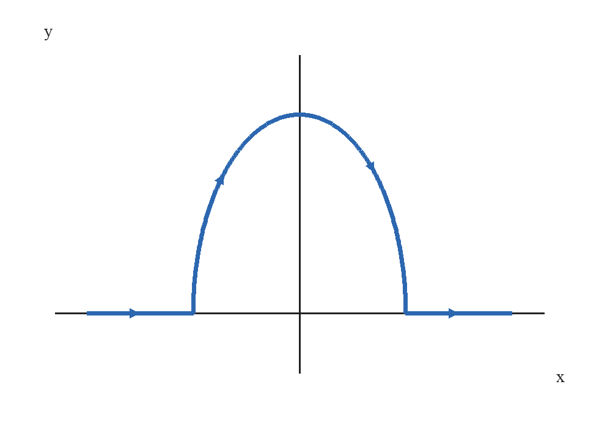
> 
> The figure uses equal scaling, so the middle piece is a true upper semicircle rather than a stretched arc.

A Mathematica plot of this path is:

```Mathematica title:""
Graphics[
  {
    Blue,
    AbsoluteThickness[3],
    Arrowheads[{{0.055, 0.5}}],
    Arrow[{{-2, 0}, {-1, 0}}],
    Arrowheads[{{0.05, 0.25}, {0.05, 0.75}}],
    Arrow@Table[
      {Cos[\[Theta]], Sin[\[Theta]]},
      {\[Theta], Pi, 0, -Pi/240}
    ],
    Arrowheads[{{0.055, 0.5}}],
    Arrow[{{1, 0}, {2, 0}}]
  },
  PlotRange -> {{-2.3, 2.3}, {-0.3, 1.3}},
  Axes -> True,
  AxesLabel -> {"x", "y"},
  AxesStyle -> Directive[Black, AbsoluteThickness[1.2]],
  LabelStyle -> Directive[Black, 14],
  PlotRangePadding -> Scaled[0.04],
  ImageSize -> 340,
  Background -> White,
  AspectRatio -> Automatic
]
```

The following Python code generates the embedded figure:


```python title:""
import math
from pathlib import Path

import numpy as np
from PIL import Image, ImageDraw, ImageFont

W, H = 980, 700
M = 90
BG = "white"
AX = (35, 35, 35)
BLUE = (44, 103, 176)

outdir = Path("images")
outdir.mkdir(exist_ok=True)

font = ImageFont.truetype(
    "/System/Library/Fonts/Supplemental/Times New Roman.ttf", 28
)


def make_canvas(xmin, xmax, ymin, ymax):
    image = Image.new("RGB", (W, H), BG)
    draw = ImageDraw.Draw(image)

    def pt(x, y):
        px = M + (x - xmin) / (xmax - xmin) * (W - 2 * M)
        py = H - M - (y - ymin) / (ymax - ymin) * (H - 2 * M)
        return px, py

    if xmin <= 0 <= xmax:
        draw.line([pt(0, ymin), pt(0, ymax)], fill=AX, width=3)
    if ymin <= 0 <= ymax:
        draw.line([pt(xmin, 0), pt(xmax, 0)], fill=AX, width=3)

    draw.text((W - M + 20, H - M - 10), "x", fill=AX, font=font)
    draw.text((M - 18, M - 55), "y", fill=AX, font=font)
    return image, draw, pt


def draw_arrowhead(draw, p_prev, p_tip, color, head=18,
                   half_angle=math.pi / 7):
    dx = p_tip[0] - p_prev[0]
    dy = p_tip[1] - p_prev[1]
    angle = math.atan2(dy, dx)
    left = (
        p_tip[0] - head * math.cos(angle - half_angle),
        p_tip[1] - head * math.sin(angle - half_angle),
    )
    right = (
        p_tip[0] - head * math.cos(angle + half_angle),
        p_tip[1] - head * math.sin(angle + half_angle),
    )
    draw.polygon([p_tip, left, right], fill=color)


def add_arrowheads(draw, points, positions, color):
    n = len(points)
    for fraction in positions:
        i = max(1, min(n - 1, int(fraction * (n - 1))))
        draw_arrowhead(draw, points[i - 1], points[i], color)


image, draw, pt = make_canvas(-2.3, 2.3, -0.3, 1.3)

segment1 = [pt(x, 0.0) for x in np.linspace(-2, -1, 150)]
arc = [pt(math.cos(theta), math.sin(theta))
       for theta in np.linspace(math.pi, 0, 300)]
segment2 = [pt(x, 0.0) for x in np.linspace(1, 2, 150)]

for piece in [segment1, arc, segment2]:
    draw.line(piece, fill=BLUE, width=7)

add_arrowheads(draw, segment1, [0.5], BLUE)
add_arrowheads(draw, arc, [0.25, 0.75], BLUE)
add_arrowheads(draw, segment2, [0.5], BLUE)

image.save(outdir / "exercise5_path_python.png")
```


++++


> [!Note]
> Whereas the solution $y_{p}$ of (11) has to include a sine and a cosine term to account for the derivatives of $\cos 2 x$, in finding a particular solution of (12) we can try $y=A e^{2 i x}$ for the good reason that the derivative of an exponential function is again another exponential function.


In the exercises, we illustrate the use of the method of Example 4 in solving other interesting nonhomogeneous differential equations.


# 3.1.2 Contours and Paths


> [!review]
> 1.) What does it mean for a complex-valued function of a real variable to be piecewise continuous on a closed interval $[a, b]$, and why does the definition require all one-sided limits (at discontinuities in the interior and at the endpoints) to exist and be finite?
> 2.) What does it mean for a complex-valued function of a real variable to be piecewise smooth on $[a, b]$, and what additional property makes such a function smooth (continuously differentiable) on $[a, b]$ ?
> 3.) What is a path (or contour) in the complex plane, how does the definition allow a path to be decomposed into smooth pieces, and what does it mean for a path to be closed?


##### solution

##### problem 1

A complex-valued function $f(t)$ is piecewise continuous on a closed interval $[a,b]$ if it is continuous at all but finitely many points of $(a,b)$, and at every point where continuity fails, the one-sided limits exist and are finite. In addition, the right limit at $a$ and the left limit at $b$ must also exist and be finite.

The reason for requiring these one-sided limits is that a piecewise continuous function is allowed to jump, but it is not allowed to oscillate wildly or blow up to infinity at the break points. The existence of finite one-sided limits guarantees that each discontinuity is controlled and that the graph can be broken into finitely many continuous pieces with well-defined endpoint behavior.

##### problem 2

A complex-valued function $f(t)$ is piecewise smooth on $[a,b]$ if both $f$ and $f'(t)$ are piecewise continuous on $[a,b]$.

Thus piecewise smoothness means that the function can be divided into finitely many pieces on which it is differentiable, with both the function and its derivative behaving in a controlled way at the joining points.

Such a function is smooth, or continuously differentiable, on $[a,b]$ if the stronger condition holds that both $f$ and $f'$ are continuous on the entire interval $[a,b]$.

##### problem 3

A path, or contour, in the complex plane is a continuous piecewise smooth curve $\gamma(t)$ defined on a closed interval $[a,b]$.

Because $\gamma$ is piecewise smooth, it may be decomposed into finitely many smooth pieces
$\gamma_1,\gamma_2,\ldots,\gamma_n$ joined end-to-end. In other words, a path need not be smooth on the entire interval at once; it is enough that it be continuous and built from finitely many smooth subcurves.

The path is closed if the initial point of the first piece is joined to the terminal point of the last piece. Equivalently, the curve ends where it begins.


+++++


Returning to our discussion of complex-valued functions of a real variable. we introduce the following useful definitions.


> [!definition] Definition 1: Piecewise Continuous and Piecewise Smooth Functions
> A complex-valued function of a real variable $f(t)$ is said to be piecewise continuous on $[a, b]$ if the following hold:
> (i) $f(t)$ exists and is continuous for all but finitely many points in $(a, b)$.
> (ii) At any point $c$ in $(a, b)$ where $f$ fails to be continuous. both the left limit $\lim f(t)$ and the right limit $\lim f(t)$ exist and are finite.
> (iii) At the endpoints, the right limit $\lim _{t, a} f(t)$ and the left limit $\lim _{t \mid b} f(t)$ exist and are finite.
> The function $f(t)$ is said to be piecewise smooth on $[a, b]$ if $f$ and $f^{\prime}$ are both piecewise continuous on $[a, b]$.


If $f$ and $f^{\prime}$ are both continuous on $[a, b]$ we will say that $f$ is smooth or continuously differentiable on $[a, b]$.

We are now in a position to introduce the notion of path, which is fundamental to our development of the theory of integration. Recall that we have referred to a curve by its parametrization $\gamma(t)$. In addition, we will attribute to the curve the analytical properties of the function $\gamma(t)$, such as continuity and differentiability. Thus, when we talk about a continuous curve or a differentiable curve, we have in mind a specific parametrization with these properties.


> [!definition] Definition 2: Path or Contour
> By a path or a contour we mean a continuous piecewise smooth curve $\gamma(t)$ over a closed interval $[a, b]$.

A path $\gamma$ is continuously differentiable or smooth on $[a, b]$ if $\gamma(t)$ and $\gamma^{\prime}(t)$ are continuous on $[a, b]$. Thus, according to Definition 2, a path or a contour $\gamma$ is a finite sequence of continuously differentiable curves, $\gamma_{1}, \gamma_{2}, \ldots, \gamma_{n}$, joined together end-to-end. In this case, it is sometimes convenient to write $\gamma=\left(\gamma_{1}, \gamma_{2}, \ldots, \gamma_{n}\right)$. The path is closed if the initial point of $\gamma_{1}$ is joined to the terminal point of $\gamma_{n}$.


> [!exercise] Exercise 5: Path
> Construct a continuous piecewise-smooth parametrization on $[-2,2]$ of the curve $\gamma$ that consists of the line segment from -2 to -1 , the upper semicircle of radius 1 centered at the origin (traced from -1 to 1 ), and the line segment from 1 to 2 . Conclude that $\gamma$ is a path in the sense of Definition 2 .


##### solution

We split the curve into three pieces on the subintervals
$[-2,-1]$, $[-1,1]$, and $[1,2]$.

On the first subinterval, the curve is the line segment from $-2$ to $-1$, so we may take
$\gamma(t)=t$ for $-2\le t\le -1$.

On the middle subinterval, we need the upper semicircle of radius $1$ centered at the origin, traced from $-1$ to $1$. A convenient parametrization is

$$
\gamma(t)=e^{i\frac{\pi}{2}(1-t)},
\qquad
-1\le t\le 1.
$$

Indeed,
$\gamma(-1)=e^{i\pi}=-1$,
$\gamma(0)=e^{i\pi/2}=i$, and
$\gamma(1)=e^0=1$.

On the last subinterval, the curve is the line segment from $1$ to $2$, so we again take
$\gamma(t)=t$ for $1\le t\le 2$.

Therefore a continuous piecewise-smooth parametrization on $[-2,2]$ is

$$
\gamma(t)=
\begin{cases}
t, & -2\le t\le -1,\\[4pt]
e^{i\frac{\pi}{2}(1-t)}, & -1\le t\le 1,\\[4pt]
t, & 1\le t\le 2.
\end{cases}
$$

The endpoint values agree at the junctions:
$\gamma(-1)=-1$ from both the first and second pieces, and
$\gamma(1)=1$ from both the second and third pieces. Hence $\gamma$ is continuous on $[-2,2]$.

Each piece is smooth on its own interval. On the two line segments, $\gamma'(t)=1$. On the semicircular piece,

$$
\gamma'(t)
=
e^{i\frac{\pi}{2}(1-t)}
\cdot
\frac{d}{dt}\left(i\frac{\pi}{2}(1-t)\right)
=
-\frac{\pi i}{2}e^{i\frac{\pi}{2}(1-t)},
$$

which is continuous on $[-1,1]$.

So $\gamma$ is a continuous piecewise-smooth curve on the closed interval $[-2,2]$. Therefore $\gamma$ is a path in the sense of Definition 2.


> [!figure] Python figure for Exercise 5
> 
> 
> 
> The figure uses equal scaling, so the middle piece is a true upper semicircle.

A Mathematica plot of this path is:

```Mathematica title:"Mathematica plot"
Graphics[
  {
    Blue,
    AbsoluteThickness[3],
    Arrowheads[{{0.055, 0.5}}],
    Arrow[{{-2, 0}, {-1, 0}}],
    Arrowheads[{{0.05, 0.25}, {0.05, 0.75}}],
    Arrow@Table[
      {Cos[\[Theta]], Sin[\[Theta]]},
      {\[Theta], Pi, 0, -Pi/240}
    ],
    Arrowheads[{{0.055, 0.5}}],
    Arrow[{{1, 0}, {2, 0}}]
  },
  PlotRange -> {{-2.3, 2.3}, {-0.3, 1.3}},
  Axes -> True,
  AxesLabel -> {"x", "y"},
  AxesStyle -> Directive[Black, AbsoluteThickness[1.2]],
  LabelStyle -> Directive[Black, 14],
  PlotRangePadding -> Scaled[0.04],
  ImageSize -> 340,
  Background -> White,
  AspectRatio -> Automatic
]
```

The following Python code generates the embedded figure:

```python title:"Python figure generator"
import math
from pathlib import Path

import numpy as np
from PIL import Image, ImageDraw, ImageFont

W, H = 980, 700
M = 90
BG = "white"
AX = (35, 35, 35)
BLUE = (44, 103, 176)

outdir = Path("images")
outdir.mkdir(exist_ok=True)

font = ImageFont.truetype(
    "/System/Library/Fonts/Supplemental/Times New Roman.ttf", 28
)


def make_canvas(xmin, xmax, ymin, ymax):
    image = Image.new("RGB", (W, H), BG)
    draw = ImageDraw.Draw(image)

    def pt(x, y):
        px = M + (x - xmin) / (xmax - xmin) * (W - 2 * M)
        py = H - M - (y - ymin) / (ymax - ymin) * (H - 2 * M)
        return px, py

    if xmin <= 0 <= xmax:
        draw.line([pt(0, ymin), pt(0, ymax)], fill=AX, width=3)
    if ymin <= 0 <= ymax:
        draw.line([pt(xmin, 0), pt(xmax, 0)], fill=AX, width=3)

    draw.text((W - M + 20, H - M - 10), "x", fill=AX, font=font)
    draw.text((M - 18, M - 55), "y", fill=AX, font=font)
    return image, draw, pt


def draw_arrowhead(draw, p_prev, p_tip, color, head=18,
                   half_angle=math.pi / 7):
    dx = p_tip[0] - p_prev[0]
    dy = p_tip[1] - p_prev[1]
    angle = math.atan2(dy, dx)
    left = (
        p_tip[0] - head * math.cos(angle - half_angle),
        p_tip[1] - head * math.sin(angle - half_angle),
    )
    right = (
        p_tip[0] - head * math.cos(angle + half_angle),
        p_tip[1] - head * math.sin(angle + half_angle),
    )
    draw.polygon([p_tip, left, right], fill=color)


def add_arrowheads(draw, points, positions, color):
    n = len(points)
    for fraction in positions:
        i = max(1, min(n - 1, int(fraction * (n - 1))))
        draw_arrowhead(draw, points[i - 1], points[i], color)


image, draw, pt = make_canvas(-2.3, 2.3, -0.3, 1.3)

segment1 = [pt(x, 0.0) for x in np.linspace(-2, -1, 150)]
arc = [pt(math.cos(theta), math.sin(theta))
       for theta in np.linspace(math.pi, 0, 300)]
segment2 = [pt(x, 0.0) for x in np.linspace(1, 2, 150)]

for piece in [segment1, arc, segment2]:
    draw.line(piece, fill=BLUE, width=7)

add_arrowheads(draw, segment1, [0.5], BLUE)
add_arrowheads(draw, arc, [0.25, 0.75], BLUE)
add_arrowheads(draw, segment2, [0.5], BLUE)

image.save(outdir / "exercise5_path_python.png")
```


++++


The path $\gamma$ in _Figure 7_ is made up of three smooth curves: the line segment $\gamma_{1}= [-2,-1]$; the semi-circle $\gamma_{2}$; and the line segment $\gamma_{3}=[1,2]$. We can parametrize $\gamma$ by the interval [-2,2] as follows:

$$
\gamma(t)= \begin{cases}t & \text { if }-2 \leq t \leq-1, \\ e^{i \frac{\pi}{2}(1-t)} & \text { if }-1 \leq t \leq 1 . \\ t & \text { if } 1 \leq t \leq 2 .\end{cases}
$$

The choice of the interval $[-2,2]$ was just for convenience. Other closed intervals can be used to parametrize $\gamma$.


> [!figure] Figure 7: For exercise 5
> 
> Figure 7 for Example 5.


+++


> [!exercise] Exercise 6: Polygonal paths
> With $z_1=0, z_2=1+i$, and $z_3=-1+i$, parametrize the closed polygonal path $\gamma=$ [ $z_1, z_2, z_3, z_1$ ] over [ 0,1 ] by reparametrizing each side on a subinterval of length $\frac{1}{3}$ and pasting the three pieces together. Verify that the resulting $\gamma$ is a path in the sense of Definition 2 .


##### solution

The polygonal path
$\gamma=[z_1,z_2,z_3,z_1]$ has three sides, so we reparametrize each side on a subinterval of length $\frac13$.

Here
$z_1=0$, $z_2=1+i$, and $z_3=-1+i$.

The first side goes from $z_1$ to $z_2$. Using the line-segment formula, a parametrization on $[0,1]$ is

$$
\gamma_1(s)=(1-s)z_1+sz_2=(1+i)s,
\qquad
0\le s\le 1.
$$

To move this to the interval $\left[0,\frac13\right]$, set $s=3t$. Then

$$
\gamma(t)=(1+i)(3t)=3(1+i)t,
\qquad
0\le t\le \frac13.
$$

The second side goes from $z_2$ to $z_3$. A parametrization on $[0,1]$ is

$$
\gamma_2(s)=(1-s)(1+i)+s(-1+i)=(1+i)-2s,
\qquad
0\le s\le 1.
$$

To move this to the interval $\left[\frac13,\frac23\right]$, set
$s=3t-1$. Then

$$
\begin{aligned}
\gamma(t)
&=(1+i)-2(3t-1) \\
&=(1+i)-6t+2 \\
&=3+i-6t,
\qquad
\frac13\le t\le \frac23.
\end{aligned}
$$

The third side goes from $z_3$ back to $z_1$. A parametrization on $[0,1]$ is

$$
\gamma_3(s)=(1-s)(-1+i)+sz_1=(1-s)(-1+i),
\qquad
0\le s\le 1.
$$

To move this to the interval $\left[\frac23,1\right]$, set
$s=3t-2$. Then

$$
\begin{aligned}
\gamma(t)
&=\bigl(1-(3t-2)\bigr)(-1+i) \\
&=(3-3t)(-1+i) \\
&=3(1-t)(-1+i),
\qquad
\frac23\le t\le 1.
\end{aligned}
$$

Therefore one parametrization of the closed polygonal path is

$$
\gamma(t)=
\begin{cases}
3(1+i)t, & 0\le t\le \frac13,\\[4pt]
3+i-6t, & \frac13\le t\le \frac23,\\[4pt]
3(1-t)(-1+i), & \frac23\le t\le 1.
\end{cases}
$$

Now check the joining points:
$\gamma(0)=0=z_1$,
$\gamma\left(\frac13\right)=1+i=z_2$,
$\gamma\left(\frac23\right)=-1+i=z_3$, and
$\gamma(1)=0=z_1$.

So the three pieces join continuously and the path is closed.

Each piece is a line segment, hence smooth on its own subinterval. Therefore $\gamma$ is continuous and piecewise smooth on $[0,1]$, so it is a path in the sense of Definition 2.

> [!figure] Python figure for Exercise 6
> 
> 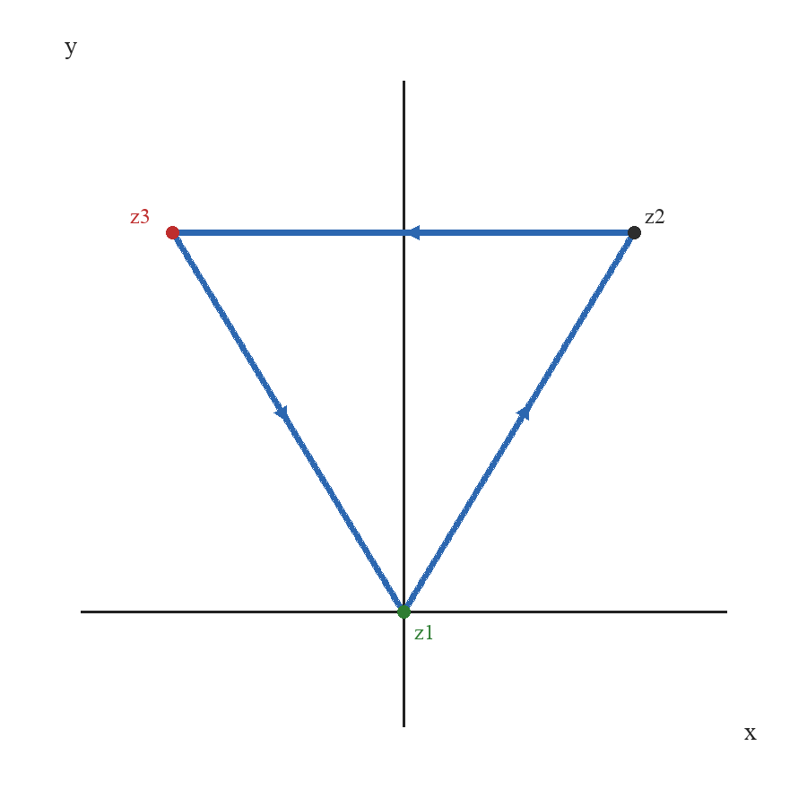
> 
> The figure uses equal scaling, so the polygonal path is not distorted.

A Mathematica plot of this closed polygonal path is:

```Mathematica title:"Mathematica plot"
Graphics[
  {
    Blue,
    AbsoluteThickness[3],
    Arrowheads[{{0.055, 0.55}}],
    Arrow[{{0, 0}, {1, 1}}],
    Arrow[{{1, 1}, {-1, 1}}],
    Arrow[{{-1, 1}, {0, 0}}],
    Darker[Green],
    PointSize[Large],
    Point[{0, 0}],
    Black,
    PointSize[Large],
    Point[{1, 1}],
    Red,
    PointSize[Large],
    Point[{-1, 1}]
  },
  PlotRange -> {{-1.4, 1.4}, {-0.3, 1.4}},
  Axes -> True,
  AxesLabel -> {"x", "y"},
  AxesStyle -> Directive[Black, AbsoluteThickness[1.2]],
  LabelStyle -> Directive[Black, 14],
  PlotRangePadding -> Scaled[0.04],
  ImageSize -> 340,
  Background -> White,
  AspectRatio -> Automatic
]
```

The following Python code generates the embedded figure:

```python title:"Python figure generator"
import math
from pathlib import Path

import numpy as np
from PIL import Image, ImageDraw, ImageFont

W, H = 900, 900
M = 90
BG = "white"
AX = (35, 35, 35)
BLUE = (44, 103, 176)
GREEN = (46, 125, 50)
RED = (190, 45, 45)
BLACK = (45, 45, 45)

outdir = Path("images")
outdir.mkdir(exist_ok=True)

font = ImageFont.truetype(
    "/System/Library/Fonts/Supplemental/Times New Roman.ttf", 28
)
small = ImageFont.truetype(
    "/System/Library/Fonts/Supplemental/Times New Roman.ttf", 24
)


def make_canvas(xmin, xmax, ymin, ymax):
    image = Image.new("RGB", (W, H), BG)
    draw = ImageDraw.Draw(image)

    def pt(x, y):
        px = M + (x - xmin) / (xmax - xmin) * (W - 2 * M)
        py = H - M - (y - ymin) / (ymax - ymin) * (H - 2 * M)
        return px, py

    if xmin <= 0 <= xmax:
        draw.line([pt(0, ymin), pt(0, ymax)], fill=AX, width=3)
    if ymin <= 0 <= ymax:
        draw.line([pt(xmin, 0), pt(xmax, 0)], fill=AX, width=3)

    draw.text((W - M + 20, H - M - 10), "x", fill=AX, font=font)
    draw.text((M - 18, M - 55), "y", fill=AX, font=font)
    return image, draw, pt


def draw_arrowhead(draw, p_prev, p_tip, color, head=18,
                   half_angle=math.pi / 7):
    dx = p_tip[0] - p_prev[0]
    dy = p_tip[1] - p_prev[1]
    angle = math.atan2(dy, dx)
    left = (
        p_tip[0] - head * math.cos(angle - half_angle),
        p_tip[1] - head * math.sin(angle - half_angle),
    )
    right = (
        p_tip[0] - head * math.cos(angle + half_angle),
        p_tip[1] - head * math.sin(angle + half_angle),
    )
    draw.polygon([p_tip, left, right], fill=color)


def add_arrowheads(draw, points, positions, color):
    n = len(points)
    for fraction in positions:
        i = max(1, min(n - 1, int(fraction * (n - 1))))
        draw_arrowhead(draw, points[i - 1], points[i], color)


def draw_point(draw, p, color, r=7):
    x, y = p
    draw.ellipse((x - r, y - r, x + r, y + r), fill=color, outline=color)


image, draw, pt = make_canvas(-1.4, 1.4, -0.3, 1.4)

segment1 = [pt(x, x) for x in np.linspace(0, 1, 200)]
segment2 = [pt(x, 1) for x in np.linspace(1, -1, 220)]
segment3 = [pt(x, -x) for x in np.linspace(-1, 0, 200)]

for segment in [segment1, segment2, segment3]:
    draw.line(segment, fill=BLUE, width=7)

add_arrowheads(draw, segment1, [0.55], BLUE)
add_arrowheads(draw, segment2, [0.5], BLUE)
add_arrowheads(draw, segment3, [0.5], BLUE)

for point, color, label, offset in [
    ((0, 0), GREEN, "z1", (12, 8)),
    ((1, 1), BLACK, "z2", (12, -32)),
    ((-1, 1), RED, "z3", (-48, -32)),
]:
    draw_point(draw, pt(*point), color)
    x, y = pt(*point)
    draw.text((x + offset[0], y + offset[1]), label, fill=color, font=small)

image.save(outdir / "exercise6_polygonal_path_python.png")
```


++++


A polygonal path. $\gamma=\left[z_{1}, z_{2}, \ldots, z_{n}\right]$, consists of a directed broken line going through the points $z_{1}, z_{2} \ldots, z_{n}$, with initial point $z_{1}$ and terminal point $z_{n}$. The path is closed if $z_{1}=z_{n}$. As an illustration, let $z_{1}=0, z_{2}=1+i$, and $z_{3}=-1+i$; then $\gamma=\left[z_{1}, z_{2}, z_{3}, z_{1}\right]$ is a closed polygonal path. To find the equation of $\gamma$, we start by finding the equations of the paths $\gamma_{1}, \gamma_{2}$, and $\gamma_{3}$, shown in _Figure 8_. From Example 1(d), we have

$$
\begin{array}{ll}
\gamma_{1}(t)=(1+i) t, & 0 \leq t \leq 1 ; \\
\gamma_{2}(t)=(1-t)(1+i)+t(-1+i)=(1+i)-2 t, & 0 \leq t \leq 1 ; \\
\gamma_{3}(t)=(1-t)(-1+i) . & 0 \leq t \leq 1 .
\end{array}
$$

We can now use these equations to parametrize $\gamma$ over a closed interval, say $[0,1$. This can be done by reparanetrizing $\gamma_{1}$ over $\left[0, \frac{1}{3}\right], \gamma_{2}$ over $\left[\frac{1}{3}, \frac{2}{3}\right], \gamma_{3}$ over $\left[\frac{2}{3}, 1\right]$, and


> [!figure] Figure 8: For Exercise 6
> 
> 
> 
> Eigure 8 for Example 6.


then pasting the three equations to form the path $\gamma$ (_Figure 9_). 


> [!figure] Figure 9
> 
> 
> Figure 9 for Example 6.


To parametrize $\gamma_{1}$ over $\left[0, \frac{1}{3}\right]$, it suffices to change $t$ to $3 t$. This yields

$$
\gamma_{1}(t)=3 t(1+i), \quad 0 \leq t \leq \frac{1}{3} .
$$

To parametrize $\gamma_{2}$ over $\left[\frac{1}{3}, \frac{2}{3}\right]$, we first scale down by changing $t$ to $3 t$,

$$
\gamma_{2}(t)=(1+i)-6 t, \quad 0 \leq t \leq \frac{1}{3} .
$$

We then shift to the right by $\frac{1}{3}$ units and get

$$
\gamma_{2}(t)=(1+i)-6\left(t-\frac{1}{3}\right)=3+i-6 t, \quad \frac{1}{3} \leq t \leq \frac{2}{3} .
$$

For $\gamma_{3}$, we first scale by a factor of $\frac{1}{3}$ and get

$$
\gamma_{3}(t)=(1-3 t)(-1+i), \quad 0 \leq t \leq \frac{1}{3} .
$$

We then shift to the right by $\frac{2}{3}$ units and get

$$
\gamma_{3}(t)=\left(1-3\left(t-\frac{2}{3}\right)\right)(-1+i)=(-1+i)(3-3 t), \quad \frac{2}{3} \leq t \leq 1 .
$$

Pasting the equations together, we obtain

$$
\gamma(t)= \begin{cases}3 t(1+i) & \text { if } 0 \leq t \leq \frac{1}{3}, \\ 3+i-6 t & \text { if } \frac{1}{3} \leq t \leq \frac{2}{3}, \\ (-1+i)(3-3 t) & \text { if } \frac{2}{3} \leq t \leq 1 .\end{cases}
$$

The polygonal path $\gamma$ is clearly continuous with a piecewise continuous derivative. It is thus a path in the sense of Definition 2.


+++


Our next example shows two interesting cases of paths.


> [!exercise] Exercise 7: Degenerate and doubly traced paths
> (a) Describe the path given by $\gamma(t)=z_{0}, a \leq t \leq b$.
> (b) Describe the path given by $\gamma_{2}(t)=R e^{i t}, 0 \leq t \leq 4 \pi$, and describe how it is different from $\gamma_{1}(t)=\operatorname{Re}^{i t}, 0 \leq t \leq 2 \pi$.


##### solution

##### problem (a)

If

$$
\gamma(t)=z_0,
\qquad
a\le t\le b,
$$

then the value of $\gamma(t)$ does not change as $t$ varies. Every point of the curve is the same point $z_0$.

So this path has degenerated to a single point. It is still a path, because $\gamma(t)$ is continuous and
$\gamma'(t)=0$ is also continuous on $[a,b]$.

##### problem (b)

The path

$$
\gamma_2(t)=Re^{it},
\qquad
0\le t\le 4\pi,
$$

consists of all points on the circle of radius $R$ centered at the origin.

As $t$ runs from $0$ to $2\pi$, the point $Re^{it}$ goes once around the circle in the counterclockwise direction. As $t$ then runs from $2\pi$ to $4\pi$, the same circle is traced a second time, again in the counterclockwise direction.

Therefore $\gamma_2$ is a doubly traced circle.

This differs from

$$
\gamma_1(t)=Re^{it},
\qquad
0\le t\le 2\pi,
$$

because $\gamma_1$ traces the circle only once, while $\gamma_2$ traces exactly the same geometric circle twice. So the set of points is the same for both paths, but the parametrizations are different because the traversal behavior is different.


++++


Solution (a) As $t$ ranges through the interval $[a, b]$, the value of $\gamma(t)$ remains fixed at the point $z_{0}$. Clearly $\gamma(t)$ is continuous and $\gamma^{\prime}(t)=0$ is also continuous, so $\gamma(t)$ is a path, which has degenerated to a single point (_Figure 10_).


> [!figure] Figure 10: For Example 7a
> 
> 
> Figure 10 A path that degenerates to a point.


(b) Points on the path $\gamma_{2}(t)$ are on the circle of radius $R$, centered at the origin.

As $t$ ranges from 0 to $4 \pi, \gamma(t)$ traces around the circle twice. The path is shown in _Figure 11_; double arrows show that the path is traced twice in the counterclockwise direction. 


> [!figure] Figure 11: For Example 7b
> 
> 
> 
> Figure 11 A doubly traced circle.


The path $\gamma_{1}(t)$ traces around the circle only once. The two paths are not the same but have the same graphs. $\square$


+++


As a convention, whenever we refer to a closed path, we mean the path that is traversed only once, unless otherwise stated. As an illustration, we will call the path $\gamma_{2}(t)$ in Example 7(b) the circle of radius $R$, centered at 0 , traversed twice in the positive direction.

Our final example is a differentiable curve that is not a path.


> [!exercise] Exercise 8: A curve that is not a path
> Let $f(t)=t^2 \sin \frac{1}{t}$ for $t \neq 0$ and $f(0)=0$, and define $\gamma(t)=t+i f(t)$ for $-\pi \leq t \leq \pi$. Show that $f$ is continuous and differentiable on $[-\pi, \pi]$ but that $f^{\prime}$ is not piecewise continuous at 0 (in fact, neither the left nor the right limit of $f^{\prime}$ at 0 exists). Conclude that $\gamma$ is a differentiable curve on $[-\pi, \pi]$ but is not a path in the sense of Definition 2.


##### solution

For $t\ne 0$, the function

$$
f(t)=t^2\sin\frac{1}{t}
$$

is a product of differentiable real-valued functions, so it is differentiable for every $t\ne 0$.

At $t=0$, we have

$$
f(0)=0.
$$

To show that $f$ is continuous at $0$, observe that

$$
\left|f(t)\right|
=
\left|t^2\sin\frac{1}{t}\right|
\le |t|^2,
$$

because $\left|\sin\frac{1}{t}\right|\le 1$. Since $|t|^2\to 0$ as $t\to 0$, the squeeze theorem gives

$$
\lim_{t\to 0}f(t)=0=f(0).
$$

So $f$ is continuous at $0$, and hence continuous on $[-\pi,\pi]$.

Now compute the derivative. For $t\ne 0$,

$$
\begin{aligned}
f'(t)
&=\frac{d}{dt}\left(t^2\sin\frac{1}{t}\right) \\
&=2t\sin\frac{1}{t}
+t^2\cos\frac{1}{t}\cdot \frac{d}{dt}\left(\frac{1}{t}\right) \\
&=2t\sin\frac{1}{t}
+t^2\cos\frac{1}{t}\left(-\frac{1}{t^2}\right) \\
&=2t\sin\frac{1}{t}-\cos\frac{1}{t}.
\end{aligned}
$$

At $t=0$, use the definition of the derivative:

$$
\begin{aligned}
f'(0)
&=\lim_{h\to 0}\frac{f(h)-f(0)}{h} \\
&=\lim_{h\to 0}\frac{h^2\sin\frac{1}{h}}{h} \\
&=\lim_{h\to 0}h\sin\frac{1}{h}.
\end{aligned}
$$

Again,

$$
\left|h\sin\frac{1}{h}\right|\le |h|,
$$

and $|h|\to 0$ as $h\to 0$. Therefore

$$
f'(0)=0.
$$

So $f$ is differentiable on $[-\pi,\pi]$.

We now show that $f'$ is not piecewise continuous at $0$. For $t\ne 0$,

$$
f'(t)=2t\sin\frac{1}{t}-\cos\frac{1}{t}.
$$

The term $2t\sin\frac{1}{t}$ tends to $0$ as $t\to 0$, but the term $\cos\frac{1}{t}$ has no limit as $t\to 0$. Indeed, along the sequence

$$
t_n=\frac{1}{2\pi n},
$$

we have

$$
\cos\frac{1}{t_n}=\cos(2\pi n)=1,
$$

so

$$
f'(t_n)=2t_n\sin(2\pi n)-1=-1.
$$

Along the sequence

$$
s_n=\frac{1}{(2n+1)\pi},
$$

we have

$$
\cos\frac{1}{s_n}=\cos((2n+1)\pi)=-1,
$$

so

$$
f'(s_n)=2s_n\sin((2n+1)\pi)-(-1)=1.
$$

Thus $f'(t)$ approaches different values along sequences tending to $0$, so $\lim_{t\to 0}f'(t)$ does not exist. In particular, neither the left limit nor the right limit of $f'(t)$ at $0$ exists. Hence $f'$ is not piecewise continuous on $[-\pi,\pi]$.

Now define

$$
\gamma(t)=t+if(t),
\qquad
-\pi\le t\le \pi.
$$

Since $f$ is continuous and differentiable on $[-\pi,\pi]$, the curve $\gamma$ is a differentiable curve on $[-\pi,\pi]$. Its derivative is

$$
\gamma'(t)=1+if'(t).
$$

But $f'$ is not piecewise continuous on $[-\pi,\pi]$, so $\gamma'$ is not piecewise continuous on $[-\pi,\pi]$ either. Therefore $\gamma$ is not piecewise smooth, and hence $\gamma$ is not a path in the sense of Definition 2.


++++


Let $f(t)=t^{2} \sin \frac{1}{t}$ for $t \neq 0$ and $f(0)=0$, and define a curve $\gamma(t)=t+i f(t)$, where $-\pi \leq t \leq \pi$. The graph of $\gamma$ is simply the graph of $f(t)$ over the interval $[-\pi, \pi]$. For $t \neq 0$, we have $f^{\prime}(t)=2 t \sin \frac{1}{t}-\cos \frac{1}{t}$, and $f^{\prime}(0)=0$ (use the definition of the derivative and the squeeze theorem). So $f(t)$ is continuous and differentiable on the closed interval $[-\pi, \pi]$. But $f^{\prime}(t)$ is discontinuous at 0 and neither the left nor the right limits of $f^{\prime}(t)$ exist at 0 (see Exercise 1, Section 3.9). So $\gamma^{\prime}(t)$ is not piecewise continuous in $[-\pi, \pi]$ and hence $\gamma(t)$ is not a path. The graphs of $f$ and $f^{\prime}$ are shown in _Figure 12_. Note the discontinuity at 0 of $f^{\prime}(t)$.


> [!figure] Figure 12
> 
> 
> Figure $12 f(t)$ is continuous and even differentiable, but its graph is not a path.


# Exercises 3.1


> [!exercise] Exercise 9
> 
> 
> In problems 1-14, a curve is given. Parametrize it over a suitable interval $[a, b]$ and plot the curve when the graph is not given.
> 
> 1. The line segment with initial point $z_{1}=1+i$ and terminal point $z_{2}=-1-2 i$.
> 2. The line segment through the origin as initial point and terminal point $z=e^{i \frac{\pi}{3}}$.
> 3. The counterclockwise circle with center at $3 i$ and radius 1 .
> 4. The clockwise circle with center at $-2-i$ and radius 3 .
> 5. The positively oriented arc on the unit circle such that $-\frac{\pi}{4} \leq \arg z \leq \frac{\pi}{4}$.
> 6. The negatively oriented arc on the unit circle such that $-\frac{\pi}{4} \leq \arg z \leq \frac{\pi}{4}$.
> 7. The directed line segment $\left[z_{1}, z_{2}, z_{3}, z_{1}\right]$ where $z_{1}=0, z_{2}=i$, and $z_{3}=-1$.
> 8. The directed line segment $\left[z_{1}, z_{2}, z_{3}, z_{4}\right]$ where $z_{1}=1, z_{2}=2, z_{3}=i$, and $z_{4}=2 i$.
> 9. The contour in Figure 13.
> 
> 
> > [!figure] Figure 13
> > 
> > 
> > Figure 13 Arc of a circle with center at $-3+2 i$ and radius 5 .
> 
> 
> 10. The contour in _Figure 14_.
> 
> 
> > [!figure] Figure 14
> > 
> > 
> > 
> > Figure 14 Arc of a circle with center at 0 and radius 2 .
> 
> 
> 
> 11. The contour in _Figure 15_.
> 
> > [!figure] Figure 15
> > 
> > ![[Screenshot 2026-04-01 at 5.42.59 AM.png]]
> > 
> > Figure 15 Arc of a parabola for Exercise 11.
> 
> 
> 
> 12. The reverse of the contour in Figure 13.
> 13. The reverse of the contour in Figure 14.
> 14. The reverse of the contour in Figure 15.
> 
> 
> 


##### solution

For Problems 1--8, the graph is not given, so a plot is included. For Problems 9--14, the graph is already supplied in the statement, so only a parametrization is needed.

##### problem 1

The line segment from $z_1=1+i$ to $z_2=-1-2i$ is parametrized by

$$
\gamma(t)=(1-t)(1+i)+t(-1-2i),
\qquad
0\le t\le 1.
$$

Expanding gives

$$
\gamma(t)=1-2t+i(1-3t),
\qquad
0\le t\le 1.
$$

> [!figure] Python figure for Problem 1
> 
> 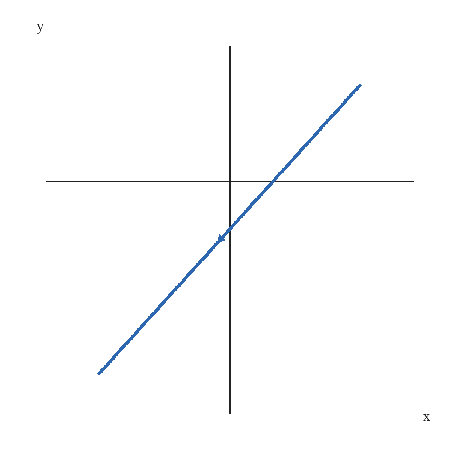
> 
> Equal scaling is used, so the line segment is not distorted.

```Mathematica title:"Problem 1: Mathematica plot"
ParametricPlot[
  {1 - 2 t, 1 - 3 t},
  {t, 0, 1},
  PlotStyle -> {Blue, AbsoluteThickness[3]},
  PlotRange -> {{-1.4, 1.4}, {-2.4, 1.4}},
  Axes -> True,
  AxesLabel -> {"x", "y"},
  AxesStyle -> Directive[Black, AbsoluteThickness[1.2]],
  LabelStyle -> Directive[Black, 14],
  PlotRangePadding -> Scaled[0.04],
  ImageSize -> 340,
  Background -> White,
  AspectRatio -> Automatic,
  Epilog -> {Blue, Arrowheads[0.06], Arrow[{{1, 1}, {-1, -2}}]}
]
```

```python title:"Problem 1: Python plot"
import math
import numpy as np
from pathlib import Path
from PIL import Image, ImageDraw

W = H = 900
M = 90
img = Image.new("RGB", (W, H), "white")
draw = ImageDraw.Draw(img)
BLUE = (44, 103, 176)
AX = (35, 35, 35)

def pt(x, y):
    return (
        M + (x + 1.4) / 2.8 * (W - 2 * M),
        H - M - (y + 2.4) / 3.8 * (H - 2 * M),
    )

draw.line([pt(0, -2.4), pt(0, 1.4)], fill=AX, width=3)
draw.line([pt(-1.4, 0), pt(1.4, 0)], fill=AX, width=3)
pts = [pt(float(x), float(y))
       for x, y in zip(np.linspace(1, -1, 220), np.linspace(1, -2, 220))]
draw.line(pts, fill=BLUE, width=7)

i = 120
p0, p1 = pts[i - 1], pts[i]
ang = math.atan2(p1[1] - p0[1], p1[0] - p0[0])
L = 18
draw.polygon(
    [p1,
     (p1[0] - L * math.cos(ang - math.pi / 7),
      p1[1] - L * math.sin(ang - math.pi / 7)),
     (p1[0] - L * math.cos(ang + math.pi / 7),
      p1[1] - L * math.sin(ang + math.pi / 7))],
    fill=BLUE,
)

img.save(Path("images") / "exercise9_problem1_python.png")
```

##### problem 2

Since the terminal point is
$e^{i\pi/3}=\frac12+i\frac{\sqrt3}{2}$, the line segment from the origin to that point may be parametrized by

$$
\gamma(t)=te^{i\pi/3},
\qquad
0\le t\le 1.
$$

Equivalently,

$$
\gamma(t)=\frac{t}{2}+i\frac{\sqrt3}{2}t,
\qquad
0\le t\le 1.
$$

> [!figure] Python figure for Problem 2
> 
> 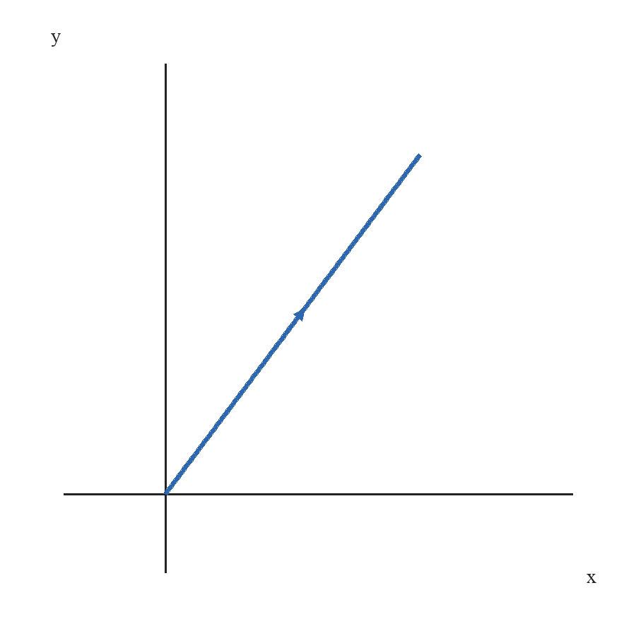
> 
> Equal scaling is used, so the segment has the correct slope.

```Mathematica title:"Problem 2: Mathematica plot"
ParametricPlot[
  {t/2, Sqrt[3] t/2},
  {t, 0, 1},
  PlotStyle -> {Blue, AbsoluteThickness[3]},
  PlotRange -> {{-0.2, 0.8}, {-0.2, 1.1}},
  Axes -> True,
  AxesLabel -> {"x", "y"},
  AxesStyle -> Directive[Black, AbsoluteThickness[1.2]],
  LabelStyle -> Directive[Black, 14],
  PlotRangePadding -> Scaled[0.04],
  ImageSize -> 340,
  Background -> White,
  AspectRatio -> Automatic,
  Epilog -> {Blue, Arrowheads[0.06], Arrow[{{0, 0}, {1/2, Sqrt[3]/2}}]}
]
```

```python title:"Problem 2: Python plot"
import math
import numpy as np
from pathlib import Path
from PIL import Image, ImageDraw

W = H = 900
M = 90
img = Image.new("RGB", (W, H), "white")
draw = ImageDraw.Draw(img)
BLUE = (44, 103, 176)
AX = (35, 35, 35)

def pt(x, y):
    return (
        M + (x + 0.2) / 1.0 * (W - 2 * M),
        H - M - (y + 0.2) / 1.3 * (H - 2 * M),
    )

draw.line([pt(0, -0.2), pt(0, 1.1)], fill=AX, width=3)
draw.line([pt(-0.2, 0), pt(0.8, 0)], fill=AX, width=3)
pts = [pt(float(x), float(y))
       for x, y in zip(np.linspace(0, 0.5, 220), np.linspace(0, math.sqrt(3) / 2, 220))]
draw.line(pts, fill=BLUE, width=7)

i = 120
p0, p1 = pts[i - 1], pts[i]
ang = math.atan2(p1[1] - p0[1], p1[0] - p0[0])
L = 18
draw.polygon(
    [p1,
     (p1[0] - L * math.cos(ang - math.pi / 7),
      p1[1] - L * math.sin(ang - math.pi / 7)),
     (p1[0] - L * math.cos(ang + math.pi / 7),
      p1[1] - L * math.sin(ang + math.pi / 7))],
    fill=BLUE,
)

img.save(Path("images") / "exercise9_problem2_python.png")
```

##### problem 3

A counterclockwise circle with center $3i$ and radius $1$ is given by

$$
\gamma(t)=3i+e^{it},
\qquad
0\le t\le 2\pi.
$$

Equivalently,

$$
\gamma(t)=\cos t+i(3+\sin t),
\qquad
0\le t\le 2\pi.
$$

> [!figure] Python figure for Problem 3
> 
> 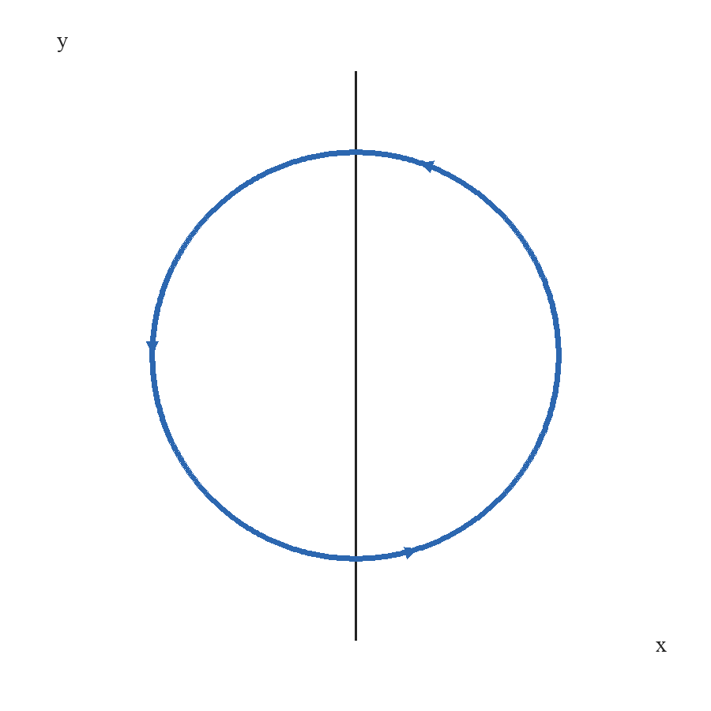
> 
> Equal scaling is used, so the circle is not stretched.

```Mathematica title:"Problem 3: Mathematica plot"
Graphics[
  {
    Blue,
    AbsoluteThickness[3],
    Arrowheads[{{0.05, 0.2}, {0.05, 0.5}, {0.05, 0.8}}],
    Arrow@Table[{Cos[t], 3 + Sin[t]}, {t, 0, 2 Pi, 2 Pi/300}]
  },
  PlotRange -> {{-1.4, 1.4}, {1.6, 4.4}},
  Axes -> True,
  AxesLabel -> {"x", "y"},
  AxesStyle -> Directive[Black, AbsoluteThickness[1.2]],
  LabelStyle -> Directive[Black, 14],
  PlotRangePadding -> Scaled[0.04],
  ImageSize -> 340,
  Background -> White,
  AspectRatio -> Automatic
]
```

```python title:"Problem 3: Python plot"
import math
import numpy as np
from pathlib import Path
from PIL import Image, ImageDraw

W = H = 900
M = 90
img = Image.new("RGB", (W, H), "white")
draw = ImageDraw.Draw(img)
BLUE = (44, 103, 176)
AX = (35, 35, 35)

def pt(x, y):
    return (
        M + (x + 1.4) / 2.8 * (W - 2 * M),
        H - M - (y - 1.6) / 2.8 * (H - 2 * M),
    )

draw.line([pt(0, 1.6), pt(0, 4.4)], fill=AX, width=3)
draw.line([pt(-1.4, 0), pt(1.4, 0)], fill=AX, width=3)
theta = np.linspace(0, 2 * math.pi, 600)
pts = [pt(math.cos(t), 3 + math.sin(t)) for t in theta]
draw.line(pts, fill=BLUE, width=7)
for frac in [0.2, 0.5, 0.8]:
    i = int(frac * (len(pts) - 1))
    p0, p1 = pts[i - 1], pts[i]
    ang = math.atan2(p1[1] - p0[1], p1[0] - p0[0])
    L = 18
    draw.polygon(
        [p1,
         (p1[0] - L * math.cos(ang - math.pi / 7),
          p1[1] - L * math.sin(ang - math.pi / 7)),
         (p1[0] - L * math.cos(ang + math.pi / 7),
          p1[1] - L * math.sin(ang + math.pi / 7))],
        fill=BLUE,
    )

img.save(Path("images") / "exercise9_problem3_python.png")
```

##### problem 4

A clockwise circle with center $-2-i$ and radius $3$ is given by

$$
\gamma(t)=-2-i+3e^{-it},
\qquad
0\le t\le 2\pi.
$$

Equivalently,

$$
\gamma(t)=(-2+3\cos t)+i(-1-3\sin t),
\qquad
0\le t\le 2\pi.
$$

> [!figure] Python figure for Problem 4
> 
> 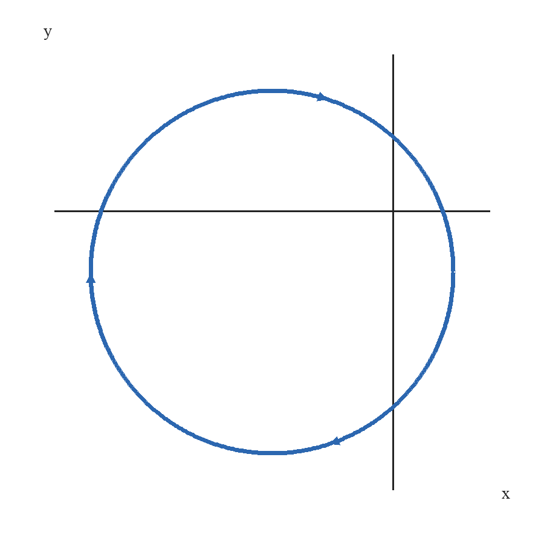
> 
> Equal scaling is used, so the circle is not stretched.

```Mathematica title:"Problem 4: Mathematica plot"
Graphics[
  {
    Blue,
    AbsoluteThickness[3],
    Arrowheads[{{0.05, 0.2}, {0.05, 0.5}, {0.05, 0.8}}],
    Arrow@Table[{-2 + 3 Cos[t], -1 - 3 Sin[t]}, {t, 0, 2 Pi, 2 Pi/320}]
  },
  PlotRange -> {{-5.6, 1.6}, {-4.6, 2.6}},
  Axes -> True,
  AxesLabel -> {"x", "y"},
  AxesStyle -> Directive[Black, AbsoluteThickness[1.2]],
  LabelStyle -> Directive[Black, 14],
  PlotRangePadding -> Scaled[0.04],
  ImageSize -> 340,
  Background -> White,
  AspectRatio -> Automatic
]
```

```python title:"Problem 4: Python plot"
import math
import numpy as np
from pathlib import Path
from PIL import Image, ImageDraw

W = H = 900
M = 90
img = Image.new("RGB", (W, H), "white")
draw = ImageDraw.Draw(img)
BLUE = (44, 103, 176)
AX = (35, 35, 35)

def pt(x, y):
    return (
        M + (x + 5.6) / 7.2 * (W - 2 * M),
        H - M - (y + 4.6) / 7.2 * (H - 2 * M),
    )

draw.line([pt(0, -4.6), pt(0, 2.6)], fill=AX, width=3)
draw.line([pt(-5.6, 0), pt(1.6, 0)], fill=AX, width=3)
theta = np.linspace(0, 2 * math.pi, 700)
pts = [pt(-2 + 3 * math.cos(t), -1 - 3 * math.sin(t)) for t in theta]
draw.line(pts, fill=BLUE, width=7)
for frac in [0.2, 0.5, 0.8]:
    i = int(frac * (len(pts) - 1))
    p0, p1 = pts[i - 1], pts[i]
    ang = math.atan2(p1[1] - p0[1], p1[0] - p0[0])
    L = 18
    draw.polygon(
        [p1,
         (p1[0] - L * math.cos(ang - math.pi / 7),
          p1[1] - L * math.sin(ang - math.pi / 7)),
         (p1[0] - L * math.cos(ang + math.pi / 7),
          p1[1] - L * math.sin(ang + math.pi / 7))],
        fill=BLUE,
    )

img.save(Path("images") / "exercise9_problem4_python.png")
```

##### problem 5

The positively oriented arc on the unit circle with
$-\frac{\pi}{4}\le \arg z\le \frac{\pi}{4}$ is parametrized by

$$
\gamma(t)=e^{it},
\qquad
-\frac{\pi}{4}\le t\le \frac{\pi}{4}.
$$

> [!figure] Python figure for Problem 5
> 
> 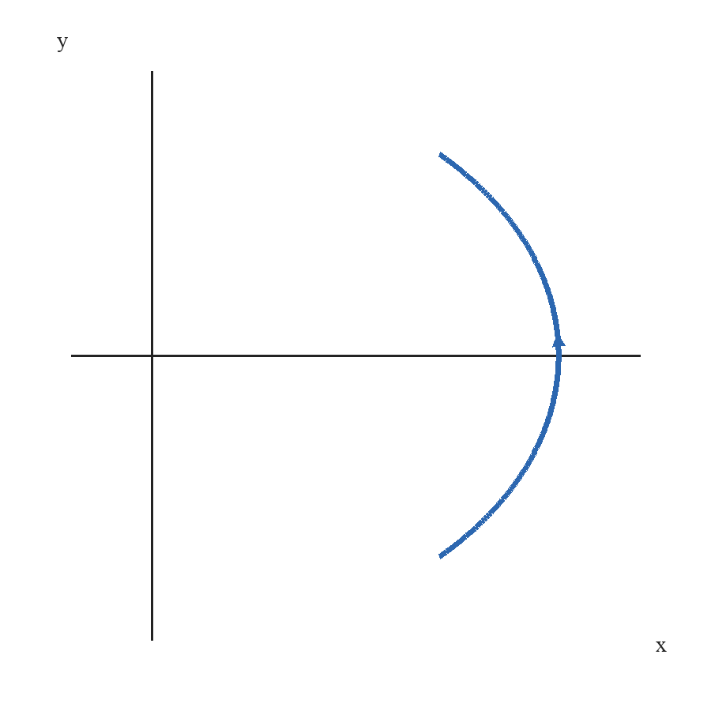
> 
> Equal scaling is used, so the unit-circle arc is not distorted.

```Mathematica title:"Problem 5: Mathematica plot"
Graphics[
  {
    Blue,
    AbsoluteThickness[3],
    Arrowheads[{{0.06, 0.55}}],
    Arrow@Table[{Cos[t], Sin[t]}, {t, -Pi/4, Pi/4, Pi/240}]
  },
  PlotRange -> {{-0.2, 1.2}, {-1.0, 1.0}},
  Axes -> True,
  AxesLabel -> {"x", "y"},
  AxesStyle -> Directive[Black, AbsoluteThickness[1.2]],
  LabelStyle -> Directive[Black, 14],
  PlotRangePadding -> Scaled[0.04],
  ImageSize -> 340,
  Background -> White,
  AspectRatio -> Automatic
]
```

```python title:"Problem 5: Python plot"
import math
import numpy as np
from pathlib import Path
from PIL import Image, ImageDraw

W = H = 900
M = 90
img = Image.new("RGB", (W, H), "white")
draw = ImageDraw.Draw(img)
BLUE = (44, 103, 176)
AX = (35, 35, 35)

def pt(x, y):
    return (
        M + (x + 0.2) / 1.4 * (W - 2 * M),
        H - M - (y + 1.0) / 2.0 * (H - 2 * M),
    )

draw.line([pt(0, -1.0), pt(0, 1.0)], fill=AX, width=3)
draw.line([pt(-0.2, 0), pt(1.2, 0)], fill=AX, width=3)
theta = np.linspace(-math.pi / 4, math.pi / 4, 300)
pts = [pt(math.cos(t), math.sin(t)) for t in theta]
draw.line(pts, fill=BLUE, width=7)
i = 160
p0, p1 = pts[i - 1], pts[i]
ang = math.atan2(p1[1] - p0[1], p1[0] - p0[0])
L = 18
draw.polygon([p1,
              (p1[0] - L * math.cos(ang - math.pi / 7),
               p1[1] - L * math.sin(ang - math.pi / 7)),
              (p1[0] - L * math.cos(ang + math.pi / 7),
               p1[1] - L * math.sin(ang + math.pi / 7))],
             fill=BLUE)
img.save(Path("images") / "exercise9_problem5_python.png")
```

##### problem 6

To reverse the orientation of the same arc, we may use

$$
\gamma(t)=e^{-it},
\qquad
-\frac{\pi}{4}\le t\le \frac{\pi}{4}.
$$

This traces the same geometric arc, but in the clockwise direction.

> [!figure] Python figure for Problem 6
> 
> 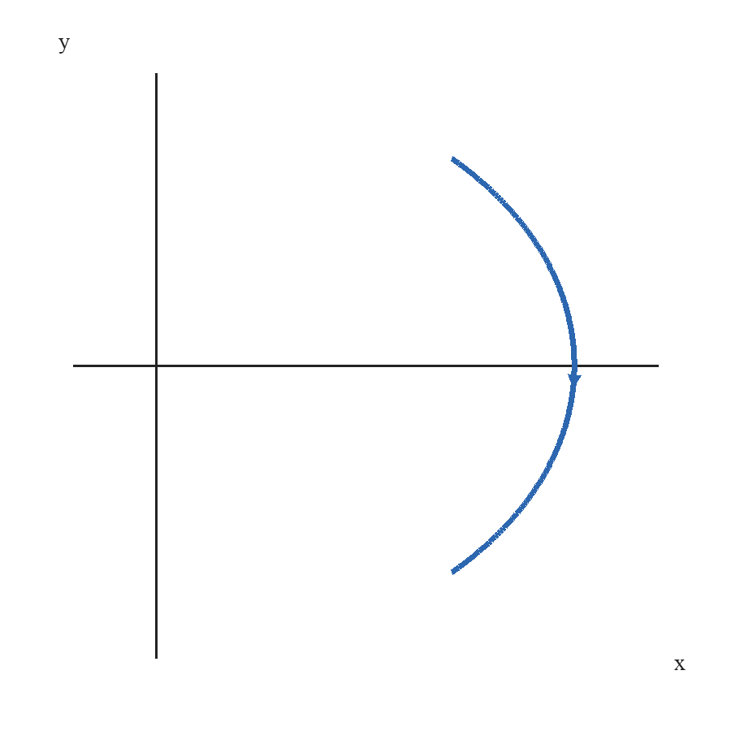
> 
> Equal scaling is used, so the unit-circle arc is not distorted.

```Mathematica title:"Problem 6: Mathematica plot"
Graphics[
  {
    Blue,
    AbsoluteThickness[3],
    Arrowheads[{{0.06, 0.55}}],
    Arrow@Table[{Cos[t], Sin[t]}, {t, Pi/4, -Pi/4, -Pi/240}]
  },
  PlotRange -> {{-0.2, 1.2}, {-1.0, 1.0}},
  Axes -> True,
  AxesLabel -> {"x", "y"},
  AxesStyle -> Directive[Black, AbsoluteThickness[1.2]],
  LabelStyle -> Directive[Black, 14],
  PlotRangePadding -> Scaled[0.04],
  ImageSize -> 340,
  Background -> White,
  AspectRatio -> Automatic
]
```

```python title:"Problem 6: Python plot"
import math
import numpy as np
from pathlib import Path
from PIL import Image, ImageDraw

W = H = 900
M = 90
img = Image.new("RGB", (W, H), "white")
draw = ImageDraw.Draw(img)
BLUE = (44, 103, 176)
AX = (35, 35, 35)

def pt(x, y):
    return (
        M + (x + 0.2) / 1.4 * (W - 2 * M),
        H - M - (y + 1.0) / 2.0 * (H - 2 * M),
    )

draw.line([pt(0, -1.0), pt(0, 1.0)], fill=AX, width=3)
draw.line([pt(-0.2, 0), pt(1.2, 0)], fill=AX, width=3)
theta = np.linspace(math.pi / 4, -math.pi / 4, 300)
pts = [pt(math.cos(t), math.sin(t)) for t in theta]
draw.line(pts, fill=BLUE, width=7)
i = 160
p0, p1 = pts[i - 1], pts[i]
ang = math.atan2(p1[1] - p0[1], p1[0] - p0[0])
L = 18
draw.polygon([p1,
              (p1[0] - L * math.cos(ang - math.pi / 7),
               p1[1] - L * math.sin(ang - math.pi / 7)),
              (p1[0] - L * math.cos(ang + math.pi / 7),
               p1[1] - L * math.sin(ang + math.pi / 7))],
             fill=BLUE)
img.save(Path("images") / "exercise9_problem6_python.png")
```

##### problem 7

The path $[z_1,z_2,z_3,z_1]$ with
$z_1=0$, $z_2=i$, and $z_3=-1$ has three line segments, so we reparametrize each one on a third of $[0,1]$.

From $z_1$ to $z_2$, a parametrization on $[0,1]$ is $is$. Setting $s=3t$ gives

$$
\gamma(t)=3it,
\qquad
0\le t\le \frac13.
$$

From $z_2$ to $z_3$, a parametrization on $[0,1]$ is

$$
(1-s)i+s(-1)=-s+i(1-s).
$$

Setting $s=3t-1$ gives

$$
\gamma(t)=1-3t+i(2-3t),
\qquad
\frac13\le t\le \frac23.
$$

From $z_3$ back to $z_1$, a parametrization on $[0,1]$ is

$$
(1-s)(-1)=s-1.
$$

Setting $s=3t-2$ gives

$$
\gamma(t)=3t-3,
\qquad
\frac23\le t\le 1.
$$

Therefore

$$
\gamma(t)=
\begin{cases}
3it, & 0\le t\le \frac13,\\[4pt]
1-3t+i(2-3t), & \frac13\le t\le \frac23,\\[4pt]
3t-3, & \frac23\le t\le 1.
\end{cases}
$$

> [!figure] Python figure for Problem 7
> 
> 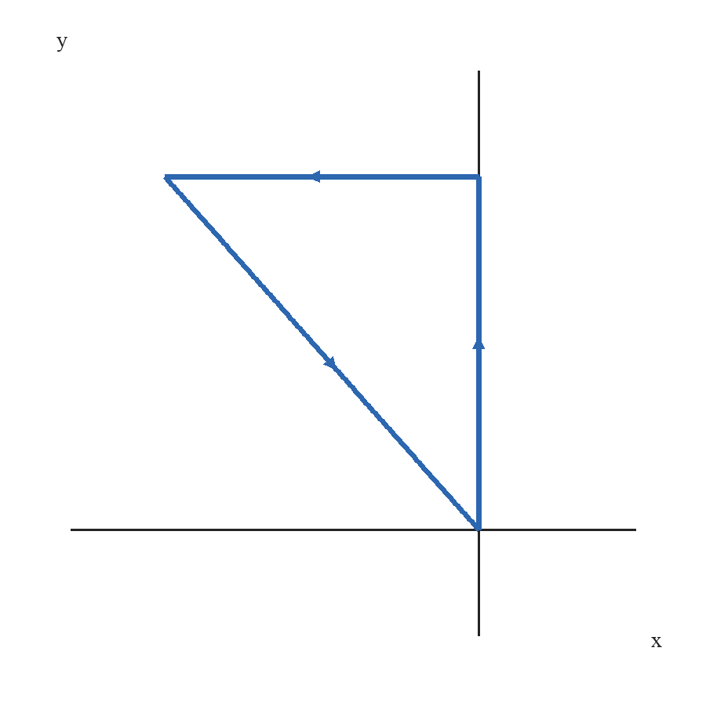
> 
> Equal scaling is used, so the polygonal path is not distorted.

```Mathematica title:"Problem 7: Mathematica plot"
Graphics[
  {
    Blue,
    AbsoluteThickness[3],
    Arrowheads[{{0.055, 0.55}}],
    Arrow[{{0, 0}, {0, 1}}],
    Arrow[{{0, 1}, {-1, 1}}],
    Arrow[{{-1, 1}, {0, 0}}]
  },
  PlotRange -> {{-1.3, 0.5}, {-0.3, 1.3}},
  Axes -> True,
  AxesLabel -> {"x", "y"},
  AxesStyle -> Directive[Black, AbsoluteThickness[1.2]],
  LabelStyle -> Directive[Black, 14],
  PlotRangePadding -> Scaled[0.04],
  ImageSize -> 340,
  Background -> White,
  AspectRatio -> Automatic
]
```

```python title:"Problem 7: Python plot"
import math
import numpy as np
from pathlib import Path
from PIL import Image, ImageDraw

W = H = 900
M = 90
img = Image.new("RGB", (W, H), "white")
draw = ImageDraw.Draw(img)
BLUE = (44, 103, 176)
AX = (35, 35, 35)

def pt(x, y):
    return (
        M + (x + 1.3) / 1.8 * (W - 2 * M),
        H - M - (y + 0.3) / 1.6 * (H - 2 * M),
    )

draw.line([pt(0, -0.3), pt(0, 1.3)], fill=AX, width=3)
draw.line([pt(-1.3, 0), pt(0.5, 0)], fill=AX, width=3)
segments = [
    [pt(0, float(y)) for y in np.linspace(0, 1, 180)],
    [pt(float(x), 1.0) for x in np.linspace(0, -1, 180)],
    [pt(float(x), float(y))
     for x, y in zip(np.linspace(-1, 0, 180), np.linspace(1, 0, 180))],
]
for seg in segments:
    draw.line(seg, fill=BLUE, width=7)
    i = 100
    p0, p1 = seg[i - 1], seg[i]
    ang = math.atan2(p1[1] - p0[1], p1[0] - p0[0])
    L = 18
    draw.polygon([p1,
                  (p1[0] - L * math.cos(ang - math.pi / 7),
                   p1[1] - L * math.sin(ang - math.pi / 7)),
                  (p1[0] - L * math.cos(ang + math.pi / 7),
                   p1[1] - L * math.sin(ang + math.pi / 7))],
                 fill=BLUE)
img.save(Path("images") / "exercise9_problem7_python.png")
```

##### problem 8

For the polygonal path $[z_1,z_2,z_3,z_4]$ with
$z_1=1$, $z_2=2$, $z_3=i$, and $z_4=2i$, we again divide $[0,1]$ into thirds.

From $1$ to $2$, a parametrization is

$$
\gamma(t)=1+3t,
\qquad
0\le t\le \frac13.
$$

From $2$ to $i$, a parametrization on $[0,1]$ is

$$
(1-s)2+si=2-2s+is.
$$

Setting $s=3t-1$ gives

$$
\gamma(t)=4-6t+i(3t-1),
\qquad
\frac13\le t\le \frac23.
$$

From $i$ to $2i$, a parametrization on $[0,1]$ is

$$
(1-s)i+s(2i)=i(1+s).
$$

Setting $s=3t-2$ gives

$$
\gamma(t)=i(3t-1),
\qquad
\frac23\le t\le 1.
$$

Therefore

$$
\gamma(t)=
\begin{cases}
1+3t, & 0\le t\le \frac13,\\[4pt]
4-6t+i(3t-1), & \frac13\le t\le \frac23,\\[4pt]
i(3t-1), & \frac23\le t\le 1.
\end{cases}
$$

> [!figure] Python figure for Problem 8
> 
> 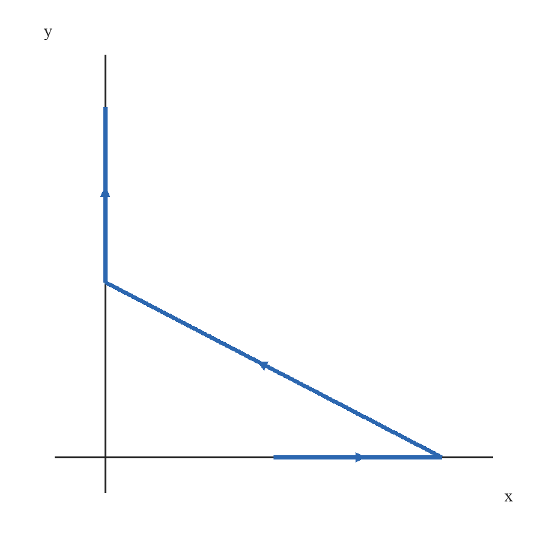
> 
> Equal scaling is used, so the polygonal path is not distorted.

```Mathematica title:"Problem 8: Mathematica plot"
Graphics[
  {
    Blue,
    AbsoluteThickness[3],
    Arrowheads[{{0.055, 0.55}}],
    Arrow[{{1, 0}, {2, 0}}],
    Arrow[{{2, 0}, {0, 1}}],
    Arrow[{{0, 1}, {0, 2}}]
  },
  PlotRange -> {{-0.3, 2.3}, {-0.2, 2.3}},
  Axes -> True,
  AxesLabel -> {"x", "y"},
  AxesStyle -> Directive[Black, AbsoluteThickness[1.2]],
  LabelStyle -> Directive[Black, 14],
  PlotRangePadding -> Scaled[0.04],
  ImageSize -> 340,
  Background -> White,
  AspectRatio -> Automatic
]
```

```python title:"Problem 8: Python plot"
import math
import numpy as np
from pathlib import Path
from PIL import Image, ImageDraw

W = H = 900
M = 90
img = Image.new("RGB", (W, H), "white")
draw = ImageDraw.Draw(img)
BLUE = (44, 103, 176)
AX = (35, 35, 35)

def pt(x, y):
    return (
        M + (x + 0.3) / 2.6 * (W - 2 * M),
        H - M - (y + 0.2) / 2.5 * (H - 2 * M),
    )

draw.line([pt(0, -0.2), pt(0, 2.3)], fill=AX, width=3)
draw.line([pt(-0.3, 0), pt(2.3, 0)], fill=AX, width=3)
segments = [
    [pt(float(x), 0.0) for x in np.linspace(1, 2, 160)],
    [pt(float(x), float(y))
     for x, y in zip(np.linspace(2, 0, 220), np.linspace(0, 1, 220))],
    [pt(0.0, float(y)) for y in np.linspace(1, 2, 160)],
]
for seg in segments:
    draw.line(seg, fill=BLUE, width=7)
    i = len(seg) // 2
    p0, p1 = seg[i - 1], seg[i]
    ang = math.atan2(p1[1] - p0[1], p1[0] - p0[0])
    L = 18
    draw.polygon([p1,
                  (p1[0] - L * math.cos(ang - math.pi / 7),
                   p1[1] - L * math.sin(ang - math.pi / 7)),
                  (p1[0] - L * math.cos(ang + math.pi / 7),
                   p1[1] - L * math.sin(ang + math.pi / 7))],
                 fill=BLUE)
img.save(Path("images") / "exercise9_problem8_python.png")
```

##### problem 9


The contour is the arc of the circle centered at $-3+2i$ with radius $5$, running from $-3-3i$ to $2+2i$. Since

$$
-3-3i=(-3+2i)+5e^{-i\pi/2}
\quad\text{and}\quad
2+2i=(-3+2i)+5e^0,
$$

one parametrization is

$$
\gamma(t)=-3+2i+5e^{it},
\qquad
-\frac{\pi}{2}\le t\le 0.
$$

> [!figure] Python figure for Problem 9
> 
> 
> 
> Equal scaling is used, so the circular arc is not distorted.

```Mathematica title:"Problem 9: Mathematica plot"
Graphics[
  {
    Blue,
    AbsoluteThickness[3],
    Arrowheads[{{0.06, 0.55}}],
    Arrow@Table[{-3 + 5 Cos[t], 2 + 5 Sin[t]}, {t, -Pi/2, 0, Pi/260}]
  },
  PlotRange -> {{-8.8, 2.8}, {-3.8, 7.2}},
  Axes -> True,
  AxesLabel -> {"x", "y"},
  AxesStyle -> Directive[Black, AbsoluteThickness[1.2]],
  LabelStyle -> Directive[Black, 14],
  PlotRangePadding -> Scaled[0.04],
  ImageSize -> 340,
  Background -> White,
  AspectRatio -> Automatic
]
```

```python title:"Problem 9: Python plot"
import math
import numpy as np
from pathlib import Path
from PIL import Image, ImageDraw

W = H = 900
M = 90
img = Image.new("RGB", (W, H), "white")
draw = ImageDraw.Draw(img)
BLUE = (44, 103, 176)
AX = (35, 35, 35)

def pt(x, y):
    return (
        M + (x + 8.8) / 11.6 * (W - 2 * M),
        H - M - (y + 3.8) / 11.0 * (H - 2 * M),
    )

draw.line([pt(0, -3.8), pt(0, 7.2)], fill=AX, width=3)
draw.line([pt(-8.8, 0), pt(2.8, 0)], fill=AX, width=3)
theta = np.linspace(-math.pi / 2, 0, 350)
pts = [pt(-3 + 5 * math.cos(t), 2 + 5 * math.sin(t)) for t in theta]
draw.line(pts, fill=BLUE, width=7)
i = 190
p0, p1 = pts[i - 1], pts[i]
ang = math.atan2(p1[1] - p0[1], p1[0] - p0[0])
L = 18
draw.polygon([p1,
              (p1[0] - L * math.cos(ang - math.pi / 7),
               p1[1] - L * math.sin(ang - math.pi / 7)),
              (p1[0] - L * math.cos(ang + math.pi / 7),
               p1[1] - L * math.sin(ang + math.pi / 7))],
             fill=BLUE)
img.save(Path("images") / "exercise9_problem9_python.png")
```

##### problem 10

From the figure, the contour lies on the circle centered at $0$ with radius $2$, so the standard circle form is $\gamma(t)=2e^{it}$. We must now choose the correct interval of angles.

The point $2i$ has angle $\frac{\pi}{2}$, and the point $2$ has angle $0$ or $2\pi$. Since the arrow in the figure shows the long counterclockwise arc from $2i$ to $2$, we must let the angle increase from $\frac{\pi}{2}$ to $2\pi$. Therefore a parametrization is

$$
\gamma(t)=2e^{it},
\qquad
\frac{\pi}{2}\le t\le 2\pi.
$$

> [!figure] Python figure for Problem 10
> 
> 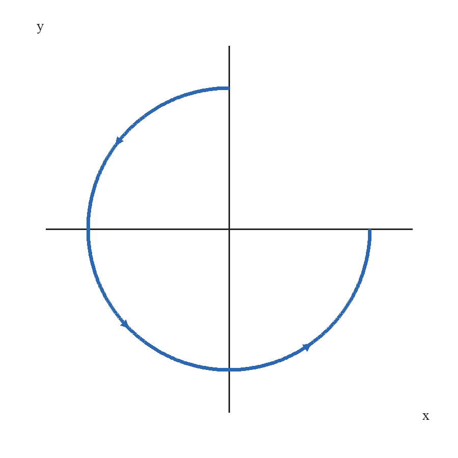
> 
> Equal scaling is used, so the circular arc is not distorted.

```Mathematica title:"Problem 10: Mathematica plot"
Graphics[
  {
    Blue,
    AbsoluteThickness[3],
    Arrowheads[{{0.05, 0.2}, {0.05, 0.5}, {0.05, 0.8}}],
    Arrow@Table[{2 Cos[t], 2 Sin[t]}, {t, Pi/2, 2 Pi, 2 Pi/400}]
  },
  PlotRange -> {{-2.6, 2.6}, {-2.6, 2.6}},
  Axes -> True,
  AxesLabel -> {"x", "y"},
  AxesStyle -> Directive[Black, AbsoluteThickness[1.2]],
  LabelStyle -> Directive[Black, 14],
  PlotRangePadding -> Scaled[0.04],
  ImageSize -> 340,
  Background -> White,
  AspectRatio -> Automatic
]
```

```python title:"Problem 10: Python plot"
import math
import numpy as np
from pathlib import Path
from PIL import Image, ImageDraw

W = H = 900
M = 90
img = Image.new("RGB", (W, H), "white")
draw = ImageDraw.Draw(img)
BLUE = (44, 103, 176)
AX = (35, 35, 35)

def pt(x, y):
    return (
        M + (x + 2.6) / 5.2 * (W - 2 * M),
        H - M - (y + 2.6) / 5.2 * (H - 2 * M),
    )

draw.line([pt(0, -2.6), pt(0, 2.6)], fill=AX, width=3)
draw.line([pt(-2.6, 0), pt(2.6, 0)], fill=AX, width=3)
theta = np.linspace(math.pi / 2, 2 * math.pi, 700)
pts = [pt(2 * math.cos(t), 2 * math.sin(t)) for t in theta]
draw.line(pts, fill=BLUE, width=7)
for frac in [0.2, 0.5, 0.8]:
    i = int(frac * (len(pts) - 1))
    p0, p1 = pts[i - 1], pts[i]
    ang = math.atan2(p1[1] - p0[1], p1[0] - p0[0])
    L = 18
    draw.polygon([p1,
                  (p1[0] - L * math.cos(ang - math.pi / 7),
                   p1[1] - L * math.sin(ang - math.pi / 7)),
                  (p1[0] - L * math.cos(ang + math.pi / 7),
                   p1[1] - L * math.sin(ang + math.pi / 7))],
                 fill=BLUE)
img.save(Path("images") / "exercise9_problem10_python.png")
```

##### problem 11

From the figure, the contour is part of the parabola $y=x^2$. Since points on this parabola have the form $(x,y)=(x,x^2)$, we let the real part be the parameter: $x=t$. Then $y=t^2$, so the corresponding complex number is

$$
z=x+iy=t+it^2.
$$

The left endpoint is $-1+i$, which corresponds to $t=-1$, and the right endpoint is $1+i$, which corresponds to $t=1$. As $t$ increases from $-1$ to $1$, the curve passes through $0$ when $t=0$, exactly as shown in the figure. Therefore a convenient parametrization is

$$
\gamma(t)=t+it^2,
\qquad
-1\le t\le 1.
$$

> [!figure] Python figure for Problem 11
> 
> 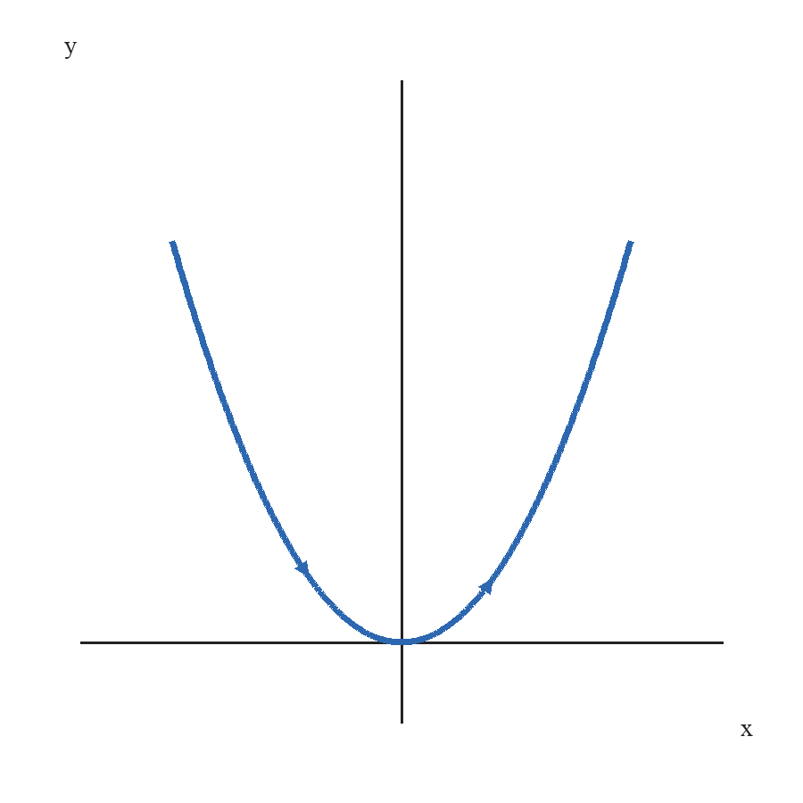
> 
> Equal scaling is used, so the parabola arc is not distorted.

```Mathematica title:"Problem 11: Mathematica plot"
Graphics[
  {
    Blue,
    AbsoluteThickness[3],
    Arrowheads[{{0.05, 0.3}, {0.05, 0.7}}],
    Arrow@Table[{t, t^2}, {t, -1, 1, 1/250}]
  },
  PlotRange -> {{-1.4, 1.4}, {-0.2, 1.4}},
  Axes -> True,
  AxesLabel -> {"x", "y"},
  AxesStyle -> Directive[Black, AbsoluteThickness[1.2]],
  LabelStyle -> Directive[Black, 14],
  PlotRangePadding -> Scaled[0.04],
  ImageSize -> 340,
  Background -> White,
  AspectRatio -> Automatic
]
```

```python title:"Problem 11: Python plot"
import math
import numpy as np
from pathlib import Path
from PIL import Image, ImageDraw

W = H = 900
M = 90
img = Image.new("RGB", (W, H), "white")
draw = ImageDraw.Draw(img)
BLUE = (44, 103, 176)
AX = (35, 35, 35)

def pt(x, y):
    return (
        M + (x + 1.4) / 2.8 * (W - 2 * M),
        H - M - (y + 0.2) / 1.6 * (H - 2 * M),
    )

draw.line([pt(0, -0.2), pt(0, 1.4)], fill=AX, width=3)
draw.line([pt(-1.4, 0), pt(1.4, 0)], fill=AX, width=3)
x = np.linspace(-1, 1, 400)
pts = [pt(float(t), float(t * t)) for t in x]
draw.line(pts, fill=BLUE, width=7)
for frac in [0.3, 0.7]:
    i = int(frac * (len(pts) - 1))
    p0, p1 = pts[i - 1], pts[i]
    ang = math.atan2(p1[1] - p0[1], p1[0] - p0[0])
    L = 18
    draw.polygon([p1,
                  (p1[0] - L * math.cos(ang - math.pi / 7),
                   p1[1] - L * math.sin(ang - math.pi / 7)),
                  (p1[0] - L * math.cos(ang + math.pi / 7),
                   p1[1] - L * math.sin(ang + math.pi / 7))],
                 fill=BLUE)
img.save(Path("images") / "exercise9_problem11_python.png")
```

##### problem 12


From the figure, this is the same quarter-circle arc as in Problem 9, but with the opposite orientation. The circle still has center $-3+2i$ and radius $5$, so we again start from the standard translated circle form

$$
\gamma(t)=-3+2i+5e^{i\theta}.
$$

The point $2+2i$ lies to the right of the center, so it corresponds to angle $0$. The point $-3-3i$ lies directly below the center, so it corresponds to angle $-\frac{\pi}{2}$. Since the figure shows the arc being traced from $2+2i$ down to $-3-3i$, we let the angle decrease from $0$ to $-\frac{\pi}{2}$. Therefore one parametrization is

$$
\gamma(t)=-3+2i+5e^{-it},
\qquad
0\le t\le \frac{\pi}{2}.
$$

> [!figure] Python figure for Problem 12
> 
> 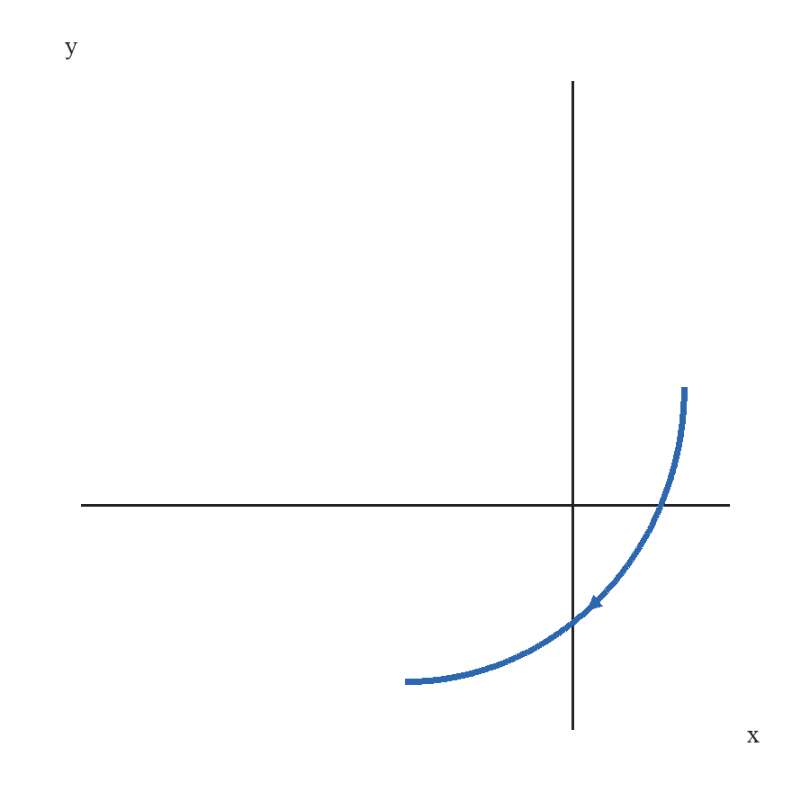
> 
> Equal scaling is used, so the circular arc is not distorted.

```Mathematica title:"Problem 12: Mathematica plot"
Graphics[
  {
    Blue,
    AbsoluteThickness[3],
    Arrowheads[{{0.06, 0.55}}],
    Arrow@Table[{-3 + 5 Cos[t], 2 + 5 Sin[t]}, {t, 0, -Pi/2, -Pi/260}]
  },
  PlotRange -> {{-8.8, 2.8}, {-3.8, 7.2}},
  Axes -> True,
  AxesLabel -> {"x", "y"},
  AxesStyle -> Directive[Black, AbsoluteThickness[1.2]],
  LabelStyle -> Directive[Black, 14],
  PlotRangePadding -> Scaled[0.04],
  ImageSize -> 340,
  Background -> White,
  AspectRatio -> Automatic
]
```

```python title:"Problem 12: Python plot"
import math
import numpy as np
from pathlib import Path
from PIL import Image, ImageDraw

W = H = 900
M = 90
img = Image.new("RGB", (W, H), "white")
draw = ImageDraw.Draw(img)
BLUE = (44, 103, 176)
AX = (35, 35, 35)

def pt(x, y):
    return (
        M + (x + 8.8) / 11.6 * (W - 2 * M),
        H - M - (y + 3.8) / 11.0 * (H - 2 * M),
    )

draw.line([pt(0, -3.8), pt(0, 7.2)], fill=AX, width=3)
draw.line([pt(-8.8, 0), pt(2.8, 0)], fill=AX, width=3)
theta = np.linspace(0, -math.pi / 2, 350)
pts = [pt(-3 + 5 * math.cos(t), 2 + 5 * math.sin(t)) for t in theta]
draw.line(pts, fill=BLUE, width=7)
i = 190
p0, p1 = pts[i - 1], pts[i]
ang = math.atan2(p1[1] - p0[1], p1[0] - p0[0])
L = 18
draw.polygon([p1,
              (p1[0] - L * math.cos(ang - math.pi / 7),
               p1[1] - L * math.sin(ang - math.pi / 7)),
              (p1[0] - L * math.cos(ang + math.pi / 7),
               p1[1] - L * math.sin(ang + math.pi / 7))],
             fill=BLUE)
img.save(Path("images") / "exercise9_problem12_python.png")
```

##### problem 13

From the figure, this is the same circle as in Problem 10: center $0$, radius $2$. So we again use the standard circle form $\gamma(t)=2e^{i\theta}$ and choose the angle interval to match the direction.

The starting point is $2$, which has angle $0$, and the terminal point is $2i$, which has angle $\frac{\pi}{2}$. The arrow shows that the path follows the long arc in the clockwise direction, so we should move through decreasing angles from $0$ down to $-\frac{3\pi}{2}$. Therefore one parametrization is

$$
\gamma(t)=2e^{-it},
\qquad
0\le t\le \frac{3\pi}{2}.
$$

> [!figure] Python figure for Problem 13
> 
> 
> 
> Equal scaling is used, so the circular arc is not distorted.

```Mathematica title:"Problem 13: Mathematica plot"
Graphics[
  {
    Blue,
    AbsoluteThickness[3],
    Arrowheads[{{0.05, 0.2}, {0.05, 0.5}, {0.05, 0.8}}],
    Arrow@Table[{2 Cos[t], 2 Sin[t]}, {t, 0, -3 Pi/2, -Pi/260}]
  },
  PlotRange -> {{-2.6, 2.6}, {-2.6, 2.6}},
  Axes -> True,
  AxesLabel -> {"x", "y"},
  AxesStyle -> Directive[Black, AbsoluteThickness[1.2]],
  LabelStyle -> Directive[Black, 14],
  PlotRangePadding -> Scaled[0.04],
  ImageSize -> 340,
  Background -> White,
  AspectRatio -> Automatic
]
```

```python title:"Problem 13: Python plot"
import math
import numpy as np
from pathlib import Path
from PIL import Image, ImageDraw

W = H = 900
M = 90
img = Image.new("RGB", (W, H), "white")
draw = ImageDraw.Draw(img)
BLUE = (44, 103, 176)
AX = (35, 35, 35)

def pt(x, y):
    return (
        M + (x + 2.6) / 5.2 * (W - 2 * M),
        H - M - (y + 2.6) / 5.2 * (H - 2 * M),
    )

draw.line([pt(0, -2.6), pt(0, 2.6)], fill=AX, width=3)
draw.line([pt(-2.6, 0), pt(2.6, 0)], fill=AX, width=3)
theta = np.linspace(0, -3 * math.pi / 2, 700)
pts = [pt(2 * math.cos(t), 2 * math.sin(t)) for t in theta]
draw.line(pts, fill=BLUE, width=7)
for frac in [0.2, 0.5, 0.8]:
    i = int(frac * (len(pts) - 1))
    p0, p1 = pts[i - 1], pts[i]
    ang = math.atan2(p1[1] - p0[1], p1[0] - p0[0])
    L = 18
    draw.polygon([p1,
                  (p1[0] - L * math.cos(ang - math.pi / 7),
                   p1[1] - L * math.sin(ang - math.pi / 7)),
                  (p1[0] - L * math.cos(ang + math.pi / 7),
                   p1[1] - L * math.sin(ang + math.pi / 7))],
                 fill=BLUE)
img.save(Path("images") / "exercise9_problem13_python.png")
```

##### problem 14

From the figure, the contour is the same parabola arc as in Problem 11, so it still lies on $y=x^2$. To trace it from right to left, we want the real part to decrease from $1$ to $-1$.

If we let $x=-t$, then as $t$ increases from $-1$ to $1$, the value of $x$ decreases from $1$ to $-1$. Since $y=x^2$, we get

$$
y=(-t)^2=t^2.
$$

Thus the corresponding complex number is $z=x+iy=-t+it^2$. When $t=-1$, we get $1+i$; when $t=1$, we get $-1+i$; and when $t=0$, we get $0$. So this matches the figure and the required orientation. One convenient parametrization is

$$
\gamma(t)=-t+it^2,
\qquad
-1\le t\le 1.
$$


> [!figure] Python figure for Problem 14
> 
> 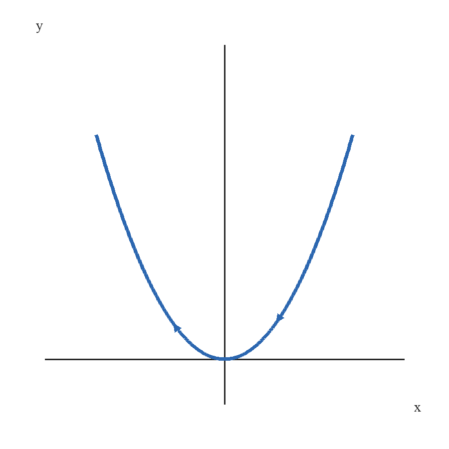
> 
> Equal scaling is used, so the parabola arc is not distorted.

```Mathematica title:"Problem 14: Mathematica plot"
Graphics[
  {
    Blue,
    AbsoluteThickness[3],
    Arrowheads[{{0.05, 0.3}, {0.05, 0.7}}],
    Arrow@Table[{-t, t^2}, {t, -1, 1, 1/250}]
  },
  PlotRange -> {{-1.4, 1.4}, {-0.2, 1.4}},
  Axes -> True,
  AxesLabel -> {"x", "y"},
  AxesStyle -> Directive[Black, AbsoluteThickness[1.2]],
  LabelStyle -> Directive[Black, 14],
  PlotRangePadding -> Scaled[0.04],
  ImageSize -> 340,
  Background -> White,
  AspectRatio -> Automatic
]
```

```python title:"Problem 14: Python plot"
import math
import numpy as np
from pathlib import Path
from PIL import Image, ImageDraw

W = H = 900
M = 90
img = Image.new("RGB", (W, H), "white")
draw = ImageDraw.Draw(img)
BLUE = (44, 103, 176)
AX = (35, 35, 35)

def pt(x, y):
    return (
        M + (x + 1.4) / 2.8 * (W - 2 * M),
        H - M - (y + 0.2) / 1.6 * (H - 2 * M),
    )

draw.line([pt(0, -0.2), pt(0, 1.4)], fill=AX, width=3)
draw.line([pt(-1.4, 0), pt(1.4, 0)], fill=AX, width=3)
x = np.linspace(-1, 1, 400)
pts = [pt(float(-t), float(t * t)) for t in x]
draw.line(pts, fill=BLUE, width=7)
for frac in [0.3, 0.7]:
    i = int(frac * (len(pts) - 1))
    p0, p1 = pts[i - 1], pts[i]
    ang = math.atan2(p1[1] - p0[1], p1[0] - p0[0])
    L = 18
    draw.polygon([p1,
                  (p1[0] - L * math.cos(ang - math.pi / 7),
                   p1[1] - L * math.sin(ang - math.pi / 7)),
                  (p1[0] - L * math.cos(ang + math.pi / 7),
                   p1[1] - L * math.sin(ang + math.pi / 7))],
                 fill=BLUE)
img.save(Path("images") / "exercise9_problem14_python.png")
```


++++


> [!exercise] Exercise 10
> In problems 15-18, plot the given path.
> 15. $\gamma(t)=t e^{-i t}, 0 \leq t \leq 2 \pi$.
> 16. $\gamma(t)=2 \cos t+i \sin t, 0 \leq t \leq 2 \pi$.
> 17. $\gamma(t)=t+i \sin (\pi t), 0 \leq t \leq 1$.
> 18. $\gamma(t)=t^{2}+i t,-3 \leq t \leq 3$.


##### solution

##### problem 15

Write $\gamma(t)=x(t)+iy(t)$ with $x(t)=t\cos t$ and $y(t)=-t\sin t$. This is easiest to understand in polar form: $\gamma(t)=te^{-it}$, so the radius is $r=t$ and the angle is $\theta=-t$. As $t$ increases from $0$ to $2\pi$, the radius increases from $0$ to $2\pi$ while the angle decreases by $2\pi$. Therefore the path is a clockwise spiral that starts at the origin and winds outward once, ending at $2\pi$ on the positive real axis.

> [!figure] Python figure for Problem 15
> 
> 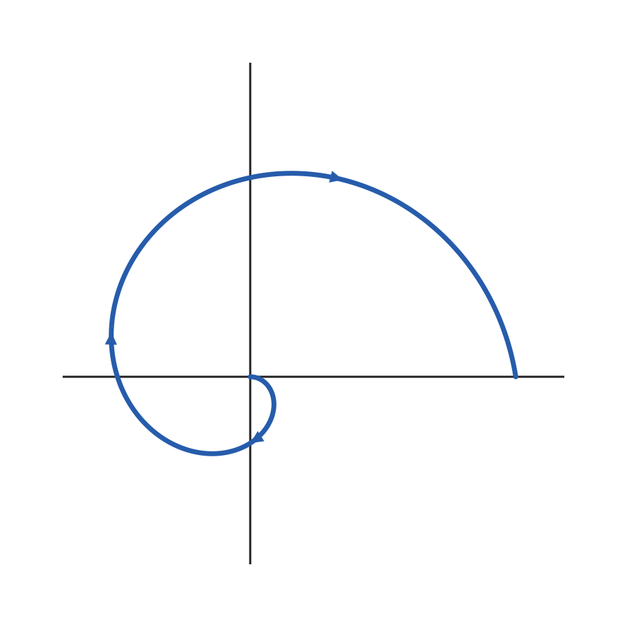
> 
> Equal scaling is used, so the spiral is not distorted.

```Mathematica title:"Problem 15: Mathematica plot"
Graphics[
  {
    Blue,
    AbsoluteThickness[3],
    Arrowheads[{{0.05, 0.25}, {0.05, 0.55}, {0.05, 0.82}}],
    Arrow@Table[{t Cos[t], -t Sin[t]}, {t, 0, 2 Pi, 2 Pi/500}]
  },
  PlotRange -> {{-5.8, 6.8}, {-5.8, 6.8}},
  Axes -> True,
  AxesLabel -> {"x", "y"},
  AxesStyle -> Directive[Black, AbsoluteThickness[1.2]],
  LabelStyle -> Directive[Black, 14],
  PlotRangePadding -> Scaled[0.04],
  ImageSize -> 340,
  Background -> White,
  AspectRatio -> Automatic
]
```

```python title:"Problem 15: Python plot"
import math
from pathlib import Path

W = H = 900
M = 90
BLUE = "#265cab"
AX = "#232323"
BG = "#ffffff"

def square_bounds(xs, ys, pad_frac=0.12):
    xmin, xmax = min(xs), max(xs)
    ymin, ymax = min(ys), max(ys)
    cx = (xmin + xmax) / 2
    cy = (ymin + ymax) / 2
    span = max(xmax - xmin, ymax - ymin)
    span *= 1 + 2 * pad_frac
    half = span / 2
    return cx - half, cx + half, cy - half, cy + half

def make_mapper(bounds):
    xmin, xmax, ymin, ymax = bounds
    def pt(x, y):
        return (
            M + (x - xmin) / (xmax - xmin) * (W - 2 * M),
            H - M - (y - ymin) / (ymax - ymin) * (H - 2 * M),
        )
    return pt

def arrow_polygon(p0, p1, L=20, ang_width=math.pi / 7):
    ang = math.atan2(p1[1] - p0[1], p1[0] - p0[0])
    return [
        p1,
        (p1[0] - L * math.cos(ang - ang_width), p1[1] - L * math.sin(ang - ang_width)),
        (p1[0] - L * math.cos(ang + ang_width), p1[1] - L * math.sin(ang + ang_width)),
    ]

ts = [2 * math.pi * k / 1199 for k in range(1200)]
xy = [(t * math.cos(t), -t * math.sin(t)) for t in ts]
xs = [x for x, _ in xy]
ys = [y for _, y in xy]
bounds = square_bounds(xs, ys)
xmin, xmax, ymin, ymax = bounds
pt = make_mapper(bounds)
pts = [pt(x, y) for x, y in xy]

parts = [f'<svg xmlns="http://www.w3.org/2000/svg" width="{W}" height="{H}" viewBox="0 0 {W} {H}">']
parts.append(f'<rect width="100%" height="100%" fill="{BG}"/>')
if xmin <= 0 <= xmax:
    x0, y0 = pt(0, ymin)
    x1, y1 = pt(0, ymax)
    parts.append(f'<line x1="{x0:.2f}" y1="{y0:.2f}" x2="{x1:.2f}" y2="{y1:.2f}" stroke="{AX}" stroke-width="3"/>')
if ymin <= 0 <= ymax:
    x0, y0 = pt(xmin, 0)
    x1, y1 = pt(xmax, 0)
    parts.append(f'<line x1="{x0:.2f}" y1="{y0:.2f}" x2="{x1:.2f}" y2="{y1:.2f}" stroke="{AX}" stroke-width="3"/>')
poly = " ".join(f"{x:.2f},{y:.2f}" for x, y in pts)
parts.append(f'<polyline points="{poly}" fill="none" stroke="{BLUE}" stroke-width="7" stroke-linecap="round" stroke-linejoin="round"/>')
for frac in [0.25, 0.55, 0.82]:
    i = int(frac * (len(pts) - 1))
    tri = " ".join(f"{x:.2f},{y:.2f}" for x, y in arrow_polygon(pts[i - 1], pts[i]))
    parts.append(f'<polygon points="{tri}" fill="{BLUE}"/>')
parts.append("</svg>")

Path("images/exercise10_problem15_python.svg").write_text("\n".join(parts), encoding="utf-8")
```

##### problem 16

Here $\gamma(t)=2\cos t+i\sin t$, so $x=2\cos t$ and $y=\sin t$. Eliminating $t$ gives $\left(\frac{x}{2}\right)^2+y^2=\cos^2 t+\sin^2 t=1$, so the graph is the ellipse $\frac{x^2}{4}+y^2=1$. It is centered at the origin, with semimajor axis $2$ on the $x$-axis and semiminor axis $1$ on the $y$-axis. At $t=0$ the point is $(2,0)$, and for small positive $t$ the value of $y=\sin t$ is positive, so the path moves upward from $(2,0)$. Therefore the ellipse is traced once counterclockwise.

> [!figure] Python figure for Problem 16
> 
> 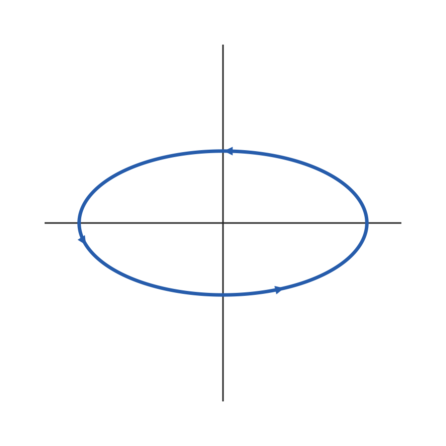
> 
> Equal scaling is used, so the ellipse is not distorted.

```Mathematica title:"Problem 16: Mathematica plot"
Graphics[
  {
    Blue,
    AbsoluteThickness[3],
    Arrowheads[{{0.05, 0.2}, {0.05, 0.5}, {0.05, 0.8}}],
    Arrow@Table[{2 Cos[t], Sin[t]}, {t, 0, 2 Pi, 2 Pi/420}]
  },
  PlotRange -> {{-2.7, 2.7}, {-2.7, 2.7}},
  Axes -> True,
  AxesLabel -> {"x", "y"},
  AxesStyle -> Directive[Black, AbsoluteThickness[1.2]],
  LabelStyle -> Directive[Black, 14],
  PlotRangePadding -> Scaled[0.04],
  ImageSize -> 340,
  Background -> White,
  AspectRatio -> Automatic
]
```

```python title:"Problem 16: Python plot"
import math
from pathlib import Path

W = H = 900
M = 90
BLUE = "#265cab"
AX = "#232323"
BG = "#ffffff"

def square_bounds(xs, ys, pad_frac=0.12):
    xmin, xmax = min(xs), max(xs)
    ymin, ymax = min(ys), max(ys)
    cx = (xmin + xmax) / 2
    cy = (ymin + ymax) / 2
    span = max(xmax - xmin, ymax - ymin)
    span *= 1 + 2 * pad_frac
    half = span / 2
    return cx - half, cx + half, cy - half, cy + half

def make_mapper(bounds):
    xmin, xmax, ymin, ymax = bounds
    def pt(x, y):
        return (
            M + (x - xmin) / (xmax - xmin) * (W - 2 * M),
            H - M - (y - ymin) / (ymax - ymin) * (H - 2 * M),
        )
    return pt

def arrow_polygon(p0, p1, L=20, ang_width=math.pi / 7):
    ang = math.atan2(p1[1] - p0[1], p1[0] - p0[0])
    return [
        p1,
        (p1[0] - L * math.cos(ang - ang_width), p1[1] - L * math.sin(ang - ang_width)),
        (p1[0] - L * math.cos(ang + ang_width), p1[1] - L * math.sin(ang + ang_width)),
    ]

ts = [2 * math.pi * k / 899 for k in range(900)]
xy = [(2 * math.cos(t), math.sin(t)) for t in ts]
xs = [x for x, _ in xy]
ys = [y for _, y in xy]
bounds = square_bounds(xs, ys)
xmin, xmax, ymin, ymax = bounds
pt = make_mapper(bounds)
pts = [pt(x, y) for x, y in xy]

parts = [f'<svg xmlns="http://www.w3.org/2000/svg" width="{W}" height="{H}" viewBox="0 0 {W} {H}">']
parts.append(f'<rect width="100%" height="100%" fill="{BG}"/>')
if xmin <= 0 <= xmax:
    x0, y0 = pt(0, ymin)
    x1, y1 = pt(0, ymax)
    parts.append(f'<line x1="{x0:.2f}" y1="{y0:.2f}" x2="{x1:.2f}" y2="{y1:.2f}" stroke="{AX}" stroke-width="3"/>')
if ymin <= 0 <= ymax:
    x0, y0 = pt(xmin, 0)
    x1, y1 = pt(xmax, 0)
    parts.append(f'<line x1="{x0:.2f}" y1="{y0:.2f}" x2="{x1:.2f}" y2="{y1:.2f}" stroke="{AX}" stroke-width="3"/>')
poly = " ".join(f"{x:.2f},{y:.2f}" for x, y in pts)
parts.append(f'<polyline points="{poly}" fill="none" stroke="{BLUE}" stroke-width="7" stroke-linecap="round" stroke-linejoin="round"/>')
for frac in [0.2, 0.5, 0.8]:
    i = int(frac * (len(pts) - 1))
    tri = " ".join(f"{x:.2f},{y:.2f}" for x, y in arrow_polygon(pts[i - 1], pts[i]))
    parts.append(f'<polygon points="{tri}" fill="{BLUE}"/>')
parts.append("</svg>")

Path("images/exercise10_problem16_python.svg").write_text("\n".join(parts), encoding="utf-8")
```

##### problem 17

Since $\gamma(t)=t+i\sin(\pi t)$, we have $x=t$ and $y=\sin(\pi t)$. Because $x=t$, we may replace $t$ by $x$ and write the curve as $y=\sin(\pi x)$ for $0\le x\le 1$. So the path is the graph of one sine arch over the interval $[0,1]$. It starts at $(0,0)$, rises to $(\frac12,1)$, and returns to $(1,0)$ as $t$ increases from $0$ to $1$.

> [!figure] Python figure for Problem 17
> 
> 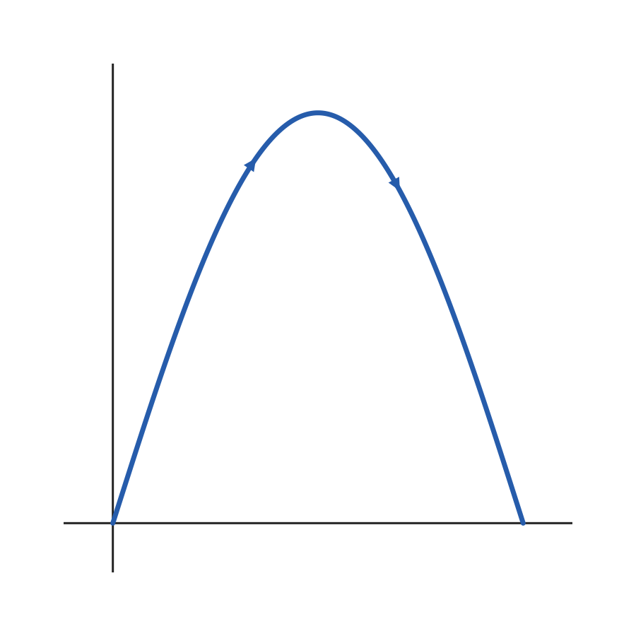
> 
> Equal scaling is used, so the graph is not distorted.

```Mathematica title:"Problem 17: Mathematica plot"
Graphics[
  {
    Blue,
    AbsoluteThickness[3],
    Arrowheads[{{0.055, 0.35}, {0.055, 0.7}}],
    Arrow@Table[{t, Sin[Pi t]}, {t, 0, 1, 1/300}]
  },
  PlotRange -> {{-0.2, 1.2}, {-0.2, 1.2}},
  Axes -> True,
  AxesLabel -> {"x", "y"},
  AxesStyle -> Directive[Black, AbsoluteThickness[1.2]],
  LabelStyle -> Directive[Black, 14],
  PlotRangePadding -> Scaled[0.04],
  ImageSize -> 340,
  Background -> White,
  AspectRatio -> Automatic
]
```

```python title:"Problem 17: Python plot"
import math
from pathlib import Path

W = H = 900
M = 90
BLUE = "#265cab"
AX = "#232323"
BG = "#ffffff"

def square_bounds(xs, ys, pad_frac=0.12):
    xmin, xmax = min(xs), max(xs)
    ymin, ymax = min(ys), max(ys)
    cx = (xmin + xmax) / 2
    cy = (ymin + ymax) / 2
    span = max(xmax - xmin, ymax - ymin)
    span *= 1 + 2 * pad_frac
    half = span / 2
    return cx - half, cx + half, cy - half, cy + half

def make_mapper(bounds):
    xmin, xmax, ymin, ymax = bounds
    def pt(x, y):
        return (
            M + (x - xmin) / (xmax - xmin) * (W - 2 * M),
            H - M - (y - ymin) / (ymax - ymin) * (H - 2 * M),
        )
    return pt

def arrow_polygon(p0, p1, L=20, ang_width=math.pi / 7):
    ang = math.atan2(p1[1] - p0[1], p1[0] - p0[0])
    return [
        p1,
        (p1[0] - L * math.cos(ang - ang_width), p1[1] - L * math.sin(ang - ang_width)),
        (p1[0] - L * math.cos(ang + ang_width), p1[1] - L * math.sin(ang + ang_width)),
    ]

ts = [k / 699 for k in range(700)]
xy = [(t, math.sin(math.pi * t)) for t in ts]
xs = [x for x, _ in xy]
ys = [y for _, y in xy]
bounds = square_bounds(xs, ys)
xmin, xmax, ymin, ymax = bounds
pt = make_mapper(bounds)
pts = [pt(x, y) for x, y in xy]

parts = [f'<svg xmlns="http://www.w3.org/2000/svg" width="{W}" height="{H}" viewBox="0 0 {W} {H}">']
parts.append(f'<rect width="100%" height="100%" fill="{BG}"/>')
if xmin <= 0 <= xmax:
    x0, y0 = pt(0, ymin)
    x1, y1 = pt(0, ymax)
    parts.append(f'<line x1="{x0:.2f}" y1="{y0:.2f}" x2="{x1:.2f}" y2="{y1:.2f}" stroke="{AX}" stroke-width="3"/>')
if ymin <= 0 <= ymax:
    x0, y0 = pt(xmin, 0)
    x1, y1 = pt(xmax, 0)
    parts.append(f'<line x1="{x0:.2f}" y1="{y0:.2f}" x2="{x1:.2f}" y2="{y1:.2f}" stroke="{AX}" stroke-width="3"/>')
poly = " ".join(f"{x:.2f},{y:.2f}" for x, y in pts)
parts.append(f'<polyline points="{poly}" fill="none" stroke="{BLUE}" stroke-width="7" stroke-linecap="round" stroke-linejoin="round"/>')
for frac in [0.35, 0.7]:
    i = int(frac * (len(pts) - 1))
    tri = " ".join(f"{x:.2f},{y:.2f}" for x, y in arrow_polygon(pts[i - 1], pts[i]))
    parts.append(f'<polygon points="{tri}" fill="{BLUE}"/>')
parts.append("</svg>")

Path("images/exercise10_problem17_python.svg").write_text("\n".join(parts), encoding="utf-8")
```

##### problem 18

For $\gamma(t)=t^2+it$, we have $x=t^2$ and $y=t$. Eliminating $t$ gives $x=y^2$, so the path is the parabola opening to the right. Since $t=y$, the parameter increases from $-3$ to $3$, so the curve is traced upward: it starts at $(9,-3)$, passes through $(0,0)$ when $t=0$, and ends at $(9,3)$.

> [!figure] Python figure for Problem 18
> 
> 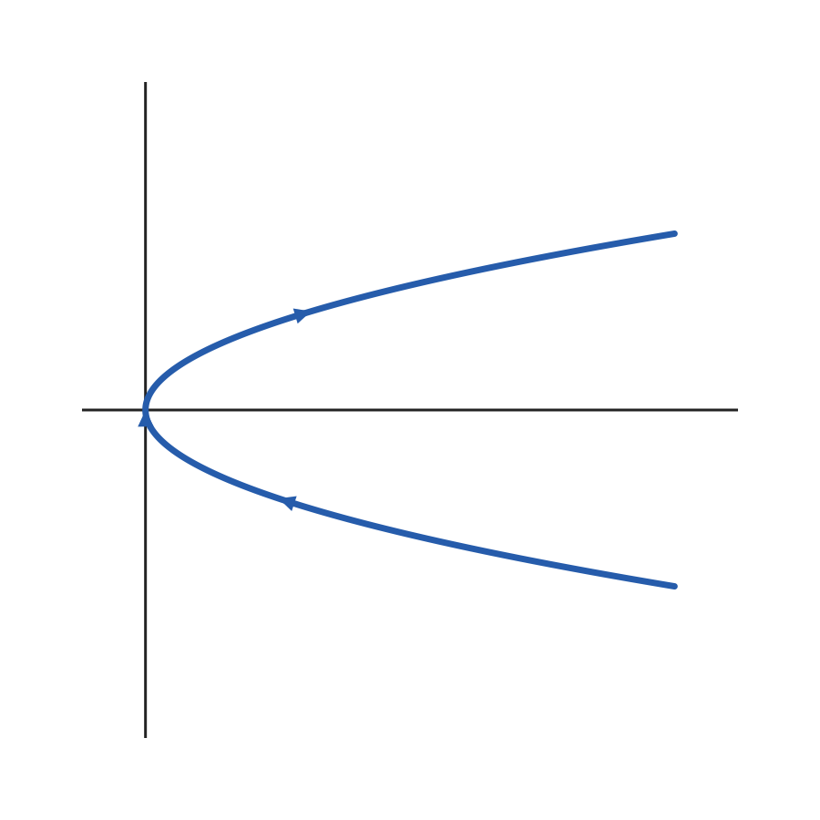
> 
> Equal scaling is used, so the parabola is not distorted.

```Mathematica title:"Problem 18: Mathematica plot"
Graphics[
  {
    Blue,
    AbsoluteThickness[3],
    Arrowheads[{{0.05, 0.25}, {0.05, 0.5}, {0.05, 0.78}}],
    Arrow@Table[{t^2, t}, {t, -3, 3, 1/200}]
  },
  PlotRange -> {{-0.8, 9.8}, {-3.8, 5.8}},
  Axes -> True,
  AxesLabel -> {"x", "y"},
  AxesStyle -> Directive[Black, AbsoluteThickness[1.2]],
  LabelStyle -> Directive[Black, 14],
  PlotRangePadding -> Scaled[0.04],
  ImageSize -> 340,
  Background -> White,
  AspectRatio -> Automatic
]
```

```python title:"Problem 18: Python plot"
import math
from pathlib import Path

W = H = 900
M = 90
BLUE = "#265cab"
AX = "#232323"
BG = "#ffffff"

def square_bounds(xs, ys, pad_frac=0.12):
    xmin, xmax = min(xs), max(xs)
    ymin, ymax = min(ys), max(ys)
    cx = (xmin + xmax) / 2
    cy = (ymin + ymax) / 2
    span = max(xmax - xmin, ymax - ymin)
    span *= 1 + 2 * pad_frac
    half = span / 2
    return cx - half, cx + half, cy - half, cy + half

def make_mapper(bounds):
    xmin, xmax, ymin, ymax = bounds
    def pt(x, y):
        return (
            M + (x - xmin) / (xmax - xmin) * (W - 2 * M),
            H - M - (y - ymin) / (ymax - ymin) * (H - 2 * M),
        )
    return pt

def arrow_polygon(p0, p1, L=20, ang_width=math.pi / 7):
    ang = math.atan2(p1[1] - p0[1], p1[0] - p0[0])
    return [
        p1,
        (p1[0] - L * math.cos(ang - ang_width), p1[1] - L * math.sin(ang - ang_width)),
        (p1[0] - L * math.cos(ang + ang_width), p1[1] - L * math.sin(ang + ang_width)),
    ]

ts = [-3 + 6 * k / 899 for k in range(900)]
xy = [(t * t, t) for t in ts]
xs = [x for x, _ in xy]
ys = [y for _, y in xy]
bounds = square_bounds(xs, ys)
xmin, xmax, ymin, ymax = bounds
pt = make_mapper(bounds)
pts = [pt(x, y) for x, y in xy]

parts = [f'<svg xmlns="http://www.w3.org/2000/svg" width="{W}" height="{H}" viewBox="0 0 {W} {H}">']
parts.append(f'<rect width="100%" height="100%" fill="{BG}"/>')
if xmin <= 0 <= xmax:
    x0, y0 = pt(0, ymin)
    x1, y1 = pt(0, ymax)
    parts.append(f'<line x1="{x0:.2f}" y1="{y0:.2f}" x2="{x1:.2f}" y2="{y1:.2f}" stroke="{AX}" stroke-width="3"/>')
if ymin <= 0 <= ymax:
    x0, y0 = pt(xmin, 0)
    x1, y1 = pt(xmax, 0)
    parts.append(f'<line x1="{x0:.2f}" y1="{y0:.2f}" x2="{x1:.2f}" y2="{y1:.2f}" stroke="{AX}" stroke-width="3"/>')
poly = " ".join(f"{x:.2f},{y:.2f}" for x, y in pts)
parts.append(f'<polyline points="{poly}" fill="none" stroke="{BLUE}" stroke-width="7" stroke-linecap="round" stroke-linejoin="round"/>')
for frac in [0.25, 0.5, 0.78]:
    i = int(frac * (len(pts) - 1))
    tri = " ".join(f"{x:.2f},{y:.2f}" for x, y in arrow_polygon(pts[i - 1], pts[i]))
    parts.append(f'<polygon points="{tri}" fill="{BLUE}"/>')
parts.append("</svg>")

Path("images/exercise10_problem18_python.svg").write_text("\n".join(parts), encoding="utf-8")
```


++++


> [!exercise] Exercise 11
> In problems 19 24, find the derivative of the given function.
> 19. $f(t)=t e^{-i t}$.
> 20. $f(t)=e^{2 i t^{2}}$.
> 21. $f(t)=(2+i) \cos (3 i t)$.
> 22. $f(t)=\frac{2+i+t}{-i-2 t}$.
> 23. $f(t)=\left(\frac{t+i}{t-i}\right)^{2}$.
> 24. $f(t)=\log (i t)$.


##### solution

##### problem 19

We use the product rule:

$$
\begin{aligned}
f'(t)
&=\frac{d}{dt}\bigl(te^{-it}\bigr)\\
&=\frac{d}{dt}(t)\,e^{-it}+t\,\frac{d}{dt}\bigl(e^{-it}\bigr)\\
&=1\cdot e^{-it}+t\cdot(-i)e^{-it}\\
&=e^{-it}-ite^{-it}\\
&=(1-it)e^{-it}.
\end{aligned}
$$

##### problem 20

We use the chain rule:

$$
\begin{aligned}
f'(t)
&=\frac{d}{dt}\bigl(e^{2it^2}\bigr)\\
&=e^{2it^2}\,\frac{d}{dt}(2it^2)\\
&=e^{2it^2}\cdot 4it\\
&=4it\,e^{2it^2}.
\end{aligned}
$$

##### problem 21

Again we use the chain rule:

$$
\begin{aligned}
f'(t)
&=\frac{d}{dt}\bigl((2+i)\cos(3it)\bigr)\\
&=(2+i)\,\frac{d}{dt}\bigl(\cos(3it)\bigr)\\
&=(2+i)\bigl(-\sin(3it)\bigr)\frac{d}{dt}(3it)\\
&=(2+i)\bigl(-\sin(3it)\bigr)(3i)\\
&=-3i(2+i)\sin(3it).
\end{aligned}
$$

##### problem 22

We use the quotient rule:

$$
\begin{aligned}
f'(t)
&=\frac{d}{dt}\left(\frac{2+i+t}{-i-2t}\right)\\
&=\frac{(1)(-i-2t)-(2+i+t)(-2)}{(-i-2t)^2}\\
&=\frac{-i-2t+2(2+i+t)}{(-i-2t)^2}\\
&=\frac{-i-2t+4+2i+2t}{(-i-2t)^2}\\
&=\frac{4+i}{(-i-2t)^2}.
\end{aligned}
$$

##### problem 23

Let $g(t)=\dfrac{t+i}{t-i}$. Then $f(t)=g(t)^2$, so $f'(t)=2g(t)g'(t)$. Now compute $g'(t)$ by the quotient rule:

$$
\begin{aligned}
g'(t)
&=\frac{(1)(t-i)-(t+i)(1)}{(t-i)^2}\\
&=\frac{t-i-t-i}{(t-i)^2}\\
&=\frac{-2i}{(t-i)^2}.
\end{aligned}
$$

Therefore

$$
\begin{aligned}
f'(t)
&=2\left(\frac{t+i}{t-i}\right)\left(\frac{-2i}{(t-i)^2}\right)\\
&=\frac{-4i(t+i)}{(t-i)^3}.
\end{aligned}
$$

##### problem 24

Here we must remember that $\operatorname{Log}(it)$ is defined only for $t\neq 0$, and its explicit real-variable form depends on whether $t>0$ or $t<0$.

If $t>0$, then $\operatorname{Arg}(it)=\dfrac{\pi}{2}$, so

$$
\operatorname{Log}(it)=\ln t+\frac{\pi i}{2}.
$$

Hence

$$
\frac{d}{dt}\operatorname{Log}(it)=\frac{d}{dt}\left(\ln t+\frac{\pi i}{2}\right)=\frac{1}{t}.
$$

If $t<0$, then $\operatorname{Arg}(it)=-\dfrac{\pi}{2}$, so

$$
\operatorname{Log}(it)=\ln(-t)-\frac{\pi i}{2}.
$$

Hence

$$
\frac{d}{dt}\operatorname{Log}(it)=\frac{d}{dt}\left(\ln(-t)-\frac{\pi i}{2}\right)=\frac{1}{-t}\cdot(-1)=\frac{1}{t}.
$$

Therefore, for every $t\neq 0$,

$$
\frac{d}{dt}\operatorname{Log}(it)=\frac{1}{t}.
$$


++++


> [!exercise] Exercise 12
> In problemss 25-28, find a particular solution of the given differential equation. Use the technique of Example 4. (Hint for Exercise 27: Think of an exponential function whose real part is $e^{t} \cos t$.)
> 25. $y^{\prime \prime}+y^{\prime}+y=\cos t$.
> 26. $y^{\prime \prime}+y=\sin 3 t$.
> 27. $y^{\prime \prime}-y=e^{t} \cos t$.
> 28. $y^{\prime \prime}+y^{\prime}+y=t \cos t$.


##### solution

##### problem 25

We solve the complex equation

$$
Y''+Y'+Y=e^{it}
$$

and then take real parts. We try a particular solution of the form

$$
Y=Ae^{it}.
$$

Then

$$
Y'=iAe^{it},
\qquad
Y''=i^2Ae^{it}=-Ae^{it}.
$$

Substituting gives

$$
\begin{aligned}
Y''+Y'+Y
&=-Ae^{it}+iAe^{it}+Ae^{it}\\
&=iAe^{it}.
\end{aligned}
$$

To make this equal to $e^{it}$, we need

$$
iA=1,
\qquad
A=\frac{1}{i}=-i.
$$

So

$$
Y=-ie^{it}=-i(\cos t+i\sin t)=\sin t-i\cos t.
$$

Taking real parts, we obtain the particular solution

$$
y_p(t)=\sin t.
$$

##### problem 26

Since

$$
\sin 3t=\operatorname{Im}(e^{i3t}),
$$

we solve

$$
Y''+Y=e^{i3t}
$$

and then take imaginary parts. Try

$$
Y=Ae^{i3t}.
$$

Then

$$
Y'=3iAe^{i3t},
\qquad
Y''=(3i)^2Ae^{i3t}=-9Ae^{i3t}.
$$

Hence

$$
\begin{aligned}
Y''+Y
&=-9Ae^{i3t}+Ae^{i3t}\\
&=-8Ae^{i3t}.
\end{aligned}
$$

To make this equal to $e^{i3t}$, we need

$$
-8A=1,
\qquad
A=-\frac18.
$$

Thus

$$
Y=-\frac18 e^{i3t}=-\frac18\cos 3t-\frac{i}{8}\sin 3t.
$$

Taking imaginary parts, we get

$$
y_p(t)=-\frac18\sin 3t.
$$

##### problem 27

Since

$$
e^t\cos t=\operatorname{Re}(e^{(1+i)t}),
$$

we solve

$$
Y''-Y=e^{(1+i)t}
$$

and then take real parts. Try

$$
Y=Ae^{(1+i)t}.
$$

Then

$$
Y'=(1+i)Ae^{(1+i)t},
\qquad
Y''=(1+i)^2Ae^{(1+i)t}.
$$

Because

$$
(1+i)^2=1+2i+i^2=2i,
$$

we have

$$
\begin{aligned}
Y''-Y
&=2iAe^{(1+i)t}-Ae^{(1+i)t}\\
&=(2i-1)Ae^{(1+i)t}.
\end{aligned}
$$

To make this equal to $e^{(1+i)t}$, we need

$$
(2i-1)A=1,
\qquad
A=\frac{1}{2i-1}.
$$

Rationalizing gives

$$
\begin{aligned}
A
&=\frac{1}{2i-1}\cdot\frac{-1-2i}{-1-2i}\\
&=\frac{-1-2i}{(-1)^2+2^2}\\
&=-\frac15-\frac{2}{5}i.
\end{aligned}
$$

Therefore

$$
\begin{aligned}
Y
&=\left(-\frac15-\frac{2}{5}i\right)e^{(1+i)t}\\
&=\left(-\frac15-\frac{2}{5}i\right)e^t(\cos t+i\sin t).
\end{aligned}
$$

Its real part is

$$
y_p(t)=e^t\left(-\frac15\cos t+\frac25\sin t\right).
$$

##### problem 28

Since

$$
t\cos t=\operatorname{Re}(te^{it}),
$$

we solve

$$
Y''+Y'+Y=te^{it}
$$

and then take real parts. Because the right-hand side is a first-degree polynomial times $e^{it}$, we try

$$
Y=(At+B)e^{it},
$$

where $A$ and $B$ are complex constants.

Differentiate:

$$
\begin{aligned}
Y'
&=\frac{d}{dt}\bigl((At+B)e^{it}\bigr)\\
&=Ae^{it}+(At+B)ie^{it}\\
&=\bigl(A+iAt+iB\bigr)e^{it}.
\end{aligned}
$$

Differentiate again:

$$
\begin{aligned}
Y''
&=\frac{d}{dt}\left(\bigl(A+iAt+iB\bigr)e^{it}\right)\\
&=iAe^{it}+\bigl(A+iAt+iB\bigr)ie^{it}\\
&=\bigl(iA+iA+i^2At+i^2B\bigr)e^{it}\\
&=\bigl(2iA-At-B\bigr)e^{it}.
\end{aligned}
$$

Now substitute:

$$
\begin{aligned}
Y''+Y'+Y
&=\bigl(2iA-At-B\bigr)e^{it}+\bigl(A+iAt+iB\bigr)e^{it}+(At+B)e^{it}\\
&=\bigl(2iA-At-B+A+iAt+iB+At+B\bigr)e^{it}\\
&=\bigl(iAt+A+2iA+iB\bigr)e^{it}\\
&=\bigl(iAt+(1+2i)A+iB\bigr)e^{it}.
\end{aligned}
$$

To make this equal to $te^{it}$, we match coefficients:

$$
iA=1,
\qquad
(1+2i)A+iB=0.
$$

From $iA=1$, we get

$$
A=\frac{1}{i}=-i.
$$

Substituting this into the second equation gives

$$
\begin{aligned}
(1+2i)(-i)+iB
&=0\\
-i-2i^2+iB
&=0\\
-i+2+iB
&=0\\
2-i+iB
&=0\\
iB
&=-2+i.
\end{aligned}
$$

Therefore

$$
\begin{aligned}
B
&=\frac{-2+i}{i}\\
&=-\frac{2}{i}+\frac{i}{i}\\
&=2i+1\\
&=1+2i.
\end{aligned}
$$

So

$$
\begin{aligned}
Y
&=\bigl(-it+1+2i\bigr)e^{it}\\
&=\bigl(1+i(2-t)\bigr)e^{it}\\
&=\bigl(1+i(2-t)\bigr)(\cos t+i\sin t).
\end{aligned}
$$

Taking the real part, we obtain

$$
y_p(t)=\cos t-(2-t)\sin t=\cos t+(t-2)\sin t.
$$


++++


> [!exercise] Exercise 13
> 
> **Using complex methods.** Very often when we use complex methods to solve a real problem, we end up solving two problems: one associated with the real part of the solution and one with its imaginary part. For example, when we solved the differential equation $y^{\prime \prime}-2 y^{\prime}+y=\cos 2 x$ in Example 4, we also obtained the solution to $y^{\prime \prime}-2 y^{\prime}+y=\sin 2 x$, as can be seen from taking the imaginary part of $y=\left(-\frac{3}{25}+i \frac{4}{25}\right) e^{2 i x}$, which is the solution of $y^{\prime \prime}-2 y^{\prime}+y=e^{i 2 x}$.
> 
> 
> In problemss 29-30, you are given a real differential equation. Find a particular solution by envisioning the equation as the real or imaginary part of a complex differential equation. Also, state the corresponding problem and a particular solution for the other part of the complex differential equation.
> 29. $y^{\prime \prime}-2 y^{\prime}-3 y=\cos 4 t$.
> 30. $y^{\prime \prime}+y^{\prime}+y=3+\sin 2 t$.
> 
> 


##### solution

##### problem 29

We view

$$
\cos 4t=\operatorname{Re}(e^{i4t}),
$$

so we solve the complex equation

$$
Y''-2Y'-3Y=e^{i4t}
$$

and then take real parts. Try

$$
Y=Ae^{i4t}.
$$

Then

$$
Y'=4iAe^{i4t},
\qquad
Y''=(4i)^2Ae^{i4t}=-16Ae^{i4t}.
$$

Substituting gives

$$
\begin{aligned}
Y''-2Y'-3Y
&=-16Ae^{i4t}-2(4iAe^{i4t})-3Ae^{i4t}\\
&=(-16A-8iA-3A)e^{i4t}\\
&=(-19-8i)Ae^{i4t}.
\end{aligned}
$$

To make this equal to $e^{i4t}$, we need

$$
(-19-8i)A=1,
\qquad
A=\frac{1}{-19-8i}.
$$

Rationalizing gives

$$
\begin{aligned}
A
&=\frac{1}{-19-8i}\cdot\frac{-19+8i}{-19+8i}\\
&=\frac{-19+8i}{(-19)^2+8^2}\\
&=\frac{-19+8i}{425}.
\end{aligned}
$$

Therefore

$$
Y=\frac{-19+8i}{425}e^{i4t}.
$$

Using

$$
(a+ib)(\cos \theta+i\sin \theta)=(a\cos \theta-b\sin \theta)+i(a\sin \theta+b\cos \theta),
$$

with $a=-\dfrac{19}{425}$, $b=\dfrac{8}{425}$, and $\theta=4t$, we get

$$
\operatorname{Re}(Y)=-\frac{19}{425}\cos 4t-\frac{8}{425}\sin 4t.
$$

So a particular solution of

$$
y''-2y'-3y=\cos 4t
$$

is

$$
y_p(t)=-\frac{19}{425}\cos 4t-\frac{8}{425}\sin 4t.
$$

The corresponding problem from the imaginary part is

$$
y''-2y'-3y=\sin 4t,
$$

and a particular solution is

$$
y_p(t)=\frac{8}{425}\cos 4t-\frac{19}{425}\sin 4t.
$$

##### problem 30

We want a complex forcing term whose real part is $3+\sin 2t$. Since

$$
-ie^{i2t}=-i(\cos 2t+i\sin 2t)=\sin 2t-i\cos 2t,
$$

we have

$$
3+\sin 2t=\operatorname{Re}(3-ie^{i2t}).
$$

So we solve

$$
Y''+Y'+Y=3-ie^{i2t}
$$

and then take real parts. We try

$$
Y=C+Ae^{i2t},
$$

where $C$ and $A$ are complex constants.

Then

$$
Y'=2iAe^{i2t},
\qquad
Y''=(2i)^2Ae^{i2t}=-4Ae^{i2t}.
$$

Substituting gives

$$
\begin{aligned}
Y''+Y'+Y
&=-4Ae^{i2t}+2iAe^{i2t}+C+Ae^{i2t}\\
&=C+(-3+2i)Ae^{i2t}.
\end{aligned}
$$

To make this equal to $3-ie^{i2t}$, we match terms:

$$
C=3,
\qquad
(-3+2i)A=-i.
$$

Hence

$$
A=\frac{-i}{-3+2i}.
$$

Rationalizing gives

$$
\begin{aligned}
A
&=\frac{-i}{-3+2i}\cdot\frac{-3-2i}{-3-2i}\\
&=\frac{(-i)(-3-2i)}{(-3)^2+2^2}\\
&=\frac{3i+2i^2}{13}\\
&=\frac{-2+3i}{13}.
\end{aligned}
$$

Therefore

$$
Y=3+\frac{-2+3i}{13}e^{i2t}.
$$

With $a=-\dfrac{2}{13}$, $b=\dfrac{3}{13}$, and $\theta=2t$, we have

$$
\operatorname{Re}\left(\frac{-2+3i}{13}e^{i2t}\right)
=-\frac{2}{13}\cos 2t-\frac{3}{13}\sin 2t.
$$

So a particular solution of

$$
y''+y'+y=3+\sin 2t
$$

is

$$
y_p(t)=3-\frac{2}{13}\cos 2t-\frac{3}{13}\sin 2t.
$$

The corresponding problem from the imaginary part is

$$
y''+y'+y=-\cos 2t,
$$

and a particular solution is

$$
y_p(t)=\frac{3}{13}\cos 2t-\frac{2}{13}\sin 2t.
$$


++++


> [!exercise] Exercise 14
> 
> In problems 31-34, a curve is given in parametric form. (a) Find the equation of the curve in complex form. (b) Plot the curve for specific values of $a$ and $b$ of your choice.
> 31. A hypocycloid $(a>b)$
> 
> $$
> \begin{aligned}
> & x(t)=(a-b) \cos t+b \cos \left(\frac{a-b}{b} t\right), \\
> & y(t)=(a-b) \sin t-b \sin \left(\frac{a-b}{b} t\right) .
> \end{aligned}
> $$
> 
> 32. An epitrochoid
> 
> $$
> \begin{gathered}
> x(t)=a \cos t-b \cos \left(\frac{a t}{2}\right) \\
> y(t)=a \sin t-b \sin \left(\frac{a t}{2}\right)
> \end{gathered}
> $$
> 
> 33. An epicycloid
> 
> $$
> \begin{aligned}
> & x(t)=(a+b) \cos t-b \cos \left(\frac{a+b}{b} t\right), \\
> & y(t)=(a+b) \sin t-b \sin \left(\frac{a+b}{b} t\right) .
> \end{aligned}
> $$
> 
> 34. A trochoid
> 
> $$
> \begin{gathered}
> x(t)=a t-b \sin t \\
> y(t)=a-b \cos t
> \end{gathered}
> $$


##### solution

##### problem 31

Let $z(t)=x(t)+iy(t)$. Then

$$
\begin{aligned}
z(t)
&=(a-b)\cos t+b\cos\left(\frac{a-b}{b}t\right)
+i\left((a-b)\sin t-b\sin\left(\frac{a-b}{b}t\right)\right)\\
&=(a-b)(\cos t+i\sin t)+b\left(\cos\left(\frac{a-b}{b}t\right)-i\sin\left(\frac{a-b}{b}t\right)\right)\\
&=(a-b)e^{it}+be^{-i\frac{a-b}{b}t}.
\end{aligned}
$$

So the complex form is

$$
z(t)=(a-b)e^{it}+be^{-i\frac{a-b}{b}t}.
$$

For the plot, choose $a=4$ and $b=1$. Then

$$
z(t)=3e^{it}+e^{-3it},
\qquad
0\le t\le 2\pi.
$$

> [!figure] Python figure for Problem 31
> 
> 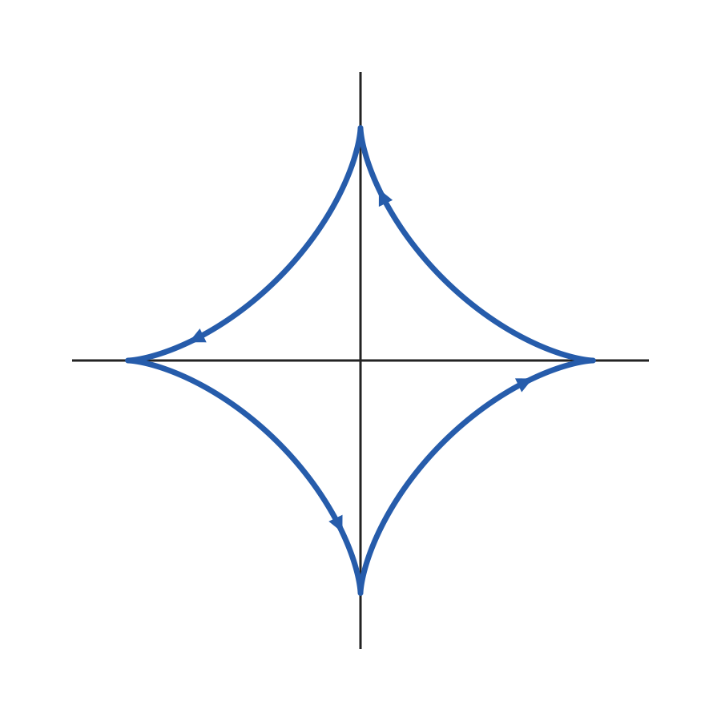
> 
> The plot uses $a=4$, $b=1$, and equal scaling.


```Mathematica title:"Problem 31: Mathematica plot"
Graphics[
  {
    Blue,
    AbsoluteThickness[3],
    Arrowheads[{{0.07, 0.18}, {0.07, 0.43}, {0.07, 0.68}, {0.07, 0.93}}],
    Arrow@Table[{3 Cos[t] + Cos[3 t], 3 Sin[t] - Sin[3 t]}, {t, 0, 2 Pi, 2 Pi/500}]
  },
  PlotRange -> {{-4.9, 4.9}, {-4.9, 4.9}},
  Axes -> True,
  AxesLabel -> {"x", "y"},
  AxesStyle -> Directive[Black, AbsoluteThickness[1.2]],
  LabelStyle -> Directive[Black, 14],
  PlotRangePadding -> Scaled[0.04],
  ImageSize -> 340,
  Background -> White,
  AspectRatio -> Automatic
]
```

```python title:"Problem 31: Python plot"
import math
from pathlib import Path

W = H = 900
M = 90
BLUE = "#265cab"
AX = "#232323"
BG = "#ffffff"

def square_bounds(xs, ys, pad_frac=0.12):
    xmin, xmax = min(xs), max(xs)
    ymin, ymax = min(ys), max(ys)
    cx = (xmin + xmax) / 2
    cy = (ymin + ymax) / 2
    span = max(xmax - xmin, ymax - ymin)
    span *= 1 + 2 * pad_frac
    half = span / 2
    return cx - half, cx + half, cy - half, cy + half

def make_mapper(bounds):
    xmin, xmax, ymin, ymax = bounds
    def pt(x, y):
        return (
            M + (x - xmin) / (xmax - xmin) * (W - 2 * M),
            H - M - (y - ymin) / (ymax - ymin) * (H - 2 * M),
        )
    return pt

def arrow_polygon(p0, p1, L=20, ang_width=math.pi / 7):
    ang = math.atan2(p1[1] - p0[1], p1[0] - p0[0])
    return [
        p1,
        (p1[0] - L * math.cos(ang - ang_width), p1[1] - L * math.sin(ang - ang_width)),
        (p1[0] - L * math.cos(ang + ang_width), p1[1] - L * math.sin(ang + ang_width)),
    ]

a = 4
b = 1
ts = [2 * math.pi * k / 1399 for k in range(1400)]
xy = [(3 * math.cos(t) + math.cos(3 * t), 3 * math.sin(t) - math.sin(3 * t)) for t in ts]
xs = [x for x, _ in xy]
ys = [y for _, y in xy]
bounds = square_bounds(xs, ys)
xmin, xmax, ymin, ymax = bounds
pt = make_mapper(bounds)
pts = [pt(x, y) for x, y in xy]

parts = [f'<svg xmlns="http://www.w3.org/2000/svg" width="{W}" height="{H}" viewBox="0 0 {W} {H}">']
parts.append(f'<rect width="100%" height="100%" fill="{BG}"/>')
if xmin <= 0 <= xmax:
    x0, y0 = pt(0, ymin)
    x1, y1 = pt(0, ymax)
    parts.append(f'<line x1="{x0:.2f}" y1="{y0:.2f}" x2="{x1:.2f}" y2="{y1:.2f}" stroke="{AX}" stroke-width="3"/>')
if ymin <= 0 <= ymax:
    x0, y0 = pt(xmin, 0)
    x1, y1 = pt(xmax, 0)
    parts.append(f'<line x1="{x0:.2f}" y1="{y0:.2f}" x2="{x1:.2f}" y2="{y1:.2f}" stroke="{AX}" stroke-width="3"/>')
poly = " ".join(f"{x:.2f},{y:.2f}" for x, y in pts)
parts.append(f'<polyline points="{poly}" fill="none" stroke="{BLUE}" stroke-width="7" stroke-linecap="round" stroke-linejoin="round"/>')
for frac in [0.18, 0.43, 0.68, 0.93]:
    i = int(frac * (len(pts) - 1))
    tri = " ".join(f"{x:.2f},{y:.2f}" for x, y in arrow_polygon(pts[i - 1], pts[i]))
    parts.append(f'<polygon points="{tri}" fill="{BLUE}"/>')
parts.append("</svg>")

Path("images/exercise14_problem31_python_v2.svg").write_text("\n".join(parts), encoding="utf-8")
```

##### problem 32

Again let $z(t)=x(t)+iy(t)$. Then

$$
\begin{aligned}
z(t)
&=a\cos t-b\cos\left(\frac{at}{2}\right)
+i\left(a\sin t-b\sin\left(\frac{at}{2}\right)\right)\\
&=a(\cos t+i\sin t)-b\left(\cos\left(\frac{at}{2}\right)+i\sin\left(\frac{at}{2}\right)\right)\\
&=ae^{it}-be^{i\frac{at}{2}}.
\end{aligned}
$$

So the complex form is

$$
z(t)=ae^{it}-be^{i\frac{at}{2}}.
$$

For the plot, choose $a=4$ and $b=1$. Then

$$
z(t)=4e^{it}-e^{2it},
\qquad
0\le t\le 2\pi.
$$

> [!figure] Python figure for Problem 32
> 
> 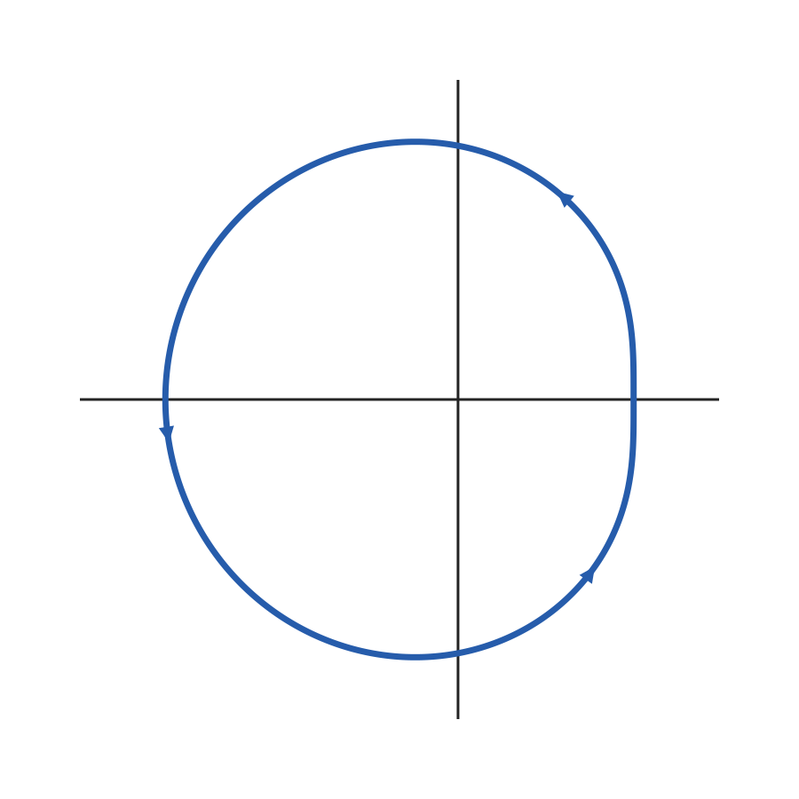
> 
> The plot uses $a=4$, $b=1$, and equal scaling.

```Mathematica title:"Problem 32: Mathematica plot"
Graphics[
  {
    Blue,
    AbsoluteThickness[3],
    Arrowheads[{{0.05, 0.22}, {0.05, 0.52}, {0.05, 0.82}}],
    Arrow@Table[{4 Cos[t] - Cos[2 t], 4 Sin[t] - Sin[2 t]}, {t, 0, 2 Pi, 2 Pi/500}]
  },
  PlotRange -> {{-5.9, 5.9}, {-5.9, 5.9}},
  Axes -> True,
  AxesLabel -> {"x", "y"},
  AxesStyle -> Directive[Black, AbsoluteThickness[1.2]],
  LabelStyle -> Directive[Black, 14],
  PlotRangePadding -> Scaled[0.04],
  ImageSize -> 340,
  Background -> White,
  AspectRatio -> Automatic
]
```

```python title:"Problem 32: Python plot"
import math
from pathlib import Path

W = H = 900
M = 90
BLUE = "#265cab"
AX = "#232323"
BG = "#ffffff"

def square_bounds(xs, ys, pad_frac=0.12):
    xmin, xmax = min(xs), max(xs)
    ymin, ymax = min(ys), max(ys)
    cx = (xmin + xmax) / 2
    cy = (ymin + ymax) / 2
    span = max(xmax - xmin, ymax - ymin)
    span *= 1 + 2 * pad_frac
    half = span / 2
    return cx - half, cx + half, cy - half, cy + half

def make_mapper(bounds):
    xmin, xmax, ymin, ymax = bounds
    def pt(x, y):
        return (
            M + (x - xmin) / (xmax - xmin) * (W - 2 * M),
            H - M - (y - ymin) / (ymax - ymin) * (H - 2 * M),
        )
    return pt

def arrow_polygon(p0, p1, L=20, ang_width=math.pi / 7):
    ang = math.atan2(p1[1] - p0[1], p1[0] - p0[0])
    return [
        p1,
        (p1[0] - L * math.cos(ang - ang_width), p1[1] - L * math.sin(ang - ang_width)),
        (p1[0] - L * math.cos(ang + ang_width), p1[1] - L * math.sin(ang + ang_width)),
    ]

a = 4
b = 1
ts = [2 * math.pi * k / 1399 for k in range(1400)]
xy = [(4 * math.cos(t) - math.cos(2 * t), 4 * math.sin(t) - math.sin(2 * t)) for t in ts]
xs = [x for x, _ in xy]
ys = [y for _, y in xy]
bounds = square_bounds(xs, ys)
xmin, xmax, ymin, ymax = bounds
pt = make_mapper(bounds)
pts = [pt(x, y) for x, y in xy]

parts = [f'<svg xmlns="http://www.w3.org/2000/svg" width="{W}" height="{H}" viewBox="0 0 {W} {H}">']
parts.append(f'<rect width="100%" height="100%" fill="{BG}"/>')
if xmin <= 0 <= xmax:
    x0, y0 = pt(0, ymin)
    x1, y1 = pt(0, ymax)
    parts.append(f'<line x1="{x0:.2f}" y1="{y0:.2f}" x2="{x1:.2f}" y2="{y1:.2f}" stroke="{AX}" stroke-width="3"/>')
if ymin <= 0 <= ymax:
    x0, y0 = pt(xmin, 0)
    x1, y1 = pt(xmax, 0)
    parts.append(f'<line x1="{x0:.2f}" y1="{y0:.2f}" x2="{x1:.2f}" y2="{y1:.2f}" stroke="{AX}" stroke-width="3"/>')
poly = " ".join(f"{x:.2f},{y:.2f}" for x, y in pts)
parts.append(f'<polyline points="{poly}" fill="none" stroke="{BLUE}" stroke-width="7" stroke-linecap="round" stroke-linejoin="round"/>')
for frac in [0.22, 0.52, 0.82]:
    i = int(frac * (len(pts) - 1))
    tri = " ".join(f"{x:.2f},{y:.2f}" for x, y in arrow_polygon(pts[i - 1], pts[i]))
    parts.append(f'<polygon points="{tri}" fill="{BLUE}"/>')
parts.append("</svg>")

Path("images/exercise14_problem32_python.svg").write_text("\n".join(parts), encoding="utf-8")
```

##### problem 33

Let $z(t)=x(t)+iy(t)$. Then

$$
\begin{aligned}
z(t)
&=(a+b)\cos t-b\cos\left(\frac{a+b}{b}t\right)
+i\left((a+b)\sin t-b\sin\left(\frac{a+b}{b}t\right)\right)\\
&=(a+b)(\cos t+i\sin t)-b\left(\cos\left(\frac{a+b}{b}t\right)+i\sin\left(\frac{a+b}{b}t\right)\right)\\
&=(a+b)e^{it}-be^{i\frac{a+b}{b}t}.
\end{aligned}
$$

So the complex form is

$$
z(t)=(a+b)e^{it}-be^{i\frac{a+b}{b}t}.
$$

For the plot, choose $a=3$ and $b=1$. Then

$$
z(t)=4e^{it}-e^{4it},
\qquad
0\le t\le 2\pi.
$$

> [!figure] Python figure for Problem 33
> 
> 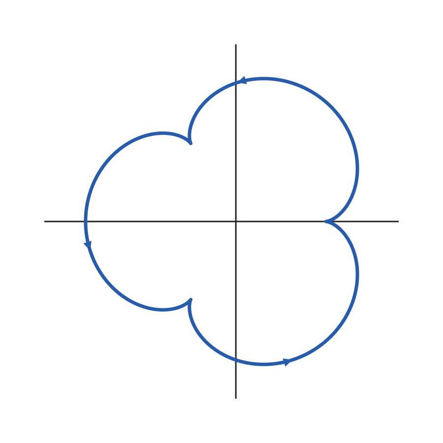
> 
> The plot uses $a=3$, $b=1$, and equal scaling.

```Mathematica title:"Problem 33: Mathematica plot"
Graphics[
  {
    Blue,
    AbsoluteThickness[3],
    Arrowheads[{{0.05, 0.22}, {0.05, 0.52}, {0.05, 0.82}}],
    Arrow@Table[{4 Cos[t] - Cos[4 t], 4 Sin[t] - Sin[4 t]}, {t, 0, 2 Pi, 2 Pi/500}]
  },
  PlotRange -> {{-5.9, 5.9}, {-5.9, 5.9}},
  Axes -> True,
  AxesLabel -> {"x", "y"},
  AxesStyle -> Directive[Black, AbsoluteThickness[1.2]],
  LabelStyle -> Directive[Black, 14],
  PlotRangePadding -> Scaled[0.04],
  ImageSize -> 340,
  Background -> White,
  AspectRatio -> Automatic
]
```

```python title:"Problem 33: Python plot"
import math
from pathlib import Path

W = H = 900
M = 90
BLUE = "#265cab"
AX = "#232323"
BG = "#ffffff"

def square_bounds(xs, ys, pad_frac=0.12):
    xmin, xmax = min(xs), max(xs)
    ymin, ymax = min(ys), max(ys)
    cx = (xmin + xmax) / 2
    cy = (ymin + ymax) / 2
    span = max(xmax - xmin, ymax - ymin)
    span *= 1 + 2 * pad_frac
    half = span / 2
    return cx - half, cx + half, cy - half, cy + half

def make_mapper(bounds):
    xmin, xmax, ymin, ymax = bounds
    def pt(x, y):
        return (
            M + (x - xmin) / (xmax - xmin) * (W - 2 * M),
            H - M - (y - ymin) / (ymax - ymin) * (H - 2 * M),
        )
    return pt

def arrow_polygon(p0, p1, L=20, ang_width=math.pi / 7):
    ang = math.atan2(p1[1] - p0[1], p1[0] - p0[0])
    return [
        p1,
        (p1[0] - L * math.cos(ang - ang_width), p1[1] - L * math.sin(ang - ang_width)),
        (p1[0] - L * math.cos(ang + ang_width), p1[1] - L * math.sin(ang + ang_width)),
    ]

a = 3
b = 1
ts = [2 * math.pi * k / 1399 for k in range(1400)]
xy = [(4 * math.cos(t) - math.cos(4 * t), 4 * math.sin(t) - math.sin(4 * t)) for t in ts]
xs = [x for x, _ in xy]
ys = [y for _, y in xy]
bounds = square_bounds(xs, ys)
xmin, xmax, ymin, ymax = bounds
pt = make_mapper(bounds)
pts = [pt(x, y) for x, y in xy]

parts = [f'<svg xmlns="http://www.w3.org/2000/svg" width="{W}" height="{H}" viewBox="0 0 {W} {H}">']
parts.append(f'<rect width="100%" height="100%" fill="{BG}"/>')
if xmin <= 0 <= xmax:
    x0, y0 = pt(0, ymin)
    x1, y1 = pt(0, ymax)
    parts.append(f'<line x1="{x0:.2f}" y1="{y0:.2f}" x2="{x1:.2f}" y2="{y1:.2f}" stroke="{AX}" stroke-width="3"/>')
if ymin <= 0 <= ymax:
    x0, y0 = pt(xmin, 0)
    x1, y1 = pt(xmax, 0)
    parts.append(f'<line x1="{x0:.2f}" y1="{y0:.2f}" x2="{x1:.2f}" y2="{y1:.2f}" stroke="{AX}" stroke-width="3"/>')
poly = " ".join(f"{x:.2f},{y:.2f}" for x, y in pts)
parts.append(f'<polyline points="{poly}" fill="none" stroke="{BLUE}" stroke-width="7" stroke-linecap="round" stroke-linejoin="round"/>')
for frac in [0.22, 0.52, 0.82]:
    i = int(frac * (len(pts) - 1))
    tri = " ".join(f"{x:.2f},{y:.2f}" for x, y in arrow_polygon(pts[i - 1], pts[i]))
    parts.append(f'<polygon points="{tri}" fill="{BLUE}"/>')
parts.append("</svg>")

Path("images/exercise14_problem33_python.svg").write_text("\n".join(parts), encoding="utf-8")
```

##### problem 34

Let $z(t)=x(t)+iy(t)$. Then

$$
\begin{aligned}
z(t)
&=at-b\sin t+i(a-b\cos t)\\
&=at+ia-b(\sin t+i\cos t).
\end{aligned}
$$

Now

$$
i e^{-it}=i(\cos t-i\sin t)=\sin t+i\cos t,
$$

so

$$
z(t)=at+ia-bie^{-it}.
$$

Thus one convenient complex form is

$$
z(t)=at+ia-bie^{-it}.
$$

For the plot, choose $a=1$ and $b=1$. Then

$$
z(t)=t+i-ie^{-it},
\qquad
0\le t\le 2\pi.
$$

> [!figure] Python figure for Problem 34
> 
> 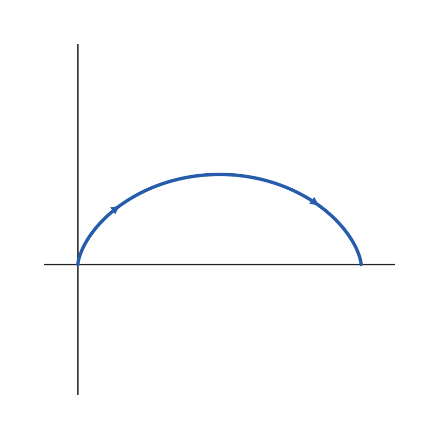
> 
> The plot uses $a=1$, $b=1$, and equal scaling.

```Mathematica title:"Problem 34: Mathematica plot"
Graphics[
  {
    Blue,
    AbsoluteThickness[3],
    Arrowheads[{{0.055, 0.3}, {0.055, 0.7}}],
    Arrow@Table[{t - Sin[t], 1 - Cos[t]}, {t, 0, 2 Pi, 2 Pi/500}]
  },
  PlotRange -> {{-0.8, 7.1}, {-2.8, 5.1}},
  Axes -> True,
  AxesLabel -> {"x", "y"},
  AxesStyle -> Directive[Black, AbsoluteThickness[1.2]],
  LabelStyle -> Directive[Black, 14],
  PlotRangePadding -> Scaled[0.04],
  ImageSize -> 340,
  Background -> White,
  AspectRatio -> Automatic
]
```

```python title:"Problem 34: Python plot"
import math
from pathlib import Path

W = H = 900
M = 90
BLUE = "#265cab"
AX = "#232323"
BG = "#ffffff"

def square_bounds(xs, ys, pad_frac=0.12):
    xmin, xmax = min(xs), max(xs)
    ymin, ymax = min(ys), max(ys)
    cx = (xmin + xmax) / 2
    cy = (ymin + ymax) / 2
    span = max(xmax - xmin, ymax - ymin)
    span *= 1 + 2 * pad_frac
    half = span / 2
    return cx - half, cx + half, cy - half, cy + half

def make_mapper(bounds):
    xmin, xmax, ymin, ymax = bounds
    def pt(x, y):
        return (
            M + (x - xmin) / (xmax - xmin) * (W - 2 * M),
            H - M - (y - ymin) / (ymax - ymin) * (H - 2 * M),
        )
    return pt

def arrow_polygon(p0, p1, L=20, ang_width=math.pi / 7):
    ang = math.atan2(p1[1] - p0[1], p1[0] - p0[0])
    return [
        p1,
        (p1[0] - L * math.cos(ang - ang_width), p1[1] - L * math.sin(ang - ang_width)),
        (p1[0] - L * math.cos(ang + ang_width), p1[1] - L * math.sin(ang + ang_width)),
    ]

a = 1
b = 1
ts = [2 * math.pi * k / 1399 for k in range(1400)]
xy = [(t - math.sin(t), 1 - math.cos(t)) for t in ts]
xs = [x for x, _ in xy]
ys = [y for _, y in xy]
bounds = square_bounds(xs, ys)
xmin, xmax, ymin, ymax = bounds
pt = make_mapper(bounds)
pts = [pt(x, y) for x, y in xy]

parts = [f'<svg xmlns="http://www.w3.org/2000/svg" width="{W}" height="{H}" viewBox="0 0 {W} {H}">']
parts.append(f'<rect width="100%" height="100%" fill="{BG}"/>')
if xmin <= 0 <= xmax:
    x0, y0 = pt(0, ymin)
    x1, y1 = pt(0, ymax)
    parts.append(f'<line x1="{x0:.2f}" y1="{y0:.2f}" x2="{x1:.2f}" y2="{y1:.2f}" stroke="{AX}" stroke-width="3"/>')
if ymin <= 0 <= ymax:
    x0, y0 = pt(xmin, 0)
    x1, y1 = pt(xmax, 0)
    parts.append(f'<line x1="{x0:.2f}" y1="{y0:.2f}" x2="{x1:.2f}" y2="{y1:.2f}" stroke="{AX}" stroke-width="3"/>')
poly = " ".join(f"{x:.2f},{y:.2f}" for x, y in pts)
parts.append(f'<polyline points="{poly}" fill="none" stroke="{BLUE}" stroke-width="7" stroke-linecap="round" stroke-linejoin="round"/>')
for frac in [0.3, 0.7]:
    i = int(frac * (len(pts) - 1))
    tri = " ".join(f"{x:.2f},{y:.2f}" for x, y in arrow_polygon(pts[i - 1], pts[i]))
    parts.append(f'<polygon points="{tri}" fill="{BLUE}"/>')
parts.append("</svg>")

Path("images/exercise14_problem34_python.svg").write_text("\n".join(parts), encoding="utf-8")
```


++++
