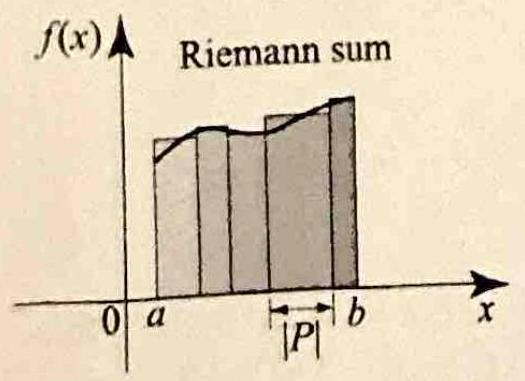
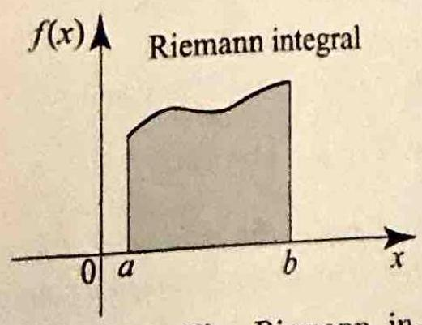
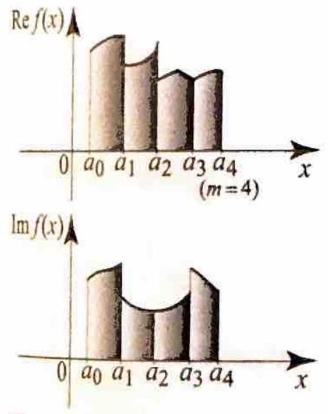
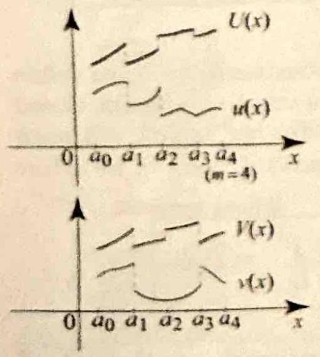
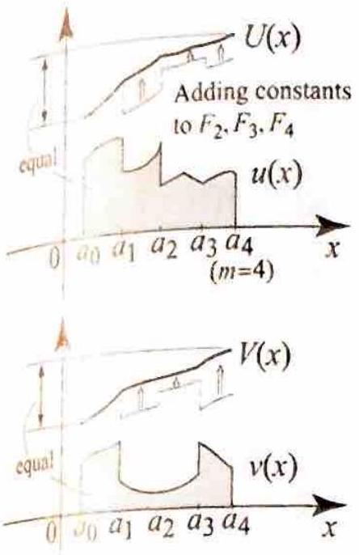
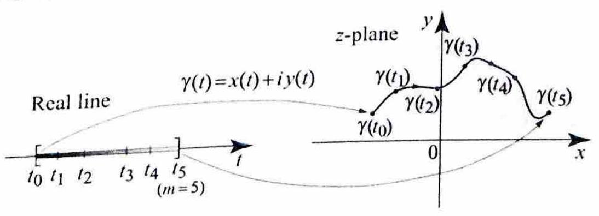
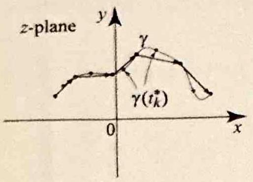
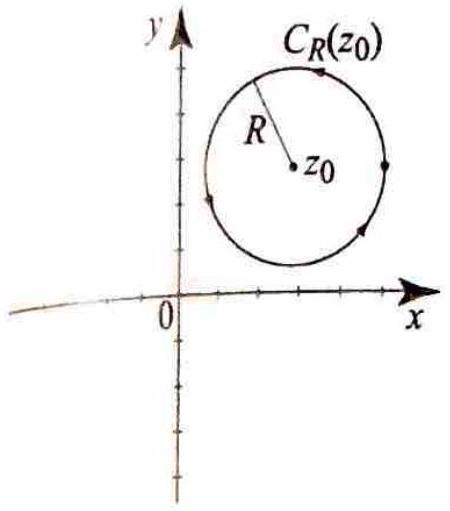
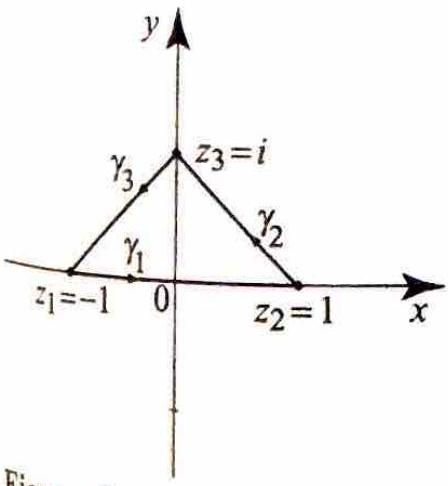
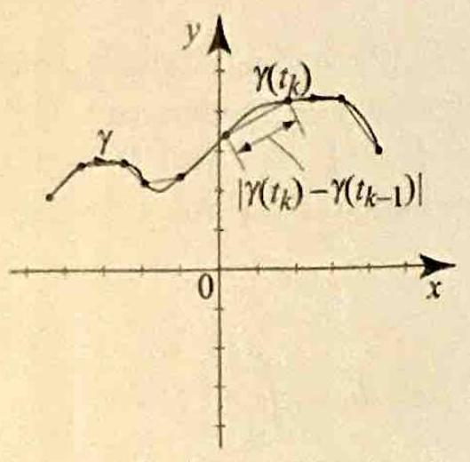

> [!review]
> 1.) How is the definite integral $\int_a^b f(x) d x$ of a continuous real-valued function on $[a, b]$ defined as a limit of Riemann sums, and what role does the norm $|P|$ of the partition play in this definition?
> 2.) How does the fundamental theorem of calculus evaluate $\int_a^b f(x) d x$ in terms of an antiderivative of $f$ ?


+++++


Our goal in this section is to construct the integral of a complex-valued function along a path in the complex plane. Since our construction is mod-


Suppose that $f$ is a real-valued continuous function defined on $[a, b]$. Let $P$ be a partition of $[a, b]$ consisting of closed subintervals of $[a, b]$ with endpoints $a=x_{0}<x_{1}<x_{2}<\cdots<x_{m}=b$. Let $|P|$ denote the norm of the partition, being the largest of the lengths $\Delta x_{k}=x_{k}-x_{k-1}$. Now consider the Riemann sum corresponding to $P$ (see _Figure 1_):


$$
\sum_{k=1}^{m} f\left(x_{k}^{\star}\right)\left(x_{k}-x_{k-1}\right),
$$

where $x_{k}^{\star}$ is a point in $\left[x_{j-1}, x_{j}\right]$. From calculus, we know that as the partition gets finer, that is, as $|P| \rightarrow 0$, the Riemann sum (1) converges to a finite number called the definite integral of $f$ and denoted by $\int_{a}^{b} f(x) d x$. Also, if $F$ is any antiderivative of $f$, then by the fundamental theorem of calculus sums.


> [!figure] Figure 1
> 
> ```horizontal
> 
> 
> 
> ---
> 
> 
> ```
> 
> 
> Figure 1 The Riemann integral as a limit of Riemann eled after the Riemann integral from calculus, we start the section with a quick review of some notions from integral calculus.


we have

$$
\int_{a}^{b} f(x) d x=F(b)-F(a)
$$

Our next step is to extend the Riemann integral to complex-valued functions of a real variable.


# 3.2.1 Riemann Integral of Complex-Valued Functions


> [!review]
> 1.) How is the definite integral of a piecewise continuous complex-valued function $f(x)= u(x)+i v(x)$ on $[a, b]$ defined in terms of the real integrals of $u$ and $v$, and what motivates this definition from the Riemann-sum construction?
> 2.) What linearity and additivity properties does the Riemann integral of a piecewise continuous complex-valued function on $[a, b]$ inherit from the real-valued case? Prove your answer.


Suppose that $f(x)=u(x)+i v(x)$ is a complex-valued continuous function on $[a, b]$. How should we define its integral over $[a, b]$ ? Motivated by the construction of the Riemann integral of a real-valued function, we consider a partition $P$ of $[a, b]$ given by $a=x_{0}<x_{1}<x_{2}<\cdots<x_{m}=b$, and form the corresponding Riemann sum analog of (1):

$$
\begin{aligned}
& \sum_{k=1}^{m} f\left(x_{k}^{\star}\right)\left(x_{k}-x_{k-1}\right) \\
& \quad=\sum_{k=1}^{m} u\left(x_{k}^{\star}\right)\left(x_{k}-x_{k-1}\right)+i \sum_{k=1}^{m} v\left(x_{k}^{\star}\right)\left(x_{k}-x_{k-1}\right)
\end{aligned}
$$

where $x_{k}^{\star}$ is a point in $\left[x_{k-1}, x_{k}\right]$. Since $u$ and $v$ are continuous, the Riemann sums on the right converge to $\int_{a}^{b} u(x) d x+i \int_{a}^{b} v(x) d x$. This leads us to the following definition of the definite integral in the complex-valued case:
(4)

> [!equation] Equation
> $$
> \int_{a}^{b} f(x) d x=\int_{a}^{b}(u(x)+i v(x)) d x=\int_{a}^{b} u(x) d x+i \int_{a}^{b} v(x) d x
> $$

If $f(x)$ is a piecewise continuous complex-valued function on $[a, b]$, to define its integral over $[a, b]$, we write $[a, b]$ as the finite union of adjacent closed subintervals $\left[a_{0}, a_{1}\right],\left[a_{1}, a_{2}\right], \ldots,\left[a_{m-1}, a_{m}\right]$, with $a_{0}=a$ and $a_{m}=b$, such that $f$ is continuous on each subinterval (see _Figure 2_). Using (4), we define


> [!equation] Equation
> 
> $$
> \int_{a}^{b} f(x) d x=\sum_{j=1}^{m} \int_{a_{j-1}}^{a_{j}} u(x) d x+i \sum_{j=1}^{m} \int_{a_{j-1}}^{a_{j}} v(x) d x
> $$
> 


> [!figure] Figure 2
> 
> 
> Figure 2 We integrate a complex-valued function by integrating its real and imagibary parts separately.
> 


Thus we can treat the integral of a piecewise continuous complex-valued function as a (complex) linear combination of Riemann integrals of realvalued functions. The integral as defined by (4) or (5) inherits many of the properties of the integral for real-valued functions. For example, consider


the following properties, whome prows are left to Exercise 10.


> [!proposition] Proposition 1:  Reimann Integral of Complex-Valued Functions
> (i) If $a$ and 3 are complex mambers and $f$ and $g$ are picewise contintoma complex-saluel functions on $\{a, b\}$, then
> (6) $\quad \int_{a}^{b}(a f(x)+\beta g(x)) d x=a \int_{a}^{b} f(x) d x+1 \int_{a}^{b} g(x) d x$.
> (ii) If $f$ is a piecewie continuous complex-valued function on $[a, d]$ and 1 $a \leq b \leq c$, then
> (7)
> 
> $$
> \int_{a}^{a} f(x) d x=\int_{a}^{b} f(x) d x+\int_{b}^{c} f(x) d x
> $$
> 
> 


> [!exercise] Exercise 1: A complex-valued piecewise continuous function
> 
> Evaluate $\int_{0}^{2} f(x) d x$, where
> 
> $$
> f(x)= \begin{cases}(1+i) x & \text { if } 0 \leq x \leq 1 . \\ i x^{2} & \text { if } 1<x \leq 2 .\end{cases}
> $$
> 

**Solution.** Since $f$ is piecewise continuous on $[0,2]$, we split the integral at $x=1$:

$$
\begin{aligned}
\int_0^2 f(x)\,dx
&=\int_0^1 (1+i)x\,dx+\int_1^2 i x^2\,dx \\
&=(1+i)\int_0^1 x\,dx+i\int_1^2 x^2\,dx \\
&=(1+i)\left[\frac{x^2}{2}\right]_0^1+i\left[\frac{x^3}{3}\right]_1^2 \\
&=(1+i)\left(\frac{1^2}{2}-\frac{0^2}{2}\right)+i\left(\frac{2^3}{3}-\frac{1^3}{3}\right) \\
&=(1+i)\left(\frac{1}{2}-0\right)+i\left(\frac{8}{3}-\frac{1}{3}\right) \\
&=\frac{1+i}{2}+\frac{7i}{3} \\
&=\frac{1}{2}+\frac{i}{2}+\frac{7i}{3} \\
&=\frac{1}{2}+\frac{3i}{6}+\frac{14i}{6} \\
&=\frac{1}{2}+\frac{17}{6}i .
\end{aligned}
$$


--- 


# 3.2.2 Antiderivatives of Complex-Valued Functions


> [!review]
> 1.) What does it mean for a function $F$ to be an antiderivative of a piecewise continuous complex-valued function $f$ on $[a, b]$ ? Why might an antiderivative built interval-by-interval fail to be continuous at the partition points, and how can the constants of integration be chosen to yield a continuous antiderivative on all of $[a, b]$ ?
> 2.) How does the fundamental theorem of calculus extend from real-valued continuous functions to piecewise continuous complex-valued functions on $[a, b]$ ? Prove your answer.
> 3.) How do any two continuous antiderivatives of the same piecewise continuous complexvalued function on $[a, b]$ relate to each other? Prove your answer.


If $f$ is a piecewise continuous complex-valued function on $[a, b]$, we will say that $F$ is an antiderivative of $f$ if $F^{\prime}(x)=f(x)$ at all the points of continuity of $f$ on $\{a, b\}$, where $F^{\prime}(x)$ is defined as in (5), Section 3.1. Hence if we write $f(x)=u(x)+i v(x)$ and $F(x)=U(x)+i V(x)$, then the equalities

$$
U^{\prime}(x)=u(x) \text { and } V^{\prime}(x)=v(x)
$$

hold for all but finitely many $x$ 's in $[a, b]$. Using the previous notation. we write $[a, b]$ as the finite union of adjacent closed subintervals $\left[a_{0}-a_{1}\right]$. $\left[a_{1}, a_{2}\right], \ldots,\left[a_{m-1}, a_{m}\right]$, with $a_{0}=a$ and $a_{m}=b$, and such that $f$ is continuous on each subinterval. The functions $U(x)$ and $V(x)$ are continuous on each subinterval and this makes $F$ piecewise continuous on $[a, b]$. However. $F$ may not be continuous at the points $a_{j}$ (see _Figure 3_). For practical purposes, we want $F$ to be continuous on $[a, b]$. As we now show, a continuous antiderivative can always be found.


> [!figure] Figure 3
> 
> 
> 
> Figure 3 An antiderivative of a piecewise continuous function may not be continuous.


Let $f_{j}$ denote the restriction of $f$ to $\left[a_{j-1}, a_{j}\right]$, and let $F_{j}$ denote an antiderivative of $f_{j}$ over $\left[a_{j-1}, a_{j}\right]$. Each $F_{j}$ is computed up to an arbitrary complex constant, which can be determined in such a way to make $F$ continuous.

Start by setting the arbitrary constant in $F_{1}$ equal 0 . Then determine the constant in $F_{2}$ so that $\lim _{x \uparrow a_{1}} F_{1}(x)=\lim _{x \downarrow a_{1}} F_{2}(x)$. (We use the uparrow to denote a limit from the left and the down-arrow a limit from the right.) This determines $F_{2}$ and makes the antiderivative of $f$ continuous on $\left[a, a_{2}\right]$. Continue in this fashion: once you have found $F_{j}$, determine the constant in $F_{j+1}$ so that $\lim _{x \uparrow a_{j}} F_{j}(x)=\lim _{x \downarrow a_{j}} F_{j+1}(x)$. By construction, the resulting function $F$ will be continuous on $[a, b]$ (see _Figure 4_). The following example illustrates the method.


> [!figure] Figure 4
> 
> Figure 4 Selecting a continuous ant derivative.


> [!exercise] Exercise 2: Finding a continuous antiderivative
> 
> Find a continuous antiderivative of the function in Example 1,
> 
> $$
> f(x)= \begin{cases}(1+i) x & \text { if } 0 \leq x \leq 1, \\ i x^{2} & \text { if } 1<x \leq 2 .\end{cases}
> $$
> 


**Solution.** On each interval of continuity, integrate separately. For $0 \le x \le 1$,

$$
F_1(x)=\int (1+i)x\,dx=\frac{1+i}{2}x^2+C_1.
$$

For $1<x\le 2$,

$$
F_2(x)=\int i x^2\,dx=\frac{i}{3}x^3+C_2.
$$

Choose $C_1=0$. Then

$$
F_1(x)=\frac{1+i}{2}x^2.
$$

To make the antiderivative continuous at $x=1$, require

$$
\begin{aligned}
F_1(1)&=F_2(1) \\
\frac{1+i}{2}(1)^2&=\frac{i}{3}(1)^3+C_2 \\
\frac{1+i}{2}&=\frac{i}{3}+C_2 \\
C_2&=\frac{1+i}{2}-\frac{i}{3} \\
&=\frac{1}{2}+\frac{i}{2}-\frac{i}{3} \\
&=\frac{1}{2}+\frac{3i}{6}-\frac{2i}{6} \\
&=\frac{1}{2}+\frac{i}{6}.
\end{aligned}
$$

Hence one continuous antiderivative is

$$
F(x)=
\begin{cases}
\dfrac{1+i}{2}x^2, & 0\le x\le 1,\\[6pt]
\dfrac{i}{3}x^3+\dfrac{1}{2}+\dfrac{i}{6}, & 1<x\le 2.
\end{cases}
$$

Indeed,

$$
F'(x)=
\begin{cases}
(1+i)x, & 0\le x\le 1,\\
i x^2, & 1<x\le 2,
\end{cases}
$$

and

$$
F(1)=\frac{1+i}{2}=\frac{i}{3}+\frac{1}{2}+\frac{i}{6},
$$

so $F$ is continuous on $[0,2]$.


++++


The following is an extension of the fundamental theorem of calculus to piecewise continuous complex functions.

> [!theorem] Theorem 1: Definite Integral of
> 
> Suppose that $f$ is a piecewise continuous complex-valued function on the interval $[a, b]$ and let $F$ be a continuous antiderivative of $f$ in $[a, b]$. Then
> 
> $$
> \int_{a}^{b} f(x) d x=F(b)-F(a)
> $$
> 
> 

**Proof** Suppose first that $f=u+i v$ is continuous on $[a, b]$. Let $F(x)=U(x)+ i V(x)$ be an antiderivative of $f$. Using (4) and the fundamental theorem of calculus, we sce that

$$
\begin{aligned}
\int_{a}^{b} f(x) d x & =\int_{a}^{b} u(x) d x+i \int_{a}^{b} v(x) d x \\
& =(U(b)-U(a))+i(V(b)-V(a)) \\
& =(U(b)+i V(b))-(U(a)+i V(a))=F(b)-F(a)
\end{aligned}
$$

and hence (8) holds. If $f$ is piecewise continuous on $[a, b]$, we use (5) and the previous case, and get

$$
\begin{aligned}
\int_{a}^{b} f(x) d x & =\sum_{j=1}^{m} \int_{a_{j-1}}^{a_{j}} f(x) d x=\sum_{j=1}^{m}\left(F\left(a_{j}\right)-F\left(a_{j-1}\right)\right) \\
& =F\left(a_{m}\right)-F\left(a_{0}\right)=F(b)-F(a)
\end{aligned}
$$

which proves (8).


+++


As an application of Theorem 1, let us evaluate the integral in Example 1 by using the continuous antiderivative that we found in Example 2. In the notation of Example 2, we have

$$
\int_{0}^{2} f(x) d x=F(2)-F(0)=\left(\frac{i}{3} 2^{3}+\frac{1}{2}+\frac{i}{6}\right)-0=\frac{1}{2}+\frac{17}{6} i
$$

which agrees with the result of Example 1.
It is easy to show that two continuous antiderivatives of $f$ differ by a complex constant on $[a, b]$. Motivated by Theorem 1, we will write

$$
\int f(x) d x=F(x)+C
$$

where $C$ is an arbitrary complex constant, to denote the set of all continuous antiderivatives of $f$. For example, if $\alpha \neq 0$ is a complex number, then

$$
\int e^{\alpha t} d t=\frac{1}{\alpha} e^{\alpha t}+C \quad(\alpha \neq 0)
$$

as can be checked by verifying that the derivative of the right side is equal to the integrand on the left side. This simple integral of a complex-valued function has an interesting application to the evaluation of tedious integrals from calculus.


> [!exercise] Exercise 3: Integrating $e^{a x} \cos b x$ and $e^{a x} \sin b x$
> 
> Let $a$ and $b$ be arbitrary nonzero real numbers. Compute
> 
> $$
> I_{1}=\int e^{a x} \cos b x d x \quad \text { and } \quad I_{2}=\int e^{a x} \sin b x d x
> $$
> 
**Solution.** Consider

$$
\int e^{(a+i b)x}\,dx=\frac{1}{a+i b}e^{(a+i b)x}+C.
$$

Since

$$
e^{(a+i b)x}=e^{a x}(\cos b x+i\sin b x)
$$

and

$$
\frac{1}{a+i b}=\frac{a-i b}{(a+i b)(a-i b)}=\frac{a-i b}{a^2+b^2},
$$

we get

$$
\begin{aligned}
\int e^{(a+i b)x}\,dx
&=\frac{a-i b}{a^2+b^2}e^{a x}(\cos b x+i\sin b x)+C \\
&=\frac{e^{a x}}{a^2+b^2}(a-i b)(\cos b x+i\sin b x)+C \\
&=\frac{e^{a x}}{a^2+b^2}\left(a\cos b x+a i\sin b x-i b\cos b x-i^2 b\sin b x\right)+C \\
&=\frac{e^{a x}}{a^2+b^2}\left(a\cos b x+a i\sin b x-i b\cos b x+b\sin b x\right)+C \\
&=\frac{e^{a x}}{a^2+b^2}\left((a\cos b x+b\sin b x)+i(a\sin b x-b\cos b x)\right)+C.
\end{aligned}
$$

But also

$$
\int e^{(a+i b)x}\,dx
=\int e^{a x}\cos b x\,dx+i\int e^{a x}\sin b x\,dx
=I_1+iI_2.
$$

Equating real and imaginary parts, we obtain

$$
I_1=\int e^{a x}\cos b x\,dx=\frac{e^{a x}}{a^2+b^2}(a\cos b x+b\sin b x)+C
$$

and

$$
I_2=\int e^{a x}\sin b x\,dx=\frac{e^{a x}}{a^2+b^2}(a\sin b x-b\cos b x)+C.
$$

++++


We now have all the tools that we need to construct the integral along a path in the complex plane.

# 3.2.3 Path or Contour Integrals


> [!review]
> 1.) How is the path (contour) integral $\int_\gamma f(z) d z$ of a continuous complex-valued function $f$ over a path $\gamma:[a, b] \rightarrow \mathbb{C}$ defined, and how does a Riemann-sum construction on the path lead to this definition?
> 2.) What linearity, path-reversal, and contour-additivity properties does the path integral satisfy? Prove your answer.


Suppose that $\gamma(t), a \leq t \leq b$ is a path; that is, $\gamma(t)$ is a continuous complexvalued function on $[a, b]$ with piecewise continuous derivative $\gamma^{\prime}(t)$. Suppose that $f(z)$ is a continuous complex-valued function on the graph of $\gamma(t)$; that is, the function $t \mapsto f(\gamma(t))$ is a continuous function from $[a, b]$ into $\mathbb{C}$. Our goal is to construct the integral of $f$ over $\gamma$.

To simplify our discussion, we first deal with the case where $\gamma$ and $\gamma^{\prime}$ are both continuous on $[a, b]$. Taking a hint from the Riemann integral, we partition


the path $\gamma$ into smaller arcs with endpoints at $\gamma\left(t_{k}\right)$ (_Figure 5_); evaluate $f\left(\gamma\left(t_{k}^{\star}\right)\right)$, where $\gamma\left(t_{k}^{\star}\right)$ is a point on the arc between $\gamma\left(t_{k-1}\right)$ and $\gamma\left(t_{k}\right)$; and then sum all the terms of the form $f\left(\gamma\left(t_{k}^{\star}\right)\right)\left(\gamma\left(t_{k}\right)-\gamma\left(t_{k-1}\right)\right)$ (_Figure 6_). This leads us to consider a Riemann-like sum
where $a=t_{0}<t_{1}<\cdots<t_{m}=b$ is a partition of $[a, b]$, and $t_{k}^{\star}$ is in $\left[t_{k-1}, t_{k}\right]$. 


> [!figure] Figure 5
> Figure 5 Partitioning a path - into smaller ares with endpoints at $\gamma\left(t_{k}\right)$.
> 
> 


> [!figure] Figure 6
> 
> 
> Figure 6 Forming a Riemann-like sum of a complex-valued function of a path $\gamma$.


Writing $\gamma(t)=x(t)+i y(t)$ so that $\gamma^{\prime}(t)=x^{\prime}(t)+i y^{\prime}(t)$, and appealing to the mean value theorem from calculus, we get

$$
\begin{aligned}
& \sum_{k=1}^{m} f\left(\gamma\left(t_{k}^{\star}\right)\right)\left(\gamma\left(t_{k}\right)-\gamma\left(t_{k-1}\right)\right) \\
& \quad=\sum_{k=1}^{m} f\left(\gamma\left(t_{k}^{\star}\right)\right)\left(x\left(t_{k}\right)-x\left(t_{k-1}\right)\right)+i \sum_{k=1}^{m} f\left(\gamma\left(t_{k}^{\star}\right)\right)\left(y\left(t_{k}\right)-y\left(t_{k-1}\right)\right) \\
& \quad=\sum_{k=1}^{m} f\left(\gamma\left(t_{k}^{\star}\right)\right) x^{\prime}\left(\alpha_{k}\right)\left(t_{k}-t_{k-1}\right)+i \sum_{k=1}^{m} f\left(\gamma\left(t_{k}^{\star}\right)\right) y^{\prime}\left(\beta_{k}\right)\left(t_{k}-t_{k-1}\right)
\end{aligned}
$$

where $t_{k-1}<\alpha_{k}, \beta_{k}<t_{k}$. Interpreting each sum on the right as a Riemann sum (in the usual sense from calculus) over the interval $[a, b]$, we see that as the partition gets finer, the sum on the left converges to

$$
\begin{aligned}
\int_{a}^{b} f(\gamma(t)) x^{\prime}(t) d t+i \int_{a}^{b} f(\gamma(t)) y^{\prime}(t) d t & =\int_{a}^{b} f(\gamma(t))\left(x^{\prime}(t)+i y^{\prime}(t)\right) d t \\
& =\int_{a}^{b} f(\gamma(t)) \gamma^{\prime}(t) d t
\end{aligned}
$$

$$
\sum_{k=1}^{m} f\left(\gamma\left(t_{k}^{\star}\right)\right)\left(\gamma\left(t_{k}\right)-\gamma\left(t_{k-1}\right)\right)
$$

DEFINITION 1 PATH OR CONTOUR INTEGRALS

For general piecewise smooth $\gamma$, the derivative $\gamma^{\prime}(t)$ may not be continuous but just piecewise continuous. This makes the integrand in (14) piecewise continuous. We evaluate the integral in this case as a finite sum of integrals of continuous functions, as we did in (5). All of this leads us to the following important definition.


> [!definition] definition 1: Path (or Contour) Integrals
> Suppose that $\gamma$ is a path over a closed interval $[a, b]$ and that $f$ is a cont inuous complex-valued function defined on the graph of $\gamma$. The path or contour integral of $f$ on $\gamma$ is given by
> 
> $$
> \int_{\gamma} f(z) d z=\int_{a}^{b} f(\gamma(t)) \gamma^{\prime}(t) d t
> $$
> 
> Other notations for the path integral are $\int_{\gamma} f(z) d \gamma$ or simply $\int_{\gamma} f d \gamma$.


Thus, after parametrizing the path by a closed interval $[a, b]$, the path integral becomes a Riemann integral of a piecewise continuous complex-valued function over the interval $[a, b]$.

We now give several examples of path integrals, starting with one that will be needed in the future.


> [!exercise] Exercise 4: Path integrals of $\left(z-z_{0}\right)^{n}, n$ any integer
> Let $C_{R}\left(z_{0}\right)$ be the positively oriented circle with center at $z_{0}$ and radius $R>0$ (see _Figure 7_).
> 
> 
> > [!figure] Figure 7
> > 
> > 
> > Figure 7 for Example 4.
> 
> 
> (a) Show that
> 
> $$
> \int_{C_{R}\left(z_{0}\right)} \frac{1}{z-z_{0}} d z=2 \pi i
> $$
> 
> (b) Let $n \neq-1$ be an integer; show that
> 
> $$
> \int_{C_{R}\left(z_{0}\right)}\left(z-z_{0}\right)^{n} d z=0
> $$
> 
> 
**Solution.** Parametrize the positively oriented circle by

$$
\gamma(t)=z_0+Re^{it}, \qquad 0\le t\le 2\pi.
$$

Then

$$
\gamma'(t)=iRe^{it}
$$

and

$$
\gamma(t)-z_0=Re^{it}.
$$
##### problem 4a


$$
\begin{aligned}
\int_{C_R(z_0)} \frac{1}{z-z_0}\,dz
&=\int_0^{2\pi}\frac{1}{\gamma(t)-z_0}\gamma'(t)\,dt \\
&=\int_0^{2\pi}\frac{1}{Re^{it}}\,iRe^{it}\,dt \\
&=\int_0^{2\pi} i\,dt \\
&=i\int_0^{2\pi}dt \\
&=i[t]_0^{2\pi} \\
&=i(2\pi-0) \\
&=2\pi i.
\end{aligned}
$$

##### problem 4b

For part (b), let $n\ne -1$. Then

$$
\begin{aligned}
\int_{C_R(z_0)}(z-z_0)^n\,dz
&=\int_0^{2\pi}(\gamma(t)-z_0)^n\gamma'(t)\,dt \\
&=\int_0^{2\pi}(Re^{it})^n iRe^{it}\,dt \\
&=\int_0^{2\pi}R^n e^{int} iRe^{it}\,dt \\
&=iR^{n+1}\int_0^{2\pi}e^{i(n+1)t}\,dt \\
&=iR^{n+1}\left[\frac{e^{i(n+1)t}}{i(n+1)}\right]_0^{2\pi} \\
&=\frac{iR^{n+1}}{i(n+1)}\left(e^{i(n+1)2\pi}-e^0\right) \\
&=\frac{R^{n+1}}{n+1}\left(e^{2\pi i(n+1)}-1\right).
\end{aligned}
$$

Since $n+1$ is an integer,

$$
e^{2\pi i(n+1)}=1,
$$

so

$$
\int_{C_R(z_0)}(z-z_0)^n\,dz=0.
$$


++++


In particular, if $C_{1}(0)$ denotes the positively oriented unit circle with center at the origin, then (16) and (17) imply that

$$
\int_{C_{1}(0)} \frac{1}{z} d z=2 \pi i \quad \text { and } \quad \int_{C_{1}(0)} z d z=0
$$

Compare (18) with the following integrals involving $\bar{z}$.


> [!exercise] Exercise 5 Integrals involving $\bar{z}$
> 
> Show that
> 
> $$
> \int_{C_{1}(0)} \frac{1}{\bar{z}} d z=0 \quad \text { and } \quad \int_{C_{1}(0)} \bar{z} d z=2 \pi i
> $$
> 
**Solution.** Parametrize the positively oriented unit circle by

$$
\gamma(t)=e^{it}, \qquad 0\le t\le 2\pi.
$$

Then

$$
\gamma'(t)=ie^{it}
$$

and

$$
\overline{\gamma(t)}=\overline{e^{it}}=e^{-it}.
$$

Hence

$$
\frac{1}{\overline{\gamma(t)}}=\frac{1}{e^{-it}}=e^{it}.
$$

Therefore,

$$
\begin{aligned}
\int_{C_1(0)}\frac{1}{\bar z}\,dz
&=\int_0^{2\pi}\frac{1}{\overline{\gamma(t)}}\gamma'(t)\,dt \\
&=\int_0^{2\pi} e^{it}\,ie^{it}\,dt \\
&=i\int_0^{2\pi} e^{2it}\,dt \\
&=i\left[\frac{e^{2it}}{2i}\right]_0^{2\pi} \\
&=\frac{1}{2}\left(e^{4\pi i}-1\right) \\
&=\frac{1}{2}(1-1) \\
&=0.
\end{aligned}
$$

Also,

$$
\begin{aligned}
\int_{C_1(0)}\bar z\,dz
&=\int_0^{2\pi}\overline{\gamma(t)}\gamma'(t)\,dt \\
&=\int_0^{2\pi} e^{-it}\,ie^{it}\,dt \\
&=\int_0^{2\pi} i\,dt \\
&=i[t]_0^{2\pi} \\
&=i(2\pi-0) \\
&=2\pi i.
\end{aligned}
$$

++++


The integrals in Example 5 are generalized in Exercise 10.
Because the path integral is a Riemann integral, several properties of the latter integral carry over to the path integral. We have the following useful properties.


> [!proposition] proposition 2: Properties of the Path Integral
> 
> (i) Suppose that $\gamma(t)$ is a path on $[a, b], f$ and $g$ are continuous functions on $\gamma$, and $\alpha$ and $\beta$ are complex numbers. Then
> 
> $$
> \int_{\gamma}(\alpha f(z)+\beta g(z)) d z=\alpha \int_{\gamma} f(z) d z+\beta \int_{\gamma} g(z) d z
> $$
> 
> (ii) Let $\gamma_{r}$ denote the reverse of $\gamma$. Then
> 
> $$
> \int_{\gamma_{r}} f(z) d z=-\int_{\gamma} f(z) d z
> $$
> 
> (iii) If $\Gamma=\left(\gamma_{1}, \gamma_{2}, \ldots, \gamma_{m}\right)$ is a contour and $f$ is continuous on $\Gamma$, then
> 
> $$
> \int_{\Gamma} f(z) d z=\sum_{k=1}^{m} \int_{\gamma_{k}} f(z) d z
> $$
> 


**Proof** (i) Express the path integrals as Riemann integrals using (15) and then use (6). (ii) Recall the parametrization of the reverse of $\gamma$ from (3), Section 3.1: $\gamma_{r}(t)=\gamma(b+a-t)$, where $t$ runs over the same interval $[a, b]$ that parametrizes $\gamma$. Then $\gamma_{r}^{\prime}(t)=-\gamma^{\prime}(b+a-t)$ and so

$$
\int_{\gamma_{r}} f(z) d z=-\int_{a}^{b} f(\gamma(b+a-t)) \gamma^{\prime}(b+a-t) d t
$$

Making the change of variables $T=b+a-t$, we obtain

$$
\int_{\gamma_{r}} f(z) d z=\int_{b}^{a} f(\gamma(T)) \gamma^{\prime}(T) d T=-\int_{a}^{b} f(\gamma(T)) \gamma^{\prime}(T) d T=-\int_{\gamma} f(z) d z
$$


by (15). The proof of (iii) involves parametrizing $\Gamma=\left(\gamma_{1}, \gamma_{2}, \ldots, \gamma_{m}\right)$ and using additivity of the Riemann integral over intervals (7). The details are worked in Exercise 42. $\square$

+++


In some path integrals, the integrand is written as a function of $x$ and $y$ and not $z$. We can rewrite the integrand as a function of $z$ by using the relations

$$
x=\frac{z+\bar{z}}{2} \quad \text { and } \quad y=\frac{z-\bar{z}}{2 i} .
$$

Here is an illustration that also uses the linearity of the path integral (20).

> [!exercise] Exercise 6 Using linearity
> 
> Let $C_{1}(0)$ denote the positively oriented unit circle, as in Example 5. Compute
> 
> $$
> \int_{C_{1}(0)} x d z=\int_{C_{1}(0)} \operatorname{Re} z d z
> $$
> 


Since

$$
x=\operatorname{Re} z=\frac{z+\bar z}{2},
$$

linearity of the path integral gives

$$
\begin{aligned}
\int_{C_1(0)} x\,dz
&=\int_{C_1(0)} \frac{z+\bar z}{2}\,dz \\
&=\frac{1}{2}\int_{C_1(0)} (z+\bar z)\,dz \\
&=\frac{1}{2}\left(\int_{C_1(0)} z\,dz+\int_{C_1(0)} \bar z\,dz\right) \\
&=\frac{1}{2}(0+2\pi i) \\
&=\pi i.
\end{aligned}
$$


> [!exercise] Exercise 7: Integrals over polygonal paths
> Let $z_{1}=-1, z_{2}=1$, and $z_{3}=i$ (Figure 8). 
> 
> 
> > [!figure] Figure 8
> > 
> > 
> > Figure 8 for Example 7.
> 
> 
> Compute
> (a) $\quad \int_{\left[z_{1}, z_{2}\right]} \bar{z} d z$,
> (b) $\quad \int_{\left[z_{2}, z_{3}\right]} \bar{z} d z$,
> (c) $\quad \int_{\left[z_{3}, z_{1}\right]} \bar{z} d z$,
> (d) $\quad \int_{\left[z_{1}, z_{2}, z_{3}\right]} \bar{z} d z$,
> (e) $\quad \int_{\left[z_{1}, z_{2}, z_{3}, z_{1}\right]} \bar{z} d z$,
> (f) $\quad \int_{\left[z_{1}, z_{3}\right]} \bar{z} d z$.
> 
> 
> 


##### problem 7.a


##### problem 7.b


##### problem 7.c


##### problem 7.d


##### problem 7.e


##### problem 7.f


---


> [!review]
> 1.) Does the path integral $\int_\gamma f(z) d z$ of a continuous complex-valued function between two points depend only on the endpoints of $\gamma$, or can it depend on the full path joining them?
> 2.) What does it mean for two parametrizations $\gamma_1:[a, b] \rightarrow \mathbb{C}$ and $\gamma_2:[c, d] \rightarrow \mathbb{C}$ to be equivalent parametrizations of the same path, and how does the path integral behave under equivalent parametrizations? Prove your answer.


Comparing the integrals in (23) and (25), we are led to the following somewhat disturbing conclusion: If $f$ is a continuous function in a region that contains $z_{1}, z_{2}$, and $z_{3}$, then the path integral of $f$ on a line directly connecting $z_{1}$ to $z_{3}$ is not necessarily equal to the path integral of $f$ from $z_{1}$ to $z_{3}$ along a different path (say, one that goes through $z_{2}$ ). In other words, the path integral of $f$ from $z_{1}$ to $z_{3}$ is not independent of the path joining $z_{1}$ to $z_{3}$. Is the path integral ever independent from path? We answer this important question in the next section by formulating necessary and sufficient conditions for independence of path.

Another question that comes to mind as we work with path integrals concerns the parametrization of the path. Since a given path may be parametrized in many different ways, it is natural to ask whether the integral is independent of the choice of the parametrization. Noting that the Riemann-like sum of the path integral (13) can be written in the form

$$
\sum_{k=1}^{m} f\left(z_{k}^{\star}\right)\left(z_{k}-z_{k-1}\right),
$$

which makes no reference to $t$, we would expect that the integral is independent of the parametrization. Indeed, this is true as long as we are describing the same path.

For example, the positively oriented unit circle $C_{1}(0)$ can be parametrized by $\gamma_{1}(t)=e^{i t}, 0 \leq t \leq 2 \pi$ or $\gamma_{2}(t)=e^{2 i t}, 0 \leq t \leq \pi$. If $f(z)$ is a continuous function on $C_{1}(0)$, we would expect that $\int_{\gamma_{1}} f(z) d z=\int_{\gamma_{2}} f(z) d z$. In fact, using the definition of path integrals and a simple change of variables $s=2 t$, $d s=2 d t$, we have

$$
\int_{\gamma_{2}} f(z) d z=\int_{0}^{\pi} f\left(e^{2 i t}\right) 2 i e^{2 i t} d t=\int_{0}^{2 \pi} f\left(e^{i s}\right) i e^{i s} d s=\int_{\gamma_{1}} f(z) d z
$$

as expected. The same proof works in general, but we have to explain what we mean by two parametrizations being the same.

We will say that $\gamma_{1}(t), a \leq t \leq b$, and $\gamma_{2}(t), c \leq t \leq d$, are **equivalent parametrizations** if there is an increasing continuously differentiable function $\phi(t)$ from $[c, d]$ onto $[a, b]$ such that $\phi(c)=a$ and $\phi(d)=b$ and $\gamma_{2}(t)=\gamma_{1} \circ \phi(t)$ for all $t$ in $[c, d]$.

In the case of the unit circle and the two parametrizations $\gamma_{1}(t)=e^{i t}$, $0 \leq t \leq 2 \pi$ and $\gamma_{2}(t)=e^{2 i t}, 0 \leq t \leq \pi$, we see that $\gamma_{1}$ and $\gamma_{2}$ are equivalent by taking $\phi(t)=2 t$.

The next result confirms a property that we would expect from a path integral.


> [!proposition] Proposition 3: Independence of Parametrization
> Suppose that $\gamma_{1}(t), a \leq t \leq b$, and $\gamma_{2}(t), c \leq t \leq d$, are equivalent parametrizations of the same path $\gamma$ and let $f$ be a continuous function on $\gamma$. Then
> 
> $$
> \int_{\gamma_{1}} f(z) d z=\int_{\gamma_{2}} f(z) d z
> $$
> 

**Proof** Applying the definition of path integrals, and using $\gamma_{2}(t)=\gamma_{1}(\phi(t))$ and $\gamma_{2}^{\prime}(t)=\gamma_{1}^{\prime}(\phi(t)) \phi^{\prime}(t)$, we obtain

$$
\begin{aligned}
\int_{\gamma_{2}} f(z) d z & =\int_{c}^{d} f\left(\gamma_{2}(t)\right) \gamma_{2}^{\prime}(t) d t=\int_{c}^{d} f\left(\gamma_{1}(\phi(t))\right) \gamma_{1}^{\prime}(\phi(t)) \phi^{\prime}(t) d t \\
& =\int_{a}^{b} f\left(\gamma_{1}(s)\right) \gamma_{1}^{\prime}(s) d s=\int_{\gamma_{1}} f(z) d z
\end{aligned}
$$

where the equality before last follows by setting $s=\phi(t), d s=\phi^{\prime}(t) d t$.


---


We end the section by revisiting the notion of arc length from calculus and deriving useful estimates on the size of path integrals.


# 3.2.4 Arc Length and Bounds for Integrals


> [!review]
> 1.) How is the length of a smooth path $\gamma:[a, b] \rightarrow \mathbb{C}$ defined in terms of inscribed polygonal approximation, and how does this lead to the integral formula $l(\gamma)=\int_a^b\left|\gamma^{\prime}(t)\right| d t$ ? Derive the formula.
> 2.) If $f$ is a continuous function on a path $\gamma$ with $|f(z)| \leq M$ on $\gamma$, what upper bounds on $\left|\int_\gamma f(z) d z\right|$ can be derived - both in terms of $M$ and the length $l(\gamma)$, and as a sharper bound in terms of the integrand $|f(\gamma(t))|\left|\gamma^{\prime}(t)\right|$ ? Prove both.
> 3.) Under what choice of path does the path integral $\int_\gamma f(z) d z$ reduce to the Riemann integral $\int_a^b f(t) d t$ of a piecewise continuous complex-valued function on $[a, b]$, and what inequalities on $\left|\int_a^b f(t) d t\right|$ follow from the ML-inequality in this case?


+++++


Given a smooth path $\gamma:[a, b] \rightarrow \mathbb{C}$, write $\gamma(t)=x(t)+i y(t)$. The length of $\gamma$, denoted $l(\gamma)$, can be approximated by adding the length of line segments joining consecutive points on the graph of $\gamma$ as in _Figure 9_. The sum of the lengths of the line segments is given by

$$
\sum_{k=1}^{m}\left|\gamma\left(t_{k}\right)-\gamma\left(t_{k-1}\right)\right|=\sum_{k=1}^{m} \sqrt{\left(x\left(t_{k}\right)-x\left(t_{k-1}\right)\right)^{2}+\left(y\left(t_{k}\right)-y\left(t_{k-1}\right)\right)^{2}}
$$

where $a=t_{0}<t_{1}<t_{2}<\cdots<t_{m}=b$ is a partition of $[a, b]$. 


> [!figure] Figure 9
> 
> 
> Figure 9 Approximating the length of a path by adding the length of line segments.


Thus the length of $\gamma$ is the limit (when it exists) of the sums on the right side of (26) as the partition of $[a, b]$ gets finer and finer. To find this limit, we use the mean value theorem and write $\left(x\left(t_{k}\right)-x\left(t_{k-1}\right)\right)^{2}=\left(x^{\prime}\left(\alpha_{k}\right)\left(t_{k}-t_{k-1}\right)\right)^{2}$ and $\left(y\left(t_{k}\right)-y\left(t_{k-1}\right)\right)^{2}=\left(y^{\prime}\left(\beta_{k}\right)\left(t_{k}-t_{k-1}\right)\right)^{2}$, where $\alpha_{k}$ and $\beta_{k}$ are in $\left[t_{k-1}, t_{k}\right]$. Then (26) becomes

$$
\sum_{k=1}^{m} \sqrt{x^{\prime}\left(\alpha_{k}\right)^{2}+y^{\prime}\left(\beta_{k}\right)^{2}}\left(t_{k}-t_{k-1}\right)
$$

Recognizing this sum as a Riemann sum and taking limits as the partition gets finer, we recover the formula for arc length from calculus:

> [!equation] Equation
> 
> $$
> l(\gamma)=\int_{a}^{b} \sqrt{x^{\prime}(t)^{2}+y^{\prime}(t)^{2}} d t=\int_{a}^{b}\left|\gamma^{\prime}(t)\right| d t
> $$
> 

where the second equality follows from the complex notation $\gamma^{\prime}(t)=x^{\prime}(t)+ i y^{\prime}(t)$ and so $\sqrt{x^{\prime}(t)^{2}+y^{\prime}(t)^{2}}=\left|\gamma^{\prime}(t)\right|$. For piecewise smooth $\gamma$, we can repeat the previous analysis for each smooth part of $\gamma$ and then add the lengths of all smooth parts. This results in formula (27) for the arc length, where the integrand in this case is piecewise continuous. The element of arc length is usually denoted by $d s$. Thus,

$$
d s=\sqrt{x^{\prime}(t)^{2}+y^{\prime}(t)^{2}} d t .
$$

> [!exercise] Exercise 8: Arc length
> 
> Find the length of the arch of the cycloid
> 
> $$
> \gamma(t)=a(t-\sin t)+a i(1-\cos t), \quad 0 \leq t \leq 2 \pi,
> $$
> 
> where $a$ is a positive real number. The curve is illustrated in _Figure 10_.
> 
> > [!figure] Figure 10
> > 
> > ![[Screenshot 2026-04-02 at 4.59.04 AM.png]]
> > 
> > 
> 
> 


Using the notion of length, we can extend to path integrals the familiar inequality for the Riemann integral: If $f$ is a continuous real-valued function of $[a, b]$ with $|f(x)| \leq M$ on $[a, b]$, then

$$
\left|\int_{a}^{b} f(x) d x\right| \leq M(b-a) .
$$

For path integrals, we have the following useful inequality, often called the $M l$-inequality.


> [!theorem] Theorem 2: Bounds for Path Integrals
> Suppose that $\gamma$ is a path over $[a, b]$ with length $l(\gamma)$, and $f$ is a continuous function on $\gamma$ such that $|f(z)| \leq M$ for all $z$ on $\gamma$. Then
> (29)
> 
> $$
> \left|\int_{\gamma} f(z) d z\right| \leq M l(\gamma) .
> $$
> 


**Proof** We start with the case of a smooth path $\gamma$ and consider a Riemann sum defining the path integral (13). Using the triangle inequality and the inequality $|f(z)| \leq M$ for $z$ on $\gamma$, we get

$$
\begin{aligned}
\left|\sum_{k=1}^{m} f\left(\gamma\left(t_{k}^{\star}\right)\right)\left(\gamma\left(t_{k}\right)-\gamma\left(t_{k-1}\right)\right)\right| & \leq \sum_{k=1}^{m}\left|f\left(\gamma\left(t_{k}^{\star}\right)\right)\left(\gamma\left(t_{k}\right)-\gamma\left(t_{k-1}\right)\right)\right| \\
& =\sum_{k=1}^{m}\left|f\left(\gamma\left(t_{k}^{\star}\right)\right)\right|\left|\left(\gamma\left(t_{k}\right)-\gamma\left(t_{k-1}\right)\right)\right| \\
& \leq M \sum_{k=1}^{m}\left|\left(\gamma\left(t_{k}\right)-\gamma\left(t_{k-1}\right)\right)\right| .
\end{aligned}
$$

Taking limits as the partition of $[a, b]$ gets finer, the sum on the left side converges to $\int_{\gamma} f(z) d z$ while the sum on the right side converges to $l(\gamma)$, implying (29) in the case of a smooth $\gamma$. If $\gamma$ is piecewise smooth, we can write $\gamma=\left(\gamma_{1}, \gamma_{2}, \ldots, \gamma_{n}\right)$, where each $\gamma_{j}$ is smooth. Then using (22) and applying (29) to each smooth part
of $\gamma$, we obtain

$$
\begin{aligned}
\left|\int_{\gamma} f(z) d z\right| & =\left|\sum_{j=1}^{n} \int_{\gamma_{j}} f(z) d z\right| \leq \sum_{j=1}^{n}\left|\int_{\gamma_{j}} f(z) d z\right| \\
& \leq M \sum_{j=1}^{n} l\left(\gamma_{j}\right)=M l(\gamma)
\end{aligned}
$$

where in the last equality we used the fact that the length of $\gamma$ is equal to the sum of the lengths of its parts.


Remembering that $\left|\left(\gamma\left(t_{k}\right)-\gamma\left(t_{k-1}\right)\right)\right|$ is an approximation of the length of the portion of the path $\gamma$ that joins the points $\gamma\left(t_{k-1}\right)$ and $\gamma\left(t_{k}\right)$, using an argument based on Riemann sums (recall (26) and (28)), we see that

$$
\sum_{k=1}^{m}\left|f\left(\gamma\left(t_{k}^{\star}\right)\right)\right|\left|\left(\gamma\left(t_{k}\right)-\gamma\left(t_{k-1}\right)\right)\right| \rightarrow \int_{a}^{b}|f(\gamma(t))|\left|\gamma^{\prime}(t)\right| d t
$$

as the partition of $[a, b]$ gets finer. Thus going back to (30) and arguing as we did in the proof of Theorem 2, we obtain the inequalities

> [!equation] Equation
> 
> $$
> \left|\int_{\gamma} f(z) d z\right| \leq \int_{a}^{b}|f(\gamma(t))|\left|\gamma^{\prime}(t)\right| d t \leq M l(\gamma)
> $$
> 

where $f$ and $\gamma$ are as in Theorem 2.

> [!exercise] Exercise 9: Bounding a path integral
> 
> Find an upper bound for
> 
> $$
> \left|\int_{C_{1}(0)} e^{\frac{1}{z}} d z\right|
> $$
> 
> where $C_{1}(0)$ is the positively oriented unit circle.


We close this section with a simple remark about path integrals. The path described by $\gamma(t)=t$ for $t$ in $[a, b]$ is the closed interval $[a, b]$. For such a path, we have $\gamma^{\prime}(t) d t=d t$, and if $f$ is a function defined on $\gamma$, the path integral (15) becomes

$$
\int_{\gamma} f(z) d z=\int_{a}^{b} f(t) d t
$$

showing that a Riemann integral of a piecewise continuous complex-valued function over $[a, b]$ is a special case of a path integral, where the path is the line segment $[a, b]$. So results about path integrals apply in particular to Riemann integrals. For example, if $f$ is a piecewise continuous complex-valued function on $[a, b]$ such that $|f(t)| \leq M$ for all $t$ in $[a, b]$, then inequalities (31) become

> [!equation] Equation
> $$
> \left|\int_{a}^{b} f(t) d t\right| \leq \int_{a}^{b}|f(t)| d t \leq M(b-a)
> $$


# Exercises 3.2

> [!exercise] Exercise 10
> In Problems 1-8, evaluate the given integral.
> 
> 1. $\int_{0}^{2 \pi} e^{3 i x} d x$.
> 2. $\int_{-1}^{1}(2 i+3+i x)^{2} d x$.
> 3. $\int_{-1}^{0} \sin (i x) d x$.
> 4. $\int_{1}^{2} \log (i x) d x$.
> 5. $\int_{-1}^{1} \frac{x+i}{x-i} d x$.
> 6. $\int_{1}^{2} x^{i} d x$
> (principal branch).
> 7. $\int_{-1}^{1} f(x) d x$, where
> 8. $\int_{-1}^{1} f(x) d x$, where
> 
> $$
> f(x)=\left\{\begin{array}{ll}
> (3+2 i) x & \text { if }-1 \leq x \leq 0, \\
> i x^{2} & \text { if } 0<x \leq 1 .
> \end{array} \quad f(x)= \begin{cases}e^{i \pi x} & \text { if }-1 \leq x \leq 0, \\
> x & \text { if } 0<x \leq 1 .\end{cases}\right.
> $$
> 
> 


> [!exercise] Exercise 11
> 9. Find a continuous antiderivative of the function $f(x)$ in Exercise 7, and then compute $\int_{-1}^{1} f(x) d x$ by using Theorem 1.


> [!exercise] Exercise 12
> 10. Prove all of Proposition 1. **(Hint: Split complex Riemann integrals into real and imaginary parts, then invoke relevant properties of real integrals.)**


> [!exercise] Exercise 13
> 11. Let $n$ be an integer and let $C_{R}\left(z_{0}\right)$ denote the positively oriented circle with center at $z_{0}$ and radius $R>0$. Show that
> 
> $$
> \int_{C_{R}\left(z_{0}\right)}\left[z-z_{0}\right]^{n} d z= \begin{cases}0 & \text { if } n \neq 1 \\ 2 \pi i R^{2} & \text { if } n=1\end{cases}
> $$
> 


> [!exercise] Exercise 14
> 12. Orthogonality of the $2 \pi$-periodic trigonometric and exponential systems. Let $m$ and $n$ be two arbitrary integers.
> (a) Show that
> 
> $$
> \int_{-\pi}^{\pi} e^{i m x} e^{-i n x} d x= \begin{cases}0 & \text { if } m \neq n \\ 2 \pi & \text { if } m=n\end{cases}
> $$
> 
> This identity states that the functions $e^{i m x}(m=0, \pm 1, \pm 2, \ldots)$ are orthogonal on the interval $[-\pi, \pi]$.
> (b) Now suppose $m$ and $n$ are nonnegative integers. With the help of the identity in (a), show that
> 
> $$
> \begin{array}{cl}
> \int_{-\pi}^{\pi} \cos m x \cos n x d x=0 & \text { if } m \neq n ; \\
> \int_{-\pi}^{\pi} \cos m x \sin n x d x=0 & \text { for all } m \text { and } n ; \\
> \int_{-\pi}^{\pi} \sin m x \sin n x d x=0 & \text { if } m \neq n ; \\
> \int_{-\pi}^{\pi} \cos ^{2} m x d x=\int_{-\pi}^{\pi} \sin ^{2} m x d x=\pi & \text { for all } m \neq 0 .
> \end{array}
> $$
> 
> These identities state that the functions $1, \cos x, \cos 2 x, \cos 3 x, \ldots, \sin x, \sin 2 x, \ldots$, are orthogonal on the interval $[-\pi, \pi]$.
> 13. Orthogonality of the $2 p$-periodic trigonometric and exponential systems. Let $p>0$ be an arbitrary real number, and $m$ and $n$ be arbitrary integers. (a) Show that the functions $e^{i \frac{m \pi}{p} x}(m=0, \pm 1, \pm 2, \ldots)$ are $2 p$-periodic. The set of these functions is called the $2 p$-periodic exponential system. When $p=\pi$, we showed in Exercise 12 that the functions in this system are orthogonal on the interval $[-\pi, \pi]$. The corresponding result for arbitrary $p>0$ is as follows.
> (b) Show that
> 
> $$
> \int_{-p}^{p} e^{i \frac{m \pi}{p} x} e^{-i \frac{n \pi}{p} x} d x= \begin{cases}0 & \text { if } m \neq n \\ 2 p & \text { if } m=n\end{cases}
> $$
> 
> Thus the functions in the $2 p$-periodic exponential system are orthogonal on the interval $[-p, p]$.
> (c) Now suppose $m$ and $n$ are nonnegative integers. With the help of the identity in (a), or by Exercise 12(b), show that
> 
> $$
> \begin{array}{cl}
> \int_{-p}^{p} \cos \left(\frac{m \pi}{p} x\right) \cos \left(\frac{n \pi}{p} x\right) d x=0 & \text { if } m \neq n ; \\
> \int_{-p}^{p} \cos \left(\frac{m \pi}{p} x\right) \sin \left(\frac{n \pi}{p} x\right) d x=0 & \text { for all } m \text { and } n ; \\
> \int_{-p}^{p} \sin \left(\frac{m \pi}{p} x\right) \sin \left(\frac{n \pi}{p} x\right) d x=0 & \text { if } m \neq n ; \\
> \int_{-p}^{p} \cos ^{2}\left(\frac{m \pi}{p} x\right) d x=\int_{-p}^{p} \sin ^{2}\left(\frac{m \pi}{p} x\right) d x=p & \text { for all } m \neq 0
> \end{array}
> $$
> 
> These identities state that the $2 p$-periodic functions $1, \cos \left(\frac{\pi}{p} x\right), \cos \left(\frac{2 \pi}{p} x\right), \ldots$, $\sin \left(\frac{\pi}{p} x\right), \sin \left(\frac{2 \pi}{p} x\right), \ldots$, are orthogonal on the interval $[-p, p]$.


> [!exercise] Exercise 15
> 
> 14. Let $a$ and $b$ be nonzero real numbers. Derive the formulas
> 
> $$
> \int \cos (a x) \cosh (b x) d x=\frac{1}{a^{2}+b^{2}}(a \cosh (b x) \sin (a x)+b \cos (a x) \sinh (b x))+c
> $$
> 
> and
> 
> $$
> \int \sin (a x) \sinh (b x) d x=\frac{1}{a^{2}+b^{2}}(b \cosh (b x) \sin (a x)-a \cos (a x) \sinh (b x))+c .
> $$
> 
> **(Hint: Consider $\int \cos ((a+i b) x) d x$.)**
> 15. Let $a$ and $b$ be nonzero real numbers. Derive the formulas
> 
> $$
> \int \sin (a x) \cosh (b x) d x=\frac{1}{a^{2}+b^{2}}(-a \cos (a x) \cosh (b x)+b \sin (a x) \sinh (b x))+c
> $$
> 
> and
> 
> $$
> \int \cos (a x) \sinh (b x) d x=\frac{1}{a^{2}+b^{2}}(b \cos (a x) \cosh (b x)+a \sin (a x) \sinh (b x))+c .
> $$
> 
> **(Hint: Consider $\int \sin (a+i b) x d x$.)**


> [!exercise] Exercise 16
> In Exercises 16-29, (a) plot the given contour. (b) Evaluate the given path integral. The positively oriented circle with center at $z_{0}$ and radius $R>0$ will be denoted $C_{R}\left(z_{0}\right)$. The directed line segment through the points $z_{1}, z_{2}, \ldots, z_{n}$, will be denoted by $\left[z_{1}, z_{2}, \ldots, z_{n}\right]$.
> 16. $\int_{C_{1}(0)}(2 z+i) d z$.
> 17. $\int_{\left[z_{1}, z_{2}, z_{3}\right]} 2 \bar{z} d z$, where $z_{1}=1, z_{2}=i, z_{3}=1+i$.
> 18. $\int_{\left[z_{1}, z_{2}, z_{3}, z_{1}\right]} \frac{1}{1+z} d z$, where $z_{1}=-i, z_{2}=2-i, z_{3}=2+i$.
> 19. $\int_{C_{1}(2+i)}\left((z-2-i)^{3}+(z-2-i)^{2}+\frac{i}{z-2-i}-\frac{3}{(z-2-i)^{2}}\right) d z$.
> **(Hint: Example 4.)**
> 20. $\int_{\left[z_{1}, z_{2}, z_{3}, z_{4}, z_{1}\right]}\left(\operatorname{Re} z-2(\operatorname{Im} z)^{2}\right) d z$, where $z_{1}=0, z_{2}=1, z_{3}=1+i, z_{4}=i$.
> 21. $\quad \int_{\gamma} z d z$, where $\gamma$ is the contour in Exercise 20.
> 22. $\quad \int_{\gamma} z d z$, where $\gamma$ is the semi-circle $e^{i t}, 0 \leq t \leq \pi$.
> 23. $\quad \int_{\gamma} e^{z} d z$, where $\gamma$ is the contour in Exercise 20.
> 24. $\quad \int_{\gamma} \sin z d z$, where $\gamma$ is the contour in Exercise 20.
> 25. $\quad \int_{\gamma} z d z$, where $\gamma$ is the hypotrochoid of Example 2, Section 3.1.
> 26. $\quad \int_{\gamma} \bar{z} d z$, where $\gamma$ is the hypotrochoid of Example 2, Section 3.1.
> 27. $\int_{\gamma} \sqrt{z} d z$, where $\gamma(t)=e^{i t}, 0 \leq t \leq \frac{\pi}{2}$, and $\sqrt{z}$ denotes the principal value of the square root.
> 28. $\int_{\gamma} \log z d z$, where $\gamma(t)=e^{i t},-\frac{3 \pi}{4} \leq t \leq \frac{3 \pi}{4}$.
> 29. $\int_{\left[z_{1}, z_{2}\right]}\left(x^{2}+y^{2}\right) d z$, where $z_{1}=2+i, z_{2}=-1-i$. **(Hint: $x^{2}+y^{2}=z \bar{z}$.)** 


> [!exercise] Exercise 17
> In Exercises 30-33, find the arc length of the given curve.
> 30. $\gamma(t)=2 t+\frac{2 i}{3} t^{3 / 2}, \quad 1 \leq t \leq 2$.
> 31. $\gamma(t)=\frac{1}{5} t^{5}+\frac{i}{4} t^{4}, \quad 0 \leq t \leq 1$.
> 32. $\gamma(t)=e^{i t}, \quad 0 \leq t \leq \frac{\pi}{6}$.
> 33. $\gamma(t)=\left(e^{t}-t\right)+4 i e^{\frac{t}{2}}, \quad 0 \leq t \leq 1$.


> [!exercise] Exercise 18
> In Exercises 34-39, derive the given integral estimate.
> 34. $\left|\int_{\gamma} e^{z} d z\right| \leq \frac{\pi}{4}$, where $\gamma(t)=e^{i t}, \frac{\pi}{2} \leq t \leq \frac{3 \pi}{4}$.
> 35. $\left|\int_{C_{1}(0)} \log z d z\right| \leq 2 \pi^{2}$.
> 36. $\left|\int_{C_{2}(0)} \frac{1}{z-1} d z\right| \leq 4 \pi$.
> 37. $\left|\int_{\left[z_{1}, z_{2}, z_{3}, z_{1}\right]} z^{-5} d z\right| \leq 5^{\frac{5}{2}}(2+2 \sqrt{5})$, where $z_{1}=-1-i, z_{2}=1-i, z_{3}=i$.
> 38. $\left|\int_{\gamma} \frac{1}{z+1} d z\right| \leq 2 \pi$, where $\gamma(t)=3+e^{i t}, 0 \leq t \leq 2 \pi$.
> 39. $\left|\int_{C_{1}(0)} e^{z^{2}+1} d z\right| \leq 2 \pi e^{2}$.


> [!exercise] Exercise 19
> 40. Let $f(z)$ be a continuous function on a region $\Omega$, and let $\gamma(t)$ be a path in $\Omega$ that has degenerated into a point; that is, $\gamma(t)=z_{0}, a \leq t \leq b$. Show that $\int_{\gamma} f(z) d z=0$.
> 41. Let $f(z)$ be a continuous function on a region $\Omega$, and let $\gamma$ be a path in $\Omega$. Let $\Gamma=(\gamma,-\gamma)$, that is, $\gamma$ followed by its reverse. Show that $\int_{\Gamma} f(z) d z=0$.


> [!exercise] Exercise 20
> 42. Project Problem: Additivity over paths. In this exercise, we prove part (iii) of Proposition 2.
> (a) We have $\Gamma=\left(\gamma_{1}, \gamma_{2}, \ldots, \gamma_{m}\right)$. Let us suppose each $\gamma_{k}(t)$ maps the interval $[0,1]$ to $\gamma_{k}$. Show that we can parametrize $\Gamma$ over the interval $[0, m]$ by defining $\Gamma(t)$ piecewise as
> 
> $$
> \Gamma(t)=\gamma_{k}(t+1-k) \text { for } k-1 \leq t \leq k
> $$
> 
> (b) Justify the following steps:
> 
> $$
> \begin{aligned}
> \int_{\Gamma} f(z) d z & =\int_{0}^{m} f(\Gamma(t)) \Gamma^{\prime}(t) d t=\sum_{k=1}^{m} \int_{k-1}^{k} f(\Gamma(t)) \Gamma^{\prime}(t) d t \\
> & =\sum_{k=1}^{m} \int_{0}^{1} f\left(\gamma_{k}(T)\right) \gamma_{k}^{\prime}(T) d T \text { **(Hint: Let } T=t+1-k \text { and use (33))** } \\
> & =\sum_{k=1}^{m} \int_{\gamma_{k}} f(z) d z .
> \end{aligned}
> $$
> 
