> [!review]
> 1.) What does it mean for $F$ to be an antiderivative of a continuous function $f$ on a region $\Omega$, and why is any such F automatically analytic?
> 2.) If $\mathrm{F}_1$ and $\mathrm{F}_2$ are both antiderivatives of the same continuous function on a region, how must they be related? Prove your answer.
> 3.) When is the path integral of a continuous complex-valued function on a region, taken between two fixed endpoints, independent of the path, and how is its value computed in that case? Prove that the condition you identify is sufficient for path independence.


##### solution

##### problem 1

Let $f$ be continuous on a region $\Omega$. We say that $F$ is an antiderivative of $f$ on $\Omega$ if

$$
F'(z)=f(z)
\qquad \text{for all } z\in \Omega.
$$

This means that $F$ is differentiable at every point of $\Omega$, with derivative equal to $f$. But a function that is differentiable at every point of a region is analytic on that region. Therefore any antiderivative $F$ is automatically analytic in $\Omega$. In particular, since analytic functions are continuous, every antiderivative is continuous on $\Omega$ as well.

##### problem 2

Suppose $F_1$ and $F_2$ are both antiderivatives of the same continuous function $f$ on a region $\Omega$. Then

$$
F_1'(z)=f(z)
\qquad \text{and} \qquad
F_2'(z)=f(z)
$$

for all $z\in \Omega$. Let

$$
H(z)=F_1(z)-F_2(z).
$$

Since $F_1$ and $F_2$ are analytic, $H$ is analytic on $\Omega$. Differentiate:

$$
H'(z)=F_1'(z)-F_2'(z)=f(z)-f(z)=0
$$

for all $z\in \Omega$. Thus $H$ is an analytic function whose derivative is identically zero on the region $\Omega$. It follows that $H$ is constant on $\Omega$. Therefore there is a constant $C\in \mathbb{C}$ such that

$$
F_1(z)-F_2(z)=C,
$$

or equivalently,

$$
F_1(z)=F_2(z)+C
$$

for all $z\in \Omega$.

So any two antiderivatives of the same function on a region differ by a constant.

##### problem 3

The path integral of a continuous function $f$ on a region $\Omega$, taken between two fixed endpoints $z_1$ and $z_2$, is independent of the path precisely when $f$ has an antiderivative $F$ on $\Omega$. In that case, if $\gamma$ is any path in $\Omega$ joining $z_1$ to $z_2$, then

$$
\int_\gamma f(z)\,dz
=
\int_{z_1}^{z_2} f(z)\,dz
=
F(z_2)-F(z_1).
$$

To prove that this condition is sufficient, assume that $F'(z)=f(z)$ for all $z\in \Omega$, and let $\gamma:[a,b]\to \Omega$ be any piecewise smooth path with

$$
\gamma(a)=z_1,
\qquad
\gamma(b)=z_2.
$$

Consider the composite function $t\mapsto F(\gamma(t))$. At every point where $\gamma'(t)$ exists, the chain rule gives

$$
\frac{d}{dt}F(\gamma(t))
=
F'(\gamma(t))\gamma'(t)
=
f(\gamma(t))\gamma'(t).
$$

Now use the definition of the path integral:

$$
\int_\gamma f(z)\,dz
=
\int_a^b f(\gamma(t))\gamma'(t)\,dt.
$$

Substitute the derivative computed above:

$$
\int_\gamma f(z)\,dz
=
\int_a^b \frac{d}{dt}F(\gamma(t))\,dt.
$$

By the fundamental theorem of calculus for complex-valued functions of a real variable,

$$
\int_a^b \frac{d}{dt}F(\gamma(t))\,dt
=
F(\gamma(b))-F(\gamma(a)).
$$

Since $\gamma(a)=z_1$ and $\gamma(b)=z_2$, we obtain

$$
\int_\gamma f(z)\,dz
=
F(z_2)-F(z_1).
$$

The right-hand side depends only on the endpoints $z_1$ and $z_2$, not on the particular path $\gamma$. Therefore the integral is independent of path.


+++++


In calculus, the problem of evaluating a definite integral of a function $f$ was often reduced to finding an antiderivative $F$ and evaluating $F$ at the endpoints. In this section, we investigate this procedure for path integrals.

Suppose that $f(z)$ is continuous in a region $\Omega$. We say that $F(z)$ is an antiderivative of $f$ in $\Omega$ if $F^{\prime}(z)=f(z)$ for all $z$ in $\Omega$. Since $f$ is continuous, $F$ is analytic in $\Omega$ and, in particular, it is continuous. Any two antiderivatives of $f$ differ by a constant. This is a simple consequence of Theorem 2, Section 2.4.

To find an antiderivative of a given $f(z)$, we try if possible to guess our answer, motivated by formulas from calculus. For example, if $f(z)=z e^{z}$, based on results from calculus, we guess an antiderivative $F(z)=z e^{z}-e^{z}$. Once we guessed an answer, we can verify it by differentiating. However, as our next examples illustrates, as part of checking the answer, we must make sure that $F$ is analytic on the domain under consideration.

EXAMPLE 1 Antiderivatives


> [!exercise] Exercise 1: Antiderivatives
> 
> 1.) Verify that $F(z)=\frac{z^4}{4}+\frac{7}{2} z^2-2 z$ is an antiderivative of $f(z)=z^3+7 z-2$ on $\mathbb{C}$.
> 2.) Verify that $F(z)=z \log z-z$ is an antiderivative of $f(z)=\log z$ on $\mathbb{C} \backslash(-\infty, 0]$.
> 3.) The function $f(z)=1 / z$ is continuous on $\mathbb{C} \backslash\{0\}$. Verify that the principal branch $\log z$ is an antiderivative of $f$ on $\mathbb{C} \backslash(-\infty, 0]$, and explain why $\log z$ does not serve as an antiderivative of $f$ on the larger region $\mathbb{C} \backslash\{0\}$ on which $f$ is continuous.
> 4.) Let $\alpha \in \mathbb{R}$, let $\Omega_\alpha$ denote $\mathbb{C}$ minus the ray from the origin at angle $\alpha$, and let $\log _\alpha z$ denote the branch of the logarithm with branch cut at angle $\alpha$. Verify that $\log _\alpha z$ is an antiderivative of $1 / z$ on $\Omega_\alpha$, and exhibit a choice of $\alpha$ for which $\Omega_\alpha$ contains the negative real axis.


##### solution

##### problem 1

We are given

$$
F(z)=\frac{z^4}{4}+\frac{7}{2}z^2-2z.
$$

Differentiate term by term:

$$
\begin{aligned}
F'(z)
&=
\frac{d}{dz}\left(\frac{z^4}{4}\right)
+
\frac{d}{dz}\left(\frac{7}{2}z^2\right)
+
\frac{d}{dz}(-2z) \\
&=
\frac{1}{4}\cdot 4z^3
+
\frac{7}{2}\cdot 2z
-2 \\
&=
z^3+7z-2.
\end{aligned}
$$

Since polynomials are analytic on all of $\mathbb{C}$, $F$ is analytic on $\mathbb{C}$. Therefore $F$ is an antiderivative of

$$
f(z)=z^3+7z-2
$$

on $\mathbb{C}$.

##### problem 2

Now let

$$
F(z)=z\log z-z
$$

on $\mathbb{C}\backslash (-\infty,0]$, where $\log z$ denotes the principal branch of the logarithm.

On this region, $\log z$ is analytic. Since $z$ is entire, the product $z\log z$ is analytic on $\mathbb{C}\backslash (-\infty,0]$, and therefore $F$ is analytic there as well.

Differentiate using the product rule:

$$
\begin{aligned}
F'(z)
&=
\frac{d}{dz}(z\log z)-\frac{d}{dz}(z) \\
&=
\left(\frac{d}{dz}z\right)\log z
+
z\frac{d}{dz}(\log z)
-1 \\
&=
1\cdot \log z
+
z\cdot \frac{1}{z}
-1 \\
&=
\log z+1-1 \\
&=
\log z.
\end{aligned}
$$

Thus $F'(z)=\log z$ for all $z\in \mathbb{C}\backslash (-\infty,0]$, so $F$ is an antiderivative of $f(z)=\log z$ on that region.

##### problem 3

The function

$$
f(z)=\frac{1}{z}
$$

is continuous on $\mathbb{C}\backslash \{0\}$.

On the smaller region $\mathbb{C}\backslash (-\infty,0]$, the principal branch $\log z$ is analytic, and its derivative is

$$
\frac{d}{dz}\log z=\frac{1}{z}.
$$

Therefore $\log z$ is an antiderivative of $\frac{1}{z}$ on $\mathbb{C}\backslash (-\infty,0]$.

However, $\log z$ does not serve as an antiderivative on the larger region $\mathbb{C}\backslash \{0\}$, because the principal branch $\log z$ is not defined as a single analytic function on all of $\mathbb{C}\backslash \{0\}$. Its branch cut lies along $(-\infty,0]$, so it fails to be continuous, and hence fails to be analytic, across that ray. An antiderivative on a region must itself be analytic on the whole region, so the principal branch $\log z$ cannot be an antiderivative of $\frac{1}{z}$ on all of $\mathbb{C}\backslash \{0\}$.

##### problem 4

Let $\Omega_\alpha$ be $\mathbb{C}$ with the ray at angle $\alpha$ removed, and let $\log_\alpha z$ be the corresponding branch of the logarithm. By the branch-logarithm result from Section 2.4, $\log_\alpha z$ is analytic on $\Omega_\alpha$ and satisfies

$$
\frac{d}{dz}\log_\alpha z=\frac{1}{z}
\qquad \text{for all } z\in \Omega_\alpha.
$$

Therefore $\log_\alpha z$ is an antiderivative of $\frac{1}{z}$ on $\Omega_\alpha$.

To make $\Omega_\alpha$ contain the negative real axis, we choose $\alpha$ so that the removed ray is not the ray at angle $\pi$. For example, if we choose $\alpha=0$, then the branch cut is the positive real axis, so

$$
\Omega_0=\mathbb{C}\setminus [0,\infty),
$$

which does contain the negative real axis.

The Python rendering below uses this choice $\alpha=0$, so the deleted ray is the positive real axis and the negative real axis remains in $\Omega_0$.

> [!figure] Python figure for Exercise 1
> 
> 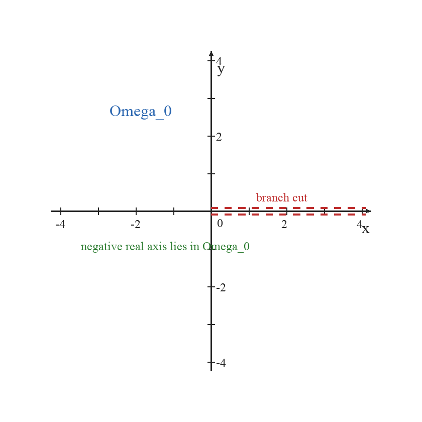
> 
> Figure 1. A plot of $\Omega_0=\mathbb{C}\setminus [0,\infty)$.

A Mathematica plot of this branch-cut geometry is:

```Mathematica title:"Exercise 1: Mathematica plot"
Graphics[
 {
  {Directive[Black, AbsoluteThickness[2.2]], Arrow[{{-4.2, 0}, {4.2, 0}}]},
  {Directive[Black, AbsoluteThickness[2.2]], Arrow[{{0, -4.2}, {0, 4.2}}]},
  Table[{Directive[Black, AbsoluteThickness[1.2]], Line[{{k, -0.08}, {k, 0.08}}]}, {k, -4, 4}],
  Table[{Directive[Black, AbsoluteThickness[1.2]], Line[{{-0.08, k}, {0.08, k}}]}, {k, -4, 4}],
  {Directive[Red, Dashed, AbsoluteThickness[2.5]], Line[{{0, 0.08}, {4.1, 0.08}}]},
  {Directive[Red, Dashed, AbsoluteThickness[2.5]], Line[{{0, -0.08}, {4.1, -0.08}}]},
  Text[Style["x", 20, Italic], {4.15, -0.35}],
  Text[Style["y", 20, Italic], {0.22, 4.08}],
  Text[Style["0", 18], {0.22, -0.28}],
  Text[Style["\!\(\*SubscriptBox[\(\[CapitalOmega]\), \(0\)]\)", 22, RGBColor[0.17, 0.39, 0.75]], {-2.7, 2.7}],
  Text[Style["branch cut", 18, RGBColor[0.75, 0.15, 0.15]], {2.1, 0.38}],
  Text[Style["negative real axis lies in \!\(\*SubscriptBox[\(\[CapitalOmega]\), \(0\)]\)", 17, RGBColor[0.18, 0.55, 0.2]], {-1.55, -0.6}]
 },
 PlotRange -> {{-4.25, 4.25}, {-4.25, 4.25}},
 AspectRatio -> 1,
 Axes -> False,
 ImageSize -> 390,
 Background -> White
]
```

The following Python code generates the embedded figure:

```python title:"Exercise 1: Python plot"
import numpy as np
from pathlib import Path
from PIL import Image, ImageDraw, ImageFont

W = H = 840
M = 90
xmin, xmax, ymin, ymax = -4.4, 4.4, -4.4, 4.4
BG = "white"
BLACK = (35, 35, 35)
BLUE = (44, 103, 176)
RED = (190, 45, 45)
GREEN = (46, 125, 50)

outdir = Path("images")
outdir.mkdir(exist_ok=True)
font_path = "/System/Library/Fonts/Supplemental/Times New Roman.ttf"
font = ImageFont.truetype(font_path, 28)
small = ImageFont.truetype(font_path, 24)
large = ImageFont.truetype(font_path, 32)


def pt(x, y):
    px = M + (x - xmin) / (xmax - xmin) * (W - 2 * M)
    py = H - (M + (y - ymin) / (ymax - ymin) * (H - 2 * M))
    return px, py


def draw_arrow(draw, p0, p1, color=BLUE, width=5, head=14):
    draw.line([p0, p1], fill=color, width=width)
    import math

    ang = math.atan2(p1[1] - p0[1], p1[0] - p0[0])
    a1 = ang + math.pi * 0.86
    a2 = ang - math.pi * 0.86
    q1 = (p1[0] + head * math.cos(a1), p1[1] + head * math.sin(a1))
    q2 = (p1[0] + head * math.cos(a2), p1[1] + head * math.sin(a2))
    draw.polygon([p1, q1, q2], fill=color)


image = Image.new("RGB", (W, H), BG)
draw = ImageDraw.Draw(image)
x0, y0 = pt(0, 0)

draw_arrow(draw, pt(xmin + 0.15, 0), pt(xmax - 0.15, 0), color=BLACK, width=3, head=11)
draw_arrow(draw, pt(0, ymin + 0.15), pt(0, ymax - 0.15), color=BLACK, width=3, head=11)

for k in range(-4, 5):
    px, py = pt(k, 0)
    draw.line([(px, py - 7), (px, py + 7)], fill=BLACK, width=2)
    px, py = pt(0, k)
    draw.line([(px - 7, py), (px + 7, py)], fill=BLACK, width=2)

for xstart in np.linspace(0, 4.0, 12):
    xend = min(xstart + 0.18, 4.1)
    draw.line([pt(xstart, 0.08), pt(xend, 0.08)], fill=RED, width=4)
    draw.line([pt(xstart, -0.08), pt(xend, -0.08)], fill=RED, width=4)

for val in [-4, -2, 2, 4]:
    p = pt(val, 0)
    draw.text((p[0] - 10, p[1] + 12), str(val), fill=BLACK, font=small)
    p = pt(0, val)
    draw.text((p[0] + 10, p[1] - 12), str(val), fill=BLACK, font=small)

draw.text((pt(xmax - 0.4, 0)[0], pt(xmax - 0.4, 0)[1] + 15), "x", fill=BLACK, font=large)
draw.text((pt(0, ymax - 0.45)[0] + 12, pt(0, ymax - 0.45)[1] - 8), "y", fill=BLACK, font=large)
draw.text((x0 + 12, y0 + 10), "0", fill=BLACK, font=small)
draw.text((pt(-2.7, 2.9)[0], pt(-2.7, 2.9)[1]), "Omega_0", fill=BLUE, font=large)
draw.text((pt(1.2, 0.55)[0], pt(1.2, 0.55)[1]), "branch cut", fill=RED, font=small)
draw.text(
    (pt(-3.45, -0.75)[0], pt(-3.45, -0.75)[1]),
    "negative real axis lies in Omega_0",
    fill=GREEN,
    font=small,
)

image.save(outdir / "exercise1_branch_cut_python.png")
```


++++


(a) An antiderivative of $f(z)=z^3+7 z-2$ is $F(z)=\frac{z^4}{4}+\frac{7}{2} z^2-2 z$, and the identity $F^{\prime}(z)=f(z)$ holds for all $z$ in $\mathbb{C}$.


(b) The function $f(z)=\log z$ is continuous for $z$ in $\mathbb{C} \backslash(-\infty, 0]$. An antiderivative is $F(z)=z \log z-z$, and the identity $F^{\prime}(z)=f(z)$ holds for all $z$ in $\mathbb{C} \backslash(-\infty, 0]$.


(c) The function $f(z)=\frac{1}{z}$ is continuous in $\mathbb{C} \backslash\{0\}$. We may guess an antiderivative $F(z)=\log z$. But the equality $F^{\prime}(z)=f(z)$ holds for all $z$ in $\mathbb{C} \backslash(-\infty, 0]$. So $\log z$ is an antiderivative of $\frac{1}{z}$ in $\mathbb{C} \backslash(-\infty, 0]$ only, even though $f$ is continuous in $\mathbb{C} \backslash\{0\}$. As the next example shows, other antiderivatives of $\frac{1}{z}$ can be found on different regions.


(d) Let $\Omega_\alpha$ denote the region $\mathbb{C}$ minus the ray at angle $\alpha$, and let $\log _\alpha z$ denote a branch of the logarithm with a branch cut at angle $\alpha$. We know from Section 2.4 that $\log _\alpha z$ is analytic in $\Omega_\alpha$ and that

$$
\frac{d}{d z} \log _\alpha z=\frac{1}{z}, \quad \text { for all } z \text { in } \Omega_\alpha .
$$


From this we conclude that $F(z)=\log _\alpha z$ is an antiderivative of $\frac{1}{z}$ in $\Omega_\alpha$. In particular, if we choose $\alpha$ in such a way that the ray at angle $\alpha$ is not the negative $x$-axis, then $F(z)=\log _\alpha z$ becomes an antiderivative of $\frac{1}{z}$ in a region that contains the negative $x$-axis (Figure 1).


> [!figure] Figure 1
> 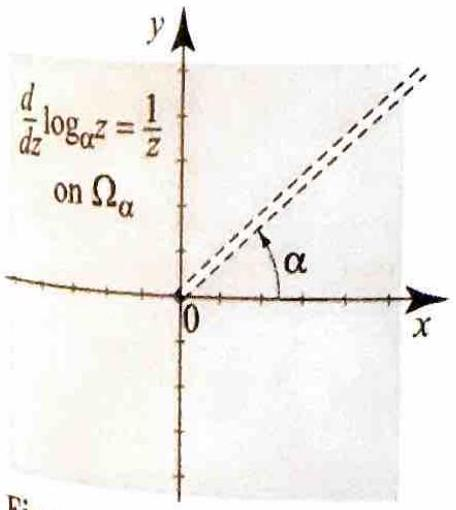
> Figure $1 \log _{\alpha} z$ and its branch cut at angle $\alpha$.


As we now show, independence of path for integrals can be used to characterize functions with antiderivatives.


> [!theorem] Theorem 1: Independence of Path
> 
> Let $f$ be a continuous complex-valued function on a region $\Omega$, let $z_{1}, z_{2}$ be two points in $\Omega$, and let
> 
> $$
> I=\int_{\gamma} f(z) d z
> $$
> 
> where $\gamma$ is a path in $\Omega$ joining $z_{1}$ to $z_{2}$. Then $I$ is independent of the path $\gamma$ if and only if $f(z)=F^{\prime}(z)$ for some analytic function $F$ on $\Omega$. In this case, we write
> 
> $$
> I=\int_{\gamma} f(z) d z=\int_{z_{1}}^{z_{2}} f(z) d z=F\left(z_{2}\right)-F\left(z_{1}\right)
> $$
> 

We will prove that if $f$ has an antiderivative, then $\int_{\gamma} f(z) d z$ is independent of path, and we will postpone the other direction until the end of the section. 

**Proof** If $F$ is an antiderivative of $f$ in $\Omega$, then the complex-valued function $t \mapsto F(\gamma(t))$ is differentiable at the points in $[a, b]$ where $\gamma^{\prime}(t)$ exists and we have

$$
\frac{d}{d t} F(\gamma(t))=F^{\prime}(\gamma(t)) \gamma^{\prime}(t)=f(\gamma(t)) \gamma^{\prime}(t)
$$

This formula is similar to the chain rule for differentiable functions ((8), Section 2.3) and can be established in exactly the same way (see Exercise 35). Now $t \mapsto f(\gamma(t)) \gamma^{\prime}(t)$ is piecewise continuous, because $f$ is continuous and $\gamma^{\prime}$ is piecewise continuous. Also, since $F(\gamma(t))$ is continuous, (1) tells us that $F(\gamma(t))$ is a continuous antiderivative of $f(\gamma(t)) \gamma^{\prime}(t)$, in the sense of Theorem 1, Section 3.2. Using this theorem, we obtain

$$
\int_{\gamma} f(z) d z=\int_{a}^{b} f(\gamma(t)) \gamma^{\prime}(t) d t=F(\gamma(b))-F(\gamma(a))=F\left(z_{2}\right)-F\left(z_{1}\right)
$$

completing the proof of the theorem in one direction.


+++


We turn now to some applications.


> [!exercise] Exercise 2: Integrals involving entire functions
> Evaluate
> (a) $\int_{\gamma}^{z} d z$, where $\gamma$ is the semi-circle $\gamma(t)=e^{i t}, 0 \leq t \leq \pi$ (_Figure 2(a)_).
> 
> > [!figure] Figure 2(a)
> > 
> > 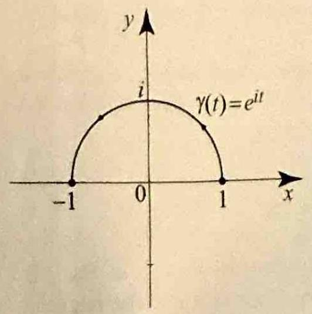
> > Figure 2(a)
> 
> (b) $\int_{\left[z_{1}, z_{2}, z_{3}, z_{1}\right]}\left(z^{3}+z^{2}-2\right) d z$, where $\left[z_{1}, z_{2}, z_{3}, z_{1}\right]$ is the closed directed line segment with $z_{1}=-1, z_{2}=1, z_{3}=i$ (_Figure 2(b)_).
> 
> 
> > [!figure] Figure 2(b)
> > 
> > 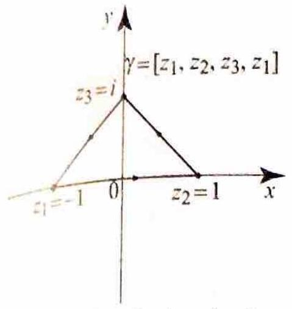
> > 
> > Figure 2(b) A closed triangle path
> 
> 
> (c) $\int_{\gamma} z e^{z^{2}} d z$, where $\gamma$ is the semi-circle $\gamma(t)=-\frac{i}{2}+\frac{1}{2} e^{i t},-\frac{\pi}{2} \leq t \leq \frac{\pi}{2}$ (_Figure 2(c)_).
> 
> 
> > [!figure] Figure 2(c)
> > 
> > 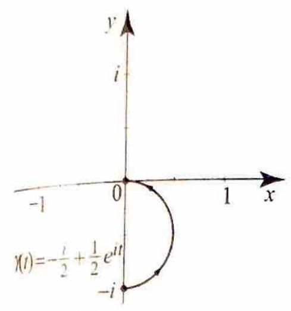
> > 
> > Figure 2(c)
> 
> 
> 


##### solution

##### problem (a)

We use Theorem 1. The integrand is

$$
f(z)=e^z.
$$

An antiderivative of $e^z$ is

$$
F(z)=e^z,
$$

because

$$
F'(z)=\frac{d}{dz}(e^z)=e^z.
$$

Since $e^z$ is entire, this antiderivative is valid on all of $\mathbb{C}$, and in particular on the semicircular path

$$
\gamma(t)=e^{it},
\qquad
0\le t\le \pi.
$$

Now determine the endpoints of the path:

$$
\gamma(0)=e^{i\cdot 0}=e^0=1
$$

and

$$
\gamma(\pi)=e^{i\pi}=-1.
$$

Therefore, by Theorem 1,

$$
\int_\gamma e^z\,dz
=
F(\gamma(\pi))-F(\gamma(0))
=
F(-1)-F(1)
=
e^{-1}-e.
$$

If we wish, we may rewrite this as

$$
e^{-1}-e
=
-(e-e^{-1})
=
-2\sinh(1).
$$

Hence

$$
\int_\gamma e^z\,dz=e^{-1}-e=-2\sinh(1).
$$

> [!figure] Python figure for Exercise 2(a)
> 
> 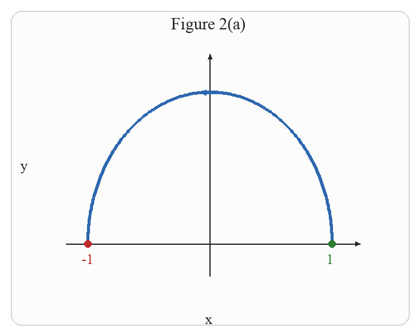
> 
> Figure 2(a). The upper semicircular path from $1$ to $-1$.

A Mathematica plot of the path in part (a) is:

```Mathematica title:"Exercise 2(a): Mathematica plot"
Graphics[
 {
  {Directive[Black, AbsoluteThickness[1.8]], Arrow[{{-1.35, 0}, {1.35, 0}}]},
  {Directive[Black, AbsoluteThickness[1.8]], Arrow[{{0, -0.3}, {0, 1.25}}]},
  {Directive[Blue, AbsoluteThickness[3]], Arrow@Table[{Cos[\[Theta]], Sin[\[Theta]]}, {\[Theta], 0, \[Pi], \[Pi]/220}]},
  {Green, PointSize[Large], Point[{1, 0}]},
  {Red, PointSize[Large], Point[{-1, 0}]},
  Text[Style["1", 16, Green], {1.06, -0.12}],
  Text[Style["-1", 16, Red], {-1.12, -0.12}]
 },
 PlotRange -> {{-1.4, 1.4}, {-0.35, 1.35}},
 AspectRatio -> Automatic,
 ImageSize -> 300,
 Background -> White
]
```

The following Python code generates the embedded figure:

```python title:"Exercise 2(a): Python plot"
import math
from pathlib import Path

import numpy as np
from PIL import Image, ImageDraw, ImageFont

W, H = 700, 560
M = 65
BG = "white"
BLUE = (44, 103, 176)
GREEN = (46, 125, 50)
RED = (190, 45, 45)
BLACK = (35, 35, 35)
xmin, xmax, ymin, ymax = -1.4, 1.4, -0.35, 1.35

outdir = Path("images")
outdir.mkdir(exist_ok=True)
font_path = "/System/Library/Fonts/Supplemental/Times New Roman.ttf"
font = ImageFont.truetype(font_path, 28)
small = ImageFont.truetype(font_path, 24)


def pt(x, y):
    px = M + (x - xmin) / (xmax - xmin) * (W - 2 * M)
    py = H - (M + (y - ymin) / (ymax - ymin) * (H - 2 * M))
    return px, py


def draw_arrow(draw, p0, p1, color=BLUE, width=5, head=14):
    draw.line([p0, p1], fill=color, width=width)
    ang = math.atan2(p1[1] - p0[1], p1[0] - p0[0])
    a1 = ang + math.pi * 0.86
    a2 = ang - math.pi * 0.86
    q1 = (p1[0] + head * math.cos(a1), p1[1] + head * math.sin(a1))
    q2 = (p1[0] + head * math.cos(a2), p1[1] + head * math.sin(a2))
    draw.polygon([p1, q1, q2], fill=color)


image = Image.new("RGB", (W, H), BG)
draw = ImageDraw.Draw(image)
draw.rounded_rectangle((18, 18, W - 18, H - 18), radius=18, outline=(215, 215, 215), width=2, fill=(252, 252, 252))
draw_arrow(draw, pt(xmin + 0.08 * (xmax - xmin), 0), pt(xmax - 0.06 * (xmax - xmin), 0), color=BLACK, width=2, head=9)
draw_arrow(draw, pt(0, ymin + 0.08 * (ymax - ymin)), pt(0, ymax - 0.06 * (ymax - ymin)), color=BLACK, width=2, head=9)
draw.text((W / 2 - 8, H - 42), "x", fill=BLACK, font=small)
draw.text((34, H / 2 - 18), "y", fill=BLACK, font=small)
draw.text((W / 2 - 65, 24), "Figure 2(a)", fill=BLACK, font=font)

pts = [pt(math.cos(t), math.sin(t)) for t in np.linspace(0, math.pi, 240)]
draw.line(pts, fill=BLUE, width=5)
mid = len(pts) // 2
draw_arrow(draw, pts[mid - 6], pts[mid + 6], color=BLUE, width=5, head=12)
for z, lab, color in [((1, 0), "1", GREEN), ((-1, 0), "-1", RED)]:
    q = pt(*z)
    draw.ellipse((q[0] - 6, q[1] - 6, q[0] + 6, q[1] + 6), fill=color)
    draw.text((q[0] - 10, q[1] + 12), lab, fill=color, font=small)

image.save(outdir / "exercise2_problem_a_python.png")
```

##### problem (b)

Again we apply Theorem 1. The integrand is

$$
f(z)=z^3+z^2-2.
$$

An antiderivative is

$$
F(z)=\frac{z^4}{4}+\frac{z^3}{3}-2z,
$$

because

$$
\begin{aligned}
F'(z)
&=
\frac{d}{dz}\left(\frac{z^4}{4}\right)
+
\frac{d}{dz}\left(\frac{z^3}{3}\right)
+
\frac{d}{dz}(-2z) \\
&=
z^3+z^2-2.
\end{aligned}
$$

This antiderivative is a polynomial, so it is valid on all of $\mathbb{C}$.

The path $\left[z_1,z_2,z_3,z_1\right]$ is closed, with initial point and terminal point both equal to

$$
z_1=-1.
$$

Therefore Theorem 1 gives

$$
\int_{\left[z_1,z_2,z_3,z_1\right]} (z^3+z^2-2)\,dz
=
F(z_1)-F(z_1)
=
0.
$$

If we write the endpoint evaluation explicitly, we get

$$
\int_{\left[z_1,z_2,z_3,z_1\right]} (z^3+z^2-2)\,dz
=
\left[\frac{z^4}{4}+\frac{z^3}{3}-2z\right]_{-1}^{-1}
=
0.
$$

Hence

$$
\int_{\left[z_1,z_2,z_3,z_1\right]} (z^3+z^2-2)\,dz=0.
$$

> [!figure] Python figure for Exercise 2(b)
> 
> 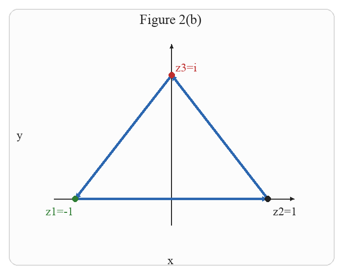
> 
> Figure 2(b). The closed triangular path through $z_1=-1$, $z_2=1$, and $z_3=i$.

A Mathematica plot of the path in part (b) is:

```Mathematica title:"Exercise 2(b): Mathematica plot"
Graphics[
 {
  {Directive[Black, AbsoluteThickness[1.8]], Arrow[{{-1.35, 0}, {1.35, 0}}]},
  {Directive[Black, AbsoluteThickness[1.8]], Arrow[{{0, -0.3}, {0, 1.25}}]},
  {Directive[Blue, AbsoluteThickness[3]], Arrow[{{-1, 0}, {1, 0}}]},
  {Directive[Blue, AbsoluteThickness[3]], Arrow[{{1, 0}, {0, 1}}]},
  {Directive[Blue, AbsoluteThickness[3]], Arrow[{{0, 1}, {-1, 0}}]},
  {Green, PointSize[Large], Point[{-1, 0}]},
  {Black, PointSize[Large], Point[{1, 0}]},
  {Red, PointSize[Large], Point[{0, 1}]},
  Text[Style["z1=-1", 15, Green], {-1.18, -0.15}],
  Text[Style["z2=1", 15, Black], {1.1, -0.15}],
  Text[Style["z3=i", 15, Red], {0.12, 1.06}]
 },
 PlotRange -> {{-1.4, 1.4}, {-0.35, 1.35}},
 AspectRatio -> Automatic,
 ImageSize -> 300,
 Background -> White
]
```

The following Python code generates the embedded figure:

```python title:"Exercise 2(b): Python plot"
from pathlib import Path

from PIL import Image, ImageDraw, ImageFont

W, H = 700, 560
M = 65
BG = "white"
BLUE = (44, 103, 176)
GREEN = (46, 125, 50)
RED = (190, 45, 45)
BLACK = (35, 35, 35)
xmin, xmax, ymin, ymax = -1.45, 1.45, -0.35, 1.35

outdir = Path("images")
outdir.mkdir(exist_ok=True)
font_path = "/System/Library/Fonts/Supplemental/Times New Roman.ttf"
font = ImageFont.truetype(font_path, 28)
small = ImageFont.truetype(font_path, 24)


def pt(x, y):
    px = M + (x - xmin) / (xmax - xmin) * (W - 2 * M)
    py = H - (M + (y - ymin) / (ymax - ymin) * (H - 2 * M))
    return px, py


def draw_arrow(draw, p0, p1, color=BLUE, width=5, head=14):
    import math

    draw.line([p0, p1], fill=color, width=width)
    ang = math.atan2(p1[1] - p0[1], p1[0] - p0[0])
    a1 = ang + math.pi * 0.86
    a2 = ang - math.pi * 0.86
    q1 = (p1[0] + head * math.cos(a1), p1[1] + head * math.sin(a1))
    q2 = (p1[0] + head * math.cos(a2), p1[1] + head * math.sin(a2))
    draw.polygon([p1, q1, q2], fill=color)


image = Image.new("RGB", (W, H), BG)
draw = ImageDraw.Draw(image)
draw.rounded_rectangle((18, 18, W - 18, H - 18), radius=18, outline=(215, 215, 215), width=2, fill=(252, 252, 252))
draw_arrow(draw, pt(xmin + 0.08 * (xmax - xmin), 0), pt(xmax - 0.06 * (xmax - xmin), 0), color=BLACK, width=2, head=9)
draw_arrow(draw, pt(0, ymin + 0.08 * (ymax - ymin)), pt(0, ymax - 0.06 * (ymax - ymin)), color=BLACK, width=2, head=9)
draw.text((W / 2 - 8, H - 42), "x", fill=BLACK, font=small)
draw.text((34, H / 2 - 18), "y", fill=BLACK, font=small)
draw.text((W / 2 - 65, 24), "Figure 2(b)", fill=BLACK, font=font)

z1, z2, z3 = (-1, 0), (1, 0), (0, 1)
draw_arrow(draw, pt(*z1), pt(*z2), color=BLUE, width=5, head=12)
draw_arrow(draw, pt(*z2), pt(*z3), color=BLUE, width=5, head=12)
draw_arrow(draw, pt(*z3), pt(*z1), color=BLUE, width=5, head=12)
for z, lab, color, off in [
    (z1, "z1=-1", GREEN, (-60, 12)),
    (z2, "z2=1", BLACK, (10, 12)),
    (z3, "z3=i", RED, (8, -30)),
]:
    q = pt(*z)
    draw.ellipse((q[0] - 6, q[1] - 6, q[0] + 6, q[1] + 6), fill=color)
    draw.text((q[0] + off[0], q[1] + off[1]), lab, fill=color, font=small)

image.save(outdir / "exercise2_problem_b_python.png")
```

##### problem (c)

Now consider

$$
f(z)=ze^{z^2}.
$$

We look for an antiderivative. Since

$$
\frac{d}{dz}(z^2)=2z,
$$

it is natural to try a constant multiple of $e^{z^2}$. Let

$$
F(z)=\frac{1}{2}e^{z^2}.
$$

Then

$$
\begin{aligned}
F'(z)
&=
\frac{1}{2}\frac{d}{dz}(e^{z^2}) \\
&=
\frac{1}{2}e^{z^2}\frac{d}{dz}(z^2) \\
&=
\frac{1}{2}e^{z^2}(2z) \\
&=
ze^{z^2}.
\end{aligned}
$$

Thus $F$ is an antiderivative of $f$, and since $e^{z^2}$ is entire, it is valid on all of $\mathbb{C}$.

The path is

$$
\gamma(t)=-\frac{i}{2}+\frac{1}{2}e^{it},
\qquad
-\frac{\pi}{2}\le t\le \frac{\pi}{2}.
$$

Its initial point is

$$
\begin{aligned}
\gamma\left(-\frac{\pi}{2}\right)
&=
-\frac{i}{2}+\frac{1}{2}e^{-i\pi/2} \\
&=
-\frac{i}{2}+\frac{1}{2}(-i) \\
&=
-\frac{i}{2}-\frac{i}{2} \\
&=
-i,
\end{aligned}
$$

and its terminal point is

$$
\begin{aligned}
\gamma\left(\frac{\pi}{2}\right)
&=
-\frac{i}{2}+\frac{1}{2}e^{i\pi/2} \\
&=
-\frac{i}{2}+\frac{1}{2}(i) \\
&=
0.
\end{aligned}
$$

Therefore, by Theorem 1,

$$
\int_\gamma ze^{z^2}\,dz
=
F(0)-F(-i).
$$

Now compute each value:

$$
F(0)=\frac{1}{2}e^0=\frac{1}{2}
$$

and

$$
\begin{aligned}
F(-i)
&=
\frac{1}{2}e^{(-i)^2} \\
&=
\frac{1}{2}e^{-1}.
\end{aligned}
$$

So

$$
\int_\gamma ze^{z^2}\,dz
=
\frac{1}{2}-\frac{1}{2}e^{-1}
=
\frac{1}{2}(1-e^{-1}).
$$

Hence

$$
\int_\gamma ze^{z^2}\,dz=\frac{1}{2}(1-e^{-1}).
$$

> [!figure] Python figure for Exercise 2(c)
> 
> 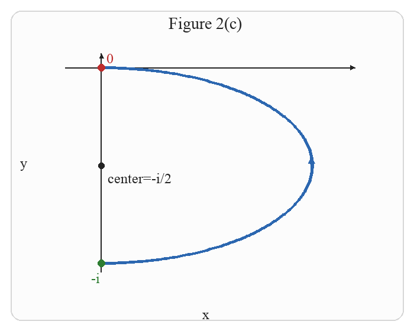
> 
> Figure 2(c). The semicircular path centered at $-\frac{i}{2}$ from $-i$ to $0$.

A Mathematica plot of the path in part (c) is:

```Mathematica title:"Exercise 2(c): Mathematica plot"
Graphics[
 {
  {Directive[Black, AbsoluteThickness[1.8]], Arrow[{{-0.12, 0}, {0.62, 0}}]},
  {Directive[Black, AbsoluteThickness[1.8]], Arrow[{{0, -1.1}, {0, 0.1}}]},
  {Directive[Blue, AbsoluteThickness[3]], Arrow@Table[{1/2 Cos[\[Theta]], -1/2 + 1/2 Sin[\[Theta]]}, {\[Theta], -\[Pi]/2, \[Pi]/2, \[Pi]/220}]},
  {Green, PointSize[Large], Point[{0, -1}]},
  {Red, PointSize[Large], Point[{0, 0}]},
  {Black, PointSize[Medium], Point[{0, -1/2}]},
  Text[Style["-i", 15, Green], {-0.08, -1.12}],
  Text[Style["0", 15, Red], {0.04, 0.04}],
  Text[Style["center=-i/2", 15, Black], {0.2, -0.62}]
 },
 PlotRange -> {{-0.15, 0.65}, {-1.15, 0.15}},
 AspectRatio -> Automatic,
 ImageSize -> 300,
 Background -> White
]
```

The following Python code generates the embedded figure:

```python title:"Exercise 2(c): Python plot"
import math
from pathlib import Path

import numpy as np
from PIL import Image, ImageDraw, ImageFont

W, H = 700, 560
M = 65
BG = "white"
BLUE = (44, 103, 176)
GREEN = (46, 125, 50)
RED = (190, 45, 45)
BLACK = (35, 35, 35)
xmin, xmax, ymin, ymax = -0.15, 0.65, -1.15, 0.15

outdir = Path("images")
outdir.mkdir(exist_ok=True)
font_path = "/System/Library/Fonts/Supplemental/Times New Roman.ttf"
font = ImageFont.truetype(font_path, 28)
small = ImageFont.truetype(font_path, 24)


def pt(x, y):
    px = M + (x - xmin) / (xmax - xmin) * (W - 2 * M)
    py = H - (M + (y - ymin) / (ymax - ymin) * (H - 2 * M))
    return px, py


def draw_arrow(draw, p0, p1, color=BLUE, width=5, head=14):
    draw.line([p0, p1], fill=color, width=width)
    ang = math.atan2(p1[1] - p0[1], p1[0] - p0[0])
    a1 = ang + math.pi * 0.86
    a2 = ang - math.pi * 0.86
    q1 = (p1[0] + head * math.cos(a1), p1[1] + head * math.sin(a1))
    q2 = (p1[0] + head * math.cos(a2), p1[1] + head * math.sin(a2))
    draw.polygon([p1, q1, q2], fill=color)


image = Image.new("RGB", (W, H), BG)
draw = ImageDraw.Draw(image)
draw.rounded_rectangle((18, 18, W - 18, H - 18), radius=18, outline=(215, 215, 215), width=2, fill=(252, 252, 252))
draw_arrow(draw, pt(xmin + 0.08 * (xmax - xmin), 0), pt(xmax - 0.06 * (xmax - xmin), 0), color=BLACK, width=2, head=9)
draw_arrow(draw, pt(0, ymin + 0.08 * (ymax - ymin)), pt(0, ymax - 0.06 * (ymax - ymin)), color=BLACK, width=2, head=9)
draw.text((W / 2 - 8, H - 42), "x", fill=BLACK, font=small)
draw.text((34, H / 2 - 18), "y", fill=BLACK, font=small)
draw.text((W / 2 - 65, 24), "Figure 2(c)", fill=BLACK, font=font)

pts = [pt(0.5 * math.cos(t), -0.5 + 0.5 * math.sin(t)) for t in np.linspace(-math.pi / 2, math.pi / 2, 240)]
draw.line(pts, fill=BLUE, width=5)
mid = len(pts) // 2
draw_arrow(draw, pts[mid - 6], pts[mid + 6], color=BLUE, width=5, head=12)
for z, lab, color, off in [((0, -1), "-i", GREEN, (-18, 12)), ((0, 0), "0", RED, (8, -30))]:
    q = pt(*z)
    draw.ellipse((q[0] - 6, q[1] - 6, q[0] + 6, q[1] + 6), fill=color)
    draw.text((q[0] + off[0], q[1] + off[1]), lab, fill=color, font=small)

center = pt(0, -0.5)
draw.ellipse((center[0] - 5, center[1] - 5, center[0] + 5, center[1] + 5), fill=BLACK)
draw.text((center[0] + 10, center[1] + 8), "center=-i/2", fill=BLACK, font=small)

image.save(outdir / "exercise2_problem_c_python.png")
```


++++


We evaluate the integrals by appealing to Theorem 1.
(a) The function $e^{z}$ is continuous in the entire plane, with an antiderivative $e^{z}$. The initial point of $\gamma$ is $z_{1}=\gamma(0)=1$ and its terminal point is $z_{2}=\gamma(\pi)=-1$. By Theorem 1,

$$
\int_{\gamma} e^{z} d z=\left.e^{z}\right|_{1} ^{-1}=e^{-1}-e^{1}=-2 \sinh (1)
$$

(b) An antiderivative of $z^{3}+z^{2}-2$ is $\frac{z^{4}}{4}+\frac{z^{3}}{3}-2 z$. The initial and terminal points of the path are the same, $z_{1}=-1$. By Theorem 1, we have

$$
\int_{\left[z_{1}, z_{2}, z_{3}, z_{1}\right]}\left(z^{3}+z^{2}-2\right) d z=\left[\frac{z^{4}}{4}+\frac{z^{3}}{3}-2 z\right]_{-1}^{-1}=0
$$

(c) As you can easily verify by direct computation, an antiderivative of $z e^{z^{2}}$ is $\frac{1}{2} e^{z^{2}}$. The initial point of $\gamma$ is $z_{1}=-i$ and its terminal point is $z_{2}=0$. By Theorem 1,

$$
\int_{\gamma} z e^{z^{2}} d z=\left.\frac{1}{2} e^{z^{2}}\right|_{-i} ^{0}=\frac{1}{2}\left(1-e^{-1}\right) .
$$


In Example 1, the region that contained the paths was of little concern to us, because the integrands and their antiderivatives were entire. This is not the case in the next two examples, where the region or the antiderivative must be carefully chosen in order to verify all the hypotheses of Theorem 1.


> [!exercise] Exercise 3: Choosing an appropriate region
> 
> Evaluate $\int_{\left[z_{1}, z_{2}, z_{3}\right]} \frac{1}{z} d z$, where $\left[z_{1}, z_{2}, z_{3}\right]$ is the directed line segment with $z_{1}=1$, $z_{2}=2+i, z_{3}=3$ (_Figure 3_).
> 
> 
> > [!figure] Figure 3
> > 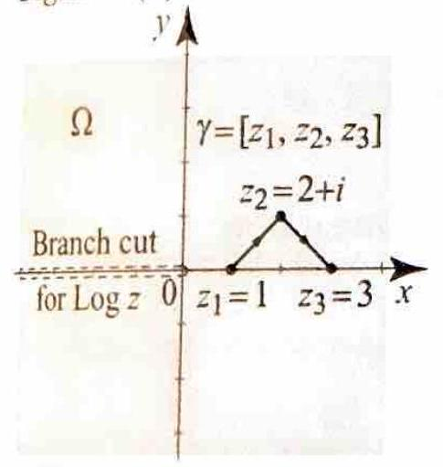
> > Figure 3 for Example 3.
> 
> 


##### solution

We want to evaluate

$$
\int_{\left[z_1,z_2,z_3\right]} \frac{1}{z}\,dz,
$$

where

$$
z_1=1,\qquad z_2=2+i,\qquad z_3=3.
$$

The function

$$
f(z)=\frac{1}{z}
$$

is continuous on $\mathbb{C}\setminus \{0\}$. In order to apply Theorem 1, we need an antiderivative that is analytic on a region containing the entire path.

We use the principal branch of the logarithm on

$$
\Omega=\mathbb{C}\setminus (-\infty,0].
$$

On this region, $\log z$ is analytic and satisfies

$$
\frac{d}{dz}\log z=\frac{1}{z}.
$$

So $\log z$ is an antiderivative of $\frac{1}{z}$ on $\Omega$.

It remains to check that the polygonal path $\left[z_1,z_2,z_3\right]$ lies in $\Omega$.

For the first segment from $z_1=1$ to $z_2=2+i$, use the parametrization

$$
\gamma_1(t)=1+t\bigl((2+i)-1\bigr)=1+t+it,
\qquad
0\le t\le 1.
$$

Then

$$
\operatorname{Re}\gamma_1(t)=1+t.
$$

Since $0\le t\le 1$, we have

$$
1+t\ge 1>0.
$$

So every point of the first segment has positive real part, and therefore no point of this segment lies on the branch cut $(-\infty,0]$.

For the second segment from $z_2=2+i$ to $z_3=3$, use the parametrization

$$
\gamma_2(t)=(2+i)+t\bigl(3-(2+i)\bigr)=2+t+i-it,
\qquad
0\le t\le 1.
$$

Then

$$
\operatorname{Re}\gamma_2(t)=2+t.
$$

Since $0\le t\le 1$, we have

$$
2+t\ge 2>0.
$$

So every point of the second segment also has positive real part, and therefore no point of this segment lies on the branch cut $(-\infty,0]$.

Hence every point of the polygonal path $\left[z_1,z_2,z_3\right]$ lies in $\Omega=\mathbb{C}\setminus(-\infty,0]$.

Now we may apply Theorem 1:

$$
\int_{\left[z_1,z_2,z_3\right]} \frac{1}{z}\,dz
=
\log z_3-\log z_1.
$$

Substitute the endpoints:

$$
\int_{\left[z_1,z_2,z_3\right]} \frac{1}{z}\,dz
=
\log 3-\log 1.
$$

Now evaluate each term on the principal branch. Since $3$ is a positive real number,

$$
\log 3=\ln 3+i\arg(3)=\ln 3+i\cdot 0=\ln 3.
$$

Also,

$$
\log 1=\ln 1+i\arg(1)=0+i\cdot 0=0.
$$

Hence

$$
\int_{\left[z_1,z_2,z_3\right]} \frac{1}{z}\,dz
=
\ln 3-0
=
\ln 3.
$$

Therefore

$$
\boxed{\int_{\left[z_1,z_2,z_3\right]} \frac{1}{z}\,dz=\ln 3.}
$$

> [!figure] Python figure for Exercise 3
> 
> 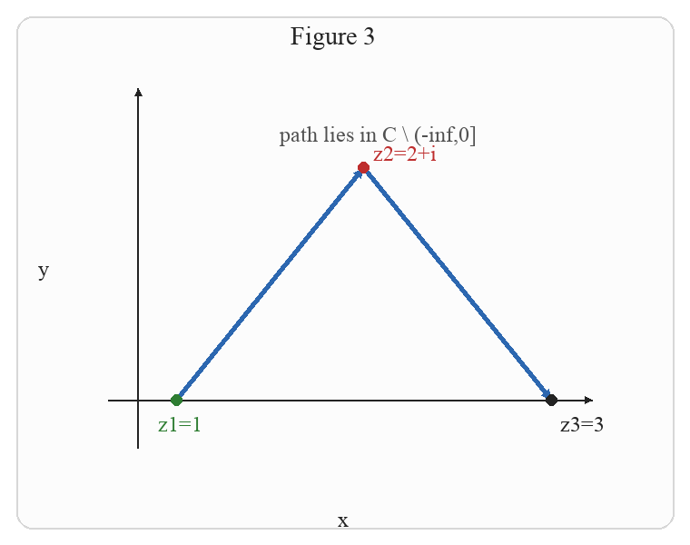
> 
> Figure 3. The polygonal path from $1$ to $2+i$ to $3$ lies entirely in $\mathbb{C}\setminus(-\infty,0]$.

A Mathematica plot of this path is:

```Mathematica title:"Exercise 3: Mathematica plot"
Graphics[
 {
  {Directive[Black, AbsoluteThickness[1.8]], Arrow[{{0.55, 0}, {3.3, 0}}]},
  {Directive[Black, AbsoluteThickness[1.8]], Arrow[{{0.8, -0.28}, {0.8, 1.35}}]},
  {Directive[Blue, AbsoluteThickness[3]], Arrow[{{1, 0}, {2, 1}}]},
  {Directive[Blue, AbsoluteThickness[3]], Arrow[{{2, 1}, {3, 0}}]},
  {Green, PointSize[Large], Point[{1, 0}]},
  {Red, PointSize[Large], Point[{2, 1}]},
  {Black, PointSize[Large], Point[{3, 0}]},
  Text[Style["z1=1", 15, Green], {0.93, -0.13}],
  Text[Style["z2=2+i", 15, Red], {2.2, 1.07}],
  Text[Style["z3=3", 15, Black], {3.12, -0.13}],
  Text[Style["path lies in \[DoubleStruckCapitalC] \\ (-\[Infinity],0]", 14, GrayLevel[0.35]], {1.95, 1.22}]
 },
 PlotRange -> {{0.4, 3.4}, {-0.35, 1.45}},
 AspectRatio -> Automatic,
 ImageSize -> 320,
 Background -> White
]
```

The following Python code generates the embedded figure:

```python title:"Exercise 3: Python plot"
import math
from pathlib import Path

from PIL import Image, ImageDraw, ImageFont

W, H = 760, 600
M = 70
xmin, xmax, ymin, ymax = 0.4, 3.4, -0.35, 1.45
BG = "white"
BLUE = (44, 103, 176)
GREEN = (46, 125, 50)
RED = (190, 45, 45)
BLACK = (35, 35, 35)

outdir = Path("images")
outdir.mkdir(exist_ok=True)
font_path = "/System/Library/Fonts/Supplemental/Times New Roman.ttf"
font = ImageFont.truetype(font_path, 28)
small = ImageFont.truetype(font_path, 24)


def pt(x, y):
    px = M + (x - xmin) / (xmax - xmin) * (W - 2 * M)
    py = H - (M + (y - ymin) / (ymax - ymin) * (H - 2 * M))
    return px, py


def draw_arrow(draw, p0, p1, color=BLUE, width=5, head=14):
    draw.line([p0, p1], fill=color, width=width)
    ang = math.atan2(p1[1] - p0[1], p1[0] - p0[0])
    a1 = ang + math.pi * 0.86
    a2 = ang - math.pi * 0.86
    q1 = (p1[0] + head * math.cos(a1), p1[1] + head * math.sin(a1))
    q2 = (p1[0] + head * math.cos(a2), p1[1] + head * math.sin(a2))
    draw.polygon([p1, q1, q2], fill=color)


image = Image.new("RGB", (W, H), BG)
draw = ImageDraw.Draw(image)
draw.rounded_rectangle((18, 18, W - 18, H - 18), radius=18, outline=(215, 215, 215), width=2, fill=(252, 252, 252))

draw_arrow(draw, pt(xmin + 0.08 * (xmax - xmin), 0), pt(xmax - 0.06 * (xmax - xmin), 0), color=BLACK, width=2, head=9)
draw_arrow(draw, pt(0.8, ymin + 0.08 * (ymax - ymin)), pt(0.8, ymax - 0.06 * (ymax - ymin)), color=BLACK, width=2, head=9)
draw.text((W / 2 - 8, H - 42), "x", fill=BLACK, font=small)
draw.text((42, H / 2 - 18), "y", fill=BLACK, font=small)
draw.text((W / 2 - 60, 24), "Figure 3", fill=BLACK, font=font)

z1, z2, z3 = (1, 0), (2, 1), (3, 0)
draw_arrow(draw, pt(*z1), pt(*z2), color=BLUE, width=5, head=12)
draw_arrow(draw, pt(*z2), pt(*z3), color=BLUE, width=5, head=12)

for z, lab, color, off in [
    (z1, "z1=1", GREEN, (-20, 12)),
    (z2, "z2=2+i", RED, (10, -30)),
    (z3, "z3=3", BLACK, (10, 12)),
]:
    q = pt(*z)
    draw.ellipse((q[0] - 6, q[1] - 6, q[0] + 6, q[1] + 6), fill=color)
    draw.text((q[0] + off[0], q[1] + off[1]), lab, fill=color, font=small)

draw.text((pt(1.55, 1.2)[0], pt(1.55, 1.2)[1]), "path lies in C \\\\ (-inf,0]", fill=(80, 80, 80), font=small)

image.save(outdir / "exercise3_path_python.png")
```


++++


**Solution** The function $f(z)=\frac{1}{z}$ is continuous in $\mathbb{C} \backslash\{0\}$. An antiderivative of $\frac{1}{z}$ is $\log z$ in the region $\Omega=\mathbb{C} \backslash(-\infty, 0]$. Since the path $\left[z_{1}, z_{2}, z_{3}\right]$ lies entirely in $\Omega$, we may apply Theorem 1 and get

$$
\int_{\left[z_{1}, z_{2}, z_{3}\right]} \frac{1}{z} d z=\left.\log z\right|_{1} ^{3}=\log 3-\log 1=\ln 3
$$

> [!exercise] Exercise 4: Choosing an appropriate antiderivative
> 
> Evaluate $\int_{\left[z_{1}, z_{2}, z_{3}\right]} \frac{1}{z} d z$, where $\left[z_{1}, z_{2}, z_{3}\right]$ is the directed line segment with $z_{1}= -1, z_{2}=-1+i, z_{3}=-4-4 i$ (_Figure 4_).
> 
> 
> 
> > [!figure] Figure 4
> > 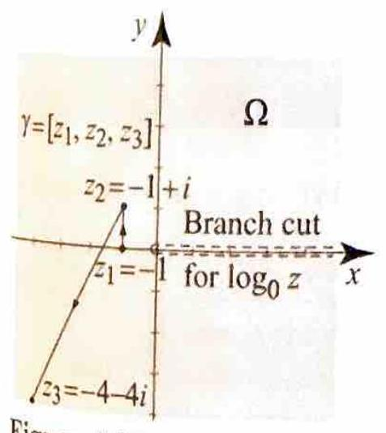
> > Figure 4 for Example 4.
> 
> 


##### solution

We want to evaluate

$$
\int_{\left[z_1,z_2,z_3\right]} \frac{1}{z}\,dz,
$$

where

$$
z_1=-1,\qquad z_2=-1+i,\qquad z_3=-4-4i.
$$

The function

$$
f(z)=\frac{1}{z}
$$

is continuous on $\mathbb{C}\setminus\{0\}$. To apply Theorem 1, we need an antiderivative of $\frac{1}{z}$ that is analytic on a region containing the whole polygonal path $\left[z_1,z_2,z_3\right]$.

We cannot use the principal branch $\log z$, because its branch cut is the nonpositive real axis, and the path begins at $z_1=-1$, which lies on that branch cut. So $\log z$ is not analytic on any region containing this path.

Instead, we choose a different branch of the logarithm. Take $\alpha=0$. Then

$$
\Omega_0=\mathbb{C}\setminus [0,\infty),
$$

and the branch

$$
\log_0 z=\ln|z|+i\arg_0 z,
\qquad
0<\arg_0 z\le 2\pi,
$$

is analytic on $\Omega_0$. Moreover,

$$
\frac{d}{dz}\log_0 z=\frac{1}{z}
\qquad \text{for all } z\in\Omega_0.
$$

Thus $\log_0 z$ is an antiderivative of $\frac{1}{z}$ on $\Omega_0$.

Now check that the path lies in $\Omega_0$.

For the first segment from $z_1=-1$ to $z_2=-1+i$, use the parametrization

$$
\gamma_1(t)=-1+t\bigl((-1+i)-(-1)\bigr)=-1+it,
\qquad
0\le t\le 1.
$$

Then

$$
\operatorname{Re}\gamma_1(t)=-1
$$

for every $t\in[0,1]$. Since $-1<0$, every point of this segment lies strictly to the left of the imaginary axis. In particular, no point of this segment lies on the positive real axis $[0,\infty)$.

For the second segment from $z_2=-1+i$ to $z_3=-4-4i$, use the parametrization

$$
\gamma_2(t)=(-1+i)+t\bigl((-4-4i)-(-1+i)\bigr)=(-1+i)+t(-3-5i),
\qquad
0\le t\le 1.
$$

Expanding real and imaginary parts gives

$$
\gamma_2(t)=(-1-3t)+i(1-5t).
$$

Therefore

$$
\operatorname{Re}\gamma_2(t)=-1-3t.
$$

Since $0\le t\le 1$, we have

$$
-1-3t\le -1<0.
$$

So every point of the second segment also lies strictly in the left half-plane. Hence no point of this segment lies on the positive real axis $[0,\infty)$.

Therefore every point of the polygonal path $\left[z_1,z_2,z_3\right]$ lies in $\Omega_0=\mathbb{C}\setminus[0,\infty)$.

Therefore Theorem 1 gives

$$
\int_{\left[z_1,z_2,z_3\right]} \frac{1}{z}\,dz
=
\log_0 z_3-\log_0 z_1.
$$

Now compute each term explicitly. First,

$$
\log_0(-4-4i)=\ln|-4-4i|+i\arg_0(-4-4i).
$$

Since

$$
|-4-4i|=\sqrt{(-4)^2+(-4)^2}=\sqrt{16+16}=\sqrt{32}=4\sqrt{2},
$$

we have

$$
\ln|-4-4i|
=
\ln(4\sqrt{2})
=
\ln\left(2^2\cdot 2^{1/2}\right)
=
\ln\left(2^{5/2}\right)
=
\frac{5}{2}\ln 2.
$$

Also, because $-4-4i$ lies in the third quadrant and $0<\arg_0 z\le 2\pi$,

$$
\tan \theta=\frac{-4}{-4}=1.
$$

So the reference angle is

$$
\frac{\pi}{4}.
$$

The point $-4-4i$ lies in the third quadrant. Its usual argument there is

$$
\pi+\frac{\pi}{4}=\frac{5\pi}{4}.
$$

Because the branch $\arg_0 z$ is defined by

$$
0<\arg_0 z\le 2\pi,
$$

the value

$$
\frac{5\pi}{4}
$$

already lies in the required interval. Therefore

$$
\arg_0(-4-4i)=\frac{5\pi}{4}.
$$

So

$$
\log_0(-4-4i)=\frac{5}{2}\ln 2+i\frac{5\pi}{4}.
$$

Next,

$$
\log_0(-1)=\ln|-1|+i\arg_0(-1)=\ln 1+i\pi=0+i\pi=i\pi.
$$

Substitute these into the endpoint formula:

$$
\begin{aligned}
\int_{\left[z_1,z_2,z_3\right]} \frac{1}{z}\,dz
&=
\log_0(-4-4i)-\log_0(-1) \\
&=
\left(\frac{5}{2}\ln 2+i\frac{5\pi}{4}\right)-i\pi \\
&=
\frac{5}{2}\ln 2+i\left(\frac{5\pi}{4}-\pi\right) \\
&=
\frac{5}{2}\ln 2+i\left(\frac{5\pi}{4}-\frac{4\pi}{4}\right) \\
&=
\frac{5}{2}\ln 2+i\frac{\pi}{4}.
\end{aligned}
$$

Therefore

$$
\boxed{\int_{\left[z_1,z_2,z_3\right]} \frac{1}{z}\,dz=\frac{5}{2}\ln 2+i\frac{\pi}{4}.}
$$

> [!figure] Python figure for Exercise 4
> 
> 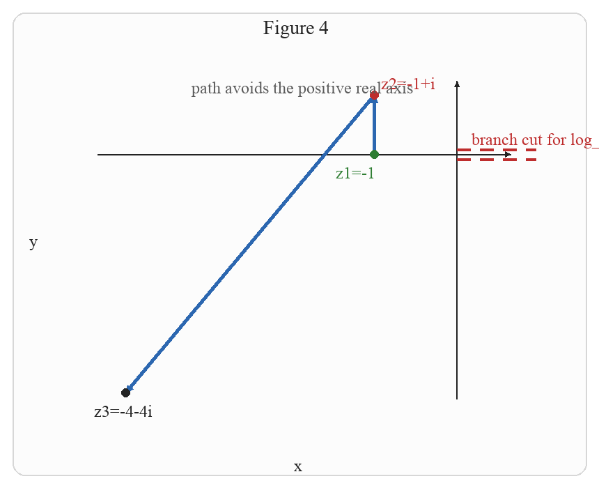
> 
> Figure 4. The path lies in $\Omega_0=\mathbb{C}\setminus[0,\infty)$, so the branch $\log_0 z$ is valid along the whole path.

A Mathematica plt of this path and branch-cut choice is:

```Mathematica title:"Exercise 4: Mathematica plot"
Graphics[
 {
  {Directive[Black, AbsoluteThickness[1.8]], Arrow[{{-4.65, 0}, {0.95, 0}}]},
  {Directive[Black, AbsoluteThickness[1.8]], Arrow[{{0, -4.45}, {0, 1.45}}]},
  {Directive[Red, Dashed, AbsoluteThickness[2.5]], Line[{{0, 0.08}, {0.95, 0.08}}]},
  {Directive[Red, Dashed, AbsoluteThickness[2.5]], Line[{{0, -0.08}, {0.95, -0.08}}]},
  {Directive[Blue, AbsoluteThickness[3]], Arrow[{{-1, 0}, {-1, 1}}]},
  {Directive[Blue, AbsoluteThickness[3]], Arrow[{{-1, 1}, {-4, -4}}]},
  {Green, PointSize[Large], Point[{-1, 0}]},
  {Red, PointSize[Large], Point[{-1, 1}]},
  {Black, PointSize[Large], Point[{-4, -4}]},
  Text[Style["z1=-1", 15, Green], {-1.42, -0.18}],
  Text[Style["z2=-1+i", 15, Red], {-0.72, 1.1}],
  Text[Style["z3=-4-4i", 15, Black], {-4.32, -4.22}],
  Text[Style["branch cut for log_0", 15, RGBColor[0.75, 0.15, 0.15]], {0.38, 0.42}],
  Text[Style["path avoids the positive real axis", 14, GrayLevel[0.35]], {-2.4, 1.3}]
 },
 PlotRange -> {{-4.8, 1.0}, {-4.6, 1.6}},
 AspectRatio -> Automatic,
 ImageSize -> 340,
 Background -> White
]
```

The following Python code generates the embedded figure:

```python title:"Exercise 4: Python plot"
import math
from pathlib import Path

from PIL import Image, ImageDraw, ImageFont

W, H = 860, 700
M = 85
xmin, xmax, ymin, ymax = -4.8, 1.0, -4.6, 1.6
BG = "white"
BLUE = (44, 103, 176)
GREEN = (46, 125, 50)
RED = (190, 45, 45)
BLACK = (35, 35, 35)
GRAY = (90, 90, 90)

outdir = Path("images")
outdir.mkdir(exist_ok=True)
font_path = "/System/Library/Fonts/Supplemental/Times New Roman.ttf"
font = ImageFont.truetype(font_path, 28)
small = ImageFont.truetype(font_path, 24)


def pt(x, y):
    px = M + (x - xmin) / (xmax - xmin) * (W - 2 * M)
    py = H - (M + (y - ymin) / (ymax - ymin) * (H - 2 * M))
    return px, py


def draw_arrow(draw, p0, p1, color=BLUE, width=5, head=14):
    draw.line([p0, p1], fill=color, width=width)
    ang = math.atan2(p1[1] - p0[1], p1[0] - p0[0])
    a1 = ang + math.pi * 0.86
    a2 = ang - math.pi * 0.86
    q1 = (p1[0] + head * math.cos(a1), p1[1] + head * math.sin(a1))
    q2 = (p1[0] + head * math.cos(a2), p1[1] + head * math.sin(a2))
    draw.polygon([p1, q1, q2], fill=color)


image = Image.new("RGB", (W, H), BG)
draw = ImageDraw.Draw(image)
draw.rounded_rectangle((18, 18, W - 18, H - 18), radius=18, outline=(215, 215, 215), width=2, fill=(252, 252, 252))

draw_arrow(draw, pt(xmin + 0.08 * (xmax - xmin), 0), pt(xmax - 0.06 * (xmax - xmin), 0), color=BLACK, width=2, head=9)
draw_arrow(draw, pt(0, ymin + 0.08 * (ymax - ymin)), pt(0, ymax - 0.06 * (ymax - ymin)), color=BLACK, width=2, head=9)
draw.text((W / 2 - 8, H - 46), "x", fill=BLACK, font=small)
draw.text((42, H / 2 - 18), "y", fill=BLACK, font=small)
draw.text((W / 2 - 52, 24), "Figure 4", fill=BLACK, font=font)

x = 0.0
while x < 0.95:
    x2 = min(x + 0.16, 0.95)
    draw.line([pt(x, 0.08), pt(x2, 0.08)], fill=RED, width=4)
    draw.line([pt(x, -0.08), pt(x2, -0.08)], fill=RED, width=4)
    x += 0.28

draw.text((pt(0.18, 0.42)[0], pt(0.18, 0.42)[1]), "branch cut for log_0", fill=RED, font=small)

z1, z2, z3 = (-1, 0), (-1, 1), (-4, -4)
draw_arrow(draw, pt(*z1), pt(*z2), color=BLUE, width=5, head=12)
draw_arrow(draw, pt(*z2), pt(*z3), color=BLUE, width=5, head=12)
for z, lab, color, off in [
    (z1, "z1=-1", GREEN, (-55, 12)),
    (z2, "z2=-1+i", RED, (10, -30)),
    (z3, "z3=-4-4i", BLACK, (-45, 12)),
]:
    q = pt(*z)
    draw.ellipse((q[0] - 6, q[1] - 6, q[0] + 6, q[1] + 6), fill=color)
    draw.text((q[0] + off[0], q[1] + off[1]), lab, fill=color, font=small)

draw.text((pt(-3.2, 1.28)[0], pt(-3.2, 1.28)[1]), "path avoids the positive real axis", fill=GRAY, font=small)

image.save(outdir / "exercise4_path_python.png")
```


++++


**Solution** In order to apply Theorem 1, we must find an antiderivative of $\frac{1}{z}$ that is analytic in a region that contains the path $\left[z_{1}, z_{2}, z_{3}\right]$. We cannot use $\log z$ as antiderivative, because it is not analytic in any region that contains the path $\left[z_{1}, z_{2}, z_{3}\right]$. Instead, we will use a different branch of the logarithm. We know from Example 1(d) that $\log _{\alpha} z$ is an antiderivative of $\frac{1}{z}$ in the region $\Omega_{\alpha}$ (the plane minus the ray at angle $\alpha$ ). We can apply Theorem 1 if we choose $\alpha$ in such a way that
the branch cut of $\log _{\alpha} z$ does not intersect the path $\left[z_{1}, z_{2}, z_{3}\right]$. Take, for example, $\alpha=0$; then $\log _{0} z=\ln |z|+i \arg _{0} z$, where $0<\arg _{0} z \leq 2 \pi$. By Theorem 1,


$$
\begin{aligned}
\int_{\left[z_{1}, z_{2}, z_{3}\right]} \frac{1}{z} d z & =\log _{0}\left(z_{3}\right)-\log _{0}\left(z_{1}\right) \\
& =\frac{1}{2} \ln (32)+i \arg _{0}(-4-4 i)-\left(\ln 1+i \arg _{0}(-1)\right) \\
& =\frac{5}{2} \ln 2+i \frac{5 \pi}{4}-i \pi=\frac{5}{2} \ln 2+i \frac{\pi}{4}
\end{aligned}
$$


#  3.3.1 Integrals over Closed Paths


> [!review]
> 1.) For a continuous complex-valued function on a region, when does its integral around every closed path in the region vanish? Prove your answer.
> 2.) If the path integrals of a continuous complex-valued function on a region are pathindependent, how can an analytic antiderivative of the function be constructed, and why does the construction succeed? Prove your answer.
> 3.) For a continuous complex-valued function $f$ on a region and a point $z$ in that region, what limit involving path integrals along short line segments based at $z$ recovers $f(z)$ ? Prove your answer.


##### solution

##### problem 1

For a continuous complex-valued function $f$ on a region $\Omega$, the integral of $f$ around every closed path in $\Omega$ vanishes exactly when $f$ has an analytic antiderivative on $\Omega$. Equivalently, this happens exactly when the integral of $f$ is independent of path.

We first show that if $f$ has an antiderivative, then every closed-path integral is zero. Assume that

$$
F'(z)=f(z)
\qquad \text{for all } z\in \Omega.
$$

Let $\gamma$ be any closed path in $\Omega$, and let its initial and terminal point both be $z_1$. Since $F$ is an antiderivative of $f$, the fundamental theorem for path integrals gives

$$
\int_\gamma f(z)\,dz
=
F(\gamma(b))-F(\gamma(a))
=
F(z_1)-F(z_1)
=
0.
$$

So every closed-path integral vanishes.

Conversely, assume that

$$
\int_\Gamma f(z)\,dz=0
$$

for every closed path $\Gamma$ in $\Omega$. To show that the integral is independent of path, let $\gamma_1$ and $\gamma_2$ be two paths in $\Omega$ joining the same endpoints $z_1$ and $z_2$.

Suppose $\gamma_2$ is defined on $[a,b]$. Define its reverse path by

$$
\widetilde{\gamma}_2(t)=\gamma_2(a+b-t),
\qquad
a\le t\le b.
$$

Then

$$
\widetilde{\gamma}_2(a)=\gamma_2(b)=z_2
\qquad \text{and} \qquad
\widetilde{\gamma}_2(b)=\gamma_2(a)=z_1,
$$

so $\widetilde{\gamma}_2$ goes from $z_2$ back to $z_1$.

Differentiate:

$$
\widetilde{\gamma}_2'(t)
=
\frac{d}{dt}\gamma_2(a+b-t)
=
\gamma_2'(a+b-t)\frac{d}{dt}(a+b-t)
=
-\gamma_2'(a+b-t).
$$

Therefore

$$
\begin{aligned}
\int_{\widetilde{\gamma}_2} f(z)\,dz
&=
\int_a^b f(\widetilde{\gamma}_2(t))\widetilde{\gamma}_2'(t)\,dt \\
&=
\int_a^b f(\gamma_2(a+b-t))\bigl(-\gamma_2'(a+b-t)\bigr)\,dt.
\end{aligned}
$$

Now make the change of variables

$$
s=a+b-t,
\qquad
ds=-dt.
$$

When $t=a$, we have $s=b$, and when $t=b$, we have $s=a$. So

$$
\begin{aligned}
\int_{\widetilde{\gamma}_2} f(z)\,dz
&=
\int_b^a f(\gamma_2(s))\gamma_2'(s)\,ds \\
&=
-\int_a^b f(\gamma_2(s))\gamma_2'(s)\,ds \\
&=
-\int_{\gamma_2} f(z)\,dz.
\end{aligned}
$$

Now let $\Gamma$ be the closed path obtained by following $\gamma_1$ from $z_1$ to $z_2$ and then following $\widetilde{\gamma}_2$ from $z_2$ back to $z_1$. By additivity of the path integral,

$$
\int_\Gamma f(z)\,dz
=
\int_{\gamma_1} f(z)\,dz+\int_{\widetilde{\gamma}_2} f(z)\,dz.
$$

Substitute the reverse-path formula:

$$
\int_\Gamma f(z)\,dz
=
\int_{\gamma_1} f(z)\,dz-\int_{\gamma_2} f(z)\,dz.
$$

But $\Gamma$ is a closed path, so by assumption

$$
0=\int_\Gamma f(z)\,dz.
$$

Hence

$$
0
=
\int_{\gamma_1} f(z)\,dz-\int_{\gamma_2} f(z)\,dz,
$$

and therefore

$$
\int_{\gamma_1} f(z)\,dz=\int_{\gamma_2} f(z)\,dz.
$$

So the integral is independent of path.

We now show locally that path independence gives an antiderivative. Fix a point $z_0\in \Omega$ and define

$$
F(z)=\int_{z_0}^z f(\zeta)\,d\zeta,
$$

where the integral is taken along any path in $\Omega$ joining $z_0$ to $z$. Because the integral is independent of path, this definition is well defined. Problem 2 below proves directly that this function satisfies

$$
F'(z)=f(z)
\qquad \text{for all } z\in \Omega.
$$

Thus $F$ is an analytic antiderivative of $f$ on $\Omega$.

We have shown

$$
\text{antiderivative}
\Longrightarrow
\text{closed-path integrals vanish}
\Longrightarrow
\text{path independence}
\Longrightarrow
\text{antiderivative}.
$$

Therefore the three conditions are equivalent.

##### problem 2

Assume that the path integrals of the continuous function $f$ are independent of path in the region $\Omega$. Fix a point $z_0\in \Omega$. For each $z\in \Omega$, define

$$
F(z)=\int_{z_0}^z f(\zeta)\,d\zeta,
$$

where the integral is taken along any path in $\Omega$ joining $z_0$ to $z$.

This construction is well defined because the integral is independent of path. If two different paths join $z_0$ to $z$, they have the same integral, so they determine the same value of $F(z)$.

We now show that $F$ is an antiderivative of $f$. Let $z\in \Omega$. Since $\Omega$ is open, there exists $r>0$ such that the open disk centered at $z$ with radius $r$ lies in $\Omega$. If $\Delta z$ is small enough that $|\Delta z|<r$, then $z+\Delta z\in \Omega$ and the line segment $[z,z+\Delta z]$ lies entirely in that disk, hence entirely in $\Omega$.

Choose any path $\sigma$ in $\Omega$ from $z_0$ to $z$. Let $\tau$ be the line segment from $z$ to $z+\Delta z$. Because path independence holds, we may compute $F(z+\Delta z)$ using the concatenated path $\sigma\cup\tau$. Therefore

$$
F(z+\Delta z)=\int_{\sigma\cup\tau} f(\zeta)\,d\zeta.
$$

By additivity of the path integral over concatenated paths,

$$
\int_{\sigma\cup\tau} f(\zeta)\,d\zeta
=
\int_\sigma f(\zeta)\,d\zeta+\int_\tau f(\zeta)\,d\zeta.
$$

Since

$$
\int_\sigma f(\zeta)\,d\zeta=F(z)
$$

and

$$
\int_\tau f(\zeta)\,d\zeta=\int_{[z,z+\Delta z]} f(\zeta)\,d\zeta,
$$

we get

$$
F(z+\Delta z)=F(z)+\int_{[z,z+\Delta z]} f(\zeta)\,d\zeta.
$$

Subtract $F(z)$ from both sides:

$$
F(z+\Delta z)-F(z)=\int_{[z,z+\Delta z]} f(\zeta)\,d\zeta.
$$

Divide by $\Delta z$:

$$
\frac{F(z+\Delta z)-F(z)}{\Delta z}
=
\frac{1}{\Delta z}\int_{[z,z+\Delta z]} f(\zeta)\,d\zeta.
$$

We now compute the limit of the right-hand side directly.

Parametrize the segment $[z,z+\Delta z]$ by

$$
\eta(t)=z+t\Delta z,
\qquad
0\le t\le 1.
$$

Then

$$
\eta'(t)=\Delta z.
$$

By the definition of the path integral,

$$
\int_{[z,z+\Delta z]} f(\zeta)\,d\zeta
=
\int_0^1 f(\eta(t))\eta'(t)\,dt
=
\int_0^1 f(z+t\Delta z)\Delta z\,dt.
$$

Divide by $\Delta z$:

$$
\frac{1}{\Delta z}\int_{[z,z+\Delta z]} f(\zeta)\,d\zeta
=
\int_0^1 f(z+t\Delta z)\,dt.
$$

Now subtract $f(z)$:

$$
\frac{1}{\Delta z}\int_{[z,z+\Delta z]} f(\zeta)\,d\zeta-f(z)
=
\int_0^1 f(z+t\Delta z)\,dt-f(z).
$$

Since

$$
\int_0^1 f(z)\,dt=f(z)\int_0^1 dt=f(z),
$$

this becomes

$$
\begin{aligned}
\frac{1}{\Delta z}\int_{[z,z+\Delta z]} f(\zeta)\,d\zeta-f(z)
&=
\int_0^1 f(z+t\Delta z)\,dt-\int_0^1 f(z)\,dt \\
&=
\int_0^1 \bigl(f(z+t\Delta z)-f(z)\bigr)\,dt.
\end{aligned}
$$

Let $\epsilon>0$. Since $f$ is continuous at $z$, there exists $\delta>0$ such that

$$
|w-z|<\delta
\quad \Rightarrow \quad
|f(w)-f(z)|<\epsilon.
$$

If $|\Delta z|<\delta$, then for every $t\in[0,1]$,

$$
|(z+t\Delta z)-z|
=
|t\Delta z|
=
t|\Delta z|
\le
|\Delta z|
<
\delta.
$$

Therefore

$$
|f(z+t\Delta z)-f(z)|<\epsilon
$$

for every $t\in[0,1]$. Hence

$$
\begin{aligned}
\left|
\frac{1}{\Delta z}\int_{[z,z+\Delta z]} f(\zeta)\,d\zeta-f(z)
\right|
&=
\left|
\int_0^1 \bigl(f(z+t\Delta z)-f(z)\bigr)\,dt
\right| \\
&\le
\int_0^1 \left|f(z+t\Delta z)-f(z)\right|\,dt \\
&\le
\int_0^1 \epsilon\,dt \\
&=
\epsilon\int_0^1 dt \\
&=
\epsilon(1-0) \\
&=
\epsilon.
\end{aligned}
$$

Therefore

$$
\lim_{\Delta z\to 0}
\left(
\frac{1}{\Delta z}\int_{[z,z+\Delta z]} f(\zeta)\,d\zeta-f(z)
\right)
=
0,
$$

so

$$
\lim_{\Delta z\to 0}
\frac{1}{\Delta z}\int_{[z,z+\Delta z]} f(\zeta)\,d\zeta
=
f(z).
$$

Returning to the difference quotient,

$$
\frac{F(z+\Delta z)-F(z)}{\Delta z}
=
\frac{1}{\Delta z}\int_{[z,z+\Delta z]} f(\zeta)\,d\zeta,
$$

and taking the limit as $\Delta z\to 0$ gives

$$
F'(z)=f(z).
$$

Since this holds for every $z\in \Omega$, $F$ is an antiderivative of $f$ on $\Omega$. In particular, $F$ is analytic on $\Omega$. So the construction succeeds.

##### problem 3

If $f$ is continuous on a region $\Omega$ and $z\in \Omega$, then the limit

$$
\lim_{\Delta z\to 0}
\frac{1}{\Delta z}\int_{[z,z+\Delta z]} f(\zeta)\,d\zeta
$$

recovers the value $f(z)$. More precisely,

$$
\lim_{\Delta z\to 0}
\frac{1}{\Delta z}\int_{[z,z+\Delta z]} f(\zeta)\,d\zeta
=
f(z),
$$

provided $z+\Delta z\in \Omega$ and the line segment $[z,z+\Delta z]$ stays in $\Omega$.

To prove this, subtract $f(z)$ from the quotient:

$$
\frac{1}{\Delta z}\int_{[z,z+\Delta z]} f(\zeta)\,d\zeta-f(z).
$$

Parametrize the line segment $[z,z+\Delta z]$ by

$$
\eta(t)=z+t\Delta z,
\qquad
0\le t\le 1.
$$

Then

$$
\eta'(t)=\Delta z.
$$

By the definition of the path integral,

$$
\int_{[z,z+\Delta z]} d\zeta
=
\int_0^1 \eta'(t)\,dt
=
\int_0^1 \Delta z\,dt
=
\Delta z\int_0^1 dt
=
\Delta z(1-0)
=
\Delta z.
$$

Therefore

$$
\frac{1}{\Delta z}\int_{[z,z+\Delta z]} f(z)\,d\zeta
=
\frac{1}{\Delta z}f(z)\int_{[z,z+\Delta z]} d\zeta
=
\frac{1}{\Delta z}f(z)\Delta z
=
f(z).
$$

So we may write

$$
\begin{aligned}
\frac{1}{\Delta z}\int_{[z,z+\Delta z]} f(\zeta)\,d\zeta-f(z)
&=
\frac{1}{\Delta z}\int_{[z,z+\Delta z]} f(\zeta)\,d\zeta
-
\frac{1}{\Delta z}\int_{[z,z+\Delta z]} f(z)\,d\zeta \\
&=
\frac{1}{\Delta z}\int_{[z,z+\Delta z]} \bigl(f(\zeta)-f(z)\bigr)\,d\zeta.
\end{aligned}
$$

Now let $\epsilon>0$. Because $f$ is continuous at $z$, there exists $\delta>0$ such that

$$
|\zeta-z|<\delta
\quad \Rightarrow \quad
|f(\zeta)-f(z)|<\epsilon.
$$

If $|\Delta z|<\delta$, then every point $\zeta$ on the segment $[z,z+\Delta z]$ satisfies

$$
|\zeta-z|\le |\Delta z|<\delta.
$$

Therefore

$$
|f(\zeta)-f(z)|<\epsilon
$$

for every $\zeta$ on that segment.

Let

$$
M=\max_{\zeta\in[z,z+\Delta z]} |f(\zeta)-f(z)|.
$$

Since every point of the segment satisfies $|f(\zeta)-f(z)|<\epsilon$, we have

$$
M\le \epsilon.
$$

Also, the length of the line segment $[z,z+\Delta z]$ is

$$
l([z,z+\Delta z])
=
|(z+\Delta z)-z|
=
|\Delta z|.
$$

Apply the path-integral estimate

$$
\left|\int_\gamma g(\zeta)\,d\zeta\right|
\le
M\,l(\gamma)
$$

to the function

$$
g(\zeta)=f(\zeta)-f(z)
$$

on the path $\gamma=[z,z+\Delta z]$. Then

$$
\begin{aligned}
\left|
\frac{1}{\Delta z}\int_{[z,z+\Delta z]} \bigl(f(\zeta)-f(z)\bigr)\,d\zeta
\right|
&=
\frac{1}{|\Delta z|}
\left|
\int_{[z,z+\Delta z]} \bigl(f(\zeta)-f(z)\bigr)\,d\zeta
\right| \\
&\le
\frac{1}{|\Delta z|} M\,l([z,z+\Delta z]) \\
&=
\frac{1}{|\Delta z|} M\,|\Delta z| \\
&=
M \\
&\le
\epsilon.
\end{aligned}
$$

Hence

$$
\left|
\frac{1}{\Delta z}\int_{[z,z+\Delta z]} f(\zeta)\,d\zeta-f(z)
\right|
\le
\epsilon
$$

whenever $|\Delta z|$ is sufficiently small. Therefore

$$
\lim_{\Delta z\to 0}
\frac{1}{\Delta z}\int_{[z,z+\Delta z]} f(\zeta)\,d\zeta
=
f(z).
$$


+++++


If the integral of $f$ is independent of path, then integrals around closed paths must be zero. To see this, consider the closed path $\gamma$ in _Figure 5_ containing the point $z_{1}$. If we start at $z_{1}$ and trace $\gamma$ until we return to $z_{1}$, we have from Theorem 1,

$$
\int_{\gamma} f(z) d z=F\left(z_{1}\right)-F\left(z_{1}\right)=0
$$


> [!figure] Figure 5
> 
> 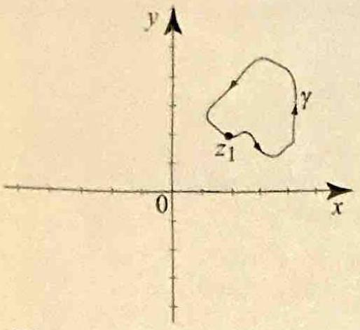
> Figure 5 A closed path starting and ending at $z_{1}$.


This is illustrated by Example 1(b). Conversely, suppose we know that the integral of $f$ around every closed path is zero. Consider the two paths $\gamma_{1}$ and $\gamma_{2}$ joining $z_{1}$ to $z_{2}$ in _Figure 6_, and let $\Gamma$ be the closed path consisting of $\gamma_{1}$ followed by the reverse of $\gamma_{2}$. Then

$$
0=\int_{\Gamma} f(z) d z=\int_{\gamma_{1}} f(z) d z-\int_{\gamma_{2}} f(z) d z
$$

implying that $\int_{\gamma_{1}} f(z) d z=\int_{\gamma_{2}} f(z) d z$. Thus, the integral of $f$ is independent of path.


> [!figure] Figure 6
> 
> 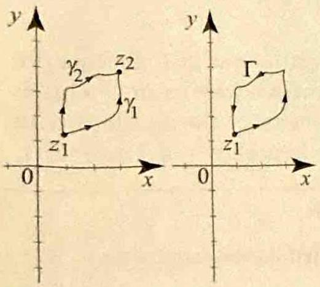
> Figure $6 \gamma_{1}$ followed by $\gamma_{2}$ yields the closed path $\Gamma$.


Combining this discussion with Theorem 1, we have the following useful theorem.


> [!theorem] Theorem 2
> Let $f(z)$ be a continuous function defined in a region $\Omega$. Then the following are equivalent.
> (i) $f(z)$ has an analytic antiderivative $F(z)$ in $\Omega$.
> (ii) The integral of $f$ is independent of path.
> (iii) The integral of $f$ around any closed path in $\Omega$ is zero.


Theorem 2 has many important applications. We start with an unexpected result.

> [!exercise] Exercise 5: A continuous function with no antiderivative
> Given the path integrals $\int_{\left[z_1, z_2, z_3\right]} \bar{z} d z=i$ and $\int_{\left[z_1, z_3\right]} \bar{z} d z=-i$, where $z_1=-1, z_2=1$, $z_3=i,\left[z_1, z_2, z_3\right]$ denotes the polygonal path through the three points in order, and $\left[z_1, z_3\right]$ denotes the line segment:
> 1.) Show that $\bar{z}$ does not possess an antiderivative on any region of $\mathbb{C}$ containing $z_1, z_2$, and $z_3$.
> 2.) Using the fact that $\bar{z}$ is not analytic at any point of $\mathbb{C}$, together with the (later-proved) result that the derivative of an analytic function is itself analytic, show that $\bar{z}$ does not possess an antiderivative on any region of $\mathbb{C}$.


##### solution

##### problem 1

We are given

$$
\int_{\left[z_1,z_2,z_3\right]} \overline{z}\,dz=i
$$

and

$$
\int_{\left[z_1,z_3\right]} \overline{z}\,dz=-i,
$$

where

$$
z_1=-1,\qquad z_2=1,\qquad z_3=i.
$$

The two paths $\left[z_1,z_2,z_3\right]$ and $\left[z_1,z_3\right]$ have the same initial point $z_1$ and the same terminal point $z_3$.

Suppose $\overline{z}$ had an antiderivative on a region $\Omega$ that contains both paths. Then Theorem 2 would imply that the integral of $\overline{z}$ is independent of path on $\Omega$. Applying that statement to the two paths $\left[z_1,z_2,z_3\right]$ and $\left[z_1,z_3\right]$, which have the same endpoints, we would have

$$
\int_{\left[z_1,z_2,z_3\right]} \overline{z}\,dz
=
\int_{\left[z_1,z_3\right]} \overline{z}\,dz.
$$

But the given values show that

$$
i\ne -i.
$$

So

$$
\int_{\left[z_1,z_2,z_3\right]} \overline{z}\,dz
\ne
\int_{\left[z_1,z_3\right]} \overline{z}\,dz.
$$

Therefore the integral of $\overline{z}$ depends on the path joining the same two endpoints.

But Theorem 2 says that if a continuous function has an antiderivative on a region, then its integral is independent of path on that region. Hence $\overline{z}$ does not possess an antiderivative on any region that contains both paths $\left[z_1,z_2,z_3\right]$ and $\left[z_1,z_3\right]$.

> [!figure] Python figure for Exercise 5(1)
> 
> 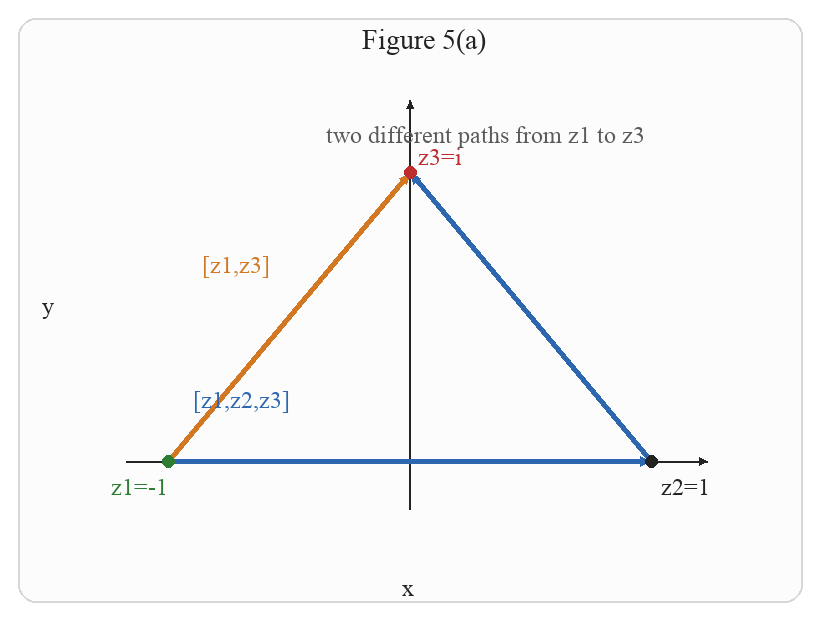
> 
> Figure 5(a). The polygonal path $\left[z_1,z_2,z_3\right]$ and the direct segment $\left[z_1,z_3\right]$ have the same endpoints.

A Mathematica plot for part (1) is:

```Mathematica title:"Exercise 5(1): Mathematica plot"
Graphics[
 {
  {Directive[Black, AbsoluteThickness[1.8]], Arrow[{{-1.35, 0}, {1.35, 0}}]},
  {Directive[Black, AbsoluteThickness[1.8]], Arrow[{{0, -0.25}, {0, 1.25}}]},
  {Directive[Blue, AbsoluteThickness[3]], Arrow[{{-1, 0}, {1, 0}}]},
  {Directive[Blue, AbsoluteThickness[3]], Arrow[{{1, 0}, {0, 1}}]},
  {Directive[RGBColor[0.82, 0.47, 0.13], AbsoluteThickness[3]], Arrow[{{-1, 0}, {0, 1}}]},
  {Green, PointSize[Large], Point[{-1, 0}]},
  {Black, PointSize[Large], Point[{1, 0}]},
  {Red, PointSize[Large], Point[{0, 1}]},
  Text[Style["z1=-1", 15, Green], {-1.18, -0.15}],
  Text[Style["z2=1", 15, Black], {1.08, -0.15}],
  Text[Style["z3=i", 15, Red], {0.12, 1.06}],
  Text[Style["[z1,z2,z3]", 15, Blue], {-0.82, 0.22}],
  Text[Style["[z1,z3]", 15, RGBColor[0.82, 0.47, 0.13]], {-0.8, 0.72}]
 },
 PlotRange -> {{-1.4, 1.4}, {-0.3, 1.3}},
 AspectRatio -> Automatic,
 ImageSize -> 320,
 Background -> White
]
```

The following Python code generates the embedded figure:

```python title:"Exercise 5(1): Python plot"
import math
from pathlib import Path

from PIL import Image, ImageDraw, ImageFont

BG = "white"
BLUE = (44, 103, 176)
ORANGE = (210, 120, 35)
GREEN = (46, 125, 50)
RED = (190, 45, 45)
BLACK = (35, 35, 35)
GRAY = (90, 90, 90)

xmin, xmax, ymin, ymax = -1.4, 1.4, -0.3, 1.35
W, H = 820, 620
M = 72

outdir = Path("images")
outdir.mkdir(exist_ok=True)
font_path = "/System/Library/Fonts/Supplemental/Times New Roman.ttf"
font = ImageFont.truetype(font_path, 28)
small = ImageFont.truetype(font_path, 24)


def pt(x, y):
    px = M + (x - xmin) / (xmax - xmin) * (W - 2 * M)
    py = H - (M + (y - ymin) / (ymax - ymin) * (H - 2 * M))
    return px, py


def draw_arrow(draw, p0, p1, color=BLUE, width=5, head=14):
    draw.line([p0, p1], fill=color, width=width)
    ang = math.atan2(p1[1] - p0[1], p1[0] - p0[0])
    a1 = ang + math.pi * 0.86
    a2 = ang - math.pi * 0.86
    q1 = (p1[0] + head * math.cos(a1), p1[1] + head * math.sin(a1))
    q2 = (p1[0] + head * math.cos(a2), p1[1] + head * math.sin(a2))
    draw.polygon([p1, q1, q2], fill=color)


image = Image.new("RGB", (W, H), BG)
draw = ImageDraw.Draw(image)
draw.rounded_rectangle((18, 18, W - 18, H - 18), radius=18, outline=(215, 215, 215), width=2, fill=(252, 252, 252))
draw_arrow(draw, pt(xmin + 0.08 * (xmax - xmin), 0), pt(xmax - 0.06 * (xmax - xmin), 0), color=BLACK, width=2, head=9)
draw_arrow(draw, pt(0, ymin + 0.08 * (ymax - ymin)), pt(0, ymax - 0.06 * (ymax - ymin)), color=BLACK, width=2, head=9)
draw.text((W / 2 - 48, 24), "Figure 5(a)", fill=BLACK, font=font)
draw.text((W / 2 - 8, H - 46), "x", fill=BLACK, font=small)
draw.text((42, H / 2 - 18), "y", fill=BLACK, font=small)

z1, z2, z3 = (-1, 0), (1, 0), (0, 1)
draw_arrow(draw, pt(*z1), pt(*z2), color=BLUE, width=5, head=12)
draw_arrow(draw, pt(*z2), pt(*z3), color=BLUE, width=5, head=12)
draw_arrow(draw, pt(*z1), pt(*z3), color=ORANGE, width=5, head=12)

for z, lab, color, off in [
    (z1, "z1=-1", GREEN, (-58, 12)),
    (z2, "z2=1", BLACK, (10, 12)),
    (z3, "z3=i", RED, (8, -30)),
]:
    q = pt(*z)
    draw.ellipse((q[0] - 6, q[1] - 6, q[0] + 6, q[1] + 6), fill=color)
    draw.text((q[0] + off[0], q[1] + off[1]), lab, fill=color, font=small)

draw.text((pt(-0.9, 0.26)[0], pt(-0.9, 0.26)[1]), "[z1,z2,z3]", fill=BLUE, font=small)
draw.text((pt(-0.86, 0.73)[0], pt(-0.86, 0.73)[1]), "[z1,z3]", fill=ORANGE, font=small)
draw.text((pt(-0.35, 1.18)[0], pt(-0.35, 1.18)[1]), "two different paths from z1 to z3", fill=GRAY, font=small)

image.save(outdir / "exercise5_problem_a_python.png")
```

##### problem 2

Assume, for contradiction, that there exists a region $\Omega$ and an analytic function $F$ on $\Omega$ such that

$$
F'(z)=\overline{z}
\qquad \text{for all } z\in \Omega.
$$

We now use the fact that the derivative of an analytic function is analytic. Since $F$ is analytic on $\Omega$, it follows that $F'$ is analytic on $\Omega$. But

$$
F'(z)=\overline{z},
$$

so this would imply that $\overline{z}$ is analytic on $\Omega$.

We now show directly that $\overline{z}$ is not analytic at any point of $\mathbb{C}$. Write

$$
\overline{z}=x-iy.
$$

So, in the notation $u(x,y)+iv(x,y)$, we have

$$
u(x,y)=x
\qquad \text{and} \qquad
v(x,y)=-y.
$$

Compute the first partial derivatives:

$$
u_x(x,y)=1,
\qquad
u_y(x,y)=0,
\qquad
v_x(x,y)=0,
\qquad
v_y(x,y)=-1.
$$

If $\overline{z}$ were analytic at a point, the Cauchy-Riemann equations would have to hold there:

$$
u_x=v_y
\qquad \text{and} \qquad
u_y=-v_x.
$$

But here

$$
u_x=1
\qquad \text{while} \qquad
v_y=-1,
$$

so

$$
u_x\ne v_y.
$$

Thus the Cauchy-Riemann equations fail at every point of the plane. Therefore $\overline{z}$ is not analytic at any point of $\mathbb{C}$.

This contradicts the conclusion that $F'=\overline{z}$ is analytic on $\Omega$. Hence no such analytic function $F$ can exist.

Therefore $\overline{z}$ does not possess an antiderivative on any region of $\mathbb{C}$.

> [!figure] Python figure for Exercise 5(2)
> 
> 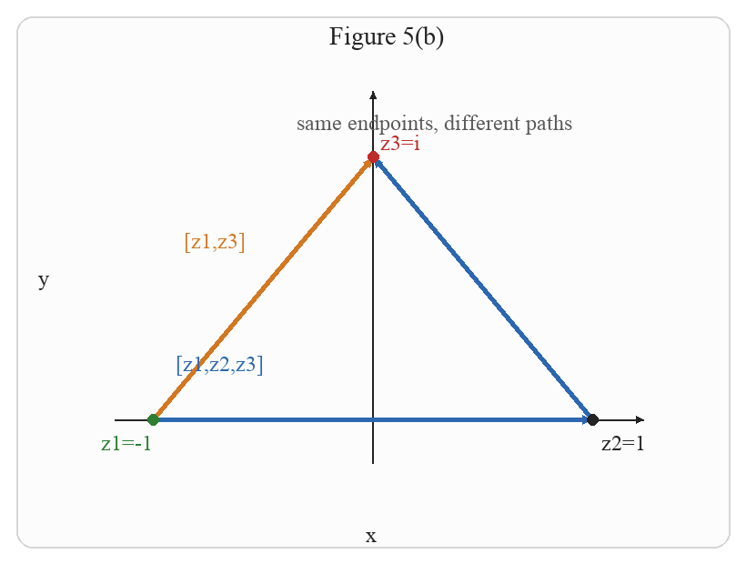
> 
> Figure 5(b). The same two paths have the same endpoints, but $\int \overline{z}\,dz$ takes different values on them.

A Mathematica plot for part (2) is:

```Mathematica title:"Exercise 5(2): Mathematica plot"
Graphics[
 {
  {Directive[Black, AbsoluteThickness[1.8]], Arrow[{{-1.35, 0}, {1.35, 0}}]},
  {Directive[Black, AbsoluteThickness[1.8]], Arrow[{{0, -0.25}, {0, 1.25}}]},
  {Directive[Blue, AbsoluteThickness[3]], Arrow[{{-1, 0}, {1, 0}}]},
  {Directive[Blue, AbsoluteThickness[3]], Arrow[{{1, 0}, {0, 1}}]},
  {Directive[RGBColor[0.82, 0.47, 0.13], AbsoluteThickness[3]], Arrow[{{-1, 0}, {0, 1}}]},
  {Green, PointSize[Large], Point[{-1, 0}]},
  {Black, PointSize[Large], Point[{1, 0}]},
  {Red, PointSize[Large], Point[{0, 1}]},
  Text[Style["z1=-1", 15, Green], {-1.18, -0.15}],
  Text[Style["z2=1", 15, Black], {1.08, -0.15}],
  Text[Style["z3=i", 15, Red], {0.12, 1.06}],
  Text[Style["[z1,z2,z3]", 15, Blue], {-0.82, 0.22}],
  Text[Style["[z1,z3]", 15, RGBColor[0.82, 0.47, 0.13]], {-0.8, 0.72}]
 },
 PlotRange -> {{-1.4, 1.4}, {-0.3, 1.3}},
 AspectRatio -> Automatic,
 ImageSize -> 320,
 Background -> White
]
```

The following Python code generates the embedded figure:

```python title:"Exercise 5(2): Python plot"
import math
from pathlib import Path

from PIL import Image, ImageDraw, ImageFont

BG = "white"
BLUE = (44, 103, 176)
ORANGE = (210, 120, 35)
GREEN = (46, 125, 50)
RED = (190, 45, 45)
BLACK = (35, 35, 35)
GRAY = (90, 90, 90)

xmin, xmax, ymin, ymax = -1.4, 1.4, -0.3, 1.35
W, H = 820, 620
M = 72

outdir = Path("images")
outdir.mkdir(exist_ok=True)
font_path = "/System/Library/Fonts/Supplemental/Times New Roman.ttf"
font = ImageFont.truetype(font_path, 28)
small = ImageFont.truetype(font_path, 24)


def pt(x, y):
    px = M + (x - xmin) / (xmax - xmin) * (W - 2 * M)
    py = H - (M + (y - ymin) / (ymax - ymin) * (H - 2 * M))
    return px, py


def draw_arrow(draw, p0, p1, color=BLUE, width=5, head=14):
    draw.line([p0, p1], fill=color, width=width)
    ang = math.atan2(p1[1] - p0[1], p1[0] - p0[0])
    a1 = ang + math.pi * 0.86
    a2 = ang - math.pi * 0.86
    q1 = (p1[0] + head * math.cos(a1), p1[1] + head * math.sin(a1))
    q2 = (p1[0] + head * math.cos(a2), p1[1] + head * math.sin(a2))
    draw.polygon([p1, q1, q2], fill=color)


image = Image.new("RGB", (W, H), BG)
draw = ImageDraw.Draw(image)
draw.rounded_rectangle((18, 18, W - 18, H - 18), radius=18, outline=(215, 215, 215), width=2, fill=(252, 252, 252))
draw_arrow(draw, pt(xmin + 0.08 * (xmax - xmin), 0), pt(xmax - 0.06 * (xmax - xmin), 0), color=BLACK, width=2, head=9)
draw_arrow(draw, pt(0, ymin + 0.08 * (ymax - ymin)), pt(0, ymax - 0.06 * (ymax - ymin)), color=BLACK, width=2, head=9)
draw.text((W / 2 - 48, 24), "Figure 5(b)", fill=BLACK, font=font)
draw.text((W / 2 - 8, H - 46), "x", fill=BLACK, font=small)
draw.text((42, H / 2 - 18), "y", fill=BLACK, font=small)

z1, z2, z3 = (-1, 0), (1, 0), (0, 1)
draw_arrow(draw, pt(*z1), pt(*z2), color=BLUE, width=5, head=12)
draw_arrow(draw, pt(*z2), pt(*z3), color=BLUE, width=5, head=12)
draw_arrow(draw, pt(*z1), pt(*z3), color=ORANGE, width=5, head=12)

for z, lab, color, off in [
    (z1, "z1=-1", GREEN, (-58, 12)),
    (z2, "z2=1", BLACK, (10, 12)),
    (z3, "z3=i", RED, (8, -30)),
]:
    q = pt(*z)
    draw.ellipse((q[0] - 6, q[1] - 6, q[0] + 6, q[1] + 6), fill=color)
    draw.text((q[0] + off[0], q[1] + off[1]), lab, fill=color, font=small)

draw.text((pt(-0.9, 0.26)[0], pt(-0.9, 0.26)[1]), "[z1,z2,z3]", fill=BLUE, font=small)
draw.text((pt(-0.86, 0.73)[0], pt(-0.86, 0.73)[1]), "[z1,z3]", fill=ORANGE, font=small)
draw.text((pt(-0.45, 1.18)[0], pt(-0.45, 1.18)[1]), "same endpoints, different paths", fill=GRAY, font=small)

image.save(outdir / "exercise5_problem_b_python.png")
```


++++


Let $z_{1}=-1, z_{2}=1$, and $z_{3}=i$. We know from Example 7, Section 3.2, that

$$
\int_{\left[z_{1}, z_{2}, z_{3}\right]} \bar{z} d z=i \quad \text { and } \quad \int_{\left[z_{1}, z_{3}\right]} \bar{z} d z=-i .
$$

Since the integral of $\bar{z}$ depends on the path that we choose from $z_{1}$ to $z_{3}$, we conclude from Theorem 2 that there is no antiderivative of $\bar{z}$ in a region containing the points $z_{1}, z_{2}$, and $z_{3}$. Indeed, we will show later that the derivative of an analytic function is itself analytic. In light of this result and the fact that $\bar{z}$ is not analytic at any point (Example 4(a), Section 2.3), it is clear that $\bar{z}$ has no antiderivative.


> [!exercise] Exercise 6: Integrals over closed paths
> 
> For each of the following, show that the integral vanishes by exhibiting an antiderivative of the integrand on a region containing the path of integration:
> 1.) $\int_\gamma z d z$, where $\gamma$ is any closed path in $\mathbb{C}$.
> 2.) $\int_\gamma e^{2 i z} d z$, where $\gamma$ is any closed path in $\mathbb{C}$.
> 3.) $\int_{C_{1 / 2}(0)} \frac{1}{1+z} d z$, where $C_{1 / 2}(0)$ is the positively oriented circle centered at the origin with radius $\frac{1}{2}$.
> 4.) $\int_\gamma \frac{1}{\left(z-z_0\right)^n} d z$, where $z_0$ is a fixed point in $\mathbb{C}$, $\gamma$ is a closed path not passing through $z_0$, and $n \geq 2$ is an integer.


##### solution

##### problem 1

Let $\gamma:[a,b]\to\mathbb{C}$ be a closed path. Since $\gamma$ is closed, we have

$$
\gamma(a)=\gamma(b).
$$

We take

$$
f(z)=z
\qquad \text{and} \qquad
F(z)=\frac{z^2}{2}.
$$

Now

$$
F'(z)
=
\frac{d}{dz}\left(\frac{z^2}{2}\right)
=
\frac{1}{2}\frac{d}{dz}(z^2)
=
\frac{1}{2}(2z)
=
z
=
f(z).
$$

So $F$ is an antiderivative of $f$ on all of $\mathbb{C}$, and in particular on a region containing the path $\gamma$. Therefore Theorem 1 gives

$$
\int_\gamma z\,dz
=
F(\gamma(b))-F(\gamma(a))
=
\frac{\gamma(b)^2}{2}-\frac{\gamma(a)^2}{2}.
$$

Since $\gamma(a)=\gamma(b)$, this becomes

$$
\int_\gamma z\,dz
=
\frac{\gamma(a)^2}{2}-\frac{\gamma(a)^2}{2}
=
0.
$$

##### problem 2

Let $\gamma:[a,b]\to\mathbb{C}$ be a closed path. Then

$$
\gamma(a)=\gamma(b).
$$

We take

$$
f(z)=e^{2iz}
\qquad \text{and} \qquad
F(z)=\frac{e^{2iz}}{2i}.
$$

We differentiate $F$:

$$
F'(z)
=
\frac{d}{dz}\left(\frac{e^{2iz}}{2i}\right)
=
\frac{1}{2i}\frac{d}{dz}\left(e^{2iz}\right)
=
\frac{1}{2i}\left(2i\,e^{2iz}\right)
=
e^{2iz}
=
f(z).
$$

So $F$ is an antiderivative of $f$ on all of $\mathbb{C}$. Hence Theorem 1 gives

$$
\int_\gamma e^{2iz}\,dz
=
F(\gamma(b))-F(\gamma(a))
=
\frac{e^{2i\gamma(b)}}{2i}-\frac{e^{2i\gamma(a)}}{2i}.
$$

Since $\gamma(a)=\gamma(b)$, we obtain

$$
\int_\gamma e^{2iz}\,dz
=
\frac{e^{2i\gamma(a)}}{2i}-\frac{e^{2i\gamma(a)}}{2i}
=
0.
$$

##### problem 3

Let $\gamma=C_{1/2}(0)$. We use the principal branch of the logarithm and consider

$$
\Omega=\mathbb{C}\setminus(-\infty,-1].
$$

On this region, the function $\log(1+z)$ is defined and analytic, so we take

$$
F(z)=\log(1+z).
$$

Then

$$
F'(z)
=
\frac{d}{dz}\log(1+z)
=
\frac{1}{1+z}\frac{d}{dz}(1+z)
=
\frac{1}{1+z}\cdot 1
=
\frac{1}{1+z}.
$$

So $F$ is an antiderivative of $\frac{1}{1+z}$ on $\Omega$.

It remains to check that the circle $C_{1/2}(0)$ lies in $\Omega$. Let $z\in C_{1/2}(0)$. Then $|z|=\frac12$, so

$$
\operatorname{Re}(z)\ge -|z|=-\frac12.
$$

Therefore

$$
\operatorname{Re}(1+z)
=
1+\operatorname{Re}(z)
\ge
1-\frac12
=
\frac12
>
0.
$$

So $1+z$ has positive real part, and therefore $1+z\notin(-\infty,0]$. Equivalently,

$$
z\notin(-\infty,-1].
$$

Thus every point of $C_{1/2}(0)$ lies in $\Omega$.

Now $\gamma$ is a closed path, so if $\gamma:[a,b]\to\mathbb{C}$ is its parametrization, then $\gamma(a)=\gamma(b)$. By Theorem 1,

$$
\int_{C_{1/2}(0)} \frac{1}{1+z}\,dz
=
F(\gamma(b))-F(\gamma(a))
=
\log(1+\gamma(b))-\log(1+\gamma(a)).
$$

Since $\gamma(a)=\gamma(b)$, we get

$$
\int_{C_{1/2}(0)} \frac{1}{1+z}\,dz
=
\log(1+\gamma(a))-\log(1+\gamma(a))
=
0.
$$

##### problem 4

Let

$$
f(z)=\frac{1}{(z-z_0)^n},
\qquad n\ge 2.
$$

Since $\gamma$ does not pass through $z_0$, the path $\gamma$ lies in the region

$$
\Omega=\mathbb{C}\setminus\{z_0\}.
$$

We define

$$
F(z)=-\frac{1}{(n-1)(z-z_0)^{\,n-1}}.
$$

We now differentiate $F$ carefully:

$$
F'(z)
=
\frac{d}{dz}\left(-\frac{1}{(n-1)(z-z_0)^{\,n-1}}\right)
=
-\frac{1}{n-1}\frac{d}{dz}\left((z-z_0)^{-(n-1)}\right)
$$

$$
=
-\frac{1}{n-1}\left(-(n-1)(z-z_0)^{-n}\frac{d}{dz}(z-z_0)\right)
$$

$$
=
-\frac{1}{n-1}\left(-(n-1)(z-z_0)^{-n}\cdot 1\right)
$$

$$
=
(z-z_0)^{-n}
=
\frac{1}{(z-z_0)^n}
=
f(z).
$$

So $F$ is an antiderivative of $f$ on $\Omega$.

Because $\gamma$ is a closed path in $\Omega$, if $\gamma:[a,b]\to\mathbb{C}$ is a parametrization, then $\gamma(a)=\gamma(b)$. Therefore Theorem 1 gives

$$
\int_\gamma \frac{1}{(z-z_0)^n}\,dz
=
F(\gamma(b))-F(\gamma(a)).
$$

Since $\gamma(b)=\gamma(a)$, we obtain

$$
\int_\gamma \frac{1}{(z-z_0)^n}\,dz
=
F(\gamma(a))-F(\gamma(a))
=
0.
$$


++++


(a) If $\gamma$ is any closed path, then by Theorem 2,

$$
\int_{\gamma} z d z=0
$$

because $f(z)=z$ has an antiderivative $F(z)=\frac{z^{2}}{2}$ for all $z$ in the plane.
(b) If $\gamma$ is any closed path, then by Theorem 2,

$$
\int_{\gamma} e^{2 i z} d z=0
$$

because $f(z)=e^{2 i z}$ has an antiderivative $F(z)=\frac{e^{2 i z}}{2 i}$ for all $z$ in the plane.
(c) Let $C_{\frac{1}{2}}(0)$ denote the positively oriented circle with center at 0 and radius $\frac{1}{2}$. Then by Theorem 2,

$$
\int_{C_{\frac{1}{2}}(0)} \frac{1}{1+z} d z=0
$$

because $\log (1+z)$ is an antiderivative of $\frac{1}{z+1}$ in the region $\mathbb{C} \backslash(-\infty,-1]$, which contains $C_{\frac{1}{2}}(0)$ (see _Figure 7_).


> [!figure] Figure 7
> 
> 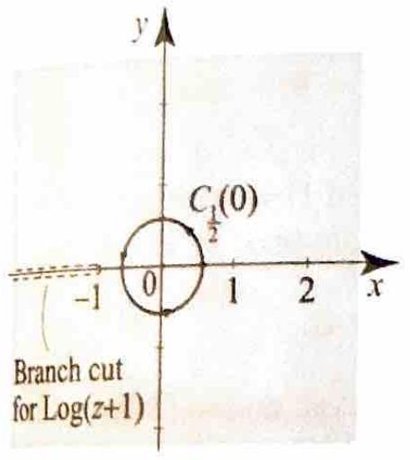
> Figure 7 The branch cut of $\log (z+1)$ is obtained by translating to the left by one mit the branch cut of $\log z$.


(d) Let $z_{0}$ be a fixed point in the plane, $\gamma$ be a closed path in a region that does not go through $z_{0}$, and $n \geq 2$ be an integer. Then by Theorem 2,

$$
\int_{\gamma} \frac{1}{\left(z-z_{0}\right)^{n}} d z=0
$$

because $F(z)=\frac{1}{(n-1)\left(z-z_{0}\right)^{n-1}}$ is an antiderivative of $\frac{1}{\left(z-z_{0}\right)^{n}}$ in any region not containing $z_{0}$. $\square$

While Theorems 1 and 2 are very useful, they have their limitations when we do not know an antiderivative of the integrand $f$. For example, it is not clear from Theorem 1 whether the path integral of a function like $e^{z^{2}}$ is independent of path, because thus far we do not know whether $e^{z^{2}}$ has an antiderivative. In the next section we answer these problems and many others by presenting a far-reaching theorem of Cauchy. This result is at the heart of the theory of path integrals and indeed all of complex analysis.

## 

Recall that the fundamental theorem of calculus states that the derivative of an antiderivative of a continuous function is the function itself. In symbols, if $f$ is continuous and $F(x)=\int_{a}^{x} f(t) d t$, then

$$
f(x)=F^{\prime}(x)=\lim _{h \rightarrow 0} \frac{F(x+h)-F(x)}{h}=\lim _{h \rightarrow 0} \frac{1}{h} \int_{x}^{x+h} f(t) d t .
$$

For continuous complex-valued functions, we have the following useful lemma.


> [!lemma] Lemma 1
> Suppose $f(z)$ is continuous in a region $\Omega, z$ and $z+\Delta z$ are in $\Omega$, and the closed line segment $[z, z+\Delta z]$ is also in $\Omega$. Then
> 
> $$
> \lim _{\Delta z \rightarrow 0} \frac{1}{\Delta z} \int_{[z, z+\Delta z]} f(\zeta) d \zeta=f(z)
> $$
> 


**Proof:** Parametrize $[z, z+\Delta z]$ by $\gamma(t)=(1-t) z+t(z+\Delta z)=z+t \Delta z$, where $0 \leq t \leq 1$. Then $\gamma^{\prime}(t)=\Delta z$ and hence $\int_{[z, z+\Delta z]} d \zeta=\int_{0}^{1} \Delta z d t=\Delta z$. So $\frac{1}{\Delta z} \int_{[z, z+\Delta z]} f(z) d \zeta=f(z)$, and

$$
\frac{1}{\Delta z} \int_{[z, z+\Delta z]} f(\zeta) d \zeta-f(z)=\frac{1}{\Delta z} \int_{[z, z+\Delta z]}(f(\zeta)-f(z)) d \zeta
$$

Hence (2) is equivalent to

$$
\lim _{\Delta z \rightarrow 0} \frac{1}{\Delta z} \int_{[z, z+\Delta z]}(f(\zeta)-f(z)) d \zeta=0
$$

To prove (3), given $\epsilon>0$, since $f$ is continuous at $z$ and $\Omega$ is open, we can find $\delta>0$ such that the disk centered at $z$ with radius $\delta$ is contained in $\Omega$ and

$$
|\zeta-z|<\delta \Rightarrow|f(\zeta)-f(z)|<\epsilon .
$$

For $|\Delta z|<\delta$ and all $\zeta$ on $[z, z+\Delta z]$, we have $|\zeta-z| \leq|\Delta z|$, and so (4) shows that $|f(\zeta)-f(z)|<\epsilon$ for all $\zeta$ on the line segment $[z, z+\Delta z]$. Hence the maximum $M$ of the function $\zeta \mapsto|f(\zeta)-f(z)|$ is less than $\epsilon$ for all $\zeta$ on $[z, z+\Delta z]$. Applying Theorem 2, Section 3.2, and using the fact that the length of $[z, z+\Delta z]$ is $l([z, z+ \Delta z])=|\Delta z|$, we obtain

$$
\left|\frac{1}{\Delta z} \int_{[z, z+\Delta z]}(f(\zeta)-f(z)) d \zeta\right| \leq \frac{1}{|\Delta z|} l([z, z+\Delta z]) \epsilon=\epsilon,
$$

which implies (3) and hence the lemma.


**Proof of Theorem 1** We only need to show that if $I$ is independent of path, then $f$ has an antiderivative $F$. Fix $z_{0}$ in $\Omega$. For $z$ in $\Omega$, define

$$
F(z)=\int_{z_{0}}^{z} f(\zeta) d \zeta
$$

where the integral is taken over any path joining $z_{0}$ to $z$ (recall that $\Omega$ is connected and the integral is independent of path). Since the integral of $f$ is independent of path, we have $\int_{z_{0}}^{z+\Delta z} f(\zeta) d \zeta=\int_{z_{0}}^{z} f(\zeta) d \zeta+\int_{z}^{z+\Delta z} f(\zeta) d \zeta$ (see _Figure 8_), and so

$$
F(z+\Delta z)-F(z)=\int_{z_{0}}^{z+\Delta z} f(\zeta) d \zeta-\int_{z_{0}}^{z} f(\zeta) d \zeta=\int_{z}^{z+\Delta z} f(\zeta) d \zeta
$$


> [!figure] Figure 8
> 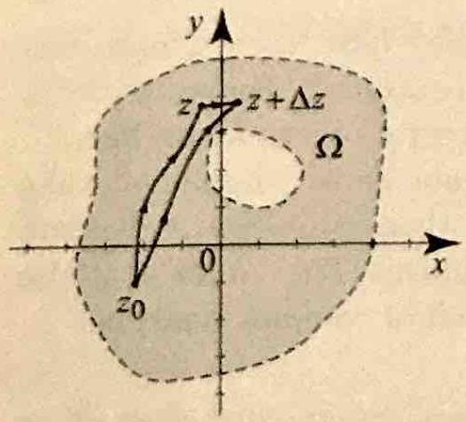
> Figure 8


For very small $\Delta z, z$ and $z+\Delta z$ are in $\Omega$, because $\Omega$ is open. So we can choose the path joining $z$ to $z+\Delta z$ to be the line segment $[z, z+\Delta z]$,

$$
\frac{F(z+\Delta z)-F(z)}{\Delta z}=\frac{1}{\Delta z} \int_{[z, z+\Delta z]} f(\zeta) d \zeta
$$

Taking the limit as $\Delta z \rightarrow 0$ and appealing to Lemma 1, we obtain $F^{\prime}(z)=f(z)$.


# Exercises 3.3

> [!exercise] Exercise 7
> In problems 1-14, find an antiderivative of the given function and specify the region $\Omega$ where the antiderivative is valid.
> 
> 1. $z^{2}+z-1$.
> 2. $z e^{z}-\sin z$.
> 3. $\frac{\log z}{z}$.
> 4. $\frac{1}{z-1}$.
> 5. $\frac{1}{(z-1)(z+1)}$.
> 6. $\sec ^{2} z$.
> 7. $\quad \cos (3 z+2)$.
> 8. $z e^{z^{2}}-\frac{1}{z}$.
> 9. $z \sinh z^{2}$.
> 10. $e^{z} \cos z$.
> 11. $z \log z$.
> 12. $\log _{\alpha} z$.
> 13. $\log _{0} z+\log _{\frac{\pi}{2}} z+\frac{1}{z}$.
> 14. $z^{\frac{1}{5}}$ (principal branch).


##### solution

##### problem 1

We take

$$
F(z)=\frac{z^3}{3}+\frac{z^2}{2}-z.
$$

Then

$$
F'(z)
=
\frac{d}{dz}\left(\frac{z^3}{3}\right)
+
\frac{d}{dz}\left(\frac{z^2}{2}\right)
+
\frac{d}{dz}(-z)
=
z^2+z-1.
$$

Since $F$ is a polynomial, it is analytic on all of $\mathbb{C}$. Therefore $F$ is an antiderivative of $z^2+z-1$ on

$$
\Omega=\mathbb{C}.
$$

> [!figure] Python figure for Exercise 7(1)
> 
> 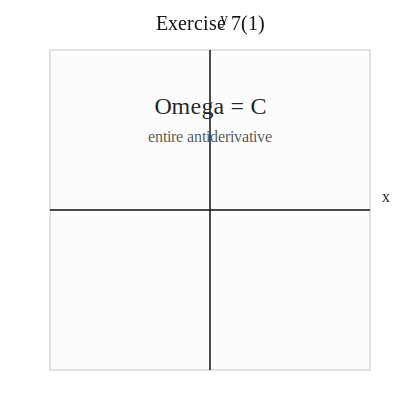
> 
> Figure 7(1). The valid region is the whole plane $\Omega=\mathbb{C}$.

A Mathematica plot for problem (1) is:

```Mathematica title:"Exercise 7(1): Mathematica plot"
Graphics[
 {
  {Directive[Black, AbsoluteThickness[1.8]], Arrow[{{-3.8, 0}, {3.8, 0}}]},
  {Directive[Black, AbsoluteThickness[1.8]], Arrow[{{0, -3.8}, {0, 3.8}}]},
  Text[Style["Omega = C", 18], {0, 2.4}],
  Text[Style["entire antiderivative", 14, GrayLevel[0.35]], {0, 1.7}]
 },
 PlotRange -> {{-4, 4}, {-4, 4}},
 AspectRatio -> 1,
 ImageSize -> 320,
 Background -> White
]
```

The following Python code generates the embedded figure:

```python title:"Exercise 7(1): Python plot"
from pathlib import Path

svg = """<svg xmlns="http://www.w3.org/2000/svg" width="420" height="420" viewBox="0 0 420 420">
<rect x="50.0" y="50.0" width="320.0" height="320.0" fill="#fcfcfd" stroke="#d9d9df" stroke-width="1.5" />
<line x1="50.0" y1="210.0" x2="370.0" y2="210.0" stroke="#222" stroke-width="1.6" />
<line x1="210.0" y1="370.0" x2="210.0" y2="50.0" stroke="#222" stroke-width="1.6" />
<text x="382.0" y="202.0" font-family="Times New Roman" font-size="16" fill="#222">x</text>
<text x="220.0" y="24.0" font-family="Times New Roman" font-size="16" fill="#222">y</text>
<text x="210.0" y="30.0" font-family="Times New Roman" font-size="20" fill="#111" text-anchor="middle">Exercise 7(1)</text>
<text x="210.0" y="114.0" font-family="Times New Roman" font-size="24" fill="#222" text-anchor="middle">Omega = C</text>
<text x="210.0" y="142.0" font-family="Times New Roman" font-size="16" fill="#555" text-anchor="middle">entire antiderivative</text>
</svg>"""

outdir = Path("images")
outdir.mkdir(exist_ok=True)
(outdir / "exercise7_problem1_python.svg").write_text(svg)
```

##### problem 2

We take

$$
F(z)=(z-1)e^z+\cos z.
$$

Differentiate:

$$
F'(z)
=
\frac{d}{dz}\bigl((z-1)e^z\bigr)+\frac{d}{dz}(\cos z)
$$

$$
=
\left(\frac{d}{dz}(z-1)\right)e^z
+
(z-1)\frac{d}{dz}(e^z)
-\sin z
$$

$$
=
1\cdot e^z
+
(z-1)e^z
-\sin z
$$

$$
=
\bigl(1+z-1\bigr)e^z-\sin z
=
ze^z-\sin z.
$$

Since $(z-1)e^z+\cos z$ is entire, it is analytic on all of $\mathbb{C}$. Thus it is an antiderivative on

$$
\Omega=\mathbb{C}.
$$

> [!figure] Python figure for Exercise 7(2)
> 
> 
> 
> Figure 7(2). The valid region is again the whole plane $\Omega=\mathbb{C}$.

A Mathematica plot for problem (2) is:

```Mathematica title:"Exercise 7(2): Mathematica plot"
Graphics[
 {
  {Directive[Black, AbsoluteThickness[1.8]], Arrow[{{-3.8, 0}, {3.8, 0}}]},
  {Directive[Black, AbsoluteThickness[1.8]], Arrow[{{0, -3.8}, {0, 3.8}}]},
  Text[Style["Omega = C", 18], {0, 2.4}],
  Text[Style["entire antiderivative", 14, GrayLevel[0.35]], {0, 1.7}]
 },
 PlotRange -> {{-4, 4}, {-4, 4}},
 AspectRatio -> 1,
 ImageSize -> 320,
 Background -> White
]
```

The following Python code generates the embedded figure:

```python title:"Exercise 7(2): Python plot"
from pathlib import Path

svg = """<svg xmlns="http://www.w3.org/2000/svg" width="420" height="420" viewBox="0 0 420 420">
<rect x="50.0" y="50.0" width="320.0" height="320.0" fill="#fcfcfd" stroke="#d9d9df" stroke-width="1.5" />
<line x1="50.0" y1="210.0" x2="370.0" y2="210.0" stroke="#222" stroke-width="1.6" />
<line x1="210.0" y1="370.0" x2="210.0" y2="50.0" stroke="#222" stroke-width="1.6" />
<text x="382.0" y="202.0" font-family="Times New Roman" font-size="16" fill="#222">x</text>
<text x="220.0" y="24.0" font-family="Times New Roman" font-size="16" fill="#222">y</text>
<text x="210.0" y="30.0" font-family="Times New Roman" font-size="20" fill="#111" text-anchor="middle">Exercise 7(2)</text>
<text x="210.0" y="114.0" font-family="Times New Roman" font-size="24" fill="#222" text-anchor="middle">Omega = C</text>
<text x="210.0" y="142.0" font-family="Times New Roman" font-size="16" fill="#555" text-anchor="middle">(z-1)e^z + cos z</text>
</svg>"""

outdir = Path("images")
outdir.mkdir(exist_ok=True)
(outdir / "exercise7_problem2_python.svg").write_text(svg)
```

##### problem 3

We use the principal branch of the logarithm and take

$$
F(z)=\frac{1}{2}(\log z)^2
$$

on

$$
\Omega=\mathbb{C}\setminus(-\infty,0].
$$

On this region, $\log z$ is analytic. Therefore $F$ is analytic on $\Omega$. Differentiate:

$$
F'(z)
=
\frac{1}{2}\frac{d}{dz}\bigl((\log z)^2\bigr)
=
\frac{1}{2}\cdot 2(\log z)\frac{d}{dz}(\log z)
$$

$$
=
(\log z)\frac{1}{z}
=
\frac{\log z}{z}.
$$

So $F$ is an antiderivative of $\frac{\log z}{z}$ on

$$
\Omega=\mathbb{C}\setminus(-\infty,0].
$$

> [!figure] Python figure for Exercise 7(3)
> 
> 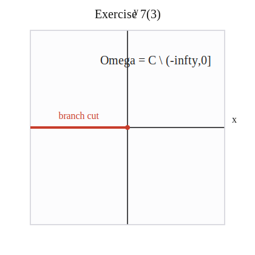
> 
> Figure 7(3). The principal-branch cut removes the nonpositive real axis.

A Mathematica plot for problem (3) is:

```Mathematica title:"Exercise 7(3): Mathematica plot"
Graphics[
 {
  {Directive[Black, AbsoluteThickness[1.8]], Arrow[{{-3.8, 0}, {3.8, 0}}]},
  {Directive[Black, AbsoluteThickness[1.8]], Arrow[{{0, -3.8}, {0, 3.8}}]},
  {Directive[RGBColor[0.78, 0.24, 0.17], AbsoluteThickness[4]], Line[{{-4, 0}, {0, 0}}]},
  {RGBColor[0.78, 0.24, 0.17], PointSize[Large], Point[{0, 0}]},
  Text[Style["branch cut", 14, RGBColor[0.78, 0.24, 0.17]], {-2, 0.35}],
  Text[Style["Omega = C \\ (-Infinity,0]", 17], {1.15, 2.6}]
 },
 PlotRange -> {{-4, 4}, {-4, 4}},
 AspectRatio -> 1,
 ImageSize -> 320,
 Background -> White
]
```

The following Python code generates the embedded figure:

```python title:"Exercise 7(3): Python plot"
from pathlib import Path

svg = """<svg xmlns="http://www.w3.org/2000/svg" width="420" height="420" viewBox="0 0 420 420">
<rect x="50.0" y="50.0" width="320.0" height="320.0" fill="#fcfcfd" stroke="#d9d9df" stroke-width="1.5" />
<line x1="50.0" y1="210.0" x2="370.0" y2="210.0" stroke="#222" stroke-width="1.6" />
<line x1="210.0" y1="370.0" x2="210.0" y2="50.0" stroke="#222" stroke-width="1.6" />
<text x="382.0" y="202.0" font-family="Times New Roman" font-size="16" fill="#222">x</text>
<text x="220.0" y="24.0" font-family="Times New Roman" font-size="16" fill="#222">y</text>
<text x="210.0" y="30.0" font-family="Times New Roman" font-size="20" fill="#111" text-anchor="middle">Exercise 7(3)</text>
<line x1="50.0" y1="210.0" x2="210.0" y2="210.0" stroke="#c73d2b" stroke-width="4" />
<circle cx="210.0" cy="210.0" r="4.0" fill="#c73d2b" />
<text x="130.0" y="196.0" font-family="Times New Roman" font-size="16" fill="#c73d2b" text-anchor="middle">branch cut</text>
<text x="256.0" y="106.0" font-family="Times New Roman" font-size="20" fill="#222" text-anchor="middle">Omega = C \\ (-infty,0]</text>
</svg>"""

outdir = Path("images")
outdir.mkdir(exist_ok=True)
(outdir / "exercise7_problem3_python.svg").write_text(svg)
```

##### problem 4

We take

$$
F(z)=\log(z-1)
$$

with the principal branch, so the natural region is

$$
\Omega=\mathbb{C}\setminus(-\infty,1].
$$

On this region, $z-1\notin(-\infty,0]$, so $\log(z-1)$ is analytic. Differentiate:

$$
F'(z)
=
\frac{d}{dz}\log(z-1)
=
\frac{1}{z-1}\frac{d}{dz}(z-1)
=
\frac{1}{z-1}\cdot 1
=
\frac{1}{z-1}.
$$

Thus $\log(z-1)$ is an antiderivative of $\frac{1}{z-1}$ on

$$
\Omega=\mathbb{C}\setminus(-\infty,1].
$$

> [!figure] Python figure for Exercise 7(4)
> 
> 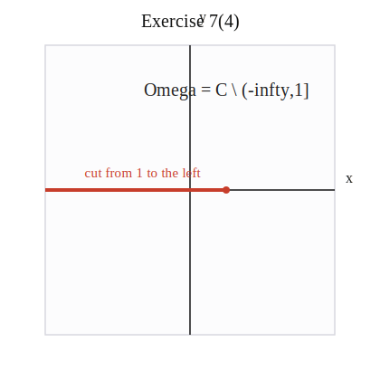
> 
> Figure 7(4). The principal-branch cut for $\log(z-1)$ is the ray $(-\infty,1]$.

A Mathematica plot for problem (4) is:

```Mathematica title:"Exercise 7(4): Mathematica plot"
Graphics[
 {
  {Directive[Black, AbsoluteThickness[1.8]], Arrow[{{-3.8, 0}, {3.8, 0}}]},
  {Directive[Black, AbsoluteThickness[1.8]], Arrow[{{0, -3.8}, {0, 3.8}}]},
  {Directive[RGBColor[0.78, 0.24, 0.17], AbsoluteThickness[4]], Line[{{-4, 0}, {1, 0}}]},
  {RGBColor[0.78, 0.24, 0.17], PointSize[Large], Point[{1, 0}]},
  Text[Style["cut from 1 to the left", 14, RGBColor[0.78, 0.24, 0.17]], {-1.3, 0.35}],
  Text[Style["Omega = C \\ (-Infinity,1]", 17], {1.0, 2.6}]
 },
 PlotRange -> {{-4, 4}, {-4, 4}},
 AspectRatio -> 1,
 ImageSize -> 320,
 Background -> White
]
```

The following Python code generates the embedded figure:

```python title:"Exercise 7(4): Python plot"
from pathlib import Path

svg = """<svg xmlns="http://www.w3.org/2000/svg" width="420" height="420" viewBox="0 0 420 420">
<rect x="50.0" y="50.0" width="320.0" height="320.0" fill="#fcfcfd" stroke="#d9d9df" stroke-width="1.5" />
<line x1="50.0" y1="210.0" x2="370.0" y2="210.0" stroke="#222" stroke-width="1.6" />
<line x1="210.0" y1="370.0" x2="210.0" y2="50.0" stroke="#222" stroke-width="1.6" />
<text x="382.0" y="202.0" font-family="Times New Roman" font-size="16" fill="#222">x</text>
<text x="220.0" y="24.0" font-family="Times New Roman" font-size="16" fill="#222">y</text>
<text x="210.0" y="30.0" font-family="Times New Roman" font-size="20" fill="#111" text-anchor="middle">Exercise 7(4)</text>
<line x1="50.0" y1="210.0" x2="250.0" y2="210.0" stroke="#c73d2b" stroke-width="4" />
<circle cx="250.0" cy="210.0" r="4.0" fill="#c73d2b" />
<text x="158.0" y="196.0" font-family="Times New Roman" font-size="15" fill="#c73d2b" text-anchor="middle">cut from 1 to the left</text>
<text x="250.0" y="106.0" font-family="Times New Roman" font-size="20" fill="#222" text-anchor="middle">Omega = C \\ (-infty,1]</text>
</svg>"""

outdir = Path("images")
outdir.mkdir(exist_ok=True)
(outdir / "exercise7_problem4_python.svg").write_text(svg)
```

##### problem 5

First decompose the function into partial fractions:

$$
\frac{1}{(z-1)(z+1)}
=
\frac{A}{z-1}+\frac{B}{z+1}.
$$

Then

$$
1
=
A(z+1)+B(z-1)
=
(A+B)z+(A-B).
$$

Comparing coefficients gives

$$
A+B=0
\qquad \text{and} \qquad
A-B=1.
$$

From $A+B=0$, we get $B=-A$. Substitute this into $A-B=1$:

$$
A-(-A)=1,
$$

so

$$
2A=1,
\qquad
A=\frac12,
\qquad
B=-\frac12.
$$

Therefore

$$
\frac{1}{(z-1)(z+1)}
=
\frac{1}{2}\frac{1}{z-1}-\frac{1}{2}\frac{1}{z+1}.
$$

Now take

$$
F(z)=\frac12\log(z-1)-\frac12\log(z+1)
$$

on

$$
\Omega=\mathbb{C}\setminus(-\infty,1].
$$

For $z\in\Omega$, both $z-1$ and $z+1$ avoid the principal branch cut, so both logarithms are analytic there. Differentiate:

$$
F'(z)
=
\frac12\frac{d}{dz}\log(z-1)-\frac12\frac{d}{dz}\log(z+1)
$$

$$
=
\frac12\frac{1}{z-1}-\frac12\frac{1}{z+1}
$$

$$
=
\frac12\left(\frac{z+1}{(z-1)(z+1)}-\frac{z-1}{(z-1)(z+1)}\right)
$$

$$
=
\frac12\left(\frac{z+1-z+1}{(z-1)(z+1)}\right)
=
\frac12\left(\frac{2}{(z-1)(z+1)}\right)
=
\frac{1}{(z-1)(z+1)}.
$$

So $F$ is an antiderivative on

$$
\Omega=\mathbb{C}\setminus(-\infty,1].
$$

> [!figure] Python figure for Exercise 7(5)
> 
> 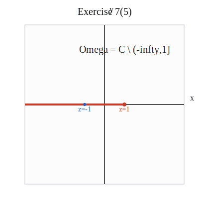
> 
> Figure 7(5). The same shifted branch cut $(-\infty,1]$ works for both logarithms in the antiderivative.

A Mathematica plot for problem (5) is:

```Mathematica title:"Exercise 7(5): Mathematica plot"
Graphics[
 {
  {Directive[Black, AbsoluteThickness[1.8]], Arrow[{{-3.8, 0}, {3.8, 0}}]},
  {Directive[Black, AbsoluteThickness[1.8]], Arrow[{{0, -3.8}, {0, 3.8}}]},
  {Directive[RGBColor[0.78, 0.24, 0.17], AbsoluteThickness[4]], Line[{{-4, 0}, {1, 0}}]},
  {RGBColor[0.78, 0.24, 0.17], PointSize[Large], Point[{1, 0}]},
  {RGBColor[0.17, 0.37, 0.78], PointSize[Large], Point[{-1, 0}]},
  Text[Style["z=-1", 13, RGBColor[0.17, 0.37, 0.78]], {-1, -0.35}],
  Text[Style["z=1", 13, RGBColor[0.78, 0.24, 0.17]], {1, -0.35}],
  Text[Style["Omega = C \\ (-Infinity,1]", 17], {1.0, 2.6}]
 },
 PlotRange -> {{-4, 4}, {-4, 4}},
 AspectRatio -> 1,
 ImageSize -> 320,
 Background -> White
]
```

The following Python code generates the embedded figure:

```python title:"Exercise 7(5): Python plot"
from pathlib import Path

svg = """<svg xmlns="http://www.w3.org/2000/svg" width="420" height="420" viewBox="0 0 420 420">
<rect x="50.0" y="50.0" width="320.0" height="320.0" fill="#fcfcfd" stroke="#d9d9df" stroke-width="1.5" />
<line x1="50.0" y1="210.0" x2="370.0" y2="210.0" stroke="#222" stroke-width="1.6" />
<line x1="210.0" y1="370.0" x2="210.0" y2="50.0" stroke="#222" stroke-width="1.6" />
<text x="382.0" y="202.0" font-family="Times New Roman" font-size="16" fill="#222">x</text>
<text x="220.0" y="24.0" font-family="Times New Roman" font-size="16" fill="#222">y</text>
<text x="210.0" y="30.0" font-family="Times New Roman" font-size="20" fill="#111" text-anchor="middle">Exercise 7(5)</text>
<line x1="50.0" y1="210.0" x2="250.0" y2="210.0" stroke="#c73d2b" stroke-width="4" />
<circle cx="250.0" cy="210.0" r="4.0" fill="#c73d2b" />
<circle cx="170.0" cy="210.0" r="4.0" fill="#2b5fc7" />
<text x="170.0" y="224.0" font-family="Times New Roman" font-size="14" fill="#2b5fc7" text-anchor="middle">z=-1</text>
<text x="250.0" y="224.0" font-family="Times New Roman" font-size="14" fill="#c73d2b" text-anchor="middle">z=1</text>
<text x="250.0" y="106.0" font-family="Times New Roman" font-size="20" fill="#222" text-anchor="middle">Omega = C \\ (-infty,1]</text>
</svg>"""

outdir = Path("images")
outdir.mkdir(exist_ok=True)
(outdir / "exercise7_problem5_python.svg").write_text(svg)
```

##### problem 6

We take

$$
F(z)=\tan z.
$$

Then

$$
F'(z)=\sec^2 z.
$$

The function $\tan z$ is analytic wherever $\cos z\ne 0$. Since $\cos z=0$ only at the points

$$
z=\frac{\pi}{2}+k\pi,
\qquad k\in\mathbb{Z},
$$

one convenient region is the vertical strip

$$
\Omega=\left\{z\in\mathbb{C}:-\frac{\pi}{2}<\operatorname{Re}z<\frac{\pi}{2}\right\}.
$$

On this strip, $\cos z\ne 0$, so $\tan z$ is analytic there. Therefore $\tan z$ is an antiderivative of $\sec^2 z$ on this region.

> [!figure] Python figure for Exercise 7(6)
> 
> 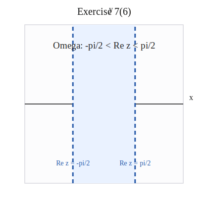
> 
> Figure 7(6). One convenient connected region is the strip $-\frac{\pi}{2}<\operatorname{Re}z<\frac{\pi}{2}$.

A Mathematica plot for problem (6) is:

```Mathematica title:"Exercise 7(6): Mathematica plot"
Graphics[
 {
  {Directive[RGBColor[0.92, 0.96, 1.0]], Rectangle[{-Pi/2, -4}, {Pi/2, 4}]},
  {Directive[Black, AbsoluteThickness[1.8]], Arrow[{{-3.8, 0}, {3.8, 0}}]},
  {Directive[Black, AbsoluteThickness[1.8]], Arrow[{{0, -3.8}, {0, 3.8}}]},
  {Directive[RGBColor[0.15, 0.35, 0.66], AbsoluteThickness[3], Dashing[{0.03, 0.02}]], Line[{{-Pi/2, -4}, {-Pi/2, 4}}]},
  {Directive[RGBColor[0.15, 0.35, 0.66], AbsoluteThickness[3], Dashing[{0.03, 0.02}]], Line[{{Pi/2, -4}, {Pi/2, 4}}]},
  Text[Style["Omega: -pi/2 < Re z < pi/2", 16], {0, 2.8}],
  Text[Style["Re z = -pi/2", 13, RGBColor[0.15, 0.35, 0.66]], {-Pi/2, -3.1}],
  Text[Style["Re z = pi/2", 13, RGBColor[0.15, 0.35, 0.66]], {Pi/2, -3.1}]
 },
 PlotRange -> {{-4, 4}, {-4, 4}},
 AspectRatio -> 1,
 ImageSize -> 320,
 Background -> White
]
```

The following Python code generates the embedded figure:

```python title:"Exercise 7(6): Python plot"
from pathlib import Path

svg = """<svg xmlns="http://www.w3.org/2000/svg" width="420" height="420" viewBox="0 0 420 420">
<rect x="50.0" y="50.0" width="320.0" height="320.0" fill="#fcfcfd" stroke="#d9d9df" stroke-width="1.5" />
<line x1="50.0" y1="210.0" x2="370.0" y2="210.0" stroke="#222" stroke-width="1.6" />
<line x1="210.0" y1="370.0" x2="210.0" y2="50.0" stroke="#222" stroke-width="1.6" />
<text x="382.0" y="202.0" font-family="Times New Roman" font-size="16" fill="#222">x</text>
<text x="220.0" y="24.0" font-family="Times New Roman" font-size="16" fill="#222">y</text>
<text x="210.0" y="30.0" font-family="Times New Roman" font-size="20" fill="#111" text-anchor="middle">Exercise 7(6)</text>
<rect x="147.2" y="50.0" width="125.7" height="320.0" fill="#eaf2ff" />
<line x1="147.2" y1="370.0" x2="147.2" y2="50.0" stroke="#2558a8" stroke-width="3" stroke-dasharray="8 6" />
<line x1="272.8" y1="370.0" x2="272.8" y2="50.0" stroke="#2558a8" stroke-width="3" stroke-dasharray="8 6" />
<text x="210.0" y="98.0" font-family="Times New Roman" font-size="19" fill="#222" text-anchor="middle">Omega: -pi/2 &lt; Re z &lt; pi/2</text>
<text x="147.2" y="334.0" font-family="Times New Roman" font-size="14" fill="#2558a8" text-anchor="middle">Re z = -pi/2</text>
<text x="272.8" y="334.0" font-family="Times New Roman" font-size="14" fill="#2558a8" text-anchor="middle">Re z = pi/2</text>
</svg>"""

outdir = Path("images")
outdir.mkdir(exist_ok=True)
(outdir / "exercise7_problem6_python.svg").write_text(svg)
```

##### problem 7

We take

$$
F(z)=\frac{1}{3}\sin(3z+2).
$$

Then

$$
F'(z)
=
\frac13\frac{d}{dz}\sin(3z+2)
=
\frac13\cos(3z+2)\frac{d}{dz}(3z+2)
$$

$$
=
\frac13\cos(3z+2)\cdot 3
=
\cos(3z+2).
$$

Since $\sin(3z+2)$ is entire, $F$ is analytic on all of $\mathbb{C}$. Hence the antiderivative is valid on

$$
\Omega=\mathbb{C}.
$$

> [!figure] Python figure for Exercise 7(7)
> 
> 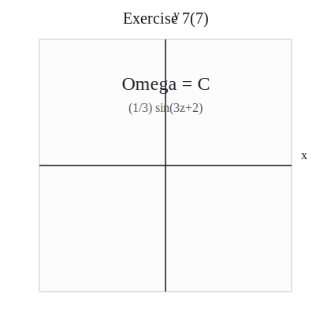
> 
> Figure 7(7). The valid region is the whole plane $\Omega=\mathbb{C}$.

A Mathematica plot for problem (7) is:

```Mathematica title:"Exercise 7(7): Mathematica plot"
Graphics[
 {
  {Directive[Black, AbsoluteThickness[1.8]], Arrow[{{-3.8, 0}, {3.8, 0}}]},
  {Directive[Black, AbsoluteThickness[1.8]], Arrow[{{0, -3.8}, {0, 3.8}}]},
  Text[Style["Omega = C", 18], {0, 2.4}],
  Text[Style["entire antiderivative", 14, GrayLevel[0.35]], {0, 1.7}]
 },
 PlotRange -> {{-4, 4}, {-4, 4}},
 AspectRatio -> 1,
 ImageSize -> 320,
 Background -> White
]
```

The following Python code generates the embedded figure:

```python title:"Exercise 7(7): Python plot"
from pathlib import Path

svg = """<svg xmlns="http://www.w3.org/2000/svg" width="420" height="420" viewBox="0 0 420 420">
<rect x="50.0" y="50.0" width="320.0" height="320.0" fill="#fcfcfd" stroke="#d9d9df" stroke-width="1.5" />
<line x1="50.0" y1="210.0" x2="370.0" y2="210.0" stroke="#222" stroke-width="1.6" />
<line x1="210.0" y1="370.0" x2="210.0" y2="50.0" stroke="#222" stroke-width="1.6" />
<text x="382.0" y="202.0" font-family="Times New Roman" font-size="16" fill="#222">x</text>
<text x="220.0" y="24.0" font-family="Times New Roman" font-size="16" fill="#222">y</text>
<text x="210.0" y="30.0" font-family="Times New Roman" font-size="20" fill="#111" text-anchor="middle">Exercise 7(7)</text>
<text x="210.0" y="114.0" font-family="Times New Roman" font-size="24" fill="#222" text-anchor="middle">Omega = C</text>
<text x="210.0" y="142.0" font-family="Times New Roman" font-size="16" fill="#555" text-anchor="middle">entire antiderivative</text>
</svg>"""

outdir = Path("images")
outdir.mkdir(exist_ok=True)
(outdir / "exercise7_problem7_python.svg").write_text(svg)
```

##### problem 8

We take

$$
F(z)=\frac12 e^{z^2}-\log z
$$

on

$$
\Omega=\mathbb{C}\setminus(-\infty,0].
$$

On this region, $\log z$ is analytic, and $e^{z^2}$ is entire, so $F$ is analytic on $\Omega$. Differentiate:

$$
F'(z)
=
\frac12\frac{d}{dz}(e^{z^2})-\frac{d}{dz}(\log z)
$$

$$
=
\frac12 e^{z^2}\frac{d}{dz}(z^2)-\frac{1}{z}
=
\frac12 e^{z^2}\cdot 2z-\frac{1}{z}
$$

$$
=
ze^{z^2}-\frac{1}{z}.
$$

So $F$ is an antiderivative on

$$
\Omega=\mathbb{C}\setminus(-\infty,0].
$$

> [!figure] Python figure for Exercise 7(8)
> 
> 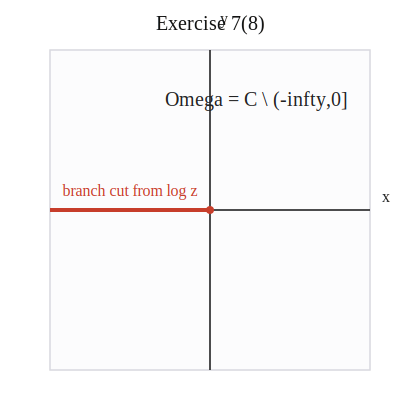
> 
> Figure 7(8). The logarithm term forces the principal-branch cut $(-\infty,0]$.

A Mathematica plot for problem (8) is:

```Mathematica title:"Exercise 7(8): Mathematica plot"
Graphics[
 {
  {Directive[Black, AbsoluteThickness[1.8]], Arrow[{{-3.8, 0}, {3.8, 0}}]},
  {Directive[Black, AbsoluteThickness[1.8]], Arrow[{{0, -3.8}, {0, 3.8}}]},
  {Directive[RGBColor[0.78, 0.24, 0.17], AbsoluteThickness[4]], Line[{{-4, 0}, {0, 0}}]},
  {RGBColor[0.78, 0.24, 0.17], PointSize[Large], Point[{0, 0}]},
  Text[Style["branch cut from log z", 14, RGBColor[0.78, 0.24, 0.17]], {-1.8, 0.35}],
  Text[Style["Omega = C \\ (-Infinity,0]", 17], {1.15, 2.6}]
 },
 PlotRange -> {{-4, 4}, {-4, 4}},
 AspectRatio -> 1,
 ImageSize -> 320,
 Background -> White
]
```

The following Python code generates the embedded figure:

```python title:"Exercise 7(8): Python plot"
from pathlib import Path

svg = """<svg xmlns="http://www.w3.org/2000/svg" width="420" height="420" viewBox="0 0 420 420">
<rect x="50.0" y="50.0" width="320.0" height="320.0" fill="#fcfcfd" stroke="#d9d9df" stroke-width="1.5" />
<line x1="50.0" y1="210.0" x2="370.0" y2="210.0" stroke="#222" stroke-width="1.6" />
<line x1="210.0" y1="370.0" x2="210.0" y2="50.0" stroke="#222" stroke-width="1.6" />
<text x="382.0" y="202.0" font-family="Times New Roman" font-size="16" fill="#222">x</text>
<text x="220.0" y="24.0" font-family="Times New Roman" font-size="16" fill="#222">y</text>
<text x="210.0" y="30.0" font-family="Times New Roman" font-size="20" fill="#111" text-anchor="middle">Exercise 7(8)</text>
<line x1="50.0" y1="210.0" x2="210.0" y2="210.0" stroke="#c73d2b" stroke-width="4" />
<circle cx="210.0" cy="210.0" r="4.0" fill="#c73d2b" />
<text x="138.0" y="196.0" font-family="Times New Roman" font-size="16" fill="#c73d2b" text-anchor="middle">branch cut from log z</text>
<text x="256.0" y="106.0" font-family="Times New Roman" font-size="20" fill="#222" text-anchor="middle">Omega = C \\ (-infty,0]</text>
</svg>"""

outdir = Path("images")
outdir.mkdir(exist_ok=True)
(outdir / "exercise7_problem8_python.svg").write_text(svg)
```

##### problem 9

We take

$$
F(z)=\frac12\cosh(z^2).
$$

Then

$$
F'(z)
=
\frac12\frac{d}{dz}\cosh(z^2)
=
\frac12\sinh(z^2)\frac{d}{dz}(z^2)
$$

$$
=
\frac12\sinh(z^2)\cdot 2z
=
z\sinh(z^2).
$$

Since $\cosh(z^2)$ is entire, $F$ is analytic on all of $\mathbb{C}$. Therefore the antiderivative is valid on

$$
\Omega=\mathbb{C}.
$$

> [!figure] Python figure for Exercise 7(9)
> 
> 
> 
> Figure 7(9). The valid region is the whole plane $\Omega=\mathbb{C}$.

A Mathematica plot for problem (9) is:

```Mathematica title:"Exercise 7(9): Mathematica plot"
Graphics[
 {
  {Directive[Black, AbsoluteThickness[1.8]], Arrow[{{-3.8, 0}, {3.8, 0}}]},
  {Directive[Black, AbsoluteThickness[1.8]], Arrow[{{0, -3.8}, {0, 3.8}}]},
  Text[Style["Omega = C", 18], {0, 2.4}],
  Text[Style["entire antiderivative", 14, GrayLevel[0.35]], {0, 1.7}]
 },
 PlotRange -> {{-4, 4}, {-4, 4}},
 AspectRatio -> 1,
 ImageSize -> 320,
 Background -> White
]
```

The following Python code generates the embedded figure:

```python title:"Exercise 7(9): Python plot"
from pathlib import Path

svg = """<svg xmlns="http://www.w3.org/2000/svg" width="420" height="420" viewBox="0 0 420 420">
<rect x="50.0" y="50.0" width="320.0" height="320.0" fill="#fcfcfd" stroke="#d9d9df" stroke-width="1.5" />
<line x1="50.0" y1="210.0" x2="370.0" y2="210.0" stroke="#222" stroke-width="1.6" />
<line x1="210.0" y1="370.0" x2="210.0" y2="50.0" stroke="#222" stroke-width="1.6" />
<text x="382.0" y="202.0" font-family="Times New Roman" font-size="16" fill="#222">x</text>
<text x="220.0" y="24.0" font-family="Times New Roman" font-size="16" fill="#222">y</text>
<text x="210.0" y="30.0" font-family="Times New Roman" font-size="20" fill="#111" text-anchor="middle">Exercise 7(9)</text>
<text x="210.0" y="114.0" font-family="Times New Roman" font-size="24" fill="#222" text-anchor="middle">Omega = C</text>
<text x="210.0" y="142.0" font-family="Times New Roman" font-size="16" fill="#555" text-anchor="middle">(1/2) cosh(z^2)</text>
</svg>"""

outdir = Path("images")
outdir.mkdir(exist_ok=True)
(outdir / "exercise7_problem9_python.svg").write_text(svg)
```

##### problem 10

We take

$$
F(z)=\frac12 e^z(\sin z+\cos z).
$$

Differentiate using the product rule:

$$
F'(z)
=
\frac12\frac{d}{dz}(e^z)(\sin z+\cos z)
+
\frac12 e^z\frac{d}{dz}(\sin z+\cos z)
$$

$$
=
\frac12 e^z(\sin z+\cos z)
+
\frac12 e^z(\cos z-\sin z)
$$

$$
=
\frac12 e^z\bigl(\sin z+\cos z+\cos z-\sin z\bigr)
$$

$$
=
\frac12 e^z(2\cos z)
=
e^z\cos z.
$$

Since $e^z$, $\sin z$, and $\cos z$ are entire, $F$ is analytic on all of $\mathbb{C}$. Hence the antiderivative is valid on

$$
\Omega=\mathbb{C}.
$$

> [!figure] Python figure for Exercise 7(10)
> 
> 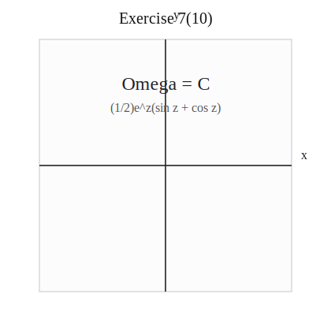
> 
> Figure 7(10). The valid region is the whole plane $\Omega=\mathbb{C}$.

A Mathematica plot for problem (10) is:

```Mathematica title:"Exercise 7(10): Mathematica plot"
Graphics[
 {
  {Directive[Black, AbsoluteThickness[1.8]], Arrow[{{-3.8, 0}, {3.8, 0}}]},
  {Directive[Black, AbsoluteThickness[1.8]], Arrow[{{0, -3.8}, {0, 3.8}}]},
  Text[Style["Omega = C", 18], {0, 2.4}],
  Text[Style["entire antiderivative", 14, GrayLevel[0.35]], {0, 1.7}]
 },
 PlotRange -> {{-4, 4}, {-4, 4}},
 AspectRatio -> 1,
 ImageSize -> 320,
 Background -> White
]
```

The following Python code generates the embedded figure:

```python title:"Exercise 7(10): Python plot"
from pathlib import Path

svg = """<svg xmlns="http://www.w3.org/2000/svg" width="420" height="420" viewBox="0 0 420 420">
<rect x="50.0" y="50.0" width="320.0" height="320.0" fill="#fcfcfd" stroke="#d9d9df" stroke-width="1.5" />
<line x1="50.0" y1="210.0" x2="370.0" y2="210.0" stroke="#222" stroke-width="1.6" />
<line x1="210.0" y1="370.0" x2="210.0" y2="50.0" stroke="#222" stroke-width="1.6" />
<text x="382.0" y="202.0" font-family="Times New Roman" font-size="16" fill="#222">x</text>
<text x="220.0" y="24.0" font-family="Times New Roman" font-size="16" fill="#222">y</text>
<text x="210.0" y="30.0" font-family="Times New Roman" font-size="20" fill="#111" text-anchor="middle">Exercise 7(10)</text>
<text x="210.0" y="114.0" font-family="Times New Roman" font-size="24" fill="#222" text-anchor="middle">Omega = C</text>
<text x="210.0" y="142.0" font-family="Times New Roman" font-size="16" fill="#555" text-anchor="middle">(1/2)e^z(sin z + cos z)</text>
</svg>"""

outdir = Path("images")
outdir.mkdir(exist_ok=True)
(outdir / "exercise7_problem10_python.svg").write_text(svg)
```

##### problem 11

We take

$$
F(z)=\frac12 z^2\log z-\frac14 z^2
$$

on

$$
\Omega=\mathbb{C}\setminus(-\infty,0].
$$

On this region, $\log z$ is analytic, so $F$ is analytic on $\Omega$. Differentiate:

$$
F'(z)
=
\frac12\frac{d}{dz}(z^2\log z)-\frac14\frac{d}{dz}(z^2)
$$

$$
=
\frac12\left(\frac{d}{dz}(z^2)\log z+z^2\frac{d}{dz}(\log z)\right)-\frac14\cdot 2z
$$

$$
=
\frac12\left(2z\log z+z^2\cdot \frac{1}{z}\right)-\frac12 z
$$

$$
=
\frac12(2z\log z+z)-\frac12 z
=
z\log z+\frac12 z-\frac12 z
=
z\log z.
$$

So $F$ is an antiderivative on

$$
\Omega=\mathbb{C}\setminus(-\infty,0].
$$

> [!figure] Python figure for Exercise 7(11)
> 
> 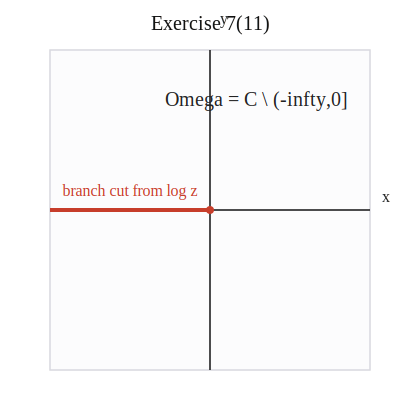
> 
> Figure 7(11). The logarithm term again forces the principal-branch cut $(-\infty,0]$.

A Mathematica plot for problem (11) is:

```Mathematica title:"Exercise 7(11): Mathematica plot"
Graphics[
 {
  {Directive[Black, AbsoluteThickness[1.8]], Arrow[{{-3.8, 0}, {3.8, 0}}]},
  {Directive[Black, AbsoluteThickness[1.8]], Arrow[{{0, -3.8}, {0, 3.8}}]},
  {Directive[RGBColor[0.78, 0.24, 0.17], AbsoluteThickness[4]], Line[{{-4, 0}, {0, 0}}]},
  {RGBColor[0.78, 0.24, 0.17], PointSize[Large], Point[{0, 0}]},
  Text[Style["branch cut from log z", 14, RGBColor[0.78, 0.24, 0.17]], {-1.8, 0.35}],
  Text[Style["Omega = C \\ (-Infinity,0]", 17], {1.15, 2.6}]
 },
 PlotRange -> {{-4, 4}, {-4, 4}},
 AspectRatio -> 1,
 ImageSize -> 320,
 Background -> White
]
```

The following Python code generates the embedded figure:

```python title:"Exercise 7(11): Python plot"
from pathlib import Path

svg = """<svg xmlns="http://www.w3.org/2000/svg" width="420" height="420" viewBox="0 0 420 420">
<rect x="50.0" y="50.0" width="320.0" height="320.0" fill="#fcfcfd" stroke="#d9d9df" stroke-width="1.5" />
<line x1="50.0" y1="210.0" x2="370.0" y2="210.0" stroke="#222" stroke-width="1.6" />
<line x1="210.0" y1="370.0" x2="210.0" y2="50.0" stroke="#222" stroke-width="1.6" />
<text x="382.0" y="202.0" font-family="Times New Roman" font-size="16" fill="#222">x</text>
<text x="220.0" y="24.0" font-family="Times New Roman" font-size="16" fill="#222">y</text>
<text x="210.0" y="30.0" font-family="Times New Roman" font-size="20" fill="#111" text-anchor="middle">Exercise 7(11)</text>
<line x1="50.0" y1="210.0" x2="210.0" y2="210.0" stroke="#c73d2b" stroke-width="4" />
<circle cx="210.0" cy="210.0" r="4.0" fill="#c73d2b" />
<text x="138.0" y="196.0" font-family="Times New Roman" font-size="16" fill="#c73d2b" text-anchor="middle">branch cut from log z</text>
<text x="256.0" y="106.0" font-family="Times New Roman" font-size="20" fill="#222" text-anchor="middle">Omega = C \\ (-infty,0]</text>
</svg>"""

outdir = Path("images")
outdir.mkdir(exist_ok=True)
(outdir / "exercise7_problem11_python.svg").write_text(svg)
```

##### problem 12

Let $\Omega_\alpha$ be the plane with the ray at angle $\alpha$ removed. On this region, $\log_\alpha z$ is analytic. We take

$$
F(z)=z\log_\alpha z-z.
$$

Differentiate:

$$
F'(z)
=
\frac{d}{dz}(z\log_\alpha z)-\frac{d}{dz}(z)
$$

$$
=
\left(\frac{d}{dz}z\right)\log_\alpha z
+
z\frac{d}{dz}(\log_\alpha z)
-1
$$

$$
=
1\cdot \log_\alpha z
+
z\cdot \frac{1}{z}
-1
$$

$$
=
\log_\alpha z+1-1
=
\log_\alpha z.
$$

Therefore $F$ is an antiderivative of $\log_\alpha z$ on

$$
\Omega=\Omega_\alpha.
$$

> [!figure] Python figure for Exercise 7(12)
> 
> 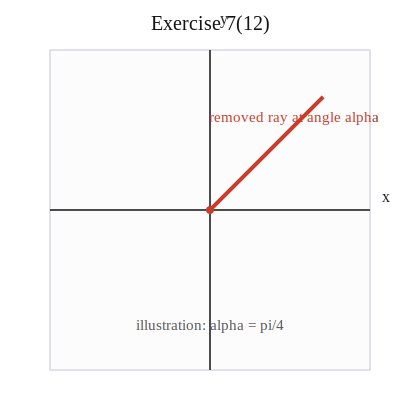
> 
> Figure 7(12). An illustrative branch cut for $\Omega_\alpha$, shown here with the sample choice $\alpha=\pi/4$.

A Mathematica plot for problem (12) is:

```Mathematica title:"Exercise 7(12): Mathematica plot"
alpha = Pi/4;
Graphics[
 {
  {Directive[Black, AbsoluteThickness[1.8]], Arrow[{{-3.8, 0}, {3.8, 0}}]},
  {Directive[Black, AbsoluteThickness[1.8]], Arrow[{{0, -3.8}, {0, 3.8}}]},
  {Directive[RGBColor[0.78, 0.24, 0.17], AbsoluteThickness[4]], Line[{{0, 0}, {4 Cos[alpha], 4 Sin[alpha]}}]},
  {RGBColor[0.78, 0.24, 0.17], PointSize[Large], Point[{0, 0}]},
  Text[Style["removed ray at angle alpha", 14, RGBColor[0.78, 0.24, 0.17]], {2.1, 2.15}],
  Text[Style["illustration: alpha = pi/4", 14, GrayLevel[0.35]], {0, -3.0}]
 },
 PlotRange -> {{-4, 4}, {-4, 4}},
 AspectRatio -> 1,
 ImageSize -> 320,
 Background -> White
]
```

The following Python code generates the embedded figure:

```python title:"Exercise 7(12): Python plot"
from pathlib import Path

svg = """<svg xmlns="http://www.w3.org/2000/svg" width="420" height="420" viewBox="0 0 420 420">
<rect x="50.0" y="50.0" width="320.0" height="320.0" fill="#fcfcfd" stroke="#d9d9df" stroke-width="1.5" />
<line x1="50.0" y1="210.0" x2="370.0" y2="210.0" stroke="#222" stroke-width="1.6" />
<line x1="210.0" y1="370.0" x2="210.0" y2="50.0" stroke="#222" stroke-width="1.6" />
<text x="382.0" y="202.0" font-family="Times New Roman" font-size="16" fill="#222">x</text>
<text x="220.0" y="24.0" font-family="Times New Roman" font-size="16" fill="#222">y</text>
<text x="210.0" y="30.0" font-family="Times New Roman" font-size="20" fill="#111" text-anchor="middle">Exercise 7(12)</text>
<line x1="210.0" y1="210.0" x2="323.1" y2="96.9" stroke="#c73d2b" stroke-width="4" />
<circle cx="210.0" cy="210.0" r="4.0" fill="#c73d2b" />
<text x="294.0" y="122.0" font-family="Times New Roman" font-size="15" fill="#c73d2b" text-anchor="middle">removed ray at angle alpha</text>
<text x="210.0" y="330.0" font-family="Times New Roman" font-size="15" fill="#555" text-anchor="middle">illustration: alpha = pi/4</text>
</svg>"""

outdir = Path("images")
outdir.mkdir(exist_ok=True)
(outdir / "exercise7_problem12_python.svg").write_text(svg)
```

##### problem 13

We must work on a region where both $\log_0 z$ and $\log_{\pi/2} z$ are defined, so we take

$$
\Omega=\Omega_0\cap \Omega_{\pi/2}.
$$

On this region, both logarithm branches are analytic. We take

$$
F(z)=z\log_0 z-z+z\log_{\pi/2} z-z+\log_0 z.
$$

Now differentiate term by term:

$$
\frac{d}{dz}(z\log_0 z-z)
=
\left(\frac{d}{dz}z\right)\log_0 z
+
z\frac{d}{dz}(\log_0 z)
-1
$$

$$
=
1\cdot \log_0 z
+
z\cdot \frac{1}{z}
-1
=
\log_0 z.
$$

Also,

$$
\frac{d}{dz}(z\log_{\pi/2} z-z)
=
\left(\frac{d}{dz}z\right)\log_{\pi/2} z
+
z\frac{d}{dz}(\log_{\pi/2} z)
-1
$$

$$
=
1\cdot \log_{\pi/2} z
+
z\cdot \frac{1}{z}
-1
=
\log_{\pi/2} z.
$$

Finally,

$$
\frac{d}{dz}(\log_0 z)=\frac{1}{z}.
$$

Therefore

$$
F'(z)
=
\log_0 z+\log_{\pi/2} z+\frac{1}{z}.
$$

So $F$ is an antiderivative on

$$
\Omega=\Omega_0\cap \Omega_{\pi/2}.
$$

> [!figure] Python figure for Exercise 7(13)
> 
> 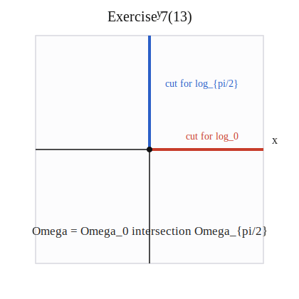
> 
> Figure 7(13). The common region removes both the positive real axis and the positive imaginary axis.

A Mathematica plot for problem (13) is:

```Mathematica title:"Exercise 7(13): Mathematica plot"
Graphics[
 {
  {Directive[Black, AbsoluteThickness[1.8]], Arrow[{{-3.8, 0}, {3.8, 0}}]},
  {Directive[Black, AbsoluteThickness[1.8]], Arrow[{{0, -3.8}, {0, 3.8}}]},
  {Directive[RGBColor[0.78, 0.24, 0.17], AbsoluteThickness[4]], Line[{{0, 0}, {4, 0}}]},
  {Directive[RGBColor[0.17, 0.37, 0.78], AbsoluteThickness[4]], Line[{{0, 0}, {0, 4}}]},
  {Black, PointSize[Large], Point[{0, 0}]},
  Text[Style["cut for log_0", 13, RGBColor[0.78, 0.24, 0.17]], {2.2, 0.35}],
  Text[Style["cut for log_{pi/2}", 13, RGBColor[0.17, 0.37, 0.78]], {0.55, 2.2}],
  Text[Style["Omega = Omega_0 intersection Omega_{pi/2}", 14], {0, -3.0}]
 },
 PlotRange -> {{-4, 4}, {-4, 4}},
 AspectRatio -> 1,
 ImageSize -> 320,
 Background -> White
]
```

The following Python code generates the embedded figure:

```python title:"Exercise 7(13): Python plot"
from pathlib import Path

svg = """<svg xmlns="http://www.w3.org/2000/svg" width="420" height="420" viewBox="0 0 420 420">
<rect x="50.0" y="50.0" width="320.0" height="320.0" fill="#fcfcfd" stroke="#d9d9df" stroke-width="1.5" />
<line x1="50.0" y1="210.0" x2="370.0" y2="210.0" stroke="#222" stroke-width="1.6" />
<line x1="210.0" y1="370.0" x2="210.0" y2="50.0" stroke="#222" stroke-width="1.6" />
<text x="382.0" y="202.0" font-family="Times New Roman" font-size="16" fill="#222">x</text>
<text x="220.0" y="24.0" font-family="Times New Roman" font-size="16" fill="#222">y</text>
<text x="210.0" y="30.0" font-family="Times New Roman" font-size="20" fill="#111" text-anchor="middle">Exercise 7(13)</text>
<line x1="210.0" y1="210.0" x2="370.0" y2="210.0" stroke="#c73d2b" stroke-width="4" />
<line x1="210.0" y1="210.0" x2="210.0" y2="50.0" stroke="#2b5fc7" stroke-width="4" />
<circle cx="210.0" cy="210.0" r="4.0" fill="#111" />
<text x="298.0" y="196.0" font-family="Times New Roman" font-size="14" fill="#c73d2b" text-anchor="middle">cut for log_0</text>
<text x="232.0" y="122.0" font-family="Times New Roman" font-size="14" fill="#2b5fc7">cut for log_{pi/2}</text>
<text x="210.0" y="330.0" font-family="Times New Roman" font-size="17" fill="#222" text-anchor="middle">Omega = Omega_0 intersection Omega_{pi/2}</text>
</svg>"""

outdir = Path("images")
outdir.mkdir(exist_ok=True)
(outdir / "exercise7_problem13_python.svg").write_text(svg)
```

##### problem 14

For the principal branch of $z^{1/5}$, we work on

$$
\Omega=\mathbb{C}\setminus(-\infty,0].
$$

> [!figure] Python figure for Exercise 7(14)
> 
> 
> 
> Figure 7(14). The principal branch of $z^{1/5}$ uses the same branch cut $(-\infty,0]$.

A Mathematica plot for problem (14) is:

```Mathematica title:"Exercise 7(14): Mathematica plot"
Graphics[
 {
  {Directive[Black, AbsoluteThickness[1.8]], Arrow[{{-3.8, 0}, {3.8, 0}}]},
  {Directive[Black, AbsoluteThickness[1.8]], Arrow[{{0, -3.8}, {0, 3.8}}]},
  {Directive[RGBColor[0.78, 0.24, 0.17], AbsoluteThickness[4]], Line[{{-4, 0}, {0, 0}}]},
  {RGBColor[0.78, 0.24, 0.17], PointSize[Large], Point[{0, 0}]},
  Text[Style["principal branch cut", 14, RGBColor[0.78, 0.24, 0.17]], {-1.8, 0.35}],
  Text[Style["Omega = C \\ (-Infinity,0]", 17], {1.15, 2.6}]
 },
 PlotRange -> {{-4, 4}, {-4, 4}},
 AspectRatio -> 1,
 ImageSize -> 320,
 Background -> White
]
```

The following Python code generates the embedded figure:

```python title:"Exercise 7(14): Python plot"
from pathlib import Path

svg = """<svg xmlns="http://www.w3.org/2000/svg" width="420" height="420" viewBox="0 0 420 420">
<rect x="50.0" y="50.0" width="320.0" height="320.0" fill="#fcfcfd" stroke="#d9d9df" stroke-width="1.5" />
<line x1="50.0" y1="210.0" x2="370.0" y2="210.0" stroke="#222" stroke-width="1.6" />
<line x1="210.0" y1="370.0" x2="210.0" y2="50.0" stroke="#222" stroke-width="1.6" />
<text x="382.0" y="202.0" font-family="Times New Roman" font-size="16" fill="#222">x</text>
<text x="220.0" y="24.0" font-family="Times New Roman" font-size="16" fill="#222">y</text>
<text x="210.0" y="30.0" font-family="Times New Roman" font-size="20" fill="#111" text-anchor="middle">Exercise 7(14)</text>
<line x1="50.0" y1="210.0" x2="210.0" y2="210.0" stroke="#c73d2b" stroke-width="4" />
<circle cx="210.0" cy="210.0" r="4.0" fill="#c73d2b" />
<text x="138.0" y="196.0" font-family="Times New Roman" font-size="16" fill="#c73d2b" text-anchor="middle">principal branch cut</text>
<text x="256.0" y="106.0" font-family="Times New Roman" font-size="20" fill="#222" text-anchor="middle">Omega = C \\ (-infty,0]</text>
</svg>"""

outdir = Path("images")
outdir.mkdir(exist_ok=True)
(outdir / "exercise7_problem14_python.svg").write_text(svg)
```

On this region, the principal power functions are analytic. We take

$$
F(z)=\frac{5}{6}z^{6/5}.
$$

Then

$$
F'(z)
=
\frac{5}{6}\frac{d}{dz}\left(z^{6/5}\right)
=
\frac{5}{6}\cdot \frac{6}{5}z^{1/5}
=
z^{1/5}.
$$

Thus $F$ is an antiderivative of the principal branch of $z^{1/5}$ on

$$
\Omega=\mathbb{C}\setminus(-\infty,0].
$$


++++


> [!exercise] Exercise 8
> In Exercises 15-26, evaluate the given path integral. Justify clearly the use of Theorems 1 and 2.
> 15. $\int_{\left[z_{1}, z_{2}, z_{3}\right]} 3(z-1)^{2} d z$, where $z_{1}=1, z_{2}=i, z_{3}=1+i$.
> 16. $\int_{\left[z_{1}, z_{2}, z_{3}\right]}\left(z^{2}-1\right)^{2} z d z$, where $z_{1}=0, z_{2}=1, z_{3}=-i$.
> 17. $\int_{\gamma} z^{2} d z$, where $\gamma(t)=e^{i t}+3 e^{2 i t}, 0 \leq t \leq \frac{\pi}{4}$.
> 18. $\int_{C_{1}(0)}\left((z-2-i)^{2}+\frac{i}{z-2-i}-\frac{3}{(z-2-i)^{2}}\right) d z$.
> 19. $\int_{\left[z_{1}, z_{2}, z_{3}\right]} z e^{z} d z$, where $z_{1}=\pi, z_{2}=-1, z_{3}=-1-i \pi$.
> 20. $\quad \int_{\left[z_{1}, z_{2}, z_{3}\right]} e^{i \pi z} d z$, where $z_{1}=2, z_{2}=i, z_{3}=4$.
> 21. $\int_{\gamma} \sin z d z$, where $\gamma(t)=2 e^{i t}, 0 \leq t \leq \frac{\pi}{2}$.
> 22. $\quad \int_{\gamma} \sin ^{2} z d z$, where $\gamma$ is any closed path.
> 23. $\quad \int_{\gamma} \frac{1}{z} d z$, where $\gamma(t)=e^{i t}, 0 \leq t \leq \frac{3 \pi}{4}$.
> 24. $\quad \int_{\left[z_{1}, z_{2}, \ldots, z_{n}\right]} d z$, where $z_{1}, z_{2}, \ldots, z_{n}$ are arbitrary.
> 25. $\int_{\left[z_{1}, z_{2}, z_{3}, z_{1}\right]} z \log z d z$, where $z_{1}=1, z_{2}=1+i, z_{3}=-2+2 i$.
> 26. $\int_{\left[z_{1}, z_{2}, z_{3}\right]} \frac{\log z}{z} d z$, where $z_{1}=-i, z_{2}=1, z_{3}=i$.


++++


> [!exercise] Exercise 9
> 
> 27. (a) Show that for any complex number $\alpha$,
> 
> $$
> \frac{d}{d z} z^{\alpha}=\alpha z^{\alpha-1},
> $$
> 
> where we define both complex powers using a single logarithm branch. Conclude that an antiderivative of $z^{\alpha}$ is $\frac{1}{\alpha+1} z^{\alpha+1}$, where the same logarithm branch is used.
> (b) Evaluate $\int_{\gamma} \frac{1}{\sqrt{z}} d z$ (principal branch), where $\gamma(t)=e^{i t},-\frac{\pi}{2} \leq t \leq \frac{\pi}{2}$.
> 28. Use the result of problem 27(a) to evaluate $\int_{\gamma} z^{i \pi} d z$ (use the branch $\log z= \log z-2 \pi i)$, where $\gamma(t)=e^{i t},-\frac{\pi}{2} \leq t \leq 0$.
> 
> 


++++


> [!exercise] Exercise 10
> 29. Let $C_{R}\left(z_{0}\right)$ denote the positively oriented circle with center at $z_{0}$ and radius $R>0$. Follow the outlined steps to show that
> 
> $$
> \int_{C_{R}\left(z_{0}\right)} \frac{1}{z} d z= \begin{cases}2 \pi i & \text { if }\left|z_{0}\right|<R \\ 0 & \text { if }\left|z_{0}\right|>R\end{cases}
> $$
> 
> (a) If $\left|z_{0}\right|>R$, then the circle $C_{R}\left(z_{0}\right)$ does not contain 0 , and consequently it cannot intersect all four semi-axes at the origin. Pick a semi-axis that $C_{R}\left(z_{0}\right)$ does not intersect as a branch cut for the logarithm and explain why $\int_{C_{R}\left(z_{0}\right)} \frac{1}{z} d z=0$, using Theorem 2. Draw a picture to illustrate your proof.
> (b) If $\left|z_{0}\right|<R$, then 0 is in the interior of the circle $C_{R}\left(z_{0}\right)$. Let $z_{1}$ and $z_{2}$ be the points of intersection of $C_{R}\left(z_{0}\right)$ with the positive and negative $y$-axis, respectively. Let $\gamma_{1}$ be the portion of $C_{R}\left(z_{0}\right)$ with initial point $z_{2}$ and terminal point $z_{1}$, and let $\gamma_{2}$ be the portion of $C_{R}\left(z_{0}\right)$ with initial point $z_{1}$ and terminal point $z_{2}$. Write
> 
> $$
> \int_{C_{R}\left(z_{0}\right)} \frac{1}{z} d z=\int_{\gamma_{1}} \frac{1}{z} d z+\int_{\gamma_{2}} \frac{1}{z} d z .
> $$
> 
> Show that
> 
> $$
> \int_{\gamma_{1}} \frac{1}{z} d z=\log \left(z_{1}\right)-\log \left(z_{2}\right)
> $$
> 
> and
> 
> $$
> \int_{\gamma_{2}} \frac{1}{z} d z=\log _{0}\left(z_{2}\right)-\log _{0}\left(z_{1}\right)
> $$
> 
> Show that $\int_{C_{R}\left(z_{0}\right)} \frac{1}{z} d z=2 \pi i$.


++++


> [!exercise] Exercise 11: Replacing the integrand
> 
> 30.  Consider the integral
> 
> $$
> \int_{\gamma} \log z d z, \quad \gamma(t)=e^{i t}, 0 \leq t \leq \pi .
> $$
> 
> Since $\log z$ is not continuous at the point -1 , it cannot be continuous in any region containing the path, and so we cannot apply Theorem 1 directly. The idea in this problem is to replace $\log z$ by a different branch of the logarithm for which Theorem 1 does apply.
> (a) Show that $\log z=\log _{-\frac{\pi}{2}} z$ for all $z$ on $\gamma$.
> (b) Conclude that
> 
> $$
> \int_{\gamma} \log z d z=\int_{\gamma} \log _{-\frac{\pi}{2}} z d z
> $$
> 
> and evaluate the integral on the right side by using Theorem 1.


++++


> [!exercise] Exercise 12
> 31. Evaluate $\int_{C_{1}(0)} \log z d z$, where $C_{1}(0)$ is the positively oriented unit circle. First write the integral as the sum of two integrals over the upper and lower semicircles, then use the ideas of Exercise 30 to evaluate each integral in this sum by appealing to Theorem 2.


++++


> [!exercise] Exercise 13
> 32. Evaluate $\int_{R} \frac{d z}{z}$, where $R$ is the positively oriented square with vertices at $1 \pm i,-1 \pm i$. Do not parametrize the integral, but use Theorem 2 as suggested in Exercise 31.


++++


> [!exercise] Exercise 14
> 33. Recall Theorem 2, Section 2.4: If $f(z)$ is analytic in a region $\Omega$ and $f^{\prime}(z)=0$ for all $z$ in $\Omega$, then $f$ is constant in $\Omega$. Prove this theorem using Theorem 1 of this section. **(Hint: Let $z_{0}$ and $z$ be points in $\Omega$. What can you say about $\int_{z_{0}}^{z} f^{\prime}(z) d z$ where the integral is over any path in $\Omega$ joining $z_{0}$ to $z$ ?)**


++++


> [!exercise] Exercise 15
> 34. L'Hospital's rule. Prove the following version of L'Hospital's rule. If $f(z)$ and $g(z)$ are analytic in a region $\Omega, z_{0}$ is in $\Omega$, and $f\left(z_{0}\right)=g\left(z_{0}\right)=0$, but $g^{\prime}\left(z_{0}\right) \neq 0$, then
> 
> $$
> \lim _{z \rightarrow z_{0}} \frac{f(z)}{g(z)}=\frac{f^{\prime}\left(z_{0}\right)}{g^{\prime}\left(z_{0}\right)}
> $$
> 
> **(Hint: For $z$ in a small neighborhood of $z_{0}$ in $\Omega$, write $f(z)=\int_{\left[z, z_{0}\right]} f^{\prime}(\zeta) d \zeta$. Do the same for $g(z)$ and then use Lemma 1 to compute $\lim _{z \rightarrow z_0} \frac{f(z)}{g(z)}=\lim _{\Delta z \rightarrow 0} \frac{\frac{1}{\Delta z} f(z)}{\frac{1}{\Delta z} g(z)}$.)**
> 
> 


++++


> [!exercise] Exercise 16
> 35. Chain rule for $F(\gamma(t))$. Suppose $F(z)$ is differentiable at $z_{0}$; we have $F(z)= F\left(z_{0}\right)+F^{\prime}\left(z_{0}\right)\left(z-z_{0}\right)+\epsilon_{1}(z)\left(z-z_{0}\right)$, where $\epsilon_{1}(z) \rightarrow 0$ as $z \rightarrow z_{0}$. Suppose $\gamma(t)$ is differentiable at $t_{0}$ and $\gamma\left(t_{0}\right)=z_{0}$; we have $\gamma(t)=\gamma\left(t_{0}\right)+\gamma^{\prime}\left(t_{0}\right)\left(t-t_{0}\right)+\epsilon_{2}(t)\left(t-t_{0}\right)$ where $\epsilon_{2}(t) \rightarrow 0$ as $t \rightarrow t_{0}$.
> (a) Show that $\epsilon_{1}(\gamma(t)) \rightarrow 0$ as $t \rightarrow t_{0}$.
> (b) Show that
> 
> $$
> F(\gamma(t))=F\left(\gamma\left(t_{0}\right)\right)+\left(F^{\prime}\left(\gamma\left(t_{0}\right)\right)+\epsilon_{1}(\gamma(t))\right)\left(\gamma^{\prime}\left(t_{0}\right)+\epsilon_{2}(t)\right)\left(t-t_{0}\right),
> $$
> 
> and then that $\frac{d}{d t} F(\gamma(t))$ exists at $t_{0}$ and equals $F^{\prime}\left(\gamma\left(t_{0}\right)\right) \gamma^{\prime}\left(t_{0}\right)$.


++++
