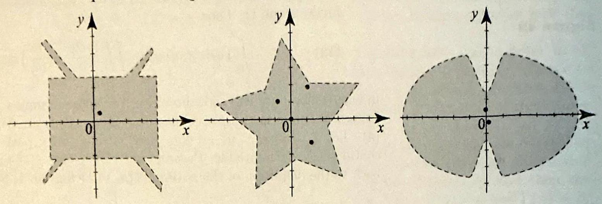
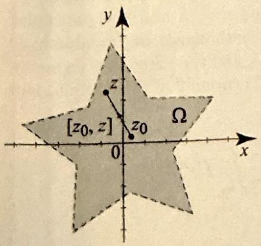
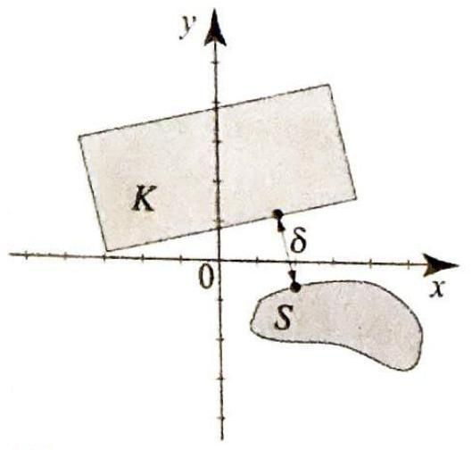
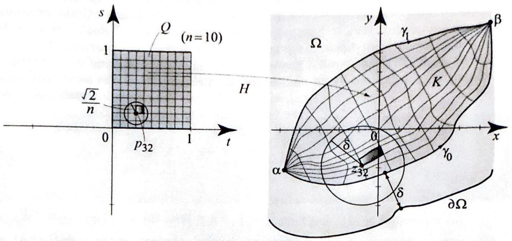
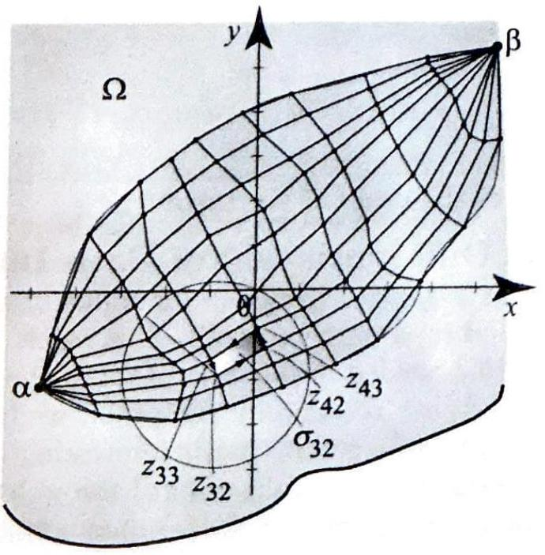
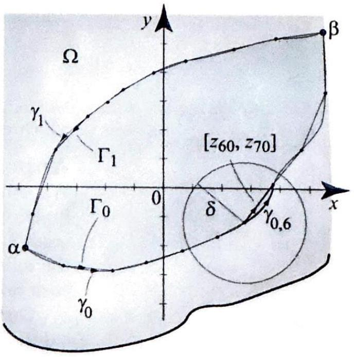
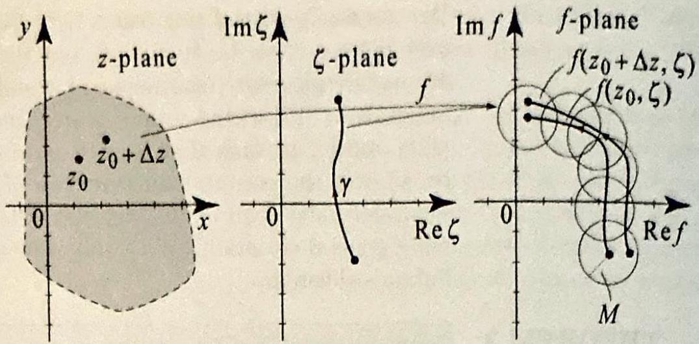
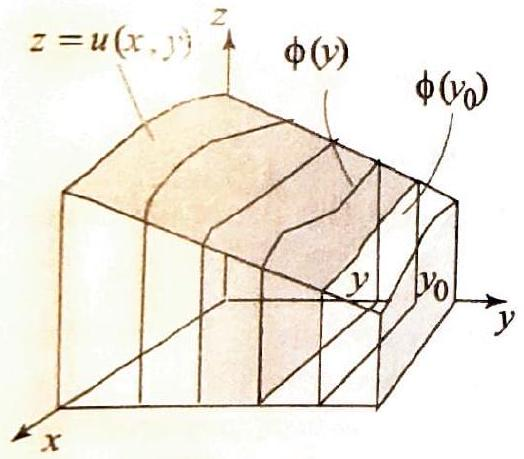
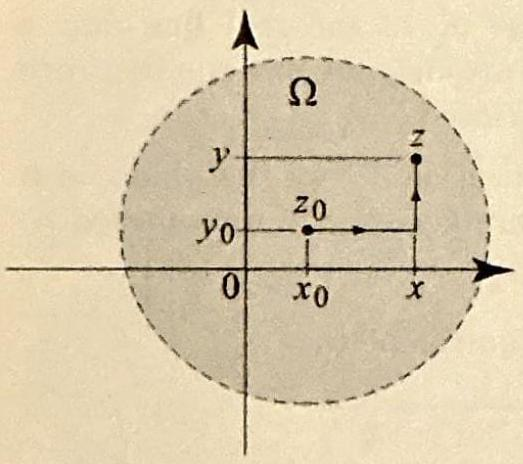

### 3.5 Proof of Cauchy's Theorem

The proof is divided in two major parts. In the first part, we prove Cauchy's theorem for star regions; these include disks. In the second part, we prove the general version of Cauchy's theorem, using the version in a disk.

A region $\Omega$ is called a star region if it contains a point $z_{0}$ such that any other point $z$ in $\Omega$ can be connected to $z_{0}$ by a line segment wholly contained in $\Omega$. Thus $\left[z_{0}, z\right]$ is contained in $\Omega$ for any $z$ in $\Omega$. Figure 1 depicts several examples of star regions along with suitable points to serve as $z_{0}$.

Figure 1 Star regions.

The proof of Cauchy's theorem on star regions is a simple consequence of Theorem 2, Section 3.3, and a general result on differentiation of path integrals, which we state and prove at the end of the section.

$$
\begin{aligned}
& \text { Suppose that } f \text { is analytic on a star region } \Omega \text {. Then } \\
& \qquad \int_{\Gamma} f(z) d z=0
\end{aligned}
$$

for all closed paths $\Gamma$ in $\Omega$.

Proof According to Theorem 2, Section 3.3, it is enough to construct an antiderivative of $f$ in $\Omega$. Let $z_{0}$ be a point in $\Omega$ that connects to all other points in $\Omega$ via line segments (see Figure 2). For $z$ in $\Omega$, define $F(z)=\int_{\left[z_{0}, z\right]} f(\zeta) d \zeta$. Parametrizing the line segment by $\gamma(t)=(1-t) z_{0}+t z, 0 \leq t \leq 1$, we have $\gamma^{\prime}(t)=\left(z-z_{0}\right) d t$, and thus

$$
F(z)=\left(z-z_{0}\right) \int_{0}^{1} f\left((1-t) z_{0}+t z\right) d t
$$

To complete the proof, we will show that $F^{\prime}(z)=f(z)$. Using the product rule for differentiation and the fact that $\left(z-z_{0}\right)^{\prime}=1$, we obtain
(2) $\frac{d}{d z} F(z)=\int_{0}^{1} f\left((1-t) z_{0}+t z\right) d t+\left(z-z_{0}\right) \frac{d}{d z} \int_{0}^{1} f\left((1-t) z_{0}+t z\right) d t$.

THEOREM 1 CAUCHY'S INTEGRAL THEOREM FOR STAR REGIONS

Figure 2

To compute the last derivative, we appeal to Theorem 4, below. Accordingly,

$$
\begin{aligned}
\left(z-z_{0}\right) \frac{d}{d z} \int_{0}^{1} f\left((1-t) z_{0}+t z\right) d t & =\left(z-z_{0}\right) \int_{0}^{1} \frac{d}{d z} f\left((1-t) z_{0}+t z\right) d t \\
& =\left(z-z_{0}\right) \int_{0}^{1} t f^{\prime}\left(\left(z-z_{0}\right) t+z_{0}\right) d t
\end{aligned}
$$

The last integral is simple and can be evaluated by parts. Setting $u=t, d v= \left(z-z_{0}\right) f^{\prime}\left(\left(z-z_{0}\right) t+z_{0}\right) d t$, then $d u=d t$, and $v=f\left(\left(z-z_{0}\right) t+z_{0}\right)$. So

$$
\begin{aligned}
& \left(z-z_{0}\right) \int_{0}^{1} t f^{\prime}\left(\left(z-z_{0}\right) t+z_{0}\right) d t \\
& \quad=\left.t f\left(\left(z-z_{0}\right) t+z_{0}\right)\right|_{0} ^{1}-\int_{0}^{1} f\left(\left(z-z_{0}\right) t+z_{0}\right) d t \\
& \quad=f(z)-\int_{0}^{1} f\left(\left(z-z_{0}\right) t+z_{0}\right) d t
\end{aligned}
$$

Using (4) and (3) in (2), it follows that $\frac{d}{d z} F(z)=f(z)$. $\square$

Since a disk is a star region, Theorem 1 implies that Cauchy's integral theorem holds on a disk.

To prove the general version of Cauchy's theorem, stated in Theorem 2, Section 3.4, in addition to the version on a disk, we will need a few facts about continuous functions of one or two complex variables. Indeed, these properties hold for continuous functions defined on any space where we have a notion of a distance, a so-called metric space. For example, in the space $\mathbb{C} \times \mathbb{C}$, the product of two copies of $\mathbb{C}$, we have a notion of a distance using the following definition of the absolute value on $\mathbb{C} \times \mathbb{C}$ : If $z_{1}=a_{1}+i b_{1}$, $w_{1}=c_{1}+i d_{1}, z_{2}=a_{2}+i b_{2}, w_{2}=c_{2}+i d_{2}$, then

$$
\begin{aligned}
& \left|\left(z_{1}, w_{1}\right)-\left(z_{2}, w_{2}\right)\right| \\
& \quad=\sqrt{\left(a_{1}-a_{2}\right)^{2}+\left(b_{1}-b_{2}\right)^{2}+\left(c_{1}-c_{2}\right)^{2}+\left(d_{1}-d_{2}\right)^{2}}
\end{aligned}
$$

The following properties of continuous functions are generalizations of wellknown results from calculus. As you read them, try to formulate the corresponding results from calculus that they generalize.

Suppose that $S$ is a closed and bounded set and $f$ is a continuous complex-valued function on $S$. Then $f[S]$ is a closed and bounded subset of $\mathbb{C}$. In other words, the continuous image of a closed and bounded set is closed and bounded.

Suppose that $S$ is a closed and bounded set and $f$ is a continuous complex-valued function on $S$. Then $|f|$ is attains its maximum and minimum values in $S$. That is, we can find $z_{1}$ and $z_{2}$ in $S$ such that $\left|f\left(z_{1}\right)\right| \leq|f(z)| \leq\left|f\left(z_{2}\right)\right|$ for all $z$ in $S$.

Figure 3 Distance between sets.

For our next result, we define the notion of distance between two sets. If $K$ and $S$ are two nonempty sets, the distance between $K$ and $S$ is defined to be the smallest value of $|z-w|$ where $z$ is in $K$ and $w$ is in $S$ (Figure 3). If a smallest value is not attained, we take the distance to be the largest number $\delta$ such that $|z-w|$ is always greater than or equal to $\delta$.

With the help of the results that we just stated about continuous functions, we can prove the following fact, which is geometrically obvious.

Suppose that $K$ is a closed and bounded subset of $\mathbb{C}$ and $S$ is a closed subset of $\mathbb{C}$. Suppose that $K$ and $S$ are disjoint. Then the distance between $K$ and $S$ is strictly positive.
In the next result, we use the notion of uniform continuity. A function $f$ on a set $S$ is called uniformly continuous if given $\epsilon>0$, there is a $\delta>0$ such that, for all $z_{1}$ and $z_{2}$ in $S,\left|z_{1}-z_{2}\right|<\delta \Rightarrow\left|f\left(z_{1}\right)-f\left(z_{2}\right)\right|<\epsilon$.

Clearly, any uniformly continuous function is continuous. The converse is not true. The key words in the definition of uniform continuity are "for all," which imply that for a given $\epsilon$ the choice of $\delta$ works for all points in $S$. Compare this with the definition of continuity at a point, where the choice of $\delta$ depends on $\epsilon$ and the given point.

The following is one of the most basic results in analysis.
If $f$ is continuous on a closed and bounded set $S$, then $f$ is uniformly continuous.

We now have all the necessary ingredients to prove Cauchy's theorem.
Proof of Theorem 2, Section 3.4 Let $\gamma_{0}$ and $\gamma_{1}$ be given in $\Omega$, either joining $\alpha$ to $\beta$ (part (i) of Cauchy's theorem) or closed (part (ii) of Cauchy's theorem). If $\Omega$ is the entire plane, then we are done by Theorem 1, because the complex plane is clearly a star region. If $\Omega$ is not the entire plane, its boundary, which we will denote as $\partial \Omega$, is closed (Exercise 6) and nonempty. Let $H$ denote the mapping of the unit square $Q=[0,1] \times[0,1]$ into $\Omega$ that continuously deforms $\gamma_{0}$ into $\gamma_{1}$, and let $K=H[Q]$. Since $Q$ is closed and bounded, and $H$ is continuous, it follows that $K$ is closed and bounded. Since $K$ is contained in the (open region) $\Omega$, it is disjoint from the closed boundary of $\Omega$. So if $\delta$ denotes the distance from $\partial \Omega$ to $K$, then $\delta$ is positive.

Since $H$ is continuous on $Q$ and $Q$ is closed and bounded, it follows that $H$ is uniformly continuous on $Q$. So we can pick a positive integer $n$ so that

$$
\left|(t, s)-\left(t^{\prime}, s^{\prime}\right)\right| \leq \frac{\sqrt{2}}{n} \Rightarrow\left|H(t, s)-H\left(t^{\prime}, s^{\prime}\right)\right|<\delta
$$

Having chosen $n$, construct a grid over $Q$ by subdividing the sides into $n$ equal subintervals (Figure 4). This is a simplicial network, where each smaller square in this network is called a simplicial square. Label the points on the grid by

$$
p_{j k}=\left(\frac{j}{n}, \frac{k}{n}\right), \quad j, k=0,1, \ldots, n
$$

and let

$$
z_{j k}=H\left(p_{j k}\right) .
$$

Figure 4 A simplicial network on the square $Q$ with a sample smplicial square with one corner at $p_{32}$. The simplicial sques are so small that the imare of each is contained in a dive in $\Omega$ of radius $\delta>0$, where $\delta$ is the distance between thic boundary of $\Omega, \partial \Omega$, and the closed and bounded set $H[Q]$.

Condition (6) guarantees that the image of each simplicial square lies in the open disk $B_{\delta}\left(z_{j k}\right)$, which in turn is contained in $\Omega$. This is a very useful fact, since we are going to apply Cauchy's theorem in the disk $B_{\delta}\left(z_{j k}\right)$ as we integrate $f$ over the closed polygonal path

$$
\sigma_{j k}=\left[z_{j k}, z_{j+1, k}, z_{j+1, k+1}, z_{j, k+1}, z_{j k}\right]
$$

which is contained in $B_{\delta}\left(z_{j k}\right)$ (see Figure 5). Since $f$ is analytic on $B_{\delta}\left(z_{j k}\right)$, Cauchy's theorem in a disk yields

$$
\int_{\sigma_{j k}} f(z) d z=0
$$

In Figure 5, we show a typical closed polygonal path obtained by joining the images of the four corners of one simplicial square. By construction, these polygonal paths are contained in disks of radius $\delta$ in ? In Figure 6, after summing all the path integrals and canceling those that are traversed ${ }^{\text {in }}$ opposite direction, the only ones that remain are those that correspond to the boundary of $Q$.

Figure 5

Figure 6

Adding the integrals over all the $\sigma_{j k}$ 's, we note the following. The integrals over the segments that correspond to internal sides of the simplicial squares cancel,
since each internal segment is traversed twice in opposite directions. Thus the only noncanceling integrals are those over line segments that correspond to external sides of the simplicial squares, that is, the boundary of $Q$.

For part (i) of Cauchy's theorem, the integrals on the line segments connecting $z_{j k}$ going up the right side and down the left side of $Q$ are each zero because the $z_{j k}$ are fixed at $\alpha$ and $\beta$. For part (ii) of Cauchy's theorem, the integrals on the line segments connecting $z_{j k}$ going up the right side and down the left side of $Q$ will cancel because they trace the same path in opposite directions (here we have $z_{0 j}=z_{n j}$ ). The only remaining integrals are on the line segments corresponding to the bottom and top sides of $Q$. So

$$
0=\sum_{j, k=0}^{n-1} \int_{\sigma_{j k}} f(z) d z=\int_{\Gamma_{0}} f(z) d z-\int_{\Gamma_{1}} f(z) d z
$$

where

$$
\Gamma_{0}=\left[z_{00}, z_{10}, \ldots, z_{n 0}\right], \quad \text { and } \quad \Gamma_{1}=\left[z_{0 n}, z_{1 n}, \ldots, z_{n n}\right] .
$$

Applying Cauchy's theorem in the disk $B_{\delta}\left(z_{j 0}\right)$, we see that

$$
\int_{\left[z_{j 0}, z_{j+1,0}\right]} f(z) d z=\int_{\gamma_{0, j}} f(z) d z
$$

where $\gamma_{0, j}$ is the portion of the path $\gamma_{0}$ that joins the points $z_{j 0}$ and $z_{j+1,0}$ (Figure 6). Adding equations (9) as $j$ runs from 0 to $n-1$, we get

$$
\int_{\Gamma_{0}} f(z) d z=\int_{\gamma_{0}} f(z) d z
$$

Similarly,

$$
\int_{\Gamma_{1}} f(z) d z=\int_{\gamma_{1}} f(z) d z
$$

Comparing with (8), we find that

$$
\int_{\gamma_{0}} f(z) d z=\int_{\Gamma_{0}} f(z) d z=\int_{\Gamma_{1}} f(z) d z=\int_{\gamma_{1}} f(z) d z
$$

which completes the proof of the theorem.

## Appendix: Differentiation of Path Integrals

We will present a general principle for differentiation under the integral sign for functions defined by a path integral. This result was needed in the proof of Theorem 1. It will be needed also in the proof of the generalized Cauchy's formula in the following section. To simplify the proof, we have divided it into several steps, each one consisting of a result that is interesting in its own right.

Our first result is a generalization of the well-known Fubini theorem from calculus. This theorem states that if $u(x, y)$ is continuous on $[a, b] \times[c, d]$, then

$$
\int_{a}^{b} \int_{c}^{d} u(x, y) d y d x=\int_{c}^{d} \int_{a}^{b} u(x, y) d x d y
$$

We can easily extend this result to the case where $u(x, y)$ is not quite continuous over the rectangle $[a, b] \times[c, d]$, but the functions $x \mapsto u(x, y)$ and $y \mapsto u(x, y)$ are merely piecewise continuous in $x$ and $y$. In this case we can write the iterated integrals in (10) as the sum of finitely many iterated integrals over subintervals of $[a, b]$ and $[c, d]$, such that in each term the integrand is a continuous function of $(x, y)$ over the corresponding domain of integration. Applying (10) to each term separately and then adding the terms together, it follows that (10) holds in this more general situation. With this in mind, we can prove the following version of Fubini's theorem.

THEOREM 2 NI'S THEOREM FOR PATH INTEGRALS

THEOREM 3 CONTINUITY OF PATH INTEGRALS

Suppose that $f(z, \zeta)$ is continuous for $z$ on a path $\gamma_{1}$ and $\zeta$ on a path $\gamma_{2}$. Then

$$
\int_{\gamma_{1}} \int_{\gamma_{2}} f(z, \zeta) d \zeta d z=\int_{\gamma_{2}} \int_{\gamma_{1}} f(z, \zeta) d z d \zeta
$$

Proof Parametrize $\gamma_{1}$ by $[a, b]$ and $\gamma_{2}$ by $[c, d]$. Then (11) is equivalent to

$$
\begin{aligned}
& \int_{a}^{b} \int_{c}^{d} f\left(\gamma_{1}(x), \gamma_{2}(y)\right) \gamma_{1}^{\prime}(x) \gamma_{2}^{\prime}(y) d y d x \\
& \quad=\int_{c}^{d} \int_{a}^{b} f\left(\gamma_{1}(x), \gamma_{2}(y)\right) \gamma_{1}^{\prime}(x) \gamma_{2}^{\prime}(y) d x d y
\end{aligned}
$$

The function $x \mapsto f\left(\gamma_{1}(x), \gamma_{2}(y)\right) \gamma_{1}^{\prime}(x) \gamma_{2}^{\prime}(y)$ is piecewise continuous in $x$, and the function $y \mapsto f\left(\gamma_{1}(x), \gamma_{2}(y)\right) \gamma_{1}^{\prime}(x) \gamma_{2}^{\prime}(y)$ is piecewise continuous in $y$. Applying Fubini's theorem for piecewise continuous functions, we see that (12) holds.

Suppose that $f(z, \zeta)$ is continuous for $z$ in a region $\Omega$ and $\zeta$ on a path $\gamma$. For $z$ in $\Omega$, consider

$$
\phi(z)=\int_{\gamma} f(z, \zeta) d \zeta
$$

Then $\phi$ is a continuous function of $z$ in $\Omega$.
Proof Fix $z_{0}$ in $\Omega$. For small $\Delta z, z_{0}+\Delta z$ lies in $\Omega$. By Theorem 2, Section 3.2, we have

$$
\left|\phi\left(z_{0}+\Delta z\right)-\phi\left(z_{0}\right)\right|=\left|\int_{\gamma}\left(f\left(z_{0}+\Delta z, \zeta\right)-f\left(z_{0}, \zeta\right)\right) d \zeta\right| \leq l(\gamma) M
$$

where $M$ is the maximum of $\left|f\left(z_{0}+\Delta z, \zeta\right)-f\left(z_{0}, \zeta\right)\right|$ for $\zeta$ on $\gamma$ (see Figure 7). We will show that $M \rightarrow 0$ as $\Delta z \rightarrow 0$. Since the set of all $(z, w)$ with $z=z_{0}$ and $w$ on $\gamma$ is closed and bounded, it follows that $f$ is uniformly continuous on this set. Since the distance from $\left(z_{0}+\Delta z, \zeta\right)$ to $\left(z_{0}, \zeta\right)$ is $|\Delta z|$, it follows from the uniform continuity of $f$ that $M \rightarrow 0$ as $\Delta z \rightarrow 0$.

THEOREM 4 DIFFERENTIATION OF PATH INTEGRALS

Figure 7 Picturing a continuous function $f$ of two variables $z$ and $\zeta$.

We are now ready to state and prove a general result that justifies differentiation under the integral sign for path integrals.

Suppose that $f(z, \zeta)$ is a complex-valued function, defined for $z$ in a region $\Omega$ and $\zeta$ on a path $\gamma$. If both $f(z, \zeta)$ and $\frac{d}{d z} f(z, \zeta)$ are continuous functions of $(z, \zeta)$ (hence, for fixed $\zeta, f(z, \zeta)$ is analytic in $z)$, then the function

$$
F(z)=\int_{\gamma} f(z, \zeta) d \zeta
$$

is analytic on $\Omega$ and

$$
F^{\prime}(z)=\int_{\gamma} \frac{d}{d z} f(z, \zeta) d \zeta
$$

Proof Let $z_{0}$ be in $\Omega$ and $\Delta z$ be so small that $z_{0}+\Delta z$ is also in $\Omega$. To compute $F^{\prime}\left(z_{0}\right)$, we must find the limit as $\Delta z \rightarrow 0$ of

$$
\begin{aligned}
\frac{1}{\Delta z}\left(F\left(z_{0}+\Delta z\right)-F\left(z_{0}\right)\right) & =\frac{1}{\Delta z}\left(\int_{\gamma} f\left(z_{0}+\Delta z, \zeta\right) d \zeta-\int_{\gamma} f\left(z_{0}, \zeta\right) d \zeta\right) \\
& =\frac{1}{\Delta z} \int_{\gamma}\left(f\left(z_{0}+\Delta z, \zeta\right)-f\left(z_{0}, \zeta\right)\right) d \zeta
\end{aligned}
$$

For fixed $\zeta$, the function $\frac{d}{d z} f(z, \zeta)$ is continuous and has an antiderivative in $\Omega$, namely, $f(z, \zeta)$. We thus infer from Theorem 1, Section 3.3, that

$$
f\left(z_{0}+\Delta z, \zeta\right)-f\left(z_{0}, \zeta\right)=\int_{z_{0}}^{z_{0}+\Delta z} \frac{d}{d z} f(z, \zeta) d z
$$

where the integral is independent of the path from $z_{0}$ to $z_{0}+\Delta z$. Using (17) in (16), we obtain

$$
\begin{aligned}
\frac{1}{\Delta z}\left(F\left(z_{0}+\Delta z\right)-F\left(z_{0}\right)\right) & =\frac{1}{\Delta z} \int_{\gamma} \int_{z_{0}}^{z_{0}+\Delta z} \frac{d}{d z} f(z, \zeta) d z d \zeta \\
& =\frac{1}{\Delta z} \int_{z_{0}}^{z_{0}+\Delta z} \int_{\gamma} \frac{d}{d z} f(z, \zeta) d \zeta d z
\end{aligned}
$$

by Fubini's theorem for path integrals. The function $\phi(z)$ defined by the inner path

THEOREM 5 COYTINUITY AND DIFFEIENTIATION OF INTEGRALS

Figure 8 Visualizing the continuity of $\phi(y)$, when $u$ is real and $\geq 0$. For a given $y, \phi(y)$ is the area of the cross section above the $x y$-plane, under the surface $z=u(x, y)$, $a \leq x \leq b$. To say that $\phi$ is continuous at $y_{0}$ means that the area $\phi(y)$ tends to the area $\phi\left(y_{0}\right)$ as $y \rightarrow y_{0}$.
integral is continuous, by Theorem 3. Hence using Lemma 1, Section 3.3,

$$
F^{\prime}\left(z_{0}\right)=\lim _{\Delta z \rightarrow 0} \frac{1}{\Delta z} \int_{z_{0}}^{z_{0}+\Delta z} \phi(z) d z=\phi\left(z_{0}\right)=\int_{\gamma} \frac{d}{d z} f\left(z_{0}, \zeta\right) d \zeta
$$

which proves (15). The continuity of $F^{\prime}(z)$ follows from Theorem 3 with $f$ replaced by $\frac{d}{d z} f(z, \zeta)$. Thus, $F$ is analytic on $\Omega$.

We end the section with a variant of Theorem 4, concerning differentiation under the integral sign for functions of two variables. The proof of this theorem parallels that of Theorem 4 and is somewhat simpler. It is outlined in the exercises.
(i) Let $u$ be a continuous complex-valued function on the rectangle $R=[a, b] \times [c, d]$. For $c \leq y \leq d$, define

$$
\phi(y)=\int_{a}^{b} u(x, y) d x
$$

Then $\phi(y)$ is continuous on $[c, d]$ (Figure 8). (ii) If $u$ is real-valued and continuous on $R$ and $\frac{\partial u}{\partial y}$ is also continuous on $R$, then $\phi(y)$ is differentiable on $(c, d)$ with

$$
\phi^{\prime}(y)=\frac{d}{d y} \int_{a}^{b} u(x, y) d x=\int_{a}^{b} \frac{\partial u}{\partial y}(x, y) d x \quad(c<y<d)
$$

## Exercises 3.5

1. Give an example of a closed and bounded subset $K$ of the real line and a bounded subset $S$ of the real line such that $K$ and $S$ are disjoint but the distance from $K$ to $S$ is 0 . [Hint: The set $S$ is necessarily not closed.]
2. Give an example of two closed and disjoint subsets $K$ and $S$ of the plane such that the distance from $K$ to $S$ is 0 . [Hint: Both sets are necessarily unbounded.]
3. Show that every convex region is a star region.
4. Show that the distance formula (5) on $\mathbb{C} \times \mathbb{C}$ is equivalent to

$$
\left|\left(z_{1}, w_{1}\right)-\left(z_{2}, w_{2}\right)\right|=\sqrt{\left|z_{1}-z_{2}\right|^{2}+\left|w_{1}-w_{2}\right|^{2}}
$$

5. In this exercise, we show that the distance formula (5) on $\mathbb{C} \times \mathbb{C}$ satisfies the three norm axioms. We define the norm of an element $(z, w)$ of $\mathbb{C} \times \mathbb{C}$ by its distance from $(0,0)$.
(a) Show that $|(z, w)| \geq 0$ with equality only if $(z, w)=(0,0)$.
(b) Show that the norm is homogeneous with respect to scalar multiplication; that is, for all complex $\alpha$, with $\alpha(z, w)=(\alpha z, \alpha w)$, we have $|\alpha(z, w)|=|\alpha||(z, w)|$.
(c) Prove the triangle inequality: $\left|\left(z_{1}, w_{1}\right)+\left(z_{2}, w_{2}\right)\right| \leq\left|\left(z_{1}, w_{1}\right)\right|+\left|\left(z_{2}, w_{2}\right)\right|$.
6. In this exercise, we prove that the boundary $\partial \Omega$ of a set $\Omega$ is closed. You are encouraged to review Section 1.2 for relevant definitions. Assume that $\partial \Omega$ is nonempty.
(a) Show that any point in $\mathbb{C}$ is either an interior point of $\Omega$, an interior point of the complement of $\Omega$, or a boundary point of $\Omega$.

Figure 9

(b) Show that $\Omega_{1}=\Omega \cup \partial \Omega$ is closed and that $\Omega_{2}=(\mathbb{C} \backslash \Omega) \cup \partial \Omega$ is closed. Hint: Take $\Omega_{1}$. If $z$ is a boundary point of $\Omega_{1}$, then every disk around $z$ contains a point $w$ in $\Omega_{1}$ and an interior point $w^{\prime}$ of $\mathbb{C} \backslash \Omega$. If $w$ is in $\Omega$, then we are almost done; if $w$ is in $\partial \Omega$, then we may form a smaller disk around $w$ and still conclude that the disk around $z$ contains a point in $\Omega$.]
(c) Show that the intersection of closed sets is a closed set. [Hint: Let $F_{j}$ be closed sets. If $z$ is a boundary point of $\bigcap F_{j}$, then every disk around $z$ contains a point that is in each $F_{j}$. So $z$ is either an interior or boundary point of each $F_{j}$. Since the $F_{j}$ 's are closed, $z$ is in each $F_{j}$.]
(d) Show that $\partial \Omega=\Omega_{1} \cap \Omega_{2}$, and hence $\partial \Omega$ is closed.

Project Problem: Differentiation under the integral sign. In Exercises 7-9 you are asked to establish results leading to the proof of Theorem 5.
7. Differentiation of integrals. Prove the following version of Lemma 1, Section 3.3. Suppose that $f(x)$ is a continuous real-valued function on an interval $[a, b]$, where $a<b$. For $x$ in $(a, b)$, we have

$$
\lim _{h \rightarrow 0} \frac{1}{h} \int_{x}^{x+h} f(s) d s=f(x)
$$

[Hint: Use the fundamental theorem of calculus.]
8. Continuity of integrals. Prove part (i) of Theorem 5.
9. Prove Theorem 5(ii) using Exercises 7 and 8. [Hint: Study the proof of Theorem 4.]
10. Project Problem: Cauchy's integral theorem on a disk. The following is an outline of an alternative proof of Theorem 1 in the case where $\Omega$ is a disk. Given $f=u+i v$ analytic on $B_{R}\left(z_{0}\right)$, where $z_{0}=x_{0}+i y_{0}$, we will construct an antiderivative of $F(z)$ of $f(z)$. Then the desired result will follow from Theorem 2, Section 3.3.

For $z=x+i y$ in $B_{R}\left(z_{0}\right)$ (see Figure 9), define

$$
F(z)=\int_{x_{0}}^{x} f\left(s, y_{0}\right) d s+i \int_{y_{0}}^{y} f(x, t) d t
$$

(a) Write $F=U+i V$. Using (18), show that

$$
U(x, y)=\int_{x_{0}}^{x} u\left(s, y_{0}\right) d s-\int_{y_{0}}^{y} v(x, t) d t
$$

and

$$
V(x, y)=\int_{x_{0}}^{x} v\left(s, y_{0}\right) d s+\int_{y_{0}}^{y} u(x, t) d t
$$

(b) With the help of Theorem 5 and the fundamental theorem of calculus, show

$$
U_{x}=u, \quad U_{y}=-v, \quad V_{x}=v, \quad V_{y}=u
$$

Conclude that the Cauchy-Riemann equations hold for $U$ and $V$, and that $U$ and $V$ have continuous first partial derivatives. Hence $F$ is analytic with derivative $F^{\prime}=U_{x}+i V_{x}=u+i v=f$.

## Cauchy's Integral Formula

## THEOREM 1 CAUCHY'S INTEGRAL FORMULA

Recall: The closed disk of radius $R$ centered at $z_{0}$ is defined as $S_{R}\left(z_{0}\right)=\{z: \mid z- \left.2_{0} \mid \leq R\right\}$. This set includes its boundary.

Figure 1 The path $C$ can be continuously deformed into the circle $C_{r}(z)$, which explains the equality (2).

In this section we develop one of the most important consequences of Cauchy's integral theorem. It is the Cauchy integral formula, which will enable us to compute many interesting integrals, and more importantly, we will use it to derive fundamental properties of analytic functions.
Suppose that $f$ is analytic inside and on a simple closed path $C$ with positive orientation. If $z$ is any point inside $C$, then

$$
f(z)=\frac{1}{2 \pi i} \int_{C} \frac{f(\zeta)}{\zeta-z} d \zeta
$$

Proof Given $z$ inside $C$, let $R>0$ be such that the closed disk $S_{R}(z)$ is contained in the region inside $C$. The function $\zeta \mapsto \frac{f(\zeta)}{\zeta-z}$ is analytic in the region inside $C$ and outside the circle $C_{r}(z)$, where $0<r \leq R$ (see Figure 1). Applying Cauchy's theorem for multiply connected regions, Theorem 6, Section 3.4 (with the variable of integration being $\zeta$ and the integrand being $\frac{f(\zeta)}{\zeta-z}$ ), we obtain

$$
\frac{1}{2 \pi i} \int_{C} \frac{f(\zeta)}{\zeta-z} d \zeta=\frac{1}{2 \pi i} \int_{C_{r}(z)} \frac{f(\zeta)}{\zeta-z} d \zeta
$$

where $C$ and $C_{r}(z)$ are positively oriented. Since this equality holds for all $0<r \leq R$, taking limits on both sides, we get

$$
\frac{1}{2 \pi i} \int_{C} \frac{f(\zeta)}{\zeta-z} d \zeta=\lim _{r \rightarrow 0^{+}} \frac{1}{2 \pi i} \int_{C_{r}(z)} \frac{f(\zeta)}{\zeta-z} d \zeta
$$

To finish off the proof, we must show that the limit is $f(z)$. Parametrize $C_{r}(z)$ by $\gamma(t)=z+r e^{i t}, 0 \leq t \leq 2 \pi, \gamma^{\prime}(t)=i r e^{i t} d t$. Then

$$
\frac{1}{2 \pi i} \int_{C_{r}(z)} \frac{f(\zeta)}{\zeta-z} d \zeta=\frac{1}{2 \pi i} \int_{0}^{2 \pi} \frac{f\left(z+r e^{i t}\right)}{r e^{i t}} i r e^{i t} d t=\frac{1}{2 \pi} \int_{0}^{2 \pi} f\left(z+r e^{i t}\right) d t
$$

For fixed $z$, the function $t \mapsto f\left(z+r e^{i t}\right)$ is a continuous complex-valued function of $t$ and $r$ in $[0,2 \pi] \times[0, R]$. So by Theorem 5(i), Section 3.5, if we integrate it with respect to $t$, we get a continuous function of $r: \phi(r)=\frac{1}{2 \pi} \int_{0}^{2 \pi} f\left(z+r e^{i t}\right) d t$. Thus, $\lim _{r \rightarrow 0^{+}} \phi(r)=\phi(0)=\frac{1}{2 \pi} \int_{0}^{2 \pi} f(z) d t=f(z)$, as required. $\square$

Before we move to the applications of (1), let us note that if in Cauchy's formula $z$ is any point outside $C$, then

$$
\frac{1}{2 \pi i} \int_{C} \frac{f(\zeta)}{\zeta-z} d \zeta=0
$$

This is an immediate consequence of Cauchy's theorem for simple paths (Theorem 5, Section 3.4), since in this case the integrand $\zeta \mapsto \frac{f(\zeta)}{\zeta-z}$ is analytic
on and inside $C$, and so its integral along $C$ is zero. We combine (1) and (4) in one convenient formula in which the variable of integration is denoted $z$ :

$$
\frac{1}{2 \pi i} \int_{C} \frac{f(z)}{z-z_{0}} d z= \begin{cases}f\left(z_{0}\right) & \text { if } z_{0} \text { is inside } C \\ 0 & \text { if } z_{0} \text { is outside } C\end{cases}
$$

(It is traditional to change the variables of integration from $\zeta$ to $z$ when applying Theorem 1.)

## EXAMPLE 1 Cauchy's integral formula

Let $C_{R}\left(z_{0}\right)$ denote the positively oriented circle with center at $z_{0}$ and radius $R>0$. Compute the following integrals.
(a) $\quad \int_{C_{2}(0)} \frac{e^{z}}{z+1} d z$,
(b) $\quad \int_{C_{2}(1)} \frac{z^{2}+3 z-1}{(z+3)(z-2)} d z$,

Solution (a) Write the integral as $\int_{C_{2}(0)} \frac{e^{z}}{z-(-1)} d z$. Since -1 is inside the circle $C_{2}(0)$, Cauchy's integral formula (5) with $f(z)=e^{z}$ and $z_{0}=-1$ implies

$$
\int_{C_{2}(0)} \frac{e^{z}}{z-(-1)} d z=2 \pi i e^{-1}
$$

(b) In evaluating $\int_{C_{2}(1)} \frac{z^{2}+3 z-1}{(z+3)(z-2)} d z$, we first note that the integrand is not analytic at the points $z=-3$ and $z=2$. Only the point $z=2$ is inside the curve $C_{2}(0)$. So if we let $f(z)=\frac{z^{2}+3 z-1}{z+3}$ the integral takes the form

$$
\int_{C_{2}(1)} \frac{f(z)}{z-2} d z=2 \pi i f(2)=\frac{18 \pi}{5} i
$$

by Cauchy's integral formula, applied at $z_{0}=2$.

Figure 2 The integral over the outer path $C$ is equal to the sum of the integrals over the inner non-overlapping circles. This reduction allows us to use Cauchy's formula on the individual inner circles.

Some integrals require multiple applications of Cauchy's formula along with applications of Cauchy's theorem. We illustrate with one example.

## EXAMPLE 2 Multiple applications of Cauchy's formula

Compute

$$
\int_{C_{2}(0)} \frac{e^{\pi z}}{z^{2}+1} d z
$$

Solution Since $z^{2}+1=(z+i)(z-i)$, the integral cannot be computed directly from Cauchy's formula, since the path contains both $\pm i$ in its interior. To overcome this difficulty, draw small nonintersecting circles inside $C_{2}(0)$ around $\pm i$, say $C_{1 / 4}(i)$ and $C_{1 / 4}(-i)$, as illustrated in Figure 2. Since $\frac{e^{\pi z}}{z^{2}+1}$ is analytic in a region containing the interior of $C_{2}(0)$ and the exterior of the smaller circles, by Cauchy's theorem for multiply connected regions (Theorem 6, Section 3.4), we have

$$
\int_{C_{2}(0)} \frac{e^{\pi z}}{z^{2}+1} d z=\int_{C_{1 / 4}(i)} \frac{e^{\pi z}}{z^{2}+1} d z+\int_{C_{1 / 4}(-i)} \frac{e^{\pi z}}{z^{2}+1} d z
$$

Now, the two integrals on the right can be evaluated with the help of Cauchy's integral formula (5). For the first one, we apply Cauchy's formula (5) with $^{\pi z}(z)= \frac{e^{\pi z}}{z+i}$ and $z_{0}=i$, and obtain

$$
\int_{C_{1 / 4}(i)} \frac{e^{\pi z}}{(z-i)(z+i)} d z=\int_{C_{1 / 4}(i)} \frac{f(z)}{z-i} d z=2 \pi i f(i)
$$

Since $f(i)=\frac{e^{i \pi}}{2 i}=\frac{-1}{2 i}=\frac{i}{2}$, we get

$$
\int_{C_{1 / 4}(i)} \frac{f(z)}{z-i} d z=-\pi
$$

For the second integral, we have

$$
\int_{C_{1 / 4}(-i)} \frac{e^{\pi z}}{(z-i)(z+i)} d z=\int_{C_{1 / 4}(-i)} \frac{g(z)}{z+i} d z=2 \pi i g(-i)
$$

where $g(z)=\frac{e^{\pi z}}{z-i}$, and so $g(-i)=\frac{e^{-i \pi}}{-2 i}=\frac{1}{2 i}=-\frac{i}{2}$. Hence

$$
\int_{C_{1 / 4}(-i)} \frac{g(z)}{z-i} d z=\pi
$$

Adding the two integrals together, we find that

$$
\int_{C_{2}(0)} \frac{e^{\pi z}}{(z-i)(z+i)} d z=0
$$

Two observations concerning Cauchy's formula (1) deserve mentioning. The formula shows that the values of an analytic function $f(z)$ for $z$ inside a simple curve $C$ can be reconstructed from the values of $f$ on the curve $C$. By just knowing $f$ on $C$, we can determine the values of $f$ inside $C$.

The second observation is that (1) expresses an analytic function inside a simple path as a function defined by a path integral. Theorem 4 of the previous section tells us that, under appropriate conditions that are met in the present situation, a function defined by a path integral can be differentiated under the integral sign. Thus, under the conditions of Theorem 1, we have

$$
\begin{aligned}
f^{\prime}(z) & =\frac{d}{d z} f(z)=\frac{d}{d z} \frac{1}{2 \pi i} \int_{C} \frac{f(\zeta)}{\zeta-z} d \zeta \\
& =\frac{1}{2 \pi i} \int_{C} \frac{d}{d z} \frac{f(\zeta)}{\zeta-z} d \zeta=\frac{1}{2 \pi i} \int_{C} \frac{f(\zeta)}{(\zeta-z)^{2}} d \zeta
\end{aligned}
$$

Note that by being able to differentiate under the integral sign, we were able to compute the derivative of $f(z)$ by computing $\frac{d}{d z} \frac{1}{\zeta-z}$, and not $\frac{d}{d z} f(z)$. More importantly, we were able to express $f^{\prime}(z)$ as a function defined by

THEOREM 2 GENERALIZED CAUCHY INTEGRAL FORMULA

Figure 3 Ellipse in Example 3.

Figure 4 The figure-eight path $\Gamma$ is not a simple path.

a path integral, and so it too can be differentiated by differentiating under the integral sign. This yields

$$
f^{\prime \prime}(z)=\frac{2}{2 \pi i} \int_{C} \frac{f(\zeta)}{(\zeta-z)^{3}} d \zeta
$$

Clearly this process can be continued indefinitely, by appealing to Theorem 4, Section 3.5, to differentiate under the integral sign at each step. This yields the following important generalization of Cauchy's integral formula.
Suppose that $f$ is analytic on and inside a simple closed path $C$ with positive orientation, and let $n=0,1,2, \ldots$. Then $f$ has derivatives of all order at all points $z$ in the region inside $C$ given by

$$
f^{(n)}(z)=\frac{n!}{2 \pi i} \int_{C} \frac{f(\zeta)}{(\zeta-z)^{n+1}} d \zeta
$$

(For $n=0$, we take by definition $f^{(0)}=f$ and $0!=1$.)
Here again we note that the integral in (6) is 0 if $z$ is outside $C$.

## EXAMPLE 3 Generalized Cauchy integral formula

Compute the following integrals:
(a) $\frac{1}{2 \pi i} \int_{C_{2}(0)} \frac{z^{10}}{(z-1)^{11}} d z$,
(b) $\quad \int_{\gamma} \frac{e^{i z}}{(z-\pi)^{3}} d z$,
where $\gamma$ is the ellipse in Figure 3.
Solution (a) By (6), we have

$$
\frac{10!}{2 \pi i} \int_{C_{2}(0)} \frac{z^{10}}{(z-1)^{11}} d z=\left.\frac{d^{10}}{d z^{10}} z^{10}\right|_{z=1}=10!
$$

and so the desired integral is

$$
\frac{1}{2 \pi i} \int_{C_{2}(0)} \frac{z^{10}}{(z-1)^{11}} d z=1
$$

(b) By (6), we have

$$
\frac{2!}{2 \pi i} \int_{\gamma} \frac{e^{i z}}{(z-\pi)^{3}} d z=\left.\frac{d^{2}}{d z^{2}} e^{i z}\right|_{z=\pi}=-e^{i \pi}=1 .
$$

Hence the desired integral is $\pi i$.
In the following, you should note the orientation of the paths as we decompose a given figure-eight into two simple paths.

## EXAMPLE 4 A path that intersects itself

Compute

$$
\int_{\Gamma} \frac{z}{(z-i)\left(z^{2}+1\right)} d z
$$

Figue 5 Decomposition of a figure-eight into two simple paths.

where $\Gamma$ is the figure-eight in Figure 4.
Solution Because the path intersects itself, it is not simple. So we cannot appeal to Cauchy's formulas directly. We will first decompose the path $\Gamma$ into two simple paths $\Gamma_{1}$ and $\Gamma_{2}$, as shown in Figure 5. Noting that $(z-i)\left(z^{2}+1\right)=(z-i)^{2}(z+i)$, we have

$$
\int_{\Gamma} \frac{z}{(z-i)\left(z^{2}+1\right)} d z=\int_{\Gamma_{1}} \frac{z}{(z-i)^{2}(z+i)} d z+\int_{\Gamma_{2}} \frac{z}{(z-i)^{2}(z+i)} d z .
$$

The integrals on the right can now be evaluated with the help of Cauchy's generalized integral formula (6). We must be careful with the orientation of the paths: The orientation of $\Gamma_{1}$ is positive, while the orientation of $\Gamma_{2}$ is negative. On $\Gamma_{1}$, we apply (6) with $n=1, f(z)=\frac{z}{z+i}$ at $z=i$, and get

$$
\int_{\Gamma_{1}} \frac{z}{z+i} \frac{d z}{(z-i)^{2}}=\left.2 \pi i\left(\frac{z}{z+i}\right)^{\prime}\right|_{z=i}=\left.2 \pi i \frac{i}{(z+i)^{2}}\right|_{z=i}=\frac{\pi}{2} .
$$

On $\Gamma_{2}$, we apply (6) with $n=0, f(z)=\frac{z}{(z-i)^{2}}$ at $z=-i$, and remembering that the orientation of $\Gamma_{2}$ is negative, we get

$$
\int_{\Gamma_{2}} \frac{z}{(z-i)^{2}} \frac{d z}{(z+i)}=-\left.2 \pi i \frac{z}{(z-i)^{2}}\right|_{z=-i}=\frac{\pi}{2} .
$$

Adding the values of the integrals along $\Gamma_{1}$ and $\Gamma_{2}$ yields the value $\pi$ for the integral along $\Gamma$. $\square$

Cauchy's formula has many important applications to analytic functions, which in turn will be used to derive properties of harmonic functions and solutions of Dirichlet problems. The first result is already contained in Theorem 2, but it deserves a separate statement.

## COROLLARY 1

| $\begin{array}{l}\text { Suppose that } f \text { is analytic in an open set } \Omega \text {. Then } f \text { has derivatives of all } \\ \text { order, } f^{\prime}, f^{\prime \prime}, f^{\prime \prime \prime}, \ldots \text {, which are analytic in } \Omega \text {. }\end{array}$ |
| :--- |

Proof We will apply Theorem 2 locally for all points in $\Omega$. That is, given $z_{0}$ in $\Omega$, let $S_{R}\left(z_{0}\right)$ be a closed disk contained in $\Omega$. Pick $C$ to be the boundary of the closed disk. By Theorem 2, all derivatives of $f(z)$ exist inside $C$ and are given by (6). Each derivative is of course further differentiable and so it must be continuous; hence each derivative is analytic. $\square$

Corollary 1 is a striking result that has no analog in the theory of functions of a real variable. Consider the function $f(x)=x^{\frac{5}{3}},-\infty<x<\infty$. Its derivative, $f^{\prime}(x)=x^{\frac{2}{3}}$, exists and is continuous for all $x$; however, $f^{\prime \prime}(x)$ does not exist at $x=0$.

Since the derivatives of an analytic function $f=u+i v$ can be expressed in terms of the partial derivatives of $u$ and $v$, Corollary 1 has the following immediate consequence.

## COROLLARY 2

## THEOREM 3 MORERA'S THEOREM

Suppose that $f=u+i v$ is analytic in an open set $\Omega$. Then all the partial derivatives of $u$ and $v$ exist and are harmonic in $\Omega$.
Proof From Corollary 1, we know that $f$ has analytic derivatives of all orders. Since the derivatives of $f$ exist, we can obtain them by partial differentiation with respect to either $x$ or $y$ (recall the Cauchy-Riemann equations, (8), Section 2.4). This shows that the partial derivatives of $u$ and $v$ exist and are the real or imaginary parts of analytic functions, and hence they are harmonic. For example, differentiating $f=u+i v$ with respect to $x$ yields $f^{\prime}(z)=u_{x}(z)+i v_{x}(z)$. Since $f^{\prime}$ is analytic, we see that $u_{x}$ and $v_{x}$ are harmonic. Differentiating with respect to $y$, we obtain $f^{\prime \prime}(z)=v_{x y}(z)-i u_{x y}(z)$, showing that $v_{x y}$ and $u_{x y}$ are harmonic, and so forth. Since all $f^{(n)}(z)$ are continuously differentiable, any partial derivative of $u$ or $v$ will have continuous second-order partials; these partial derivatives commute, and the conditions for harmonicity in Section 2.5 are now clearly established.

The following is a converse of sorts to Cauchy's theorem. It has substantial theoretical implications.

Let $f$ be a continuous complex-valued function on a region $\Omega$. If

$$
\int_{\gamma} f(z) d z=0
$$

for all closed paths $\gamma$ in $\Omega$, then $f$ is analytic on $\Omega$.
It suffices, in fact, to restrict $\gamma$ to triangular paths lying in arbitrarily small disks in $\Omega$ (see Exercise 37).

Proof The fact that the integral of $f$ is zero around closed paths in $\Omega$ is equivalent to the fact that $f$ has an analytic antiderivative in $\Omega$ (Theorem 2, Section 3.3). Thus there is an analytic function $F$ such that $F^{\prime}(z)=f(z)$ for all $z$ in $\Omega$. But by Corollary 1, the derivatives of an analytic function are themselves analytic, and so $f$ is analytic on $\Omega$.

The following application will be needed in the study of isolated singularities of analytic functions in the following chapter.

## THEOREM 4

Suppose that $f$ is analytic on a region $\Omega$ and let $z_{0}$ be in $\Omega$. Define

$$
g(z)= \begin{cases}\frac{f(z)-f\left(z_{0}\right)}{z-z_{0}} & \text { if } z \neq z_{0} \\ f^{\prime}\left(z_{0}\right) & \text { if } z=z_{0}\end{cases}
$$

Then $g$ is analytic in $\Omega$.
Proof It is enough to establish the analyticity of $g$ on an open disk $B_{R}\left(z_{0}\right)$ contained in $\Omega$. For $z \neq z_{0}$ in $B_{R}\left(z_{0}\right)$, parametrize $\left[z_{0}, z\right]$ the usual way by $\zeta(t)=z_{0}(1-t)+t z, 0 \leq t \leq 1$. Using the fact that $f^{\prime}$ is analytic in $B_{R}\left(\tau_{0}\right)$
(hence its integral is independent of path), we can rewrite $g(z)$ as

$$
\begin{aligned}
g(z)=\frac{f(z)-f\left(z_{0}\right)}{z-z_{0}} & =\frac{1}{z-z_{0}}\left(f(z)-f\left(z_{0}\right)\right)=\frac{1}{z-z_{0}} \int_{\left[z_{0}, z\right]} f^{\prime}(\zeta) d \zeta \\
& =\int_{0}^{1} f^{\prime}\left(\left(z-z_{0}\right) t+z_{0}\right) d t
\end{aligned}
$$

But the right side also makes sense at $z=z_{0}$; it is $\int_{0}^{1} f^{\prime}\left(z_{0}\right) d t=f^{\prime}\left(z_{0}\right)$. So our formula (8) for $g(z)$ holds for all $z$ in $B_{R}\left(z_{0}\right)$, including $z_{0}$. Since $f^{\prime}$ is analytic in $B_{R}\left(z_{0}\right)$, its derivative $f^{\prime \prime}$ is also analytic in $B_{R}\left(z_{0}\right)$, and so we can differentiate under the integral sign (Theorem 4, Section 3.5) and infer that $g(z)$ is analytic on $B_{R}\left(z_{0}\right)$.
As you would expect, Theorem 4 can be used to establish the analyticity of certain functions that we could not establish before.

## EXAMPLE 5 Extending $\frac{\sin z}{z}$ to an entire function

Apply Theorem 4 with the function $f(z)=\sin z$ at $z_{0}=0$. Since $f(0)=0$ and $f^{\prime}(0)=\cos 0=1$, it follows that

$$
g(z)= \begin{cases}\frac{\sin z}{z} & \text { if } z \neq 0 \\ 1 & \text { if } z=0\end{cases}
$$

is analytic at $z=0$. But $g(z)$ is clearly analytic at all other complex numbers, so $g(z)$ is entire.

The picture with the derivatives of an analytic function will be complete with Goursat's theorem (Section 3.9), which tell us that the mere existence of $f^{\prime}(z)$ implies that $f^{\prime}(z)$ is continuous. So we can go back to the definition of analyticity in Section 2.3 and improve it by not requiring that $f^{\prime}(z)$ be analytic. All the results that we have derived subsequently will still hold.

Further applications to the theory of analytic functions will be presented in Sections 3.7 and 3.9.

## Exercises 3.6

In Exercises 1-20, evaluate the given integral. State clearly which version of Cauchy's theorem you are using and justify its application. It would help to plot the path in each case and describe exactly the points of interest in each problem. As usual, $C_{R}\left(z_{0}\right)$ denotes the positively oriented circle with center at $z_{0}$ and radius $R>0$.

1. $\int_{C_{1}(0)} \frac{\cos z}{z} d z$.
2. $\int_{C_{3}(0)} \frac{e^{z^{2}} \cos z}{z-i} d z$.
3. $\frac{1}{2 \pi i} \int_{C_{2}(1)} \frac{1}{z^{2}-5 z+4} d z$.
4. $\quad \frac{1}{2 \pi i} \int_{C_{3}(1)} \frac{\cos z}{(z-\pi)^{4}} d z$.
5. $\int_{C_{\frac{1}{2}}(i)} \frac{\log z}{-z+i} d z$.
6. $\frac{1}{2 \pi i} \int_{C_{2}(1)} \frac{z^{5}-1}{(z+3 i)(z-2)} d z$.

Figure 6

Figure 7

Figure 8 (negative orientation).

Figure 9

7. $\int_{\left[z_{1}, z_{2}, z_{3}, z_{1}\right]} \frac{z^{19}}{(z-1)^{19}} d z$, where $z_{1}=0, z_{2}=-i, z_{3}=3+i$.
8. $\int_{\left[z_{1}, z_{2}, z_{3}, z_{1}\right]} \frac{z^{19}}{(z-1)^{20}} d z$, where $z_{1}=0, z_{2}=-i, z_{3}=3+i$.
9. $\int_{\gamma} \frac{\sin z}{(z-\pi)^{3}} d z$, where $\gamma$ is the positively oriented ellipse $|z-\pi|+|z+\pi|=2 \pi+1$.
10. $\int_{\gamma} \frac{\sin z}{\left(z^{2}-\pi^{2}\right)^{2}} d z$, where $\gamma$ is the positively oriented ellipse $|z-\pi|+|z+\pi|= 2 \pi+1$.
11. $\int_{\gamma} \frac{e^{z} \sin z}{z^{2}(z-\pi)} d z$, where $\gamma$ is as in Figure 6.
12. $\int_{\gamma} \frac{d z}{z^{2}(z-1)^{3}(z+3)}$, where $\gamma$ is as in Figure 7.
13. $\int_{\gamma} \frac{z+\cos (\pi z)}{z\left(z^{2}+1\right)} d z$, where $\gamma$ is as in Figure 8.
14. $\int_{\gamma} \frac{1}{z(z-1)^{2}\left(z^{2}-1\right)} d z$, where $\gamma$ is as in Figure 9.
15. $\int_{C_{2}(0)} \frac{z^{2}+z+1}{z^{2}-1} d z$.
16. $\frac{1}{2 \pi i} \int_{C_{2}(1)} \frac{1}{z^{2}-z} d z$.
17. $\int_{C_{\frac{3}{2}}(0)} \frac{1}{z^{3}-3 z+2} d z$.
18. $\frac{1}{2 \pi i} \int_{C_{\frac{5}{2}(1)}} \frac{1}{z^{3}+2 z^{2}-z-2} d z$.
19. $\int_{C_{\frac{3}{2}}(1)} \frac{1}{z^{4}-1} d z$.
20. $\int_{C_{2}(0)} \frac{1}{z^{4}-1} d z$.
21. For $|z|<1$, let $f(z)=\frac{1}{2 \pi} \int_{0}^{2 \pi} \frac{e^{i t}}{e^{i t}-z} d t$.
(a) Show that $f$ is analytic in the unit disk. [Hint: Theorem 4, Section 3.5.]
(b) Express the integral as a path integral and conclude that $f(z)=1$ for all $|z|<1$. [Hint: Let $e^{i t}=\zeta, d t=\frac{d \zeta}{i \zeta}$.]
22. Compute $\frac{1}{2 \pi} \int_{0}^{2 \pi} \frac{1}{2+e^{i t}} d t$. (See the hint in Exercise 21.)
23. Show that $\frac{1}{2 \pi} \int_{0}^{2 \pi} e^{e^{i n t}} d t=1$ for $n= \pm 1, \pm 2, \ldots$.
24. Show that $\frac{1}{2 \pi} \int_{0}^{2 \pi} \cos \left(e^{i t}\right) d t=1$ and $\frac{1}{2 \pi} \int_{0}^{2 \pi} \sin \left(e^{i t}\right) d t=0$.
25. Define $f(z)=\int_{0}^{1} \cos (z t) d t$. Explain why $f$ is entire and then find $f$.
26. Define $f(z)=\int_{0}^{1} e^{z^{2} t} d t$. Explain why $f$ is entire and then find $f$.
27. Define the following functions at $z=0$ in order that they become entire:
(a) $\frac{1-e^{z}}{2 z}$ and (b) $\frac{\cos z-1}{z^{2}}$. Justify your answers using Theorem 4.
28. (a) Compute $\frac{1}{2 \pi i} \int_{C_{1}(0)} \frac{e^{z}}{z} d z$.
(b) Use your answer in (a) to show that $\int_{0}^{\pi} e^{\cos t} \cos (\sin t) d t=\pi$. [Hint: Parametrize $C_{1}(0)$ by the interval $[-\pi, \pi]$.]
29. Suppose that $f$ and $g$ are analytic inside and on a simple path $C$. Suppose that $f=g$ on $C$. Show that $f=g$ inside $C$.
30. Suppose that $f$ is analytic inside and on $C_{1}(0)$. For $|z|<1$, show that

$$
\int_{C_{1}(0)} \frac{f(\zeta)}{\zeta-\frac{1}{\bar{z}}} d \zeta=0
$$

[Hint: Where does $\frac{1}{\bar{z}}$ lie if $|z|<1$ ?]
31. Suppose that $f$ is analytic inside and on $C_{1}(0)$. For $|z|<1$, show that

$$
\frac{1}{2 \pi i} \int_{C_{1}(0)} \frac{f(\zeta)}{(\zeta-z) \zeta} d \zeta=\frac{f(z)-f(0)}{z}
$$

32. Project Problem: Approximation of the derivative. (a) Suppose that $f$ is analytic on a region $\Omega$. Let $S_{R}\left(z_{0}\right)$ be a closed disk in $\Omega$. For $z$ in $S_{R}\left(z_{0}\right)$, show that

$$
\frac{f(z)-f\left(z_{0}\right)}{z-z_{0}}-f^{\prime}\left(z_{0}\right)=\frac{1}{2 \pi i} \int_{C_{R}\left(z_{0}\right)} \frac{\left(z-z_{0}\right)}{(\zeta-z)\left(\zeta-z_{0}\right)^{2}} f(\zeta) d \zeta
$$

(b) Suppose that $|f(z)| \leq M$ for all $z$ in $\Omega$. Show that, for $z$ in $S_{R}\left(z_{0}\right)$,

$$
\left|\frac{f(z)-f\left(z_{0}\right)}{z-z_{0}}-f^{\prime}\left(z_{0}\right)\right| \leq M \frac{\left|z-z_{0}\right|}{R} \frac{1}{R-\left|z-z_{0}\right|}
$$

[Hint: Use (a) and Theorem 2, Section 3.2. Note that $\left|\zeta-z_{0}\right|=R$ and $\frac{1}{|\zeta-z|} \leq \frac{1}{R-\left|z-z_{0}\right|}$. To see the last inequality, draw a picture. What is the smallest value of $|\zeta-z|$ if $\zeta$ belongs to $C_{R}\left(z_{0}\right)$ ?]
(c) Conclude from (b) that, for $0<\left|z-z_{0}\right|<\frac{R}{2}$,

$$
\left|\frac{f(z)-f\left(z_{0}\right)}{z-z_{0}}-f^{\prime}\left(z_{0}\right)\right| \leq 2 M \frac{\left|z-z_{0}\right|}{R^{2}} .
$$

33. Project Problem: Differentiation under the integral sign. Theorem 4, Section 3.5, is a very useful tool. We used it to prove Cauchy's theorem and many other results. In this exercise, we will offer a new proof based on Exercise 32. Even though this proof cannot replace the one that we presented in Section 3.5, since it is based on results that use differentiation under the integral sign, it does offer yet another justification based on Cauchy's formula.
(a) In the notation of Theorem 4, Section 3.5, fix $S_{R}\left(z_{0}\right)$ in $\Omega$ and take $M$ to be the maximum value of $|f(z, \zeta)|$ for $z$ in $S_{R}\left(z_{0}\right)$ and $\zeta$ on the graph of $\gamma$. Using Exercise 32, show that for $0<\left|z-z_{0}\right|<\frac{R}{2}$,

$$
\left|\frac{F(z)-F\left(z_{0}\right)}{z-z_{0}}-\int_{\gamma} \frac{d}{d z} f\left(z_{0}, \zeta\right) d \zeta\right| \leq \frac{2 M}{R^{2}}\left|z-z_{0}\right| l(\gamma),
$$

where $l(\gamma)$ is the length of $\gamma$.
(b) Complete the proof of Theorem 4, Section 3.5, by letting $z \rightarrow z_{0}$ in (a).
34. Project Problem: Wallis's formulas. (a) If $n$ is an integer, recall or prove once more the useful identity

$$
\frac{1}{2 \pi i} \int_{C_{1}(0)} \frac{1}{z^{n}} d z= \begin{cases}1 & \text { if } n=1 \\ 0 & \text { if } n \neq 1\end{cases}
$$

(b) Parametrize the circle $C_{1}(0)$ and show that

$$
\frac{1}{2 \pi i} \int_{C_{1}(0)}\left(z+\frac{1}{z}\right)^{n} \frac{d z}{z}=\frac{2^{n}}{2 \pi} \int_{0}^{2 \pi} \cos ^{n} t d t
$$

(c) Expand $\left(z+\frac{1}{z}\right)^{n}$ using the binomial formula and use (a) to prove that

$$
\frac{1}{2 \pi} \int_{0}^{2 \pi} \cos ^{2 k} t d t=\frac{(2 k)!}{2^{2 k}(k!)^{2}} \text { and } \int_{0}^{2 \pi} \cos ^{2 k+1} t d t=0
$$

where $k=0,1,2, \ldots$. These are some of Wallis's formulas.
35. Show that for $k=0,1,2, \ldots$,

$$
\frac{1}{2 \pi} \int_{0}^{2 \pi} \sin ^{2 k} t d t=\frac{(2 k)!}{2^{2 k}(k!)^{2}} \text { and } \int_{0}^{2 \pi} \sin ^{2 k+1} t d t=0
$$

[Hint: You can use the approach of Exercise 34 or you can use the result of Exercise 34 and argue geometrically comparing areas under curves.]
36. Project Problem: Logarithms of functions. Suppose that $f(z)$ is analytic and nonvanishing on a simply connected region $\Omega$. By a branch of the logarithm of $f(z)$ we mean any continuous function $g(z)$ on $\Omega$ satisfying $e^{g(z)}=f(z)$ for all $z$ in $\Omega$. Such a function will be denoted by $\log f(z)$.
(a) Prove that if $g$ exists, then $g$ is in fact analytic and $g^{\prime}(z)=\frac{f^{\prime}(z)}{f(z)}$. Thus $g$ is an antiderivative of $\frac{f^{\prime}(z)}{f(z)}$. [Hint: Theorem 4, Section 2.3.]
(b) Show that if $g(z)$ is an antiderivative of $\frac{f^{\prime}(z)}{f(z)}$, and if $e^{g\left(z_{0}\right)}=f\left(z_{0}\right)$ at a point in $\Omega$, then in fact $g(z)$ is a branch of the logarithm of $f(z)$. [Hint: To show that $e^{g(z)}=f(z)$, let $h(z)=\frac{e^{g(z)}}{f(z)}$. Show that $h^{\prime}(z)=0$ for all $z$ in $\Omega$.]
(c) Conclude that a branch of $\log f(z)$ exists on $\Omega$ and is unique up to an integer multiple of $2 \pi i$. [Hint: Theorem 4, Section 3.4.]
37. A stronger Morera's theorem. Follow the outlined steps to show that in Morera's theorem it is sufficient to restrict the path $\gamma$ to triangular paths lying in arbitrarily small disks in $\Omega$.
(a) Argue that it is enough to show that $f$ has an analytic antiderivative in every disk $B_{R}\left(z_{0}\right)$ contained in $\Omega$.
(b) For $z$ in $B_{R}\left(z_{0}\right)$, define $F(z)=\int_{\left[z_{0}, z\right]} f(\zeta) d \zeta$. Use the fact that the integral of $f$ over a closed triangular path is 0 to show that $\frac{F(z+\Delta z)-F(z)}{\Delta z}=\frac{1}{\Delta z} \int_{[z, z+\Delta z]} f(\zeta) d \zeta$. (c) Use Lemma 1, Section 3.3, to compute the limit in (b) as $\Delta z \rightarrow 0$, and conclude that $F^{\prime}(z)=f(z)$, as desired.

Figure 10

38. Cauchy's formula for multiply connected regions. Use Cauchy's integral theorem for multiply connected regions (Theorem 6, Section 3.4) to obtain the following version of Cauchy's formula.

Suppose that $f$ is analytic on a region $\Omega$ containing the region interior to the outer simple path $C$ and exterior to the inner simple paths $C_{j}$ 's $(j=1,2, \ldots, n)$, as well as the paths themselves. Suppose that the paths all share the same orientation (Figure 10). Let $z$ be any point interior to $C$ and exterior to all $C_{j}$. Then

$$
f(z)=\frac{1}{2 \pi i} \int_{C} \frac{f(\zeta)}{\zeta-z} d \zeta-\frac{1}{2 \pi i} \sum_{j=1}^{n} \int_{C_{j}} \frac{f(\zeta)}{\zeta-z} d \zeta
$$

and for $n=1,2, \ldots$, we have

$$
f^{(n)}(z)=\frac{n!}{2 \pi i} \int_{C} \frac{f(\zeta)}{(\zeta-z)^{n+1}} d \zeta-\sum_{j=1}^{n} \frac{n!}{2 \pi i} \int_{C_{j}} \frac{f(\zeta)}{(\zeta-z)^{n+1}} d \zeta .
$$

39. Suppose $f(z)$ is analytic in a region $\Omega$ and $C$ is a simple closed positively oriented curve in $\Omega$ with its terminal point (initial and final) at $\alpha$. Let $z_{0}$ be a point inside $C$.
(a) Use integration by parts to show that

$$
\begin{aligned}
\int_{C} \frac{f(z)}{\left(z-z_{0}\right)^{n+1}} d z & =\left.\frac{f(z)}{-n\left(z-z_{0}\right)^{n}}\right|_{\alpha} ^{\alpha}-\int_{C} \frac{f^{\prime}(z)}{-n\left(z-z_{0}\right)^{n}} d z \\
& =\frac{1}{n} \int_{C} \frac{f^{\prime}(z)}{\left(z-z_{0}\right)^{n}} d z
\end{aligned}
$$

(b) Use induction and the basic Cauchy integral formula to conclude that

$$
\int_{C} \frac{f(z)}{\left(z-z_{0}\right)^{n+1}} d z=\frac{1}{n!} \int_{C} \frac{f^{(n)}(z)}{z-z_{0}} d z=\frac{2 \pi i}{n!} f^{(n)}\left(z_{0}\right) .
$$

40. Project Problem: Factoring zeros of analytic functions. This exercise contains useful facts about zeros of analytic functions, which will be derived again in Chapter 4 using power series. We include them at this early stage as interesting applications of Theorem 4, and we use them to derive a useful version of l'Hospital's rule. Throughout this problem, $f$ is analytic at a point $z_{0}$.
(a) Suppose that $f\left(z_{0}\right)=0$, that is, $z_{0}$ is a zero of $f$. Use Theorem 4 to show that $f(z)=\left(z-z_{0}\right) g(z)$, where $g(z)$ is analytic at $z_{0}$.
(b) Recall the Leibniz product rule for differentiation: If $f$ and $g$ are differentiable functions, then

$$
\frac{d^{n}}{d z^{n}}(f g)=\sum_{k=0}^{n}\binom{n}{k} \frac{d^{k} f}{d z^{k}} \frac{d^{n-k} g}{d z^{n-k}},
$$

where $\binom{n}{k}=\frac{n!}{k!(n-k)!}$ and $0!=1$. Show that if $f$ and $g$ are analytic at $z_{0}$ and $f(z)=\left(z-z_{0}\right)^{m} g(z)$, then $f^{(m)}\left(z_{0}\right)=m!g\left(z_{0}\right)$. Conclude that $f^{(m)}\left(z_{0}\right)=0$ if and
only if $g\left(z_{0}\right)=0$.
(c) Suppose that $f\left(z_{0}\right)=f^{\prime}\left(z_{0}\right)=\cdots=f^{(m-1)}\left(z_{0}\right)=0$. Using (a) and (b), show that $f(z)=\left(z-z_{0}\right)^{m} g(z)$, where $g$ is analytic at $z_{0}$, and $g\left(z_{0}\right)=\frac{f^{(m)}\left(z_{0}\right)}{m!}$.
41. Generalized l'Hospital's rule. Suppose that $f$ and $g$ are analytic at $z_{0}$ such that $f\left(z_{0}\right)=f^{\prime}\left(z_{0}\right)=\cdots=f^{(m-1)}\left(z_{0}\right)=0$ and $g\left(z_{0}\right)=g^{\prime}\left(z_{0}\right)=\cdots= g^{(m-1)}\left(z_{0}\right)=0$, but $g^{(m)}\left(z_{0}\right) \neq 0$. Then $\lim _{z \rightarrow z_{0}} \frac{f(z)}{g(z)}=\frac{f^{(m)}\left(z_{0}\right)}{g^{(m)}\left(z_{0}\right)}$.
[Hint: Use Exercise 40.]
42. Use the generalized l'Hospital's rule to compute $\lim _{z \rightarrow 0} \frac{e^{z}\left(\left(1+e^{z}\right) z-2 e^{z}+2\right)}{\left(e^{z}-1\right)^{3}}$.
