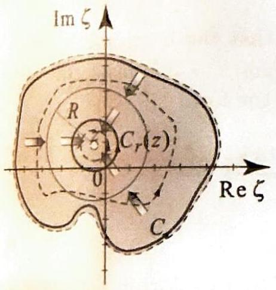
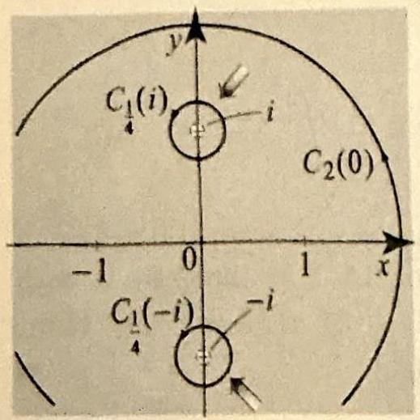
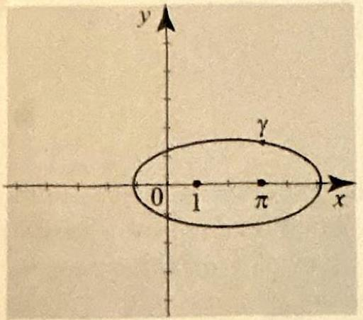
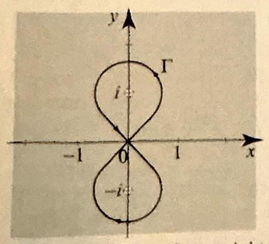
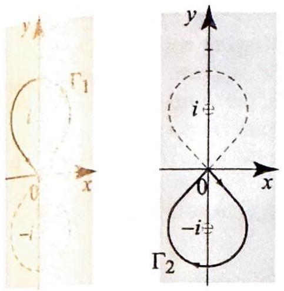
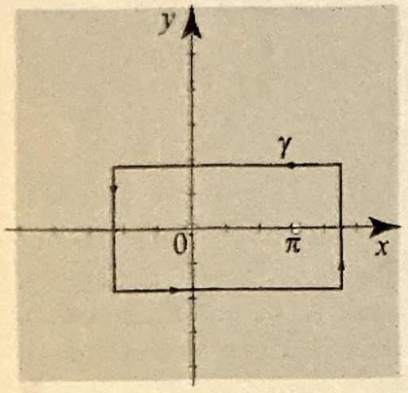
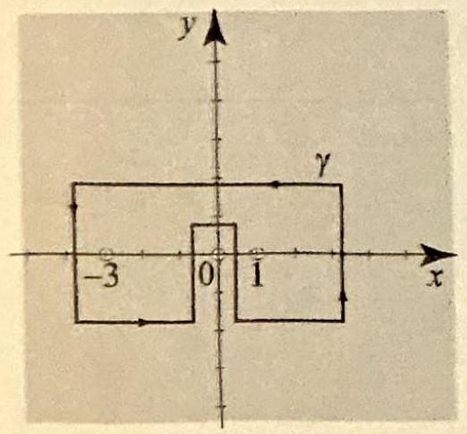
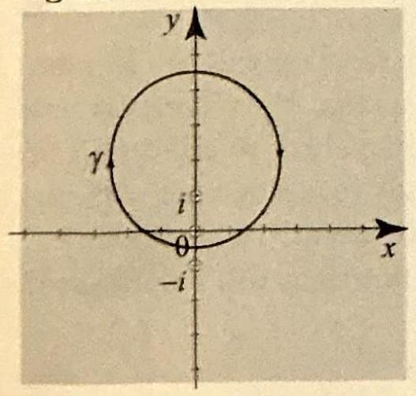
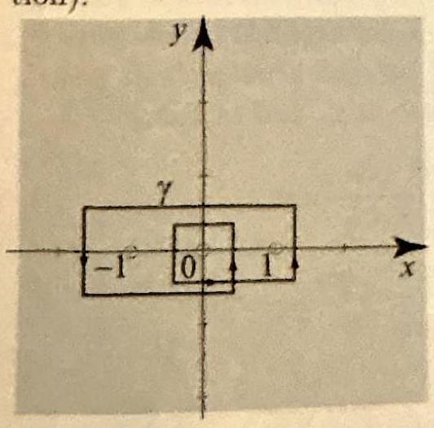
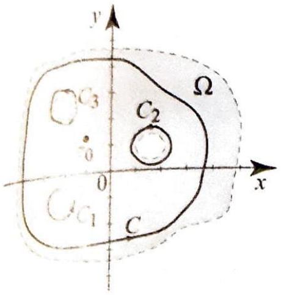

> [!review]
> 1. If a function is analytic on and inside a closed curve, can its value at an interior point be recovered exactly from its values on the enclosing curve alone? Prove your answer.
> 2. If the reconstruction integral from Cauchy's formula is evaluated at a point outside the curve instead of inside, what value does it take, and why? Prove your answer.

Recall: The closed disk of radius $R$ centered at $z_{0}$ is defined as $S_{R}\left(z_{0}\right)=\{z: \mid z- \left.2_{0} \mid \leq R\right\}$. This set includes its boundary.

In this section we develop one of the most important consequences of Cauchy's integral theorem. It is the Cauchy integral formula, which will enable us to compute many interesting integrals, and more importantly, we will use it to derive fundamental properties of analytic functions.

> [!theorem] Theorem 1: Cauchy's Integral Formula
> Suppose that $f$ is analytic inside and on a simple closed path $C$ with positive orientation. If $z$ is any point inside $C$, then
> 
> $$
> f(z)=\frac{1}{2 \pi i} \int_{C} \frac{f(\zeta)}{\zeta-z} d \zeta
> $$
> 

**Proof** Given $z$ inside $C$, let $R>0$ be such that the closed disk $S_{R}(z)$ is contained in the region inside $C$. The function $\zeta \mapsto \frac{f(\zeta)}{\zeta-z}$ is analytic in the region inside $C$ and outside the circle $C_{r}(z)$, where $0<r \leq R$ (see _Figure 1_). 

> [!figure] Figure 1
> 
> 
> Figure 1 The path $C$ can be continuously deformed into the circle $C_{r}(z)$, which explains the equality (2).

Applying Cauchy's theorem for multiply connected regions, Theorem 6, Section 3.4 (with the variable of integration being $\zeta$ and the integrand being $\frac{f(\zeta)}{\zeta-z}$ ), we obtain

$$
\frac{1}{2 \pi i} \int_{C} \frac{f(\zeta)}{\zeta-z} d \zeta=\frac{1}{2 \pi i} \int_{C_{r}(z)} \frac{f(\zeta)}{\zeta-z} d \zeta
$$

where $C$ and $C_{r}(z)$ are positively oriented. Since this equality holds for all $0<r \leq R$, taking limits on both sides, we get

$$
\frac{1}{2 \pi i} \int_{C} \frac{f(\zeta)}{\zeta-z} d \zeta=\lim _{r \rightarrow 0^{+}} \frac{1}{2 \pi i} \int_{C_{r}(z)} \frac{f(\zeta)}{\zeta-z} d \zeta
$$

To finish off the proof, we must show that the limit is $f(z)$. Parametrize $C_{r}(z)$ by $\gamma(t)=z+r e^{i t}, 0 \leq t \leq 2 \pi, \gamma^{\prime}(t)=i r e^{i t} d t$. Then

$$
\frac{1}{2 \pi i} \int_{C_{r}(z)} \frac{f(\zeta)}{\zeta-z} d \zeta=\frac{1}{2 \pi i} \int_{0}^{2 \pi} \frac{f\left(z+r e^{i t}\right)}{r e^{i t}} i r e^{i t} d t=\frac{1}{2 \pi} \int_{0}^{2 \pi} f\left(z+r e^{i t}\right) d t
$$

For fixed $z$, the function $t \mapsto f\left(z+r e^{i t}\right)$ is a continuous complex-valued function of $t$ and $r$ in $[0,2 \pi] \times[0, R]$. So by Theorem 5(i), Section 3.5, if we integrate it with respect to $t$, we get a continuous function of $r: \phi(r)=\frac{1}{2 \pi} \int_{0}^{2 \pi} f\left(z+r e^{i t}\right) d t$. Thus, $\lim _{r \rightarrow 0^{+}} \phi(r)=\phi(0)=\frac{1}{2 \pi} \int_{0}^{2 \pi} f(z) d t=f(z)$, as required. $\square$

Before we move to the applications of (1), let us note that if in Cauchy's formula $z$ is any point outside $C$, then

$$
\frac{1}{2 \pi i} \int_{C} \frac{f(\zeta)}{\zeta-z} d \zeta=0
$$

This is an immediate consequence of Cauchy's theorem for simple paths (Theorem 5, Section 3.4), since in this case the integrand $\zeta \mapsto \frac{f(\zeta)}{\zeta-z}$ is analytic
on and inside $C$, and so its integral along $C$ is zero. We combine (1) and (4) in one convenient formula in which the variable of integration is denoted $z$ :

$$
\frac{1}{2 \pi i} \int_{C} \frac{f(z)}{z-z_{0}} d z= \begin{cases}f\left(z_{0}\right) & \text { if } z_{0} \text { is inside } C \\ 0 & \text { if } z_{0} \text { is outside } C\end{cases}
$$

(It is traditional to change the variables of integration from $\zeta$ to $z$ when applying Theorem 1.)

> [!exercise] Exercise 1: Cauchy's integral formula
> 
> Let $C_{R}\left(z_{0}\right)$ denote the positively oriented circle with center at $z_{0}$ and radius $R>0$. Compute the following integrals.
> (a) $\quad \int_{C_{2}(0)} \frac{e^{z}}{z+1} d z$,
> (b) $\quad \int_{C_{2}(1)} \frac{z^{2}+3 z-1}{(z+3)(z-2)} d z$,

##### problem 1(a)

Solution (a) Write the integral as $\int_{C_{2}(0)} \frac{e^{z}}{z-(-1)} d z$. Since -1 is inside the circle $C_{2}(0)$, Cauchy's integral formula (5) with $f(z)=e^{z}$ and $z_{0}=-1$ implies

$$
\int_{C_{2}(0)} \frac{e^{z}}{z-(-1)} d z=2 \pi i e^{-1}
$$

##### problem 2(b)

(b) In evaluating $\int_{C_{2}(1)} \frac{z^{2}+3 z-1}{(z+3)(z-2)} d z$, we first note that the integrand is not analytic at the points $z=-3$ and $z=2$. Only the point $z=2$ is inside the curve $C_{2}(0)$. So if we let $f(z)=\frac{z^{2}+3 z-1}{z+3}$ the integral takes the form

$$
\int_{C_{2}(1)} \frac{f(z)}{z-2} d z=2 \pi i f(2)=\frac{18 \pi}{5} i
$$

by Cauchy's integral formula, applied at $z_{0}=2$.

---

Some integrals require multiple applications of Cauchy's formula along with applications of Cauchy's theorem. We illustrate with one example.

> [!exercise] Exercise 2: Multiple applications of Cauchy's formula
> 
> Compute
> 
> $$
> \int_{C_{2}(0)} \frac{e^{\pi z}}{z^{2}+1} d z
> $$
> 
> 

**Solution** Since $z^{2}+1=(z+i)(z-i)$, the integral cannot be computed directly from Cauchy's formula, since the path contains both $\pm i$ in its interior. To overcome this difficulty, draw small nonintersecting circles inside $C_{2}(0)$ around $\pm i$, say $C_{1 / 4}(i)$ and $C_{1 / 4}(-i)$, as illustrated in _Figure 2_. 

> [!figure] Figure 2
> 
> 
> 
> Figure 2 The mean value property of $f$ states that the value of $f$ at $z$ is equal to the average value of $f$ around any circle in $\Omega$ centered at $z$.
> 

Since $\frac{e^{\pi z}}{z^{2}+1}$ is analytic in a region containing the interior of $C_{2}(0)$ and the exterior of the smaller circles, by Cauchy's theorem for multiply connected regions (Theorem 6, Section 3.4), we have

$$
\int_{C_{2}(0)} \frac{e^{\pi z}}{z^{2}+1} d z=\int_{C_{1 / 4}(i)} \frac{e^{\pi z}}{z^{2}+1} d z+\int_{C_{1 / 4}(-i)} \frac{e^{\pi z}}{z^{2}+1} d z
$$

Now, the two integrals on the right can be evaluated with the help of Cauchy's integral formula (5). For the first one, we apply Cauchy's formula (5) with $^{\pi z}(z)= \frac{e^{\pi z}}{z+i}$ and $z_{0}=i$, and obtain

$$
\int_{C_{1 / 4}(i)} \frac{e^{\pi z}}{(z-i)(z+i)} d z=\int_{C_{1 / 4}(i)} \frac{f(z)}{z-i} d z=2 \pi i f(i)
$$

Since $f(i)=\frac{e^{i \pi}}{2 i}=\frac{-1}{2 i}=\frac{i}{2}$, we get

$$
\int_{C_{1 / 4}(i)} \frac{f(z)}{z-i} d z=-\pi
$$

For the second integral, we have

$$
\int_{C_{1 / 4}(-i)} \frac{e^{\pi z}}{(z-i)(z+i)} d z=\int_{C_{1 / 4}(-i)} \frac{g(z)}{z+i} d z=2 \pi i g(-i)
$$

where $g(z)=\frac{e^{\pi z}}{z-i}$, and so $g(-i)=\frac{e^{-i \pi}}{-2 i}=\frac{1}{2 i}=-\frac{i}{2}$. Hence

$$
\int_{C_{1 / 4}(-i)} \frac{g(z)}{z-i} d z=\pi
$$

Adding the two integrals together, we find that

$$
\int_{C_{2}(0)} \frac{e^{\pi z}}{(z-i)(z+i)} d z=0
$$

> [!review]
> 1. Cauchy's formula shows that the values of an analytic function inside an enclosing curve are determined by its values on the curve. What additional information about the function do those same boundary values also determine, and by what mechanism is it extracted? Prove your answer.
> 2. If the point at which the generalized Cauchy integral formula is evaluated lies outside the enclosing curve instead of inside, what value does the integral take, and why? Prove your answer.

+++++

Two observations concerning Cauchy's formula (1) deserve mentioning. The formula shows that the values of an analytic function $f(z)$ for $z$ inside a simple curve $C$ can be reconstructed from the values of $f$ on the curve $C$. By just knowing $f$ on $C$, we can determine the values of $f$ inside $C$.

The second observation is that (1) expresses an analytic function inside a simple path as a function defined by a path integral. Theorem 4 of the previous section tells us that, under appropriate conditions that are met in the present situation, a function defined by a path integral can be differentiated under the integral sign. Thus, under the conditions of Theorem 1, we have

$$
\begin{aligned}
f^{\prime}(z) & =\frac{d}{d z} f(z)=\frac{d}{d z} \frac{1}{2 \pi i} \int_{C} \frac{f(\zeta)}{\zeta-z} d \zeta \\
& =\frac{1}{2 \pi i} \int_{C} \frac{d}{d z} \frac{f(\zeta)}{\zeta-z} d \zeta=\frac{1}{2 \pi i} \int_{C} \frac{f(\zeta)}{(\zeta-z)^{2}} d \zeta
\end{aligned}
$$

Note that by being able to differentiate under the integral sign, we were able to compute the derivative of $f(z)$ by computing $\frac{d}{d z} \frac{1}{\zeta-z}$, and not $\frac{d}{d z} f(z)$. More importantly, we were able to express $f^{\prime}(z)$ as a function defined by a path integral, and so it too can be differentiated by differentiating under the integral sign. This yields

$$
f^{\prime \prime}(z)=\frac{2}{2 \pi i} \int_{C} \frac{f(\zeta)}{(\zeta-z)^{3}} d \zeta
$$

Clearly this process can be continued indefinitely, by appealing to Theorem 4, Section 3.5, to differentiate under the integral sign at each step. This yields the following important generalization of Cauchy's integral formula.

> [!theorem] Theorem 2: Generalized Cauchy Integral Formula
> Suppose that $f$ is analytic on and inside a simple closed path $C$ with positive orientation, and let $n=0,1,2, \ldots$. Then $f$ has derivatives of all order at all points $z$ in the region inside $C$ given by
> 
> $$
> f^{(n)}(z)=\frac{n!}{2 \pi i} \int_{C} \frac{f(\zeta)}{(\zeta-z)^{n+1}} d \zeta
> $$
> 
> (For $n=0$, we take by definition $f^{(0)}=f$ and $0!=1$.)

Here again we note that the integral in (6) is 0 if $z$ is outside $C$.

> [!exercise] Exercise 3: Generalized Cauchy integral formula
> 
> Compute the following integrals:
> (a) $\frac{1}{2 \pi i} \int_{C_{2}(0)} \frac{z^{10}}{(z-1)^{11}} d z$,
> (b) $\quad \int_{\gamma} \frac{e^{i z}}{(z-\pi)^{3}} d z$,
> where $\gamma$ is the ellipse in _Figure 3_.

> [!figure] Figure 3
> 
> 
> Figure 3 Ellipse in Example 3.

**Solution** (a) By (6), we have

$$
\frac{10!}{2 \pi i} \int_{C_{2}(0)} \frac{z^{10}}{(z-1)^{11}} d z=\left.\frac{d^{10}}{d z^{10}} z^{10}\right|_{z=1}=10!
$$

and so the desired integral is

$$
\frac{1}{2 \pi i} \int_{C_{2}(0)} \frac{z^{10}}{(z-1)^{11}} d z=1
$$

(b) By (6), we have

$$
\frac{2!}{2 \pi i} \int_{\gamma} \frac{e^{i z}}{(z-\pi)^{3}} d z=\left.\frac{d^{2}}{d z^{2}} e^{i z}\right|_{z=\pi}=-e^{i \pi}=1 .
$$

Hence the desired integral is $\pi i$.

---

In the following, you should note the orientation of the paths as we decompose a given figure-eight into two simple paths.

> [!exercise] Exercise 4: A path that intersects itself
> 
> Compute
> 
> $$
> \int_{\Gamma} \frac{z}{(z-i)\left(z^{2}+1\right)} d z
> $$
> 
> 
> where $\Gamma$ is the figure-eight in _Figure 4_.

> [!figure] Figure 4
> 
> 
> Figure 4 The figure-eight path $\Gamma$ is not a simple path.

Solution Because the path intersects itself, it is not simple. So we cannot appeal to Cauchy's formulas directly. We will first decompose the path $\Gamma$ into two simple paths $\Gamma_{1}$ and $\Gamma_{2}$, as shown in _Figure 5_. 

> [!figure] Figure 5
> 
> 
> Figue 5 Decomposition of a figure-eight into two simple paths.

Noting that $(z-i)\left(z^{2}+1\right)=(z-i)^{2}(z+i)$, we have

$$
\int_{\Gamma} \frac{z}{(z-i)\left(z^{2}+1\right)} d z=\int_{\Gamma_{1}} \frac{z}{(z-i)^{2}(z+i)} d z+\int_{\Gamma_{2}} \frac{z}{(z-i)^{2}(z+i)} d z .
$$

The integrals on the right can now be evaluated with the help of Cauchy's generalized integral formula (6). We must be careful with the orientation of the paths: The orientation of $\Gamma_{1}$ is positive, while the orientation of $\Gamma_{2}$ is negative. On $\Gamma_{1}$, we apply (6) with $n=1, f(z)=\frac{z}{z+i}$ at $z=i$, and get

$$
\int_{\Gamma_{1}} \frac{z}{z+i} \frac{d z}{(z-i)^{2}}=\left.2 \pi i\left(\frac{z}{z+i}\right)^{\prime}\right|_{z=i}=\left.2 \pi i \frac{i}{(z+i)^{2}}\right|_{z=i}=\frac{\pi}{2} .
$$

On $\Gamma_{2}$, we apply (6) with $n=0, f(z)=\frac{z}{(z-i)^{2}}$ at $z=-i$, and remembering that the orientation of $\Gamma_{2}$ is negative, we get

$$
\int_{\Gamma_{2}} \frac{z}{(z-i)^{2}} \frac{d z}{(z+i)}=-\left.2 \pi i \frac{z}{(z-i)^{2}}\right|_{z=-i}=\frac{\pi}{2} .
$$

Adding the values of the integrals along $\Gamma_{1}$ and $\Gamma_{2}$ yields the value $\pi$ for the integral along $\Gamma$. $\square$

> [!review]
> 1. In real analysis, a function can be once differentiable without being twice differentiable. Does the same situation occur for analytic functions, or does something stronger hold? Prove your answer.
> 2. If $f=u+i v$ is analytic on an open set $\Omega$, what can be said about the partial derivatives of $u$ and $v$ ?
> 3. If a continuous complex-valued function on a region has the property that its integral around every closed path in the region equals zero, what can be said about the function itself? Prove your answer.
> 4. If $f$ is analytic on a region containing a point $z_0$, the quotient $\left(f(z)-f\left(z_0\right)\right) /\left(z-z_0\right)$ has an apparent singularity at $z_0$. Is this singularity removable - that is, can a value be assigned at $z_0$ making the extended quotient analytic on the whole region? Prove your answer.

+++++

Cauchy's formula has many important applications to analytic functions, which in turn will be used to derive properties of harmonic functions and solutions of Dirichlet problems. The first result is already contained in Theorem 2, but it deserves a separate statement.

> [!corollary] Corollary 1
> Suppose that $f$ is analytic in an open set $\Omega$. Then $f$ has derivatives of all order, $f^{\prime}, f^{\prime \prime}, f^{\prime \prime \prime}, \ldots$, which are analytic in $\Omega$.

**Proof** We will apply Theorem 2 locally for all points in $\Omega$. That is, given $z_{0}$ in $\Omega$, let $S_{R}\left(z_{0}\right)$ be a closed disk contained in $\Omega$. Pick $C$ to be the boundary of the closed disk. By Theorem 2, all derivatives of $f(z)$ exist inside $C$ and are given by (6). Each derivative is of course further differentiable and so it must be continuous; hence each derivative is analytic. $\square$

Corollary 1 is a striking result that has no analog in the theory of functions of a real variable. Consider the function $f(x)=x^{\frac{5}{3}},-\infty<x<\infty$. Its derivative, $f^{\prime}(x)=x^{\frac{2}{3}}$, exists and is continuous for all $x$; however, $f^{\prime \prime}(x)$ does not exist at $x=0$.

Since the derivatives of an analytic function $f=u+i v$ can be expressed in terms of the partial derivatives of $u$ and $v$, Corollary 1 has the following immediate consequence.

> [!corollary] Corollary 2
> Suppose that $f=u+i v$ is analytic in an open set $\Omega$. Then all the partial derivatives of $u$ and $v$ exist and are harmonic in $\Omega$.
> 

**Proof** From Corollary 1, we know that $f$ has analytic derivatives of all orders. Since the derivatives of $f$ exist, we can obtain them by partial differentiation with respect to either $x$ or $y$ (recall the Cauchy-Riemann equations, (8), Section 2.4). This shows that the partial derivatives of $u$ and $v$ exist and are the real or imaginary parts of analytic functions, and hence they are harmonic. For example, differentiating $f=u+i v$ with respect to $x$ yields $f^{\prime}(z)=u_{x}(z)+i v_{x}(z)$. Since $f^{\prime}$ is analytic, we see that $u_{x}$ and $v_{x}$ are harmonic. Differentiating with respect to $y$, we obtain $f^{\prime \prime}(z)=v_{x y}(z)-i u_{x y}(z)$, showing that $v_{x y}$ and $u_{x y}$ are harmonic, and so forth. Since all $f^{(n)}(z)$ are continuously differentiable, any partial derivative of $u$ or $v$ will have continuous second-order partials; these partial derivatives commute, and the conditions for harmonicity in Section 2.5 are now clearly established.

The following is a converse of sorts to Cauchy's theorem. It has substantial theoretical implications.

> [!theorem] Theorem 3: Morera's Theorem
> Let $f$ be a continuous complex-valued function on a region $\Omega$. If
> 
> $$
> \int_{\gamma} f(z) d z=0
> $$
> 
> for all closed paths $\gamma$ in $\Omega$, then $f$ is analytic on $\Omega$.

It suffices, in fact, to restrict $\gamma$ to triangular paths lying in arbitrarily small disks in $\Omega$ (see Exercise 37).

Proof The fact that the integral of $f$ is zero around closed paths in $\Omega$ is equivalent to the fact that $f$ has an analytic antiderivative in $\Omega$ (Theorem 2, Section 3.3). Thus there is an analytic function $F$ such that $F^{\prime}(z)=f(z)$ for all $z$ in $\Omega$. But by Corollary 1, the derivatives of an analytic function are themselves analytic, and so $f$ is analytic on $\Omega$.

The following application will be needed in the study of isolated singularities of analytic functions in the following chapter.

> [!theorem] Theorem 4
> Suppose that $f$ is analytic on a region $\Omega$ and let $z_{0}$ be in $\Omega$. Define
> 
> $$
> g(z)= \begin{cases}\frac{f(z)-f\left(z_{0}\right)}{z-z_{0}} & \text { if } z \neq z_{0} \\ f^{\prime}\left(z_{0}\right) & \text { if } z=z_{0}\end{cases}
> $$
> 
> Then $g$ is analytic in $\Omega$.

**Proof** It is enough to establish the analyticity of $g$ on an open disk $B_{R}\left(z_{0}\right)$ contained in $\Omega$. For $z \neq z_{0}$ in $B_{R}\left(z_{0}\right)$, parametrize $\left[z_{0}, z\right]$ the usual way by $\zeta(t)=z_{0}(1-t)+t z, 0 \leq t \leq 1$. Using the fact that $f^{\prime}$ is analytic in $B_{R}\left(\tau_{0}\right)$
(hence its integral is independent of path), we can rewrite $g(z)$ as

$$
\begin{aligned}
g(z)=\frac{f(z)-f\left(z_{0}\right)}{z-z_{0}} & =\frac{1}{z-z_{0}}\left(f(z)-f\left(z_{0}\right)\right)=\frac{1}{z-z_{0}} \int_{\left[z_{0}, z\right]} f^{\prime}(\zeta) d \zeta \\
& =\int_{0}^{1} f^{\prime}\left(\left(z-z_{0}\right) t+z_{0}\right) d t
\end{aligned}
$$

But the right side also makes sense at $z=z_{0}$; it is $\int_{0}^{1} f^{\prime}\left(z_{0}\right) d t=f^{\prime}\left(z_{0}\right)$. So our formula (8) for $g(z)$ holds for all $z$ in $B_{R}\left(z_{0}\right)$, including $z_{0}$. Since $f^{\prime}$ is analytic in $B_{R}\left(z_{0}\right)$, its derivative $f^{\prime \prime}$ is also analytic in $B_{R}\left(z_{0}\right)$, and so we can differentiate under the integral sign (Theorem 4, Section 3.5) and infer that $g(z)$ is analytic on $B_{R}\left(z_{0}\right)$.
As you would expect, Theorem 4 can be used to establish the analyticity of certain functions that we could not establish before.

---

> [!exercise] Exercise 5: Extending $\frac{\sin z}{z}$ to an entire function
> 
> Show that the function $\sin z / z$, which is defined for all $z \neq 0$, can be extended to an entire function. Determine the value that must be assigned at $z=0$, and justify that the resulting extension is entire.

++++

Apply Theorem 4 with the function $f(z)=\sin z$ at $z_{0}=0$. Since $f(0)=0$ and $f^{\prime}(0)=\cos 0=1$, it follows that

$$
g(z)= \begin{cases}\frac{\sin z}{z} & \text { if } z \neq 0 \\ 1 & \text { if } z=0\end{cases}
$$

is analytic at $z=0$. But $g(z)$ is clearly analytic at all other complex numbers, so $g(z)$ is entire.

---

The picture with the derivatives of an analytic function will be complete with Goursat's theorem (Section 3.9), which tell us that the mere existence of $f^{\prime}(z)$ implies that $f^{\prime}(z)$ is continuous. So we can go back to the definition of analyticity in Section 2.3 and improve it by not requiring that $f^{\prime}(z)$ be analytic. All the results that we have derived subsequently will still hold.

Further applications to the theory of analytic functions will be presented in Sections 3.7 and 3.9.

# Exercises 3.6

> [!exercise] Exercise 6
> In problems 1-20, evaluate the given integral. State clearly which version of Cauchy's theorem you are using and justify its application. It would help to plot the path in each case and describe exactly the points of interest in each problem. As usual, $C_{R}\left(z_{0}\right)$ denotes the positively oriented circle with center at $z_{0}$ and radius $R>0$.
> 
> 1. $\int_{C_{1}(0)} \frac{\cos z}{z} d z$.
> 2. $\int_{C_{3}(0)} \frac{e^{z^{2}} \cos z}{z-i} d z$.
> 3. $\frac{1}{2 \pi i} \int_{C_{2}(1)} \frac{1}{z^{2}-5 z+4} d z$.
> 4. $\quad \frac{1}{2 \pi i} \int_{C_{3}(1)} \frac{\cos z}{(z-\pi)^{4}} d z$.
> 5. $\int_{C_{\frac{1}{2}}(i)} \frac{\log z}{-z+i} d z$.
> 6. $\frac{1}{2 \pi i} \int_{C_{2}(1)} \frac{z^{5}-1}{(z+3 i)(z-2)} d z$.
> 7. $\int_{\left[z_{1}, z_{2}, z_{3}, z_{1}\right]} \frac{z^{19}}{(z-1)^{19}} d z$, where $z_{1}=0, z_{2}=-i, z_{3}=3+i$.
> 8. $\int_{\left[z_{1}, z_{2}, z_{3}, z_{1}\right]} \frac{z^{19}}{(z-1)^{20}} d z$, where $z_{1}=0, z_{2}=-i, z_{3}=3+i$.
> 9. $\int_{\gamma} \frac{\sin z}{(z-\pi)^{3}} d z$, where $\gamma$ is the positively oriented ellipse $|z-\pi|+|z+\pi|=2 \pi+1$.
> 10. $\int_{\gamma} \frac{\sin z}{\left(z^{2}-\pi^{2}\right)^{2}} d z$, where $\gamma$ is the positively oriented ellipse $|z-\pi|+|z+\pi|= 2 \pi+1$.
> 11. $\int_{\gamma} \frac{e^{z} \sin z}{z^{2}(z-\pi)} d z$, where $\gamma$ is as in _Figure 6_.
> 
> 
> > [!figure] Figure 6
> > 
> > 
> > Figure 6
> 
> 
> 
> 12. $\int_{\gamma} \frac{d z}{z^{2}(z-1)^{3}(z+3)}$, where $\gamma$ is as in _Figure 7_.
> 
> 
> > [!figure] Figure 7
> > 
> > 
> > Figure 7
> 
> 
> 13. $\int_{\gamma} \frac{z+\cos (\pi z)}{z\left(z^{2}+1\right)} d z$, where $\gamma$ is as in _Figure 8_.
> 
> 
> > [!figure] Figure 8
> > 
> > 
> > Figure 8 (negative orientation).
> 
> 
> 14. $\int_{\gamma} \frac{1}{z(z-1)^{2}\left(z^{2}-1\right)} d z$, where $\gamma$ is as in _Figure 9_.
> 
> 
> > [!figure] Figure 9
> > 
> > 
> > Figure 9
> 
> 
> 15. $\int_{C_{2}(0)} \frac{z^{2}+z+1}{z^{2}-1} d z$.
> 16. $\frac{1}{2 \pi i} \int_{C_{2}(1)} \frac{1}{z^{2}-z} d z$.
> 17. $\int_{C_{\frac{3}{2}}(0)} \frac{1}{z^{3}-3 z+2} d z$.
> 18. $\frac{1}{2 \pi i} \int_{C_{\frac{5}{2}(1)}} \frac{1}{z^{3}+2 z^{2}-z-2} d z$.
> 19. $\int_{C_{\frac{3}{2}}(1)} \frac{1}{z^{4}-1} d z$.
> 20. $\int_{C_{2}(0)} \frac{1}{z^{4}-1} d z$.
> 

> [!exercise] Exercise 7
> 21. For $|z|<1$, let $f(z)=\frac{1}{2 \pi} \int_{0}^{2 \pi} \frac{e^{i t}}{e^{i t}-z} d t$.
> (a) Show that $f$ is analytic in the unit disk. **(Hint: Theorem 4, Section 3.5.)**
> (b) Express the integral as a path integral and conclude that $f(z)=1$ for all $|z|<1$. **(Hint: Let $e^{i t}=\zeta, d t=\frac{d \zeta}{i \zeta}$.)**

> [!exercise] Exercise 8
> 22. Compute $\frac{1}{2 \pi} \int_{0}^{2 \pi} \frac{1}{2+e^{i t}} d t$. (See the hint in Exercise 21.)

> [!exercise] Exercise 9
> 23. Show that $\frac{1}{2 \pi} \int_{0}^{2 \pi} e^{e^{i n t}} d t=1$ for $n= \pm 1, \pm 2, \ldots$.
> 24. Show that $\frac{1}{2 \pi} \int_{0}^{2 \pi} \cos \left(e^{i t}\right) d t=1$ and $\frac{1}{2 \pi} \int_{0}^{2 \pi} \sin \left(e^{i t}\right) d t=0$.

> [!exercise] Exercise 10
> 25. Define $f(z)=\int_{0}^{1} \cos (z t) d t$. Explain why $f$ is entire and then find $f$.
> 26. Define $f(z)=\int_{0}^{1} e^{z^{2} t} d t$. Explain why $f$ is entire and then find $f$.

> [!exercise] Exercise 11
> 27. Define the following functions at $z=0$ in order that they become entire:
> (a) $\frac{1-e^{z}}{2 z}$ and (b) $\frac{\cos z-1}{z^{2}}$. Justify your answers using Theorem 4.

> [!exercise] Exercise 12
> 28. 
> (a) Compute $\frac{1}{2 \pi i} \int_{C_{1}(0)} \frac{e^{z}}{z} d z$.
> (b) Use your answer in (a) to show that $\int_{0}^{\pi} e^{\cos t} \cos (\sin t) d t=\pi$. **(Hint: Parametrize $C_{1}(0)$ by the interval $[-\pi, \pi]$.)**
> 
> 

> [!exercise] Exercise 13
> 29. Suppose that $f$ and $g$ are analytic inside and on a simple path $C$. Suppose that $f=g$ on $C$. Show that $f=g$ inside $C$.

> [!exercise] Exercise 14
> 30. Suppose that $f$ is analytic inside and on $C_{1}(0)$. For $|z|<1$, show that
> 
> $$
> \int_{C_{1}(0)} \frac{f(\zeta)}{\zeta-\frac{1}{\bar{z}}} d \zeta=0
> $$
> 
> **(Hint: Where does $\frac{1}{\bar{z}}$ lie if $|z|<1$ ?)**
> 31. Suppose that $f$ is analytic inside and on $C_{1}(0)$. For $|z|<1$, show that
> 
> $$
> \frac{1}{2 \pi i} \int_{C_{1}(0)} \frac{f(\zeta)}{(\zeta-z) \zeta} d \zeta=\frac{f(z)-f(0)}{z}
> $$
> 
> 

> [!exercise] Exercise 15
> 32. Project Problem: Approximation of the derivative. (a) Suppose that $f$ is analytic on a region $\Omega$. Let $S_{R}\left(z_{0}\right)$ be a closed disk in $\Omega$. For $z$ in $S_{R}\left(z_{0}\right)$, show that
> 
> $$
> \frac{f(z)-f\left(z_{0}\right)}{z-z_{0}}-f^{\prime}\left(z_{0}\right)=\frac{1}{2 \pi i} \int_{C_{R}\left(z_{0}\right)} \frac{\left(z-z_{0}\right)}{(\zeta-z)\left(\zeta-z_{0}\right)^{2}} f(\zeta) d \zeta
> $$
> 
> (b) Suppose that $|f(z)| \leq M$ for all $z$ in $\Omega$. Show that, for $z$ in $S_{R}\left(z_{0}\right)$,
> 
> $$
> \left|\frac{f(z)-f\left(z_{0}\right)}{z-z_{0}}-f^{\prime}\left(z_{0}\right)\right| \leq M \frac{\left|z-z_{0}\right|}{R} \frac{1}{R-\left|z-z_{0}\right|}
> $$
> 
> **(Hint: Use (a) and Theorem 2, Section 3.2. Note that $\left|\zeta-z_{0}\right|=R$ and $\frac{1}{|\zeta-z|} \leq \frac{1}{R-\left|z-z_{0}\right|}$. To see the last inequality, draw a picture. What is the smallest value of $|\zeta-z|$ if $\zeta$ belongs to $C_{R}\left(z_{0}\right)$ ?)**
> (c) Conclude from (b) that, for $0<\left|z-z_{0}\right|<\frac{R}{2}$,
> 
> $$
> \left|\frac{f(z)-f\left(z_{0}\right)}{z-z_{0}}-f^{\prime}\left(z_{0}\right)\right| \leq 2 M \frac{\left|z-z_{0}\right|}{R^{2}} .
> $$
> 
> 

> [!exercise] Exercise 16
> 33. Project Problem: Differentiation under the integral sign. Theorem 4, Section 3.5, is a very useful tool. We used it to prove Cauchy's theorem and many other results. In this exercise, we will offer a new proof based on Exercise 32. Even though this proof cannot replace the one that we presented in Section 3.5, since it is based on results that use differentiation under the integral sign, it does offer yet another justification based on Cauchy's formula.
> (a) In the notation of Theorem 4, Section 3.5, fix $S_{R}\left(z_{0}\right)$ in $\Omega$ and take $M$ to be the maximum value of $|f(z, \zeta)|$ for $z$ in $S_{R}\left(z_{0}\right)$ and $\zeta$ on the graph of $\gamma$. Using Exercise 32, show that for $0<\left|z-z_{0}\right|<\frac{R}{2}$,
> 
> $$
> \left|\frac{F(z)-F\left(z_{0}\right)}{z-z_{0}}-\int_{\gamma} \frac{d}{d z} f\left(z_{0}, \zeta\right) d \zeta\right| \leq \frac{2 M}{R^{2}}\left|z-z_{0}\right| l(\gamma),
> $$
> 
> where $l(\gamma)$ is the length of $\gamma$.
> (b) Complete the proof of Theorem 4, Section 3.5, by letting $z \rightarrow z_{0}$ in (a).
> 
> 

> [!exercise] Exercise 17
> 34. **Project Problem:** Wallis's formulas. (a) If $n$ is an integer, recall or prove once more the useful identity
> 
> $$
> \frac{1}{2 \pi i} \int_{C_{1}(0)} \frac{1}{z^{n}} d z= \begin{cases}1 & \text { if } n=1 \\ 0 & \text { if } n \neq 1\end{cases}
> $$
> 
> (b) Parametrize the circle $C_{1}(0)$ and show that
> 
> $$
> \frac{1}{2 \pi i} \int_{C_{1}(0)}\left(z+\frac{1}{z}\right)^{n} \frac{d z}{z}=\frac{2^{n}}{2 \pi} \int_{0}^{2 \pi} \cos ^{n} t d t
> $$
> 
> (c) Expand $\left(z+\frac{1}{z}\right)^{n}$ using the binomial formula and use (a) to prove that
> 
> $$
> \frac{1}{2 \pi} \int_{0}^{2 \pi} \cos ^{2 k} t d t=\frac{(2 k)!}{2^{2 k}(k!)^{2}} \text { and } \int_{0}^{2 \pi} \cos ^{2 k+1} t d t=0
> $$
> 
> where $k=0,1,2, \ldots$. These are some of Wallis's formulas.
> 

> [!exercise] Exercise 18
> 35. Show that for $k=0,1,2, \ldots$,
> 
> $$
> \frac{1}{2 \pi} \int_{0}^{2 \pi} \sin ^{2 k} t d t=\frac{(2 k)!}{2^{2 k}(k!)^{2}} \text { and } \int_{0}^{2 \pi} \sin ^{2 k+1} t d t=0
> $$
> 
> **(Hint: You can use the approach of Exercise 34 or you can use the result of Exercise 34 and argue geometrically comparing areas under curves.)**

> [!exercise] Exercise 19
> 36. **Project Problem:** Logarithms of functions. Suppose that $f(z)$ is analytic and nonvanishing on a simply connected region $\Omega$. By a branch of the logarithm of $f(z)$ we mean any continuous function $g(z)$ on $\Omega$ satisfying $e^{g(z)}=f(z)$ for all $z$ in $\Omega$. Such a function will be denoted by $\log f(z)$.
> (a) Prove that if $g$ exists, then $g$ is in fact analytic and $g^{\prime}(z)=\frac{f^{\prime}(z)}{f(z)}$. Thus $g$ is an antiderivative of $\frac{f^{\prime}(z)}{f(z)}$. **(Hint: Theorem 4, Section 2.3.)**
> (b) Show that if $g(z)$ is an antiderivative of $\frac{f^{\prime}(z)}{f(z)}$, and if $e^{g\left(z_{0}\right)}=f\left(z_{0}\right)$ at a point in $\Omega$, then in fact $g(z)$ is a branch of the logarithm of $f(z)$. **(Hint: To show that $e^{g(z)}=f(z)$, let $h(z)=\frac{e^{g(z)}}{f(z)}$. Show that $h^{\prime}(z)=0$ for all $z$ in $\Omega$.)**
> (c) Conclude that a branch of $\log f(z)$ exists on $\Omega$ and is unique up to an integer multiple of $2 \pi i$. **(Hint: Theorem 4, Section 3.4.)**

> [!exercise] Exercise 20
> 37. A stronger Morera's theorem. Follow the outlined steps to show that in Morera's theorem it is sufficient to restrict the path $\gamma$ to triangular paths lying in arbitrarily small disks in $\Omega$.
> (a) Argue that it is enough to show that $f$ has an analytic antiderivative in every disk $B_{R}\left(z_{0}\right)$ contained in $\Omega$.
> (b) For $z$ in $B_{R}\left(z_{0}\right)$, define $F(z)=\int_{\left[z_{0}, z\right]} f(\zeta) d \zeta$. Use the fact that the integral of $f$ over a closed triangular path is 0 to show that $\frac{F(z+\Delta z)-F(z)}{\Delta z}=\frac{1}{\Delta z} \int_{[z, z+\Delta z]} f(\zeta) d \zeta$. (c) Use Lemma 1, Section 3.3, to compute the limit in (b) as $\Delta z \rightarrow 0$, and conclude that $F^{\prime}(z)=f(z)$, as desired.

> [!exercise] Exercise 21
> 38. Cauchy's formula for multiply connected regions. Use Cauchy's integral theorem for multiply connected regions (Theorem 6, Section 3.4) to obtain the following version of Cauchy's formula.
> 
> Suppose that $f$ is analytic on a region $\Omega$ containing the region interior to the outer simple path $C$ and exterior to the inner simple paths $C_{j}$ 's $(j=1,2, \ldots, n)$, as well as the paths themselves. Suppose that the paths all share the same orientation (_Figure 10_). Let $z$ be any point interior to $C$ and exterior to all $C_{j}$. Then
> 
> $$
> f(z)=\frac{1}{2 \pi i} \int_{C} \frac{f(\zeta)}{\zeta-z} d \zeta-\frac{1}{2 \pi i} \sum_{j=1}^{n} \int_{C_{j}} \frac{f(\zeta)}{\zeta-z} d \zeta
> $$
> 
> and for $n=1,2, \ldots$, we have
> 
> $$
> f^{(n)}(z)=\frac{n!}{2 \pi i} \int_{C} \frac{f(\zeta)}{(\zeta-z)^{n+1}} d \zeta-\sum_{j=1}^{n} \frac{n!}{2 \pi i} \int_{C_{j}} \frac{f(\zeta)}{(\zeta-z)^{n+1}} d \zeta .
> $$
> 
> 
> 
> > [!figure] Figure 10
> > 
> > 
> > Figure 10
> 
> 
> 

> [!exercise] Exercise 22
> 39. Suppose $f(z)$ is analytic in a region $\Omega$ and $C$ is a simple closed positively oriented curve in $\Omega$ with its terminal point (initial and final) at $\alpha$. Let $z_{0}$ be a point inside $C$.
> (a) Use integration by parts to show that
> 
> $$
> \begin{aligned}
> \int_{C} \frac{f(z)}{\left(z-z_{0}\right)^{n+1}} d z & =\left.\frac{f(z)}{-n\left(z-z_{0}\right)^{n}}\right|_{\alpha} ^{\alpha}-\int_{C} \frac{f^{\prime}(z)}{-n\left(z-z_{0}\right)^{n}} d z \\
> & =\frac{1}{n} \int_{C} \frac{f^{\prime}(z)}{\left(z-z_{0}\right)^{n}} d z
> \end{aligned}
> $$
> 
> (b) Use induction and the basic Cauchy integral formula to conclude that
> 
> $$
> \int_{C} \frac{f(z)}{\left(z-z_{0}\right)^{n+1}} d z=\frac{1}{n!} \int_{C} \frac{f^{(n)}(z)}{z-z_{0}} d z=\frac{2 \pi i}{n!} f^{(n)}\left(z_{0}\right) .
> $$
> 
> 

> [!exercise] Exercise 23
> 40. Project Problem: Factoring zeros of analytic functions. This exercise contains useful facts about zeros of analytic functions, which will be derived again in Chapter 4 using power series. We include them at this early stage as interesting applications of Theorem 4, and we use them to derive a useful version of l'Hospital's rule. Throughout this problem, $f$ is analytic at a point $z_{0}$.
> (a) Suppose that $f\left(z_{0}\right)=0$, that is, $z_{0}$ is a zero of $f$. Use Theorem 4 to show that $f(z)=\left(z-z_{0}\right) g(z)$, where $g(z)$ is analytic at $z_{0}$.
> (b) Recall the Leibniz product rule for differentiation: If $f$ and $g$ are differentiable functions, then
> 
> $$
> \frac{d^{n}}{d z^{n}}(f g)=\sum_{k=0}^{n}\binom{n}{k} \frac{d^{k} f}{d z^{k}} \frac{d^{n-k} g}{d z^{n-k}},
> $$
> 
> where $\binom{n}{k}=\frac{n!}{k!(n-k)!}$ and $0!=1$. Show that if $f$ and $g$ are analytic at $z_{0}$ and $f(z)=\left(z-z_{0}\right)^{m} g(z)$, then $f^{(m)}\left(z_{0}\right)=m!g\left(z_{0}\right)$. Conclude that $f^{(m)}\left(z_{0}\right)=0$ if and
> only if $g\left(z_{0}\right)=0$.
> (c) Suppose that $f\left(z_{0}\right)=f^{\prime}\left(z_{0}\right)=\cdots=f^{(m-1)}\left(z_{0}\right)=0$. Using (a) and (b), show that $f(z)=\left(z-z_{0}\right)^{m} g(z)$, where $g$ is analytic at $z_{0}$, and $g\left(z_{0}\right)=\frac{f^{(m)}\left(z_{0}\right)}{m!}$.

> [!exercise] Exercise 24
> 41. Generalized l'Hospital's rule. Suppose that $f$ and $g$ are analytic at $z_{0}$ such that $f\left(z_{0}\right)=f^{\prime}\left(z_{0}\right)=\cdots=f^{(m-1)}\left(z_{0}\right)=0$ and $g\left(z_{0}\right)=g^{\prime}\left(z_{0}\right)=\cdots= g^{(m-1)}\left(z_{0}\right)=0$, but $g^{(m)}\left(z_{0}\right) \neq 0$. Then $\lim _{z \rightarrow z_{0}} \frac{f(z)}{g(z)}=\frac{f^{(m)}\left(z_{0}\right)}{g^{(m)}\left(z_{0}\right)}$.
> **(Hint: Use Exercise 40.)**
> 42. Use the generalized l'Hospital's rule to compute $\lim _{z \rightarrow 0} \frac{e^{z}\left(\left(1+e^{z}\right) z-2 e^{z}+2\right)}{\left(e^{z}-1\right)^{3}}$.
