### 3.8 Applications to Harmonic Functions

This section continues our study of harmonic functions that we started in Section 2.5. We will answer some fundamental questions about harmonic functions that were raised in Section 2.5 and derive new properties that will strengthen our understanding of harmonic functions and solutions of Dirichlet problems.

Recall that a real-valued function $u(x, y)$ defined in a region $\Omega$ is called harmonic if $u$ has continuous partial derivatives of first and second order and if $u$ satisfies Laplace's equation

$$
\Delta u=\frac{\partial^{2} u}{\partial x^{2}}+\frac{\partial^{2} u}{\partial y^{2}}=0 \quad \text { on } \Omega
$$

In fact, harmonic functions have derivatives of all order. To prove this result, we need a lemma.

LEMMA 1 CONJUGATE GRADIENT

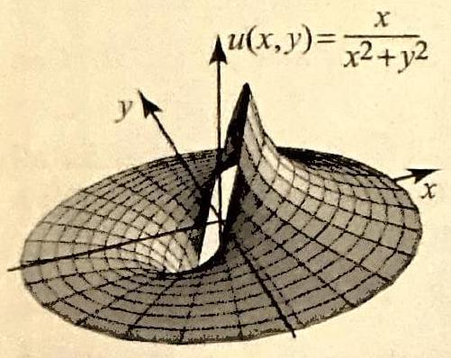
Figure 1

Suppose that $u$ is harmonic on a region $\Omega$. Let $\phi=u_{x}-i u_{y}$. Then $\phi$ is analytic on $\Omega$. The function $\phi$ is called the conjugate gradient of $u$.
Proof Write $\phi=\operatorname{Re}(\phi)+i \operatorname{Im}(\phi)=u_{x}-i u_{y}$. Because $u$ has continuous second partial derivatives, it follows that $\operatorname{Re} \phi$ and $\operatorname{Im} \phi$ have continuous first partial derivatives. To show that $\phi$ is analytic, it suffices by Theorem 1, Section 2.4, to show that $\operatorname{Re} \phi$ and $\operatorname{Im} \phi$ satisfy the Cauchy-Riemann equations. We have

$$
\frac{\partial}{\partial x} \operatorname{Re} \phi=\frac{\partial}{\partial x} u_{x}=u_{x x} \quad \text { and } \quad \frac{\partial}{\partial y} \operatorname{Im} \phi=\frac{\partial}{\partial y}\left(-u_{y}\right)=-u_{y y} .
$$

But since $u$ is harmonic, $u_{x x}=-u_{y y}$, and so $\frac{\partial}{\partial x} \operatorname{Re} \phi=\frac{\partial}{\partial y} \operatorname{Im} \phi$. Thus, the first of the Cauchy-Riemann equations is satisfied. Now, since $u$ has continuous second partial derivatives, we have $u_{x y}=u_{y x}$. Thus

$$
\frac{\partial}{\partial y} \operatorname{Re} \phi=u_{x y} \quad \text { and } \quad \frac{\partial}{\partial x} \operatorname{Im} \phi=-u_{y x}=-u_{x y}
$$

So $\frac{\partial}{\partial y} \operatorname{Re} \phi=-\frac{\partial}{\partial x} \operatorname{Im} \phi$ and the second of the Cauchy-Riemann equations holds. Thus $\phi$ is analytic.

## EXAMPLE 1 Conjugate gradient

Consider $u(x, y)=\frac{x}{x^{2}+y^{2}}$ in the upper half-plane, $y>0$.
(a) Show that $u$ is harmonic.
(b) Find the conjugate gradient of $u$.

Solution (a) The function $u$ has a simpler expression in polar coordinates (see Figure 1):

$$
u(r, \theta)=\frac{r \cos \theta}{r^{2}}=\frac{\cos \theta}{r}=r^{-1} \cos \theta
$$

From this, it is easy to see that $u$ is the real part of the function

$$
f(z)=\frac{1}{z}=z^{-1}=r^{-1} e^{-i \theta}=r^{-1}(\cos \theta-i \sin \theta)
$$

Since $f$ is analytic for all $z \neq 0$, it follows that its real part $u=r^{-1} \cos \theta$ is harmonic for all $z \neq 0$ by Theorem 1, Section 2.5. In particular, $u$ is harmonic in the upper half-plane.
(b) We have

$$
u_{x}=\frac{y^{2}-x^{2}}{\left(x^{2}+y^{2}\right)^{2}} \quad \text { and } \quad u_{y}=\frac{-2 x y}{\left(x^{2}+y^{2}\right)^{2}}
$$

Thus the conjugate gradient in the upper half-plane is

$$
\phi=u_{x}-i u_{y}=\frac{\left(y^{2}-x^{2}\right)+2 i x y}{\left(x^{2}+y^{2}\right)^{2}}=-\frac{(x-i y)^{2}}{\left(x^{2}+y^{2}\right)^{2}}=-\frac{(\bar{z})^{2}}{(z \bar{z})^{2}}=-\frac{1}{z^{2}} .
$$

Suppose that $f$ is analytic and write $f=u+i v$. Using the CauchyRiemann equations, it follows that $f^{\prime}(z)=u_{x}-i u_{y}$ (see (8), Section 2.4). Thus the derivative of $f$ is the conjugate gradient of $u$; equivalently, $f$ is an antiderivative of the conjugate gradient of $u$. The latter fact is very useful,

## COROLLARY 1

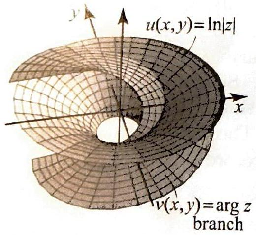
Figure 2

## THEOREM 1 HARMONIC CONJUGATE

since it allows us to use the conjugate gradient to construct $f$ when only $\operatorname{Re} f=u$ is known. In Example 1, we have $u(x, y)=\frac{x}{x^{2}+y^{2}}=\operatorname{Re}(f(z))$ where $f(z)=\frac{1}{z}=\frac{1}{x+i y}$ and the conjugate gradient of $u$ is $\phi=-\frac{1}{z^{2}}=f^{\prime}(z)$.

Using the conjugate gradient $\phi=u_{x}-i u_{y}$, we can express any partial derivative of $u$ as the real or imaginary part of an analytic function, namely a derivative of $\phi$. For example, to get $u_{x x x}$, differentiate $\phi$ with respect to $x$ twice and get $\phi^{\prime \prime}=u_{x x x}-i u_{y x x}$. (Note that since the derivatives of $\phi$ exist, we can obtain them by differentiating with respect to any one of the variables $x, y$, or $z$. This was done in the proof of the CauchyRiemann equations.) Since $\phi$ is analytic, all its higher-order derivatives are analytic (Corollary 1, Section 3.6), and so $u_{x x x}$ and $u_{y x x}$ are both harmonic by Theorem 1, Section 2.5. We can carry these ideas further and arrive at the following useful result.

## Suppose that $u$ is harmonic on a region $\Omega$. Then $u$ has continuous partial derivatives of all order in $\Omega$.

Recall that a function $v$ is a harmonic conjugate of $u$ on $\Omega$ if $f=u+i v$ is analytic on $\Omega$. Harmonic conjugates are determined up to an additive constant (Proposition 3, Section 2.5). The existence of harmonic conjugates is an important question since the harmonic conjugate allows us to relate harmonic functions to analytic functions. We know that harmonic conjugates may fail to exist on certain regions (Exercise 33, Section 2.5). For example, $\ln |z|$ is harmonic on the punctured plane, but the only candidate for a harmonic conjugate is a branch of $\arg z$, which has a branch cut and cannot be harmonic on the punctured plane (see Figure 2). So $\ln |z|$ does not have a harmonic conjugate on the punctured plane.

Our next result guarantees the existence of a harmonic conjugate if the region is simply connected.

Suppose that $u$ is harmonic on a simply connected region $\Omega$. Then $u$ has a harmonic conjugate in $\Omega$ given up to an additive constant by

$$
v(z)=\int_{z_{0}}^{z}-u_{y} d x+u_{x} d y \quad\left(z_{0} \text { fixed in } \Omega\right)
$$

where the integral is independent of path.
Proof Consider the analytic conjugate gradient $\phi=u_{x}-i u_{y}$. The integral of $\phi$ is independent of path in $\Omega$ (Theorem 3, Section 3.4). Define

$$
f(z)=\int_{z_{0}}^{z} \phi(\zeta) d \zeta
$$

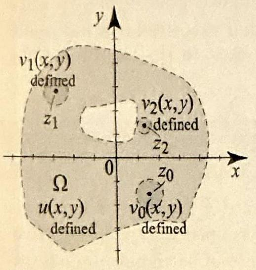
Figure 3 Local existence of the harmonic conjugate.

## COROLLARY 2

COROLLARY 3 GAUSS'S MEAN VALUE PROPERTY

Then $f$ is analytic and $f^{\prime}=\phi$. Write $\zeta=x+i y, d \zeta=d x+i d y$. Then

$$
f(z)=\int_{z_{0}}^{z} u_{x} d x+u_{y} d y+i \overbrace{\int_{z_{0}}^{z}-u_{y} d x+u_{x} d y}^{v(z)}
$$

We claim that $\int_{z_{0}}^{z} u_{x} d x+u_{y} d y=u(z)-u\left(z_{0}\right)$. From this it will follow that $v(z)= \int_{z_{0}}^{z}-u_{y} d x+u_{x} d y$ is a harmonic conjugate of $u(z)$, since $\left(u(z)-u\left(z_{0}\right)\right)+i v(z)=f(z)$ is analytic and the additive constant $u\left(z_{0}\right)$ does not affect analyticity. To prove the claim, parametrize the path from $z_{0}$ to $z$ by $\zeta(t)=x(t)+i y(t), a \leq t \leq b$. Then

$$
u_{x} d x+u_{y} d y=\left(u_{x} \frac{d x}{d t}+u_{y} \frac{d y}{d t}\right) d t=\frac{d}{d t} u(\zeta(t)) d t
$$

by the chain rule in two dimensions. Hence

$$
\int_{z_{0}}^{z} u_{x} d x+u_{y} d y=\int_{a}^{b} \frac{d}{d t} u(\zeta(t)) d t=\left.u(\zeta(t))\right|_{a} ^{b}=u(z)-u\left(z_{0}\right)
$$

as claimed.
Keeping in mind the example of the harmonic function $\ln |z|$ with no harmonic conjugate in the punctured plane $\mathbb{C} \backslash\{0\}$, we see that simple connectedness is a crucial property in Theorem 1, and the result is not true on arbitrary regions. What can we say on arbitrary regions? Suppose that $u$ is harmonic on a region $\Omega$ and let $z_{0}$ be in $\Omega$. Since $\Omega$ is open, we can find an open disk $B_{R}\left(z_{0}\right)$ in $\Omega$. Since $B_{R}\left(z_{0}\right)$ is simply connected, $u$ has a harmonic conjugate in $B_{R}\left(z_{0}\right)$. This means that Theorem 1 holds locally in $\Omega$ (Figure 3). This is a very useful fact that we record separately.
Suppose that $u$ is harmonic on a region $\Omega$. Then $u$ admits a harmonic conjugate locally in $\Omega$.

Using the local existence of a harmonic conjugate, we obtain the mean value property of harmonic functions from the corresponding property for analytic functions.

Suppose that $u$ is harmonic on a region $\Omega$, then $u$ satisfies the mean value property, in the following sense. If $z$ is in $\Omega$, and the closed disk $S_{r}(z)$ ( $r>0$ ) is contained in $\Omega$, then

$$
u(z)=\frac{1}{2 \pi} \int_{0}^{2 \pi} u\left(z+r e^{i t}\right) d t
$$

Proof Let $B$ be an open disk in $\Omega$ containing the closed disk $S_{r}\left(z_{0}\right)$. Since $B$ is simply connected, $u$ admits a harmonic conjugate $v$ in $B$. So $f=u+i v$ is analytic in $B$. By the mean value property of analytic functions ((4), Section 3.7), we have

$$
f(z)=\frac{1}{2 \pi} \int_{0}^{2 \pi} f\left(z+r e^{i t}\right) d t=\frac{1}{2 \pi} \int_{0}^{2 \pi} u\left(z+r e^{i t}\right) d t+\frac{i}{2 \pi} \int_{0}^{2 \pi} v\left(z+r e^{i t}\right) d t
$$

Now take real parts on botli adden to get (3)
dust as we used the mean value property of analytic functions to prove the maximam modulus principle, we could use the mean value property of harmonic functions to prove a corresponding maximum-minimum principle. Such a proof would be more or less identical to that of Theorem 4, Section 3.7. Instend, we offer a proof that uses what we know about barmonic conjugntes and analytic functions. You should pay attention to the role of connectedness.

THEOREM 2 MAXIMUMMINIMUM PRINCIPLE

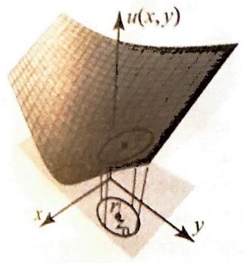
Figure 4

COROLLARY 4

Suppose that $u$ is a harmonic function on a region $\Omega$. If $u$ attains a maximum
or a minimum in $\Omega$, then $u$ is constant in $\Omega$.

Proof By considering $-u$, we need only prove the statement for maxima. We first prove the result under the assumption that $\Omega$ is simply connected. Apply Theorem 1 to find an analytic function $f=u+i v$ on $\Omega$. Consider the function

$$
g(z)=e^{f(z)}=e^{u(z)} e^{i v(z)} .
$$

Then $g$ is analytic in $\Omega$ and $|g(z)|=e^{u(z)}$. Since the real exponential function is strictly increasing, a maximum of $e^{u(z)}$ corresponds to a maximum of $u(z)$. By Theorem 4 of Section 3.7, if $|g(z)|$ attains a maximum or a minimum in $\Omega$, then $g(z)$ is constant, implying that $u(z)$ is constant in $\Omega$.

We now deal with the case of an arbitrary region $\Omega$. The proof has the same basic form as the proof of Theorem 4, Section 3.7. Suppose that $u$ attains a maximum $M$ at a point in $\Omega$. Let $\Omega_{0}=\{z \in \Omega: u(z)<M\}$ and $\Omega_{1}=\{z \in \Omega: u(z)=M\}$. We have $\Omega=\Omega_{0} \cup \Omega_{1}, \Omega_{0}$ is open, and $\Omega_{1}$ is nonempty by assumption. It is enough to show that $\Omega_{1}$ is open (see the proof of Theorem 4, Section 3.7). Suppose that $z_{0}$ is in $\Omega_{1}$ and let $B_{r}\left(z_{0}\right)$ be an open disk in $\Omega$ centered at $z_{0}$ (Figure 4). Since $B_{r}\left(z_{0}\right)$ is simply connected and the restriction of $u$ to $B_{r}\left(z_{0}\right)$ is a harmonic function that attains its maximum at $z_{0}$ inside $B_{r}\left(z_{0}\right)$, it follows from the previous case that $u$ is constant in $B_{r}\left(z_{0}\right)$. Thus $u(z)=M$ for all $z$ in $B_{r}\left(z_{0}\right)$, implying that $B_{r}\left(z_{0}\right)$ is contained in $\Omega_{1}$. Hence $\Omega_{1}$ is open.

Note in Theorem 2 that the minimum and maximum principles are equally strong for harmonic functions; for analytic functions the minimum principle required an additional hypothesis that $f(z)$ was never zero.

The following corollaries of Theorem 2 are similar to results that we proved regarding the modulus of an analytic function. We relegate their proofs to the exercises.

Suppose $\Omega$ is a bounded region, and $u$ is harmonic on $\Omega$ and continuous on the boundary of $\Omega$. Then
(i) $u$ attains its maximum $M$ and minimum $m$ on the boundary of $\Omega$, and
(ii) either $u$ is constant or $m<u<M$ for all points in $\Omega$.

COROLLARY 5

## COROLLARY 6

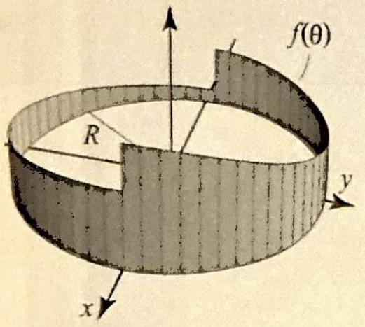
Figure $5 f(\theta)$ gives the boundary data: $f(\theta)= u(R, \theta)$.

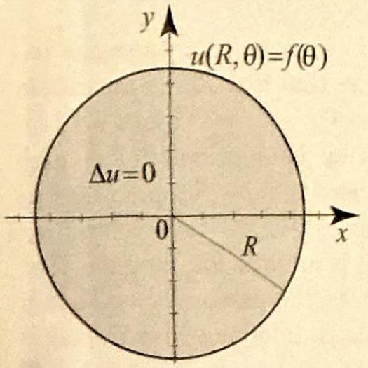
Figure 6 A Dirichlet problem on a disk.

PROPOSITION 1 A DIRICHLET PROBLEM ON THE DISK

Suppose $\Omega$ is a bounded region, and $u$ is harmonic on $\Omega$ and continuous on the boundary of $\Omega$. If $u$ is constant on the boundary of $\Omega$, then $u$ is constant in $\Omega$.

Suppose $\Omega$ is a bounded region, and $u_{1}$ and $u_{2}$ are harmonic on $\Omega$ and continuous on the boundary of $\Omega$. If $u_{1}=u_{2}$ on the boundary of $\Omega$, then $u_{1}=u_{2}$ in $\Omega$.

## Dirichlet Problems on a Disk

We focus now on some applications of the theory of harmonic functions to the solution of Dirichlet problems on a disk. To simplify the presentation, we will work on a disk centered at the origin with radius $R>0$. In polar coordinates, the problem is stated as follows. Suppose we are given a piecewise continuous function $f(\theta), 0<\theta \leq 2 \pi$ that represents boundary data on the points $R e^{i \theta}$ (Figure 5). Find a function $u(r, \theta), 0 \leq r \leq R$, $0<\theta \leq 2 \pi$, such that

$$
\begin{aligned}
& \Delta u(r, \theta)=0, \quad 0 \leq r<R, 0<\theta \leq 2 \pi ; \\
& \lim _{r \uparrow R} u(r, \theta)=u(R, \theta)=f(\theta), \quad 0<\theta \leq 2 \pi,
\end{aligned}
$$

where the limit holds at all points $R e^{i \theta}$ where $f(\theta)$ is continuous (Figure 6). Since $\theta$ and $\theta+2 \pi$ represent the same polar angle, we may remove the restriction on $\theta$ to lie in the interval $[0,2 \pi]$ and instead require $f$ to be $2 \pi$-periodic; that is $f(\theta+2 \pi)=f(\theta)$ for all $\theta$.

In general, the boundary data are given by a piecewise continuous $f$. If the boundary data is continuous, then an immediate consequence of Corollary 6 is the uniqueness of the solution of a Dirichlet problem on a disk. Thus once we have found a solution to a Dirichlet problem with continuous boundary data, this is necessarily the only solution of the problem.

We next consider a Dirichlet problem with special but important type of boundary data:

$$
u(R, \theta)=f(\theta)=a_{0}+\sum_{n=1}^{N}\left(a_{n} \cos n \theta+b_{n} \sin n \theta\right)
$$

This is a linear combination of functions from the $2 \pi$-periodic trigonometric system: $1, \cos x, \cos 2 x, \ldots, \sin x, \sin 2 x, \ldots$.
The solution of the Dirichlet problem on the disk $|z| \leq R$ with boundary condition (6) is

$$
u(r, \theta)=a_{0}+\sum_{n=1}^{N}\left(\frac{r}{R}\right)^{n}\left(a_{n} \cos n \theta+b_{n} \sin n \theta\right)
$$

Proof For $|z|<R$, write $z=r e^{i \theta}=r(\cos \theta+i \sin \theta)$. The function $f(z)=z^{n}= r^{n}(\cos n \theta+i \sin n \theta)$ is analytic on the disk $|z| \leq R$. Hence its real and imaginary parts are harmonic (Theorem 1, Section 2.5). This shows that the functions $1, r \cos \theta, r^{2} \cos 2 \theta, \ldots, r \sin \theta, r^{2} \sin 2 \theta, \ldots$ are harmonic on the disk $|z| \leq R$. B $y$ Proposition 1, Section 2.5, any linear combination of such functions is also harmonic on the unit disk, and so (7) is harmonic. Setting $r=R$ in (7), we see that $u(R, \theta)=f(\theta)$, where $f$ is as in (6). Hence (7) is the solution of the Dirichlet problem with boundary data (6).

Each term in the finite sum (7) is a constant multiple of the harmonic functions $1, r \cos \theta, r^{2} \cos 2 \theta, \ldots, r \sin \theta, r^{2} \sin 2 \theta, \ldots$ With the exception of the constant function 1 , the graphs of these functions over the disk $|z|<R$ are saddle-shaped. This confirms our expectation that the maxima and minima of these functions must occur on the boundary.

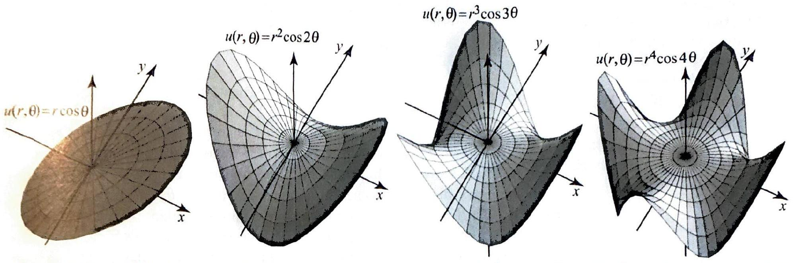
Figure 7 The saddle-shaped graphs of the harmonic functions $r \cos \theta, r^{2} \cos 2 \theta, r^{3} \cos 3 \theta, r^{4} \cos 4 \theta$ seem to confirm the important property that the maximum and minimum of a harmonic function occur on the boundary of the (bounded) region.

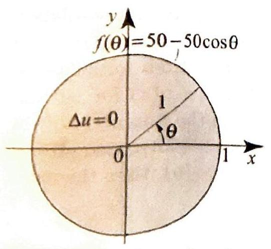
Figure 8 The boundary function, as a function of $\theta$.

## EXAMPLE 2 A steady-state problem on a disk

The temperature on the boundary of a circular plate of unit radius, with insulated lateral surface and center placed at the origin, is a function of the radial angle $\theta$ and varies between $0^{\circ}$ and $100^{\circ}$ according to the formula $f(\theta)=50-50 \cos \theta$ (see Figure 8).
(a) Find the steady-state temperature inside the plate.
(b) Describe the isotherms and lines of heat flow.

Solution (a) To find the steady-state temperature, we must solve the Dirichlet problem with boundary data given by $f(\theta)$. According to (7), the solution is $u(r, \theta)=50-50 r \cos \theta, 0 \leq r<1$. This is a harmonic function, which is equal to $f(\theta)$ when $r=1$ (Figure 9).
(b) Since the temperature on the boundary varies between 0 and 100 , by the maximum-minimum principle for harmonic functions, the temperature inside the plate will vary between these two limits. To find the isotherms, let $0<T<100$ and solve the equation $u(r, \theta)=T$ or $50-50 r \cos \theta=T$. Using $x=r \cos \theta$, the equation

In Figure 9, we show the solution of the Dirichlet problem. Note how on the boundary the values of this solution coincide with the values of the boundary function. In Figure 10, we illustrate the isotherms and lines of heat flow. The orthogonality of these two families of curves is obvious in this case.

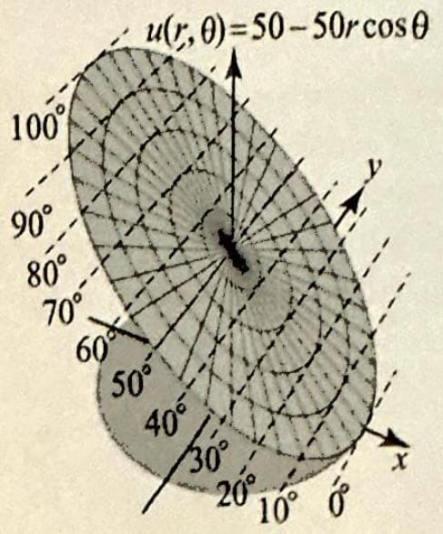
Figure 9

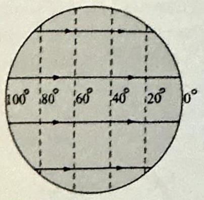
Figure 10

becomes $50-50 x=T$ or $x=\frac{50-T}{50}$. Thus the isotherms are the intersections with the unit disk of the vertical lines $x=\frac{50-T}{50}$. The isotherms vary between $x=1$ and $x=-1$ as $T$ varies between 0 and 100 . We know from Section 2.5 that heat flows along the curves that are orthogonal to the isotherms. In this case, it is easy to sox that heat flows inside the unit disk in the direction of the horizontal lines $y=b$ (Figure 10).

The Dirichlet problem in Proposition 1 is certainly not the most general kind that we can solve on a disk. But here is an amazing fact. Using Fourier series, we will show in Chapter 4 that the solution of the Dirichlet problem with arbitrary piecewise continuous boundary data $f(\theta)$ can be expressed in the form (7) if we allow the series to have infinitely many terms. Moreover, the coefficients $a_{0}, a_{n}$, and $b_{n}$ are precisely the Fourier coefficients of the boundary function $f(\theta)$, and may be obtained by integrating $f(\theta)$ against trigonometric functions. This connection between harmonic functions and Fourier series has many fruitful consequences in applied mathematics.

## Poisson Integral Formula

What is the Poisson integral formula? This is a formula for the solution of the Dirichlet problem on the unit disk. (In later sections, we will discover similar formulas on different regions of the plane.) It is also a formula that allows you to generate the values of a harmonic function $u(z)$ for $z$ inside the unit disk, by using (integrating) the values of $u$ on the boundary of the unit disk $|z|=1$. We already know an example of such a situation: If $u$ is harmonic in a region $\Omega$ containing the closed unit disk $S_{1}(0)$, then the mean value property of $u$ at 0 implies that

$$
u(0)=\frac{1}{2 \pi} \int_{0}^{2 \pi} u\left(e^{i t}\right) d t
$$

This is a special application of the Poisson formula at the point $z=0$. Interestingly, we now show how to derive the Poisson integral formula from
the mean value property. Given a point $z_{0}$ in the open unit disk, if we can construct a harmonic function $U$ on the unit disk such that $U(0)=u\left(z_{0}\right)$, then by applying the mean value property to $U$, we will recapture $U(0)= u\left(z_{0}\right)$ from the values on the boundary. The construction goes as follows. Given $\left|z_{0}\right|<1$, consider the linear fractional transformation

$$
\phi_{-z_{0}}(z)=\frac{z+z_{0}}{1+\overline{z_{0}} z}, \quad|z|<1 .
$$

We know from Example 3, Section 3.7, that $\phi_{-z_{0}}(z)$ is analytic, one-to-one, and maps the unit disk onto itself and $C_{1}(0)$ onto itself. From Theorem 3, Section 2.5, we know that if we compose a harmonic function with an analytic function, we obtain a harmonic function; so $U(z)=u \circ \phi_{-z_{0}}(z)$ is a harmonic function on the unit disk. Moreover, $U(0)=u \circ \phi_{-z_{0}}(0)=u\left(z_{0}\right)$. Applying the mean value property of $U$ at 0 , we find that

$$
u\left(z_{0}\right)=U(0)=\frac{1}{2 \pi} \int_{0}^{2 \pi} U\left(e^{i t}\right) d t=\frac{1}{2 \pi} \int_{0}^{2 \pi} u \circ \phi_{-z_{0}}\left(e^{i t}\right) d t
$$

Thus the value of $u$ at the interior point $z_{0}$ is expressed as an integral involving the boundary values of $u \circ \phi_{-z_{0}}$. To get the desired formula that involves the boundary values of $u$, we will perform the change of variables $e^{i s}=\phi_{-z_{0}}\left(e^{i t}\right)$. Recall that $\phi_{-z_{0}}$ maps the unit circle into itself and the inverse of $\phi_{-z_{0}}$ is $\phi_{z_{0}}$. So

$$
\begin{aligned}
\phi_{z_{0}}\left(e^{i s}\right)=e^{i t} & \Rightarrow \phi_{z_{0}}^{\prime}\left(e^{i s}\right) i e^{i s} d s=i e^{i t} d t \Rightarrow \frac{\phi_{z_{0}}^{\prime}\left(e^{i s}\right)}{e^{i t}} e^{i s} d s=d t \\
& \Rightarrow d t=\frac{\phi_{z_{0}}^{\prime}\left(e^{i s}\right)}{\phi_{z_{0}}\left(e^{i s}\right)} e^{i s} d s
\end{aligned}
$$

Now $\phi_{z_{0}}(z)=\frac{z-z_{0}}{1-\overline{z_{0}} z}$, hence $\phi_{z_{0}}^{\prime}(z)=\frac{1-\left|z_{0}\right|^{2}}{\left(1-\overline{z_{0}} z\right)^{2}}$, and so

$$
\frac{\phi_{z_{0}}^{\prime}\left(e^{i s}\right)}{\phi_{z_{0}}\left(e^{i s}\right)} e^{i s}=e^{i s} \frac{1-\left|z_{0}\right|^{2}}{\left(1-\overline{z_{0}} e^{i s}\right)\left(e^{i s}-z_{0}\right)}=\frac{1-\left|z_{0}\right|^{2}}{\left(e^{-i s}-\overline{z_{0}}\right)\left(e^{i s}-z_{0}\right)}=\frac{1-\left|z_{0}\right|^{2}}{\left|e^{i s}-z_{0}\right|^{2}}
$$

Substituting into (8), we obtain

$$
u\left(z_{0}\right)=\frac{1-\left|z_{0}\right|^{2}}{2 \pi} \int_{0}^{2 \pi} \frac{u\left(e^{i s}\right)}{\left|e^{i s}-z_{0}\right|^{2}} d s \quad\left(\left|z_{0}\right|<1\right)
$$

This is the Poisson integral formula on the unit disk. If $u$ is harmonic in a disk of radius $R>0$, centered at the origin, we consider the function $u(R z)$, which is harmonic in $|z|<1$, and so according to ( 9 ),

$$
u\left(R z_{0}\right)=\frac{1-\left|z_{0}\right|^{2}}{2 \pi} \int_{0}^{2 \pi} \frac{u\left(R e^{i s}\right)}{\left|e^{i s}-z_{0}\right|^{2}} d s \quad\left(\left|z_{0}\right|<1\right)
$$

Let $z=R z_{0}, z_{0}=z / R,|z|=r<R$, then

$$
u(z)=\frac{R^{2}-r^{2}}{2 \pi} \int_{0}^{2 \pi} \frac{u\left(R e^{i s}\right)}{\left|R e^{i s}-z\right|^{2}} d s \quad(|z|<R)
$$

This is the Poisson integral formula on the disk of radius $R>0$, сепtered at the origin. Another common way of expressing the Poisson integral formula is obtained by realizing that for $z=r e^{i \theta}$,

$$
\left|R e^{i \phi}-z\right|^{2}=\left(R e^{i \phi}-r e^{i \theta}\right)\left(R e^{-i \phi}-r e^{-i \theta}\right)=R^{2}-2 r R \cos (\theta-\phi)+r^{2} ;
$$

and so from (10) (with the variable $s$ replaced by $\phi$ ) we obtain the alternative Poisson integral formula

$$
u\left(r e^{i \theta}\right)=\frac{R^{2}-r^{2}}{2 \pi} \int_{0}^{2 \pi} \frac{u\left(R e^{i \phi}\right)}{R^{2}-2 r R \cos (\theta-\phi)+r^{2}} d \phi
$$

In deriving (11), we were given a harmonic function $u(z)$ in a region containing $S_{R}(0)$. The importance of (11) is that it can be used to construct $u(z)$ inside the disk $B_{R}(0)$, when only its (piecewise continuous) values on the circle $C_{R}(0)$ are known. More precisely, we have the following result.

## THEOREM 3 POISSON INTEGRAL FORMULA

Consider the Dirichlet problem (4) on the disk $|z| \leq R$, with boundary conditions (5), where $f(\theta)$ is piecewise continuous for $\theta$ in $[0,2 \pi]$. Then the solution exists and is given by the Poisson integral formula
(12) $u(r, \theta)=\frac{R^{2}-r^{2}}{2 \pi} \int_{0}^{2 \pi} \frac{f(\phi)}{R^{2}-2 r R \cos (\theta-\phi)+r^{2}} d \phi \quad(0 \leq r<R)$.

More precisely, $u(r, \theta)$ is harmonic in the open disk $|z|<R$ and tends to $f(\theta)$ as $r \uparrow R$ at all points of continuity of $f$.
Theorem 3 guarantees the existence of a solution of the Dirichlet problem on a disk. Its proof uses many of the results that we have derived thus far, along with properties of the function

$$
P(r, \theta)=\frac{R^{2}-r^{2}}{R^{2}-2 r R \cos \theta+r^{2}} \quad(0 \leq r<R),
$$

known as the Poisson kernel on a disk. We will present the proof in the exercises. (See Project Problem 26.)

The Poisson formula is difficult to evaluate, even for simple boundary data. For this reason, we will develop later alternative forms of the solution, including some that are based on Fourier series.

We end the section with a useful result obtained by evaluating (12) at $r=0$. The corollary asserts that we can compute the mean value of a
harmonic function at the center of a disk, without necessarily requiring that $u$ be harmonic on the boundary.

COROLLARY 7 MEAN VALUE PROPERTY

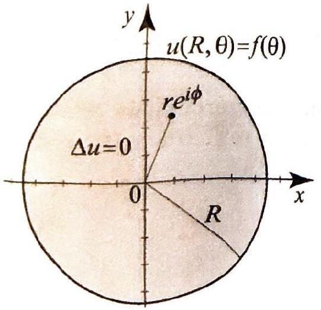
Figure 11 For Exercises 1316.

Suppose that $u\left(r e^{i \phi}\right)$ is harmonic for $0 \leq r<R$ and $0 \leq \phi \leq 2 \pi$, and $u\left(R e^{i \phi}\right)=f(\phi)$, where $f$ is piecewise continuous on the boundary. Then

$$
u(0)=\frac{1}{2 \pi} \int_{0}^{2 \pi} f(\phi) d \phi
$$

## Exercises 3.8

In Exercises 1-4, (a) verify that the function $u$ is harmonic on the given region $\Omega$.
(b) Find the conjugate gradient of $u$ and check that it is analytic on $\Omega$.

1. $u(x, y)=x y, \Omega=\mathbb{C}$.
2. $u(x, y)=e^{y} \cos x, \Omega=\mathbb{C}$.
3. $u(x, y)=\frac{y}{x^{2}+y^{2}}, \Omega=\{z: \operatorname{Im} z>0\}$.
4. $u(x, y)=\ln \left(x^{2}+y^{2}\right), \Omega=\mathbb{C} \backslash(-\infty, 0]$.
5. Suppose that $f=u+i v$ is analytic on a region $\Omega$. Show that the conjugate gradient of $u$ is $f^{\prime}(z)$. [Hint: The Cauchy-Riemann equations.]
6. Suppose that $u$ is harmonic on $\mathbb{C}$ and there is an interval $(a, b)$ with $a<b$ such that $u(x, y)$ is not in $(a, b)$ for all $(x, y)$. Show that $u$ is constant. [Hint: Use Exercise 17, Section 3.7.]
7. (a) Suppose that $u$ is harmonic and bounded on $\mathbb{C}$. Show that $u$ is constant. [Hint: Exercise 6.]
(b) Suppose that $u$ is harmonic on $\mathbb{C}$ and bounded above or below. Show that $u$ is constant. [Hint: Exercise 6.]
8. Find a harmonic conjugate of the function in Exercise 3, using Theorem 1.
9. Suppose that $f$ is analytic on a region $\Omega$. Show that $|f|$ is harmonic on $\Omega$ if and only if $f$ is constant. [Hint: You can use Exercise 20, Section 2.5, or you can use the mean value property of harmonic functions and argue as in the proof of Theorem 4, Section 3.7.]
10. Show in detail how to prove Corollaries 4-6 using Theorem 2.
11. Consider $u(z)=u(x, y)=e^{x} \cos y$, where $z$ is in the square with vertices at $\pm \pi \pm i \pi$. Find the maximum and minimum values of $u(z)$ and determine where these values occur.
12. Show that $u(x, y)=x y$ is harmonic in the upper half-plane. Does $u$ attain a maximum or a minimum on the boundary of the upper half-plane? Does this contradict Corollary 4?

In Exercises 13-16, solve the Dirichlet problem (4)-(5) for the given boundary function $f(\theta)$ on the disk with center at the origin and given radius $R>0$ (Figure 11).
13. $f(\theta)=1-\cos \theta+\sin 2 \theta, R=1$.
14. $f(\theta)=\cos \theta-\frac{1}{2} \sin 2 \theta, R=1$.
15. $f(\theta)=100 \cos ^{2} \theta, R=2$.
16. $f(\theta)=\sum_{n=1}^{10} \frac{\sin n \theta}{n}, R=1$.
17. Find the isotherms in Exercise 13.
18. For $n=1,2, \ldots, 0 \leq r<1$, show that

$$
\frac{1-r^{2}}{2 \pi} \int_{0}^{2 \pi} \frac{\cos n \phi}{1-2 r \cos (\theta-\phi)+r^{2}} d \phi=r^{n} \cos n \theta
$$

and

$$
\frac{1-r^{2}}{2 \pi} \int_{0}^{2 \pi} \frac{\sin n \phi}{1-2 r \cos (\theta-\phi)+r^{2}} d \phi=r^{n} \sin n \theta
$$

[Hint: Identify the integrals as solutions of Dirichlet problems on the unit disk and use Proposition 1.]
19. For $|z|<1$, let

$$
u(z)= \begin{cases}\operatorname{Arg}(z-1)-\operatorname{Arg}(z+1) & \text { if } \operatorname{Im}(z) \geq 0 \\ 2 \pi+\operatorname{Arg}(z-1)-\operatorname{Arg}(z+1) & \text { if } \operatorname{Im}(z)<0\end{cases}
$$

(a) Write $z=r e^{i \theta},-\pi<\theta \leq \pi$. Using basic facts from plane geometry, show that

$$
\lim _{r \uparrow 1} u(z)= \begin{cases}\frac{\pi}{2} & \text { if } 0 \leq \theta \leq \pi, \\ \frac{3 \pi}{2} & \text { if }-\pi<\theta<\pi .\end{cases}
$$

(b) Argue that $u$ is harmonic in the disk $|z|<1$ and describe the Dirichlet problem that $u$ satisfies.
20. Antiderivative of the Poisson kernel. For $0<r<1$, show that

$$
\int \frac{1}{1-2 r \cos \theta+r^{2}} d \theta=\frac{2}{1-r^{2}} \tan ^{-1}\left(\frac{1+r}{1-r} \tan \frac{\theta}{2}\right)+C
$$

[Hint: Use the substitution $t=\tan \frac{\theta}{2}, \cos \frac{\theta}{2}=\frac{1}{\sqrt{1+t^{2}}}, \sin \frac{\theta}{2}=\frac{t}{\sqrt{1+t^{2}}}$, and $d \theta= \frac{2}{1+t^{2}} d t$.]
21. Solve the Dirichlet problem on the unit disk with boundary data

$$
f(\theta)= \begin{cases}100 & \text { if } 0 \leq \theta \leq \pi, \\ 0 & \text { if } \pi<\theta<2 \pi .\end{cases}
$$

[Hint: Apply the Poisson integral formula, then use Exercise 20 to evaluate the integral.]
22. Project Problem: The Poisson kernel. In this exercise, we establish several basic properties of the Poisson kernel (13). Let $z=r e^{i \theta}$, where $0 \leq r<R$ and $\zeta=R e^{i \phi}$.
(a) For fixed $\phi$, consider the function

$$
U(z, \phi)=\frac{R e^{i \phi}+z}{R e^{i \phi}-z}
$$

Show that, for fixed $\phi, U(z, \phi)$ is analytic in $|z|<R$.
(b) Show that

$$
U(z, \phi)=\frac{R^{2}-r^{2}}{R^{2}-2 r R \cos (\theta-\phi)+r^{2}}+i \frac{2 r R \sin (\theta-\phi)}{R^{2}-2 r R \cos (\theta-\phi)+r^{2}}
$$

Conclude that the Poisson kernel satisfies

$$
\operatorname{Re}(U(z, \phi))=P(r, \theta-\phi)=\frac{R^{2}-r^{2}}{R^{2}-2 r R \cos (\theta-\phi)+r^{2}} \quad(0 \leq r<R) .
$$

The function

$$
Q(r, \theta-\phi)=\frac{2 r R \sin (\theta-\phi)}{R^{2}-2 r R \cos (\theta-\phi)+r^{2}} \quad(0 \leq r<R)
$$

is called the conjugate Poisson kernel and it has interesting applications in the theory of harmonic functions.
(c) Show that, for fixed $\phi$, the function $(r, \theta) \mapsto P(r, \theta-\phi)$ is harmonic in the disk $|z|<R$. [Hint: It is the real part of an analytic function.]
(d) For $0<r<R$, show that $P(r, \theta-\phi)$ is a positive $2 \pi$-periodic function of $\theta$.
[Hint: $R^{2}+r^{2}-2 r R \cos (\theta-\phi) \geq R^{2}+r^{2}-2 r R=(R-r)^{2}>0$.]
(e) Show that $P(r, \theta)=P(r,-\theta)$. Thus $P(r, \theta)$ is an even function of $\theta$ (Figure 12). Conclude from (c) that $(r, \theta) \mapsto P(r, \phi-\theta)$ is harmonic in $|z|<R$.
(f) Show that $P(r, \theta)$ is decreasing on the interval $0 \leq \theta \leq \pi$. [Hint: Compute the derivative with respect to $\theta$ and show that it is negative on $(0, \pi)$.]
(g) Using the mean value property of harmonic functions, show that, for $0 \leq r<R$,

$$
\frac{R^{2}-r^{2}}{2 \pi} \int_{0}^{2 \pi} \frac{d \phi}{R^{2}-2 r R \cos (\theta-\phi)+r^{2}}=\frac{1}{2 \pi} \int_{0}^{2 \pi} P(r, \theta-\phi) d \phi=P(0, \theta)=1
$$

and, in particular,

$$
\frac{R^{2}-r^{2}}{2 \pi} \int_{0}^{2 \pi} \frac{d \phi}{R^{2}-2 r R \cos \phi+r^{2}}=\frac{R^{2}-r^{2}}{2 \pi} \int_{-\pi}^{\pi} \frac{d \phi}{R^{2}-2 r R \cos \phi+r^{2}}=1 .
$$

(h) Establish the inequality

$$
\frac{R-r}{R+r} \leq P(r, \theta-\phi) \leq \frac{R+r}{R-r}
$$

[Hint: See the hint in part (d).]
23. Project Problem: Integrals involving the Poisson kernel. We continue deriving properties of the Poisson integral, using the notation of the previous exercise. (a) Let $0<\delta<\pi$. Show that

$$
\lim _{r \rightarrow R} \int_{\delta}^{\pi} P(r, \theta) d \theta=0
$$

[Hint: $P(r, \theta)$ is decreasing on $(0, \pi)$, so $\int_{\delta}^{\pi} P(r, \theta) d \theta \leq(\pi-\delta) P(r, \delta) \rightarrow 0$ as $r \upharpoonleft R$.]
(b) Use (a), and (g) of the previous exercise to show that

$$
\lim _{r \rightarrow R} \frac{1}{2 \pi} \int_{-\delta}^{\delta} P(r, \theta) d \theta=1
$$

So while part $(\mathrm{g})$ of Exercise 23 tells us that the area under the graph of $\frac{1}{2 \pi} P(r, \theta)$ and above the interval $[-\pi, \pi]$ is 1 , this part tells us that the area is more and more concentrated around 0 as $r \upharpoonleft R$.
24. Illustrate the mean value property in Corollary 7 with the function $f(\theta)$ as in Exercise 13.
25. Different ways to express the Poisson integral formula. Show that the Poisson integral formula (12) can be expressed in the following equivalent forms:

$$
\begin{aligned}
& u(r, \theta)=\frac{R^{2}-r^{2}}{2 \pi} \int_{-\pi}^{\pi} \frac{f(\phi)}{R^{2}-2 r R \cos (\theta-\phi)+r^{2}} d \phi \\
& u(r, \theta)=\frac{R^{2}-r^{2}}{2 \pi} \int_{a}^{2 \pi+a} \frac{f(\phi)}{R^{2}-2 r R \cos (\theta-\phi)+r^{2}} d \phi \\
& u(r, \theta)=\frac{R^{2}-r^{2}}{2 \pi} \int_{a}^{2 \pi+a} \frac{f(\theta-\phi)}{R^{2}-2 r R \cos \phi+r^{2}} d \phi
\end{aligned}
$$

where $a$ is any real number. [Hint: The integrand is $2 \pi$-periodic so the integral does not change as long as we integrate over an interval of length $2 \pi$. See Theorem 1, Section 7.1.]
26. Project Problem: Proof of Theorem 3. We will prove Theorem 3 under the assumption that $f(\theta)$ is continuous. The proof in the general case of a piecewise continuous $f$ uses similar ideas but is more technical. We will use the notation of Exercises 22 and 23.
(a) Show that the function defined by the integral (12) is harmonic. [Hint: Write $u(r, \theta)=\frac{1}{2 \pi} \int_{0}^{2 \pi} P(r, \theta-\phi) d \phi=\frac{1}{2 \pi} \operatorname{Re}\left(\int_{0}^{2 \pi} U(z, \phi) d \phi\right)$. Show that $u$ is the real part of an analytic function. You will need Theorem 4, Section 3.5.]
(b) Justify the following steps in the proof of $\lim _{r \rightarrow R} u(r, \theta)=f(\theta)$. We have

$$
\begin{aligned}
|u(r, \theta)-f(\theta)| & =\left|\frac{1}{2 \pi} \int_{0}^{2 \pi} P(r, \theta-\phi) f(\phi) d \phi-f(\theta)\right| \\
& =\left|\frac{1}{2 \pi} \int_{-\pi}^{\pi}(P(r, \phi) f(\theta-\phi)-f(\theta)) d \phi\right| \\
& \leq \frac{1}{2 \pi} \int_{-\pi}^{\pi} P(r, \phi)|f(\theta-\phi)-f(\theta)| d \phi
\end{aligned}
$$

(Use Exercise 22(g) in the second step and (d) in the third step.) Since $f$ is continuous on $[-\pi, \pi]$, it is bounded. Hence $|f(\phi)| \leq M<\infty$ for all $\phi$. Moreover, $f$ is uniformly continuous on $[-\pi, \pi]$. So given $\epsilon>0$, we can find $\delta>0$ such that $|\phi|<\delta$ implies that $|f(\theta-\phi)-f(\theta)|<\epsilon$ for all $\theta$. We have

$$
\begin{aligned}
|u(r, \theta)-f(\theta)| \leq & \frac{1}{2 \pi} \int_{-\delta}^{\delta} P(r, \phi) \overbrace{|f(\theta-\phi)-f(\theta)|}^{<\epsilon} d \phi+ \\
& \frac{1}{2 \pi} \int_{\delta \leq|\phi| \leq \pi} P(r, \phi) \overbrace{|f(\theta-\phi)-f(\theta)|}^{\leq 2 M} d \phi \\
\leq & \epsilon \frac{1}{2 \pi} \int_{-\delta}^{\delta} P(r, \phi) d \phi+\frac{M}{\pi} \int_{\delta \leq|\phi| \leq \pi} P(r, \phi) d \phi
\end{aligned}
$$

Since $P(r, \phi)$ is positive, its integral increases as we enlarge the interval of integra-
tion. Hence $\int_{-\delta}^{\delta} P(r, \phi) d \phi \leq \int_{-\pi}^{\pi} P(r, \phi) d \phi$, and so

$$
\begin{aligned}
|u(r, \theta)-f(\theta)| & \leq \epsilon \overbrace{\frac{1}{2 \pi} \int_{-\pi}^{\pi} P(r, \phi) d \phi}^{=1}+\frac{M}{\pi} \int_{\delta \leq|\phi| \leq \pi} P(r, \phi) d \phi \\
& =\epsilon+\frac{M}{\pi} \int_{\delta \leq|\phi| \leq \pi} P(r, \phi) d \phi
\end{aligned}
$$

As $r \uparrow R$, the last integral tends to 0 (Exercise 23(a). Since $\epsilon$ is arbitrary, it follows that $|u(r, \theta)-f(\theta)|$ tends to 0 independently of $\theta$, as $r \uparrow R$.

We have effectively shown that $u(r, \theta)$, the Poisson integral of $f$, converges uniformly to $f(\theta)$ as $r \uparrow R$, if (and only if) $f$ is continuous. The concept of uniform convergence is extremely important in the theory of analytic and harmonic functions. We will study it in great detail in the following chapter.
