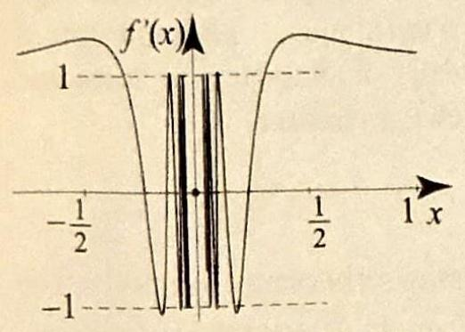
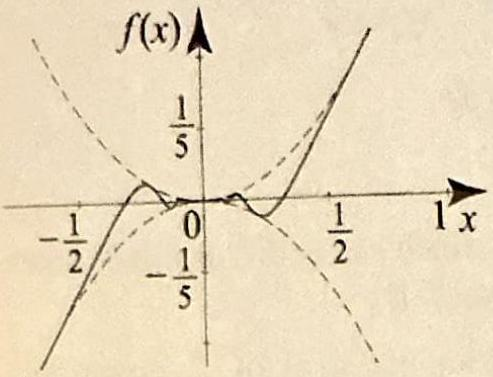
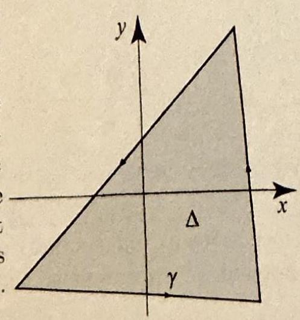
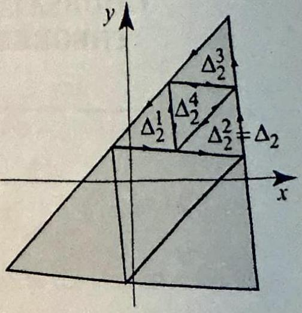
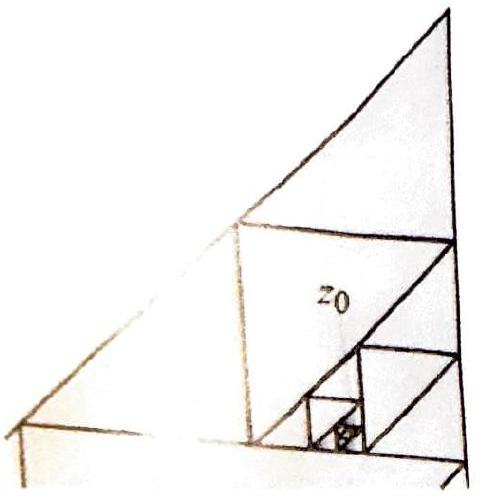
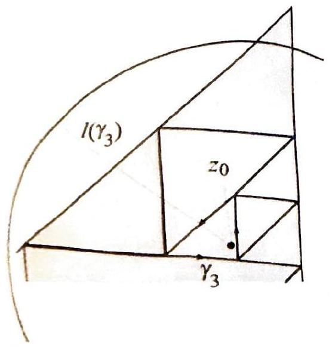

> [!review]
> 1. If a complex-valued function $f$ defined on an open set $\Omega$ has a derivative at every point of $\Omega$, is $f$ necessarily analytic on $\Omega$ ? Prove your answer.
> 2. State a necessary and sufficient condition for a complex-valued function $f$ defined on an open set $\Omega$ to be analytic on $\Omega$.


This section contains one theoretical result, Goursat's theorem, named after the French mathematician and member of the French Academy of Science, Edouard Goursat (1858-1936).

Goursat's theorem says that if a function $f(z)$ has a derivative $f^{\prime}(z)$ for all $z$ in an open set $\Omega$ (that is, if $f$ is differentiable in $\Omega$ ), then $f^{\prime}(z)$ is necessarily continuous on $\Omega$ (that is, $f$ is analytic on $\Omega$ ). Remember that when we defined analytic functions in Section 2.3, we required the existence and the continuity of $f^{\prime}(z)$. Goursat's theorem gives us automatically the continuity of $f^{\prime}(z)$, as soon as we know that $f^{\prime}(z)$ exists. With this result, we can go back to the definition of analytic functions and restate it without the additional assumption on the continuity of the derivative. This is truly an achievement not only for obvious aesthetical improvements to the theory, but it will broaden the scope of the applications by allowing us to use this theory without checking the continuity of the derivative, which is difficult to realize in some cases.


> [!theorem] Theorem 1: Goursat's Theorem
> Let $f$ be a complex-valued function on an open set $\Omega$. If $f$ is differentiable on $\Omega$; that is, if the derivative
> 
> $$
> f^{\prime}\left(z_{0}\right)=\lim _{z \rightarrow z_{0}} \frac{f(z)-f\left(z_{0}\right)}{z-z_{0}}
> $$
> 
> exists for all $z_{0}$ in $\Omega$, then $f$ is analytic on $\Omega$ (that is, $f^{\prime}$ is continuous on $\Omega$ ).

Before we prove the theorem, let us make some additional remarks. Let us record the following important improvement to the definition of analytic functions.


> [!theorem] Theorem 2: Analytic Functions
> Let $f$ be a complex-valued function on an open set $\Omega$. Then $f$ is analytic on $\Omega$ if and only if
> 
> $$
> f^{\prime}\left(z_{0}\right)=\lim _{z \rightarrow z_{0}} \frac{f(z)-f\left(z_{0}\right)}{z-z_{0}}
> $$
> 
> exists for all $z_{0}$ in $\Omega$.


You should contrast Theorem 1 with the real variable case, where a derivative $f^{\prime}(x)$ may exist without being continuous. 


> [!exercise]
> Show that the function
> 
> $$
> f(x)= \begin{cases}x^2 \sin \frac{1}{x} & \text { if } x \neq 0 \\ 0 & \text { if } x=0\end{cases}
> $$
> 
> has a derivative at every point of $\mathbb{R}$ but that $f^{\prime}$ is not continuous at $x=0$.


For example, you can check that the function

$$
f(x)= \begin{cases}x^{2} \sin \frac{1}{x} & \text { if } x \neq 0 \\ 0 & \text { if } x=0\end{cases}
$$

has a derivative for all $x$, but $f^{\prime}(x)$ is not continuous at 0 (see _Figure 1_).


> [!figure] Figure 1
> 
> ```horizontal
> 
> 
> 
> ---
> 
> 
> 
> ```
> 
> Figure 1 The function $f(x)$ is defined on the real line and has derivative $f^{\prime}(x)$ that exists everywhere, but $f^{\prime}(x)$ is not continuous at $x=$ 0 . Goursat's theorem tells us that nothing like this happens with functions defined on regions $\Omega$ in $\mathbb{C}$. If $f^{\prime}$ exists on $\Omega$, then it must be continuous on $\Omega$.


In the proof of Goursat's theorem, we will use the following notion. If $A$ is a closed and bounded subset of $\mathbb{C}$, we define the diameter of $A$ to be the largest value of $\left|z-z^{\prime}\right|$, where $z$ and $z^{\prime}$ are in $A$. A basic theorem from topology, known as Cantor's intersection theorem, states that if $\left\{A_{n}\right\}$ is an infinite sequence of nested closed and bounded subsets of $\mathbb{C}$ (that is, $A_{1} \supset A_{2} \supset \cdots \supset A_{n} \supset \cdots$ ), such that the diameter of $A_{n}$ tends to 0 as $n \rightarrow \infty$, then the intersection of all the $A_{n}$ 's is nonempty and equals precisely one point. In symbols, there is a point $z_{0}$, such that $\bigcap_{n=1}^{\infty} A_{n}=\left\{z_{0}\right\}$. The statement of Cantor's theorem is intuitively clear. Its proof depends on properties of the complex plane. We will omit it and refer the interested reader to any book on advanced calculus.


**Proof of Theorem 1** We will apply the strong version of Morera's theorem (Exercise 37, Section 3.6). Let $\Delta$ be an arbitrary triangle lying in some disk in $\Omega$ and let $\gamma$ denote the boundary of $\Delta$. Subdivide $\Delta$ into four congruent subtriangles by taking the midpoints of the sides and connecting them with line segments. Call the subtriangles $\Delta_{1}^{j}, j=1,2,3,4$ and let $\gamma_{1}^{j}$ denote the boundary of $\Delta_{1}^{j}$, with the same orientation as $\gamma$ (say positive; see _Figure 2_). 


> [!figure] Figure 2
> 
> ```horizontal
> 
> 
> 
> ---
> 
> 
> 
> ---
> 
> 
> 
> ```
> 
> Figure 2 This figure illustrates the case when $\left|I_{1}^{3}\right|$ is larger than $\left|I_{1}^{j}\right|$ for $j=1,2,3,4$. In this case, we pick the triangle $\Delta_{1}^{3}$ and set $\Delta_{2}= \Delta_{1}^{3}$. Next, we subdivide $\Delta_{2}$ into four congruent triangles and proceed as before to determine $\Delta_{3}$. Continue ad infinitum.


Let

$$
I=\int_{\gamma} f(z) d z, \quad \text { and } \quad I_{1}^{j}=\int_{\gamma_{1}^{j}} f(z) d z, \quad j=1,2,3,4
$$


Figure Cantor's intersection the an applied to the sequence of nested triangles with diameters shrinking to 0 yields the point $z_{0}$ that belongs to all the triangles in this sequence.

Our goal is to show that $I=0$. Denote by $\Delta_{1}$ that $\Delta_{1}^{j}$ for which $\left|I_{1}^{j}\right|(j=1,2,3,4)$ is the largest, and let $\gamma_{1}$ and $I_{1}$ denote the corresponding boundary and integral, respectively. Thus,

$$
\left|I_{1}\right|=\left|\int_{\gamma_{1}} f(z) d z\right| \geq\left|\int_{\gamma_{1}^{j}} f(z) d z\right|, \quad j=1,2,3,4
$$

We have

$$
|I|=\left|\sum_{j=1}^{4} \int_{\gamma_{1}^{j}} f(z) d z\right| \leq \sum_{j=1}^{4}\left|\int_{\gamma_{1}^{j}} f(z) d z\right| \leq 4\left|I_{1}\right| .
$$

Now we repeat the process starting with $\Delta_{1}$ to get $\Delta_{2}$, and so on, and generate an infinite sequence of triangles. By the way we constructed the triangles, we have

$$
l(\gamma)=2 l\left(\gamma_{1}\right), \quad l\left(\gamma_{1}\right)=2 l\left(\gamma_{2}\right), \quad \text { etc. },
$$

and so

$$
\frac{|I|}{l(\gamma)^{2}} \leq \frac{4\left|I_{1}\right|}{l(\gamma)^{2}}=\frac{\left|I_{1}\right|}{l\left(\gamma_{1}\right)^{2}} \leq \frac{\left|I_{2}\right|}{l\left(\gamma_{2}\right)^{2}} \leq \cdots \leq \frac{\left|I_{n}\right|}{l\left(\gamma_{n}\right)^{2}} \leq \cdots .
$$

The triangles $\Delta_{n}$ form a sequence of nested closed sets with diameters tending to 0 . By Cantor's intersection theorem, there is exactly one point, say $z_{0}$, that belongs to all $\Delta_{n}$ (_Figure 3_). 


> [!figure] Figure 3
> 
> ![[Screenshot 2026-04-02 at 8.10.27 AM.png]]
> Figure 3 Cantor's intersection theorem applied to the sequence of nested triangles with diameters shrinking to 0 yields the point $z_0$ that belongs to all the triangles in this sequence.


We now appeal to the differentiability of $f$ at $z_{0}$ and write

$$
f(z)=f\left(z_{0}\right)+f^{\prime}\left(z_{0}\right)\left(z-z_{0}\right)+\epsilon(z)\left(z-z_{0}\right),
$$

where $\epsilon(z) \rightarrow 0$ as $z \rightarrow z_{0}$. So the maximum value of $|\epsilon(z)|$ can be made arbitrarily small by restricting $z$ to small disks around $z_{0}$. In particular, if we let $M_{n}$ denote the maximum value of $|\epsilon(z)|$ for $z$ in $\Delta_{n}$, then $M_{n} \rightarrow 0$ as $n \rightarrow \infty$, because $\Delta_{n}$ contains $z_{0}$ and its diameter tends to zero. We have

$$
\begin{aligned}
I_{n} & =\int_{\gamma_{n}} f(z) d z=\int_{\gamma_{n}}\left(f\left(z_{0}\right)+f^{\prime}\left(z_{0}\right)\left(z-z_{0}\right)+\left(z-z_{0}\right) \epsilon(z)\right) d z \\
& =f\left(z_{0}\right) \underbrace{\int_{\gamma_{n}} d z}_{=0}+f^{\prime}\left(z_{0}\right) \underbrace{\int_{\gamma_{n}}\left(z-z_{0}\right) d z}_{=0}+\int_{\gamma_{n}}\left(z-z_{0}\right) \epsilon(z) d z \\
& =\int_{\gamma_{n}}\left(z-z_{0}\right) \epsilon(z) d z,
\end{aligned}
$$

where the first two integrals on the left side of the equality before the last are 0 by Cauchy's theorem, since $\gamma_{n}$ is a closed curve, and the functions 1 and $z-z_{0}$ are analytic with continuous derivatives (thus we may apply our version of Cauchy's theorem for analytic functions with continuous derivatives, from Section 3.4). To approximate the last integral, note that for $z$ on $\gamma_{n}$, we have $\left|z-z_{0}\right| \leq l\left(\gamma_{n}\right)$ (see _Figure 4_), and so

$$
\left|I_{n}\right|=\left|\int_{\gamma_{n}}\left(z-z_{0}\right) \epsilon(z) d z\right| \leq l\left(\gamma_{n}\right)^{2} M_{n} .
$$

Consequently,

$$
\frac{\left|I_{n}\right|}{l\left(\gamma_{n}\right)^{2}} \leq M_{n} \rightarrow 0, \quad \text { as } n \rightarrow \infty,
$$

and it follows from (1) that $|I|=0$, completing the proof.


> [!figure] Figure 4
> 
> 
> Figure 4 The inequality $z-z_{0} \mid \leq l\left(\gamma_{n}\right)$ for $z$ on $\gamma_{n}$ and $z_{0}$ inside $\gamma_{n}$, illustrated with $n=3$.


Goursat's theorem will be needed at crucial stages in proofs of results in the following chapter.

## Exercises 3.9

> [!exercise] Exercise 1
> 1. Consider calculus of a real variable and take the function $f(x)=x^{2} \sin (1 / x)$.
> (a) Show that $f^{\prime}(x)$ exists for all $x \neq 0$, and find a formula for $f^{\prime}(x)$.
> (b) Show that $f^{\prime}(0)$ also exists by explicitly computing the limit
> 
> $$
> \lim _{x \rightarrow 0} \frac{f(x)-f(0)}{x-0}
> $$
> 
> What is $f^{\prime}(0)$ ? **(Hint: Use the squeeze theorem.)**
> (c) Show that $f^{\prime}(x)$ is not continuous at zero, because $\lim _{x \rightarrow 0} f^{\prime}(x)$ does not exist. **(Hint: Consider sequences of real numbers $x_{n}=\frac{1}{2 n \pi}$ and $\xi_{n}=\frac{1}{(2 n+1) \pi}$. Each sequence tends to zero. Compute $\lim _{n \rightarrow \infty} f^{\prime}\left(x_{n}\right)$ and $\lim _{n \rightarrow \infty} f^{\prime}\left(\xi_{n}\right)$. If $f^{\prime}(x)$ had a limit, these sequential limits would have to be the same.)**
> 
> 


> [!exercise] Exercise 2
> 2. In complex analysis, a function $f(z)$ that is differentiable on an open set must have a continuous derivative. In real analysis, as we saw in Exercise 1, this is not the case. However, the derivative of a real function does satisfy an intermediate value theorem: If $f(x)$ is differentiable on $[a, b]$ and $\alpha$ is any real number in between $f^{\prime}(a)$ and $f^{\prime}(b)$ (say, $\left.f^{\prime}(a)<\alpha<f^{\prime}(b)\right)$, then $\alpha=f^{\prime}(c)$ for some $c$ in $(a, b)$. This theorem is attributed to Duhamel.
> (a) Let $g(x)=f(x)-\alpha x$. Show that $g(x)$ is differentiable on $[a, b]$, that $g^{\prime}(a)<0$. and that $g^{\prime}(b)>0$.
> (b) The function $g(x)$ is differentiable, so it must be continuous on $[a, b]$. By the extreme value theorem, it must attain a minimum. Argue from part (a) that this minimum cannot occur at the endpoints $x=a$ or $x=b$. Hence the minimum occurs at $x=c$ with $a<c<b$.
> (c) Show that if $g(x) \geq g(c)$ in a neighborhood of $c$, and if $g^{\prime}(c)$ exists, then $g^{\prime}(c)=0$. **(Hint: Take limits of the difference quotient as $x \downharpoonright c$ and $x \upharpoonleft c$ to show that $g^{\prime}(c) \geq 0$ and $g^{\prime}(c) \leq 0$, respectively.)**
> (d) Conclude that $f^{\prime}(c)=\alpha$ for some $c$ in $(a, b)$.
