## Topics to Review

The definition of path in Section 3.1 is based on the parametric form of curves from calculus. The definition of path integral in Section 3.2 is based on the definition of definite integrals as a limit of Riemann sums, from calculus. A good understanding of these notions and the fundamental theorem of calculus are required. We will also use basic properties of continuous functions in proofs. (For example, if $f$ is continuous on $[a, b]$, then $f$ attains its maximum and minimum values in $[a, b]$.)

## Looking Ahead

Sections 3.1 and 3.2 contain essential definitions and properties pertaining to path integrals. They should be covered in detail. Section 3.3 gives necessary and sufficient conditions for independence of path. These statements are important on a theoretical side, but not very useful from a practical side. So, if proofs are not stressed, this section can be skipped or covered quickly. Section 3.4 is the heart of the subject. A thorough treatment is required. The mathematical definition of deformation of path in Section 3.4 can be skipped. Sections 3.6 and 3.7 are very important. They include striking applications of Cauchy's theorem. They should be covered thoroughly. Section 3.8 is optional; it continues our parallel study of harmonic functions and Dirichlet problems. Section 3.9 contains one theoretical result and can be omitted entirely without affecting the continuity of the course.

## 3

## COMPLEX INTEGRATION

## There is no let up! No end to it! ... Innumerable calculations. Endless fighting. Signs. Formulas. Theorems besetting me from dawn to dusk.   -Augustin Louis Cauchy

Having studied the derivative in Chapter 2, our next step is to study the integral of a function of a complex variable. If $f(z)$ is defined on a subset $\Omega$ of $\mathbb{C}$ and $z_{1}$ and $z_{2}$ are points in $\Omega$, how can we define the integral of $f$ from $z_{1}$ to $z_{2}$ ? First we must define the notion of path $\gamma$ in $\Omega$ from $z_{1}$ to $z_{2}$ (Section 3.1); then we will define the integral over this path (Section 3.2), denoted by $\int_{\gamma} f(z) d z$. In Section 3.2, an expression of this integral is given in terms of the usual Riemann integral from calculus, but applied to complex-valued functions on an interval $[a, b]$.

The most important question in this chapter concerns the independence of path: When does $\int_{\gamma} f(z) d z$ depend only on $z_{1}$ and $z_{2}$ and not on $\gamma$ ? The answer to this question is provided by Cauchy's theorem (Theorem 2, Section 3.4). Cauchy's theorem is to complex analysis what the fundamental theorem of calculus is to calculus. The discussion of Cauchy's theorem in Section 3.4 will lead us to important topics such as simple connectedness of regions in $\mathbb{C}$. We will derive very useful versions of Cauchy's theorem for simply and multiply connected regions.

The proof of Cauchy's theorem is nontrivial. It will be presented in complete detail in Section 3.5.

In Sections 3.6 and 3.7 we start the applications of Cauchy's theorem and derive Cauchy's generalized integral formula, which is the basis for all the applications that will follow. We illustrate the power of this theory by giving a simple proof of the fundamental theorem of algebra (Section 3.7) and by deriving various striking properties of analytic functions, including the mean value property and the maximum modulus principle.

In Section 3.8, we use the theory of analytic functions to study harmonic functions and the solution of Dirichlet problems. In particular, we will give a simple derivation of the famous Poisson integral formula, by using a simple change of variables and the mean value property of analytic functions.

### 3.1 Contours and Paths in the Complex Plane

You may recall the notion of a curve from calculus as being the graph of a

Figure 1

Figure 3 Negative and positive orientation.

$$
x=x(t)=\cos t, \quad y=y(t)=\sin t, \quad 0 \leq t \leq \pi .
$$

A parametric form of a curve is thus a representation of the curve by a pair of equations: $x=x(t)$ and $y=y(t)$, where $t$ ranges over a set of real numbers, usually a closed interval $[a, b]$ (see Figure 2). Each value of $t$ determines a point $\gamma(t)=(x(t), y(t))$, which traces the curve as $t$ varies.

Figure 2 A parametric interval mapping to a curve.

A curve may have more than one parametrization. For example, the interval $[0,1]$ can be parametrized as $\gamma_{1}(t)=t, 0 \leq t \leq 1$ or $\gamma_{2}(t)=t^{2}, 0 \leq t \leq 1$. Both $\gamma_{1}$ and $\gamma_{2}$ represent the same curve. In our analysis, we will always choose and work with a specific parametrization of the curve. For that reason, it will be convenient to refer to a curve by its parametrization $\gamma(t)$ or simply $\gamma$, even though the curve may have more than one parametrization.

Let $\gamma(t), a \leq t \leq b$, be a parametrization of a curve. As $t$ varies from $a$ to $b$ the point $\gamma(t)$ traces the curve in a specific direction, starting with $\gamma(a)$, the initial point of $\gamma$, and ending at $\gamma(b)$, the terminal point of $\gamma$. For continuous curves, this direction is usually denoted by an arrow on the curve. A curve is closed if $\gamma(a)=\gamma(b)$. For circles and circular arcs, if the arrow points in the counterclockwise direction, we will say that the curve has positive orientation. Curves traversed in the clockwise direction have negative orientation (see Figure 3).

Since $z=x+i y$, it makes sense to adopt the notation $z(t)=x(t)+i y(t)$. In particular, we can write the parametric form of a curve $\gamma$ using complex notation as

$$
\gamma(t)=x(t)+i y(t), \quad a \leq t \leq b,
$$

Figure 4(a) A positively oriented arc with initial point $e^{i \alpha}$ and terminal point $e^{i \beta}$.

Figure 4(b) A positively oriented circle.

Figure 4(c) Dilating and then translating a circle.

Figure 5 A hypotrochoid.

and think of the curve as the graph of a complex-valued function of a real variable $t$. The following examples illustrate the use of the complex notation.

EXAMPLE 1 Parametric forms of arcs, circles, and line segments (a) The arc in Figure 4(a) is conveniently parametrized by $\gamma(t)=e^{i t}=\cos t+i \sin t$, $\alpha \leq t \leq \beta$. Its initial point is $e^{i \alpha}$ and its terminal point is $e^{i \beta}$.
(b) The positively oriented circle in Figure 4(b) is parametrized by

$$
\gamma(t)=e^{i t}=\cos t+i \sin t, \quad 0 \leq t \leq 2 \pi .
$$

The circle is a closed curve with initial point $\gamma(0)=1$ and terminal point $\gamma(2 \pi)=1$. (c) The circle in Figure 4(c) is centered at $z_{0}$ with radius $R>0$. We obtain its parametrization by dilating and then translating the equation in (b). This gives

$$
\gamma(t)=z_{0}+R e^{i t}=z_{0}+R(\cos t+i \sin t), \quad 0 \leq t \leq 2 \pi .
$$

For example, the equation

$$
\gamma(t)=1+i+2 e^{i t}, \quad 0 \leq t \leq 2 \pi,
$$

represents a circle centered at the point ( 1,1 ), with radius 2 .
(d) Let $z_{1}$ and $z_{2}$ be arbitrary complex numbers. A directed line segment $\left[z_{1}, z_{2}\right]$ is the path $\gamma$ over $[0,1]$ defined by

$$
\gamma(t)=(1-t) z_{1}+t z_{2}, \quad 0 \leq t \leq 1 .
$$

Its initial point is $\gamma(0)=z_{1}$ and its terminal point is $\gamma(1)=z_{2}$. $\square$

As our next example illustrates, there is definitely an advantage in using the complex notation, especially when the parametric representation of a curve involves trigonometric functions.

## EXAMPLE 2 A hypotrochoid in complex notation

A hypotrochoid is a curve given in parametric form by

$$
x(t)=a \cos t+b \cos \left(\frac{a t}{2}\right), \quad y(t)=a \sin t-b \sin \left(\frac{a t}{2}\right) .
$$

Express the equation of the hypotrochoid in complex notation.
Solution In complex form, we have

$$
\begin{aligned}
\gamma(t) & =x(t)+i y(t) \\
& =\left(a \cos t+b \cos \left(\frac{a t}{2}\right)\right)+i\left(a \sin t-b \sin \left(\frac{a t}{2}\right)\right) \\
& =a(\cos t+i \sin t)+b\left(\cos \left(\frac{a t}{2}\right)-i \sin \left(\frac{a t}{2}\right)\right) \\
& =a e^{i t}+b e^{-i \frac{a t}{2}} .
\end{aligned}
$$

We have taken $a=8$ and $b=5$ and plotted the corresponding hypotrochoid in Figure 5 (where $0 \leq t \leq 2 \pi$ ).

If $\gamma(t)$ is a curve parametrized by the interval $[a, b]$, the reverse of $\gamma$ is the curve $\gamma_{r}(t)$ (sometimes written $-\gamma$ ) parametrized by the same interval $[a, b]$ and given by

$$
\gamma_{r}(t)=\gamma(b+a-t) .
$$

The reverse of $\gamma$ traces the same set of points as $\gamma$ but in the opposite direction, starting with $\gamma_{r}(a)=\gamma(b)$ and ending with $\gamma_{r}(b)=\gamma(a)$.

The reverse of the directed line segment $\left[z_{1}, z_{2}\right]$ in Example 1(d) is clearly the line segment $\left[z_{2}, z_{1}\right]$ with equation

$$
\gamma_{r}(t)=\gamma(1-t)=t z_{1}+(1-t) z_{2}, \quad 0 \leq t \leq 1 .
$$

The curves in Example 1 are all continuous, as can be seen from their graphs. In fact, these curves have differentiability properties that will be needed when studying integrals along curves. Recall that a curve is given as the graph of a complex-valued function of a real variable. So, in order to study their differentiability properties, we next investigate the derivative of a complex-valued function of a real variable (not to be confused with the derivative of a complex-valued function of a complex variable, $f^{\prime}(z)$ ).

## Complex-Valued Functions of a Real Variable

Given a complex-valued function of a real variable $f(t)=u(t)+i v(t)$, we define the derivative of $f$ in the usual way by

$$
f^{\prime}(t)=\frac{d}{d t} f(t)=\lim _{h \rightarrow 0} \frac{f(t+h)-f(t)}{h} .
$$

As we did in the proof of Theorem 3, Section 2.2, you can show that $f^{\prime}(t)$ exists if and only if $u^{\prime}(t)$ and $v^{\prime}(t)$ both exist, and

$$
f^{\prime}(t)=u^{\prime}(t)+i v^{\prime}(t)
$$

The derivative of a complex-valued function of a real variable satisfies many properties similar to those of the usual derivative of a real-valued function. In particular, if $f$ and $g$ are complex-valued differentiable functions, $\alpha$ and $\beta$ are complex numbers, then

$$
\begin{aligned}
& (\alpha f(t)+\beta g(t))^{\prime}=\alpha f^{\prime}(t)+\beta g^{\prime}(t), \\
& (f(t) g(t))^{\prime}=f^{\prime}(t) g(t)+g^{\prime}(t) f(t), \\
& \left(\frac{f(t)}{g(t)}\right)^{\prime}=\frac{f^{\prime}(t) g(t)-g^{\prime}(t) f(t)}{g(t)^{2}} \quad(g(t) \neq 0), \\
& (f(g(t)))^{\prime}=f^{\prime}(g(t)) g^{\prime}(t) .
\end{aligned}
$$

We leave the verification of these rules as an exercise.

## EXAMPLE 3 Derivative of $e^{\alpha t}$

Suppose that $\alpha=a+i b$ is a complex number. Show that $\frac{d}{d t} e^{\alpha t}=\alpha e^{\alpha t}$. Hence we recover the same formula from calculus. In particular, if $\alpha=i \omega$ is purely imaginary, then

$$
\frac{d}{d t} e^{i \omega t}=i \omega e^{i \omega t} .
$$

Solution We have $e^{a t}=e^{a t}(\cos b t+i \sin b t)$, and so using (5) we obtain

$$
\begin{aligned}
\frac{d}{d t} e^{a t} & =\frac{d}{d t}\left(e^{a t} \cos b t\right)+i \frac{d}{d t}\left(e^{a t} \sin b t\right) \\
& =\left(a e^{a t} \cos b t-b e^{a t} \sin b t\right)+i\left(a e^{a t} \sin b t+b e^{a t} \cos b t\right) \\
& =(a+i b)\left(e^{a t} \cos b t+i e^{a t} \sin b t\right) \\
& =a e^{a t} .
\end{aligned}
$$

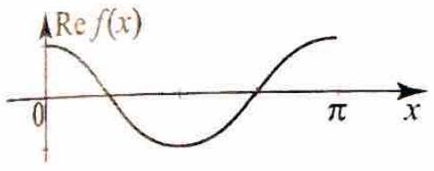
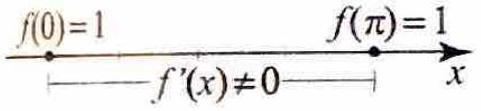

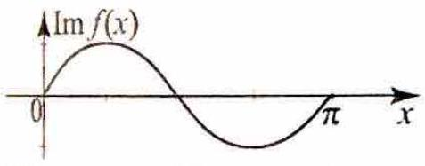
Figure $6 f(2 \pi)-f(0)=$

0 , but $f^{\prime}(x) \neq 0$ for all $x$ in ( $0,2 \pi$ ) showing that the mean value property fails for complex-valued functions.

Having stated properties of the derivative of a real-valued function that hold for complex-valued functions of a real variable, we should caution you that not all properties of derivatives that hold in the real case hold in the complex case. Most notably, the mean value property does not hold for complex-valued functions. In the real case, the mean value property states that if $f$ is continuous on $[a, b]$ and differentiable on $(a, b)$, then $f(b)-f(a)= f^{\prime}(c)(b-a)$ for some $c$ in $(a, b)$. This property does not hold for complexvalued functions. To see this, consider $f(x)=e^{i x}$ for $x$ in $[0,2 \pi]$. Then $f$ is continuous on $[0,2 \pi]$ and has a derivative $f^{\prime}(x)=i e^{i x}$ on $(0,2 \pi)$. Also, $f(2 \pi)-f(0)=1-1=0$, but $f^{\prime}(x)$ never vanishes since $\left|f^{\prime}(x)\right|=\left|i e^{i x}\right|= \left|e^{i x}\right|=1$. Hence there is no number $c$ in $(0,2 \pi)$ such that $f(2 \pi)-f(0)= (2 \pi-0) f^{\prime}(c)$, and so the mean value property does not hold (Figure 6).

Before returning to the main topic of curves, we show with an application how complex-valued functions can simplify greatly the solution of problems involving real-valued functions.

## EXAMPLE 4 A second order ordinary differential equation

Find a particular solution $y_{p}(x)$ of

$$
y^{\prime \prime}-2 y^{\prime}+y=\cos 2 x .
$$

This is a second order linear differential equation with constant coefficients. It is nonhomogeneous because of the term $\cos 2 x$ (see Appendix A.2).

Whereas the solution $y_{p}$ of (11) has to include a sine and a cosine term to account for the derivatives of $\cos 2 x$, in finding a particular solution of (12) we can try $y=A e^{2 i x}$ for the good reason that the derivative of an exponential function is again another exponential function.

DEFINITION 1
PIECEWISE CONTINUOUS AND PIECEWISE SMOOTH FUNCTIONS

Solution Typically we would solve this problem by using the method of undetermined coefficients, which tells us to try $y_{p}=a \cos 2 x+b \sin 2 x$, where $a$ and $b$ are real constants. The solution is completed by plugging $y_{p}$ into the equation and solving for $a$ and $b$. Although the steps are straightforward, they require a lot of computations. We can simplify the problem by thinking of $\cos 2 x$ as the real part of $e^{2 i x}$ and considering the differential equation

$$
y^{\prime \prime}-2 y^{\prime}+y=e^{2 i x}
$$

The trick is to solve (12) and then take real parts to obtain a solution of (11). Dealing with (12) is easier. For a particular solution we try $y=A e^{2 i x}$, where $A$ is a complex number. From Example 3, we have

$$
y^{\prime}=2 i A e^{2 i x} \text { and } y^{\prime \prime}=-4 A e^{2 i x}
$$

Plugging into (12) and simplifying, we obtain

$$
-4 A e^{2 i x}-4 i A e^{2 i x}+A e^{2 i x}=e^{2 i x} \Rightarrow e^{2 i x} A(-3-4 i)=e^{2 i x} .
$$

Dividing by $e^{21 x}$ and simplifying, we find

$$
A=\frac{1}{-3-4 i}=\frac{-3+4 i}{(-3-4 i)(-3+4 i)}=-\frac{3}{25}+i \frac{4}{25} .
$$

Hence a particular solution of (12) is

$$
\begin{aligned}
y & =\left(-\frac{3}{25}+i \frac{4}{25}\right) e^{2 x}=\left(-\frac{3}{25}+i \frac{4}{25}\right)(\cos 2 x+i \sin 2 x) \\
& =\left(-\frac{3}{25} \cos 2 x-\frac{4}{25} \sin 2 x\right)+i\left(\frac{4}{25} \cos 2 x-\frac{3}{25} \sin 2 x\right)
\end{aligned}
$$

Taking real parts, we obtain a particular solution of (11):

$$
y_{p}(x)=-\frac{3}{25} \cos 2 x-\frac{4}{25} \sin 2 x
$$

You should verify that this is indeed a solution by plugging it back into (11).
In the exercises, we illustrate the use of the method of Example 4 in solving other interesting nonhomogeneous differential equations.

## Contours and Paths

Returning to our discussion of complex-valued functions of a real variable. we introduce the following useful definitions.
A complex-valued function of a real variable $f(t)$ is said to be piecewise continuous on $[a, b]$ if the following hold:
(i) $f(t)$ exists and is continuous for all but finitely many points in $(a, b)$.
(ii) At any point $c$ in $(a, b)$ where $f$ fails to be continuous. both the left limit $\lim f(t)$ and the right limit $\lim f(t)$ exist and are finite.
(iii) At the endpoints, the right limit $\lim _{t, a} f(t)$ and the left limit $\lim _{t \mid b} f(t)$ exist and are finite.
The function $f(t)$ is said to be piecewise smooth on $[a, b]$ if $f$ and $f^{\prime}$ are both piecewise continuous on $[a, b]$.

EFINITION 2 PATH OR CONTOUR

Figure 7 for Example 5.

Eigure 8 for Example 6.

If $f$ and $f^{\prime}$ are both continuous on $[a, b]$ we will say that $f$ is smooth or continuously differentiable on $[a, b]$.

We are now in a position to introduce the notion of path, which is fundamental to our development of the theory of integration. Recall that we have referred to a curve by its parametrization $\gamma(t)$. In addition, we will attribute to the curve the analytical properties of the function $\gamma(t)$, such as continuity and differentiability. Thus, when we talk about a continuous curve or a differentiable curve, we have in mind a specific parametrization with these properties.
By a path or a contour we mean a continuous piecewise smooth curve $\gamma(t)$ over a closed interval $[a, b]$.

A path $\gamma$ is continuously differentiable or smooth on $[a, b]$ if $\gamma(t)$ and $\gamma^{\prime}(t)$ are continuous on $[a, b]$. Thus, according to Definition 2, a path or a contour $\gamma$ is a finite sequence of continuously differentiable curves, $\gamma_{1}, \gamma_{2}, \ldots, \gamma_{n}$, joined together end-to-end. In this case, it is sometimes convenient to write $\gamma=\left(\gamma_{1}, \gamma_{2}, \ldots, \gamma_{n}\right)$. The path is closed if the initial point of $\gamma_{1}$ is joined to the terminal point of $\gamma_{n}$.

## EXAMPLE 5 Path

The path $\gamma$ in Figure 7 is made up of three smooth curves: the line segment $\gamma_{1}= [-2,-1]$; the semi-circle $\gamma_{2}$; and the line segment $\gamma_{3}=[1,2]$. We can parametrize $\gamma$ by the interval [-2,2] as follows:

$$
\gamma(t)= \begin{cases}t & \text { if }-2 \leq t \leq-1, \\ e^{i \frac{\pi}{2}(1-t)} & \text { if }-1 \leq t \leq 1 . \\ t & \text { if } 1 \leq t \leq 2 .\end{cases}
$$

The choice of the interval $[-2,2]$ was just for convenience. Other closed intervals can be used to parametrize $\gamma$.

## EXAMPLE 6 Polygonal paths

A polygonal path. $\gamma=\left[z_{1}, z_{2}, \ldots, z_{n}\right]$, consists of a directed broken line going through the points $z_{1}, z_{2} \ldots, z_{n}$, with initial point $z_{1}$ and terminal point $z_{n}$. The path is closed if $z_{1}=z_{n}$. As an illustration, let $z_{1}=0, z_{2}=1+i$, and $z_{3}=-1+i$; then $\gamma=\left[z_{1}, z_{2}, z_{3}, z_{1}\right]$ is a closed polygonal path. To find the equation of $\gamma$, we start by finding the equations of the paths $\gamma_{1}, \gamma_{2}$, and $\gamma_{3}$, shown in Figure 8. From Example 1(d), we have

$$
\begin{array}{ll}
\gamma_{1}(t)=(1+i) t, & 0 \leq t \leq 1 ; \\
\gamma_{2}(t)=(1-t)(1+i)+t(-1+i)=(1+i)-2 t, & 0 \leq t \leq 1 ; \\
\gamma_{3}(t)=(1-t)(-1+i) . & 0 \leq t \leq 1 .
\end{array}
$$

We can now use these equations to parametrize $\gamma$ over a closed interval, say $[0,1$. This can be done by reparanetrizing $\gamma_{1}$ over $\left[0, \frac{1}{3}\right], \gamma_{2}$ over $\left[\frac{1}{3}, \frac{2}{3}\right], \gamma_{3}$ over $\left[\frac{2}{3}, 1\right]$, and

Figure 9 for Example 6.

Figure 10 A path that degenerates to a point.

Figure 11 A doubly traced circle.

then pasting the three equations to form the path $\gamma$ (Figure 9). To parametrize $\gamma_{1}$ over $\left[0, \frac{1}{3}\right]$, it suffices to change $t$ to $3 t$. This yields

$$
\gamma_{1}(t)=3 t(1+i), \quad 0 \leq t \leq \frac{1}{3} .
$$

To parametrize $\gamma_{2}$ over $\left[\frac{1}{3}, \frac{2}{3}\right]$, we first scale down by changing $t$ to $3 t$,

$$
\gamma_{2}(t)=(1+i)-6 t, \quad 0 \leq t \leq \frac{1}{3} .
$$

We then shift to the right by $\frac{1}{3}$ units and get

$$
\gamma_{2}(t)=(1+i)-6\left(t-\frac{1}{3}\right)=3+i-6 t, \quad \frac{1}{3} \leq t \leq \frac{2}{3} .
$$

For $\gamma_{3}$, we first scale by a factor of $\frac{1}{3}$ and get

$$
\gamma_{3}(t)=(1-3 t)(-1+i), \quad 0 \leq t \leq \frac{1}{3} .
$$

We then shift to the right by $\frac{2}{3}$ units and get

$$
\gamma_{3}(t)=\left(1-3\left(t-\frac{2}{3}\right)\right)(-1+i)=(-1+i)(3-3 t), \quad \frac{2}{3} \leq t \leq 1 .
$$

Pasting the equations together, we obtain

$$
\gamma(t)= \begin{cases}3 t(1+i) & \text { if } 0 \leq t \leq \frac{1}{3}, \\ 3+i-6 t & \text { if } \frac{1}{3} \leq t \leq \frac{2}{3}, \\ (-1+i)(3-3 t) & \text { if } \frac{2}{3} \leq t \leq 1 .\end{cases}
$$

The polygonal path $\gamma$ is clearly continuous with a piecewise continuous derivative. It is thus a path in the sense of Definition 2.

Our next example shows two interesting cases of paths.

## EXAMPLE 7 Degenerate and doubly traced paths

(a) Describe the path given by $\gamma(t)=z_{0}, a \leq t \leq b$.
(b) Describe the path given by $\gamma_{2}(t)=R e^{i t}, 0 \leq t \leq 4 \pi$, and describe how it is different from $\gamma_{1}(t)=\operatorname{Re}^{i t}, 0 \leq t \leq 2 \pi$.
Solution (a) As $t$ ranges through the interval $[a, b]$, the value of $\gamma(t)$ remains fixed at the point $z_{0}$. Clearly $\gamma(t)$ is continuous and $\gamma^{\prime}(t)=0$ is also continuous, so $\gamma(t)$ is a path, which has degenerated to a single point (Figure 10).
(b) Points on the path $\gamma_{2}(t)$ are on the circle of radius $R$, centered at the origin.

As $t$ ranges from 0 to $4 \pi, \gamma(t)$ traces around the circle twice. The path is shown in Figure 11; double arrows show that the path is traced twice in the counterclockwise direction. The path $\gamma_{1}(t)$ traces around the circle only once. The two paths are not the same but have the same graphs. $\square$

As a convention, whenever we refer to a closed path, we mean the path that is traversed only once, unless otherwise stated. As an illustration, we will

Figure $12 f(t)$ is continuous and ex lifferentiable, but its graph in tot a path.

Figure 13 Arc of a circle with center at $-3+2 i$ and radius 5 .

Figure 14 Arc of a circle with center at 0 and radius 2 .

call the path $\gamma_{2}(t)$ in Example 7(b) the circle of radius $R$, centered at 0 , traversed twice in the positive direction.

Our final example is a differentiable curve that is not a path.

## EXAMPLE 8 A curve that is not a path

Let $f(t)=t^{2} \sin \frac{1}{t}$ for $t \neq 0$ and $f(0)=0$, and define a curve $\gamma(t)=t+i f(t)$, where $-\pi \leq t \leq \pi$. The graph of $\gamma$ is simply the graph of $f(t)$ over the interval $[-\pi, \pi]$. For $t \neq 0$, we have $f^{\prime}(t)=2 t \sin \frac{1}{t}-\cos \frac{1}{t}$, and $f^{\prime}(0)=0$ (use the definition of the derivative and the squeeze theorem). So $f(t)$ is continuous and differentiable on the closed interval $[-\pi, \pi]$. But $f^{\prime}(t)$ is discontinuous at 0 and neither the left nor the right limits of $f^{\prime}(t)$ exist at 0 (see Exercise 1, Section 3.9). So $\gamma^{\prime}(t)$ is not piecewise continuous in $[-\pi, \pi]$ and hence $\gamma(t)$ is not a path. The graphs of $f$ and $f^{\prime}$ are shown in Figure 12. Note the discontinuity at 0 of $f^{\prime}(t)$.

## Exercises 3.1

In Exercises 1-14, a curve is given. Parametrize it over a suitable interval $[a, b]$ and plot the curve when the graph is not given.

1. The line segment with initial point $z_{1}=1+i$ and terminal point $z_{2}=-1-2 i$.
2. The line segment through the origin as initial point and terminal point $z=e^{i \frac{\pi}{3}}$.
3. The counterclockwise circle with center at $3 i$ and radius 1 .
4. The clockwise circle with center at $-2-i$ and radius 3 .
5. The positively oriented arc on the unit circle such that $-\frac{\pi}{4} \leq \arg z \leq \frac{\pi}{4}$.
6. The negatively oriented arc on the unit circle such that $-\frac{\pi}{4} \leq \arg z \leq \frac{\pi}{4}$.
7. The directed line segment $\left[z_{1}, z_{2}, z_{3}, z_{1}\right]$ where $z_{1}=0, z_{2}=i$, and $z_{3}=-1$.
8. The directed line segment $\left[z_{1}, z_{2}, z_{3}, z_{4}\right]$ where $z_{1}=1, z_{2}=2, z_{3}=i$, and $z_{4}=2 i$.
9. The contour in Figure 13.
10. The contour in Figure 14.
11. The contour in Figure 15.
12. The reverse of the contour in Figure 13.
13. The reverse of the contour in Figure 14.
14. The reverse of the contour in Figure 15.

In Exercises 15-18, plot the given path.
15. $\gamma(t)=t e^{-i t}, 0 \leq t \leq 2 \pi$.
16. $\gamma(t)=2 \cos t+i \sin t, 0 \leq t \leq 2 \pi$.
17. $\gamma(t)=t+i \sin (\pi t), 0 \leq t \leq 1$.
18. $\gamma(t)=t^{2}+i t,-3 \leq t \leq 3$.

In Exercises 19 24, find the derivative of the given function.
19. $f(t)=t e^{-i t}$.
20. $f(t)=e^{2 i t^{2}}$.
21. $f(t)=(2+i) \cos (3 i t)$.
22. $f(t)=\frac{2+i+t}{-i-2 t}$.
23. $f(t)=\left(\frac{t+i}{t-i}\right)^{2}$.
24. $f(t)=\log (i t)$.

In Exercises 25 28, find a particular solution of the given differential equation. Use the technique of Example 4. (Hint for Exercise 27: Think of an exponential function whose real part is $e^{t} \cos t$.)
25. $y^{\prime \prime}+y^{\prime}+y=\cos t$.
26. $y^{\prime \prime}+y=\sin 3 t$.
27. $y^{\prime \prime}-y=e^{t} \cos t$.
28. $y^{\prime \prime}+y^{\prime}+y=t \cos t$.

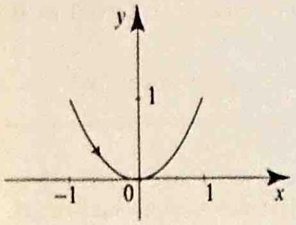
Figure 15 Arc of a parabola for Exercise 11.

Using complex methods. Very often when we use complex methods to solve a real problem, we end up solving two problems: one associated with the real part of the solution and one with its imaginary part. For example, when we solved the differential equation $y^{\prime \prime}-2 y^{\prime}+y=\cos 2 x$ in Example 4, we also obtained the solution to $y^{\prime \prime}-2 y^{\prime}+y=\sin 2 x$, as can be seen from taking the imaginary part of $y=\left(-\frac{3}{25}+i \frac{4}{25}\right) e^{2 i x}$, which is the solution of $y^{\prime \prime}-2 y^{\prime}+y=e^{i 2 x}$.
In Exercises 29-30, you are given a real differential equation. Find a particular solution by envisioning the equation as the real or imaginary part of a complex differential equation. Also, state the corresponding problem and a particular solution for the other part of the complex differential equation.
29. $y^{\prime \prime}-2 y^{\prime}-3 y=\cos 4 t$.
30. $y^{\prime \prime}+y^{\prime}+y=3+\sin 2 t$.

In Exercises 31-34, a curve is given in parametric form. (a) Find the equation of the curve in complex form. (b) Plot the curve for specific values of $a$ and $b$ of your choice.
31. A hypocycloid $(a>b)$

$$
\begin{aligned}
& x(t)=(a-b) \cos t+b \cos \left(\frac{a-b}{b} t\right), \\
& y(t)=(a-b) \sin t-b \sin \left(\frac{a-b}{b} t\right) .
\end{aligned}
$$

33. An epitrochoid

$$
\begin{gathered}
x(t)=a \cos t-b \cos \left(\frac{a t}{2}\right) \\
y(t)=a \sin t-b \sin \left(\frac{a t}{2}\right)
\end{gathered}
$$

32. An epicycloid

$$
\begin{aligned}
& x(t)=(a+b) \cos t-b \cos \left(\frac{a+b}{b} t\right), \\
& y(t)=(a+b) \sin t-b \sin \left(\frac{a+b}{b} t\right) .
\end{aligned}
$$

34. A trochoid

$$
\begin{gathered}
x(t)=a t-b \sin t \\
y(t)=a-b \cos t
\end{gathered}
$$

### 3.2 Complex Integration

Our goal in this section is to construct the integral of a complex-valued function along a path in the complex plane. Since our construction is mod-

Figure 1 The Riemann integral as a limit of Riemann eled after the Riemann integral from calculus, we start the section with a quick review of some notions from integral calculus.

Suppose that $f$ is a real-valued continuous function defined on $[a, b]$. Let $P$ be a partition of $[a, b]$ consisting of closed subintervals of $[a, b]$ with endpoints $a=x_{0}<x_{1}<x_{2}<\cdots<x_{m}=b$. Let $|P|$ denote the norm of the partition, being the largest of the lengths $\Delta x_{k}=x_{k}-x_{k-1}$. Now consider the Riemann sum corresponding to $P$ (see Figure 1):

$$
\sum_{k=1}^{m} f\left(x_{k}^{\star}\right)\left(x_{k}-x_{k-1}\right),
$$

where $x_{k}^{\star}$ is a point in $\left[x_{j-1}, x_{j}\right]$. From calculus, we know that as the partition gets finer, that is, as $|P| \rightarrow 0$, the Riemann sum (1) converges to a finite number called the definite integral of $f$ and denoted by $\int_{a}^{b} f(x) d x$. Also, if $F$ is any antiderivative of $f$, then by the fundamental theorem of calculus sums.

Figure 2 We integrate a complex-valued function by integrating its real and imagibary parts separately.

we have

$$
\int_{a}^{b} f(x) d x=F(b)-F(a)
$$

Our next step is to extend the Riemann integral to complex-valued functions of a real variable.

## Riemann Integral of Complex-Valued Functions

Suppose that $f(x)=u(x)+i v(x)$ is a complex-valued continuous function on $[a, b]$. How should we define its integral over $[a, b]$ ? Motivated by the construction of the Riemann integral of a real-valued function, we consider a partition $P$ of $[a, b]$ given by $a=x_{0}<x_{1}<x_{2}<\cdots<x_{m}=b$, and form the corresponding Riemann sum analog of (1):

$$
\begin{aligned}
& \sum_{k=1}^{m} f\left(x_{k}^{\star}\right)\left(x_{k}-x_{k-1}\right) \\
& \quad=\sum_{k=1}^{m} u\left(x_{k}^{\star}\right)\left(x_{k}-x_{k-1}\right)+i \sum_{k=1}^{m} v\left(x_{k}^{\star}\right)\left(x_{k}-x_{k-1}\right)
\end{aligned}
$$

where $x_{k}^{\star}$ is a point in $\left[x_{k-1}, x_{k}\right]$. Since $u$ and $v$ are continuous, the Riemann sums on the right converge to $\int_{a}^{b} u(x) d x+i \int_{a}^{b} v(x) d x$. This leads us to the following definition of the definite integral in the complex-valued case:
(4)

$$
\int_{a}^{b} f(x) d x=\int_{a}^{b}(u(x)+i v(x)) d x=\int_{a}^{b} u(x) d x+i \int_{a}^{b} v(x) d x
$$

If $f(x)$ is a piecewise continuous complex-valued function on $[a, b]$, to define its integral over $[a, b]$, we write $[a, b]$ as the finite union of adjacent closed subintervals $\left[a_{0}, a_{1}\right],\left[a_{1}, a_{2}\right], \ldots,\left[a_{m-1}, a_{m}\right]$, with $a_{0}=a$ and $a_{m}=b$, such that $f$ is continuous on each subinterval (see Figure 2). Using (4), we define

$$
\int_{a}^{b} f(x) d x=\sum_{j=1}^{m} \int_{a_{j-1}}^{a_{j}} u(x) d x+i \sum_{j=1}^{m} \int_{a_{j-1}}^{a_{j}} v(x) d x
$$

Thus we can treat the integral of a piecewise continuous complex-valued function as a (complex) linear combination of Riemann integrals of realvalued functions. The integral as defined by (4) or (5) inherits many of the properties of the integral for real-valued functions. For example, consider

PROPOSITION 1 RIEMANN INTEGRAL OF COMPLEX-VALUED FUNCTIONS

Figure 3 An antiderivative of a piecewise continuous function may not be continuous.
the following properties, whome prows are left to Exercise 10.
(i) If $a$ and 3 are complex mambers and $f$ and $g$ are picewise contintoma complex-saluel functions on $\{a, b\}$, then
(6) $\quad \int_{a}^{b}(a f(x)+\beta g(x)) d x=a \int_{a}^{b} f(x) d x+1 \int_{a}^{b} g(x) d x$.
(ii) If $f$ is a piecewie continuous complex-valued function on $[a, d]$ and 1 $a \leq b \leq c$, then
(7)

$$
\int_{a}^{a} f(x) d x=\int_{a}^{b} f(x) d x+\int_{b}^{c} f(x) d x
$$

EXAMPLE 1 A complex-valued piecewise continuous function Evaluate $\int_{0}^{2} f(x) d x$, where

$$
f(x)= \begin{cases}(1+i) x & \text { if } 0 \leq x \leq 1 . \\ i x^{2} & \text { if } 1<x \leq 2 .\end{cases}
$$

Solution We use (5) and properties of the integral and get

$$
\begin{aligned}
\int_{0}^{2} f(x) d x & =\int_{0}^{1} f(x) d x+\int_{1}^{2} f(x) d x \\
& =(1+i) \int_{0}^{1} x d x+i \int_{1}^{2} x^{2} d x \\
& =\frac{1+i}{2}+\frac{i}{3}(8-1)=\frac{1}{2}+i \frac{17}{6}
\end{aligned}
$$

## Antiderivatives of Complex-Valued Functions

If $f$ is a piecewise continuous complex-valued function on $[a, b]$, we will say that $F$ is an antiderivative of $f$ if $F^{\prime}(x)=f(x)$ at all the points of continuity of $f$ on $\{a, b\}$, where $F^{\prime}(x)$ is defined as in (5), Section 3.1. Hence if we write $f(x)=u(x)+i v(x)$ and $F(x)=U(x)+i V(x)$, then the equalities

$$
U^{\prime}(x)=u(x) \text { and } V^{\prime}(x)=v(x)
$$

hold for all but finitely many $x$ 's in $[a, b]$. Using the previous notation. we write $[a, b]$ as the finite union of adjacent closed subintervals $\left[a_{0}-a_{1}\right]$. $\left[a_{1}, a_{2}\right], \ldots,\left[a_{m-1}, a_{m}\right]$, with $a_{0}=a$ and $a_{m}=b$, and such that $f$ is continuous on each subinterval. The functions $U(x)$ and $V(x)$ are continuous on each subinterval and this makes $F$ piecewise continuous on $[a, b]$. However. $F$ may not be continuous at the points $a_{j}$ (see Figure 3). For practical purposes, we want $F$ to be continuous on $[a, b]$. As we now show, a continuous antiderivative can always be found.

Figure 4 Selecting a continuous ant derivative.

Let $f_{j}$ denote the restriction of $f$ to $\left[a_{j-1}, a_{j}\right]$, and let $F_{j}$ denote an antiderivative of $f_{j}$ over $\left[a_{j-1}, a_{j}\right]$. Each $F_{j}$ is computed up to an arbitrary complex constant, which can be determined in such a way to make $F$ continuous.

Start by setting the arbitrary constant in $F_{1}$ equal 0 . Then determine the constant in $F_{2}$ so that $\lim _{x \uparrow a_{1}} F_{1}(x)=\lim _{x \downarrow a_{1}} F_{2}(x)$. (We use the uparrow to denote a limit from the left and the down-arrow a limit from the right.) This determines $F_{2}$ and makes the antiderivative of $f$ continuous on $\left[a, a_{2}\right]$. Continue in this fashion: once you have found $F_{j}$, determine the constant in $F_{j+1}$ so that $\lim _{x \uparrow a_{j}} F_{j}(x)=\lim _{x \downarrow a_{j}} F_{j+1}(x)$. By construction, the resulting function $F$ will be continuous on $[a, b]$ (see Figure 4). The following example illustrates the method.

## EXAMPLE 2 Finding a continuous antiderivative

Find a continuous antiderivative of the function in Example 1,

$$
f(x)= \begin{cases}(1+i) x & \text { if } 0 \leq x \leq 1, \\ i x^{2} & \text { if } 1<x \leq 2 .\end{cases}
$$

Solution By integrating each continuous part of $f$, we obtain

$$
F(x)= \begin{cases}\frac{1+i}{2} x^{2} & \text { if } 0 \leq x \leq 1, \\ \frac{i}{3} x^{3}+C & \text { if } 1<x \leq 2,\end{cases}
$$

where $C$ is an arbitrary constant. Note how in the first part of $F$ we already set the arbitrary constant equal 0 . To determine $C$, we evaluate $F$ at 1 using both formulas from the intervals $(0,1)$ and $(1,2)$ and get

$$
\frac{1+i}{2}=\frac{i}{3}+C \Rightarrow C=\frac{1}{2}+\frac{i}{6} .
$$

Hence

$$
F(x)= \begin{cases}\frac{1+i}{2} x^{2} & \text { if } 0 \leq x \leq 1, \\ \frac{2}{3} x^{3}+\frac{1}{2}+\frac{i}{6} & \text { if } 1<x \leq 2,\end{cases}
$$

is a continuous antiderivative of $f$ on $[0,2]$. $\square$

The following is an extension of the fundamental theorem of calculus to piecewise continuous complex functions.

Suppose that $f$ is a piecewise continuous complex-valued function on the interval $[a, b]$ and let $F$ be a continuous antiderivative of $f$ in $[a, b]$. Then

$$
\int_{a}^{b} f(x) d x=F(b)-F(a)
$$

Proof Suppose first that $f=u+i v$ is continuous on $[a, b]$. Let $F(x)=U(x)+ i V(x)$ be an antiderivative of $f$. Using (4) and the fundamental theorem of calculus, we sce that

$$
\begin{aligned}
\int_{a}^{b} f(x) d x & =\int_{a}^{b} u(x) d x+i \int_{a}^{b} v(x) d x \\
& =(U(b)-U(a))+i(V(b)-V(a)) \\
& =(U(b)+i V(b))-(U(a)+i V(a))=F(b)-F(a)
\end{aligned}
$$

and hence (8) holds. If $f$ is piecewise continuous on $[a, b]$, we use (5) and the previous case, and get

$$
\begin{aligned}
\int_{a}^{b} f(x) d x & =\sum_{j=1}^{m} \int_{a_{j-1}}^{a_{j}} f(x) d x=\sum_{j=1}^{m}\left(F\left(a_{j}\right)-F\left(a_{j-1}\right)\right) \\
& =F\left(a_{m}\right)-F\left(a_{0}\right)=F(b)-F(a)
\end{aligned}
$$

which proves (8).
As an application of Theorem 1, let us evaluate the integral in Example 1 by using the continuous antiderivative that we found in Example 2. In the notation of Example 2, we have

$$
\int_{0}^{2} f(x) d x=F(2)-F(0)=\left(\frac{i}{3} 2^{3}+\frac{1}{2}+\frac{i}{6}\right)-0=\frac{1}{2}+\frac{17}{6} i
$$

which agrees with the result of Example 1.
It is easy to show that two continuous antiderivatives of $f$ differ by a complex constant on $[a, b]$. Motivated by Theorem 1, we will write

$$
\int f(x) d x=F(x)+C
$$

where $C$ is an arbitrary complex constant, to denote the set of all continuous antiderivatives of $f$. For example, if $\alpha \neq 0$ is a complex number, then

$$
\int e^{\alpha t} d t=\frac{1}{\alpha} e^{\alpha t}+C \quad(\alpha \neq 0)
$$

as can be checked by verifying that the derivative of the right side is equal to the integrand on the left side. This simple integral of a complex-valued function has an interesting application to the evaluation of tedious integrals from calculus.

## EXAMPLE 3 Integrating $e^{a x} \cos b x$ and $e^{a x} \sin b x$

Let $a$ and $b$ be arbitrary nonzero real numbers. Compute

$$
I_{1}=\int e^{a x} \cos b x d x \quad \text { and } \quad I_{2}=\int e^{a x} \sin b x d x
$$

Solution The idea is to compute $I=I_{1}+i I_{2}$ and then obtain $I_{1}$ and $I_{2}$ by taking real and imaginary parts of $I$. We have

$$
\begin{aligned}
I & =I_{1}+i I_{2}=\int e^{a x} \cos b x d x+i \int e^{a x} \sin b x d x \\
& =\int e^{a x}(\cos b x+i \sin b x) d x=\int e^{(a+i b) x} d x \\
& =\frac{1}{a+i b} e^{(a+i b) x}+C
\end{aligned}
$$

by (10). Now we need only rewrite $\frac{1}{a+i b} e^{(a+i b) x}$ in terms of its real and imaginary parts. Multiplying and dividing by the denominator's conjugate $a-i b$,

$$
\begin{aligned}
\frac{1}{a+i b} e^{(a+i b) x} & =\frac{e^{a x}}{a^{2}+b^{2}}(a-i b)(\cos b x+i \sin b x) \\
& =\frac{e^{a x}}{a^{2}+b^{2}}(a \cos b x+b \sin b x)+i \frac{e^{a x}}{a^{2}+b^{2}}(a \sin b x-b \cos b x)
\end{aligned}
$$

Therefore, we conclude that

$$
\int e^{a x} \cos b x d x=\frac{e^{a x}}{a^{2}+b^{2}}(a \cos b x+b \sin b x)+C_{1}
$$

and

$$
\int e^{a x} \sin b x d x=\frac{e^{a x}}{a^{2}+b^{2}}(a \sin b x-b \cos b x)+C_{2}
$$

where $C_{1}$ and $C_{2}$ are arbitrary real constants. As you know, if we were to compute $I_{1}$ and $I_{2}$ via real calculus, each integral would require two integrations by parts. So there is a clear advantage to using complex-valued functions.

We now have all the tools that we need to construct the integral along a path in the complex plane.

## Path or Contour Integrals

Suppose that $\gamma(t), a \leq t \leq b$ is a path; that is, $\gamma(t)$ is a continuous complexvalued function on $[a, b]$ with piecewise continuous derivative $\gamma^{\prime}(t)$. Suppose that $f(z)$ is a continuous complex-valued function on the graph of $\gamma(t)$; that is, the function $t \mapsto f(\gamma(t))$ is a continuous function from $[a, b]$ into $\mathbb{C}$. Our goal is to construct the integral of $f$ over $\gamma$.

Figure 5 Partitioning a path - into smaller ares with endpoints at $\gamma\left(t_{k}\right)$.

To simplify our discussion, we first deal with the case where $\gamma$ and $\gamma^{\prime}$ are both continuous on $[a, b]$. Taking a hint from the Riemann integral, we partition

Figure 6 Forming a Riemann-like sum of a complex-valued function of a path $\gamma$.

the path $\gamma$ into smaller arcs with endpoints at $\gamma\left(t_{k}\right)$ (Figure 5); evaluate $f\left(\gamma\left(t_{k}^{\star}\right)\right)$, where $\gamma\left(t_{k}^{\star}\right)$ is a point on the arc between $\gamma\left(t_{k-1}\right)$ and $\gamma\left(t_{k}\right)$; and then sum all the terms of the form $f\left(\gamma\left(t_{k}^{\star}\right)\right)\left(\gamma\left(t_{k}\right)-\gamma\left(t_{k-1}\right)\right)$ (Figure 6). This leads us to consider a Riemann-like sum
where $a=t_{0}<t_{1}<\cdots<t_{m}=b$ is a partition of $[a, b]$, and $t_{k}^{\star}$ is in $\left[t_{k-1}, t_{k}\right]$. Writing $\gamma(t)=x(t)+i y(t)$ so that $\gamma^{\prime}(t)=x^{\prime}(t)+i y^{\prime}(t)$, and appealing to the mean value theorem from calculus, we get

$$
\begin{aligned}
& \sum_{k=1}^{m} f\left(\gamma\left(t_{k}^{\star}\right)\right)\left(\gamma\left(t_{k}\right)-\gamma\left(t_{k-1}\right)\right) \\
& \quad=\sum_{k=1}^{m} f\left(\gamma\left(t_{k}^{\star}\right)\right)\left(x\left(t_{k}\right)-x\left(t_{k-1}\right)\right)+i \sum_{k=1}^{m} f\left(\gamma\left(t_{k}^{\star}\right)\right)\left(y\left(t_{k}\right)-y\left(t_{k-1}\right)\right) \\
& \quad=\sum_{k=1}^{m} f\left(\gamma\left(t_{k}^{\star}\right)\right) x^{\prime}\left(\alpha_{k}\right)\left(t_{k}-t_{k-1}\right)+i \sum_{k=1}^{m} f\left(\gamma\left(t_{k}^{\star}\right)\right) y^{\prime}\left(\beta_{k}\right)\left(t_{k}-t_{k-1}\right)
\end{aligned}
$$

where $t_{k-1}<\alpha_{k}, \beta_{k}<t_{k}$. Interpreting each sum on the right as a Riemann sum (in the usual sense from calculus) over the interval $[a, b]$, we see that as the partition gets finer, the sum on the left converges to

$$
\begin{aligned}
\int_{a}^{b} f(\gamma(t)) x^{\prime}(t) d t+i \int_{a}^{b} f(\gamma(t)) y^{\prime}(t) d t & =\int_{a}^{b} f(\gamma(t))\left(x^{\prime}(t)+i y^{\prime}(t)\right) d t \\
& =\int_{a}^{b} f(\gamma(t)) \gamma^{\prime}(t) d t
\end{aligned}
$$

$$
\sum_{k=1}^{m} f\left(\gamma\left(t_{k}^{\star}\right)\right)\left(\gamma\left(t_{k}\right)-\gamma\left(t_{k-1}\right)\right)
$$

DEFINITION 1 PATH OR CONTOUR INTEGRALS

For general piecewise smooth $\gamma$, the derivative $\gamma^{\prime}(t)$ may not be continuous but just piecewise continuous. This makes the integrand in (14) piecewise continuous. We evaluate the integral in this case as a finite sum of integrals of continuous functions, as we did in (5). All of this leads us to the following important definition.
Suppose that $\gamma$ is a path over a closed interval $[a, b]$ and that $f$ is a cont inuous complex-valued function defined on the graph of $\gamma$. The path or contour integral of $f$ on $\gamma$ is given by

$$
\int_{\gamma} f(z) d z=\int_{a}^{b} f(\gamma(t)) \gamma^{\prime}(t) d t
$$

Other notations for the path integral are $\int_{\gamma} f(z) d \gamma$ or simply $\int_{\gamma} f d \gamma$.

Figure 7 for Example 4.

Thus, after parametrizing the path by a closed interval $[a, b]$, the path integral becomes a Riemann integral of a piecewise continuous complex-valued function over the interval $[a, b]$.

We now give several examples of path integrals, starting with one that will be needed in the future.

## EXAMPLE 4 Path integrals of $\left(z-z_{0}\right)^{n}, n$ any integer

Let $C_{R}\left(z_{0}\right)$ be the positively oriented circle with center at $z_{0}$ and radius $R>0$ (see Figure 7).
(a) Show that

$$
\int_{C_{R}\left(z_{0}\right)} \frac{1}{z-z_{0}} d z=2 \pi i
$$

(b) Let $n \neq-1$ be an integer; show that

$$
\int_{C_{R}\left(z_{0}\right)}\left(z-z_{0}\right)^{n} d z=0
$$

Solution Parametrize $C_{R}\left(z_{0}\right)$ by $\gamma(t)=z_{0}+R e^{i t}, 0 \leq t \leq 2 \pi$. Then $\gamma^{\prime}(t)=i R e^{i t}$ and, for $z=z_{0}+R e^{i t}$ on $\gamma$, we have $z-z_{0}=R e^{i t}$. Using all this in (15), we obtain

$$
\int_{C_{R}\left(z_{0}\right)} \frac{1}{z-z_{0}} d z=\int_{0}^{2 \pi} \frac{1}{R e^{i t}} i R e^{i t} d t=i \int_{0}^{2 \pi} d t=2 \pi i
$$

(b) We use (15) and some of the information that we found in (a) and get

$$
\begin{aligned}
\int_{C_{R}\left(z_{0}\right)}\left(z-z_{0}\right)^{n} d z & =\int_{0}^{2 \pi}\left(R e^{i t}\right)^{n} i R e^{i t} d t=i R^{n+1} \int_{0}^{2 \pi} e^{i(n+1) t} d t \\
& =\left.\frac{R^{n+1}}{n+1} e^{i(n+1) t}\right|_{0} ^{2 \pi}=\frac{R^{n+1}}{n+1}\left(e^{2 \pi(n+1) i}-e^{0}\right)=0,
\end{aligned}
$$

because $e^{2 \pi(n+1) i}=e^{0}=1$.
In particular, if $C_{1}(0)$ denotes the positively oriented unit circle with center at the origin, then (16) and (17) imply that

$$
\int_{C_{1}(0)} \frac{1}{z} d z=2 \pi i \quad \text { and } \quad \int_{C_{1}(0)} z d z=0
$$

Compare (18) with the following integrals involving $\bar{z}$.

## EXAMPLE 5 Integrals involving $\bar{z}$

Show that

$$
\int_{C_{1}(0)} \frac{1}{\bar{z}} d z=0 \quad \text { and } \quad \int_{C_{1}(0)} \bar{z} d z=2 \pi i
$$

Solution To compute the integrals we could go back to the definition of the path integral (15) and proceed as we did in Example 4. Another way to proceed is to use (18) and the following observations. Parametrize $C_{1}(0)$ by $\gamma(t)=e^{i t}, 0 \leq t \leq 2 \pi$. For $z=e^{i t}$ on $C_{1}(0)$, we have

$$
\bar{z}=\overline{e^{i t}}=e^{-i t}=\frac{1}{z}
$$

So, to compute the first integral in (19), we use the second integral in (18) and get

$$
\int_{C_{1}(0)} \frac{1}{\bar{z}} d z=\int_{C_{1}(0)} \frac{1}{1 / z} d z=\int_{C_{1}(0)} z d z=0
$$

Likewise, to compute the second integral in (19), we use the first integral in (18) and get

$$
\int_{C_{1}(0)} \bar{z} d z=\int_{C_{1}(0)} \frac{1}{z} d z=2 \pi i
$$

The integrals in Example 5 are generalized in Exercise 10.
Because the path integral is a Riemann integral, several properties of the latter integral carry over to the path integral. We have the following useful properties.

PROPOSITION 2 PROPERTIES OF THE PATH INTEGRAL
(i) Suppose that $\gamma(t)$ is a path on $[a, b], f$ and $g$ are continuous functions on $\gamma$, and $\alpha$ and $\beta$ are complex numbers. Then

$$
\int_{\gamma}(\alpha f(z)+\beta g(z)) d z=\alpha \int_{\gamma} f(z) d z+\beta \int_{\gamma} g(z) d z
$$

(ii) Let $\gamma_{r}$ denote the reverse of $\gamma$. Then

$$
\int_{\gamma_{r}} f(z) d z=-\int_{\gamma} f(z) d z
$$

(iii) If $\Gamma=\left(\gamma_{1}, \gamma_{2}, \ldots, \gamma_{m}\right)$ is a contour and $f$ is continuous on $\Gamma$, then

$$
\int_{\Gamma} f(z) d z=\sum_{k=1}^{m} \int_{\gamma_{k}} f(z) d z
$$

Proof (i) Express the path integrals as Riemann integrals using (15) and then use (6). (ii) Recall the parametrization of the reverse of $\gamma$ from (3), Section 3.1: $\gamma_{r}(t)=\gamma(b+a-t)$, where $t$ runs over the same interval $[a, b]$ that parametrizes $\gamma$. Then $\gamma_{r}^{\prime}(t)=-\gamma^{\prime}(b+a-t)$ and so

$$
\int_{\gamma_{r}} f(z) d z=-\int_{a}^{b} f(\gamma(b+a-t)) \gamma^{\prime}(b+a-t) d t
$$

Making the change of variables $T=b+a-t$, we obtain

$$
\int_{\gamma_{r}} f(z) d z=\int_{b}^{a} f(\gamma(T)) \gamma^{\prime}(T) d T=-\int_{a}^{b} f(\gamma(T)) \gamma^{\prime}(T) d T=-\int_{\gamma} f(z) d z
$$

Figure 8 for Example 7.

by (15). The proof of (iii) involves parametrizing $\Gamma=\left(\gamma_{1}, \gamma_{2}, \ldots, \gamma_{m}\right)$ and using additivity of the Riemann integral over intervals (7). The details are worked in Exercise 42. $\square$

In some path integrals, the integrand is written as a function of $x$ and $y$ and not $z$. We can rewrite the integrand as a function of $z$ by using the relations

$$
x=\frac{z+\bar{z}}{2} \quad \text { and } \quad y=\frac{z-\bar{z}}{2 i} .
$$

Here is an illustration that also uses the linearity of the path integral (20).

## EXAMPLE 6 Using linearity

Let $C_{1}(0)$ denote the positively oriented unit circle, as in Example 5. Compute

$$
\int_{C_{1}(0)} x d z=\int_{C_{1}(0)} \operatorname{Re} z d z
$$

Solution Using (18) and (19), we have

$$
\begin{aligned}
\int_{C_{1}(0)} x d z & =\int_{C_{1}(0)} \frac{z+\bar{z}}{2} d z \\
& =\frac{1}{2} \underbrace{\int_{C_{1}(0)} z d z}_{=0}+\frac{1}{2} \underbrace{\int_{C_{1}(0)} \bar{z} d z}_{=2 \pi i}=\pi i
\end{aligned}
$$

The integrals in Examples 4, 5, and 6 involved smooth curves. In the following example, we will compute integrals over polygonal paths, which are piecewise smooth.

## EXAMPLE 7 Integrals over polygonal paths

Let $z_{1}=-1, z_{2}=1$, and $z_{3}=i$ (Figure 8). Compute
(a) $\quad \int_{\left[z_{1}, z_{2}\right]} \bar{z} d z$,
(b) $\quad \int_{\left[z_{2}, z_{3}\right]} \bar{z} d z$,
(c) $\quad \int_{\left[z_{3}, z_{1}\right]} \bar{z} d z$,
(d) $\quad \int_{\left[z_{1}, z_{2}, z_{3}\right]} \bar{z} d z$,
(e) $\quad \int_{\left[z_{1}, z_{2}, z_{3}, z_{1}\right]} \bar{z} d z$,
(f) $\quad \int_{\left[z_{1}, z_{3}\right]} \bar{z} d z$.

Solution Let $\gamma_{1}(t)$ be a parametrization of $\left[z_{1}, z_{2}\right], \gamma_{2}(t)$ be a parametrization of $\left[z_{2}, z_{3}\right]$, and $\gamma_{3}(t)$ be a parametrization of $\left[z_{3}, z_{1}\right]$. There are several possible ways to compute $\gamma_{1}, \gamma_{2}$ and $\gamma_{3}$. To be consistent, we will use (2), Section 3.1. Accordingly, we have

$$
\begin{array}{ll}
\gamma_{1}(t)=-(1-t)+t=-1+2 t, & 0 \leq t \leq 1, \quad \Rightarrow \quad \gamma_{1}^{\prime}(t)=2, \\
\gamma_{2}(t)=1-t+i t, & 0 \leq t \leq 1, \quad \Rightarrow \quad \gamma_{2}^{\prime}(t)=-1+i, \\
\gamma_{3}(t)=(1-t) i-t=-t+i(1-t), & 0 \leq t \leq 1, \quad \Rightarrow \quad \gamma_{3}^{\prime}(t)=-1-i .
\end{array}
$$

We now appeal to (15) to compute the integrals. For (a), we have

$$
\int_{\left[z_{1}, z_{2}\right]} \bar{z} d z=\int_{0}^{1} \overline{(-1+2 t)}(2) d t=2 \int_{0}^{1}(-1+2 t) d t=\left.2\left(-t+t^{2}\right)\right|_{0} ^{1}=0
$$

For (b), we have

$$
\begin{aligned}
\int_{\left[z_{2}, z_{3}\right]} \bar{z} d z & =\int_{0}^{1}((1-t)-i t)(-1+i) d t=(-1+i) \int_{0}^{1}(1-(1+i) t) d t \\
& =\left.(-1+i)\left(t-\frac{1+i}{2} t^{2}\right)\right|_{0} ^{1}=i
\end{aligned}
$$

For (c), we have

$$
\begin{aligned}
\int_{\left[z_{3}, z_{1}\right]} \bar{z} d z & =\int_{0}^{1}(-t-(1-t))(-1-i) d t=(-1-i) \int_{0}^{1}(-i+(-1+i) t) d t \\
& =\left.(-1-i)\left(-i t+\frac{-1+i}{2} t^{2}\right)\right|_{0} ^{1}=i
\end{aligned}
$$

The integrals in (d)-(f) follow from (a)-(c) and properties of the path integral. For (d) and (e), we use (22) and get

$$
\begin{aligned}
\int_{\left[z_{1}, z_{2}, z_{3}\right]} \bar{z} d z & =\int_{\left[z_{1}, z_{2}\right]} \bar{z} d z+\int_{\left[z_{2}, z_{3}\right]} \bar{z} d z=0+i=i \\
\int_{\left[z_{1}, z_{2}, z_{3}, z_{1}\right]} \bar{z} d z & =\int_{\left[z_{1}, z_{2}, z_{3}\right]} \bar{z} d z+\int_{\left[z_{3}, z_{1}\right]} \bar{z} d z=i+i=2 i
\end{aligned}
$$

For (f), we use (21) and get

$$
\int_{\left[z_{1}, z_{3}\right]} \bar{z} d z=-\int_{\left[z_{3}, z_{1}\right]} \bar{z} d z=-i
$$

Comparing the integrals in (23) and (25), we are led to the following somewhat disturbing conclusion: If $f$ is a continuous function in a region that contains $z_{1}, z_{2}$, and $z_{3}$, then the path integral of $f$ on a line directly connecting $z_{1}$ to $z_{3}$ is not necessarily equal to the path integral of $f$ from $z_{1}$ to $z_{3}$ along a different path (say, one that goes through $z_{2}$ ). In other words, the path integral of $f$ from $z_{1}$ to $z_{3}$ is not independent of the path joining $z_{1}$ to $z_{3}$. Is the path integral ever independent from path? We answer this important question in the next section by formulating necessary and sufficient conditions for independence of path.

Another question that comes to mind as we work with path integrals concerns the parametrization of the path. Since a given path may be parametrized in many different ways, it is natural to ask whether the integral is independent of the choice of the parametrization. Noting that the Riemann-like sum of the path integral (13) can be written in the form

$$
\sum_{k=1}^{m} f\left(z_{k}^{\star}\right)\left(z_{k}-z_{k-1}\right),
$$

which makes no reference to $t$, we would expect that the integral is independent of the parametrization. Indeed, this is true as long as we are describing the same path.

For example, the positively oriented unit circle $C_{1}(0)$ can be parametrized by $\gamma_{1}(t)=e^{i t}, 0 \leq t \leq 2 \pi$ or $\gamma_{2}(t)=e^{2 i t}, 0 \leq t \leq \pi$. If $f(z)$ is a continuous function on $C_{1}(0)$, we would expect that $\int_{\gamma_{1}} f(z) d z=\int_{\gamma_{2}} f(z) d z$. In fact, using the definition of path integrals and a simple change of variables $s=2 t$, $d s=2 d t$, we have

$$
\int_{\gamma_{2}} f(z) d z=\int_{0}^{\pi} f\left(e^{2 i t}\right) 2 i e^{2 i t} d t=\int_{0}^{2 \pi} f\left(e^{i s}\right) i e^{i s} d s=\int_{\gamma_{1}} f(z) d z
$$

as expected. The same proof works in general, but we have to explain what we mean by two parametrizations being the same.

We will say that $\gamma_{1}(t), a \leq t \leq b$, and $\gamma_{2}(t), c \leq t \leq d$, are equivalent parametrizations if there is an increasing continuously differentiable function $\phi(t)$ from $[c, d]$ onto $[a, b]$ such that $\phi(c)=a$ and $\phi(d)=b$ and $\gamma_{2}(t)=\gamma_{1} \circ \phi(t)$ for all $t$ in $[c, d]$.

In the case of the unit circle and the two parametrizations $\gamma_{1}(t)=e^{i t}$, $0 \leq t \leq 2 \pi$ and $\gamma_{2}(t)=e^{2 i t}, 0 \leq t \leq \pi$, we see that $\gamma_{1}$ and $\gamma_{2}$ are equivalent by taking $\phi(t)=2 t$.

The next result confirms a property that we would expect from a path integral.

PROPOSITION 3 INDEPENDENCE OF PARAMETRIZATION

Suppose that $\gamma_{1}(t), a \leq t \leq b$, and $\gamma_{2}(t), c \leq t \leq d$, are equivalent parametrizations of the same path $\gamma$ and let $f$ be a continuous function on $\gamma$. Then

$$
\int_{\gamma_{1}} f(z) d z=\int_{\gamma_{2}} f(z) d z
$$

Proof Applying the definition of path integrals, and using $\gamma_{2}(t)=\gamma_{1}(\phi(t))$ and $\gamma_{2}^{\prime}(t)=\gamma_{1}^{\prime}(\phi(t)) \phi^{\prime}(t)$, we obtain

$$
\begin{aligned}
\int_{\gamma_{2}} f(z) d z & =\int_{c}^{d} f\left(\gamma_{2}(t)\right) \gamma_{2}^{\prime}(t) d t=\int_{c}^{d} f\left(\gamma_{1}(\phi(t))\right) \gamma_{1}^{\prime}(\phi(t)) \phi^{\prime}(t) d t \\
& =\int_{a}^{b} f\left(\gamma_{1}(s)\right) \gamma_{1}^{\prime}(s) d s=\int_{\gamma_{1}} f(z) d z
\end{aligned}
$$

where the equality before last follows by setting $s=\phi(t), d s=\phi^{\prime}(t) d t$.
We end the section by revisiting the notion of arc length from calculus and deriving useful estimates on the size of path integrals.

Figure 9 Approximating the length of a path by adding the length of line segments.

## Arc Length and Bounds for Integrals

Given a smooth path $\gamma:[a, b] \rightarrow \mathbb{C}$, write $\gamma(t)=x(t)+i y(t)$. The length of $\gamma$, denoted $l(\gamma)$, can be approximated by adding the length of line segments joining consecutive points on the graph of $\gamma$ as in Figure 9. The sum of the lengths of the line segments is given by

$$
\sum_{k=1}^{m}\left|\gamma\left(t_{k}\right)-\gamma\left(t_{k-1}\right)\right|=\sum_{k=1}^{m} \sqrt{\left(x\left(t_{k}\right)-x\left(t_{k-1}\right)\right)^{2}+\left(y\left(t_{k}\right)-y\left(t_{k-1}\right)\right)^{2}}
$$

where $a=t_{0}<t_{1}<t_{2}<\cdots<t_{m}=b$ is a partition of $[a, b]$. Thus the length of $\gamma$ is the limit (when it exists) of the sums on the right side of (26) as the partition of $[a, b]$ gets finer and finer. To find this limit, we use the mean value theorem and write $\left(x\left(t_{k}\right)-x\left(t_{k-1}\right)\right)^{2}=\left(x^{\prime}\left(\alpha_{k}\right)\left(t_{k}-t_{k-1}\right)\right)^{2}$ and $\left(y\left(t_{k}\right)-y\left(t_{k-1}\right)\right)^{2}=\left(y^{\prime}\left(\beta_{k}\right)\left(t_{k}-t_{k-1}\right)\right)^{2}$, where $\alpha_{k}$ and $\beta_{k}$ are in $\left[t_{k-1}, t_{k}\right]$. Then (26) becomes

$$
\sum_{k=1}^{m} \sqrt{x^{\prime}\left(\alpha_{k}\right)^{2}+y^{\prime}\left(\beta_{k}\right)^{2}}\left(t_{k}-t_{k-1}\right)
$$

Recognizing this sum as a Riemann sum and taking limits as the partition gets finer, we recover the formula for arc length from calculus:

$$
l(\gamma)=\int_{a}^{b} \sqrt{x^{\prime}(t)^{2}+y^{\prime}(t)^{2}} d t=\int_{a}^{b}\left|\gamma^{\prime}(t)\right| d t
$$

where the second equality follows from the complex notation $\gamma^{\prime}(t)=x^{\prime}(t)+ i y^{\prime}(t)$ and so $\sqrt{x^{\prime}(t)^{2}+y^{\prime}(t)^{2}}=\left|\gamma^{\prime}(t)\right|$. For piecewise smooth $\gamma$, we can repeat the previous analysis for each smooth part of $\gamma$ and then add the lengths of all smooth parts. This results in formula (27) for the arc length, where the integrand in this case is piecewise continuous. The element of arc length is usually denoted by $d s$. Thus,

$$
d s=\sqrt{x^{\prime}(t)^{2}+y^{\prime}(t)^{2}} d t .
$$

## EXAMPLE 8 Arc length

Find the length of the arch of the cycloid

$$
\gamma(t)=a(t-\sin t)+a i(1-\cos t), \quad 0 \leq t \leq 2 \pi,
$$

where $a$ is a positive real number. The curve is illustrated in Figure 10.
Solution We have

$$
\begin{aligned}
& x(t)=a(t-\sin t) \quad \Rightarrow \quad x^{\prime}(t)=a(1-\cos t) ; \\
& y(t)=a(1-\cos t) \quad \Rightarrow \quad y^{\prime}(t)=a \sin t .
\end{aligned}
$$

Hence

$$
\begin{aligned}
d s & =\sqrt{x^{\prime}(t)^{2}+y^{\prime}(t)^{2}} d t=\sqrt{a^{2}\left((1-\cos t)^{2}+\sin ^{2} t\right)} d t \\
& =a \sqrt{2(1-\cos t)} d t=2 a \sin \left(\frac{t}{2}\right) d t
\end{aligned}
$$

Applying (27), we obtain the length of the arch

$$
l(\gamma)=\int_{0}^{2 \pi} 2 a \sin \frac{t}{2} d t=\left[-4 a \cos \frac{t}{2}\right]_{0}^{2 \pi}=8 a
$$

Using the notion of length, we can extend to path integrals the familiar inequality for the Riemann integral: If $f$ is a continuous real-valued function of $[a, b]$ with $|f(x)| \leq M$ on $[a, b]$, then

$$
\left|\int_{a}^{b} f(x) d x\right| \leq M(b-a) .
$$

For path integrals, we have the following useful inequality, often called the $M l$-inequality.

THEOREM 2 BOUNDS FOR PATH INTEGRALS

Suppose that $\gamma$ is a path over $[a, b]$ with length $l(\gamma)$, and $f$ is a continuous function on $\gamma$ such that $|f(z)| \leq M$ for all $z$ on $\gamma$. Then
(29)

$$
\left|\int_{\gamma} f(z) d z\right| \leq M l(\gamma) .
$$

Proof We start with the case of a smooth path $\gamma$ and consider a Riemann sum defining the path integral (13). Using the triangle inequality and the inequality $|f(z)| \leq M$ for $z$ on $\gamma$, we get

$$
\begin{aligned}
\left|\sum_{k=1}^{m} f\left(\gamma\left(t_{k}^{\star}\right)\right)\left(\gamma\left(t_{k}\right)-\gamma\left(t_{k-1}\right)\right)\right| & \leq \sum_{k=1}^{m}\left|f\left(\gamma\left(t_{k}^{\star}\right)\right)\left(\gamma\left(t_{k}\right)-\gamma\left(t_{k-1}\right)\right)\right| \\
& =\sum_{k=1}^{m}\left|f\left(\gamma\left(t_{k}^{\star}\right)\right)\right|\left|\left(\gamma\left(t_{k}\right)-\gamma\left(t_{k-1}\right)\right)\right| \\
& \leq M \sum_{k=1}^{m}\left|\left(\gamma\left(t_{k}\right)-\gamma\left(t_{k-1}\right)\right)\right| .
\end{aligned}
$$

Taking limits as the partition of $[a, b]$ gets finer, the sum on the left side converges to $\int_{\gamma} f(z) d z$ while the sum on the right side converges to $l(\gamma)$, implying (29) in the case of a smooth $\gamma$. If $\gamma$ is piecewise smooth, we can write $\gamma=\left(\gamma_{1}, \gamma_{2}, \ldots, \gamma_{n}\right)$, where each $\gamma_{j}$ is smooth. Then using (22) and applying (29) to each smooth part
of $\gamma$, we obtain

$$
\begin{aligned}
\left|\int_{\gamma} f(z) d z\right| & =\left|\sum_{j=1}^{n} \int_{\gamma_{j}} f(z) d z\right| \leq \sum_{j=1}^{n}\left|\int_{\gamma_{j}} f(z) d z\right| \\
& \leq M \sum_{j=1}^{n} l\left(\gamma_{j}\right)=M l(\gamma)
\end{aligned}
$$

where in the last equality we used the fact that the length of $\gamma$ is equal to the sum of the lengths of its parts.
Remembering that $\left|\left(\gamma\left(t_{k}\right)-\gamma\left(t_{k-1}\right)\right)\right|$ is an approximation of the length of the portion of the path $\gamma$ that joins the points $\gamma\left(t_{k-1}\right)$ and $\gamma\left(t_{k}\right)$, using an argument based on Riemann sums (recall (26) and (28)), we see that

$$
\sum_{k=1}^{m}\left|f\left(\gamma\left(t_{k}^{\star}\right)\right)\right|\left|\left(\gamma\left(t_{k}\right)-\gamma\left(t_{k-1}\right)\right)\right| \rightarrow \int_{a}^{b}|f(\gamma(t))|\left|\gamma^{\prime}(t)\right| d t
$$

as the partition of $[a, b]$ gets finer. Thus going back to (30) and arguing as we did in the proof of Theorem 2, we obtain the inequalities

$$
\left|\int_{\gamma} f(z) d z\right| \leq \int_{a}^{b}|f(\gamma(t))|\left|\gamma^{\prime}(t)\right| d t \leq M l(\gamma)
$$

where $f$ and $\gamma$ are as in Theorem 2.

## EXAMPLE 9 Bounding a path integral

Find an upper bound for

$$
\left|\int_{C_{1}(0)} e^{\frac{1}{z}} d z\right|
$$

where $C_{1}(0)$ is the positively oriented unit circle.
Solution Since the length of $C_{1}(0)$ is $2 \pi$, it follows from (29) that $\left|\int_{C_{1}(0)} e^{\frac{1}{z}} d z\right| \leq 2 \pi M$, where $M$ is an upper bound of $\left|e^{\frac{1}{z}}\right|$ for $z$ on the unit circle. To find $M$ we proceed as follows. For $z$ on $C_{1}(0)$, write $z=e^{i t}$ where $0 \leq t \leq 2 \pi$. Then

$$
\frac{1}{z}=e^{-i t}=\cos t-i \sin t
$$

and so, for $z=e^{i t}$,

$$
\left|e^{\frac{1}{3}}\right|=\left|e^{\cos t-i \sin t}\right|=\left|e^{\cos t}\right| \overbrace{\left|e^{-i \sin t}\right|}^{=1}=e^{\cos t} \leq e^{1}=e .
$$

(In setting $\left|e^{-i \sin t}\right|=1$ we have used $\left|e^{i w}\right|=1$ for any real $w$.) Thus $\left|\int_{C_{1}(0)} e^{\frac{1}{2}} d z\right| \leq 2 \pi e$. Using techniques of integration from Chapter 5, we can evaluate the integral
and obtain $\int_{C_{1}(0)} e^{\frac{1}{z}} d z=2 \pi i$. Thus the bound that we obtained by applying (29) is correct but not best possible, since $|2 \pi i|=2 \pi$ is the best upper bound. $\square$

We close this section with a simple remark about path integrals. The path described by $\gamma(t)=t$ for $t$ in $[a, b]$ is the closed interval $[a, b]$. For such a path, we have $\gamma^{\prime}(t) d t=d t$, and if $f$ is a function defined on $\gamma$, the path integral (15) becomes

$$
\int_{\gamma} f(z) d z=\int_{a}^{b} f(t) d t
$$

showing that a Riemann integral of a piecewise continuous complex-valued function over $[a, b]$ is a special case of a path integral, where the path is the line segment $[a, b]$. So results about path integrals apply in particular to Riemann integrals. For example, if $f$ is a piecewise continuous complex-valued function on $[a, b]$ such that $|f(t)| \leq M$ for all $t$ in $[a, b]$, then inequalities (31) become

$$
\left|\int_{a}^{b} f(t) d t\right| \leq \int_{a}^{b}|f(t)| d t \leq M(b-a)
$$

## Exercises 3.2

In Exercises 1-8, evaluate the given integral.

1. $\int_{0}^{2 \pi} e^{3 i x} d x$.
2. $\int_{-1}^{1}(2 i+3+i x)^{2} d x$.
3. $\int_{-1}^{0} \sin (i x) d x$.
4. $\int_{1}^{2} \log (i x) d x$.
5. $\int_{-1}^{1} \frac{x+i}{x-i} d x$.
6. $\int_{1}^{2} x^{i} d x$
(principal branch).
7. $\int_{-1}^{1} f(x) d x$, where
8. $\int_{-1}^{1} f(x) d x$, where

$$
f(x)=\left\{\begin{array}{ll}
(3+2 i) x & \text { if }-1 \leq x \leq 0, \\
i x^{2} & \text { if } 0<x \leq 1 .
\end{array} \quad f(x)= \begin{cases}e^{i \pi x} & \text { if }-1 \leq x \leq 0, \\
x & \text { if } 0<x \leq 1 .\end{cases}\right.
$$

9. Find a continuous antiderivative of the function $f(x)$ in Exercise 7, and then compute $\int_{-1}^{1} f(x) d x$ by using Theorem 1.
10. Prove all of Proposition 1. [Hint: Split complex Riemann integrals into real and imaginary parts, then invoke relevant properties of real integrals.]
11. Let $n$ be an integer and let $C_{R}\left(z_{0}\right)$ denote the positively oriented circle with center at $z_{0}$ and radius $R>0$. Show that

$$
\int_{C_{R}\left(z_{0}\right)}\left[z-z_{0}\right]^{n} d z= \begin{cases}0 & \text { if } n \neq 1 \\ 2 \pi i R^{2} & \text { if } n=1\end{cases}
$$

12. Orthogonality of the $2 \pi$-periodic trigonometric and exponential systems. Let $m$ and $n$ be two arbitrary integers.
(a) Show that

$$
\int_{-\pi}^{\pi} e^{i m x} e^{-i n x} d x= \begin{cases}0 & \text { if } m \neq n \\ 2 \pi & \text { if } m=n\end{cases}
$$

This identity states that the functions $e^{i m x}(m=0, \pm 1, \pm 2, \ldots)$ are orthogonal on the interval $[-\pi, \pi]$.
(b) Now suppose $m$ and $n$ are nonnegative integers. With the help of the identity in (a), show that

$$
\begin{array}{cl}
\int_{-\pi}^{\pi} \cos m x \cos n x d x=0 & \text { if } m \neq n ; \\
\int_{-\pi}^{\pi} \cos m x \sin n x d x=0 & \text { for all } m \text { and } n ; \\
\int_{-\pi}^{\pi} \sin m x \sin n x d x=0 & \text { if } m \neq n ; \\
\int_{-\pi}^{\pi} \cos ^{2} m x d x=\int_{-\pi}^{\pi} \sin ^{2} m x d x=\pi & \text { for all } m \neq 0 .
\end{array}
$$

These identities state that the functions $1, \cos x, \cos 2 x, \cos 3 x, \ldots, \sin x, \sin 2 x, \ldots$, are orthogonal on the interval $[-\pi, \pi]$.
13. Orthogonality of the $2 p$-periodic trigonometric and exponential systems. Let $p>0$ be an arbitrary real number, and $m$ and $n$ be arbitrary integers. (a) Show that the functions $e^{i \frac{m \pi}{p} x}(m=0, \pm 1, \pm 2, \ldots)$ are $2 p$-periodic. The set of these functions is called the $2 p$-periodic exponential system. When $p=\pi$, we showed in Exercise 12 that the functions in this system are orthogonal on the interval $[-\pi, \pi]$. The corresponding result for arbitrary $p>0$ is as follows.
(b) Show that

$$
\int_{-p}^{p} e^{i \frac{m \pi}{p} x} e^{-i \frac{n \pi}{p} x} d x= \begin{cases}0 & \text { if } m \neq n \\ 2 p & \text { if } m=n\end{cases}
$$

Thus the functions in the $2 p$-periodic exponential system are orthogonal on the interval $[-p, p]$.
(c) Now suppose $m$ and $n$ are nonnegative integers. With the help of the identity in (a), or by Exercise 12(b), show that

$$
\begin{array}{cl}
\int_{-p}^{p} \cos \left(\frac{m \pi}{p} x\right) \cos \left(\frac{n \pi}{p} x\right) d x=0 & \text { if } m \neq n ; \\
\int_{-p}^{p} \cos \left(\frac{m \pi}{p} x\right) \sin \left(\frac{n \pi}{p} x\right) d x=0 & \text { for all } m \text { and } n ; \\
\int_{-p}^{p} \sin \left(\frac{m \pi}{p} x\right) \sin \left(\frac{n \pi}{p} x\right) d x=0 & \text { if } m \neq n ; \\
\int_{-p}^{p} \cos ^{2}\left(\frac{m \pi}{p} x\right) d x=\int_{-p}^{p} \sin ^{2}\left(\frac{m \pi}{p} x\right) d x=p & \text { for all } m \neq 0
\end{array}
$$

These identities state that the $2 p$-periodic functions $1, \cos \left(\frac{\pi}{p} x\right), \cos \left(\frac{2 \pi}{p} x\right), \ldots$, $\sin \left(\frac{\pi}{p} x\right), \sin \left(\frac{2 \pi}{p} x\right), \ldots$, are orthogonal on the interval $[-p, p]$.
14. Let $a$ and $b$ be nonzero real numbers. Derive the formulas

$$
\int \cos (a x) \cosh (b x) d x=\frac{1}{a^{2}+b^{2}}(a \cosh (b x) \sin (a x)+b \cos (a x) \sinh (b x))+c
$$

and

$$
\int \sin (a x) \sinh (b x) d x=\frac{1}{a^{2}+b^{2}}(b \cosh (b x) \sin (a x)-a \cos (a x) \sinh (b x))+c .
$$

[Hint: Consider $\int \cos ((a+i b) x) d x$.]
15. Let $a$ and $b$ be nonzero real numbers. Derive the formulas

$$
\int \sin (a x) \cosh (b x) d x=\frac{1}{a^{2}+b^{2}}(-a \cos (a x) \cosh (b x)+b \sin (a x) \sinh (b x))+c
$$

and

$$
\int \cos (a x) \sinh (b x) d x=\frac{1}{a^{2}+b^{2}}(b \cos (a x) \cosh (b x)+a \sin (a x) \sinh (b x))+c .
$$

[Hint: Consider $\int \sin (a+i b) x d x$.]
In Exercises 16-29, (a) plot the given contour. (b) Evaluate the given path integral. The positively oriented circle with center at $z_{0}$ and radius $R>0$ will be denoted $C_{R}\left(z_{0}\right)$. The directed line segment through the points $z_{1}, z_{2}, \ldots, z_{n}$, will be denoted by $\left[z_{1}, z_{2}, \ldots, z_{n}\right]$.
16. $\int_{C_{1}(0)}(2 z+i) d z$.
17. $\int_{\left[z_{1}, z_{2}, z_{3}\right]} 2 \bar{z} d z$, where $z_{1}=1, z_{2}=i, z_{3}=1+i$.
18. $\int_{\left[z_{1}, z_{2}, z_{3}, z_{1}\right]} \frac{1}{1+z} d z$, where $z_{1}=-i, z_{2}=2-i, z_{3}=2+i$.
19. $\int_{C_{1}(2+i)}\left((z-2-i)^{3}+(z-2-i)^{2}+\frac{i}{z-2-i}-\frac{3}{(z-2-i)^{2}}\right) d z$.
[Hint: Example 4.]
20. $\int_{\left[z_{1}, z_{2}, z_{3}, z_{4}, z_{1}\right]}\left(\operatorname{Re} z-2(\operatorname{Im} z)^{2}\right) d z$, where $z_{1}=0, z_{2}=1, z_{3}=1+i, z_{4}=i$.
21. $\quad \int_{\gamma} z d z$, where $\gamma$ is the contour in Exercise 20.
22. $\quad \int_{\gamma} z d z$, where $\gamma$ is the semi-circle $e^{i t}, 0 \leq t \leq \pi$.
23. $\quad \int_{\gamma} e^{z} d z$, where $\gamma$ is the contour in Exercise 20.
24. $\quad \int_{\gamma} \sin z d z$, where $\gamma$ is the contour in Exercise 20.
25. $\quad \int_{\gamma} z d z$, where $\gamma$ is the hypotrochoid of Example 2, Section 3.1.

## Chapter 3 Complex Integration

26. $\quad \int_{\gamma} \bar{z} d z$, where $\gamma$ is the hypotrochoid of Example 2, Section 3.1.
27. $\int_{\gamma} \sqrt{z} d z$, where $\gamma(t)=e^{i t}, 0 \leq t \leq \frac{\pi}{2}$, and $\sqrt{z}$ denotes the principal value of the square root.
28. $\int_{\gamma} \log z d z$, where $\gamma(t)=e^{i t},-\frac{3 \pi}{4} \leq t \leq \frac{3 \pi}{4}$.
29. $\int_{\left[z_{1}, z_{2}\right]}\left(x^{2}+y^{2}\right) d z$, where $z_{1}=2+i, z_{2}=-1-i$. [Hint: $x^{2}+y^{2}=z \bar{z}$.] In Exercises 30-33, find the arc length of the given curve.
30. $\gamma(t)=2 t+\frac{2 i}{3} t^{3 / 2}, \quad 1 \leq t \leq 2$.
31. $\gamma(t)=\frac{1}{5} t^{5}+\frac{i}{4} t^{4}, \quad 0 \leq t \leq 1$.
32. $\gamma(t)=e^{i t}, \quad 0 \leq t \leq \frac{\pi}{6}$.
33. $\gamma(t)=\left(e^{t}-t\right)+4 i e^{\frac{t}{2}}, \quad 0 \leq t \leq 1$.

In Exercises 34-39, derive the given integral estimate.
34. $\left|\int_{\gamma} e^{z} d z\right| \leq \frac{\pi}{4}$, where $\gamma(t)=e^{i t}, \frac{\pi}{2} \leq t \leq \frac{3 \pi}{4}$.
35. $\left|\int_{C_{1}(0)} \log z d z\right| \leq 2 \pi^{2}$.
36. $\left|\int_{C_{2}(0)} \frac{1}{z-1} d z\right| \leq 4 \pi$.
37. $\left|\int_{\left[z_{1}, z_{2}, z_{3}, z_{1}\right]} z^{-5} d z\right| \leq 5^{\frac{5}{2}}(2+2 \sqrt{5})$, where $z_{1}=-1-i, z_{2}=1-i, z_{3}=i$.
38. $\left|\int_{\gamma} \frac{1}{z+1} d z\right| \leq 2 \pi$, where $\gamma(t)=3+e^{i t}, 0 \leq t \leq 2 \pi$.
39. $\left|\int_{C_{1}(0)} e^{z^{2}+1} d z\right| \leq 2 \pi e^{2}$.
40. Let $f(z)$ be a continuous function on a region $\Omega$, and let $\gamma(t)$ be a path in $\Omega$ that has degenerated into a point; that is, $\gamma(t)=z_{0}, a \leq t \leq b$. Show that $\int_{\gamma} f(z) d z=0$.
41. Let $f(z)$ be a continuous function on a region $\Omega$, and let $\gamma$ be a path in $\Omega$. Let $\Gamma=(\gamma,-\gamma)$, that is, $\gamma$ followed by its reverse. Show that $\int_{\Gamma} f(z) d z=0$.
42. Project Problem: Additivity over paths. In this exercise, we prove part (iii) of Proposition 2.
(a) We have $\Gamma=\left(\gamma_{1}, \gamma_{2}, \ldots, \gamma_{m}\right)$. Let us suppose each $\gamma_{k}(t)$ maps the interval $[0,1]$ to $\gamma_{k}$. Show that we can parametrize $\Gamma$ over the interval $[0, m]$ by defining $\Gamma(t)$ piecewise as

$$
\Gamma(t)=\gamma_{k}(t+1-k) \text { for } k-1 \leq t \leq k
$$

(b) Justify the following steps:

$$
\begin{aligned}
\int_{\Gamma} f(z) d z & =\int_{0}^{m} f(\Gamma(t)) \Gamma^{\prime}(t) d t=\sum_{k=1}^{m} \int_{k-1}^{k} f(\Gamma(t)) \Gamma^{\prime}(t) d t \\
& =\sum_{k=1}^{m} \int_{0}^{1} f\left(\gamma_{k}(T)\right) \gamma_{k}^{\prime}(T) d T \text { [Hint: Let } T=t+1-k \text { and use (33)] } \\
& =\sum_{k=1}^{m} \int_{\gamma_{k}} f(z) d z .
\end{aligned}
$$

### 3.3 Independence of Path

In calculus, the problem of evaluating a definite integral of a function $f$ was often reduced to finding an antiderivative $F$ and evaluating $F$ at the endpoints. In this section, we investigate this procedure for path integrals.

Suppose that $f(z)$ is continuous in a region $\Omega$. We say that $F(z)$ is an antiderivative of $f$ in $\Omega$ if $F^{\prime}(z)=f(z)$ for all $z$ in $\Omega$. Since $f$ is continuous, $F$ is analytic in $\Omega$ and, in particular, it is continuous. Any two antiderivatives of $f$ differ by a constant. This is a simple consequence of Theorem 2, Section 2.4.

To find an antiderivative of a given $f(z)$, we try if possible to guess our answer, motivated by formulas from calculus. For example, if $f(z)=z e^{z}$, based on results from calculus, we guess an antiderivative $F(z)=z e^{z}-e^{z}$. Once we guessed an answer, we can verify it by differentiating. However, as our next examples illustrates, as part of checking the answer, we must make sure that $F$ is analytic on the domain under consideration.

## EXAMPLE 1 Antiderivatives

(a) An antiderivative of $f(z)=z^{3}+7 z-2$ is $F(z)=\frac{z^{4}}{4}+\frac{7}{2} z^{2}-2 z$, and the identity $F^{\prime}(z)=f(z)$ holds for all $z$ in $\mathbb{C}$.
(b) The function $f(z)=\log z$ is continuous for $z$ in $\mathbb{C} \backslash(-\infty, 0]$. An antiderivative

Figure $1 \log _{\alpha} z$ and its branch cut at angle $\alpha$.

(d) Let $\Omega_{\alpha}$ denote the region $\mathbb{C}$ minus the ray at angle $\alpha$, and let $\log _{\alpha} z$ denote a branch of the logarithm with a branch cut at angle $\alpha$. We know from Section 2.4 that $\log _{\alpha} z$ is analytic in $\Omega_{\alpha}$ and that

$$
\frac{d}{d z} \log _{\alpha} z=\frac{1}{z}, \quad \text { for all } z \text { in } \Omega_{\alpha} .
$$

From this we conclude that $F(z)=\log _{\alpha} z$ is an antiderivative of $\frac{1}{z}$ in $\Omega_{\alpha}$. In particular, if we choose $\alpha$ in such a way that the ray at angle $\alpha$ is not the negative
$x$-axis, then $F(z)=\log _{\alpha} z$ becomes an antiderivative of $\frac{1}{z}$ in a region that contains the negative $x$-axis (Figure 1).

As we now show, independence of path for integrals can be used to characterize functions with antiderivatives.

THEOREM 1 INDEPENDENCE OF PATH

Figure 2(a)

Let $f$ be a continuous complex-valued function on a region $\Omega$, let $z_{1}, z_{2}$ be two points in $\Omega$, and let

$$
I=\int_{\gamma} f(z) d z
$$

where $\gamma$ is a path in $\Omega$ joining $z_{1}$ to $z_{2}$. Then $I$ is independent of the path $\gamma$ if and only if $f(z)=F^{\prime}(z)$ for some analytic function $F$ on $\Omega$. In this case, we write

$$
I=\int_{\gamma} f(z) d z=\int_{z_{1}}^{z_{2}} f(z) d z=F\left(z_{2}\right)-F\left(z_{1}\right)
$$

We will prove that if $f$ has an antiderivative, then $\int_{\gamma} f(z) d z$ is independent of path, and we will postpone the other direction until the end of the section. Proof If $F$ is an antiderivative of $f$ in $\Omega$, then the complex-valued function $t \mapsto F(\gamma(t))$ is differentiable at the points in $[a, b]$ where $\gamma^{\prime}(t)$ exists and we have

$$
\frac{d}{d t} F(\gamma(t))=F^{\prime}(\gamma(t)) \gamma^{\prime}(t)=f(\gamma(t)) \gamma^{\prime}(t)
$$

This formula is similar to the chain rule for differentiable functions ((8), Section 2.3) and can be established in exactly the same way (see Exercise 35). Now $t \mapsto f(\gamma(t)) \gamma^{\prime}(t)$ is piecewise continuous, because $f$ is continuous and $\gamma^{\prime}$ is piecewise continuous. Also, since $F(\gamma(t))$ is continuous, (1) tells us that $F(\gamma(t))$ is a continuous antiderivative of $f(\gamma(t)) \gamma^{\prime}(t)$, in the sense of Theorem 1, Section 3.2. Using this theorem, we obtain

$$
\int_{\gamma} f(z) d z=\int_{a}^{b} f(\gamma(t)) \gamma^{\prime}(t) d t=F(\gamma(b))-F(\gamma(a))=F\left(z_{2}\right)-F\left(z_{1}\right)
$$

completing the proof of the theorem in one direction.
We turn now to some applications.

## EXAMPLE 2 Integrals involving entire functions

Evaluate
(a) $\int_{\gamma}^{z} d z$, where $\gamma$ is the semi-circle $\gamma(t)=e^{i t}, 0 \leq t \leq \pi$ (Figure 2(a)).
(b) $\int_{\left[z_{1}, z_{2}, z_{3}, z_{1}\right]}\left(z^{3}+z^{2}-2\right) d z$, where $\left[z_{1}, z_{2}, z_{3}, z_{1}\right]$ is the closed directed line segment with $z_{1}=-1, z_{2}=1, z_{3}=i$ (Figure 2(b)).
(c) $\int_{\gamma} z e^{z^{2}} d z$, where $\gamma$ is the semi-circle $\gamma(t)=-\frac{i}{2}+\frac{1}{2} e^{i t},-\frac{\pi}{2} \leq t \leq \frac{\pi}{2}$ (Figure 2(c)).

Figure 2(b) A closed trian-

Figure 2(c)

Figure 3 for Example 3.

Figure 4 for Example 4.

Solution We evaluate the integrals by appealing to Theorem 1.
(a) The function $e^{z}$ is continuous in the entire plane, with an antiderivative $e^{z}$. The initial point of $\gamma$ is $z_{1}=\gamma(0)=1$ and its terminal point is $z_{2}=\gamma(\pi)=-1$. By Theorem 1,

$$
\int_{\gamma} e^{z} d z=\left.e^{z}\right|_{1} ^{-1}=e^{-1}-e^{1}=-2 \sinh (1)
$$

(b) An antiderivative of $z^{3}+z^{2}-2$ is $\frac{z^{4}}{4}+\frac{z^{3}}{3}-2 z$. The initial and terminal points of the path are the same, $z_{1}=-1$. By Theorem 1, we have

$$
\int_{\left[z_{1}, z_{2}, z_{3}, z_{1}\right]}\left(z^{3}+z^{2}-2\right) d z=\left[\frac{z^{4}}{4}+\frac{z^{3}}{3}-2 z\right]_{-1}^{-1}=0
$$

(c) As you can easily verify by direct computation, an antiderivative of $z e^{z^{2}}$ is $\frac{1}{2} e^{z^{2}}$. The initial point of $\gamma$ is $z_{1}=-i$ and its terminal point is $z_{2}=0$. By Theorem 1,

$$
\int_{\gamma} z e^{z^{2}} d z=\left.\frac{1}{2} e^{z^{2}}\right|_{-i} ^{0}=\frac{1}{2}\left(1-e^{-1}\right) .
$$

In Example 1, the region that contained the paths was of little concern to us, because the integrands and their antiderivatives were entire. This is not the case in the next two examples, where the region or the antiderivative must be carefully chosen in order to verify all the hypotheses of Theorem 1.

## EXAMPLE 3 Choosing an appropriate region

Evaluate $\int_{\left[z_{1}, z_{2}, z_{3}\right]} \frac{1}{z} d z$, where $\left[z_{1}, z_{2}, z_{3}\right]$ is the directed line segment with $z_{1}=1$, $z_{2}=2+i, z_{3}=3$ (Figure 3).
Solution The function $f(z)=\frac{1}{z}$ is continuous in $\mathbb{C} \backslash\{0\}$. An antiderivative of $\frac{1}{z}$ is $\log z$ in the region $\Omega=\mathbb{C} \backslash(-\infty, 0]$. Since the path $\left[z_{1}, z_{2}, z_{3}\right]$ lies entirely in $\Omega$, we may apply Theorem 1 and get

$$
\int_{\left[z_{1}, z_{2}, z_{3}\right]} \frac{1}{z} d z=\left.\log z\right|_{1} ^{3}=\log 3-\log 1=\ln 3
$$

## EXAMPLE 4 Choosing an appropriate antiderivative

Evaluate $\int_{\left[z_{1}, z_{2}, z_{3}\right]} \frac{1}{z} d z$, where $\left[z_{1}, z_{2}, z_{3}\right]$ is the directed line segment with $z_{1}= -1, z_{2}=-1+i, z_{3}=-4-4 i$ (Figure 4).
Solution In order to apply Theorem 1, we must find an antiderivative of $\frac{1}{z}$ that is analytic in a region that contains the path $\left[z_{1}, z_{2}, z_{3}\right]$. We cannot use $\log z$ as antiderivative, because it is not analytic in any region that contains the path $\left[z_{1}, z_{2}, z_{3}\right]$. Instead, we will use a different branch of the logarithm. We know from Example 1(d) that $\log _{\alpha} z$ is an antiderivative of $\frac{1}{z}$ in the region $\Omega_{\alpha}$ (the plane minus the ray at angle $\alpha$ ). We can apply Theorem 1 if we choose $\alpha$ in such a way that
the branch cut of $\log _{\alpha} z$ does not intersect the path $\left[z_{1}, z_{2}, z_{3}\right]$. Take, for example, $\alpha=0$; then $\log _{0} z=\ln |z|+i \arg _{0} z$, where $0<\arg _{0} z \leq 2 \pi$. By Theorem 1,

Figure 5 A closed path starting and ending at $z_{1}$.

Figure $6 \gamma_{1}$ followed by $\gamma_{2}$ yields the closed path $\Gamma$.

$$
\begin{aligned}
\int_{\left[z_{1}, z_{2}, z_{3}\right]} \frac{1}{z} d z & =\log _{0}\left(z_{3}\right)-\log _{0}\left(z_{1}\right) \\
& =\frac{1}{2} \ln (32)+i \arg _{0}(-4-4 i)-\left(\ln 1+i \arg _{0}(-1)\right) \\
& =\frac{5}{2} \ln 2+i \frac{5 \pi}{4}-i \pi=\frac{5}{2} \ln 2+i \frac{\pi}{4}
\end{aligned}
$$

## Integrals over Closed Paths

If the integral of $f$ is independent of path, then integrals around closed paths must be zero. To see this, consider the closed path $\gamma$ in Figure 5 containing the point $z_{1}$. If we start at $z_{1}$ and trace $\gamma$ until we return to $z_{1}$, we have from Theorem 1,

$$
\int_{\gamma} f(z) d z=F\left(z_{1}\right)-F\left(z_{1}\right)=0
$$

This is illustrated by Example 1(b). Conversely, suppose we know that the integral of $f$ around every closed path is zero. Consider the two paths $\gamma_{1}$ and $\gamma_{2}$ joining $z_{1}$ to $z_{2}$ in Figure 6, and let $\Gamma$ be the closed path consisting of $\gamma_{1}$ followed by the reverse of $\gamma_{2}$. Then

$$
0=\int_{\Gamma} f(z) d z=\int_{\gamma_{1}} f(z) d z-\int_{\gamma_{2}} f(z) d z
$$

implying that $\int_{\gamma_{1}} f(z) d z=\int_{\gamma_{2}} f(z) d z$. Thus, the integral of $f$ is independent of path.

Combining this discussion with Theorem 1, we have the following useful theorem.

## THEOREM 2

Let $f(z)$ be a continuous function defined in a region $\Omega$. Then the following are equivalent.
(i) $f(z)$ has an analytic antiderivative $F(z)$ in $\Omega$.
(ii) The integral of $f$ is independent of path.
(iii) The integral of $f$ around any closed path in $\Omega$ is zero.

Theorem 2 has many important applications. We start with an unexpected result.

## EXAMPLE 5 A continuous function with no antiderivative

Let $z_{1}=-1, z_{2}=1$, and $z_{3}=i$. We know from Example 7, Section 3.2, that

$$
\int_{\left[z_{1}, z_{2}, z_{3}\right]} \bar{z} d z=i \quad \text { and } \quad \int_{\left[z_{1}, z_{3}\right]} \bar{z} d z=-i .
$$

Figure 7 The branch cut of $\log (z+1)$ is obtained by translating to the left by one mit the branch cut of $\log z$.

Since the integral of $\bar{z}$ depends on the path that we choose from $z_{1}$ to $z_{3}$, we conclude from Theorem 2 that there is no antiderivative of $\bar{z}$ in a region containing the points $z_{1}, z_{2}$, and $z_{3}$. Indeed, we will show later that the derivative of an analytic function is itself analytic. In light of this result and the fact that $\bar{z}$ is not analytic at any point (Example 4(a), Section 2.3), it is clear that $\bar{z}$ has no antiderivative.

## EXAMPLE 6 Integrals over closed paths

(a) If $\gamma$ is any closed path, then by Theorem 2,

$$
\int_{\gamma} z d z=0
$$

because $f(z)=z$ has an antiderivative $F(z)=\frac{z^{2}}{2}$ for all $z$ in the plane.
(b) If $\gamma$ is any closed path, then by Theorem 2,

$$
\int_{\gamma} e^{2 i z} d z=0
$$

because $f(z)=e^{2 i z}$ has an antiderivative $F(z)=\frac{e^{2 i z}}{2 i}$ for all $z$ in the plane.
(c) Let $C_{\frac{1}{2}}(0)$ denote the positively oriented circle with center at 0 and radius $\frac{1}{2}$. Then by Theorem 2,

$$
\int_{C_{\frac{1}{2}}(0)} \frac{1}{1+z} d z=0
$$

because $\log (1+z)$ is an antiderivative of $\frac{1}{z+1}$ in the region $\mathbb{C} \backslash(-\infty,-1]$, which contains $C_{\frac{1}{2}}(0)$ (see Figure 7).
(d) Let $z_{0}$ be a fixed point in the plane, $\gamma$ be a closed path in a region that does not go through $z_{0}$, and $n \geq 2$ be an integer. Then by Theorem 2,

$$
\int_{\gamma} \frac{1}{\left(z-z_{0}\right)^{n}} d z=0
$$

because $F(z)=\frac{1}{(n-1)\left(z-z_{0}\right)^{n-1}}$ is an antiderivative of $\frac{1}{\left(z-z_{0}\right)^{n}}$ in any region not containing $z_{0}$. $\square$

While Theorems 1 and 2 are very useful, they have their limitations when we do not know an antiderivative of the integrand $f$. For example, it is not clear from Theorem 1 whether the path integral of a function like $e^{z^{2}}$ is independent of path, because thus far we do not know whether $e^{z^{2}}$ has an antiderivative. In the next section we answer these problems and many others by presenting a far-reaching theorem of Cauchy. This result is at the heart of the theory of path integrals and indeed all of complex analysis.

## Completion of the Proof of Theorem 1

Recall that the fundamental theorem of calculus states that the derivative of an antiderivative of a continuous function is the function itself. In symbols, if $f$ is continuous and $F(x)=\int_{a}^{x} f(t) d t$, then

$$
f(x)=F^{\prime}(x)=\lim _{h \rightarrow 0} \frac{F(x+h)-F(x)}{h}=\lim _{h \rightarrow 0} \frac{1}{h} \int_{x}^{x+h} f(t) d t .
$$

For continuous complex-valued functions, we have the following useful lemma.

## LEMMA 1

Figure 8

Suppose $f(z)$ is continuous in a region $\Omega, z$ and $z+\Delta z$ are in $\Omega$, and the closed line segment $[z, z+\Delta z]$ is also in $\Omega$. Then

$$
\lim _{\Delta z \rightarrow 0} \frac{1}{\Delta z} \int_{[z, z+\Delta z]} f(\zeta) d \zeta=f(z)
$$

Proof Parametrize $[z, z+\Delta z]$ by $\gamma(t)=(1-t) z+t(z+\Delta z)=z+t \Delta z$, where $0 \leq t \leq 1$. Then $\gamma^{\prime}(t)=\Delta z$ and hence $\int_{[z, z+\Delta z]} d \zeta=\int_{0}^{1} \Delta z d t=\Delta z$. So $\frac{1}{\Delta z} \int_{[z, z+\Delta z]} f(z) d \zeta=f(z)$, and

$$
\frac{1}{\Delta z} \int_{[z, z+\Delta z]} f(\zeta) d \zeta-f(z)=\frac{1}{\Delta z} \int_{[z, z+\Delta z]}(f(\zeta)-f(z)) d \zeta
$$

Hence (2) is equivalent to

$$
\lim _{\Delta z \rightarrow 0} \frac{1}{\Delta z} \int_{[z, z+\Delta z]}(f(\zeta)-f(z)) d \zeta=0
$$

To prove (3), given $\epsilon>0$, since $f$ is continuous at $z$ and $\Omega$ is open, we can find $\delta>0$ such that the disk centered at $z$ with radius $\delta$ is contained in $\Omega$ and

$$
|\zeta-z|<\delta \Rightarrow|f(\zeta)-f(z)|<\epsilon .
$$

For $|\Delta z|<\delta$ and all $\zeta$ on $[z, z+\Delta z]$, we have $|\zeta-z| \leq|\Delta z|$, and so (4) shows that $|f(\zeta)-f(z)|<\epsilon$ for all $\zeta$ on the line segment $[z, z+\Delta z]$. Hence the maximum $M$ of the function $\zeta \mapsto|f(\zeta)-f(z)|$ is less than $\epsilon$ for all $\zeta$ on $[z, z+\Delta z]$. Applying Theorem 2, Section 3.2, and using the fact that the length of $[z, z+\Delta z]$ is $l([z, z+ \Delta z])=|\Delta z|$, we obtain

$$
\left|\frac{1}{\Delta z} \int_{[z, z+\Delta z]}(f(\zeta)-f(z)) d \zeta\right| \leq \frac{1}{|\Delta z|} l([z, z+\Delta z]) \epsilon=\epsilon,
$$

which implies (3) and hence the lemma.
Proof of Theorem 1 We only need to show that if $I$ is independent of path, then $f$ has an antiderivative $F$. Fix $z_{0}$ in $\Omega$. For $z$ in $\Omega$, define

$$
F(z)=\int_{z_{0}}^{z} f(\zeta) d \zeta
$$

where the integral is taken over any path joining $z_{0}$ to $z$ (recall that $\Omega$ is connected and the integral is independent of path). Since the integral of $f$ is independent of path, we have $\int_{z_{0}}^{z+\Delta z} f(\zeta) d \zeta=\int_{z_{0}}^{z} f(\zeta) d \zeta+\int_{z}^{z+\Delta z} f(\zeta) d \zeta$ (see Figure 8), and so

$$
F(z+\Delta z)-F(z)=\int_{z_{0}}^{z+\Delta z} f(\zeta) d \zeta-\int_{z_{0}}^{z} f(\zeta) d \zeta=\int_{z}^{z+\Delta z} f(\zeta) d \zeta
$$

For very small $\Delta z, z$ and $z+\Delta z$ are in $\Omega$, because $\Omega$ is open. So we can choose the path joining $z$ to $z+\Delta z$ to be the line segment $[z, z+\Delta z]$,

$$
\frac{F(z+\Delta z)-F(z)}{\Delta z}=\frac{1}{\Delta z} \int_{[z, z+\Delta z]} f(\zeta) d \zeta
$$

Taking the limit as $\Delta z \rightarrow 0$ and appealing to Lemma 1, we obtain $F^{\prime}(z)=f(z)$.

## Exercises 3.3

In Exercises 1-14, find an antiderivative of the given function and specify the region $\Omega$ where the antiderivative is valid.

1. $z^{2}+z-1$.
2. $z e^{z}-\sin z$.
3. $\frac{\log z}{z}$.
4. $\frac{1}{z-1}$.
5. $\frac{1}{(z-1)(z+1)}$.
6. $\sec ^{2} z$.
7. $\quad \cos (3 z+2)$.
8. $z e^{z^{2}}-\frac{1}{z}$.
9. $z \sinh z^{2}$.
10. $e^{z} \cos z$.
11. $z \log z$.
12. $\log _{\alpha} z$.
13. $\log _{0} z+\log _{\frac{\pi}{2}} z+\frac{1}{z}$.
14. $z^{\frac{1}{5}}$ (principal branch).

In Exercises 15-26, evaluate the given path integral. Justify clearly the use of Theorems 1 and 2.
15. $\int_{\left[z_{1}, z_{2}, z_{3}\right]} 3(z-1)^{2} d z$, where $z_{1}=1, z_{2}=i, z_{3}=1+i$.
16. $\int_{\left[z_{1}, z_{2}, z_{3}\right]}\left(z^{2}-1\right)^{2} z d z$, where $z_{1}=0, z_{2}=1, z_{3}=-i$.
17. $\int_{\gamma} z^{2} d z$, where $\gamma(t)=e^{i t}+3 e^{2 i t}, 0 \leq t \leq \frac{\pi}{4}$.
18. $\int_{C_{1}(0)}\left((z-2-i)^{2}+\frac{i}{z-2-i}-\frac{3}{(z-2-i)^{2}}\right) d z$.
19. $\int_{\left[z_{1}, z_{2}, z_{3}\right]} z e^{z} d z$, where $z_{1}=\pi, z_{2}=-1, z_{3}=-1-i \pi$.
20. $\quad \int_{\left[z_{1}, z_{2}, z_{3}\right]} e^{i \pi z} d z$, where $z_{1}=2, z_{2}=i, z_{3}=4$.
21. $\int_{\gamma} \sin z d z$, where $\gamma(t)=2 e^{i t}, 0 \leq t \leq \frac{\pi}{2}$.
22. $\quad \int_{\gamma} \sin ^{2} z d z$, where $\gamma$ is any closed path.
23. $\quad \int_{\gamma} \frac{1}{z} d z$, where $\gamma(t)=e^{i t}, 0 \leq t \leq \frac{3 \pi}{4}$.
24. $\quad \int_{\left[z_{1}, z_{2}, \ldots, z_{n}\right]} d z$, where $z_{1}, z_{2}, \ldots, z_{n}$ are arbitrary.
25. $\int_{\left[z_{1}, z_{2}, z_{3}, z_{1}\right]} z \log z d z$, where $z_{1}=1, z_{2}=1+i, z_{3}=-2+2 i$.
26. $\int_{\left[z_{1}, z_{2}, z_{3}\right]} \frac{\log z}{z} d z$, where $z_{1}=-i, z_{2}=1, z_{3}=i$.
27. (a) Show that for any complex number $\alpha$,

$$
\frac{d}{d z} z^{\alpha}=\alpha z^{\alpha-1},
$$

where we define both complex powers using a single logarithm branch. Conclude that an antiderivative of $z^{\alpha}$ is $\frac{1}{\alpha+1} z^{\alpha+1}$, where the same logarithm branch is used.
(b) Evaluate $\int_{\gamma} \frac{1}{\sqrt{z}} d z$ (principal branch), where $\gamma(t)=e^{i t},-\frac{\pi}{2} \leq t \leq \frac{\pi}{2}$.
28. Use the result of Exercise 27(a) to evaluate $\int_{\gamma} z^{i \pi} d z$ (use the branch $\log z= \log z-2 \pi i)$, where $\gamma(t)=e^{i t},-\frac{\pi}{2} \leq t \leq 0$.
29. Let $C_{R}\left(z_{0}\right)$ denote the positively oriented circle with center at $z_{0}$ and radius $R>0$. Follow the outlined steps to show that

$$
\int_{C_{R}\left(z_{0}\right)} \frac{1}{z} d z= \begin{cases}2 \pi i & \text { if }\left|z_{0}\right|<R \\ 0 & \text { if }\left|z_{0}\right|>R\end{cases}
$$

(a) If $\left|z_{0}\right|>R$, then the circle $C_{R}\left(z_{0}\right)$ does not contain 0 , and consequently it cannot intersect all four semi-axes at the origin. Pick a semi-axis that $C_{R}\left(z_{0}\right)$ does not intersect as a branch cut for the logarithm and explain why $\int_{C_{R}\left(z_{0}\right)} \frac{1}{z} d z=0$, using Theorem 2. Draw a picture to illustrate your proof.
(b) If $\left|z_{0}\right|<R$, then 0 is in the interior of the circle $C_{R}\left(z_{0}\right)$. Let $z_{1}$ and $z_{2}$ be the points of intersection of $C_{R}\left(z_{0}\right)$ with the positive and negative $y$-axis, respectively. Let $\gamma_{1}$ be the portion of $C_{R}\left(z_{0}\right)$ with initial point $z_{2}$ and terminal point $z_{1}$, and let $\gamma_{2}$ be the portion of $C_{R}\left(z_{0}\right)$ with initial point $z_{1}$ and terminal point $z_{2}$. Write

$$
\int_{C_{R}\left(z_{0}\right)} \frac{1}{z} d z=\int_{\gamma_{1}} \frac{1}{z} d z+\int_{\gamma_{2}} \frac{1}{z} d z .
$$

Show that

$$
\int_{\gamma_{1}} \frac{1}{z} d z=\log \left(z_{1}\right)-\log \left(z_{2}\right)
$$

and

$$
\int_{\gamma_{2}} \frac{1}{z} d z=\log _{0}\left(z_{2}\right)-\log _{0}\left(z_{1}\right)
$$

Show that $\int_{C_{R}\left(z_{0}\right)} \frac{1}{z} d z=2 \pi i$.
30. Replacing the integrand. Consider the integral

$$
\int_{\gamma} \log z d z, \quad \gamma(t)=e^{i t}, 0 \leq t \leq \pi .
$$

Since $\log z$ is not continuous at the point -1 , it cannot be continuous in any region containing the path, and so we cannot apply Theorem 1 directly. The idea in this problem is to replace $\log z$ by a different branch of the logarithm for which Theorem 1 does apply.
(a) Show that $\log z=\log _{-\frac{\pi}{2}} z$ for all $z$ on $\gamma$.
(b) Conclude that

$$
\int_{\gamma} \log z d z=\int_{\gamma} \log _{-\frac{\pi}{2}} z d z
$$

and evaluate the integral on the right side by using Theorem 1.
31. Evaluate $\int_{C_{1}(0)} \log z d z$, where $C_{1}(0)$ is the positively oriented unit circle. First write the integral as the sum of two integrals over the upper and lower semicircles, then use the ideas of Exercise 30 to evaluate each integral in this sum by appealing to Theorem 2.
32. Evaluate $\int_{R} \frac{d z}{z}$, where $R$ is the positively oriented square with vertices at $1 \pm i,-1 \pm i$. Do not parametrize the integral, but use Theorem 2 as suggested in Exercise 31.
33. Recall Theorem 2, Section 2.4: If $f(z)$ is analytic in a region $\Omega$ and $f^{\prime}(z)=0$ for all $z$ in $\Omega$, then $f$ is constant in $\Omega$. Prove this theorem using Theorem 1 of this section. [Hint: Let $z_{0}$ and $z$ be points in $\Omega$. What can you say about $\int_{z_{0}}^{z} f^{\prime}(z) d z$ where the integral is over any path in $\Omega$ joining $z_{0}$ to $z$ ?]
34. L'Hospital's rule. Prove the following version of L'Hospital's rule. If $f(z)$ and $g(z)$ are analytic in a region $\Omega, z_{0}$ is in $\Omega$, and $f\left(z_{0}\right)=g\left(z_{0}\right)=0$, but $g^{\prime}\left(z_{0}\right) \neq 0$, then

$$
\lim _{z \rightarrow z_{0}} \frac{f(z)}{g(z)}=\frac{f^{\prime}\left(z_{0}\right)}{g^{\prime}\left(z_{0}\right)}
$$

[Hint: For $z$ in a small neighborhood of $z_{0}$ in $\Omega$, write $f(z)=\int_{\left[z, z_{0}\right]} f^{\prime}(\zeta) d \zeta$. Do the same for $g(z)$ and then use Lemma 1 to compute

$$
\left.\lim _{z \rightarrow z_{0}} \frac{f(z)}{g(z)}=\lim _{\Delta z \rightarrow 0} \frac{\frac{1}{\Delta z} f(z)}{\frac{1}{\Delta z} g(z)} .\right]
$$

35. Chain rule for $F(\gamma(t))$. Suppose $F(z)$ is differentiable at $z_{0}$; we have $F(z)= F\left(z_{0}\right)+F^{\prime}\left(z_{0}\right)\left(z-z_{0}\right)+\epsilon_{1}(z)\left(z-z_{0}\right)$, where $\epsilon_{1}(z) \rightarrow 0$ as $z \rightarrow z_{0}$. Suppose $\gamma(t)$ is differentiable at $t_{0}$ and $\gamma\left(t_{0}\right)=z_{0}$; we have $\gamma(t)=\gamma\left(t_{0}\right)+\gamma^{\prime}\left(t_{0}\right)\left(t-t_{0}\right)+\epsilon_{2}(t)\left(t-t_{0}\right)$ where $\epsilon_{2}(t) \rightarrow 0$ as $t \rightarrow t_{0}$.
(a) Show that $\epsilon_{1}(\gamma(t)) \rightarrow 0$ as $t \rightarrow t_{0}$.
(b) Show that

$$
F(\gamma(t))=F\left(\gamma\left(t_{0}\right)\right)+\left(F^{\prime}\left(\gamma\left(t_{0}\right)\right)+\epsilon_{1}(\gamma(t))\right)\left(\gamma^{\prime}\left(t_{0}\right)+\epsilon_{2}(t)\right)\left(t-t_{0}\right),
$$

and then that $\frac{d}{d t} F(\gamma(t))$ exists at $t_{0}$ and equals $F^{\prime}\left(\gamma\left(t_{0}\right)\right) \gamma^{\prime}\left(t_{0}\right)$.

### 3.4 Cauchy's Integral Theorem

Independence of path is a highly desirable property because it simplifies the task of computing integrals. In the previous section we gave necessary and sufficient conditions for independence of path. However, these conditions required finding antiderivatives, which in many cases are not easy to compute. In this section, we introduce the fundamental theorem of Cauchy for path integrals of analytic functions. This result lies at the heart of complex

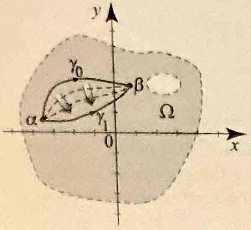
Figure 1 Continuous deformation of $\gamma_{0}$ into $\gamma_{1}$.

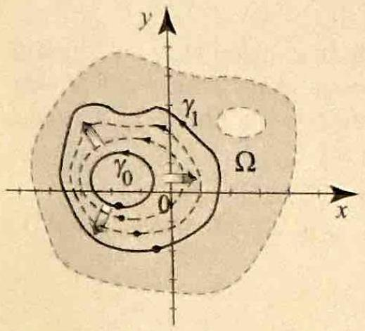
Figure 2 Continuous deformation of $\gamma_{0}$ into $\gamma_{1}$.

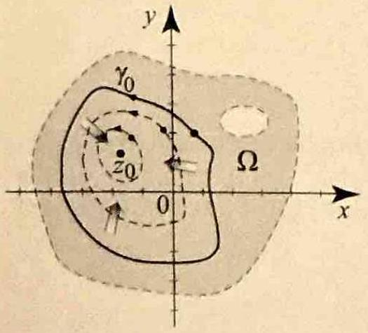
Figure 3 Continuous deformation of $\gamma_{0}$ into a point $z_{0}$.

analysis. Among its many important consequences, we will obtain sufficient geometric conditions for independence of path. These conditions are easy to visualize and make of Cauchy's theorem a very useful and practical tool for computing integrals. A complete proof of the theorem will be given in detail in the following section.

## Continuous Deformation of Paths

We start by describing three geometric pictures that will serve to illustrate the fundamental concept of deformation of path.

- Suppose that $\alpha$ and $\beta$ are points in a region $\Omega$, and $\gamma_{0}$ and $\gamma_{1}$ are paths in $\Omega$ joining $\alpha$ to $\beta$. We say that $\gamma_{0}$ is continuously deformable into $\gamma_{1}$ relative to $\Omega$ if we can continuously move $\gamma_{0}$ over $\gamma_{1}$ while keeping the ends fixed at $\alpha$ and $\beta$ and without leaving $\Omega$ (Figure 1).
- If $\gamma_{0}$ and $\gamma_{1}$ are two closed paths in a region $\Omega$, we say that $\gamma_{0}$ is continuously deformable into $\gamma_{1}$ relative to $\Omega$ if we can continuously move $\gamma_{0}$ without leaving $\Omega$, in such a way that it overlaps with $\gamma_{1}$ in position and direction (Figure 2).
- If $\gamma_{0}$ is a closed path in a region $\Omega$, we say that $\gamma_{0}$ is continuously deformable into a point relative to $\Omega$ if we can continuously shrink $\gamma_{0}$ into a point $z_{0}$ in $\Omega$ without leaving $\Omega$ (Figure 3). This is the same as the deformation of the closed path $\gamma_{0}$ into the closed path $\gamma_{1}$ where $\gamma_{1}$ is degenerated into a point. That is, $\gamma_{1}(t)$ is constant for all $t$.

It is intuitively clear that if we can continuously deform $\gamma_{0}$ into $\gamma_{1}$ in $\Omega$, then we can continuously deform $\gamma_{1}$ into $\gamma_{0}$ in $\Omega$. Hence, we will refer to the paths $\gamma_{0}$ and $\gamma_{1}$ as mutually deformable in $\Omega$.

The notion of continuous deformation is central to this section. Even though it is about paths in $\Omega$, we will use it to define properties of the region $\Omega$. For this reason, it is very important to be precise about $\Omega$ when talking about continuous deformation. We will give shortly a mathematical definition of continuous deformation, but first let us look at some examples and use our intuition to understand this notion.

## EXAMPLE 1 Continuous deformation of paths

(a) Let $\Omega$ be the complex plane. In Figure 4, the upper semi-circle $\gamma_{0}(t)=e^{i t}, 0 \leq t \leq \pi$, is continuously deformable into the directed line segment joining 1 to -1 .
(b) In the open unit disk $B_{1}(0)$, the path $\left[z_{1}, z_{2}, z_{3}\right]$ is continuously deformable into the directed line segment $\left[z_{1}, z_{3}\right]$ (Figure 5).
(c) In the open unit disk $B_{1}(0)$, the arc $\gamma_{0}$ is continuously deformable into the triangular path $\left[z_{1}, z_{2}, z_{3}\right]$ (Figure 6).
(d) In the annular region $\Omega$ in Figure 7, the circle $\gamma_{0}$ is continuously deformable into the circle $\gamma_{1}$ relative to $\Omega$.

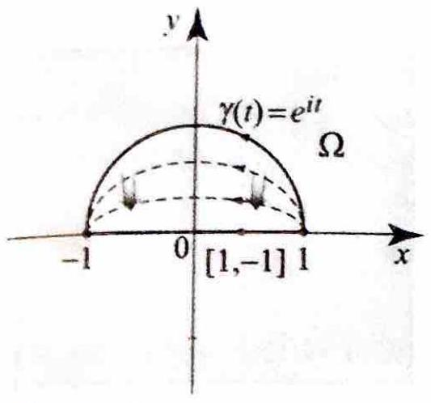
Figure 4

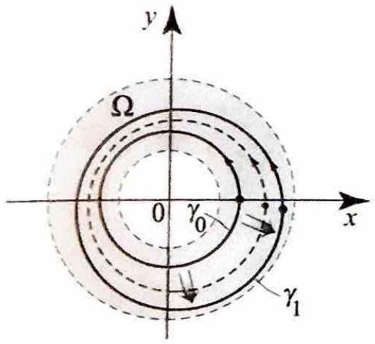
Figure 7

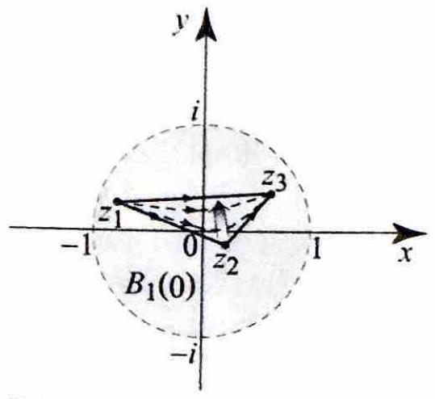
Figure 5

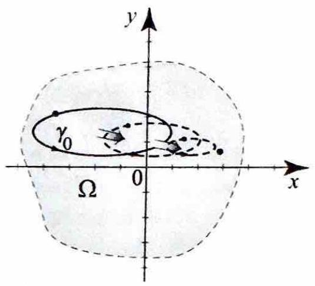
Figure 8

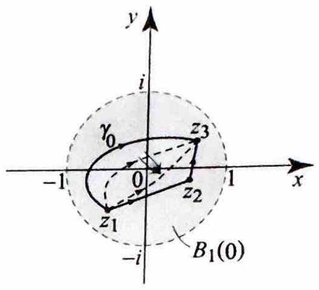
Figure 6

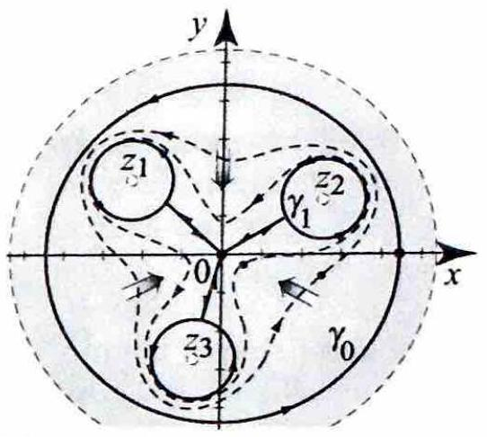
Figure 9

(e) In the region $\Omega$ in Figure 8, the ellipse $\gamma_{0}$ is continuously deformable into a point relative to $\Omega$.
(f) In Figure 9, the region $\Omega$ consists of a disk minus the points $z_{1}, z_{2}, z_{3}$. In $\Omega$ the circle $\gamma_{0}$ is continuously deformable into the curve $\gamma_{1}$ consisting of three circles centered at $z_{1}, z_{2}, z_{3}$, and connected by line segments traversed in both directions, as shown in Figure 9.

In Figure 10, the upper semicircle of radius 1 is continuouly deformed into the lower semi-circle of radius 1 relative to $B_{2}(0)$. This deformation is 20-20ssible in Figure 11, where We have removed the origin form $B_{2}(0)$. You can imagthe a stick protruding at the trigin, which will prevent you tom continuously deforming the upper curve to lower one.

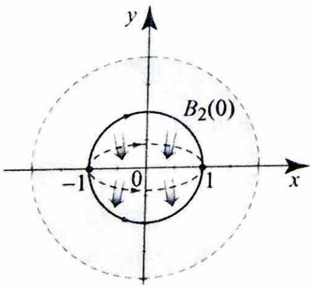
Figure 10

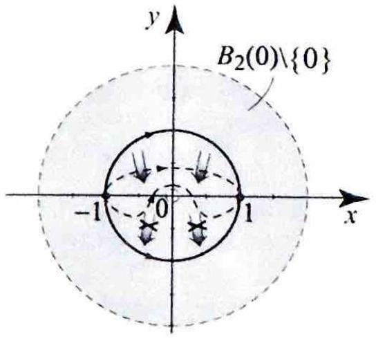
Figure 11

To see how important it is to be precise about the region $\Omega$ when talking about deformation of paths, consider the situation depicted in Figures 10 and 11. The upper and lower semi-circles joining the points -1 to 1 in Figure 10 are mutually deformable in the disk of radius 2 but are not mutually
deformable in the punctured disk of radius 2 (Figure 11). While the disk and punctured disk differ by only one point, from the standpoint of analysis, they are completely different objects.
Note to the reader: We next take up the mathematical theory of deformation of path. This theory will be required in the next section in the proof of the general version of Cauchy's theorem. If you are satisfied with the intuitive treatment of deformation of path, you can skip directly to the next subsection on the Cauchy integral.

## Mathematical Definition of Deformation of Paths

In mathematical terms, the path $\gamma_{0}$ is continuously deformable into $\gamma_{1}$ relative to the region $\Omega$ if there exist a continuous map $H$ of the unit square $Q=[0,1] \times[0,1]$ into $\Omega$ with the following properties:

$$
\begin{aligned}
& H(t, 0)=\gamma_{0}(t), \quad 0 \leq t \leq 1, \\
& H(t, 1)=\gamma_{1}(t), \quad 0 \leq t \leq 1 ; \\
& H(0, s)=\alpha, \quad 0 \leq s \leq 1, \\
& H(1, s)=\beta, \quad 0 \leq s \leq 1 .
\end{aligned}
$$

Figure 12 The path $\gamma_{0}$ is continuously deformed into $\gamma_{1}$ relative to $\Omega$ if we can find a continuous mapping $H$ of the square $Q$ into $\Omega$, such that $H$ maps the lower side of $Q$ onto $\gamma_{0}$, its upper side onto $\gamma_{1}$, its left side onto the point $\alpha$, and its right side onto the point $\beta$. As a result, the horizontal line segments in $Q$ will be mapped to curves varying continuously between $\gamma_{0}$ and $\gamma_{1}$, while staying entirely in $\Omega$.
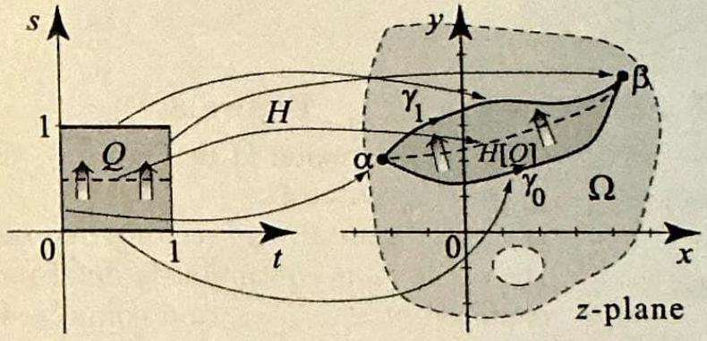

To understand this definition, consider Figure 12. Condition (1) tells us that the image of the lower side of $Q$ is $\gamma_{0}$. Condition (2) tells us that the image of the upper side of $Q$ is $\gamma_{1}$. Conditions (3) and (4) tell us that the vertical sides of $Q$ are mapped to the endpoints of $\gamma_{0}$ and $\gamma_{1}$. The fact that $Q$ is mapped into $\Omega$ tells us that the image of any horizontal section in $Q$ is a curve in $\Omega$; and because the vertical sides of $Q$ are mapped to the endpoints of $\gamma_{0}$ and $\gamma_{1}$, this curve has the same endpoints as $\gamma_{0}$ and $\gamma_{1}$. As $s$ varies from 0 to 1 , the curve image of a horizontal section of the square $Q$ varies continuously between the two extreme curves, from $\gamma_{0}$ to $\gamma_{1}$. Thus the notion of a continuous deformation of $\gamma_{0}$ into $\gamma_{1}$ relative to $\Omega$.

The definition of a continuous deformation for closed paths $\gamma_{0}$ and $\gamma_{1}$ in $\Omega$ is similar to the one we just presented. We require the existence of a continuous mapping $H$ with properties (1) and (2) and, instead of (3) and (4), we require that

$$
H(0, s)=H(1, s), \quad 0 \leq s \leq 1 .
$$

This condition states that the initial point $H(0, s)$ and the terminal point $H(1, s)$ are the same. Thus the images of all horizontal sections of the square $Q$ are closed curves (Figure 13).

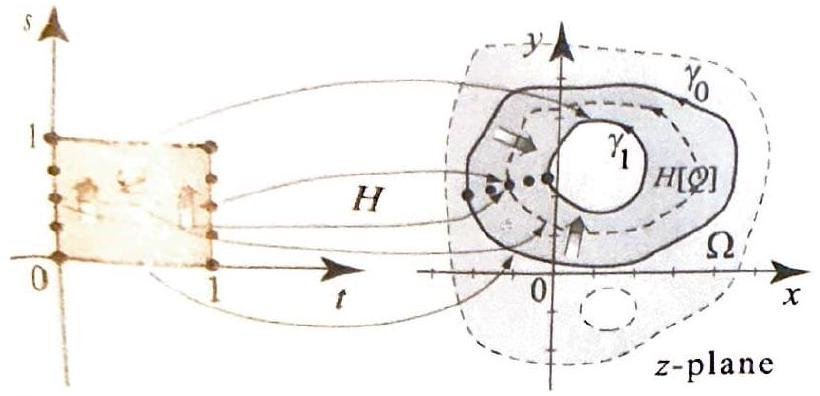
Figure 13 Deformation of closed paths.

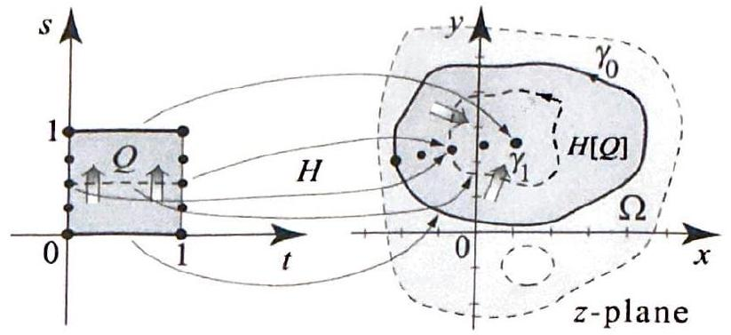
Figure 14 Deformation to one point.

The definition of a continuous deformation of a closed path $\gamma_{0}$ into a point $z_{1}$ in $\Omega$ requires the existence of a continuous mapping $H$ with properties (1), (2), and (5), where in (2) the path $\gamma_{1}(t)$ is constant and equals $z_{1}$ in $\Omega$ (Figure 14).

Although we will not use the following terminology, we should mention that the mapping $H$ that continuously deforms $\gamma_{0}$ into $\gamma_{1}$ is called a homotopy mapping of $\gamma_{0}$ into $\gamma_{1}$ and the paths $\gamma_{0}$ and $\gamma_{1}$ are called homotopically equivalent relative to $\Omega$. It is pictorially clear that if $\gamma_{0}$ is homotopic to $\gamma_{1}$ relative to $\Omega$, then $\gamma_{1}$ is homotopic to $\gamma_{0}$ relative to $\Omega$. Also, if $\gamma_{0}$ is homotopic to $\gamma_{1}$ relative to $\Omega$ and $\gamma_{1}$ is homotopic to $\gamma_{2}$ relative to $\Omega$, then $\gamma_{0}$ is homotopic to $\gamma_{2}$ relative to $\Omega$. The proof of these statements is outlined in Exercise 36.

As you can imagine, in general, it is difficult to construct the deformation mapping $H$, and so in most problems we will rely on pictures and our intuition to decide whether a continuous deformation is possible. There are a few interesting cases where $H$ can be constructed explicitly. We start with a simple example and generalize the ideas involved in it.

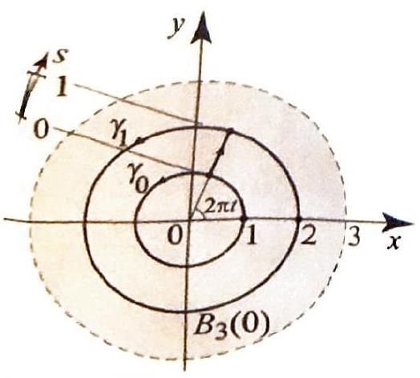
Figure 15

## EXAMPLE 2 Deformation of paths by continuous mappings

Show that the positively oriented circle $C_{1}(0)$ is continuously deformable into the positively oriented circle $C_{2}(0)$, relative to the open disk of radius 3 .

Solution Intuitively, the result is obvious. To prove it mathematically, we will construct a continuous mapping $H$ of the unit square taking $C_{1}(0)$ continuously into $C_{2}(0)$, in the sense that (1), (2), and (5) hold. Parametrize $C_{1}(0)$ by $\gamma_{0}(t)=e^{2 \pi i t}$, $0 \leq t \leq 1$, and $C_{2}(0)$ by $\gamma_{1}(t)=2 e^{2 \pi i t}, 0 \leq t \leq 1$. For a fixed $t$ in $[0,1]$, consider the corresponding points $\gamma_{0}(t)$ on $C_{1}(0)$ and $\gamma_{1}(t)$ on $C_{2}(0)$. We can move continuously from $\gamma_{0}(t)$ to $\gamma_{1}(t)$ along the line segment

$$
(1-s) \gamma_{0}(t)+s \gamma_{1}(t), \quad 0 \leq s \leq 1,
$$

while staying in $\Omega$ (Figure 15). Motivated by this idea, we let

$$
H(t, s)=(1-s) \gamma_{0}(t)+s \gamma_{1}(t), \quad 0 \leq t \leq 1, \quad 0 \leq s \leq 1 .
$$

Then $H$ is a continuous mapping of $(t, s)$ in the unit square, because $\gamma_{0}(t)$ and $\gamma_{1}(t)$ are continuous. Moreover, it is easy to check that (1), (2), and (5) hold. Indeed,

$$
\begin{aligned}
& H(t, 0)=\gamma_{0}(t) \quad \Rightarrow \quad(1) \text { holds, } \\
& H(t, 1)=\gamma_{1}(t) \quad \Rightarrow \quad(2) \text { holds. }
\end{aligned}
$$

Also, since $\gamma_{0}(0)=1=\gamma_{0}(1)$ and $\gamma_{1}(0)=2=\gamma_{1}(1)$, we obtain

$$
\begin{aligned}
& H(0, s)=(1-s) \gamma_{0}(0)+s \gamma_{1}(0)=1+s \\
& H(1, s)=(1-s) \gamma_{0}(1)+s \gamma_{1}(1)=1+s
\end{aligned}
$$

and so $H(0, s)=H(1, s)$ implying (5).

Figure 16 How the continuous deformation mapping $H$ works: $H$ maps the lower side of $Q$ onto the inner circle $C_{1}(0)$, the upper side onto $C_{2}(0)$, and all the in between horizontal segments in $Q$ are mapped to in between circles $C_{R}(0)$, where $1<R<2$.
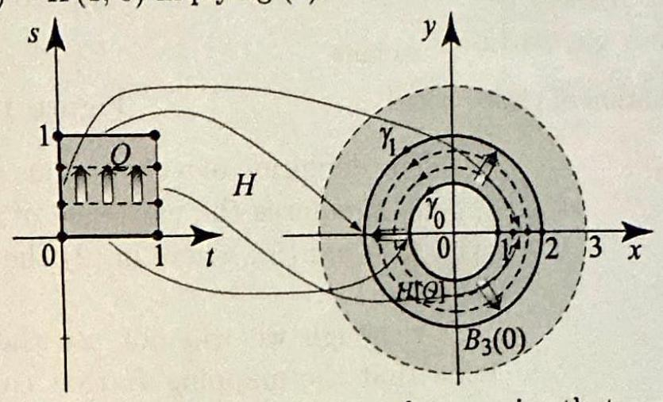

In conclusion, we have explicitely constructed a mapping that continuously deforms $\gamma_{0}(t)$ into $\gamma_{1}(t)$ while staying in $\Omega$ (Figure 16). $\square$

By identifying an important geometric property of the disk, we can generalize the construction in Example 2 as follows. Call a subset $S$ of the complex plane convex if whenever $z_{0}$ and $z_{1}$ are in $S$, then the line segment joining $z_{0}$ to $z_{1}$ lies entirely in $S$. In other words, $S$ is convex if whenever $z_{0}$ and $z_{1}$ are in $S$, then the points on the line segment

$$
(1-s) z_{0}+s z_{1}, \quad 0 \leq s \leq 1,
$$

are also in $S$. The complex plane is a convex set. Any disk is a convex set. Any rectangle is convex (Figure 17). The star-shaped set $S$ in Figure 18 is not convex because we can find points $z_{1}$ and $z_{2}$ in $S$ such that the line segment $\left[z_{1}, z_{2}\right]$ is not entirely in $S$. The punctured disk in Figure 19 is not convex for the same reason.

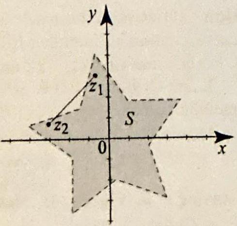
Figure 18

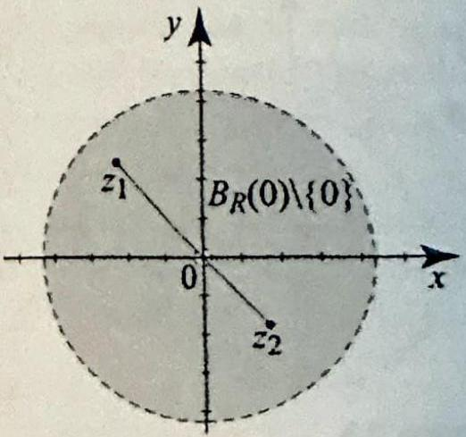
Figure 19

Figure 17
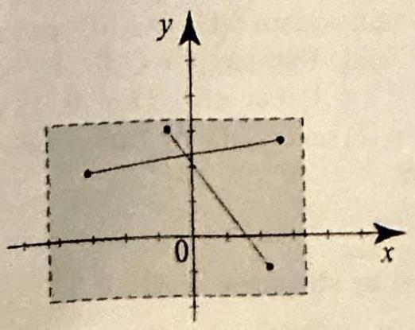

## THEOREM 1 DEFORMATION OF PATHS IN CONVEX SETS

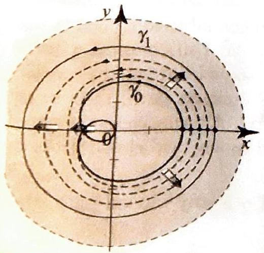
Figure 20

Even if we know that two paths are mutually deformable relative to a region $\Omega$, finding a deformation mapping can be very difficult. However, as we now show, if $\Omega$ is convex, we do have a formula for the mapping $H$.

Suppose that $\Omega$ is a convex region and $\gamma_{0}(t)$ and $\gamma_{1}(t)$ are paths in $\Omega$, with same initial and terminal points. Suppose further that $\gamma_{0}$ and $\gamma_{1}$ are parametrized by the interval $[0,1]$. Motivated by formula (6), we consider the continuous mapping

$$
H(t, s)=(1-s) \gamma_{0}(t)+s \gamma_{1}(t), \quad 0 \leq t \leq 1, \quad 0 \leq s \leq 1 .
$$

Let us momentarily fix $t$; since $z_{0}=\gamma_{0}(t)$ and $z_{1}=\gamma_{1}(t)$ are two points in $\Omega$ and $\Omega$ is convex, it follows that $H(t, s)=(1-s) z_{0}+s z_{1}$ is also in $\Omega$. This reasoning holds for all $t$, and so all points $H(t, s)$ lie in $\Omega$. Thus $H$ is a continuous mapping of the unit square into $\Omega$. (This is a crucial property of $H$; it is telling you that the deformation is taking place in $\Omega$.) It is clear from (8) that (1) and (2) hold. Properties (3), (4), and (5) are also easy to verify, and so we have the following very useful result.

Suppose that $\Omega$ is a convex region. (i) Any two paths $\gamma_{0}$ and $\gamma_{1}$ in $\Omega$, joining two points $\alpha$ and $\beta$ in $\Omega$, are mutually continuously deformable relative to $\Omega$. The continuous mapping $H$ that deforms $\gamma_{0}$ into $\gamma_{1}$ is given by (8).
(ii) Any two closed paths $\gamma_{0}$ and $\gamma_{1}$ in $\Omega$ are mutually continuously deformable relative to $\Omega$. The continuous mapping $H$ that deforms $\gamma_{0}$ into $\gamma_{1}$ is given by (8).
(iii) Any closed path $\gamma_{0}$ in $\Omega$ is continuously deformable into a point in $\Omega$. The continuous mapping $H$ that deforms a closed path $\gamma_{0}$ into a point $z_{1}$ in $\Omega$ is given by (8), where $\gamma_{1}(t)=z_{1}$ is constant for all $t$ in $[0,1]$.

## EXAMPLE 3 Deformation of paths in convex sets

In the region $\Omega$ consisting of the open disk centered at the origin with radius 4 , consider the closed paths $\gamma_{0}(t)=e^{2 \pi i t}+e^{4 \pi i t}, 0 \leq t \leq 1$, and $\gamma_{1}(t)=3 e^{2 \pi i t}$, $0 \leq t \leq 1$. Because $\Omega$ is convex, we can continuously deform $\gamma_{0}$ into $\gamma_{1}$ by using the mapping

$$
H(t, s)=(1-s) \gamma_{0}(t)+s \gamma_{1}(t)=(1-s)\left(e^{2 \pi i t}+e^{4 \pi i t}\right)+s\left(3 e^{2 \pi i t}\right)
$$

In Figure 20, we plotted the graphs of $H(t, s)$ for $s=0, \frac{1}{2}, \frac{2}{3}$, and 1 . Note how the corresponding graphs of $H(t, s)$ vary continuously from $\gamma_{0}$ to $\gamma_{1}$.

## Cauchy's Theorem

Having discussed deformation of path, we are now ready to state a fundamental result in complex analysis. This result holds for analytic functions.

THEOREM 2 CAUCHY'S INTEGRAL THEOREM FOR DEFORMABLE PATHS

Note that (11) follows from (10) because the integral of a function over a point is zero.

COROLLARY 1 PATH INTEGRALS OF FUNCTIONS ANALYTIC ON DISKS

Let $f$ be a function analytic in a region $\Omega$. (i) If $\gamma_{0}$ and $\gamma_{1}$ are two paths joining $\alpha$ to $\beta$ in $\Omega$, and if $\gamma_{0}$ is continuously deformable into $\gamma_{1}$ relative to $\Omega$, then

$$
\int_{\gamma_{0}} f(z) d z=\int_{\gamma_{1}} f(z) d z
$$

(ii) If $\gamma_{0}$ and $\gamma_{1}$ are closed paths in $\Omega$ and $\gamma_{0}$ is continuously deformable into $\gamma_{1}$ relative to $\Omega$, then

$$
\int_{\gamma_{0}} f(z) d z=\int_{\gamma_{1}} f(z) d z
$$

In particular, if $\gamma_{0}$ is a closed path in $\Omega$ that is continuously deformable into a point in $\Omega$, then

$$
\int_{\gamma_{0}} f(z) d z=0
$$

The proof of this theorem is quite long and technical. We will present it in full detail in the following section. For now, let us continue with some important applications.
Suppose that $\gamma$ is a closed path and $f$ is analytic on an open disk containing $\gamma$. Then

$$
\int_{\gamma} f(z) d z=0
$$

In particular, if $f$ is entire then (12) holds for any closed path $\gamma$.
Proof Any closed path $\gamma$ in a disk is continuously deformable to a point in that disk. This is intuitively clear and follows from Theorem 1(iii) because a disk is a convex set. So (12) follows from Theorem 2. The second part of the corollary clearly follows from the first: If $f$ is entire and $\gamma$ is a closed path, then we can always enclose $\gamma$ in an open disk on which $f$ is analytic. Alternatively, the second part follows from the fact that $\mathbb{C}$ itself is convex, and so any two closed paths are mutually deformable.

From Corollary 1, we see immediately that if $\gamma$ is any closed path, then

$$
\int_{\gamma} e^{z^{2}} d z=0
$$

## PROPOSITION 1

DEFINITION 1 SIMPLY CONNECTED REGION
because $e^{z^{2}}$ is entire. Note that we are able to compute the integral without knowing an antiderivative of $e^{z^{2}}$.

## Simple Paths and Simply Connected Regions

With Cauchy's theorem in hand, our main task is now to identify paths that are mutually continuously deformable. Instead of dealing with this issue on a case-by-case basis, we will try to identify regions in which any two closed paths are mutually deformable. For such regions, we have the following.
Suppose that $\Omega$ is a region in $\mathbb{C}$. The following properties are equivalent.
(i) Any two paths $\gamma_{0}$ and $\gamma_{1}$ in $\Omega$ joining two points $\alpha$ and $\beta$ in $\Omega$ are mutually continuously deformable relative to $\Omega$.
(ii) Any two closed paths $\gamma_{0}$ and $\gamma_{1}$ in $\Omega$ are mutually continuously deformable relative to $\Omega$.
(iii) Any closed path $\gamma_{0}$ in $\Omega$ is continuously deformable into a point in $\Omega$.

The proof of the proposition is relegated to Exercise 37. It is based on arguments similar to the ones we used in the proof of Theorem 2, Section 3.3.

A region $\Omega$ for which (i), and hence (ii) and (iii) of Proposition 1, hold has a special name.
A region $\Omega$ is called simply connected if all paths joining $\alpha$ to $\beta$ in $\Omega$ are mutually continuously deformable relative to $\Omega$. If a region is not simply connected, then it is called multiply connected.

Geometrically, a region is simply connected if it has no holes in it. Figure 21 shows several simply connected regions. Theorem 1 proves that every convex set is simply connected; consequently, a disk and a rectangle are simply connected. (As you can imagine, a convex set cannot have holes in it. So this result agrees with our geometric intuition.) But, as clearly illustrated in the second and third regions in Figure 21, a region can be simply connected without being convex.

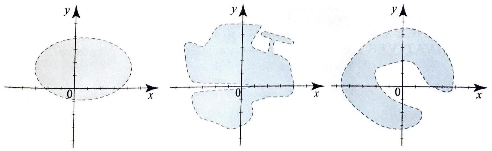
Figure 21

Figure 22 shows several multiply connected regions. In each case, we show two paths that are not mutually deformable relative to the region.

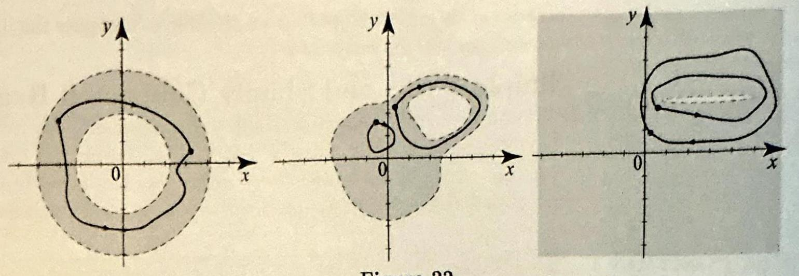
Figure 22

The following fundamental theorem is an immediate consequence of Theorem 2 and the definition of simply connected regions.

THEOREM 3 CAUCHY'S THEOREM FOR SIMPLY CONNECTED REGIONS

## THEOREM 4 EXISTENCE OF ANTIDERIVATIVES

Suppose that $\Omega$ is a simply connected region and that $f$ is analytic in $\Omega$. (i) If $\gamma_{0}$ and $\gamma_{1}$ are two paths joining $\alpha$ to $\beta$ in $\Omega$, then

$$
\int_{\gamma_{0}} f(z) d z=\int_{\gamma_{1}} f(z) d z
$$

(ii) If $\gamma$ is a closed path in $\Omega$, then

$$
\int_{\gamma} f(z) d z=0
$$

Consider the function $\frac{1}{z-z_{0}}$, which is analytic in any punctured disk centered at $z_{0}$. We have $\int_{C_{R}\left(z_{0}\right)} \frac{d z}{z-z_{0}}=2 \pi i \neq 0$ (see Example 4(a), Section 3.2); and so by Theorem 3(ii), the punctured disk is not simply connected. This confirms our geometric understanding of simply connected regions as being regions without holes.

The following is another important property of simply connected regions.
Suppose that $\Omega$ is a simply connected region and that $f$ is analytic in $\Omega$. Then there is an analytic function $F$ in $\Omega$ such that $F^{\prime}=f$. In other words, every analytic function in $\Omega$ has an antiderivative in $\Omega$. Up to an arbitrary additive constant, we have

$$
F(z)=\int_{z_{0}}^{z} f(\zeta) d \zeta
$$

where $z_{0}$ is a fixed point in $\Omega$ and the integral is taken over any path in $\Omega$ joining $z_{0}$ to $z$.
Proof By Theorem 3, the integral of $f$ is independent of path. Hence by Theorem 2, Section 3.3, $f$ has an antiderivative given by (5), Section 3.3.

DEFINITION 2
SIMPLE PATH

THEOREM 5 CAUCHY'S THEOREM FOR SIMPLE PATHS

Our next topic about paths is closely related to the notion of simply connected regions.
A closed path $\gamma$ is called simple or a simple curve if $\gamma$ intersects itself only at the endpoints. That is, if $\gamma(t), a \leq t \leq b$, is a parametrization of $\gamma$, and $a \leq t_{1}<t_{2} \leq b$, then $\gamma\left(t_{1}\right)=\gamma\left(t_{2}\right) \Leftrightarrow t_{1}=a$ and $t_{2}=b$.
The graph of a simple curve can loop around and get very complicated, but it cannot cross itself. A simple path is also called a Jordan curve, after the French mathematician Camille Jordan (1838-1922), who discovered that a simple closed path $C$ divides the plane into two regions: a bounded region, called the interior of $C$; and an unbounded region, called the exterior of $C$. This is the famous Jordan curve theorem from topology, which is easy to picture but quite difficult to prove. We omit the proof.

Because we can identify the interior and the exterior regions relative to a simple curve, we can use this to define the positive and negative orientations of a simple curve. The positive orientation of a simple curve is the one that when followed puts the interior region to our left. The negative orientation of a simple curve is the one that when followed puts the interior region to our right. Our definition of positive versus negative orientation thus generalizes our earlier idea of counterclockwise versus clockwise orientation of circles.

The following two very important properties of simple curves are also consequences of the Jordan curve theorem.

- The interior region of a simple curve is simply connected.
- Let $\Omega$ be any region containing a simple curve $C$ and the interior of $C$. Then $C$ can be continuously deformed into a point interior to $C$ relative to $\Omega$.

When we combine these properties with Theorems 2 and 3, we obtain a very useful integral theorem for simple paths. First recall that $f$ is analytic at a point if it is analytic in a neighborhood of that point. So to say that $f$ is analytic on a curve $C$ and its interior means that $f$ is analytic in a region $\Omega$ containing $C$ and its interior.

Suppose that $f$ is analytic on a simple closed path $C$ and its interior.
(i) We have

$$
\int_{C} f(z) d z=0
$$

(ii) If $\gamma$ is a closed path (not necessarily simple) contained in the interior of $C$, then

$$
\int_{\gamma} f(z) d z=0
$$

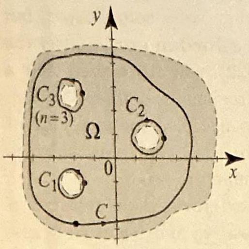
Figure 23

Proof Since $f$ is analytic on a region $\Omega$ that contains $C$ and its interior, and since $C$ can be continuously deformed into a point relative to $\Omega$, (i) follows from Cauchy's Theorem 2. Part (ii) follows from Theorem 3, because the interior of $C$ is simply connected.

## Multiply Connected Regions

Recall that a region $\Omega$ is multiply connected if it is not simply connected. In this section, we are interested in a particular kind of multiply connected regions, for which we have a very useful version of Cauchy's theorem. A typical region is described as follows.

Let $C$ be a simple closed path and let $C_{1}, C_{2}, \ldots, C_{n}$ be simple closed paths, contained in the interior of $C$ and such that the interior regions of any two $C_{j}$ 's have no common points. We also require that $C$ and all $C_{j}^{\prime}$ s have the same orientation (say, positive). Let $\Omega$ be any region containing the paths $C, C_{1}, C_{2}, \ldots, C_{n}$, and the region interior to $C$ and exterior to the $C_{j}$ 's. The region $\Omega$ is in general multiply connected, as illustrated in Figure 23.

THEOREM 6 CAUCHY'S THEOREM FOR MULTIPLY CONNECTED REGIONS
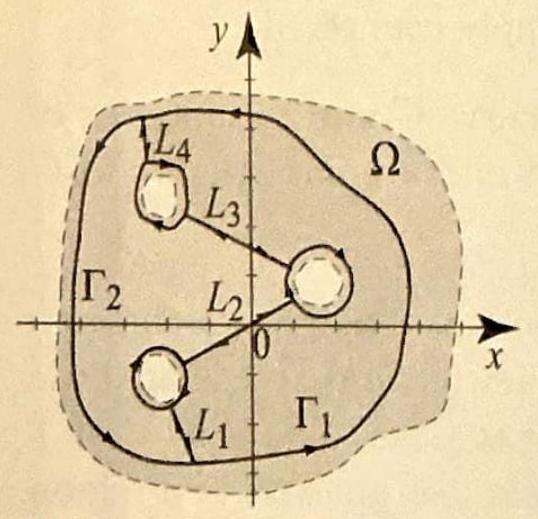

Figure 24 Each polygonal path $L_{j}$ is traversed in both directions, so the integral over $L_{j}$ is 0 .

Suppose that $f$ is analytic on a region $\Omega$ with simple paths $C$ and $C_{j}(j= 1,2, \ldots, n)$ as described above. Then

$$
\int_{C} f(z) d z=\sum_{j=1}^{n} \int_{C_{j}} f(z) d z
$$

Proof Join the outer path $C$ to $C_{1}$ using a polygonal path $L_{1}$ traversed in two opposite directions. Join $C_{1}$ to $C_{2}$ by a similar polygonal path $L_{2}$. Continue in this fashion, joining the path $C_{j}$ to the path $C_{j+1}$ by a polygonal path $L_{j+1}$ traversed in two opposite directions, and finally join $C_{n}$ to $C$ by a polygonal path $L_{n+1}$ traversed in two opposite directions. This construction yields two simple closed paths $\Gamma_{1}$ and $\Gamma_{2}$, as illustrated in Figure 24. (Note that, along either $\Gamma_{1}$ or $\Gamma_{2}$, we traverse portions of the $C_{j}$ 's in a direction opposite to their original orientation.) By Theorem 5, since $f$ is analytic on $\Gamma_{1}$ and $\Gamma_{2}$ and their interiors, it follows that

$$
\int_{\Gamma_{1}} f(z) d z=0 \quad \text { and } \quad \int_{\Gamma_{2}} f(z) d z=0
$$

Adding these two equalities, we obtain

$$
\int_{\Gamma_{1}} f(z) d z+\int_{\Gamma_{2}} f(z) d z=0
$$

or

$$
\int_{C} f(z) d z+\sum_{j=1}^{n}\left(\int_{-C_{j}} f(z) d z+\int_{L_{j}} f(z) d z\right)=0
$$

Since each $L_{j}$ consists of a polygonal path traversed in two opposite directions, we
have $\int_{L_{j}} f(z) d z=0$ and hence

$$
\int_{C} f(z) d z+\sum_{j=1}^{n} \int_{-C_{j}} f(z) d z=0
$$

which is equivalent to (13).

## EXAMPLE 4 A useful integral

Let $C$ be a positively oriented simple closed path and let $z_{0}$ be a point not on $C$. Show that

$$
\int_{C} \frac{1}{z-z_{0}} d z= \begin{cases}0 & \text { if } z_{0} \text { is in the exterior of } C \\ 2 \pi i & \text { if } z_{0} \text { is in the interior of } C\end{cases}
$$

Solution If $z_{0}$ is in the exterior of $C$, then the function $f(z)=\frac{1}{z-z_{0}}$ is analytic on and inside $C$ and hence its integral along $C$ is 0 , by Theorem 5(i). For the second case, where $z_{0}$ is in the interior of $C$, we can no longer claim that the function $f(z)=\frac{1}{z-z_{0}}$ is analytic on and inside $C$, and so we cannot use Theorem 5. To deal with this case, let us recall that

$$
\int_{C_{R}\left(z_{0}\right)} \frac{1}{z-z_{0}} d z=2 \pi i
$$

where $C_{R}\left(z_{0}\right)$ is a positively oriented circle with center at $z_{0}$ and radius $R>0$. (See Example 4(a), Section 3.2.) Let $C_{\delta}\left(z_{0}\right)$ be a positively oriented circle centered at $z_{0}$ with radius $\delta$ and wholly contained in the interior of $C$. The function $f(z)=\frac{1}{z-z_{0}}$ is analytic in $\mathbb{C} \backslash\left\{z_{0}\right\}$ and, in particular, it is analytic in a region that contains $C_{\delta}\left(z_{0}\right)$ and $C$ and the region interior to $C$ and exterior to $C_{\delta}\left(z_{0}\right)$. Applying (13) of Theorem 6, we see that

$$
\int_{C} \frac{1}{z-z_{0}} d z=\int_{C_{b}\left(z_{0}\right)} \frac{1}{z-z_{0}} d z=2 \pi i
$$

as desired.
Example 4 can be used to compute interesting path integrals of rational functions. You will also need to review the partial fraction decomposition of a rational function.

## EXAMPLE 5 Path integrals of rational functions

Compute

$$
\int_{C} \frac{d z}{(z-1)(z+i)(z-i)}
$$

where $C$ is a simple closed path in the following three cases.
(a) The point 1 is in the interior of $C$, and the points $\pm i$ are in the exterior of $C$.
(b) The points 1 and $i$ are in the interior of $C$, and the point $z=-i$ is in the exterior of $C$.
(c) All three points $1, \pm i$ are in the interior of $C$.

Alternatively, we can expand the right side of (14) and match coefficients of $z^{2}, z$, and 1. We proceed to solve the linear equations for $a$, $b$, and $c$. This method is more time-consuming, but you should keep it in mind when you solve Exercise 33(a).

Solution We start by finding the partial fraction decomposition of the integrand,

$$
\frac{1}{(z-1)(z+i)(z-i)}=\frac{a}{z-1}+\frac{b}{z+i}+\frac{c}{z-i}
$$

where $a, b$, and $c$ are complex numbers. Combining, we obtain

$$
\frac{1}{(z-1)(z+i)(z-i)}=\frac{a(z+i)(z-i)+b(z-1)(z-i)+c(z-1)(z+i)}{(z-1)(z+i)(z-i)},
$$

so

$$
1=a(z+i)(z-i)+b(z-1)(z-i)+c(z-1)(z+i)
$$

Taking $z=1$, we get

$$
1=a(1+i)(1-i) \quad \Rightarrow \quad a=\frac{1}{(1+i)(1-i)}=\frac{1}{2}
$$

Similarly, setting $z=-i$ yields $b=-\frac{1}{4}-\frac{i}{4}$. Setting $z=i$ yields $c=-\frac{1}{4}+\frac{i}{4}$. Thus the partial fraction decomposition

$$
\frac{1}{(z-1)(z+i)(z-i)}=\frac{1}{2(z-1)}-\frac{1+i}{4(z+i)}+\frac{-1+i}{4(z-i)}
$$

So

$$
\begin{aligned}
& \int_{C} \frac{d z}{(z-1)(z+i)(z-i)} \\
& \quad=\frac{1}{2} \int_{C} \frac{1}{z-1} d z-\left(\frac{1}{4}+\frac{i}{4}\right) \int_{C} \frac{1}{z+i} d z+\left(\frac{-1}{4}+\frac{i}{4}\right) \int_{C} \frac{1}{z-i} d z
\end{aligned}
$$

We can now compute the desired integrals using Example 4. For (a), since 1 is the only point in the interior of $C$, the last two integrals on the right side of (15) are zero, and hence

$$
\int_{C} \frac{d z}{(z-1)(z+i)(z-i)}=\frac{1}{2} \int_{C} \frac{1}{z-1}=\frac{1}{2} 2 \pi i=\pi i
$$

For (b), since 1 and $i$ are in the interior of $C$ and $-i$ is in the exterior of $C$, the middle integral on the right side of (15) is zero, and the desired integral in this case is equal to

$$
\frac{1}{2} \int_{C} \frac{1}{z-1}+\left(\frac{-1}{4}+\frac{i}{4}\right) \int_{C} \frac{1}{z-i} d z=\left(\frac{1}{2}+\left(\frac{-1}{4}+\frac{i}{4}\right)\right) 2 \pi i=\left(\frac{1}{2}+\frac{i}{2}\right) \pi i .
$$

Finally, for (c), since 1 and $\pm i$ are all in the interior of $C$, all the integrals on the right side of (15) must be accounted for. The answer in this case is

$$
\left(\frac{1}{2}+\left(\frac{-1}{4}+\frac{i}{4}\right)+\left(\frac{-1}{4}-\frac{i}{4}\right)\right) 2 \pi i=0 .
$$

That the answer is zero in this case is also a consequence of a more general result. See Exercise 33.

As our final example shows, in some cases, it is necessary to combine various versions of Cauchy's theorem to evaluate the integral.

## EXAMPLE 6 A path that is not simple

Evaluate the integral

$$
\int_{C} \frac{z}{(z-i)(z-1)} d z
$$

where $C$ is the figure eight path shown in Figure 25.

The path $C$ in Figure 25 is not simple because it intersects itself. To use Cauchy's integral theorem for simple paths, we break up $C$ into two simple paths, as shown in Figure 26.

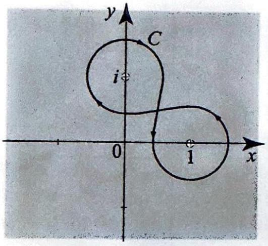
Figure 25

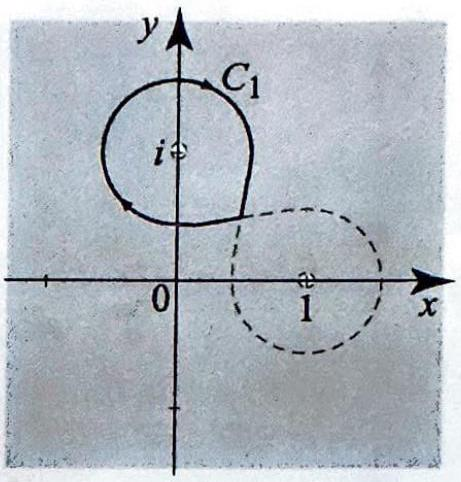
Figure 26

Figure 26
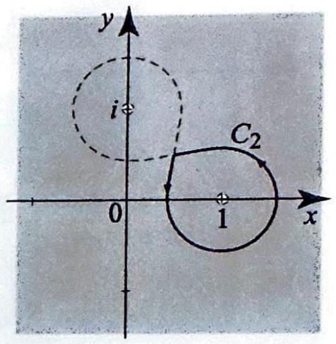

Solution We will first break the path into two simple closed paths, $C_{1}$ and $C_{2}$, shown in Figure 26. Note that the orientation of $C_{1}$ is negative, while the orientation of $C_{2}$ is positive. The integral (16) becomes

$$
\int_{C_{1}} \frac{z}{(z-i)(z-1)} d z+\int_{C_{2}} \frac{z}{(z-i)(z-1)} d z=I_{1}+I_{2}
$$

You can verify that the partial fraction decomposition of the integrand is

$$
\frac{z}{(z-i)(z-1)}=\frac{\frac{1}{2}-\frac{i}{2}}{z-i}+\frac{\frac{1}{2}+\frac{i}{2}}{z-1}
$$

Since $\frac{1}{z-1}$ is analytic on and inside $C_{1}$, its integral along $C_{1}$ is 0 , by Theorem 5(i). Also $\int_{C_{1}} \frac{d z}{z-i}=-2 \pi i$, by Example 4 . Hence

$$
I_{1}=\left(\frac{1}{2}-\frac{i}{2}\right) \int_{C_{1}} \frac{d z}{z-i}+\left(\frac{1}{2}+\frac{i}{2}\right) \int_{C_{1}} \frac{d z}{z-1}=\left(\frac{1}{2}-\frac{i}{2}\right)(-2 \pi i)+0=-\pi-i \pi
$$

Arguing similarly to evaluate the integral along $C_{2}$, we find

$$
I_{2}=\left(\frac{1}{2}-\frac{i}{2}\right) \overbrace{\int_{C_{2}} \frac{d z}{z-i}}^{=0}+\left(\frac{1}{2}+\frac{i}{2}\right) \int_{C_{2}} \overbrace{\frac{d z}{z-1}}^{2 \pi i}=\left(\frac{1}{2}+\frac{i}{2}\right) 2 \pi i=-\pi+i \pi
$$

Adding the two integrals, we find the answer $I_{1}+I_{2}=-2 \pi$.
The applications of this section have clearly illustrated the power of Cauchy's theorem in evaluating integrals and deriving theoretical properties
of analytic functions. This was just the beginning. In what follows we will derive formulas and results based on Cauchy's theorem that will have spectacular consequences at both the theoretical and applied levels.

## Exercises 3.4

In Exercises 1-6, a figure is given describing two paths $\gamma_{0}$ and $\gamma_{1}$ in a region $\Omega$. Decide whether the two paths are mutually continuously deformable relative to $\Omega$. Justify your answer based on the picture.
1.

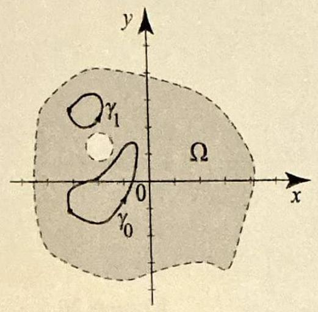
Figure 27

4. 

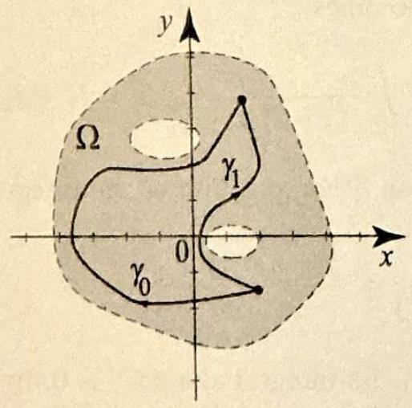
Figure 30

2. 

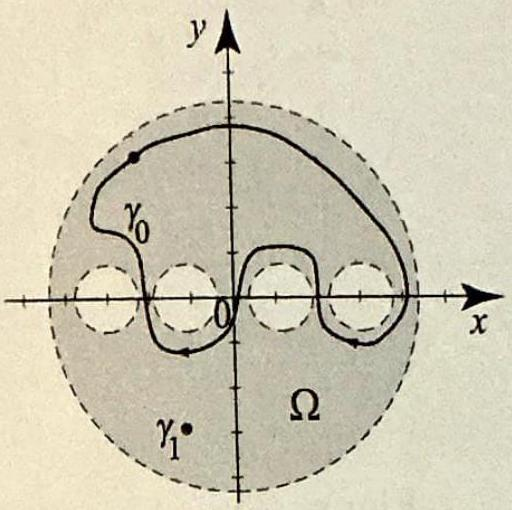
Figure 28

5. 

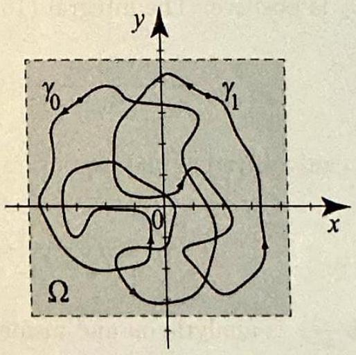
Figure 31

3. 

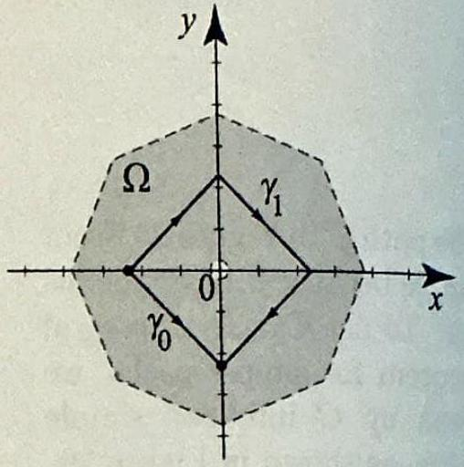
Figure 29

6. 

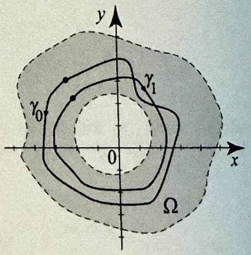
Figure 32

7. Describe the mapping of the unit square into $\Omega$ that continuously deforms $\gamma_{0}$ into $\gamma_{1}$ relative to $\Omega$ in Figure 33.

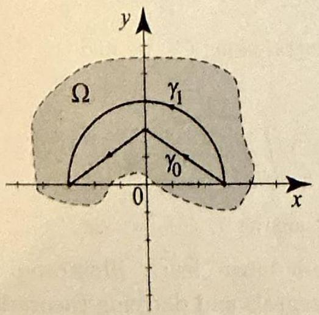
Figure 33

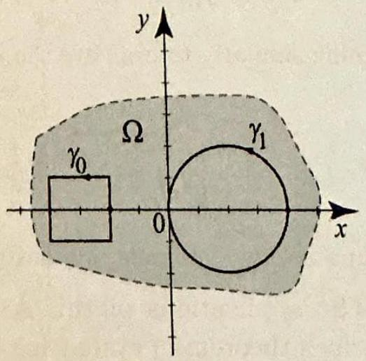
Figure 34

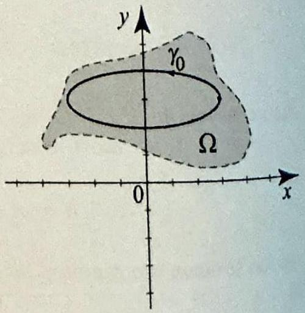
Figure 35

8. (a) Describe the mapping $H(t, s)$ of the unit square that continuously deforms $\gamma_{0}$ into $\gamma_{1}$ relative to $\Omega$ in Figure 34.
(b) Illustrate the deformation process in (a) by drawing $\gamma_{0}$ and $\gamma_{1}$ and the graph of $H(t, s)$ as a function of $t$ alone, for various fixed values of $s$.

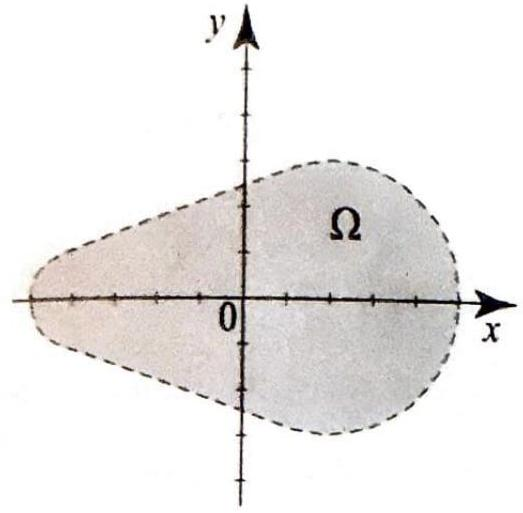
Figure 36

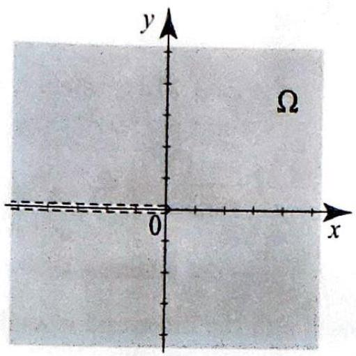
Figure 37

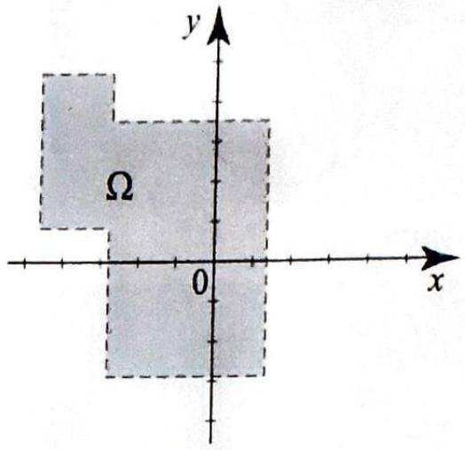
Figure 38

9. Describe the mapping of the unit square that continuously deforms the path $\gamma_{0}$ into a point relative to $\Omega$ in Figure 35. You may pick any point in $\Omega$.
10. Of the regions shown in Figures 36-38, determine the ones that are convex. Justify your answer with arguments based on the figure.
11. Of the regions shown in Figures 39-44, determine the ones that are simply connected. Justify your answer with arguments based on the figure.

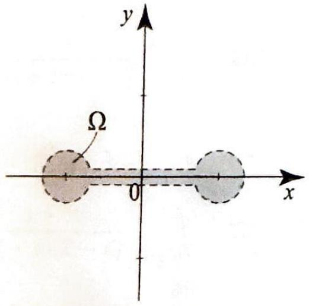
Figure 39

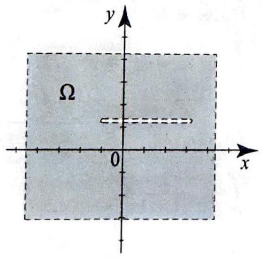
Figure 40

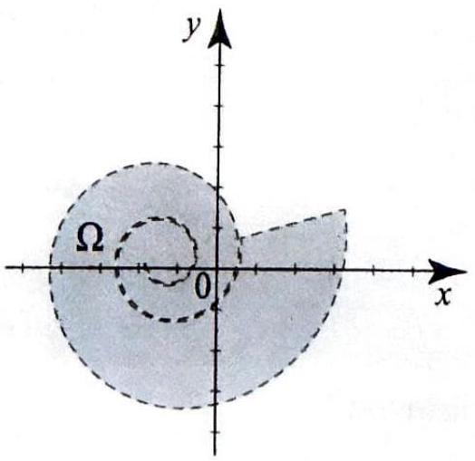
Figure 41

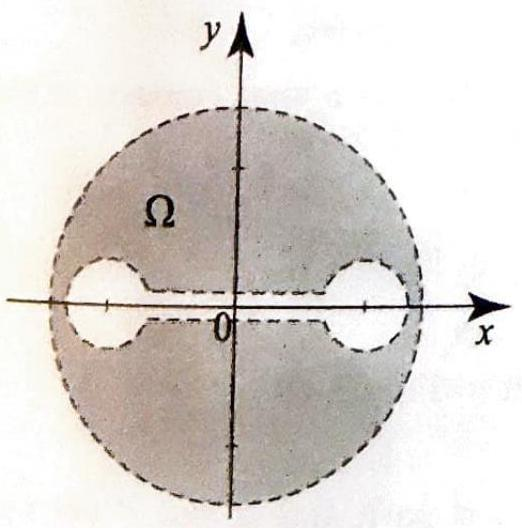
Figure 42

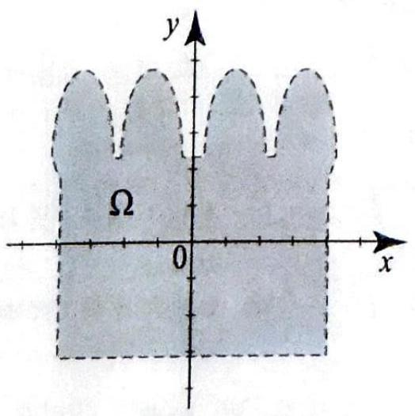
Figure 43

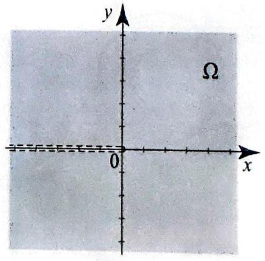
Figure 44

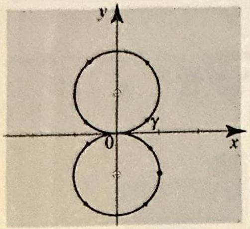
Figure 45

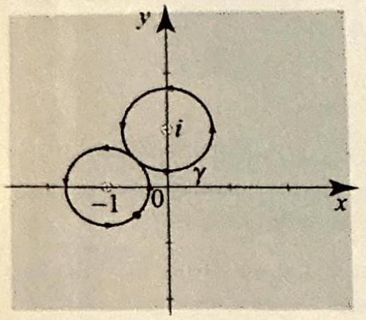
Figure 46

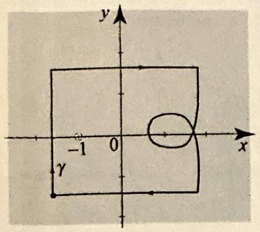
Figure 47

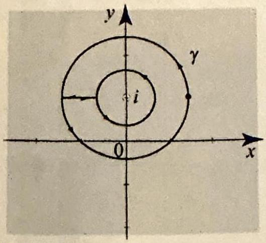
Figure 48

In Exercises 12-31, evaluate the given integral. Indicate clearly the version of Cauchy's theorem or the result from Section 3.3 that you are using.
12. $\int_{\left[z_{1}, z_{2}, z_{3}, z_{1}\right]} \sin \left(z^{2}\right) d z$, where $z_{1}=0, z_{2}=-i, z_{3}=1$.
13. $\int_{C_{1}(0)} \frac{e^{z}}{z+2} d z$.
14. $\int_{\gamma}\left(z^{2}+2 z+3\right) d z$, where $\gamma$ is any path joining 0 to 1 .
15. $\int_{C_{1}(i)}\left(\frac{z-1}{z+1}\right)^{2} z d z$.
16. $\int_{\gamma} \frac{3 i}{z-2 i} d z$, where $\gamma(t)=e^{i t}+\frac{e^{2 i t}}{2}, 0 \leq t \leq 2 \pi$. [Hint: Show that the path is closed and the integrand is analytic in a region containing the path.]
17. $\int_{\gamma} \frac{e^{z}}{z+i} d z$, where $\gamma(t)=i+e^{i t}, 0 \leq t \leq 2 \pi$.
18. $\int_{C_{1}(0)} \frac{1}{z-\frac{1}{2}} d z$.
19. $\int_{C_{1}(0)} \frac{1}{\left(z-\frac{1}{2}\right)^{2}} d z$.
20. $\int_{C_{4}(0)}\left((z-2+i)^{2}+\frac{i}{z-2+i}-\frac{3}{(z-2+i)^{2}}\right) d z$.
21. $\int_{\left[z_{1}, z_{2}, z_{3}, z_{1}\right]} z^{2} \log z d z$, where $z_{1}=1, z_{2}=1+i, z_{3}=-1+i$.
22. $\int_{C_{1}(i)} \frac{1}{(z-i)(z+i)} d z$.
23. $\int_{C_{3}(i)} \frac{1}{(z-i)(z+i)} d z$.
24. $\int_{C_{\frac{3}{2}}(1+i)} \frac{1}{(z-1)(z-i)(z+i)} d z$.
25. $\int_{C_{2}(0)} \frac{z}{z^{2}-1} d z$.
26. $\int_{C_{2}(0)} \frac{1}{z^{2}+1} d z$.
27. $\int_{C_{\frac{3}{2}}(0)} \frac{z^{2}+1}{(z-2)(z+1)} d z$.
28. $\int_{\gamma} \frac{z}{(z-i)(z+i)} d z$, where $\gamma$ is the path that consists of the two circles in Figure 45.
29. $\int_{\gamma} \frac{1}{(z+1)^{2}\left(z^{2}+1\right)} d z$, where $\gamma$ is the path that consists of the two circles in Figure 46.
30. $\int_{\gamma} \frac{1}{z+1} d z$, where $\gamma$ is the path in Figure 47 .
31. $\int_{\gamma} \frac{z+1}{z-i} d z$, where $\gamma$ is the path in Figure 48.
32. Suppose that $C$ is a simple closed path and $\alpha$ and $\beta$ are complex numbers
not on $C$. What are the possible values of

$$
\int_{C} \frac{1}{(z-\alpha)(z-\beta)} d z ?
$$

(Distinguish all possible locations of the points $\alpha$ and $\beta$ relative to the path $C$.)
33. (a) Let $z_{1}, z_{2}, \ldots, z_{n}$ be distinct complex numbers ( $n \geq 2$ ). Show that in the partial fraction decomposition

$$
\frac{1}{\left(z-z_{1}\right)\left(z-z_{2}\right) \cdots\left(z-z_{n}\right)}=\frac{A_{1}}{z-z_{1}}+\frac{A_{2}}{z-z_{2}}+\cdots+\frac{A_{n}}{z-z_{n}}
$$

we must have $A_{1}+A_{2}+\cdots+A_{n}=0$.
(b) Suppose that $C$ is a simple closed path that contains the points $z_{1}, z_{2}, \ldots, z_{n}$ in its interior. Use the result in part (a) to show that

$$
\int_{C} \frac{1}{\left(z-z_{1}\right)\left(z-z_{2}\right) \cdots\left(z-z_{n}\right)} d z=0
$$

34. Let $p(z)$ be a polynomial of degree $n \geq 0, C$ be a simple closed path, and $z_{0}$ be a point in the interior of $C$. Show that

$$
\frac{1}{2 \pi i} \int_{C} \frac{p(z)}{z-z_{0}} d z=p\left(z_{0}\right)
$$

This is a special case of Cauchy's integral formula (Section 3.6). [Hint: Expand $p(z)$ about $z_{0}$ (Taylor expansion), $p(z)=p\left(z_{0}\right)+A_{1}\left(z-z_{0}\right)+\cdots+A_{n}\left(z-z_{n}\right)^{n}$.]
(b) What is the value of the integral in (a) if $z_{0}$ is in the exterior of $C$ ?
35. Let $p(z)$ and $C$ be as in Exercise 34, and $z_{0}$ be in the interior of $C$. Show that

$$
\frac{n!}{2 \pi i} \int_{C} \frac{p(z)}{\left(z-z_{0}\right)^{n+1}} d z=p^{(n)}\left(z_{0}\right)
$$

where $p^{(n)}$ denotes the $n$th derivative of $p$. This is a special case of Cauchy's generalized integral formula (Section 3.6). [Hint: What are the $A_{j}$ 's in the Taylor expansion in the hint of Exercise 34(a)?]
36. Homotopy is an equivalence relation. (a) Given a path $\gamma_{0}(t)$ in a region $\Omega$, show that $H(t, s)=\gamma_{0}(t)$ will continuously deform $\gamma_{0}$ to itself, relative to $\Omega$. Thus all curves are homotopic to themselves. (In other words, homotopy is a reflexive relation.)
(b) Show that if $H(t, s)$ is a mapping of the unit square that continuously deforms a path $\gamma_{0}$ into the path $\gamma_{1}$ relative to a region $\Omega$, then $H(t, 1-s)$ is a mapping of the unit square that continuously deforms $\gamma_{1}$ into $\gamma_{0}$ relative to $\Omega$. Hence if $\gamma_{0}$ is homotopic to $\gamma_{1}$ relative to $\Omega$, then $\gamma_{1}$ is homotopic to $\gamma_{0}$ relative to $\Omega$. (In other words, homotopy is a symmetric relation.)
(c) Suppose that $H_{1}(t, s)$ continuously deforms $\gamma_{0}$ into $\gamma_{1}$ relative to $\Omega$, and $H_{2}(t, s)$ continuously deforms $\gamma_{1}$ into $\gamma_{2}$ relative to $\Omega$. Show that

$$
H(t, s)= \begin{cases}H_{1}(t, 2 s) & \text { if } 0 \leq s \leq \frac{1}{2} \\ H_{2}\left(t, 2\left(s-\frac{1}{2}\right)\right) & \text { if } \frac{1}{2} \leq s \leq 1\end{cases}
$$

continuously deforms $\gamma_{0}$ into $\gamma_{2}$ relative to $\Omega$. Hence if $\gamma_{0}$ and $\gamma_{1}$ are homotopic relative to $\Omega$ and $\gamma_{1}$ and $\gamma_{2}$ are homotopic relative to $\Omega$, then $\gamma_{0}$ and $\gamma_{2}$ are homotopic relative to $\Omega$. (In other words, homotopy is a transitive relation.)
(d) A relation that is reflexive, symmetric, and transitive is called an equivalence relation. Conclude that homotopy is an equivalence relation.
37. Proof of Proposition 1. Here we prove that properties (i), (ii), and (iii) in Proposition 1 are equivalent; that is, if one of them holds for a region $\Omega$, then all of them must hold. We show that (i) ⇒ (iii) ⇒ (ii) ⇒ (i).
(a) Suppose any two paths in $\Omega$ joining $\alpha$ to $\beta$ are mutually continuously deformable relative to $\Omega$. Show that any closed path $\gamma_{0}$ is continuously deformable into a point in $\Omega$. [Hint: The closed path $\gamma_{0}$ must start and end at the same point $z_{0}$; pick this as the point.]
(b) Suppose any closed path in $\Omega$ is continuously deformable into a point in $\Omega$.

Show that any two closed paths $\gamma_{0}$ and $\gamma_{1}$ are continuously deformable relative to
$\Omega$. [Hint: Deform $\gamma_{0}$ to a point $z_{0}$. Deform $z_{0}$ to $z_{1}$ by ordinary connectedness of $\Omega$. Deform $z_{1}$ to $\gamma_{1}$. Use the transitive and symmetric properties of continuous deformation.]
(c) Suppose any two closed paths are mutually continuously deformable relative to
$\Omega$. Show that two paths $\gamma_{0}$ and $\gamma_{1}$ connecting $\alpha$ to $\beta$ are continuously deformable relative to $\Omega$. [Hint: Let $\Gamma$ be the closed path which traverses $\gamma_{0}$ and then the reverse of $\gamma_{1}$. Parametrize $\Gamma$ by $t$ in $[0,1]$ such that $\Gamma(0)=\Gamma(1)=\alpha$ and $\Gamma\left(\frac{1}{2}\right)=\beta$.
The curve $\Gamma$ can be continuously deformed into its reverse, where the homotopy mapping $H$ satisfies $H(0, s)=H(1, s)=\alpha$ and $H\left(\frac{1}{2}, s\right)=\beta$. What does this imply for $\gamma_{0}$ and $\gamma_{1}$ ?]
38. (a) Let $p(z)=a_{n} z^{n}+a_{n-1} z^{n-1}+\cdots+a_{1} z+a_{0},\left(a_{n} \neq 0\right)$ be a polynomial of degree $n \geq 2$. Show that, for any $z$ with $|z|=R>0$,

$$
|p(z)| \geq\left|\left|a_{n}\right| R^{n}-\left|a_{n-1}\right| R^{n-1}-\cdots-\left|a_{1}\right| R-\left|a_{0}\right|\right|
$$

Conclude that for $z$ on $C_{R}(0)$, the circle centered at 0 with radius $R>0$, we have

$$
\left|\frac{1}{p(z)}\right| \leq \frac{1}{\left|\left|a_{n}\right| R^{n}-\left|a_{n-1}\right| R^{n-1}-\cdots-\left|a_{1}\right| R-\left|a_{0}\right|\right|}
$$

(b) Use (a) to show that

$$
\left|\int_{C_{R}(0)} \frac{1}{p(z)} d z\right| \rightarrow 0, \quad \text { as } \quad R \rightarrow \infty
$$

[Hint: Use Theorem 2, Section 3.2.]
(c) Let $C$ be a simple closed path that contains all the roots of $p(z)$ in its interior. Show that

$$
\int_{C} \frac{1}{p(z)} d z=0
$$

[Hint: Take $C$ to be positively oriented and choose $R$ so large that $C_{R}(0)$ contains $C$ in its interior. Explain why $\int_{C} \frac{1}{p(z)} d z=\int_{C_{R}(0)} \frac{1}{p(z)} d z$, where the right side is in fact independent of $R$. Then let $R \rightarrow \infty$ and use (b).]

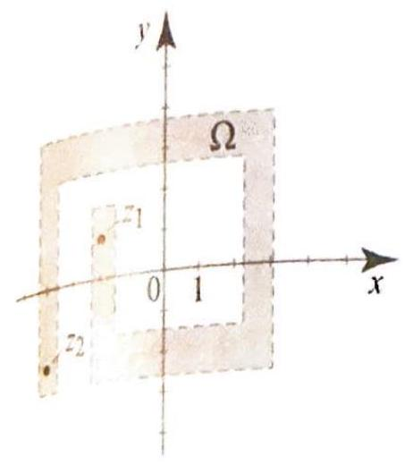
Figure 49

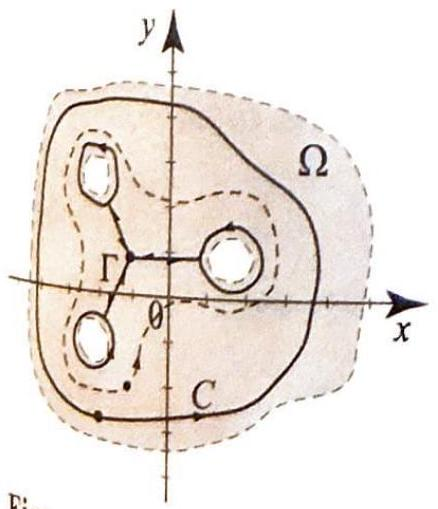
Figure 50

39. The spiraling region $\Omega$ in Figure 49 is simply connected. Theorem 4 guarantees us an antiderivative of $f(z)=\frac{1}{z}$ in $\Omega$. Find an antiderivative explicitly in terms of branches of the logarithm.
40. Project Problem: Green's theorem. In this problem we investigate a connection between Cauchy's theorem and Green's theorem from vector calculus. This theorem states the following.

Suppose that $\Omega$ is a simply connected region and $C$ is a simple closed path in $\Omega$ with positive orientation. Let $D$ denote the region interior to $C$. Suppose that $u(x, y)$ and $v(x, y)$ are two continuously differentiable functions on $\Omega$. Then

$$
\int_{C}(u d x+v d y)=\iint_{D}\left(\frac{\partial v}{\partial x}-\frac{\partial u}{\partial y}\right) d x d y
$$

In what follows, we will show how Green's theorem implies the version of Cauchy's integral theorem for simply connected regions (Theorem 5).
(a) Let $f(z)=u(x, y)+i v(x, y)$ be defined on a path $\gamma$, where $u$ and $v$ are continuously differentiable. Parametrize $\gamma$ by $\gamma(t)=x(t)+i y(t), a \leq t \leq b$. Going back to the definition of the path integral in Definition 1, Section 3.2, show that

$$
\int_{\gamma} f(z) d z=\int_{a}^{b}\left(u(\gamma(t)) x^{\prime}(t)-v(\gamma(t)) y^{\prime}(t)\right) d t+i \int_{a}^{b}\left(v(\gamma(t)) x^{\prime}(t)+u(\gamma(t)) y^{\prime}(t)\right) d t
$$

(b) Using the notation $x^{\prime}(t) d t=d x$ and $y^{\prime}(t) d t=d y$, conclude that

$$
\int_{\gamma} f(z) d z=\int_{\gamma}(u d x-v d y)+i \int_{\gamma}(v d x+u d y)
$$

(c) Prove Theorem 5(i) using Green's theorem and (b). [Hint: Since $f$ is analytic, $u$ and $v$ satisfy the Cauchy-Riemann equations and have continuous first partial derivatives.]
41. Here, we give a less rigorous but simpler proof of Theorem 6 (Cauchy's theorem for multiply connected regions). Take the case $n=3$ and the particular instance shown in Figure 50. The outer curve $C$ is continuously deformable in $\Omega$ to $\Gamma$, being the three smaller simple curves $C_{1}, C_{2}, C_{3}$ and the three line segments $L_{1}, L_{2}, L_{3}$ traced in both directions. Conclude from Theorem 2 of this section, and Proposition 2 of Section 3.2, that

$$
\begin{aligned}
\int_{C} f(z) d z & =\sum_{j=1}^{3} \int_{C_{j}} f(z) d z+\sum_{j=1}^{3} \int_{L_{j}} f(z) d z \\
& =\sum_{j=1}^{3} \int_{C_{j}} f(z) d z
\end{aligned}
$$

Repeat this same type of reasoning for a larger $n$ (say, $n=5$ ) and a more complicated arrangement of $C_{j}$ 's. It will work, but the connecting pieces $L_{j}$ might be curved.

### 3.5 Proof of Cauchy's Theorem

The proof is divided in two major parts. In the first part, we prove Cauchy's theorem for star regions; these include disks. In the second part, we prove the general version of Cauchy's theorem, using the version in a disk.

A region $\Omega$ is called a star region if it contains a point $z_{0}$ such that any other point $z$ in $\Omega$ can be connected to $z_{0}$ by a line segment wholly contained in $\Omega$. Thus $\left[z_{0}, z\right]$ is contained in $\Omega$ for any $z$ in $\Omega$. Figure 1 depicts several examples of star regions along with suitable points to serve as $z_{0}$.

Figure 1 Star regions.

The proof of Cauchy's theorem on star regions is a simple consequence of Theorem 2, Section 3.3, and a general result on differentiation of path integrals, which we state and prove at the end of the section.

$$
\begin{aligned}
& \text { Suppose that } f \text { is analytic on a star region } \Omega \text {. Then } \\
& \qquad \int_{\Gamma} f(z) d z=0
\end{aligned}
$$

for all closed paths $\Gamma$ in $\Omega$.

Proof According to Theorem 2, Section 3.3, it is enough to construct an antiderivative of $f$ in $\Omega$. Let $z_{0}$ be a point in $\Omega$ that connects to all other points in $\Omega$ via line segments (see Figure 2). For $z$ in $\Omega$, define $F(z)=\int_{\left[z_{0}, z\right]} f(\zeta) d \zeta$. Parametrizing the line segment by $\gamma(t)=(1-t) z_{0}+t z, 0 \leq t \leq 1$, we have $\gamma^{\prime}(t)=\left(z-z_{0}\right) d t$, and thus

$$
F(z)=\left(z-z_{0}\right) \int_{0}^{1} f\left((1-t) z_{0}+t z\right) d t
$$

To complete the proof, we will show that $F^{\prime}(z)=f(z)$. Using the product rule for differentiation and the fact that $\left(z-z_{0}\right)^{\prime}=1$, we obtain
(2) $\frac{d}{d z} F(z)=\int_{0}^{1} f\left((1-t) z_{0}+t z\right) d t+\left(z-z_{0}\right) \frac{d}{d z} \int_{0}^{1} f\left((1-t) z_{0}+t z\right) d t$.

THEOREM 1 CAUCHY'S INTEGRAL THEOREM FOR STAR REGIONS

Figure 2

To compute the last derivative, we appeal to Theorem 4, below. Accordingly,

$$
\begin{aligned}
\left(z-z_{0}\right) \frac{d}{d z} \int_{0}^{1} f\left((1-t) z_{0}+t z\right) d t & =\left(z-z_{0}\right) \int_{0}^{1} \frac{d}{d z} f\left((1-t) z_{0}+t z\right) d t \\
& =\left(z-z_{0}\right) \int_{0}^{1} t f^{\prime}\left(\left(z-z_{0}\right) t+z_{0}\right) d t
\end{aligned}
$$

The last integral is simple and can be evaluated by parts. Setting $u=t, d v= \left(z-z_{0}\right) f^{\prime}\left(\left(z-z_{0}\right) t+z_{0}\right) d t$, then $d u=d t$, and $v=f\left(\left(z-z_{0}\right) t+z_{0}\right)$. So

$$
\begin{aligned}
& \left(z-z_{0}\right) \int_{0}^{1} t f^{\prime}\left(\left(z-z_{0}\right) t+z_{0}\right) d t \\
& \quad=\left.t f\left(\left(z-z_{0}\right) t+z_{0}\right)\right|_{0} ^{1}-\int_{0}^{1} f\left(\left(z-z_{0}\right) t+z_{0}\right) d t \\
& \quad=f(z)-\int_{0}^{1} f\left(\left(z-z_{0}\right) t+z_{0}\right) d t
\end{aligned}
$$

Using (4) and (3) in (2), it follows that $\frac{d}{d z} F(z)=f(z)$. $\square$

Since a disk is a star region, Theorem 1 implies that Cauchy's integral theorem holds on a disk.

To prove the general version of Cauchy's theorem, stated in Theorem 2, Section 3.4, in addition to the version on a disk, we will need a few facts about continuous functions of one or two complex variables. Indeed, these properties hold for continuous functions defined on any space where we have a notion of a distance, a so-called metric space. For example, in the space $\mathbb{C} \times \mathbb{C}$, the product of two copies of $\mathbb{C}$, we have a notion of a distance using the following definition of the absolute value on $\mathbb{C} \times \mathbb{C}$ : If $z_{1}=a_{1}+i b_{1}$, $w_{1}=c_{1}+i d_{1}, z_{2}=a_{2}+i b_{2}, w_{2}=c_{2}+i d_{2}$, then

$$
\begin{aligned}
& \left|\left(z_{1}, w_{1}\right)-\left(z_{2}, w_{2}\right)\right| \\
& \quad=\sqrt{\left(a_{1}-a_{2}\right)^{2}+\left(b_{1}-b_{2}\right)^{2}+\left(c_{1}-c_{2}\right)^{2}+\left(d_{1}-d_{2}\right)^{2}}
\end{aligned}
$$

The following properties of continuous functions are generalizations of wellknown results from calculus. As you read them, try to formulate the corresponding results from calculus that they generalize.

Suppose that $S$ is a closed and bounded set and $f$ is a continuous complex-valued function on $S$. Then $f[S]$ is a closed and bounded subset of $\mathbb{C}$. In other words, the continuous image of a closed and bounded set is closed and bounded.

Suppose that $S$ is a closed and bounded set and $f$ is a continuous complex-valued function on $S$. Then $|f|$ is attains its maximum and minimum values in $S$. That is, we can find $z_{1}$ and $z_{2}$ in $S$ such that $\left|f\left(z_{1}\right)\right| \leq|f(z)| \leq\left|f\left(z_{2}\right)\right|$ for all $z$ in $S$.

Figure 3 Distance between sets.

For our next result, we define the notion of distance between two sets. If $K$ and $S$ are two nonempty sets, the distance between $K$ and $S$ is defined to be the smallest value of $|z-w|$ where $z$ is in $K$ and $w$ is in $S$ (Figure 3). If a smallest value is not attained, we take the distance to be the largest number $\delta$ such that $|z-w|$ is always greater than or equal to $\delta$.

With the help of the results that we just stated about continuous functions, we can prove the following fact, which is geometrically obvious.

Suppose that $K$ is a closed and bounded subset of $\mathbb{C}$ and $S$ is a closed subset of $\mathbb{C}$. Suppose that $K$ and $S$ are disjoint. Then the distance between $K$ and $S$ is strictly positive.
In the next result, we use the notion of uniform continuity. A function $f$ on a set $S$ is called uniformly continuous if given $\epsilon>0$, there is a $\delta>0$ such that, for all $z_{1}$ and $z_{2}$ in $S,\left|z_{1}-z_{2}\right|<\delta \Rightarrow\left|f\left(z_{1}\right)-f\left(z_{2}\right)\right|<\epsilon$.

Clearly, any uniformly continuous function is continuous. The converse is not true. The key words in the definition of uniform continuity are "for all," which imply that for a given $\epsilon$ the choice of $\delta$ works for all points in $S$. Compare this with the definition of continuity at a point, where the choice of $\delta$ depends on $\epsilon$ and the given point.

The following is one of the most basic results in analysis.
If $f$ is continuous on a closed and bounded set $S$, then $f$ is uniformly continuous.

We now have all the necessary ingredients to prove Cauchy's theorem.
Proof of Theorem 2, Section 3.4 Let $\gamma_{0}$ and $\gamma_{1}$ be given in $\Omega$, either joining $\alpha$ to $\beta$ (part (i) of Cauchy's theorem) or closed (part (ii) of Cauchy's theorem). If $\Omega$ is the entire plane, then we are done by Theorem 1, because the complex plane is clearly a star region. If $\Omega$ is not the entire plane, its boundary, which we will denote as $\partial \Omega$, is closed (Exercise 6) and nonempty. Let $H$ denote the mapping of the unit square $Q=[0,1] \times[0,1]$ into $\Omega$ that continuously deforms $\gamma_{0}$ into $\gamma_{1}$, and let $K=H[Q]$. Since $Q$ is closed and bounded, and $H$ is continuous, it follows that $K$ is closed and bounded. Since $K$ is contained in the (open region) $\Omega$, it is disjoint from the closed boundary of $\Omega$. So if $\delta$ denotes the distance from $\partial \Omega$ to $K$, then $\delta$ is positive.

Since $H$ is continuous on $Q$ and $Q$ is closed and bounded, it follows that $H$ is uniformly continuous on $Q$. So we can pick a positive integer $n$ so that

$$
\left|(t, s)-\left(t^{\prime}, s^{\prime}\right)\right| \leq \frac{\sqrt{2}}{n} \Rightarrow\left|H(t, s)-H\left(t^{\prime}, s^{\prime}\right)\right|<\delta
$$

Having chosen $n$, construct a grid over $Q$ by subdividing the sides into $n$ equal subintervals (Figure 4). This is a simplicial network, where each smaller square in this network is called a simplicial square. Label the points on the grid by

$$
p_{j k}=\left(\frac{j}{n}, \frac{k}{n}\right), \quad j, k=0,1, \ldots, n
$$

and let

$$
z_{j k}=H\left(p_{j k}\right) .
$$

Figure 4 A simplicial network on the square $Q$ with a sample smplicial square with one corner at $p_{32}$. The simplicial sques are so small that the imare of each is contained in a dive in $\Omega$ of radius $\delta>0$, where $\delta$ is the distance between thic boundary of $\Omega, \partial \Omega$, and the closed and bounded set $H[Q]$.

Condition (6) guarantees that the image of each simplicial square lies in the open disk $B_{\delta}\left(z_{j k}\right)$, which in turn is contained in $\Omega$. This is a very useful fact, since we are going to apply Cauchy's theorem in the disk $B_{\delta}\left(z_{j k}\right)$ as we integrate $f$ over the closed polygonal path

$$
\sigma_{j k}=\left[z_{j k}, z_{j+1, k}, z_{j+1, k+1}, z_{j, k+1}, z_{j k}\right]
$$

which is contained in $B_{\delta}\left(z_{j k}\right)$ (see Figure 5). Since $f$ is analytic on $B_{\delta}\left(z_{j k}\right)$, Cauchy's theorem in a disk yields

$$
\int_{\sigma_{j k}} f(z) d z=0
$$

In Figure 5, we show a typical closed polygonal path obtained by joining the images of the four corners of one simplicial square. By construction, these polygonal paths are contained in disks of radius $\delta$ in ? In Figure 6, after summing all the path integrals and canceling those that are traversed ${ }^{\text {in }}$ opposite direction, the only ones that remain are those that correspond to the boundary of $Q$.

Figure 5

Figure 6

Adding the integrals over all the $\sigma_{j k}$ 's, we note the following. The integrals over the segments that correspond to internal sides of the simplicial squares cancel,
since each internal segment is traversed twice in opposite directions. Thus the only noncanceling integrals are those over line segments that correspond to external sides of the simplicial squares, that is, the boundary of $Q$.

For part (i) of Cauchy's theorem, the integrals on the line segments connecting $z_{j k}$ going up the right side and down the left side of $Q$ are each zero because the $z_{j k}$ are fixed at $\alpha$ and $\beta$. For part (ii) of Cauchy's theorem, the integrals on the line segments connecting $z_{j k}$ going up the right side and down the left side of $Q$ will cancel because they trace the same path in opposite directions (here we have $z_{0 j}=z_{n j}$ ). The only remaining integrals are on the line segments corresponding to the bottom and top sides of $Q$. So

$$
0=\sum_{j, k=0}^{n-1} \int_{\sigma_{j k}} f(z) d z=\int_{\Gamma_{0}} f(z) d z-\int_{\Gamma_{1}} f(z) d z
$$

where

$$
\Gamma_{0}=\left[z_{00}, z_{10}, \ldots, z_{n 0}\right], \quad \text { and } \quad \Gamma_{1}=\left[z_{0 n}, z_{1 n}, \ldots, z_{n n}\right] .
$$

Applying Cauchy's theorem in the disk $B_{\delta}\left(z_{j 0}\right)$, we see that

$$
\int_{\left[z_{j 0}, z_{j+1,0}\right]} f(z) d z=\int_{\gamma_{0, j}} f(z) d z
$$

where $\gamma_{0, j}$ is the portion of the path $\gamma_{0}$ that joins the points $z_{j 0}$ and $z_{j+1,0}$ (Figure 6). Adding equations (9) as $j$ runs from 0 to $n-1$, we get

$$
\int_{\Gamma_{0}} f(z) d z=\int_{\gamma_{0}} f(z) d z
$$

Similarly,

$$
\int_{\Gamma_{1}} f(z) d z=\int_{\gamma_{1}} f(z) d z
$$

Comparing with (8), we find that

$$
\int_{\gamma_{0}} f(z) d z=\int_{\Gamma_{0}} f(z) d z=\int_{\Gamma_{1}} f(z) d z=\int_{\gamma_{1}} f(z) d z
$$

which completes the proof of the theorem.

## Appendix: Differentiation of Path Integrals

We will present a general principle for differentiation under the integral sign for functions defined by a path integral. This result was needed in the proof of Theorem 1. It will be needed also in the proof of the generalized Cauchy's formula in the following section. To simplify the proof, we have divided it into several steps, each one consisting of a result that is interesting in its own right.

Our first result is a generalization of the well-known Fubini theorem from calculus. This theorem states that if $u(x, y)$ is continuous on $[a, b] \times[c, d]$, then

$$
\int_{a}^{b} \int_{c}^{d} u(x, y) d y d x=\int_{c}^{d} \int_{a}^{b} u(x, y) d x d y
$$

We can easily extend this result to the case where $u(x, y)$ is not quite continuous over the rectangle $[a, b] \times[c, d]$, but the functions $x \mapsto u(x, y)$ and $y \mapsto u(x, y)$ are merely piecewise continuous in $x$ and $y$. In this case we can write the iterated integrals in (10) as the sum of finitely many iterated integrals over subintervals of $[a, b]$ and $[c, d]$, such that in each term the integrand is a continuous function of $(x, y)$ over the corresponding domain of integration. Applying (10) to each term separately and then adding the terms together, it follows that (10) holds in this more general situation. With this in mind, we can prove the following version of Fubini's theorem.

THEOREM 2 NI'S THEOREM FOR PATH INTEGRALS

THEOREM 3 CONTINUITY OF PATH INTEGRALS

Suppose that $f(z, \zeta)$ is continuous for $z$ on a path $\gamma_{1}$ and $\zeta$ on a path $\gamma_{2}$. Then

$$
\int_{\gamma_{1}} \int_{\gamma_{2}} f(z, \zeta) d \zeta d z=\int_{\gamma_{2}} \int_{\gamma_{1}} f(z, \zeta) d z d \zeta
$$

Proof Parametrize $\gamma_{1}$ by $[a, b]$ and $\gamma_{2}$ by $[c, d]$. Then (11) is equivalent to

$$
\begin{aligned}
& \int_{a}^{b} \int_{c}^{d} f\left(\gamma_{1}(x), \gamma_{2}(y)\right) \gamma_{1}^{\prime}(x) \gamma_{2}^{\prime}(y) d y d x \\
& \quad=\int_{c}^{d} \int_{a}^{b} f\left(\gamma_{1}(x), \gamma_{2}(y)\right) \gamma_{1}^{\prime}(x) \gamma_{2}^{\prime}(y) d x d y
\end{aligned}
$$

The function $x \mapsto f\left(\gamma_{1}(x), \gamma_{2}(y)\right) \gamma_{1}^{\prime}(x) \gamma_{2}^{\prime}(y)$ is piecewise continuous in $x$, and the function $y \mapsto f\left(\gamma_{1}(x), \gamma_{2}(y)\right) \gamma_{1}^{\prime}(x) \gamma_{2}^{\prime}(y)$ is piecewise continuous in $y$. Applying Fubini's theorem for piecewise continuous functions, we see that (12) holds.

Suppose that $f(z, \zeta)$ is continuous for $z$ in a region $\Omega$ and $\zeta$ on a path $\gamma$. For $z$ in $\Omega$, consider

$$
\phi(z)=\int_{\gamma} f(z, \zeta) d \zeta
$$

Then $\phi$ is a continuous function of $z$ in $\Omega$.
Proof Fix $z_{0}$ in $\Omega$. For small $\Delta z, z_{0}+\Delta z$ lies in $\Omega$. By Theorem 2, Section 3.2, we have

$$
\left|\phi\left(z_{0}+\Delta z\right)-\phi\left(z_{0}\right)\right|=\left|\int_{\gamma}\left(f\left(z_{0}+\Delta z, \zeta\right)-f\left(z_{0}, \zeta\right)\right) d \zeta\right| \leq l(\gamma) M
$$

where $M$ is the maximum of $\left|f\left(z_{0}+\Delta z, \zeta\right)-f\left(z_{0}, \zeta\right)\right|$ for $\zeta$ on $\gamma$ (see Figure 7). We will show that $M \rightarrow 0$ as $\Delta z \rightarrow 0$. Since the set of all $(z, w)$ with $z=z_{0}$ and $w$ on $\gamma$ is closed and bounded, it follows that $f$ is uniformly continuous on this set. Since the distance from $\left(z_{0}+\Delta z, \zeta\right)$ to $\left(z_{0}, \zeta\right)$ is $|\Delta z|$, it follows from the uniform continuity of $f$ that $M \rightarrow 0$ as $\Delta z \rightarrow 0$.

THEOREM 4 DIFFERENTIATION OF PATH INTEGRALS

Figure 7 Picturing a continuous function $f$ of two variables $z$ and $\zeta$.

We are now ready to state and prove a general result that justifies differentiation under the integral sign for path integrals.

Suppose that $f(z, \zeta)$ is a complex-valued function, defined for $z$ in a region $\Omega$ and $\zeta$ on a path $\gamma$. If both $f(z, \zeta)$ and $\frac{d}{d z} f(z, \zeta)$ are continuous functions of $(z, \zeta)$ (hence, for fixed $\zeta, f(z, \zeta)$ is analytic in $z)$, then the function

$$
F(z)=\int_{\gamma} f(z, \zeta) d \zeta
$$

is analytic on $\Omega$ and

$$
F^{\prime}(z)=\int_{\gamma} \frac{d}{d z} f(z, \zeta) d \zeta
$$

Proof Let $z_{0}$ be in $\Omega$ and $\Delta z$ be so small that $z_{0}+\Delta z$ is also in $\Omega$. To compute $F^{\prime}\left(z_{0}\right)$, we must find the limit as $\Delta z \rightarrow 0$ of

$$
\begin{aligned}
\frac{1}{\Delta z}\left(F\left(z_{0}+\Delta z\right)-F\left(z_{0}\right)\right) & =\frac{1}{\Delta z}\left(\int_{\gamma} f\left(z_{0}+\Delta z, \zeta\right) d \zeta-\int_{\gamma} f\left(z_{0}, \zeta\right) d \zeta\right) \\
& =\frac{1}{\Delta z} \int_{\gamma}\left(f\left(z_{0}+\Delta z, \zeta\right)-f\left(z_{0}, \zeta\right)\right) d \zeta
\end{aligned}
$$

For fixed $\zeta$, the function $\frac{d}{d z} f(z, \zeta)$ is continuous and has an antiderivative in $\Omega$, namely, $f(z, \zeta)$. We thus infer from Theorem 1, Section 3.3, that

$$
f\left(z_{0}+\Delta z, \zeta\right)-f\left(z_{0}, \zeta\right)=\int_{z_{0}}^{z_{0}+\Delta z} \frac{d}{d z} f(z, \zeta) d z
$$

where the integral is independent of the path from $z_{0}$ to $z_{0}+\Delta z$. Using (17) in (16), we obtain

$$
\begin{aligned}
\frac{1}{\Delta z}\left(F\left(z_{0}+\Delta z\right)-F\left(z_{0}\right)\right) & =\frac{1}{\Delta z} \int_{\gamma} \int_{z_{0}}^{z_{0}+\Delta z} \frac{d}{d z} f(z, \zeta) d z d \zeta \\
& =\frac{1}{\Delta z} \int_{z_{0}}^{z_{0}+\Delta z} \int_{\gamma} \frac{d}{d z} f(z, \zeta) d \zeta d z
\end{aligned}
$$

by Fubini's theorem for path integrals. The function $\phi(z)$ defined by the inner path

THEOREM 5 COYTINUITY AND DIFFEIENTIATION OF INTEGRALS

Figure 8 Visualizing the continuity of $\phi(y)$, when $u$ is real and $\geq 0$. For a given $y, \phi(y)$ is the area of the cross section above the $x y$-plane, under the surface $z=u(x, y)$, $a \leq x \leq b$. To say that $\phi$ is continuous at $y_{0}$ means that the area $\phi(y)$ tends to the area $\phi\left(y_{0}\right)$ as $y \rightarrow y_{0}$.
integral is continuous, by Theorem 3. Hence using Lemma 1, Section 3.3,

$$
F^{\prime}\left(z_{0}\right)=\lim _{\Delta z \rightarrow 0} \frac{1}{\Delta z} \int_{z_{0}}^{z_{0}+\Delta z} \phi(z) d z=\phi\left(z_{0}\right)=\int_{\gamma} \frac{d}{d z} f\left(z_{0}, \zeta\right) d \zeta
$$

which proves (15). The continuity of $F^{\prime}(z)$ follows from Theorem 3 with $f$ replaced by $\frac{d}{d z} f(z, \zeta)$. Thus, $F$ is analytic on $\Omega$.

We end the section with a variant of Theorem 4, concerning differentiation under the integral sign for functions of two variables. The proof of this theorem parallels that of Theorem 4 and is somewhat simpler. It is outlined in the exercises.
(i) Let $u$ be a continuous complex-valued function on the rectangle $R=[a, b] \times [c, d]$. For $c \leq y \leq d$, define

$$
\phi(y)=\int_{a}^{b} u(x, y) d x
$$

Then $\phi(y)$ is continuous on $[c, d]$ (Figure 8). (ii) If $u$ is real-valued and continuous on $R$ and $\frac{\partial u}{\partial y}$ is also continuous on $R$, then $\phi(y)$ is differentiable on $(c, d)$ with

$$
\phi^{\prime}(y)=\frac{d}{d y} \int_{a}^{b} u(x, y) d x=\int_{a}^{b} \frac{\partial u}{\partial y}(x, y) d x \quad(c<y<d)
$$

## Exercises 3.5

1. Give an example of a closed and bounded subset $K$ of the real line and a bounded subset $S$ of the real line such that $K$ and $S$ are disjoint but the distance from $K$ to $S$ is 0 . [Hint: The set $S$ is necessarily not closed.]
2. Give an example of two closed and disjoint subsets $K$ and $S$ of the plane such that the distance from $K$ to $S$ is 0 . [Hint: Both sets are necessarily unbounded.]
3. Show that every convex region is a star region.
4. Show that the distance formula (5) on $\mathbb{C} \times \mathbb{C}$ is equivalent to

$$
\left|\left(z_{1}, w_{1}\right)-\left(z_{2}, w_{2}\right)\right|=\sqrt{\left|z_{1}-z_{2}\right|^{2}+\left|w_{1}-w_{2}\right|^{2}}
$$

5. In this exercise, we show that the distance formula (5) on $\mathbb{C} \times \mathbb{C}$ satisfies the three norm axioms. We define the norm of an element $(z, w)$ of $\mathbb{C} \times \mathbb{C}$ by its distance from $(0,0)$.
(a) Show that $|(z, w)| \geq 0$ with equality only if $(z, w)=(0,0)$.
(b) Show that the norm is homogeneous with respect to scalar multiplication; that is, for all complex $\alpha$, with $\alpha(z, w)=(\alpha z, \alpha w)$, we have $|\alpha(z, w)|=|\alpha||(z, w)|$.
(c) Prove the triangle inequality: $\left|\left(z_{1}, w_{1}\right)+\left(z_{2}, w_{2}\right)\right| \leq\left|\left(z_{1}, w_{1}\right)\right|+\left|\left(z_{2}, w_{2}\right)\right|$.
6. In this exercise, we prove that the boundary $\partial \Omega$ of a set $\Omega$ is closed. You are encouraged to review Section 1.2 for relevant definitions. Assume that $\partial \Omega$ is nonempty.
(a) Show that any point in $\mathbb{C}$ is either an interior point of $\Omega$, an interior point of the complement of $\Omega$, or a boundary point of $\Omega$.

Figure 9

(b) Show that $\Omega_{1}=\Omega \cup \partial \Omega$ is closed and that $\Omega_{2}=(\mathbb{C} \backslash \Omega) \cup \partial \Omega$ is closed. Hint: Take $\Omega_{1}$. If $z$ is a boundary point of $\Omega_{1}$, then every disk around $z$ contains a point $w$ in $\Omega_{1}$ and an interior point $w^{\prime}$ of $\mathbb{C} \backslash \Omega$. If $w$ is in $\Omega$, then we are almost done; if $w$ is in $\partial \Omega$, then we may form a smaller disk around $w$ and still conclude that the disk around $z$ contains a point in $\Omega$.]
(c) Show that the intersection of closed sets is a closed set. [Hint: Let $F_{j}$ be closed sets. If $z$ is a boundary point of $\bigcap F_{j}$, then every disk around $z$ contains a point that is in each $F_{j}$. So $z$ is either an interior or boundary point of each $F_{j}$. Since the $F_{j}$ 's are closed, $z$ is in each $F_{j}$.]
(d) Show that $\partial \Omega=\Omega_{1} \cap \Omega_{2}$, and hence $\partial \Omega$ is closed.

Project Problem: Differentiation under the integral sign. In Exercises 7-9 you are asked to establish results leading to the proof of Theorem 5.
7. Differentiation of integrals. Prove the following version of Lemma 1, Section 3.3. Suppose that $f(x)$ is a continuous real-valued function on an interval $[a, b]$, where $a<b$. For $x$ in $(a, b)$, we have

$$
\lim _{h \rightarrow 0} \frac{1}{h} \int_{x}^{x+h} f(s) d s=f(x)
$$

[Hint: Use the fundamental theorem of calculus.]
8. Continuity of integrals. Prove part (i) of Theorem 5.
9. Prove Theorem 5(ii) using Exercises 7 and 8. [Hint: Study the proof of Theorem 4.]
10. Project Problem: Cauchy's integral theorem on a disk. The following is an outline of an alternative proof of Theorem 1 in the case where $\Omega$ is a disk. Given $f=u+i v$ analytic on $B_{R}\left(z_{0}\right)$, where $z_{0}=x_{0}+i y_{0}$, we will construct an antiderivative of $F(z)$ of $f(z)$. Then the desired result will follow from Theorem 2, Section 3.3.

For $z=x+i y$ in $B_{R}\left(z_{0}\right)$ (see Figure 9), define

$$
F(z)=\int_{x_{0}}^{x} f\left(s, y_{0}\right) d s+i \int_{y_{0}}^{y} f(x, t) d t
$$

(a) Write $F=U+i V$. Using (18), show that

$$
U(x, y)=\int_{x_{0}}^{x} u\left(s, y_{0}\right) d s-\int_{y_{0}}^{y} v(x, t) d t
$$

and

$$
V(x, y)=\int_{x_{0}}^{x} v\left(s, y_{0}\right) d s+\int_{y_{0}}^{y} u(x, t) d t
$$

(b) With the help of Theorem 5 and the fundamental theorem of calculus, show

$$
U_{x}=u, \quad U_{y}=-v, \quad V_{x}=v, \quad V_{y}=u
$$

Conclude that the Cauchy-Riemann equations hold for $U$ and $V$, and that $U$ and $V$ have continuous first partial derivatives. Hence $F$ is analytic with derivative $F^{\prime}=U_{x}+i V_{x}=u+i v=f$.

## Cauchy's Integral Formula

## THEOREM 1 CAUCHY'S INTEGRAL FORMULA

Recall: The closed disk of radius $R$ centered at $z_{0}$ is defined as $S_{R}\left(z_{0}\right)=\{z: \mid z- \left.2_{0} \mid \leq R\right\}$. This set includes its boundary.

Figure 1 The path $C$ can be continuously deformed into the circle $C_{r}(z)$, which explains the equality (2).

In this section we develop one of the most important consequences of Cauchy's integral theorem. It is the Cauchy integral formula, which will enable us to compute many interesting integrals, and more importantly, we will use it to derive fundamental properties of analytic functions.
Suppose that $f$ is analytic inside and on a simple closed path $C$ with positive orientation. If $z$ is any point inside $C$, then

$$
f(z)=\frac{1}{2 \pi i} \int_{C} \frac{f(\zeta)}{\zeta-z} d \zeta
$$

Proof Given $z$ inside $C$, let $R>0$ be such that the closed disk $S_{R}(z)$ is contained in the region inside $C$. The function $\zeta \mapsto \frac{f(\zeta)}{\zeta-z}$ is analytic in the region inside $C$ and outside the circle $C_{r}(z)$, where $0<r \leq R$ (see Figure 1). Applying Cauchy's theorem for multiply connected regions, Theorem 6, Section 3.4 (with the variable of integration being $\zeta$ and the integrand being $\frac{f(\zeta)}{\zeta-z}$ ), we obtain

$$
\frac{1}{2 \pi i} \int_{C} \frac{f(\zeta)}{\zeta-z} d \zeta=\frac{1}{2 \pi i} \int_{C_{r}(z)} \frac{f(\zeta)}{\zeta-z} d \zeta
$$

where $C$ and $C_{r}(z)$ are positively oriented. Since this equality holds for all $0<r \leq R$, taking limits on both sides, we get

$$
\frac{1}{2 \pi i} \int_{C} \frac{f(\zeta)}{\zeta-z} d \zeta=\lim _{r \rightarrow 0^{+}} \frac{1}{2 \pi i} \int_{C_{r}(z)} \frac{f(\zeta)}{\zeta-z} d \zeta
$$

To finish off the proof, we must show that the limit is $f(z)$. Parametrize $C_{r}(z)$ by $\gamma(t)=z+r e^{i t}, 0 \leq t \leq 2 \pi, \gamma^{\prime}(t)=i r e^{i t} d t$. Then

$$
\frac{1}{2 \pi i} \int_{C_{r}(z)} \frac{f(\zeta)}{\zeta-z} d \zeta=\frac{1}{2 \pi i} \int_{0}^{2 \pi} \frac{f\left(z+r e^{i t}\right)}{r e^{i t}} i r e^{i t} d t=\frac{1}{2 \pi} \int_{0}^{2 \pi} f\left(z+r e^{i t}\right) d t
$$

For fixed $z$, the function $t \mapsto f\left(z+r e^{i t}\right)$ is a continuous complex-valued function of $t$ and $r$ in $[0,2 \pi] \times[0, R]$. So by Theorem 5(i), Section 3.5, if we integrate it with respect to $t$, we get a continuous function of $r: \phi(r)=\frac{1}{2 \pi} \int_{0}^{2 \pi} f\left(z+r e^{i t}\right) d t$. Thus, $\lim _{r \rightarrow 0^{+}} \phi(r)=\phi(0)=\frac{1}{2 \pi} \int_{0}^{2 \pi} f(z) d t=f(z)$, as required. $\square$

Before we move to the applications of (1), let us note that if in Cauchy's formula $z$ is any point outside $C$, then

$$
\frac{1}{2 \pi i} \int_{C} \frac{f(\zeta)}{\zeta-z} d \zeta=0
$$

This is an immediate consequence of Cauchy's theorem for simple paths (Theorem 5, Section 3.4), since in this case the integrand $\zeta \mapsto \frac{f(\zeta)}{\zeta-z}$ is analytic
on and inside $C$, and so its integral along $C$ is zero. We combine (1) and (4) in one convenient formula in which the variable of integration is denoted $z$ :

$$
\frac{1}{2 \pi i} \int_{C} \frac{f(z)}{z-z_{0}} d z= \begin{cases}f\left(z_{0}\right) & \text { if } z_{0} \text { is inside } C \\ 0 & \text { if } z_{0} \text { is outside } C\end{cases}
$$

(It is traditional to change the variables of integration from $\zeta$ to $z$ when applying Theorem 1.)

## EXAMPLE 1 Cauchy's integral formula

Let $C_{R}\left(z_{0}\right)$ denote the positively oriented circle with center at $z_{0}$ and radius $R>0$. Compute the following integrals.
(a) $\quad \int_{C_{2}(0)} \frac{e^{z}}{z+1} d z$,
(b) $\quad \int_{C_{2}(1)} \frac{z^{2}+3 z-1}{(z+3)(z-2)} d z$,

Solution (a) Write the integral as $\int_{C_{2}(0)} \frac{e^{z}}{z-(-1)} d z$. Since -1 is inside the circle $C_{2}(0)$, Cauchy's integral formula (5) with $f(z)=e^{z}$ and $z_{0}=-1$ implies

$$
\int_{C_{2}(0)} \frac{e^{z}}{z-(-1)} d z=2 \pi i e^{-1}
$$

(b) In evaluating $\int_{C_{2}(1)} \frac{z^{2}+3 z-1}{(z+3)(z-2)} d z$, we first note that the integrand is not analytic at the points $z=-3$ and $z=2$. Only the point $z=2$ is inside the curve $C_{2}(0)$. So if we let $f(z)=\frac{z^{2}+3 z-1}{z+3}$ the integral takes the form

$$
\int_{C_{2}(1)} \frac{f(z)}{z-2} d z=2 \pi i f(2)=\frac{18 \pi}{5} i
$$

by Cauchy's integral formula, applied at $z_{0}=2$.

Figure 2 The integral over the outer path $C$ is equal to the sum of the integrals over the inner non-overlapping circles. This reduction allows us to use Cauchy's formula on the individual inner circles.

Some integrals require multiple applications of Cauchy's formula along with applications of Cauchy's theorem. We illustrate with one example.

## EXAMPLE 2 Multiple applications of Cauchy's formula

Compute

$$
\int_{C_{2}(0)} \frac{e^{\pi z}}{z^{2}+1} d z
$$

Solution Since $z^{2}+1=(z+i)(z-i)$, the integral cannot be computed directly from Cauchy's formula, since the path contains both $\pm i$ in its interior. To overcome this difficulty, draw small nonintersecting circles inside $C_{2}(0)$ around $\pm i$, say $C_{1 / 4}(i)$ and $C_{1 / 4}(-i)$, as illustrated in Figure 2. Since $\frac{e^{\pi z}}{z^{2}+1}$ is analytic in a region containing the interior of $C_{2}(0)$ and the exterior of the smaller circles, by Cauchy's theorem for multiply connected regions (Theorem 6, Section 3.4), we have

$$
\int_{C_{2}(0)} \frac{e^{\pi z}}{z^{2}+1} d z=\int_{C_{1 / 4}(i)} \frac{e^{\pi z}}{z^{2}+1} d z+\int_{C_{1 / 4}(-i)} \frac{e^{\pi z}}{z^{2}+1} d z
$$

Now, the two integrals on the right can be evaluated with the help of Cauchy's integral formula (5). For the first one, we apply Cauchy's formula (5) with $^{\pi z}(z)= \frac{e^{\pi z}}{z+i}$ and $z_{0}=i$, and obtain

$$
\int_{C_{1 / 4}(i)} \frac{e^{\pi z}}{(z-i)(z+i)} d z=\int_{C_{1 / 4}(i)} \frac{f(z)}{z-i} d z=2 \pi i f(i)
$$

Since $f(i)=\frac{e^{i \pi}}{2 i}=\frac{-1}{2 i}=\frac{i}{2}$, we get

$$
\int_{C_{1 / 4}(i)} \frac{f(z)}{z-i} d z=-\pi
$$

For the second integral, we have

$$
\int_{C_{1 / 4}(-i)} \frac{e^{\pi z}}{(z-i)(z+i)} d z=\int_{C_{1 / 4}(-i)} \frac{g(z)}{z+i} d z=2 \pi i g(-i)
$$

where $g(z)=\frac{e^{\pi z}}{z-i}$, and so $g(-i)=\frac{e^{-i \pi}}{-2 i}=\frac{1}{2 i}=-\frac{i}{2}$. Hence

$$
\int_{C_{1 / 4}(-i)} \frac{g(z)}{z-i} d z=\pi
$$

Adding the two integrals together, we find that

$$
\int_{C_{2}(0)} \frac{e^{\pi z}}{(z-i)(z+i)} d z=0
$$

Two observations concerning Cauchy's formula (1) deserve mentioning. The formula shows that the values of an analytic function $f(z)$ for $z$ inside a simple curve $C$ can be reconstructed from the values of $f$ on the curve $C$. By just knowing $f$ on $C$, we can determine the values of $f$ inside $C$.

The second observation is that (1) expresses an analytic function inside a simple path as a function defined by a path integral. Theorem 4 of the previous section tells us that, under appropriate conditions that are met in the present situation, a function defined by a path integral can be differentiated under the integral sign. Thus, under the conditions of Theorem 1, we have

$$
\begin{aligned}
f^{\prime}(z) & =\frac{d}{d z} f(z)=\frac{d}{d z} \frac{1}{2 \pi i} \int_{C} \frac{f(\zeta)}{\zeta-z} d \zeta \\
& =\frac{1}{2 \pi i} \int_{C} \frac{d}{d z} \frac{f(\zeta)}{\zeta-z} d \zeta=\frac{1}{2 \pi i} \int_{C} \frac{f(\zeta)}{(\zeta-z)^{2}} d \zeta
\end{aligned}
$$

Note that by being able to differentiate under the integral sign, we were able to compute the derivative of $f(z)$ by computing $\frac{d}{d z} \frac{1}{\zeta-z}$, and not $\frac{d}{d z} f(z)$. More importantly, we were able to express $f^{\prime}(z)$ as a function defined by

THEOREM 2 GENERALIZED CAUCHY INTEGRAL FORMULA

Figure 3 Ellipse in Example 3.

Figure 4 The figure-eight path $\Gamma$ is not a simple path.

a path integral, and so it too can be differentiated by differentiating under the integral sign. This yields

$$
f^{\prime \prime}(z)=\frac{2}{2 \pi i} \int_{C} \frac{f(\zeta)}{(\zeta-z)^{3}} d \zeta
$$

Clearly this process can be continued indefinitely, by appealing to Theorem 4, Section 3.5, to differentiate under the integral sign at each step. This yields the following important generalization of Cauchy's integral formula.
Suppose that $f$ is analytic on and inside a simple closed path $C$ with positive orientation, and let $n=0,1,2, \ldots$. Then $f$ has derivatives of all order at all points $z$ in the region inside $C$ given by

$$
f^{(n)}(z)=\frac{n!}{2 \pi i} \int_{C} \frac{f(\zeta)}{(\zeta-z)^{n+1}} d \zeta
$$

(For $n=0$, we take by definition $f^{(0)}=f$ and $0!=1$.)
Here again we note that the integral in (6) is 0 if $z$ is outside $C$.

## EXAMPLE 3 Generalized Cauchy integral formula

Compute the following integrals:
(a) $\frac{1}{2 \pi i} \int_{C_{2}(0)} \frac{z^{10}}{(z-1)^{11}} d z$,
(b) $\quad \int_{\gamma} \frac{e^{i z}}{(z-\pi)^{3}} d z$,
where $\gamma$ is the ellipse in Figure 3.
Solution (a) By (6), we have

$$
\frac{10!}{2 \pi i} \int_{C_{2}(0)} \frac{z^{10}}{(z-1)^{11}} d z=\left.\frac{d^{10}}{d z^{10}} z^{10}\right|_{z=1}=10!
$$

and so the desired integral is

$$
\frac{1}{2 \pi i} \int_{C_{2}(0)} \frac{z^{10}}{(z-1)^{11}} d z=1
$$

(b) By (6), we have

$$
\frac{2!}{2 \pi i} \int_{\gamma} \frac{e^{i z}}{(z-\pi)^{3}} d z=\left.\frac{d^{2}}{d z^{2}} e^{i z}\right|_{z=\pi}=-e^{i \pi}=1 .
$$

Hence the desired integral is $\pi i$.
In the following, you should note the orientation of the paths as we decompose a given figure-eight into two simple paths.

## EXAMPLE 4 A path that intersects itself

Compute

$$
\int_{\Gamma} \frac{z}{(z-i)\left(z^{2}+1\right)} d z
$$

Figue 5 Decomposition of a figure-eight into two simple paths.

where $\Gamma$ is the figure-eight in Figure 4.
Solution Because the path intersects itself, it is not simple. So we cannot appeal to Cauchy's formulas directly. We will first decompose the path $\Gamma$ into two simple paths $\Gamma_{1}$ and $\Gamma_{2}$, as shown in Figure 5. Noting that $(z-i)\left(z^{2}+1\right)=(z-i)^{2}(z+i)$, we have

$$
\int_{\Gamma} \frac{z}{(z-i)\left(z^{2}+1\right)} d z=\int_{\Gamma_{1}} \frac{z}{(z-i)^{2}(z+i)} d z+\int_{\Gamma_{2}} \frac{z}{(z-i)^{2}(z+i)} d z .
$$

The integrals on the right can now be evaluated with the help of Cauchy's generalized integral formula (6). We must be careful with the orientation of the paths: The orientation of $\Gamma_{1}$ is positive, while the orientation of $\Gamma_{2}$ is negative. On $\Gamma_{1}$, we apply (6) with $n=1, f(z)=\frac{z}{z+i}$ at $z=i$, and get

$$
\int_{\Gamma_{1}} \frac{z}{z+i} \frac{d z}{(z-i)^{2}}=\left.2 \pi i\left(\frac{z}{z+i}\right)^{\prime}\right|_{z=i}=\left.2 \pi i \frac{i}{(z+i)^{2}}\right|_{z=i}=\frac{\pi}{2} .
$$

On $\Gamma_{2}$, we apply (6) with $n=0, f(z)=\frac{z}{(z-i)^{2}}$ at $z=-i$, and remembering that the orientation of $\Gamma_{2}$ is negative, we get

$$
\int_{\Gamma_{2}} \frac{z}{(z-i)^{2}} \frac{d z}{(z+i)}=-\left.2 \pi i \frac{z}{(z-i)^{2}}\right|_{z=-i}=\frac{\pi}{2} .
$$

Adding the values of the integrals along $\Gamma_{1}$ and $\Gamma_{2}$ yields the value $\pi$ for the integral along $\Gamma$. $\square$

Cauchy's formula has many important applications to analytic functions, which in turn will be used to derive properties of harmonic functions and solutions of Dirichlet problems. The first result is already contained in Theorem 2, but it deserves a separate statement.

## COROLLARY 1

| $\begin{array}{l}\text { Suppose that } f \text { is analytic in an open set } \Omega \text {. Then } f \text { has derivatives of all } \\ \text { order, } f^{\prime}, f^{\prime \prime}, f^{\prime \prime \prime}, \ldots \text {, which are analytic in } \Omega \text {. }\end{array}$ |
| :--- |

Proof We will apply Theorem 2 locally for all points in $\Omega$. That is, given $z_{0}$ in $\Omega$, let $S_{R}\left(z_{0}\right)$ be a closed disk contained in $\Omega$. Pick $C$ to be the boundary of the closed disk. By Theorem 2, all derivatives of $f(z)$ exist inside $C$ and are given by (6). Each derivative is of course further differentiable and so it must be continuous; hence each derivative is analytic. $\square$

Corollary 1 is a striking result that has no analog in the theory of functions of a real variable. Consider the function $f(x)=x^{\frac{5}{3}},-\infty<x<\infty$. Its derivative, $f^{\prime}(x)=x^{\frac{2}{3}}$, exists and is continuous for all $x$; however, $f^{\prime \prime}(x)$ does not exist at $x=0$.

Since the derivatives of an analytic function $f=u+i v$ can be expressed in terms of the partial derivatives of $u$ and $v$, Corollary 1 has the following immediate consequence.

## COROLLARY 2

## THEOREM 3 MORERA'S THEOREM

Suppose that $f=u+i v$ is analytic in an open set $\Omega$. Then all the partial derivatives of $u$ and $v$ exist and are harmonic in $\Omega$.
Proof From Corollary 1, we know that $f$ has analytic derivatives of all orders. Since the derivatives of $f$ exist, we can obtain them by partial differentiation with respect to either $x$ or $y$ (recall the Cauchy-Riemann equations, (8), Section 2.4). This shows that the partial derivatives of $u$ and $v$ exist and are the real or imaginary parts of analytic functions, and hence they are harmonic. For example, differentiating $f=u+i v$ with respect to $x$ yields $f^{\prime}(z)=u_{x}(z)+i v_{x}(z)$. Since $f^{\prime}$ is analytic, we see that $u_{x}$ and $v_{x}$ are harmonic. Differentiating with respect to $y$, we obtain $f^{\prime \prime}(z)=v_{x y}(z)-i u_{x y}(z)$, showing that $v_{x y}$ and $u_{x y}$ are harmonic, and so forth. Since all $f^{(n)}(z)$ are continuously differentiable, any partial derivative of $u$ or $v$ will have continuous second-order partials; these partial derivatives commute, and the conditions for harmonicity in Section 2.5 are now clearly established.

The following is a converse of sorts to Cauchy's theorem. It has substantial theoretical implications.

Let $f$ be a continuous complex-valued function on a region $\Omega$. If

$$
\int_{\gamma} f(z) d z=0
$$

for all closed paths $\gamma$ in $\Omega$, then $f$ is analytic on $\Omega$.
It suffices, in fact, to restrict $\gamma$ to triangular paths lying in arbitrarily small disks in $\Omega$ (see Exercise 37).

Proof The fact that the integral of $f$ is zero around closed paths in $\Omega$ is equivalent to the fact that $f$ has an analytic antiderivative in $\Omega$ (Theorem 2, Section 3.3). Thus there is an analytic function $F$ such that $F^{\prime}(z)=f(z)$ for all $z$ in $\Omega$. But by Corollary 1, the derivatives of an analytic function are themselves analytic, and so $f$ is analytic on $\Omega$.

The following application will be needed in the study of isolated singularities of analytic functions in the following chapter.

## THEOREM 4

Suppose that $f$ is analytic on a region $\Omega$ and let $z_{0}$ be in $\Omega$. Define

$$
g(z)= \begin{cases}\frac{f(z)-f\left(z_{0}\right)}{z-z_{0}} & \text { if } z \neq z_{0} \\ f^{\prime}\left(z_{0}\right) & \text { if } z=z_{0}\end{cases}
$$

Then $g$ is analytic in $\Omega$.
Proof It is enough to establish the analyticity of $g$ on an open disk $B_{R}\left(z_{0}\right)$ contained in $\Omega$. For $z \neq z_{0}$ in $B_{R}\left(z_{0}\right)$, parametrize $\left[z_{0}, z\right]$ the usual way by $\zeta(t)=z_{0}(1-t)+t z, 0 \leq t \leq 1$. Using the fact that $f^{\prime}$ is analytic in $B_{R}\left(\tau_{0}\right)$
(hence its integral is independent of path), we can rewrite $g(z)$ as

$$
\begin{aligned}
g(z)=\frac{f(z)-f\left(z_{0}\right)}{z-z_{0}} & =\frac{1}{z-z_{0}}\left(f(z)-f\left(z_{0}\right)\right)=\frac{1}{z-z_{0}} \int_{\left[z_{0}, z\right]} f^{\prime}(\zeta) d \zeta \\
& =\int_{0}^{1} f^{\prime}\left(\left(z-z_{0}\right) t+z_{0}\right) d t
\end{aligned}
$$

But the right side also makes sense at $z=z_{0}$; it is $\int_{0}^{1} f^{\prime}\left(z_{0}\right) d t=f^{\prime}\left(z_{0}\right)$. So our formula (8) for $g(z)$ holds for all $z$ in $B_{R}\left(z_{0}\right)$, including $z_{0}$. Since $f^{\prime}$ is analytic in $B_{R}\left(z_{0}\right)$, its derivative $f^{\prime \prime}$ is also analytic in $B_{R}\left(z_{0}\right)$, and so we can differentiate under the integral sign (Theorem 4, Section 3.5) and infer that $g(z)$ is analytic on $B_{R}\left(z_{0}\right)$.
As you would expect, Theorem 4 can be used to establish the analyticity of certain functions that we could not establish before.

## EXAMPLE 5 Extending $\frac{\sin z}{z}$ to an entire function

Apply Theorem 4 with the function $f(z)=\sin z$ at $z_{0}=0$. Since $f(0)=0$ and $f^{\prime}(0)=\cos 0=1$, it follows that

$$
g(z)= \begin{cases}\frac{\sin z}{z} & \text { if } z \neq 0 \\ 1 & \text { if } z=0\end{cases}
$$

is analytic at $z=0$. But $g(z)$ is clearly analytic at all other complex numbers, so $g(z)$ is entire.

The picture with the derivatives of an analytic function will be complete with Goursat's theorem (Section 3.9), which tell us that the mere existence of $f^{\prime}(z)$ implies that $f^{\prime}(z)$ is continuous. So we can go back to the definition of analyticity in Section 2.3 and improve it by not requiring that $f^{\prime}(z)$ be analytic. All the results that we have derived subsequently will still hold.

Further applications to the theory of analytic functions will be presented in Sections 3.7 and 3.9.

## Exercises 3.6

In Exercises 1-20, evaluate the given integral. State clearly which version of Cauchy's theorem you are using and justify its application. It would help to plot the path in each case and describe exactly the points of interest in each problem. As usual, $C_{R}\left(z_{0}\right)$ denotes the positively oriented circle with center at $z_{0}$ and radius $R>0$.

1. $\int_{C_{1}(0)} \frac{\cos z}{z} d z$.
2. $\int_{C_{3}(0)} \frac{e^{z^{2}} \cos z}{z-i} d z$.
3. $\frac{1}{2 \pi i} \int_{C_{2}(1)} \frac{1}{z^{2}-5 z+4} d z$.
4. $\quad \frac{1}{2 \pi i} \int_{C_{3}(1)} \frac{\cos z}{(z-\pi)^{4}} d z$.
5. $\int_{C_{\frac{1}{2}}(i)} \frac{\log z}{-z+i} d z$.
6. $\frac{1}{2 \pi i} \int_{C_{2}(1)} \frac{z^{5}-1}{(z+3 i)(z-2)} d z$.

Figure 6

Figure 7

Figure 8 (negative orientation).

Figure 9

7. $\int_{\left[z_{1}, z_{2}, z_{3}, z_{1}\right]} \frac{z^{19}}{(z-1)^{19}} d z$, where $z_{1}=0, z_{2}=-i, z_{3}=3+i$.
8. $\int_{\left[z_{1}, z_{2}, z_{3}, z_{1}\right]} \frac{z^{19}}{(z-1)^{20}} d z$, where $z_{1}=0, z_{2}=-i, z_{3}=3+i$.
9. $\int_{\gamma} \frac{\sin z}{(z-\pi)^{3}} d z$, where $\gamma$ is the positively oriented ellipse $|z-\pi|+|z+\pi|=2 \pi+1$.
10. $\int_{\gamma} \frac{\sin z}{\left(z^{2}-\pi^{2}\right)^{2}} d z$, where $\gamma$ is the positively oriented ellipse $|z-\pi|+|z+\pi|= 2 \pi+1$.
11. $\int_{\gamma} \frac{e^{z} \sin z}{z^{2}(z-\pi)} d z$, where $\gamma$ is as in Figure 6.
12. $\int_{\gamma} \frac{d z}{z^{2}(z-1)^{3}(z+3)}$, where $\gamma$ is as in Figure 7.
13. $\int_{\gamma} \frac{z+\cos (\pi z)}{z\left(z^{2}+1\right)} d z$, where $\gamma$ is as in Figure 8.
14. $\int_{\gamma} \frac{1}{z(z-1)^{2}\left(z^{2}-1\right)} d z$, where $\gamma$ is as in Figure 9.
15. $\int_{C_{2}(0)} \frac{z^{2}+z+1}{z^{2}-1} d z$.
16. $\frac{1}{2 \pi i} \int_{C_{2}(1)} \frac{1}{z^{2}-z} d z$.
17. $\int_{C_{\frac{3}{2}}(0)} \frac{1}{z^{3}-3 z+2} d z$.
18. $\frac{1}{2 \pi i} \int_{C_{\frac{5}{2}(1)}} \frac{1}{z^{3}+2 z^{2}-z-2} d z$.
19. $\int_{C_{\frac{3}{2}}(1)} \frac{1}{z^{4}-1} d z$.
20. $\int_{C_{2}(0)} \frac{1}{z^{4}-1} d z$.
21. For $|z|<1$, let $f(z)=\frac{1}{2 \pi} \int_{0}^{2 \pi} \frac{e^{i t}}{e^{i t}-z} d t$.
(a) Show that $f$ is analytic in the unit disk. [Hint: Theorem 4, Section 3.5.]
(b) Express the integral as a path integral and conclude that $f(z)=1$ for all $|z|<1$. [Hint: Let $e^{i t}=\zeta, d t=\frac{d \zeta}{i \zeta}$.]
22. Compute $\frac{1}{2 \pi} \int_{0}^{2 \pi} \frac{1}{2+e^{i t}} d t$. (See the hint in Exercise 21.)
23. Show that $\frac{1}{2 \pi} \int_{0}^{2 \pi} e^{e^{i n t}} d t=1$ for $n= \pm 1, \pm 2, \ldots$.
24. Show that $\frac{1}{2 \pi} \int_{0}^{2 \pi} \cos \left(e^{i t}\right) d t=1$ and $\frac{1}{2 \pi} \int_{0}^{2 \pi} \sin \left(e^{i t}\right) d t=0$.
25. Define $f(z)=\int_{0}^{1} \cos (z t) d t$. Explain why $f$ is entire and then find $f$.
26. Define $f(z)=\int_{0}^{1} e^{z^{2} t} d t$. Explain why $f$ is entire and then find $f$.
27. Define the following functions at $z=0$ in order that they become entire:
(a) $\frac{1-e^{z}}{2 z}$ and (b) $\frac{\cos z-1}{z^{2}}$. Justify your answers using Theorem 4.
28. (a) Compute $\frac{1}{2 \pi i} \int_{C_{1}(0)} \frac{e^{z}}{z} d z$.
(b) Use your answer in (a) to show that $\int_{0}^{\pi} e^{\cos t} \cos (\sin t) d t=\pi$. [Hint: Parametrize $C_{1}(0)$ by the interval $[-\pi, \pi]$.]
29. Suppose that $f$ and $g$ are analytic inside and on a simple path $C$. Suppose that $f=g$ on $C$. Show that $f=g$ inside $C$.
30. Suppose that $f$ is analytic inside and on $C_{1}(0)$. For $|z|<1$, show that

$$
\int_{C_{1}(0)} \frac{f(\zeta)}{\zeta-\frac{1}{\bar{z}}} d \zeta=0
$$

[Hint: Where does $\frac{1}{\bar{z}}$ lie if $|z|<1$ ?]
31. Suppose that $f$ is analytic inside and on $C_{1}(0)$. For $|z|<1$, show that

$$
\frac{1}{2 \pi i} \int_{C_{1}(0)} \frac{f(\zeta)}{(\zeta-z) \zeta} d \zeta=\frac{f(z)-f(0)}{z}
$$

32. Project Problem: Approximation of the derivative. (a) Suppose that $f$ is analytic on a region $\Omega$. Let $S_{R}\left(z_{0}\right)$ be a closed disk in $\Omega$. For $z$ in $S_{R}\left(z_{0}\right)$, show that

$$
\frac{f(z)-f\left(z_{0}\right)}{z-z_{0}}-f^{\prime}\left(z_{0}\right)=\frac{1}{2 \pi i} \int_{C_{R}\left(z_{0}\right)} \frac{\left(z-z_{0}\right)}{(\zeta-z)\left(\zeta-z_{0}\right)^{2}} f(\zeta) d \zeta
$$

(b) Suppose that $|f(z)| \leq M$ for all $z$ in $\Omega$. Show that, for $z$ in $S_{R}\left(z_{0}\right)$,

$$
\left|\frac{f(z)-f\left(z_{0}\right)}{z-z_{0}}-f^{\prime}\left(z_{0}\right)\right| \leq M \frac{\left|z-z_{0}\right|}{R} \frac{1}{R-\left|z-z_{0}\right|}
$$

[Hint: Use (a) and Theorem 2, Section 3.2. Note that $\left|\zeta-z_{0}\right|=R$ and $\frac{1}{|\zeta-z|} \leq \frac{1}{R-\left|z-z_{0}\right|}$. To see the last inequality, draw a picture. What is the smallest value of $|\zeta-z|$ if $\zeta$ belongs to $C_{R}\left(z_{0}\right)$ ?]
(c) Conclude from (b) that, for $0<\left|z-z_{0}\right|<\frac{R}{2}$,

$$
\left|\frac{f(z)-f\left(z_{0}\right)}{z-z_{0}}-f^{\prime}\left(z_{0}\right)\right| \leq 2 M \frac{\left|z-z_{0}\right|}{R^{2}} .
$$

33. Project Problem: Differentiation under the integral sign. Theorem 4, Section 3.5, is a very useful tool. We used it to prove Cauchy's theorem and many other results. In this exercise, we will offer a new proof based on Exercise 32. Even though this proof cannot replace the one that we presented in Section 3.5, since it is based on results that use differentiation under the integral sign, it does offer yet another justification based on Cauchy's formula.
(a) In the notation of Theorem 4, Section 3.5, fix $S_{R}\left(z_{0}\right)$ in $\Omega$ and take $M$ to be the maximum value of $|f(z, \zeta)|$ for $z$ in $S_{R}\left(z_{0}\right)$ and $\zeta$ on the graph of $\gamma$. Using Exercise 32, show that for $0<\left|z-z_{0}\right|<\frac{R}{2}$,

$$
\left|\frac{F(z)-F\left(z_{0}\right)}{z-z_{0}}-\int_{\gamma} \frac{d}{d z} f\left(z_{0}, \zeta\right) d \zeta\right| \leq \frac{2 M}{R^{2}}\left|z-z_{0}\right| l(\gamma),
$$

where $l(\gamma)$ is the length of $\gamma$.
(b) Complete the proof of Theorem 4, Section 3.5, by letting $z \rightarrow z_{0}$ in (a).
34. Project Problem: Wallis's formulas. (a) If $n$ is an integer, recall or prove once more the useful identity

$$
\frac{1}{2 \pi i} \int_{C_{1}(0)} \frac{1}{z^{n}} d z= \begin{cases}1 & \text { if } n=1 \\ 0 & \text { if } n \neq 1\end{cases}
$$

(b) Parametrize the circle $C_{1}(0)$ and show that

$$
\frac{1}{2 \pi i} \int_{C_{1}(0)}\left(z+\frac{1}{z}\right)^{n} \frac{d z}{z}=\frac{2^{n}}{2 \pi} \int_{0}^{2 \pi} \cos ^{n} t d t
$$

(c) Expand $\left(z+\frac{1}{z}\right)^{n}$ using the binomial formula and use (a) to prove that

$$
\frac{1}{2 \pi} \int_{0}^{2 \pi} \cos ^{2 k} t d t=\frac{(2 k)!}{2^{2 k}(k!)^{2}} \text { and } \int_{0}^{2 \pi} \cos ^{2 k+1} t d t=0
$$

where $k=0,1,2, \ldots$. These are some of Wallis's formulas.
35. Show that for $k=0,1,2, \ldots$,

$$
\frac{1}{2 \pi} \int_{0}^{2 \pi} \sin ^{2 k} t d t=\frac{(2 k)!}{2^{2 k}(k!)^{2}} \text { and } \int_{0}^{2 \pi} \sin ^{2 k+1} t d t=0
$$

[Hint: You can use the approach of Exercise 34 or you can use the result of Exercise 34 and argue geometrically comparing areas under curves.]
36. Project Problem: Logarithms of functions. Suppose that $f(z)$ is analytic and nonvanishing on a simply connected region $\Omega$. By a branch of the logarithm of $f(z)$ we mean any continuous function $g(z)$ on $\Omega$ satisfying $e^{g(z)}=f(z)$ for all $z$ in $\Omega$. Such a function will be denoted by $\log f(z)$.
(a) Prove that if $g$ exists, then $g$ is in fact analytic and $g^{\prime}(z)=\frac{f^{\prime}(z)}{f(z)}$. Thus $g$ is an antiderivative of $\frac{f^{\prime}(z)}{f(z)}$. [Hint: Theorem 4, Section 2.3.]
(b) Show that if $g(z)$ is an antiderivative of $\frac{f^{\prime}(z)}{f(z)}$, and if $e^{g\left(z_{0}\right)}=f\left(z_{0}\right)$ at a point in $\Omega$, then in fact $g(z)$ is a branch of the logarithm of $f(z)$. [Hint: To show that $e^{g(z)}=f(z)$, let $h(z)=\frac{e^{g(z)}}{f(z)}$. Show that $h^{\prime}(z)=0$ for all $z$ in $\Omega$.]
(c) Conclude that a branch of $\log f(z)$ exists on $\Omega$ and is unique up to an integer multiple of $2 \pi i$. [Hint: Theorem 4, Section 3.4.]
37. A stronger Morera's theorem. Follow the outlined steps to show that in Morera's theorem it is sufficient to restrict the path $\gamma$ to triangular paths lying in arbitrarily small disks in $\Omega$.
(a) Argue that it is enough to show that $f$ has an analytic antiderivative in every disk $B_{R}\left(z_{0}\right)$ contained in $\Omega$.
(b) For $z$ in $B_{R}\left(z_{0}\right)$, define $F(z)=\int_{\left[z_{0}, z\right]} f(\zeta) d \zeta$. Use the fact that the integral of $f$ over a closed triangular path is 0 to show that $\frac{F(z+\Delta z)-F(z)}{\Delta z}=\frac{1}{\Delta z} \int_{[z, z+\Delta z]} f(\zeta) d \zeta$. (c) Use Lemma 1, Section 3.3, to compute the limit in (b) as $\Delta z \rightarrow 0$, and conclude that $F^{\prime}(z)=f(z)$, as desired.

Figure 10

38. Cauchy's formula for multiply connected regions. Use Cauchy's integral theorem for multiply connected regions (Theorem 6, Section 3.4) to obtain the following version of Cauchy's formula.

Suppose that $f$ is analytic on a region $\Omega$ containing the region interior to the outer simple path $C$ and exterior to the inner simple paths $C_{j}$ 's $(j=1,2, \ldots, n)$, as well as the paths themselves. Suppose that the paths all share the same orientation (Figure 10). Let $z$ be any point interior to $C$ and exterior to all $C_{j}$. Then

$$
f(z)=\frac{1}{2 \pi i} \int_{C} \frac{f(\zeta)}{\zeta-z} d \zeta-\frac{1}{2 \pi i} \sum_{j=1}^{n} \int_{C_{j}} \frac{f(\zeta)}{\zeta-z} d \zeta
$$

and for $n=1,2, \ldots$, we have

$$
f^{(n)}(z)=\frac{n!}{2 \pi i} \int_{C} \frac{f(\zeta)}{(\zeta-z)^{n+1}} d \zeta-\sum_{j=1}^{n} \frac{n!}{2 \pi i} \int_{C_{j}} \frac{f(\zeta)}{(\zeta-z)^{n+1}} d \zeta .
$$

39. Suppose $f(z)$ is analytic in a region $\Omega$ and $C$ is a simple closed positively oriented curve in $\Omega$ with its terminal point (initial and final) at $\alpha$. Let $z_{0}$ be a point inside $C$.
(a) Use integration by parts to show that

$$
\begin{aligned}
\int_{C} \frac{f(z)}{\left(z-z_{0}\right)^{n+1}} d z & =\left.\frac{f(z)}{-n\left(z-z_{0}\right)^{n}}\right|_{\alpha} ^{\alpha}-\int_{C} \frac{f^{\prime}(z)}{-n\left(z-z_{0}\right)^{n}} d z \\
& =\frac{1}{n} \int_{C} \frac{f^{\prime}(z)}{\left(z-z_{0}\right)^{n}} d z
\end{aligned}
$$

(b) Use induction and the basic Cauchy integral formula to conclude that

$$
\int_{C} \frac{f(z)}{\left(z-z_{0}\right)^{n+1}} d z=\frac{1}{n!} \int_{C} \frac{f^{(n)}(z)}{z-z_{0}} d z=\frac{2 \pi i}{n!} f^{(n)}\left(z_{0}\right) .
$$

40. Project Problem: Factoring zeros of analytic functions. This exercise contains useful facts about zeros of analytic functions, which will be derived again in Chapter 4 using power series. We include them at this early stage as interesting applications of Theorem 4, and we use them to derive a useful version of l'Hospital's rule. Throughout this problem, $f$ is analytic at a point $z_{0}$.
(a) Suppose that $f\left(z_{0}\right)=0$, that is, $z_{0}$ is a zero of $f$. Use Theorem 4 to show that $f(z)=\left(z-z_{0}\right) g(z)$, where $g(z)$ is analytic at $z_{0}$.
(b) Recall the Leibniz product rule for differentiation: If $f$ and $g$ are differentiable functions, then

$$
\frac{d^{n}}{d z^{n}}(f g)=\sum_{k=0}^{n}\binom{n}{k} \frac{d^{k} f}{d z^{k}} \frac{d^{n-k} g}{d z^{n-k}},
$$

where $\binom{n}{k}=\frac{n!}{k!(n-k)!}$ and $0!=1$. Show that if $f$ and $g$ are analytic at $z_{0}$ and $f(z)=\left(z-z_{0}\right)^{m} g(z)$, then $f^{(m)}\left(z_{0}\right)=m!g\left(z_{0}\right)$. Conclude that $f^{(m)}\left(z_{0}\right)=0$ if and
only if $g\left(z_{0}\right)=0$.
(c) Suppose that $f\left(z_{0}\right)=f^{\prime}\left(z_{0}\right)=\cdots=f^{(m-1)}\left(z_{0}\right)=0$. Using (a) and (b), show that $f(z)=\left(z-z_{0}\right)^{m} g(z)$, where $g$ is analytic at $z_{0}$, and $g\left(z_{0}\right)=\frac{f^{(m)}\left(z_{0}\right)}{m!}$.
41. Generalized l'Hospital's rule. Suppose that $f$ and $g$ are analytic at $z_{0}$ such that $f\left(z_{0}\right)=f^{\prime}\left(z_{0}\right)=\cdots=f^{(m-1)}\left(z_{0}\right)=0$ and $g\left(z_{0}\right)=g^{\prime}\left(z_{0}\right)=\cdots= g^{(m-1)}\left(z_{0}\right)=0$, but $g^{(m)}\left(z_{0}\right) \neq 0$. Then $\lim _{z \rightarrow z_{0}} \frac{f(z)}{g(z)}=\frac{f^{(m)}\left(z_{0}\right)}{g^{(m)}\left(z_{0}\right)}$.
[Hint: Use Exercise 40.]
42. Use the generalized l'Hospital's rule to compute $\lim _{z \rightarrow 0} \frac{e^{z}\left(\left(1+e^{z}\right) z-2 e^{z}+2\right)}{\left(e^{z}-1\right)^{3}}$.

### 3.7 Bounds for Moduli of Analytic Functions

In this section, we will present several landmark results in the theory of analytic functions, which are consequences of Cauchy's formula. In addition to their intrinsic beauty, these results have important applications to harmonic functions (see Section 3.8) and other areas of mathematics. For example, we will present a simple proof of the fundamental theorem of algebra.

The first result states that if an analytic function $f$ is bounded in a neighborhood of a point $z_{0}$, then the derivatives of $f$ cannot be arbitrarily large at $z_{0}$.

THEOREM 1 CAUCHY'S ESTIMATE

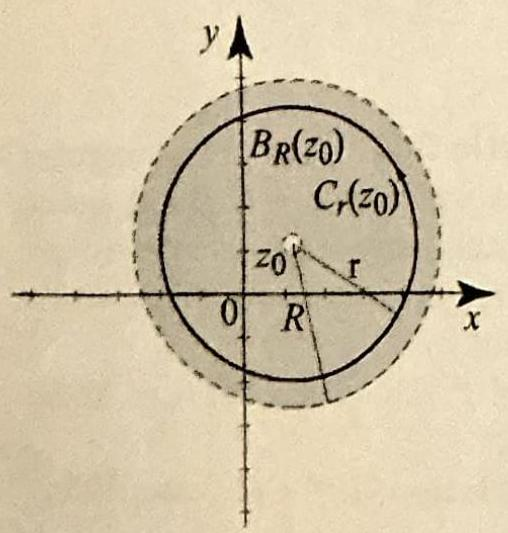
Figure 1

Suppose that $f$ is analytic on an open disk $B_{R}\left(z_{0}\right)$ with center at $z_{0}$ and radius $R>0$. Suppose that $|f(z)| \leq M$ for all $z$ in $B_{R}\left(z_{0}\right)$. Then

$$
\left|f^{(n)}\left(z_{0}\right)\right| \leq M \frac{n!}{R^{n}}, \quad(n=1,2, \ldots)
$$

Proof Since we are not assuming that $f$ is analytic on the circle $C_{R}\left(z_{0}\right)$, we will fix $0<r<R$ and work on a disk of radius $r$ on which $f$ is analytic (see Figure 1). Applying the generalized Cauchy formula (6), Section 3.6, we have

$$
f^{(n)}\left(z_{0}\right)=\frac{n!}{2 \pi i} \int_{C_{r}\left(z_{0}\right)} \frac{f(\zeta)}{\left(\zeta-z_{0}\right)^{n+1}} d \zeta
$$

For $\zeta$ on $C_{r}\left(z_{0}\right)$, we have $\left|\zeta-z_{0}\right|=r$ and so

$$
\frac{f(\zeta)}{\left(\zeta-z_{0}\right)^{n+1}} \left\lvert\,=\frac{|f(\zeta)|}{\left|\zeta-z_{0}\right|^{n+1}}=\frac{|f(\zeta)|}{r^{n+1}} \leq \frac{M}{r^{n+1}} .\right.
$$

Applying the integral inequality (29), Section 3.2, to the integral on the right side of (2) and using (3), we find

$$
\left|f^{(n)}\left(z_{0}\right)\right| \leq \frac{n!}{2 \pi} \frac{M}{r^{n+1}} \times\left(\text { length of } C_{r}\left(z_{0}\right)\right)=M \frac{n!}{r^{n}} .
$$

Since this holds for all $0<r<R$, let $r \rightarrow R$ and (1) follows. $\square$

Here is a surprising application of Cauchy's estimate. Recall that $f$ is entire if it is analytic on all $\mathbb{C}$.

THEOREM 2 LIOUVILLE'S THEOREM

## COROLLARY 1

HEOREM 3 FUNDAMENTAL THEOREM OF ALGEBRA

If $f$ is entire and bounded, then $f$ is constant.
Proof We have that $|f(z)| \leq M$ for all $z$. Given $z_{0}$, apply Cauchy's estimate to $f^{\prime}$ on a disk of radius $R>0$ around $z_{0}$ and get $\left|f^{\prime}\left(z_{0}\right)\right| \leq \frac{M}{R}$. Letting $R \rightarrow \infty$, we obtain that $f^{\prime}\left(z_{0}\right)=0$. Since $z_{0}$ is arbitrary, it follows that $f^{\prime}(z)=0$ for all $z$, and hence $f$ is constant by Theorem 2, Section 2.4.

There are several variants of Liouville's theorem that will be presented in the exercises. Here is one useful application.

If $f$ is entire and $|f(z)| \rightarrow \infty$ as $|z| \rightarrow \infty$, then $f$ must have at least one zero.

Proof Suppose to the contrary that $f$ has no zeros in $\mathbb{C}$. Then $g(z)=\frac{1}{f(z)}$ is also entire and $|g(z)| \rightarrow 0$ as $|z| \rightarrow \infty$. It is easy to see that the latter property implies that $g$ is bounded on $\mathbb{C}$ (Exercise 14). By Liouville's theorem, $g$ is constant and consequently $f$ is constant.

We are now ready to prove the fundamental theorem of algebra. Gauss proved this theorem in 1799. Recognizing its important role in mathematics, Gauss offered two more proofs of this result in 1816.

Every polynomial of degree $n \geq 1$ has exactly $n$ zeros counted according to multiplicity.

Proof It is enough to show that every polynomial $p(z)$ of degree $n \geq 1$ has at least one zero. For if we know that $z_{0}$ is a zero of $p(z)$, then we can write $p(z)=\left(z-z_{0}\right) q(z)$, where $q(z)$ is a polynomial of degree $n-1$ (Exercise 13). We continue factoring until we have written $p(z)$ as the product of $n$ linear terms times a constant, which shows that $p(z)$ has exactly $n$ roots. So let us show that $p(z)$ has at least one zero. Write

$$
\begin{aligned}
p(z) & =a_{n} z^{n}+a_{n-1} z^{n-1}+\cdots+a_{1} z+a_{0} \quad\left(a_{n} \neq 0\right) \\
& =z^{n}\left(a_{n}+\frac{a_{n-1}}{z}+\cdots+\frac{a_{1}}{z^{n-1}}+\frac{a_{0}}{z^{n}}\right) .
\end{aligned}
$$

As $z \rightarrow \infty$, the quantity inside parentheses approaches $a_{n} \neq 0$, while $\left|z^{n}\right| \rightarrow \infty$, and hence $|p(z)| \rightarrow \infty$. Apply Corollary 1.

## Maximum and Minimum Principles

We now turn our attention to a different kind of application, regarding the modulus of analytic functions. Suppose that $f$ is analytic in a region $\Omega$ and let $S_{R}(z)$ be a closed disk in $\Omega$, centered at $z$, with radius $R>0$. Parametrize the circle $C_{R}(z)$ by $\zeta(t)=z+\operatorname{Re}^{i t}, 0 \leq t \leq 2 \pi, d \zeta=\operatorname{Rie} e^{i t} d t$. Cauchy's integral formula implies that

$$
f(z)=\frac{1}{2 \pi i} \int_{C_{R}(z)} \frac{f(\zeta)}{\zeta-z} d \zeta=\frac{1}{2 \pi} \int_{0}^{2 \pi} \frac{f\left(z+\operatorname{Re}^{i t}\right)}{\operatorname{Re}^{i t}} \operatorname{Re}^{i t} d t
$$

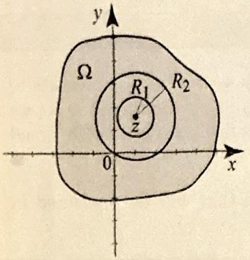
Figure 2 The mean value property of $f$ states that the value of $f$ at $z$ is equal to the average value of $f$ around any circle in $\Omega$ centered at $z$.

and after simplifying we obtain

$$
f(z)=\frac{1}{2 \pi} \int_{0}^{2 \pi} f\left(z+R e^{i t}\right) d t
$$

The integral on the right is a Riemann integral of a complex-valued function of $t$. Recalling that the integral is an average, this formula shows that the value of an analytic function at a point $z$ in $\Omega$ is equal to the average value of $f$ on any circle centered at $z$ and contained in $\Omega$ (Figure 2). This important property is expressed by saying that an analytic function $f$ has the mean value property. If we take absolute values on both sides of (4), we obtain

$$
|f(z)|=\frac{1}{2 \pi}\left|\int_{0}^{2 \pi} f\left(z+R e^{i t}\right) d t\right| \leq \frac{1}{2 \pi} \int_{0}^{2 \pi}\left|f\left(z+R e^{i t}\right)\right| d t
$$

which is expressed by saying that the absolute value of an analytic function has the sub-mean value property on $\Omega$. This crucial property will be needed to prove the maximum principle for the modulus of an analytic function. We need the following lemma, which states an obvious fact: If the values of a function are less than or equal to some constant $M$ and if the average of the function is equal to $M$, then the function must be identically equal to $M$.
(i) Suppose that $h(t)$ is a continuous real-valued function such that $h(t) \geq 0$ for all $t$ in $[a, b](a<b)$. If $\int_{a}^{b} h(t) d t=0$, then $h(t)=0$ for all $t$ in $[a, b]$.
(ii) Suppose that $h(t)$ is a continuous real-valued function such that $h(t) \leq M$ (alternatively, $h(t) \geq M$ ) for all $t$ in $[a, b]$. If $\frac{1}{b-a} \int_{a}^{b} h(t) d t=M$, then $h(t)=M$ for all $t$ in $[a, b]$.
Proof We prove (ii), since (i) follows from the alternative case in (ii) with $M=0$. Suppose that $h(t) \leq M$. For $x$ in $[a, b]$, define

$$
f(x)=\frac{1}{b-a} \int_{a}^{x}(M-h(t)) d t
$$

Then $f(a)=0, f(b)=\frac{1}{b-a} \int_{a}^{b}(M-h(t)) d t=M-\frac{1}{b-a} \int_{a}^{b} h(t) d t$, and by the fundamental theorem of calculus, $f^{\prime}(x)=\frac{1}{b-a}(M-h(x)) \geq 0$. Hence, $f(x)$ is increasing, and so for all $x$ in $[a, b], 0=f(a) \leq f(x) \leq f(b)=M-\frac{1}{b-a} \int_{a}^{b} h(t) d t$. If $M=\frac{1}{b-a} \int_{a}^{b} h(t) d t$, then $\left.f(b)=f a\right)=0$ and hence $f(x)=0$ for all $x$ in $[a, b]$, implying that $f^{\prime}(x)=0$, and hence $M=h(x)$ for all $x$ in $[a, b]$. This proves (ii) in the case $h(t) \leq M$. The case $h(t) \geq M$ is done similarly.

In the proof, we will also need a result that states that if $f$ is analytic on a region $\Omega$ and $|f|$ is constant on $\Omega$, then $f$ must be constant on $\Omega$. This result is stated as Exercise 41 in Section 2.2; also as Exercises 19-22,

Section 2.5. For the sake of completeness, we will sketch a proof, based on the following observation: If $u$ and $u^{2}$ are harmonic, then $u$ must be constant (Exercise 19, Section 2.5). Write $f=u+i v$. It suffices to show that $u$ is constant. If $|f|=C$, then $|f|^{2}=u^{2}+v^{2}=C^{2}$. In particular, $u^{2}+v^{2}$ is harmonic. But $f$ is analytic implies that $f^{2}=\left(u^{2}-v^{2}\right)+2 i u v$ is analytic; in particular, $u^{2}-v^{2}$ is harmonic. Adding two harmonic functions, we obtain that $2 u^{2}$ is harmonic, and since $u$ is harmonic, it follows that $u$ and $u^{2}$ are harmonic and hence $u$ is constant, as desired.

THEOREM 4 THE MAXIMUM MODULUS PRINCIPLE

## Suppose that $f$ is analytic on a region $\Omega$. If $|f|$ attains a maximum in $\Omega$, then $f$ is constant in $\Omega$.

Proof The connectedness property of $\Omega$ is crucial in the proof. Suppose that $|f|$ attains a maximum in $\Omega$. We will show that $|f|$ is constant. Let $M=\max _{z \in \Omega}|f(z)|$, $\Omega_{0}=\{z \in \Omega:|f(z)|<M\}$, and $\Omega_{1}=\{z \in \Omega:|f(z)|=M\}$. Clearly, $\Omega=\Omega_{0} \cup \Omega_{1}$, and $\Omega_{0}$ and $\Omega_{1}$ are disjoint, and $\Omega_{1}$ is nonempty because $|f|$ is assumed to attain its maximum in $\Omega$. The set $\Omega_{0}$ is open because $|f|$ is continuous (Exercise 41, Section 2.2). Our goal is to show that $\Omega_{1}$ is also open. Then, because $\Omega$ is open and connected, it cannot be written as the union of two open, disjoint, nonempty sets. This will force $\Omega_{0}$ to be empty. Consequently, $\Omega=\Omega_{1}$, implying that $|f|=M$ is constant in $\Omega$.
So let us prove that $\Omega_{1}$ is open. Pick $z$ in $\Omega_{1}$. Since $\Omega$ is open, we can find an open disk $B_{\delta}(z)$ in $\Omega$, centered at $z$ with radius $\delta>0$. Pick a smaller disk $B_{r}(z)$, $0<r<\delta$ (Figure 3); we will show that $B_{r}(z)$ is actually contained in $\Omega_{1}$. This will imply that $\Omega_{1}$ is open. Using (5) and the fact that $|f(z)|=M$, we obtain

$$
M=|f(z)| \leq \frac{1}{2 \pi} \int_{0}^{2 \pi} \overbrace{\left|f\left(z+r e^{i t}\right)\right|}^{\leq M} d t \leq \frac{1}{2 \pi} \int_{0}^{2 \pi} M d t=M
$$

Hence $\frac{1}{2 \pi} \int_{0}^{2 \pi}\left|f\left(z+r e^{i t}\right)\right| d t=M$, and Lemma 1(ii) implies that $\left|f\left(z+r e^{i t}\right)\right|=M$ for all $t$ in $[0,2 \pi]$. This shows that the circle of radius $r$ and center at $z$ is contained in $\Omega_{1}$, completing the proof. $\square$

Suppose that $f$ is analytic inside $\Omega$ and continuous on the boundary of $\Omega$. By Theorem 4, $|f|$ cannot attain its maximum inside $\Omega$ unless $f$ is constant. This leads us to the following two questions.

- Does $|f|$ attain its maximum on the boundary of $\Omega$ ?
- If $|f(z)| \leq M$ on the boundary of $\Omega$, can we infer that $|f(z)| \leq M$ for all $z$ in $\Omega$ ?
The following example shows that in general the answers to both questions are negative.

## EXAMPLE 1 Failure of the maximum principle on unbounded regions

Let $\Omega=\{z: \operatorname{Re} z>0$, and $\operatorname{Im} z>0\}$ be the first quadrant, bounded by the semi-infinite nonnegative $x$ and $y$-axes. Let $f(z)=e^{-i z^{2}}=e^{-i\left(x^{2}-y^{2}+2 i x y\right)}=$

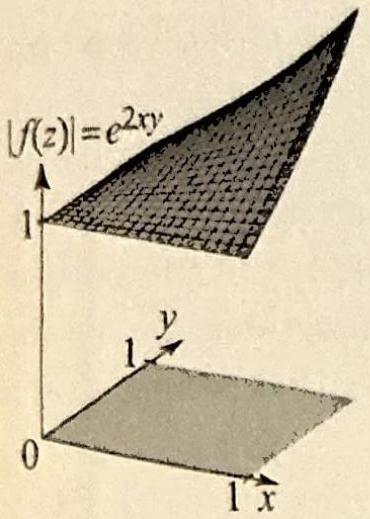
Figure 4 The maximum of $|f|$ does not occur on the boundary of the first quadrant.

## COROLLARY 2   (MAXIMUM MODULUS PRINCIPLE)

## THEOREM 5 THE MINIMUM MODULUS PRINCIPLE

## COROLLARY 3 (MAXIMUMMINIMUM MODULUS PRINCIPLE)

$e^{-i\left(x^{2}-y^{2}\right)} e^{2 x y}$. We have

$$
|f(z)|=\left|e^{i\left(x^{2}-y^{2}\right)} e^{2 x y}\right|=e^{2 x y}
$$

On the boundary, we have $x=0$ or $y=0$ and so $|f(z)|=1$; however, it is clear that $|f(z)|=e^{2 x y}$ is not bounded in $\Omega$. To see this, take $x=y$ and let $\boldsymbol{x}, \boldsymbol{y} \rightarrow \boldsymbol{\infty}$; then $|f(x+i y)|=e^{2 x^{2}} \rightarrow \infty$ (see Figure 4).

Example 1 shows that the modulus of an analytic function need not attain its maximum on the boundary, and the maximum value of the modulus on the boundary may not be the maximum value inside the region. As we now show, the situation is different if $\Omega$ is bounded. In this case, the answers to both previous questions are affirmative.
Suppose that $\Omega$ is a bounded region and $f$ is analytic on $\Omega$ and continuous on the boundary of $\Omega$. Then
(i) $|f|$ attains its maximum $M$ on the boundary of $\Omega$, and
(ii) either $f$ is constant or $|f|<M$ for all $z$ in $\Omega$.

Proof If $f$ is constant then all statements hold, so suppose $f$ is not constant. The set consisting of $\Omega$ and its boundary is closed and bounded. Since $|f|$ is continuous on this set, it attains its maximum $M$ on this set. But Theorem 4 says $|f|$ cannot attain its maximum in $\Omega$, so $|f|$ attains its maximum on the boundary of $\Omega$ and $|f|<M$ in $\Omega$.

The modulus of a nonconstant analytic function can attain its minimum on a region $\Omega$. Consider, for example, $f(z)=z$ on the open disk $|z|<1$. Then the minimum of $|f(z)|$ is 0 and it is attained at $z=0$. However, if the function is never zero in $\Omega$, then we have the following useful principle.
Suppose that $f$ is nonvanishing and analytic on a region $\Omega$. If $|f|$ attains a minimum in $\Omega$, then $f$ is constant in $\Omega$.

Proof Apply the maximum modulus principle to $g=\frac{1}{f}$.
Combining the previous two results, we obtain the following principle.
Suppose that $\Omega$ is a bounded region and $f$ is analytic and nonvanishing on $\Omega$ and continuous on the boundary of $\Omega$. Then
(i) $|f|$ attains a maximum $M$ and minimum $m$ on the boundary of $\Omega$, and
(ii) either $f$ is constant or $m<|f|<M$ for all $z$ in $\Omega$.

Proof We follow the proof of Corollary 2; take the case when $f$ is not constant. Since the set consisting of $\Omega$ and its boundary is closed and bounded, the continuous function $|f|$ attains its minimum $m$ and maximum $M$ on this set. From Theorems 4 and 5 we know that it cannot attain its minimum or maximum on $\Omega$; hence it attains each on the boundary of $\Omega$ and $m<|f|<M$ in $\Omega$.

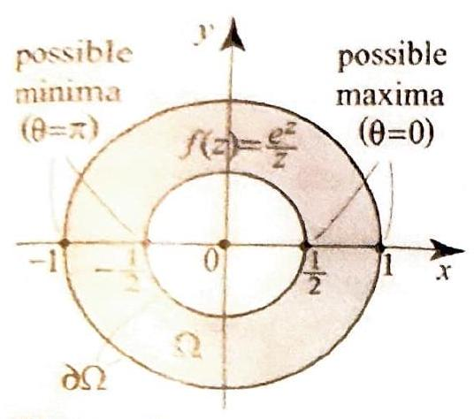
Figure 5

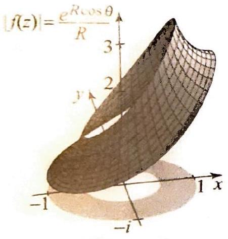
Figure 6 Graph of $|f|$ illustrating the minimum value at $z=-1$ and the maximum value at $z=\frac{1}{2}$.

## EXAMPLE 2 Maximum and minimum values

Let $f(z)=\frac{c^{z}}{z}$, where $z$ ranges over the annulus $\frac{1}{2} \leq|z| \leq 1$. Find the points where the maximum and minimum values of $|f(z)|$ occur and determine these values.

Solution By Corollary 3, we must look for these values on the boundary of the annular region: $|z|=R$, where $R=\frac{1}{2}$ and $R=1$. It will be convenient to use polar coordinates, $z=R(\cos \theta+i \sin \theta)$, where $0 \leq \theta<2 \pi$. For $z$ on the boundary, we have

$$
|f(z)|=\left|\frac{e^{R(\cos \theta+i \sin \theta)}}{R(\cos \theta+i \sin \theta)}\right|=\frac{\left|e^{R \cos \theta} e^{i R \sin \theta}\right|}{R}=\frac{e^{R \cos \theta}}{R} .
$$

It is clear that the maximum will occur when $\cos \theta=1$ (or $\theta=0$ ) and the minimum will occur when $\cos \theta=-1$ (or $\theta=\pi$ ). When $\theta=0$, we must check both the inner and outer boundary (see Figure 5). For $\theta=0$ and $R=\frac{1}{2}$, we have

$$
|f(1 / 2)|=\frac{e^{1 / 2}}{1 / 2}=2 \sqrt{e} \approx 3.3
$$

For $\theta=0$ and $R=1$, we have

$$
|f(1)|=\frac{e}{1}=e \approx 2.7
$$

Thus the maximum value of $|f(z)|$ is $2 \sqrt{e} \approx 3.3$ and it occurs at $z=\frac{1}{2}$. We now look for the minimum value on the boundary. Again we have two possibilities. If $\theta=\pi$ and $R=\frac{1}{2}$, then

$$
|f(-1 / 2)|=\frac{e^{-1 / 2}}{1 / 2}=\frac{2}{\sqrt{e}} \approx 1.2
$$

For $\theta=\pi$ and $R=1$, we have

$$
|f(-1)|=\frac{e^{-1}}{1}=\frac{1}{e} \approx 0.4
$$

Thus the minimum value of $|f(z)|$ is $\frac{1}{e} \approx 0.4$ and it occurs at $z=-1$. For reference's sake, function $|f(z)|$ is plotted in Figure 6.
In Example 2, the maximum value of the modulus was attained at precisely one point on the boundary, and similarly for the minimum value. This will not always be the case. Consider the function $f(z)=\frac{1}{z}$ for $1 \leq|z| \leq 2$. The maximum value of $|f(z)|$ is attained at all points on the inner circle $C_{1}(0)$, and the minimum value is attained at all points of the outer circle $C_{2}(0)$.

Our next example deals with mappings of the form

$$
\phi_{\alpha}(z)=\frac{z-\alpha}{1-\bar{\alpha} z}
$$

where $\alpha$ is a complex number such that $|\alpha|<1$. These are special cases of linear fractional transformations that we introduced in Section 1.4.

## EXAMPLE 3 Linear fractional transformations

(a) Show that $\left|\phi_{\alpha}\left(e^{i \theta}\right)\right|=1$ for all $\theta$. Conclude that $\left|\phi_{\alpha}(z)\right| \leq 1$ for $|z| \leq 1$. That is, $\phi_{\alpha}(z)$ maps the open unit disk $D$ into itself.
(b) Check that for any $|\alpha|<1$, the inverse of $\phi_{\alpha}$ is $\phi_{-\alpha}$. That is, check that $\phi_{\alpha}\left(\phi_{-\alpha}(z)\right)=\phi_{-\alpha}\left(\phi_{\alpha}(z)\right)=z$.
(c) Conclude that $\phi_{\alpha}$ is a one-to-one analytic mapping of $D$ onto itself, and that $\phi_{\alpha}$ maps the unit circle onto the unit circle. (Up to a unimodular constant multiple, the $\phi_{\alpha}$ 's are the only analytic one-to-one mapping of $D$ onto itself. See Section 6.2.)
Solution Note first that $\phi_{\alpha}$ is analytic everywhere except where $1-\bar{\alpha} z=0$ or $z=\frac{1}{\bar{\alpha}}$. Since $|\alpha|<1$ it follows that $\left|\frac{1}{\bar{\alpha}}\right|=\frac{1}{|\alpha|}>1$. Consequently, $\phi_{\alpha}$ is analytic inside and on the unit circle $C_{1}(0)$. To prove (a), let $z=e^{i \theta}$. We have

$$
\left|\phi_{\alpha}\left(e^{i \theta}\right)\right|=\frac{\left|e^{i \theta}-\alpha\right|}{\left|1-\bar{\alpha} e^{i \theta}\right|}=\frac{\left|e^{i \theta}-\alpha\right|}{\left|e^{i \theta}\left(e^{-i \theta}-\bar{\alpha}\right)\right|}=\frac{\left|e^{i \theta}-\alpha\right|}{\left|e^{-i \theta}-\bar{\alpha}\right|}=\frac{\left|e^{i \theta}-\alpha\right|}{\left|\overline{e^{i \theta}}-\alpha\right|}=1
$$

because the modulus of a complex number $\left|e^{i \theta}-\alpha\right|$ is equal to the modulus of its conjugate $\left|\overline{e^{i \theta}-\alpha}\right|$. This proves that $\left|\phi_{\alpha}(z)\right|=1$ for all $|z|=1$, and from Corollary 2 it follows that $\left|\phi_{\alpha}(z)\right| \leq 1$ for all $|z| \leq 1$. That is $\phi_{\alpha}$ maps $D$ into $D$. Part (b) is straightforward. We have

$$
\phi_{\alpha}\left(\phi_{-\alpha}(z)\right)=\frac{\phi_{-\alpha}(z)-\alpha}{1-\bar{\alpha} \phi_{-\alpha}(z)}=\frac{\frac{z+\alpha}{1+\bar{\alpha} z}-\alpha}{1-\bar{\alpha} \frac{z+\alpha}{1+\bar{\alpha} z}}=\frac{z\left(1-|\alpha|^{2}\right)}{1-|\alpha|^{2}}=z
$$

Since this is true for all $|\alpha|<1$, replacing $\alpha$ by $-\alpha$, we get that $\phi_{-\alpha}\left(\phi_{\alpha}(z)\right)=z$, which proves (b). Part (c) is immediate from (a) and (b). To prove the onto part, let $w$ be any point in $D$, then by (a) (applied to $\phi_{-\alpha}$ ) we have that $\phi_{-\alpha}(w)$ is in $D$, and by (b), we find $\phi_{\alpha}\left(\phi_{-\alpha}(w)\right)=w$. Thus $\phi_{\alpha}$ maps $D$ onto $D$. To prove that $\phi_{\alpha}$ maps the unit circle onto the unit circle, we argue similarly. To prove the one-to-one part, suppose that $\phi_{\alpha}\left(z_{1}\right)=\phi_{\alpha}\left(z_{2}\right)$. Applying $\phi_{-\alpha}$ to both sides, we get $z_{1}=z_{2}$, thus $\phi_{\alpha}$ is one-to-one.

Let us compare the results of Example 3 with some of the maximumminimum principles of this section. Clearly, $\phi_{\alpha}$ is not constant, but we just showed in Example 3(a) that $\left|\phi_{\alpha}(z)\right|$ is constant on $C_{1}(0)$. By studying Corollary 3, we conclude that $\phi_{\alpha}(z)$ must vanish somewhere inside the unit disk. Looking back at (6), we see that $\phi_{\alpha}(z)=0 \Leftrightarrow z=\alpha$. Thus $z=\alpha$ is the only zero of $\phi_{\alpha}$ and since $|\alpha|<1$, this zero is inside the unit disk, as expected. Linear fractional transformations have many interesting properties that will be investigated in Section 6.2.

We conclude this section with another well-known consequence of the maximum principle.

LEMMA 2 SCHWARZ'S LEMMA

Suppose that $f$ is analytic in the open unit disk $B_{1}(0)$ with $f(0)=0$ and $|f(z)| \leq 1$ for all $z$ in $B_{1}(0)$. Then
(7) $\quad\left|f^{\prime}(0)\right| \leq 1 \quad$ and $\quad|f(z)| \leq|z|$ for all $z$ in $B_{1}(0)$.

Moreover, if $f^{\prime}(0)=1$ or $\left|f\left(z_{0}\right)\right|=\left|z_{0}\right|$ for some $z_{0}$ in $B_{1}(0)$, then $f(z)=A z$ for all $z$ in $B_{1}(z)$, where $A$ is a constant with $|A|=1$.
Proof Consider the function

$$
g(z)= \begin{cases}\frac{f(z)}{z} & \text { if } z \neq 0 \\ f^{\prime}(0) & \text { if } z=0\end{cases}
$$

Since $f(z)=0$, it follows from Theorem 4, Section 3.6, that $g$ is analytic in $B_{1}(0)$. Fix $0<R<1$. Because $|f(z)| \leq 1$, it follows that $|g(z)| \leq \frac{1}{R}$ for all $|z|=R$. Since $g$ is analytic in the open disk $|z|<R$ and continuous on its boundary, Corollary 2 implies that $|g(z)| \leq \frac{1}{R}$ for all $|z| \leq R$. Letting $R \rightarrow 1$, we see that $|g(z)| \leq 1$ for all $|z|<1$, which proves (7). If $\left|f^{\prime}(0)\right|=1$ or $\left|f\left(z_{0}\right)\right|=\left|z_{0}\right|$ for some $z_{0}$ in $B_{1}(0)$, this means that $|g(0)|=1$ or $\left|g\left(z_{0}\right)\right|=1$. In either case, this implies that $|g(z)|$ attains its maximum inside the disk $B_{1}(0)$, and hence $g(z)=A$ is constant on $B_{1}(0)$ by Theorem 4. Clearly, $|A|=1$ and the lemma follows.

## Exercises 3.7

1. Find the maximum and minimum values of the modulus of $f(z)=z$, where $|z| \leq 1$, and determine the points where these values occur. Explain your answers in view of Corollary 3.
2. Consider $f(z)=2 z+3$, where $z$ is in the closed square area with vertices at $1 \pm i$ and $-1 \pm i$. Find the maximum and minimum values of $|f(z)|$ and determine where these values occur.
3. Consider $f(z)=e^{-z^{2}}$, where $1 \leq|z| \leq 2$. Find the maximum and minimum values of $|f(z)|$ and determine where these values occur.
4. Consider the rectangle $R$ with vertices at $0, \pi, i$, and $\pi+i$. For $z$ in $R$, let $f(z)=\frac{\sin z}{z}$ if $z \neq 0$, and $f(0)=1$. Find the maximum and minimum values of $|f(z)|$ and determine where these values occur.
5. Consider $f(z)=\frac{z}{z^{2}+2}$, where $2 \leq|z| \leq 3$. Find the maximum and minimum values of $|f(z)|$ and determine where these values occur.
6. Consider $f(z)=\frac{3 z}{1-z^{2}}$, where $|z| \leq \frac{1}{2}$. Find the maximum and minimum values of $|f(z)|$ and determine where these values occur.
7. Consider $f(z)=\frac{2 z-1}{-z+2}$, where $|z| \leq 1$. Find the maximum and minimum values of $|f(z)|$ and determine where these values occur. [Hint: Example 3.]
8. Consider $f(z)=\frac{2 z-i}{i z+2}$, where $|z| \leq 1$. Find the maximum and minimum values of $|f(z)|$ and determine where these values occur. [Hint: Example 3.]
9. Consider $f(z)=\log z$, where $1 \leq|z| \leq 2$ and $0 \leq \operatorname{Arg} z \leq \frac{\pi}{4}$. Find the maximum and minimum values of $|f(z)|$ and determine where these values occur.
10. Consider $f(z)=\log z$, where $\frac{1}{2} \leq|z| \leq 2$ and $-\frac{\pi}{4} \leq \operatorname{Arg} z \leq \frac{\pi}{4}$. Find the maximum and minimum values of $|f(z)|$ and determine where these values occur.
11. Consider $f(z)=e^{e^{*}}$, where $z$ belongs to the infinite horizontal strip $-\frac{\pi}{2} \leq \operatorname{Im} z \leq \frac{\pi}{2}$. Show that $|f(z)|=1$ for all $z$ on the boundary, $\operatorname{Im} z= \pm \frac{\pi}{2}$. Is $f(z)$ bounded inside the region? Does this contradict Theorem 4 ? Explain.
12. Suppose that $p(z)=a_{n} z^{n}+a_{n-1} z^{n-1}+\cdots+a_{1} z+a_{0}\left(a_{n} \neq 0\right)$ is a polynomial of degree $n \geq 1$. (a) Show that $a_{j}=\frac{p^{(j)}(0)}{j!}$. (b) Suppose that $|p(z)| \leq M$ for all $|z| \leq R$. Show that $\left|a_{j}\right| \leq \frac{M}{R^{j}}$ for $j=0,1, \ldots, n$. Can we just assume that $|p(z)| \leq M$ for all $|z|<R$ and still get that $\left|a_{j}\right| \leq \frac{M}{R^{j}}$ ?
13. Factoring roots. (a) Verify the algebraic identity for complex numbers $z$ and $w$ and positive integers $n \geq 2$,

$$
z^{n}-w^{n}=(z-w)\left(z^{n-1}+z^{n-2} w+z^{n-3} w^{2}+\cdots+z w^{n-2}+w^{n-1}\right)
$$

(b) Show that if $p=p_{n} z^{n}+p_{n-1} z^{n-1}+\cdots+p_{1} z+p_{0}$ is a polynomial of degree $n \geq 2$, and if $p\left(z_{0}\right)=0$, then

$$
\begin{aligned}
p(z)=p(z)-p\left(z_{0}\right) & =p_{n}\left(z^{n}-z_{0}^{n}\right)+p_{n-1}\left(z^{n-1}-z_{0}^{n-1}\right)+\cdots+p_{1}\left(z-z_{0}\right) \\
& =\left(z-z_{0}\right) q(z)
\end{aligned}
$$

where $q(z)$ is a polynomial of degree $n-1$.
14. Suppose that $f$ is continuous on $\mathbb{C}$ and $\lim _{z \rightarrow \infty}|f(z)|=c$ exists and is finite. Show that $f$ is bounded. [Hint: Make the following argument rigorous. For large values of $|z|$, say $|z|>M,|f(z)|$ is near $c$ and so it is bounded. For $|z| \leq M,|f(z)|$ is bounded because it is a continuous function on a closed and bounded set.]
15. Suppose that $f$ is entire and $\lim _{z \rightarrow \infty} f(z)=0$. Show that $f$ is identically 0 .
16. (a) Suppose that $f$ is entire and $f^{\prime}(z)$ is bounded in $\mathbb{C}$. Show that $f(z)= a z+b$.
(b) More generally, show that if $f$ is entire and $f^{(n)}$ is bounded, then $f$ is a polynomial of degree $n$.
17. Suppose that $f$ is entire and that it omits an open nonempty set. Hence there is an open disk $B_{R}\left(w_{0}\right)$ with $R>0$ in the $w$-plane such that $f(z)$ is not in $B_{R}\left(w_{0}\right)$ for all $z$. Show that $f$ is constant. [Hint: Consider $g(z)=\frac{1}{f(z)-w_{0}}$ and show that you can apply Liouville's theorem.] (Indeed, a deep result in complex analysis known as Picard's great theorem asserts that an entire nonconstant function can omit at most one value. Results of this nature will be presented in the next chapter.)
18. Suppose that $f$ is entire. Show that if either $\operatorname{Re} f$ or $\operatorname{Im} f$ are bounded, then $f$ is constant. [Hint: Use Exercise 17.]
19. Suppose that $f$ is entire and $\lim _{z \rightarrow \infty} \frac{f(z)}{z}=0$. Show that $f$ is constant. [Hint: Use Cauchy's generalized integral formula to show that $f^{\prime}(z)=0$. Alternatively, show that $\frac{f(z)-f(0)}{z}$ is entire (use Theorem 4, Section 3.6) and tends to 0 as $z \rightarrow \infty$. Then use Exercise 15.]
20. Suppose that $f$ is entire and $\lim _{z \rightarrow \infty} \frac{f(z)}{z}=c$, where $c$ is a constant. Show that $f(z)=c z+b$. [Hint: Consider $g(z)=\frac{f(z)-f(0)}{2}$. Show that $g$ is entire and bounded. You will need Theorem 4, Section 3.6.]
21. A function $f(z)=f(x+i y)$ is called periodic in $x$ and $y$ if there are real numbers $T_{1}>0$ and $T_{2}>0$ such that $f\left(\left(x+T_{1}\right)+i\left(y+T_{2}\right)\right)=f(x+i y)$ for all $z=x+i y$. Show that if $f$ is entire and periodic in $x$ and $y$, then $f$ is constant. Can an entire function $f$ be periodic in one of $x$ or $y$ without being constant?
22. Knowing that $f(z)=e^{z}$ has no zeros, what conclusion do you draw from Corollary 1 concerning this function?
23. (a) Suppose that $f$ is analytic in a bounded region $\Omega$ and continuous on the boundary of $\Omega$. Suppose that $|f(z)|$ is constant on the boundary of $\Omega$. Show that either $f$ has a zero in $\Omega$ or $f$ is constant in $\Omega$.
(b) Find all analytic functions $f$ on the unit disk such that $|z|<|f(z)|$ for all $|z|<1$ and $|f(z)|=1$ for all $|z|=1$. Justify your answer.
24. Suppose that $f(z)$ and $g(z)$ are analytic on the open unit disk $|z|<1$ and continuous on the circle $|z|=1$. Suppose that $|f(z)|=|g(z)|$ for all $|z|=1$ and $f(z) \neq 0$ for all $|z|=1$. Show that $f(z)=A g(z)$ for all $|z| \leq 1$, where $A$ is a constant such that $|A|=1$. [Hint: Consider $h(z)=\frac{g(z)}{f(z)}$.]
25. Suppose that $f$ is analytic on $|z|<1$ and continuous on $|z| \leq 1$. Suppose that $f(z)$ is real-valued for all $|z|=1$. Show that $f$ is constant for all $|z| \leq 1$. [Hint: Consider $g(z)=e^{i f(z)}$.]
26. Suppose that $f$ and $g$ are analytic in a bounded region $\Omega$ and continuous on the boundary of $\Omega$. Suppose that $g$ does not vanish in $\Omega$ and $|f(z)| \leq|g(z)|$ for all $z$ on the boundary of $\Omega$. Show that $|f(z)| \leq|g(z)|$ for all $z$ in $\Omega$.
27. Find all analytic functions $f$ such that $|f(z)| \leq 1$ for all $|z| \leq 1, f(0)=0$, and $f\left(\frac{i}{2}\right)=\frac{1}{2}$.
28. Suppose that $f$ is analytic, $|f(z)| \leq 3$ for all $|z|=1$, and $f(0)=0$. Can $\left|f^{\prime}(0)\right|>3$ ?
29. Suppose that $f$ is analytic with $|f(z)| \leq 1$ for all $|z| \leq 1$. Show that for all $|z|<1$, we have $\left|f^{(n)}(z)\right| \leq \frac{n!}{(1-|z|)^{n}}$. [Hint: Apply Cauchy's estimate to $f^{(n)}(z)$. Consider the radius of the disk that is contained in $B_{1}(0)$ with center at $z$.]

### 3.8 Applications to Harmonic Functions

This section continues our study of harmonic functions that we started in Section 2.5. We will answer some fundamental questions about harmonic functions that were raised in Section 2.5 and derive new properties that will strengthen our understanding of harmonic functions and solutions of Dirichlet problems.

Recall that a real-valued function $u(x, y)$ defined in a region $\Omega$ is called harmonic if $u$ has continuous partial derivatives of first and second order and if $u$ satisfies Laplace's equation

$$
\Delta u=\frac{\partial^{2} u}{\partial x^{2}}+\frac{\partial^{2} u}{\partial y^{2}}=0 \quad \text { on } \Omega
$$

In fact, harmonic functions have derivatives of all order. To prove this result, we need a lemma.

LEMMA 1 CONJUGATE GRADIENT

Figure 1

Suppose that $u$ is harmonic on a region $\Omega$. Let $\phi=u_{x}-i u_{y}$. Then $\phi$ is analytic on $\Omega$. The function $\phi$ is called the conjugate gradient of $u$.
Proof Write $\phi=\operatorname{Re}(\phi)+i \operatorname{Im}(\phi)=u_{x}-i u_{y}$. Because $u$ has continuous second partial derivatives, it follows that $\operatorname{Re} \phi$ and $\operatorname{Im} \phi$ have continuous first partial derivatives. To show that $\phi$ is analytic, it suffices by Theorem 1, Section 2.4, to show that $\operatorname{Re} \phi$ and $\operatorname{Im} \phi$ satisfy the Cauchy-Riemann equations. We have

$$
\frac{\partial}{\partial x} \operatorname{Re} \phi=\frac{\partial}{\partial x} u_{x}=u_{x x} \quad \text { and } \quad \frac{\partial}{\partial y} \operatorname{Im} \phi=\frac{\partial}{\partial y}\left(-u_{y}\right)=-u_{y y} .
$$

But since $u$ is harmonic, $u_{x x}=-u_{y y}$, and so $\frac{\partial}{\partial x} \operatorname{Re} \phi=\frac{\partial}{\partial y} \operatorname{Im} \phi$. Thus, the first of the Cauchy-Riemann equations is satisfied. Now, since $u$ has continuous second partial derivatives, we have $u_{x y}=u_{y x}$. Thus

$$
\frac{\partial}{\partial y} \operatorname{Re} \phi=u_{x y} \quad \text { and } \quad \frac{\partial}{\partial x} \operatorname{Im} \phi=-u_{y x}=-u_{x y}
$$

So $\frac{\partial}{\partial y} \operatorname{Re} \phi=-\frac{\partial}{\partial x} \operatorname{Im} \phi$ and the second of the Cauchy-Riemann equations holds. Thus $\phi$ is analytic.

## EXAMPLE 1 Conjugate gradient

Consider $u(x, y)=\frac{x}{x^{2}+y^{2}}$ in the upper half-plane, $y>0$.
(a) Show that $u$ is harmonic.
(b) Find the conjugate gradient of $u$.

Solution (a) The function $u$ has a simpler expression in polar coordinates (see Figure 1):

$$
u(r, \theta)=\frac{r \cos \theta}{r^{2}}=\frac{\cos \theta}{r}=r^{-1} \cos \theta
$$

From this, it is easy to see that $u$ is the real part of the function

$$
f(z)=\frac{1}{z}=z^{-1}=r^{-1} e^{-i \theta}=r^{-1}(\cos \theta-i \sin \theta)
$$

Since $f$ is analytic for all $z \neq 0$, it follows that its real part $u=r^{-1} \cos \theta$ is harmonic for all $z \neq 0$ by Theorem 1, Section 2.5. In particular, $u$ is harmonic in the upper half-plane.
(b) We have

$$
u_{x}=\frac{y^{2}-x^{2}}{\left(x^{2}+y^{2}\right)^{2}} \quad \text { and } \quad u_{y}=\frac{-2 x y}{\left(x^{2}+y^{2}\right)^{2}}
$$

Thus the conjugate gradient in the upper half-plane is

$$
\phi=u_{x}-i u_{y}=\frac{\left(y^{2}-x^{2}\right)+2 i x y}{\left(x^{2}+y^{2}\right)^{2}}=-\frac{(x-i y)^{2}}{\left(x^{2}+y^{2}\right)^{2}}=-\frac{(\bar{z})^{2}}{(z \bar{z})^{2}}=-\frac{1}{z^{2}} .
$$

Suppose that $f$ is analytic and write $f=u+i v$. Using the CauchyRiemann equations, it follows that $f^{\prime}(z)=u_{x}-i u_{y}$ (see (8), Section 2.4). Thus the derivative of $f$ is the conjugate gradient of $u$; equivalently, $f$ is an antiderivative of the conjugate gradient of $u$. The latter fact is very useful,

## COROLLARY 1

Figure 2

## THEOREM 1 HARMONIC CONJUGATE

since it allows us to use the conjugate gradient to construct $f$ when only $\operatorname{Re} f=u$ is known. In Example 1, we have $u(x, y)=\frac{x}{x^{2}+y^{2}}=\operatorname{Re}(f(z))$ where $f(z)=\frac{1}{z}=\frac{1}{x+i y}$ and the conjugate gradient of $u$ is $\phi=-\frac{1}{z^{2}}=f^{\prime}(z)$.

Using the conjugate gradient $\phi=u_{x}-i u_{y}$, we can express any partial derivative of $u$ as the real or imaginary part of an analytic function, namely a derivative of $\phi$. For example, to get $u_{x x x}$, differentiate $\phi$ with respect to $x$ twice and get $\phi^{\prime \prime}=u_{x x x}-i u_{y x x}$. (Note that since the derivatives of $\phi$ exist, we can obtain them by differentiating with respect to any one of the variables $x, y$, or $z$. This was done in the proof of the CauchyRiemann equations.) Since $\phi$ is analytic, all its higher-order derivatives are analytic (Corollary 1, Section 3.6), and so $u_{x x x}$ and $u_{y x x}$ are both harmonic by Theorem 1, Section 2.5. We can carry these ideas further and arrive at the following useful result.

## Suppose that $u$ is harmonic on a region $\Omega$. Then $u$ has continuous partial derivatives of all order in $\Omega$.

Recall that a function $v$ is a harmonic conjugate of $u$ on $\Omega$ if $f=u+i v$ is analytic on $\Omega$. Harmonic conjugates are determined up to an additive constant (Proposition 3, Section 2.5). The existence of harmonic conjugates is an important question since the harmonic conjugate allows us to relate harmonic functions to analytic functions. We know that harmonic conjugates may fail to exist on certain regions (Exercise 33, Section 2.5). For example, $\ln |z|$ is harmonic on the punctured plane, but the only candidate for a harmonic conjugate is a branch of $\arg z$, which has a branch cut and cannot be harmonic on the punctured plane (see Figure 2). So $\ln |z|$ does not have a harmonic conjugate on the punctured plane.

Our next result guarantees the existence of a harmonic conjugate if the region is simply connected.

Suppose that $u$ is harmonic on a simply connected region $\Omega$. Then $u$ has a harmonic conjugate in $\Omega$ given up to an additive constant by

$$
v(z)=\int_{z_{0}}^{z}-u_{y} d x+u_{x} d y \quad\left(z_{0} \text { fixed in } \Omega\right)
$$

where the integral is independent of path.
Proof Consider the analytic conjugate gradient $\phi=u_{x}-i u_{y}$. The integral of $\phi$ is independent of path in $\Omega$ (Theorem 3, Section 3.4). Define

$$
f(z)=\int_{z_{0}}^{z} \phi(\zeta) d \zeta
$$

Figure 3 Local existence of the harmonic conjugate.

## COROLLARY 2

COROLLARY 3 GAUSS'S MEAN VALUE PROPERTY

Then $f$ is analytic and $f^{\prime}=\phi$. Write $\zeta=x+i y, d \zeta=d x+i d y$. Then

$$
f(z)=\int_{z_{0}}^{z} u_{x} d x+u_{y} d y+i \overbrace{\int_{z_{0}}^{z}-u_{y} d x+u_{x} d y}^{v(z)}
$$

We claim that $\int_{z_{0}}^{z} u_{x} d x+u_{y} d y=u(z)-u\left(z_{0}\right)$. From this it will follow that $v(z)= \int_{z_{0}}^{z}-u_{y} d x+u_{x} d y$ is a harmonic conjugate of $u(z)$, since $\left(u(z)-u\left(z_{0}\right)\right)+i v(z)=f(z)$ is analytic and the additive constant $u\left(z_{0}\right)$ does not affect analyticity. To prove the claim, parametrize the path from $z_{0}$ to $z$ by $\zeta(t)=x(t)+i y(t), a \leq t \leq b$. Then

$$
u_{x} d x+u_{y} d y=\left(u_{x} \frac{d x}{d t}+u_{y} \frac{d y}{d t}\right) d t=\frac{d}{d t} u(\zeta(t)) d t
$$

by the chain rule in two dimensions. Hence

$$
\int_{z_{0}}^{z} u_{x} d x+u_{y} d y=\int_{a}^{b} \frac{d}{d t} u(\zeta(t)) d t=\left.u(\zeta(t))\right|_{a} ^{b}=u(z)-u\left(z_{0}\right)
$$

as claimed.
Keeping in mind the example of the harmonic function $\ln |z|$ with no harmonic conjugate in the punctured plane $\mathbb{C} \backslash\{0\}$, we see that simple connectedness is a crucial property in Theorem 1, and the result is not true on arbitrary regions. What can we say on arbitrary regions? Suppose that $u$ is harmonic on a region $\Omega$ and let $z_{0}$ be in $\Omega$. Since $\Omega$ is open, we can find an open disk $B_{R}\left(z_{0}\right)$ in $\Omega$. Since $B_{R}\left(z_{0}\right)$ is simply connected, $u$ has a harmonic conjugate in $B_{R}\left(z_{0}\right)$. This means that Theorem 1 holds locally in $\Omega$ (Figure 3). This is a very useful fact that we record separately.
Suppose that $u$ is harmonic on a region $\Omega$. Then $u$ admits a harmonic conjugate locally in $\Omega$.

Using the local existence of a harmonic conjugate, we obtain the mean value property of harmonic functions from the corresponding property for analytic functions.

Suppose that $u$ is harmonic on a region $\Omega$, then $u$ satisfies the mean value property, in the following sense. If $z$ is in $\Omega$, and the closed disk $S_{r}(z)$ ( $r>0$ ) is contained in $\Omega$, then

$$
u(z)=\frac{1}{2 \pi} \int_{0}^{2 \pi} u\left(z+r e^{i t}\right) d t
$$

Proof Let $B$ be an open disk in $\Omega$ containing the closed disk $S_{r}\left(z_{0}\right)$. Since $B$ is simply connected, $u$ admits a harmonic conjugate $v$ in $B$. So $f=u+i v$ is analytic in $B$. By the mean value property of analytic functions ((4), Section 3.7), we have

$$
f(z)=\frac{1}{2 \pi} \int_{0}^{2 \pi} f\left(z+r e^{i t}\right) d t=\frac{1}{2 \pi} \int_{0}^{2 \pi} u\left(z+r e^{i t}\right) d t+\frac{i}{2 \pi} \int_{0}^{2 \pi} v\left(z+r e^{i t}\right) d t
$$

Now take real parts on botli adden to get (3)
dust as we used the mean value property of analytic functions to prove the maximam modulus principle, we could use the mean value property of harmonic functions to prove a corresponding maximum-minimum principle. Such a proof would be more or less identical to that of Theorem 4, Section 3.7. Instend, we offer a proof that uses what we know about barmonic conjugntes and analytic functions. You should pay attention to the role of connectedness.

THEOREM 2 MAXIMUMMINIMUM PRINCIPLE

Figure 4

COROLLARY 4

Suppose that $u$ is a harmonic function on a region $\Omega$. If $u$ attains a maximum
or a minimum in $\Omega$, then $u$ is constant in $\Omega$.

Proof By considering $-u$, we need only prove the statement for maxima. We first prove the result under the assumption that $\Omega$ is simply connected. Apply Theorem 1 to find an analytic function $f=u+i v$ on $\Omega$. Consider the function

$$
g(z)=e^{f(z)}=e^{u(z)} e^{i v(z)} .
$$

Then $g$ is analytic in $\Omega$ and $|g(z)|=e^{u(z)}$. Since the real exponential function is strictly increasing, a maximum of $e^{u(z)}$ corresponds to a maximum of $u(z)$. By Theorem 4 of Section 3.7, if $|g(z)|$ attains a maximum or a minimum in $\Omega$, then $g(z)$ is constant, implying that $u(z)$ is constant in $\Omega$.

We now deal with the case of an arbitrary region $\Omega$. The proof has the same basic form as the proof of Theorem 4, Section 3.7. Suppose that $u$ attains a maximum $M$ at a point in $\Omega$. Let $\Omega_{0}=\{z \in \Omega: u(z)<M\}$ and $\Omega_{1}=\{z \in \Omega: u(z)=M\}$. We have $\Omega=\Omega_{0} \cup \Omega_{1}, \Omega_{0}$ is open, and $\Omega_{1}$ is nonempty by assumption. It is enough to show that $\Omega_{1}$ is open (see the proof of Theorem 4, Section 3.7). Suppose that $z_{0}$ is in $\Omega_{1}$ and let $B_{r}\left(z_{0}\right)$ be an open disk in $\Omega$ centered at $z_{0}$ (Figure 4). Since $B_{r}\left(z_{0}\right)$ is simply connected and the restriction of $u$ to $B_{r}\left(z_{0}\right)$ is a harmonic function that attains its maximum at $z_{0}$ inside $B_{r}\left(z_{0}\right)$, it follows from the previous case that $u$ is constant in $B_{r}\left(z_{0}\right)$. Thus $u(z)=M$ for all $z$ in $B_{r}\left(z_{0}\right)$, implying that $B_{r}\left(z_{0}\right)$ is contained in $\Omega_{1}$. Hence $\Omega_{1}$ is open.

Note in Theorem 2 that the minimum and maximum principles are equally strong for harmonic functions; for analytic functions the minimum principle required an additional hypothesis that $f(z)$ was never zero.

The following corollaries of Theorem 2 are similar to results that we proved regarding the modulus of an analytic function. We relegate their proofs to the exercises.

Suppose $\Omega$ is a bounded region, and $u$ is harmonic on $\Omega$ and continuous on the boundary of $\Omega$. Then
(i) $u$ attains its maximum $M$ and minimum $m$ on the boundary of $\Omega$, and
(ii) either $u$ is constant or $m<u<M$ for all points in $\Omega$.

COROLLARY 5

## COROLLARY 6

Figure $5 f(\theta)$ gives the boundary data: $f(\theta)= u(R, \theta)$.

Figure 6 A Dirichlet problem on a disk.

PROPOSITION 1 A DIRICHLET PROBLEM ON THE DISK

Suppose $\Omega$ is a bounded region, and $u$ is harmonic on $\Omega$ and continuous on the boundary of $\Omega$. If $u$ is constant on the boundary of $\Omega$, then $u$ is constant in $\Omega$.

Suppose $\Omega$ is a bounded region, and $u_{1}$ and $u_{2}$ are harmonic on $\Omega$ and continuous on the boundary of $\Omega$. If $u_{1}=u_{2}$ on the boundary of $\Omega$, then $u_{1}=u_{2}$ in $\Omega$.

## Dirichlet Problems on a Disk

We focus now on some applications of the theory of harmonic functions to the solution of Dirichlet problems on a disk. To simplify the presentation, we will work on a disk centered at the origin with radius $R>0$. In polar coordinates, the problem is stated as follows. Suppose we are given a piecewise continuous function $f(\theta), 0<\theta \leq 2 \pi$ that represents boundary data on the points $R e^{i \theta}$ (Figure 5). Find a function $u(r, \theta), 0 \leq r \leq R$, $0<\theta \leq 2 \pi$, such that

$$
\begin{aligned}
& \Delta u(r, \theta)=0, \quad 0 \leq r<R, 0<\theta \leq 2 \pi ; \\
& \lim _{r \uparrow R} u(r, \theta)=u(R, \theta)=f(\theta), \quad 0<\theta \leq 2 \pi,
\end{aligned}
$$

where the limit holds at all points $R e^{i \theta}$ where $f(\theta)$ is continuous (Figure 6). Since $\theta$ and $\theta+2 \pi$ represent the same polar angle, we may remove the restriction on $\theta$ to lie in the interval $[0,2 \pi]$ and instead require $f$ to be $2 \pi$-periodic; that is $f(\theta+2 \pi)=f(\theta)$ for all $\theta$.

In general, the boundary data are given by a piecewise continuous $f$. If the boundary data is continuous, then an immediate consequence of Corollary 6 is the uniqueness of the solution of a Dirichlet problem on a disk. Thus once we have found a solution to a Dirichlet problem with continuous boundary data, this is necessarily the only solution of the problem.

We next consider a Dirichlet problem with special but important type of boundary data:

$$
u(R, \theta)=f(\theta)=a_{0}+\sum_{n=1}^{N}\left(a_{n} \cos n \theta+b_{n} \sin n \theta\right)
$$

This is a linear combination of functions from the $2 \pi$-periodic trigonometric system: $1, \cos x, \cos 2 x, \ldots, \sin x, \sin 2 x, \ldots$.
The solution of the Dirichlet problem on the disk $|z| \leq R$ with boundary condition (6) is

$$
u(r, \theta)=a_{0}+\sum_{n=1}^{N}\left(\frac{r}{R}\right)^{n}\left(a_{n} \cos n \theta+b_{n} \sin n \theta\right)
$$

Proof For $|z|<R$, write $z=r e^{i \theta}=r(\cos \theta+i \sin \theta)$. The function $f(z)=z^{n}= r^{n}(\cos n \theta+i \sin n \theta)$ is analytic on the disk $|z| \leq R$. Hence its real and imaginary parts are harmonic (Theorem 1, Section 2.5). This shows that the functions $1, r \cos \theta, r^{2} \cos 2 \theta, \ldots, r \sin \theta, r^{2} \sin 2 \theta, \ldots$ are harmonic on the disk $|z| \leq R$. B $y$ Proposition 1, Section 2.5, any linear combination of such functions is also harmonic on the unit disk, and so (7) is harmonic. Setting $r=R$ in (7), we see that $u(R, \theta)=f(\theta)$, where $f$ is as in (6). Hence (7) is the solution of the Dirichlet problem with boundary data (6).

Each term in the finite sum (7) is a constant multiple of the harmonic functions $1, r \cos \theta, r^{2} \cos 2 \theta, \ldots, r \sin \theta, r^{2} \sin 2 \theta, \ldots$ With the exception of the constant function 1 , the graphs of these functions over the disk $|z|<R$ are saddle-shaped. This confirms our expectation that the maxima and minima of these functions must occur on the boundary.

Figure 7 The saddle-shaped graphs of the harmonic functions $r \cos \theta, r^{2} \cos 2 \theta, r^{3} \cos 3 \theta, r^{4} \cos 4 \theta$ seem to confirm the important property that the maximum and minimum of a harmonic function occur on the boundary of the (bounded) region.

Figure 8 The boundary function, as a function of $\theta$.

## EXAMPLE 2 A steady-state problem on a disk

The temperature on the boundary of a circular plate of unit radius, with insulated lateral surface and center placed at the origin, is a function of the radial angle $\theta$ and varies between $0^{\circ}$ and $100^{\circ}$ according to the formula $f(\theta)=50-50 \cos \theta$ (see Figure 8).
(a) Find the steady-state temperature inside the plate.
(b) Describe the isotherms and lines of heat flow.

Solution (a) To find the steady-state temperature, we must solve the Dirichlet problem with boundary data given by $f(\theta)$. According to (7), the solution is $u(r, \theta)=50-50 r \cos \theta, 0 \leq r<1$. This is a harmonic function, which is equal to $f(\theta)$ when $r=1$ (Figure 9).
(b) Since the temperature on the boundary varies between 0 and 100 , by the maximum-minimum principle for harmonic functions, the temperature inside the plate will vary between these two limits. To find the isotherms, let $0<T<100$ and solve the equation $u(r, \theta)=T$ or $50-50 r \cos \theta=T$. Using $x=r \cos \theta$, the equation

In Figure 9, we show the solution of the Dirichlet problem. Note how on the boundary the values of this solution coincide with the values of the boundary function. In Figure 10, we illustrate the isotherms and lines of heat flow. The orthogonality of these two families of curves is obvious in this case.

Figure 9

Figure 10

becomes $50-50 x=T$ or $x=\frac{50-T}{50}$. Thus the isotherms are the intersections with the unit disk of the vertical lines $x=\frac{50-T}{50}$. The isotherms vary between $x=1$ and $x=-1$ as $T$ varies between 0 and 100 . We know from Section 2.5 that heat flows along the curves that are orthogonal to the isotherms. In this case, it is easy to sox that heat flows inside the unit disk in the direction of the horizontal lines $y=b$ (Figure 10).

The Dirichlet problem in Proposition 1 is certainly not the most general kind that we can solve on a disk. But here is an amazing fact. Using Fourier series, we will show in Chapter 4 that the solution of the Dirichlet problem with arbitrary piecewise continuous boundary data $f(\theta)$ can be expressed in the form (7) if we allow the series to have infinitely many terms. Moreover, the coefficients $a_{0}, a_{n}$, and $b_{n}$ are precisely the Fourier coefficients of the boundary function $f(\theta)$, and may be obtained by integrating $f(\theta)$ against trigonometric functions. This connection between harmonic functions and Fourier series has many fruitful consequences in applied mathematics.

## Poisson Integral Formula

What is the Poisson integral formula? This is a formula for the solution of the Dirichlet problem on the unit disk. (In later sections, we will discover similar formulas on different regions of the plane.) It is also a formula that allows you to generate the values of a harmonic function $u(z)$ for $z$ inside the unit disk, by using (integrating) the values of $u$ on the boundary of the unit disk $|z|=1$. We already know an example of such a situation: If $u$ is harmonic in a region $\Omega$ containing the closed unit disk $S_{1}(0)$, then the mean value property of $u$ at 0 implies that

$$
u(0)=\frac{1}{2 \pi} \int_{0}^{2 \pi} u\left(e^{i t}\right) d t
$$

This is a special application of the Poisson formula at the point $z=0$. Interestingly, we now show how to derive the Poisson integral formula from
the mean value property. Given a point $z_{0}$ in the open unit disk, if we can construct a harmonic function $U$ on the unit disk such that $U(0)=u\left(z_{0}\right)$, then by applying the mean value property to $U$, we will recapture $U(0)= u\left(z_{0}\right)$ from the values on the boundary. The construction goes as follows. Given $\left|z_{0}\right|<1$, consider the linear fractional transformation

$$
\phi_{-z_{0}}(z)=\frac{z+z_{0}}{1+\overline{z_{0}} z}, \quad|z|<1 .
$$

We know from Example 3, Section 3.7, that $\phi_{-z_{0}}(z)$ is analytic, one-to-one, and maps the unit disk onto itself and $C_{1}(0)$ onto itself. From Theorem 3, Section 2.5, we know that if we compose a harmonic function with an analytic function, we obtain a harmonic function; so $U(z)=u \circ \phi_{-z_{0}}(z)$ is a harmonic function on the unit disk. Moreover, $U(0)=u \circ \phi_{-z_{0}}(0)=u\left(z_{0}\right)$. Applying the mean value property of $U$ at 0 , we find that

$$
u\left(z_{0}\right)=U(0)=\frac{1}{2 \pi} \int_{0}^{2 \pi} U\left(e^{i t}\right) d t=\frac{1}{2 \pi} \int_{0}^{2 \pi} u \circ \phi_{-z_{0}}\left(e^{i t}\right) d t
$$

Thus the value of $u$ at the interior point $z_{0}$ is expressed as an integral involving the boundary values of $u \circ \phi_{-z_{0}}$. To get the desired formula that involves the boundary values of $u$, we will perform the change of variables $e^{i s}=\phi_{-z_{0}}\left(e^{i t}\right)$. Recall that $\phi_{-z_{0}}$ maps the unit circle into itself and the inverse of $\phi_{-z_{0}}$ is $\phi_{z_{0}}$. So

$$
\begin{aligned}
\phi_{z_{0}}\left(e^{i s}\right)=e^{i t} & \Rightarrow \phi_{z_{0}}^{\prime}\left(e^{i s}\right) i e^{i s} d s=i e^{i t} d t \Rightarrow \frac{\phi_{z_{0}}^{\prime}\left(e^{i s}\right)}{e^{i t}} e^{i s} d s=d t \\
& \Rightarrow d t=\frac{\phi_{z_{0}}^{\prime}\left(e^{i s}\right)}{\phi_{z_{0}}\left(e^{i s}\right)} e^{i s} d s
\end{aligned}
$$

Now $\phi_{z_{0}}(z)=\frac{z-z_{0}}{1-\overline{z_{0}} z}$, hence $\phi_{z_{0}}^{\prime}(z)=\frac{1-\left|z_{0}\right|^{2}}{\left(1-\overline{z_{0}} z\right)^{2}}$, and so

$$
\frac{\phi_{z_{0}}^{\prime}\left(e^{i s}\right)}{\phi_{z_{0}}\left(e^{i s}\right)} e^{i s}=e^{i s} \frac{1-\left|z_{0}\right|^{2}}{\left(1-\overline{z_{0}} e^{i s}\right)\left(e^{i s}-z_{0}\right)}=\frac{1-\left|z_{0}\right|^{2}}{\left(e^{-i s}-\overline{z_{0}}\right)\left(e^{i s}-z_{0}\right)}=\frac{1-\left|z_{0}\right|^{2}}{\left|e^{i s}-z_{0}\right|^{2}}
$$

Substituting into (8), we obtain

$$
u\left(z_{0}\right)=\frac{1-\left|z_{0}\right|^{2}}{2 \pi} \int_{0}^{2 \pi} \frac{u\left(e^{i s}\right)}{\left|e^{i s}-z_{0}\right|^{2}} d s \quad\left(\left|z_{0}\right|<1\right)
$$

This is the Poisson integral formula on the unit disk. If $u$ is harmonic in a disk of radius $R>0$, centered at the origin, we consider the function $u(R z)$, which is harmonic in $|z|<1$, and so according to ( 9 ),

$$
u\left(R z_{0}\right)=\frac{1-\left|z_{0}\right|^{2}}{2 \pi} \int_{0}^{2 \pi} \frac{u\left(R e^{i s}\right)}{\left|e^{i s}-z_{0}\right|^{2}} d s \quad\left(\left|z_{0}\right|<1\right)
$$

Let $z=R z_{0}, z_{0}=z / R,|z|=r<R$, then

$$
u(z)=\frac{R^{2}-r^{2}}{2 \pi} \int_{0}^{2 \pi} \frac{u\left(R e^{i s}\right)}{\left|R e^{i s}-z\right|^{2}} d s \quad(|z|<R)
$$

This is the Poisson integral formula on the disk of radius $R>0$, сепtered at the origin. Another common way of expressing the Poisson integral formula is obtained by realizing that for $z=r e^{i \theta}$,

$$
\left|R e^{i \phi}-z\right|^{2}=\left(R e^{i \phi}-r e^{i \theta}\right)\left(R e^{-i \phi}-r e^{-i \theta}\right)=R^{2}-2 r R \cos (\theta-\phi)+r^{2} ;
$$

and so from (10) (with the variable $s$ replaced by $\phi$ ) we obtain the alternative Poisson integral formula

$$
u\left(r e^{i \theta}\right)=\frac{R^{2}-r^{2}}{2 \pi} \int_{0}^{2 \pi} \frac{u\left(R e^{i \phi}\right)}{R^{2}-2 r R \cos (\theta-\phi)+r^{2}} d \phi
$$

In deriving (11), we were given a harmonic function $u(z)$ in a region containing $S_{R}(0)$. The importance of (11) is that it can be used to construct $u(z)$ inside the disk $B_{R}(0)$, when only its (piecewise continuous) values on the circle $C_{R}(0)$ are known. More precisely, we have the following result.

## THEOREM 3 POISSON INTEGRAL FORMULA

Consider the Dirichlet problem (4) on the disk $|z| \leq R$, with boundary conditions (5), where $f(\theta)$ is piecewise continuous for $\theta$ in $[0,2 \pi]$. Then the solution exists and is given by the Poisson integral formula
(12) $u(r, \theta)=\frac{R^{2}-r^{2}}{2 \pi} \int_{0}^{2 \pi} \frac{f(\phi)}{R^{2}-2 r R \cos (\theta-\phi)+r^{2}} d \phi \quad(0 \leq r<R)$.

More precisely, $u(r, \theta)$ is harmonic in the open disk $|z|<R$ and tends to $f(\theta)$ as $r \uparrow R$ at all points of continuity of $f$.
Theorem 3 guarantees the existence of a solution of the Dirichlet problem on a disk. Its proof uses many of the results that we have derived thus far, along with properties of the function

$$
P(r, \theta)=\frac{R^{2}-r^{2}}{R^{2}-2 r R \cos \theta+r^{2}} \quad(0 \leq r<R),
$$

known as the Poisson kernel on a disk. We will present the proof in the exercises. (See Project Problem 26.)

The Poisson formula is difficult to evaluate, even for simple boundary data. For this reason, we will develop later alternative forms of the solution, including some that are based on Fourier series.

We end the section with a useful result obtained by evaluating (12) at $r=0$. The corollary asserts that we can compute the mean value of a
harmonic function at the center of a disk, without necessarily requiring that $u$ be harmonic on the boundary.

COROLLARY 7 MEAN VALUE PROPERTY

Figure 11 For Exercises 1316.

Suppose that $u\left(r e^{i \phi}\right)$ is harmonic for $0 \leq r<R$ and $0 \leq \phi \leq 2 \pi$, and $u\left(R e^{i \phi}\right)=f(\phi)$, where $f$ is piecewise continuous on the boundary. Then

$$
u(0)=\frac{1}{2 \pi} \int_{0}^{2 \pi} f(\phi) d \phi
$$

## Exercises 3.8

In Exercises 1-4, (a) verify that the function $u$ is harmonic on the given region $\Omega$.
(b) Find the conjugate gradient of $u$ and check that it is analytic on $\Omega$.

1. $u(x, y)=x y, \Omega=\mathbb{C}$.
2. $u(x, y)=e^{y} \cos x, \Omega=\mathbb{C}$.
3. $u(x, y)=\frac{y}{x^{2}+y^{2}}, \Omega=\{z: \operatorname{Im} z>0\}$.
4. $u(x, y)=\ln \left(x^{2}+y^{2}\right), \Omega=\mathbb{C} \backslash(-\infty, 0]$.
5. Suppose that $f=u+i v$ is analytic on a region $\Omega$. Show that the conjugate gradient of $u$ is $f^{\prime}(z)$. [Hint: The Cauchy-Riemann equations.]
6. Suppose that $u$ is harmonic on $\mathbb{C}$ and there is an interval $(a, b)$ with $a<b$ such that $u(x, y)$ is not in $(a, b)$ for all $(x, y)$. Show that $u$ is constant. [Hint: Use Exercise 17, Section 3.7.]
7. (a) Suppose that $u$ is harmonic and bounded on $\mathbb{C}$. Show that $u$ is constant. [Hint: Exercise 6.]
(b) Suppose that $u$ is harmonic on $\mathbb{C}$ and bounded above or below. Show that $u$ is constant. [Hint: Exercise 6.]
8. Find a harmonic conjugate of the function in Exercise 3, using Theorem 1.
9. Suppose that $f$ is analytic on a region $\Omega$. Show that $|f|$ is harmonic on $\Omega$ if and only if $f$ is constant. [Hint: You can use Exercise 20, Section 2.5, or you can use the mean value property of harmonic functions and argue as in the proof of Theorem 4, Section 3.7.]
10. Show in detail how to prove Corollaries 4-6 using Theorem 2.
11. Consider $u(z)=u(x, y)=e^{x} \cos y$, where $z$ is in the square with vertices at $\pm \pi \pm i \pi$. Find the maximum and minimum values of $u(z)$ and determine where these values occur.
12. Show that $u(x, y)=x y$ is harmonic in the upper half-plane. Does $u$ attain a maximum or a minimum on the boundary of the upper half-plane? Does this contradict Corollary 4?

In Exercises 13-16, solve the Dirichlet problem (4)-(5) for the given boundary function $f(\theta)$ on the disk with center at the origin and given radius $R>0$ (Figure 11).
13. $f(\theta)=1-\cos \theta+\sin 2 \theta, R=1$.
14. $f(\theta)=\cos \theta-\frac{1}{2} \sin 2 \theta, R=1$.
15. $f(\theta)=100 \cos ^{2} \theta, R=2$.
16. $f(\theta)=\sum_{n=1}^{10} \frac{\sin n \theta}{n}, R=1$.
17. Find the isotherms in Exercise 13.
18. For $n=1,2, \ldots, 0 \leq r<1$, show that

$$
\frac{1-r^{2}}{2 \pi} \int_{0}^{2 \pi} \frac{\cos n \phi}{1-2 r \cos (\theta-\phi)+r^{2}} d \phi=r^{n} \cos n \theta
$$

and

$$
\frac{1-r^{2}}{2 \pi} \int_{0}^{2 \pi} \frac{\sin n \phi}{1-2 r \cos (\theta-\phi)+r^{2}} d \phi=r^{n} \sin n \theta
$$

[Hint: Identify the integrals as solutions of Dirichlet problems on the unit disk and use Proposition 1.]
19. For $|z|<1$, let

$$
u(z)= \begin{cases}\operatorname{Arg}(z-1)-\operatorname{Arg}(z+1) & \text { if } \operatorname{Im}(z) \geq 0 \\ 2 \pi+\operatorname{Arg}(z-1)-\operatorname{Arg}(z+1) & \text { if } \operatorname{Im}(z)<0\end{cases}
$$

(a) Write $z=r e^{i \theta},-\pi<\theta \leq \pi$. Using basic facts from plane geometry, show that

$$
\lim _{r \uparrow 1} u(z)= \begin{cases}\frac{\pi}{2} & \text { if } 0 \leq \theta \leq \pi, \\ \frac{3 \pi}{2} & \text { if }-\pi<\theta<\pi .\end{cases}
$$

(b) Argue that $u$ is harmonic in the disk $|z|<1$ and describe the Dirichlet problem that $u$ satisfies.
20. Antiderivative of the Poisson kernel. For $0<r<1$, show that

$$
\int \frac{1}{1-2 r \cos \theta+r^{2}} d \theta=\frac{2}{1-r^{2}} \tan ^{-1}\left(\frac{1+r}{1-r} \tan \frac{\theta}{2}\right)+C
$$

[Hint: Use the substitution $t=\tan \frac{\theta}{2}, \cos \frac{\theta}{2}=\frac{1}{\sqrt{1+t^{2}}}, \sin \frac{\theta}{2}=\frac{t}{\sqrt{1+t^{2}}}$, and $d \theta= \frac{2}{1+t^{2}} d t$.]
21. Solve the Dirichlet problem on the unit disk with boundary data

$$
f(\theta)= \begin{cases}100 & \text { if } 0 \leq \theta \leq \pi, \\ 0 & \text { if } \pi<\theta<2 \pi .\end{cases}
$$

[Hint: Apply the Poisson integral formula, then use Exercise 20 to evaluate the integral.]
22. Project Problem: The Poisson kernel. In this exercise, we establish several basic properties of the Poisson kernel (13). Let $z=r e^{i \theta}$, where $0 \leq r<R$ and $\zeta=R e^{i \phi}$.
(a) For fixed $\phi$, consider the function

$$
U(z, \phi)=\frac{R e^{i \phi}+z}{R e^{i \phi}-z}
$$

Show that, for fixed $\phi, U(z, \phi)$ is analytic in $|z|<R$.
(b) Show that

$$
U(z, \phi)=\frac{R^{2}-r^{2}}{R^{2}-2 r R \cos (\theta-\phi)+r^{2}}+i \frac{2 r R \sin (\theta-\phi)}{R^{2}-2 r R \cos (\theta-\phi)+r^{2}}
$$

Conclude that the Poisson kernel satisfies

$$
\operatorname{Re}(U(z, \phi))=P(r, \theta-\phi)=\frac{R^{2}-r^{2}}{R^{2}-2 r R \cos (\theta-\phi)+r^{2}} \quad(0 \leq r<R) .
$$

The function

$$
Q(r, \theta-\phi)=\frac{2 r R \sin (\theta-\phi)}{R^{2}-2 r R \cos (\theta-\phi)+r^{2}} \quad(0 \leq r<R)
$$

is called the conjugate Poisson kernel and it has interesting applications in the theory of harmonic functions.
(c) Show that, for fixed $\phi$, the function $(r, \theta) \mapsto P(r, \theta-\phi)$ is harmonic in the disk $|z|<R$. [Hint: It is the real part of an analytic function.]
(d) For $0<r<R$, show that $P(r, \theta-\phi)$ is a positive $2 \pi$-periodic function of $\theta$.
[Hint: $R^{2}+r^{2}-2 r R \cos (\theta-\phi) \geq R^{2}+r^{2}-2 r R=(R-r)^{2}>0$.]
(e) Show that $P(r, \theta)=P(r,-\theta)$. Thus $P(r, \theta)$ is an even function of $\theta$ (Figure 12). Conclude from (c) that $(r, \theta) \mapsto P(r, \phi-\theta)$ is harmonic in $|z|<R$.
(f) Show that $P(r, \theta)$ is decreasing on the interval $0 \leq \theta \leq \pi$. [Hint: Compute the derivative with respect to $\theta$ and show that it is negative on $(0, \pi)$.]
(g) Using the mean value property of harmonic functions, show that, for $0 \leq r<R$,

$$
\frac{R^{2}-r^{2}}{2 \pi} \int_{0}^{2 \pi} \frac{d \phi}{R^{2}-2 r R \cos (\theta-\phi)+r^{2}}=\frac{1}{2 \pi} \int_{0}^{2 \pi} P(r, \theta-\phi) d \phi=P(0, \theta)=1
$$

and, in particular,

$$
\frac{R^{2}-r^{2}}{2 \pi} \int_{0}^{2 \pi} \frac{d \phi}{R^{2}-2 r R \cos \phi+r^{2}}=\frac{R^{2}-r^{2}}{2 \pi} \int_{-\pi}^{\pi} \frac{d \phi}{R^{2}-2 r R \cos \phi+r^{2}}=1 .
$$

(h) Establish the inequality

$$
\frac{R-r}{R+r} \leq P(r, \theta-\phi) \leq \frac{R+r}{R-r}
$$

[Hint: See the hint in part (d).]
23. Project Problem: Integrals involving the Poisson kernel. We continue deriving properties of the Poisson integral, using the notation of the previous exercise. (a) Let $0<\delta<\pi$. Show that

$$
\lim _{r \rightarrow R} \int_{\delta}^{\pi} P(r, \theta) d \theta=0
$$

[Hint: $P(r, \theta)$ is decreasing on $(0, \pi)$, so $\int_{\delta}^{\pi} P(r, \theta) d \theta \leq(\pi-\delta) P(r, \delta) \rightarrow 0$ as $r \upharpoonleft R$.]
(b) Use (a), and (g) of the previous exercise to show that

$$
\lim _{r \rightarrow R} \frac{1}{2 \pi} \int_{-\delta}^{\delta} P(r, \theta) d \theta=1
$$

So while part $(\mathrm{g})$ of Exercise 23 tells us that the area under the graph of $\frac{1}{2 \pi} P(r, \theta)$ and above the interval $[-\pi, \pi]$ is 1 , this part tells us that the area is more and more concentrated around 0 as $r \upharpoonleft R$.
24. Illustrate the mean value property in Corollary 7 with the function $f(\theta)$ as in Exercise 13.
25. Different ways to express the Poisson integral formula. Show that the Poisson integral formula (12) can be expressed in the following equivalent forms:

$$
\begin{aligned}
& u(r, \theta)=\frac{R^{2}-r^{2}}{2 \pi} \int_{-\pi}^{\pi} \frac{f(\phi)}{R^{2}-2 r R \cos (\theta-\phi)+r^{2}} d \phi \\
& u(r, \theta)=\frac{R^{2}-r^{2}}{2 \pi} \int_{a}^{2 \pi+a} \frac{f(\phi)}{R^{2}-2 r R \cos (\theta-\phi)+r^{2}} d \phi \\
& u(r, \theta)=\frac{R^{2}-r^{2}}{2 \pi} \int_{a}^{2 \pi+a} \frac{f(\theta-\phi)}{R^{2}-2 r R \cos \phi+r^{2}} d \phi
\end{aligned}
$$

where $a$ is any real number. [Hint: The integrand is $2 \pi$-periodic so the integral does not change as long as we integrate over an interval of length $2 \pi$. See Theorem 1, Section 7.1.]
26. Project Problem: Proof of Theorem 3. We will prove Theorem 3 under the assumption that $f(\theta)$ is continuous. The proof in the general case of a piecewise continuous $f$ uses similar ideas but is more technical. We will use the notation of Exercises 22 and 23.
(a) Show that the function defined by the integral (12) is harmonic. [Hint: Write $u(r, \theta)=\frac{1}{2 \pi} \int_{0}^{2 \pi} P(r, \theta-\phi) d \phi=\frac{1}{2 \pi} \operatorname{Re}\left(\int_{0}^{2 \pi} U(z, \phi) d \phi\right)$. Show that $u$ is the real part of an analytic function. You will need Theorem 4, Section 3.5.]
(b) Justify the following steps in the proof of $\lim _{r \rightarrow R} u(r, \theta)=f(\theta)$. We have

$$
\begin{aligned}
|u(r, \theta)-f(\theta)| & =\left|\frac{1}{2 \pi} \int_{0}^{2 \pi} P(r, \theta-\phi) f(\phi) d \phi-f(\theta)\right| \\
& =\left|\frac{1}{2 \pi} \int_{-\pi}^{\pi}(P(r, \phi) f(\theta-\phi)-f(\theta)) d \phi\right| \\
& \leq \frac{1}{2 \pi} \int_{-\pi}^{\pi} P(r, \phi)|f(\theta-\phi)-f(\theta)| d \phi
\end{aligned}
$$

(Use Exercise 22(g) in the second step and (d) in the third step.) Since $f$ is continuous on $[-\pi, \pi]$, it is bounded. Hence $|f(\phi)| \leq M<\infty$ for all $\phi$. Moreover, $f$ is uniformly continuous on $[-\pi, \pi]$. So given $\epsilon>0$, we can find $\delta>0$ such that $|\phi|<\delta$ implies that $|f(\theta-\phi)-f(\theta)|<\epsilon$ for all $\theta$. We have

$$
\begin{aligned}
|u(r, \theta)-f(\theta)| \leq & \frac{1}{2 \pi} \int_{-\delta}^{\delta} P(r, \phi) \overbrace{|f(\theta-\phi)-f(\theta)|}^{<\epsilon} d \phi+ \\
& \frac{1}{2 \pi} \int_{\delta \leq|\phi| \leq \pi} P(r, \phi) \overbrace{|f(\theta-\phi)-f(\theta)|}^{\leq 2 M} d \phi \\
\leq & \epsilon \frac{1}{2 \pi} \int_{-\delta}^{\delta} P(r, \phi) d \phi+\frac{M}{\pi} \int_{\delta \leq|\phi| \leq \pi} P(r, \phi) d \phi
\end{aligned}
$$

Since $P(r, \phi)$ is positive, its integral increases as we enlarge the interval of integra-
tion. Hence $\int_{-\delta}^{\delta} P(r, \phi) d \phi \leq \int_{-\pi}^{\pi} P(r, \phi) d \phi$, and so

$$
\begin{aligned}
|u(r, \theta)-f(\theta)| & \leq \epsilon \overbrace{\frac{1}{2 \pi} \int_{-\pi}^{\pi} P(r, \phi) d \phi}^{=1}+\frac{M}{\pi} \int_{\delta \leq|\phi| \leq \pi} P(r, \phi) d \phi \\
& =\epsilon+\frac{M}{\pi} \int_{\delta \leq|\phi| \leq \pi} P(r, \phi) d \phi
\end{aligned}
$$

As $r \uparrow R$, the last integral tends to 0 (Exercise 23(a). Since $\epsilon$ is arbitrary, it follows that $|u(r, \theta)-f(\theta)|$ tends to 0 independently of $\theta$, as $r \uparrow R$.

We have effectively shown that $u(r, \theta)$, the Poisson integral of $f$, converges uniformly to $f(\theta)$ as $r \uparrow R$, if (and only if) $f$ is continuous. The concept of uniform convergence is extremely important in the theory of analytic and harmonic functions. We will study it in great detail in the following chapter.

### 3.9 Goursat's Theorem

This section contains one theoretical result, Goursat's theorem, named after the French mathematician and member of the French Academy of Science, Edouard Goursat (1858-1936).

Goursat's theorem says that if a function $f(z)$ has a derivative $f^{\prime}(z)$ for all $z$ in an open set $\Omega$ (that is, if $f$ is differentiable in $\Omega$ ), then $f^{\prime}(z)$ is necessarily continuous on $\Omega$ (that is, $f$ is analytic on $\Omega$ ). Remember that when we defined analytic functions in Section 2.3, we required the existence and the continuity of $f^{\prime}(z)$. Goursat's theorem gives us automatically the continuity of $f^{\prime}(z)$, as soon as we know that $f^{\prime}(z)$ exists. With this result, we can go back to the definition of analytic functions and restate it without the additional assumption on the continuity of the derivative. This is truly an achievement not only for obvious aesthetical improvements to the theory, but it will broaden the scope of the applications by allowing us to use this theory without checking the continuity of the derivative, which is difficult to realize in some cases.

## THEOREM 1 GOURSAT'S THEOREM

Let $f$ be a complex-valued function on an open set $\Omega$. If $f$ is differentiable on $\Omega$; that is, if the derivative

$$
f^{\prime}\left(z_{0}\right)=\lim _{z \rightarrow z_{0}} \frac{f(z)-f\left(z_{0}\right)}{z-z_{0}}
$$

exists for all $z_{0}$ in $\Omega$, then $f$ is analytic on $\Omega$ (that is, $f^{\prime}$ is continuous on $\Omega$ ).

Before we prove the theorem, let us make some additional remarks. Let us record the following important improvement to the definition of analytic functions.

## THEOREM 2 ANALYTIC FUNCTIONS

Figure 1 The function $f(x)$ is defined on the real line and has derivative $f^{\prime}(x)$ that exists everywhere, but $f^{\prime}(x)$ is not continuous at $x=$ 0 . Goursat's theorem tells us that nothing like this happens with functions defined on regions $\Omega$ in $\mathbb{C}$. If $f^{\prime}$ exists on $\Omega$, then it must be continuous on $\Omega$.

Let $f$ be a complex-valued function on an open set $\Omega$. Then $f$ is analytic on $\Omega$ if and only if

$$
f^{\prime}\left(z_{0}\right)=\lim _{z \rightarrow z_{0}} \frac{f(z)-f\left(z_{0}\right)}{z-z_{0}}
$$

exists for all $z_{0}$ in $\Omega$.
You should contrast Theorem 1 with the real variable case, where a derivative $f^{\prime}(x)$ may exist without being continuous. For example, you can check that the function

$$
f(x)= \begin{cases}x^{2} \sin \frac{1}{x} & \text { if } x \neq 0 \\ 0 & \text { if } x=0\end{cases}
$$

has a derivative for all $x$, but $f^{\prime}(x)$ is not continuous at 0 (see Figure 1).
In the proof of Goursat's theorem, we will use the following notion. If $A$ is a closed and bounded subset of $\mathbb{C}$, we define the diameter of $A$ to be the largest value of $\left|z-z^{\prime}\right|$, where $z$ and $z^{\prime}$ are in $A$. A basic theorem from topology, known as Cantor's intersection theorem, states that if $\left\{A_{n}\right\}$ is an infinite sequence of nested closed and bounded subsets of $\mathbb{C}$ (that is, $A_{1} \supset A_{2} \supset \cdots \supset A_{n} \supset \cdots$ ), such that the diameter of $A_{n}$ tends to 0 as $n \rightarrow \infty$, then the intersection of all the $A_{n}$ 's is nonempty and equals precisely one point. In symbols, there is a point $z_{0}$, such that $\bigcap_{n=1}^{\infty} A_{n}=\left\{z_{0}\right\}$. The statement of Cantor's theorem is intuitively clear. Its proof depends on properties of the complex plane. We will omit it and refer the interested reader to any book on advanced calculus.
Proof of Theorem 1 We will apply the strong version of Morera's theorem (Exercise 37, Section 3.6). Let $\Delta$ be an arbitrary triangle lying in some disk in $\Omega$ and let $\gamma$ denote the boundary of $\Delta$. Subdivide $\Delta$ into four congruent subtriangles by taking the midpoints of the sides and connecting them with line segments. Call the subtriangles $\Delta_{1}^{j}, j=1,2,3,4$ and let $\gamma_{1}^{j}$ denote the boundary of $\Delta_{1}^{j}$, with the same orientation as $\gamma$ (say positive; see Figure 2). Let

$$
I=\int_{\gamma} f(z) d z, \quad \text { and } \quad I_{1}^{j}=\int_{\gamma_{1}^{j}} f(z) d z, \quad j=1,2,3,4
$$

Figure 2 This figure illustrates the case when $\left|I_{1}^{3}\right|$ is larger than $\left|I_{1}^{j}\right|$ for $j=1,2,3,4$. In this case, we pick the triangle $\Delta_{1}^{3}$ and set $\Delta_{2}= \Delta_{1}^{3}$. Next, we subdivide $\Delta_{2}$ into four congruent triangles and proceed as before to determine $\Delta_{3}$. Continue ad infinitum.

Figure Cantor's intersection the an applied to the sequence of nested triangles with diameters shrinking to 0 yields the point $z_{0}$ that belongs to all the triangles in this sequence.

Figure 4 The inequality $z-z_{0} \mid \leq l\left(\gamma_{n}\right)$ for $z$ on $\gamma_{n}$ and $z_{0}$ inside $\gamma_{n}$, illustrated with $n=3$.

Our goal is to show that $I=0$. Denote by $\Delta_{1}$ that $\Delta_{1}^{j}$ for which $\left|I_{1}^{j}\right|(j=1,2,3,4)$ is the largest, and let $\gamma_{1}$ and $I_{1}$ denote the corresponding boundary and integral, respectively. Thus,

$$
\left|I_{1}\right|=\left|\int_{\gamma_{1}} f(z) d z\right| \geq\left|\int_{\gamma_{1}^{j}} f(z) d z\right|, \quad j=1,2,3,4
$$

We have

$$
|I|=\left|\sum_{j=1}^{4} \int_{\gamma_{1}^{j}} f(z) d z\right| \leq \sum_{j=1}^{4}\left|\int_{\gamma_{1}^{j}} f(z) d z\right| \leq 4\left|I_{1}\right| .
$$

Now we repeat the process starting with $\Delta_{1}$ to get $\Delta_{2}$, and so on, and generate an infinite sequence of triangles. By the way we constructed the triangles, we have

$$
l(\gamma)=2 l\left(\gamma_{1}\right), \quad l\left(\gamma_{1}\right)=2 l\left(\gamma_{2}\right), \quad \text { etc. },
$$

and so

$$
\frac{|I|}{l(\gamma)^{2}} \leq \frac{4\left|I_{1}\right|}{l(\gamma)^{2}}=\frac{\left|I_{1}\right|}{l\left(\gamma_{1}\right)^{2}} \leq \frac{\left|I_{2}\right|}{l\left(\gamma_{2}\right)^{2}} \leq \cdots \leq \frac{\left|I_{n}\right|}{l\left(\gamma_{n}\right)^{2}} \leq \cdots .
$$

The triangles $\Delta_{n}$ form a sequence of nested closed sets with diameters tending to 0 . By Cantor's intersection theorem, there is exactly one point, say $z_{0}$, that belongs to all $\Delta_{n}$ (Figure 3). We now appeal to the differentiability of $f$ at $z_{0}$ and write

$$
f(z)=f\left(z_{0}\right)+f^{\prime}\left(z_{0}\right)\left(z-z_{0}\right)+\epsilon(z)\left(z-z_{0}\right),
$$

where $\epsilon(z) \rightarrow 0$ as $z \rightarrow z_{0}$. So the maximum value of $|\epsilon(z)|$ can be made arbitrarily small by restricting $z$ to small disks around $z_{0}$. In particular, if we let $M_{n}$ denote the maximum value of $|\epsilon(z)|$ for $z$ in $\Delta_{n}$, then $M_{n} \rightarrow 0$ as $n \rightarrow \infty$, because $\Delta_{n}$ contains $z_{0}$ and its diameter tends to zero. We have

$$
\begin{aligned}
I_{n} & =\int_{\gamma_{n}} f(z) d z=\int_{\gamma_{n}}\left(f\left(z_{0}\right)+f^{\prime}\left(z_{0}\right)\left(z-z_{0}\right)+\left(z-z_{0}\right) \epsilon(z)\right) d z \\
& =f\left(z_{0}\right) \underbrace{\int_{\gamma_{n}} d z}_{=0}+f^{\prime}\left(z_{0}\right) \underbrace{\int_{\gamma_{n}}\left(z-z_{0}\right) d z}_{=0}+\int_{\gamma_{n}}\left(z-z_{0}\right) \epsilon(z) d z \\
& =\int_{\gamma_{n}}\left(z-z_{0}\right) \epsilon(z) d z,
\end{aligned}
$$

where the first two integrals on the left side of the equality before the last are 0 by Cauchy's theorem, since $\gamma_{n}$ is a closed curve, and the functions 1 and $z-z_{0}$ are analytic with continuous derivatives (thus we may apply our version of Cauchy's theorem for analytic functions with continuous derivatives, from Section 3.4). To approximate the last integral, note that for $z$ on $\gamma_{n}$, we have $\left|z-z_{0}\right| \leq l\left(\gamma_{n}\right)$ (see Figure 4), and so

$$
\left|I_{n}\right|=\left|\int_{\gamma_{n}}\left(z-z_{0}\right) \epsilon(z) d z\right| \leq l\left(\gamma_{n}\right)^{2} M_{n} .
$$

Consequently,

$$
\frac{\left|I_{n}\right|}{l\left(\gamma_{n}\right)^{2}} \leq M_{n} \rightarrow 0, \quad \text { as } n \rightarrow \infty,
$$

and it follows from (1) that $|I|=0$, completing the proof.
Goursat's theorem will be needed at crucial stages in proofs of results in the following chapter.

## Exercises 3.9

1. Consider calculus of a real variable and take the function $f(x)=x^{2} \sin (1 / x)$.
(a) Show that $f^{\prime}(x)$ exists for all $x \neq 0$, and find a formula for $f^{\prime}(x)$.
(b) Show that $f^{\prime}(0)$ also exists by explicitly computing the limit

$$
\lim _{x \rightarrow 0} \frac{f(x)-f(0)}{x-0}
$$

What is $f^{\prime}(0)$ ? [Hint: Use the squeeze theorem.]
(c) Show that $f^{\prime}(x)$ is not continuous at zero, because $\lim _{x \rightarrow 0} f^{\prime}(x)$ does not exist. [Hint: Consider sequences of real numbers $x_{n}=\frac{1}{2 n \pi}$ and $\xi_{n}=\frac{1}{(2 n+1) \pi}$. Each sequence tends to zero. Compute $\lim _{n \rightarrow \infty} f^{\prime}\left(x_{n}\right)$ and $\lim _{n \rightarrow \infty} f^{\prime}\left(\xi_{n}\right)$. If $f^{\prime}(x)$ had a limit, these sequential limits would have to be the same.]
2. In complex analysis, a function $f(z)$ that is differentiable on an open set must have a continuous derivative. In real analysis, as we saw in Exercise 1, this is not the case. However, the derivative of a real function does satisfy an intermediate value theorem: If $f(x)$ is differentiable on $[a, b]$ and $\alpha$ is any real number in between $f^{\prime}(a)$ and $f^{\prime}(b)$ (say, $\left.f^{\prime}(a)<\alpha<f^{\prime}(b)\right)$, then $\alpha=f^{\prime}(c)$ for some $c$ in $(a, b)$. This theorem is attributed to Duhamel.
(a) Let $g(x)=f(x)-\alpha x$. Show that $g(x)$ is differentiable on $[a, b]$, that $g^{\prime}(a)<0$. and that $g^{\prime}(b)>0$.
(b) The function $g(x)$ is differentiable, so it must be continuous on $[a, b]$. By the extreme value theorem, it must attain a minimum. Argue from part (a) that this minimum cannot occur at the endpoints $x=a$ or $x=b$. Hence the minimum occurs at $x=c$ with $a<c<b$.
(c) Show that if $g(x) \geq g(c)$ in a neighborhood of $c$, and if $g^{\prime}(c)$ exists, then $g^{\prime}(c)=0$. [Hint: Take limits of the difference quotient as $x \downharpoonright c$ and $x \upharpoonleft c$ to show that $g^{\prime}(c) \geq 0$ and $g^{\prime}(c) \leq 0$, respectively.]
(d) Conclude that $f^{\prime}(c)=\alpha$ for some $c$ in $(a, b)$.

