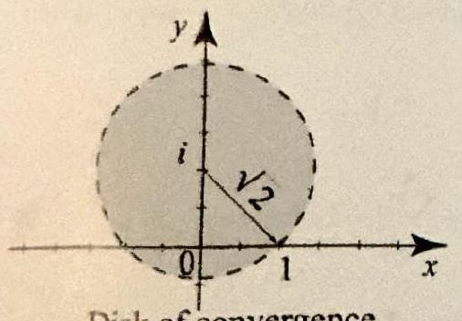
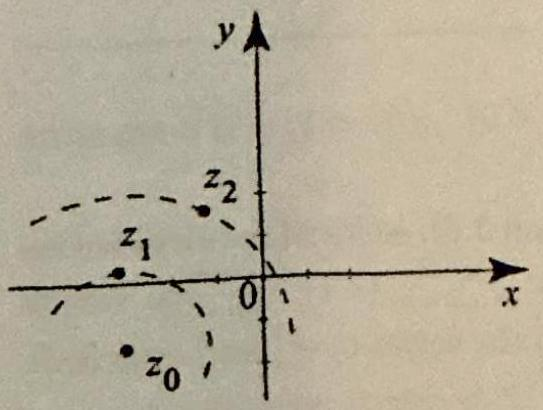
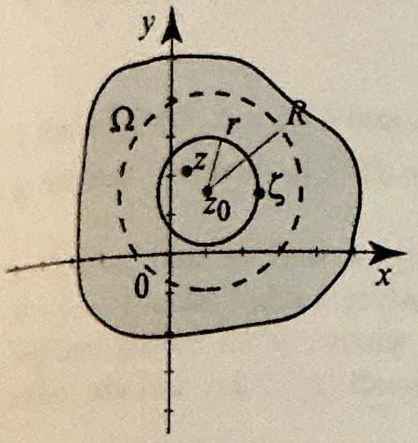
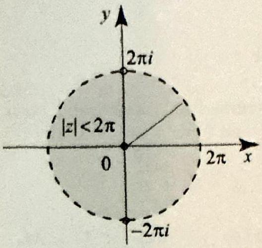
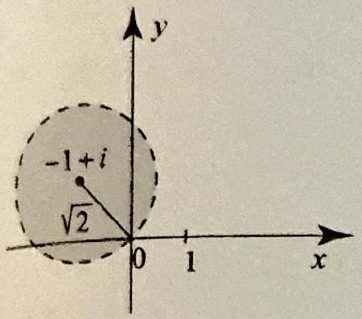

### 4.4 Taylor Series

In the previous section we learned that a power series with a positive radius of convergence is analytic on its disk of convergence. In this section, we will prove a converse of sorts, stating that if $f(z)$ is analytic in some region $\Omega$, then $f$ has a power series representation at every point in $\Omega$. In other words, every analytic function is locally a power series. This is a fundamental result in complex analysis, with important consequences.

## THEOREM 1 TAYLOR SERIES

Taylor series are named after the English mathematician Brook Taylor (16851731), who wrote about them in 1715. The idea of expanding a function by a power series was known to mathematicians before Taylor and appeared in the work of Sir Isaac Newton, the Scottish mathematician James Gregory, and the Swiss mathematician John Bernoulli.
Maclaurin series are named after the Scottish mathematician Colin Maclaurin (16981746), who used them and acknowledged that they are special cases of Taylor series.

Suppose that $f$ is analytic in a region $\Omega$ and $z_{0}$ is in $\Omega$. Let $B_{R}\left(z_{0}\right)$ be the largest open disk centered at $z_{0}$ and contained in $\Omega$. Then $f$ has a unique Taylor series expansion around $z_{0}$ given by

$$
f(z)=\sum_{n=0}^{\infty} \frac{f^{(n)}\left(z_{0}\right)}{n!}\left(z-z_{0}\right)^{n}, \quad\left|z-z_{0}\right|<R
$$

The coefficient $\frac{f^{(n)}\left(z_{0}\right)}{n!}$ is called the $n$th Taylor coefficient of $f$.
When $z_{0}=0$ in Theorem 1, the series is commonly referred to as the Maclaurin series of $f$.

Before proceeding with proofs and examples, let us make some simple but useful remarks regarding Theorem 1.

- A Taylor series is a power series. So we may freely use results about power series as we work with Taylor series.
- The Taylor series of $f(z)$ around $z_{0}$ is uniquely defined by (1); the coefficients are determined by the derivatives of $f$. Furthermore, any power series representation of $f$ centered at $z_{0}$ must be the Taylor series (Corollary 1, Section 4.3). If $f(z)$ is explicitly written as a power series is some disk, then $f$ is identically its own Taylor series.
- The Taylor series will definitely converge to $f(z)$ for $\left|z-z_{0}\right|<R$, so the radius of convergence is at least $R$. If $f(z)$ has a serious problem (like a pole or an essential singularity; see Section 4.6) at some point on the circle $\left|z-z_{0}\right|=R$, then the Taylor series cannot converge in a larger disk and its radius of convergence is thus $R$. If $f(z)$ has a less serious problem like a branch cut or a removable singularity (Section 4.6 ) or has merely been defined in an artificially small domain, the Taylor series might converge in a circle with radius larger than $R$.
- Because successive termwise differentiation of a power series is allowed within its radius of convergence, if $n$ is an integer $\geq 0$, by changing the dummy index and differentiating (1) we obtain the Taylor series

Disk of convergence centered at $i$

Figure 1 The function $f(z)= \frac{1}{1-2}$ has a serious problem at $z=1$. If we expand it around $z_{0}=i$, the power series will converge in the largest disk around $i$ that does not contain 1. This disk has radius $\sqrt{2}$.
representation of the $n$th derivative

$$
f^{(n)}(z)=\sum_{j=n}^{\infty} \frac{f^{(j)}\left(z_{0}\right)}{(j-n)!}\left(z-z_{0}\right)^{j}, \quad\left|z-z_{0}\right|<R
$$

- Because a power series converges uniformly on subdisks of its disk of convergence, the Taylor series (1) and (2) converge uniformly on any subdisk $\left|z-z_{0}\right| \leq r$ where $0 \leq r<R$.

To understand the statement about the radius of convergence of the Taylor series, let us consider the function $f(z)=\frac{1}{1-z}$ defined on the region $\Omega=\mathbb{C} \backslash\{1\}$. Theorem 1 tells us that the Taylor series expansion of $f(z)$ around $z_{0}=0$ will converge in the largest open disk centered at $z_{0}=0$ and contained in $\mathbb{C} \backslash\{1\}$. Clearly, the largest disk has radius 1. The Taylor series cannot converge in a disk larger than this, because if it did, the Taylor series would be continuous at $z=1$; but $f(z)$ has unbounded modulus as $z \rightarrow 1$, and the Taylor series must equal $f$ on the unit disk.

So the Taylor series of $f(z)$ around 0 has a radius of convergence 1 . We can confirm this fact directly by recalling the geometric series

$$
\frac{1}{1-z}=\sum_{n=0}^{\infty} z^{n} \quad|z|<1
$$

which is the Taylor series expansion of $f(z)$ around 0 . The advantage of Theorem 1 is that it gives us the radius of convergence without knowing the coefficients in the Taylor series. For example, Theorem 1 tells us that the Taylor series of $f(z)=\frac{1}{1-z}$ around $z_{0}=i$ has radius of convergence $R=\sqrt{2}$ (Figure 1).

EXAMPLE 1 Maclaurin series of $e^{z}, \cos z$, and $\sin z$
Find the Maclaurin series expansions of (a) $e^{z}$, (b) $\cos z$, and (c) $\sin z$.
Solution Let us first note that all three functions are entire, so the Maclaurin series will converge for all $z$; that is, $R=\infty$ in all three cases.
(a) Recall that we defined the exponential function by a power series: $e^{z}= \sum_{n=0}^{\infty} \frac{z^{n}}{n!}$ for all $z$. So this is the Maclaurin series expansion of $e^{z}$. Let us reconfirm this using Theorem 1. If $f(z)=e^{z}$, then $f^{(n)}(z)=e^{z}$, so $f^{(n)}(0)=1$ for all $n$. Therefore, as expected, the Maclaurin series is

$$
\sum_{n=0}^{\infty} \frac{f^{(n)}(0)}{n!} z^{n}=\sum_{n=0}^{\infty} \frac{z^{n}}{n!}, \quad \text { for all } z .
$$

(b) We have

$$
\begin{array}{rll}
f(z)=\cos z & \Rightarrow & f(0)=1 \\
f^{\prime}(z)=-\sin z & \Rightarrow & f^{\prime}(0)=0 \\
f^{\prime \prime}(z)=-\cos z & \Rightarrow & f^{\prime \prime}(0)=-1 \\
f^{\prime \prime \prime}(z)=\sin z & \Rightarrow & f^{\prime \prime \prime}(0)=0 \\
f^{(4)}(z)=\cos z & \Rightarrow & f^{(4)}(0)=1
\end{array}
$$

and so on. The values of the derivatives at 0 will repeat with period 4 . Thus

$$
\begin{aligned}
\cos z & =f(0)+\frac{f^{\prime}(0)}{1!} z+\frac{f^{\prime \prime}(0)}{2!} z^{2}+\frac{f^{\prime \prime \prime}(0)}{3!} z^{3}+\frac{f^{(4)}(0)}{4!} z^{4}+\cdots \\
& =1-\frac{z^{2}}{2!}+\frac{z^{4}}{4!}+\cdots=\sum_{n=0}^{\infty}(-1)^{n} \frac{z^{2 n}}{(2 n)!} \quad \text { for all } z
\end{aligned}
$$

(c) We could find the Maclaurin series of $\sin z$ directly, as we did in (b) for $\cos z$. It is much easier to use the result of (b), and the relation $\frac{d}{d z} \cos z=-\sin z$. Then

$$
\begin{aligned}
\sin z & =-\frac{d}{d z} \cos z=-\frac{d}{d z}\left(1-\frac{z^{2}}{2!}+\frac{z^{4}}{4!}+\cdots\right) \\
& =\frac{2 z}{2!}-\frac{4 z^{3}}{4!}+\cdots=\frac{z}{1!}-\frac{z^{3}}{3!}+\cdots=\sum_{n=0}^{\infty}(-1)^{n} \frac{z^{2 n+1}}{(2 n+1)!}
\end{aligned}
$$ $\square$

Example 1 shows the advantage that complex Taylor series enjoy over their real counterparts. A real Taylor series converges if and only if a certain remainder goes to zero. In the complex case, the remainder is irrelevant; the Taylor series will converge in the largest disk that you can fit inside the domain of definition of the analytic function.

Surely you are not surprised by the Maclaurin series expansions in Example 1. Given that $\cos x=\sum_{n=0}^{\infty}(-1)^{n} \frac{x^{2 n}}{(2 n)!}$ and $\sin x=\sum_{n=0}^{\infty}(-1)^{n} \frac{x^{2 n+1}}{(2 n+1)!}$ for $-\infty<x<\infty$, isn't it reasonable to expect that the series for $\cos z$ and $\sin z$ are obtained by merely replacing $x$ by $z$ ? The answer is affirmative and we have the following useful result, which will allow us to turn well-known Taylor series from calculus into Taylor series of complex-valued function.

## PROPOSITION 1

Suppose that $f(x)=\sum_{n=0}^{\infty} c_{n} x^{n}$ is a Taylor series that converges for all $|x|<R$. Suppose that $g(z)$ is analytic on $|z|<R$ and $g(x)=f(x)$ for all $|x|<R$. Then the Taylor series of $g$ is $g(z)=\sum_{n=0}^{\infty} c_{n} z^{n}$ for all $|z|<R$.
Proof Since $g$ is analytic in a neighborhood of 0 , it has a Taylor series expansion $g(z)=\sum_{n=0}^{\infty} \frac{g^{(n)}(0)}{n!} z^{n}$. We can compute the derivatives $g^{(n)}(0)$ by taking limits as $z \rightarrow 0$ with $z=x$ real, and since $g=f$ on the real axis, we must have $g^{(n)}(0)= f^{(n)}(0)$ for all $n$. So the coefficients in the Taylor series of $f$ and $g$ are the same. That the series have the same radius of convergence follows from Lemma 1, Section 4.3. which is also valid for Taylor series of real-valued functions.

## EXAMPLE 2 Manipulating Taylor series

For the given function, find the Maclaurin series expansion, and determine its radius of convergence:
(a) $f(z)=z e^{z^{2}}$,
(b) $f(z)=\frac{1}{1+z^{2}}$.

Solution (a) Since $e^{z}=\sum_{n=0}^{\infty} \frac{z^{n}}{n!}$ is valid for all $z$, replacing $z$ by $z^{2}$, we obtain

$$
e^{z^{2}}=\sum_{n=0}^{\infty} \frac{\left(z^{2}\right)^{n}}{n!}=\sum_{n=0}^{\infty} \frac{z^{2 n}}{n!}, \quad \text { for all } z
$$

Multiplying both sides by $z$, we get the desired Maclaurin series

$$
z e^{z^{2}}=\sum_{n=0}^{\infty} \frac{z^{2 n+1}}{n!}, \quad \text { for all } z
$$

(b) Start with the geometric series $\frac{1}{1-w}=\sum_{n=0}^{\infty} w^{n}$, which is valid if and only if $|w|<1$. Replace $w$ by $-z^{2}$, note that $|w|<1 \Leftrightarrow\left|-z^{2}\right|<1 \Leftrightarrow|z|<1$ and get

$$
\frac{1}{1+z^{2}}=\sum_{n=0}^{\infty}\left(-z^{2}\right)^{n}=\sum_{n=0}^{\infty}(-1)^{n} z^{2 n}, \quad \text { for }\left|z^{2}\right|<1, \text { equivalently },|z|<1 .
$$

Example 2(b) takes us back to a question that we mentioned in the introduction of Section 4.1. The function $f(x)=\frac{1}{1+x^{2}}$ has no problem on the real line. It is infinitely differentiable for all $x$. Yet its Maclaurin series $\sum_{n=0}^{\infty}(-1)^{n} x^{2 n}$ converges only for $|x|<1$. While it is difficult to explain this from a real analysis point of view, the justification is immediate in complex analysis. Since $\frac{1}{1+x^{2}}$ is the restriction to the real line of $\frac{1}{1+z^{2}}$, and since $\frac{1}{1+z^{2}}$ becomes unbounded at $z= \pm i$, the Maclaurin series of the latter function cannot converge outside the disk $|z|<1$. So in view of Proposition 1, the Maclaurin series of $\frac{1}{1+x^{2}}$ cannot converge outside $|x|<1$.

## EXAMPLE 3 Maclaurin series of $\frac{\sin z}{z}$

Find the Maclaurin series expansion of $g(z)=\frac{\sin z}{z}(z \neq 0), g(0)=1$, and determine its radius of convergence.
Solution The function $g$ is entire (Example 5, Section 3.6), so its Maclaurin series converges for all $z$. To find this series, start with $\sin z=\sum_{n=0}^{\infty}(-1)^{n} \frac{z^{2 n+1}}{(2 n+1)!}$, which converges for all $z$. For a given $z \neq 0$, we can multiply the series by $\frac{1}{z}$, and conclude that

$$
\begin{aligned}
\frac{\sin z}{z} & =\frac{1}{z} \sin z=\frac{1}{z} \sum_{n=0}^{\infty}(-1)^{n} \frac{z^{2 n+1}}{(2 n+1)!}=\sum_{n=0}^{\infty}(-1)^{n} \frac{1}{z} \frac{z^{2 n+1}}{(2 n+1)!} \\
& =\sum_{n=0}^{\infty}(-1)^{n} \frac{z^{2 n}}{(2 n+1)!}=\frac{1}{1!}-\frac{z^{2}}{3!}+\frac{z^{4}}{5!}-\cdots .
\end{aligned}
$$

If $z=0$, the series equals $1=g(0)$, and so the Maclaurin series expansion is

$$
\frac{\sin z}{z}=\sum_{n=0}^{\infty}(-1)^{n} \frac{z^{2 n}}{(2 n+1)!} \quad \text { for all } z
$$

PROPOSITION 2 EVEN AND ODD FUNCTIONS

At $z=0$, the left side is to be interpreted as its limit, $g(0)=1$.
Recall that a function $f$ is even if $f(-z)=f(z)$, and it is odd if $f(-z)= -f(z)$. The following useful property of Taylor series is obvious. You should verify it with the previous examples of this section.
Suppose that $f$ is analytic on $|z|<R$ and write $f(z)=\sum_{n=0}^{\infty} c_{n} z^{n},|z|<R$. $R>0$. Then
(i) $f$ is even if and only if $c_{2 n+1}=0$ for all $n=0,1,2, \ldots$.
(ii) $f$ is odd if and only if $c_{2 n}=0$ for all $n=0,1,2, \ldots$.

Proof Suppose that $f$ is even. Then $f(z)-f(-z)=0$, so $\sum_{n=0}^{\infty} c_{n}\left(z^{n}-(-z)^{n}\right)=$ 0 , for all $|z|<R$. But $z^{n}-(-z)^{n}=0$ for all even $n$ and $z^{n}-(-z)^{n}=2 z^{n}$ for all odd $n$. So $\sum_{n=0}^{\infty} c_{n}\left(z^{n}-(-z)^{n}\right)=\sum_{n=0}^{\infty} 2 c_{2 n+1} z^{2 n+1}=0$, which implies that $c_{2 n+1}=0$ for all $n$, by the uniqueness of power series expansion. The case of an odd function is similar, and so we leave it as an exercise.

The following lemma is a consequence of the geometric series. It will facilitate the proof of Theorem 1 and will be needed in the following section.

LEMMA 1

Figure 2

Let $z_{0}, z_{1}, z_{2}$ be distinct complex numbers such that $\left|z_{1}-z_{0}\right|<\left|z_{2}-z_{0}\right|$ (Figure 2). Then
(4)

$$
\frac{1}{z_{2}-z_{1}}=\sum_{n=0}^{\infty} \frac{\left(z_{1}-z_{0}\right)^{n}}{\left(z_{2}-z_{0}\right)^{n+1}}
$$

Proof To expand $\frac{1}{z_{2}-z_{1}}$ around $z_{0}$, we will add and subtract $z_{0}$ from the denominator and then factor to apply the geometric series $\frac{1}{1-w}=\sum_{n=0}^{\infty} w^{n}(|w|<1)$. Here are the necessary steps:

$$
\begin{aligned}
\frac{1}{z_{2}-z_{1}} & =\frac{1}{\left(z_{2}-z_{0}\right)-\left(z_{1}-z_{0}\right)} \\
& =\frac{1}{z_{2}-z_{0}} \frac{1}{1-\frac{z_{1}-z_{0}}{z_{2}-z_{0}}} \\
& =\frac{1}{z_{2}-z_{0}} \frac{1}{1-w} \\
& =\frac{1}{z_{2}-z_{0}} \sum_{n=0}^{\infty} w^{n}
\end{aligned}
$$

where $u=\frac{z_{1} \cdots z_{0}}{z_{2} \cdots z_{0}}$. The series will converge if and only if $|w|<1$; equivalently, the series will converge if and only if $\left|\frac{z_{1}-z_{0}}{z_{2}-z_{0}}\right|<1$ or $\left|z_{1}-z_{0}\right|<\left|z_{2}-z_{0}\right|$. Replacing $w$ by $\frac{z_{1}-z_{0}}{z_{2}-z_{0}}$, we obtain (4).

Figure 3 The picture around so: We have
$$
\left|z-z_{0}\right|<r=\left|\zeta-z_{0}\right|
$$ Figure 3 The
$z_{0}$ : We have
for all $\zeta$ on $C_{r}\left(z_{0}\right)$ and $z$ inside $B_{r}\left(z_{0}\right)$.

Proof of Theorem 1 Let $0<r<R$. Since $f$ is analytic on and inside $C_{r}\left(z_{0}\right)$, Cauchy's formula implies that

$$
f(z)=\frac{1}{2 \pi i} \int_{C_{r}\left(z_{0}\right)} \frac{f(\zeta)}{\zeta-z} d \zeta \quad \text { for all }\left|z-z_{0}\right|<r
$$

(See Figure 3.) The trick now is to expand the integrand in a series and then integrate term by term. Appealing to (4) with $z=z_{1}$ and $\zeta=z_{2}$, we see that

$$
\frac{1}{\zeta-z}=\sum_{n=0}^{\infty} \frac{\left(z-z_{0}\right)^{n}}{\left(\zeta-z_{0}\right)^{n+1}}, \quad\left|z-z_{0}\right|<\left|\zeta-z_{0}\right|=r
$$

Also, if $\left|z-z_{0}\right|<\left|\zeta-z_{0}\right|=r$, then $\left|\frac{z-z_{0}}{\zeta-z_{0}}\right|=\rho<1$, and so $\left|\frac{\left(z-z_{0}\right)^{n}}{\left(\zeta-z_{0}\right)^{n+1}}\right|<\frac{\rho^{n}}{r}=M_{n}$. Hence, by the Weierstrass $M$-test, since $\sum M_{n}<\infty$, the series in (6) converges uniformly in $\zeta$ for all $\left|\zeta-z_{0}\right|=r$. Multiplying both sides of (6) by the continuous function $f(\zeta)$, we obtain

$$
\frac{f(\zeta)}{\zeta-z}=\sum_{n=0}^{\infty}\left(z-z_{0}\right)^{n} \frac{f(\zeta)}{\left(\zeta-z_{0}\right)^{n+1}}
$$

where the series converges uniformly on $\left|\zeta-z_{0}\right|=r$ (Lemma 1, Section 4.2). Integrating over $C_{r}\left(z_{0}\right)$, we get

$$
\begin{aligned}
f(z) & =\frac{1}{2 \pi i} \int_{C_{r}\left(z_{0}\right)} \frac{f(\zeta)}{\zeta-z} d \zeta=\frac{1}{2 \pi i} \int_{C_{r}\left(z_{0}\right)} \sum_{n=0}^{\infty}\left(z-z_{0}\right)^{n} \frac{f(\zeta)}{\left(\zeta-z_{0}\right)^{n+1}} d \zeta \\
& =\sum_{n=0}^{\infty}\left(z-z_{0}\right)^{n} \overbrace{\frac{1}{2 \pi i} \int_{C_{r}\left(z_{0}\right)} \frac{f(\zeta)}{\left(\zeta-z_{0}\right)^{n+1}} d \zeta}^{=\frac{f^{(n)}\left(z_{0}\right)}{n!}} \\
& =\sum_{n=0}^{\infty} \frac{f^{(n)}\left(z_{0}\right)}{n!}\left(z-z_{0}\right)^{n}
\end{aligned}
$$

where we have used Cauchy's generalized formula (6), Section 3.6. to evaluate the last path integral. This proves (1) for all $\left|z-z_{0}\right|<r$, where $0<r<R$. Letting $r \rightarrow R$, the formula follows for all $\left|z-z_{0}\right|<R$. $\square$

The following example deals with an important family of numbers that arise naturally in many different contexts in mathematics. In the solution we will take full advantage of Theorem 1 and compute the radius of convergence of a Taylor series before knowing the Taylor coefficients.

## EXAMPLE 4 Bernoulli numbers

Consider the function $f(z)=\frac{z}{e^{z}-1}, z \neq 0, f(0)=1$.
(a) Show that $f$ is analytic at 0 .
(b) By Theorem 1, $f$ has a Maclaurin series expansion. Show that its radius of convergence is $R=2 \pi$.
(c) Write the Maclaurin series in the form

$$
f(z)=\sum_{n=0}^{\infty} \frac{B_{n}}{n!} z^{n}, \quad|z|<2 \pi
$$

Figure 4 Having shown that $f(z)=\frac{z}{c^{z}-1}$ is analytic at $z=0$, its only problems are at $z=2 k \pi i$ ( $k$ integer $\neq 0$ ), which are the nonzero roots of $e^{z}-1$. Thus its Taylor series will converge in the disk $|z|<2 \pi$.

The number $B_{n}$ is called the $n$th Bernoulli number. Show that $B_{0}=1$, and derive the recursion formula

$$
B_{n}=-\frac{1}{n+1} \sum_{k=0}^{n-1}\binom{n+1}{k} B_{k}, \quad n \geq 1
$$

(d) Find $B_{0}, B_{1}, B_{2}, \ldots, B_{12}$, with the help of the recursion formula and a calculator.
(e) Show that $B_{2 n+1}=0$ for $n \geq 1$.

Solution (a) Consider $g(z)=\frac{1}{f(z)}=\frac{e^{z}-1}{z}$ for $z \neq 0$, and $g(0)=1$. By Theorem 4, Section 3.6, $g$ is analytic at 0 . Since $g(0) \neq 0, \frac{1}{g(z)}=f(z)$ is therefore analytic at $z=0$.
(b) The Maclaurin series of $f$ converges in the largest disk around $z_{0}=0$ on which $f$ is defined and analytic. For $z \neq 0, f(z)$ is analytic except when $e^{z}-\mathbf{1}=0$, where $f$ becomes unbounded. Since $e^{z}=1$ precisely when $z$ is an integer multiple of $2 \pi i$, we see that the Maclaurin series converges for all $|z|<2 \pi$, and the radius of convergence is $2 \pi$.
(c) Multiplying both sides of the Maclaurin series expansion of $\frac{z}{e^{z}-1}$ by $e^{z}-1$ and using the Maclaurin series $e^{z}-1=z+\frac{z^{2}}{2!}+\frac{z^{3}}{3!}+\cdots=\sum_{n=1}^{\infty} \frac{z^{n}}{n!}$, we obtain

$$
z=\left(e^{z}-1\right) \sum_{n=0}^{\infty} \frac{B_{n}}{n!} z^{n}=\sum_{n=1}^{\infty} \overbrace{\frac{z^{n}}{n!}}^{=a_{n} z^{n}} \sum_{n=0}^{\infty} \frac{B_{n}}{n!} z^{n}=\sum_{n=1}^{\infty} c_{n} z^{n}, \quad|z|<2 \pi
$$

where $c_{n}$ will be computed from the Cauchy product formulas (see Theorem 15, Section 4.1, also, Exercise 21, Section 4.3). Note that because we are multiplying by the power series of $e^{z}-1$ whose first term is $z$, the first term in the Cauchy product will have degree $\geq 1$ (thus $c_{0}=0$ ). We have for each $n \geq 1$

$$
\begin{aligned}
c_{n} & =\sum_{k=0}^{n-1} \frac{B_{k}}{k!} \frac{1}{(n-k)!} \quad\left(\text { because } a_{0}=0\right) \\
& =\frac{1}{n!} \sum_{k=0}^{n-1} \frac{n!}{k!(n-k)!} B_{k}=\frac{1}{n!} \sum_{k=0}^{n-1}\binom{n}{k} B_{k}
\end{aligned}
$$

By the uniqueness of the power series expansion, (8) implies that $c_{1}=1$, and $c_{n}=0$ for all $n \geq 2$. Thus,

$$
\begin{aligned}
& c_{1}=1 \quad \Rightarrow \quad \frac{1}{1!} B_{0}=1 \quad \Rightarrow \quad B_{0}=1 \\
& c_{n}=0, \quad n \geq 2 \Rightarrow \frac{1}{n!} \sum_{k=0}^{n-1}\binom{n}{k} B_{k}=0, \quad n \geq 2
\end{aligned}
$$

Changing $n$ to $n+1$ in the last identity, we see that, for $n \geq 1$,

$$
\begin{aligned}
& \frac{1}{(n+1)!} \sum_{k=0}^{n}\binom{n+1}{k} B_{k}=0 \\
& \quad \Rightarrow \frac{1}{(n+1)!} \sum_{k=0}^{n-1}\binom{n+1}{k} B_{k}+\frac{1}{(n+1)!}\binom{n+1}{n} B_{n}=0
\end{aligned}
$$

Now, realizing that $\binom{n+1}{n}=n+1$, we get the desired recursion formula.
(d) We have used a computer and the recursion formula to generate the Bernoulli numbers shown in Table 1.

| $n$ | 0 | 1 | 2 | 3 | 4 | 5 | 6 | 7 | 8 | 9 | 10 | 11 | 12 |
| :---: | :---: | :---: | :---: | :---: | :---: | :---: | :---: | :---: | :---: | :---: | :---: | :---: | :---: |
| $B_{n}$ | 1 | $-\frac{1}{2}$ | $\frac{1}{6}$ | 0 | $-\frac{1}{30}$ | 0 | $\frac{1}{42}$ | 0 | $-\frac{1}{30}$ | 0 | $\frac{5}{66}$ | 0 | $-\frac{691}{2730}$ |

Table 1. Bernoulli numbers.

(e) As the table suggests, $B_{2 n+1}=0$ for $n \geq 1$. This is clearly a fact about an even function. Consider $f(z)$ minus the $B_{1} z$ term of its Maclaurin series:

$$
\frac{z}{e^{z}-1}+\frac{z}{2}=\frac{z+z e^{z}}{2\left(e^{z}-1\right)}=\frac{z\left(e^{\frac{z}{2}}+e^{-\frac{z}{2}}\right)}{2\left(e^{\frac{z}{2}}-e^{-\frac{z}{2}}\right)}=\frac{z}{2} \operatorname{coth}\left(\frac{z}{2}\right) .
$$

This is an even function. Hence all the odd numbered coefficients in its Maclaurin series are 0 , which implies that $B_{2 n+1}=0$ for all $n \geq 1$.
Using (9) and the Maclaurin series of $\frac{z}{e^{z}-1}$, we see that for $|z|<2 \pi$

$$
\frac{z}{2} \operatorname{coth}\left(\frac{z}{2}\right)=\frac{z}{2}+1-\frac{z}{2}+\sum_{n=2}^{\infty} \frac{B_{n}}{n!} z^{n}=1+\sum_{n=1}^{\infty} \frac{B_{2 n}}{(2 n)!} z^{2 n}=\sum_{n=0}^{\infty} \frac{B_{2 n}}{(2 n)!} z^{2 n}
$$

and upon replacing $z$ by $2 z$,

$$
z \operatorname{coth} z=\sum_{n=0}^{\infty} \frac{2^{2 n} B_{2 n}}{(2 n)!} z^{2 n}, \quad|z|<\pi
$$

This connection between Bernoulli numbers and the Maclaurin series involving hyperbolic function is truly enchanting. Using it along with various relationships between hyperbolic and trigonometric functions, we will derive important Taylor series such as the ones for $\tan z$ and $\cot z$, in terms of Bernoulli numbers.

## Exercises 4.4

In Exercises 1-12, a function $f(z)$ and a point $z_{0}$ are given. Without computing the Taylor series of $f(z)$ around $z_{0}$, determine the radius of convergence of the Taylor series.

1. $e^{z-1}, \quad z_{0}=0$.
2. $\frac{\sin z}{e^{z}}, \quad z_{0}=1+7 i$.
3. $\frac{z}{z-3 i}, \quad z_{0}=0$.
4. $\sin \left(\frac{z+1}{z-1}\right), \quad z_{0}=0$.
5. $\frac{z+1}{z-i}, \quad z_{0}=2+i$.
6. $\frac{\sin z}{z^{2}+4}, \quad z_{0}=3$.
7. $\frac{z \cos z}{2 z+1}, \quad z_{0}=\frac{1}{2}$.
8. $\frac{z}{e^{z}-1}, \quad z_{0}=i$.
9. $\tan z, \quad z_{0}=0$.
10. $\cot z, z_{0}=\frac{\pi}{2}$.
11. $\frac{1}{z^{2}+z+1}, z_{0}=i$.
12. $\frac{\log z}{z-1}, \quad z_{0}=\frac{i}{2}$.

In Exercises 13 20, use a known Taylor series to derive the Taylor series of the given function around the indicated point $z_{0}$. Determine the radius of convergence in each case.
13. $\frac{z}{1-z}, \quad z_{0}=0$.
14. $\frac{z^{2}+1}{z-1}, \quad z_{0}=0$.
15. $\frac{2 z}{(z+i)^{3}}, \quad z_{0}=0$.
16. $z e^{3 z^{2}}, \quad z_{0}=0$.
17. $z e^{z}, \quad z_{0}=1$.
18. $\cos ^{2} z, \quad z_{0}=0$.
19. $z \cos \frac{z}{2}, \quad z_{0}=0$.
20. $\cos z, \quad z_{0}=\frac{\pi}{2}$.
21. Find the Maclaurin series of $f(z)=\frac{1}{(1-z)(2-z)}$ in two different ways as indicated.
(a) Prove the partial fractions decomposition $\frac{1}{(1-z)(2-z)}=\frac{1}{1-z}-\frac{1}{2-z}$, then use a geometric series expansion of each term in the partial fraction decomposition.
(b) Use a geometric series to expand $\frac{1}{1-z}$ and $\frac{1}{2-z}$ separately, then form their Cauchy product.
(c) Verify that your answers are the same in (a) and (b) and give the radius of convergence of the Maclaurin series of $f(z)$.
22. Let $z_{1} \neq z_{2}$ be two complex numbers and suppose that $0<\left|z_{1}\right| \leq\left|z_{2}\right|$. Show that

$$
\frac{1}{\left(z_{1}-z\right)\left(z_{2}-z\right)}=\frac{1}{z_{1}-z_{2}} \sum_{n=0}^{\infty} \frac{\left(z_{1}^{n+1}-z_{2}^{n+1}\right)}{\left(z_{1} z_{2}\right)^{n+1}} z^{n}, \quad|z|<\left|z_{1}\right|
$$

23. Find the Maclaurin series of $f(z)=\frac{1}{1+z+z^{2}}$ and determine its radius of convergence. You may use the result of Exercise 22.
24. Let $z_{1} \neq 0$. (a) Show that

$$
\frac{1}{z_{1}-z}=\frac{1}{z_{1}} \sum_{n=0}^{\infty}\left(\frac{z}{z_{1}}\right)^{n}, \quad|z|<\left|z_{1}\right|
$$

(b) For any positive integer $k$, show that

$$
\frac{1}{\left(z_{1}-z\right)^{k+1}}=\frac{1}{z_{1}^{k+1}} \sum_{n=k}^{\infty}\binom{n}{k}\left(\frac{z}{z_{1}}\right)^{n-k}=\frac{1}{z_{1}^{k+1}} \sum_{n=0}^{\infty}\binom{n+k}{k}\left(\frac{z}{z_{1}}\right)^{n}
$$

where $|z|<\left|z_{1}\right|$. [Hint: Differentiate the series in (a) $k$ times.]
In Exercises 25-26, find the Maclaurin series of the given function and determine its radius of convergence. You may use the result of Exercise 24.
25. $f(z)=\frac{1}{(z-2 i)^{3}}$.
26. $f(z)=\frac{1}{(2 z-i+1)^{6}}$.

In Exercises 27-30, show that the function is analytic at $z_{0}=0$ and find its Maclaurin series. What is the radius of convergence of the series?
27. $f(z)= \begin{cases}\frac{\cos z-1}{z} & \text { if } z \neq 0, \\ 0 & \text { if } z=0 .\end{cases}$
28. $f(z)= \begin{cases}\frac{e^{z}-1}{z} & \text { if } z \neq 0, \\ 1 & \text { if } z=0 .\end{cases}$
29. $f(z)= \begin{cases}\frac{e^{z^{2}}-1}{z^{2}} & \text { if } z \neq 0, \\ 1 & \text { if } z=0 .\end{cases}$
30. $f(z)= \begin{cases}\frac{\sinh z^{2}}{z} & \text { if } z \neq 0, \\ 0 & \text { if } z=0 .\end{cases}$

## 31. Maclaurin series of the tangent, cotangent and cosecant.

(a) Replace $z$ by $i z$ in (10) and simplify to obtain

$$
z \cot z=\sum_{n=0}^{\infty}(-1)^{n} \frac{2^{2 n} B_{2 n}}{(2 n)!} z^{2 n}, \quad|z|<\pi
$$

(b) Derive the Maclaurin series of the tangent:

$$
\tan z=\sum_{n=1}^{\infty}(-1)^{n-1} \frac{2^{2 n}\left(2^{2 n}-1\right) B_{2 n}}{(2 n)!} z^{2 n-1}, \quad|z|<\frac{\pi}{2}
$$

[Hint: $\tan z=\cot z-2 \cot (2 z)$.]
(c) Prove

$$
z \csc z=\sum_{n=0}^{\infty}(-1)^{n-1} \frac{\left(2^{2 n}-2\right) B_{2 n}}{(2 n)!} z^{2 n}, \quad|z|<\pi
$$

[Hint: $\cot z+\tan z=2 \csc 2 z$.]
32. Fibonacci numbers. Discovered in the early thirteenth century by the great mathematician Leonardo of Pisa (1180-1250), who wrote under the name of Fibonacci, this sequence of integers is defined inductively by $c_{0}=c_{1}=1$, and $c_{n}=c_{n-1}+c_{n-2}$ for $n \geq 2$.
(a) Find $c_{0}, c_{1}, \ldots, c_{10}$. In 1843, the French mathematician Jacques-PhilippeMarie Binet (1786-1856) discovered a formula for $c_{n}$ in terms of $n$. This formula, known now as Binet's formula, states that

$$
c_{n}=\frac{1}{\sqrt{5}}\left[\left(\frac{1+\sqrt{5}}{2}\right)^{n+1}-\left(\frac{1-\sqrt{5}}{2}\right)^{n+1}\right]
$$

We will use complex analysis to derive Binet's formula.
(b) Suppose for a moment that there is a function $f(z)$, analytic at 0 and whose Maclaurin coefficients are the Fibonacci numbers: $f(z)=\sum_{n=0}^{\infty} c_{n} z^{n},|z|<R$. Show that $f$ is a solution of the equation $f(z)=1+z f(z)+z^{2} f(z)$.
(c) Conclude that $f(z)=\frac{1}{1-z-z^{2}}$ and find the radius of convergence of its Maclaurin series.
(d) Compute the Maclaurin series and derive Binet's formula. [Hint: $\frac{1}{1-z-z^{2}}= \frac{1}{\sqrt{5}}\left(\frac{1}{-z+\frac{-1+\sqrt{5}}{2}}+\frac{1}{z+\frac{1+\sqrt{5}}{2}}\right)$. Now use geometric series expansions.]
33. The Lucas numbers. This sequence of integers $\left\{l_{n}\right\}$, named after the French mathematician Edouard Lucas (1842-1891), is defined by a recurrence relation similar to the Fibonacci sequence $l_{n}=l_{n-1}+l_{n-2}$ but with $l_{0}=1$ and $l_{1}=3$. Take an approach similar to Exercise 32 and prove the following.
(a) Let $f(z)=\sum_{n=0}^{\infty} l_{n} z^{n},|z|<R$. Show that $f$ is a solution of the equation $f(z)=1+2 z+z f(z)+z^{2} f(z)$, and conclude that $f(z)=\frac{1+2 z}{1-z-z^{2}}$.
(b) Compute the Maclaurin series of $f$ and derive the following formula for the Lucas sequence:

$$
l_{n}=\left(\frac{1+\sqrt{5}}{2}\right)^{n+1}+\left(\frac{1-\sqrt{5}}{2}\right)^{n+1}, n \geq 0
$$

34. Project Problem: Euler numbers. Like the Bernoulli numbers, the Euler numbers have interesting applications in mathematics and can be generated from the coefficients of special Maclaurin series. In this exercise, you are asked to conduct an analysis similar to the one of Example 4 that will lead you into Euler numbers.
(a) Show that $f(z)=\sec z$ is analytic at $z_{0}=0$ and its Maclaurin series has radius of convergence $R=\frac{\pi}{2}$.
(b) Show that the odd numbered coefficients in the Maclaurin series are all 0 .

Then write

$$
\sec z=\sum_{n=0}^{\infty}(-1)^{n} \frac{E_{2 n}}{(2 n)!} z^{2 n}, \quad|z|<\frac{\pi}{2}
$$

The numbers $E_{n}$ are called the Euler numbers.
(c) Derive the recursion formula

$$
E_{0}=1, \quad \sum_{k=0}^{n}\binom{2 n}{2 k} E_{2 k}=0, \quad n>0
$$

(d) Using (c) and induction prove that $E_{2 n}$ is a nonzero integer that alternates in sign.
(e) Use (c) to derive $E_{2}=-1, E_{4}=5, E_{6}=-61, E_{8}=1385$.
35. Project Problem: Log series and the inverse tangent. In this exercise, we will derive several useful series involving the principal branch of the logarithm and the series of the inverse tangent.
(a) Show that

$$
\frac{1+z}{1-z}=\frac{1-|z|^{2}}{|1-z|^{2}}+2 i \frac{\operatorname{Im} z}{|1-z|^{2}}
$$

(b) Conclude from (a) that if $|z|<1$, then $\operatorname{Re}\left(\frac{1+z}{1-z}\right)>0$ and hence $\log \left(\frac{1+z}{1-z}\right)$ is analytic on $|z|<1$.
(c) Show that for $|z|<1, \log \left(\frac{1+z}{1-z}\right)=\log (1+z)-\log (1-z)$. [Hint: Show that the derivatives are equal.]

In parts (d)-(g), starting with the Log series in Example 2, Section 4.3, derive the Maclaurin series of the given function in the open disk $|z|<1$ :
(d) $\log (1+z)=\sum_{n=1}^{\infty} \frac{(-1)^{n-1}}{n} z^{n}$;
(e) $-\log (1-z)=\sum_{n=1}^{\infty} \frac{z^{n}}{n} ;$
(f) $\quad \log \left(\frac{1+z}{1-z}\right)=2 \sum_{n=0}^{\infty} \frac{z^{2 n+1}}{2 n+1}$;
(g) $\frac{1}{2 i} \log \left(\frac{1+i z}{1-i z}\right)=\sum_{n=0}^{\infty} \frac{(-1)^{n}}{2 n+1} z^{2 n+1}$.
(h) Let $\phi(z)=\frac{1}{2 i} \log \left(\frac{1+i z}{1-i z}\right),|z|<1$. Using the definition of $\tan z$, verify that $\tan (\phi(z))=z$. Thus, $\phi(z)$ is the inverse function of $\tan z$. We call $\phi(z)$ the principal branch of the inverse tangent and denote it by Arctan $z$. Thus,

$$
\operatorname{Arctan} z=\frac{1}{2 i} \log \left(\frac{1+i z}{1-i z}\right)=\sum_{n=0}^{\infty} \frac{(-1)^{n}}{2 n+1} z^{2 n+1}, \quad|z|<1
$$

(i) Using term-by-term differentiation, show that

$$
\frac{d}{d z} \operatorname{Arctan} z=\frac{1}{1+z^{2}}, \quad|z|<1
$$

36. Project Problem: Binomial series. In this exercise we study the binomial series with complex exponents. Let $\alpha$ be any complex number. Define the generalized binomial coefficient by

$$
\binom{\alpha}{0}=1, \quad\binom{\alpha}{n}=\frac{\alpha(\alpha-1) \cdots(\alpha-n+1)}{n!}, \quad n \geq 1 .
$$

Use Theorem 1 to show that for $|z|<1$

$$
(1+z)^{\alpha}=\sum_{n=0}^{\infty}\binom{\alpha}{n} z^{n}
$$

where $(1+z)^{\alpha}$ is the principal branch, $(1+z)^{\alpha}=e^{\alpha \log (1+z)}$. Note that if $\alpha=m$ is a positive integer, then from (11), $\binom{m}{n}=0$ for all $n>m$ (why?) and the series (12) reduces to a finite sum

$$
(1+z)^{m}=\sum_{n=0}^{m}\binom{m}{n} z^{n},
$$

which is the familiar binomial theorem. The finite sum clearly converges for all $z$, and so the restriction $|z|<1$ is not necessary if $\alpha$ is a positive integer.
37. Derive the power series expansion

$$
(1+z)^{\frac{1}{2}}=\sum_{n=0}^{\infty} \frac{(-1)^{n-1}}{2^{2 n}(2 n-1)}\binom{2 n}{n} z^{n}, \quad|z|<1
$$

38. Project Problem: The Catalan numbers. The Catalan numbers are named after the French mathematician Eugène Charles Catalan (1814-1894). They arise in many combinatorics problems, such as the following:

- The number of ways in which parentheses can be placed in a sequence of numbers to be multiplied, two at a time.
- The number of ways a polygon with $n+1$ sides can be cut into $n-1$ triangles by nonintersecting diagonals.
- The number of paths of length $2(n-1)$ through an $n$ by $n$ grid that connect two diagonally opposite vertices that stay below or on the main diagonal.

Denote the $n$th Catalan number by $c_{n}$. Take the first interpretation of these numbers, and say we have a sequence of three numbers $a, b, c$. We can multiply them two at a time in exactly two ways: $((a b) c)$ and $(a(b c))$. Thus $c_{3}=2$. With a sequence of four numbers, we can have $(((a b) c) d)$ or $((a b)(c d))$ or $((a(b c)) d)$ or $(a((b c) d))$ or $(a(b(c d)))$. Thus $c_{4}=5$. In general, if we have a sequence of $n$ numbers, we can break it into two subsequences of $k$ and $n-k$ numbers. Then each arrangement of parentheses from the $k$ sequence can be combined with an arrangement of parentheses of the $n-k$ sequence to yield an arrangement of parentheses of the $n$-sequence. Since we have $c_{k}$ possibilities for the $k$-sequence and $c_{n-k}$ possibilities
for the $(n-k)$-sequence, we get this way $c_{k} \times c_{n-k}$ possibilities for the $n$-sequence, But this can be done for $k=1,2, \ldots, n-1$, and so we have the recursion relation

$$
c_{n}=\sum_{k=1}^{n-1} c_{k} c_{n-k}, \quad \text { for } n \geq 2
$$

We have $c_{2}=1$, and we will take $c_{1}=1$ (for reference, $c_{0}=0$ ). Our goal in this exercise is to derive a formula for $c_{n}$ in terms of $n$.
(a) Suppose that there is an analytic function $f(z)=\sum_{n=0}^{\infty} c_{n} z^{n}$, where $c_{n}$ is the $n$th Catalan number. From the recursion relation, show that $f$ satisfies the equation $f(z)=z+(f(z))^{2}$. [Hint: Use Cauchy products.]
(b) Solve for $f$ and choose the solution that gives $f(0)=0$. You should get $f(z)=\frac{1-\sqrt{1-4 z}}{2}$.
(c) Expand $f$ in a power series around 0, using Exercise 37. You should get

$$
f(z)=\frac{1}{2}+\frac{1}{2} \sum_{n=0}^{\infty} \frac{1}{2 n-1}\binom{2 n}{n} z^{n} \quad|z|<\frac{1}{4}
$$

(d) Conclude that for $n \geq 2$,

$$
c_{n}=\frac{1}{2(2 n-1)}\binom{2 n}{n}
$$

(e) Verify your answer by computing $c_{3}$ and $c_{4}$ from the formula. What is $c_{5}$ ? Exhibit all $c_{5}$ arrangements of parentheses in a sequence of 5 numbers.
(f) Show that $\lim _{n \rightarrow \infty} \frac{c_{n+1}}{c_{n}}=4$. Thus the Catalan numbers grow at a rate of 4 .
39. Weierstrass double series theorem. This theorem is about a series of power series, thus the term double series. It states the following. Suppose that the power series $f_{k}(z)=\sum_{n=0}^{\infty} a_{n}^{(k)}\left(z-z_{0}\right)^{n}(k=0,1,2, \ldots)$ are all converging for $\left|z-z_{0}\right|<R$, where $0<R \leq \infty$. Thus each power series defines a function $f_{k}(z)$ in the disk $\left|z-z_{0}\right|<R$. Suppose that $F(z)=\sum_{k=0}^{\infty} f_{k}(z)$ converges uniformly for $\left|z-z_{0}\right| \leq \rho$ for every $\rho<R$. Then $F$ is analytic on $\left|z-z_{0}\right| \leq \rho$ and has a power series expansion, $F(z)=\sum_{n=0}^{\infty} A_{n}\left(z-z_{0}\right)^{n}$, that converges for all $\left|z-z_{0}\right|<R$. Moreover, for $n=0,1,2, \ldots, A_{n}=\sum_{k=0}^{\infty} a_{n}^{(k)}$.

Prove this theorem. [Hint: $F$ is analytic because of Corollary 2, Section 4.2. F has a power series expansion in $\left|z-z_{0}\right|<\rho$ because of Theorem 1 of this section. We have $A_{n}=\frac{F^{(n)}\left(z_{0}\right)}{n!}$. Compute the derivatives of $F$ by differentiating the series term by term (Corollary 2, Section 4.2).]
40. (a) Show that the series $f(z)=\sum_{n=1}^{\infty} \frac{z^{n}}{1+z^{2 n}}$ converges uniformly on every closed disk of the form $|z| \leq r<1$.
(b) Show that $\sum_{n=1}^{\infty} \frac{z^{n}}{1+z^{2 n}}=\sum_{k=0}^{\infty}(-1)^{k} \frac{z^{2 k+1}}{1-z^{2 k+1}}$ for $|z|<1$. [Hint: Expand each function $\frac{1}{1+z^{2 n}}$ in a (geometric) power series. Then apply the Weierstrass double series theorem.]
41. Analytic continuation. In this exercise, we will briefly discuss the topic of analytic continuation. By constructing a Taylor series of a function $f(z)$ about $z_{0}$, we create a function $g(z)$ analytic on some disk centered at $z_{0}$, such that $g(z)$ and $f(z)$ coincide near $z_{0}$. If $g(z)$ is defined in a region where $f(z)$ is not, or if

Figure 5 The Taylor series expansion of $\log z$ around $-1+i$ has radius of convergence $\sqrt{2}$.

$g(z)$ has different values than $f(z)$ away from $z_{0}, g(z)$ is said to be an analytic continuation of $f(z)$.

As a somewhat contrived example, suppose we are given a function $f(z)$ that is only defined on the unit disk and is given by the formula $f(z)=e^{z}$ for $|z|<1$. Can we find a function that coincides with $f(z)$ on the unit disk but is analytic elsewhere? It is clear that we can (just define the exponential function on $\mathbb{C}$ ), but let us see how we can get it from series expansions. The Maclaurin series of $f(z)$ is $g(z)=\sum_{n=0}^{\infty} \frac{z^{n}}{n!}$, which converges for all $z$. Thus $g(z)=e^{z}$ for all $z$ is an analytic continuation of $f(z)$.

Another example we have already looked at; when we took the Maclaurin expansions for the real trigonometric functions $\cos x$ and $\sin x$, and replaced $x$ by $z$, we found that $\cos z$ and $\sin z$ are analytic continuations of $\cos x$ and $\sin x$ from the real axis onto the whole complex plane.

We now present a more interesting case of analytic continuation of logarithm branches.
(a) Show that the Taylor expansion of the principal branch of the logarithm $f(z)= \log z$ about the point $z_{0}=-1+i$ is $g(z)=\log (-1+i)+\sum_{n=1}^{\infty} \frac{(-1)^{n-1}(z+1-i)^{n}}{n(-1+i)^{n}}$. (b) Show that the radius of convergence of the Taylor series is $\sqrt{2}$. Thus $g(z)$ is analytic in the disk $|z+1-i|<\sqrt{2}$ (Figure 5); it is important to note that this crosses the branch cut of $f$, but not the branch point (the origin). On the upper side of the branch cut, $g(z)$ will coincide with $f(z)$, but on the lower side of the branch cut, $g(z)$ will not coincide with $f(z)$. To see this, consider the branch $f_{1}(z)= \log _{-\frac{\pi}{4}} z$. Since $f(z)=f_{1}(z)$ in a neighborhood of $z_{0}$, their Taylor expansions about $z_{0}$ will be the same; and since $f_{1}(z)$ is analytic in the disk $|z+1-i|<\sqrt{2}$, Theorem 1 says that $g(z)$ must equal $f_{1}(z)$ in this disk. Thus, in the part of the disk above the branch cut (quadrants 1 and 2 ) we have $g(z)=f_{1}(z)=f(z)$, but in the part of the disk below the branch cut (quadrant 3) we have $g(z)=f_{1}(z)=f(z)+2 \pi i$. The Taylor expansion of $f(z)$ analytically continues the function into quadrant 3 where $\arg z>\pi$, and the analytic continuation is different from the original function.
