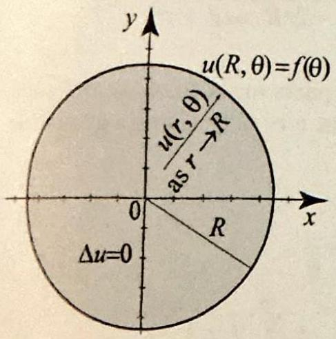
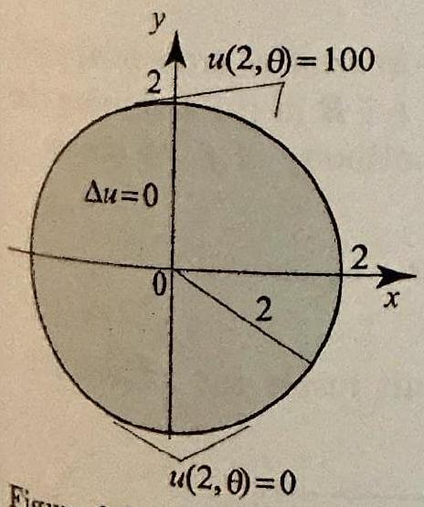
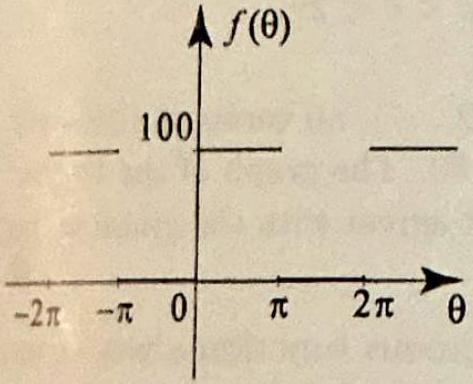
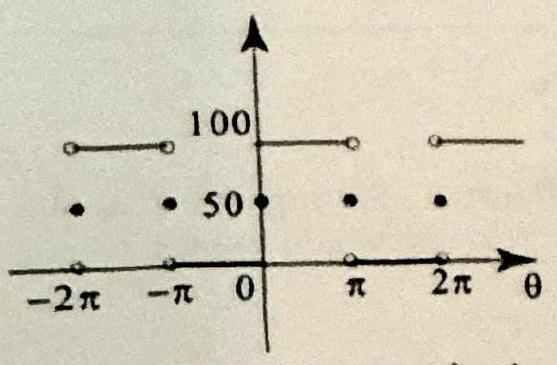
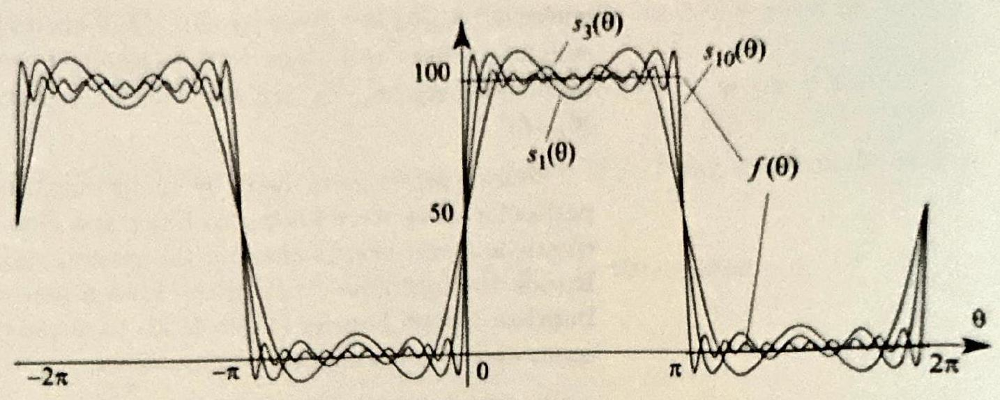

### 4.7 Harmonic Functions and Fourier Series

In Section 3.8, we solved the Dirichlet problem in a disk and gave the solution in the form of an integral called the Poisson integral formula. In this section, we derive another form of the solution, which will lead us to one of the most powerful tools in applied mathematics, Fourier series.

Figure 1 A Dirichlet problem on a disk with radius $R>0$ and center at the origin.

We will use polar coordinates to state the Dirichlet problem on the disk of radius $R>0$ and center at the origin. The boundary points are of the form $R e^{i \theta}$, where $\theta$ is arbitrary and $R$ is fixed. The boundary values in the Dirichlet problem will be given by a piecewise continuous function $f\left(R e^{i \theta}\right)=f(\theta)$. Note how we have written $f$ as a function of $\theta$ alone, because $R$ is fixed. This notation is convenient and will allow us to think of $f$ as a function of a real variable $\theta$. Also, since $\theta$ and $\theta+2 \pi$ represent the same polar angle, we must have $f(\theta)=f(\theta+2 \pi)$. Thus $f$ is $2 \pi$-periodic. The Dirichlet problem on the disk of radius $R>0$ is the boundary value problem

$$
\begin{aligned}
& \Delta u(r, \theta)=0, \quad 0 \leq r<R, \text { all } \theta ; \\
& \lim _{r \uparrow R} u(r, \theta)=u(R, \theta)=f(\theta),
\end{aligned}
$$

where the limit holds at all points $R e^{i \theta}$ where $f(\theta)$ is continuous (Figure 1). In Section 3.8, Theorem 3, we derived the solution in the form of an integral:
(3) $u(r, \theta)=\frac{R^{2}-r^{2}}{2 \pi} \int_{0}^{2 \pi} \frac{f(\phi)}{R^{2}-2 r R \cos (\theta-\phi)+r^{2}} d \phi \quad(0 \leq r<R)$,
known as the Poisson integral formula. The integrand is a function of $r, \theta$, and $\phi$. When integrated with respect to $\phi$, it yields a function of $r$ and $\theta$. Theorem 3, Section 3.8, tells us that this function $u(r, \theta)$ is harmonic in the open disk $|z|<R$ (thus (1) is satisfied) and tends to $f(\theta)$ as $r \uparrow R$ at all points of continuity of $f$ (thus (2) holds). While the Poisson integral formula offers an elegant solution of the Dirichlet problem on the unit disk, it is difficult to evaluate even for simple boundary values $f(\theta)$. In order to rewrite (3) in a form that is more suitable for numerical computations, we begin by deriving a series form of the Poisson kernel

$$
P(r, \theta)=\frac{R^{2}-r^{2}}{R^{2}-2 r R \cos \theta+r^{2}}, \quad(0 \leq r<R),
$$

which appears at the heart of the Poisson formula (see (13), Section 3.8).

LEMMA 1 SERIES FORM OF THE POISSON KERNEL

For $0 \leq r<R$ and all $\theta$, we have
(5)

$$
P(r, \theta)=\operatorname{Re}\left(\frac{R+r e^{i \theta}}{R-r e^{i \theta}}\right)=1+2 \sum_{n=1}^{\infty}\left(\frac{r}{R}\right)^{n} \cos n \theta .
$$

Proof Using $\overline{R-r e^{i \theta}}=R-r e^{-i \theta}$, we obtain

$$
\frac{R+r e^{i \theta}}{R-r e^{i \theta}}=\frac{\left(R+r e^{i \theta}\right)\left(R-r e^{-i \theta}\right)}{\left(R-r e^{i \theta}\right)\left(R-r e^{-i \theta}\right)}=\frac{R^{2}-r^{2}+2 i r R \sin \theta}{R^{2}-2 r R \cos \theta+r^{2}},
$$

and the first equality in (5) follows upon taking real parts on both sides and comparing with (4). To prove the second equality in (5), let $z=r e^{i \theta}$. Using a geometric series expansion, we have for $|z|=r<R$,

$$
\begin{aligned}
\frac{R+z}{R-z} & =(R+z) \frac{1}{R\left(1-\frac{z}{R}\right)}=\frac{R+z}{R} \frac{1}{1-\frac{z}{R}} \\
& =\left(1+\frac{z}{R}\right) \sum_{n=0}^{\infty}\left(\frac{z}{R}\right)^{n}=\sum_{n=0}^{\infty}\left(\frac{z}{R}\right)^{n}+\sum_{n=0}^{\infty}\left(\frac{z}{R}\right)^{n+1} \\
& =1+2 \sum_{n=1}^{\infty}\left(\frac{z}{R}\right)^{n}=1+2 \sum_{n=1}^{\infty}\left(\frac{r}{R}\right)^{n}(\cos n \theta+i \sin n \theta)
\end{aligned}
$$

where in the last equality we used $z^{n}=r^{n} e^{i n \theta}=r^{n}(\cos n \theta+i \sin n \theta)$, by Euler's identity. Now take real parts on both sides.

The Poisson integral formula will be expressed in terms of the Fourier coefficients of the boundary function. Fourier series and Fourier coefficients will be studied in detail in Chapter 7. Here we will simply use some notation from this chapter to highlight the connection between two important topics: Fourier series and the solution of the Dirichlet problem on the disk.

If $f$ is piecewise continuous on $[0,2 \pi]$, let
(6)

$$
\begin{gathered}
a_{0}=\frac{1}{2 \pi} \int_{0}^{2 \pi} f(\theta) d \theta \\
a_{n}=\frac{1}{\pi} \int_{0}^{2 \pi} f(\theta) \cos n \theta d \theta \quad(n=1,2, \ldots) \\
b_{n}=\frac{1}{\pi} \int_{0}^{2 \pi} f(\theta) \sin n \theta d \theta \quad(n=1,2, \ldots)
\end{gathered}
$$

The coefficients $a_{n}$ are known as the cosine Fourier coefficients of $f$ and $b_{n}$ as the sine Fourier coefficients of $f$.

THEOREM 1 FOURIER SERIES FORM OF THE POISSON INTEGRAL FORMULA

Consider the Dirichlet problem (1)-(2) with piecewise continuous boundary data $f$. Then the solution is given by
(9) $\quad u(r, \theta)=a_{0}+\sum_{n=1}^{\infty}\left(\frac{r}{R}\right)^{n}\left(a_{n} \cos n \theta+b_{n} \sin n \theta\right), \quad 0 \leq r<R$,
where $a_{0}, a_{n}$, and $b_{n}$ are the Fourier coefficients of $f$, given by (6)-(8).
Proof Starting with the solution (3), we expand the Poisson integral in a series by using (5) (replace $\theta$ by $\theta-\phi$ in (5)) and get

$$
\begin{aligned}
u(r, \theta) & =\frac{1}{2 \pi} \int_{0}^{2 \pi} f(\phi)\left(1+2 \sum_{n=1}^{\infty}\left(\frac{r}{R}\right)^{n} \cos n(\theta-\phi)\right) d \phi \\
& =\frac{1}{2 \pi} \int_{0}^{2 \pi} f(\phi) d \phi+\frac{1}{\pi} \int_{0}^{2 \pi} \sum_{n=1}^{\infty}\left\{\left(\frac{r}{R}\right)^{n} f(\phi) \cos n(\theta-\phi)\right\} d \phi
\end{aligned}
$$

Since $f$ is piecewise continuous, it is bounded on $[0,2 \pi]$. Let $A \geq 0$ be such that $|f(\phi)| \leq A$ for all $\phi$. For fixed $0 \leq r<R$, we have

$$
\left|\left(\frac{r}{R}\right)^{n} f(\phi) \cos n(\theta-\phi)\right| \leq A\left(\frac{r}{R}\right)^{n},
$$

and so the series $\sum_{n=1}^{\infty}\left\{\left(\frac{r}{R}\right)^{n} f(\phi) \cos n(\theta-\phi)\right\}$ converges uniformly in $\phi$ on the interval $[0,2 \pi]$, by the Weierstrass $M$-test, because $\sum A\left(\frac{r}{R}\right)^{n}<\infty$. Hence, we can integrate term by term (Corollary 1, Section 4.2). Appealing to (6)-(8), we get

$$
\begin{aligned}
u(r, \theta) & =\frac{1}{2 \pi} \int_{0}^{2 \pi} f(\phi) d \phi+\sum_{n=1}^{\infty}\left\{\left(\frac{r}{R}\right)^{n} \frac{1}{\pi} \int_{0}^{2 \pi} f(\phi) \cos n(\theta-\phi) d \phi\right\} \\
& =a_{0}+\sum_{n=1}^{\infty}\left\{\left(\frac{r}{R}\right)^{n} \frac{1}{\pi} \int_{0}^{2 \pi} f(\phi)(\cos n \theta \cos n \phi+\sin n \theta \sin n \phi) d \phi\right\} \\
& =a_{0}+\sum_{n=1}^{\infty}\left(\frac{r}{R}\right)^{n}\left(a_{n} \cos n \theta+b_{n} \sin n \theta\right)
\end{aligned}
$$

Figure 2 Dirichlet problem in Example 1.

which proves (9).

## EXAMPLE 1 A steady-state problem in a disk

The temperature on the boundary of a circular plate with radius $R=2$, center at the origin, and insulated lateral surface is given by

$$
f(\theta)= \begin{cases}100 & \text { if } 0 \leq \theta \leq \pi \\ 0 & \text { if } \pi<\theta<2 \pi\end{cases}
$$

(a) Find the Fourier series form of the steady-state temperature inside the plate.
(b) Show that all the points inside the plate on the $x$-axis have the same temperature. What is this temperature?

Solution (a) According to (9), the solution inside the disk is given by

$$
u(r, \theta)=a_{0}+\sum_{n=1}^{\infty}\left(\frac{r}{2}\right)^{n}\left(a_{n} \cos n \theta+b_{n} \sin n \theta\right), \quad 0 \leq r<2
$$

where $a_{0}, a_{n}$, and $b_{n}$ are the Fourier coefficients of $f$. Using the formula of $f$ in (6) (8), we obtain

$$
a_{0}=\frac{1}{2 \pi} \int_{0}^{\pi} 100 d \theta=50, \quad a_{n}=\frac{1}{\pi} \int_{0}^{\pi} 100 \cos n \theta d \theta=0
$$

and

$$
b_{n}=\frac{1}{\pi} \int_{0}^{\pi} 100 \sin n \theta d \theta=\frac{100}{n \pi}[1-\cos n \pi]
$$

Substituting into (10), we find the solution

$$
u(r, \theta)=50+\frac{100}{\pi} \sum_{n=1}^{\infty} \frac{1}{n}(1-\cos n \pi)\left(\frac{r}{2}\right)^{n} \sin n \theta, \quad 0 \leq r<2
$$

Notice that $1-\cos n \pi$ is either 0 or 2 depending on whether $n$ is even or odd. Thus, only odd terms survive, so we put $n=2 k+1$ for $k=0,1, \ldots$, and get

$$
u(r, \theta)=50+\frac{200}{\pi} \sum_{k=0}^{\infty} \frac{1}{2 k+1}\left(\frac{r}{2}\right)^{k} \sin (2 k+1) \theta, \quad 0 \leq r<2
$$

(b) For points on the $x$-axis, we have $\theta=0$ or $\theta=\pi$. Either value of $\theta$ when inserted into the series solution yields $u(r, \theta)=50$, because for $\theta=0$ or $\theta=\pi$ we have $\sin (2 k+1) \theta=0$ for all $k$. Thus the temperature of the points on the $x$-axis is constant and equals 50 , which is the average temperature of the points on the upper semi-circle and those on the lower semi-circle. This is to be expected since the points on the $x$-axis are halfway between the points on the upper semi-circle and those on the lower semi-circle. The isotherms corresponding to $T \neq 50$ are found in Exercise 5.

## Fourier Series

Theorem 1 holds a connection to one of the most fruitful areas in applied mathematics: Fourier series. Taking the limit as $r \upharpoonleft R$ in (9) and using the fact that $\lim _{r \uparrow R} u(r, \theta)=f(\theta)$ at the points of continuity of $f$, we obtain

$$
f(\theta)=a_{0}+\lim _{r \uparrow R} \sum_{n=1}^{\infty}\left(\frac{r}{R}\right)^{n}\left(a_{n} \cos n \theta+b_{n} \sin n \theta\right)
$$

Suppose for a moment that we can take the limit inside the infinite sum. Then because $\lim _{r \uparrow R}\left(\frac{r}{R}\right)^{n}=1$ for all $n$, we get

$$
f(\theta)=a_{0}+\sum_{n=1}^{\infty}\left(a_{n} \cos n \theta+b_{n} \sin n \theta\right)
$$

Figure 3 The boundary function in Example 1, as a $2 \pi$ periodic function of $\theta$.

where $a_{0}, a_{n}, b_{n}$ are given by (6)-(8). This representation of $f$ by an infinite sum of cosines and sines is the famous Fourier series of $f$, where the coefficients $a_{0}, a_{n}, b_{n}$ are the Fourier coefficients of $f$ and are given by (6) (8).

Fourier series were used by many mathematicians before Fourier. In particular, they were known to Euler and Daniel Bernoulli, but both mathematicians were skeptical about the general applicability of these expansions. It took the ingenious work of the French mathematician and engineer Jean Baptiste Joseph Fourier (1768-1830) to dispel the doubts surrounding these series and to recognize their importance.

Fourier series are perhaps the most powerful tools in applied mathematics. They are also the reason for the rise of many modern branches of mathematics. We will use them again in later chapters, when solving partial differential equations. Precise statements about the Fourier series representation will be given in Chapter 7. For now we will limit our discussion to Fourier series arising from the solution of Dirichlet problems, as we now illustrate with the Dirichlet problem of Example 1.

## EXAMPLE 2 Fourier series of a square wave

The boundary function in Example 1 is plotted in Figure 3. Setting $r=2$ in the solution (11) and using the fact that $\lim _{r \uparrow 2} u(r, \theta)=f(\theta)$, we would expect to get the Fourier series representation

$$
f(\theta)=50+\frac{200}{\pi} \sum_{k=0}^{\infty} \frac{\sin (2 k+1) \theta}{2 k+1},
$$

where

$$
f(\theta)= \begin{cases}100 & \text { if } 0 \leq \theta \leq \pi, \\ 0 & \text { if } \pi<\theta<2 \pi .\end{cases}
$$

To justify this representation, in Figure 4, we plotted $f(\theta)$ and several partial sums of the Fourier series

$$
s_{n}(\theta)=50+\frac{200}{\pi} \sum_{k=0}^{n} \frac{\sin (2 k+1) \theta}{2 k+1} .
$$

The graph of $f$ looks like a square wave that repeats every $2 \pi$ units.

Figure 4. Partial sums of the Fourier series: $s_{n}(\theta)= 50+\frac{200}{\pi} \sum_{k=0}^{n} \frac{\sin (2 k+1) \theta}{2 k+1}$, for $n=1,3,10$. As $n$ increases, the frequencies of the sine terms increase, causing the graphs of the higher partial sums to be more wiggly.

Figure 5 Graph of the Fourier series of a piecewise smooth function in Example 2. It agrees with the function at all the points where $f(\theta)$ is continuous.

The Fourier series of $f$ converges pointwise to $f(\theta)$ at each point $\theta$ where $f$ is continuous. This is illustrated in Figure 4. In particular, we have

$$
100=50+\frac{200}{\pi} \sum_{k=0}^{\infty} \frac{\sin (2 k+1) \theta}{2 k+1} \text { for } 0<\theta<\pi
$$

and

$$
0=50+\frac{200}{\pi} \sum_{k=0}^{\infty} \frac{\sin (2 k+1) \theta}{2 k+1} \text { for } \pi<\theta<2 \pi
$$

At the points of discontinuity ( $\theta=m \pi, m=0, \pm 1, \pm 2, \ldots$ ), all terms $\sin (2 k+1) \theta$ are zero and so we know that the series converges to 50 . The graph of the Fourier series $50+\frac{200}{\pi} \sum_{k=0}^{\infty} \frac{\sin (2 k+1) \theta}{2 k+1}$ is shown in Figure 5. It agrees with the graph of the function, except at the points of discontinuity.

So does the Fourier series of a piecewise continuous function always converge to the function as stated in (13) and illustrated by Example 2? Can we justify the step that took us from (12) to (13)? If we do not impose additional properties on $f$, the answer to these questions is (unfortunately) no. There are examples of continuous $2 \pi$-periodic functions with Fourier series diverging at an infinite set of points in $[0,2 \pi]$. In Chapter 7, we will study Fourier series in detail and prove a Fourier series representation that applies to piecewise smooth functions.

## Exercises 4.7

1. Project Problem: A steady-state problem with continuous boundary data, Fourier series of a triangular wave. We will apply the results of this section to the Dirichlet problem in the unit disk with boundary data given by

$$
f(\theta)= \begin{cases}\pi+\theta & \text { if }-\pi \leq \theta \leq 0, \\ \pi-\theta & \text { if } 0<\theta<\pi .\end{cases}
$$

(a) Think of the boundary function as a $2 \pi$-periodic function of $\theta$. Plot its graph over the interval $[-4 \pi, 4 \pi]$. (Remember that the graph of a $2 \pi$-periodic function repeats every $2 \pi$ units.)
(b) Using (9), show that the solution of the Dirichlet problem is

$$
u(r, \theta)=a_{0}+\sum_{n=1}^{\infty} r^{n}\left(a_{n} \cos n \theta+b_{n} \sin n \theta\right) \quad(0 \leq r<1)
$$

where $a_{0}, a_{n}$, and $b_{n}$ are the Fourier coefficients of $f$.
(c) Show that $a_{0}=\frac{\pi}{2}, a_{n} \frac{2}{\pi}\left\{\frac{1}{n^{2}}-\frac{\cos n \pi}{n^{2}}\right\}, b_{n}=0$.
(d) Plugging the coefficients into (16), we obtain the solution for $0<r<1$,

$$
u(r, \theta)=\frac{\pi}{2}+\sum_{n \text { odd }} \frac{4}{\pi n^{2}} r^{n} \cos n \theta=\frac{\pi}{2}+\frac{4}{\pi} \sum_{k=0}^{\infty} \frac{r^{2 k+1}}{(2 k+1)^{2}} \cos (2 k+1) \theta
$$

(e) Derive the Fourier series expansion of the triangular wave: for all $\theta$,

$$
f(\theta)=\frac{\pi}{2}+\sum_{n \text { odd }} \frac{4}{\pi n^{2}} \cos n \theta=\frac{\pi}{2}+\frac{4}{\pi} \sum_{k=0}^{\infty} \frac{1}{(2 k+1)^{2}} \cos (2 k+1) \theta
$$

(f) Illustrate the convergence of the Fourier series to $f(\theta)$ by plotting several partial sums.
Project Problem: Isotherms. In Exercises 2-5, you are asked to find the isotherms in Example 1. This will require some identities that are interesting in their own right.
2. A useful identity. Let $z=r e^{i \theta}=r(\cos \theta+i \sin \theta)$ be a complex number with $|z|<1$. (a) Starting with the Maclaurin series (Example 2, Section 4.3)

$$
\log (1+z)=\sum_{n=0}^{\infty}(-1)^{n} \frac{z^{n+1}}{n+1} \quad(|z|<1)
$$

derive the series expansion

$$
-\log (1-z)=\log \left(\frac{1}{1-z}\right)=z+\frac{1}{2} z^{2}+\frac{1}{3} z^{3}+\ldots \quad(|z|<1)
$$

(b) Take imaginary parts on both sides of the second identity in (a) to show that

$$
\sum_{n=1}^{\infty} r^{n} \frac{\sin n \theta}{n}=\tan ^{-1}\left(\frac{r \sin \theta}{1-r \cos \theta}\right), \quad 0 \leq r<1, \text { all } \theta
$$

3. More useful identities. Take real and imaginary parts on both sides of the expansion (Example 2, Section 4.3)

$$
\log (1+z)=\sum_{n=1}^{\infty}(-1)^{n+1} \frac{z^{n}}{n}, \quad|z|<1
$$

and obtain that, for $0 \leq r<1$ and all $\theta$,
(a) $\sum_{n=1}^{\infty}(-1)^{n+1} \frac{\sin n \theta}{n} r^{n}=\tan ^{-1}\left(\frac{r \sin \theta}{1+r \cos \theta}\right)$;
and
(b) $\quad \sum_{n=1}^{\infty}(-1)^{n+1} \frac{\cos n \theta}{n} r^{n}=\frac{1}{2} \ln \left(1+2 r \cos \theta+r^{2}\right)$.
4. Add the identities in Exercises 2 and 3(a) and get, for $0 \leq r<1$ and all $\theta$,

$$
\sum_{k=0}^{\infty} \frac{\sin (2 k+1) \theta}{2 k+1} r^{2 k+1}=\frac{1}{2}\left(\tan ^{-1}\left(\frac{r \sin \theta}{1-r \cos \theta}\right)+\tan ^{-1}\left(\frac{r \sin \theta}{1+r \cos \theta}\right)\right) .
$$

5. Follow the outlined steps to compute the isotherms in Example 1.
(a) Show that in Cartesian coordinates,

$$
u(x, y)=50+\frac{100}{\pi}\left(\tan ^{-1}\left(\frac{y}{2-x}\right)+\tan ^{-1}\left(\frac{y}{2+x}\right)\right)
$$

(b) Let $0<T<100$ be a given temperature. Suppose further that $T \neq 50$. Show that the points $(x, y)$ inside the disk $x^{2}+y^{2}=4$ such that $u(x, y)=T$ lie on the arc of the circle with center at $\left(0,-2 \cot \left(\frac{\pi}{100}(T-50)\right)\right)$ and radius $2 \csc \left(\frac{\pi}{100}(T-50)\right)$. [Hint: Use the formula $\tan (a+b)=\frac{\tan a+\tan b}{1-\tan a \tan b}$.]
(c) Plot several isotherms as $T$ varies from 0 to 100.

[^0]:    for any $\epsilon>0, x_{n} \leq M+\epsilon$ for all but finitely many $n$ 's.
