Topics to Review
Sections 4.14 .4 parallel the derelopment of series from calculis. A review of the basic definitions of convergence and the tests of convergence and divergence ( $n$th term test, root test, ratio test, comparison test) would help. Unlike calculus, where series were studied almost independently from integrals, here the path integral and, in particular, Canchy's theorem, will play a major role in proving facts about series.

## Looking Ahead

The most important results of this chapter are Theorems 4, Section 4.3 and Theorem 1, Section 4.4. Together they assert that a function is analytic in a disk if and only if it has a Taylot series representation in that disk. For the proof, we introduce the notion of uniform convergence and derive many of its pleasant consequences in integration and differentiation of analytic functions. Section 4.5 extends the main results to analytic functions that have an isolated problem point (singularity) by using Laurent series. The definition, properties, and classification of singular points in Section 4.6 will be needed in later sections and are very important. The proofs in Sections 4.1-4.6 can be covered briefly, in favor of the applications. Section 4.7 is optional. It continues the study of harmonic functions and shows a connection with Fourier series. Fourier series turn out to be at the heart of the solution of Dirichlet problems on the disk. Their treatment in Chapter 7 is independent of Section 4.7.

## 4

## COMPLEX SERIES

If, for every increasing value of $n$, the sum $S_{n}$ indefinitely approaches a certain limit $S$, the series will be called convergent, and the limit in question will be called the sum of the series. If, on the contrary, while $n$ increases indefinitely, the sum $S_{n}$ does not approach a fixed limit, the series will be divergent and will no longer have a sum.
-Augustin Louis Cauchy
(Cauchy's definition of a convergent series, from his Cours d'analyse.)

In calculus, we used Taylor series to represent functions in intervals centered at given points with a radius of convergence that could be 0 , positive, or infinite, depending on the remainder associated with the function. For example, $\cos x, e^{x}, \frac{1}{1+x^{2}}$, and the function defined by $e^{-1 / x^{2}}$ for $x \neq 0$ and 0 if $x=0$ are all infinitely differentiable for all real $x$. The radius of convergence of the Taylor series representation around zero is $\infty$ for the first two, 1 for the third one, and 0 for the last one. Nothing like that will happen in complex analysis! In complex analysis, Taylor series are much nicer, in the sense that the remainder will play no role in determining the convergence of the series. In complex analysis, if $f(z)$ has a derivative in a disk around $z_{0}$ of radius $R$, then $f$ has a Taylor series representation centered at $z_{0}$ with radius at least $R$. So, for example, in the case of $f(z)=\frac{1}{1+z^{2}}$, this function is not differentiable at $z= \pm i$, so we do not expect the Taylor series around 0 to have a radius of convergence larger than 1 .

Taylor series and more generally Laurent series will be used to study important properties of analytic functions, concerning their zeros and isolated problem points (singularities). They are also useful in studying properties of special functions, such as Bessel functions.

The theory of power series as you will see it in this chapter owes a lot to the German mathematician Karl Weierstrass (1815-1897). Weierstrass introduced to analysis the $\epsilon \delta$-notation in proofs, replacing Cauchy's terminology, such as "indefinitely approaches a certain limit" and "increases indefinitely." Weierstrass's contributions to analysis are evidenced by the number of fundamental results that you will encounter in this chapter that bear his name.

### 4.1 Sequences and Series of Complex Numbers

In previous chapters we studied the derivative and integral of a function of a complex variable. Our next step is to study series of complex functions. If you browse through the results of this section, you will find that most of them are direct analogues of well-known results from calculus. This is true; and in fact, it is good to keep in mind the theory of series from calculus as a guide. In the next section, we will introduce analytic functions to the picture, and then we will see results that have no analogues in the theory of real-valued functions. We will even answer questions that were raised but could not be answered in calculus. For example, why does the power series expansion about 0 of the function $f(x)=\frac{1}{1+x^{2}}$ converge only in the interval $(-1,1)$, even though the function has no problem on the real line outside this interval? Why does the function $f(x)=e^{-\frac{1}{x^{2}}}$, if $x \neq 0$ and $f(0)=0$, have no power series expansion in a neighborhood of 0 yet have derivatives

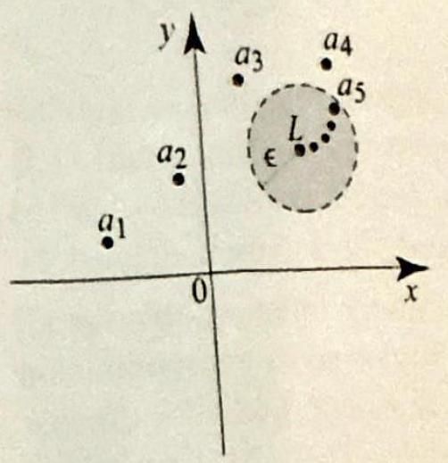
Figure 1 The sequence $\left\{a_{n}\right\}$ converges to the complex number $L$.

## DEFINITION 1 LIMIT OF A SEQUENCE

of all order at 0 ? These questions and many others have a natural place and obvious answers in complex analysis.

We start by investigating the notions of convergence and divergence of complex sequences. A sequence of complex numbers is a function whose domain of definition is the set of positive integers $\{1,2, \ldots, n, \ldots\}$ and whose range is a subset of $\mathbb{C}$. Thus a sequence is an ordered list of complex numbers $a(1), a(2), a(3), \ldots, a(n), \ldots$. It is customary to write $a_{n}$ instead of $a(n)$ and to denote the sequence by $\left\{a_{n}\right\}_{n=1}^{\infty}$ or simply $\left\{a_{n}\right\}$.

Many analytical expressions involving sequences of complex numbers will look identical to those for real sequences. The difference is that in the complex case, the absolute value refers to distance in the plane, and sequences of complex numbers can be thought of as sequences of points in the plane, which converge by eventually staying inside small disks centered at the limit point (Figure 1).
We say that a sequence $\left\{a_{n}\right\}$ converges to a complex number $L$ or has limit $L$ as $n$ tends to infinity and write

$$
\lim _{n \rightarrow \infty} a_{n}=L
$$

if given any $\epsilon>0$ there is an integer $N$ such that

$$
\left|a_{n}-L\right|<\epsilon \quad \text { for all } n \geq N .
$$

If the sequence $\left\{a_{n}\right\}$ does not converge, then we say that it diverges.
If a limit of a complex sequence exists, then it is unique (Exercise 7).
If $L=\lim _{n \rightarrow \infty} a_{n}$, then we will adopt the notation $a_{n} \rightarrow L$ as $n \rightarrow \infty$ or merely $a_{n} \rightarrow L$. It is immediate from the definition that a sequence $a_{n} \rightarrow L$ if and only if the real sequence $\left|a_{n}-L\right| \rightarrow 0$. For sequences that converge
to zero, we have

$$
\lim _{n \rightarrow \infty} a_{n}=0 \Leftrightarrow \lim _{n \rightarrow \infty}\left|a_{n}\right|=0 .
$$

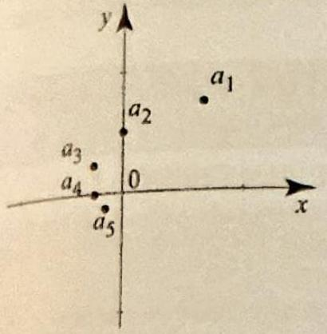

Figure 2 The first five terms of the sequence $a_{n}=\frac{e^{\operatorname{tn} \frac{\pi}{4}}}{n}$, and the limit $L=0$. Note how the arguments of two successive terms differ by $\frac{\pi}{4}$. Do you see why?

THEOREM 1 LIMIT LAWS FOR SEQUENCE

THEOREM 2 SUBSTITUTION LAW

COROLLARY 1

## EXAMPLE 1 Sequences

(a) The first few terms of the sequence $\left\{e^{i n \frac{\pi}{4}}\right\}_{n=1}^{\infty}$ are $\frac{\sqrt{2}}{2}+i \frac{\sqrt{2}}{2}, \quad i,-\frac{\sqrt{2}}{2}+i \frac{\sqrt{2}}{2}$, $-1,-\frac{\sqrt{2}}{2}-i \frac{\sqrt{2}}{2},-i, \frac{\sqrt{2}}{2}-i \frac{\sqrt{2}}{2}, 1, \frac{\sqrt{2}}{2}+i \frac{\sqrt{2}}{2}, \ldots$. The sequence is clearly not converging, since its terms will cycle over the first eight terms indefinitely.
(b) The first few terms of the sequence $\left\{\frac{e^{\operatorname{tn} \frac{\pi}{4}}}{n}\right\}_{n=1}^{\infty}$ are shown in Figure 2. The figure suggests that the sequence converges to $L \stackrel{n}{=} 0$. Let us prove this using the definition. Given $\epsilon>0$, we have

$$
\left|a_{n}-L\right|=\left|\frac{e^{i n \frac{\pi}{4}}}{n}-0\right|=\frac{\left|e^{i n \frac{\pi}{4}}\right|}{n}=\frac{1}{n}<\epsilon
$$

for all $n>\frac{1}{\epsilon}$, and so the sequence converges to 0 .
Limits of sequences have properties similar to those of functions, because the definitions of limits are similar in both cases. We list some of these properties for ease of reference and omit most of the proofs that can be derived by using the same techniques as in Section 2.2.

If $\left\{a_{n}\right\}$ and $\left\{b_{n}\right\}$ are convergent sequences and $\alpha$ and $\beta$ are complex numbers, then

$$
\begin{aligned}
& \lim _{n \rightarrow \infty}\left(\alpha a_{n}+\beta b_{n}\right)=\alpha \lim _{n \rightarrow \infty} a_{n}+\beta \lim _{n \rightarrow \infty} b_{n} ; \\
& \lim _{n \rightarrow \infty}\left(a_{n} b_{n}\right)=\lim _{n \rightarrow \infty} a_{n} \lim _{n \rightarrow \infty} b_{n} ; \\
& \lim _{n \rightarrow \infty} \frac{a_{n}}{b_{n}}=\frac{\lim _{n \rightarrow \infty} a_{n}}{\lim _{n \rightarrow \infty} b_{n}} \text { if } \lim _{n \rightarrow \infty} b_{n} \neq 0 .
\end{aligned}
$$

The following useful result is an immediate consequence of continuity.
If $\lim _{n \rightarrow \infty} a_{n}=L$ and $f$ is continuous at $L$, then

$$
\lim _{n \rightarrow \infty} f\left(a_{n}\right)=f(L)
$$

Applying Theorem 2 with the continuous functions $f(z)=\bar{z}$ and $g(z)=|z|$, we obtain the following.

If $\left\{a_{n}\right\}$ is a convergent sequence with $L=\lim _{n \rightarrow \infty} a_{n}$, then

$$
\lim _{n \rightarrow \infty} \overline{a_{n}}=\overline{\lim _{n \rightarrow \infty} a_{n}}=\bar{L}, \quad \text { and } \quad \lim _{n \rightarrow \infty}\left|a_{n}\right|=\left|\lim _{n \rightarrow \infty} a_{n}\right|=|L| .
$$

In particular, if $\left\{a_{n}\right\}$ converges, then $\left\{\left|a_{n}\right|\right\}$ converges. The converse is not true, as illustrated by Example 1(a), where $\left|a_{n}\right|=1$ and so $\left\{\left|a_{n}\right|\right\}$ obviously converges to 1 , but $\left\{a_{n}\right\}$ is divergent.

A sequence of complex numbers $\left\{a_{n}\right\}$ is said to be bounded if there is a positive number $M>0$ such that $\left|a_{n}\right| \leq M$ for all $n$. The following theorem states that all convergent sequences are bounded.

THEOREM 3 BOUNDEDNESS

THEOREM 4 SQUEEZE THEOREM

THEOREM 5 REAL AND IMAGINARY PARTS OF SEQUENCES

A convergent sequence is bounded. That is, if $\left\{a_{n}\right\}$ is a convergent sequence, then there is a positive real number $M>0$ such that $\left|a_{n}\right| \leq M$ for all $n$.

We also have a squeeze theorem, like the one from calculus.
(i) Suppose that $\lim _{n \rightarrow \infty} a_{n}=0$ and $\left|b_{n}\right| \leq\left|a_{n}\right|$ for all $n \geq n_{0}$. Then $\lim _{n \rightarrow \infty} b_{n}=0$.
(ii) Suppose that $\lim _{n \rightarrow \infty} a_{n}=0$ and $\left\{b_{n}\right\}$ is a bounded sequence, then $\lim _{n \rightarrow \infty} a_{n} b_{n}=0$.

The following result is useful in establishing properties of complex-valued sequences by using the corresponding ones for real-valued sequences.
Suppose that $\left\{a_{n}\right\}$ is a sequence of complex numbers and write $a_{n}=x_{n}+i y_{n}$, where $x_{n}=\operatorname{Re} a_{n}$ and $y_{n}=\operatorname{Im} a_{n}$. Then

$$
\lim _{n \rightarrow \infty} a_{n}=L=\alpha+i \beta \Leftrightarrow \lim _{n \rightarrow \infty} x_{n}=\alpha \text { and } \lim _{n \rightarrow \infty} y_{n}=\beta .
$$

Our next example shows how we can use the preceding theorems along with our knowledge of real-valued sequences to compute limits of complexvalued sequences.

## EXAMPLE 2 A useful limit

Show that

$$
\lim _{n \rightarrow \infty} z^{n}= \begin{cases}0 & \text { if }|z|<1 \\ 1 & \text { if } z=1\end{cases}
$$

Show that the limit does not exist for all other values of $z$; that is, if $|z|>1$, or $|z|=1$ and $z \neq 1$, then $\lim _{n \rightarrow \infty} z^{n}$ does not exist.
Solution Recall that for any real number $r \geq 0$, we have

$$
\lim _{n \rightarrow \infty} r^{n}= \begin{cases}0 & \text { if } 0 \leq r<1, \\ 1 & \text { if } r=1, \\ \infty & \text { if } r>1 .\end{cases}
$$

Consequently, for a complex number $|z|<1$, we have $\lim _{n \rightarrow \infty}|z|^{n}=0$. Since $|z|^{n}= \left|z^{n}\right|$, we conclude from (2) that $\lim _{n \rightarrow \infty} z^{n}=0$. For $|z|>1$, we have $|z|^{n} \rightarrow \infty$ as $n \rightarrow \infty$. Hence, by Theorem 3, the sequence $\left\{z^{n}\right\}$ cannot converge because it is not bounded. Now we deal with the case $|z|=1$. If $z=1$, the sequence $\left\{z^{n}\right\}$ is the constant sequence 1 , which is trivially convergent. The case $|z|=1, z \neq 1$ is not as simple because the sequence, though bounded, does not converge. Write $z=e^{i \theta}$;

DEFINITION 2 CAUCHY SEQUENCE

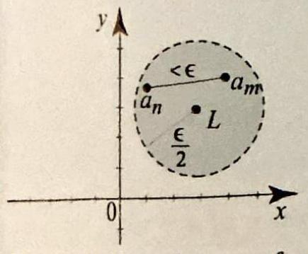
Figure 3 For the proof of Theorem 6, the inequality $a_{m}-a_{n} \mid<\epsilon$ if $\left|a_{m}-L\right|<\frac{\epsilon}{2}$ and $\left|a_{n}-L\right|<\frac{\epsilon}{2}$.

THEOREM 6 CAUCHY SEQUENCES
then $z^{n}=e^{i n \theta}$. We will prove that if this sequence converges, then $e^{i \theta}=1$. First note that if $\lim _{n \rightarrow \infty} e^{i n \theta}=L$, then $|L|=\left|\lim _{n \rightarrow \infty} e^{i n \theta}\right|=\lim _{n \rightarrow \infty}\left|e^{i n \theta}\right|=1$ and, in particular, $L \neq 0$. Also, if $z^{n} \rightarrow L$, then $z^{n+1} \rightarrow L$, as $n \rightarrow \infty$. So $e^{i(n+1) \theta} \rightarrow L$, as $n \rightarrow \infty$. Taking limits on both sides of the equality $e^{i(n+1) \theta}=e^{i \theta} e^{i n \theta}$, we obtain $L=e^{i \theta} L$. Dividing by $L \neq 0$, we get $e^{i \theta}=1$, as we claimed.

You can use Example 2 to show that for $\theta$ not an integer multiple of $\pi$, $\lim _{n \rightarrow \infty} \cos n \theta$ and $\lim _{n \rightarrow \infty} \sin n \theta$ do not exist (Exercise 8).

We now introduce a fundamental concept, which is crucial in establishing convergence when the limit is not given.
A sequence $\left\{a_{n}\right\}$ is said to be a Cauchy sequence if given any $\epsilon>0$ there is an integer $N$ such that

$$
\left|a_{n}-a_{m}\right|<\epsilon \quad \text { for all } m, n \geq N
$$

Thus the terms of a Cauchy sequence become arbitrarily close together.
It is not hard to see that a convergent sequence is a Cauchy sequence; because if the terms all get close to a limit, they must get close to each other. The converse (that a Cauchy sequence converges) is also true but not as obvious. To prove it, we will appeal to the well-known fact that a Cauchy sequences of real numbers must converge. This is a consequence of the completeness property of real numbers, which states that if $S$ is a nonempty subset of the real line with an upper bound $M(x \leq M$ for all $x$ in $S$ ), then $S$ has a least upper bound $b$. That is, $b$ is an upper bound for $S$ and if $M$ is any other upper bound for $S$, then $b \leq M$. The completeness property is an axiom in the construction of the real number system, and it is equivalent to the statement that all real Cauchy sequences are convergent. Using this property of real numbers, we can prove a corresponding one for complex numbers.

A sequence of complex numbers $\left\{a_{n}\right\}$ converges if and only if it is a Cauchy sequence.

Proof Suppose that $\left\{a_{n}\right\}$ converges to a limit $L$. Given $\epsilon>0$, let $N$ be such that $n \geq N \Rightarrow\left|a_{n}-L\right|<\frac{\epsilon}{2}$. For $m, n \geq N$, we have by the triangle inequality (Figure 3):

$$
\left|a_{m}-a_{n}\right|=\left|\left(a_{m}-L\right)+\left(L-a_{n}\right)\right| \leq\left|a_{m}-L\right|+\left|L-a_{n}\right|<\frac{\epsilon}{2}+\frac{\epsilon}{2}=\epsilon
$$

Hence $\left\{a_{n}\right\}$ is a Cauchy sequence. Conversely, suppose that $\left\{a_{n}\right\}$ is a Cauchy sequence, so for given $\epsilon>0$ we have $\left|a_{n}-a_{m}\right|<\epsilon$ for all $m, n \geq N$. Write $a_{n}=x_{n}+i y_{n}$. The inequalities $|\operatorname{Re} z| \leq|z|$ and $|\operatorname{Im} z| \leq|z|$ imply that $\left|x_{n}-x_{m}\right| \leq \left|a_{n}-a_{m}\right|<\epsilon$ and $\left|y_{n}-y_{m}\right| \leq\left|a_{n}-a_{m}\right|<\epsilon$, which in turn implies that $\left\{x_{n}\right\}$ and $\left\{y_{n}\right\}$ are Cauchy sequences of real numbers. By the completeness property of real numbers, $\left\{x_{n}\right\}$ and $\left\{y_{n}\right\}$ are convergent sequences. Hence $\left\{a_{n}\right\}$ is convergent by Theorem 5.

We are now ready to take up the study of series with complex terms.

## Complex Series

An infinite complex series is an expression of the form

$$
\sum_{n=1}^{\infty} a_{n},
$$

where $\left\{a_{n}\right\}$ is an infinite sequence of complex numbers. The indexing set may not always start at $n=1$; for example, we will often see expressions of the form $\sum_{n=0}^{\infty} a_{n}$. For simplicity we will sometimes write $\sum_{n} a_{n}$. The number $a_{n}$ is called the $n$th term of the series. To each series $\sum_{n=1}^{\infty} a_{n}$ we associate a sequence of partial sums $\left\{s_{n}\right\}$, where

$$
s_{n}=\sum_{j=1}^{n} a_{j}=a_{1}+a_{2}+\cdots+a_{n} .
$$

## DEFINITION 3 LIMIT OF A SERIES

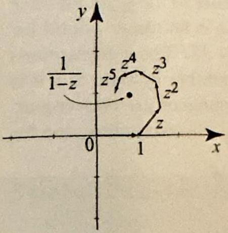
Figure 4 Terms in a convergent geometric series $(|z|<$ 1). To get a partial sum $s_{n}$, add the vectors $1, z, \ldots, z^{n}$ using the head-to-tail method.

We say that a series $\sum_{n=1}^{\infty} a_{n}$ converges or is convergent to a complex number $s$ and we write

$$
s=\sum_{n=1}^{\infty} a_{n}
$$

if the sequence of partial sums $\left\{s_{n}\right\}$ converges to $s: \lim _{n \rightarrow \infty} s_{n}=s$. Otherwise. we say that the series $\sum_{n=1}^{\infty} a_{n}$ diverges or is divergent.
So in order to establish the convergence or divergence of a series, we must study the behavior of the sequence of partial sums.

## EXAMPLE 3 Geometric series

Show that the geometric series $\sum_{n=0}^{\infty} z^{n}$ converges and

$$
\sum_{n=0}^{\infty} z^{n}=\frac{1}{1-z} \quad \text { if }|z|<1
$$

Show that the series diverges for all other values of $z$.
Solution Consider the partial sum (a typical case is shown in Figure 4):

$$
s_{n}=1+z+z^{2}+\cdots+z^{n} .
$$

If $z=1$ this partial sum is clearly equal to $n+1$ and hence the series diverges. For $z \neq 1$, we multiply and divide the right side of (6) by $1-z \neq 0$, simplify, and get

$$
s_{n}=\frac{\left(1+z+z^{2}+\cdots+z^{n}\right)(1-z)}{1-z}=\frac{1-z^{n+1}}{1-z} .
$$

From Example 2, the sequence $\left\{z^{n+1}\right\}$ converges to 0 if $|z|<1$ and diverges if $|z|>1$ or $|z|=1$ and $z \neq 1$. This implies that $\left\{s_{n}\right\}$ converges to $\frac{1}{1-z}$ if $|z|<1$ and diverges for all other values of $z$, which is what we wanted to show.

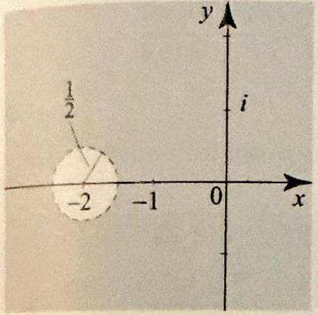
Figure 5 The shaded region describes all $z$ such that $\frac{1}{2}< [z+2$ ]. These are the points where the series in Example 4 converges.

Geometric series may appear in disguise. Basically, whenever you see a series of the form $\sum w^{n}$ you should be able to use the geometric series to sum it. However, you have to be careful with the region of convergence.

## EXAMPLE 4 Geometric series in disguise

Determine the largest region in which the series

$$
\sum_{n=0}^{\infty} \frac{1}{(4+2 z)^{n}}
$$

is convergent and find its sum.
Solution The series is a geometric series of the form $\sum w^{n}$ where $w=\frac{1}{4+2 z}$. It converges to $\frac{1}{1-w}$ if and only if $|w|<1$. Expressing these results in terms of $z$, we find that the series converges to

$$
\frac{1}{1-\frac{1}{4+2 z}}=\frac{4+2 z}{3+2 z}
$$

if and only if

$$
\frac{1}{4+2 z}|<1 \quad \Leftrightarrow \quad 1<|4+2 z| .
$$

To better understand the region of convergence, we write the inequality using expressions of the form $\left|z-z_{0}\right|$ and interpret the latter as a distance in the usual way. We have

$$
1<|4+2 z| \quad \Leftrightarrow \quad \frac{1}{2}<|2+z| \quad \Leftrightarrow \quad \frac{1}{2}<|z-(-2)| .
$$

This describes the set of all $z$ whose distance to -2 is strictly larger than $\frac{1}{2}$. Thus the series converges outside the closed disk shown in Figure 5, with center at -2 and radius $\frac{1}{2}$. $\square$

## Properties of Series and Tests of Convergence

For geometric series we are lucky in that we are able to find a closed expression for the partial sums. In most cases, this will not be possible. We will have to rely on properties of series to establish the convergence or divergence of a given series. Because a series is really a sequence of partial sums, all of the results about sequences can be restated for series. For convenience and for ease of reference, we will state some of these results along with several tests of convergence that are similar to ones for real series. The proofs will be omitted in most cases.

If $\sum_{n=1}^{\infty} a_{n}$ and $\sum_{n=1}^{\infty} b_{n}$ are convergent series and $\alpha$ and $\beta$ are complex numbers, then
(i) $\sum_{n=1}^{\infty}\left(\alpha a_{n}+\beta b_{n}\right)=\alpha \sum_{n=1}^{\infty} a_{n}+\beta \sum_{n=1}^{\infty} b_{n}$;
(ii) $\overline{\sum_{n=1}^{\infty} a_{n}}=\sum_{n=1}^{\infty} \overline{a_{n}}$;
(iii) $\operatorname{Re}\left(\sum_{n=1}^{\infty} a_{n}\right)=\sum_{n=1}^{\infty} \operatorname{Re}\left(a_{n}\right)$ and $\operatorname{Im}\left(\sum_{n=1}^{\infty} a_{n}\right)=\sum_{n=1}^{\infty} \operatorname{Im}\left(a_{n}\right)$.

THEOREM 7 LINEARITY, CONJUGATION, REAL AND
IMAGINARY PARTS

We can use complex series to sum real series, like we did with integrals in Example 3, Section 3.2.
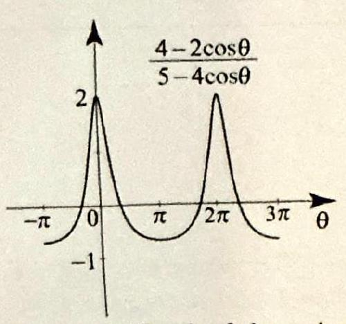

Figure 6 Graph of the series $\sum_{n=0}^{\infty} \frac{\cos n \theta}{2^{n}}$, which converges for all $\theta$ and equals the function $\frac{4-2 \cos \theta}{5-4 \cos \theta}$. (This is a $2 \pi$ periodic function.)

THEOREM 8 THE $n$th TERM TEST FOR DIVERGENCE

EXAMPLE 5 Summing real series using complex series Show that the series $\sum_{n=0}^{\infty} \frac{\cos n \theta}{2^{n}}$ is convergent for all $\theta$ and find its sum.
Solution We immediately recognize $\cos n \theta$ as the real part of $e^{i n \theta}=\left(e^{i \theta}\right)^{n}$, and so the given series is the real part of the geometric series $\sum_{n=0}^{\infty} z^{n}$, where $z=\frac{e^{i f}}{2}$. From Example 3, since $\left|\frac{e^{i \theta}}{2}\right|=\frac{1}{2}<1$, we have
$\sum_{n=0}^{\infty}\left(\frac{e^{i \theta}}{2}\right)^{n}=\frac{1}{1-\frac{e^{i \theta}}{2}}=\frac{2}{2-e^{i \theta}}=\frac{2\left(2-e^{-i \theta}\right)}{\left(2-e^{i \theta}\right)\left(2-e^{-i \theta}\right)}=\frac{4-2 \cos \theta+2 i \sin \theta}{5-4 \cos \theta}$.
Taking real parts and using Theorem 7(iii), we obtain

$$
\sum_{n=0}^{\infty} \frac{\cos n \theta}{2^{n}}=\operatorname{Re}\left(\frac{4-2 \cos \theta+2 i \sin \theta}{5-4 \cos \theta}\right)=\frac{4-2 \cos \theta}{5-4 \cos \theta}
$$

The series is plotted in Figure 6 as a function of $\theta$.
The following test of divergence is often useful. Its proof for real series works also with complex series.
If $\sum_{n=1}^{\infty} a_{n}$ is convergent, then $\lim _{n \rightarrow \infty} a_{n}=0$. Equivalently, if either $\lim _{n \rightarrow \infty} a_{n} \neq 0$ or $\lim _{n \rightarrow \infty} a_{n}$ does not exist, then $\sum_{n=1}^{\infty} a_{n}$ diverges.

Proof Let $s_{n}=\sum_{m=1}^{n} a_{m}$. If $s_{n} \rightarrow s$, then also $s_{n-1} \rightarrow s$, and so $s_{n}-s_{n-1} \rightarrow s-s=0$. But $s_{n}-s_{n-1}=a_{n}$, and so $a_{n} \rightarrow 0$.

Applying the $n$th term test, we see right away that the geometric series $\sum_{n=0}^{\infty} z^{n}$ is divergent if $|z|=1$ or $|z|>1$.

For $m \geq 1$, the expression $t_{m}=\sum_{n=m+1}^{\infty} a_{n}$ is called a tail of the series $\sum_{n=1}^{\infty} a_{n}$. For fixed $m$, the tail $t_{m}$ is itself a series, which differs from the original series by finitely many terms. So it is obvious that a series converges if and only if all its tails converge. As $m \rightarrow \infty$, we are dropping more and more terms from the tail series; as a result, we have the following useful fact.

If $\sum_{n=1}^{\infty} a_{n}$ is convergent, then $\lim _{m \rightarrow \infty} \sum_{n=m+1}^{\infty} a_{n}=0$. Hence if a series converges,
its tail must go to 0 .
Proof Let $s=\sum_{n=1}^{\infty} a_{n}, t_{m}=\sum_{n=m+1}^{\infty} a_{n}$, and $s_{m}=\sum_{n=1}^{m} a_{n}$. Since $s_{m}$ is a partial sum of $\sum_{n=1}^{\infty} a_{n}$, we have $s_{m} \rightarrow s$ as $m \rightarrow \infty$. For each $m$, we have

$$
s_{m}+t_{n}=\sum_{n=1}^{\infty} a_{n}=s \Rightarrow t_{m}=s_{m}-s
$$

Let $m \rightarrow \infty$ and use $s_{m}-s \rightarrow 0$ to get that $t_{m} \rightarrow 0$, as desired.

THEOREM 9 ABSOLUTE CONVERGENCE IMPLIES CONVERGENCE

A complex series $\sum_{n=1}^{\infty} a_{n}$ is said to be absolutely convergent if the series $\sum_{n=1}^{\infty}\left|a_{n}\right|$ is convergent.

Recall that, for series with real terms, absolute convergence implies convergence. The same is true for complex series.

If $\sum_{n=1}^{\infty} a_{n}$ is absolutely convergent, then it is convergent. In symbols,

$$
\sum_{n=1}^{\infty}\left|a_{n}\right|<\infty \Rightarrow \sum_{n=1}^{\infty} a_{n} \text { converges. }
$$

Proof Let $s_{n}$ denote the $n$th partial sum of the series $\sum_{j=1}^{\infty} a_{j}$ and $v_{n}$ denote the $n$th partial sum of the convergent series $\sum_{j=1}^{\infty}\left|a_{j}\right|$. By Theorem 6, it is enough to show that the sequence of partial sums, $\left\{s_{n}\right\}$, is a Cauchy sequence. For $n>m \geq 1$, using the triangle inequality, we have

$$
\left|s_{n}-s_{m}\right|=\left|\sum_{j=m+1}^{n} a_{j}\right| \leq \sum_{j=m+1}^{n}\left|a_{j}\right|=\left|v_{n}-v_{m}\right| .
$$

Since $\sum_{n=1}^{\infty}\left|a_{n}\right|$ converges, the sequence $\left\{v_{n}\right\}$ is convergent and hence it is a Cauchy sequence. Consequently, given $\epsilon>0$ we can find $N$ so that, $\left|v_{n}-v_{m}\right|<\epsilon$ for $m, n \geq N$, implying that $\left|s_{n}-s_{m}\right|<\epsilon$ for $m, n \geq N$. Hence $\left\{s_{n}\right\}$ is a Cauchy sequence.

A complex series $\sum_{n=1}^{\infty} a_{n}$ that is convergent but not absolutely convergent is called conditionally convergent.

Given a complex series $\sum_{n=1}^{\infty} a_{n}$, consider the series $\sum_{n=1}^{\infty}\left|a_{n}\right|$ whose terms are real and nonnegative. If we can establish the convergence of the series $\sum_{n=1}^{\infty}\left|a_{n}\right|$ using any one of the tests of convergence for series with nonnegative terms, then using Theorem 9 , we can infer that the series $\sum_{n=1}^{\infty} a_{n}$ is convergent. Thus, all the tests of convergence for series with nonnegative terms can be used to test the (absolute) convergence of complex series. A list of such tests follows. We prove the first one just to illustrate the ideas involved.

THEOREM 10 COMPARISON TEST

Suppose that $a_{n}$ are complex numbers, $b_{n}$ are real numbers, $\left|a_{n}\right| \leq b_{n}$ for all $n \geq n_{0}$, and $\sum_{n=1}^{\infty} b_{n}$ is convergent. Then $\sum_{n=1}^{\infty} a_{n}$ is absolutely convergent.

Proof By the comparison test for real series, we have that $\sum_{n=1}^{\infty}\left|a_{n}\right|$ is convergent. By Theorem 9, it follows that $\sum_{n=1}^{1} a_{n}$ is convergent.

Here is a simple application of the comparison test, which illustrates the passage from complex to real series in establishing the convergence of a given complex series.

## EXAMPLE 6 Comparison test

The series $\sum_{n=0}^{\infty} \frac{2 e^{i n \theta}}{n^{2}+3}$ is convergent by comparison to the convergent series $\sum_{n=1}^{\infty} \frac{2}{n^{2}}$, because

$$
\left|\frac{2 e^{i n \theta}}{n^{2}+3}\right| \leq \frac{2\left|e^{i n \theta}\right|}{n^{2}}=\frac{2}{n^{2}}
$$

## THEOREM 11

RATIO TEST

## Suppose that

$$
\rho=\lim _{n \rightarrow \infty}\left|\frac{a_{n+1}}{a_{n}}\right|
$$

exists or is infinite. Then the complex series $\sum_{n=1}^{\infty} a_{n}$ of nonzero terms converges absolutely if $\rho<1$ and diverges if $\rho>1$. If $\rho=1$ the test is inconclusive.

EXAMPLE 7 Ratio test and the exponential series
We used the series $\sum_{n=0}^{\infty} \frac{z^{n}}{n!}$ to define the complex exponential function in Section 1.5. We can now show that this series converges absolutely for all $z$. The series is obviously convergent if $z=0$. For $z \neq 0$,

$$
\rho=\lim _{n \rightarrow \infty}\left|\frac{a_{n+1}}{a_{n}}\right|=\lim _{n \rightarrow \infty}\left|\frac{z^{n+1} n!}{z^{n}(n+1)!}\right|=\lim _{n \rightarrow \infty} \frac{|z|}{n}=0 .
$$

Since $\rho<1$, the series is absolutely convergent by the ratio test. $\square$

THEOREM 12 ROOT TEST

Suppose that
(8)

$$
\rho=\lim _{n \rightarrow \infty}\left|a_{n}\right|^{1 / n}
$$

either exists or is infinite. Then the complex series $\sum_{n=1}^{\infty} a_{n}$ converges absolutely if $\rho<1$ and diverges if $\rho>1$. If $\rho=1$ the test is inconclusive.

In general, the ratio test is easier to apply than the root test. But there are situations that call naturally for the root test. Here is an example.

## EXAMPLE 8 Root test

Test the series $\sum_{n=0}^{\infty} \frac{z^{n}}{(n+1)^{n}}$ for convergence.
Solution The presence of the exponent $n$ in the terms suggests using the root test. We have

$$
\rho=\lim _{n \rightarrow \infty}\left|\frac{z^{n}}{(n+1)^{n}}\right|^{\frac{1}{n}}=\lim _{n \rightarrow \infty} \frac{|z|}{n+1}=0
$$

Since $\rho<1$, the series is absolutely convergent for all $z$.

THEOREM 13 BOUNDED PARTIAL SUMS

THEOREM 14 REARRANGEMENTS

Another well-known consequence of the completeness property of real numbers is that every bounded monotonic sequence (increasing or decreasing) converges. Since the partial sums of a series with nonnegative terms are increasing, we conclude that if these partial sums are bounded, then the series is convergent. This leads to the following result, which is not particularly useful as a test of convergence but will be required in later proofs.

Suppose that there is a positive number $M>0$ such that $\sum_{n=1}^{N}\left|a_{n}\right| \leq M$ for all $N$. Then the series $\sum_{n=1}^{\infty} a_{n}$ is absolutely convergent.

The two final results of this section are special types of convergence theorems dealing with rearrangements and products of series.

A rearrangement of a given complex series $\sum_{n=1}^{\infty} a_{n}$ is a series of the form $\sum_{n=1}^{\infty} a_{\phi(n)}$, where $\phi$ is a one-to-one mapping of the indexing set $\{1,2,3, \ldots\}$ onto itself. For example, a rearrangement of $a_{1}+a_{2}+a_{3}+\cdots$ could be something like $a_{4}+a_{1}+a_{6}+\cdots$, where each $a_{n}$ must appear exactly once in the expression.

If $\sum_{n=1}^{\infty} a_{n}$ is absolutely convergent, then every rearrangement is absolutely convergent and converges to the same limit.

Proof For $m \geq 1$, we have $\sum_{n=1}^{m}\left|a_{\phi(n)}\right| \leq \sum_{n=1}^{\infty}\left|a_{n}\right|<\infty$. Hence the partial sums of the series $\sum_{n=0}^{m}\left|a_{\phi(n)}\right|$ are bounded and so they converge by Theorem 13. Thus any rearrangement converges absolutely. We next show that the rearranged series will still converge to $s=\sum_{n=1}^{\infty} a_{n}$. Let $\sigma(m)=\max _{n \leq m} \phi(n)$. Consider the expressions $\sum_{n=1}^{m} a_{\phi(n)}$ and $\sum_{n=1}^{\sigma(m)} a_{n}$. The first is a sum of the first $m$ terms of the rearranged series; the second is a sum of the first $\sigma(m)$ terms in the original series, which will include each term from the first expression. The difference between the expressions is a finite sum of terms that come in the rearranged series after the term $a_{\phi(m)}$. Thus we can derive

$$
\left|\sum_{n=1}^{m} a_{\phi(n)}-\sum_{n=1}^{\sigma(m)} a_{n}\right| \leq \sum_{n=m+1}^{\infty}\left|a_{\phi(n)}\right|<\infty .
$$

Letting $m \rightarrow \infty$, and using $\sum_{n=m+1}^{\infty}\left|a_{\phi(n)}\right| \rightarrow 0$ (this is the tail of a convergent series) and $\sum_{n=1}^{\sigma(m)} a_{n} \rightarrow s$ (because $\sigma(m) \rightarrow \infty$ as $m \rightarrow \infty$ ), we see that $\left|\sum_{n=1}^{\infty} a_{\phi(n)}-s\right|=0$, which implies that $\sum_{n=1}^{\infty} a_{\phi(n)}=s$.

Our final result concerns products of series. Let us first define how to formally multiply two series and get one product series. It will be convenient to index the terms of a series starting at 0 . Given two series $\sum_{n=0}^{\infty} a_{n}$ and $\sum_{n=0}^{\infty} b_{n}$, we form a third series $\sum_{n=0}^{\infty} c_{n}$ according to the formula

$$
c_{n}=a_{0} b_{n}+a_{1} b_{n-1}+\cdots+a_{n-1} b_{1}+a_{n} b_{0}=\sum_{j=0}^{n} a_{j} b_{n-j} .
$$

The series $\sum_{n=0}^{\infty} c_{n}$ is called the Cauchy product of $\sum_{n=0}^{\infty} a_{n}$ and $\sum_{n=0}^{\infty} b_{n}$. To better understand this definition, imagine if you were able to cross multiply all the terms of the series $\sum a_{n}$ by those of $\sum b_{n}$. You will get terms of the form $a_{j} b_{k}$, where $j$ and $k$ range over $0,1,2, \ldots$. We can list the terms $a_{j} b_{k}$ in an array as shown in Figure 7.

Figure 7 The $n$th term of a Cauchy product:
$c_{n}=a_{0} b_{n}+a_{1} b_{n-1}+\cdots+ a_{n-1} b_{1}+a_{n} b_{0}=\sum_{j=0}^{n} a_{j} b_{n-j}$. By summing all the $c_{n}$ 's, you will pick up all the terms of form $a_{j} b_{k}$, but in a very special order: $a_{0} b_{0}+a_{1} b_{0}+a_{1} b_{1}+$ ... .

## THEOREM 15 CAUCHY PRODUCTS

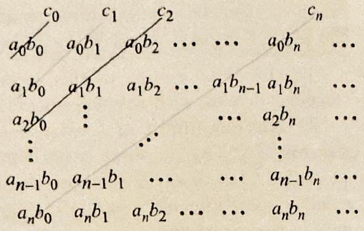

The term $c_{n}$ in the Cauchy product is gotten by summing along the diagonal $j+k=n$ as shown in Figure 7. If you sum all the diagonals, as prescribed by the Cauchy product, you will eventually collect all the terms $a_{j} b_{k}$. Does the Cauchy product series converge to the ordinary product of the two series (where we just multiply two complex numbers)? If the two series are absolutely convergent, the answer is yes.
Suppose that $\sum_{n=0}^{\infty} a_{n}$ and $\sum_{n=0}^{\infty} b_{n}$ are absolutely convergent. Then their Cauchy product $\sum_{n=0}^{\infty} c_{n}$, where $c_{n}$ is as in (9), is absolutely convergent and we have
(10)

$$
\sum_{n=0}^{\infty} c_{n}=\left(\sum_{n=0}^{\infty} a_{n}\right)\left(\sum_{n=0}^{\infty} b_{n}\right) .
$$

Proof First we will show that the Cauchy product is absolutely convergent, then we will show that it converges to the right limit. For the first part, observe that

$$
\sum_{k=0}^{n}\left|c_{k}\right| \leq\left(\sum_{k=0}^{n}\left|a_{k}\right|\right)\left(\sum_{k=0}^{n}\left|b_{k}\right|\right) \leq\left(\sum_{k=0}^{\infty}\left|a_{k}\right|\right)\left(\sum_{k=0}^{\infty}\left|b_{k}\right|\right)<\infty .
$$

The first inequality follows because all the terms on the left are on or above the diagonal in a $(n+1) \times(n+1)$-array of nonnegative numbers, while the terms on the right are all the terms in the $(n+1) \times(n+1)$-array (see Figure 7). The second inequality follows since for any series with nonnegative terms, a partial sum is smaller than the sum of all terms. Hence the partial sums $\sum_{n=0}^{\infty}\left|c_{n}\right|$ are bounded, and so the series converges by Theorem 13. We next show that $s_{n}=\sum_{k=0}^{n} c_{n}$ converges to $\left(\sum_{n=0}^{\infty} a_{n}\right)\left(\sum_{n=0}^{\infty} b_{n}\right)$. Because we have already established that $s_{n}$ converges, it will be enough to prove that a subsequence, $\left\{s_{2 n}\right\}$, converges to this
limit. We have

$$
\left|\sum_{k=0}^{2 n} c_{k}-\left(\sum_{k=0}^{n} a_{k}\right)\left(\sum_{k=0}^{n} b_{k}\right)\right| \leq \sum_{k=0}^{\infty}\left|a_{k}\right| \sum_{k=n+1}^{\infty}\left|b_{k}\right|+\sum_{k=0}^{\infty}\left|b_{k}\right| \sum_{k=n+1}^{\infty}\left|a_{k}\right| .
$$

(To see this, draw a figure like Figure 7 that includes the terms up to $2 n$.) Letting $n \rightarrow \infty$ and using the fact that the tails of the absolutely convergent series, $\sum_{k=n+1}^{\infty}\left|b_{k}\right|$ and $\sum_{k=n+1}^{\infty}\left|a_{k}\right|$ tend to zero (Proposition 1), we see that the right side tends to 0 as $n \rightarrow \infty$, implying (10).

## EXAMPLE 9 Exponent rule

Show that $e^{z_{1}} e^{z_{2}}=e^{z_{1}+z_{2}}$.
Solution We have $e^{z_{1}}=\sum_{n=0}^{\infty} \frac{z_{1}^{n}}{n!}$ and $e^{z_{2}}=\sum_{n=0}^{\infty} \frac{z_{2}^{n}}{n!}$, where both series converge absolutely by Example 7. By Theorem 15, we can form the Cauchy product of the two series and get $e^{z_{1}} e^{z_{2}}=\sum_{n=0}^{\infty} c_{n}$, where according to (9)

$$
c_{n}=\sum_{j=0}^{n} \frac{z_{1}^{j}}{j!} \frac{z_{2}^{n-j}}{(n-j)!}=\frac{1}{n!} \overbrace{\sum_{j=0}^{n} \frac{n!}{j!(n-j)!} z_{1}^{j} z_{2}^{n-j}}^{\left(z_{1}+z_{2}\right)^{n}}=\frac{\left(z_{1}+z_{2}\right)^{n}}{n!}
$$

We have multiplied and divided $c_{n}$ by $n!$ to display the binomial expansion of $\left(z_{1}+z_{2}\right)^{n}$ (see the binomial formula, Exercise 55, Section 1.3). Thus $e^{z_{1}} e^{z_{2}}= \sum_{n=0}^{\infty} \frac{\left(z_{1}+z_{2}\right)^{n}}{n!}=e^{z_{1}+z_{2}}$.

In the exercises you will be asked to derive various properties of the exponential and trigonometric functions by using Theorem 15 as we did in Example 9.

## Exercises 4.1

In Exercises 1-6, determine whether or not the sequence $\left\{a_{n}\right\}$ converges, and find its limit if it does converge.

1. $a_{n}=\frac{e^{i n \frac{\pi}{2}}}{n}$.
2. $a_{n}=\frac{e^{i n \frac{\pi}{2}}+i n}{n}$.
3. $a_{n}=\frac{1}{n+i}$.
4. $a_{n}=\frac{\log \left(\frac{3}{n}+i n\right)}{n+i}$.
5. $a_{n}=\frac{\cosh (i n)}{n^{2}}$.
6. $a_{n}=\frac{(1+2 i) n^{2}+2 n-1}{3 i n^{2}+i}$.
7. Prove that if $\left\{a_{n}\right\}$ converges to $A$ and to $B$, then $A=B$.
8. Using the result of Example 2 show that, for $\theta$ not an integer multiple of $\pi, \lim _{n \rightarrow \infty} \cos n \theta$ and $\lim _{n \rightarrow \infty} \sin n \theta$ do not exist. [Hint: Use the addition formula for the cosine to show that, for $\theta \neq k \pi, \lim _{n \rightarrow \infty} \cos n \theta$ exists if and only if $\lim _{n \rightarrow \infty} \sin n \theta$ exists. Then use Theorem 5.] What happens when $\theta$ is an even multiple of $\pi$ or an odd multiple of $\pi$ ?
9. (a) Show that $\lim _{n \rightarrow \infty} a_{n}=\lim _{n \rightarrow \infty} a_{n+1}$ for any convergent sequence $\left\{a_{n}\right\}$.
(b) Define $a_{1}=i$ and $a_{n+1}=\frac{3}{2+a_{n}}$. Suppose that $\left\{a_{n}\right\}$ is convergent and find its limit.
10. (a) Let $a_{n}=n^{\frac{1}{n}}-1$. Use the binomial expansion to show that for $n>1$

$$
0<\frac{n(n-1)}{2} a_{n}^{2}<\left(1+a_{n}\right)^{n}=n .
$$

(b) Conclude that $\lim _{n \rightarrow \infty} a_{n}=0$.
(c) Derive the useful limit: $\lim _{n \rightarrow \infty} n^{\frac{1}{n}}=1$.

In Exercises 11-20, determine whether the series is convergent or divergent, and find its sum if it is convergent.
11. $\sum_{n=0}^{\infty} \frac{e^{i n \frac{\pi}{2}}}{3^{n}}$.
12. $\sum_{n=0}^{\infty}\left(\frac{1+i}{2}\right)^{n}$.
13. $\sum_{n=3}^{\infty} \frac{3-i}{(1+i)^{n}}$.
14. $\sum_{n=0}^{\infty} \frac{\cos n \theta}{3^{n}}$.
15. $\sum_{n=0}^{\infty} \frac{3+\sin n \theta}{10^{n}}$.
16. $\sum_{n=0}^{\infty} \frac{\cos n \theta+(2 i)^{n}}{3^{n}}$.
17. $\sum_{n=2}^{\infty} \frac{1}{(n+i)((n-1)+i)}$.
18. $\sum_{n=0}^{\infty} \frac{n^{2}}{(n+i)(n+200+2 i)}$.
19. $\sum_{n=2}^{\infty} \frac{\sin (i n)}{n^{2}}$.
20. $\sum_{n=2}^{\infty} \frac{\sin (i n)}{e^{n}}$.

In Exercises 21-32, determine whether the series is convergent or divergent.
21. $\sum_{n=0}^{\infty}\left(\frac{1+3 i}{4}\right)^{n}$.
22. $\sum_{n=1}^{\infty}(-1)^{n} \frac{2^{n}+4^{n}}{(1+3 i)^{n}}$.
23. $\sum_{n=0}^{\infty} \frac{3 i^{n}}{4+i n^{2}}$.
24. $\sum_{n=0}^{\infty}\left(\frac{3+10 i}{4+5 i n}\right)^{n}$.
25. $\sum_{n=1}^{\infty} \frac{(1+2 i n)^{n}}{n^{n}}$.
26. $\sum_{n=1}^{\infty} \frac{\tan (i n)}{n^{2}}$.
27. $\sum_{n=1}^{\infty} \frac{\cos (i n)+i \sin (i n)}{e^{n^{3}}}$.
28. $\sum_{n=1}^{\infty} \frac{\log (n+i n)}{n^{2}}$.
29. $\sum_{n=1}^{\infty} \frac{\cos (i n)}{e^{n^{3}}}$.
30. $\sum_{n=1}^{\infty} \frac{(3+10 i) n^{n}}{n!}$.
31. $\sum_{n=0}^{\infty} \frac{(2+3 i)^{n}}{n!}$.
32. $\sum_{n=1}^{\infty} \frac{1}{3+i^{n}}$.

In Exercises 33-40, use the geometric series to determine the largest region in which the given series converges and find its limit.
33. $\sum_{n=0}^{\infty} \frac{z^{n}}{2^{n}}$.
34. $\sum_{n=1}^{\infty}(1+z)^{n}$.
35. $\sum_{n=0}^{\infty}\left(\frac{(3+i) z}{4-i}\right)^{n}$.
36. $\sum_{n=0}^{\infty} \frac{(2+i)^{n}}{z^{n}}$.
37. $\sum_{n=1}^{\infty} \frac{1}{(2-10 z)^{n}}$.
38. $\sum_{n=0}^{\infty} \frac{2^{n+1}}{(2+i-z)^{n}}$.
39. $\sum_{n=0}^{\infty}\left\{\left(\frac{2}{z}\right)^{n}+\left(\frac{z}{3}\right)^{n}\right\}$.
40. $\sum_{n=0}^{\infty}\left\{\frac{1}{(1-z)^{n}}-z^{n}\right\}$.
41. The $n$th partial sum of a series is $s_{n}=\frac{i}{n}$. Does the series converge or diverge? If it does converge, what is its limit?
42. Show that if $\sum a_{n}$ is absolutely convergent, then $\left|\sum a_{n}\right| \leq \sum\left|a_{n}\right|$.

In Exercises 43-46, you are asked to prove a result concerning complex series. As in the proof of Theorem 1, find the corresponding result for real series in your calculus text, then use it along with Theorem 9 to prove the desired result.
43. Prove Theorem 3.
44. Prove Theorem 11.
45. Prove Theorem 12.
46. Prove Theorem 13.
47. The terms of a series are defined recursively by

$$
a_{1}=2+i, \quad a_{n+1}=\frac{(7+3 i) n}{1+2 i n^{2}} a_{n}
$$

Does the series $\sum a_{n}$ converge or diverge?
48. The terms of a series are defined recursively by

$$
a_{1}=i, \quad a_{n+1}=\frac{e^{\frac{i}{n}}}{\sqrt{n}} a_{n}
$$

Does the series $\sum a_{n}$ converge or diverge?
In Exercises 49-52, use Theorem 15 as we did in Example 9 to derive the given identity.
49. $\cos \left(z_{1}+z_{2}\right)=\cos z_{1} \cos z_{2}-\sin z_{1} \sin z_{2}$.
50. $\sin \left(z_{1}+z_{2}\right)=\sin z_{1} \cos z_{2}+\cos z_{1} \sin z_{2}$.
51. $e^{z} e^{-z}=1$.
52. $\sinh (2 z)=2 \sinh z \cosh z$.

### 4.2 Sequences and Series of Functions

In the previous section we considered sequences and series of complex numbers. Now we turn our attention to sequences and series of functions.

Suppose that $f_{n}$ and $f$ are complex-valued functions defined on a subset $E \subset \mathbb{C}$. We say that $f_{n}$ converges pointwise to $f$ on $E$, if $\lim _{n \rightarrow \infty} f_{n}(z)= f(z)$ for every $z$ in $E$. Hence $f_{n}$ converges pointwise to $f$ on $E$ if, given $z$ in $E$, and given $\epsilon>0$, we can find $N>0$ such that for all $n \geq N$, we have $\left|f(z)-f_{n}(z)\right|<\epsilon$. The integer $N$ depends in general on $z$ and $\epsilon$.

Suppose $u_{n}(z)$ are defined on a set $E \subset \mathbb{C}$. The series of functions $\sum_{n=1}^{\infty} u_{n}(z)$ is said to converge pointwise if the sequence of partial sums $s_{n}(z)=\sum_{k=1}^{n} u_{k}(z)$ converges pointwise on $E$.

Pointwise convergence of sequences of functions is a seemingly natural mode of convergence, since by evaluating the functions we reduce to a sequence of numbers. The problem with pointwise convergence is that it does not preserve some desirable properties of the functions $f_{n}$. For example, the pointwise limit of continuous functions may not be continuous; the pointwise limit of integrable functions may not be integrable; and the pointwise limit of analytic functions may not be analytic. So we need a stronger mode of convergence.

## DEFINITION 1 UNIFORM CONVERGENCE

We say that $f_{n}$ converges uniformly to $f$ on $E$, and we write $\lim _{n \rightarrow \infty} f_{n}= f$ uniformly on $E$, if given $\epsilon>0$, we can find $N>0$ such that for all $n \geq N$ and all $z$ in $E$, we have $\left|f(z)-f_{n}(z)\right|<\epsilon$.

A series of functions $\sum_{n=1}^{\infty} u_{n}(z)$ is said to converge uniformly on $E$ if the sequence of partial sums $s_{n}(z)=\sum_{k=1}^{n} u_{k}(z)$ converges uniformly on

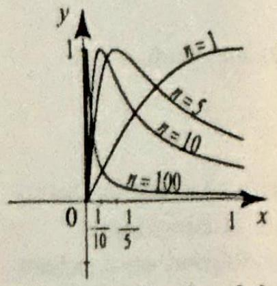
Figure 1 Graphs of $f_{n}(x)$ for $n=1,5,10,100 . f_{n}(x)$ has a maximum at $x=\frac{1}{n}$ in the interval $[0,1]$, and $f_{n}\left(\frac{1}{n}\right)=1$.

$E$. The key words in Definition 1 are "for all $z$ in $E$." These require that $f_{n}(z)$ be close to $f(z)$ for all $z$ in $E$ simultancously. Equivalently, let $M_{n}=\max \left|f_{n}(z)-f(z)\right|$, where the maximum is taken over all $z$ in $E$. If no maximum is attained, we set $M_{n}$ to be the least upper bound of $\left|f_{n}(z)-f(z)\right|$ for $z$ in $E$. Then

$$
f_{n} \rightarrow f \text { uniformly on } E \Longleftrightarrow M_{n} \rightarrow 0, \text { as } n \rightarrow \infty .
$$

Unlike pointwise convergence, uniform convergence preserves continuity and integrability of functions. More importantly, it preserves analyticity and that's the central result of this section (Theorem 5).

As a first example, it would be instructive to consider real-valued functions on intervals of the real line.

## EXAMPLE 1 Pointwise versus uniform convergence

For $0 \leq x \leq 1$ and $n=1,2, \ldots$, define

$$
f_{n}(x)=\frac{2 n x}{1+n^{2} x^{2}}
$$

(a) Does the sequence converge pointwise on $[0,1]$ ?
(b) Does it converge uniformly on $[0,1]$ ?
(c) Does it converge uniformly on $[0.1,1]$ ?

Solution (a) We have $f_{n}(0)=0$ for all $n$, and so $f_{n}(x) \rightarrow 0$ if $x=0$. For any $x \neq 0$, we have

$$
\lim _{n \rightarrow \infty} f_{n}(x)=\lim _{n \rightarrow \infty} \frac{2 n x}{1+n^{2} x^{2}}=\lim _{n \rightarrow \infty} \frac{1}{n} \frac{2 x}{x^{2}+\frac{1}{n^{2}}}=0
$$

So for all $x$ in $[0,1]$, the sequence $\left\{f_{n}(x)\right\}$ converges pointwise to $f(x)=0$.
(b) Figure 1 suggests that the sequence does not converge to 0 uniformly on $[0,1]$. To confirm this, let us see how large $\left|f_{n}(x)\right|$ can get on the interval $[0,1]$. For this purpose, we compute the derivative

$$
f_{n}^{\prime}(x)=\frac{2 n\left(1-n^{2} x^{2}\right)}{\left(1+n^{2} x^{2}\right)^{2}}
$$

Thus, for $0<x \leq 1$,

$$
f_{n}^{\prime}(x)=0 \quad \Leftrightarrow \quad-n^{2} x^{2}+1=0 \quad \Leftrightarrow \quad x=\frac{1}{n}
$$

Plugging this value into $f_{n}(x)$ and simplifying, we find $f_{n}\left(\frac{1}{n}\right)=1$. Thus, no matter how large $n$ is, we can always find $x$ in $[0,1]$, namely $x=\frac{1}{n}$, with $f_{n}(x)=1$. This shows that $M_{n}=\max _{x \in(0,1]}\left|f_{n}(x)\right| \geq 1$ (in fact, $M_{n}=1$ ), and so $f_{n}$ does not converge to 0 uniformly over $[0,1]$, by (1). To see what is going on, note that $f_{n}(x)=f_{1}(n x)$. That is, $f_{n}(x)$ is merely a horizontally shrunken version of the curve $f_{1}(x)$ and has maximum value of 1 . This maximum value moves left as $n$ increases, but it never leaves the interval $[0,1]$.
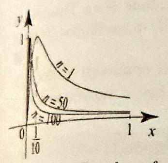

Figure 2 Graphs of $f_{n}(x)$ for $n=1,50,100$. Note how $f_{n}(x)$ attains its maximum value in $[0.1,1]$ at $x=$ 0.1.

THEOREM 1 CONTINUITY AND UNIFORM CONVERGENCE
(c) The situation now is much different than in (b). For $n>10$, we have $\frac{1}{n}<0.1$, and so the maximum value of $f_{n}(x)$, which we found to be 1 in (b), is not attained in the interval $[0.1,1]$; it is attained at $\frac{1}{n}$ outside this interval. So how large is $f_{n}(x)$ for $x$ in $[0.1,1]$ ? Since $f_{n}^{\prime}(x) \leq 0$ on $\left[\frac{1}{n}, 1\right], f_{n}(x)$ is decreasing on $\left[\frac{1}{n}, 1\right]$ and so the maximum of $f_{n}(x)$ for $x$ in the interval $[0.1,1]$ occurs at the left endpoint, $x=\frac{1}{10}$ (Figure 2). We have $M_{n}=f_{n}\left(\frac{1}{10}\right)$ and we know that $f_{n}\left(\frac{1}{10}\right) \rightarrow 0$ as $n \rightarrow \infty$ from part (a). Thus $M_{n} \rightarrow 0$, implying that $f_{n} \rightarrow 0$ uniformly on [ $0.1,1$ ].

There is an important point to be made about part (c) of Example 1. Clearly we could have replaced the left endpoint $x=0.1$ by any number $0<a<1$ and still had uniform convergence on $[a, 1]$. So while the sequence failed to converge uniformly on $[0,1]$ it does converge uniformly on any proper closed subinterval $[a, 1]$ where $0<a<1$. This is a common phenomenon that you will encounter with many sequences or series. They may fail to converge on the whole region of definition, but they will converge uniformly on any closed (and bounded) proper subregion.

We now look at continuity and integrability in the context of uniform limits of functions. This first part of our study does not require analyticity.
(i) Suppose that $f_{n} \rightarrow f$ uniformly on $E$ and $f_{n}$ is continuous on $E$ for every $n$. Then $f$ is continuous on $E$.
(ii) Suppose $u(z)=\sum_{n=1}^{\infty} u_{n}(z)$ converges uniformly on $E$ and $u_{n}$ is continuous on $E$ for every $n$. Then $u$ is continuous on $E$.

Proof (i) Fix $z_{0}$ in $E$. Given $\epsilon>0$, by uniform convergence we can find $f_{N}$ such that $\left|f_{N}(z)-f(z)\right|<\frac{\epsilon}{3}$ for all $z$ in $E$. Since $f_{N}$ is continuous at $z_{0}$ there is a $\delta>0$ such that $\left|f_{N}\left(z_{0}\right)-f_{N}(z)\right|<\frac{\epsilon}{3}$ for all $z \in E$ with $\left|z-z_{0}\right|<\delta$. Putting these two inequalities together and using the triangle inequality, we find that for $\left|z-z_{0}\right|<\delta$ we have

$$
\begin{aligned}
\left|f\left(z_{0}\right)-f(z)\right| & \leq\left|f\left(z_{0}\right)-f_{N}\left(z_{0}\right)\right|+\left|f_{N}\left(z_{0}\right)-f_{N}(z)\right|+\left|f_{N}(z)-f(z)\right| \\
& <\frac{\epsilon}{3}+\frac{\epsilon}{3}+\frac{\epsilon}{3}=\epsilon
\end{aligned}
$$

which establishes the continuity of $f$ at $z_{0}$. Part (ii) follows from (i) by taking $f_{n}(z)=\sum_{k=1}^{n} u_{k}(z)$ and noting that each $f_{n}$ is continuous, being a finite sum of continuous functions.

Sometimes we can use Theorem 1 to prove the failure of uniform convergence.

## EXAMPLE 2 Failure of uniform convergence

A sequence of functions is defined on the closed unit disk by

$$
f_{n}(z)= \begin{cases}n|z| & \text { if }|z| \leq \frac{1}{n} \\ 1 & \text { if } \frac{1}{n} \leq|z| \leq 1\end{cases}
$$

Does the sequence converge uniformly on $|z| \leq 1$ ?

Solution The function $f_{n}(z)$ with $n=5$ is depicted in Figure 3. It is clear that each $f_{n}(z)$ is continuous on $|z| \leq 1$ and

$$
\lim _{n \rightarrow \infty} f_{n}(z)= \begin{cases}1 & \text { if } 0<|z| \leq 1, \\ 0 & \text { if } z=0 .\end{cases}
$$

Since the limit function is not continuous at $z=0$, we conclude from Theorem 1 that $\left\{f_{n}\right\}$ cannot converge uniformly on any set containing 0 ; in particular, it doeg not converge uniformly in $|z| \leq 1$.

If a sequence of functions $f_{n}(z)$ are continuous and converge uniformly to a limit $f(z)$, then the limit $f(z)$ is continuous and thus it makes sense to integrate it.

THEOREM 2 SEQUENTIAL LIMITS AND INTEGRALS

## COROLLARY 1 TERM-BY-TERM INTEGRATION OF SERIES

## THEOREM 3 WEIERSTRASS M-TEST

Let $\left\{f_{n}\right\}$ be a sequence of continuous functions on a region $\Omega$ and let $\gamma$ be a path in $\Omega$. If $f_{n} \rightarrow f$ uniformly on $\gamma$, then

$$
\lim _{n \rightarrow \infty} \int_{\gamma} f_{n}(z) d z=\int_{\gamma} f(z) d z
$$

Proof Let $M_{n}=\max _{z \in \gamma}\left|f_{n}(z)-f(z)\right|$; then $M_{n} \rightarrow 0$. Using the integral inequality, Theorem 2, Section 3.2,

$$
\left|\int_{\gamma} f_{n}(z) d z-\int_{\gamma} f(z) d z\right|=\left|\int_{\gamma}\left(f_{n}(z)-f(z)\right) d z\right| \leq l(\gamma) M_{n} \rightarrow 0
$$

which proves the theorem.
Applying Theorem 2 to the partial sums of a uniformly convergent series, we obtain the following important corollary.
Suppose that $\left\{u_{n}\right\}$ is a sequence of continuous functions on a region $\Omega$ and let $\gamma$ be a path in $\Omega$. Suppose that $u(z)=\sum_{n=1}^{\infty} u_{n}(z)$ converges uniformly on $\gamma$. Then

$$
\int_{\gamma} u(z) d z=\sum_{n=1}^{\infty}\left(\int_{\gamma} u_{n}(z) d z\right)
$$

We are now ready to prove a very useful test for uniform convergence.
Let $\left\{u_{n}\right\}$ be a sequence of functions on $E \subset \mathbb{C}$ and $\left\{M_{n}\right\}$ be a sequence of nonnegative numbers such that for all $n$
(i) $\left|u_{n}(z)\right| \leq M_{n}$ for all $z$ in $E$; and
(ii) $\sum_{n=1}^{\infty} M_{n}<\infty$.

Then $\sum_{n=1}^{\infty} u_{n}(z)$ converges uniformly and absolutely on $E$.
Proof The absolute convergence of $\sum u_{n}(z)$ follows from (i) and (ii) by comparison to the series $\sum M_{n}$. Absolute convergence implies convergence, so we set
$\sum u_{n}(z)=s(z)$ for all $z$ in $E$. We next prove the uniform convergence. Let $s_{m}=\sum_{k=1}^{m} u_{k}(z)$. For $n>m \geq 1$, using the triangle inequality we obtain
(2) $\left|s_{n}(z)-s_{m}(z)\right|=\left|\sum_{j=m+1}^{n} u_{j}(z)\right| \leq \sum_{j=m+1}^{n}\left|u_{j}(z)\right| \leq \sum_{j=m+1}^{n} M_{j} \leq \sum_{j=m+1}^{\infty} M_{j}$.

Letting $n \rightarrow \infty$ and using the fact that $s_{n}(z) \rightarrow s(z)$ for all $z$ in $E$, we obtain from (2), $\left|s(z)-s_{m}(z)\right| \leq \sum_{m+1}^{\infty} M_{j}$ for all $z$ in $E$. This means that the maximum value of $\left|s(z)-s_{m}(z)\right|$ (as $z$ ranges over $E$ ) is less than or equal to $\sum_{m+1}^{\infty} M_{j}$, which is the tail of a convergent series and tends to zero as $m \rightarrow \infty$. Thus $s_{m}(z)$ converges to $s(z)$ uniformly.

## EXAMPLE 3 Weierstrass $M$-test

Establish the uniform convergence of the given series on the given set.
(a) $\sum_{n=1}^{\infty} \frac{e^{i n x}}{n^{2}},-\infty<x<\infty$.
(b) $\sum_{n=1}^{\infty} \frac{z^{n}}{n^{2}},|z| \leq 1$.
(c) $\sum_{n=1}^{\infty}\left(\frac{z}{2}\right)^{n},|z| \leq 1.9$.
(d) $\sum_{n=1}^{\infty} \frac{1}{(1-z)^{n}}, 1.01 \leq|1-z|$.

Solution We will use the notation of the Weierstrass $M$-test. For (a), $E= (-\infty, \infty), u_{n}(x)=\frac{e^{i n x}}{n^{2}}$. For all $x$ in $E$, we have

$$
\left|u_{n}(x)\right|=\left|\frac{e^{i n x}}{n^{2}}\right|=\frac{1}{n^{2}}=M_{n}
$$

Since $\sum M_{n}=\sum \frac{1}{n^{2}}$ is convergent, we conclude from the Weierstrass $M$-test that $\sum_{n=1}^{\infty} \frac{e^{i n x}}{n^{2}}$ converges uniformly for all $x$ in $E$.
(b) Here $E$ is the set $|z| \leq 1$ and $u_{n}(z)=\frac{z^{n}}{n^{2}}$. For all $|z| \leq 1$, we have

$$
\left|u_{n}(z)\right|=\left|\frac{z^{n}}{n^{2}}\right| \leq \frac{1}{n^{2}}=M_{n}
$$

Since $\sum \frac{1}{n^{2}}$ is convergent, we conclude from the Weierstrass $M$-test that $\sum_{n=1}^{\infty} \frac{z^{n}}{n^{2}}$ converges uniformly for all $|z| \leq 1$.
(c) Here $E$ is the set $|z| \leq 1.9$ and $u_{n}(z)=\left(\frac{z}{2}\right)^{n}$. For all $|z| \leq 1.9$, we have

$$
\left|u_{n}(z)\right|=\left|\frac{z}{2}\right|^{n} \leq\left(\frac{1.9}{2}\right)^{n}=r^{n}=M_{n}
$$

where $r=\frac{1.9}{2}<1$. Since $\sum M_{n}=\sum r^{n}$ is convergent, we conclude that $\sum_{n=1}^{\infty}\left(\frac{z}{2}\right)^{n}$ converges uniformly for all $|z| \leq 1.9$.
(d) Here $E$ is the set $1.01 \leq|1-z|$ and $u_{n}(z)=\frac{1}{(1-z)^{n}}$. For all $z$ in $E$, we have

$$
\left|u_{n}(z)\right|=\frac{1}{|1-z|^{n}} \leq r^{n}=M_{n}
$$

where $r=\frac{1}{1.01}<1$. Since $\sum M_{n}=\sum r^{n}$ is convergent, we conclude that $\sum_{n=1}^{\infty} \frac{1}{(1-z)^{n}}$ converges uniformly for all $1.01 \leq|1-z|$.

Our next example is the familiar geometric series. It is such an important example that we treat it separately and in greater detail.

EXAMPLE 4 Uniform convergence and the geometric series
(a) Show that the geometric series $\sum_{n=0}^{\infty} z^{n}$ converges uniformly to $\frac{1}{1-z}$ on any closed subdisk $|z| \leq r<1$ of the open unit disk $|z|<1$.
(b) Show that the geometric series $\sum_{n=0}^{\infty} z^{n}$ does not converge uniformly on the open disk $|z|<1$.

Solution (a) We refer to Example 3, Section 4.1, for results about the geometric series. To establish the uniform convergence of the series for $|z| \leq r<1$, we will apply the Weierstrass $M$-test. We have $\left|u_{n}(z)\right|=\left|z^{n}\right| \leq r^{n}=M_{n}$ for all $|z| \leq r$. Since $\sum_{n=0}^{\infty} M_{n}=\sum_{n=0}^{\infty} r^{n}$ is convergent if $0 \leq r<1$, we conclude that the series $\sum_{n=0}^{\infty} z^{n}$ converges uniformly for $|z| \leq r$.
(b) We now show that uniform convergence is lost when we consider the whole open disk $|z|<1$. The $n$th partial sum is $s_{n}(z)=\frac{1-z^{n+1}}{1-z}$. Let $M_{n}=\max _{|z|<1} \mid s_{n}(z)- \left.\frac{1}{1-z} \right\rvert\,$. By (1), it is enough to show that $M_{n}$ does not converge to 0 as $n \rightarrow \infty$. Indeed, for $z=r e^{i \theta}$ with $0 \leq r<1$, we have $|1-z| \leq 1+|z|=1+r, \frac{1}{|1-z|} \geq \frac{1}{1+r}$, and so

$$
M_{n} \geq\left|s_{n}(z)-\frac{1}{1-z}\right|=\frac{\left|z^{n+1}\right|}{|1-z|} \geq \frac{r^{n+1}}{1+r} \text { for all } 0 \leq r<1
$$

As $r \upharpoonleft 1, \frac{r^{n+1}}{1+r} \rightarrow \frac{1}{2}$, implying that $M_{n} \geq \frac{1}{2}$. Consequently, $M_{n}$ does not converge to 0 , and uniform convergence fails on $|z|<1$.

## Sequences and Series of Analytic Functions

The remaining results of this section concern limits of analytic functions. What is a good hypothesis to require when studying sequences and series of analytic functions defined over a region $\Omega$ ? To answer this question, we take a hint from the behavior of the geometric series. A good hypothesis is to require uniform convergence on closed subdisks of $\Omega$ (or on closed and bounded subsets of $\Omega$ ). This hypothesis is much less restrictive than uniform convergence on $\Omega$ and, as we now show, it does preserve analyticity. The following is a central result in the theory of analytic functions. Its proof is a beautiful application of Morera's theorem from Chapter 3.

## THEOREM 4 SEQUENTIAL LIMITS AND DERIVATIVES

Suppose that $\left\{f_{n}\right\}$ is a sequence of analytic functions on a region $\Omega$ such that $f_{n} \rightarrow f$ uniformly on every closed disk contained in $\Omega$. Then
(i) $f$ is analytic on $\Omega$, and
(ii) for any integer $k \geq 1, f_{n}^{(k)}(z) \rightarrow f^{(k)}(z)$ for all $z$ in $\Omega$. Thus, the limit of the $k$ th derivative is the $k$ th derivative of the limit.

The proof will be facilitated with the help of the following.

## LEMMA 1

(i) Suppose that $f_{n} \rightarrow f$ uniformly on a closed and bounded set $E$, and $g$ is a continuous function on $E$. Then $f_{n} g \rightarrow f g$ uniformly on $E$.
(ii) Suppose that the series $u(z)=\sum u_{n}(z)$ converges uniformly on a closed and bounded set $E$, and $g$ is a continuous function on $E$. Then the series $g(z) u(z)=\sum g(z) u_{n}(z)$ converges uniformly on $E$.
Proof (i) Since $g$ is continuous on $E$ and $E$ is closed and bounded, it follows that $g$ is bounded on $E$. Let $M=\max _{z \in E}|g(z)|$. For all $z$ in $E$, we have $\mid f_{n}(z) g(z)- f(z) g(z)\left|=\left|f_{n}(z)-f(z)\right|\right| g(z)|\leq M| f_{n}(z)-f(z) \mid$. Thus max $\left|f_{n}(z) g(z)-f(z) g(z)\right| \leq M \max \left|f_{n}(z)-f(z)\right| \rightarrow 0$, because $f_{n}$ converges uniformly to $f$ on $E$. Thus $f_{n} g \rightarrow f g$ uniformly on $E$. To prove (ii), apply (i) to the sequence of partial sums of $\sum u_{n}$. $\square$

Proof of Theorem 4 (i) The function $f$ is continuous by Theorem 1(i). To prove that $f$ is analytic, we will apply Morera's theorem (Theorem 3 and Exercise 37, Section 3.6). Let $\gamma$ be an arbitrary closed path lying in a closed disk in $\Omega$. It is enough to show that $\int_{\gamma} f(z) d z=0$. We have $\int_{\gamma} f_{n}(z) d z=0$ for all $n$, by Cauchy's theorem (Theorem 3, Section 3.4), because $f_{n}$ is analytic on and inside $\gamma$; and by Theorem 2, $\int_{\gamma} f_{n}(z) d z \rightarrow \int_{\gamma} f(z) d z$ as $n \rightarrow \infty$. So $\int_{\gamma} f(z) d z=0$ and (i) follows.
(ii) Let $z_{0}$ be in $\Omega$ and let $S_{R}\left(z_{0}\right)$ be a closed disk contained in $\Omega$, centered at $z_{0}$ with radius $R>0$, with positively oriented boundary $C_{R}\left(z_{0}\right)$. The generalized Cauchy integral formula (Theorem 2, Section 3.6) tells us that
$f^{(k)}\left(z_{0}\right)=\frac{k!}{2 \pi i} \int_{C_{R}\left(z_{0}\right)} \frac{f(z)}{\left(z-z_{0}\right)^{k+1}} d z \quad$ and $\quad f_{n}^{(k)}\left(z_{0}\right)=\frac{k!}{2 \pi i} \int_{C_{R}\left(z_{0}\right)} \frac{f_{n}(z)}{\left(z-z_{0}\right)^{k+1}} d z$.
Since $f_{n}(z) \rightarrow f(z)$ uniformly for all $z$ on $C_{R}\left(z_{0}\right)$, and $\frac{1}{\left(z-z_{0}\right)^{k+1}}$ is continuous on $C_{R}\left(z_{0}\right)$ it follows from Lemma 1 (i) that $\frac{f_{n}(z)}{\left(z-z_{0}\right)^{k+1}} \rightarrow \frac{f(z)}{\left(z-z_{0}\right)^{k+1}}$ uniformly for all $z$ on $C_{R}\left(z_{0}\right)$. Applying Theorem 2, we get

$$
f_{n}^{(k)}\left(z_{0}\right)=\frac{k!}{2 \pi i} \int_{C_{R}\left(z_{0}\right)} \frac{f_{n}(z)}{\left(z-z_{0}\right)^{k+1}} d z \rightarrow \frac{k!}{2 \pi i} \int_{C_{R}\left(z_{0}\right)} \frac{f(z)}{\left(z-z_{0}\right)^{k+1}} d z=f^{(k)}\left(z_{0}\right)
$$

which proves (ii). $\square$

Theorem 4 has many applications in the theory of analytic functions and power series, which we will discuss shortly. Theorem 4 may fail if we replace analytic functions by differentiable functions of a real variable. That is, if $E$ is a subset of the real line and $f_{n}(x) \rightarrow f(x)$ uniformly on $E$, it does not follow in general that $f_{n}^{\prime}$ converges to $f^{\prime}$, as the next example shows.

## EXAMPLE 5 Failure of termwise differentiation

For $0 \leq x \leq 2 \pi$ and $n=1,2, \ldots$, define $f_{n}(x)=\frac{e^{i n x}}{i n}$. It is clear that $f_{n}(x) \rightarrow f(x)=0$ uniformly for all $0 \leq x \leq 2 \pi$. But $f_{n}^{\prime}(x)=e^{i n x}$ and this sequence does not converge except at $x=0$ or $x=2 \pi$. (See Example 2, Section 4.1.) Consequently, $f_{n}^{\prime}(x)$ does not converge to $f^{\prime}(x)=0$. Can we understand how this occurs within the larger framework of complex functions? Replace $x$ by $z$ and consider the sequence
functions $f_{n}(z)=\frac{e^{i n *}}{i n}$. You cannot find a complex neighborhood of the real interval $[0,2 \pi]$ where $f_{n}(z)$ converges because of those $z$ with negative imaginary part. Thus Theorem 4 does not apply.

COROLLARY 2 TERM-BY-TERM DIFFERENTIATION OF SERIES

Suppose that $\left\{u_{n}\right\}$ is a sequence of analytic functions on a region $\Omega$ and that $u(z)=\sum_{n=1}^{\infty} u_{n}(z)$ converges uniformly on every closed disk in $\Omega$. Then $u$ is analytic on $\Omega$; and for any integer $k \geq 1$, the series may be differentiated term by term $k$ times to yield

$$
u^{(k)}(z)=\sum_{n=1}^{\infty} u_{n}^{(k)}(z) \quad \text { for all } z \text { in } \Omega
$$

Proof Apply Theorem 4 to the sequence of partial sums.
EXAMPLE 6 Term-by-term differentiation of the geometric series The geometric series $\sum_{n=0}^{\infty} z^{n}$ converges uniformly to $\frac{1}{1-z}$ on any disk $|z| \leq r<1$, by Example 4. It will then converge uniformly on any closed disk contained in the open disk $|z|<1$. Applying Corollary 2, we may differentiate term by term in the open disk $|z|<1$ and get

$$
\begin{aligned}
\frac{1}{(1-z)^{2}} & =\frac{d}{d z} \frac{1}{1-z} \\
& =\frac{d}{d z} \sum_{n=0}^{\infty} z^{n}=\sum_{n=0}^{\infty} \frac{d}{d z} z^{n}=\sum_{n=1}^{\infty} n z^{n-1}, \quad|z|<1
\end{aligned}
$$

There is an important technique of analysis that underlies Theorem 4, Corollary 2, and Example 6. We only have uniform convergence of a series on closed and bounded subsets of a region $\Omega$, but we infer term-by-term differentiability on the whole open set $\Omega$.

EXAMPLE 7 Termwise differentiation and integration
(a) Let $\rho>0$ be a positive real number. Show that $u(z)=\sum_{n=0}^{\infty} \frac{1}{n!z^{n}}$ converges uniformly for all $|z| \geq \rho$.
(b) Conclude that $u(z)$ is analytic in $\mathbb{C} \backslash\{0\}$.
(c) Let $C_{R}(0)$ denote a circle of radius $R>0$ centered at 0 , with positive orientation. Evaluate $\int_{C_{R}(0)} u(z) d z$.
Solution (a) For $|z| \geq \rho$, we have $\left|\frac{1}{z^{n}}\right| \leq \frac{1}{\rho^{n}}$, and so

$$
\left|\frac{1}{n!z^{n}}\right| \leq \frac{1}{n!\rho^{n}} \quad \text { for all } \rho \leq|z|
$$

The series $\sum_{n=0}^{\infty} \frac{1}{n!\boldsymbol{\rho}^{n}}$ is convergent by the ratio test, since

$$
\lim _{n \rightarrow \infty} \frac{a_{n+1}}{a_{n}}=\lim _{n \rightarrow \infty} \frac{n!\rho^{n}}{(n+1)!\rho^{n+1}}=\lim _{n \rightarrow \infty} \frac{1}{(n+1) \rho}=0<1
$$

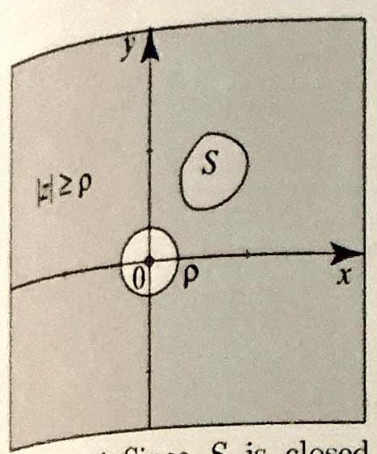

Figure 4 Since $S$ is closed and 0 is not in $S$, then we can find $\rho>0$ so that $S$ is contained in the annulus $|z| \geq \rho$.
(In fact, $\sum_{n=0}^{\infty} \frac{1}{n!\rho^{n}}=\sum_{n=0}^{\infty} \frac{\rho^{-n}}{n!}=e^{-\rho}$.) By the Weierstrass $M$-test, it follows that $u(z)=\sum_{n=0}^{\infty} \frac{1}{n!z^{n}}$ is uniformly convergent for all $|z| \geq \rho$.
(b) Note from (a) that the series will be uniformly convergent on any closed and bounded subset of the punctured plane $\mathbb{C} \backslash\{0\}$, since any such set can be contained in an annular region $|z| \geq \rho$ (Figure 4). Applying Corollary 2, it follows that $u(z)$ is analytic on $\mathbb{C} \backslash\{0\}$.
(c) Given the circle $C_{R}(0)$, pick $\rho$ such that $0<\rho<R$. Since $\sum_{n=0}^{\infty} \frac{1}{n!z^{n}}$ converges uniformly on $|z| \geq \rho$, and since $C_{R}(0)$ is contained in the region $|z| \geq \rho$, it follows that $\sum_{n=0}^{\infty} \frac{1}{n!z^{n}}$ converges uniformly on $C_{R}(0)$. Hence, by Corollary 1, the series may be integrated term by term to yield

The integral $\int_{C_{R}(0)} \frac{1}{z^{n}} d z$ is an all-too-familiar integral (Example 4, Section 3.2). Its value is 0 if $n \neq 1$ and $2 \pi i$ if $n=1$. Thus,

The convergence theory that we have established in this section will be applied in the next section to study power series and Taylor series expansions of analytic functions.

## Exercises 4.2

In Exercises 1-8, (a) find the pointwise limit of the given sequence. (b) Determine if the sequence converges uniformly on the given interval. (c) If the sequence does not converge uniformly on the given interval, describe some subintervals on which uniform convergence takes place.
(d) Use a computer to plot several functions from the sequence to illustrate your answers in (a)-(c).

1. $f_{n}(x)=\frac{\sin n x}{n}, 0 \leq x \leq \pi$.
2. $f_{n}(x)=\frac{x}{n x+1}, 0 \leq x \leq 1$.
3. $f_{n}(x)=\frac{\sin n x}{n}, 0 \leq x \leq \pi$.
4. $f_{n}(x)=\frac{\sin n x}{n x}, 0<x \leq \pi$.
5. $f_{n}(x)=n x^{n}, 0 \leq x<.99$.新
.
6. $f_{n}(x)=\frac{n x}{n^{2} x^{2}-x+1}, 0 \leq x \leq 1$.
7. $f_{n}(x)=\frac{n x}{n^{2} x^{2}-n x+1}, 0 \leq x \leq 1$.
8. $f_{n}(x)=\frac{n x}{n^{2} x^{2}+2}, 0 \leq x \leq 1$.
9. $f_{n}(x)=\int_{0}^{x} e^{-n \sqrt{t}} d t, 0 \leq x \leq 1$. is anaytic on $C \backslash\{0\}$. uniformly on $|z| \geq \rho$, and since $C_{R}(0)$ is contained in the region $|z| \geq \rho$, it follows that $\sum_{n=0}^{\infty} \frac{1}{n!z^{n}}$ converges uniformly on $C_{R}(0)$. Hence, by Corollary 1 , the series may be integrated term by term to yield

$$
\int_{C_{R}(0)} u(z) d z=\int_{C_{R}(0)}\left\{\sum_{n=0}^{\infty} \frac{1}{n!z^{n}}\right\} d z=\sum_{n=0}^{\infty} \frac{1}{n!} \int_{C_{R}(0)} \frac{1}{z^{n}} d z
$$

$$
\int_{C_{R}(0)}\left\{\sum_{n=0}^{\infty} \frac{1}{n!z^{n}}\right\} d z=2 \pi i
$$Notice what we have done: Our function is expanded in powers of $z$, and its integral around the origin is precisely $2 \pi i$ times the coefficient of $\frac{1}{z}$. This is but one example of a general technique that forms the basis for Chapter 5.

Notice what we have done: Our function is expanded in powers of $z$, and its integral
around the origin is precisely $2 \pi i$ times the coefficient of $\frac{1}{z}$. This is but one example

The convergence theory that we have established in this section will be applied in the next section to study power series and Taylor series expansions of analytic functions. if the sequence converges uniformly on the given interval. (c) If the sequence does not converge uniformly on the given interval, describe some subintervals on which uniform convergence takes place.
"

In Exercises 9-12, (a) determine whether or not the sequence of functions converges pointwise and find its limit if it converges. (b) Determine if the sequence converges uniformly on the given subset $\Omega$ of $\mathbb{C}$. (c) If uniform convergence fails on $\Omega$, describe some closed and bounded subsets of $\Omega$ on which uniform convergence takes place.
9. $f_{n}(z)=\frac{n z+1}{z+2 n^{2}},|z| \leq 1$.
10. $f_{n}(z)=\frac{z^{n}+z}{n+1},|z| \leq 1$.
11. $f_{n}(z)=\frac{\sin n z}{n^{2}},|z| \leq 1$.
12. $f_{n}(z)=\frac{z^{2}+n z+1}{n^{2} z+1}, 2<|z|$.

In Exercises 13-22, use the Weierstrass $M$-test to show that the given series converges uniformly on the given region.
13. $\sum_{n=1}^{\infty} \frac{z^{n}}{n(n+1)},|z| \leq 1$.
14. $\sum_{n=1}^{\infty} \frac{(3 z)^{n}}{n(n+1)},|z| \leq \frac{1}{3}$.
15. $\sum_{n=0}^{\infty}\left(\frac{3 z}{4}\right)^{n},|z| \leq 1.1$.
16. $\sum_{n=0}^{\infty}\left(\frac{z^{2}-1}{4}\right)^{n},|z| \leq 1$.
17. $\sum_{n=0}^{\infty}\left(\frac{z+2}{5}\right)^{n},|z| \leq 2$.
18. $\sum_{n=0}^{\infty} \frac{1}{(5-z)^{n}},|z| \leq \frac{7}{2}$.
19. $\sum_{n=0}^{\infty} \frac{(z+1-3 i)^{n}}{4^{n}},|z-3 i| \leq .5$.
20. $\sum_{n=0}^{\infty} \frac{(z-1)^{n}}{4^{n}},|z| \leq 2$.
21. $\sum_{n=0}^{\infty}\left\{\frac{(z-2)^{n}}{3^{n}}+\frac{2^{n}}{(z-2)^{n}}\right\}, 2.01 \leq|z-2| \leq 2.9$.
22. $\sum_{n=1}^{\infty}\left\{\left(\frac{z}{5}\right)^{n}+\frac{1}{z^{n}}\right\}, 0.001 \leq|z| \leq 4.9$.
23. (a) The $n$th partial sum of a series is given by $s_{n}(z)=\frac{z^{n}}{n}$ for $|z| \leq 1$. Does the series converge uniformly on $|z| \leq 1$ ?
(b) Construct a series with partial sum $s_{n}(z)$ as given in (a).
24. The $n$th partial sum of a series is given by $s_{n}(z)=\frac{e^{i n z}}{n}$ for $|z| \leq 1$. Does the series converge uniformly on $|z| \leq 1$ ? Does it converge pointwise?
25. (a) Does $\sum_{n=0}^{\infty} z^{n}$ converge uniformly on $\left|z-\frac{1}{2}\right|<\frac{1}{6}$ ?
(b) Does $\sum_{n=0}^{\infty} z^{n}$ converge uniformly on $\left|z-\frac{1}{2}\right|<\frac{1}{2}$ ? Justify your answers.
26. (a) If $\sum u_{n}(z)$ converges absolutely for all $z$ in a set $E$, does this imply that $\sum u_{n}(z)$ converges uniformly on $E$ ?
(b) If $\sum u_{n}(z)$ converges uniformly on $E$, does this imply that $\sum u_{n}(z)$ converge absolutely for all $z$ in $E$ ? [Hint: Consider $\sum_{n=0}^{\infty}(-1)^{n} \frac{x^{n}}{n}$ for $0 \leq x \leq 1$.]
27. Derivative of the exponential function. Show that $\frac{d}{d z} e^{z}=e^{z}$ by differentiating the series term by term. You must justify this process by showing that you can apply Theorem 4.
28. (a) Show that $u(z)=\sum_{n=0}^{\infty} \frac{z^{n}}{1+z^{2 n}}$ is analytic for all $|z|<1$ and all $|z|>1$. [Hint: Treat separately the uniform convergence on $|z| \leq r<1$ and on $|z| \geq R>1$.] (b) What is $u^{\prime}(z)$ for $|z|<1$ or $|z|>1$ ?
29. Riemann zeta function. The Riemann zeta function is defined by

$$
\zeta(z)=\sum_{n=1}^{\infty} \frac{1}{n^{z}} \quad\left(\text { principal branch of } n^{z}\right)
$$

(a) Let $\delta>1$ be a positive real number. Show that the series converges uniformly on every half-plane $H_{\delta}=\{z: \operatorname{Re} z \geq \delta>1\}$.
(b) Conclude that $\zeta(z)$ is analytic on the half-plane $H=\{z: \operatorname{Re} z>1\}$.
(c) What is $\zeta^{\prime}(z)$ ?

Riemann used the zeta function to study the distribution of the prime numbers. Although this function was previously known to Euler, Riemann was the first one to consider it over the complex numbers. One of the most important open problems in mathematics today is the Riemann hypothesis, which is a conjecture made by Riemann, who stated that the analytic continuation of the zeta function has infinitely many nonreal roots and that all these roots lie on the line $x=\frac{1}{2}$.
30. Uniformly Cauchy sequence. A sequence of functions $\left\{f_{n}\right\}$ is uniformly Cauchy on $E \subset \mathbb{C}$, if given $\epsilon>0$ we can find a positive integer $N$ so that

$$
m, n \geq N \Rightarrow\left|f_{n}(z)-f_{m}(z)\right|<\epsilon \text { for all } z \text { in } E \text {. }
$$

Not surprisingly, we have the following.
Cauchy criterion: $\left\{f_{n}\right\}$ converges uniformly on $E \subset \mathbb{C}$ if and only if $\left\{f_{n}\right\}$ is uniformly Cauchy on $E$.

Prove this criterion using an argument similar to the proof of Theorem 6, Section 4.1.
31. Sums and products of uniformly convergent sequences. Suppose that $f_{n} \rightarrow f$ uniformly on $E$ and $g_{n} \rightarrow g$ uniformly on $E$. Show that
(a) $f_{n}+g_{n} \rightarrow f+g$ uniformly on $E$; and
(b) if $f$ and $g$ are bounded on $E$, then $f_{n} g_{n} \rightarrow f g$ uniformly on $E$. [Hint: $f_{n} g_{n}- f g=f_{n} g_{n}-f_{n} g+f_{n} g-f g$. $]$
32. Suppose that $\sum u_{n}(z)$ converges uniformly on $E \subset \mathbb{C}$. Show that $u_{n}(z) \rightarrow 0$ uniformly on $E$. [Hint: Let $s_{n}(z)$ denote the $n$th partial sum. What can you say about $s_{n+1}(z)-s_{n}(z)$ ?]
33. Boundary criterion for uniform convergence. Suppose that $C$ is a simple closed path (for simplicity, you may take $C$ to be a circle) and let $\Omega$ denote the region interior to $C$. Suppose that $f_{n}(n=1,2, \ldots)$ is analytic on $\Omega$ and continuous on $C$. Suppose that $\left\{f_{n}\right\}$ converges uniformly to some function $f$ on $C$. Show that $\left\{f_{n}\right\}$ converges uniformly on $\Omega$. [Hint: Show that $\left\{f_{n}\right\}$ is a uniformly Cauchy sequence on $\Omega$.]
34. (a) Suppose that $f$ is analytic on the open unit disk, $f(0)=0$ and $|f(z)| \leq M$ for all $|z|<1$. Show that $\sum_{n=1}^{\infty} f\left(z^{n}\right)$ converges uniformly on every closed subdisk of $|z|<1$. Conclude that $g(z)=\sum_{n=1}^{\infty} f\left(z^{n}\right)$ is analytic on $|z|<1$. [Hint: Use Schwarz's lemma, then the Weierstrass M-test.]
(b) Conclude that if $f$ is entire and $f(0)=0$, then $g(z)=\sum_{n=1}^{\infty} f\left(z^{n}\right)$ is analytic on $|z|<1$.
(c) Discuss the results of (a) and (b) in the special cases of $f(z)=z$ and $f(z)=\sin z$.

### 4.3 Power Series

A power series is a series of the form

$$
\sum_{n=0}^{\infty} c_{n}\left(z-z_{0}\right)^{n}
$$

where $z_{0}$ is a complex number called the center of the power series, $c_{n}$ are complex numbers called the coefficients of the power series, and $z$ is a complex variable. A power series always converges at the center, because when $z=z_{0}$ all the terms for $n \geq 1$ are equal to zero. (We take the usual notational convention that $\left(z-z_{0}\right)^{0}=1$ even for $z=z_{0}$.) For $z \neq z_{0}$, the power series may converge or diverge. Let us consider a few examples.

The series that we used to define the exponential function, $\sum_{n=0}^{\infty} \frac{z^{n}}{n!}$, is a power series with center $z_{0}=0$ and coefficients $c_{n}=\frac{1}{n!}$. This power series converges for all $z$. The power series $\sum_{n=1}^{\infty} \frac{n^{n}(z-i)^{n}}{n}$ converges only at the center $z_{0}=i$ (see Example 1 below). The geometric series $\sum_{n=0}^{\infty}(z-2)^{n}$ is a power series centered at $z_{0}=2$ with coefficients $c_{n}=1$. The geometric series converges for all $|z-2|<1$ and diverges for all $|z-2|>1$.

These series illustrate the typical behavior of a power series. We have the following trichotomy.

## THEOREM 1 CONVERGENCE OF POWER SERIES

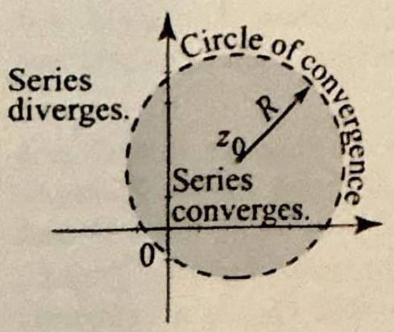
Figure 1 The disk of convergence is open and centered at the center of the power series. The power series converges absolutely inside the disk, diverges outside the disk, and may converge or diverge at points on the circle of convergence.

Given a power series $\sum_{n=0}^{\infty} c_{n}\left(z-z_{0}\right)^{n}$, there are only three possibilities:
(i) The series converges absolutely for all $z$.
(ii) The series converges only at $z=z_{0}$.
(iii) There is a number $R>0$ such that the series converges absolutely if $\left|z-z_{0}\right|<R$ and diverges if $\left|z-z_{0}\right|>R$.
The number $R>0$ in case (iii) is called the radius of convergence of the series. As a convention, the radius of convergence is $\infty$ in case (i) and 0 in case (ii). In case (iii), the open disk $\left|z-z_{0}\right|<R$ is called the disk of convergence and the circle $\left|z-z_{0}\right|=R$ the circle of convergence.

Thus the series converges inside the circle of convergence and diverges outside the circle of convergence. On the circle of convergence, the series may converge at some or all or no points (Figure 1).

The proof of Theorem 1 is a straightforward adaptation of the proof from calculus for real power series. We will present it at the end of the section along with the Cauchy-Hadamard formula for computing the radius of convergence. For now, we can find the radius of convergence of a power series using any one of the tests of convergence from Section 4.1.

## EXAMPLE 1 Computing the radius of convergence

Find the radii of convergence of the power series
(a) $\sum_{n=0}^{\infty} \frac{(z-1+i)^{n}}{(n!)^{2}}, \quad$ (b) $\quad \sum_{n=1}^{\infty} \frac{n^{n}(z-i)^{n}}{n}, \quad$ (c) $\quad \sum_{n=0}^{\infty}(-2)^{n} \frac{z^{n}}{n+1}$.

Solution (a) We apply the ratio test. For $z \neq 1-i$, we have

$$
\rho=\lim _{n \rightarrow \infty}\left|\frac{(z-1+i)^{n+1}(n!)^{2}}{(z-1+i)^{n}((n+1)!)^{2}}\right|=\lim _{n \rightarrow \infty} \frac{|z-1+i|(n!)^{2}}{(n+1)^{2}(n!)^{2}}=\lim _{n \rightarrow \infty} \frac{|z-1+i|}{(n+1)^{2}}=0
$$

Since $\rho<1$, we conclude from the ratio test that the series converges for all $z$. Hence the radius of convergence is $R=\infty$.
(b) We use the root test (Theorem 12, Section 4.1). For $z \neq i$, we have

$$
\rho=\lim _{n \rightarrow \infty} \sqrt[n]{\left|a_{n}\right|}=\lim _{n \rightarrow \infty}\left(\frac{n^{n}|z-i|^{n}}{n}\right)^{\frac{1}{n}}=\lim _{n \rightarrow \infty} \frac{n|z-i|}{n^{\frac{1}{n}}}=\infty
$$

because $n|z-i| \rightarrow \infty$ and $n^{\frac{1}{n}} \rightarrow 1$ as $n \rightarrow \infty$ (Exercise 10, Section 4.1). Since $\rho>1$ for all $z \neq i$, we conclude from the root test that the series diverges for all $z \neq i$. Hence the radius of convergence is $R=0$.
(c) We use the ratio test (Theorem 11, Section 4.1). For $z \neq 0$, we have

$$
\rho=\lim _{n \rightarrow \infty}\left|\frac{a_{n+1}}{a_{n}}\right|=\lim _{n \rightarrow \infty}\left|\frac{2^{n+1} z^{n+1}(n+1)}{2^{n} z^{n}(n+2)}\right|=\lim _{n \rightarrow \infty} 2|z| \frac{n+1}{n+2}=2|z|
$$

By the ratio test, the series converges if $2|z|<1$, and diverges if $2|z|>1$. Equivalently, the series converges if $|z|<\frac{1}{2}$, and diverges if $|z|>\frac{1}{2}$. Hence the radius of convergence is $R=\frac{1}{2}$.

Given a power series with radius of convergence $R>0$, we can think of it as a function $f(z)=\sum_{n=0}^{\infty} c_{n}\left(z-z_{0}\right)^{n}$ whose domain of definition is the disk of convergence $\left|z-z_{0}\right|<R$. In the special case when all but finitely many $c_{n}$ 's are 0 , this function reduces to a polynomial. So, in a way, we can regard power series as generalizing polynomials. Just as linearity allows us to differentiate polynomials term by term, power series can be differentiated term by term within the disk of convergence $\left|z-z_{0}\right|<R$. The key to these important properties is the uniform convergence of the power series on closed subdisks of the disk of convergence.

## THEOREM 2 UNIFORM CONVERGENCE ON SUBDISKS

Suppose that the power series $\sum_{n=0}^{\infty} c_{n}\left(z-z_{0}\right)^{n}$ has radius of convergence $R>0$. Then the power series converges absolutely and uniformly on any closed subdisk $\left|z-z_{0}\right| \leq r$, where $0<r<R$. Consequently, the power series converges uniformly on any closed and bounded subset of its disk of convergence.
Proof By definition of the radius of convergence, the power series converges for all $\left|z-z_{0}\right|<R$. In particular, given $0<r<R$, we can find $\zeta$ such that $r<\left|\zeta-z_{0}\right|<R$ and $\sum_{n=0}^{\infty} c_{n}\left(\zeta-z_{0}\right)^{n}$ is convergent. By the $n$th term test, $c_{n}\left(\zeta-z_{0}\right)^{n} \rightarrow 0$ as $n \rightarrow \infty$. Consequently, the sequence $\left\{c_{n}\left(\zeta-z_{0}\right)^{n}\right\}$ is bounded. Let $M>0$ be such that $\left|c_{n}\left(\zeta-z_{0}\right)^{n}\right| \leq M$ for all $n=0,1,2, \ldots$. For $\left|z-z_{0}\right| \leq r$ we have

$$
\left|c_{n}\left(z-z_{0}\right)^{n}\right|=\overbrace{\mid c_{n}\left(\zeta-z_{0}\right)^{n}}^{\leq M}\left|\frac{z-z_{0}}{\zeta-z_{0}}\right|^{n} \leq M\left(\frac{r}{\left|\zeta-z_{0}\right|}\right)^{n}=M \rho^{n}
$$

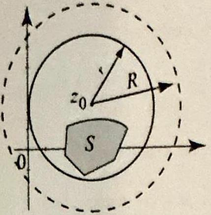
Figure 2 If $S$ is a closed subset of the open disk of convergence $B_{R}\left(z_{0}\right)$, we can find a closed disk $S_{r}\left(z_{0}\right)$ such that $S \subset S_{r}\left(z_{0}\right) \subset B_{R}\left(z_{0}\right)$.

THEOREM 3 TERM-BY-TERM INTEGRATION
where $\rho=\frac{r}{\left|\zeta-z_{0}\right|}<1$. Since $\sum M \rho^{n}$ is convergent, we conclude from the Weir. strass $M$-test that $\sum_{n=0}^{\infty} c_{n}\left(z-z_{0}\right)^{n}$ converges absolutely and uniformly for all $\left|z-z_{0}\right| \leq r$, which proves the first part. Now, given a closed and bounded subset $S$ of the disk of convergence, let $0<r<R$ be such that the closed disk $S_{r}\left(z_{0}\right) \operatorname{con}_{\mathrm{i}-}$ tains $S$ (Figure 2). Since the series converges uniformly on $S_{r}\left(z_{0}\right)$ and $S \subset S_{r}\left(z_{0}\right)$ it follows that the series converges uniformly on $S$.

Theorem 2 opens the door for the applications of the powerful results of the previous section. Each term in a power series is a polynomial of the form $c_{n}\left(z-z_{0}\right)^{n}$ and is continuous on $\mathbb{C}$. By Theorem 2, the power series converges uniformly on subdisks $\left|z-z_{0}\right| \leq r<R$, and by Theorem 1, Section 4.2, the series is continuous on these subdisks. Letting $r$ tend up to $R$, the series is continuous on the whole open disk $\left|z-z_{0}\right|<R$. Applying Theorem 1, Section 4.2, we get the following.

```
Let $R>0$ denote the radius of convergence of the power series $\sum_{n=0}^{\infty} c_{n}(z- \left.z_{0}\right)^{n}$. Let $\gamma$ be any path in the disk of convergence $\left|z-z_{0}\right|<R$. Then
$$
\int_{\gamma}\left(\sum_{n=0}^{\infty} c_{n}\left(z-z_{0}\right)^{n}\right) d z=\sum_{n=0}^{\infty} c_{n} \int_{\gamma}\left(z-z_{0}\right)^{n} d z
$$
That is, the power series may be integrated term by term within its radius of convergence.
```

Proof Since $\gamma$ is a closed subset of the disk of convergence, by Theorem 2, the power series converges uniformly on $\gamma$. Now apply Corollary 1, Section 4.2.

Theorem 3 is particularly interesting when we take advantage of independence of path of integrals of analytic functions on a disk. Let us illustrate with a typical application.

## EXAMPLE 2 Term-by-term integration

Let us start with the geometric series

$$
\frac{1}{1+\zeta}=\sum_{n=0}^{\infty}(-1)^{n} \zeta^{n} \quad|\zeta|<1
$$

Since the integral of an analytic function on a disk is independent of path, we can integrate both sides from 0 to $z$, where $|z|<1$, and use Theorem 3 to arrive at

$$
\int_{0}^{z} \frac{1}{1+\zeta} d \zeta=\sum_{n=0}^{\infty}(-1)^{n} \int_{0}^{z} \zeta^{n} d \zeta
$$

Using independence of path again (Theorem 1, Section 3.3) and the fact that $\frac{d}{d z} \log (1+z)=\frac{1}{1+z}$ and $\log 1=0$, we obtain

$$
\log (1+z)=\sum_{n=0}^{\infty}(-1)^{n} \frac{z^{n+1}}{n+1} \quad|z|<1
$$ $\square$

The following straightforward application of Theorem 2 above and Corollary 2, Section 4.2, is perhaps the most important property of power series.

THEOREM 4 ANALYTICITY AND TERMWISE DIFFERENTIATION OF POWER SERIES

Suppose that $f(z)=\sum_{n=0}^{\infty} c_{n}\left(z-z_{0}\right)^{n}$ is a power series with radius of convergence $R>0$. Then $f$ is analytic on the disk of convergence $\left|z-z_{0}\right|< R$. Moreover, for any integer $k \geq 1$, the power series may be differentiated $k$ times term by term within its radius of convergence to yield, for $\left|z-z_{0}\right|<R$,

$$
f^{(k)}(z)=\sum_{n=k}^{\infty} n(n-1) \cdots(n-k+1) c_{n}\left(z-z_{0}\right)^{n-k}
$$

with radius of convergence $R$.
Thus a power series is infinitely differentiable (a property of analytic functions) and all its derivatives can be obtained by successive termwise differentiation. Since the power series in (1) converges to $f^{(k)}(z)$ for all $\mid z- z_{0} \mid<R$, its radius of convergence is at least as large as $R$. A straightforward application of the comparison test shows that the radius of convergence is precisely $R$ (Exercise 23). Another way of writing (1) is

$$
f^{(k)}(z)=\sum_{n=k}^{\infty} \frac{n!}{(n-k)!} c_{n}\left(z-z_{0}\right)^{n-k}, \quad \text { for all }\left|z-z_{0}\right|<R
$$

## EXAMPLE 3 Term-by-term differentiation

Find the sum $\sum_{n=1}^{\infty} n z^{n}$, and determine its radius of convergence.
Solution Let us go straight to the point: The series looks like the derivative of the geometric series. Indeed, term-by-term differentiating the geometric series

$$
\frac{1}{1-z}=\sum_{n=0}^{\infty} z^{n}, \quad|z|<1
$$

we obtain the power series

$$
\frac{d}{d z} \frac{1}{1-z}=\frac{1}{(1-z)^{2}}=\sum_{n=1}^{\infty} n z^{n-1}, \quad|z|<1
$$

Multiplying both sides of the identity by $z$, we obtain

$$
\frac{z}{(1-z)^{2}}=\sum_{n=1}^{\infty} n z^{n}, \quad|z|<1
$$

In particular, the radius of convergence is 1 .

## EXAMPLE 4 Matching series

Find the sum $\sum_{n=2}^{\infty} \frac{n}{(n-2)} z^{n}$, and determine its radius of convergence.
Solution The factorial in the denominator of the coefficients suggests looking at the exponential series:

$$
e^{z}=\sum_{n=0}^{\infty} \frac{z^{n}}{n!}, \quad \text { for all } z
$$

Differentiating the series twice term by term, we obtain

$$
e^{z}=\sum_{n=2}^{\infty} \frac{n(n-1)}{n!} z^{n-2}=\sum_{n=2}^{\infty} \frac{z^{n-2}}{(n-2)!}, \quad \text { for all } z .
$$

Multiplying both sides by $z^{2}$, we obtain

$$
z^{2} e^{z}=\sum_{n=2}^{\infty} \frac{z^{n}}{(n-2)!}, \quad \text { for all } z
$$

Differentiating term by term to get $n$ in the numerator of the coefficients, and then multiplying by $z$, we obtain

$$
\begin{gathered}
\frac{d}{d z}\left(z^{2} e^{z}\right)=2 z e^{z}+z^{2} e^{z}=\sum_{n=2}^{\infty} \frac{n}{(n-2)!} z^{n-1}, \text { for all } z \\
\left(2 z^{2}+z^{3}\right) e^{z}=\sum_{n=2}^{\infty} \frac{n z^{n}}{(n-2)!}, \text { for all } z
\end{gathered}
$$

In particular, the radius of convergence is $\infty$. $\square$

Many important functions in applied mathematics are defined using power series. The exponential function is one example. In what follows we will introduce the Bessel functions using power series and derive some of their interesting properties. Bessel functions are solutions of the Bessel differential equation, which is an equation that arises in solving classical partial differential equations, including Laplace's equation on disks and cylindrical regions (see Chapter 9).

## EXAMPLE 5 Bessel functions of integer order

For $n=0,1,2, \ldots$, the Bessel function of order $n$ is defined by

$$
J_{n}(z)=\sum_{k=0}^{\infty} \frac{(-1)^{k}}{k!(k+n)!}\left(\frac{z}{2}\right)^{2 k+n} \quad \text { for all } z
$$

For negative integers $n$, we set $J_{n}(z)=(-1)^{n} J_{-n}(z)$.
(a) Show that $J_{n}(z)$ is entire.
(b) Verify the identity $\frac{d}{d z}\left[z^{n} J_{n}(z)\right]=z^{n} J_{n-1}(z)$.
(c) Prove the recurrence relation: $z J_{n}^{\prime}(z)+n J_{n}(z)=z J_{n-1}(z)$.

$$
\begin{aligned}
& \text { Solution (a) Since } J_{n}(z) \text { is defined by a power series, to prove that it is ent } \\
& \text { it suffices by Theorem } 4 \text { to show that the power series converges for all } z \text {. Us } \\
& \text { the ratio test, we have for } z \neq 0 \\
& \qquad \begin{array}{l}
\rho=\lim _{k \rightarrow \infty}\left|\frac{a_{k+1}}{a_{k}}\right|=\lim _{k \rightarrow \infty}\left|\frac{z^{2(k+1)+n}}{2^{2(k+1)+n}(k+1)!(k+1+n)!} \frac{2^{2 k+n} k!(k+n)!}{z^{2 k+n}}\right| \\
=\lim _{k \rightarrow \infty} \frac{2^{2}|z|^{2}}{(k+1)(k+1+n)}=0
\end{array}
\end{aligned}
$$

Since $\rho<1$, the series converges for all $z$.
(b) We use the series definition of $J_{n}$, differentiate term by term, and get

$$
\begin{aligned}
\frac{d}{d z}\left[z^{n} J_{n}(z)\right] & =\frac{d}{d z} \sum_{k=0}^{\infty} \frac{(-1)^{k} 2^{n}}{k!(k+n)!}\left(\frac{z}{2}\right)^{2 k+2 n} \\
& =\sum_{k=0}^{\infty} \frac{(-1)^{k} 2^{n}(k+n)}{k!(k+n)!}\left(\frac{z}{2}\right)^{2 k+2 n-1} \\
& =z^{n} \sum_{k=0}^{\infty} \frac{(-1)^{k}}{k!(k+n-1)!}\left(\frac{z}{2}\right)^{2 k+n-1} \\
& =z^{n} J_{n-1}(z)
\end{aligned}
$$

(c) The identity is true if $z=0$. For $z \neq 0$, expand the left side of the identity in
(b) using the product rule and get

$$
z^{n} J_{n}^{\prime}(z)+n z^{n-1} J_{n}(z)=z^{n} J_{n-1}(z)
$$

Now (c) follows upon dividing through by $z^{n-1} \neq 0$.
Bessel functions of arbitrary order $p>0$ will be defined and studied in the exercises. We now record some immediate consequences of Theorem 4.

## COROLLARY 1 TAYLOR COEFFICIENTS

If $f(z)=\sum_{n=0}^{\infty} c_{n}\left(z-z_{0}\right)^{n}$ is a power series with radius of convergence $R>0$, then the coefficients $c_{n}$ are given by the Taylor formula
(3)

$$
c_{n}=\frac{f^{(n)}\left(z_{0}\right)}{n!} \quad(n=0,1,2, \ldots)
$$

with the usual convention: $f^{(0)}(z)=f(z)$ and $0!=1$.
Proof If we evaluate (2) at $z=z_{0}$, all the terms in the series vanish except when $n=k$ and we get $f^{(k)}\left(z_{0}\right)=\frac{k!}{(k-k)!} c_{k}=k!c_{k}$. Solving for $c_{k}$, we get (3) with $n$ replaced by $k$.

Corollary 1 has an important consequence, which we state as a theorem.

THEOREM 5 UNIQUENESS

If $\sum_{n=0}^{\infty} a_{n}\left(z-z_{0}\right)^{n}=f(z)=\sum_{n=0}^{\infty} b_{n}\left(z-z_{0}\right)^{n}$ for all $\left|z-z_{0}\right|<R$ whene $_{\text {Re }} R>0$, then $a_{n}=b_{n}$ for all $n$. In particular, if $f(z)=\sum_{n=0}^{\infty} c_{n}\left(z-z_{0}\right)^{n} f_{n}$ all $\left|z-z_{0}\right|<R$, then $f(z)$ is identically 0 for all $\left|z-z_{0}\right|<R$ if and only if $c_{n}=0$ for all $n$.
Proof By Corollary 1, $a_{n}=\frac{L^{(n)}\left(z_{0}\right)}{n!}=b_{n}$. Now the second part follows from the first part, which guarantees the uniqueness of the coefficients.

## Appendix: Proofs related to convergence

The following lemma is needed for the proof of Theorem 1.

## LEMMA 1

(i) If a power series $\sum_{n=0}^{\infty} c_{n}\left(z-z_{0}\right)$ converges for some $z_{1} \neq z_{0}$ then it converges for all $z$ such that $\left|z-z_{0}\right|<\left|z_{1}-z_{0}\right|$.
(ii) If a power series $\sum_{n=0}^{\infty} c_{n}\left(z-z_{0}\right)$ diverges for some $z_{2}$ then it diverges for all $z$ such that $\left|z-z_{0}\right|>\left|z_{2}-z_{0}\right|$.
Proof We will use an argument similar to the one we used in the proof of Theorem 2. (i) Suppose that $\sum_{n=0}^{\infty} c_{n}\left(z-z_{0}\right)$ converges; then the sequence $\left\{c_{n}\left(z_{1}-z_{0}\right)^{n}\right\}$ is bounded. So there is an $M>0$ such that $\left|c_{n}\left(z_{1}-z_{0}\right)^{n}\right| \leq M$ for all $n \geq 0$. For $\left|z-z_{0}\right|<\left|z_{1}-z_{0}\right|$, we have $\left|\frac{z-z_{0}}{z_{1}-z_{0}}\right|=\rho<1$. Hence $\left|c_{n}\left(z-z_{0}\right)^{n}\right|=\left|c_{n}\left(z_{1}-z_{0}\right)^{n}\right|\left|\frac{c_{n}\left(z-z_{0}\right)^{n}}{c_{n}\left(z_{1}-z_{0}\right)^{n}}\right| \leq M \rho^{n}$, and the series $\sum_{n=0}^{\infty} c_{n}\left(z-z_{0}\right)$ is absolutely convergent by comparison to the convergent series $\sum M \rho^{n}$. Part (ii) follows from (i), because if the series converges for some $z$ such that $\left|z-z_{0}\right|>\left|z_{2}-z_{0}\right|$, then it will converge for $z_{2}$ by (i).
Proof of Theorem 1 Suppose that neither (i) nor (ii) of Theorem 1 is true. Then there are $z_{1} \neq z_{0}$ and $z_{2}$ such that $\sum_{n=0}^{\infty} c_{n}\left(z_{1}-z_{0}\right)^{n}$ converges and $\sum_{n=0}^{\infty} c_{n}\left(z_{2}-\right. \left.z_{0}\right)^{n}$ diverges. The set of real numbers

$$
S=\left\{\left|z-z_{0}\right|: \quad \sum_{n=0}^{\infty} c_{n}\left(z-z_{0}\right)^{n} \quad \text { is convergent }\right\}
$$

is nonempty and bounded above by $\left|z_{2}-z_{0}\right|$, by Lemma 1. Hence by the completeness of real numbers, $S$ has a least upper bound $R$, and $0<\left|z_{1}-z_{0}\right| \leq R \leq \left|z_{2}-z_{0}\right|<\infty$. If $\left|z-z_{0}\right|<R$, then because $R$ is the least upper bound of $S$, there is a $z^{\prime}$ such that $\left|z-z_{0}\right|<\left|z^{\prime}-z_{0}\right|$ and $\sum_{n=0}^{\infty} c_{n}\left(z^{\prime}-z_{0}\right)^{n}$ is convergent. By Lemma 1, it follows that $\sum_{n=0}^{\infty} c_{n}\left(z-z_{0}\right)^{n}$ is convergent. If $\left|z-z_{0}\right|>R$, then there is a $z^{\prime}$ such that $\left|z^{\prime}-z_{0}\right|<\left|z_{1}-z_{0}\right|$ such that $\sum_{n=0}^{\infty} c_{n}\left(z^{\prime}-z_{0}\right)^{n}$ is divergent. Again, by Lemma $1, \sum_{n=0}^{\infty} c_{n}\left(z-z_{0}\right)^{n}$ is divergent. As a conclusion, the number $R>0$ is such that if $\left|z-z_{0}\right|<R$, then the series $\sum_{n=0}^{\infty} c_{n}\left(z-z_{0}\right)^{n}$ converges, and if $\left|z-z_{0}\right|>R$, then the series $\sum_{n=0}^{\infty} c_{n}\left(z-z_{0}\right)^{n}$ diverges. Thus, (iii) is true.

The final result of this section is a formula, known as the Cauchy-Hadamard formula, for computing the radius of convergence of a power series. To present this formula, we need the following definition.

For a sequence of real numbers $\left\{x_{n}\right\}$, define the limit superior of $\left\{x_{n}\right\}$, denoted $\limsup \operatorname{sun}_{n \rightarrow \infty} x_{n}$ or simply $\limsup x_{n}$, to be the smallest number $M$ such that

[^0]THEOREM 6 CAUCHY-HADAMARD FORMULA

If (4) holds for no real number $M$, then we define lim sup $x_{n}=\infty$. If (4) holds for all real numbers $M$, then we define $\lim \sup x_{n}=-\infty$. It is easy to show that if $L=\lim x_{n}$ exists, then $L=\limsup x_{n}$, but even if the limit does not exist, the limit superior will still exist (as either a real number or as $\infty$ or $-\infty$ ). The existence of a limit superior follows from the completeness of real numbers.

As an illustration, let $x_{n}=1+\frac{1}{n}$ if $n$ is even and $n=\frac{1}{n}$ if $n$ is odd. Then $\left\{x_{n}\right\}$ does not converge, but you can check that $\lim \sup x_{n}=1$.

The radius of convergence $R$ of the series $\sum_{n=0}^{\infty} c_{n}\left(z-z_{0}\right)^{n}$ is given by

$$
\frac{1}{R}=\limsup \sqrt[n]{\left|c_{n}\right|}
$$

with the convention $\frac{1}{0}=\infty$ and $\frac{1}{\infty}=0$.
Proof To simplify the notation, we give the proof for the case $z_{0}=0$. We must show that (i) $\sum_{n=0}^{\infty} c_{n} z^{n}$ converges for $|z|<R$; (ii) $\sum_{n=0}^{\infty} c_{n} z^{n}$ diverges for $|z|> R$. To prove (i), choose $\rho$ such that $|z|<\rho<R$; then $\frac{1}{R}<\frac{1}{\rho}$ and $\sqrt[n]{\left|c_{n}\right|}< \frac{1}{\rho}$ for all sufficiently large $n$. Hence $\left|c_{n} z^{n}\right|<\left(\frac{|z|}{\rho}\right)^{n}$ for all sufficiently large $n$, and $\sum_{n=0}^{\infty} c_{n} z^{n}$ converges absolutely by comparison to convergent geometric series $\sum\left(\frac{|z|}{\rho}\right)^{n}$. To prove (ii), note that $\frac{1}{|z|}<\frac{1}{R}$ implies that $\sqrt[n]{\left|c_{n}\right|}>\frac{1}{|z|}$ for infinitely many $n$ 's, by definition of $R$. So, for $|z|>R$, we have $\left|c_{n} z^{n}\right|>1$ for infinitely many $n$ 's, and the series diverges by the $n$th term test.

## EXAMPLE 6 Cauchy-Hadamard formula

For the series $\sum_{n=0}^{\infty} c_{n} z^{n}$, where $c_{n}=2^{n}$ if $n$ is even and $\frac{1}{2^{n}}$ if $n$ is odd, the Cauchy-Hadamard test gives

$$
\frac{1}{R}=\limsup \sqrt[n]{\left|c_{n}\right|}=\limsup \left\{2, \frac{1}{2}, 2, \frac{1}{2}, \ldots\right\}=2 .
$$

Thus the radius of convergence is $R=\frac{1}{2}$.

## Exercises 4.3

In Exercises 1-12, find the radius, disk, and circle of convergence of the given power series. Use the Cauchy-Hadamard formula in Exercises 9-12.

1. $\sum_{n=0}^{\infty}(-1)^{n} \frac{z^{n}}{2 n+1}$.
2. $\sum_{n=0}^{\infty} \frac{n!z^{n}}{(2 n)!}$.
3. $\sum_{n=0}^{\infty}(2)^{n} \frac{(z-i)^{n}}{n!}$.
4. $\sum_{n=0}^{\infty} \frac{(2 z+1-i)^{2 n}}{n^{2}+i}$.
5. $\sum_{n=0}^{\infty} \frac{(4 i z-2)^{n}}{2^{n}}$.
6. $\sum_{n=0}^{\infty}(n-2)!\frac{z^{n}}{n^{2}}$.
7. $\sum_{n=0}^{\infty}(n+i)^{4}(z+6)^{n}$.
8. $\sum_{n=0}^{\infty}\left(\frac{z+1}{3-i}\right)^{2 n}$.
9. $\sum_{n=0}^{\infty}\left(1-e^{i n \frac{\pi}{4}}\right)^{n} z^{n}$.
10. $\sum_{n=0}^{\infty} z^{n!}$.
11. $\sum_{n=0}^{\infty}\left(1+i^{n}\right)^{n} z^{n}$.
12. $\sum_{n=0}^{\infty}\left(2+2 i^{n}\right)^{n} z^{n}$.

In Ererises 13 18, manipulate the geometric series $\frac{1}{1-z} \approx \sum_{n=0}^{\infty} z^{n},|z|<1, t_{0}$ find the sum of the given series and its radius of convergence. You may differentiate or integrate term by term, change variables, multiply the series by $z^{m}$, take linear combinations of sertes obtained from the geometric series, and so on. State clearly the operation that you are performing on the series and justify it.
13. $\sum_{n=1}^{\infty} 2 n z^{n-1}$.
14. $\sum_{n=2}^{\infty} \frac{z^{n}}{n(n-1)}$.
15. $\sum_{n=1}^{\infty}(-1)^{n} \frac{z^{n-1}}{n(n+1)}$.
16. $\sum_{n=1}^{\infty} \frac{\left(1-(-1)^{n}\right)}{n} z^{n}$.
17. $\sum_{n=0}^{\infty} \frac{(3 z-i)^{n}}{3^{n}}$.
18. $\sum_{n=1}^{\infty} \frac{(z+1)^{n}}{n(n+1)}$.
19. Cauchy's estimate. Suppose that $f(z)=\sum_{n=0}^{\infty} c_{n}\left(z-z_{0}\right)^{n}$ is a power series with radius of convergence $R>0$ and $|f(z)| \leq M$ for all $\left|z-z_{0}\right|<R$. Show that the coefficients satisfy Cauchy's estimate

$$
\left|c_{n}\right| \leq \frac{M}{R^{n}} \quad(n=0,1,2, \ldots) .
$$

[Hint: Use (3) and Cauchy's estimate from Section 3.7.]
20. Suppose that $f(z)=\sum_{n=0}^{\infty} c_{n} z^{n}$ converges for all $z$ and that $|f(z)| \leq A+B|z|^{p}$ for some nonnegative real numbers $A, B$, and $p$. Show that $f$ is a polynomial of degree $\leq p$. (Compare with Liouville's theorem.)
21. Cauchy products of power series. Suppose that $\sum_{n=0}^{\infty} a_{n}\left(z-z_{0}\right)^{n}$ has radius of convergence $R_{1}>0$ and $\sum_{n=0}^{\infty} b_{n}\left(z-z_{0}\right)^{n}$ has radius of convergence $R_{2}>0$. Show that their Cauchy product is

$$
\left(\sum_{n=0}^{\infty} a_{n}\left(z-z_{0}\right)^{n}\right)\left(\sum_{n=0}^{\infty} b_{n}\left(z-z_{0}\right)^{n}\right)=\sum_{n=0}^{\infty} c_{n}\left(z-z_{0}\right)^{n}, \quad\left|z-z_{0}\right|<R
$$

where

$$
c_{n}=\sum_{k=0}^{n} a_{k} b_{n-k}=a_{0} b_{n}+a_{1} b_{n-1}+\cdots+a_{n-1} b_{1}+a_{n} b_{0}
$$

and $R$ is at least as large as the smallest of $R_{1}$ and $R_{2}$. [Hint: Justify the application of Theorem 15, Section 4.1.] Does the definition of the Cauchy product seem more natural when considering power series?
22. (a) Compute the Cauchy product of the series $\sum_{n=0}^{\infty} z^{n}$ and $\sum_{n=0}^{\infty} \frac{z^{n}}{n!}$. What is the radius of convergence of the Cauchy product series?
(b) Compute the Cauchy product of the series $\sum_{n=0}^{\infty} z^{n}$ and $1-z$. What is the radius of convergence of the Cauchy product series? Notice how it is larger than the smaller of the radii of convergence of $\sum z^{n}$ and $1+z$.
(c) Compute the Cauchy product of the series $\sum_{n=0}^{\infty} z^{n}$ with itself. What is the radius of convergence of the product series?
23. Show that the radius of convergence of a power series is equal to the radius of convergence of the $k$-times term-by-term differentiated power series. [Hint: It is enough to prove the result with $k=1$ (why?). Use the comparison test or the Cauchy-Hadamard formula.]
24. Project Problem: The gamma function. For $\operatorname{Re} z>0$, define

$$
\Gamma(z)=\int_{0}^{\infty} e^{-t} t^{z-1} d t
$$

where $t^{z-1}=e^{(z-1) \log t}$ is the principal branch of $t^{z-1}$. This integral is improper on both ends. It should be interpreted as $\lim _{A \subseteq 0, B \dagger \infty} \int_{A}^{B} e^{-t} t^{z-1} d t$. Let $\Omega$ denote the half-plane $\Omega=\{z: \operatorname{Re} z>0\}$.
(a) Show that $\left|e^{-t} t^{z-1}\right| \leq e^{-t} t^{\operatorname{Re} z-1}$ and conclude that the integral in (9) converges absolutely for all $z$ in $\Omega$.
(b) Write $\Gamma(z)=\sum_{n=0}^{\infty} I_{n}(z)$, where $I_{n}(z)=\int_{n}^{n+1} e^{-t} t^{z-1} d t$. Show that $I_{n}(z)$ is analytic on $\Omega$. [Hint: Theorem 4, Section 3.5.]
(c) Let $S$ be a bounded subset of $\Omega$, and let $0<\operatorname{Re} z \leq A$ for all $z$ in $S$. Show that $\left|I_{n}(z)\right| \leq M_{n}=(n+1)^{A-1}\left(e^{-n}-e^{-(n+1)}\right)$ for all $z$ in $S$. Apply the Weierstrass $M$-test and use Corollary 2 to conclude that $\Gamma(z)$ is analytic on $S$. Since $S$ was arbitrary, conclude that $\Gamma(z)$ is analytic on $\Omega$.
(d) Use integration by parts to prove the basic property of the gamma function

$$
\Gamma(z+1)=z \Gamma(z), \quad \operatorname{Re} z>0
$$

(e) Show by direct computation that $\Gamma(1)=1$. Then use (d) to prove that for any positive integer $n, \Gamma(n)=(n-1)$ !. For this reason, the gamma function is sometimes called the generalized factorial function.
25. Project Problem: The gamma function (continued). In this exercise, you are asked to prove the formula

$$
\frac{\Gamma\left(z_{1}\right) \Gamma\left(z_{2}\right)}{\Gamma\left(z_{1}+z_{2}\right)}=2 \int_{0}^{\frac{\pi}{2}} \cos ^{2 z_{1}-1} \theta \sin ^{2 z_{2}-1} \theta d \theta, \quad \operatorname{Re} z_{1}, \operatorname{Re} z_{2}>0
$$

All complex powers in this exercise are principal branches.
(a) Before proceeding with the proof, apply the formula with $z_{1}=\frac{1}{2}=z_{2}$ and show that $\Gamma\left(\frac{1}{2}\right)=\sqrt{\pi}$.
(b) Make the change of variables $u^{2}=t$ in (9) and obtain

$$
\Gamma(z)=2 \int_{0}^{\infty} e^{-u^{2}} u^{2 z-1} d u, \quad \operatorname{Re} z>0
$$

(c) Use (b) to show that for $\operatorname{Re} z_{1}, \operatorname{Re} z_{2}>0$,

$$
\Gamma\left(z_{1}\right) \Gamma\left(z_{2}\right)=4 \int_{0}^{\infty} \int_{0}^{\infty} e^{-\left(u^{2}+v^{2}\right)} u^{2 z_{1}-1} v^{2 z_{2}-1} d u d v
$$

(d) Use polar coordinates, $u=r \cos \theta, v=r \sin \theta, d u d v=r d r d \theta$ and get

$$
\Gamma\left(z_{1}\right) \Gamma\left(z_{2}\right)=2 \Gamma\left(z_{1}+z_{2}\right) \int_{0}^{\pi / 2} \cos ^{2 z_{1}-1} \theta \sin ^{2 z_{2}-1} \theta d \theta
$$

[Hint: Recall (a) as you compute the integral in $r$.]

### 4.4 Taylor Series

In the previous section we learned that a power series with a positive radius of convergence is analytic on its disk of convergence. In this section, we will prove a converse of sorts, stating that if $f(z)$ is analytic in some region $\Omega$, then $f$ has a power series representation at every point in $\Omega$. In other words, every analytic function is locally a power series. This is a fundamental result in complex analysis, with important consequences.

## THEOREM 1 TAYLOR SERIES

Taylor series are named after the English mathematician Brook Taylor (16851731), who wrote about them in 1715. The idea of expanding a function by a power series was known to mathematicians before Taylor and appeared in the work of Sir Isaac Newton, the Scottish mathematician James Gregory, and the Swiss mathematician John Bernoulli.
Maclaurin series are named after the Scottish mathematician Colin Maclaurin (16981746), who used them and acknowledged that they are special cases of Taylor series.

Suppose that $f$ is analytic in a region $\Omega$ and $z_{0}$ is in $\Omega$. Let $B_{R}\left(z_{0}\right)$ be the largest open disk centered at $z_{0}$ and contained in $\Omega$. Then $f$ has a unique Taylor series expansion around $z_{0}$ given by

$$
f(z)=\sum_{n=0}^{\infty} \frac{f^{(n)}\left(z_{0}\right)}{n!}\left(z-z_{0}\right)^{n}, \quad\left|z-z_{0}\right|<R
$$

The coefficient $\frac{f^{(n)}\left(z_{0}\right)}{n!}$ is called the $n$th Taylor coefficient of $f$.
When $z_{0}=0$ in Theorem 1, the series is commonly referred to as the Maclaurin series of $f$.

Before proceeding with proofs and examples, let us make some simple but useful remarks regarding Theorem 1.

- A Taylor series is a power series. So we may freely use results about power series as we work with Taylor series.
- The Taylor series of $f(z)$ around $z_{0}$ is uniquely defined by (1); the coefficients are determined by the derivatives of $f$. Furthermore, any power series representation of $f$ centered at $z_{0}$ must be the Taylor series (Corollary 1, Section 4.3). If $f(z)$ is explicitly written as a power series is some disk, then $f$ is identically its own Taylor series.
- The Taylor series will definitely converge to $f(z)$ for $\left|z-z_{0}\right|<R$, so the radius of convergence is at least $R$. If $f(z)$ has a serious problem (like a pole or an essential singularity; see Section 4.6) at some point on the circle $\left|z-z_{0}\right|=R$, then the Taylor series cannot converge in a larger disk and its radius of convergence is thus $R$. If $f(z)$ has a less serious problem like a branch cut or a removable singularity (Section 4.6 ) or has merely been defined in an artificially small domain, the Taylor series might converge in a circle with radius larger than $R$.
- Because successive termwise differentiation of a power series is allowed within its radius of convergence, if $n$ is an integer $\geq 0$, by changing the dummy index and differentiating (1) we obtain the Taylor series


Disk of convergence centered at $i$

Figure 1 The function $f(z)= \frac{1}{1-2}$ has a serious problem at $z=1$. If we expand it around $z_{0}=i$, the power series will converge in the largest disk around $i$ that does not contain 1. This disk has radius $\sqrt{2}$.
representation of the $n$th derivative

$$
f^{(n)}(z)=\sum_{j=n}^{\infty} \frac{f^{(j)}\left(z_{0}\right)}{(j-n)!}\left(z-z_{0}\right)^{j}, \quad\left|z-z_{0}\right|<R
$$

- Because a power series converges uniformly on subdisks of its disk of convergence, the Taylor series (1) and (2) converge uniformly on any subdisk $\left|z-z_{0}\right| \leq r$ where $0 \leq r<R$.

To understand the statement about the radius of convergence of the Taylor series, let us consider the function $f(z)=\frac{1}{1-z}$ defined on the region $\Omega=\mathbb{C} \backslash\{1\}$. Theorem 1 tells us that the Taylor series expansion of $f(z)$ around $z_{0}=0$ will converge in the largest open disk centered at $z_{0}=0$ and contained in $\mathbb{C} \backslash\{1\}$. Clearly, the largest disk has radius 1. The Taylor series cannot converge in a disk larger than this, because if it did, the Taylor series would be continuous at $z=1$; but $f(z)$ has unbounded modulus as $z \rightarrow 1$, and the Taylor series must equal $f$ on the unit disk.

So the Taylor series of $f(z)$ around 0 has a radius of convergence 1 . We can confirm this fact directly by recalling the geometric series

$$
\frac{1}{1-z}=\sum_{n=0}^{\infty} z^{n} \quad|z|<1
$$

which is the Taylor series expansion of $f(z)$ around 0 . The advantage of Theorem 1 is that it gives us the radius of convergence without knowing the coefficients in the Taylor series. For example, Theorem 1 tells us that the Taylor series of $f(z)=\frac{1}{1-z}$ around $z_{0}=i$ has radius of convergence $R=\sqrt{2}$ (Figure 1).

EXAMPLE 1 Maclaurin series of $e^{z}, \cos z$, and $\sin z$
Find the Maclaurin series expansions of (a) $e^{z}$, (b) $\cos z$, and (c) $\sin z$.
Solution Let us first note that all three functions are entire, so the Maclaurin series will converge for all $z$; that is, $R=\infty$ in all three cases.
(a) Recall that we defined the exponential function by a power series: $e^{z}= \sum_{n=0}^{\infty} \frac{z^{n}}{n!}$ for all $z$. So this is the Maclaurin series expansion of $e^{z}$. Let us reconfirm this using Theorem 1. If $f(z)=e^{z}$, then $f^{(n)}(z)=e^{z}$, so $f^{(n)}(0)=1$ for all $n$. Therefore, as expected, the Maclaurin series is

$$
\sum_{n=0}^{\infty} \frac{f^{(n)}(0)}{n!} z^{n}=\sum_{n=0}^{\infty} \frac{z^{n}}{n!}, \quad \text { for all } z .
$$

(b) We have

$$
\begin{array}{rll}
f(z)=\cos z & \Rightarrow & f(0)=1 \\
f^{\prime}(z)=-\sin z & \Rightarrow & f^{\prime}(0)=0 \\
f^{\prime \prime}(z)=-\cos z & \Rightarrow & f^{\prime \prime}(0)=-1 \\
f^{\prime \prime \prime}(z)=\sin z & \Rightarrow & f^{\prime \prime \prime}(0)=0 \\
f^{(4)}(z)=\cos z & \Rightarrow & f^{(4)}(0)=1
\end{array}
$$

and so on. The values of the derivatives at 0 will repeat with period 4 . Thus

$$
\begin{aligned}
\cos z & =f(0)+\frac{f^{\prime}(0)}{1!} z+\frac{f^{\prime \prime}(0)}{2!} z^{2}+\frac{f^{\prime \prime \prime}(0)}{3!} z^{3}+\frac{f^{(4)}(0)}{4!} z^{4}+\cdots \\
& =1-\frac{z^{2}}{2!}+\frac{z^{4}}{4!}+\cdots=\sum_{n=0}^{\infty}(-1)^{n} \frac{z^{2 n}}{(2 n)!} \quad \text { for all } z
\end{aligned}
$$

(c) We could find the Maclaurin series of $\sin z$ directly, as we did in (b) for $\cos z$. It is much easier to use the result of (b), and the relation $\frac{d}{d z} \cos z=-\sin z$. Then

$$
\begin{aligned}
\sin z & =-\frac{d}{d z} \cos z=-\frac{d}{d z}\left(1-\frac{z^{2}}{2!}+\frac{z^{4}}{4!}+\cdots\right) \\
& =\frac{2 z}{2!}-\frac{4 z^{3}}{4!}+\cdots=\frac{z}{1!}-\frac{z^{3}}{3!}+\cdots=\sum_{n=0}^{\infty}(-1)^{n} \frac{z^{2 n+1}}{(2 n+1)!}
\end{aligned}
$$ $\square$

Example 1 shows the advantage that complex Taylor series enjoy over their real counterparts. A real Taylor series converges if and only if a certain remainder goes to zero. In the complex case, the remainder is irrelevant; the Taylor series will converge in the largest disk that you can fit inside the domain of definition of the analytic function.

Surely you are not surprised by the Maclaurin series expansions in Example 1. Given that $\cos x=\sum_{n=0}^{\infty}(-1)^{n} \frac{x^{2 n}}{(2 n)!}$ and $\sin x=\sum_{n=0}^{\infty}(-1)^{n} \frac{x^{2 n+1}}{(2 n+1)!}$ for $-\infty<x<\infty$, isn't it reasonable to expect that the series for $\cos z$ and $\sin z$ are obtained by merely replacing $x$ by $z$ ? The answer is affirmative and we have the following useful result, which will allow us to turn well-known Taylor series from calculus into Taylor series of complex-valued function.

## PROPOSITION 1

Suppose that $f(x)=\sum_{n=0}^{\infty} c_{n} x^{n}$ is a Taylor series that converges for all $|x|<R$. Suppose that $g(z)$ is analytic on $|z|<R$ and $g(x)=f(x)$ for all $|x|<R$. Then the Taylor series of $g$ is $g(z)=\sum_{n=0}^{\infty} c_{n} z^{n}$ for all $|z|<R$.
Proof Since $g$ is analytic in a neighborhood of 0 , it has a Taylor series expansion $g(z)=\sum_{n=0}^{\infty} \frac{g^{(n)}(0)}{n!} z^{n}$. We can compute the derivatives $g^{(n)}(0)$ by taking limits as $z \rightarrow 0$ with $z=x$ real, and since $g=f$ on the real axis, we must have $g^{(n)}(0)= f^{(n)}(0)$ for all $n$. So the coefficients in the Taylor series of $f$ and $g$ are the same. That the series have the same radius of convergence follows from Lemma 1, Section 4.3. which is also valid for Taylor series of real-valued functions.

## EXAMPLE 2 Manipulating Taylor series

For the given function, find the Maclaurin series expansion, and determine its radius of convergence:
(a) $f(z)=z e^{z^{2}}$,
(b) $f(z)=\frac{1}{1+z^{2}}$.

Solution (a) Since $e^{z}=\sum_{n=0}^{\infty} \frac{z^{n}}{n!}$ is valid for all $z$, replacing $z$ by $z^{2}$, we obtain

$$
e^{z^{2}}=\sum_{n=0}^{\infty} \frac{\left(z^{2}\right)^{n}}{n!}=\sum_{n=0}^{\infty} \frac{z^{2 n}}{n!}, \quad \text { for all } z
$$

Multiplying both sides by $z$, we get the desired Maclaurin series

$$
z e^{z^{2}}=\sum_{n=0}^{\infty} \frac{z^{2 n+1}}{n!}, \quad \text { for all } z
$$

(b) Start with the geometric series $\frac{1}{1-w}=\sum_{n=0}^{\infty} w^{n}$, which is valid if and only if $|w|<1$. Replace $w$ by $-z^{2}$, note that $|w|<1 \Leftrightarrow\left|-z^{2}\right|<1 \Leftrightarrow|z|<1$ and get

$$
\frac{1}{1+z^{2}}=\sum_{n=0}^{\infty}\left(-z^{2}\right)^{n}=\sum_{n=0}^{\infty}(-1)^{n} z^{2 n}, \quad \text { for }\left|z^{2}\right|<1, \text { equivalently },|z|<1 .
$$

Example 2(b) takes us back to a question that we mentioned in the introduction of Section 4.1. The function $f(x)=\frac{1}{1+x^{2}}$ has no problem on the real line. It is infinitely differentiable for all $x$. Yet its Maclaurin series $\sum_{n=0}^{\infty}(-1)^{n} x^{2 n}$ converges only for $|x|<1$. While it is difficult to explain this from a real analysis point of view, the justification is immediate in complex analysis. Since $\frac{1}{1+x^{2}}$ is the restriction to the real line of $\frac{1}{1+z^{2}}$, and since $\frac{1}{1+z^{2}}$ becomes unbounded at $z= \pm i$, the Maclaurin series of the latter function cannot converge outside the disk $|z|<1$. So in view of Proposition 1, the Maclaurin series of $\frac{1}{1+x^{2}}$ cannot converge outside $|x|<1$.

## EXAMPLE 3 Maclaurin series of $\frac{\sin z}{z}$

Find the Maclaurin series expansion of $g(z)=\frac{\sin z}{z}(z \neq 0), g(0)=1$, and determine its radius of convergence.
Solution The function $g$ is entire (Example 5, Section 3.6), so its Maclaurin series converges for all $z$. To find this series, start with $\sin z=\sum_{n=0}^{\infty}(-1)^{n} \frac{z^{2 n+1}}{(2 n+1)!}$, which converges for all $z$. For a given $z \neq 0$, we can multiply the series by $\frac{1}{z}$, and conclude that

$$
\begin{aligned}
\frac{\sin z}{z} & =\frac{1}{z} \sin z=\frac{1}{z} \sum_{n=0}^{\infty}(-1)^{n} \frac{z^{2 n+1}}{(2 n+1)!}=\sum_{n=0}^{\infty}(-1)^{n} \frac{1}{z} \frac{z^{2 n+1}}{(2 n+1)!} \\
& =\sum_{n=0}^{\infty}(-1)^{n} \frac{z^{2 n}}{(2 n+1)!}=\frac{1}{1!}-\frac{z^{2}}{3!}+\frac{z^{4}}{5!}-\cdots .
\end{aligned}
$$

If $z=0$, the series equals $1=g(0)$, and so the Maclaurin series expansion is

$$
\frac{\sin z}{z}=\sum_{n=0}^{\infty}(-1)^{n} \frac{z^{2 n}}{(2 n+1)!} \quad \text { for all } z
$$

PROPOSITION 2 EVEN AND ODD FUNCTIONS

At $z=0$, the left side is to be interpreted as its limit, $g(0)=1$.
Recall that a function $f$ is even if $f(-z)=f(z)$, and it is odd if $f(-z)= -f(z)$. The following useful property of Taylor series is obvious. You should verify it with the previous examples of this section.
Suppose that $f$ is analytic on $|z|<R$ and write $f(z)=\sum_{n=0}^{\infty} c_{n} z^{n},|z|<R$. $R>0$. Then
(i) $f$ is even if and only if $c_{2 n+1}=0$ for all $n=0,1,2, \ldots$.
(ii) $f$ is odd if and only if $c_{2 n}=0$ for all $n=0,1,2, \ldots$.

Proof Suppose that $f$ is even. Then $f(z)-f(-z)=0$, so $\sum_{n=0}^{\infty} c_{n}\left(z^{n}-(-z)^{n}\right)=$ 0 , for all $|z|<R$. But $z^{n}-(-z)^{n}=0$ for all even $n$ and $z^{n}-(-z)^{n}=2 z^{n}$ for all odd $n$. So $\sum_{n=0}^{\infty} c_{n}\left(z^{n}-(-z)^{n}\right)=\sum_{n=0}^{\infty} 2 c_{2 n+1} z^{2 n+1}=0$, which implies that $c_{2 n+1}=0$ for all $n$, by the uniqueness of power series expansion. The case of an odd function is similar, and so we leave it as an exercise.

The following lemma is a consequence of the geometric series. It will facilitate the proof of Theorem 1 and will be needed in the following section.

LEMMA 1


Figure 2

Let $z_{0}, z_{1}, z_{2}$ be distinct complex numbers such that $\left|z_{1}-z_{0}\right|<\left|z_{2}-z_{0}\right|$ (Figure 2). Then
(4)

$$
\frac{1}{z_{2}-z_{1}}=\sum_{n=0}^{\infty} \frac{\left(z_{1}-z_{0}\right)^{n}}{\left(z_{2}-z_{0}\right)^{n+1}}
$$

Proof To expand $\frac{1}{z_{2}-z_{1}}$ around $z_{0}$, we will add and subtract $z_{0}$ from the denominator and then factor to apply the geometric series $\frac{1}{1-w}=\sum_{n=0}^{\infty} w^{n}(|w|<1)$. Here are the necessary steps:

$$
\begin{aligned}
\frac{1}{z_{2}-z_{1}} & =\frac{1}{\left(z_{2}-z_{0}\right)-\left(z_{1}-z_{0}\right)} \\
& =\frac{1}{z_{2}-z_{0}} \frac{1}{1-\frac{z_{1}-z_{0}}{z_{2}-z_{0}}} \\
& =\frac{1}{z_{2}-z_{0}} \frac{1}{1-w} \\
& =\frac{1}{z_{2}-z_{0}} \sum_{n=0}^{\infty} w^{n}
\end{aligned}
$$

where $u=\frac{z_{1} \cdots z_{0}}{z_{2} \cdots z_{0}}$. The series will converge if and only if $|w|<1$; equivalently, the series will converge if and only if $\left|\frac{z_{1}-z_{0}}{z_{2}-z_{0}}\right|<1$ or $\left|z_{1}-z_{0}\right|<\left|z_{2}-z_{0}\right|$. Replacing $w$ by $\frac{z_{1}-z_{0}}{z_{2}-z_{0}}$, we obtain (4).


Figure 3 The picture around so: We have
$$
\left|z-z_{0}\right|<r=\left|\zeta-z_{0}\right|
$$ Figure 3 The
$z_{0}$ : We have
for all $\zeta$ on $C_{r}\left(z_{0}\right)$ and $z$ inside $B_{r}\left(z_{0}\right)$.

Proof of Theorem 1 Let $0<r<R$. Since $f$ is analytic on and inside $C_{r}\left(z_{0}\right)$, Cauchy's formula implies that

$$
f(z)=\frac{1}{2 \pi i} \int_{C_{r}\left(z_{0}\right)} \frac{f(\zeta)}{\zeta-z} d \zeta \quad \text { for all }\left|z-z_{0}\right|<r
$$

(See Figure 3.) The trick now is to expand the integrand in a series and then integrate term by term. Appealing to (4) with $z=z_{1}$ and $\zeta=z_{2}$, we see that

$$
\frac{1}{\zeta-z}=\sum_{n=0}^{\infty} \frac{\left(z-z_{0}\right)^{n}}{\left(\zeta-z_{0}\right)^{n+1}}, \quad\left|z-z_{0}\right|<\left|\zeta-z_{0}\right|=r
$$

Also, if $\left|z-z_{0}\right|<\left|\zeta-z_{0}\right|=r$, then $\left|\frac{z-z_{0}}{\zeta-z_{0}}\right|=\rho<1$, and so $\left|\frac{\left(z-z_{0}\right)^{n}}{\left(\zeta-z_{0}\right)^{n+1}}\right|<\frac{\rho^{n}}{r}=M_{n}$. Hence, by the Weierstrass $M$-test, since $\sum M_{n}<\infty$, the series in (6) converges uniformly in $\zeta$ for all $\left|\zeta-z_{0}\right|=r$. Multiplying both sides of (6) by the continuous function $f(\zeta)$, we obtain

$$
\frac{f(\zeta)}{\zeta-z}=\sum_{n=0}^{\infty}\left(z-z_{0}\right)^{n} \frac{f(\zeta)}{\left(\zeta-z_{0}\right)^{n+1}}
$$

where the series converges uniformly on $\left|\zeta-z_{0}\right|=r$ (Lemma 1, Section 4.2). Integrating over $C_{r}\left(z_{0}\right)$, we get

$$
\begin{aligned}
f(z) & =\frac{1}{2 \pi i} \int_{C_{r}\left(z_{0}\right)} \frac{f(\zeta)}{\zeta-z} d \zeta=\frac{1}{2 \pi i} \int_{C_{r}\left(z_{0}\right)} \sum_{n=0}^{\infty}\left(z-z_{0}\right)^{n} \frac{f(\zeta)}{\left(\zeta-z_{0}\right)^{n+1}} d \zeta \\
& =\sum_{n=0}^{\infty}\left(z-z_{0}\right)^{n} \overbrace{\frac{1}{2 \pi i} \int_{C_{r}\left(z_{0}\right)} \frac{f(\zeta)}{\left(\zeta-z_{0}\right)^{n+1}} d \zeta}^{=\frac{f^{(n)}\left(z_{0}\right)}{n!}} \\
& =\sum_{n=0}^{\infty} \frac{f^{(n)}\left(z_{0}\right)}{n!}\left(z-z_{0}\right)^{n}
\end{aligned}
$$

where we have used Cauchy's generalized formula (6), Section 3.6. to evaluate the last path integral. This proves (1) for all $\left|z-z_{0}\right|<r$, where $0<r<R$. Letting $r \rightarrow R$, the formula follows for all $\left|z-z_{0}\right|<R$. $\square$

The following example deals with an important family of numbers that arise naturally in many different contexts in mathematics. In the solution we will take full advantage of Theorem 1 and compute the radius of convergence of a Taylor series before knowing the Taylor coefficients.

## EXAMPLE 4 Bernoulli numbers

Consider the function $f(z)=\frac{z}{e^{z}-1}, z \neq 0, f(0)=1$.
(a) Show that $f$ is analytic at 0 .
(b) By Theorem 1, $f$ has a Maclaurin series expansion. Show that its radius of convergence is $R=2 \pi$.
(c) Write the Maclaurin series in the form

$$
f(z)=\sum_{n=0}^{\infty} \frac{B_{n}}{n!} z^{n}, \quad|z|<2 \pi
$$


Figure 4 Having shown that $f(z)=\frac{z}{c^{z}-1}$ is analytic at $z=0$, its only problems are at $z=2 k \pi i$ ( $k$ integer $\neq 0$ ), which are the nonzero roots of $e^{z}-1$. Thus its Taylor series will converge in the disk $|z|<2 \pi$.

The number $B_{n}$ is called the $n$th Bernoulli number. Show that $B_{0}=1$, and derive the recursion formula

$$
B_{n}=-\frac{1}{n+1} \sum_{k=0}^{n-1}\binom{n+1}{k} B_{k}, \quad n \geq 1
$$

(d) Find $B_{0}, B_{1}, B_{2}, \ldots, B_{12}$, with the help of the recursion formula and a calculator.
(e) Show that $B_{2 n+1}=0$ for $n \geq 1$.

Solution (a) Consider $g(z)=\frac{1}{f(z)}=\frac{e^{z}-1}{z}$ for $z \neq 0$, and $g(0)=1$. By Theorem 4, Section 3.6, $g$ is analytic at 0 . Since $g(0) \neq 0, \frac{1}{g(z)}=f(z)$ is therefore analytic at $z=0$.
(b) The Maclaurin series of $f$ converges in the largest disk around $z_{0}=0$ on which $f$ is defined and analytic. For $z \neq 0, f(z)$ is analytic except when $e^{z}-\mathbf{1}=0$, where $f$ becomes unbounded. Since $e^{z}=1$ precisely when $z$ is an integer multiple of $2 \pi i$, we see that the Maclaurin series converges for all $|z|<2 \pi$, and the radius of convergence is $2 \pi$.
(c) Multiplying both sides of the Maclaurin series expansion of $\frac{z}{e^{z}-1}$ by $e^{z}-1$ and using the Maclaurin series $e^{z}-1=z+\frac{z^{2}}{2!}+\frac{z^{3}}{3!}+\cdots=\sum_{n=1}^{\infty} \frac{z^{n}}{n!}$, we obtain

$$
z=\left(e^{z}-1\right) \sum_{n=0}^{\infty} \frac{B_{n}}{n!} z^{n}=\sum_{n=1}^{\infty} \overbrace{\frac{z^{n}}{n!}}^{=a_{n} z^{n}} \sum_{n=0}^{\infty} \frac{B_{n}}{n!} z^{n}=\sum_{n=1}^{\infty} c_{n} z^{n}, \quad|z|<2 \pi
$$

where $c_{n}$ will be computed from the Cauchy product formulas (see Theorem 15, Section 4.1, also, Exercise 21, Section 4.3). Note that because we are multiplying by the power series of $e^{z}-1$ whose first term is $z$, the first term in the Cauchy product will have degree $\geq 1$ (thus $c_{0}=0$ ). We have for each $n \geq 1$

$$
\begin{aligned}
c_{n} & =\sum_{k=0}^{n-1} \frac{B_{k}}{k!} \frac{1}{(n-k)!} \quad\left(\text { because } a_{0}=0\right) \\
& =\frac{1}{n!} \sum_{k=0}^{n-1} \frac{n!}{k!(n-k)!} B_{k}=\frac{1}{n!} \sum_{k=0}^{n-1}\binom{n}{k} B_{k}
\end{aligned}
$$

By the uniqueness of the power series expansion, (8) implies that $c_{1}=1$, and $c_{n}=0$ for all $n \geq 2$. Thus,

$$
\begin{aligned}
& c_{1}=1 \quad \Rightarrow \quad \frac{1}{1!} B_{0}=1 \quad \Rightarrow \quad B_{0}=1 \\
& c_{n}=0, \quad n \geq 2 \Rightarrow \frac{1}{n!} \sum_{k=0}^{n-1}\binom{n}{k} B_{k}=0, \quad n \geq 2
\end{aligned}
$$

Changing $n$ to $n+1$ in the last identity, we see that, for $n \geq 1$,

$$
\begin{aligned}
& \frac{1}{(n+1)!} \sum_{k=0}^{n}\binom{n+1}{k} B_{k}=0 \\
& \quad \Rightarrow \frac{1}{(n+1)!} \sum_{k=0}^{n-1}\binom{n+1}{k} B_{k}+\frac{1}{(n+1)!}\binom{n+1}{n} B_{n}=0
\end{aligned}
$$

Now, realizing that $\binom{n+1}{n}=n+1$, we get the desired recursion formula.
(d) We have used a computer and the recursion formula to generate the Bernoulli numbers shown in Table 1.

| $n$ | 0 | 1 | 2 | 3 | 4 | 5 | 6 | 7 | 8 | 9 | 10 | 11 | 12 |
| :---: | :---: | :---: | :---: | :---: | :---: | :---: | :---: | :---: | :---: | :---: | :---: | :---: | :---: |
| $B_{n}$ | 1 | $-\frac{1}{2}$ | $\frac{1}{6}$ | 0 | $-\frac{1}{30}$ | 0 | $\frac{1}{42}$ | 0 | $-\frac{1}{30}$ | 0 | $\frac{5}{66}$ | 0 | $-\frac{691}{2730}$ |

Table 1. Bernoulli numbers.

(e) As the table suggests, $B_{2 n+1}=0$ for $n \geq 1$. This is clearly a fact about an even function. Consider $f(z)$ minus the $B_{1} z$ term of its Maclaurin series:

$$
\frac{z}{e^{z}-1}+\frac{z}{2}=\frac{z+z e^{z}}{2\left(e^{z}-1\right)}=\frac{z\left(e^{\frac{z}{2}}+e^{-\frac{z}{2}}\right)}{2\left(e^{\frac{z}{2}}-e^{-\frac{z}{2}}\right)}=\frac{z}{2} \operatorname{coth}\left(\frac{z}{2}\right) .
$$

This is an even function. Hence all the odd numbered coefficients in its Maclaurin series are 0 , which implies that $B_{2 n+1}=0$ for all $n \geq 1$.
Using (9) and the Maclaurin series of $\frac{z}{e^{z}-1}$, we see that for $|z|<2 \pi$

$$
\frac{z}{2} \operatorname{coth}\left(\frac{z}{2}\right)=\frac{z}{2}+1-\frac{z}{2}+\sum_{n=2}^{\infty} \frac{B_{n}}{n!} z^{n}=1+\sum_{n=1}^{\infty} \frac{B_{2 n}}{(2 n)!} z^{2 n}=\sum_{n=0}^{\infty} \frac{B_{2 n}}{(2 n)!} z^{2 n}
$$

and upon replacing $z$ by $2 z$,

$$
z \operatorname{coth} z=\sum_{n=0}^{\infty} \frac{2^{2 n} B_{2 n}}{(2 n)!} z^{2 n}, \quad|z|<\pi
$$

This connection between Bernoulli numbers and the Maclaurin series involving hyperbolic function is truly enchanting. Using it along with various relationships between hyperbolic and trigonometric functions, we will derive important Taylor series such as the ones for $\tan z$ and $\cot z$, in terms of Bernoulli numbers.

## Exercises 4.4

In Exercises 1-12, a function $f(z)$ and a point $z_{0}$ are given. Without computing the Taylor series of $f(z)$ around $z_{0}$, determine the radius of convergence of the Taylor series.

1. $e^{z-1}, \quad z_{0}=0$.
2. $\frac{\sin z}{e^{z}}, \quad z_{0}=1+7 i$.
3. $\frac{z}{z-3 i}, \quad z_{0}=0$.
4. $\sin \left(\frac{z+1}{z-1}\right), \quad z_{0}=0$.
5. $\frac{z+1}{z-i}, \quad z_{0}=2+i$.
6. $\frac{\sin z}{z^{2}+4}, \quad z_{0}=3$.
7. $\frac{z \cos z}{2 z+1}, \quad z_{0}=\frac{1}{2}$.
8. $\frac{z}{e^{z}-1}, \quad z_{0}=i$.
9. $\tan z, \quad z_{0}=0$.
10. $\cot z, z_{0}=\frac{\pi}{2}$.
11. $\frac{1}{z^{2}+z+1}, z_{0}=i$.
12. $\frac{\log z}{z-1}, \quad z_{0}=\frac{i}{2}$.

In Exercises 13 20, use a known Taylor series to derive the Taylor series of the given function around the indicated point $z_{0}$. Determine the radius of convergence in each case.
13. $\frac{z}{1-z}, \quad z_{0}=0$.
14. $\frac{z^{2}+1}{z-1}, \quad z_{0}=0$.
15. $\frac{2 z}{(z+i)^{3}}, \quad z_{0}=0$.
16. $z e^{3 z^{2}}, \quad z_{0}=0$.
17. $z e^{z}, \quad z_{0}=1$.
18. $\cos ^{2} z, \quad z_{0}=0$.
19. $z \cos \frac{z}{2}, \quad z_{0}=0$.
20. $\cos z, \quad z_{0}=\frac{\pi}{2}$.
21. Find the Maclaurin series of $f(z)=\frac{1}{(1-z)(2-z)}$ in two different ways as indicated.
(a) Prove the partial fractions decomposition $\frac{1}{(1-z)(2-z)}=\frac{1}{1-z}-\frac{1}{2-z}$, then use a geometric series expansion of each term in the partial fraction decomposition.
(b) Use a geometric series to expand $\frac{1}{1-z}$ and $\frac{1}{2-z}$ separately, then form their Cauchy product.
(c) Verify that your answers are the same in (a) and (b) and give the radius of convergence of the Maclaurin series of $f(z)$.
22. Let $z_{1} \neq z_{2}$ be two complex numbers and suppose that $0<\left|z_{1}\right| \leq\left|z_{2}\right|$. Show that

$$
\frac{1}{\left(z_{1}-z\right)\left(z_{2}-z\right)}=\frac{1}{z_{1}-z_{2}} \sum_{n=0}^{\infty} \frac{\left(z_{1}^{n+1}-z_{2}^{n+1}\right)}{\left(z_{1} z_{2}\right)^{n+1}} z^{n}, \quad|z|<\left|z_{1}\right|
$$

23. Find the Maclaurin series of $f(z)=\frac{1}{1+z+z^{2}}$ and determine its radius of convergence. You may use the result of Exercise 22.
24. Let $z_{1} \neq 0$. (a) Show that

$$
\frac{1}{z_{1}-z}=\frac{1}{z_{1}} \sum_{n=0}^{\infty}\left(\frac{z}{z_{1}}\right)^{n}, \quad|z|<\left|z_{1}\right|
$$

(b) For any positive integer $k$, show that

$$
\frac{1}{\left(z_{1}-z\right)^{k+1}}=\frac{1}{z_{1}^{k+1}} \sum_{n=k}^{\infty}\binom{n}{k}\left(\frac{z}{z_{1}}\right)^{n-k}=\frac{1}{z_{1}^{k+1}} \sum_{n=0}^{\infty}\binom{n+k}{k}\left(\frac{z}{z_{1}}\right)^{n}
$$

where $|z|<\left|z_{1}\right|$. [Hint: Differentiate the series in (a) $k$ times.]
In Exercises 25-26, find the Maclaurin series of the given function and determine its radius of convergence. You may use the result of Exercise 24.
25. $f(z)=\frac{1}{(z-2 i)^{3}}$.
26. $f(z)=\frac{1}{(2 z-i+1)^{6}}$.

In Exercises 27-30, show that the function is analytic at $z_{0}=0$ and find its Maclaurin series. What is the radius of convergence of the series?
27. $f(z)= \begin{cases}\frac{\cos z-1}{z} & \text { if } z \neq 0, \\ 0 & \text { if } z=0 .\end{cases}$
28. $f(z)= \begin{cases}\frac{e^{z}-1}{z} & \text { if } z \neq 0, \\ 1 & \text { if } z=0 .\end{cases}$
29. $f(z)= \begin{cases}\frac{e^{z^{2}}-1}{z^{2}} & \text { if } z \neq 0, \\ 1 & \text { if } z=0 .\end{cases}$
30. $f(z)= \begin{cases}\frac{\sinh z^{2}}{z} & \text { if } z \neq 0, \\ 0 & \text { if } z=0 .\end{cases}$

## 31. Maclaurin series of the tangent, cotangent and cosecant.

(a) Replace $z$ by $i z$ in (10) and simplify to obtain

$$
z \cot z=\sum_{n=0}^{\infty}(-1)^{n} \frac{2^{2 n} B_{2 n}}{(2 n)!} z^{2 n}, \quad|z|<\pi
$$

(b) Derive the Maclaurin series of the tangent:

$$
\tan z=\sum_{n=1}^{\infty}(-1)^{n-1} \frac{2^{2 n}\left(2^{2 n}-1\right) B_{2 n}}{(2 n)!} z^{2 n-1}, \quad|z|<\frac{\pi}{2}
$$

[Hint: $\tan z=\cot z-2 \cot (2 z)$.]
(c) Prove

$$
z \csc z=\sum_{n=0}^{\infty}(-1)^{n-1} \frac{\left(2^{2 n}-2\right) B_{2 n}}{(2 n)!} z^{2 n}, \quad|z|<\pi
$$

[Hint: $\cot z+\tan z=2 \csc 2 z$.]
32. Fibonacci numbers. Discovered in the early thirteenth century by the great mathematician Leonardo of Pisa (1180-1250), who wrote under the name of Fibonacci, this sequence of integers is defined inductively by $c_{0}=c_{1}=1$, and $c_{n}=c_{n-1}+c_{n-2}$ for $n \geq 2$.
(a) Find $c_{0}, c_{1}, \ldots, c_{10}$. In 1843, the French mathematician Jacques-PhilippeMarie Binet (1786-1856) discovered a formula for $c_{n}$ in terms of $n$. This formula, known now as Binet's formula, states that

$$
c_{n}=\frac{1}{\sqrt{5}}\left[\left(\frac{1+\sqrt{5}}{2}\right)^{n+1}-\left(\frac{1-\sqrt{5}}{2}\right)^{n+1}\right]
$$

We will use complex analysis to derive Binet's formula.
(b) Suppose for a moment that there is a function $f(z)$, analytic at 0 and whose Maclaurin coefficients are the Fibonacci numbers: $f(z)=\sum_{n=0}^{\infty} c_{n} z^{n},|z|<R$. Show that $f$ is a solution of the equation $f(z)=1+z f(z)+z^{2} f(z)$.
(c) Conclude that $f(z)=\frac{1}{1-z-z^{2}}$ and find the radius of convergence of its Maclaurin series.
(d) Compute the Maclaurin series and derive Binet's formula. [Hint: $\frac{1}{1-z-z^{2}}= \frac{1}{\sqrt{5}}\left(\frac{1}{-z+\frac{-1+\sqrt{5}}{2}}+\frac{1}{z+\frac{1+\sqrt{5}}{2}}\right)$. Now use geometric series expansions.]
33. The Lucas numbers. This sequence of integers $\left\{l_{n}\right\}$, named after the French mathematician Edouard Lucas (1842-1891), is defined by a recurrence relation similar to the Fibonacci sequence $l_{n}=l_{n-1}+l_{n-2}$ but with $l_{0}=1$ and $l_{1}=3$. Take an approach similar to Exercise 32 and prove the following.
(a) Let $f(z)=\sum_{n=0}^{\infty} l_{n} z^{n},|z|<R$. Show that $f$ is a solution of the equation $f(z)=1+2 z+z f(z)+z^{2} f(z)$, and conclude that $f(z)=\frac{1+2 z}{1-z-z^{2}}$.
(b) Compute the Maclaurin series of $f$ and derive the following formula for the Lucas sequence:

$$
l_{n}=\left(\frac{1+\sqrt{5}}{2}\right)^{n+1}+\left(\frac{1-\sqrt{5}}{2}\right)^{n+1}, n \geq 0
$$

34. Project Problem: Euler numbers. Like the Bernoulli numbers, the Euler numbers have interesting applications in mathematics and can be generated from the coefficients of special Maclaurin series. In this exercise, you are asked to conduct an analysis similar to the one of Example 4 that will lead you into Euler numbers.
(a) Show that $f(z)=\sec z$ is analytic at $z_{0}=0$ and its Maclaurin series has radius of convergence $R=\frac{\pi}{2}$.
(b) Show that the odd numbered coefficients in the Maclaurin series are all 0 .

Then write

$$
\sec z=\sum_{n=0}^{\infty}(-1)^{n} \frac{E_{2 n}}{(2 n)!} z^{2 n}, \quad|z|<\frac{\pi}{2}
$$

The numbers $E_{n}$ are called the Euler numbers.
(c) Derive the recursion formula

$$
E_{0}=1, \quad \sum_{k=0}^{n}\binom{2 n}{2 k} E_{2 k}=0, \quad n>0
$$

(d) Using (c) and induction prove that $E_{2 n}$ is a nonzero integer that alternates in sign.
(e) Use (c) to derive $E_{2}=-1, E_{4}=5, E_{6}=-61, E_{8}=1385$.
35. Project Problem: Log series and the inverse tangent. In this exercise, we will derive several useful series involving the principal branch of the logarithm and the series of the inverse tangent.
(a) Show that

$$
\frac{1+z}{1-z}=\frac{1-|z|^{2}}{|1-z|^{2}}+2 i \frac{\operatorname{Im} z}{|1-z|^{2}}
$$

(b) Conclude from (a) that if $|z|<1$, then $\operatorname{Re}\left(\frac{1+z}{1-z}\right)>0$ and hence $\log \left(\frac{1+z}{1-z}\right)$ is analytic on $|z|<1$.
(c) Show that for $|z|<1, \log \left(\frac{1+z}{1-z}\right)=\log (1+z)-\log (1-z)$. [Hint: Show that the derivatives are equal.]

In parts (d)-(g), starting with the Log series in Example 2, Section 4.3, derive the Maclaurin series of the given function in the open disk $|z|<1$ :
(d) $\log (1+z)=\sum_{n=1}^{\infty} \frac{(-1)^{n-1}}{n} z^{n}$;
(e) $-\log (1-z)=\sum_{n=1}^{\infty} \frac{z^{n}}{n} ;$
(f) $\quad \log \left(\frac{1+z}{1-z}\right)=2 \sum_{n=0}^{\infty} \frac{z^{2 n+1}}{2 n+1}$;
(g) $\frac{1}{2 i} \log \left(\frac{1+i z}{1-i z}\right)=\sum_{n=0}^{\infty} \frac{(-1)^{n}}{2 n+1} z^{2 n+1}$.
(h) Let $\phi(z)=\frac{1}{2 i} \log \left(\frac{1+i z}{1-i z}\right),|z|<1$. Using the definition of $\tan z$, verify that $\tan (\phi(z))=z$. Thus, $\phi(z)$ is the inverse function of $\tan z$. We call $\phi(z)$ the principal branch of the inverse tangent and denote it by Arctan $z$. Thus,

$$
\operatorname{Arctan} z=\frac{1}{2 i} \log \left(\frac{1+i z}{1-i z}\right)=\sum_{n=0}^{\infty} \frac{(-1)^{n}}{2 n+1} z^{2 n+1}, \quad|z|<1
$$

(i) Using term-by-term differentiation, show that

$$
\frac{d}{d z} \operatorname{Arctan} z=\frac{1}{1+z^{2}}, \quad|z|<1
$$

36. Project Problem: Binomial series. In this exercise we study the binomial series with complex exponents. Let $\alpha$ be any complex number. Define the generalized binomial coefficient by

$$
\binom{\alpha}{0}=1, \quad\binom{\alpha}{n}=\frac{\alpha(\alpha-1) \cdots(\alpha-n+1)}{n!}, \quad n \geq 1 .
$$

Use Theorem 1 to show that for $|z|<1$

$$
(1+z)^{\alpha}=\sum_{n=0}^{\infty}\binom{\alpha}{n} z^{n}
$$

where $(1+z)^{\alpha}$ is the principal branch, $(1+z)^{\alpha}=e^{\alpha \log (1+z)}$. Note that if $\alpha=m$ is a positive integer, then from (11), $\binom{m}{n}=0$ for all $n>m$ (why?) and the series (12) reduces to a finite sum

$$
(1+z)^{m}=\sum_{n=0}^{m}\binom{m}{n} z^{n},
$$

which is the familiar binomial theorem. The finite sum clearly converges for all $z$, and so the restriction $|z|<1$ is not necessary if $\alpha$ is a positive integer.
37. Derive the power series expansion

$$
(1+z)^{\frac{1}{2}}=\sum_{n=0}^{\infty} \frac{(-1)^{n-1}}{2^{2 n}(2 n-1)}\binom{2 n}{n} z^{n}, \quad|z|<1
$$

38. Project Problem: The Catalan numbers. The Catalan numbers are named after the French mathematician Eugène Charles Catalan (1814-1894). They arise in many combinatorics problems, such as the following:

- The number of ways in which parentheses can be placed in a sequence of numbers to be multiplied, two at a time.
- The number of ways a polygon with $n+1$ sides can be cut into $n-1$ triangles by nonintersecting diagonals.
- The number of paths of length $2(n-1)$ through an $n$ by $n$ grid that connect two diagonally opposite vertices that stay below or on the main diagonal.

Denote the $n$th Catalan number by $c_{n}$. Take the first interpretation of these numbers, and say we have a sequence of three numbers $a, b, c$. We can multiply them two at a time in exactly two ways: $((a b) c)$ and $(a(b c))$. Thus $c_{3}=2$. With a sequence of four numbers, we can have $(((a b) c) d)$ or $((a b)(c d))$ or $((a(b c)) d)$ or $(a((b c) d))$ or $(a(b(c d)))$. Thus $c_{4}=5$. In general, if we have a sequence of $n$ numbers, we can break it into two subsequences of $k$ and $n-k$ numbers. Then each arrangement of parentheses from the $k$ sequence can be combined with an arrangement of parentheses of the $n-k$ sequence to yield an arrangement of parentheses of the $n$-sequence. Since we have $c_{k}$ possibilities for the $k$-sequence and $c_{n-k}$ possibilities
for the $(n-k)$-sequence, we get this way $c_{k} \times c_{n-k}$ possibilities for the $n$-sequence, But this can be done for $k=1,2, \ldots, n-1$, and so we have the recursion relation

$$
c_{n}=\sum_{k=1}^{n-1} c_{k} c_{n-k}, \quad \text { for } n \geq 2
$$

We have $c_{2}=1$, and we will take $c_{1}=1$ (for reference, $c_{0}=0$ ). Our goal in this exercise is to derive a formula for $c_{n}$ in terms of $n$.
(a) Suppose that there is an analytic function $f(z)=\sum_{n=0}^{\infty} c_{n} z^{n}$, where $c_{n}$ is the $n$th Catalan number. From the recursion relation, show that $f$ satisfies the equation $f(z)=z+(f(z))^{2}$. [Hint: Use Cauchy products.]
(b) Solve for $f$ and choose the solution that gives $f(0)=0$. You should get $f(z)=\frac{1-\sqrt{1-4 z}}{2}$.
(c) Expand $f$ in a power series around 0, using Exercise 37. You should get

$$
f(z)=\frac{1}{2}+\frac{1}{2} \sum_{n=0}^{\infty} \frac{1}{2 n-1}\binom{2 n}{n} z^{n} \quad|z|<\frac{1}{4}
$$

(d) Conclude that for $n \geq 2$,

$$
c_{n}=\frac{1}{2(2 n-1)}\binom{2 n}{n}
$$

(e) Verify your answer by computing $c_{3}$ and $c_{4}$ from the formula. What is $c_{5}$ ? Exhibit all $c_{5}$ arrangements of parentheses in a sequence of 5 numbers.
(f) Show that $\lim _{n \rightarrow \infty} \frac{c_{n+1}}{c_{n}}=4$. Thus the Catalan numbers grow at a rate of 4 .
39. Weierstrass double series theorem. This theorem is about a series of power series, thus the term double series. It states the following. Suppose that the power series $f_{k}(z)=\sum_{n=0}^{\infty} a_{n}^{(k)}\left(z-z_{0}\right)^{n}(k=0,1,2, \ldots)$ are all converging for $\left|z-z_{0}\right|<R$, where $0<R \leq \infty$. Thus each power series defines a function $f_{k}(z)$ in the disk $\left|z-z_{0}\right|<R$. Suppose that $F(z)=\sum_{k=0}^{\infty} f_{k}(z)$ converges uniformly for $\left|z-z_{0}\right| \leq \rho$ for every $\rho<R$. Then $F$ is analytic on $\left|z-z_{0}\right| \leq \rho$ and has a power series expansion, $F(z)=\sum_{n=0}^{\infty} A_{n}\left(z-z_{0}\right)^{n}$, that converges for all $\left|z-z_{0}\right|<R$. Moreover, for $n=0,1,2, \ldots, A_{n}=\sum_{k=0}^{\infty} a_{n}^{(k)}$.

Prove this theorem. [Hint: $F$ is analytic because of Corollary 2, Section 4.2. F has a power series expansion in $\left|z-z_{0}\right|<\rho$ because of Theorem 1 of this section. We have $A_{n}=\frac{F^{(n)}\left(z_{0}\right)}{n!}$. Compute the derivatives of $F$ by differentiating the series term by term (Corollary 2, Section 4.2).]
40. (a) Show that the series $f(z)=\sum_{n=1}^{\infty} \frac{z^{n}}{1+z^{2 n}}$ converges uniformly on every closed disk of the form $|z| \leq r<1$.
(b) Show that $\sum_{n=1}^{\infty} \frac{z^{n}}{1+z^{2 n}}=\sum_{k=0}^{\infty}(-1)^{k} \frac{z^{2 k+1}}{1-z^{2 k+1}}$ for $|z|<1$. [Hint: Expand each function $\frac{1}{1+z^{2 n}}$ in a (geometric) power series. Then apply the Weierstrass double series theorem.]
41. Analytic continuation. In this exercise, we will briefly discuss the topic of analytic continuation. By constructing a Taylor series of a function $f(z)$ about $z_{0}$, we create a function $g(z)$ analytic on some disk centered at $z_{0}$, such that $g(z)$ and $f(z)$ coincide near $z_{0}$. If $g(z)$ is defined in a region where $f(z)$ is not, or if


Figure 5 The Taylor series expansion of $\log z$ around $-1+i$ has radius of convergence $\sqrt{2}$.

$g(z)$ has different values than $f(z)$ away from $z_{0}, g(z)$ is said to be an analytic continuation of $f(z)$.

As a somewhat contrived example, suppose we are given a function $f(z)$ that is only defined on the unit disk and is given by the formula $f(z)=e^{z}$ for $|z|<1$. Can we find a function that coincides with $f(z)$ on the unit disk but is analytic elsewhere? It is clear that we can (just define the exponential function on $\mathbb{C}$ ), but let us see how we can get it from series expansions. The Maclaurin series of $f(z)$ is $g(z)=\sum_{n=0}^{\infty} \frac{z^{n}}{n!}$, which converges for all $z$. Thus $g(z)=e^{z}$ for all $z$ is an analytic continuation of $f(z)$.

Another example we have already looked at; when we took the Maclaurin expansions for the real trigonometric functions $\cos x$ and $\sin x$, and replaced $x$ by $z$, we found that $\cos z$ and $\sin z$ are analytic continuations of $\cos x$ and $\sin x$ from the real axis onto the whole complex plane.

We now present a more interesting case of analytic continuation of logarithm branches.
(a) Show that the Taylor expansion of the principal branch of the logarithm $f(z)= \log z$ about the point $z_{0}=-1+i$ is $g(z)=\log (-1+i)+\sum_{n=1}^{\infty} \frac{(-1)^{n-1}(z+1-i)^{n}}{n(-1+i)^{n}}$. (b) Show that the radius of convergence of the Taylor series is $\sqrt{2}$. Thus $g(z)$ is analytic in the disk $|z+1-i|<\sqrt{2}$ (Figure 5); it is important to note that this crosses the branch cut of $f$, but not the branch point (the origin). On the upper side of the branch cut, $g(z)$ will coincide with $f(z)$, but on the lower side of the branch cut, $g(z)$ will not coincide with $f(z)$. To see this, consider the branch $f_{1}(z)= \log _{-\frac{\pi}{4}} z$. Since $f(z)=f_{1}(z)$ in a neighborhood of $z_{0}$, their Taylor expansions about $z_{0}$ will be the same; and since $f_{1}(z)$ is analytic in the disk $|z+1-i|<\sqrt{2}$, Theorem 1 says that $g(z)$ must equal $f_{1}(z)$ in this disk. Thus, in the part of the disk above the branch cut (quadrants 1 and 2 ) we have $g(z)=f_{1}(z)=f(z)$, but in the part of the disk below the branch cut (quadrant 3) we have $g(z)=f_{1}(z)=f(z)+2 \pi i$. The Taylor expansion of $f(z)$ analytically continues the function into quadrant 3 where $\arg z>\pi$, and the analytic continuation is different from the original function.

### 4.5 Laurent Series

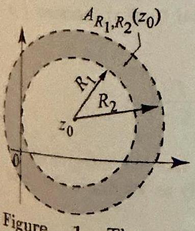

Figure 1 The annulus $A_{\mathrm{P}_{1}, \mathrm{R}_{2}}\left(z_{0}\right)$ centered at $z_{0}$ with inner radius $R_{1}$ and outer radius $R_{2}$.

The Taylor series representation of an analytic function is very useful, especially because of the simple expression of the terms in that series, $c_{n}\left(z-z_{0}\right)^{n}$, where $n \geq 0$. There is a similar series representation in terms of both positive and negative powers of $\left(z-z_{0}\right)$ for functions that are analytic in annular regions around a point $z_{0}$. These series are known as Laurent series, after the French engineer and mathematician Pierre Alphonse Laurent (18131854), who discovered them around 1842. Laurent series are of the form $\sum_{n=0}^{\infty} a_{n}\left(z-z_{0}\right)^{n}+\sum_{n=1}^{\infty} \frac{b_{n}}{\left(z-z_{0}\right)^{n}}$. Note the part with the negative powers of $\left(z-z_{0}\right)$. Without this part, the Laurent series reduces to a power series, which would represent a function analytic at $z_{0}$.

Let us recall the notation for an annulus. If $0 \leq R_{1}<R_{2} \leq \infty$, let

$$
A_{R_{1}, R_{2}}\left(z_{0}\right)=\left\{z: R_{1}<\left|z-z_{0}\right|<R_{2}\right\} .
$$

See Figure 1 for an illustration where $R_{1}$ and $R_{2}$ are nonzero and finite. Note that the annulus $A_{R_{1}, R_{2}}\left(z_{0}\right)$ can degenerate into a punctured disk with $z_{0}$ removed $\left(R_{1}=0\right.$ and $\left.R_{2}<\infty\right)$, a punctured plane with $z_{0}$ removed $\left(R_{1}=0\right.$, $R_{2}=\infty$ ), or a plane with a disk centered at $z_{0}$ cut out of it ( $0<R_{1}$ and $R_{2}=\infty$ ). These sets still count as annuli by our definition.

THEOREM 1 LAURENT SERIES

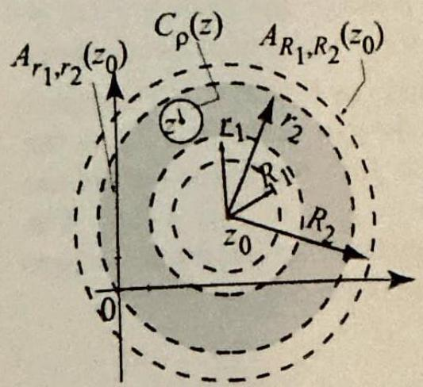
Figure 2 The function $\zeta \mapsto \frac{f(\zeta)}{\zeta-z}$

is analytic inside and on the boundary of the shaded area.

Suppose that $f$ is analytic in the annulus $A_{R_{1}, R_{2}}\left(z_{0}\right)$ where $0 \leq R_{1}<R_{2} \leq \infty$. Then $f$ has a unique Laurent series representation

$$
f(z)=\sum_{n=0}^{\infty} a_{n}\left(z-z_{0}\right)^{n}+\sum_{n=1}^{\infty} \frac{a_{-n}}{\left(z-z_{0}\right)^{n}}, \quad R_{1}<\left|z-z_{0}\right|<R_{2},
$$

where the Laurent coefficients are given by

$$
a_{n}=\frac{1}{2 \pi i} \int_{C_{R}\left(z_{0}\right)} \frac{f(\zeta)}{\left(\zeta-z_{0}\right)^{n+1}} d \zeta \quad(n=0, \pm 1, \pm 2, \ldots)
$$

with $R_{1}<R<R_{2}$ and $C_{R}\left(z_{0}\right)$ is any positively oriented circle centered at $z_{0}$ and contained in $A_{R_{1}, R_{2}}\left(z_{0}\right)$. The Laurent series converges absolutely for all $z$ in $A_{R_{1}, R_{2}}\left(z_{0}\right)$ and uniformly on any closed subannulus $R_{1}<\rho_{1} \leq \left|z-z_{0}\right| \leq \rho_{2}<R_{2}$.
Proof Given $z$ in the annulus $A_{R_{1}, R_{2}}\left(z_{0}\right)$, we can find $r_{1}, r_{2}$ and $\rho$ so that $R_{1}< r_{1}<r_{2}<R_{2}$ and $C_{\rho}(z)$ is contained in $A_{r_{1}, r_{2}}\left(z_{0}\right)$ (see Figure 2). The function $\zeta \mapsto \frac{f(\zeta)}{\zeta-z}$ is analytic inside and on the boundary of the region outside $C_{\rho}(z)$ and inside $A_{r_{1}, r_{2}}\left(z_{0}\right)$. So by Cauchy's theorem for multiply connected regions (Theorem 6, Section 3.4), we have

$$
\frac{1}{2 \pi i} \int_{C_{r_{2}}\left(z_{0}\right)} \frac{f(\zeta)}{\zeta-z} d \zeta=\frac{1}{2 \pi i} \int_{C_{\rho}(z)} \frac{f(\zeta)}{\zeta-z} d \zeta+\frac{1}{2 \pi i} \int_{C_{r_{1}}\left(z_{0}\right)} \frac{f(\zeta)}{\zeta-z} d \zeta
$$

where all circular paths are positively oriented. By Cauchy's integral formula (Theorem 1 , Section 3.6), the first integral on the right is equal to $f(z)$, because $f$ is analytic inside and on $C_{\rho}(z)$. So

$$
f(z)=\frac{1}{2 \pi i} \int_{C_{r_{2}}\left(z_{0}\right)} \frac{f(\zeta)}{\zeta-z} d \zeta-\frac{1}{2 \pi i} \int_{C_{r_{1}}\left(z_{0}\right)} \frac{f(\zeta)}{\zeta-z} d \zeta
$$

Since $z$ is inside $C_{r_{2}}\left(z_{0}\right)$, the first integral looks exactly like the integral in (5), Section 4.4. Using a power series expansion of $\frac{1}{\zeta-z}$, exactly as we did in the proof of Theorem 1, Section 4.4, we obtain

$$
\frac{1}{2 \pi i} \int_{C_{r_{2}}\left(z_{0}\right)} \frac{f(\zeta)}{\zeta-z} d \zeta=\sum_{n=0}^{\infty} a_{n}\left(z-z_{0}\right)^{n}, \text { where } a_{n}=\frac{1}{2 \pi i} \int_{C_{r_{2}}\left(z_{0}\right)} \frac{f(\zeta)}{\left(\zeta-z_{0}\right)^{n+1}} d \zeta
$$

To analyze the second integral on the right of (3), we appeal to Lemma 1, Section 4.4
with $z_{2}=z$ and $z_{1}=\zeta$. Then

$$
\frac{1}{z-\zeta}=\sum_{n=0}^{\infty} \frac{\left(\zeta-z_{0}\right)^{n}}{\left(z-z_{0}\right)^{n+1}}=\sum_{n=1}^{\infty} \frac{\left(\zeta-z_{0}\right)^{n-1}}{\left(z-z_{0}\right)^{n}}, \quad\left|\zeta-z_{0}\right|<\left|z-z_{0}\right|
$$

Multiplying both sides by $f(\zeta)$ and then integrating term by term, we obtain

$$
\begin{aligned}
-\frac{1}{2 \pi i} \int_{C_{r_{1}}\left(z_{0}\right)} \frac{f(\zeta)}{\zeta-z} d \zeta & =\sum_{n=1}^{\infty}\left\{\frac{1}{\left(z-z_{0}\right)^{n}} \frac{1}{2 \pi i} \int_{C_{r_{1}}\left(z_{0}\right)} f(\zeta)\left(\zeta-z_{0}\right)^{n-1} d \zeta\right\} \\
& =\sum_{n=1}^{\infty} \frac{a_{-n}}{\left(z-z_{0}\right)^{n}}
\end{aligned}
$$

where $a_{-n}=\frac{1}{2 \pi i} \int_{C_{r_{1}}\left(z_{0}\right)} f(\zeta)\left(\zeta-z_{0}\right)^{n-1} d \zeta$. The term-by-term integration is justified using uniform convergence, just as in the proof of Theorem 1, Section 4.4 (Exercise 32). This establishes the Laurent series expansion (1). To obtain (2), note that $C_{r_{1}}\left(z_{0}\right)$ and $C_{r_{2}}\left(z_{0}\right)$ are continuously deformable into $C_{R}\left(z_{0}\right)$ relative to the annular region $A_{R_{1}, R_{2}}\left(z_{0}\right)$, so we can replace the paths in the integrals defining $a_{n}$ and $b_{n}$ by $C_{R}\left(z_{0}\right)$. These formulas are independent of $R$ so long as $R_{1}<R<R_{2}$, so the Laurent coefficients $a_{n}$ as given in (2) are uniquely specified. Furthermore, any expansion of the form (1) will have the coefficients given in (2), as is seen by integrating (1) term by term against $\frac{1}{\left(z-z_{0}\right)^{m+1}}$ on a path $C_{R}\left(z_{0}\right)$. The proofs of the uniform and absolute convergence of the Laurent series are similar to proofs that we did previously with Taylor series (see Exercise 33).

As with power series, often in computing Laurent series, you do not want to use (2) to find the coefficients, but rather resort to manipulations of known series.

## EXAMPLE 1 Laurent series

Find the Laurent series expansions of (a) $e^{\frac{1}{z}}$, for $0<|z|$; and (b) $\frac{1}{1-z}$, for $1<|z|$.
Solution (a) Start with the exponential series $e^{z}=\sum_{n=0}^{\infty} \frac{z^{n}}{n!}$, which is valid for all $z$. In particular, if $z \neq 0$, putting $\frac{1}{z}$ into this series, we obtain

$$
e^{\frac{1}{n}}=\sum_{n=0}^{\infty} \frac{1}{n!z^{n}}=1+\sum_{n=1}^{\infty} \frac{1}{n!z^{n}}=1+\frac{1}{1!z}+\frac{1}{2!z^{2}}+\frac{1}{3!z^{3}}+\cdots
$$

By the uniqueness of the Laurent series representation in the annulus $0<|z|$, we have thus found the Laurent series of $e^{\frac{1}{z}}$ in the annulus $0<|z|$.
(b) Here we have to use the geometric series $\sum_{n=0}^{\infty} w^{n}=\frac{1}{1-w}$, for $|w|<1$. Since $1<|z|$, we cannot apply this expansion with $w=z$. But we can apply it with $w=\frac{1}{z}$, because $|w|=\frac{1}{|z|}<1$. This can be done by factoring $z$ from the denominator as follows:

$$
\frac{1}{1-z}=\frac{1}{z} \frac{1}{\frac{1}{z}-1}=\frac{-1}{z} \overbrace{\frac{1}{1-\frac{1}{z}}}^{=\frac{1}{1-w}}=\frac{-1}{z} \sum_{n=0}^{\infty}\left(\frac{1}{z}\right)^{n}=\sum_{n=0}^{\infty} \frac{-1}{z^{n+1}}, \quad 1<|z| .
$$

We could stop here, but if we want to match the Laurent series form (1), we change $n+1$ to $n$ in the series, adjust the summation limit, and get

$$
\frac{1}{1-z}=\sum_{n=1}^{\infty} \frac{-1}{z^{n}}=-\frac{1}{z}-\frac{1}{z^{2}}-\frac{1}{z^{3}}-\cdots, \quad 1<|z|
$$

Combining Example 1(b) with the geometric series, we obtain the following useful identities:

$$
\frac{1}{1-w}= \begin{cases}\sum_{n=0}^{\infty} w^{n} & \text { if }|w|<1, \\ -\sum_{n=1}^{\infty} \frac{1}{w^{n}} & \text { if } 1<|w| .\end{cases}
$$

Here is an application.

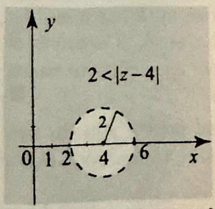
Figure 3 The function \$f(z)=

\frac{1}{z-6}\$ is analytic in the annulus $2<|z-4|$ and so has a Laurent series expansion there.

## EXAMPLE 2 Manipulating the geometric series

Find the Laurent series expansion of $f(z)=\frac{1}{z-6}$ in the annulus $2<|z-4|$ (Figure 3).
Solution Since we are expanding around 4, we need to see the expression $(z-4)$ in the denominator of $f$. For this purpose, and in order to apply (5), let us write

$$
\frac{1}{z-6}=\frac{1}{(z-4)-2}=-\frac{1}{2} \frac{1}{1-\frac{z-4}{2}}=-\frac{1}{2} \frac{1}{1-w}
$$

where $w=\frac{z-4}{2}$. If $2<|z-4|$ then $|w|=\left|\frac{z-4}{2}\right|>1$ and so the second identity in (5) implies that

$$
\frac{1}{z-6}=-\frac{1}{2} \frac{1}{1-w}=\frac{1}{2} \sum_{n=1}^{\infty} \frac{1}{w^{n}}=\frac{1}{2} \sum_{n=1}^{\infty} \frac{2^{n}}{(z-4)^{n}}=\sum_{n=1}^{\infty} \frac{2^{n-1}}{(z-4)^{n}}
$$

which is the Laurent series of $\frac{1}{z-6}$ in the annulus $2<|z-4|$.
In working through the next example, you should outline for yourself a general method for finding the Laurent series of a rational function.

EXAMPLE 3 Laurent series of a rational function
Find the Laurent series expansion of $f(z)=\frac{3 z^{2}-2 z+4}{z-6}$ in the annulus $2<|z-4|$ of the previous example.
Solution Since the degree of the numerator is larger than the degree of the denominator, the first step is to divide the numerator by the denominator:

$$
\frac{3 z^{2}-2 z+4}{z-6}=3 z+16+\frac{100}{z-6}
$$

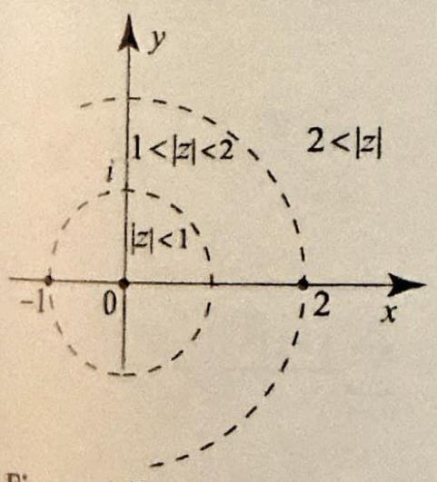
Figure 4 The function
$$
f(z)=\frac{3}{(1+z)(2-z)}
$$

is not analytic at $z=-1$ and $z=2$. It has three Laurent series expansions around 0 .

The quotient $3 z+16$ has a simple expression in terms of powers of $(z-4)$ : $3 z+16= 3(z-4)+28$. The next step is to compute the Laurent series of the remainder $\frac{100}{z-6}$. But this part follows easily from Example 2: for $2<|z-4|$,

$$
\frac{100}{z-6}=100 \sum_{n=1}^{\infty} \frac{2^{n-1}}{(z-4)^{n}}
$$

So, for $2<|z-4|$, we have the Laurent series

$$
\frac{3 z^{2}-2 z+4}{z-6}=3 z+16+\frac{100}{z-6}=3(z-4)+28+100 \sum_{n=1}^{\infty} \frac{2^{n-1}}{(z-4)^{n}}
$$

The uniqueness property of the Laurent series in Theorem 1 is very important. However, you should keep in mind that the Laurent series expansion does depend on the region, so different annular regions might give different Laurent series expansions. Clearly, if a given annulus can be expanded within the domain of analyticity of the function, the Laurent series will not change, since the integral formulas (2) do not change. However, when we have disjoint annuli and the function is not analytic in the region between them, the two Laurent series will probably be different.

## EXAMPLE 4 The Laurent series expansions of a function

Find all the Laurent series expansions of $f(z)=\frac{3}{(1+z)(2-z)}$ around $z_{0}=0$.
Solution This problem has two parts. First we must determine how many different Laurent series expansions $f$ has around 0 . Then we must find these Laurent series. To answer the first question, we ask ourselves, what are the largest disjoint annular regions around $z_{0}=0$ on which $f$ is analytic? The function $f$ is analytic at all points except at $z=-1$ and $z=2$. So the desired regions around 0 on which $f$ is analytic are $|z|<1 ; 1<|z|<2$; and $2<|z|$ (Figure 4). Note that the first region $|z|<1$ is really a disk, not an annulus, and so we use a power series expansion there, which is really just a special case of a Laurent series expansion (Theorem 1, Section 4.4). So $f$ has three different Laurent series expansions around 0 ; one of them being a power series. Let us find them. We will need the partial fraction decomposition

$$
\frac{3}{(1+z)(2-z)}=\frac{1}{1+z}+\frac{1}{2-z}
$$

which you can easily verify.
For $|z|<1$, we have from the geometric series expansion

$$
\frac{1}{1+z}=\frac{1}{1-(-z)}=\sum_{n=0}^{\infty}(-1)^{n} z^{n}, \quad|z|<1
$$

and

$$
\frac{1}{2-z}=\frac{1}{2} \frac{1}{1-\left(\frac{z}{2}\right)}=\frac{1}{2} \sum_{n=0}^{\infty}\left(\frac{z}{2}\right)^{n}=\sum_{n=0}^{\infty} \frac{z^{n}}{2^{n+1}}, \quad\left|\frac{z}{2}\right|<1, \text { or }|z|<2 .
$$

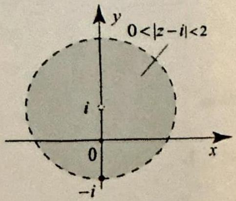

Figure 5 The largest annulus around $i$ on which $f(z)= \frac{1}{1+z^{2}}$ has a Laurent series expansion.

Adding the two series over their common region of convergence, we obtain

$$
\frac{3}{(1+z)(2-z)}=\sum_{n=0}^{\infty}\left((-1)^{n}+\frac{1}{2^{n+1}}\right) z^{n}, \quad|z|<1
$$

which is the Taylor series expansion of $f$ in $|z|<1$. To find the Laurent series in the annulus $1<|z|<2$, we can use (5) or reason as in Example 1(b). We have

$$
\frac{1}{1+z}=\frac{1}{z} \overbrace{\frac{1}{1-\left(-\frac{1}{z}\right)}}^{=\frac{1}{1-w}}=\frac{1}{z} \sum_{n=0}^{\infty}\left(\frac{-1}{z}\right)^{n}=\sum_{n=1}^{\infty} \frac{(-1)^{n-1}}{z^{n}}, \quad 1<|z| .
$$

For the term $\frac{1}{2-z}$, we can use the previous expansion (6). Adding the two, we obtain for $1<|z|<2$,

$$
\begin{aligned}
\frac{3}{(1+z)(2-z)} & =\sum_{n=1}^{\infty} \frac{(-1)^{n-1}}{z^{n}}+\sum_{n=0}^{\infty} \frac{z^{n}}{2^{n+1}} \\
& =\frac{1}{2}+\frac{z}{2^{2}}+\frac{z^{2}}{2^{3}}+\cdots+\frac{1}{z}-\frac{1}{z^{2}}+\frac{1}{z^{3}}-\cdots,
\end{aligned}
$$

which is the Laurent series of $f$ in the annulus $1<|z|<2$. Finally, let us consider the annulus $2<|z|$. Since $2<|z|$, then clearly $1<|z|$, and for the term $\frac{1}{1+z}$ we can use (7). Also, if $2<|z|$, then $\left|\frac{2}{z}\right|<1$, and so

$$
\frac{1}{2-z}=\frac{1}{z} \frac{1}{\left(\frac{2}{z}\right)-1}=\frac{-1}{z} \frac{1}{1-\left(\frac{2}{z}\right)}=\frac{-1}{z} \sum_{n=0}^{\infty}\left(\frac{2}{z}\right)^{n}=-\sum_{n=1}^{\infty} \frac{2^{n-1}}{z^{n}}, \quad 2<|z| .
$$

Adding the two series, we obtain for $2<|z|$,

$$
\begin{aligned}
\frac{3}{(1+z)(2-z)} & =\sum_{n=1}^{\infty} \frac{(-1)^{n-1}}{z^{n}}-\sum_{n=1}^{\infty} \frac{2^{n-1}}{z^{n}}=\sum_{n=1}^{\infty} \frac{(-1)^{n-1}-2^{n-1}}{z^{n}} \\
& =-\frac{3}{z^{2}}-\frac{3}{z^{3}}-\frac{9}{z^{4}}-\cdots,
\end{aligned}
$$

which is the Laurent series of $f$ in the annulus $2<|z|$.
Theorem 1 guarantees the convergence of the Laurent series in the largest annulus where the function is analytic. This is just like the case of a Taylor series which will converge in the largest disk on which the function is analytic.

## EXAMPLE 5 Determining the annulus of convergence

Determine the largest annulus around $z_{0}=i$ of the form $R_{1}<|z-i|<R_{2}$ on which the function $f(z)=\frac{1}{1+z^{2}}$ has a Laurent series and then find the Laurent series.
Solution The function $\frac{1}{1+z^{2}}$ is analytic at all $z$ except $z= \pm i$. It has a Laurent series in the largest annulus around $i$ on which it is analytic. In order to avoid the singularity at $-i$, we take the annulus $0<|z-i|<2$ (Figure 5). We have

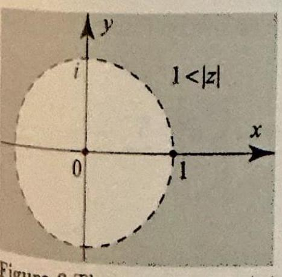
Figure 6 The annulus $1<|z|$ in Example 6.

$\frac{1}{1+z^{2}}=\frac{1}{z-7} \frac{1}{x+1}$. Since we are expanding in terms of $(z-i)$, the factor $\frac{1}{z-1}$ is already in a desirable form, and so we keep it as is and work on the factor $\frac{1}{z+i}$. To make $(z-i)$ appear in the latter factor, we add and subtract $i$ from the denominator. Thus

$$
\frac{1}{1+z^{2}}=\frac{1}{z-i} \frac{1}{z+i}=\frac{1}{z-i} \frac{1}{(z-i)+2 i}=\frac{1}{2 i} \frac{1}{z-i} \frac{1}{1+\left(\frac{z-2}{2 i}\right)}
$$

Since $|z-i|<2$, then $\left|\frac{z-i}{2 i}\right|<1$, and so we can use a geometric series expansion:

$$
\begin{aligned}
\frac{1}{1+z^{2}} & =\frac{1}{2 i} \frac{1}{z-i} \frac{1}{1-\left(-\frac{z-i}{2 i}\right)}=\frac{1}{2 i} \frac{1}{z-i} \sum_{n=0}^{\infty}(-1)^{n}\left(\frac{z-i}{2 i}\right)^{n} \\
& =\frac{1}{2 i}\left[\frac{1}{z-i}-\frac{1}{2 i}-\frac{z-i}{2^{2}}+\frac{(z-i)^{2}}{2^{3} i}+\cdots\right]
\end{aligned}
$$ $\square$

## Differentiation and Integration of Laurent Series

Consider a Laurent series (1) in the annulus $A_{R_{1}, R_{2}}\left(z_{0}\right)$. The function $a_{n}\left(z-z_{0}\right)^{n}$ is analytic on the annulus $A_{R_{1}, R_{2}}\left(z_{0}\right)$, since its only possible problem is at $z_{0}$, which is excluded from the annulus. So each term of a Laurent series is analytic on the annulus $A_{R_{1}, R_{2}}\left(z_{0}\right)$. Since the series converges uniformly on any subannulus of $A_{R_{1}, R_{2}}\left(z_{0}\right)$, it follows that it converges uniformly on any closed disk contained in $A_{R_{1}, R_{2}}\left(z_{0}\right)$. These observations allow us to apply the useful results of Section 4.2. In particular, from Corollary 2, Section 4.2, we infer that the Laurent series can be differentiated term by term as many times as we want within the annulus $A_{R_{1}, R_{2}}\left(z_{0}\right)$. So, for example, differentiating the Laurent series (1) once, we obtain for $R_{1}<\left|z-z_{0}\right|<R_{2}$,

$$
f^{\prime}(z)=\sum_{n=1}^{\infty} n a_{n}\left(z-z_{0}\right)^{n-1}-\sum_{n=1}^{\infty} \frac{n a_{-n}}{\left(z-z_{0}\right)^{n+1}}
$$

We could continue to differentiate term by term to find $f^{\prime \prime}(z), f^{\prime \prime \prime}(z)$, and so forth. Also, by Corollary 1, Section 4.2, if $\gamma$ is any path contained in $A_{R_{1}, R_{2}}\left(z_{0}\right)$, then the Laurent series can be integrated term by term over $\gamma$ :

$$
\int_{\gamma} f(z) d z=\sum_{n=0}^{\infty} a_{n} \int_{\gamma}\left(z-z_{0}\right)^{n} d z+\sum_{n=1}^{\infty} a_{-n} \int_{\gamma} \frac{d z}{\left(z-z_{0}\right)^{n}}
$$

## EXAMPLE 6 Differentiating to find a Laurent series

Find the Laurent series for $f(z)=\frac{1}{(1-z)^{3}}$ in the annulus $1<|z|$ (Figure 6).
Solution Starting with the Laurent series

$$
\frac{1}{1-z}=-\sum_{n=1}^{\infty} \frac{1}{z^{n}}, \quad 1<|z|
$$

if we differentiate both sides we get the Laurent series

$$
\frac{1}{(1-z)^{2}}=\sum_{n=1}^{\infty} \frac{n}{z^{n+1}}, \quad 1<|z| .
$$

Differentiating a second time, we get

$$
\frac{2}{(1-z)^{3}}=-\sum_{n=1}^{\infty} \frac{n(n+1)}{z^{n+2}}, \quad 1<|z|
$$

So the desired Laurent series is

$$
\frac{1}{(1-z)^{3}}=-\frac{1}{2} \sum_{n=1}^{\infty} \frac{n(n+1)}{z^{n+2}}, \quad 1<|z|
$$

## EXAMPLE 7 Term-by-term integration of a Laurent series

Let $C_{1}(0)$ denote the positively oriented circle of radius 1 , centered at 0 . Evaluate the following integrals:
(a) $\int_{C_{1}(0)} \frac{e^{\frac{1}{z}}}{z} d z$,
(b) $\int_{C_{1}(0)} e^{z+\frac{1}{z}} d z$.

Solution Note that the integrands are continuous on the path of integration. So the integrals do exist; however, they cannot be computed using Cauchy's theorem because of the problem at $z=0$, which lies inside the path. The idea is to expand the integrand (or part of the integrand) in a Laurent series in an annulus that contains the path, and then integrate term by term.
(a) In the annulus $0<|z|$, we have

$$
\frac{e^{\frac{1}{z}}}{z}=\frac{1}{z} e^{\frac{1}{z}}=\frac{1}{z} \sum_{n=0}^{\infty} \frac{1}{n!z^{n}}=\sum_{n=0}^{\infty} \frac{1}{n!z^{n+1}}
$$

So

$$
\int_{C_{1}(0)} \frac{e^{\frac{1}{z}}}{z} d z=\int_{C_{1}(0)}\left(\sum_{n=0}^{\infty} \frac{1}{n!z^{n+1}}\right) d z=\sum_{n=0}^{\infty} \frac{1}{n!} \int_{C_{1}(0)} \frac{d z}{z^{n+1}}=2 \pi i
$$

where only the $n=0$ term is nonzero. The technique employed here is the basis of Chapter 5: To compute integrals around circles, we find Laurent expansions and integrate term by term. Only the term involving $\frac{1}{z}$ survives.
(b) Here again, we work on the annulus $0<|z|$. With an eye on Cauchy's integral formula, we do not expand $e^{z}$. For $0<|z|$, we have

$$
e^{z+\frac{1}{3}}=e^{z} e^{\frac{1}{z}}=e^{z} \sum_{n=0}^{\infty} \frac{1}{n!z^{n}}=e^{z}+\frac{e^{z}}{1!z}+\frac{e^{z}}{2!z^{2}}+\frac{e^{z}}{3!z^{3}}+\cdots=e^{z}+\sum_{n=0}^{\infty} \frac{e^{z}}{(n+1)!z^{n+1}}
$$

Integrating term by term yields

$$
\int_{C_{1}(0)} e^{z+\frac{1}{z}} d z=\int_{C_{1}(0)} e^{z} d z+\sum_{n=0}^{\infty} \frac{1}{(n+1)!} \int_{C_{1}(0)} \frac{e^{z}}{z^{n+1}} d z
$$

Cauchy's theorem implies that $\int_{C_{1}(0)} e^{z} d z=0$ because $e^{z}$ is analytic on and inside $C_{1}(0)$. Cauchy's generalized integral formula tells us that

$$
\int_{C_{1}(0)} \frac{e^{z}}{z^{n+1}} d z=\frac{2 \pi i}{n!} f^{(n)}(0)
$$

where $f(z)=e^{z}$. Hence $f^{(n)}(0)=e^{0}=1$, and so

$$
\int_{C_{1}(0)} e^{z+\frac{1}{2}} d z=\sum_{n=0}^{\infty} \frac{1}{(n+1)!} \int_{C_{1}(0)} \frac{e^{z}}{z^{n+1}} d z=2 \pi i \overbrace{\sum_{n=0}^{\infty} \frac{1}{n!(n+1)!}}^{\approx 1.59} \approx 9.99 i
$$

We should also mention that $\sum_{n=0}^{\infty} \frac{1}{n!(n+1)!}=-i J_{1}(2 i)$, where $J_{1}(z)$ is the Bessel function of order 1 (see Example 5, Section 4.3). This connection with Bessel functions will be explored in the exercises. $\square$

Can a function like $\log z$ have a Laurent series expansion around 0 ? The answer is no, because a Laurent series can be differentiated term by term within its annulus of convergence, so it is analytic within its annulus of convergence. Since $\log z$ is not analytic in any annulus around 0 , it cannot equal (or be represented by) a Laurent series around 0 . In fact, no branch of the logarithm has a Laurent series expansion around 0 .

## Exercises 4.5

In Exercises 1-12, use a known Taylor series or Laurent series to derive the Laurent series of the given function in the indicated annulus.

1. $\frac{1}{1+z^{2}}, 1<|z|$.
2. $\frac{3+z}{2-z}, 2<|z|$.
3. $\frac{1+z}{1-z}, 1<|z|$.
4. $z+\frac{1}{z}, 1<|z-1|$.
5. $\log \left(1+\frac{1}{z}\right), 1<|z|$.
6. $\frac{\sin z}{z^{2}}, 0<|z|$.
7. $\frac{e^{\frac{1}{1-z}}}{1-z}, 0<|z-1|$.
8. $\frac{\log (1+z)}{z^{2}}, 0<|z|<1$.
9. $\frac{\sin \frac{1}{z} \cos \frac{1}{z}}{z}, 0<|z|$.
10. $z^{22} e^{\frac{1}{z^{2}}}, 0<|z|$.
11. $\operatorname{coth} z, 0<|z|<\pi$.
12. $\cot z, 0<|z|<\pi$.

In Exercises 13-20, find the Laurent series of the given function in the indicated annulus.
13. $\frac{z}{(z+2)(z+3)}, \quad 2<|z|<3$.
14. $\frac{-2}{(2 z-1)(2 z+1)}, \quad \frac{1}{2}<|z|$.
15. $\frac{1}{(3 z-1)(2 z+1)}, \quad \frac{1}{3}<|z|<\frac{1}{2}$.
16. $\frac{1}{2 z^{2}-3 z+1}, \quad 1<|z|$.
17. $\frac{z^{2}+(1-i) z+2}{(z-i)(z+2)}, \quad 1<|z|<2$.
18. $\frac{4 z-5}{(z-2)(z-1)}, \quad 1<|z-2|$.
19. $\frac{2 z^{3}-4 z^{2}-5 z+11}{z-1}, 1<|z-2|$.
20. $\frac{z^{2}-(3+2 i) z+2+3 i}{z-1-i}, \quad \sqrt{2}<|z|$.
21. Find all the Laurent series of $f(z)=\frac{1}{(z-1)(z+i)}$ around $z_{0}=-1$.
22. Find all the Laurent scries of $f(z)=\frac{1}{z^{2}+1}$ around $z_{0}=1$.
23. (a) Derive the Laurent series

$$
\frac{1}{1+z}=\sum_{n=1}^{\infty} \frac{(-1)^{n-1}}{z^{n}} \quad 1<|z|
$$

Starting with this Laurent series, find the Laurent series of the following functions in the annulus $1<|z|$ :
(b) $\frac{1}{(1+z)^{2}}$;
(c) $\frac{z}{(1+z)^{2}}$;
(d) $\frac{z^{2}}{(1+z)^{3}}$.
24. Find the Laurent series of $\csc ^{2} z$ in the annulus $0<|z|<\pi$.

In Exercises 2530 , evaluate the given integral by using an appropriate Laurent series. As usual, we denote by $C_{R}\left(z_{0}\right)$ the positively oriented circle of radius $R>0$ and center $z_{0}$.
25. $\int_{C_{1}(0)} \sin \frac{1}{z} d z$.
26. $\int_{C_{1}(0)} \frac{\cos \frac{1}{z^{2}}}{z} d z$.
27. $\int_{C_{1}(0)} \cos z \sin \frac{1}{z} d z$.
28. $\int_{C_{1}(0)} e^{z^{2}+\frac{1}{z}} d z$.
29. $\int_{C_{4}(0)} \log \left(1+\frac{1}{z}\right) d z$.
30. $\int_{C_{1}(0)} z^{10} e^{\frac{1}{z}} d z$.
31. Suppose that $f$ is analytic in a region $\Omega, z_{0}$ is in $\Omega$ and $S_{R}\left(z_{0}\right)$ is a closed disk in $\Omega$, centered at $z_{0}$. (a) For $n=0,1,2, \ldots$, derive the Laurent series expansion

$$
\frac{f(z)}{\left(z-z_{0}\right)^{n+1}}=\sum_{k=0}^{\infty} \frac{f^{(k)}\left(z_{0}\right)}{k!} \frac{1}{\left(z-z_{0}\right)^{n+1-k}}, \quad 0<\left|z-z_{0}\right|<R
$$

(b) Prove Cauchy's generalized integral formula using (a) and integration term by term.
32. Refer to (4). Show that the series converges uniformly for all $\zeta$ on $C_{r_{1}}\left(z_{0}\right)$ as follows. Write the series as $\frac{1}{z-z_{0}} \sum_{n=1}^{\infty}\left(\frac{\zeta-z_{0}}{z-z_{0}}\right)^{n-1}$. Show that $\left|\frac{\zeta-z_{0}}{z-z_{0}}\right|=\rho<1$, where $z, z_{0}$, and $\zeta$ are as described in (4). Obtain the uniform convergence by applying the Weierstrass $M$-test.
33. Refer to (1). Follow the outlined steps to show that the Laurent series converges absolutely for all $z$ in $A_{R_{1}, R_{2}}\left(z_{0}\right)$ and uniformly on any closed subannulus $R_{1}<r_{1} \leq\left|z-z_{0}\right| \leq r_{2}<R_{2}$.
(a) Show that the power series in (1) converges absolutely for all $\left|z-z_{0}\right|<R_{2}$ and uniformly on any subdisk $\left|z-z_{2}\right| \leq r_{2}<R_{2}$. [Hint: Use Lemma 2 and Theorem 1, Section 4.3.]
(b) Let $R$ be such that $R_{1}<R<r_{1}$. Since $f$ is analytic in $A_{R_{1}, R_{2}}\left(z_{0}\right)$, it is continuous and hence bounded on $C_{R}\left(z_{0}\right)$. Let $M$ be such that $|f(\zeta)| \leq M$ for all $\zeta$ on $C_{R}\left(z_{0}\right)$. Using (2), show that $\left|a_{-n}\right| \leq M R^{n}$ for $n=1,2, \ldots$. If $R<r_{1} \leq\left|z-z_{0}\right|$ then $\left|\frac{R}{z-z_{0}}\right|=\rho<1$. Apply the Weierstrass $M$-test to show that $\sum_{n=1}^{\infty} \frac{a-n}{(z-20)^{n}}$ converges absolutely and uniformly on the subannulus $R_{1}<r_{1} \leq\left|z-z_{0}\right| \leq r_{2}<R_{2}$.

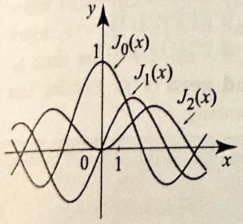
Figure 7 Bessel functions $J_{n}(x)$, for $n=0,1,2$.

34. Uniqueness of Laurent series representation. (a) In the notation of Theorem 1, use (2) to show that $f$ is identically zero in $A_{f_{1}, f_{2}}\left(z_{0}\right)$ if and only if $a_{n}=0$ for all $n$.
(b) Suppose that $f$ and $g$ are analytic in an annulus $A_{H_{1}, H_{2}}\left(z_{0}\right)$. Show that $f(z)=g(z)$ for all $z$ in $A_{R_{1}, R_{2}}\left(z_{0}\right)$ if and only if $f$ and $g$ have the same Laurent series in $A_{R_{1}, R_{2}}\left(z_{0}\right)$.
35. Project Problem: Generating function for Bessel functions of integer order. In this project problem, we will derive the generating function for Bessel functions of integer order (Example 5, Section 4.3):

$$
e^{\frac{z}{2}\left(\zeta-\frac{1}{\zeta}\right)}=\sum_{n=-\infty}^{\infty} J_{n}(z) \zeta^{n}, \quad 0<|\zeta| .
$$

This formula generates the Bessel functions $J_{n}(z)$ as the Laurent coefficients of the function $f(\zeta)=e^{z\left(\zeta-\frac{1}{\zeta}\right)}$, which is clearly analytic in the annulus $0<|\zeta|$.
(a) Proceed as in Example 7(b) and show that for $n=0, \pm 1, \pm 2, \ldots$,

$$
J_{n}(z)=\frac{1}{2 \pi i} \int_{C_{1}(0)} e^{\frac{z}{2}\left(\zeta-\frac{1}{\zeta}\right)} \frac{d \zeta}{\zeta^{n+1}}
$$

[Hint: Write $e^{\frac{x}{2}\left(\zeta-\frac{1}{\zeta}\right)}=e^{\frac{z}{2} \zeta} e^{-\frac{z}{2 \zeta}}$ and expand $e^{-\frac{z}{2 \epsilon}}$ in a Laurent series in $0<|\zeta|$.] (b) We know that $f(\zeta)$ has a Laurent series expansion in $0<|\zeta|$. Write this series as $f(\zeta)=\sum_{n=-\infty}^{\infty} c_{n}(z) \zeta^{n}$. Express the coefficients $c_{n}(z)$ by using (2) and integrating over $C_{1}(0)$. Conclude that $c_{n}(z)$ is equal to the integral in (11), and hence $c_{n}(z)=J_{n}(z)$.
36. Project Problem: Cosine integral representation of Bessel functions.
(a) Parametrize the path integral in (11) and obtain the formula

$$
J_{n}(z)=\frac{1}{2 \pi} \int_{-\pi}^{\pi} e^{i(z \sin \theta-n \theta)} d \theta=\frac{1}{\pi} \int_{0}^{\pi} \cos (z \sin \theta-n \theta) d \theta
$$

This formula is known as the cosine integral representation of $J_{n}(z)$.
(b) Show that for $z=x$ a real number $\left|J_{n}(x)\right| \leq 1$ (Figure 7).

### 4.6 Zeros and Singularities

In this section, we use Taylor and Laurent series to study the zeros and singular points of an analytic function. We will discover interesting properties that show once more the remarkable characteristics of these functions. We start with a description of the zeros.

THEOREM 1
Suppose that $f$ is analytic on an open set $U, z_{0}$ is in $U$, and $f\left(z_{0}\right)=0$. Then ORDER OF ZEROS exactly one of the following holds:
(i) $f$ is identically zero in a neighborhood of $z_{0}$.
(ii) There is an integer $m \geq 1$ such that $f\left(z_{0}\right)=f^{\prime}\left(z_{0}\right)=\cdots= f^{(m-1)}\left(z_{0}\right)=0$ and $f^{(m)}\left(z_{0}\right) \neq 0$. Moreover, there is a function $\lambda(z)$, analytic and nonvanishing in a neighborhood $B_{r}\left(z_{0}\right)$ where $r>0$, such that $f(z)=\left(z-z_{0}\right)^{m} \lambda(z)$ for all $z$ in $\left|z-z_{0}\right|<r$. In this case, we call $z_{0}$ a zero of order $m$ of $f$. If $m=1$, we call $z_{0}$ a simple zero of $f$.

Proof Since $f$ is analytic at $z_{0}$, it has a Taylor series, $f(z)=\sum_{n=0}^{\infty} a_{n}\left(z-z_{0}\right)^{n}$, around $z_{0}$ that converges in the largest open disk $B_{R}\left(z_{0}\right)$ that is contained in $U$. By the uniqueness of the Taylor series expansion (Theorem 1, Section 4.4), if $f$ is identically zero in a neighborhood of $z_{0}$, then all the Taylor coefficients must be 0 . So if (i) holds, (ii) does not hold.

Now suppose that (i) does not hold and let us show that (ii) must hold. Since $f$ is not identically 0 in a neighborhood of $z_{0}$, not all the Taylor coefficients are zero, and so there is a first nonvanishing coefficient, say $a_{0}=a_{1}=\cdots=a_{m-1}=0$, but $a_{m} \neq 0$. From Theorem 1, Section 4.4, we see that $f\left(z_{0}\right)=f^{\prime}\left(z_{0}\right)=\cdots= f^{(m-1)}\left(z_{0}\right)=0$ and $f^{(m)}\left(z_{0}\right) \neq 0$. For $\left|z-z_{0}\right|<R$, write

$$
\begin{aligned}
f(z) & =a_{m}\left(z-z_{0}\right)^{m}+a_{m+1}\left(z-z_{0}\right)^{m+1}+a_{m+2}\left(z-z_{0}\right)^{m+2}+\cdots \\
& =\left(z-z_{0}\right)^{m}\left(a_{m}+a_{m+1}\left(z-z_{0}\right)+a_{m+2}\left(z-z_{0}\right)^{2}+\cdots\right) \\
& =\left(z-z_{0}\right)^{m} \lambda(z)
\end{aligned}
$$

where $\lambda(z)=a_{m}+a_{m+1}\left(z-z_{0}\right)+a_{m+2}\left(z-z_{0}\right)^{2}+\cdots$, and $a_{m} \neq 0$. Since $\lambda(z)$ is a power series, it is analytic for all $\left|z-z_{0}\right|<R$, by Theorem 4, Section 4.3. Also, $\lambda\left(z_{0}\right)=a_{m} \neq 0$ and $\lambda$ is continuous at $z_{0}$, so we can find a neighborhood $B_{r}\left(z_{0}\right)$ of $z_{0}$ such that $\lambda(z) \neq 0$ for all $z$ in $B_{r}\left(z_{0}\right)$.

If $z_{0}$ is a zero of order $m$, and we write $f(z)=\left(z-z_{0}\right)^{m} \lambda(z)$ where $\lambda(z) \neq 0$ for all $\left|z-z_{0}\right|<r$, then $f(z) \neq 0$ for all $0<\left|z-z_{0}\right|<r$, which means that $f$ has no zeros in the neighborhood $\left|z-z_{0}\right|<r$ other than $z_{0}$. This is expressed by saying that $z_{0}$ is an isolated zero of $f$. Putting this fact together with Theorem 1, we obtain the following.

THEOREM 2 LOCAL ISOLATION OF ZEROS

Suppose that $f$ is analytic on an open set $U, z_{0}$ is in $U$, and $f\left(z_{0}\right)=0$. Then exactly one of the following holds:
(i) $f$ is identically zero in a neighborhood of $z_{0}$.
(ii) There is a real number $r>0$ and a neighborhood $B_{r}\left(z_{0}\right)$ of $z_{0}$ in $\Omega$ such that $f(z) \neq 0$ for all $0<\left|z-z_{0}\right|<r$. That is, $z_{0}$ is an isolated zero of $f$.

## EXAMPLE 1 Order of zeros

Find the order $m$ of the zero of $\sin z$ at $z_{0}=0$; then express $\sin z=z^{m} \lambda(z)$, where $\lambda(z)$ is analytic at 0 with $\lambda(0) \neq 0$. (This proves the obvious fact that the zero of $\sin z$ at $z_{0}=0$ is isolated.)
Solution Clearly, 0 is a zero of $\sin z$. The order of the zero is equal to the order of the first nonvanishing derivative of $f(z)=\sin z$ at 0 . Since $f^{\prime}(z)=\cos z$ and $\cos 0=1 \neq 0$, we conclude that the order of the zero at 0 is 1 . We have for all $z$

$$
\sin z=z-\frac{z^{3}}{3!}+\frac{z^{5}}{5!}-\cdots=z\left(1-\frac{z^{2}}{3!}+\frac{z^{4}}{5!}-\cdots\right)=z \lambda(z)
$$

where $\lambda(z)=1-\frac{z^{2}}{3!}+\frac{z^{4}}{5!}-\cdots$. The function $\lambda(z)$ is entire (because it is a convergent power series for all $z$ ), and $\lambda(0)=1$. (Also, for $z \neq 0, \lambda(z)=\frac{\sin z}{z}$, which is entire by Example 5, Section 3.6.)

Theorem 2 raises the following question. Suppose that $f$ is analytic and not identically zero on $\Omega$. Can $f$ vanish on an open nonempty subset of $\Omega$ ? The answer is no; this depends crucially on the fact that $\Omega$ is connected.

## THEOREM 3 ISOLATION OF ZEROS

## THEOREM 4 IDENTITY PRINCIPLE

## COROLLARY 1

Suppose that $f(z)$ is analytic and not identically 0 on a region $\Omega$ (open and connected set). Then all the zeros of $f$ are isolated.
Proof Let $\Omega_{0}$ consists of all the zeros of $f$ that are not isolated zeros, and let $\Omega_{1}$ consists of the remaining points in $\Omega$. Clearly, $\Omega_{0}$ and $\Omega_{1}$ are disjoint and their union is $\Omega$. We will show that $\Omega_{0}$ and $\Omega_{1}$ are open; then by connectedness either $\Omega=\Omega_{0}$ or $\Omega=\Omega_{1}$, which would prove the theorem. Recall that a set is open if it contains a neighborhood of each one of its points. The fact that $\Omega_{0}$ is open follows from Theorem 2, since if $z_{0}$ is not an isolated zero, then $f$ vanishes identically in a neighborhood $B_{r}\left(z_{0}\right)$ of $z_{0}$. Clearly, all the points in $B_{r}\left(z_{0}\right)$ are not isolated zeros of $f$, so $B_{r}\left(z_{0}\right)$ is contained in $\Omega_{0}$, and hence $\Omega_{0}$ is open. To prove that $\Omega_{1}$ is open, let $z_{0}$ be given in $\Omega_{1}$. Either $f\left(z_{0}\right) \neq 0$, in which case we can find a neighborhood of $z_{0}$ where $f$ is nonzero; or $z_{0}$ is an isolated zero, in which case Theorem 2 guarantees us a neighborhood where $f$ has no zeros except the isolated one at $z_{0}$. $\square$

We have two important consequences.
Suppose that $f(z)$ is analytic on a region $\Omega$, and $\left\{z_{n}\right\}$ is an infinite sequence of distinct points in $\Omega$ converging to $z_{0}$ in $\Omega$. Suppose that $f\left(z_{n}\right)=0$ for all $n$. Then $f$ is identically zero on $\Omega$. Consequently, if the set of zeros of an analytic function on $\Omega$ contains an infinite sequence of distinct points that converges in $\Omega$, then the function is identically zero in $\Omega$.
Proof If $z_{n} \rightarrow z_{0}$ and $f\left(z_{n}\right)=0$, then $f\left(z_{0}\right)=0$ and $z_{0}$ is not an isolated zero. By Theorem 3, $f$ is identically zero. $\square$

Suppose that $f(z)$ and $g(z)$ are analytic on a region $\Omega$. If the set of points on which $f(z)=g(z)$ contains an infinite sequence of distinct points that converges in $\Omega$, then $f=g$ on $\Omega$.

Proof Let $h(z)=f(z)-g(z)$ and apply Theorem 4 to $h$. $\square$

In many interesting applications of Corollary 1 , the functions $f$ and $g$ are equal on an interval $[a, b]$ of the real line, or a whole disk $B_{R}\left(z_{0}\right)$. Such sets clearly contain infinite sequences of points that converge in the set itself.

In Section 1.6, we derived various identities involving complex trigonometric functions, which were the same for the real trigonometric functions. The identity principle can be used to justify these and extend other identities from real functions to complex functions. We illustrate these ideas with an example.

## EXAMPLE 2 Applications of the identity principle

(a) In Section 1.6, we proved that for any complex number $z, \cos ^{2} z+\sin ^{2} z=1$. Let us prove this identity using Corollary 1 and the fact that it holds for real $z$. Let $f(z)=\cos ^{2} z+\sin ^{2} z$ and $g(z)=1$. Clearly, $f(z)$ and $g(z)$ are entire, and for real $z=x$, we have $f(x)=\sin ^{2} x+\cos ^{2} x=1=g(x)$. Since $f(z)=g(z)$ for all $z$
on the real line, which is a set that contains infinite converging sequences, we infer from Corollary 1 that $f(z)=g(z)$ for all $z$; that is, $\cos ^{2} z+\sin ^{2} z=1$.
(b) Modifying the method in (a), we can prove identities involving two or more variables. As an illustration, let us prove that for any complex numbers $z_{1}$ and $z_{2}$.

$$
\cos \left(z_{1}+z_{2}\right)=\cos z_{1} \cos z_{2}-\sin z_{1} \sin z_{2}
$$

In a first step, let $z_{2}=x_{2}$ be an arbitrary real number. Let $f(z)=\cos \left(z+x_{2}\right)$ and $g(z)=\cos z \cos x_{2}-\sin z \sin x_{2}$. Clearly, $f(z)$ and $g(z)$ are entire, and from the addition formula for the cosines, we have $f(x)=g(x)$ for all real $x$. Hence by Corollary 1, we have $f(z)=g(z)$ for all $z$; equivalently,

$$
\cos \left(z+x_{2}\right)=\cos z \cos x_{2}-\sin z \sin x_{2} \quad \text { for all complex } z
$$

In a second step, fix $z=z_{1}$ and let $f\left(z_{2}\right)=\cos \left(z_{1}+z_{2}\right)$ and $g\left(z_{2}\right)=\cos z_{1} \cos z_{2}- \sin z_{1} \sin z_{2}$. Here again, $f\left(z_{2}\right)$ and $g\left(z_{2}\right)$ are entire (considered as functions of $z_{2}$ ) and (2) states that $f\left(z_{2}\right)$ and $g\left(z_{2}\right)$ agree on the whole real line. By Corollary 1, $f\left(z_{2}\right)=g\left(z_{2}\right)$ for all $z_{2}$, implying that (1) holds.

Theorem 4 has another useful consequence regarding the number of zeros of an analytic function. In establishing this result, we will need a topological property of complex numbers known as the Bolzano-Weierstrass theorem, which states the following:

> Let $S$ denote a closed and bounded subset of $\mathbb{C}$ and let $Z$ denote an infinite subset of $S$. Then there is an infinite sequence $\left\{z_{n}\right\}$ of distinct elements of $Z$ that converges to a point $z_{0}$ in $S$.

In particular, any infinite sequence of complex numbers in a closed and bounded subset $S$ contains a subsequence that converges in $S$.

## COROLLARY 2

Suppose that $f$ is analytic on a bounded region $\Omega$ and continuous and nonvanishing on the boundary of $\Omega$. Then $f$ can have at most finitely many zeros inside $\Omega$.
Proof Let $S$ be the set $\Omega$ union its boundary. Then $S$ is closed and bounded. Suppose that $f$ has infinitely many zeros in $\Omega$; then by the Bolzano-Weierstrass theorem, there is an infinite sequence of zeros, $\left\{z_{n}\right\}$, that converges to a point $z_{0}$ in $S$. Since $f$ is continuous in $S, f\left(z_{0}\right)=\lim f\left(z_{n}\right)=0$, and since $f$ is nonvanishing on the boundary, we conclude that $z_{0}$ is inside $\Omega$. Hence by Theorem $4, f$ is identically zero on $\Omega$, and since $f$ is continuous, $f$ must be zero on the boundary, which is a contradiction. Hence $f$ can have at most finitely many zeros in $\Omega$. $\square$

## Isolated Singularities

Suppose that $f$ is analytic in a neighborhood of a point $z_{0}$, except at $z_{0}$; that is, $f$ is analytic in an annulus $0<\left|z-z_{0}\right|<R$. Then $z_{0}$ is called an isolated singularity of $f$. We know from the previous section that $f$ has a Laurent series expansion in the annulus $0<\left|z-z_{0}\right|<R$. We will see that there are three possibilities for the Laurent series; each of them will give rise to a different type of singularity. To simplify the presentation, let

DEFINITION 1 THE THREE TYPES OF SINGULARITIES
us start with the definitions of the three types of singularities, based on the behavior of $f$ around $z_{0}$.
Suppose that $z_{0}$ is an isolated singularity of $f$. Then
(i) $z_{0}$ is a removable singularity if $f(z)$ can be redefined at $z_{0}$ so as to be analytic there.
(ii) $\quad z_{0}$ is a pole if $\lim _{z \rightarrow z_{0}}|f(z)|=\infty$.
(iii) $z_{0}$ is an essential singularity if it is neither a pole nor a removable singularity.

When redefining $f(z)$ at a removable singularity $z_{0}$, we must set $f\left(z_{0}\right)= \lim _{z \rightarrow z_{0}} f(z)$; otherwise, $f$ would not be continuous and hence could not be analytic at $z_{0}$. Note that when $z_{0}$ is a removable singularity, $f$ must be bounded near $z_{0}$ (Figure 1(a)). Another way to define a removable singularity is as follows: For $f(z)$ analytic in $0<\left|z-z_{0}\right|<R, z_{0}$ is a removable singularity if there is a function $g(z)$, analytic in $\left|z-z_{0}\right|<R$, a neighborhood of $z_{0}$, such that $f(z)=g(z)$ for all $0<\left|z-z_{0}\right|<R$. We must have $g\left(z_{0}\right)=\lim _{z \rightarrow z_{0}} f(z)$.

The singularity is a pole if the graph of $|f(z)|$ blows up to infinity as we approach $z_{0}$ (Figure 1(b)). An essential singularity is harder to explain at this point. It suffices to say that the graph of $|f(z)|$ near an essential singularity is neither bounded nor tends to infinity (Figure 1(c)). Its behavior is very erratic. We will give several equivalent characterizations of each type

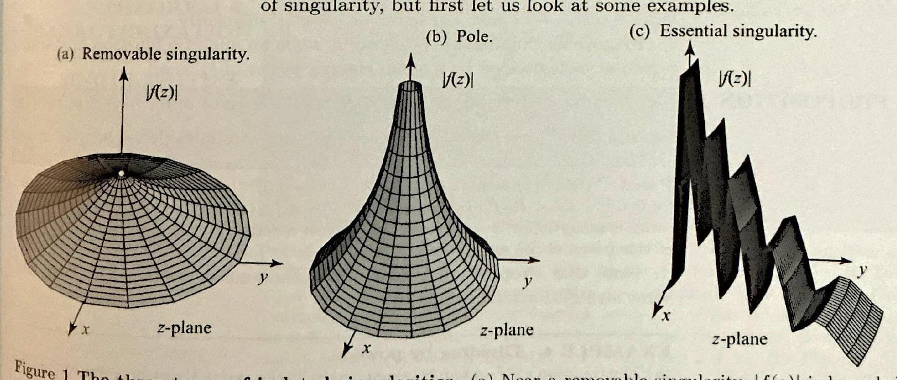
Figure 1 The three types of isolated singularities. (a) Near a removable singularity, $|f(z)|$ is bounded. (b) Near a pole, $|f(z)|$ tends to infinity. (c) Near an essential singularity, $|f(z)|$ is neither bounded nor tends to infinity. Its graph behaves erratically.

EXAMPLE 3 Three types of singularities
(a) The function $f(z)=\frac{z^{2}-1}{z-1}(z \neq 1)$ is analytic everywhere, except at $z_{0}=1$. So $z_{0}=1$ is an isolated singularity. For $z \neq 1, f(z)=\frac{(z-1)(z+1)}{z-1}=z+1$. By defining $f(1)=2$, we make $f$ analytic at $z=1$. This shows that the singularity at $z_{0}=1$ is removable.
(b) Consider the function

$$
f(z)=\frac{z^{2}}{(z-i)^{3}}
$$

It has an isolated singularity at $z=i$. Unlike the previous example, the singularity here is not removable; it is a pole. Since

$$
\lim _{z \rightarrow i}|f(z)|=\lim _{z \rightarrow i} \frac{|z|^{2}}{|z-i|^{3}}=\infty
$$

the graph of $|f(z)|$ has a pole that blows up to infinity above the singularity $z_{0}=i$. (c) Consider

$$
f(z)=e^{\frac{1}{z}}, \quad z \neq 0
$$

We have an isolated singularity at $z_{0}=0$. We will show that it is an essential singularity by eliminating the possibility of the other two types. Suppose that $z=x$ is real and tends to 0 from the right. Then

$$
\lim _{z x x \downarrow 0}\left|e^{\frac{1}{x}}\right|=\lim _{x \downarrow 0} e^{\frac{1}{x}}=\infty
$$

So 0 cannot be a removable singularity. Now suppose that $z=x$ is real and tends to 0 from the left. Then

$$
\lim _{z=x \uparrow 0}\left|e^{\frac{1}{z}}\right|=\lim _{x \uparrow 0} e^{\frac{1}{z}}=0
$$

hence 0 cannot be a pole, and so 0 is an essential singularity.
Removable singularities often occur when an analytic function $h(z)$ with a zero at $z_{0}$ is divided by a small enough power of $\left(z-z_{0}\right)$.

## PROPOSITION 1

Let $h(z)$ be analytic for $\left|z-z_{0}\right|<R$, with a zero of order $m \geq 1$ at $z_{0}$. If $p$ is an integer $\leq m$, then $f(z)=\frac{h(z)}{\left(z-z_{0}\right)^{p}}$ has a removable singularity at $z_{0}$.
Proof Write $h(z)=a_{m}\left(z-z_{0}\right)^{m}+a_{m+1}\left(z-z_{0}\right)^{m+1}+\cdots$ for $\left|z-z_{0}\right|<R$. Then for $0<\left|z-z_{0}\right|<R, f(z)=a_{m}\left(z-z_{0}\right)^{m-p}+a_{m+1}\left(z-z_{0}\right)^{m-p+1}+\cdots$. The power series is analytic for $\left|z-z_{0}\right|<R$, and we can redefine $f(z)$ at $z_{0}$ to equal the value of this power series at $z_{0}$.

Note that Proposition 1 generalizes Theorem 4, Section 3.6. Here are some straightforward examples.

## EXAMPLE 4 Dividing by powers

(a) The function $e^{z-2}-1$ can be expanded in Taylor series about $z_{0}=2$ as $e^{z-2}-1= (z-2)+\frac{1}{2}(z-2)^{2}+\cdots$. Clearly, this function has a zero of order 1 at $z_{0}=2$, so by Proposition 1 (or just by dividing), $\frac{\mathrm{e}^{\mathrm{z}-2}-1}{\mathrm{z}-2}$ has a removable singularity at $z_{0}=2$.
(b) The function $\cos z-1$ can be expanded in Maclaurin series as $\cos z-1=$
$-\frac{1}{2} z^{2}+\frac{1}{4!} z^{4}-\cdots$. Clearly, this function has a zero of order 2 at 0 , so from Proposition 1, each of $\frac{\cos z-1}{z}$ and $\frac{\cos z-1}{z^{2}}$ has a removable singularity at 0 .

There are several ways to characterize each type of singularity. Here is a useful characterization of a removable singularity.

## THEOREM 5

## THEOREM 6

CHARACTERIZATION OF REMOVABLE SINGULARITIES

Let $f$ be analytic with $z_{0}$ an isolated singularity. The singularity at $z_{0}$ is removable if and only if
(3)

$$
\lim _{z \rightarrow z_{0}} f(z)=A
$$

exists and is finite.
Proof One direction has already been discussed: If $z_{0}$ is removable, then $f$ can be redefined at the point to be analytic; hence the limit must exist. The converse is more interesting. Suppose that $f$ is analytic in $0<\left|z-z_{0}\right|<R$ and $\lim _{z \rightarrow z_{0}} f(z)= A$. Define $h(z)=\left(z-z_{0}\right) f(z)$ for $z \neq z_{0}$ and $h\left(z_{0}\right)=0$. Then for $z \neq z_{0}$, $h^{\prime}(z)=\left(z-z_{0}\right) f^{\prime}(z)+f(z)$. Also,

$$
h^{\prime}\left(z_{0}\right)=\lim _{z \rightarrow z_{0}} \frac{\left(z-z_{0}\right) f(z)}{z-z_{0}}=\lim _{z \rightarrow z_{0}} f(z)=A
$$

Hence $h(z)$ is differentiable for all $\left|z-z_{0}\right|<R$ and so, by Goursat's theorem, it is analytic in $\left|z-z_{0}\right|<R$. Since $h$ has a zero of order $\geq 1$, by Proposition 1, $f(z)=\frac{h(z)}{z-z_{0}}$ has a removable singularity.
We can now give several characterizations of a removable singularity.
Suppose that $f$ is analytic on $0<\left|z-z_{0}\right|<R$. The following are equivalent:
(i) $f$ has a removable singularity at $z_{0}$.
(ii) $f(z)=\sum_{n=0}^{\infty} a_{n}\left(z-z_{0}\right)^{n}$, for $0<\left|z-z_{0}\right|<R$.
(iii) $\lim _{z \rightarrow z_{0}} f(z)$ exists and is finite.
(iv) $\lim _{z \rightarrow z_{0}}|f(z)|$ exists and is finite.
(v) $f$ is bounded in a neighborhood of $z_{0}$.
(vi) $\lim _{z \rightarrow z_{0}}\left(z-z_{0}\right) f(z)=0$.

Proof The implication (i) ⇒ (ii) follows from the existence of an analytic $g(z)= \sum_{n=0}^{\infty} a_{n}\left(z-z_{0}\right)^{n}$ for $\left|z-z_{0}\right|<R$, with $f(z)=g(z)$ for $0<\left|z-z_{0}\right|<R$. To show (ii) ⇒ (iii), use the fact that power series are continuous. To show (iii) ⇒ (iv), use continuity of the absolute value function $w \mapsto|w|$. That (iv) ⇒ (v) follows from the definition of a limit. To prove (v) ⇒ (vi), use the squeeze theorem. Let us now show that (vi) ⇒ (i). Let $h(z)=\left(z-z_{0}\right) f(z), z \neq z_{0}$. By Theorem $5, z_{0}$ is a removable singularity of $h(z)$, and by defining $h\left(z_{0}\right)=\lim _{z \rightarrow z_{0}}\left(z-z_{0}\right) f(z)=0$, we make $h(z)$ analytic in a neighborhood of $z_{0}$. Since $h$ has a zero of order $\geq 1$, by Proposition $1, f(z)=\frac{h(z)}{z-z_{0}}$ has a removable singularity at $z_{0}$.

## EXAMPLE 5 Removable singularities

Show that the given function has a removable singularity at the indicated point:
(a) $f(z)=\frac{\sin z}{z}$ at $z_{0}=0$;
(b) $f(z)=\frac{e^{z-1}-1}{z-1}$ at $z_{0}=1$

Solution (a) This example is not new to us (see Example 5, Section 3.6). We will offer a proof based on Theorem 6(vi). We have

$$
\lim _{z \rightarrow 0}(z-0) f(z)=\lim _{z \rightarrow 0} z \frac{\sin z}{z}=\lim _{z \rightarrow 0} \sin z=0
$$

Thus $\frac{\sin z}{z}$ has a removable singularity at $z=0$, by Theorem 6 (vi).
(b) We apply Theorem 6(vi). We have

$$
\lim _{z \rightarrow 1}(z-1) f(z)=\lim _{z \rightarrow 1}(z-1) \frac{e^{z-1}-1}{z-1}=\lim _{z \rightarrow 1}\left(e^{z-1}-1\right)=0
$$

Hence $z_{0}=1$ is a removable singularity. $\square$

In order to characterize poles, we begin by relating a pole of $f(z)$ to a zero of $\frac{1}{f(z)}$. Suppose that $f$ is analytic in $0<\left|z-z_{0}\right|<R$, so that $z_{0}$ is an isolated singularity. Suppose that $z_{0}$ is a pole of $f$. Then, because $\lim _{z \rightarrow z_{0}}|f(z)|=\infty$, we can find $\rho>0$ such that $f(z) \neq 0$ for all $0< \left|z-z_{0}\right|<\rho$. Consider the function

$$
g(z)= \begin{cases}\frac{1}{f(z)} & \text { if } 0<\left|z-z_{0}\right|<\rho \\ 0 & \text { if } z=z_{0}\end{cases}
$$

Clearly, $g(z)$ is analytic and nonzero on $0<\left|z-z_{0}\right|<\rho$. Also, since $\lim _{z \rightarrow z_{0}} g(z)=0=g\left(z_{0}\right)$, it follows from Theorem 6 that $g$ is analytic at $z=z_{0}$; and since $g$ is not identically 0 in a neighborhood of $z_{0}$, it follows that $z_{0}$ is a zero of order $m \geq 1$ of $g$. Appealing to Theorem 1 , we write

$$
g(z)=\left(z-z_{0}\right)^{m} \lambda(z) \text { for all }\left|z-z_{0}\right|<r,
$$

where $m \geq 1$ is the order of the zero of $g$ at $z_{0}$, and $\lambda(z)$ is analytic and nonzero on $\left|z-z_{0}\right|<r$. Consequently, if we set $\phi(z)=\frac{1}{\lambda(z)}$, then $\phi(z)$ is analytic and nonzero on $\left|z-z_{0}\right|<r$, and
(6) $f(z)=\frac{1}{g(z)}=\frac{1}{\left(z-z_{0}\right)^{m}} \frac{1}{\lambda(z)}=\frac{1}{\left(z-z_{0}\right)^{m}} \phi(z), \quad 0<\left|z-z_{0}\right|<r$.

The positive integer $m$ in (6) is called the order of the pole of $f$ at $z_{0}$. If $m=1$, we call $z_{0}$ a simple pole of $f$. Thus the order of the pole of $f$ at $z_{0}$ is equal to the order of the zero of $\frac{1}{f(z)}$ at $z=z_{0}$. Let us summarize this discussion and give several characterizations of poles.

THEOREM 7 CHARACTERIZATION OF POLES

Suppose that $f$ is analytic on $0<\left|z-z_{0}\right|<R$. The following conditions are equivalent and characterize a pole at $z_{0}$.
(i) $\lim _{z \rightarrow z_{0}}|f(z)|=\infty$.
(ii) $f(z)=\frac{1}{\left(z-z_{0}\right)^{m}} \phi(z)$, where $m$ is an integer $\geq 1$ and $\phi(z)$ is analytic and nonzero on $\left|z-z_{0}\right|<r$.
(iii) $\lim _{z \rightarrow z_{0}}\left(z-z_{0}\right)^{m} f(z)=\alpha \neq 0$ for some integer $m \geq 1$.
(iv) $f(z)=\frac{a_{-m}}{\left(z-z_{0}\right)^{m}}+\frac{a_{-m+1}}{\left(z-z_{0}\right)^{m-1}}+\cdots+\frac{a_{-1}}{z-z_{0}}+a_{0}+a_{1}\left(z-z_{0}\right)+\cdots$, for $0<\left|z-z_{0}\right|<r$ with $a_{-m} \neq 0, m \geq 1$.
(v) The function $g$ in (4) is analytic and has a zero of order $m$ at $z_{0}$.

Proof We have already shown that (i) ⇒ (v) ⇒ (ii). To prove (ii) ⇒ (iv), expand $\phi(z)$ in a power series centered at $z_{0}$ :

$$
\phi(z)=\sum_{n=0}^{\infty} c_{n}\left(z-z_{0}\right)^{n}, \quad\left|z-z_{0}\right|<r
$$

where $c_{0}=\phi\left(z_{0}\right) \neq 0$. Since $\phi\left(z_{0}\right) \neq 0$, it follows that $a_{-m}=c_{0}=\phi\left(z_{0}\right) \neq 0$. That (iii) ⇒ (iv) is immediate. To show (iii) ⇒ (i), suppose (i) does not hold; then we can find a sequence $z_{n} \rightarrow z_{0}$ such that $f\left(z_{n}\right)$ is bounded. For this sequence, we have $\lim _{z_{n} \rightarrow z_{0}}\left(z-z_{0}\right)^{m} f(z)=0$, which contradicts (iii).

## EXAMPLE 6 Poles

Determine the order of the pole of the given function at the indicated point:
(a) $f(z)=\frac{1}{z \sin z}$ at $z_{0}=0$;
(b) $f(z)=\frac{e^{z^{2}}-1}{z^{4}}$ at $z_{0}=0$.

Solution (a) We use Theorem 7(iii) and our knowledge of the function $\sin z$ around 0 . Since

$$
\lim _{z \rightarrow 0} z^{2} \frac{1}{z \sin z}=\lim _{z \rightarrow 0} \frac{z}{\sin z}=1 \neq 0
$$

we conclude that 0 is a pole of order 2 of $f(z)$.
(b) We use Laurent series. Since

$$
e^{z}=\sum_{n=0}^{\infty} \frac{z^{n}}{n!}, \quad \text { all } z,
$$

then

$$
e^{z^{2}}=\sum_{n=0}^{\infty} \frac{z^{2 n}}{n!}=1+\frac{z^{2}}{1!}+\frac{z^{4}}{2!}+\frac{z^{6}}{3!}+\cdots, \quad \text { all } z,
$$

hence

$$
e^{z^{2}}-1=\frac{z^{2}}{1!}+\frac{z^{4}}{2!}+\frac{z^{6}}{3!}+\cdots, \quad \text { all } z,
$$

and so for $z \neq 0$

$$
\frac{e^{z^{2}}-1}{z^{4}}=\frac{z^{2}}{1!z^{4}}+\frac{z^{4}}{2!z^{4}}+\frac{z^{6}}{3!z^{4}}+\cdots=\frac{1}{1!z^{2}}+\frac{1}{2!}+\frac{z^{2}}{3!}+\frac{z^{4}}{4!}+\cdots
$$

Thus the order of the pole at 0 is 2 .
Having characterized removable singularities and poles in terms of Lan. rent series, this leaves one possibility for essential singularities. They must have infinitely many terms involving negative powers of $\left(z-z_{0}\right)$. For ease of reference, we list all three possibilities together.

THEOREM 8 LAURENT SERIES CLASSIFICATION OF ISOLATED SINGULARITIES

Suppose that $f$ is analytic in a region $\Omega$ except for an isolated singularity at $z_{0}$ in $\Omega$. Let

$$
f(z)=\sum_{n=-\infty}^{\infty} a_{n}\left(z-z_{0}\right)^{n}
$$

denote the Laurent series expansion of $f$ about $z_{0}$, which is valid in some annulus $0<\left|z-z_{0}\right|<R$. Then
(i) $z_{0}$ is a removable singularity $\Leftrightarrow a_{n}=0$ for all $n=-1,-2, \ldots$.
(ii) $z_{0}$ is a pole of order $m \geq 1 \Leftrightarrow a_{-m} \neq 0$ for some $m>0$ and $a_{n}=0$ for all $n<-m$.
(iii) $z_{0}$ is an essential singularity $\Leftrightarrow a_{n} \neq 0$ for infinitely many $n<0$.

## EXAMPLE 7 Essential singularities

Classify the isolated singularities of the function $f(z)=e^{\frac{z}{\sin z}}$.
Solution The function $f(z)$ is analytic at all points except where $\sin z=0$; that is, except when $z=k \pi$, where $k$ is an integer. It is difficult to find the Laurent series expansion of $f(z)$, so we will use the characterizations of Theorems 6 and 7. When $z=0$, we have $\lim _{z \rightarrow 0} \frac{z}{\sin z}=1$, hence $\lim _{z \rightarrow 0} e^{\frac{z}{\sin z}}=e$, and so the function has a removable singularity at $z=0$ by Theorem 6(iii). We claim that we have an essential singularity at $z=k \pi, k \neq 0$. To prove this, we will eliminate the possibility of a removable singularity or a pole. Suppose that $k$ is even. Then it is easy to see that if $z=x$ is real, then $\lim _{x \downarrow k \pi} \frac{x}{\sin x}=+\infty$ and $\lim _{x \uparrow k \pi} \frac{x}{\sin x}=-\infty$. So if $z=x$ is real, then

$$
\lim _{x \mid k \pi} e^{\frac{x}{\sin x}}=\infty,
$$

implying that $k \pi$ is not a removable singularity of $e^{\frac{z}{\sin z}}$. Also,

$$
\lim _{x \uparrow k \pi} e^{\frac{x}{\sin x}}=0,
$$

implying that $k \pi$ is not a pole of $e^{\frac{z}{\sin z}}$. This leaves only one possibility: $k \pi$ is an essential singularity of $e^{\frac{z}{\sin z}}$. A similar argument works for odd $k$.

Perhaps the best way to determine whether an isolated singularity is an essential singularity is to rule out the possibility of the other two types of singularities. As we just showed in Example 7, this can be achieved by showing that the function is unbounded and has different limits as we approach the isolated singularity in different ways. In fact, the next theorem tells us that given any complex number $\alpha$, we can approach an essential singularity in such a way that $f(z)$ tends to $\alpha$. This peculiar phenomenon characterizes an essential singularity.

## THEOREM 9 CASORATIWEIERSTRASS THEOREM

Suppose that $f$ is analytic on $0<\left|z-z_{0}\right|<R$. Then $z_{0}$ is an essential singularity of $f$ if and only if the following two conditions hold:
(i) There is a sequence $\left\{z_{n}\right\}$ such that $z_{n} \rightarrow z_{0}$ and $\lim _{n \rightarrow \infty}\left|f\left(z_{n}\right)\right|=\infty$.
(ii) For any complex number $\alpha$, there is a sequence $\left\{z_{n}\right\}$ (that depends on $\alpha)$ such that $z_{n} \rightarrow z_{0}$ and $\lim _{n \rightarrow \infty} f\left(z_{n}\right)=\alpha$.

The theorem was discovered independently by Weierstrass and the Italian mathematician Felice Casorati (1835-1890). Keep in mind that (i) is not saying that $\lim _{z \rightarrow z_{0}}|f(z)|=\infty$. It is just saying that you can approach $z_{0}$ in such a way that $|f(z)|$ will tend to infinity. Similarly, part (ii) says that you can approach $z_{0}$ in such a way that $f(z)$ will come arbitrarily close to any complex value $\alpha$. In fact, a deep result in complex analysis, known as Picard's great theorem, states that, in a neighborhood of an essential singularity, a function takes on every complex value, with one possible exception, an infinite number of times.

Proof If (i) is true, then $f$ is not bounded near $z_{0}$, and so $z_{0}$ is not a removable singularity. If (ii) is true, then it is not the case that $\lim _{z \rightarrow z_{0}}|f(z)|=\infty$, and so $z_{0}$ is not a pole. Thus (i) and (ii) together imply that $z_{0}$ is an essential singularity. Conversely, let $z_{0}$ be an essential singularity. Since $f(z)$ is not bounded near $z_{0}$ (otherwise $z_{0}$ would be a removable singularity), it follows that (i) holds. Now suppose that (ii) fails. Then $|f(z)-\alpha| \geq \epsilon>0$ for some $\alpha$ and all $z$ in some deleted neighborhood $0<\left|z-z_{0}\right|<r$. Consider the function $g(z)=\frac{1}{f(z)-\alpha}$. Then $|g(z)| \leq \frac{1}{\epsilon}$ for all $z$ in $0<\left|z-z_{0}\right|<r$, and so $z_{0}$ is a removable singularity for $g$. Moreover, since $\lim _{z \rightarrow z_{0}}|f(z)| \neq \infty$, we conclude that $g\left(z_{0}\right) \neq 0$. Solving for $f(z)$, we find $f(z)=\frac{1}{g(z)}+\alpha$, which is analytic in a neighborhood of $z_{0}$, because $g\left(z_{0}\right) \neq 0$. This is a contradiction. Hence (ii) must hold. $\square$

We end the section by extending the definitions of zeros and singularities to the point at infinity. If $f$ is analytic on a neighborhood of infinity-that is, $f$ is analytic for all $|z|>R$-then $f\left(\frac{1}{z}\right)$ is analytic in the annulus $0<|z|<\frac{1}{R}$ and hence it has an isolated singularity at 0 . With this in mind, we make the following definitions.

DEFINITION 2 SINGULARITIES AT INFINITY

Suppose that $f$ is analytic for all $|z|>R$. Then $f$ has
a removable singularity at $\infty$ if $f\left(\frac{1}{z}\right)$ has a removable singularity at 0 ; a pole of order $m$ at $\infty$ if $f\left(\frac{1}{z}\right)$ has a pole of order $m$ at 0 ;
an essential singularity at $\infty$ if $f\left(\frac{1}{z}\right)$ has a essential singularity at 0 .

When $f$ has a removable singularity at $\infty, \lim _{z \rightarrow \infty} f(z)$ exists. When $\lim _{z \rightarrow \infty} f(z)=0$, we say that $f$ has a zero at $\infty$.

## EXAMPLE 8 Singularities at $\infty$

Characterize all entire functions with a pole of order $m \geq 1$ at $\infty$.
Solution Since $f$ is entire, it has a Maclaurin series that converges for all $z$ : $f(z)=\sum_{n=0}^{\infty} c_{n} z^{n}$, for all $z$. For $z \neq 0, f\left(\frac{1}{z}\right)=\sum_{n=0}^{\infty} \frac{c_{n}}{z^{n}}$. Appealing to Theorem 7(iv), we see that $f\left(\frac{1}{z}\right)$ has a pole of order $m \geq 1$ at 0 if and only if $c_{m} \neq 0$ and $c_{n}=0$ for all $n>m$-that is, if and only if $f(z)$ is a polynomial of degree $m$. Consequently, $f(z)$ has a pole of order $m \geq 1$ at $\infty$ if and only if $f(z)$ is a polynomial of degree $m$.

## Exercises 4.6

In Exercises 1-8, find the isolated zeros of the given function. Also, find the order of each isolated zero.

1. $\left(1-z^{2}\right) \sin z$.
2. $z^{3}\left(e^{z}-1\right)$.
3. $\frac{z(z-1)^{2}}{z^{2}+2 z-1}$.
4. $\sin \frac{1}{z}$.
5. $\frac{\sin ^{7} z}{z^{4}}$.
6. $(z-1)^{3}\left(e^{2 z}-1\right)^{2}$.
7. $\left(z^{2}+2 z-1\right)^{3}$.
8. $\sinh z$.

In Exercises 9-12, find the order of the zero at $z_{0}=0$.
9. $1-\frac{z^{2}}{2}-\cos z$.
10. $z \log (1+z)$.
11. $z-\sin z$.
12. $\tan z$.

In Exercises 13-24, classify the isolated singularities of the given function. Do not include the case at $\infty$. At a removable singularity, redefine the function in order to make it analytic. If it is a pole, determine its order.
13. $\frac{1-z^{2}}{\sin z}+\frac{z-1}{z+1}$.
14. $\frac{z-1}{z-i}+\frac{z-i}{z-1}$.
15. $\frac{z(z-1)^{2}}{\sin (\pi z) \sin z}$.
16. $e^{\frac{1}{1-z}}+\frac{1}{1-z}$.
17. $z \tan \frac{1}{z}$.
18. $\frac{z}{e^{z}-1}$.
19. $\frac{z}{z^{4}-1}-\frac{\sin (2 z)}{z^{4}}$.
20. $z^{2} \sin \frac{1}{z^{2}}$.
21. $\frac{1}{z}-\sin \frac{1}{z}$.
22. $\frac{1}{\left(e^{z}-e^{2 z}\right)^{2}}$.
23. $\frac{\cot z}{\left(z-\frac{\pi}{2}\right)^{2}}$.
24. $\frac{z \sin z}{\cos z-1}$.

In Exercises 25-30, determine if the function has an isolated singularity at $\infty$, and determine its type. Does the function have a zero at $\infty$ ?
25. $\frac{1}{z+1}$.
26. $\frac{z^{2}-1}{z^{2}+2 z+3 i}$.
27. $\frac{z}{z^{2}+1}-\frac{1}{z}$.
28. $e^{z}-\cos \frac{1}{z}$.
29. $\sin \frac{1}{z}$.
30. $\frac{e^{z}}{e^{z}-1}$.
31. Prove the given identity using Corollary 1.
(a) $\sin ^{2} z=\frac{1-\cos 2 z}{2}$.
(b) $\sin (2 z)=2 \sin z \cos z$.
(c) $\quad \tan (2 z)=\frac{2 \tan z}{1-\tan ^{2} z}$
$z \neq \frac{\pi}{2}+2 k \pi$ or $\frac{\pi}{4}+2 k \pi$.
32. Prove the given identity using Corollary 1.
(a) $e^{z_{1}+z_{2}}=e^{z_{1}} e^{z_{2}}$.
(b) $\sin \left(z_{1}+z_{2}\right)=\sin z_{1} \cos z_{2}+\cos z_{1} \sin z_{2}$.
33. Give a new proof of Liouville's theorem (Theorem 2, Section 3.7) based on Theorem 6 as follows. (a) Suppose $f(z)$ is entire and bounded. Show that $f\left(\frac{1}{z}\right)$ has a removable singularity at 0 .
(b) Express the Laurent series expansion of $f\left(\frac{1}{z}\right)$ around 0 by replacing $z$ by $\frac{1}{z}$ in the Maclaurin series expansion of $f(z)$. Using (a), conclude that $f$ must be constant.
34. Show that $f(z)$ has an essential singularity at $z_{0}$ if and only if $\left(z-z_{0}\right)^{m} f(z)$ has an essential singularity at $z_{0}$, where $m$ is any integer.
35. Basic properties. Prove the following assertions concerning zeros and isolated singularities.
(a) If $f$ has a zero of order $m \geq 0$ at $z_{0}$ and $g$ has a zero of order $n \geq 0$ at $z_{0}$, then $f g$ has a zero of order $m+n$ at $z_{0}$. (Here we take a zero of order 0 to mean analytic and nonvanishing in a neighborhood of $z_{0}$.)
(b) If $f$ has a pole of order $m \geq 1$ at $z_{0}$ and $g$ has a zero of order $n \geq 1$ at $z_{0}$, then at $z_{0}, f g$ has a pole of order $m-n$ if $m>n$; a zero of order $n-m$ if $n>m$; and a removable singularity if $m=n$.
(c) If $f$ has a removable singularity at $z_{0}$ and $g$ is analytic at $z_{0}$, then $f g$ has a removable singularity at $z_{0}$.
(d) If $f$ has an essential singularity at $z_{0}$ and $g$ is not identically 0 with a removable singularity or a pole at $z_{0}$, then $f g$ has an essential singularity at $z_{0}$. [Hint: Multiply or divide by suitable $\left(z-z_{0}\right)^{m}$ so that $g(z)$ is analytic and nonvanishing in a neighborhood of $z_{0}$; use Exercise 34.] Does the assertion remain true if $g$ has an essential singularity at $z_{0}$ ?
36. Show that $f$ has a removable singularity at $z_{0}$ if and only if either Re $f$ or $\operatorname{Im} f$ is bounded in a neighborhood of $z_{0}$. [Hint: One direction is easy. For the other direction, suppose that $\operatorname{Re} f$ is bounded and show that $g(z)=e^{i f(z)}$ has a removable singularity at $z_{0}$. Compute $g^{\prime}(z)$ and conclude that $f^{\prime}$ is analytic at $z_{0}$. Conclude that $f$ is analytic at $z_{0}$.]
37. (a) Show that if $f$ has a pole of order $m \geq 1$ at $z_{0}$ and $n$ is any nonzero integer then $[f(z)]^{n}$ has a pole at $z_{0}$ of order $m n$ if $n>0$ or a zero at $z_{0}$ of order $m n$ if $n<0$.
(b) Show that if $f$ has an essential singularity at $z_{0}$ and $n$ is any nonzero integer then $[f(z)]^{n}$ has an essential singularity at $z_{0}$.
38. Suppose that $f$ and $g$ are entire functions such that $f \circ g$ is a polynomial. Show that both $f$ and $g$ must be polynomials. [Hint: If $p(z)$ is a nonconstant polynomial then $\lim _{z \rightarrow \infty}|p(z)|=\infty$. Suppose that $f$ is not a polynomial. Then $f$ has an essential singularity at $\infty$. Use this and the Casorati-Weierstrass theorem to show that $\lim _{z \rightarrow \infty}|f \circ g(z)| \neq \infty$. Argue similarly if $g$ is not a polynomial.]
39. Contrasts with the theory of functions of a real variable. (a) Consider $f(x)=\sin \frac{1}{x}$. Show that $f$ is differentiable for all $x \neq 0$ and bounded for all $x$.
(b) Show that there is no differentiable function $g(x)$ such that $f(x)=g(x)$ for all $x \neq 0$. Which aspect of the theory of analytic functions did we contrast with this example?
(c) Define $\phi(x)=x^{2} \sin \frac{1}{x}, x \neq 0, \phi(0)=0$. Show that $\phi$ is differentiable for all $x$. Is the zero of $\phi$ isolated at $x=0$ ? Which aspect of the theory of analytic functions did we contrast?
(d) Define $\psi(x)=e^{-\frac{1}{x^{2}}}, x \neq 0, \psi(0)=0$. Show that $\psi$ has derivatives of all order
at $x=0$. Explain why $\psi(x)$ cannot possibly have a Maclaurin series representation, Which aspect of the theory of analytic functions did we contrast?
40. Verify the great Picard's theorem with the example of the function $f(z)=e^{\frac{1}{8}}$ More precisely, show that in any neighborhood of 0 (an essential singularity) $f$ taker on every complex value with the exception of one an infinite number of times.
41. Suppose that $f$ and $g$ are analytic in a region $\Omega$ and $f g$ is identically zero in $\Omega$. Show that either $f$ or $g$ is identically zero in $\Omega$.
42. Determine all entire functions with zeros at $\frac{1}{n}, n=1,2, \ldots$.
43. Suppose that $f$ is entire such that $f(z) f\left(\frac{1}{z}\right)$ is bounded. Follow the outlined steps to show that $f(z)=a z^{n}$ for some constant $a$ and nonnegative integer $n$.
(a) Let $h(z)=f(z) f\left(\frac{1}{z}\right)$. Show that $h$ has a removable singularity at 0 and then conclude that $h(z)=c$ is a constant. If $c=0$, then $f=0$ and we are done. In what follows, we suppose that $c \neq 0$.
(b) Show that the only possible zero of $f$ is at $z=0$.
(c) If $f(0) \neq 0$, show that $f$ is constant.
(d) If $f(0)=0$, show that $f(z)=a z^{n}$, where $n$ is the order of the zero at 0 . [Hint:

Factor $z^{n}$ and apply (c) to the entire function $\frac{f(z)}{z^{n}}$.]
44. World's worst function. (a) For $z \neq 1$ let $I(z)=e^{\frac{z+1}{z-1}}$. Show that $I(z)$ is analytic for all $z \neq 1$ and that $|I(z)|=1$ for all $|z|=1$ and $z \neq 1$.
[Hint: $|I(z)|=e^{\operatorname{Re}\left(\frac{z+1}{z-1}\right)}=e^{\frac{|z|^{2}-1}{|z-1|^{2}}}$.]
(b) Show that if $z$ is real and $z \rightarrow 1^{-}$, then $I(z) \rightarrow 0$.
(c) Show that $|I(z)|<1$ for all $|z|<1$.
45. Suppose that $p(z)$ is a polynomial such that $|p(z)|=1$ for all $|z|=1$. Show that $p(z)=A z^{m}$, where $A$ is a unimodular constant and $m$ is the number of zeros of $p(z)$ inside the unit disk counted according to multiplicity (that means a zero of order $k \geq 1$ is counted $k$ times). [Hint: Recall that if $f$ is analytic on $|z| \leq 1$, $f(z) \neq 0$ for all $|z|<1$, and $|f(z)|=1$ for $|z|=1$, then $f$ is constant. So if $p$ has no zeros in the unit disk, we are done. Otherwise, let $a_{1}, a_{2}, \ldots, a_{m}$ denote the zeros of $p$ inside the open unit disk, repeated according to multiplicity. Multiply $p(z)$ by a product of linear fractional transformations of the form $\phi_{a_{j}}(z)=\frac{1-\overline{a_{j}} z}{a_{j}-z}$ to reduce to the case of a function without zeros in $|z|<1$ and with modulus 1 on the circle $|z|=1$. Recall that $\left|\phi_{a_{j}}(z)\right|=1$ for all $|z|=1$ (Example 3, Section 3.7). Then argue that $a_{j}=0$ for all $j$ and that $p(z)=A z^{m}$.]
46. Denote the product of $n$ functions $f_{1}(z), f_{2}(z), \ldots, f_{n}(z)$ by $\prod_{j=1}^{n} f_{j}(z)$. Suppose that $f(z)$ is analytic for all $|z| \leq 1$ and $|f(z)|=1$ for all $|z|=1$. Suppose further that $f$ has $n$ zeros inside the open unit disk $a_{1}, a_{2}, \ldots, a_{n}$ counted according to multiplicity. Show that $f(z)=A \prod_{j=1}^{n} \phi_{a_{j}}(z)$, where $\phi_{a_{j}}(z)=\frac{a_{j}-z}{1-\overline{a_{j}} z}$ is a linear fractional transformation and $A$ is unimodular. (See Exercise 47 for an improved statement.)
47. Suppose that $f(z)$ is analytic on $|z|<1$ and continuous on $|z| \leq 1$ such that $|f(z)|=1$ for all $|z|=1$. Show that $f$ has finitely many zeros in $|z| \leq 1$ and conclude that $f(z)=A \prod_{j=1}^{n} \phi_{a_{j}}(z)$, where $\phi_{a_{j}}(z)=\frac{a_{j}-z}{1-\overline{a_{j}} z}$ is a linear fractional transformation and $A$ is unimodular. [Hint: The first part follows from Corollary 2. The second part follows from Exercise 46.]
48. Failure of the identity principle for harmonic functions. Give an example of a harmonic function $u$ in a region $\Omega$ that vanishes identically on a line segment in $\Omega$, but such that $u$ is not identically zero in $\Omega$. [Hint: Think of the real or imaginary part of a trigonometric function.]

### 4.7 Harmonic Functions and Fourier Series

In Section 3.8, we solved the Dirichlet problem in a disk and gave the solution in the form of an integral called the Poisson integral formula. In this section, we derive another form of the solution, which will lead us to one of the most powerful tools in applied mathematics, Fourier series.


Figure 1 A Dirichlet problem on a disk with radius $R>0$ and center at the origin.

We will use polar coordinates to state the Dirichlet problem on the disk of radius $R>0$ and center at the origin. The boundary points are of the form $R e^{i \theta}$, where $\theta$ is arbitrary and $R$ is fixed. The boundary values in the Dirichlet problem will be given by a piecewise continuous function $f\left(R e^{i \theta}\right)=f(\theta)$. Note how we have written $f$ as a function of $\theta$ alone, because $R$ is fixed. This notation is convenient and will allow us to think of $f$ as a function of a real variable $\theta$. Also, since $\theta$ and $\theta+2 \pi$ represent the same polar angle, we must have $f(\theta)=f(\theta+2 \pi)$. Thus $f$ is $2 \pi$-periodic. The Dirichlet problem on the disk of radius $R>0$ is the boundary value problem

$$
\begin{aligned}
& \Delta u(r, \theta)=0, \quad 0 \leq r<R, \text { all } \theta ; \\
& \lim _{r \uparrow R} u(r, \theta)=u(R, \theta)=f(\theta),
\end{aligned}
$$

where the limit holds at all points $R e^{i \theta}$ where $f(\theta)$ is continuous (Figure 1). In Section 3.8, Theorem 3, we derived the solution in the form of an integral:
(3) $u(r, \theta)=\frac{R^{2}-r^{2}}{2 \pi} \int_{0}^{2 \pi} \frac{f(\phi)}{R^{2}-2 r R \cos (\theta-\phi)+r^{2}} d \phi \quad(0 \leq r<R)$,
known as the Poisson integral formula. The integrand is a function of $r, \theta$, and $\phi$. When integrated with respect to $\phi$, it yields a function of $r$ and $\theta$. Theorem 3, Section 3.8, tells us that this function $u(r, \theta)$ is harmonic in the open disk $|z|<R$ (thus (1) is satisfied) and tends to $f(\theta)$ as $r \uparrow R$ at all points of continuity of $f$ (thus (2) holds). While the Poisson integral formula offers an elegant solution of the Dirichlet problem on the unit disk, it is difficult to evaluate even for simple boundary values $f(\theta)$. In order to rewrite (3) in a form that is more suitable for numerical computations, we begin by deriving a series form of the Poisson kernel

$$
P(r, \theta)=\frac{R^{2}-r^{2}}{R^{2}-2 r R \cos \theta+r^{2}}, \quad(0 \leq r<R),
$$

which appears at the heart of the Poisson formula (see (13), Section 3.8).

LEMMA 1 SERIES FORM OF THE POISSON KERNEL

For $0 \leq r<R$ and all $\theta$, we have
(5)

$$
P(r, \theta)=\operatorname{Re}\left(\frac{R+r e^{i \theta}}{R-r e^{i \theta}}\right)=1+2 \sum_{n=1}^{\infty}\left(\frac{r}{R}\right)^{n} \cos n \theta .
$$

Proof Using $\overline{R-r e^{i \theta}}=R-r e^{-i \theta}$, we obtain

$$
\frac{R+r e^{i \theta}}{R-r e^{i \theta}}=\frac{\left(R+r e^{i \theta}\right)\left(R-r e^{-i \theta}\right)}{\left(R-r e^{i \theta}\right)\left(R-r e^{-i \theta}\right)}=\frac{R^{2}-r^{2}+2 i r R \sin \theta}{R^{2}-2 r R \cos \theta+r^{2}},
$$

and the first equality in (5) follows upon taking real parts on both sides and comparing with (4). To prove the second equality in (5), let $z=r e^{i \theta}$. Using a geometric series expansion, we have for $|z|=r<R$,

$$
\begin{aligned}
\frac{R+z}{R-z} & =(R+z) \frac{1}{R\left(1-\frac{z}{R}\right)}=\frac{R+z}{R} \frac{1}{1-\frac{z}{R}} \\
& =\left(1+\frac{z}{R}\right) \sum_{n=0}^{\infty}\left(\frac{z}{R}\right)^{n}=\sum_{n=0}^{\infty}\left(\frac{z}{R}\right)^{n}+\sum_{n=0}^{\infty}\left(\frac{z}{R}\right)^{n+1} \\
& =1+2 \sum_{n=1}^{\infty}\left(\frac{z}{R}\right)^{n}=1+2 \sum_{n=1}^{\infty}\left(\frac{r}{R}\right)^{n}(\cos n \theta+i \sin n \theta)
\end{aligned}
$$

where in the last equality we used $z^{n}=r^{n} e^{i n \theta}=r^{n}(\cos n \theta+i \sin n \theta)$, by Euler's identity. Now take real parts on both sides.

The Poisson integral formula will be expressed in terms of the Fourier coefficients of the boundary function. Fourier series and Fourier coefficients will be studied in detail in Chapter 7. Here we will simply use some notation from this chapter to highlight the connection between two important topics: Fourier series and the solution of the Dirichlet problem on the disk.

If $f$ is piecewise continuous on $[0,2 \pi]$, let
(6)

$$
\begin{gathered}
a_{0}=\frac{1}{2 \pi} \int_{0}^{2 \pi} f(\theta) d \theta \\
a_{n}=\frac{1}{\pi} \int_{0}^{2 \pi} f(\theta) \cos n \theta d \theta \quad(n=1,2, \ldots) \\
b_{n}=\frac{1}{\pi} \int_{0}^{2 \pi} f(\theta) \sin n \theta d \theta \quad(n=1,2, \ldots)
\end{gathered}
$$

The coefficients $a_{n}$ are known as the cosine Fourier coefficients of $f$ and $b_{n}$ as the sine Fourier coefficients of $f$.

THEOREM 1 FOURIER SERIES FORM OF THE POISSON INTEGRAL FORMULA

Consider the Dirichlet problem (1)-(2) with piecewise continuous boundary data $f$. Then the solution is given by
(9) $\quad u(r, \theta)=a_{0}+\sum_{n=1}^{\infty}\left(\frac{r}{R}\right)^{n}\left(a_{n} \cos n \theta+b_{n} \sin n \theta\right), \quad 0 \leq r<R$,
where $a_{0}, a_{n}$, and $b_{n}$ are the Fourier coefficients of $f$, given by (6)-(8).
Proof Starting with the solution (3), we expand the Poisson integral in a series by using (5) (replace $\theta$ by $\theta-\phi$ in (5)) and get

$$
\begin{aligned}
u(r, \theta) & =\frac{1}{2 \pi} \int_{0}^{2 \pi} f(\phi)\left(1+2 \sum_{n=1}^{\infty}\left(\frac{r}{R}\right)^{n} \cos n(\theta-\phi)\right) d \phi \\
& =\frac{1}{2 \pi} \int_{0}^{2 \pi} f(\phi) d \phi+\frac{1}{\pi} \int_{0}^{2 \pi} \sum_{n=1}^{\infty}\left\{\left(\frac{r}{R}\right)^{n} f(\phi) \cos n(\theta-\phi)\right\} d \phi
\end{aligned}
$$

Since $f$ is piecewise continuous, it is bounded on $[0,2 \pi]$. Let $A \geq 0$ be such that $|f(\phi)| \leq A$ for all $\phi$. For fixed $0 \leq r<R$, we have

$$
\left|\left(\frac{r}{R}\right)^{n} f(\phi) \cos n(\theta-\phi)\right| \leq A\left(\frac{r}{R}\right)^{n},
$$

and so the series $\sum_{n=1}^{\infty}\left\{\left(\frac{r}{R}\right)^{n} f(\phi) \cos n(\theta-\phi)\right\}$ converges uniformly in $\phi$ on the interval $[0,2 \pi]$, by the Weierstrass $M$-test, because $\sum A\left(\frac{r}{R}\right)^{n}<\infty$. Hence, we can integrate term by term (Corollary 1, Section 4.2). Appealing to (6)-(8), we get

$$
\begin{aligned}
u(r, \theta) & =\frac{1}{2 \pi} \int_{0}^{2 \pi} f(\phi) d \phi+\sum_{n=1}^{\infty}\left\{\left(\frac{r}{R}\right)^{n} \frac{1}{\pi} \int_{0}^{2 \pi} f(\phi) \cos n(\theta-\phi) d \phi\right\} \\
& =a_{0}+\sum_{n=1}^{\infty}\left\{\left(\frac{r}{R}\right)^{n} \frac{1}{\pi} \int_{0}^{2 \pi} f(\phi)(\cos n \theta \cos n \phi+\sin n \theta \sin n \phi) d \phi\right\} \\
& =a_{0}+\sum_{n=1}^{\infty}\left(\frac{r}{R}\right)^{n}\left(a_{n} \cos n \theta+b_{n} \sin n \theta\right)
\end{aligned}
$$


Figure 2 Dirichlet problem in Example 1.

which proves (9).

## EXAMPLE 1 A steady-state problem in a disk

The temperature on the boundary of a circular plate with radius $R=2$, center at the origin, and insulated lateral surface is given by

$$
f(\theta)= \begin{cases}100 & \text { if } 0 \leq \theta \leq \pi \\ 0 & \text { if } \pi<\theta<2 \pi\end{cases}
$$

(a) Find the Fourier series form of the steady-state temperature inside the plate.
(b) Show that all the points inside the plate on the $x$-axis have the same temperature. What is this temperature?

Solution (a) According to (9), the solution inside the disk is given by

$$
u(r, \theta)=a_{0}+\sum_{n=1}^{\infty}\left(\frac{r}{2}\right)^{n}\left(a_{n} \cos n \theta+b_{n} \sin n \theta\right), \quad 0 \leq r<2
$$

where $a_{0}, a_{n}$, and $b_{n}$ are the Fourier coefficients of $f$. Using the formula of $f$ in (6) (8), we obtain

$$
a_{0}=\frac{1}{2 \pi} \int_{0}^{\pi} 100 d \theta=50, \quad a_{n}=\frac{1}{\pi} \int_{0}^{\pi} 100 \cos n \theta d \theta=0
$$

and

$$
b_{n}=\frac{1}{\pi} \int_{0}^{\pi} 100 \sin n \theta d \theta=\frac{100}{n \pi}[1-\cos n \pi]
$$

Substituting into (10), we find the solution

$$
u(r, \theta)=50+\frac{100}{\pi} \sum_{n=1}^{\infty} \frac{1}{n}(1-\cos n \pi)\left(\frac{r}{2}\right)^{n} \sin n \theta, \quad 0 \leq r<2
$$

Notice that $1-\cos n \pi$ is either 0 or 2 depending on whether $n$ is even or odd. Thus, only odd terms survive, so we put $n=2 k+1$ for $k=0,1, \ldots$, and get

$$
u(r, \theta)=50+\frac{200}{\pi} \sum_{k=0}^{\infty} \frac{1}{2 k+1}\left(\frac{r}{2}\right)^{k} \sin (2 k+1) \theta, \quad 0 \leq r<2
$$

(b) For points on the $x$-axis, we have $\theta=0$ or $\theta=\pi$. Either value of $\theta$ when inserted into the series solution yields $u(r, \theta)=50$, because for $\theta=0$ or $\theta=\pi$ we have $\sin (2 k+1) \theta=0$ for all $k$. Thus the temperature of the points on the $x$-axis is constant and equals 50 , which is the average temperature of the points on the upper semi-circle and those on the lower semi-circle. This is to be expected since the points on the $x$-axis are halfway between the points on the upper semi-circle and those on the lower semi-circle. The isotherms corresponding to $T \neq 50$ are found in Exercise 5.

## Fourier Series

Theorem 1 holds a connection to one of the most fruitful areas in applied mathematics: Fourier series. Taking the limit as $r \upharpoonleft R$ in (9) and using the fact that $\lim _{r \uparrow R} u(r, \theta)=f(\theta)$ at the points of continuity of $f$, we obtain

$$
f(\theta)=a_{0}+\lim _{r \uparrow R} \sum_{n=1}^{\infty}\left(\frac{r}{R}\right)^{n}\left(a_{n} \cos n \theta+b_{n} \sin n \theta\right)
$$

Suppose for a moment that we can take the limit inside the infinite sum. Then because $\lim _{r \uparrow R}\left(\frac{r}{R}\right)^{n}=1$ for all $n$, we get

$$
f(\theta)=a_{0}+\sum_{n=1}^{\infty}\left(a_{n} \cos n \theta+b_{n} \sin n \theta\right)
$$


Figure 3 The boundary function in Example 1, as a $2 \pi$ periodic function of $\theta$.

where $a_{0}, a_{n}, b_{n}$ are given by (6)-(8). This representation of $f$ by an infinite sum of cosines and sines is the famous Fourier series of $f$, where the coefficients $a_{0}, a_{n}, b_{n}$ are the Fourier coefficients of $f$ and are given by (6) (8).

Fourier series were used by many mathematicians before Fourier. In particular, they were known to Euler and Daniel Bernoulli, but both mathematicians were skeptical about the general applicability of these expansions. It took the ingenious work of the French mathematician and engineer Jean Baptiste Joseph Fourier (1768-1830) to dispel the doubts surrounding these series and to recognize their importance.

Fourier series are perhaps the most powerful tools in applied mathematics. They are also the reason for the rise of many modern branches of mathematics. We will use them again in later chapters, when solving partial differential equations. Precise statements about the Fourier series representation will be given in Chapter 7. For now we will limit our discussion to Fourier series arising from the solution of Dirichlet problems, as we now illustrate with the Dirichlet problem of Example 1.

## EXAMPLE 2 Fourier series of a square wave

The boundary function in Example 1 is plotted in Figure 3. Setting $r=2$ in the solution (11) and using the fact that $\lim _{r \uparrow 2} u(r, \theta)=f(\theta)$, we would expect to get the Fourier series representation

$$
f(\theta)=50+\frac{200}{\pi} \sum_{k=0}^{\infty} \frac{\sin (2 k+1) \theta}{2 k+1},
$$

where

$$
f(\theta)= \begin{cases}100 & \text { if } 0 \leq \theta \leq \pi, \\ 0 & \text { if } \pi<\theta<2 \pi .\end{cases}
$$

To justify this representation, in Figure 4, we plotted $f(\theta)$ and several partial sums of the Fourier series

$$
s_{n}(\theta)=50+\frac{200}{\pi} \sum_{k=0}^{n} \frac{\sin (2 k+1) \theta}{2 k+1} .
$$

The graph of $f$ looks like a square wave that repeats every $2 \pi$ units.

Figure 4. Partial sums of the Fourier series: $s_{n}(\theta)= 50+\frac{200}{\pi} \sum_{k=0}^{n} \frac{\sin (2 k+1) \theta}{2 k+1}$, for $n=1,3,10$. As $n$ increases, the frequencies of the sine terms increase, causing the graphs of the higher partial sums to be more wiggly.


Figure 5 Graph of the Fourier series of a piecewise smooth function in Example 2. It agrees with the function at all the points where $f(\theta)$ is continuous.


The Fourier series of $f$ converges pointwise to $f(\theta)$ at each point $\theta$ where $f$ is continuous. This is illustrated in Figure 4. In particular, we have

$$
100=50+\frac{200}{\pi} \sum_{k=0}^{\infty} \frac{\sin (2 k+1) \theta}{2 k+1} \text { for } 0<\theta<\pi
$$

and

$$
0=50+\frac{200}{\pi} \sum_{k=0}^{\infty} \frac{\sin (2 k+1) \theta}{2 k+1} \text { for } \pi<\theta<2 \pi
$$

At the points of discontinuity ( $\theta=m \pi, m=0, \pm 1, \pm 2, \ldots$ ), all terms $\sin (2 k+1) \theta$ are zero and so we know that the series converges to 50 . The graph of the Fourier series $50+\frac{200}{\pi} \sum_{k=0}^{\infty} \frac{\sin (2 k+1) \theta}{2 k+1}$ is shown in Figure 5. It agrees with the graph of the function, except at the points of discontinuity.

So does the Fourier series of a piecewise continuous function always converge to the function as stated in (13) and illustrated by Example 2? Can we justify the step that took us from (12) to (13)? If we do not impose additional properties on $f$, the answer to these questions is (unfortunately) no. There are examples of continuous $2 \pi$-periodic functions with Fourier series diverging at an infinite set of points in $[0,2 \pi]$. In Chapter 7, we will study Fourier series in detail and prove a Fourier series representation that applies to piecewise smooth functions.

## Exercises 4.7

1. Project Problem: A steady-state problem with continuous boundary data, Fourier series of a triangular wave. We will apply the results of this section to the Dirichlet problem in the unit disk with boundary data given by

$$
f(\theta)= \begin{cases}\pi+\theta & \text { if }-\pi \leq \theta \leq 0, \\ \pi-\theta & \text { if } 0<\theta<\pi .\end{cases}
$$

(a) Think of the boundary function as a $2 \pi$-periodic function of $\theta$. Plot its graph over the interval $[-4 \pi, 4 \pi]$. (Remember that the graph of a $2 \pi$-periodic function repeats every $2 \pi$ units.)
(b) Using (9), show that the solution of the Dirichlet problem is

$$
u(r, \theta)=a_{0}+\sum_{n=1}^{\infty} r^{n}\left(a_{n} \cos n \theta+b_{n} \sin n \theta\right) \quad(0 \leq r<1)
$$

where $a_{0}, a_{n}$, and $b_{n}$ are the Fourier coefficients of $f$.
(c) Show that $a_{0}=\frac{\pi}{2}, a_{n} \frac{2}{\pi}\left\{\frac{1}{n^{2}}-\frac{\cos n \pi}{n^{2}}\right\}, b_{n}=0$.
(d) Plugging the coefficients into (16), we obtain the solution for $0<r<1$,

$$
u(r, \theta)=\frac{\pi}{2}+\sum_{n \text { odd }} \frac{4}{\pi n^{2}} r^{n} \cos n \theta=\frac{\pi}{2}+\frac{4}{\pi} \sum_{k=0}^{\infty} \frac{r^{2 k+1}}{(2 k+1)^{2}} \cos (2 k+1) \theta
$$

(e) Derive the Fourier series expansion of the triangular wave: for all $\theta$,

$$
f(\theta)=\frac{\pi}{2}+\sum_{n \text { odd }} \frac{4}{\pi n^{2}} \cos n \theta=\frac{\pi}{2}+\frac{4}{\pi} \sum_{k=0}^{\infty} \frac{1}{(2 k+1)^{2}} \cos (2 k+1) \theta
$$

(f) Illustrate the convergence of the Fourier series to $f(\theta)$ by plotting several partial sums.
Project Problem: Isotherms. In Exercises 2-5, you are asked to find the isotherms in Example 1. This will require some identities that are interesting in their own right.
2. A useful identity. Let $z=r e^{i \theta}=r(\cos \theta+i \sin \theta)$ be a complex number with $|z|<1$. (a) Starting with the Maclaurin series (Example 2, Section 4.3)

$$
\log (1+z)=\sum_{n=0}^{\infty}(-1)^{n} \frac{z^{n+1}}{n+1} \quad(|z|<1)
$$

derive the series expansion

$$
-\log (1-z)=\log \left(\frac{1}{1-z}\right)=z+\frac{1}{2} z^{2}+\frac{1}{3} z^{3}+\ldots \quad(|z|<1)
$$

(b) Take imaginary parts on both sides of the second identity in (a) to show that

$$
\sum_{n=1}^{\infty} r^{n} \frac{\sin n \theta}{n}=\tan ^{-1}\left(\frac{r \sin \theta}{1-r \cos \theta}\right), \quad 0 \leq r<1, \text { all } \theta
$$

3. More useful identities. Take real and imaginary parts on both sides of the expansion (Example 2, Section 4.3)

$$
\log (1+z)=\sum_{n=1}^{\infty}(-1)^{n+1} \frac{z^{n}}{n}, \quad|z|<1
$$

and obtain that, for $0 \leq r<1$ and all $\theta$,
(a) $\sum_{n=1}^{\infty}(-1)^{n+1} \frac{\sin n \theta}{n} r^{n}=\tan ^{-1}\left(\frac{r \sin \theta}{1+r \cos \theta}\right)$;
and
(b) $\quad \sum_{n=1}^{\infty}(-1)^{n+1} \frac{\cos n \theta}{n} r^{n}=\frac{1}{2} \ln \left(1+2 r \cos \theta+r^{2}\right)$.
4. Add the identities in Exercises 2 and 3(a) and get, for $0 \leq r<1$ and all $\theta$,

$$
\sum_{k=0}^{\infty} \frac{\sin (2 k+1) \theta}{2 k+1} r^{2 k+1}=\frac{1}{2}\left(\tan ^{-1}\left(\frac{r \sin \theta}{1-r \cos \theta}\right)+\tan ^{-1}\left(\frac{r \sin \theta}{1+r \cos \theta}\right)\right) .
$$

5. Follow the outlined steps to compute the isotherms in Example 1.
(a) Show that in Cartesian coordinates,

$$
u(x, y)=50+\frac{100}{\pi}\left(\tan ^{-1}\left(\frac{y}{2-x}\right)+\tan ^{-1}\left(\frac{y}{2+x}\right)\right)
$$

(b) Let $0<T<100$ be a given temperature. Suppose further that $T \neq 50$. Show that the points $(x, y)$ inside the disk $x^{2}+y^{2}=4$ such that $u(x, y)=T$ lie on the arc of the circle with center at $\left(0,-2 \cot \left(\frac{\pi}{100}(T-50)\right)\right)$ and radius $2 \csc \left(\frac{\pi}{100}(T-50)\right)$. [Hint: Use the formula $\tan (a+b)=\frac{\tan a+\tan b}{1-\tan a \tan b}$.]
(c) Plot several isotherms as $T$ varies from 0 to 100.


[^0]:    for any $\epsilon>0, x_{n} \leq M+\epsilon$ for all but finitely many $n$ 's.

