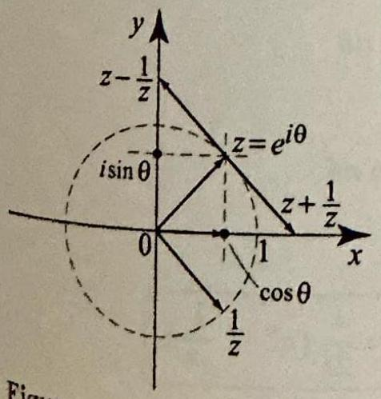
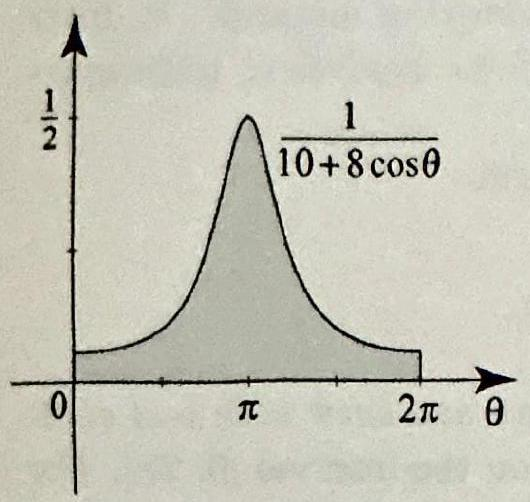
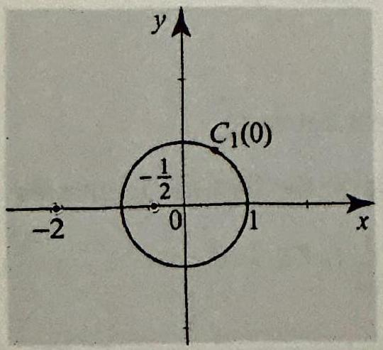
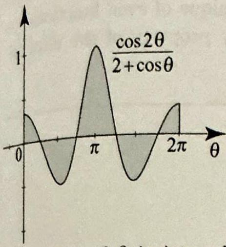
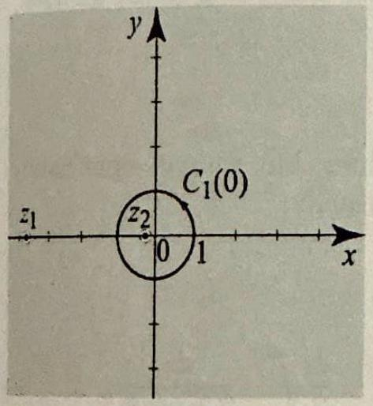
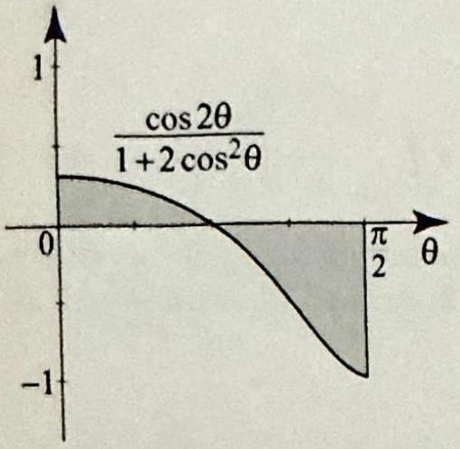
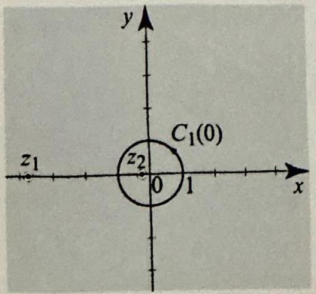

> [!review] Title
> Contents

Some of the nicest applications of the residue theorem concern the evaluation of definite integrals of real-valued functions. In this section we consider some straightforward examples that illustrate the underlying method. In later sections, we will develop this method using delicate analytical techniques and evaluate more complicated integrals.

The examples in this section are all of the form

$$
\int_{0}^{2 \pi} F(\cos \theta, \sin \theta) d \theta
$$

where $F(\cos \theta, \sin \theta)$ is a rational function of $\cos \theta$ and $\sin \theta$ with real coefficients and whose denominator does not vanish on the interval $[0,2 \pi]$. For example, the integrals

$$
\int_{0}^{2 \pi} \frac{d \theta}{2+\cos \theta} \text { and } \int_{0}^{2 \pi} \frac{\cos ^{2}(2 \theta)}{4+2 \sin \theta \cos \theta} d \theta
$$

are of the form (1). Our goal is to transform the definite integral (1) into a contour integral that can be evaluated using the residue theorem. For this purpose, let us recall Euler's identity:

$$
e^{i \theta}=\cos \theta+i \sin \theta, \quad \theta \text { any real number. }
$$

Using $-\theta$ in place of $\theta$, we get

$$
e^{-i \theta}=\cos \theta-i \sin \theta, \quad \theta \text { any real number. }
$$

Adding and subtracting the two identities, we obtain the familiar identities

$$
\cos \theta=\frac{1}{2}\left(e^{i \theta}+e^{-i \theta}\right) \text { and } \sin \theta=\frac{1}{2 i}\left(e^{i \theta}-e^{-i \theta}\right)
$$

As $\theta$ varies in the interval $[0,2 \pi]$, the complex number $z=e^{i \theta}$ traces $C_{1}(0)$,

> [!equation] 
> 
> $$
> \cos \theta=\frac{1}{2}\left(z+\frac{1}{z}\right), \quad \text { and } \quad \sin \theta=\frac{1}{2 i}\left(z-\frac{1}{z}\right)
> $$
> 

This is represented graphically in _Figure 1_. 

> [!figure] 
> 
> 
> Figure 1 Constructing $\cos \theta$ and $\sin \theta$.

Also, from $z=e^{i \theta}$, we have $d z=i e^{i \theta} d \theta=i z d \theta$ or

> [!equation]
> 
> $$
> -i \frac{d z}{z}=d \theta
> $$
> 

With (3) and (4) in hand, we can now consider some examples.

> [!exercise]
> Evaluate
> 
> $$
> \int_{0}^{2 \pi} \frac{d \theta}{10+8 \cos \theta}
> $$
> 
> 

> [!figure] 
> 
> 
> Figure 2 The definite integral in Example 1.

**Solution** Let $z=e^{i \theta}$. As $\theta$ varies from 0 to $2 \pi, z$ traces $C_{1}(0)$, the unit circle in the positive direction. Using the substitutions (3) and (4), we transform the given integral into a path integral as follows

$$
\int_{0}^{2 \pi} \frac{d \theta}{10+8 \cos \theta}=\int_{C_{1}(0)} \frac{-i \frac{d z}{z}}{10+\frac{8}{2}\left(z+\frac{1}{z}\right)}=-i \int_{C_{1}(0)} \frac{d z}{4 z^{2}+10 z+4}
$$

To compute the last integral using residues, we solve

$$
4 z^{2}+10 z+4=4(z+2)\left(z+\frac{1}{2}\right)=0
$$

and get $z=-2$ and $z=-\frac{1}{2}$ (see _Figure 3_). So the only singularity inside the unit disk is a simple pole at $-\frac{1}{2}$. 

> [!figure] 
> 
> 
> Figure 3 The path and poles for the contour integral in Example 1.

Applying Proposition 1(ii), Section 5.1, we find

$$
\operatorname{Res}\left(\frac{1}{4 z^{2}+10 z+4},-\frac{1}{2}\right)=\frac{1}{\left.\frac{d}{d z}\left(4 z^{2}+10 z+4\right)\right|_{z=-\frac{1}{2}}}=\frac{1}{8(-1 / 2)+10}=\frac{1}{6}
$$

By the residue theorem, we conclude that

$$
\int_{C_{1}(0)} \frac{d z}{4 z^{2}+10 z+4}=\frac{2 \pi i}{6}=\frac{\pi i}{3}
$$

and so

$$
\int_{0}^{2 \pi} \frac{d \theta}{10+8 \cos \theta}=-i \int_{C_{1}(0)} \frac{d z}{4 z^{2}+10 z+4}=\frac{\pi}{3}
$$

---

> [!review] Title
> Contents

The following observations will facilitate the **Solution** of the next example. Let $n$ be an integer and $z=e^{i \theta}$. De Moivre's identity implies

$$
z^{n}=e^{i n \theta}=\cos n \theta+i \sin n \theta
$$

and

$$
\frac{1}{z^{n}}=e^{-i n \theta}=\cos n \theta-i \sin n \theta
$$

So

> [!equation]
> 
> $$
> \cos n \theta=\frac{1}{2}\left(z^{n}+\frac{1}{z^{n}}\right) \text { and } \sin n \theta=\frac{1}{2 i}\left(z^{n}-\frac{1}{z^{n}}\right) \tag{3}
> $$
> 

As we now illustrate, these formulas are useful when evaluating integrals involving $\cos n \theta$ and $\sin n \theta$.

> [!exercise]
> EXAMPLE 2 Compute the definite integral (_Figure 4_)
> 
> $$
> \int_{0}^{2 \pi} \frac{\cos 2 \theta}{2+\cos \theta} d \theta
> $$
> 
> 
> > [!figure] Figure 4
> > 
> > 
> > Figure 4 The definite integral in Example 2.
> 
> 

**Solution** Use (3), (4), and (5) with $n=2$, and get

$$
\int_{0}^{2 \pi} \frac{\cos 2 \theta}{2+\cos \theta} d \theta=-i \int_{C_{1}(0)} \frac{\frac{1}{2}\left(z^{2}+\frac{1}{z^{2}}\right)}{2+\frac{1}{2}\left(z+\frac{1}{z}\right)} \frac{d z}{z}=-i \int_{C_{1}(0)} \frac{z^{4}+1}{z^{2}\left(z^{2}+4 z+1\right)} d z
$$

We now compute the last integral using residues. We clearly have a pole of order 2 at 0 . To compute the residue at 0 , we use Theorem 2, Section 5.1, with $m=2$ at $z_{0}=0$, and get

$$
\begin{aligned}
\operatorname{Res}\left(\frac{z^{4}+1}{z^{2}\left(z^{2}+4 z+1\right)}, 0\right) & =\lim _{z \rightarrow 0} \frac{d}{d z} \frac{z^{4}+1}{z^{2}+4 z+1} \\
& =\lim _{z \rightarrow 0} \frac{3 z^{3}\left(z^{2}+4 z+1\right)-\left(z^{4}+1\right)(2 z+4)}{\left(z^{2}+4 z+1\right)^{2}}=-4
\end{aligned}
$$

The roots of $z^{2}+4 z+1=0$ are $z_{1}=-2-\sqrt{3} \approx-3.7$ and $z_{2}=-2+\sqrt{3} \approx-0.27$ (_Figure 5_). 

> [!figure] Figure 5
> 
> 
> Figure 5 The path and poles for the contour integral in Example 2.

Only $z_{2}$ is inside the unit disk. Since $z_{2}$ is a simple pole, we can compute the residues at $z_{2}$ using Proposition 1(ii), Section 5.1:
$\operatorname{Res}\left(\frac{z^{4}+1}{z^{2}} \frac{1}{z^{2}+4 z+1},-2+\sqrt{3}\right)=\frac{(-2+\sqrt{3})^{4}+1}{(-2+\sqrt{3})^{2}} \frac{1}{\left.\frac{d}{d z}\left(z^{2}+4 z+1\right)\right|_{-2+\sqrt{3}}}$

$$
=\frac{(-2+\sqrt{3})^{4}+1}{(-2+\sqrt{3})^{2}(2 \sqrt{3})}=\frac{7}{\sqrt{3}} .
$$

By the residue theorem, we conclude that

$$
\int_{C_{1}(0)} \frac{z^{4}+1}{z^{2}\left(z^{2}+4 z+1\right)} d z=2 \pi i\left(-4+\frac{7}{\sqrt{3}}\right)
$$

and so

$$
\int_{0}^{2 \pi} \frac{\cos 2 \theta}{2+\cos \theta} d \theta=-i \int_{C_{1}(0)} \frac{z^{4}+1}{z^{2}\left(z^{2}+4 z+1\right)} d z=2 \pi\left(-4+\frac{7}{\sqrt{3}}\right) \approx 0.26
$$

---

> [!review] Title
> Contents

In the preceding examples, we needed the interval of integration to be $[0,2 \pi]$, in order for $z=e^{i \theta}$ to trace the whole circle $C_{1}(0)$. Integrals over the interval $[0, \pi]$ can be handled if the integrand $f(\theta)$ is even, since in this case

$$
\int_{0}^{\pi} f(\theta) d \theta=\frac{1}{2} \int_{-\pi}^{\pi} f(\theta) d \theta=\frac{1}{2} \int_{0}^{2 \pi} f(\theta) d \theta
$$

The first equality follows because the integrand is even and the second one follows because the integrand is $2 \pi$-periodic, and so the integral does not
change if we integrate over any interval of length $2 \pi$ (see Theorem 1, Section 7.1). In the next example, we use this technique of even functions, as well as a double-angle identity and the linearity property of the integral. These will simplify the residue calculation.

> [!exercise]
> Techniques of integration
> 
> Compute the definite integral (_Figure 6_)
> 
> $$
> I=\int_{0}^{\frac{\pi}{2}} \frac{\cos 2 \theta}{1+2 \cos ^{2} \theta} d \theta
> $$
> 
> 

> [!figure] Figure 6
> 
> 
> Figure 6 The definite integral in Example 3.

**Solution** First, use the double angle identity $2 \cos ^{2} \theta=1+\cos 2 \theta$, then the change of variables $\theta^{\prime}=2 \theta$, and get (for convenience, rename $\theta^{\prime}$ by $\theta$ )

$$
I=\int_{0}^{\frac{\pi}{2}} \frac{\cos 2 \theta}{2+\cos 2 \theta} d \theta=\frac{1}{2} \int_{0}^{\pi} \frac{\cos \theta}{2+\cos \theta} d \theta
$$

This integral is over $[0, \pi]$, but the integrand is even, so according to (6) we have

$$
I=\frac{1}{4} \int_{0}^{2 \pi} \frac{\cos \theta}{2+\cos \theta} d \theta
$$

This integral could be evaluated by the use of residues, but we can significantly reduce the amount of residue calculation by using linearity:

$$
\begin{aligned}
I & =\frac{1}{4} \int_{0}^{2 \pi} \frac{2+\cos \theta-2}{2+\cos \theta} d \theta \\
& =\frac{1}{4} \int_{0}^{2 \pi} d \theta+\frac{1}{4} \int_{0}^{2 \pi} \frac{-2}{2+\cos \theta} d \theta=\frac{\pi}{2}-\frac{1}{2} \int_{0}^{2 \pi} \frac{d \theta}{2+\cos \theta}
\end{aligned}
$$

We now evaluate this last integral by the residue method. Letting $z=e^{i \theta}, \cos \theta= \frac{1}{2}\left(z+\frac{1}{z}\right), d \theta=\frac{d z}{i z}$, we obtain

$$
I=\frac{\pi}{2}-\frac{1}{i} \int_{C_{1}(0)} \frac{d z}{z^{2}+4 z+1}
$$

The integrand $\frac{1}{z^{2}+4 z+1}=\frac{1}{\left(z-z_{1}\right)\left(z-z_{2}\right)}$ has simple poles at $z_{1}=-2-\sqrt{3}$ and $z_{2}=-2+\sqrt{3}$, and $z_{2}$ is the only pole lying inside $C_{1}(0)$ (_Figure 7_). 

> [!figure] Figure 7
> 
> 
> Figure 7 The path and poles for the contour integral in Example 3.

The residue there is

$$
\begin{aligned}
\operatorname{Res}\left(\frac{1}{\left(z-z_{1}\right)\left(z-z_{2}\right)}, z_{2}\right) & =\lim _{z \rightarrow z_{2}}\left(z-z_{2}\right) \frac{1}{\left(z-z_{1}\right)\left(z-z_{2}\right)} \\
& =\frac{1}{z_{2}-z_{1}}=\frac{1}{2 \sqrt{3}}
\end{aligned}
$$

and so $I=\frac{\pi}{2}-\frac{1}{i} 2 \pi i \frac{1}{2 \sqrt{3}}=\pi\left(\frac{1}{2}-\frac{1}{\sqrt{3}}\right)$. $\square$

---

Although the integrals in this section are special, they have important applications, including the computation of certain Fourier series. See Section 7.2 for illustrations.

## Exercises 5.2

> [!exercise]
> In problems 1-10, use the method of this section to evaluate the given integral.
> 
> 1. $\int_{0}^{2 \pi} \frac{d \theta}{2-\cos \theta}$.
> 2. $\int_{0}^{2 \pi} \frac{d \theta}{5+3 \cos \theta}$.
> 3. $\int_{0}^{2 \pi} \frac{d \theta}{10-8 \sin \theta}$.
> 4. $\int_{0}^{2 \pi} \frac{1}{\sin ^{2} \theta+2 \cos ^{2} \theta} d \theta$.
> 5. $\int_{0}^{2 \pi} \frac{\cos 2 \theta}{5+4 \cos \theta} d \theta$.
> 6. $\int_{0}^{2 \pi} \frac{\cos \theta-\sin ^{2} \theta}{10+8 \cos \theta} d \theta$.
> 7. $\int_{0}^{\pi} \frac{d \theta}{9+16 \sin ^{2} \theta}$.
> 8. $\int_{0}^{\pi} \frac{\cos \theta \sin ^{2} \theta}{2+\cos \theta} d \theta$.
> 9. $\int_{0}^{2 \pi} \frac{d \theta}{7+2 \cos \theta+3 \sin \theta}$.
> 10. $\int_{0}^{2 \pi} \frac{d \theta}{7-2 \cos ^{2} \theta-3 \sin ^{2} \theta}$.

> [!exercise]
> In problems 11-16, use the method of this section to derive the given formula, where $a, b, c$ are real numbers.
> 11. $\int_{0}^{2 \pi} \frac{d \theta}{1+a \cos \theta}=\frac{2 \pi}{\sqrt{1-a^{2}}}, \quad 0<|a|<1$.
> 12. $\int_{0}^{2 \pi} \frac{\sin ^{2} \theta}{a+b \cos \theta} d \theta=\frac{2 \pi}{b^{2}}\left(a-\sqrt{a^{2}-b^{2}}\right), \quad 0<|b|<a$.
> 13. $\int_{0}^{2 \pi} \frac{d \theta}{a+b \cos ^{2} \theta}=\frac{2 \pi}{\sqrt{a} \sqrt{a+b}}, \quad 0<b<a$.
> 14. $\int_{0}^{2 \pi} \frac{d \theta}{a+b \sin ^{2} \theta}=\frac{2 \pi}{\sqrt{a} \sqrt{a+b}}, 0<b<a$.
> 15. $\int_{0}^{2 \pi} \frac{d \theta}{a \cos \theta+b \sin \theta+c}=\frac{2 \pi}{\sqrt{c^{2}-a^{2}-b^{2}}}, \quad a^{2}+b^{2}<c^{2}$.
> 16. $\int_{0}^{2 \pi} \frac{d \theta}{a \cos ^{2} \theta+b \sin ^{2} \theta+c}=\frac{2 \pi}{\sqrt{(a+c)(b+c)}}, \quad 0<c<a, c<b$.
