Topics to Review
guimat series and Laurent corefferents from Section 4.5 are and to define residues in Secsin 31. Cauchy's theorem for gudiply connected regions (Theoem 6. Section 3.4) is the basis ha mast integrals in this chapter. Section 5.3 uses the estimates on the path integral from Theoren 2. Section 3.2. Sectim 5.6 is based on the residues of the colangent, which are presmited in Example 4, Section 5.1.

Looking Ahead
Section 5.1 contains the main result of this chapter along with some baric applications that illustrate its use in computing integrals. Section 5.2 deals with the integrals of special trigonometric functions that can be evaluated directly from the residue theorem. Sections 5.3, 5.4, and 5.5 are more illustrative of the residue method. The integrals that we compute are classical and arise in many applications. The computations require the residue theorem and additional estimates, which vary in difficulty from simplet ones in Section 5.3 to more difficult ones in Section 5.5. Section 5.6 is an interesting application to series. Sections 5.5 and 5.6 can be skipped without afferting the continuity of the course. Section 5.7 conLains many interesting theoretical properties, whose proofs use at sunc stage the residue theorem. While this sertion is optional, it is strongly recommended in a cource that stresses mathematical profis. Interesting applications are presented in the exercises of that sartion.

## 5

## RESIDUE THEORY

After having thought on this subject, and brought together the diverse results mentioned above, I had the hope of establishing on a direct and rigorous analysis the passage from the real to the imaginary; and my research has lead me to this Memoire.
-Augustin Louis Cauchy
[Writing about his Memoire of 1814, which contained the residue theorem and several computations of real integrals by complex methods.]

In the previous four chapters, we introduced complex numbers and complex functions and studied properties of the three essential tools of calculus: the derivative, the integral, and series of complex functions. In this and the next chapter, we use these results to derive some exciting applications of complex analysis. The applications of this chapter are based on one formula, known as Cauchy's residue theorem. We have already used this result many times before when computing integrals. Here we will highlight the main ideas behind it and devise new techniques for computing important integrals that arise from Fourier series and integrals, Laplace transforms, and other applications. For example, integrals like $\int_{-\infty}^{\infty} \frac{\sin x}{x} d x, \int_{0}^{\infty} \cos x e^{-x^{2}} d x$ are very difficult to compute using real variable techniques. With the residue theorem and some additional estimates with complex functions, the computations of these integrals are reduced to simple tasks.

In Section 5.7 (an optional section), we will use residues to expand our knowledge of analytic functions. We will use integrals to count the number of zeros of analytic functions and to give a formula for the inverse of an analytic functions. Theoretical results, such as the open mapping property, will be derived and will be used to obtain a fresh and different perspective on concrete results such as the maximum modulus principle.

The residue theorem was discovered around 1814 (stated explicitely in 1831) by Cauchy as he attempted to generalize and put under one umbrella the computations of certain special integrals, some of them involving complex substitutions, that were done by Euler, Laplace, Legendre, and other mathematicians.

### 5.1 Cauchy's Residue Theorem

In this section, we will derive a useful formula known as Cauchy's residue formula, which combines together powerful techniques from carlier sertions The applications of this formula will be explored throughout the chapter. Let us start by reviewing a few results from Laurent series. Suppose that $f$ has an isolated singularity at 20 . We know from Theorem 1, Section 45 , that $f$ has a Laurent series in an annulus around 20 : for $0<|2-20|<R$.

$$
f(z)=\cdots+\frac{a_{-2}}{\left(z-z_{0}\right)^{2}}+\frac{a_{-1}}{z-z_{0}}+a_{0}+a_{1}\left(z-z_{0}\right)+a_{2}\left(z-z_{0}\right)^{2}+\cdots
$$

Мотениет.

$$
a_{-1}=\frac{1}{2 \pi i} \int_{C_{r}(z 0)} f(z) d z,
$$

where $C_{r}\left(z_{0}\right)$ is any positively oriented circle in the annulus $0<\left|z-z_{0}\right|<R$. The coefficient $a_{-1}$ is called the residue of $f$ at $z_{0}$ and is denoted by $\operatorname{Res}\left(f, z_{0}\right)$ or simply $\operatorname{Res}\left(z_{0}\right)$ when there is no risk of confusing the function $f$. With the concept of residue in hand, we can state our main result.

## THEOREM 1 CAUCHY'S RESIDUE THEOREM

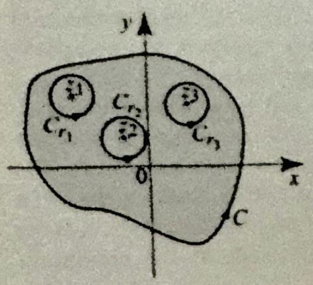
Figure 1 To compute the integral around a path $C$ of a function with multiple isolated singularities in the interior of $C$, we first carve out the singularities using non overlapping circles inside $C$, then use Cauchy's theorem for multiply connected regions.

let $C$ be a simple closed positively oriented path. Suppose that $f$ is analytic inside and on $C$, except at finitely many isolated singularities $z_{1}, z_{2}, \ldots, z_{1}$ inside C. Then

$$
\int_{C} f(z) d z=2 \pi i \sum_{j=1}^{n} \operatorname{Res}\left(z_{j}\right)
$$

Proof Take amall circles $C_{r_{j}}\left(z_{j}\right)(j=1,2, \ldots, n)$ that do not intersect each other and are contained in the interior of $C$ (Figure 1). Apply Cauchy's integral theoren for multiply connected regions (Theorem 6, Section 3.4) and get

$$
\int_{C} f(z) d z=\sum_{j=1}^{n} \int_{C,} f(z) d z=2 \pi i \sum_{j=1}^{n} \operatorname{Res}\left(z_{j}\right)
$$

where the last equality follows from (1). So (2) holds. $\square$

An analog of Theorem 1 holds if $C$ is negatively oriented; in this case we pick up a negative sign on the right side of (2).

The residue theorem has abounding applications to the evaluation of all sorts of integrals. Our first example illustrates the basic ideas behind this process.

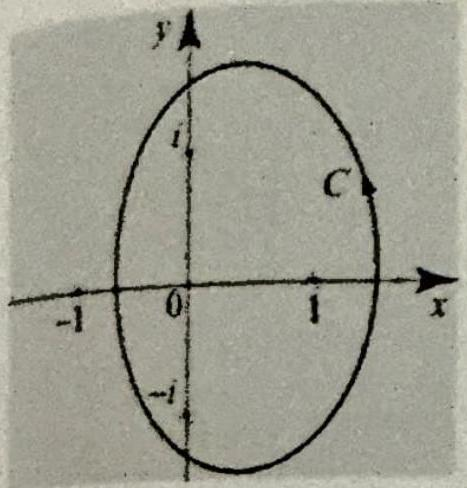
Figure 2 The path $C$ and the puss of $f(z)$ in Example 1.

## EXAMPLE 1 An application of the residue theorem

Let $C$ be a simple closed positively oriented path such that $1,-i$, and $z$ ate in the interior of $C$ and -1 is in the exterior of $C$ (Figure 2). Find

$$
\int_{C} \frac{d z}{z^{4}-1}
$$

Solution The function $f(z)=\frac{1}{z^{x^{2}}-1}$ has isolated singularities at $z= \pm 1$ and $\pm t$. Three of these are inside $C$, and according to (2) we have

$$
\int_{C} \frac{d z}{z^{4}-1}=2 \pi i(\operatorname{Res}(1)+\operatorname{Res}(i)+\operatorname{Res}(-i))
$$

To compute the residues, we will find the Laurent series of $f(z)$ around each isolated singularity and obtain the residue as the coefficient $a_{-1}$ in each case. We have $z^{4}-1=(z-1)(z+1)(z-i)(z+i)$, so $\pm 1$ and $\pm i$ are simple roots of the polynomial $z^{4}-1=0$. Hence $f(z)=\frac{1}{z^{x^{2}}-1}$ has simple poles at $\pm 1$ and $\pm i$ (Theorem 7(v), Section 4.6). Let $z_{0}$ denote any one of the points $1, \pm i$. Because $z_{0}$ is a simple pole, $f$ has a Laurent series expansion around $z_{0}$ of the form

$$
f(z)=\frac{a_{-1}}{z-z_{0}}+a_{0}+a_{1}\left(z-z_{0}\right)+a_{2}\left(z-z_{0}\right)^{2}+\cdots
$$

So

$$
\left(z-z_{0}\right) f(z)=a_{-1}+\left(z-z_{0}\right) h(z)
$$

where $h(z)=a_{0}+a_{1}\left(z-z_{0}\right)+a_{2}\left(z-z_{0}\right)^{2}+\cdots$ is analytic at $z_{0}$. Taking limits as $z \rightarrow z_{0}$ and using $\lim _{z \rightarrow z_{0}}\left(z-z_{0}\right) h(z)=0$, we obtain the useful formula

$$
\lim _{z \rightarrow z_{0}}\left(z-z_{0}\right) f(z)=a_{-1}=\operatorname{Res}\left(z_{0}\right)
$$

which can be used to compute the residue of $f$ at a simple pole. Using the factorization $z^{4}-1=(z-1)(z+1)(z-i)(z+i)$, we have at $z_{0}=1$

$$
\begin{aligned}
\operatorname{Res}(1) & =\lim _{z \rightarrow 1}(z-1) \frac{1}{z^{4}-1}=\lim _{z \rightarrow 1} \frac{1}{(z+1)(z-i)(z+i)} \\
& =\left.\frac{1}{(z+1)(z-i)(z+i)}\right|_{z=1}=\frac{1}{4}
\end{aligned}
$$

Similarly, at $z_{0}=\boldsymbol{i}$, we have

$$
\operatorname{Res}(i)=\lim _{z \rightarrow i}(z-i) \frac{1}{z^{4}-1}=\left.\frac{1}{(z-1)(z+1)(z+i)}\right|_{z=i}=\frac{i}{4}
$$

and at $z=-i$,

$$
\operatorname{Res}(-i)=\lim _{z \rightarrow-1}(z+i) \frac{1}{z^{4}-1}=\left.\frac{1}{(z-1)(z+1)(z-i)}\right|_{z=-i}=-\frac{i}{4}
$$

Plugging these values into (3), we obtain

$$
\int_{C} \frac{d z}{z^{4}-1}=\frac{\pi i}{2}
$$

PROPOSITION 1 RESIDUE AT A SIMPLE POLE

THEOREM 2
RESIDUE AT A POLE OF ORDER $m$

The challenge in applying the residue theorem is in computing residues. Any formula that facilitates this task will be valuable to us. In Example 1, we found one, namely (4). For ease of reference, let us state it separately along with formulas that apply for simple poles. We then derive a formula for the residue at poles of higher order.
(i) If $f(z)$ has a simple pole at $z_{0}$, then

$$
\operatorname{Res}\left(f, z_{0}\right)=\lim _{z \rightarrow z_{0}}\left(z-z_{0}\right) f(z)
$$

(ii) If $f(z)=\frac{p(z)}{q(z)}$, where $p$ and $q$ are analytic at $z_{0}, p\left(z_{0}\right) \neq 0$, and $q(z)$ has a simple zero at $z_{0}$, then

$$
\operatorname{Res}\left(\frac{p(z)}{q(z)}, z_{0}\right)=\frac{p\left(z_{0}\right)}{q^{\prime}\left(z_{0}\right)}
$$

(iii) If $f(z)$ has a simple pole at $z_{0}$ and $g$ is analytic at $z_{0}$,

$$
\operatorname{Res}\left(f(z) g(z), z_{0}\right)=g\left(z_{0}\right) \operatorname{Res}\left(f(z), z_{0}\right)
$$

(iv) If $g$ is analytic at $z_{0}$, then

$$
\operatorname{Res}\left(\frac{g(z)}{z-z_{0}}, z_{0}\right)=g\left(z_{0}\right)
$$

Proof (i) follows from the proof of (4). To prove (ii), note that $f$ has a simple pole at $z_{0}$. Using (i) and $q\left(z_{0}\right)=0$, we have

$$
\operatorname{Res}\left(\frac{p(z)}{q(z)}, z_{0}\right)=\lim _{z \rightarrow z_{0}}\left(z-z_{0}\right) \frac{p(z)}{q(z)}=\lim _{z \rightarrow z_{0}} p(z) \lim _{z \rightarrow z_{0}} \frac{z-z_{0}}{q(z)-q\left(z_{0}\right)}=\frac{p\left(z_{0}\right)}{q^{\prime}\left(z_{0}\right)}
$$

To prove (iii), we use (i) and the fact that $g$ is analytic at $z_{0}$ : $\operatorname{Res}\left(f(z) g(z), z_{0}\right)= \lim _{z \rightarrow z_{0}}\left(z-z_{0}\right) f(z) g(z)=\lim _{z \rightarrow z_{0}} g(z) \lim _{z \rightarrow z_{0}}\left(z-z_{0}\right) f(z)=g\left(z_{0}\right) \operatorname{Res}\left(f, z_{0}\right)$. Part (iv) is immediate from (i).

For poles of higher order the situation is more complicated.
Suppose that $z_{0}$ is a pole of order $m \geq 1$ of $f$. Then the residue of $f$ at $z_{0}$ is

$$
\operatorname{Res}\left(f, z_{0}\right)=\lim _{z \rightarrow z_{0}} \frac{1}{(m-1)!} \frac{d^{m-1}}{d z^{m-1}}\left[\left(z-z_{0}\right)^{m} f(z)\right]
$$

where as usual the derivative of order 0 of a function is the function itself.
You should check that for $m=1$ formula (9) reduces to (4).
Proof By the Laurent series characterization of poles (Theorem 8, Section 46 ).

$$
f(z)=\frac{a_{-m}}{\left(z-z_{0}\right)^{m}}+\cdots+\frac{a_{-1}}{z-z_{0}}+a_{0}+a_{1}\left(z-z_{0}\right)+a_{2}\left(z-z_{0}\right)^{2}+\cdots
$$

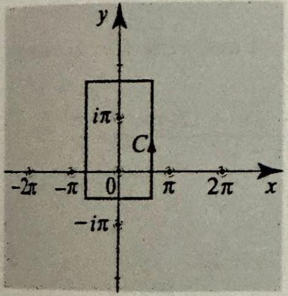
Figure 3 The path $C$ and the poles of $f(z)$ in Example 2.

To extract the residue $a_{-1}$ out of this expansion, first multiply by $\left(z-z_{0}\right)^{m}$ :
$\left(z-z_{0}\right)^{m} f(z)=a_{-m}+\cdots+a_{-1}\left(z-z_{0}\right)^{m-1}+a_{0}\left(z-z_{0}\right)^{m}+a_{1}\left(z-z_{0}\right)^{m+1}+\cdots$.
Then differentiate $(m-1)$ times to obtain
$\frac{d^{m-1}}{d z^{m-1}}\left[\left(z-z_{0}\right)^{m} f(z)\right]=(m-1)!a_{-1}+m!a_{0}\left(z-z_{0}\right)+\frac{(m+1)!}{2} a_{1}\left(z-z_{0}\right)^{2}+\cdots$.
Finally, take the limit as $z \rightarrow z_{0}$, and get

$$
\lim _{z \rightarrow z_{0}} \frac{d^{m-1}}{d z^{m-1}}\left[\left(z-z_{0}\right)^{m} f(z)\right]=(m-1)!a_{-1}+0
$$

which is equivalent to (9).

## EXAMPLE 2 Computing residues

Let $C$ be the simple closed path shown in Figure 3. (a) Compute the residues of $f(z)=\frac{z^{2}}{\left(z^{2}+\pi^{2}\right)^{2} \sin z}$ at all the isolated singularities inside $C$. (b) Evaluate

$$
\int_{C} \frac{z^{2}}{\left(z^{2}+\pi^{2}\right)^{2} \sin z} d z .
$$

Solution (a) Three steps are involved in answering this question.
Step 1: Determine the singularities of $f$ inside $C$. The function $f(z)=\frac{z^{2}}{\left(z^{2}+\pi^{2}\right)^{2} \sin z}$ is analytic except where $z^{2}+\pi^{2}=0$ or $\sin z=0$. Thus $f$ has isolated singularities at $\pm i \pi$ and at $k \pi$ where $k$ is an integer. Only 0 and $i \pi$ are inside $C$.
Step 2: Determine the type of the singularities of $f$ inside $C$. Let us start with the singularity at 0 . Using $\lim _{z \rightarrow 0} \frac{\sin z}{z}=1$, it follows that $\lim _{z \rightarrow 0} \frac{z}{\sin z}=1$, and so

$$
\lim _{z \rightarrow 0} f(z)=\lim _{z \rightarrow 0} \frac{z}{\sin z} \frac{z}{\left(z^{2}+\pi^{2}\right)^{2}}=1 \cdot 0=0
$$

By Theorem 5, Section 4.6, $f(z)$ has a removable singularity at $z_{0}=0$. To treat the singularities at $i \pi$, we consider $\frac{1}{f(z)}=\frac{(z+i \pi)^{2}(z-i \pi)^{2} \sin z}{z^{2}}$. Clearly $\frac{1}{f(z)}$ has a zero of order 2 at $i \pi$, and so by Theorem 7(v), Section 4.6, $f(z)$ has a pole of order 2 at $i \pi$.
Step 3: Determine the residues of $f$ inside $C$. At $0, f$ has a removable singularity, which means that its Laurent series expansion around zero has no terms with negative powers of $z$. In particular, $a_{-1}=0$, and so the residue of $f$ at a removable singularity is 0 . At $i \pi$, we can apply Theorem 2, with $m=2, z_{0}=i \pi$. Then

$$
\begin{aligned}
\operatorname{Res}(i \pi) & =\lim _{z \rightarrow i \pi} \frac{d}{d z}\left[(z-i \pi)^{2} f(z)\right] \\
& =\lim _{z \rightarrow i \pi} \frac{d}{d z}\left[\frac{z^{2}}{(z+i \pi)^{2} \sin z}\right] \\
& =\lim _{z \rightarrow i \pi} \frac{2 z(z+i \pi) \sin z-z^{2}((z+i \pi) \cos z+2 \sin z)}{(z+i \pi)^{3} \sin ^{2} z} \\
& =\frac{2 \sinh \pi+(-\pi \cosh \pi-\sinh \pi)}{-4 \pi \sinh ^{2} \pi}=-\frac{1}{4 \pi \sinh \pi}+\frac{\cosh \pi}{4 \pi \sinh ^{2} \pi}
\end{aligned}
$$

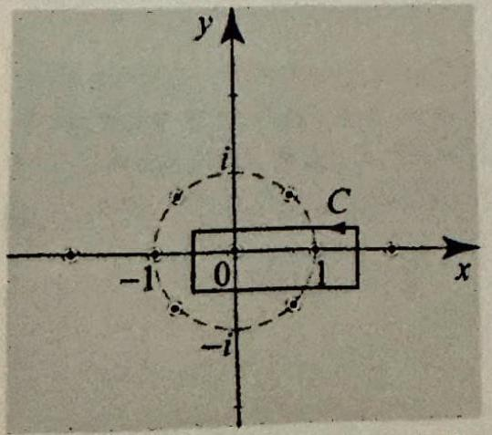

Figure 4 The path $C$ and the poles of $f(z) \cot (\pi z)$ in Example $4(c)$.
where the last line follows by plugging $z=i \pi$ into the previous line and using $\sin (i \pi)=i \sinh \pi$ and $\cos (i \pi)=\cosh \pi$.
(b) Using Theorem 1 and (a), we obtain

$$
\begin{aligned}
\int_{C} \frac{z^{2}}{\left(z^{2}+\pi^{2}\right)^{2} \sin z} d z & =2 \pi i(\operatorname{Res}(0)+\operatorname{Res}(i \pi)) \\
& =i\left(-\frac{1}{2 \sinh \pi}+\frac{\cosh \pi}{2 \sinh ^{2} \pi}\right)
\end{aligned}
$$

A simple fact worth noting from the previous solution: If $z_{0}$ is a removable singularity, then $\operatorname{Res}\left(z_{0}\right)=0$.

As you can see from Example 2, formula (9) becomes increasingly difficult to apply at poles of higher order. Sometimes we can find the residue of a function by algebraically manipulating it into its Laurent series.

EXAMPLE 3 Residue at a second-order pole
Let $f(z)=\frac{(z+1)^{3}}{(z-1)^{2}}$. Find $\operatorname{Res}(f(z), 1)$.
Solution We can rewrite the numerator in terms of $z-1$ and write $f(z)$ as its own Laurent series expansion. We have

$$
\begin{aligned}
\frac{(z+1)^{3}}{(z-1)^{2}} & =\frac{(z-1+2)^{3}}{(z-1)^{2}}=\frac{(z-1)^{3}+6(z-1)^{2}+12(z-1)+8}{(z-1)^{2}} \\
& =\frac{8}{(z-1)^{2}}+\frac{12}{z-1}+6+(z-1)
\end{aligned}
$$

Reading off the coefficient of $\frac{1}{z-1}$, we have $\operatorname{Res}(f(z), 1)=12$.
Other techniques that apply in place of (9) are discussed in the exercises. Our next example has some interesting applications to series summation by residues (see Section 5.6).

## EXAMPLE 4 Residues of the cotangent

(a) Let $k$ be an integer. Show that $\operatorname{Res}(\cot (\pi z), k)=\frac{1}{\pi}$.
(b) Suppose that $f$ is analytic at an integer $k$. Show that

$$
\operatorname{Res}(f(z) \cot (\pi z), k)=\frac{1}{\pi} f(k)
$$

(c) Evaluate

$$
\int_{C} \frac{\cot (\pi z)}{1+z^{4}} d z
$$

where $C$ is the positively oriented rectangular path shown in Figure 4.
Solution (a) We know that the zeros of $\sin (\pi z)$ are precisely the integers. Also, it is immediate from Theorem 1, Section 4.6, that all the zeros of $\sin (\pi z)$ are simple zeros. Hence $\cot (\pi z)=\frac{\cos (\pi z)}{\sin (\pi z)}$ has simple poles at the integers. To find the residue at $k$, we can apply (9) with $m=1$ or, better yet, use Proposition 1(ii). We have

$$
\operatorname{Res}(\cot (\pi z), k)=\operatorname{Res}\left(\frac{\cos (\pi z)}{\sin (\pi z)}, k\right)=\frac{\cos (k \pi)}{\left.\frac{d}{d z} \sin (\pi z)\right|_{z=k}}=\frac{1}{\pi}
$$

(b) This is immediate from (a) and Proposition 1(iii). Just be careful with the notation as you appeal to the proposition.
(c) Since $1+z^{4}$ is nonzero inside $C$ and $\cot (\pi z)$ has simple poles at the integers, it follows that $\frac{\cot (\pi z)}{1+z^{4}}$ has two simple poles inside $C$ at $z=0$ and $z=1$. Applying Theorem 1 and using (10) with $f(z)=\frac{1}{1+z^{4}}$ to compute the residues, we find

$$
\begin{aligned}
\int_{C} \frac{\cot (\pi z)}{1+z^{4}} d z & =2 \pi i\left(\operatorname{Res}\left(\frac{\cot (\pi z)}{1+z^{4}}, 0\right)+\operatorname{Res}\left(\frac{\cot (\pi z)}{1+z^{4}}, 1\right)\right. \\
& =2 \pi i\left(\frac{1}{\pi} \frac{1}{1+0^{4}}+\frac{1}{\pi} \frac{1}{1+1^{4}}\right)=2 i\left(1+\frac{1}{2}\right)=3 i
\end{aligned}
$$ $\square$

So far the examples that we treated involved residues at poles of finite order. There is no formula like (9) for computing the residue at an essential singularity. We have to rely on various tricks to evaluate the coefficient $a_{-1}$ in the Laurent series expansion. We illustrate with several examples, starting with one that contains a useful observation.

## EXAMPLE 5 Residue at 0 of an even function

(a) Suppose that $f$ is an even analytic function with an isolated singularity at 0 . Show that

$$
\operatorname{Res}(f, 0)=0
$$

(b) Compute $\operatorname{Res}\left(e^{-\frac{1}{z^{2}}} \cos \frac{1}{z}, 0\right)$.

Solution (a) We proved in Proposition 2, Section 4.4, that if $f(z)$ is even and analytic at 0 , then the Taylor coefficients corresponding to the odd powers of $z$ are zero. The same proof applies to Laurent series around 0 and shows that $f$ is even if and only if $a_{2 n+1}$ and $a_{-2 n+1}$ are zero for all integers $n$. In particular, if $f$ is even then $a_{-1}=0$, and so $\operatorname{Res}(f, 0)=0$.
(b) The function $e^{-\frac{1}{z^{2}}} \cos \frac{1}{z}$ is even and has an essential singularity at 0 . By (a), its residue at 0 is 0 . $\square$

Multiplication of series is often useful in computing residues at a singularity, including essential singularities.

## EXAMPLE 6 Multiplying series by a polynomial

Compute the residues of $z^{2} \sin \frac{1}{z}$ at $z=0$.
Solution From the Laurent series

$$
\sin \frac{1}{z}=\frac{1}{z}-\frac{1}{3!} \frac{1}{z^{3}}+\frac{1}{5!} \frac{1}{z^{5}}-\cdots,
$$

we get

$$
z^{2} \sin \frac{1}{z}=z-\frac{1}{3!} \frac{1}{z}+\frac{1}{5!} \frac{1}{z^{3}}-\cdots
$$

and so $\operatorname{Res}\left(z^{2} \sin \frac{1}{z}, 0\right)=-\frac{1}{3!}$. $\square$
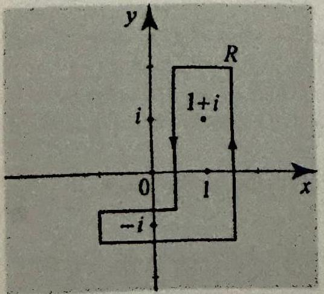

Figure 5 The path $R$ for Exercises 15 and 20.

## EXAMPLE 7 Using Cauchy products

Find the residue of $\frac{e^{\frac{1}{2}}}{z^{2}+1}$ at $z=0$.
Solution The given function has an essential singularity at $z=0$. To compute the coefficient $a_{-1}$ in its Laurent series around 0 , we use two familiar Taylor and Laurent series as follows. We have, for $0<|z|<1$,

$$
\frac{e^{\frac{1}{t}}}{z^{2}+1}=\frac{1}{z^{2}+1} e^{\frac{1}{z}}=\left(1-z^{2}+z^{4}-\cdots\right)\left(1+\frac{1}{z}+\frac{1}{2!} \frac{1}{z^{2}}+\frac{1}{3!} \frac{1}{z^{3}}+\cdots\right)
$$

By properties of Taylor and Laurent series, both series are absolutely convergent. So we can multiply them term by term using a Cauchy product. Collecting all the terms in $\frac{1}{z}$, we find that

$$
\operatorname{Res}\left(\frac{e^{\frac{1}{z}}}{z^{2}+1}, 0\right)=a_{-1}=1-\frac{1}{3!}+\frac{1}{5!}-\cdots=\sin 1
$$

## Exercises 5.1

In Exercises 1-12, find the residue of the given function at all its isolated singularities.

1. $\frac{1+z}{z}$.
2. $\frac{1+z}{z^{2}+2 z+2}$.
3. $\frac{1+e^{z}}{z^{2}}+\frac{2}{z}$.
4. $\frac{\sin \left(z^{2}\right)}{z^{2}\left(z^{2}+1\right)}$.
5. $\left(\frac{z-1}{z+3 i}\right)^{3}$.
6. $\frac{1-\cos z}{z^{3}}+\sin \left(z^{2}+3 z\right)$.
7. $\frac{1}{z \sin z}$.
8. $\frac{\cot (\pi z)}{z+1}$.
9. $\csc (\pi z) \frac{z+1}{z-1}$.
10. $z \sin \left(\frac{1}{z}\right)$.
11. $e^{z+\frac{1}{z}}$.
12. $\cos \left(\frac{1}{z}\right) \sin \left(\frac{1}{z}\right)$.

In Exercises 13-26, evaluate the given path integral. The path $R$ in Exercises 15 and 20 is shown in Figure 5.
13. $\int_{C_{1}(0)} \frac{z^{2}+3 z-1}{z\left(z^{2}-3\right)} d z$.
14. $\int_{C_{\frac{1}{10}(0)}} \frac{1}{z^{5}-1} d z$.
15. $\int_{R} \frac{z+i}{(z-1-i)^{3}(z-i)} d z$.
16. $\int_{C_{3}(0)} \frac{e^{i z^{2}}}{z^{2}+(3-3 i) z-2-6 i} d z$.
17. $\int_{C_{\frac{3}{2}}(0)} \frac{d z}{z(z-1)(z-2) \cdots(z-10)}$.
18. $\int_{C_{3}(0)} \frac{z^{2}+1}{(z-1)^{2}} d z$.
19. $\int_{C_{4}(0)} z \tan z d z$.
20. $\int_{R} \frac{d z}{1+e^{\pi z}}$.
21. $\int_{C_{1}(0)} \frac{e^{z^{2}}}{z^{6}} d z$.
22. $\int_{C_{1}(0)} \cos \left(\frac{1}{z^{2}}\right) e^{\frac{1}{z}} d z$.
23. $\int_{C_{1}(0)} z^{4}\left(e^{\frac{1}{z}}+z^{2}\right) d z$.
24. $\int_{C_{31 / 2}(0)} z^{2} \cot (\pi z) d z$.
25. $\int_{C_{1}(0)} \frac{\sin z}{z^{6}} d z$.
26. $\int_{C_{1 / 2}(0)} \frac{1}{z^{4}\left(e^{z}-1\right)} d z$. [Hint: Show first that the denominator has only one zero inside $C_{1 / 2}(0)$. Then compute the residue at 0 with the help of a computer.]
27. (a) Prove (7).
(b) Use (7) to prove (10).
28. Show that $\operatorname{Res}\left(f(z)+g(z), z_{0}\right)=\operatorname{Res}\left(f(z), z_{0}\right)+\operatorname{Res}\left(g(z), z_{0}\right)$.
29. Residues of the cosecant. (a) Show that $\csc (\pi z)$ has simple poles at the integers.
(b) For an integer $k$ show that

$$
\operatorname{Res}(\csc (\pi z), k)=\frac{(-1)^{k}}{\pi}
$$

(c) Suppose that $f$ is analytic at an integer $k$. Show that

$$
\operatorname{Res}(f(z) \csc (\pi z), k)=\frac{(-1)^{k}}{\pi} f(k)
$$

30. Use Exercise 29 to compute
(a) $\int_{C_{25 / 2}(0)} z \csc (\pi z) d z$,
(b) $\int_{C_{25 / 2}(0)} \frac{\csc (\pi z)}{1+z^{2}} d z$.
[Hint for (b): There are poles due to the zeros of $1+z^{2}$.]
31. Explain how the residue theorem implies Cauchy's theorem (Theorem 5, Section 3.4) and Cauchy's integral formula (Theorem 2, Section 3.6).
32. Suppose that $f$ has an isolated singularity at $z_{0}$. Show that $\operatorname{Res}\left(f^{\prime}(z), z_{0}\right)=0$.
33. Given the Laurent series expansions in an annulus around $z_{0}$,

$$
f(z)=\sum_{n=-\infty}^{\infty} a_{n}\left(z-z_{0}\right)^{n} \text { and } g(z)=\sum_{n=-\infty}^{\infty} b_{n}\left(z-z_{0}\right)^{n}
$$

Show that $\operatorname{Res}\left(f(z) g(z), z_{0}\right)=\sum_{n=-\infty}^{\infty} a_{n} b_{-n-1}$. [Hint: Write each doubly infinite Laurent series as the sum of two infinite series. Recall that a Laurent series is absolutely convergent within its annulus of convergence. Use Cauchy products to compute the coefficient of $\frac{1}{z}$ (Theorem 15, Section 4.1).]
34. Use Exercise 33 to compute Res $\left(e^{\frac{1}{z^{2}}} \sin \frac{1}{z}, 0\right)$.

In Exercises $35-36, g$ and $h$ are analytic at $z_{0}$. You are asked to compute a formula for the residue of $f(z)=\frac{g(z)}{h(z)}$ at $z_{0}$ under given conditions.
35. If $g$ and $h$ have zeros of the same order at $z_{0}$, then $\operatorname{Res}\left(\frac{g(z)}{h(z)}, z_{0}\right)=0$.
36. If $g\left(z_{0}\right) \neq 0$ and $h$ has a zero of order 2 at $z_{0}$, then

$$
\operatorname{Res}\left(\frac{g(z)}{h(z)}, z_{0}\right)=2 \frac{g^{\prime}\left(z_{0}\right)}{h^{\prime \prime}\left(z_{0}\right)}-\frac{2}{3} \frac{g\left(z_{0}\right) h^{\prime \prime \prime}\left(z_{0}\right)}{\left[h^{\prime \prime}\left(z_{0}\right)\right]^{2}}
$$

37. Project Problem: Laplace transform of Bessel functions. In this project you will use residues to derive the formula

$$
\int_{0}^{\infty} J_{n}(t) e^{-s t} d t=\frac{1}{\sqrt{s^{2}+1}}\left(\sqrt{s^{2}+1}-s\right)^{n}, \quad s>0
$$

where $J_{n}(t)$ is the Bessel function of integer order $n \geq 0$. This formula gives the Laplace transform of $J_{n}(t)$. To illustrate the useful method that is involved in this project and for clarity's sake, we start with the case $n=0$.
(a) Using the integral representation of $J_{0}$ from Exercise 35(a), Section 4.5, write

$$
\int_{0}^{\infty} J_{0}(t) e^{-s t} d t=\frac{1}{2 \pi i} \int_{0}^{\infty} \int_{C_{1}(0)} e^{-t\left(s-\frac{1}{2}\left(\zeta-\frac{1}{\zeta}\right)\right)} \frac{d \zeta}{\zeta} d t
$$

(You should not be bothered by a double integral involving a contour integral. The contour integral can be parametrized and transformed into a definite integral over the interval $[0,2 \pi]$, as shown in Exercise 36, Section 4.5. But this will not be advantageous here.)
(b) Show that for $\zeta$ on $C_{1}(0)$, the complex number $\zeta-\frac{1}{\zeta}$ is purely imaginary and conclude that for real $s$ and $t$

$$
\left|e^{-t\left(s-\frac{1}{2}\left(\zeta-\frac{1}{\zeta}\right)\right)}\right|=e^{-t s}
$$

(c) Thus the integral in (a) is absolutely convergent. Although we will not give the details here, this fact is enough to justify interchanging the order of integration. Interchange the order of integration, evaluate the integral in $t$ and obtain

$$
\int_{0}^{\infty} J_{0}(t) e^{-s t} d t=\frac{1}{\pi i} \int_{C_{1}(0)} \frac{d \zeta}{-\zeta^{2}+2 s \zeta+1}, \quad s>0
$$

(d) Evaluate the integral using the residue theorem and derive

$$
\int_{0}^{\infty} J_{0}(t) e^{-s t} d t=\frac{1}{\sqrt{s^{2}+1}}, \quad s>0
$$

(e) Proceed as we did in (a)-(d), using the integral representation for $J_{n}(t)$, and show that for $s>0$

$$
\int_{0}^{\infty} J_{n}(t) e^{-s t} d t=\frac{1}{\pi i} \int_{C_{1}(0)} \frac{d \zeta}{\left(-\zeta^{2}+2 s \zeta+1\right) \zeta^{n}}=\frac{1}{\pi i} \int_{C_{1}(0)} \frac{\eta^{n} d \eta}{\eta^{2}+2 s \eta-1}
$$

[Hint: To justify the second equality, let $\zeta=\frac{1}{\eta}, d \zeta=-\frac{d \eta}{\eta^{2}}$. As $\zeta$ runs through $C_{1}(0), \eta$ runs through the reverse of $C_{1}(0)$.]
(f) Derive (11) by computing the integral in (e) using residues.

### 5.2 Definite Integrals of Trigonometric Functions

Some of the nicest applications of the residue theorem concern the evaluation of definite integrals of real-valued functions. In this section we consider some straightforward examples that illustrate the underlying method. In later sections, we will develop this method using delicate analytical techniques and evaluate more complicated integrals.

The examples in this section are all of the form

$$
\int_{0}^{2 \pi} F(\cos \theta, \sin \theta) d \theta
$$

where $F(\cos \theta, \sin \theta)$ is a rational function of $\cos \theta$ and $\sin \theta$ with real coefficients and whose denominator does not vanish on the interval $[0,2 \pi]$. For example, the integrals

$$
\int_{0}^{2 \pi} \frac{d \theta}{2+\cos \theta} \text { and } \int_{0}^{2 \pi} \frac{\cos ^{2}(2 \theta)}{4+2 \sin \theta \cos \theta} d \theta
$$

are of the form (1). Our goal is to transform the definite integral (1) into a contour integral that can be evaluated using the residue theorem. For this purpose, let us recall Euler's identity:

$$
e^{i \theta}=\cos \theta+i \sin \theta, \quad \theta \text { any real number. }
$$

Using $-\theta$ in place of $\theta$, we get

$$
e^{-i \theta}=\cos \theta-i \sin \theta, \quad \theta \text { any real number. }
$$

Adding and subtracting the two identities, we obtain the familiar identities

$$
\cos \theta=\frac{1}{2}\left(e^{i \theta}+e^{-i \theta}\right) \text { and } \sin \theta=\frac{1}{2 i}\left(e^{i \theta}-e^{-i \theta}\right)
$$

As $\theta$ varies in the interval $[0,2 \pi]$, the complex number $z=e^{i \theta}$ traces $C_{1}(0)$,

Figure 1 Constructing $\cos \theta$ and $\sin \theta$.

$$
\cos \theta=\frac{1}{2}\left(z+\frac{1}{z}\right), \quad \text { and } \quad \sin \theta=\frac{1}{2 i}\left(z-\frac{1}{z}\right)
$$

This is represented graphically in Figure 1. Also, from $z=e^{i \theta}$, we have $d z=i e^{i \theta} d \theta=i z d \theta$ or

$$
-i \frac{d z}{z}=d \theta
$$

With (3) and (4) in hand, we can now consider some examples.

EXAMPLE 1 Evaluate

$$
\int_{0}^{2 \pi} \frac{d \theta}{10+8 \cos \theta}
$$

Figure 2 The definite integral in Example 1.

Figure 3 The path and poles for the contour integral in Example 1.

Solution Let $z=e^{i \theta}$. As $\theta$ varies from 0 to $2 \pi, z$ traces $C_{1}(0)$, the unit circle in the positive direction. Using the substitutions (3) and (4), we transform the given integral into a path integral as follows

$$
\int_{0}^{2 \pi} \frac{d \theta}{10+8 \cos \theta}=\int_{C_{1}(0)} \frac{-i \frac{d z}{z}}{10+\frac{8}{2}\left(z+\frac{1}{z}\right)}=-i \int_{C_{1}(0)} \frac{d z}{4 z^{2}+10 z+4}
$$

To compute the last integral using residues, we solve

$$
4 z^{2}+10 z+4=4(z+2)\left(z+\frac{1}{2}\right)=0
$$

and get $z=-2$ and $z=-\frac{1}{2}$ (see Figure 3). So the only singularity inside the unit disk is a simple pole at $-\frac{1}{2}$. Applying Proposition 1(ii), Section 5.1, we find

$$
\operatorname{Res}\left(\frac{1}{4 z^{2}+10 z+4},-\frac{1}{2}\right)=\frac{1}{\left.\frac{d}{d z}\left(4 z^{2}+10 z+4\right)\right|_{z=-\frac{1}{2}}}=\frac{1}{8(-1 / 2)+10}=\frac{1}{6}
$$

By the residue theorem, we conclude that

$$
\int_{C_{1}(0)} \frac{d z}{4 z^{2}+10 z+4}=\frac{2 \pi i}{6}=\frac{\pi i}{3}
$$

and so

$$
\int_{0}^{2 \pi} \frac{d \theta}{10+8 \cos \theta}=-i \int_{C_{1}(0)} \frac{d z}{4 z^{2}+10 z+4}=\frac{\pi}{3}
$$

The following observations will facilitate the solution of the next example. Let $n$ be an integer and $z=e^{i \theta}$. De Moivre's identity implies

$$
z^{n}=e^{i n \theta}=\cos n \theta+i \sin n \theta
$$

and

$$
\frac{1}{z^{n}}=e^{-i n \theta}=\cos n \theta-i \sin n \theta
$$

So
(5)

$$
\cos n \theta=\frac{1}{2}\left(z^{n}+\frac{1}{z^{n}}\right) \text { and } \sin n \theta=\frac{1}{2 i}\left(z^{n}-\frac{1}{z^{n}}\right)
$$

As we now illustrate, these formulas are useful when evaluating integrals involving $\cos n \theta$ and $\sin n \theta$.

Figure 4 The definite integral in Example 2.

Figure 5 The path and poles for the contour integral in Example 2.

EXAMPLE 2 Compute the definite integral (Figure 4)

$$
\int_{0}^{2 \pi} \frac{\cos 2 \theta}{2+\cos \theta} d \theta
$$

Solution Use (3), (4), and (5) with $n=2$, and get

$$
\int_{0}^{2 \pi} \frac{\cos 2 \theta}{2+\cos \theta} d \theta=-i \int_{C_{1}(0)} \frac{\frac{1}{2}\left(z^{2}+\frac{1}{z^{2}}\right)}{2+\frac{1}{2}\left(z+\frac{1}{z}\right)} \frac{d z}{z}=-i \int_{C_{1}(0)} \frac{z^{4}+1}{z^{2}\left(z^{2}+4 z+1\right)} d z
$$

We now compute the last integral using residues. We clearly have a pole of order 2 at 0 . To compute the residue at 0 , we use Theorem 2, Section 5.1, with $m=2$ at $z_{0}=0$, and get

$$
\begin{aligned}
\operatorname{Res}\left(\frac{z^{4}+1}{z^{2}\left(z^{2}+4 z+1\right)}, 0\right) & =\lim _{z \rightarrow 0} \frac{d}{d z} \frac{z^{4}+1}{z^{2}+4 z+1} \\
& =\lim _{z \rightarrow 0} \frac{3 z^{3}\left(z^{2}+4 z+1\right)-\left(z^{4}+1\right)(2 z+4)}{\left(z^{2}+4 z+1\right)^{2}}=-4
\end{aligned}
$$

The roots of $z^{2}+4 z+1=0$ are $z_{1}=-2-\sqrt{3} \approx-3.7$ and $z_{2}=-2+\sqrt{3} \approx-0.27$ (Figure 5). Only $z_{2}$ is inside the unit disk. Since $z_{2}$ is a simple pole, we can compute the residues at $z_{2}$ using Proposition 1(ii), Section 5.1:
$\operatorname{Res}\left(\frac{z^{4}+1}{z^{2}} \frac{1}{z^{2}+4 z+1},-2+\sqrt{3}\right)=\frac{(-2+\sqrt{3})^{4}+1}{(-2+\sqrt{3})^{2}} \frac{1}{\left.\frac{d}{d z}\left(z^{2}+4 z+1\right)\right|_{-2+\sqrt{3}}}$

$$
=\frac{(-2+\sqrt{3})^{4}+1}{(-2+\sqrt{3})^{2}(2 \sqrt{3})}=\frac{7}{\sqrt{3}} .
$$

By the residue theorem, we conclude that

$$
\int_{C_{1}(0)} \frac{z^{4}+1}{z^{2}\left(z^{2}+4 z+1\right)} d z=2 \pi i\left(-4+\frac{7}{\sqrt{3}}\right)
$$

and so

$$
\int_{0}^{2 \pi} \frac{\cos 2 \theta}{2+\cos \theta} d \theta=-i \int_{C_{1}(0)} \frac{z^{4}+1}{z^{2}\left(z^{2}+4 z+1\right)} d z=2 \pi\left(-4+\frac{7}{\sqrt{3}}\right) \approx 0.26
$$

In the preceding examples, we needed the interval of integration to be $[0,2 \pi]$, in order for $z=e^{i \theta}$ to trace the whole circle $C_{1}(0)$. Integrals over the interval $[0, \pi]$ can be handled if the integrand $f(\theta)$ is even, since in this case

$$
\int_{0}^{\pi} f(\theta) d \theta=\frac{1}{2} \int_{-\pi}^{\pi} f(\theta) d \theta=\frac{1}{2} \int_{0}^{2 \pi} f(\theta) d \theta
$$

The first equality follows because the integrand is even and the second one follows because the integrand is $2 \pi$-periodic, and so the integral does not
change if we integrate over any interval of length $2 \pi$ (see Theorem 1, Section 7.1). In the next example, we use this technique of even functions, as well as a double-angle identity and the linearity property of the integral. These will simplify the residue calculation.

Figure 6 The definite integral in Example 3.

Figure 7 The path and poles for the contour integral in Example 3.

## EXAMPLE 3 Techniques of integration

Compute the definite integral (Figure 6)

$$
I=\int_{0}^{\frac{\pi}{2}} \frac{\cos 2 \theta}{1+2 \cos ^{2} \theta} d \theta
$$

Solution First, use the double angle identity $2 \cos ^{2} \theta=1+\cos 2 \theta$, then the change of variables $\theta^{\prime}=2 \theta$, and get (for convenience, rename $\theta^{\prime}$ by $\theta$ )

$$
I=\int_{0}^{\frac{\pi}{2}} \frac{\cos 2 \theta}{2+\cos 2 \theta} d \theta=\frac{1}{2} \int_{0}^{\pi} \frac{\cos \theta}{2+\cos \theta} d \theta
$$

This integral is over $[0, \pi]$, but the integrand is even, so according to (6) we have

$$
I=\frac{1}{4} \int_{0}^{2 \pi} \frac{\cos \theta}{2+\cos \theta} d \theta
$$

This integral could be evaluated by the use of residues, but we can significantly reduce the amount of residue calculation by using linearity:

$$
\begin{aligned}
I & =\frac{1}{4} \int_{0}^{2 \pi} \frac{2+\cos \theta-2}{2+\cos \theta} d \theta \\
& =\frac{1}{4} \int_{0}^{2 \pi} d \theta+\frac{1}{4} \int_{0}^{2 \pi} \frac{-2}{2+\cos \theta} d \theta=\frac{\pi}{2}-\frac{1}{2} \int_{0}^{2 \pi} \frac{d \theta}{2+\cos \theta}
\end{aligned}
$$

We now evaluate this last integral by the residue method. Letting $z=e^{i \theta}, \cos \theta= \frac{1}{2}\left(z+\frac{1}{z}\right), d \theta=\frac{d z}{i z}$, we obtain

$$
I=\frac{\pi}{2}-\frac{1}{i} \int_{C_{1}(0)} \frac{d z}{z^{2}+4 z+1}
$$

The integrand $\frac{1}{z^{2}+4 z+1}=\frac{1}{\left(z-z_{1}\right)\left(z-z_{2}\right)}$ has simple poles at $z_{1}=-2-\sqrt{3}$ and $z_{2}=-2+\sqrt{3}$, and $z_{2}$ is the only pole lying inside $C_{1}(0)$ (Figure 7). The residue there is

$$
\begin{aligned}
\operatorname{Res}\left(\frac{1}{\left(z-z_{1}\right)\left(z-z_{2}\right)}, z_{2}\right) & =\lim _{z \rightarrow z_{2}}\left(z-z_{2}\right) \frac{1}{\left(z-z_{1}\right)\left(z-z_{2}\right)} \\
& =\frac{1}{z_{2}-z_{1}}=\frac{1}{2 \sqrt{3}}
\end{aligned}
$$

and so $I=\frac{\pi}{2}-\frac{1}{i} 2 \pi i \frac{1}{2 \sqrt{3}}=\pi\left(\frac{1}{2}-\frac{1}{\sqrt{3}}\right)$. $\square$

Although the integrals in this section are special, they have important applications, including the computation of certain Fourier series. See Section 7.2 for illustrations.

## Exercises 5.2

In Exercises 1-10, use the method of this section to evaluate the given integral.

1. $\int_{0}^{2 \pi} \frac{d \theta}{2-\cos \theta}$.
2. $\int_{0}^{2 \pi} \frac{d \theta}{5+3 \cos \theta}$.
3. $\int_{0}^{2 \pi} \frac{d \theta}{10-8 \sin \theta}$.
4. $\int_{0}^{2 \pi} \frac{1}{\sin ^{2} \theta+2 \cos ^{2} \theta} d \theta$.
5. $\int_{0}^{2 \pi} \frac{\cos 2 \theta}{5+4 \cos \theta} d \theta$.
6. $\int_{0}^{2 \pi} \frac{\cos \theta-\sin ^{2} \theta}{10+8 \cos \theta} d \theta$.
7. $\int_{0}^{\pi} \frac{d \theta}{9+16 \sin ^{2} \theta}$.
8. $\int_{0}^{\pi} \frac{\cos \theta \sin ^{2} \theta}{2+\cos \theta} d \theta$.
9. $\int_{0}^{2 \pi} \frac{d \theta}{7+2 \cos \theta+3 \sin \theta}$.
10. $\int_{0}^{2 \pi} \frac{d \theta}{7-2 \cos ^{2} \theta-3 \sin ^{2} \theta}$.

In Exercises 11-16, use the method of this section to derive the given formula, where $a, b, c$ are real numbers.
11. $\int_{0}^{2 \pi} \frac{d \theta}{1+a \cos \theta}=\frac{2 \pi}{\sqrt{1-a^{2}}}, \quad 0<|a|<1$.
12. $\int_{0}^{2 \pi} \frac{\sin ^{2} \theta}{a+b \cos \theta} d \theta=\frac{2 \pi}{b^{2}}\left(a-\sqrt{a^{2}-b^{2}}\right), \quad 0<|b|<a$.
13. $\int_{0}^{2 \pi} \frac{d \theta}{a+b \cos ^{2} \theta}=\frac{2 \pi}{\sqrt{a} \sqrt{a+b}}, \quad 0<b<a$.
14. $\int_{0}^{2 \pi} \frac{d \theta}{a+b \sin ^{2} \theta}=\frac{2 \pi}{\sqrt{a} \sqrt{a+b}}, 0<b<a$.
15. $\int_{0}^{2 \pi} \frac{d \theta}{a \cos \theta+b \sin \theta+c}=\frac{2 \pi}{\sqrt{c^{2}-a^{2}-b^{2}}}, \quad a^{2}+b^{2}<c^{2}$.
16. $\int_{0}^{2 \pi} \frac{d \theta}{a \cos ^{2} \theta+b \sin ^{2} \theta+c}=\frac{2 \pi}{\sqrt{(a+c)(b+c)}}, \quad 0<c<a, c<b$.

### 5.3 Improper Integrals Involving Rational and Exponential Functions

In the previous section, we transformed certain real trigonometric integrals into contour integrals, which we then computed with the help of the residue theorem. In this section we present another useful technique based on the residue theorem that can be used to evaluate improper integrals involving rational and exponential functions.

Let $a$ and $b$ be arbitrary real numbers. Consider the integrals

$$
\int_{-\infty}^{b} f(x) d x, \quad \int_{a}^{\infty} f(x) d x
$$

where in each case $f$ is continuous in the interval of integration and at its finite endpoint. These are called improper integrals, because the interval of integration is infinite. The integral $\int_{a}^{\infty} f(x) d x$ is convergent if

Figure 1 Splitting an improper integral over the line.
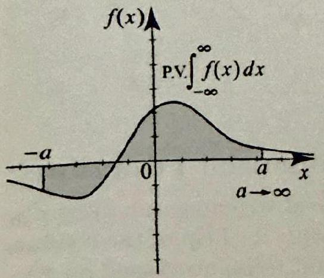

Figure 2 The Cauchy principal value of the integral.
$\lim _{b \rightarrow \infty} \int_{a}^{b} f(x) d x$ exists as a finite number. Similarly, $\int_{-\infty}^{b} f(x) d x$ is convergent if $\lim _{a \rightarrow-\infty} \int_{a}^{b} f(x) d x$ exists as a finite number.

Now let $f(x)$ be continuous on the real line. The integral $\int_{-\infty}^{\infty} f(x) d x$ is also improper since the interval of integration is infinite, but here it is infinite in both the positive and negative direction. Such an integral is said to be convergent if both $\int_{0}^{\infty} f(x) d x$ and $\int_{-\infty}^{0} f(x) d x$ are convergent. In this case, we set (Figure 1)

Figure 1 Splitting an improper integral over the line.
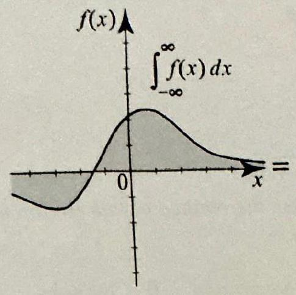

Figure 1 Splitting an improper integral over the line.
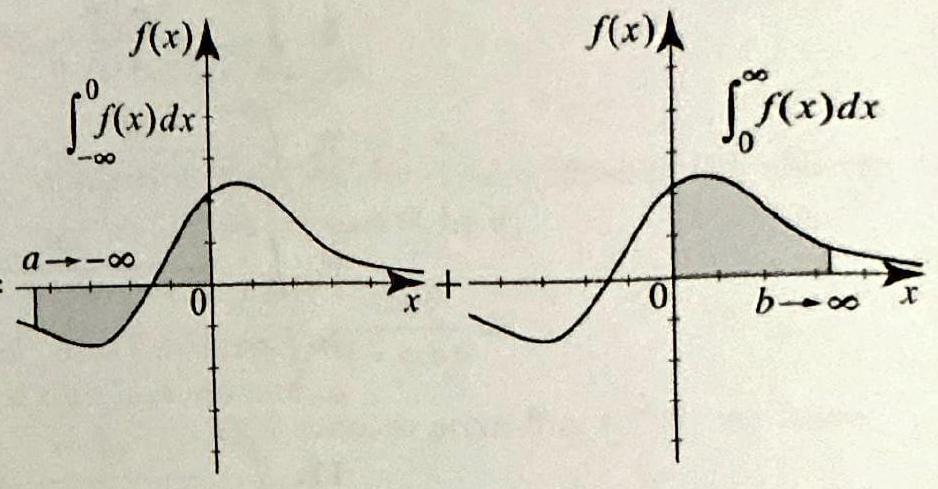

$$
\int_{-\infty}^{\infty} f(x) d x=\lim _{a \rightarrow-\infty} \int_{a}^{0} f(x) d x+\lim _{b \rightarrow \infty} \int_{0}^{b} f(x) d x
$$

This expression should be contrasted with the following, which integrates the function along expanding symmetric intervals. We define the Cauchy principal value of the integral $\int_{-\infty}^{\infty} f(x) d x$ to be (Figure 2)

$$
\text { P.V. } \int_{-\infty}^{\infty} f(x) d x=\lim _{a \rightarrow \infty} \int_{-a}^{a} f(x) d x \text {, if the limit exists. }
$$

The Cauchy principal value of an integral may exist even though the integral itself is not convergent. For example, $\int_{-a}^{a} x d x=0$ for all $a$, which implies that P.V. $\int_{-\infty}^{\infty} x d x=0$, but the integral itself is clearly not convergent since $\int_{0}^{\infty} x d x=\infty$.

However, whenever $\int_{-\infty}^{\infty} f(x) d x$ is convergent, then P.V. $\int_{-\infty}^{\infty} f(x) d x$ exists, and the two integrals will be the same. This is because $\lim _{a \rightarrow \infty} \int_{-a}^{0} f(x) d x$ and $\lim _{a \rightarrow \infty} \int_{0}^{a} f(x) d x$ both exist, and so

$$
\text { P.V. } \begin{aligned}
\int_{-\infty}^{\infty} f(x) d x & =\lim _{a \rightarrow \infty} \int_{-a}^{a} f(x) d x \\
& =\lim _{a \rightarrow \infty}\left(\int_{-a}^{0} f(x) d x+\int_{0}^{a} f(x) d x\right) \\
& =\lim _{a \rightarrow \infty} \int_{-a}^{0} f(x) d x+\lim _{a \rightarrow \infty} \int_{0}^{a} f(x) d x \\
& =\int_{-\infty}^{\infty} f(x) d x
\end{aligned}
$$

PROPOSITION 1 INEQUALITIES FOR IMPROPER INTEGRALS

Because of this fact, we can compute a convergent integral over the real line by computing its principal value, which can often be obtained by use of complex methods and the residue theorem.

How can we know if an integral is convergent? We can use the following comparison test.
Let $\int_{A}^{B} f(x) d x$ represent an improper integral as in (1), where $A=-\infty$ or $B=\infty$.
(i) If $\int_{A}^{B}|f(x)| d x$ is convergent, then $\int_{A}^{B} f(x) d x$ is convergent and we have $\left|\int_{A}^{B} f(x) d x\right| \leq \int_{A}^{B}|f(x)| d x$.
(ii) If $|f(x)| \leq g(x)$ for all $A<x<B$ and $\int_{A}^{B} g(x) d x$ is convergent, then $\int_{A}^{B} f(x) d x$ is convergent and we have $\left|\int_{A}^{B} f(x) d x\right| \leq \int_{A}^{B} g(x) d x$.
Proof We prove part (i) in the case $A$ finite and $B=\infty$ and $f$ is real-valued. The proof of the other cases is similar and will be omitted. For any $b>A$, using (32), Section 3.2, we have $\left|\int_{A}^{b} f(x) d x\right| \leq \int_{A}^{b}|f(x)| d x$. Given that $I=\int_{A}^{\infty}|f(x)| d x<\infty$, consider the nonnegative function $|f(x)|-f(x)$. Since it is nonnegative, its integral is nonnegative and increases with the size of the interval of integration. That means that $F(b)=\int_{A}^{b}(|f(x)|-f(x)) d x$ is a nonnegative increasing function of $b$. Moreover, $F(b)=\int_{A}^{b}(|f(x)|-f(x)) d x \leq 2 \int_{A}^{b}|f(x)| d x \leq 2 \int_{A}^{\infty}|f(x)| d x=2 I$. So, $F(b)$ is nonnegative, increasing and bounded above; therefore it has a limit $L \geq 0$ as $b \rightarrow \infty$. Now $L=\lim _{b \rightarrow \infty} \int_{A}^{b}(|f(x)|-f(x)) d x=\lim _{b \rightarrow \infty} \int_{A}^{b}|f(x)| d x-\lim _{b \rightarrow \infty} \int_{A}^{b} f(x) d x= I-\lim _{b \rightarrow \infty} \int_{A}^{b} f(x) d x$. So, $\lim _{b \rightarrow \infty} \int_{A}^{b} f(x) d x=I-L$, which shows that the integral $\int_{A}^{\infty} f(x) d x=I-L$ is finite and $\leq I$, because $L \geq 0$. Repeating this argument with $|f(x)|+f(x)$ in place of $|f(x)|-f(x)$, we obtain that $-\int_{A}^{\infty} f(x) d x$ exists and is $\leq I$. Hence, $\left|\int_{A}^{\infty} f(x) d x\right| \leq \int_{A}^{\infty}|f(x)| d x$.

To prove (ii), let $A \leq b$ and note that $\int_{A}^{b}|f(x)| d x$ is an increasing function of $b$, because $|f(x)|$ is nonnegative. It is also bounded above by $\int_{A}^{\infty} g(x) d x$, because of the inequality $|f(x)| \leq g(x)$, and so $\lim _{b \rightarrow \infty} \int_{A}^{b}|f(x)| d x$ exists and is $\leq \int_{A}^{\infty} g(x) d x$. Hence $\int_{A}^{\infty}|f(x)| d x$ is convergent, and from (i) it follows that $\int_{A}^{\infty} f(x) d x$ is convergent and is $\leq \int_{A}^{\infty} g(x) d x$.

You are encouraged to use Proposition 1 or any other test from calculus (such as the limit comparison test) to show that an improper integral is convergent. Once the convergence is determined, we may compute the integral via its principal value, as we will illustrate in the examples.

EXAMPLE 1 Improper integrals and residues: the main ideas Evaluate

$$
I=\int_{-\infty}^{\infty} \frac{x^{2}}{x^{4}+1} d x
$$

Solution To highlight the main ideas, we present the solution in basic steps.
Step 1: Show that the improper integral is convergent. Because the integrand is continuous on the real line, it is enough to show that the integral outside a
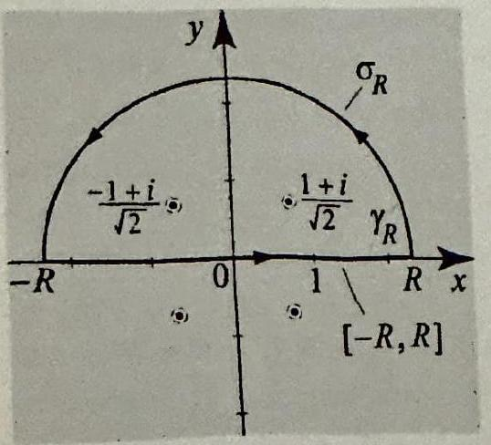

Figure 3 The path and poles for the contour integral in Example 1.
finite interval, say $[-1,1]$, is convergent. For $|x| \geq 1$, we have $\frac{x^{2}}{x^{4}+1} \leq \frac{x^{2}}{x^{4}}=\frac{1}{x^{2}}$, and since $\int_{1}^{\infty} \frac{1}{x^{2}} d x$ is convergent, it follows by Proposition 1 that $\int_{1}^{\infty} \frac{x^{2}}{x^{4}+1} d x$ and $\int_{-\infty}^{-1} \frac{x^{2}}{x^{4}+1} d x$ are convergent. Thus $\int_{-\infty}^{\infty} \frac{x^{2}}{x^{4}+1} d x$ is convergent, and so

$$
\int_{-\infty}^{\infty} \frac{x^{2}}{x^{4}+1} d x=\lim _{R \rightarrow \infty} \int_{-R}^{R} \frac{x^{2}}{x^{4}+1} d x
$$

Step 2: Set up the contour integral. We will replace $x$ by $z$ and consider the function $f(z)=\frac{z^{2}}{z^{4}+1}$. The general guideline is to integrate this function over a contour that consists partly of the interval $[-R, R]$, so as to recapture the integral $\int_{-R}^{R} \frac{x^{2}}{x^{4}+1} d x$ as part of the contour integral on $\gamma_{R}$. Choosing the appropriate contour is not obvious in general. For a rational function, such as $\frac{x^{2}}{x^{4}+1}$, where the denominator does not vanish on the $x$-axis and the degree of the denominator is two more than the degree of the numerator, a closed semi-circle $\gamma_{R}$ as in Figure 3 will work. Since $\gamma_{R}$ consists of the interval $[-R, R]$ followed by the semi-circle $\sigma_{R}$, using the additive property of path integrals (Proposition 2(iii), Section 3.2), we write

$$
I_{\gamma_{R}}=\int_{\gamma_{R}} f(z) d z=\int_{[-R, R]} f(z) d z+\int_{\sigma_{R}} f(z) d z=I_{R}+I_{\sigma_{R}}
$$

For $z=x$ in $[-R, R]$, we have $f(z)=f(x)=\frac{x^{2}}{x^{4}+1}$ and $d z=d x$, and so $I_{R}= \int_{-R}^{R} \frac{x^{2}}{x^{4}+1} d x$, which according to (4) converges to the desired integral as $R \rightarrow \infty$. So, in order to compute the desired integral, we must get a handle on the other quantities, $I_{\gamma_{R}}$ and $I_{\sigma_{R}}$, in (5). Our strategy is as follows. In Step 3, we compute $I_{\gamma_{R}}$ by the residue theorem; and in Step 4, we show that $\lim _{R \rightarrow \infty} I_{\sigma_{R}}=0$. This will give us the necessary ingredients to complete the solution in Step 5.
Step 3: Compute $I_{\gamma_{R}}$ by the residue theorem. For $R>1$, the function $f(z)=\frac{z^{2}}{z^{4}+1}$ has two poles inside $\gamma_{R}$. These are the roots of $z^{4}+1=0$ in the upper half-plane. To solve $z^{4}=-1$, we write $-1=e^{i \pi}$; then using the formula for the $n$th roots from Section 1.3, we find the four roots

$$
z_{1}=\frac{1+i}{\sqrt{2}}, \quad z_{2}=\frac{-1+i}{\sqrt{2}}, \quad z_{3}=\frac{-1-i}{\sqrt{2}}, \quad z_{4}=\frac{-1-i}{\sqrt{2}}
$$

(see Figure 3). Since these are simple roots, we have simple poles at $z_{1}$ and $z_{2}$ and the residues there are (Proposition 1(ii), Section 5.1)

$$
\operatorname{Res}\left(z_{1}\right)=\left.\frac{z^{2}}{\frac{d}{d z}\left(z^{4}+1\right)}\right|_{z=z_{1}}=\left.\frac{z^{2}}{4 z^{3}}\right|_{z=z_{1}}=\left.\frac{1}{4 z}\right|_{z=z_{1}}=\frac{\sqrt{2}}{4(1+i)}=\frac{1-i}{4 \sqrt{2}}
$$

and similarly

$$
\operatorname{Res}\left(z_{2}\right)=\left.\frac{1}{4 z}\right|_{z=z_{2}}=\frac{-1-i}{4 \sqrt{2}}
$$

So, by the residue theorem, for all $R>1$

$$
I_{\gamma_{R}}=\int_{\gamma_{R}} \frac{z^{2}}{z^{4}+1} d z=2 \pi i\left(\operatorname{Res}\left(z_{1}\right)+\operatorname{Res}\left(z_{2}\right)\right)=2 \pi i \frac{-2 i}{4 \sqrt{2}}=\frac{\pi}{\sqrt{2}}
$$

Step 4: Show that $\lim _{R \rightarrow \infty} I_{\sigma_{R}}=0$. For $z$ on $\sigma_{R}$, we have $|z|=R$, and so

$$
\left|\frac{z^{2}}{z^{4}+1}\right| \leq \frac{R^{2}}{R^{4}-1}=M_{R}
$$

Appealing to the integral inequality (Theorem 2, Section 3.2), we have

$$
\left|I_{\sigma_{R}}\right|=\left|\int_{\sigma_{R}} \frac{z^{2}}{z^{4}+1} d z\right| \leq l\left(\sigma_{R}\right) M_{R}=\pi R \frac{R^{2}}{R^{4}-1}=\frac{\pi}{R-1 / R^{3}} \rightarrow 0, \quad \text { as } R \rightarrow \infty
$$

Step 5: Compute the improper integral. Using (5) and (6), we obtain

$$
\frac{\pi}{\sqrt{2}}=I_{R}+I_{\sigma_{R}}
$$

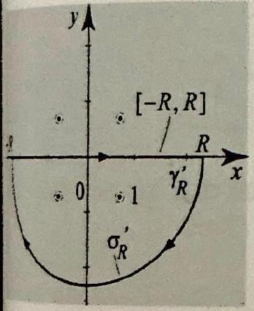
gure 4 An alternative path the integral in Example 1.

## PROPOSITION 2 INTEGRALS OF RATIONAL FUNCTIONS

Let $f(x)=\frac{p(x)}{q(x)}$ be a rational function with degree $q(x) \geq 2+$ degree $p(x)$, and let $\sigma_{R}$ denote an arc of the circle centered at 0 with radius $R>0$. Then

$$
\lim _{R \rightarrow \infty}\left|\int_{\sigma_{R}} \frac{p(z)}{q(z)} d z\right|=0
$$

Moreover, if $q(x)$ has no real roots and $z_{1}, z_{2}, \ldots, z_{N}$ denote all the poles of $\frac{p(z)}{q(z)}$ in the upper half-plane, then

$$
\int_{-\infty}^{\infty} \frac{p(x)}{q(x)} d x=2 \pi i \sum_{j=1}^{N} \operatorname{Res}\left(\frac{p(z)}{q(z)}, z_{j}\right)
$$

The proof of the proposition is very similar to the solution of Example 1. We will relegate it to the exercises. Here is a straightforward application.

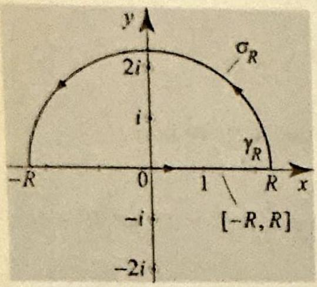
Figure 5 The path and poles for the contour integral in Example 2.

## EXAMPLE 2 Improper integral of a rational function

Evaluate

$$
\int_{-\infty}^{\infty} \frac{1}{\left(x^{2}+1\right)\left(x^{2}+4\right)} d x
$$

Solution The integrand satisfies the two conditions of Proposition 2: degree $q(x)= 4 \geq 2+$ degree $p(x)=2$, and the denominator $q(x)=\left(x^{2}+1\right)\left(x^{2}+4\right)$ has no real roots. So we may apply (8). We have

$$
\left(z^{2}+1\right)\left(z^{2}+4\right)=(z+i)(z-i)(z+2 i)(z-2 i)
$$

and hence $\frac{1}{\left(z^{2}+1\right)\left(z^{2}+4\right)}$ has simple poles at $i$ and $2 i$ in the upper half-plane (Figure 5). The residues there are

$$
\operatorname{Res}(i)=\lim _{z \rightarrow i}(z-i) \frac{1}{(z-i)(z+i)\left(z^{2}+4\right)}=\frac{1}{(2 i)(-1+4)}=-\frac{i}{6}
$$

and

$$
\operatorname{Res}(2 i)=\lim _{z \rightarrow 2 i}(z-2 i) \frac{1}{\left(z^{2}+1\right)(z-2 i)(z+2 i)}=\frac{i}{12}
$$

According to (8),

$$
\int_{-\infty}^{\infty} \frac{1}{\left(x^{2}+1\right)\left(x^{2}+4\right)} d x=2 \pi i\left(-\frac{i}{6}+\frac{i}{12}\right)=\frac{\pi}{6}
$$

## The Substitution $x=e^{t}$

There are interesting integrals of rational functions that are not computable using semi-circular contours as in Example 1. Consider

$$
\int_{0}^{\infty} \frac{d x}{x^{3}+1}
$$

If you try to directly apply the method of Example 1 to this integral, you will quickly run into problems. First, we are integrating over just half of the real line, and it is not obvious how to relate this integral to the integral $\int_{-\infty}^{\infty} \frac{d x}{x^{3}+1}$. Moreover, the latter integral has a problem at $x=-1$. An integral such as (9) can be solved by using the substitution $x=e^{t}$. We outline this useful technique in Example 3, where we will compute a more general integral involving arbitrary powers of $x$. Using the exponential function has the advantage of eliminating the need to work with powers of $z$, which require dealing with branches of the logarithm and can complicate the problem.

Changing variables will affect the interval of integration; here it will change a semi-infinite interval to the real line. If the original integral is convergent, then it will still be convergent after we change variables, so we need only check once.

## EXAMPLE 3 The substitution $x=e^{t}$

Establish the identity

$$
\int_{0}^{\infty} \frac{1}{x^{\alpha}+1} d x=\frac{\pi}{\alpha \sin \frac{\pi}{\alpha}}, \quad \alpha \text { any real number }>1
$$

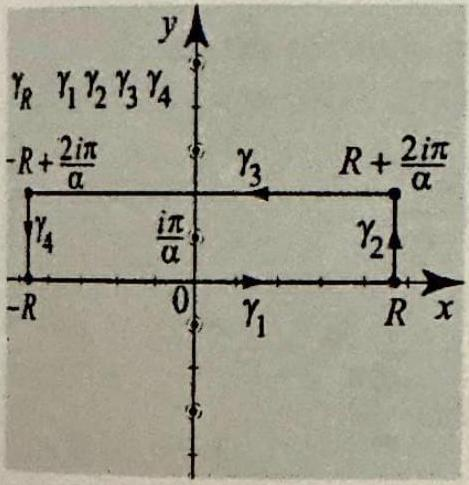

Figure 6 The path and poles for the contour integral in Example 3.

Solution Step 1: Show that the integral converges. The integrand is continuous, so it is enough to show that it has a convergent integral on $[1, \infty)$. We have $\frac{1}{x^{\alpha}+1} \leq \frac{1}{x^{\alpha}}$, where the latter has a convergent integral over $[1, \infty)$.
Step 2: Apply the substitution $x=e^{t}$. Let $x=e^{t}, d x=e^{t} d t$, and note that as $x$ varies from 0 to $\infty, t$ varies from $-\infty$ to $\infty$, and so

$$
I=\int_{0}^{\infty} \frac{1}{x^{\alpha}+1} d x=\int_{-\infty}^{\infty} \frac{e^{t}}{e^{\alpha t}+1} d t=\int_{-\infty}^{\infty} \frac{e^{x}}{e^{\alpha x}+1} d x
$$

where, for convenience, in the last integral we have used $x$ as a variable of integration instead of $t$. As we change $x$ to $z$, we obtain the function $f(z)=\frac{e^{z}}{e^{\alpha z}+1}$ with poles at the roots of $e^{\alpha z}+1=0$. Since the exponential function is $2 \pi i$-periodic, then

$$
e^{\alpha z}=-1=e^{i \pi} \quad \Leftrightarrow \quad \alpha z=i \pi+2 k \pi i \quad \Leftrightarrow \quad z_{k}=(2 k+1) \frac{\pi}{\alpha} i, k=0, \pm 1, \pm 2, \ldots .
$$

Thus $f(z)=\frac{e^{z}}{e^{\alpha z}+1}$ has infinitely many poles at $z_{k}$, all lying on the imaginary axis (Figure 6).
Step 3: Selecting the contour of integration. Our contour should expand in the $x$-direction in order to cover the entire $x$-axis. But since $f(z)$ has infinitely many poles on the $y$-axis, to avoid dealing with an infinite sum of residues, we will not use an expanding semicircle in the upper half-plane. Instead, we will use a rectangular contour $\gamma_{R}$ consisting of the paths $\gamma_{1}, \gamma_{2}, \gamma_{3}$, and $\gamma_{4}$, as in Figure 6, and let $I_{j}$ denote the path integral of $f(z)$ over $\gamma_{j}(j=1, \ldots, 4)$. As $R \rightarrow \infty, \gamma_{R}$ will expand in the horizontal direction, but the length of the vertical sides remains fixed at $\frac{2 \pi}{\alpha}$. To understand the reason for our choice of the vertical length, let us consider $I_{1}$ and $I_{3}$. On $\gamma_{1}$, we have $z=x, d z=d x$,

$$
I_{1}=\int_{-R}^{R} \frac{e^{x}}{e^{\alpha x}+1} d x
$$

and so $I_{1}$ converges to the desired integral $I$ as $R \rightarrow \infty$. On $\gamma_{3}$, we have $z=x+i \frac{2 \pi}{\alpha}$, $d z=d x$, and using the $2 \pi i$-periodicity of the exponential function, we get

$$
I_{3}=\int_{R}^{-R} \frac{e^{x+i \frac{2 \pi}{\alpha}}}{e^{\alpha\left(x+i \frac{2 \pi}{\alpha}\right)}+1} d x=-e^{\frac{2 \pi}{\alpha} i} \int_{-R}^{R} \frac{e^{x}}{e^{\alpha x}+1} d x=-e^{\frac{2 \pi}{\alpha} i} I_{1}
$$

This last equality explains the choice of the vertical sides: They are chosen so that the integral on the returning horizontal side $\gamma_{3}$ is equal to a constant multiple of the integral on $\gamma_{1}$. From here the solution is straightforward.
Step 4: Applying the residue theorem. From Step 2, we have only one pole of $f(z)$ inside $\gamma_{R}$ at $z_{0}=\frac{\pi}{\alpha} i$. Since $e^{\alpha z}+1$ has a simple root, this is a simple pole. Using Proposition 1(ii), Section 5.1, we find

$$
\operatorname{Res}\left(\frac{e^{z}}{e^{\alpha z}+1}, \frac{\pi}{\alpha} i\right)=\frac{e^{\frac{\pi}{\alpha} i}}{\alpha e^{\alpha \frac{\pi}{\alpha} i}}=\frac{e^{\frac{\pi}{\alpha} i}}{\alpha e^{i \pi}}=-\frac{e^{\frac{\pi}{\alpha} i}}{\alpha}
$$

and so by the residue theorem

$$
I_{1}+I_{2}+I_{3}+I_{4}=\int_{\gamma_{R}} \frac{e^{z}}{e^{\alpha z}+1} d z=2 \pi i \operatorname{Res}\left(\frac{e^{z}}{e^{\alpha z}+1}, \frac{\pi}{\alpha} i\right)=-2 \pi i \frac{e^{\frac{\pi}{\alpha} i}}{\alpha}
$$

Step 5: Show that the integrals on the vertical sides tend to 0 as $R \rightarrow \infty$. Let us estimate $I_{2}$. For $z=R+i y\left(0 \leq y \leq \frac{\pi}{\alpha}\right)$ on $\gamma_{2}$, we have $\left|e^{\alpha z}\right|=\left|e^{\alpha R} e^{i \alpha y}\right|=e^{\alpha R}$ and so

$$
\left|e^{\alpha z}+1\right| \geq\left|e^{\alpha z}\right|-1=e^{\alpha R}-1
$$

hence

$$
\frac{1}{\left|e^{\alpha z}+1\right|} \leq \frac{1}{e^{\alpha R}-1}
$$

and so for $z$ on $\gamma_{2}$

$$
|f(z)|=\left|\frac{e^{z}}{e^{\alpha z}+1}\right| \leq \frac{\left|e^{R+i y}\right|}{e^{\alpha R}-1}=\frac{e^{R}}{e^{\alpha R}-1}=\frac{1}{e^{(\alpha-1) R}-e^{-R}}
$$

Consequently, by the inequality for path integrals (Theorem 2, Section 3.2),

$$
\left|I_{2}\right|=\left|\int_{\gamma_{2}} \frac{e^{z}}{e^{\alpha z}+1} d z\right| \leq \frac{l\left(\gamma_{2}\right)}{e^{(\alpha-1) R}-e^{-R}}=\frac{\frac{2 \pi}{\alpha}}{e^{(\alpha-1) R}-e^{-R}} \rightarrow 0, \text { as } R \rightarrow \infty
$$

The proof that $I_{4} \rightarrow 0$ as $R \rightarrow \infty$ is done similarly; we omit the details.
Step 6: Compute the desired integral (10). Using (11), (12), and (13), we find that

$$
I_{1}\left(1-e^{\frac{2 \pi}{\alpha} i}\right)+I_{2}+I_{4}=-2 \pi i \frac{e^{\frac{\pi}{\alpha} i}}{\alpha}
$$

Letting $R \rightarrow \infty$ and using the result of Step 5, we get

$$
\left(1-e^{\frac{2 \pi}{\alpha} i}\right) \int_{-\infty}^{\infty} \frac{e^{x}}{e^{\alpha x}+1} d x=-2 \pi i \frac{e^{\frac{\pi}{\alpha} i}}{\alpha}
$$

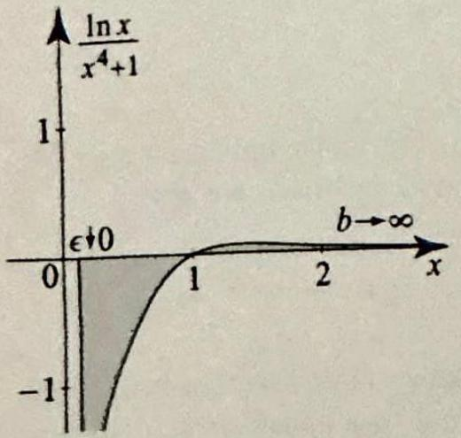
and after simplifying

$$
\int_{-\infty}^{\infty} \frac{e^{x}}{e^{\alpha x}+1} d x=\frac{2 \pi i}{\alpha\left(e^{\frac{\pi}{\alpha} i}-e^{-\frac{\pi}{\alpha} i}\right)}=\frac{\pi}{\alpha \sin \frac{\pi}{\alpha}}
$$

which implies (10).
The tricky part in Example 3 is choosing the contour. Let us clarify this part with one more example. We will compute the integral $\int_{0}^{\infty} \frac{\ln x}{x^{4}+1} d x$. The integral is improper because the interval is infinite and because the integrand
Figure 7 Splitting an improper integral. tends to $-\infty$ as $x \downarrow 0$. To define the convergence of such integrals, we follow the general procedure of taking all one-sided limits one at a time. Thus (Figure 7)

$$
\int_{0}^{\infty} \frac{\ln x}{x^{4}+1} d x=\lim _{\epsilon 10} \int_{\epsilon}^{1} \frac{\ln x}{x^{4}+1} d x+\lim _{b \rightarrow \infty} \int_{1}^{b} \frac{\ln x}{x^{4}+1} d x
$$

It is not difficult to show that both limits exist and hence that the integral converges. We will use the substitution $x=e^{t}$ to solve the problem. If you like, you could instead check the convergence after changing variables.

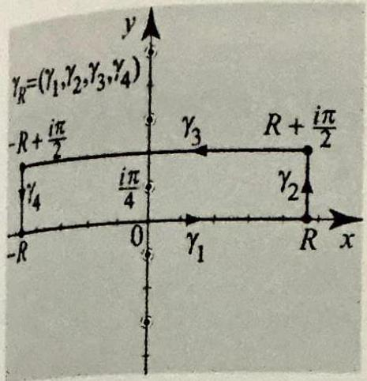
Figure 8 The path and poles for the contour integral in Example 4.

## EXAMPLE 4 An integral involving $\ln x$

Derive

$$
\int_{0}^{\infty} \frac{\ln x}{x^{4}+1} d x=-\frac{\pi^{2}}{8 \sqrt{2}}
$$

Solution Let $x=e^{t}, \ln x=t, d x=e^{t} d t$. This transforms the integral into

$$
\int_{-\infty}^{\infty} \frac{t}{e^{4 t}+1} e^{t} d t=\int_{-\infty}^{\infty} \frac{x e^{x}}{e^{4 x}+1} d x
$$

where we have renamed the variable $x$, just for convenience. In evaluating this integral, we will integrate $f(z)=\frac{z e^{z}}{e^{4 z}+1}$ over the rectangular contour $\gamma_{R}$ in Figure 8, and let $I_{j}$ denote the integral of $f(z)$ on $\gamma_{j}$. Here again, we chose the vertical sides of $\gamma_{R}$ so that on the returning path $\gamma_{3}$ the denominator equals to $e^{4 x}+1$. As we will see momentarily, this will enable us to relate $I_{3}$ to $I_{1}$. Let us now compute $I_{\gamma_{R}}=\int_{\gamma_{R}} f(z) d z$. As you can check, $f(z)$ has one (simple) pole at $z=i \frac{\pi}{4}$ inside $\gamma_{R}$. By Proposition 1(ii), Section 5.1, the residue there is

$$
\operatorname{Res}\left(\frac{z e^{z}}{e^{4 z}+1}, i \frac{\pi}{4}\right)=\frac{i \frac{\pi}{4} e^{i \frac{\pi}{4}}}{4 e^{i \pi}}=-\frac{i \pi(1+i)}{16 \sqrt{2}}
$$

So by the residue theorem

$$
I_{\gamma_{R}}=2 \pi i\left(-\frac{i \pi(1+i)}{16 \sqrt{2}}\right)=\frac{\pi^{2}(1+i)}{8 \sqrt{2}}=I_{1}+I_{2}+I_{3}+I_{4} .
$$

Moving to each $I_{j}(j=1, \ldots, 4)$, we have

$$
I_{1}=\int_{\gamma_{1}} \frac{z e^{z}}{e^{4 z}+1} d z=\int_{-R}^{R} \frac{x e^{x}}{e^{4 x}+1} d x
$$

On $\gamma_{3}, z=x+i \frac{\pi}{2}, d z=d x$, so using $e^{\frac{i \pi}{2}}=i$, we get

$$
\begin{aligned}
I_{3} & =\int_{\gamma_{3}} \frac{z e^{z}}{e^{4 z}+1} d z=\int_{R}^{-R} \frac{\left(x+i \frac{\pi}{2}\right) e^{x} e^{i \frac{\pi}{2}}}{e^{4 x}+1} d x \\
& =-i \int_{-R}^{R} \frac{x e^{x}}{e^{4 x}+1} d x+\frac{\pi}{2} \int_{-R}^{R} \frac{e^{x}}{e^{4 x}+1} d x \\
& =-i I_{1}+\frac{\pi}{2} \int_{-R}^{R} \frac{e^{x}}{e^{4 x}+1} d x
\end{aligned}
$$

To show that $I_{2}$ and $I_{4}$ tend to 0 as $R \rightarrow \infty$, we proceed as in Step 5 of Example 3. For $z=R+i y\left(0 \leq y \leq \frac{\pi}{2}\right)$ on $\gamma_{2}$, we have $|z| \leq R+y \leq R+\frac{\pi}{2}$, and so, as in Example 3,

$$
|f(z)|=\left|\frac{z e^{z}}{e^{4 z}+1}\right|=|z|\left|\frac{e^{z}}{e^{4 z}+1}\right| \leq\left(R+\frac{\pi}{2}\right) \frac{e^{R}}{e^{4 R}-1}=\frac{R+\frac{\pi}{2}}{e^{3 R}-e^{-R}}
$$

Consequently, by the inequality for path integrals (Theorem 2, Section 3.2),

$$
\left|I_{2}\right|=\left|\int_{\gamma_{2}} \frac{z e^{z}}{e^{4 z}+1} d z\right| \leq \frac{l\left(\gamma_{2}\right)\left(R+\frac{\pi}{2}\right)}{e^{3 R}-e^{-R}}=\frac{\frac{\pi}{2}\left(R+\frac{\pi}{2}\right)}{e^{3 R}-e^{-R}} \rightarrow 0, \text { as } R \rightarrow \infty .
$$

The proof that $I_{4} \rightarrow 0$ as $R \rightarrow \infty$ is done similarly; we omit the details. Substituting our finding into (15) and taking the limit as $R \rightarrow \infty$, we get

$$
\begin{aligned}
\frac{\pi^{2}(1+i)}{8 \sqrt{2}} & =\lim _{R \rightarrow \infty}\left(I_{1}+I_{2}-i I_{1}+\frac{\pi}{2} \int_{-R}^{R} \frac{e^{x}}{e^{4 x}+1} d x+I_{4}\right) \\
& =(1-i) \int_{-\infty}^{\infty} \frac{x e^{x}}{e^{4 x}+1} d x+\frac{\pi}{2} \int_{-\infty}^{\infty} \frac{e^{x}}{e^{4 x}+1} d x
\end{aligned}
$$

Taking imaginary parts of both sides, we obtain our answer $\int_{-\infty}^{\infty} \frac{x e^{x}}{e^{4 x}+1} d x=-\frac{\pi^{2}}{8 \sqrt{2}}$. If we take real parts of both sides we get the value of the integral in (10) that corresponds to $\alpha=4$.

The substitution $x=e^{t}$ is also useful even when we do not use complex methods to evaluate the integral in $t$. For example,

$$
\int_{0}^{\infty} \frac{\ln x}{x^{2}+1} d x=\int_{-\infty}^{\infty} \frac{t e^{t}}{e^{2 t}+1} d t=0
$$

since the integral is convergent and the integrand $\frac{t e^{t}}{e^{2 t}+1}=\frac{t}{e^{t}+e^{-t}}$ is an odd function of $t$.

## Exercises 5.3

In Exercises 1-8, evaluate the given improper integral by the method of Example 1.

1. $\int_{-\infty}^{\infty} \frac{d x}{x^{4}+1}=\frac{\pi}{\sqrt{2}}$.
2. $\int_{-\infty}^{\infty} \frac{d x}{x^{4}+x^{2}+1}=\frac{\pi}{\sqrt{3}}$.
3. $\int_{-\infty}^{\infty} \frac{d x}{\left(x^{2}+1\right)\left(x^{4}+1\right)}=\frac{\pi}{2}$.
4. $\int_{-\infty}^{\infty} \frac{d x}{(x-i)(x+3 i)}=\frac{\pi}{2}$.
5. $\int_{-\infty}^{\infty} \frac{d x}{\left(x^{2}+1\right)^{3}}=\frac{3 \pi}{8}$.
6. $\int_{-\infty}^{\infty} \frac{d x}{\left(x^{4}+1\right)^{2}}=\frac{3 \pi}{4 \sqrt{2}}$.
7. $\int_{-\infty}^{\infty} \frac{d x}{\left(4 x^{2}+1\right)(x-i)}=\frac{\pi}{3} i$.
8. $\int_{-\infty}^{\infty} \frac{d x}{(x+i)(x-3 i)}=\frac{\pi}{2}$.

In Exercises 9-20, evaluate the given improper integral by the method of Example 3. In some cases, the integral follows from more general formulas that we derived earlier. You may use these formulas to verify your answer, but you must provide a detailed solution.
9. $\int_{0}^{\infty} \frac{d x}{x^{3}+1}=\frac{2 \pi}{3 \sqrt{3}}$.
10. $\int_{-\infty}^{\infty} \frac{d x}{\left(1+x^{2}\right)^{n+1}}=\frac{(2 n)!}{2^{2 n}(n!)^{2}} \pi$.
11. $\int_{0}^{\infty} \frac{x}{x^{5}+1} d x=\frac{\pi}{5 \sin \left(\frac{2 \pi}{5}\right)}$.
12. $\int_{0}^{\infty} \frac{x}{x^{\alpha}+1} d x=\frac{\pi}{\alpha \sin \left(\frac{2 \pi}{\alpha}\right)} \quad(\alpha>2)$.
13. $\int_{0}^{\infty} \frac{\sqrt{x}}{x^{3}+1} d x=\frac{\pi}{3}$.
14. $\int_{0}^{\infty} \frac{x^{\alpha}}{(x+1)^{2}} d x=\frac{\pi \alpha}{\sin \pi \alpha}(-1<\alpha<1)$.
15. $\int_{0}^{\infty} \frac{x^{2} e^{x}}{e^{2 x}+1} d x=\frac{\pi^{3}}{8}$.
16. $\int_{0}^{\infty} \frac{x \ln (2 x)}{x^{3}+1} d x=\frac{2 \pi^{2}}{27}+\frac{2 \pi \ln 2}{3 \sqrt{3}}$.
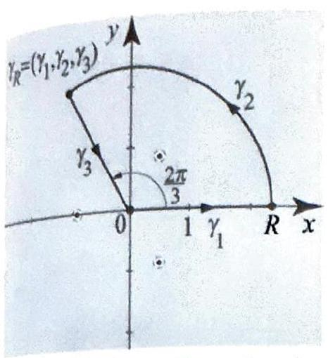

Figure 9 The path and poles for the contour integral in Exercise 21.
17. $\int_{0}^{\infty} \frac{\ln (2 x)}{x^{2}+4} d x=\frac{\pi}{2} \ln 2$.
18. $\int_{0}^{\infty} \frac{\ln (a x)}{x^{2}+b^{2}} d x=\frac{\pi}{2 b} \ln (a b)(a, b>0)$.
19. $\int_{0}^{\infty} \frac{(\ln x)^{2}}{x^{2}+1} d x=\frac{\pi^{3}}{8}$.
20. $\int_{0}^{\infty} \frac{(\ln x)^{2}}{x^{3}+1} d x=\frac{10 \pi^{3}}{81 \sqrt{3}}$.
21. Use the contour $\gamma_{R}$ in Figure 9 to evaluate

$$
\int_{0}^{\infty} \frac{1}{x^{3}+1} d x
$$

[Hint: $I_{\gamma_{R}}=I_{1}+I_{2}+I_{3} ; I_{3}=-e^{i \frac{2 \pi}{3}} I_{1} ;$ and $I_{2} \rightarrow 0$ as $R \rightarrow \infty$.]
22. Follow the steps in Example 1 to prove Proposition 2.
23. A property of the gamma function. (a) Show that for $0<\alpha<1$,

$$
\int_{0}^{\infty} \frac{x^{\alpha-1}}{1+x} d x=\frac{\pi}{\sin \pi \alpha}
$$

(b) Use the definition of the gamma function (Exercise 24, Section 4.3) to derive

$$
\Gamma(\alpha) \Gamma(1-\alpha)=\int_{0}^{\infty} \int_{0}^{\infty} e^{-(s+t)} s^{-\alpha} t^{\alpha-1} d s d t, \quad 0<\alpha<1
$$

(c) Make the change of variables $x=s+t, y=\frac{t}{s}$ in (b), then use (a) to derive

$$
\Gamma(\alpha) \Gamma(1-\alpha)=\frac{\pi}{\sin \pi \alpha}, \quad 0<\alpha<1
$$

This is known as the formula of the complements of the gamma function.
(d) Use the identity principle (Corollary 1, Section 4.6) to extend the formula of the complements to all $z$ such that $0<\operatorname{Re} z<1$.
(e) Derive the integral $\int_{0}^{\frac{\pi}{2}} \sqrt{\cot x} d x=\frac{\pi}{\sqrt{2}}$. [Hint: Exercise 25(d), Section 4.3.]

### 5.4 Improper Integrals of Products of Rational and Trigonometric Functions

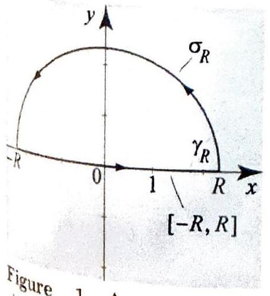

In this section, we use residues to evaluate improper integrals of the form

$$
\int_{-\infty}^{\infty} \frac{p(x)}{q(x)} \cos a x d x \text { and } \int_{-\infty}^{\infty} \frac{p(x)}{q(x)} \sin b x d x
$$

where $a$ and $b$ are real and $\frac{p(x)}{q(x)}$ is a rational function of $x$. The method is similar to the one we used previously. We will even use the expanding closed semi-circles $\gamma_{R}$ in Figure 1, as we did in Section 5.3. But because $|\cos a z|$ and $|\sin b z|$ are not bounded as $z$ ranges over the expanding semi-circles $\sigma_{R}$, it will be to our advantage to replace the cosine and sine functions by an exponential function, using the identities:

$$
\cos a x=\operatorname{Re}\left(e^{i a x}\right) \quad \text { and } \quad \sin b x=\operatorname{Im}\left(e^{i b x}\right),
$$

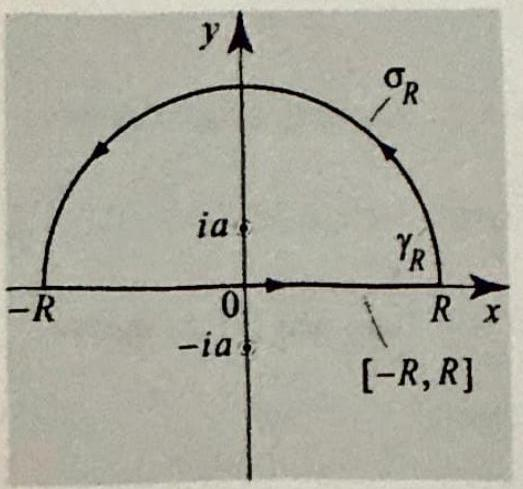
Figure 2 The path and poles for the contour integral in Example 1.

for any real numbers $a, b, x$. Then,

$$
\begin{aligned}
\int_{-\infty}^{\infty} \frac{p(x)}{q(x)} \cos a x d x & =\int_{-\infty}^{\infty} \frac{p(x)}{q(x)} \operatorname{Re}\left(e^{i a x}\right) d x=\int_{-\infty}^{\infty} \operatorname{Re}\left(\frac{p(x)}{q(x)} e^{i a x}\right) d x \\
& =\operatorname{Re}\left(\int_{-\infty}^{\infty} \frac{p(x)}{q(x)} e^{i a x} d x\right)
\end{aligned}
$$

and similarly

$$
\int_{-\infty}^{\infty} \frac{p(x)}{q(x)} \sin b x d x=\operatorname{Im}\left(\int_{-\infty}^{\infty} \frac{p(x)}{q(x)} e^{i b x} d x\right)
$$

This approach will involve functions of the form $\frac{p(z)}{q(z)} e^{i a z}$, which are manageable on the contour $\gamma_{R}$.

## EXAMPLE 1 The main ideas

Let $a>0$ and $s \geq 0$ be real numbers. Derive the identity

$$
\int_{-\infty}^{\infty} \frac{\cos s x}{x^{2}+a^{2}} d x=\frac{\pi}{a} e^{-s a}
$$

Solution Step 1: Show that the improper integral is convergent. We have $\left|\frac{\cos s x}{x^{2}+a^{2}}\right| \leq \frac{1}{x^{2}+a^{2}}$, and since $\int_{-\infty}^{\infty} \frac{d x}{x^{2}+a^{2}}$ is convergent, our integral converges by Proposition 1, Section 5.3.
Step 2: Set up and evaluate the contour integral. Since
(4) $\int_{-\infty}^{\infty} \frac{\cos s x}{x^{2}+a^{2}} d x=\int_{-\infty}^{\infty} \operatorname{Re}\left(\frac{e^{i s x}}{x^{2}+a^{2}}\right) d x=\operatorname{Re}\left(\int_{-\infty}^{\infty} \frac{e^{i s x}}{x^{2}+a^{2}} d x\right)$,
we will consider the contour integral

$$
I_{\gamma_{R}}=\int_{\gamma_{R}} \frac{e^{i s z}}{z^{2}+a^{2}} d z=\int_{\sigma_{R}} \frac{e^{i s z}}{z^{2}+a^{2}} d z+\int_{-R}^{R} \frac{e^{i s x}}{x^{2}+a^{2}} d x=I_{\sigma_{R}}+I_{R}
$$

where $\gamma_{R}$ and $\sigma_{R}$ are as in Figure 2. For $R>a, \frac{e^{12 z z}}{z^{2}+a^{2}}$ has one simple pole inside $\gamma_{R}$ at $z=i a$. The residue there is (Proposition 1, Section 5.1)

$$
\operatorname{Res}\left(\frac{e^{i s z}}{z^{2}+a^{2}}, i a\right)=\frac{e^{i s(i a)}}{2 i a}=\frac{e^{-s a}}{2 i a} .
$$

By the residue theorem, we have for all $R>a$

$$
I_{\gamma_{R}}=I_{\sigma_{R}}+I_{R}=2 \pi i \frac{e^{-s a}}{2 i a}=\frac{\pi}{a} e^{-s a}
$$

Step 3: Show that $\lim _{R \rightarrow \infty} I_{\sigma_{R}}=0$. For $s \geq 0$ and $0 \leq \theta \leq \pi$, we have $\sin \theta \geq 0$. hence $-s R \sin \theta \leq 0$, and so $e^{-s R \sin \theta} \leq 1$. Write $z$ on $\sigma_{R}$, as $z=R e^{i \theta}=R(\cos \theta+ i \sin \theta$ ), where $0 \leq \theta \leq \pi$. Then

$$
\left|e^{i s z}\right|=\left|e^{i s R(\cos \theta+i \sin \theta)}\right|=\overbrace{e^{i s R \cos \theta}}^{=1}\left|e^{-s R \sin \theta}\right|=e^{-s R \sin \theta} \leq 1 \text {. }
$$

LEMMA 1 JORDAN'S LEMMA

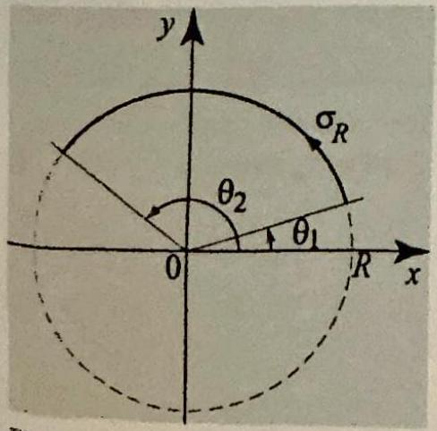
Figure 3

Hence, for $R>a$ and $z$ on the semi-circle $\sigma_{R}$, we have

$$
\left|\frac{e^{i s z}}{z^{2}+a^{2}}\right| \leq \frac{1}{\left|z^{2}+a^{2}\right|} \leq \frac{1}{|z|^{2}-a^{2}}=\frac{1}{R^{2}-a^{2}}
$$

and so by the inequality for path integrals (Theorem 2, Section 3.2)

$$
\left|\int_{\sigma_{R}} \frac{e^{i s z}}{z^{2}+a^{2}} d z\right| \leq l\left(\sigma_{R}\right) \frac{1}{R^{2}-a^{2}}=\frac{\pi R}{R^{2}-a^{2}} \rightarrow 0, \text { as } R \rightarrow \infty .
$$

This estimate works because the degree of the polynomial in the denominator is two greater than that in the numerator.
Step 4: Compute the desired improper integral. Let $R \rightarrow \infty$ in (6), use Step 3, and get

$$
\lim _{R \rightarrow \infty} I_{\sigma_{R}}+\lim _{R \rightarrow \infty} I_{R}=0+\int_{-\infty}^{\infty} \frac{e^{i s x}}{x^{2}+a^{2}} d x=\frac{\pi}{a} e^{-s a}
$$

Taking real parts on both sides and using (4), we get the desired integral

$$
\int_{-\infty}^{\infty} \frac{\cos s x}{x^{2}+a^{2}} d x=\frac{\pi}{a} e^{-s a}
$$

By simply observing that $\sin \theta \geq 0$ for $0 \leq \theta \leq \pi$, we were able in (7) to obtain the inequality $\left|e^{i s z}\right| \leq 1$ for all $s \geq 0$ and $z=R e^{i \theta}, 0 \leq \theta \leq \pi$. As we will see in the next lemma, a more precise analysis of $\sin \theta$ yields a far better estimate on $\left|e^{i s z}\right|$, which in turn will make it possible to compute integrals of the form (1), where degree $q(x) \geq 1+$ degree $p(x)$.
Let $f(z)$ be a continuous complex-valued function defined on the circular $\operatorname{arcs} \sigma_{R}$ consisting of all $z=R e^{i \theta}$, where $R \geq R_{0}$ ( $R_{0}$ fixed) and $0 \leq \theta_{1} \leq \theta \leq \theta_{2} \leq \pi$ (Figure 3), and let $M(R)$ denote the maximum value of $|f(z)|$ for $z$ on $\sigma_{R}$. If $\lim _{R \rightarrow \infty} M(R)=0$, then for all $s>0$

$$
\lim _{R \rightarrow \infty} \int_{\sigma_{R}} e^{i s z} f(z) d z=0
$$

Proof Given $s>0$, we have from (7), $\left|e^{i s \theta}\right|=e^{-s R \sin \theta}$. Note that since $e^{-s R \sin \theta}>$ 0 , its integral increases if we increase the size of the interval of integration. Thus $\int_{\theta_{1}}^{\theta_{2}} e^{-s r \sin \theta} d \theta \leq \int_{0}^{\pi} e^{-s r \sin \theta} d \theta$, if $0 \leq \theta_{1} \leq \theta_{2} \leq \pi$. Parametrize $\sigma_{R}$ by $\gamma(\theta)= \operatorname{Re} e^{i \theta}$, where $\theta_{1} \leq \theta \leq \theta_{2}$. Then $\gamma^{\prime}(\theta)=\operatorname{Rie}^{i \theta},\left|\gamma^{\prime}(\theta)\right| d \theta=R d \theta$, and hence

$$
\begin{aligned}
\left|\int_{\sigma_{R}} e^{i s z} f(z) d z\right| & \leq \int_{\theta_{1}}^{\theta_{2}}\left|e^{i s z} f(z)\right| R d \theta \\
& \leq R M(R) \int_{\theta_{1}}^{\theta_{2}} e^{-s R \sin \theta} d \theta \leq R M(R) \int_{0}^{\pi} e^{-s R \sin \theta} d \theta \\
& =R M(R)\left(\int_{0}^{\frac{\pi}{2}} e^{-s R \sin \theta} d \theta+\int_{\frac{\pi}{2}}^{\pi} e^{-s R \sin \theta} d \theta\right)
\end{aligned}
$$

In the second integral, make the change of variables $t=\pi-\theta, d t=-d \theta$, and notice that $\sin \theta=\sin (\pi-t)=\sin t$. This transforms the integral into $-\int_{\frac{\pi}{2}}^{0} e^{-s R \sin t} d t$, which is the same as the first integral in (8); and so from (8) we get

$$
\left|\int_{\sigma_{R}} e^{i s z} f(z) d z\right| \leq 2 R M(R) \int_{0}^{\frac{\pi}{2}} e^{-s R \sin \theta} d \theta
$$

At this point, we need an estimate on $\sin \theta$. On the interval $\left[0, \frac{\pi}{2}\right]$, the graph of $\sin \theta$ is concave down, because the second derivative is negative. Hence the graph of $\sin \theta$ for $0 \leq \theta \leq \frac{\pi}{2}$ is above the chordal line that joins any two points on the graph. In particular, it is above the chord that joins the origin to the point $\left(\frac{\pi}{2}, 1\right)$,

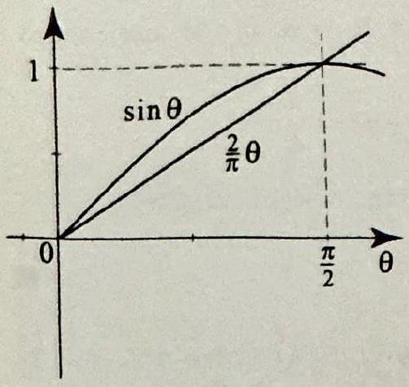
Figure 4

$\sin \theta \geq \frac{2}{\pi} \theta, 0 \leq \theta \leq \frac{\pi}{2}$. whose equation is $y=\frac{2}{\pi} \theta$. This fact is expressed analytically by the inequality

$$
\sin \theta \geq \frac{2}{\pi} \theta, \quad 0 \leq \theta \leq \frac{\pi}{2},
$$

and is illustrated in Figure 4. From this inequality, it follows immediately that $e^{-s R \sin \theta} \leq e^{-s R \frac{2}{\pi} \theta}$, and so from (9)

$$
\begin{aligned}
\left|\int_{\sigma_{R}} e^{i s z} f(z) d z\right| & \leq 2 R M(R) \int_{0}^{\frac{\pi}{2}} e^{-\frac{2 s R}{\pi} \theta} d \theta=-\left.2 R M(R) \frac{\pi}{2 s R} e^{-\frac{2 s R}{\pi} \theta}\right|_{0} ^{\frac{\pi}{2}} \\
& =\frac{\pi}{s} M(R)\left(1-e^{-s R}\right) \rightarrow 0, \text { as } R \rightarrow \infty
\end{aligned}
$$ $\square$

Note that an analog of Jordan's lemma will hold for $s<0$ if the circular $\operatorname{arc} \sigma_{R}$ is in the lower half-plane.

Applying Jordan's lemma in the special case when $f(z)$ is a rational function, we obtain the following useful result.

## COROLLARY 1

Let $f(z)=\frac{p(z)}{q(z)}$, where degree $q(z) \geq 1+\operatorname{degree} p(z)$, Let $\sigma_{R}$ denote the semi-circular arc consisting of all $z=R e^{i \theta}$, where $0 \leq \theta \leq \pi$. Then $\lim _{R \rightarrow \infty} \int_{\sigma_{R}} e^{i s z} f(z) d z=0$, for all $s>0$.

Proof Let $M(R)$ denote the maximum of $|p(z) / q(z)|$ for $z$ on $\sigma_{R}$. Since degree $q(z) \geq 1+$ degree $p(z), M(R) \rightarrow 0$ as $R \rightarrow \infty$. Now apply Jordan's lemma. $\square$

We will next evaluate the improper integral

$$
\int_{-\infty}^{\infty} \frac{x \sin x}{x^{2}+a^{2}} d x
$$

It is not difficult to show that this integral is convergent using integration by parts (Exercise 19). However, because the degree of $x^{2}+a^{2}$ is only one more than the degree of $x$, the estimate in Step 3 of Example 1 will not be sufficient to show that the integral on the expanding semi-circle tends to 0 . For this purpose, we will appeal to Jordan's lemma.
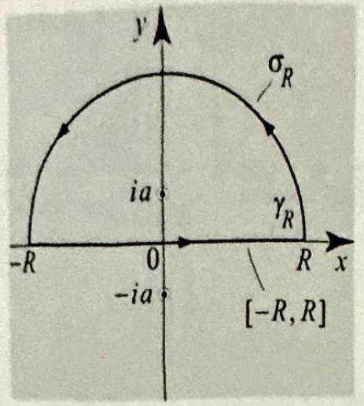

Figure 5 The path and poles for the contour integral in Example 2.

## EXAMPLE 2 Applying Jordan's lemma

Derive the identity

$$
\int_{-\infty}^{\infty} \frac{x \sin x}{x^{2}+a^{2}} d x=\frac{\pi}{e^{a}}, \quad a \text { any real number }>0
$$

Solution Consider the contour integral over the closed semi-circle $\gamma_{R}$

$$
I_{\gamma_{R}}=\int_{\sigma_{R}} \frac{z}{z^{2}+a^{2}} e^{i z} d z+\int_{-R}^{R} \frac{x}{x^{2}+a^{2}} e^{i x} d x=I_{\sigma_{R}}+I_{R}
$$

(Figure 5). By Jordan's lemma (Corollary 1), $\lim _{R \rightarrow \infty} I_{\sigma_{R}}=0$. For $R>a$, $\frac{z}{z^{2}+a^{2}} e^{i z}$ has a simple pole inside $\gamma_{R}$ at $i a$. By the residue theorem, for all $R>a$,

$$
I_{\gamma_{R}}=2 \pi i \operatorname{Res}\left(\frac{z e^{i z}}{z^{2}+a^{2}}, i a\right)=2 \pi i \frac{(i a) e^{i(i a)}}{2(i a)}=\frac{\pi}{e^{a}} i
$$

Taking the limit as $R \rightarrow \infty$ in (11) and using the fact that $I_{\sigma_{R}} \rightarrow 0$, we get

$$
\frac{\pi}{e^{a}} i=\int_{-\infty}^{\infty} \frac{x}{x^{2}+a^{2}} e^{i x} d x=\int_{-\infty}^{\infty} \frac{x \cos x}{x^{2}+a^{2}} d x+i \int_{-\infty}^{\infty} \frac{x \sin x}{x^{2}+a^{2}} d x
$$

and the desired identity follows upon taking imaginary parts on both sides. $\square$

## Indenting Contours

If we let $a \rightarrow 0$ in Example 2 and do not worry about justifying taking the limit inside the integral, we get the formula

$$
\int_{-\infty}^{\infty} \frac{\sin x}{x} d x=\pi
$$

This answer is indeed correct and yields an important integral that arises in many applications. In the remainder of this section, we will develop a method to calculate this and other interesting integrals.

We need to return to the idea of Cauchy principal values of integrals. In Section 5.3 we defined the Cauchy principal value of an improper integral over the real line. However, an integral can also be improper if the integrand becomes unbounded at a point inside the interval of integration. To make our discussion concrete, consider

$$
\int_{-1}^{1} f(x) d x
$$

where $f(x)$ is continuous on $[-1,0)$ and $(0,1]$ but might have infinite limits as $x$ approaches 0 from the left or right. Such an integral is said to be convergent if both $\lim _{b \rightarrow 0^{-}} \int_{-1}^{b} f(x) d x$ and $\lim _{a \rightarrow 0^{+}} \int_{a}^{1} f(x) d x$ are convergent. In this case, we set (Figure 6)

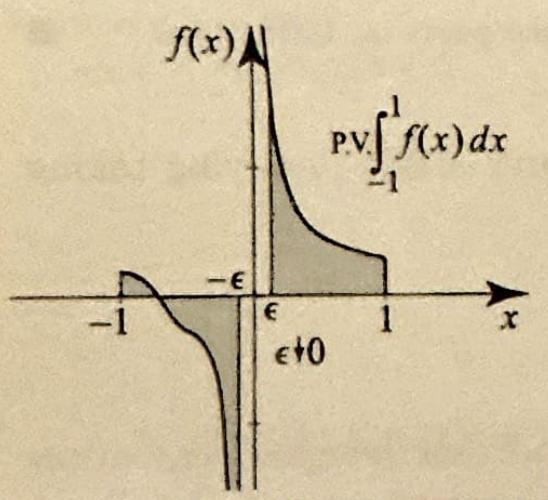
Figure 7 The Cauchy principal value.

Figure 6 Splitting an improper integral.
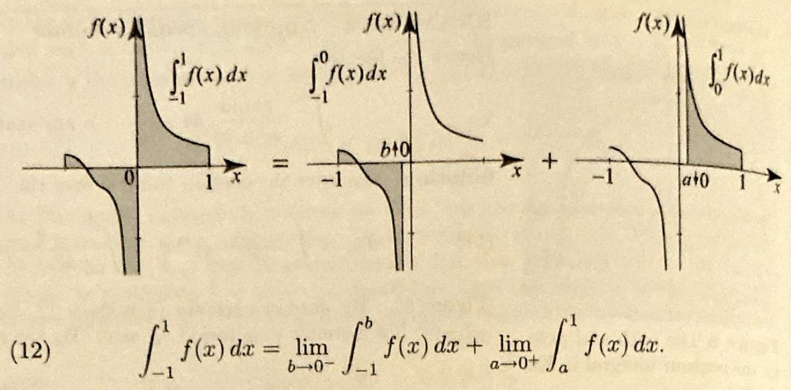

This expression should be contrasted with the following, which integrates the function on intervals that approach the singular point $x=0$ in a symmetric fashion. We define the Cauchy principal value of the integral $\int_{-1}^{1} f(x) d x$, with a singularity at $x=0$, to be (Figure 7)

$$
\text { P.V. } \int_{-1}^{1} f(x) d x=\lim _{r \rightarrow 0^{+}}\left(\int_{-1}^{-r} f(x) d x+\int_{r}^{-1} f(x) d x\right)
$$

The Cauchy principal value of an integral may exist even though the integral itself is not convergent. For example, $\int_{-1}^{-r} \frac{d x}{x}+\int_{r}^{1} \frac{d x}{x}=0$ for all $r>0$, so P.V. $\int_{-1}^{1} \frac{d x}{x}=0$, but the integral itself is clearly not convergent since $\int_{0}^{1} \frac{d x}{x}=\infty$.

However, whenever $\int_{-1}^{1} f(x) d x$ is convergent, then P.V. $\int_{-1}^{1} f(x) d x$ exists, and the two integrals will be the same, since we can split the limit of a sum in (13) into a sum of limits and recover (12). This fact allows us to compute convergent integrals by computing their principal values, which will be advantageous when using complex integration.

The extension of principal value integrals to more complicated situations is as follows: To compute the principal value of an integral where the integrand has possible singularities at $x_{1}, x_{2}, \ldots, x_{n}$ and the interval of integration may be infinite in both directions, we take limits to approach each singularity (and to the infinite interval) one at a time, yet approach each singularity (or infinity) in a symmetric fashion. If all these limits exist, the principal value exists.

The preceding definitions and formulas for principal value integrals also make sense for complex-valued functions integrated over real intervals.

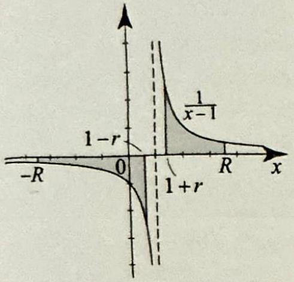
Figure 8 The principal value of the integral in Example 3.

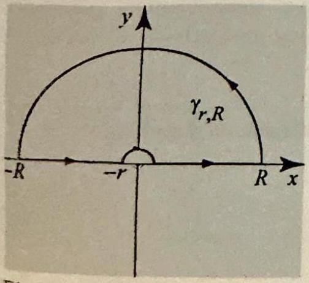
Figure 9 Bypassing the point $\theta$ with the contour $\gamma_{r, R}$.

EXAMPLE 3 Cauchy principal values and singular points
Write down P.V. $\int_{-\infty}^{\infty} \frac{1}{x-1} d x$ in terms of limits of integrals on finite intervals.
Solution The integral is improper because it extends over the infinite real line and because the integrand is singular at $x=1$. Accordingly, the principal value involves two limits; it is

$$
\text { P.V. } \begin{aligned}
\int_{-\infty}^{\infty} \frac{1}{x-1} d x= & \lim _{R \rightarrow \infty}\left(\int_{-R}^{0} \frac{1}{x-1} d x+\int_{2}^{R} \frac{1}{x-1} d x\right) \\
& +\lim _{r \rightarrow 0^{+}}\left(\int_{0}^{1-r} \frac{1}{x-1} d x+\int_{1+r}^{2} \frac{1}{x-1} d x\right)
\end{aligned}
$$

where the choices $x=0$ and $x=2$ were arbitrary; any pair of numbers where the first is in $(-\infty, 1)$ and the second is in $(1, \infty)$ will work to split the integrals. Using elementary methods, we can see that both limits on the right of (14) exist, so the principal value exists, and we can write (Figure 8)

$$
\text { P.V. } \int_{-\infty}^{\infty} \frac{1}{x-1} d x=\lim _{R \rightarrow \infty, r \rightarrow 0^{+}}\left(\int_{-R}^{1-r} \frac{1}{x-1} d x+\int_{1+r}^{R} \frac{1}{x-1} d x\right)
$$

where the limits may be taken in any manner. Using basic calculus, we find that for large $R>1$

$$
\int_{-R}^{1-r} \frac{1}{x-1} d x=\left.\ln |x-1|\right|_{-R} ^{1-r}=\ln (r)-\ln (R+1)
$$

and

$$
\int_{1+r}^{R} \frac{1}{x-1} d x=\left.\ln |x-1|\right|_{1+r} ^{R}=\ln (R-1)-\ln (r)
$$

So

$$
\text { P.V. } \int_{-\infty}^{\infty} \frac{1}{x-1} d x=\lim _{R \rightarrow \infty}[\ln (R-1)-\ln (R+1)]=\lim _{R \rightarrow \infty} \ln \left(\frac{R-1}{R+1}\right)=0
$$

Now, we return to the integral $\int_{-\infty}^{\infty} \frac{\sin x}{x} d x$. Since the integrand is well behaved at $x=0$ and the integral over the infinite interval converges, we can compute it by taking the imaginary part of P.V. $\int_{-\infty}^{\infty} \frac{e^{i x}}{x} d x$. This principal value integral involves the limit as $r \rightarrow 0^{+}$and $R \rightarrow \infty$ of an integral over $[-R,-r]$ and $[r, R]$. We envision the integral as a contour integral of the complex function $\frac{e^{i z}}{z}$ and close the contour with a large positively oriented semicircle of radius $R$ and a small negatively oriented semicircle of radius $r$, which will bypass the problem at 0 . The resulting path $\gamma_{r, R}$ is shown in Figure 9. The limit of the path integral over the small circle will be computed using the following lemma.

LEMMA 2 SHRINKING PATH LEMMA
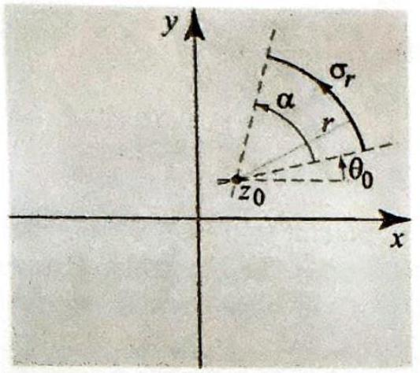

Figure 10 Circular arc at angle $\alpha$.

## COROLLARY 2

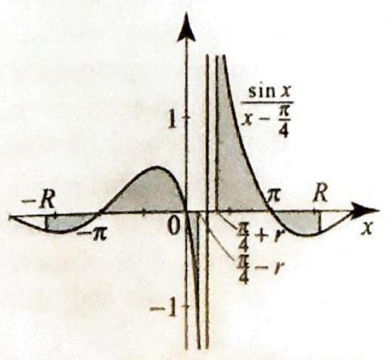
Figure 11 Principal value integral.

Suppose that $f(z)$ is a continuous complex-valued function on a closed disk $S_{r_{0}}\left(z_{0}\right)$ with center at $z_{0}$ and radius $r_{0}$. For $0<r \leq r_{0}$, let $\sigma_{r}$ denote the positively oriented circular arc at angle $\alpha$ (Figure 10), consisting of all $z=z_{0}+r e^{i \theta}$, where $\theta_{0} \leq \theta \leq \theta_{0}+\alpha, \theta_{0}$ and $\alpha$ are fixed, and $\alpha \neq 0$. Then

$$
\lim _{r \rightarrow 0^{+}} \frac{1}{i \alpha} \int_{\sigma_{r}} \frac{f(z)}{z-z_{0}} d z=f\left(z_{0}\right)
$$

Proof Parametrize the integral in (15) using $z=z_{0}+r e^{i \theta}$, where $\theta_{0} \leq \theta \leq \theta_{0}+\alpha$, $d z=r i e^{i \theta} d \theta, z-z_{0}=r e^{i \theta}$. Then

$$
\frac{1}{i \alpha} \int_{\sigma_{r}} \frac{f(z)}{z-z_{0}} d z=\frac{1}{i \alpha} \int_{\theta_{0}}^{\theta_{0}+\alpha} \frac{f\left(z_{0}+r e^{i \theta}\right)}{r e^{i \theta}} i r e^{i \theta} d \theta=\frac{1}{\alpha} \int_{\theta_{0}}^{\theta_{0}+\alpha} f\left(z_{0}+r e^{i \theta}\right) d \theta
$$

Let $F(r)=\frac{1}{\alpha} \int_{\theta_{0}}^{\theta_{0}+\alpha} f\left(z_{0}+r e^{i \theta}\right) d \theta$. Since $(r, \theta) \mapsto f\left(z_{0}+r e^{i \theta}\right)$ is continuous for all $0 \leq r \leq r_{0}$ and all $\theta$, it follows from Theorem 5(i), Section 3.5, that $F(r)$ is continuous on $\left[0, r_{0}\right]$. Consequently, $\lim _{r \rightarrow 0^{+}} F(r)=F(0)=\frac{1}{\alpha} \int_{\theta_{0}}^{\theta_{0}+\alpha} f\left(z_{0}\right) d \theta= f\left(z_{0}\right)$, which is equivalent to (15).

The following simple consequence of Lemma 2 is useful.
Suppose that $g(z)$ has a simple pole at $z_{0}$ and for $0<r \leq r_{0}$, let $\sigma_{r}$ denote the circular arc at angle $\alpha$ (Figure 10). Then

$$
\lim _{r \rightarrow 0^{+}} \int_{\sigma_{r}} g(z) d z=i \alpha \operatorname{Res}\left(g(z), z_{0}\right)
$$

Proof Let $f(z)=\left(z-z_{0}\right) g(z)$ for $z \neq z_{0}$ and define $f\left(z_{0}\right)=\lim _{z \rightarrow z_{0}}\left(z-z_{0}\right) g(z)= \operatorname{Res}\left(g(z), z_{0}\right)$. Since $g(z)$ has a simple pole at $z_{0}$, it follows from Theorem 7. Section 4.6, that $f(z)$ is analytic at $z_{0}$. Now apply Lemma 2 to $f(z)$ and (16) follows from (15), since for $z \neq z_{0}, f(z) /\left(z-z_{0}\right)=g(z)$.

The improper integrals that we consider next differ from previous ones in that they are not always convergent. However, their Cauchy principal values do exist. Integrals of this sort are important and arise naturally, for example, when computing Hilbert transforms.

## EXAMPLE 4 Cauchy principal value: Use of indented contours.

Derive the integral identities
P.V. $\int_{-\infty}^{\infty} \frac{\sin x}{x-a} d x=\pi \cos a$ and P.V. $\int_{-\infty}^{\infty} \frac{\cos x}{x-a} d x=-\pi \sin a, \quad-\infty<a<\infty$

In particular, when $a=0$, the first integral yields $\int_{-\infty}^{\infty} \frac{\sin x}{x} d x=\pi$.
Solution The integrals are improper because the interval of integration is infinite

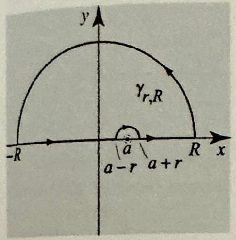
Figure 12 Indenting a contour around $a$.

and because of the problem at $x=a$. The first integral's principal value is

$$
\text { P.V. } \int_{-\infty}^{\infty} \frac{\sin x}{x-a} d x=\lim _{\substack{r \rightarrow 0^{+} \\ R \rightarrow \infty}}\left(\int_{-R}^{a-r} \frac{\sin x}{x-a} d x+\int_{a+r}^{R} \frac{\sin x}{x-a} d x\right)
$$

(Figure 11 represents the case $a>0$ ). Consider the integral of $f(z)=\frac{e^{i z}}{z-a}$ over the closed contour $\gamma_{r, R}$ in Figure 12, where we have indented the contour around $x=a$. The larger semi-circle $\sigma_{R}$ has radius $R$ and positive orientation. The smaller semi-circle has radius $r$; it is negatively oriented and we shall call it $-\sigma_{r}$. Since $f(z)$ is analytic on and inside $\gamma_{r, R}$, Cauchy's theorem implies that

$$
\begin{aligned}
0 & =\int_{-R}^{a-r} \frac{e^{i x}}{x-a} d x+\int_{-\sigma_{r}} \frac{e^{i z}}{z-a} d z+\int_{a+r}^{R} \frac{e^{i x}}{x-a} d z+\int_{\sigma_{R}} \frac{e^{i z}}{z-a} d z \\
& =I_{1}+I_{2}+I_{3}+I_{4}
\end{aligned}
$$

By Jordan's lemma, $I_{4} \rightarrow 0$ as $R \rightarrow \infty$. By the shrinking path lemma, $I_{2} \rightarrow-i \pi e^{i a}$ as $r \rightarrow 0$ (note the negative sign due to the fact that the path of integration is negatively oriented). Thus

$$
\lim _{R \rightarrow 0}\left(\int_{-R}^{a-r} \frac{e^{i x}}{x-a} d x+\int_{a+r}^{R} \frac{e^{i x}}{x-a} d x\right)=i \pi e^{i a}=\pi(-\sin a+i \cos a)
$$

and the desired integral identities follow upon taking real and imaginary parts.

## Exercises 5.4

In Exercises 1-10, evaluate the given improper integral. Make sure to outline the steps in your solutions. Carry out the details of the solution even if the integral follows from general formulas that we derived previously.

1. $\int_{-\infty}^{\infty} \frac{\cos 4 x}{x^{2}+1} d x=\pi e^{-4}$.
2. $\int_{-\infty}^{\infty} \frac{\sin \frac{\pi x}{2}}{x^{2}+2 x+4} d x=-\frac{\pi}{\sqrt{3}} e^{-\frac{\sqrt{3}}{2} \pi}$.
3. $\int_{-\infty}^{\infty} \frac{x \sin 3 x}{x^{2}+2} d x=e^{-3 \sqrt{2} \pi}$.
4. $\int_{-\infty}^{\infty} \frac{\sin \pi x}{x^{2}+2 x+4} d x=0$.
5. $\int_{-\infty}^{\infty} \frac{x^{2} \cos 2 x}{\left(x^{2}+1\right)^{2}} d x=-\frac{\pi}{2} e^{-2}$.
6. $\int_{-\infty}^{\infty} \frac{\cos x}{\left(x^{2}+1\right)^{2}} d x=\frac{\pi}{e}$.
7. $\int_{-\infty}^{\infty} \frac{\cos (a(x-b))}{x^{2}+c^{2}} d x=\frac{\pi}{c} e^{-|a| c} \cos (a b)$
8. $\int_{-\infty}^{\infty} \frac{\cos (4 \pi x)}{2 x^{2}+x+1} d x=-2 e^{-\sqrt{2} \pi} \frac{\pi}{\sqrt{7}}$.
9. $\int_{-\infty}^{\infty} \frac{x \cos \pi x}{x^{2}+x+9} d x=\pi e^{-\frac{\sqrt{35}}{2} \pi}$.
10. $\int_{-\infty}^{\infty} \frac{\sin \pi x}{x^{2}+x+1} d x=-\frac{2 \pi}{\sqrt{3}} e^{-\frac{\sqrt{3}}{2} \pi}$.

In Exercises 11-18, use an indented contour to evaluate the Cauchy principal value of the given improper integral.
11. P.V. $\int_{-\infty}^{\infty} \frac{\sin x \cos x}{x} d x=\frac{\pi}{2}$.
12. P.V. $\int_{0}^{\infty} \frac{\sin x \cos 2 x}{x} d x=0$.
13. P.V. $\int_{-\infty}^{\infty} \frac{1-\cos x}{x^{2}} d x=\pi$.
14. P.V. $\int_{-\infty}^{\infty} \frac{2 x \sin x}{x^{2}-a^{2}} d x=2 \pi a$.
15. P.V. $\int_{-\infty}^{\infty} \frac{\sin ^{2} x}{x^{2}} d x=\pi$.
16. P.V. $\int_{-\infty}^{\infty} \frac{\sin a x}{x-b} d x=\pi \cos a b$ and P.V. $\int_{-\infty}^{\infty} \frac{\cos a x}{x-b} d x=-\pi \sin a b$.
17. P.V. $\int_{-\infty}^{\infty} \frac{\sin x}{x\left(x^{2}+1\right)} d x=\pi\left(1-\frac{1}{e}\right)$.
18. P.V. $\int_{-\infty}^{\infty} \frac{\cos x}{x^{2}-a^{2}} d x=-\pi \frac{\sin a}{a} \quad(a \neq 0)$.
19. Show that the improper integral

$$
\int_{0}^{\infty} \frac{x \sin x}{x^{2}+a^{2}} d x
$$

is convergent. [Hint: For $A>0$, integrate $\int_{0}^{A} \frac{x \sin x}{x^{2}+a^{2}} d x$ by parts by letting $u= \frac{x}{x^{2}+a^{2}}, d v=\sin x d x$.]
20. Show that the improper integral $\int_{0}^{\infty} \frac{\sin x}{x} d x$ is convergent. [Hint: For $A>0$, integrate $\int_{0}^{A} \frac{\sin x}{x} d x$ by parts by letting $u=\frac{1}{x}, d v=\sin x, d u=-\frac{d x}{x^{2}}$ and $v= 1-\cos x$.]
21. (a) Use Example 3 and a suitable change of variables to establish the formula

$$
\frac{2}{\pi} \int_{0}^{\infty} \frac{\sin a x}{x} d x=\operatorname{sgn} a
$$

where $\operatorname{sgn} a=-1$ if $a<0,0$ if $a=0$, and 1 if $a>0$.
(b) Use (a) and a suitable trigonometric identity to prove that

$$
\int_{0}^{\infty} \frac{\sin a x \cos b x}{x} d x= \begin{cases}0 & \text { if } 0<a<b \\ \frac{\pi}{4} & \text { if } a=b>0 \\ \frac{\pi}{2} & \text { if } 0<b<a\end{cases}
$$

22. Use Example 1 to establish the identity

$$
\int_{-\infty}^{\infty} \frac{\cos s x}{x^{2}+a^{2}} d x=\frac{\pi}{|a|} e^{-|s a|}, \quad-\infty<s<\infty, a \neq 0
$$

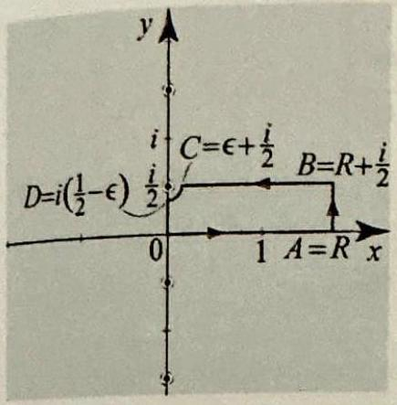
Figure 13 Indented contour for Exercise 24.

23. Use a suitable change of variables in Example 2 to establish the identity

$$
\int_{-\infty}^{\infty} \frac{x \sin s x}{x^{2}+a^{2}} d x=\pi \operatorname{sgn}(s) e^{-|a s|}
$$

24. Project Problem: Fourier transforms of the hyperbolic secant and cosecant. In this exercise, we derive the identities

$$
\int_{0}^{\infty} \frac{\cos (w x)}{\cosh (\pi x)} d x=\frac{1}{2} \operatorname{sech} \frac{w}{2} \text { and } \int_{0}^{\infty} \frac{\sin (w x)}{\sinh (\pi x)} d x=\frac{1}{2} \tanh \frac{w}{2}
$$

where $w$ is a real number. Up to a constant multiple, these integrals give the Fourier cosine transform of the hyperbolic secant $1 / \cosh (\pi x)$ and the Fourier sine transform of the hyperbolic cosecant $1 / \sinh (\pi x)$.
(a) Let $f(z)=\frac{e^{(\pi+i w) z}}{e^{2 \pi z}+1}$ and let $\gamma_{\epsilon, R}$ denote the indented contour in Figure 13. Show that

$$
I_{\gamma_{e, R}}=\int_{\gamma_{e, R}} f(z) d z=0
$$

(b) Show that $\lim _{R \rightarrow \infty} I_{A B}=0$. [Hint: This part involves estimates similar to those in Step 5, Example 3, Section 5.3.]
(c) Show that

$$
\begin{gathered}
I_{O A}=\frac{1}{2} \int_{0}^{R} \frac{e^{i w x}}{\cosh (\pi x)} d x \\
I_{D O}=-\frac{i}{2} \int_{0}^{\frac{1}{2}-\epsilon} \frac{e^{-w y}}{\cos (\pi y)} d y, \text { and } I_{B C}=i \frac{e^{-\frac{w}{2}}}{2} \int_{\epsilon}^{R} \frac{e^{i w x}}{\sinh (\pi x)} d x
\end{gathered}
$$

(d) Use Corollary 2 to show that $\lim _{\epsilon \rightarrow 0} I_{C D}=-\frac{1}{4} e^{-\frac{w}{2}}$.
(e) By taking the limit as $R \rightarrow \infty$ then $\epsilon \rightarrow 0$ and using (a), conclude that

$$
\frac{1}{2} \int_{0}^{\infty} \frac{e^{i w x}}{\cosh (\pi x)} d x-\frac{1}{4} e^{-\frac{w}{2}}+\lim _{\epsilon \rightarrow 0}\left[i \frac{e^{-\frac{w}{2}}}{2} \int_{\epsilon}^{\infty} \frac{e^{i w x}}{\sinh (\pi x)} d x-\frac{i}{2} \int_{0}^{\frac{1}{2}-\epsilon} \frac{e^{-w y}}{\cos (\pi y)} d y\right]=0
$$

(f) Let $A=\int_{0}^{\infty} \frac{\cos (w x)}{\cosh (\pi x)} d x$ and $B=\int_{0}^{\infty} \frac{\sin (w x)}{\sinh (\pi x)} d x$. Take real part in (e) and

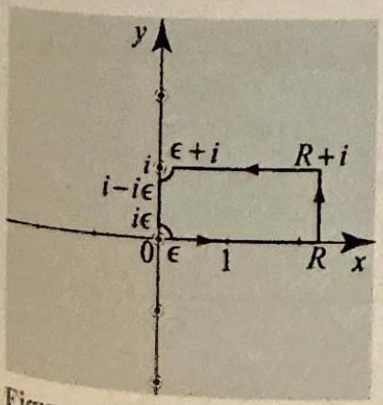
Figure 14 Indented contour for Exercise 25.

25. Project Problem: Bernoulli numbers and residues. In this exercise, we evaluate a sine integral related to the sine Fourier transform of a hyperbolic function and then use our answer to give an integral representation of the Bernoulli numbers, which are defined in Example 4, Section 4.4.
(a) Follow the steps outlined in the previous exercise as you integrate the function $f(z)=\frac{e^{t w z}}{e^{2 \pi z-1}}$ on the indented contour in Figure 14, and obtain the identity

$$
\int_{0}^{\infty} \frac{\sin w x}{e^{2 \pi x}-1} d x=\frac{1}{4} \frac{1+e^{-w}}{1-e^{-w}}-\frac{1}{2 w}, \quad w \neq 0
$$

(b) With the help of the Maclaurin series of $\frac{z}{2} \operatorname{coth} \frac{z}{2}$ (see the details following Example 4, Section 4.4), obtain the Laurent series

$$
\frac{1}{2} \frac{1+e^{-w}}{1-e^{-w}}-\frac{1}{w}=\sum_{k=1}^{\infty} \frac{B_{2 k}}{(2 k)!} w^{2 k-1}, \quad|w|<2 \pi
$$

(c) Replace $\sin w x$ in the integral in (a) by its Taylor series

$$
\sin w x=\sum_{k=1}^{\infty}(-1)^{k-1} \frac{w^{2 k-1} x^{2 k-1}}{(2 k-1)!}
$$

interchange order of integration, and conclude that

$$
\int_{0}^{\infty} \frac{x^{2 k-1}}{e^{2 \pi x}-1} d x=\frac{(-1)^{k-1}}{4 k} B_{2 k}
$$

(The diligent reader can justify the interchange of the sum and the integral.)

### 5.5 Advanced Integrals by Residues

In this section, we evaluate some classical integrals that arise in applied mathematics. We will use methods from previous sections; however, each integral in this section will require additional care, either in estimating the integrand or in choosing the contour of integration. The examples are independent of each other.

We start with an integral that arises in many applications, including heat problems and computing the Fourier transform of the function $e^{-x^{2}}$. We will need the formula

$$
I=\int_{-\infty}^{\infty} e^{-a x^{2}} d x=\sqrt{\frac{\pi}{a}}, \quad a>0
$$

To evaluate the integral, the usual trick is to consider

$$
I^{2}=\int_{-\infty}^{\infty} e^{-a x^{2}} d x \int_{-\infty}^{\infty} e^{-a y^{2}} d y=\int_{-\infty}^{\infty} \int_{-\infty}^{\infty} e^{-a\left(x^{2}+y^{2}\right)} d x d y
$$

Now use polar coordinates, $x=r \cos \theta, y=r \sin \theta, d x d y=r d r d \theta$. Then

$$
I^{2}=\int_{0}^{2 \pi} d \theta \int_{0}^{\infty} e^{-a r^{2}} r d r=2 \pi\left[-\frac{1}{2 a} e^{-a r^{2}}\right]_{r=0}^{\infty}=\frac{\pi}{a}
$$

which is equivalent to (1).
EXAMPLE 1 Derive the Poisson integral

$$
\int_{-\infty}^{\infty} e^{-a x^{2}} \cos w x d x=\sqrt{\frac{\pi}{a}} e^{-\frac{w^{2}}{4 a}}, \quad a>0,-\infty<w<\infty
$$

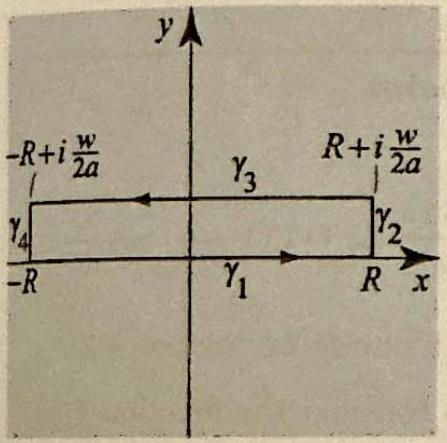
Figure 1 The rectangular contour for Example 1.

Solution The case $w=0$ follows from (1). Also, it is enough to deal with the case $w>0$. Since $\sin w x e^{-a x^{2}}$ is an odd function of $x$, its integral over symmetric intervals is 0 . So

$$
\int_{-\infty}^{\infty} \cos w x e^{-a x^{2}} d x=\int_{-\infty}^{\infty} e^{i w x} e^{-a x^{2}} d x=\int_{-\infty}^{\infty} e^{-a x^{2}+i w x} d x
$$

Completing the square in the exponent of the integrand, we get

$$
e^{-a x^{2}+i w x}=e^{-a\left(x^{2}-i \frac{w}{a} x\right)}=e^{-a\left(x-i \frac{w}{2 a}\right)^{2}+a\left(i \frac{w}{2 a}\right)^{2}}=e^{-\frac{w^{2}}{4 a}} e^{-a\left(x-i \frac{w}{2 a}\right)^{2}},
$$

and since $e^{-\frac{w^{2}}{4 a}}$ is independent of $x$,

$$
\int_{-\infty}^{\infty} \cos w x e^{-a x^{2}} d x=e^{-\frac{w^{2}}{4 a}} \int_{-\infty}^{\infty} e^{-a\left(x-i \frac{w}{2 a}\right)^{2}} d x
$$

To evaluate the integral on the right, we will integrate $f(z)=e^{-a\left(z-i \frac{w}{2 a}\right)^{2}}$ over the rectangular contour in Figure 1. Let $I_{j}(j=1,2,3,4)$ denote the integral of $f(z)$ over the path $\gamma_{j}$ as indicated in Figure 1. The choice of a rectangular contour should not surprise you in view of our work on path integrals involving exponential functions in Section 5.3. The choice of the $y$-intercept is related to the shift in the exponent in $f(z)$. It will be justified as we compute $I_{3}$.

Since $f(z)$ is entire, Cauchy's theorem implies that

$$
I_{1}+I_{2}+I_{3}+I_{4}=0
$$

We have

$$
I_{1}=\int_{-R}^{R} e^{-a\left(x-i \frac{\omega}{2 a}\right)^{2}} d x \rightarrow \int_{-\infty}^{\infty} e^{-a\left(x-i \frac{\omega}{2 a}\right)^{2}} d x, \text { as } R \rightarrow \infty
$$

For $I_{3}$, we have $z=x+i \frac{w}{2 a}, d z=d x$, and so

$$
I_{3}=\int_{R}^{-R} e^{-a x^{2}} d x=-\int_{-R}^{R} e^{-a x^{2}} d x \rightarrow-\sqrt{\frac{\pi}{a}}, \text { as } R \rightarrow \infty
$$

by (1). For $I_{2}, z=R+i y, 0 \leq y \leq \frac{w}{2 a}, d z=i d y$, and

$$
e^{-a\left(z-i \frac{\omega}{2 a}\right)^{2}}=e^{-a\left(R+i\left(y-\frac{\omega}{2 a}\right)\right)^{2}}=e^{-a\left(R^{2}-\left(y-\frac{\omega}{2 a}\right)^{2}\right)} e^{-2 a R i\left(y-\frac{\omega}{2 a}\right)} .
$$

Since $\left|e^{-2 a R i\left(y-\frac{w}{2 a}\right)}\right|=1$, for $0 \leq y \leq \frac{w}{2 a}$,

$$
\left|e^{-a\left(z-\frac{i w}{2 a}\right)^{2}}\right|=e^{-a\left(R^{2}-\left(y-\frac{w}{2 a}\right)^{2}\right)}=e^{-a R^{2}} e^{a\left(\frac{w}{2 a}-y\right)^{2}} \leq e^{-a R^{2}} e^{a\left(\frac{w}{2 a}\right)^{2}},
$$

we obtain using the usual inequality for path integrals,

$$
\begin{aligned}
\left|I_{2}\right| & =\left|\int_{0}^{\frac{w}{2 a}} e^{-a\left(R+i\left(y-\frac{w}{2 a}\right)\right)^{2}} i d y\right| \leq \int_{0}^{\frac{w}{2 a}}\left|e^{-a\left(R+i\left(y-\frac{w}{2 a}\right)\right)^{2}}\right| d y \\
& \leq e^{-a R^{2}} e^{a\left(\frac{w}{2 a}\right)^{2}} \frac{w}{2 a} \rightarrow 0 \text { as } R \rightarrow \infty
\end{aligned}
$$

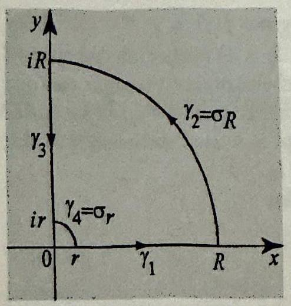
Figure 2 The contour for Example 1.

Similarly, $I_{4} \rightarrow 0$ as $R \rightarrow \infty$. Taking the limit as $R \rightarrow \infty$ in (4) and using what we know about the limits of the $I_{j}$, we get

$$
0=\int_{-\infty}^{\infty} e^{-a\left(x-i \frac{w}{2 a}\right)^{2}} d x-\sqrt{\frac{\pi}{a}} \text { or } \int_{-\infty}^{\infty} e^{-a\left(x-i \frac{w}{2 a}\right)^{2}} d x=\sqrt{\frac{\pi}{a}}
$$

and (2) follows upon using (3).

## Integrals Involving Branch Cuts

The remaining examples illustrate the useful technique of integration around branch points and branch cuts.

## EXAMPLE 2 Integrating around a branch point

For $0<\alpha<1$, derive the integral identities
(5) $\int_{0}^{\infty} \frac{\cos x}{x^{\alpha}} d x=\Gamma(1-\alpha) \sin \frac{\alpha \pi}{2}$ and $\int_{0}^{\infty} \frac{\sin x}{x^{\alpha}} d x=\Gamma(1-\alpha) \cos \frac{\alpha \pi}{2}$,
where $\Gamma(z)=\int_{0}^{\infty} e^{-t} t^{z-1} d t$ is the gamma function (Exercise 24, Section 4.3).
Solution For the given integrands, it is natural to consider the function $f(z)= \frac{e^{i z}}{z^{\alpha}}$. The only trouble is that $z^{\alpha}$ is multiple-valued and so we need to specify a single-valued branch of $z^{\alpha}$. The choice of this branch is usually affected by the choice of the contour of integration. In this case, we will use the contour $\gamma$ in Figure 2, and choose a branch of $z^{\alpha}=e^{\alpha \log z}$ that equals the real-numbered power $x^{\alpha}$ on the $x$-axis and is analytic on the contour. There are several possibilities, but clearly the easiest one would be $z^{\alpha}=e^{\alpha \log z}$ where $\log z$ denotes the principal value branch of the logarithm, with a branch cut on the negative $x$-axis. Recall that for $z \neq 0, \log z=\ln |z|+i \operatorname{Arg} z$, where $-\pi<\operatorname{Arg} z \leq \pi$. Since the function

$$
f(z)=\frac{e^{i z}}{z^{\alpha}}=\frac{e^{i z}}{e^{\alpha \log z}}
$$

is analytic inside and on the contour $\gamma$, Cauchy's theorem implies that

$$
0=\int_{\gamma} \frac{e^{i z}}{e^{\alpha \log z}} d z=I_{1}+I_{2}+I_{3}+I_{4}
$$

where $I_{j}$ is the integral of $f$ over $\gamma_{j}$, as indicated in Figure 2. For $I_{1}, z=x$, $r<x<R, d z=d x, f(z)=\frac{e^{i x}}{e^{a \log x}}=\frac{e^{i x}}{x^{a}}$, and so

$$
\lim _{\substack{r \rightarrow 0 \\ R \rightarrow \infty}} I_{1}=\lim _{\substack{r \rightarrow 0 \\ R \rightarrow \infty}} \int_{T}^{R} \frac{e^{i x}}{x^{\alpha}} d x=\int_{0}^{\infty} \frac{e^{i x}}{x^{\alpha}} d x=\int_{0}^{\infty} \frac{\cos x}{x^{\alpha}} d x+i \int_{0}^{\infty} \frac{\sin x}{x^{\alpha}} d x
$$

For $I_{3}, z=i y, r<y<R, d z=i d y$,

$$
f(z)=\frac{e^{i(i y)}}{e^{\alpha \log (i y)}}=\frac{e^{-y}}{e^{\alpha(\ln y+i \operatorname{Arg}(i y))}}=\frac{e^{-y}}{y^{\alpha} e^{i \frac{\alpha \pi}{2}}}=e^{-i \frac{\alpha \pi}{2}} e^{-y} y^{-\alpha},
$$

and so

$$
\begin{aligned}
\lim _{\substack{r \rightarrow 0 \\
R \rightarrow \infty}} I_{3} & =\lim _{\substack{r \rightarrow 0 \\
R \rightarrow \infty}} i e^{-i \frac{\alpha \pi}{2}} \int_{R}^{r} e^{-y} y^{-\alpha} d y=-i e^{-i \frac{\alpha \pi}{2}} \int_{0}^{\infty} e^{-y} y^{-\alpha} d y \\
& =-i e^{-i \frac{\alpha \pi}{2}} \Gamma(1-\alpha)=-i\left(\cos \frac{\alpha \pi}{2}-i \sin \frac{\alpha \pi}{2}\right) \Gamma(1-\alpha)
\end{aligned}
$$

where the second-to-last equality follows from the definition of the gamma function.
We now deal with the integrals $I_{2}$ and $I_{4}$. For $z$ on the circular $\operatorname{arc} \sigma_{R}$, write $z=R e^{i \theta}$, where $0 \leq \theta \leq \frac{\pi}{2}$. Then

$$
\left|z^{\alpha}\right|=\left|e^{\alpha(\ln |z|+i \operatorname{Arg} z)}\right|=e^{\alpha \ln |z|}=|z|^{\alpha}=R^{\alpha} ;
$$

also, $\left|e^{i z}\right|=\left|e^{R(-\sin \theta+i \cos \theta)}\right|=e^{-R \sin \theta}$, and so

$$
|f(z)|=\left|\frac{e^{i z}}{z^{\alpha}}\right|=\frac{e^{-R \sin \theta}}{R^{\alpha}}
$$

Let $M(R)$ denote the maximum of $|f(z)|$ for $z$ on $\sigma_{R}$. Then $M(R)=\frac{1}{R^{\alpha}}$, which tends to 0 as $R \rightarrow \infty$. Thus $I_{2} \rightarrow 0$ as $R \rightarrow \infty$, by Jordan's lemma, Section 5.4. On $I_{4}$, we have $\left|\frac{e^{i z}}{z^{\alpha}}\right| \leq \frac{1}{r^{\alpha}}$, and using the integral inequality in Theorem 2, Section 3.2, we find

$$
\left|I_{4}\right| \leq l\left(\sigma_{r}\right) \frac{1}{r^{\alpha}}=\frac{\pi}{4} r^{1-\alpha} .
$$

Since $1-\alpha>0$, we see that $\left|I_{4}\right| \rightarrow 0$ as $r \rightarrow 0$. Going back to (6) and taking the limits as $r \rightarrow 0$ and $R \rightarrow \infty$, we get

$$
0=\int_{0}^{\infty} \frac{\cos x}{x^{\alpha}} d x+i \int_{0}^{\infty} \frac{\sin x}{x^{\alpha}} d x-i\left(\cos \frac{\alpha \pi}{2}-i \sin \frac{\alpha \pi}{2}\right) \Gamma(1-\alpha)
$$

which is equivalent to (5).
Taking $\alpha=\frac{1}{2}$ in (5) and using $\Gamma\left(\frac{1}{2}\right)=\sqrt{\pi}$ (see Exercise 25, Section 4.3), we obtain

$$
\int_{0}^{\infty} \frac{\cos x}{\sqrt{x}} d x=\Gamma\left(\frac{1}{2}\right) \sin \frac{\pi}{4}=\sqrt{\frac{\pi}{2}} \text { and } \int_{0}^{\infty} \frac{\sin x}{\sqrt{x}} d x=\Gamma\left(\frac{1}{2}\right) \cos \frac{\pi}{4}=\sqrt{\frac{\pi}{2}}
$$

Letting $x=u^{2}, d x=2 u d u$, we get the famous Fresnel integrals,
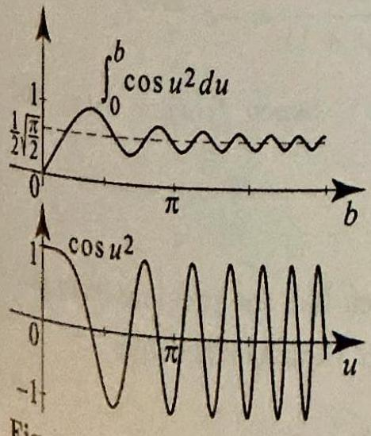

Figure 3 An illustration of the Fresnel cosine integral.

$$
\int_{0}^{\infty} \cos u^{2} d u=\frac{1}{2} \sqrt{\frac{\pi}{2}} \text { and } \int_{0}^{\infty} \sin u^{2} d u=\frac{1}{2} \sqrt{\frac{\pi}{2}}
$$

named after the French mathematician and physicist Augustin Fresnel (17881827), one of the founders of the wave theory of light. The cosine integral and its convergence are illustrated in Figure 3. The integrals can also be obtained by using a different contour integral (see Exercise 5).

In our next example, we illustrate an important method that is based on the fact that different branches of the logarithm differ by an integer

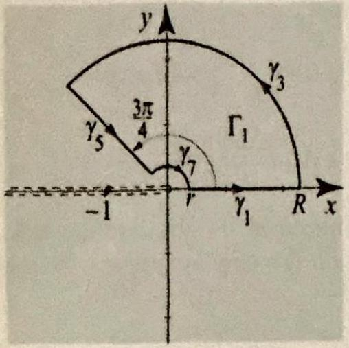
Figure 4 The contour $\Gamma_{1}$ and the branch cut of $f_{1}(z)$.

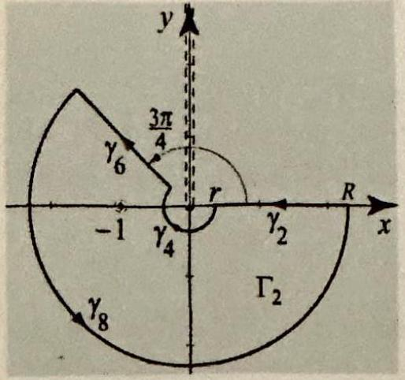
Figure 5 The contour $\Gamma_{2}$ and the branch cut of $f_{2}(z)$.

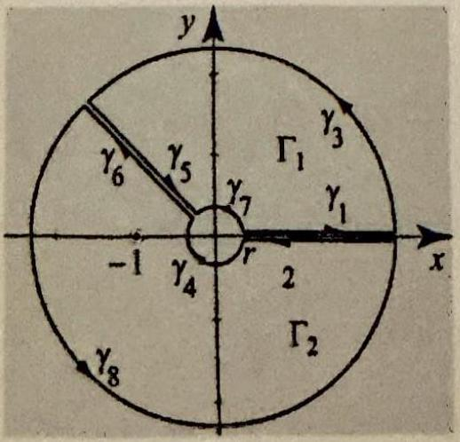
Figure 6 The contours $\Gamma_{1}=\left(\gamma_{1}, \gamma_{3}, \gamma_{5}, \gamma_{7}\right)$ and $\Gamma_{2}=\left(\gamma_{2}, \gamma_{4}, \gamma_{6}, \gamma_{8}\right)$.

multiple of $2 \pi i$. We note that the example can also be evaluated by using the substitution $x=e^{t}$, as we did with similar integrals in Section 5.3.

## EXAMPLE 3 Integrating around a branch cut

For $0<\alpha<1$, derive the integral identity

$$
\int_{0}^{\infty} \frac{d x}{x^{\alpha}(x+1)}=\frac{\pi}{\sin \pi \alpha}
$$

Solution We will integrate branches of $f_{1}(z)=\frac{1}{z^{\alpha}(z+1)}$ on the contours $\Gamma_{1}= \left(\gamma_{1}, \gamma_{3}, \gamma_{5}, \gamma_{7}\right)$ and $\Gamma_{2}=\left(\gamma_{2}, \gamma_{4}, \gamma_{6}, \gamma_{8}\right)$, shown in Figures 4, 5, and 6. On $\Gamma_{1}$, we can take the principal branch of $z^{\alpha}$, which will coincide with the real power on the real axis and allow us to recover the integral (7). We cannot use the residue theorem to help integrate this one branch all the way around the origin, because of its branch cut on the negative real axis. Thus we have closed $\Gamma_{1}$, bringing it back at the ray $\theta=\frac{3 \pi}{4}$, and will use a different branch of $z^{\alpha}$ to integrate on $\Gamma_{2}$. For the integral on $\Gamma_{2}$, we choose the branch $z^{\alpha}=e^{\alpha \log _{\frac{\pi}{2}} z}$. In the second quadrant, this branch coincides with the principal branch (and so integrals over $\gamma_{5}$ and $\gamma_{6}$ will cancel), but the new branch continues to be analytic as we wind around the origin into the third and fourth quadrants. It is important to note that integrals over $\gamma_{1}$ and $\gamma_{2}$ will not cancel because the two branches of $z^{\alpha}$ are not the same here; the logarithm branches differ by $2 \pi i$. With this in mind, let

$$
f_{1}(z)=\frac{1}{e^{\alpha \log z}(z+1)} \text { and } f_{2}(z)=\frac{1}{e^{\alpha \log \frac{4}{2} z}(z+1)}
$$

where $\log z=\ln |z|+i \operatorname{Arg} z,-\pi<\operatorname{Arg} z \leq \pi$, and $\log _{\frac{\pi}{2}} z=\ln |z|+i \arg _{\frac{\pi}{2}} z$, $\frac{\pi}{2}<\arg \frac{\pi}{2} \leq \frac{5 \pi}{2}$. We will integrate $f_{1}$ on $\Gamma_{1}$ and $f_{2}$ on $\Gamma_{2}$. Let $I_{j}$ denote the integral of the appropriate branch $f_{1}$ or $f_{2}$ on $\gamma_{j}$. On $\gamma_{1}, z=x>0, \log z=\log x=\ln x$, $e^{\alpha \ln x}=x^{\alpha}$, and so

$$
I_{1}=\int_{r}^{R} \frac{d x}{x^{\alpha}(x+1)}
$$

also for $z=x>0, \log _{\frac{\pi}{2}} z=\log _{\frac{\pi}{2}} x=\ln x+2 \pi i, e^{\alpha \log _{\frac{\pi}{2}} x}=x^{\alpha} e^{2 \pi i \alpha}$, and so

$$
I_{2}=\int_{R}^{r} \frac{d x}{e^{2 \pi i \alpha} x^{\alpha}(x+1)}=-e^{-2 \pi i \alpha} \int_{r}^{R} \frac{d x}{x^{\alpha}(x+1)}=-e^{-2 \pi i \alpha} I_{1}
$$

For $z$ on $\gamma_{3}$ (and hence $\gamma_{6}$ ) we have $\log z=\log _{\frac{\pi}{2}} z$, hence $f_{1}(z)=f_{2}(z)$, and consequently $I_{5}=-I_{6}$, and so

$$
I_{5}+I_{6}=0 .
$$

From here on the details of the solution are very much like the previous example. The function $f_{1}(z)$ is analytic on and inside $\Gamma_{1}$, so by Cauchy's theorem

$$
\int_{\Gamma_{1}} f_{1}(z) d z=I_{1}+I_{3}+I_{5}+I_{7}=0
$$

The function $f_{2}(z)$ is analytic on and inside $\Gamma_{2}$ except for a simple pole at $z=-1$, so by the residue theorem

$$
\int_{\Gamma_{2}} f_{2}(z) d z=I_{2}+I_{4}+I_{6}+I_{8}=2 \pi i \operatorname{Res}\left(f_{2}(z),-1\right)=\frac{2 \pi i}{e^{\alpha \log _{\frac{\pi}{2}}(-1)}}=\frac{2 \pi i}{e^{\pi i \alpha}}
$$

Using (8)-(11), we obtain

$$
\frac{2 \pi i}{e^{\pi i \alpha}}=\int_{\Gamma_{1}} f_{1}(z) d z+\int_{\Gamma_{2}} f_{2}(z) d z=\left(1-e^{-2 \pi i \alpha}\right) I_{1}+I_{3}+I_{4}+I_{7}+I_{8}
$$

We will let $r \rightarrow 0$ and $R \rightarrow 0$, then $I_{1} \rightarrow \int_{0}^{\infty} \frac{d x}{x^{\alpha}(x+1)}$. Also, we will show that $I_{3}, I_{4}, I_{7}, I_{8}$ tend to 0 . Then from (12) it will follow that

$$
\frac{2 \pi i}{e^{\pi i \alpha}}=\left(1-e^{-2 \pi i \alpha}\right) \int_{0}^{\infty} \frac{d x}{x^{\alpha}(x+1)}
$$

Solving for the integral, we find

$$
\int_{0}^{\infty} \frac{d x}{x^{\alpha}(x+1)}=\frac{2 \pi i}{e^{\pi i \alpha}} \frac{1}{1-e^{-2 \pi i \alpha}}=\pi \frac{2 i}{e^{\pi i \alpha}-e^{-\pi i \alpha}}=\frac{\pi}{\sin \pi \alpha}
$$

as desired. So let us show that $I_{3}, I_{4}, I_{7}, I_{8}$ tend to 0 . This part is similar to Example 2; we will just sketch the details. We have $\left|z^{\alpha}\right|=|z|^{\alpha}$, so $\left|f_{j}(z)\right| \leq \frac{1}{|z|^{\alpha}|1-|z||}(j=1,2)$. For $z$ on $\gamma_{7}$ or $\gamma_{8},|z|=r$ (we may take $r<1$ ), and so

$$
\left|I_{7}\right| \leq l\left(\gamma_{7}\right) \frac{1}{r^{\alpha}(1-r)} \leq 2 \pi r \frac{1}{r^{\alpha}(1-r)}=2 \pi \frac{r^{1-\alpha}}{1-r} \rightarrow 0, \text { as } r \rightarrow 0
$$

because $1-\alpha>0$. Similarly, $\left|I_{8}\right| \rightarrow 0$, as $r \rightarrow 0$. For $z$ on $\gamma_{3}$ or $\gamma_{4},|z|=R$ (we may take $R>1$ ), and so

$$
\left|I_{3}\right| \leq l\left(\gamma_{3}\right) \frac{1}{R^{\alpha}(R-1)} \leq 2 \pi R \frac{1}{R^{\alpha}(R-1)}=2 \pi \frac{R^{1-\alpha}}{R-1} \rightarrow 0, \text { as } R \rightarrow \infty
$$

because the degree of the numerator, $1-\alpha$, is smaller than the degree of the denominator, which is 1 . Similarly, $\left|I_{4}\right| \rightarrow 0$, as $R \rightarrow \infty$. $\square$

In Example 3, the point in introducing different branches of the multiplevalued function $f(z)=\frac{1}{z^{\alpha}(z+1)}$ was to show explicitly how the function can continuously change as we wind around the origin, and how its value on the real axis is different depending on whether we have gone around the origin or not. Now we will illustrate a useful idea that can be used as an alternative to multiple branches. The idea is to think of a function as taking different values at a point on the branch cut depending on how we approach this point. Consider, for example,

$$
h(z)=\sqrt{z-a} \quad(a \text { real })
$$

where we use the $\log _{0}$ branch of the square root, so that the branch cut of $h(z)$ is on the part of the positive $x$-axis $x>a$. Explicitly, $h(z)=$

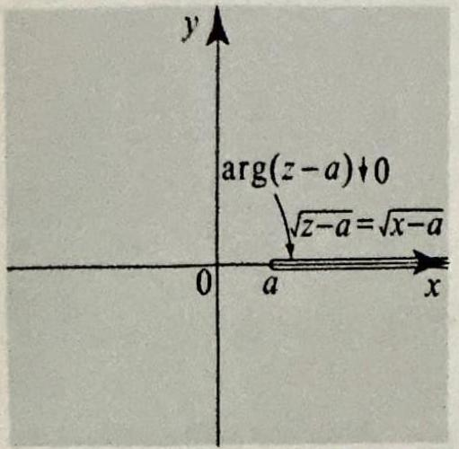
Figure 7 Defining $\sqrt{z-a}$ as $z$ approaches the branch cut from above.

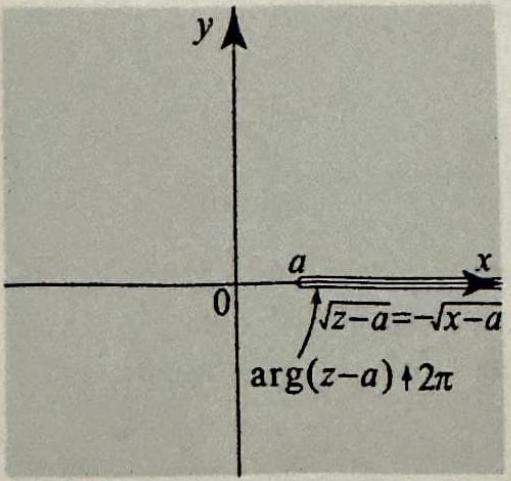
Figure 8 Defining $\sqrt{z-a}$ as $z$ approaches the branch cut from below.

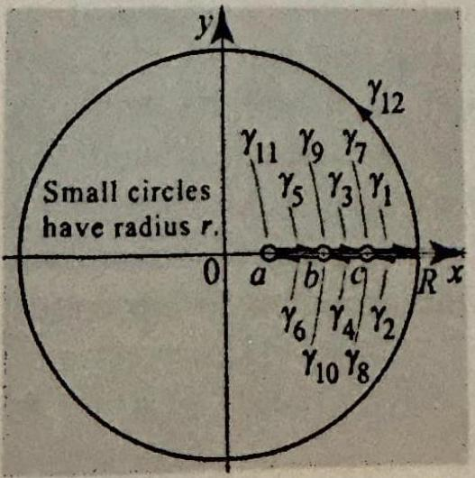

Figure 10 The contour in Example 4 and its twelve components.
$|z-a|^{\frac{1}{2}} e^{\frac{i}{2} \arg _{0}(z-a)}$, where $0<\arg _{0}(z-a) \leq 2 \pi$. We will use this function and allow it to take different values on the branch cut, depending on how we approach the branch cut. For example, if $z$ approaches the part of the $x$ axis $x>a$ from the upper half-plane (Figure 7), then $\arg (z-a)$ approaches 0 and so the values of the function to the right of $a$ and above the $x$-axis are $\sqrt{z-a}=\sqrt{|x-a|}=\sqrt{x-a}$. If $z$ approaches the part of the $x$-axis $x>a$ from the lower half-plane (Figure 8), then $\arg (z-a)$ approaches $2 \pi$ and so the values of the function to the right of $a$ and below the $x$-axis are taken to be $\sqrt{z-a}=e^{i \frac{1}{2}(2 \pi)} \sqrt{|x-a|}=-\sqrt{x-a}$. The mapping $w=h(z)$ is illustrated in Figure 9. Even though we will omit justifying the use of functions with multiple values, this can be done by introducing different branches of the square root, as we did in Example 3.

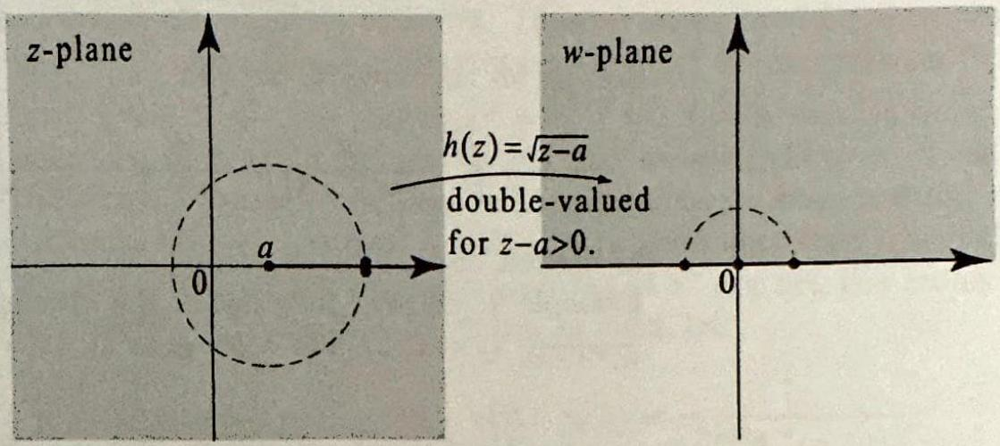
Figure 9 The mapping $w=\sqrt{z-a}$ maps the upper half of the branch cut to the right half of the real axis and the lower half of the branch cut to the left half of the real axis.

In our final example we prove a useful property of elliptic integrals, which are integrals of the form $\int \frac{d x}{\sqrt{p(x)}}$, where $p(x)$ is a polynomial of degree $\geq 2$. These integrals arise when computing arc length of ellipses, and thus their name. They also arise when computing Schwarz-Christoffel transformations.

## EXAMPLE 4 A property of elliptic integrals

Let $a<b<c$ be real numbers. Show that

$$
\int_{a}^{b} \frac{d x}{\sqrt{(x-a)(b-x)(c-x)}}=\int_{c}^{\infty} \frac{d x}{\sqrt{(x-a)(x-b)(x-c)}}
$$

Solution Consider the function

$$
f(z)=\frac{1}{\sqrt{(z-a)} \sqrt{(z-b)} \sqrt{(z-c)}}
$$

where we choose the branches of the square roots with branch cuts along the positive real axis. The function $f$ is analytic for all $z$ except possibly for $z=x \geq a$ (in fact, the singularities are removable along $b<z<c$, see Exercise 23). Since $f$ is
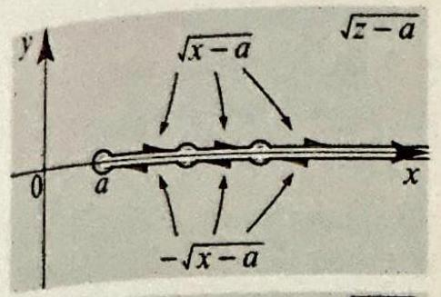
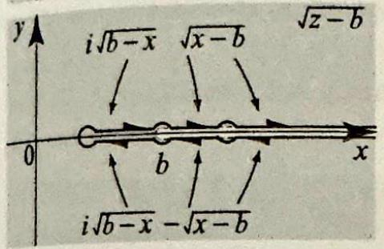

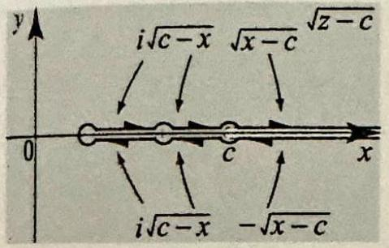
Figure 11 The limiting values of $\sqrt{z-a}, \sqrt{z-b}$, and $\sqrt{z-c}$.

analytic inside and on the contour in Figure 10, Cauchy's theorem implies that its integral on this contour is 0 . Letting $I_{j}$ denote the integral of the limiting values of $f$ on $\gamma_{j}$, we obtain

$$
I_{1}+I_{2}+I_{3}+I_{4}+I_{5}+I_{6}+I_{7}+I_{8}+I_{9}+I_{10}+I_{11}+I_{12}=0
$$

It is now straightforward to show that $I_{7}, I_{8}, I_{9}, I_{10}, I_{11}, I_{12}$ tend to 0 as $r \rightarrow 0$ and $R \rightarrow \infty$. The details can be found in Examples 2 and 3 and will be omitted. To handle the remaining integrals, we will compute the limiting values of $f$ (denoted still by $f(z))$ in each case with the help of the values in Figure 11:

$$
\begin{array}{llll}
I_{1}: & f(z)=\frac{1}{\sqrt{x-a} \sqrt{x-b} \sqrt{x-c}} & \Rightarrow & I_{1}=\int_{c+r}^{R} \frac{d x}{\sqrt{x-a} \sqrt{x-b} \sqrt{x-c}} \\
I_{2}: & f(z)=\frac{-1}{\sqrt{x-a} \sqrt{x-b} \sqrt{x-c}} & \Rightarrow & I_{2}=I_{1} \\
I_{3}: & f(z)=\frac{-i}{\sqrt{x-a} \sqrt{x-b} \sqrt{c-x}} & \Rightarrow & I_{3}=\int_{b+r}^{c-r} \frac{(-i) d x}{\sqrt{x-a} \sqrt{x-b} \sqrt{c-x}} \\
I_{4}: & f(z)=\frac{-i}{\sqrt{x-a} \sqrt{x-b} \sqrt{c-x}} & \Rightarrow & I_{4}=-I_{3} \\
I_{5}: & f(z)=\frac{-1}{\sqrt{x-a} \sqrt{b-x} \sqrt{c-x}} \Rightarrow & \Rightarrow & I_{5}=\int_{a+r}^{b-r} \frac{(-1) d x}{\sqrt{x-a} \sqrt{b-x} \sqrt{c-x}} \\
I_{6}: & f(z)=\frac{-1}{\sqrt{x-a} \sqrt{b-x} \sqrt{c-x}} & \Rightarrow & I_{6}=I_{5}
\end{array}
$$

Adding these integrals, $I_{3}$ and $I_{4}$ cancel. Taking the limit as $R \rightarrow \infty$ and $r \rightarrow 0$ and using (15), we obtain (14).

## Exercises 5.5

In Exercises 1-4, evaluate the given integral by using an appropriate contour integral. Carry out the details of the solution even if the integral follows from general formulas that we derived previously.

1. $\frac{1}{\sqrt{2 \pi}} \int_{-\infty}^{\infty} e^{-\frac{x^{2}}{2}} \cos w x d x=e^{-\frac{w^{2}}{2}}$.
2. $\int_{-\infty}^{\infty} e^{-6 x^{2}+i w x} d x=\sqrt{\frac{\pi}{6}} e^{-\frac{w^{2}}{24}}$.
3. $\int_{0}^{\infty} \frac{\sin 2 x}{\sqrt{x}} d x=\frac{\sqrt{\pi}}{2}$.
4. $\int_{0}^{\infty} \frac{d x}{\sqrt{x}\left(x^{2}+1\right)}=\frac{\pi}{\sqrt{2}}$.
5. The Fresnel integrals. In this exercise, we present an alternative way to derive the Fresnel integrals. We will need an inequality similar to the one we used in the proof of Jordan's lemma.
(a) Consider the graph of $\cos 2 x$ on the interval $\left[0, \frac{\pi}{4}\right]$ (Figure 12). Since the graph concaves down, it is above the chord that joins any two points on the graph. Explain how this implies the inequality

$$
\cos 2 x \geq 1-\frac{4}{\pi} x, \text { for } 0 \leq x \leq \frac{\pi}{4}
$$

Let $I_{j}(j=1,2,3)$ denote the integral of $f(z)=e^{-z^{2}}$ on the closed contour in Figure 13. Prove the following.

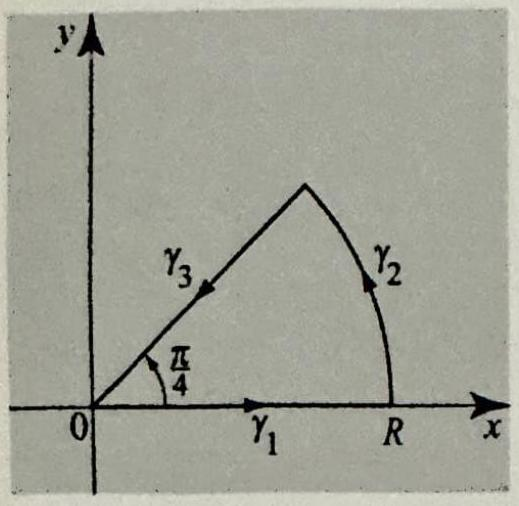
Figure 13

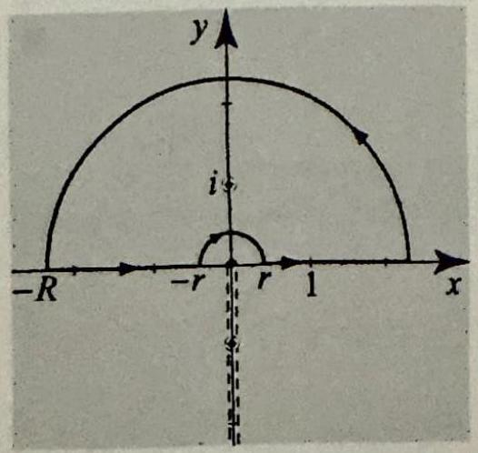
Figure 14 for Exercise 7.

(b) $I_{1}+I_{2}+I_{3}=0$.
(c) $I_{1} \rightarrow \int_{0}^{\infty} e^{-x^{2}} d x=\frac{\sqrt{\pi}}{2}$, as $R \rightarrow \infty$, and $I_{2} \rightarrow 0$ as $R \rightarrow \infty$. [Hint: Use (16) to show that for $z=R e^{i \theta},\left|e^{-z^{2}}\right| \leq e^{R^{2}\left(\frac{4}{\pi} \theta-1\right)}=e^{-R^{2}} e^{\frac{4 R^{2}}{\pi} \theta}$. So $\left|I_{2}\right| \leq R e^{-R^{2}} \int_{0}^{\frac{\pi}{4}} e^{\frac{4 R^{2}}{\pi} \theta} d \theta=\frac{\pi}{4 R}\left(1-e^{-R^{2}}\right) \rightarrow 0$ as $R \rightarrow \infty$.]
(d) $I_{3} \rightarrow-e^{i \frac{\pi}{4}}\left(\int_{0}^{\infty} \cos r^{2} d r-i \int_{0}^{\infty} \sin r^{2} d r\right)$, as $R \rightarrow \infty$. Note that this limit incorporates the Fresnel integrals where the variable of integration is $r$.
(e) Derive the Fresnel integrals using (b)-(d).
6. Using the formula of the complements for the gamma function $\Gamma(\alpha) \Gamma(1-\alpha)= \frac{\pi}{\sin \pi \alpha}$ (Exercise 23, Section 5.3), and the result of Example 2, derive the formulas

$$
\int_{0}^{\infty} \frac{\cos x}{x^{1-\beta}} d x=\Gamma(\beta) \cos \frac{\beta \pi}{2} \text { and } \int_{0}^{\infty} \frac{\sin x}{x^{1-\beta}} d x=\Gamma(\beta) \sin \frac{\beta \pi}{2}
$$

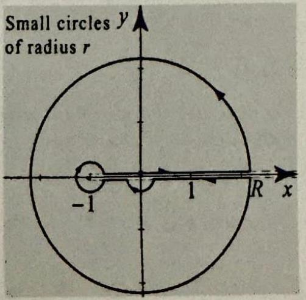
Figure 15 for Exercise 8.

where $0<\beta<1$.
7. (a) Use the contour in Figure 14 to establish the identity

$$
\int_{0}^{\infty} \frac{(\ln x)^{2}}{x^{2}+1} d x=\frac{\pi^{3}}{8}
$$

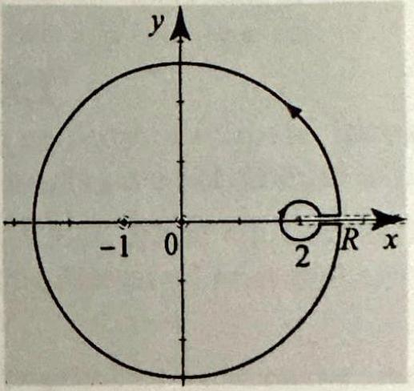
Figure 16 for Exercise 9.

(b) Prove that

$$
\int_{0}^{1} \frac{(\ln x)^{2}}{x^{2}+1} d x=\int_{1}^{\infty} \frac{(\ln x)^{2}}{x^{2}+1} d x=\frac{\pi^{3}}{16}
$$

[Hint: Change of variables for the first equality, and (a) for the second one.]
8. Use the contour in Figure 15 to establish the identity

$$
\int_{0}^{\infty} \frac{\ln (x+1)}{x^{1+\alpha}} d x=\frac{\pi}{\alpha \sin \pi \alpha}, \quad(0<\alpha<1)
$$

9. Use the contour in Figure 16 to establish the identity

$$
\int_{2}^{\infty} \frac{d x}{x(x-1) \sqrt{x-2}}=2 \pi\left(1-\frac{1}{\sqrt{2}}\right)
$$

10. Establish the identity $\int_{3}^{\infty} \frac{d x}{\sqrt{x-3}(x-2)(x-1)}=\pi-\frac{\pi}{\sqrt{2}}$.

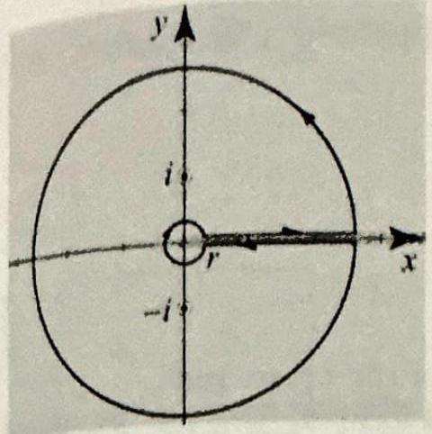
Figure 17 for Exercise 11.

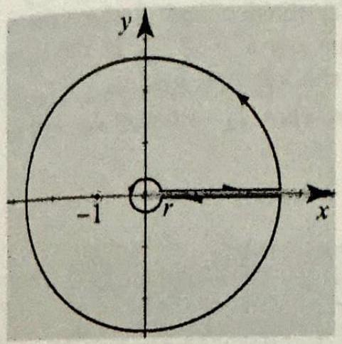
Figure 18 for Exercise 12.

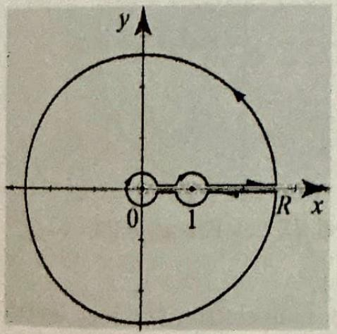
Figure 19 for Exercise 13.

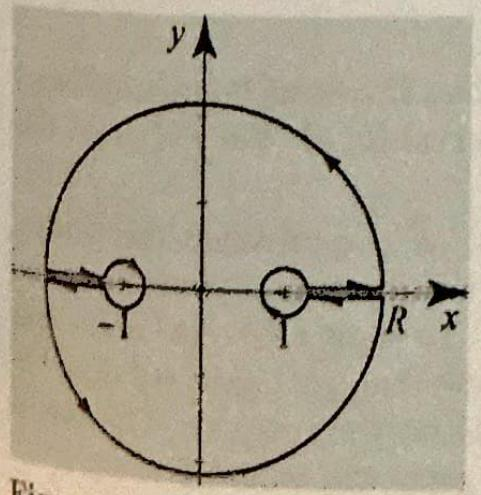
Figure 20 for Exercise 14.

11. Use the contour in Figure 17 to establish the identity

$$
\int_{0}^{\infty} \frac{x^{\alpha-1}}{x^{2}+1} d x=\frac{\pi}{2 \sin \frac{\alpha \pi}{2}} \quad(0<\alpha<2)
$$

12. Use the contour in Figure 18 to establish the identity

$$
\int_{0}^{\infty} \frac{x^{\alpha-1}}{(x+1)^{2}} d x=\frac{(1-\alpha) \pi}{\sin \alpha \pi} \quad(0<\alpha<2)
$$

13. (a) Use the method of Example 4 and the contour in Figure 19 to establish the identity

$$
\text { P.V. } \int_{0}^{\infty} \frac{x^{p}}{x(1-x)} d x=\pi \cot p \pi \quad(0<p<1)
$$

(b) Use a suitable change of variables to derive the identity

$$
\text { P.V. } \int_{-\infty}^{\infty} \frac{e^{p x}}{1-e^{x}} d x=\pi \cot p \pi \quad(0<p<1)
$$

(c) Use (b) to show that for $-1<w<1$

$$
\text { P.V. } \int_{-\infty}^{\infty} \frac{e^{w x}}{\sinh x} d x=\pi \tan \frac{\pi w}{2}
$$

(c) Use a suitable change of variables to show that

$$
\text { P.V. } \int_{-\infty}^{\infty} \frac{e^{a x}}{\sinh b x} d x=\frac{\pi}{b} \tan \frac{\pi a}{2 b} \quad(b>|a|)
$$

(c) Conclude that

$$
\int_{-\infty}^{\infty} \frac{\sinh a x}{\sinh b x} d x=\frac{\pi}{b} \tan \frac{\pi a}{2 b} \quad(b>|a|)
$$

Note that the integral is convergent so there is no need to use the principal value.
14. Use the contour in Figure 20 to establish the identity

$$
\int_{1}^{\infty} \frac{d x}{x \sqrt{x^{2}-1}}=\frac{\pi}{2}
$$

In Exercises 15 20, derive the given identity.
6. $\int_{0}^{\infty} \frac{d x}{(x+2)^{2} \sqrt{x+1}}=\frac{\pi}{4}-\frac{1}{2}$.
15. $\int_{0}^{\infty} \frac{d x}{(x+2) \sqrt{x+1}}=\frac{\pi}{2}$.
17. $\int_{0}^{\infty} \frac{\sqrt{x}}{x^{2}+x+1} d x=\frac{\pi}{\sqrt{3}}$.
18. $\int_{0}^{\infty} \frac{x^{a}}{x^{2}+1} d x=\frac{\pi}{2} \sec \frac{a \pi}{2} \quad(-1<a<1)$.
19. $\int_{0}^{\infty} \frac{x}{\sinh x} d x=\frac{\pi^{2}}{4}$.
20. $\int_{0}^{\infty} \frac{d x}{\cosh x}=\frac{\pi}{2}$.

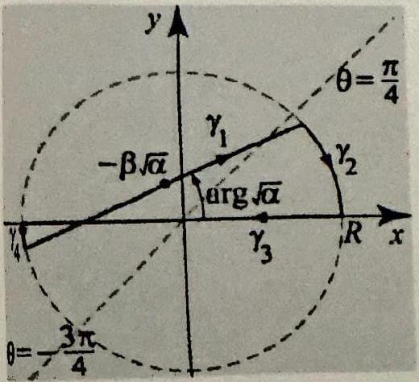
Figure 21 for Exercise 21.

21. Integral of the Gaussian with complex parameters. We will show that, for $\alpha$ and $\beta$ complex with $\operatorname{Re} \alpha>0$,

$$
\int_{-\infty}^{\infty} e^{-\alpha(t-\beta)^{2}} d t=\sqrt{\frac{\pi}{\alpha}}
$$

where on the right side we use the principal branch of the square root.
(a) Recognize the left side of (17) as the parametrized form of $\frac{1}{\sqrt{\alpha}} \int_{\gamma} e^{-z^{2}} d z$, where

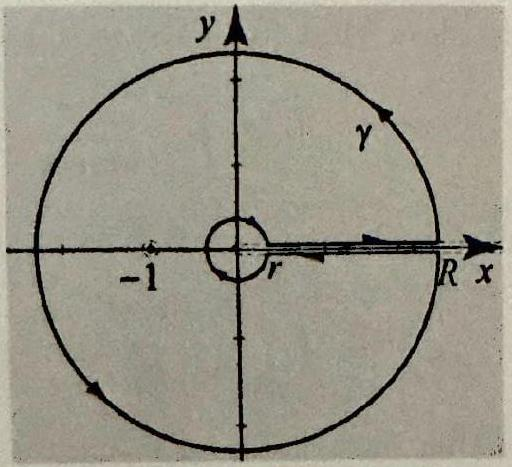
Figure 22 for Exercise 22.

$\gamma(t)=\sqrt{\alpha}(t-\beta)$, the line at angle $\arg \sqrt{\alpha}$ through $-\beta \sqrt{\alpha}$. Show $|\operatorname{Arg} \sqrt{\alpha}|<\frac{\pi}{4}$.
(b) Consider the contour in Figure 21. Argue that for fixed $\alpha$ and $\beta$, there exists $\epsilon>0$ such that for large enough $R, \gamma_{2}$ lies below the ray $\theta=\frac{\pi}{4}-\epsilon$ in the right half-plane, and $\gamma_{4}$ lies above the ray $\theta=-\frac{3 \pi}{4}-\epsilon$ in the left half-plane.

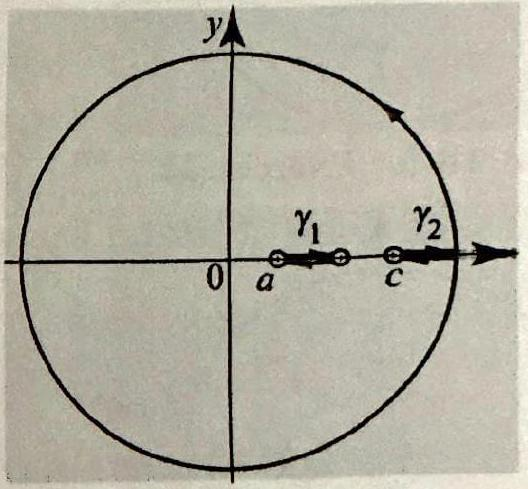
Figure 23 for Exercise 23.

(c) Letting $I_{j}$ denote the integral of $e^{-z^{2}}$ on $\gamma_{j}$, show that $I_{2} \rightarrow 0$ and $I_{4} \rightarrow 0$ as $R \rightarrow \infty$.
(d) Use $\int_{-\infty}^{\infty} e^{-x^{2}} d x=\sqrt{\pi}$ to derive (17).
22. Another look at Example 3. Derive (7) by considering the $\log _{0}$ branch of $z^{\alpha}$ for $f(z)=\frac{1}{z^{\alpha}(z+1)}$. Use the contour in Figure 22, and treat $f(z)$ to have different values on the upper and lower sides of the real axis, as in the text following Example 3.
23. Another look at Example 4. It turns out that the branch-cut singularity in $f(z)=\frac{1}{\sqrt{z-a} \sqrt{z-b} \sqrt{z-c}}$ is removable on the real interval (b,c). We will prove this and rederive (14).
(a) Use Figure 11 to help show that the limit of $f(z)$ as $z$ approaches the interval (b, c) from the upper half-plane is the same as from the lower half-plane.
(b) Define $f(z)$ on $(b, c)$ to equal this common value. To show that $f(z)$ is analytic here, use Morera's theorem. [Hint: If a triangle crosses the real axis, subdivide it into a triangle and a quadrilateral, each with one side on the real axis. One lies in the upper and the other in the lower half-plane; integrals will vanish.]
(c) Rederive (14) by using Figure 23 and the fact that the paths $\gamma_{1}$ and $\gamma_{2}$ are continuously deformable to each other.

### 5.6 Summing Series by Residues

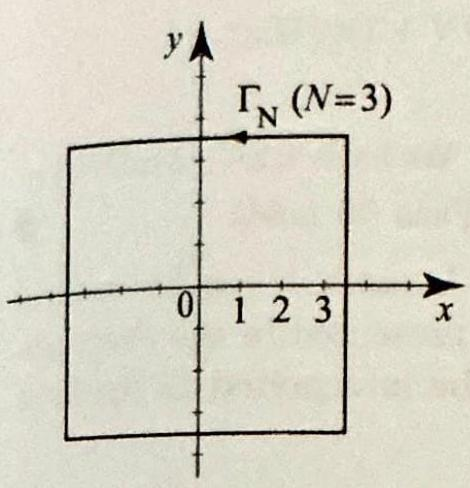
Figure 1 Square contour $\Gamma_{N}$ for integers $N \geq 1$.

## LEMMA 1 BOUNDS FOR THE COTANGENT

In this section, we will use residue theory to sum infinite series of the form $\sum_{k} f(k)$, where $f(z)=\frac{p(z)}{q(z)}$ is a rational function with degree $q(z) \geq 2+$ degree $p(z)$. For example,

$$
\sum_{k=-\infty}^{\infty} \frac{1}{k^{2}+1} ; \quad \sum_{k=1}^{\infty} \frac{1}{k^{6}} ; \quad \sum_{k=-\infty}^{\infty} \frac{k^{2}}{k^{4}+1} .
$$

Our starting point is the result of Example 4, Section 5.1: if $k$ is an integer and $f(z)$ is analytic at $k$, then

$$
\operatorname{Res}(f(z) \cot (\pi z), k)=\frac{1}{\pi} f(k) .
$$

We will consider integrating $f(z) \cot (\pi z)$ on squares centered at the origin. We define the squares $\Gamma_{N}$ for positive integers $N$ to be positively oriented and to have corners at $\left(N+\frac{1}{2}\right)(1+i),\left(N+\frac{1}{2}\right)(-1+i),\left(N+\frac{1}{2}\right)(-1-i)$, and $\left(N+\frac{1}{2}\right)(1-i)$, as shown in Figure 1.

Let $N$ be a positive integer and $\Gamma_{N}$ be as in Figure 1. For all $z$ on $\Gamma_{N}$, we have

$$
|\cot (\pi z)| \leq 2 .
$$

Moreover, if $f(z)=\frac{p(z)}{q(z)}$ is a rational function with degree $q(z) \geq 2+$ degree $p(z)$, then

$$
\lim _{N \rightarrow \infty}\left|\int_{\Gamma_{N}} \frac{p(z)}{q(z)} \cot (\pi z) d z\right|=0
$$

Proof To prove (2), we deal with each side of the square $\Gamma_{N}$ separately. On the right vertical side, $z=N+\frac{1}{2}+i y$, where $-N-\frac{1}{2} \leq y \leq N+\frac{1}{2}$. Using the formulas for the absolute values of the cosine and sine, (17) and (18), Section 1.6, we obtain

$$
\begin{aligned}
|\cot (\pi z)| & =\left|\frac{\cos (\pi z)}{\sin (\pi z)}\right|=\frac{\sqrt{\cos ^{2}\left(\pi\left(N+\frac{1}{2}\right)\right)+\sinh ^{2}(\pi y)}}{\sqrt{\sin ^{2}\left(\pi\left(N+\frac{1}{2}\right)\right)+\sinh ^{2}(\pi y)}} \\
& =\frac{|\sinh (\pi y)|}{\sqrt{1+\sinh ^{2}(\pi y)}} \leq \frac{|\sinh (\pi y)|}{|\sinh (\pi y)|}=1 \leq 2
\end{aligned}
$$

This establishes (2) for $z$ on the right vertical side of $\Gamma_{N}$. We also have the left vertical side is immediate since $\cot (\pi z)$ is an odd function. The horizontal sides are handled similarly (Exercise 19). To prove (3), we use the inequality for path
integrals, Theorem 2, Section 3.2, the fact that the perimeter of the square $\mathbf{\Gamma}_{N}$ is $4(2 N+1)$, and (2) and get

$$
\left|\int_{\Gamma_{N}} \frac{p(z)}{q(z)} \cot (\pi z) d z\right| \leq l\left(\Gamma_{N}\right) M_{N}=4(2 N+1)\left(2 M_{N}\right)
$$

where $M_{N}$ is the maximum value of $\left|\frac{p(z)}{q(z)}\right|$ for $z$ on $\Gamma_{N}$. We have $4(2 N+1)\left(2 M_{N}\right) \rightarrow$ 0 as $N \rightarrow \infty$, because degree $q(z) \geq 2+$ degree $p(z)$. Thus (3) holds.

The following result illustrates how (1) and Lemma 1 can be used to sum infinite series. Variations on this result are presented in the exercises. In what follows, all doubly infinite series are to be interpreted as the limit of symmetric partial sums; that is,

$$
\sum_{k=-\infty}^{\infty} a_{k}=\lim _{N \rightarrow \infty} \sum_{k=-N}^{N} a_{k},
$$

whenever the limit exists.

PROPOSITION 1 SUMMING INFINITE SERIES BY RESIDUES

Suppose that $f(z)=\frac{p(z)}{q(z)}$ is a rational function with degree $q(z) \geq 2+$ degree $p(z)$. Suppose further that $f$ has no poles at the integers. Then
(4) $\quad \sum_{k=-\infty}^{\infty} f(k)=-\pi \sum_{j} \operatorname{Res}\left(f(z) \cot (\pi z), z_{j}\right)$,
where the (finite) sum on the right runs over all the poles $z_{j}$ of $f(z)$.
Proof The poles of $f(z) \cot (\pi z)$ occur at the integers (where $\cot (\pi z)$ has poles) and at the points $z_{j}$ (where $f(z)$ has poles). For large enough $N$, all $z_{j}$ are on the inside of $\Gamma_{N}$. Applying the residue theorem and (1), we obtain

$$
\int_{\Gamma_{N}} f(z) \cot (\pi z) d z=2 \pi i \sum_{k=-N}^{N} \frac{1}{\pi} f(k)+2 \pi i \sum_{j} \operatorname{Res}\left(f(z) \cot (\pi z), z_{j}\right)
$$

Letting $N \rightarrow \infty$, the left side of (5) goes to zero and we get (4).

## EXAMPLE 1 Summing series by residues

Evaluate $\sum_{k=-\infty}^{\infty} \frac{1}{k^{2}+1}$.
Solution We apply (4) with $f(z)=\frac{1}{z^{2}+1}$ and find

$$
\sum_{k=-\infty}^{\infty} \frac{1}{k^{2}+1}=-\pi \sum_{j} \operatorname{Res}\left(\frac{1}{z^{2}+1} \cot (\pi z), z_{j}\right)
$$

where the sum on the right runs over the poles of $\frac{1}{z^{2}+1}$. The latter function has
simple poles at $\pm i$, and the residues of $\frac{1}{z^{2}+1} \cot (\pi z)$ there are

$$
\begin{aligned}
\operatorname{Res}\left(\frac{1}{z^{2}+1} \cot (\pi z), i\right) & =\lim _{z \rightarrow i}(z-i) \frac{1}{(z-i)(z+i)} \cot (\pi z)=\frac{1}{2 i} \cot (\pi i) \\
& =\frac{1}{2 i} \frac{\cos (\pi i)}{\sin (\pi i)}=\frac{1}{2 i} \frac{\cosh (\pi)}{i \sinh (\pi)}=-\frac{1}{2} \operatorname{coth} \pi
\end{aligned}
$$

(use (13) and (14), Section 1.6) and similarly

$$
\operatorname{Res}\left(\frac{1}{z^{2}+1} \cot (\pi z),-i\right)=-\frac{1}{2 i} \cot (-\pi i)=\frac{1}{2 i} \cot (\pi i)=-\frac{1}{2} \operatorname{coth} \pi
$$

Thus,

$$
\sum_{k=-\infty}^{\infty} \frac{1}{k^{2}+1}=-\pi\left(-\frac{1}{2} \operatorname{coth} \pi-\frac{1}{2} \operatorname{coth} \pi\right)=\pi \operatorname{coth} \pi
$$

## Exercises 5.6

In Exercises 1-12, derive the given identity using Proposition 1.

1. $\sum_{k=-\infty}^{\infty} \frac{1}{k^{2}+9}=\frac{\pi}{3} \operatorname{coth}(3 \pi)$.
2. $\sum_{k=-\infty}^{\infty} \frac{1}{\left(k^{2}+1\right)^{2}}=\frac{\pi}{2} \operatorname{coth} \pi+\frac{\pi^{2}}{2} \operatorname{csch}^{2} \pi$.
3. $\sum_{k=-\infty}^{\infty} \frac{1}{k^{2}+a^{2}}=\frac{\pi}{a} \operatorname{coth}(a \pi)$ (ia not an integer).
4. $\sum_{k=-\infty}^{\infty} \frac{1}{\left(k^{2}+a^{2}\right)^{2}}=\frac{\pi}{2 a^{3}} \operatorname{coth}(a \pi)+\frac{\pi^{2}}{2 a^{2}} \operatorname{csch}^{2}(a \pi)$ (ia not an integer).
5. $\sum_{k=-\infty}^{\infty} \frac{1}{4 k^{2}-1}=0$.
6. $\sum_{k=-\infty}^{\infty} \frac{k^{2}}{\left(k^{2}-\frac{1}{4}\right)^{2}}=\frac{\pi^{2}}{2}$.
7. $\sum_{k=-\infty}^{\infty} \frac{1}{\left(4 k^{2}-1\right)^{2}}=\frac{\pi^{2}}{8}$.
8. $\sum_{k=-\infty}^{\infty} \frac{1}{\left(k-\frac{1}{2}\right)^{2}+1}=\pi \tanh \pi$.
9. $\sum_{k=-\infty}^{\infty} \frac{1}{(k-2)(k-1)+1}=\frac{2 \pi \tanh \left(\frac{\sqrt{3} \pi}{2}\right)}{\sqrt{3}}$.
10. $\sum_{k=-\infty}^{\infty} \frac{k^{2}}{\left(k^{2}+1\right)^{2}}=\frac{\pi \operatorname{csch}^{2} \pi}{4}(\sinh (2 \pi)-2 \pi)$.
11. $\sum_{k=-\infty}^{\infty} \frac{1}{k^{4}+4}=\frac{\pi \sinh (2 \pi)}{4(\cosh (2 \pi)-1)}$.
12. $\sum_{k=-\infty}^{\infty} \frac{1}{k^{4}+4 a^{4}}=-\pi \frac{\sin (2 a \pi)+\sinh (2 a \pi)}{4 a^{3}(\cos (2 a \pi)-\cosh (2 a \pi)} \quad(a>0)$.
13. Project Problem: Summation of series with a pole at 0. If in Proposition 1 the function $f$ has a pole at 0 , then (4) has to be modified to account for the residue at 0 . In this case, we have the following useful result.

Suppose that $f(z)=\frac{p(z)}{q(z)}$ is a rational function with degree $q(z) \geq 2+$ degree $p(z)$. Suppose further that $f$ has no poles at the integers, except possibly at 0 . Then

$$
\sum_{\substack{k=-\infty \\ k \neq 0}}^{\infty} f(k)=-\pi \sum_{j} \operatorname{Res}\left(f(z) \cot (\pi z), z_{j}\right)
$$

where the (finite) sum on the right runs over all the poles $z_{j}$ of $f(z)$, including 0 .

Prove this result by modifying the proof of Proposition 1.
In Exercises 14-16, use (6) to derive the given identity.
14. $\sum_{k=1}^{\infty} \frac{1}{k^{2}}=\frac{\pi^{2}}{6}$.
15. $\sum_{k=1}^{\infty} \frac{1}{k^{4}}=\frac{\pi^{4}}{90}$.
16. $\sum_{k=1}^{\infty} \frac{1}{k^{2}\left(k^{2}+4\right)}=\frac{3+4 \pi^{2}-6 \pi \operatorname{coth}(2 \pi)}{96}$.
17. Project Problem: Sums of the reciprocals of even powers of integers. In this exercise, we use (6) to derive

$$
\sum_{k=1}^{\infty} \frac{1}{k^{2 n}}=(-1)^{n-1} \frac{2^{2 n-1} B_{2 n} \pi^{2 n}}{(2 n)!}
$$

where $n$ is a positive integer, $B_{2 n}$ is the Bernoulli number (Example 4, Section 4.4). This remarkable identity sums the reciprocals of the even powers of the integers. We will derive it again in Chapter 7 using Fourier series. There is no known finite expression corresponding to any odd power.
(a) Show that if $f(z)=\frac{1}{z^{2 n}}$ then (6) becomes

$$
\sum_{\substack{k=-\infty \\ k \neq 0}}^{\infty} \frac{1}{k^{2 n}}=-\pi \operatorname{Res}\left(\frac{\cot (\pi z)}{z^{2 n}}, 0\right)
$$

and so

$$
\sum_{k=1}^{\infty} \frac{1}{k^{2 n}}=-\frac{\pi}{2} \operatorname{Res}\left(\frac{\cot (\pi z)}{z^{2 n}}, 0\right)
$$

(b) Using the Taylor series expansion of $z \cot z$ from Exercise 31, Section 4.4, obtain

$$
\operatorname{Res}\left(\frac{\cot (\pi z)}{z^{2 n}}, 0\right)=(-1)^{n} \frac{2^{2 n} B_{2 n} \pi^{2 n-1}}{(2 n)!}
$$

then derive (7).
18. Project Problem: Sums with alternating signs. (a) Modify the proof of Proposition 1 to prove the following summation result.

Suppose that $f(z)=\frac{p(z)}{q(z)}$ is a rational function with degree $q(z) \geq 2+$ degree $p(z)$. Suppose further that $f$ has no poles at the integers, except possibly at 0 . Then,

$$
\sum_{\substack{k=-\infty \\ k \neq 0}}^{\infty}(-1)^{k} f(k)=-\pi \sum_{j} \operatorname{Res}\left(f(z) \csc (\pi z), z_{j}\right)
$$

where the (finite) sum on the right runs over all the poles $z_{j}$ of $f(z)$, including 0 .
[Hint: You need a version of Lemma 1 for the cosecant.]
(b) Show that if $f(z)=\frac{1}{z^{2 n}}$ then (9) becomes

$$
\sum_{\substack{k=-\infty \\ k \neq 0}}^{\infty} \frac{(-1)^{k}}{k^{2 n}}=-\pi \operatorname{Res}\left(\frac{\csc (\pi z)}{z^{2 n}}, 0\right)
$$

and so

$$
\sum_{k=1}^{\infty} \frac{(-1)^{k}}{k^{2 n}}=-\frac{\pi}{2} \operatorname{Res}\left(\frac{\csc (\pi z)}{z^{2 n}}, 0\right)
$$

(b) Using the Taylor series expansion of $z \csc z$ from Exercise 31, Section 4.4, obtain

$$
\operatorname{Res}\left(\frac{\csc (\pi z)}{z^{2 n}}, 0\right)=(-1)^{n-1} \frac{\left(2^{2 n}-2\right) B_{2 n} \pi^{2 n-1}}{(2 n)!}
$$

(c) Show that for any integer $n \geq 1$

$$
\sum_{k=1}^{\infty} \frac{(-1)^{k}}{k^{2 n}}=(-1)^{n} \frac{\left(2^{2 n-1}-1\right) B_{2 n} \pi^{2 n}}{(2 n)!}
$$

19. The horizontal sides of $\Gamma_{N}$. Here we prove inequality (2) for the upper and lower horizontal sides of the square $\Gamma_{N}$.
(a) Argue that we need only consider the upper side, since $\cot (\pi z)$ is an odd function of $z$.
(b) For $z=x+i\left(N+\frac{1}{2}\right),-N-\frac{1}{2} \leq x \leq N+\frac{1}{2}$, justify

$$
|\cot (\pi z)|=\frac{\sqrt{\cos ^{2}(\pi x)+\sinh ^{2}\left(\pi\left(N+\frac{1}{2}\right)\right)}}{\sqrt{\cos ^{2}(\pi x)+\sinh ^{2}\left(\pi\left(N+\frac{1}{2}\right)\right)}} \leq \operatorname{coth}\left(\pi\left(N+\frac{1}{2}\right)\right)
$$

Prove that this is less than or equal to 2 , for all $N \geq 1$. This is not a best possible estimate, but it is sufficient to prove (3).

### 5.7 The Counting Theorem and Rouché's Theorem

In this section, we apply Cauchy's residue theorem to prove several important properties of analytic functions with fruitful applications. We start with a simple but very useful lemma.

## LEMMA 1

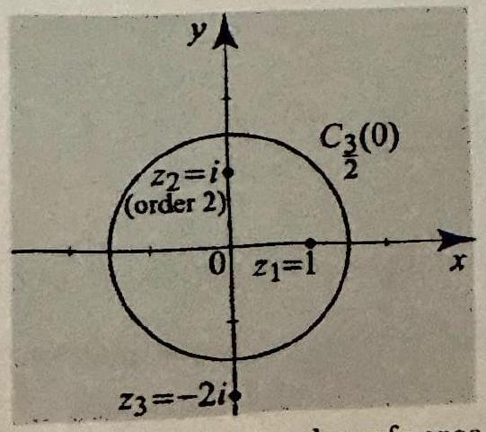

Suppose that $f$ is analytic and not identically zero in a region $\Omega$.
(i) If $z_{0}$ is a zero of $f$ of order $m \geq 1$, then $\frac{f^{\prime}(z)}{f(z)}$ has a simple pole at $z_{0}$ and the residue there is $m$.
(ii) If $z_{0}$ is a pole of $f$ of order $m \geq 1$, then $\frac{f^{\prime}(z)}{f(z)}$ has a simple pole at $z_{0}$ and the residue there is $-m$.

Proof (i) Write $f(z)=\left(z-z_{j}\right)^{m} \lambda(z)$, where $\lambda$ is analytic and nonvanishing in a neighborhood $B_{r}\left(z_{0}\right)$, (Theorem 1, Section 4.6). For $z$ in $B_{r}\left(z_{0}\right)$,
(1) $\frac{f^{\prime}(z)}{f(z)}=\frac{m\left(z-z_{0}\right)^{m-1} \lambda(z)+\left(z-z_{0}\right)^{m} \lambda^{\prime}(z)}{\left(z-z_{0}\right)^{m} \lambda(z)}=\frac{m}{z-z_{0}}+\frac{\lambda^{\prime}(z)}{\lambda(z)}$,
where $\frac{\lambda^{\prime}(z)}{\lambda(z)}$ is analytic in $B_{r}\left(z_{0}\right)$ since $\lambda(z)$ is nonvanishing in $B_{r}\left(z_{0}\right)$. From this it follows that $z_{0}$ is a simple pole of $\frac{f^{\prime}(z)}{f(z)}$ and the residue there is $m$.
(ii) Write $f(z)=\left(z-z_{0}\right)^{-m} \lambda(z)$, where $\lambda$ is analytic and nonvanishing in a neighborhood $B_{r}\left(z_{0}\right)$ (Theorem 7, Section 4.6). Then for $z$ in $B_{r}\left(z_{0}\right)$,

$$
\frac{f^{\prime}(z)}{f(z)}=\frac{-m\left(z-z_{0}\right)^{m-2} \lambda(z)+\left(z-z_{0}\right)^{-m} \lambda^{\prime}(z)}{\left(z-z_{0}\right)^{-m} \lambda(z)}=-\frac{m}{z-z_{0}}+\frac{\lambda^{\prime}(z)}{\lambda(z)},
$$

where $\frac{\lambda^{\prime}(z)}{\lambda(z)}$ is analytic in $B_{r}\left(z_{0}\right)$ since $\lambda(z)$ is nonvanishing in $B_{r}\left(z_{0}\right)$. Hence $z_{0}$ is a simple pole of $\frac{f^{\prime}(z)}{f(z)}$ and the residue there is $-m$. $\square$

Our first theorem is called the counting theorem because it counts the number of zeros (according to multiplicity) of an analytic function $f$ inside a simple path $C$. By "according to multiplicity" we mean that each zero

Figure 1 The number of zeros inside the circle according to multiplicity is 3 . is counted as many times as its order. For example, the function $f(z)= (z-1)(z-i)^{2}(z+2 i)$ has zeros at $z_{1}=1$ (order 1 ), $z_{2}=i$ (order 2), and $z_{3}=-2 i$ (order 1). The number of zeros, according to multiplicity, inside the circle $C_{\frac{3}{2}}(0)$ is three (Figure 1).

## THEOREM 1 COUNTING THEOREM

## THEOREM 2 MEROMORPHIC COUNTING THEOREM

Suppose that $C$ is a simple closed positively oriented path, $\Omega$ is the region inside $C$, and $f$ is analytic inside and on $C$ and nonvanishing on $C$. Let $N(f)$ denote the number of zeros of $f$ inside $\Omega$, counted according to multiplicity. Then $N(f)$ is finite and

$$
N(f)=\frac{1}{2 \pi i} \int_{C} \frac{f^{\prime}(z)}{f(z)} d z
$$

Proof If $f$ has no zeros in $\Omega$ (hence $N(f)=0$ ), then $\frac{f^{\prime}(z)}{f(z)}$ is analytic on $\Omega$ and (3) follows from Cauchy's theorem. Note that $f$ cannot have infinitely many zeros in $\Omega$, by Corollary 2, Section 4.6. Let $z_{1}, z_{2}, \ldots, z_{n}$ denote the zeros of $f$ inside $\Omega$. By Lemma $1, \frac{f^{\prime}(z)}{f(z)}$ has simple poles in $\Omega$ located at $z_{j}$ and the residue at $z_{j}$ is the order of the zero at $z_{j}$. Thus (3) follows at once from the residue theorem. $\square$

A function $f$ is called meromorphic on a region $\Omega$ if $f$ is analytic in $\Omega$ except for poles on $\Omega$. For example, $f(z)=\frac{\sin z}{z^{2}+1}$ is meromorphic in the complex plane. Like zeros, we will count poles according to multiplicity. The following generalizes Theorem 1 to give a counting theorem for meromorphic functions.

Suppose that $C$ is a simple closed positively oriented path, $\Omega$ is the region inside $C$, and $f$ is meromorphic on $\Omega$, analytic and nonvanishing on $C$. Let $N(f)$ denote the number of zeros of $f$ inside $\Omega$ and $P(f)$ denote the number of poles of $f$ inside $\Omega$, counted according to multiplicity. Then $N(f)$ and $P(f)$ are finite and

$$
N(f)-P(f)=\frac{1}{2 \pi i} \int_{C} \frac{f^{\prime}(z)}{f(z)} d z
$$

Proof That $N(f)$ and $P(f)$ are finite follows as in the proof of Theorem 1. Apply the residue theorem and use Lemma 1 to see that (4) holds. $\square$

Either of the preceding theorems is also known as the argument principle because the right sides of (3) and (4) can be interpreted as the change in argument as one runs around the image path $f[C]$. We now investigate this.

We know from results in Section 3.6 (Project Problem 36) that if $f$ is analytic and nonvanishing on a region $\Omega$ and if the image $f[\Omega]$ is simply connected, then there is a branch of the logarithm of $f, \log f(z)$, whose derivative satisfies the familiar formula $\frac{d}{d z} \log f(z)=\frac{f^{\prime}(z)}{f(z)}$. The integrand in (4) suggests a connection with the logarithm of $f(z)$. We will explore this connection due to its fruitful consequences.

Figure 2 The image $f\left[\gamma_{1}\right]$ is contained in a simply connected region not containing the origin. We can define the branch $\arg _{1} z$ on this region.
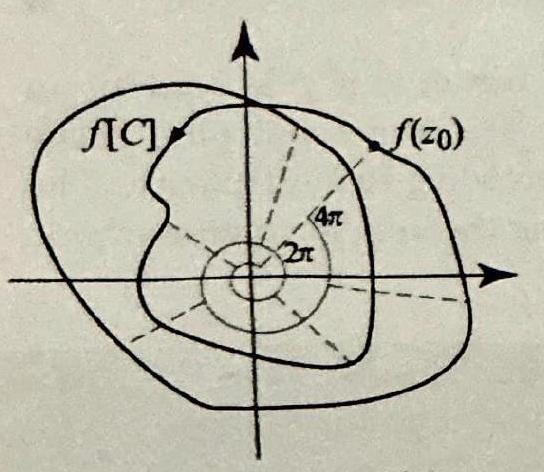

Figure 3 The point $f(z)$ travels twice around the origin and $\Delta_{C} \arg f=4 \pi$.

Figure 2 The image $f\left[\gamma_{1}\right]$ is contained in a simply connected region not containing the origin. We can define the branch $\arg _{1} z$ on this region.
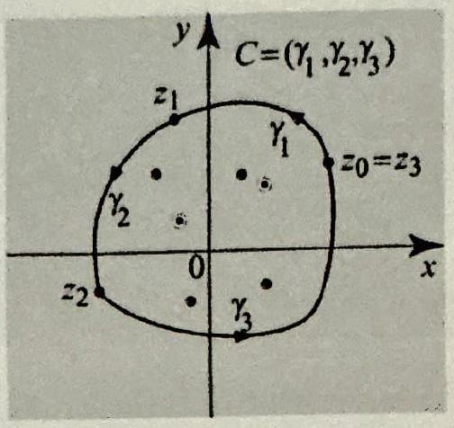

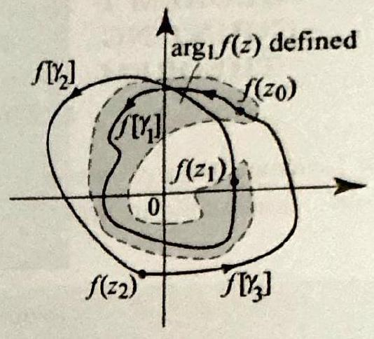

Let $f$ and $C$ be as in Theorem 2. We can partition $C$ into subarcs $\gamma_{j} (j=1, \ldots, n)$ such that each image $f\left[\gamma_{j}\right]$ is contained in a simply connected region not including the origin, as shown in Figure 2. (A proof of this statement can be based on the fact that $C$ is closed and bounded.) Denote the initial and terminal points of $\gamma_{j}$ by $z_{j-1}$ and $z_{j}$, with $z_{n}=z_{0}$. For each $j$, we have a branch of the logarithm of $f(z), \log _{j} f(z)$, which is an antiderivative of $\frac{f^{\prime}(z)}{f(z)}$ on $\gamma_{j}$. For each $j$, we have $\log _{j} f(z)=\ln |f(z)|+i \arg _{j} f(z)$, where $\arg _{j}$ is a branch of the argument, determined up to an additive constant multiple of $2 \pi$. These constants are determined in the following way. Starting with $j=1$, pick and fix $\arg _{1} f(z)$. Then choose $\arg _{2} f(z)$ in such a way that $\arg _{1} f\left(z_{1}\right)=\arg _{2} f\left(z_{1}\right)$. Continue in this manner to determine the remaining branches of the argument. To simplify the notation, denote the resulting function by $\arg f(z)$. Note that $\arg f(z)$ is continuous on $C$, except at $z_{0}=z_{n}$, and we will make the convention that $\arg f(z)$ takes different values at this point depending on whether we approach the point from $\gamma_{1}$ or from $\gamma_{n}$. Thus $\arg z_{n}=\arg _{n} z_{n}$ and $\arg z_{0}=\arg _{1} z_{0}$, and the difference is always an integer multiple of $2 \pi$ that we denote by $\Delta_{C} \arg f=\arg _{n} f\left(z_{n}\right)-\arg _{1} f\left(z_{0}\right)$. The quantity $\Delta_{C} \arg f$ measures the net change in the argument of $f(z)$ as $z$ travels once around the curve $C$ (Figure 3). We evaluate the integral on the right side of (3) or (4) with a telescoping sum:

$$
\begin{aligned}
\frac{1}{2 \pi i} \int_{C} \frac{f^{\prime}(z)}{f(z)} d z & =\sum_{j=1}^{n} \int_{\gamma_{j}} \frac{f^{\prime}(z)}{f(z)} d z \\
& =\frac{1}{2 \pi i} \sum_{j=1}^{n}\left(\ln |f(z)|+\left.i \arg f(z)\right|_{z_{j-1}} ^{z_{j}}\right. \\
& =\frac{1}{2 \pi i}\left(\ln \left|f\left(z_{n}\right)\right|-\ln \left|f\left(z_{0}\right)\right|+i\left(\arg f\left(z_{n}\right)-\arg f\left(z_{0}\right)\right)\right) \\
& =\frac{1}{2 \pi} \Delta_{C} \arg f
\end{aligned}
$$

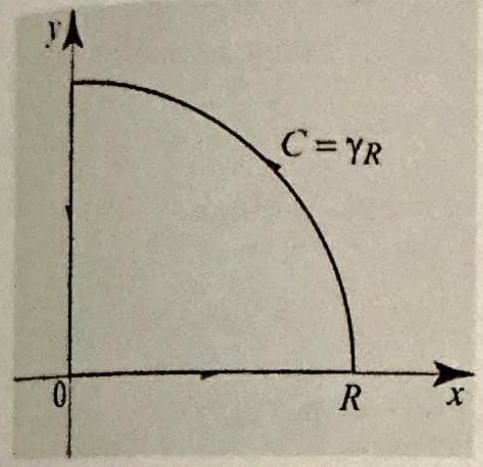
Figure 4 The closed quarter circle $C$ of radius $R>0$.

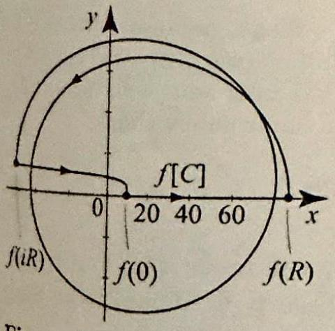
Figure 5 The path $f[C]$ (pictured for $R=2$ ) goes around the origin once.

Comparing with (4) we find that

$$
\frac{1}{2 \pi} \Delta_{C} \arg f=N(f)-P(f)
$$

This unexpected formula links two seemingly unrelated quantities: the net change in the argument of $f(z)$ as we travel once around $C$, and the number of zeros and poles of $f$ inside $C$ ! Beside its esthetic value, this formula has many interesting applications, as we now illustrate.

## EXAMPLE 1 The argument principle

Find the number of zeros of $f(z)=z^{6}+6 z+10$ in the first quadrant.
Solution We will apply the argument principle, which in this case is expressed by $\frac{1}{2 \pi} \Delta_{C} \arg f=N(f)$ since $f$ has no poles. The contour $C$ will be a closed quarter of a circle of radius $R>0$, as shown in Figure 4. Since $f$ has finitely many zeros (at most six), if $R$ is large enough, the contour $C$ will contain all the zeros in the first quadrant. Our goal is to determine the change of the argument of $f(z)$ as $z$ runs through $C$. We will proceed in steps.
Step 1: Show that there are no roots on the contour $C$. We can always choose $R>0$ so that no roots lie on the circular arc $\gamma_{R}$. We need to prove that there are no roots on the nonnegative $x$ - and $y$-axes. If $z=x \geq 0$, then $f(z)=x^{6}+6 x+10$, and this is clearly positive. If $z=i y$, with $y \geq 0$, then $f(i y)=(i y)^{6}+6 i y+10= \left(-y^{6}+10\right)+6 i y$ and because $\operatorname{Im}(f(i y))=0 \Leftrightarrow y=0 \Rightarrow \operatorname{Re}(f(i y)) \neq 0$, we see that $f(i y) \neq 0$.
Step 2: Compute the change of the argument of $f(z)$ as $z$ varies from the initial to the terminal point of $I_{1}=[0, R]$. For $z=0, f(z)=10$, and for $0 \leq z=x \leq R$, $f(z)=x^{6}+6 x+10>0$. So the image of the interval $[0, R]$ is the interval [10, $R^{6}+6 R+10$ ] and the argument of $f(z)$ does not change on $I_{1}$.
Step 3: Compute the change of the argument of $f(z)$ as $z$ varies from the initial to the terminal point of the arc $\gamma_{R}$. Here we are not looking for the exact image of $\gamma_{R}$ by $f$, but only a rough picture that gives us the change in the argument of $f$. For very large $R$ and $z$ on $\gamma_{R}$, write $z=R e^{i \theta}$, where $0 \leq \theta \leq \frac{\pi}{2}$. Then

$$
f(z)=R^{6} e^{6 i \theta}\left(1+\frac{6}{R^{5}} e^{-i 5 \theta}+\frac{10}{R^{6}} e^{-6 i \theta}\right) \approx R^{6} e^{6 i \theta},
$$

because $\frac{6}{R^{5}} e^{-i 5 \theta}+\frac{10}{R^{6}} e^{-6 i \theta} \approx 0$. So as $\theta$ varies from 0 to $\frac{\pi}{2}$, the argument of $f(z)$ varies from 0 to $6 \cdot \frac{\pi}{2}=3 \pi$. In fact, the image of the point $i R$ is $f(i R)= -R^{6}+10+6 i R$, which is a point in the third quadrant with argument very close to $3 \pi$. See Figure 5.
Step 4: Compute the change of the argument of $f(z)$ as $z$ varies from $i R$ to 0 . As $z$ varies from $i R$ to $0, f(z)$ varies from $w_{3}=-R^{6}+10+6 i R$ to $w_{0}=10$. Since Im $(f(z)) \geq 0$, this tells us that the point $f(z)$ remains in the upper half-plane as $f(z)$ moves from $w_{3}$ to $w_{0}$. Hence the change in the argument of $f(z)$ is $-\pi$.
Step 5: Apply the argument principle. The net change of the argument of $f(z)$ as we travel once around $C$ is $3 \pi-\pi=2 \pi$. According to (5), the number of zeros of $f$ inside $C$, and hence in the first quadrant, is $\frac{1}{2 \pi} 2 \pi=1$.

We give one more variant of the counting theorem.

THEOREM 3 VARIANT OF THE COUNTING THEOREM

Let $C, \Omega$, and $f$ be as in Theorem 2, let $g$ be analytic inside and on $C$. Let $z_{1}, z_{2}, \ldots, z_{n_{1}}$ denote the zeros of $f$ in $\Omega$ and $p_{1}, p_{2}, \ldots, p_{n_{2}}$ denote the poles of $f$ in $\Omega$. Let $m\left(z_{j}\right)$ and $m\left(p_{j}\right)$ denote the orders of the roots and poles. Then
(6)

$$
\frac{1}{2 \pi i} \int_{C} g(z) \frac{f^{\prime}(z)}{f(z)} d z=\sum_{j=1}^{n_{1}} m\left(z_{j}\right) g\left(z_{j}\right)-\sum_{j=1}^{n_{2}} m\left(p_{j}\right) g\left(p_{j}\right)
$$

Proof We modify the proof of the previous theorem as follows. If $z_{j}$ is a zero of $f$, then since $g$ is analytic and $\frac{f^{\prime}(z)}{f(z)}$ has a simple pole at $z_{j}$, using Lemma 1 , and Proposition 1(iii), Section 5.1,

$$
\operatorname{Res}\left(g(z) \frac{f^{\prime}(z)}{f(z)}, z_{j}\right)=g\left(z_{j}\right) \operatorname{Res}\left(\frac{f^{\prime}(z)}{f(z)}, z_{j}\right)=m\left(z_{j}\right) g\left(z_{j}\right)
$$

Similarly for the poles $p_{j}$,

$$
\operatorname{Res}\left(g(z) \frac{f^{\prime}(z)}{f(z)}, p_{j}\right)=g\left(p_{j}\right) \operatorname{Res}\left(\frac{f^{\prime}(z)}{f(z)}, p_{j}\right)=-m\left(p_{j}\right) g\left(p_{j}\right)
$$

Now (6) follows from the residue theorem.

## EXAMPLE 2 Applying the variant of the counting theorem

Evaluate

$$
\int_{C_{1}(0)} \frac{e^{z} \cos z}{e^{z}-1} d z
$$

where $C_{1}(0)$ is the positively oriented unit circle.
Solution The function $f(z)=e^{z}-1$ has a zero at $z=0$ and, because $f^{\prime}(0)=1 \neq$ 0 , this zero is simple. Also, using the $2 \pi i$-periodicity of $e^{z}$ (see (13), Section 1.5), it is easy to see that $e^{z}=1$ inside the unit disk $|z|<1$ only at $z=0$. From (6) applied with $f(z)=e^{z}-1$ and $g(z)=\cos z$, it follows immediately that

$$
\int_{C_{1}(0)} \frac{e^{z} \cos z}{e^{z}-1} d z=2 \pi i \cos 0=2 \pi i
$$

As an application of the counting principle we will prove a famous result known as Rouché's theorem, named after the French mathematician and educator Eugène Rouché (1832-1910). We need a simple lemma.

LEMMA 2
INTEGER-VALUED FUNCTIONS

Suppose that $\phi$ is continuous on a region $\Omega$ and $\phi(z)$ is an integer for all $z$ in $\Omega$ (in other words, $\phi$ is integer-valued). Then $\phi$ is constant on $\Omega$.
Proof For each integer $n$, let $U_{n}$ be the set of $z$ in $\Omega$ such that $\phi(z)=n$. The $U_{n}$ 's are clearly disjoint and their union is $\Omega$. They are also open, as we now show. Let $z_{0}$ be in $U_{n}$, so $\phi\left(z_{0}\right)=n$. Since $\phi$ is continuous at $z_{0}$, we can find a neighborhood $B_{r}\left(z_{0}\right)$ such that $|\phi(z)-n|<\frac{1}{2}$ for all $z$ in $B_{r}\left(z_{0}\right)$. Since $\phi$ is integer-valued, this

THEOREM 4 ROUCHÉ'S THEOREM

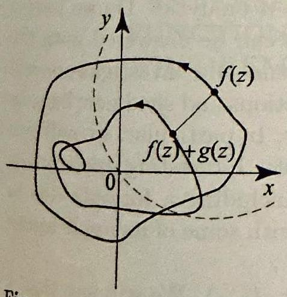
Figure 6 Since $|g(z)|$ < $|f(z)|$, the point $f(z)+g(z)$ goes around the origin the same number of times as $f(z)$.

forces $\phi(z)=n$ for all $z$ in $B_{r}\left(z_{0}\right)$ (how else can two integers differ by at most $1 / 2$ ?). This shows the $U_{n}$ are open. By definition of connectedness, $\Omega$ cannot be written as the union of disjoint open sets, so only one of the $U_{n}$ can be nonempty (say, $U_{n_{0}}$ ), and thus $\phi(z)=n_{0}$ for all $z$ in $\Omega$.

Suppose that $C$ is a simple closed path, $\Omega$ is the region inside $C, f$ and $g$ are analytic inside and on $C$. If $|g(z)|<|f(z)|$ for all $z$ on $C$, then $N(f+g)=N(f)$; that is, $f+g$ and $f$ have the same number of zeros on $\Omega$.

Proof For $z$ on $C$ and $0 \leq \lambda \leq 1$, if $f(z)+\lambda g(z)=0$, then $|f(z)|=\lambda|g(z)| \leq |g(z)|$, which contradicts $|f(z)|>|g(z)|$ on $C$. So $f(z)+\lambda g(z)$ is not equal to zero for all $z$ on $C$ and $0 \leq \lambda \leq 1$. Parametrize $C$ by $\gamma(t), a \leq t \leq b$, and for $0 \leq \lambda \leq 1$ consider

$$
\phi(\lambda)=\frac{1}{2 \pi i} \int_{C} \frac{f^{\prime}(z)+\lambda g^{\prime}(z)}{f(z)+\lambda g(z)} d z=\int_{a}^{b} \frac{f^{\prime}(\gamma(t))+\lambda g^{\prime}(\gamma(t))}{f(\gamma(t))+\lambda g(\gamma(t))} \gamma^{\prime}(t) d t
$$

The integrand is a continuous function of the two variables $t$ and $\lambda$ over the rectangle $[a, b] \times[0,1]$. Applying Theorem 5, Section 3.5, it follows that $\phi(\lambda)$ is a continuous function on $[0,1]$. By Theorem $1, \phi(\lambda)=N(f+\lambda g)$ and hence it is integer-valued. By Lemma 2, $\phi$ is constant; and so $N(f)=\phi(0)=\phi(1)=N(f+g)$.

We can give a geometric interpretation of Rouché's theorem, based on the argument principle. According to (5), we are merely claiming that

$$
\Delta_{C} \arg (f+g)=\Delta_{C} \arg f .
$$

As $z$ traces $C, f(z)$ winds around the origin a specific number of times. Since $|g(z)|<|f(z)|$, the point $f(z)+g(z)$ must lie in the disk of radius $|f(z)|$ centered at $f(z)$ (Figure 6), and so $f(z)+g(z)$ must wind around the origin the same number of times as $f(z)$ (see Exercise 24).

## The following are typical applications of Rouché's theorem.

## EXAMPLE 3 Counting zeros with Rouché's theorem

(a) Show that all zeros of $p(z)=z^{4}+6 z+3$ lie inside the circle given by $|z|=2$.
(b) Show that if $a$ is a real number with $a>e$, then the equation $e^{z}=a z^{n}$ has $n$ roots in $|z|<1$.
Solution (a) Since $p$ is a polynomial of degree 4, it is enough to show that $N(p)=$ 4 inside the circle $|z|=2$. Take $f(z)=z^{4}$ and $g(z)=6 z+3$ and note that $f(z)+g(z)=p(z)$. For $|z|=2$, we have $|f(z)|=2^{4}=32$ and $|g(z)| \leq|6 z|+3=15$. Hence $|g(z)|<|f(z)|$ for all $z$ on the circle $|z|=2$, and so by Roucheé's theorem $N(f)=N(f+g)=N(p)$. Clearly $f$ has one zero with multiplicity 4 at $z=0$. Thus $N(f)=4$ and so $N(p)=4$, as desired.
(b) Take $f(z)=a z^{n}$ and $g(z)=-e^{z}$. Counted according to multiplicity, $f$ has $n$ zeros in $|z|<1$ and so $N(f)=n$. For $|z|=1,|f(z)|=\left|a z^{n}\right|=a$ and

$$
|g(z)|=\left|e^{z}\right|=\left|e^{\cos \theta+i \sin \theta}\right|=e^{\cos \theta} \leq e<a .
$$

Thus $|g(z)|<|f(z)|$ for all $|z|=1$ and so by Rouché's theorem $n=N\left(a z^{n}\right)= N\left(a z^{n}-e^{2}\right)$, which implies that $a z^{n}-e^{z}=0$ has $n$ roots in $|z|<1$. $\square$

As a further application we give a very simple proof of the fundamental theorem of algebra.

## EXAMPLE 4 The fundamental theorem of algebra

Let $p(z)=a_{n} z^{n}+a_{n-1} z^{n-1}+\cdots+a_{1} z+a_{0}$ with $a_{n} \neq 0$ be a polynomial of degree $n \geq 1$. Show that $p(z)$ has exactly $n$ roots, counting multiplicity.
Solution Take $f(z)=a_{n} z^{n}$. Then $f$ has a zero of multiplicity $n$ at $z=0$. Also, for $|z|=R$, we have $|f(z)|=\left|a_{n}\right| R^{n}$, which is a polynomial of degree $n$ in $R$. Now let $g(z)=a_{n-1} z^{n-1}+\cdots+a_{1} z+a_{0}$, then $|g(z)| \leq\left|a_{n-1}\right|\left|z^{n-1}\right|+\cdots+\left|a_{1}\right||z|+\left|a_{0}\right|$, and so for $|z|=R,|g(z)| \leq\left|a_{n-1}\right| R^{n-1}+\cdots+\left|a_{1}\right| R+\left|a_{0}\right|$. Since the modulus of $f$ grows at a faster rate than the modulus of $g$, in the sense that

$$
\lim _{R \rightarrow \infty} \frac{1}{\left|a_{n}\right| R^{n}}\left(\left|a_{n-1}\right| R^{n-1}+\cdots+\left|a_{1}\right| R+\left|a_{0}\right|\right)=0,
$$

we can find $R_{0}$ large enough so that for $R \geq R_{0}$, we have $\left|a_{n-1}\right| R^{n-1}+\cdots+\left|a_{1}\right| R+ \left|a_{0}\right|<\left|a_{n}\right| R^{n}$. This implies that $|g(z)|<|f(z)|$ for all $|z|=R$ with $R \geq R_{\mathrm{O}}$. By Rouché's theorem, $N(f)$, the number of zeros of $f$ in the region $|z|<R$, is the same as $N(f+g)$, the number of zeros of $f+g$. But $N(f)=n$ and $\boldsymbol{f}+\boldsymbol{g}=\boldsymbol{p}$, so $N(p)=n$ showing that $p$ has exactly $n$ zeros. $\square$

## The Local Mapping Theorem

In this part, we investigate fundamental properties of the inverse function of an analytic function $f$. When does it exist? Is it analytic? Do we have a formula for it in terms of $f$ ? All these questions can be answered with the help of Rouché's theorem and the counting theorem. Our investigations will lead to interesting new properties of analytic functions and shed new light on some classical results that we have studied earlier. In particular, we will give a simple proof of the maximum modulus principle. Interesting applications of these topics are presented in the exercises, including a formula due to Lagrange for the inversion of analytic functions with some of its applications to the solution to transcendental equations.

Suppose that $f$ is analytic at $z_{0}$ and let $w_{0}=f\left(z_{0}\right)$. We will say that $f$ has order $m \geq 1$ at $z_{0}$ if the zero of $f(z)-w_{0}$ has order $m$ at $z_{0}$. The order of $f(z)$ at $z_{0}$ is the order of the first nonvanishing term in the Taylor series expansion, past the constant term. Thus $f$ has order $m$ at $z_{0}$ if and only if $f^{(j)}\left(z_{0}\right)=0$ for $j=1, \ldots, m-1$ and $f^{(m)}\left(z_{0}\right) \neq 0$. In particular, $f(z)$ has order 1 at $z_{0}$ if and only if $f^{\prime}\left(z_{0}\right) \neq 0$.

THEOREM 5 LOCAL MAPPING THEOREM

Let $f$ be a nonconstant analytic function in a neighborhood of $z_{0}$. Let $w_{0}=f\left(z_{0}\right)$ and $n$ be the order of $f$ at $z_{0}$. There exists $R>0$ and $\rho>0$ such that every $w \neq w_{0}$ in $B_{\rho}\left(w_{0}\right)$ is attained by $f$ at precisely $n$ distinct points in $B_{R}\left(z_{0}\right)$,

Proof Since $f(z)-w_{0}$ has a zero of order $n \geq 1$, write $f(z)-w_{0}=a_{n}\left(z-z_{0}\right)^{n}+$
$a_{n+1}\left(z-z_{0}\right)^{n+1}+\cdots$, where $a_{n} \neq 0$. Then $\lim _{z \rightarrow z_{0}} \frac{f(z)-w_{0}}{\left(z-z_{0}\right)^{n}}=a_{n} \neq 0$. So we can find $R>0$ such that

$$
\left|\frac{f(z)-w_{0}}{\left(z-z_{0}\right)^{n}}\right|>\frac{\left|a_{n}\right|}{2}, \text { for all } 0<\left|z-z_{0}\right| \leq R .
$$

In particular, for $z \neq z_{0}$ we have $f(z) \neq w_{0}$, and for $\left|z-z_{0}\right|=R$ we have

$$
\frac{\left|f(z)-w_{0}\right|}{R^{n}}>\frac{\left|a_{n}\right|}{2} \Rightarrow\left|f(z)-w_{0}\right|>\frac{\left|a_{n}\right| R^{n}}{2}
$$

By taking a smaller value of $R$ if necessary, we can also assume that $f^{\prime}(z) \neq 0$ for all $z \neq z_{0}$ with $\left|z-z_{0}\right|<R$. Now take $\rho=\frac{\left|a_{n}\right| R^{n}}{2}$, then for $\left|w_{0}-w\right|<\rho$, set $g(z)$ to be the constant $w_{0}-w$. For $\left|z-z_{0}\right|=R$, using (9), we find

$$
|g(z)|=\left|w_{0}-w\right| \leq \frac{\left|a_{n}\right| R^{n}}{2}<\left|f(z)-w_{0}\right|
$$

and so by Rouché's theorem, $N(f-w)=N\left(f-w_{0}+g\right)=N\left(f-w_{0}\right)$, and since $N\left(f-w_{0}\right)=n$ it follows that $N(f-w)=n$ for all $\left|w-w_{0}\right|<\rho$. So $w$ has $n$ antecedents in $\left|z-z_{0}\right|<R$. The fact that $f^{\prime}(z) \neq 0$ for all $0<\left|z-z_{0}\right|<R$ guarantees that we do not have repeated roots, and so the antecedents are all distinct.

The case $n=1$ of the theorem deserves a separate statement.

THEOREM 6 INVERSE FUNCTION THEOREM

Suppose that $f$ is analytic on a region $\Omega$ and $z_{0}$ is in $\Omega$. Then $f$ is one-to-one on some neighborhood $B_{r}\left(z_{0}\right)$ if and only if $f^{\prime}\left(z_{0}\right) \neq 0$.

Proof If $f^{\prime}\left(z_{0}\right) \neq 0, f$ has order 1 and by Theorem 5 we can find $R$ and $\rho$ such that for any $0<\left|w-w_{0}\right|<\rho, f$ takes on the value $w$ exactly once in $B_{R}\left(z_{0}\right)$. Also, $f$ takes on the value $w_{0}$ only at $z_{0}$. Let $U$ be the pre-image $f^{-1}\left[B_{\rho}\left(w_{0}\right)\right]$. Since $B_{\rho}\left(w_{0}\right)$ is open and $f$ is continuous, $U$ is open (Exercise 41, Section 2.2) and it clearly contains $z_{0}$. So we can find an open disk $B_{r}\left(z_{0}\right)$ that is contained in $U$ and $B_{R}\left(z_{0}\right)$. Then $f$ is one-to-one on $B_{r}\left(z_{0}\right)$, for if $f\left(z_{1}\right)=f\left(z_{2}\right)$ is a point in $B_{\rho}\left(w_{0}\right)$, Theorem 5 guarantees $z_{1}=z_{2}$. Conversely, if $f^{\prime}\left(z_{0}\right)=0$, given $B_{r}\left(z_{0}\right)$ we can apply Theorem 5 to find a neighborhood of $z_{0}$ where $f$ takes on values more than once; and so $f$ is not one-to-one in this case.

A few comments are in order regarding the inverse function theorem. The theorem can be obtained from the classical inverse function theorem in two variables. The latter states that the mapping $(x, y) \mapsto(u(x, y), v(x, y))$ is one-to-one in a neighborhood of ( $x_{0}, y_{0}$ ) if the Jacobian of the mapping is nonzero at $\left(x_{0}, y_{0}\right)$, where the Jacobian at $(x, y)$ is given by

$$
J(x, y)=\operatorname{det}\left|\begin{array}{ll}
u_{x}(x, y) & u_{y}(x, y) \\
v_{x}(x, y) & v_{y}(x, y)
\end{array}\right|=u_{x}(x, y) v_{y}(x, y)-u_{y}(x, y) v_{x}(x, y)
$$

Hence, using the Cauchy-Riemann equations, we find that

$$
J(x, y)=u_{x}^{2}(x, y)+u_{y}^{2}(x, y)=\left|f^{\prime}(x+i y)\right|^{2} .
$$

So if $f^{\prime}\left(x_{0}+i y_{0}\right) \neq 0$, then $J\left(x_{0}, y_{0}\right) \neq 0$ and Theorem 6 follows from the inverse function theorem for functions of two variables as claimed.

It is important to keep in mind that the condition $f^{\prime}(z) \neq 0$ for all $z$ in $\Omega$ does not imply that $f$ is one-to-one on $\Omega$. Consider $f(z)=e^{z}$; then $f^{\prime}(z)=e^{z} \neq 0$ for all $z$, yet $f$ is not one-to-one on the whole complex plane. Theorem 6 only guarantees that $f$ is one-to-one in some neighborhood of any given point $z_{0}$ where $f^{\prime}\left(z_{0}\right) \neq 0$. Because this neighborhood depends on $z_{0}$ in general, an obvious question is whether we can estimate its size in terms of the sizes of $f$ and $f^{\prime}$. An answer to this question was given by the German mathematician Edmund Landau (1877-1938) and is known as the Landau estimate. See Exercise 36.

The following two corollaries describe important properties of analytic functions, which are direct applications of the local mapping theorem.

COROLLARY 1 OPEN MAPPING PROPERTY

A nonconstant analytic function $f$ maps open sets into open sets. A function with this property is said to be open.

Proof Let $f$ map $\Omega$ to $f[\Omega]$. Given $w_{0}$ in $f[\Omega]$, let $z_{0}$ be some point in $\Omega$ where $f\left(z_{0}\right)=w_{0}$. Since $\Omega$ is open, we can find a neighborhood $B_{R}\left(z_{0}\right)$ contained in $\Omega$; by applying Theorem 5 to $B_{R}\left(z_{0}\right)$, we find that each point in the associated $B_{\rho}\left(w_{0}\right)$ is assumed by $f$. Thus $B_{\rho}\left(w_{0}\right)$ is contained in $f[\Omega]$, and $f[\Omega]$ is open. $\square$

## COROLLARY 2 MAPPING OF REGIONS

If $\Omega$ is a nonempty region (open and connected set) and $f$ is a nonconstant analytic function on $\Omega$, then $f[\Omega]$ is a region.
Proof By Corollary 1, $f[\Omega]$ is open. To show that $f[\Omega]$ is connected, suppose that $f[\Omega]=U \cup V$, where $U$ and $V$ are open and disjoint. Since $f$ is continuous, $f^{-1}[U]$ and $f^{-1}[V]$ are open (note that since $f$ is defined on $\Omega$, when taking a pre-image, we only consider those points in $\Omega$ ). Clearly, $f^{-1}[U]$ and $f^{-1}[V]$ are disjoint and their union is $\Omega$. Since $\Omega$ is connected, either $\Omega=f^{-1}[U]$ or $\Omega=f^{-1}[V]$, and hence $f[\Omega]=U$ or $f[\Omega]=V$, implying that $f[\Omega]$ is connected. $\square$

Another interesting application of the open mapping property of analytic functions is a simple proof of the maximum principle.

## COROLLARY 3 MAXIMUM MODULUS PRINCIPLE

> If $f$ is analytic on a region $\Omega$, such that $|f|$ attains a maximum at some point in $\Omega$, then $f$ is constant in $\Omega$.

Proof Suppose $f$ is nonconstant. Let $z_{0}$ be an arbitrary point in $\Omega$; we will show that $\left|f\left(z_{0}\right)\right|$ is not a maximum. By Corollary $1, f$ is open. Let $B_{\rho}\left(w_{0}\right)$ be a neighborhood of $w_{0}=f\left(z_{0}\right)$, contained in $f[\Omega]$. Clearly, $f\left(z_{0}\right)$ does not have the largest modulus among all the points in $B_{\rho}\left(w_{0}\right)$ (Figure 7). $\square$

We next use the variant of the counting theorem to give a formula for the inverse function of $f$ in terms of an integral involving $f$.

## THEOREM 7 INVERSE FUNCTION FORMULA

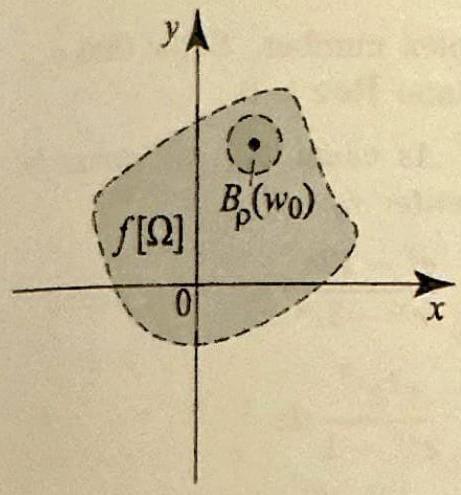
Figure 7

## COROLLARY 4 A GLOBAL INVERSE FUNCTION

Suppose that $f(z)$ is analytic at $z_{0}$ and $f^{\prime}\left(z_{0}\right) \neq 0$. Then $f$ has an inverse function $z=g(w)$ in a neighborhood $B_{\rho}\left(w_{0}\right)$ of $w_{0}$ given by

$$
g(w)=\frac{1}{2 \pi i} \int_{C_{R}\left(z_{0}\right)} z \frac{f^{\prime}(z)}{f(z)-w} d z
$$

Furthermore, $g(w)$ is analytic on $B_{\rho}\left(w_{0}\right)$.
Proof Let $R$ and $\rho$ be as in Theorem 5. For $w$ in $B_{\rho}\left(w_{0}\right), f(z)-w$ has exactly one zero in $B_{R}\left(z_{0}\right)$, which is the pre-image of $w$ by the mapping $f$. Applying the variant of the counting theorem, we see that the integral on the right of (10) is equal to the pre-image of $w$. Finally, $g$ is analytic by Theorem 4, Section 3.5

Theorem 7 can be used to derive a useful formula due to Lagrange for the inversion of power series. See Exercise 33.

Theorem 7 can be viewed as a statement about the local existence of inverse functions. If $f$ is one-to-one on a region $\Omega$, there is no ambiguity in defining the inverse function $f^{-1}$ on the whole region $f[\Omega]$. Indeed, given $w$ in $f[\Omega]$, we define $f^{-1}(w)$ to be the unique $z$ in $\Omega$ with $f(z)=w$. For $f$ analytic and one-to-one, we have the following result, which should be compared to Theorem 4, Section 2.3.

1. $z^{2}+2 z+2$.
2. $z^{3}-2 z+4$.
3. $z^{4}+8 z^{2}+16 z+20$.

Suppose that $f$ is analytic and one-to-one on a region $\Omega$. Then its inverse function $f^{-1}$ exists and is analytic on the region $f[\Omega]$. Moreover,

$$
\frac{d}{d w} f^{-1}(w)=\frac{1}{f^{\prime}(z)}, \quad \text { where } w=f(z)
$$

2. $z^{2}-2 z+2$.
3. $z^{3}+5 z^{2}+8 z+6$.
4. $z^{5}+z^{4}+13 z^{3}+10$.

Proof By Theorem 7, $f^{-1}$ is analytic in a neighborhood of each point in $\Omega$, and hence it is analytic on $\Omega$. Also, since $f$ is one-to-one, Theorem 6 implies that $f^{\prime}(z) \neq 0$ for all $z$ in $\Omega$. Differentiating both sides of the identity $z=f^{-1}(f(z))$, we obtain $1=\frac{d}{d w} f^{-1}(w) f^{\prime}(z)$, which is equivalent to (11).

A function $f$ that is analytic and one-to-one is also called a univalent function. These functions will play a very important role in the next chapter, on conformal mappings.

## Exercises 5.7

In Exercises 1-6, use the method of Example 1 to find the number of zeros in the first quadrant of the given polynomial.

In Exercises 7-14, use Rouché's theorem to determine the number of zeros of the given function in the given region.

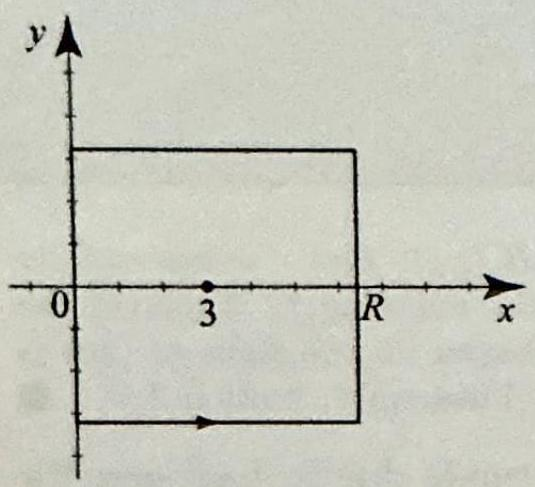
Figure 8 for Exercise 15.

7. $z^{3}+3 z+1, \quad|z|<1$.
8. $z^{4}+4 z^{3}+2 z^{2}+11, \quad|z|<2$.
9. $7 z^{3}+3 z^{2}+11, \quad|z|<1$.
10. $7 z^{3}+z^{2}+11 z+1, \quad 1<|z|$.
11. $4 z^{6}+41 z^{4}+46 z^{2}+9,2<|z|<4$.
12. $z^{4}+50 z^{2}+49, \quad 3<|z|<4$.
13. $e^{z}-3 z, \quad|z|<1$.
14. $e^{z^{2}}-4 z^{2}, \quad|z|<1$.
15. Show that the equation $3-z+2 e^{-z}=0$ has exactly one root in the right half-plane $\operatorname{Re} z>0$. [Hint: Use Rouché's theorem and contours such as the one in Figure 8.]
16. Suppose that $\operatorname{Re} w>0$ and let $a$ be any complex number. Show that $w$ $z+a e^{-z}=0$ has exactly one root in the right half-plane $\operatorname{Re} z>0$.
In Exercises 17-20, evaluate the given path integral. As usual, $C_{R}\left(z_{0}\right)$ stands for the positively oriented circle with radius $R>0$ and center $z_{0}$.
17. $\int_{C_{1}(0)} \frac{d z}{z^{5}+3 z+5}$.
18. $\int_{C_{1}(0)} \frac{e^{z}-12 z^{3}}{e^{z}-3 z^{4}} d z$.
19. $\int_{C_{2}(0)} \frac{z e^{i z}}{z^{2}+1} d z$.
20. $\int_{C_{1}(0)} \frac{z^{3} e^{z^{2}}}{e^{z^{2}}-1} d z$.
21. Summing roots of unity. We will give a simple proof based on the variant of the counting theorem of the fact that, for $n \geq 2$, the sum of the $n n$th roots of unity is 0 (see Exercise 53 , Section 1.3). Let $S$ denote this sum.
(a) Using Theorem 3, explain why

$$
S=\frac{1}{2 \pi i} \int_{C_{R}(0)} z \frac{n z^{n-1}}{z^{n}-1} d z=\frac{n}{2 \pi i} \int_{C_{1 / R}(0)} \frac{1}{1-z^{n}} \frac{d z}{z^{2}}
$$

where $R>1$. [Hint: To prove the second equality make a suitable change of variables.]
(b) Evaluate the second integral in (a) using Cauchy's generalized integral formula and conclude that $S=0$.
22. Examples concerning Lemma 1. Give an example of a function $f$ with an essential singularity at 0 such that $\frac{f^{\prime}(z)}{f(z)}$ has
(a) an essential singularity at 0 ;
(b) a pole of order $m \geq 2$ at 0 .

Use functions like $e^{1 / z}$ in your examples.
23. Meromorphic Rouché's theorem. Suppose that $C$ is a simple closed path, $\Omega$ is the region inside $C$, and $f$ and $g$ are meromorphic inside and on $C$, having no zeros or poles on $C$. Show that if $|g(z)|<|f(z)|$ for all $z$ on $C$, then $N(f+g)-P(f+g)= N(f)-P(f)$. [Hint: Repeat the proof of Rouché's theorem. What can you say about the values of $\phi$ in the present case?]
24. We complete the geometric argument given in the text concerning Rouches theorem. (i) Show that for each $z$, we can find a branch of the argument where
(ii) Using connectedness, we can show that this inequality holds for the special $\arg f(z)-\frac{\pi}{2}<\arg (f(z)+g(z))<\arg f(z)+\frac{\pi}{2}$.
argument function $\arg f(z)$, which we used to define $\Delta_{C} f(z)$. Show that $\Delta_{C} f(z)- \pi<\Delta_{C}(f(z)+g(z))<\Delta_{C} f(z)+\pi$, and use the fact that $\Delta_{C}(f(z)+g(z))$ must be an integer multiple of $2 \pi$ to prove that $\Delta_{C} f(z)=\Delta_{C}(f(z)+g(z))$.
25. Project Problem: Hurwitz's theorem. In this exercise, we outline a proof of a useful theorem due to the German mathematician Adolf Hurwitz (1859-1919). The theorem states the following.

> Suppose that $\left\{f_{n}\right\}$ is a sequence of analytic functions on a region $\Omega$ converging uniformly on every closed and bounded subset of $\Omega$ to a function $f$. Then either
> (i) $f$ is identically 0 on $\Omega$; or
> (ii) if $B_{r}\left(z_{0}\right)$ is any open disk in $\Omega$ such that $f$ does not vanish on $C_{r}\left(z_{0}\right)$, then $f_{n}$ and $f$ have the same number of zeros in $B_{r}\left(z_{0}\right)$ for all sufficiently large $n$.

In particular, if $f$ is not identically 0 and $f$ has $p$ distinct zeros in $\Omega$, then so do the functions $f_{n}$ for all sufficiently large $n$.

Before we outline the proof, let us observe that $f$ is analytic by Theorem 4, Section 4.2. Also, note that the theorem guarantees that, for large $n, f_{n}$ and $f$ have the same number of zeros, but these zeros are not necessarily the same for $f_{n}$ and $f$. To see this, take $f_{n}(z)=z-\frac{1}{n}$ and $f(z)=z$. Finally, observe that the possibility that $f$ is identically zero can arise, even if the $f_{n}$ 's are all nonzero. Simply take $f_{n}(z)=\frac{1}{n}$.

Fill in the details in the following proof. Suppose that $f$ is not identically 0 in $\Omega$, and let $z_{0}$ denote a zero of $f$. Let $S_{r}\left(z_{0}\right)$ be a closed disk such that $f$ is nonvanishing on $C_{r}\left(z_{0}\right)$. (Why can we find such a disk?) Let $m=\min |f|$ on $C_{r}\left(z_{0}\right)$. Then $m>0$ (why?). Apply uniform convergence to get an index $N$ such that $n>N$ implies that $\left|f_{n}-f\right|<m \leq|f|$ on $C_{r}\left(z_{0}\right)$. Complete the proof by applying Rouché's theorem.

Hurwitz's theorem has many interesting applications. We start with some theoretical properties and then give some applications to counting zeros of analytic functions (Exercises 28-30).
26. Suppose that $f_{n}$ converges to $f$ uniformly on every closed and bounded subset of $\Omega$ with $f_{n}$ analytic and vanishing nowhere on $\Omega$. Then either $f$ is identically 0 or $f$ vanishes nowhere on $\Omega$.
27. Univalent functions. In this exercise we prove an interesting theorem concerning univalent functions.
(a) Suppose that $\left\{f_{n}\right\}$ is a sequence of univalent functions on $\Omega$ that converges to $f$ uniformly on every closed and bounded subset of $\Omega$, and $f$ is not identically constant on $\Omega$. Then $f$ is univalent. [Hint: Let $z \neq z_{0}$ be in $\Omega$. Apply Exercise 26 to the sequence of functions $\left\{f_{n}-f_{n}\left(z_{0}\right)\right\}$.]
(b) Give an example of a sequence of univalent functions converging uniformly on the closed unit disk to a constant function.
28. Counting zeros with Hurwitz's theorem. If we want to find the number of zeros inside the unit disk of the polynomial $p(z)=z^{5}+z^{4}+6 z^{2}+3 z+1$, then we cannot just apply Rouché's theorem since there is not one single coefficient of the polynomial whose absolute value dominates the sum of the absolute values of the other coefficients. Here is how we can handle this problem.
(a) Consider the polynomials $p_{n}(z)=p(z)-\frac{1}{n}$. Show that $\left\{p_{n}\right\}$ converges uniformly on the closed unit disk to $p(z)$.
(b) Apply Rouché's theorem to show that $p_{n}$ has two zeros in the unit disk.
(c) Apply Hurwitz's theorem to show that $p(z)$ has two zeros inside the unit disk.
(d) Verify your answer in (c) by finding a numerical approximation of the roots of $p(z)$.
In Exercises 29-30, modify the steps in Exercise 28 to find the zeros of the given polynomial in the stated region.
29. $z^{5}+z^{4}+6 z^{2}+3 z+11, \quad|z|<1$.
30. $4 z^{4}+6 z^{2}+z+1, \quad|z|<1$.
31. When there exists a continuous one-to-one function $f$ from a set $A$ onto a set $B$, such that $f^{-1}$ is also continuous, the two sets are said to be homeomorphic. Homeomorphic sets will share topological properties like openness, connectedness, and simple connectedness. Show that if $f$ is one-to-one and analytic on $\Omega$, then $\Omega$ and $f[\Omega]$ are homeomorphic.
32. Minimum modulus principle. Use the fact that a nonconstant analytic function $f(z)$ is open to show that if $f(z)$ is nonzero for $z$ in $\Omega$ then $|f|$ does not attain a minimum on $\Omega$.
33. Project Problem: Lagrange's inversion formula. In this exercise, we outline a proof of the following useful inversion formula for analytic functions due to the French mathematician Joseph-Louis Lagrange (1736-1813).

Suppose that $f(z)$ is analytic at $z_{0}$ and $f^{\prime}\left(z_{0}\right) \neq 0$, and let

$$
\phi(z)=\frac{z-z_{0}}{f(z)-w_{0}},\left(z \neq z_{0}\right)
$$

Then the inverse function $z=g(w)$ has a power series expansion

$$
g(w)=z_{0}+\sum_{n=1}^{\infty} b_{n}\left(w-w_{0}\right)^{n}, \quad \text { where } \quad b_{n}=\left.\frac{1}{n!} \frac{d^{n-1}}{d z^{n-1}}[\phi(z)]^{n}\right|_{z=z_{0}}
$$

Fill in the details in the following proof. Note that $\phi(z)$ is analytic at $z_{0}$ (why?). To prove (13), start with the formula for the inverse function (10) and differentiate with respect to $w$ and then integrate by parts to obtain

$$
\begin{aligned}
g^{\prime}(w) & =\frac{1}{2 \pi i} \int_{C_{R}\left(z_{0}\right)} z \frac{f^{\prime}(z)}{(f(z)-w)^{2}} d z \\
& =-\frac{1}{2 \pi i} \int_{C_{R}\left(z_{0}\right)} z d\left((f(z)-w)^{-1}\right)=\frac{1}{2 \pi i} \int_{C_{R}\left(z_{0}\right)} \frac{d z}{f(z)-w}
\end{aligned}
$$

Justify successive differentiation under the integral sign and get

$$
g^{(n)}(w)=\frac{(n-1)!}{2 \pi i} \int_{C_{R}\left(z_{0}\right)} \frac{d z}{(f(z)-w)^{n}}=\frac{(n-1)!}{2 \pi i} \int_{C_{R}\left(z_{0}\right)}[\phi(z)]^{n} \frac{d z}{\left(z-z_{0}\right)^{n}}
$$

Hence by Cauchy's generalized integral formula

$$
g^{(n)}\left(w_{0}\right)=\left.\frac{d^{n-1}}{d z^{n-1}}[\phi(z)]^{n}\right|_{z=z_{0}}
$$

and (13) follows from the formula for the Taylor coefficients.
34. Let $a$ be an arbitrary complex number. Consider the equation $z=a+w e^{z}$. Show that a solution is given by

$$
z=a+\sum_{n=1}^{\infty} \frac{n^{n-1} e^{n a}}{n!} w^{n}
$$

for $|w|<e^{-1-\operatorname{Re} a}$. [Hint: Let $z_{0}=a, w=(z-a) e^{-z}, \phi(z)=\frac{z-a}{(z-a) e^{-z}}=e^{z}$, and apply Lagrange's formula.]
35. Lambert's $w$-function. This function has been applied in quantum physics, fluid mechanics, biochemistry, and combinatorics. It is named after the German mathematician Johann Heinrich Lambert (1728-1777). The Lambert function or Lambert $w$-function is defined as the inverse function of $f(z)=z e^{z}$. Using the technique of Exercise 34, based on Lagrange's formula, show that the solution of $w=z e^{z}$ is

$$
z=\sum_{n=1}^{\infty} \frac{(-1)^{n-1} n^{n-2}}{(n-1)!} w^{n}, \quad|w|<\frac{1}{e}
$$

36. Project Problem: Landau's estimate. In this exercise we present Landau's solution of the following problem: Given $f$ analytic on a closed disk $S_{R}\left(z_{0}\right)$ with $f^{\prime}\left(z_{0}\right) \neq 0$, find $r>0$ such that $f$ is one-to-one on the open disk $B_{r}\left(z_{0}\right)$. Landau's solution: It suffices to take $r=\frac{R^{2}\left|f^{\prime}\left(z_{0}\right)\right|^{2}}{4 M}$, where $M$ is the maximum value of $|f|$ on $C_{R}\left(z_{0}\right)$.

Fill in the details in the following proof. It suffices to choose $r$ so that $f^{\prime}(z) \neq 0$ for all $z$ in $B_{r}\left(z_{0}\right)$ (why?). We can without loss of generality take $z_{0}=0$ and $w_{0}=f\left(z_{0}\right)=0$ (why?). Then for $|z|<R, f(z)=a_{1} z+a_{2} z^{2}+\cdots$. Write $r=\lambda R$, where $0<\lambda<1$ is to be determined so that $f^{\prime}(z) \neq 0$ for all $z$ in $B_{\lambda R}(0)$. For $z_{1}$ and $z_{2}$ in $B_{\lambda R}(0)$, we have

$$
\begin{aligned}
\left|\frac{f\left(z_{1}\right)-f\left(z_{2}\right)}{z_{1}-z_{2}}\right| & =\left|a_{1}+\sum_{n=2}^{\infty} a_{n}\left(z_{1}^{n-1}+z_{1}^{n-2} z_{2}+\cdots+z_{1} z_{2}^{n-2}+z_{2}^{n-1}\right)\right| \\
& \geq\left|a_{1}\right|-\sum_{n=2}^{\infty} n\left|a_{n}\right| \lambda^{n-1} R^{n-1}
\end{aligned}
$$

If we can choose $\lambda$ so that

$$
\sum_{n=2}^{\infty} n\left|a_{n}\right| \lambda^{n-1} R^{n-1}<\left|a_{1}\right|
$$

this would make the absolute value of the difference quotient for the derivative $>0$, independently of $z_{1}$ and $z_{2}$ in $B_{\lambda R}(0)$, which in turn would imply that $f^{\prime}(z) \neq 0$ for all $z$ in $B_{\lambda R}(0)$ and complete the proof. So let us show that we can choose $\lambda$ so that (14) holds. Let $M=\max |f(z)|$ for $z$ on $C_{R}(0)$. Cauchy's estimate yields $\left|a_{n}\right| \leq \frac{M}{R^{n}}$. Then

$$
\sum_{n=2}^{\infty} n\left|a_{n}\right| \lambda^{n-1} R^{n-1} \leq \frac{M}{R} \sum_{n=2}^{\infty} n \lambda^{n-1}=\frac{M}{R} \frac{\lambda(2-\lambda)}{(1-\lambda)^{2}}<\frac{M}{R} \frac{2 \lambda}{(1-\lambda)^{2}}
$$

(Use $\sum_{n=2}^{\infty} n \lambda^{n-1}=\frac{d}{d \lambda}\left(\lambda^{2}+\lambda^{3}+\cdots\right)=\frac{d}{d \lambda} \frac{\lambda^{2}}{1-\lambda}=\frac{2 \lambda-\lambda^{2}}{(1-\lambda)^{2}}$.) Consider the choice $\lambda= \frac{R\left|a_{1}\right|}{4 M}$. This yields $\lambda \leq \frac{1}{4}$ and $\sum_{n=2}^{\infty} n\left|a_{n}\right| \lambda^{n-1} R^{n-1}<\frac{\left|a_{1}\right|}{4 \lambda} \frac{2 \lambda}{(1-\lambda)^{2}}=\frac{\left|a_{1}\right|}{2} \frac{1}{(1-\lambda)^{2}} \leq \frac{8}{9}\left|a_{1}\right|$. (The maximum of $1 /(1-\lambda)^{2}$ on the interval $[0,1 / 4]$ occurs at $\lambda=1 / 4$ and is equal to $\frac{16}{9}$.) Hence (14) holds for this choice of $\lambda$, and for this choice, we get $r=\lambda R=\frac{R^{2}\left|a_{1}\right|}{4 M}$, which is what Landau's estimate says.

