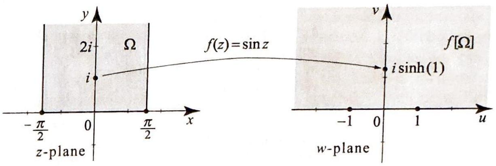
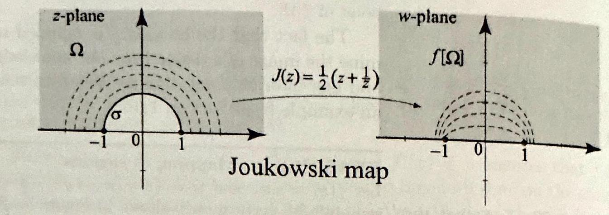
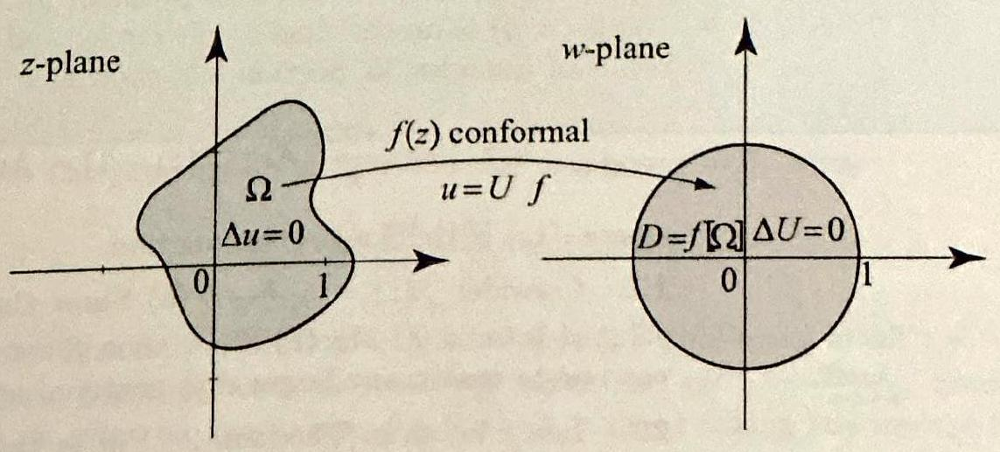

<!-- Page 2 -->

Left margin note (page 2)

386
Chapter 6
6.1 Basic

Figure 1 The dir tangent line at $z( \arg z^{\prime}(t)$.

Figure 2 The $\gamma_{2}$ intersect at a

Figure 3 A li $f(z)=a z+b($
by an angle ar a factor $|a|$, an b. In particula angles between

Right margin note (page 2)

lytic will the gent the $y(t)$, that line this the
that $\gamma_{2}$ at lines
ed in $z)=$ der a g our abers, otate then es not of the paths in the ve by till $\alpha$. kwise

++++

Conformal Mappings
Properties
Our goal in this section is to present properties of mappings by ana functions. These basic properties are interesting in their own right and
ection of the $t$ ) is given by
curves $\gamma_{1}$ and ngle $\alpha$.
be very useful to us when solving partial differential equations involving Laplacian. We start with a review from calculus of the notion of tan lines to curves in parametric form. We will state these results using convenient complex notation.

Suppose that $\gamma$ is a smooth path parametrized by $z(t)=x(t)+i a \leq t \leq b$. Write $\frac{d z}{d t}=z^{\prime}(t)=x^{\prime}(t)+i y^{\prime}(t)$. Let us also assume $z^{\prime}(t) \neq 0$, as this will guarantee the existence of a tangent. The tangent to the curve at $z(t)$ points in the direction of $z^{\prime}(t)$; we can characterize direction by specifying $\arg z^{\prime}(t)$ (see Figure 1). Thus the direction of tangent line at a point on a path $z(t)$ is given by the argument of $z^{\prime}(t)$

Let $z_{0}$ be a point in the $z$-plane, let $\gamma_{1}$ and $\gamma_{2}$ be two smooth paths intersect at $z_{0}$, and let $L_{1}$ and $L_{2}$ denote the tangent lines to $\gamma_{1}$ and $z_{0}$. We will say that $\gamma_{1}$ and $\gamma_{2}$ intersect at angle $\alpha$ at $z_{0}$ if the tangent $L_{1}$ and $L_{2}$ intersect at angle $\alpha$ at $z_{0}$ (Figure 2).

To explain the geometric meaning of the mapping properties discuss this section, let us consider the simple example of a linear mapping $f a z+b$, where $a \neq 0$ and $b$ are complex numbers. As usual, we consi mapping as taking points in the $z$-plane to points in the $w$-plane. Usin geometric interpretation of addition and multiplication of complex num we see that the effect of the linear mapping $f(z)=a z+b$ is to $r$ by a fixed angle equal to $\arg a$, dilate by a factor equal to $|a|$, and translate by $b$. (Note that the rotation and dilation commute, so it do matter which one you apply first. But you cannot change the order translation; it comes last.) In particular, if $\gamma_{1}$ and $\gamma_{2}$ are two smooth that intersect at angle $\alpha$ at $z_{0}$, then their images by $f$ are two paths $w$-plane that intersect at $w_{0}=f\left(z_{0}\right)$; since $f(z)$ has rotated each cur the same angle $\arg a$, the angle of their intersection in the $w$-plane is $s$ Furthermore, $\gamma_{1}$ 's orientation as being either clockwise or counterclo of $\gamma_{2}$, is preserved (Figure 3).

near mapping
$a \neq 0$ ) rotates
$\mathrm{g} a$, dilates by
1 translates by
ir, it preserves
curves.

---

<!-- Page 3 -->

Left margin note (page 3)

THEOR CONFOR PROPE

Right margin note (page 3)

387
wing
if $f$
tion.
udy
tely
$$
+b,
$$
ered $s$ by the
$z_{0}$.
$(t)$, ized the ule, (t))
ates ves
ms low y a ary the in is $\Omega$.
$2 \pi\}$.

++++

Section 6.1 Basic Properties

With the example of the linear mapping in mind, we introduce the follo basic property. A mapping $w=f(z)$ is said to be conformal at $z_{0}$ preserves angles between curves at $z_{0}$ and preserves their angular orienta

Now suppose that $f(z)$ is analytic at $z_{0}$ and $f^{\prime}\left(z_{0}\right) \neq 0$. From our s of the derivative in Section 2.3 (Theorem 5), we know that $f$ is approxima linear in the neighborhood of $z_{0}$. More precisely, we have
$$
f(z)=f\left(z_{0}\right)+f^{\prime}\left(z_{0}\right)\left(z-z_{0}\right)+\epsilon(z)\left(z-z_{0}\right)
$$
where $\epsilon(z) \rightarrow 0$ as $z \rightarrow z_{0}$. So, near $z_{0}$, we can write $f(z) \approx f^{\prime}\left(z_{0}\right) z$ where $b=-f^{\prime}\left(z_{0}\right) z_{0}+f\left(z_{0}\right)$ is a constant. From what we just discov about linear mappings, this suggests that $f$ is conformal at $z_{0}$; it rotate an angle $\theta=\arg f^{\prime}\left(z_{0}\right)$ and scales by a factor $\left|f^{\prime}\left(z_{0}\right)\right|$. Indeed, we have following important result.

EM 1
MAL
Suppose that $f$ is analytic at $z_{0}$ and $f^{\prime}\left(z_{0}\right) \neq 0$, then $f$ is conformal at
ERTY

Proof Let $\gamma$ be any smooth path through $z_{0}$, parametrized by $z(t)=x(t)+i$ with $z\left(t_{0}\right)=z_{0}$ and $z^{\prime}\left(t_{0}\right) \neq 0$. Then the image of $\gamma$ by $f$ is a path parametr by $f(z(t))$ that goes through $w_{0}=\gamma\left(z_{0}\right)$ in the $w$-plane. Since $z^{\prime}\left(t_{0}\right) \neq 0$, direction of the tangent line to $\gamma$ at $z_{0}$ is $\arg z^{\prime}\left(t_{0}\right)$. Also, from the chain $r \left.\frac{d}{d t} f(z(t))\right|_{t_{0}}=f^{\prime}\left(z\left(t_{0}\right)\right) z^{\prime}\left(t_{0}\right) \neq 0$ and so the direction of the tangent line to $f(z$ at $w_{0}=f\left(z_{0}\right)$ is
$$
\arg \left(\left.\frac{d}{d t} f(z(t))\right|_{t_{0}}\right)=\arg \left(f^{\prime}\left(z\left(t_{0}\right)\right) z^{\prime}\left(t_{0}\right)\right)=\arg f^{\prime}\left(z\left(t_{0}\right)\right)+\arg z^{\prime}\left(t_{0}\right) .
$$

Hence $f(z)$ rotates the tangent line at $z_{0}$ by a fixed angle $\arg f^{\prime}\left(z_{0}\right)$. Since $f$ rot any two tangent lines intersecting at $z_{0}$ by the same angle $\arg f^{\prime}\left(z_{0}\right)$, it prese the angle of intersection and their orientation.
Boundary Behavior
We will use conformal mappings to transform boundary value proble consisting of Laplace's equation along with boundary conditions. We kr from Section 2.5, Theorem 3, that Laplace's equation is not changed b conformal mapping. To handle the effect of the mapping on the bound conditions, it would be nice to know that the boundary is mapped to boundary. But as the following simple example shows, this may fail general.

EXAMPLE 1 Boundary points mapped to interior points
Consider $f(z)=z^{2}$ and $\Omega=\left\{z=r e^{i \theta}: \frac{1}{2}<r<1,-\pi<\theta<\pi\right\}$. Then analytic and $f^{\prime}(z)=2 z \neq 0$ for all $z$ in $\Omega$. Hence $f(z)$ is conformal at each $z$ in Since $z^{2}=r^{2} e^{2 i \theta}$ it is easy to see that $f[\Omega]$ is the annulus
$$
f[\Omega]=\left\{w=r e^{i \theta}: \frac{1}{4}<r<1,-2 \pi<\theta<2 \pi\right\}=\left\{w=r e^{i \theta}: \frac{1}{4}<r<1,0 \leq \theta \leq\right.
$$

---

<!-- Page 4 -->

Left margin note (page 4)

388
Chapter 6

Figure 4 The func $z^{2}$ is conformal in the interval ( -1 , boundary of $\Omega$ to $\left(\frac{1}{4}, 1\right)$ in the inter Thus $f$ does not n ary points to boune

THI
BOI
BE

Right margin note (page 4)

pped $\rho$ the
$f$ is ntire $z$ ) is e we $f$ is the t be cribe lary $\left\{z_{n}\right\}$ any rges, e are egion
ry of lence $w_{0}$.
ps the
$\_\_\_\_$
$f[\Omega]$. 1 that o-one.

++++

Conformal Mappings
tion $f(z)= \Omega$. It takes $-\frac{1}{2}$ ) on the the interval ior of $f[\Omega]$. nap boundlary points.

EOREM 2
UNDARY
JHAVIOR

It is also easy to see that the boundary points $z=x,-1 \leq x \leq-\frac{1}{2}$ are ma to the interior points $w=u, \frac{1}{4} \leq u \leq 1$ (see Figure 4). Thus $f$ does not ma boundary of $\Omega$ to the boundary of $f[\Omega]$.

Recall from Section 5.7 that the condition $f^{\prime}(z) \neq 0$ ensures that one-to-one locally at $z$. The function may fail to be one-to-one on the $\mathbf{e}$ region $\Omega$, which was the case in Example 1. We will show that if $f($ analytic and one-to-one then it will map boundary to boundary. Befor do so, let us clarify certain issues. We know from Section 5.7 that if analytic and nonconstant on a region $\Omega$, then $f[\Omega]$ is a region. So al points in $\Omega$ are mapped to (interior) points in $f[\Omega]$. Now $f$ might no defined on the boundary of $\Omega$, so we need a special definition to des how $f$ maps the boundary of $\Omega$. We will say that $f$ maps the bound of $\Omega$ to the boundary of $f[\Omega]$ if the following condition holds. If is any sequence in $\Omega$ converging to $\alpha_{0}$ on the boundary of $\Omega$ and $\beta$ is point in $f[\Omega]$, then $\left\{f\left(z_{n}\right)\right\}$ does not converge to $\beta$. So if $\left\{f\left(z_{n}\right)\right\}$ conve it must converge to a boundary point of $f[\Omega]$ or to infinity. (Ther examples where $\left\{f\left(z_{n}\right)\right\}$ does not converge; see Exercise 21.) If the r $\Omega$ is unbounded, we allow putting $\alpha_{0}=\infty$.

We will say that $f$ maps the boundary of $\Omega$ onto the bounda $f[\Omega]$ if for every point $w_{0}$ on the boundary of $f[\Omega]$, we can find a sequ $z_{n}$ in $\Omega$ where $z_{n} \rightarrow \alpha_{0}, \alpha_{0}$ being on the boundary of $\Omega$, and $f\left(z_{n}\right) \rightarrow$

We have the following important result.
Suppose that $f$ is analytic and one-to-one in a region $\Omega$. Then $f$ ma boundary of $\Omega$ to the boundary of $f[\Omega]$, and this map is onto.
Proof We will prove that $f$ maps the boundary of $\Omega$ to the boundary of leaving the "onto" part for Exercise 20. Let $\left\{z_{n}\right\}$ be a sequence in $\Omega$ sucl $f\left(z_{n}\right) \rightarrow \beta$, where $\beta$ is an interior point of $f[\Omega]$. Since $f$ is analytic and one-t $f^{-1}$ exists and is analytic, and hence continuous. Thus
$$
\lim _{n \rightarrow \infty} z_{n}=\lim _{n \rightarrow \infty}\left(f^{-1}\left(f\left(z_{n}\right)\right)\right)=f^{-1}\left(\lim _{n \rightarrow \infty} f\left(z_{n}\right)\right)=f^{-1}(\beta),
$$
so $z_{n}$ converges to an interior point of $\Omega$.

---

<!-- Page 5 -->

Left margin note (page 5)

COROLLA

Figure 5 The fact th boundary of $f[\Omega]$ is axis implies that $f[\Omega]$ ther the upper or lowe plane. We decide whic it is by checking the of one point. Note ho right angles at $z= \pm$ flattened by $f$ in the $w$ The function $f$ is still c mal in $\Omega$, even though $f$ conformal at two points boundary.

++++

Section 6.1 Basic Properties

If the conformal mapping can be extended to a continuous function the boundary, the following version of Theorem 2 will be useful.

RY 1

Suppose that $f$ is analytic and one-to-one in a region $\Omega$. Let $\alpha$ be any p of the boundary of $\Omega$ such that $f$ is continuous at $\alpha$. Then $f(\alpha)$ is a po on the boundary of $f[\Omega]$.
Proof Let $\left\{z_{n}\right\}$ be a sequence in $\Omega$ converging to $\alpha$ on the boundary of $\Omega$. Sin $f$ is continuous at $\alpha, f\left(z_{n}\right)$ converges to $f(\alpha)$. By Theorem 2, $f(\alpha)$ is a bounda point of $f[\Omega]$.

The fact that the boundary is mapped to the boundary helps us dete mine the image of a region from our knowledge of the image of the boundar and one interior point. Let us illustrate this useful technique by revisitin an example from Section 1.6.

EXAMPLE 2 Mapping of regions
Let $f(z)=\sin z$ and $\Omega=\left\{z=x+i y:-\frac{\pi}{2}<x<\frac{\pi}{2}, y>0\right\}$. Thus $\Omega$ is th
at the the $u$ is eir halfh half image w the $\frac{\pi}{2}$ got plane. onforis not on the semi-infinite vertical strip shown in Figure 5. Since $\sin z_{1}=\sin z_{2}$ if and only i $z_{1}=z_{2}+2 k \pi$ ( $k$ an integer), we see that $f$ is one-to-one on $\Omega$. Also, $f$ is continuou on the boundary of $\Omega$.

We start by determining the image of the boundary. For $z=x$ real, we have $f(z)=\sin x$, and so $f$ maps the interval $-\frac{\pi}{2} \leq x \leq \frac{\pi}{2}$ onto the interval $[-1,1]$. For $z=\frac{\pi}{2}+i y$, we have $f(z)=\sin \left(\frac{\pi}{2}+i y\right)=\cosh y$, a real number (see (16), Section 1.6). So $f$ maps the vertical semi-infinite line $z=\frac{\pi}{2}+i y(y \geq 0)$ onto the semiinfinite interval $[1, \infty)$. For $z=-\frac{\pi}{2}+i y$, we have $f(z)=\sin \left(-\frac{\pi}{2}+i y\right)=-\cosh y$ (see (16), Section1.6). So $f$ maps the vertical semi-infinite line $z=-\frac{\pi}{2}+i y(y \geq 0)$ onto the semi-infinite interval $(-\infty,-1]$. Thus, $f$ maps the boundary of $\Omega$ to the real axis. According to Theorem 2, the image of the vertical strip has boundary the $u$-axis, so it is either the upper or the lower half-plane. Checking the value of $f$ at one point in $\Omega$, say $z=i$, we find $f(i)=\sin (i)=i \sinh (1)$, which is a point in the upper half. Thus the image of $\Omega$ is the upper half-plane.

As a further application, we consider the Joukowski function
$$
J(z)=\frac{1}{2}\left(z+\frac{1}{z}\right) \quad(z \neq 0)
$$

This function has applications in aerospace engineering.

---

<!-- Page 6 -->

Left margin note (page 6)

390
Chapter 6

Figure 6 The function maps th one-to-one onto half-plane. It also upper semi-circle $R>1, x^{2}+y^{2}=$ to the upper semi-

Right margin note (page 6)

$$
\begin{array}{l}
\theta \leq \pi\} \\
\text { Arg } z \leq
\end{array}
$$
of the e semiAs $x$ (in the If we y 1 that termine al at all hat $J$ is $1 z_{2}=1$. $\frac{3 i}{4}$. Since lane. all $z$ in vever, if for all 'e know to-one.

++++

Conformal Mappings

EXAMPLE 3 The Joukowski mapping
(a) Show that $J(z)$ maps the upper unit semicircle $\sigma=\left\{z: z=e^{i \theta}, 0 \leq\right.$ onto the real interval $J[\sigma]=[-1,1]$, and the semi-infinite intervals $[1$, $(-\infty,-1]$ onto themselves.
(b) Show that the Joukowski function maps the set $\Omega=\{z:|z| \geq 1,0 \leq \pi\}$ onto the upper half-plane $\{w=u+i v: v \geq 0\}$ (see Figure 6). A more description of the Joukowski mapping is outlined in Exercise 17.

Joukowski region $\Omega$ the upper maps the of radius $R^{2}, y \geq 0$, ellipse $\frac{w)^{2}}{\left.\left.\frac{1}{k}\right)\right]^{2}}=1$, ercise 17.)

Solution (a) For $z=e^{i \theta}, 0 \leq \theta \leq \pi$, we have
$$
w=J(z)=\frac{1}{2}\left(e^{i \theta}+\frac{1}{e^{i \theta}}\right)=\frac{1}{2}\left(e^{i \theta}+e^{-i \theta}\right)=\cos \theta
$$

As $\theta$ varies from 0 to $\pi, w$ varies from 1 to -1 , showing that the imag upper semi-circle is the interval $[-1,1]$. To determine the images of th infinite intervals $[1, \infty)$ and $(-\infty,-1]$, let $z=x$; then $J(z)=\frac{1}{2}\left(x+\frac{1}{x}\right.$ varies through $[1, \infty)$ or $(-\infty,-1], J(x)$ varies through the same interval $w$-plane).
(b) We showed in (a) that $J$ maps the boundary of $\Omega$ onto the real axi can show that $J$ is conformal and one-to-one, it will follow from Corollar $J[\Omega]$ is either the upper or the lower half of the $w$-plane. We can then de which half it is by checking the image of one point in $\Omega$. That $J$ is conform points in $\Omega$ is clear from $J^{\prime}(z)=\frac{1}{2}\left(1-\frac{1}{z^{2}}\right) \neq 0$ for all $|z|>1$. To show $t$ one-to-one, let $z_{1}, z_{2}$ be in $\Omega$, and suppose that $J\left(z_{1}\right)=J\left(z_{2}\right)$. Then
$$
\begin{aligned}
z_{1}+\frac{1}{z_{1}}=z_{2}+\frac{1}{z_{2}} & \Rightarrow \frac{z_{1}^{2}+1}{z_{1}}=\frac{z_{2}^{2}+1}{z_{2}} \\
& \Rightarrow z_{2} z_{1}^{2}+z_{2}-z_{1} z_{2}^{2}-z_{1}=0 \\
& \Rightarrow\left(z_{1}-z_{2}\right)\left(z_{1} z_{2}-1\right)=0
\end{aligned}
$$

So either $z_{1}=z_{2}$ or $z_{1} z_{2}=1$. Since $1<\left|z_{1}\right|$ and $1<\left|z_{2}\right|$, we cannot have So $z_{1}=z_{2}$, implying that $J$ is one-to-one. We have $J(2 i)=\frac{1}{2}\left(2 i+\frac{1}{2 i}\right)= J(2 i)$ is in the upper half-plane, we conclude that $J[\Omega]$ is the upper half-p

As we observed following Example 1 , the condition $f^{\prime}(z) \neq 0$ for a region $\Omega$ is not enough to ensure that $f$ is one-to-one on $\Omega$. Hov $f$ is analytic and one-to-one on the whole region $\Omega$, then $f^{\prime}(z) \neq z$ in $\Omega$, so $f$ is a conformal mapping. Moreover, from Section 5.7, v that the inverse function exists on $\Omega^{\prime}=f[\Omega]$ and is analytic and one

---

<!-- Page 7 -->

Left margin note (page 7)

THEORI
RIEM
MAPF
THEOI

Figure 7 A one-to-one formal mapping $f$ of $\Omega$ the unit disk $D=f[\Omega]$ boundary to boundary preserves Laplace's equ It transforms a Dirichlet lem on $\Omega$ into a Dir problem on $D$, which ca solved using the Poissor mula. The solution in then $u(z)=U(f(z))$.

++++

Section 6.1 Basic Properties

In this situation, we will say that $\Omega$ and $\Omega^{\prime}$ are conformally equivale regions.

The following famous theorem of Riemann tells us that any simply c nected region of the complex plane other than the plane itself is conforma equivalent to the open unit disk.

EM 3

Let $\Omega$ be a simply connected region in the complex plane other than

ANN complex plane itself. Then there is a one-to-one analytic function $f$

ING maps $\Omega$ onto the unit disk $|w|<1$. The mapping $f$ is unique if we spe

REM that $f\left(z_{0}\right)=0$ and $f^{\prime}\left(z_{0}\right)>0$, for some $z_{0}$ in $\Omega$.

The proof of the Riemann mapping theorem is above the level of $t$ book. We refer you to Ahlfors [1] or Conway [10].

Combined with the Poisson integral formula, which solves the Dirich problem with arbitrary boundary data on the disk, the Riemann mappi theorem implies that we can at least theoretically solve the Dirichlet proble on any simply connected region $\Omega$. As illustrated in Figure 7, it suffices conformally map $\Omega$ in a one-to-one way onto the unit disk. This gives r to a new boundary value problem on the disk, which can be solved using $t$ Poisson formula. The solution of the original problem is then obtained composing the solution on the disk with the conformal mapping. As sim] and elegant as it is, this approach has its limitations. Even though we ha several powerful tools, such as Fourier series and techniques for evaluati integrals using residues, our experience with the Poisson formula tells that this formula is not easy to compute in general. Even more difficult the actual construction of the conformal mapping from $\Omega$ onto the unit dis While the Riemann mapping guarantees its existence, it gives no clue as how to construct it.
$$
\begin{array}{l}
\text { con- } \\
\text { onto } \\
\text { takes } \\
\text { and } \\
\text { ation. } \\
\text { prob- } \\
\text { ichlet } \\
\text { an be } \\
\text { a for- } \\
\Omega \text { is }
\end{array}
$$

In the following sections, we will take up the construction of importa conformal mappings that will lead us to very challenging problems. We u also give several applications to the solution of Laplace's equation.

---

<!-- Page 8 -->

Left margin note (page 8)

392
Chapter 6

++++

Conformal Mappings

Exercises 6.1
In Exercise 1-6, determine where the given mapping is conformal.
1. $\frac{z^{2}+1}{e^{z}}$.
2. $\frac{z+1}{z^{2}+2 z+1}$.
3. $\frac{\sin z}{e^{z}}$.
4. $\frac{e^{z}+1}{e^{z}-1}$.
5. $z+\frac{1}{z}$.
6. $\frac{z+1}{z+i}+\frac{2}{z}$.

In Exercise 7-12, determine the angle of rotation $\alpha=\arg f^{\prime}(z)$ and the factor $\left|f^{\prime}(z)\right|$ of the given mapping at the indicated points.
7. $\frac{1}{z}, z=1, i, 1+i$.
8. $\log z, z=1, i,-i$.
9. $\sin z, z=0, \pi+$
10. $z^{2}, z=0,2 i,-1-i$.
11. $e^{i z}, z=\pi, i \pi, \frac{\pi}{2}$.
12. $\frac{1+e^{z}}{1-e^{z}}, z=1, i \pi, \ln (3)+2 i$.

Consider the orthogonal lines $x=a$ and $y=b$, where $a$ and $b$ are real $r$ Determine their images by the given mapping $f(z)$. For which values of a the images orthogonal at the point of intersection $f(a+i b)$ ? Verify your a computing the angle between the image curves at the point $f(a+i b)$.
13. $e^{z}$.
14. $\sin z$.
15. $(1+i) z$.
16. $\frac{z+1}{z-1}$
17. The Joukowski function. Refer to Example 3.
(a) Show that $J\left(\frac{1}{z}\right)=J(z)$ for all $z \neq 0$.
(b) Fix $R>1$. Show that the upper semicircle of radius $R, S_{R}=\{2 R, 0 \leq \operatorname{Arg} z\}$, is mapped onto the upper semi-ellipse
$$
J\left[S_{R}\right]=\left\{w=u+i v: \frac{u^{2}}{\left[\frac{1}{2}\left(R+\frac{1}{R}\right)\right]^{2}}+\frac{v^{2}}{\left[\frac{1}{2}\left(R-\frac{1}{R}\right)\right]^{2}}=1, v \geq 0\right\}
$$
18. Let $S$ denote the region in the upper half-plane consisting of all $z \mathrm{~s} 1<|z|$. Consider the Dirichlet problem in $S$ with boundary conditions $u$ 100 if ( $x, y$ ) is on the upper unit circle, and $u(x, 0)=0$ for all $1<|x|$. result of Exercise 35, Section 2.5, show that a solution is given by
$$
u(x, y)=\frac{100}{\pi}(\operatorname{Arg}(J(z)-1)-\operatorname{Arg}(J(z)+1)) \quad(z=x+i y)
$$
where $J(z)$ is the Joukowski function.
19. Consider $f(z)=\frac{z}{(1-z)^{2}}$. (a) Show that for all $z \neq 1, f(z)$ is ana $f^{\prime}(z) \neq 0$ for $z \neq-1$. (b) Show that $f$ is one-to-one in the open unit di not one-to-one in any larger disk centered at 0 .
20. Let $f$ be as in Theorem 2. Fill in the details in the following proc maps the boundary of $\Omega$ onto the boundary of $f[\Omega]$. Let $w_{0}$ be on the bot $f[\Omega]$; then we can find points $w_{n}=f\left(z_{n}\right)$ such that $z_{n}$ is in $\Omega$ and $w_{n} \rightarrow w_{1}$ Distinguish two cases. If the sequence $\left\{z_{n}\right\}$ is unbounded, then a subseque tends to $\infty$, which is a point on the boundary of $\Omega$, and $f\left(z_{n_{j}}\right) \rightarrow w_{0}$. bounded, then by the Bolzano-Weierstrass property, we can find a sub $\left\{z_{n_{j}}\right\}$ that converges in $\Omega$ union its boundary. Show that $\left\{z_{n_{j}}\right\}$ cannot

---
