<!-- Page 9 -->

Left margin note (page 9)

6.2 Linear Frac

PROPOSITION
BASIC PROPERTI

++++

Section 6.2 Linear Fractional Transformations
393

to a point in $\Omega$ and so it must converge to a point $z_{0}$ on the boundary. Moreover, $f\left(z_{n_{j}}\right) \rightarrow w_{0}$.
21. Let $\Omega$ be the slit plane, $\mathbb{C} \backslash\{z: z \leq 0\}$, and $f(z)=\log z$. Show that the sequence $z_{n}=-1+i \frac{(-1)^{n}}{n}(n=1,2, \ldots)$ converges to -1 on the boundary of $\Omega$ and yet $f\left(z_{n}\right)$ does not converge.
tional Transformations
It should be clear by now from our work in Sections 2.5 and 6.1 that our success in solving boundary value problems involving Laplace's equation is closely tied to our ability to construct conformal mappings between regions in the plane. A good place to start our study of special conformal mappings is on the unit disk, since there we have a general formula for the solution of the Dirichlet problem, namely the Poisson integral formula. As we will soon see, the most suitable mappings for regions involving disks and lines are the linear fractional transformations that we introduced in Section 1.4:
$$
\phi(z)=\frac{a z+b}{c z+d} \quad(a d \neq b c)
$$

Since $\phi^{\prime}(z)=\frac{a d-b c}{(c z+d)^{2}}$, the condition $a d \neq b c$ ensures that $\phi$ does not degenerate into a constant. If $c=0$, the linear fractional transformation reduces to a linear function, which is analytic everywhere or entire. If $c \neq 0$, then $\phi$ is analytic for all $z \neq-\frac{d}{c}$ and has a simple pole at $z=-\frac{d}{c}$.

N 1

Let $\phi(z)$ be a linear fractional transformation as in (1). Then

ES
(i) $\phi$ is one-to-one throughout the complex plane and conformal at every point in the complex plane, except at the pole $z=-\frac{d}{c}(c \neq 0)$.
(ii) The inverse of $\phi(z)$ is the linear fractional transformation given by
(2)
$$
z=\psi(w)=\frac{d w-b}{-c w+a}
$$

Proof The proposition is clear if $c=0$. Suppose $c \neq 0$. Then
$$
\phi^{\prime}(z)=\frac{a d-b c}{(c z+d)^{2}} \neq 0 \text { for all } z \neq-\frac{d}{c}
$$

Hence by Theorem 1, Section 6.1, the mapping is conformal at all $z \neq-\frac{d}{c}$. To get the inverse function, we solve $w=\frac{a z+b}{c z+d}$ for $z$, and get $z=\frac{d w-b}{-c w+a}$. Since $\phi$ has an inverse, it must be one-to-one, for if $\phi\left(z_{1}\right)=\phi\left(z_{2}\right)$ taking the inverse function of both sides, we get $z_{1}=z_{2}$.

It is not hard to see that every linear fractional transformation (1) with $c \neq 0$ is a composition of a linear mapping $w_{1}=c z+d$; an inversion $w_{2}=\frac{1}{w_{1}}$; and a linear mapping $w=\frac{a}{c}+\left(b-\frac{a d}{c}\right) w_{2}$ (see Exercise 41 ). Now linear

---

<!-- Page 10 -->

Left margin note (page 10)

394
Chapter 6

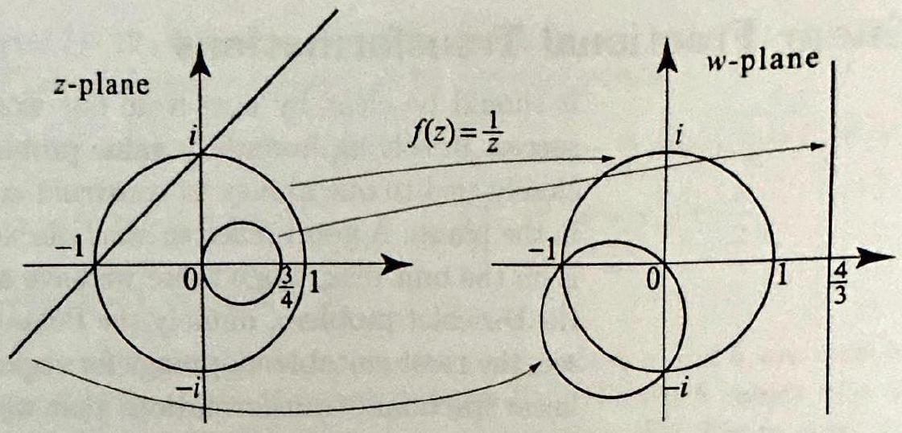

Figure 1 The $f(z)=\frac{1}{z}$ pre collection of lines To verify the ima given lines and the fact that $f$ is (preserves angles) values $f(0)=\infty$; $f( \pm 1)= \pm 1 ; f( \pm i f\left(\frac{3}{4}\right)=\frac{4}{3}$.

PROPO
IMAGES AND

Right margin note (page 10)

lap a
what
ne to
pings,
e 1.)
ight-
rans-
erits
lines
pre-
ry to
ining
plane

ine or cle, it

++++

Conformal Mappings
mappings have a very useful property that is easy to verify: They n line to a line and a circle to a circle. The inversion $w_{2}=\frac{1}{w_{1}}$ has a some similar property: It maps the collection of lines and circles in the $z$-pla the collection of lines and circles in the $w$-plane. (Unlike linear mapI the inversion may map a line to a circle or a circle to a line; see Figur
inversion serves the and circles. iges of the circles, use conformal and the
$$
f(\infty)=0 ;
$$
$$
)=\mp i ;
$$

\section*{SITION 2 DF LINES CIRCLES}

This property of the inversion is not as simple to verify but it is stra forward and is sketched in Exercises 35-40. Since a linear fractional t, formation is a composition of linear mappings and an inversion, it inb this property too. Thus we obtain the following very useful result.
Let $\phi(z)$ be a linear fractional transformation as in (1). Then $\phi$ maps and circles in the $z$-plane to lines and circles in the $w$-plane.

It follows immediately from Proposition 1 and Theorem 2 of the vious section that a linear fractional transformation will map bounda boundary. As we now illustrate, this property is very useful in determ the image of a region.

EXAMPLE 1 Mappings between the unit disk and the upper half-I
(a) Show that the linear fractional transformation
$$
\phi(z)=i \frac{1-z}{1+z}
$$
maps the unit disk onto the upper half-plane.
(b) Show that the linear fractional transformation
$$
\psi(z)=\frac{i-z}{i+z}
$$
maps the upper half-plane onto the unit disk.
Solution (a) By Proposition 2, the image of the circle $C_{1}(0)$ is either a 1 a circle in the $w$-plane. Since three points will determine either a line or cir suffices to check the images of three points on $C_{1}(0)$. We have
$$
\phi(1)=0 ; \quad \phi(i)=i \frac{1-i}{1+i}=1 ; \quad \phi(-i)=i \frac{1+i}{1-i}=-1 .
$$

---

<!-- Page 11 -->

Left margin note (page 11)

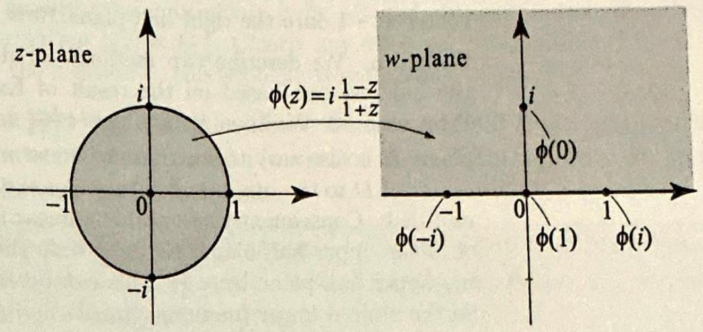

Figure 2 The image unit circle is determin the images of three Since these are collinea circle is therefore mapp a line (the real axis, case). Note also that be $\phi$ maps the closed uni to an unbounded regio upper half-plane), $\phi$ l be discontinuous some in the closed unit disk. it is singular at $z=-1$.

PROPOSITI
COMPOSITION
MAPPI

Right margin note (page 11)

To

++++

Section 6.2 Linear Fractional Transformations
395

Thus $\phi(1), \phi(i)$, and $\phi(-i)$ lie on the $u$-axis (the real axis in the $w$-plane), and so the image of $C_{1}(0)$ is the $u$-axis. Because $\phi$ is one-to-one, it maps the boundary $C_{1}(0)$ onto the boundary of the image of the unit disk. Thus the image of the unit disk is either the upper half-plane or the lower half-plane. Checking $\phi(0)=i$ (a point in the upper half-plane), we conclude that $\phi$ maps the unit disk one-to-one onto the upper half-plane (see Figure 2).
(b) We can do this part in two ways. One way is to use Proposition 1(ii) and notice that $\psi$ is the inverse of $\phi$. Another way is to check the image by $\psi$ of the boundary and one interior point. We leave it as an exercise to verify that $\psi(0)=1, \psi(1)=i$, and $\psi(-1)=-i$. Since the images of the three points are not collinear, we conclude that the real axis is mapped onto the circle that goes through the points $1, i$, and $-i$, which is clearly the unit circle. (Here again, we are using the fact that three points determine a circle.) Also, $\psi(i)=0$; hence $\psi$ maps the upper half-plane onto the unit disk.

Another way to realize that the image of the unit circle is a line in Example $1(a)$ is to consider the point -1 on $C_{1}(0)$ and note that $\lim _{z \rightarrow-1} \phi(z)= \infty$. So the image of $C_{1}(0)$ is not bounded and since it is either a line or a circle, it has to be a line (which tends to infinity). Sometimes it is convenient to express the fact that the limit at the point $z_{0}=-\frac{d}{c}$ is infinity by writing $\phi\left(z_{0}\right)=\infty$. Likewise, it will be convenient to express $\lim _{z \rightarrow \infty} \frac{a z+b}{c z+d}=\frac{a}{c}$ by simply writing $\phi(\infty)=\frac{a}{c}$.

Before we present our next example, let us note another useful propert of linear fractional transformations.

ON 3

The composition of any two linear fractional transformations is again a line

N OF fractional transformation.

NGS

Proof Let $\phi_{1}(z)=\frac{a_{1} z+b_{1}}{c_{1} z+d_{1}}$ and $\phi_{2}(z)=\frac{a_{2} z+b_{2}}{c_{2} z+d_{2}}$. Then
$$
\phi(z)=\phi_{2} \circ \phi_{1}(z)=\frac{a_{2} \frac{a_{1} z+b_{1}}{c_{1} z+d_{1}}+b_{2}}{c_{2} \frac{a_{1} z+b_{1}}{c_{1} z+d_{1}}+d_{2}}
$$

Multiplying numerator and denominator by $c_{1} z+d_{1}$, we get
$$
\phi(z)=\frac{\left(a_{2} a_{1}+b_{2} c_{1}\right) z+a_{2} b_{1}+b_{2} d_{1}}{\left(c_{2} a_{1}+d_{2} c_{1}\right) z+d_{2} c_{1}+d_{2} d_{1}}
$$

---

<!-- Page 12 -->

Left margin note (page 12)

396
Chapter 6
C

Figure 3 To map use the transform

Right margin note (page 12)

nd

with n of halfthe the ps $D$ tate $=-i$.
then
inear the and ary is ick
n we $r$ the From get

++++

onformal Mappings

which is a linear fractional transformation. Notice that when we multiplie $c_{1} z+d_{1}$, we removed the singularity at $z=-\frac{d_{1}}{c_{1}}$; the resulting composition has a single pole, and it is not necessarily at the same location as the poles or $\phi_{2}$.

EXAMPLE 2 Composition of linear fractional transformations
Find a linear fractional transformation that maps the disk $D$ with radius 2 center at -1 onto the right half-plane $\operatorname{Re} w>0$.
Solution We describe two methods for doing this problem. Let us start the quickest one based on the result of Example 1 and a simple applicatio Proposition 3. We know that $\phi(z)=i \frac{1-z}{1+z}$ maps the unit disk onto the upper plane. It is also easy to see that the linear mapping $\tau(z)=\frac{1}{2}(z+1)$ translate center of $D$ to the origin and then scales the radius by $\frac{1}{2}$. Thus $\tau$ maps $D$ ont unit disk. Consequently, $\phi \circ \tau(z)$ is a linear fractional transformation that ma onto the upper half-plane. To map onto the right half-plane, it suffices to rc the upper half-plane by $-\frac{\pi}{2}$. This can be achieved by multiplying by $e^{-i \frac{\pi}{2}}=$ So the desired linear fractional transformation (Figure 3) is
$$
f(z)=-i \phi \circ \tau(z)=(-i) i \frac{1-\frac{1}{2}(z+1)}{1+\frac{1}{2}(z+1)}=\frac{1-z}{3+z}
$$
a disk to a half-plane, it is always advantageous to map the given disk to the unit disk and ation $\phi$ in Example 1.

Another way to do this problem is to start from scratch; we want a 1 fractional transformation $g(z)=\frac{a z+b}{c z+d}$ to map the boundary of the disk ont boundary of the right half-plane. We can pick any three points on the circle $C$ map them to any three points on the imaginary axis. Since our image bounda a line (which extends to infinity), we may map one of our points to $\infty$. We p
$$
g(1)=0, \quad g(-3)=\infty, \quad g(i \sqrt{3})=i .
$$

We use these equations to solve for the coefficients $a, b, c$, and $d$, and the will check whether the interior of the disk is mapped to the right half-plane o left half-plane. Again writing $g(z)=\frac{a z+b}{c z+d}$, from $g(1)=0$ we get $a=-b$. $g(-3)=\infty$ we get $3 c=d$. Thus $g(z)=\frac{a z-a}{c z+3 c}=\frac{a}{c} \frac{z-1}{z+3}$. From $g(i \sqrt{3})=i$ we
$$
i=\frac{a}{c} \frac{i \sqrt{3}-1}{i \sqrt{3}+3} \Rightarrow \frac{a}{c}=i \frac{3+i \sqrt{3}}{-1+i \sqrt{3}}=\sqrt{3}
$$

---

<!-- Page 13 -->

Left margin note (page 13)

PROPOSITIO AN IMPLIC FORMU

PROPOSITION MAPPING A PON TO INFINI?

++++

Section 6.2 Linear Fractional Transformations
397

Then $g(z)=\sqrt{3} \frac{z-1}{z+3}$ will map the circle $C$ onto the $y$-axis. Note that any function of the form $\alpha g(z)$, where $\alpha \neq 0$ is real, will also map the circle $C$ onto the $y$ axis, since multiplying by a nonzero real constant leaves a line through the origin unchanged. So for simplicity we divide by $\sqrt{3}$, still calling the function $g$, and obtain a mapping $g(z)=\frac{z-1}{z+3}$ of the circle $C$ onto the $y$-axis. Does $g(z)$ take the region inside $C$ onto the right half-plane? We check the image of one point inside $C$, say -1 , and find $g(-1)=\frac{-2}{2}=-1$, which is a point in the left half-plane. So we modify $g$ by multiplying it by -1 and obtain the desired linear fractional transformation $g(z)=\frac{1-z}{3+z}$. Clearly any other positive multiple of $g$ will also work, and so the solution to this problem is not unique.

The previous examples illustrate how a linear fractional transformation can be determined from the images of three distinct points. In fact, we have the following useful formula.

N 4

There is a unique linear fractional transformation $w=\phi(z)$ that maps three

CIT distinct points $z_{1}, z_{2}$, and $z_{3}$ onto three distinct points $w_{1}, w_{2}$, and $w_{3}$. The

LA mapping $w$ is implicitly given by
$$
\frac{z-z_{1}}{z-z_{3}} \frac{z_{2}-z_{3}}{z_{2}-z_{1}}=\frac{w-w_{1}}{w-w_{3}} \frac{w_{2}-w_{3}}{w_{2}-w_{1}} .
$$

Proof That $w$ is a linear fractional transformation follows by solving for $w$ in (4). To see that $w$ maps $z_{j}$ to $w_{j}(\mathrm{j}=1,2,3)$ it suffices to note that (4) holds if we replace $z$ by $z_{j}$ and $w$ by $w_{j}$. (For $j=3$, you must take reciprocals in (4) before replacing $z$ by $z_{3}$ and $w$ by $w_{3}$.) The uniqueness part is done in Exercises 9-10.

To map a circle onto a line by a linear fractional transformation, as we saw in Example 2, this can be achieved by requiring that $f(z)=\infty$ for some $z$ on the circle. In this case, the formula in Proposition 4 can be simplified as follows. Say you want $f\left(z_{3}\right)=\infty$. As $w_{3} \rightarrow \infty$, the fraction $\frac{w_{2}-w_{3}}{w-w_{3}}=\frac{1-w_{2} / w_{3}}{1-w / w_{3}} \rightarrow 1$. This suggests that we set $\frac{w_{2}-w_{3}}{w-w_{3}}=1$ on the right side of (4), obtaining the following formula whose verification is left to Exercise 11.

N 5

Let $z_{1}, z_{2}$, and $z_{3}$ be three distinct points. There is a unique linear fractional

NT transformation $w=\phi(z)$ that maps $z_{1}$ and $z_{2}$ onto two distinct points $w_{1}$

ГY and $w_{2}$, and maps $z_{3}$ to $\infty$. The mapping $w$ is implicitly given by
$$
\frac{z-z_{1}}{z-z_{3}} \frac{z_{2}-z_{3}}{z_{2}-z_{1}}=\frac{w-w_{1}}{w_{2}-w_{1}}
$$

There is also a corresponding identity for a linear fractional transformation mapping $\infty$ to a point, obtained by reversing the roles of $z$ and $w$ in (5) (see Exercise 11). Our next example uses the conformal property of linear fractional transformations.

---

<!-- Page 14 -->

Left margin note (page 14)

398
Chapter 6

Figure 4 A len gion.

Figure 5 Two circles $C_{1}$ and $C$

Right margin note (page 14)

v-plane

2, and
their
tween
of $C_{1}$
action
maps
ne this
) $=i$.
serves
jual to
"
apac-
unded
prob-
to an
here is
before
ple to
rcises.
isks in
oduced
hus $\phi_{a}$
undary
maps
ill map
e image

++++

Conformal Mappings
EXAMPLE 3 Mapping of a lens-shaped region
The lens-shaped region $\Omega$ in Figure 4 is bounded by the arcs of two circles.
(a) Use a linear fractional transformation $\phi$ to map $\Omega$ onto a sector in the $u$ in such a way that
s-shaped re-
$$
\phi(-2)=0, \quad \phi(-i)=1, \quad \phi(2)=\infty .
$$
(b) Determine the angle between the circles at the point -2 .

Solution (a) We apply (5) with $z_{1}=-2, w_{1}=0, z_{2}=-i, w_{2}=1, z_{3}=$ get
$$
\frac{z+2}{z-2} \frac{-i-2}{-i+2}=\frac{w}{1} \Rightarrow w=\phi(z)=\frac{2+i}{2-i} \frac{2+z}{2-z} .
$$
(b) Of course we can determine the angle between $C_{1}$ and $C_{2}$ by finding equations, then the slopes of the tangent lines at -2 , and then the angle be the tangent lines. A better way is to calculate the angle between the images and $C_{2}$ and use the conformal property of $\phi$.

Because $\phi$ takes lines and circles to lines and circles, it is clear from its on the points $-2,-i$ and 2 that $\phi$ maps the circle $C_{1}$ onto the $u$-axis. It also the circle $C_{2}$ onto a line that goes through the point $\phi(-2)=0$. To determin line, it suffices to check the image of another point on $C_{2}$. We have $\phi\left(\frac{2}{3} i\right.$ Thus $\phi$ maps $C_{2}$ onto the $v$-axis. Because $\phi$ is conformal at $z=-2$, it pre the angles at this point. Thus, the angle between the circles at $z=-2$ is eq the angle between their images, the $u$ - and $v$-axes, which is clearly $\frac{\pi}{2}$.

Some applications concerning the electrostatic potential inside a itor formed by two cylinders lead to Dirichlet problems in regions bo by two circles in the plane, which are not necessarily concentric. The lems are easier to solve when the two circles are concentric, giving rise annular region. (See for examples the exercises of Section 2.5.) Thus t] a great advantage in using a conformal mapping to center the circles solving the Dirichlet problem. In what follows, we use a specific exam illustrate this process. More general examples are presented in the exe

Example 4 Centering disks
Find a one-to-one analytic mapping that maps the region between the Figure 5 to an annular region bounded by two concentric circles.
Solution The idea is to use one of the linear fractional transformations
$$
\phi_{\alpha}(z)=\frac{z-\alpha}{1-\bar{\alpha} z}
$$
where $\alpha$ is a complex number such that $|\alpha|<1$. These functions were intr in Example 3, Section 3.7, where it was shown that $\left|\phi_{\alpha}(z)\right|=1$ if $|z|=1$. T maps the unit circle onto the unit circle. Because $\phi_{\alpha}$ maps boundary to bo and because $\phi_{\alpha}(0)=-\alpha$ (a point inside the unit disk), we conclude that $\phi$. the unit disk onto itself. Since $\phi_{\alpha}$ is a linear fractional transformation, it w the circle $C_{1}$ onto a circle or a line, but because the image has to be inside th

---

<!-- Page 15 -->

Left margin note (page 15)

Figure 6 For all $|\alpha|< o_{\mathrm{a}}(z)$ maps the unit circle onto itself. But for one s cial value of $\alpha$, with $|\alpha|< \phi_{a}$ will also map the circle onto a circle centered at origin, thus centering the ages of $C_{1}$ and $C_{2}$.

++++

Section 6.2 Linear Fractional Transformations
399

of the unit disk, it follows that $\phi\left[C_{1}\right]$ is bounded and hence it must be a circle. We now ask the following question: Can we find $\alpha$ so that $\phi_{\alpha}\left[C_{1}\right]$ is a circle centered at the origin? Suppose for a moment that $\alpha$ were real. Then clearly $\phi_{\alpha}(x)$ is also real, and so $\phi_{\alpha}$ maps the real line to the real line. Note that $\phi_{\alpha}(1 / 7)$ and $\phi_{\alpha}(1 / 2)$ are the points where $\phi_{\alpha}\left[C_{1}\right]$ meets the $u$-axis. Also, the circle $\phi_{\alpha}\left[C_{1}\right]$ must meet the $u$-axis in a perpendicular fashion (Figure 6), for the following three reasons:
(i) $C_{1}$ itself meets the real axis in a perpendicular fashion;
(ii) the $x$-axis is mapped to the $u$-axis; and
(iii) the map $\phi_{\alpha}$ is conformal.

1,
$C_{2}$
pe-
1,
$C_{1}$
the
im-

So if we want $\phi_{\alpha}\left[C_{1}\right]$ to be a circle centered at the origin, it is enough to require that $\phi_{\alpha}(1 / 7)=-\phi_{\alpha}(1 / 2)$. This implies that
$$
\frac{\frac{1}{7}-\alpha}{-\frac{\alpha}{7}+1}=-\frac{\frac{1}{2}-\alpha}{-\frac{\alpha}{2}+1} \Rightarrow \frac{1-7 \alpha}{7-\alpha}=-\frac{1-2 \alpha}{2-\alpha} \Rightarrow 9 \alpha^{2}-30 \alpha+9=0
$$

The last equation in $\alpha$ is equivalent to $3 \alpha^{2}-10 \alpha+3=0$, with solutions
$$
\alpha=\frac{5 \pm \sqrt{16}}{3}=\frac{5 \pm 4}{3} \Rightarrow \alpha=3 \text { or } \alpha=\frac{1}{3} .
$$

Since we want $|\alpha|<1$, we take $\alpha=\frac{1}{3}$. Thus
$$
\phi(z)=\phi_{\frac{1}{3}}(z)=\frac{z-\frac{1}{3}}{-\frac{1}{3} z+1}=\frac{3 z-1}{3-z}
$$
will map $C_{2}$ onto $C_{2}$ and $C_{1}$ onto the circle with center at the origin and radius $r=|\phi(1 / 2)|=\frac{\frac{3}{2}-1}{3-\frac{1}{2}}=\frac{1}{5}$.

Composing Elementary Mappings
As the title indicates, we will compose together elementary mappings that we have studied thus far and construct some nontrivial conformal mappings of regions in the plane. We give four examples to illustrate this important process.

---

<!-- Page 16 -->

Left margin note (page 16)

400
Chapter 6

Figure 7 Mappi which preserved where the angle

Right margin note (page 16)

region of oing that
ped onto no longer ormation nit disk. rest. So trated in
$w$-plane
point -2, e point 0 ,
onto the
erms of $z$
is-shaped
s:

++++

Conformal Mappings

EXAMPLE 5 Mapping a lens onto a disk
Construct a sequence of analytic functions that maps the lens-shaped Example 3 in a one-to-one way onto the unit disk. Write down the mapt results from your construction.
Solution The first step is to use the function of Example 3,
$$
w_{1}=\phi(z)=\frac{2+i}{2-i} \frac{2+z}{2-z}=\alpha \frac{2+z}{2-z} \quad\left(\alpha=\frac{2+i}{2-i}\right),
$$
which maps the lens to the first quadrant. The first quadrant is then map the upper half-plane by the function $w_{2}=w_{1}^{2}$. (Note that our mapping is a linear fractional transformation.) Finally, the linear fractional transf $w=\psi\left(w_{2}\right)$ in Example 1(ii) will take the upper half-plane onto the Each of these mappings is analytic and one-to-one on the region of inte the resulting function is analytic and one-to-one. The mapping is illus Figure 7.
ng a lens onto the unit disk. Note the conformal property in the first mapping at the the right angle. Note the failure of the conformal property in the second mapping at th is doubled.

The explicit formula in terms of $z$ of the conformal mapping of the lens unit disk is
$$
w=\frac{i-w_{2}}{i+w_{2}}=\frac{i-w_{1}^{2}}{i+w_{1}^{2}}=\frac{i-[\phi(z)]^{2}}{i+[\phi(z)]^{2}}
$$
where $\phi(z)=\frac{2+i}{2-i} \frac{2+z}{2-z}$ from Example 3. Replacing $\phi(z)$ by its value in t and simplifying (by hand or with the help of a computer system), we get
$$
w=f(z)=-i \frac{4-28 i z+z^{2}}{28+4 i z+7 z^{2}}
$$

The following values of $w$ confirm the fact that the mapping takes the le region onto the unit disk, also taking boundary points to boundary point
$$
f(0)=-\frac{i}{7}, \quad f(-2)=1, \quad f\left(\frac{2}{3} i\right)=-i, \quad f(-i)=i
$$

---

<!-- Page 17 -->

Left margin note (page 17)

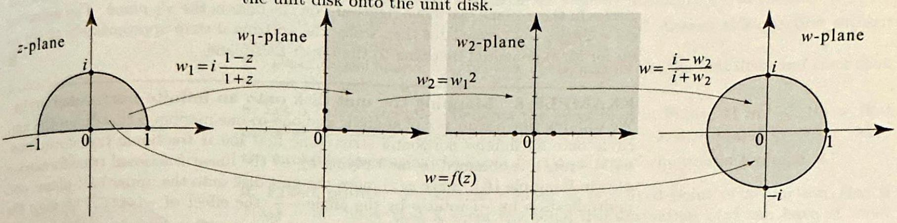

Figure 8 Mapping the $u$

Figure 9 Mapping a cresc

++++

Section 6.2 Linear Fractional Transformations
401

EXAMPLE 6 Mapping a half-disk onto a disk
The sequence of one-to-one analytic mappings in Figure 8 takes the upper half of the unit disk onto the unit disk.
pper half of the unit disk onto the unit disk.
The first mapping is the linear fractional transformation $w_{1}=\phi(z)=i \frac{1-z}{1+z}$ from Example 1. It takes the unit disk onto the upper half-plane. It also takes the upper half-disk onto the first quadrant, as can be verified by using the conformality at $z=1$ and checking the image of one interior point, say $\phi\left(\frac{i}{2}\right)=\frac{4}{5}+i \frac{3}{5}$, which is in the first quadrant. The action of the second mapping is clear. The third mapping is the mapping $\psi$ from Example 1(ii). The explicit formula of the final mapping $w=f(z)$ is
$$
w=\psi\left(w_{2}\right)=\frac{i-w_{2}}{i+w_{2}}=\frac{i-w_{1}^{2}}{i+w_{1}^{2}}=\frac{i-\left(i \frac{1-z}{1+z}\right)^{2}}{i+\left(i \frac{1-z}{1+z}\right)^{2}}=-i \frac{1+2 i z+z^{2}}{1-2 i z+z^{2}}
$$

The intermediary mapping $w_{2}=w_{1}^{2}=-\left(\frac{1-z}{1+z}\right)^{2}$ is also of interest. It takes the upper half-disk onto the upper half-plane.

EXAMPLE 7 A crescent-shaped region onto the upper half-plane The crescent-shaped region in Figure 9 is bounded by two circles that intersect at angle 0 at the origin. We will describe a sequence of one-to-one analytic mappings that takes this region onto the upper half-plane.
ent onto the upper half-plane.
The first mapping $w_{1}=-\frac{1}{z}$, being conformal at $z=i$ and $z=2 i$, will preserve the right angles at these points. Since it maps the imaginary axis onto the imaginary

---

<!-- Page 18 -->

Left margin note (page 18)

402
Chapter 6

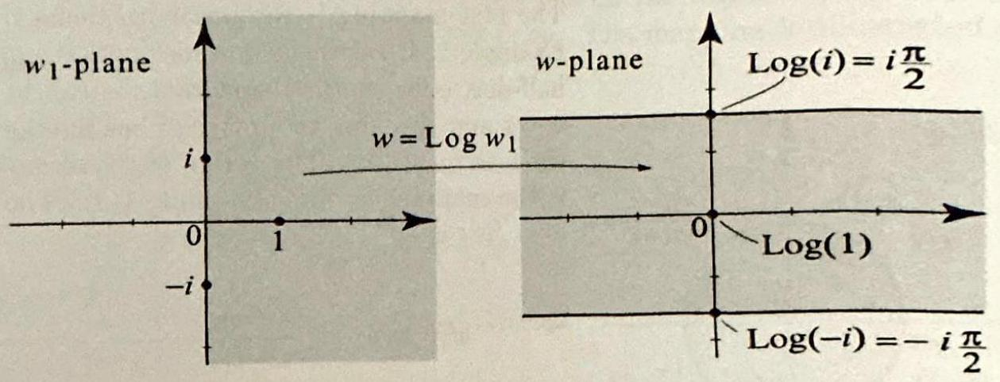

Figure 10 Th branch of the $\log z$, maps half-plane onto horizontal strip.

Right margin note (page 18)

that
varallel
nd the
apping
set us
"

trip e unit ation, ration $e$, and ip the

$i \frac{\pi}{2}$

rithm. which lesired
$d$ three he line of the y lines

++++

Conformal Mappings
axis, and 0 to $\infty$, consequently it will map the two circles onto two line intersect the imaginary axis at right angle. Thus the images of the circles are p horizontal lines as shown in the figure. As we move counterclockwise arou circles in the $z$-plane, we move right ward on the lines in the $w_{1}$-plane. The ma $w_{2}=2 \pi\left(w_{1}-\frac{1}{2}\right)$ translates then scales the horizontal strip appropriately to up for an exponential mapping to the upper half-plane.

EXAMPLE 8 Mapping the unit disk onto an infinite horizontal s We will describe a sequence of analytic and one-to-one mappings that takes th circle onto an infinite horizontal strip. The first linear fractional transform $w_{1}=-i \phi(z)$, is obtained by multiplying by $-i$ the linear fractional transform $\phi(z)$ in Example 1(i). Since $\phi(z)$ maps the unit disk onto the upper half-plan multiplication by $-i$ rotates by the angle $-\frac{\pi}{2}$, the effect of $-i \phi(z)$ is to ma unit disk onto the right half-plane.
e principal logarithm, the right an infinite

In Figure 10, $\log w_{1}=\ln \left|w_{1}\right|+i \operatorname{Arg} w_{1}$ is the principal branch of the loga As $w_{1}$ varies in the right half-plane, $\operatorname{Arg} w_{1}$ varies between $-\frac{\pi}{2}$ and $\frac{\pi}{2}$, explains the location of the horizontal boundary of the infinite strip. The mapping is
$$
w=f(z)=\log (-i \phi(z))=\log \frac{1-z}{1+z}
$$

Exercises 6.2
In Exercises 1-4, you are given a linear fractional transformation $\phi(z)$ an points $z_{1}, z_{2}$, and $z_{3}$. Let $L_{1}$ denote the line through $z_{1}$ and $z_{2}$ and $L_{2} t$ through $z_{2}$ and $z_{3}$. In each case, (a) compute the images $w_{1}, w_{2}$, and $w_{3}$ points $z_{1}, z_{2}$, and $z_{3}$. (b) Describe the images by $\phi$ of $L_{1}$ and $L_{2}$. Are the or circles? (You will need the images of three points on each line.)
1. $\phi(z)=i \frac{1-z}{1+z}, z_{1}=1, z_{2}=0, z_{3}=i$.
2. $\phi(z)=\frac{i+z}{i-z}, z_{1}=1+i, z_{2}=0, z_{3}=i$.
3. $\phi(z)=\frac{1+i-2 z}{i-i z}, z_{1}=i, z_{2}=1, z_{3}=-i$.
4. $\phi(z)=\frac{1+2 z}{i-(1+i) z}, z_{1}=1+i, z_{2}=1, z_{3}=1-i$.

---

<!-- Page 19 -->

Left margin note (page 19)

Figure 11 For Exercis

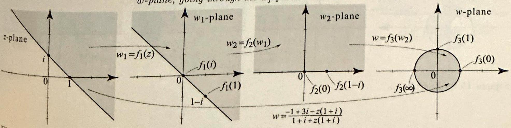

Figure 12 for Exercise 12

++++

Section 6.2 Linear Fractional Transformations
5. Find the inverse $\psi$ of the linear fractional transformation in Exercise 1, verify that $\psi$ maps $w_{1}, w_{2}$, and $w_{3}$ to $z_{1}, z_{2}$, and $z_{3}$.
6. Repeat Exercise 5 with the linear fractional transformation of Exercise 2.
7. (a) What is the inverse of the function $f(z)=\frac{1}{z}$ ? Answer this question with using (2), then verify your answer using (2).
(b) Describe the images by $f(z)=\frac{1}{z}$ of the unit circle, the unit disk, and the req outside the unit circle.
8. Let $\alpha$ denote the angle between the two circles in Figure 11 at -2 . Show $\tan \alpha=\frac{4(a+1)(a-4)}{3(a+6)\left(a-\frac{2}{3}\right)}$. Discuss the cases when $a=-1,4,-6$, and $\frac{2}{3}$. [Hint: N the circles to lines using the linear fractional transformation in Example 3.]
9. Fixed points. Recall that a point $z_{0}$ is a fixed point of a function $f(z f\left(z_{0}\right)=z_{0}$. Show that a linear fractional transformation $\phi(z)$ can have at m two fixed points in the complex plane, unless $\phi(z)=z$, in which case all points fixed points. [Hint: Discuss all possible solutions of $z=\frac{a z+b}{c z+d}$.]
10. Uniqueness of a linear fractional transformation. Let $z_{1}, z_{2}$, and be three distinct points, and let $w_{1}, w_{2}$, and $w_{3}$ be three distinct points (we all

8. $\infty$ ). Show that there is a unique linear fractional transformation mapping $z_{j}$ to [Hint: The existence is guaranteed by Propositions 4 and 5. To prove uniquene suppose that $f$ and $g$ are two linear fractional transformations mapping $z_{j}$ to 2 Apply the result of Exercise 9 to $f \circ g^{-1}$. How many fixed points does $f \circ g^{-1}$ hav
11. (a) Mapping a point to infinity. Prove Proposition 5.
(b) Mapping infinity to a point. Let $z_{1}$ and $z_{2}$ be two distinct points, a $w_{1}, w_{2}, w_{3}$ be three distinct points. Show that there is a unique linear fractior transformation $w=\phi(z)$ that maps $z_{1}$ to $w_{1}, z_{2}$ to $w_{2}$ and $\infty$ to $w_{3}$. The mappi $w$ is implicitly given by
$$
\frac{z-z_{1}}{z_{2}-z_{1}}=\frac{w-w_{1}}{w-w_{3}} \frac{w_{2}-w_{3}}{w_{2}-w_{1}} .
$$

In Exercises 12-24, (a) supply the formulas of the analytic mappings in each quence of mappings shown in the accompanying figure (Figures 12-24). (b) Ver that the boundary and the interior of the shaded regions are mapped to the boun ary and interior of the shaded regions. (c) Derive the given formula for the fir composite mapping $w=f(z)$. As usual, we start in the $z$-plane and end in $t w$-plane, going through the $w_{j}$-planes.

---

<!-- Page 20 -->

Left margin note (page 20)

404
Chapter 6

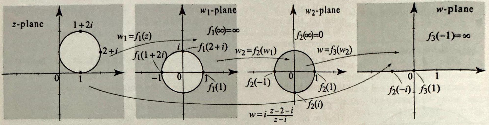

Figure 13 for Exe

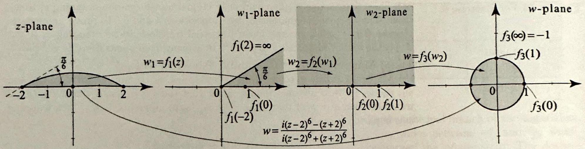

Figure 14 for Ex

Figure 15 for E:

Right margin note (page 20)

ane
$=\infty$

⟶
lane
0)
ane
$\sqrt{3}_{3}(0)$

++++

Conformal Mappings
ercise 14.
xercise 15.

---

<!-- Page 21 -->

Left margin note (page 21)

Figure 16 for Exercise 16.

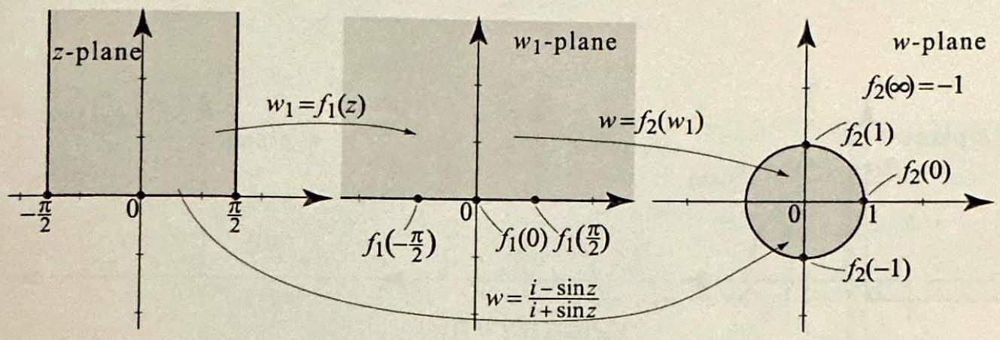

Figure 17 for Exercise 17.

Figure 18 for Exercise 18.

++++

Section 6.2 Linear Fractional Transformations
405

---

<!-- Page 22 -->

Left margin note (page 22)

406
Chapter 6
C
$z-$
-2
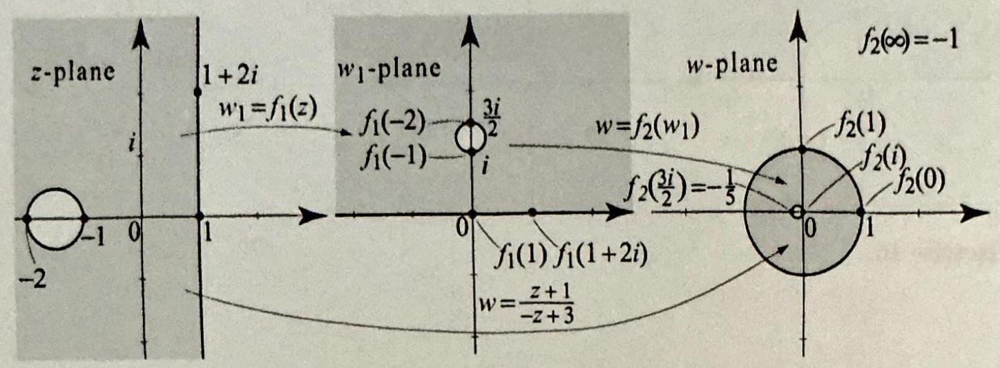

Figure 19 for Exe
$z$

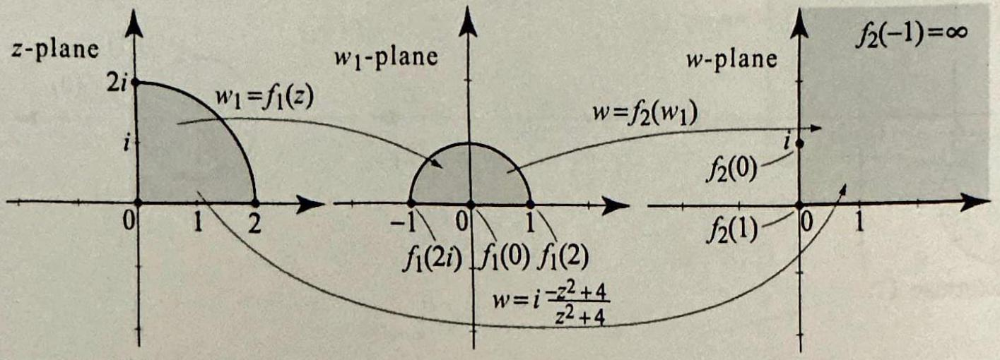

Figure 20 for Ex

2

Figure 21 for E

++++

onformal Mappings
rcise 19.
ercise 20.
xercise 21.

---

<!-- Page 23 -->

Left margin note (page 23)

$z$-pla
-1

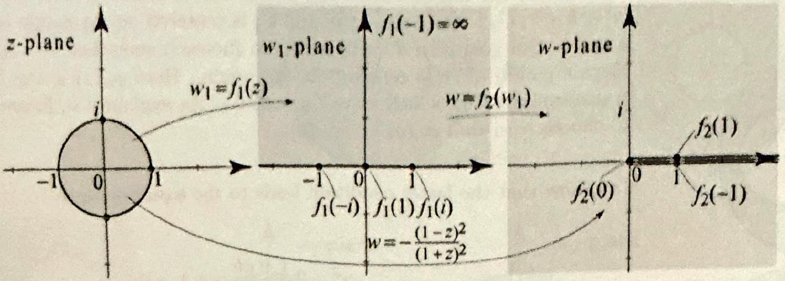

Figure 22 for Exerci
$$
z \text {-pla }
$$

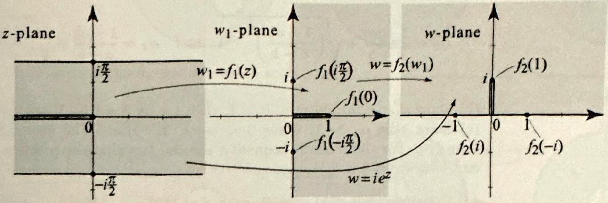

Figure 23 for Exerci

Figure 24 for Exercis

++++

Section 6.2 Linear Fractional Transformations
4
se 22.
se 23.
24.

---

<!-- Page 24 -->

Left margin note (page 24)

408
Chapter 6

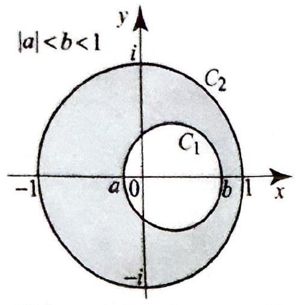

Figure 25 for E

Figure 26 fo
Take $a=-\frac{1}{4} a$

Right margin note (page 24)

Examh that g , and where rcepts $\phi_{\alpha}(z)$ tional uffices
1.
$-b)$.]
follows oots of

2 onto region circle.
shaded nto an Refer to the

++++

Conformal Mappings
25. Project Problem: Centering disks. We generalize the process in ple 4 to any region bounded by two non-intersecting circles, $C_{2}$ and $C_{1}$, suc $C_{1}$ is in the interior of $C_{2}$. By translating the center of $C_{1}$ to the origin, scalin rotating, we can always reduce the picture to the one described in Figure 25, $|a|<b<1, C_{2}$ is the unit circle, and $C_{1}$ is centered on the $x$-axis with $x$-inte $a$ and $b$. Our goal is to show that we can choose $\alpha$ such that $-1<\alpha<1$ and maps $C_{1}$ onto a circle centered at the origin. Here $\phi_{\alpha}(z)$ is the linear frac transformation (6), which maps $C_{2}$ onto $C_{2}$. As explained in Example 4, it s to choose $\alpha$ so that $\phi_{\alpha}(a)=-\phi_{\alpha}(b)$.
(a) Show that the latter condition leads to the equation in $\alpha$ :
$$
\alpha^{2}-2 \frac{1+a b}{a+b} \alpha+1=0,
$$
with roots
$$
\alpha_{1}=\frac{1+a b}{a+b}+\sqrt{\left(\frac{1+a b}{a+b}\right)^{2}-1} \quad \text { and } \quad \alpha_{2}=\frac{1+a b}{a+b}-\sqrt{\left(\frac{1+a b}{a+b}\right)^{2}}-
$$
(b) Show that if $|a|<1$ and $|b|<1$, then $1+a b \geq a+b$. [Hint: $1-b \geq a$ (1
(c) Show that $\alpha_{1}>1$, while $0<\alpha_{2}<1$. [Hint: The first inequality from (b). For the second inequality, use the fact that the product of the $\mathbf{r} a x^{2}+b x+c=0$ is $\frac{c}{a}$.]
(d) Conclude that $\phi(z)=\frac{z-\alpha}{1-\alpha z}$ with $\alpha=\frac{1+a b}{a+b}-\sqrt{\left(\frac{1+a b}{a+b}\right)^{2}-1}$ will map $C$
$C_{2}, C_{1}$ onto a circle centered at the origin with radius $r=\phi(b)$, and the between $C_{2}$ and $C_{1}$ onto the annular region bounded by $\phi\left[C_{1}\right]$ and the unit
In Exercises 26-29, derive the linear fractional transformation that maps the region between the two given circles (or circle and line in Exercise 29) o annular region centered at the origin (see the accompanying Figures 26-29) to Exercise 25 for instructions. In Exercises 28-29, you need to reduce situation described in Exercise 25.

Exercise 26.
nd $b=\frac{7}{8}$.

---

<!-- Page 25 -->

Left margin note (page 25)

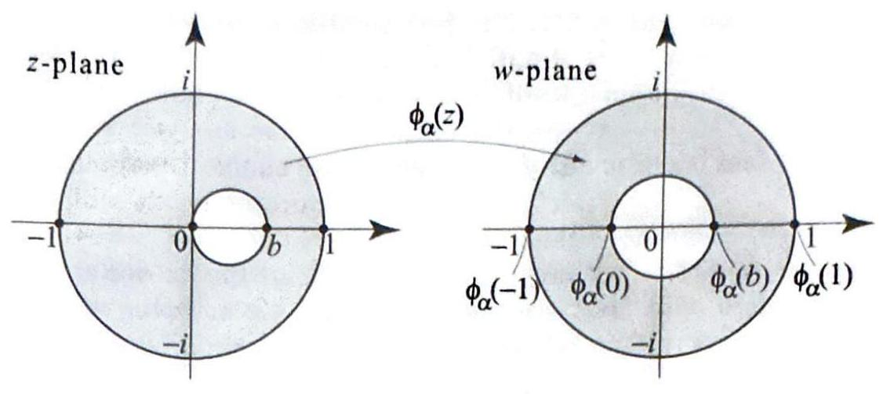

Figure 27 for Exerc Take $a=0$ and $b=\frac{8}{17}$

Figure 28 for Exercise

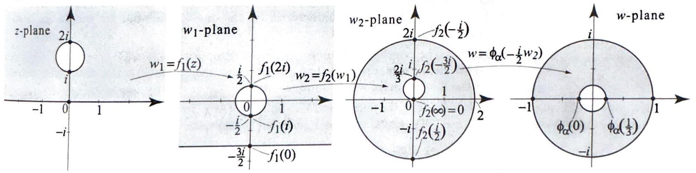

Figure 29 for Exercise then scale the outer rad

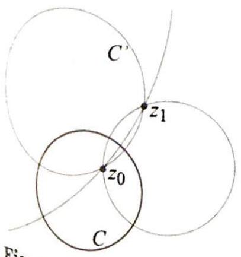

Right margin note (page 25)

gog
$A$
9
$\% 0 \%$, 90

++++

Section 6.2 Linear Fractional Transformations

ise 27 .
28. (The figures are not to scale.)
29. [Hint: In the last step, start by rotating the inner circle to center it on the real ax ius to 1 .]
30. A geometric problem. The following is an interesting illustration of th use of linear fractional transformations to prove geometric facts. Consider a circle and a point $z_{0}$ inside $C$ (Figure 30). We will show that all the circles $C^{\prime}$ through that intersect $C$ at right angle, also intersect at a common point $z_{1}$ as in Figure 3 The point $z_{1}$ is called the reflection of $z_{0}$ in $C$. We also say that $z_{0}$ and $z_{1}$ a symmetric with respect to $C$.
(a) There exists a linear fractional transformation $\phi$ that maps $C$ to the real ax and the interior of $C$ to the upper half-plane. Show that $\phi\left[C^{\prime}\right]$ is a circle or a lir that intersects the real axis at a right angle.
(b) Conclude that $\phi\left[C^{\prime}\right]$ passes through the point $-\phi\left(z_{0}\right)$. Setting $z_{1}=\phi^{-1}\left(-\phi\left(z_{0}\right.\right.$ we see that $C$ passes through $z_{1}$.

---

<!-- Page 26 -->

Left margin note (page 26)

410
Chapter 6
Co

Right margin note (page 26)

onto onto hese t is, here arz's
0) $\circ g$ can will
hout also nma and pply
ings $\phi_{\alpha}$ the ange
lane the
ation
tions $S T$
cises and
an be

can

++++

nformal Mappings
31. Project problem: one-to-one analytic mappings of the unit disk itself. Let $\phi_{\alpha}(z)$ be as in (6). We know that $\phi_{\alpha}(z)$ maps the unit disk $D$ itself. In this exercise, we show that, up to a unimodular constant multiple, are the only one-to-one analytic mappings of the unit disk onto itself. Tha if $f$ is a one-to-one analytic mapping of $D$ onto $D$, then $f(z)=c \phi_{\alpha}(z)$, w $|c|=1$. This important result will be obtained as a consequence of Schw lemma (Section 3.7).
(a) Suppose that $g$ is a one-to-one mapping of $D$ onto itself. Show that $f=\phi_{g}$ is a one-to-one analytic mapping of $D$ onto itself such that $f(0)=0$. If we show that $f$ is of the desired form, then because $g=\phi_{g(0)}^{-1} \circ f=\phi_{-g(0)} \circ f$, it follow that $g$ is of the desired form.
(b) Suppose that $g$ is a one-to-one mapping of $D$ onto itself. By (a), we may witl loss of generality assume that $g(0)=0$. Show that the inverse of $g, g^{-1}$, is analytic, one-to-one, and maps $D$ onto $D$ and $g^{-1}(0)=0$. Apply Schwarz's len to $g$ and obtain $|g(z)| \leq|z|$. Apply Schwarz's lemma to $g^{-1}$ at the point $g(z)$ obtain $\left|g^{-1}(g(z))\right| \leq|g(z)|$, or, equivalently, $|z| \leq|g(z)|$. Hence $|g(z)|=|z|$. A Schwarz's lemma again and conclude that $g(z)=c z$, where $|c|=1$.
32. Suppose that $\Omega$ is a region and $f$ and $g$ are two analytic one-to-one mapp of $\Omega$ onto the unit disk $D$. Show that there is a linear fractional transformation of the form (6) such that $f(z)=c \phi_{\alpha} \circ g(z)$, where $|c|=1$. This shows that all one-to-one mappings of a region $\Omega$ onto the unit disk are the same up to a cha of variables effectuated by a linear fractional transformation of the form (6).
33. (a) Characterize all the one-to-one analytic mappings of the upper half-p onto the unit disk. (b) Characterize all the one-to-one analytic mappings of upper half-plane onto itself.
34. Matrix correspondence. (a) Prove Proposition 3.
(b) We define a mapping $\Phi$ that associates to each linear fractional transforma
(1) the $2 \times 2$ matrix with complex entries
$$
S=\left(\begin{array}{ll}
a & b \\
c & d
\end{array}\right) .
$$

Thus $\Phi(\phi)=S$. Suppose that $\phi$ and $\psi$ are two linear fractional transforma with matrices $\Phi(\phi)=S$ and $\Phi(\psi)=T$. Show that the $\Phi(\phi \circ \psi)=S T$, wher denotes the product of the two matrices $S$ and $T$.
Project Problem: Lines and circles under inversion, part I. In Exer 35-37 we will show that the function $f(z)=\frac{1}{2}$ maps lines and circles to lines circles.
35. (a) Show that with $w=u+i v$ and $z=x+i y$, the mapping $w=1 / z$ written as $u(x, y)=\frac{x}{x^{2}+y^{2}}, v(x, y)=-\frac{y}{x^{2}+y^{2}}$.
(b) Deduce that the inverse transformation $z=1 / w$ is given by
$$
x(u, v)=\frac{u}{u^{2}+v^{2}}, \quad y(u, v)=-\frac{v}{u^{2}+v^{2}}
$$
36. (a) Show that any circle of the form $\left(x-x_{0}\right)^{2}+\left(y-y_{0}\right)^{2}=r^{2}, r>$ be written in the form
$$
A\left(x^{2}+y^{2}\right)+B x+C y+D=0, \text { where } B^{2}+C^{2}-4 A D>0 .
$$

---

<!-- Page 27 -->

Left margin note (page 27)

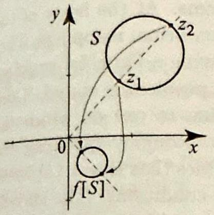

Figure 31 For Exerc Note that $S$ and $f[S]$ a ted in the same plane.

Figure 32 For Exerc Note that $S$ and $f[S]$ an ted in the same plane.

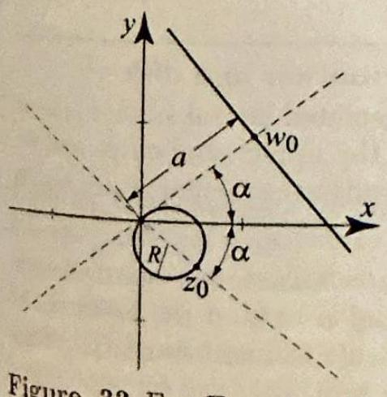

Figure 33 For Exerci Note that $S$ and $f[S]$ are ted in the same plane.

Right margin note (page 27)

411
with
or
0.

and (9), ing n of xerthe xer-
how uli, rened the the the nes
the the hat igh
ine aps ach $R$ to
ify nain nal

++++

Section 6.2 Linear Fractional Transformations
(b) Show that any line in the plane can be written in the form (9).
(c) Show that any set of points satisfying $A\left(x^{2}+y^{2}\right)+B x+C y+D=0 B^{2}+C^{2}-4 A D>0$ is either a circle or a line depending on whether $A=$
$)_{\vec{x}}^{z_{2}}$
ise 38.
re plot-
) $=\frac{1}{z}$
S]
ise 39 .
e plot-

se 40.
plot-
$A \neq 0$.
(d) Show that such circles or lines pass through the origin if and only if $D=$
37. Suppose a set $S$ is given as those points ( $x, y$ ) satisfying (9). Use (8) conclude that points $(u, v)$ in $f[S]$ satisfy an equation of the same form as including the associated constant inequality. Conclude that under the mapt $f(z)=1 / z$ lines and circles are mapped to lines and circles, with the exceptio the origin.
Project Problem: Lines and circles under inversion, part II. In E cises $38-41$, we investigate how specific lines and circles are mapped under function $f(z)=\frac{1}{z}$ and describe a quick method to obtain the images. These $e$ cises depend on Exercises 35-47, and in particular, (8) and (9).
38. (a) Suppose that $S$ is a circle that does not pass through the origin. that $f[S]$ is also a circle that does not pass through the origin.
(b) Let $z_{1}$ and $z_{2}$ denote the points in $S$ with the smallest and largest mod respectively. Show that $f\left(z_{1}\right)$ and $f\left(z_{2}\right)$ have the largest and smallest moduli, spectively, of those points in $f[S]$. Argue that the circle $f[S]$ is uniquely determi by these two points $f\left(z_{1}\right)$ and $f\left(z_{2}\right)$ (see Figure 31; $S$ and $f[S]$ are plotted on same plane).
39. (a) Suppose $S$ is a line that passes through the origin. Show that with exception of mapping to and from the origin, $f[S]$ is also a line passing through origin.
(b) Argue that the image $f\left(z_{0}\right)$ of any nonzero point $z_{0}$ in $S$ uniquely determi the line $f[S]$ (see Figure 32).
40. (a) Suppose $S$ is a circle that passes through the origin. Show that with exception of mapping from the origin, $f[S]$ is a line that does not pass through origin.
(b) Suppose that $S$ is a line which does not pass through the origin. Show t] with the exception of mapping to the origin, $f[S]$ is a circle that passes throu the origin.
(c) Let $S$ be a circle that passes through the origin and $f[S]$ be the associated 1 that does not. Show that the point $z_{0}$ of maximum modulus on the circle m: to the point $w_{0}$ of minimum modulus on the line, and vice versa. Argue that e of these points uniquely determines the corresponding circle or line. If we let denote the radius of the circle and $a$ the perpendicular distance from the origin the line, show that $2 R=\frac{1}{a}$ (see Figure 33).
41. Lines and circles under linear fractional transformations. (a) that every linear fractional transformation is a composition of a linear transfor tion, followed by an inversion, followed by a linear transformation, as described the section.
(b) Using part (a) and the result of Exercise 37, show that any linear fractio transformation maps lines and circles to lines and circles.

---

<!-- Page 28 -->

Left margin note (page 28)

412
Chapter 6
6.3
Solvin

Right margin note (page 28)

2.5, of the Thepblem Conh the g, the lace's iccess ecific on inon of
stant We angle sative nding cuts.
real O , for with hould This lps us ved a
is kept and $0^{\circ}$ inside
k with semieffect onding nsform ctional verify r semiroblem

++++

Conformal Mappings

Dirichlet Problems with Conformal Mappings
This section continues the applications that we introduced in Sectio using conformal mappings to solve Dirichlet problems. At the heart subject is the invariance of Laplace's equation by conformal mappings, orem 3, Section 2.5. Very often the difficulty in solving a Dirichlet pro is due to the geometry of the region on which the problem is stated. formal mappings can be used to transform a region to one on whic ensuing boundary value problem is easier to solve. Roughly speakin conformal mapping method is like a change of variables that leaves Lap equation unchanged but transforms the boundary conditions. The su of this method is phenomenal. Not only we will be able to solve sp problems, but we will also take general formulas, such as the Poisso tegral formula on a disk, and produce similar formulas for the soluti Dirichlet problems on new regions in the plane.

Recall that for Dirichlet problems where the boundary data is con along rays, we can find a solution using a branch of the argument. denote by $\arg _{\alpha} z$ the branch of the argument with a branch cut at $\alpha$, and by $\operatorname{Arg} z$ the principal branch with a branch cut along the neg real axis. These functions, being the imaginary parts of the correspo logarithm branches, are harmonic everywhere except on their branch

Recall also that a linear combination of harmonic functions witl scalars is again a harmonic function (Proposition 1, Section 2.5). S example, $u(z)=\frac{100}{\pi}(\pi-\operatorname{Arg} z)$ is harmonic in the upper half-plane boundary values $u(x)=100$ if $x>0$ and $u(x)=0$ if $x<0$. (You s review Example 3, Section 2.5, for useful details involving $\operatorname{Arg} z$.) solution to a very simple Dirichlet problem in the upper half-plane he solve a somewhat difficult Dirichlet problem on the unit disk. (We sol similar problem using Fourier series in Section 4.7.)

EXAMPLE 1 Steady-state temperature distribution in a disk
The boundary of a circular plate of unit radius with insulated lateral surface at a fixed temperature distribution equal to $100^{\circ}$ on the upper semi-circle on the lower semi-circle (see Figure 1(a)). Find the steady-state temperature the plate.
Solution To answer this question, we must solve $\Delta u=0$ inside the unit dis boundary values $u=100$ on the upper semi-circle and $u=0$ on the lower circle. While the geometry of the circle makes it difficult to understand the of the boundary conditions on the solution inside the unit disk, the correspe boundary value problem in the upper half-plane has a simple solution. To trat the given problem into a problem in the upper half-plane, we use the linear fra transformation $\phi(z)=i \frac{1-z}{1+z}$ from Example 1(ii), Section 6.2. It is easy to that $\phi(z)$ takes the upper semi-circle onto the positive real axis, and the lowe circle onto the negative real axis. Thus $\phi$ transforms the given Dirichlet p

---
