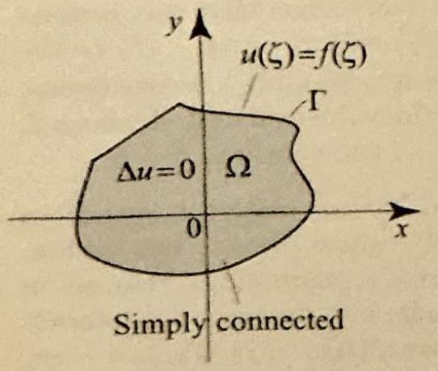
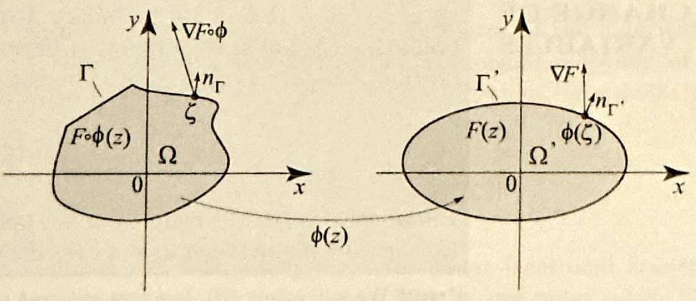
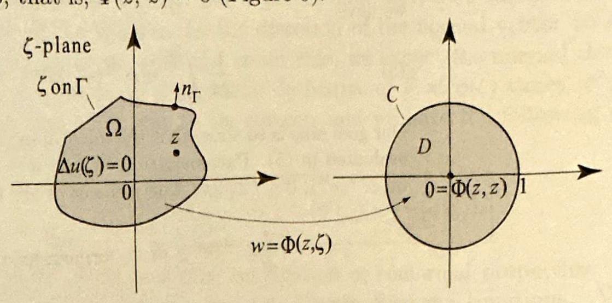
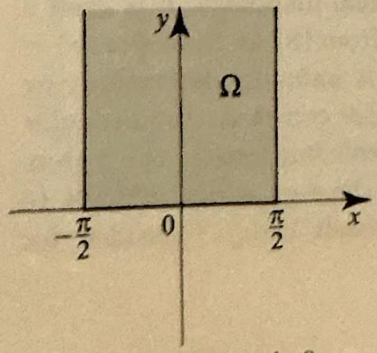
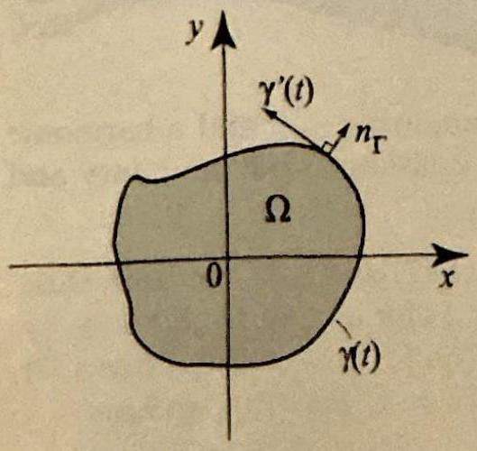
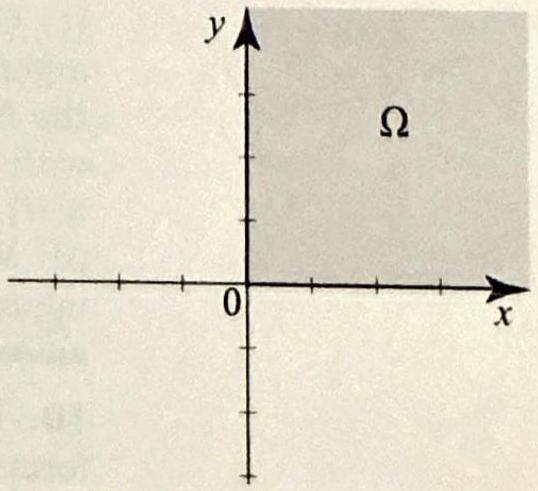
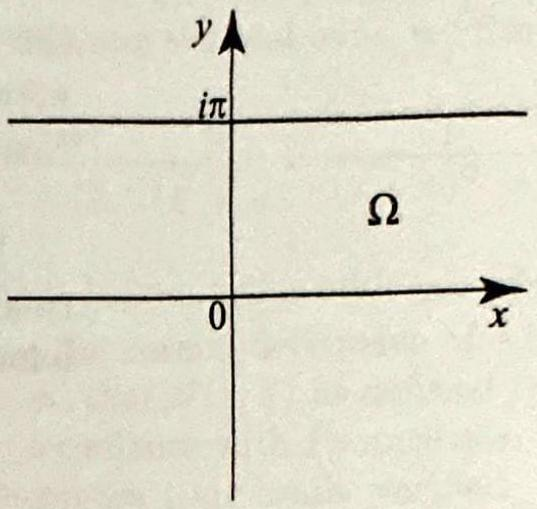
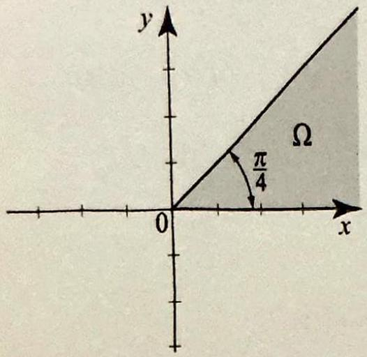
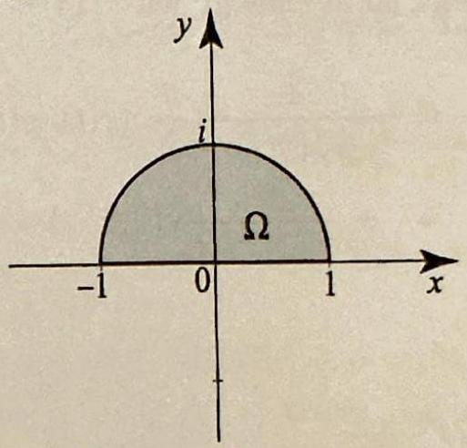

<!-- Page 50 -->

Left margin note (page 50)

434
Chapter 6 Co
6.5 Green'

Figure 1 A Diric in a simply conne

Right margin note (page 50)

esents $r$ and
1) $\frac{9 n-1}{7}$
pped.
d the
hese
blem.
th $\Gamma$.
chlet
n by mula For as a a on al to only ction erive lving gion ed in ts of ught 11 be tools

++++

nformal Mappings

$\left.f\left(x_{j 0}-r\right)\right)$. A typical case is shown in Figure 23, and its absolute value $|s|$ repr the channel width. Parametrize the upper semicircle from $x_{j_{0}}-r$ to $x_{j_{0}}+$ get
$$
\begin{aligned}
s & =A \lim _{r 10} \int_{0}^{\pi} \frac{-i r e^{i(\pi-t)} d t}{\left(x_{j_{0}}+r e^{i(\pi-t)}-x_{1}\right)^{\frac{\theta_{1}}{\pi}} \cdots\left(r e^{i(\pi-t)}\right) \cdots\left(x_{j_{0}}+r e^{i(\pi-t)}-x_{n}\right.} \\
& =\frac{-i A \pi}{\left(x_{j_{0}}-x_{1}\right)^{\frac{\theta_{1}}{\pi}} \cdots\left(x_{j_{0}}-x_{n-1}\right)^{\frac{\theta_{n-1}}{\pi}}},
\end{aligned}
$$
where in the denominator of the final expression, the term $x_{j_{0}}-x_{j_{0}}$ is ski Conclude that the channel width is
$$
|s|=\frac{|A| \pi}{\left|x_{j_{0}}-x_{1}\right|^{\frac{\theta_{1}}{\pi}} \cdots\left|x_{j_{0}}-x_{n-1}\right|^{\frac{\theta_{n-1}}{\pi}}}
$$
where again $\left|x_{j_{0}}-x_{j_{0}}\right|$ is skipped.
(c) Verify the channel width formula for the $L$-shaped region of Example 4 an doubly slit plane of Example 5.
Functions
What is a Green's function and what can it do for us? To answer questions, let us review a few facts about the solution of a Dirichlet prob Suppose that $\Omega$ is a simply connected region bounded by a simple pa Let $f$ be a piecewise continuous function on $\Gamma$ and consider the Diri problem (Figure 1)
$$
\begin{array}{c}
\Delta u(z)=0 \quad \text { for all } z \text { in } \Omega \\
u(\zeta)=f(\zeta) \quad \text { for all } \zeta \text { on } \Gamma
\end{array}
$$

If $\Omega$ is the unit disk $D$, then the solution of the problem (1)-(2) is give the Poisson formula (see (12), Section 3.8). The importance of this for is that it depends only on the region and the boundary function $f$. an arbitrary simply connected region $\Omega$, we saw in Section 6.1 that, consequence of the Riemann mapping theorem and the Poisson formul the disk, the Dirichlet problem (1)-(2) on $\Omega$ has a solution. It is natur ask whether we can express this solution as an integral that depends on the region $\Omega$ and works for any piecewise continuous boundary fun $f$. Amazingly, the answer is affirmative! Our goal in this section is to d a formula that expresses the solution as a path integral over $\Gamma$, invo the boundary function $f$ and the so-called Green's function of the re $\Omega$, which is a function that depends only on $\Omega$. The formula is name honor of its discoverer, one of the leading mathematicians and physicis the nineteenth century, George Green (1793-1841), who was a self-ta mathematician from England. The importance of Green's functions wi appreciated in later sections, where they will be presented as the only

---

<!-- Page 51 -->

Left margin note (page 51)

Figure 2 The mappir analytic and one-to-one it maps boundary to ary and preserves angle

Figure 3 For a circl tered at the origin, the 1 derivative is the radial tive.

Right margin note (page 51)

435
m's
the
mic
ex-
ling
and
ose
t $\phi$
ion
nts
or
the
dot
nal
sy
cle
3):
cle
ive
tes

++++

Section 6.5 Green's Functions

for solving boundary value problems on certain regions involving Poiss equation and other important equations in applied mathematics.

If you recall in Section 3.8, we used a change of variables to derive Poisson integral on the unit disk from the mean value property of harm functions. We will take the same approach on $\Omega$, and so we begin by plaining the change of variables that is a key to deriving and understand Green's functions.

Suppose that $\Omega$ and $\Omega^{\prime}$ are two regions bounded by simple paths $\Gamma \Gamma^{\prime}$. Let $\phi$ be a one-to-one analytic map of $\Omega$ onto $\Omega^{\prime}$. We will further supp that $\phi$ is analytic and one-to-one on $\Gamma$. It follows from Section 6.1 tha maps boundary to boundary. Suppose that $F$ is a real differentiable funct of two variables defined on $\Gamma^{\prime}$. We will think of complex numbers as poi in the complex plane, and consider $F(z)$ for $z$ on $\Gamma^{\prime}$. We will write $\frac{\partial F}{\partial n_{\Gamma^{\prime}}}$ simply $\frac{\partial F}{\partial n}$ to denote the directional derivative of $F$ in the direction of outward unit normal vector to the path $\Gamma^{\prime}$. By definition, this is the product of the gradient of $F, \nabla F=\left(F_{x}, F_{y}\right)$, with the outward unit norr vector $n_{\Gamma}^{\prime}$. Thus
$$
\frac{\partial F}{\partial n_{\Gamma^{\prime}}}=\nabla F \cdot n_{\Gamma^{\prime}}
$$
where each expression is computed at a given point on $\Gamma^{\prime}$ (Figure 2).

Although normal derivatives are tedious to compute in general, they are ea to express in some important special cases. For example, if $\Gamma^{\prime}$ is any cir centered at the origin, then $\frac{\partial F}{\partial n_{\Gamma^{\prime}}}$ is just the radial derivative of $F$ (Figure
$$
\frac{\partial F}{\partial n_{\Gamma^{\prime}}}=\frac{\partial F}{\partial r} .
$$

If $F(z)=\ln |z|$ and $\Gamma^{\prime}$ is the unit circle, then for all points on the unit cir
$$
\left.\frac{\partial F}{\partial n_{\Gamma^{\prime}}}\right|_{|z|=1}=\left.\frac{\partial}{\partial r} \ln r\right|_{r=1}=\left.\frac{1}{r}\right|_{r=1}=1 .
$$

Our goal is to relate the normal derivative of $F$ on $\Gamma^{\prime}$ to the normal derivat of $F(\phi(z))$ on $\Gamma$. Recall that if $\phi$ is analytic and $\left|\phi^{\prime}(z)\right| \neq 0$, then $\phi$ rota

---

<!-- Page 52 -->

Left margin note (page 52)

436
Chapter 6
C
$\mathbf{L}$
CHA
VA]

Figure 4 If $\phi$ is one-to-one, the analytic.

Right margin note (page 52)

nap a scale ate of curve, ive of This ige of
chain ive it The ormal esired idary hould roof.
y connd its nuous ten
etrized
e 4 for

$\Omega$ and
ne open

++++

onformal Mappings

a path through $z$ by a fixed angle and scales by $\left|\phi^{\prime}(z)\right|$. So $\phi$ will 1 normal vector to $\Gamma$ at $\zeta$ to a normal vector to $\Gamma^{\prime}$ at $\phi(\zeta)$, and it will its modulus by $\left|\phi^{\prime}(\zeta)\right|$. Since the normal derivative measures the $r$, change of the function in the direction of the normal vector to the thinking as we do with the chain rule, we expect the normal derivat $F \circ \phi$ at $\zeta$ to equal the normal derivative of $F$ at $\phi(\zeta)$ times $\left|\phi^{\prime}(\zeta)\right|$. expectation turns out to be correct, and we have the following chan variables formula:
$$
\frac{\partial(F \circ \phi)}{\partial n_{\Gamma}}(\zeta)=\left|\phi^{\prime}(\zeta)\right| \frac{\partial F}{\partial n_{\Gamma^{\prime}}}(\phi(\zeta)) .
$$

The proof of (3) is a nice application of conformal properties, the rule in two dimensions, and the Cauchy-Riemann equations. We gi at the end of this section in order not to interrupt the presentation. importance of this formula is that it incorporates the effect of the confe properties of analytic functions. Let us move a step closer to the de formula for Green's functions and derive a formula that uses the bour

EMMA 1 NGE OF RIABLES values of $u$ to reproduce its value at a special point inside $\Omega$. You sl note the role of the mean value property of harmonic functions in the F
Suppose that $w=\phi(z)$ is a one-to-one analytic mapping of a simpl nected region $\Omega$ and its boundary $\Gamma$ onto the open unit disk $D$ a boundary $C$. Let $u$ be a function harmonic on $\Omega$ and piecewise conti on the boundary $\Gamma$. Let $z_{0}$ in $\Omega$ be the point such that $\phi\left(z_{0}\right)=0$. Th
$$
u\left(z_{0}\right)=\frac{1}{2 \pi} \int_{\Gamma} u(\zeta) \frac{\partial \ln |\phi(\zeta)|}{\partial n} d s
$$
where $d s=|d \zeta|$ is the element of arc length on $\Gamma$. Hence if $\Gamma$ is param by $\gamma(t), a \leq t \leq b$, then $d s=\left|\gamma^{\prime}(t)\right| d t$.
Proof We will apply (3), but first we note one useful result. (Refer to Figur help with the notation.)

analytic and
$\phi^{-1}$ is also

The function $\phi^{-1}$ is analytic from the closed unit disk (in the $w$-plane) ontc its boundary (in the $z$-plane). So the function $u\left(\phi^{-1}(w)\right)$ is harmonic on $t$ l

---

<!-- Page 53 -->

Section 6.5 Green's Functions
437

unit disk, being the composition of a harmonic function $u$ with an analytic function $\phi^{-1}$ (Theorem 3, Section 2.5). Moreover, $u\left(\phi^{-1}(w)\right)$ is piecewise continuous on $C$. Thus, by the mean value property of harmonic functions (Corollary 7, Section 3.8), we have
$$
\frac{1}{2 \pi} \int_{0}^{2 \pi} u\left(\phi^{-1}\left(e^{i t}\right)\right) d t=u\left(\phi^{-1}(0)\right)=u\left(z_{0}\right)
$$

Our goal now is to show that the integral in (4) is precisely the integral that we just evaluated in (5). Parametrize $C$ by $e^{i t}, 0 \leq t \leq 2 \pi$. Then $\Gamma$ will be parametrized by $\phi^{-1}\left(e^{i t}\right), 0 \leq t \leq 2 \pi$. The element of arc length on $\Gamma$ is
$$
\left|\frac{d}{d t} \phi^{-1}\left(e^{i t}\right)\right| d t=\left|\frac{i e^{i t}}{\phi^{\prime}\left(\phi^{-1}\left(e^{i t}\right)\right)}\right| d t=\frac{1}{\left|\phi^{\prime}\left(\phi^{-1}\left(e^{i t}\right)\right)\right|} d t
$$

Using (3) to perform the change of variables $\zeta=\phi^{-1}\left(e^{i t}\right)$, we transform the integral in (4) into
$$
\begin{array}{c}
\left.\frac{1}{2 \pi} \int_{0}^{2 \pi} u\left(\phi^{-1}\left(e^{i t}\right)\right) \frac{\partial \ln |w|}{\partial r}\right|_{w=e^{i t}}\left|\phi^{\prime}\left(\phi^{-1}\left(e^{i t}\right)\right)\right| \frac{d t}{\left|\phi^{\prime}\left(\phi^{-1}\left(e^{i t}\right)\right)\right|} \\
=\frac{1}{2 \pi} \int_{0}^{2 \pi} u\left(\phi^{-1}\left(e^{i t}\right)\right) d t=u\left(z_{0}\right)
\end{array}
$$
by (5).
Let us note the following interesting property of the logarithm that we derived in the preceding proof: If $\phi$ is a conformal mapping of $\Gamma$ and its interior onto the unit circle $C$ and its interior, then for a point $\zeta$ on $\Gamma$ we have
$$
\left.\frac{\partial \ln |\phi(z)|}{\partial n_{\Gamma}}\right|_{z=\zeta}=\left|\phi^{\prime}(\zeta)\right|
$$

By composing $\phi$ with an appropriate linear fractional transformation, we will be able to reproduce the values of $u$ at any point inside $\Omega$, not just $z_{0}=\phi^{-1}(0)$ as shown in (4). Let $z$ be in $\Omega$ and think of $\phi(z)$ as a fixed point inside the unit disk in the $w$-plane. Consider the linear fractional transformation
$$
\tau_{z}(w)=\frac{w-\phi(z)}{1-\overline{\phi(z)} w}
$$

It is one-to-one and maps the unit disk onto the unit disk and the unit circle onto the unit circle (Example 3, Section 3.7). Let us compose $\tau_{z}$ with $\phi$ and define
$$
\Phi(z, \zeta)=\tau_{z}(\phi(\zeta))=\frac{\phi(\zeta)-\phi(z)}{1-\overline{\phi(z)} \phi(\zeta)}, \quad z, \zeta \text { in } \Omega
$$

---

<!-- Page 54 -->

Left margin note (page 54)

438
Chapter 6
C

Figure 5 We think as a function of on $\zeta$ in $\Omega$, for fixed $z$ a function of $\zeta, \Phi(2$ alytic and one-to-o onto the unit disk a to 0 ; that is, $\Phi(z$,

THE
G
FUN

Right margin note (page 54)

as a
naps

ue of
$\phi$ is a and its inuous $\Omega$, we
nental lace's isson
e, forimply is. Of mapreen's these oisson
al and

++++

onformal Mappings

This is a function of two variables $z$ and $\zeta$, but we will often think of it function of $\zeta$ alone for a fixed value of $z$. As a function of $\zeta$, it clearly $z$ to 0 ; that is, $\Phi(z, z)=0$ (Figure 5).
of $\Phi(z, \zeta)$ e variable in $\Omega$. As , $\zeta$ ) is anne from $\Omega$ nd takes $z$ ) $=0$.

OREM 1 REEN'S CTIONS

Using $\Phi(z, \zeta)$ in place of $\phi(\zeta)$ in (4), we are able to reproduce the val $u$ at any point $z$ in $\Omega$.
Suppose that $\Omega$ is a simply connected region with boundary $\Gamma$, and one-to-one analytic function on $\Omega$ and its boundary onto the unit disk boundary. Let $u(z)$ be a function harmonic on $\Omega$ and piecewise cont on $\Gamma$. For $z$ and $\zeta$ in $\Omega$, let $\Phi(z, \zeta)$ be as in (8). Then, for any $z$ in have
(9)
$$
u(z)=\frac{1}{2 \pi} \int_{\Gamma} u(\zeta) \frac{\partial}{\partial n} \ln |\Phi(z, \zeta)| d s
$$
where $d s=|d \zeta|$ is the element of arc length on $\Gamma$.
The function
$$
G(z, \zeta)=\ln |\Phi(z, \zeta)|=\ln \left|\frac{\phi(\zeta)-\phi(z)}{1-\overline{\phi(z)} \phi(\zeta)}\right|, \quad z, \zeta \text { in } \Omega
$$
is called the Green's function for the region $\Omega$. It plays a fundan role in the solution of important partial differential equations (Lap equation and Poisson's equation). Formula (9) is a generalized Po integral formula for the simply connected region $\Omega$.

Like the Poisson formulas on the disk and in the upper half-plan mula (9) can be used to solve a general Dirichlet problem in a $s$ connected region $\Omega$, where the boundary data is piecewise continuou course, this solution depends on the explicit formula for the conformal ping of $\Omega$ onto the unit disk. Once this mapping is determined, G functions can be used to solve the Dirichlet problem. We illustrate ideas with several examples and show how we can recapture the P formulas from Green's functions.

We will often write the Green's function $G(z, \zeta)$ in terms of the re

---

<!-- Page 55 -->

Section 6.5 Green's Functions
439

imaginary parts of $z=x+i y$ and $\zeta=s+i t$. We will also write the Green's function using polar coordinates of $z$ and $\zeta$, where $z=r e^{i \theta}$ and $\zeta=\rho e^{i \eta}$

EXAMPLE 1 Green's function and Poisson formula for the disk
(a) Show that the Green's function for the unit disk in polar coordinates is
$$
G(z, \zeta)=\ln \left|\frac{\rho e^{i \eta}-r e^{i \theta}}{1-r \rho e^{i(\eta-\theta)}}\right|, \quad \text { for } z=r e^{i \theta} \text { and } \zeta=\rho e^{i \eta}
$$

As a specific illustration, we fix $z=\frac{2}{5}$ in the unit disk, and plot in Figure 6 the function $\zeta \mapsto G\left(\frac{2}{5}, \zeta\right)$, for $\zeta$ in the unit disk. This is Green's function for the unit disk anchored at a specific point $z=\frac{2}{5}$ in the unit disk.
(b) Derive the Poisson integral formula for the unit disk.

Solution (a) We will use (10). In this case, the conformal mapping $\phi(z)$ of the unit disk onto itself is simply $\phi(z)=z$, and so
$$
G(z, \zeta)=\ln |\Phi(z, \zeta)|=\ln \left|\frac{\phi(\zeta)-\phi(z)}{1-\overline{\phi(z)} \phi(\zeta)}\right|=\ln \left|\frac{\zeta-z}{1-\bar{z} \zeta}\right|
$$
and (11) follows upon replacing $z$ by $r e^{i \theta}$ and $\zeta$ by $\rho e^{i \eta}$.
(b) To derive the Poisson integral formula for the unit disk, we must write out (9) when $\Gamma$ is the unit circle. In this case, $d s=d \eta$, where $0 \leq \eta \leq 2 \pi$. Using (6), we find that
$$
\begin{aligned}
\frac{\partial}{\partial n} \ln \left|\frac{\zeta-z}{1-\bar{z} \zeta}\right|_{|\zeta|=1} & =\left|\frac{d}{d \zeta}\left(\frac{\zeta-z}{1-\bar{z} \zeta}\right)\right|_{\zeta=e^{i \eta}}=\left|\frac{1-|z|^{2}}{(1-\bar{z} \zeta)^{2}}\right|_{\zeta=e^{i \eta}} \\
& =\frac{1-r^{2}}{\left|1-r e^{-i \theta} e^{i \eta}\right|^{2}}=\frac{1-r^{2}}{1-2 r \cos (\theta-\eta)+r^{2}}
\end{aligned}
$$

Plugging into (9), we find, for $z=r e^{i \theta}$ with $0 \leq r<1$,
$$
u(z)=\frac{1-r^{2}}{2 \pi} \int_{0}^{2 \pi} \frac{u\left(e^{i \eta}\right)}{1-2 r \cos (\theta-\eta)+r^{2}} d \eta
$$
which is Poisson's formula on the unit disk.
Before we move to our next example, let us understand the role of $\Phi(z, \zeta)$ in (8). Since $\Phi$ is the composition of two conformal mappings, it is itself a conformal mapping of $\Omega$ onto the unit disk, and from (8) we have $\Phi(z, z)=$ 0 . By the Riemann mapping theorem, $\Phi(z, \zeta)$ is uniquely determined by these properties, up to a unimodular multiplicative constant. In particular $|\Phi(z, \zeta)|$ is uniquely determined and so is the Green's function for the region. (The uniqueness part in the Riemann mapping theorem is not difficult to prove, and so we are not appealing to a deep result here.) Consider, for example, the linear fractional transformation
$$
\tau(\zeta)=\frac{z-\zeta}{\bar{z}-\zeta}
$$

---

<!-- Page 56 -->

Left margin note (page 56)

440
Chapter 6

Figure 7 Green $G(1+i, \zeta)$ for the plane anchored a Note that $G(1$ for all $\zeta$ on the b $G(1+i, \zeta)$ has a $\zeta=1+i$.

Figure 8 for Ex

Right margin note (page 56)

$z$ onto
t disk,
half-
$>0$ ).
plot in Green's upper
$\boldsymbol{\Phi}(z, \zeta) \mid$
ute the clearly
sing the -to-one

++++

Conformal Mappings

where $z$ is in the upper half-plane. If $\zeta$ is real so that $\bar{\zeta}=\zeta$, then
$$
\left|\frac{z-\zeta}{\bar{z}-\zeta}\right|=\left|\frac{z-\zeta}{\bar{z}-\bar{\zeta}}\right|=\frac{|z-\zeta|}{|\overline{z-\zeta}|}=1
$$

Thus $\tau(\zeta)$ maps the real line onto the unit circle and since it takes the origin, it follows that $\tau$ maps the upper half-plane onto the uni and thus $\tau(\zeta)=\Phi(z, \zeta)$ for the upper half-plane.

EXAMPLE 2 Green's function and Poisson's formula in the uppe plane (a) Show that the Green's function for the upper half-plane is
$$
G(z, \zeta)=\frac{1}{2} \ln \frac{(x-s)^{2}+(y-t)^{2}}{(x-s)^{2}+(y+t)^{2}}, \quad \text { for } z=x+i y, \zeta=s+i t(y, t
$$

As a specific illustration, we fix $z=1+i$ in the upper half-plane, and Figure 7 the function $\zeta \mapsto G(1+i, \zeta)$, for $\zeta$ in the upper half-plane. This is function for the upper half-plane anchored at a specific point $z=1+i$ in the half-plane.

1's function upper half$\mathrm{t} z=1+i$. $-i, \zeta)=0$ oundary and ingularity at

ample 3.
(b) Derive the Poisson integral formula for the upper half-plane.

Solution According to (10), Green's function for the upper half-plane is $\ln$ where $\Phi(z, \zeta)$ is given by (12). Thus,
$$
G(z, \zeta)=\ln \left|\frac{z-\zeta}{\bar{z}-\zeta}\right|=\frac{1}{2} \ln \frac{|z-\zeta|^{2}}{|\bar{z}-\zeta|^{2}}=\frac{1}{2} \ln \frac{(x-s)^{2}+(y-t)^{2}}{(x-s)^{2}+(-y-t)^{2}}
$$
which is equivalent to (13).
(b) To derive Poisson's integral formula in the upper half-plane we comp normal derivative in (9). If $\Gamma$ ' is the real $s$-axis, then the normal derivative is the derivative in the negative direction along the imaginary $t$-axis. Thus,
$$
\frac{\partial}{\partial n} G(z, \zeta)=-\frac{1}{2} \frac{\partial}{\partial t} \ln \frac{(x-s)^{2}+(y-t)^{2}}{(x-s)^{2}+(y+t)^{2}}
$$

A straightforward calculation of the derivative, then setting $t=0$, yields
$$
\frac{\partial}{\partial n} G(z, \zeta)=\frac{2 y}{(x-s)^{2}+y^{2}}
$$

Plugging into (9) yields
$$
u(z)=\frac{y}{\pi} \int_{-\infty}^{\infty} \frac{u(s)}{(x-s)^{2}+y^{2}} d s \quad(z=x+i y)
$$
which is Poisson's formula for the upper half-plane.
We give one more example of a Green's function.

EXAMPLE 3 Green's function for a semi-infinite vertical strip
We can map the strip $\Omega$ in Figure 8 conformally onto the upper half-plane us mapping $w=\sin z$. Composing the function (12) with this, we obtain a one

---

<!-- Page 57 -->

Left margin note (page 57)

THEORE PROPERTIES GREE FUNCTIC

Figure 9 A Green's func function, $u_{1}(\zeta)$, such that has a singularity at $z_{0}$ like

++++

Section 6.5 Green's Functions
441

analytic mapping of $\Omega$ onto the unit disk, taking $z$ in $\Omega$ onto the origin. Thus the Green's function for $\Omega$ is
$$
G(z, \zeta)=\ln \left|\frac{\sin z-\sin \zeta}{\overline{\sin z}-\sin \zeta}\right|
$$

We prove next some interesting properties of Green's functions.

M2

Suppose that $\Omega$ is a simply connected region with boundary $\Gamma$, and let $\phi$,

OF $\Phi(z, \zeta)$, and $G(z, \zeta)$ be as in Theorem 1. Then the Green's function $G(z, \zeta)$

N'S has the following properties:

ONS
(i) $G(z, \zeta) \leq 0$ for all $z$ and $\zeta$ in $\Omega$;
(ii) $G(z, \zeta)=0$ for all $z$ in $\Omega$ and $\zeta$ on $\Gamma$;
(iii) $G(z, \zeta)=G(\zeta, z)$ for all $z$ and $\zeta$ in $\Omega$ (symmetric property);
(iv) for each $z$ in $\Omega$, there is a function $\zeta \mapsto u_{1}(z, \zeta)$ such that $u_{1}(z, \zeta)$ is harmonic for all $\zeta$ in $\Omega, u_{1}(z, \zeta)=-\ln |z-\zeta|$ for all $\zeta$ on the boundary $\Gamma$, and $G(z, \zeta)=u_{1}(z, \zeta)+\ln |z-\zeta|$ for all $\zeta \neq z$ in $\Omega$.
You should verify properties (i) and (ii) on the graphs of the Green's functions in Figures 6 and 7. Before we prove the theorem, we illustrate the properties in Figure 9 for a typical case where $\Omega$ is the upper half-plane and Green's function is anchored at $z=1+i$.
tion $G\left(z_{0}, \zeta\right)$ anchored at $z_{0}=1+i$ is the sum of a logarithm, $\ln \left|z_{0}-\zeta\right|$, and a harmonic $u_{1}(\zeta)=-\ln \left|z_{0}-\zeta\right|$ on the boundary. As a result, $G\left(z_{0}, \zeta\right)$ vanishes on the boundary and $\ln \left|z_{0}-\zeta\right|$.

Proof Fix $z$ in $\Omega$. From the definition of $\phi$ and $\Phi$ (see (7) and (8)), we have that $\Phi(z, \zeta)$ is in the open unit disk $D$ (that is, $|\Phi(z, \zeta)|<1$ ) for all $\zeta$ in $\Omega$ and $\Phi(z, \zeta)$ is on the unit circle $C$ (that is, $|\Phi(z, \zeta)|=1$ ) for all $\zeta$ on $\Gamma$. This clearly proves (i) and (ii), because $\ln |x|<0$ if $|x|<1$ and $\ln |x|=0$ if $|x|=1$. For (iii), we have
$$
G(z, \zeta)=\ln \left|\frac{\phi(\zeta)-\phi(z)}{1-\overline{\phi(z)} \phi(\zeta)}\right|=\ln \left|\frac{\phi(z)-\phi(\zeta)}{1-\overline{\phi(z)} \phi(\zeta)}\right|=\ln \left|\frac{\phi(\zeta)-\phi(z)}{1-\overline{\phi(\zeta)} \phi(z)}\right|=G(\zeta, z) .
$$

To prove (iv), fix $z$ in $\Omega$ and consider
$$
\psi(z, \zeta)=\frac{\phi(\zeta)-\phi(z)}{\zeta-z} \frac{1}{1-\overline{\phi(z)} \phi(\zeta)} \quad(\zeta \neq z \text { in } \Omega)
$$

---

<!-- Page 58 -->

Left margin note (page 58)

442
Chapter 6
C

Figure 10

Right margin note (page 58)

hes $z$ ?
and so n 4.6).
$z, \zeta) \mid ;$
$\zeta \mid$.
ndary,
oblem ion is (iv) is sed to that
$\gamma^{\prime}(t)=$ utward /2 and
s write ives by
larly,

++++

onformal Mappings

Clearly, $\psi(z, \zeta)$ is analytic for all $\zeta \neq z$ in $\Omega$. What happens as $\zeta$ approad We have
$$
\lim _{\zeta \rightarrow z} \psi(z, \zeta)=\lim _{\zeta \rightarrow z} \frac{\phi(\zeta)-\phi(z)}{\zeta-z} \frac{1}{1-\overline{\phi(z)} \phi(\zeta)}=\frac{\phi^{\prime}(z)}{1-|\phi(z)|^{2}},
$$
which is finite because $|\phi(z)|<1$ and nonzero because $\phi$ is one-to-one $\phi^{\prime}(z) \neq 0$. Hence $\psi(z, \zeta)$ has a removable singularity at $z$ (Theorem 6, Sectio By defining $\psi$ at $\zeta=z$ to be
$$
\psi(z, z)=\frac{\phi^{\prime}(z)}{1-|\phi(z)|^{2}}
$$
$\psi(z, \zeta)$ becomes analytic and nonzero for all $\zeta$ in $\Omega$. Set $u_{1}(z, \zeta)=\ln \mid \psi($ then $u_{1}$ is harmonic for all $\zeta$ in $\Omega$. But for $\zeta \neq z$
$$
\left.u_{1}(z, \zeta)=\ln |\psi(z, \zeta)|=\ln \left|\frac{\phi(\zeta)-\phi(z)}{1-\overline{\phi(z)} \phi(\zeta)}\right|-\ln |\zeta-z|=G(z, \zeta)-\ln \right\rvert\, z-
$$

Also, $u_{1}(z, \zeta)=-\ln |z-\zeta|$ on the boundary because $G(z, \zeta)=0$ on the bou and so (iv) holds.

Because the function $\zeta \mapsto u_{1}(z, \zeta)$ is the solution of a Dirichlet pr in $\Omega$ with boundary values $-\ln |z-\zeta|$, if $\Omega$ is bounded, this solut unique. Thus the representation of Green's function in Theorem 2 unique when $\Omega$ is bounded. Property (iv) in Theorem 2 can be us define the Green's function of a domain. That is, any function $G(z, \zeta$ satisfies (iv) also satisfies (9).
Appendix: Proof of the change of variables formula (3)
Suppose that $\gamma(t)=x(t)+i y(t)$ is a parametrization of a smooth path with

(t) $x^{\prime}(t)+i y(t) \neq 0$. If we assume our path has a positive orientation, then an o unit normal may be obtained by rotating the tangent $\gamma^{\prime}(t)$ clockwise by $\pi$ dividing by its absolute value (Figure 10). Hence $n(t)=\frac{\gamma^{\prime}(t)}{\left\{\gamma^{\prime}(t) \mid\right.}$ or
$$
n_{\Gamma}=\frac{1}{\left|\gamma^{\prime}(t)\right|}\left(y^{\prime}(t),-x^{\prime}(t)\right)
$$

Let $\phi(z)$ be as in the text preceding (3). To simplify the notation, let $u \phi(z)=u(x, y)+i v(x, y)$, write $F$ as $F(u, v)$, and denote partial derivat subscripts. So
$$
(F \circ \phi)_{x}=\frac{\partial}{\partial x} F(u(x, y), v(x, y))=F_{u} u_{x}+F_{v} v_{x}
$$
where the last equality follows from the chain rule in two dimensions. Simi
$$
(F \circ \phi)_{y}=\frac{\partial}{\partial y} F(u(x, y), v(x, y))=F_{u} u_{y}+F_{v} v_{y}
$$

---

<!-- Page 59 -->

Left margin note (page 59)

1.

Figure 11

Right margin note (page 59)

$$
\dddot{H}
$$
So

II
ப்

++++

Section 6.5 Green's Functions

Using the definition of the normal derivative, (14), (15), and (16), we get
$$
\begin{aligned}
\frac{\partial}{\partial n_{\Gamma}} F \circ \phi & =\nabla(F \circ \phi) \cdot n_{\Gamma}=\frac{1}{\left|\gamma^{\prime}(t)\right|}\left((F \circ \phi)_{x},(F \circ \phi)_{y}\right) \cdot\left(y^{\prime}(t),-x^{\prime}(t)\right) \\
& =\frac{1}{\left|\gamma^{\prime}(t)\right|}\left(\left(F_{u} u_{x}+F_{v} v_{x}\right) y^{\prime}(t)-\left(F_{u} u_{y}+F_{v} v_{y}\right) x^{\prime}(t)\right)
\end{aligned}
$$

Consider now the path $\Gamma^{\prime}$, which is parametrized by
$$
\phi(\gamma(t))=u(x(t), y(t))+i v(x(t), y(t)) .
$$

Conformality ensures that the outward normal to $\phi(\gamma(t))$ is still turned clockw from the tangent; so in analogy with (14) we obtain
$$
\begin{aligned}
n_{\Gamma^{\prime}} & =\frac{1}{\left|\frac{d}{d t} \phi(\gamma(t))\right|}\left(\frac{d}{d t} v(x(t), y(t)),-\frac{d}{d t} u(x(t), y(t))\right) \\
& =\frac{1}{\left|\phi^{\prime}(\gamma(t)) \gamma^{\prime}(t)\right|}\left(v_{x} x^{\prime}(t)+v_{y} y^{\prime}(t),-u_{x} x^{\prime}(t)-u_{y} y^{\prime}(t)\right)
\end{aligned}
$$

Thus
$$
\begin{aligned}
\frac{\partial F}{\partial n_{\Gamma^{\prime}}} & =\nabla F \cdot n_{\Gamma^{\prime}} \\
& =\frac{1}{\left|\gamma^{\prime}(t)\right|\left|\phi^{\prime}(\gamma(t))\right|}\left(F_{u}, F_{v}\right) \cdot\left(v_{x} x^{\prime}(t)+v_{y} y^{\prime}(t),-u_{x} x^{\prime}(t)-u_{y} y^{\prime}(t)\right) \\
& =\frac{1}{\left|\gamma^{\prime}(t)\right|\left|\phi^{\prime}(\gamma(t))\right|}\left(F_{u}\left(v_{x} x^{\prime}(t)+v_{y} y^{\prime}(t)\right)+F_{v}\left(-u_{x} x^{\prime}(t)-u_{y} y^{\prime}(t)\right)\right)
\end{aligned}
$$

Comparing (17) and (18) and using the Cauchy-Riemann equations, $u_{x}=v_{y}, u_{y} -v_{x}$, we see that (3) holds.

Exercises 6.5
In Exercises 1-8, derive the Green's function for the region depicted in the acco panying figure (Figures 11-18).
2.

Figure 12
3.

Figure 13

---

<!-- Page 60 -->

Left margin note (page 60)

444
Chapter 6
4.

Figure 14
7.

Figure 17

Right margin note (page 60)

9.

Derive blem in
to show drant of ry data
mmetry ction to If-plane 0 and
for the ve your
oisson's

++++

Conformal Mappings
5.
8.

Figure 15

Figure 18
6.

Figure 16

Figure 19 for Exercise
9. Project Problem: Poisson's formula in the first quadrant. (a) the following Poisson formula in the first quadrant for the Dirichlet pro Figure 19, using Green's function:
$$
\begin{aligned}
u(x+i y)= & \frac{y}{\pi} \int_{0}^{\infty} f(s)\left(\frac{1}{(x-s)^{2}+y^{2}}-\frac{1}{(x+s)^{2}+y^{2}}\right) d s \\
& +\frac{x}{\pi} \int_{0}^{\infty} g(t)\left(\frac{1}{x^{2}+(y-t)^{2}}-\frac{1}{x^{2}+(y+t)^{2}}\right) d t
\end{aligned}
$$
(b) Consider the special case in which $g(t)=0$. Use a symmetry argument that the solution in this case is the same as the restriction to the first quad the solution of the Dirichlet problem in the upper half-plane with bounda on the real axis given by $u(s)=f(s)$ if $s>0$ and $u(s)=-f(-s)$ if $s<0$. (c) Consider the special case in Figure 19 in which $f(s)=0$. Use a sy argument to show that the solution in this case is the same as the restri the first quadrant of the solution of the Dirichlet problem in the right ha with boundary data on the imaginary axis given by $u(i t)=g(t)$ if $t> u(i t)=-g(-t)$ if $t<0$.
(d) Write your answers in (b) and (c) using the Poisson integral formula upper half-plane and the right half-plane. Then sum the solutions to rederi answer in (a).
10. Poisson's formula in a semi-infinite vertical strip. Derive P formula in the region of Example 3, using Green's function.

---
