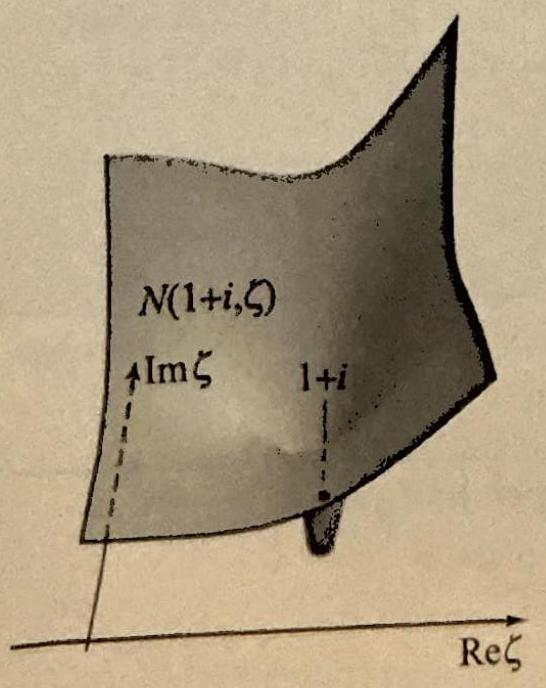
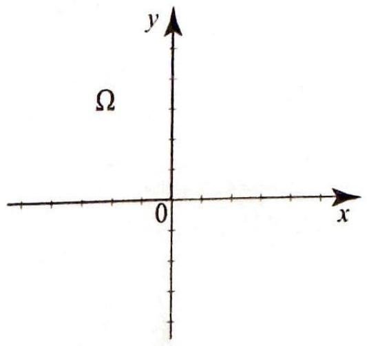
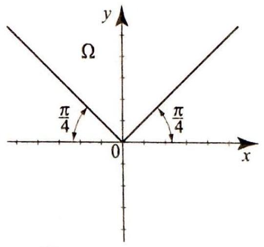
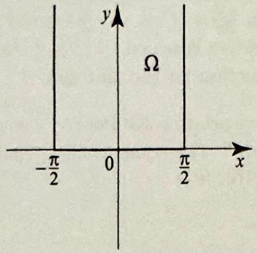

<!-- Page 61 -->

Left margin note (page 61)

6.6 Poisson's

++++

Section 6.6 Poisson's Equation and Neumann Problems
445
11. By composing $\phi_{\alpha}(z)=\frac{z-\alpha}{1-\bar{\alpha} z}$ with $\psi(z)=\frac{1-z}{1+z}$, you should be able to construct your own map $\Phi(z, \zeta)$ from the upper half-plane to the disk, satisfying $\Phi(z, z)=0$.
(a) Find the value of $\alpha$ (it will depend on $z$ ).
(b) Check that your final map $\Phi(z, \zeta)$ is the same as given in this section, $\frac{z-\zeta}{z-\zeta}$, times the unimodular constant $\frac{\mathrm{Z}-\mathrm{i}}{\mathrm{z}+\mathrm{i}}$.
Equation and Neumann Problems
In this section we use Green's functions to solve the Poisson boundary value problem on a region $\Omega$, then apply similar techniques to solve another important type of problem known as a Neumann problem. We start with the Poisson problem, which consists of the inhomogeneous Laplace's equation known as Pois

---

<!-- Page 62 -->

Left margin note (page 62)

446
Chapter 6

\section*{THE \\ SOLU? POISSON PE}

THI

IDE

Right margin note (page 62)

ms of ppose or the
te the 1)-(2),
ciple. of the em 1,
s.
finite , Secatives
nected nected s first using

++++

Conformal Mappings

We now express the solution of the Poisson problem on $\Omega$ in ter Green's functions. We use the notation of the previous section and su that $f$ and $h$ have enough smoothness and integrability properties fo formulas in Theorems 2 and 3 to hold.

OREM 2 TION OF ROBLEM

EOREM 3
GREEN'S
NTITIES

Suppose that $\Omega$ is a region with boundary $\Gamma$, and let $G(z, \zeta)$ deno Green's function for $\Omega$. If $u(z)$ is a solution of Poisson's problem ( then
$$
u(z)=\frac{1}{2 \pi} \iint_{\Omega} h(\zeta) G(z, \zeta) d A+\frac{1}{2 \pi} \int_{\Gamma} f(\zeta) \frac{\partial}{\partial n} G(z, \zeta) d s
$$
where $d A$ is the element of area and $d s$ is the element of arc length.
This form of the solution clearly illustrates the superposition prin We recognize the second term on the right side of (3) as the solution Dirichlet problem on $\Omega$ with boundary values $f$ (compare with Theore Section 6.5). Looking at the other term, we also have
$$
u(z)=\frac{1}{2 \pi} \iint_{\Omega} h(\zeta) G(z, \zeta) d A
$$
as a solution of Poisson's equation (1) with zero boundary values.
The proof of Theorem 2 is based on the following Green's identitie
Suppose that $\Omega$ is a bounded region whose boundary $\Gamma$ consists of a number of simple closed positively oriented paths (as in Theorem 6 tion 3.4). Let $u(x, y)$ and $v(x, y)$ have continuous second partial deriv on $\Omega$ and $\Gamma$. Then we have Green's first identity
$$
\iint_{\Omega}(u \Delta v+\nabla u \cdot \nabla v) d A=\int_{\Gamma} u \frac{\partial v}{\partial n} d s
$$
and Green's second identity
$$
\iint_{\Omega}(u \Delta v-v \Delta u) d A=\int_{\Gamma}\left(u \frac{\partial v}{\partial n}-v \frac{\partial u}{\partial n}\right) d s
$$

Proof We will appeal to Green's theorem from calculus. For simply conr regions, this theorem is stated in Exercise 40, Section 3.4. For multiply conr regions, the version goes as follows. Let $p(x, y)$ and $q(x, y)$ have continuou partial derivatives in $\Omega$ and on its positively oriented boundary $\Gamma$. Then, subscripts to denote partial derivatives, we have
$$
\iint_{\Omega}\left(p_{x}(x, y)+q_{y}(x, y)\right) d x d y=\int_{\Gamma}(p(x, y) d y-q(x, y) d x)
$$

---

<!-- Page 63 -->

Section 6.6 Poisson's Equation and Neumann Problems
447

Apply (7) with
$$
p(x, y)=u v_{x} \quad \text { and } \quad q(x, y)=u v_{y},
$$
and get
$$
\iint_{\Omega}\left(u\left(v_{x x}+v_{y y}\right)+\left(u_{x} v_{x}+u_{y} v_{y}\right)\right) d x d y=\int_{\Gamma} u\left(v_{x} d y-v_{y} d x\right)
$$

The integrand on the left is the same as the integrand on the left of (5). To understand the integrand on the right, let us recall that for a positively oriented curve parametrized by $\gamma(t)=x(t)+i y(t)$, the outward unit normal may be obtained by rotating the tangent $\gamma^{\prime}(t)=x^{\prime}(t)+i y^{\prime}(t)$ clockwise by $\frac{\pi}{2}$ and dividing by its absolute value. Hence
$$
n(t)=\frac{\gamma^{\prime}(t)}{i\left|\gamma^{\prime}(t)\right|}=\frac{1}{\left|\gamma^{\prime}(t)\right|}\left(y^{\prime}(t), x^{\prime}(t)\right) .
$$

Thus since the normal derivative $\frac{\partial v}{\partial n}$ is by definition the gradient of $v$ dotted with the outward unit normal vector and $d s=\left|\gamma^{\prime}(t)\right| d t$, we have
$$
\frac{\partial v}{\partial n} d s=\left(v_{x}, v_{y}\right) \cdot\left(y^{\prime}(t),-x^{\prime}(t)\right) d t=v_{x} d y-v_{y} d x
$$
which shows that the right side of (8) is the same as the right side of (5), and so (5) follows. To prove (6), we reverse the roles of $u$ and $v$ in (5) and get
$$
\iint_{\Omega}(v \Delta u+\nabla u \cdot \nabla v) d x d y=\int_{\Gamma} v \frac{\partial u}{\partial n} d s
$$

Subtracting this from (5), we get (6).

Green's formulas do not hold in general on unbounded regions. Since we will use them to prove (4), we will suppose throughout the proof that $\Omega$ is bounded. Nevertheless, formula (3) can be used on unbounded regions and its validity there can be checked on a case by case basis.

Proof of Theorem 2 Fix $z$ in $\Omega$ and let $S_{\epsilon}(z)$ denote the closed disk of radius $\epsilon>0$ around $z$ in $\Omega$, and $\Omega_{\epsilon}=\Omega \backslash S_{\epsilon}$. We are going to apply Green's second identity
$=0$
$\overrightarrow{\operatorname{Re} \zeta}$ in $\Omega_{\epsilon}$. By Theorem 2(iv) of Section 6.5, $G(z, \zeta)$ is a harmonic function of $\zeta$ for all $\zeta \neq z$ in $\Omega$. In particular, for $\zeta$ in $\Omega_{\epsilon}, \Delta G(z, \zeta)=0$, we also have $\Delta u(\zeta)=h(\zeta)$ because $u$ satisfies Poisson's equation (1). We apply Green's second identity on the region $\Omega_{\epsilon}$ whose boundary $\Gamma_{\epsilon}$ consists of $\Gamma$ and the circle $C_{\epsilon}(z)$ (Figure 3), taking $v=G(z, \zeta)$ and $u$ equal the solution of the Poisson problem, and get
$$
\begin{aligned}
-\iint_{\Omega_{e}} G(z, \zeta) h(\zeta) d A= & \int_{\Gamma}(u(\zeta) \frac{\partial G(z, \zeta)}{\partial n}-\overbrace{G(z, \zeta)}^{=0} \frac{\partial u(\zeta)}{\partial n}) d s \\
& +\int_{C_{e}(z)}\left(u(\zeta) \frac{\partial G(z, \zeta)}{\partial n}-G(z, \zeta) \frac{\partial u(\zeta)}{\partial n}\right) d s
\end{aligned}
$$

---

<!-- Page 64 -->

Left margin note (page 64)

448
Chapter 6
Conform

Right margin note (page 64)

$$
\begin{array}{l}
(z, \zeta)= \\
\text { int } M \text { in } \\
\left.\left.\frac{u}{n} \right\rvert\, \leq A\right), \\
-\zeta \mid=\epsilon,
\end{array}
$$
as $\epsilon \rightarrow 0$.
$s$.
$(z, \zeta)$ is note that eorem 5 ,
se 9).
ater secive ways ittention ar to the

++++

Mappings

because $G(z, \zeta)=0$ for $\zeta$ on $\Gamma$. We will let $\epsilon \downarrow 0$ and show that
$$
\begin{array}{l}
\iint_{\Omega_{e}} G(z, \zeta) h(\zeta) d A \rightarrow \iint_{\Omega} G(z, \zeta) h(\zeta) d A \\
\int_{C_{e}(z)} u(\zeta) \frac{\partial G(z, \zeta)}{\partial n} d s \rightarrow-2 \pi u(z) \\
\int_{C_{e}(z)} G(z, \zeta) \frac{\partial u(\zeta)}{\partial n} d s \rightarrow 0
\end{array}
$$

This will imply (3) and complete the proof. Let us start with (11). Write $G u_{1}(z, \zeta)+\ln |z-\zeta|$, where $u_{1}(z, \zeta)$ is harmonic, hence bounded by a consta some fixed disk centered at $z$. Also, $\frac{\partial u}{\partial n}$ is bounded in this fixed disk (say, $\left\lvert\, \frac{\partial}{\partial}\right.$ since $u$ has continuous partial derivatives in $\Omega$. For $\zeta$ on $C_{\epsilon}(z)$, we have $\mid z$ hence $\left|G(z, \zeta) \frac{\partial u}{\partial n}\right| \leq(M+|\ln \epsilon|) A$, and so
$$
\left|\int_{C_{\epsilon}(z)} G(z, \zeta) \frac{\partial u(\zeta)}{\partial n} d s\right| \leq(M+|\ln \epsilon|) A \int_{C_{\epsilon}(z)} d s=2 \pi \epsilon(M+|\ln \epsilon|) A \rightarrow 0
$$

To prove (10), we note that on $C_{\epsilon}(z)$,
$$
\frac{\partial G(z, \zeta)}{\partial n}=\frac{\partial}{\partial n}\left(u_{1}(z, \zeta)+\ln |z-\zeta|\right)=\frac{\partial}{\partial n} u_{1}(z, \zeta)-\frac{1}{\epsilon}
$$

Now
$$
\int_{C_{e}(z)} u(\zeta) \frac{\partial G(z, \zeta)}{\partial n} d s=\int_{C_{e}(z)} u(\zeta) \frac{\partial}{\partial n} u_{1}(z, \zeta) d s-\frac{1}{\epsilon} \int_{C_{e}(z)} u(\zeta) d
$$

The first integral on the right tends to 0 as $\epsilon \rightarrow 0$, because $u(\zeta) \frac{\partial}{\partial n} u$, bounded in $S_{\epsilon}(z)$, as in the proof of (10). To handle the second integral, i the function $I(\epsilon)=\frac{1}{\epsilon} \int_{C_{\epsilon}(z)} u(\zeta) d s=\int_{0}^{2 \pi} u\left(z+\epsilon e^{i \theta}\right) d \theta$ is continuous (Th Section 3.5). So
$$
\lim _{\epsilon \rightarrow 0} \int_{0}^{2 \pi} u\left(z+\epsilon e^{i \theta}\right) d \theta=I(0)=\int_{0}^{2 \pi} u(z) d \theta=2 \pi u(z)
$$
which completes the proof of (10). The proof of (9) is similar (see Exerci
In practice, (3) is difficult to compute in its present form. In l tions, we will relate it to generalized Fourier series and offer alternat for computing the solution of Poisson's equation. We now turn our a to a different problem, which can be solved using an approach simil one we took with Green's functions.

---

<!-- Page 65 -->

Left margin note (page 65)

Figure 4 A Neumann lem in a region $\Omega$.

PROPOSITIO]
NORM
DERIVATIVE
HARMON
FUNCTIO

++++

Section 6.6 Poisson's Equation and Neumann Problems
449

Neumann Condition and Neumann Problems
When modeling heat problems in an insulated plate $\Omega$, where heat exchange on the boundary is prescribed, we are led to a boundary value problem that consists of Laplace's equation along with a condition that describes the values of the normal derivative on the boundary (Figure 4):
$$
\begin{array}{c}
\Delta u(z)=0 \quad \text { for all } z \text { in } \Omega \\
\frac{\partial u}{\partial n}(\zeta)=f(\zeta) \quad \text { for all } \zeta \text { on } \Gamma
\end{array}
$$

Such a problem is called a Neumann problem (after the German mathematician Carl Gottfried Neumann (1832-1925)) and sometime referred to as a Dirichlet problem of the second kind. Condition (13) is known as a Neumann condition. The normal derivative at the boundary describes the rate of exchange of heat with the surrounding medium or the flux of heat across the boundary. For example, the condition $f(\zeta)=0$ corresponds to an insulated point where there is no exchange of heat with the surrounding medium. Since $f(\zeta)$ represents the flux of heat across the boundary of $u$ and $u$ represents a steady-state temperature distribution inside $\Omega$, we would expect the total flux across the boundary to be zero; that is, $f$ cannot be arbitrary, it has to satisfy the compatibility condition
$$
\int_{\Gamma} f(\zeta) d s=0
$$

Indeed, (14) follows from the following useful property of harmonic functions, by setting $f(\zeta)=\frac{\partial u}{\partial n}$.

N 1
AL
OF
JIC

Suppose that $u$ is harmonic in a bounded region $\Omega$ and its boundary $\Gamma$. Then

NS
$$
\int_{\Gamma} \frac{\partial u}{\partial n} d s=0
$$

Proof Reversing the roles of $u$ and $v$ in Green's first identity (5) and then picking $v=1$, we get
$$
\iint_{\Omega} \Delta u d A=\int_{\Gamma} \frac{\partial u}{\partial n} d s
$$

Since $\Delta u=0$, the proposition follows.

In a Neumann problem, we are asked to find a harmonic function given the values of its normal derivative on the boundary. Such a solution is not unique, since we can add an arbitrary constant to a solution of (12)-(13) and get another solution of (12)-(13). So now we ask: Is the solution unique up

---

<!-- Page 66 -->

Left margin note (page 66)

450
Chapter 6
C

THEC
UNIQUEN
NEU
SOL

DEFIN
NE
FUN
PROPO

Right margin note (page 66)

sider rmal nonic
on the
la, so
and grate .7 in $\left(u_{y}\right)^{2}$ lying
gral, 1, we

nann
owing

$\zeta$ ) is Γ.
are ar to es of s the tates now
lue of
ithm.

++++

onformal Mappings
to an arbitrary constant? The answer is affirmative. To show this, con the difference between two solutions, which is harmonic and has zero no derivative on the boundary. As we now show, a function that is harn and has zero normal derivative is a constant.

REM 4

Suppose that $u$ is harmonic on a bounded region $\Omega$ such that $\frac{\partial u}{\partial n}=0$

ESS OF boundary $\Gamma$ of $\Omega$. Then $u$ is identically constant in $\Omega$.

MANN

Proof Suppose that $u$ is harmonic in $\Omega$ and take $u=v$ in Green's first formu

UTION that $\Delta v=0$ in $\Omega$, and get
$$
\iint_{\Omega}(\nabla u \cdot \nabla u) d A=\int_{\Gamma} u \frac{\partial u}{\partial n} d s=0
$$
because $\frac{\partial u}{\partial n}=0$ on $\Gamma$. Now the function $\nabla u \cdot \nabla u=\left(u_{x}\right)^{2}+\left(u_{y}\right)^{2}$ is continuous on $\Omega$. The only way for a nonnegative continuous function to inte to zero is to vanish identically. (This fact is proved in Lemma 1, Section 3 one dimension, but the argument works in higher dimensions.) Hence $\left(u_{x}\right)^{2}+$ is identically zero in $\Omega$, and so $u_{x}=0$ and $u_{y}=0$ identically in $\Omega$. App Theorem 1, Section 2.1, we see that $u$ is constant on $\Omega$.

In order to express the solution of the Neumann problem as an inte motivated by Green's function and the solution of the Dirichlet problen make the following definition.

ITION 1 UMANN CTIONS

Suppose that $\Omega$ is a simply connected region with boundary $\Gamma$. A Neur function $N(z, \zeta)(z, \zeta$ in $\Omega)$ for the region $\Omega$ is a function with the foll properties:
(i) for each $z$ in $\Omega, N(z, \zeta)$ is harmonic for all $\zeta \neq z$ in $\Omega$;
(ii) $\frac{\partial N}{\partial n}(z, \zeta)=C$ for all $z$ in $\Omega$ and $\zeta$ on $\Gamma$;
(iii) for each $z$ in $\Omega$, there is a function $\zeta \mapsto u_{1}(z, \zeta)$ such that $u_{1}(z$ harmonic for all $\zeta$ in $\Omega$, and $N(z, \zeta)=\ln |z-\zeta|+u_{1}(z, \zeta)$ for all $\zeta$ in

SITION 2

Parts (i) and (iii) state that Neumann functions, like Green's functions harmonic inside $\Omega$ except for a singularity at $z=\zeta$, which is simil the singularity of $\ln |z-\zeta|$. Part (ii) tells us that the boundary valu the normal derivative of the Neumann function are constant. This i counterpart of the boundary condition for a Green's function, which s that a Green's function must vanish identically on the boundary. As we show, the constant $C$ in (ii) depends on the length of the boundary $\Gamma$.
The constant $C$ in Definition 1(ii), which represents the boundary va the normal derivative of the Neumann function, is given by
(17)
$$
C=\frac{2 \pi}{L},
$$
where $L=\int_{\Gamma} d s$ is the length of $\Gamma$. If $L$ is infinite, we take $C=0$.
Proof The proof is based on the following interesting property of the logar

---

<!-- Page 67 -->

Left margin note (page 67)

THEOREM 5 SOLUTION OF NEUMANN PROBLEMS

Figure 5 A Neumann function for the upper half-plane, anchored at $z=1+i$.

Right margin note (page 67)

451 and □

ons
$\_\_\_\_$

nn
ms
f a
◯ ju tive by ise

++++

Section 6.6 Poisson's Equation and Neumann Problems
For any fixed $z$ inside $\Omega$, we have
$$
\int_{\Gamma} \frac{\partial}{\partial n} \ln |z-\zeta| d s=2 \pi
$$

To see this, let $S_{\epsilon}(z)$ be a disk of radius $\epsilon>0$ centered at $z$ and contained in $\Omega$, let $C_{\epsilon}(z)$ denote the circle centered at $z$ with radius $\epsilon$. The function $\zeta \mapsto \ln \mid z$ is harmonic in $\Omega \backslash S_{\epsilon}$, so according to Proposition 1, we have
$$
0=\int_{C_{e}(z)} \frac{\partial}{\partial n} \ln |z-\zeta| d s+\int_{\Gamma} \frac{\partial}{\partial n} \ln |z-\zeta| d s
$$

Parametrizing $C_{\epsilon}(z)$ by $\zeta=z+\epsilon e^{i t}, 0 \leq t \leq 2 \pi, \frac{\partial}{\partial n} \ln |z-\zeta|=-\frac{1}{\epsilon}$ and $d s=$ and so
$$
0=-\int_{0}^{2 \pi} d t+\int_{\Gamma} \frac{\partial}{\partial n} \ln |z-\zeta| d s
$$
implying (18). Now, using (ii) and (iii) of Definition 1, write
$$
C L=\int_{\Gamma} C d s=\int_{\Gamma} \frac{\partial N}{\partial n} d s=\overbrace{\int_{\Gamma} \frac{\partial N_{1}}{\partial n} d s}^{=0, \text { by Proposition } 1}+\int_{\Gamma} \frac{\partial}{\partial n} \ln |z-\zeta| d s=0+2 \pi
$$
which implies (17).
Neumann functions are not unique for a region (two Neumann functi can differ by a function of $z$ and not $\zeta$; see Exercise 12). However, Neumann function satisfying Definition 1 will work to solve a Neum problem. Before we express the solution of the Neumann problem in te of the Neumann function, we note that from Theorem 4 if a solution Neumann problem exists, then it is unique up to an additive constant.
Suppose that $\Omega$ is a region bounded by a simple path $\Gamma$, and let $N($ denote a Neumann function, where $z$ and $\zeta$ are in $\Omega$. Then, up to an add constant, the solution $u(z)$ of the Neumann problem (12)-(14) is given
$$
u(z)=-\frac{1}{2 \pi} \int_{\Gamma} N(z, \zeta) f(\zeta) d s
$$

The proof of Theorem 5 is just like the proof of Theorem 2 (see Exer 10). Now we derive some classical Neumann functions.

EXAMPLE 1 Neumann function for the upper half-plane
Show that the Neumann function for the upper half-plane is
$$
\begin{aligned}
N(z, \zeta) & =\ln |z-\zeta|+\ln |\bar{z}-\zeta| \\
& =\frac{1}{2} \ln \left((x-s)^{2}+(y-t)^{2}\right)+\frac{1}{2} \ln \left((x-s)^{2}+(y+t)^{2}\right)
\end{aligned}
$$
for $z=x+i y$ and $\zeta=s+i t, y, t>0$ (Figure 5).

---

<!-- Page 68 -->

Left margin note (page 68)

452
Chapter 6
C

PROPOS NEI
FUNCTI UNBO

R

Figure 6 A Neu tion for the first q chored at $z=1+$ singularity at $\zeta=$

Right margin note (page 68)

rmal
$\overline{2}$
to
$\mid z-$
(20)
All
untann halfsely, is.

1e-toreal
$-w \mid$, r all 5, it ative is in Now
finite ction
r the

++++

nformal Mappings

Solution We know that $N(z, \zeta)=\ln |z-\zeta|+N_{1}(z, \zeta)$. Computing the no derivative of $\ln |z-\zeta|=\frac{1}{2} \ln \left((x-s)^{2}+(y-t)^{2}\right)$ along the real axis, we find
$$
-\left.\frac{d}{d t} \frac{1}{2} \ln \left((x-s)^{2}+(y-t)^{2}\right)\right|_{t=0}=\left.\frac{y-t}{(x-s)^{2}+(y-t)^{2}}\right|_{t=0}=\frac{y}{(x-s)^{2}+y}
$$

By adding $\frac{1}{2} \ln |\bar{z}-\zeta|=\frac{1}{2} \ln \left((x-s)^{2}+(y+t)^{2}\right)$ to $\ln |z-\zeta|$, this adds $\frac{-y}{(x-s)^{2}+}$ the normal derivative along the real axis, making the normal derivative of $\frac{1}{2} \ln \left.\zeta\left|+\frac{1}{2} \ln \right| \bar{z}-\zeta \right\rvert\,$ zero along the real axis. This shows that $N(z, \zeta)$ as defined by has 0 normal derivative along the boundary, in accordance with Proposition 2 other properties of the Neumann function in Definition 1 are easily verified.

The fact that the normal derivative of the Neumann function of an bounded region is zero on the boundary allows us to construct the Neum function for this region by using the Neumann function for the upper plane and a change of variables via a conformal mapping. More preci we have the following construction, which is valid for unbounded regior

ITION 3 JMANN ON FOR UNDED EGIONS

Suppose that $\Omega$ is an unbounded region with boundary $\Gamma$, and $\phi$ is a or one analytic mapping of $\Omega$ onto the upper half-plane, taking $\Gamma$ onto the axis. Then the Neumann function for $\Omega$ is given by
$$
N(z, \zeta)=\ln |\phi(z)-\phi(\zeta)|+\ln |\overline{\phi(z)}-\phi(\zeta)| \quad(z, \zeta \text { in } \Omega) .
$$

Proof Fix $z$ in $\Omega$ and consider the function $F(w)=\ln |\phi(z)-w|+\ln \mid \overline{\phi(z)}$ where $\phi(z)$ and $w$ are in the upper half-plane. By Example $1, \frac{\partial F}{\partial n}(w)=0$, fo $w$ on the real axis. Applying the change of variables formula (3), Section 6. follows that $\frac{\partial F \circ \phi}{\partial n}(\zeta)=0$ for all $\zeta$ on $\Gamma$. So $N(z, \zeta)$ has the right normal deriv on the boundary $\Gamma$. Does it have the right singularity at $\zeta=z$ ? Since $\overline{o(z)}$ the lower half-plane, it follows that $\ln |\overline{\phi(z)}-\phi(\zeta)|$ is harmonic for all $\zeta$ in $\Omega$. let us compare $\ln |\phi(z)-\phi(\zeta)|$ to $\ln |z-\zeta|$. We have
$$
\lim _{\zeta \rightarrow z}(\ln |\phi(z)-\phi(\zeta)|-\ln |z-\zeta|)=\lim _{\zeta \rightarrow z} \ln \left|\frac{\phi(z)-\phi(\zeta)}{z-\zeta}\right|=\ln \left|\phi^{\prime}(z)\right|
$$
because $\phi$ is analytic. Since $\phi^{\prime}(z) \neq 0, \ln |\phi(z)-\phi(\zeta)|$ and $\ln |z-\zeta|$ differ by a constant near $z$. Hence the function $N(z, \zeta)=\ln |z-\zeta|$ plus a harmonic fun in $\Omega$.

Let us give an application of Proposition 3.
EXAMPLE 2 Neumann function for the first quadrant
Applying Proposition 3 with $\phi(z)=z^{2}$, we obtain the Neumann function fo first quadrant (shown in Figure 6 at $z=1+i$ )
$$
\begin{aligned}
N(z, \zeta) & =\ln \left|z^{2}-\zeta^{2}\right|+\ln \left|\overline{z^{2}}-\zeta^{2}\right| \\
& =\ln |z-\zeta|+\ln |z+\zeta|+\ln |\bar{z}-\zeta|+\ln |\bar{z}+\zeta|
\end{aligned}
$$

---

<!-- Page 69 -->

Left margin note (page 69)

THEOREM 6 SOLUTION OF POISSON-NEUMANN PROBLEM
1.

Figure 7

++++

Section 6.6 Poisson's Equation and Neumann Problems

Finding Neumann functions for bounded regions is more difficult beca the condition $\frac{\partial N}{\partial n}=C$ is not preserved by a conformal mapping $\phi(z)$; normal derivative is scaled by $\left|\phi^{\prime}(z)\right|$. In the exercises, we will compute Neumann function for the unit disk.

What if we are to solve Poisson's equation (1) with Neumann bound conditions (13)? The compatibility condition on $h$ and $f$ has already b handled by (16); it is
$$
\iint_{\Omega} h(\zeta) d A=\int_{\Gamma} f(\zeta) d s
$$

This problem is also solvable with the Neumann function, and for referen we present an analog of Theorem 2.

Suppose that $\Omega$ is a region with boundary $\Gamma$, let $N(z, \zeta)$ denote a Neum function for this region, where $z$ and $\zeta$ are in $\Omega$. If $u(z)$ is a solutio Poisson's equation (1) subject to a Neumann boundary condition (13) satisfying (23), then up to an additive constant
$$
u(z)=\frac{1}{2 \pi} \iint_{\Omega} h(\zeta) N(z, \zeta) d A-\frac{1}{2 \pi} \int_{\Gamma} N(z, \zeta) f(\zeta) d s
$$

Exercises 6.6
In Exercises 1-6, derive the Neumann function for the region depicted in the companying figure (Figures 7-12).
2.

Figure 8
3.

Figure 9

---

<!-- Page 70 -->

Left margin note (page 70)

454
Chapter 6
4.

Figure 10

Right margin note (page 70)

ution rence
ed for
$\left.\right|_{\rho=1}$
$(z, \zeta)$.

++++

onformal Mappings
5.

Figure 11
6.

Figure 12
7. Uniqueness of the solution in a Poisson problem. Show that the sol of the Poisson problem in a bounded region $\Omega$ is unique. [Hint: The diffe between any two solutions is harmonic and has zero boundary values.]
8. Neumann function for the unit disk. Show that this function is defin $z, \zeta$ in the unit disk by
$$
N(z, \zeta)=\left\{\begin{array}{ll}
\ln |z-\zeta|+\ln \left|\frac{1}{\bar{z}}-\zeta\right|+\ln |z| & \text { if } z \neq 0 \\
\ln |\zeta| & \text { if } z=0
\end{array}\right.
$$

Derive this function by following the outlined steps.
(a) Write $z=r e^{i \theta}$ and $\zeta=\rho e^{i \eta}$. Fix $z \neq 0$, and show that
$$
\begin{aligned}
\frac{\partial}{\partial n} \ln |z-\zeta|_{\rho=1} & =\left.\frac{\partial}{\partial \rho} \frac{1}{2} \ln |z-\zeta|^{2}\right|_{\rho=1}=\frac{1}{2} \frac{\partial}{\partial \rho} \ln \left(r^{2}+\rho^{2}+2 r \rho \cos (\theta-\eta\right. \\
& =\frac{1+r \cos (\theta-\eta)}{1+r^{2}+2 r \cos (\theta-\eta)}
\end{aligned}
$$
(b) Write $\frac{1}{\bar{z}}=\frac{1}{r} e^{i \theta}$, use (a), and conclude that
$$
\left.\frac{\partial}{\partial n} \ln \left|\frac{1}{\bar{z}}-\zeta\right\rangle\right|_{\rho=1}=\frac{1+\frac{1}{r} \cos (\theta-\eta)}{\left(\frac{1}{r}\right)^{2}+1+2 \cos (\theta-\eta)}=\frac{r^{2}+r \cos (\theta-\eta)}{1+r^{2}+2 r \cos (\theta-\eta)} .
$$
(c) Use (a) and (b) to show that for $z \neq 0,\left.\frac{\partial}{\partial n} N(z, \zeta)\right|_{|\zeta|=1}=1$.
(d) Verify the remaining properties of the Neumann function for the given $N$
9. Prove (9) by justifying the following steps:
$$
\begin{array}{l}
\left|\iint_{\Omega_{e}} G(z, \zeta) h(\zeta) d A-\iint_{\Omega} G(z, \zeta) h(\zeta) d A\right| \\
\quad=\left|\iint_{B_{e}(z)} G(z, \zeta) h(\zeta) d A\right| \\
\quad \leq \iint_{B_{e}(z)}\left|u_{1}(z, \zeta) h(\zeta)\right| d A+\iint_{B_{e}(z)}|\ln | z-\zeta|h(\zeta)| d A \\
\quad \leq C_{1} \iint_{B_{e}(z)} d A+C_{2} \iint_{C_{e}(z)} \ln |z-\zeta| d A \\
\quad=C_{1} \epsilon^{2} \pi+C_{2} \int_{0}^{2 \pi} \int_{0}^{\epsilon} r \ln |r| d r d \theta
\end{array}
$$

---

<!-- Page 71 -->

Section 6.6 Poisson's Equation and Neumann Problems
455

Evaluate the last integral and show that the resulting expression on the right side tends to 0 as $\epsilon \rightarrow 0$.
10. Proof of Theorem 5. In addition to the hypothesis of the theorem, we further suppose that $\int_{\Gamma} u(\zeta) d s=A$ is finite.
(a) For fixed $z$ in $\Omega$, let $C_{\epsilon}(z), S_{\epsilon}(z)$, and $\Gamma_{\epsilon}$ be as in the proof of Theorem 2. Since $f(\zeta)=\frac{\partial u}{\partial n}$ in (19), we have
$$
\begin{aligned}
\int_{\Gamma} N(z, \zeta) \frac{\partial u}{\partial n} d s & =\int_{\Gamma} N(z, \zeta) \frac{\partial u}{\partial n} d s+\int_{C_{\epsilon}(z)} N(z, \zeta) \frac{\partial u}{\partial n} d s-\int_{C_{\epsilon}(z)} N(z, \zeta) \frac{\partial u}{\partial n} d s \\
& =\int_{\Gamma_{\epsilon}} N(z, \zeta) \frac{\partial u}{\partial n} d s-\int_{C_{\epsilon}(z)} N(z, \zeta) \frac{\partial u}{\partial n} d s \\
& =\int_{\Gamma_{\epsilon}} u(\zeta) \frac{\partial}{\partial n} N(z, \zeta) d s+\int_{C_{\epsilon}(z)} N(z, \zeta) \frac{\partial u}{\partial n} d s
\end{aligned}
$$
(b) As in the proof of (11)), show that $\int_{C_{e}(z)} N(z, \zeta) \frac{\partial u}{\partial n} d s \rightarrow 0$ as $\epsilon \rightarrow 0$.
(c) Justify the following steps:
$$
\int_{\Gamma_{e}} u(\zeta) \frac{\partial}{\partial n} N(z, \zeta) d s=\int_{C_{e}(z)} u(\zeta) \frac{\partial}{\partial n} N(z, \zeta) d s+\int_{\Gamma} u(\zeta) \frac{\partial}{\partial n} N(z, \zeta) d s
$$
$\int_{C_{\epsilon}(z)} u(\zeta) \frac{\partial}{\partial n} N(z, \zeta) d s \rightarrow-2 \pi u(z)$ (see the proof of (10)), and $\int_{\Gamma} u(\zeta) \frac{\partial}{\partial n} N(z, \zeta) d s= C \int_{\Gamma} u(\zeta) d s=A C=C^{\prime}$, where $C$ is as in Definition 1(ii).
(d) Complete the proof of Theorem 5.
11. Proof of Theorem 6. The proof mirrors the proof in the text of Theorem 2, using Green's second identity.
(a) Let $\Omega_{\epsilon}=\Omega \backslash S_{\epsilon}(z)$, where $S_{\epsilon}(z)$ is the closed disk of radius $\epsilon>0$, centered at $z$. Apply Green's second identity to $u$ and $N$ over the region $\Omega_{\epsilon}$ to get
$$
\begin{aligned}
-\iint_{\Omega_{e}} N(z, \zeta) h(\zeta) d A= & C \int_{\Gamma} u(\zeta) d s-\int_{\Gamma} N(z, \zeta) \frac{\partial u}{\partial n} d s \\
& +\int_{C_{e}} u(\zeta) \frac{\partial N}{\partial n} d s-\int_{C_{e}} N(z, \zeta) \frac{\partial u}{\partial n} d s
\end{aligned}
$$
where $C$ is the fixed value of the normal derivative of $N$ along $\Gamma$.
(b) Argue, as in Exercise 10, that as $\epsilon \rightarrow 0$,
$$
\iint_{\Omega_{e}} N(z, \zeta) h(\zeta) d A \rightarrow \iint_{\Omega} N(z, \zeta) h(\zeta) d A
$$
(c) Note that $C \int_{\Gamma} u(\zeta) d s$ is a constant; in fact, it is $2 \pi$ times the average value of $u$ on $\Gamma$.
(d) Just as we proved (10), show that $\int_{C_{\epsilon}} u(\zeta) \frac{\partial N}{\partial n} d s \rightarrow-2 \pi u(z)$, as $\epsilon \rightarrow 0$.
(e) Just as we proved (11), show that $\int_{C_{\epsilon}} N(z, \zeta) \frac{\partial u}{\partial n} d s \rightarrow 0$, as $\epsilon \rightarrow 0$.
(f) Complete the proof of Theorem 6.
12. Project Problem: On the uniqueness of the Neumann function. Suppose we have two Neumann functions $N_{1}(z, \zeta)$ and $N_{2}(z, \zeta)$ for the same region $\Omega$. They can be written in the form $N_{1}(z, \zeta)=\ln |z-\zeta|+u_{1}(z, \zeta), N_{2}(z, \zeta)=$

---

<!-- Page 72 -->

Left margin note (page 72)

456
Chapter 6

Right margin note (page 72)

the is, an same Theomann $t$ the an be this annd get Show $F(z)$ has n $\Omega_{\epsilon}$ (a) quas the nann here disk. of $\theta$

++++

Conformal Mappings
$\ln |z-\zeta|+u_{2}(z, \zeta)$, where $u_{1}$ and $u_{2}$ are harmonic functions of $\zeta$.
(a) Show that $N_{2}-N_{1}$ is harmonic. What is its normal derivative on I boundary of $\Omega$ ?
(b) Apply Theorem 4 and conclude that $N_{1}$ and $N_{2}$ differ by a constant-that expression independent of $\zeta$. Can this expression depend on $z$ ?
(c) Conclude that $N_{1}(z, \zeta)$ and $N_{2}(z, \zeta)$ are two Neumann functions for the region if and only if they differ by any function of $z$ alone.
13. Project Problem: Symmetry of the Neumann function. Unlike ? rem 2 of Section 6.5 for Green's functions, Definition 1 in this section for Neur functions does not mention that they are symmetric, and in general it is no case that $N(z, \zeta)=N(\zeta, z)$. In this problem we discover that symmetry $c$ z recaptured by imposing an extra condition on the Neumann function, and that can always be done without disrupting its role in the solution of the Neum Poisson problem.
(a) Refer to Exercise 12. We may add a function of $z$ to a Neumann function an another Neumann function. Let $N(z, \zeta)$ be a given Neumann function for $\Omega$. that we can find a function $F(z)$ and a Neumann function $N_{0}(z, \zeta)=N(z, \zeta)$ such that $\int_{\Gamma} N_{0}(z, \zeta) d s(d s=|d \zeta|)$ is independent of $z$. (It is crucial that $\Gamma$ finite length.)
(b) Applying Green's second identity to $N\left(z_{1}, \zeta\right)$ and $N\left(z_{2}, \zeta\right)$ over the regio and taking the limit as $\epsilon \rightarrow 0$ (as in the proof of Theorem 2), we get
$$
N\left(z_{1}, z_{2}\right)-N\left(z_{2}, z_{1}\right)=\int_{\Gamma}\left(N\left(z_{1}, \zeta\right) \frac{\partial N\left(z_{2}, \zeta\right)}{\partial n}-N\left(z_{2}, \zeta\right) \frac{\partial N\left(z_{1}, \zeta\right)}{\partial n}\right) d s
$$

Use the fact that the normal derivative of $N(z, \zeta)$ is $C$ (a constant) and par to conclude that $N_{0}(z, \zeta)=N_{0}(\zeta, z)$.
(c) As a double-check, replace $N(z, \zeta)$ by $N_{0}(z, \zeta)$ in (24) and show that the tion remains unchanged. [Hint: Remember that $F(z)$ is a constant as far a: integration is concerned, and use the compatibility condition (23).]
14. Neumann problem with odd boundary data. Consider a Neun problem in the unit disk in which $f(\zeta)=f\left(e^{i \theta}\right)$ is an odd function of $\theta$, w $-\pi \leq \theta \leq \pi$. Show that $u(z)=0$ for all $z$ on the real axis inside the unit [Hint: The functions $\ln \left|z-e^{i \theta}\right| f\left(e^{i \theta}\right)$ and $\ln \left|\frac{1}{z}-e^{i \theta}\right| f\left(e^{i \theta}\right)$ are odd functions if $z$ is a real number.]
