Topics to Review
To motivate the material in Sections 6.1-6.3, you should review Section 2.5. Section 6.2 treats linear fractional transformations. It uses the maximum modulus principle (Theorem 5, Section 3.7) and Example 3. Section 3.7. Section 6.3 expands on the applications from Section 2.5 and uses the Poisson integral formula on the disk in Section 3.8 to derive the corresponding formula in the upper half-plane. Section 6.4 is based on Section 6.3. In addition to the theory of analytic functions that we have developed in previous chapters, in Sections 6.5 and 6.6, we will also derive additional facts from calculus of several variables, in particular, Green's identities. The approach to Green's functions and Neumann functions in Sections 6.5 and 6.6 is based on a change of variables that we present in Section 6.5 and that can be motivated by the change of variables that we performed in Section 3.8 to derive the Poisson integral formula on the disk.

## Looking Ahead

This chapter is optional, but is highly recommended as an illustration of the advanced methods of complex analysis in solving applied problems. Sections 6.1 and 6.2 are background or reference material. Sections 6.3, 6.4, and 6.5-6.6 can be covered independently. Sections 6.5 and 6.6 are at a higher level perhaps than the previous sections. They can be covered after acquiring more familiarity with boundary value problems from Chapter 8.

## 6

## CONFORMAL MAPPINGS

First, it is necessary to study the facts, to multiply the number of observations, and then later to search for formulas that connect them so as thus to discern the particular laws governing a certain class of phenomena. In general, it is not until after these particular laws have been established that one can expect to discover and articulate the more general laws that complete theories by bringing a multitude of apparently very diverse phenomena together under a single governing principle
-Augustin Louis Cauchy
This chapter presents a sampling of successful applications of complex analysis in applied mathematics, engineering, and physics. After laying down the theory and methods of conformal mappings in Section 6.1 and expanding our list of conformal mappings in Section 6.2, we revisit in Section 6.3 the Dirichlet problems that we started in Section 2.5 and go far beyond the examples of that section. In particular, we derive Poisson's integral formula in the upper half-plane and many other regions, by performing a change of variables in the formula on the disk. In Section 6.4, we broaden the scope of our applications with the Schwarz-Christoffel transformation, which is a method for finding conformal mappings of regions bounded by polygonal paths. The section contains interesting applications from fluid flow.

Recall that Poisson's formula on the disk (or the upper half-plane) gives the solution of Dirichlet problems in the form of an integral involving the boundary function. A natural question is whether a similar formula, a generalized Poisson integral formula, exists on different regions of the plane. In Section 6.5, we derive this formula on simply connected regions, in terms of the so-called Green's function. The solution is based on a simple change of variables and the mean value property of harmonic functions. Our approach justifies the properties of this important tool, Green's functions, and illustrates in a natural way their applications to the solution of boundary value problems.

In Section 6.6, we tackle other famous boundary value problems, involving Laplace's equation and Poisson's equation. We take the same approach as in Section 6.5, based on changes of variables using conformal mappings, and derive general formulas for the solution in terms of Green's functions and the so-called Neumann function. Both functions are computed explicitely in important special cases.

### 6.1 Basic Properties

Our goal in this section is to present properties of mappings by analytic
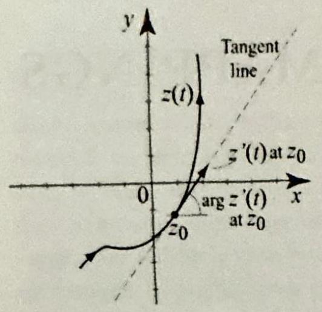

Figure 1 The direction of the tangent line at $z(t)$ is given by $\arg z^{\prime}(t)$.

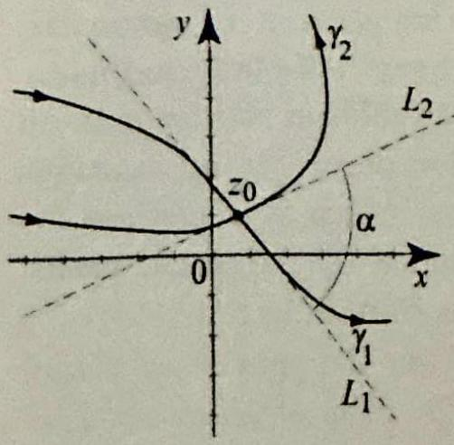
Figure 2 The curves $\gamma_{1}$ and $\gamma_{2}$ intersect at angle $\alpha$.

Figure 3 A linear mapping $f(z)=a z+b(a \neq 0)$ rotates by an angle $\arg \alpha$, dilates by a factor $|a|$, and translates by b. In particular, it preserves angles between curves. functions. These basic properties are interesting in their own right and will be very useful to us when solving partial differential equations involving the Laplacian. We start with a review from calculus of the notion of tangent lines to curves in parametric form. We will state these results using the convenient complex notation.

Suppose that $\gamma$ is a smooth path parametrized by $z(t)=x(t)+i y(t)$, $a \leq t \leq b$. Write $\frac{d z}{d t}=z^{\prime}(t)=x^{\prime}(t)+i y^{\prime}(t)$. Let us also assume that $z^{\prime}(t) \neq 0$, as this will guarantee the existence of a tangent. The tangent line to the curve at $z(t)$ points in the direction of $z^{\prime}(t)$; we can characterize this direction by specifying $\arg z^{\prime}(t)$ (see Figure 1). Thus the direction of the tangent line at a point on a path $z(t)$ is given by the argument of $z^{\prime}(t)$.

Let $z_{0}$ be a point in the $z$-plane, let $\gamma_{1}$ and $\gamma_{2}$ be two smooth paths that intersect at $z_{0}$, and let $L_{1}$ and $L_{2}$ denote the tangent lines to $\gamma_{1}$ and $\gamma_{2}$ at $z_{0}$. We will say that $\gamma_{1}$ and $\gamma_{2}$ intersect at angle $\alpha$ at $z_{0}$ if the tangent lines $L_{1}$ and $L_{2}$ intersect at angle $\alpha$ at $z_{0}$ (Figure 2).

To explain the geometric meaning of the mapping properties discussed in this section, let us consider the simple example of a linear mapping $f(z)= a z+b$, where $a \neq 0$ and $b$ are complex numbers. As usual, we consider a mapping as taking points in the $z$-plane to points in the $w$-plane. Using our geometric interpretation of addition and multiplication of complex numbers, we see that the effect of the linear mapping $f(z)=a z+b$ is to rotate by a fixed angle equal to $\arg a$, dilate by a factor equal to $|a|$, and then translate by $b$. (Note that the rotation and dilation commute, so it does not matter which one you apply first. But you cannot change the order of the translation; it comes last.) In particular, if $\gamma_{1}$ and $\gamma_{2}$ are two smooth paths that intersect at angle $\alpha$ at $z_{0}$, then their images by $f$ are two paths in the $w$-plane that intersect at $w_{0}=f\left(z_{0}\right)$; since $f(z)$ has rotated each curve by the same angle $\arg a$, the angle of their intersection in the $w$-plane is still $\alpha$. Furthermore, $\gamma_{1}$ 's orientation as being either clockwise or counterclockwise of $\gamma_{2}$, is preserved (Figure 3).
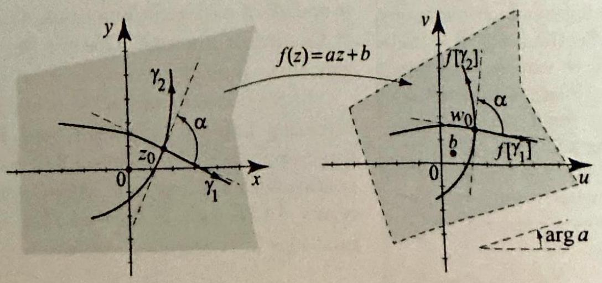

## THEOREM 1 CONFORMAL PROPERTY

With the example of the linear mapping in mind, we introduce the following basic property. A mapping $w=f(z)$ is said to be conformal at $z_{0}$ if $f$ preserves angles between curves at $z_{0}$ and preserves their angular orientation.

Now suppose that $f(z)$ is analytic at $z_{0}$ and $f^{\prime}\left(z_{0}\right) \neq 0$. From our study of the derivative in Section 2.3 (Theorem 5), we know that $f$ is approximately linear in the neighborhood of $z_{0}$. More precisely, we have

$$
f(z)=f\left(z_{0}\right)+f^{\prime}\left(z_{0}\right)\left(z-z_{0}\right)+\epsilon(z)\left(z-z_{0}\right)
$$

where $\epsilon(z) \rightarrow 0$ as $z \rightarrow z_{0}$. So, near $z_{0}$, we can write $f(z) \approx f^{\prime}\left(z_{0}\right) z+b$, where $b=-f^{\prime}\left(z_{0}\right) z_{0}+f\left(z_{0}\right)$ is a constant. From what we just discovered about linear mappings, this suggests that $f$ is conformal at $z_{0}$; it rotates by an angle $\theta=\arg f^{\prime}\left(z_{0}\right)$ and scales by a factor $\left|f^{\prime}\left(z_{0}\right)\right|$. Indeed, we have the following important result.
Suppose that $f$ is analytic at $z_{0}$ and $f^{\prime}\left(z_{0}\right) \neq 0$, then $f$ is conformal at $z_{0}$.

Proof Let $\gamma$ be any smooth path through $z_{0}$, parametrized by $z(t)=x(t)+i y(t)$, with $z\left(t_{0}\right)=z_{0}$ and $z^{\prime}\left(t_{0}\right) \neq 0$. Then the image of $\gamma$ by $f$ is a path parametrized by $f(z(t))$ that goes through $w_{0}=\gamma\left(z_{0}\right)$ in the $w$-plane. Since $z^{\prime}\left(t_{0}\right) \neq 0$, the direction of the tangent line to $\gamma$ at $z_{0}$ is $\arg z^{\prime}\left(t_{0}\right)$. Also, from the chain rule, $\left.\frac{d}{d t} f(z(t))\right|_{t_{0}}=f^{\prime}\left(z\left(t_{0}\right)\right) z^{\prime}\left(t_{0}\right) \neq 0$ and so the direction of the tangent line to $f(z(t))$ at $w_{0}=f\left(z_{0}\right)$ is

$$
\arg \left(\left.\frac{d}{d t} f(z(t))\right|_{t_{0}}\right)=\arg \left(f^{\prime}\left(z\left(t_{0}\right)\right) z^{\prime}\left(t_{0}\right)\right)=\arg f^{\prime}\left(z\left(t_{0}\right)\right)+\arg z^{\prime}\left(t_{0}\right)
$$

Hence $f(z)$ rotates the tangent line at $z_{0}$ by a fixed angle $\arg f^{\prime}\left(z_{0}\right)$. Since $f$ rotates any two tangent lines intersecting at $z_{0}$ by the same angle $\arg f^{\prime}\left(z_{0}\right)$, it preserves the angle of intersection and their orientation. $\square$

## Boundary Behavior

We will use conformal mappings to transform boundary value problems consisting of Laplace's equation along with boundary conditions. We know from Section 2.5, Theorem 3, that Laplace's equation is not changed by a conformal mapping. To handle the effect of the mapping on the boundary conditions, it would be nice to know that the boundary is mapped to the boundary. But as the following simple example shows, this may fail in general.

## EXAMPLE 1 Boundary points mapped to interior points

Consider $f(z)=z^{2}$ and $\Omega=\left\{z=r e^{i \theta}: \frac{1}{2}<r<1,-\pi<\theta<\pi\right\}$. Then $f$ is analytic and $f^{\prime}(z)=2 z \neq 0$ for all $z$ in $\Omega$. Hence $f(z)$ is conformal at each $z$ in $\Omega$. Since $z^{2}=r^{2} e^{2 i \theta}$ it is easy to see that $f[\Omega]$ is the annulus
$f[\Omega]=\left\{w=r e^{i \theta}: \frac{1}{4}<r<1,-2 \pi<\theta<2 \pi\right\}=\left\{w=r e^{i \theta}: \frac{1}{4}<r<1,0 \leq \theta \leq 2 \pi\right\}$.

## THEOREM 2 BOUNDARY BEHAVIOR

Figure 4 The function $f(z)= z^{2}$ is conformal in $\Omega$. It takes the interval $\left(-1,-\frac{1}{2}\right)$ on the boundary of $\Omega$ to the interval $\left(\frac{1}{4}, 1\right)$ in the interior of $f[\Omega]$. Thus $f$ does not map boundary points to boundary points.
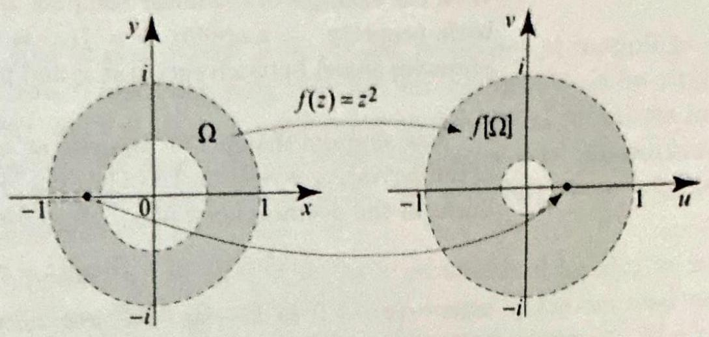

It is also easy to see that the boundary points $z=x,-1 \leq x \leq-\frac{1}{2}$ are mapped to the interior points $w=u, \frac{1}{4} \leq u \leq 1$ (see Figure 4). Thus $f$ does not map the boundary of $\Omega$ to the boundary of $f[\Omega]$.

Recall from Section 5.7 that the condition $f^{\prime}(z) \neq 0$ ensures that $f$ is one-to-one locally at $z$. The function may fail to be one-to-one on the entire region $\Omega$, which was the case in Example 1. We will show that if $f(z)$ is analytic and one-to-one then it will map boundary to boundary. Before we do so, let us clarify certain issues. We know from Section 5.7 that if $f$ is analytic and nonconstant on a region $\Omega$, then $f[\Omega]$ is a region. So all the points in $\Omega$ are mapped to (interior) points in $f[\Omega]$. Now $f$ might not be defined on the boundary of $\Omega$, so we need a special definition to describe how $f$ maps the boundary of $\Omega$. We will say that $f$ maps the boundary of $\Omega$ to the boundary of $f[\Omega]$ if the following condition holds. If $\left\{z_{n}\right\}$ is any sequence in $\Omega$ converging to $\alpha_{0}$ on the boundary of $\Omega$ and $\beta$ is any point in $f[\Omega]$, then $\left\{f\left(z_{n}\right)\right\}$ does not converge to $\beta$. So if $\left\{f\left(z_{n}\right)\right\}$ converges, it must converge to a boundary point of $f[\Omega]$ or to infinity. (There are examples where $\left\{f\left(z_{n}\right)\right\}$ does not converge; see Exercise 21.) If the region $\Omega$ is unbounded, we allow putting $\alpha_{0}=\infty$.

We will say that $f$ maps the boundary of $\Omega$ onto the boundary of $f[\Omega]$ if for every point $u_{0}$ on the boundary of $f[\Omega]$, we can find a sequence $z_{n}$ in $\Omega$ where $z_{n} \rightarrow \alpha_{0}, \alpha_{0}$ being on the boundary of $\Omega$, and $f\left(z_{n}\right) \rightarrow w_{0}$.

We have the following important result.
Suppose that $f$ is analytic and one-to-one in a region $\Omega$. Then $f$ maps the boundary of $\Omega$ to the boundary of $f[\Omega]$, and this map is onto.
Proof We will prove that $f$ maps the boundary of $\Omega$ to the boundary of $f[\Omega]$, leaving the "onto" part for Exercise 20. Let $\left\{z_{n}\right\}$ be a sequence in $\Omega$ such that $f\left(z_{n}\right) \rightarrow \beta$, where $\beta$ is an interior point of $f[\Omega]$. Since $f$ is analytic and one-to-one. $f^{-1}$ exists and is analytic, and hence continuous. Thus

$$
\lim _{n \rightarrow \infty} z_{n}=\lim _{n \rightarrow \infty}\left(f^{-1}\left(f\left(z_{n}\right)\right)\right)=f^{-1}\left(\lim _{n \rightarrow \infty} f\left(z_{n}\right)\right)=f^{-1}(\beta)
$$

so $z_{n}$ converges to an interior point of $\Omega$.

If the conformal mapping can be extended to a continuous function on the boundary, the following version of Theorem 2 will be useful.

## COROLLARY 1

Figure 5 The fact that the boundary of $f[\Omega]$ is the $u$ axis implies that $f[\Omega]$ is either the upper or lower halfplane. We decide which half it is by checking the image of one point. Note how the right angles at $z= \pm \frac{\pi}{2}$ got flattened by $f$ in the $w$-plane. The function $f$ is still conformal in $\Omega$, even though $f$ is not conformal at two points on the boundary.

Suppose that $f$ is analytic and one-to-one in a region $\Omega$. Let $\alpha$ be any point of the boundary of $\Omega$ such that $f$ is continuous at $\alpha$. Then $f(\alpha)$ is a point on the boundary of $f[\Omega]$.
Proof Let $\left\{z_{n}\right\}$ be a sequence in $\Omega$ converging to $\alpha$ on the boundary of $\Omega$. Since $f$ is continuous at $\alpha, f\left(z_{n}\right)$ converges to $f(\alpha)$. By Theorem 2, $f(\alpha)$ is a boundary point of $f[\Omega]$.

The fact that the boundary is mapped to the boundary helps us determine the image of a region from our knowledge of the image of the boundary and one interior point. Let us illustrate this useful technique by revisiting an example from Section 1.6.

## EXAMPLE 2 Mapping of regions

Let $f(z)=\sin z$ and $\Omega=\left\{z=x+i y:-\frac{\pi}{2}<x<\frac{\pi}{2}, y>0\right\}$. Thus $\Omega$ is the semi-infinite vertical strip shown in Figure 5. Since $\sin z_{1}=\sin z_{2}$ if and only if $z_{1}=z_{2}+2 k \pi$ ( $k$ an integer), we see that $f$ is one-to-one on $\Omega$. Also, $f$ is continuous on the boundary of $\Omega$.
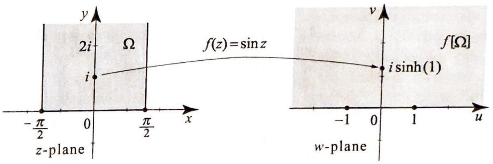

We start by determining the image of the boundary. For $z=x$ real, we have $f(z)=\sin x$, and so $f$ maps the interval $-\frac{\pi}{2} \leq x \leq \frac{\pi}{2}$ onto the interval $[-1,1]$. For $z=\frac{\pi}{2}+i y$, we have $f(z)=\sin \left(\frac{\pi}{2}+i y\right)=\cosh y$, a real number (see (16), Section 1.6). So $f$ maps the vertical semi-infinite line $z=\frac{\pi}{2}+i y(y \geq 0)$ onto the semiinfinite interval $[1, \infty)$. For $z=-\frac{\pi}{2}+i y$, we have $f(z)=\sin \left(-\frac{\pi}{2}+i y\right)=-\cosh y$ (see (16), Section1.6). So $f$ maps the vertical semi-infinite line $z=-\frac{\pi}{2}+i y(y \geq 0)$ onto the semi-infinite interval $(-\infty,-1]$. Thus, $f$ maps the boundary of $\Omega$ to the real axis. According to Theorem 2, the image of the vertical strip has boundary the $u$-axis, so it is either the upper or the lower half-plane. Checking the value of $f$ at one point in $\Omega$, say $z=i$, we find $f(i)=\sin (i)=i \sinh (1)$, which is a point in the upper half. Thus the image of $\Omega$ is the upper half-plane.

As a further application, we consider the Joukowski function

$$
J(z)=\frac{1}{2}\left(z+\frac{1}{z}\right) \quad(z \neq 0) .
$$

This function has applications in aerospace engineering.

EXAMPLE 3 The Joukowski mapping
(a) Show that $J(z)$ maps the upper unit semicircle $\sigma=\left\{z: z=e^{i \theta}, 0 \leq \theta \leq \pi\right\}$ onto the real interval $J[\sigma]=[-1,1]$, and the semi-infinite intervals $[1, \infty)$ and $(-\infty,-1]$ onto themselves.
(b) Show that the Joukowski function maps the set $\Omega=\left\{z:|z| \geq 1,0 \leq \operatorname{Arg}_{z \leq}\right. \pi\}$ onto the upper half-plane $\{w=u+i v: v \geq 0\}$ (see Figure 6). A more precise description of the Joukowski mapping is outlined in Exercise 17.

Figure 6 The Joukowski function maps the region $\Omega$ one-to-one onto the upper half-plane. It also maps the upper semi-circle of radius $R>1, x^{2}+y^{2}=R^{2}, y \geq 0$, to the upper semi-ellipse $\frac{(\operatorname{Re} w)^{2}}{\left[\frac{1}{2}\left(R+\frac{1}{k}\right)\right]^{2}}+\frac{(\operatorname{lm} w)^{2}}{\left[\frac{1}{2}\left(R-\frac{1}{k}\right)\right]^{2}}=1$, $\operatorname{Im} w \geq 0$. (See Exercise 17.)

Solution (a) For $z=e^{i \theta}, 0 \leq \theta \leq \pi$, we have

$$
w=J(z)=\frac{1}{2}\left(e^{i \theta}+\frac{1}{e^{i \theta}}\right)=\frac{1}{2}\left(e^{i \theta}+e^{-i \theta}\right)=\cos \theta
$$

As $\theta$ varies from 0 to $\pi, w$ varies from 1 to -1 , showing that the image of the upper semi-circle is the interval $[-1,1]$. To determine the images of the semiinfinite intervals $[1, \infty)$ and $(-\infty,-1]$, let $z=x$; then $J(z)=\frac{1}{2}\left(x+\frac{1}{x}\right)$. As $x$ varies through $[1, \infty)$ or $(-\infty,-1], J(x)$ varies through the same interval (in the $w$-plane).
(b) We showed in (a) that $J$ maps the boundary of $\Omega$ onto the real axis. If we can show that $J$ is conformal and one-to-one, it will follow from Corollary 1 that $J[\Omega]$ is either the upper or the lower half of the $w$-plane. We can then determine which half it is by checking the image of one point in $\Omega$. That $J$ is conformal at all points in $\Omega$ is clear from $J^{\prime}(z)=\frac{1}{2}\left(1-\frac{1}{z^{2}}\right) \neq 0$ for all $|z|>1$. To show that $J$ is one-to-one, let $z_{1}, z_{2}$ be in $\Omega$, and suppose that $J\left(z_{1}\right)=J\left(z_{2}\right)$. Then

$$
\begin{aligned}
z_{1}+\frac{1}{z_{1}}=z_{2}+\frac{1}{z_{2}} & \Rightarrow \frac{z_{1}^{2}+1}{z_{1}}=\frac{z_{2}^{2}+1}{z_{2}} \\
& \Rightarrow z_{2} z_{1}^{2}+z_{2}-z_{1} z_{2}^{2}-z_{1}=0 \\
& \Rightarrow\left(z_{1}-z_{2}\right)\left(z_{1} z_{2}-1\right)=0
\end{aligned}
$$

So either $z_{1}=z_{2}$ or $z_{1} z_{2}=1$. Since $1<\left|z_{1}\right|$ and $1<\left|z_{2}\right|$, we cannot have $z_{1} z_{2}=1$. So $z_{1}=z_{2}$, implying that $J$ is one-to-one. We have $J(2 i)=\frac{1}{2}\left(2 i+\frac{1}{2 i}\right)=\frac{3 i}{4}$. Since $J(2 i)$ is in the upper half-plane, we conclude that $J[\Omega]$ is the upper half-plane.

As we observed following Example 1, the condition $f^{\prime}(z) \neq 0$ for all $z$ in a region $\Omega$ is not enough to ensure that $f$ is one-to-one on $\Omega$. However, if $f$ is analytic and one-to-one on the whole region $\Omega$, then $f^{\prime}(z) \neq 0$ for all $z$ in $\Omega$, so $f$ is a conformal mapping. Moreover, from Section 5.7, we know that the inverse function exists on $\Omega^{\prime}=f[\Omega]$ and is analytic and one-to-one.

## THEOREM 3 RIEMANN MAPPING THEOREM

In this situation, we will say that $\Omega$ and $\Omega^{\prime}$ are conformally equivalent regions.

The following famous theorem of Riemann tells us that any simply connected region of the complex plane other than the plane itself is conformally equivalent to the open unit disk.
Let $\Omega$ be a simply connected region in the complex plane other than the complex plane itself. Then there is a one-to-one analytic function $f$ that maps $\Omega$ onto the unit disk $|w|<1$. The mapping $f$ is unique if we specify that $f\left(z_{0}\right)=0$ and $f^{\prime}\left(z_{0}\right)>0$, for some $z_{0}$ in $\Omega$.

The proof of the Riemann mapping theorem is above the level of this book. We refer you to Ahlfors [1] or Conway [10].

Combined with the Poisson integral formula, which solves the Dirichlet problem with arbitrary boundary data on the disk, the Riemann mapping theorem implies that we can at least theoretically solve the Dirichlet problem on any simply connected region $\Omega$. As illustrated in Figure 7, it suffices to conformally map $\Omega$ in a one-to-one way onto the unit disk. This gives rise to a new boundary value problem on the disk, which can be solved using the Poisson formula. The solution of the original problem is then obtained by composing the solution on the disk with the conformal mapping. As simple and elegant as it is, this approach has its limitations. Even though we have several powerful tools, such as Fourier series and techniques for evaluating integrals using residues, our experience with the Poisson formula tells us that this formula is not easy to compute in general. Even more difficult is the actual construction of the conformal mapping from $\Omega$ onto the unit disk. While the Riemann mapping guarantees its existence, it gives no clue as to how to construct it.

Figure 7 A one-to-one conformal mapping $f$ of $\Omega$ onto the unit disk $D=f[\Omega]$ takes boundary to boundary and preserves Laplace's equation. It transforms a Dirichlet problem on $\Omega$ into a Dirichlet problem on $D$, which can be solved using the Poisson formula. The solution in $\Omega$ is then $u(z)=U(f(z))$.

In the following sections, we will take up the construction of important conformal mappings that will lead us to very challenging problems. We will also give several applications to the solution of Laplace's equation.

## Exercises 6.1

In Exercise 1-6, determine where the given mapping is conformal.

1. $\frac{z^{2}+1}{e^{z}}$.
2. $\frac{z+1}{z^{2}+2 z+1}$.
3. $\frac{\sin z}{e^{z}}$.
4. $\frac{e^{z}+1}{e^{z}-1}$.
5. $z+\frac{1}{z}$.
6. $\frac{z+1}{z+i}+\frac{2}{z}$.

In Exercise 7-12, determine the angle of rotation $\alpha=\arg f^{\prime}(z)$ and the dilation factor $\left|f^{\prime}(z)\right|$ of the given mapping at the indicated points.
7. $\frac{1}{z}, z=1, i, 1+i$.
8. $\log z, z=1, i,-i$.
9. $\sin z, z=0, \pi+i a, i \pi$.
10. $z^{2}, z=0,2 i,-1-i$.
11. $e^{i z}, z=\pi, i \pi, \frac{\pi}{2}$.
12. $\frac{1+e^{z}}{1-e^{z}}, z=1, i \pi, \ln (3)+2 i$.

Consider the orthogonal lines $x=a$ and $y=b$, where $a$ and $b$ are real numbers. Determine their images by the given mapping $f(z)$. For which values of $a$ and $b$ are the images orthogonal at the point of intersection $f(a+i b)$ ? Verify your answer by computing the angle between the image curves at the point $f(a+i b)$.
13. $e^{z}$.
14. $\sin z$.
15. $(1+i) z$.
16. $\frac{z+1}{z-1}$.
17. The Joukowski function. Refer to Example 3.
(a) Show that $J\left(\frac{1}{z}\right)=J(z)$ for all $z \neq 0$.
(b) Fix $R>1$. Show that the upper semicircle of radius $R, S_{R}=\{z:|z|= R, 0 \leq \operatorname{Arg} z\}$, is mapped onto the upper semi-ellipse

$$
J\left[S_{R}\right]=\left\{w=u+i v: \frac{u^{2}}{\left[\frac{1}{2}\left(R+\frac{1}{R}\right)\right]^{2}}+\frac{v^{2}}{\left[\frac{1}{2}\left(R-\frac{1}{R}\right)\right]^{2}}=1, v \geq 0\right\}
$$

18. Let $S$ denote the region in the upper half-plane consisting of all $z$ such that $1<|z|$. Consider the Dirichlet problem in $S$ with boundary conditions $u(x, y)=$ 100 if $(x, y)$ is on the upper unit circle, and $u(x, 0)=0$ for all $1<|x|$. Using the result of Exercise 35, Section 2.5, show that a solution is given by

$$
u(x, y)=\frac{100}{\pi}(\operatorname{Arg}(J(z)-1)-\operatorname{Arg}(J(z)+1)) \quad(z=x+i y)
$$

where $J(z)$ is the Joukowski function.
19. Consider $f(z)=\frac{z}{(1-z)^{2}}$. (a) Show that for all $z \neq 1, f(z)$ is analytic and $f^{\prime}(z) \neq 0$ for $z \neq-1$. (b) Show that $f$ is one-to-one in the open unit disk but is not one-to-one in any larger disk centered at 0 .
20. Let $f$ be as in Theorem 2. Fill in the details in the following proof that $f$ maps the boundary of $\Omega$ onto the boundary of $f[\Omega]$. Let $w_{0}$ be on the boundary of $f[\Omega]$; then we can find points $w_{n}=f\left(z_{n}\right)$ such that $z_{n}$ is in $\Omega$ and $w_{n} \rightarrow w_{0}$ (why?). Distinguish two cases. If the sequence $\left\{z_{n}\right\}$ is unbounded, then a subsequence $\left\{z_{n}\right\}$ tends to $\infty$, which is a point on the boundary of $\Omega$, and $f\left(z_{n_{j}}\right) \rightarrow w_{0}$. If $\left\{z_{n}\right\}$ is bounded, then by the Bolzano-Weierstrass property, we can find a subsequence $\left\{z_{n_{j}}\right\}$ that converges in $\Omega$ union its boundary. Show that $\left\{z_{n_{j}}\right\}$ cannot converge
to a point in $\Omega$ and so it must converge to a point $z_{0}$ on the boundary. Moreover, $f\left(z_{n_{j}}\right) \rightarrow w_{0}$.
21. Let $\Omega$ be the slit plane, $\mathbb{C} \backslash\{z: z \leq 0\}$, and $f(z)=\log z$. Show that the sequence $z_{n}=-1+i \frac{(-1)^{n}}{n}(n=1,2, \ldots)$ converges to -1 on the boundary of $\Omega$ and yet $f\left(z_{n}\right)$ does not converge.

### 6.2 Linear Fractional Transformations

It should be clear by now from our work in Sections 2.5 and 6.1 that our success in solving boundary value problems involving Laplace's equation is closely tied to our ability to construct conformal mappings between regions in the plane. A good place to start our study of special conformal mappings is on the unit disk, since there we have a general formula for the solution of the Dirichlet problem, namely the Poisson integral formula. As we will soon see, the most suitable mappings for regions involving disks and lines are the linear fractional transformations that we introduced in Section 1.4:

$$
\phi(z)=\frac{a z+b}{c z+d} \quad(a d \neq b c)
$$

Since $\phi^{\prime}(z)=\frac{a d-b c}{(c z+d)^{2}}$, the condition $a d \neq b c$ ensures that $\phi$ does not degenerate into a constant. If $c=0$, the linear fractional transformation reduces to a linear function, which is analytic everywhere or entire. If $c \neq 0$, then $\phi$ is analytic for all $z \neq-\frac{d}{c}$ and has a simple pole at $z=-\frac{d}{c}$.

## PROPOSITION 1 BASIC PROPERTIES

Let $\phi(z)$ be a linear fractional transformation as in (1). Then
(i) $\phi$ is one-to-one throughout the complex plane and conformal at every point in the complex plane, except at the pole $z=-\frac{d}{c}(c \neq 0)$.
(ii) The inverse of $\phi(z)$ is the linear fractional transformation given by

$$
z=\psi(w)=\frac{d w-b}{-c w+a}
$$

Proof The proposition is clear if $c=0$. Suppose $c \neq 0$. Then

$$
\phi^{\prime}(z)=\frac{a d-b c}{(c z+d)^{2}} \neq 0 \text { for all } z \neq-\frac{d}{c}
$$

Hence by Theorem 1, Section 6.1, the mapping is conformal at all $z \neq-\frac{d}{c}$. To get the inverse function, we solve $w=\frac{a z+b}{c z+d}$ for $z$, and get $z=\frac{d w-b}{-c w+a}$. Since $\phi$ has an inverse, it must be one-to-one, for if $\phi\left(z_{1}\right)=\phi\left(z_{2}\right)$ taking the inverse function of both sides, we get $z_{1}=z_{2}$. $\square$

It is not hard to see that every linear fractional transformation (1) with $c \neq 0$ is a composition of a linear mapping $w_{1}=c z+d ;$ an inversion $w_{2}=\frac{1}{w_{1}}$; and a linear mapping $w=\frac{a}{c}+\left(b-\frac{a d}{c}\right) w_{2}$ (see Exercise 41). Now linear
mappings have a very useful property that is easy to verify: They map a line to a line and a circle to a circle. The inversion $w_{2}=\frac{1}{w_{1}}$ has a somewhat similar property: It maps the collection of lines and circles in the $z$-plane to the collection of lines and circles in the $w$-plane. (Unlike linear mappings, the inversion may map a line to a circle or a circle to a line; see Figure 1.)

Figure 1 The inversion $f(z)=\frac{1}{z}$ preserves the collection of lines and circles. To verify the images of the given lines and circles, use the fact that $f$ is conformal (preserves angles) and the values $f(0)=\infty ; f(\infty)=0$; $f( \pm 1)= \pm 1 ; f( \pm i)=\mp i$; $f\left(\frac{3}{4}\right)=\frac{4}{3}$.

PROPOSITION 2 IMAGES OF LINES AND CIRCLES

This property of the inversion is not as simple to verify but it is straightforward and is sketched in Exercises 35-40. Since a linear fractional transformation is a composition of linear mappings and an inversion, it inherits this property too. Thus we obtain the following very useful result.
Let $\phi(z)$ be a linear fractional transformation as in (1). Then $\phi$ maps lines and circles in the $z$-plane to lines and circles in the $w$-plane.

It follows immediately from Proposition 1 and Theorem 2 of the previous section that a linear fractional transformation will map boundary to boundary. As we now illustrate, this property is very useful in determining the image of a region.

EXAMPLE 1 Mappings between the unit disk and the upper half-plane
(a) Show that the linear fractional transformation

$$
\phi(z)=i \frac{1-z}{1+z}
$$

maps the unit disk onto the upper half-plane.
(b) Show that the linear fractional transformation

$$
\psi(z)=\frac{i-z}{i+z}
$$

maps the upper half-plane onto the unit disk.
Solution (a) By Proposition 2, the image of the circle $C_{1}(0)$ is either a line or a circle in the $w$-plane. Since three points will determine either a line or circle, it suffices to check the images of three points on $C_{1}(0)$. We have

$$
\phi(1)=0 ; \quad \phi(i)=i \frac{1-i}{1+i}=1 ; \quad \phi(-i)=i \frac{1+i}{1-i}=-1 .
$$

Figure 2 The image of the unit circle is determined by the images of three points. Since these are collinear, the circle is therefore mapped to a line (the real axis, in this case). Note also that because $\phi$ maps the closed unit disk to an unbounded region (the upper half-plane), $\phi$ has to be discontinuous somewhere in the closed unit disk. Indeed it is singular at $z=-1$.

## PROPOSITION 3 COMPOSITION OF MAPPINGS

Thus $\phi(1), \phi(i)$, and $\phi(-i)$ lie on the $u$-axis (the real axis in the $w$-plane), and so the image of $C_{1}(0)$ is the $u$-axis. Because $\phi$ is one-to-one, it maps the boundary $C_{1}(0)$ onto the boundary of the image of the unit disk. Thus the image of the unit disk is either the upper half-plane or the lower half-plane. Checking $\phi(0)=i$ (a point in the upper half-plane), we conclude that $\phi$ maps the unit disk one-to-one onto the upper half-plane (see Figure 2).

(b) We can do this part in two ways. One way is to use Proposition 1(ii) and notice that $\psi$ is the inverse of $\phi$. Another way is to check the image by $\psi$ of the boundary and one interior point. We leave it as an exercise to verify that $\psi(0)=1, \psi(1)=i$, and $\psi(-1)=-i$. Since the images of the three points are not collinear, we conclude that the real axis is mapped onto the circle that goes through the points $1, i$, and $-i$, which is clearly the unit circle. (Here again, we are using the fact that three points determine a circle.) Also, $\psi(i)=0$; hence $\psi$ maps the upper half-plane onto the unit disk. $\square$

Another way to realize that the image of the unit circle is a line in Example $1(a)$ is to consider the point -1 on $C_{1}(0)$ and note that $\lim _{z \rightarrow-1} \phi(z)= \infty$. So the image of $C_{1}(0)$ is not bounded and since it is either a line or a circle, it has to be a line (which tends to infinity). Sometimes it is convenient to express the fact that the limit at the point $z_{0}=-\frac{d}{c}$ is infinity by writing $\phi\left(z_{0}\right)=\infty$. Likewise, it will be convenient to express $\lim _{z \rightarrow \infty} \frac{a z+b}{c z+d}=\frac{a}{c}$ by simply writing $\phi(\infty)=\frac{a}{c}$.

Before we present our next example, let us note another useful property of linear fractional transformations.

## The composition of any two linear fractional transformations is again a linear fractional transformation.

Proof Let $\phi_{1}(z)=\frac{a_{1} z+b_{1}}{c_{1} z+d_{1}}$ and $\phi_{2}(z)=\frac{a_{2} z+b_{2}}{c_{2} z+d_{2}}$. Then

$$
\phi(z)=\phi_{2} \circ \phi_{1}(z)=\frac{a_{2} \frac{a_{1} z+b_{1}}{c_{1} z+d_{1}}+b_{2}}{c_{2} \frac{a_{1} z+b_{1}}{c_{1} z+d_{1}}+d_{2}}
$$

Multiplying numerator and denominator by $c_{1} z+d_{1}$, we get

$$
\phi(z)=\frac{\left(a_{2} a_{1}+b_{2} c_{1}\right) z+a_{2} b_{1}+b_{2} d_{1}}{\left(c_{2} a_{1}+d_{2} c_{1}\right) z+d_{2} c_{1}+d_{2} d_{1}},
$$

which is a linear fractional transformation. Notice that when we multiplied by $c_{1} z+d_{1}$, we removed the singularity at $z=-\frac{d_{1}}{c_{1}}$; the resulting composition $\phi(z)$ has a single pole, and it is not necessarily at the same location as the poles of $\phi_{1}$ or $\phi_{2}$.

## EXAMPLE 2 Composition of linear fractional transformations

Find a linear fractional transformation that maps the disk $D$ with radius 2 and center at -1 onto the right half-plane $\operatorname{Re} w>0$.
Solution We describe two methods for doing this problem. Let us start with the quickest one based on the result of Example 1 and a simple application of Proposition 3. We know that $\phi(z)=i \frac{1-z}{1+z}$ maps the unit disk onto the upper halfplane. It is also easy to see that the linear mapping $\tau(z)=\frac{1}{2}(z+1)$ translates the center of $D$ to the origin and then scales the radius by $\frac{1}{2}$. Thus $\tau$ maps $D$ onto the unit disk. Consequently, $\phi \circ \tau(z)$ is a linear fractional transformation that maps $D$ onto the upper half-plane. To map onto the right half-plane, it suffices to rotate the upper half-plane by $-\frac{\pi}{2}$. This can be achieved by multiplying by $e^{-i \frac{\pi}{2}}=-i$. So the desired linear fractional transformation (Figure 3) is

$$
f(z)=-i \phi \circ \tau(z)=(-i) i \frac{1-\frac{1}{2}(z+1)}{1+\frac{1}{2}(z+1)}=\frac{1-z}{3+z}
$$

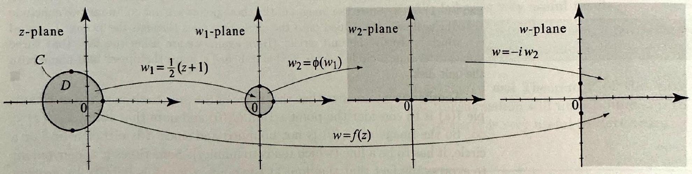

Figure 3 To map a disk to a half-plane, it is always advantageous to map the given disk to the unit disk and then use the transformation $\phi$ in Example 1.

Another way to do this problem is to start from scratch; we want a linear fractional transformation $g(z)=\frac{a z+b}{c z+d}$ to map the boundary of the disk onto the boundary of the right half-plane. We can pick any three points on the circle $C$ and map them to any three points on the imaginary axis. Since our image boundary is a line (which extends to infinity), we may map one of our points to $\infty$. We pick

$$
g(1)=0, \quad g(-3)=\infty, \quad g(i \sqrt{3})=i .
$$

We use these equations to solve for the coefficients $a, b, c$, and $d$, and then we will check whether the interior of the disk is mapped to the right half-plane or the left half-plane. Again writing $g(z)=\frac{a z+b}{c z+d}$, from $g(1)=0$ we get $a=-b$. From $g(-3)=\infty$ we get $3 c=d$. Thus $g(z)=\frac{a z-a}{c z+3 c}=\frac{a}{c} \frac{z-1}{z+3}$. From $g(i \sqrt{3})=i$ we get

$$
i=\frac{a}{c} \frac{i \sqrt{3}-1}{i \sqrt{3}+3} \Rightarrow \frac{a}{c}=i \frac{3+i \sqrt{3}}{-1+i \sqrt{3}}=\sqrt{3}
$$

## PROPOSITION 4 AN IMPLICIT FORMULA

PROPOSITION 5 MAPPING A POINT TO INFINITY

Then $g(z)=\sqrt{3} \frac{z-1}{z+3}$ will map the circle $C$ onto the $y$-axis. Note that any function of the form $\alpha g(z)$, where $\alpha \neq 0$ is real, will also map the circle $C$ onto the $y$ axis, since multiplying by a nonzero real constant leaves a line through the origin unchanged. So for simplicity we divide by $\sqrt{3}$, still calling the function $g$, and obtain a mapping $g(z)=\frac{z-1}{z+3}$ of the circle $C$ onto the $y$-axis. Does $g(z)$ take the region inside $C$ onto the right half-plane? We check the image of one point inside $C$, say -1 , and find $g(-1)=\frac{-2}{2}=-1$, which is a point in the left half-plane. So we modify $g$ by multiplying it by -1 and obtain the desired linear fractional transformation $g(z)=\frac{1-z}{3+z}$. Clearly any other positive multiple of $g$ will also work, and so the solution to this problem is not unique.

The previous examples illustrate how a linear fractional transformation can be determined from the images of three distinct points. In fact, we have the following useful formula.
There is a unique linear fractional transformation $w=\phi(z)$ that maps three distinct points $z_{1}, z_{2}$, and $z_{3}$ onto three distinct points $w_{1}, w_{2}$, and $w_{3}$. The mapping $w$ is implicitly given by

$$
\frac{z-z_{1}}{z-z_{3}} \frac{z_{2}-z_{3}}{z_{2}-z_{1}}=\frac{w-w_{1}}{w-w_{3}} \frac{w_{2}-w_{3}}{w_{2}-w_{1}} .
$$

Proof That $w$ is a linear fractional transformation follows by solving for $w$ in (4). To see that $w$ maps $z_{j}$ to $w_{j}(\mathrm{j}=1,2,3)$ it suffices to note that (4) holds if we replace $z$ by $z_{j}$ and $w$ by $w_{j}$. (For $j=3$, you must take reciprocals in (4) before replacing $z$ by $z_{3}$ and $w$ by $w_{3}$.) The uniqueness part is done in Exercises 9-10.

To map a circle onto a line by a linear fractional transformation, as we saw in Example 2, this can be achieved by requiring that $f(z)=\infty$ for some $z$ on the circle. In this case, the formula in Proposition 4 can be simplified as follows. Say you want $f\left(z_{3}\right)=\infty$. As $w_{3} \rightarrow \infty$, the fraction $\frac{w_{2}-w_{3}}{w-w_{3}}=\frac{1-w_{2} / w_{3}}{1-w / w_{3}} \rightarrow 1$. This suggests that we set $\frac{w_{2}-w_{3}}{w-w_{3}}=1$ on the right side of (4), obtaining the following formula whose verification is left to Exercise 11.
Let $z_{1}, z_{2}$, and $z_{3}$ be three distinct points. There is a unique linear fractional transformation $w=\phi(z)$ that maps $z_{1}$ and $z_{2}$ onto two distinct points $w_{1}$ and $w_{2}$, and maps $z_{3}$ to $\infty$. The mapping $w$ is implicitly given by

$$
\frac{z-z_{1}}{z-z_{3}} \frac{z_{2}-z_{3}}{z_{2}-z_{1}}=\frac{w-w_{1}}{w_{2}-w_{1}} .
$$

There is also a corresponding identity for a linear fractional transformation mapping $\infty$ to a point, obtained by reversing the roles of $z$ and $w$ in (5) (see Exercise 11). Our next example uses the conformal property of linear fractional transformations.

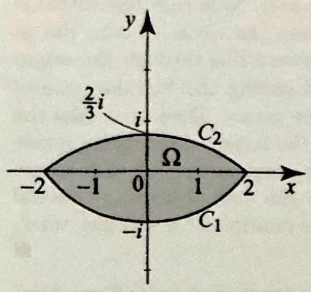
Figure 4 A lens-shaped region.

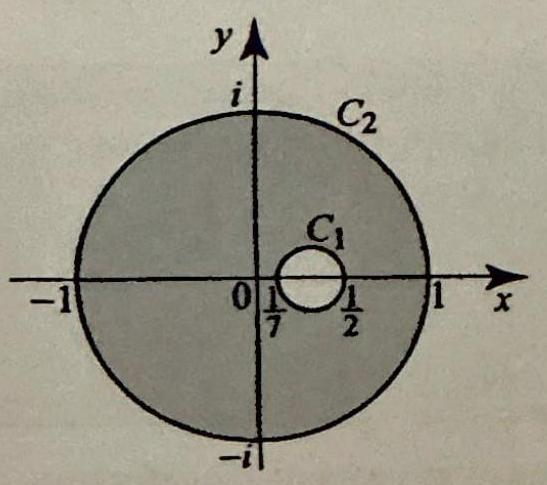
Figure 5 Two nonconcentric circles $C_{1}$ and $C_{2}$.

## EXAMPLE 3 Mapping of a lens-shaped region

The lens-shaped region $\Omega$ in Figure 4 is bounded by the arcs of two circles.
(a) Use a linear fractional transformation $\phi$ to map $\Omega$ onto a sector in the $w$-plane in such a way that

$$
\phi(-2)=0, \quad \phi(-i)=1, \quad \phi(2)=\infty
$$

(b) Determine the angle between the circles at the point -2 .

Solution (a) We apply (5) with $z_{1}=-2, w_{1}=0, z_{2}=-i, w_{2}=1, z_{3}=2$, and get

$$
\frac{z+2}{z-2} \frac{-i-2}{-i+2}=\frac{w}{1} \Rightarrow w=\phi(z)=\frac{2+i}{2-i} \frac{2+z}{2-z}
$$

(b) Of course we can determine the angle between $C_{1}$ and $C_{2}$ by finding their equations, then the slopes of the tangent lines at -2 , and then the angle between the tangent lines. A better way is to calculate the angle between the images of $C_{1}$ and $C_{2}$ and use the conformal property of $\phi$.

Because $\phi$ takes lines and circles to lines and circles, it is clear from its action on the points $-2,-i$ and 2 that $\phi$ maps the circle $C_{1}$ onto the $u$-axis. It also maps the circle $C_{2}$ onto a line that goes through the point $\phi(-2)=0$. To determine this line, it suffices to check the image of another point on $C_{2}$. We have $\phi\left(\frac{2}{3} i\right)=i$. Thus $\phi$ maps $C_{2}$ onto the $v$-axis. Because $\phi$ is conformal at $z=-2$, it preserves the angles at this point. Thus, the angle between the circles at $z=-2$ is equal to the angle between their images, the $u$ - and $v$-axes, which is clearly $\frac{\pi}{2}$.

Some applications concerning the electrostatic potential inside a capacitor formed by two cylinders lead to Dirichlet problems in regions bounded by two circles in the plane, which are not necessarily concentric. The problems are easier to solve when the two circles are concentric, giving rise to an annular region. (See for examples the exercises of Section 2.5.) Thus there is a great advantage in using a conformal mapping to center the circles before solving the Dirichlet problem. In what follows, we use a specific example to illustrate this process. More general examples are presented in the exercises.

## Example 4 Centering disks

Find a one-to-one analytic mapping that maps the region between the disks in Figure 5 to an annular region bounded by two concentric circles.
Solution The idea is to use one of the linear fractional transformations

$$
\phi_{\alpha}(z)=\frac{z-\alpha}{1-\bar{\alpha} z}
$$

where $\alpha$ is a complex number such that $|\alpha|<1$. These functions were introduced in Example 3, Section 3.7, where it was shown that $\left|\phi_{\alpha}(z)\right|=1$ if $|z|=1$. Thus $\phi_{a}$ maps the unit circle onto the unit circle. Because $\phi_{\alpha}$ maps boundary to boundary and because $\phi_{\alpha}(0)=-\alpha$ (a point inside the unit disk), we conclude that $\phi_{\alpha}$ maps the unit disk onto itself. Since $\phi_{\alpha}$ is a linear fractional transformation, it will map the circle $C_{1}$ onto a circle or a line, but because the image has to be inside the image
of the unit disk, it follows that $\phi\left[C_{1}\right]$ is bounded and hence it must be a circle. We now ask the following question: Can we find $\alpha$ so that $\phi_{\alpha}\left[C_{1}\right]$ is a circle centered at the origin? Suppose for a moment that $\alpha$ were real. Then clearly $\phi_{\alpha}(x)$ is also real, and so $\phi_{\alpha}$ maps the real line to the real line. Note that $\phi_{\alpha}(1 / 7)$ and $\phi_{\alpha}(1 / 2)$ are the points where $\phi_{\alpha}\left[C_{1}\right]$ meets the $u$-axis. Also, the circle $\phi_{\alpha}\left[C_{1}\right]$ must meet the $u$-axis in a perpendicular fashion (Figure 6), for the following three reasons:
(i) $C_{1}$ itself meets the real axis in a perpendicular fashion;
(ii) the $x$-axis is mapped to the $u$-axis; and
(iii) the map $\phi_{\alpha}$ is conformal.

Figure 6 For all $|\alpha|<1$, $o_{a}(z)$ maps the unit circle $C_{2}$ onto itself. But for one special value of $\alpha$, with $|\alpha|<1$, $\oint_{a}$ will also map the circle $C_{1}$ onto a circle centered at the origin, thus centering the images of $C_{1}$ and $C_{2}$.
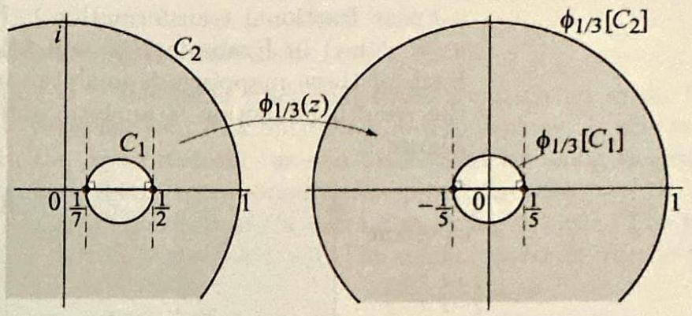

So if we want $\phi_{\alpha}\left[C_{1}\right]$ to be a circle centered at the origin, it is enough to require that $\phi_{\alpha}(1 / 7)=-\phi_{\alpha}(1 / 2)$. This implies that

$$
\frac{\frac{1}{7}-\alpha}{-\frac{\alpha}{7}+1}=-\frac{\frac{1}{2}-\alpha}{-\frac{\alpha}{2}+1} \Rightarrow \frac{1-7 \alpha}{7-\alpha}=-\frac{1-2 \alpha}{2-\alpha} \Rightarrow 9 \alpha^{2}-30 \alpha+9=0
$$

The last equation in $\alpha$ is equivalent to $3 \alpha^{2}-10 \alpha+3=0$, with solutions

$$
\alpha=\frac{5 \pm \sqrt{16}}{3}=\frac{5 \pm 4}{3} \Rightarrow \alpha=3 \text { or } \alpha=\frac{1}{3} .
$$

Since we want $|\alpha|<1$, we take $\alpha=\frac{1}{3}$. Thus

$$
\phi(z)=\phi_{\frac{1}{3}}(z)=\frac{z-\frac{1}{3}}{-\frac{1}{3} z+1}=\frac{3 z-1}{3-z}
$$

will map $C_{2}$ onto $C_{2}$ and $C_{1}$ onto the circle with center at the origin and radius $r=|\phi(1 / 2)|=\frac{\frac{3}{2}-1}{3-\frac{1}{2}}=\frac{1}{5}$. $\square$

## Composing Elementary Mappings

As the title indicates, we will compose together elementary mappings that we have studied thus far and construct some nontrivial conformal mappings of regions in the plane. We give four examples to illustrate this important process.

## EXAMPLE 5 Mapping a lens onto a disk

Construct a sequence of analytic functions that maps the lens-shaped region of Example 3 in a one-to-one way onto the unit disk. Write down the mapping that results from your construction.
Solution The first step is to use the function of Example 3,

$$
w_{1}=\phi(z)=\frac{2+i}{2-i} \frac{2+z}{2-z}=\alpha \frac{2+z}{2-z} \quad\left(\alpha=\frac{2+i}{2-i}\right),
$$

which maps the lens to the first quadrant. The first quadrant is then mapped onto the upper half-plane by the function $w_{2}=w_{1}^{2}$. (Note that our mapping is no longer a linear fractional transformation.) Finally, the linear fractional transformation $w=\psi\left(w_{2}\right)$ in Example 1(ii) will take the upper half-plane onto the unit disk. Each of these mappings is analytic and one-to-one on the region of interest. So the resulting function is analytic and one-to-one. The mapping is illustrated in Figure 7.

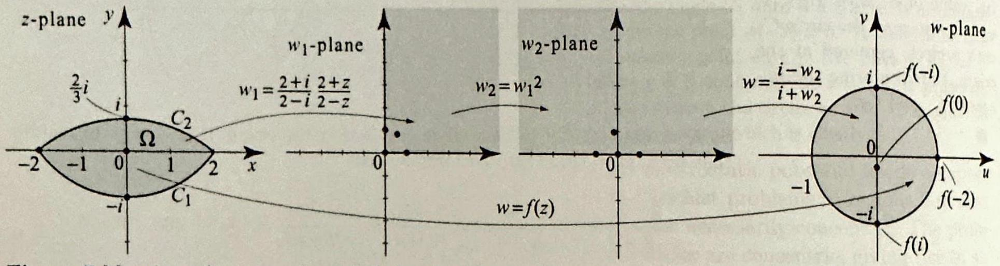
Figure 7 Mapping a lens onto the unit disk. Note the conformal property in the first mapping at the point -2 , which preserved the right angle. Note the failure of the conformal property in the second mapping at the point 0 , where the angle is doubled.

The explicit formula in terms of $z$ of the conformal mapping of the lens onto the unit disk is

$$
w=\frac{i-w_{2}}{i+w_{2}}=\frac{i-w_{1}^{2}}{i+w_{1}^{2}}=\frac{i-[\phi(z)]^{2}}{i+[\phi(z)]^{2}}
$$

where $\phi(z)=\frac{2+i}{2-i} \frac{2+z}{2-z}$ from Example 3. Replacing $\phi(z)$ by its value in terms of $z$ and simplifying (by hand or with the help of a computer system), we get

$$
w=f(z)=-i \frac{4-28 i z+z^{2}}{28+4 i z+7 z^{2}}
$$

The following values of $w$ confirm the fact that the mapping takes the lens-shaped region onto the unit disk, also taking boundary points to boundary points:

$$
f(0)=-\frac{i}{7}, \quad f(-2)=1, \quad f\left(\frac{2}{3} i\right)=-i, \quad f(-i)=i
$$

## EXAMPLE 6 Mapping a half-disk onto a disk

The sequence of one-to-one analytic mappings in Figure 8 takes the upper half of

Figure 8 Mapping the upper half of the unit disk onto the unit disk.
The first mapping is the linear fractional transformation $w_{1}=\phi(z)=i \frac{1-z}{1+z}$ from Example 1. It takes the unit disk onto the upper half-plane. It also takes the upper half-disk onto the first quadrant, as can be verified by using the conformality at $z=1$ and checking the image of one interior point, say $\phi\left(\frac{i}{2}\right)=\frac{4}{5}+i \frac{3}{5}$, which is in the first quadrant. The action of the second mapping is clear. The third mapping is the mapping $\psi$ from Example 1(ii). The explicit formula of the final mapping $w=f(z)$ is

$$
w=\psi\left(w_{2}\right)=\frac{i-w_{2}}{i+w_{2}}=\frac{i-w_{1}^{2}}{i+w_{1}^{2}}=\frac{i-\left(i \frac{1-z}{1+z}\right)^{2}}{i+\left(i \frac{1-z}{1+z}\right)^{2}}=-i \frac{1+2 i z+z^{2}}{1-2 i z+z^{2}}
$$

The intermediary mapping $w_{2}=w_{1}^{2}=-\left(\frac{1-z}{1+z}\right)^{2}$ is also of interest. It takes the upper half-disk onto the upper half-plane.

## EXAMPLE 7 A crescent-shaped region onto the upper half-plane

The crescent-shaped region in Figure 9 is bounded by two circles that intersect at angle 0 at the origin. We will describe a sequence of one-to-one analytic mappings that takes this region onto the upper half-plane.

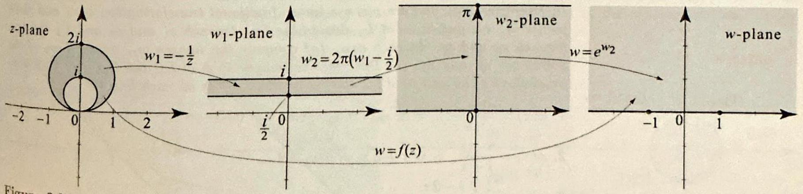
Figure 9 Mapping a crescent onto the upper half-plane.

The first mapping $w_{1}=-\frac{1}{z}$, being conformal at $z=i$ and $z=2 i$, will preserve the right angles at these points. Since it maps the imaginary axis onto the imaginary

Figure 10 The principal branch of the logarithm, $\log z$, maps the right half-plane onto an infinite horizontal strip.
axis, and 0 to $\infty$, consequently it will map the two circles onto two lines that intersect the imaginary axis at right angle. Thus the images of the circles are parallel horizontal lines as shown in the figure. As we move counterclockwise around the circles in the $z$-plane, we move right ward on the lines in the $w_{1}$-plane. The mapping $w_{2}=2 \pi\left(w_{1}-\frac{i}{2}\right)$ translates then scales the horizontal strip appropriately to set us up for an exponential mapping to the upper half-plane.

EXAMPLE 8 Mapping the unit disk onto an infinite horizontal strip We will describe a sequence of analytic and one-to-one mappings that takes the unit circle onto an infinite horizontal strip. The first linear fractional transformation, $w_{1}=-i \phi(z)$, is obtained by multiplying by $-i$ the linear fractional transformation $\phi(z)$ in Example 1(i). Since $\phi(z)$ maps the unit disk onto the upper half-plane, and multiplication by $-i$ rotates by the angle $-\frac{\pi}{2}$, the effect of $-i \phi(z)$ is to map the unit disk onto the right half-plane.

In Figure 10, $\log w_{1}=\ln \left|w_{1}\right|+i \operatorname{Arg} w_{1}$ is the principal branch of the logarithm. As $w_{1}$ varies in the right half-plane, $\operatorname{Arg} w_{1}$ varies between $-\frac{\pi}{2}$ and $\frac{\pi}{2}$, which explains the location of the horizontal boundary of the infinite strip. The desired mapping is

$$
w=f(z)=\log (-i \phi(z))=\log \frac{1-z}{1+z}
$$

## Exercises 6.2

In Exercises 1-4, you are given a linear fractional transformation $\phi(z)$ and three points $z_{1}, z_{2}$, and $z_{3}$. Let $L_{1}$ denote the line through $z_{1}$ and $z_{2}$ and $L_{2}$ the line through $z_{2}$ and $z_{3}$. In each case, (a) compute the images $w_{1}, w_{2}$, and $w_{3}$ of the points $z_{1}, z_{2}$, and $z_{3}$. (b) Describe the images by $\phi$ of $L_{1}$ and $L_{2}$. Are they lines or circles? (You will need the images of three points on each line.)

1. $\phi(z)=i \frac{1-z}{1+z}, z_{1}=1, z_{2}=0, z_{3}=i$.
2. $\phi(z)=\frac{i+z}{i-z}, z_{1}=1+i, z_{2}=0, z_{3}=i$.
3. $\phi(z)=\frac{1+i-2 z}{i-i z}, z_{1}=i, z_{2}=1, z_{3}=-i$.
4. $\phi(z)=\frac{1+2 z}{i-(1+i) z}, z_{1}=1+i, z_{2}=1, z_{3}=1-i$.

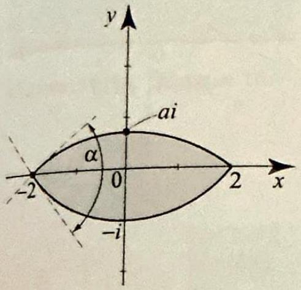
Figure 11 For Exercise 8.

5. Find the inverse $\psi$ of the linear fractional transformation in Exercise 1, and verify that $\psi$ maps $w_{1}, w_{2}$, and $w_{3}$ to $z_{1}, z_{2}$, and $z_{3}$.
6. Repeat Exercise 5 with the linear fractional transformation of Exercise 2.
7. (a) What is the inverse of the function $f(z)=\frac{1}{z}$ ? Answer this question without using (2), then verify your answer using (2).
(b) Describe the images by $f(z)=\frac{1}{z}$ of the unit circle, the unit disk, and the region outside the unit circle.
8. Let $\alpha$ denote the angle between the two circles in Figure 11 at -2 . Show that $\tan \alpha=\frac{4(a+1)(a-4)}{3(a+6)\left(a-\frac{2}{3}\right)}$. Discuss the cases when $a=-1,4,-6$, and $\frac{2}{3}$. [Hint: Map the circles to lines using the linear fractional transformation in Example 3.]
9. Fixed points. Recall that a point $z_{0}$ is a fixed point of a function $f(z)$ if $f\left(z_{0}\right)=z_{0}$. Show that a linear fractional transformation $\phi(z)$ can have at most two fixed points in the complex plane, unless $\phi(z)=z$, in which case all points are fixed points. [Hint: Discuss all possible solutions of $z=\frac{a z+b}{c z+d}$.]
10. Uniqueness of a linear fractional transformation. Let $z_{1}, z_{2}$, and $z_{3}$ be three distinct points, and let $w_{1}, w_{2}$, and $w_{3}$ be three distinct points (we allow $\infty)$. Show that there is a unique linear fractional transformation mapping $z_{j}$ to $w_{j}$. [Hint: The existence is guaranteed by Propositions 4 and 5. To prove uniqueness, suppose that $f$ and $g$ are two linear fractional transformations mapping $z_{j}$ to $w_{j}$. Apply the result of Exercise 9 to $f \circ g^{-1}$. How many fixed points does $f \circ g^{-1}$ have?]
11. (a) Mapping a point to infinity. Prove Proposition 5.
(b) Mapping infinity to a point. Let $z_{1}$ and $z_{2}$ be two distinct points, and $w_{1}, w_{2}, w_{3}$ be three distinct points. Show that there is a unique linear fractional transformation $w=\phi(z)$ that maps $z_{1}$ to $w_{1}, z_{2}$ to $w_{2}$ and $\infty$ to $w_{3}$. The mapping $w$ is implicitly given by

$$
\frac{z-z_{1}}{z_{2}-z_{1}}=\frac{w-w_{1}}{w-w_{3}} \frac{w_{2}-w_{3}}{w_{2}-w_{1}}
$$

In Exercises 12-24, (a) supply the formulas of the analytic mappings in each sequence of mappings shown in the accompanying figure (Figures 12-24). (b) Verify that the boundary and the interior of the shaded regions are mapped to the boundary and interior of the shaded regions. (c) Derive the given formula for the final composite mapping $w=f(z)$. As usual, we start in the $z$-plane and end in the $w$-plane, going through the $w_{j}$-planes.

Figure 12 for Exercise 12.

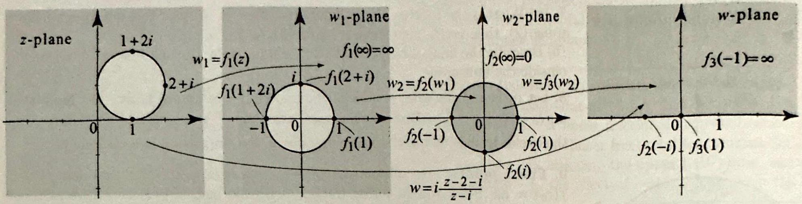
Figure 13 for Exercise 13.

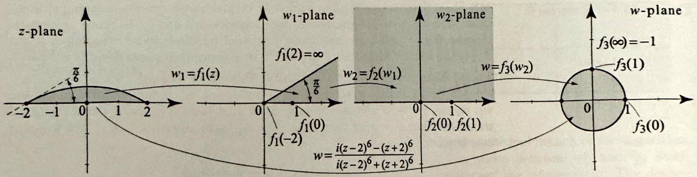
Figure 14 for Exercise 14.

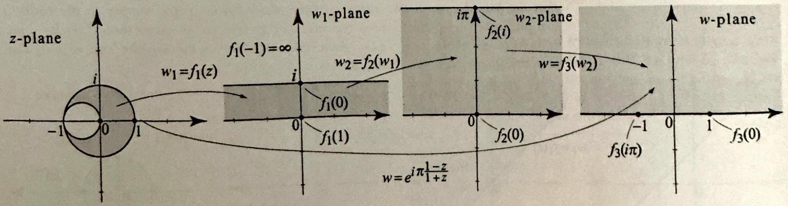
Figure 15 for Exercise 15.

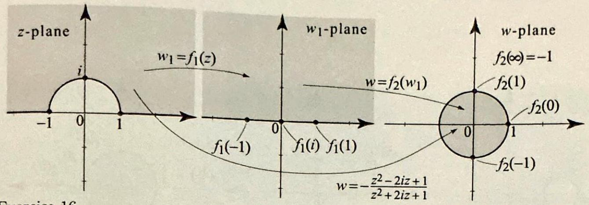
Figure 16 for Exercise 16.

Figure 17 for Exercise 17.

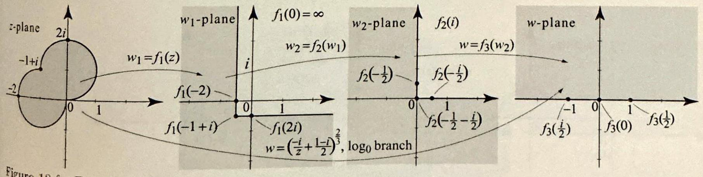
Figure 18 for Exercise 18.

Figure 19 for Exercise 19.

Figure 20 for Exercise 20.

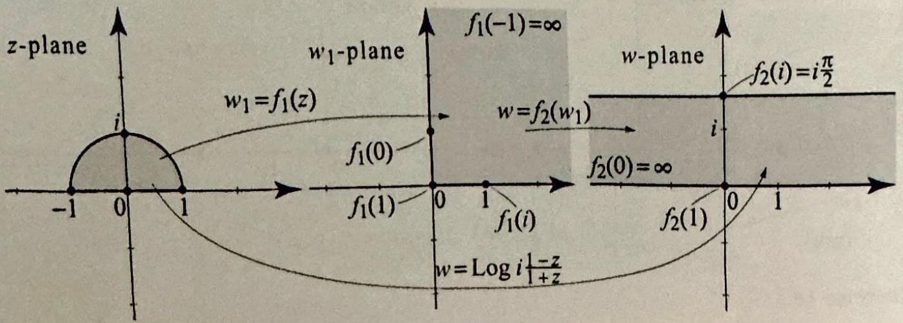
Figure 21 for Exercise 21.

Figure 22 for Exercise 22.

Figure 23 for Exercise 23.

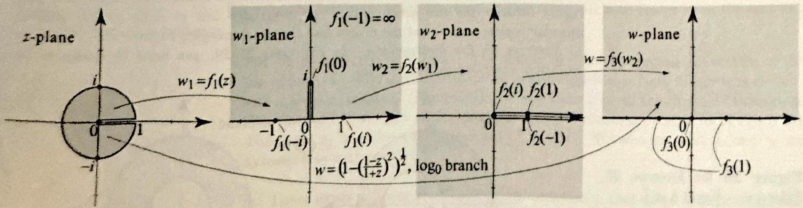
Figure 24 for Exercise 24.

Figure 25 for Exercise 25.

Figure 26 for Exercise 26. Take $a=-\frac{1}{4}$ and $b=\frac{7}{8}$.
25. Project Problem: Centering disks. We generalize the process in Example 4 to any region bounded by two non-intersecting circles, $C_{2}$ and $C_{1}$, such that $C_{1}$ is in the interior of $C_{2}$. By translating the center of $C_{1}$ to the origin, scaling, and rotating, we can always reduce the picture to the one described in Figure 25, where $|a|<b<1, C_{2}$ is the unit circle, and $C_{1}$ is centered on the $x$-axis with $x$-intercepts $a$ and $b$. Our goal is to show that we can choose $\alpha$ such that $-1<\alpha<1$ and $\phi_{\alpha}(z)$ maps $C_{1}$ onto a circle centered at the origin. Here $\phi_{\alpha}(z)$ is the linear fractional transformation (6), which maps $C_{2}$ onto $C_{2}$. As explained in Example 4, it suffices to choose $\alpha$ so that $\phi_{\alpha}(a)=-\phi_{\alpha}(b)$.
(a) Show that the latter condition leads to the equation in $\alpha$ :

$$
\alpha^{2}-2 \frac{1+a b}{a+b} \alpha+1=0,
$$

with roots

$$
\alpha_{1}=\frac{1+a b}{a+b}+\sqrt{\left(\frac{1+a b}{a+b}\right)^{2}-1} \quad \text { and } \quad \alpha_{2}=\frac{1+a b}{a+b}-\sqrt{\left(\frac{1+a b}{a+b}\right)^{2}-1} .
$$

(b) Show that if $|a|<1$ and $|b|<1$, then $1+a b \geq a+b$. [Hint: $1-b \geq a(1-b)$.] (c) Show that $\alpha_{1}>1$, while $0<\alpha_{2}<1$. [Hint: The first inequality follows from (b). For the second inequality, use the fact that the product of the roots of $a x^{2}+b x+c=0$ is $\frac{c}{a}$.]
(d) Conclude that $\phi(z)=\frac{z-\alpha}{1-\alpha z}$ with $\alpha=\frac{1+a b}{a+b}-\sqrt{\left(\frac{1+a b}{a+b}\right)^{2}-1}$ will map $C_{2}$ onto
$C_{2}, C_{1}$ onto a circle centered at the origin with radius $r=\phi(b)$, and the region between $C_{2}$ and $C_{1}$ onto the annular region bounded by $\phi\left[C_{1}\right]$ and the unit circle.
In Exercises 26-29, derive the linear fractional transformation that maps the shaded region between the two given circles (or circle and line in Exercise 29) onto an annular region centered at the origin (see the accompanying Figures 26-29). Refer to Exercise 25 for instructions. In Exercises 28-29, you need to reduce to the situation described in Exercise 25.
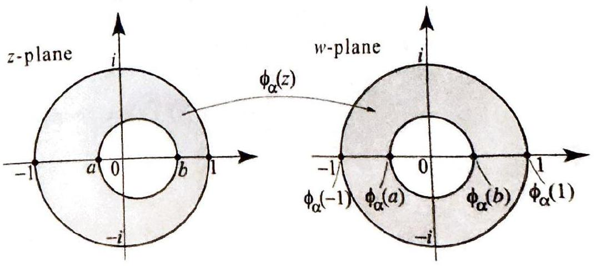

Figure 27 for Exercise 27. Take $a=0$ and $b=\frac{8}{17}$.

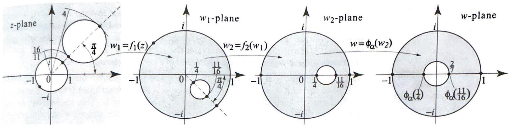
Figure 28 for Exercise 28. (The figures are not to scale.)

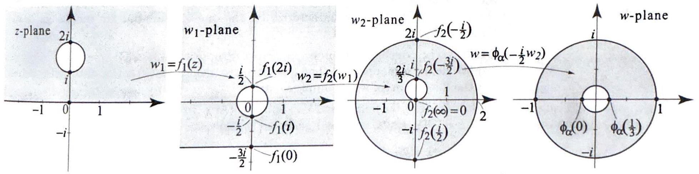
Figure 29 for Exercise 29. [Hint: In the last step, start by rotating the inner circle to center it on the real axis, then scale the outer radius to 1 .]

Figure 30 for Exercise 30.

30. A geometric problem. The following is an interesting illustration of the use of linear fractional transformations to prove geometric facts. Consider a circle $C$ and a point $z_{0}$ inside $C$ (Figure 30). We will show that all the circles $C^{\prime}$ through $z_{0}$ that intersect $C$ at right angle, also intersect at a common point $z_{1}$ as in Figure 30. The point $z_{1}$ is called the reflection of $z_{0}$ in $C$. We also say that $z_{0}$ and $z_{1}$ are symmetric with respect to $C$.
(a) There exists a linear fractional transformation $\phi$ that maps $C$ to the real axis and the interior of $C$ to the upper half-plane. Show that $\phi\left[C^{\prime}\right]$ is a circle or a line that intersects the real axis at a right angle.
(b) Conclude that $\phi\left[C^{\prime}\right]$ passes through the point $-\phi\left(z_{0}\right)$. Setting $z_{1}=\phi^{-1}\left(-\phi\left(z_{0}\right)\right)$ we see that $C$ passes through $z_{1}$.
31. Project problem: one-to-one analytic mappings of the unit disk onto itself. Let $\phi_{\alpha}(z)$ be as in (6). We know that $\phi_{\alpha}(z)$ maps the unit disk $D$ onto itself. In this exercise, we show that, up to a unimodular constant multiple, these are the only one-to-one analytic mappings of the unit disk onto itself. That is, if $f$ is a one-to-one analytic mapping of $D$ onto $D$, then $f(z)=c \phi_{\alpha}(z)$, where $|c|=1$. This important result will be obtained as a consequence of Schwarz's lemma (Section 3.7).
(a) Suppose that $g$ is a one-to-one mapping of $D$ onto itself. Show that $f=\phi_{g(0)} \circ g$ is a one-to-one analytic mapping of $D$ onto itself such that $f(0)=0$. If we can show that $f$ is of the desired form, then because $g=\phi_{g(0)}^{-1} \circ f=\phi_{-g(0)} \circ f$, it will follow that $g$ is of the desired form.
(b) Suppose that $g$ is a one-to-one mapping of $D$ onto itself. By (a), we may without loss of generality assume that $g(0)=0$. Show that the inverse of $g, g^{-1}$, is also analytic, one-to-one, and maps $D$ onto $D$ and $g^{-1}(0)=0$. Apply Schwarz's lemma to $g$ and obtain $|g(z)| \leq|z|$. Apply Schwarz's lemma to $g^{-1}$ at the point $g(z)$ and obtain $\left|g^{-1}(g(z))\right| \leq|g(z)|$, or, equivalently, $|z| \leq|g(z)|$. Hence $|g(z)|=|z|$. Apply Schwarz's lemma again and conclude that $g(z)=c z$, where $|c|=1$.
32. Suppose that $\Omega$ is a region and $f$ and $g$ are two analytic one-to-one mappings of $\Omega$ onto the unit disk $D$. Show that there is a linear fractional transformation $\phi_{\alpha}$ of the form (6) such that $f(z)=c \phi_{\alpha} \circ g(z)$, where $|c|=1$. This shows that all the one-to-one mappings of a region $\Omega$ onto the unit disk are the same up to a change of variables effectuated by a linear fractional transformation of the form (6).
33. (a) Characterize all the one-to-one analytic mappings of the upper half-plane onto the unit disk. (b) Characterize all the one-to-one analytic mappings of the upper half-plane onto itself.
34. Matrix correspondence. (a) Prove Proposition 3.
(b) We define a mapping $\Phi$ that associates to each linear fractional transformation
(1) the $2 \times 2$ matrix with complex entries

$$
S=\left(\begin{array}{ll}
a & b \\
c & d
\end{array}\right)
$$

Thus $\Phi(\phi)=S$. Suppose that $\phi$ and $\psi$ are two linear fractional transformations with matrices $\Phi(\phi)=S$ and $\Phi(\psi)=T$. Show that the $\Phi(\phi \circ \psi)=S T$, where $S T$ denotes the product of the two matrices $S$ and $T$.
Project Problem: Lines and circles under inversion, part I. In Exercises 35-37 we will show that the function $f(z)=\frac{1}{2}$ maps lines and circles to lines and circles.
35. (a) Show that with $w=u+i v$ and $z=x+i y$, the mapping $w=1 / z$ can be written as $u(x, y)=\frac{x}{x^{2}+y^{2}}, v(x, y)=-\frac{y}{x^{2}+y^{2}}$.
(b) Deduce that the inverse transformation $z=1 / w$ is given by

$$
x(u, v)=\frac{u}{u^{2}+v^{2}}, \quad y(u, v)=-\frac{v}{u^{2}+v^{2}}
$$

36. (a) Show that any circle of the form $\left(x-x_{0}\right)^{2}+\left(y-y_{0}\right)^{2}=r^{2}, r>0$ can be written in the form

$$
A\left(x^{2}+y^{2}\right)+B x+C y+D=0, \text { where } B^{2}+C^{2}-4 A D>0 .
$$

Figure 31 For Exercise 38. Note that $S$ and $f[S]$ are plotted in the same plane.

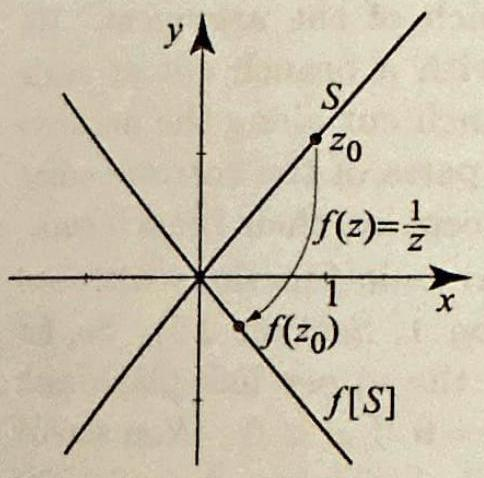
Figure 32 For Exercise 39. Note that $S$ and $f[S]$ are plotted in the same plane.

Figure 33 For Exercise 40. Note that $S$ and $f[S]$ are plotted in the same plane.

(b) Show that any line in the plane can be written in the form (9).
(c) Show that any set of points satisfying $A\left(x^{2}+y^{2}\right)+B x+C y+D=0$ with $B^{2}+C^{2}-4 A D>0$ is either a circle or a line depending on whether $A=0$ or $A \neq 0$.
(d) Show that such circles or lines pass through the origin if and only if $D=0$.
37. Suppose a set $S$ is given as those points $(x, y)$ satisfying (9). Use (8) and conclude that points $(u, v)$ in $f[S]$ satisfy an equation of the same form as (9), including the associated constant inequality. Conclude that under the mapping $f(z)=1 / z$ lines and circles are mapped to lines and circles, with the exception of the origin.
Project Problem: Lines and circles under inversion, part II. In Exercises 38-41, we investigate how specific lines and circles are mapped under the function $f(z)=\frac{1}{z}$ and describe a quick method to obtain the images. These exercises depend on Exercises 35-47, and in particular, (8) and (9).
38. (a) Suppose that $S$ is a circle that does not pass through the origin. Show that $f[S]$ is also a circle that does not pass through the origin.
(b) Let $z_{1}$ and $z_{2}$ denote the points in $S$ with the smallest and largest moduli, respectively. Show that $f\left(z_{1}\right)$ and $f\left(z_{2}\right)$ have the largest and smallest moduli, respectively, of those points in $f[S]$. Argue that the circle $f[S]$ is uniquely determined by these two points $f\left(z_{1}\right)$ and $f\left(z_{2}\right)$ (see Figure 31; $S$ and $f[S]$ are plotted on the same plane).
39. (a) Suppose $S$ is a line that passes through the origin. Show that with the exception of mapping to and from the origin, $f[S]$ is also a line passing through the origin.
(b) Argue that the image $f\left(z_{0}\right)$ of any nonzero point $z_{0}$ in $S$ uniquely determines the line $f[S]$ (see Figure 32).
40. (a) Suppose $S$ is a circle that passes through the origin. Show that with the exception of mapping from the origin, $f[S]$ is a line that does not pass through the origin.
(b) Suppose that $S$ is a line which does not pass through the origin. Show that with the exception of mapping to the origin, $f[S]$ is a circle that passes through the origin.
(c) Let $S$ be a circle that passes through the origin and $f[S]$ be the associated line that does not. Show that the point $z_{0}$ of maximum modulus on the circle maps to the point $w_{0}$ of minimum modulus on the line, and vice versa. Argue that each of these points uniquely determines the corresponding circle or line. If we let $R$ denote the radius of the circle and $a$ the perpendicular distance from the origin to the line, show that $2 R=\frac{1}{a}$ (see Figure 33).
41. Lines and circles under linear fractional transformations. (a) Verify that every linear fractional transformation is a composition of a linear transformation, followed by an inversion, followed by a linear transformation, as described in the section.
(b) Using part (a) and the result of Exercise 37, show that any linear fractional transformation maps lines and circles to lines and circles.

### 6.3 Solving Dirichlet Problems with Conformal Mappings

This section continues the applications that we introduced in Section 2.5, using conformal mappings to solve Dirichlet problems. At the heart of the subject is the invariance of Laplace's equation by conformal mappings, Theorem 3, Section 2.5. Very often the difficulty in solving a Dirichlet problem is due to the geometry of the region on which the problem is stated. Conformal mappings can be used to transform a region to one on which the ensuing boundary value problem is easier to solve. Roughly speaking, the conformal mapping method is like a change of variables that leaves Laplace's equation unchanged but transforms the boundary conditions. The success of this method is phenomenal. Not only we will be able to solve specific problems, but we will also take general formulas, such as the Poisson integral formula on a disk, and produce similar formulas for the solution of Dirichlet problems on new regions in the plane.

Recall that for Dirichlet problems where the boundary data is constant along rays, we can find a solution using a branch of the argument. We denote by $\arg _{\alpha} z$ the branch of the argument with a branch cut at angle $\alpha$, and by $\operatorname{Arg} z$ the principal branch with a branch cut along the negative real axis. These functions, being the imaginary parts of the corresponding logarithm branches, are harmonic everywhere except on their branch cuts.

Recall also that a linear combination of harmonic functions with real scalars is again a harmonic function (Proposition 1, Section 2.5). So, for example, $u(z)=\frac{100}{\pi}(\pi-\operatorname{Arg} z)$ is harmonic in the upper half-plane with boundary values $u(x)=100$ if $x>0$ and $u(x)=0$ if $x<0$. (You should review Example 3, Section 2.5, for useful details involving $\operatorname{Arg} z$.) This solution to a very simple Dirichlet problem in the upper half-plane helps us solve a somewhat difficult Dirichlet problem on the unit disk. (We solved a similar problem using Fourier series in Section 4.7.)

## EXAMPLE 1 Steady-state temperature distribution in a disk

The boundary of a circular plate of unit radius with insulated lateral surface is kept at a fixed temperature distribution equal to $100^{\circ}$ on the upper semi-circle and $0^{\circ}$ on the lower semi-circle (see Figure 1(a)). Find the steady-state temperature inside the plate.
Solution To answer this question, we must solve $\Delta u=0$ inside the unit disk with boundary values $u=100$ on the upper semi-circle and $u=0$ on the lower semicircle. While the geometry of the circle makes it difficult to understand the effect of the boundary conditions on the solution inside the unit disk, the corresponding boundary value problem in the upper half-plane has a simple solution. To transform the given problem into a problem in the upper half-plane, we use the linear fractional transformation $\phi(z)=i \frac{1-z}{1+z}$ from Example 1(ii), Section 6.2. It is easy to verify that $\phi(z)$ takes the upper semi-circle onto the positive real axis, and the lower semicircle onto the negative real axis. Thus $\phi$ transforms the given Dirichlet problem

Figures 1 (a) and (b) Transforming the Dirichlet problem in Figure 1(a) into an easier Dirichlet problem in Figure 1(b), by using a linear fractional transformation $\phi(z)=i \frac{1-z}{1+z}$.

Figures 2(a) and (b) Using a linear fractional transformation to transform a Dirich${ }^{\text {let }}$ problem in a lens (Figure 2(a)) into a Dirichlet problem in the first quadrant (Figure 2(b)). While the problem in the lens is difficult to solve, the problem in the first quadrant has a very simple solution $U_{(w)}=\frac{200}{\pi} \operatorname{Arg} w$.
into a Dirichlet problem in the upper half-plane with boundary values shown in Figure 1(b).
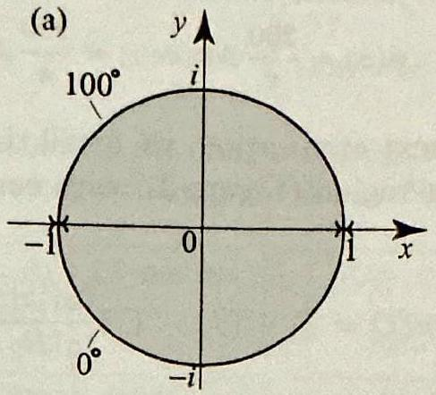
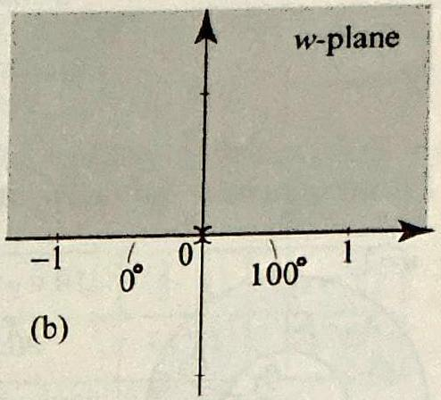

According to our preceding discussion, the solution in the upper half of the $w$ plane is $U(w)=\frac{100}{\pi}(\pi-\operatorname{Arg} w)$. By composing the solution in the $w$-plane with the conformal map, we get a solution of our original problem, $u(z)=U(\phi(z))$. Hence the solution of the Dirichlet problem in the unit disk is

$$
u(z)=\frac{100}{\pi}(\pi-\operatorname{Arg} \phi(z))=\frac{100}{\pi}\left(\pi-\operatorname{Arg}\left(i \frac{1-z}{1+z}\right)\right)
$$

For example, the temperature of the center of the circular plate is $u(0)=\frac{100}{\pi}(\pi- \operatorname{Arg}(i))=\frac{100}{\pi} \frac{\pi}{2}=50$, which is, as you would expect, the average value of the temperature on the circumference. With a little extra work, we can express the solution $u(z)$ in terms of $x$ and $y$ instead of $z$ (see Exercise 18).

We next solve a Dirichlet problem in a lens-shaped region.

## EXAMPLE 2 Dirichlet problem in a lens-shaped region

Find a harmonic function $u$ in the lens-shaped region $\Omega$ in Figure 2(a), with boundary values $u=100$ on the upper circular arc and $u=0$ on the lower circular arc.
Solution The region $\Omega$ was discussed in Example 3, Section 6.2, from which we recall the linear fractional transformation $\phi(z)=\frac{2+i}{2-i} \frac{2+z}{2-z}$. It is straightforward to check that $\phi$ maps the lower boundary of $\Omega$ onto the positive real axis, and the upper boundary of $\Omega$ onto the positive imaginary axis. By checking the image of one point in $\Omega$, say $z=0$, we find $\phi(0)=\frac{2+i}{2-i}=\frac{1}{5}(3+4 i)$, which is a point in the first quadrant. Thus $\phi$ maps the region $\Omega$ onto the first quadrant and transforms the given problem into a Dirichlet problem in the first quadrant of the $w$-plane, with boundary conditions as shown in Figure 2(b).
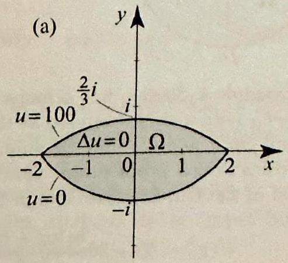
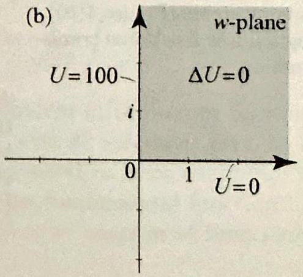

It is clear that the solution in the $w$-plane is $U(w)=\frac{200}{\pi} \operatorname{Arg} w$. Thus the solution of the Dirichlet problem on $\Omega$ is

$$
u(z)=\frac{200}{\pi} \operatorname{Arg} \phi(z)=\frac{200}{\pi} \operatorname{Arg}\left(\frac{2+i}{2-i} \frac{2+z}{2-z}\right)
$$

For our next application, we recall the solution of the Dirichlet problem

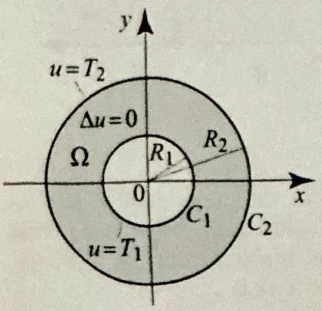
Figure 3 Dirichlet problem in an annulus.

Figures 4(a) and (b) A Dirichlet problem in a nonregular annulus (Figure 4(a)) is greatly simplified by first transforming the region into a regular annulus (Figure 4(b)), using a linear fractional transformation. in an annular region (Figure 3), with constant boundary values:

This function is harmonic in the complex plane minus the origin and so it is harmonic in the annulus $R_{1}<|z|<R_{2}$. The fact that it takes the values $T_{1}$ and $T_{2}$ on the boundary can be verified directly. For the derivation of this solution, see Exercise 30, Section 2.5. When the outer circle $C_{2}$ is the unit circle ( $R_{2}=1$ ), the solution becomes

$$
u(z)=T_{1}+\left(T_{2}-T_{1}\right) \frac{\ln \left(|z| / R_{1}\right)}{\ln \left(R_{2} / R_{1}\right)}, \quad R_{1}<|z|<R_{2}
$$

## F. F. F.

## EXAMPLE 3 A problem on a region between nonconcentric circles

Find a harmonic function $u$ in the nonregular annular region $\Omega$ in Figure 4(a), such that $u=50$ on the inner circle $C_{1}$ and $u=100$ on the outer unit circle $C_{2}$.
Solution We transform the problem into a Dirichlet problem on an annulus using the linear fractional transformation of Example 4, Section 6.2,

$$
w=\phi(z)=\frac{3 z-1}{3-z}
$$

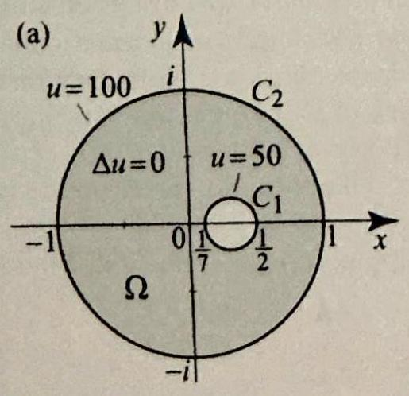
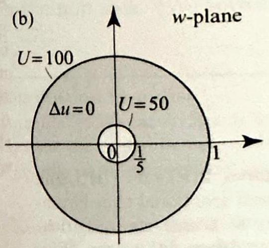

As shown in Example 4, Section 6.2, $\phi$ maps the unit circle $C_{2}$ onto the unit circle, the inner circle $C_{1}$ onto a circle centered at the origin with radius $\frac{1}{5}$, and the region between the unit circle and $C_{2}$ onto the annular region $\frac{1}{5}<|w|<1$. The boundary values in the transformed problem are shown in Figure 4(b), and so according to (2) the solution of the Dirichlet problem in the $w$-plane is

$$
U(w)=50+50 \frac{\ln |w|+\ln 5}{\ln 5}, \quad \frac{1}{5}<|w|<1
$$

Substituting $w=\phi(z)=\frac{3 z-1}{3-z}$, we obtain the solution in the $z$-plane

$$
u(z)=50+50 \frac{\ln \left|\frac{3 z-1}{3-z}\right|+\ln 5}{\ln 5}
$$

With the help of a computer, we have evaluated the solution at various points inside the nonregular annular region in Figure 4(a). The values are shown in Table 1.

| $(x, y)$ | $(0,0)$ | $\left(\frac{1}{7}-0.001,0\right)$ | $\left(\frac{1}{2}+0.001,0\right)$ | $(0.99,0.01)$ | $(0.99,-0.01)$ | $\left(\frac{1}{2}, \frac{1}{3}\right)$ | $\left(\frac{1}{2},-\frac{1}{3}\right)$ |
| :---: | :---: | :---: | :---: | :---: | :---: | :---: | :---: |
| $u(x+i y)$ | 65.87 | 50.15 | 50.20 | 99.38 | 99.38 | 74.73 | 74.73 |

Table 1. Temperature of various points inside the nonregular annular region in Figure 4(a).

## THEOREM 1 POISSON INTEGRAL FORMULA IN THE UPPER HALF-PLANE

The table seems to confirm the solution that we found. The values of $u(z)$ are between 50 and 100. They are closer to the boundary values as $z$ approaches the boundary (inner and outer). Note also the symmetric property of $u$, due to the symmetries in the given problem: We have $u(x+i y)=u(x-i y)$. You should expand the table of values and make your own conclusions about the solution.

We next derive the Poisson formula in the upper half-plane by using the corresponding formula in the unit disk. We state the result in a theorem, but its proof is a simple application of the ideas of this section. (The formula was also derived by a different method in the exercises of Section 2.5.)
Let $f(x)$ be a bounded piecewise smooth function on the real line. A solution of the Dirichlet problem $\Delta u(x+i y)=0$ for $x+i y$ in the upper half-plane $(y>0)$ with boundary condition $u(x)=f(x)$ for all $-\infty<x<\infty$ is given by the Poisson integral formula

$$
u(x+i y)=\frac{y}{\pi} \int_{-\infty}^{\infty} \frac{f(s)}{(x-s)^{2}+y^{2}} d s=\frac{y}{\pi} \int_{-\infty}^{\infty} \frac{f(x-s)}{s^{2}+y^{2}} d s
$$

For $y>0$, the function $P_{y}(x)=\sqrt{\frac{2}{\pi}} \frac{y}{x^{2}+y^{2}} \quad(-\infty<x<\infty)$ is called the Poisson kernel on the real line. (The constant $\sqrt{\frac{2}{\pi}}$ is a normalizing constant.) We can write (3) in terms of the Poisson kernel as
(4) $u(x+i y)=\frac{1}{\sqrt{2 \pi}} \int_{-\infty}^{\infty} f(s) P_{y}(x-s) d s=\frac{1}{\sqrt{2 \pi}} \int_{-\infty}^{\infty} f(x-s) P_{y}(s) d s$

This features the solution of the Dirichlet problem in the upper half-plane as a convolution of the boundary function $f$ with the Poisson kernel. The notion of convolution of functions will be discussed in later chapters. The Poisson kernel has a wealth of properties. This fundamental function links complex analysis in the upper half-plane to Fourier analysis of functions on the real line.

Figure 5 How the boundary values in a Dirichlet problem are transformed, after using a linear fractional transformation that takes boundary to boundary.

Proof We will prove the first equality in (3); the second one follows by making the change of variables $s^{\prime}=x-s$. Transform the given problem into a Dirichlet problem in the unit disk using the linear fractional transformation $w=\psi(z)=\frac{i-z}{i+z}$ (Example 1(ii), Section 6.2). This mapping takes the real line onto the unit circle, and the upper half-plane onto the unit disk. Denote the image of a point $s$ on the real line by $e^{i \phi}$ on the unit circle, so $e^{i \phi}=\psi(s)$.
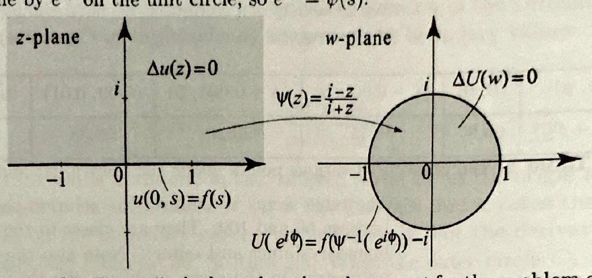

As illustrated in Figure 5, the boundary data that we get for the problem on the unit disk is given by $U\left(e^{i \phi}\right)=f\left(\psi^{-1}\left(e^{i \phi}\right)\right)$, for all $e^{i \phi}$ on the unit circle. The solution of the Dirichlet problem in the unit disk $(|w|<1)$ with this boundary data is obtained from the Poisson integral formula, which we recall from (10), Section 3.8:

$$
U(w)=\frac{1-|w|^{2}}{2 \pi} \int_{0}^{2 \pi} \frac{f\left(\psi^{-1}\left(e^{i \phi}\right)\right)}{\left|e^{i \phi}-w\right|^{2}} d \phi
$$

Hence the solution in the upper half-plane is (set $w=\psi(z)$ in (5))
(6) $\quad u(x+i y)=U(\psi(x+i y))=U(\psi(z))=\frac{1-|\psi(z)|^{2}}{2 \pi} \int_{0}^{2 \pi} \frac{f\left(\psi^{-1}\left(e^{i \phi}\right)\right)}{\left|e^{i \phi}-\psi(z)\right|^{2}} d \phi$.

Our goal is to show that (6) is precisely (3). The details are straightforward but a little tedious. Make the change of variables $s=\psi^{-1}\left(e^{i \phi}\right)$. Since the integrand in (6) is $2 \pi$-periodic, we get the same result if we integrate from $-\pi$ to $\pi$ instead of 0 to $2 \pi$; and as $\phi$ runs from $-\pi$ to $\pi, s$ runs from $-\infty$ to $\infty$. We have

$$
s=\psi^{-1}\left(e^{i \phi}\right) \Rightarrow \psi(s)=\frac{i-s}{i+s}=e^{i \phi}
$$

Taking differentials and using $e^{i \phi}=\frac{i-s}{i+s}$, we get

$$
\frac{-2 i}{(i+s)^{2}} d s=i e^{i \phi} d \phi=i \frac{i-s}{i+s} d \phi \Rightarrow d \phi=\frac{2}{1+s^{2}} d s
$$

Substituting what we have so far into (6), we obtain

$$
u(x+i y)=\frac{1-|\psi(z)|^{2}}{\pi} \int_{-\infty}^{\infty} \frac{f(s)}{\left|e^{i \phi}-\psi(z)\right|^{2}} \frac{d s}{1+s^{2}}
$$

Comparing (7) and (3), it suffices to show that for $z=x+i y$ and $e^{i \phi}=s$,

$$
\frac{1-|\psi(z)|^{2}}{\left|e^{i \phi}-\psi(z)\right|^{2}}=\left(1+s^{2}\right) \frac{y}{(x-s)^{2}+y^{2}}
$$

This part is straightforward and is left to Exercise 21.

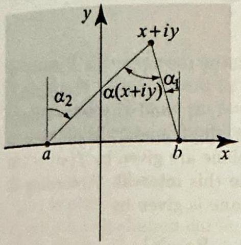
Figure 6 For a given interval $(a, b)$, the angle at $x+i y$ subtended by $(a, b)$ is a harmonic function $\alpha(x+i y)$ called the harmonic measure of $(a, b)$.

## EXAMPLE 4 Applying Poisson's integral formula

Solve the Dirichlet problem in the upper half-plane with boundary data on the real line given by

$$
f(x)=u(x)= \begin{cases}C & \text { if } a<x<b \\ 0 & \text { otherwise }\end{cases}
$$

where $C$ is a constant.
Solution We apply the first formula in (3) and get for $-\infty<x<\infty, y>0$,

$$
u(x+i y)=\frac{y}{\pi} \int_{-\infty}^{\infty} \frac{f(s)}{(x-s)^{2}+y^{2}} d s=\frac{y}{\pi} \int_{a}^{b} \frac{C}{(x-s)^{2}+y^{2}} d s
$$

since $f(s)$ is 0 outside the interval $a<s<b$. We evaluate the integral in terms of the inverse tangent, using an obvious change of variables,

$$
\begin{aligned}
u(x+i y) & =\frac{y}{\pi} \int_{a}^{b} \frac{C}{(x-s)^{2}+y^{2}} d s=\frac{y}{\pi} \frac{C}{y^{2}} \int_{a}^{b} \frac{1}{\left(\frac{s-x}{y}\right)^{2}+1} d s \\
& =\frac{C}{\pi} \int_{\frac{a-x}{y}}^{\frac{b-x}{y}} \frac{d s}{s^{2}+1} \\
& =\frac{C}{\pi}\left[\tan ^{-1}\left(\frac{b-x}{y}\right)+\tan ^{-1}\left(\frac{x-a}{y}\right)\right]
\end{aligned}
$$

We can give a concrete geometric interpretation of this answer. Let $\alpha_{1}=\tan ^{-1}\left(\frac{b-x}{y}\right)$ and $\alpha_{2}=\tan ^{-1}\left(\frac{x-a}{y}\right)$ (Figure 6). Then $u(x+i y)=\frac{C}{\pi}\left(\alpha_{1}+\alpha_{2}\right)=\frac{C}{\pi} \alpha(x+i y)$, where $\alpha(x+i y)$ is the harmonic measure of the interval $(a, b)$; that is, $\alpha$ is the angle at the point $x+i y$ subtended by the interval ( $a, b$ ) (Figure 6). You should review Exercise 35, Section 2.5, where this result was derived using guessing methods and properties of the argument function. $\square$

Suppose that $\Omega$ is a region, $f_{1}$ and $f_{2}$ are two functions defined on the boundary of $\Omega$. Suppose that $u_{1}$ and $u_{2}$ are solutions of the Dirichlet problems on $\Omega$ with boundary values $f_{1}$ and $f_{2}$, respectively. Because Laplace's equation $\Delta u=0$ is linear, it is straightforward to check that $u=u_{1}+u_{2}$ solves the Dirichlet problem on $\Omega$ with boundary values $u=f_{1}+f_{2}$ on the boundary of $\Omega$. This useful process of generating a solution by adding solutions of two or more related problems is called superposition of solutions. It will appear again in our study of other linear equations.

## EXAMPLE 5 Superposing solutions

Let ( $a_{1}, b_{1}$ ) and ( $a_{2}, b_{2}$ ) be two disjoint intervals on the real line, and let $T_{1}$ and $T_{2}$ be two complex numbers. Solve the Dirichlet problem in the upper half-plane with boundary data on the real line given by $f(x)=T_{1}$ if $x$ is in $\left(a_{1}, b_{1}\right), T_{2}$ if $x$ is in ( $a_{2}, b_{2}$ ) and 0 otherwise.
Solution For $j=1,2$, let $f_{j}(x)=T_{j}$ if $x$ is in $\left(a_{j}, b_{j}\right), 0$ otherwise. Clearly, $f(x)=f_{1}(x)+f-2(x)$. From Example 4, the solution of the Dirichlet problem

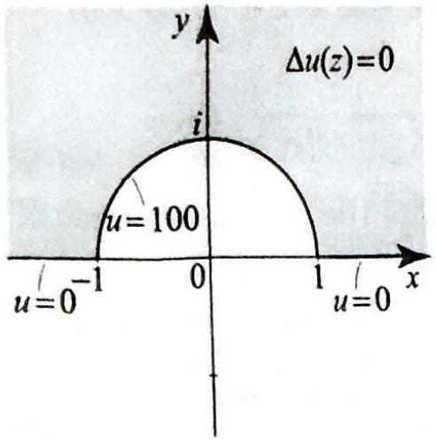
Figure 7 for Example 6.

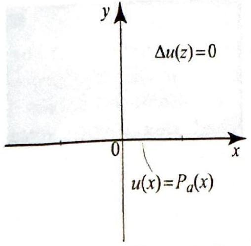
Figure 8 for Example 7.

in the upper half-plane with boundary values on the real line given by $f_{j}(x)$ is $u_{j}(z)=\frac{T_{j}}{\pi}\left[\tan ^{-1}\left(\frac{b_{j}-x}{y}\right)-\tan ^{-1}\left(\frac{a_{j}-x}{y}\right)\right]$. Thus the solution to our original problem is $u(z)=u_{1}(z)+u_{2}(z)$.

In the next example, we use the Poisson integral formula and the Joukowski mapping from Example 3, Section 6.1.

## EXAMPLE 6 Joukowski mapping

Solve the Dirichlet problem shown in Figure 7.
Solution We transform the problem into a problem in the upper half-plane by using the Joukowski mapping $w=J(z)=\frac{1}{2}\left(z+\frac{1}{z}\right)$. As shown in Example 3, Section 6.1, $J(z)$ takes the upper-unit circle onto $[-1,1]$, and the semi-infinite intervals $(-\infty,-1]$ and $[1, \infty)$ onto themselves. Thus the boundary conditions in the transformed Dirichlet problem in the upper half-plane are given by $f(w)=100$ for real $-1<w<1$ and $f(w)=0$ for real $w$ outside this interval. According to Example 4, the solution in the upper half of the $w$-plane is given by

$$
\frac{100}{\pi}\left[\tan ^{-1}\left(\frac{1-\operatorname{Re} w}{\operatorname{Im} w}\right)+\tan ^{-1}\left(\frac{1+\operatorname{Re} w}{\operatorname{Im} w}\right)\right] .
$$

Replacing $w$ by $J(z)$ we obtain the solution in the region $S$ :

$$
u(x+i y)=\frac{100}{\pi}\left[\tan ^{-1}\left(\frac{1-\operatorname{Re} J(z)}{\operatorname{Im} J(z)}\right)+\tan ^{-1}\left(\frac{1+\operatorname{Re} J(z)}{\operatorname{Im} J(z)}\right)\right]
$$

With a little bit more work, the answer could be expressed in terms of $x$ and $y$.
Our next example retests our ability to evaluate integrals using residues.

## EXAMPLE 7 A Poisson boundary distribution

Solve the Dirichlet problem (Figure 8) in the upper half-plane with boundary data on the real line given by a Poisson temperature distribution

$$
f(x)=u(x)=P_{a}(x)=\sqrt{\frac{2}{\pi}} \frac{a}{x^{2}+a^{2}}, \text { where } a>0 .
$$

This problem models the steady-state distribution in a large sheet of metal with insulated lateral surface, whose boundary along the $x$-axis is kept at a fixed temperature distribution given by a Poisson kernel $P_{a}(x)$, where $a>0$ is a fixed. The temperature at the origin is $f(0)=u(0)=P_{a}(0)=\sqrt{\frac{2}{\pi}} \frac{1}{a}$, which tends to $\infty$ as $a$ tends to 0 . Away from the origin, the temperature decays to 0 like $a /\left(x^{2}+a^{2}\right)$. So smaller values of $a>0$ correspond to temperature distributions concentrated around 0 (Figure 9).
Solution We apply the first formula in (3) and get for $-\infty<x<\infty, y>0$,

$$
u(x+i y)=\frac{y}{\pi} \int_{-\infty}^{\infty} \frac{P_{a}(s)}{(x-s)^{2}+y^{2}} d s=\frac{a y}{\pi} \sqrt{\frac{2}{\pi}} \int_{-\infty}^{\infty} \frac{d s}{\left(s^{2}+a^{2}\right)\left((x-s)^{2}+y^{2}\right)}
$$

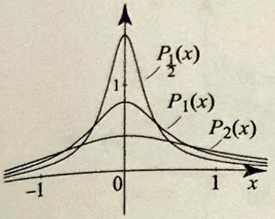

Figure 9 The Poisson kernel $P_{y}(x)$ for various values of $y>$ 0 . Properties to note on the graphs of $P_{y}(x)$ as a function of $x$ :
$P_{y}(x)>0$ for all $x$;
$P_{y}(x)$ is even;
$P_{y}(x)$ is a bell-shaped curve; $\lim _{y \downarrow 0} P_{y}(0)=\infty$.
1.

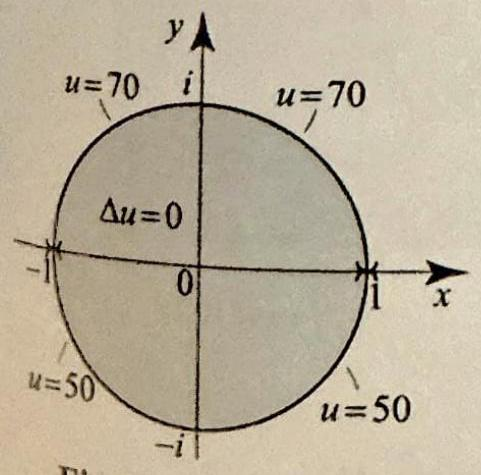
Figure 10

We evaluate the last integral using the residue method of Section 5.3, by completing the contour with a semicircle in the upper half-plane. The function $h(z)= \frac{1}{\left(z^{2}+a^{2}\right)\left((x-z)^{2}+y^{2}\right)}$ has two simple poles in the upper half-plane, at $z=i a$ and at $z=x+i y$. We compute the residues at these points using Proposition 1, Section 5.1(iii). We have

$$
\operatorname{Res}(h(z), i a)=\frac{1}{(x-i a)^{2}+y^{2}} \operatorname{Res}\left(\frac{1}{\left(z^{2}+a^{2}\right)}, i a\right)=\frac{1}{(x-i a)^{2}+y^{2}} \frac{1}{2 i a}
$$

and
$\operatorname{Res}(h(z), x+i y)=\frac{1}{(x+i y)^{2}+a^{2}} \operatorname{Res}\left(\frac{1}{(x-z)^{2}+y^{2}}, x+i y\right)=\frac{1}{(x+i y)^{2}+a^{2}} \frac{1}{2 i y}$.
2.

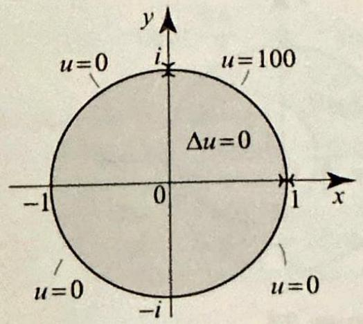
Figure 11

Applying Proposition 2, Section 5.3, we obtain

$$
\begin{aligned}
u(x+i y) & =\frac{a y}{\pi} \sqrt{\frac{2}{\pi}} 2 \pi i(\operatorname{Res}(h(z), i a)+\operatorname{Res}(h(z), x+i y)) \\
& =2 a y i \sqrt{\frac{2}{\pi}}\left(\frac{1}{(x-i a)^{2}+y^{2}} \frac{1}{2 i a}+\frac{1}{(x+i y)^{2}+a^{2}} \frac{1}{2 i y}\right) \\
& =\sqrt{\frac{2}{\pi}}\left(\frac{y}{(x-i a)^{2}+y^{2}}+\frac{a}{(x+i y)^{2}+a^{2}}\right) \\
& =\sqrt{\frac{2}{\pi}} \frac{a+y}{x^{2}+(a+y)^{2}}
\end{aligned}
$$

3. 

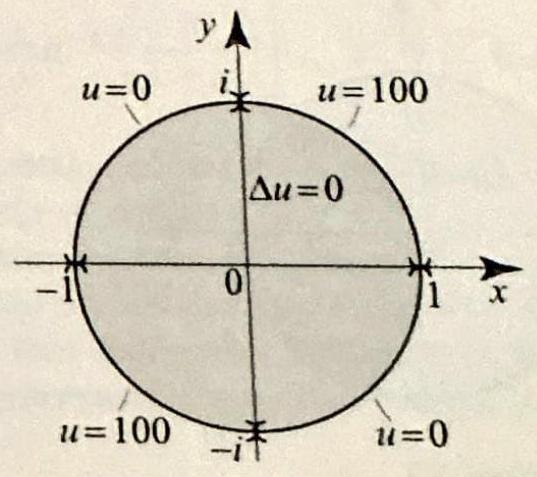
Figure 12

where the last equality follows by elementary algebraic manipulations. This solves the problem. But note that the last expression is precisely $P_{a+y}(x)$. Thus $u(x+ i y)=P_{a+y}(x)$, which shows that the solution of the Dirichlet problem with a Poisson boundary data $P_{a}(x)$ is another Poisson distribution $P_{a+y}(x)$. This amazing fact about temperature problems with Poisson boundary data has a direct interpretation in terms of convolutions and Fourier transforms, which will be discussed in later chapters.

## Exercises 6.3

In Exercises 1-15, (a) solve the Dirichlet problem described by the accompanying figure (Figures 10-24), using the methods of this section. Examples 4 and 5 and superposition of solutions are useful.
(b) Evaluate your answer at various points inside the region and comment on your data, as we did in Example 3.
4.

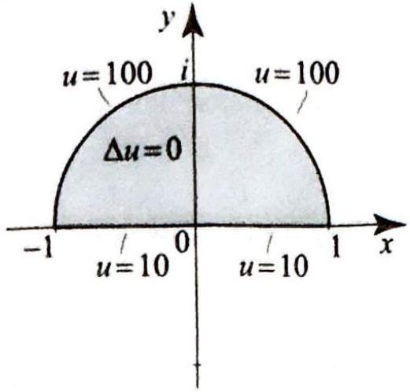
Figure 13

7. 

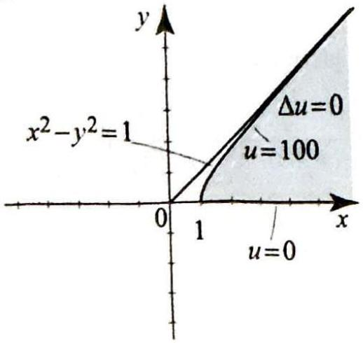
Figure 16

10. 

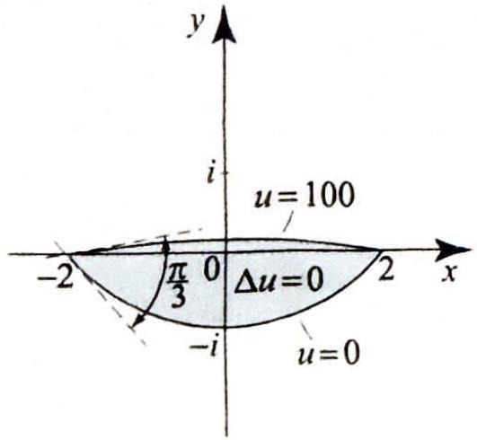
Figure 19

13. 

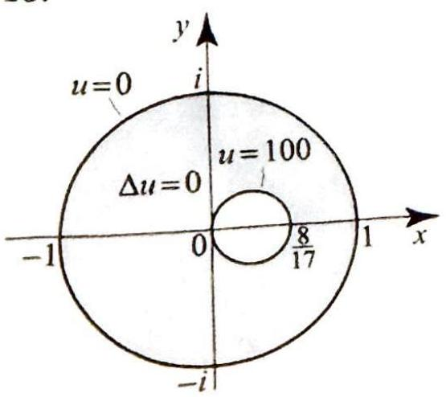
Figure 22

5. 

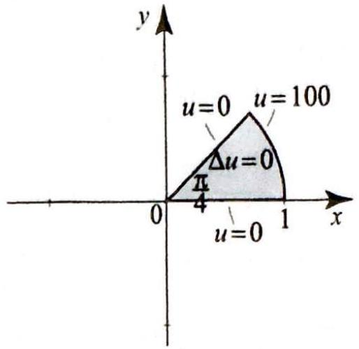
Figure 14

8. 

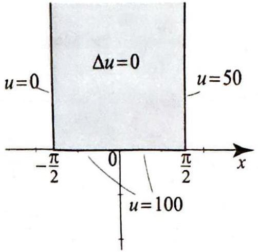
Figure 17

11. 

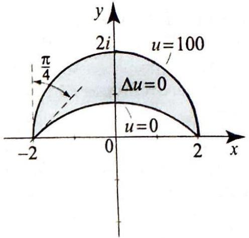
Figure 20

14. 

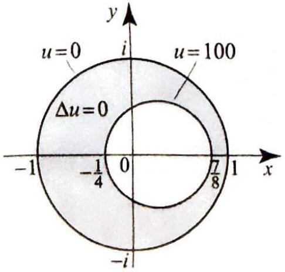
Figure 23

6. 

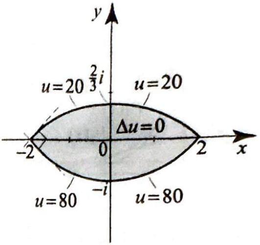
Figure 15

9. 

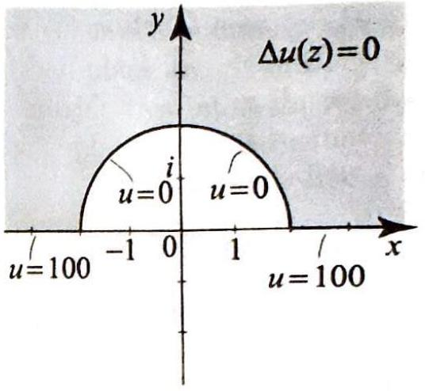
Figure 18

12. 

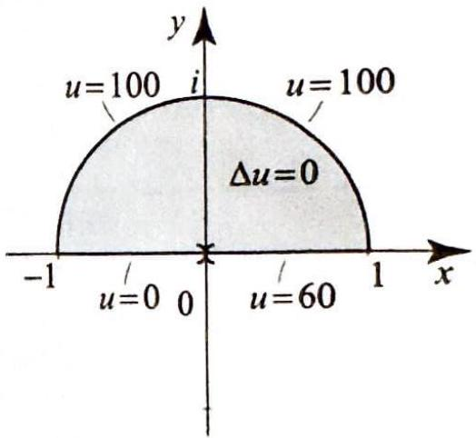
Figure 21

15. 

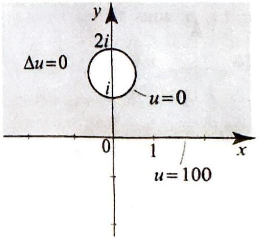
Figure 24

Figures 25(a) and (b) for Exercise 17.
16. Generalize Example 4 as follows. Suppose that $I_{1}=\left(a_{1}, b_{1}\right), I_{2}=\left(a_{2}, b_{2}\right)$, $\ldots, I_{n}=\left(a_{n}, b_{n}\right)$ are $n$ disjoint intervals on the real line, $T_{1}, T_{2}, \ldots, T_{n}$ are $n$ real or complex values. (a) Show that a solution of the Dirichlet problem in the upper half-plane with boundary data

$$
f(x)= \begin{cases}T_{j} & \text { if } a_{j}<x<b_{j} \\ 0 & \text { otherwise }\end{cases}
$$

is

$$
u(x+i y)=\frac{1}{\pi} \sum_{j=1}^{n} T_{j}\left[\tan ^{-1}\left(\frac{b_{j}-x}{y}\right)-\tan ^{-1}\left(\frac{a_{j}-x}{y}\right)\right]
$$

If any one of the $a_{j}$ 's is infinite, say $a_{1}=-\infty$, then $\tan ^{-1}\left(\frac{a_{1}-x}{y}\right)=\tan ^{-1}(-\infty)= -\frac{\pi}{2}$. Similarly, if one of the $b_{j}$ 's is infinite, say $b_{n}=\infty$, then $\tan ^{-1}\left(\frac{b_{n}-x}{y}\right)= \tan ^{-1}(\infty)=\frac{\pi}{2}$.
(b) Let $z=x+i y$. Show that the answer can be written as

$$
u(z)=\frac{1}{\pi} \sum_{j=1}^{n} T_{j}\left(\operatorname{Arg}\left(z-b_{j}\right)-\operatorname{Arg}\left(z-a_{j}\right)\right)
$$

17. (a) Solve the Dirichlet Problem in Figure 25(a) by using the Poisson integral formula.
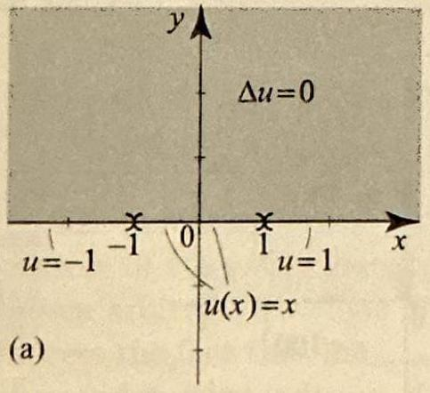
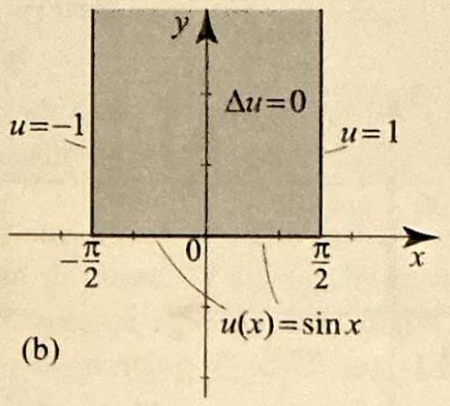
(b) Solve the Dirichlet problem in Figure 25(b) by using the conformal map $w= \sin z$ and the result in part (a).
18. Show that the solution in Example 1 is

$$
u(x+i y)=50+\frac{100}{\pi}\left[\tan ^{-1}\left(\frac{y}{1-x}\right)+\tan ^{-1}\left(\frac{y}{1+x}\right)\right], \quad x^{2}+y^{2}<1
$$

19. Isotherms in Example 1. Recall the solution of the corresponding Dirichlet problem in the upper half of the $w$-plane, $\frac{100}{\pi}(\pi-\operatorname{Arg} w)$.
(a) Show that the isotherms in the $w$-plane are rays emanating from the origin.
(b) Conclude that the isotherms in the $z$-plane are arcs of circles in the unit disk. Describe the centers and radii of the circles that define the isotherms in the unit disk. [Hint: Consider the pre-image of the isotherms in the $w$-plane by the mapping $\phi(z)=i \frac{1-z}{1+z}$.]
20. Isotherms in Example 3. By studying the isotherms of the Dirichlet problem in the $u$-plane in Example 3, determine the isotherms of the original problem in the $z$-plane.
21. Complete the proof of Theorem 1 by showing that (8) holds. [Suggestion: Organize your proof as follows. Show $1-|\psi(z)|^{2}=\frac{4 y}{x^{2}+(1+y)^{2}}$. Then show $\mid e^{i \pi}- \left.\psi(z)\right|^{2}=|\psi(s)-\psi(z)|^{2}=4 \frac{(x-s)^{2}+y^{2}}{\left(1+s^{2}\right)\left(x^{2}+(1+y)^{2}\right.}$.]
22. Show that $P_{a}(x)=\frac{1}{a} P_{1}\left(\frac{x}{a}\right)$ for all $a>0$. Thus the graph of $P_{a}(x)$ is the graph of $P_{1}(x)$, scaled vertically by a factor of $\frac{1}{a}$ and scaled horizontally by a factor of $a$.
23. Show that for any $y>0, \frac{1}{\sqrt{2 \pi}} \int_{\infty}^{\infty} P_{y}(x) d x=1$, where $P_{y}(x)$ is the Poisson kernel.
In Exercises 24-29, solve the Dirichlet problem in the upper half-plane with the boundary values on the $x$-axis given by $f(x)$ as indicated. Use residues to evaluate the Poisson integral. Take a real and $\neq 0$ in Exercises 28 and 29.
24. $f(x)=\frac{x}{x^{2}+x+1}$.
25. $f(x)=\frac{1}{x^{4}+1}$.
26. $f(x)=\frac{\sin x}{x}$.
27. $f(x)=\cos x$.
28. $f(x)=\cos a x$.
29. $f(x)=\sin a x$.

Solve the Dirichlet problem depicted in the figure (Figures 26-31) by transforming it into a Dirichlet problem in the upper half-plane. To solve in the upper halfplane, use the Arg function in Exercises 30-32, and the Poisson integral formula in Exercises 33-35. Leave your answer in Exercise 35 in the form of an integral involving the Chebyshev polynomials. Compute the integral when $n=2$.
30.

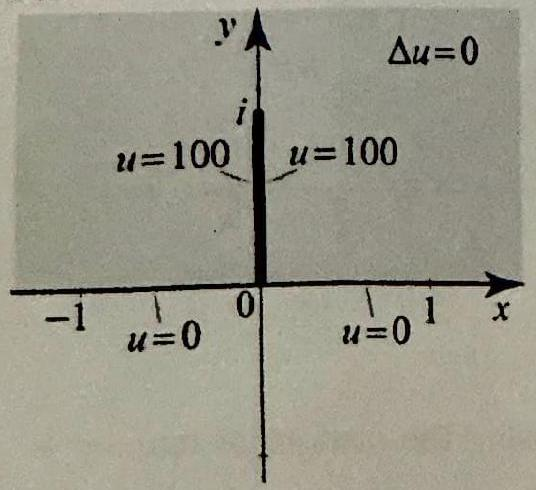
Figure 26

33. 

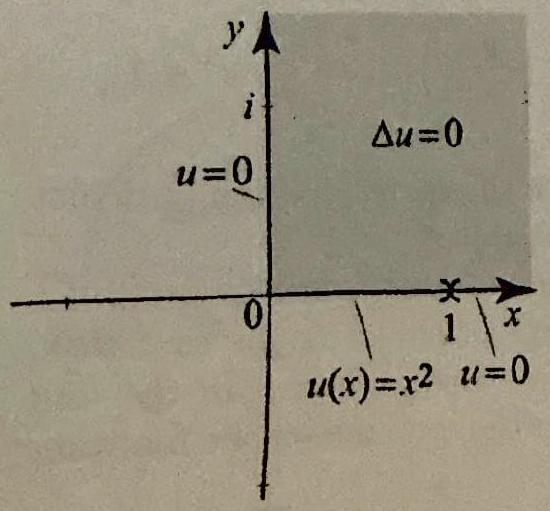
Figure 29

31. 

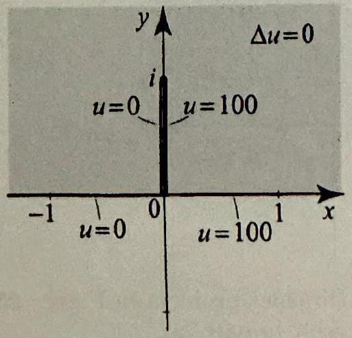
Figure 27

34. 

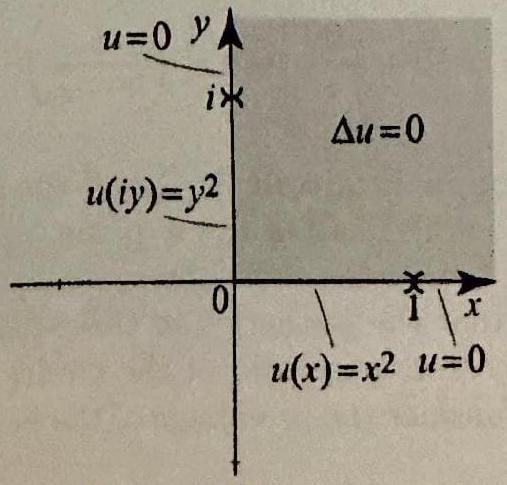
Figure 30

32. 

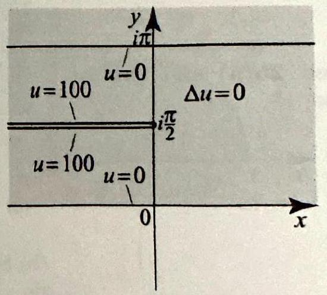
Figure 28

35. 

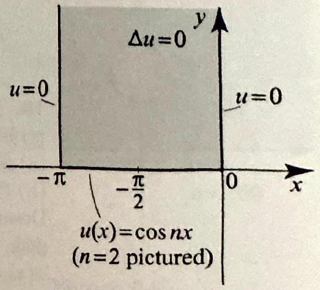
Figure 31

### 6.4 The Schwarz-Christoffel Transformation

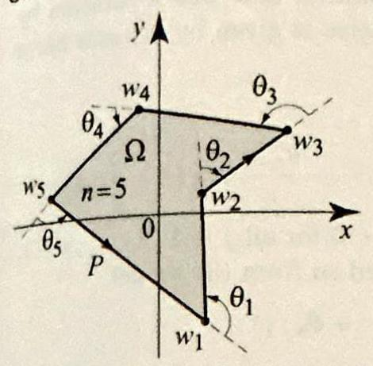
Figure 1 Positively oriented polygonal boundary with corner angles measured from the outside.

## THEOREM 1 SCHWARZCHRISTOFFEL TRANSFORMATION

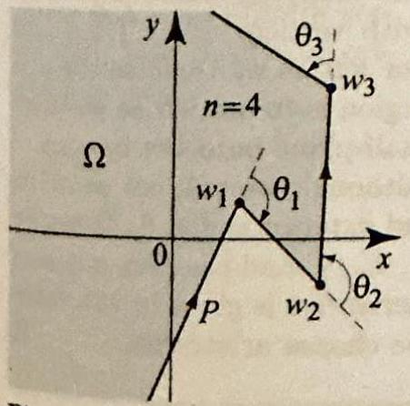
Figure 2 Unbounded polygonal region with $n$ sides ( $n=4$ ) and $n-1$ vertices.

In this section we describe a method for constructing one-to-one analytic mappings of the upper half-plane onto polygonal regions. We start by setting the notation.

Suppose that $\Omega$ is a region in the $w$-plane, bounded by a positively oriented polygonal path $P$ with $n$ sides. Let $w_{1}, w_{2}, \ldots, w_{n}$ denote the vertices of $P$, counted consecutively as we trace the path through its positive orientation (see Figure 1, where $n=5$ ). If $P$ is bounded, then the point $w_{n}$ is taken to be the initial and terminal point of the closed path $P$. If $P$ is unbounded, we take $w_{n}=\infty$ and think of $P$ as a polygon with $n-1$ vertices $w_{1}, w_{2}, \ldots, w_{n-1}$ (Figure 2). It will be convenient to measure the exterior angle at a vertex, and so we let $\theta_{j}$ denote the angle that we make as we turn the corner of the polygon at $w_{j}$. We choose $0<\left|\theta_{j}\right|<\pi(j=1, \ldots, n)$; a positive value corresponds to a left turn and a negative value corresponds to a right turn. In Figure 1, $\theta_{2}$ is negative while all other $\theta_{j}$ are positive.
Let $\Omega$ be a region bounded by a polygonal path $P$ with vertices at $w_{j}$ (counted consecutively) and corresponding exterior angles $\theta_{j}$. Then there is a one-to-one conformal mapping $f(z)$ of the upper half-plane onto $\Omega$, such that

$$
f^{\prime}(z)=A\left(z-x_{1}\right)^{-\frac{\theta_{1}}{\pi}}\left(z-x_{2}\right)^{-\frac{\theta_{2}}{\pi}} \cdots\left(z-x_{n-1}\right)^{-\frac{\theta_{n-1}}{\pi}},
$$

where the $x_{j}$ 's are real, $x_{1}<x_{2}<\cdots<x_{n-1}, f\left(x_{j}\right)=w_{j}, \lim _{z \rightarrow \infty} f(z)= w_{n}, A$ is a constant, and principal branches are used to define the powers.

The points $x_{j}(j=1, \ldots, n-1)$ on the $x$-axis are the pre-images of the vertices of the polygonal path $P$ in the $w$-plane. Two of the $x_{j}$ 's may be chosen arbitrarily, so long as they are arranged in ascending order. We can express the fact that $\lim _{z \rightarrow \infty} f(z)=w_{n}$ by writing $f(\infty)=w_{n}$. In the case of an unbounded polygon $P$, we have $f(\infty)=\infty$.

The mapping $f(z)$ is called a Schwarz-Christoffel transformation, after the German mathematicians Herman Amandus Schwarz (1843-1921) and Elwin Bruno Christoffel (1829-1900). Since $f(z)$ is an antiderivative of (1), we can write
(2) $f(z)=A \int\left(z-x_{1}\right)^{-\frac{\theta_{1}}{\pi}}\left(z-x_{2}\right)^{-\frac{\theta_{2}}{\pi}} \cdots\left(z-x_{n-1}\right)^{-\frac{\theta_{n-1}}{\pi}} d z+B$.

The constants $A$ and $B$ depend on the size and location of the polygonal path $P$. The full proof of Theorem 1 is quite complicated. We only sketch a part that illustrates the ideas behind the construction of the transformation.
Sketch of Proof of Theorem 1. Consider a mapping $f(z)$ whose derivative is given by (1) and let $w_{j}$ denote the image of $x_{j}$, where $x_{1}<x_{2}<\cdots<x_{n-1}$

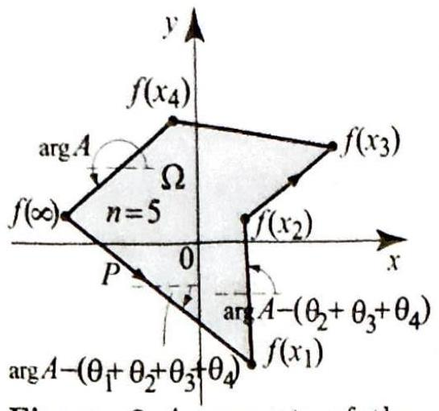
Figure 3 Arguments of the line segments of the polygon $P$.

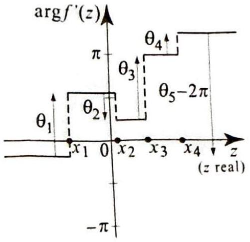
Figure 4 As $x$ crosses $x_{j}$ from left to right, $\arg f^{\prime}(x)$ changes abruptly by $\theta_{j}$ then remains constant until it crosses $x_{j+1}$.

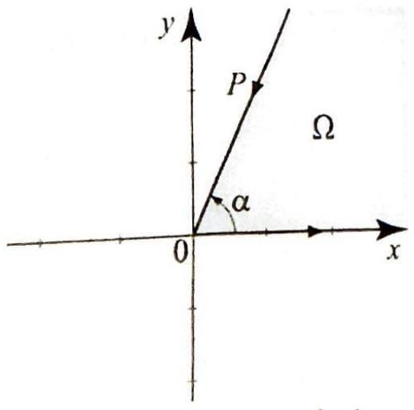
Figure 5 for Example 1.

are real. To understand the effect of the mapping $f$ on the real axis, recall from Section 6.1 that a conformal mapping $f(z)$ at a point $z_{0}$ acts like a rotation by an angle $\arg f^{\prime}\left(z_{0}\right)$. Thus the mapping whose derivative is given by (1) acts like a rotation by an angle
(3) $\arg f^{\prime}(z)=$

$$
\arg A-\frac{\theta_{1}}{\pi} \arg \left(z-x_{1}\right)-\frac{\theta_{2}}{\pi} \arg \left(z-x_{2}\right)-\cdots-\frac{\theta_{n-1}}{\pi} \arg \left(z-x_{n-1}\right) .
$$

For $z=x$ on the $x$-axis with $z<x_{1}$, we have $z-x_{j}<0$ for all $j=1,2, \ldots, n-1$, hence $\arg \left(z-x_{j}\right)=\pi$ for all $j=1,2, \ldots, n-1$, and so from (3) we get

$$
\arg f^{\prime}(z)=\arg A-\left(\theta_{1}+\theta_{2}+\cdots+\theta_{n-1}\right) .
$$

Thus if $w_{n}=f(\infty)$, then all the points in the interval $\left(-\infty, x_{1}\right)$ are mapped onto a line segment starting with $w_{n}$ and ending with $w_{1}=f\left(x_{1}\right)$ and at an angle given by (4) (Figure 3). For the points in the interval $\left(x_{1}, x_{2}\right)$, we have $z-x_{1}>0$ and $z-x_{j}<0$ for all $j=2, \ldots, n-1$, hence $\arg \left(z-x_{1}\right)=0$ and $\arg \left(z-x_{j}\right)=\pi$ for all $j=2, \ldots, n-1$, and so from (3)

$$
\arg f^{\prime}(z)=\arg A-\left(\theta_{2}+\cdots+\theta_{n-1}\right) .
$$

Thus, at $x_{1}$ we have an abrupt change in the argument (the path turns left by angle $\theta_{1}$ ) and then all the points in ( $x_{1}, x_{2}$ ) are mapped onto the line segment with initial point $w_{1}$ and terminal point $w_{2}=f\left(x_{2}\right)$, and at an angle given by (5) (Figure 4). We continue in this fashion, and finally we find that after an abrupt change in the argument, the points in the interval $\left(x_{n-1}, \infty\right)$ are mapped onto a line segment with initial point $w_{n-1}$, and at angle $\arg f^{\prime}(z)=\arg A$. In the case of a bounded polygon, this line segment will connect back to $w_{n}$ (Exercise 11). The polygon is then closed; after turning the last corner we have gone through an angle $\theta_{1}+\theta_{2}+\cdots+\theta_{n}=2 \pi$. Thus we have shown that the mapping whose derivative is given by (1) takes the real line onto a polygon with vertices $w_{j}=f\left(x_{j}\right)$ and exterior angles $\theta_{j}$. Since the upper half-plane is to our left as we traverse the real line rightward, conformality ensures that the image region is to our left as we trace $P$ in the positive sense (that is, $f$ maps the upper half-plane onto the interior of $P)$. The converse of these statements is also true, although we will not prove it. That is, given a polygonal path $P$ with vertices $w_{j}$ and exterior angles $\theta_{j}$, it can be shown that we can find ordered real numbers $x_{1}, \ldots, x_{n-1}$, and complex numbers $A$ and $B$ such that the mapping given by (2) whose derivative is given by (1), takes the real line onto $P$. Moreover, two of the $x_{j}$ 's can be chosen arbitrarily.

## EXAMPLE 1 Schwarz-Christoffel transformation for a sector

Find a Schwarz-Christoffel transformation that maps the upper half-plane onto the sector at angle $0<\alpha<\pi$ in Figure 5.
Solution Obviously one answer is $f(z)=z^{\frac{\alpha}{\pi}}$, but let us see how this answer comes out of (2). Since the region has two sides, we have $n=2$. From Figure 5, the exterior angle at $w_{1}=0$ is $\pi-\alpha$. In the $z$-plane, choose $x_{1}=0$, then (2) yields

$$
f(z)=A \int z^{-\frac{\pi-\alpha}{\pi}} d z+B=A \int z^{-1+\alpha / \pi} d z+B=A \frac{\pi}{\alpha} z^{\frac{\alpha}{\pi}}+B
$$

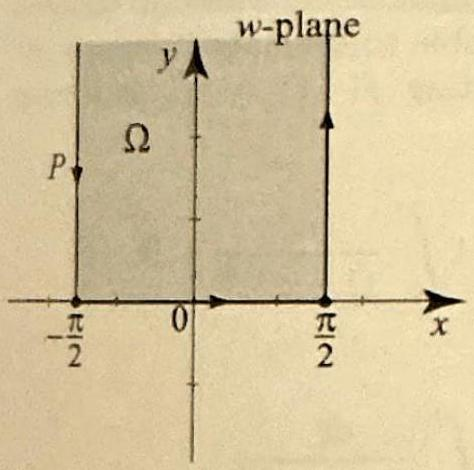
Figure 6 A semi-infinite vertical strip with positively oriented boundary.

where all branches are principal. In order to have $f(0)=0$, we take $B=0$. Obviously any positive value of $A$ will work, so we can take $f(z)=z^{\frac{a}{\pi}}$.

For our next example, we will need the following useful formula, whose proof is sketched in Exercise 12. For $z$ in the upper half-plane ( $\operatorname{Im} z>0$ ), $0 \leq \alpha \leq \pi$, and all real numbers $a$, we have
(6) $(z+a)^{\frac{\alpha}{\pi}}(z-a)^{\frac{\alpha}{\pi}}=(-1)^{\frac{\alpha}{\pi}}\left(a^{2}-z^{2}\right)^{\frac{\alpha}{\pi}}$, all branches are principal.

For example, if $\alpha=\frac{\pi}{2}, a=1$, and $\operatorname{Im} z>0$, then

$$
(z+1)^{\frac{1}{2}}(z-1)^{\frac{1}{2}}=i\left(1-z^{2}\right)^{\frac{1}{2}}
$$

## EXAMPLE 2 The inverse sine as a Schwarz-Christoffel transformation

Find a Schwarz-Christoffel transformation that maps the upper half-plane onto the the semi-infinite vertical strip in Figure 6.
Solution We know that $\sin z$ maps the infinite strip in Figure 6 onto the upper half-plane. So the mapping that we are looking for is the inverse of $\sin z$. Let us see how this comes out of (2). In the $w$-plane, take $w_{1}=-\frac{\pi}{2}, w_{2}=\frac{\pi}{2}$, with exterior angles $\theta_{1}=\theta_{2}=\frac{\pi}{2}$. In the $z$-plane, take $x_{1}=-1$ and $x_{2}=1$. Then (2) yields

$$
f(z)=A \int(z+1)^{-\frac{1}{2}}(z-1)^{-\frac{1}{2}} d z+B
$$

Using (7) and a well-known antiderivative, we get

$$
f(z)=-A i \int \frac{1}{\sqrt{1-z^{2}}} d z+B=-A i \sin ^{-1} z+B
$$

where $\sin ^{-1} z$ is the principal branch of the inverse sine function; that is,

$$
\sin ^{-1} z=-i \log \left(i z+e^{\frac{1}{2} \log \left(1-z^{2}\right)}\right)
$$

(see Example 3, Section 1.7). Setting $f(-1)=-\frac{\pi}{2}$, we find

$$
-A i \sin ^{-1}(-1)+B=-\frac{\pi}{2} \quad \Rightarrow \quad A i \frac{\pi}{2}+B=-\frac{\pi}{2}
$$

Setting $f(1)=\frac{\pi}{2}$, we find

$$
-A i \sin ^{-1}(1)+B=\frac{\pi}{2} \quad \Rightarrow \quad-A i \frac{\pi}{2}+B=\frac{\pi}{2} .
$$

Solving for $A$ and $B$, we find $A=i$ and $B=0$. Hence $f(z)=\sin ^{-1} z$.

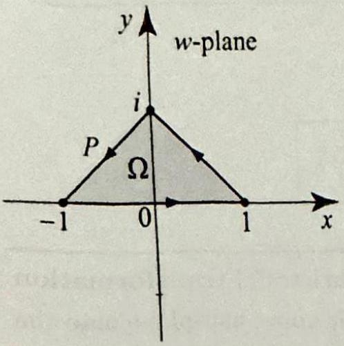
Figure 7 Positively oriented isosceles triangle.

Like many constructions involving Schwarz-Christoffel transformations, the next example gives rise to elliptic integrals (see Section 5.5). Although these integrals are very difficult to evaluate, they are extensively tabulated and can be conveniently evaluated numerically using standard functions in most computer systems.

## EXAMPLE 3 Schwarz-Christoffel transformation for a triangle

Find a Schwarz-Christoffel transformation that maps the upper half-plane onto the right isosceles triangle in Figure 7.
Solution It is clear that the triangle is determined by two consecutive vertices and their corresponding angles. In the $w$-plane, take $w_{1}=-1, w_{2}=1$, with exterior angles $\theta_{1}=\theta_{2}=\frac{3 \pi}{4}$. In the $z$-plane, we freely choose the points $x_{1}=-1$ and $x_{2}=1$. Then (2) yields

$$
f(z)=A \int_{0}^{z}(\zeta+1)^{-\frac{3}{4}}(\zeta-1)^{-\frac{3}{4}} d \zeta+B=A \int_{0}^{z} \frac{d \zeta}{(-1)^{\frac{3}{4}}\left(1-\zeta^{2}\right)^{\frac{3}{4}}}+B
$$

where we have used (6) with $\alpha=\frac{3 \pi}{4}$. This integral cannot be expressed in terms of elementary functions for arbitrary $z$, but we will be able to evaluate it for $z= \pm 1$ in order to determine the constants $A$ and $B$. Setting $f(-1)=-1$ and using $(-1)^{\frac{3}{4}}=e^{\frac{3 \pi i}{4}}$, we get

$$
-1=e^{-\frac{3 \pi i}{4}} A \int_{0}^{-1} \frac{d \zeta}{\left(1-\zeta^{2}\right)^{\frac{3}{4}}}+B=-e^{-\frac{3 \pi i}{4}} A \int_{0}^{1} \frac{d \zeta}{\left(1-\zeta^{2}\right)^{\frac{3}{4}}}+B
$$

or

$$
-e^{-\frac{3 \pi i}{4}} A I+B=-1, \text { where } I=\int_{0}^{1} \frac{d \zeta}{\left(1-\zeta^{2}\right)^{\frac{3}{4}}}
$$

To evaluate the integral $I$, we make the change of variables $\zeta=\sin x, d \zeta=\cos x d x$, then

$$
I=\int_{0}^{\frac{\pi}{2}} \frac{d x}{(\cos x)^{\frac{1}{2}}}=\frac{1}{2} \frac{\Gamma(1 / 4) \Gamma(1 / 2)}{\Gamma(3 / 4)} \approx 2.622
$$

where we have appealed to Exercise 25, Section 4.3, to evaluate the integral in terms of the gamma function. The approximate value of the integral was obtained with the help of a computer. Setting $1=f(1)$, we get

$$
e^{-\frac{3 \times i}{\mathrm{~S}}} A I+B=1 .
$$

Solving for $A$ and $B$ in (9) and (8), we find $B=0$ and $A=\frac{e^{\frac{3 \pi}{T}}}{T}$, and so

$$
f(z)=\frac{e^{\frac{3 \pi i}{4}}}{I} e^{-\frac{3 \pi}{4}} \int_{0}^{z} \frac{d \zeta}{\left(1-\zeta^{2}\right)^{\frac{3}{4}}}=\frac{1}{I} \int_{0}^{z} \frac{d \zeta}{\left(1-\zeta^{2}\right)^{\frac{3}{4}}}
$$

The next two examples illustrate a limiting technique in computing Schwarz-Christoffel transformations.

An $L$-shaped region with positively oriented boundary. As we follow the boundary according to this orientation, the region is to our left.

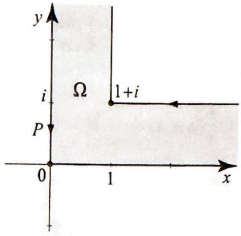
Figure 8

## EXAMPLE 4 An $L$-shaped region

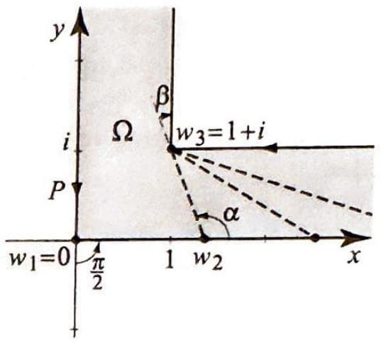
Figure 9

Find a Schwarz-Christoffel transformation that maps the upper half-plane onto the $L$-shaped region in Figure 8.
Solution To determine the orientation of the boundary in such a way that the region becomes interior to a positively oriented boundary, we think of the region as a limit of a region with vertices at $w_{1}=0, w_{2}>0$, and $w_{3}=1+i$, and corresponding exterior angles $\theta_{1}=\frac{\pi}{2}, \theta_{2}=\alpha$, and $\theta_{3}=\beta$ (Figure 9).

As $w_{2} \rightarrow \infty, \theta_{2} \rightarrow \pi$, and $\theta_{3} \rightarrow-\frac{\pi}{2}$. Thus, we may think of our region as having a vertex at infinity with exterior angle $\theta_{2}=\pi$ and a vertex at $w_{3}=1+i$ with exterior angle $-\frac{\pi}{2}$. In fact, setting $\theta_{j}=\pi$ will force $f\left(x_{j}\right)=\infty$. Now we may only choose two of the three $x_{j}$ 's arbitrarily, but in fact a solution can be found in $x_{1}=-1$, $x_{2}=0$, and $x_{3}=1$. Other choices of the three $x_{j}$ 's will typically result in $L$-shaped regions where the angle $\phi$ in Figure 8 is not $\pi / 4$. From (2) and (7)

$$
f(z)=A \int(z+1)^{-\frac{1}{2}} z^{-1}(z-1)^{\frac{1}{2}} d z+B=A \int \frac{z-1}{i z\left(1-z^{2}\right)^{\frac{1}{2}}} d z+B
$$

We have

$$
\frac{z-1}{i z\left(1-z^{2}\right)^{\frac{1}{2}}}=\frac{-i}{\left(1-z^{2}\right)^{\frac{1}{2}}}+\frac{i}{z\left(1-z^{2}\right)^{\frac{1}{2}}} .
$$

We have $\int \frac{-i d z}{\left(1-z^{2}\right)^{\frac{1}{2}}}=-i \sin ^{-1} z+C$, and letting $z=\frac{1}{\zeta}, d z=-\frac{d \zeta}{\zeta^{2}}$, we have

$$
\int \frac{i d z}{z\left(1-z^{2}\right)^{\frac{1}{2}}}=-i \int \frac{d \zeta}{\zeta\left(1-\frac{1}{\zeta^{2}}\right)^{\frac{1}{2}}}=\int \frac{d \zeta}{\left(1-\zeta^{2}\right)^{\frac{1}{2}}}=\sin ^{-1} \zeta+C
$$

where justification involving the square root is left to Exercise 13. Thus

$$
f(z)=A\left(-i \sin ^{-1} z+\sin ^{-1} \frac{1}{z}\right)+B,
$$

where inverse sines are principal branches. Setting $f(-1)=0$, we get $A\left(-i\left(-\frac{\pi}{2}\right)+\right. \left.\left(-\frac{\pi}{2}\right)\right)+B=0$. Setting $f(1)=1+i$, we get $A\left(-i \frac{\pi}{2}+\frac{\pi}{2}\right)+B=1+i$. Solving for $A$ and $B$, we get $A=\frac{i}{\pi}$ and $B=\frac{1+i}{2}$, and so

$$
f(z)=\frac{1}{\pi}\left(\sin ^{-1} z+i \sin ^{-1} \frac{1}{z}\right)+\frac{1+i}{2} .
$$

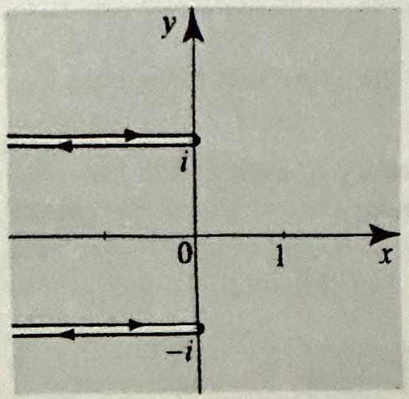
Figure 10 A doubly slit plane with a positively oriented boundary consisting of four sides.

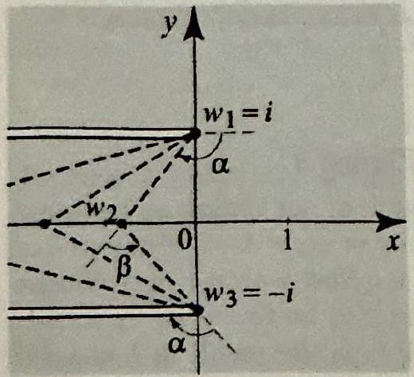
Figure 11

PROPOSITION 1 IMAGE OF LEVEL CURVES

## EXAMPLE 5 A doubly slit plane

Find a Schwarz-Christoffel transformation that maps the upper half-plane onto the doubly slit plane in Figure 10, which consists of the $w$-plane minus the two semi-infinite horizontal lines $\operatorname{Im} w= \pm i$ and $\operatorname{Re} w<0$.
Solution To define the region as the interior of a positively oriented boundary requires four sides as shown in Figure 10. We think of the region as a limit of a region with vertices at $w_{1}=i, w_{2}=t$ (where $t<0$ ) and $w_{3}=-i$, and corresponding exterior angles $\theta_{1}=\alpha, \theta_{2}=\beta$, and $\theta_{3}=\gamma$ (Figure 11). As $t \rightarrow-\infty, \theta_{1} \rightarrow-\pi$, $\theta_{2} \rightarrow \pi$, and $\theta_{3} \rightarrow-\pi$. Thus, we may think of our region as having a vertex at $w_{2}=\infty$ with exterior angle $\theta_{2}=\pi$ and two vertices at $\pm i$ with each exterior angle being $-\pi$. Taking $x_{1}=-1, x_{2}=0$, and $x_{3}=1$, we get from (2)

$$
f(z)=A \int(z+1) \frac{1}{z}(z-1) d z+B=A \int\left(z-\frac{1}{z}\right) d z+B=\frac{A}{2} z^{2}-A \log z+B
$$

Setting $f(-1)=i$ and $f(1)=-i$, we get

$$
\left\{\begin{array} { r l } 
{ i } & { = \frac { A } { 2 } - A \operatorname { L o g } ( - 1 ) + B } \\
{ - i } & { = \frac { A } { 2 } - A \operatorname { L o g } ( 1 ) + B , }
\end{array} \Rightarrow \left\{\begin{array}{rl}
i & =\frac{A}{2}-A i \pi+B \\
-i & =\frac{A}{2}+B
\end{array}\right.\right.
$$

Solving for $A$ and $B$ we get $A=-\frac{2}{\pi}$ and $B=\frac{1}{\pi}-i$, and so

$$
f(z)=-\frac{1}{\pi} z^{2}+\frac{2}{\pi} \log z+\frac{1}{\pi}-i
$$

## Image of Level Curves

Suppose that $f(z)$ is a Schwarz-Christoffel transformation taking the upper half-plane onto a region $\Omega$ in the $w$-plane. If we want to solve a Dirichlet problem $\Delta U(w)=0$, the technique is to map the problem to a corresponding problem in the upper half of the $z$-plane, where a solution $u(z)$ of Laplace's equation $\Delta u(z)=0$ with boundary conditions can be obtained more easily. The solution in the $w$-plane is then $U(w)=u\left(f^{-1}(w)\right)$. However, the Schwarz-Christoffel transformation gives us $f$, not $f^{-1}$, and it is not always possible or easy to invert $f(z)$ in closed form (try Examples 3, 4 , and 5$)$. Nevertheless, the conformal map $f(z)$ is still very useful: It allows us to find isotherms of $U(w)$ without actually knowing $U(w)$. As we now show, this is because the image under $f$ of an isotherm $u(z)=C$ (where $C$ is a constant) is an isotherm $U(w)=C$ in the region $\Omega$.
With the preceding notation, the image under $w=f(z)$ of the level curve $u(z)=C$ is a level curve $U(w)=C$. Thus, if $\gamma(t)$ parametrizes an isotherm of $u$, then $f(\gamma(t))$ parametrizes a corresponding isotherm of $U$.

Proof Since $\gamma(t)$ is a level curve of $u, u(\gamma(t))=C$. Since $U(w)=u\left(f^{-1}(w)\right)$, we conclude that $U(f(\gamma(t)))=u(\gamma(t))=C$, and hence $f(\gamma(t))$ is a level curve of $U$.

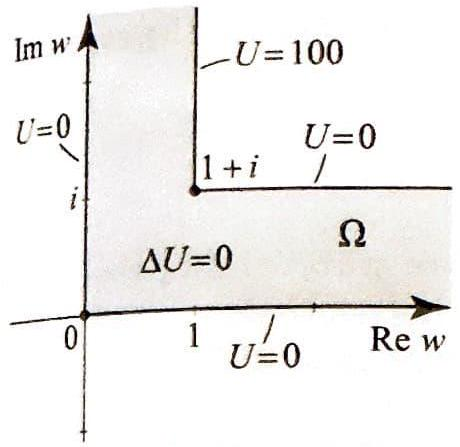
Figure 12 for Example 6.

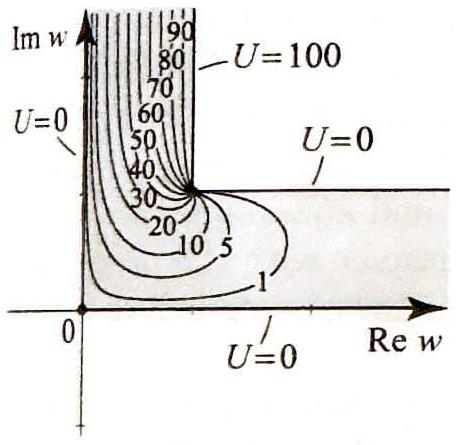

Figure 13 Isotherms in Example 6 .

This proposition is of course true for any one-to-one conformal map, not just for Schwarz-Christoffel transformations acting on the upper half-plane. We illustrate with an example.

## EXAMPLE 6 Isotherms in the $L$-shaped region

Find the isotherms of the Dirichlet problem $\Delta U(w)=0$ in Figure 12.
Solution From Example 4, we know that the Schwarz-Christoffel transformation $f(z)=\frac{1}{\pi}\left(\sin ^{-1} z+i \sin ^{-1} \frac{1}{z}\right)+\frac{1+i}{2}$ will map the upper half-plane onto the $L$ shaped region. Since the boundary data switches from 0 to 100 at $f(1)=1+i$, the corresponding Dirichlet problem in the upper half-plane is $\Delta u(z)=0, u(x)=0$ for $x<1$, and $u(x)=100$ for $x>1$. We immediately write down the solution using the argument function:

$$
u(z)=100-\frac{100}{\pi} \operatorname{Arg}(z-1)
$$

The isotherms $u=C$ thus satisfy $\operatorname{Arg}(z-1)=\pi-\frac{\pi C}{100}$ and are rays emanating from the point $z=1$. Each ray is parametrized by $\gamma(t)=1+t e^{i\left(\pi-\frac{\pi C}{100}\right)}$, where $0<t<\infty$. By Proposition 1, the image of this ray under $w=f(z)$ is the isotherm $U=C$ in the $L$-shaped region; and it is parametrized by

$$
f(\gamma(t))=\frac{1}{\pi}\left(\sin ^{-1}\left(1+t e^{i\left(\pi-\frac{\pi C}{100}\right)}\right)+i \sin ^{-1}\left(\frac{1}{1+t e^{i\left(\pi-\frac{\pi C}{100}\right)}}\right)\right)+\frac{1+i}{2}
$$

Some isotherms are plotted in Figure 13.

## Fluid Flow

We will investigate problems in two-dimensional fluid flow, using our knowledge of harmonic functions and the technique of conformal mapping. In an ideal situation where fluid is flowing over a two-dimensional surface represented by an unbounded region $\Omega$ in the $z$-plane, assuming that the fluid is incompressible (fixed density) and irrotational (circulation around a closed path is zero), it can be shown that there is a harmonic function $\phi(x, y)$ such that the velocity $V(x, y)$ of a point $(x, y)$ in $\Omega$ is given by the gradient of $\phi$. That is,

$$
V(x, y)=\nabla \phi(x, y)=\left(\frac{\partial \phi}{\partial x}, \frac{\partial \phi}{\partial y}\right)=\left(\phi_{x}, \phi_{y}\right) .
$$

The function $\phi$ is called the velocity potential of the flow. The curves defined by the relation

$$
\phi(x, y)=C_{1}
$$

are called the equipotential curves or equipotential lines. The streamlines of the flow are the curves that are orthogonal to the equipotential curves. If the streamlines are expressed in the form

$$
\psi(x, y)=C_{2},
$$

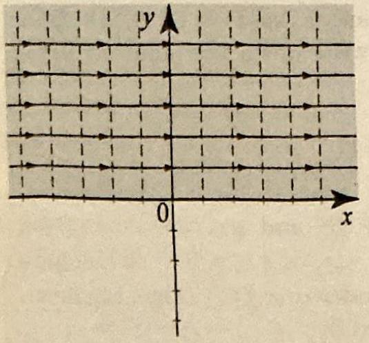
Figure 14 Streamlines in a uniform rightward flow in the upper half-plane.

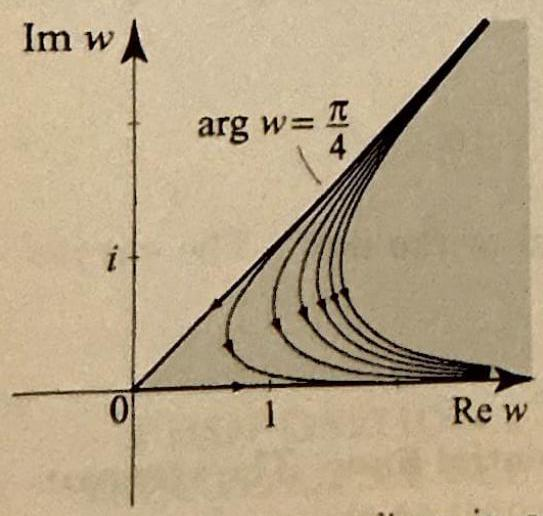
Figure 15 Streamlines in a sector.

for some function $\psi$, then, from Section 2.5, we know that we can take $\psi$ to be the harmonic conjugate of $\phi$ in $\Omega$. The function $\psi$ is called the stream function. The fluid will flow on the level curves of $\psi$. If we let

$$
\Phi(z)=\phi(x, y)+i \psi(x, y) \quad(z=x+i y \text { in } \Omega)
$$

then $\Phi$ is analytic in $\Omega$. It is called the complex potential of the flow. Thus the real part of the complex potential is the velocity potential, and the level curves of its imaginary part are the streamlines. If $\Gamma$ denotes the boundary of $\Omega$, we would expect the fluid to flow along $\Gamma$ or that $\Gamma$ is one of the streamlines. Thus the points on $\Gamma$ should satisfy (12).

For a simple example of a complex potential, we consider a uniform rightward flow in the upper half-plane with complex potential $\Phi(z)=z= x+i y$ (Figure 14). Here the velocity potential is $\phi(x, y)=x$, and the velocity at each point is given by the vector $(1,0)$, which is the gradient of $\phi(x, y)=x$. The stream function is $\psi(x, y)=y$, and streamlines are given as $\psi(x, y)=C$ for some constant $C \geq 0$. In accordance with the properties of a flow, the boundary $y=0$ is one of the streamlines corresponding to the value $C=0$.

Given an unbounded region $\Omega$ in the $w$-plane, how can we find the streamlines? We will apply conformal mapping techniques. Let $f$ be a one-to-one conformal mapping of the upper half of the $z$-plane onto $\Omega$, taking the $x$-axis onto $\Gamma$, the boundary of $\Omega$. Let a stream function $\psi(z)$ be given for the upper half-plane. By the properties of conformal mappings, $\Psi(w)=\psi\left(f^{-1}(w)\right)$ will be harmonic for all $w$ in $\Omega$. Proposition 1 tells us that the images of streamlines $\psi(z)=C$ under the mapping $f(z)$ are streamlines $\Psi(w)=C$. Since the real axis is a streamline for $\psi(z)$ and $\Gamma$ is the image of the real axis, we conclude that $\Gamma$ is a streamline for $\Psi(w)$. Thus $\Psi(w)$ is a stream function for $\Omega$.

In the following examples, we take the simple stream function $\psi(z)=y$ for the upper half-plane. Streamlines for the region $\Omega$ are found by using Proposition 1.

## EXAMPLE 7 Fluid flow in a sector

Find and plot the streamlines for the sector in Figure 15, where fluid flows in along the line $\operatorname{Arg} w=\frac{\pi}{4}$ and flows out along $\operatorname{Arg} w=0$.
Solution From Example 1, the Schwarz-Christoffel transformation $f(z)=z^{\frac{1}{4}}$ maps the upper half-plane to the given sector. We will use the simple stream function in the upper half-plane, $\psi(z)=y$, to generate a solution. Streamlines in the $z$-plane are parametrized as $\gamma(x)=x+i y_{0}$ for fixed $y_{0}$. Streamlines in the $w$ plane are images of these under $f$; we have $f(\gamma(x))=\left(x+i y_{0}\right)^{\frac{1}{4}}$. As the parameter $x$ increases, the streamlines are traced in the manner shown in Figure 15. Fluid comes in along $\operatorname{Arg} w=\frac{\pi}{4}$ and out along $\operatorname{Arg} w=0$.

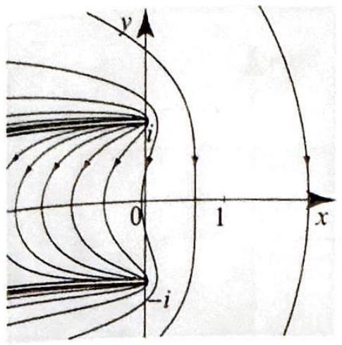
Figure 16 Streamlines in a doubly slit plane.

EXAMPLE 8 Fluid flow in the doubly slit plane
Find and plot the streamlines for the doubly slit plane in Figure 16, where fluid flows in from the upper left, past the double obstacle, and flows out to the lower left.

Solution In Example 5, we found that $f(z)=-\frac{1}{\pi} z^{2}+\frac{2}{\pi} \log z+\frac{1}{\pi}-i$ is a conformal mapping of the upper half-plane onto the doubly slit plane $\Omega$. Taking $\psi(z)=y$ to be the stream function for the upper half-plane, for each $y_{0} \geq 0$ we have a streamline parametrized by $\gamma(x)=x+i y_{0},-\infty<x<\infty$. By Proposition 1, the images $f(\gamma(x))$ are streamlines in the doubly slit plane. They are

$$
f\left(x+i y_{0}\right)=-\frac{1}{\pi}\left(x+i y_{0}\right)^{2}+\frac{2}{\pi} \log \left(x+i y_{0}\right)+\frac{1}{\pi}-i \quad(-\infty<x<\infty) .
$$

The streamlines are plotted in Figure 16. Note that the central channel serves neither as a source of fluid nor as a final destination; fluid flows in and then flows out. The fluid far into the central channel is almost stagnant. $\square$

## Exercises 6.4

In Exercises 1-6, find the Schwarz-Christoffel transformation of the upper half-plane onto the given region. Use the labeled points to set-up the integral (2).

1. See Figure 17. [Hint: Use (7) and integrate.]
2. See Figure 18. [Hint: $\frac{z+1}{(z-1)^{\frac{1}{2}}}=\frac{z-1+2}{(z-1)^{\frac{1}{2}}}=(z-1)^{\frac{1}{2}}+\frac{2}{(z-1)^{\frac{1}{2}}}$.]
3. See Figure 19. [Hint: $\frac{(z+1)^{\frac{1}{2}}}{(z-1)^{\frac{1}{2}}}=\frac{z+1}{i\left(1-z^{2}\right)^{\frac{1}{2}}}=\frac{z}{i\left(1-z^{2}\right)^{\frac{1}{2}}}+\frac{1}{i\left(1-z^{2}\right)^{\frac{1}{2}}}$.]

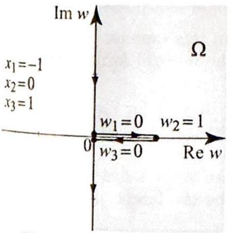
Figure 17

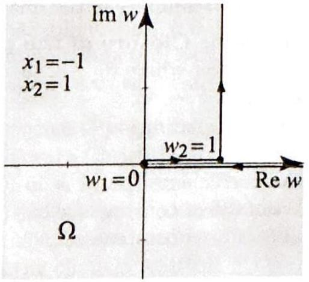
Figure 18

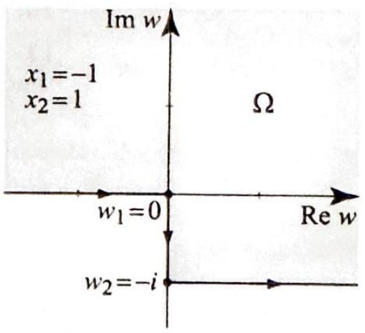
Figure 19

4. See Figure 20. [Hint: $\frac{(z-1)^{\frac{1}{2}}}{(z+1)^{\frac{1}{2}}}=\frac{z-1}{i\left(1-z^{2}\right)^{\frac{1}{2}}}=\frac{z}{i\left(1-z^{2}\right)^{\frac{1}{2}}}-\frac{1}{i\left(1-z^{2}\right)^{\frac{1}{2}}}$.]
5. See Figure 21. [Hint: Let $z=\sin \zeta$, where $-\frac{\pi}{2} \leq \operatorname{Re} \zeta \leq \frac{\pi}{2}$ and $\operatorname{Im} \zeta \geq 0$. Then $\left(1-z^{2}\right)^{\frac{1}{2}}=\cos \zeta$. Use $\cos ^{2} \zeta=\frac{1+\cos 2 \zeta}{2}$, integrate, then use $\sin 2 \zeta=2 \sin \zeta \cos \zeta$.]
6. See Figure 22. [Hints: $\frac{(z-1)^{\frac{1}{2}}}{z+1}=\frac{1}{(z-1)^{\frac{1}{2}}} \frac{z-1}{z+1}=\frac{1}{(z-1)^{\frac{1}{2}}}-\frac{2}{(z-1)^{\frac{1}{2}}} \frac{1}{z+1}$. In the second term, use $\frac{1}{z+1}=\frac{i}{2 \sqrt{2}}\left(\frac{1}{\sqrt{z-1}+i \sqrt{2}}-\frac{1}{\sqrt{z-1}-i \sqrt{2}}\right)$, and change variables $u= \sqrt{z-1}-i \sqrt{2}$ and $v=\sqrt{z-1}-i \sqrt{2}$. You cannot find $A$ and $B$ just from $f(1)=0$. Instead, first argue that $\operatorname{Arg} A=-\frac{\pi}{2}$ (look at the angle of the final line segment;

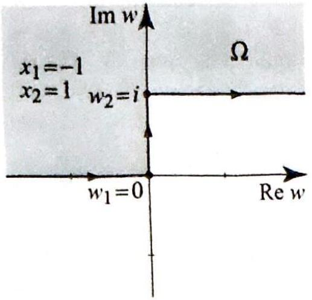
Figure 20

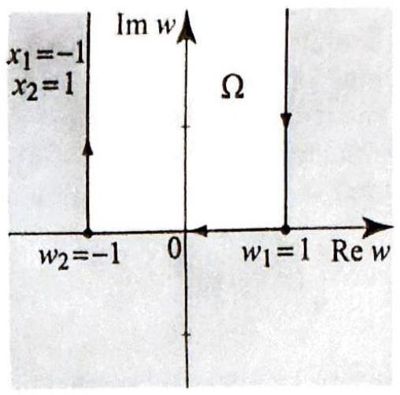
Figure 21

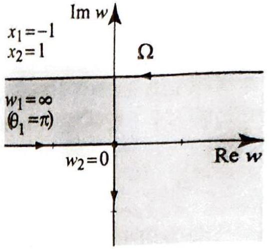
Figure 22

see the proof of Theorem 1) and thus $A=-i|A|$. Now get $B=i \pi \sqrt{2}|A|$ from $f(1)=0$. To get $|A|$, either use $\operatorname{Im} f(x)=1$ for $x<1$, or use the channel width formula (16) $1=|s|=\pi|A|\left|x_{2}-x_{1}\right|^{-\frac{\theta_{2}}{\pi}}$.]
7. Consider the Dirichlet problem in the triangular region of Example 3, where the base is kept at temperature $100^{\circ}$ and the other two sides at temperature $0^{\circ}$. (a) Determine the isotherms in the triangular region by first studying the isotherms in the upper half-plane of the corresponding Dirichlet problem (see Example 6).
(b) Plot several isotherms to illustrate your answer in (a).
8. Consider the Dirichlet problem in the semi-infinite strip of Example 2, where the base is kept at temperature $100^{\circ}$ and the other two vertical sides at temperature $0^{\circ}$. (a) Determine the isotherms in the region by following the method of Example 6.
(b) Plot several isotherms to illustrate your answer in (a).
9. Find and plot the streamlines in the region of Example 1.
10. Find and plot the streamlines in the image of the upper half-plane in Exercise 1.
11. Project Problem: Closure of the polygon. In this exercise, we will show that for a closed polygon where $\theta_{1}+\cdots+\theta_{n}=2 \pi$, the integral formula for $f(z)$, (2), converges to $w_{n}$ as $z \rightarrow \infty$.
(a) Use $\theta_{n}<\pi$ to show that $\theta_{1}+\cdots+\theta_{n-1}>\pi$. Define $\beta_{j}=\frac{\theta_{j}}{\pi}$ for $j=1, \ldots, n-1$.

Then $\beta_{1}+\cdots+\beta_{n-1}>1$.
(b) Note that the coefficients $A$ and $B$ in (1) will dilate, rotate, and translate the mapping and do not affect convergence of $f(z)$ or closure of the polygon, so we take $A=1$ and $B=0$. For concreteness, pick $z_{0}$ real to be the larger of $x_{n-1}$ and 1 , and set

$$
f(z)=\int_{z_{0}}^{z} \frac{d \zeta}{\left(\zeta-x_{1}\right)^{\beta_{1}}\left(\zeta-x_{2}\right)^{\beta_{2}} \cdots\left(\zeta-x_{n-1}\right)^{\beta_{n-1}}}
$$

(c) We show that $f(z)$ has a limit on the positive real axis. Restrict $z=x$ real, and use the limit comparison test for the integrand (against $\frac{1}{x^{\beta_{1}+\cdots+\beta_{n-1}}}$ ) to show that $\lim _{x \rightarrow \infty} f(x)=\int_{z_{0}}^{\infty} \frac{d \zeta}{\left(x-x_{1}\right)^{\beta_{1}\left(x-x_{2}\right)^{\beta_{2} \cdots\left(x-x_{n-1}\right)^{\beta_{n-1}}}}}$ is finite. Define $w_{n}$ to be this number.
(d) To show that $\lim _{z \rightarrow \infty} f(z)=w_{n}$ for any $|z| \rightarrow \infty$, write $z=R e^{i \theta}, R>0$. Then

$$
\left|f\left(R e^{i \theta}\right)-f(R)\right|=\left|\int_{R}^{R e^{i \theta}} \frac{d z}{\left(z-x_{1}\right)^{\beta_{1}}\left(z-x_{2}\right)^{\beta_{2}} \cdots\left(z-x_{n-1}\right)^{\beta_{n-1}}}\right| \leq R \pi M(R)
$$

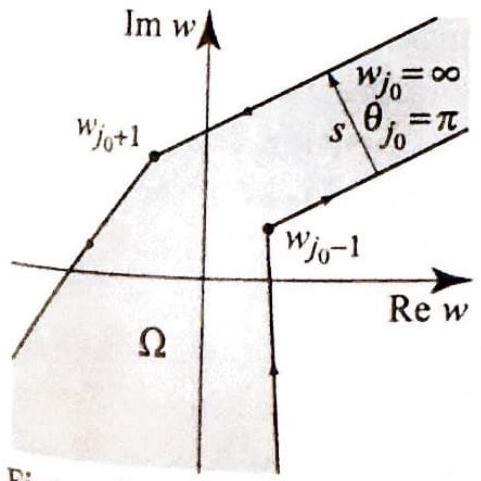
Figure 23 The channel separation $s$.

where $M(R)$ is the maximum of the absolute value of the integrand on the upper semicircle of radius $R$. Now $\lim _{R \rightarrow \infty}\left(M(R) R^{\beta_{1}+\cdots+\beta_{n-1}}\right)=1$, so $R M(R)= R^{1-\beta_{1}-\cdots-\beta_{n-1}}\left(M(R) R^{\beta_{1}+\cdots+\beta_{n-1}}\right) \rightarrow 0$, and so $\left|f\left(R e^{i \theta}\right)-f(R)\right| \rightarrow 0$ uniformly in $\theta$ as $R \rightarrow \infty$. Since $f(R) \rightarrow w_{n}$, we conclude that $f(z) \rightarrow w_{n}$ as $z \rightarrow \infty$.
12. (a) Follow the outlined steps to show that for $\operatorname{Im} z>0$, a real, and $0 \leq \alpha \leq \pi$.

$$
(z-a)^{\frac{\alpha}{\pi}}=(-1)^{\frac{\alpha}{\pi}}(a-z)^{\frac{\alpha}{\pi}} \text {, all branches principal. }
$$

Fix $z$ with $\operatorname{Im} z>0$. We must prove $e^{\frac{\alpha}{\pi} \log (z-a)}=e^{i \alpha} e^{\frac{\alpha}{\pi} \log (a-z)}$, and it will be sufficient to prove $\log (z-a)=\log (a-z)+i \pi$, or that $\operatorname{Arg}(z-a)=\operatorname{Arg}(a-z)+\pi$. We know that for each $z, \operatorname{Arg}(z-a)=\operatorname{Arg}(a-z) \pm \pi$. However, $0<\operatorname{Arg}(z-a)<\pi$ and $-\pi<\operatorname{Arg}(a-z)<0$, so $0<\operatorname{Arg}(z-a)-\operatorname{Arg}(a-z)<2 \pi$ and we must use the plus sign. This proves (14).
(b) Follow the outlined steps to prove (6). Use part (a) to show $(z-a)^{\frac{\alpha}{\pi}}(z+a)^{\frac{\alpha}{\pi}}= (-1)^{\frac{\alpha}{\pi}}(a-z)^{\frac{\alpha}{\pi}}(a+z)^{\frac{\alpha}{\pi}}$, and so we must show $(a-z)^{\frac{\alpha}{\pi}}(a+z)^{\frac{\alpha}{\pi}}=\left(a^{2}-z^{2}\right)^{\frac{\alpha}{\pi}}$. It is sufficient to show that $\operatorname{Arg}(a-z)+\operatorname{Arg}(a+z)=\operatorname{Arg}\left(a^{2}-z^{2}\right)$. We know that for each $z, \operatorname{Arg}(a-z)+\operatorname{Arg}(a+z)=\operatorname{Arg}\left(a^{2}-z^{2}\right)+2 k \pi$, where $k$ is 0,1 , or -1 . However $-\pi<\operatorname{Arg}(a-z)<0$ and $0<\operatorname{Arg}(a+z)<\pi$, so the left side is in $(-\pi, \pi)$, and hence $k=0$.
13. In this exercise we prove that for $\operatorname{Im} \zeta<0$,

$$
\zeta\left(1-\frac{1}{\zeta^{2}}\right)^{\frac{1}{2}}=-i\left(1-\zeta^{2}\right)^{\frac{1}{2}}, \text { all branches principal. }
$$

Expanding in terms of the logarithm, it will be sufficient to show that $\operatorname{Arg} \zeta+ \frac{1}{2} \operatorname{Arg}\left(1-\frac{1}{\zeta^{2}}\right)=-\frac{\pi}{2}+\frac{1}{2} \operatorname{Arg}\left(1-\zeta^{2}\right)$, or that $h(\zeta)=2 \operatorname{Arg} \zeta+\operatorname{Arg}\left(1-\frac{1}{\zeta^{2}}\right)+\pi- \operatorname{Arg}\left(1-\zeta^{2}\right)=0$. We know that $h(\zeta)=2 k \pi$, where $k$ is an integer that may depend on $\zeta$. However, since the images under $w_{1}=\left(1-\frac{1}{\zeta^{2}}\right)$ and $w_{2}=\left(1-\zeta^{2}\right)$ of the lower half-plane $\operatorname{Im} \zeta<0$ do not include the negative real axis, $h(\zeta)$ is continuous. A continuous function which takes on discrete values must be constant (Lemma 2, Section 5.7), and so $k$ cannot depend on $\zeta$. Pick $\zeta=-i$ and conclude $k=0$.
14. Project Problem: Channel width formula. We can write the logarithm as a Schwarz-Christoffel transformation $\log z=\int \frac{d z}{z}$, where there is one vertex, $x_{1}=0, \theta_{1}=\pi, w_{1}=\infty$. The selection of $\theta_{1}=\pi$ forces a semi-infinite channel in the left half-plane (in this case the channel is also infinite into the right half-plane). For points $\Delta x$ on the real axis near $x_{1}=0$, we have $f(\Delta x)-f(-\Delta x)=-i \pi$, and so the channel width is $\pi$. We now see that this type of behavior is exhibited wherever we set an angle $\theta_{j_{0}}=\pi$.
(a) Take a Schwarz-Christoffel transformation where a particular $\theta_{j_{0}}=\pi$, and other $\theta_{j} \leq \pi$. Then

$$
f(z)=A \int \frac{d z}{\left(z-x_{1}\right)^{\frac{\theta_{1}}{\pi}} \cdots\left(z-x_{j_{0}}\right) \cdots\left(z-x_{n-1}\right)^{\frac{\theta_{n-1}}{\pi}}}+B
$$

Argue briefly that $\lim _{z \rightarrow x_{10}} f(z)=\infty$ by considering the fact that each factor in the integrand is approximately constant near $x_{j_{0}}$ except $\frac{1}{z-x_{j_{0}}}$ which has a divergent integral.
(b) Define the channel separation complex number $s$ by $s=\lim _{r_{10} 0}\left(f\left(x_{j_{0}}+r\right)-\right.$
$\left.f\left(x_{j 0}-r\right)\right)$. A typical case is shown in Figure 23, and its absolute value $|s|$ represents the channel width. Parametrize the upper semicircle from $x_{j o}-r$ to $x_{j o}+r$ and get

$$
\begin{aligned}
s & =A \lim _{r \downarrow 0} \int_{0}^{\pi} \frac{-i r e^{i(\pi-t)} d t}{\left(x_{j_{0}}+r e^{i(\pi-t)}-x_{1}\right)^{\frac{\theta_{1}}{\pi}} \cdots\left(r e^{i(\pi-t)}\right) \cdots\left(x_{j_{0}}+r e^{i(\pi-t)}-x_{n-1}\right)^{\frac{\theta_{n}-1}{\pi}}} \\
& =\frac{-i A \pi}{\left(x_{j_{0}}-x_{1}\right)^{\frac{\theta_{1}}{\pi} \cdots\left(x_{j_{0}}-x_{n-1}\right)^{\frac{\theta_{n}-1}{\pi}}}}
\end{aligned}
$$

where in the denominator of the final expression, the term $x_{j_{0}}-x_{j_{0}}$ is skipped. Conclude that the channel width is

$$
|s|=\frac{|A| \pi}{\left|x_{j_{0}}-x_{1}\right|^{\frac{\theta_{1}}{\pi}} \cdots\left|x_{j_{0}}-x_{n-1}\right|^{\frac{\theta_{n-1}}{\pi}}}
$$

where again $\left|x_{j_{0}}-x_{j_{0}}\right|$ is skipped.
(c) Verify the channel width formula for the $L$-shaped region of Example 4 and the doubly slit plane of Example 5.

### 6.5 Green's Functions

What is a Green's function and what can it do for us? To answer these questions, let us review a few facts about the solution of a Dirichlet problem. Suppose that $\Omega$ is a simply connected region bounded by a simple path $\Gamma$. Let $f$ be a piecewise continuous function on $\Gamma$ and consider the Dirichlet problem (Figure 1)

Figure 1 A Dirichlet problem in a simply connected region.

$$
\begin{gathered}
\Delta u(z)=0 \quad \text { for all } z \text { in } \Omega \\
u(\zeta)=f(\zeta) \quad \text { for all } \zeta \text { on } \Gamma
\end{gathered}
$$

If $\Omega$ is the unit disk $D$, then the solution of the problem (1)-(2) is given by the Poisson formula (see (12), Section 3.8). The importance of this formula is that it depends only on the region and the boundary function $f$. For an arbitrary simply connected region $\Omega$, we saw in Section 6.1 that, as a consequence of the Riemann mapping theorem and the Poisson formula on the disk, the Dirichlet problem (1)-(2) on $\Omega$ has a solution. It is natural to ask whether we can express this solution as an integral that depends only on the region $\Omega$ and works for any piecewise continuous boundary function $f$. Amazingly, the answer is affirmative! Our goal in this section is to derive a formula that expresses the solution as a path integral over $\Gamma$, involving the boundary function $f$ and the so-called Green's function of the region $\Omega$, which is a function that depends only on $\Omega$. The formula is named in honor of its discoverer, one of the leading mathematicians and physicists of the nineteenth century, George Green (1793-1841), who was a self-taught mathematician from England. The importance of Green's functions will be appreciated in later sections, where they will be presented as the only tools
for solving boundary value problems on certain regions involving Poisson's equation and other important equations in applied mathematics.

If you recall in Section 3.8, we used a change of variables to derive the Poisson integral on the unit disk from the mean value property of harmonic functions. We will take the same approach on $\Omega$, and so we begin by explaining the change of variables that is a key to deriving and understanding Green's functions.

Suppose that $\Omega$ and $\Omega^{\prime}$ are two regions bounded by simple paths $\Gamma$ and $\Gamma^{\prime}$. Let $\phi$ be a one-to-one analytic map of $\Omega$ onto $\Omega^{\prime}$. We will further suppose that $\phi$ is analytic and one-to-one on $\Gamma$. It follows from Section 6.1 that $\phi$ maps boundary to boundary. Suppose that $F$ is a real differentiable function of two variables defined on $\Gamma^{\prime}$. We will think of complex numbers as points in the complex plane, and consider $F(z)$ for $z$ on $\Gamma^{\prime}$. We will write $\frac{\partial F}{\partial n_{\Gamma^{\prime}}}$ or simply $\frac{\partial F}{\partial n}$ to denote the directional derivative of $F$ in the direction of the outward unit normal vector to the path $\Gamma^{\prime}$. By definition, this is the dot product of the gradient of $F, \nabla F=\left(F_{x}, F_{y}\right)$, with the outward unit normal vector $n_{\Gamma}^{\prime}$. Thus

$$
\frac{\partial F}{\partial n_{\Gamma^{\prime}}}=\nabla F \cdot n_{\Gamma^{\prime}}
$$

where each expression is computed at a given point on $\Gamma^{\prime}$ (Figure 2).

Figure 2 The mapping $\phi$ is analytic and one-to-one on $\Omega$. It maps boundary to boundary and preserves angles.
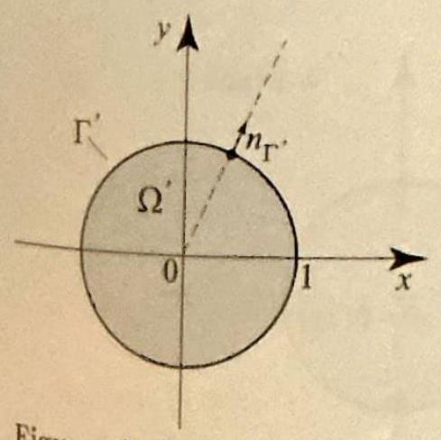

Figure 3 For a circle centered at the origin, the normal derivative is the radial derivative.

Figure 2 The mapping $\phi$ is analytic and one-to-one on $\Omega$. It maps boundary to boundary and preserves angles.

Although normal derivatives are tedious to compute in general, they are easy to express in some important special cases. For example, if $\Gamma^{\prime}$ is any circle centered at the origin, then $\frac{\partial F}{\partial n_{\Gamma^{\prime}}}$ is just the radial derivative of $F$ (Figure 3):

$$
\frac{\partial F}{\partial n_{\Gamma^{\prime}}}=\frac{\partial F}{\partial r}
$$

If $F(z)=\ln |z|$ and $\Gamma^{\prime}$ is the unit circle, then for all points on the unit circle

$$
\left.\frac{\partial F}{\partial n_{\Gamma^{\prime}}}\right|_{|z|=1}=\left.\frac{\partial}{\partial r} \ln r\right|_{r=1}=\left.\frac{1}{r}\right|_{r=1}=1
$$

Our goal is to relate the normal derivative of $F$ on $\Gamma^{\prime}$ to the normal derivative of $F(\phi(z))$ on $\Gamma$. Recall that if $\phi$ is analytic and $\left|\phi^{\prime}(z)\right| \neq 0$, then $\phi$ rotates
a path through $z$ by a fixed angle and scales by $\left|\phi^{\prime}(z)\right|$. So $\phi$ will map a normal vector to $\Gamma$ at $\zeta$ to a normal vector to $\Gamma^{\prime}$ at $\phi(\zeta)$, and it will scale its modulus by $\left|\phi^{\prime}(\zeta)\right|$. Since the normal derivative measures the rate of change of the function in the direction of the normal vector to the curve, thinking as we do with the chain rule, we expect the normal derivative of $F \circ \phi$ at $\zeta$ to equal the normal derivative of $F$ at $\phi(\zeta)$ times $\left|\phi^{\prime}(\zeta)\right|$. This expectation turns out to be correct, and we have the following change of variables formula:

$$
\frac{\partial(F \circ \phi)}{\partial n_{\Gamma}}(\zeta)=\left|\phi^{\prime}(\zeta)\right| \frac{\partial F}{\partial n_{\Gamma^{\prime}}}(\phi(\zeta)) .
$$

The proof of (3) is a nice application of conformal properties, the chain rule in two dimensions, and the Cauchy-Riemann equations. We give it at the end of this section in order not to interrupt the presentation. The importance of this formula is that it incorporates the effect of the conformal properties of analytic functions. Let us move a step closer to the desired formula for Green's functions and derive a formula that uses the boundary values of $u$ to reproduce its value at a special point inside $\Omega$. You should note the role of the mean value property of harmonic functions in the proof.

## LEMMA 1 CHANGE OF VARIABLES

Figure 4 If $\phi$ is analytic and one-to-one, then $\phi^{-1}$ is also analytic.

Suppose that $w=\phi(z)$ is a one-to-one analytic mapping of a simply connected region $\Omega$ and its boundary $\Gamma$ onto the open unit disk $D$ and its boundary $C$. Let $u$ be a function harmonic on $\Omega$ and piecewise continuous on the boundary $\Gamma$. Let $z_{0}$ in $\Omega$ be the point such that $\phi\left(z_{0}\right)=0$. Then

$$
u\left(z_{0}\right)=\frac{1}{2 \pi} \int_{\Gamma} u(\zeta) \frac{\partial \ln |\phi(\zeta)|}{\partial n} d s
$$

where $d s=|d \zeta|$ is the element of arc length on $\Gamma$. Hence if $\Gamma$ is parametrized by $\gamma(t), a \leq t \leq b$, then $d s=\left|\gamma^{\prime}(t)\right| d t$.
Proof We will apply (3), but first we note one useful result. (Refer to Figure 4 for help with the notation.)
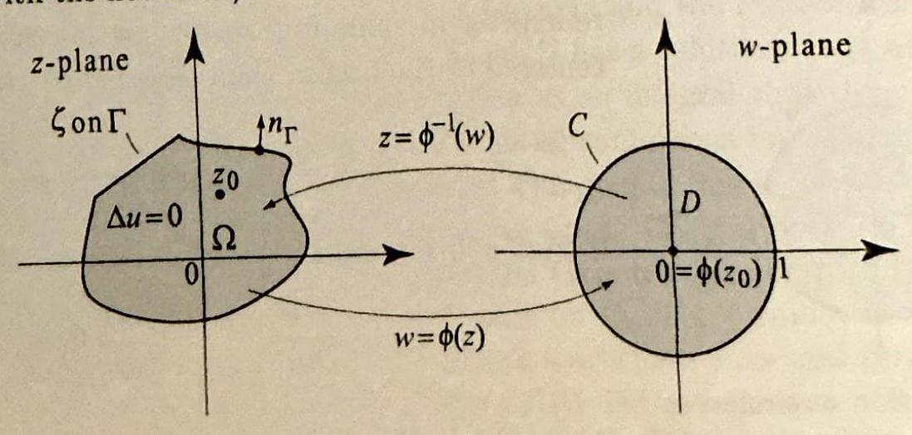

The function $\phi^{-1}$ is analytic from the closed unit disk (in the $w$-plane) onto $\Omega$ and its boundary (in the $z$-plane). So the function $u\left(\phi^{-1}(w)\right)$ is harmonic on the open
unit disk, being the composition of a harmonic function $u$ with an analytic function $\phi^{-1}$ (Theorem 3, Section 2.5). Moreover, $u\left(\phi^{-1}(w)\right)$ is piecewise continuous on $C$. Thus, by the mean value property of harmonic functions (Corollary 7, Section 3.8), we have

$$
\frac{1}{2 \pi} \int_{0}^{2 \pi} u\left(\phi^{-1}\left(e^{i t}\right)\right) d t=u\left(\phi^{-1}(0)\right)=u\left(z_{0}\right)
$$

Our goal now is to show that the integral in (4) is precisely the integral that we just evaluated in (5). Parametrize $C$ by $e^{i t}, 0 \leq t \leq 2 \pi$. Then $\Gamma$ will be parametrized by $\phi^{-1}\left(e^{i t}\right), 0 \leq t \leq 2 \pi$. The element of arc length on $\Gamma$ is

$$
\left|\frac{d}{d t} \phi^{-1}\left(e^{i t}\right)\right| d t=\left|\frac{i e^{i t}}{\phi^{\prime}\left(\phi^{-1}\left(e^{i t}\right)\right)}\right| d t=\frac{1}{\left|\phi^{\prime}\left(\phi^{-1}\left(e^{i t}\right)\right)\right|} d t
$$

Using (3) to perform the change of variables $\zeta=\phi^{-1}\left(e^{i t}\right)$, we transform the integral in (4) into

$$
\begin{gathered}
\left.\frac{1}{2 \pi} \int_{0}^{2 \pi} u\left(\phi^{-1}\left(e^{i t}\right)\right) \frac{\partial \ln |w|}{\partial r}\right|_{w=e^{i t}}\left|\phi^{\prime}\left(\phi^{-1}\left(e^{i t}\right)\right)\right| \frac{d t}{\left|\phi^{\prime}\left(\phi^{-1}\left(e^{i t}\right)\right)\right|} \\
=\frac{1}{2 \pi} \int_{0}^{2 \pi} u\left(\phi^{-1}\left(e^{i t}\right)\right) d t=u\left(z_{0}\right)
\end{gathered}
$$

by (5).
Let us note the following interesting property of the logarithm that we derived in the preceding proof: If $\phi$ is a conformal mapping of $\Gamma$ and its interior onto the unit circle $C$ and its interior, then for a point $\zeta$ on $\Gamma$ we have

$$
\left.\frac{\partial \ln |\phi(z)|}{\partial n_{\Gamma}}\right|_{z=\zeta}=\left|\phi^{\prime}(\zeta)\right|
$$

By composing $\phi$ with an appropriate linear fractional transformation, we will be able to reproduce the values of $u$ at any point inside $\Omega$, not just $z_{0}=\phi^{-1}(0)$ as shown in (4). Let $z$ be in $\Omega$ and think of $\phi(z)$ as a fixed point inside the unit disk in the $w$-plane. Consider the linear fractional transformation

$$
\tau_{z}(w)=\frac{w-\phi(z)}{1-\overline{\phi(z)} w}
$$

It is one-to-one and maps the unit disk onto the unit disk and the unit circle onto the unit circle (Example 3, Section 3.7). Let us compose $\tau_{z}$ with $\phi$ and define

$$
\Phi(z, \zeta)=\tau_{z}(\phi(\zeta))=\frac{\phi(\zeta)-\phi(z)}{1-\overline{\phi(z)} \phi(\zeta)}, \quad z, \zeta \text { in } \Omega
$$

This is a function of two variables $z$ and $\zeta$, but we will often think of it as a function of $\zeta$ alone for a fixed value of $z$. As a function of $\zeta$, it clearly maps $z$ to 0 ; that is, $\Phi(z, z)=0$ (Figure 5).

Figure 5 We think of $\Phi(z, \zeta)$ as a function of one variable $\zeta$ in $\Omega$, for fixed $z$ in $\Omega$. As a function of $\zeta, \Phi(z, \zeta)$ is analytic and one-to-one from $\Omega$ onto the unit disk and takes $z$ to 0 ; that is, $\Phi(z, z)=0$.

## THEOREM 1 GREEN'S FUNCTIONS

Using $\Phi(z, \zeta)$ in place of $\phi(\zeta)$ in (4), we are able to reproduce the value of $u$ at any point $z$ in $\Omega$.
Suppose that $\Omega$ is a simply connected region with boundary $\Gamma$, and $\phi$ is a one-to-one analytic function on $\Omega$ and its boundary onto the unit disk and its boundary. Let $u(z)$ be a function harmonic on $\Omega$ and piecewise continuous on $\Gamma$. For $z$ and $\zeta$ in $\Omega$, let $\Phi(z, \zeta)$ be as in (8). Then, for any $z$ in $\Omega$, we have
(9)

$$
u(z)=\frac{1}{2 \pi} \int_{\Gamma} u(\zeta) \frac{\partial}{\partial n} \ln |\Phi(z, \zeta)| d s
$$

where $d s=|d \zeta|$ is the element of arc length on $\Gamma$.
The function

$$
G(z, \zeta)=\ln |\Phi(z, \zeta)|=\ln \left|\frac{\phi(\zeta)-\phi(z)}{1-\overline{\phi(z)} \phi(\zeta)}\right|, \quad z, \zeta \text { in } \Omega
$$

is called the Green's function for the region $\Omega$. It plays a fundamental role in the solution of important partial differential equations (Laplace's equation and Poisson's equation). Formula (9) is a generalized Poisson integral formula for the simply connected region $\Omega$.

Like the Poisson formulas on the disk and in the upper half-plane, formula (9) can be used to solve a general Dirichlet problem in a simply connected region $\Omega$, where the boundary data is piecewise continuous. Of course, this solution depends on the explicit formula for the conformal mapping of $\Omega$ onto the unit disk. Once this mapping is determined, Green's functions can be used to solve the Dirichlet problem. We illustrate these ideas with several examples and show how we can recapture the Poisson formulas from Green's functions.

We will often write the Green's function $G(z, \zeta)$ in terms of the real and

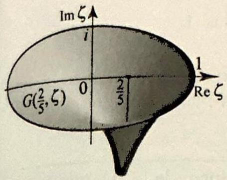
Figure 6 Green's function $G\left(\frac{2}{5}, \zeta\right)$ for the unit disk anchored at $z=\frac{2}{5}$. Note that $G\left(\frac{2}{5}, \zeta\right)=0$ for all $\zeta$ on the boundary and $G\left(\frac{2}{5}, \zeta\right)$ has a singularity at $\zeta=\frac{2}{5}$.

imaginary parts of $z=x+i y$ and $\zeta=s+i t$. We will also write the Green's function using polar coordinates of $z$ and $\zeta$, where $z=r e^{i \theta}$ and $\zeta=\rho e^{i \eta}$

EXAMPLE 1 Green's function and Poisson formula for the disk (a) Show that the Green's function for the unit disk in polar coordinates is

$$
G(z, \zeta)=\ln \left|\frac{\rho e^{i \eta}-r e^{i \theta}}{1-r \rho e^{i(\eta-\theta)}}\right|, \quad \text { for } z=r e^{i \theta} \text { and } \zeta=\rho e^{i \eta}
$$

As a specific illustration, we fix $z=\frac{2}{5}$ in the unit disk, and plot in Figure 6 the function $\zeta \mapsto G\left(\frac{2}{5}, \zeta\right)$, for $\zeta$ in the unit disk. This is Green's function for the unit disk anchored at a specific point $z=\frac{2}{5}$ in the unit disk.
(b) Derive the Poisson integral formula for the unit disk.

Solution (a) We will use (10). In this case, the conformal mapping $\phi(z)$ of the unit disk onto itself is simply $\phi(z)=z$, and so

$$
G(z, \zeta)=\ln |\Phi(z, \zeta)|=\ln \left|\frac{\phi(\zeta)-\phi(z)}{1-\overline{\phi(z)} \phi(\zeta)}\right|=\ln \left|\frac{\zeta-z}{1-\bar{z} \zeta}\right|
$$

and (11) follows upon replacing $z$ by $r e^{i \theta}$ and $\zeta$ by $\rho e^{i \eta}$.
(b) To derive the Poisson integral formula for the unit disk, we must write out (9) when $\Gamma$ is the unit circle. In this case, $d s=d \eta$, where $0 \leq \eta \leq 2 \pi$. Using (6), we find that

$$
\begin{aligned}
\frac{\partial}{\partial n} \ln \left|\frac{\zeta-z}{1-\bar{z} \zeta}\right|_{|\zeta|=1} & =\left|\frac{d}{d \zeta}\left(\frac{\zeta-z}{1-\bar{z} \zeta}\right)\right|_{\zeta=e^{i \eta}}=\left|\frac{1-|z|^{2}}{(1-\bar{z} \zeta)^{2}}\right|_{\zeta=e^{i \eta}} \\
& =\frac{1-r^{2}}{\left|1-r e^{-i \theta} e^{i \eta}\right|^{2}}=\frac{1-r^{2}}{1-2 r \cos (\theta-\eta)+r^{2}}
\end{aligned}
$$

Plugging into (9), we find, for $z=r e^{i \theta}$ with $0 \leq r<1$,

$$
u(z)=\frac{1-r^{2}}{2 \pi} \int_{0}^{2 \pi} \frac{u\left(e^{i \eta}\right)}{1-2 r \cos (\theta-\eta)+r^{2}} d \eta
$$

which is Poisson's formula on the unit disk. $\square$

Before we move to our next example, let us understand the role of $\Phi(z, \zeta)$ in (8). Since $\Phi$ is the composition of two conformal mappings, it is itself a conformal mapping of $\Omega$ onto the unit disk, and from (8) we have $\Phi(z, z)=$ 0 . By the Riemann mapping theorem, $\Phi(z, \zeta)$ is uniquely determined by these properties, up to a unimodular multiplicative constant. In particular $|\Phi(z, \zeta)|$ is uniquely determined and so is the Green's function for the region. (The uniqueness part in the Riemann mapping theorem is not difficult to prove, and so we are not appealing to a deep result here.) Consider, for example, the linear fractional transformation

$$
\tau(\zeta)=\frac{z-\zeta}{\bar{z}-\zeta}
$$

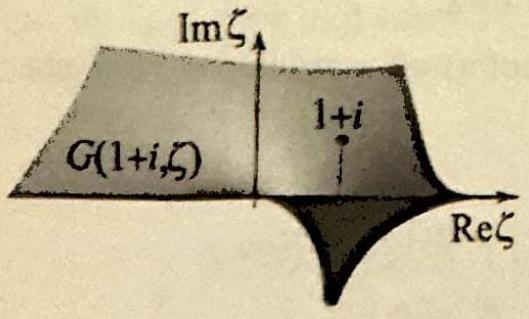
Figure 7 Green's function $G(1+i, \zeta)$ for the upper halfplane anchored at $z=1+i$. Note that $G(1+i, \zeta)=0$ for all $\zeta$ on the boundary and $G(1+i, \zeta)$ has a singularity at $\zeta=1+i$.

Figure 8 for Example 3.

where $z$ is in the upper half-plane. If $\zeta$ is real so that $\bar{\zeta}=\zeta$, then

$$
\left|\frac{z-\zeta}{\bar{z}-\zeta}\right|=\left|\frac{z-\zeta}{\bar{z}-\bar{\zeta}}\right|=\frac{|z-\zeta|}{|\overline{z-\zeta}|}=1
$$

Thus $\tau(\zeta)$ maps the real line onto the unit circle and since it takes $z$ onto the origin, it follows that $\tau$ maps the upper half-plane onto the unit disk, and thus $\tau(\zeta)=\Phi(z, \zeta)$ for the upper half-plane.

EXAMPLE 2 Green's function and Poisson's formula in the upper halfplane (a) Show that the Green's function for the upper half-plane is

$$
G(z, \zeta)=\frac{1}{2} \ln \frac{(x-s)^{2}+(y-t)^{2}}{(x-s)^{2}+(y+t)^{2}}, \text { for } z=x+i y, \zeta=s+i t(y, t>0)
$$

As a specific illustration, we fix $z=1+i$ in the upper half-plane, and plot in Figure 7 the function $\zeta \mapsto G(1+i, \zeta)$, for $\zeta$ in the upper half-plane. This is Green's function for the upper half-plane anchored at a specific point $z=1+i$ in the upper half-plane.
(b) Derive the Poisson integral formula for the upper half-plane.

Solution According to (10), Green's function for the upper half-plane is $\ln |\Phi(z, \zeta)|$ where $\Phi(z, \zeta)$ is given by (12). Thus,

$$
G(z, \zeta)=\ln \left|\frac{z-\zeta}{\bar{z}-\zeta}\right|=\frac{1}{2} \ln \frac{|z-\zeta|^{2}}{|\bar{z}-\zeta|^{2}}=\frac{1}{2} \ln \frac{(x-s)^{2}+(y-t)^{2}}{(x-s)^{2}+(-y-t)^{2}},
$$

which is equivalent to (13).
(b) To derive Poisson's integral formula in the upper half-plane we compute the normal derivative in (9). If $\Gamma$ is the real $s$-axis, then the normal derivative is clearly the derivative in the negative direction along the imaginary $t$-axis. Thus,

$$
\frac{\partial}{\partial n} G(z, \zeta)=-\frac{1}{2} \frac{\partial}{\partial t} \ln \frac{(x-s)^{2}+(y-t)^{2}}{(x-s)^{2}+(y+t)^{2}}
$$

A straightforward calculation of the derivative, then setting $t=0$, yields

$$
\frac{\partial}{\partial n} G(z, \zeta)=\frac{2 y}{(x-s)^{2}+y^{2}}
$$

Plugging into (9) yields

$$
u(z)=\frac{y}{\pi} \int_{-\infty}^{\infty} \frac{u(s)}{(x-s)^{2}+y^{2}} d s \quad(z=x+i y)
$$

which is Poisson's formula for the upper half-plane.
We give one more example of a Green's function.

## EXAMPLE 3 Green's function for a semi-infinite vertical strip

We can map the strip $\Omega$ in Figure 8 conformally onto the upper half-plane using the mapping $w=\sin z$. Composing the function (12) with this, we obtain a one-to-one
analytic mapping of $\Omega$ onto the unit disk, taking $z$ in $\Omega$ onto the origin. Thus the Green's function for $\Omega$ is

$$
G(z, \zeta)=\ln \left|\frac{\sin z-\sin \zeta}{\sin z-\sin \zeta}\right|
$$ $\square$

We prove next some interesting properties of Green's functions.

## THEOREM 2 PROPERTIES OF GREEN'S FUNCTIONS

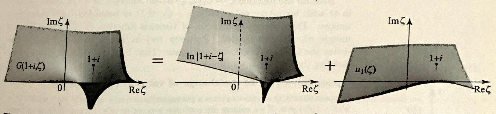
Figure 9 A Green's function $G\left(z_{0}, \zeta\right)$ anchored at $z_{0}=1+i$ is the sum of a logarithm, $\ln \left|z_{0}-\zeta\right|$, and a harmonic function, $u_{1}(\zeta)$, such that $u_{1}(\zeta)=-\ln \left|z_{0}-\zeta\right|$ on the boundary. As a result, $G\left(z_{0}, \zeta\right)$ vanishes on the boundary and has a singularity at $z_{0}$ like $\ln \left|z_{0}-\zeta\right|$.

Proof Fix $z$ in $\Omega$. From the definition of $\phi$ and $\Phi$ (see (7) and (8)), we have that $\Phi(z, \zeta)$ is in the open unit disk $D$ (that is, $|\Phi(z, \zeta)|<1$ ) for all $\zeta$ in $\Omega$ and $\Phi(z, \zeta)$ is on the unit circle $C$ (that is, $|\Phi(z, \zeta)|=1$ ) for all $\zeta$ on $\Gamma$. This clearly proves (i) and (ii), because $\ln |x|<0$ if $|x|<1$ and $\ln |x|=0$ if $|x|=1$. For (iii), we have

$$
G(z, \zeta)=\ln \left|\frac{\phi(\zeta)-\phi(z)}{1-\overline{\phi(z)} \phi(\zeta)}\right|=\ln \left|\frac{\phi(z)-\phi(\zeta)}{1-\overline{\phi(z)} \phi(\zeta)}\right|=\ln \left|\frac{\phi(\zeta)-\phi(z)}{1-\overline{\phi(\zeta)} \phi(z)}\right|=G(\zeta, z)
$$

To prove (iv), fix $z$ in $\Omega$ and consider

$$
\psi(z, \zeta)=\frac{\phi(\zeta)-\phi(z)}{\zeta-z} \frac{1}{1-\overline{\phi(z)} \phi(\zeta)} \quad(\zeta \neq z \text { in } \Omega)
$$

Clearly, $\psi(z, \zeta)$ is analytic for all $\zeta \neq z$ in $\Omega$. What happens as $\zeta$ approaches $z$ ? We have

$$
\lim _{\zeta \rightarrow z} \psi(z, \zeta)=\lim _{\zeta \rightarrow z} \frac{\phi(\zeta)-\phi(z)}{\zeta-z} \frac{1}{1-\overline{\phi(z)} \phi(\zeta)}=\frac{\phi^{\prime}(z)}{1-|\phi(z)|^{2}}
$$

which is finite because $|\phi(z)|<1$ and nonzero because $\phi$ is one-to-one and so $\phi^{\prime}(z) \neq 0$. Hence $\psi(z, \zeta)$ has a removable singularity at $z$ (Theorem 6, Section 4.6). By defining $\psi$ at $\zeta=z$ to be

$$
\psi(z, z)=\frac{\phi^{\prime}(z)}{1-|\phi(z)|^{2}}
$$

$\psi(z, \zeta)$ becomes analytic and nonzero for all $\zeta$ in $\Omega$. Set $u_{1}(z, \zeta)=\ln |\psi(z, \zeta)|$; then $u_{1}$ is harmonic for all $\zeta$ in $\Omega$. But for $\zeta \neq z$

$$
u_{1}(z, \zeta)=\ln |\psi(z, \zeta)|=\ln \left|\frac{\phi(\zeta)-\phi(z)}{1-\overline{\phi(z)} \phi(\zeta)}\right|-\ln |\zeta-z|=G(z, \zeta)-\ln |z-\zeta|
$$

Also, $u_{1}(z, \zeta)=-\ln |z-\zeta|$ on the boundary because $G(z, \zeta)=0$ on the boundary, and so (iv) holds.

Because the function $\zeta \mapsto u_{1}(z, \zeta)$ is the solution of a Dirichlet problem in $\Omega$ with boundary values $-\ln |z-\zeta|$, if $\Omega$ is bounded, this solution is unique. Thus the representation of Green's function in Theorem 2(iv) is unique when $\Omega$ is bounded. Property (iv) in Theorem 2 can be used to define the Green's function of a domain. That is, any function $G(z, \zeta)$ that satisfies (iv) also satisfies (9).

## Appendix: Proof of the change of variables formula (3)

Figure 10

Suppose that $\gamma(t)=x(t)+i y(t)$ is a parametrization of a smooth path with $\gamma^{\prime}(t)= x^{\prime}(t)+i y(t) \neq 0$. If we assume our path has a positive orientation, then an outward unit normal may be obtained by rotating the tangent $\gamma^{\prime}(t)$ clockwise by $\pi / 2$ and dividing by its absolute value (Figure 10). Hence $n(t)=\frac{\gamma^{\prime}(t)}{i\left|\gamma^{\prime}(t)\right|}$ or

$$
n_{\Gamma}=\frac{1}{\left|\gamma^{\prime}(t)\right|}\left(y^{\prime}(t),-x^{\prime}(t)\right)
$$

Let $\phi(z)$ be as in the text preceding (3). To simplify the notation, let us write $\phi(z)=u(x, y)+i v(x, y)$, write $F$ as $F(u, v)$, and denote partial derivatives by subscripts. So

$$
(F \circ \phi)_{x}=\frac{\partial}{\partial x} F(u(x, y), v(x, y))=F_{u} u_{x}+F_{v} v_{x}
$$

where the last equality follows from the chain rule in two dimensions. Similarly,

$$
(F \circ \phi)_{y}=\frac{\partial}{\partial y} F(u(x, y), v(x, y))=F_{u} u_{y}+F_{v} v_{y}
$$

Using the definition of the normal derivative, (14), (15), and (16), we get

$$
\begin{aligned}
\frac{\partial}{\partial n_{\Gamma}} F \circ \phi & =\nabla(F \circ \phi) \cdot n_{\Gamma}=\frac{1}{\left|\gamma^{\prime}(t)\right|}\left((F \circ \phi)_{x},(F \circ \phi)_{y}\right) \cdot\left(y^{\prime}(t),-x^{\prime}(t)\right) \\
& =\frac{1}{\left|\gamma^{\prime}(t)\right|}\left(\left(F_{u} u_{x}+F_{v} v_{x}\right) y^{\prime}(t)-\left(F_{u} u_{y}+F_{v} v_{y}\right) x^{\prime}(t)\right)
\end{aligned}
$$

Consider now the path $\Gamma^{\prime}$, which is parametrized by

$$
\phi(\gamma(t))=u(x(t), y(t))+i v(x(t), y(t)) .
$$

Conformality ensures that the outward normal to $\phi(\gamma(t))$ is still turned clockwise from the tangent; so in analogy with (14) we obtain

$$
\begin{aligned}
n_{\Gamma^{\prime}} & =\frac{1}{\left|\frac{d}{d t} \phi(\gamma(t))\right|}\left(\frac{d}{d t} v(x(t), y(t)),-\frac{d}{d t} u(x(t), y(t))\right) \\
& =\frac{1}{\left|\phi^{\prime}(\gamma(t)) \gamma^{\prime}(t)\right|}\left(v_{x} x^{\prime}(t)+v_{y} y^{\prime}(t),-u_{x} x^{\prime}(t)-u_{y} y^{\prime}(t)\right)
\end{aligned}
$$

Thus

$$
\begin{aligned}
\frac{\partial F}{\partial n_{\Gamma^{\prime}}} & =\nabla F \cdot n_{\Gamma^{\prime}} \\
& =\frac{1}{\left|\gamma^{\prime}(t)\right|\left|\phi^{\prime}(\gamma(t))\right|}\left(F_{u}, F_{v}\right) \cdot\left(v_{x} x^{\prime}(t)+v_{y} y^{\prime}(t),-u_{x} x^{\prime}(t)-u_{y} y^{\prime}(t)\right)
\end{aligned}
$$

$$
=\frac{1}{\left|\gamma^{\prime}(t)\right|\left|\phi^{\prime}(\gamma(t))\right|}\left(F_{u}\left(v_{x} x^{\prime}(t)+v_{y} y^{\prime}(t)\right)+F_{v}\left(-u_{x} x^{\prime}(t)-u_{y} y^{\prime}(t)\right)\right) .
$$

Comparing (17) and (18) and using the Cauchy-Riemann equations, $u_{x}=v_{y}, u_{y}= -v_{x}$, we see that (3) holds.

## Exercises 6.5

In Exercises 1-8, derive the Green's function for the region depicted in the accompanying figure (Figures 11-18).
1.

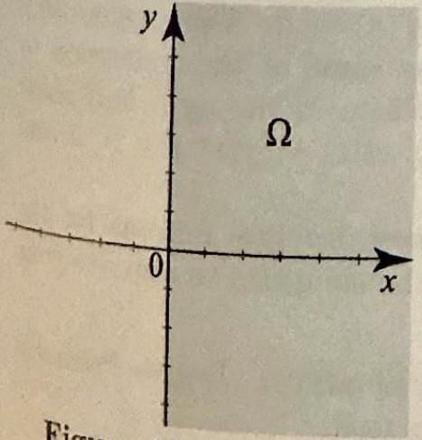
Figure 11

2. 

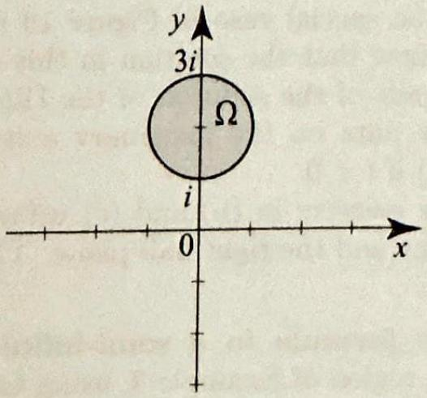
Figure 12

3. 

Figure 13

4. 

Figure 14

7. 

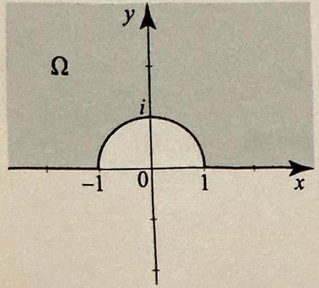
Figure 17

5. 

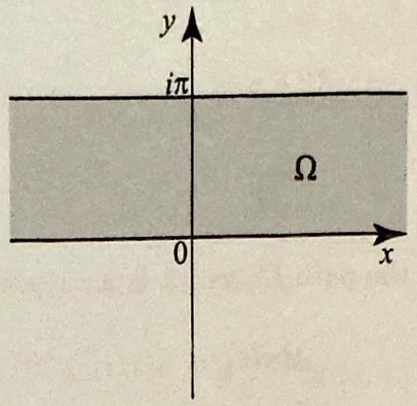
Figure 15

8. 

Figure 18

6. 

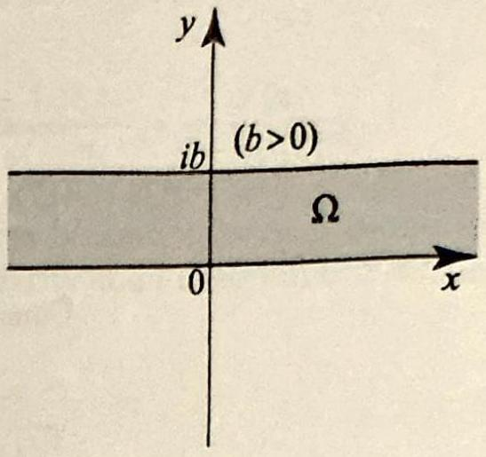
Figure 16

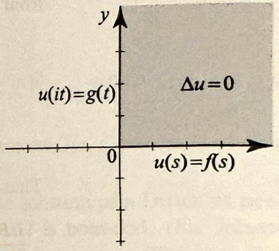
Figure 19 for Exercise 9.

9. Project Problem: Poisson's formula in the first quadrant. (a) Derive the following Poisson formula in the first quadrant for the Dirichlet problem in Figure 19, using Green's function:

$$
\begin{aligned}
u(x+i y)= & \frac{y}{\pi} \int_{0}^{\infty} f(s)\left(\frac{1}{(x-s)^{2}+y^{2}}-\frac{1}{(x+s)^{2}+y^{2}}\right) d s \\
& +\frac{x}{\pi} \int_{0}^{\infty} g(t)\left(\frac{1}{x^{2}+(y-t)^{2}}-\frac{1}{x^{2}+(y+t)^{2}}\right) d t
\end{aligned}
$$

(b) Consider the special case in which $g(t)=0$. Use a symmetry argument to show that the solution in this case is the same as the restriction to the first quadrant of the solution of the Dirichlet problem in the upper half-plane with boundary data on the real axis given by $u(s)=f(s)$ if $s>0$ and $u(s)=-f(-s)$ if $s<0$.
(c) Consider the special case in Figure 19 in which $f(s)=0$. Use a symmetry argument to show that the solution in this case is the same as the restriction to the first quadrant of the solution of the Dirichlet problem in the right half-plane with boundary data on the imaginary axis given by $u(i t)=g(t)$ if $t>0$ and $u(i t)=-g(-t)$ if $t<0$.
(d) Write your answers in (b) and (c) using the Poisson integral formula for the upper half-plane and the right half-plane. Then sum the solutions to rederive your answer in (a).
10. Poisson's formula in a semi-infinite vertical strip. Derive Poisson's formula in the region of Example 3, using Green's function.
11. By composing $\phi_{\alpha}(z)=\frac{z-\alpha}{1-\bar{\alpha} z}$ with $\psi(z)=\frac{1-z}{i+z}$, you should be able to construct your own map $\Phi(z, \zeta)$ from the upper half-plane to the disk, satisfying $\Phi(z, z)=0$.
(a) Find the value of $\alpha$ (it will depend on $z$ ).
(b) Check that your final map $\Phi(z, \zeta)$ is the same as given in this section, $\frac{z-\zeta}{z-\zeta}$, times the unimodular constant $\frac{\pi-i}{x+i}$.

### 6.6 Poisson's Equation and Neumann Problems

In this section we use Green's functions to solve the Poisson boundary value problem on a region $\Omega$, then apply similar techniques to solve another important type of problem known as a Neumann problem. We start with the Poisson problem, which consists of the inhomogeneous Laplace's equation known as Pois

We now express the solution of the Poisson problem on $\Omega$ in terms of Green's functions. We use the notation of the previous section and suppose that $f$ and $h$ have enough smoothness and integrability properties for the formulas in Theorems 2 and 3 to hold.

THEOREM 2 SOLUTION OF POISSON PROBLEM

Suppose that $\Omega$ is a region with boundary $\Gamma$, and let $G(z, \zeta)$ denote the Green's function for $\Omega$. If $u(z)$ is a solution of Poisson's problem (1)-(2), then

$$
u(z)=\frac{1}{2 \pi} \iint_{\Omega} h(\zeta) G(z, \zeta) d A+\frac{1}{2 \pi} \int_{\Gamma} f(\zeta) \frac{\partial}{\partial n} G(z, \zeta) d s
$$

where $d A$ is the element of area and $d s$ is the element of arc length.
This form of the solution clearly illustrates the superposition principle. We recognize the second term on the right side of (3) as the solution of the Dirichlet problem on $\Omega$ with boundary values $f$ (compare with Theorem 1, Section 6.5). Looking at the other term, we also have

$$
u(z)=\frac{1}{2 \pi} \iint_{\Omega} h(\zeta) G(z, \zeta) d A
$$

as a solution of Poisson's equation (1) with zero boundary values.
The proof of Theorem 2 is based on the following Green's identities.

## THEOREM 3 GREEN'S IDENTITIES

Suppose that $\Omega$ is a bounded region whose boundary $\Gamma$ consists of a finite number of simple closed positively oriented paths (as in Theorem 6, Section 3.4). Let $u(x, y)$ and $v(x, y)$ have continuous second partial derivatives on $\Omega$ and $\Gamma$. Then we have Green's first identity

$$
\iint_{\Omega}(u \Delta v+\nabla u \cdot \nabla v) d A=\int_{\Gamma} u \frac{\partial v}{\partial n} d s
$$

and Green's second identity

$$
\iint_{\Omega}(u \Delta v-v \Delta u) d A=\int_{\Gamma}\left(u \frac{\partial v}{\partial n}-v \frac{\partial u}{\partial n}\right) d s
$$

Proof We will appeal to Green's theorem from calculus. For simply connected regions, this theorem is stated in Exercise 40, Section 3.4. For multiply connected regions, the version goes as follows. Let $p(x, y)$ and $q(x, y)$ have continuous first partial derivatives in $\Omega$ and on its positively oriented boundary $\Gamma$. Then, using subscripts to denote partial derivatives, we have

$$
\iint_{\Omega}\left(p_{x}(x, y)+q_{y}(x, y)\right) d x d y=\int_{\Gamma}(p(x, y) d y-q(x, y) d x)
$$

## Apply (7) with

$$
p(x, y)=u v_{x} \quad \text { and } \quad q(x, y)=u v_{y}
$$

and get

$$
\iint_{\Omega}\left(u\left(v_{x x}+v_{y y}\right)+\left(u_{x} v_{x}+u_{y} v_{y}\right)\right) d x d y=\int_{\Gamma} u\left(v_{x} d y-v_{y} d x\right)
$$

The integrand on the left is the same as the integrand on the left of (5). To understand the integrand on the right, let us recall that for a positively oriented curve parametrized by $\gamma(t)=x(t)+i y(t)$, the outward unit normal may be obtained by rotating the tangent $\gamma^{\prime}(t)=x^{\prime}(t)+i y^{\prime}(t)$ clockwise by $\frac{\pi}{2}$ and dividing by its absolute value. Hence

$$
n(t)=\frac{\gamma^{\prime}(t)}{i\left|\gamma^{\prime}(t)\right|}=\frac{1}{\left|\gamma^{\prime}(t)\right|}\left(y^{\prime}(t), x^{\prime}(t)\right)
$$

Thus since the normal derivative $\frac{\partial v}{\partial n}$ is by definition the gradient of $v$ dotted with the outward unit normal vector and $d s=\left|\gamma^{\prime}(t)\right| d t$, we have

$$
\frac{\partial v}{\partial n} d s=\left(v_{x}, v_{y}\right) \cdot\left(y^{\prime}(t),-x^{\prime}(t)\right) d t=v_{x} d y-v_{y} d x
$$

which shows that the right side of (8) is the same as the right side of (5), and so (5) follows. To prove (6), we reverse the roles of $u$ and $v$ in (5) and get

$$
\iint_{\Omega}(v \Delta u+\nabla u \cdot \nabla v) d x d y=\int_{\Gamma} v \frac{\partial u}{\partial n} d s
$$

Subtracting this from (5), we get (6). $\square$

Green's formulas do not hold in general on unbounded regions. Since we will use them to prove (4), we will suppose throughout the proof that $\Omega$ is bounded. Nevertheless, formula (3) can be used on unbounded regions and its validity there can be checked on a case by case basis.

Proof of Theorem 2 Fix $z$ in $\Omega$ and let $S_{\epsilon}(z)$ denote the closed disk of radius

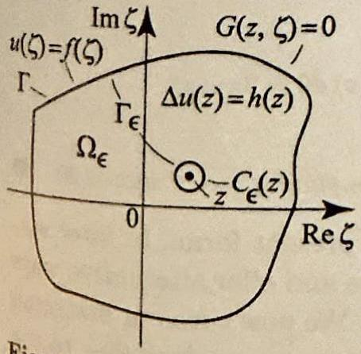
Figure 3

$$
\begin{aligned}
-\iint_{\Omega_{e}} G(z, \zeta) h(\zeta) d A= & \int_{\Gamma}(u(\zeta) \frac{\partial G(z, \zeta)}{\partial n}-\overbrace{G(z, \zeta)}^{=0} \frac{\partial u(\zeta)}{\partial n}) d s \\
& +\int_{C_{e}(z)}\left(u(\zeta) \frac{\partial G(z, \zeta)}{\partial n}-G(z, \zeta) \frac{\partial u(\zeta)}{\partial n}\right) d s
\end{aligned}
$$

because $G(z, \zeta)=0$ for $\zeta$ on $\Gamma$. We will let $\epsilon \downarrow 0$ and show that

$$
\begin{aligned}
& \iint_{\Omega_{e}} G(z, \zeta) h(\zeta) d A \rightarrow \iint_{\Omega} G(z, \zeta) h(\zeta) d A \\
& \int_{C_{e}(z)} u(\zeta) \frac{\partial G(z, \zeta)}{\partial n} d s \rightarrow-2 \pi u(z) \\
& \int_{C_{e}(z)} G(z, \zeta) \frac{\partial u(\zeta)}{\partial n} d s \rightarrow 0
\end{aligned}
$$

This will imply (3) and complete the proof. Let us start with (11). Write $G(z, \zeta)= u_{1}(z, \zeta)+\ln |z-\zeta|$, where $u_{1}(z, \zeta)$ is harmonic, hence bounded by a constant $M$ in some fixed disk centered at $z$. Also, $\frac{\partial u}{\partial n}$ is bounded in this fixed disk (say, $\left|\frac{\partial u}{\partial n}\right| \leq A$ ), since $u$ has continuous partial derivatives in $\Omega$. For $\zeta$ on $C_{\epsilon}(z)$, we have $|z-\zeta|=\epsilon$, hence $\left|G(z, \zeta) \frac{\partial u}{\partial n}\right| \leq(M+|\ln \epsilon|) A$, and so

$$
\left|\int_{C_{\epsilon}(z)} G(z, \zeta) \frac{\partial u(\zeta)}{\partial n} d s\right| \leq(M+|\ln \epsilon|) A \int_{C_{\epsilon}(z)} d s=2 \pi \epsilon(M+|\ln \epsilon|) A \rightarrow 0, \text { as } \epsilon \rightarrow 0
$$

To prove (10), we note that on $C_{\epsilon}(z)$,

$$
\frac{\partial G(z, \zeta)}{\partial n}=\frac{\partial}{\partial n}\left(u_{1}(z, \zeta)+\ln |z-\zeta|\right)=\frac{\partial}{\partial n} u_{1}(z, \zeta)-\frac{1}{\epsilon}
$$

Now

$$
\int_{C_{\epsilon}(z)} u(\zeta) \frac{\partial G(z, \zeta)}{\partial n} d s=\int_{C_{\epsilon}(z)} u(\zeta) \frac{\partial}{\partial n} u_{1}(z, \zeta) d s-\frac{1}{\epsilon} \int_{C_{\epsilon}(z)} u(\zeta) d s
$$

The first integral on the right tends to 0 as $\epsilon \rightarrow 0$, because $u(\zeta) \frac{\partial}{\partial n} u_{1}(z, \zeta)$ is bounded in $S_{\epsilon}(z)$, as in the proof of (10). To handle the second integral, note that the function $I(\epsilon)=\frac{1}{\epsilon} \int_{C_{\epsilon}(z)} u(\zeta) d s=\int_{0}^{2 \pi} u\left(z+\epsilon e^{i \theta}\right) d \theta$ is continuous (Theorem 5, Section 3.5). So

$$
\lim _{\epsilon \rightarrow 0} \int_{0}^{2 \pi} u\left(z+\epsilon e^{i \theta}\right) d \theta=I(0)=\int_{0}^{2 \pi} u(z) d \theta=2 \pi u(z)
$$

which completes the proof of (10). The proof of (9) is similar (see Exercise 9).
In practice, (3) is difficult to compute in its present form. In later sections, we will relate it to generalized Fourier series and offer alternative ways for computing the solution of Poisson's equation. We now turn our attention to a different problem, which can be solved using an approach similar to the one we took with Green's functions.

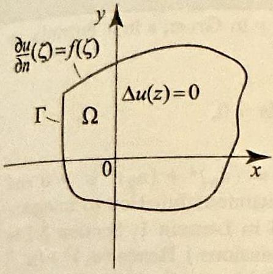
Figure 4 A Neumann problem in a region $\Omega$.

## PROPOSITION 1 NORMAL DERIVATIVE OF HARMONIC FUNCTIONS

## Neumann Condition and Neumann Problems

When modeling heat problems in an insulated plate $\Omega$, where heat exchange on the boundary is prescribed, we are led to a boundary value problem that consists of Laplace's equation along with a condition that describes the values of the normal derivative on the boundary (Figure 4):

$$
\begin{gathered}
\Delta u(z)=0 \quad \text { for all } z \text { in } \Omega ; \\
\frac{\partial u}{\partial n}(\zeta)=f(\zeta) \quad \text { for all } \zeta \text { on } \Gamma .
\end{gathered}
$$

Such a problem is called a Neumann problem (after the German mathematician Carl Gottfried Neumann (1832-1925)) and sometime referred to as a Dirichlet problem of the second kind. Condition (13) is known as a Neumann condition. The normal derivative at the boundary describes the rate of exchange of heat with the surrounding medium or the flux of heat across the boundary. For example, the condition $f(\zeta)=0$ corresponds to an insulated point where there is no exchange of heat with the surrounding medium. Since $f(\zeta)$ represents the flux of heat across the boundary of $u$ and $u$ represents a steady-state temperature distribution inside $\Omega$, we would expect the total flux across the boundary to be zero; that is, $f$ cannot be arbitrary, it has to satisfy the compatibility condition

$$
\int_{\Gamma} f(\zeta) d s=0
$$

Indeed, (14) follows from the following useful property of harmonic functions, by setting $f(\zeta)=\frac{\partial u}{\partial n}$.
Suppose that $u$ is harmonic in a bounded region $\Omega$ and its boundary $\Gamma$. Then

$$
\int_{\Gamma} \frac{\partial u}{\partial n} d s=0
$$

Proof Reversing the roles of $u$ and $v$ in Green's first identity (5) and then picking $v=1$, we get

$$
\iint_{\Omega} \Delta u d A=\int_{\Gamma} \frac{\partial u}{\partial n} d s
$$

Since $\Delta u=0$, the proposition follows. $\square$

In a Neumann problem, we are asked to find a harmonic function given the values of its normal derivative on the boundary. Such a solution is not unique, since we can add an arbitrary constant to a solution of (12)-(13) and get another solution of (12)-(13). So now we ask: Is the solution unique up
to an arbitrary constant? The answer is affirmative. To show this, consider the difference between two solutions, which is harmonic and has zero normal derivative on the boundary. As we now show, a function that is harmonic and has zero normal derivative is a constant.

THEOREM 4 UNIQUENESS OF NEUMANN SOLUTION

## DEFINITION 1 NEUMANN FUNCTIONS

## PROPOSITION 2

## Suppose that $u$ is harmonic on a bounded region $\Omega$ such that $\frac{\partial u}{\partial n}=0$ on the boundary $\Gamma$ of $\Omega$. Then $u$ is identically constant in $\Omega$.

Proof Suppose that $u$ is harmonic in $\Omega$ and take $u=v$ in Green's first formula, so that $\Delta v=0$ in $\Omega$, and get

$$
\iint_{\Omega}(\nabla u \cdot \nabla u) d A=\int_{\Gamma} u \frac{\partial u}{\partial n} d s=0
$$

because $\frac{\partial u}{\partial n}=0$ on $\Gamma$. Now the function $\nabla u \cdot \nabla u=\left(u_{x}\right)^{2}+\left(u_{y}\right)^{2}$ is $\geq 0$ and continuous on $\Omega$. The only way for a nonnegative continuous function to integrate to zero is to vanish identically. (This fact is proved in Lemma 1, Section 3.7 in one dimension, but the argument works in higher dimensions.) Hence $\left(u_{x}\right)^{2}+\left(u_{y}\right)^{2}$ is identically zero in $\Omega$, and so $u_{x}=0$ and $u_{y}=0$ identically in $\Omega$. Applying Theorem 1, Section 2.1, we see that $u$ is constant on $\Omega$. $\square$

In order to express the solution of the Neumann problem as an integral, motivated by Green's function and the solution of the Dirichlet problem, we make the following definition.
Suppose that $\Omega$ is a simply connected region with boundary $\Gamma$. A Neumann function $N(z, \zeta)(z, \zeta$ in $\Omega)$ for the region $\Omega$ is a function with the following properties:
(i) for each $z$ in $\Omega, N(z, \zeta)$ is harmonic for all $\zeta \neq z$ in $\Omega$;
(ii) $\frac{\partial N}{\partial n}(z, \zeta)=C$ for all $z$ in $\Omega$ and $\zeta$ on $\Gamma$;
(iii) for each $z$ in $\Omega$, there is a function $\zeta \mapsto u_{1}(z, \zeta)$ such that $u_{1}(z, \zeta)$ is harmonic for all $\zeta$ in $\Omega$, and $N(z, \zeta)=\ln |z-\zeta|+u_{1}(z, \zeta)$ for all $\zeta$ in $\Gamma$.
Parts (i) and (iii) state that Neumann functions, like Green's functions, are harmonic inside $\Omega$ except for a singularity at $z=\zeta$, which is similar to the singularity of $\ln |z-\zeta|$. Part (ii) tells us that the boundary values of the normal derivative of the Neumann function are constant. This is the counterpart of the boundary condition for a Green's function, which states that a Green's function must vanish identically on the boundary. As we now show, the constant $C$ in (ii) depends on the length of the boundary $\Gamma$.

The constant $C$ in Definition 1(ii), which represents the boundary value of the normal derivative of the Neumann function, is given by

$$
C=\frac{2 \pi}{L}
$$

where $L=\int_{\Gamma} d s$ is the length of $\Gamma$. If $L$ is infinite, we take $C=0$.
Proof The proof is based on the following interesting property of the logarithm.

## THEOREM 5 SOLUTION OF NEUMANN PROBLEMS

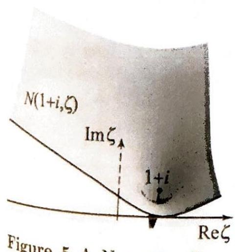

Figure 5 A Neumann function for the upper half-plane, anchored at $z=1+i$.

For any fixed $z$ inside $\Omega$, we have

$$
\int_{\Gamma} \frac{\partial}{\partial n} \ln |z-\zeta| d s=2 \pi
$$

To see this, let $S_{\epsilon}(z)$ be a disk of radius $\epsilon>0$ centered at $z$ and contained in $\Omega$, and let $C_{\epsilon}(z)$ denote the circle centered at $z$ with radius $\epsilon$. The function $\zeta \mapsto \ln |z-\zeta|$ is harmonic in $\Omega \backslash S_{\epsilon}$, so according to Proposition 1, we have

$$
0=\int_{C_{e}(z)} \frac{\partial}{\partial n} \ln |z-\zeta| d s+\int_{\Gamma} \frac{\partial}{\partial n} \ln |z-\zeta| d s
$$

Parametrizing $C_{\epsilon}(z)$ by $\zeta=z+\epsilon e^{i t}, 0 \leq t \leq 2 \pi, \frac{\partial}{\partial n} \ln |z-\zeta|=-\frac{1}{\epsilon}$ and $d s=\epsilon d t$, and so

$$
0=-\int_{0}^{2 \pi} d t+\int_{\Gamma} \frac{\partial}{\partial n} \ln |z-\zeta| d s
$$

implying (18). Now, using (ii) and (iii) of Definition 1, write

$$
C L=\int_{\Gamma} C d s=\int_{\Gamma} \frac{\partial N}{\partial n} d s=\overbrace{\int_{\Gamma} \frac{\partial N_{1}}{\partial n} d s}^{=0, \text { by Proposition } 1}+\int_{\Gamma} \frac{\partial}{\partial n} \ln |z-\zeta| d s=0+2 \pi
$$

which implies (17).
Neumann functions are not unique for a region (two Neumann functions can differ by a function of $z$ and not $\zeta$; see Exercise 12). However, any Neumann function satisfying Definition 1 will work to solve a Neumann problem. Before we express the solution of the Neumann problem in terms of the Neumann function, we note that from Theorem 4 if a solution of a Neumann problem exists, then it is unique up to an additive constant.
Suppose that $\Omega$ is a region bounded by a simple path $\Gamma$, and let $N(z, \zeta)$ denote a Neumann function, where $z$ and $\zeta$ are in $\Omega$. Then, up to an additive constant, the solution $u(z)$ of the Neumann problem (12)-(14) is given by

$$
u(z)=-\frac{1}{2 \pi} \int_{\Gamma} N(z, \zeta) f(\zeta) d s
$$

The proof of Theorem 5 is just like the proof of Theorem 2 (see Exercise 10). Now we derive some classical Neumann functions.

## EXAMPLE 1 Neumann function for the upper half-plane

Show that the Neumann function for the upper half-plane is

$$
\begin{aligned}
N(z, \zeta) & =\ln |z-\zeta|+\ln |\bar{z}-\zeta| \\
& =\frac{1}{2} \ln \left((x-s)^{2}+(y-t)^{2}\right)+\frac{1}{2} \ln \left((x-s)^{2}+(y+t)^{2}\right)
\end{aligned}
$$

for $z=x+i y$ and $\zeta=s+i t, y, t>0$ (Figure 5).

## PROPOSITION 3 NEUMANN FUNCTION FOR UNBOUNDED REGIONS

Figure 6 A Neumann function for the first quadrant, anchored at $z=1+i$. Note the singularity at $\zeta=1+i$.

Solution We know that $N(z, \zeta)=\ln |z-\zeta|+N_{1}(z, \zeta)$. Computing the normal derivative of $\ln |z-\zeta|=\frac{1}{2} \ln \left((x-s)^{2}+(y-t)^{2}\right)$ along the real axis, we find

$$
-\left.\frac{d}{d t} \frac{1}{2} \ln \left((x-s)^{2}+(y-t)^{2}\right)\right|_{t=0}=\left.\frac{y-t}{(x-s)^{2}+(y-t)^{2}}\right|_{t=0}=\frac{y}{(x-s)^{2}+y^{2}}
$$

By adding $\frac{1}{2} \ln |\bar{z}-\zeta|=\frac{1}{2} \ln \left((x-s)^{2}+(y+t)^{2}\right)$ to $\ln |z-\zeta|$, this adds $\frac{-y}{(x-s)^{2}+y^{2}}$ to the normal derivative along the real axis, making the normal derivative of $\left.\frac{1}{2} \ln \right\rvert\, z- \left.\zeta\left|+\frac{1}{2} \ln \right| \bar{z}-\zeta \right\rvert\,$ zero along the real axis. This shows that $N(z, \zeta)$ as defined by (20) has 0 normal derivative along the boundary, in accordance with Proposition 2. All other properties of the Neumann function in Definition 1 are easily verified. $\square$

The fact that the normal derivative of the Neumann function of an unbounded region is zero on the boundary allows us to construct the Neumann function for this region by using the Neumann function for the upper halfplane and a change of variables via a conformal mapping. More precisely, we have the following construction, which is valid for unbounded regions.
Suppose that $\Omega$ is an unbounded region with boundary $\Gamma$, and $\phi$ is a one-toone analytic mapping of $\Omega$ onto the upper half-plane, taking $\Gamma$ onto the real axis. Then the Neumann function for $\Omega$ is given by

$$
N(z, \zeta)=\ln |\phi(z)-\phi(\zeta)|+\ln |\overline{\phi(z)}-\phi(\zeta)| \quad(z, \zeta \text { in } \Omega) .
$$

Proof Fix $z$ in $\Omega$ and consider the function $F(w)=\ln |\phi(z)-w|+\ln |\overline{\phi(z)}-w|$, where $\phi(z)$ and $w$ are in the upper half-plane. By Example $1, \frac{\partial F}{\partial n}(w)=0$, for all $w$ on the real axis. Applying the change of variables formula (3), Section 6.5, it follows that $\frac{\partial F \circ \phi}{\partial n}(\zeta)=0$ for all $\zeta$ on $\Gamma$. So $N(z, \zeta)$ has the right normal derivative on the boundary $\Gamma$. Does it have the right singularity at $\zeta=z$ ? Since $\overline{o(z)}$ is in the lower half-plane, it follows that $\ln |\overline{\phi(z)}-\phi(\zeta)|$ is harmonic for all $\zeta$ in $\Omega$. Now let us compare $\ln |\phi(z)-\phi(\zeta)|$ to $\ln |z-\zeta|$. We have

$$
\lim _{\zeta \rightarrow z}(\ln |\phi(z)-\phi(\zeta)|-\ln |z-\zeta|)=\lim _{\zeta \rightarrow z} \ln \left|\frac{\phi(z)-\phi(\zeta)}{z-\zeta}\right|=\ln \left|\phi^{\prime}(z)\right|
$$

because $\phi$ is analytic. Since $\phi^{\prime}(z) \neq 0, \ln |\phi(z)-\phi(\zeta)|$ and $\ln |z-\zeta|$ differ by a finite constant near $z$. Hence the function $N(z, \zeta)=\ln |z-\zeta|$ plus a harmonic function in $\Omega$. $\square$

Let us give an application of Proposition 3.

## EXAMPLE 2 Neumann function for the first quadrant

Applying Proposition 3 with $\phi(z)=z^{2}$, we obtain the Neumann function for the first quadrant (shown in Figure 6 at $z=1+i$ )

$$
\begin{aligned}
N(z, \zeta) & =\ln \left|z^{2}-\zeta^{2}\right|+\ln \left|\overline{z^{2}}-\zeta^{2}\right| \\
& =\ln |z-\zeta|+\ln |z+\zeta|+\ln |\bar{z}-\zeta|+\ln |\bar{z}+\zeta|
\end{aligned}
$$ $\square$

Finding Neumann functions for bounded regions is more difficult because the condition $\frac{\partial N}{\partial n}=C$ is not preserved by a conformal mapping $\phi(z)$; the normal derivative is scaled by $\left|\phi^{\prime}(z)\right|$. In the exercises, we will compute the Neumann function for the unit disk.

What if we are to solve Poisson's equation (1) with Neumann boundary conditions (13)? The compatibility condition on $h$ and $f$ has already been handled by (16); it is

$$
\iint_{\Omega} h(\zeta) d A=\int_{\Gamma} f(\zeta) d s
$$

This problem is also solvable with the Neumann function, and for reference, we present an analog of Theorem 2.

THEOREM 6 SOLUTION OF POISSON-NEUMANN PROBLEM
2.

Figure 8

3. 

Figure 9

Suppose that $\Omega$ is a region with boundary $\Gamma$, let $N(z, \zeta)$ denote a Neumann function for this region, where $z$ and $\zeta$ are in $\Omega$. If $u(z)$ is a solution to Poisson's equation (1) subject to a Neumann boundary condition (13) and satisfying (23), then up to an additive constant

$$
u(z)=\frac{1}{2 \pi} \iint_{\Omega} h(\zeta) N(z, \zeta) d A-\frac{1}{2 \pi} \int_{\Gamma} N(z, \zeta) f(\zeta) d s
$$

## Exercises 6.6

In Exercises 1-6, derive the Neumann function for the region depicted in the accompanying figure (Figures 7-12).

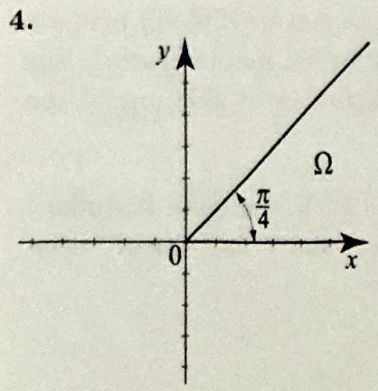
Figure 10

5. 

Figure 11

6. 

Figure 12

7. Uniqueness of the solution in a Poisson problem. Show that the solution of the Poisson problem in a bounded region $\Omega$ is unique. [Hint: The difference between any two solutions is harmonic and has zero boundary values.]
8. Neumann function for the unit disk. Show that this function is defined for $z, \zeta$ in the unit disk by

$$
N(z, \zeta)= \begin{cases}\ln |z-\zeta|+\ln \left|\frac{1}{\bar{z}}-\zeta\right|+\ln |z| & \text { if } z \neq 0 \\ \ln |\zeta| & \text { if } z=0\end{cases}
$$

Derive this function by following the outlined steps.
(a) Write $z=r e^{i \theta}$ and $\zeta=\rho e^{i \eta}$. Fix $z \neq 0$, and show that

$$
\begin{aligned}
\left.\frac{\partial}{\partial n} \ln |z-\zeta|\right|_{\rho=1} & =\left.\frac{\partial}{\partial \rho} \frac{1}{2} \ln |z-\zeta|^{2}\right|_{\rho=1}=\left.\frac{1}{2} \frac{\partial}{\partial \rho} \ln \left(r^{2}+\rho^{2}+2 r \rho \cos (\theta-\eta)\right)\right|_{\rho=1} \\
& =\frac{1+r \cos (\theta-\eta)}{1+r^{2}+2 r \cos (\theta-\eta)}
\end{aligned}
$$

(b) Write $\frac{1}{\bar{z}}=\frac{1}{r} e^{i \theta}$, use (a), and conclude that

$$
\left.\frac{\partial}{\partial n} \ln \left|\frac{1}{\bar{z}}-\zeta\right\rangle\right|_{\rho=1}=\frac{1+\frac{1}{r} \cos (\theta-\eta)}{\left(\frac{1}{r}\right)^{2}+1+2 \cos (\theta-\eta)}=\frac{r^{2}+r \cos (\theta-\eta)}{1+r^{2}+2 r \cos (\theta-\eta)}
$$

(c) Use (a) and (b) to show that for $z \neq 0,\left.\frac{\partial}{\partial n} N(z, \zeta)\right|_{|\zeta|=1}=1$.
(d) Verify the remaining properties of the Neumann function for the given $N(z, \zeta)$.
9. Prove (9) by justifying the following steps:

$$
\begin{aligned}
& \left|\iint_{\Omega_{e}} G(z, \zeta) h(\zeta) d A-\iint_{\Omega} G(z, \zeta) h(\zeta) d A\right| \\
& \quad=\left|\iint_{B_{e}(z)} G(z, \zeta) h(\zeta) d A\right| \\
& \quad \leq \iint_{B_{e}(z)}\left|u_{1}(z, \zeta) h(\zeta)\right| d A+\iint_{B_{e}(z)}|\ln | z-\zeta|h(\zeta)| d A \\
& \quad \leq C_{1} \iint_{B_{e}(z)} d A+C_{2} \iint_{C_{v}(z)} \ln |z-\zeta| d A \\
& \quad=C_{1} \epsilon^{2} \pi+C_{2} \int_{0}^{2 \pi} \int_{0}^{\epsilon} r \ln |r| d r d \theta
\end{aligned}
$$

Evaluate the last integral and show that the resulting expression on the right side tends to 0 as $\epsilon \rightarrow 0$.
10. Proof of Theorem 5. In addition to the hypothesis of the theorem, we further suppose that $\int_{\Gamma} u(\zeta) d s=A$ is finite.
(a) For fixed $z$ in $\Omega$, let $C_{\epsilon}(z), S_{\epsilon}(z)$, and $\Gamma_{\epsilon}$ be as in the proof of Theorem 2. Since $f(\zeta)=\frac{\partial u}{\partial n}$ in (19), we have

$$
\begin{aligned}
\int_{\Gamma} N(z, \zeta) \frac{\partial u}{\partial n} d s & =\int_{\Gamma} N(z, \zeta) \frac{\partial u}{\partial n} d s+\int_{C_{\epsilon}(z)} N(z, \zeta) \frac{\partial u}{\partial n} d s-\int_{C_{\epsilon}(z)} N(z, \zeta) \frac{\partial u}{\partial n} d s \\
& =\int_{\Gamma_{\epsilon}} N(z, \zeta) \frac{\partial u}{\partial n} d s-\int_{C_{\epsilon}(z)} N(z, \zeta) \frac{\partial u}{\partial n} d s \\
& =\int_{\Gamma_{\epsilon}} u(\zeta) \frac{\partial}{\partial n} N(z, \zeta) d s+\int_{C_{\epsilon}(z)} N(z, \zeta) \frac{\partial u}{\partial n} d s
\end{aligned}
$$

(b) As in the proof of (11)), show that $\int_{C_{\epsilon}(z)} N(z, \zeta) \frac{\partial u}{\partial n} d s \rightarrow 0$ as $\epsilon \rightarrow 0$.
(c) Justify the following steps:

$$
\int_{\Gamma_{\epsilon}} u(\zeta) \frac{\partial}{\partial n} N(z, \zeta) d s=\int_{C_{\epsilon}(z)} u(\zeta) \frac{\partial}{\partial n} N(z, \zeta) d s+\int_{\Gamma} u(\zeta) \frac{\partial}{\partial n} N(z, \zeta) d s
$$

$\int_{C_{\epsilon}(z)} u(\zeta) \frac{\partial}{\partial n} N(z, \zeta) d s \rightarrow-2 \pi u(z)$ (see the proof of (10)), and $\int_{\Gamma} u(\zeta) \frac{\partial}{\partial n} N(z, \zeta) d s= C \int_{\Gamma} u(\zeta) d s=A C=C^{\prime}$, where $C$ is as in Definition 1(ii).
(d) Complete the proof of Theorem 5.
11. Proof of Theorem 6. The proof mirrors the proof in the text of Theorem 2, using Green's second identity.
(a) Let $\Omega_{\epsilon}=\Omega \backslash S_{\epsilon}(z)$, where $S_{\epsilon}(z)$ is the closed disk of radius $\epsilon>0$, centered at $z$. Apply Green's second identity to $u$ and $N$ over the region $\Omega_{\epsilon}$ to get

$$
\begin{aligned}
-\iint_{\Omega_{e}} N(z, \zeta) h(\zeta) d A= & C \int_{\Gamma} u(\zeta) d s-\int_{\Gamma} N(z, \zeta) \frac{\partial u}{\partial n} d s \\
& +\int_{C_{e}} u(\zeta) \frac{\partial N}{\partial n} d s-\int_{C_{e}} N(z, \zeta) \frac{\partial u}{\partial n} d s
\end{aligned}
$$

where $C$ is the fixed value of the normal derivative of $N$ along $\Gamma$.
(b) Argue, as in Exercise 10, that as $\epsilon \rightarrow 0$,

$$
\iint_{\Omega_{e}} N(z, \zeta) h(\zeta) d A \rightarrow \iint_{\Omega} N(z, \zeta) h(\zeta) d A
$$

(c) Note that $C \int_{\Gamma} u(\zeta) d s$ is a constant; in fact, it is $2 \pi$ times the average value of $u$ on $\Gamma$.
(d) Just as we proved (10), show that $\int_{C_{\epsilon}} u(\zeta) \frac{\partial N}{\partial n} d s \rightarrow-2 \pi u(z)$, as $\epsilon \rightarrow 0$.
(e) Just as we proved (11), show that $\int_{C_{e}} N(z, \zeta) \frac{\partial u}{\partial n} d s \rightarrow 0$, as $\epsilon \rightarrow 0$.
(f) Complete the proof of Theorem 6.
12. Project Problem: On the uniqueness of the Neumann function. Suppose we have two Neumann functions $N_{1}(z, \zeta)$ and $N_{2}(z, \zeta)$ for the same region $\Omega$. They can be written in the form $N_{1}(z, \zeta)=\ln |z-\zeta|+u_{1}(z, \zeta), N_{2}(z, \zeta)=$
$\ln |z-\zeta|+u_{2}(z, \zeta)$, where $u_{1}$ and $u_{2}$ are harmonic functions of $\zeta$.
(a) Show that $N_{2}-N_{1}$ is harmonic. What is its normal derivative on $\Gamma$, the boundary of $\Omega$ ?
(b) Apply Theorem 4 and conclude that $N_{1}$ and $N_{2}$ differ by a constant-that is, an expression independent of $\zeta$. Can this expression depend on $z$ ?
(c) Conclude that $N_{1}(z, \zeta)$ and $N_{2}(z, \zeta)$ are two Neumann functions for the same region if and only if they differ by any function of $z$ alone.
13. Project Problem: Symmetry of the Neumann function. Unlike Theorem 2 of Section 6.5 for Green's functions, Definition 1 in this section for Neumann functions does not mention that they are symmetric, and in general it is not the case that $N(z, \zeta)=N(\zeta, z)$. In this problem we discover that symmetry can be recaptured by imposing an extra condition on the Neumann function, and that this can always be done without disrupting its role in the solution of the NeumannPoisson problem.
(a) Refer to Exercise 12. We may add a function of $z$ to a Neumann function and get another Neumann function. Let $N(z, \zeta)$ be a given Neumann function for $\Omega$. Show that we can find a function $F(z)$ and a Neumann function $N_{0}(z, \zeta)=N(z, \zeta)-F(z)$ such that $\int_{\Gamma} N_{0}(z, \zeta) d s(d s=|d \zeta|)$ is independent of $z$. (It is crucial that $\Gamma$ has finite length.)
(b) Applying Green's second identity to $N\left(z_{1}, \zeta\right)$ and $N\left(z_{2}, \zeta\right)$ over the region $\Omega_{\epsilon}$ and taking the limit as $\epsilon \rightarrow 0$ (as in the proof of Theorem 2), we get

$$
N\left(z_{1}, z_{2}\right)-N\left(z_{2}, z_{1}\right)=\int_{\Gamma}\left(N\left(z_{1}, \zeta\right) \frac{\partial N\left(z_{2}, \zeta\right)}{\partial n}-N\left(z_{2}, \zeta\right) \frac{\partial N\left(z_{1}, \zeta\right)}{\partial n}\right) d s
$$

Use the fact that the normal derivative of $N(z, \zeta)$ is $C$ (a constant) and part (a) to conclude that $N_{0}(z, \zeta)=N_{0}(\zeta, z)$.
(c) As a double-check, replace $N(z, \zeta)$ by $N_{0}(z, \zeta)$ in (24) and show that the equation remains unchanged. [Hint: Remember that $F(z)$ is a constant as far as the integration is concerned, and use the compatibility condition (23).]
14. Neumann problem with odd boundary data. Consider a Neumann problem in the unit disk in which $f(\zeta)=f\left(e^{i \theta}\right)$ is an odd function of $\theta$, where $-\pi \leq \theta \leq \pi$. Show that $u(z)=0$ for all $z$ on the real axis inside the unit disk. [Hint: The functions $\ln \left|z-e^{i \theta}\right| f\left(e^{i \theta}\right)$ and $\ln \left|\frac{1}{z}-e^{i \theta}\right| f\left(e^{i \theta}\right)$ are odd functions of $\theta$ if $z$ is a real number.]

