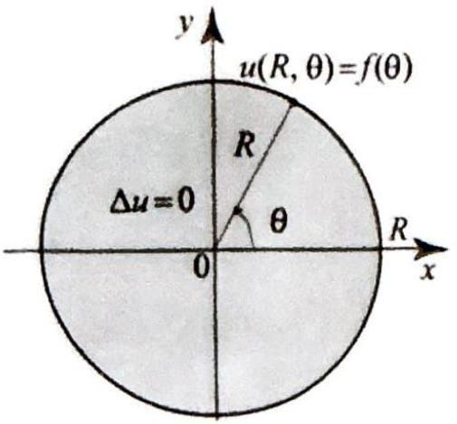
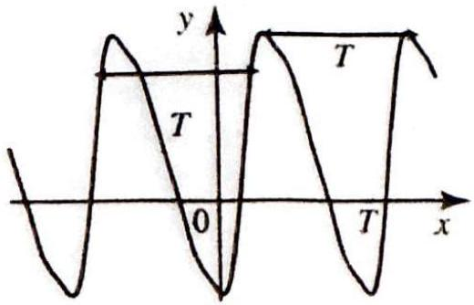
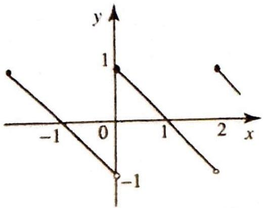
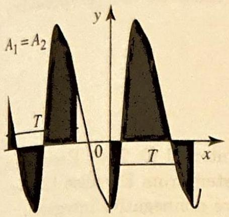
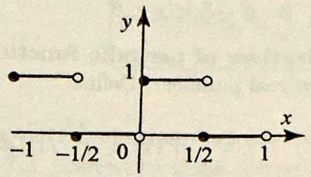
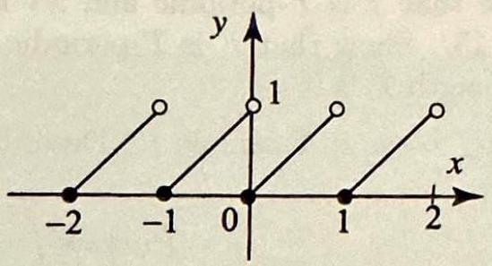
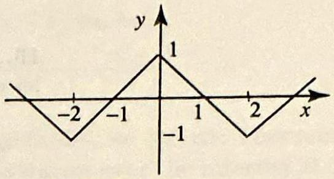
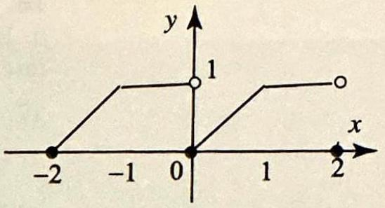

## Topics to Review

The core material in Sections 7.17.4 is independent from the previous chapters and requires only a basic knowledge of calculus. Methods from complex analysis will be used in applications and to develop tools for computing Fourier series. These topics are usually included at the end of sections and can be omitted without affecting the continuity of the course. Complex numbers and the complex exponential function are required in Section 7.5 to define the complex form of Fourier series.

## Looking Ahead

Fourier series, as presented in Sections 7.1-7.4, are essential for all that follows and cannot be omitted. The proof of convergence of Fourier series in Section 7.6 is optional. Sections 7.2 and 7.5 contain applications based on tools from complex analysis, such as Taylor and Laurent series, and integrals by tesidues. These applications take you deeper in the computation of Fourier series. You are encouraged to cover at least some of them, since these methods will be used again in later chapters to expand the scope of the theory and derive important properties of special functions.

## 7

## FOURIER SERIES

Mathematics compares the most diverse phenomena and discovers the secret analogies that unite them.

-Joseph Fourier

Like the familiar Taylor series, Fourier series are special types of expansions of functions. With a Taylor series, the expansion is in terms of the special set of functions $1, x, x^{2}, x^{3}, \ldots$. With a Fourier series, we are interested in expanding a function in terms of the special set of functions $1, \cos x, \cos 2 x, \cos 3 x, \ldots, \sin x, \sin 2 x, \sin 3 x, \ldots$. Thus, a Fourier series expansion of a function $f$ is an expression of the form

$$
f(x)=a_{0}+\sum_{n=1}^{\infty}\left(a_{n} \cos n x+b_{n} \sin n x\right)
$$

where $a_{0}, a_{n}$, and $b_{n}$ are the Fourier coefficients. Fourier series arose naturally when solving Dirichlet problems on the disk in Section 4.7. As we will see in the remaining chapters, Fourier series are fundamental tools for the implementation of important methods for solving boundary value problems, such as the separation of variables method and the eigenfunction expansions method. Also the theory of Fourier series will serve as a model for theories involving other special functions such as Bessel functions and Legendre polynomials. The latter are the tools of choice for solving boundary value problems involving Laplace's equation on disks, cylinders and spheres.

In this chapter, we will present basic properties of Fourier series that will be used throughout the rest of the book.

### 7.1 Periodic Functions

Figure 1 The boundary function $f(\theta)$ in a Dirichlet problem on a disk centered at the origin is $2 \pi$-periodic.

Figure $2 \mathrm{~A} T$-periodic function.

Figure 3 The 2-periodic func-

tion in Example 1.

One of the problems that we have discussed at length in previous sections was the Dirichlet problem on a disk of radius $R>0$, centered at the origin. In such a problem, we are supposed to solve Laplace's equation inside the disk, given the values of the function on the boundary of the disk. Using polar coordinates, the boundary data was given by a function $f(\boldsymbol{\theta})$ of the polar angle $\theta$. Because $\theta$ and $\theta+2 \pi$ correspond to the same point on the unit circle, we have $f(\theta)=f(\theta+2 \pi)$. In other words, the function $f$ is $2 \pi$-periodic (Figure 1). Periodic functions will arise naturally not only in boundary value problems on a disk but also in wave and heat problems over a finite interval. A function $f$ satisfying the identity

$$
f(x)=f(x+T) \quad \text { for all } x,
$$

where $T>0$, is called periodic or, more specifically, $T$-periodic (Figure 2). The number $T$ is called a period of $f$. If $f$ is nonconstant, we define the fundamental period, or simply, the period of $f$ to be the smallest positive number $T$ for which (1) holds. For example, the functions $3 \sin x, \sin 2 x$ are all $2 \pi$-periodic. The period of $\sin x$ is $2 \pi$, while the period of $\sin 2 x$ is $\pi$.

Using (1) repeatedly, we get

$$
f(x)=f(x+T)=f(x+2 T)=\cdots=f(x+n T) .
$$

Hence if $T$ is a period, then $n T$ is also a period for any integer $n>0$. In the case of the sine function, this amounts to saying that $2 \pi, 4 \pi, 6 \pi, \ldots$ are all periods of $\sin x$, but only $2 \pi$ is the fundamental period. Because the values of a $T$-periodic function repeat every $T$ units, its graph is obtained by repeating the portion over any interval of length $T$ (Figure 2). As a consequence, to define a $T$-periodic function, it is enough to describe it over an interval of length $T$. Obviously, the interval can be chosen in many different ways. The following example illustrates these ideas.

## EXAMPLE 1 Describing a periodic function

Describe the 2-periodic function $f$ in Figure 3 in two different ways:
(a) by considering its values on the interval $0 \leq x<2$;
(b) by considering its values on the interval $-1 \leq x<1$.

Solution (a) On the interval $0 \leq x<2$ the graph is a portion of the straight line $y=-x+1$. Thus

$$
f(x)=-x+1 \text { if } 0 \leq x<2 .
$$

Now the relation $f(x+2)=f(x)$ describes $f$ for all other values of $x$.

Figure 4 Areas over one period are equal.

THEOREM 1 INTEGRAL OVER ONE PERIOD
(b) On the interval $-1 \leq x<1$, the graph consists of two straight lines (Figure 3). We have

$$
f(x)= \begin{cases}-x-1 & \text { if }-1 \leq x<0 \\ -x+1 & \text { if } 0 \leq x<1\end{cases}
$$

As in part (a), the relation $f(x+2)=f(x)$ describes $f$ for all values of $x$ outside the interval $[-1,1)$.

Although the formulas in Example 1(a) and (b) are different, they describe the same periodic function. In practice, we use common sense in choosing the most convenient formula. Before we illustrate with an example, we introduce a very useful theorem whose content is intuitively clear. It says that the definite integral of a $T$-periodic function is the same over any interval of length $T$ (Figure 4).

Suppose that $f$ is $T$-periodic. Then, for any real number $a$, we have

$$
\int_{0}^{T} f(x) d x=\int_{a}^{a+T} f(x) d x
$$

Proof Define

$$
F(a)=\int_{a}^{a+T} f(x) d x
$$

By the fundamental theorem of calculus, we have $F^{\prime}(a)=f(a+T)-f(a)=0$, because $f$ is periodic with period $T$. Hence $F(a)$ is constant for all $a$, and so $F(0)=F(a)$, which implies the theorem. $\square$

## EXAMPLE 2 Integrating periodic functions

Let $f$ be the 2 -periodic function in Example 1. Use Theorem 1 to compute
(a) $\int_{-1}^{1} f^{2}(x) d x$,
(b) $\int_{-N}^{N} f^{2}(x) d x, N$ a positive integer.

Solution (a) Observe that $f^{2}(x)$ is also 2 -periodic. Thus, by Theorem 1, to compute the integral in (a) we may choose any interval of length 2 . Using the formula from Example 1 (a), we have

$$
\int_{-1}^{1} f^{2}(x) d x=\int_{0}^{2} f^{2}(x) d x=\int_{0}^{2}(-x+1)^{2} d x=-\left.\frac{1}{3}(-x+1)^{3}\right|_{0} ^{2}=\frac{2}{3}
$$

(b) We break up the integral $\int_{-N}^{N}$ into the sum of $N$ integrals over intervals of length 2 , of the form $\int_{n}^{n+2}, n=-N,-N+2, \ldots, N-2$, as follows:

$$
\int_{-N}^{N} f^{2}(x) d x=\int_{-N}^{-N+2} f^{2}(x) d x+\int_{-N+2}^{-N+4} f^{2}(x) d x+\cdots+\int_{N-2}^{N} f^{2}(x) d x
$$

Since $f^{2}(x)$ is 2 -periodic, by Theorem 1, each integral on the right side is equal to $\int_{-1}^{1} f^{2}(x) d x=\frac{2}{3}$, by (a). Hence the desired integral is $N \frac{2}{3}=\frac{2 N}{3}$.

The most important periodic functions are those in the ( $2 \pi$-periodic) trigonometric system

$$
\begin{gathered}
1, \cos x, \cos 2 x, \cos 3 x, \ldots, \cos m x, \ldots, \\
\sin x, \sin 2 x, \sin 3 x, \ldots, \sin n x, \ldots
\end{gathered}
$$

They are $2 \pi$-periodic, and orthogonal on the interval $[0,2 \pi]$. Recall the orthogonality properties of the trigonometric system from Exercise 12, Section 3.2 (in what follows, the indices $m$ and $n$ are nonnegative integers):

$$
\begin{array}{ll}
\int_{-\pi}^{\pi} \cos m x \cos n x d x=0 & \text { if } m \neq n \\
\int_{-\pi}^{\pi} \cos m x \sin n x d x=0 & \text { for all } m \text { and } n \\
\int_{-\pi}^{\pi} \sin m x \sin n x d x=0 & \text { if } m \neq n
\end{array}
$$

We also have the useful identities:

$$
\int_{-\pi}^{\pi} \cos ^{2} m x d x=\int_{-\pi}^{\pi} \sin ^{2} m x d x=\pi \quad \text { for all } m \neq 0
$$

To prove these, we can use the complex integral, as suggested in Exercise 12, Section 3.2, or just use trigonometric identities. For example, to prove the first one, use

$$
\cos m x \cos n x=\frac{1}{2}(\cos (m+n) x+\cos (m-n) x)
$$

Since $m \pm n \neq 0$, we get

$$
\begin{aligned}
\int_{-\pi}^{\pi} & \cos m x \cos n x d x \\
\quad= & \frac{1}{2}\left[\frac{1}{m+n} \sin (m+n) x+\frac{1}{m-n} \sin (m-n) x\right]_{-\pi}^{\pi}=0 .
\end{aligned}
$$

## Exercises 7.1

In Exercises 1-2, find a period of the given function and sketch its graph.

1. (a) $\cos x$,
(b) $\cos \pi x$,
(c) $\cos \frac{2}{3} x$,
(d) $\cos x+\cos 2 x$.
2. (a) $\sin 7 \pi x$,
(b) $\sin n \pi x$,
(d) $\sin x+\cos x$, (e) $\sin ^{2} 2 x$.

In Exercises 3-6, find a formula that describes the function in the accompanying figure (Figures 5-8).
3.

Figure 5

5. 

Figure 7

4. 

Figure 6

6. 

Figure 8

7. Sums of periodic functions. Show that if $f_{1}, f_{2}, \ldots, f_{n}, \ldots$ are $T$-periodic functions, then $a_{1} f_{1}+a_{2} f_{2}+\cdots+a_{n} f_{n}$ is also $T$-periodic. More generally, show that if the series $\sum_{n=1}^{\infty} a_{n} f_{n}(x)$ converges for all $x$ in $0<x \leq T$, then its limit is a $T$-periodic function.
8. Sums of periodic functions need not be periodic. Let $f(x)=\cos x+ \cos \pi x$. (a) Show that the equation $f(x)=2$ has a unique solution.
(b) Conclude from (a) that $f$ is not periodic. Does this contradict Exercise 7? The function $f$ is called almost periodic. These functions are of considerable interest and have many useful applications.
9. Operations on periodic functions. (a) Let $f$ and $g$ be two $T$-periodic functions. Show that the product $f(x) g(x)$ and the quotient $f(x) / g(x)(g(x) \neq 0)$ are also $T$-periodic.
(b) Show that if $f$ has period $T$ and $a>0$, then $f\left(\frac{x}{a}\right)$ has period $a T$ and $f(a x)$ has period $\frac{T}{a}$.
(c) Show that if $f$ has period $T$ and $g$ is any function (not necessarily periodic), then the composition $g \circ f$ has period $T$.
10. With the help of Exercise 9, determine the period of the given function.
(a) $\sin 2 x$
(b) $\cos \frac{1}{2} x+3 \sin 2 x$
(c) $\frac{1}{2+\sin x}$
(d) $e^{\cos x}$

In Exercises 11-14, a $\pi$-periodic function is described over an interval of length $\pi$. In each case plot the graph over three periods and compute the integral

$$
\int_{-\pi / 2}^{\pi / 2} f(x) d x
$$

11. $f(x)=\sin x, \quad 0 \leq x<\pi$.
12. $f(x)=\cos x, \quad 0 \leq x<\pi$.
13. 
14. $f(x)=x^{2}, \quad-\frac{\pi}{2} \leq x<\frac{\pi}{2}$.

$$
f(x)= \begin{cases}1 & \text { if } 0 \leq x \leq \frac{\pi}{2} \\ 0 & \text { if }-\frac{\pi}{2}<x<0\end{cases}
$$

15. Antiderivatives of periodic functions. Suppose that $f$ is $2 \pi$-periodic and let $a$ be a fixed real number. Define

$$
F(x)=\int_{a}^{x} f(t) d t, \text { for all } x
$$

Show that $F$ is $2 \pi$-periodic if and only if $\int_{0}^{2 \pi} f(t) d t=0$. [Hint: Theorem 1.]
16. Suppose that $f$ is $T$-periodic and let $F$ be an antiderivative of $f$, defined as in Exercise 15. Show that $F$ is $T$-periodic if and only if the integral of $f$ over an interval of length $T$ is 0 .
17. (a) Let $f$ be as in Example 1. Describe the function

$$
F(x)=\int_{0}^{x} f(t) d t
$$

[Hint: By Exercise 16, it is enough to consider $x$ in $[0,2]$.]
(b) Plot $F$ over the interval $[-4,4]$.
