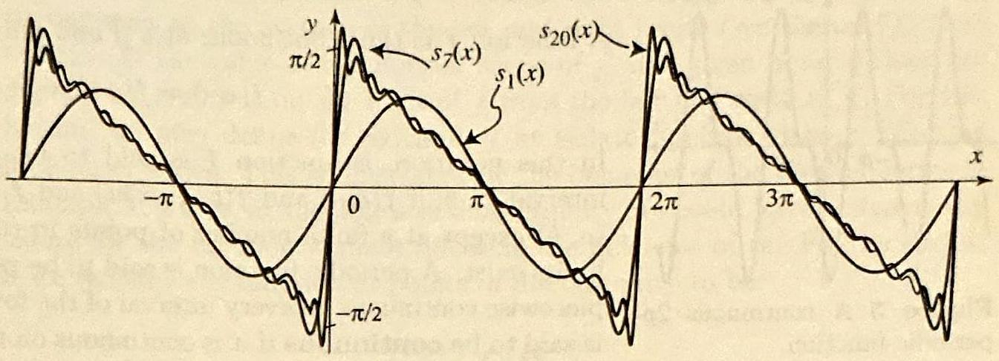
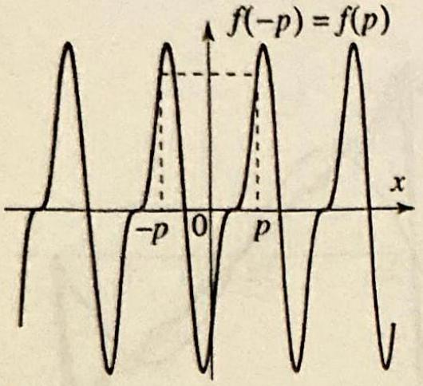
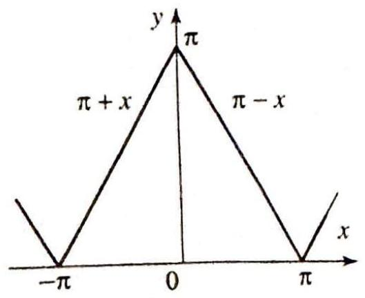
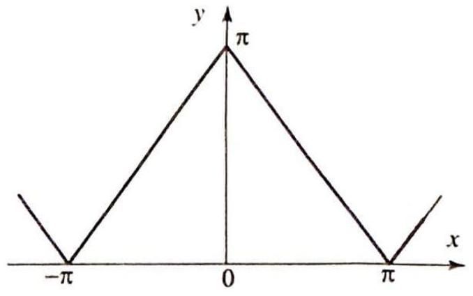
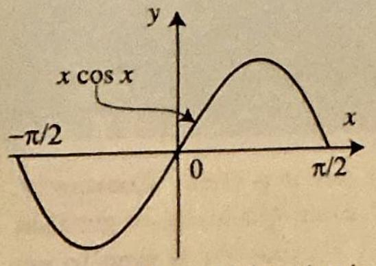
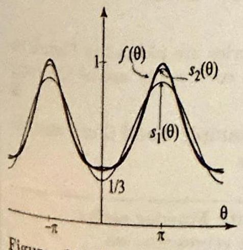
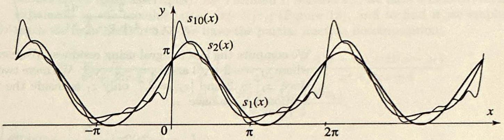
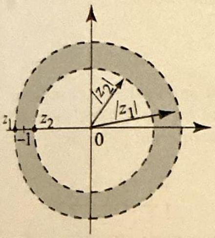
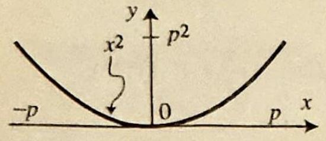
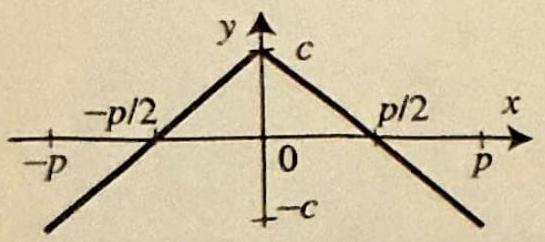

<!-- Page 6 -->

Left margin note (page 6)

462
Chapter 7
Fo
7.2 Fourier

EULER FOF
FOR THE F COEFF

Right margin note (page 6)

and as r an chlet eriod its of series

++++

urier Series
11. $f(x)=\sin x, \quad 0 \leq x<\pi$.
12. $f(x)=\cos x, \quad 0 \leq x<\pi$.
13.
14. $f(x)=x^{2}, \quad-\frac{\pi}{2} \leq x<\frac{\pi}{2}$.
$$
f(x)=\left\{\begin{array}{ll}
1 & \text { if } 0 \leq x \leq \frac{\pi}{2} \\
0 & \text { if }-\frac{\pi}{2}<x<0
\end{array}\right.
$$
15. Antiderivatives of periodic functions. Suppose that $f$ is $2 \pi$-periodic let $a$ be a fixed real number. Define
$$
F(x)=\int_{a}^{x} f(t) d t, \text { for all } x
$$

Show that $F$ is $2 \pi$-periodic if and only if $\int_{0}^{2 \pi} f(t) d t=0$. [Hint: Theorem 1.]
16. Suppose that $f$ is $T$-periodic and let $F$ be an antiderivative of $f$, define in Exercise 15. Show that $F$ is $T$-periodic if and only if the integral of $f$ ove interval of length $T$ is 0 .
17. (a) Let $f$ be as in Example 1. Describe the function
$$
F(x)=\int_{0}^{x} f(t) d t
$$
[Hint: By Exercise 16, it is enough to consider $x$ in [0,2].]
(b) Plot $F$ over the interval $[-4,4]$.

Series
Fourier series arose naturally in Section 4.7 from our solution of the Diri problem in a disk centered at 0 . They are special expansions of $2 \pi$-p functions of the form
$$
f(x)=a_{0}+\sum_{n=1}^{\infty}\left(a_{n} \cos n x+b_{n} \sin n x\right)
$$
where the coefficients $a_{0}, a_{n}$, and $b_{n}$ are called the Fourier coefficien $f$ and are given by the following Euler formulas.

ZMULAS

The Fourier coefficients of of a function $f$ are given by

OURIER
ICIENTS
$$
\begin{array}{l}
a_{0}=\frac{1}{2 \pi} \int_{-\pi}^{\pi} f(x) d x \\
a_{n}=\frac{1}{\pi} \int_{-\pi}^{\pi} f(x) \cos n x d x \quad(n=1,2, \ldots) \\
b_{n}=\frac{1}{\pi} \int_{-\pi}^{\pi} f(x) \sin n x d x \quad(n=1,2, \ldots)
\end{array}
$$

For a positive integer $N$, we denote the $N$ th partial sum of the Fourier

---

<!-- Page 7 -->

Left margin note (page 7)

ALTERNA
EULER FORMU

++++

Section 7.2 Fourier Series

of $f$ by $s_{N}(x)$. Thus
$$
s_{N}(x)=a_{0}+\sum_{n=1}^{N}\left(a_{n} \cos n x+b_{n} \sin n x\right)
$$

Because all the integrands in (2)-(4) are $2 \pi$-periodic, we can use Theoren Section 7.1, to rewrite these formulas using integrals over the interval $[0$, (or any other interval of length $2 \pi$ ). Such alternative formulas are sometir useful.

TIVE
JAS
(5)
$$
a_{0}=\frac{1}{2 \pi} \int_{0}^{2 \pi} f(x) d x
$$
(6)
$$
a_{n}=\frac{1}{\pi} \int_{0}^{2 \pi} f(x) \cos n x d x, \text { and } b_{n}=\frac{1}{\pi} \int_{0}^{2 \pi} f(x) \sin n x d x, n \geq
$$

The Fourier coefficients were known to Euler before Fourier and for $t$ reason they bear Euler's name. Euler used them to derive particular Four series such as the one presented in Example 1 below.

Before we consider some examples of Fourier series, it is instructive motivate the Euler formulas by deriving them from the Fourier series, usi the orthogonality of the trigonometric system. For this purpose, we proce as Fourier himself did. We integrate both sides of (1) over the inter $[-\pi, \pi]$, assuming term-by-term integration is justified, and get
$$
\int_{-\pi}^{\pi} f(x) d x=\int_{-\pi}^{\pi} a_{0} d x+\sum_{n=1}^{\infty} \int_{-\pi}^{\pi}\left(a_{n} \cos n x+b_{n} \sin n x\right) d x
$$

But $\int_{-\pi}^{\pi} \cos n x d x=\int_{-\pi}^{\pi} \sin n x d x=0$ for $n=1,2, \ldots$, so
$$
\int_{-\pi}^{\pi} f(x) d x=\int_{-\pi}^{\pi} a_{0} d x=2 \pi a_{0} \quad \Rightarrow \quad a_{0}=\frac{1}{2 \pi} \int_{-\pi}^{\pi} f(x) d x
$$

Similarly, starting with (1), we multiply both sides by $\cos m x(m \geq$ integrate term by term, use the orthogonality of the trigonometric syst

---

<!-- Page 8 -->

Left margin note (page 8)

464
Chapter 7

Figure 1 Sawt

In evaluating $a$ formula $\int x \cos \frac{1}{n^{2}} \cos n x+\frac{x}{n} s$ obtained by i parts.

Right margin note (page 8)

$x d x$

Fourier
(x), and

++++

Fourier Series

(Section 7.1), and get
$$
\begin{aligned}
\int_{-\pi}^{\pi} f(x) \cos m x d x & =\overbrace{\int_{-\pi}^{\pi} a_{0} \cos m x d x}^{=0}+\sum_{n=1}^{\infty} \overbrace{\int_{-\pi}^{\pi} a_{n} \cos n x \cos m}^{=0 \text { for } m \neq n} \\
& +\sum_{n=1}^{\infty} \overbrace{\int_{-\pi}^{\pi} b_{n} \sin n x \cos m x d x}^{=0} \\
& =a_{m} \overbrace{\int_{-\pi}^{\pi} \cos ^{2} m x d x}^{=\pi}=\pi a_{m} .
\end{aligned}
$$

Solving for $a_{m}$, we obtain (3). By a similar procedure, we derive (4)
Our first example displays many of the peculiar properties of series.

EXAMPLE 1 Fourier series of the sawtooth function
poth function.
$n$, we use the $n x d x= \mathrm{n} n x$, which is ntegrating by

The sawtooth function, shown in Figure 1, is determined by the formulas
$$
f(x)=\left\{\begin{array}{ll}
\frac{1}{2}(\pi-x) & \text { if } 0<x \leq 2 \pi, \\
f(x+2 \pi) & \text { otherwise } .
\end{array}\right.
$$
(a) Find its Fourier series.
(b) With the help of a computer, plot the partial sums $s_{1}(x), s_{7}(x)$, and $s_{20}$ determine the graph of the Fourier series.
Solution (a) Using (5) and (6), we have
$$
a_{0}=\frac{1}{2 \pi} \int_{0}^{2 \pi} f(x) d x=\frac{1}{2 \pi} \int_{0}^{2 \pi} \frac{1}{2}(\pi-x) d x=0 ;
$$
$$
\begin{aligned}
a_{n} & =\frac{1}{\pi} \int_{0}^{2 \pi} \frac{1}{2}(\pi-x) \cos n x d x \\
& =\frac{1}{2 \pi}\left\{\int_{0}^{2 \pi} \pi \cos n x d x-\int_{0}^{2 \pi} x \cos n x d x\right\}=0
\end{aligned}
$$
$$
\begin{aligned}
b_{n} & =\frac{1}{\pi} \int_{0}^{2 \pi} \frac{1}{2}(\pi-x) \sin n x d x \\
& =\frac{1}{2 \pi}\left\{\int_{0}^{2 \pi} \pi \sin n x d x-\int_{0}^{2 \pi} x \sin n x d x\right\} \\
& =\frac{1}{2 \pi}\left\{\frac{-1}{n^{2}} \sin n x+\left.\frac{x}{n} \cos n x\right|_{0} ^{2 \pi} \quad\right. \text { (integration by parts) } \\
& =\frac{1}{2 \pi} \frac{2 \pi}{n}=\frac{1}{n}
\end{aligned}
$$

---

<!-- Page 9 -->

Left margin note (page 9)

Figure 2 To distinguis graphs of the $n$th

p sums of the Fourier $s_{n}(x)=\sum_{k=1}^{n} \frac{s i n k x}{k}$, that as $n$ increases, th quencies of the sine tern crease. This causes the g of the higher partial sur be more wiggly. The ing graph is the graph whole Fourier series, sho Figure 3. It is identical t graph of the function, ev at points of discontinuity

Figure 3 The graph of Fourier series $\sum_{n=1}^{\infty} \frac{\sin n x}{n}$ incides with the graph o function, except at the p of the discontinuity. limits of a function at a p of discontinuity: $f(1+)= f(1-)=1$.

++++

Section 7.2 Fourier Series
465

h the artial eries, note freas inraphs ns to imitof the vn in o the xcept

the
co-
f the
oints
$\xrightarrow[\text { ght }]{x}$

Substituting these values for $a_{n}$ and $b_{n}$ into (1), we obtain $\sum_{n=1}^{\infty} \frac{\sin n x}{n}$ as the Fourier series of $f$.
(b) Figure 2 shows the first, seventh and twentieth partial sums of the Fourier series. We see clearly that the Fourier series of $f$ converges to $f(x)$ at each point $x$ where $f$ is continuous. In particular, for $0<x<2 \pi$, we have
$$
\sum_{n=1}^{\infty} \frac{\sin n x}{n}=\frac{1}{2}(\pi-x)
$$

At the points of discontinuity ( $x=2 k \pi, k=0, \pm 1, \pm 2, \ldots$ ), the series converges to 0 . The graph of the Fourier series $\sum_{n=1}^{\infty} \frac{\sin n x}{n}$ is shown in Figure 3. It agrees with the graph of the function, except at the points of discontinuity.

Two important facts are worth noting concerning the behavior of Fourier series near points of discontinuity. As we will see shortly, these observations are true in a very general sense.
Note 1: At the points of discontinuity ( $x=2 k \pi$ ) in Example 1, the Fourier series converges to 0 , which is the average value of the function from the left and the right at these points.
Note 2: Near the points of discontinuity, the Fourier series overshoots its limiting values. This is apparent in Figure 2, where humps form on the graphs of the partial sums near the points of discontinuity. This curious phenomenon is known as the Gibbs (or Wilbraham-Gibbs) phenomenon.
(See the paper [15] for an interesting historical account.)
Fourier Series Representation
To state our main result, we recall from Section 3.1 the definitions of piecewise continuous and piecewise smooth functions. We will write
$$
f(c-)=\lim _{x \rightarrow c^{-}} f(x)
$$
to denote the fact that $f$ approaches the number $f(c-)$ as $x$ approaches $c$ from below (Figure 4). Similarly, if the limit of $f$ exists as $x$ approaches $c$

---

<!-- Page 10 -->

Left margin note (page 10)

466
Chapter 7
F

Figure 5 A con periodic function.

Figure 6 Averag $x=1$.

THE
FOURIEF
REPRESEN

Right margin note (page 10)

n the us on right if it is action e that points $c$ and on of low is nooth action One rage)
motion
iscontate a theo-
or all $x$
rticular,

++++

ourier Series

from above, we denote this limit $f(c+)$ and write
tinuous $2 p$ -
$$
+f(1+)) / 2=3 / 4
$$
$$
1+)=1 / 2
$$

e of $f(x)$ at
OREM 1
SERIES
JTATION
$$
f(c+)=\lim _{x \rightarrow c^{+}} f(x)
$$

A function $f$ is thus continuous at $c$ if and only if
$$
f(c-)=f(c+)=f(c) .
$$

In this notation, a function $f$ is said to be piecewise continuous o interval $[a, b]$ if $f(a+)$ and $f(b-)$ exist, and $f$ is defined and continuo $(a, b)$ except at a finite number of points in $(a, b)$ where the left and limits exist. A periodic function is said to be piecewise continuous piecewise continuous on every interval of the form $[a, b]$. A periodic fur is said to be continuous if it is continuous on the entire real line. Not continuity forces a certain behavior of the periodic function at the endp of any interval of length one period. For example, if $f$ is $2 p$-periodi continuous, then necessarily $f(-p)=f(p)$ (Figure 5). The functi Example 1 is piecewise continuous, while the function in Example 2 be continuous. Let us also recall that a function $f$ is said to be piecewise sn if $f$ and $f^{\prime}$ are piecewise continuous on $[a, b]$. Similarly, a periodic fur is piecewise smooth if it is piecewise smooth on every interval $[a, b]$ more item of terminology is needed. The average (or arithmetic ave of $f$ at $c$ is
$$
\frac{f(c-)+f(c+)}{2} .
$$

Clearly if $f$ is continuous at $c$, then its average at $c$ is $f(c)$. Thus the 1 of average will be of interest only at points of discontinuity.

As an illustration, consider the function in Figure 6. It has a d tinuity at $x=1$ and its average there is $\frac{1+\frac{1}{2}}{2}=\frac{3}{4}$. We can now $s$ fundamental result in the theory of Fourier series. The proof of this rem is presented in Section 7.6.
Suppose that $f$ is a $2 \pi$-periodic piecewise smooth function. Then f we have
$$
\frac{f(x+)+f(x-)}{2}=a_{0}+\sum_{n=1}^{\infty}\left(a_{n} \cos n x+b_{n} \sin n x\right),
$$
where the Fourier coefficients $a_{0}, a_{n}, b_{n}$ are given by (2)-(4). In par if $f$ is piecewise smooth and continuous at $x$, then
$$
f(x)=a_{0}+\sum_{n=1}^{\infty}\left(a_{n} \cos n x+b_{n} \sin n x\right)
$$

---

<!-- Page 11 -->

Left margin note (page 11)

(b) its Fourier series.

Figure 7 At a point of d tinuity of a piecewise sn function, the Fourier converges to the average function at that point.

++++

Section 7.2 Fourier Series

Let us see what (7) is telling us. At a point of continuity of $f$, the Four series converges to $f(x)$. At a point of discontinuity, the Fourier series d its best to converge, and having no reason to favor one side over the oth it converges to the average of the left and right limits (see Figure 7). N that in (7) the value of the Fourier series of $f$ at a given point $x$ does depend on $f(x)$ but on the limit of $f$ from the left and right at $x$. For $t$ reason, we may define (or redefine) $f$ at isolated points without affect its Fourier series. This is illustrated by the behavior of the Fourier series Example 1, where, at the points of discontinuity, we could have assigned a values for the function without affecting the behavior of the Fourier seri If we redefine the function at points of discontinuity to be
$$
\frac{f(x+)+f(x-)}{2},
$$
we then have the equality
$$
f(x)=a_{0}+\sum_{n=1}^{\infty}\left(a_{n} \cos n x+b_{n} \sin n x\right)
$$
holding at all $x$. We will often assume such a modification at the poin of discontinuity and not worry about the more precise, but cumberson equality (7).

It is important to keep in mind that continuity of $f$ alone is not enous to ensure the convergence of its Fourier series. Although we will not e counter such functions, there are continuous functions with Fourier seri that diverge at an infinite number of points in $[0,2 \pi]$.

The problem of convergence for Fourier series was tackled by Fourie Cauchy, and many other prominent mathematicians, who tried but cou not establish the convergence for arbitrary $f$. We owe it to Peter Gusta Lejeune Dirichlet (1805-1859), who took a different approach to this proble by first formulating sufficient conditions on $f$ that ensure the convergen of its Fourier series representation. Dirichlet's theorem about Fourier seri is basically what we have stated in Theorem 1. Determining condition on $f$ that ensure the convergence of its Fourier series is an extremely han problem. The most general results in this direction were obtained in th 1960s by Lennart Carleson (University of Uppsala, Sweden, and Universi of California, Los Angeles) and Richard Hunt (University of Indiana). The spectacular results are far beyond the level of this book. For a moder account of this theory, see the book by Grafakos [14].

Let us note one more property of Fourier series, which is an immedia consequence of Theorem 1.

---

<!-- Page 12 -->

Left margin note (page 12)

468
Chapter 7
F

COROL UNIQUEN FOURIER REPRESEN?

Figure 8 Triang

Right margin note (page 12)

and
xcept
, if $f$
$y$ are
tion
ries.
ırier
n on
uous es to
d by
odd.
rem 1

++++

ourier Series

LARY 1
ESS OF
SERIES CATION

Suppose that $f$ and $g$ are $2 \pi$-periodic piecewise smooth functions. If $g$ have the same Fourier coefficients, then $f(x)=g(x)$ for all $x$, ee possibly at the points where $f$ or $g$ are discontinuous. Consequently and $g$ are continuous and have the same Fourier coefficients, then the equal everywhere.

Proof Since the Fourier series of a function converges to the value of the fund at the points of continuity, it follows that if $f$ and $g$ have the same Fourier then they must be equal at all the points of continuity.

For all practical purposes in analysis, if $f$ and $g$ have the same For series, then they are considered to be the same function.

EXAMPLE 2 Triangular wave
(a) Find the Fourier series of the $2 \pi$-periodic triangular function, which is give the interval $[-\pi, \pi]$ by
$$
f(x)=\left\{\begin{array}{ll}
\pi+x & \text { if }-\pi \leq x \leq 0, \\
\pi-x & \text { if } 0 \leq x \leq \pi .
\end{array}\right.
$$
(b) Plot some partial sums and the Fourier series.

Solution Figure 8 shows that the function is piecewise smooth and contin for all $x$. So, from the second part of Theorem 1, we expect the Fourier seri converge to $f(x)$ for all $x$. Using (2), we have
$$
a_{0}=\frac{1}{2 \pi} \int_{-\pi}^{\pi} f(x) d x=\frac{1}{2 \pi} \pi^{2}=\frac{1}{2} \pi
$$
(This is the area of the triangular region in Figure 8 with base $[-\pi, \pi]$ divide
$\pi-x$ lar wave. $2 \pi$.) Using (3), we have
$$
\begin{aligned}
a_{n} & =\frac{1}{\pi} \int_{-\pi}^{0}(\pi+x) \cos n x d x+\frac{1}{\pi} \int_{0}^{\pi}(\pi-x) \cos n x d x \\
& =\frac{2}{\pi} \int_{0}^{\pi}(\pi-x) \cos n x d x \quad \text { (change } x \text { to }-x \text { in the first integral } \\
& =\frac{2}{\pi}\left\{\frac{1}{n^{2}}-\frac{\cos n \pi}{n^{2}}\right\} \quad \text { (integration by parts). }
\end{aligned}
$$

Since $\cos n \pi=(-1)^{n}$, we see that $a_{n}=0$ if $n$ is even, and $a_{n}=\frac{4}{\pi n^{2}}$ if $n$ is Finally, using (4), we find
$$
b_{n}=\frac{1}{\pi} \int_{-\pi}^{\pi} \overbrace{f(x) \sin n x}^{\text {odd function }} d x=0
$$
since we are integrating an odd function over a symmetric interval. Now The implies that
$$
f(x)=\frac{1}{2} \pi+\sum_{n \text { odd }} \frac{4}{\pi n^{2}} \cos n x=\frac{1}{2} \pi+\frac{4}{\pi} \sum_{k=0}^{\infty} \frac{1}{(2 k+1)^{2}} \cos (2 k+1) x
$$

---

<!-- Page 13 -->

Left margin note (page 13)

The partial sums of Fourier series, illustrate Figure 9, are converging fast. much faster than the Example 1. This is due $t$ magnitudes of the Fourie efficients. In Example coefficients are of the $1 / n$, while in Example coefficients are of the $1 / n^{2}$.

THEOREN UNIFOF CONVERGENCE FOURIER SERI

Right margin note (page 13)

క్ర
एक्व.
कै F
$\stackrel{7}{7}$

++++

Section 7.2 Fourier Series

for all $x$. Since the function and its Fourier series are equal at all points, the graphs coincide (compare Figures 8 and 10).
the
d in
very
ose in
o the
r co-
the
order
the
order
the
od in
very
ose in
o the
r co-
the
order
the
order

Figure 9 Partial sums of the Fourier series.

Figure 10 The Fourier series.

In (9), letting $k$ run from 0 to 1,2 , and 5 , respectively, we generate the third, fift and eleventh partial sums of the Fourier series. These are plotted in Figure 9. No the fast convergence of the Fourier series.

Figure 9 suggests that the Fourier series in Example 2 converges un formly to the function. This is indeed true and follows from the followi important result.

42

Suppose that $f$ is a $2 \pi$-periodic piecewise smooth function. Then the Four

RM series of $f$ converges uniformly for all $x$ to $f(x)$ if and only if $f$ is continue

OF for all $x$. Thus, if $f$ is continuous and piecewise smooth, then

ES
$$
f(x)=a_{0}+\sum_{n=1}^{\infty}\left(a_{n} \cos n x+b_{n} \sin n x\right),
$$
where the Fourier series converges uniformly for all $x$.

Proof One direction is immediate from Theorem 1, Section 4.2, which asserts th the uniform limit of continuous functions is continuous. Since a partial sum of Fourier series is a finite linear combination of sines and cosines, it is clearly cont uous. So, if $s_{N}(x)$ converges uniformly to $f(x)$ for all $x$, then $f(x)$ is necessar continuous for all $x$. For the other direction, we know from Theorem 1 that $t$ Fourier series converges to $f(x)$ for all $x$. To prove that the convergence is $u$ form, we will show that there is a constant $M$ such that $\left|a_{n}\right| \leq \frac{M}{n^{2}}$ and $\left|b_{n}\right| \leq$ Then $\left|a_{n} \cos n x+b_{n} \sin n x\right| \leq \frac{2 M}{n^{2}}$, and the uniform convergence will follow fre the Weierstrass $M$-test (Theorem 3, Section 4.2) since $\sum \frac{2 . M}{n^{2}}<\infty$. To simpl the proof, we will further suppose that $f^{\prime}$ is piecewise smooth. (This condition satisfied in all the examples in this book, and indeed most applications. A pr that does not depend on it is presented in Section 7.5 and uses Parseval's theore

---

<!-- Page 14 -->

Left margin note (page 14)

470
Chapter 7
Fo

Right margin note (page 14)

fact
and Then
lx)
mber 1 m of nuous that ty for
tt one cosine The puted es.

++++

urier Series

Integrating by parts, we find that
$$
\begin{aligned}
a_{n} & =\frac{1}{\pi} \int_{-\pi}^{\pi} f(x) \cos n x d x=\left.\frac{1}{n \pi} f(x) \sin n x\right|_{-\pi} ^{\pi}-\frac{1}{n \pi} \int_{-\pi}^{\pi} f^{\prime}(x) \sin n x d \\
& =-\frac{1}{n \pi} \int_{-\pi}^{\pi} f^{\prime}(x) \sin n x d x
\end{aligned}
$$
because $\sin n \pi=\sin (-n \pi)=0$. Similarly, integrating by parts and using the that $f(\pi)=f(-\pi)$, we obtain that
$$
b_{n}=\frac{1}{\pi} \int_{-\pi}^{\pi} f(x) \sin n x d x=\frac{1}{n \pi} \int_{-\pi}^{\pi} f^{\prime}(x) \cos n x d x
$$

The function $f^{\prime}(x)$ has a piecewise continuous derivative $f^{\prime \prime}(x)$. So $\left|f^{\prime}(x)\right| \leq A \left|f^{\prime \prime}(x)\right| \leq B$ for all $x$. Let $(a, b)$ be an interval on which $f^{\prime \prime}$ is continuous. integrating by parts, we find that
$$
\frac{1}{n \pi} \int_{a}^{b} f^{\prime}(x) \sin n x d x=\frac{1}{n^{2} \pi}\left(\left(f^{\prime}(a) \cos n a-f^{\prime}(b) \cos n b\right)+\int_{a}^{b} f^{\prime \prime}(x) \cos n x\right.
$$

Hence, because $\left|f^{\prime}(a)\right| \leq A,\left|f^{\prime}(b)\right| \leq A$, and $\left|f^{\prime \prime}(x) \cos n x\right| \leq B$, we obtain
$$
\frac{1}{n \pi}\left|\int_{a}^{b} f^{\prime}(x) \sin n x d x\right| \leq \frac{1}{n^{2} \pi}(2 A+(b-a) B) \leq \frac{C}{n^{2}}
$$
where $C$ is a constant that does not depend on $n$. Since $f^{\prime \prime}$ has a finite nu of discontinuities, we can write the integral $\int_{-\pi}^{\pi} f^{\prime}(x) \sin n x d x$ as the finite su integrals of the form $\int_{a}^{b} f^{\prime}(x) \sin n x d x$ (say, $k$ of them), where $f^{\prime \prime}(x)$ is contir on each interval $(a, b)$. It follows from our estimate on the latter integral $\left|a_{n}\right| \leq \frac{k C}{n^{2}}=\frac{M}{n^{2}}$, where $M=k C$ is a constant independent of $n$. The inequali $b_{n}$ is obtained in a similar way.

Theorems 1 or 2 can be used to sum interesting series.

EXAMPLE 3 Using Fourier series to sum series
If we take $x=0$ on both sides of (9), we get
$$
\pi=f(0)=\frac{1}{2} \pi+\frac{4}{\pi} \sum_{k=0}^{\infty} \frac{1}{(2 k+1)^{2}}
$$

Subtracting $\frac{1}{2} \pi$ and then multiplying by $\frac{\pi}{4}$, we get the interesting identity
$$
\frac{\pi^{2}}{8}=1+\frac{1}{3^{2}}+\frac{1}{5^{2}}+\frac{1}{7^{2}}+\ldots
$$
which can be used to approximate $\pi^{2}$ (and hence also $\pi$ ).
The Fourier series in Examples 1 and 2 are special in the sense tha of them contains only sine terms, while the other one contains only terms. Fourier series of this type will be studied in the next section following Fourier series contains both sine and cosine terms. It is com using the previous examples and the linearity property of Fourier seri

---

<!-- Page 15 -->

Left margin note (page 15)

Figure 11 Note the phenomenon at the poi discontinuity $(x=2 k \pi)$. is due to the fact tha Fourier series consists of sine part that is conve very fast (Figure 9) and part that overshoots a points of discontinuity.

Figure 12 The functio Example 5 and the the pa surns of its Fourier series with $n=1$ and 2 .

Right margin note (page 15)

ぶ ||
1
प्त है दि ल ए
CR $\downarrow^{*}$
க்க்.
Sou.
I

++++

Section 7.2 Fourier Series

EXAMPLE 4 A Fourier series with cosine and sine terms
Adding the two functions of Examples 1 and 2 , we obtain a $2 \pi$-periodic func which is defined on the interval $[0,2 \pi]$ by
$$
f(x)=\left\{\begin{array}{ll}
\frac{3}{2}(\pi-x) & \text { if } 0<x<\pi \\
\frac{1}{2}(-\pi+x) & \text { if } \pi<x<2 \pi
\end{array}\right.
$$
(You should check this formula and plot the function.) To compute the Fou series, we can use the Euler formulas or, better yet, we can simply add the Fou series of Examples 1 and 2, thanks to the linearity of the Fourier coefficients Exercise 18). We thus obtain the Fourier series representation
$$
f(x)=\frac{1}{2} \pi+\sum_{n=1}^{\infty}\left\{\frac{2}{\pi}\left(\frac{1}{n^{2}}-\frac{\cos n \pi}{n^{2}}\right) \cos n x+\frac{\sin n x}{n}\right\}
$$

Gibbs
nts of
This
t the
a co-
rging
a sine
t the

As illustrated in Figure 11, at the points of discontinuity, the Fourier series cc verges to the average value $\pi$. At all other points, the Fourier series converges $f(x)$.

Complex Methods for Finding Fourier Series
Because of Euler's identity $e^{i n \theta}=\cos n \theta+i \sin n \theta$, which relates t) complex exponential to the trigonometric functions, we expect the comple exponential function and complex analysis in general to play a role in th theory of Fourier series. This will become clear at many stages in our deve opment of Fourier series and their applications. In what follows, we illustra the use of major tools from complex analysis, such as residues and Laure

(θ) series, in computing Fourier series.

EXAMPLE 5 Using residues to compute Fourier series Find the Fourier series of $f(\theta)=\frac{1}{2+\cos \theta}$.
Solution The function is $2 \pi$-periodic and even. We have $b_{n}=\frac{1}{\pi} \int_{-\pi}^{\pi} f(\theta) \sin n \theta d \theta$ 0 , because $f(\theta) \sin n \theta$ is an odd function so its integral over a symmetric interval 0 . In computing $a_{n}$ for $n \geq 0$, we will evaluate the integral
$$
I_{n}=\int_{0}^{2 \pi} \frac{\cos n \theta}{2+\cos \theta} d \theta \quad(n=0,1, \ldots)
$$

---

<!-- Page 16 -->

Left margin note (page 16)

472
Chapter 7 Fourier Series

Right margin note (page 16)

n 7.1,
n 5.2,
- As
ositive
$\left.-z_{2}\right)$,
2. But
n 1(i),
gure 12.
ae order
ates the
$\_\_\_\_$
$\theta$,

++++

using a slight variation on the methods of Section 5.2. By Theorem 1, Sectio
$$
\int_{0}^{2 \pi} \frac{\sin n \theta}{2+\cos \theta} d \theta=\int_{-\pi}^{\pi} \frac{\sin n \theta}{2+\cos \theta} d \theta=0
$$
because the integrand in the second integral is odd. So
$$
I_{n}=\int_{0}^{2 \pi} \frac{\cos n \theta}{2+\cos \theta} d \theta+i \int_{0}^{2 \pi} \frac{\sin n \theta}{2+\cos \theta} d \theta=\int_{0}^{2 \pi} \frac{e^{i n \theta}}{2+\cos \theta} d \theta,
$$
where we have used $e^{i n \theta}=\cos n \theta+i \sin n \theta$. We now use the method of Sectic as follows. Let $z=e^{i \theta}, d z=i e^{i \theta} d \theta$ or $d \theta=\frac{d z}{i z}, z^{n}=e^{i n \theta}$, and $\cos \theta=\frac{e^{e^{\theta}}+e^{-}}{2} \theta$ varies over the interval $[0,2 \pi], z$ traverses the unit circle $C_{1}(0)$, in the po direction. So
$$
\begin{aligned}
I_{n} & =\int_{0}^{2 \pi} \frac{e^{i n \theta}}{2+\cos \theta} d \theta=\int_{0}^{2 \pi} \frac{e^{i n \theta}}{2+\frac{e^{\mathrm{i} \theta}+e^{-\mathrm{i} \theta}}{2}} d \theta \\
& =\int_{C_{1}(0)} \frac{2 z^{n}}{4+z+\frac{1}{z}} \frac{d z}{i z}=-i \int_{C_{1}(0)} \frac{2 z^{n}}{z^{2}+4 z+1} d z
\end{aligned}
$$

We compute the last integral using residues. We have $z^{2}+4 z+1=\left(z-z_{1}\right)(z$ where $z_{1}=-2+\sqrt{3}$ and $z_{2}=-2-\sqrt{3}$. We have two simple poles at $z_{1}$ and $z$ since $\left|z_{1}\right| \approx .3$ and $\left|z_{2}\right| \approx 3.7$, only $z_{1}$ is inside the unit disk. By Propositio Section 5.1, we have
$$
I_{n}=\left.(-2 i) 2 \pi i \frac{z^{n}}{z-z_{2}}\right|_{z=z_{1}}=2 \pi \frac{(-2+\sqrt{3})^{n}}{\sqrt{3}} .
$$

Using the formula for $I_{n}$, we obtain
$$
a_{0}=\frac{1}{2 \pi} I_{0}=\frac{1}{\sqrt{3}} \quad \text { and } \quad a_{n}=\frac{1}{\pi} I_{n}=2 \frac{(-2+\sqrt{3})^{n}}{\sqrt{3}}, \quad n=1,2, \ldots
$$

Thus the Fourier series representation
$$
\frac{1}{2+\cos \theta}=\frac{1}{\sqrt{3}}+\frac{2}{\sqrt{3}} \sum_{n=1}^{\infty}(-2+\sqrt{3})^{n} \cos n \theta,
$$
which is valid for all $\theta$. Partial sums of the Fourier series are plotted in Fi, Note how fast the series is converging, because the coefficients are of th $(-2+\sqrt{3})^{n}=\left|z_{1}\right|^{n}$, where $0<\left|z_{1}\right| \approx .3<1$.

Our next example generalizes the result of Example 5 and illustr use of Laurent series in computing Fourier series.

EXAMPLE 6 Using Laurent series to compute Fourier series
Let $a>1$ be a real number. Derive the Fourier series representation
$$
f(\theta)=\frac{1}{a+\cos \theta}=\frac{1}{\sqrt{a^{2}-1}}+\frac{2}{\sqrt{a^{2}-1}} \sum_{n=1}^{\infty}\left(-a+\sqrt{a^{2}-1}\right)^{n} \cos n
$$

---

<!-- Page 17 -->

Left margin note (page 17)

Figure 13 The annu convergence of the Laure ries in Example 6.

++++

Section 7.2 Fourier Series

which is valid for all $\theta$.
Solution The function is $2 \pi$-periodic and smooth. By Theorem 2, its For series converges uniformly for all $\theta$ to $f(\theta)$. To find the Fourier series, we will compute the Fourier coefficients directly; instead we will match the function the restriction of a rational function and use Laurent series. As a first step, u the substitution $\cos \theta=\frac{1}{2}\left(z+\frac{1}{z}\right)$, where $z=e^{i \theta}$, we write
$$
\frac{1}{a+\cos \theta}=\frac{1}{a+\frac{1}{2}\left(z+\frac{1}{z}\right)}=\frac{2 z}{z^{2}+2 a z+1}
$$

Next, we expand $\frac{2 z}{z^{2}+2 a z+1}$ in an annulus that contains the unit circle $|z|=1$. we will see in a moment, this will allow us to use the Laurent series with $z=$ and obtain the desired Fourier series.

The quadratic equation $z^{2}+2 a z+1=0$ has two real roots $z_{1}=-a-\sqrt{a^{2}}$ and $z_{2}=-a+\sqrt{a^{2}-1}$. Because $a>1$, we have $z_{1}<-1$ and $-1<z_{2}<0$ ( should check these assertions). By Theorem 1, Section 4.5, we have a Laurent se expansion in the annulus $\left|z_{2}\right|<|z|<\left|z_{1}\right|$ (Figure 13), and to find it we emp methods from Section 4.5. We have the partial fraction decomposition
$$
\begin{aligned}
\frac{2 z}{z^{2}+2 a z+1} & =\frac{A}{z-z_{1}}+\frac{B}{z-z_{2}}=\frac{A\left(z-z_{2}\right)+B\left(z-z_{1}\right)}{z^{2}+2 a z+1} \\
& =\frac{z(A+B)-\left(A z_{2}+B z_{1}\right)}{z^{2}+2 a z+1}
\end{aligned}
$$

Solving
$$
\left\{\begin{array}{ll}
A+B & =2 \\
A z_{2}+B z_{1} & =0
\end{array}\right.
$$
we find $A=\frac{2 z_{1}}{z_{1}-z_{2}}=-\frac{z_{1}}{\sqrt{a^{2}-1}}$ and $B=-\frac{2 z_{2}}{z_{1}-z_{2}}=\frac{z_{2}}{\sqrt{a^{2}-1}}$, where we have us $z_{2}-z_{1}=2 \sqrt{a^{2}-1}$. So we have the partial fraction decomposition
$$
\frac{2 z}{z^{2}+2 a z+1}=\frac{1}{\sqrt{a^{2}-1}}\left(-\frac{z_{1}}{z-z_{1}}+\frac{z_{2}}{z-z_{2}}\right) .
$$

In the annulus $\left|z_{2}\right|<|z|<\left|z_{1}\right|$, the first term inside the parentheses on the rig can be expanded in a power series and the second one in a Laurent series, usi the geometric series as follows. For $|z|<\left|z_{1}\right|$, we have $\left|z / z_{1}\right|<1$ and so
$$
-\frac{z_{1}}{z-z_{1}}=-\frac{z_{1}}{z_{1}\left(\frac{z}{z_{1}}-1\right)}=\frac{1}{1-\left(\frac{z}{z_{1}}\right)}=\sum_{n=0}^{\infty}\left(\frac{z}{z_{1}}\right)^{n}, \quad|z|<\left|z_{1}\right|
$$

For $\left|z_{2}\right|<|z|$, we have $\left|z_{2} / z\right|<1$ and so
$$
\frac{z_{2}}{z-z_{2}}=\frac{z_{2}}{z\left(1-\frac{z_{2}}{z}\right)}=\frac{z_{2}}{z} \sum_{n=0}^{\infty}\left(\frac{z_{2}}{z}\right)^{n}, \quad\left|z_{2}\right|<|z| .
$$

Plugging into (11) and simplifying with the help of the identity $z_{1} z_{2}=1$ or $z_{2}=$

---

<!-- Page 18 -->

Left margin note (page 18)

474 Chapter 7 Fourier Serie

Right margin note (page 18)

t side after

ге ac$, 3 \pi]$. $x$
$x$
nterval tch the iverges

Discuss at the

++++

es

we get the Laurent series expansion
$$
\begin{aligned}
\frac{2 z}{z^{2}+2 a z+1} & =\frac{1}{\sqrt{a^{2}-1}} \sum_{n=0}^{\infty}\left[\left(\frac{z}{z_{1}}\right)^{n}+\frac{z_{2}}{z}\left(\frac{z_{2}}{z}\right)^{n}\right] \\
& =\frac{1}{\sqrt{a^{2}-1}}\left\{1+\sum_{n=1}^{\infty}\left[\left(\frac{z}{z_{1}}\right)^{n}+\left(\frac{z_{2}}{z}\right)^{n}\right]\right\} \\
& =\frac{1}{\sqrt{a^{2}-1}}\left\{1+\sum_{n=1}^{\infty} z_{2}^{n}\left(z^{n}+\frac{1}{z^{n}}\right)\right\}
\end{aligned}
$$
which is valid in the annulus $\left|z_{2}\right|<|z|<\left|z_{1}\right|$. In particular, for $z=e^{i \theta}$ the lef becomes $\frac{1}{a+\cos \theta}$ and the right side reduces to $\frac{1}{\sqrt{a^{2}-1}}\left\{1+\sum_{n=1}^{\infty} 2 z_{2}^{n} \cos n \theta\right\}$, using the identity $z^{n}+\frac{1}{z^{n}}=2 \cos n \theta$, which completes the proof.

Exercises 7.2
In Exercises $1-4$, a $2 \pi$-periodic function is specified on the interval $[-\pi, \pi]$ in $t$ ] companying figure (Figures 14-17). (a) Plot the function on the interval $[-3 \pi$ (b) Plot its Fourier series (without computing it) on the interval $[-3 \pi, 3 \pi]$.
1.

Figure 14
2.

Figure 15
3.

Figure 16
4.

Figure 17

In Exercises 5-16, the equation of a $2 \pi$-periodic function is given on an ir of length $2 \pi$. You are also given the Fourier series of the function. (a) Sket function and its Fourier series on $[-2 \pi, 2 \pi]$, and decide whether the series cor uniformly for all $x$. (b) Derive the given Fourier series.
(c) Plot the $N$ th partial sums of the Fourier series for $N=1,2, \ldots, 20$. the convergence of the partial sums by considering their graphs. Be specific points of discontinuity.
5. $f(x)=|x|$ if $-\pi \leq x<\pi$.

Fourier series: $\quad \frac{\pi}{2}-\frac{4}{\pi} \sum_{k=0}^{\infty} \frac{1}{(2 k+1)^{2}} \cos (2 k+1) x$.

---

<!-- Page 19 -->

Right margin note (page 19)

475
$$
\pi / 2
$$

++++

Section 7.2 Fourier Series
6. $f(x)=\left\{\begin{array}{lll}\frac{1}{\pi} x & \text { if } & 0 \leq x \leq \pi, \\ 0 & \text { if } & -\pi<x \leq 0 .\end{array}\right.$

Fourier series: $\quad \frac{1}{4}-\frac{1}{\pi^{2}} \sum_{n=1}^{\infty}\left\{\left(\frac{1}{n^{2}}-\frac{(-1)^{n}}{n^{2}}\right) \cos n x+\frac{\pi(-1)^{n}}{n} \sin n x\right\}$
7. $f(x)=|\sin x|$ if $-\pi \leq x<\pi$.

Fourier series: $\quad \frac{2}{\pi}-\frac{4}{\pi} \sum_{k=1}^{\infty} \frac{1}{(2 k)^{2}-1} \cos 2 k x$.
8. $f(x)=|\cos x|$ if $-\pi \leq x \leq \pi$.

Fourier series: $\quad \frac{2}{\pi}-\frac{4}{\pi} \sum_{k=1}^{\infty} \frac{(-1)^{k}}{(2 k)^{2}-1} \cos 2 k x$.
[Hint: You can compute directly, or, if you have done Exercise 7 , substitute $x$ for $x$.]
9. $f(x)=x^{2}$ if $-\pi \leq x \leq \pi$.

Fourier series: $\quad \frac{\pi^{2}}{3}+4 \sum_{n=1}^{\infty} \frac{(-1)^{n}}{n^{2}} \cos n x$.
10. $f(x)=1+\sin x+\cos 2 x$.

Fourier series: same as $f(x)$.
11. $f(x)=\sin ^{2} x ; \quad f(x)=\cos ^{2} x$.

Fourier series: $\quad \frac{1}{2}-\frac{\cos 2 x}{2}$; Fourier series: $\quad \frac{1}{2}+\frac{\cos 2 x}{2}$.
12. $f(x)=\pi^{2} x-x^{3}$ if $-\pi<x<\pi$.

Fourier series: $\quad 12 \sum_{n=1}^{\infty} \frac{(-1)^{n+1}}{n^{3}} \sin n x$.
13. $f(x)=x$ if $-\pi<x<\pi$.

Fourier series: $\quad 2 \sum_{n=1}^{\infty} \frac{(-1)^{n+1}}{n} \sin n x$.
[Hint: Let $x=\pi-t$ in Example 1.]
14.
$$
f(x)=\left\{\begin{array}{ll}
0 & \text { if }-\pi \leq x \leq-d, \\
\frac{c}{d}(x+d) & \text { if }-d \leq x \leq 0, \\
-\frac{c}{d}(x-d) & \text { if } 0 \leq x \leq d, \\
0 & \text { if } d \leq x \leq \pi,
\end{array}\right.
$$
where $c, d>0$ and $d<\pi$.
Fourier series: $\quad \frac{c d}{2 \pi}+\frac{4 c}{d \pi} \sum_{n=1}^{\infty} \frac{\sin ^{2}\left(\frac{d n}{2}\right)}{n^{2}} \cos n x$.
For part (c), take $c=d=\pi / 2$.
15. $f(x)=e^{-|x|}$ if $-\pi \leq x \leq \pi$.

Fourier series:
$$
\frac{e^{\pi}-1}{\pi e^{\pi}}+\frac{2}{\pi e^{\pi}} \sum_{n=1}^{\infty} \frac{1}{n^{2}+1}\left(e^{\pi}-(-1)^{n}\right) \cos n x
$$

---

<!-- Page 20 -->

Left margin note (page 20)

476
Chapter 7 Fourier Series

Right margin note (page 20)

any $1, b_{2}$, urier ig the urent ries of ables.
$\sin n \theta) ; \sin n \theta)$.

++++

16.
$$
f(x)=\left\{\begin{array}{ll}
1 /(2 c) & \text { if }|x-d|<c, \\
0 & \text { if } c<|x-d|<\pi,
\end{array}\right.
$$
where $c, d>0$, and $c+d<\pi$.
Fourier series: $\frac{1}{2 \pi}+\frac{1}{c \pi} \sum_{n=1}^{\infty}\left(\frac{\sin (n c) \cos (n d)}{n} \cos n x+\frac{\sin (n c) \sin (n d)}{n} \sin n x\right)$
For part (c), take $c=d=\pi / 2$.
17. (a) Use the Fourier series of Exercise 9 to obtain
$$
\frac{\pi^{2}}{6}=1+\frac{1}{2^{2}}+\frac{1}{3^{2}}+\frac{1}{4^{2}}+\ldots
$$
(b) Use the Fourier series of Exercise 13 to obtain
$$
\frac{\pi}{4}=1-\frac{1}{3}+\frac{1}{5}-\frac{1}{7}+\ldots
$$
18. Linearity of Fourier coefficients and Fourier series Let $\alpha$ and $\beta$ be real numbers. Show that if $f$ and $g$ have Fourier coefficients $a_{0}, a_{1}, a_{2}, \ldots, b \ldots$, respectively, $a_{0}^{*}, a_{1}^{*}, a_{2}^{*}, \ldots, b_{1}^{*}, b_{2}^{*}, \ldots$, then the function $\alpha f+\beta g$ has $F_{0}$ coefficients $\alpha a_{0}+\beta a_{0}^{*}, \alpha a_{1}+\beta a_{1}^{*}, \alpha a_{2}+\beta a_{2}^{*}, \ldots, \alpha b_{1}+\beta b_{1}^{*}, \alpha b_{2}+\beta b_{2}^{*}, \ldots$.
Methods from Complex Analysis
In Exercise 19-20, compute the Fourier series of the given function, followir method in Example 5. Verify your answer by using the result of Example 6.
19. $\frac{1}{3+2 \cos \theta}$.
20. $\frac{3 \sin \theta}{10-6 \cos \theta}$.

In Exercise 21-24, compute the Fourier series of the given function, using Lc series as we did in Example 6.
21. $\frac{1}{3+\cos \theta}$.
22. $e^{2 \cos \theta}$.
23. $\frac{1}{3+\cos \theta+\sin \theta}$.
24. $\quad e^{\cos \theta} \cos (\sin \theta)$.

In Exercise 25-26, derive the given Fourier series by using the Fourier se Example 6 and various manipulations, including appropriate changes of var
25. Let $a>1$ be a real number. Then
$$
\frac{1}{a-\cos \theta}=\frac{1}{\sqrt{a^{2}-1}}+\frac{2}{\sqrt{a^{2}-1}} \sum_{n=1}^{\infty}(-1)^{n}\left(-a+\sqrt{a^{2}-1}\right)^{n} \cos n \theta,
$$
which is valid for all $\theta$.
26. Let $a>1$ be a real number. Then for all $\theta$,
$$
\frac{1}{a+\sin \theta}=\frac{1}{\sqrt{a^{2}-1}}+\frac{2}{\sqrt{a^{2}-1}} \sum_{n=1}^{\infty}\left(-a+\sqrt{a^{2}-1}\right)^{n}\left(\cos \frac{n \pi}{2} \cos n \theta+\sin \frac{n \pi}{2}\right.
$$
and
$$
\frac{1}{a-\sin \theta}=\frac{1}{\sqrt{a^{2}-1}}+\frac{2}{\sqrt{a^{2}-1}} \sum_{n=1}^{\infty}\left(-a+\sqrt{a^{2}-1}\right)^{n}\left(\cos \frac{n \pi}{2} \cos n \theta-\sin \frac{n \pi}{2}\right.
$$

---
