<!-- Page 21 -->

Left margin note (page 21)

7.3 Fourier

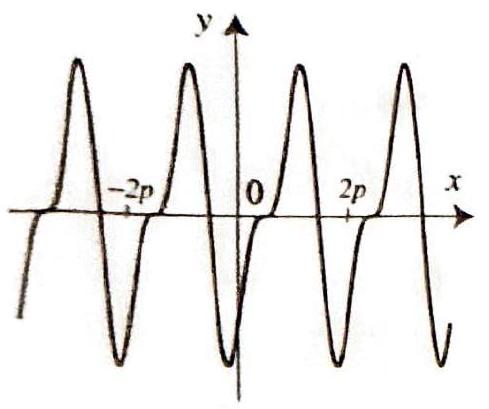

Figure 1 A $2 p$-perio tion.

THEO
FOURIER S
REPRESENTA
ARBIT
Pl

By Theorem 1, Sect all the integrals $\int$ be replaced by $\int_{0}^{2 p}$ changing the values coefficients.

++++

Section 7.3 Fourier Series of Functions with Arbitrary Periods
477
27. Let $a>1$ be a real number. Use Example 6 and Exercise 25 to derive the following formulas: for $n \geq 1$,
$$
\begin{aligned}
\frac{1}{2 \pi} \int_{-\pi}^{\pi} \frac{d \theta}{a+\cos \theta} & =\frac{1}{\sqrt{a^{2}-1}} \\
\frac{1}{2 \pi} \int_{-\pi}^{\pi} \frac{\cos n \theta}{a+\cos \theta} d \theta & =\frac{1}{\sqrt{a^{2}-1}}\left(-a+\sqrt{a^{2}-1}\right)^{n} \\
\frac{1}{2 \pi} \int_{-\pi}^{\pi} \frac{\cos n \theta}{a-\cos \theta} d \theta & =\frac{(-1)^{n}}{\sqrt{a^{2}-1}}\left(-a+\sqrt{a^{2}-1}\right)^{n}
\end{aligned}
$$

Series of Functions with Arbitrary Periods
In the preceding section we worked with functions of period $2 \pi$. The choice of this period was merely for convenience. In this section, we show how to extend our results to functions with arbitrary period by using a simple
dic func-

REM 1
ERIES
TION:
RARY
ERIOD
ion 7.1,
${ }_{-p}^{p}$ can without of the
change of variables. Suppose that $f$ is a function with period $T=2 p>0$, and let
$$
g(x)=f\left(\frac{p}{\pi} x\right) .
$$

Since $f$ is $2 p$-periodic, we have
$$
g(x+2 \pi)=f\left(\frac{p}{\pi}(x+2 \pi)\right)=f\left(\frac{p}{\pi} x+2 p\right)=f\left(\frac{p}{\pi} x\right)=g(x) .
$$

Hence $g$ is $2 \pi$-periodic. This reduction enables us to extend the main results of Section 7.2 to functions of arbitrary period.

Suppose that $f$ is a $2 p$-periodic piecewise smooth function. Then $f$ has a unique Fourier series representation
$$
\frac{f(x-)+f(x+)}{2}=a_{0}+\sum_{n=1}^{\infty}\left(a_{n} \cos \frac{n \pi}{p} x+b_{n} \sin \frac{n \pi}{p} x\right),
$$
where the Fourier coefficients are given by
(3)
$$
a_{0}=\frac{1}{2 p} \int_{-p}^{p} f(x) d x
$$
(4)
$$
a_{n}=\frac{1}{p} \int_{-p}^{p} f(x) \cos \frac{n \pi}{p} x d x \quad(n=1,2, \ldots),
$$
(5)
$$
b_{n}=\frac{1}{p} \int_{-p}^{p} f(x) \sin \frac{n \pi}{p} x d x \quad(n=1,2, \ldots)
$$

If $f$ is continuous at $x$, then the Fourier series converges to $f(x)$. The series converges uniformly for all $x$ if and only if $f$ is continuous for all $x$.

---

<!-- Page 22 -->

Left margin note (page 22)

478
Chapter 7

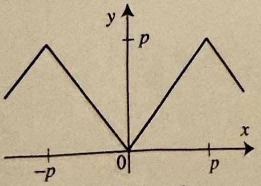

Figure 2 Tria with period $2 p$.

Right margin note (page 22)

$d x$.
$f$ as cmula
o the from em 2,
$x \leq p$
under
netion
if $n$ is for all

++++

urier Series

Proof Since $f$ is piecewise smooth, it follows that the $2 \pi$-periodic funct defined by (1) is also piecewise smooth. By Theorem 1 of Section 7.2 we have
$$
\frac{g(x-)+g(x+)}{2}=a_{0}+\sum_{n=1}^{\infty}\left(a_{n} \cos n x+b_{n} \sin n x\right) \quad(\text { for all } x),
$$
where
$$
a_{0}=\frac{1}{2 \pi} \int_{-\pi}^{\pi} g(x) d x ; a_{n}=\frac{1}{\pi} \int_{-\pi}^{\pi} g(x) \cos n x d x ; b_{n}=\frac{1}{\pi} \int_{-\pi}^{\pi} g(x) \sin n x
$$

Replacing $x$ by $\frac{\pi}{p} x$ in (6) and using (1) gives
$$
\frac{f(x-)+f(x+)}{2}=a_{0}+\sum_{n=1}^{\infty}\left(a_{n} \cos \frac{n \pi}{p} x+b_{n} \sin \frac{n \pi}{p} x\right),
$$
where the coefficients are given by (7). To express the coefficients in terms of in (3)-(5), we use (1) again. For example, to obtain (3), start with the first for in (7), use (1), then use the change of variables $t=\frac{p}{\pi} x$, and get
$$
a_{0}=\frac{1}{2 \pi} \int_{-\pi}^{\pi} g(x) d x=\frac{1}{2 \pi} \int_{-\pi}^{\pi} f\left(\frac{p}{\pi} x\right) d x=\frac{1}{2 p} \int_{-p}^{p} f(t) d t
$$

Formulas (4) and (5) are derived in a similar way. The details are left exercises. The uniqueness and the uniform convergence in the theorem follow the corresponding results for $2 \pi$-periodic functions (Corollary 1 and Theor Section 7.2).

EXAMPLE 1 A Fourier series with arbitrary period
Find the Fourier series of the $2 p$-periodic function given by $f(x)=|x|$ if $-p \leq$ (Figure 2).
Solution We compute the Fourier coefficients using Theorem 1. The area the graph of $f$ in Figure 2 gives
$$
a_{0}=\frac{1}{2 p} \int_{-p}^{p} f(x) d x=\frac{p}{2}
$$

To compute $a_{n}$ we take advantage of the fact that $f(x) \cos \frac{n \pi}{p} x$ is an even fu and write
$$
\begin{aligned}
a_{n} & =\frac{1}{p} \int_{-p}^{p} f(x) \cos \frac{n \pi}{p} x d x=\frac{2}{p} \int_{0}^{p} f(x) \cos \frac{n \pi}{p} x d x \\
& =\frac{2}{p} \int_{0}^{p} x \cos \frac{n \pi}{p} x d x=\frac{-2 p}{\pi^{2} n^{2}}(1-\cos n \pi)
\end{aligned}
$$
where the last integral is evaluated by parts. Since $\cos n \pi=(-1)^{n}, a_{n}=0$ even, and $a_{n}=\frac{-4 p}{\pi^{2} n^{2}}$ if $n$ is odd. A similar computation shows that $b_{n}=0 n$ (since $f$ is even). We thus obtain the Fourier series
$$
f(x)=\frac{p}{2}-\frac{4 p}{\pi^{2}}\left(\cos \frac{\pi}{p} x+\frac{1}{3^{2}} \cos \frac{3 \pi}{p} x+\frac{1}{5^{2}} \cos \frac{5 \pi}{p} x+\ldots\right)
$$

---

<!-- Page 23 -->

Left margin note (page 23)

Figure 3 Partial sums Fourier series $(p=1)$,
ample 1.

Figure 4 A $2 p$-periodic gular wave.

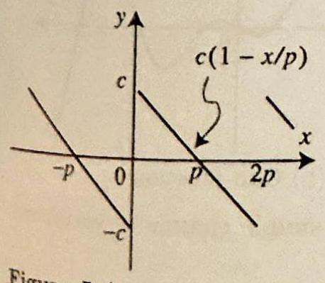

Figure 5 A $2 p$-periodic tooth function.

++++

Section 7.3 Fourier Series of Functions with Arbitrary Periods
479

Because $f$ is continuous and piecewise smooth, Theorem 1 implies that the Fourier series converges uniformly to $f(x)$ for all $x$, as can be seen in Figure 3.

Sometimes we can derive a new Fourier series from a known one without performing many additional computations. The following examples illustrate this process.

EXAMPLE 2 Triangular wave with arbitrary period and amplitude
Find the Fourier series of the $2 p$-periodic function given by
$$
g(x)=\left\{\begin{array}{ll}
a\left(1+\frac{1}{p} x\right) & \text { if }-p \leq x \leq 0 \\
a\left(1-\frac{1}{p} x\right) & \text { if } 0 \leq x \leq p
\end{array}\right.
$$

Solution Comparing Figures 4 and 2 shows that we can obtain the graph of $g$ by reflecting the graph of $f$ in the $x$-axis, translating it upward by $p$ units, and then scaling it by a factor of $\frac{a}{p}$. This is expressed by writing
$$
g(x)=\frac{a}{p}(-f(x)+p)=a-\frac{a}{p} f(x)
$$

Now to get the Fourier series of $g$, all we have to do is perform these operations on the Fourier series of $f$ from Example 1. We get
$$
\begin{aligned}
g(x) & =a-a\left(\frac{1}{2}-\frac{4}{\pi^{2}}\left(\cos \frac{\pi}{p} x+\frac{1}{3^{2}} \cos \frac{3 \pi}{p} x+\frac{1}{5^{2}} \cos \frac{5 \pi}{p} x+\ldots\right)\right) \\
& =\frac{a}{2}+\frac{4 a}{\pi^{2}}\left(\cos \frac{\pi}{p} x+\frac{1}{3^{2}} \cos \frac{3 \pi}{p} x+\frac{1}{5^{2}} \cos \frac{5 \pi}{p} x+\ldots\right)
\end{aligned}
$$

In compact form we have
$$
g(x)=\frac{a}{2}+\frac{4 a}{\pi^{2}} \sum_{k=0}^{\infty} \frac{1}{(2 k+1)^{2}} \cos \frac{(2 k+1) \pi}{p} x
$$
(You should check that the special case with $p=a=\pi$ yields the Fourier series of Example 2 of the previous section.)

Changing variables as we did at the outset of the section can be very useful in deriving new Fourier series from known ones.

EXAMPLE 3 Varying the period in a Fourier series
Find the Fourier series of the function in Figure 5.
Solution Let us start by defining the function in Figure 5. On the interval $0<x<2 p$, we have $f(x)=c\left(1-\frac{x}{p}\right)$. Now, from Example 1, Section 7.2, we have the Fourier series expansion
$$
\frac{1}{2}(\pi-x)=\sum_{n=1}^{\infty} \frac{\sin n x}{n}, \text { for } 0<x<2 \pi
$$

---

<!-- Page 24 -->

Left margin note (page 24)

480
Chapter 7
F

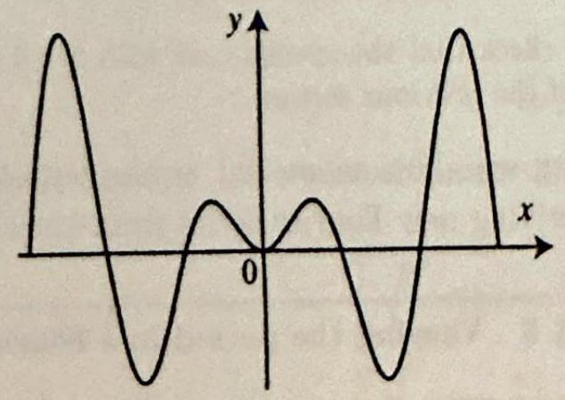

Figure 6 (a) Ev
The graph is syn respect to the $y-\varepsilon$ function: The g metric with respe gin.

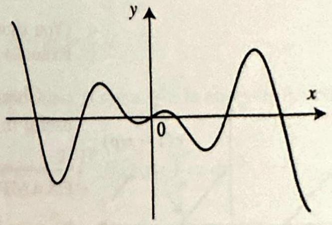

Right margin note (page 24)

get
ed on ed as olving mula eries, s was
uting even
ables)

++++

ourier Series

Replacing $x$ by $\frac{\pi}{p} x$ in the formula and the interval for $x$, we get
$$
\frac{1}{2}\left(\pi-\frac{\pi}{p} x\right)=\sum_{n=1}^{\infty} \frac{\sin \frac{n \pi}{p} x}{n}, \text { for } 0<\frac{\pi}{p} x<2 \pi
$$

Simplifying and multiplying both sides by $c$ to match the formula for $f$, we
$$
c\left(1-\frac{x}{p}\right)=\frac{2 c}{\pi} \sum_{n=1}^{\infty} \frac{\sin \frac{n \pi}{p} x}{n}, \text { for } 0<x<2 p,
$$
which yields the Fourier series of $f$.
The ideas behind Examples 2 and 3 are quite simple. They are bas the fact that a Fourier series is really a function and can be manipulat such. As with any infinite series, when you manipulate a formula inve a Fourier series, you must keep in mind the interval on which this for is valid. In particular, when you perform an operation on a Fourier s it may affect the interval on which the resulting series is defined. Thi the case when we performed a change of variables in Example 3.
Even and Odd Functions
As we noticed already, geometric considerations are helpful in comp Fourier coefficients. This is particularly the case when dealing with and odd functions. Recall the following definitions:

A function $f$ is even if $f(-x)=f(x)$ for all $x$.
A function $f$ is odd if $f(-x)=-f(x)$ for all $x$.
en function: metric with xis. (b) Odd raph is symect to the ori-

(a) Even function

(b) Odd function

It is clear from the graphs in Figure 6 (or by a simple change of vari that if $f$ is even, then
$$
\int_{-p}^{p} f(x) d x=2 \int_{0}^{p} f(x) d x
$$

---

<!-- Page 25 -->

Left margin note (page 25)

THEOREI
FOURIER SERIES
EVEN AND O
FUNCTIO

++++

Section 7.3 Fourier Series of Functions with Arbitrary Periods
481

and if $f$ is odd, then
$$
\int_{-p}^{p} f(x) d x=0 .
$$

The following useful properties concerning the products of these functions are easily verified.
$$
\begin{aligned}
(\text { Even })(\text { Even }) & =\text { Even } \\
(\text { Even })(\text { Odd }) & =\text { Odd } \\
(\text { Odd })(\text { Odd }) & =\text { Even }
\end{aligned}
$$

These simple product properties can be used to simplify finding the Fourier coefficients of even and odd functions, as we now show.

M 2

Suppose that $f$ is $2 p$-periodic and has the Fourier series representation (2).

OF Then (i) $f$ is even if and only if $b_{n}=0$ for all $n$. In this case

DD
NS
$$
f(x)=a_{0}+\sum_{n=1}^{\infty} a_{n} \cos \frac{n \pi}{p} x
$$
where
$$
a_{0}=\frac{1}{p} \int_{0}^{p} f(x) d x, \quad \text { and } \quad a_{n}=\frac{2}{p} \int_{0}^{p} f(x) \cos \frac{n \pi}{p} x d x \quad(n=1,2, \ldots)
$$
(ii) $f$ is odd if and only if $a_{n}=0$ for all $n$. In this case
$$
f(x)=\sum_{n=1}^{\infty} b_{n} \sin \frac{n \pi}{p} x
$$
where
$$
b_{n}=\frac{2}{p} \int_{0}^{p} f(x) \sin \frac{n \pi}{p} x d x \quad(n=1,2, \ldots)
$$

Proof (i) If $f(x)=a_{0}+\sum_{n=1}^{\infty} a_{n} \cos \frac{n \pi}{p} x$, then clearly it is even. Conversely, suppose that $f$ is even. Use (10) and the fact that $f(x) \sin \frac{n \pi}{p} x$ is odd to get that $b_{n}=0$ for all $n$. Use (3), (4), (9) and the fact that $f(x) \cos \frac{n \pi}{p} x$ is even to get the formulas for the coefficients in (i). The proof of (ii) is similar and is left as an exercise.

---

<!-- Page 26 -->

Left margin note (page 26)

482
Chapter 7

Figure 7 An eve

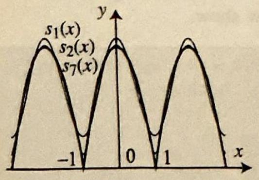

Figure 8 Partia Fourier series in

Figure 9 The o Example 5.

Right margin note (page 26)

< 1 .
n. To
ous and
er series
D
$\_\_\_\_$
rwise, is er series

++++

Fourier Series

EXAMPLE 4 Fourier series of an even function Find the Fourier series of the 2 -periodic function $f(x)=1-x^{2}$ if $-1<x$
Solution The function $f$ is even (see Figure 7); hence $b_{n}=0$ for all compute the $a_{n}$ 's, we use Theorem 2 with $p=1$ and get
$-x^{2}$
$\overbrace{1} \overbrace{x}$
n function.

1 sums of the
Example 4.
dd function in
$$
a_{0}=\int_{0}^{1}\left(1-x^{2}\right) d x=\frac{2}{3}
$$
and
$$
a_{n}=2 \int_{0}^{1}\left(1-x^{2}\right) \cos n \pi x d x=-2 \int_{0}^{1} x^{2} \cos n \pi x d x=\frac{-4(-1)^{n}}{\pi^{2} n^{2}}
$$

In computing the last integral we used the formula
$$
\int x^{2} \cos n \pi x d x=\frac{2 x \cos n \pi x}{\pi^{2} n^{2}}-\frac{2 \sin n \pi x}{\pi^{3} n^{3}}+\frac{x^{2} \sin n \pi x}{\pi n}
$$
which can be derived by two integrations by parts. Since $f$ is continu piecewise smooth, we get
$$
f(x)=\frac{2}{3}-\frac{4}{\pi^{2}} \sum_{n=1}^{\infty} \frac{(-1)^{n}}{n^{2}} \cos n \pi x
$$
for all $x$. Since $f$ is continuous and piecewise smooth for all $x$, its Fouri converges uniformly to $f(x)$, as illustrated in Figure 8.

EXAMPLE 5 Fourier series of an odd function
The function $f(x)=x \cos x$, if $-\frac{\pi}{2}<x<\frac{\pi}{2}$, and $f(x+\pi)=f(x)$ othe shown in Figure 9. It is $\pi$-periodic and odd. From Theorem 2, its Fouri is given by
$$
\sum_{n=1}^{\infty} b_{n} \sin 2 n x
$$
where
$$
b_{n}=\frac{4}{\pi} \int_{0}^{\pi / 2} x \cos x \sin 2 n x d x
$$

In evaluating this integral, we will need the addition formula
$$
\cos a \sin b=\frac{1}{2}(\sin (a+b)-\sin (a-b))
$$
and the integral formula
$$
\int u \sin u d u=\sin u-u \cos u+C
$$

---

<!-- Page 27 -->

Left margin note (page 27)

Figure 10 Graphs of $s_{2}(x)$ and $s_{4}(x)$, in Exa 5.

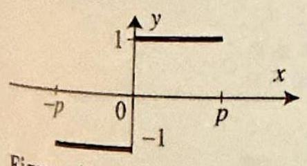

Figure 11

++++

Section 7.3 Fourier Series of Functions with Arbitrary Periods
483

Computing with the help of these formulas, we find
$$
\begin{aligned}
b_{n}= & \frac{2}{\pi} \int_{0}^{\pi / 2} x(\sin (2 n+1) x+\sin (2 n-1) x) d x \\
= & \left.\frac{2}{\pi(2 n+1)^{2}}(\sin (2 n+1) x-(2 n+1) x \cos (2 n+1) x)\right|_{0} ^{\pi / 2} \\
& +\left.\frac{2}{\pi(2 n-1)^{2}}(\sin (2 n-1) x-(2 n-1) x \cos (2 n-1) x)\right|_{0} ^{\pi / 2} \\
= & \frac{2}{\pi(2 n+1)^{2}} \sin (2 n+1) \frac{\pi}{2}+\frac{2}{\pi(2 n-1)^{2}} \sin (2 n-1) \frac{\pi}{2} \\
= & \frac{2}{\pi}(-1)^{n}\left[\frac{1}{(2 n+1)^{2}}-\frac{1}{(2 n-1)^{2}}\right] \\
& \left(\text { since } \sin (2 n+1) \frac{\pi}{2}=(-1)^{n} \text { and } \sin (2 n-1) \frac{\pi}{2}=(-1)^{n+1}\right) \\
= & \frac{16}{\pi}(-1)^{n+1} \frac{n}{(2 n+1)^{2}(2 n-1)^{2}}
\end{aligned}
$$

$x$
$\pi / 2$

Thus
$$
f(x)=\frac{16}{\pi}\left[\frac{1}{9} \sin 2 x-\frac{2}{225} \sin 4 x+\ldots\right]
$$

Figure 10 illustrates the uniform convergence of the Fourier series to $f(x)$. Along with $f(x)$, we have plotted the partial sums $s_{2}(x)$ and $s_{4}(x)$. The graphs of $s_{4}(x)$ and $f(x)$ can hardly be distinguished from one another, which suggests that the Fourier series converges very fast to $f(x)$.

In the next section we use Fourier series of even and odd functions to periodically extend functions that are defined on finite intervals. As we will see in Chapter 8, this process will be needed in solving partial differential equations by means of Fourier series.
Exercises 7.3
In Exercises 1-10, a 2p-periodic function is given on an interval of length $2 p$ in the accompanying figure (Figures 11-20). (a) State whether the function is even, odd, or neither. (b) Derive the given Fourier series, and determine its values at the points of discontinuity. State if the series converges uniformly for all $x$. (Most of these Fourier series can be derived from earlier examples and exercises, as illustrated by Examples 3 and 4.)
1.
$$
f(x)=\left\{\begin{array}{ll}
1 & \text { if } 0<x

Left margin note (page 28)

484
Chapter 7
F

Figure 12

Figure 13

Figure 14

Figure 15

Figure 16

Figure 17

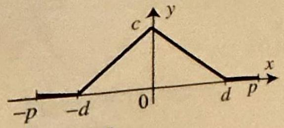

Figure 18

++++

ourier Series
2. $f(x)=x$ if $-p<x<p$. [Hint: Exercise 13, Section 7.2.]

Fourier series: $\quad \frac{2 p}{\pi} \sum_{n=1}^{\infty} \frac{(-1)^{n+1}}{n} \sin \left(\frac{n \pi}{p} x\right)$.
3. $f(x)=a\left(1-\left(\frac{x}{p}\right)^{2}\right)$ if $-p \leq x \leq p,(a \neq 0)$.

Fourier series: $\quad \frac{2}{3} a+4 a \sum_{n=1}^{\infty} \frac{(-1)^{n+1}}{(n \pi)^{2}} \cos \left(\frac{n \pi}{p} x\right)$.
4. $f(x)=x^{2}$ if $-p \leq x \leq p$. [Hint: Use Exercise 3.]

Fourier series: $\frac{p^{2}}{3}-\frac{4 p^{2}}{\pi^{2}}\left[\cos \left(\frac{\pi}{p} x\right)-\frac{1}{2^{2}} \cos \left(\frac{2 \pi}{p} x\right)+\frac{1}{3^{2}} \cos \left(\frac{3 \pi}{p} x\right)-\ldots\right]$
5.
$$
f(x)=\left\{\begin{array}{ll}
-\frac{2 c}{p}(x-p / 2) & \text { if } 0 \leq x \leq p, \\
\frac{2 c}{p}(x+p / 2) & \text { if }-p \leq x \leq 0,
\end{array}\right.
$$
where $c \neq 0$ (in the picture $c>0$.)
Fourier series: $\quad \frac{8 c}{\pi^{2}} \sum_{k=0}^{\infty} \frac{1}{(2 k+1)^{2}} \cos \left((2 k+1) \frac{\pi}{p} x\right)$.
6.
$$
f(x)=\left\{\begin{array}{ll}
c & \text { if }|x|<d \\
0 & \text { if } d<|x|

Left margin note (page 29)

Figure 19

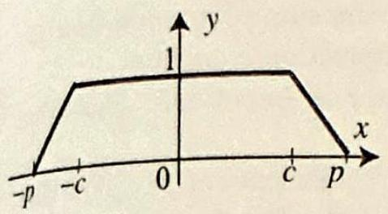

Figure 20

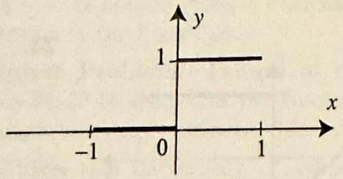
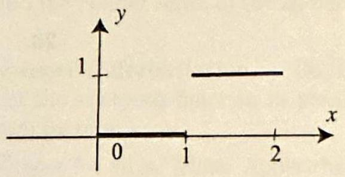

Right margin note (page 29)

ध्री

++++

Section 7.3 Fourier Series of Functions with Arbitrary Periods
$>0$
9. $f(x)=e^{-c|x|}(c \neq 0)$ for $|x| \leq p$.

$\vec{p}^{x}$

Fourier series: $\quad \frac{1}{p c}\left(1-e^{-c p}\right)+2 c p \sum_{n=1}^{\infty} \frac{1}{c^{2} p^{2}+(n \pi)^{2}}\left(1-e^{-c p}(-1)^{n}\right) \cos \left(\frac{n \pi}{p} x\right)$.
10.
$$
f(x)=\left\{\begin{array}{ll}
-\frac{1}{p-c}(x-p) & \text { if } c<x<p, \\
1 & \text { if }|x|<c, \\
\frac{1}{p-c}(x+p) & \text { if }-p<x<-c,
\end{array}\right.
$$
where $0<c<p$.
Fourier series: $\quad \frac{p+c}{2 p}+\frac{2 p}{(c-p) \pi^{2}} \sum_{n=1}^{\infty} \frac{1}{n^{2}}\left((-1)^{n}-\cos \left(\frac{c n \pi}{p}\right)\right) \cos \left(\frac{n \pi}{p} x\right)$.
11. (a) Find the Fourier series of the $2 \pi$-periodic function given on the inter $-\pi<x<\pi$ by $f(x)=x \sin x$.
(b) Plot several partial sums to illustrate the convergence of the Fourier series.
12. (a) Find the Fourier series of the $2 \pi$-periodic function given on the interv $-\pi<x<\pi$ by $f(x)=(\pi-x) \sin x$. [Hint: Exercise 11.]
(b) Plot several partial sums to illustrate the convergence of the Fourier series.

In Exercises 13-14 a function is given over one period by a figure (Figures 21-22
(a) Find its Fourier series. [Hint: Use Exercise 1.]
(b) Plot several partial sums to illustrate the convergence of the Fourier series.
13.

Figure 21
14.

Figure 22
15. Obtain the Fourier series of Example 2, Section 7.2, from Example 2 of thi section.
16. (a) Illustrate graphically the answer in Exercise 6 by taking $p=1, c=1, d=$ and by plotting several partial sums of the Fourier series.
(b) What happens to the Fourier coefficients as $d$ approaches $p$ ? Justify you answer.
17. Use the result of Exercise 4 to derive the formulas
(a) $\frac{\pi^{2}}{12}=1-\frac{1}{2^{2}}+\frac{1}{3^{2}}-\frac{1}{4^{2}}+\cdots$
(b) $\frac{\pi^{2}}{8}=1+\frac{1}{3^{2}}+\frac{1}{5^{2}}+\frac{1}{7^{2}}+\cdots$
[Hint: Use (a) also.]
18. Derive (4) and (5) of Theorem 1.
[Hint: Study the proof of Theorem 1.]
19. Prove part (ii) of Theorem 2.

Project Problem: Decomposition into even and odd parts. Do Exercise 2 and any one of 21-24. You will discover how an arbitrary function can be decom

---

<!-- Page 30 -->

Left margin note (page 30)

486
Chapter 7

Right margin note (page 30)

the
ction that that $f_{0}$ is erval (see of $f$. $\boldsymbol{x} \xrightarrow{x}$ ies be 5, 26, s. ewise $a_{n}, b_{n}$ parts a $2 p$ ewise

++++

ourier Series

posed into the sum of an even and odd function.
20. Let $f$ be an arbitrary function defined for all real numbers. Conside functions
$$
f_{\mathrm{e}}(x)=\frac{f(x)+f(-x)}{2} \text { and } f_{\mathrm{o}}(x)=\frac{f(x)-f(-x)}{2}
$$
(a) Show that $f_{\mathrm{e}}$ is even and $f_{\mathrm{o}}$ is odd.
(b) Show that $f=f_{\mathrm{e}}+f_{\mathrm{o}}$. Hence every function is the sum of an even fun and an odd function. Moreover, show that this decomposition is unique.
(c) In the remainder of this exercise, we suppose that $f$ is $2 p$-periodic. Show $f_{\mathrm{e}}$ and $f_{\mathrm{o}}$ are both $2 p$-periodic.
(d) Let $a_{0}, a_{1}, a_{2}, \ldots, b_{1}, b_{2}, \ldots$ denote the Fourier coefficients of $f$. Show the Fourier series of $f_{\mathrm{e}}$ is $a_{0}+\sum_{n=1}^{\infty} a_{n} \cos \frac{n \pi}{p} x$, and the Fourier series of $\sum_{n=1}^{\infty} b_{n} \sin \frac{n \pi}{p} x$.
In Exercises 21-24, a 2 -periodic function is given by its graph over the int $[-1,1]$ (Figures 23-26). In each case, (a) determine and plot $f_{\mathrm{e}}$ and $f_{\mathrm{o}}$ Exercise 20).
(b) Find the Fourier series of $f_{e}$ and $f_{o}$, and then deduce the Fourier series
21.

Figure 23
22.

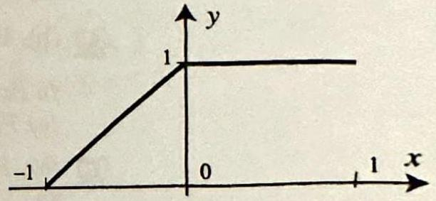
Figure 24
23.

Figure 25
24.

Figure 26

Project Problem: Differentiation of Fourier series. Can a Fourier ser differentiated term by term? The answer is no, in general. Do Exercises 2 and any one of 27-30, and you will learn when you can safely use this proces
25. Fourier series and derivatives. Suppose that $f$ is a $2 p$-periodic, piec smooth and continuous function such that $f^{\prime}$ is also piecewise smooth. Let denote the Fourier coefficients of $f$ and $a_{n}^{\prime}, b_{n}^{\prime}$ those of $f^{\prime}$. Show that
$$
a_{0}^{\prime}=0, \quad a_{n}^{\prime}=b_{n} \frac{n \pi}{p}, \quad \text { and } \quad b_{n}^{\prime}=-a_{n} \frac{n \pi}{p}
$$
[Hint: To compute the Fourier coefficients of $f^{\prime}$, evaluate the integrals by and use $f(p)=f(-p)$.]
26. Term-by-term differentiation of Fourier series. Suppose that $f$ is periodic piecewise smooth and continuous function such that $f^{\prime}$ is also piec

---

<!-- Page 31 -->

Left margin note (page 31)

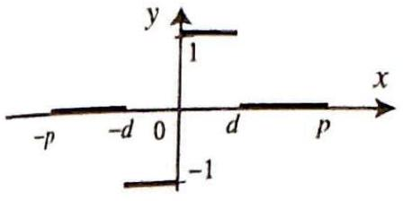

Figure 27 for Exercise 29.

Figure 28 for Exercise 30.

++++

Section 7.3 Fourier Series of Functions with Arbitrary Periods
487

smooth. Show that the Fourier series of $f^{\prime}$ is obtained from the Fourier series of $f$ by differentiating term by term. That is, under the stated conditions, if
$$
f(x)=a_{0}+\sum_{n=1}^{\infty}\left(a_{n} \cos \frac{n \pi}{p} x+b_{n} \sin \frac{n \pi}{p} x\right)
$$
then
$$
f^{\prime}(x)=\sum_{n=1}^{\infty}\left(-n a_{n} \frac{\pi}{p} \sin \frac{n \pi}{p} x+n b_{n} \frac{\pi}{p} \cos \frac{n \pi}{p} x\right)
$$
[Hint: Since $f^{\prime}$ satisfies the hypothesis of Theorem 1 it has a Fourier series expansion. Use Exercise 25 to compute the Fourier coefficients. Compare with the differentiated Fourier series of $f$.]

In most cases in this book, $f$ and $f^{\prime}$ are piecewise smooth. Thus, according to Exercise 26, to differentiate term by term the Fourier series in these cases, it is enough to check that $f$ is continuous. It is important to note that if $f$ fails to satisfy some of the assumptions of Exercise 26, then we cannot in general differentiate the series term by term. See Exercises 31-32.
27. Derive the Fourier series in Exercise 1 by differentiating term by term the Fourier series in Exercise 5. Justify your work.
28. Derive the Fourier series in Exercise 2 by differentiating term by term the Fourier series in Exercise 4. Justify your work.
29. Use the Fourier series of Exercise 8 to find the Fourier series of the $2 p$-periodic function in the Figure 27.
30. Use the Fourier series of Exercise 10 to find the Fourier series of the $2 p$-periodic function in the Figure 28.
Project Problem: Failure of term-by-term differentiation. Do Exercises 31-32 to show that the Fourier series of the sawtooth function (a piecewise smooth function) cannot be differentiated term by term.
31. Show that the series $\sum_{n=1}^{\infty} \cos n x$ is divergent for all $x$. [Hint: Apply the $n$th term test and Exercise 8, Section 4.1.]
32. Failure of term-by-term differentiation. Consider the Fourier series of the sawtooth function $\sum_{n=1}^{\infty} \frac{\sin n x}{n}$.
(a) Show that the function represented by this Fourier series satisfies all the hypotheses of Exercise 26, except that it fails to be continuous.
(b) Show that the series cannot be differentiated term by term. [Hint: Exercise 31.]
33. Project Problem: Term-by-term integration of Fourier series. Let $f$ be as in Theorem 1, and define an antiderivative of $f$ by
$$
F(x)=\int_{0}^{x} f(t) d t
$$

From Exercises 15-16, Section 7.1, we know that $F$ is $2 p$-periodic if and only if $\int_{0}^{2 p} f(t) d t=0$. Show that, in this case, the Fourier series of $F$ is
$$
F(x)=A_{0}+\sum_{n=1}^{\infty}\left(\frac{p}{n \pi} a_{n} \sin \frac{n \pi}{p} x-\frac{p}{n \pi} b_{n} \cos \frac{n \pi}{p} x\right),
$$

---
