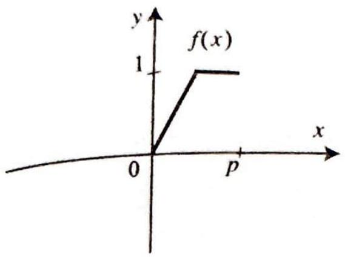
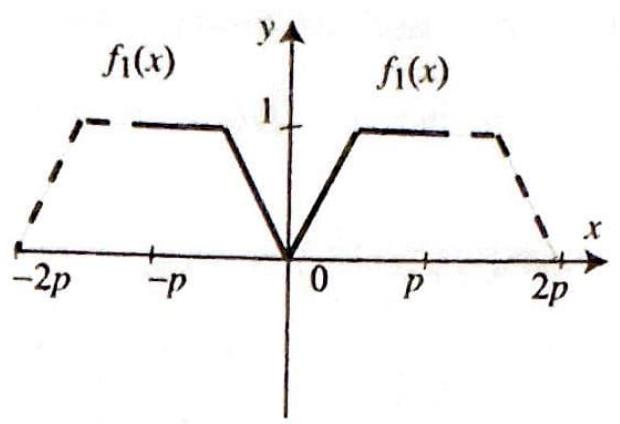
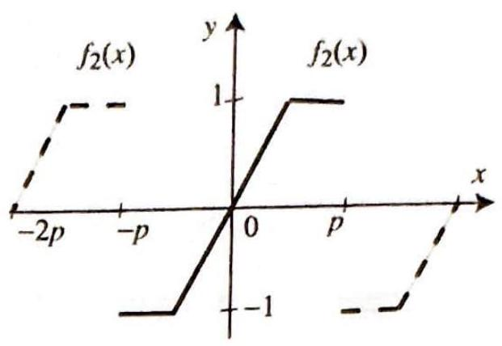
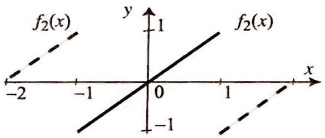

<!-- Page 32 -->

Left margin note (page 32)

488
Chapter 7 Fou
7.4 Half-Ra

THEO
HALF-F
EXPAI

Right margin note (page 32)

mpof $F$ It of ?).] se 2.
es a nce dily y a
erval
$f$ is
exame ling m 2,
$<p$, efine c) = f the

++++

rier Series

where $A_{0}=\frac{p}{\pi} \sum_{n=1}^{\infty} \frac{\delta_{n}}{n}$. Hence, as long as $F$ is periodic, with no further assu tions on $f$ other than piecewise smoothness, we can get the Fourier series by integrating term by term the Fourier series of $f$. [Hint: Apply the resu Exercise 25 to $F(x)$ and use $F^{\prime}(x)=f(x)$. To compute $A_{0}$, use $F(0)=0$ (wh)
34. Use Exercise 33 to derive the Fourier series of Exercise 4 from that of Exerci
nge Expansions: The Cosine and Sine Series
In many applications we are interested in representing by a Fourier seri function $f(x)$ that is defined only in a finite interval, say $0<x<p$. Si $f$ is clearly not periodic, the results of the previous sections are not rea applicable. Our goal in this section is to show how we can represent $f$ t Fourier series, after extending it to a periodic function.

REM 1 RANGE JSIONS

Suppose that $f(x)$ is a piecewise smooth function defined on an int $0<x<p$. Then $f$ has a cosine series expansion
(1)
$$
a_{0}+\sum_{n=1}^{\infty} a_{n} \cos \frac{n \pi}{p} x \quad(0<x<p)
$$
where
$$
a_{0}=\frac{1}{p} \int_{0}^{p} f(x) d x ; \quad a_{n}=\frac{2}{p} \int_{0}^{p} f(x) \cos \frac{n \pi}{p} x d x \quad(n \geq 1)
$$

Also, $f$ has a sine series expansion
$$
\sum_{n=1}^{\infty} b_{n} \sin \frac{n \pi}{p} x \quad(0<x<p)
$$
where
$$
b_{n}=\frac{2}{p} \int_{0}^{p} f(x) \sin \frac{n \pi}{p} x d x \quad(n \geq 1)
$$

On the interval $0<x<p$, the series (1) and (3) converge to $f(x)$ i continuous at $x$ and to $\frac{f(x+)+f(x-)}{2}$ otherwise.

The series (1) and (3) are commonly referred to as the half-range pansions of $f$. They are two different series representations of the $s$ function on the interval $0<x<p$. Theorem 1 will be derived by appea to the Fourier series representation of even and odd functions (Theore Section 7.3). For this purpose, we introduce the following notions.

Define the even periodic extension of $f$ by $f_{1}(x)=f(x)$ if $0<x f_{1}(x)=f(-x)$ if $-p<x<0$, and $f_{1}(x)=f_{1}(x+2 p)$ otherwise. D the odd periodic extension of $f$ by $f_{2}(x)=f(x)$ if $0<x<p, f_{2}$ ( $-f(-x)$ if $-p<x<0$, and $f_{2}(x)=f_{2}(x+2 p)$ otherwise. (In view

---

<!-- Page 33 -->

Left margin note (page 33)

Figure 1 (a) $f(x), 0<$

Figure 2 (a) $f(x)=x$,

Right margin note (page 33)

489 the

$\stackrel{x}{\mapsto}$
$f_{2}$.
and
the
1).
vise
sine
(x)
val.
$\xrightarrow{x}$
We
ver,
sing

++++

Section 7.4 Half-Range Expansions: The Cosine and Sine Series

remark following Theorem 1 of Section 7.2 , we will not worry about definition of the extensions at the points $0, \pm p, \pm 2 p, \ldots$.)
$$
x

Left margin note (page 34)

490
Chapter 7
F

Figure 3 (a) $f(x)$

Right margin note (page 34)

on, we
ansion
$n x \mid$
$x$
$2 \pi$
$\mathrm{n} x \mid$.
series
cosine
(Use partial
$$
x \leq \frac{\pi}{2} .
$$
interval
$$
\frac{\pi}{2} x .
$$
$$
e^{x}
$$

++++

purier Series

It is a remarkable fact that the cosine series and the sine series have the same on the intervals $(0,1),(2,3),(-2,-1), \ldots$.

EXAMPLE 2 Half-range expansions
Consider the function $f(x)=\sin x, 0 \leq x \leq \pi$. If we take its odd extensic get the usual sine function, $f_{2}(x)=\sin x$ for all $x$. Thus, the sine series $\exp$ is just $\sin x$.
$=\sin x, 0 \leq x \leq \pi$.

(b) Odd extension of $f, \sin x$.

(c) Even extension of $f, \mid$ si

If we take the even extension of $f$, we get the function $|\sin x|$. The Fourier of this even function can be obtained from Exercise 7, Section 7.2. Thus the series (of $\sin x$ ) is
$$
\sin x=\frac{2}{\pi}-\frac{4}{\pi} \sum_{k=1}^{\infty} \frac{1}{(2 k)^{2}-1} \cos 2 k x, \quad 0 \leq x \leq \pi
$$

Exercises 7.4
In Exercises 1-8, (a) find the half-range expansions of the given function. as much as possible series that you have encountered earlier.)
(b) To illustrate the convergence of the cosine and sine series, plot several sums of each and comment on the graphs.
1. $f(x)=1$ if $0<x<1$.
2. $f(x)=\pi-x$ if $0 \leq x \leq \pi$.
3. $f(x)=x^{2}$ if $0<x<1$.
4.
$$
f(x)=\left\{\begin{array}{ll}
0 & \text { if } 0 \leq x<1, \\
x-1 & \text { if } 1 \leq x<2 .
\end{array}\right.
$$
5.
$$
f(x)=\left\{\begin{array}{ll}
1 & \text { if } a<x<b, \\
0 & \text { if } 0<x<a \\
& \text { or } b<x<p,
\end{array}\right.
$$
where $0<a<b<p<\infty$. For (b), take $p=1, a=\frac{1}{4}, b=\frac{1}{2}$.
6. $f(x)=\cos x$ if $0<x<\pi$.
7. $f(x)=\cos x$ if $0 \leq$
8. $f(x)=x \sin x$ if $0<x<\pi$.

In Exercises 9-16, find the sine series expansion of the given function on the $0<x<1$.
9. $x(1-x)$.
10. $1-x^{2}$.
11. $\sin \pi x$.
12. $\sin$
13. $\sin \pi x \cos \pi x$.
14. $(1+\cos \pi x) \sin \pi x$.
15. $e^{x}$.
16. $1-$

---
