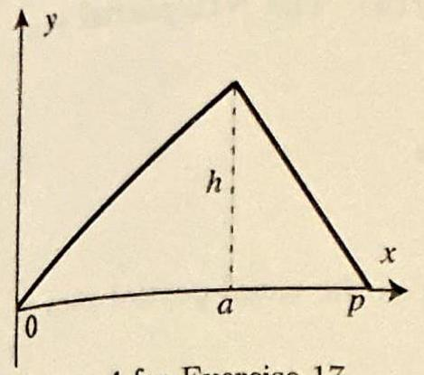
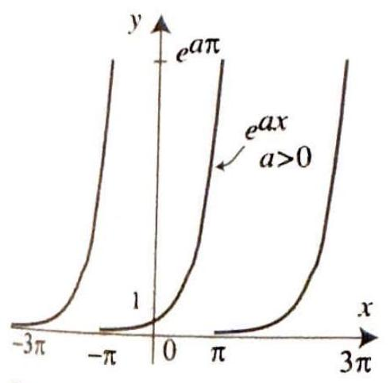
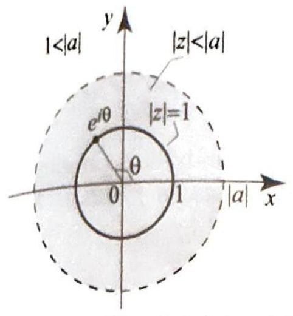
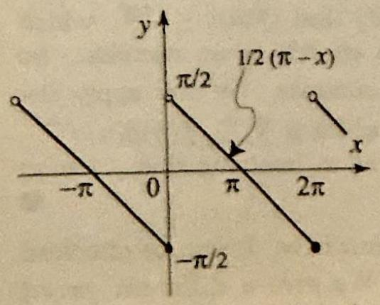
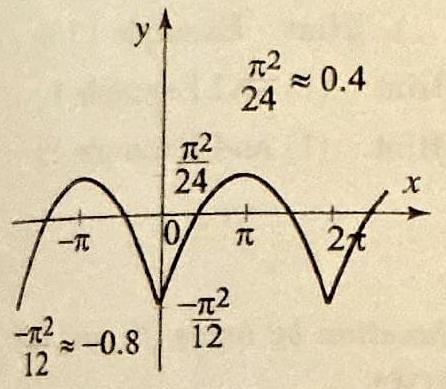

<!-- Page 35 -->

Left margin note (page 35)

Figure 4 for Exercise 1
7.5 Complex

THEORE COMPLEX FORM FOURIER SER

++++

Section 7.5 Complex Form of Fourier Series
491
17. Triangular function. Let $f(x)$ denote the shape of a plucked string of length $p$ with endpoints fastened at $x=0$ and $x=p$, as shown in Figure 4.
(a) Using the data in the figure, derive the formula
$$
f(x)=\left\{\begin{array}{ll}
\frac{h}{a} x & \text { if } 0 \leq x \leq a, \\
\frac{h}{a-p}(x-p) & \text { if } a \leq x \leq p .
\end{array}\right.
$$
(b) Obtain the sine series representation of $f$ :
7.
$$
f(x)=\frac{2 h p^{2}}{a(-a+p) \pi^{2}} \sum_{n=1}^{\infty} \frac{\sin \frac{a n \pi}{p}}{n^{2}} \sin \frac{n \pi}{p} x .
$$
(c) Verify this representation by taking $a=1 / 3, p=1, h=1 / 10$ and plotting the resulting function $f$ along with several partial sums of the Fourier series.
Form of Fourier Series
In previous sections, we have used the formulas
$$
\cos u=\frac{e^{i u}+e^{-i u}}{2} \quad \text { and } \quad \sin u=\frac{e^{i u}-e^{-i u}}{2 i}
$$
several times with tools from complex analysis to compute Fourier series. In this section, we will consider a Fourier series
$$
f(x)=a_{0}+\sum_{n=1}^{\infty}\left(a_{n} \cos \frac{n \pi}{p} x+b_{n} \sin \frac{n \pi}{p} x\right),
$$
and then, using (2), we will replace the cosine and sine by their expressions in terms of the complex exponential and derive the complex form of the Fourier series, which is expressed as follows.

M 1

Let $f$ be a $2 p$-periodic piecewise smooth function. The complex form of

OF the Fourier series of $f$ is

IES
$$
\sum_{n=-\infty}^{\infty} c_{n} e^{i \frac{n \pi}{p} x}
$$
where the Fourier coefficients $c_{n}$ are given by
$$
c_{n}=\frac{1}{2 p} \int_{-p}^{p} f(t) e^{-i \frac{n \pi}{p} t} d t \quad(n=0, \pm 1, \pm 2, \ldots)
$$

For all $x$, the Fourier series converges to $f(x)$ if $f$ is continuous at $x$, and to $\frac{f(x+)+f(x-)}{2}$ otherwise. Moreover, the Fourier series converges to $f(x)$ uniformly for all $x$ if and only if $f$ is continuous for all $x$ (and piecewise smooth).

---

<!-- Page 36 -->

Left margin note (page 36)

492
Chapter 7 For

Right margin note (page 36)

of
will
sing
imilar
$-i \frac{n \pi}{p} x$.
that

++++

trier Series

The Fourier coefficients $c_{n}$ are also denoted by $\widehat{f}(n)$. The $N$ th partial s of (3) is by definition the symmetric sum
$$
S_{N}(x)=\sum_{n=-N}^{N} c_{n} e^{i \frac{n \pi}{p} x}
$$

We will see in a moment that $S_{N}(x)$ is the same as the usual partial sum the Fourier series
$$
s_{N}(x)=a_{0}+\sum_{n=1}^{N}\left(a_{n} \cos \frac{n \pi}{p} x+b_{n} \sin \frac{n \pi}{p} x\right)
$$

Proof of Theorem 1 It is enough to show that $S_{N}=s_{N}$, then the theorem follow from Theorem 1, Section 7.3. We clearly have $c_{0}=a_{0}$. For $n>0, \mathbf{u}$ (1), we get
$$
\begin{aligned}
a_{n} \cos \frac{n \pi}{p} x+b_{n} \sin \frac{n \pi}{p} x & =a_{n} \frac{e^{i \frac{n \pi}{p} x}+e^{-i \frac{n \pi}{p} x}}{2}+b_{n} \frac{e^{i \frac{n \pi}{p} x}-e^{-i \frac{n \pi}{p} x}}{2 i} \\
& =\frac{1}{2}\left(a_{n}+\frac{1}{i} b_{n}\right) e^{i \frac{n \pi}{p} x}+\frac{1}{2}\left(a_{n}-\frac{1}{i} b_{n}\right) e^{-i \frac{n \pi}{p} x} \\
& =\frac{1}{2}\left(a_{n}-i b_{n}\right) e^{i \frac{n \pi}{p} x}+\frac{1}{2}\left(a_{n}+i b_{n}\right) e^{-i \frac{n \pi}{p} x}
\end{aligned}
$$

Using the formulas for $a_{n}$ and $b_{n}$ (Theorem 1, Section 7.3) and (4), we have
$$
\begin{aligned}
\frac{1}{2}\left(a_{n}-i b_{n}\right) & =\frac{1}{2} \frac{1}{p} \int_{-p}^{p} f(t) \cos \frac{n \pi}{p} t d t-\frac{i}{2} \frac{1}{p} \int_{-p}^{p} f(t) \sin \frac{n \pi}{p} t d t \\
& =\frac{1}{2 p} \int_{-p}^{p} f(t)\left(\cos \frac{n \pi}{p} t-i \sin \frac{n \pi}{p} t\right) d t \\
& =\frac{1}{2 p} \int_{-p}^{p} f(t) e^{-i \frac{n \pi}{p} t} d t=c_{n}
\end{aligned}
$$

To simplify the middle integral, we used the identity $e^{-i \theta}=\cos \theta-i \sin \theta$. A s argument shows that $c_{-n}=\frac{1}{2}\left(a_{n}+i b_{n}\right)$. Thus, for $n \geq 1$,
$$
a_{n} \cos \frac{n \pi}{p} x+b_{n} \sin \frac{n \pi}{p} x=c_{n} e^{i \frac{n \pi}{p} x}+c_{-n} e^{-i \frac{n \pi}{p} x}
$$
and so
$$
s_{N}(x)=a_{0}+\sum_{n=1}^{N}\left(a_{n} \cos \frac{n \pi}{p} x+b_{n} \sin \frac{n \pi}{p} x\right)=c_{0}+\sum_{n=1}^{N} c_{n} e^{i \frac{n \pi}{p} x}+\sum_{n=1}^{N} c_{-n} e
$$

Changing $n$ to $-n$ in the second series on the right and combining, we g $s_{N}(x)=S_{N}(x)$, and the theorem follows.

---

<!-- Page 37 -->

Left margin note (page 37)

Figure $1 \mathrm{~A} 2 \pi$-periodic function, $e^{a x}, a>0,-\pi<x<$

++++

Section 7.5 Complex Form of Fourier Series

We can extract the following useful identities from the previous proc
$$
\begin{array}{c}
c_{n}=\frac{1}{2}\left(a_{n}-i b_{n}\right), \quad c_{-n}=\frac{1}{2}\left(a_{n}+i b_{n}\right) \quad(n>0) \\
a_{n}=c_{n}+c_{-n}, \quad b_{n}=i\left(c_{n}-c_{-n}\right) \quad(n>0) \\
S_{N}(x)=s_{N}(x)
\end{array}
$$

If $f$ is real-valued, so that $a_{n}$ and $b_{n}$ are both real, then (6) shows that is the complex conjugate of $c_{n}$. In symbols,
$$
c_{-n}=\bar{c}_{n} .
$$

This identity fails in general if $f$ is not real-valued. Consider $f(x)=$ From the orthogonality relations of the complex exponential functions (I ercise 12, Section 3.2), it follows that $c_{1}=1$ and $c_{n}=0$ for all $n \neq$ (Exercise 9). Hence, $c_{-1} \neq \bar{c}_{1}$.

The complex form of the Fourier series is particularly useful when deal with exponential functions, as we now illustrate.

EXAMPLE 1 A complex Fourier series
Find the complex form of the Fourier series of the $2 \pi$-periodic function $f(x)=$ for $-\pi<x<\pi$, where $a \neq 0, \pm i, \pm 2 i, \pm 3 i, \ldots$. Determine the values of Fourier series at $x= \pm \pi$.

Solution From (4), we have
$$
c_{n}=\frac{1}{2 \pi} \int_{-\pi}^{\pi} e^{a x} e^{-i n x} d x=\frac{1}{2 \pi}\left[\frac{e^{(a-i n) x}}{a-i n}\right]_{-\pi}^{\pi}=\frac{(-1)^{n}}{a-i n} \frac{\sinh \pi a}{\pi},
$$
where we have used $e^{ \pm i n \pi}=(-1)^{n}$ and $\sinh \pi a=\frac{e^{\pi a}-e^{-\pi a}}{2}$. Plugging th coefficients into (3) and simplifying, we obtain the complex form of the Fou series of $f$
$$
\frac{\sinh \pi a}{\pi} \sum_{n=-\infty}^{\infty} \frac{(-1)^{n}}{a-i n} e^{i n x}=\frac{\sinh \pi a}{\pi} \sum_{n=-\infty}^{\infty} \frac{(-1)^{n}}{a^{2}+n^{2}}(a+i n) e^{i n x} .
$$
(We remind you that here and throughout the section the doubly infinite Fou series represents the limit of the symmetric partial sums, $\sum_{n=-N}^{N}$.) Applying T orem 1 to $f(x)$, we obtain the Fourier series representation
$$
e^{a x}=\frac{\sinh \pi a}{\pi} \sum_{n=-\infty}^{\infty} \frac{(-1)^{n}}{a^{2}+n^{2}}(a+i n) e^{i n x} \quad(-\pi<x<\pi) .
$$

According to Theorem 1, the values of the Fourier series at the points of disc tinuity, and in particular at $x= \pm \pi$, are given by the average of the function

---

<!-- Page 38 -->

Left margin note (page 38)

494
Chapter 7 Fou

Figure 2 Part the Fourier series periodic function $-\pi<x<\pi$.

Right margin note (page 38)

n the
(See then
form.
apute lating m (5)
gure 2. iverges
nalysis sed in

++++

rier Series

these points. With the help of Figure 1, we see that this average is
$$
\frac{e^{a \pi}+e^{-a \pi}}{2}=\cosh a \pi .
$$

As a specific illustration, if you take $x=\pi$ in the Fourier series, you obtai interesting identity
$$
\cosh a \pi=\frac{\sinh \pi a}{\pi} \sum_{n=-\infty}^{\infty} \frac{a+i n}{a^{2}+n^{2}}, \quad a \neq 0, \pm i, \pm 2 i, \pm 3 i, \ldots .
$$

We have used $e^{i n \pi}=(-1)^{n}$ and $(-1)^{n}(-1)^{n}=1$ to simplify the series. Exercises 12 and 13 for related results.) Finally, let us note that if $a= \pm i n$, $f(x)=e^{ \pm i n x}$, and hence $f$ is its own Fourier series.

EXAMPLE 2 The (usual) Fourier series from the complex form Obtain the usual Fourier series of the function in Example 1 from its complex Take $a$ to be a real number $\neq 0$.
Solution The point here is not to use the Euler formulas of Section 7.2 to con the Fourier series. Instead, we will use Example 1 and appropriate formulas re the Fourier coefficients $a_{n}$ and $b_{n}$ to the complex Fourier coefficients $c_{n}$. Fro and (10), we obtain
$$
a_{0}=c_{0}=\frac{1}{a} \frac{\sinh \pi a}{\pi}
$$

From (7) and (10), we have
$$
a_{n}=(-1)^{n} \frac{\sinh \pi a}{\pi}\left(\frac{1}{a-i n}+\frac{1}{a+i n}\right)=(-1)^{n} \frac{\sinh \pi a}{\pi} \frac{2 a}{a^{2}+n^{2}}
$$
and
$$
b_{n}=i(-1)^{n} \frac{\sinh \pi a}{\pi}\left(\frac{1}{a-i n}-\frac{1}{a+i n}\right)=-(-1)^{n} \frac{\sinh \pi a}{\pi} \frac{2 n}{a^{2}+n^{2}} .
$$

Thus, the Fourier series of $f$ is
$$
\frac{1}{a} \frac{\sinh \pi a}{\pi}+\frac{\sinh \pi a}{\pi} \sum_{n=1}^{\infty} \frac{(-1)^{n}}{a^{2}+n^{2}}(2 a \cos n x-2 n \sin n x)
$$

In particular, for $-\pi<x<\pi$ and $a \neq 0$, we have
$$
e^{a x}=\frac{1}{a} \frac{\sinh \pi a}{\pi}+\frac{\sinh \pi a}{\pi} \sum_{n=1}^{\infty} \frac{(-1)^{n}}{a^{2}+n^{2}}(2 a \cos n x-2 n \sin n x)
$$
al sums of of the $2 \pi$ -
$$
f(x)=e^{x}
$$

We took $a=1$ and illustrated the convergence of the Fourier series in Fi Note that because the sine coefficients are of the order $1 / n$, the series cor relatively slowly like the Fourier series of the sawtooth function.

Our next example illustrates the use of methods from complex ar in computing Fourier series. The ideas are similar to those we $u$

---

<!-- Page 39 -->

Left margin note (page 39)

Figure 3 The disk $(|a|>1)$ contains the $|z|=1$.

Figure 4 In this figure $\operatorname{Re}\left(\frac{1}{2+e^{i \theta}}\right)=\frac{2+\cos \theta}{5+4 \cos \theta} ; s_{2}(\theta)=\frac{1}{2}\left(1-\frac{\cos \theta}{2}+\frac{c c}{2}\right.$

Figure 5 In this figure:
$\operatorname{lm}\left(\frac{1}{2+e^{1 / \theta}}\right)=\frac{-\sin \theta}{5+4 \cos \theta}$;
$$
8_{2}(\theta)=-\frac{1}{2}\left(\frac{\sin \theta}{2}-\frac{\sin 2 \theta}{4}\right.
$$

Right margin note (page 39)

\#
Z
5
रु०
I'v. OV. O.C.
C
풀o⿱№
ট্রু

++++

Section 7.5 Complex Form of Fourier Series

Section 7.2 and are based on the applications of Laurent series. The exar that we present leads to power series, which are special cases of Lau series.

EXAMPLE 3 Using complex power series to compute Fourier seri
Let $a$ be a real number with $|a|>1$. The complex-valued function
$$
f(\theta)=\frac{1}{a+e^{i \theta}} \quad(\theta \text { real })
$$
is $2 \pi$-periodic, and because $|a|>1$ and $\left|e^{i \theta}\right|=1$ for all $\theta$, the denominator not vanish, and so $f$ is smooth. The function $f(\theta)$ is the restriction to the circle $\left(z=e^{i \theta}\right)$ of the function $\frac{1}{a+z}$, where $z$ is the variable. Since $|a|>1$, it foll that $\frac{1}{a+z}$ is analytic in the disk $|z|<|a|$, and so it has a power series expansio $|z|<|a|$, which can be obtained from the geometric series as follows:
$$
\frac{1}{a+z}=\frac{1}{a} \frac{1}{1-\left(-\frac{z}{a}\right)}=\frac{1}{a} \sum_{n=0}^{\infty}(-1)^{n}\left(\frac{z}{a}\right)^{n} \quad(|z|<|a|) .
$$

Since the unit circle $|z|=1$ is contained in the disk $|z|<|a|$, the power se expansion is valid for all $z=e^{i \theta}$ (Figure 3). Substituting $z=e^{i \theta}$, then us $z^{n}=e^{i n \theta}$ and simplifying, we get
$$
f(\theta)=\frac{1}{a+e^{i \theta}}=\frac{1}{a} \sum_{n=0}^{\infty} \frac{(-1)^{n}}{a^{n}} e^{i n \theta},
$$
which is the complex form of the Fourier series of $f(\theta)$. Out of this expansi we can derive two interesting real Fourier series, by taking the real and imagin parts of $f(\theta)$. We have (here we will use the fact that $a$ is real)
$$
f(\theta)=\frac{1}{a+e^{i \theta}}=\frac{a+e^{-i \theta}}{\left(a+e^{i \theta}\right)\left(a+e^{-i \theta}\right)}=\frac{a+\cos \theta}{1+a^{2}+2 a \cos \theta}-\frac{i \sin \theta}{1+a^{2}+2 a \cos \theta} .
$$

Substitute this into (11), use $e^{i n \theta}=\cos n \theta+i \sin n \theta$, then equate real and imagina parts, and get the two Fourier series
$$
\frac{a+\cos \theta}{1+a^{2}+2 a \cos \theta}=\frac{1}{a}\left[1-\frac{\cos \theta}{a}+\frac{\cos 2 \theta}{a^{2}}-\frac{\cos 3 \theta}{a^{3}}+\cdots\right],
$$
and
$$
\frac{-\sin \theta}{1+a^{2}+2 a \cos \theta}=-\frac{1}{a}\left[\frac{\sin \theta}{a}-\frac{\sin 2 \theta}{a^{2}}+\frac{\sin 3 \theta}{a^{3}}+\cdots\right],
$$
which are valid for all $\theta$. In Figures 4 and 5, we plotted the real and imagina parts of $f$ in the case $a=2$, along with partial sums of their Fourier series.

The Fourier series (11) is very special, in the sense that all the $c_{n}$ 's wi $n<0$ are zero. Such a Fourier series is called analytic, because, as we sa

---

<!-- Page 40 -->

Left margin note (page 40)

496
Chapter 7
Fo

Right margin note (page 40)

Note have only )).
nvoThe
does n its erve d $x$, Its cting
with Cheo-
tegral $s$ with So, in
cation ient to $c_{n}$.

++++

urier Series

in Example 3, it is the restriction of an analytic function to the circle. that the functions $f(\theta)$ in Example 3 is complex-valued. Is it possible to a real-valued analytic Fourier series? It is not hard to show that the real-valued analytic functions are the constant functions (Exercise $10(1$
Convolution of Periodic Functions
One of the most important operations in Fourier analysis is the co lution. To define it, consider a pair of $2 p$-periodic functions $f$ and $g$. convolution of $f$ and $g$, denoted by $f * g(x)$, is defined by
$$
f * g(x)=\frac{1}{2 p} \int_{-p}^{p} f(t) g(x-t) d t
$$

From its mere definition, it is difficult to explain what the convolution to a pair of functions. In a moment, we will be able to clearly explai effect in terms of the complex Fourier coefficients. For now, let us obs that if $f$ and $g$ are piecewise continuous and $2 p$-periodic, then, for fixe the function $f(t) g(x-t)$ is also piecewise continuous and $2 p$-periodic integral can be evaluated over any interval of length $2 p$, without affe its value (Theorem 1, Section 7.1). So
$$
f * g(x)=\frac{1}{2 p} \int_{-p}^{p} f(t) g(x-t) d t=\frac{1}{2 p} \int_{a}^{a+2 p} f(t) g(x-t) d t
$$
where $a$ is an arbitrary real number. Also, if $f$ and $g$ are continuous continuous derivatives, we can differentiate under the integral sign ( rem 5 , Section 3.5 ) and conclude that
$$
\begin{aligned}
\frac{d}{d x} f * g(x) & =\frac{1}{2 p} \int_{-p}^{p} \frac{d}{d x}(f(t) g(x-t)) d t \\
& =\frac{1}{2 p} \int_{-p}^{p} f(t) g^{\prime}(x-t) d t=f * g^{\prime}(x)
\end{aligned}
$$

Similarly, we have $\frac{d}{d x} f * g(x)=f^{\prime} * g(x)$, and so
$$
\frac{d}{d x} f * g(x)=f * g^{\prime}(x)=f^{\prime} * g(x)
$$

If $f$ and $g$ are merely piecewise smooth, we can write the convolution in as a sum of integrals over intervals on which $f$ and $g$ are continuou continuous derivatives, and then differentiate under the integral sign. general, the convolution is piecewise smooth.

Convolutions are important because they correspond to multipli of the Fourier coefficients. To express this property, it will be conven use the notation $\widehat{f}(n)$ for the complex Fourier coefficients instead of

---

<!-- Page 41 -->

Left margin note (page 41)

THEORE
FOUR
COEFFICIENTS
CONVOLUTI

COROLLAR CONTINUITY CONVOLUTIO

COROLLARY

++++

Section 7.5 Complex Form of Fourier Series
497
M 2
IER
OF
ONS

Let $f$ and $g$ be $2 p$-periodic, piecewise smooth functions. Then
$$
\widehat{f * g}(n)=\widehat{f}(n) \widehat{g}(n) \quad n=0, \pm 1, \pm 2, \ldots
$$

Proof We have
$$
\begin{aligned}
\widehat{f * g}(n) & =\frac{1}{2 p} \int_{-p}^{p} f * g(x) e^{-i \frac{n \pi}{p} x} d x \\
& =\frac{1}{2 p} \int_{-p}^{p} \frac{1}{2 p} \int_{-p}^{p} f(t) g(x-t) d t e^{-i \frac{n \pi}{p} x} d x \\
& =\frac{1}{2 p} \int_{-p}^{p} \frac{1}{2 p} \int_{-p}^{p} g(x-t) e^{-i \frac{n \pi}{p} x} d x f(t) d t
\end{aligned}
$$

Making the change of variables $y=x-t$ in the inner integral and using the fact that the integral does not change over an interval of length $2 p$ (Theorem 1, Section 7.1), we obtain
$$
\begin{aligned}
\widehat{f * g}(n) & =\frac{1}{2 p} \int_{-p}^{p} \frac{1}{2 p} \int_{-p}^{p} g(y) e^{-i \frac{n \pi}{p} y} e^{-i \frac{n \pi}{p} t} d y f(t) d t \\
& =\frac{1}{2 p} \int_{-p}^{p} g(y) e^{-i \frac{n \pi}{p} y} d y \frac{1}{2 p} \int_{-p}^{p} f(t) e^{-i \frac{n \pi}{p} t} d t \\
& =\widehat{g}(n) \widehat{f}(n)=\widehat{f}(n) \widehat{g}(n)
\end{aligned}
$$

We will derive several interesting consequences of Theorem 2.
Y 1
OF
NS

Let $f$ and $g$ be $2 p$-periodic, piecewise smooth functions. Then $f * g$ is continuous and piecewise smooth.

Proof We have already showed that $f * g$ is piecewise smooth with derivative given by (14) at all but finitely many points in $[-p, p]$. To show that it is continuous, we note that if $|f|$ and $\left|f^{\prime}\right|$ are bounded, say by $M$, then $|\widehat{f}(n)| \leq \frac{4 M}{n}$, which follows by integrating by parts in (4). The details are left as an exercise. So $|\widehat{f * g}(n)|=|\widehat{f}(n)||\widehat{g}(n)| \leq A \frac{1}{n} \frac{1}{n}=\frac{A}{n^{2}}$, where $A$ is a constant. We now apply the Weierstrass $M$-test to the Fourier series of $f * g(x)$, which is $\sum_{-\infty}^{\infty} \widehat{f}(n) \widehat{g}(n) e^{i \frac{n \pi}{p}}$, and conclude that the series converges uniformly for all $x$, implying that $f * g(x)$ is continuous, by Theorem 1.

The next result states that convolution is commutative. It can be checked directly by using the definition of convolution. We give a different proof based on Theorem 2.

2

Let $f$ and $g$ be piecewise smooth $2 p$-periodic functions. Then $f * g(x)= g * f(x)$.

Proof The functions $f * g$ and $g * f$ are piecewise smooth and continuous. Moreover,

---

<!-- Page 42 -->

Left margin note (page 42)

498
Chapter 7 For

COROLI
PARSI
IDE

Figure 6 Sawte in Example 4 ha series $\sum_{n=1}^{\infty} \frac{\sin n}{n}$

Right margin note (page 42)

to the
□
p]. Let
mplex
on, we
since econd ourier
ng dints of ourier
ned on
ourier cients, $\left.i b_{n}\right)=$

++++

trier Series

they have the same Fourier coefficients, because
$$
\widehat{f * g}(n)=\hat{f}(n) \hat{g}(n)=\hat{g}(n) \hat{f}(n)=\widehat{g * f}(n) .
$$

Since the Fourier series are the same and converge (uniformly) everywhere functions, we conclude that $f * g=g * f$.
ARY 3
EVAL'S
NTITY

Let $f$ be a real-valued $2 p$-periodic piecewise smooth function on $[-p, 1 a_{n}, b_{n}$, and $c_{n}$ denote, respectively, the cosine, the sine, and the co Fourier coefficients of $f$. Then
$$
\frac{1}{2 p} \int_{-p}^{p} f(x)^{2} d x=\sum_{n=-\infty}^{\infty}\left|c_{n}\right|^{2}=a_{0}^{2}+\sum_{n=1}^{\infty}\left(a_{n}^{2}+b_{n}^{2}\right)
$$

Proof Let $g(t)=f(-t)$. Then
$$
\begin{aligned}
\hat{g}(n) & =\frac{1}{2 p} \int_{-p}^{p} f(-t) e^{-i \frac{n \pi}{p} t} d t=\frac{1}{2 p} \int_{-p}^{p} f(t) e^{i \frac{n \pi}{p} t} d t \\
& =\frac{1}{2 p} \int_{-p}^{p} f(t) e^{-i \frac{(-n) \pi}{p} t} d t=c_{-n}=\overline{c_{n}}
\end{aligned}
$$
where the last equality follows from (9). From the Fourier series representatic have
$$
\begin{aligned}
f * g(x) & =\sum_{n=-\infty}^{\infty} \hat{f}(n) \hat{g}(n) e^{i \frac{n \pi}{p} x} \\
& =\sum_{n=-\infty}^{\infty} c_{n} c_{-n} e^{i \frac{n \pi}{p} x}=\sum_{n=-\infty}^{\infty}\left|c_{n}\right|^{2} e^{i \frac{n \pi}{p} x}
\end{aligned}
$$

Evaluating both sides at $x=0$, we obtain the first of the Parseval's identities $f * g(0)=\frac{1}{2 p} \int_{-p}^{p} f(t) g(-t) d t=\frac{1}{2 p} \int_{-p}^{p} f(t) f(t) d t=\frac{1}{2 p} \int_{-p}^{p} f^{2}(t) d t$. The $s$ identity follows from the first one by using the relationships between the $\mathbf{F}$ coefficients (5)-(7). The details are left as an exercise.

In the following example of a convolution, we will avoid computi rectly from the definition. Instead we will compute the Fourier coefficie the convolution and then identify the convolution function from its $F$ coefficients.

EXAMPLE 4 Computing convolutions

function

Find $f * f(x)$, where $f(x)$ denotes the $2 \pi$-periodic sawtooth function, defin $(0,2 \pi)$ by $f(x)=\frac{1}{2}(\pi-x)$ (Figure 6).
Solution Let us first compute $c_{n}=\widehat{f}(n)$. We can use the definition of the F coefficients or, better yet, since we know the Fourier cosine and sine coeffi $a_{n}=0$ and $b_{n}=\frac{1}{n}$, we can compute $c_{n}$ by using (6). We have $c_{n}=\frac{1}{2}\left(a_{n}-\right.$

---

<!-- Page 43 -->

Left margin note (page 43)

Figure 7 The convoluti the sawtooth function itself is a continuous func given on $[0,2 \pi]$ by
$$
\frac{1}{8}\left(\frac{\pi^{2}}{3}-(x-\pi)^{2}\right)
$$

THEOREM

++++

Section 7.5 Complex Form of Fourier Series
499

$-\frac{i}{2 n}$. From this and Theorem 2, we conclude that $\widehat{f * f}(n)=\left(-\frac{i}{2 n}\right)^{2}=-\frac{1}{4 n^{2}}$. Computing the cosine and sine Fourier coefficients of $f * f$ from (7), we find that the Fourier sine coefficients are 0 , while the Fourier cosine coefficients are $-\frac{1}{2 n^{2}}$. We now ask: Which function has these Fourier coefficients? Consider the function from Exercise 9, Section 7.2. Call this function $h$. Replace $x$ by $x-\pi$ in the Fourier series and get
$$
h(x-\pi)=\frac{\pi^{2}}{3}+4 \sum_{n=1}^{\infty} \frac{(-1)^{n}}{n^{2}} \cos n(x-\pi)=\frac{\pi^{2}}{3}+4 \sum_{n=1}^{\infty} \frac{1}{n^{2}} \cos n x,
$$
where we have used $\cos n(x-\pi)=(-1)^{n} \cos n x$. Subtract $\frac{\pi^{2}}{3}$ and divide by -8 to get
$$
-\frac{1}{8}\left(h(x-\pi)-\frac{\pi^{2}}{3}\right)=-\frac{1}{2} \sum_{n=1}^{\infty} \frac{1}{n^{2}} \cos n x,
$$
which is the desired function. Since this function has the same Fourier coefficients as $f * f(x)$, it is thus equal to $f * f(x)$. Using the formula for $h$, we find that on the interval $(0,2 \pi)$
$$
f * f(x)=-\frac{1}{8}\left((x-\pi)^{2}-\frac{\pi^{2}}{3}\right)=\frac{1}{8}\left(\frac{\pi^{2}}{3}-(x-\pi)^{2}\right)
$$

The graph of $f * f$ is shown in Figure 7. It is continuous and piecewise smooth, even though $f$ is not continuous for all $x$.

The final result of this section is an interesting application of Parseval's identity, which implies that the Fourier series of a continuous piecewise smooth function is uniformly and absolutely convergent. We stated this result in Theorem 2, Section 7.2, and proved it under the further assumption that $f^{\prime}$ is piecewise smooth.

43

Suppose that $f$ is continuous with piecewise continuous derivative $f^{\prime}$. Then the Fourier series of $f$ converges uniformly and absolutely for all $x$.
Proof Denote the Fourier coefficients of $f$ by $a_{n}$ and $b_{n}$ and those of $f^{\prime}$ by $a_{n}^{\prime}$ and $b_{n}^{\prime}$. It is enough to show that $\sum_{n=1}^{\infty}\left(\left|a_{n}\right|+\left|b_{n}\right|\right)<\infty$. We will prove that $\sum_{n=1}^{\infty}\left|a_{n}\right|<\infty$, since the sum with the $b_{n}$ is handled similarly. From the proof of Theorem 2, Section 7.2, we have
$$
a_{n}=-\frac{1}{n} b_{n}^{\prime} \quad \text { and } \quad b_{n}=\frac{1}{n} a_{n}^{\prime}
$$

So by the Cauchy-Schwarz inequality (Exercise 41, Section 1.2), we have
$$
\sum_{n=1}^{N}\left|a_{n}\right|=\sum_{n=1}^{N}\left|b_{n}^{\prime}\right| \frac{1}{n} \leq\left(\sum_{n=1}^{N}\left|b_{n}^{\prime}\right|^{2}\right)^{\frac{1}{2}}\left(\sum_{n=1}^{N} \frac{1}{n^{2}}\right)^{\frac{1}{2}} .
$$

Letting $N \rightarrow \infty$ and using the fact that $\sum_{n=1}^{\infty}\left|b_{n}^{\prime}\right|^{2}<\infty$, by Parseval's identity applied to $f^{\prime}$, it follows that

---

<!-- Page 44 -->

Left margin note (page 44)

500
Chapter 7

Right margin note (page 44)

riodic
1.]
.]
e 1.]
e 1.]
nd (7)
(Exerourier

What
the
).]
ise 1 to

++++

Fourier Series
$$
\sum_{n=1}^{\infty}\left|a_{n}\right| \leq\left(\sum_{n=1}^{\infty}\left|b_{n}^{\prime}\right|^{2}\right)^{\frac{1}{2}}\left(\sum_{n=1}^{\infty} \frac{1}{n^{2}}\right)^{\frac{1}{2}}<\infty
$$

Exercises 7.5
In Exercises 1-6, find the complex form of the Fourier series of the given $2 \pi-p \epsilon$ function.
1. $f(x)=\cosh a x$ if $-\pi<x<\pi(a \neq 0, \pm i, \pm 2 i, \pm 3 i, \ldots)$.
[Hint: Example
2. $f(x)=\sinh a x$ if $-\pi<x<\pi(a \neq 0, \pm i, \pm 2 i, \pm 3 i, \ldots)$.
[Hint: Example
3. $f(x)=\cos a x$ if $-\pi<x<\pi$ ( $a$ is not an integer). [Hint:
(1) and Exampl
4. $f(x)=\sin a x$ if $-\pi<x<\pi$ ( $a$ is not an integer). [Hint:
(1) and Exampl
5. $f(x)=\cos 2 x+2 \cos 3 x$. [Hint: Use (1).]
6. $f(x)=\sin 3 x$. [Hint: Use (1).]

In Exercises 7-8, find the Fourier series of the given function by using (5) or by manipulating the complex form of the Fourier series.
7. $f(x)$ is as in Exercise 3.
8. $f(x)$ is as in Exercise 4.
9. (a) Use the orthogonality relations of the complex exponential system cise 12 , Section 3.2 ) to show that the $2 \pi$-periodic function $e^{i n x}$ is its own series.
(b) Let $m \leq n$ be arbitrary integers and $c_{k}$ be arbitrary complex numbers. is the Fourier series of the $2 \pi$-periodic function $f(x)=\sum_{k=m}^{n} c_{k} e^{i k x}$ ?
10. (a) Derive (7) from (6).
(b) Show that if $f$ is real-valued, $2 p$-periodic, and piecewise smooth, and Fourier coefficients $c_{n}$ with $n<0$ are zero, then $f$ is constant. [Hint: Use ( 9
11. For any real number $a \neq 0$, obtain the expansion
$$
\frac{\pi}{a \sinh \pi a}=\sum_{n=-\infty}^{\infty} \frac{(-1)^{n}}{a^{2}+n^{2}}
$$
[Hint: Take $x=0$ in Example 1.]
12. For any real number $a \neq 0$ and all $-\pi<x<\pi$, obtain the expansion
$$
e^{a x}=\frac{\sinh \pi a}{\pi} \sum_{n=-\infty}^{\infty} \frac{(-1)^{n}}{a^{2}+n^{2}}(a \cos n x-n \sin n x)
$$
[Hint: Equate real parts in the Fourier series of Example 1.]
13. (a) Let $a \neq 0$ be a real number. Use Parseval's identity and Exerc derive the identity
$$
\sum_{n=-\infty}^{\infty} \frac{1}{\left(a^{2}+n^{2}\right)^{2}}=\frac{\pi}{2 a^{2} \sinh ^{2}(\pi a)}\left[\pi+\frac{\sinh (2 \pi a)}{2 a}\right]
$$
(b) With the help of Exercise 2, derive the identity
$$
\sum_{n=-\infty}^{\infty} \frac{n^{2}}{\left(a^{2}+n^{2}\right)^{2}}=\frac{\pi}{2 \sinh ^{2}(\pi a)}\left[\frac{\sinh (2 \pi a)}{2 a}-\pi\right]
$$

---

<!-- Page 45 -->

Right margin note (page 45)

K

++++

Section 7.5 Complex Form of Fourier Series
501
14. (a) Use Parseval's identity and the Fourier series expansion $\frac{x}{2}=\sum_{n=1}^{\infty} \frac{(-1)^{n+1}}{n} \sin n x$ for $-\pi<x<\pi$, to obtain $\sum_{n=1}^{\infty} \frac{1}{n^{2}}=\frac{\pi^{2}}{6}$.
(b) From (a), obtain that $\sum_{k=1}^{\infty} \frac{1}{(2 k)^{2}}=\frac{\pi^{2}}{24}$.
(c) Combine (a) and (b) to derive the identity $\sum_{k=0}^{\infty} \frac{1}{(2 k+1)^{2}}=\frac{\pi^{2}}{8}$.

In Exercises 15-16, find the Fourier series of the given function using Taylor or Laurent series expansions.
15. $f(\theta)=\frac{e^{\prime \theta}}{2+e^{2 \pi \theta}}$.
16. $f(\theta)=\frac{1}{3+e^{1 \theta}+e^{-1 \theta}}$.
17. $f(\theta)=e^{e^{i \theta}}$.
18. $f(\theta)=\cos \left(e^{i \theta}\right)$.
19. Which real Fourier series do you get by taking real and imaginary parts in the Fourier series of Exercise 15?
20. (a) Which real Fourier series do you get by taking real and imaginary parts in the Fourier series of Exercise 17?
(b) Answer (a) with the Fourier series of Exercise 18.

In Exercises 21-24, you are given two $2 \pi$-periodic functions $f$ and $g$ on an interva of length $2 \pi$. (a) Compute the Fourier coefficients of $f * g$. (b) Find $f * g$ by matchin (b) its Fourier coefficients with those of a known function (as we did in Example 4).
21. For $-\pi<x<\pi, f(x)=g(x)=x$.
22. For $-\pi<x<\pi, f(x)=x$; and $g(x)=-1$ if $-\pi<x<0$ and $g(x)=1 0<x<\pi$.
23. For $-\pi<x<\pi, f(x)=e^{i x}+e^{-i x}$, and $g(x)$ is an arbitrary piecewise smoot function.
24. For $-\pi<x<\pi, f(x)=\sum_{n=-N}^{N} e^{-i n x}$, and $g(x)$ is an arbitrary piecewis smooth function.
Project Problem: Cotangent expansion, Bernoulli numbers, and Fourie series. In Exercises 25-27, we explore a connection between Fourier series and som important complex series expansions, and derive interesting identities.
25. Consider the $2 \pi$-periodic function of Example 2, which is defined on the in terval $(-\pi, \pi)$ by $f(x)=e^{a x}$, where $a \neq 0$ is an arbitrary real number.
(a) Evaluate the Fourier series in Example 2 at $x=\pi$ and obtain for $a \neq 0$
$$
\cosh a \pi=\frac{\sinh a \pi}{a \pi}+\frac{\sinh a \pi}{\pi} \sum_{n=1}^{\infty} \frac{2 a}{a^{2}+n^{2}} .
$$
[Hint: See Example 1.]
(b) Conclude that for any real number $a \neq 0$,
$$
a \pi \operatorname{coth} a \pi=1+\sum_{n=1}^{\infty} \frac{2 a^{2}}{a^{2}+n^{2}}
$$
26. Euler's expansion of the cotangent. Let $\Omega$ consists of the entire comple plane minus the points $z \neq \pm i, \pm 2 i, \ldots$. For $z$ in $\Omega$, consider
$$
\phi(z)=1+\sum_{n=1}^{\infty} \frac{2 z^{2}}{z^{2}+n^{2}}
$$

---

<!-- Page 46 -->

Left margin note (page 46)

502
Chapter 7
F

Right margin note (page 46)

ic in and ded.

$+1$
on $A$
ciple
the
show
clude
lerive

++++

purier Series
(a) Complete the details of the following argument showing that $\phi$ is analyt $\Omega$. It is enough to show that the series converges uniformly on every closed bounded subset of $\Omega$ (Corollary 2, Section 4.2). Let $A \subset \Omega$ be closed and boun Let $M>0$ be an integer such that $|z|<M$ for all $z$ in $A$. Then for all $n>M$ and all $z$ in $A$, we have $\left|\frac{2 z 2}{z^{2}+n^{2}}\right| \leq \frac{2 M^{2}}{n^{2}-M^{2}}$. So the series converges uniformly by the Weierstrass $M$-test, since $\sum_{n=M+1}^{\infty} \frac{2 M^{2}}{n^{2}-M^{2}}<\infty$.
(b) Show that the function $\psi(z)=\pi z \operatorname{coth}(\pi z)$ is analytic for all $z \neq \pm i, \pm 2 i$,
(c) By Exercise 25(b), $\phi(z)=\psi(z)$ for all real $z \neq 0$. Using the identity prin (Section 4.6), conclude that $\phi(z)=\psi(z)$ for all $z$ in $\Omega$. Hence
$$
\pi z \operatorname{coth}(\pi z)=1+\sum_{n=1}^{\infty} \frac{2 z^{2}}{z^{2}+n^{2}} \quad(z \neq \pm i, \pm 2 i, \ldots)
$$
(d) Replace $z$ by $i z$ in (c) and obtain Euler's expansion of the cotangent
$$
\pi z \cot (\pi z)=1+\sum_{n=1}^{\infty} \frac{2 z^{2}}{z^{2}-n^{2}} \quad(z \neq \pm, \pm 2, \ldots)
$$
27. Bernoulli numbers. (a) Using Exercise 26(d) and the expansion cotangent from Exercise 31, Section 4.4, obtain
$$
\sum_{n=1}^{\infty} \frac{2 z^{2}}{z^{2}-n^{2}}=\sum_{n=1}^{\infty}(-1)^{n} \frac{2^{2 n} B_{2 n} \pi^{2 n}}{(2 n)!} z^{2 n}, \quad|z|<1,
$$
where $B_{2 n}$ are the Bernoulli numbers (see Example 4, Section 4.4).
(b) Use the Weierstrass double series theorem (Exercise 39, Section 4.4) to that for $|z|<1$,
$$
\sum_{n=1}^{\infty} \frac{2 z^{2}}{z^{2}-n^{2}}=\sum_{n=1}^{\infty}\left(\sum_{k=1}^{\infty} \frac{-2}{k^{2 n}}\right) z^{2 n}
$$
[Hint: For each $n=1,2, \ldots$, expand $\frac{2 z^{2}}{z^{2}-n^{2}}=-2 \sum_{k=1}^{\infty}\left(\frac{z}{n}\right)^{2 k},|z|<1$.]
(c) Equating the coefficients in the power series expansions in (a) and (b), con that for $n=1,2, \ldots$,
$$
\sum_{k=1}^{\infty} \frac{1}{k^{2 n}}=(-1)^{n-1} \frac{2^{2 n-1} B_{2 n} \pi^{2 n}}{(2 n)!}
$$
(d) Using the values of the Bernoulli numbers from Table 1, Section 4.4, the entries in Table 1, which follows.

\begin{table}
| $n$ | 1 | 2 | 3 | 4 | 5 | 6 |
| :---: | :---: | :---: | :---: | :---: | :---: | :---: |
| $\sum_{k=1}^{\infty} \frac{1}{k^{2 n}}$ | $\frac{\pi^{2}}{6}$ | $\frac{\pi^{4}}{90}$ | $\frac{\pi^{6}}{945}$ | $\frac{\pi^{8}}{9450}$ | $\frac{\pi^{10}}{93555}$ | $\frac{691 \pi^{12}}{638512875}$ |
\captionsetup{labelformat=empty}
\caption{Table 1. Sums of reciprocals of even powers of integers.}
\end{table}

---
