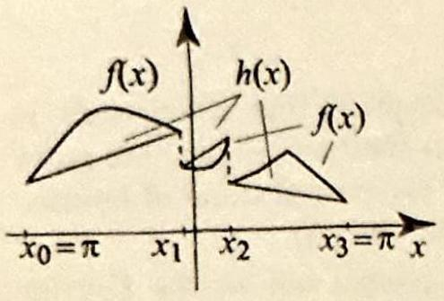
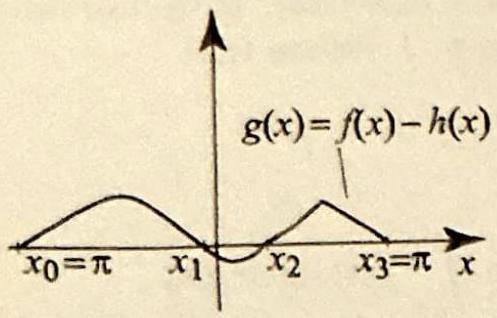
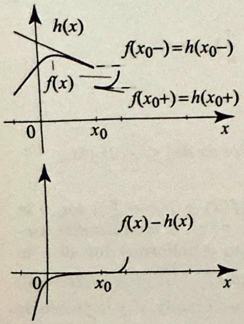

<!-- Page 47 -->

Left margin note (page 47)

7.6 Proof of th

Figure 1 The $N$ th Dir let kernel, $D_{N}(\theta)$, for $N$ 1,2,5. We have $D_{N}(0) 2 \mathrm{~N}+1$.

LEMMA
DIRICHLET KERNE
ANI
FOURIER SERIE

++++

Section 7.6 Proof of the Fourier Representation Theorem
503

Fourier Representation Theorem
In this section, we prove Theorem 1, Section 7.2. The proof that we present is based on three preliminary results that are interesting in their own right. We start with the first one, which is an integral representation of the partial sums of Fourier series involving the Dirichlet kernel (see Exercise 40, Section 1.5).

Let $N$ be a positive integer, and consider the $N$ th partial sum of the Fourier series of a function $f(x): s_{N}(x)=a_{0}+\sum_{n=1}^{N}\left(a_{n} \cos n x+b_{n} \sin n x\right)$. If we use the Euler formulas to write the Fourier coefficients in terms of $f$, we see that
$$
\begin{aligned}
s_{N}(x)= & \frac{1}{2 \pi} \int_{-\pi}^{\pi} f(t) d t \\
& +\frac{1}{\pi} \sum_{n=1}^{N}\left(\cos n x \int_{-\pi}^{\pi} f(t) \cos n t d t+\sin n x \int_{-\pi}^{\pi} f(t) \sin n t d t\right) \\
= & \frac{1}{2 \pi} \int_{-\pi}^{\pi} f(t) d t+\frac{1}{\pi} \int_{-\pi}^{\pi}\left\{f(t) \sum_{n=1}^{N}(\cos n x \cos n t+\sin n x \sin n t)\right\} d t \\
= & \frac{1}{2 \pi} \int_{-\pi}^{\pi} f(t)\left(1+2 \sum_{n=1}^{N} \cos n(x-t)\right) d t
\end{aligned}
$$
where we have combined the integrals and used $\cos n x \cos n t+\sin n x \sin n t= \cos (n-t) x$. The sum inside the big parentheses is the Dirichlet kernel evaluated at $x-t$. Thus according to Exercise 40(d), Section 1.5, we have
$$
1+2 \sum_{n=1}^{N} \cos n(x-t)=\frac{\sin \left[\left(N+\frac{1}{2}\right)(x-t)\right]}{\sin \frac{x-t}{2}}=D_{N}(x-t)
$$
where we let $D_{N}(\theta)$ denote the $N$ th Dirichlet kernel (Figure 1):
$$
D_{N}(\theta)=1+2 \sum_{n=1}^{N} \cos n \theta=\frac{\sin \left[\left(N+\frac{1}{2}\right) \theta\right]}{\sin \frac{\theta}{2}}
$$

The formula seems to have a problem at $\theta=2 k \pi$, since for those values $\sin \frac{\theta}{2}=0$. However, for $\theta=2 k \pi$, we have $\cos \theta=1$, and so $D_{N}(2 k \pi)=1+2 \sum_{n=1}^{N} 1=1+2 N$, which is also equal to $\lim _{\theta \rightarrow 2 k \pi} \frac{\sin \left[\left(N+\frac{1}{2}\right) \theta\right]}{\sin \frac{\theta}{2}}$, as you can verify by using l'Hospital's rule. So (1) is true for all $\theta$ if we interpret it in the limit at the points $\theta=2 k \pi$. Substituting (1) in the expression for $s_{N}(x)$, we obtain the first half of the following integral representation of the partial sums of Fourier series.
If $f$ is a $2 \pi$-periodic piecewise continuous function, and $N \geq 1$, then
$$
s_{N}(x)=\frac{1}{2 \pi} \int_{-\pi}^{\pi} f(t) D_{N}(x-t) d t=\frac{1}{2 \pi} \int_{-\pi}^{\pi} f(x-t) D_{N}(t) d t
$$
where $D_{N}$ is the $N$ th Dirichlet kernel (1).
Proof The second equality follows from the fact that convolution is a commutative operation. To give a direct proof, start with the first equality and use the change

---

<!-- Page 48 -->

Left margin note (page 48)

504
Chapter 7

Figure 2 The ft piecewise linear nuities are the of $f(x)$. They der to cancel ities of $f(x)$ by

LINEAR CC

RIEMAN

Right margin note (page 48)

$T$,
unction
eriodic greatly oecause iformly tinuous handled lescribe
here is a $\boldsymbol{\pi}]$, such $x$.
enough at most $x_{n}=\pi$. $\left.{ }_{+1}-\right)= x=x_{j}$, Hence
ntinuous
$$
d x=0 .
$$
ows simiar. Using

++++

Fourier Series
c)
netion $h(x)$ is Its discontisame as those are built in orhe discontinuadding $-h(x)$.

LEMMA 2 RRECTION

LEMMA 3 N-LEBESGUE LEMMA
of variables $T=x-t, d T=-d t$. Then
$$
\begin{aligned}
s_{N}(x) & =\frac{1}{2 \pi} \int_{-\pi}^{\pi} f(t) D_{N}(x-t) d t=-\frac{1}{2 \pi} \int_{x+\pi}^{x-\pi} f(x-T) D_{N}(T) d T \\
& =\frac{1}{2 \pi} \int_{x-\pi}^{x+\pi} f(x-T) D_{N}(T) d T=\frac{1}{2 \pi} \int_{-\pi}^{\pi} f(x-T) D_{N}(T) d
\end{aligned}
$$
where the last equality follows because we are integrating a $2 \pi$-periodic f over an interval of length $2 \pi$ (Theorem 1, Section 7.1).

In what follows we will be concerned with piecewise continuous $2 \pi$ functions, which may be considered as functions on $[-\pi, \pi]$. The proofs are simplified if we assume further that the functions are continuous on $[-\pi, \pi]$; functions that are continuous on closed and bounded intervals are in fact un continuous. To reduce a proof from a piecewise continuous function to a con function, we can add a piecewise linear correction term, which can be separately. This useful process will be clarified in the proofs; for now let us our linear correction term.
Suppose that $f$ is a $2 \pi$-periodic piecewise continuous function. Then $\mathbf{t}$ ] piecewise linear function $h(x)$ with finitely many discontinuities in $[-\pi$, that the function $g(x)=f(x)-h(x)$ is $2 \pi$-periodic and continuous for all
Proof The construction of $h$ is best described by a figure (see Figure 2). It is to define $h$ on the interval $[-\pi, \pi]$. Since $f$ is piecewise continuous, it has a finite number of discontinuities in $[-\pi, \pi]$, say, $-\pi=x_{0}<x_{1}<\cdots<$ Define $h(x)$ on each subinterval $\left(x_{j}, x_{j+1}\right)$ by $h\left(x_{j}+\right)=f\left(x_{j}+\right)$ and $h\left(x_{j}\right. f\left(x_{j+1}-\right)$. Then $g(x)=f(x)-h(x)$ is clearly continuous for all $x \neq x_{j}$. For we have $g\left(x_{j}+\right)=f\left(x_{j}+\right)-h\left(x_{j}+\right)=0$ and $g\left(x_{j}-\right)=f\left(x_{j}-\right)-h\left(x_{j}-\right)=0 g$ is also continuous at $x_{j}$ and so $g$ is continuous for all $x$.

Our next result states that the Fourier coefficients of a piecewise co function tend to 0 as $n \rightarrow \infty$.
Suppose that $f$ is a $2 \pi$-periodic piecewise continuous function. Then
(2) $\lim _{n \rightarrow \infty} \int_{-\pi}^{\pi} f(x) \cos n x d x=0$ and $\lim _{n \rightarrow \infty} \int_{-\pi}^{\pi} f(x) \sin n x d x=0$.

More generally, if $\alpha$ is any fixed real number, then
(3)
$$
\lim _{n \rightarrow \infty} \int_{-\pi}^{\pi} f(x) \cos [(n+\alpha) x] d x=0 \text { and } \lim _{n \rightarrow \infty} \int_{-\pi}^{\pi} f(x) \sin [(n+\alpha) x]
$$

Proof We will only establish the first limit in (2); the second one foll larly. We start by verifying the limit for functions that are piecewise line

---

<!-- Page 49 -->

Right margin note (page 49)

505

0,
rals the e if om the
are
in
n-
in
0,
se
n-
+
).

++++

Section 7.6 Proof of the Fourier Representation Theorem

integration by parts, we have
$$
\begin{aligned}
\int_{a}^{b}(c x+d) \cos n x d x & =\left.(c x+d) \frac{\sin n x}{n}\right|_{a} ^{b}-c \int_{a}^{b} \frac{\sin n x}{n} d x \\
& =\frac{(c b+d) \sin n b-(c a+d) \sin n a}{n}+c \frac{\cos n b-\cos n a}{n^{2}}
\end{aligned}
$$
as $n \rightarrow \infty$. If $f$ is piecewise linear, the first integral in (2) is a finite sum of integ of the form $\int_{a}^{b}(c x+d) \cos n x d x$, each of which tends to 0 as $n \rightarrow \infty$, and so integral itself tends to 0 as $n \rightarrow \infty$. This shows that the first limit in (2) is tru $f$ is piecewise linear. Next we consider the case of a continuous function $f$. Fr the identity $\cos a=-\cos (a+\pi)$, we get $\cos n x=-\cos \left(n\left(x+\frac{\pi}{n}\right)\right)$. Using substitution $X=x+\frac{\pi}{n}$, we have
$$
\begin{aligned}
\int_{-\pi}^{\pi} f(x) \cos n x d x & =-\int_{-\pi}^{\pi} f(x) \cos \left(n\left(x+\frac{\pi}{n}\right)\right) d x \\
& =-\int_{-\pi+\frac{\pi}{n}}^{\pi+\frac{\pi}{n}} f\left(x-\frac{\pi}{n}\right) \cos n x d x \\
& =-\int_{-\pi}^{\pi} f\left(x-\frac{\pi}{n}\right) \cos n x d x
\end{aligned}
$$
where the last equality follows from Theorem 1, Section 7.1, since all functions $2 \pi$-periodic. So
$$
2 \int_{-\pi}^{\pi} f(x) \cos n x d x=\int_{-\pi}^{\pi}\left(f(x)-f\left(x-\frac{\pi}{n}\right)\right) \cos n x d x
$$
and hence by the inequality for integrals,
$$
\left|\int_{-\pi}^{\pi} f(x) \cos n x d x\right| \leq \frac{1}{2}\left|\int_{-\pi}^{\pi}\left(f(x)-f\left(x-\frac{\pi}{n}\right)\right) \cos n x d x\right| \leq \frac{1}{2}(2 \pi) M_{n}
$$
where $M_{n}=\max \left|\left(f(x)-f\left(x-\frac{\pi}{n}\right)\right) \cos n x\right|=\max \left|f(x)-f\left(x-\frac{\pi}{n}\right)\right|$ for $x [-\pi, \pi]$. Since $f$ is continuous on the closed interval $[-\pi, \pi]$, it is uniformly $\operatorname{co}$ tinuous; hence the difference $\left|f(x)-f\left(x-\frac{\pi}{n}\right)\right|$ tends to 0 uniformly for all $x [-\pi, \pi]$, as $\frac{\pi}{n} \rightarrow 0$. So as $n \rightarrow \infty, M_{n} \rightarrow 0$, implying that $\left|\int_{-\pi}^{\pi} f(x) \cos n x d x\right| \rightarrow$ and thus completing the proof in the case $f$ is continuous. Finally, if $f$ is piecewi continuous, we apply Lemma 2 and write $f(x)=g(x)+h(x)$, where $g$ is co tinuous and $h$ is piecewise linear. Then $\int_{-\pi}^{\pi} f(x) \cos n x d x=\int_{-\pi}^{\pi} g(x) \cos n x d x \int_{-\pi}^{\pi} h(x) \cos n x d x \rightarrow 0$ as $n \rightarrow \infty$, by the previous two cases.

To prove (3), use the addition formula for the sine and cosine and apply (2 For example, using $\cos [(n+\alpha) x]=\cos (n x) \cos (\alpha x)-\sin (n x) \sin (\alpha x)$, we get
$$
\begin{array}{l}
\int_{-\pi}^{\pi} f(x) \cos [(n+\alpha) x] d x \\
=\int_{-\pi}^{\pi}[f(x) \cos (\alpha x)] \cos n x d x-\int_{-\pi}^{\pi}[f(x) \sin (\alpha x)] \sin n x d x
\end{array}
$$

---

<!-- Page 50 -->

Left margin note (page 50)

506
Chapter 7

Figure 3 The pi function $h(x)$ he to $f^{\prime}\left(x_{0}-\right)$ to t and $f^{\prime}\left(x_{0}+\right)$ to $x_{0}$. The discon derivative and it tinuity at $x_{0}$ are cel those of $f$ an to make $f$ and $($ and $=0)$ at $x_{0}$.

Right margin note (page 50)

at both
orem 1, $f^{\prime}$ may s and is e $f^{\prime}(x)$ , as we s exist.
follows or fixed $2 f^{\prime}(x)$. $=g(0)$, function e entire see that $s_{N}(x)-$
nuous in out loss of length $x)-h(x)$ (x) may Jsing the ad $x_{0}$ by $f^{\prime}\left(x_{0}-\right)$,

++++

ourier Series

Applying (2) to the functions $f(x) \cos (\alpha x)$ and $f(x) \sin (\alpha x)$, it follows th terms on the right of the displayed equation tend to 0 as $n \rightarrow \infty$.

We are now ready to prove the Fourier representation theorem (The Section 7.2). By assumption, $f$ and $f^{\prime}$ are piecewise continuous. Thus, have at most a finite number of discontinuities in $[-\pi, \pi]$, otherwise it exist continuous. We will prove that $s_{N}(x)$ converges to $f(x)$ at all points $x$ whe exists. At the points where $f^{\prime}$ does not exist, we can add a correction term did in the proof of Lemma 3, and reduce to the case of points where $f^{\prime}$ doe The details are left to the exercises.

Using the fact that $\int_{-\pi}^{\pi} \cos n t d t=0$ for all $n \geq 1$, and $\frac{1}{2 \pi} \int_{-\pi}^{\pi} d t=1$, it from (1) that
$$
\frac{1}{2 \pi} \int_{-\pi}^{\pi} D_{N}(t) d t=1, \quad \text { for all } N \geq 1
$$

Using this and Lemma 1, we have
$$
\begin{aligned}
\left|s_{N}(x)-f(x)\right| & =\left|\frac{1}{2 \pi} \int_{-\pi}^{\pi} f(x-t) D_{N}(t) d t-f(x)\right| \\
& =\left|\frac{1}{2 \pi} \int_{-\pi}^{\pi}(f(x-t)-f(x)) D_{N}(t) d t\right| \\
& =\left|\frac{1}{2 \pi} \int_{-\pi}^{\pi} \frac{f(x-t)-f(x)}{\sin \frac{t}{2}} \sin \left[\left(N+\frac{1}{2}\right) t\right] d t\right|
\end{aligned}
$$

To show that this expression tends to 0 as $N \rightarrow \infty$, we use a clever trick. F $x$, consider the function $g(t)=\frac{f(x-t)-f(x)}{\sin \frac{t}{2}}$, for $t \neq 0$ in $[-\pi, \pi]$, and $g(0)=$ This function is clearly piecewise continuous for all $t \neq 0$, and
$$
\lim _{t \rightarrow 0} g(t)=\lim _{t \rightarrow 0} \frac{f(x-t)-f(x)}{\sin \frac{t}{2}}=\lim _{t \rightarrow 0} \frac{f(x-t)-f(x)}{t} \lim _{t \rightarrow 0} \frac{t}{\sin \frac{t}{2}}=2 f^{\prime}(x)=
$$
where we have used the fact that $f^{\prime}(x)$ exists and $\lim _{t \rightarrow 0} \frac{t}{\sin \frac{t}{2}}=2$. So the $g(t)$ is continuous at $t=0$, and hence it is piecewise continuous on th interval $[-\pi, \pi]$. Applying (3) from the Riemann-Lebesgue lemma, we $\lim _{N \rightarrow \infty} \int_{-\pi}^{\pi} g(t) \sin \left[\left(N+\frac{1}{2}\right) t\right] d t=0$, and it follows from (5) that $\lim _{N \rightarrow \infty} f(x) \mid=0$, completing the proof.
Exercises 7.6
1. The correction term. Suppose that $f$ and $f^{\prime}$ are piecewise contin $[-\pi, \pi]$ and that $f^{\prime}$ does not exist at some point $x_{0}$ in $[-\pi, \pi]$. Assume witl of generality that $x_{0}$ is in $(-\pi, \pi)$; otherwise work on a different interval $2 \pi$. Show that there is a piecewise linear function $h(x)$ such that $g(x)=f($ is piecewise continuous in $(-\pi, \pi)$ and $g^{\prime}\left(x_{0}\right)$ exists. (Note: The function $g$ not be continuous on all of $[-\pi, \pi]$, as was the case in Lemma 2.) [Hint: L fact that $f$ and $f^{\prime}$ are piecewise continuous, define the values of $h$ arou $h\left(x_{0}-\right)=f\left(x_{0}-\right), h\left(x_{0}+\right)=f\left(x_{0}+\right)$, and the slopes of lines by $h^{\prime}\left(x_{0}-\right)= h^{\prime}\left(x_{0}+\right)=f^{\prime}\left(x_{0}+\right)$. See Figure 3.]

---

<!-- Page 51 -->

Right margin note (page 51)

good

++++

Section 7.6 Proof of the Fourier Representation Theorem
(b) Obtain the equation of $h$ :
$$
h(x)=\left\{\begin{array}{ll}
f^{\prime}\left(x_{0}-\right)\left(x-x_{0}\right)+f\left(x_{0}-\right) & \text { if }-\pi<x<x_{0} \\
f^{\prime}\left(x_{0}+\right)\left(x-x_{0}\right)+f\left(x_{0}+\right) & \text { if } x_{0}<x<\pi
\end{array}\right.
$$
2. Fourier series of the correction term. We have already established t the Fourier series of a piecewise smooth function converges to the function points where the derivative exists. This shows that the Fourier series of $h$ in Exercise 1 converges to $h(x)$, except at $x=x_{0}$ and $x= \pm \pi$. In this ercise, we will evaluate the Fourier series at $x_{0}$ and show that it converges $\frac{h\left(x_{0}+\right)+h\left(x_{0}-\right)}{2}=\frac{f\left(x_{0}+\right)+f\left(x_{0}-\right)}{2}$.
(a) Replacing $x$ by $x-x_{0}$, we may assume from here on that $x_{0}=0$. $H(x)=h(x)-\frac{h(0+)+h(0-)}{2}$. Note that the Fourier series of $H$ is the same the Fourier series of $h$ minus the constant $\frac{h(0+)+h(0-)}{2}$. Show that
$$
H(x)=\left\{\begin{array}{ll}
f^{\prime}(0-) x+\frac{h(0-)-h(0+)}{2} & \text { if }-\pi<x<0 \\
f^{\prime}(0+) x+\frac{h(0+)-h(0-)}{2} & \text { if } 0<x<\pi
\end{array}\right.
$$
(b) Derive the following Fourier coefficients of $H$ :
$$
a_{0}=\frac{\pi}{4}\left(f^{\prime}(0+)-f^{\prime}(0-)\right) ; \quad a_{n}=\frac{\left((-1)^{n}-1\right)\left(f^{\prime}(0+)-f^{\prime}(0-)\right)}{\pi n^{2}}, n \geq 1
$$
(We will not need the $b_{n}$ 's in the proofs.) (c) Using residues (or other methods your choice)-more specifically, the results of Exercises 17 and 18, Section 5.6, sh that $\sum_{n=1}^{\infty} \frac{(-1)^{n}-1}{\pi n^{2}}=-\frac{\pi}{4}$.
(d) Evaluate the Fourier series of $H$ at 0 and use (c) to show that it converges 0 . Conclude that the Fourier series of $h$ converges to $\frac{h(0+)+h(0-)}{2}$ at $x_{0}=0$.
3. Fourier series at points of discontinuity. Let $f$ be as in Exercise 1 a suppose that $f$ is not continuous at $x_{0}$. Add a correction term $h(x)$ as in E ercise 1 so that $g(x)=f(x)-h(x)$ becomes continuous and differentiable at By construction, we have $g\left(x_{0}\right)=0$. Let $s_{N}(g, x)$ denote the partial sums of $t$ Fourier series of $g$, and define similarly the partial sums of the Fourier series of and $h$. By the linearity of Fourier series, we have $s_{N}(g, x)=s_{N}(f, x)-s_{N}(h, x$ Since $g^{\prime}\left(x_{0}\right)$ exists, we have $s_{N}\left(g, x_{0}\right) \rightarrow g\left(x_{0}\right)=0$ (this is the case of the Fouri series representation theorem that we proved in this section). By Exercise 2, have $s_{N}\left(h, x_{0}\right) \rightarrow \frac{h\left(x_{0}+\right)+h\left(x_{0}-\right)}{2}=\frac{f\left(x_{0}+\right)+f\left(x_{0}-\right)}{2}$, where the second equality $f^{\circ}$ lows from the way we defined $h$. Thus $s_{N}(f, x) \rightarrow \frac{f\left(x_{0}+\right)+f\left(x_{0}-\right)}{2}$, which complet the proof.
