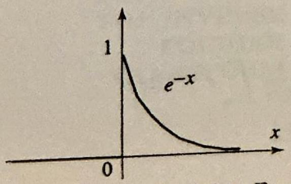
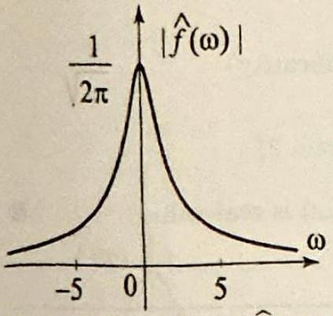
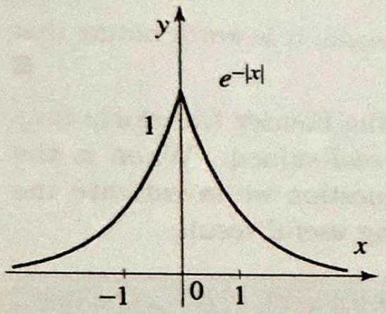
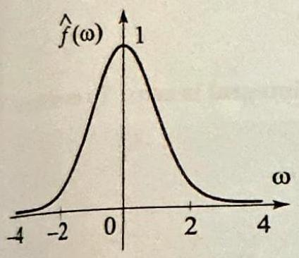
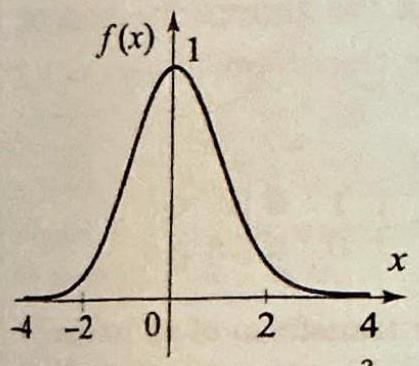

Topics to Review
Athough this chapter is largely self-contained, the ideas build on the theory of Fourier series and the heat and wave applications of Chapter 8. Whereas in Chapters 8-10 we dealt with problems on finite intervals or regions, here we are concerned with problems on unbounded regions, such as lines, half lines, planes, and halfplanes.
Methods from complex analysis, in particular, residue theory, will be used to compute Fourier transforms and study the Hilbert transform in Section 8.5.

## Looking Ahead

In Sections 8.1 and 8.2 we introduce the Fourier transform and study its properties, especially its effect on convolutions and derivatives.
In Section 8.3, we present the Fourier transform method as it is used in solving some standard partial differential equations. The ideas of this section are useful throughout the remainder of the chapter and in the next chapter. Based on the Fourier transform method, we show in Sections 8.4 and 8.5 how to express the solution of boundary value problems for infinite domains as convolutions involving the boundary or initial data. Sections 8.6 and 8.7 deal with the Fourier cosine and sine transforms and their applications on *mi-infinite regions. This parallels the development of Section 8.3.

## 8

## THE FOURIER TRANSFORM AND ITS APPLICATIONS

A generalization made not for the vain pleasure of generalizing but in order to solve previously existing problems is always a fruitful generalization.

-Henri Lebesgue

In Chapters 8-10 we used Fourier series and orthogonal expansions as tools to solve boundary value problems over bounded regions such as intervals, rectangles, disks and spheres. As you can imagine, the modeling of certain physical phenomena will give rise naturally to boundary value problems over unbounded regions. For example, to describe the temperature distribution in a very long insulated wire, you can suppose that the length of the wire is infinite, which gives rise to a boundary value problem over an infinite line. To solve this new type of problem we will generalize the notion of Fourier series by developing the Fourier transform. The applications that we present are as diverse and rich as the ones we studied with Fourier series. The methods of this chapter, although mainly tailored for the Fourier transform, are also suitable with other transforms-for example, the Fourier cosine and sine transforms (Sections 8.6-8.7) and the Laplace and Hankel transforms (Chapter 12).

In addition to the basic study of the Fourier transform, we introduce in Section 8.2 the class of generalized functions and consider some of their applications in solving partial differential equations and computing Fourier transforms. This material, along with the applications of complex analysis, is presented at the end of sections and is designed as enrichment in the subject. As a sample of applications, take a look at the exercises in Section 8.2. You will find transforms that involve Legendre polynomials, Chebyshev polynomials, Bessel functions, and other special functions. You will also find interesting improper integrals, whose evaluations illustrate the power of the Fourier analysis techniques.

### 8.1 The Fourier Transform

In Chapter 7, we used Fourier series to analyze functions that are periodic on the real line or that are defined on a finite interval and so can be considered as the restriction of periodic functions. Our goal in this section is to extend the basic tools of Fourier analysis to functions that are defined on the entire real line but are not periodic. We will replace Fourier series by the Fourier transform and prove results that are direct analogs of results about Fourier series.

We will say that $f(x)$ is integrable on the real line if $\int_{-\infty}^{\infty}|f(x)| d x<\infty$. Thus by "integrable" we mean that the absolute value of $f$ has a finite improper integral over the real line. We will say that $f$ is piecewise smooth on the real line if it is piecewise smooth on every finite interval of the real line.

Like Fourier series, the Fourier transform can be expressed in terms of integrals involving the cosine and sine functions or the complex exponential. We will take the complex form of Fourier series as a model and make the following definition.

## DEFINITION 1 THE FOURIER TRANSFORM

## DEFINITION 2 THE INVERSE FOURIER TRANSFORM

Suppose that $f$ is integrable on the real line, the Fourier transform of $f$, denoted by $\mathcal{F}(f)$ or $\widehat{f}$, is defined by

$$
\widehat{f}(\omega)=\frac{1}{\sqrt{2 \pi}} \int_{-\infty}^{\infty} f(x) e^{-i \omega x} d x \quad(-\infty<\omega<\infty)
$$

The notation $\mathcal{F}(f(x))(\omega)$ is also used to be specific about the variables. Like the Fourier coefficients, the Fourier transform of $f$ is defined by integrating $f$ against the exponential function over the domain of definition of $f$, which is the entire real line in the present case. However, unlike the Fourier coefficients of a periodic function, which are defined over a discrete set of values, the Fourier transform is defined over a continuous set of $\omega$ 's.

A Fourier series reconstructs a periodic function from its Fourier coefficients. To reconstruct a function on the real line from its Fourier transform, we must sum over a continuous set of Fourier coefficients; thus we must integrate the Fourier transform. The resulting integral is called the inverse Fourier transform.

The inverse Fourier transform of $g(\omega)$ is

$$
\mathcal{F}^{-1}(g)(x)=\frac{1}{\sqrt{2 \pi}} \int_{-\infty}^{\infty} g(\omega) e^{i \omega x} d \omega \quad(-\infty<x<\infty)
$$

The definition of the inverse Fourier transform is very similar to that of the Fourier transform; the only difference is the negative sign in the exponent
of the exponential function inside the integral. The improper integral in (2) is to be interpreted as a principal value:

$$
\mathcal{F}^{-1}(g)(x)=\lim _{a \rightarrow \infty} \frac{1}{\sqrt{2 \pi}} \int_{-a}^{a} g(\omega) e^{i \omega x} d \omega
$$

THEOREM 1 INVERSION OF THE FOURIER TRANSFORM

Suppose that $f$ is piecewise smooth and integrable on the real line. Then, for all $x$, we have

$$
\frac{f(x+)+f(x-)}{2}=\mathcal{F}^{-1}(\hat{f})(x)=\frac{1}{\sqrt{2 \pi}} \int_{-\infty}^{\infty} \widehat{f}(\omega) e^{i \omega x} d \omega
$$

In particular, if $f$ is piecewise smooth and continuous at $x$, then

$$
f(x)=\frac{1}{\sqrt{2 \pi}} \int_{-\infty}^{\infty} \widehat{f}(\omega) e^{i \omega x} d \omega
$$

The proof is similar to the proof of the Fourier series representation theorem, Section 7.6. We will present it at the end of this section.

Theorem 1 asserts that $f$ can be recaptured from its Fourier transform, by performing an inverse Fourier transform. This makes the Fourier transform a very powerful tool, as it will become apparent from the methods and applications in Sections 8.2 and 8.3.

Let us now consider some examples and basic properties of the Fourier transform. First note that putting $\omega=0$ in (1), we find that

$$
\widehat{f}(0)=\frac{1}{\sqrt{2 \pi}} \int_{-\infty}^{\infty} f(x) d x
$$

Thus the value of the Fourier transform at $\omega=0$ is equal to the signed area between the graph of $f(x)$ and the $x$-axis, multiplied by a factor of $1 / \sqrt{2 \pi}$.

## EXAMPLE 1 A Fourier transform

(a) Let $a>0$. Find the Fourier transform of the function

$$
f(x)= \begin{cases}1 & \text { if }|x|<a, \\ 0 & \text { if }|x|>a,\end{cases}
$$

shown in Figure 1. What is $\hat{f}(0)$ ?
(b) Express $f$ as an inverse Fourier transform.

Solution For $\omega \neq 0$ we have

$$
\begin{aligned}
\hat{f}(\omega) & =\frac{1}{\sqrt{2 \pi}} \int_{-\infty}^{\infty} f(x) e^{-i \omega x} d x=\frac{1}{\sqrt{2 \pi}} \int_{-a}^{a} e^{-i \omega x} d x \\
& =\left.\frac{-1}{\sqrt{2 \pi} i \omega} e^{-i \omega x}\right|_{-a} ^{a}=\sqrt{\frac{2}{\pi}} \frac{\sin a \omega}{\omega}
\end{aligned}
$$

Figure 2 Graph of $\widehat{f}$ in Example 1.

Figure 3 Graph of $f$ in Ex-

amnle 2 . for the case $a=1$.

For $\omega=0$, we have

$$
\begin{gathered}
\hat{f}(0)=\frac{1}{\sqrt{2 \pi}} \int_{-a}^{a} d x=a \sqrt{2 / \pi} \\
\lim _{\omega \rightarrow 0} \hat{f}(\omega)=\lim _{\omega \rightarrow 0} \sqrt{\frac{2}{\pi}} \frac{\sin a \omega}{\omega}=a \sqrt{\frac{2}{\pi}}=\hat{f}(0)
\end{gathered}
$$

it follows that $\hat{f}(\omega)$ is continuous at 0 (Figure 2), and we may write
(b) To express $f$ as an inverse Fourier transform, we use (2) and get

$$
\begin{aligned}
f(x) & =\frac{1}{\sqrt{2 \pi}} \int_{-\infty}^{\infty} e^{i \omega x} \sqrt{\frac{2}{\pi}} \frac{\sin a \omega}{\omega} d \omega=\frac{1}{\pi} \int_{-\infty}^{\infty} e^{i \omega x} \frac{\sin a \omega}{\omega} d \omega \\
& =\frac{1}{\pi} \int_{-\infty}^{\infty}(\cos \omega x+i \sin \omega x) \frac{\sin a \omega}{\omega} d \omega=\frac{1}{\pi} \int_{-\infty}^{\infty} \frac{\cos \omega x \sin a \omega}{\omega} d \omega
\end{aligned}
$$

because $\sin \omega x \frac{\sin a \omega}{\omega}$ is an odd function of $\omega$ and so its integral is zero. This representation is valid at the points of continuity of $f$; that is, for $x \neq \pm a$. For $x=a$, the inverse Fourier transform converges to the average value $\frac{f(a+)+f(a-)}{2}=\frac{1}{2}$. Similarly, for $x=-a$, the inverse Fourier transform converges to $\frac{1}{2}$. Putting these facts together and writing $f$ explicitly, we obtain the inverse Fourier transform representation of $f$ :

$$
\frac{1}{\pi} \int_{-\infty}^{\infty} \frac{\cos \omega x \sin a \omega}{\omega} d \omega= \begin{cases}0 & \text { if } x<-a \text { or } x>a \\ 1 & \text { if }-a<x<a \\ \frac{1}{2} & \text { if } x= \pm a\end{cases}
$$

A particular case of this integral deserves special attention. If we take $a=1$ and $x=0$, we get

$$
\frac{1}{\pi} \int_{-\infty}^{\infty} \frac{\sin \omega}{\omega} d \omega=1
$$

This is the sine integral that we computed using residues in Example 3, Section 5.4 In recognition of the residue methods, we should mention that this integral is needed in the proof of Theorem 1, which we quoted when computing (3). So we still need the residue theory in deriving the sine integral.

The Fourier transform in Example 1 is continuous on the entire real line even though the function has jump discontinuities at $x= \pm a$. In fact, it can be shown that the Fourier transform of an integrable function is always continuous.

## EXAMPLE 2 A Fourier transform involving $e^{-a x}$

Find the Fourier transform of

$$
f(x)= \begin{cases}e^{-a x} & \text { if } x>0 \\ 0 & \text { if } x \leq 0\end{cases}
$$

Since

鈹

$$
\hat{f}(\omega)=\sqrt{\frac{2}{\pi}} \frac{\sin a \omega}{\omega}, \quad \text { for all } \omega
$$

                            I’
    

Figure 4 Graph of $|\widehat{f}|$ in Example $2(a=1)$.

THEOREM 2 CONJUGATING THE TRANSFORM

## THEOREM 3 LINEARITY

where $a>0$. The graph of $f$ is shown in Figure 3 for the case $a=1$.
Solution We have

$$
\begin{aligned}
\hat{f}(\omega) & =\frac{1}{\sqrt{2 \pi}} \int_{0}^{\infty} e^{-a x} e^{-i \omega x} d x=\frac{1}{\sqrt{2 \pi}} \int_{0}^{\infty} e^{-x(a+i \omega)} d x \\
& =\left.\frac{-1}{\sqrt{2 \pi}(a+i \omega)} e^{-i \omega x} e^{-a x}\right|_{0} ^{\infty}
\end{aligned}
$$

Since $\left|e^{-i x \omega}\right|=1$, it follows that $\lim _{x \rightarrow \infty}\left|e^{-x(a+i \omega)}\right|=\lim _{x \rightarrow \infty} e^{-a x}=0$, and so

$$
\hat{f}(\omega)=\frac{1}{\sqrt{2 \pi}(a+i \omega)}=\frac{a-i \omega}{\sqrt{2 \pi}\left(a^{2}+\omega^{2}\right)}
$$

Figure 4 shows the graph of $|\hat{f}(\omega)|$ with $a=1$. Here again, it is worth noting that $\widehat{f}$ and $|\widehat{f}|$ are both continuous even though $f$ is not.

Example 2 illustrates a noteworthy fact that the Fourier transform may be complex-valued even though the function is real-valued. When is the Fourier transform real-valued? To answer this question we investigate the Fourier transform of $f(-x)$. We have the following useful result.

Suppose that $f$ is real-valued and integrable and let $g(x)=f(-x)$. Then

$$
\widehat{f}(-\omega)=\overline{\widehat{f}(\omega)}=\widehat{g}(\omega), \quad \text { for all } \omega
$$

Proof We leave the first equality as an exercise and prove that $\hat{f}(-\omega)=\hat{g}(\omega)$. Using (1) and a change of variables, we get

$$
\begin{aligned}
\hat{g}(\omega) & =\frac{1}{\sqrt{2 \pi}} \int_{-\infty}^{\infty} g(x) e^{-i \omega x} d x=\frac{1}{\sqrt{2 \pi}} \int_{-\infty}^{\infty} g(-x) e^{i \omega x} d x \\
& =\frac{1}{\sqrt{2 \pi}} \int_{-\infty}^{\infty} f(x) e^{-i(-\omega) x} d x=\widehat{f}(-\omega)
\end{aligned}
$$

The following property of the Fourier transform is straightforward to verify and is a consequence of the linearity of the integral.

The Fourier transform is a linear operation; that is, for any integrable functions $f$ and $g$ and any real numbers $a$ and $b$,

$$
\mathcal{F}(a f+b g)=a \mathcal{F}(f)+b \mathcal{F}(g)
$$

Proof See Exercise 14.
We can now answer our question about the values of the Fourier transform.

Figure 5 Graph of $e^{-|x|}, a=$ 1 in Example 3.

THEOREM 5 RECIPROCITY RELATIONS

Suppose that $f$ is real-valued and integrable. Then
(i) $\hat{f}$ is real-valued if and only if $f$ is even;
(ii) $\hat{f}$ is purely imaginary if and only if $f$ is odd.

Proof We prove (i) only and leave (ii) to Exercise 14. We have

$$
\begin{aligned}
f \text { is even } & \Leftrightarrow f(x)=\frac{f(x)+f(-x)}{2} \\
& \Leftrightarrow \widehat{f}(\omega)=\frac{\widehat{f}(\omega)+\widehat{f(-x)}(\omega)}{2} \quad \text { (linearity) } \\
& \Leftrightarrow \widehat{f}(\omega)=\frac{\widehat{f}(\omega)+\widehat{f}(\omega)}{2} \quad \text { (Theorem 2) } \\
& \Leftrightarrow \widehat{f}(\omega)=\operatorname{Re}(\widehat{f}(\omega)) \quad \Leftrightarrow \quad \widehat{f}(\omega) \text { is real-valued. }
\end{aligned}
$$

## EXAMPLE 3 Fourier transform of $e^{-a|x|}(a>0)$

Find the Fourier transform of $h(x)=e^{-a|x|}$ where $a>0$ (Figure 5).
Solution We can compute directly from the definition of the Fourier transform, or better yet, we can use the transform in Example 2 and properties of the Fourier transform. Since $h(x)=f(x)+f(-x)$, where $f(x)$ is as in Example 2, then by Theorem 2 and linearity,

$$
\begin{aligned}
\widehat{h}(\omega) & =\widehat{f}(\omega)+\overline{\widehat{f}(\omega)} \\
& =\frac{a-i \omega}{\sqrt{2 \pi}\left(a^{2}+\omega^{2}\right)}+\frac{a+i \omega}{\sqrt{2 \pi}\left(a^{2}+\omega^{2}\right)}=\sqrt{\frac{2}{\pi}} \frac{a}{a^{2}+\omega^{2}}
\end{aligned}
$$

In accordance with Theorem 4, the Fourier transform of $e^{-a|x|}$ is real-valued, since $e^{-a|x|}$ is even.

Example 3 illustrates how properties of the Fourier transform can be used to our advantage to find new transforms from known ones. The more we know about the transform, the easier it is to compute with it. Here are two simple observations which will yield interesting results.

If $f$ and $g$ are integrable, then

$$
\begin{gathered}
\mathcal{F} g(\omega)=\mathcal{F}^{-1} g(-\omega) \\
\mathcal{F}(\mathcal{F}(f))(\omega)=f(-\omega)
\end{gathered}
$$

Proof In the definitions of the Fourier transform and its inverse, (1) and (2), the exponential functions in these integrals differ only by a negative sign in the exponent, and so (4) is immediate. Applying (4) with $g=\mathcal{F}(f)$, we obtain $\mathcal{F} \mathcal{F}(f)(\omega)=\mathcal{F}^{-1} \mathcal{F}(f)(-\omega)$. But $\mathcal{F}^{-1} \mathcal{F}(f)=f$, and (5) follows.

## EXAMPLE 4 A transform using reciprocity

From Example 3, the function $\sqrt{\frac{2}{\pi}} \frac{a}{a^{2}+x^{2}}(a>0)$ is the Fourier transform of $f(x)= e^{-a|x|}$. Using the reciprocity relation (5), we obtain

$$
\mathcal{F}\left(\sqrt{\frac{2}{\pi}} \frac{a}{a^{2}+x^{2}}\right)(\omega)=\mathcal{F}\left(\mathcal{F}\left(e^{-a|x|}\right)\right)(\omega)=f(-\omega)=e^{-a|-\omega|}=e^{-a|\omega|}
$$ $\square$

If in Example 4 we were to compute the Fourier transform of $\frac{a}{a^{2}+x^{2}}$ from the definition (1), we would have to evaluate the integral $\int_{-\infty}^{\infty} \frac{\cos \omega x}{a^{2}+x^{2}} d x$. This nontrivial integral is one of many that we computed using the residue theorem in Chapter 5 (see Example 1, Section 5.4). The next example is another important Fourier transform, which we will obtain by simply recalling an integral that we computed using residues. A different derivation will be given

Figure 6 Graphs of $e^{-\frac{x^{2}}{2}}$ and its Fourier transform $e^{-\frac{\omega^{2}}{2}}$. They are the same functions of different variables). in the next section using operational properties of the transform.

## EXAMPLE 5 Fourier transform of the Gaussian

Let $a>0$. We will derive the Fourier transform

$$
\mathcal{F}\left(e^{-a x^{2}}\right)(\omega)=\frac{1}{\sqrt{2 a}} e^{-\frac{\omega^{2}}{4 a}} \quad(-\infty<\omega<\infty)
$$

(See Figure 6 for the case $a=\frac{1}{2}$.) Using (1), we have

$$
\mathcal{F}\left(e^{-a x^{2}}\right)(\omega)=\frac{1}{2 \pi} \int_{-\infty}^{\infty} e^{-a x^{2}} e^{-i \omega x} d x=\frac{1}{2 \pi} \int_{-\infty}^{\infty} e^{-a x^{2}}(\cos \omega x-i \sin \omega x) d x
$$

The integral of the sine part is 0 , because the integrand is odd. So

$$
\mathcal{F}\left(e^{-a x^{2}}\right)(\omega)=\frac{1}{2 \pi} \int_{-\infty}^{\infty} e^{-a x^{2}} \cos \omega x d x
$$

and (6) follows from Example 1, Section 5.5. $\square$

Taking $a=\frac{1}{2}$ in (6), we obtain the interesting formula

$$
\mathcal{F}\left(e^{-\frac{x^{2}}{2}}\right)(\omega)=e^{-\frac{\omega^{2}}{2}} \quad(-\infty<\omega<\infty)
$$

Thus $e^{-\frac{x^{2}}{2}}$ is its own Fourier transform; equivalently, formula (7) states that $e^{-\frac{x^{2}}{2}}$ is an eigenfunction of the Fourier transform corresponding to the eigenvalue 1. (See the next section for transforms with similar properties.)

In our next example, the function is not integrable; however, its Fourier transform does exist. This is one of many Fourier transforms of functions that are not necessarily integrable, but for which the improper integral (1)
does converge. In fact, the theory of Fourier transforms can be extended to a much wider class of functions than the integrable functions, including the so-called generalized functions. We will touch on this subject in the next section and derive some interesting applications.

Figure 7 for Example Graphs of $f(x)=\sqrt{\frac{2}{\pi}} \frac{\sin a x}{x}$ and its Fourier transform $\widehat{f}(\omega)=1$ if $|\omega|<a$ and 0 if $|\omega|>a$. The function is not integrable and its transform is not continuous.

EXAMPLE 6 Fourier transform of $\sqrt{\frac{2}{\pi}} \frac{\sin a x}{x}$
The function $f(x)=\sqrt{\frac{2}{\pi}} \frac{\sin a x}{x}$, where $a>0$ is not integrable over the real line because the improper integral of its absolute value is not finite (Exercise $14(\mathrm{c})$ ). We can still use (1) to compute its Fourier transform. For any $-\infty<\omega<\infty$, we have

$$
\begin{aligned}
\hat{f}(\omega) & =\frac{1}{\pi} \int_{-\infty}^{\infty} \frac{\sin a x}{x} e^{-i \omega x} d x=\frac{1}{\pi} \int_{-\infty}^{\infty} \frac{\sin a x}{x}(\cos \omega x-i \sin \omega x) d x \\
& =\frac{1}{\pi} \int_{-\infty}^{\infty} \frac{\sin a x}{x} \cos \omega x d x
\end{aligned}
$$

because the imaginary part of the integrand is odd so its integral is zero. To evaluate the last integral, we appeal to (3) and find

$$
\widehat{f}(\omega)= \begin{cases}0 & \text { if } x<-a \text { or } x>a \\ 1 & \text { if }-a<x<a \\ \frac{1}{2} & \text { if } x= \pm a\end{cases}
$$

(See Figure 7.) These values can be confirmed by using the reciprocity relations. From Example 1, the function $\sqrt{\frac{2}{\pi}} \frac{\sin a x}{x}$ is the Fourier transform of $g(x)=1$ if $|x|<a$, and $g(x)=0$ if $|x|>a$. By (5), we get

$$
\mathcal{F}\left(\sqrt{\frac{2}{\pi}} \frac{\sin a x}{x}\right)(\omega)=\mathcal{F}(\mathcal{F}(g))(\omega)=g(-\omega)= \begin{cases}1 & \text { if }|\omega|<a \\ 0 & \text { if }|\omega|>a\end{cases}
$$

We observed earlier, before Example 2, that the Fourier transform of an integrable function is always continuous. In the present example, the Fourier transform is not continuous. This is not a contradiction, because the function in this example is not integrable.

In our final example we compute some residues as we evaluate a Fourier transform.

EXAMPLE 7 Using residues to compute a Fourier transform Compute the Fourier transform of $f(x)=\frac{2}{\sqrt{\pi}\left(1+x^{4}\right)}$.
Solution Using (1), we compute

$$
\begin{aligned}
\hat{f}(\omega) & =\frac{\sqrt{2}}{\pi} \int_{-\infty}^{\infty} \frac{1}{1+x^{4}}(\cos \omega x-i \sin \omega x) d x \\
& =\frac{\sqrt{2}}{\pi} \int_{-\infty}^{\infty} \frac{\cos \omega x}{1+x^{4}} d x
\end{aligned}
$$

Figure 8 The contour and poles in the upper half-plane in Example 7.

Figure 9 The four unimodular roots of $z^{4}+1=0$.

Note that the Fourier transform is an even function of $\omega$, so it is enough to compute it for $\omega \geq 0$. So suppose $\omega \geq 0$ and follow the steps in Example 1, Section 5.4, to compute the integral. Accordingly, we have

$$
\widehat{f}(\omega)=\frac{\sqrt{2}}{\pi} \int_{-\infty}^{\infty} \frac{\cos \omega x}{1+x^{4}} d x=\frac{\sqrt{2}}{\pi} \operatorname{Re}\left(\int_{\gamma_{R}} \frac{e^{i \omega z}}{1+z^{4}} d z\right)
$$

where $\gamma_{R}$ is a closed semi-circular path with $R$ large enough to enclose the poles of $\frac{e^{i \omega z}}{1+z^{4}}$ (Figure 8). (As we will see shortly, $R$ must be $>1$.) The function $F(z)=\frac{e^{i \omega z}}{1+z^{4}}$ has four simple poles at the roots of $z^{4}+1=0$. These are $z_{1}=e^{i \frac{\pi}{4}}, z_{2}=e^{i \frac{3 \pi}{4}}$, $z_{3}=e^{i \frac{5 \pi}{4}}, z_{4}=e^{i \frac{7 \pi}{4}}$ (Figure 9). Only $z_{1}$ and $z_{2}$ are in the upper half-plane and so lie inside of $\gamma_{R}$ for $R>1$. To compute the residues at these poles, we will use Proposition 1(ii), Section 5.1. Accordingly,

$$
\operatorname{Res}\left(\frac{e^{i \omega z}}{1+z^{4}}, z_{j}\right)=\left.\frac{e^{i \omega z}}{4 z^{3}}\right|_{z=z_{j}}=\frac{e^{i \omega z_{j}}}{4 z_{j}^{3}}
$$

We now have every thing we need to compute the integral with the help of the residue theorem. We have

$$
\int_{\gamma_{R}} \frac{e^{i \omega z}}{1+z^{4}} d z=2 \pi i\left(\operatorname{Res}\left(F(z), z_{1}\right)+\operatorname{Res}\left(F(z), z_{2}\right)\right)=2 \pi i\left(\frac{e^{i \omega z_{1}}}{4 z_{1}^{3}}+\frac{e^{i \omega z_{2}}}{4 z_{2}^{3}}\right)
$$

We now plug back into (8), use $z_{1}=\frac{\sqrt{2}}{2}+i \frac{\sqrt{2}}{2}, z_{2}=-\frac{\sqrt{2}}{2}+i \frac{\sqrt{2}}{2}, \operatorname{Re}(i \zeta)=-\operatorname{Im}(\zeta)$ for any complex number $\zeta$, simplify, and get, for $\omega \geq 0$,

$$
\begin{aligned}
\widehat{f}(\omega) & =-\frac{\sqrt{2}}{2} \operatorname{Im}\left(\frac{e^{i \omega z_{1}}}{z_{1}^{3}}+\frac{e^{i \omega z_{2}}}{z_{2}^{3}}\right) \\
& =-\frac{\sqrt{2}}{2} \operatorname{Im}\left(e^{-i \frac{3 \pi}{4}}\left(e^{i \omega\left(\frac{\sqrt{2}}{2}+i \frac{\sqrt{2}}{2}\right)}+i e^{i \omega\left(-\frac{\sqrt{2}}{3}+i \frac{\sqrt{2}}{2}\right)}\right)\right) \\
& =e^{-\frac{\sqrt{2}}{2} \omega}\left(\sin \left(\frac{\sqrt{2}}{2} \omega\right)+\cos \left(\frac{\sqrt{2}}{2} \omega\right)\right)
\end{aligned}
$$

Thus for all $\omega$

$$
\hat{f}(\omega)=e^{-\frac{\sqrt{2}}{2}|\omega|}\left(\sin \left(\frac{\sqrt{2}}{2}|\omega|\right)+\cos \left(\frac{\sqrt{2}}{2} \omega\right)\right)
$$

Setting $\omega=0$ and recalling the definition of the Fourier transform, we get

$$
\widehat{f}(0)=1=\frac{\sqrt{2}}{\pi} \int_{-\infty}^{\infty} \frac{d x}{1+x^{4}}
$$

which yields the value of an interesting nontrivial improper integral.

## Proof of Theorem 1

We need two lemmas. The first one is similar to the expression of the partial sums of Fourier series as a convolution with the Dirichlet kernel.

LEMMA 1 PARTIAL INVERSE FOURIER TRANSFORM

To go from the first to the second equality, interchange the order of integration. To go from the second to the third equality, change variables: $x- y=Y, d y=-d Y$.

LEMMA 2 RIEMANN-LEBESGUE LEMMA

Suppose that $f$ is integrable on the real line and $a>0$. Then

$$
\frac{1}{\sqrt{2 \pi}} \int_{-a}^{a} \widehat{f}(\omega) e^{i x \omega} d \omega=\frac{1}{\pi} \int_{-\infty}^{\infty} f(x-y) \frac{\sin a y}{y} d y
$$

Proof Using $\frac{\sin a y}{y}=\frac{1}{2} \int_{-a}^{a} e^{i y \omega} d \omega$, we have

$$
\begin{aligned}
\sqrt{\frac{2}{\pi}} \int_{-\infty}^{\infty} f(x-y) \frac{\sin a y}{y} d y & =\sqrt{\frac{2}{\pi}} \int_{-\infty}^{\infty} \frac{1}{2} f(x-y) \int_{-a}^{a} e^{i y \omega} d \omega d y \\
& =\frac{1}{\sqrt{2 \pi}} \int_{-a}^{a} \int_{-\infty}^{\infty} f(x-y) e^{i y \omega} d y d \omega \\
& =\int_{-a}^{a} \overbrace{\frac{1}{\sqrt{2 \pi}} \int_{-\infty}^{\infty} f(y) e^{-i y \omega} d y e^{i x \omega} d \omega} \\
& =\int_{-a}^{a} \widehat{f}(\omega) e^{i x \omega} d \omega
\end{aligned}
$$

which is equivalent to (9).
The next result is an analog of the Riemann-Lebesgue lemma for Fourier series.
Suppose that $\int_{A}^{B}|g(x)| d x<\infty$, where $-\infty \leq A<B \leq \infty$. Then
(10) $\lim _{\omega \rightarrow \infty} \int_{A}^{B} g(y) \sin \omega y d y=0$ and $\lim _{\omega \rightarrow \infty} \int_{A}^{B} g(y) \cos \omega y d y=0$
Proof To simplify the proof, we will suppose that $g$ is bounded and $g^{\prime}$ is integrable. Integrating by parts, we obtain

$$
\int_{A}^{B} g(y) \sin \omega y d y=-\left.\frac{1}{\omega} g(y) \cos \omega y\right|_{A} ^{B}+\frac{1}{\omega} \int_{A}^{B} g^{\prime}(y) \cos \omega y d y .
$$

Since $g$ is bounded, then so is $g(y) \cos \omega y$, and the first term on the right tends to 0 as $\omega \rightarrow \infty$. Also, since $g^{\prime}$ is integrable, we have $\int_{A}^{B}\left|g^{\prime}(y)\right| d y=M<\infty$, and so

$$
\frac{1}{\omega}\left|\int_{A}^{B} g^{\prime}(y) \cos \omega y d y\right| \leq \frac{M}{\omega} \rightarrow 0 \text { as } \omega \rightarrow \infty
$$

This proves the first limit in (10). The second one is done similarly.
We now sketch a proof of Theorem 1 for the case when $f$ is smooth. For fixed $x$, since $f^{\prime}(x)$ exists, the function $g(y)=\frac{f(x-y)-f(x)}{y}$ tends to $f^{\prime}(x)$ as $y \rightarrow 0$; hence it is bounded near 0 . For all other values of $y$, the function $g$ is smooth. Recall
from Example 3, Section 5.4, the integral $\frac{1}{\pi} \int_{-\infty}^{\infty} \frac{\sin x}{x} d x=1$. From this integral, it follows that for any $a>0, \frac{1}{\pi} \int_{-\infty}^{\infty} \frac{\sin a y}{y} d y=1$. (Just make a change of variables $a y=x$.) Using Lemma 1 , we have

$$
\begin{aligned}
\frac{1}{\sqrt{2 \pi}} \int_{-a}^{a} \widehat{f}(\omega) e^{i x \omega} d \omega-f(x) & =\frac{1}{\pi} \int_{-\infty}^{\infty} f(x-y) \frac{\sin a y}{y} d y-f(x) \\
& =\frac{1}{\pi} \int_{-\infty}^{\infty} \frac{f(x-y)-f(x)}{y} \sin a y d y \\
& =\frac{1}{\pi} \int_{-\infty}^{\infty} g(y) \sin a y d y=I_{1}+I_{2}+I_{3}
\end{aligned}
$$

where $I_{1}$ is the integral over $(-\infty, 1), I_{2}$ is the integral over $(-1,1)$, and $I_{3}$ is the integral over $(1, \infty)$. To show that

$$
\lim _{a \rightarrow \infty} \frac{1}{\sqrt{2 \pi}} \int_{-a}^{a} \widehat{f}(\omega) e^{i x \omega} d \omega-f(x)=0
$$

we will show that $\lim _{a \rightarrow \infty} I_{j}=0$ for $j=1,2,3$. Since $g$ is bounded in the interval $(-1,1)$, the integral of its absolute value is finite on $(-1,1)$, and so, by Lemma 2, $\lim _{a \rightarrow \infty} I_{2}=0$. Write $I_{3}=\int_{1}^{\infty} \frac{f(x-y)}{y} \sin a y d y-f(x) \int_{1}^{\infty} \frac{\sin a y}{y} d y$. The first integral tends to 0 as $a \rightarrow \infty$, by Lemma 2, because $\int_{1}^{\infty}\left|\frac{f(x-y)}{y}\right| d y \leq \int_{1}^{\infty}|f(x-y)| d y \leq \int_{-\infty}^{\infty}|f(y)| d y<\infty$. To handle the second integral, we integrate by parts and get

$$
f(x) \int_{1}^{\infty} \frac{\sin a y}{y} d y=\left.f(x) \frac{-\cos a y}{a y}\right|_{y=1} ^{\infty}-\frac{1}{a} \int_{1}^{\infty} \frac{\cos a y}{y^{2}} d y
$$

which tends to 0 as $a \rightarrow \infty$, because $\left|\int_{1}^{\infty} \frac{\cos a y}{y^{2}} d y\right| \leq \int_{1}^{\infty} \frac{1}{y^{2}} d y=1$. Thus $\lim _{a \rightarrow \infty} I_{3}=0$ and similarly for $I_{1}$, which completes the proof.

## Exercises 11.1

In Exercises 1-10, find the Fourier transform of the given function.
1.

$$
f(x)= \begin{cases}x & \text { if }-1<x<1 \\ 0 & \text { otherwise }\end{cases}
$$

2. 

$$
f(x)= \begin{cases}-1 & \text { if }-1<x<0 \\ 1 & \text { if } 0<x<1 \\ 0 & \text { otherwise }\end{cases}
$$

3. 

$$
f(x)= \begin{cases}1 & \text { if } 0<x<1 \\ 0 & \text { otherwise }\end{cases}
$$

5. 

$$
f(x)= \begin{cases}1-|x| & \text { if }-1<x<1 \\ 0 & \text { otherwise }\end{cases}
$$

7. 

$$
f(x)=e^{-|x|+2}
$$

9. 

$$
f(x)= \begin{cases}\cos x & \text { if }-\pi / 2<x<\pi / 2 \\ 0 & \text { otherwise }\end{cases}
$$

4. 

$$
f(x)= \begin{cases}0 & \text { if }-1<x<1 \\ 1 & \text { if } 1<|x|<2 \\ 0 & \text { otherwise }\end{cases}
$$

6. 

$$
f(x)= \begin{cases}1-x^{2} & \text { if }-1<x<1 \\ 0 & \text { otherwise }\end{cases}
$$

8. 

$$
f(x)=e^{-2\left(x^{2}+1\right)}
$$

10. 

$$
f(x)= \begin{cases}\sin x & \text { if }-\pi<x<\pi \\ 0 & \text { otherwise }\end{cases}
$$

In Exercises 11-13, derive the given integral formula by first taking the Fourier transform of the function on the right of the equality and then expressing the function as an inverse Fourier transform.
11.

Figure 10 for Exercise 14(c). The graph of $\left|\frac{\sin x}{x}\right|$ and the area under one arch between $x=(n-1) \pi$ and $x=n \pi$. Show that the shaded area is $\geq \frac{1}{n-1}$.
12.

$$
\int_{0}^{\infty} \frac{\cos x \omega+\omega \sin x \omega}{1+\omega^{2}} d \omega= \begin{cases}0 & \text { if } x<0 \\ \pi / 2 & \text { if } x=0 \\ \pi e^{-x} & \text { if } x>0\end{cases}
$$

$$
\frac{2}{\pi} \int_{0}^{\infty} \frac{\sin \pi \omega}{1-\omega^{2}} \sin \omega x d \omega= \begin{cases}\sin x & \text { if }|x| \leq \pi \\ 0 & \text { if }|x|>\pi\end{cases}
$$

13. 

$$
\frac{2}{\pi} \int_{0}^{\infty} \frac{\cos \frac{\pi \omega}{2}}{1-\omega^{2}} \cos \omega x d \omega= \begin{cases}\cos x & \text { if }|x|<\pi / 2 \\ 0 & \text { if }|x|>\pi / 2\end{cases}
$$

14. (a) Prove Theorem 3. (b) Prove Theorem 4(ii).
(c) Show that $\frac{\sin x}{x}$ is not integrable on the real line. That is, show that $\int_{-\infty}^{\infty} \left\lvert\, \frac{\sin x}{x} d x=\right. \infty$. [Hint: Show that for $n \geq 2$, the area under the arch of the curve, above the $x$-axis, between $(n-1) \pi$ and $n \pi$ is greater than $1 /(n-1)$ (Figure 10).]
15. (a) Use Example 1 to show that

$$
\int_{0}^{\infty} \frac{\sin \omega \cos \omega}{\omega} d \omega=\frac{\pi}{4}
$$

(b) Use integration by parts and (a) to obtain

$$
\int_{0}^{\infty} \frac{\sin ^{2} \omega}{\omega^{2}} d \omega=\frac{\pi}{2}
$$

Figure 11 Graph of $\mathcal{F}\left(J_{0}(x)\right)(\omega)$, for Exercise 18. We have

$$
\mathcal{F}\left(J_{0}(x)\right)(0)=\sqrt{\frac{2}{\pi}}
$$

which implies that

$$
\int_{-\infty}^{\infty} J_{0}(x) d x=2
$$

But $J_{0}$ is not integrable on the real line, because the graph of its Fourier transform, $\mathcal{F}\left(J_{0}(x)\right)(\omega)$, is not continuous.
16. Derive the given identities: (a) $\int_{0}^{\infty} \frac{\sin \omega \cos 2 \omega}{\omega} d \omega=0$. [Hint: Example 1.]
(b) $\int_{0}^{\infty} \frac{1-\cos t}{t^{2}} d t=\frac{\pi}{2}$. [Hint: Integrate by parts and use Example 1.]

## Methods from Complex Analysis

17. (a) Let $0<\alpha<1$ and define $f(x)=\frac{1}{|x|^{\alpha}}$. Using Example 2 , Section 5.5 , derive the Fourier transform

$$
\mathcal{F}\left(\frac{1}{|x|^{\alpha}}\right)(\omega)=\sqrt{\frac{2}{\pi}}|\omega|^{\alpha-1} \Gamma(1-\alpha) \sin \frac{\alpha \pi}{2} \quad(-\infty<\omega<\infty)
$$

(b) From (a), derive the Fourier transform

$$
\mathcal{F}\left(\frac{1}{\sqrt{|x|}}\right)(\omega)=\frac{1}{\sqrt{|\omega|}} \quad(-\infty<\omega<\infty)
$$

18. Project Problem: Fourier transform of the Bessel function $J_{0}(x)$. In this exercise, we will derive the formula

$$
\mathcal{F}\left(J_{0}(a x)\right)(\omega)= \begin{cases}\sqrt{\frac{2}{\pi}} \frac{1}{\sqrt{a^{2}-\omega^{2}}} & \text { if }|\omega|<a \\ 0 & \text { if }|\omega|>a\end{cases}
$$

where $a>0$ (Figure 11). Instead of computing directly, we will compute the Fourier transform of the function on the right side of the equality and then use the reciprocity relation (5). So let $f(x)=\sqrt{\frac{2}{\pi}} \frac{1}{\sqrt{a^{2}-x^{2}}}$ if $|x|<a$ and $f(x)=0$ if $|x|>a$.
(a) Show that $\widehat{f}(\omega)=\frac{1}{\pi} \int_{0}^{\pi} \cos (a \omega \cos \theta) d \theta$. [Hint: Apply the definition (1), use the change of variables $x=\cos \theta$, then use one more change of variables $\theta=\theta+\pi$.] (b) Show that $\widehat{f}(\omega)=J_{0}(a \omega)$ and then use Theorem 5 to derive (11). [Hint: The first part is nontrivial, but it follows immediately from the cosine integral representation of the Bessel function $J_{0}$ (Exercise 36(a), Section 4.5).]
In Exercises 19-23, use residues, as we did in Example 7, to derive the given Fourier transform.
19. $\mathcal{F}\left(\frac{\sqrt{2}}{\sqrt{\pi}\left(1+x^{6}\right)}\right)(\omega)=\frac{e^{-\frac{|\omega|}{2}}}{3}\left(e^{-\frac{|\omega|}{2}}+\cos \left(\frac{\sqrt{3}}{2} \omega\right)+\sqrt{3} \sin \left(\frac{\sqrt{3}}{2}|\omega|\right)\right)$.
20. $\mathcal{F}\left(\frac{\sqrt{2}}{\sqrt{\pi}\left(1+x^{2}\right)^{2}}\right)(\omega)=\frac{e^{-|\omega|}}{2}(1+|\omega|)$.
21. $\mathcal{F}\left(\frac{\sqrt{2} x}{\sqrt{\pi}\left(1+x^{2}\right)^{2}}\right)(\omega)=\frac{i}{2}|\omega| e^{-|\omega|}$.
22. $\mathcal{F}\left(\frac{\sqrt{3}}{\sqrt{2 \pi}\left(1+x+x^{2}\right)}\right)(\omega)=e^{-\frac{\sqrt{3}}{2}|\omega|}\left(\cos \left(\frac{\omega}{2}\right)-i \sin \left(\frac{|\omega|}{2}\right)\right)$.
23. $\mathcal{F}\left(\frac{\sqrt{2}}{\sqrt{\pi} \cosh x}\right)(\omega)=\operatorname{sech} \frac{\pi \omega}{2}$.
24. Project Problem: Transforms related to the Fresnel integrals.

In this exercise, we will derive the Fourier transforms

$$
\begin{aligned}
& \mathcal{F}\left(\cos \left(x^{2}\right)\right)(\omega)=\frac{1}{2}\left(\cos \frac{\omega^{2}}{4}+\sin \frac{\omega^{2}}{4}\right) \\
& \mathcal{F}\left(\sin \left(x^{2}\right)\right)(\omega)=\frac{1}{2}\left(\cos \frac{\omega^{2}}{4}-\sin \frac{\omega^{2}}{4}\right)
\end{aligned}
$$

(a) Let $f_{1}(\omega)=\mathcal{F}\left(\cos \left(x^{2}\right)\right)(\omega)$ and $f_{2}(\omega)=\mathcal{F}\left(\sin \left(x^{2}\right)\right)(\omega)$. Show that both $f_{1}$ and $f_{2}$ are real-valued and even and that

$$
f_{1}(\omega)+i f_{2}(\omega)=\frac{1}{\sqrt{2 \pi}} \int_{-\infty}^{\infty} e^{i\left(x^{2}-x \omega\right)} d x=\frac{e^{-i \frac{\omega^{2}}{4}}}{\sqrt{2 \pi}} \int_{-\infty}^{\infty} e^{i\left(x-\frac{\omega}{2}\right)^{2}} d x
$$

(b) Make a change of variables, $u=x-\frac{\omega}{2}$, and then evaluate the resulting integral using the Fresnel integrals (see the discussion following Example 2, Section 5.5). Take real and imaginary parts of your answer and derive (12) and (13).
