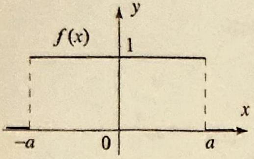
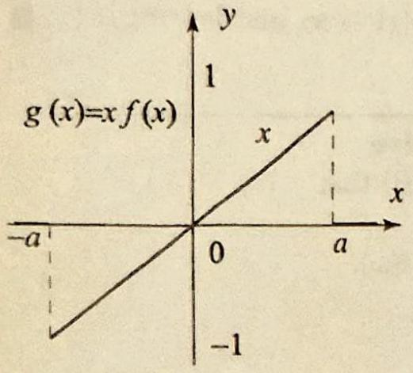
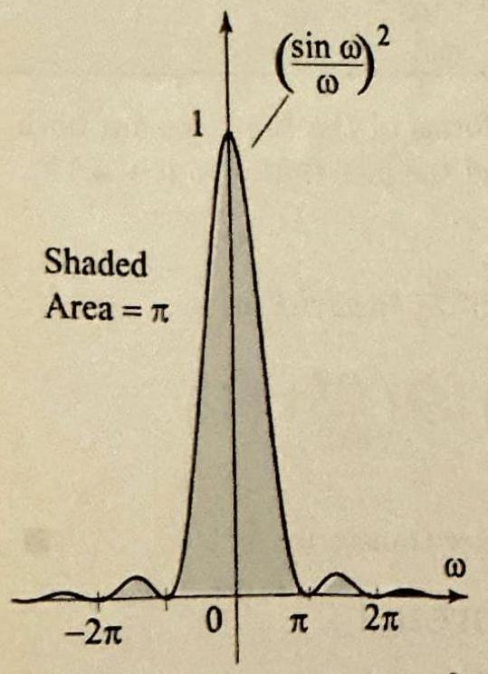
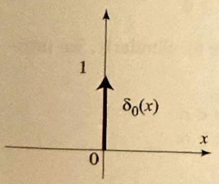
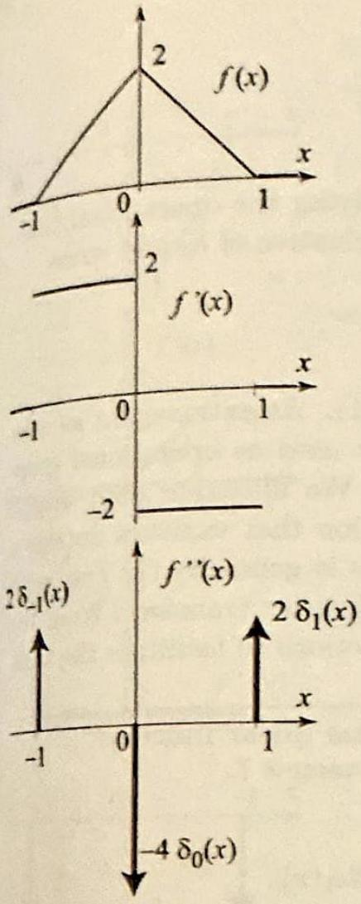
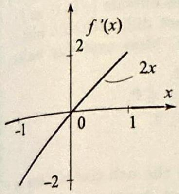
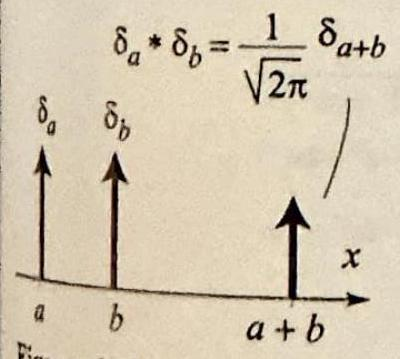

### 8.2 Operational Properties

As we saw in the previous section, the Fourier transform takes a function $f$ and produces a new function $\widehat{f}$, and the inverse transform recovers the original function $f$ from $\widehat{f}$. This process makes of transform pairs a powerful tool in solving partial differential equations. The idea, which will be explored in the following sections, is to "Fourier transform" a given equation into one that may be easier to solve. After solving the transformed equation involving $\widehat{f}$, we recover the solution of the original problem with the inverse transform. To assist us in handling the transformed equations, we will develop the operational properties of the Fourier transform. We start with a result that describes the effect of the Fourier transform on derivatives.

THEOREM 1 FOURIER TRANSFORMS OF DERIVATIVES
(i) Suppose $f(x)$ and $f^{\prime}(x)$ are integrable and $f(x) \rightarrow 0$ as $|x| \rightarrow \infty$; then

$$
\mathcal{F}\left(f^{\prime}\right)=i \omega \mathcal{F}(f) .
$$

(ii) If, in addition, $f^{\prime \prime}(x)$ is integrable and $f^{\prime}(x) \rightarrow 0$ as $|x| \rightarrow \infty$, then

$$
\mathcal{F}\left(f^{\prime \prime}\right)=i \omega \mathcal{F}\left(f^{\prime}\right)=-\omega^{2} \mathcal{F}(f) .
$$

(iii) In general, if $f^{(k)}(x) \rightarrow 0(k=1,2, \ldots, n-1)$ as $|x| \rightarrow \infty$, and $f$ and its derivatives of order up to $n$ are integrable, then

$$
\mathcal{F}\left(f^{(n)}\right)=(i \omega)^{n} \mathcal{F}(f) .
$$

Proof Parts (ii) and (iii) are obtained by repeated applications of (i). To prove
(i), we use the definition of $\mathcal{F}\left(f^{\prime}\right)$ and integrate by parts:

$$
\begin{aligned}
\mathcal{F}\left(f^{\prime}\right)(\omega) & =\frac{1}{\sqrt{2 \pi}} \int_{-\infty}^{\infty} f^{\prime}(x) e^{-i \omega x} d x \\
& =\frac{1}{\sqrt{2 \pi}}\left[\left.f(x) e^{-i \omega x}\right|_{-\infty} ^{\infty}-(-i \omega) \int_{-\infty}^{\infty} f(x) e^{-i \omega x} d x\right] \\
& =0+i \omega \mathcal{F}(f) \quad\left(\text { since } f(x) \rightarrow 0 \text { as }|x| \rightarrow \infty, \text { and }\left|e^{ \pm i \omega x}\right|=1\right)
\end{aligned}
$$

## EXAMPLE 1 Fourier transform of a derivative

Since $x e^{-x^{2}}=-\frac{1}{2} \frac{d}{d x} e^{-x^{2}}$, it follows from Theorem 1(i) that

$$
\mathcal{F}\left(x e^{-x^{2}}\right)(\omega)=-\frac{i \omega}{2} \mathcal{F}\left(e^{-x^{2}}\right)(\omega)
$$

Applying (6), Section 8.1, we obtain

$$
\mathcal{F}\left(x e^{-x^{2}}\right)(\omega)=-\frac{i \omega}{2 \sqrt{2}} e^{-\frac{\omega^{2}}{4}}
$$

THEOREM 2 DERIVATIVES OF FOURIER TRANSFORMS
(i) Suppose $f(x)$ and $x f(x)$ are integrable, then

$$
\mathcal{F}(x f(x))(\omega)=i[\hat{f}]^{\prime}(\omega)=i \frac{d}{d \omega} \mathcal{F}(f)(\omega)
$$

(ii) In general, if $f(x)$ and $x^{n} f(x)$ are integrable, then

$$
\mathcal{F}\left(x^{n} f(x)\right)=i^{n}[\hat{f}]^{(n)}(\omega)
$$

Proof Part (ii) follows from (i). To motivate (i) we will assume that we can differentiate under the integral sign as follows

$$
\begin{aligned}
{[\hat{f}]^{\prime}(\omega) } & =\frac{d}{d \omega} \frac{1}{\sqrt{2 \pi}} \int_{-\infty}^{\infty} f(x) e^{-i \omega x} d x=\frac{1}{\sqrt{2 \pi}} \int_{-\infty}^{\infty} f(x) \frac{d}{d \omega} e^{-i \omega x} d x \\
& =-\frac{i}{\sqrt{2 \pi}} \int_{-\infty}^{\infty} x f(x) e^{-i \omega x} d x=-i \mathcal{F}(x f(x))(\omega)
\end{aligned}
$$

and (i) follows upon multiplying both sides by $i$.

## EXAMPLE 2 Derivatives of Fourier transforms

(a) We can derive the Fourier transform in Example 1 by appealing to Theorem 2(i), as follows:

$$
\mathcal{F}\left(x e^{-x^{2}}\right)(\omega)=i \frac{d}{d \omega} \mathcal{F}\left(e^{-x^{2}}\right)(\omega)=i \frac{d}{d \omega}\left(\frac{1}{\sqrt{2}} e^{-\frac{\omega^{2}}{4}}\right)=-\frac{i \omega}{2 \sqrt{2}} e^{-\frac{\omega^{2}}{4}}
$$

(b) Let $a>0$. To compute the Fourier transform of the function

$$
g(x)= \begin{cases}x & \text { if }|x|<a, \\ 0 & \text { if }|x|>a,\end{cases}
$$

Figure 1 Graphs of $f(x)$ and $g(x)=x f(x)$ in Example 2. The effect of multiplying by $f(x)$ is to truncate the function $x$ for $|x|>a$.
we will use the fact that the Fourier transform of the function

$$
f(x)= \begin{cases}1 & \text { if }|x|<a, \\ 0 & \text { if }|x|>a,\end{cases}
$$

is $\mathcal{F}(f)(\omega)=\sqrt{\frac{2}{\pi}} \frac{\sin a \omega}{\omega}$ (Example 1, Section 8.1) and that $g(x)=x f(x)$ (Figure 1). Applying Theorem 2(i), it follows that

$$
\mathcal{F}(g)(\omega)=i \frac{d}{d \omega} \sqrt{\frac{2}{\pi}} \frac{\sin a \omega}{\omega}=i \sqrt{\frac{2}{\pi}} \frac{a \omega \cos (a \omega)-\sin a \omega}{\omega^{2}} .
$$ $\square$

In Example 5 of the previous section, we used an improper integral that we computed with the help of residue theory to derive the Fourier transform of the Gaussian function. We can now give another interesting indirect derivation based on the operational properties.

## EXAMPLE 3 Fourier transform of the Gaussian

Let $f(x)=e^{-a x^{2}}$, where $a>0$. A simple verification shows that $f$ satisfies the first order linear differential equation

$$
f^{\prime}(x)+2 a x f(x)=0
$$

Taking Fourier transforms and using Theorems 1 and 2, we get

$$
\omega \hat{f}(\omega)+2 a \frac{d}{d \omega}[\hat{f}](\omega)=0
$$

Thus $\widehat{f}$ satisfies a similar first order linear ordinary differential equation. Solving this equation in $\widehat{f}$, we find

$$
\widehat{f}(\omega)=A e^{-\frac{\omega^{2}}{4 a}},
$$

where $A$ is an arbitrary constant. But

$$
A=\hat{f}(0)=\frac{1}{\sqrt{2 \pi}} \int_{-\infty}^{\infty} e^{-a x^{2}} d x=\frac{1}{\sqrt{2 \pi}} \sqrt{\frac{\pi}{a}}=\frac{1}{\sqrt{2 a}}
$$

by (1), Section 5.5, and so $\mathcal{F}\left(e^{-a x^{2}}\right)(\omega)=\frac{1}{\sqrt{2 a}} e^{-\frac{\omega^{2}}{4 a}}$. $\square$

One very common operation in analysis is translation or shifting. Given a function $f(x)$ and a real number $\alpha$, the translate of $f$ by $\alpha$, denoted by $f_{\alpha}(x)$, is defined by

$$
f_{\alpha}(x)=f(x-\alpha) \text { for all } x
$$

Translating a function by $\alpha$ corresponds to multiplying its Fourier transform by $e^{-i \alpha \omega}$. We have the following theorem, whose proof is left as an exercise.

THEOREM 3 SHIFTING AND FOURIER TRANSFORMS

CONVOLUTION

THEOREM 4 FOURIER TRANSFORMS OF CONVOLUTIONS
(i) Shifting on the $x$-axis: Let $\alpha$ be arbitrary, then

$$
\mathcal{F}(f(x-\alpha))(\omega)=e^{-i \alpha \omega} \widehat{f}(\omega)
$$

(ii) Shifting on the $\omega$-axis:

$$
\mathcal{F}\left(e^{i \alpha x} f(x)\right)(\omega)=\widehat{f}(\omega-\alpha)
$$

## Convolution of Functions

We expand our list of operational properties by introducing the convolution of two functions $f$ and $g$ by
(2)

$$
f * g(x)=\frac{1}{\sqrt{2 \pi}} \int_{-\infty}^{\infty} f(x-t) g(t) d t
$$

(The factor $\frac{1}{\sqrt{2 \pi}}$ is merely for convenience. If we drop it from the definition of the convolution, it will reappear in its Fourier transform.) It can be shown that $f * g$ is also integrable whenever $f$ and $g$ are (Exercise 23). Computing a convolution is often tedious. This task can be facilitated by using the following important property of the Fourier transform, as illustrated by Example 4 below.

Suppose that $f$ and $g$ are integrable, then

$$
\mathcal{F}(f * g)=\mathcal{F}(f) \mathcal{F}(g)
$$

Theorem 4 is expressed by saying that the Fourier transform takes convolutions into products.

Proof Using the definitions of the Fourier transform and convolutions, and then interchanging the order of integration we get

$$
\begin{aligned}
\mathcal{F}(f * g)(\omega) & =\frac{1}{\sqrt{2 \pi}} \int_{-\infty}^{\infty} \frac{1}{\sqrt{2 \pi}} \int_{-\infty}^{\infty} f(x-t) e^{-i \omega x} d x g(t) d t \\
& =\frac{1}{\sqrt{2 \pi}} \int_{-\infty}^{\infty} \frac{1}{\sqrt{2 \pi}} \int_{-\infty}^{\infty} f(u) e^{-i \omega u} d u e^{-i \omega t} g(t) d t \\
& =\mathcal{F}(f)(\omega) \mathcal{F}(g)(\omega) . \quad(u=x-t, d u=d x)
\end{aligned}
$$

## EXAMPLE 4 Convolution of Gaussian functions

Let $f(x)=e^{-\alpha x^{2}}$ and $g(x)=e^{-\beta x^{2}}$ where $\alpha$ and $\beta$ are positive constants.
(a) Compute $\mathcal{F}(f * g)(\omega)$.
(b) Compute $f * g(x)$.

Solution (a) Using Theorem 4 and Example 3, we get

$$
\begin{aligned}
\mathcal{F}(f * g)(\omega) & =\mathcal{F}(f)(\omega) \mathcal{F}(g)(\omega)=\frac{1}{\sqrt{2 \alpha}} e^{-\frac{\omega^{2}}{4 \alpha}} \frac{1}{\sqrt{2 \beta}} e^{-\frac{\omega^{2}}{4 \beta}} \\
& =\frac{1}{2 \sqrt{\alpha \beta}} e^{-\frac{\alpha+\beta}{4 \alpha \beta} \omega^{2}}
\end{aligned}
$$

(b) To compute $f * g$, it suffices to find the inverse Fourier transform of (3). It is clear that we should be looking at another Gaussian function, because of the presence of the function $e^{-\omega^{2}}$. Indeed, if we let

$$
\frac{1}{4 a}=\frac{\alpha+\beta}{4 \alpha \beta} \quad \Rightarrow \quad a=\frac{\alpha \beta}{\alpha+\beta} \text { and } \frac{1}{\sqrt{2 a}}=\frac{\sqrt{\alpha+\beta}}{\sqrt{2 \alpha \beta}}
$$

then from Example 3,

Figure 2 Graphs of $f(x)= e^{-x^{2}}, f * f$ and $f * f * f * f$. The effect of the convolution is to smear out the values of the function.

$$
\mathcal{F}\left(e^{-a x^{2}}\right)=\frac{1}{\sqrt{2 a}} e^{-\frac{\omega^{2}}{4 a}}=\frac{\sqrt{\alpha+\beta}}{\sqrt{2 \alpha \beta}} e^{-\frac{\alpha+\beta}{4 \alpha \beta} \omega^{2}}
$$

To match the Fourier transform in (3), we multiply $e^{-a x^{2}}$ by $\frac{1}{2 \sqrt{\alpha \beta}}$ and divide by $\frac{\sqrt{\alpha+\beta}}{\sqrt{2 \alpha \beta}}$, thereby obtaining the function

$$
\frac{1}{2 \sqrt{\alpha \beta}} \frac{\sqrt{2 \alpha \beta}}{\sqrt{\alpha+\beta}} e^{-a x^{2}}=\frac{1}{\sqrt{2(\alpha+\beta)}} e^{-\frac{\alpha \beta}{\alpha+\beta} x^{2}}
$$

as the inverse Fourier transform of (3). Consequently, we obtain the useful convolution formula: for any $\alpha, \beta>0$,

$$
e^{-\alpha x^{2}} * e^{-\beta x^{2}}=\frac{1}{\sqrt{2(\alpha+\beta)}} e^{-\frac{\alpha \beta}{\alpha+\beta} x^{2}}
$$

Thus the convolution of two Gaussian functions is another scaled Gaussian function. This fact is at the heart of the solution of the heat problem on the real line (see Section 8.4). In Figure 2, we show the graphs of $f(x)=e^{-x^{2}}, f * f(x)=\frac{1}{2} e^{-\frac{x^{2}}{2}}$, and $f * f * f * f(x)=\frac{1}{4 \sqrt{2}} e^{-\frac{x^{2}}{4}}$. Note how the convolution smears out the values of the function.

It is clear from our answer in Example 4(a) that $f * g=g * f$. This equality holds for all $f$ and $g$ as can be seen by taking Fourier transforms:

$$
\mathcal{F}(f * g)=\mathcal{F}(f) \mathcal{F}(g)=\mathcal{F}(g) \mathcal{F}(f)=\mathcal{F}(g * f)
$$

Now taking inverse Fourier transform, we obtain

$$
f * g=g * f
$$

which expresses the fact that convolution is a commutative operation. This simple technique of the Fourier transform to establish results about convolutions has far reaching applications. We illustrate with another property of
convolutions. To simplify the statements of results, in what follows, we will always suppose that the functions in questions have enough nice properties to be able to compute Fourier transforms and inverse Fourier transforms.

THEOREM 5 CONVOLUTIONS AND DERIVATIVES

## THEOREM 6 PARSEVAL'S THEOREM

THEOREM 7 PLANCHEREL'S THEOREM

Let $n, \alpha$ and $\beta$ denote nonnegative integers, such that $n=\alpha+\beta$. Then

$$
\frac{d^{n}}{d x^{n}}(f * g)=\frac{d^{\alpha} f}{d x^{\alpha}} * \frac{d^{\beta} g}{d x^{\beta}}
$$

In particular, taking $\alpha=n$ and $\beta=0$, then $\alpha=0$ and $\beta=n$, we obtain

$$
\frac{d^{n}}{d x^{n}}(f * g)=\frac{d^{n} f}{d x^{n}} * g=f * \frac{d^{n} g}{d x^{n}}
$$

Proof To prove (6), we compute the Fourier transforms of the functions on both sides of the equality, using Theorems 1 (iii) and 4 and the fact that $n=\alpha+\beta$ :

$$
\begin{aligned}
\mathcal{F}\left(\frac{d^{n}}{d x^{n}}(f * g)\right) & =(i \omega)^{n} \mathcal{F}(f * g)=(i \omega)^{\alpha} \mathcal{F}(f)(i \omega)^{\beta} \mathcal{F}(g) \\
& =\mathcal{F}\left(\frac{d^{\alpha} f}{d x^{\alpha}}\right) \mathcal{F}\left(\frac{d^{\beta} g}{d x^{\beta}}\right)=\mathcal{F}\left(\frac{d^{\alpha} f}{d x^{\alpha}} * \frac{d^{\beta} g}{d x^{\beta}}\right)
\end{aligned}
$$

and the desired result follows by taking inverse Fourier transforms.

## Plancherel's and Parseval's Theorems

Recall that a function $f$ defined on the real line is square integrable if $\int_{-\infty}^{\infty}|f(x)|^{2} d x<\infty$. The following two important results hold for square integrable functions.

Suppose that $f$ and $g$ are square integrable functions on the real line. Then

$$
\int_{-\infty}^{\infty} f(x) \overline{g(x)} d x=\int_{-\infty}^{\infty} \hat{f}(\omega) \overline{\widehat{g}(\omega)} d \omega
$$

By taking $f=g$ in Parseval's theorem, we obtain Plancherel's theorem.
Suppose that $f$ is a square integrable function on the real line. Then

$$
\int_{-\infty}^{\infty}|f(x)|^{2} d x=\int_{-\infty}^{\infty}|\hat{f}(\omega)|^{2} d \omega
$$

Proof of Parseval's theorem Use the inverse Fourier transform to write $g(x)= \frac{1}{\sqrt{2 \pi}} \int_{-\infty}^{\infty} e^{i \omega x} \hat{g}(\omega) d \omega$, and recall that $\overline{e^{i \omega x}}=e^{-i \omega x}$. Now, assuming that we can
interchange the order of integration, we have

$$
\begin{aligned}
\int_{-\infty}^{\infty} f(x) \overline{g(x)} d x & =\int_{-\infty}^{\infty} f(x) \frac{1}{\sqrt{2 \pi}} \int_{-\infty}^{\infty} e^{-i \omega x} \overline{\hat{g}(\omega)} d \omega d x \\
& =\int_{-\infty}^{\infty} \overline{\hat{g}(\omega)} \overbrace{\frac{1}{\sqrt{2 \pi}} \int_{-\infty}^{\infty} e^{-i \omega x} f(x) d x}^{\infty} d \omega \\
& =\int_{-\infty}^{\infty} \hat{f}(\omega) \overline{\hat{g}(\omega)} d \omega
\end{aligned}
$$

which proves the theorem. $\square$

Figure 3 Graph of $\left(\frac{\sin \omega}{\omega}\right)^{2}$. The function is positive and the total area under the curve, above the $\omega$-axis is $\pi$.

Just like Parseval's identity for Fourier series was useful in summing series, Plancherel' theorem is useful in evaluating certain nontrivial integrals.

## EXAMPLE 5 An application of Plancherel's theorem

Consider the function $f(x)=1$ if $|x|<a$ and 0 otherwise, and its Fourier transform $\hat{f}(\omega)=\sqrt{\frac{2}{\pi}} \frac{\sin a \omega}{\omega}$ (see Example 1. Section 8.1). Applying Plancherel's theorem, we obtain

$$
\int_{-a}^{a}|f(x)|^{2} d x=\int_{-\infty}^{\infty}\left(\sqrt{\frac{2}{\pi}} \frac{\sin a \omega}{\omega}\right)^{2} d \omega
$$

But $f(x)=1$ for $|x|<a$, so the integral on the left is $2 a$, and hence

$$
a \pi=\int_{-\infty}^{\infty}\left(\frac{\sin a \omega}{\omega}\right)^{2} d \omega
$$

The case $a=1$ is illustrated in Figure 3. $\square$

## Generalized Functions

The need to compute Fourier transforms or inverse Fourier transforms of functions that are not integrable on the real line is clear from our first computation of a Fourier transform in Example 1, Section 8.1, all the way to the last result that concerns square integrable functions. In fact, as soon as the function is not continuous, its Fourier transform is not going to be integrable (this is a consequence of the fact that the Fourier transform of an integrable function is continuous). So we need to go beyond integrable functions. The Fourier transform can be defined in a very general setting, which is suitable for solving partial differential equations. This is the setting of generalized functions or distributions. A rigorous treatment of these objects is beyond the level of this book. However, by touching a little bit on this subject, we get a lot out of it, as far as expanding our ability to compute transforms and convolutions, even for functions that are integrable.

To motivate the topic of generalized functions, let's consider the following question: Is there an identity element for the binary operation of convolution? That is, is there a function $\phi$ such that $f * \phi=\phi * f=f$ for

Figure 4 Graphical representation of the Dirac delta function, with support at $x=0$.

all $f$ ? If such a function exists, then taking Fourier transforms, we must have $\widehat{f \phi}=\widehat{f}$, which suggests that $\widehat{\phi}$ must be identically 1 . This cannot happen if $\phi$ were integrable, by the Riemann-Lebesgue Lemma (Lemma 2, Section 8.1). So if $\phi$ exists, it is not an integrable function. If we evaluate the identity $f * \phi(x)=\phi * f(x)=f(x)$ at $x=0$, using the definition of the convolution, we get

$$
\frac{1}{\sqrt{2 \pi}} \int_{-\infty}^{\infty} f(-y) \phi(y) d y=f(0)
$$

Renaming the function $f(-y)=g(y)$ and changing the variable of integration to $x$, we see that $\phi$ must satisfy

$$
\frac{1}{\sqrt{2 \pi}} \int_{-\infty}^{\infty} g(x) \phi(x) d x=g(0)
$$

So the values of $g(x)$ for $x \neq 0$ do not affect the value of the integral of the product $\phi(x) g(x)$, which suggests that $\phi(x)=0$ for all $x \neq 0$. If you think about it, you will realize that there is no function $\phi$ that can possibly have this effect. This is one of many generalized functions that cannot be defined pointwise, as we usually define functions; instead, they are defined by the values of their integrals against functions. That is, while we do not have $\phi(x)$, for all $x$, we do have $\phi[f]=\int_{-\infty}^{\infty} f(x) \phi(x) d x$ for all $f$ in a class of functions known as the test functions. We have used the notation $\phi[f]$ to suggest that $\phi$ is a function of the test functions and not a function of real numbers. As far as we are concerned, we will not be specific about the class of test functions and we will assume that $\phi[f]$ is known at least for all continuous integrable functions.

Our first example of a generalized function is the Dirac delta function, denoted by $\delta_{0}(x)$ and defined by the values of its integrals:

$$
\int_{-\infty}^{\infty} f(x) \delta_{0}(x) d x=f(0)
$$

for all continuous functions $f$. By taking $f$ to be continuous and zero outside an interval $[a, b]$, we obtain from (10)

$$
\int_{a}^{b} f(x) \delta_{0}(x) d x= \begin{cases}f(0) & \text { if } a \leq 0 \leq b \\ 0 & \text { if } 0<a \text { or } 0>b\end{cases}
$$

It is sometimes convenient to think of $\delta_{0}$ as a function of $x$, with values $\delta_{0}(x)=0$ for all $x \neq 0$, and $\delta_{0}(0)=\infty$, and depict the function by a graph as in Figure 4.

The delta function can be used to define a formal identity for convolution.

## EXAMPLE 6 A formal identity for convolution

Show that for any continuous function $f$

$$
\delta_{0} * f(x)=\frac{1}{\sqrt{2 \pi}} f(x) \text { equivalently }\left(\sqrt{2 \pi} \delta_{0}\right) * f(x)=f(x)
$$

Solution Using (10), we have

$$
\left(\sqrt{2 \pi} \delta_{0}\right) * f(x)=\int_{-\infty}^{\infty} f(x-y) \delta_{0}(y) d y=f(x)
$$

by evaluating the function $y \mapsto f(x-y)$ at $y=0$.
Let $\alpha$ be a real number. The translate by $\alpha$ of $\delta_{0}$ is another generalized function denoted by $\delta_{\alpha}$ and defined by the values of its integral against continuous functions by

$$
\delta_{\alpha}[f]=\int_{-\infty}^{\infty} f(x) \delta_{\alpha}(x) d x=f(\alpha)
$$

Thus integrating a function $f$ against $\delta_{\alpha}$ picks up the value of $f$ at $\alpha$. Since we also have $f(\alpha)=\int_{-\infty}^{\infty} f(x+\alpha) \delta_{0}(x) d x$, thinking of $\delta_{0}$ as a function and making the change of variables $x+\alpha=X$, we find that

$$
\int_{-\infty}^{\infty} f(x) \delta_{\alpha}(x) d x=\int_{-\infty}^{\infty} f(X) \delta_{0}(X-\alpha) d X
$$

Thus, $\delta_{\alpha}(x)=\delta_{0}(x-\alpha)$. The graph of $\delta_{\alpha}(x)$ is shown in Figure 5; it is obtained by translating the graph of $\delta_{0}(x)$ by $\alpha$. So if we think of $\delta_{0}$ as being supported at the point $x=0$, then $\delta_{\alpha}$ is supported at $x=\alpha$.

An antiderivative of $\delta_{0}$ is defined by

$$
\mathcal{U}_{0}(x)=\int_{-\infty}^{x} \delta_{0}(t) d t= \begin{cases}0 & \text { if } x<0 \\ 1 & \text { if } x \geq 0\end{cases}
$$

This is the Heaviside unit step function (Figure 6). Similarly, we introduce the translates of the Heaviside function by

$$
\mathcal{U}_{\alpha}(x)=\int_{-\infty}^{x} \delta_{\alpha}(t) d t= \begin{cases}0 & \text { if } x<\alpha \\ 1 & \text { if } x \geq \alpha\end{cases}
$$

We have the formal derivative relations

$$
\mathcal{U}_{0}^{\prime}(x)=\delta_{0}(x) \quad \text { also } \quad \mathcal{U}_{\alpha}^{\prime}(x)=\delta_{\alpha}(x)
$$

We can give some meaning to these identities: The Heaviside is constant so its slope (derivative) is 0 , except at $x=\alpha$, where the values of $\mathcal{U}_{\alpha}$ jump from 0 to 1 causing an infinite slope. This reasoning with slopes allows us to carry

Figure 7 for Example 7.

## FOURIER

TRANSFORMS OF GENERALIZED FUNCTIONS
the notion of derivatives to piecewise continuous functions as illustrated by the following example.

## EXAMPLE 7 Derivatives of piecewise continuous functions

The function $f(x)$ is shown in Figure 7. Compute $f^{\prime}(x)$ and $f^{\prime \prime}(x)$.
Solution Since the function is zero for $x<-1$ or $x>1$, we have $f^{\prime}(x)=f^{\prime \prime}(x)=0$ if $x<-1$ or $x>1$. For $-1<x<0$ we have $f^{\prime}(x)=2$ and for $0<x<1$ we have $f^{\prime}(x)=-2$, as shown in Figure 7. In terms of Heaviside functions, we have

$$
f^{\prime}(x)=2 \mathcal{U}_{-1}(x)-4 \mathcal{U}_{0}(x)+2 \mathcal{U}_{1}(x) .
$$

The second derivative is 0 everywhere except at the points $-1,0$, and 1 . In order to cause $f^{\prime}(x)$ to jump the way shown in Figure 7, we place weighted $\delta$ functions at these points corresponding to the jump on the graph of $f^{\prime}(x)$. If $f^{\prime}(x)$ increases at a jump, the weight of the $\delta$ function there is positive. If $f^{\prime}(x)$ decreases at a jump, the weight of the $\delta$ function there is negative. The result is a second derivative given by

$$
f^{\prime \prime}(x)=2 \delta_{-1}(x)-4 \delta_{0}(x)+2 \delta_{1}(x)
$$

(Figure 7). Note how this can be obtained by differentiating (18) and using (17). You may be wondering about the values of $f^{\prime}(x)$ at the points $-1,0$, and 1 . You can insert $\delta$ functions at these points, but the weights have to be 0 , because $f(x)$ is continuous at these points.

We now introduce the Fourier transform of generalized functions, again by formal manipulations of identities that hold for integrable functions.
We have:

$$
\begin{aligned}
\mathcal{F}\left(\delta_{0}(x)\right)(\omega) & =\frac{1}{\sqrt{2 \pi}} \\
\mathcal{F}\left(\delta_{\alpha}(x)\right)(\omega) & =\frac{1}{\sqrt{2 \pi}} e^{-i \alpha \omega} \\
\mathcal{F}\left(\mathcal{U}_{0}(x)\right)(\omega) & =-\frac{i}{\sqrt{2 \pi} \omega} \\
\mathcal{F}\left(\mathcal{U}_{\alpha}(x)\right)(\omega) & =-\frac{i}{\sqrt{2 \pi} \omega} e^{-i \alpha \omega}
\end{aligned}
$$

Proof To prove (20), we use the definition of the Fourier transform and (10) and get

$$
\mathcal{F}\left(\delta_{0}\right)(\omega)=\frac{1}{\sqrt{2 \pi}} \int_{-\infty}^{\infty} e^{-i \omega x} \delta_{0}(x) d x=\frac{1}{\sqrt{2 \pi}} e^{-i \omega 0}=\frac{1}{\sqrt{2 \pi}}
$$

The remaining identities follow from (20) and the properties of the Fourier transform. For example, to prove (21) use Theorem 3. To prove (22) use Theorem 1: we have

$$
\mathcal{F}\left(\mathcal{U}_{0}^{\prime}\right)=i \omega \mathcal{F}\left(\mathcal{U}_{0}\right) ;
$$

but $\mathcal{U}_{0}^{\prime}=\delta_{0}$, so

$$
i \omega \mathcal{F}\left(\mathcal{U}_{0}\right)=\mathcal{F}\left(\delta_{0}\right)=\frac{1}{\sqrt{2 \pi}}
$$

which implies (22). $\square$

We can add more to these identities by applying the operational properties. For example, we can consider the $n$th derivative of $\delta_{0}$ and write

$$
\mathcal{F}\left(\delta_{\alpha}^{(n)}\right)(\omega)=\frac{(i \omega)^{n}}{\sqrt{2 \pi}} e^{-i \alpha \omega}
$$

where we have combined Theorem 1(iii) and (21). As extravagant as they may seem, these identities are very useful when used as operational properties in intermediary steps in computations. We illustrate with several examples, starting with a piecewise linear function that vanishes outside a finite interval. The function is integrable, but as is generally the case with piecewise continuous functions, computing its Fourier transform from the definition is tedious. We can use generalized functions to facilitate the task.

EXAMPLE 8 Fourier transform of a piecewise linear function Find the Fourier transform of the function $f(x)$ in Example 7.
Solution From (18), we have

$$
f^{\prime}(x)=2 \mathcal{U}_{-1}(x)-4 \mathcal{U}_{0}(x)+2 \mathcal{U}_{1}(x)
$$

So with the help of (23), we get

$$
\mathcal{F}\left(f^{\prime}\right)=2 \mathcal{F}\left(U_{-1}\right)-4 \mathcal{F}\left(U_{0}\right)+2 \mathcal{F}\left(U_{1}\right)=-\frac{i}{\sqrt{2 \pi} \omega}\left(2 e^{i \omega}-4+2 e^{-i \omega}\right)
$$

Appealing to Theorem 1(i), we have

$$
\mathcal{F}\left(f^{\prime}\right)=i \omega \mathcal{F}(f) \quad \Rightarrow \quad \mathcal{F}(f)=\frac{-i}{\omega} \mathcal{F}\left(f^{\prime}\right)
$$

and so

$$
\mathcal{F}(f)=-\frac{2 e^{i \omega}-4+2 e^{-i \omega}}{\sqrt{2 \pi} \omega^{2}}
$$

Simplifying with the help of the identity $e^{i \omega}+e^{-i \omega}=2 \cos \omega$, we obtain

$$
\mathcal{F}(f)=\frac{4(1-\cos \omega)}{\sqrt{2 \pi} \omega^{2}}
$$

which is continuous at all $\omega$, including $\omega=0$, as one would expect from the Fourier transform of an integrable function. The value of the transform at $\omega=0$ is

$$
\mathcal{F}(f)(0)=\lim _{\omega \rightarrow 0} \mathcal{F}(f)(\omega)=\lim _{\omega \rightarrow 0} \frac{4(1-\cos \omega)}{\sqrt{2 \pi} \omega^{2}}=\frac{2}{\sqrt{2 \pi}}
$$

as you can check by applying l'Hospital's rule twice. $\square$

Figure 8 The function $f(x)$ and its derivatives in Example 9.

figure 9 The convolution of ini) Dirac deltas is another kaled Dirac delta, supported "the sum of the supports.

EXAMPLE 9 Fourier transform of a piecewise smooth function
Find the Fourier transform of the function $f(x)$ in Figure 8.
Solution First we reduce the problem to finding Fourier transforms of generalized functions. Taking derivatives of $f$ (see Figure 8), we find that

$$
f^{\prime \prime}=2\left(\mathcal{U}_{-1}-\mathcal{U}_{1}\right)-2 \delta_{-1}-2 \delta_{1},
$$

where the delta functions are inserted to account for the jumps in $f^{\prime}$ at $\pm 1$. Computing the Fourier transform with the help of (21) and (23), we get

$$
\begin{aligned}
\mathcal{F}\left(f^{\prime \prime}\right) & =2 \mathcal{F}\left(\mathcal{U}_{-1}\right)-\mathcal{F}\left(\mathcal{U}_{1}\right)-2\left(\mathcal{F}\left(\delta_{-1}\right)+\mathcal{F}\left(\delta_{1}\right)\right) \\
& =\frac{-2 i}{\sqrt{2 \pi}} \frac{e^{i \omega}-e^{-i \omega}}{\omega}-\frac{2}{\sqrt{2 \pi}}\left(e^{i \omega}+e^{-i \omega}\right) \\
& =\frac{4}{\sqrt{2 \pi}} \frac{\sin \omega}{\omega}-\frac{4}{\sqrt{2 \pi}} \cos \omega
\end{aligned}
$$

Appealing to Theorem 1(ii), we have

$$
\mathcal{F}\left(f^{\prime \prime}\right)=-\omega^{2} \mathcal{F}(f) \Rightarrow \mathcal{F}(f)=\frac{-1}{\omega^{2}} \mathcal{F}\left(f^{\prime \prime}\right),
$$

and so

$$
\mathcal{F}(f)=\frac{4}{\sqrt{2 \pi} \omega^{2}}\left(\cos \omega-\frac{\sin \omega}{\omega}\right) .
$$

Again, you should verify that the transform is continuous. (Consider its Taylor series about 0 .)

We now illustrate the use of generalized functions in computing convolutions. We start with the following simple but useful identity:

$$
\delta_{a} * \delta_{b}=\frac{1}{\sqrt{2 \pi}} \delta_{a+b}
$$

This interesting identity says that the convolution of two delta functions is another scaled delta function supported at the sum of the supports of the delta functions (Figure 9). To prove (25), take Fourier transforms on both sides and use (21) (Exercise 41).

Here is an interesting application of (25).

## EXAMPLE 10 Convolution of a step function

Let $f(x)$ be the step function in Figure 10. Compute $f * f(x)$. (For the convolution of $f$ with itself $n$-times, see Exercise 46.)
Solution We have $f^{\prime}(x)=\delta_{-1}-\delta_{1}$. Also, from Theorem 5, and (25),

$$
\begin{aligned}
\frac{d^{2}}{d x^{2}}(f * f) & =f^{\prime} * f^{\prime}=\left(\delta_{-1}-\delta_{1}\right) *\left(\delta_{-1}-\delta_{1}\right) \\
& =\frac{1}{\sqrt{2 \pi}}\left(\delta_{-2}-2 \delta_{0}+\delta_{2}\right)
\end{aligned}
$$

Figure $10 f(x)$ and $f^{\prime}(x)$ in Example 10.

Figure 11 Antidifferentiation in Example 10.

Taking the antiderivative once and using (17), we find

$$
(f * f)^{\prime}=\frac{1}{\sqrt{2 \pi}}\left(U_{-2}-U_{0}+U_{2}\right),
$$

which is the step function depicted in Figure 11. To get $f * f$, we find the continuous antiderivative of $(f * f)^{\prime}$, which is 0 outside a large interval. (In fact, it can be shown that if $f$ vanishes outside a set $A$ and $g$ vanishes outside set $B$, then $f * g$ will vanish outside the set $A+B$, which consists of all real numbers of the form $x+y$, where $x$ is in $A$ and $y$ is in $B$. In our example, $f$ vanishes outside $[-1,1]$, so $f * f$ will vanish outside $[-1,1]+[-1,1]=[-2,2]$.) This is not difficult to do with the help of Figure 11, yielding the function $f * f$ in Figure 11. More explicitly, we have

$$
f * f(x)= \begin{cases}0 & \text { if } x<-2, \\ \frac{1}{\sqrt{2 \pi}}(x+2) & \text { if }-2 \leq x \leq 0, \\ -\frac{1}{\sqrt{2 \pi}}(x-2) & \text { if } 0 \leq x \leq 2, \\ 0 & \text { if } x>2 .\end{cases}
$$

The method of this example can be applied to evaluate the $n$th convolution of $f$ by itself, which in turn can be used to evaluate important improper integrals (see Exercise 47). $\square$

As you can see, the tricks with generalized functions are endless; some more will be presented in the exercises.

In the next section, we develop the Fourier transform method for solving partial differential equations on the real line. We will use this method to solve boundary value problems associated with the heat and wave equations, and a variety of other important problems on the real line and regions in the two dimensional space.

## Exercises 11.2

In Exercises 1-16 use the operational properties and a known Fourier transform to compute the Fourier transform of the given function.

1. $f(x)=x^{2} e^{-x^{2}}$.
2. $f(x)=x e^{-|x|}$.
3. $f(x)=\frac{x}{\left(1+x^{2}\right)^{2}}$.
4. $f(x)=\frac{x^{2}}{\left(1+x^{2}\right)^{2}}$.
5. $f(x)=(1+6 x) e^{-|x|}$.
6. $f(x)=e^{-x^{2}-2 x}$.
7. $f(x)=e^{-\frac{x^{2}}{2}+x-3}$.
8. $f(x)=e^{-2 x^{2}+3 i x}$.
9. 
10. 

$f(x)= \begin{cases}x & \text { if } 0<x<1, \\ 0 & \text { otherwise } .\end{cases}$

$$
f(x)= \begin{cases}0 & \text { if } x<0 \text { or } x>1, \\ x^{2} & \text { if } 0<x<1 .\end{cases}
$$

11. $f(x)=\frac{2 x}{\left(a^{2}+x^{2}\right)^{2}}, \quad a \neq 0$.
12. $f(x)=\frac{a-i x}{a^{2}+x^{2}}, \quad a \neq 0$.
13. $f(x)=\left(1-x^{2}\right) e^{-x^{2}}$.
14. $f(x)=(1-x)^{2} e^{-|x|}$.
15. $f(x)=x e^{-\frac{1}{2}(x-1)^{2}}$.
16. $f(x)=(1-x) e^{-|x-1|}$.

In Exercises 17-22, (a) find the Fourier transforms of $f$ and $g$. (b) Find the Fourier transform of $f * g$. (c) What is $f * g$ ? [Hint: Compute $f * g(x)$ using the method of Example 4. If needed, use the table of Fourier transforms (Appendix B.1) to assist you in inverting the Fourier transform of $f * g$.]
17. $f(x)=e^{-x^{2}}, g(x)=x e^{-x^{2}}$.
18. $f(x)=x e^{-x^{2}}, g(x)=x e^{-x^{2}}$.
19. $f(x)=e^{-(x-1)^{2}}, g(x)=e^{-(x+1)^{2}}$.
20. $f(x)=U_{-1}(x)-U_{1}(x), g(x)=\left(U_{-1}(x)-U_{1}(x)\right) x$.
21. $f(x)=\mathcal{U}_{-a}(x)-\mathcal{U}_{a}(x), g(x)=\mathcal{U}_{-b}(x)-\mathcal{U}_{b}(x)$, where $0<a \leq b$.
22. $f(x)=\mathcal{U}_{-1}(x)-\mathcal{U}_{1}(x)+\mathcal{U}_{2}(x)-\mathcal{U}_{3}(x), g(x)=\mathcal{U}_{-1}(x)-\mathcal{U}_{1}(x)$.
23. Basic properties of convolutions. Establish the following properties of convolutions. For (a) and (b), use operational properties of the Fourier transform.
(a) $f *(g * h)=(f * g) * h \quad$ (associativity).
(b) Let $a$ be a real number and let $f_{a}$ denote the translate of $f$ by $a$, that is, $f_{a}(x)=f(x-a)$. Show that $\left(f_{a}\right) * g=f *\left(g_{a}\right)=(f * g)_{a}$. This important property says that convolutions commute with translations.
(c) Integrability of the convolution. Show that if $f$ and $g$ are integrable, then so is $f * g$. (It is also continuous.) [Hint: Use the definition of convolution, interchange orders of integration and use $\mid \int\left(f(x) d x\left|\leq \int\right| f(x) \mid d x\right.$.]
24. (a) Show that $x(f * g)=(x f) * g+f *(x g)$. [Hint: Fourier transform.]
(b) Verify the identity in (a) with $f(x)=g(x)=e^{-x^{2}}$.
25. Convolution with a complex exponential.
(a) Show that $e^{i \alpha x} * f(x)=\widehat{f}(\alpha) e^{i \alpha x}$.
(b) Compute $\cos x * e^{-|x|}$. [Hint: $\cos x=\frac{e^{i x}+e^{-i x}}{2}$.]
26. Shifting on the $\omega$-axis. Using Theorem 3, prove the following identities:

$$
\begin{aligned}
\mathcal{F}(\cos (a x) f(x))(\omega) & =\frac{\widehat{f}(\omega-a)+\widehat{f}(\omega+a)}{2} \\
\mathcal{F}(\sin (a x) f(x))(\omega) & =\frac{\widehat{f}(\omega-a)-\widehat{f}(\omega+a)}{2 i} \\
\mathcal{F}^{-1}(\cos (a \omega) \widehat{f}(\omega))(x) & =\frac{f(x-a)+f(x+a)}{2} \\
\mathcal{F}^{-1}(\sin (a \omega) \widehat{f}(\omega))(x) & =\frac{f(x+a)-f(x-a)}{2 i}
\end{aligned}
$$

In Exercises 27-32, use Exercise 26 and known transforms to compute the Fourier transform of the given function.
27. $f(x)=\frac{\cos x}{e^{x^{2}}}$.
$28 f(x)=\frac{\sin 2 x}{e^{|x|}}$.
29. $f(x)=\frac{\cos x+\cos 2 x}{1+x^{2}}$.
30. $f(x)=\frac{\sin x+\cos 2 x}{4+x^{2}}$.
32.

31

$$
f(x)= \begin{cases}\cos x & \text { if }|x|<1 \\ 0 & \text { otherwise }\end{cases}
$$

$$
f(x)= \begin{cases}\sin x & \text { if }|x|<1 \\ 0 & \text { otherwise }\end{cases}
$$

In Exercises 33-38, follow the method of Examples 8 and 9 to compute the Fourier transform of the given function. To illustrate your answer, graph the function and its derivatives, including the parts with generalized functions.
33. $\mathcal{U}_{2}(x)-\mathcal{U}_{4}(x)$.
34. $\left(\mathcal{U}_{-1}-\mathcal{U}_{1}(x)\right)|x|$.
35. $\sum_{j=0}^{5}(-1)^{j}\left(\mathcal{U}_{j}(x)-\mathcal{U}_{j+1}(x)\right)$.
36. $\sum_{j=0}^{5}(-1)^{j}\left(\mathcal{U}_{j}(x)-\mathcal{U}_{j+1}(x)\right)(x-j)$.
37. $\left(\mathcal{U}_{0}(x)-\mathcal{U}_{1}(x)\right) x+\left(\mathcal{U}_{1}(x)-\mathcal{U}_{2}(x)\right)(2-x)$.
38. $\left(\mathcal{U}_{-1}(x)-\mathcal{U}_{1}(x)\right) x^{2}$.

In Exercises 39-40, follow the method of Example 10 to compute the given convolution.
39. $f * f * f(x)$ where $f(x)=\mathcal{U}_{-1}(x)-\mathcal{U}_{1}(x)$.
40. $f * g(x)$ where $f(x)=\mathcal{U}_{-1}(x)-\mathcal{U}_{1}(x)$ and $g(x)=\left(\mathcal{U}_{-1}-\mathcal{U}_{1}(x)\right) x$.
41. Prove (25), using the Fourier transform.
42. Fourier transforms and dilations. (a) Show that

$$
\mathcal{F}(f(a x))(\omega)=\frac{1}{|a|} \mathcal{F}(f)\left(\frac{\omega}{a}\right), \quad a \neq 0
$$

(b) Use (a) to derive the Fourier transform of $g(x)=e^{-2|x|}$ from the Fourier transform of $f(x)=e^{-|x|}$.
43. Use Plancherel's theorem to derive the value of $\int_{-\infty}^{\infty}\left(\frac{\sin x}{x}\right)^{4} d x$ in Table 1 (see Exercise 47). [Hint: Find a function whose Fourier transform is $\left(\frac{\sin \omega}{\omega}\right)^{2}$.]
44. Project Problem: Fourier transform of Bessel functions of integer order. This exercise is based on Exercise 18 of the previous section. We will derive the formula

$$
\mathcal{F}\left(J_{n}(x)\right)(\omega)= \begin{cases}\sqrt{\frac{2}{\pi}} \frac{(-i)^{n}}{\sqrt{1-\omega^{2}}} T_{n}(\omega) & \text { if }|\omega|<1 \\ 0 & \text { if }|\omega|>1\end{cases}
$$

where $T_{n}$ is the $n$th Chebyshev polynomial (see Exercise 57, Section 1.3, for definitions and properties of these polynomials).
(a) Using the operational properties of the Fourier transform and the identity $\frac{d}{d x} J_{0}=-J_{1}$, obtain the Fourier transform of $J_{1}(x)$ :

$$
\mathcal{F}\left(J_{1}(x)\right)(\omega)= \begin{cases}\sqrt{\frac{2}{\pi}} \frac{-i \omega}{\sqrt{1-\omega^{2}}} & \text { if }|\omega|<1 \\ 0 & \text { if }|\omega|>1\end{cases}
$$

Now that you have the Fourier transforms of $J_{0}$ and $J_{1}$, explain how these follow from (26) with $n=0$ and 1 .
(b) Use the identity $J_{p-1}-J_{p+1}=2 J_{p}^{\prime}$ (see Section 9.7) to derive that $\mathcal{F}\left(J_{p-1}\right)- \mathcal{F}\left(J_{p+1}\right)=2 i \omega \mathcal{F}\left(J_{p}\right)$. Conclude from what you know about the Fourier transforms of $J_{0}$ and $J_{1}$ that $J_{n}(\omega)=0$ if $|\omega|>1$ and that for $|\omega|<1 J_{n}(\omega)=\sqrt{\frac{2}{\pi}} \frac{p_{n}(\omega)}{\sqrt{1-\omega^{2}}}$,
where $p_{n}(x)$ is a polynomial of degree $n$ in $x$ satisfying the recurrence relation $p_{n-1}(x)-p_{n+1}(x)=2 i x p_{n}(x)$.
(c) Verify that $p_{0}(x)=1=T_{0}(x), p_{1}(x)=-i x=-i T_{1}(x)$. More generally, show that the $p_{n}(x)=(-i)^{n} T_{n}(x)$. [Hint: Write $p_{n}(x)=(-i)^{n} q_{n}(x)$. We have $q_{0}=T_{0}$ and $q_{1}=T_{1}$. Use the recurrence relation for the $p_{n}$ 's to show that $q_{n-1}+ q_{n+1}=2 x q_{n}$. Since this is the recurrence relation for the Chebyshev polynomials (Exercise 58(e), Section 1.3), it follows that $q_{n}=T_{n}$.]
45. Project Problem: Fourier transforms involving Bessel functions of half-integer order and Legendre polynomials. We will derive the following Fourier transform for $n=0,1,2, \ldots$,

$$
\mathcal{F}\left(\frac{J_{n+\frac{1}{2}}(x)}{\sqrt{x}}\right)(\omega)= \begin{cases}(-i)^{n} P_{n}(\omega) & \text { if }|\omega|<1, \\ 0 & \text { if }|\omega|>1,\end{cases}
$$

where $P_{n}$ is the $n$th Legendre polynomial (see Section 10.5 for definitions and properties of these polynomials). To establish the identity, proceed as follows.
(a) Show that the functions $f_{n}(x)=\frac{J_{n+\frac{1}{2}}(x)}{\sqrt{x}}$ satisfy the recurrence relation

$$
x f_{n-1}+x f_{n+1}=(2 n+1) f_{n}
$$

[Hint: Use (6), Section 9.7.]
(b) Conclude that $i \frac{d}{d \omega} \widehat{f_{n-1}}+i \frac{d}{d \omega} \widehat{f_{n+1}}=(2 n+1) \widehat{f_{n}}$.
(c) Compute $\widehat{f_{n}}$ for $n=0$ and 1 directly and show that they fit the formula (27).

Conclude from (b) that, for $n \geq 2, \widehat{f_{n}}(\omega)$ is 0 if $|\omega|>1$ and is a polynomial of degree $n$ for $|\omega|<1$.
(d) Complete the proof by showing that the functions $(-i)^{n} P_{n}(\omega)$ satisfy the recurrence relation in (b).
46. Project Problem: Convolutions of the indicator function. In this exercise we derive the following interesting formula. Let $f(x)=\mathcal{U}_{0}(x)-\mathcal{U}_{1}(x)$, and let $n \geq 2$ be an integer. Define the $n$th convolution of $f$ by itself by

$$
f^{* n}(x)=\overbrace{f * f * \cdots * f}^{n \text { of these }}
$$

Then $f^{* n}(x)=0$ if $x<0$ or $x>n$, and for $x$ in $[0, n]$, we have

$$
f^{* n}(x)=\frac{1}{(2 \pi)^{\frac{n-1}{2}}(n-1)!} \sum_{k=0}^{[x]}(-1)^{k}\binom{n}{k}(x-k)^{n-1},
$$

where $[x]$ denotes the greatest integer in $x$ and $\binom{n}{k}$ is the binomial coefficient. Follow the suggested proof and supply all the missing details by referring to appropriate operational properties of the Fourier transform and generalized functions. Suggested Proof We have

$$
\left(\frac{d}{d x}\right)^{n} f^{* n}(x)=\left(f^{\prime}\right)^{* n}(x) \quad \text { and } \quad f^{\prime}(x)=\delta_{0}(x)-\delta_{1}(x) ;
$$

so

$$
\left(f^{\prime}\right)^{* n}(x)=\frac{1}{(2 \pi)^{n-1}} \sum_{k=0}^{n}(-1)^{k}\binom{n}{k} \delta_{k}(x)
$$

To obtain (29), integrate from $-\infty$ to $x, n$-times. (You may want to do the cases $n=2$ and 3 first.)
47. Project Problem. We will derive the following formula, for $n=2,3, \ldots$,

$$
I_{n}=\int_{-\infty}^{\infty}\left(\frac{\sin x}{x}\right)^{n} d x=\frac{\pi}{(n-1)!} \sum_{k=0}^{\left[\frac{n}{2}\right]}(-1)^{k}\binom{n}{k}\left(\frac{n}{2}-k\right)^{n-1}
$$

We have already computed $I_{1}=\pi$ (with the help of residue theory) and $I_{2}=\pi$ (with the help of Plancherel's theorem). We now use the result of the previous exercise to derive the values of the integral for all other values of $n=2,3, \ldots$. It will be convenient to work with the indicator function of a symmetric interval. Let $g(x)=\mathcal{U}_{-\frac{1}{2}}(x)-\mathcal{U}_{\frac{1}{2}}(x)$. Note that $g(x)=f\left(x+\frac{1}{2}\right)$, where $f$ is as in Exercise 46. (a) Using the result of Exercise 46, show that for $x$ in $\left[-\frac{n}{2}, \frac{n}{2}\right]$,

$$
g^{* n}=\frac{1}{(2 \pi)^{\frac{n-1}{2}}(n-1)!} \sum_{k=0}^{\left[\frac{n}{2}+x\right]}(-1)^{k}\binom{n}{k}\left(x+\frac{n}{2}-k\right)^{n-1} .
$$

[Hint: The formula is obtained by translating the formula for $f^{* n}$ by $\frac{n}{2}$. To justify this, verify that if $\phi_{a}$ and $\psi_{b}$ are translates of $\phi$ and $\psi$, then $\phi_{a} * \psi_{b}=(\phi * \psi)_{a+b}$.] (b) Show that

$$
G_{n}(\omega)=\mathcal{F}\left(g^{* n}\right)=\left(\sqrt{\frac{2}{\pi}} \frac{\sin \frac{\omega}{2}}{\omega}\right)^{n}
$$

(c) Use the reciprocity relations and the fact that $\mathcal{F}(\phi)(0)=\frac{1}{\sqrt{2 \pi}} \int_{-\infty}^{\infty} \phi(x) d x$ to prove that $\frac{1}{\sqrt{2 \pi}} \int_{-\infty}^{\infty} G_{n}(x) d x=g^{* n}(0)$. Conclude that

$$
\int_{-\infty}^{\infty}\left(\frac{\sin \frac{x}{2}}{x}\right)^{n} d x=\frac{\pi}{2^{n-1}(n-1)!} \sum_{k=0}^{\left[\frac{n}{2}\right]}(-1)^{k}\binom{n}{k}\left(\frac{n}{2}-k\right)^{n-1}
$$

(d) Make a change of variables in the integral in (c) to obtain (30). In Table 1 we used (30) to compute $I_{n}$ for $n=2,3, \ldots, 8$.

| $n$ | 1 | 2 | 3 | 4 | 5 | 6 | 7 | 8 |
| :---: | :---: | :---: | :---: | :---: | :---: | :---: | :---: | :---: |
| $\int_{-\infty}^{\infty}\left(\frac{\sin x}{x}\right)^{n} d x$ | $\pi$ | $\pi$ | $\frac{3 \pi}{4}$ | $\frac{2 \pi}{3}$ | $\frac{115 \pi}{192}$ | $\frac{11 \pi}{20}$ | $\frac{5887 \pi}{11520}$ | $\frac{151 \pi}{315}$ |

Table 1

48. Give an example of two functions $f$ and $g$ such that neither one vanishes identically on any interval but $f * g$ is identically 0 . [Hint: Think on the Fourier transform side. Let $\hat{f}$ be a tent function supported over the interval ( $-2,2$ ), as in Figure 6. Define $\hat{g}$ by translating $\hat{f}$ to the left (or right) by 4 units.]
