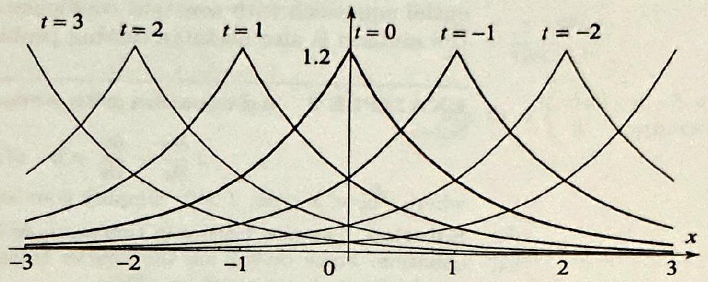

### 8.3 The Fourier Transform Method

In this section we describe a method for solving boundary value problems, where one of the variables, $x, y, z$ or $t$ belongs to the real line. These include, for example, the wave and heat equations on the real line, and Laplace's equation in upper half-plane and others.

We will be computing Fourier transforms of functions of the form $u(x, t)$, where $x$ and $t$ are the variables, and at least one of them varies in the interval $(-\infty, \infty)$, say $-\infty<x<\infty$. Because of the presence of two variables, care is needed in identifying the variable with respect to which the Fourier transform is computed. For example, for fixed $t$, the function $u(x, t)$ becomes a function of the spatial variable $x$, and as such, we can take its Fourier transform with respect to the $x$ variable. We denote this transform by $\widehat{u}(\omega, t)$. Thus

## FOURIER TRANSFORM IN THE $\boldsymbol{x}$ VARIABLE

## FOURIER TRANSFORM AND PARTIAL DERIVATIVES

Note that on the right sides of (2) and (3) we have used ordinary derivatives in $t$ instead of partial derivatives. The reason is to emphasize the crucial fact that, in applying the Fourier transform method, we will transform a partial differential equation in $u(x, t)$ into an ordinary differential equation in $\widehat{u}(\omega, t)$, where $t$ is the variable. This will become more apparent in the examples.

$$
\mathcal{F}(u(x, t))(\omega)=\widehat{u}(\omega, t)=\frac{1}{\sqrt{2 \pi}} \int_{-\infty}^{\infty} u(x, t) e^{-i \omega x} d x
$$

To illustrate the use of this notation we compute some very useful transforms. We will assume that the function $u(x, t)$, as a function of $x$, has sufficient properties that enable us to use freely the operational properties of the Fourier transform from Section 8.2.

Given $u(x, t)$ with $-\infty<x<\infty$ and $t>0$, we have

$$
\begin{gathered}
\mathcal{F}\left(\frac{\partial}{\partial t} u(x, t)\right)(\omega)=\frac{d}{d t} \widehat{u}(\omega, t) \\
\mathcal{F}\left(\frac{\partial^{n}}{\partial t^{n}} u(x, t)\right)(\omega)=\frac{d^{n}}{d t^{n}} \widehat{u}(\omega, t), \quad n=1,2, \ldots \\
\mathcal{F}\left(\frac{\partial}{\partial x} u(x, t)\right)(\omega)=i \omega \widehat{u}(\omega, t) \\
\mathcal{F}\left(\frac{\partial^{n}}{\partial x^{n}} u(x, t)\right)(\omega)=(i \omega)^{n} \widehat{u}(\omega, t), \quad n=1,2, \ldots
\end{gathered}
$$

The last two identities are consequences of (1) and Theorem 1 of Section 8.2. To prove (2) we start with the right side and differentiate under the integral sign with respect to $t$ :

$$
\frac{d}{d t} \widehat{u}(\omega, t)=\frac{1}{\sqrt{2 \pi}} \frac{d}{d t} \int_{-\infty}^{\infty} u(x, t) e^{-i \omega x} d x=\frac{1}{\sqrt{2 \pi}} \int_{-\infty}^{\infty} \frac{\partial}{\partial t} u(x, t) e^{-i \omega x} d x
$$

The last expression is the Fourier transform of $\frac{\partial}{\partial t} u(x, t)$ as a function of $x$, and (2) follows. Repeated differentiation under the integral sign with respect to $t$ yields (3).

## The Fourier Transform Method

The use of the Fourier transform to solve partial differential equations is best described by examples. We start with the wave equation.

## EXAMPLE 1 The wave equation for an infinite string

Solve the boundary value problem

$$
\begin{aligned}
\frac{\partial^{2} u}{\partial t^{2}} & =c^{2} \frac{\partial^{2} u}{\partial x^{2}} & & (-\infty<x<\infty, t>0), \\
u(x, 0) & =f(x) & & (\text { initial displacement), } \\
\frac{\partial}{\partial t} u(x, 0) & =g(x) & & (\text { initial velocity }) .
\end{aligned}
$$

Give the answer as an inverse Fourier transform.
Solution We fix $t$ and take the Fourier transform of both sides of the differential equation and the initial conditions. Using (3) and (5) with $n=2$, we get

$$
\begin{aligned}
\frac{d^{2}}{d t^{2}} \widehat{u}(\omega, t) & =-c^{2} \omega^{2} \widehat{u}(\omega, t) \\
\widehat{u}(\omega, 0) & =\widehat{f}(\omega) \\
\frac{d}{d t} \widehat{u}(\omega, 0) & =\widehat{g}(\omega)
\end{aligned}
$$

It is clear that (6) is an ordinary differential equation in $\widehat{u}(\omega, t)$, where $t$ is the variable. Let us write (6) in the standard form

$$
\frac{d^{2}}{d t^{2}} \widehat{u}(\omega, t)+c^{2} \omega^{2} \widehat{u}(\omega, t)=0
$$

The general solution of this equation is

See Appendix A. 2 for the solution of second order linear differential equations (Case III).

$$
\widehat{u}(\omega, t)=A(\omega) \cos c \omega t+B(\omega) \sin c \omega t
$$

where $A(\omega)$ and $B(\omega)$ are constant in $t$. (You should note that while $A$ and $B$ are constant in they can depend on $\omega$, which explains writing $A(\omega)$ and $B(\omega)$.) We determine $A(\omega)$ and $B(\omega)$ from the initial conditions (7) and (8) as follows:

$$
\begin{aligned}
\widehat{u}(\omega, 0)=A(\omega) & =\widehat{f}(\omega) \\
\frac{d}{d t} \widehat{u}(\omega, 0) & =c \omega B(\omega)=\widehat{g}(\omega)
\end{aligned}
$$

So

$$
\widehat{u}(\omega, t)=\widehat{f}(\omega) \cos c \omega t+\frac{1}{c \omega} \widehat{g}(\omega) \sin c \omega t
$$

To get the solution we use the inverse Fourier transform and get

$$
u(x, t)=\frac{1}{\sqrt{2 \pi}} \int_{-\infty}^{\infty}\left[\hat{f}(\omega) \cos c \omega t+\frac{1}{c \omega} \hat{g}(\omega) \sin c \omega t\right] e^{i \omega x} d \omega
$$

Formula (9) gives you the solution of the wave boundary value problem in the form of an integral involving the Fourier transform of the initial displacement and velocity. In specific cases, these transforms and the integral
can be computed explicitly. Even in its general form, (9) can be computed explicitly in terms of $f$ and $g$ to yield d'Alembert's form of the solution. (See Exercise 21.)

We summarize the Fourier transform method as follows.
Step 1: Fourier transform the given boundary value problem in $u(x, t)$ and get an ordinary differential equation in $\widehat{u}(\omega, t)$ in the variable $t$.
Step 2: Solve the ordinary differential equation and find $\widehat{u}(\omega, t)$.
Step 3: Inverse Fourier transform $\widehat{u}(\omega, t)$ to get $u(x, t)$.
This simple method is successful in treating a variety of partial differential equations. In our next example we use it to solve the heat equation on the real line. The example models the transfer of heat in a very long rod extending in both directions on the $x$-axis.

## EXAMPLE 2 The heat equation for an infinite rod

Solve the boundary value problem

$$
\begin{aligned}
\frac{\partial u}{\partial t} & =c^{2} \frac{\partial^{2} u}{\partial x^{2}} & & (-\infty<x<\infty, t>0), \\
u(x, 0) & =f(x) & & \text { (initial temperature distribution). }
\end{aligned}
$$

Give your answer in the form of an inverse Fourier transform.
Solution Fourier transforming the boundary value problem, we get

$$
\begin{aligned}
\frac{d}{d t} \widehat{u}(\omega, t) & =-c^{2} \omega^{2} \widehat{u}(\omega, t) \\
\widehat{u}(\omega, 0) & =\widehat{f}(\omega)
\end{aligned}
$$

Once again, since we are dealing with a family of differential equations (one for each $\omega$ ), we must use a different constant for each equation, which explains the use of the notation $A(\omega)$.

The general solution of the first order differential equation in $t$ is

$$
\widehat{u}(\omega, t)=A(\omega) e^{-c^{2} \omega^{2} t}
$$

where $A(\omega)$ is a constant that depends on $\omega$. Setting $t=0$ and using the transformed initial condition, we get

$$
\widehat{u}(\omega, 0)=A(\omega)=\widehat{f}(\omega)
$$

Hence

$$
\widehat{u}(\omega, t)=\widehat{f}(\omega) e^{-c^{2} \omega^{2} t}
$$

Taking inverse Fourier transforms we get the solution

$$
u(x, t)=\frac{1}{\sqrt{2 \pi}} \int_{-\infty}^{\infty} \widehat{f}(\omega) e^{-c^{2} \omega^{2} t} e^{i \omega x} d \omega
$$

Formula (10) gives you the solution of the heat boundary value problem in the form of an integral involving the Fourier transform of the initial heat distribution. In the next section, we will compute this integral and give
the answer as a convolution of $f$ and a fixed function known as the heat or Gauss's kernel.

Our next two examples illustrate the use of the Fourier transform method in solving problems with mixed and higher order derivatives.

## EXAMPLE 3 The Fourier transform method with mixed derivatives

Solve the boundary value problem

$$
\begin{aligned}
\frac{\partial^{2} u}{\partial t \partial x} & =\frac{\partial^{2} u}{\partial x^{2}}(-\infty<x<\infty, t>0) \\
u(x, 0) & =\sqrt{\frac{\pi}{2}} e^{-|x|}
\end{aligned}
$$

Figure 1 Graph of $\sqrt{\frac{\pi}{2}} e^{-|x|}$.

The function $f(x)=\sqrt{\frac{\pi}{2}} e^{-|x|}$ is shown in Figure 1.
Solution Using (2) and (4), we obtain

$$
\mathcal{F}\left(\frac{\partial^{2} u}{\partial t \partial x}\right)=\mathcal{F}\left(\frac{\partial}{\partial t} \frac{\partial u}{\partial x}\right)=\frac{d}{d t} \mathcal{F}\left(\frac{\partial u}{\partial x}\right)=i \omega \frac{d \widehat{u}}{d t}(\omega, t)
$$

Fourier transforming the differential equation and using (5), we get

$$
i \omega \frac{d \widehat{u}}{d t}(\omega, t)=-\omega^{2} \widehat{u}(\omega, t) .
$$

Solving this first order ordinary differential equation, we find

$$
\widehat{u}(\omega, t)=A(\omega) e^{i \omega t}
$$

The initial condition implies that

$$
\widehat{u}(\omega, 0)=\mathcal{F}\left(\sqrt{\frac{\pi}{2}} e^{-|x|}\right)=\frac{1}{1+\omega^{2}}
$$

and so $A(\omega)=\frac{1}{1+\omega^{2}}$. Hence

$$
\widehat{u}(\omega, t)=\frac{e^{i \omega t}}{1+\omega^{2}}
$$

and the solution $u$ is obtained by taking inverse Fourier transforms. In this case, we can determine $u$ explicitly by using the shifting property of the Fourier transform (Theorem 3(i), Section 8.2). We first note that the inverse Fourier transform of $\frac{1}{1+\omega^{2}}$ is $\sqrt{\frac{\pi}{2}} e^{-|x|}$. Hence by the shifting property,

$$
u(x, t)=\mathcal{F}^{-1}\left(\frac{e^{i \omega t}}{1+\omega^{2}}\right)=\sqrt{\frac{\pi}{2}} e^{-|x+t|}
$$

The solution is illustrated in Figure 2.

Our next example features an important use of implicit conditions that are not usually given as part of the statement of the problem.

## EXAMPLE 4 Use of implicit boundedness assumptions

Solve the boundary value problem

$$
\begin{aligned}
\frac{\partial^{2} u}{\partial t^{2}} & =\frac{\partial^{4} u}{\partial x^{4}} \quad(-\infty<x<\infty, t>0) \\
u(x, 0) & =f(x)
\end{aligned}
$$

Give your answer in the form of an inverse Fourier transform.
Solution Fourier transforming the problem gives

$$
\begin{aligned}
\frac{d^{2} \widehat{u}}{d t^{2}}(\omega, t)-\omega^{4} \widehat{u}(\omega, t) & =0 \quad\left(\text { because }(i \omega)^{4}=\omega^{4}\right) \\
\widehat{u}(\omega, 0) & =\widehat{f}(\omega)
\end{aligned}
$$

Solving the second order differential equation in $t$ yields

$$
\widehat{u}(\omega, t)=A(\omega) e^{-\omega^{2} t}+B(\omega) e^{\omega^{2} t}
$$

At this point, we impose certain boundedness conditions on $\widehat{u}(\omega, t)$. These conditions follow from the fact that the solution (in most reasonable cases) should have a bounded Fourier transform $\widehat{u}$ for all $t>0$ and $\omega$. Consequently, this assumption forces $B(\omega)=0$ for all $\omega$; otherwise, by letting $t \rightarrow \infty$, we get an unbounded Fourier transform. Hence,

$$
\widehat{u}(\omega, t)=A(\omega) e^{-\omega^{2} t}
$$

Now, using the transformed initial condition, we get

$$
\widehat{u}(\omega, t)=\widehat{f}(\omega) e^{-\omega^{2} t} .
$$

Finally, taking the inverse Fourier transform yields

$$
u(x, t)=\frac{1}{\sqrt{2 \pi}} \int_{-\infty}^{\infty} \hat{f}(\omega) e^{-\omega^{2} t} e^{i \omega x} d \omega
$$

So far we have used the Fourier transform method to solve partial differential equations with constant coefficients. As our next example illustrates, the method is also useful in solving problems with nonconstant coefficients.

## EXAMPLE 5 An equation with nonconstant coefficients

Solve

$$
t \frac{\partial u}{\partial x}+\frac{\partial u}{\partial t}=0 \quad u(x, 0)=f(x)
$$

where $-\infty<x<\infty, t>0$. Simplify your answer as much as possible.
Solution The new feature in this example is the presence of the term $t \frac{\partial u}{\partial x}$ in the equation. Since we will use the Fourier transform with respect to $x$, the variable $t$ will be treated as a constant. Thus

$$
\mathcal{F}\left(t \frac{\partial u}{\partial x}\right)=t \mathcal{F}\left(\frac{\partial u}{\partial x}\right)=i \omega t \hat{u}(\omega, t)
$$

Going back to our problem, we use the Fourier transform and get

$$
\begin{gathered}
i \omega t \widehat{u}(\omega, t)+\frac{d}{d t} \widehat{u}(\omega, t)=0, \\
\widehat{u}(\omega, 0)=\widehat{f}(\omega) .
\end{gathered}
$$

Solving the first order differential equation in $t$ yields

$$
\widehat{u}(\omega, t)=A(\omega) e^{-i \frac{t^{2}}{2} \omega}
$$

where the arbitrary constant, $A(\omega)$, is allowed to be a function of $\omega$. Putting $t=0$ implies

$$
\widehat{u}(\omega, t)=\widehat{f}(\omega) e^{-i \frac{t^{2}}{2} \omega} .
$$

To determine $u$, we appeal to Theorem 3, Section 8.2, and obtain

$$
u(x, t)=f\left(x-\frac{t^{2}}{2}\right)
$$

It is instructive to check our answer at this point. We have $u_{x}(x, t)=f^{\prime}\left(x-\frac{t^{2}}{2}\right)$; and, by the chain rule, $u_{t}(x, t)=-t f^{\prime}\left(x-\frac{t^{2}}{2}\right)$. Thus $t u_{x}+u_{t}=0$, verifying the equation. At $t=0$, we get $u(x, 0)=f(x)$, as desired. $\square$

## Exercises 11.3

In Exercises 1-6, determine the solution of the given wave or heat problem. Give your answer in the form of an inverse Fourier transform. Take the variables in the ranges $-\infty<x<\infty, t>0$.
1.

$$
\begin{aligned}
& \frac{\partial^{2} u}{\partial t^{2}}=\frac{\partial^{2} u}{\partial x^{2}} \\
& u(x, 0)=\frac{1}{1+x^{2}}, \quad \frac{\partial u}{\partial t}(x, 0)=0
\end{aligned}
$$

2. 

$$
\begin{aligned}
& \frac{\partial^{2} u}{\partial t^{2}}=\frac{\partial^{2} u}{\partial x^{2}} \\
& u(x, 0)= \begin{cases}\cos x & \text { if }-\frac{\pi}{2} \leq x \leq \frac{\pi}{2} \\
0 & \text { otherwise }\end{cases} \\
& \frac{\partial u}{\partial t}(x, 0)=0
\end{aligned}
$$

3. 

$$
\begin{aligned}
& \frac{\partial u}{\partial t}=\frac{1}{4} \frac{\partial^{2} u}{\partial x^{2}} \\
& u(x, 0)=e^{-x^{2}}
\end{aligned}
$$

5. 

$$
\begin{aligned}
& \frac{\partial^{2} u}{\partial t^{2}}=c^{2} \frac{\partial^{2} u}{\partial x^{2}} \\
& u(x, 0)=\sqrt{\frac{2}{\pi}} \frac{\sin x}{x}, \quad \frac{\partial u}{\partial t}(x, 0)=0
\end{aligned}
$$

4. 

$$
\begin{aligned}
& \frac{\partial u}{\partial t}=\frac{1}{100} \frac{\partial^{2} u}{\partial x^{2}} \\
& u(x, 0)= \begin{cases}100 & \text { if }-1<x<1 \\
0 & \text { otherwise }\end{cases}
\end{aligned}
$$

6. 

$$
\begin{aligned}
& \frac{\partial u}{\partial t}=\frac{\partial^{2} u}{\partial x^{2}} \\
& u(x, 0)= \begin{cases}1-\frac{|x|}{2} & \text { if }-2<x<2 \\
0 & \text { otherwise }\end{cases}
\end{aligned}
$$

In Exercises 7-20, solve the given problem. Take $-\infty<x<\infty$, and $t>0$.
7.

$$
\begin{aligned}
& \frac{\partial u}{\partial x}+3 \frac{\partial u}{\partial t}=0 \\
& u(x, 0)=f(x)
\end{aligned}
$$

9. 

$$
\begin{aligned}
& t^{2} \frac{\partial u}{\partial x}-\frac{\partial u}{\partial t}=0 \\
& u(x, 0)=3 \cos x
\end{aligned}
$$

8. 

$$
\begin{aligned}
& a \frac{\partial u}{\partial x}+b \frac{\partial u}{\partial t}=0 \\
& u(x, 0)=f(x)
\end{aligned}
$$

10. 

$$
\begin{aligned}
& a(t) \frac{\partial u}{\partial x}+\frac{\partial u}{\partial t}=0 \\
& u(x, 0)=f(x)
\end{aligned}
$$

11. 

$$
\begin{aligned}
& \frac{\partial u}{\partial x}=\frac{\partial u}{\partial t} \\
& u(x, 0)=f(x)
\end{aligned}
$$

13. 

$$
\begin{aligned}
& \frac{\partial u}{\partial t}=t \frac{\partial^{2} u}{\partial x^{2}} \\
& u(x, 0)=f(x)
\end{aligned}
$$

15. 

$$
\begin{aligned}
& \frac{\partial^{2} u}{\partial t^{2}}+2 \frac{\partial u}{\partial t}=-u \\
& u(x, 0)=f(x), \quad u_{t}(x, 0)=g(x)
\end{aligned}
$$

12. 

$$
\begin{aligned}
& \frac{\partial u}{\partial t}+\sin t \frac{\partial u}{\partial x}=0 \\
& u(x, 0)=\sin x
\end{aligned}
$$

14. 

$$
\begin{aligned}
& \frac{\partial u}{\partial t}=a(t) \frac{\partial^{2} u}{\partial x^{2}} \\
& u(x, 0)=f(x)
\end{aligned}
$$

where $a(t)>0$.
17.

$$
\begin{aligned}
& \frac{\partial^{2} u}{\partial t^{2}}=\frac{\partial^{4} u}{\partial x^{4}} \\
& u(x, 0)= \begin{cases}100 & \text { if }|x|<2 \\
0 & \text { otherwise }\end{cases}
\end{aligned}
$$

18. 

$$
\begin{aligned}
& \frac{\partial u}{\partial t}=t \frac{\partial^{4} u}{\partial x^{4}} \\
& u(x, 0)=f(x)
\end{aligned}
$$

19. 

$$
\begin{aligned}
& \frac{\partial^{2} u}{\partial t^{2}}=\frac{\partial^{3} u}{\partial t \partial x^{2}} \\
& u(x, 0)=f(x), \quad u_{t}(x, 0)=g(x)
\end{aligned}
$$

20. 

$$
\begin{aligned}
& \frac{\partial^{2} u}{\partial t^{2}}-4 \frac{\partial^{3} u}{\partial t \partial x^{2}}+3 \frac{\partial^{4} u}{\partial x^{4}}=0 \\
& u(x, 0)=f(x), \quad u_{t}(x, 0)=g(x)
\end{aligned}
$$

21. D'Alembert's solution of the wave equation
(a) Verify that

$$
u(x, t)=\frac{1}{2}[f(x-c t)+f(x+c t)]+\frac{1}{2 c} \int_{x-c t}^{x+c t} g(s) d s
$$

is a solution of the boundary value problem of Example 1.
(b) Derive d'Alembert's solution from (9) of this section and Theorem 3 and Exercise 26 of Section 8.2.
22. (a) Use D'Alembert's solution to describe the vibration of a very long string with $c=1, f(x)=\cos x$ for $|x| \leq \frac{\pi}{2}$ and 0 otherwise, and $g(x)=0$.
(b) Draw the shape of the string at $t=0, \pi / 4, \pi / 2, \pi$.

Project Problem. Do Exercises 23 and 24 to solve a heat problem with convection.
23. Solve the boundary value problem

$$
\begin{aligned}
\frac{\partial u}{\partial t} & =c^{2} \frac{\partial^{2} u}{\partial x^{2}}+k \frac{\partial u}{\partial x}, \quad-\infty<x<\infty, \quad t>0 \\
u(x, 0) & =f(x)
\end{aligned}
$$

This problem models heat transfer in a long heated bar that is exchanging heat with the surrounding medium. This phenomenon is called convection, and $k$ is a positive constant called the coefficient of convection. (See Exercise 10, Section 8.4, for the convolution form of the solution.)
24. Specialize Exercise 23 to the case $c=1, k=.5, f(x)=e^{-x^{2}}$.

Project Problem. In Exercises 25 and 26, you are asked to study the vibrations of a very long elastic beam.
25. The vibrations of a very long beam extending in both directions on the $x$-axis are modeled by the boundary value problem

$$
\begin{aligned}
\frac{\partial^{2} u}{\partial t^{2}} & =c^{2} \frac{\partial^{4} u}{\partial x^{4}}, & -\infty<x<\infty, t>0 \\
u(x, 0) & =f(x), & \frac{\partial u}{\partial t}(x, 0)=g(x) .
\end{aligned}
$$

Solve this problem by the Fourier transform method.
26. Specialize Exercise 25 to the case $c=1, f(x)=\delta_{0}(x), g(x)=0$, where $\delta_{0}(x)$ is the Dirac delta function.
Project Problem. Do Exercises 27 and 28.
27. Solve the boundary value problem

$$
\begin{aligned}
\frac{\partial u}{\partial t} & =c^{2} \frac{\partial^{3} u}{\partial x^{3}}, \quad-\infty<x<\infty, t>0 \\
u(x, 0) & =f(x)
\end{aligned}
$$

This equation is known as the linearized Korteweg-de Vries equation.
28. Specialize Exercise 27 to the case $c=1, f(x)=e^{-x^{2} / 2}$.
