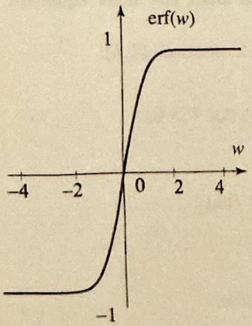
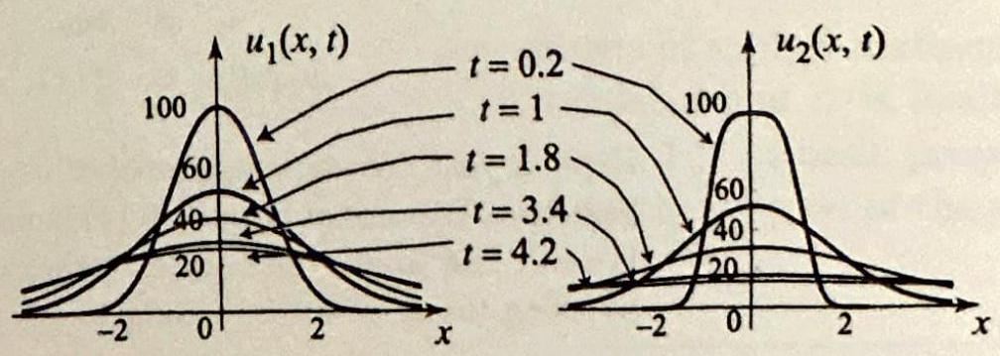

### 8.4 The Heat Equation and Gauss's Kernel
In the previous section we used the Fourier transform to solve familiar boundary value problems, such as heat and wave problems. The solution was expressed as an inverse Fourier transform involving the Fourier transforms of the initial data. For practical, numerical applications, it is desirable to evaluate the inverse Fourier transform and express the solution in terms of the initial data itself. In this and the next section we illustrate these ideas with two important applications associated with the heat equation and Dirichlet problems.

Let us start with the heat problem (Example 2, Section 8.3):

$$
\begin{aligned}
\frac{\partial u}{\partial t} & =c^{2} \frac{\partial^{2} u}{\partial x^{2}}, \quad(-\infty<x<\infty, t>0) \\
u(x, 0) & =f(x)
\end{aligned}
$$

From Example 2 of the previous section, we know that

$$
\widehat{u}(\omega, t)=\widehat{f}(\omega) e^{-c^{2} \omega^{2} t}
$$

and hence, by applying the inverse Fourier transform,

$$
u(x, t)=\frac{1}{\sqrt{2 \pi}} \int_{-\infty}^{\infty} \widehat{f}(\omega) e^{-c^{2} \omega^{2} t} e^{i \omega x} d \omega
$$

Our goal in this section is to evaluate this inverse Fourier transform in terms of $f$. We note from (2) that $\widehat{u}$ is the product of two Fourier transforms, one of them being $\widehat{f}$ and the other $e^{-c^{2} \omega^{2} t}$. Remembering that products of Fourier transforms correspond to convolutions, we see that $u$ is the convolution of $f$ with the function whose Fourier transform is $e^{-c^{2} \omega^{2} t}$. As we will see in a moment, this function is the so-called heat kernel or Gauss's kernel

$$
g_{t}(x)=\frac{1}{c \sqrt{2 t}} e^{-x^{2} / 4 c^{2} t}
$$

Figure 1 Gauss's kernel, $g_{t}(x)$, is one of the most important functions in applied mathematics. For each $t>0$, the graph of $g_{t}(x)$ is a bellshaped curve, symmetric with respect to the $y$-axis. As $t$ tends to zero, the curves become more and more localized near zero. The area under each curve is constant, even as $t$ varies (see Exercise 29).

## THEOREM 1

SOLUTION OF THE HEAT EQUATION AS A CONVOLUTION

Figure 2 The error function is the integral of a Gaussian function.

(We think of the heat kernel $g_{t}(x)$ as a family of functions of $x$; one function for each $t>0$, as illustrated in Figure 1.) This leads us to the following important result.

The solution of the heat equation (1) with initial temperature distribution $f$ is the convolution of $f$ with the heat kernel. More explicitly,

$$
u(x, t)=\frac{1}{c \sqrt{2 t}} e^{-x^{2} / 4 c^{2} t} * f=\frac{1}{2 c \sqrt{\pi t}} \int_{-\infty}^{\infty} f(s) e^{-(x-s)^{2} / 4 c^{2} t} d s
$$

Proof We have to show that the function $g_{t}(x)=\frac{1}{c \sqrt{2 t}} e^{-x^{2} / 4 c^{2} t}$ has Fourier transform $e^{-c^{2} \omega^{2} t}$. But this is immediate from Example 5 of Section 8.1, with $a=\frac{1}{4 c^{2} t}$.

With the help of (4) we can express the solution of some problems in terms of special functions that can be used to study the solution. We illustrate with the so-called error function (Figure 2), which is defined by

$$
\operatorname{erf}(w)=\frac{2}{\sqrt{\pi}} \int_{0}^{w} e^{-z^{2}} d z, \quad \text { for all } w
$$

The error function is used in different contexts of applied mathematics and probability. Its numerical values are tabulated and it is available as a standard function in most computer systems. For its basic properties, see Exercise 15. In the next example, we express the solution of the given heat problem in terms of the error function.

## EXAMPLE 1 An application of the error function

Solve the heat problem on the infinite line with $c=1$ and initial temperature distribution $f(x)=100$ if $|x|<1$ and 0 otherwise. Express your answer in terms of the error function.
Solution Applying (4), we obtain

$$
u(x, t)=\frac{50}{\sqrt{\pi t}} \int_{-1}^{1} e^{-(x-s)^{2} / 4 t} d s
$$

Let $z=\frac{x-s}{2 \sqrt{t}}, d z=\frac{-1}{2 \sqrt{t}} d s$, then

$$
\begin{aligned}
u(x, t) & =\frac{100}{\sqrt{\pi}} \int_{\frac{x-1}{2 \sqrt{t}}}^{\frac{x+1}{2 \sqrt{t}}} e^{-z^{2}} d z=\frac{100}{\sqrt{\pi}}\left(\int_{0}^{\frac{x+1}{2 \sqrt{t}}} e^{-z^{2}} d z-\int_{0}^{\frac{x-1}{2 \sqrt{t}}} e^{-z^{2}} d z\right) \\
& =50\left[\operatorname{erf}\left(\frac{x+1}{2 \sqrt{t}}\right)-\operatorname{erf}\left(\frac{x-1}{2 \sqrt{t}}\right)\right] \quad(\text { by (5))}
\end{aligned}
$$

Using this formula, we have plotted in Figure 3 the graphs of $u(x, t)$ at various values of $t$. The graphs show that initially the temperature drops fast, and then slowly it reaches the equilibrium temperature of 0 .

Figure 3 The temperature distribution in Example 1 at rarious values of $t>0$. For small values of $t$, the temperature in the bar is close to the initial temperature distribution. As $t$ increases, the temperature spreads through the bar and eventually tends to 0.

Our next example deals with a heat problem with nonconstant coefficients.

## EXAMPLE 2 A heat problem with nonconstant coefficients

Solve

$$
\begin{aligned}
u_{t} & =t u_{x x}, \quad(-\infty<x<\infty, t>0) \\
u(x, 0) & =f(x)
\end{aligned}
$$

Express your answer as a convolution.
Solution We cannot appeal to (4), since the problem here involves a new equation. We will first apply the Fourier transform method and then complete the solution by using the same ideas leading to (4). Fourier transforming the problem, we get

$$
\frac{d}{d t} \widehat{u}(\omega, t)=-t \omega^{2} \widehat{u}(\omega, t), \quad \widehat{u}(\omega, 0)=\widehat{f}(\omega)
$$

Solving this first order differential equation, we find

$$
\widehat{u}(\omega, t)=\widehat{f}(\omega) e^{-\frac{t^{2}}{2} \omega^{2}}
$$

Hence $u(x, t)$ is the convolution of $f$ with the function whose Fourier transform is
$e^{-\frac{t^{2}}{2} \omega^{2}}$. Using the result of Example 5, Section 8.1, we find that

$$
\mathcal{F}\left(\frac{e^{-\frac{x^{2}}{2 t^{2}}}}{t}\right)(\omega)=e^{-\frac{t^{2}}{2} \omega^{2}}
$$

Thus

$$
u(x, t)=f * \frac{e^{-\frac{x^{2}}{2 t^{2}}}}{t}=\frac{1}{t \sqrt{2 \pi}} \int_{-\infty}^{\infty} f(s) e^{-\frac{(x-s)^{2}}{2 t^{2}}} d s
$$

The differential equation in Example 2 can be interpreted as modeling heat transfer in a bar with time-varying thermal diffusivity equal to $t$. Thus, we expect the rate of heat transfer to vary with $t$. We next experiment with these ideas by comparing the solutions in Examples 1 and 2.

EXAMPLE 3 Varying the thermal diffusivity
(a) In Example 2, take $f$ as in Example 1, and express the solution in terms of $\operatorname{erf}(x)$.
(b) Call $u_{1}(x, t)$ the solution in Example 1 and $u_{2}(x, t)$ the solution in part (a). Plot and compare $u_{1}$ and $u_{2}$ at $t=.2,1,1.8,3.4$ and 4.2.
Solution (a) Using the given $f$ in the result of Example 2, we find

$$
\begin{aligned}
u(x, t) & =\frac{100}{t \sqrt{2 \pi}} \int_{-1}^{1} e^{-\frac{(x-s)^{2}}{2 t^{2}}} d s \\
& =\frac{100}{t \sqrt{2 \pi}} \int_{\frac{x-1}{\sqrt{2} t}}^{\frac{x+1}{\sqrt{2} t}} e^{-z^{2}}(-\sqrt{2} t) d z \quad\left(\operatorname{let} z=\frac{x-s}{\sqrt{2} t}, d z=-\frac{d s}{\sqrt{2} t}\right) \\
& =\frac{100}{\sqrt{\pi}}\left(\int_{0}^{\frac{x+1}{\sqrt{2} t}} e^{-z^{2}} d z-\int_{0}^{\frac{x-1}{\sqrt{2} t}} e^{-z^{2}} d z\right) \\
& =50\left[\operatorname{erf}\left(\frac{x+1}{\sqrt{2} t}\right)-\operatorname{erf}\left(\frac{x-1}{\sqrt{2} t}\right)\right] \quad(\text { by }(5))
\end{aligned}
$$

Figure 4 Varying the thermal diffusivity and its effect on the solution.

(b) Using this formula, we have plotted in Figure 4 the solution at the designated values of $t$. The graphs show that for small values of $t, u_{1}(x, t)$ (the temperature in Example 1) drops faster than $u_{2}(x, t)$ (the temperature in Example 2). As $t$ increases, the thermal diffusivity increases and this results in a faster rate of change of the temperature, as illustrated in the graphs at times $t=3.4$ and 4.2 .

The theory of heat that we have developed so far requires some kind of integrability conditions on the initial temperature distribution. In some
cases, however, the solution of the problem is obvious, even though the initial temperature distribution is not integrable. Consider the case of the initial temperature distribution $f(x)=1$ for all $x$. Clearly $f(x)$ is not integrable on the entire line, but intuitively the problem has a solution $u(x, t)=1$. This problem and many others can be solved by appealing to (4) directly, which proves another advantage to the convolution form of the solution. We explore these applications in the exercises.

## Exercises 11.4

In Exercises 1-14, use convolutions, the error function, and other operational properties of the Fourier transform to solve the boundary value problem. Take $-\infty<x<\infty, t>0$.
1.

$$
\begin{aligned}
& \frac{\partial u}{\partial t}=\frac{1}{4} \frac{\partial^{2} u}{\partial x^{2}} \\
& u(x, 0)= \begin{cases}20 & \text { if }-1<x<1 \\
0 & \text { otherwise }\end{cases}
\end{aligned}
$$

3. 

$$
\begin{aligned}
& \frac{\partial u}{\partial t}=\frac{\partial^{2} u}{\partial x^{2}} \\
& u(x, 0)=70 e^{-x^{2} / 2}
\end{aligned}
$$

5. 

$$
\begin{aligned}
& \frac{\partial u}{\partial t}=\frac{\partial^{2} u}{\partial x^{2}} \\
& u(x, 0)=\frac{100}{1+x^{2}}
\end{aligned}
$$

7. 

$$
\begin{gathered}
\frac{\partial u}{\partial t}=t^{2} \frac{\partial^{2} u}{\partial x^{2}} \\
u(x, 0)=f(x)
\end{gathered}
$$

9. 

$$
\begin{gathered}
\frac{\partial u}{\partial t}=e^{-t} \frac{\partial^{2} u}{\partial x^{2}} \\
u(x, 0)=f(x)
\end{gathered}
$$

2. 

$$
\begin{aligned}
& \frac{\partial u}{\partial t}=\frac{1}{100} \frac{\partial^{2} u}{\partial x^{2}} \\
& u(x, 0)= \begin{cases}100 & \text { if }-2<x<0 \\
50 & \text { if } 0<x<1 \\
0 & \text { otherwise }\end{cases}
\end{aligned}
$$

4. 

$$
\begin{aligned}
& \frac{\partial u}{\partial t}=\frac{\partial^{2} u}{\partial x^{2}} \\
& u(x, 0)= \begin{cases}100\left(1-\frac{|x|}{2}\right) & \text { if }-2 \leq x \leq 2 \\
0 & \text { otherwise. }\end{cases}
\end{aligned}
$$

6. 

$$
\begin{aligned}
& \frac{\partial u}{\partial t}=\frac{\partial^{2} u}{\partial x^{2}} \\
& u(x, 0)=e^{-|x|}
\end{aligned}
$$

8. 

$$
\begin{aligned}
& \frac{\partial^{2} u}{\partial t^{2}}=\frac{\partial^{4} u}{\partial x^{4}} \\
& u(x, 0)=f(x)
\end{aligned}
$$

10. 

$$
\begin{aligned}
& \frac{\partial u}{\partial t}=c^{2} \frac{\partial^{2} u}{\partial x^{2}}+k \frac{\partial u}{\partial x} \quad(k>0) \\
& u(x, 0)=f(x)
\end{aligned}
$$

11. 

$$
\begin{aligned}
& \frac{\partial u}{\partial t}=a(t) \frac{\partial^{2} u}{\partial x^{2}} \\
& u(x, 0)=f(x)
\end{aligned}
$$

12. 

$$
\begin{aligned}
-\frac{\partial^{2} u}{\partial x^{2}} & =\frac{\partial^{2} u}{\partial t^{2}}+2 \frac{\partial^{2} u}{\partial t \partial x} \\
u(x, 0) & =f(x)
\end{aligned}
$$

where $a(t)>0$.
13. Solve Exercise 9 with $f(x)$ as in Example 1. Compare your solution to that of Example 1. Model your answer after Example 3.
14. Solve Exercise 11 with $a(t)=e^{t}$ and $f(x)$ as in Example 1. Compare your solution to that of Example 1. Model your answer after Example 3.
15. Project Problem: Basic properties of the error function. Establish the following.
(a) $\operatorname{erf}(-x)=-\operatorname{erf}(x)$ (erf is an odd function).
(b) $\operatorname{erf}(0)=0, \operatorname{erf}(\infty)=1$.
(c) $\frac{d}{d x} \operatorname{erf}(x)=\frac{2}{\sqrt{\pi}} e^{-x^{2}}$. Conclude that erf is strictly increasing.
(d) $\int \operatorname{erf}(x) d x=x \operatorname{erf}(x)+\frac{1}{\sqrt{\pi}} e^{-x^{2}}+C$. [Hint: Integration by parts.]
(e) $\operatorname{erf}(x)=\frac{2}{\sqrt{\pi}} \sum_{n=0}^{\infty} \frac{(-1)^{n}}{n!(2 n+1)} x^{2 n+1}$.
16. The complementary error function is defined by

$$
\operatorname{erfc}(w)=\frac{2}{\sqrt{\pi}} \int_{w}^{\infty} e^{-z^{2}} d z, \quad \text { for all } w
$$

(a) Show that $\operatorname{erf}(w)+\operatorname{erfc}(w)=\frac{2}{\sqrt{\pi}} \int_{0}^{\infty} e^{-z^{2}} d z=1$.
(b) Conclude that $\operatorname{erfc}(w)=1-\operatorname{erf}(w)$.
(c) Use the graph of the error function to plot the complementary error function.
17. (a) Use convolution to solve the heat problem with given initial temperature distribution $f(x)=T_{0}$ for $a<x<b$ and 0 otherwise.
(b) Express your answer in terms of the error function.
18. Consider the heat problem of Example 1. Vary $c$ by taking $c=1, c=2$, $c=1 / 2$. Plot the corresponding solution $u(x, t)$ for $-10<x<10$ and $0<t<20$. What can you say about the propagation of heat as a function of $c$ ? Justify your answer using the graphs.
19. Constant function as an initial temperature distribution. It is obvious that if we take the initial temperature distribution $f(x)$ to be identically equal to 1 , then the solution of the heat equation (1) is $u(x, t)=1$ for all $x$ and $t>0$. Use (4) to confirm this fact.
20. A step function as an initial temperature distribution.
(a) Use (4) to show that if the initial temperature distribution is $f(x)=T_{0}$ if $x>0$ and 0 otherwise, then

$$
u(x, t)=\frac{T_{0}}{2}\left[1+\operatorname{erf}\left(\frac{x}{2 c \sqrt{t}}\right)\right]
$$

(b) Plot the solution for several values of $t>0$. What do you observe? Do the graphs meet with your expectation?

## 21. Dirac delta function as an initial temperature distribution.

To analyze the temperature response to an application of a welding torch to a rod at a point $x_{0}$, we can take the initial temperature distribution to be $f(x)=\delta_{0}\left(x-x_{0}\right)$, where $\delta_{0}$ is the Dirac delta function.
(a) Use (4) to show that

$$
u(x, t)=\frac{1}{2 c \sqrt{\pi t}} e^{-\left(x-x_{0}\right)^{2} /\left(4 c^{2} t\right)}
$$

(b) Take $x_{0}=0, c=1$, and plot the graphs of $u(x, t)$ for $-10<x<10$ and $t=.01, .05,0.1,0.5,1,5,10,15$. Describe what you observe on the graphs.
22. Let $f(x)=\frac{\sin x}{x}$ be the initial temperature distribution in an infinite rod with $c=1$.
(a) Use (3) to obtain that $u(x, t)=\int_{0}^{1} e^{-\omega^{2} t} \cos \omega x d \omega$.
(b) Verify that the answer in (a) is indeed a solution by plugging into the equation and checking the initial values.
(c) Show that $u(0, t)=\frac{\sqrt{\pi}}{2 \sqrt{t}} \operatorname{erf}(\sqrt{t})$. What is the physical interpretation of this function?
(d) How long does it take for the temperature at $x=0$ to drop by 80 percent?
23. Shifting the initial data. If you shift the initial temperature distribution by $a$ units, that is, if you replace $f(x)$ by $f(x-a)$, you would expect the solution to be shifted by the same amount on the $x$-axis. Confirm this fact by using (4) to show that if $f(x)$ is replaced by $f(x-a)$, then the solution becomes $u(x-a, t)$. [Hint: Change variables.]
24. Initial Gaussian temperature distribution. Use the result of Example 4, Section 8.2, to show that the solution of the heat equation (1) with initial temperature distribution $f(x)=e^{-k x^{2}},(k>0)$, is

$$
u(x, t)=\frac{1}{\sqrt{4 k c^{2} t+1}} e^{\frac{-k x^{2}}{4 k c^{2} t+1}}
$$

In Exercises 25-28, (a) use the results of Exercise 23 and 24 to solve the heat equation (1) subject to the given initial temperature distribution.
(b) Illustrate your answer by plotting the solution for various values of $t$.
25. $f(x)=e^{-(x-1)^{2}}$.
26. $f(x)=100 e^{-(x+1)^{2}}$.
27. $f(x)=e^{-(x-2)^{2} / 2}$.
28. $f(x)=e^{-(x-2)^{2}}$.

## 29. Project Problem: Properties of Gauss's kernel.

Establish the following properties of Gauss's kernel:

$$
g_{t}(x)=\frac{1}{c \sqrt{2 t}} e^{-x^{2} / 4 c^{2} t} \quad(c>0, t>0,-\infty<x<\infty)
$$

(a) $g_{t}(x)$ is an even function of $x$, and $g_{t}(x) \geq 0$ for all $x$.
(b) The graph of $g_{t}(x)$ is a bell-shaped curve centered at the origin. Verify this assertion by plotting $g_{t}(x)$ for $c=1$ and $t=1,2,3$.
(c) $\quad \lim _{t \rightarrow 0} g_{t}(0)=\infty$. (As $t$ tends to 0 , the graph of $g_{t}(x)$ becomes more and more localized near 0 , in the sense that most of the total area under the graph and above the $x$-axis becomes concentrated near 0 . Again, you can verify this assertion
graphically.)
(d) The total area under the graph of $g_{t}(x)$ and above the $x$-axis is $\int_{-\infty}^{\infty} g_{t}(x) d x= \sqrt{2 \pi}$.
(e) The Fourier transform of $g_{t}(x)$ is $\hat{g}_{t}(\omega)=e^{-c^{2} t \omega^{2}}$.
(f) If $f$ is an integrable and piecewise smooth function, then at its points of continuity, we have

$$
\lim _{t \rightarrow 0} g_{t} * f(x)=f(x)
$$

Justify this assertion on the basis of what it means in terms of the solution of the heat problem. Alternatively, you can use the Fourier transform and the fact that $\lim _{t \rightarrow 0} \mathcal{F}\left(g_{t}\right)(\omega)=1$, which is a consequence of $(\mathrm{e})$.
