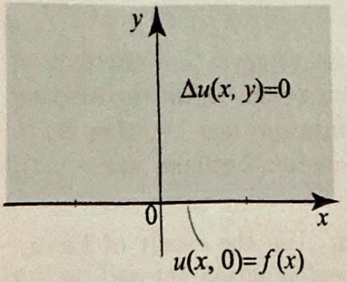

### 8.5 The Poisson Integral and the Hilbert Transform

Consider the Dirichlet problem in the upper half-plane (Figure 1)

Figure 1 Dirichlet problem in the upper half-plane.

Figure 2 The Poisson kernel.

$$
\begin{gathered}
\Delta u=\frac{\partial^{2} u}{\partial x^{2}}+\frac{\partial^{2} u}{\partial y^{2}}=0, \quad(-\infty<x<\infty, y>0) \\
u(x, 0)=f(x), \quad(\text { boundary values }) .
\end{gathered}
$$

The problem is asking us to find a harmonic function $u(x, y)$ in the upper half-plane, which tends to a given function $f(x)$ as we approach the boundary of the upper-half plane, namely the $x$-axis. We have solved this problem in Theorem 1, Section 6.3, using conformal mappings and the Poisson integral formula on the disk. For ease of reference, let us recall the solution

$$
u(x, y)=\frac{y}{\pi} \int_{-\infty}^{\infty} \frac{f(s)}{(x-s)^{2}+y^{2}} d s=P_{y} * f(x)
$$

This is the Poisson integral formula, or the Poisson integral of $f$, which expresses $u(x, y)$ as the convolution of the boundary function $f(x)$ with the Poisson kernel (Figure 2)

$$
P_{y}(x)=\sqrt{\frac{2}{\pi}} \frac{y}{x^{2}+y^{2}} \quad(-\infty<x<\infty, y>0) .
$$

The fact that the solution is a convolution suggests that the Fourier transform can be used to our advantage. Indeed, our next step is to show how to derive (3), using the Fourier transform method. We will then show how the conjugate function of the solution can be constructed by using the boundary function $f(x)$ and a certain convolution, known as the Hilbert transform. This will establish a connection between analytic functions in the upper half-plane and Fourier analysis of functions on the real line.

## EXAMPLE 1 Fourier transform derivation of th Poisson formula

To derive (3), Fourier transform (1) and (2) with respect to the $x$ variable and get

$$
-\omega^{2} \widehat{u}(\omega, y)+\frac{d^{2}}{d y^{2}} \widehat{u}(\omega, y)=0 ; \quad \widehat{u}(\omega, 0)=\widehat{f}(\omega)
$$

Solving the differential equation in $\widehat{u}(\omega, y)$ we get

$$
\widehat{u}(\omega, y)=A(\omega) e^{-\omega y}+B(\omega) e^{\omega y} .
$$

As in the solution of Example 4 of Section 8.3, we impose a boundedness condition on $\widehat{u}(\omega, y)$. This forces $A(\omega)=0$ if $\omega<0$, and $B(\omega)=0$ if $\omega>0$. Thus we may write $\widehat{u}(\omega, y)=C(\omega) e^{-y|\omega|}$. Setting $y=0$, and using the transformed boundary condition we get

$$
\widehat{u}(\omega, y)=\widehat{f}(\omega) e^{-y|\omega|} .
$$

Recall from Example 4, Section 8.1, the Fourier transform of the Poisson kernel

$$
\widehat{P}_{y}(\omega)=\mathcal{F}\left(\sqrt{\frac{2}{\pi}} \frac{y}{x^{2}+y^{2}}\right)(\omega)=e^{-y|\omega|}
$$

Hence $\widehat{u}(\omega, y)=\widehat{f}(\omega) \widehat{P}_{y}(\omega)$, and so by Theorem 4, Section 8.2, it follows that $u$ is the convolution of $f$ with $P_{y}(x)$, as claimed.

As stated, the Dirichlet problem (1)-(2) does not have a unique solution, due to the failure of the maximum modulus principle on unbounded regions (see Sections 3.7 and 3.8). To see this, consider the function $v(x, y)=y$. You can check that $v(x, y)$ satisfies (1) and equals 0 on the $x$-axis. So, if $u(x, y)$ is any solution of (1) and (2), then $u(x, y)+y$ is also a solution. Hence the solution of (1) and (2) is not unique. This is troublesome, since we tend to think of a Dirichlet problem as modeling a steady-state problem, and as such, we want the solution to be unique. What is happening here is that by stating (1) and (2), we did not impose enough conditions to ensure the uniqueness of the solution. It can be shown that by adding boundedness conditions to (1) and (2), for example,

$$
|u(x, y)| \leq M, \quad \text { for all } x \text { and all } y>0
$$

then the resulting problem will have a unique bounded solution given by the Poisson integral formula (3), whenever the boundary function $f(x)$ is bounded. In our treatment, we will always assume such boundedness assumptions and thus speak of a unique solution of the Dirichlet problem.

Several applications of the Poisson integral formula were derived in Section 6.3. We add one more application that involves a Dirichlet problem with a Dirac delta applied on the boundary.

## EXAMPLE 2 Effect of a Dirac delta on the boundary

Consider the Dirichlet problem in the upper half-plane with boundary data given by

$$
u(x, 0)=\sqrt{2 \pi} \delta_{0}(x)
$$

Such a problems arises when modeling the steady-state temperature distribution resulting from the application of a welding torch (very high temperature) at a point
of the boundary of a long sheet of metal with insulated surface. The constant $\sqrt{2 \pi}$ is added for convenience, as you will see from the solution. Solve this problem and describe the isotherms.
Solution According to (3), the solution is $u(x, y)=P_{y} *\left(\sqrt{2 \pi} \delta_{0}\right)(x)$. But $\sqrt{2 \pi} \delta_{0}$ is a unit for the convolution operation (see Example 6, Section 8.2), so

$$
u(x, y)=P_{y} *\left(\sqrt{2 \pi} \delta_{0}\right)(x)=P_{y}(x)=\sqrt{\frac{2}{\pi}} \frac{y}{x^{2}+y^{2}}
$$

Thus the solution is the Poisson kernel.
To find the isotherms in this problem, we must determine the level curves of the Poisson kernel:

$$
\sqrt{\frac{2}{\pi}} \frac{y}{x^{2}+y^{2}}=T \quad \Rightarrow \quad x^{2}+\left(y-\frac{1}{T \sqrt{2 \pi}}\right)^{2}=\frac{1}{2 T^{2} \pi}
$$

Thus the isotherm corresponding to $T>0$ is the portion in the upper half-plane of the the circle centered on the $y$-axis at $\left(0, \frac{1}{T \sqrt{2 \pi}}\right)$ with radius $\frac{1}{\sqrt{2 \pi} T}$. Note that there is no restriction on $T>0$, which makes sense on physical grounds, since this problem is supposed to model the application of a very high temperature at the point 0 . So no matter how large is the value of $T$, we can always find points in the upper half-plane with temperature $T$. As $T \rightarrow \infty$, the radius of the isotherm tends to 0 , which means that the points are closer to the origin. As $T \rightarrow 0$, the radius tends to $\infty$, which corresponds to points that are far away from the origin.

Example 2 raises two questions. Being the solution of a Dirichlet problem with boundary values $\sqrt{2 \pi} \delta_{0}(x), P_{y}(x)$ must be harmonic in the upper halfplane and must tend to $\sqrt{2 \pi} \delta_{0}(x)$ as $y \rightarrow 0$. Is $P_{y}(x)$ harmonic in the upper half-plane and in what sense does it tend to $\sqrt{2 \pi} \delta_{0}(x)$ as $y \rightarrow 0$ ? The answer to the first question is easy to verify directly. We have the following useful result.

THEOREM 1 HARMONICITY OF THE POISSON KERNEL

The Poisson kernel $P_{y}(x)=\sqrt{\frac{2}{\pi}} \frac{y}{x^{2}+y^{2}}$ is harmonic for all $(x, y) \neq(\mathbf{0}, \mathbf{0})$. Moreover, it has a harmonic conjugate (called the conjugate Poisson kernel) given by
(6)

$$
Q_{y}(x)=\sqrt{\frac{2}{\pi}} \frac{x}{x^{2}+y^{2}}, \quad(x, y) \neq(0,0)
$$

Proof To prove both assertions, consider the function $F(z)=\sqrt{\frac{2}{\pi}} \frac{i}{z}$ for $z \neq 0$. This function is analytic for all $z \neq 0$. Writing $z=x+i y$ and expressing $F$ in terms of its real and imaginary parts, we find that

$$
F(z)=\sqrt{\frac{2}{\pi}} \frac{i}{x+i y}=\sqrt{\frac{2}{\pi}} \frac{i(x-i y)}{x^{2}+y^{2}}=P_{y}(x)+i Q_{y}(x)
$$

THEOREM 2 HARMONIC CONJUGATE

Thus $P_{y}(x)$ and $Q_{y}(x)$ are the real and imaginary parts of an analytic function for $(x, y) \neq(0,0)$ and as such they are harmonic and $Q_{y}(x)$ is a harmonic conjugate of $P_{y}(x)$. $\square$

The answer to the second question that we raised following Example 2 is more involved, since we are talking about the convergence of a function $P_{y}(x)$ to a Dirac delta, which is not a function. The concept of convergence that we need is called weak convergence. Even though we will not study it in this book, we can motivate it as follows. Look at the graphs of $P_{y}(x)$, as $y \rightarrow 0$ (Figure 2). These graphs become more and more concentrated around 0 ; while the total area under each graph is

$$
\int_{-\infty}^{\infty} P_{y}(x) d x=\sqrt{2 \pi}=\int_{-\infty}^{\infty} \sqrt{2 \pi} \delta_{0}(x) d x
$$

So, as $y \rightarrow 0$, the graph of $P_{y}(x)$ approximates the graph of $\sqrt{2 \pi} \delta_{0}(x)$ : It is almost 0 for $x \neq 0$ and infinite for $x=0$, and the total area under the graph is $\sqrt{2 \pi}$, which is the integral of $\sqrt{2 \pi} \delta_{0}(x)$. It can also be shown that $\lim _{y \rightarrow 0} \frac{1}{\sqrt{2 \pi}} \int_{-\infty}^{\infty} P_{y}(x) f(x) d x=\int_{-\infty}^{\infty} f(x) \delta_{0}(x) d x=f(0)$, for all integrable and continuous $f$. This limit can be used to define the notion of weak convergence of $\frac{1}{\sqrt{2 \pi}} P_{y}(x)$ to $\delta_{0}$ (equivalently, the weak convergence of $P_{y}(x)$ to $\sqrt{2 \pi} \delta_{0}$ ).

## Harmonic Conjugate and Hilbert Transform

In many interesting applications, including finding the curves of heat flow in steady-state problems, we are required to compute the harmonic conjugate of the solution of th Dirichlet problem in the upper half-plane. If $u(x, y)$ is a solution of (1) and (2), recall that by a harmonic conjugate of $u$, we mean a harmonic function $v(x, y)$ in the upper half-plane, such that $u(x, y)+i v(x, y)$ is analytic. Since the upper half-plane is simply connected, the existence of a harmonic conjugate is guaranteed by Theorem 1, Section 3.8, which also provides a formula for computing the harmonic conjugate. Our goal is to describe a formula for constructing a harmonic conjugate of $u(x, y)$ in terms of the boundary function $f(x)$. We start by giving a formula for the harmonic conjugate of $u(x, y)$ in the upper half-plane. As we would expect, this formula involves the conjugate Poisson kernel, $Q_{y}$.

Let $u(x, y)=P_{y} * f(x)$ denote the solution of the Dirichlet problem (1)-(2) in the upper half-plane. Then a harmonic conjugate of $u(x, y)$ is given by

$$
v(x, y)=Q_{y} * f(x)=\frac{1}{\pi} \int_{-\infty}^{\infty} f(x-s) \frac{s}{s^{2}+y^{2}} d s \quad(y>0)
$$

where $Q_{y}$ is the conjugate Poisson kernel (6).

Formula (7) is known as the conjugate Poisson integral of $\boldsymbol{f}$. We will not prove this theorem, but only motivate (7) by proceeding formally from the Poisson integral formula. Let us write $P_{y}(x)$ as $P(x, y)$; then the Poisson formula becomes

$$
u(x, y)=\frac{1}{\sqrt{2 \pi}} \int_{-\infty}^{\infty} P(x-s, y) f(s) d s
$$

Similarly, from (7), we have

$$
v(x, y)=\frac{1}{\sqrt{2 \pi}} \int_{-\infty}^{\infty} Q(x-s, y) f(s) d s
$$

From Theorem 1, $Q(x, y)$ is harmonic and so its translate, $Q(x-s, y)$, is also harmonic for any $s$ (see Exercise 23, Section 2.5). Suppose that we can differentiate under the integral signs. Then to compute the Laplacian of $\Delta v$, we write

$$
\Delta v(x, y)=\frac{1}{\sqrt{2 \pi}} \int_{-\infty}^{\infty} \Delta[Q(x-s, y)] f(s) d s=0
$$

because $Q(x-s, y)$ is harmonic and so $\Delta[Q(x-s, y)]=0$. This shows that $v(x, y)$ is harmonic in the upper half-plane. To show that $v$ is a harmonic conjugate of $u$, again we can show that $u$ and $v$ satisfy the Cauchy-Riemann equations, by differentiating under the integral signs and using the fact that $P(s, y)$ and $Q(s, y)$ satisfy these equations, because $Q(s, y)$ is a harmonic conjugate of $P(s, y)$ (Theorem 1).

Continuing our formal manipulation of the Poisson and conjugate Poisson integral of $f$, we ask: What is the limit of $Q_{y} * f(x)$ as $y \rightarrow 0$ ? That is, we are asking for the boundary values of the harmonic conjugate of the solution of the Dirichlet problem (1)-(2). To answer this question, we can take the limit as $y \rightarrow 0$ in (7). This gives

$$
\lim _{y \rightarrow 0} Q_{y} * f(x)=\frac{1}{\pi} \int_{-\infty}^{\infty} \frac{f(x-s)}{s} d s
$$

This integral is improper at $s=0$ and $\pm \infty$. In computing it, we will take its principal value. Formula (8) is a convolution of $f$ with the kernel $\frac{1}{\sqrt{2 \pi} s}$. This important convolution arises in many different contexts of applied mathematics and engineering. It is called the Hilbert transform of $f$, and denoted $H(f)$. Thus

$$
H(f)(x)=\frac{1}{\pi} \int_{-\infty}^{\infty} \frac{f(x-s)}{s} d s=\lim _{y \rightarrow 0} Q_{y} * f(x)
$$

where the integral is to be computed as a principal value integral. There are several difficulties in studying the Hilbert transform, due in part to the
fact that the kernel of this transform is not integrable. The results that we present are true in a very general setting, but their rigorous treatment requires a level beyond the level of this book. We will continue our formal presentation and treat this transform as we did with generalized functions.

One of the most important features of the Hilbert transform is its effect on the Fourier transform of $f$.

THEOREM 3 FOURIER TRANSFORM OF THE HILBERT TRANSFORM

Let $f(x)$ be defined and integrable on the real line, and let $H(f)(x)$ denote its Hilbert transform. Then

$$
\widehat{H f}(\omega)=-i \operatorname{sgn}(\omega) \widehat{f}(\omega) \quad(-\infty<\omega<\infty) .
$$

Thus the effect of the Hilbert transform is to multiply the Fourier transform of $f$ by $-i \operatorname{sgn} \omega$.

Proof We have

$$
\begin{aligned}
\widehat{H f}(\omega) & =\frac{1}{\sqrt{2 \pi}} \int_{-\infty}^{\infty} H(f)(x) e^{-i \omega x} d x=\frac{1}{\sqrt{2 \pi}} \int_{-\infty}^{\infty} \frac{1}{\pi} \int_{-\infty}^{\infty} \frac{f(x-s)}{s} d s e^{-i \omega x} d x \\
& =\frac{1}{\sqrt{2 \pi}} \int_{-\infty}^{\infty} f(x) e^{-i \omega x} d x \frac{1}{\pi} \int_{-\infty}^{\infty} \frac{e^{-i \omega x}}{s} d s=\widehat{f}(\omega) \frac{1}{\pi} \int_{-\infty}^{\infty} \frac{e^{-i \omega s}}{s} d s
\end{aligned}
$$

The last integral is evaluated by using a change of variables and the integral $\frac{1}{\pi} \int_{-\infty}^{\infty} \frac{\sin s}{s} d s=1$ (see Exercise 21, Section 5.4). We have

$$
\frac{1}{\pi} \int_{-\infty}^{\infty} \frac{e^{-i \omega s}}{s} d s=\frac{-i}{\pi} \int_{-\infty}^{\infty} \frac{\sin (\omega s)}{s} d s=-i \operatorname{sgn}(\omega)
$$

and (10) follows. $\square$

Let us recap what we have so far. Starting with a function $f(x)$ defined on the real line, we can form its Poisson integral $u(x, y)=P_{y} * f(x)$. This function is harmonic in the upper half-plane and tends to $f(x)$ as $y \rightarrow 0$. If we take the harmonic conjugate of $u$, we obtain the conjugate Poisson integral of $f, v(x, y)=Q_{y} * f$. This function is harmonic in the upper half-plane and tends to $H(f)(x)$, the Hilbert transform of $f$, as $y \rightarrow 0$. So the conjugate Poisson integral of $f, Q_{y} * f(x)$, has boundary values the Hilbert transform of $f, H(f)(x)$. This suggests that the conjugate Poisson integral can be constructed from the Hilbert transform in much the same way we construct $u(x, y)$ from its boundary values $f(x)$. Indeed, we have the following interesting result.

THEOREM 4 HILBERT TRANSFORM AND CONJUGATE POISSON INTEGRAL

Let $f(x)$ be defined and integrable on the real line, and let $H(f)(x)$ denote its Hilbert transform. Then

$$
v(x, y)=Q_{y} * f(x)=P_{y} *(H f)(x) .
$$

In other words, the conjugate Poisson integral of $f$ is the Poisson integral of its Hilbert transform.
Proof We will prove (11) by using the Fourier transform. Fix $y$ and consider the functions in (11) as functions of $x$. Taking the Fourier transform and using Theorem 4, Section 8.2, we have

$$
\left.\widehat{Q_{y} * f}(\omega)=\widehat{Q_{y}}(\omega) \hat{f}(\omega) \text { and } \widehat{P_{y} *(H f}\right)(\omega)=\widehat{P_{y}}(\omega) \widehat{(H f)}(\omega) .
$$

But $Q_{y}(x)=\frac{x}{y} P_{y}(x)$, and so from (5) and Theorem 2, Section 8.2,

$$
\widehat{Q_{y}}(\omega)=\frac{i}{y} \frac{d}{d \omega} \widehat{P_{y}}(\omega)=-i \operatorname{sgn}(\omega) e^{-y|\omega|}=-i \operatorname{sgn}(\omega) \widehat{P_{y}}(\omega)
$$

From Theorem 3, we have $\widehat{(H f)}(\omega)=-i \operatorname{sgn}(\omega) \hat{f}(\omega)$. Plugging back into (12), it follows that $\left.\widehat{Q_{y} * f}(\omega)=\widehat{P_{y} *(H} f\right)(\omega)$, and hence (11) holds.

It is time to give an example with the Hilbert transform.
EXAMPLE 3 Hilbert transforms
(a) Find $H(\sin x)$.
(b) Show that $H\left(P_{y}\right)(x)=Q_{y}(x)$.

Solution (a) We have

$$
\begin{aligned}
H(\sin x) & =\frac{1}{\pi} \mathrm{P} . \mathrm{V} . \int_{-\infty}^{\infty} \frac{\sin (x-s)}{s} d s \\
& =\frac{1}{\pi} \mathrm{P} . \mathrm{V} . \int_{-\infty}^{\infty} \frac{\sin x \cos s-\cos x \sin s}{s} d s \\
& =\frac{\sin x}{\pi} \mathrm{P} . \mathrm{V} . \int_{-\infty}^{\infty} \frac{\cos s}{s} d s-\frac{\cos x}{\pi} \mathrm{P} . \mathrm{V} . \int_{-\infty}^{\infty} \frac{\sin s}{s} d s=-\cos x,
\end{aligned}
$$

because P.V. $\int_{-\infty}^{\infty} \frac{\cos s}{s} d s=0$ and $\frac{1}{\pi}$ P.V. $\int_{-\infty}^{\infty} \frac{\sin s}{s} d s=1$.
(b) The best way to do this part is to show that $H\left(P_{y}\right)(x)$ and $Q_{y}(x)$ have the same Fourier transforms. Indeed, using Theorem 3, we have

$$
\widehat{H\left(P_{y}\right)}(\omega)=-i \operatorname{sgn}(\omega) \widehat{P_{y}}(\omega)=\widehat{Q_{y}}(\omega),
$$

where the second equality follows from (13). $\square$

## Exercises 11.5

In Exercises 1-4, solve the Dirichlet problem (1)-(2) for the given boundary data.
1.

$$
f(x)= \begin{cases}50 & \text { if }-1<x<1 \\ 0 & \text { otherwise }\end{cases}
$$

2. 

$$
f(x)= \begin{cases}100(1+x) & \text { if }-1<x<0 \\ 100(1-x) & \text { if } 0<x<1 \\ 0 & \text { otherwise }\end{cases}
$$

3. $f(x)=\cos x$.
4. $f(x)=1+\sin x$.
5. Semigroup property of the Poisson kernel. Using the Fourier transform, show that $P_{y_{1}} * P_{y_{2}}(x)=P_{y_{1}+y_{2}}(x)$. This is known as the semigroup property of the Poisson kernel.
6. (a) Solve the Dirichlet problem for the boundary data $f(x)=\frac{1}{1+x^{2}}$. [Hint: Express $f$ in terms of the Poisson kernel $P_{1}$ and use Exercise 5.]
(b) What are the isotherms in this case?
(c) Plot the isotherms to verify your answer in (b).
7. Repeat Exercise 6 with $f(x)=\frac{1}{4+x^{2}}$.
8. Properties of the Poisson kernel. As you work through this exercise, compare the results with the properties of the heat kernel from the previous section.
(a) $P_{y}(x)$ is an even function of $x$, and $P_{y}(x) \geq 0$ for all $x$.
(b) The graph of $P_{y}(x)$ is a bell-shaped curve centered at the origin. (You may simply illustrate this part graphically.)
(c) We have $P_{y}(0)=\sqrt{\frac{2}{\pi}} \frac{1}{y}$; and hence $\lim _{y \rightarrow 0} P_{y}(0)=\infty$. Thus, as $y$ tends to 0 , the graph of $P_{y}(x)$ becomes more and more localized near 0 , in the sense that most of the total area under the graph and above the $x$-axis becomes concentrated near 0 .
(d) The total area under the graph of $P_{y}(x)$ and above the $x$-axis is $\int_{-\infty}^{\infty} P_{y}(x) d x= \sqrt{2 \pi}$, for all $y>0$.
(e) The Fourier transform of $P_{y}(x)$ is $e^{-y|\omega|}$. (Use the table of Fourier transforms.)
(f) If $f$ is an integrable function and piecewise smooth, then at the points where $f$ is continuous we have $\lim _{y \rightarrow 0} P_{y} * f(x)=f(x)$. (A rigorous proof of this result is difficult, but you should be able to justify it by taking Fourier transforms.)
In Exercises 9-12, find the Hilbert transform of the given function.
9. $f(x)=\cos x+\sin 2 x$.
10. $\mathcal{U}_{0}(x+1)-\mathcal{U}_{0}(x-1)$.
11. $\left(\mathcal{U}_{0}(x)-\mathcal{U}_{0}(x-1)\right) x$.
12. $\left(\mathcal{U}_{0}(x)-\mathcal{U}_{0}(x-\pi)\right) \sin x$.
13. Show that

$$
\mathcal{F}\left(\frac{f+i H(f)}{2}\right)(\omega)= \begin{cases}\mathcal{F}(f)(\omega) & \text { if } \omega>0 \\ 0 & \text { if } \omega \leq 0\end{cases}
$$

Thus, by adding $i H(f)$ to $f$ we truncated its Fourier transform at $\omega \leq 0$.
14. Using the Fourier transform, show that $H(H(f))=-f$.
15. Using the Fourier transform, show that $Q_{a} * Q_{b}=-P_{a+b}$.
