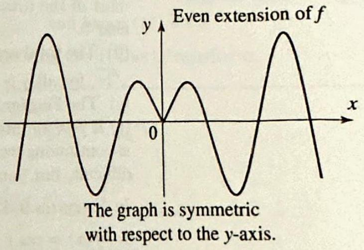
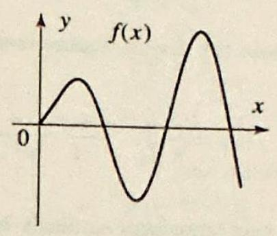
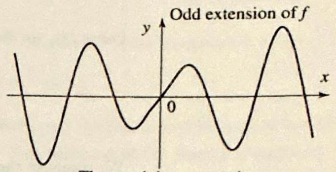

### 8.6 The Fourier Cosine and Sine Transforms

So far in this chapter we have considered boundary value problems with initial or boundary data defined on the entire real line. It is easy to imagine similar problems with boundary or initial data defined on half lines. As an example, consider a heat problem in a bar with one end extending to infinity. In this case, the initial temperature distribution will be given by a function defined on half the real line. As a second illustration, consider a Dirichlet problem in the first quadrant. In this case, the boundary consists of two half
lines. A variety of such problems will be discussed in the following section. To treat these problems, we introduce in this section two transforms closely related to the Fourier integral: the cosine and sine Fourier transforms. As you will see, these transforms are the analogs of the half-range expansions in Fourier series.

The basic question is: How can we use the Fourier transform when the function $f(x)$ is defined for $x>0$ only? Having worked with Fourier series and half-range expansions, we know that the answer will involve even and odd (nonperiodic) extensions of $f$.

If we extend $f$ as an even function on the entire real line (Figure 1) and then take the Fourier transform of the extension, we obtain

$$
\mathcal{F}(f)(\omega)=\frac{1}{\sqrt{2 \pi}} \int_{-\infty}^{\infty} f(x) e^{-i \omega x} d x=\sqrt{\frac{2}{\pi}} \int_{0}^{\infty} f(x) \cos \omega x d x
$$

where we have kept the same notation for $f$ and its extension and used the fact that the extension is an even function.

Figure 1

Figure 1

Applying the inverse Fourier transform, and using the fact that the Fourier transform is even in this case, we obtain

$$
f(x)=\sqrt{\frac{2}{\pi}} \int_{0}^{\infty} \mathcal{F}(f)(\omega) \cos \omega x d \omega
$$

The integral in (1) depends only on the values of $f(x)$ for $x \geq 0$, so without mention of the even extension, we define the cosine Fourier transform of $f$ by (1), setting

$$
\hat{f}_{c}(\omega)=\sqrt{\frac{2}{\pi}} \int_{0}^{\infty} f(t) \cos \omega t d t \quad(\omega \geq 0)
$$

Then the inverse Fourier transform in (2) becomes

$$
f(x)=\sqrt{\frac{2}{\pi}} \int_{0}^{\infty} \hat{f}_{c}(\omega) \cos \omega x d \omega \quad(x>0)
$$

This formula features the inverse Fourier cosine transform and expresses $f$ as an inverse Fourier cosine transform of $\widehat{f}_{c}(\omega)$. Note that the Fourier cosine transform is the same as the inverse Fourier cosine transform.

Similarly, if we use an odd extension (Figure 2), apply the Fourier transform and then its inverse Fourier transform, we obtain the

Figure 2

Fourier sine transform of $f$ :

The graph is symmetric with $n$ nect to the origin.

$$
\widehat{f}_{s}(\omega)=\sqrt{\frac{2}{\pi}} \int_{0}^{\infty} f(t) \sin \omega t d t \quad(\omega \geq 0)
$$

and its inverse Fourier sine transform,

$$
f(x)=\sqrt{\frac{2}{\pi}} \int_{0}^{\infty} \widehat{f}_{s}(\omega) \sin \omega x d \omega \quad(x>0)
$$

Other commonly used notation for these transforms is as follows:

$$
\mathcal{F}_{c}(f)=\widehat{f}_{c} \quad \text { and } \quad \mathcal{F}_{s}(f)=\widehat{f}_{s}
$$

Both (4) and (6) hold under the same conditions on $f$ as in the Fourier inversion theorem (Section 8.1). We require that $f$ be integrable on $[0, \infty)$ (by this we mean that $\int_{0}^{\infty}|f(x)| d x<\infty$ ) and piecewise smooth. Also, on the left sides of (4) and (6), $f(x)$ is to be replaced by $(f(x+)+f(x-)) / 2$ at points of discontinuity of $f$.

## EXAMPLE 1 Fourier cosine and sine transforms

Consider the function

$$
f(x)= \begin{cases}\sin x & \text { if } 0 \leq x \leq \pi \\ 0 & \text { if } x>\pi\end{cases}
$$

Express $f$ using an inverse Fourier cosine and then an inverse sine transform.

Solution We first start by computing the Fourier cosine transform. From (3).

In evaluating the integral, use the identity $\sin a \cos b= \frac{1}{2}[\sin (a-b)+\sin (a+b)]$.

From a table of integrals: $\int e^{-a t} \cos \omega t d t= \frac{a}{a^{2}+\omega^{2}} e^{-a t}\left(\frac{\omega}{a} \sin \omega t-\cos \omega t\right)$.

We compute the sine transform similarly by using (5),
and thus the inverse sine transform representation

$$
f(x)=\frac{2}{\pi} \int_{0}^{\infty} \frac{\sin (\pi \omega)}{1-\omega^{2}} \sin \omega x d \omega \quad(x \geq 0)
$$

## EXAMPLE 2 A Fourier cosine transform

Consider the function $f(x)=e^{-a x}(a>0), x>0$.
(a) Find the Fourier cosine transform of $f(x)$.
(b) Express $f(x)$ as an inverse Fourier cosine transform.

Solution (a) From (3)

$$
\hat{f}_{c}(\omega)=\sqrt{\frac{2}{\pi}} \int_{0}^{\pi} \sin x \cos \omega x d x=\sqrt{\frac{2}{\pi}} \frac{\cos (\pi \omega)+1}{1-\omega^{2}}
$$

$$
f(x)=\frac{2}{\pi} \int_{0}^{\infty} \frac{\cos (\pi \omega)+1}{1-\omega^{2}} \cos \omega x d \omega \quad(x \geq 0)
$$

$$
\widehat{f}_{s}(\omega)=\sqrt{\frac{2}{\pi}} \frac{\sin (\pi \omega)}{1-\omega^{2}}
$$

□
□
form representation $\square$

$$
\begin{aligned}
\mathcal{F}_{c}(f)(\omega) & =\sqrt{\frac{2}{\pi}} \int_{0}^{\infty} e^{-a t} \cos \omega t d t \\
& =\sqrt{\frac{2}{\pi}} \frac{a}{a^{2}+\omega^{2}}\left[e^{-a t}\left(\frac{\omega}{a} \sin \omega t-\cos \omega t\right)\right]_{0}^{\infty}=\sqrt{\frac{2}{\pi}} \frac{a}{a^{2}+\omega^{2}}
\end{aligned}
$$

(b) From (4) we obtain for $x>0$

$$
e^{-a x}=\sqrt{\frac{2}{\pi}} \int_{0}^{\infty} \widehat{f}_{c}(\omega) \cos \omega x d \omega=\frac{2}{\pi} \int_{0}^{\infty} \frac{a \cos \omega x}{a^{2}+\omega^{2}} d \omega
$$

Fourier cosine and sine transforms can sometimes be computed from Fourier transforms.

## RELATIONSHIPS BETWEEN TRANSFORMS

EXAMPLE 3 A Fourier cosine transform from a Fourier transform Find the Fourier cosine transform of $f(x)=e^{-a x^{2} / 2}(a>0), x>0$.
Solution We have

$$
\begin{aligned}
\mathcal{F}_{c}(f)(\omega) & =\sqrt{\frac{2}{\pi}} \int_{0}^{\infty} e^{-a x^{2} / 2} \cos \omega x d x \\
& =\frac{1}{2} \sqrt{\frac{2}{\pi}} \int_{-\infty}^{\infty} e^{-a x^{2} / 2} \cos \omega x d x \quad \text { (the integrand is even) } \\
& =\frac{1}{\sqrt{2 \pi}} \int_{-\infty}^{\infty} e^{-a x^{2} / 2} e^{-i \omega x} d x \\
& =\mathcal{F}\left(e^{-a x^{2} / 2}\right)(\omega) \quad \text { (by definition of the Fourier transform) } \\
& \left.=\frac{1}{\sqrt{a}} e^{-\omega^{2} / 2 a} \quad \text { (by Example } 5, \text { Section } 11.1\right)
\end{aligned}
$$

Example 3 illustrates the following useful general rule, whose proof is left as an exercise.

If $f(x)(x \geq 0)$ is the restriction of an even function $f_{e}$, then

$$
\mathcal{F}_{c}(f)(\omega)=\mathcal{F}\left(f_{e}\right)(\omega) \text { for all } \omega \geq 0
$$

If $f(x)(x \geq 0)$ is the restriction of an odd function $f_{o}$, then

$$
\mathcal{F}_{s}(f)(\omega)=i \mathcal{F}\left(f_{o}\right)(\omega) \text { for all } \omega \geq 0
$$

## EXAMPLE 4 Using Fourier transforms

To illustrate the applications of (7) and (8), we use known Fourier transforms (see Example 4, Section 8.1) and compute, for $\omega \geq 0$,

$$
\mathcal{F}_{c}\left(\frac{a}{a^{2}+x^{2}}\right)(\omega)=\mathcal{F}\left(\frac{a}{a^{2}+x^{2}}\right)(\omega)=\sqrt{\frac{\pi}{2}} e^{-a \omega} \quad(a>0)
$$

and

$$
\mathcal{F}_{s}\left(\frac{x}{a^{2}+x^{2}}\right)(\omega)=i \mathcal{F}\left(\frac{x}{a^{2}+x^{2}}\right)(\omega)=\sqrt{\frac{\pi}{2}} \omega e^{-a \omega} \quad(a>0)
$$

## Operational Properties

The Fourier cosine and sine transforms have operational properties very similar to those of the Fourier transform. We list those that will be needed in the next section. The proofs will be omitted, being very similar to the case of the Fourier transform (Section 8.2). In what follows, we assume that the functions are integrable, so that all the transforms exist.

## THEOREM 1 LINEARITY

THEOREM 2 TRANSFORMS OF DERIVATIVES

Note that each formula for the first derivative involves both transforms. The formulas for the second derivatives, however, involve only one transform at a time.

If $f$ and $g$ are functions and $a$ and $b$ are numbers, then

$$
\mathcal{F}_{c}(a f+b g)=a \mathcal{F}_{c}(f)+b \mathcal{F}_{c}(g),
$$

and

$$
\mathcal{F}_{s}(a f+b g)=a \mathcal{F}_{s}(f)+b \mathcal{F}_{s}(g) .
$$

Compare the following theorem with Theorem 2, Section 8.2.
Suppose that $f(x) \rightarrow 0$ as $x \rightarrow \infty$; then

$$
\begin{aligned}
& \mathcal{F}_{c}\left(f^{\prime}\right)=\omega \mathcal{F}_{s}(f)-\sqrt{\frac{2}{\pi}} f(0), \\
& \mathcal{F}_{s}\left(f^{\prime}\right)=-\omega \mathcal{F}_{c}(f) .
\end{aligned}
$$

If in addition $f^{\prime}(x) \rightarrow 0$ as $x \rightarrow \infty$, then

$$
\begin{aligned}
& \mathcal{F}_{c}\left(f^{\prime \prime}\right)=-\omega^{2} \mathcal{F}_{c}(f)-\sqrt{\frac{2}{\pi}} f^{\prime}(0) \\
& \mathcal{F}_{s}\left(f^{\prime \prime}\right)=-\omega^{2} \mathcal{F}_{s}(f)+\sqrt{\frac{2}{\pi}} \omega f(0)
\end{aligned}
$$

## EXAMPLE 5 Transform of a derivative

In Example 3 we found that

$$
\mathcal{F}_{c}\left(e^{-x^{2}}\right)(\omega)=\frac{1}{\sqrt{2}} e^{-\omega^{2} / 4}
$$

Applying Theorem 2(ii) with $f(x)=e^{-x^{2}}$, we obtain

$$
\mathcal{F}_{s}\left(-2 x e^{-x^{2}}\right)=-\omega \mathcal{F}_{c}\left(e^{-x^{2}}\right)=-\omega \frac{1}{\sqrt{2}} e^{-\omega^{2} / 4}
$$

Hence

$$
\mathcal{F}_{s}\left(x e^{-x^{2}}\right)=\frac{\omega}{2 \sqrt{2}} e^{-\omega^{2} / 4} .
$$ $\square$

THEOREM 3 DERIVATIVES OF TRANSFORMS

We have

$$
\begin{aligned}
& \mathcal{F}_{c}(x f(x))=\frac{d}{d \omega} \mathcal{F}_{s}(f(x)) \\
& \mathcal{F}_{s}(x f(x))=-\frac{d}{d \omega} \mathcal{F}_{c}(f(x))
\end{aligned}
$$

## EXAMPLE 6 Using operational properties

Find the Fourier sine transform of $f(x)=x e^{-a x}(a>0), x>0$.
Solution In Example 2 we found that

$$
\mathcal{F}_{c}\left(e^{-a x}\right)(\omega)=\sqrt{\frac{2}{\pi}} \frac{a}{a^{2}+\omega^{2}}
$$

From Theorem 3(ii) we have

$$
\mathcal{F}_{s}\left(x e^{-a x}\right)=-\frac{d}{d \omega} \mathcal{F}_{c}\left(e^{-a x}\right)=-\sqrt{\frac{2}{\pi}} \frac{d}{d \omega} \frac{a}{a^{2}+\omega^{2}}=\sqrt{\frac{2}{\pi}} \frac{2 a \omega}{\left(a^{2}+\omega^{2}\right)^{2}}
$$

## Exercises 11.6

In Exercises 1-6, find the Fourier cosine transform of $f(x)(x>0)$ and write $f$ as an inverse cosine transform. Use a known Fourier transform and (7) when possible.
1.

$$
f(x)= \begin{cases}1 & \text { if } 0<x<1 \\ 0 & \text { otherwise } .\end{cases}
$$

2. 

$$
f(x)= \begin{cases}1 & \text { if } 0<a<x<b<\infty \\ 0 & \text { otherwise }\end{cases}
$$

3. $f(x)=3 e^{-2 x}$.
4. $f(x)=x^{2} e^{-x^{2}}$.
5. 

$$
f(x)= \begin{cases}\cos x & \text { if } 0<x<2 \pi, \\ 0 & \text { otherwise } .\end{cases}
$$

6. 

$$
f(x)= \begin{cases}1-x & \text { if } 0<x<1 \\ 0 & \text { otherwise }\end{cases}
$$

In Exercises 7-12, find the Fourier sine transform of $f(x)(x>0)$ and write $f(x)$ as an inverse sine transform. Use a known Fourier transform and (8) when possible.
7.
8. $f(x)=x e^{-x^{2}}$.

$$
f(x)= \begin{cases}1 & \text { if } 0<x<1 \\ 0 & \text { otherwise }\end{cases}
$$

9. $f(x)=e^{-2 x}$.
10. 

$$
f(x)= \begin{cases}\sin 2 x & \text { if } 0<x<\pi \\ 0 & \text { otherwise }\end{cases}
$$

10. $f(x)=x e^{-x}$.
11. $f(x)=\frac{x}{1+x^{2}}$.

In Exercises 13-18, compute the given transform.
13. $\mathcal{F}_{c}\left(\frac{1}{1+x^{2}}\right)$.
14. $\mathcal{F}_{c}\left(\frac{x^{2}}{e^{x^{2}}}\right)$.
15. $\mathcal{F}_{s}\left(\frac{x}{1+x^{2}}\right)$.
16. $\mathcal{F}_{s}\left(x e^{-x}\right)$.
17. $\mathcal{F}_{c}\left(\frac{\cos x}{1+x^{2}}\right)$.
18. $\mathcal{F}_{c}\left(\frac{\sin x}{x}\right)$.
19. Prove (7) and (8).
20. Prove (9)-(12).
21. Reciprocity relations show that $\mathcal{F}_{c} \mathcal{F}_{c} f=f$ and $\mathcal{F}_{s} \mathcal{F}_{s} f=f$.
