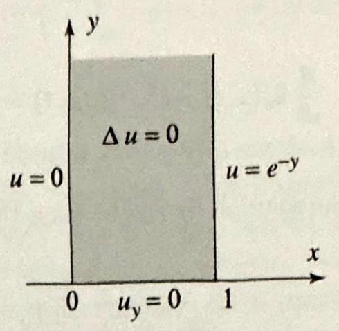
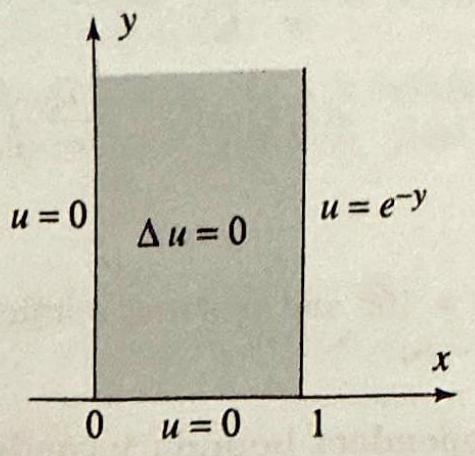
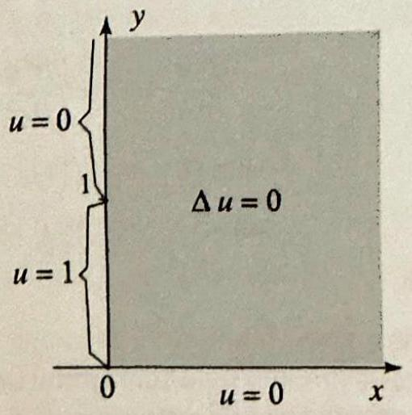
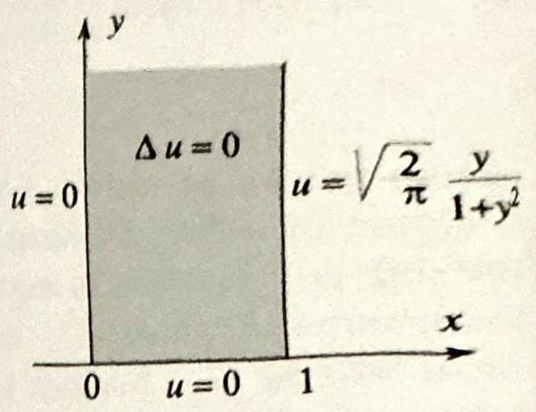
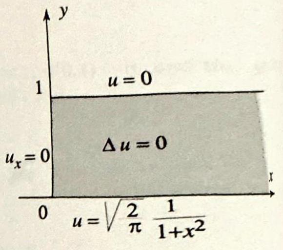
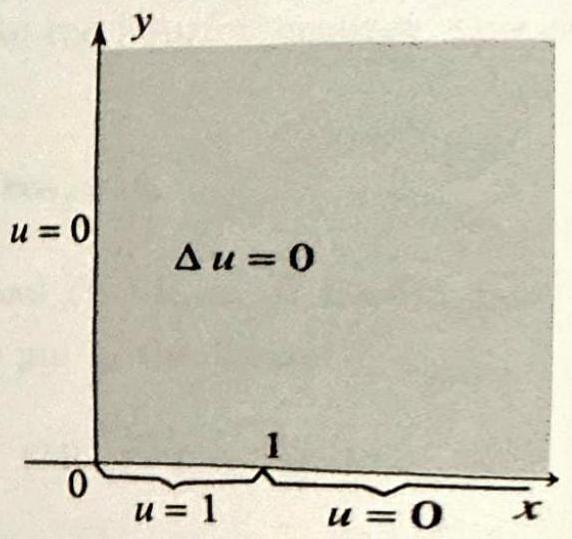

### 8.7 Problems Involving Semi-Infinite Intervals

We will solve boundary value problems on semi-infinite intervals, and on unbounded regions in the plane such as half-planes, quarter-planes, and strips, by using the Fourier sine and cosine transforms instead of the Fourier transform. The reason is that the functions with which we will be dealing are defined on a subset of the real line, and to use the Fourier transform requires that a function be defined on the entire real line. The method of this section is completely analogous to the Fourier transform method. We will illustrate it with examples.

EXAMPLE 1 Heat equation for a semi-infinite rod
Solve the boundary value problem

$$
\begin{aligned}
\frac{\partial u}{\partial t} & =c^{2} \frac{\partial^{2} u}{\partial x^{2}}, & & 0<x<\infty, t>0, \\
u(x, 0) & =f(x), & & x>0, \\
u(0, t) & =0, & & t>0 .
\end{aligned}
$$

This problem models heat diffusion in a semi-infinite rod, with initial temperature distribution $f(x)$, and with one end kept at $0^{\circ}$ temperature (see Figure 1).
Solution Note that since the initial conditions (2) involve the $x$ variable, the problem calls for a transform in the $x$ variable and not $t$. As you will see shortly, the Fourier sine transform is the right choice in this problem (see the remarks following the solution). We have

$$
\mathcal{F}_{s}\left(\frac{\partial u}{\partial t}\right)=\frac{d}{d t} \widehat{u}_{s}(\omega, t)
$$

and, from Theorem 2, Section 8.6,

$$
\mathcal{F}_{s}\left(\frac{\partial^{2} u}{\partial x^{2}}\right)=-\omega^{2} \widehat{u}_{s}(\omega, t)+\sqrt{\frac{2}{\pi}} \omega u(0, t)=-\omega^{2} \widehat{u}_{s}(\omega, t) .
$$

Thus, transforming (1) and (2) we get

$$
\begin{aligned}
\frac{d}{d t} \widehat{u}_{s}(\omega, t) & =-c^{2} \omega^{2} \widehat{u}_{s}(\omega, t) \\
\widehat{u}_{s}(\omega, 0) & =\widehat{f}_{s}(\omega)
\end{aligned}
$$

Figure 1 Initial temperature distribution.

The general solution of the first order ordinary differential equation in $t$ is

$$
\widehat{u}_{s}(\omega, t)=A(\omega) e^{-c^{2} \omega^{2} t}
$$

where $A(\omega)$ is a constant that depends on $\omega$. Setting $t=0$ yields

$$
\widehat{u}_{s}(\omega, 0)=A(\omega)=\widehat{f}_{s}(\omega)
$$

and so

$$
\widehat{u}_{s}(\omega, t)=\widehat{f}_{s}(\omega) e^{-c^{2} \omega^{2} t}
$$

Recall from Section 8.4 that $e^{-t^{2} \omega^{2} t}$ is the Fourier transform of the heat kernel. Thus, the solution in this example also involves the heat kernel. See Exercise 7 for an alternative form of the solution.

Figure 2 A DirichletNeumann problem.

Taking inverse Fourier sine transforms ((6), Section 8.6), we obtain the solution in the form

$$
u(x, t)=\sqrt{\frac{2}{\pi}} \int_{0}^{\infty} \widehat{u}_{s}(\omega, t) \sin \omega x d \omega=\sqrt{\frac{2}{\pi}} \int_{0}^{\infty} \widehat{f}_{s}(\omega) e^{-c^{2} \omega^{2} t} \sin \omega x d \omega
$$

You may ask why the Fourier sine transform was used in Example 1 and not the Fourier cosine transform. The choice was suggested by the boundary condition (3). To compute the cosine transform of the second derivative $\frac{\partial^{2} u}{\partial x^{2}}$, the operational property (11), Section 8.6, requires the value of $\frac{\partial u}{\partial x}(0, t)$, a quantity not given in the problem. In general, to successfully apply a transform we must be able to use the initial conditions to supply the values needed in the operational formulas.

The next example involves Dirichlet and Neumann type conditions.

## EXAMPLE 2 A Dirichlet-Neumann problem in a semi-infinite strip

Solve the boundary value problem

$$
\begin{aligned}
\Delta u & =\frac{\partial^{2} u}{\partial x^{2}}+\frac{\partial^{2} u}{\partial y^{2}}=0, \quad 0<x<a, y>0 \\
\frac{\partial u}{\partial y}(x, 0) & =0, \quad 0<x<a \\
u(0, y) & =0, \quad u(a, y)=f(y), \quad y>0
\end{aligned}
$$

The problem models, for example, the steady-state temperature in a very large sheet of metal, where the boundaries are kept at a given temperature distribution and there is no heat flow across the boundary on the $x$-axis, as illustrated in Figure 2.
Solution Since the domain of the variable $y$ is semi-infinite (the domain of the variable $x$ is finite); we choose to transform the equations with respect to the variable $y$. Also since the boundary condition (6) involves the derivative at $y=0$ the cosine transform is the right choice in this case. Using this transform with the help of the operational properties of Section 8.6, we get

$$
\begin{array}{ll}
\mathcal{F}_{c}\left(\frac{\partial^{2} u}{\partial y^{2}}\right)=-\omega^{2} \widehat{u}_{c}(x, \omega)-\sqrt{\frac{2}{\pi}} \frac{\partial u}{\partial y}(x, 0)=-\omega^{2} \widehat{u}_{c}(x, \omega), \\
\frac{d^{2}}{d x^{2}} \widehat{u}_{c}(x, \omega)-\omega^{2} \widehat{u}_{c}(x, \omega)=0 & (\text { transforming }(5)), \\
\widehat{u}_{c}(0, \omega)=0, \widehat{u}_{c}(a, \omega)=\widehat{f}_{c}(\omega) & (\text { transforming }(7)) .
\end{array}
$$

The general solution of the second order ordinary differential equation (8) is

$$
\widehat{u}_{c}(x, \omega)=A(\omega) \cosh \omega x+B(\omega) \sinh \omega x,
$$

where $A(\omega)$ and $B(\omega)$ are constants that depend on $\omega$. Setting $x=0$ and then $x=a$ and using (9), we get

$$
A(\omega)=0, \quad B(\omega)=\frac{\widehat{f}_{c}(\omega)}{\sinh \omega a}
$$

Putting this into (10) and taking inverse Fourier cosine transform ((4), Section 8.6 ), we get the solution in the form

$$
u(x, y)=\sqrt{\frac{2}{\pi}} \int_{0}^{\infty} \widehat{u}_{c}(x, \omega) \cos \omega y d \omega=\sqrt{\frac{2}{\pi}} \int_{0}^{\infty} \frac{\hat{f}_{c}(\omega)}{\sinh \omega a} \sinh \omega x \cos \omega y d \omega
$$ $\square$

The Fourier transform method is a powerful device for solving partial differential equations. Its importance stems from its ability to handle a large variety of problems. Several additional types of problems (on different types of regions) are investigated in the exercises. Choosing the appropriate transform is a crucial step in implementing the method. As we saw in the examples, the choice is suggested by the type of region and the boundary conditions.

## Exercises 11.7

In Exercises 1-4 solve the heat equation (1) with $c=1, u(0, t)=0$, and the given initial temperature distribution. Take $0<x<\infty$ and $t>0$.
1.

$$
f(x)= \begin{cases}T_{0} & \text { if } 0<x<b \\ 0 & \text { otherwise }\end{cases}
$$

2. 

$$
f(x)= \begin{cases}\sin x & \text { if } 0<x<\pi \\ 0 & \text { otherwise }\end{cases}
$$

3. $f(x)=\frac{x}{1+x^{2}}$.
4. $f(x)=x e^{-x^{2} / 2}$.
5. $f(x)=x e^{-x^{2} / 2}$.
6. A Neumann type condition. Let $u(x, t)$ denote the solution of (1) and (2) with the Neumann type condition: $\frac{\partial u}{\partial x}(0, t)=0$. Use the Fourier cosine transform to derive the solution

$$
u(x, t)=\sqrt{\frac{2}{\pi}} \int_{0}^{\infty} \widehat{f}_{c}(\omega) e^{-c^{2} \omega^{2} t} \cos \omega x d \omega
$$

6. Do Exercise 5 for the specific case when $c=1$ and $f(x)$ is as in Exercise 1.
7. Show that the solution (4) of Example 1 can be put in the form

$$
u(x, t)=\frac{1}{2 c \sqrt{\pi t}} \int_{0}^{\infty} f(s)\left[\exp \left(-\frac{(x-s)^{2}}{4 c^{2} t}\right)-\exp \left(-\frac{(x+s)^{2}}{4 c^{2} t}\right)\right] d s
$$

[Hint: In (4), write $\widehat{f}_{s}$ explicitly in terms of $f$.]
8. (a) Show that the solution of the heat problem of Example 1 with $f(x)=T_{0}$ if $0<x<a$ and 0 otherwise can be expressed in the form

$$
u(x, t)=T_{0} \operatorname{erf}\left(\frac{x}{2 c \sqrt{t}}\right)-\frac{T_{0}}{2}\left\{\operatorname{erf}\left(\frac{x-a}{2 c \sqrt{t}}\right)+\operatorname{erf}\left(\frac{x+a}{2 c \sqrt{t}}\right)\right\}
$$

[Hint: Use Exercise 7.]
9. Project Problem: A nonhomogeneous boundary condition. Consider the heat equation (1) with the following conditions $u(x, 0)=0$ for $x>0$ and $u(0, t)=T_{0}$ for $t>0$.
(a) Use the Fourier sine transform to show that

$$
\frac{d}{d t} \widehat{u}_{s}(\omega, t)+c^{2} \omega^{2} \widehat{u}_{s}(\omega, t)=c^{2} \sqrt{\frac{2}{\pi}} \omega T_{0} ; \quad \widehat{u}_{s}(\omega, 0)=0
$$

(b) Derive the solution by establishing that

$$
\begin{gathered}
\widehat{u}(\omega, t)=\sqrt{\frac{2}{\pi}} \frac{T_{0}}{\omega}-\sqrt{\frac{2}{\pi}} \frac{T_{0}}{\omega} e^{-c^{2} \omega^{2} t} \\
u(x, t)=\frac{2 T_{0}}{\pi} \int_{0}^{\infty} \frac{\sin \omega x}{\omega} d \omega-\frac{2 T_{0}}{\pi} \int_{0}^{\infty} \frac{e^{-c^{2} \omega^{2} t}}{\omega} \sin \omega x d \omega \\
u(x, t)=T_{0}-\frac{2 T_{0}}{\pi} \int_{0}^{\infty} \frac{e^{-c^{2} \omega^{2} t}}{\omega} \sin \omega x d \omega
\end{gathered}
$$

(c) Take $T_{0}=100$ and plot the solution at various values of $t$. What do you observe as $t \rightarrow \infty$ ?
10. Time-dependent boundary condition. Consider the boundary value problem

$$
\begin{aligned}
\frac{\partial^{2} u}{\partial t^{2}} & =c^{2} \frac{\partial^{2} u}{\partial x^{2}}, & x>0, t>0 \\
u(x, 0) & =f(x), & \frac{\partial u}{\partial t}(x, 0)=0 \\
u(0, t) & =s(t), &
\end{aligned}
$$

where $s(t)$ is a given function of $t$.
(a) Give a possible physical interpretation of the problem.
(b) Let $f^{*}$ denote the odd extension of $f$ to the entire line. By direct verification, show that the solution is

$$
u(x, t)= \begin{cases}\frac{1}{2}\left[f^{*}(x+c t)+f^{*}(x-c t)\right] & \text { if } x>c t \\ \frac{1}{2}\left[f^{*}(x+c t)+f^{*}(x-c t)\right]+s\left(t-\frac{x}{c}\right) & \text { if } x<c t\end{cases}
$$

(c) Take $c=1, f(x)=0, s(t)=\sin t$, and plot the solution at $t=0, \frac{\pi}{4}, \frac{\pi}{2}, \pi, 2 \pi$, $4 \pi$.

In Exercises 11-16, solve the boundary value problem described by the picture.
11.

13.

15.

12.

14.

16.

