<!-- Page 1 -->

Left margin note (page 1)

Topics to Review Although this chapter is self-contained, the ideas b the theory of Fourier ser the heat and wave appli of Chapter 8. Whereas in ters $8-10$ we dealt with pr on finite intervals or regior we are concerned with pr on unbounded regions, s lines, half lines, planes, an planes.
Methods from complex sis, in particular, residue will be used to compute transforms and study the transform in Section 11.5.

Looking Ahead In Sections 11.1 and 11 introduce the Fourier tra and study its properties, cially its effect on convo and derivatives.
In Section 11.3, we prese Fourier transform method is used in solving some dard partial differential tions. The ideas of this s are useful throughout the re der of the chapter and in th chapter. Based on the F transform method, we sh Sections 11.4 and 11.5 h express the solution of $b$ ary value problems for it domains as convolutions i ing the boundary or initial Sections 11.6 and 11.7 dea the Fourier cosine and sine forms and their applicatio emi-infinite regions. This alels the development of Con 11.3.

++++

11

THE FOURIER TRANSFORM AND ITS APPLICATIONS

A generalization made not for the vain pleasure of generalizing but in order to solve previously existing problems is always a fruitful generalization.
-Henri Lebesgue
In Chapters 8-10 we used Fourier series and orthogonal expansions as tools to solve boundary value problems over bounded regions such as intervals, rectangles, disks and spheres. As you can imagine, the modeling of certain physical phenomena will give rise naturally to boundary value problems over unbounded regions. For example, to describe the temperature distribution in a very long insulated wire, you can suppose that the length of the wire is infinite, which gives rise to a boundary value problem over an infinite line. To solve this new type of problem we will generalize the notion of Fourier series by developing the Fourier transform. The applications that we present are as diverse and rich as the ones we studied with Fourier series. The methods of this chapter, although mainly tailored for the Fourier transform, are also suitable with other transforms-for example, the Fourier cosine and sine transforms (Sections 11.6-11.7) and the Laplace and Hankel transforms (Chapter 12).

In addition to the basic study of the Fourier transform, we introduce in Section 11.2 the class of generalized functions and consider some of their applications in solving partial differential equations and computing Fourier transforms. This material, along with the applications of complex analysis, is presented at the end of sections and is designed as enrichment in the subject. As a sample of applications, take a look at the exercises in Section 11.2. You will find transforms that involve Legendre polynomials, Chebyshev polynomials, Bessel functions, and other special functions. You will also find interesting improper integrals, whose evaluations illustrate the power of the Fourier analysis techniques.

---

<!-- Page 2 -->

Left margin note (page 2)

696
Chapter 1
11.1 The
DEFI
THE
TRA
DEFI
THE
TRA

Right margin note (page 2)

riodic on unsidered o extend he entire e Fourier t Fourier $\mathrm{d} x<\infty$. a finite smooth the real terms of onential. make the orm of $f$, variables. ed by indefinition inlike the a discrete et of $\omega$ 's. ier coeffransform, we must he inverse
to that of exponent

++++

The Fourier Transform and its Applications
Fourier Transform
In Chapter 7, we used Fourier series to analyze functions that are pe the real line or that are defined on a finite interval and so can be co as the restriction of periodic functions. Our goal in this section is the basic tools of Fourier analysis to functions that are defined on real line but are not periodic. We will replace Fourier series by th transform and prove results that are direct analogs of results abou series.

We will say that $f(x)$ is integrable on the real line if $\int_{-\infty}^{\infty}|f(x)|$ Thus by "integrable" we mean that the absolute value of $f$ has improper integral over the real line. We will say that $f$ is piecewise on the real line if it is piecewise smooth on every finite interval o line.

Like Fourier series, the Fourier transform can be expressed in integrals involving the cosine and sine functions or the complex exp We will take the complex form of Fourier series as a model and following definition.

NITION 1 FOURIER ANSFORM

NITION 2
INVERSE
FOURIER
NSFORM

Suppose that $f$ is integrable on the real line, the Fourier transf denoted by $\mathcal{F}(f)$ or $\widehat{f}$, is defined by
$$
\widehat{f}(\omega)=\frac{1}{\sqrt{2 \pi}} \int_{-\infty}^{\infty} f(x) e^{-i \omega x} d x \quad(-\infty<\omega<\infty)
$$

The notation $\mathcal{F}(f(x))(\omega)$ is also used to be specific about the Like the Fourier coefficients, the Fourier transform of $f$ is defin tegrating $f$ against the exponential function over the domain of of $f$, which is the entire real line in the present case. However, Fourier coefficients of a periodic function, which are defined over set of values, the Fourier transform is defined over a continuous se

A Fourier series reconstructs a periodic function from its Four cients. To reconstruct a function on the real line from its Fourier t we must sum over a continuous set of Fourier coefficients; thus integrate the Fourier transform. The resulting integral is called tl Fourier transform.

The inverse Fourier transform of $g(\omega)$ is
$$
\mathcal{F}^{-1}(g)(x)=\frac{1}{\sqrt{2 \pi}} \int_{-\infty}^{\infty} g(\omega) e^{i \omega x} d \omega \quad(-\infty<x<\infty)
$$

The definition of the inverse Fourier transform is very similar

---

<!-- Page 3 -->

Left margin note (page 3)

JUOASNVEL
яюлоᲰ
HL HO NOISHANNI
NAJOSHL

++++

Section 11.1 The Fourier Transform
697

of the exponential function inside the integral. The improper integral in (2) is to be interpreted as a principal value:
$$
\mathcal{F}^{-1}(g)(x)=\lim _{a \rightarrow \infty} \frac{1}{\sqrt{2 \pi}} \int_{-a}^{a} g(\omega) e^{i \omega x} d \omega
$$

1

Suppose that $f$ is piecewise smooth and integrable on the real line. Then,

E for all $x$, we have
$$
\frac{f(x+)+f(x-)}{2}=\mathcal{F}^{-1}(\hat{f})(x)=\frac{1}{\sqrt{2 \pi}} \int_{-\infty}^{\infty} \widehat{f}(\omega) e^{i \omega x} d \omega
$$

In particular, if $f$ is piecewise smooth and continuous at $x$, then
$$
f(x)=\frac{1}{\sqrt{2 \pi}} \int_{-\infty}^{\infty} \widehat{f}(\omega) e^{i \omega x} d \omega
$$

The proof is similar to the proof of the Fourier series representation theorem, Section 7.6. We will present it at the end of this section.

Theorem 1 asserts that $f$ can be recaptured from its Fourier transform, by performing an inverse Fourier transform. This makes the Fourier transform a very powerful tool, as it will become apparent from the methods and applications in Sections 11.2 and 11.3.

Let us now consider some examples and basic properties of the Fourier transform. First note that putting $\omega=0$ in (1), we find that
$$
\widehat{f}(0)=\frac{1}{\sqrt{2 \pi}} \int_{-\infty}^{\infty} f(x) d x
$$

Thus the value of the Fourier transform at $\omega=0$ is equal to the signed area between the graph of $f(x)$ and the $x$-axis, multiplied by a factor of $1 / \sqrt{2 \pi}$.

EXAMPLE 1 A Fourier transform
(a) Let $a>0$. Find the Fourier transform of the function
$$
f(x)=\left\{\begin{array}{ll}
1 & \text { if }|x|<a, \\
0 & \text { if }|x|>a,
\end{array}\right.
$$
shown in Figure 1. What is $\hat{f}(0)$ ?
(b) Express $f$ as an inverse Fourier transform.

Solution For $\omega \neq 0$ we have
$$
\begin{aligned}
\hat{f}(\omega) & =\frac{1}{\sqrt{2 \pi}} \int_{-\infty}^{\infty} f(x) e^{-i \omega x} d x=\frac{1}{\sqrt{2 \pi}} \int_{-a}^{a} e^{-i \omega x} d x \\
& =\left.\frac{-1}{\sqrt{2 \pi} i \omega} e^{-i \omega x}\right|_{-a} ^{a}=\sqrt{\frac{2}{\pi}} \frac{\sin a \omega}{\omega}
\end{aligned}
$$

---

<!-- Page 4 -->

Left margin note (page 4)

698
Chapter 1

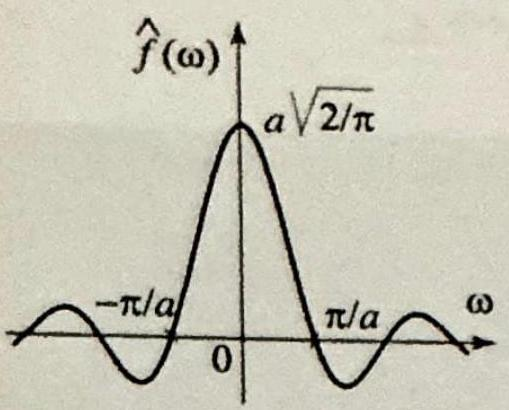

Figure 2 Grap ample 1.

Figure 3 Grap

Right margin note (page 4)

$\stackrel{\omega \boldsymbol{\omega}}{-} \mathrm{d} \omega$,

This repre$x=a$, the $=\frac{1}{2}$. Sim. tting these transform
$a=1$ and

Section 5.4. al is needed ve still need
re real line In fact, it n is always

++++

1 The Fourier Transform and its Applications
For $\omega=0$, we have
$$
\hat{f}(0)=\frac{1}{\sqrt{2 \pi}} \int_{-a}^{a} d x=a \sqrt{2 / \pi}
$$

Since
$$
\lim _{\omega \rightarrow 0} \hat{f}(\omega)=\lim _{\omega \rightarrow 0} \sqrt{\frac{2}{\pi}} \frac{\sin a \omega}{\omega}=a \sqrt{\frac{2}{\pi}}=\hat{f}(0),
$$
it follows that $\hat{f}(\omega)$ is continuous at 0 (Figure 2), and we may write
h of $\widehat{f}$ in Ex-
$$
\widehat{f}(\omega)=\sqrt{\frac{2}{\pi}} \frac{\sin a \omega}{\omega}, \quad \text { for all } \omega
$$
(b) To express $f$ as an inverse Fourier transform, we use (2) and get
$$
\begin{aligned}
f(x) & =\frac{1}{\sqrt{2 \pi}} \int_{-\infty}^{\infty} e^{i \omega x} \sqrt{\frac{2}{\pi}} \frac{\sin a \omega}{\omega} d \omega=\frac{1}{\pi} \int_{-\infty}^{\infty} e^{i \omega x} \frac{\sin a \omega}{\omega} d \omega \\
& =\frac{1}{\pi} \int_{-\infty}^{\infty}(\cos \omega x+i \sin \omega x) \frac{\sin a \omega}{\omega} d \omega=\frac{1}{\pi} \int_{-\infty}^{\infty} \frac{\cos \omega x \sin c}{\omega}
\end{aligned}
$$
because $\sin \omega x \frac{\sin a \omega}{\omega}$ is an odd function of $\omega$ and so its integral is zero. sentation is valid at the points of continuity of $f$; that is, for $x \neq \pm a$. For inverse Fourier transform converges to the average value $\frac{f(a+)+f(a-)}{2}$ ilarly, for $x=-a$, the inverse Fourier transform converges to $\frac{1}{2}$. Pu facts together and writing $f$ explicitly, we obtain the inverse Fourie representation of $f$ :
$$
\frac{1}{\pi} \int_{-\infty}^{\infty} \frac{\cos \omega x \sin a \omega}{\omega} d \omega=\left\{\begin{array}{ll}
0 & \text { if } x<-a \text { or } x>a \\
1 & \text { if }-a<x<a \\
\frac{1}{2} & \text { if } x= \pm a
\end{array}\right.
$$

A particular case of this integral deserves special attention. If we take $x=0$, we get
$$
\frac{1}{\pi} \int_{-\infty}^{\infty} \frac{\sin \omega}{\omega} d \omega=1
$$

This is the sine integral that we computed using residues in Example 3, In recognition of the residue methods, we should mention that this integr in the proof of Theorem 1, which we quoted when computing (3). So the residue theory in deriving the sine integral.

The Fourier transform in Example 1 is continuous on the enti even though the function has jump discontinuities at $x= \pm a$. can be shown that the Fourier transform of an integrable functio continuous.

EXAMPLE 2 A Fourier transform involving $\boldsymbol{e}^{-\boldsymbol{a x}}$

Find the Fourier transform of
$$
f(x)=\left\{\begin{array}{ll}
e^{-a x} & \text { if } x>0 \\
0 & \text { if } x \leq 0
\end{array}\right.
$$
h of $f$ in Ex-
$$
\text { case } a=1 \text {. }
$$

---

<!-- Page 5 -->

Left margin note (page 5)

Figure 4 Graph of $|\widehat{f}|$ ample $2(a=1)$.

THEORE
CONJUGATING TRANSFO

THEOREI
LINEARI

++++

Section 11.1 The Fourier Transform
699

where $a>0$. The graph of $f$ is shown in Figure 3 for the case $a=1$.
Solution We have
$$
\begin{aligned}
\hat{f}(\omega) & =\frac{1}{\sqrt{2 \pi}} \int_{0}^{\infty} e^{-a x} e^{-i \omega x} d x=\frac{1}{\sqrt{2 \pi}} \int_{0}^{\infty} e^{-x(a+i \omega)} d x \\
& =\left.\frac{-1}{\sqrt{2 \pi}(a+i \omega)} e^{-i \omega x} e^{-a x}\right|_{0} ^{\infty}
\end{aligned}
$$

Since $\left|e^{-i x \omega}\right|=1$, it follows that $\lim _{x \rightarrow \infty}\left|e^{-x(a+i \omega)}\right|=\lim _{x \rightarrow \infty} e^{-a x}=0$, and so
$$
\hat{f}(\omega)=\frac{1}{\sqrt{2 \pi}(a+i \omega)}=\frac{a-i \omega}{\sqrt{2 \pi}\left(a^{2}+\omega^{2}\right)}
$$

Figure 4 shows the graph of $|\hat{f}(\omega)|$ with $a=1$. Here again, it is worth noting that

$\omega \widehat{f}$ and $|\widehat{f}|$ are both continuous even though $f$ is not.

Example 2 illustrates a noteworthy fact that the Fourier transform may

n Ex- be complex-valued even though the function is real-valued. When is the Fourier transform real-valued? To answer this question we investigate the Fourier transform of $f(-x)$. We have the following useful result.

M 2
[HE
RM

Suppose that $f$ is real-valued and integrable and let $g(x)=f(-x)$. Then
$$
\widehat{f}(-\omega)=\overline{\widehat{f}(\omega)}=\widehat{g}(\omega), \quad \text { for all } \omega
$$

Proof We leave the first equality as an exercise and prove that $\hat{f}(-\omega)=\hat{g}(\omega)$. Using (1) and a change of variables, we get
$$
\begin{aligned}
\widehat{g}(\omega) & =\frac{1}{\sqrt{2 \pi}} \int_{-\infty}^{\infty} g(x) e^{-i \omega x} d x=\frac{1}{\sqrt{2 \pi}} \int_{-\infty}^{\infty} g(-x) e^{i \omega x} d x \\
& =\frac{1}{\sqrt{2 \pi}} \int_{-\infty}^{\infty} f(x) e^{-i(-\omega) x} d x=\widehat{f}(-\omega)
\end{aligned}
$$

The following property of the Fourier transform is straightforward to verify and is a consequence of the linearity of the integral.

M 3
TY

The Fourier transform is a linear operation; that is, for any integrable functions $f$ and $g$ and any real numbers $a$ and $b$,
$$
\mathcal{F}(a f+b g)=a \mathcal{F}(f)+b \mathcal{F}(g)
$$

Proof See Exercise 14.
We can now answer our question about the values of the Fourier transform.

---

<!-- Page 6 -->

Left margin note (page 6)

700
Chapter 11

TH]

VALUES
TRA

Figure 5 Grapl 1 in Example 3.

TH
RECI
RE

Right margin note (page 6)

ransform,
he Fourier
2, then by
lued, since
m can be
The more
Here are

and (2), ign in the we obtain

++++

The Fourier Transform and its Applications

EOREM 4
OF THE
FOURIER
NSFORM
$e^{-|x|}$
of $e^{-|x|}, a=$

EOREM 5
PROCITY
ELATIONS

Suppose that $f$ is real-valued and integrable. Then
(i) $\hat{f}$ is real-valued if and only if $f$ is even;
(ii) $\hat{f}$ is purely imaginary if and only if $f$ is odd.

Proof We prove (i) only and leave (ii) to Exercise 14. We have
$$
\begin{aligned}
f \text { is even } & \Leftrightarrow f(x)=\frac{f(x)+f(-x)}{2} \\
& \Leftrightarrow \widehat{f}(\omega)=\frac{\widehat{f}(\omega)+\widehat{f(-x)}(\omega)}{2} \quad \text { (linearity) } \\
& \Leftrightarrow \widehat{f}(\omega)=\frac{\widehat{f}(\omega)+\widehat{f}(\omega)}{2} \quad \text { (Theorem 2) } \\
& \Leftrightarrow \widehat{f}(\omega)=\operatorname{Re}(\widehat{f}(\omega)) \quad \Leftrightarrow \quad \widehat{f}(\omega) \text { is real-valued. }
\end{aligned}
$$

EXAMPLE 3 Fourier transform of $e^{-a|x|}(a>0)$
Find the Fourier transform of $h(x)=e^{-a|x|}$ where $a>0$ (Figure 5).
Solution We can compute directly from the definition of the Fourier or better yet, we can use the transform in Example 2 and properties of $t$ transform. Since $h(x)=f(x)+f(-x)$, where $f(x)$ is as in Example Theorem 2 and linearity,
$$
\begin{aligned}
\widehat{h}(\omega) & =\widehat{f}(\omega)+\overline{\widehat{f}(\omega)} \\
& =\frac{a-i \omega}{\sqrt{2 \pi}\left(a^{2}+\omega^{2}\right)}+\frac{a+i \omega}{\sqrt{2 \pi}\left(a^{2}+\omega^{2}\right)}=\sqrt{\frac{2}{\pi}} \frac{a}{a^{2}+\omega^{2}}
\end{aligned}
$$

In accordance with Theorem 4, the Fourier transform of $e^{-a|x|}$ is real-val $e^{-a|x|}$ is even.

Example 3 illustrates how properties of the Fourier transfor used to our advantage to find new transforms from known ones. we know about the transform, the easier it is to compute with it. two simple observations which will yield interesting results.

If $f$ and $g$ are integrable, then
$$
\begin{array}{c}
\mathcal{F} g(\omega)=\mathcal{F}^{-1} g(-\omega) \\
\mathcal{F}(\mathcal{F}(f))(\omega)=f(-\omega)
\end{array}
$$

Proof In the definitions of the Fourier transform and its inverse, (1 the exponential functions in these integrals differ only by a negative exponent, and so (4) is immediate. Applying (4) with $g=\mathcal{F}(f)$, $\mathcal{F} \mathcal{F}(f)(\omega)=\mathcal{F}^{-1} \mathcal{F}(f)(-\omega)$. But $\mathcal{F}^{-1} \mathcal{F}(f)=f$, and (5) follows.

---

<!-- Page 7 -->

Left margin note (page 7)

Figure 6 Graphs of $e^{-\frac{x^{2}}{2}}$ a its Fourier transform $e^{-}$ They are the same functic of different variables).

++++

Section 11.1 The Fourier Transform
701

EXAMPLE 4 A transform using reciprocity
From Example 3, the function $\sqrt{\frac{2}{\pi}} \frac{a}{a^{2}+x^{2}}(a>0)$ is the Fourier transform of $f(x)= e^{-a|x|}$. Using the reciprocity relation (5), we obtain
$$
\mathcal{F}\left(\sqrt{\frac{2}{\pi}} \frac{a}{a^{2}+x^{2}}\right)(\omega)=\mathcal{F}\left(\mathcal{F}\left(e^{-a|x|}\right)\right)(\omega)=f(-\omega)=e^{-a|-\omega|}=e^{-a|\omega|}
$$

If in Example 4 we were to compute the Fourier transform of $\frac{a}{a^{2}+x^{2}}$ from the definition (1), we would have to evaluate the integral $\int_{-\infty}^{\infty} \frac{\cos \omega x}{a^{2}+x^{2}} d x$. This nontrivial integral is one of many that we computed using the residue theorem in Chapter 5 (see Example 1, Section 5.4). The next example is another important Fourier transform, which we will obtain by simply recalling an integral that we computed using residues. A different derivation will be given in the next section using operational properties of the transform.

EXAMPLE 5 Fourier transform of the Gaussian
Let $a>0$. We will derive the Fourier transform
$$
\mathcal{F}\left(e^{-a x^{2}}\right)(\omega)=\frac{1}{\sqrt{2 a}} e^{-\frac{\omega^{2}}{4 a}} \quad(-\infty<\omega<\infty)
$$
(See Figure 6 for the case $a=\frac{1}{2}$.) Using (1), we have
$$
\mathcal{F}\left(e^{-a x^{2}}\right)(\omega)=\frac{1}{2 \pi} \int_{-\infty}^{\infty} e^{-a x^{2}} e^{-i \omega x} d x=\frac{1}{2 \pi} \int_{-\infty}^{\infty} e^{-a x^{2}}(\cos \omega x-i \sin \omega x) d x
$$

The integral of the sine part is 0 , because the integrand is odd. So
$$
\mathcal{F}\left(e^{-a x^{2}}\right)(\omega)=\frac{1}{2 \pi} \int_{-\infty}^{\infty} e^{-a x^{2}} \cos \omega x d x
$$
and (6) follows from Example 1, Section 5.5.
Taking $a=\frac{1}{2}$ in (6), we obtain the interesting formula
(7)
$$
\mathcal{F}\left(e^{-\frac{x^{2}}{2}}\right)(\omega)=e^{-\frac{\omega^{2}}{2}} \quad(-\infty<\omega<\infty)
$$

Thus $e^{-\frac{x^{2}}{2}}$ is its own Fourier transform; equivalently, formula (7) stat that $e^{-\frac{x^{2}}{2}}$ is an eigenfunction of the Fourier transform corresponding to tl eigenvalue 1. (See the next section for transforms with similar properties

In our next example, the function is not integrable; however, its Fouri transform does exist. This is one of many Fourier transforms of functio that are not necessarily integrable, but for which the improper integral (

---

<!-- Page 8 -->

Left margin note (page 8)

702
Chapter 11

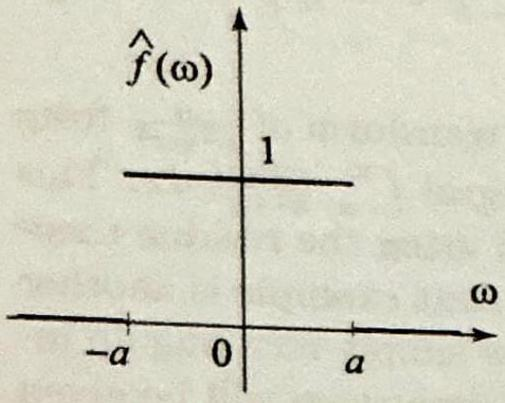

Figure 7 for Graphs of $f(x)$ and its Fouri $\widehat{f}(\omega)=1$ if $|\omega| |\omega|>a$. The f integrable and it not continuous.

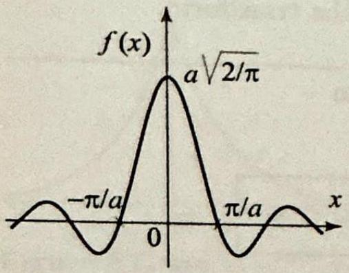

Right margin note (page 8)

xtended to cluding the in the next

++++

The Fourier Transform and its Applications
does converge. In fact, the theory of Fourier transforms can be a much wider class of functions than the integrable functions, in so-called generalized functions. We will touch on this subject section and derive some interesting applications.

EXAMPLE 6 Fourier transform of $\sqrt{\frac{2}{\pi}} \frac{\sin a x}{x}$
The function $f(x)=\sqrt{\frac{2}{\pi}} \frac{\sin a x}{x}$, where $a>0$ is not integrable over because the improper integral of its absolute value is not finite (Exe We can still use (1) to compute its Fourier transform. For any $-\infty<$ have
$$
\begin{aligned}
\hat{f}(\omega) & =\frac{1}{\pi} \int_{-\infty}^{\infty} \frac{\sin a x}{x} e^{-i \omega x} d x=\frac{1}{\pi} \int_{-\infty}^{\infty} \frac{\sin a x}{x}\left(\cos \omega x-i \sin \omega^{\infty}\right. \\
& =\frac{1}{\pi} \int_{-\infty}^{\infty} \frac{\sin a x}{x} \cos \omega x d x
\end{aligned}
$$

$\sqrt{2 / \pi}$

because the imaginary part of the integrand is odd so its integral is zero. the last integral, we appeal to (3) and find
$$
\widehat{f}(\omega)=\left\{\begin{array}{ll}
0 & \text { if } x<-a \text { or } x>a \\
1 & \text { if }-a<x<a \\
\frac{1}{2} & \text { if } x= \pm a
\end{array}\right.
$$

Example 6. $=\sqrt{\frac{2}{\pi}} \frac{\sin a x}{x}$ er transform $<a$ and 0 if unction is not s transform is
(See Figure 7.) These values can be confirmed by using the reciproci From Example 1, the function $\sqrt{\frac{2}{\pi}} \frac{\sin a x}{x}$ is the Fourier transform of $|x|<a$, and $g(x)=0$ if $|x|>a$. By (5), we get
$$
\mathcal{F}\left(\sqrt{\frac{2}{\pi}} \frac{\sin a x}{x}\right)(\omega)=\mathcal{F}(\mathcal{F}(g))(\omega)=g(-\omega)=\left\{\begin{array}{ll}
1 & \text { if }|\omega|< \\
0 & \text { if }|\omega|>
\end{array}\right.
$$

We observed earlier, before Example 2, that the Fourier transform of a function is always continuous. In the present example, the Fourier tran continuous. This is not a contradiction, because the function in this ex integrable.

In our final example we compute some residues as we evaluat transform.

EXAMPLE 7 Using residues to compute a Fourier transfor Compute the Fourier transform of $f(x)=\frac{2}{\sqrt{\pi}\left(1+x^{4}\right)}$.
Solution Using (1), we compute
$$
\begin{aligned}
\hat{f}(\omega) & =\frac{\sqrt{2}}{\pi} \int_{-\infty}^{\infty} \frac{1}{1+x^{4}}(\cos \omega x-i \sin \omega x) d x \\
& =\frac{\sqrt{2}}{\pi} \int_{-\infty}^{\infty} \frac{\cos \omega x}{1+x^{4}} d x
\end{aligned}
$$

---

<!-- Page 9 -->

Left margin note (page 9)

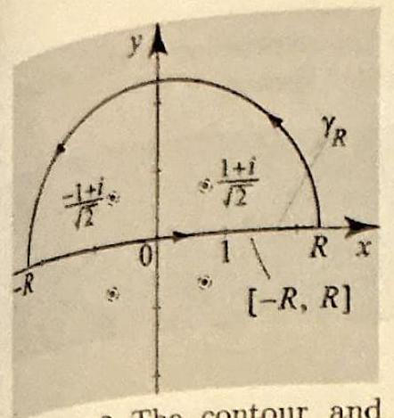

Figure 8 The contour at poles in the upper half-pla in Example 7.

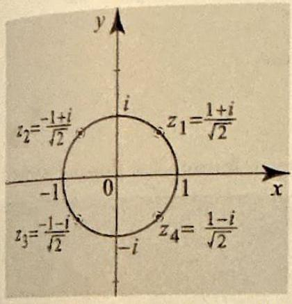

Figure 9 The four unimod lar roots of $z^{4}+1=0$.

++++

Section 11.1 The Fourier Transform
703

Note that the Fourier transform is an even function of $\omega$, so it is enough to compute it for $\omega \geq 0$. So suppose $\omega \geq 0$ and follow the steps in Example 1, Section 5.4, to compute the integral. Accordingly, we have
$$
\widehat{f}(\omega)=\frac{\sqrt{2}}{\pi} \int_{-\infty}^{\infty} \frac{\cos \omega x}{1+x^{4}} d x=\frac{\sqrt{2}}{\pi} \operatorname{Re}\left(\int_{\gamma_{R}} \frac{e^{i \omega z}}{1+z^{4}} d z\right)
$$
where $\gamma_{R}$ is a closed semi-circular path with $R$ large enough to enclose the poles of $\frac{e^{i \omega z}}{1+z^{4}}$ (Figure 8). (As we will see shortly, $R$ must be $>1$.) The function $F(z)=\frac{e^{i \omega z}}{1+z^{4}}$ has four simple poles at the roots of $z^{4}+1=0$. These are $z_{1}=e^{i \frac{\pi}{4}}, z_{2}=e^{i \frac{3 \pi}{4}}$, $z_{3}=e^{i \frac{5 \pi}{4}}, z_{4}=e^{i \frac{7 \pi}{4}}$ (Figure 9). Only $z_{1}$ and $z_{2}$ are in the upper half-plane and so lie inside of $\gamma_{R}$ for $R>1$. To compute the residues at these poles, we will use Proposition 1(ii), Section 5.1. Accordingly,
$$
\operatorname{Res}\left(\frac{e^{i \omega z}}{1+z^{4}}, z_{j}\right)=\left.\frac{e^{i \omega z}}{4 z^{3}}\right|_{z=z_{j}}=\frac{e^{i \omega z_{j}}}{4 z_{j}^{3}}
$$

We now have every thing we need to compute the integral with the help of the residue theorem. We have
$$
\int_{\gamma_{R}} \frac{e^{i \omega z}}{1+z^{4}} d z=2 \pi i\left(\operatorname{Res}\left(F(z), z_{1}\right)+\operatorname{Res}\left(F(z), z_{2}\right)\right)=2 \pi i\left(\frac{e^{i \omega z_{1}}}{4 z_{1}^{3}}+\frac{e^{i \omega z_{2}}}{4 z_{2}^{3}}\right)
$$

We now plug back into (8), use $z_{1}=\frac{\sqrt{2}}{2}+i \frac{\sqrt{2}}{2}, z_{2}=-\frac{\sqrt{2}}{2}+i \frac{\sqrt{2}}{2}, \operatorname{Re}(i \zeta)=-\operatorname{Im}(\zeta)$ for any complex number $\zeta$, simplify, and get, for $\omega \geq 0$,
$$
\begin{aligned}
\widehat{f}(\omega) & =-\frac{\sqrt{2}}{2} \operatorname{Im}\left(\frac{e^{i \omega z_{1}}}{z_{1}^{3}}+\frac{e^{i \omega z_{2}}}{z_{2}^{3}}\right) \\
& =-\frac{\sqrt{2}}{2} \operatorname{Im}\left(e^{-i \frac{3 x}{4}}\left(e^{i \omega\left(\frac{\sqrt{2}}{2}+i \frac{\sqrt{2}}{2}\right)}+i e^{i \omega\left(-\frac{\sqrt{2}}{2}+i \frac{\sqrt{2}}{2}\right)}\right)\right) \\
& =e^{-\frac{\sqrt{2}}{2} \omega}\left(\sin \left(\frac{\sqrt{2}}{2} \omega\right)+\cos \left(\frac{\sqrt{2}}{2} \omega\right)\right)
\end{aligned}
$$

Thus for all $\omega$
$$
\widehat{f}(\omega)=e^{-\frac{\sqrt{2}}{2}|\omega|}\left(\sin \left(\frac{\sqrt{2}}{2}|\omega|\right)+\cos \left(\frac{\sqrt{2}}{2} \omega\right)\right)
$$

Setting $\omega=0$ and recalling the definition of the Fourier transform, we get
$$
\widehat{f}(0)=1=\frac{\sqrt{2}}{\pi} \int_{-\infty}^{\infty} \frac{d x}{1+x^{4}}
$$
which yields the value of an interesting nontrivial improper integral.

---

<!-- Page 10 -->

Left margin note (page 10)

704
Chapter 11

PARTIAL
TRA

To go from the fil ond equality, int order of integra from the second equality, change $y=Y, d y=-d)$

RIEMANN-I

++++

The Fourier Transform and its Applications
Proof of Theorem 1
We need two lemmas. The first one is similar to the expression of th sums of Fourier series as a convolution with the Dirichlet kernel.

LEMMA 1 INVERSE FOURIER ANSFORM
rst to the secerchange the tion. To go to the third variables: $x-$

LEMMA 2
EBESGUE LEMMA

Suppose that $f$ is integrable on the real line and $a>0$. Then
$$
\frac{1}{\sqrt{2 \pi}} \int_{-a}^{a} \widehat{f}(\omega) e^{i x \omega} d \omega=\frac{1}{\pi} \int_{-\infty}^{\infty} f(x-y) \frac{\sin a y}{y} d y
$$

Proof Using $\frac{\sin a y}{y}=\frac{1}{2} \int_{-a}^{a} e^{i y \omega} d \omega$, we have
$$
\begin{aligned}
\sqrt{\frac{2}{\pi}} \int_{-\infty}^{\infty} f(x-y) \frac{\sin a y}{y} d y & =\sqrt{\frac{2}{\pi}} \int_{-\infty}^{\infty} \frac{1}{2} f(x-y) \int_{-a}^{a} e^{i y \omega} d \omega d \\
& =\frac{1}{\sqrt{2 \pi}} \int_{-a}^{a} \int_{-\infty}^{\infty} f(x-y) e^{i y \omega} d y d \omega \\
& =\int_{-a}^{a} \overbrace{\frac{1}{\sqrt{2 \pi}} \int_{-\infty}^{\infty} f(y) e^{-i y \omega} d y e^{i x \omega} d}^{a} \\
& =\int_{-a}^{a} \widehat{f}(\omega) e^{i x \omega} d \omega,
\end{aligned}
$$
which is equivalent to (9).
The next result is an analog of the Riemann-Lebesgue lemma for Four
Suppose that $\int_{A}^{B}|g(x)| d x<\infty$, where $-\infty \leq A<B \leq \infty$. Then
(10) $\lim _{\omega \rightarrow \infty} \int_{A}^{B} g(y) \sin \omega y d y=0$ and $\lim _{\omega \rightarrow \infty} \int_{A}^{B} g(y) \cos \omega y d y=0$

Proof To simplify the proof, we will suppose that $g$ is bounded and $g^{\prime}$ is ir Integrating by parts, we obtain
$$
\int_{A}^{B} g(y) \sin \omega y d y=-\left.\frac{1}{\omega} g(y) \cos \omega y\right|_{A} ^{B}+\frac{1}{\omega} \int_{A}^{B} g^{\prime}(y) \cos \omega y d y
$$

Since $g$ is bounded, then so is $g(y) \cos \omega y$, and the first term on the righ 0 as $\omega \rightarrow \infty$. Also, since $g^{\prime}$ is integrable, we have $\int_{A}^{B}\left|g^{\prime}(y)\right| d y=M<\infty$
$$
\frac{1}{\omega}\left|\int_{A}^{B} g^{\prime}(y) \cos \omega y d y\right| \leq \frac{M}{\omega} \rightarrow 0 \text { as } \omega \rightarrow \infty
$$

This proves the first limit in (10). The second one is done similarly.
We now sketch a proof of Theorem 1 for the case when $f$ is smooth. $x$, since $f^{\prime}(x)$ exists, the function $g(y)=\frac{f(x-y)-f(x)}{y}$ tends to $f^{\prime}(x)$ as $y$ it is bounded near 0 . For all other values of $y$, the function $g$ is smoo

---

<!-- Page 11 -->

Section 11.1 The Fourier Transform
705

from Example 3, Section 5.4, the integral $\frac{1}{\pi} \int_{-\infty}^{\infty} \frac{\sin x}{x} d x=1$. From this integral, it follows that for any $a>0, \frac{1}{\pi} \int_{-\infty}^{\infty} \frac{\sin a y}{y} d y=1$. (Just make a change of variables $a y=x$.) Using Lemma 1, we have
$$
\begin{aligned}
\frac{1}{\sqrt{2 \pi}} \int_{-a}^{a} \widehat{f}(\omega) e^{i x \omega} d \omega-f(x) & =\frac{1}{\pi} \int_{-\infty}^{\infty} f(x-y) \frac{\sin a y}{y} d y-f(x) \\
& =\frac{1}{\pi} \int_{-\infty}^{\infty} \frac{f(x-y)-f(x)}{y} \sin a y d y \\
& =\frac{1}{\pi} \int_{-\infty}^{\infty} g(y) \sin a y d y=I_{1}+I_{2}+I_{3}
\end{aligned}
$$
where $I_{1}$ is the integral over $(-\infty, 1), I_{2}$ is the integral over $(-1,1)$, and $I_{3}$ is the integral over $(1, \infty)$. To show that
$$
\lim _{a \rightarrow \infty} \frac{1}{\sqrt{2 \pi}} \int_{-a}^{a} \widehat{f}(\omega) e^{i x \omega} d \omega-f(x)=0
$$
we will show that $\lim _{a \rightarrow \infty} I_{j}=0$ for $j=1,2,3$. Since $g$ is bounded in the interval $(-1,1)$, the integral of its absolute value is finite on $(-1,1)$, and so, by Lemma 2, $\lim _{a \rightarrow \infty} I_{2}=0$. Write $I_{3}=\int_{1}^{\infty} \frac{f(x-y)}{y} \sin a y d y-f(x) \int_{1}^{\infty} \frac{\sin a y}{y} d y$. The first integral tends to 0 as $a \rightarrow \infty$, by Lemma 2, because $\int_{1}^{\infty}\left|\frac{f(x-y)}{y}\right| d y \leq \int_{1}^{\infty}|f(x-y)| d y \leq \int_{-\infty}^{\infty}|f(y)| d y<\infty$. To handle the second integral, we integrate by parts and get
$$
f(x) \int_{1}^{\infty} \frac{\sin a y}{y} d y=\left.f(x) \frac{-\cos a y}{a y}\right|_{y=1} ^{\infty}-\frac{1}{a} \int_{1}^{\infty} \frac{\cos a y}{y^{2}} d y
$$
which tends to 0 as $a \rightarrow \infty$, because $\left|\int_{1}^{\infty} \frac{\cos a y}{y^{2}} d y\right| \leq \int_{1}^{\infty} \frac{1}{y^{2}} d y=1$. $\lim _{a \rightarrow \infty} I_{3}=0$ and similarly for $I_{1}$, which completes the proof.

Exercises 11.1
In Exercises 1-10, find the Fourier transform of the given function.
1.
$$
f(x)=\left\{\begin{array}{ll}
x & \text { if }-1<x<1 \\
0 & \text { otherwise }
\end{array}\right.
$$
2.
$$
f(x)=\left\{\begin{array}{ll}
-1 & \text { if }-1<x<0, \\
1 & \text { if } 0<x<1, \\
0 & \text { otherwise } .
\end{array}\right.
$$

---

<!-- Page 12 -->

Left margin note (page 12)

706
Chapter

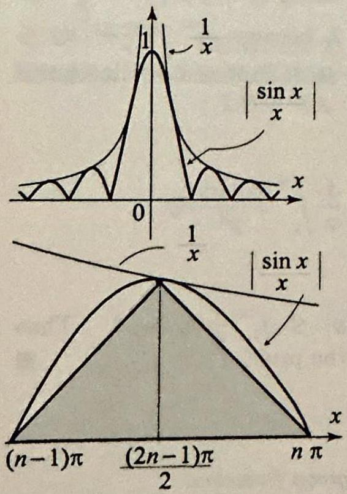

Figure 10 for The graph of area under one $x=(n-1) \pi$ Show that the $\geq \frac{1}{n-1}$.

++++

11 The Fourier Transform and its Applications
3.
$$
f(x)=\left\{\begin{array}{ll}
1 & \text { if } 0<x<1 \\
0 & \text { otherwise }
\end{array}\right.
$$
5.
$$
f(x)=\left\{\begin{array}{ll}
1-|x| & \text { if }-1<x<1 \\
0 & \text { otherwise }
\end{array}\right.
$$
7.
$$
f(x)=e^{-|x|+2}
$$
9.
$$
f(x)=\left\{\begin{array}{ll}
\cos x & \text { if }-\pi / 2<x<\pi / 2 \\
0 & \text { otherwise }
\end{array}\right.
$$
4.
$$
f(x)=\left\{\begin{array}{ll}
0 & \text { if }-1< \\
1 & \text { if } 1<\mid x \\
0 & \text { otherwis }
\end{array}\right.
$$
6.
$$
f(x)=\left\{\begin{array}{ll}
1-x^{2} & \text { if }-1 \\
0 & \text { other }
\end{array}\right.
$$
8.
$$
f(x)=e^{-2\left(x^{2}+1\right)}
$$
10.
$$
f(x)=\left\{\begin{array}{ll}
\sin x & \text { if }-\pi \\
0 & \text { otherw }
\end{array}\right.
$$

In Exercises 11-13, derive the given integral formula by first taking transform of the function on the right of the equality and then expressi tion as an inverse Fourier transform.
11.
$$
\int_{0}^{\infty} \frac{\cos x \omega+\omega \sin x \omega}{1+\omega^{2}} d \omega=\left\{\begin{array}{ll}
0 & \text { if } x<0 \\
\pi / 2 & \text { if } x=0 \\
\pi e^{-x} & \text { if } x>0
\end{array}\right.
$$

Exercise 14(c). $\left.\frac{\sin x}{x} \right\rvert\,$ and the arch between and $x=n \pi$. shaded area is
12.
$$
\frac{2}{\pi} \int_{0}^{\infty} \frac{\sin \pi \omega}{1-\omega^{2}} \sin \omega x d \omega=\left\{\begin{array}{ll}
\sin x & \text { if }|x| \leq \pi \\
0 & \text { if }|x|>\pi
\end{array}\right.
$$
13.
$$
\frac{2}{\pi} \int_{0}^{\infty} \frac{\cos \frac{\pi \omega}{2}}{1-\omega^{2}} \cos \omega x d \omega=\left\{\begin{array}{ll}
\cos x & \text { if }|x|<\pi / 2 \\
0 & \text { if }|x|>\pi / 2
\end{array}\right.
$$
14. (a) Prove Theorem 3. (b) Prove Theorem 4(ii).
(c) Show that $\frac{\sin x}{x}$ is not integrable on the real line. That is, show that $\int \infty$. [Hint: Show that for $n \geq 2$, the area under the arch of the curve $x$-axis, between $(n-1) \pi$ and $n \pi$ is greater than $1 /(n-1)$ (Figure 10)
15. (a) Use Example 1 to show that
$$
\int_{0}^{\infty} \frac{\sin \omega \cos \omega}{\omega} d \omega=\frac{\pi}{4}
$$
(b) Use integration by parts and (a) to obtain
$$
\int_{0}^{\infty} \frac{\sin ^{2} \omega}{\omega^{2}} d \omega=\frac{\pi}{2}
$$

---

<!-- Page 13 -->

Left margin note (page 13)

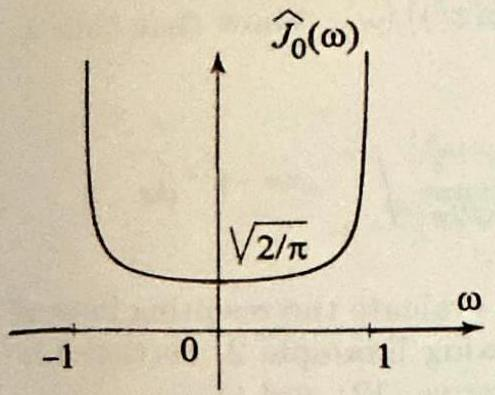

Figure 11 Graph $\mathcal{F}\left(J_{0}(x)\right)(\omega)$, for Exerci We have
$$
\mathcal{F}\left(J_{0}(x)\right)(0)=\sqrt{\frac{2}{\pi}}
$$
which implies that
$$
\int_{-\infty}^{\infty} J_{0}(x) d x=2
$$

But $J_{0}$ is not integrab the real line, because graph of its Fourier trans $\mathcal{F}\left(J_{0}(x)\right)(\omega)$, is not con ous.

++++

Section 11.1 The Fourier Transform
707
16. Derive the given identities: (a) $\int_{0}^{\infty} \frac{\sin \omega \cos 2 \omega}{\omega} d \omega=0$. [Hint: Example 1.]
(b) $\int_{0}^{\infty} \frac{1-\cos t}{t^{2}} d t=\frac{\pi}{2}$. [Hint: Integrate by parts and use Example 1.]

Methods from Complex Analysis
17. (a) Let $0<\alpha<1$ and define $f(x)=\frac{1}{|x|^{\alpha}}$. Using Example 2 , Section 5.5, derive the Fourier transform
$$
\mathcal{F}\left(\frac{1}{|x|^{\alpha}}\right)(\omega)=\sqrt{\frac{2}{\pi}}|\omega|^{\alpha-1} \Gamma(1-\alpha) \sin \frac{\alpha \pi}{2} \quad(-\infty<\omega<\infty) .
$$
(b) From (a), derive the Fourier transform
$$
\mathcal{F}\left(\frac{1}{\sqrt{|x|}}\right)(\omega)=\frac{1}{\sqrt{|\omega|}} \quad(-\infty<\omega<\infty) .
$$

$\omega$
18. Project Problem: Fourier transform of the Bessel function $J_{0}(x)$. In this exercise, we will derive the formula

of
se 18 .
$$
\mathcal{F}\left(J_{0}(a x)\right)(\omega)=\left\{\begin{array}{ll}
\sqrt{\frac{2}{\pi}} \frac{1}{\sqrt{a^{2}-\omega^{2}}} & \text { if }|\omega|<a \\
0 & \text { if }|\omega|>a
\end{array}\right.
$$
where $a>0$ (Figure 11). Instead of computing directly, we will compute the Fourier transform of the function on the right side of the equality and then use the reciprocity relation (5). So let $f(x)=\sqrt{\frac{2}{\pi}} \frac{1}{\sqrt{a^{2}-x^{2}}}$ if $|x|<a$ and $f(x)=0$ if $|x|>a$.
(a) Show that $\hat{f}(\omega)=\frac{1}{\pi} \int_{0}^{\pi} \cos (a \omega \cos \theta) d \theta$. [Hint: Apply the definition (1), use the change of variables $x=\cos \theta$, then use one more change of variables $\theta=\theta+\pi$.]
(b) Show that $\widehat{f}(\omega)=J_{0}(a \omega)$ and then use Theorem 5 to derive (11). [Hint: The first part is nontrivial, but it follows immediately from the cosine integral representation of the Bessel function $J_{0}$ (Exercise 36(a), Section 4.5).]
In Exercises 19-23, use residues, as we did in Example 7, to derive the given Fourier transform.
19. $\mathcal{F}\left(\frac{\sqrt{2}}{\sqrt{\pi}\left(1+x^{6}\right)}\right)(\omega)=\frac{e^{-\frac{|\omega|}{2}}}{3}\left(e^{-\frac{|\omega|}{2}}+\cos \left(\frac{\sqrt{3}}{2} \omega\right)+\sqrt{3} \sin \left(\frac{\sqrt{3}}{2}|\omega|\right)\right)$.
20. $\mathcal{F}\left(\frac{\sqrt{2}}{\sqrt{\pi}\left(1+x^{2}\right)^{2}}\right)(\omega)=\frac{e^{-|\omega|}}{2}(1+|\omega|)$.
21. $\mathcal{F}\left(\frac{\sqrt{2} x}{\sqrt{\pi}\left(1+x^{2}\right)^{2}}\right)(\omega)=\frac{i}{2}|\omega| e^{-|\omega|}$.
22. $\mathcal{F}\left(\frac{\sqrt{3}}{\sqrt{2 \pi}\left(1+x+x^{2}\right)}\right)(\omega)=e^{-\frac{\sqrt{3}}{2}|\omega|}\left(\cos \left(\frac{\omega}{2}\right)-i \sin \left(\frac{|\omega|}{2}\right)\right)$.
23. $\mathcal{F}\left(\frac{\sqrt{2}}{\sqrt{\pi} \cosh x}\right)(\omega)=\operatorname{sech} \frac{\pi \omega}{2}$.

---

<!-- Page 14 -->

Left margin note (page 14)

708
Chapter 11
11.2 Opera

THEC
FC
TRANSFOI DERIV

Right margin note (page 14)

$f_{1}$
gral
.5).
ion
the
ow-
be
ion
ion
erse
de-
h a
ien
and
rove

++++

The Fourier Transform and its Applications
24. Project Problem: Transforms related to the Fresnel integrals. In this exercise, we will derive the Fourier transforms
$$
\begin{array}{l}
\mathcal{F}\left(\cos \left(x^{2}\right)\right)(\omega)=\frac{1}{2}\left(\cos \frac{\omega^{2}}{4}+\sin \frac{\omega^{2}}{4}\right) \\
\mathcal{F}\left(\sin \left(x^{2}\right)\right)(\omega)=\frac{1}{2}\left(\cos \frac{\omega^{2}}{4}-\sin \frac{\omega^{2}}{4}\right)
\end{array}
$$
(a) Let $f_{1}(\omega)=\mathcal{F}\left(\cos \left(x^{2}\right)\right)(\omega)$ and $f_{2}(\omega)=\mathcal{F}\left(\sin \left(x^{2}\right)\right)(\omega)$. Show that both and $f_{2}$ are real-valued and even and that
$$
f_{1}(\omega)+i f_{2}(\omega)=\frac{1}{\sqrt{2 \pi}} \int_{-\infty}^{\infty} e^{i\left(x^{2}-x \omega\right)} d x=\frac{e^{-i \frac{\omega^{2}}{4}}}{\sqrt{2 \pi}} \int_{-\infty}^{\infty} e^{i\left(x-\frac{\omega}{2}\right)^{2}} d x
$$
(b) Make a change of variables, $u=x-\frac{\omega}{2}$, and then evaluate the resulting inte using the Fresnel integrals (see the discussion following Example 2, Section 5 Take real and imaginary parts of your answer and derive (12) and (13).
tional Properties
As we saw in the previous section, the Fourier transform takes a funct $f$ and produces a new function $\widehat{f}$, and the inverse transform recovers original function $f$ from $\widehat{f}$. This process makes of transform pairs a p erful tool in solving partial differential equations. The idea, which will explored in the following sections, is to "Fourier transform" a given equat into one that may be easier to solve. After solving the transformed equat involving $\widehat{f}$, we recover the solution of the original problem with the inve transform. To assist us in handling the transformed equations, we will velop the operational properties of the Fourier transform. We start wit result that describes the effect of the Fourier transform on derivatives.

RREM 1
URIER
RMS OF
ATIVES
(i) Suppose $f(x)$ and $f^{\prime}(x)$ are integrable and $f(x) \rightarrow 0$ as $|x| \rightarrow \infty$; th
$$
\mathcal{F}\left(f^{\prime}\right)=i \omega \mathcal{F}(f) .
$$
(ii) If, in addition, $f^{\prime \prime}(x)$ is integrable and $f^{\prime}(x) \rightarrow 0$ as $|x| \rightarrow \infty$, then
$$
\mathcal{F}\left(f^{\prime \prime}\right)=i \omega \mathcal{F}\left(f^{\prime}\right)=-\omega^{2} \mathcal{F}(f) .
$$
(iii) In general, if $f^{(k)}(x) \rightarrow 0(k=1,2, \ldots, n-1)$ as $|x| \rightarrow \infty$, and $f$ its derivatives of order up to $n$ are integrable, then
$$
\mathcal{F}\left(f^{(n)}\right)=(i \omega)^{n} \mathcal{F}(f) .
$$

Proof Parts (ii) and (iii) are obtained by repeated applications of (i). To p

---

<!-- Page 15 -->

Left margin note (page 15)

THEOREM DERIVATIVES OF FOURIER TRANSFORMS

++++

Section 11.2 Operational Propertics
709
(i), we use the definition of $\mathcal{F}\left(f^{\prime}\right)$ and integrate by parts:
$$
\begin{aligned}
\mathcal{F}\left(f^{\prime}\right)(\omega) & =\frac{1}{\sqrt{2 \pi}} \int_{-\infty}^{\infty} f^{\prime}(x) e^{-i \omega x} d x \\
& =\frac{1}{\sqrt{2 \pi}}\left[\left.f(x) e^{-i \omega x}\right|_{-\infty} ^{\infty}-(-i \omega) \int_{-\infty}^{\infty} f(x) e^{-i \omega x} d x\right] \\
& =0+i \omega \mathcal{F}(f) \quad\left(\text { since } f(x) \rightarrow 0 \text { as }|x| \rightarrow \infty, \text { and }\left|e^{ \pm i \omega x}\right|=1\right)
\end{aligned}
$$

EXAMPLE 1 Fourier transform of a derivative
Since $x e^{-x^{2}}=-\frac{1}{2} \frac{d}{d x} e^{-x^{2}}$, it follows from Theorem 1(i) that
$$
\mathcal{F}\left(x e^{-x^{2}}\right)(\omega)=-\frac{i \omega}{2} \mathcal{F}\left(e^{-x^{2}}\right)(\omega)
$$

Applying (6), Section 11.1, we obtain
$$
\mathcal{F}\left(x e^{-x^{2}}\right)(\omega)=-\frac{i \omega}{2 \sqrt{2}} e^{-\frac{\omega^{2}}{4}}
$$
(i) Suppose $f(x)$ and $x f(x)$ are integrable, then
$$
\mathcal{F}(x f(x))(\omega)=i[\widehat{f}]^{\prime}(\omega)=i \frac{d}{d \omega} \mathcal{F}(f)(\omega)
$$
(ii) In general, if $f(x)$ and $x^{n} f(x)$ are integrable, then
$$
\mathcal{F}\left(x^{n} f(x)\right)=i^{n}[\hat{f}]^{(n)}(\omega)
$$

Proof Part (ii) follows from (i). To motivate (i) we will assume that we can differentiate under the integral sign as follows
$$
\begin{aligned}
{[\hat{f}]^{\prime}(\omega) } & =\frac{d}{d \omega} \frac{1}{\sqrt{2 \pi}} \int_{-\infty}^{\infty} f(x) e^{-i \omega x} d x=\frac{1}{\sqrt{2 \pi}} \int_{-\infty}^{\infty} f(x) \frac{d}{d \omega} e^{-i \omega x} d x \\
& =-\frac{i}{\sqrt{2 \pi}} \int_{-\infty}^{\infty} x f(x) e^{-i \omega x} d x=-i \mathcal{F}(x f(x))(\omega)
\end{aligned}
$$
and (i) follows upon multiplying both sides by $i$.

EXAMPLE 2 Derivatives of Fourier transforms
(a) We can derive the Fourier transform in Example 1 by appealing to Theorem 2(i), as follows:
$$
\mathcal{F}\left(x e^{-x^{2}}\right)(\omega)=i \frac{d}{d \omega} \mathcal{F}\left(e^{-x^{2}}\right)(\omega)=i \frac{d}{d \omega}\left(\frac{1}{\sqrt{2}} e^{-\frac{\omega^{2}}{4}}\right)=-\frac{i \omega}{2 \sqrt{2}} e^{-\frac{\omega^{2}}{4}}
$$
(b) Let $a>0$. To compute the Fourier transform of the function
$$
g(x)=\left\{\begin{array}{ll}
x & \text { if }|x|<a, \\
0 & \text { if }|x|>a,
\end{array}\right.
$$

---

<!-- Page 16 -->

Left margin note (page 16)

710
Chapter 11

Figure 1 Graphs o $g(x)=x f(x)$ in The effect of mult $f(x)$ is to truncate tion $x$ for $|x|>a$.

++++

The Fourier Transform and its Applications
we will use the fact that the Fourier transform of the function
f $f(x)$ and
xample 2.
iplying by
the func-
$$
f(x)=\left\{\begin{array}{ll}
1 & \text { if }|x|<a \\
0 & \text { if }|x|>a
\end{array}\right.
$$
is $\mathcal{F}(f)(\omega)=\sqrt{\frac{2}{\pi}} \frac{\sin a \omega}{\omega}($ Example 1, Section 11.1) and that $g(x)=x f(x)$ (Figure Applying Theorem 2(i), it follows that
$$
\mathcal{F}(g)(\omega)=i \frac{d}{d \omega} \sqrt{\frac{2}{\pi}} \frac{\sin a \omega}{\omega}=i \sqrt{\frac{2}{\pi}} \frac{a \omega \cos (a \omega)-\sin a \omega}{\omega^{2}}
$$

In Example 5 of the previous section, we used an improper integral th we computed with the help of residue theory to derive the Fourier transfo of the Gaussian function. We can now give another interesting indir derivation based on the operational properties.

EXAMPLE 3 Fourier transform of the Gaussian
Let $f(x)=e^{-a x^{2}}$, where $a>0$. A simple verification shows that $f$ satisfies the $f$ order linear differential equation
$$
f^{\prime}(x)+2 a x f(x)=0
$$

Taking Fourier transforms and using Theorems 1 and 2, we get
$$
\omega \hat{f}(\omega)+2 a \frac{d}{d \omega}[\hat{f}](\omega)=0
$$

Thus $\hat{f}$ satisfies a similar first order linear ordinary differential equation. Solv this equation in $\widehat{f}$, we find
$$
\widehat{f}(\omega)=A e^{-\frac{\omega^{2}}{4 a}},
$$
where $A$ is an arbitrary constant. But
$$
A=\hat{f}(0)=\frac{1}{\sqrt{2 \pi}} \int_{-\infty}^{\infty} e^{-a x^{2}} d x=\frac{1}{\sqrt{2 \pi}} \sqrt{\frac{\pi}{a}}=\frac{1}{\sqrt{2 a}}
$$
by (1), Section 5.5, and so $\mathcal{F}\left(e^{-a x^{2}}\right)(\omega)=\frac{1}{\sqrt{2 a}} e^{-\frac{\omega^{2}}{4 a}}$.
One very common operation in analysis is translation or shifting. Gi a function $f(x)$ and a real number $\alpha$, the translate of $f$ by $\alpha$, denoted $f_{\alpha}(x)$, is defined by
$$
f_{\alpha}(x)=f(x-\alpha) \text { for all } x \text {. }
$$

Translating a function by $\alpha$ corresponds to multiplying its Fourier transf by $e^{-i \alpha \omega}$. We have the following theorem, whose proof is left as an exerc

---

<!-- Page 17 -->

Left margin note (page 17)

SNOILΩΤΟΛΝΟΟ HO SWYOASNV\&L ભપ્રΙપᲘΟᲰ

ΝΟΙΛΩΤΟΛΝΟΟ

SWYOASNV\&L ᲧᲭΙหΩΟᲰ GNV DNILAIHS $\varepsilon$ NGHOJHL

++++

Section 11.2 Operational Properties
711
(i) Shifting on the $x$-axis: Let $\alpha$ be arbitrary, then
$$
\mathcal{F}(f(x-\alpha))(\omega)=e^{-i \alpha \omega} \widehat{f}(\omega)
$$
(ii) Shifting on the $\omega$-axis:
$$
\mathcal{F}\left(e^{i \alpha x} f(x)\right)(\omega)=\widehat{f}(\omega-\alpha)
$$

Convolution of Functions
We expand our list of operational properties by introducing the convolution of two functions $f$ and $g$ by
$$
f * g(x)=\frac{1}{\sqrt{2 \pi}} \int_{-\infty}^{\infty} f(x-t) g(t) d t
$$
(The factor $\frac{1}{\sqrt{2 \pi}}$ is merely for convenience. If we drop it from the definition of the convolution, it will reappear in its Fourier transform.) It can be shown that $f * g$ is also integrable whenever $f$ and $g$ are (Exercise 23). Computing a convolution is often tedious. This task can be facilitated by using the following important property of the Fourier transform, as illustrated by Example 4 below.

Suppose that $f$ and $g$ are integrable, then
$$
\mathcal{F}(f * g)=\mathcal{F}(f) \mathcal{F}(g)
$$

Theorem 4 is expressed by saying that the Fourier transform takes convolutions into products.

Proof Using the definitions of the Fourier transform and convolutions, and then interchanging the order of integration we get
$$
\begin{aligned}
\mathcal{F}(f * g)(\omega) & =\frac{1}{\sqrt{2 \pi}} \int_{-\infty}^{\infty} \frac{1}{\sqrt{2 \pi}} \int_{-\infty}^{\infty} f(x-t) e^{-i \omega x} d x g(t) d t \\
& =\frac{1}{\sqrt{2 \pi}} \int_{-\infty}^{\infty} \frac{1}{\sqrt{2 \pi}} \int_{-\infty}^{\infty} f(u) e^{-i \omega u} d u e^{-i \omega t} g(t) d t \\
& =\mathcal{F}(f)(\omega) \mathcal{F}(g)(\omega) . \quad(u=x-t, d u=d x)
\end{aligned}
$$

EXAMPLE 4 Convolution of Gaussian functions
Let $f(x)=e^{-\alpha x^{2}}$ and $g(x)=e^{-\beta x^{2}}$ where $\alpha$ and $\beta$ are positive constants.
(a) Compute $\mathcal{F}(f * g)(\omega)$.
(b) Compute $f * g(x)$.

---

<!-- Page 18 -->

Left margin note (page 18)

712
Chapter 11

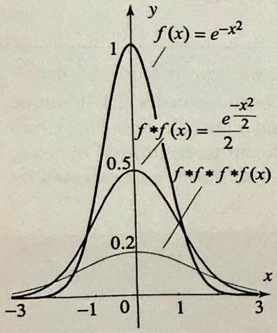

Figure 2 Graphs $e^{-x^{2}}, f * f$ and $f$ The effect of the is to smear out th the function.

Right margin note (page 18)

It
the
by
nvo-
tion.
(see
$-\frac{x^{2}}{2}$,
alues
This
ms:
This
nvo-
ty of

++++

he Fourier Transform and its Applications
Solution (a) Using Theorem 4 and Example 3, we get
$$
\begin{aligned}
\mathcal{F}(f * g)(\omega) & =\mathcal{F}(f)(\omega) \mathcal{F}(g)(\omega)=\frac{1}{\sqrt{2 \alpha}} e^{-\frac{\omega^{2}}{4 \alpha}} \frac{1}{\sqrt{2 \beta}} e^{-\frac{\omega^{2}}{4 \beta}} \\
& =\frac{1}{2 \sqrt{\alpha \beta}} e^{-\frac{\alpha+\beta}{4 \alpha \beta} \omega^{2}}
\end{aligned}
$$
(b) To compute $f * g$, it suffices to find the inverse Fourier transform of (3) is clear that we should be looking at another Gaussian function, because of presence of the function $e^{-\omega^{2}}$. Indeed, if we let
$$
\frac{1}{4 a}=\frac{\alpha+\beta}{4 \alpha \beta} \quad \Rightarrow \quad a=\frac{\alpha \beta}{\alpha+\beta} \text { and } \frac{1}{\sqrt{2 a}}=\frac{\sqrt{\alpha+\beta}}{\sqrt{2 \alpha \beta}}
$$
then from Example 3,
$$
\mathcal{F}\left(e^{-a x^{2}}\right)=\frac{1}{\sqrt{2 a}} e^{-\frac{\omega^{2}}{4 a}}=\frac{\sqrt{\alpha+\beta}}{\sqrt{2 \alpha \beta}} e^{-\frac{\alpha+\beta}{4 \alpha \beta} \omega^{2}}
$$

To match the Fourier transform in (3), we multiply $e^{-a x^{2}}$ by $\frac{1}{2 \sqrt{\alpha \beta}}$ and divide $\frac{\sqrt{\alpha+\beta}}{\sqrt{2 \alpha \beta}}$, thereby obtaining the function
$$
(x)=\frac{e^{\frac{-x^{2}}{2}}}{2}
$$
$$
\frac{1}{2 \sqrt{\alpha \beta}} \frac{\sqrt{2 \alpha \beta}}{\sqrt{\alpha+\beta}} e^{-a x^{2}}=\frac{1}{\sqrt{2(\alpha+\beta)}} e^{-\frac{\alpha \beta}{\alpha+\beta} x^{2}}
$$
as the inverse Fourier transform of (3). Consequently, we obtain the useful cor lution formula: for any $\alpha, \beta>0$,
$$
e^{-\alpha x^{2}} * e^{-\beta x^{2}}=\frac{1}{\sqrt{2(\alpha+\beta)}} e^{-\frac{\alpha \beta}{\alpha+\beta} x^{2}}
$$

Thus the convolution of two Gaussian functions is another scaled Gaussian funct This fact is at the heart of the solution of the heat problem on the real line Section 11.4). In Figure 2, we show the graphs of $f(x)=e^{-x^{2}}, f * f(x)=\frac{1}{2} e$ and $f * f * f * f(x)=\frac{1}{4 \sqrt{2}} e^{-\frac{x^{2}}{4}}$. Note how the convolution smears out the v of the function.

It is clear from our answer in Example 4(a) that $f * g=g * f$. equality holds for all $f$ and $g$ as can be seen by taking Fourier transfor
$$
\mathcal{F}(f * g)=\mathcal{F}(f) \mathcal{F}(g)=\mathcal{F}(g) \mathcal{F}(f)=\mathcal{F}(g * f)
$$

Now taking inverse Fourier transform, we obtain
$$
f * g=g * f
$$
which expresses the fact that convolution is a commutative operation. simple technique of the Fourier transform to establish results about cc lutions has far reaching applications. We illustrate with another proper

---

<!-- Page 19 -->

Section 11.2 Operational Properties
713

convolutions. To simplify the statements of results, in what follows, we will always suppose that the functions in questions have enough nice properties to be able to compute Fourier transforms and inverse Fourier transforms.

Let $n, \alpha$ and $\beta$ denote nonnegative integers, such that $n=\alpha+\beta$. Then
(6)
$$
\frac{d^{n}}{d x^{n}}(f * g)=\frac{d^{\alpha} f}{d x^{\alpha}} * \frac{d^{\beta} g}{d x^{\beta}} .
$$

In particular, taking $\alpha=n$ and $\beta=0$, then $\alpha=0$ and $\beta=n$, we obtain
$$
\frac{d^{n}}{d x^{n}}(f * g)=\frac{d^{n} f}{d x^{n}} * g=f * \frac{d^{n} g}{d x^{n}}
$$

Proof To prove (6), we compute the Fourier transforms of the functions on both sides of the equality, using Theorems 1 (iii) and 4 and the fact that $n=\alpha+\beta$ :
$$
\begin{aligned}
\mathcal{F}\left(\frac{d^{n}}{d x^{n}}(f * g)\right) & =(i \omega)^{n} \mathcal{F}(f * g)=(i \omega)^{\alpha} \mathcal{F}(f)(i \omega)^{\beta} \mathcal{F}(g) \\
& =\mathcal{F}\left(\frac{d^{\alpha} f}{d x^{\alpha}}\right) \mathcal{F}\left(\frac{d^{\beta} g}{d x^{\beta}}\right)=\mathcal{F}\left(\frac{d^{\alpha} f}{d x^{\alpha}} * \frac{d^{\beta} g}{d x^{\beta}}\right)
\end{aligned}
$$
and the desired result follows by taking inverse Fourier transforms.

Plancherel's and Parseval's Theorems
Recall that a function $f$ defined on the real line is square integrable if $\int_{-\infty}^{\infty}|f(x)|^{2} d x<\infty$. The following two important results hold for square integrable functions.

Suppose that $f$ and $g$ are square integrable functions on the real line. Then
$$
\int_{-\infty}^{\infty} f(x) \overline{g(x)} d x=\int_{-\infty}^{\infty} \hat{f}(\omega) \overline{\hat{g}(\omega)} d \omega
$$

By taking $f=g$ in Parseval's theorem, we obtain Plancherel's theorem.
Suppose that $f$ is a square integrable function on the real line. Then
$$
\int_{-\infty}^{\infty}|f(x)|^{2} d x=\int_{-\infty}^{\infty}|\hat{f}(\omega)|^{2} d \omega
$$

Proof of Parseval's theorem Use the inverse Fourier transform to write $g(x)= \frac{1}{\sqrt{2 \pi}} \int_{-\infty}^{\infty} e^{i \omega x} \hat{g}(\omega) d \omega$, and recall that $\overline{e^{i \omega x}}=e^{-i \omega x}$. Now, assuming that we can

---

<!-- Page 20 -->

Left margin note (page 20)

714
Chapter 11

Figure 3 Graph The function is p the total area unde above the $\omega$-axis is

Right margin note (page 20)

ning
rals.
form
orem,
orms first way soon to be of an funcwhich ng of jects this apute

fol-
on of
$f$ for

++++

The Fourier Transform and its Applications
interchange the order of integration, we have
$$
\begin{aligned}
\int_{-\infty}^{\infty} f(x) \overline{g(x)} d x & =\int_{-\infty}^{\infty} f(x) \frac{1}{\sqrt{2 \pi}} \int_{-\infty}^{\infty} e^{-i \omega x} \overline{\hat{g}(\omega)} d \omega d x \\
& =\int_{-\infty}^{\infty} \overline{\hat{g}(\omega)} \overbrace{\frac{1}{\sqrt{2 \pi}} \int_{-\infty}^{\infty} e^{-i \omega x} f(x) d x}^{=\hat{f}(\omega)} d \omega \\
& =\int_{-\infty}^{\infty} \hat{f}(\omega) \overline{\hat{g}(\omega)} d \omega
\end{aligned}
$$
which proves the theorem.
Just like Parseval's identity for Fourier series was useful in sumr

$\left.\frac{\operatorname{in} \omega}{\omega}\right)^{2}$ series, Plancherel' theorem is useful in evaluating certain nontrivial integ

EXAMPLE 5 An application of Plancherel's theorem
Consider the function $f(x)=1$ if $|x|<a$ and 0 otherwise, and its Fourier trans $\hat{f}(\omega)=\sqrt{\frac{2}{\pi}} \frac{\sin a \omega}{\omega}$ (see Example 1. Section 11.1). Applying Plancherel's ther we obtain
$$
\int_{-a}^{a}|f(x)|^{2} d x=\int_{-\infty}^{\infty}\left(\sqrt{\frac{2}{\pi}} \frac{\sin a \omega}{\omega}\right)^{2} d \omega
$$

But $f(x)=1$ for $|x|<a$, so the integral on the left is $2 a$, and hence

of $\left(\frac{\sin \omega}{\omega}\right)^{2}$.
ositive and
r the curve,
$\pi$.
$$
a \pi=\int_{-\infty}^{\infty}\left(\frac{\sin a \omega}{\omega}\right)^{2} d \omega
$$

The case $a=1$ is illustrated in Figure 3.
Generalized Functions
The need to compute Fourier transforms or inverse Fourier transf of functions that are not integrable on the real line is clear from our computation of a Fourier transform in Example 1, Section 11.1, all the to the last result that concerns square integrable functions. In fact, as as the function is not continuous, its Fourier transform is not going integrable (this is a consequence of the fact that the Fourier transform integrable function is continuous). So we need to go beyond integrable tions. The Fourier transform can be defined in a very general setting, is suitable for solving partial differential equations. This is the setti generalized functions or distributions. A rigorous treatment of these ob is beyond the level of this book. However, by touching a little bit or subject, we get a lot out of it, as far as expanding our ability to con transforms and convolutions, even for functions that are integrable.

To motivate the topic of generalized functions, let's consider the lowing question: Is there an identity element for the binary operati convolution? That is, is there a function $\phi$ such that $f * \phi=\phi * f=$

---

<!-- Page 21 -->

Left margin note (page 21)

Figure 4 Graphical tation of the Dirac de tion, with support at

++++

Section 11.2 Operational Properties
715

all $f$ ? If such a function exists, then taking Fourier transforms, we must have $\widehat{f} \hat{\phi}=\widehat{f}$, which suggests that $\widehat{\phi}$ must be identically 1 . This cannot happen if $\phi$ were integrable, by the Riemann-Lebesgue Lemma (Lemma 2, Section 11.1). So if $\phi$ exists, it is not an integrable function. If we evaluate the identity $f * \phi(x)=\phi * f(x)=f(x)$ at $x=0$, using the definition of the convolution, we get
$$
\frac{1}{\sqrt{2 \pi}} \int_{-\infty}^{\infty} f(-y) \phi(y) d y=f(0)
$$

Renaming the function $f(-y)=g(y)$ and changing the variable of integration to $x$, we see that $\phi$ must satisfy
$$
\frac{1}{\sqrt{2 \pi}} \int_{-\infty}^{\infty} g(x) \phi(x) d x=g(0)
$$

So the values of $g(x)$ for $x \neq 0$ do not affect the value of the integral of the product $\phi(x) g(x)$, which suggests that $\phi(x)=0$ for all $x \neq 0$. If you think about it, you will realize that there is no function $\phi$ that can possibly have this effect. This is one of many generalized functions that cannot be defined pointwise, as we usually define functions; instead, they are defined by the values of their integrals against functions. That is, while we do not have $\phi(x)$, for all $x$, we do have $\phi[f]=\int_{-\infty}^{\infty} f(x) \phi(x) d x$ for all $f$ in a class of functions known as the test functions. We have used the notation $\phi[f]$ to suggest that $\phi$ is a function of the test functions and not a function of real numbers. As far as we are concerned, we will not be specific about the class of test functions and we will assume that $\phi[f]$ is known at least for all continuous integrable functions.

Our first example of a generalized function is the Dirac delta function, denoted by $\delta_{0}(x)$ and defined by the values of its integrals:
$$
\int_{-\infty}^{\infty} f(x) \delta_{0}(x) d x=f(0)
$$
for all continuous functions $f$. By taking $f$ to be continuous and zero outside an interval $[a, b]$, we obtain from (10)
$$
\int_{a}^{b} f(x) \delta_{0}(x) d x=\left\{\begin{array}{ll}
f(0) & \text { if } a \leq 0 \leq b, \\
0 & \text { if } 0<a \text { or } 0>b .
\end{array}\right.
$$

It is sometimes convenient to think of $\delta_{0}$ as a function of $x$, with value $\delta_{0}(x)=0$ for all $x \neq 0$, and $\delta_{0}(0)=\infty$, and depict the function by a grap as in Figure 4.

The delta function can be used to define a formal identity for convolutio

---

<!-- Page 22 -->

Left margin note (page 22)

716
Chapter 11

Figure 5 Graphica tation of the Dirac tion and its trans supports at $x=0$ a

Figure 6 The H function $\mathcal{U}_{0}(x)$ a late $\mathcal{U}_{\alpha}(x)=\mathcal{U}_{0}(2$

Right margin note (page 22)

"
lized
ainst
Since
and

it is $\delta_{0}$ as
intro-

ant so
from
carry

++++

he Fourier Transform and its Applications

EXAMPLE 6 A formal identity for convolution Show that for any continuous function $f$
$$
\delta_{0} * f(x)=\frac{1}{\sqrt{2 \pi}} f(x) \text { equivalently }\left(\sqrt{2 \pi} \delta_{0}\right) * f(x)=f(x)
$$

Solution Using (10), we have
$$
(x-\alpha)
$$
represendelta funclate, with nd $x=\alpha$.
$$
\left(\sqrt{2 \pi} \delta_{0}\right) * f(x)=\int_{-\infty}^{\infty} f(x-y) \delta_{0}(y) d y=f(x)
$$
by evaluating the function $y \mapsto f(x-y)$ at $y=0$.
Let $\alpha$ be a real number. The translate by $\alpha$ of $\delta_{0}$ is another genera function denoted by $\delta_{\alpha}$ and defined by the values of its integral ag continuous functions by
$$
\delta_{\alpha}[f]=\int_{-\infty}^{\infty} f(x) \delta_{\alpha}(x) d x=f(\alpha)
$$

Thus integrating a function $f$ against $\delta_{\alpha}$ picks up the value of $f$ at $\alpha$. we also have $f(\alpha)=\int_{-\infty}^{\infty} f(x+\alpha) \delta_{0}(x) d x$, thinking of $\delta_{0}$ as a function making the change of variables $x+\alpha=X$, we find that
$$
\int_{-\infty}^{\infty} f(x) \delta_{\alpha}(x) d x=\int_{-\infty}^{\infty} f(X) \delta_{0}(X-\alpha) d X
$$

Thus, $\delta_{\alpha}(x)=\delta_{0}(x-\alpha)$. The graph of $\delta_{\alpha}(x)$ is shown in Figure 5; obtained by translating the graph of $\delta_{0}(x)$ by $\alpha$. So if we think of being supported at the point $x=0$, then $\delta_{\alpha}$ is supported at $x=\alpha$.

An antiderivative of $\delta_{0}$ is defined by
$$
\mathcal{U}_{0}(x)=\int_{-\infty}^{x} \delta_{0}(t) d t=\left\{\begin{array}{ll}
0 & \text { if } x<0 \\
1 & \text { if } x \geq 0
\end{array}\right.
$$

This is the Heaviside unit step function (Figure 6). Similarly, we duce the translates of the Heaviside function by
$$
\mathcal{U}_{\alpha}(x)=\int_{-\infty}^{x} \delta_{\alpha}(t) d t=\left\{\begin{array}{ll}
0 & \text { if } x<\alpha, \\
1 & \text { if } x \geq \alpha .
\end{array}\right.
$$

We have the formal derivative relations
$$
\mathcal{U}_{0}^{\prime}(x)=\delta_{0}(x) \quad \text { also } \quad \mathcal{U}_{\alpha}^{\prime}(x)=\delta_{\alpha}(x) .
$$

We can give some meaning to these identities: The Heaviside is const its slope (derivative) is 0 , except at $x=\alpha$, where the values of $\mathcal{U}_{\alpha}$ jump 0 to 1 causing an infinite slope. This reasoning with slopes allows us to

---

<!-- Page 23 -->

Section 11.2 Operational Properties
717

the notion of derivatives to piecewise continuous functions as illustrated by the following example.

EXAMPLE 7 Derivatives of piecewise continuous functions
The function $f(x)$ is shown in Figure 7. Compute $f^{\prime}(x)$ and $f^{\prime \prime}(x)$.
Solution Since the function is zero for $x<-1$ or $x>1$, we have $f^{\prime}(x)=f^{\prime \prime}(x)=0$ if $x<-1$ or $x>1$. For $-1<x<0$ we have $f^{\prime}(x)=2$ and for $0<x<1$ we have $f^{\prime}(x)=-2$, as shown in Figure 7. In terms of Heaviside functions, we have
$$
f^{\prime}(x)=2 \mathcal{U}_{-1}(x)-4 \mathcal{U}_{0}(x)+2 \mathcal{U}_{1}(x) .
$$

The second derivative is 0 everywhere except at the points $-1,0$, and 1 . In order to cause $f^{\prime}(x)$ to jump the way shown in Figure 7, we place weighted $\delta$ functions at these points corresponding to the jump on the graph of $f^{\prime}(x)$. If $f^{\prime}(x)$ increases at a jump, the weight of the $\delta$ function there is positive. If $f^{\prime}(x)$ decreases at a jump, the weight of the $\delta$ function there is negative. The result is a second derivative

(x) given by
$$
f^{\prime \prime}(x)=2 \delta_{-1}(x)-4 \delta_{0}(x)+2 \delta_{1}(x)
$$
(Figure 7). Note how this can be obtained by differentiating (18) and using (17). You may be wondering about the values of $f^{\prime}(x)$ at the points $-1,0$, and 1 . You can insert $\delta$ functions at these points, but the weights have to be 0 , because $f(x)$ is continuous at these points.

We now introduce the Fourier transform of generalized functions, again by formal manipulations of identities that hold for integrable functions.
We have:

R
F
$$
\begin{aligned}
\mathcal{F}\left(\delta_{0}(x)\right)(\omega) & =\frac{1}{\sqrt{2 \pi}} \\
\mathcal{F}\left(\delta_{\alpha}(x)\right)(\omega) & =\frac{1}{\sqrt{2 \pi}} e^{-i \alpha \omega} \\
\mathcal{F}\left(\mathcal{U}_{0}(x)\right)(\omega) & =-\frac{i}{\sqrt{2 \pi} \omega} \\
\mathcal{F}\left(\mathcal{U}_{\alpha}(x)\right)(\omega) & =-\frac{i}{\sqrt{2 \pi} \omega} e^{-i \alpha \omega}
\end{aligned}
$$

Proof To prove (20), we use the definition of the Fourier transform and (10) and get
$$
\mathcal{F}\left(\delta_{0}\right)(\omega)=\frac{1}{\sqrt{2 \pi}} \int_{-\infty}^{\infty} e^{-i \omega x} \delta_{0}(x) d x=\frac{1}{\sqrt{2 \pi}} e^{-i \omega \cdot 0}=\frac{1}{\sqrt{2 \pi}}
$$

The remaining identities follow from (20) and the properties of the Fourier transform. For example, to prove (21) use Theorem 3. To prove (22) use Theorem 1: we have
$$
\mathcal{F}\left(\mathcal{U}_{0}^{\prime}\right)=i \omega \mathcal{F}\left(\mathcal{U}_{0}\right) ;
$$

---

<!-- Page 24 -->

Left margin note (page 24)

718
Chapter 11

++++

he Fourier Transform and its Applications
but $\mathcal{U}_{0}^{\prime}=\delta_{0}$, so
$$
i \omega \mathcal{F}\left(\mathcal{U}_{0}\right)=\mathcal{F}\left(\delta_{0}\right)=\frac{1}{\sqrt{2 \pi}}
$$
which implies (22).
We can add more to these identities by applying the operational pr erties. For example, we can consider the $n$th derivative of $\delta_{0}$ and write
$$
\mathcal{F}\left(\delta_{\alpha}^{(n)}\right)(\omega)=\frac{(i \omega)^{n}}{\sqrt{2 \pi}} e^{-i \alpha \omega}
$$
where we have combined Theorem 1(iii) and (21). As extravagant as t may seem, these identities are very useful when used as operational pr erties in intermediary steps in computations. We illustrate with seve examples, starting with a piecewise linear function that vanishes outsid finite interval. The function is integrable, but as is generally the case piecewise continuous functions, computing its Fourier transform from definition is tedious. We can use generalized functions to facilitate the $t$

EXAMPLE 8 Fourier transform of a piecewise linear function Find the Fourier transform of the function $f(x)$ in Example 7.
Solution From (18), we have
$$
f^{\prime}(x)=2 \mathcal{U}_{-1}(x)-4 \mathcal{U}_{0}(x)+2 \mathcal{U}_{1}(x)
$$

So with the help of (23), we get
$$
\mathcal{F}\left(f^{\prime}\right)=2 \mathcal{F}\left(U_{-1}\right)-4 \mathcal{F}\left(U_{0}\right)+2 \mathcal{F}\left(U_{1}\right)=-\frac{i}{\sqrt{2 \pi} \omega}\left(2 e^{i \omega}-4+2 e^{-i \omega}\right)
$$

Appealing to Theorem 1(i), we have
$$
\mathcal{F}\left(f^{\prime}\right)=i \omega \mathcal{F}(f) \Rightarrow \mathcal{F}(f)=\frac{-i}{\omega} \mathcal{F}\left(f^{\prime}\right)
$$
and so
$$
\mathcal{F}(f)=-\frac{2 e^{i \omega}-4+2 e^{-i \omega}}{\sqrt{2 \pi} \omega^{2}}
$$

Simplifying with the help of the identity $e^{i \omega}+e^{-i \omega}=2 \cos \omega$, we obtain
$$
\mathcal{F}(f)=\frac{4(1-\cos \omega)}{\sqrt{2 \pi} \omega^{2}}
$$
which is continuous at all $\omega$, including $\omega=0$, as one would expect from the F transform of an integrable function. The value of the transform at $\omega=0$ is
$$
\mathcal{F}(f)(0)=\lim _{\omega \rightarrow 0} \mathcal{F}(f)(\omega)=\lim _{\omega \rightarrow 0} \frac{4(1-\cos \omega)}{\sqrt{2 \pi} \omega^{2}}=\frac{2}{\sqrt{2 \pi}}
$$
as you can check by applying l'Hospital's rule twice.

---

<!-- Page 25 -->

Left margin note (page 25)

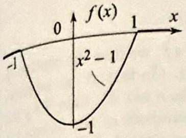

Figure 8 The function $f(x$ and its derivatives in Exam ple 9.

figure 9 The convolution o imo Dirac deltas is anothe keled Dirac delta, supporte ${ }^{24}$ the sum of the supports.

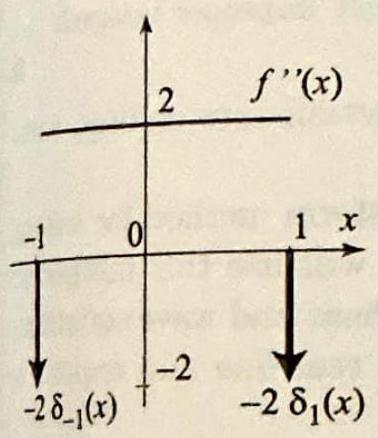

++++

Section 11.2 Operational Properties
719

EXAMPLE 9 Fourier transform of a piecewise smooth function
Find the Fourier transform of the function $f(x)$ in Figure 8.
Solution First we reduce the problem to finding Fourier transforms of generalized functions. Taking derivatives of $f$ (see Figure 8), we find that
$$
f^{\prime \prime}=2\left(\mathcal{U}_{-1}-\mathcal{U}_{1}\right)-2 \delta_{-1}-2 \delta_{1},
$$
where the delta functions are inserted to account for the jumps in $f^{\prime}$ at $\pm 1$. Computing the Fourier transform with the help of (21) and (23), we get
$$
\begin{aligned}
\mathcal{F}\left(f^{\prime \prime}\right) & =2 \mathcal{F}\left(\mathcal{U}_{-1}\right)-\mathcal{F}\left(\mathcal{U}_{1}\right)-2\left(\mathcal{F}\left(\delta_{-1}\right)+\mathcal{F}\left(\delta_{1}\right)\right) \\
& =\frac{-2 i}{\sqrt{2 \pi}} \frac{e^{i \omega}-e^{-i \omega}}{\omega}-\frac{2}{\sqrt{2 \pi}}\left(e^{i \omega}+e^{-i \omega}\right) \\
& =\frac{4}{\sqrt{2 \pi}} \frac{\sin \omega}{\omega}-\frac{4}{\sqrt{2 \pi}} \cos \omega
\end{aligned}
$$

Appealing to Theorem 1(ii), we have
$$
\mathcal{F}\left(f^{\prime \prime}\right)=-\omega^{2} \mathcal{F}(f) \Rightarrow \mathcal{F}(f)=\frac{-1}{\omega^{2}} \mathcal{F}\left(f^{\prime \prime}\right)
$$
and so
$$
\mathcal{F}(f)=\frac{4}{\sqrt{2 \pi} \omega^{2}}\left(\cos \omega-\frac{\sin \omega}{\omega}\right)
$$

Again, you should verify that the transform is continuous. (Consider its Taylor series about 0 .)

We now illustrate the use of generalized functions in computing convolutions. We start with the following simple but useful identity:
(25)
$$
\delta_{a} * \delta_{b}=\frac{1}{\sqrt{2 \pi}} \delta_{a+b}
$$

This interesting identity says that the convolution of two delta functions is another scaled delta function supported at the sum of the supports of the delta functions (Figure 9). To prove (25), take Fourier transforms on both sides and use (21) (Exercise 41).

Here is an interesting application of (25).

EXAMPLE 10 Convolution of a step function
Let $f(x)$ be the step function in Figure 10. Compute $f * f(x)$. (For the convolution of $f$ with itself $n$-times, see Exercise 46.)
Solution We have $f^{\prime}(x)=\delta_{-1}-\delta_{1}$. Also, from Theorem 5, and (25),
$$
\begin{aligned}
\frac{d^{2}}{d x^{2}}(f * f) & =f^{\prime} * f^{\prime}=\left(\delta_{-1}-\delta_{1}\right) *\left(\delta_{-1}-\delta_{1}\right) \\
& =\frac{1}{\sqrt{2 \pi}}\left(\delta_{-2}-2 \delta_{0}+\delta_{2}\right)
\end{aligned}
$$

---

<!-- Page 26 -->

Left margin note (page 26)

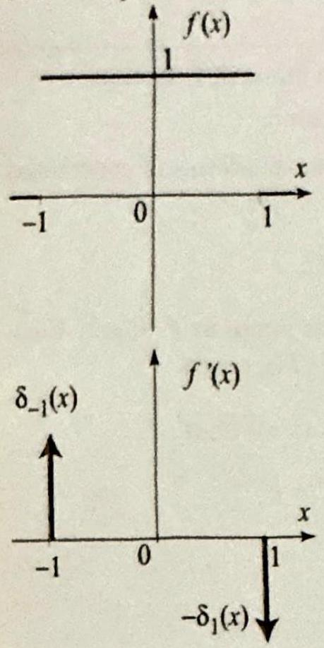

Figure $10 f(x)$ a Example 10.

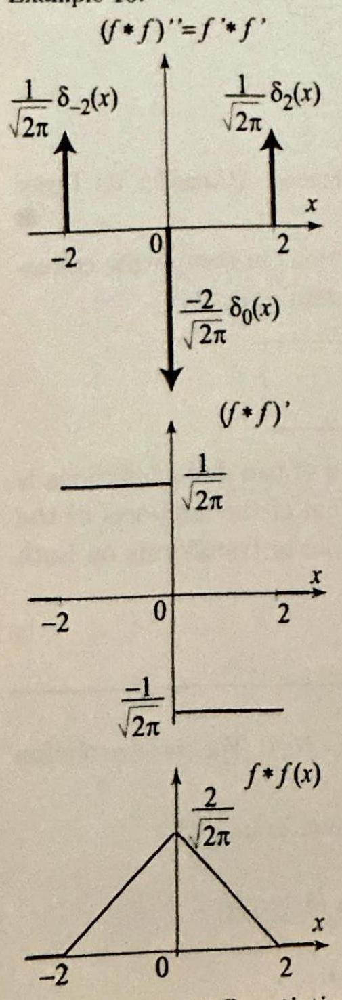

Figure 11 Antid in Example 10.

++++

The Fourier Transform and its Applications
Taking the antiderivative once and using (17), we find
$$
(f * f)^{\prime}=\frac{1}{\sqrt{2 \pi}}\left(U_{-2}-2 U_{0}+U_{2}\right),
$$
nd $f^{\prime}(x)$ in
* $f^{\prime}$
$\delta_{0}(x)$
$(f * f)^{\prime}$
$$
f * f(x)
$$
fferentiation
which is the step function depicted in Figure 11. To get $f * f$, we find the contin antiderivative of $(f * f)^{\prime}$, which is 0 outside a large interval. (In fact, it can be sh that if $f$ vanishes outside a set $A$ and $g$ vanishes outside a set $B$, then $f * g$ vanish outside the set $A+B$, which consists of all real numbers of the form $x$ where $x$ is in $A$ and $y$ is in $B$. In our example, $f$ vanishes outside $[-1,1]$, so $f$ will vanish outside $[-1,1]+[-1,1]=[-2,2]$.) This is not difficult to do with help of Figure 11, yielding the function $f * f$ in Figure 11. More explicitly, we
$$
f * f(x)=\left\{\begin{array}{ll}
0 & \text { if } x<-2, \\
\frac{1}{\sqrt{2 \pi}}(x+2) & \text { if }-2 \leq x \leq 0, \\
-\frac{1}{\sqrt{2 \pi}}(x-2) & \text { if } 0 \leq x \leq 2, \\
0 & \text { if } x>2 .
\end{array}\right.
$$

The method of this example can be applied to evaluate the $n$th convolution by itself, which in turn can be used to evaluate important improper integrals Exercise 47).

As you can see, the tricks with generalized functions are endless; s more will be presented in the exercises.

In the next section, we develop the Fourier transform method for sol partial differential equations on the real line. We will use this metho solve boundary value problems associated with the heat and wave equat and a variety of other important problems on the real line and regior the two dimensional space.

Exercises 11.2
In Exercises 1-16 use the operational properties and a known Fourier transfo compute the Fourier transform of the given function.
1. $f(x)=x^{2} e^{-x^{2}}$.
3. $f(x)=\frac{x}{\left(1+x^{2}\right)^{2}}$.
5. $f(x)=(1+6 x) e^{-|x|}$.
7. $f(x)=e^{-\frac{x^{2}}{2}+x-3}$.
9.
$$
f(x)=\left\{\begin{array}{ll}
x & \text { if } 0<x<1 \\
0 & \text { otherwise }
\end{array}\right.
$$
11. $f(x)=\frac{2 x}{\left(a^{2}+x^{2}\right)^{2}}, \quad a \neq 0$.
13. $f(x)=\left(1-x^{2}\right) e^{-x^{2}}$.
15. $f(x)=x e^{-\frac{1}{2}(x-1)^{2}}$.
2. $f(x)=x e^{-|x|}$.
4. $f(x)=\frac{x^{2}}{\left(1+x^{2}\right)^{2}}$.
6. $f(x)=e^{-x^{2}-2 x}$.
8. $f(x)=e^{-2 x^{2}+3 i x}$.
10.
$$
f(x)=\left\{\begin{array}{ll}
0 & \text { if } x<0 \text { or } x> \\
x^{2} & \text { if } 0<x<1
\end{array}\right.
$$
12. $f(x)=\frac{a-i x}{a^{2}+x^{2}}, \quad a \neq 0$.
14. $f(x)=(1-x)^{2} e^{-|x|}$.
16. $f(x)=(1-x) e^{-|x-1|}$.

---

<!-- Page 27 -->

Left margin note (page 27)

$\_\_\_\_$
I

++++

Section 11.2 Operational Properties

In Exercises 17-22, (a) find the Fourier transforms of $f$ and $g$.
(b) Find Fourier transform of $f * g$. (c) What is $f * g$ ? [Hint: Compute $f * g(x)$ using $t$ method of Example 4. If needed, use the table of Fourier transforms (Appendix B. to assist you in inverting the Fourier transform of $f * g$.]
17. $f(x)=e^{-x^{2}}, g(x)=x e^{-x^{2}}$.
18. $f(x)=x e^{-x^{2}}, g(x)=x e^{-x^{2}}$.
19. $f(x)=e^{-(x-1)^{2}}, g(x)=e^{-(x+1)^{2}}$.
20. $f(x)=\mathcal{U}_{-1}(x)-\mathcal{U}_{1}(x), g(x)=\left(\mathcal{U}_{-1}(x)-\mathcal{U}_{1}(x)\right) x$.
21. $f(x)=\mathcal{U}_{-a}(x)-\mathcal{U}_{a}(x), g(x)=\mathcal{U}_{-b}(x)-\mathcal{U}_{b}(x)$, where $0<a \leq b$.
22. $f(x)=\mathcal{U}_{-1}(x)-\mathcal{U}_{1}(x)+\mathcal{U}_{2}(x)-\mathcal{U}_{3}(x), g(x)=\mathcal{U}_{-1}(x)-\mathcal{U}_{1}(x)$.
23. Basic properties of convolutions. Establish the following properties convolutions. For (a) and (b), use operational properties of the Fourier transforr
(a) $f *(g * h)=(f * g) * h \quad$ (associativity).
(b) Let $a$ be a real number and let $f_{a}$ denote the translate of $f$ by $a$, that $f_{a}(x)=f(x-a)$. Show that $\left(f_{a}\right) * g=f *\left(g_{a}\right)=(f * g)_{a}$. This important proper says that convolutions commute with translations.
(c) Integrability of the convolution. Show that if $f$ and $g$ are integrabl then so is $f * g$. (It is also continuous.) [Hint: Use the definition of convolutio interchange orders of integration and use $\mid \int\left(f(x) d x\left|\leq \int\right| f(x) \mid d x\right.$.]
24. (a) Show that $x(f * g)=(x f) * g+f *(x g)$.
[Hint: Fourier transform.]
(b) Verify the identity in (a) with $f(x)=g(x)=e^{-x^{2}}$.
25. Convolution with a complex exponential.
(a) Show that $e^{i \alpha x} * f(x)=\widehat{f}(\alpha) e^{i \alpha x}$.
(b) Compute $\cos x * e^{-|x|}$.
[Hint: $\cos x=\frac{e^{i x}+e^{-i x}}{2}$.]
26. Shifting on the $\omega$-axis. Using Theorem 3, prove the following identities:
$$
\begin{aligned}
\mathcal{F}(\cos (a x) f(x))(\omega) & =\frac{\widehat{f}(\omega-a)+\widehat{f}(\omega+a)}{2} \\
\mathcal{F}(\sin (a x) f(x))(\omega) & =\frac{\widehat{f}(\omega-a)-\widehat{f}(\omega+a)}{2 i} \\
\mathcal{F}^{-1}(\cos (a \omega) \widehat{f}(\omega))(x) & =\frac{f(x-a)+f(x+a)}{2} \\
\mathcal{F}^{-1}(\sin (a \omega) \widehat{f}(\omega))(x) & =\frac{f(x+a)-f(x-a)}{2 i}
\end{aligned}
$$

In Exercises 27-32, use Exercise 26 and known transforms to compute the Fouri transform of the given function.
27. $f(x)=\frac{\cos x}{e^{x^{2}}}$.
$28 f(x)=\frac{\sin 2 x}{e^{|x|}}$.
29. $f(x)=\frac{\cos x+\cos 2 x}{1+x^{2}}$.
30. $f(x)=\frac{\sin x+\cos 2 x}{4+x^{2}}$.

31
$$
f(x)=\left\{\begin{array}{ll}
\cos x & \text { if }|x|<1 \\
0 & \text { otherwise }
\end{array}\right.
$$
32.
$$
f(x)=\left\{\begin{array}{ll}
\sin x & \text { if }|x|<1 \\
0 & \text { otherwise }
\end{array}\right.
$$

---

<!-- Page 28 -->

Left margin note (page 28)

722
Chapter 11

Right margin note (page 28)

urier $n$ and
$-j$ ).
onvo-
ourier

1 (see
teger derive
defi-
entity
follow
$p-1$ )-
sforms
$\frac{p_{n}(\omega)}{\sqrt{1-\omega^{2}}}$,

++++

The Fourier Transform and its Applications
In Exercises 33-38, follow the method of Examples 8 and 9 to compute the Fo transform of the given function. To illustrate your answer, graph the function its derivatives, including the parts with generalized functions.
33. $U_{2}(x)-U_{4}(x)$.
34. $\left(\mathcal{U}_{-1}-\mathcal{U}_{1}(x)\right)|x|$.
35. $\sum_{j=0}^{5}(-1)^{j}\left(\mathcal{U}_{j}(x)-\mathcal{U}_{j+1}(x)\right)$.
36. $\sum_{j=0}^{5}(-1)^{j}\left(\mathcal{U}_{j}(x)-\mathcal{U}_{j+1}(x)\right)(x$
37. $\left(\mathcal{U}_{0}(x)-\mathcal{U}_{1}(x)\right) x+\left(\mathcal{U}_{1}(x)-\mathcal{U}_{2}(x)\right)(2-x)$.
38. $\left(\mathcal{U}_{-1}(x)-\mathcal{U}_{1}(x)\right) x^{2}$.

In Exercises 39-40, follow the method of Example 10 to compute the given lution.
39. $f * f * f(x)$ where $f(x)=\mathcal{U}_{-1}(x)-\mathcal{U}_{1}(x)$.
40. $f * g(x)$ where $f(x)=\mathcal{U}_{-1}(x)-\mathcal{U}_{1}(x)$ and $g(x)=\left(\mathcal{U}_{-1}-\mathcal{U}_{1}(x)\right) x$.
41. Prove (25), using the Fourier transform.
42. Fourier transforms and dilations. (a) Show that
$$
\mathcal{F}(f(a x))(\omega)=\frac{1}{|a|} \mathcal{F}(f)\left(\frac{\omega}{a}\right), \quad a \neq 0
$$
(b) Use (a) to derive the Fourier transform of $g(x)=e^{-2|x|}$ from the F transform of $f(x)=e^{-|x|}$.
43. Use Plancherel's theorem to derive the value of $\int_{-\infty}^{\infty}\left(\frac{\sin x}{x}\right)^{4} d x$ in Table Exercise 47). [Hint: Find a function whose Fourier transform is $\left(\frac{\sin \omega}{\omega}\right)^{2}$.]
44. Project Problem: Fourier transform of Bessel functions of in order. This exercise is based on Exercise 18 of the previous section. We will the formula
$$
\mathcal{F}\left(J_{n}(x)\right)(\omega)=\left\{\begin{array}{ll}
\sqrt{\frac{2}{\pi}} \frac{(-i)^{n}}{\sqrt{1-\omega^{2}}} T_{n}(\omega) & \text { if }|\omega|<1 \\
0 & \text { if }|\omega|>1
\end{array}\right.
$$
where $T_{n}$ is the $n$th Chebyshev polynomial (see Exercise 57, Section 1.3, fo nitions and properties of these polynomials).
(a) Using the operational properties of the Fourier transform and the id $\frac{d}{d x} J_{0}=-J_{1}$, obtain the Fourier transform of $J_{1}(x)$ :
$$
\mathcal{F}\left(J_{1}(x)\right)(\omega)=\left\{\begin{array}{ll}
\sqrt{\frac{2}{\pi}} \frac{-i \omega}{\sqrt{1-\omega^{2}}} & \text { if }|\omega|<1 \\
0 & \text { if }|\omega|>1
\end{array}\right.
$$

Now that you have the Fourier transforms of $J_{0}$ and $J_{1}$, explain how these from (26) with $n=0$ and 1 .
(b) Use the identity $J_{p-1}-J_{p+1}=2 J_{p}^{\prime}$ (see Section 9.7) to derive that $\mathcal{F}(J \mathcal{F}\left(J_{p+1}\right)=2 i \omega \mathcal{F}\left(J_{p}\right)$. Conclude from what you know about the Fourier tran of $J_{0}$ and $J_{1}$ that $J_{n}(\omega)=0$ if $|\omega|>1$ and that for $|\omega|<1 J_{n}(\omega)=\sqrt{\frac{2}{\pi}}$

---

<!-- Page 29 -->

Section 11.2 Operational Properties
723

where $p_{n}(x)$ is a polynomial of degree $n$ in $x$ satisfying the recurrence relation $p_{n-1}(x)-p_{n+1}(x)=2 i x p_{n}(x)$.
(c) Verify that $p_{0}(x)=1=T_{0}(x), p_{1}(x)=-i x=-i T_{1}(x)$. More generally, show that the $p_{n}(x)=(-i)^{n} T_{n}(x)$. [Hint: Write $p_{n}(x)=(-i)^{n} q_{n}(x)$. We have $q_{0}=T_{0}$ and $q_{1}=T_{1}$. Use the recurrence relation for the $p_{n}$ 's to show that $q_{n-1}+ q_{n+1}=2 x q_{n}$. Since this is the recurrence relation for the Chebyshev polynomials (Exercise 58(e), Section 1.3), it follows that $q_{n}=T_{n}$.]
45. Project Problem: Fourier transforms involving Bessel functions of half-integer order and Legendre polynomials. We will derive the following Fourier transform for $n=0,1,2, \ldots$,
$$
\mathcal{F}\left(\frac{J_{n+\frac{1}{2}}(x)}{\sqrt{x}}\right)(\omega)=\left\{\begin{array}{ll}
(-i)^{n} P_{n}(\omega) & \text { if }|\omega|<1, \\
0 & \text { if }|\omega|>1,
\end{array}\right.
$$
where $P_{n}$ is the $n$th Legendre polynomial (see Section 10.5 for definitions and properties of these polynomials). To establish the identity, proceed as follows.
(a) Show that the functions $f_{n}(x)=\frac{J_{n+\frac{1}{2}}(x)}{\sqrt{x}}$ satisfy the recurrence relation
$$
x f_{n-1}+x f_{n+1}=(2 n+1) f_{n} .
$$
[Hint: Use (6), Section 9.7.]
(b) Conclude that $i \frac{d}{d \omega} \widehat{f_{n-1}}+i \frac{d}{d \omega} \widehat{f_{n+1}}=(2 n+1) \widehat{f_{n}}$.
(c) Compute $\widehat{f_{n}}$ for $n=0$ and 1 directly and show that they fit the formula (27).

Conclude from (b) that, for $n \geq 2, \widehat{f_{n}}(\omega)$ is 0 if $|\omega|>1$ and is a polynomial of degree $n$ for $|\omega|<1$.
(d) Complete the proof by showing that the functions $(-i)^{n} P_{n}(\omega)$ satisfy the recurrence relation in (b).
46. Project Problem: Convolutions of the indicator function. In this exercise we derive the following interesting formula. Let $f(x)=\mathcal{U}_{0}(x)-\mathcal{U}_{1}(x)$, and let $n \geq 2$ be an integer. Define the $n$th convolution of $f$ by itself by
$$
f^{* n}(x)=\overbrace{f * f * \cdots * f}^{n \text { of these }} .
$$

Then $f^{* n}(x)=0$ if $x<0$ or $x>n$, and for $x$ in $[0, n]$, we have
$$
f^{* n}(x)=\frac{1}{(2 \pi)^{\frac{n-1}{2}}(n-1)!} \sum_{k=0}^{[x]}(-1)^{k}\binom{n}{k}(x-k)^{n-1},
$$
where $[x]$ denotes the greatest integer in $x$ and $\binom{n}{k}$ is the binomial coefficient Follow the suggested proof and supply all the missing details by referring to appro priate operational properties of the Fourier transform and generalized functions.
Suggested Proof We have
$$
\left(\frac{d}{d x}\right)^{n} f^{* n}(x)=\left(f^{\prime}\right)^{* n}(x) \quad \text { and } \quad f^{\prime}(x)=\delta_{0}(x)-\delta_{1}(x) ;
$$

---

<!-- Page 30 -->

Left margin note (page 30)

724 Chapter 11

Right margin note (page 30)

1868
$\pi$
Ous
It
Let
46.
stify
$z+b \cdot$ ]
$x$ to

1 we
nishes
purier as in

++++

he Fourier Transform and its Applications
so
$$
\left(f^{\prime}\right)^{* n}(x)=\frac{1}{(2 \pi)^{n-1}} \sum_{k=0}^{n}(-1)^{k}\binom{n}{k} \delta_{k}(x)
$$

To obtain (29), integrate from $-\infty$ to $x, n$-times. (You may want to do the $c n=2$ and 3 first.)
47. Project Problem. We will derive the following formula, for $n=2,3, \ldots$
$$
I_{n}=\int_{-\infty}^{\infty}\left(\frac{\sin x}{x}\right)^{n} d x=\frac{\pi}{(n-1)!} \sum_{k=0}^{\left[\frac{n}{2}\right]}(-1)^{k}\binom{n}{k}\left(\frac{n}{2}-k\right)^{n-1}
$$

We have already computed $I_{1}=\pi$ (with the help of residue theory) and $I_{2}$ (with the help of Plancherel's theorem). We now use the result of the previ exercise to derive the values of the integral for all other values of $n=2,3, \ldots$. will be convenient to work with the indicator function of a symmetric interval. $g(x)=\mathcal{U}_{-\frac{1}{2}}(x)-\mathcal{U}_{\frac{1}{2}}(x)$. Note that $g(x)=f\left(x+\frac{1}{2}\right)$, where $f$ is as in Exercise (a) Using the result of Exercise 46, show that for $x$ in $\left[-\frac{n}{2}, \frac{n}{2}\right]$,
$$
g^{* n}=\frac{1}{(2 \pi)^{\frac{n-1}{2}}(n-1)!} \sum_{k=0}^{\left[\frac{n}{2}+x\right]}(-1)^{k}\binom{n}{k}\left(x+\frac{n}{2}-k\right)^{n-1} .
$$
[Hint: The formula is obtained by translating the formula for $f^{* n}$ by $\frac{n}{2}$. To ju this, verify that if $\phi_{a}$ and $\psi_{b}$ are translates of $\phi$ and $\psi$, then $\phi_{a} * \psi_{b}=(\phi * \psi)$.
(b) Show that
$$
G_{n}(\omega)=\mathcal{F}\left(g^{* n}\right)=\left(\sqrt{\frac{2}{\pi}} \frac{\sin \frac{\omega}{2}}{\omega}\right)^{n}
$$
(c) Use the reciprocity relations and the fact that $\mathcal{F}(\phi)(0)=\frac{1}{\sqrt{2 \pi}} \int_{-\infty}^{\infty} \phi(x) d$ prove that $\frac{1}{\sqrt{2 \pi}} \int_{-\infty}^{\infty} G_{n}(x) d x=g^{* n}(0)$. Conclude that
$$
\int_{-\infty}^{\infty}\left(\frac{\sin \frac{x}{2}}{x}\right)^{n} d x=\frac{\pi}{2^{n-1}(n-1)!} \sum_{k=0}^{\left[\frac{n}{2}\right]}(-1)^{k}\binom{n}{k}\left(\frac{n}{2}-k\right)^{n-1}
$$
(d) Make a change of variables in the integral in (c) to obtain (30). In Table used (30) to compute $I_{n}$ for $n=2,3, \ldots, 8$.

\begin{table}
| $n$ | 1 | 2 | 3 | 4 | 5 | 6 | 7 | 8 |
| :---: | :---: | :---: | :---: | :---: | :---: | :---: | :---: | :---: |
| $\int_{-\infty}^{\infty}\left(\frac{\sin x}{x}\right)^{n} d x$ | $\pi$ | $\pi$ | $\frac{3 \pi}{4}$ | $\frac{2 \pi}{3}$ | $\frac{115 \pi}{192}$ | $\frac{11 \pi}{20}$ | $\frac{5887 \pi}{11520}$ | $\frac{151 \pi}{315}$ |
\captionsetup{labelformat=empty}
\caption{Table 1}
\end{table}
48. Give an example of two functions $f$ and $g$ such that neither one var identically on any interval but $f * g$ is identically 0 . [Hint: Think on the F transform side. Let $\hat{f}$ be a tent function supported over the interval $(-2,2)$,

Figure 6. Define $\hat{g}$ by translating $\hat{f}$ to the left (or right) by 4 units.]

---

<!-- Page 31 -->

Left margin note (page 31)

11.3 The Fou

FOU
TRANSFOR
THE $\boldsymbol{x}$ VARI

FOU
TRANSFORM
PAI
DERIVA ${ }^{7}$
Note that on the right (2) and (3) we have us nary derivatives in $t$ in partial derivatives. son is to emphasize cial fact that, in appl Fourier transform met will transform a partia ential equation in $u(x$ an ordinary differentic tion in $\widehat{u}(\omega, t)$, where variable. This will more apparent in the ples.

++++

Section 11.3 The Fourier Transform Method
725

rier Transform Method
In this section we describe a method for solving boundary value problems, where one of the variables, $x, y, z$ or $t$ belongs to the real line. These include, for example, the wave and heat equations on the real line, and Laplace's equation in upper half-plane and others.

We will be computing Fourier transforms of functions of the form $u(x, t)$, where $x$ and $t$ are the variables, and at least one of them varies in the interval $(-\infty, \infty)$, say $-\infty<x<\infty$. Because of the presence of two variables, care is needed in identifying the variable with respect to which the Fourier transform is computed. For example, for fixed $t$, the function $u(x, t)$ becomes a function of the spatial variable $x$, and as such, we can take its Fourier transform with respect to the $x$ variable. We denote this transform by $\widehat{u}(\omega, t)$. Thus

RIER M IN ABLE
$$
\mathcal{F}(u(x, t))(\omega)=\widehat{u}(\omega, t)=\frac{1}{\sqrt{2 \pi}} \int_{-\infty}^{\infty} u(x, t) e^{-i \omega x} d x
$$

To illustrate the use of this notation we compute some very useful transforms. We will assume that the function $u(x, t)$, as a function of $x$, has sufficient properties that enable us to use freely the operational properties of the Fourier transform from Section 11.2.

RIER AND RTIAL CIVES sides of ed ordistead of The reathe cruying the hod, we l differ, t) into l equa$t$ is the become exam-

Given $u(x, t)$ with $-\infty<x<\infty$ and $t>0$, we have
$$
\begin{array}{c}
\mathcal{F}\left(\frac{\partial}{\partial t} u(x, t)\right)(\omega)=\frac{d}{d t} \widehat{u}(\omega, t) \\
\mathcal{F}\left(\frac{\partial^{n}}{\partial t^{n}} u(x, t)\right)(\omega)=\frac{d^{n}}{d t^{n}} \widehat{u}(\omega, t), \quad n=1,2, \ldots \\
\mathcal{F}\left(\frac{\partial}{\partial x} u(x, t)\right)(\omega)=i \omega \widehat{u}(\omega, t) \\
\mathcal{F}\left(\frac{\partial^{n}}{\partial x^{n}} u(x, t)\right)(\omega)=(i \omega)^{n} \widehat{u}(\omega, t), \quad n=1,2, \ldots
\end{array}
$$

The last two identities are consequences of (1) and Theorem 1 of Section 11.2. To prove (2) we start with the right side and differentiate under the integral sign with respect to $t$ :
$$
\frac{d}{d t} \widehat{u}(\omega, t)=\frac{1}{\sqrt{2 \pi}} \frac{d}{d t} \int_{-\infty}^{\infty} u(x, t) e^{-i \omega x} d x=\frac{1}{\sqrt{2 \pi}} \int_{-\infty}^{\infty} \frac{\partial}{\partial t} u(x, t) e^{-i \omega x} d x
$$

The last expression is the Fourier transform of $\frac{\partial}{\partial t} u(x, t)$ as a function of $x$, and (2) follows. Repeated differentiation under the integral sign with respect to $t$ yields (3).

---

<!-- Page 32 -->

Left margin note (page 32)

726
Chapter 11

See Appendix A. 2 tion of second ord ferential equation

Right margin note (page 32)

ons is
ential
s the
$B$ are We
blem 1 distegral

++++

The Fourier Transform and its Applications
The Fourier Transform Method
The use of the Fourier transform to solve partial differential equati best described by examples. We start with the wave equation.

EXAMPLE 1 The wave equation for an infinite string Solve the boundary value problem
$$
\begin{aligned}
\frac{\partial^{2} u}{\partial t^{2}} & =c^{2} \frac{\partial^{2} u}{\partial x^{2}} & & (-\infty<x<\infty, t>0), \\
u(x, 0) & =f(x) & & (\text { initial displacement), } \\
\frac{\partial}{\partial t} u(x, 0) & =g(x) & & (\text { initial velocity }) .
\end{aligned}
$$

Give the answer as an inverse Fourier transform.
Solution We fix $t$ and take the Fourier transform of both sides of the differe equation and the initial conditions. Using (3) and (5) with $n=2$, we get
$$
\begin{aligned}
\frac{d^{2}}{d t^{2}} \widehat{u}(\omega, t) & =-c^{2} \omega^{2} \widehat{u}(\omega, t) \\
\widehat{u}(\omega, 0) & =\widehat{f}(\omega) \\
\frac{d}{d t} \widehat{u}(\omega, 0) & =\widehat{g}(\omega)
\end{aligned}
$$

It is clear that (6) is an ordinary differential equation in $\widehat{u}(\omega, t)$, where $t \mathrm{i}$ variable. Let us write (6) in the standard form
$$
\frac{d^{2}}{d t^{2}} \widehat{u}(\omega, t)+c^{2} \omega^{2} \widehat{u}(\omega, t)=0
$$

The general solution of this equation is
for the soluer linear difs (Case III).
$$
\widehat{u}(\omega, t)=A(\omega) \cos c \omega t+B(\omega) \sin c \omega t
$$
where $A(\omega)$ and $B(\omega)$ are constant in $t$. (You should note that while $A$ and constant in $t$, they can depend on $\omega$, which explains writing $A(\omega)$ and $B(\omega)$. determine $A(\omega)$ and $B(\omega)$ from the initial conditions (7) and (8) as follows:
$$
\begin{aligned}
\widehat{u}(\omega, 0)=A(\omega) & =\widehat{f}(\omega) \\
\frac{d}{d t} \widehat{u}(\omega, 0) & =c \omega B(\omega)=\widehat{g}(\omega)
\end{aligned}
$$

So
$$
\widehat{u}(\omega, t)=\widehat{f}(\omega) \cos c \omega t+\frac{1}{c \omega} \widehat{g}(\omega) \sin c \omega t
$$

To get the solution we use the inverse Fourier transform and get
$$
u(x, t)=\frac{1}{\sqrt{2 \pi}} \int_{-\infty}^{\infty}\left[\hat{f}(\omega) \cos c \omega t+\frac{1}{c \omega} \hat{g}(\omega) \sin c \omega t\right] e^{i \omega x} d \omega
$$

Formula (9) gives you the solution of the wave boundary value pro in the form of an integral involving the Fourier transform of the initia placement and velocity. In specific cases, these transforms and the in

---

<!-- Page 33 -->

Left margin note (page 33)

Once again, since we are ing with a family of diff tial equations (one for $\omega$ ), we must use a diff constant for each equa which explains the use o notation $A(\omega)$.

++++

Section 11.3 The Fourier Transform Method

can be computed explicitly. Even in its general form, (9) can be compute explicitly in terms of $f$ and $g$ to yield d'Alembert's form of the solution (See Exercise 21.)

We summarize the Fourier transform method as follows.
Step 1: Fourier transform the given boundary value problem in $u(x, t)$ an get an ordinary differential equation in $\widehat{u}(\omega, t)$ in the variable $t$.
Step 2: Solve the ordinary differential equation and find $\widehat{u}(\omega, t)$.
Step 3: Inverse Fourier transform $\widehat{u}(\omega, t)$ to get $u(x, t)$.
This simple method is successful in treating a variety of partial differentia equations. In our next example we use it to solve the heat equation or the real line. The example models the transfer of heat in a very long ro extending in both directions on the $x$-axis.

EXAMPLE 2 The heat equation for an infinite rod
Solve the boundary value problem
$$
\begin{aligned}
\frac{\partial u}{\partial t} & =c^{2} \frac{\partial^{2} u}{\partial x^{2}} & & (-\infty<x<\infty, t>0), \\
u(x, 0) & =f(x) & & \text { (initial temperature distribution). }
\end{aligned}
$$

Give your answer in the form of an inverse Fourier transform.
Solution Fourier transforming the boundary value problem, we get
$$
\begin{aligned}
\frac{d}{d t} \widehat{u}(\omega, t) & =-c^{2} \omega^{2} \widehat{u}(\omega, t) \\
\widehat{u}(\omega, 0) & =\widehat{f}(\omega)
\end{aligned}
$$

The general solution of the first order differential equation in $t$ is
$$
\widehat{u}(\omega, t)=A(\omega) e^{-c^{2} \omega^{2} t},
$$
where $A(\omega)$ is a constant that depends on $\omega$. Setting $t=0$ and using the transformed initial condition, we get
$$
\widehat{u}(\omega, 0)=A(\omega)=\widehat{f}(\omega)
$$

Hence
$$
\widehat{u}(\omega, t)=\widehat{f}(\omega) e^{-c^{2} \omega^{2} t}
$$

Taking inverse Fourier transforms we get the solution
$$
u(x, t)=\frac{1}{\sqrt{2 \pi}} \int_{-\infty}^{\infty} \widehat{f}(\omega) e^{-c^{2} \omega^{2} t} e^{i \omega x} d \omega
$$

Formula (10) gives you the solution of the heat boundary value problem in the form of an integral involving the Fourier transform of the initial heat distribution. In the next section, we will compute this integral and give

---

<!-- Page 34 -->

Left margin note (page 34)

728
Chapter 11

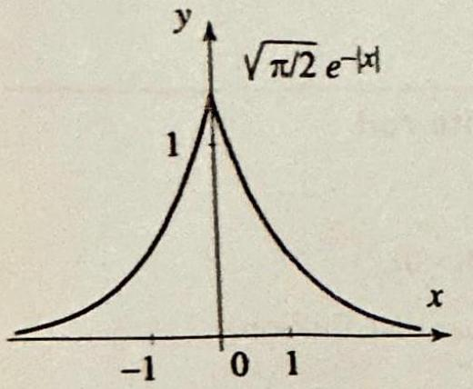

Figure 1 Graph

Right margin note (page 34)

thod
ves
ase, we nsform orm of

++++

The Fourier Transform and its Applications
the answer as a convolution of $f$ and a fixed function known as the he Gauss's kernel.

Our next two examples illustrate the use of the Fourier transform me in solving problems with mixed and higher order derivatives.

EXAMPLE 3 The Fourier transform method with mixed derivati
Solve the boundary value problem
$$
\begin{aligned}
\frac{\partial^{2} u}{\partial t \partial x} & =\frac{\partial^{2} u}{\partial x^{2}}(-\infty<x<\infty, t>0) \\
u(x, 0) & =\sqrt{\frac{\pi}{2}} e^{-|x|}
\end{aligned}
$$

$\overline{2} e^{-|x|}$

The function $f(x)=\sqrt{\frac{\pi}{2}} e^{-|x|}$ is shown in Figure 1.
Solution Using (2) and (4), we obtain
$$
\mathcal{F}\left(\frac{\partial^{2} u}{\partial t \partial x}\right)=\mathcal{F}\left(\frac{\partial}{\partial t} \frac{\partial u}{\partial x}\right)=\frac{d}{d t} \mathcal{F}\left(\frac{\partial u}{\partial x}\right)=i \omega \frac{d \widehat{u}}{d t}(\omega, t) .
$$

Fourier transforming the differential equation and using (5), we get

of $\sqrt{\frac{\pi}{2}} e^{-|x|}$.
$$
i \omega \frac{d \widehat{u}}{d t}(\omega, t)=-\omega^{2} \widehat{u}(\omega, t) .
$$

Solving this first order ordinary differential equation, we find
$$
\widehat{u}(\omega, t)=A(\omega) e^{i \omega t} .
$$

The initial condition implies that
$$
\widehat{u}(\omega, 0)=\mathcal{F}\left(\sqrt{\frac{\pi}{2}} e^{-|x|}\right)=\frac{1}{1+\omega^{2}},
$$
and so $A(\omega)=\frac{1}{1+\omega^{2}}$. Hence
$$
\widehat{u}(\omega, t)=\frac{e^{i \omega t}}{1+\omega^{2}}
$$
and the solution $u$ is obtained by taking inverse Fourier transforms. In this $\mathbf{c}$ can determine $u$ explicitly by using the shifting property of the Fourier tra (Theorem 3(i), Section 11.2). We first note that the inverse Fourier transt $\frac{1}{1+\omega^{2}}$ is $\sqrt{\frac{\pi}{2}} e^{-|x|}$. Hence by the shifting property,
$$
u(x, t)=\mathcal{F}^{-1}\left(\frac{e^{i \omega t}}{1+\omega^{2}}\right)=\sqrt{\frac{\pi}{2}} e^{-|x+t|} .
$$

The solution is illustrated in Figure 2.

---

<!-- Page 35 -->

Left margin note (page 35)

2 Graphs of $u(x, t)$ in 3 at various values of

++++

Section 11.3 The Fourier Transform Method
729

Our next example features an important use of implicit conditions that re not usually given as part of the statement of the problem.

XAMPLE 4 Use of implicit boundedness assumptions
olve the boundary value problem
$$
\begin{aligned}
\frac{\partial^{2} u}{\partial t^{2}} & =\frac{\partial^{4} u}{\partial x^{4}} \quad(-\infty<x<\infty, t>0) \\
u(x, 0) & =f(x)
\end{aligned}
$$
ive your answer in the form of an inverse Fourier transform.
olution Fourier transforming the problem gives
$$
\begin{aligned}
\frac{d^{2} \widehat{u}}{d t^{2}}(\omega, t)-\omega^{4} \widehat{u}(\omega, t) & =0 \quad\left(\text { because }(i \omega)^{4}=\omega^{4}\right) \\
\widehat{u}(\omega, 0) & =\widehat{f}(\omega)
\end{aligned}
$$
lving the second order differential equation in $t$ yields
$$
\widehat{u}(\omega, t)=A(\omega) e^{-\omega^{2} t}+B(\omega) e^{\omega^{2} t}
$$
this point, we impose certain boundedness conditions on $\widehat{u}(\omega, t)$. These condins follow from the fact that the solution (in most reasonable cases) should have bounded Fourier transform $\widehat{u}$ for all $t>0$ and $\omega$. Consequently, this assumption ces $B(\omega)=0$ for all $\omega$; otherwise, by letting $t \rightarrow \infty$, we get an unbounded urier transform. Hence,
$$
\widehat{u}(\omega, t)=A(\omega) e^{-\omega^{2} t} .
$$
ow, using the transformed initial condition, we get
$$
\widehat{u}(\omega, t)=\widehat{f}(\omega) e^{-\omega^{2} t} .
$$
nally, taking the inverse Fourier transform yields
$$
u(x, t)=\frac{1}{\sqrt{2 \pi}} \int_{-\infty}^{\infty} \hat{f}(\omega) e^{-\omega^{2} t} e^{i \omega x} d \omega
$$

---

<!-- Page 36 -->

Left margin note (page 36)

730
Chapter 11 T

Right margin note (page 36)

the
ple $t$
$=0$
$\frac{t^{2}}{2}$ );
the

Give
$n$ the
$\leq \frac{\pi}{2}$,

++++

he Fourier Transform and its Applications

So far we have used the Fourier transform method to solve partial di ential equations with constant coefficients. As our next example illustr the method is also useful in solving problems with nonconstant coefficie

EXAMPLE 5 An equation with nonconstant coefficients
Solve
$$
t \frac{\partial u}{\partial x}+\frac{\partial u}{\partial t}=0 \quad u(x, 0)=f(x)
$$
where $-\infty<x<\infty, t>0$. Simplify your answer as much as possible.
Solution The new feature in this example is the presence of the term $t \frac{\partial u}{\partial x}$ in equation. Since we will use the Fourier transform with respect to $x$, the varial will be treated as a constant. Thus
$$
\mathcal{F}\left(t \frac{\partial u}{\partial x}\right)=t \mathcal{F}\left(\frac{\partial u}{\partial x}\right)=i \omega t \hat{u}(\omega, t)
$$

Going back to our problem, we use the Fourier transform and get
$$
\begin{array}{c}
i \omega t \widehat{u}(\omega, t)+\frac{d}{d t} \widehat{u}(\omega, t)=0, \\
\widehat{u}(\omega, 0)=\widehat{f}(\omega) .
\end{array}
$$

Solving the first order differential equation in $t$ yields
$$
\widehat{u}(\omega, t)=A(\omega) e^{-i \frac{t^{2}}{2} \omega},
$$
where the arbitrary constant, $A(\omega)$, is allowed to be a function of $\omega$. Putting $t$ implies
$$
\widehat{u}(\omega, t)=\widehat{f}(\omega) e^{-i \frac{t^{2}}{2} \omega} .
$$

To determine $u$, we appeal to Theorem 3, Section 11.2, and obtain
$$
u(x, t)=f\left(x-\frac{t^{2}}{2}\right)
$$

It is instructive to check our answer at this point. We have $u_{x}(x, t)=f^{\prime}(x-$ and, by the chain rule, $u_{t}(x, t)=-t f^{\prime}\left(x-\frac{t^{2}}{2}\right)$. Thus $t u_{x}+u_{t}=0$, verifying equation. At $t=0$, we get $u(x, 0)=f(x)$, as desired.
Exercises 11.3
In Exercises 1-6, determine the solution of the given wave or heat problem. your answer in the form of an inverse Fourier transform. Take the variables ranges $-\infty<x<\infty, t>0$.
1.
$$
\begin{array}{l}
\frac{\partial^{2} u}{\partial t^{2}}=\frac{\partial^{2} u}{\partial x^{2}} \\
u(x, 0)=\frac{1}{1+x^{2}}, \quad \frac{\partial u}{\partial t}(x, 0)=0 .
\end{array}
$$
2.
$$
\begin{array}{l}
\frac{\partial^{2} u}{\partial t^{2}}=\frac{\partial^{2} u}{\partial x^{2}} \\
u(x, 0)=\left\{\begin{array}{ll}
\cos x & \text { if }-\frac{\pi}{2} \leq x \\
0 & \text { otherwise }
\end{array}\right. \\
\frac{\partial u}{\partial t}(x, 0)=0
\end{array}
$$

---

<!-- Page 37 -->

Right margin note (page 37)

731

1 ,
$$
<2,
$$

++++

Section 11.3 The Fourier Transform Method
3.
$$
\begin{array}{l}
\frac{\partial u}{\partial t}=\frac{1}{4} \frac{\partial^{2} u}{\partial x^{2}} \\
u(x, 0)=e^{-x^{2}}
\end{array}
$$
4.
$$
\begin{array}{l}
\frac{\partial u}{\partial t}=\frac{1}{100} \frac{\partial^{2} u}{\partial x^{2}} \\
u(x, 0)=\left\{\begin{array}{ll}
100 & \text { if }-1<x< \\
0 & \text { otherwise }
\end{array}\right.
\end{array}
$$
5.
$$
\begin{array}{l}
\frac{\partial^{2} u}{\partial t^{2}}=c^{2} \frac{\partial^{2} u}{\partial x^{2}} \\
u(x, 0)=\sqrt{\frac{2}{\pi}} \frac{\sin x}{x}, \quad \frac{\partial u}{\partial t}(x, 0)=0
\end{array}
$$
6.
$$
\begin{array}{l}
\frac{\partial u}{\partial t}=\frac{\partial^{2} u}{\partial x^{2}} \\
u(x, 0)=\left\{\begin{array}{ll}
1-\frac{|x|}{2} & \text { if }-2<x \\
0 & \text { otherwise. }
\end{array}\right.
\end{array}
$$

In Exercises 7-20, solve the given problem. Take $-\infty<x<\infty$, and $t>0$.
7.
$$
\begin{array}{l}
\frac{\partial u}{\partial x}+3 \frac{\partial u}{\partial t}=0 \\
u(x, 0)=f(x)
\end{array}
$$
8.
$$
\begin{array}{l}
a \frac{\partial u}{\partial x}+b \frac{\partial u}{\partial t}=0 \\
u(x, 0)=f(x)
\end{array}
$$
9.
$$
\begin{array}{l}
t^{2} \frac{\partial u}{\partial x}-\frac{\partial u}{\partial t}=0 \\
u(x, 0)=3 \cos x
\end{array}
$$
10.
$$
\begin{array}{l}
a(t) \frac{\partial u}{\partial x}+\frac{\partial u}{\partial t}=0 \\
u(x, 0)=f(x)
\end{array}
$$
11.
$$
\begin{array}{l}
\frac{\partial u}{\partial x}=\frac{\partial u}{\partial t} \\
u(x, 0)=f(x)
\end{array}
$$
12.
$$
\begin{array}{l}
\frac{\partial u}{\partial t}+\sin t \frac{\partial u}{\partial x}=0 \\
u(x, 0)=\sin x
\end{array}
$$
13.
$$
\begin{array}{l}
\frac{\partial u}{\partial t}=t \frac{\partial^{2} u}{\partial x^{2}} \\
u(x, 0)=f(x)
\end{array}
$$
14.
$$
\begin{array}{l}
\frac{\partial u}{\partial t}=a(t) \frac{\partial^{2} u}{\partial x^{2}} \\
u(x, 0)=f(x)
\end{array}
$$
where $a(t)>0$.
15.
$$
\begin{array}{l}
\frac{\partial^{2} u}{\partial t^{2}}+2 \frac{\partial u}{\partial t}=-u \\
u(x, 0)=f(x), \quad u_{t}(x, 0)=g(x)
\end{array}
$$
16.
$$
\begin{array}{c}
\frac{\partial u}{\partial t}=e^{-t} \frac{\partial^{2} u}{\partial x^{2}} \\
u(x, 0)=100
\end{array}
$$

---

<!-- Page 38 -->

Left margin note (page 38)

732
Chapter 11

Right margin note (page 38)

and
tring
con-
heat
nd $k$
e 10,
tions
-axis

++++

The Fourier Transform and its Applications
17.
$$
\begin{array}{l}
\frac{\partial^{2} u}{\partial t^{2}}=\frac{\partial^{4} u}{\partial x^{4}} \\
u(x, 0)=\left\{\begin{array}{ll}
100 & \text { if }|x|<2 \\
0 & \text { otherwise }
\end{array}\right.
\end{array}
$$
18.
$$
\begin{array}{l}
\frac{\partial u}{\partial t}=t \frac{\partial^{4} u}{\partial x^{4}} \\
u(x, 0)=f(x)
\end{array}
$$
19.
$$
\begin{array}{l}
\frac{\partial^{2} u}{\partial t^{2}}=\frac{\partial^{3} u}{\partial t \partial x^{2}} \\
u(x, 0)=f(x), \quad u_{t}(x, 0)=g(x)
\end{array}
$$
20.
$$
\begin{array}{l}
\frac{\partial^{2} u}{\partial t^{2}}-4 \frac{\partial^{3} u}{\partial t \partial x^{2}}+3 \frac{\partial^{4} u}{\partial x^{4}}=0 \\
u(x, 0)=f(x), \quad u_{t}(x, 0)=g
\end{array}
$$
21. D'Alembert's solution of the wave equation
(a) Verify that
$$
u(x, t)=\frac{1}{2}[f(x-c t)+f(x+c t)]+\frac{1}{2 c} \int_{x-c t}^{x+c t} g(s) d s
$$
is a solution of the boundary value problem of Example 1.
(b) Derive d'Alembert's solution from (9) of this section and Theorem 3 Exercise 26 of Section 11.2.
22. (a) Use D'Alembert's solution to describe the vibration of a very long $\mathbf{s}$ with $c=1, f(x)=\cos x$ for $|x| \leq \frac{\pi}{2}$ and 0 otherwise, and $g(x)=0$.
(b) Draw the shape of the string at $t=0, \pi / 4, \pi / 2, \pi$.

Project Problem. Do Exercises 23 and 24 to solve a heat problem with vection.
23. Solve the boundary value problem
$$
\begin{aligned}
\frac{\partial u}{\partial t} & =c^{2} \frac{\partial^{2} u}{\partial x^{2}}+k \frac{\partial u}{\partial x}, \quad-\infty<x<\infty, \quad t>0 \\
u(x, 0) & =f(x)
\end{aligned}
$$

This problem models heat transfer in a long heated bar that is exchanging with the surrounding medium. This phenomenon is called convection, a is a positive constant called the coefficient of convection. (See Exercis Section 11.4, for the convolution form of the solution.)
24. Specialize Exercise 23 to the case $c=1, k=.5, f(x)=e^{-x^{2}}$.

Project Problem. In Exercises 25 and 26, you are asked to study the vibra of a very long elastic beam.
25. The vibrations of a very long beam extending in both directions on the $x$ are modeled by the boundary value problem
$$
\begin{aligned}
\frac{\partial^{2} u}{\partial t^{2}} & =c^{2} \frac{\partial^{4} u}{\partial x^{4}}, & -\infty<x<\infty, t>0 \\
u(x, 0) & =f(x), & \frac{\partial u}{\partial t}(x, 0)=g(x)
\end{aligned}
$$

---

<!-- Page 39 -->

Left margin note (page 39)

11.4 The Heat E

++++

Section 11.4 The Heat Equation and Gauss's Kernel
733

Solve this problem by the Fourier transform method.
26. Specialize Exercise 25 to the case $c=1, f(x)=\delta_{0}(x), g(x)=0$, where $\delta_{0}(x)$ is the Dirac delta function.
Project Problem. Do Exercises 27 and 28.
27. Solve the boundary value problem
$$
\begin{aligned}
\frac{\partial u}{\partial t} & =c^{2} \frac{\partial^{3} u}{\partial x^{3}}, \quad-\infty<x<\infty, t>0 \\
u(x, 0) & =f(x)
\end{aligned}
$$

This equation is known as the linearized Korteweg-de Vries equation.
28. Specialize Exercise 27 to the case $c=1, f(x)=e^{-x^{2} / 2}$.
quation and Gauss's Kernel
In the previous section we used the Fourier transform to solve familiar boundary value problems, such as heat and wave problems. The solution was expressed as an inverse Fourier transform involving the Fourier transforms of the initial data. For practical, numerical applications, it is desirable to evaluate the inverse Fourier transform and express the solution in terms of the initial data itself. In this and the next section we illustrate these ideas with two important applications associated with the heat equation and Dirichlet problems.

Let us start with the heat problem (Example 2, Section 11.3):
(1)
$$
\begin{aligned}
\frac{\partial u}{\partial t} & =c^{2} \frac{\partial^{2} u}{\partial x^{2}}, \quad(-\infty<x<\infty, t>0) \\
u(x, 0) & =f(x)
\end{aligned}
$$

From Example 2 of the previous section, we know that
$$
\widehat{u}(\omega, t)=\widehat{f}(\omega) e^{-c^{2} \omega^{2} t}
$$
and hence, by applying the inverse Fourier transform,
$$
u(x, t)=\frac{1}{\sqrt{2 \pi}} \int_{-\infty}^{\infty} \widehat{f}(\omega) e^{-c^{2} \omega^{2} t} e^{i \omega x} d \omega
$$

Our goal in this section is to evaluate this inverse Fourier transform in terms of $f$. We note from (2) that $\widehat{u}$ is the product of two Fourier transforms, one of them being $\widehat{f}$ and the other $e^{-c^{2} \omega^{2} t}$. Remembering that products of Fourier transforms correspond to convolutions, we see that $u$ is the convolution of $f$ with the function whose Fourier transform is $e^{-c^{2} \omega^{2} t}$. As we will see in a moment, this function is the so-called heat kernel or Gauss's kernel
$$
g_{t}(x)=\frac{1}{c \sqrt{2 t}} e^{-x^{2} / 4 c^{2} t}
$$

---

<!-- Page 40 -->

Left margin note (page 40)

734
Chapter 11

Figure 1 Gauss' $g_{t}(x)$, is one of the portant functions mathematics. For e the graph of $g_{t}(x)$ shaped curve, symm respect to the $y$-as tends to zero, the come more and mor near zero. The a each curve is consta $t$ varies (see Exercis

THEC
SOLUTION HEAT EQUAT

A CONVOI

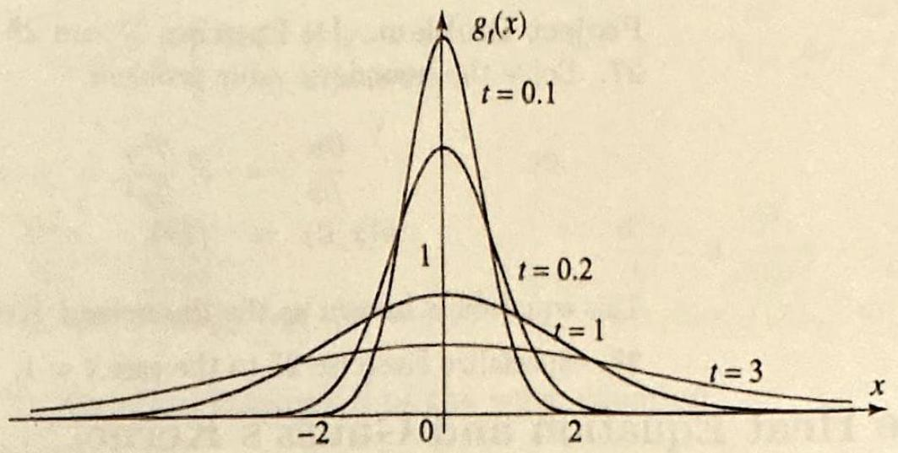

Figure 2 The er is the integral of function.

Right margin note (page 40)

ction
wing
ution

urier with as in We d by and as a , see heat

ature
cerms

++++

The Fourier Transform and its Applications
(We think of the heat kernel $g_{t}(x)$ as a family of functions of $x$; one fun for each $t>0$, as illustrated in Figure 1.) This leads us to the follo
kernel, most imn applied ach $t>0$, is a belletric with is. As $t$ curves bee localized rea under nt, even as se 29).

OREM 1
OF THE
ION AS
LUTION

$\mathrm{f}(w)$

ror function
a Gaussian
important result.

The solution of the heat equation (1) with initial temperature distrib $f$ is the convolution of $f$ with the heat kernel. More explicitly,
$$
u(x, t)=\frac{1}{c \sqrt{2 t}} e^{-x^{2} / 4 c^{2} t} * f=\frac{1}{2 c \sqrt{\pi t}} \int_{-\infty}^{\infty} f(s) e^{-(x-s)^{2} / 4 c^{2} t} d s
$$

Proof We have to show that the function $g_{t}(x)=\frac{1}{c \sqrt{2 t}} e^{-x^{2} / 4 c^{2} t}$ has Fo transform $e^{-c^{2} \omega^{2} t}$. But this is immediate from Example 5 of Section 11.1, $a=\frac{1}{4 c^{2} t}$.

With the help of (4) we can express the solution of some problen terms of special functions that can be used to study the solution. illustrate with the so-called error function (Figure 2), which is define
$$
\operatorname{erf}(w)=\frac{2}{\sqrt{\pi}} \int_{0}^{w} e^{-z^{2}} d z, \quad \text { for all } w
$$

The error function is used in different contexts of applied mathematics probability. Its numerical values are tabulated and it is available standard function in most computer systems. For its basic properties Exercise 15. In the next example, we express the solution of the given problem in terms of the error function.

EXAMPLE 1 An application of the error function
Solve the heat problem on the infinite line with $c=1$ and initial temper distribution $f(x)=100$ if $|x|<1$ and 0 otherwise. Express your answer in of the error function.
Solution Applying (4), we obtain
$$
u(x, t)=\frac{50}{\sqrt{\pi t}} \int_{-1}^{1} e^{-(x-s)^{2} / 4 t} d s
$$

---

<!-- Page 41 -->

Left margin note (page 41)

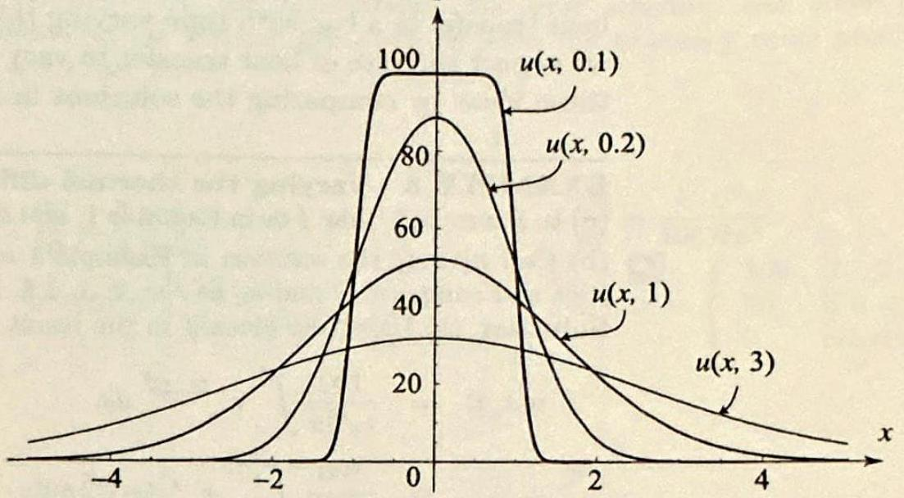

Figure 3 The temperatu distribution in Example 1 ratious values of $t>0$. F small values of $t$, the tempe ature in the bar is close the initial temperature distr bution. As $t$ increases, th temperature spreads throug the bar and eventually tend to 0 .

++++

Section 11.4 The Heat Equation and Gauss's Kernel
735

Let $z=\frac{x-s}{2 \sqrt{t}}, d z=\frac{-1}{2 \sqrt{t}} d s$, then
$$
\begin{aligned}
u(x, t) & =\frac{100}{\sqrt{\pi}} \int_{\frac{z-1}{2 \sqrt{t}}}^{\frac{x+1}{2 \sqrt{t}}} e^{-z^{2}} d z=\frac{100}{\sqrt{\pi}}\left(\int_{0}^{\frac{x+1}{2 \sqrt{t}}} e^{-z^{2}} d z-\int_{0}^{\frac{x-1}{2 \sqrt{t}}} e^{-z^{2}} d z\right) \\
& =50\left[\operatorname{erf}\left(\frac{x+1}{2 \sqrt{t}}\right)-\operatorname{erf}\left(\frac{x-1}{2 \sqrt{t}}\right)\right] \quad \text { (by (5)) }
\end{aligned}
$$

Using this formula, we have plotted in Figure 3 the graphs of $u(x, t)$ at various values of $t$. The graphs show that initially the temperature drops fast, and then slowly it reaches the equilibrium temperature of 0 .

Our next example deals with a heat problem with nonconstant coefficients.

EXAMPLE 2 A heat problem with nonconstant coefficients
Solve
$$
\begin{aligned}
u_{t} & =t u_{x x}, \quad(-\infty<x<\infty, t>0) \\
u(x, 0) & =f(x)
\end{aligned}
$$

Express your answer as a convolution.
Solution We cannot appeal to (4), since the problem here involves a new equation. We will first apply the Fourier transform method and then complete the solution by using the same ideas leading to (4). Fourier transforming the problem, we get
$$
\frac{d}{d t} \widehat{u}(\omega, t)=-t \omega^{2} \widehat{u}(\omega, t), \quad \widehat{u}(\omega, 0)=\widehat{f}(\omega)
$$

Solving this first order differential equation, we find
$$
\widehat{u}(\omega, t)=\widehat{f}(\omega) e^{-\frac{t^{2}}{2} \omega^{2}}
$$

Hence $u(x, t)$ is the convolution of $f$ with the function whose Fourier transform is

---

<!-- Page 42 -->

Left margin note (page 42)

736
Chapter 11

Figure 4 Varying t diffusivity and its e solution.

++++

The Fourier Transform and its Applications

$e^{-\frac{t^{2}}{2} \omega^{2}}$. Using the result of Example 5, Section 11.1, we find that
$$
\mathcal{F}\left(\frac{e^{-\frac{x^{2}}{2 t^{2}}}}{t}\right)(\omega)=e^{-\frac{t^{2}}{2} \omega^{2}} .
$$

Thus
$$
u(x, t)=f * \frac{e^{-\frac{x^{2}}{2 t^{2}}}}{t}=\frac{1}{t \sqrt{2 \pi}} \int_{-\infty}^{\infty} f(s) e^{-\frac{(x-s)^{2}}{2 t^{2}}} d s
$$

The differential equation in Example 2 can be interpreted as model heat transfer in a bar with time-varying thermal diffusivity equal to $t$. Th we expect the rate of heat transfer to vary with $t$. We next experiment these ideas by comparing the solutions in Examples 1 and 2.

EXAMPLE 3 Varying the thermal diffusivity
(a) In Example 2, take $f$ as in Example 1, and express the solution in terms of erf
(b) Call $u_{1}(x, t)$ the solution in Example 1 and $u_{2}(x, t)$ the solution in part Plot and compare $u_{1}$ and $u_{2}$ at $t=.2,1,1.8,3.4$ and 4.2.
Solution (a) Using the given $f$ in the result of Example 2, we find
$$
\begin{aligned}
u(x, t) & =\frac{100}{t \sqrt{2 \pi}} \int_{-1}^{1} e^{-\frac{(x-s)^{2}}{2 t^{2}}} d s \\
& =\frac{100}{t \sqrt{2 \pi}} \int_{\frac{x-1}{\sqrt{2} t}}^{\frac{x+1}{\sqrt{2} t}} e^{-z^{2}}(-\sqrt{2} t) d z \quad\left(\operatorname{let} z=\frac{x-s}{\sqrt{2} t}, d z=-\frac{d s}{\sqrt{2} t}\right) \\
& =\frac{100}{\sqrt{\pi}}\left(\int_{0}^{\frac{x+1}{\sqrt{2} t}} e^{-z^{2}} d z-\int_{0}^{\frac{x-1}{\sqrt{2} t}} e^{-z^{2}} d z\right) \\
& =50\left[\operatorname{erf}\left(\frac{x+1}{\sqrt{2} t}\right)-\operatorname{erf}\left(\frac{x-1}{\sqrt{2} t}\right)\right] \quad(\text { by }(5))
\end{aligned}
$$
he thermal ffect on the
(b) Using this formula, we have plotted in Figure 4 the solution at the desigi values of $t$. The graphs show that for small values of $t, u_{1}(x, t)$ (the temper in Example 1) drops faster than $u_{2}(x, t)$ (the temperature in Example 2). increases, the thermal diffusivity increases and this results in a faster rate of ch of the temperature, as illustrated in the graphs at times $t=3.4$ and 4.2 .

The theory of heat that we have developed so far requires some of integrability conditions on the initial temperature distribution. In

---

<!-- Page 43 -->

Section 11.4 The Heat Equation and Gauss's Kernel
737

cases, however, the solution of the problem is obvious, even though the initial temperature distribution is not integrable. Consider the case of the initial temperature distribution $f(x)=1$ for all $x$. Clearly $f(x)$ is not integrable on the entire line, but intuitively the problem has a solution $u(x, t)=1$. This problem and many others can be solved by appealing to (4) directly, which proves another advantage to the convolution form of the solution. We explore these applications in the exercises.

Exercises 11.4
In Exercises 1-14, use convolutions, the error function, and other operational properties of the Fourier transform to solve the boundary value problem. Take $-\infty<x<\infty, t>0$.
1.
$$
\begin{array}{l}
\frac{\partial u}{\partial t}=\frac{1}{4} \frac{\partial^{2} u}{\partial x^{2}}, \\
u(x, 0)=\left\{\begin{array}{ll}
20 & \text { if }-1<x<1, \\
0 & \text { otherwise. }
\end{array}\right.
\end{array}
$$
3.
$$
\begin{array}{l}
\frac{\partial u}{\partial t}=\frac{\partial^{2} u}{\partial x^{2}} \\
u(x, 0)=70 e^{-x^{2} / 2}
\end{array}
$$
2.
$$
\begin{array}{l}
\frac{\partial u}{\partial t}=\frac{1}{100} \frac{\partial^{2} u}{\partial x^{2}}, \\
u(x, 0)=\left\{\begin{array}{ll}
100 & \text { if }-2<x<0 \\
50 & \text { if } 0<x<1 \\
0 & \text { otherwise }
\end{array}\right.
\end{array}
$$
5.
$$
\begin{array}{l}
\frac{\partial u}{\partial t}=\frac{\partial^{2} u}{\partial x^{2}} \\
u(x, 0)=\frac{100}{1+x^{2}}
\end{array}
$$
4.
$$
\begin{array}{l}
\frac{\partial u}{\partial t}=\frac{\partial^{2} u}{\partial x^{2}} \\
u(x, 0)=\left\{\begin{array}{ll}
100\left(1-\frac{|x|}{2}\right) & \text { if }-2 \leq x \leq 2 \\
0 & \text { otherwise. }
\end{array}\right.
\end{array}
$$
7.
$$
\begin{array}{l}
\frac{\partial u}{\partial t}=t^{2} \frac{\partial^{2} u}{\partial x^{2}} \\
u(x, 0)=f(x)
\end{array}
$$
6.
$$
\begin{array}{l}
\frac{\partial u}{\partial t}=\frac{\partial^{2} u}{\partial x^{2}} \\
u(x, 0)=e^{-|x|}
\end{array}
$$
9.
$$
\begin{array}{c}
\frac{\partial u}{\partial t}=e^{-t} \frac{\partial^{2} u}{\partial x^{2}} \\
u(x, 0)=f(x)
\end{array}
$$
8.
$$
\begin{array}{l}
\frac{\partial^{2} u}{\partial t^{2}}=\frac{\partial^{4} u}{\partial x^{4}} \\
u(x, 0)=f(x)
\end{array}
$$
10.
$$
\begin{array}{l}
\frac{\partial u}{\partial t}=c^{2} \frac{\partial^{2} u}{\partial x^{2}}+k \frac{\partial u}{\partial x} \quad(k>0) \\
u(x, 0)=f(x)
\end{array}
$$

---

<!-- Page 44 -->

Left margin note (page 44)

738
Chapter 11

++++

The Fourier Transform and its Applications
11.
$$
\begin{array}{l}
\frac{\partial u}{\partial t}=a(t) \frac{\partial^{2} u}{\partial x^{2}} \\
u(x, 0)=f(x)
\end{array}
$$
12.
$$
\begin{aligned}
-\frac{\partial^{2} u}{\partial x^{2}} & =\frac{\partial^{2} u}{\partial t^{2}}+2 \frac{\partial^{2} u}{\partial t \partial x} \\
u(x, 0) & =f(x)
\end{aligned}
$$
where $a(t)>0$.
13. Solve Exercise 9 with $f(x)$ as in Example 1. Compare your solution to that Example 1. Model your answer after Example 3.
14. Solve Exercise 11 with $a(t)=e^{t}$ and $f(x)$ as in Example 1. Compare yo solution to that of Example 1. Model your answer after Example 3.
15. Project Problem: Basic properties of the error function. Establi the following.
(a) $\operatorname{erf}(-x)=-\operatorname{erf}(x)$ (erf is an odd function).
(b) $\operatorname{erf}(0)=0, \operatorname{erf}(\infty)=1$.
(c) $\frac{d}{d x} \operatorname{erf}(x)=\frac{2}{\sqrt{\pi}} e^{-x^{2}}$. Conclude that erf is strictly increasing.
(d) $\int \operatorname{erf}(x) d x=x \operatorname{erf}(x)+\frac{1}{\sqrt{\pi}} e^{-x^{2}}+C$. [Hint: Integration by parts.]
(e) $\operatorname{erf}(x)=\frac{2}{\sqrt{\pi}} \sum_{n=0}^{\infty} \frac{(-1)^{n}}{n!(2 n+1)} x^{2 n+1}$.
16. The complementary error function is defined by
$$
\operatorname{erfc}(w)=\frac{2}{\sqrt{\pi}} \int_{w}^{\infty} e^{-z^{2}} d z, \text { for all } w
$$
(a) Show that $\operatorname{erf}(w)+\operatorname{erfc}(w)=\frac{2}{\sqrt{\pi}} \int_{0}^{\infty} e^{-z^{2}} d z=1$.
(b) Conclude that $\operatorname{erfc}(w)=1-\operatorname{erf}(w)$.
(c) Use the graph of the error function to plot the complementary error functio
17. (a) Use convolution to solve the heat problem with given initial temperatu distribution $f(x)=T_{0}$ for $a<x<b$ and 0 otherwise.
(b) Express your answer in terms of the error function.
18. Consider the heat problem of Example 1. Vary $c$ by taking $c=1, c= c=1 / 2$. Plot the corresponding solution $u(x, t)$ for $-10<x<10$ and $0<t<2$ What can you say about the propagation of heat as a function of $c$ ? Justify yo answer using the graphs.
19. Constant function as an initial temperature distribution. It is obvio that if we take the initial temperature distribution $f(x)$ to be identically equal 1 , then the solution of the heat equation (1) is $u(x, t)=1$ for all $x$ and $t>0$. U (4) to confirm this fact.
20. A step function as an initial temperature distribution.
(a) Use (4) to show that if the initial temperature distribution is $f(x)=T_{0}$ if $x>$ and 0 otherwise, then
$$
u(x, t)=\frac{T_{0}}{2}\left[1+\operatorname{erf}\left(\frac{x}{2 c \sqrt{t}}\right)\right]
$$
(b) Plot the solution for several values of $t>0$. What do you observe? Do tl graphs meet with your expectation?

---

<!-- Page 45 -->

Right margin note (page 45)

739

d at $x_{0}$ ), and vith tion this ? tion tion ) to $, t)$.
amtial
heat this and and tion

++++

Section 11.4 The Heat Equation and Gauss's Kernel
21. Dirac delta function as an initial temperature distribution.

To analyze the temperature response to an application of a welding torch to a ro a point $x_{0}$, we can take the initial temperature distribution to be $f(x)=\delta_{0}(x-$ where $\delta_{0}$ is the Dirac delta function.
(a) Use (4) to show that
$$
u(x, t)=\frac{1}{2 c \sqrt{\pi t}} e^{-\left(x-x_{0}\right)^{2} /\left(4 c^{2} t\right)}
$$
(b) Take $x_{0}=0, c=1$, and plot the graphs of $u(x, t)$ for $-10<x<10 t=.01, .05,0.1,0.5,1,5,10,15$. Describe what you observe on the graphs.
22. Let $f(x)=\frac{\sin x}{x}$ be the initial temperature distribution in an infinite rod $c=1$.
(a) Use (3) to obtain that $u(x, t)=\int_{0}^{1} e^{-\omega^{2} t} \cos \omega x d \omega$.
(b) Verify that the answer in (a) is indeed a solution by plugging into the equa and checking the initial values.
(c) Show that $u(0, t)=\frac{\sqrt{\pi}}{2 \sqrt{t}} \operatorname{erf}(\sqrt{t})$. What is the physical interpretation of function?
(d) How long does it take for the temperature at $x=0$ to drop by 80 percent
23. Shifting the initial data. If you shift the initial temperature distribu by $a$ units, that is, if you replace $f(x)$ by $f(x-a)$, you would expect the solu to be shifted by the same amount on the $x$-axis. Confirm this fact by using ( 4 show that if $f(x)$ is replaced by $f(x-a)$, then the solution becomes $u(x-a$ [Hint: Change variables.]
24. Initial Gaussian temperature distribution. Use the result of Ex ple 4, Section 11.2, to show that the solution of the heat equation (1) with ini temperature distribution $f(x)=e^{-k x^{2}},(k>0)$, is
$$
u(x, t)=\frac{1}{\sqrt{4 k c^{2} t+1}} e^{\frac{-k x^{2}}{4 k c^{2} t+1}}
$$

In Exercises 25-28, (a) use the results of Exercise 23 and 24 to solve the equation (1) subject to the given initial temperature distribution.
(b) Illustrate your answer by plotting the solution for various values of $t$.
25. $f(x)=e^{-(x-1)^{2}}$.
26. $f(x)=100 e^{-(x+1)^{2}}$.
27. $f(x)=e^{-(x-2)^{2} / 2}$.
28. $f(x)=e^{-(x-2)^{2}}$.
29. Project Problem: Properties of Gauss's kernel.

Establish the following properties of Gauss's kernel:
$$
g_{t}(x)=\frac{1}{c \sqrt{2 t}} e^{-x^{2} / 4 c^{2} t} \quad(c>0, t>0,-\infty<x<\infty) .
$$
(a) $g_{t}(x)$ is an even function of $x$, and $g_{t}(x) \geq 0$ for all $x$.
(b) The graph of $g_{t}(x)$ is a bell-shaped curve centered at the origin. Verify assertion by plotting $g_{t}(x)$ for $c=1$ and $t=1,2,3$.
(c) $\quad \lim _{t \rightarrow 0} g_{t}(0)=\infty$. (As $t$ tends to 0 , the graph of $g_{t}(x)$ becomes more more localized near 0 , in the sense that most of the total area under the graph above the $x$-axis becomes concentrated near 0 . Again, you can verify this asser

---

<!-- Page 46 -->

Left margin note (page 46)

740
Chapter 11
11.5 The P

Figure 1 Dirichlet the upper half-plan

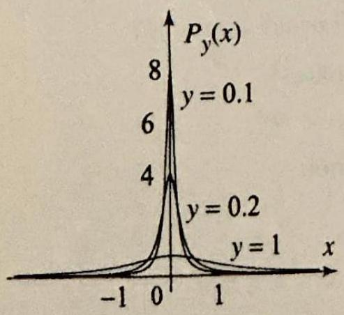

Figure 2 The Poi

++++

he Fourier Transform and its Applications
graphically.)
(d) The total area under the graph of $g_{t}(x)$ and above the $x$-axis is $\int_{-\infty}^{\infty} g_{t}(x) d \sqrt{2 \pi}$.
(e) The Fourier transform of $g_{t}(x)$ is $\hat{g}_{t}(\omega)=e^{-c^{2} t \omega^{2}}$.
(f) If $f$ is an integrable and piecewise smooth function, then at its points of co nuity, we have
$$
\lim _{t \rightarrow 0} g_{t} * f(x)=f(x)
$$

Justify this assertion on the basis of what it means in terms of the solution of heat problem. Alternatively, you can use the Fourier transform and the fact $t \lim _{t \rightarrow 0} \mathcal{F}\left(g_{t}\right)(\omega)=1$, which is a consequence of (e).
isson Integral and the Hilbert Transform
Consider the Dirichlet problem in the upper half-plane (Figure 1)
$$
\begin{array}{c}
\Delta u=\frac{\partial^{2} u}{\partial x^{2}}+\frac{\partial^{2} u}{\partial y^{2}}=0, \quad(-\infty<x<\infty, y>0) \\
u(x, 0)=f(x), \quad \text { (boundary values) }
\end{array}
$$

The problem is asking us to find a harmonic function $u(x, y)$ in the upl half-plane, which tends to a given function $f(x)$ as we approach the bour ary of the upper-half plane, namely the $x$-axis. We have solved this probl in Theorem 1, Section 6.3, using conformal mappings and the Poisson in gral formula on the disk. For ease of reference, let us recall the solution
$$
u(x, y)=\frac{y}{\pi} \int_{-\infty}^{\infty} \frac{f(s)}{(x-s)^{2}+y^{2}} d s=P_{y} * f(x)
$$

This is the Poisson integral formula, or the Poisson integral of $f$, wh expresses $u(x, y)$ as the convolution of the boundary function $f(x)$ with Poisson kernel (Figure 2)
$$
P_{y}(x)=\sqrt{\frac{2}{\pi}} \frac{y}{x^{2}+y^{2}} \quad(-\infty<x<\infty, y>0) .
$$

The fact that the solution is a convolution suggests that the Fourier tra form can be used to our advantage. Indeed, our next step is to show how derive (3), using the Fourier transform method. We will then show how conjugate function of the solution can be constructed by using the bound function $f(x)$ and a certain convolution, known as the Hilbert transfor This will establish a connection between analytic functions in the up half-plane and Fourier analysis of functions on the real line.
sson kernel.
EXAMPLE 1 Fourier transform derivation of th Poisson formula To derive (3), Fourier transform (1) and (2) with respect to the $x$ variable and
$$
-\omega^{2} \widehat{u}(\omega, y)+\frac{d^{2}}{d y^{2}} \widehat{u}(\omega, y)=0 ; \quad \widehat{u}(\omega, 0)=\widehat{f}(\omega)
$$

---

<!-- Page 47 -->

Section 11.5 The Poisson Integral and the Hilbert Transform
741

Solving the differential equation in $\widehat{u}(\omega, y)$ we get
$$
\widehat{u}(\omega, y)=A(\omega) e^{-\omega y}+B(\omega) e^{\omega y}
$$

As in the solution of Example 4 of Section 11.3, we impose a boundedness condition on $\widehat{u}(\omega, y)$. This forces $A(\omega)=0$ if $\omega<0$, and $B(\omega)=0$ if $\omega>0$. Thus we may write $\widehat{u}(\omega, y)=C(\omega) e^{-y|\omega|}$. Setting $y=0$, and using the transformed boundary condition we get
$$
\widehat{u}(\omega, y)=\widehat{f}(\omega) e^{-y|\omega|} .
$$

Recall from Example 4, Section 11.1, the Fourier transform of the Poisson kernel
$$
\widehat{P}_{y}(\omega)=\mathcal{F}\left(\sqrt{\frac{2}{\pi}} \frac{y}{x^{2}+y^{2}}\right)(\omega)=e^{-y|\omega|}
$$

Hence $\widehat{u}(\omega, y)=\widehat{f}(\omega) \widehat{P}_{y}(\omega)$, and so by Theorem 4, Section 11.2, it follows that $u$ is the convolution of $f$ with $P_{y}(x)$, as claimed.

As stated, the Dirichlet problem (1)-(2) does not have a unique solution, due to the failure of the maximum modulus principle on unbounded regions (see Sections 3.7 and 3.8). To see this, consider the function $v(x, y)=y$. You can check that $v(x, y)$ satisfies (1) and equals 0 on the $x$-axis. So, if $u(x, y)$ is any solution of (1) and (2), then $u(x, y)+y$ is also a solution. Hence the solution of (1) and (2) is not unique. This is troublesome, since we tend to think of a Dirichlet problem as modeling a steady-state problem, and as such, we want the solution to be unique. What is happening here is that by stating (1) and (2), we did not impose enough conditions to ensure the uniqueness of the solution. It can be shown that by adding boundedness conditions to (1) and (2), for example,
$$
|u(x, y)| \leq M, \quad \text { for all } x \text { and all } y>0,
$$
then the resulting problem will have a unique bounded solution given by the Poisson integral formula (3), whenever the boundary function $f(x)$ is bounded. In our treatment, we will always assume such boundedness assumptions and thus speak of a unique solution of the Dirichlet problem.

Several applications of the Poisson integral formula were derived in Section 6.3. We add one more application that involves a Dirichlet problem with a Dirac delta applied on the boundary.

EXAMPLE 2 Effect of a Dirac delta on the boundary
Consider the Dirichlet problem in the upper half-plane with boundary data given by
$$
u(x, 0)=\sqrt{2 \pi} \delta_{0}(x) .
$$

Such a problems arises when modeling the steady-state temperature distribution resulting from the application of a welding torch (very high temperature) at a point

---

<!-- Page 48 -->

Left margin note (page 48)

742
Chapter 11

THEC HARMONIC THE P

K

Right margin note (page 48)

of
lane that this the the ends dius
blem halfpper swer seful
$\mathbf{0 , 0 ) .}$ ker-
$\neq 0$. in

++++

he Fourier Transform and its Applications
of the boundary of a long sheet of metal with insulated surface. The constant is added for convenience, as you will see from the solution. Solve this problem describe the isotherms.
Solution According to (3), the solution is $u(x, y)=P_{y} *\left(\sqrt{2 \pi} \delta_{0}\right)(x)$. But $\sqrt{2}$ is a unit for the convolution operation (see Example 6, Section 11.2), so
$$
u(x, y)=P_{y} *\left(\sqrt{2 \pi} \delta_{0}\right)(x)=P_{y}(x)=\sqrt{\frac{2}{\pi}} \frac{y}{x^{2}+y^{2}}
$$

Thus the solution is the Poisson kernel.
To find the isotherms in this problem, we must determine the level curve the Poisson kernel:
$$
\sqrt{\frac{2}{\pi}} \frac{y}{x^{2}+y^{2}}=T \quad \Rightarrow \quad x^{2}+\left(y-\frac{1}{T \sqrt{2 \pi}}\right)^{2}=\frac{1}{2 T^{2} \pi}
$$

Thus the isotherm corresponding to $T>0$ is the portion in the upper half-pl of the the circle centered on the $y$-axis at $\left(0, \frac{1}{T \sqrt{2 \pi}}\right)$ with radius $\frac{1}{\sqrt{2 \pi} T}$. Note there is no restriction on $T>0$, which makes sense on physical grounds, since problem is supposed to model the application of a very high temperature at point 0 . So no matter how large is the value of $T$, we can always find points in upper half-plane with temperature $T$. As $T \rightarrow \infty$, the radius of the isotherm t to 0 , which means that the points are closer to the origin. As $T \rightarrow 0$, the ra tends to $\infty$, which corresponds to points that are far away from the origin.

Example 2 raises two questions. Being the solution of a Dirichlet prot with boundary values $\sqrt{2 \pi} \delta_{0}(x), P_{y}(x)$ must be harmonic in the upper plane and must tend to $\sqrt{2 \pi} \delta_{0}(x)$ as $y \rightarrow 0$. Is $P_{y}(x)$ harmonic in the $\mathbf{u}$, half-plane and in what sense does it tend to $\sqrt{2 \pi} \delta_{0}(x)$ as $y \rightarrow 0$ ? The an to the first question is easy to verify directly. We have the following us result.

DREM 1
ITY OF
OISSON
ERNEL

The Poisson kernel $P_{y}(x)=\sqrt{\frac{2}{\pi}} \frac{y}{x^{2}+y^{2}}$ is harmonic for all $(x, y) \neq($ Moreover, it has a harmonic conjugate (called the conjugate Poisson nel) given by
$$
Q_{y}(x)=\sqrt{\frac{2}{\pi}} \frac{x}{x^{2}+y^{2}}, \quad(x, y) \neq(0,0) .
$$

Proof To prove both assertions, consider the function $F(z)=\sqrt{\frac{2}{\pi}} \frac{i}{z}$ for $z$ This function is analytic for all $z \neq 0$. Writing $z=x+i y$ and expressing terms of its real and imaginary parts, we find that
$$
F(z)=\sqrt{\frac{2}{\pi}} \frac{i}{x+i y}=\sqrt{\frac{2}{\pi}} \frac{i(x-i y)}{x^{2}+y^{2}}=P_{y}(x)+i Q_{y}(x) .
$$

---

<!-- Page 49 -->

Left margin note (page 49)

THEOREM 2 HARMONIC CONJUGATE

++++

Section 11.5 The Poisson Integral and the Hilbert Transform
743

Thus $P_{y}(x)$ and $Q_{y}(x)$ are the real and imaginary parts of an analytic function for $(x, y) \neq(0,0)$ and as such they are harmonic and $Q_{y}(x)$ is a harmonic conjugate of $P_{y}(x)$.

The answer to the second question that we raised following Example 2 is more involved, since we are talking about the convergence of a function $P_{y}(x)$ to a Dirac delta, which is not a function. The concept of convergence that we need is called weak convergence. Even though we will not study it in this book, we can motivate it as follows. Look at the graphs of $P_{y}(x)$, as $y \rightarrow 0$ (Figure 2). These graphs become more and more concentrated around 0 ; while the total area under each graph is
$$
\int_{-\infty}^{\infty} P_{y}(x) d x=\sqrt{2 \pi}=\int_{-\infty}^{\infty} \sqrt{2 \pi} \delta_{0}(x) d x
$$

So, as $y \rightarrow 0$, the graph of $P_{y}(x)$ approximates the graph of $\sqrt{2 \pi} \delta_{0}(x)$ : It is almost 0 for $x \neq 0$ and infinite for $x=0$, and the total area under the graph is $\sqrt{2 \pi}$, which is the integral of $\sqrt{2 \pi} \delta_{0}(x)$. It can also be shown that $\lim _{y \rightarrow 0} \frac{1}{\sqrt{2 \pi}} \int_{-\infty}^{\infty} P_{y}(x) f(x) d x=\int_{-\infty}^{\infty} f(x) \delta_{0}(x) d x=f(0)$, for all integrable and continuous $f$. This limit can be used to define the notion of weak convergence of $\frac{1}{\sqrt{2 \pi}} P_{y}(x)$ to $\delta_{0}$ (equivalently, the weak convergence of $P_{y}(x)$ to $\sqrt{2 \pi} \delta_{0}$ ).
Harmonic Conjugate and Hilbert Transform
In many interesting applications, including finding the curves of heat flow in steady-state problems, we are required to compute the harmonic conjugate of the solution of th Dirichlet problem in the upper half-plane. If $u(x, y)$ is a solution of (1) and (2), recall that by a harmonic conjugate of $u$, we mean a harmonic function $v(x, y)$ in the upper half-plane, such that $u(x, y)+i v(x, y)$ is analytic. Since the upper half-plane is simply connected, the existence of a harmonic conjugate is guaranteed by Theorem 1, Section 3.8, which also provides a formula for computing the harmonic conjugate. Our goal is to describe a formula for constructing a harmonic conjugate of $u(x, y)$ in terms of the boundary function $f(x)$. We start by giving a formula for the harmonic conjugate of $u(x, y)$ in the upper half-plane. As we would expect, this formula involves the conjugate Poisson kernel, $Q_{y}$.

Let $u(x, y)=P_{y} * f(x)$ denote the solution of the Dirichlet problem (1)-(2) in the upper half-plane. Then a harmonic conjugate of $u(x, y)$ is given by
$$
v(x, y)=Q_{y} * f(x)=\frac{1}{\pi} \int_{-\infty}^{\infty} f(x-s) \frac{s}{s^{2}+y^{2}} d s \quad(y>0)
$$
where $Q_{y}$ is the conjugate Poisson kernel (6).

---

<!-- Page 50 -->

Left margin note (page 50)

744 Chapter 11 T

Right margin note (page 50)

We
lly
he
is
an
$v$,
at
nic
an
at
ic

isat he an
its his aend ere he

++++

he Fourier Transform and its Applications

Formula (7) is known as the conjugate Poisson integral of $\boldsymbol{f}$. will not prove this theorem, but only motivate (7) by proceeding forma from the Poisson integral formula. Let us write $P_{y}(x)$ as $P(x, y)$; then Poisson formula becomes
$$
u(x, y)=\frac{1}{\sqrt{2 \pi}} \int_{-\infty}^{\infty} P(x-s, y) f(s) d s
$$

Similarly, from (7), we have
$$
v(x, y)=\frac{1}{\sqrt{2 \pi}} \int_{-\infty}^{\infty} Q(x-s, y) f(s) d s
$$

From Theorem 1, $Q(x, y)$ is harmonic and so its translate, $Q(x-s, y)$, also harmonic for any $s$ (see Exercise 23, Section 2.5). Suppose that we cacc differentiate under the integral signs. Then to compute the Laplacian of $\Delta$ we write
$$
\Delta v(x, y)=\frac{1}{\sqrt{2 \pi}} \int_{-\infty}^{\infty} \Delta[Q(x-s, y)] f(s) d s=0
$$
because $Q(x-s, y)$ is harmonic and so $\Delta[Q(x-s, y)]=0$. This shows th $v(x, y)$ is harmonic in the upper half-plane. To show that $v$ is a harmor conjugate of $u$, again we can show that $u$ and $v$ satisfy the Cauchy-Riema equations, by differentiating under the integral signs and using the fact th $P(s, y)$ and $Q(s, y)$ satisfy these equations, because $Q(s, y)$ is a harmor conjugate of $P(s, y)$ (Theorem 1).

Continuing our formal manipulation of the Poisson and conjugate Po son integral of $f$, we ask: What is the limit of $Q_{y} * f(x)$ as $y \rightarrow 0$ ? Th is, we are asking for the boundary values of the harmonic conjugate of $t$ solution of the Dirichlet problem (1)-(2). To answer this question, we c take the limit as $y \rightarrow 0$ in (7). This gives
$$
\lim _{y \rightarrow 0} Q_{y} * f(x)=\frac{1}{\pi} \int_{-\infty}^{\infty} \frac{f(x-s)}{s} d s
$$

This integral is improper at $s=0$ and $\pm \infty$. In computing it, we will take principal value. Formula (8) is a convolution of $f$ with the kernel $\frac{1}{\sqrt{2 \pi} s}$. T important convolution arises in many different contexts of applied matl matics and engineering. It is called the Hilbert transform of $f$, a denoted $H(f)$. Thus
$$
H(f)(x)=\frac{1}{\pi} \int_{-\infty}^{\infty} \frac{f(x-s)}{s} d s=\lim _{y \rightarrow 0} Q_{y} * f(x)
$$
where the integral is to be computed as a principal value integral. Th are several difficulties in studying the Hilbert transform, due in part to

---

<!-- Page 51 -->

Section 11.5 The Poisson Integral and the Hilbert Transform
745

fact that the kernel of this transform is not integrable. The results that we present are true in a very general setting, but their rigorous treatment requires a level beyond the level of this book. We will continue our formal presentation and treat this transform as we did with generalized functions.

One of the most important features of the Hilbert transform is its effect on the Fourier transform of $f$.

3

Let $f(x)$ be defined and integrable on the real line, and let $H(f)(x)$ denote its Hilbert transform. Then
$$
\widehat{H f}(\omega)=-i \operatorname{sgn}(\omega) \widehat{f}(\omega) \quad(-\infty<\omega<\infty)
$$

Thus the effect of the Hilbert transform is to multiply the Fourier transform of $f$ by $-i \operatorname{sgn} \omega$.

Proof We have
$$
\begin{aligned}
\widehat{H f}(\omega) & =\frac{1}{\sqrt{2 \pi}} \int_{-\infty}^{\infty} H(f)(x) e^{-i \omega x} d x=\frac{1}{\sqrt{2 \pi}} \int_{-\infty}^{\infty} \frac{1}{\pi} \int_{-\infty}^{\infty} \frac{f(x-s)}{s} d s e^{-i \omega x} d x \\
& =\frac{1}{\sqrt{2 \pi}} \int_{-\infty}^{\infty} f(x) e^{-i \omega x} d x \frac{1}{\pi} \int_{-\infty}^{\infty} \frac{e^{-i \omega x}}{s} d s=\widehat{f}(\omega) \frac{1}{\pi} \int_{-\infty}^{\infty} \frac{e^{-i \omega s}}{s} d s
\end{aligned}
$$

The last integral is evaluated by using a change of variables and the integral $\frac{1}{\pi} \int_{-\infty}^{\infty} \frac{\sin s}{s} d s=1$ (see Exercise 21, Section 5.4). We have
$$
\frac{1}{\pi} \int_{-\infty}^{\infty} \frac{e^{-i \omega s}}{s} d s=\frac{-i}{\pi} \int_{-\infty}^{\infty} \frac{\sin (\omega s)}{s} d s=-i \operatorname{sgn}(\omega)
$$
and (10) follows.
Let us recap what we have so far. Starting with a function $f(x)$ defined on the real line, we can form its Poisson integral $u(x, y)=P_{y} * f(x)$. This function is harmonic in the upper half-plane and tends to $f(x)$ as $y \rightarrow 0$ If we take the harmonic conjugate of $u$, we obtain the conjugate Poissor integral of $f, v(x, y)=Q_{y} * f$. This function is harmonic in the uppe half-plane and tends to $H(f)(x)$, the Hilbert transform of $f$, as $y \rightarrow 0$ So the conjugate Poisson integral of $f, Q_{y} * f(x)$, has boundary values th Hilbert transform of $f, H(f)(x)$. This suggests that the conjugate Poisso integral can be constructed from the Hilbert transform in much the san way we construct $u(x, y)$ from its boundary values $f(x)$. Indeed, we ha the following interesting result.

---

<!-- Page 52 -->

Left margin note (page 52)

746
Chapter 11
T

THEO
HI
TRANSFORN CONJU
POISSON INTE

Right margin note (page 52)

note
al of
der
ing
it
□
the
□
ta.

0 ,

++++

he Fourier Transform and its Applications
REM 4
LBERT
1 AND
JGATE
GRAL

Let $f(x)$ be defined and integrable on the real line, and let $H(f)(x)$ de its Hilbert transform. Then
$$
v(x, y)=Q_{y} * f(x)=P_{y} *(H f)(x) .
$$

In other words, the conjugate Poisson integral of $f$ is the Poisson integr its Hilbert transform.
Proof We will prove (11) by using the Fourier transform. Fix $y$ and consi the functions in (11) as functions of $x$. Taking the Fourier transform and us Theorem 4, Section 11.2, we have
$$
\left.\widehat{Q_{y} * f}(\omega)=\widehat{Q_{y}}(\omega) \hat{f}(\omega) \text { and } \widehat{P_{y} *(H} f\right)(\omega)=\widehat{P_{y}}(\omega) \widehat{(H f)}(\omega) .
$$

But $Q_{y}(x)=\frac{x}{y} P_{y}(x)$, and so from (5) and Theorem 2, Section 11.2,
$$
\widehat{Q_{y}}(\omega)=\frac{i}{y} \frac{d}{d \omega} \widehat{P_{y}}(\omega)=-i \operatorname{sgn}(\omega) e^{-y|\omega|}=-i \operatorname{sgn}(\omega) \widehat{P_{y}}(\omega)
$$

From Theorem 3, we have $\widehat{(H f)}(\omega)=-i \operatorname{sgn}(\omega) \hat{f}(\omega)$. Plugging back into (12) follows that $\left.\widehat{Q_{y} * f}(\omega)=\widehat{P_{y} *(H} f\right)(\omega)$, and hence (11) holds.

It is time to give an example with the Hilbert transform.
EXAMPLE 3 Hilbert transforms
(a) Find $H(\sin x)$.
(b) Show that $H\left(P_{y}\right)(x)=Q_{y}(x)$.

Solution (a) We have
$$
\begin{aligned}
H(\sin x) & =\frac{1}{\pi} \mathrm{P} . \mathrm{V} . \int_{-\infty}^{\infty} \frac{\sin (x-s)}{s} d s \\
& =\frac{1}{\pi} \mathrm{P} . \mathrm{V} . \int_{-\infty}^{\infty} \frac{\sin x \cos s-\cos x \sin s}{s} d s \\
& =\frac{\sin x}{\pi} \mathrm{P} . \mathrm{V} . \int_{-\infty}^{\infty} \frac{\cos s}{s} d s-\frac{\cos x}{\pi} \mathrm{P} . \mathrm{V} . \int_{-\infty}^{\infty} \frac{\sin s}{s} d s=-\cos x,
\end{aligned}
$$
because P.V. $\int_{-\infty}^{\infty} \frac{\cos s}{s} d s=0$ and $\frac{1}{\pi}$ P.V. $\int_{-\infty}^{\infty} \frac{\sin s}{s} d s=1$.
(b) The best way to do this part is to show that $H\left(P_{y}\right)(x)$ and $Q_{y}(x)$ have same Fourier transforms. Indeed, using Theorem 3, we have
$$
\widehat{H\left(P_{y}\right)}(\omega)=-i \operatorname{sgn}(\omega) \widehat{P_{y}}(\omega)=\widehat{Q_{y}}(\omega),
$$
where the second equality follows from (13).
Exercises 11.5
In Exercises 1-4, solve the Dirichlet problem (1)-(2) for the given boundary $d$
1.
$$
f(x)=\left\{\begin{array}{ll}
50 & \text { if }-1<x<1 \\
0 & \text { otherwise } .
\end{array}\right.
$$
2.
$$
f(x)=\left\{\begin{array}{ll}
100(1+x) & \text { if }-1<x< \\
100(1-x) & \text { if } 0<x<1 \\
0 & \text { otherwise }
\end{array}\right.
$$

---

<!-- Page 53 -->

Left margin note (page 53)

11.6 The Fourie

++++

Section 11.6 The Fourier Cosine and Sine Transforms
747
3. $f(x)=\cos x$.
4. $f(x)=1+\sin x$.
5. Semigroup property of the Poisson kernel. Using the Fourier transform, show that $P_{y_{1}} * P_{y_{2}}(x)=P_{y_{1}+y_{2}}(x)$. This is known as the semigroup property of the Poisson kernel.
6. (a) Solve the Dirichlet problem for the boundary data $f(x)=\frac{1}{1+x^{2}}$.

[Hint: Express $f$ in terms of the Poisson kernel $P_{1}$ and use Exercise 5.]
(b) What are the isotherms in this case?
(c) Plot the isotherms to verify your answer in (b).
7. Repeat Exercise 6 with $f(x)=\frac{1}{4+x^{2}}$.
8. Properties of the Poisson kernel. As you work through this exercise, compare the results with the properties of the heat kernel from the previous section.
(a) $P_{y}(x)$ is an even function of $x$, and $P_{y}(x) \geq 0$ for all $x$.
(b) The graph of $P_{y}(x)$ is a bell-shaped curve centered at the origin. (You may simply illustrate this part graphically.)
(c) We have $P_{y}(0)=\sqrt{\frac{2}{\pi}} \frac{1}{y}$; and hence $\lim _{y \rightarrow 0} P_{y}(0)=\infty$. Thus, as $y$ tends to 0 , the graph of $P_{y}(x)$ becomes more and more localized near 0 , in the sense that most of the total area under the graph and above the $x$-axis becomes concentrated near 0 .
(d) The total area under the graph of $P_{y}(x)$ and above the $x$-axis is $\int_{-\infty}^{\infty} P_{y}(x) d x= \sqrt{2 \pi}$, for all $y>0$.
(e) The Fourier transform of $P_{y}(x)$ is $e^{-y|\omega|}$. (Use the table of Fourier transforms.)
(f) If $f$ is an integrable function and piecewise smooth, then at the points where $f$ is continuous we have $\lim _{y \rightarrow 0} P_{y} * f(x)=f(x)$. (A rigorous proof of this result is difficult, but you should be able to justify it by taking Fourier transforms.)
In Exercises 9-12, find the Hilbert transform of the given function.
9. $f(x)=\cos x+\sin 2 x$.
10. $U_{0}(x+1)-U_{0}(x-1)$.
11. $\left(\mathcal{U}_{0}(x)-\mathcal{U}_{0}(x-1)\right) x$.
12. $\left(\mathcal{U}_{0}(x)-\mathcal{U}_{0}(x-\pi)\right) \sin x$.
13. Show that
$$
\mathcal{F}\left(\frac{f+i H(f)}{2}\right)(\omega)=\left\{\begin{array}{ll}
\mathcal{F}(f)(\omega) & \text { if } \omega>0 \\
0 & \text { if } \omega \leq 0
\end{array}\right.
$$

Thus, by adding $i H(f)$ to $f$ we truncated its Fourier transform at $\omega \leq 0$.
14. Using the Fourier transform, show that $H(H(f))=-f$.
15. Using the Fourier transform, show that $Q_{a} * Q_{b}=-P_{a+b}$.

Cosine and Sine Transforms
So far in this chapter we have considered boundary value problems with initial or boundary data defined on the entire real line. It is easy to imagine similar problems with boundary or initial data defined on half lines. As an example, consider a heat problem in a bar with one end extending to infinity. In this case, the initial temperature distribution will be given by a function defined on half the real line. As a second illustration, consider a Dirichlet problem in the first quadrant. In this case, the boundary consists of two half

---

<!-- Page 54 -->

Left margin note (page 54)

748
Chapter 11

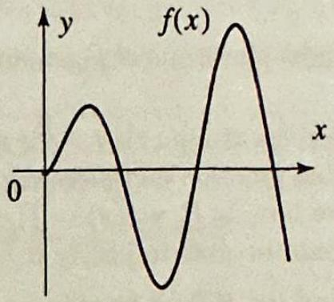

Figure 1

++++

The Fourier Transform and its Applications
lines. A variety of such problems will be discussed in the following secti To treat these problems, we introduce in this section two transforms clos related to the Fourier integral: the cosine and sine Fourier transforms. you will see, these transforms are the analogs of the half-range expansic in Fourier series.

The basic question is: How can we use the Fourier transform when function $f(x)$ is defined for $x>0$ only? Having worked with Fourier ser and half-range expansions, we know that the answer will involve even a odd (nonperiodic) extensions of $f$.

If we extend $f$ as an even function on the entire real line (Figure 1) a then take the Fourier transform of the extension, we obtain
$$
\mathcal{F}(f)(\omega)=\frac{1}{\sqrt{2 \pi}} \int_{-\infty}^{\infty} f(x) e^{-i \omega x} d x=\sqrt{\frac{2}{\pi}} \int_{0}^{\infty} f(x) \cos \omega x d x
$$
where we have kept the same notation for $f$ and its extension and used t fact that the extension is an even function.

The graph is symmetric with respect to the $y$-axis.

Applying the inverse Fourier transform, and using the fact that the Fou transform is even in this case, we obtain
$$
f(x)=\sqrt{\frac{2}{\pi}} \int_{0}^{\infty} \mathcal{F}(f)(\omega) \cos \omega x d \omega
$$

The integral in (1) depends only on the values of $f(x)$ for $x \geq 0$, so with mention of the even extension, we define the cosine Fourier transforn $f$ by (1), setting
(3)
$$
\hat{f}_{c}(\omega)=\sqrt{\frac{2}{\pi}} \int_{0}^{\infty} f(t) \cos \omega t d t \quad(\omega \geq 0)
$$

Then the inverse Fourier transform in (2) becomes
$$
f(x)=\sqrt{\frac{2}{\pi}} \int_{0}^{\infty} \hat{f}_{c}(\omega) \cos \omega x d \omega \quad(x>0)
$$

---

<!-- Page 55 -->

Left margin note (page 55)

Figure 2

++++

Section 11.6 The Fourier Cosine and Sine Transforms
749

This formula features the inverse Fourier cosine transform and expresses $f$ as an inverse Fourier cosine transform of $\widehat{f}_{c}(\omega)$. Note that the Fourier cosine transform is the same as the inverse Fourier cosine transform.

Similarly, if we use an odd extension (Figure 2), apply the Fourier transform and then its inverse Fourier transform, we obtain the

The graph is symmetric with re nect to the origin.

Fourier sine transform of $f$ :
(5)
$$
\widehat{f}_{s}(\omega)=\sqrt{\frac{2}{\pi}} \int_{0}^{\infty} f(t) \sin \omega t d t \quad(\omega \geq 0)
$$
and its inverse Fourier sine transform,
(6)
$$
f(x)=\sqrt{\frac{2}{\pi}} \int_{0}^{\infty} \widehat{f}_{s}(\omega) \sin \omega x d \omega \quad(x>0)
$$

Other commonly used notation for these transforms is as follows:
$$
\mathcal{F}_{c}(f)=\widehat{f}_{c} \text { and } \mathcal{F}_{s}(f)=\widehat{f}_{s} .
$$

Both (4) and (6) hold under the same conditions on $f$ as in the Fourier inversion theorem (Section 11.1). We require that $f$ be integrable on $[0, \infty)$ (by this we mean that $\int_{0}^{\infty}|f(x)| d x<\infty$ ) and piecewise smooth. Also, on the left sides of (4) and (6), $f(x)$ is to be replaced by $(f(x+)+f(x-)) / 2$ at points of discontinuity of $f$.

EXAMPLE 1 Fourier cosine and sine transforms
Consider the function
$$
f(x)=\left\{\begin{array}{ll}
\sin x & \text { if } 0 \leq x \leq \pi, \\
0 & \text { if } x>\pi .
\end{array}\right.
$$

Express $f$ using an inverse Fourier cosine and then an inverse sine transform.

---

<!-- Page 56 -->

Left margin note (page 56)

750
Chapter 11

In evaluating the int the identity $\sin a \cos b=$
$$
\frac{1}{2}[\sin (a-b)+\sin (a
$$

From a table of int $\int e^{-a t} \cos \omega t d t= \frac{a}{a^{2}+\omega^{2}} e^{-a t}\left(\frac{\omega}{a} \sin \omega t\right.$

Right margin note (page 56)

шо

++++

The Fourier Transform and its Applications
Solution We first start by computing the Fourier cosine transform. From (3) egral, use
$$
\hat{f}_{c}(\omega)=\sqrt{\frac{2}{\pi}} \int_{0}^{\pi} \sin x \cos \omega x d x=\sqrt{\frac{2}{\pi}} \frac{\cos (\pi \omega)+1}{1-\omega^{2}}
$$

$+b)]$.

Using (4), we obtain the inverse cosine transform representation
$$
f(x)=\frac{2}{\pi} \int_{0}^{\infty} \frac{\cos (\pi \omega)+1}{1-\omega^{2}} \cos \omega x d \omega \quad(x \geq 0)
$$

We compute the sine transform similarly by using (5),
$$
\widehat{f}_{s}(\omega)=\sqrt{\frac{2}{\pi}} \frac{\sin (\pi \omega)}{1-\omega^{2}}
$$
and thus the inverse sine transform representation
$$
f(x)=\frac{2}{\pi} \int_{0}^{\infty} \frac{\sin (\pi \omega)}{1-\omega^{2}} \sin \omega x d \omega \quad(x \geq 0)
$$

EXAMPLE 2 A Fourier cosine transform
Consider the function $f(x)=e^{-a x}(a>0), x>0$.
(a) Find the Fourier cosine transform of $f(x)$.
(b) Express $f(x)$ as an inverse Fourier cosine transform.

Solution (a) From (3)
egrals:
$$
\begin{aligned}
\mathcal{F}_{c}(f)(\omega) & =\sqrt{\frac{2}{\pi}} \int_{0}^{\infty} e^{-a t} \cos \omega t d t \\
& =\sqrt{\frac{2}{\pi}} \frac{a}{a^{2}+\omega^{2}}\left[e^{-a t}\left(\frac{\omega}{a} \sin \omega t-\cos \omega t\right)\right]_{0}^{\infty}=\sqrt{\frac{2}{\pi}} \frac{a}{a^{2}+\omega^{2}}
\end{aligned}
$$
(b) From (4) we obtain for $x>0$
$$
e^{-a x}=\sqrt{\frac{2}{\pi}} \int_{0}^{\infty} \widehat{f}_{c}(\omega) \cos \omega x d \omega=\frac{2}{\pi} \int_{0}^{\infty} \frac{a \cos \omega x}{a^{2}+\omega^{2}} d \omega
$$

Fourier cosine and sine transforms can sometimes be computed f Fourier transforms.

---

<!-- Page 57 -->

Left margin note (page 57)

RELATIONSH BETW TRANSFOF

++++

Section 11.6 The Fourier Cosine and Sine Transforms

EXAMPLE 3 A Fourier cosine transform from a Fourier transforn Find the Fourier cosine transform of $f(x)=e^{-a x^{2} / 2}(a>0), x>0$.
Solution We have
$$
\begin{aligned}
\mathcal{F}_{c}(f)(\omega) & =\sqrt{\frac{2}{\pi}} \int_{0}^{\infty} e^{-a x^{2} / 2} \cos \omega x d x \\
& =\frac{1}{2} \sqrt{\frac{2}{\pi}} \int_{-\infty}^{\infty} e^{-a x^{2} / 2} \cos \omega x d x \quad \text { (the integrand is even) } \\
& =\frac{1}{\sqrt{2 \pi}} \int_{-\infty}^{\infty} e^{-a x^{2} / 2} e^{-i \omega x} d x
\end{aligned}
$$
(the imaginary part integrates to 0 because it is odd)
$=\mathcal{F}\left(e^{-a x^{2} / 2}\right)(\omega)$ (by definition of the Fourier transform)
$=\frac{1}{\sqrt{a}} e^{-\omega^{2} / 2 a}$ (by Example 5, Section 11.1).
Example 3 illustrates the following useful general rule, whose proo left as an exercise.

IPS
CEN

If $f(x)(x \geq 0)$ is the restriction of an even function $f_{e}$, then

CMS
$$
\mathcal{F}_{c}(f)(\omega)=\mathcal{F}\left(f_{e}\right)(\omega) \text { for all } \omega \geq 0
$$

If $f(x)(x \geq 0)$ is the restriction of an odd function $f_{o}$, then
$$
\mathcal{F}_{s}(f)(\omega)=i \mathcal{F}\left(f_{o}\right)(\omega) \text { for all } \omega \geq 0
$$

EXAMPLE 4 Using Fourier transforms
To illustrate the applications of (7) and (8), we use known Fourier transforms Example 4, Section 11.1) and compute, for $\omega \geq 0$,
$$
\mathcal{F}_{c}\left(\frac{a}{a^{2}+x^{2}}\right)(\omega)=\mathcal{F}\left(\frac{a}{a^{2}+x^{2}}\right)(\omega)=\sqrt{\frac{\pi}{2}} e^{-a \omega} \quad(a>0)
$$
and
$$
\mathcal{F}_{s}\left(\frac{x}{a^{2}+x^{2}}\right)(\omega)=i \mathcal{F}\left(\frac{x}{a^{2}+x^{2}}\right)(\omega)=\sqrt{\frac{\pi}{2}} \omega e^{-a \omega} \quad(a>0)
$$

Operational Properties
The Fourier cosine and sine transforms have operational properties ve similar to those of the Fourier transform. We list those that will be need in the next section. The proofs will be omitted, being very similar to t case of the Fourier transform (Section 11.2). In what follows, we assur that the functions are integrable, so that all the transforms exist.

---

<!-- Page 58 -->

Left margin note (page 58)

752
Chapter 11

THEO LINE

THEO TRANSFOR DERIVA

Note that each form first derivative inv transforms. The fo the second derivat ever, involve only form at a time.

THE DERIVAT TRAN:

++++

The Fourier Transform and its Applications

REM 1 ARITY

If $f$ and $g$ are functions and $a$ and $b$ are numbers, then
$$
\mathcal{F}_{c}(a f+b g)=a \mathcal{F}_{c}(f)+b \mathcal{F}_{c}(g),
$$
and
$$
\mathcal{F}_{s}(a f+b g)=a \mathcal{F}_{s}(f)+b \mathcal{F}_{s}(g)
$$

Compare the following theorem with Theorem 2, Section 11.2.
Suppose that $f(x) \rightarrow 0$ as $x \rightarrow \infty$; then
(9)

(10)
$$
\begin{array}{l}
\mathcal{F}_{c}\left(f^{\prime}\right)=\omega \mathcal{F}_{s}(f)-\sqrt{\frac{2}{\pi}} f(0) \\
\mathcal{F}_{s}\left(f^{\prime}\right)=-\omega \mathcal{F}_{c}(f)
\end{array}
$$

If in addition $f^{\prime}(x) \rightarrow 0$ as $x \rightarrow \infty$, then
$$
\begin{array}{l}
\mathcal{F}_{c}\left(f^{\prime \prime}\right)=-\omega^{2} \mathcal{F}_{c}(f)-\sqrt{\frac{2}{\pi}} f^{\prime}(0) \\
\mathcal{F}_{s}\left(f^{\prime \prime}\right)=-\omega^{2} \mathcal{F}_{s}(f)+\sqrt{\frac{2}{\pi}} \omega f(0)
\end{array}
$$

EXAMPLE 5 Transform of a derivative
In Example 3 we found that
$$
\mathcal{F}_{c}\left(e^{-x^{2}}\right)(\omega)=\frac{1}{\sqrt{2}} e^{-\omega^{2} / 4}
$$

Applying Theorem 2(ii) with $f(x)=e^{-x^{2}}$, we obtain
$$
\mathcal{F}_{s}\left(-2 x e^{-x^{2}}\right)=-\omega \mathcal{F}_{c}\left(e^{-x^{2}}\right)=-\omega \frac{1}{\sqrt{2}} e^{-\omega^{2} / 4} .
$$

Hence
$$
\mathcal{F}_{s}\left(x e^{-x^{2}}\right)=\frac{\omega}{2 \sqrt{2}} e^{-\omega^{2} / 4}
$$

OREM 3
IVES OF
SFORMS

We have
$$
\begin{array}{l}
\mathcal{F}_{c}(x f(x))=\frac{d}{d \omega} \mathcal{F}_{s}(f(x)) \\
\mathcal{F}_{s}(x f(x))=-\frac{d}{d \omega} \mathcal{F}_{c}(f(x))
\end{array}
$$

---

<!-- Page 59 -->

Section 11.6 The Fourier Cosine and Sine Transforms
753

EXAMPLE 6 Using operational properties
Find the Fourier sine transform of $f(x)=x e^{-a x}(a>0), x>0$.
Solution In Example 2 we found that
$$
\mathcal{F}_{c}\left(e^{-a x}\right)(\omega)=\sqrt{\frac{2}{\pi}} \frac{a}{a^{2}+\omega^{2}}
$$

From Theorem 3(ii) we have
$$
\mathcal{F}_{s}\left(x e^{-a x}\right)=-\frac{d}{d \omega} \mathcal{F}_{c}\left(e^{-a x}\right)=-\sqrt{\frac{2}{\pi}} \frac{d}{d \omega} \frac{a}{a^{2}+\omega^{2}}=\sqrt{\frac{2}{\pi}} \frac{2 a \omega}{\left(a^{2}+\omega^{2}\right)^{2}} .
$$

Exercises 11.6
In Exercises 1-6, find the Fourier cosine transform of $f(x)(x>0)$ and write $f$ as an inverse cosine transform. Use a known Fourier transform and (7) when possible.
1.
$$
f(x)=\left\{\begin{array}{ll}
1 & \text { if } 0<x<1, \\
0 & \text { otherwise } .
\end{array}\right.
$$
2.
$$
f(x)=\left\{\begin{array}{ll}
1 & \text { if } 0<a<x<b<\infty, \\
0 & \text { otherwise } .
\end{array}\right.
$$
3. $f(x)=3 e^{-2 x}$.
5.
$$
f(x)=\left\{\begin{array}{ll}
\cos x & \text { if } 0<x<2 \pi, \\
0 & \text { otherwise } .
\end{array}\right.
$$
4. $f(x)=x^{2} e^{-x^{2}}$.
6.
$$
f(x)=\left\{\begin{array}{ll}
1-x & \text { if } 0<x<1, \\
0 & \text { otherwise } .
\end{array}\right.
$$

In Exercises $7-12$, find the Fourier sine transform of $f(x)(x>0)$ and write $f(x)$ as an inverse sine transform. Use a known Fourier transform and (8) when possible.
7.
8. $f(x)=x e^{-x^{2}}$.
$$
f(x)=\left\{\begin{array}{ll}
1 & \text { if } 0<x<1 \\
0 & \text { otherwise }
\end{array}\right.
$$
9. $f(x)=e^{-2 x}$.
10. $f(x)=x e^{-x}$.
11.
12. $f(x)=\frac{x}{1+x^{2}}$.
$$
f(x)=\left\{\begin{array}{ll}
\sin 2 x & \text { if } 0<x<\pi, \\
0 & \text { otherwise } .
\end{array}\right.
$$

In Exercises 13-18, compute the given transform.
13. $\mathcal{F}_{c}\left(\frac{1}{1+x^{2}}\right)$.
14. $\mathcal{F}_{c}\left(\frac{x^{2}}{e^{x^{2}}}\right)$.
15. $\mathcal{F}_{s}\left(\frac{x}{1+x^{2}}\right)$.
16. $\mathcal{F}_{s}\left(x e^{-x}\right)$.
17. $\mathcal{F}_{c}\left(\frac{\cos x}{1+x^{2}}\right)$.
18. $\mathcal{F}_{c}\left(\frac{\sin x}{x}\right)$.
19. Prove (7) and (8).
20. Prove (9)-(12).
21. Reciprocity relations show that $\mathcal{F}_{c} \mathcal{F}_{c} f=f$ and $\mathcal{F}_{s} \mathcal{F}_{s} f=f$.

---

<!-- Page 60 -->

Left margin note (page 60)

754 Chapter 11 The
11.7 Problem

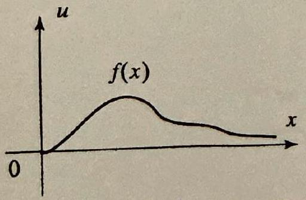

Figure 1 Initial distribution.

++++

Fourier Transform and its Applications

Involving Semi-Infinite Intervals
We will solve boundary value problems on semi-infinite intervals, and unbounded regions in the plane such as half-planes, quarter-planes, strips, by using the Fourier sine and cosine transforms instead of the Fou transform. The reason is that the functions with which we will be deal are defined on a subset of the real line, and to use the Fourier transfo requires that a function be defined on the entire real line. The method this section is completely analogous to the Fourier transform method. will illustrate it with examples.

EXAMPLE 1 Heat equation for a semi-infinite rod
Solve the boundary value problem
$$
\begin{aligned}
\frac{\partial u}{\partial t} & =c^{2} \frac{\partial^{2} u}{\partial x^{2}}, & & 0<x<\infty, t>0, \\
u(x, 0) & =f(x), & & x>0, \\
u(0, t) & =0, & & t>0 .
\end{aligned}
$$

This problem models heat diffusion in a semi-infinite rod, with initial temperatu distribution $f(x)$, and with one end kept at $0^{\circ}$ temperature (see Figure 1).
Solution Note that since the initial conditions (2) involve the $x$ variable, the pro lem calls for a transform in the $x$ variable and not $t$. As you will see shortly, t Fourier sine transform is the right choice in this problem (see the remarks followi the solution). We have
$$
\mathcal{F}_{s}\left(\frac{\partial u}{\partial t}\right)=\frac{d}{d t} \widehat{u}_{s}(\omega, t)
$$
and, from Theorem 2, Section 11.6,
$$
\mathcal{F}_{s}\left(\frac{\partial^{2} u}{\partial x^{2}}\right)=-\omega^{2} \widehat{u}_{s}(\omega, t)+\sqrt{\frac{2}{\pi}} \omega u(0, t)=-\omega^{2} \widehat{u}_{s}(\omega, t) .
$$

Thus, transforming (1) and (2) we get
$$
\begin{aligned}
\frac{d}{d t} \widehat{u}_{s}(\omega, t) & =-c^{2} \omega^{2} \widehat{u}_{s}(\omega, t) \\
\widehat{u}_{s}(\omega, 0) & =\widehat{f}_{s}(\omega)
\end{aligned}
$$

The general solution of the first order ordinary differential equation in $t$ is
$$
\widehat{u}_{s}(\omega, t)=A(\omega) e^{-c^{2} \omega^{2} t}
$$
where $A(\omega)$ is a constant that depends on $\omega$. Setting $t=0$ yields
$$
\widehat{u}_{s}(\omega, 0)=A(\omega)=\widehat{f}_{s}(\omega),
$$
and so
$$
\widehat{u}_{s}(\omega, t)=\widehat{f}_{s}(\omega) e^{-c^{2} \omega^{2} t}
$$

---

<!-- Page 61 -->

Left margin note (page 61)

Recall from Section 11.4 $e^{-c^{2} \omega^{2} t}$ is the Fourier $t$ form of the heat kernel. T the solution in this exal also involves the heat ke See Exercise 7 for an alte tive form of the solution.

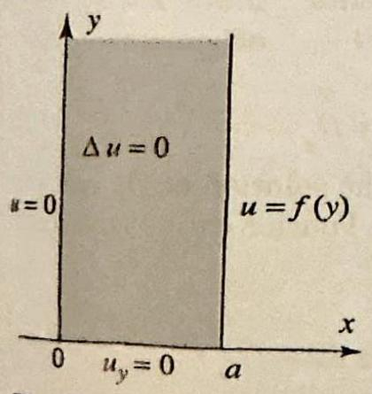

Figure 2 A DirichletNeumann problem.

++++

Section 11.7 Problems Involving Semi-Infinite Intervals

Taking inverse Fourier sine transforms ((6), Section 11.6), we obtain the solu

that in the form

ans-
hus,
mple
$$
u(x, t)=\sqrt{\frac{2}{\pi}} \int_{0}^{\infty} \widehat{u}_{s}(\omega, t) \sin \omega x d \omega=\sqrt{\frac{2}{\pi}} \int_{0}^{\infty} \widehat{f}_{s}(\omega) e^{-c^{2} \omega^{2} t} \sin \omega x d \omega
$$

You may ask why the Fourier sine transform was used in Example 1 not the Fourier cosine transform. The choice was suggested by the bound condition (3). To compute the cosine transform of the second derivative $\frac{\delta}{\delta}$ the operational property (11), Section 11.6, requires the value of $\frac{\partial u}{\partial x}(0$, a quantity not given in the problem. In general, to successfully appl, transform we must be able to use the initial conditions to supply the val needed in the operational formulas.

The next example involves Dirichlet and Neumann type conditions.

EXAMPLE 2 A Dirichlet-Neumann problem in a semi-infinite strip Solve the boundary value problem
$$
\begin{aligned}
\Delta u & =\frac{\partial^{2} u}{\partial x^{2}}+\frac{\partial^{2} u}{\partial y^{2}}=0, \quad 0<x<a, y>0 \\
\frac{\partial u}{\partial y}(x, 0) & =0, \quad 0<x<a \\
u(0, y) & =0, \quad u(a, y)=f(y), \quad y>0
\end{aligned}
$$

The problem models, for example, the steady-state temperature in a very larg sheet of metal, where the boundaries are kept at a given temperature distribu tion and there is no heat flow across the boundary on the $x$-axis, as illustrated in Figure 2.
Solution Since the domain of the variable $y$ is semi-infinite (the domain of the variable $x$ is finite); we choose to transform the equations with respect to the variable $y$. Also since the boundary condition (6) involves the derivative at $y=0$ the cosine transform is the right choice in this case. Using this transform with the help of the operational properties of Section 11.6, we get
$$
\begin{array}{ll}
\mathcal{F}_{c}\left(\frac{\partial^{2} u}{\partial y^{2}}\right)=-\omega^{2} \widehat{u}_{c}(x, \omega)-\sqrt{\frac{2}{\pi}} & \frac{\partial u}{\partial y}(x, 0)=-\omega^{2} \widehat{u}_{c}(x, \omega), \\
\frac{d^{2}}{d x^{2}} \widehat{u}_{c}(x, \omega)-\omega^{2} \widehat{u}_{c}(x, \omega)=0 & (\text { transforming }(5)), \\
\widehat{u}_{c}(0, \omega)=0, \widehat{u}_{c}(a, \omega)=\widehat{f}_{c}(\omega) & (\text { transforming }(7)) .
\end{array}
$$

The general solution of the second order ordinary differential equation (8) is
$$
\widehat{u}_{c}(x, \omega)=A(\omega) \cosh \omega x+B(\omega) \sinh \omega x,
$$
where $A(\omega)$ and $B(\omega)$ are constants that depend on $\omega$. Setting $x=0$ and then $x=a$ and using (9), we get
$$
A(\omega)=0, \quad B(\omega)=\frac{\widehat{f}_{c}(\omega)}{\sinh \omega a}
$$

---

<!-- Page 62 -->

Left margin note (page 62)

756
Chapter 11
Th

Right margin note (page 62)

.6),
□
tial
a
ent
ate
he
ary
ven
(2)
orm
$=T_{0}$

4, 5.
ases?

++++

Fourier Transform and its Applications

Putting this into (10) and taking inverse Fourier cosine transform ((4), Section 11 we get the solution in the form
$$
u(x, y)=\sqrt{\frac{2}{\pi}} \int_{0}^{\infty} \widehat{u}_{c}(x, \omega) \cos \omega y d \omega=\sqrt{\frac{2}{\pi}} \int_{0}^{\infty} \frac{\hat{f}_{c}(\omega)}{\sinh \omega a} \sinh \omega x \cos \omega y d \omega
$$

The Fourier transform method is a powerful device for solving part differential equations. Its importance stems from its ability to handl large variety of problems. Several additional types of problems (on differ types of regions) are investigated in the exercises. Choosing the appropri transform is a crucial step in implementing the method. As we saw in examples, the choice is suggested by the type of region and the bound conditions.
Exercises 11.7
In Exercises 1-4 solve the heat equation (1) with $c=1, u(0, t)=0$, and the gi initial temperature distribution. Take $0<x<\infty$ and $t>0$.
1.
$$
f(x)=\left\{\begin{array}{ll}
T_{0} & \text { if } 0<x<b \\
0 & \text { otherwise }
\end{array}\right.
$$
2.
$$
f(x)=\left\{\begin{array}{ll}
\sin x & \text { if } 0<x<\pi \\
0 & \text { otherwise }
\end{array}\right.
$$
3. $f(x)=\frac{x}{1+x^{2}}$.
4. $f(x)=x e^{-x^{2} / 2}$.
5. A Neumann type condition. Let $u(x, t)$ denote the solution of (1) and with the Neumann type condition: $\frac{\partial u}{\partial x}(0, t)=0$. Use the Fourier cosine transf to derive the solution
$$
u(x, t)=\sqrt{\frac{2}{\pi}} \int_{0}^{\infty} \widehat{f}_{c}(\omega) e^{-c^{2} \omega^{2} t} \cos \omega x d \omega
$$
6. Do Exercise 5 for the specific case when $c=1$ and $f(x)$ is as in Exercise 1.
7. Show that the solution (4) of Example 1 can be put in the form
$$
u(x, t)=\frac{1}{2 c \sqrt{\pi t}} \int_{0}^{\infty} f(s)\left[\exp \left(-\frac{(x-s)^{2}}{4 c^{2} t}\right)-\exp \left(-\frac{(x+s)^{2}}{4 c^{2} t}\right)\right] d s
$$
[Hint: In (4), write $\widehat{f}_{s}$ explicitly in terms of $f$.]
8. (a) Show that the solution of the heat problem of Example 1 with $f(x)$ if $0<x<a$ and 0 otherwise can be expressed in the form
$$
u(x, t)=T_{0} \operatorname{erf}\left(\frac{x}{2 c \sqrt{t}}\right)-\frac{T_{0}}{2}\left\{\operatorname{erf}\left(\frac{x-a}{2 c \sqrt{t}}\right)+\operatorname{erf}\left(\frac{x+a}{2 c \sqrt{t}}\right)\right\}
$$
[Hint: Use Exercise 7.]
(b) Take $c=1, T_{0}=5$, and plot the solution curves at $t=.2, .5,1,2,3$, Repeat the graphs with $c=2,5$. What do you observe as the value of $c$ increa

---

<!-- Page 63 -->

Section 11.7 Problems Involving Semi-Infinite Intervals
757
9. Project Problem: A nonhomogeneous boundary condition. Consider the heat equation (1) with the following conditions $u(x, 0)=0$ for $x>0$ and $u(0, t)=T_{0}$ for $t>0$.
(a) Use the Fourier sine transform to show that
$$
\frac{d}{d t} \widehat{u}_{s}(\omega, t)+c^{2} \omega^{2} \widehat{u}_{s}(\omega, t)=c^{2} \sqrt{\frac{2}{\pi}} \omega T_{0} ; \quad \widehat{u}_{s}(\omega, 0)=0
$$
(b) Derive the solution by establishing that
$$
\begin{array}{c}
\widehat{u}(\omega, t)=\sqrt{\frac{2}{\pi}} \frac{T_{0}}{\omega}-\sqrt{\frac{2}{\pi}} \frac{T_{0}}{\omega} e^{-c^{2} \omega^{2} t} \\
u(x, t)=\frac{2 T_{0}}{\pi} \int_{0}^{\infty} \frac{\sin \omega x}{\omega} d \omega-\frac{2 T_{0}}{\pi} \int_{0}^{\infty} \frac{e^{-c^{2} \omega^{2} t}}{\omega} \sin \omega x d \omega \\
u(x, t)=T_{0}-\frac{2 T_{0}}{\pi} \int_{0}^{\infty} \frac{e^{-c^{2} \omega^{2} t}}{\omega} \sin \omega x d \omega
\end{array}
$$
(c) Take $T_{0}=100$ and plot the solution at various values of $t$. What do you observe as $t \rightarrow \infty$ ?
10. Time-dependent boundary condition. Consider the boundary value problem
$$
\begin{array}{rlr}
\frac{\partial^{2} u}{\partial t^{2}} & =c^{2} \frac{\partial^{2} u}{\partial x^{2}}, \quad x>0, t>0 \\
u(x, 0) & =f(x), \quad \frac{\partial u}{\partial t}(x, 0)=0 \\
u(0, t) & =s(t), &
\end{array}
$$
where $s(t)$ is a given function of $t$.
(a) Give a possible physical interpretation of the problem.
(b) Let $f^{*}$ denote the odd extension of $f$ to the entire line. By direct verification, show that the solution is
$$
u(x, t)=\left\{\begin{array}{ll}
\frac{1}{2}\left[f^{*}(x+c t)+f^{*}(x-c t)\right] & \text { if } x>c t \\
\frac{1}{2}\left[f^{*}(x+c t)+f^{*}(x-c t)\right]+s\left(t-\frac{x}{c}\right) & \text { if } x<c t
\end{array}\right.
$$

2
(c) Take $c=1, f(x)=0, s(t)=\sin t$, and plot the solution at $t=0, \frac{\pi}{4}, \frac{\pi}{2}, \pi, 2 \pi 4 \pi$.

---

<!-- Page 64 -->

Left margin note (page 64)

758
Chapter 11 Th

++++

Fourier Transform and its Applications

In Exercises 11-16, solve the boundary value problem described by the picture
11.
12.
13.
15.
14.
16.
