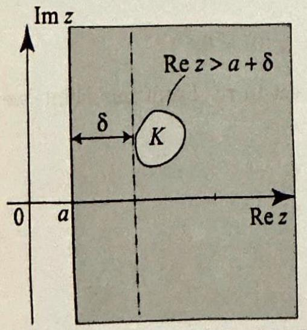

Topics to Review
Soctions 12.1 and 12.2 contain the hasic properties of the Laplace ransform and are self-contained. The applications of the Laplace transform to partial differential equations are presented in Section 9.3 and assume a familiarity with related boundary value problems for the heat and wave equations that have been treated earlier in the book. Section 9.4 develops the Hankel transform and requires some knowledge of the basic properties of Bessel functions from Sections 9.6 and 9.7 The applications in this section are also related to boundary value problems treated previously.

Looking Ahead
This chapter adds to the diversity of problems and applications that we have treated thus far. With it we complete the treatment of the standard boundary malue problems that arise in the classical areas of heat conduction and wave motion. The reader who has encountered the Laplace transform in a course in ordinary differential equations will see it bere fulfilling, next to the Fourier transform, a major role in the solution of boundary value problems for partial differential equalions. And those of you who lave enjoyed Bessel functions will see them again here at the heart of the definition of yet another mportant transform, the Hankel transform.

## 9

## THE LAPLACE AND HANKEL TRANSFORMS WITH APPLICATIONS

Should I refuse a good dinner simply because I do not understand the process of digestion?
-Oliver Heaviside
[Criticized for using formal mathematical manipulations, without understanding how they worked.]

In the previous chapter we introduced the Fourier transform and the Fourier sine and cosine transforms and showed their utility in solving various boundary value problems for partial differential equations on unbounded domains. The problems to which these transforms applied were typically treated in Cartesian coordinates. Another transform that can frequently be applied with success is the Laplace transform, our first topic in this chapter. If one of the variables occurring in a problem ranges over a half-line $[0, \infty)$, we can often make progress by performing a Laplace transform with respect to this variable, in much the same way that we did with the sine and cosine transforms. Because of the importance of this transform in other settings, we present a self-contained treatment, including the solution of initial value problems for ordinary differential equations. For problems with other than Cartesian geometry, there are yet other transforms that are more natural and therefore more useful. For example, in unbounded problems with radial symmetry in either the plane or the space, so that the appropriate coordinates are polar, cylindrical, or spherical, the natural transform for the radial variable ( $r$ or $\rho$ ) involves Bessel functions. This transform, which depends on the order $\nu$ of the Bessel function involved, is known as the Hankel transform of order $\nu$.

### 9.1 The Laplace Transform

In this section we present the definition and basic properties of the Laplace transform. As a warm-up for the applications with partial differential equations, we will use it to solve some simple ordinary differential equations.

Suppose that $f(t)$ is defined for all $t \geq 0$. The Laplace transform of $f$ is the function
As a convention, functions $f, g, \ldots$ are defined for $t \geq 0$ and their transforms $F, G, \ldots$ are defined on the $s$-axis.

$$
\mathcal{L}(f)(s)=\int_{0}^{\infty} f(t) e^{-s t} d t
$$

Another commonly used notation for $\mathcal{L}(f)(s)$ is $F(s)$. For the integral to exist $f$ cannot grow faster than an exponential. This motivates the following definition. We say that $f$ is of exponential order if there exist positive numbers $a$ and $M$ such that

$$
|f(t)| \leq M e^{a t} \text { for all } t \geq 0
$$

For example, the functions $1,4 \cos 2 t, 5 t \sin 2 t, e^{3 t}$ are all of exponential order. We can now give a sufficient condition for the existence of the Laplace transform.

THEOREM 1 EXISTENCE OF THE LAPLACE TRANSFORM

Suppose that $f$ is piecewise continuous on the interval $[0, \infty)$ and of exponential order with $|f(t)| \leq M e^{a t}$ for all $t \geq 0$. Then $\mathcal{L}(f)(s)$ exists for all $s>a$.

Proof We have to show that for $s>a$

$$
\mathcal{L}(f)(s)=\int_{0}^{\infty} f(t) e^{-s t} d t<\infty
$$

With $M$ and $a$ as before, we have

$$
\begin{aligned}
\left|\int_{0}^{\infty} f(t) e^{-s t} d t\right| & \leq \int_{0}^{\infty}|f(t)| e^{-s t} d t \leq M \int_{0}^{\infty} e^{a t} e^{-s t} d t \\
& =M \int_{0}^{\infty} e^{-(s-a) t} d t=\frac{M}{s-a}<\infty
\end{aligned}
$$

Note that the function $\frac{1}{\sqrt{t}}$ is not of exponential order, because of its behavior at $t=0$. However, we will show in Example 2 that its Laplace transform $\mathcal{L}\left(\frac{1}{\sqrt{t}}\right)(s)$ exists for all $s>0$. Thus Theorem 1 provides sufficient but not necessary conditions for the existence of the Laplace transform.

EXAMPLE $1 \mathcal{L}(1), \mathcal{L}(t)$, and $\mathcal{L}\left(e^{\alpha t}\right)$
We compute these transforms using (1). We have

$$
\begin{gathered}
\mathcal{L}(1)(s)=\int_{0}^{\infty} e^{-s t} d t=-\left.\frac{1}{s} e^{-s t}\right|_{0} ^{\infty}=\frac{1}{s}, \quad s>0 \\
\mathcal{L}(t)(s)=\int_{0}^{\infty} t e^{-s t} d t=\left.\left(-\frac{t}{s} e^{-s t}-\frac{1}{s^{2}} e^{-s t}\right)\right|_{0} ^{\infty}=\frac{1}{s^{2}}, \quad s>0
\end{gathered}
$$

and finally, for $s>\alpha$,

$$
\mathcal{L}\left(e^{\alpha t}\right)(s)=\int_{0}^{\infty} e^{-(s-\alpha) t} d t=-\left.\frac{1}{s-\alpha} e^{-(s-\alpha) t}\right|_{0} ^{\infty}=\frac{1}{s-\alpha}
$$

Note that $\mathcal{L}\left(e^{\alpha t}\right)(s)$ is not defined for $s \leq \alpha$.
In computing $\mathcal{L}(t)$ we had to integrate by parts once. Similarly, we could compute $\mathcal{L}\left(t^{n}\right)$ ( $n$ a positive integer) by integrating by parts $n$ times. Rather than doing this, we shall take advantage of an interesting connection between the Laplace transform and the gamma function.

EXAMPLE $2 \mathcal{L}\left(t^{a}\right)$ via the gamma function
(a) Evaluate $\mathcal{L}\left(t^{a}\right)(s)$ when $a>-1$ and $s>0$.
(b) Derive from (a) the transforms $\mathcal{L}(t), \mathcal{L}\left(t^{2}\right)$, and, more generally $\mathcal{L}\left(t^{n}\right)$, where $n$ is a positive integer.
(c) What is $\mathcal{L}\left(\frac{1}{\sqrt{t}}\right)$ ?

Solution (a) From (1) we have

$$
\mathcal{L}\left(t^{a}\right)(s)=\int_{0}^{\infty} t^{a} e^{-s t} d t
$$

To compare with the definition of the gamma function (Exercise 24, Section 4.3), we make the change of variables $s t=T, d t=\frac{1}{s} d T$. Then

$$
\begin{aligned}
\mathcal{L}\left(t^{a}\right)(s) & =\int_{0}^{\infty}\left(\frac{T}{s}\right)^{a} e^{-T} \frac{d T}{s}=\frac{1}{s^{a+1}} \underbrace{\int_{0}^{\infty} T^{a} e^{-T} d T}_{=\Gamma(a+1)} \\
& =\frac{\Gamma(a+1)}{s^{a+1}}
\end{aligned}
$$

(b) Using (a),

$$
\begin{aligned}
\mathcal{L}(t) & =\frac{\Gamma(2)}{s^{2}}=\frac{1}{s^{2}} \\
\mathcal{L}\left(t^{2}\right) & =\frac{\Gamma(3)}{s^{3}}=\frac{2}{s^{3}}
\end{aligned}
$$

and, more generally,

$$
\mathcal{L}\left(t^{n}\right)=\frac{\Gamma(n+1)}{s^{n+1}}=\frac{n!}{s^{n+1}}
$$

(c) Using (a), and Exercise 25(a), Section 4.3,

$$
\mathcal{L}\left(\frac{1}{\sqrt{t}}\right)=\mathcal{L}\left(t^{-1 / 2}\right)=\frac{\Gamma(1 / 2)}{s^{1 / 2}}=\sqrt{\frac{\pi}{s}}
$$

## Operational Properties

We will derive in the rest of this section properties of the Laplace transform that will assist us in solving differential equations. We are particularly interested in those formulas involving a function, its transform, and the transform of its derivatives. These formulas are similar to the operational properties of the Fourier transform. Because the Laplace transform is defined by an integral over the interval $[0, \infty)$, some of the formulas will involve the values of the function and its derivatives at 0 .

## THEOREM 2 LINEARITY

$$
\begin{aligned}
& \text { If } f \text { and } g \text { are functions and } \alpha \text { and } \beta \text { are numbers, then } \\
& \qquad \mathcal{L}(\alpha f+\beta g)=\alpha \mathcal{L}(f)+\beta \mathcal{L}(g)
\end{aligned}
$$

The proof is left as an exercise. You should also think about the domain of definition of $\mathcal{L}(\alpha f+\beta g)$ in terms of the domains of definition of $\mathcal{L}(f)$ and $\mathcal{L}(g)$.

EXAMPLE $3 \mathcal{L}(\cos k t)$ and $\mathcal{L}(\sin k t)$
These transforms can be evaluated directly by using (1). Our derivation will be based on Euler's identity $e^{i k t}=\cos k t+i \sin k t$ and the linearity of the Laplace transform. We have

$$
\begin{aligned}
\mathcal{L}(\cos k t)+i \mathcal{L}(\sin k t) & =\int_{0}^{\infty}(\cos k t+i \sin k t) e^{-s t} d t \\
& =\int_{0}^{\infty} e^{-t(s-i k)} d t=-\left.\frac{e^{-t(s-i k)}}{s-i k}\right|_{0} ^{\infty}=\frac{1}{s-i k} \\
& =\frac{s+i k}{s^{2}+k^{2}}=\frac{s}{s^{2}+k^{2}}+i \frac{k}{s^{2}+k^{2}}
\end{aligned}
$$

Equating real and imaginary parts, we get

$$
\mathcal{L}(\cos k t)=\frac{s}{s^{2}+k^{2}} \quad \text { and } \quad \mathcal{L}(\sin k t)=\frac{k}{s^{2}+k^{2}}
$$

The next result is very useful. It states that the Laplace transform takes derivatives into powers of $s$.

THEOREM 3
LAPLACE TRANSFORMS OF DERIVATIVES
(i) Suppose that $f$ is continuous on $[0, \infty)$ and of exponential order as in (2). Suppose further that $f^{\prime}$ is piecewise continuous on $[0, \infty)$ and of exponential order. Then
(3)

$$
\mathcal{L}\left(f^{\prime}\right)=s \mathcal{L}(f)-f(0)
$$

(ii) More generally, if $f, f^{\prime}, \ldots, f^{(n-1)}$ are continuous on $[0, \infty)$ and of exponential order as in (2), and $f^{(n)}$ is piecewise continuous on $[0, \infty)$ and of exponential order, then
(4)

$$
\mathcal{L}\left(f^{(n)}\right)=s^{n} \mathcal{L}(f)-s^{n-1} f(0)-s^{n-2} f^{\prime}(0)-\cdots-f^{(n-1)}(0)
$$

Proof Since $f$ is of exponential order, then (2) holds for some positive constants $a$ and $M$. The transform $\mathcal{L}\left(f^{\prime}\right)(s)$ is to be computed for $s>a$. Before we start the computation, note that for $s>a$

$$
\lim _{t \rightarrow \infty}|f(t)| e^{-s t}=\lim _{t \rightarrow \infty} \underbrace{|f(t)|}_{\leq M e^{a t}} e^{-a t} e^{-(s-a) t} \leq M \lim _{t \rightarrow \infty} e^{-(s-a) t}=0
$$

because $s-a>0$. We now compute, using (1) and integrating by parts,

$$
\begin{aligned}
\mathcal{L}\left(f^{\prime}\right)(s) & =\int_{0}^{\infty} f^{\prime}(t) e^{-s t} d t \quad(s>a) \\
& =\left.f(t) e^{-s t}\right|_{0} ^{\infty}-(-s) \underbrace{\int_{0}^{\infty} f(t) e^{-s t} d t}_{\mathcal{L}(f)(s)} \\
& =-f(0)+s \mathcal{L}(f),
\end{aligned}
$$

which proves (i). Part (ii) follows by repeated applications of (i).
When $n=2$, (4) gives

$$
\mathcal{L}\left(f^{\prime \prime}\right)=s^{2} \mathcal{L}(f)-s f(0)-f^{\prime}(0)
$$

The following is a counterpart of Theorem 3 showing that the Laplace transform takes powers of $t$ into derivatives.
(i) Suppose $f(t)$ is piecewise continuous and of exponential order. Then
(6)

$$
\mathcal{L}(t f(t))(s)=-\frac{d}{d s} \mathcal{L}(f)(s)
$$

(ii) In general, if $f(t)$ is piecewise continuous and of exponential order, then

$$
\mathcal{L}\left(t^{n} f(t)\right)=(-1)^{n} \frac{d^{n}}{d s^{n}} \mathcal{L}(f)(s)
$$

Proof Differentiation under the integral sign gives

$$
\begin{aligned}
|\mathcal{L}(f)|^{\prime}(s) & =\frac{d}{d s} \int_{0}^{\infty} f(t) e^{-s t} d t=\int_{0}^{\infty} f(t) \frac{d}{d s} e^{-s t} d t \\
& =-\int_{0}^{\infty} t f(t) e^{-s t} d t=-\mathcal{L}(t f(t))(s)
\end{aligned}
$$

and (i) follows upon multiplying both sides by -1 . Part (ii) is obtained by repeated applications of (i). $\square$

## EXAMPLE 4 Derivatives of transforms

(a) Evaluate $\mathcal{L}(t \sin 2 t)$. (b) Evaluate $\mathcal{L}\left(t^{2} \sin t\right)$.

Solution (a) Using (6) and Example 3, we find

$$
\mathcal{L}(t \sin 2 t)=-\frac{d}{d s} \frac{2}{s^{2}+4}=\frac{4 s}{\left(s^{2}+4\right)^{2}}
$$

(b) Similarly, using (7) and Example 3, we find

$$
\mathcal{L}\left(t^{2} \sin t\right)=\frac{d^{2}}{d s^{2}} \frac{1}{s^{2}+1}=\frac{2\left(-1+3 s^{2}\right)}{\left(s^{2}+1\right)^{3}}
$$ $\square$

The following theorem states that multiplication of a function by $e^{\alpha t}$ causes the transform to be shifted by $\alpha$ units on the $s$-axis. This very important property has a counterpart which involves a shift on the $t$-axis (see Theorem 1, Section 9.2).

THEOREM 5 SHIFTING ON THE $\boldsymbol{s}$-AXIS

Suppose that $f$ is of exponential order. Let $\alpha$ be a real number and $a$ be as in (2). For $s>a+\alpha$, we have

$$
\mathcal{L}\left(e^{\alpha t} f(t)\right)(s)=F(s-\alpha)
$$

where $F(s)=\mathcal{L}(f(t))(s)$.
Proof Note that $e^{a t} f(t)$ is also of exponential order and (2) holds with $a$ replaced by $a+\alpha$. Thus Theorem 1 guarantees the existence of $\mathcal{L}\left(e^{\alpha t} f(t)\right.$ for $s>a+\alpha$. We have

$$
\mathcal{L}\left(e^{\alpha t} f(t)\right)(s)=\int_{0}^{\infty} f(t) e^{\alpha t} e^{-s t} d t=\int_{0}^{\infty} f(t) e^{-(s-\alpha) t} d t=F(s-\alpha)
$$ $\square$

Taking $f=1$ in Theorem 5, we obtain the third transform in Example 1, $\mathcal{L}\left(e^{\alpha t}\right)=\frac{1}{s-\alpha}$, since $\mathcal{L}(1)=\frac{1}{s}$.

## The Inverse Laplace Transform

Given a function $F(s)$, if we can find a function $f(t)$ such that $\mathcal{L}(f)=F$, we will call $f(t)$ the inverse Laplace transform of $F(s)$ and denote it by

$$
f(t)=\mathcal{L}^{-1}(F(s)) \text { or simply } f=\mathcal{L}^{-1}(F)
$$

We will use the Laplace transform as a tool to solve differential equations, just like we used the Fourier transform. The method will consist of applying the Laplace transform to a problem, solving the transformed problem, and then taking the inverse of the Laplace transform to find the solution of the original problem. This process assumes that an inverse exists and that it is unique. Indeed, just like the Fourier transform has an inverse transform, the Laplace transform has an inverse. The formula involves integration in the complex plane and requires a certain amount of complex analysis. We will present it at the end of the section; for now we will take the uniqueness of the inverse transform for granted and compute the inverse transform by using known Laplace transforms, as illustrated by the following examples. We note that the inverse of any linear transform is itself linear. In particular, we have

$$
\mathcal{L}^{-1}(\alpha F+\beta G)=\alpha \mathcal{L}^{-1}(F)+\beta \mathcal{L}^{-1}(G)
$$

EXAMPLE 5 Inverse Laplace transforms
(a) Evaluate $\mathcal{L}^{-1}\left(\frac{2}{4+(s-1)^{2}}\right)$.
(b) Evaluate $\mathcal{L}^{-1}\left(\frac{1}{s^{2}+2 s+3}\right)$.

Solution (a) From the table of Laplace transforms, Appendix B. 4 (or by using Example 3 and Theorem 5), we find that

$$
\mathcal{L}\left(e^{a t} \sin k t\right)=\frac{k}{(s-a)^{2}+k^{2}}
$$

Taking $a=1$ and $k=2$, we get

$$
\mathcal{L}\left(e^{t} \sin 2 t\right)=\frac{2}{(s-1)^{2}+4}
$$

Hence

$$
\mathcal{L}^{-1}\left(\frac{2}{4+(s-1)^{2}}\right)=e^{t} \sin 2 t
$$

(b) Motivated by part (a), we first write

$$
\frac{1}{s^{2}+2 s+3}=\frac{1}{(s+1)^{2}+(\sqrt{2})^{2}}=\frac{1}{\sqrt{2}} \frac{\sqrt{2}}{(s+1)^{2}+(\sqrt{2})^{2}}
$$

Now using the transform in (a) with $a=-1$ and $k=\sqrt{2}$, we get

$$
\mathcal{L}^{-1}\left(\frac{1}{s^{2}+2 s+3}\right)=\frac{1}{\sqrt{2}} \mathcal{L}^{-1}\left(\frac{\sqrt{2}}{(s+1)^{2}+(\sqrt{2})^{2}}\right)=\frac{1}{\sqrt{2}} e^{-t} \sin \sqrt{2} t
$$

## EXAMPLE 6 Partial fractions

Evaluate $\mathcal{L}^{-1}\left(\frac{1}{s^{2}+2 s-3}\right)$.
Solution First Method We can compute as we did in Example 5(b). First, write

$$
\frac{1}{s^{2}+2 s-3}=\frac{1}{(s+1)^{2}-2^{2}}=\frac{1}{2} \frac{2}{(s+1)^{2}-2^{2}}
$$

From the table of Laplace transforms, Appendix B.4, we have

$$
\mathcal{L}\left(e^{a t} \sinh k t\right)=\frac{k}{(s-a)^{2}-k^{2}}
$$

Taking $a=-1$ and $k=2$, it follows that

$$
\mathcal{L}^{-1}\left(\frac{1}{s^{2}+2 s-3}\right)=\frac{1}{2} \mathcal{L}^{-1}\left(\frac{2}{(s+1)^{2}-2^{2}}\right)=\frac{1}{2} e^{-t} \sinh 2 t
$$

Second Method Partial fractions are useful in evaluating inverse Laplace transforms of rational functions. To apply this method, we first factor the denominator as $s^{2}+2 s-3=(s+3)(s-1)$. Now write

$$
\frac{1}{(s+3)(s-1)}=\frac{A}{(s+3)}+\frac{B}{(s-1)}
$$

so that

$$
1=A(s-1)+B(s+3)
$$

Setting $s=1$ and then $s=-3$ yields $B=\frac{1}{4}$ and $A=-\frac{1}{4}$, respectively. Thus

$$
\mathcal{L}^{-1}\left(\frac{1}{s^{2}+2 s-3}\right)=-\frac{1}{4} \mathcal{L}^{-1}\left(\frac{1}{s+3}\right)+\frac{1}{4} \mathcal{L}^{-1}\left(\frac{1}{s-1}\right)=-\frac{1}{4} e^{-3 t}+\frac{1}{4} e^{t}
$$

It is easy to see that this transform is also equal to $\frac{1}{2} e^{-t} \sinh 2 t$, matching our earlier finding.

## Laplace Transform and Differential Equations

The key to solving differential equations via the Laplace transform method is to use the operational properties, particularly those related to differentiation. We begin with a simple initial value problem. In what follows, we will denote the Laplace transform of $y(t)$ by $Y(s)$.

EXAMPLE 7 Solving a differential equation with the Laplace transform: Solve $y^{\prime \prime}+y=2, \quad y(0)=0, y^{\prime}(0)=1$.
Solution Taking the Laplace transform of both sides of the equation and using Theorem 3, we find

$$
s^{2} Y-s y(0)-y^{\prime}(0)+Y=\mathcal{L}(2)=\frac{2}{s}
$$

Using the initial conditions, we obtain

$$
\begin{aligned}
& \left(s^{2}+1\right) Y-1=\frac{2}{s} \\
& Y=\frac{1}{s^{2}+1}+\frac{2}{s\left(s^{2}+1\right)}
\end{aligned}
$$

Using partial fractions on the second term, we find

$$
Y=\frac{1}{s^{2}+1}+\frac{2}{s}-\frac{2 s}{s^{2}+1}
$$

Finally, taking the inverse Laplace transform, we get

$$
y=\sin t+2-2 \cos t
$$

This example is a typical illustration of the Laplace transform method. Starting from a linear ordinary differential equation with constant coefficients in $y$, the Laplace transform produces an algebraic equation that can be solved for $Y$. The solution $y$ is then found by taking the inverse Laplace transform of $Y$. The Laplace transform method is most compatible with initial value problems where the initial data is given at $t=0$, due to the way the transform acts on derivatives. If the initial data is given at some other value $t_{0}$, the Laplace transform still applies: We simply make the change of variables $\tau=t-t_{0}$. The next example illustrates this process.

EXAMPLE 8 Shifting the time variable
Solve $y^{\prime \prime}+2 y^{\prime}+y=t, \quad y(1)=0, y^{\prime}(1)=0$.
Solution Making the change of variables $\tau=t-1$, we arrive at the initial value problem

$$
y^{\prime \prime}+2 y^{\prime}+y=\tau+1, \quad y(0)=0, y^{\prime}(0)=0
$$

where now a prime denotes differentiation with respect to $\tau$. From this point, we proceed as in Example 7. Transforming yields

$$
\begin{gathered}
s^{2} Y+2 s Y+Y=\frac{1}{s^{2}}+\frac{1}{s} \\
Y=\frac{1}{s^{2}(s+1)}
\end{gathered}
$$

Using partial fractions, we get

$$
Y=\frac{1}{s+1}-\frac{1}{s}+\frac{1}{s^{2}}
$$

Taking the inverse Laplace transform, we arrive at

$$
y=e^{-\tau}-1+\tau
$$

Hence the solution is $y(t)=e^{1-t}+t-2$.
Recall from Section 11.2 an interesting way to compute the Fourier transform of $e^{-a x^{2}}$ was to take an indirect approach and consider a differential equation that is satisfied by $e^{-a x^{2}}$. These ideas work also with the Laplace transform, as we now illustrate by giving a simple derivation of the Laplace transform of $\cos k x$.

Figure 1 Since $K$ is closed and bounded and disjoint from the line $\operatorname{Re} z=a$, its distance to this line is $\delta>0$. For all $z$ in $K, \operatorname{Re} z>a+\delta$; so
$\left|f(z) e^{-z t}\right| \leq M e^{a t} e^{-t \operatorname{Re} z} \leq M e^{-\delta t}$.

EXAMPLE 9 Using differential equations to compute transforms
The function $y=\cos k x$ is the unique solution of the initial value problem

$$
y^{\prime \prime}+k^{2} y=0, y(0)=1, y^{\prime}(0)=0 .
$$

Transforming this problem with the Laplace transform, we find that

$$
s^{2} Y-s+k^{2} Y=0 \quad \Rightarrow \quad Y=\frac{s}{s^{2}+k^{2}},
$$

which gives the Laplace transform of $\cos k x$. Knowing the transform of $\cos k x$, we can get the transform of $\sin k x$ quite easily. Note that $y=\sin k x$ is the unique solution of the initial value problem $y^{\prime}=k \cos k x$ and $y(0)=0$. Transforming this first order initial value problem with the Laplace transform, we find that

$$
s Y=\mathcal{L}(k \cos k x) \Rightarrow s Y=\frac{k s}{s^{2}+k^{2}} \Rightarrow Y=\frac{k}{s^{2}+k^{2}}
$$

which gives the Laplace transform of $\sin k x$. $\square$

We end this section by deriving a formula for the inverse Laplace transform.

## A Formula for the Inverse Laplace Transform

To describe the inverse of the Laplace transform, we will first extend the transform to complex numbers as follows. Suppose that $f$ is piecewise smooth and of exponential order with $|f(t)| \leq M e^{a t}$ for all $t \geq 0(a>0)$. For a complex number $z$ in the right half-plane, $\operatorname{Re} z>a$, define

$$
\mathcal{L}(f)(z)=\int_{0}^{\infty} f(t) e^{-z t} d t
$$

When $z$ is real, this definition reduces to (1). Also, for $\operatorname{Re} z>a$ (say $\operatorname{Re} z=a+\epsilon, \epsilon>0$ ) and all $t \geq 0$, we have

$$
\left|f(t) e^{-z t}\right| \leq M e^{a t}\left|e^{-\operatorname{Re}(z) t}\right| \leq M e^{a t} e^{-(a+\epsilon) t} \leq M e^{-\epsilon t},
$$

and so the integral in (8) exists. We next argue that $\mathcal{L}(f)(z)$ is analytic in the half-plane $\operatorname{Re} z>a$. To simplify the proof, we will further suppose that $f$ is continuous on $[0, \infty)$. Write

$$
\mathcal{L}(f)(z)=\int_{0}^{\infty} f(t) e^{-z t} d t=\sum_{n=0}^{\infty} \int_{n}^{n+1} f(t) e^{-z t} d t
$$

Each term in the sum is analytic, by Theorem 4, Section 3.5 (differentiation under the integral sign). Moreover, if $K$ is a closed and bounded subset of the half-plane $\operatorname{Re} z>a$, then there is a $\delta>0$ such that $\left|f(t) e^{-z t}\right| \leq M e^{-\delta t}$ for all $z$ in $K$ and all $t$ (see Figure 1). Hence, for all $z$ in $K$ and all $t$,

$$
\left|\int_{n}^{n+1} f(t) e^{-z t} d t\right| \leq M \int_{n}^{n+1} e^{-\delta t} d t=\frac{M}{\delta}\left(e^{-n \delta}-e^{-(n+1) \delta}\right)=M_{n}
$$

Since $\sum_{n=0}^{\infty} M_{n}<\infty$, it follows from the Weierstrass $M$-test that the series in (9) converges uniformly for all $z$ in $K$. From Corollary 2, Section 4.2, we conclude that $\mathcal{L}(f)(z)$ is analytic in the half-plane $\operatorname{Re} z>a$.

We now proceed to invert the Laplace transform by appealing to the inverse Fourier transform. Pick $b>a$, and define $g(t)=e^{-b t} f(t)$ if $t \geq 0$ and $g(t)=0$ if $t<0$. Then because $f$ is piecewise smooth and of exponential order with $a<b$, it follows that $g$ is integrable and piecewise smooth on the real line, and so we may apply the inverse Fourier transform (Theorem 1, Section 11.1). Using $g(t)=0$ for $t<0$, we have the Fourier transform

$$
\widehat{g}(\omega)=\frac{1}{\sqrt{2 \pi}} \int_{0}^{\infty} e^{-b t} f(t) e^{-i \omega t} d t=\frac{1}{\sqrt{2 \pi}} \mathcal{L}(f)(b+i \omega)
$$

and the inverse Fourier transform

$$
g(t)=\lim _{R \rightarrow \infty} \frac{1}{\sqrt{2 \pi}} \int_{-R}^{R} \widehat{g}(\omega) e^{i \omega t} d \omega=\lim _{R \rightarrow \infty} \frac{1}{2 \pi} \int_{-R}^{R} \mathcal{L}(f)(b+i \omega) e^{i \omega t} d \omega,
$$

where the left side in (11) should be interpreted as the average of $g$ at the points of discontinuity. Making the change of variables $z=b+i \omega, d z=i d \omega$, and recalling that $g(t)=e^{-b t} f(t)$, we get

Figure 2

$$
e^{-b t} f(t)=\lim _{R \rightarrow \infty} \frac{e^{-b t}}{2 \pi i} \int_{b-i R}^{b+i R} \mathcal{L}(f)(z) e^{-z t} d z
$$

where the integral is over the vertical line segment from $b-i R$ to $b+ i R$. Simplifying, and replacing $f$ by its average to account for the possible discontinuities, we obtain the inversion formula for the Laplace transform:

$$
\frac{f(t+)+f(t-)}{2}=\lim _{R \rightarrow \infty} \frac{1}{2 \pi i} \int_{b-i R}^{b+i R} \mathcal{L}(f)(z) e^{-z t} d z
$$

Note that the integral is independent of the choice of $b$ as long as $b>a$. To see this, given any two vertical line segments, we can close the contour as in Figure 2. The integral over the closed contour is 0 by Cauchy's theorem. A straightforward estimate on the integrand shows that the integrals over the horizontal sides tend to zero as $R \rightarrow \infty$. This implies that

$$
\lim _{R \rightarrow \infty} \frac{1}{2 \pi i} \int_{b-i R}^{b+i R} \mathcal{L}(f)(z) e^{-z t} d z=\lim _{R \rightarrow \infty} \frac{1}{2 \pi i} \int_{b^{\prime}-i R}^{b^{\prime}+i R} \mathcal{L}(f)(z) e^{-z t} d z
$$

as claimed. One important consequence of (13) is the uniqueness of the inverse Laplace transform. Since this inverse is given by an integral, any two inverses must be equal to the integral and thus must be the same.

## Exercises 12.1

In Erencises 1-6, show that the given function is of exponential order by establishing (2) with an appropriate choice of the numbers $a$ and $M$.

1. $f(t)=11 \cos 3 t$.
2. $f(t)=\sin 2 t+3 \cos t$.
3. $f(t)=5 e^{3 t}$.
4. $f(t)=t^{n}$.
5. $f(t)=\sinh 3 t$.
6. $f(t)=e^{5 t} \sinh t$.

In Exercises $7-24$, evaluate the Laplace transform of the given function using appropriate theorems and examples from this section.
7. $f(t)=2 t+3$.
8. $f(t)=t^{2}+3 t^{4}$.
9. $f(t)=\sqrt{t}+\frac{1}{\sqrt{t}}$.
10. $f(t)=t^{2}+3 t+t^{3 / 2}$.
11. $f(t)=t^{2} e^{3 t}$.
12. $f(t)=t^{4} e^{-3 t}+e^{t}$.
13. $f(t)=t \sin 4 t$.
14. $f(t)=t^{2} \cos 2 t$.
15. $f(t)=\sin ^{2} t$.
16. $f(t)=\cos t \sin t$.
17. $f(t)=e^{2 t} \sin 3 t$.
18. $f(t)=t \sinh 3 t$.
19. $f(t)=t e^{-t} \sin t$.
20. $f(t)=e^{t+1} \cos t$.
21. $f(t)=(t+2)^{2} \cos t$.
22. $f(t)=e^{\alpha t} t^{3 / 2}$.
23. $f(t)=e^{\alpha t} \sin \beta t$.
24. $f(t)=e^{\alpha t} \cos \beta t$.

In Exercises 25-38, evaluate the inverse Laplace transform of the given function.
25. $F(s)=\frac{1}{s^{2}}$.
26. $F(s)=\frac{1}{s^{2}-2}$.
27. $F(s)=\frac{4}{3 s^{2}+1}$.
28. $F(s)=\frac{1}{(s-1)^{2}-2}$.
29. $F(s)=\frac{1}{(s-3)^{5}}+\frac{s-3}{1+(s-3)^{2}}$.
30. $F(s)=\frac{1}{(s-1)(s+1)}$.
31. $F(s)=\frac{s}{s^{2}+2 s+1}$.
32. $F(s)=\frac{3 s+1}{s^{2}-2 s}$.
33. $F(s)=\frac{2 s-1}{s^{2}-s-2}$.
34. $F(s)=\frac{s-1}{(s+1)\left(s^{2}+1\right)}$.
35. $F(s)=\frac{5 s^{2}+2 s-4}{2 s\left(s^{2}+s-2\right)}$.
36. $F(s)=\frac{s^{2}+s+3}{(s+2)\left(s^{2}+1\right)}$.
37. $F(s)=\frac{1}{s^{2}+3 s+2}$.
38. $F(s)=\frac{s}{s^{2}+3 s+2}$.

In Exercises 39-46, solve the given initial value problem with the Laplace transform.
39. $y^{\prime}+y=\cos 2 t, \quad y(0)=-2$.
40. $y^{\prime}+2 y=6 e^{\alpha t}, \quad y(0)=1, \alpha$ is a constant.
41. $y^{\prime \prime}+y=\cos t, \quad y(\pi)=0, y^{\prime}(\pi)=0$.
42. $y^{\prime \prime}-y=1+t^{2}, \quad y(1)=0, y^{\prime}(1)=1$.
43. $y^{\prime \prime}+2 y^{\prime}+y=t e^{-2 t}, \quad y(0)=1, y^{\prime}(0)=1$.
44. $y^{\prime \prime}+y^{\prime}+4 y=0, \quad y(0)=1, y^{\prime}(0)=1$.
45. $y^{\prime \prime}-y^{\prime}-6 y=e^{t} \cos t, \quad y(0)=0, y^{\prime}(0)=1$.
46. $y^{\prime \prime}+4 y^{\prime}+5 y=t^{2}, \quad y(0)=0, y^{\prime}(0)=1$.
