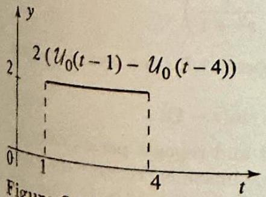
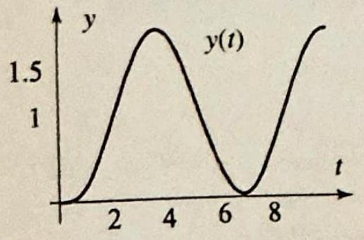
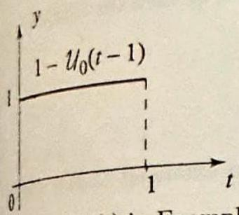
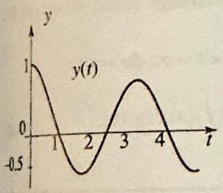
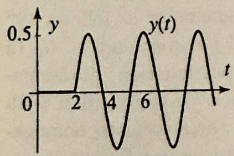
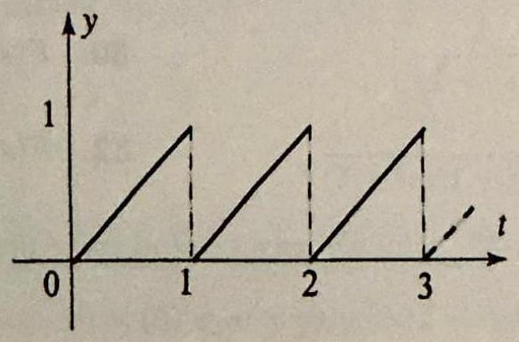
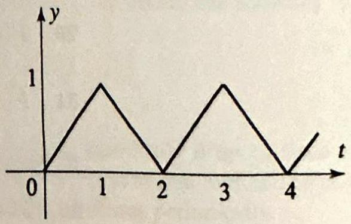
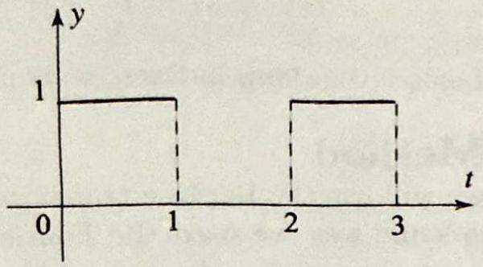
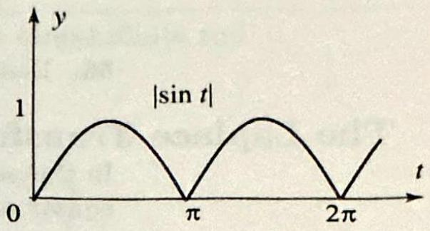

### 9.2 Further Properties of the Laplace Transform

We continue our study of the Laplace transform and start by computing the transform of special functions that arise naturally in studying operational properties of the transform. Recall the Heaviside unit step function

$$
\mathcal{U}_{a}(t)=\mathcal{U}_{0}(t-a)= \begin{cases}0 & \text { if } t<a \\ 1 & \text { if } t \geq a\end{cases}
$$

(Figure 1). Given a function $f(t)$, consider the product $\mathcal{U}_{0}(t-a) f(t-a)$. Written explicitly, we have

$$
\mathcal{U}_{0}(t-a) f(t-a)= \begin{cases}0 & \text { if } t<a \\ f(t-a) & \text { if } t \geq a\end{cases}
$$

Thus, if $f(t)$ represents, say a message, then $\mathcal{U}_{0}(t-a) f(t-a)$ represents the same message, but delayed by $a$ units of time.

THEOREM 1 SHIFTING ON THE $\boldsymbol{t}$-AXIS

gure 2 The function in Ex-

ample 1.

If $a$ is a positive real number, then

$$
\mathcal{L}\left(\mathcal{U}_{0}(t-a) f(t-a)\right)(s)=e^{-a s} F(s)
$$

where $F(s)=\mathcal{L}(f(t))(s)$.
Proof We have

$$
\begin{aligned}
\mathcal{L}\left(\mathcal{U}_{0}(t-a) f(t-a)\right)(s) & =\int_{a}^{\infty} f(t-a) e^{-s t} d t \\
& =\int_{0}^{\infty} f(T) e^{-s(T+a)} d T \quad(\text { where } t-a=T, d t=d T) \\
& =e^{-a s} \int_{0}^{\infty} f(T) e^{-s T} d T=e^{-a s} F(s)
\end{aligned}
$$

## EXAMPLE 1 Transforms involving unit step functions

(a) Evaluate $\mathcal{L}\left(\mathcal{U}_{0}(t-a)\right)$.
(b) Evaluate $\mathcal{L}(f(t))$, where

$$
f(t)= \begin{cases}2 & \text { if } 1 \leq t<4 \\ 0 & \text { otherwise }\end{cases}
$$

(see Figure 2).
Solution (a) Using Theorem 1 with $f(t)=1$, and Example 1 of the previous section, we find

$$
\mathcal{L}\left(\mathcal{U}_{0}(t-a)\right)=\frac{e^{-a s}}{s}, \quad s>0
$$

(b) Write $f(t)=2\left(\mathcal{U}_{0}(t-1)-\mathcal{U}_{0}(t-4)\right)$ (check it!). Then,

$$
\mathcal{L}(f(t))=2\left(\mathcal{L}\left(\mathcal{U}_{0}(t-1)\right)-\mathcal{L}\left(\mathcal{U}_{0}(t-4)\right)\right)=\frac{2}{s}\left(e^{-s}-e^{-4 s}\right), \quad s>0
$$

Figure 3 A ramp function.

Figure 4 Solution in Example 3.

## EXAMPLE 2 A ramp function

Evaluate the Laplace transform of the ramp function shown in Figure 3.
Solution For $t>1$, we have $f(t)=\mathcal{U}_{0}(t-1)$, and for $0 \leq t \leq 1$, we have $f(t)=t\left(\mathcal{U}_{0}(t)-\mathcal{U}_{0}(t-1)\right)$. We can combine these two formulas and simply write

$$
f(t)=t\left(\mathcal{U}_{0}(t)-\mathcal{U}_{0}(t-1)\right)+\mathcal{U}_{0}(t-1) .
$$

(Check it!) We are not quite ready to apply Theorem 1. To be able to do so, we rewrite $f(t)$ as follows

$$
f(t)=-(t-1) \mathcal{U}_{0}(t-1)+t \mathcal{U}_{0}(t)=-(t-1) \mathcal{U}_{0}(t-1)+t
$$

Now recall that $\mathcal{L}(t)=\frac{1}{s^{2}}$. Also, by Theorem $1, \mathcal{L}\left((t-1) \mathcal{U}_{0}(t-1)\right)=\frac{e^{-s}}{s^{2}}$. Hence

$$
\mathcal{L}(f(t))=-\frac{e^{-s}}{s^{2}}+\frac{1}{s^{2}}
$$ $\square$

In the next example we solve a nonhomogeneous differential equation involving a ramp function.

## EXAMPLE 3 A nonhomogeneous differential equation

Solve $y^{\prime \prime}+y=f(t), y(0)=0, y^{\prime}(0)=0$, where $f(t)$ is as in Example 2.
Solution Taking the Laplace transform of both sides of the equation and using the result of Example 2, we find

$$
\begin{aligned}
s^{2} Y+Y & =\frac{1}{s^{2}}-\frac{e^{-s}}{s^{2}} \\
Y & =\frac{1-e^{-s}}{s^{2}\left(s^{2}+1\right)}
\end{aligned}
$$

Using partial fractions, or simply noticing that

$$
\frac{1}{s^{2}\left(s^{2}+1\right)}=\frac{1}{s^{2}}-\frac{1}{\left(s^{2}+1\right)}
$$

we obtain

$$
\begin{aligned}
Y & =\left(1-e^{-s}\right)\left(\frac{1}{s^{2}}-\frac{1}{s^{2}+1}\right) \\
& =\frac{1}{s^{2}}-\frac{1}{s^{2}+1}-e^{-s}\left(\frac{1}{s^{2}}-\frac{1}{s^{2}+1}\right)
\end{aligned}
$$

Taking the inverse Laplace transform, and using Theorem 1 for the term involving $e^{-s}$, we get

$$
y(t)=t-\sin t-\mathcal{U}_{0}(t-1)[(t-1)-\sin (t-1)] .
$$

Figure 4 shows that the solution is bounded for all $t$ and repeats periodically for $t>1$. The term $t-\mathcal{U}_{0}(t-1)(t-1)$ that appears in the solution is precisely the ramp function (see Example 2). In particular, this term is equal to 1 for $t>1$. Thus, for $t>1$, the solution is a sum of two $2 \pi$-periodic sine waves and the function that is identically 1. This explains the boundedness and the periodicity of the solution for $t>1$. $\square$

Our next example involves a differential equation with a discontinuous term.

## EXAMPLE 4 Discontinuous forcing term

Solve $y^{\prime \prime}+4 y=f(t), y(0)=1, y^{\prime}(0)=0$, where the forcing term $f(t)$ is as in Figure 5.
Solution The forcing term can be expressed as

$$
f(t)=1-\mathcal{U}_{0}(t-1)
$$

Taking the Laplace transform of both sides of the equation, we get

Figure $5 f(t)$ in Example 4.

Figure 6 Solution in Exampie 4.

$$
\begin{aligned}
s^{2} Y-s+4 Y & =\frac{1}{s}-\frac{e^{-s}}{s} \\
Y & =\frac{s}{s^{2}+4}+\frac{1-e^{-s}}{s\left(s^{2}+4\right)}
\end{aligned}
$$

and hence, using partial fractions,

$$
Y=\frac{s}{s^{2}+4}+\frac{1}{4}\left(1-e^{-s}\right)\left(\frac{1}{s}-\frac{s}{s^{2}+4}\right)
$$

Taking the inverse Laplace transform, and using Theorem 1 for the term involving $e^{-s}$, we get

$$
\begin{aligned}
y & =\cos 2 t+\frac{1}{4}(1-\cos 2 t)-\frac{1}{4} \mathcal{U}_{0}(t-1)[1-\cos 2(t-1)] \\
& =\frac{1}{4}+\frac{3}{4} \cos 2 t-\frac{1}{4} \mathcal{U}_{0}(t-1)[1-\cos 2(t-1)]
\end{aligned}
$$

(Figure 6). Note that even though the forcing term is discontinuous at $t=1$, the solution is continuous everywhere. A discontinuity at $t=1$ will appear in the graph of the second derivative of the solution, since $y^{\prime \prime}=f(t)-y$.

## Convolutions and Laplace Transforms

Given two functions $f$ and $g$, defined for all $t \geq 0$, we define their convolution $f * g(t)$ by

$$
f * g(t)=\int_{0}^{t} f(t-\tau) g(\tau) d \tau \quad \text { for all } t \geq 0
$$

Clearly this definition is related to the definition of convolutions that we presented in Section 11.2. In fact, if we think of $f$ and $g$ as being defined for all $t$ with values 0 for $t<0$, then (2) becomes $\int_{-\infty}^{\infty} f(t-\tau) g(\tau) d \tau$, which differs by a constant multiple from the convolution that we introduced in Section 11.2. It should be clear from the context which convolution we are talking about, and so there is no risk of confusion in using the same

THEOREM 2 TRANSFORMS OF CONVOLUTIONS
notation for the two different operations. In particular, all our discussion in this section concerns the convolution (2) and not the one in Section 11.2.

Note that since the convolution is defined by an integral over a finite interval, there is no problem in computing $f * g(t)$ if, say, $f$ and $g$ are piecewise continuous functions, no matter how fast they grow at infinity.
Suppose that $f$ and $g$ are piecewise continuous and of exponential order; then

$$
\mathcal{L}(f * g)=\mathcal{L}(f) \mathcal{L}(g)
$$

Proof If we extend the functions $f$ and $g$ to be zero for $t<0$, then the integral in (2) is the same as

$$
\int_{0}^{\infty} f(t-\tau) g(\tau) d \tau
$$

Thus, throughout this proof, we assume that $f$ and $g$ are extended to the whole line with $f(t)=0$ and $g(t)=0$, for all $t<0$. We have

$$
\begin{aligned}
\mathcal{L}(f * g)(s) & =\int_{0}^{\infty} \int_{0}^{\infty} f(t-\tau) g(\tau) d \tau e^{-s t} d t \\
& =\int_{0}^{\infty} \int_{0}^{\infty} f(t-\tau) e^{-s t} d t g(\tau) d \tau \quad \text { (Interchange order of integration.) } \\
& =\int_{0}^{\infty} \int_{0}^{\infty} f(u) e^{-s(u+\tau)} d u g(\tau) d \tau \quad(u=t-\tau, d u=d t) \\
& =\int_{0}^{\infty} \int_{0}^{\infty} f(u) e^{-s u} d u g(\tau) e^{-s \tau} d \tau=\mathcal{L}(f)(s) \mathcal{L}(g)(s)
\end{aligned}
$$

## EXAMPLE 5 Transforms involving convolutions

(a) Evaluate $\mathcal{L}\left(\int_{0}^{t}(t-\tau) \sin (\tau) d \tau\right)$.
(b) Evaluate $\mathcal{L}^{-1}\left(\frac{1}{s^{2}\left(s^{2}+4 s+5\right)}\right)$ using convolutions.

Solution (a) From Theorem 2, we have

$$
\mathcal{L}\left(\int_{0}^{t}(t-\tau) \sin \tau d \tau\right)=\mathcal{L}(t) \mathcal{L}(\sin t)=\frac{1}{s^{2}} \frac{1}{s^{2}+1}
$$

(b) Treat the expression $\frac{1}{s^{2}\left(s^{2}+4 s+5\right)}$ as a product of the two Laplace transforms $\frac{1}{s^{2}}$ and $\frac{1}{s^{2}+4 s+5}$. Since

$$
\mathcal{L}^{-1}\left(\frac{1}{s^{2}}\right)=t
$$

and

$$
\mathcal{L}^{-1}\left(\frac{1}{s^{2}+4 s+5}\right)=\mathcal{L}^{-1}\left(\frac{1}{\left.(s+2)^{2}+1\right)}\right)=e^{-2 t} \sin t
$$

it follows that

$$
\mathcal{L}^{-1}\left(\frac{1}{s^{2}\left(s^{2}+4 s+5\right)}\right)=t * e^{-2 t} \sin t=\int_{0}^{t}(t-\tau) e^{-2 \tau} \sin \tau d \tau
$$

The integral in $\tau$ can be computed explicitly, using integration by parts. As a result, we get

$$
\mathcal{L}^{-1}\left(\frac{1}{s^{2}\left(s^{2}+4 s+5\right)}\right)=\frac{1}{25}(5 t-4)+\frac{4}{25} e^{-2 t} \cos t+\frac{3}{25} e^{-2 t} \sin t
$$

## EXAMPLE 6 Solving differential equations with convolutions

Express the solution of the initial value problem

$$
y^{\prime \prime}-2 y^{\prime}+5 y=f(t), \quad y(0)=0, y^{\prime}(0)=0
$$

as a convolution.
Solution Transforming the equation and then solving for $Y$, we find

$$
Y=\frac{F(s)}{s^{2}-2 s+5}
$$

where $F(s)$ is the Laplace transform of $f(t)$. We have

$$
\frac{1}{s^{2}-2 s+5}=\frac{1}{(s-1)^{2}+2^{2}}=\frac{1}{2} \frac{2}{(s-1)^{2}+2^{2}}
$$

Hence

$$
\mathcal{L}^{-1}\left(\frac{1}{2} \frac{2}{(s-1)^{2}+2^{2}}\right)=\frac{1}{2} e^{t} \sin 2 t
$$

Taking the inverse Laplace transform of $Y$, and using Theorem 2, we get

$$
y=\frac{1}{2} e^{t} \sin 2 t * f(t)=\frac{1}{2} \int_{0}^{t} e^{t-\tau} \sin 2(t-\tau) f(\tau) d \tau
$$

Example 6 shows that in solving the differential equation with zero initial data all nonhomogeneous terms are treated equally: we simply integrate $f(t)$ against $\frac{1}{2} e^{t-\tau} \sin 2(t-\tau)$ on the interval 0 to $t$. Note that the latter function is a translate of the inverse Laplace transform of $1 /\left(s^{2}-2 s+5\right)$, where the differential equation determines the denominator as follows: $y^{\prime \prime}$ corresponds to $s^{2},-2 y^{\prime}$ corresponds to $-2 s$, and $5 y$ corresponds to 5 . In other words, the response of the system to the input function (nonhomogeneous term) $f(t)$ is always related to that function via convolution with a "response function" that is determined solely by the associated homogeneous differential equation. It is clear that this remark applies for any linear nonhomogeneous differential equation, and it is therefore a general principle governing all such equations.

We close the section with examples that involve the Dirac delta function and its translates. Recall from Section 11.2 the effect of integrating against
a Dirac delta is given by

$$
\int_{a}^{b} f(t) \delta_{0}\left(t-t_{0}\right) d t= \begin{cases}f\left(t_{0}\right) & \text { if } t_{0} \text { is in }[a, b] \\ 0 & \text { if } t_{0} \text { is not in }[a, b]\end{cases}
$$

With this formula in hand, we can compute Laplace transforms involving the Dirac delta function. We illustrate with a basic example.

## EXAMPLE 7 Laplace transform of the Dirac delta function

Let $a \geq 0$. From the definition of the Laplace transform, we have

$$
\mathcal{L}\left(\delta_{0}(t-a)\right)(s)=\int_{0}^{\infty} e^{-s t} \delta_{0}(t-a) d t
$$

Since $a$ belongs to the interval $[0, \infty)$, it follows from (4) that the integral is equal to $e^{-a s}$. Thus

$$
\mathcal{L}\left(\delta_{0}(t-a)\right)=e^{-a s}
$$

The Dirac delta function is a unit for the operation of convolution in the sense that

$$
f * \delta_{0}(t)=\int_{0}^{t} f(t-\tau) \delta_{0}(\tau) d \tau=f(t)
$$

Indeed, since 0 is in the interval $[0, t]$, we use (4) to infer that the integral is equal to the value of $f(t-\tau)$ at $\tau=0$, or $f(t)$.

Our final example is a differential equation involving the delta function.

## EXAMPLE 8 Effect of impulse functions

Solve $y^{\prime \prime}+4 y=\delta_{0}(t-2), y(0)=0, y^{\prime}(0)=0$. (This represents an oscillator, initially at rest, which receives a unit impulse at time $t=2$.)
Solution Taking the Laplace transform of both sides of the equation, we get

Figure 7 Solution in Exam-

ple 8.

$$
\begin{aligned}
s^{2} Y+4 Y & =e^{-2 s} \\
Y & =\frac{e^{-2 s}}{s^{2}+4}
\end{aligned}
$$

Taking the inverse transform and using Theorem 1, we obtain the solution

$$
y(t)=\frac{1}{2} \mathcal{U}_{0}(t-2) \sin 2(t-2)
$$

The graph in Figure 7 shows that the solution is identically 0 up to time $t=2$, which corresponds to the fact that the oscillator started at rest and no forces acted upon it until that time. For $t>2$, the solution oscillates periodically.

## Section 9.2 Further Properties of the Laplace Transform 777

## Exercises 12.2

In Exercises 1-6, evaluate the Laplace transform of the given function.

1. $f(t)=\mathcal{U}_{0}(t-1)-t+1$.
2. $f(t)=(t-1) \mathcal{U}_{0}(t-1)$.
3. $f(t)=e^{2 t} \mathcal{U}_{0}(t-2)$.
4. $f(t)=t \mathcal{U}_{0}(t-\pi)$.
5. $f(t)=\mathcal{U}_{0}(t-\pi) \sin t$.
6. $f(t)=\mathcal{U}_{0}(t-\pi) \cos t \sin t$.

In Exercises 7-14, (a) plot the given function. (b) Express it using unit step functions. (c) Evaluate its Laplace transform.
7. $f(x)= \begin{cases}1 & \text { if } 0<t<2, \\ 0 & \text { if } t>2 .\end{cases}$
8. $f(x)= \begin{cases}t & \text { if } 0 \leq t \leq 1, \\ 2-t & \text { if } 1 \leq t \leq 2, \\ 0 & \text { if } t>2 .\end{cases}$
9. $f(x)= \begin{cases}2 & \text { if } 2 \leq t \leq 3, \\ 0 & \text { otherwise. }\end{cases}$
10. $f(x)= \begin{cases}t & \text { if } 0 \leq t \leq 1, \\ 0 & \text { otherwise. }\end{cases}$
11. $f(x)= \begin{cases}t-1 & \text { if } 1 \leq t \leq 2, \\ 0 & \text { otherwise. }\end{cases}$
12. $f(x)= \begin{cases}-\sin t & \text { if } \pi \leq t \leq 2 \pi, \\ 0 & \text { otherwise. }\end{cases}$
13. $f(x)= \begin{cases}1 & \text { if } 1 \leq t \leq 4, \\ t-5 & \text { if } 4 \leq t \leq 5, \\ 0 & \text { otherwise. }\end{cases}$
14. $f(x)= \begin{cases}t & \text { if } 0 \leq t \leq 1, \\ 1 & \text { if } 1 \leq t \leq 3, \\ 4-t & \text { if } 3<t \leq 4, \\ 0 & \text { otherwise. }\end{cases}$

In Exercises 15-22, evaluate the inverse Laplace transform of the given function.
15. $F(s)=\frac{e^{-s}}{s^{2}}$.
16. $F(s)=\frac{e^{-\pi s}}{s^{2}-2}$.
17. $F(s)=\frac{e^{-s}}{s^{2}+1}$.
18. $F(s)=\frac{e^{-s}}{(s-1)^{2}-1}$.
19. $F(s)=\frac{s-3}{1+(s-3)^{2}}$.
20. $F(s)=\frac{e^{-3 s}}{(s-1)(s+1)}$.
21. $F(s)=\frac{e^{-s}}{s^{3 / 2}}$.
22. $F(s)=\frac{e^{-s}}{(s-2)^{3 / 2}}$.

In Exercises 23-28, evaluate the given convolution.
23. $1 * t$.
24. $e^{t} * e^{-t}$.
25. $t * t$.
26. $t * \sin t$.
27. $\sin t * \sin t$.
28. $e^{t} * \delta_{0}(t)$.

In Exercises 29-32, express the inverse Laplace transform of the given function as a convolution. Evaluate the integral in your answer.
29. $F(s)=\frac{1}{s\left(s^{2}+1\right)}$.
30. $F(s)=\frac{1}{s^{2}\left(s^{2}+1\right)}$.
31. $F(s)=\frac{1}{\left(s^{2}+1\right)\left(s^{2}+1\right)}$.
32. $F(s)=\frac{s}{\left(s^{2}-1\right)\left(s^{2}-1\right)}$.

In Exercises 33-38, solve the given initial value problem.
33. $y^{\prime \prime}+y=\delta_{0}(t-1), \quad y(0)=0, \quad y^{\prime}(0)=0$.
34. $y^{\prime \prime}-y=(t-2) \mathcal{U}_{0}(t-2), \quad y(0)=0, y^{\prime}(0)=0$.
35. $y^{\prime \prime}+2 y^{\prime}+y=3 \delta_{0}(t-2), \quad y(0)=1, y^{\prime}(0)=0$.
36. $y^{\prime \prime}-y=t * \cos t, \quad y(0)=-1, y^{\prime}(0)=0$.
37. $y^{\prime \prime}+4 y=\mathcal{U}_{0}(t-1) e^{t-1}, \quad y(0)=0, y^{\prime}(0)=0$.
38. $y^{\prime \prime}+y^{\prime}+y=\delta_{0}(t-\pi), \quad y(0)=0, y^{\prime}(0)=0$.

In Exercises 39-42, express the solution of the given initial value problem as a convolution.
39. $y^{\prime \prime}+y=f(t), \quad y(0)=0, y^{\prime}(0)=0$.
40. $y^{\prime \prime}+y^{\prime}+y=f(t), \quad y(0)=0, y^{\prime}(0)=0$.
41. $y^{\prime \prime}+4 y=\cos t, \quad y(0)=0, y^{\prime}(0)=0$.
42. $4 y^{\prime \prime}+4 y^{\prime}+17 y=t, \quad y(0)=0, y^{\prime}(0)=0$.

Project Problem: Periodic functions. As you know, in computing Fourier series all we need is knowledge of the function on an interval of length equal to one period. In Exercise 43 you are asked to derive a formula for the Laplace transform of a periodic function, which enables you to compute the transform from just knowing the function over one period. As a project, do Exercise 43 and any one of Exercises 44-47.
43. Suppose that $f(t+T)=f(t)$ for all $t>0$; that is, $f$ is $T$-periodic.
(a) Show that

$$
\mathcal{L}(f(t))=\sum_{k=0}^{\infty} \int_{k T}^{(k+1) T} e^{-s t} f(t) d t
$$

(b) Make a change of variables $\tau=t-k T$ and conclude that

$$
\mathcal{L}(f(t))=\int_{0}^{T} e^{-s t} f(t) d t \sum_{k=0}^{\infty} e^{-k s T}
$$

(c) Sum the (geometric) series and conclude that

$$
\mathcal{L}(f(t))=\frac{\int_{0}^{T} e^{-s t} f(t) d t}{1-e^{-s T}}
$$

In Exercises 44-47, compute the Laplace transform of the given function using the result of Exercise 43.
44.

45.

46.

47.

48. A function is given by its power series expansion, $f(t)=\sum_{k=0}^{\infty} a_{k} t^{k}$ for all $t$. Show that

$$
\mathcal{L}(f(t))=\sum_{k=0}^{\infty} a_{k} \frac{k!}{s^{k+1}}
$$

49. Use the result of Exercise 48 to show that $\mathcal{L}\left(\frac{\sin t}{t}\right)=\tan ^{-1}\left(\frac{1}{s}\right)$. (For an alternative derivation, see Exercise 56.)
50. Laplace transform of $J_{0}$. Recall from Section 4.3 that

$$
J_{0}(t)=\sum_{k=0}^{\infty} \frac{(-1)^{k} t^{2 k}}{2^{2 k}(k!)^{2}}
$$

(a) Use the binomial theorem to show that

$$
\frac{1}{\sqrt{1+s^{2}}}=\frac{1}{s}\left(1+\frac{1}{s^{2}}\right)^{-1 / 2}=\sum_{k=0}^{\infty} \frac{(-1)^{k}(2 k)!}{2^{2 k}(k!)^{2} s^{2 k+1}}, \quad s>1 .
$$

(b) Use the result of Exercise 48 and (a) to show that

$$
\mathcal{L}\left(J_{0}(t)\right)=\frac{1}{\sqrt{1+s^{2}}}
$$

(For an alternative derivation using residues, see Exercise 37, Section 5.1.)
51. Proceed as in Exercise 50 to show that $\mathcal{L}\left(J_{0}(\sqrt{t})\right)=\frac{e^{-1 / 4 s}}{s}$.
52. The error function. Use the Definition of the Laplace transform to show that

$$
\mathcal{L}(\operatorname{erf}(t))=\frac{2}{s \sqrt{\pi}} e^{\frac{s^{2}}{4}} \int_{s / 2}^{\infty} e^{-u^{2}} d u=\frac{1}{s} e^{\frac{s^{2}}{4}} \operatorname{erfc}\left(\frac{s}{2}\right)
$$

For the definition of the functions erf and erfc, see Section 11.4, (5) and Exercise 16.
[Hint: After setting up the integrals, interchange the order of integration.]
53. A Gaussian function. Use the definitions of the Laplace transform and the complementary error function to show that

$$
\mathcal{L}\left(\frac{1}{a \sqrt{\pi}} e^{-t^{2} / 4 a^{2}}\right)=e^{a^{2} s^{2}} \operatorname{erfc}(a s)
$$

54. Derive entry 37 in the table of Laplace transforms, Appendix B.4.
55. Let $F(s)$ denote the Laplace transform of $f(t)$. Establish the identity

$$
\mathcal{L}\left(\frac{f(t)}{t}\right)=\int_{s}^{\infty} F(u) d u
$$

56. Derive the Laplace transform in Exercise 49 using the result of Exercise 55.
