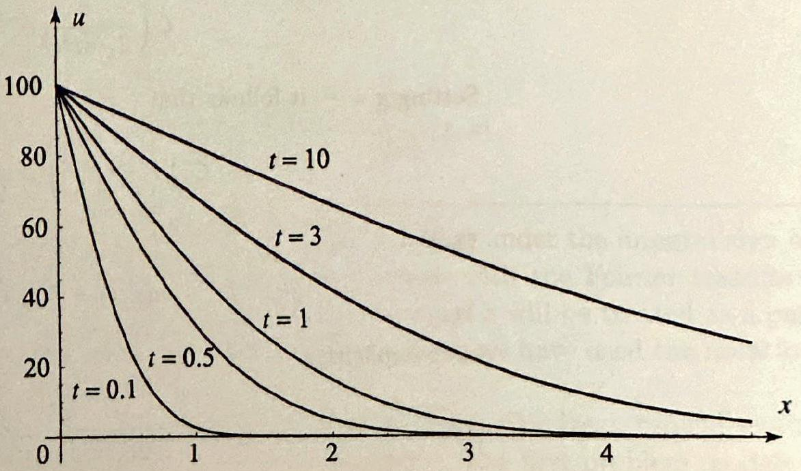
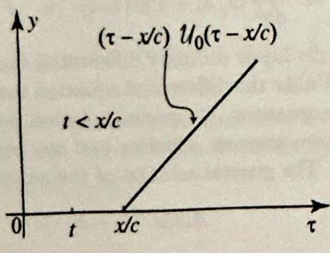

### 9.3 The Laplace Transform Method

In this section we will use the Laplace transform to solve partial differential equations in the same way we used the Fourier transform. Before turning to examples, we set the notation for this section. The Laplace transform of $u(x, t)$ with respect to the variable $t$ is

$$
\mathcal{L}(u(x, t))(s)=U(x, s)=\int_{0}^{\infty} u(x, t) e^{-s t} d t
$$

Using Theorem 3, Section 9.1, we find that

$$
\mathcal{L}\left(\frac{\partial u}{\partial t}\right)=s U(x, s)-u(x, 0)
$$

and
(2)

$$
\mathcal{L}\left(\frac{\partial^{2} u}{\partial t^{2}}\right)=s^{2} U(x, s)-s u(x, 0)-\frac{\partial u}{\partial t}(x, 0)
$$

Keeping in mind that we are taking the Laplace transform with respect to $t$, we also have

$$
\mathcal{L}\left(\frac{\partial u}{\partial x}\right)=\frac{d U}{d x}(x, s),
$$

and

$$
\mathcal{L}\left(\frac{\partial^{2} u}{\partial x^{2}}\right)=\frac{d^{2} U}{d x^{2}}(x, s)
$$

These formulas are obtained by differentiating under the integral sign as we did in deriving the corresponding formulas with the Fourier transform in Section 11.2. Also, to emphasize the fact that $s$ will be treated as a parameter in the transformed differential equations, we have used the notation for ordinary derivatives in (3) and (4).

We are now ready for the applications. We treat typical examples dealing with the heat and wave equations. The first problem models heat
transfer in an infinite insulated rod whose initial temperature is $0^{\circ}$, given that heat from a reservoir is introduced through one end of the rod.

## EXAMPLE 1 Heat equation for a semi-infinite rod

Solve the heat problem

$$
\begin{aligned}
\frac{\partial u}{\partial t} & =c^{2} \frac{\partial^{2} u}{\partial x^{2}}, \quad 0<x<\infty, t>0 \\
u(0, t) & =f(t), \quad t>0 \\
u(x, 0) & =0, \quad 0<x<\infty
\end{aligned}
$$

The problem is illustrated in Figure 1.
Solution We transform (5) with the Laplace transform with respect to $t$. Using (1) and (4), we get

$$
\begin{gathered}
s U(x, s)-u(x, 0)=c^{2} \frac{d^{2} U}{d x^{2}}(x, s) \\
c^{2} \frac{d^{2} U}{d x^{2}}(x, s)-s U(x, s)=0, \quad \text { by }(7)
\end{gathered}
$$

Figure 1

The general solution of this differential equation is

$$
U(x, s)=A(s) e^{\sqrt{s} x / c}+B(s) e^{-\sqrt{s} x / c}
$$

where $A(s)$ and $B(s)$ are constants that depend on $s$ (see Appendix A.2). Expecting the transform to be bounded as $s \rightarrow \infty$, we set $A(s)=0$. To determine $B(s)$, we transform (6) and obtain $U(0, s)=B(s)=F(s)$, where $F(s)$ denotes the Laplace transform of $f$. Hence, $B(s)=F(s)$, and so

$$
U(x, s)=F(s) e^{-\sqrt{s} x / c}
$$

It is now clear from Theorem 2, Section 9.2, that $u(x, t)$ is the convolution of $f(t)$ with the function whose Laplace transform is $e^{-\sqrt{s} x / c}$. To find this transform , we use entry 41 of the table of Laplace transforms in Appendix B:

$$
\mathcal{L}\left(\frac{a}{2 \sqrt{\pi} t^{3 / 2}} e^{-\frac{a^{2}}{4 t}}\right)=e^{-a \sqrt{s}}
$$

Setting $a=\frac{x}{c}$, it follows that

$$
\mathcal{L}^{-1}\left(e^{-\sqrt{s} x / c}\right)=\frac{x}{2 c \sqrt{\pi} t^{3 / 2}} e^{-\frac{x^{2}}{4 c^{2} t}}
$$

Thus

$$
u(x, t)=f(t) * \frac{x e^{-x^{2} / 4 c^{2} t}}{2 c \sqrt{\pi} t^{3 / 2}}
$$

More explicitly,

$$
u(x, t)=\frac{x}{2 c \sqrt{\pi}} \int_{0}^{t} \frac{f(\tau)}{(t-\tau)^{3 / 2}} e^{-\frac{x^{2}}{4 c^{2}(t-\tau)}} d \tau
$$

Figure 2 Expected temperature distribution.

Note that the solution depends on the value of $f(\tau)$ only for $0<\tau<t$. We would expect this, because the temperature $f(\tau)$ of the heat reservoir in the future ( $\tau>t$ ) cannot possibly affect the temperature of the rod now.

The convolution integral in (8) is hard to compute in general. In the following example we carry out the computations in the case of a constant heat source.

## EXAMPLE 2 Heat problem with a constant heat source

Solve the problem of Example 1 in the special case when $f(t)=T_{0}$. Take $T_{0}= 100, c=1$, and illustrate the solution graphically by plotting $u(x, t)$ for various values of $t$.
Solution Before we embark on the solution, let us examine intuitively the consequences of the initial and boundary conditions. Given that the initial temperature is $0^{\circ}$, and given that we are introducing heat at the origin at the constant temperature $T_{0}$, we expect the temperature to propagate throughout the bar and reach the temperature $T_{0}$ at all points. However, at any given time $t$, if we go far enough from the source of heat, the temperature is expected to be near the initial temperature $0^{\circ}$. Thus at any time, the temperature distribution in the bar should look like the graph in Figure 2.

Now let us see if all this can be derived analytically, using the result of Example 1. Substituting $f(t)=T_{0}$ in (8) and making the change of variables $z=x /(2 c \sqrt{t-\tau}), d z=\frac{x}{4 c(t-\tau)^{3 / 2}} d \tau$, we get

$$
u(x, t)=T_{0} \frac{2}{\sqrt{\pi}} \int_{x /(2 c \sqrt{t})}^{\infty} e^{-z^{2}} d z=T_{0} \operatorname{erfc}\left(\frac{x}{2 c \sqrt{t}}\right)
$$

where erfc is the complementary error function introduced in Section 11.4, Exercise 16. Figure 3 illustrates the solution when $T_{0}=100$, and $c=1$ and $u(x, t)= 100 \operatorname{erfc}\left(\frac{x}{2 \sqrt{t}}\right)$.

Figure 3 Temperature distribution in Example 2.

Note that
$\mathcal{L}^{-1}\left(\frac{1}{s^{2}}\right)=t$
and
$\mathcal{L}^{-1}\left(\frac{e^{-\frac{\varepsilon}{c} x}}{s^{2}}\right)=\left(t-\frac{x}{c}\right) \mathcal{U}_{0}\left(t-\frac{x}{c}\right)$.

The next example illustrates the use of the Laplace transform in solving wave equations.

## EXAMPLE 3 Forced vibrations of a semi-infinite string

A semi-infinite string is initially at rest on the $x$-axis with one end fastened at the origin. The string is set in motion by releasing it from rest in the presence of an external force. The motion of the string is modeled by the wave equation

$$
\frac{\partial^{2} u}{\partial t^{2}}=c^{2} \frac{\partial^{2} u}{\partial x^{2}}+f(t), \quad x>0, t>0,
$$

where $f(t)$ denotes the amount of force per unit length. Solve this differential equation subject to the boundary condition

$$
u(0, t)=0, \quad t>0,
$$

and the initial conditions

$$
u(x, 0)=0, \quad \frac{\partial u}{\partial t}(x, 0)=0, \quad x>0
$$

Solution Transforming both sides of the differential equation with respect to $t$ and taking into account the initial conditions, we get

$$
\begin{aligned}
s^{2} U(x, s)-s u(x, 0)-\frac{\partial u}{\partial t}(x, 0) & =c^{2} \frac{d^{2} U}{d x^{2}}(x, s)+F(s) \\
-c^{2} \frac{d^{2} U}{d x^{2}}(x, s)+s^{2} U(x, s) & =F(s)
\end{aligned}
$$

This is a second order linear ordinary differential equation with constant coefficients in the variable $x$. Unlike the differential equation that we encountered in Example 1, this one is nonhomogeneous. Its general solution is the sum of the general solution of the associated homogeneous equation and any particular solution (see Appendix A.1, Theorem 5). The general solution of the associated homogeneous equation is

$$
A(s) e^{-\frac{2}{c} x}+B(s) e^{\frac{2}{c} x}
$$

Recalling that $F(s)$ is constant as a function of $x$, it is easy to see that a particular solution of (9) is $\frac{F(s)}{s^{2}}$. Thus the general solution of (9) is

$$
U(x, s)=A(s) e^{-\frac{a}{c} x}+B(s) e^{\frac{a}{c} x}+\frac{F(s)}{s^{2}}
$$

Expecting the transform to be bounded for $s>0$ and $x>0$, we take $B(s)=0$. The boundary condition implies that $A(s)=-\frac{F(s)}{s^{2}}$. So

$$
U(x, s)=F(s) \frac{1-e^{-\frac{s}{c} x}}{s^{2}}
$$

To compute the inverse Laplace transform, we use Theorems 1 and 2 of the previous section, and we find

$$
u(x, t)=f(t) * \mathcal{L}^{-1}\left(\frac{1-e^{-\frac{e}{c} x}}{s^{2}}\right)=f(t) *\left[t-\left(t-\frac{x}{c}\right) \mathcal{U}_{0}\left(t-\frac{x}{c}\right)\right]
$$

where $\mathcal{U}_{0}$ is the Heaviside step function. We can write the solution more explicitly as

$$
u(x, t)=\int_{0}^{t} f(t-\tau)\left[\tau-\left(\tau-\frac{x}{c}\right) u_{0}\left(\tau-\frac{x}{c}\right)\right] d \tau
$$

The next example is a particularly interesting case of Example 3.

## EXAMPLE 4 Vibrations of a string with gravitational acceleration

If the only external force in Example 3 is due to the gravitational acceleration $g$, then the differential equation becomes

$$
\frac{\partial^{2} u}{\partial t^{2}}=c^{2} \frac{\partial^{2} u}{\partial x^{2}}-g .
$$

Under the same initial and boundary conditions as in the previous example, the solution (11) becomes

$$
\begin{aligned}
u(x, t) & =-g \int_{0}^{t}\left[\tau-\left(\tau-\frac{x}{c}\right) u_{0}\left(\tau-\frac{x}{c}\right)\right] d \tau \\
& =-g\left[\frac{1}{2} t^{2}-\int_{0}^{t}\left(\tau-\frac{x}{c}\right) u_{0}\left(\tau-\frac{x}{c}\right) d \tau\right]
\end{aligned}
$$

Figure 4

In evaluating the integral $\int_{0}^{t}\left(\tau-\frac{x}{c}\right) \mathcal{U}_{0}\left(\tau-\frac{x}{c}\right) d \tau$, we use some simple geometric considerations. For a fixed value of $x>0$, the graph of the function $\left(\tau-\frac{x}{c}\right) \mathcal{U}_{0}\left(\tau-\frac{x}{c}\right)$ (as a function of $\tau$ ) is the translate of the graph of $y=\tau$ by $\frac{x}{c}$ units to the right (see Figure 4). Thus, the integral of $\left(\tau-\frac{x}{c}\right) \mathcal{U}_{0}\left(\tau-\frac{x}{c}\right)$ from 0 to $t$ is 0 if $0<t<\frac{x}{c}$. If $t>\frac{x}{c}>0$, this integral is equal to the triangular area shown in Figure 4. You can check that this area is $\frac{1}{2}\left(t-\frac{x}{c}\right)^{2}$. We thus have

$$
u(x, t)= \begin{cases}-\frac{g}{2}\left(t^{2}-\left(t-\frac{x}{c}\right)^{2}\right) & \text { if } 0<x<c t, \\ -\frac{g t^{2}}{2} & \text { if } x>c t .\end{cases}
$$

Figure 5 illustrates the solution at various values of $t$. This example models a semiinfinite string falling from rest under the influence of gravity with one end held fixed. Recalling that the position of a body that falls from rest is given by $-g t^{2} / 2$, we see that for $x$ larger than $c t$ the string falls as if it were freely falling. Portions of the string at smaller values of $x$, however, fall less rapidly due to the restraining

Figure 5 String falling under the influence of gravity.
effect of the fixed end. Note that this effect propagates outward from the fixed end exactly at velocity $c$.

## Exercises 12.3

In Exercises 1-10 use the Laplace transform to solve the given boundary value problem. Give your answer in the form of an integral and simplify as much as possible. Whenever possible, use the examples from this section without repeating the derivations.
1.

$$
\begin{aligned}
& \frac{\partial u}{\partial t}=\frac{\partial^{2} u}{\partial x^{2}}, 0<x<\infty, t>0, \\
& u(0, t)=70, t>0, \\
& u(x, 0)=0,0<x<\infty .
\end{aligned}
$$

2. 

$$
\begin{aligned}
& \frac{\partial u}{\partial t}=\frac{\partial^{2} u}{\partial x^{2}}, 0<x<\infty, t>0 \\
& u(0, t)=100\left(1-u_{0}(t-1)\right), t>0 \\
& u(x, 0)=0,0<x<\infty
\end{aligned}
$$

3. 

$$
\begin{aligned}
& \frac{\partial u}{\partial t}=\frac{\partial^{2} u}{\partial x^{2}}, 0<x<\infty, t>0, \\
& \left.u(0, t)=100 \mathcal{U}_{0}(t-2)\right), t>0, \\
& u(x, 0)=0,0<x<\infty .
\end{aligned}
$$

4. 

$$
\begin{aligned}
& \frac{\partial u}{\partial t}=\frac{\partial^{2} u}{\partial x^{2}}, 0<x<\infty, t>0 \\
& u(0, t)=100\left(\mathcal{U}_{0}(t-1)-\mathcal{U}_{0}(t-3)\right) \\
& u(x, 0)=0,0<x<\infty
\end{aligned}
$$

5. 

$$
\begin{aligned}
& \frac{\partial^{2} u}{\partial t^{2}}=\frac{\partial^{2} u}{\partial x^{2}}+t, x>0, t>0 \\
& u(0, t)=0, t>0 \\
& u(x, 0)=0, \frac{\partial u}{\partial t}(x, 0)=0, x>0
\end{aligned}
$$

7. 

$$
\begin{aligned}
& \frac{\partial^{2} u}{\partial t^{2}}=\frac{\partial^{2} u}{\partial x^{2}}-g, x>0, t>0 \\
& u(0, t)=0, t>0 \\
& u(x, 0)=0, \frac{\partial u}{\partial t}(x, 0)=1, x>0
\end{aligned}
$$

6. 

$$
\begin{aligned}
& \frac{\partial^{2} u}{\partial t^{2}}=\frac{\partial^{2} u}{\partial x^{2}}+e^{-t}, x>0, t>0 \\
& u(0, t)=0, t>0 \\
& u(x, 0)=0, \frac{\partial u}{\partial t}(x, 0)=0, x>0
\end{aligned}
$$

8. 

$$
\begin{aligned}
& \frac{\partial^{2} u}{\partial t^{2}}=\frac{\partial^{2} u}{\partial x^{2}}+t^{2}, x>0, t>0 \\
& u(0, t)=0, t>0 \\
& u(x, 0)=0, \frac{\partial u}{\partial t}(x, 0)=0, x>0
\end{aligned}
$$

9. 

$$
\begin{aligned}
& \frac{\partial^{2} u}{\partial t^{2}}=\frac{\partial^{2} u}{\partial x^{2}}, x>0, t>0 \\
& u(0, t)=\sin t, t>0 \\
& u(x, 0)=0, \frac{\partial u}{\partial t}(x, 0)=1, x>0
\end{aligned}
$$

10. 

$$
\begin{aligned}
& \frac{\partial^{2} u}{\partial t^{2}}=\frac{\partial^{2} u}{\partial x^{2}}, x>0, t>0 \\
& u(0, t)=0, t>0 \\
& u(x, 0)=0, \frac{\partial u}{\partial t}(x, 0)=1, x>0
\end{aligned}
$$

11. Imagine a long (semi-infinite) insulated bar with initial temperature $0^{\circ}$. To determine the temperature of the points after a brief application of a welding torch to one end of the bar, solve the boundary value problem in Example 1 with $f(t)=\delta(t)$.
12. Refer to Example 2 with the given numerical data: $c=1, T_{0}=100$. Approximate how long it will take to raise the temperature of the point $x=5$ to 10 . How long does it take to raise the temperature to $20,40,80$ ? What do you conclude from your answers? How high can the temperature reach?
13. The initial temperature in a semi-infinite bar is $70^{\circ}$. At time $t=0$, one end of the bar is given the temperature $100^{\circ}$. To determine the temperature at any point in the bar, solve equation (1), with $c=1$, subject to the following conditions

$$
u(0, t)=100, t>0, \quad u(x, 0)=70, x>0
$$

What will eventually happen to the temperature throughout the bar? Illustrate your answer graphically. [Hint: Proceed as in Examples 1 and 2.]
14. Use the Laplace transform to solve the boundary value problem

$$
\begin{aligned}
\frac{\partial^{2} u}{\partial t^{2}} & =\frac{\partial^{2} u}{\partial x^{2}}+\sin \pi x, \quad 0<x<1, t>0 \\
u(0, t) & =0, \quad u(1, t)=0, t>0 \\
u(x, 0) & =0, \quad \frac{\partial u}{\partial t}(x, 0)=0, x>0
\end{aligned}
$$

15. Show that the solution of the boundary value problem

$$
\begin{aligned}
\frac{\partial u}{\partial t} & =c^{2} \frac{\partial^{2} u}{\partial x^{2}}, \quad x>0, t>0 \\
u(0, t) & =T_{0}, \quad t>0 \\
u(x, 0) & =T_{1}, \quad x>0
\end{aligned}
$$

is given by

$$
u(x, t)=\left(T_{0}-T_{1}\right) \operatorname{erfc}\left(\frac{x}{2 c \sqrt{t}}\right)+T_{1}=\left(T_{1}-T_{0}\right) \operatorname{erf}\left(\frac{x}{2 c \sqrt{t}}\right)+T_{0}
$$

16. Illustrate graphically the solution in Exercise 15 when $c=1, T_{0}=100$, and $T_{1}=70$.
