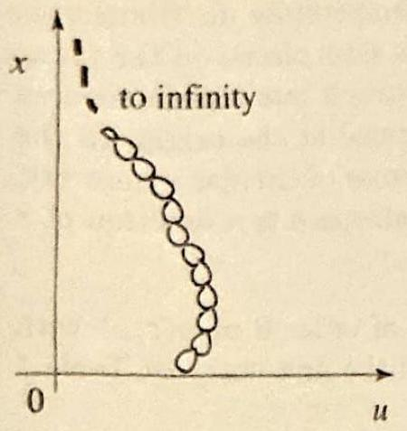

### 9.4 The Hankel Transform with Applications

As we saw in Chapter 9, Bessel functions and Bessel series are instrumental in solving problems in polar coordinates. It should not surprise you, then, to see Bessel functions arising in the treatment of similar problems over unbounded regions. Instead of Bessel series, here we will need a transform, defined in terms of Bessel functions as follows.

Suppose that $f(x)$ is defined for all $x \geq 0$. The Hankel transform of order $\nu \geq 0$ of $f(x)$ is given by

$$
\mathcal{H}_{\nu}(f)(s)=\int_{0}^{\infty} f(x) J_{\nu}(s x) x d x, \quad s \geq 0
$$

where $J_{\nu}$ is Bessel's function of order $\nu$ (see Section 9.6 for background on Bessel functions). Under certain conditions on $f$ (which we are going to assume hold) one can prove the inversion formula

$$
\mathcal{H}_{\nu} \mathcal{H}_{\nu} f=f .
$$

Thus the Hankel transform is its own inverse. This property is also shared by the cosine and sine transforms (see Exercise 21, Section 11.6). Indeed, there is a close connection between these transforms and the Hankel transform of order $\nu=\frac{1}{2}$ (see Exercise 16).

The following operational properties are needed in the applications of this section:

OPERATIONAL PROPERTIES

$$
\begin{aligned}
-s \mathcal{H}_{0}(f)(s) & =\mathcal{H}_{1}\left(f^{\prime}\right)(s) \\
\mathcal{H}_{0}\left(f^{\prime}+\frac{1}{x} f\right)(s) & =s \mathcal{H}_{1}(f)(s) \\
\mathcal{H}_{0}\left(f^{\prime \prime}+\frac{1}{x} f^{\prime}\right)(s) & =-s^{2} \mathcal{H}_{0}(f)(s)
\end{aligned}
$$

For the proofs, we will need the following properties of Bessel functions from Section 9.7:

$$
\frac{d}{d x}\left(J_{0}(s x)\right)=-s J_{1}(s x) \quad \text { and } \quad \int J_{0}(s x) x d x=\frac{1}{s} x J_{1}(s x)+C
$$

We also assume the following conditions on $f$ : For any $s$,

$$
\lim _{x \rightarrow 0} f(x) J_{0}(s x) x=0 \quad \text { and } \quad \lim _{x \rightarrow \infty} f(x) J_{0}(s x) x=0 .
$$

Since $J_{0}$ is bounded on the entire real line, these conditions are met if, for example, $f$ is bounded near zero and decays to zero faster than $1 / x$ as $x \rightarrow \infty$.

Now, to prove (3), we use (1) with $\nu=0$ and integrate by parts:

$$
\begin{aligned}
& \mathcal{H}_{0}(f)(s)=\int_{0}^{\infty} f(x) J_{0}(s x) x d x \\
& \left(u=f(x), d u=f^{\prime}(x) d x,\right. \\
& \left.d v=J_{0}(s x) x d x, v=\frac{1}{s} x J_{1}(s x)\right) \\
& =\left.\frac{1}{s} f(x) J_{0}(s x) x\right|_{0} ^{\infty}-\frac{1}{s} \underbrace{\int_{0}^{\infty} f^{\prime}(x) J_{1}(s x) x d x}_{\mathcal{H}_{1}\left(f^{\prime}\right)} .
\end{aligned}
$$

By our assumption on $f$ the first term is zero, and (3) follows. The proof of $(4)$ is similar. First let us note that

$$
f^{\prime}+\frac{1}{x} f=\frac{1}{x} \frac{d}{d x}[x f(x)]
$$

Hence

$$
\begin{aligned}
\mathcal{H}_{0}\left(\frac{1}{x} \frac{d}{d x}[x f(x)]\right)(s)= & \int_{0}^{\infty} \frac{1}{x} \frac{d}{d x}[x f(x)] J_{0}(s x) x d x \\
& \left(u=J_{0}(s x), d u=-s J_{1}(s x) d x\right. \\
\left.d v=\frac{d}{d x}[x f(x)] d x, v=x f(x)\right) & \\
= & \left.f(x) J_{0}(s x) x\right|_{0} ^{\infty}+s \int_{0}^{\infty} f(x) J_{1}(s x) x d x \\
= & s \mathcal{H}_{1}(f)(s)
\end{aligned}
$$

Finally, to prove (5), we apply (4), then (3), as follows:

$$
\mathcal{H}_{0}\left(f^{\prime \prime}+\frac{1}{x} f^{\prime}\right)(s)=s \mathcal{H}_{1}\left(f^{\prime}\right)(s)=-s^{2} \mathcal{H}_{0}(f)(s)
$$

One very useful property of the Hankel transform is its linearity:

$$
\mathcal{H}_{\nu}(a f+b g)=a \mathcal{H}_{\nu}(f)+b \mathcal{H}_{\nu}(g)
$$

The proof is simple and is left as an exercise. We are now in a position to treat some applications. We start with a hanging chain problem.

## EXAMPLE 1 Oscillations of an infinitely long hanging chain

The oscillations of a very long heavy chain can be modeled by assuming the chain is semi-infinite, with the fastened end sent to infinity. We will further assume that the transverse vibrations take place in one vertical plane. We place the chain on

Figure 1 An infinite hanging chain, end fastened at $\infty$.

Figure 2 A heated large body.

the $x$-axis, which we assume directed vertically and pointing upward (Figure 1). The boundary value problem governing the free motion of the chain becomes

$$
\begin{aligned}
\frac{\partial^{2} u}{\partial t^{2}} & =g\left[x \frac{\partial^{2} u}{\partial x^{2}}+\frac{\partial u}{\partial x}\right], & & 0<x<\infty, \quad t>0 \\
u(x, 0) & =f(x), & & u_{t}(x, 0)=v(x), x>0
\end{aligned}
$$

Here $g$ is the gravitational acceleration, $f(x)$ is the initial displacement of the chain, and $v(x)$ is its initial velocity. To proceed with the solution, we make the change of variables $z^{2}=x, 2 z d z=d x$, and transform the equations into

$$
\begin{aligned}
\frac{\partial^{2} u}{\partial t^{2}} & =\frac{g}{4}\left[\frac{\partial^{2} u}{\partial z^{2}}+\frac{1}{z} \frac{\partial u}{\partial z}\right] \\
u\left(z^{2}, 0\right) & =f\left(z^{2}\right), \quad u_{t}\left(z^{2}, 0\right)=v\left(z^{2}\right)
\end{aligned}
$$

(See Exercise 1 for details.) Let $U(s, t)$ denote the Hankel transform of order 0 of $u\left(z^{2}, t\right)$ with respect to the variable $z$. Transforming the new set of equations and using (5), we get

$$
\begin{aligned}
U_{t t}(s, t) & =-s^{2} \frac{g}{4} U(s, t) \\
U(s, 0) & =\mathcal{H}_{0}\left(f\left(z^{2}\right)\right)(s), \quad U_{t}(s, 0)=\mathcal{H}_{0}\left(v\left(z^{2}\right)\right)(s)
\end{aligned}
$$

Solving the differential equation in $t$ and using the transformed initial conditions to determine the arbitrary constants, we find

$$
U(s, t)=A(s) \cos \left(\frac{\sqrt{g}}{2} s t\right)+B(s) \sin \left(\frac{\sqrt{g}}{2} s t\right)
$$

with

$$
A(s)=\mathcal{H}_{0}\left(f\left(z^{2}\right)\right)(s), \quad \text { and } \quad B(s)=\frac{2}{\sqrt{g} s} \mathcal{H}_{0}\left(v\left(z^{2}\right)\right)(s)
$$

The solution is now obtained by taking the (inverse) Hankel transform of $U$ :

$$
u\left(z^{2}, t\right)=\int_{0}^{\infty}\left[A(s) \cos \left(\frac{\sqrt{g}}{2} s t\right)+B(s) \sin \left(\frac{\sqrt{g}}{2} s t\right)\right] J_{0}(z s) s d s
$$

Hence, in terms of $x$, we have

$$
u(x, t)=\int_{0}^{\infty}\left[A(s) \cos \left(\frac{\sqrt{g}}{2} s t\right)+B(s) \sin \left(\frac{\sqrt{g}}{2} s t\right)\right] J_{0}(\sqrt{x} s) s d s
$$

Numerical illustrations for the hanging chain problem are presented in the exercises. Our next example is a Dirichlet problem in the upper half-space.

## EXAMPLE 2 Steady-state temperature in a large body

Solve the boundary value problem in cylindrical coordinates

$$
\begin{aligned}
(\Delta u=) u_{r r}+\frac{1}{r} u_{r}+u_{z z} & =0, \quad r>0, z>0 \\
-c^{2} u_{z}(r, 0) & = \begin{cases}k & \text { if } 0<r<R \\
0 & \text { if } r>R\end{cases}
\end{aligned}
$$

This boundary value problem models the steady-state temperature distribution in a very large body in the upper half-space, with one of its sides placed on the plane $z=0$ (Figure 2). Heat is introduced in the body at a constant rate $k$ per unit area per unit time through a circular area of radius $R$, centered at the origin, in the plane $z=0$, and the rest of this plane is unheated. Because of circular symmetry, the steady-state temperature at a point in the upper half-space is a function of $r$ and $z$ only.
Solution We write $U(s, z)$ for the Hankel transform of order 0 of $u(r, z)$ with respect to $r$. Transforming the equations, using (5) and the first entry of Table 1 below, we get

$$
\begin{gathered}
-s^{2} U+\frac{d^{2} U}{d z^{2}}=0 \\
-c^{2} U_{z}(s, 0)=\mathcal{H}_{0}\left(k \mathcal{U}_{0}(R-r)\right)(s)=k \frac{R}{s} J_{1}(R s),
\end{gathered}
$$

where $\mathcal{U}_{0}$ denotes the Heaviside step function. The solution of the first differential equation in $z$ is

$$
U(s, z)=A(s) e^{-s z}+B(s) e^{s z}
$$

Expecting the transform to remain bounded, we take $U(s, z)=A(s) e^{-s z}$. To determine $A(s)$, we use the transformed boundary condition and get

$$
\begin{aligned}
-c^{2} U_{z}(s, 0) & =s c^{2} A(s)=k \frac{R}{s} J_{1}(R s) \\
A(s) & =k \frac{R}{c^{2} s^{2}} J_{1}(R s) \\
U(s, z) & =k \frac{R}{c^{2} s^{2}} J_{1}(R s) e^{-s z}
\end{aligned}
$$

The solution is the (inverse) Hankel transform of order 0,

$$
u(r, z)=\frac{k R}{c^{2}} \int_{0}^{\infty} \frac{e^{-s z}}{s} J_{1}(R s) J_{0}(r s) d s
$$

The following table of Hankel transforms of order 0 is useful in the exercises. Because the Hankel transform is its own inverse, the table can be read both ways. For example, from the first entry we have

$$
\mathcal{H}_{0}\left(\frac{a}{x} J_{1}(a x)\right)=\mathcal{U}_{0}(a-s) .
$$

Note the interesting fact that the function $e^{-x^{2} / 2}$ is its own Hankel transform. (Compare with Example 5, Section 11.1.)

|  | $f(x), \quad x \geq 0$ | $\mathcal{H}_{0}(f)(s)=\int_{0}^{\infty} f(x) J_{0}(s x) x d x, \quad s \geq 0$ |
| :--- | :--- | :--- |
| 1. | $\mathcal{U}_{0}(a-x), a>0$ | $\frac{a}{s} J_{1}(a s)$ |
| 2. | $x^{2 N} \mathcal{U}_{0}(a-x), a>0$ | $\sum_{n=0}^{N}(-1)^{n} 2^{n} a^{2 N-n+1} \frac{N!}{(N-n)!} \frac{J_{n+1}(a s)}{s^{n+1}}$ |
| 3. | $\frac{1}{x}$ | $\frac{1}{s}$ |
| 4. | $e^{-a x}, a>0$ | $\frac{a}{\sqrt{\left(s^{2}+a^{2}\right)^{3}}}$ |
| 5. | $\frac{1}{x} e^{-a x}, a>0$ | $\frac{1}{\sqrt{s^{2}+a^{2}}}$ |
| 6. | $e^{-a^{2} x^{2}}, a>0$ | $\frac{1}{2 a^{2}} e^{-s^{2} / 4 a^{2}}$ |
| 7. | $\frac{1}{x} \sin a x, a>0$ | $\frac{U_{0}(a-s)}{\sqrt{a^{2}-s^{2}}}$ |

Table 1 Hankel Transforms of order 0.

## Exercises 12.4

1. Let $z^{2}=x$, and let $\tilde{u}(z, t)=u\left(z^{2}, t\right)=u(x, t)$.
(a) Use the chain rule to obtain

$$
u_{x}=\frac{1}{2 z} \tilde{u}_{z} ; \quad u_{x x}=\frac{1}{4 z^{2}} \tilde{u}_{z z}-\frac{1}{4 z^{3}} \tilde{u}_{z}
$$

(b) Refer to Example 1 and justify the derivation of the new differential equation from (6).

In Exercises 2-3, use (1) and various properties of Bessel functions found in Sections 9.6 and 9.7 to establish the following identities. Take $\nu \geq 0$ and $a>0$.
2. $\mathcal{H}_{\nu}(f(a x))(s)=\frac{1}{a^{2}} \mathcal{H}_{\nu}(f(x))\left(\frac{s}{a}\right)$.
3. $\mathcal{H}_{\nu}\left[\frac{1}{x} f\right](s)=\frac{s}{2 \nu}\left[\mathcal{H}_{\nu+1}(f)(s)+\mathcal{H}_{\nu-1}(f)(s)\right]$
4. (a) Use properties of Bessel functions to prove that, for $a>0$,

$$
\mathcal{H}_{\nu}\left[x^{\nu} \mathcal{U}_{0}(a-x)\right]=\frac{a^{\nu+1}}{s} J_{\nu+1}(a s) .
$$

(b) Deduce entry 1 of Table 1.
5. Use Exercise 9 of Section 9.3 to derive entry 2 of Table 1.
6. (a) Show that $\mathcal{H}_{0}\left(\frac{1}{x} e^{-a x}\right)=\mathcal{L}\left(J_{0}(a x)\right)(s)$.
(b) Obtain entry 5 of Table 1 from the table of Laplace transforms.
7. Justify entry 3 of Table 1 by letting $a \rightarrow 0$ in entry 5 .
8. In this exercise we outline a proof of entry 6 of Table 1.
(a) Use the series expansion of $J_{0}$ and obtain that

$$
\mathcal{H}_{0}\left(e^{-a^{2} x^{2}}\right)(s)=\frac{1}{2 a^{2}} \sum_{n=0}^{\infty}\left[\frac{(-1)^{n}}{(n!)^{2}}\left(\frac{s^{2}}{4 a^{2}}\right)^{n} \int_{0}^{\infty} t^{n} e^{-t} d t\right]
$$

(b) Use the gamma function to show that the integral in the sum is $n$ !,
(c) Complete the proof by comparing the series with the Taylor series expansion of $\frac{1}{2 a^{2}} e^{-s^{2} / 4 a^{2}}$.
9. (a) Refer to Example 1 and describe the physical phenomenon corresponding to the data $g=9.8, f(x)=0, v(x)=\frac{1}{\sqrt{x}}$.
(b) Write down the solution in the form of an integral.
(c) Take $x=1$ and approximate the solution when $t=.1, .2, .3$.
10. Repeat Exercise 9 for the data $g=9.8, f(x)=\frac{1}{x}, v(x)=0$.
11. Approximate the steady state temperature $u(1,1)$ in Example 2, given the numerical data: $R=2, k=.5, c=.8$.
12. Transverse vibrations of a large sheet of metal. A very large sheet of metal vibrates under the action of radially symmetric pressure exerted at its surface. The boundary value problem in polar coordinates is described as follows

$$
\begin{aligned}
u_{t t} & =c^{2}\left(u_{r r}+\frac{1}{r} u_{r}\right)+p(r, t), & & r>0, t>0 \\
u(r, 0) & =f(r), \quad u_{t}(r, 0)=g(r), & & r>0
\end{aligned}
$$

where $p(r, t)$ corresponds to the outside pressure divided by the surface mass density of the sheet, $f$ is the radially symmetric initial shape of the sheet, and $g$ its radially symmetric initial velocity.

Show that the Hankel transform of order 0 (with respect to $r$ ) of the solution, $U(s, t)$, satisfies

$$
\begin{aligned}
U_{t t} & =-c^{2} s^{2} U+P(s, t) \\
U(s, 0) & =F(s), \quad U_{t}(s, 0)=G(s)
\end{aligned}
$$

13. Refer to Exercise 12. Show that if the pressure is 0 , then the Hankel transform of the solution is

$$
U(s, t)=F(s) \cos (c s t)+\frac{1}{c s} G(s) \sin (c s t)
$$

14. Do Exercise 12 with $c=1, p \equiv 0, f(r)=\left(1-r^{2}\right) \mathcal{U}_{0}(1-r), g(r)=0$.
15. (a) Do Exercise 12 with $c=1, p \equiv 0, f(r)=\sqrt{1-r^{2}} u_{0}(1-r), g(r)=0$.
(b) Plot the initial shape of the membrane at various values of $t$.
(c) Discuss the motion of the point at the origin.
16. Recalling from Section 9.6 that $J_{1 / 2}(x)=\sqrt{\frac{2}{\pi x}} \sin x$, show that $\mathcal{H}_{1 / 2}(f)= \frac{1}{\sqrt{s}} \mathcal{F}_{s}(f(x) \sqrt{x})$, where $\mathcal{F}_{s}$ is the Fourier sine transform. Argue from the fact that $\mathcal{F}_{s}$ is its own inverse transform that $\mathcal{H}_{1 / 2}$ is its own inverse transform.
